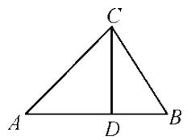
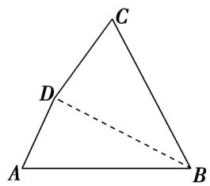
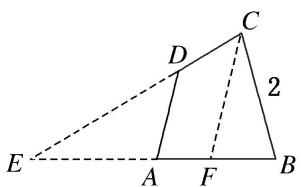
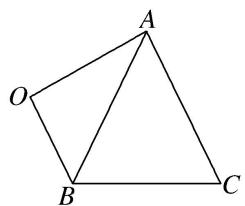
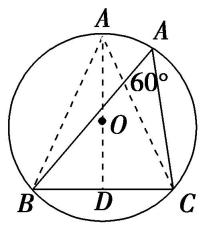

# 专题四 三角形中的最值(范围)问题

# 三角形中最值(范围)问题的解题思路

任何最值(范围)问题，其本质都是函数问题，三角形中的范围(最值)问题也不例外。三角形中的范围(最值)问题的解法主要有两种：一是用函数求解，二是利用基本不等式求解。一般求最值用基本不等式，求范围用函数。由于三角形中的最值(范围)问题一般是以角为自变量的三角函数问题，所以，除遵循函数问题的基本要求外，还有自己独特的解法。

要建立所求量(式子)与已知角或边的关系，然后把角或边作为自变量，所求量(式子)的值作为函数值，转化为函数关系，将原问题转化为求函数的值域问题。这里要利用条件中的范围限制，以及三角形自身范围限制，要尽量把角或边的范围(也就是函数的定义域)找完善，避免结果的范围过大。

# 考点一 三角形中与角或角的函数有关的最值(范围)

# 【例题选讲】

[例 1](1)在 $\triangle ABC$ 中，角 $A$ ， $B$ ， $C$ 的对边分别是 $a$ ， $b$ ， $c$ ，且 $a>b>c$ ， $a^{2}<b^{2}+c^{2}$ ，则角 $A$ 的取值范围是( )

A. $\left(\frac{\pi}{2},\pi\right)$

B. $\left(\frac{\pi}{4},\frac{\pi}{2}\right)$

C. $\left(\frac{\pi}{3},\frac{\pi}{2}\right)$

D. $\left(0,\frac{\pi}{2}\right)$

答案 C 解析 因为 $a^{2}<b^{2}+c^{2}$ ，所以 $\cos A=\frac{b^{2}+c^{2}-a^{2}}{2bc}>0$ ，所以 A 为锐角。又因为 a>b>c，所以 A 为最大角，所以角 A 的取值范围是 $\left(\frac{\pi}{3},\frac{\pi}{2}\right)$ 。

(2)在 $\triangle ABC$ 中，若 $AB=1$ ， $BC=2$ ，则角 $C$ 的取值范围是()

A. $\left\{0,\frac{\pi}{6}\right]$

B. $\begin{pmatrix}0,\frac{\pi}{2}\end{pmatrix}$

C. $\left(\frac{\pi}{6},\frac{\pi}{2}\right)$

D. $\left(\frac{\pi}{6},\frac{\pi}{2}\right]$

答案 A 解析 因为 $c = AB = 1, a = BC = 2, b = AC$ 。根据两边之和大于第三边，两边之差小于第三边可知 $1 < b < 3$ ，根据余弦定理 $\cos C = \frac{1}{2ab} (a^2 + b^2 - c^2) = \frac{1}{4b} (4 + b^2 - 1) = \frac{1}{4b} (3 + b^2) = \frac{3}{4b} + \frac{b}{4} = \frac{1}{4}\left(\frac{\sqrt{3}}{\sqrt{b}} - \sqrt{b}\right)^2 + \frac{\sqrt{3}}{2} \geq \frac{\sqrt{3}}{2}$ 。所以 $0 < C \leq \frac{\pi}{6}$ 。故选 A.

(3)在 $\triangle ABC$ 中，内角 $A$ ， $B$ ， $C$ 对应的边分别为 $a$ ， $b$ ， $c$ ， $A \neq \frac{\pi}{2}$ ， $\sin C + \sin(B - A) = \sqrt{2} \sin 2A$ ，则角 $A$ 的取值范围为（）

A. $\left\{0,\frac{\pi}{6}\right]$

B. $\left(0,\frac{\pi}{4}\right]$

C. $\left[\frac{\pi}{6},\frac{\pi}{4}\right]$

D. $\left[\frac{\pi}{6},\frac{\pi}{3}\right]$

答案 B 解析 法一: 在 $\triangle ABC$ 中, $C=\pi-(A+B)$ , 所以 $\sin(A+B)+\sin(B-A)=\sqrt{2}\sin2A$ , 即 $2\sin B\cos A=2\sqrt{2}\sin A\cos A$ , 因为 $A\neq\frac{\pi}{2}$ , 所以 $\cos A\neq0$ , 所以 $\sin B=\sqrt{2}\sin A$ , 由正弦定理得, $b=\sqrt{2}a$ , 所以 A 为锐角, 又 $\sin B=\sqrt{2}\sin A\in(0,1]$ , 所以 $\sin A\in\left[0,\frac{\sqrt{2}}{2}\right]$ , 所以 $A\in\left[0,\frac{\pi}{4}\right]$ .

法二：在 $\triangle ABC$ 中， $C = \pi - (A + B)$ ，所以 $\sin(A + B) + \sin(B - A) = \sqrt{2}\sin 2A$ ，即 $2\sin B\cos A = 2\sqrt{2}\sin A\cos A$ ，因为 $A \neq \frac{\pi}{2}$ ，所以 $\cos A \neq 0$ ，所以 $\sin B = \sqrt{2}\sin A$ ，由正弦定理，得 $b = \sqrt{2}a$ ，由余弦定理得 $\cos A = \frac{b^2 + c^2 - a^2}{2bc} =$

$\frac{\frac{1}{2}b^2 + c^2}{2bc} > \frac{2\sqrt{\frac{1}{2}b^2 \cdot c^2}}{2bc} = \frac{\sqrt{2}}{2}$ ，当且仅当 $c = \frac{\sqrt{2}}{2} b$ 时等号成立，所以 $A \in \left[0, \frac{\pi}{4}\right]$ .

(4)(2014·江苏)若 $\triangle ABC$ 的内角满足 $\sin A+\sqrt{2}\sin B=2\sin C$ ，则 $\cos C$ 的最小值是\_\_\_\_.

答案 $\frac{\sqrt{6} - \sqrt{2}}{4}$ 解析 由 $\sin A + \sqrt{2}\sin B = 2\sin C$ ，结合正弦定理得 $a + \sqrt{2}b = 2c$ 。由余弦定理得 $\cos C = \frac{a^2 + b^2 - c^2}{2ab} = \frac{a^2 + b^2 - \frac{(a + \sqrt{2}b)^2}{4}}{2ab} = \frac{\frac{3}{4}a^2 + \frac{1}{2}b^2 - \frac{\sqrt{2}ab}{2}}{2ab} \geqslant \frac{2\sqrt{\left(\frac{3}{4}a^2\right)\left(\frac{1}{2}b^2\right)} - \frac{\sqrt{2}ab}{2}}{2ab} = \frac{\sqrt{6} - \sqrt{2}}{4}$ ，故 $\frac{\sqrt{6} - \sqrt{2}}{4} \leqslant \cos C < 1$ ，故 $\cos C$ 的最小值为 $\frac{\sqrt{6} - \sqrt{2}}{4}$ .

(5)设 $\triangle ABC$ 的三边 $a, b, c$ 所对的角分别为 $A, B, C$ , 已知 $a^{2}+2b^{2}=c^{2}$ , 则 $\frac{\tan C}{\tan A}=$ \_\_\_\_; $\tan B$ 的最大值为\_\_\_\_.

答案 $-3\frac{\sqrt{3}}{3}$ 解析 由正弦定理可得 $\frac{\tan C}{\tan A} = \frac{\sin C}{\sin A}\cdot \frac{\cos A}{\cos C} = \frac{c}{a}\cdot \frac{\cos A}{\cos C}$ ，再结合余弦定理可得 $\frac{\tan C}{\tan A} = \frac{c}{a}\cdot \frac{\cos A}{\cos C} = \frac{c}{a}\cdot \frac{b^2 + c^2 - a^2}{2bc}\cdot \frac{2ab}{a^2 + b^2 - c^2} = \frac{b^2 + c^2 - a^2}{a^2 + b^2 - c^2}$ . 由 $a^2 + 2b^2 = c^2$ ，得 $\frac{\tan C}{\tan A} = \frac{b^2 + a^2 + 2b^2 - a^2}{a^2 + b^2 - a^2 - 2b^2} = -3$ 。由已知条件及大边对大角可知 $0 < A < \frac{\pi}{2} < C < \pi$ ，从而由 $A + B + C = \pi$ 可知 $\tan B = -\tan (A + C) = -\frac{\tan A + \tan C}{1 - \tan A\tan C} = -\frac{1 + \frac{\tan C}{\tan A}}{\frac{1}{\tan A} - \tan C} = \frac{2}{\frac{3}{-\tan C} + (-\tan C)}$ ，因为 $\frac{\pi}{2} < C < \pi$ ，所以 $\frac{3}{-\tan C} + (-\tan C)\geq 2\sqrt{\frac{3}{-\tan C}\times(-\tan C)} = 2\sqrt{3}$ （当且仅当 $\tan C = -\sqrt{3}$ 时取等号），从而 $\tan B\leq \frac{2}{2\sqrt{3}} = \frac{\sqrt{3}}{3}$ ，即 $\tan B$ 的最大值为 $\frac{\sqrt{3}}{3}$ .

(6)在锐角 $\triangle ABC$ 中，角 $A, B, C$ 的对边分别为 $a, b, c$ 。若 $a = 2b\sin C$ ，则 $\tan A + \tan B + \tan C$ 的最小值是（）

A. 4

B. $3\sqrt{3}$

C. 8

D. $6\sqrt{3}$

解析：由 $a = 2b\sin C$ 得 $\sin A = 2\sin B\sin C$ ， $\therefore \sin (B + C) = \sin B\cos C + \cos B\sin C = 2\sin B\sin C$ ，即 $\tan B + \tan C = 2\tan B\tan C$ 。又三角形中的三角恒等式 $\tan A + \tan B + \tan C = \tan A\tan B\tan C$ ， $\therefore \tan B\tan C = \frac{\tan A}{\tan A - 2}$ ，∴ $\tan A\tan B\tan C = \tan A\cdot \frac{\tan A}{\tan A - 2}$ ，令 $\tan A - 2 = t$ ，得 $\tan A\tan B\tan C = \frac{(t + 2)^2}{t} = t + \frac{4}{t} +4\geqslant 8$ ，当且仅当 $t = \frac{4}{t}$ ，即 $t = 2$ ， $\tan A = 4$ 时，取等号.

# 【对点训练】

1. 在不等边三角形 $ABC$ 中, 角 $A, B, C$ 所对的边分别为 $a, b, c$ , 其中 $a$ 为最大边, 如果 $\sin^2(B + C) < \sin^2 B + \sin^2 C$ , 则角 $A$ 的取值范围为 ( )

A. $\left(0,\frac{\pi}{2}\right)$

B. $\left(\frac{\pi}{4},\frac{\pi}{2}\right)$

C. $\left(\frac{\pi}{6},\frac{\pi}{3}\right)$

D. $\left(\frac{\pi}{3},\frac{\pi}{2}\right)$

1. 答案 D 解析 由题意得 $\sin^2 A < \sin^2 B + \sin^2 C$ ，再由正弦定理得 $a^2 < b^2 + c^2$ ，即 $b^2 + c^2 - a^2 > 0$ 。则 $\cos A$

$= \frac{b^2 + c^2 - a^2}{2bc} > 0, \because 0 < A < \pi, \therefore 0 < A < \frac{\pi}{2}$ . 又 $a$ 为最大边， $\therefore A > \frac{\pi}{3}$ . 因此得角 $A$ 的取值范围是 $\left(\frac{\pi}{3}, \frac{\pi}{2}\right)$ .

2. 已知 $\triangle ABC$ 的三个内角 $A, B, C$ 所对的边分别为 $a, b, c, a\sin A\sin B + b\cos^2 A = 2a$ ，则角 $A$ 的取值范围是（）

A. $\left(\frac{\pi}{6},\frac{2\pi}{3}\right]$

B. $\left[\frac{\pi}{6},\frac{\pi}{4}\right]$

C. $\left[0,\frac{\pi}{6}\right]$

D. $\left[\frac{\pi}{6},\frac{\pi}{3}\right]$

2. 答案 C 解析 在 $\triangle ABC$ 中，由正弦定理化简已知的等式得 $\sin A\sin A\sin B + \sin B\cos^2 A = 2\sin A$ ，即 $\sin B(\sin^2 A + \cos^2 A) = 2\sin A$ ，所以 $\sin B = 2\sin A$ ，由正弦定理得 $b = 2a$ ，所以 $\cos A = \frac{b^2 + c^2 - a^2}{2bc} = \frac{4a^2 + c^2 - a^2}{4ac} = \frac{3a^2 + c^2}{4ac} \geqslant \frac{2\sqrt{3}ac}{4ac} = \frac{\sqrt{3}}{2}$ （当且仅当 $c^2 = 3a^2$ ，即 $c = \sqrt{3}a$ 时取等号），因为 $A$ 为 $\triangle ABC$ 的内角，且 $y = \cos x$ 在 $(0, \pi)$ 上是减函数，所以 $0 < A \leqslant \frac{\pi}{6}$ ，故角 $A$ 的取值范围是 $\left[0, \frac{\pi}{6}\right]$ .

3. 已知 $a, b, c$ 分别是 $\triangle ABC$ 内角 $A, B, C$ 的对边，满足 $\cos A \sin B \sin C + \cos B \sin A \sin C = 2 \cos C \sin A \sin B$ ，则 $C$ 的最大值为 \_\_\_\_.

3. 答案 $\frac{\pi}{3}$ 解析 由正弦定理，得 $bccosA + accosB = 2abcosC$ ，由余弦定理，得 $bc\cdot \frac{b^2 + c^2 - a^2}{2bc} + ac\cdot \frac{c^2 + a^2 - b^2}{2ac} = 2ab\cdot \frac{a^2 + b^2 - c^2}{2ab}, \therefore a^2 + b^2 = 2c^2, \therefore \cos C = \frac{a^2 + b^2 - c^2}{2ab} = \frac{a^2 + b^2 - \frac{1}{2}(a^2 + b^2)}{2ab} = \frac{a^2 + b^2}{4ab} \geqslant \frac{2ab}{4ab} = \frac{1}{2}$ ，当且仅当 $a = b$ 时，取等号． $\because 0 < C < \pi, \therefore 0 < C \leqslant \frac{\pi}{3}, \therefore C$ 的最大值为 $\frac{\pi}{3}$ .

4. 在 $\triangle ABC$ 中，角 $A, B, C$ 所对的边分别是 $a, b, c$ ，若 $b^{2}+c^{2}=2a^{2}$ ，则 $\cos A$ 的最小值为\_\_\_\_。

4. 答案 $\frac{1}{2}$ 解析 因为 $b^{2} + c^{2} = 2a^{2}$ ，则由余弦定理可知 $a^2 = 2bc\cos A$ ，所以 $\cos A = \frac{a^2}{2bc} = \frac{1}{2} \times \frac{b^2 + c^2}{2bc} \geq \frac{1}{2} \times \frac{2bc}{2bc}$ $= \frac{1}{2}$ (当且仅当 $b = c$ 时等号成立)，即 $\cos A$ 的最小值为 $\frac{1}{2}$ .

5. 已知 $\triangle ABC$ 的内角 $A, B, C$ 的对边分别为 $a, b, c$ , 且 $\cos 2A + \cos 2B = 2\cos 2C$ , 则 $\cos C$ 的最小值为 ( )

A. $\frac{\sqrt{3}}{2}$

B. $\frac{\sqrt{2}}{2}$

C. $\frac{1}{2}$

D. $-\frac{1}{2}$

5. 答案 C 解析 因为 $\cos2A+\cos2B=2\cos2C$ ，所以 $1-2\sin^{2}A+1-2\sin^{2}B=2-4\sin^{2}C$ ，得 $a^{2}+b^{2}=2c^{2}$ ， $\cos C=\frac{a^{2}+b^{2}-c^{2}}{2ab}\geq\frac{\frac{a^{2}+b^{2}}{2}}{a^{2}+b^{2}}=\frac{1}{2}$ ，当且仅当 a=b 时等号成立，故选 C.

6. 在钝角 $\triangle ABC$ 中, 角 $A, B, C$ 所对的边分别为 $a, b, c, B$ 为钝角, 若 $a\cos A = b\sin A$ , 则 $\sin A + \sin C$ 的最大值为 ( )

A. $\sqrt{2}$

B. $\frac{9}{8}$

C. 1

D. $\frac{7}{8}$

6. 答案 B 解析 $\because a\cos A = b\sin A$ ，由正弦定理可得， $\sin A\cos A = \sin B\sin A$ ， $\because \sin A \neq 0$ ， $\therefore \cos A = \sin A$

B，又 B 为钝角， $\therefore B=A+\frac{\pi}{2}$ ， $\sin A+\sin C=\sin A+\sin(A+B)=\sin A+\cos2A=\sin A+1-2\sin^{2}A=-2\left(\sin A-\frac{1}{4}\right)^{2}+\frac{9}{8}$ ， $\therefore \sin A+\sin C$ 的最大值为 $\frac{9}{8}$ .

7. 在 $\triangle ABC$ 中，角 $A, B, C$ 所对的边分别为 $a, b, c$ ，且 $a\cos B - b\cos A = \frac{1}{2}c$ ，当 $\tan(A - B)$ 取最大值时，角 $B$ 的值为\_\_\_\_。

7. 答案 $\frac{\pi}{6}$ 解析 由 $a\cos B - b\cos A = \frac{1}{2} c$ 及正弦定理，得 $\sin A\cos B - \sin B\cos A = \frac{1}{2}\sin C = \frac{1}{2}\sin (A + B) = \frac{1}{2}$ ( $\sin A\cos B + \cos A\sin B$ ), 整理得 $\sin A\cos B = 3\cos A\sin B$ ，即 $\tan A = 3\tan B$ ，易得 $\tan A > 0, \tan B > 0$ 。所以 $\tan (A - B) = \frac{\tan A - \tan B}{1 + \tan A\tan B} = \frac{2\tan B}{1 + 3\tan^2B} = \frac{2}{\frac{1}{\tan B} + 3\tan B} \leqslant \frac{2}{2\sqrt{3}} = \frac{\sqrt{3}}{3}$ ，当且仅当 $\frac{1}{\tan B} = 3\tan B$ ，即 $\tan B = \frac{\sqrt{3}}{3}$ 时， $\tan (A - B)$ 取得最大值，所以 $B = \frac{\pi}{6}$ .

8. 在 $\triangle ABC$ 中，内角 $A, B, C$ 所对的边分别为 $a, b, c, a\sin A + b\sin B = c\sin C - \sqrt{2}a\sin B$ ，则 $\sin 2A\tan^{2}B$ 的最大值是\_\_\_\_。

8. 答案 $3 - 2\sqrt{2}$ 解析 依题意得 $a^2 + b^2 - c^2 = -\sqrt{2}ab$ ，则 $2ab\cos C = -\sqrt{2}ab$ ，所以 $\cos C = -\frac{\sqrt{2}}{2}$ ，所以 $C = \frac{3\pi}{4}$ ， $A = \frac{\pi}{4} - B$ ，所以 $\sin 2A\tan^2 B = \cos 2B\tan^2 B = \frac{(1 - \tan^2B)\tan^2B}{1 + \tan^2B}$ 。令 $1 + \tan^2 B = t$ ，其中 $t \in (1,2)$ ，则有 $\frac{(1 - \tan^2B)\tan^2B}{1 + \tan^2B} = \frac{(2 - t)(t - 1)}{t} = -\left(t + \frac{2}{t}\right) + 3 \leq 3 - 2\sqrt{2}$ ，当且仅当 $t = \sqrt{2}$ 时取等号。故 $\sin 2A\tan^2 B$ 的最大值是 $3 - 2\sqrt{2}$ 。

9. 在 $\triangle ABC$ 中，若 $\sin C=2\cos A\cos B$ ，则 $\cos^{2}A+\cos^{2}B$ 的最大值为\_\_\_\_。

9. 答案 $\frac{\sqrt{2} + 1}{2}$ 解析 解法1 因为 $\sin C = 2\cos A\cos B$ ，所以， $\sin (A + B) = 2\cos A\cos B$ ，化简得 $\tan A + \tan B = 2$ ， $\cos^2 A + \cos^2 B = \frac{\cos^2 A}{\sin^2 A + \cos^2 A} + \frac{\cos^2 B}{\sin^2 B + \cos^2 B} = \frac{1}{\tan^2 A + 1} + \frac{1}{\tan^2 B + 1} = \frac{\tan^2 A + \tan^2 B + 2}{(\tan A\tan B)^2 + \tan^2 A + \tan^2 B + 1} = \frac{(\tan A + \tan B)^2 - 2\tan A\tan B + 2}{(\tan A\tan B)^2 + (\tan A + \tan B)^2 - 2\tan A\tan B + 1} = \frac{6 - 2\tan A\tan B}{(\tan A\tan B)^2 - 2\tan A\tan B + 5}$ 。因为分母 $(\tan A\tan B)^2 - 2\tan A\tan B + 5 > 0$ ，所以令 $6 - 2\tan A\tan B = t(t > 0)$ ，则 $\cos^2 A + \cos^2 B = \frac{4t}{t^2 - 8t + 32} = \frac{4}{t + \frac{32}{t} - 8} \leq \frac{4}{2\sqrt{32} - 8} = \frac{\sqrt{2} + 1}{2}$ （当且仅当 $t = 4\sqrt{2}$ 时取等号）。

解法2 由解法1得 $\tan A + \tan B = 2$ ，令 $\tan A = 1 + t, \tan B = 1 - t$ ，则 $\cos^2 A + \cos^2 B = \frac{1}{\tan^2 A + 1} + \frac{1}{\tan^2 B + 1} = \frac{1}{t^2 + 2 + 2t} + \frac{1}{t^2 + 2 - 2t} = \frac{2(t^2 + 2)}{(t^2 + 2)^2 - 4t^2}$ ，令 $d = t^2 + 2 \geq 2$ ，则 $\cos^2 A + \cos^2 B = \frac{2d}{d^2 - 4d + 8} = \frac{2}{d + \frac{8}{d} - 4} \leq \frac{2}{2\sqrt{8} - 4} = \frac{\sqrt{2} + 1}{2}$ ，当且仅当 $d = 2\sqrt{2}$ 时等号成立.

解法3 因为 $\sin C = 2\cos A\cos B$ ，所以 $\sin C = \cos (A + B) + \cos (A - B)$ ，即 $\cos (A - B) = \sin C + \cos C$ ， $\cos^2 A + \cos^2 B = \frac{1 + \cos 2A}{2} + \frac{1 + \cos 2B}{2} = 1 + \cos (A + B)\cos (A - B) = 1 - \cos C(\sin C + \cos C) = \frac{1}{2} - \frac{1}{2} (\sin 2C + \cos 2C) = \frac{1}{2} - \frac{\sqrt{2}}{2}\sin (2C + \frac{\pi}{4}) \leq \frac{1}{2} + \frac{\sqrt{2}}{2} = \frac{\sqrt{2} + 1}{2}$ ，当且仅当 $2C + \frac{\pi}{4} = \frac{3\pi}{2}$ ，即 $C = \frac{5\pi}{8}$ 时取等号.

10. 在 $\triangle ABC$ 中，角 $A, B, C$ 的对边分别为 $a, b, c$ ，若 $3a\cos C+b=0$ ，则 $\tan B$ 的最大值是\_\_\_\_。

10. 答案 $\frac{3}{4}$ 解析 在 $\triangle ABC$ 中，因为 $3a\cos C + b = 0$ ，所以 $C$ 为钝角，由正弦定理得 $3\sin A\cos C + \sin (A + C) = 0$ ， $3\sin A\cos C + \sin A\cos C + \cos A\sin C = 0$ ，所以 $4\sin A\cos C = -\cos A\cdot \sin C$ ，即 $\tan C = -4\tan A$ 。因为 $\tan A > 0$ ，所以 $\tan B = -\tan (A + C) = -\frac{\tan A + \tan C}{1 - \tan A\tan C} = \frac{\tan A + \tan C}{\tan A\tan C - 1} = \frac{-3\tan A}{-4\tan^2A - 1} = \frac{3}{4\tan A + \frac{1}{\tan A}}\leqslant \frac{3}{2\sqrt{4}} = \frac{3}{4}$ 当且仅当 $\tan A = \frac{1}{2}$ 时取等号，故 $\tan B$ 的最大值是 $\frac{3}{4}$ 。

11. (2016 江苏)在锐角三角形 $ABC$ 中, 若 $\sin A = 2\sin B\sin C$ , 则 $\tan A\tan B\tan C$ 的最小值是

11. 答案 8 解析 因为 $\sin A = \sin (B + C) = 2\sin B\sin C$ ，所以 $\tan B + \tan C = 2\tan B\tan C$ ，因此 $\tan A\tan B\tan C = \tan A + \tan B + \tan C = \tan A + 2\tan B\tan C \geq 2\sqrt{2\tan A\tan B\tan C}$ ，所以 $\tan A\tan B\tan C \geq 8$ 。

12. 在 $\triangle ABC$ 中，角 $A, B, C$ 所对的边分别为 $a, b, c$ ，若 $\triangle ABC$ 为锐角三角形，且满足 $b^{2}-a^{2}=ac$ ，则 $\frac{1}{\tan A}-\frac{1}{\tan B}$ 的取值范围是\_\_\_\_。

12. 答案 $\left(1, \frac{2\sqrt{3}}{3}\right)$ 解析 思路一，根据题意可知，本题可以从“解三角形和三角恒等变换”角度切入，又因已知锐角和边的关系，而所求为正切值，故把条件化为角的正弦和余弦来处理即可；思路二，本题所求为正切值，故可以构造直角三角形，用边的关系处理.

解法1 原式可化为 $\frac{1}{\tan A} - \frac{1}{\tan B} = \frac{\cos A}{\sin A} - \frac{\cos B}{\sin B} = \frac{\sin B \cos A - \cos B \sin A}{\sin A \sin B} = \frac{\sin (B - A)}{\sin A \sin B}$ . 由 $b^2 - a^2 = ac$ 得， $b^2 = a^2 + ac = a^2 + c^2 - 2ac \cos B$ ，即 $a = c - 2ac \cos B$ ，也就是 $\sin A = \sin C - 2\sin A \cos B$ ，即 $\sin A = \sin (A + B) - 2\sin A \cos B = \sin (B - A)$ ，由于 $\triangle ABC$ 为锐角三角形，所以有 $A = B - A$ ，即 $B = 2A$ ，故 $\frac{1}{\tan A} - \frac{1}{\tan B} = \frac{1}{\sin B}$ ，在锐角三角形 $ABC$ 中易知， $\frac{\pi}{3} < B < \frac{\pi}{2}$ ， $\frac{\sqrt{3}}{2} < \sin B < 1$ ，故 $\frac{1}{\tan A} - \frac{1}{\tan B} \in \left(1, \frac{2\sqrt{3}}{3}\right)$ .

解法2 根据题意，作 $CD \perp AB$ ，垂足为点 $D$ ，画出示意图．因为 $b^{2} - a^{2} = AD^{2} - BD^{2} = (AD + BD)(AD - BD) = c(AD - BD) = ac$ ，所以 $AD - BD = a$ ，而 $AD + BD = c$ ，所以 $BD = \frac{c - a}{2}$ ，则 $c > a$ ，即 $\frac{c}{a} > 1$ ，在锐角三角形 $ABC$ 中有 $b^{2} + a^{2} > c^{2}$ ，则 $a^{2} + a^{2} + ac > c^{2}$ ，即 $\left(\frac{c}{a}\right)^{2} - \frac{c}{a} - 2 < 0$ ，解得 $-1 < \frac{c}{a} < 2$ ，因此， $1 < \frac{c}{a} < 2$ ．而 $\frac{1}{\tan A} - \frac{1}{\tan B} = \frac{AD - BD}{CD} = \frac{a}{\sqrt{a^2 - \left(\frac{c - a}{2}\right)^2}} = \frac{1}{\sqrt{1 - \frac{1}{4}\left(\frac{c}{a} - 1\right)^2}} \in \left(1, \frac{2\sqrt{3}}{3}\right)$ .

text_image

C
A D B

13. 在锐角三角形 $ABC$ 中, 已知 $2 \sin^2 A + \sin^2 B = 2 \sin^2 C$ , 则 $\frac{1}{\tan A} + \frac{1}{\tan B} + \frac{1}{\tan C}$ 的最小值为 \_\_\_\_.

13. 答案 $\frac{\sqrt{13}}{2}$ 解析 解法 1 因为 $2\sin^2 A + \sin^2 B = 2\sin^2 C$ ，所以由正弦定理可得 $2a^2 + b^2 = 2c^2$ ，由余弦定理及正弦定理可得 $\cos C = \frac{a^2 + b^2 - c^2}{2ab} = \frac{b^2}{4ab} = \frac{b}{4a} = \frac{\sin B}{4\sin A}$ ，又因为 $\sin B = \sin (A + C) = \sin A\cos C + \cos A\sin C$ ，所以 $\cos C = \frac{\sin A\cos C + \cos A\sin C}{4\sin A} = \frac{\cos C}{4} + \frac{\sin C}{4\tan C}$ ，可得 $\tan C = 3\tan A$ ，代入 $\tan A + \tan B + \tan C = \tan A\tan B\tan C$ 得 $\tan B = \frac{4\tan A}{3\tan^2A - 1}$ ，所以 $\frac{1}{\tan A} + \frac{1}{\tan B} + \frac{1}{\tan C} = \frac{1}{\tan A} + \frac{3\tan^2A - 1}{4\tan A} + \frac{1}{3\tan A} = \frac{3\tan A}{4} + \frac{13}{12\tan A}$ ，因为 $A \in \left(0, \frac{\pi}{2}\right)$ ，所以 $\tan A > 0$ ，所以 $\frac{3\tan A}{4} + \frac{13}{12\tan A} \geq 2\sqrt{\frac{3\tan A}{4} \times \frac{13}{12\tan A}} = \frac{\sqrt{13}}{2}$ ，当且仅当 $\frac{3\tan A}{4} = \frac{13}{12\tan A}$ ，即 $\tan A = \frac{\sqrt{13}}{3}$ 时取“=”。所以 $\frac{1}{\tan A} + \frac{1}{\tan B} + \frac{1}{\tan C}$ 的最小值为 $\frac{\sqrt{13}}{2}$ 。

解法2 过点 $B$ 作 $BD \perp AC$ 于 $D$ , 设 $AD = x$ , $DC = y$ , $BD = h$ , 则 $\tan A = \frac{h}{x}$ , $\tan C = \frac{h}{y}$ . 同解法1可得 $\tan C = 3\tan A$ , $\tan B = \frac{4\tan A}{3\tan^2A - 1}$ 则 $\frac{h}{y} = \frac{3h}{x}$ , 即 $x = 3y$ , $\tan B = \frac{\frac{4h}{x}}{3\left(\frac{h}{x}\right)^2 - 1} = \frac{4hx}{3h^2 - x^2}$ , 所以 $\frac{1}{\tan A} + \frac{1}{\tan B} + \frac{1}{\tan C} = \frac{x}{h} + \frac{3h^2 - x^2}{4hx} + \frac{y}{h} = \frac{3y}{h} + \frac{3h^2 - 9y^2}{12hy} + \frac{y}{h} = \frac{13y}{4h} + \frac{h}{4y} \geq \frac{\sqrt{13}}{2}$ . 当且仅当 $\frac{13y}{4h} = \frac{h}{4y}$ , 即 $y = \frac{1}{13}h$ 时取“=”．所以 $\frac{1}{\tan A} + \frac{1}{\tan B} + \frac{1}{\tan C}$ 的最小值为 $\frac{\sqrt{13}}{2}$ .

# 考点二 三角形中与边或周长有关的最值(范围)

# 【例题选讲】

[例 2](1)已知 $\triangle ABC$ 中，角 A, $\frac{3}{2}B$ , C 成等差数列，且 $\triangle ABC$ 的面积为 $1+\sqrt{2}$ ，则 AC 边的长的最小值是 \_\_\_\_.

答案 2 解析 $\because A, \frac{3}{2} B, C$ 成等差数列， $\therefore A + C = 3B$ ，又 $A + B + C = \pi$ ， $\therefore B = \frac{\pi}{4}$ 。设角 $A, B, C$ 所对的边分别为 $a, b, c$ ，由 $S_{\triangle ABC} = \frac{1}{2} ac \sin B = 1 + \sqrt{2}$ 得 $ac = 2(2 + \sqrt{2})$ ，由余弦定理及 $a^2 + c^2 \geq 2ac$ ，得 $b^2 \geq (2 - \sqrt{2})ac$ ，即 $b^2 \geq (2 - \sqrt{2}) \times 2(2 + \sqrt{2})$ ， $\therefore b \geq 2$ （当且仅当 $a = c$ 时等号成立）， $\therefore AC$ 边的长的最小值为 2.

(2)(2015·全国 I )在平面四边形 ABCD 中, $\angle A = \angle B = \angle C = 75^{\circ}, BC = 2$ , 则 AB 的取值范围是 \_\_\_\_.

答案 $(\sqrt{6} - \sqrt{2}, \sqrt{6} + \sqrt{2})$ 解析 通法：依题意作出四边形 $ABCD$ ，连结 $BD$ 。令 $BD = x, AB = y, \angle CDB = \alpha, \angle CBD = \beta$ 。在 $\triangle BCD$ 中，由正弦定理得 $\frac{2}{\sin \alpha} = \frac{x}{\sin 75}$ 。由题意可知， $\angle ADC = 135^\circ$ ，则 $\angle ADB$

$= 135^{\circ} - \alpha$ . 在 $\triangle ABD$ 中，由正弦定理得 $\frac{x}{\sin 75^{\circ}} = \frac{y}{\sin(135^{\circ} - \alpha)}$ . 所以 $\frac{y}{\sin(135^{\circ} - \alpha)} = \frac{2}{\sin \alpha}$ ，即 $y = \frac{2\sin(135^{\circ} - \alpha)}{\sin \alpha}$ $= \frac{2\sin[90^{\circ} - (\alpha - 45^{\circ})]}{\sin \alpha} = \frac{2\cos(\alpha - 45^{\circ})}{\sin \alpha} = \frac{\sqrt{2}(\cos \alpha + \sin \alpha)}{\sin \alpha}$ . 因为 $0^{\circ} < \beta < 75^{\circ}, \alpha + \beta + 75^{\circ} = 180^{\circ}$ ，所以 $30^{\circ} < \alpha < 105^{\circ}$ ，当 $\alpha = 90^{\circ}$ 时，易得 $y = \sqrt{2}$ ；当 $\alpha \neq 90^{\circ}$ 时， $y = \frac{\sqrt{2}(\cos \alpha + \sin \alpha)}{\sin \alpha} = \sqrt{2}\left(\frac{1}{\tan \alpha} + 1\right)$ . 又 $\tan 30^{\circ} = \frac{\sqrt{3}}{3}$ ， $\tan 105^{\circ} = \tan (60^{\circ} + 45^{\circ}) = \frac{\tan 60^{\circ} + \tan 45^{\circ}}{1 - \tan 60^{\circ} \tan 45^{\circ}} = -2 - \sqrt{3}$ ，结合正切函数的性质知， $\frac{1}{\tan \alpha} \in (\sqrt{3} - 2, \sqrt{3})$ ，且 $\frac{1}{\tan \alpha} \neq 0$ ，所以 $y = \sqrt{2}\left(\frac{1}{\tan \alpha} + 1\right) \in (\sqrt{6} - \sqrt{2}, \sqrt{2}) \cup (\sqrt{2}, \sqrt{6} + \sqrt{2})$ 。综上所述： $y \in (\sqrt{6} - \sqrt{2}, \sqrt{6} + \sqrt{2})$ .

text_image

C
D
A
B

提速方法：画出四边形 $ABCD$ ，延长 $CD$ ， $BA$ ，探求出 $AB$ 的取值范围。如图所示，延长 $BA$ 与 $CD$ 相交于点 $E$ ，过点 $C$ 作 $CF \parallel AD$ 交 $AB$ 于点 $F$ ，则 $BF < AB < BE$ 。在等腰三角形 $CFB$ 中， $\angle FCB = 30^\circ$ ， $CF = BC = 2$ ， $\therefore BF = \sqrt{2^2 + 2^2 - 2 \times 2 \times 2 \cos 30^\circ} = \sqrt{6} - \sqrt{2}$ 。在等腰三角形 $ECB$ 中， $\angle CEB = 30^\circ$ ， $\angle ECB = 75^\circ$ ， $BE = CE$ ， $BC = 2$ ， $\frac{BE}{\sin 75^\circ} = \frac{2}{\sin 30^\circ}$ ， $\therefore BE = \frac{2}{\frac{1}{2}} \times \frac{\sqrt{6} + \sqrt{2}}{4} = \sqrt{6} + \sqrt{2}$ 。 $\therefore \sqrt{6} - \sqrt{2} < AB < \sqrt{6} + \sqrt{2}$ 。

text_image

C
D
2
E
A
F
B

(3)在 $\triangle ABC$ 中，若 $C=2B$ ，则 $\frac{c}{b}$ 的取值范围为\_\_\_\_.

答案 (1, 2) 解析 因为 $A + B + C = \pi$ , $C = 2B$ , 所以 $A = \pi - 3B > 0$ , 所以 $0 < B < \frac{\pi}{3}$ , 所以 $\frac{1}{2} < \cos B < 1$ . 因为 $\frac{c}{b} = \frac{\sin C}{\sin B} = \frac{\sin 2B}{\sin B} = 2\cos B$ , 所以 $1 < 2\cos B < 2$ , 故 $1 < \frac{c}{b} < 2$ .

(4) (2018·北京) 若 $\triangle ABC$ 的面积为 $\frac{\sqrt{3}}{4} (a^2 + c^2 - b^2)$ ，且 $\angle C$ 为钝角，则 $\angle B =$ \_\_\_\_； $\frac{c}{a}$ 的取值范围是 \_\_\_\_.

答案 $60^{\circ}$ $(2, +\infty)$ 解析 由已知得 $\frac{\sqrt{3}}{4} (a^{2} + c^{2} - b^{2}) = \frac{1}{2} ac\sin B$ ，所以 $\frac{\sqrt{3}(a^2 + c^2 - b^2)}{2ac} = \sin B$ ，由余弦定理得 $\sqrt{3}\cos B = \sin B$ ，所以 $\tan B = \sqrt{3}$ ，所以 $B = 60^{\circ}$ ，又 $C > 90^{\circ}$ ， $B = 60^{\circ}$ ，所以 $A < 30^{\circ}$ ，且 $A + C = 120^{\circ}$ ，所以 $\frac{c}{a} = \frac{\sin C}{\sin A} = \frac{\sin(120^{\circ} - A)}{\sin A} = \frac{1}{2} + \frac{\sqrt{3}}{2\tan A}$ . 又 $A < 30^{\circ}$ ，所以 $0 < \tan A < \frac{\sqrt{3}}{3}$ ，即 $\frac{1}{\tan A} >\sqrt{3}$ ，所以 $\frac{c}{a} >\frac{1}{2} + \frac{3}{2} = 2$ .

(5)在 $\triangle ABC$ 中，角 $A, B, C$ 所对的边分别为 $a, b, c$ ，且满足 $\sin A\sin(B-C)=\sin B\sin C\cos A$ ，则 $\frac{ab}{c^{2}}$ 的最大值为\_\_\_\_.

答案 $\frac{3}{2}$ 解析 由 $\sin A\sin (B - C) = \sin B\sin C\cos A$ ，得 $\sin A(\sin B\cos C - \cos B\sin C) = \sin B\sin C\cos A$ ，由正弦定理可得 $ab\cos C - ac\cos B = bc\cos A$ ，由余弦定理可得 $ab\frac{a^2 + b^2 - c^2}{2ab} -ac\frac{a^2 + c^2 - b^2}{2ac} = bc\frac{b^2 + c^2 - a^2}{2bc}$ ，化简得 $a^2 +b^2 = 3c^2$ ，又因为 $3c^{2} = a^{2} + b^{2}\geqslant 2ab$ ，当且仅当 $a = b$ 时等号成立，可得 $\frac{ab}{c^2}\leqslant \frac{3}{2}$ ，所以 $\frac{ab}{c^2}$ 的最大值为 $\frac{3}{2}$

(6)在 $\triangle ABC$ 中，若 $C=60^{\circ}$ ， $c=2$ ，则 $a+b$ 的取值范围为\_\_\_\_。

答案 (2, 4] 解析 由题意，得 $c = 2$ 。由余弦定理可得 $c^2 = a^2 + b^2 - 2ab\cos C$ ，即 $4 = a^2 + b^2 - ab = (a + b)^2 - 3ab \geq \frac{1}{4}(a + b)^2$ ，得 $a + b \leq 4$ 。又由三角形的性质可得 $a + b > 2$ ，综上可得 $2 < a + b \leq 4$ 。

(7)在 $\triangle ABC$ 中，角 $A$ ， $B$ ， $C$ 所对的边分别为 $a$ ， $b$ ， $c$ ，且满足 $b^{2}+c^{2}-a^{2}=bc$ ， $\overrightarrow{AB}\cdot\overrightarrow{BC}>0$ ， $a=\frac{\sqrt{3}}{2}$ ，则 $b+c$ 的取值范围是（）

A. $\left(1, \frac{3}{2}\right)$

B. $\left(\frac{\sqrt{3}}{2},\frac{3}{2}\right)$

C. $\left(\frac{1}{2},\frac{3}{2}\right)$

D. $\left(\frac{1}{2},\frac{3}{2}\right]$

答案 B 解析 在 $\triangle ABC$ 中， $b^{2}+c^{2}-a^{2}=bc$ ，由余弦定理可得 $\cos A=\frac{b^{2}+c^{2}-a^{2}}{2bc}=\frac{bc}{2bc}=\frac{1}{2}$ ，因为 $A$ 是 $\triangle ABC$ 的内角，所以 $A=60^{\circ}$ 。因为 $a=\frac{\sqrt{3}}{2}$ ，所以由正弦定理得 $\frac{a}{\sin A}=\frac{b}{\sin B}=\frac{c}{\sin C}=\frac{c}{\sin(120^{\circ}-B)}=1$ ，所以 $b+c=\sin B+\sin(120^{\circ}-B)=\frac{3}{2}\sin B+\frac{\sqrt{3}}{2}\cos B=\sqrt{3}\sin(B+30^{\circ})$ 。因为 $\overrightarrow{AB}\cdot\overrightarrow{BC}=|\overrightarrow{AB}|\cdot|\overrightarrow{BC}|\cdot\cos(\pi-B)>0$ ，所以 $\cos B<0$ ， $B$ 为钝角，所以 $90^{\circ}<B<120^{\circ}$ ， $120^{\circ}<B+30^{\circ}<150^{\circ}$ ，故 $\sin(B+30^{\circ})\in\left(\frac{1}{2}, \frac{\sqrt{3}}{2}\right)$ ，所以 $b+c=\sqrt{3}\sin(B+30^{\circ})\in\left(\frac{\sqrt{3}}{2}, \frac{3}{2}\right)$ 。

(8) (2018·江苏)在 $\triangle ABC$ 中，角 $A, B, C$ 所对的边分别为 $a, b, c, \angle ABC=120^{\circ}$ ， $\angle ABC$ 的平分线交 $AC$ 于点 $D$ ，且 $BD=1$ ，则 $4a+c$ 的最小值为\_\_\_\_.

答案 9 解析 因为 $\angle ABC = 120^{\circ}$ , $\angle ABC$ 的平分线交 $AC$ 于点 $D$ , 所以 $\angle ABD = \angle CBD = 60^{\circ}$ , 由三角形的面积公式可得 $\frac{1}{2} ac\sin 120^{\circ} = \frac{1}{2} a \times 1 \times \sin 60^{\circ} + \frac{1}{2} c \times 1 \times \sin 60^{\circ}$ , 化简得 $ac = a + c$ , 又 $a > 0$ , $c > 0$ , 所以 $\frac{1}{a} + \frac{1}{c} = 1$ , 则 $4a + c = (4a + c) \cdot \left(\frac{1}{a} + \frac{1}{c}\right) = 5 + \frac{c}{a} + \frac{4a}{c} \geqslant 5 + 2\sqrt{\frac{c}{a} \cdot \frac{4a}{c}} = 9$ , 当且仅当 $c = 2a$ 时取等号, 故 $4a + c$ 的最小值为 9.

(9)在 $\triangle ABC$ 中，角 $A$ ， $B$ ， $C$ 所对的边分别为 $a$ ， $b$ ， $c$ ，且满足 $a\sin B=\sqrt{3}b\cos A$ ．若 $a=4$ ，则 $\triangle ABC$ 周长的最大值为\_\_\_\_．

答案 12 解析 由正弦定理 $\frac{a}{\sin A} = \frac{b}{\sin B}$ , 可将 $a \sin B = \sqrt{3} b \cos A$ 转化为 $\sin A \sin B = \sqrt{3} \sin B \cos A$ . 又在 $\triangle ABC$ 中, $\sin B > 0$ , $\therefore \sin A = \sqrt{3} \cos A$ , 即 $\tan A = \sqrt{3}$ . $\because 0 < A < \pi$ , $\therefore A = \frac{\pi}{3}$ . 由余弦定理得 $a^2 = 16 = b^2 + c^2 - 2bc \cos A = (b + c)^2 - 3bc \geqslant (b + c)^2 - 3\left(\frac{b + c}{2}\right)^2$ , 则 $(b + c)^2 \leqslant 64$ , 即 $b + c \leqslant 8$ (当且仅当 $b = c = 4$ 时等号成立), $\therefore \triangle ABC$ 周长 $= a + b + c = 4 + b + c \leqslant 12$ , 即最大值为 12.

(10)在 $\triangle ABC$ 中， $\angle ACB=60^{\circ}$ ， $BC>1$ ， $AC=AB+\frac{1}{2}$ ，当 $\triangle ABC$ 的周长最短时， $BC$ 的长是\_\_\_\_.

答案 $1 + \frac{\sqrt{2}}{2}$ 解析 设 $AC = b, AB = c, BC = a, \triangle ABC$ 的周长为 $l$ , 由 $b = c + \frac{1}{2}$ , 得 $l = a + b + c = a + 2c + \frac{1}{2}$ . 又 $\cos 60^\circ = \frac{a^2 + b^2 - c^2}{2ab} = \frac{1}{2}$ , 即 $ab = a^2 + b^2 - c^2$ , 得 $a\left[\frac{c + \frac{1}{2}}{2}\right] = a^2 + \left[\frac{c + \frac{1}{2}}{2}\right]^2 - c^2$ , 即 $c = \frac{a^2 - \frac{1}{2}a + \frac{1}{4}}{a - 1}l = a + 2c + \frac{1}{2} = a + \frac{2a^2 - a + \frac{1}{2}}{a - 1} + \frac{1}{2} = \frac{3\left[(a - 1)^2 + \frac{4}{3}(a - 1) + \frac{1}{2}\right]}{a - 1} + \frac{1}{2} = 3\left[(a - 1) + \frac{1}{2(a - 1)} + \frac{4}{3}\right] + \frac{1}{2} \geqslant 3\left[2\sqrt{(a - 1) \times \frac{1}{2(a - 1)}} + \frac{4}{3}\right] + \frac{1}{2}$ , 当且仅当 $a - 1 = \frac{1}{2(a - 1)}$ 时, $\triangle ABC$ 的周长最短, 此时 $a = 1 + \frac{\sqrt{2}}{2}$ , 即 $BC$ 的长是 $1 + \frac{\sqrt{2}}{2}$ .

# 【对点训练】

1. 已知 $\triangle ABC$ 的内角 $A, B, C$ 的对边分别为 $a, b, c$ . 若 $a = b\cos C + c\sin B$ ，且 $\triangle ABC$ 的面积为 $1 + \sqrt{2}$ ，则 $b$ 的最小值为（）

A. 2

B. 3

C. $\sqrt{2}$

D. $\sqrt{3}$

1. 答案 A 解析 由 $a = b\cos C + c\sin B$ 及正弦定理，得 $\sin A = \sin B\cos C + \sin C\sin B$ ，即 $\sin (B + C) = \sin B\cos C + \sin C\sin B$ ，得 $\sin C\cos B = \sin C\sin B$ ，又 $\sin C \neq 0$ ，所以 $\tan B = 1$ 。因为 $B \in (0, \pi)$ ，所以 $B = \frac{\pi}{4}$ 。由 $S_{\triangle ABC} = \frac{1}{2} ac\sin B = 1 + \sqrt{2}$ ，得 $ac = 2\sqrt{2} + 4$ 。又 $b^2 = a^2 + c^2 - 2ac\cos B \geqslant 2ac - \sqrt{2}ac = (2 - \sqrt{2})(4 + 2\sqrt{2}) = 4$ ，当且仅当 $a = c$ 时等号成立，所以 $b \geqslant 2$ ， $b$ 的最小值为 2，故选 A。

2. 已知 $\triangle ABC$ 中, $AB + \sqrt{2} AC = 6$ , $BC = 4$ , $D$ 为 $BC$ 的中点, 则当 $AD$ 最小时, $\triangle ABC$ 的面积为 \_\_\_\_.

2. 答案 $\sqrt{7}$ 解析 $AC^{2} = AD^{2} + CD^{2} - 2AD\cdot CD\cdot \cos \angle ADC$ ，且 $AB^{2} = AD^{2} + BD^{2} - 2AD\cdot BD\cdot \cos \angle ADB$ ，即 $AC^{2} = AD^{2} + 2^{2} - 4AD\cdot \cos \angle ADC$ ，且 $(6 - \sqrt{2} AC)^{2} = AD^{2} + 2^{2} - 4AD\cdot \cos \angle ADB$ ， $\because \angle ADB = \pi - \angle ADC$ ， $\therefore AC^{2} + (6 - \sqrt{2} AC)^{2} = 2AD^{2} + 8$ ， $\therefore AD^{2} = \frac{3AC^{2} - 12\sqrt{2}AC + 28}{2} = \frac{3(AC - 2\sqrt{2})^{2} + 4}{2}$ ，当 $AC = 2\sqrt{2}$ 时， $AD$ 取最小值 $\sqrt{2}$ ，此时 $\cos \angle ACB = \frac{8 + 4 - 2}{8\sqrt{2}} = \frac{5\sqrt{2}}{8}$ ， $\therefore \sin \angle ACB = \frac{\sqrt{14}}{8}$ ， $\therefore \triangle ABC$ 的面积 $S = \frac{1}{2} AC\cdot BC\cdot \sin \angle ACB = \sqrt{7}$ .

3. 在 $\triangle ABC$ 中，内角 $A, B, C$ 的对边分别为 $a, b, c$ ，且 $A=2B, C$ 为钝角，则 $\frac{c}{b}$ 的取值范围是\_\_\_\_.

3. 答案 (2, 3) 解析 由题意知 $90^{\circ} < C < 180^{\circ}$ , $0^{\circ} < A + B < 90^{\circ}$ , 因为 $A = 2B$ , 所以 $0^{\circ} < 3B < 90^{\circ}$ , $0^{\circ} < B < 30^{\circ}$ , $C = 180^{\circ} - (A + B) = 180^{\circ} - 3B$ , 由正弦定理 $\frac{b}{\sin B} = \frac{c}{\sin C}$ , 得 $\frac{c}{b} = \frac{\sin C}{\sin B} = \frac{\sin(180^{\circ} - 3B)}{\sin B} = \frac{\sin 3B}{\sin B} = \frac{\sin 2B \cdot \cos B + \cos 2B \cdot \sin B}{\sin B} = \frac{2\sin B \cdot \cos^{2} B + \cos 2B \cdot \sin B}{\sin B} = 2\cos^{2} B + \cos 2B = 4\cos^{2} B - 1$ , 因为 $\frac{\sqrt{3}}{2} < \cos B < 1$ , 所以 $2 < 4\cos^{2} B - 1 < 3$ , 即 $2 < \frac{c}{b} < 3$ .

4. 在 $\triangle ABC$ 中，角 $A, B, C$ 所对的边分别为 $a, b, c$ ，若 $A=3B$ ，则 $\frac{a}{b}$ 的取值范围是( )

A. $(0, 3)$

B. $(1, 3)$

C. $(0, 1]$

D. $(1, 2]$

4. 答案 B 解析 $A=3B\Rightarrow\frac{\sin A}{\sin B}=\frac{\sin 3B}{\sin B}=\frac{\sin(2B+B)}{\sin B}=\frac{\sin 2B\cos B+\cos 2B\sin B}{\sin B}=$

$\frac{2\sin B\cos^2B + \cos 2B\sin B}{\sin B} = 2\cos^2 B + \cos 2B = 2\cos 2B + 1$ ，即 $\frac{a}{b} = \frac{\sin A}{\sin B} = 2\cos 2B + 1$ ，又 $A + B \in (0, \pi)$ ，即 $4B \in (0, \pi) \Rightarrow 2B \in \left(0, \frac{\pi}{2}\right) \Rightarrow \cos 2B \in (0, 1)$ ， $\therefore \frac{a}{b} \in (1, 3)$ .

5. 已知 $a, b, c$ 分别为 $\triangle ABC$ 的内角 $A, B, C$ 所对的边，其面积满足 $S_{\triangle ABC} = \frac{1}{4} a^2$ ，则 $\frac{c}{b}$ 的最大值为（ ）

A. $\sqrt{2} - 1$

B. $\sqrt{2}$

C. $\sqrt{2}+1$

D. $\sqrt{2} + 2$

5. 答案 C 解析 根据题意，有 $S_{\triangle ABC} = \frac{1}{4} a^2 = \frac{1}{2} bc\sin A$ ，即 $a^2 = 2bc\sin A$ 。应用余弦定理，可得 $b^2 + c^2 - 2bc\cos A = a^2 = 2bc\sin A$ ，令 $t = \frac{c}{b}$ ，于是 $t^2 + 1 - 2t\cos A = 2t\sin A$ 。于是 $2t\sin A + 2t\cos A = t^2 + 1$ ，所以 $2\sqrt{2}\sin \left(A + \frac{\pi}{4}\right) = t + \frac{1}{t}$ ，从而 $t + \frac{1}{t} \leqslant 2\sqrt{2}$ ，解得 $t$ 的最大值为 $\sqrt{2} + 1$ 。

6. 在 $\triangle ABC$ 中，已知 $c=2$ ，若 $\sin^{2}A+\sin^{2}B-\sin A\sin B=\sin^{2}C$ ，则 $a+b$ 的取值范围为 \_\_\_\_.

6. 答案 (2, 4] 解析 $\because \sin^2 A + \sin^2 B - \sin A \sin B = \sin^2 C, \therefore a^2 + b^2 - ab = c^2, \therefore \cos C = \frac{a^2 + b^2 - c^2}{2ab} = \frac{1}{2}$ , 又 $\because C \in (0, \pi)$ , $\therefore C = \frac{\pi}{3}$ . 由正弦定理可得 $\frac{a}{\sin A} = \frac{b}{\sin B} = \frac{2}{\sin \frac{\pi}{3}} = \frac{4\sqrt{3}}{3}$ , $\therefore a = \frac{4\sqrt{3}}{3} \sin A, b = \frac{4\sqrt{3}}{3} \sin B$ . 又 $\because B = \frac{2\pi}{3} - A, \therefore a + b = \frac{4\sqrt{3}}{3} \sin A + \frac{4\sqrt{3}}{3} \sin B = \frac{4\sqrt{3}}{3} \sin A + \frac{4\sqrt{3}}{3} \sin \left(\frac{2\pi}{3} - A\right) = 4 \sin \left(A + \frac{\pi}{6}\right)$ . 又 $\because A \in \left(0, \frac{2\pi}{3}\right)$ , $\therefore A + \frac{\pi}{6} \in \left(\frac{\pi}{6}, \frac{5\pi}{6}\right), \therefore \sin \left(A + \frac{\pi}{6}\right) \in \left(\frac{1}{2}, 1\right), \therefore a + b \in (2, 4]$ .

7. 在外接圆半径为 $\frac{1}{2}$ 的 $\triangle ABC$ 中， $a, b, c$ 分别为内角 $A, B, C$ 的对边，且 $2a\sin A = (2b + c)\sin B + (2c + b)\sin C$ ，则 $b + c$ 的最大值是（）

A. 1

B. $\frac{1}{2}$

C. 3

D. $\frac{\sqrt{3}}{2}$

7. 答案 A 解析 根据正弦定理得 $2a^{2} = (2b + c)b + (2c + b)c$ ，即 $a^{2} = b^{2} + c^{2} + bc$ ，又 $a^{2} = b^{2} + c^{2} - 2bc\cos A$ ，所以 $\cos A = -\frac{1}{2}, A = 120^{\circ}$ 。因为 $\triangle ABC$ 外接圆半径为 $\frac{1}{2}$ ，所以由正弦定理得 $b + c = \sin B \cdot 2R + \sin C \cdot 2R = \sin B + \sin (60^{\circ} - B) = \frac{1}{2}\sin B + \frac{\sqrt{3}}{2}\cos B = \sin (B + 60^{\circ})$ ，故当 $B = 30^{\circ}$ 时， $b + c$ 取得最大值 1。

8. 在 $\triangle ABC$ 中， $B=60^{\circ}$ ， $AC=\sqrt{3}$ ，则 $2a+c$ 的最大值为\_\_\_\_。

8. 答案 $2\sqrt{7}$ 解析 由正弦定理知 $\frac{AB}{\sin C} = \frac{\sqrt{3}}{\sin 60^\circ} = \frac{BC}{\sin A}, \therefore AB = 2\sin C, BC = 2\sin A.$ 又 $A + C = 120^\circ, \therefore AB + 2BC = 2\sin C + 4\sin (120^\circ - C) = 2(\sin C + 2\sin 120^\circ \cos C - 2\cos 120^\circ \sin C) = 2(\sin C + \sqrt{3}\cos C + \sin C) =$

$2(2\sin C+\sqrt{3}\cos C)=2\sqrt{7}\sin(C+\alpha)$ ，其中 $\tan\alpha=\frac{\sqrt{3}}{2}$ ， $\alpha$ 是第一象限角，由于 $0^{\circ}<C<120^{\circ}$ ，且 $\alpha$ 是第一象限角，因此 $AB+2BC$ 有最大值 $2\sqrt{7}$ .

9. 在 $\triangle ABC$ 中， $AB = 2$ ， $C = \frac{\pi}{6}$ ，则 $\sqrt{3} a + b$ 的最大值为（）

A. $\sqrt{7}$

B. $2 \sqrt{7}$

C. $3\sqrt{7}$

D. $4 \sqrt{7}$

9. 答案 D 解析 在 $\triangle ABC$ 中， $AB = 2$ ， $C = \frac{\pi}{6}$ ，则 $\frac{AB}{\sin C} = \frac{BC}{\sin A} = \frac{AC}{\sin B} = 4$ ，则 $AC + \sqrt{3} BC = 4\sin B + 4\sqrt{3}$ $\sin A = 4\sin \left(\frac{5\pi}{6} - A\right) + 4\sqrt{3}\sin A = 2\cos A + 6\sqrt{3}\sin A = 4\sqrt{7}\sin (A + \theta)$ ，(其中 $\tan \theta = \frac{\sqrt{3}}{9}$ ）。所以 $AC + \sqrt{3} BC$ 的最大值为 $4\sqrt{7}$ 。

10. 在 $\triangle ABC$ 中， $A, B, C$ 的对边分别是 $a, b, c$ 。若 $A=120^{\circ}$ ， $a=1$ ，则 $2b+3c$ 的最大值为( )

A. 3

B. $\frac{2\sqrt{21}}{3}$

C. $3\sqrt{2}$

D. $\frac{3\sqrt{5}}{2}$

10. 答案 B 解析 因为 $A = 120^{\circ}$ , $a = 1$ , 所以由正弦定理可得 $\frac{b}{\sin B} = \frac{c}{\sin C} = \frac{a}{\sin A} = \frac{1}{\sin 120^{\circ}} = \frac{2\sqrt{3}}{3}$ , 所以 $b = \frac{2\sqrt{3}}{3}\sin B$ , $c = \frac{2\sqrt{3}}{3}\sin C$ , 故 $2b + 3c = \frac{4\sqrt{3}}{3}\sin B + 2\sqrt{3}\sin C = \frac{4\sqrt{3}}{3}\sin (60^{\circ} - C) + 2\sqrt{3}\sin C = \frac{4\sqrt{3}}{3}\sin C + 2\cos C = \frac{2\sqrt{21}}{3}\sin (C + \varphi)$ . 其中 $\sin \varphi = \frac{\sqrt{21}}{7}$ , $\cos \varphi = \frac{2\sqrt{7}}{7}$ , 所以 $2b + 3c$ 的最大值为 $\frac{2\sqrt{21}}{3}$ .

11. 在 $\triangle ABC$ 中， $a, b, c$ 分别为三个内角 $A, B, C$ 的对边，且 $BC$ 边上的高为 $\frac{\sqrt{3}}{6} a$ ，则 $\frac{c}{b} + \frac{b}{c}$ 取得最大值时，内角 $A$ 的值为（ ）

A. $\frac{\pi}{2}$

B. $\frac{\pi}{6}$

C. $\frac{2\pi}{3}$

D. $\frac{\pi}{3}$

11. 答案 D 解析 利用等面积法可得， $\frac{1}{2}\cdot a\cdot\frac{\sqrt{3}}{6}a=\frac{1}{2}\cdot b\cdot c\cdot\sin A$ ，整理得 $a^{2}=2\sqrt{3}bc\sin A$ 。 $\therefore\frac{c}{b}+\frac{b}{c}=\frac{c^{2}+b^{2}}{bc}=\frac{a^{2}+2bc\cos A}{bc}=2\sqrt{3}\sin A+2\cos A=4\sin\left(A+\frac{\pi}{6}\right)$ ，当 $A+\frac{\pi}{6}=\frac{\pi}{2}$ 时， $\frac{c}{b}+\frac{b}{c}$ 取得最大值，此时 $A=\frac{\pi}{3}$ .

12. 在锐角 $\triangle ABC$ 中，内角 $A, B, C$ 的对边分别为 $a, b, c$ ，且满足 $(a - b)(\sin A + \sin B) = (c - b) \cdot \sin C$ 。若 $a = \sqrt{3}$ ，则 $b^2 + c^2$ 的取值范围是（）

A. (5, 6]

B. $(3, 5)$

C. (3, 6]

D. $[5, 6]$

12. 答案 A 解析 由正弦定理可得， $(a - b)(a + b) = (c - b)c$ ，即 $b^2 + c^2 - a^2 = bc$ ，所以 $\cos A = \frac{b^2 + c^2 - a^2}{2bc} = \frac{1}{2}$ ，则 $A = \frac{\pi}{3}$ . 又 $\frac{b}{\sin B} = \frac{c}{\sin C} = \frac{a}{\sin \frac{\pi}{3}} = 2$ ，所以 $b = 2\sin B, c = 2\sin C$ ，所以 $b^2 + c^2 = 4(\sin^2 B + \sin^2 C) = 4\sin^2 B + \sin^2 (A + B)] = 4\frac{1 - \cos 2B}{2} + \frac{1 - \cos[2(A + B)]}{2} = \sqrt{3}\sin 2B - \cos 2B + 4 = 2\sin \left(2B - \frac{\pi}{6}\right) + 4.$ 又 $\triangle ABC$ 是锐角三角形，所以 $B \in \left(\frac{\pi}{6}, \frac{\pi}{2}\right)$ ，则 $2B - \frac{\pi}{6} \in \left(\frac{\pi}{6}, \frac{5\pi}{6}\right)$ ，所以 $\sin \left(2B - \frac{\pi}{6}\right) \in \left(\frac{1}{2}, 1\right]$ ，所以 $b^2 + c^2$ 的取值范围是(5,

6], 故选 A.

13. 在 $\triangle ABC$ 中， $B=60^{\circ}$ ， $AC=\sqrt{3}$ ，则 $\triangle ABC$ 的周长的最大值为\_\_\_\_。

13. 答案 $3\sqrt{3}$ 解析 由正弦定理得 $\frac{BC}{\sin A} = \frac{AB}{\sin C} = \frac{AC}{\sin B} = \frac{\sqrt{3}}{\sin 60^\circ}$ ，即 $\frac{BC}{\sin A} = \frac{AB}{\sin C} = 2$ ，则 $BC = 2\sin A$ ， $AB = 2\sin C$ ，又 $\triangle ABC$ 的周长 $l = BC + AB + AC = 2\sin A + 2\sin C + \sqrt{3} = 2\sin (120^\circ - C) + 2\sin C + \sqrt{3} = 2\sin 120^\circ \cos C - 2\cos 120^\circ \sin C + 2\sin C + \sqrt{3} = \sqrt{3} \cos C + 3\sin C + \sqrt{3} = 2\sqrt{3}\left(\frac{\sqrt{3}}{2}\sin C + \frac{1}{2}\cos C\right) + \sqrt{3} = 2\sqrt{3}\sin \left(C + \frac{\pi}{6}\right) + \sqrt{3}$ ，故 $\triangle ABC$ 的周长的最大值为 $3\sqrt{3}$ .

14. 凸函数是一类重要的函数，其具有如下性质：若定义在 $(a, b)$ 上的函数 $f(x)$ 是凸函数，则对任意的 $x_i \in (a, b)(i=1, 2, \ldots, n)$ ，必有 $f\left(\frac{x_1 + x_2 + \ldots + x_n}{n}\right) \geq \frac{f(x_1) + f(x_2) + \ldots + f(x_n)}{n}$ 成立。已知 $y = \sin x$ 是 $(0, \pi)$ 上的凸函数，利用凸函数的性质，当 $\triangle ABC$ 的外接圆半径为 $R$ 时，其周长的最大值为 \_\_\_\_。

14. 答案 $3\sqrt{3} R$ 解析 由凸函数的性质可得 $\sin \frac{A + B + C}{3} = \sin \frac{\pi}{3} \geq \frac{\sin A + \sin B + \sin C}{3}$ , 化简得 $\sin A + \sin B + \sin C \leq 3\sin \frac{\pi}{3} = \frac{3\sqrt{3}}{2}$ . 设 $a, b, c$ 分别为内角 $A, B, C$ 所对的边, 利用正弦定理可得三角形的周长 $l = a + b + c = 2R (\sin A + \sin B + \sin C) \leq 2R \times \frac{3\sqrt{3}}{2} = 3\sqrt{3} R$ , 即周长的最大值为 $3\sqrt{3} R$ .

# 考点三 三角形中与面积有关的最值(范围)

# 【例题选讲】

[例 3](1)已知 $\triangle ABC$ 的内角 $A, B, C$ 所对的边分别为 $a, b, c, \tan A=\frac{4}{3}, a=4$ , 则 $\triangle ABC$ 的面积的最大值为( )

A. 4

B. 6

C. 8

D. 12

答案 C 解析 因为 $\tan A=\frac{4}{3}$ ，所以 $\frac{\sin A}{\cos A}=\frac{4}{3}$ 。又 $\sin^{2}A+\cos^{2}A=1$ ，所以 $\cos^{2}A=\frac{9}{25}$ ，解得 $\cos A=\frac{3}{5}$ 或 $\cos A=-\frac{3}{5}$ （舍去），故 $\sin A=\frac{4}{5}$ 。又 $16=b^{2}+c^{2}-2bc\times\frac{3}{5}\geqslant2bc-\frac{6}{5}bc$ ，所以 $bc\leqslant20$ ，当且仅当 $b=c=2\sqrt{5}$ 时取等号，故 $\triangle ABC$ 的面积的最大值为 $\frac{1}{2}\times20\times\frac{4}{5}=8$ 。

(2)在 $\triangle ABC$ 中，三个内角 $A, B, C$ 的对边分别为 $a, b, c$ ，若 $\left(\frac{1}{2}b-\sin C\right)\cos A=\sin A\cos C$ ，且 $a=2\sqrt{3}$ ，则 $\triangle ABC$ 面积的最大值为\_\_\_\_.

答案 $3\sqrt{3}$ 解析 因为 $\left(\frac{1}{2} b - \sin C\right)\cos A = \sin A\cos C$ ，所以 $\frac{1}{2} b\cos A - \sin C\cos A = \sin A\cos C$ ，所以 $\frac{1}{2} b\cos A = \sin (A + C)$ ，所以 $\frac{1}{2} b\cos A = \sin B$ ，所以 $\frac{\cos A}{2} = \frac{\sin B}{b}$ ，又 $\frac{\sin B}{b} = \frac{\sin A}{a}$ ， $a = 2\sqrt{3}$ ，所以 $\frac{\cos A}{2} = \frac{\sin A}{2\sqrt{3}}$ ，得 $\tan A = \sqrt{3}$ ，又 $A \in (0, \pi)$ ，则 $A = \frac{\pi}{3}$ ，由余弦定理得 $(2\sqrt{3})^2 = b^2 + c^2 - 2bc \cdot \frac{1}{2} = b^2 + c^2 - bc \geqslant 2bc - bc = bc$ ，即 $bc \leqslant 12$

当且仅当 $b=c=2\sqrt{3}$ 时取等号，从而 $\triangle ABC$ 面积的最大值为 $\frac{1}{2}\times12\times\frac{\sqrt{3}}{2}=3\sqrt{3}$ .

(3)已知 $\triangle ABC$ 的三个内角 $A, B, C$ 的对边分别为 $a, b, c$ , 面积为 $S$ , 且满足 $4S=a^{2}-(b-c)^{2}, b+c=8$ , 则 $S$ 的最大值为\_\_\_\_.

答案 8 解析 由题意得， $4 \times \frac{1}{2} b c \sin A = a^{2} - b^{2} - c^{2} + 2 b c$ ，又 $a^{2} = b^{2} + c^{2} - 2 b c \cos A$ ，代入上式得， $2 b c \sin A = -2 b c \cos A + 2 b c$ ，即 $\sin A + \cos A = 1$ ， $\sqrt{2} \sin \left( A + \frac{\pi}{4} \right) = 1$ ，又 $0 < A < \pi$ ， $\therefore \frac{\pi}{4} < A + \frac{\pi}{4} < \frac{5\pi}{4}$ ， $\therefore A + \frac{\pi}{4} = \frac{3\pi}{4}$ ， $\therefore A = \frac{\pi}{2}$ ， $S = \frac{1}{2} b c \sin A = \frac{1}{2} b c$ ，又 $b + c = 8 \geqslant 2\sqrt{bc}$ ，当且仅当 b = c 时取 “=”， $\therefore bc \leqslant 16$ ， $\therefore S$ 的最大值为 8.

(4)若 $\triangle ABC$ 的三边长分别为 $a, b, c$ , 面积为 $S$ , 且 $S=c^{2}-(a-b)^{2}, a+b=2$ , 则 $\triangle ABC$ 面积的最大值为\_\_\_\_.

答案 $\frac{4}{17}$ 解析 $S = c^{2} - (a - b)^{2} = c^{2} - a^{2} - b^{2} + 2ab = 2ab - (a^{2} + b^{2} - c^{2})$ ，由余弦定理得 $a^{2} + b^{2} - c^{2} = 2ab\cos C$ ， $\therefore c^{2} - (a - b)^{2} = 2ab(1 - \cos C)$ ，即 $S = 2ab(1 - \cos C)$ . $\because S = \frac{1}{2} ab\sin C$ ， $\therefore \sin C = 4(1 - \cos C)$ . 又 $\because \sin^2 C + \cos^2 C = 1$ ， $\therefore 17\cos^2 C - 32\cos C + 15 = 0$ ，解得 $\cos C = \frac{15}{17}$ 或 $\cos C = 1$ （舍去）， $\therefore \sin C = \frac{8}{17}$ ， $\therefore S = \frac{1}{2} ab\sin C = \frac{4}{17} a(2 - a) = -\frac{4}{17}(a - 1)^{2} + \frac{4}{17}$ . $\because a + b = 2$ ， $\therefore 0 < a < 2$ ， $\therefore$ 当 $a = 1$ ， $b = 1$ 时， $S_{\max} = \frac{4}{17}$ .

(5)已知 $\triangle ABC$ 的外接圆半径为 $R$ ，且满足 $2R(\sin^{2}A-\sin^{2}C)=(\sqrt{2}a-b)\cdot\sin B$ ，则 $\triangle ABC$ 面积的最大值为\_\_\_\_.

答案 $\frac{\sqrt{2} + 1}{2} R^2$ 解析 由正弦定理得 $a^2 - c^2 = (\sqrt{2} a - b)b$ ，即 $a^2 + b^2 - c^2 = \sqrt{2} ab$ 。由余弦定理得 $\cos C = \frac{a^2 + b^2 - c^2}{2ab} = \frac{\sqrt{2}ab}{2ab} = \frac{\sqrt{2}}{2}$ ， $\because C \in (0, \pi)$ ， $\therefore C = \frac{\pi}{4}$ 。 $\therefore S = \frac{1}{2} ab\sin C = \frac{1}{2} \times 2R\sin A \cdot 2R\sin B \cdot \frac{\sqrt{2}}{2} = \sqrt{2}R^2\sin A\sin B$ $= \sqrt{2}R^2\sin A\sin\left(\frac{3\pi}{4} - A\right) = \sqrt{2}R^2\sin A\left(\frac{\sqrt{2}}{2}\cos A + \frac{\sqrt{2}}{2}\sin A\right) = R^2(\sin A\cos A + \sin^2A) = R^2\left(\frac{1}{2}\sin 2A + \frac{1 - \cos 2A}{2}\right) = R^2\left[\frac{\sqrt{2}}{2}\sin\left(2A - \frac{\pi}{4}\right) + \frac{1}{2}\right]$ ， $\therefore A \in \left(0, \frac{3\pi}{4}\right), \therefore 2A - \frac{\pi}{4} \in \left(-\frac{\pi}{4}, \frac{5\pi}{4}\right), \therefore \sin\left(2A - \frac{\pi}{4}\right) \in \left(-\frac{\sqrt{2}}{2}, 1\right], \therefore S \in \left(0, \frac{\sqrt{2} + 1}{2}R^2\right]$ ， $\therefore$ 面积 $S$ 的最大值为 $\frac{\sqrt{2} + 1}{2} R^2$ 。

(6)在 $\triangle ABC$ 中，内角 $A$ ， $B$ ， $C$ 的对边分别为 $a$ ， $b$ ， $c$ ，且满足 $b=c$ ， $\frac{b}{a}=\frac{1-\cos B}{\cos A}$ 。若点 $O$ 是 $\triangle ABC$ 外一点， $\angle AOB=\theta(0<\theta<\pi)$ ， $OA=2$ ， $OB=1$ ，如图所示，则四边形 $OACB$ 面积的最大值是()

natural_image

Geometric diagram of a quadrilateral ABCD with diagonals intersecting at point B (no labels or measurements)

A. $\frac{4 + 5\sqrt{3}}{4}$

B. $\frac{8 + 5\sqrt{3}}{4}$

C. 3

D. $\frac{4 + \sqrt{5}}{2}$

答案 B 解析 由 $\frac{b}{a} = \frac{1 - \cos B}{\cos A}$ 及正弦定理得 $\sin B\cos A = \sin A - \sin A\cos B$ ，所以 $\sin (A + B) = \sin A$ ，所以 $\sin C = \sin A$ ，因为 $A, C \in (0, \pi)$ ，所以 $C = A$ ，又 $b = c$ ，所以 $A = B = C$ ， $\triangle ABC$ 为等边三角形。设 $\triangle ABC$ 的边长为 $k$ ，则 $k^2 = 1^2 + 2^2 - 2 \times 1 \times 2 \times \cos \theta = 5 - 4\cos \theta$ ，则 $S_{\text{四边形 } OACB} = \frac{1}{2} \times 1 \times 2\sin \theta + \frac{\sqrt{3}}{4} k^2 = \sin \theta + \frac{\sqrt{3}}{4}(5 - 4\cos \theta) = 2\sin \left(\theta - \frac{\pi}{3}\right) + \frac{5\sqrt{3}}{4} \leq 2 + \frac{5\sqrt{3}}{4} = \frac{8 + 5\sqrt{3}}{4}$ ，所以当 $\theta - \frac{\pi}{3} = \frac{\pi}{2}$ ，即 $\theta = \frac{5\pi}{6}$ 时，四边形 $OACB$ 的面积取得最大值，且最大值为 $\frac{8 + 5\sqrt{3}}{4}$ 。

# 【对点训练】

1. (2014·全国 I) 已知 $a, b, c$ 分别为 $\triangle ABC$ 的三个内角 $A, B, C$ 的对边， $a = 2$ ，且 $(2 + b)(\sin A - \sin B) = (c - b)\sin C$ ，则 $\triangle ABC$ 面积的最大值为 \_\_\_\_.

1. 答案 $\sqrt{3}$ 解析 通性通法 $\because \frac{a}{\sin A} = \frac{b}{\sin B} = \frac{c}{\sin C} = 2R, a = 2,$ 又 $(2 + b)\cdot (\sin A - \sin B) = (c - b)\sin C$ 可化为 $(a + b)(a - b) = (c - b)\cdot c,\therefore a^2 -b^2 = c^2 -bc,\therefore b^2 +c^2 -a^2 = bc,\therefore \frac{b^2 + c^2 - a^2}{2bc} = \frac{bc}{2bc} = \frac{1}{2} = \cos A,\therefore$ $\angle A = 60^{\circ}$ ： $\because \triangle ABC$ 中， $4 = a^{2} = b^{2} + c^{2} - 2bc\cdot \cos 60^{\circ} = b^{2} + c^{2} - bc\geq 2bc - bc = bc(" = "当且仅当b = c时取得),\therefore S_{\triangle ABC} = \frac{1}{2}\cdot bc\cdot \sin A\leq \frac{1}{2}\times 4\times \frac{\sqrt{3}}{2} = \sqrt{3}.$

提速方法 $\because a = 2$ ，由 $(2 + b)(\sin A - \sin B) = (c - b)\sin C$ ，得 $(a + b)(a - b) = (c - b)\cdot c$ ，得 $b^{2} + c^{2} - a^{2} = bc$ ， $\therefore \cos A = \frac{b^{2} + c^{2} - a^{2}}{2bc} = \frac{1}{2}, A \in (0^{\circ}, 180^{\circ}), \therefore A = 60^{\circ}$ 。如图， $\triangle ABC$ 外接圆为 $\odot O$ ，要使 $S_{\triangle ABC}$ 最大，只有当 $a$ 边上的高过圆心 $O$ 时，此时 $AD = \sqrt{3}$ ， $S_{\triangle ABC\max} = \frac{1}{2} \times 2 \times \sqrt{3} = \sqrt{3}$ 。

text_image

A
60°
O
B
D
C
A

2. 在 $\triangle ABC$ 中, 若 $AB = 2$ , $AC^2 + BC^2 = 8$ , 则 $\triangle ABC$ 面积的最大值为( )

A. $\sqrt{2}$

B. 2

C. $\sqrt{3}$

D. 3

2. 答案 C 解析 因为 $AC^{2}+BC^{2}\geqslant2AC\cdot BC$ ，所以 $AC\cdot BC\leqslant4$ 。因为 $\cos C=\frac{AC^{2}+BC^{2}-AB^{2}}{2AC\cdot BC}$ ，所以 $\cos C\geqslant\frac{1}{2}$ ，所以 $0^{\circ}<C\leqslant60^{\circ}$ 。因为 $S=\frac{1}{2}AC\cdot BC\cdot\sin C$ ，所以由不等式的性质可知当 AC=BC=2 且 $C=60^{\circ}$ 时，面积 S 有最大值， $S_{\max}=\frac{1}{2}\times2\times2\times\frac{\sqrt{3}}{2}=\sqrt{3}$ 。故选 C。

3. 在 $\triangle ABC$ 中， $\overrightarrow{AC} \cdot \overrightarrow{AB} = |\overrightarrow{AC} - \overrightarrow{AB}| = 3$ ，则 $\triangle ABC$ 的面积的最大值为（）

A. $\sqrt{21}$

B. $\frac{3\sqrt{21}}{4}$

C. $\frac{\sqrt{21}}{2}$

D. $3 \sqrt{21}$

3. 答案 B 解析 设角 A, B, C 所对的边分别为 a, b, c, $\because \overrightarrow{AC} \cdot \overrightarrow{AB} = |\overrightarrow{AC} - \overrightarrow{AB}| = 3$ ，即 $bc \cos A = 3$ , a = 3, $\therefore \cos A = \frac{b^{2} + c^{2} - a^{2}}{2bc} \geqslant 1 - \frac{9}{2bc} = 1 - \frac{3 \cos A}{2}$ , $\therefore \cos A \geqslant \frac{2}{5}$ , $\therefore 0 < \sin A \leqslant \frac{\sqrt{21}}{5}$ , $\therefore 0 < \tan A \leqslant \frac{\sqrt{21}}{2}$ . $\therefore \triangle ABC$ 的面积 $S = \frac{1}{2} b c \sin A = \frac{3}{2} \tan A \leqslant \frac{3}{2} \times \frac{\sqrt{21}}{2} = \frac{3\sqrt{21}}{4}$ ，故 $\triangle ABC$ 面积的最大值为 $\frac{3\sqrt{21}}{4}$ .

4. 已知 $\triangle ABC$ 的内角 $A, B, C$ 的对边分别为 $a, b, c$ , 若 $\triangle ABC$ 的面积 $S = a^2 - (b - c)^2$ , 且 $b + c = 8$ , 则 $S$ 的最大值为 \_\_\_\_.

4. 答案 $\frac{64}{17}$ 解析 由题意知 $\frac{1}{2} bc\sin A = a^2 - b^2 + 2bc - c^2$ ，由余弦定理 $a^2 = b^2 + c^2 - 2bc\cos A$ ，得 $\frac{1}{2} bc\sin A = -2bc = -2bc\cos A$ ，因为 $bc \neq 0$ ，所以 $\sin A = 4 - 4\cos A$ ，则 $1 - \cos^2 A = 16(1 - \cos A)^2$ ，得 $\cos A = \frac{15}{17}$ ， $\sin A = \frac{8}{17}$ ， $b + c = 8 \geq 2\sqrt{bc}$ ，当且仅当 $b = c$ 时取等号，因而 $bc \leq 16$ ，那么 $S = \frac{1}{2} bc\sin A \leq \frac{64}{17}$ .

5. 若 AB=2， $AC=\sqrt{2}BC$ ，则 $S_{\triangle ABC}$ 的最大值为()

A. $2 \sqrt{2}$

B. $\frac{\sqrt{3}}{2}$

C. $\frac{\sqrt{2}}{3}$

D. $3\sqrt{2}$

5. 答案 A 解析 设 $BC = x$ ，则 $AC = \sqrt{2}x$ 。根据三角形的面积公式，得 $S_{\triangle ABC} = \frac{1}{2} \cdot AB \cdot BC \sin B = x \sqrt{1 - \cos^2 B}$ 。①，根据余弦定理，得 $\cos B = \frac{AB^2 + BC^2 - AC^2}{2AB \cdot BC} = \frac{4 + x^2 - 2x^2}{4x} = \frac{4 - x^2}{4x}$ 。②，将②代入①，得 $S_{\triangle ABC} = x \sqrt{1 - \left(\frac{4 - x^2}{4x}\right)^2} = \sqrt{\frac{128 - (x^2 - 12)^2}{16}}$ 。由三角形的三边关系，得 $\left\{ \begin{array}{l} \sqrt{2}x + x > 2, \\ x + 2 > \sqrt{2}x, \end{array} \right.$ 解得 $2\sqrt{2} - 2 < x < 2\sqrt{2} + 2$ ，故当 $x = 2\sqrt{3}$ 时， $S_{\triangle ABC}$ 取得最大值 $2\sqrt{2}$ ，故选 A.

6. 在 $\triangle ABC$ 中，内角 $A, B, C$ 所对的边分别为 $a, b, c$ . 已知 $\sin A - \sin B = \frac{1}{3} \sin C, 3b = 2a, 2 \leqslant a^2 + ac \leqslant 18$ ，设 $\triangle ABC$ 的面积为 $S, p = \sqrt{2} a - S$ ，则 $p$ 的最大值是（）

A. $\frac{5\sqrt{2}}{9}$

B. $\frac{7\sqrt{2}}{9}$

C. $\sqrt{2}$

D. $\frac{9\sqrt{2}}{8}$

6. 答案 D 解析 在 $\triangle ABC$ 中，由 $\sin A - \sin B = \frac{1}{3}\sin C$ 结合正弦定理可得， $c = 3a - 3b$ ，再根据 $3b = 2a$ ， $2 \leqslant a^2 + ac \leqslant 18$ ，可得 $a = c$ ， $1 \leqslant a \leqslant 3$ ，由余弦定理可得 $b^2 = \frac{4a^2}{9} = a^2 + a^2 - 2a \cdot a\cos B \Rightarrow \cos B = \frac{7}{9}$ ，可得 $\sin B = \frac{4\sqrt{2}}{9}$ ，所以 $S = \frac{1}{2}ac\sin B = \frac{2\sqrt{2}}{9}a^2$ ，故 $p = \sqrt{2}a - S = \sqrt{2}a - \frac{2\sqrt{2}}{9}a^2$ ，根据二次函数的图象可得，当 $a = \frac{9}{4}$ 时， $p$ 取得最大值 $\frac{9\sqrt{2}}{8}$ .

7. 在 $\triangle ABC$ 中，设角 $A, B, C$ 对应的边分别为 $a, b, c$ ，记 $\triangle ABC$ 的面积为 $S$ ，且 $4a^{2}=b^{2}+2c^{2}$ ，则 $\frac{S}{a^{2}}$ 的最大值为\_\_\_\_。

7. 答案 $\frac{\sqrt{10}}{6}$ 解析 由题意知， $4a^{2} = b^{2} + 2c^{2} \Rightarrow b^{2} = 4a^{2} - 2c^{2} = a^{2} + c^{2} - 2ac\cos B$ ，整理，得 $2ac\cos B =$

$-3a^{2} + 3c^{2} \Rightarrow \cos B = \frac{3(c^{2} - a^{2})}{2ac}$ , 因为 $\left(\frac{S}{a^2}\right)^2 = \left(\frac{\frac{1}{2}ac\sin B}{a^2}\right)^2 = \left(\frac{c\sin B}{2a}\right)^2 = \frac{c^2(1 - \cos^2B)}{4a^2}$ , 代入 $\cos B = \frac{3(c^2 - a^2)}{2ac}$ , 整理得 $\left(\frac{S}{a^2}\right)^2 = -\frac{1}{16}\left(9 \times \frac{c^4}{a^4} - 22 \times \frac{c^2}{a^2} + 9\right)$ , 令 $t = \frac{c^2}{a^2}$ , 则 $\left(\frac{S}{a^2}\right)^2 = -\frac{1}{16}(9t^2 - 22t + 9) = -\frac{1}{16}\left(3t - \frac{11}{3}\right)^2 + \frac{10}{36}$ , 所以 $\left(\frac{S}{a^2}\right)^2 \leqslant \frac{10}{36}$ , 所以 $S/a^2 \leqslant \frac{\sqrt{10}}{6}$ , 故 $\frac{S}{a^2}$ 的最大值为 $\frac{\sqrt{10}}{6}$ .

