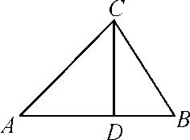
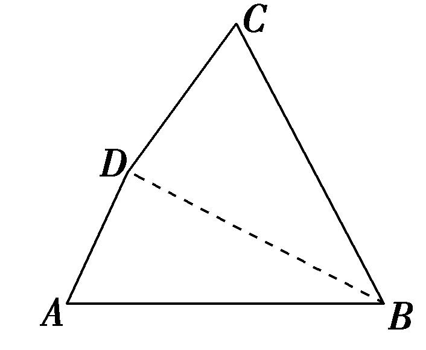
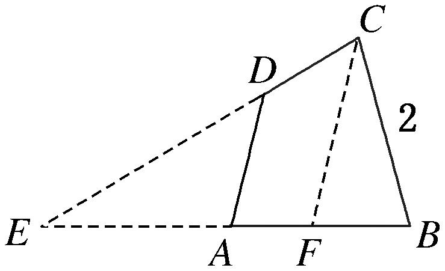
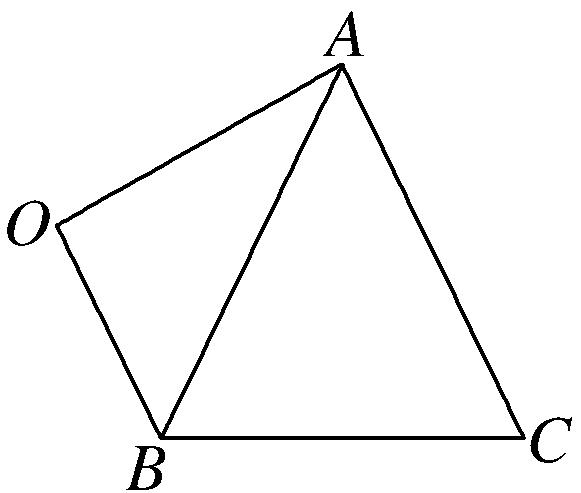
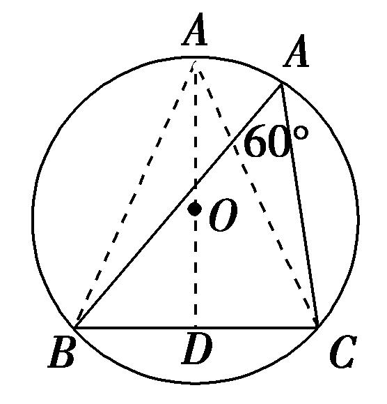

**专题四　三角形中的最值(范围)问题**

**三角形中最值(范围)问题的解题思路**

任何最值(范围)问题，其本质都是函数问题，三角形中的范围最值问题也不例外．三角形中的范围最值问题的解法主要有两种：一是用函数求解，二是利用基本不等式求解．一般求最值用基本不等式，求范围用函数．由于三角形中的最值(范围)问题一般是以角为自变量的三角函数问题，所以，除遵循函数问题的基本要求外，还有自己独特的解法．

要建立所求量(式子)与已知角或边的关系，然后把角或边作为自变量，所求量(式子)的值作为函数值，转化为函数关系，将原问题转化为求函数的值域问题．这里要利用条件中的范围限制，以及三角形自身范围限制，要尽量把角或边的范围(也就是函数的定义域)找完善，避免结果的范围过大．

**考点一　三角形中与角或角的函数有关的最值(范围)**

**【例题选讲】**

<strong>[例1]</strong>(1)在△<em>ABC</em>中，角<em>A</em>，<em>B</em>，<em>C</em>的对边分别是<em>a</em>，<em>b</em>，<em>c</em>，且<em>a</em>＞<em>b</em>＞<em>c</em>，<em>a</em>2＜<em>b</em>2＋<em>c</em>2，则角<em>A</em>的取值范围是(　　)

A．　　　　　　B．　　　　　　C．　　　　　　D．

答案　C　解析　因为<em>a</em>2＜<em>b</em>2＋<em>c</em>2，所以cos<em>A</em>＝＞0，所以<em>A</em>为锐角．又因为<em>a</em>＞<em>b</em>＞<em>c</em>，所以<em>A</em>为最大角，所以角<em>A</em>的取值范围是．

(2)在△*ABC*中，若*AB*＝1，*BC*＝2，则角*C*的取值范围是(　　)

A．　　　　　　B．　　　　　　C．　　　　　　D．

答案　A　解析　因为<em>c</em>＝<em>AB</em>＝1，<em>a</em>＝<em>BC</em>＝2，<em>b</em>＝<em>AC</em>．根据两边之和大于第三边，两边之差小于第三边可知1&lt;<em>b</em>&lt;3，根据余弦定理cos<em>C</em>＝(<em>a</em>2＋<em>b</em>2－<em>c</em>2)＝(4＋<em>b</em>2－1)＝(3＋<em>b</em>2)＝＋＝2＋≥．所以0&lt;<em>C</em>≤．故选A．

(3)在△*ABC*中，内角*A*，*B*，*C*对应的边分别为*a*，*b*，*c*，*A*≠，sin*C*＋sin(*B*－*A*)＝sin2*A*，则角*A*的取值范围为(　　)

A．　　　　　　B．　　　　　　C．　　　　　　D．

答案　B　解析　法一：在△*ABC*中，*C*＝π－(*A*＋*B*)，所以sin(*A*＋*B*)＋sin(*B*－*A*)＝sin2*A*，即2sin*B*cos*A*＝2sin*A*cos*A*，因为*A*≠，所以cos*A*≠0，所以sin*B*＝sin*A*，由正弦定理得，*b*＝*a*，所以*A*为锐角，又sin*B*＝sin*A*∈(0,1]，所以sin*A*∈，所以*A*∈．

法二：在△*ABC*中，*C*＝π－(*A*＋*B*)，所以sin(*A*＋*B*)＋sin(*B*－*A*)＝sin2*A*，即2sin*B*cos*A*＝2sin*A*cos*A*，因为*A*≠，所以cos*A*≠0，所以sin*B*＝sin*A*，由正弦定理，得*b*＝*a*，由余弦定理得cos*A*＝＝≥＝，当且仅当*c*＝*b*时等号成立，所以*A*∈．

(4)(2014·江苏)若△*ABC*的内角满足sin*A*＋sin*B*＝2sin*C*，则cos*C*的最小值是\_\_\_\_\_\_\_\_．

答案　　解析　由sin*A*＋sin*B*＝2sin*C*，结合正弦定理得*a*＋*b*＝2*c*．由余弦定理得cos*C*＝＝＝≥＝，故≤cos*C*<1，故cos*C*的最小值为．

(5)设△<em>ABC</em>的三边<em>a</em>，<em>b</em>，<em>c</em>所对的角分别为<em>A</em>，<em>B</em>，<em>C</em>，已知<em>a</em>2＋2<em>b</em>2＝<em>c</em>2，则＝\_\_\_\_\_；tan<em>B</em>的最大值为\_\_\_\_\_\_\_\_．

答案　－3　　解析　由正弦定理可得＝·＝·，再结合余弦定理可得＝·＝··＝．由<em>a</em>2＋2<em>b</em>2＝<em>c</em>2，得＝＝－3．由已知条件及大边对大角可知0＜<em>A</em>＜＜<em>C</em>＜π，从而由<em>A</em>＋<em>B</em>＋<em>C</em>＝π可知tan<em>B</em>＝－tan(<em>A</em>＋<em>C</em>)＝－＝－＝，因为＜<em>C</em>＜π，所以＋(－tan<em>C</em>)≥2＝2(当且仅当tan<em>C</em>＝－时取等号)，从而tan<em>B</em>≤＝，即tan<em>B</em>的最大值为．

(6)在锐角△*ABC*中，角*A*，*B*，*C*的对边分别为*a*，*b*，*c*．若*a*＝2*b*sin*C*，则tan*A*＋tan*B*＋tan*C*的最小值是(　　)

A．4　　　　　　　　B．3　　　　　　　　C．8　　　　　　　　D．6

解析：由*a*＝2*b*sin*C*得sin*A*＝2sin*B*sin*C*，∴sin(*B*＋*C*)＝sin*B*cos*C*＋cos*B*sin*C*＝2sin*B*sin*C*，即tan*B*＋tan*C*＝2tan*B*tan*C*．又三角形中的三角恒等式tan*A*＋tan*B*＋tan*C*＝tan*A*tan*B*tan*C*，∴tan*B*tan*C*＝，∴tan*A*tan*B*tan*C*＝tan*A*·，令tan*A*－2＝t，得tan*A*tan*B*tan*C*＝＝t＋＋4≥8，当且仅当t＝， 即t＝2，tan *A*＝4 时，取等号．

【**对点训练**】

1．在不等边三角形<em>ABC</em>中，角<em>A</em>，<em>B</em>，<em>C</em>所对的边分别为<em>a</em>，<em>b</em>，<em>c</em>，其中<em>a</em>为最大边，如果sin2(<em>B</em>＋<em>C</em>)&lt;sin2<em>B</em>

＋sin2<em>C</em>，则角<em>A</em>的取值范围为(　　)

A．　　　　　　B．　　　　　　C．　　　　　　D．

1．答案　D　解析　由题意得sin2<em>A</em>&lt;sin2<em>B</em>＋sin2<em>C</em>，再由正弦定理得<em>a</em>2&lt;<em>b</em>2＋<em>c</em>2，即<em>b</em>2＋<em>c</em>2－<em>a</em>2&gt;0．则cos<em>A</em>

＝>0，∵0<*A*<π，∴0<*A*<．又*a*为最大边，∴*A*>．因此得角*A*的取值范围是．

2．已知△<em>ABC</em>的三个内角<em>A</em>，<em>B</em>，<em>C</em>所对的边分别为<em>a</em>，<em>b</em>，<em>c</em>，<em>a</em>sin<em>A</em>sin<em>B</em>＋<em>b</em>cos2<em>A</em>＝2<em>a</em>，则角<em>A</em>的取值范

围是(　　)

A．　　　　　　　　B．　　　　　　　　C．　　　　　　　　D．

2．答案　C　解析　在△<em>ABC</em>中，由正弦定理化简已知的等式得sin<em>A</em>sin<em>A</em>sin<em>B</em>＋sin<em>B</em>cos2<em>A</em>＝2sin<em>A</em>，即

sin<em>B</em>(sin2<em>A</em>＋cos2<em>A</em>)＝2sin<em>A</em>，所以sin<em>B</em>＝2sin<em>A</em>，由正弦定理得<em>b</em>＝2<em>a</em>，所以cos<em>A</em>＝＝＝≥＝(当且仅当<em>c</em>2＝3<em>a</em>2，即<em>c</em>＝<em>a</em>时取等号)，因为<em>A</em>为△<em>ABC</em>的内角，且<em>y</em>＝cos<em>x</em>在(0，π)上是减函数，所以0＜<em>A</em>≤，故角<em>A</em>的取值范围是．

3．已知*a*，*b*，*c*分别是△*ABC*内角*A*，*B*，*C*的对边，满足cos*A*sin*B*sin*C*＋cos*B*sin*A*sin*C*＝2cos*C*sin*A*sin

*B*，则*C*的最大值为\_\_\_\_\_\_\_\_．

3．答案　　解析　由正弦定理，得*bc*cos*A*＋*ac*cos*B*＝2*ab*cos*C*，由余弦定理，得*bc*·＋

<em>ac</em>·＝2<em>ab</em>·，∴<em>a</em>2＋<em>b</em>2＝2<em>c</em>2，∴cos<em>C</em>＝＝＝≥＝，当且仅当<em>a</em>＝<em>b</em>时，取等号．∵0&lt;<em>C</em>&lt;π，∴0&lt;<em>C</em>≤，∴<em>C</em>的最大值为．

4．在△<em>ABC</em>中，角<em>A</em>，<em>B</em>，<em>C</em>所对的边分别是<em>a</em>，<em>b</em>，<em>c</em>，若<em>b</em>2＋<em>c</em>2＝2<em>a</em>2，则cos<em>A</em>的最小值为\_\_\_\_\_\_\_\_．

4．答案　　解析　因为<em>b</em>2＋<em>c</em>2＝2<em>a</em>2，则由余弦定理可知<em>a</em>2＝2<em>bc</em>cos <em>A</em>，所以cos <em>A</em>＝＝×≥×

＝(当且仅当*b*＝*c*时等号成立)，即cos *A*的最小值为．

5．已知△*ABC*的内角*A*，*B*，*C*的对边分别为*a*，*b*，*c*，且cos2*A*＋cos2*B*＝2cos2*C*，则cos*C*的最小值为(　　)

A．　　　　　　　　B．　　　　　　　　C．　　　　　　　　D．－

5．答案　C　解析　因为cos2<em>A</em>＋cos2<em>B</em>＝2cos2<em>C</em>，所以1－2sin2<em>A</em>＋1－2sin2<em>B</em>＝2－4sin2<em>C</em>，得<em>a</em>2＋<em>b</em>2

＝2<em>c</em>2，cos<em>C</em>＝≥＝，当且仅当<em>a</em>＝<em>b</em>时等号成立，故选C．

6．在钝角△*ABC*中，角*A*，*B*，*C*所对的边分别为*a*，*b*，*c*，*B*为钝角，若*a*cos*A*＝*b*sin*A*，则sin*A*＋sin*C*

的最大值为(　　)

A．　　　　　　　　B．　　　　　　　　C．1　　　　　　　　D．

6．答案　B　解析　∵*a*cos*A*＝*b*sin*A*，由正弦定理可得，sin*A*cos*A*＝sin*B*sin*A*，∵sin*A*≠0，∴cos*A*＝sin

<em>B</em>，又<em>B</em>为钝角，∴<em>B</em>＝<em>A</em>＋，sin<em>A</em>＋sin<em>C</em>＝sin<em>A</em>＋sin(<em>A</em>＋<em>B</em>)＝sin<em>A</em>＋cos2<em>A</em>＝sin<em>A</em>＋1－2sin2<em>A</em>＝－22＋，∴sin<em>A</em>＋sin<em>C</em>的最大值为．

7．在△*ABC*中，角*A*，*B*，*C*所对的边分别为*a*，*b*，*c*，且*a*cos*B*－*b*cos*A*＝*c*，当tan(*A*－*B*)取最大值时，

角*B*的值为\_\_\_\_\_\_\_\_．

7．答案　　解析　由*a*cos*B*－*b*cos*A*＝*c*及正弦定理，得sin*A*cos*B*－sin*B*cos*A*＝sin*C*＝sin(*A*＋*B*)＝

(sin*A*cos*B*＋cos*A*sin*B*)，整理得sin*A*cos*B*＝3cos*A*sin*B*，即tan*A*＝3tan*B*，易得tan*A*>0，tan*B*>0．所以tan(*A*－*B*)＝＝＝≤＝，当且仅当＝3tan*B*，即tan*B*＝时，tan(*A*－*B*)取得最大值，所以*B*＝．

8．在△<em>ABC</em>中，内角<em>A</em>，<em>B</em>，<em>C</em>所对的边分别为<em>a</em>，<em>b</em>，<em>c</em>，<em>a</em>sin<em>A</em>＋<em>b</em>sin<em>B</em>＝<em>c</em>sin<em>C</em>－<em>a</em>sin<em>B</em>，则sin2<em>A</em>tan2<em>B</em>

的最大值是\_\_\_\_\_\_\_\_\_\_．

8．答案　3－2　解析　依题意得<em>a</em>2＋<em>b</em>2－<em>c</em>2＝－<em>ab</em>，则2<em>ab</em>cos<em>C</em>＝－<em>ab</em>，所以cos<em>C</em>＝－，

所以<em>C</em>＝，<em>A</em>＝－<em>B</em>，所以sin2<em>A</em>tan2<em>B</em>＝cos2<em>B</em>tan2<em>B</em>＝．令1＋tan2<em>B</em>＝<em>t</em>，其中<em>t</em>∈(1,2)，则有＝＝－＋3≤3－2，当且仅当<em>t</em>＝时取等号．故sin 2<em>A</em>tan2<em>B</em>的最大值是3－2．

9．在△<em>ABC</em>中，若sin<em>C</em>＝2cos<em>A</em>cos<em>B</em>，则cos2<em>A</em>＋cos2<em>B</em>的最大值为\_\_\_\_\_\_\_\_．

9．答案　　解析　解法<strong>1</strong>　因为sin<em>C</em>＝2cos<em>A</em>cos<em>B</em>，所以，sin(<em>A</em>＋<em>B</em>)＝2cos<em>A</em>cos<em>B</em>，化简得tan<em>A</em>＋tan<em>B</em>

＝2，cos2<em>A</em>＋cos2<em>B</em>＝＋＝＋＝＝＝．因为分母(tan<em>A</em>tan<em>B</em>)2－2tan<em>A</em>tan<em>B</em>＋5&gt;0，所以令6－2tan<em>A</em>tan<em>B</em>＝<em>t</em>(<em>t</em>&gt;0)，则cos2<em>A</em>＋cos2<em>B</em>＝＝≤＝(当且仅当<em>t</em>＝4时取等号)．

解法<strong>2</strong>　由解法1得tan<em>A</em>＋tan<em>B</em>＝2，令tan<em>A</em>＝1＋<em>t</em>，tan<em>B</em>＝1－<em>t</em>，则cos2<em>A</em>＋cos2<em>B</em>＝＋＝＋＝，令<em>d</em>＝<em>t</em>2＋2≥2，则cos2<em>A</em>＋cos2<em>B</em>＝＝≤＝，当且仅当<em>d</em>＝2时等号成立．

解法<strong>3</strong>　因为sin<em>C</em>＝2cos<em>A</em>cos<em>B</em>，所以sin<em>C</em>＝cos(<em>A</em>＋<em>B</em>)＋cos(<em>A</em>－<em>B</em>)，即cos(<em>A</em>－<em>B</em>)＝sin<em>C</em>＋cos<em>C</em>，cos2<em>A</em>＋cos2<em>B</em>＝＋＝1＋cos(<em>A</em>＋<em>B</em>)cos(<em>A</em>－<em>B</em>)＝1－cos<em>C</em>(sin<em>C</em>＋cos<em>C</em>)＝－(sin2<em>C</em>＋cos2<em>C</em>)＝－sin(2<em>C</em>＋)≤＋＝，当且仅当2<em>C</em>＋＝，即<em>C</em>＝时取等号．

10．在△*ABC*中，角*A*，*B*，*C*的对边分别为*a*，*b*，*c*，若3*a*cos *C*＋*b*＝0，则tan *B*的最大值是\_\_\_\_\_\_\_\_．

10．答案　　解析　在△*ABC*中，因为3*a*cos *C*＋*b*＝0，所以*C*为钝角，由正弦定理得3sin *A*cos *C*＋sin(*A*

＋*C*)＝0，3sin *A*cos *C*＋sin *A*cos *C*＋cos *A*sin *C*＝0，所以4sin *A*cos *C*＝－cos *A*·sin *C*，即tan *C*＝－4tan *A*．因为tan *A*>0，所以tan *B*＝－tan(*A*＋*C*)＝－＝＝＝≤＝，当且仅当tan *A*＝时取等号，故tan *B*的最大值是．

11．(2016江苏)在锐角三角形中，若，则的最小值是\_\_\_\_\_\_\_\_．

11．答案　8　解析　因为sin*A*＝sin(*B*＋*C*)＝2sin*B*sin*C*，所以tan*B*＋tan*C*＝2tan*B*tan*C*，因此tan*A*tan*B*tan*C*

＝tan*A*＋tan*B*＋tan*C*＝tan*A*＋2tan*B*tan*C*≥2，所以tan*A*tan*B*tan*C*≥8．

12．在△<em>ABC</em>中，角<em>A</em>，<em>B</em>，<em>C</em>所对的边分别为<em>a</em>，<em>b</em>，<em>c</em>，若△<em>ABC</em>为锐角三角形，且满足<em>b</em>2－<em>a</em>2＝<em>ac</em>，则

－的取值范围是\_\_\_\_\_\_\_\_．

12．答案　　解析　思路一，根据题意可知，本题可以从“解三角形和三角恒等变换”角度切入，

又因已知锐角和边的关系，而所求为正切值，故把条件化为角的正弦和余弦来处理即可；思路二，本题所求为正切值，故可以构造直角三角形，用边的关系处理．

解法1　原式可化为－＝－＝＝．由<em>b</em>2－<em>a</em>2＝<em>ac</em>得，<em>b</em>2＝<em>a</em>2＋<em>ac</em>＝<em>a</em>2＋<em>c</em>2－2<em>ac</em>cos<em>B</em>，即<em>a</em>＝<em>c</em>－2<em>a</em>cos<em>B</em>，也就是sin<em>A</em>＝sin<em>C</em>－2sin<em>A</em>cos<em>B</em>，即sin<em>A</em>＝sin(<em>A</em>＋<em>B</em>)－2sin<em>A</em>cos<em>B</em>＝sin(<em>B</em>－<em>A</em>)，由于△<em>ABC</em>为锐角三角形，所以有<em>A</em>＝<em>B</em>－<em>A</em>，即<em>B</em>＝2<em>A</em>，故－＝，在锐角三角形<em>ABC</em>中易知，&lt;<em>B</em>&lt;，&lt;sin<em>B</em>&lt;1，故－∈．

解法2　根据题意，作<em>CD</em>⊥<em>AB</em>，垂足为点<em>D</em>，画出示意图．因为<em>b</em>2－<em>a</em>2＝<em>AD</em>2－<em>BD</em>2＝(<em>AD</em>＋<em>BD</em>)(<em>AD</em>－<em>BD</em>)＝<em>c</em>(<em>AD</em>－<em>BD</em>)＝<em>ac</em>，所以<em>AD</em>－<em>BD</em>＝<em>a</em>，而<em>AD</em>＋<em>BD</em>＝<em>c</em>，所以<em>BD</em>＝，则<em>c</em>&gt;<em>a</em>，即&gt;1，在锐角三角形<em>ABC</em>中有<em>b</em>2＋<em>a</em>2&gt;<em>c</em>2，则<em>a</em>2＋<em>a</em>2＋<em>ac</em>&gt;<em>c</em>2，即2－－2&lt;0，解得－1&lt;&lt;2，因此，1&lt;&lt;2．而－＝＝＝∈．

13．在锐角三角形<em>ABC</em>中，已知2sin2<em>A</em>＋sin2<em>B</em>＝2sin2<em>C</em>，则＋＋的最小值为\_\_\_\_\_\_\_\_．

13．答案　　解析　解法<strong>1</strong>　因为2sin2<em>A</em>＋sin2<em>B</em>＝2sin2<em>C</em>，所以由正弦定理可得2<em>a</em>2＋<em>b</em>2＝2<em>c</em>2，由余弦

定理及正弦定理可得cos*C*＝＝＝＝，又因为sin*B*＝sin(*A*＋*C*)＝sin*A*cos*C*＋cos*A*sin*C*，所以cos*C*＝ ＝＋，可得tan*C*＝3tan*A*，代入tan*A*＋tan*B*＋tan*C*＝tan*A*tan*B*tan*C*得tan*B*＝，所以＋＋＝＋＋＝＋，因为*A*∈，所以tan*A*>0，所以＋≥2＝，当且仅当＝，即tan*A*＝时取“＝”．所以＋＋的最小值为．

解法<strong>2</strong>　过点<em>B</em>作<em>BD</em>⊥<em>AC</em>于<em>D</em>，设<em>AD</em>＝<em>x</em>，<em>DC</em>＝<em>y</em>，<em>BD</em>＝<em>h</em>，则tan<em>A</em>＝，tan<em>C</em>＝．同解法1可得tan<em>C</em>＝3tan<em>A</em>，tan<em>B</em>＝ 则＝，即<em>x</em>＝3<em>y</em>，tan<em>B</em>＝＝，所以＋＋＝＋＋＝＋＋＝＋≥．当且仅当＝，即<em>y</em>＝<em>h</em>时取“＝”．所以＋＋的最小值为．

**考点二　三角形中与边或周长有关的最值(范围)**

**【例题选讲】**

<strong>[例2]</strong>(1)已知△<em>ABC</em>中，角<em>A</em>，<em>B</em>，<em>C</em>成等差数列，且△<em>ABC</em>的面积为1＋，则<em>AC</em>边的长的最小值是\_\_\_\_\_\_\_\_．

答案　2　解析　∵<em>A</em>，<em>B</em>，<em>C</em>成等差数列，∴<em>A</em>＋<em>C</em>＝3<em>B</em>，又<em>A</em>＋<em>B</em>＋<em>C</em>＝π，∴<em>B</em>＝．设角<em>A</em>，<em>B</em>，<em>C</em>所对的边分别为<em>a</em>，<em>b</em>，<em>c</em>，由<em>S</em>△<em>ABC</em>＝<em>ac</em>sin<em>B</em>＝1＋得<em>ac</em>＝2(2＋)，由余弦定理及<em>a</em>2＋<em>c</em>2≥2<em>ac</em>，得<em>b</em>2≥(2－)<em>ac</em>，即<em>b</em>2≥(2－)×2(2＋)，∴<em>b</em>≥2(当且仅当<em>a</em>＝<em>c</em>时等号成立)，∴<em>AC</em>边的长的最小值为2．

(2)(2015·全国Ⅰ)在平面四边形*ABCD*中，∠*A*＝∠*B*＝∠*C*＝75°，*BC*＝2，则*AB*的取值范围是\_\_\_\_\_\_\_\_．

答案　(－，＋)　解析　通法：依题意作出四边形*ABCD*，连结*BD*．令*BD*＝*x*，*AB*＝*y*，∠*CDB*＝*α*，∠*CBD*＝*β*．在△*BCD*中，由正弦定理得＝．由题意可知，∠*ADC*＝135°，则∠*ADB*＝135°－*α*．在△*ABD*中，由正弦定理得＝．所以＝，即*y*＝＝＝＝．因为0°<*β*<75°，*α*＋*β*＋75°＝180°，所以30°<*α*<105°，当*α*＝90°时，易得*y*＝；当*α*≠90°时，*y*＝＝．又tan 30°＝，tan 105°＝tan(60°＋45°)＝＝－2－，结合正切函数的性质知，∈(－2，)，且≠0，所以*y*＝∈(－，)∪(，＋)．综上所述：*y*∈(－，＋)．

提速方法：画出四边形*ABCD*，延长*CD*，*BA*，探求出*AB*的取值范围．如图所示，延长*BA*与*CD*相交于点*E*，过点*C*作*CF*∥*AD*交*AB*于点*F*，则*BF*<*AB*<*BE*．在等腰三角形*CFB*中，∠*FCB*＝30°，*CF*＝*BC*＝2，∴*BF*＝＝－．在等腰三角形*ECB*中，∠*CEB*＝30°，∠*ECB*＝75°，*BE*＝*CE*，*BC*＝2，＝，∴*BE*＝×＝＋．∴－<*AB*<＋．

(3)在△*ABC*中，若*C*＝2*B*，则的取值范围为\_\_\_\_\_\_\_\_．

答案　(1，2)　解析　因为*A*＋*B*＋*C*＝π，*C*＝2*B*，所以*A*＝π－3*B*>0，所以0<*B*<，所以<cos*B*<1．因为＝＝＝2cos*B*，所以1<2cos*B*<2，故1<<2．

(4) (2018·北京)若△<em>ABC</em>的面积为(<em>a</em>2＋<em>c</em>2－<em>b</em>2)，且∠<em>C</em>为钝角，则∠<em>B</em>＝\_\_\_\_\_\_\_\_\_\_；的取值范围是\_\_\_\_\_\_\_\_\_\_．

答案　60°　(2，＋∞)　解析　由已知得(<em>a</em>2＋<em>c</em>2－<em>b</em>2)＝<em>ac</em>sin <em>B</em>，所以＝sin <em>B</em>，由余弦定理得cos <em>B</em>＝sin <em>B</em>，所以tan <em>B</em>＝，所以<em>B</em>＝60°，又<em>C</em>＞90°，<em>B</em>＝60°，所以<em>A</em>&lt;30°，且<em>A</em>＋<em>C</em>＝120°，所以＝＝＝＋．又<em>A</em>&lt;30°，所以0＜tan <em>A</em>&lt;，即&gt;，所以&gt;＋＝2．

(5)在△中，角所对的边分别为，且满足，则的最大值为\_\_\_\_\_\_\_\_\_\_．

答案　　解析　由，得，由正弦定理可得，由余弦定理可得，化简得，又因为，当且仅当时等号成立，可得，所以的最大值为．

(6)在△*ABC*中，若*C*＝60°，*c*＝2，则*a*＋*b*的取值范围为\_\_\_\_\_\_\_\_．

答案　(2，4]　解析　由题意，得<em>c</em>＝2．由余弦定理可得<em>c</em>2＝<em>a</em>2＋<em>b</em>2－2<em>ab</em>cos <em>C</em>，即4＝<em>a</em>2＋<em>b</em>2－<em>ab</em>＝(<em>a</em>＋<em>b</em>)2－3<em>ab</em>≥(<em>a</em>＋<em>b</em>)2，得<em>a</em>＋<em>b</em>≤4．又由三角形的性质可得<em>a</em>＋<em>b</em>&gt;2，综上可得2&lt;<em>a</em>＋<em>b</em>≤4．

(7)在△<em>ABC</em>中，角<em>A</em>，<em>B</em>，<em>C</em>所对的边分别为<em>a</em>，<em>b</em>，<em>c</em>，且满足<em>b</em>2＋<em>c</em>2－<em>a</em>2＝<em>bc</em>，·＞0，<em>a</em>＝，则<em>b</em>＋<em>c</em>的取值范围是(　　)

A．　　　　　　B．　　　　　　C．　　　　　　D．

答案　<strong>B</strong>　解析　在△<em>ABC</em>中，<em>b</em>2＋<em>c</em>2－<em>a</em>2＝<em>bc</em>，由余弦定理可得cos <em>A</em>＝＝＝，因为<em>A</em>是△<em>ABC</em>的内角，所以<em>A</em>＝60°．因为<em>a</em>＝，所以由正弦定理得＝＝＝＝1，所以<em>b</em>＋<em>c</em>＝sin <em>B</em>＋sin(120°－<em>B</em>)＝sin<em>B</em>＋cos <em>B</em>＝sin(<em>B</em>＋30°)．因为·＝||·||·cos(π－<em>B</em>)＞0，所以cos <em>B</em>＜0，<em>B</em>为钝角，所以90°＜<em>B</em>＜120°，120°＜<em>B</em>＋30°＜150°，故sin(<em>B</em>＋30°)∈，所以<em>b</em>＋<em>c</em>＝sin(<em>B</em>＋30°)∈．

(8) (2018·江苏)在△*ABC*中，角*A*，*B*，*C*所对的边分别为*a*，*b*，*c*，∠*ABC*＝120°，∠*ABC*的平分线交*AC*于点*D*，且*BD*＝1，则4*a*＋*c*的最小值为\_\_\_\_\_\_\_\_．

答案　9　解析　因为∠*ABC*＝120°，∠*ABC*的平分线交*AC*于点*D*，所以∠*ABD*＝∠*CBD*＝60°，由三角形的面积公式可得*ac*sin 120°＝*a*×1×sin 60°＋*c*×1×sin 60°，化简得*ac*＝*a*＋*c*，又*a*>0，*c*>0，所以＋＝1，则4*a*＋*c*＝(4*a*＋*c*)·＝5＋＋≥5＋2＝9，当且仅当*c*＝2*a*时取等号，故4*a*＋*c*的最小值为9．

(9)在△*ABC*中，角*A*，*B*，*C*所对的边分别为*a*，*b*，*c*，且满足*a*sin*B*＝*b*cos*A*．若*a*＝4，则△*ABC*周长的最大值为\_\_\_\_\_\_\_\_．

答案　12　解析　由正弦定理＝，可将<em>a</em>sin <em>B</em>＝<em>b</em>cos <em>A</em>转化为sin <em>A</em>sin <em>B</em>＝sin <em>B</em>cos <em>A</em>．又在△<em>ABC</em>中，sin <em>B</em>&gt;0，∴sin <em>A</em>＝cos <em>A</em>，即tan <em>A</em>＝．∵0&lt;<em>A</em>&lt;π，∴<em>A</em>＝．由余弦定理得<em>a</em>2＝16＝<em>b</em>2＋<em>c</em>2－2<em>bc</em>cos <em>A</em>＝(<em>b</em>＋<em>c</em>)2－3<em>bc</em>≥(<em>b</em>＋<em>c</em>)2－3，则(<em>b</em>＋<em>c</em>)2≤64，即<em>b</em>＋<em>c</em>≤8(当且仅当<em>b</em>＝<em>c</em>＝4时等号成立)，∴△<em>ABC</em>周长＝<em>a</em>＋<em>b</em>＋<em>c</em>＝4＋<em>b</em>＋<em>c</em>≤12，即最大值为12．

(10)在△*ABC*中，∠*ACB*＝60°，*BC*>1，*AC*＝*AB*＋，当△*ABC*的周长最短时，*BC*的长是\_\_\_\_\_\_\_\_．

答案　1＋　解析　设<em>AC</em>＝<em>b</em>，<em>AB</em>＝<em>c</em>，<em>BC</em>＝<em>a</em>，△<em>ABC</em>的周长为<em>l</em>，由<em>b</em>＝<em>c</em>＋，得<em>l</em>＝<em>a</em>＋<em>b</em>＋<em>c</em>＝<em>a</em>＋2<em>c</em>＋．又cos 60°＝＝，即<em>ab</em>＝<em>a</em>2＋<em>b</em>2－<em>c</em>2，得<em>a</em>＝<em>a</em>2＋2－<em>c</em>2，即<em>c</em>＝．<em>l</em>＝<em>a</em>＋2<em>c</em>＋＝<em>a</em>＋＋＝＋＝3＋≥3＋，当且仅当<em>a</em>－1＝时，△<em>ABC</em>的周长最短，此时<em>a</em>＝1＋，即<em>BC</em>的长是1＋．

【**对点训练**】

1．已知△*ABC*的内角*A*，*B*，*C*的对边分别为*a*，*b*，*c*．若*a*＝*b*cos*C*＋*c*sin*B*，且△*ABC*的面积为1＋，

则*b*的最小值为(　　)

A．2　　　　　　　　B．3　　　　　　　　C．　　　　　　　　D．

1．答案　A　解析　由*a*＝*b*cos*C*＋*c*sin*B*及正弦定理，得sin*A*＝sin*B*cos*C*＋sin*C*sin*B*，即sin(*B*＋*C*)＝

sin<em>B</em>cos<em>C</em>＋sin<em>C</em>sin<em>B</em>，得sin<em>C</em>cos<em>B</em>＝sin<em>C</em>sin<em>B</em>，又sin<em>C</em>≠0，所以tan<em>B</em>＝1．因为<em>B</em>∈(0，π)，所以<em>B</em>＝．由<em>S</em>△<em>ABC</em>＝<em>ac</em>sin<em>B</em>＝1＋，得<em>ac</em>＝2＋4．又<em>b</em>2＝<em>a</em>2＋<em>c</em>2－2<em>ac</em>cos<em>B</em>≥2<em>ac</em>－<em>ac</em>＝(2－)(4＋2)＝4，当且仅当<em>a</em>＝<em>c</em>时等号成立，所以<em>b</em>≥2，<em>b</em>的最小值为2，故选A．

2．已知△*ABC*中，*AB*＋*AC*＝6，*BC*＝4，*D*为*BC*的中点，则当*AD*最小时，△*ABC*的面积为\_\_\_\_\_\_\_\_．

2．答案　　解析　<em>AC</em>2＝<em>AD</em>2＋<em>CD</em>2－2<em>AD</em>·<em>CD</em>·cos∠<em>ADC</em>，且<em>AB</em>2＝<em>AD</em>2＋<em>BD</em>2－2<em>AD</em>·<em>BD</em>·cos∠<em>ADB</em>，即

<em>AC</em>2＝<em>AD</em>2＋22－4<em>AD</em>·cos∠<em>ADC</em>，且(6－<em>AC</em>)2＝<em>AD</em>2＋22－4<em>AD</em>·cos∠<em>ADB</em>，∵∠<em>ADB</em>＝π－∠<em>ADC</em>，∴<em>AC</em>2＋(6－<em>AC</em>)2＝2<em>AD</em>2＋8，∴<em>AD</em>2＝＝，当<em>AC</em>＝2时，<em>AD</em>取最小值，此时cos∠<em>ACB</em>＝＝，∴sin∠<em>ACB</em>＝，∴△<em>ABC</em>的面积<em>S</em>＝<em>AC</em>·<em>BC</em>·sin∠<em>ACB</em>＝．

3．在△*ABC*中，内角*A*，*B*，*C*的对边分别为*a*，*b*，*c*，且*A*＝2*B*，*C*为钝角，则的取值范围是\_\_\_\_\_\_\_\_．

3．答案　(2，3)　解析　由题意知90°<*C*<180°，0°<*A*＋*B*<90°，因为*A*＝2*B*，所以0°<3*B*<90°，0°<*B*<30°，

<em>C</em>＝180°－(<em>A</em>＋<em>B</em>)＝180°－3<em>B</em>，由正弦定理＝，得＝＝＝＝＝＝2cos2<em>B</em>＋cos 2<em>B</em>＝4cos2<em>B</em>－1，因为&lt;cos <em>B</em>&lt;1，所以2&lt;4cos2<em>B</em>－1&lt;3，即2&lt;&lt;3．

4．在△*ABC*中，角*A*，*B*，*C*所对的边分别为*a*，*b*，*c*，若*A*＝3*B*，则的取值范围是(　　)

A．(0，3)　　　　　　B．(1，3)　　　　　　C．(0，1]　　　　　　D．(1，2]

4．答案　B　解析　*A*＝3*B*⇒＝＝＝＝

＝2cos2<em>B</em>＋cos2<em>B</em>＝2cos2<em>B</em>＋1，即＝＝2cos2<em>B</em>＋1，又<em>A</em>＋<em>B</em>∈(0，π)，即4<em>B</em>∈(0，π)⇒2<em>B</em>∈⇒cos2<em>B</em>∈(0，1)，∴∈(1，3)．

5．已知<em>a</em>，<em>b</em>，<em>c</em>分别为△<em>ABC</em>的内角<em>A</em>，<em>B</em>，<em>C</em>所对的边，其面积满足<em>S</em>△<em>ABC</em>＝<em>a</em>2，则的最大值为(　　)

A．－1　　　　　　B．　　　　　　C．＋1　　　　　　D．＋2

5．答案　C　解析　根据题意，有<em>S</em>△<em>ABC</em>＝<em>a</em>2＝<em>bc</em>sin <em>A</em>，即<em>a</em>2＝2<em>bc</em>sin <em>A</em>．应用余弦定理，可得<em>b</em>2＋<em>c</em>2

－2<em>bc</em>cos<em>A</em>＝<em>a</em>2＝2<em>bc</em>sin<em>A</em>，令<em>t</em>＝，于是<em>t</em>2＋1－2<em>t</em>cos<em>A</em>＝2<em>t</em>sin<em>A</em>．于是2<em>t</em>sin<em>A</em>＋2<em>t</em>cos<em>A</em>＝<em>t</em>2＋1，所以2sin＝<em>t</em>＋，从而<em>t</em>＋≤2，解得<em>t</em>的最大值为＋1．

6．在△<em>ABC</em>中，已知<em>c</em>＝2，若sin2<em>A</em>＋sin2<em>B</em>－sin <em>A</em>sin <em>B</em>＝sin2<em>C</em>，则<em>a</em>＋<em>b</em>的取值范围为\_\_\_\_\_\_\_\_．

6．答案　(2，4]　解析　∵sin2<em>A</em>＋sin2<em>B</em>－sin <em>A</em>sin <em>B</em>＝sin2<em>C</em>，∴<em>a</em>2＋<em>b</em>2－<em>ab</em>＝<em>c</em>2，∴cos <em>C</em>＝＝，

又∵*C*∈(0，π)，∴*C*＝．由正弦定理可得＝＝＝，∴*a*＝sin *A*，*b*＝sin *B*．又∵*B*＝－*A*，∴*a*＋*b*＝sin *A*＋sin *B*＝sin *A*＋sin＝4sin．又∵*A*∈，∴*A*＋∈，∴sin∈，∴*a*＋*b*∈(2，4]．

7．在外接圆半径为的△*ABC*中，*a*，*b*，*c*分别为内角*A*，*B*，*C*的对边，且2*a*sin *A*＝(2*b*＋*c*)sin *B*＋(2*c*

＋*b*)sin *C*，则*b*＋*c*的最大值是(　　)

A．1　　　　　　　　B．　　　　　　　　C．3　　　　　　　　D．

7．答案　A　解析　根据正弦定理得2<em>a</em>2＝(2<em>b</em>＋<em>c</em>)<em>b</em>＋(2<em>c</em>＋<em>b</em>)<em>c</em>，即<em>a</em>2＝<em>b</em>2＋<em>c</em>2＋<em>bc</em>，又<em>a</em>2＝<em>b</em>2＋<em>c</em>2－2<em>bc</em>cos

*A*，所以cos *A*＝－，*A*＝120°．因为△*ABC*外接圆半径为，所以由正弦定理得*b*＋*c*＝sin *B*·2*R*＋sin *C*·2*R*＝sin *B*＋sin(60°－*B*)＝sin *B*＋cos *B*＝sin(*B*＋60°)，故当*B*＝30°时，*b*＋*c*取得最大值1．

8．在△*ABC*中，*B*＝60°，*AC*＝，则2*a*＋*c*的最大值为\_\_\_\_\_\_\_\_．

8．答案　2　解析　由正弦定理知＝＝，∴*AB*＝2sin*C*，*BC*＝2sin*A*．又*A*＋*C*＝120°，∴*AB*

＋2*BC*＝2sin*C*＋4sin(120°－*C*)＝2(sin*C*＋2sin120°cos*C*－2cos120°sin*C*)＝2(sin*C*＋cos*C*＋sin*C*)＝2(2sin*C*＋cos*C*)＝2sin(*C*＋*α*)，其中tan*α*＝，*α*是第一象限角，由于0°＜*C*＜120°，且*α*是第一象限角，因此*AB*＋2*BC*有最大值2．

9．在△*ABC*中，*AB*＝2，*C*＝，则*a*＋*b*的最大值为(　　)

A．　　　　　　　　B．2　　　　　　　　C．3　　　　　　　　D．4

9．答案　D　解析　在△*ABC*中，*AB*＝2，*C*＝，则＝＝＝4，则*AC*＋*BC*＝4sin *B*＋4

sin *A*＝4sin＋4sin *A*＝2cos *A*＋6sin *A*＝4sin(*A*＋*θ*)，(其中tan *θ*＝)．所以*AC*＋*BC*的最大值为4．

10．在△*ABC*中，*A*，*B*，*C*的对边分别是*a*，*b*，*c*．若*A*＝120°，*a*＝1，则2*b*＋3*c*的最大值为(　　)

A．3　　　　　　　　B．　　　　　　　　C．3　　　　　　　　D．

10．答案　B　解析　因为*A*＝120°，*a*＝1，所以由正弦定理可得＝＝＝＝，所

以*b*＝sin *B*，*c*＝sin *C*，故2*b*＋3*c*＝sin *B*＋2sin *C*＝sin＋2sin *C*＝sin *C*＋2cos *C*＝sin(*C*＋*φ*)．其中sin *φ*＝，cos *φ*＝，所以2*b*＋3*c*的最大值为．

11．在△*ABC*中，*a*，*b*，*c*分别为三个内角*A*，*B*，*C*的对边，且*BC*边上的高为*a*，则＋取得最大值

时，内角*A*的值为(　　)

A．　　　　　　　　B．　　　　　　　　C．　　　　　　　　D．

11．答案　D　解析　利用等面积法可得，·<em>a</em>·<em>a</em>＝·<em>b</em>·<em>c</em>·sin<em>A</em>，整理得<em>a</em>2＝2<em>bc</em>sin<em>A</em>．∴＋＝

＝＝2sin*A*＋2cos*A*＝4sin，当*A*＋＝时，＋取得最大值，此时*A*＝．

12．在锐角△*ABC*中，内角*A*，*B*，*C*的对边分别为*a*，*b*，*c*，且满足(*a*－*b*)(sin*A*＋sin*B*)＝(*c*－*b*)·sin*C*．若

<em>a</em>＝，则<em>b</em>2＋<em>c</em>2的取值范围是(　　)

A．(5，6] 　　　　　　　B．(3，5) 　　　　　　　C．(3，6] 　　　　　　　D．[5，6]

12．答案　A　解析　由正弦定理可得，(<em>a</em>－<em>b</em>)(<em>a</em>＋<em>b</em>)＝(<em>c</em>－<em>b</em>)<em>c</em>，即<em>b</em>2＋<em>c</em>2－<em>a</em>2＝<em>bc</em>，所以cos<em>A</em>＝

＝，则<em>A</em>＝．又＝＝＝2，所以<em>b</em>＝2sin<em>B</em>，<em>c</em>＝2sin<em>C</em>，所以<em>b</em>2＋<em>c</em>2＝4(sin2<em>B</em>＋sin2<em>C</em>)＝4sin2<em>B</em>＋sin2(<em>A</em>＋<em>B</em>)]＝4＋＝sin2<em>B</em>－cos2<em>B</em>＋4＝2sin＋4．又△<em>ABC</em>是锐角三角形，所以<em>B</em>∈，则2<em>B</em>－∈，所以sin∈，所以<em>b</em>2＋<em>c</em>2的取值范围是(5，6]，故选A．

13．在△*ABC*中，*B*＝60°，*AC*＝，则△*ABC*的周长的最大值为\_\_\_\_\_\_\_\_．

13．答案　3　解析　由正弦定理得＝＝＝，即＝＝2，则*BC*＝2sin*A*，*AB*

＝2sin*C*，又△*ABC*的周长*l*＝*BC*＋*AB*＋*AC*＝2sin*A*＋2sin*C*＋＝2sin(120°－*C*)＋2sin *C*＋＝2sin 120°cos *C*－2cos 120°sin *C*＋2sin *C*＋＝ cos *C*＋3sin *C*＋＝2＋＝2sin＋，故△*ABC*的周长的最大值为3．

14．凸函数是一类重要的函数，其具有如下性质：若定义在(<em>a</em>，<em>b</em>)上的函数<em>f</em>(<em>x</em>)是凸函数，则对任意的<em>xi</em>∈(<em>a</em>，

*b*)(*i*＝1，2，…，*n*)，必有*f*≥成立．已知*y*＝sin *x*是(0，π)上的凸函数，利用凸函数的性质，当△*ABC*的外接圆半径为*R*时，其周长的最大值为\_\_\_\_\_\_\_\_．

14．答案　3*R*　解析　由凸函数的性质可得sin＝sin≥，化简得sin *A*＋sin *B*

＋sin *C*≤3sin＝．设*a*，*b*，*c*分别为内角*A*，*B*，*C*所对的边，利用正弦定理可得三角形的周长*l*＝*a*＋*b*＋*c*＝2*R*(sin *A*＋sin *B*＋sin *C*)≤2*R*×＝3*R*，即周长的最大值为3*R*．

**考点三　三角形中与面积有关的最值(范围)**

**【例题选讲】**

<strong>[例3]</strong>(1)已知△<em>ABC</em>的内角<em>A</em>，<em>B</em>，<em>C</em>所对的边分别为<em>a</em>，<em>b</em>，<em>c</em>，tan<em>A</em>＝，<em>a</em>＝4，则△<em>ABC</em>的面积的最大值为(　　)

A．4　　　　　　　　B．6　　　　　　　　C．8　　　　　　　　D．12

答案　C　解析　因为tan<em>A</em>＝，所以＝．又sin2<em>A</em>＋cos2<em>A</em>＝1，所以cos2<em>A</em>＝，解得cos<em>A</em>＝或cos<em>A</em>＝－(舍去)，故sin<em>A</em>＝．又16＝<em>b</em>2＋<em>c</em>2－2<em>bc</em>×≥2<em>bc</em>－<em>bc</em>，所以<em>bc</em>≤20，当且仅当<em>b</em>＝<em>c</em>＝2时取等号，故△<em>ABC</em>的面积的最大值为×20×＝8．

(2)在△*ABC*中，三个内角*A*，*B*，*C*的对边分别为*a*，*b*，*c*，若cos*A*＝sin*A*cos*C*，且*a*＝2，则△*ABC*面积的最大值为\_\_\_\_\_\_\_\_．

答案　3　解析　因为cos<em>A</em>＝sin<em>A</em>cos<em>C</em>，所以<em>b</em>cos<em>A</em>－sin<em>C</em>cos<em>A</em>＝sin<em>A</em>cos<em>C</em>，所以<em>b</em>cos<em>A</em>＝sin(<em>A</em>＋<em>C</em>)，所以<em>b</em>cos<em>A</em>＝sin<em>B</em>，所以＝，又＝，<em>a</em>＝2，所以＝，得tan<em>A</em>＝，又<em>A</em>∈(0，π)，则<em>A</em>＝，由余弦定理得(2)2＝<em>b</em>2＋<em>c</em>2－2<em>bc</em>·＝<em>b</em>2＋<em>c</em>2－<em>bc</em>≥2<em>bc</em>－<em>bc</em>＝<em>bc</em>，即<em>bc</em>≤12，当且仅当<em>b</em>＝<em>c</em>＝2时取等号，从而△<em>ABC</em>面积的最大值为×12×＝3．

(3)已知△<em>ABC</em>的三个内角<em>A</em>，<em>B</em>，<em>C</em>的对边分别为<em>a</em>，<em>b</em>，<em>c</em>，面积为<em>S</em>，且满足4<em>S</em>＝<em>a</em>2－(<em>b</em>－<em>c</em>)2，<em>b</em>＋<em>c</em>＝8，则<em>S</em>的最大值为\_\_\_\_\_\_\_\_．

答案　8　解析　由题意得，4×<em>bc</em>sin <em>A</em>＝<em>a</em>2－<em>b</em>2－<em>c</em>2＋2<em>bc</em>，又<em>a</em>2＝<em>b</em>2＋<em>c</em>2－2<em>bc</em>cos <em>A</em>，代入上式得，2<em>bc</em>sin <em>A</em>＝－2<em>bc</em>cos <em>A</em>＋2<em>bc</em>，即sin<em>A</em>＋cos<em>A</em>＝1，sin＝1，又0＜<em>A</em>＜π，∴＜<em>A</em>＋＜，∴<em>A</em>＋＝，∴<em>A</em>＝，<em>S</em>＝<em>bc</em>sin <em>A</em>＝<em>bc</em>，又<em>b</em>＋<em>c</em>＝8≥2，当且仅当<em>b</em>＝<em>c</em>时取“＝”，∴<em>bc</em>≤16，∴<em>S</em>的最大值为8．

(4)若△<em>ABC</em>的三边长分别为<em>a</em>，<em>b</em>，<em>c</em>，面积为<em>S</em>，且<em>S</em>＝<em>c</em>2－(<em>a</em>－<em>b</em>)2，<em>a</em>＋<em>b</em>＝2，则△<em>ABC</em>面积的最大值为\_\_\_\_\_\_\_\_．

答案　　解析　<em>S</em>＝<em>c</em>2－(<em>a</em>－<em>b</em>)2＝<em>c</em>2－<em>a</em>2－<em>b</em>2＋2<em>ab</em>＝2<em>ab</em>－(<em>a</em>2＋<em>b</em>2－<em>c</em>2)，由余弦定理得<em>a</em>2＋<em>b</em>2－<em>c</em>2＝2<em>ab</em>cos <em>C</em>，∴<em>c</em>2－(<em>a</em>－<em>b</em>)2＝2<em>ab</em>(1－cos <em>C</em>)，即<em>S</em>＝2<em>ab</em>(1－cos <em>C</em>)．∵<em>S</em>＝<em>ab</em>sin <em>C</em>，∴sin <em>C</em>＝4(1－cos <em>C</em>)．又∵sin2<em>C</em>＋cos2<em>C</em>＝1，∴17cos2<em>C</em>－32cos <em>C</em>＋15＝0，解得cos <em>C</em>＝或cos <em>C</em>＝1(舍去)，∴sin<em>C</em>＝，∴<em>S</em>＝<em>ab</em>sin <em>C</em>＝<em>a</em>(2－<em>a</em>)＝－(<em>a</em>－1)2＋．∵<em>a</em>＋<em>b</em>＝2，∴0&lt;<em>a</em>&lt;2，∴当<em>a</em>＝1，<em>b</em>＝1时，<em>S</em>max＝．

(5)已知△<em>ABC</em>的外接圆半径为<em>R</em>，且满足2<em>R</em>(sin2<em>A</em>－sin2<em>C</em>)＝(<em>a</em>－<em>b</em>)·sin<em>B</em>，则△<em>ABC</em>面积的最大值为\_\_\_\_\_\_\_\_．

答案　<em>R</em>2　解析　由正弦定理得<em>a</em>2－<em>c</em>2＝(<em>a</em>－<em>b</em>)<em>b</em>，即<em>a</em>2＋<em>b</em>2－<em>c</em>2＝<em>ab</em>．由余弦定理得cos <em>C</em>＝＝＝，∵<em>C</em>∈(0，π)，∴<em>C</em>＝．∴<em>S</em>＝<em>ab</em>sin <em>C</em>＝×2<em>R</em>sin <em>A</em>·2<em>R</em>sin <em>B</em>·＝<em>R</em>2sin <em>A</em>sin <em>B</em>＝<em>R</em>2sin <em>A</em>sin＝<em>R</em>2sin <em>A</em>＝<em>R</em>2(sin <em>A</em>cos <em>A</em>＋sin2<em>A</em>)＝<em>R</em>2＝<em>R</em>2，∵<em>A</em>∈，∴2<em>A</em>－∈，∴sin∈，∴<em>S</em>∈，∴面积<em>S</em>的最大值为<em>R</em>2．

(6)在△*ABC*中，内角*A*，*B*，*C*的对边分别为*a*，*b*，*c*，且满足*b*＝*c*，＝．若点*O*是△*ABC*外一点，∠*AOB*＝*θ*(0<*θ*<π)，*OA*＝2，*OB*＝1，如图所示，则四边形*OACB*面积的最大值是(　　)

A．　　　　　　B．　　　　　　C．3　　　　　　D．

答案　B　解析　由＝及正弦定理得sin<em>B</em>cos<em>A</em>＝sin<em>A</em>－sin<em>A</em>cos<em>B</em>，所以sin(<em>A</em>＋<em>B</em>)＝sin<em>A</em>，所以sin<em>C</em>＝sin<em>A</em>，因为<em>A</em>，<em>C</em>∈(0，π)，所以<em>C</em>＝<em>A</em>，又<em>b</em>＝<em>c</em>，所以<em>A</em>＝<em>B</em>＝<em>C</em>，△<em>ABC</em>为等边三角形．设△<em>ABC</em>的边长为<em>k</em>，则<em>k</em>2＝12＋22－2×1×2×cos <em>θ</em>＝5－4cos <em>θ</em>，则<em>S</em>四边形<em>OACB</em>＝×1×2sin <em>θ</em>＋<em>k</em>2＝sin <em>θ</em>＋(5－4cos <em>θ</em>)＝2sin＋≤2＋＝，所以当<em>θ</em>－＝，即<em>θ</em>＝时，四边形<em>OACB</em>的面积取得最大值，且最大值为．

【**对点训练**】

1．(2014·全国Ⅰ)已知*a*，*b*，*c*分别为△*ABC*的三个内角*A*，*B*，*C*的对边，*a*＝2，且(2＋*b*)(sin *A*－sin *B*)

＝(*c*－*b*)sin*C*，则△*ABC*面积的最大值为\_\_\_\_\_\_\_\_．

1．答案　　解析　通性通法　∵＝＝＝2*R*，*a*＝2，又(2＋*b*)·(sin *A*－sin *B*)＝(*c*－*b*)sin*C*

可化为(<em>a</em>＋<em>b</em>)(<em>a</em>－<em>b</em>)＝(<em>c</em>－<em>b</em>)·<em>c</em>，∴<em>a</em>2－<em>b</em>2＝<em>c</em>2－<em>bc</em>，∴<em>b</em>2＋<em>c</em>2－<em>a</em>2＝<em>bc</em>，∴＝＝＝cos<em>A</em>，∴∠<em>A</em>＝60°．∵△<em>ABC</em>中，4＝<em>a</em>2＝<em>b</em>2＋<em>c</em>2－2<em>bc</em>·cos 60°＝<em>b</em>2＋<em>c</em>2－<em>bc</em>≥2<em>bc</em>－<em>bc</em>＝<em>bc</em>(“＝”当且仅当<em>b</em>＝<em>c</em>时取得)，∴<em>S</em>△<em>ABC</em>＝·<em>bc</em>·sin <em>A</em>≤×4×＝．

提速方法　∵<em>a</em>＝2，由(2＋<em>b</em>)(sin <em>A</em>－sin <em>B</em>)＝(<em>c</em>－<em>b</em>)sin <em>C</em>，得(<em>a</em>＋<em>b</em>)(<em>a</em>－<em>b</em>)＝(<em>c</em>－<em>b</em>)·<em>c</em>，得<em>b</em>2＋<em>c</em>2－<em>a</em>2＝<em>bc</em>，∴cos <em>A</em>＝＝，<em>A</em>∈(0°，180°)，∴<em>A</em>＝60°．如图，△<em>ABC</em>外接圆为⊙<em>O</em>，要使<em>S</em>△<em>ABC</em>最大，只有当<em>a</em>边上的高过圆心<em>O</em>时，此时<em>AD</em>＝，<em>S</em>△<em>ABC</em>max＝×2×＝．

2．在△<em>ABC</em>中，若<em>AB</em>＝2，<em>AC</em>2＋<em>BC</em>2＝8，则△<em>ABC</em>面积的最大值为(　　)

A．　　　　　　　　B．2　　　　　　　　C．　　　　　　　　D．3

2．答案　<strong>C</strong>　解析　因为<em>AC</em>2＋<em>BC</em>2≥2<em>AC</em>·<em>BC</em>，所以<em>AC</em>·<em>BC</em>≤4．因为cos <em>C</em>＝，所以cos

<em>C</em>≥，所以0°&lt;<em>C</em>≤60°．因为<em>S</em>＝<em>AC</em>·<em>BC</em>·sin<em>C</em>，所以由不等式的性质可知当<em>AC</em>＝<em>BC</em>＝2且<em>C</em>＝60°时，面积<em>S</em>有最大值，<em>S</em>max＝×2×2×＝．故选C．

3．在△*ABC*中，·＝|－|＝3，则△*ABC*的面积的最大值为(　　)

A．　　　　　　　　B．　　　　　　　　C．　　　　　　　　D．3

3．答案　B　解析　设角*A*，*B*，*C*所对的边分别为*a*，*b*，*c*，∵·＝|－|＝3，即*bc*cos*A*＝3，*a*

＝3，∴cos*A*＝≥1－＝1－，∴cos*A*≥，∴0＜sin*A*≤，∴0＜tan *A*≤．∴△*ABC*的面积*S*＝*bc*sin*A*＝tan*A*≤×＝，故△*ABC*面积的最大值为．

4．已知△<em>ABC</em>的内角<em>A</em>，<em>B</em>，<em>C</em>的对边分别为<em>a</em>，<em>b</em>，<em>c</em>，若△<em>ABC</em>的面积<em>S</em>＝<em>a</em>2－(<em>b</em>－<em>c</em>)2，且<em>b</em>＋<em>c</em>＝8，则

*S*的最大值为\_\_\_\_\_\_\_\_．

4．答案　　解析　由题意知<em>bc</em>sin <em>A</em>＝<em>a</em>2－<em>b</em>2＋2<em>bc</em>－<em>c</em>2，由余弦定理<em>a</em>2＝<em>b</em>2＋<em>c</em>2－2<em>bc</em>cos <em>A</em>，得<em>bc</em>sin<em>A</em>

－2<em>bc</em>＝－2<em>bc</em>cos<em>A</em>，因为<em>bc</em>≠0，所以sin<em>A</em>＝4－4cos<em>A</em>，则1－cos2<em>A</em>＝16(1－cos<em>A</em>)2，得cos<em>A</em>＝，sin<em>A</em>＝，<em>b</em>＋<em>c</em>＝8≥2，当且仅当<em>b</em>＝<em>c</em>时取等号，因而<em>bc</em>≤16，那么<em>S</em>＝<em>bc</em>sin<em>A</em>≤．

5．若<em>AB</em>＝2，<em>AC</em>＝<em>BC</em>，则<em>S</em>△<em>ABC</em>的最大值为(　　)

A．2　　　　　　　　　B．　　　　　　　　　C．　　　　　　　　　D．3

5．答案　A　解析　设<em>BC</em>＝<em>x</em>，则<em>AC</em>＝<em>x</em>．根据三角形的面积公式，得<em>S</em>△<em>ABC</em>＝·<em>AB</em>·<em>BC</em>sin <em>B</em>＝

<em>x</em>．①，根据余弦定理，得cos<em>B</em>＝＝＝．②，将②代入①，得<em>S</em>△<em>ABC</em>＝<em>x</em>＝．由三角形的三边关系，得解得2－2&lt;<em>x</em>&lt;2＋2，故当<em>x</em>＝2时，<em>S</em>△<em>ABC</em>取得最大值2，故选A．

6．在△<em>ABC</em>中，内角<em>A</em>，<em>B</em>，<em>C</em>所对的边分别为<em>a</em>，<em>b</em>，<em>c</em>．已知sin<em>A</em>－sin<em>B</em>＝sin<em>C</em>，3<em>b</em>＝2<em>a</em>，2≤<em>a</em>2＋<em>ac</em>≤18，

设△*ABC*的面积为*S*，*p*＝*a*－*S*，则*p*的最大值是(　　)

A．　　　　　　　　B．　　　　　　　　C． 　　　　　　　　D．

6．答案　D　解析　在△*ABC*中，由sin *A*－sin *B*＝sin *C*结合正弦定理可得，*c*＝3*a*－3*b*，再根据3*b*＝

2<em>a</em>，2≤<em>a</em>2＋<em>ac</em>≤18，可得<em>a</em>＝<em>c</em>，1≤<em>a</em>≤3，由余弦定理可得<em>b</em>2＝＝<em>a</em>2＋<em>a</em>2－2<em>a</em>·<em>a</em>cos<em>B</em>⇒cos<em>B</em>＝，可得sin<em>B</em>＝，所以<em>S</em>＝<em>ac</em>sin <em>B</em>＝<em>a</em>2，故<em>p</em>＝<em>a</em>－<em>S</em>＝<em>a</em>－<em>a</em>2，根据二次函数的图象可得，当<em>a</em>＝时，<em>p</em>取得最大值．

7．在△<em>ABC</em>中，设角<em>A</em>，<em>B</em>，<em>C</em>对应的边分别为<em>a</em>，<em>b</em>，<em>c</em>，记△<em>ABC</em>的面积为<em>S</em>，且4<em>a</em>2＝<em>b</em>2＋2<em>c</em>2，则的

最大值为\_\_\_\_\_\_\_\_．

7．答案　　解析　由题意知，4<em>a</em>2＝<em>b</em>2＋2<em>c</em>2⇒<em>b</em>2＝4<em>a</em>2－2<em>c</em>2＝<em>a</em>2＋<em>c</em>2－2<em>ac</em>cos <em>B</em>，整理，得2<em>ac</em>cos <em>B</em>＝

－3<em>a</em>2＋3<em>c</em>2⇒cos <em>B</em>＝，因为2＝2＝2＝，代入cos<em>B</em>＝，整理得2＝－，令<em>t</em>＝，则2＝－(9<em>t</em>2－22<em>t</em>＋9)＝－2＋，所以2≤，所以≤，故的最大值为．

