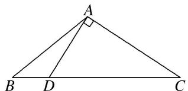
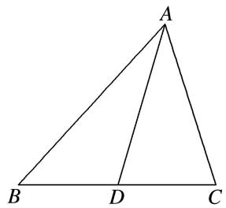

# 专题六 三角形中面积的计算问题

三角形中面积的计算问题主要考查正弦定理、余弦定理及三角形面积公式，此类问题一般是一问计算角或边，另一问计算面积。对于计算角与边的一问参考专题1，对于计算面积的一问一般用公式 $S=\frac{1}{2}ab\sin C=\frac{1}{2}ac\sin B=\frac{1}{2}bc\sin A$ ，一般是已知哪一个角就使用哪一个公式。但要结合三角恒等变换并同时用正弦定理、余弦定理和面积公式才能解决。

# 【方法总结】

# 三角形中面积计算问题的解题技巧

首先处理已知条件中的边角关系，得到两边及夹角，然后使用面积公式求解．对于条件中的边角关系一般全部化为角的关系，或全部化为边的关系．若出现边的一次式一般采用到正弦定理，出现边的二次式一般采用到余弦定理．若已知条件同时含有边和角，但不能直接使用正弦定理或余弦定理得到答案，要选择“边化角”或“角化边”，变换原则如下：

(1)若式子中含有正弦的齐次式，优先考虑正弦定理“角化边”，然后进行代数式变形；  
(2)若式子中含有 a, b, c 的齐次式，优先考虑正弦定理“边化角”，然后进行三角恒等变换；  
(3)若式子中含有余弦的齐次式，优先考虑余弦定理“角化边”，然后进行代数式变形；  
(4)同时出现两个自由角(或三个自由角)时，要用到三角形的内角和定理.

# 【例题选讲】

[例 1]已知 $\triangle ABC$ 的内角 A, B, C 的对边分别为 a, b, c, $a^{2}-ab-2b^{2}=0$ .

(1)若 $B = \frac{\pi}{6}$ ，求 $A$ ， $C;$   
(2)若 $C=\frac{2\pi}{3}$ ，c=14，求 $S_{\triangle ABC}$ .

[例 2](2014·浙江)在 $\triangle ABC$ 中，内角 $A$ ， $B$ ， $C$ 所对的边分别为 $a$ ， $b$ ， $c$ ．已知 $a \neq b$ ， $c = \sqrt{3}$ ， $\cos^{2} A - \cos^{2} B = \sqrt{3} \sin A \cos A - \sqrt{3} \sin B \cos B$ ．

(1)求角 C 的大小;  
(2)若 $\sin A=\frac{4}{5}$ ，求 $\triangle ABC$ 的面积.

[例 3](2017·全国III) $\triangle ABC$ 的内角 A, B, C 的对边分别为 a, b, c，已知 $\sin A + \sqrt{3}\cos A = 0$ , $a = 2\sqrt{7}$ , b = 2.

(1)求 c;   
(2)设 $D$ 为 $BC$ 边上一点，且 $AD \perp AC$ ，求 $\triangle ABD$ 的面积.

[例 4]如图，在 $\triangle ABC$ 中，已知点 $D$ 在 $BC$ 边上，满足 $AD\perp AC$ ， $\cos\angle BAC=-\frac{1}{3}$ ， $AB=3\sqrt{2}$ ， $BD=\sqrt{3}$ .

(1)求 AD 的长;  
(2)求 $\triangle ABC$ 的面积.

text_image

A
B D C

[例 5]已知 $\triangle ABC$ 内接于半径为 R 的圆，a, b, c 分别是角 A, B, C 的对边，且 $2R(\sin^{2}B-\sin^{2}A)=(b-c)\sin C$ ，c=3.

(1)求 $A$ ;

(2)若 AD 是 BC 边上的中线， $AD=\frac{\sqrt{19}}{2}$ ，求 $\triangle ABC$ 的面积.

# 【对点训练】

1. $\triangle ABC$ 的内角 $A, B, C$ 的对边分别为 $a, b, c$ , 已知 $(a + 2c)\cos B + b\cos A = 0$ .

(1)求 B;

(2)若 $b = 3$ ， $\triangle ABC$ 的周长为 $3 + 2\sqrt{3}$ ，求 $\triangle ABC$ 的面积.

2. 已知 $\triangle ABC$ 是斜三角形，内角 $A, B, C$ 所对的边的长分别为 $a, b, c$ . 若 $c \sin A = \sqrt{3} a \cos C$ .

(1)求角 C;

(2)若 $c = \sqrt{21}$ 且 $\sin C + \sin (B - A) = 5\sin 2A$ ，求△ABC的面积.

3. 在 $\triangle ABC$ 中，角 $A, B, C$ 的对边分别为 $a, b, c$ . 已知 $\frac{b}{c} = \frac{4\sqrt{5}}{5}, A + 3C = \pi$ .

(1)求 $\cos C$ 的值;

(2)若 $b = \sqrt{5}$ ，求△ABC的面积.

4. 已知在 $\triangle ABC$ 中，角 $A, B, C$ 所对的边分别为 $a, b, c$ ，且 $\frac{b}{a} = \frac{2\cos B}{1 - 2\cos A}$ .

(1)若 $\frac{b}{a} = \frac{2\sqrt{3}}{3}$ ，求角 $A$ 的大小；

(2)若 $a = 1$ ， $\tan A = 2\sqrt{2}$ ，求△ABC的面积.

5. 在 $\triangle ABC$ 中，角 $A, B, C$ 所对的边分别为 $a, b, c$ ，且满足 $2\sqrt{3}a\sin C\sin B=a\sin A+b\sin B-c\sin C$ .

(1)求角 C 的大小:

(2)若 $a\cos \left(\frac{\pi}{2} - B\right) = b\cos (2k\pi + A)(k \in \mathbf{Z})$ 且 $a = 2$ ，求 $\triangle ABC$ 的面积.

6. 在 $\triangle ABC$ 中，角 $A, B, C$ 所对的边分别为 $a, b, c$ ，且满足 $c\sin A = a\cos C, c = 4$ .

(1)求角 C 的大小:

(2)若 $\sqrt{3}\sin A = \cos \left(B + \frac{\pi}{4}\right) + 2$ ，求△ABC的面积.

7. 在 $\triangle ABC$ 中， $a, b, c$ 分别是内角 $A, B, C$ 的对边，且 $(a+c)^{2}=b^{2}+3ac$ .

(1)求角 B 的大小:

(2)若 $b = 2$ ，且 $\sin B + \sin (C - A) = 2\sin 2A$ ，求△ABC的面积.

8. 在 $\triangle ABC$ 中，内角 $A$ ， $B$ ， $C$ 所对的边分别为 $a$ ， $b$ ， $c$ ，已知 $B=60^{\circ}$ ， $c=8$ 。

(1)若点 $M$ ， $N$ 是线段 $BC$ 的两个三等分点， $BM = \frac{1}{3} BC$ ， $\frac{AN}{BM} = 2\sqrt{3}$ ，求 $AM$ 的值；

(2)若 b=12，求△ABC 的面积.

9. 在 $\triangle ABC$ 中，角 $A, B, C$ 的对边分别为 $a, b, c$ ，且 $a^2 - (b - c)^2 = (2 - \sqrt{3})bc$ ， $\sin A \sin B = \cos^2 \frac{C}{2}$ ， $BC$ 边上的中线 $AM$ 的长为 $\sqrt{7}$ .

(1)求角 A 和角 B 的大小;

(2)求 $\triangle ABC$ 的面积.

10. 已知 $a, b, c$ 分别为 $\triangle ABC$ 三个内角 $A, B, C$ 的对边，且 $a\cos C + \sqrt{3} a\sin C - b - c = 0$ .

(1)求 A;

(2)若 AD 为 BC 边上的中线， $\cos B=\frac{1}{7}$ ， $AD=\frac{\sqrt{129}}{2}$ ，求 $\triangle ABC$ 的面积.

text_image

A
B D C

