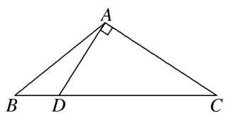
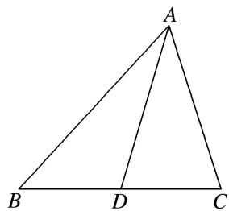

# 专题六 三角形中面积的计算问题

三角形中面积的计算问题主要考查正弦定理、余弦定理及三角形面积公式，此类问题一般是一问计算角或边，另一问计算面积。对于计算角与边的一问参考专题1，对于计算面积的一问一般用公式 $S=\frac{1}{2}ab\sin C=\frac{1}{2}ac\sin B=\frac{1}{2}bc\sin A$ ，一般是已知哪一个角就使用哪一个公式。但要结合三角恒等变换并同时用正弦定理、余弦定理和面积公式才能解决。

# 【方法总结】

# 三角形中面积计算问题的解题技巧

首先处理已知条件中的边角关系，得到两边及夹角，然后使用面积公式求解．对于条件中的边角关系一般全部化为角的关系，或全部化为边的关系．若出现边的一次式一般采用到正弦定理，出现边的二次式一般采用到余弦定理．若已知条件同时含有边和角，但不能直接使用正弦定理或余弦定理得到答案，要选择“边化角”或“角化边”，变换原则如下：

(1)若式子中含有正弦的齐次式，优先考虑正弦定理“角化边”，然后进行代数式变形；  
(2)若式子中含有 a, b, c 的齐次式，优先考虑正弦定理“边化角”，然后进行三角恒等变换；  
(3)若式子中含有余弦的齐次式，优先考虑余弦定理“角化边”，然后进行代数式变形；  
(4)同时出现两个自由角(或三个自由角)时，要用到三角形的内角和定理.

# 【例题选讲】

[例 1]已知 $\triangle ABC$ 的内角 A, B, C 的对边分别为 a, b, c, $a^{2}-ab-2b^{2}=0$ .

(1)若 $B = \frac{\pi}{6}$ ，求 $A$ ， $C;$   
(2)若 $C=\frac{2\pi}{3}$ ，c=14，求 $S_{\triangle ABC}$ .

解析 (1)由已知 $B = \frac{\pi}{6}$ , $a^2 - ab - 2b^2 = 0$ 结合正弦定理化简整理得 $2\sin^2 A - \sin A - 1 = 0$ ,

于是 $\sin A=1$ 或 $\sin A=-\frac{1}{2}$ (舍).

因为 $0 < A < \pi$ ，所以 $A = \frac{\pi}{2}$ ，又 $A + B + C = \pi$ ，所以 $C = \pi - \frac{\pi}{2} - \frac{\pi}{6} = \frac{\pi}{3}$ .

(2)由题意及余弦定理可知 $a^{2}+b^{2}+ab=196$ ，①

由 $a^{2}-ab-2b^{2}=0$ 得 $(a+b)(a-2b)=0$ ，因为 $a+b>0$ ，所以 a-2b=0，即 a=2b，②

联立①②解得 $b=2\sqrt{7}$ ， $a=4\sqrt{7}$ 。所以 $S_{\triangle ABC}=\frac{1}{2}ab\sin C=14\sqrt{3}$ .

[例 2](2014·浙江)在 $\triangle ABC$ 中，内角 A, B, C 所对的边分别为 a, b, c. 已知 $a \neq b$ , $c = \sqrt{3}$ , $\cos^{2}A - \cos^{2}B = \sqrt{3}\sin A\cos A - \sqrt{3}\sin B\cos B$ .

(1)求角 C 的大小;  
(2)若 $\sin A=\frac{4}{5}$ ，求 $\triangle ABC$ 的面积.

解析 (1)由题意得， $\frac{1+\cos2A}{2}-\frac{1+\cos2B}{2}=\frac{\sqrt{3}}{2}\sin2A-\frac{\sqrt{3}}{2}\sin2B,$

即 $\frac{\sqrt{3}}{2}\sin 2A - \frac{1}{2}\cos 2A = \frac{\sqrt{3}}{2}\sin 2B - \frac{1}{2}\cos 2B$ ， $\sin \left(2A - \frac{\pi}{6}\right) = \sin \left(2B - \frac{\pi}{6}\right)$ . 由 $a \neq b$ ，得 $A \neq B$ .

又 $A+B\in(0,\pi)$ ，得， $2A-\frac{\pi}{6}+2B-\frac{\pi}{6}=\pi$ ，即 $A+B=\frac{2\pi}{3}$ ，所以 $C=\frac{\pi}{3}$ .

(2)由 $c = \sqrt{3}$ , $\sin A = \frac{4}{5}$ , $\frac{a}{\sin A} = \frac{c}{\sin C}$ , 得 $a = \frac{8}{5}$ . 由 $a < c$ , 得 $A < C$ , 从而 $\cos A = \frac{3}{5}$ ,

故 $\sin B = \sin(A + C) = \sin A \cos C + \cos A \sin C = \frac{4 + 3\sqrt{3}}{10}$ ，所以， $\triangle ABC$ 的面积为 $S = \frac{1}{2} a c \sin B = \frac{8\sqrt{3} + 18}{25}$ .

[例 3](2017·全国III) $\triangle ABC$ 的内角 A, B, C 的对边分别为 a, b, c，已知 $\sin A + \sqrt{3}\cos A = 0$ , $a = 2\sqrt{7}$ , b = 2.

(1)求 c;

(2)设 $D$ 为 $BC$ 边上一点，且 $AD \perp AC$ ，求 $\triangle ABD$ 的面积.

解析 (1)由 $\sin A + \sqrt{3}\cos A = 0$ 及 $\cos A\neq 0$ ，得 $\tan A = -\sqrt{3}$ ，又 $0 <   A <   \pi$ ，所以 $A = \frac{2\pi}{3}$

由余弦定理，得 $28=4+c^{2}-4c\cdot\cos\frac{2\pi}{3}$ . 即 $c^{2}+2c-24=0$ ，解得 c=-6(舍去)，c=4.

(2)由题设可得 $\angle CAD = \frac{\pi}{2}$ , 所以 $\angle BAD = \angle BAC - \angle CAD = \frac{\pi}{6}$ .

故 $\triangle ABD$ 与 $\triangle ACD$ 面积的比值为 $\frac{\frac{1}{2}AB\cdot AD\sin\frac{\pi}{6}}{\frac{1}{2}AC\cdot AD}=1$ ．又 $\triangle ABC$ 的面积为 $\frac{1}{2}\times4\times2\sin\angle BAC=2\sqrt{3}$ ，

所以 $\triangle ABD$ 的面积为 $\sqrt{3}$ .

[例 4]如图，在 $\triangle ABC$ 中，已知点 $D$ 在 $BC$ 边上，满足 $AD\perp AC$ ， $\cos\angle BAC=-\frac{1}{3}$ ， $AB=3\sqrt{2}$ ， $BD=\sqrt{3}$ .

(1)求 AD 的长;

(2)求 $\triangle ABC$ 的面积.

text_image

A
B D C

解析 (1) 因为 $AD \perp AC$ ， $\cos \angle BAC = -\frac{1}{3}$ ，所以 $\sin \angle BAC = \frac{2\sqrt{2}}{3}$ .

又 $\sin\angle BAC=\sin\left(\frac{\pi}{2}+\angle BAD\right)=\cos\angle BAD=\frac{2\sqrt{2}}{3},$

在 $\triangle ABD$ 中， $BD^{2}=AB^{2}+AD^{2}-2AB\cdot AD\cdot\cos\angle BAD$ ，即 $AD^{2}-8AD+15=0$ ，

解得 AD=5 或 AD=3，由于 AB>AD，所以 AD=3。

(2)在 $\triangle ABD$ 中， $\frac{BD}{\sin\angle BAD}=\frac{AB}{\sin\angle ADB}$ ，又由 $\cos\angle BAD=\frac{2\sqrt{2}}{3}$ ，得 $\sin\angle BAD=\frac{1}{3}$ ，所以 $\sin\angle ADB=\frac{\sqrt{6}}{3}$ ，

则 $\sin\angle ADC=\sin(\pi-\angle ADB)=\sin\angle ADB=\frac{\sqrt{6}}{3}.$

因为 $\angle ADB = \angle DAC + \angle C = \frac{\pi}{2} + \angle C$ ，所以 $\cos \angle C = \frac{\sqrt{6}}{3}$ .

在 Rt△ADC 中， $\cos\angle C=\frac{\sqrt{6}}{3}$ ，则 $\tan\angle C=\frac{\sqrt{2}}{2}=\frac{AD}{AC}=\frac{3}{AC}$ ，所以 $AC=3\sqrt{2}$ .

则 $\triangle ABC$ 的面积 $S = \frac{1}{2} AB\cdot AC\cdot \sin \angle BAC = \frac{1}{2}\times 3\sqrt{2}\times 3\sqrt{2}\times \frac{2\sqrt{2}}{3} = 6\sqrt{2}.$

[例5]已知 $\triangle ABC$ 内接于半径为 $R$ 的圆， $a, b, c$ 分别是角 $A, B, C$ 的对边，且 $2R(\sin^2 B - \sin^2 A) = (b - c)\sin C, c = 3$ .

(1)求 A;

(2)若 AD 是 BC 边上的中线， $AD=\frac{\sqrt{19}}{2}$ ，求 $\triangle ABC$ 的面积.

解析 (1)对于 $2R(\sin^{2}B-\sin^{2}A)=(b-c)\sin C,$

由正弦定理得， $b\sin B - a\sin A = b\sin C - c\sin C$ ，即 $b^{2} - a^{2} = bc - c^{2}$

所以 $\cos A=\frac{b^{2}+c^{2}-a^{2}}{2bc}=\frac{1}{2}$ . 因为 $0^{\circ}<A<180^{\circ}$ ，所以 $A=60^{\circ}$ .

(2)以 AB, AC 为邻边作平行四边形 ABEC，连接 DE，易知 A, D, E 三点共线.

在 $\triangle ABE$ 中， $\angle ABE=120^{\circ}$ ， $AE=2AD=\sqrt{19}$ ，由余弦定理得 $AE^{2}=AB^{2}+BE^{2}-2AB\cdot BE\cos120^{\circ}$ ，

即 $19 = 9 + AC^2 - 2 \times 3 \times AC \times \left(-\frac{1}{2}\right)$ ，解得 $AC = 2$ 。故 $S_{\triangle ABC} = \frac{1}{2} bc \sin \angle BAC = \frac{3\sqrt{3}}{2}$ 。

# 【对点训练】

1. $\triangle ABC$ 的内角 $A, B, C$ 的对边分别为 $a, b, c$ , 已知 $(a + 2c)\cos B + b\cos A = 0$ .

(1)求 B;

(2)若 b=3， $\triangle ABC$ 的周长为 $3+2\sqrt{3}$ ，求 $\triangle ABC$ 的面积.

1. 解析 (1)由已知及正弦定理得 $(\sin A+2\sin C)\cos B+\sin B\cos A=0$ ,

$$
(\sin A \cos B + \sin B \cos A) + 2 \sin C \cos B = 0,
$$

$$
\sin (A + B) + 2 \sin C \cos B = 0, \text {又} \sin (A + B) = \sin C, \text {且} C \in (0, \pi), \sin C \neq 0,
$$

$$
\therefore \cos B = - \frac {1}{2}, \because 0 <   B <   \pi , \therefore B = \frac {2}{3} \pi .
$$

(2)由余弦定理，得 $9=a^{2}+c^{2}-2ac\cos B$ . $\therefore a^{2}+c^{2}+ac=9$ ，则 $(a+c)^{2}-ac=9$ .

$$
\because a + b + c = 3 + 2 \sqrt {3}, b = 3, \therefore a + c = 2 \sqrt {3}, \therefore a c = 3, \therefore S _ {\triangle A B C} = \frac {1}{2} a c \sin B = \frac {1}{2} \times 3 \times \frac {\sqrt {3}}{2} = \frac {3 \sqrt {3}}{4}.
$$

2. 已知 $\triangle ABC$ 是斜三角形，内角 $A, B, C$ 所对的边的长分别为 $a, b, c$ . 若 $c \sin A = \sqrt{3} a \cos C$ .

(1)求角 C;

(2)若 $c=\sqrt{21}$ 且 $\sin C+\sin(B-A)=5\sin2A$ ，求 $\triangle ABC$ 的面积.

2. 解析 (1) $\because c\sin A = \sqrt{3} a\cos C$ ，由正弦定理可得 $\sin C\sin A = \sqrt{3}\sin A\cos C, \sin A \neq 0,$

$\therefore \sin C=\sqrt{3}\cos C,$ 得 $\tan C=\frac{\sin C}{\cos C}=\sqrt{3}.$ $\because C\in(0,\pi),$ $\therefore C=\frac{\pi}{3}.$

(2) $\because\sin C+\sin(B-A)=5\sin2A,\quad\sin C=\sin(A+B),$

$$
\therefore \sin (A + B) + \sin (B - A) = 5 \sin 2 A, \quad \therefore 2 \sin B \cos A = 2 \times 5 \sin A \cos A.
$$

∵△ABC 为斜三角形，∴cosA≠0，∴sinB=5sinA.

由正弦定理可知 b=5a，①

由余弦定理 $c^{2}=a^{2}+b^{2}-2ab\cos C$ ，得 $21=a^{2}+b^{2}-2ab\times\frac{1}{2}$ ，②

联立①②，得 a=1, b=5. $\therefore S_{\triangle ABC}=\frac{1}{2}ab\sin C=\frac{1}{2}\times1\times5\times\frac{\sqrt{3}}{2}=\frac{5\sqrt{3}}{4}.$

3. 在 $\triangle ABC$ 中，角 $A, B, C$ 的对边分别为 $a, b, c$ . 已知 $\frac{b}{c} = \frac{4\sqrt{5}}{5}, A + 3C = \pi$ .

(1)求 $\cos C$ 的值；

(2)若 $b=\sqrt{5}$ ，求△ABC 的面积.

3. 解析 (1) $\because A + B + C = \pi, A + 3C = \pi, \therefore B = 2C.$

由 $\frac{b}{c}=\frac{\sin B}{\sin C}$ ，得 $\frac{4\sqrt{5}}{5}=\frac{2\sin C\cos C}{\sin C}$ ，化简得 $\cos C=\frac{2\sqrt{5}}{5}$ .

(2) $\because C \in (0, \pi)$ , $\therefore \sin C = \sqrt{1 - \cos^2 C} = \sqrt{1 - \frac{4}{5}} = \frac{\sqrt{5}}{5}$ .

$$
\because B = 2 C, \therefore \cos B = \cos 2 C = 2 \cos^ {2} C - 1 = 2 \times \frac {4}{5} - 1 = \frac {3}{5}, \therefore \sin B = \frac {4}{5}. \because A + B + C = \pi ,
$$

$$
\therefore \sin A = \sin (B + C) = \sin B \cos C + \cos B \sin C = \frac {4}{5} \times \frac {2 \sqrt {5}}{5} + \frac {3}{5} \times \frac {\sqrt {5}}{5} = \frac {1 1 \sqrt {5}}{2 5}.
$$

$$
\because \frac {b}{c} = \frac {4 \sqrt {5}}{5}, b = \sqrt {5}, \therefore c = \frac {5}{4}. \therefore \triangle A B C \text {   的面积   } S = \frac {1}{2} b c \sin A = \frac {1}{2} \times \sqrt {5} \times \frac {5}{4} \times \frac {1 1 \sqrt {5}}{2 5} = \frac {1 1}{8}.
$$

4. 已知在 $\triangle ABC$ 中，角 $A, B, C$ 所对的边分别为 $a, b, c$ ，且 $\frac{b}{a} = \frac{2\cos B}{1 - 2\cos A}$ .

(1)若 $\frac{b}{a}=\frac{2\sqrt{3}}{3}$ ，求角A的大小；

(2)若 $a = 1$ ， $\tan A = 2\sqrt{2}$ ，求△ABC的面积.

4. 解析 (1)由 $\frac{b}{a} = \frac{2\cos B}{1 - 2\cos A}$ 及正弦定理得 $\sin B(1 - 2\cos A) = 2\sin A\cos B,$

即 $\sin B=2\sin A\cos B+2\cos A\sin B=2\sin(A+B)=2\sin C$ ，即 b=2c.

又由 $\frac{b}{a}=\frac{2\sqrt{3}}{3}$ 及余弦定理，得 $\cos A=\frac{b^{2}+c^{2}-a^{2}}{2bc}=\frac{1}{2}\Rightarrow A=\frac{\pi}{3}.$

(2) $\because\tan A=2\sqrt{2},\quad\therefore\cos A=\frac{1}{3},\quad\sin A=\frac{2\sqrt{2}}{3}.$

由余弦定理 $\cos A=\frac{b^{2}+c^{2}-a^{2}}{2bc}$ ，得 $\frac{1}{3}=\frac{4c^{2}+c^{2}-1}{4c^{2}}$ ，解得 $c^{2}=\frac{3}{11}$ ,

$$
\therefore S _ {\triangle A B C} = \frac {1}{2} b c \sin A = c ^ {2} \sin A = \frac {3}{1 1} \times \frac {2 \sqrt {2}}{3} = \frac {2 \sqrt {2}}{1 1}.
$$

5. 在 $\triangle ABC$ 中，角 $A, B, C$ 所对的边分别为 $a, b, c$ ，且满足 $2\sqrt{3} a \sin C \sin B = a \sin A + b \sin B - c \sin C$ .

(1)求角 C 的大小;

(2)若 $a\cos \left(\frac{\pi}{2} -B\right) = b\cos (2k\pi +A)(k\in \mathbf{Z})$ 且 $a = 2$ ，求△ABC的面积.

5. 解析 (1)由 $2\sqrt{3} a \sin C \sin B = a \sin A + b \sin B - c \sin C$ 及正弦定理，得 $2\sqrt{3} a b \sin C = a^2 + b^2 - c^2$

$$
\therefore \sqrt {3} \sin C = \frac {a ^ {2} + b ^ {2} - c ^ {2}}{2 a b}, \quad \therefore \sqrt {3} \sin C = \cos C, \quad \therefore \tan C = \frac {\sqrt {3}}{3}, \quad \therefore C = \frac {\pi}{6}.
$$

(2)由 $a\cos \left(\frac{\pi}{2} - B\right) = b\cos (2k\pi + A)(k \in \mathbb{Z})$ ，得 $a\sin B = b\cos A$

由正弦定理得 $\sin A\sin B=\sin B\cos A,\quad\therefore\sin A=\cos A,\quad\therefore A=\frac{\pi}{4},$

根据正弦定理可得 $\frac{2}{\sin\frac{\pi}{4}}=\frac{c}{\sin\frac{\pi}{6}}$ ，解得 $c=\sqrt{2}$ ,

$$
\therefore S _ {\triangle A B C} = \frac {1}{2} a c \sin B = \frac {1}{2} \times 2 \times \sqrt {2} \sin (\pi - A - C) = \sqrt {2} \sin \left(\frac {\pi}{4} + \frac {\pi}{6}\right) = \frac {\sqrt {3} + 1}{2}.
$$

6. 在 $\triangle ABC$ 中，角 $A, B, C$ 所对的边分别为 $a, b, c$ ，且满足 $c\sin A = a\cos C, c = 4$ .

(1)求角 C 的大小;

(2)若 $\sqrt{3}\sin A = \cos \left(B + \frac{\pi}{4}\right) + 2$ ，求△ABC的面积.

6. 解析 (1) 在 $\triangle ABC$ 中, $\because c \sin A = a \cos C$ , $\therefore$ 由正弦定理得 $\sin C \sin A = \sin A \cos C (\sin A > 0)$ ,

$$
\therefore \tan C = 1, \text {又} 0 <   C <   \pi , \therefore C = \frac {\pi}{4}.
$$

(2) $\because\sqrt{3}\sin A=\cos\left(B+\frac{\pi}{4}\right)+2,\quad\therefore\sqrt{3}\sin A=\cos(B+C)+2,\quad\text{即}\sqrt{3}\sin A=-\cos A+2,$

即 $\sin\left(A+\frac{\pi}{6}\right)=1,\quad\therefore A+\frac{\pi}{6}=\frac{\pi}{2},\quad\therefore A=\frac{\pi}{3},\quad\therefore B=\frac{5\pi}{12},$

$$
\therefore \sin B = \sin \frac {5 \pi}{1 2} = \sin \left(\frac {\pi}{4} + \frac {\pi}{6}\right) = \sin \frac {\pi}{4} \cos \frac {\pi}{6} + \cos \frac {\pi}{4} \sin \frac {\pi}{6} = \frac {\sqrt {6} + \sqrt {2}}{4},
$$

由正弦定理 $\frac{a}{\sin A}=\frac{c}{\sin C}$ ，得 $a=\frac{c\sin A}{\sin C}=\frac{4\sin\frac{\pi}{3}}{\sin\frac{\pi}{4}}=2\sqrt{6}$

$$
\therefore S _ {\triangle A B C} = \frac {1}{2} a c \sin B = \frac {1}{2} \times 2 \sqrt {6} \times 4 \times \frac {\sqrt {6} + \sqrt {2}}{4} = 6 + 2 \sqrt {3}.
$$

7. 在 $\triangle ABC$ 中， $a, b, c$ 分别是内角 $A, B, C$ 的对边，且 $(a+c)^{2}=b^{2}+3ac$ .

(1)求角 B 的大小;

(2)若 b=2，且 $\sin B+\sin(C-A)=2\sin2A$ ，求 $\triangle ABC$ 的面积.

7. 解析 (1)由 $(a+c)^{2}=b^{2}+3ac$ ，整理得 $a^{2}+c^{2}-b^{2}=ac$

由余弦定理得 $\cos B=\frac{a^{2}+c^{2}-b^{2}}{2ac}=\frac{ac}{2ac}=\frac{1}{2},\quad\because0<B<\pi,\quad\therefore B=\frac{\pi}{3}.$

(2)在 $\triangle ABC$ 中， $A+B+C=\pi$ ，即 $B=\pi-(A+C)$ ，故 $\sin B=\sin(A+C)$ ，

由已知 $\sin B + \sin(C - A) = 2\sin 2A$ 可得 $\sin(A + C) + \sin(C - A) = 2\sin 2A$ ,

∴ $\sin A\cos C + \cos A\sin C + \sin C\cos A - \cos C\sin A = 4\sin A\cos A$ ，整理得 $\cos A\sin C = 2\sin A\cos A$ .

若 $\cos A=0$ ，则 $A=\frac{\pi}{2}$ ，由 b=2，可得 $c=\frac{2}{\tan B}=\frac{2\sqrt{3}}{3}$ ，此时 $\triangle ABC$ 的面积 $S=\frac{1}{2}bc=\frac{2\sqrt{3}}{3}$ .

若 $\cos A \neq 0$ ，则 $\sin C = 2\sin A$ ，由正弦定理可知，c = 2a，

代入 $a^{2}+c^{2}-b^{2}=ac$ ，整理可得 $3a^{2}=4$ ，解得 $a=\frac{2\sqrt{3}}{3}$ ，∴ $c=\frac{4\sqrt{3}}{3}$ ,

此时 $\triangle ABC$ 的面积 $S = \frac{1}{2} ac\sin B = \frac{2\sqrt{3}}{3}$ 。综上所述， $\triangle ABC$ 的面积为 $\frac{2\sqrt{3}}{3}$ 。

8. 在 $\triangle ABC$ 中，内角 $A$ ， $B$ ， $C$ 所对的边分别为 $a$ ， $b$ ， $c$ ，已知 $B=60^{\circ}$ ， $c=8$ 。

(1)若点 M, N 是线段 BC 的两个三等分点， $BM=\frac{1}{3}BC,\quad\frac{AN}{BM}=2\sqrt{3}$ ，求 AM 的值；

(2)若 b=12，求 $\triangle ABC$ 的面积.

8. 解析 (1)由题意得 $M$ ， $N$ 是线段 $BC$ 的两个三等分点，设 $BM = x$ ，则 $BN = 2x$ ， $AN = 2\sqrt{3}x$ ，又 $B = 60^\circ$ ， $AB = 8$ ，在 $\triangle ABN$ 中，由余弦定理得 $12x^2 = 64 + 4x^2 - 2 \times 8 \times 2x\cos 60^\circ$ ，解得 $x = 2$ （负值舍去），则 $BM = 2$ 。

在 $\triangle ABM$ 中，由余弦定理，得 $AB^{2}+BM^{2}-2AB\cdot BM\cdot\cos B=AM^{2}$ ，

$$
A M = \sqrt {8 ^ {2} + 2 ^ {2} - 2 \times 8 \times 2 \times \frac {1}{2}} = \sqrt {5 2} = 2 \sqrt {1 3}.
$$

(2)在 $\triangle ABC$ 中，由正弦定理 $\frac{b}{\sin B}=\frac{c}{\sin C}$ ，得 $\sin C=\frac{c\sin B}{b}=\frac{8\times\frac{\sqrt{3}}{2}}{12}=\frac{\sqrt{3}}{3}$ .

又 b>c，所以 B>C，则 C 为锐角，所以 $\cos C=\frac{\sqrt{6}}{3}$ .

则 $\sin A=\sin(B+C)=\sin B\cos C+\cos B\sin C=\frac{\sqrt{3}}{2}\times\frac{\sqrt{6}}{3}+\frac{1}{2}\times\frac{\sqrt{3}}{3}=\frac{3\sqrt{2}+\sqrt{3}}{6}$ ,

所以 $\triangle ABC$ 的面积 $S = \frac{1}{2} bc\sin A = 48\times \frac{3\sqrt{2} + \sqrt{3}}{6} = 24\sqrt{2} +8\sqrt{3}.$

9. 在 $\triangle ABC$ 中，角 $A, B, C$ 的对边分别为 $a, b, c$ ，且 $a^2 - (b - c)^2 = (2 - \sqrt{3})bc$ ， $\sin A \sin B = \cos^2 \frac{C}{2}$ ， $BC$ 边上的中线 $AM$ 的长为 $\sqrt{7}$ .

(1)求角 A 和角 B 的大小;

(2)求 $\triangle ABC$ 的面积.

9. 解析 (1) 由 $a^2 - (b - c)^2 = (2 - \sqrt{3})bc$ ，得 $a^2 - b^2 - c^2 = -\sqrt{3}bc$ ， $\therefore \cos A = \frac{b^2 + c^2 - a^2}{2bc} = \frac{\sqrt{3}}{2}$ ，

又 $0 < A < \pi, \therefore A = \frac{\pi}{6}$ . 由 $\sin A \sin B = \cos^2 \frac{C}{2}$ , 得 $\frac{1}{2} \sin B = \frac{1 + \cos C}{2}$ , 即 $\sin B = 1 + \cos C$ , 则 $\cos C < 0$ ,即 C 为钝角，∴ B 为锐角，且 $B + C = \frac{5\pi}{6}$ ，则 $\sin\left(\frac{5\pi}{6} - C\right) = 1 + \cos C$ ,

化简得 $\cos\left(C+\frac{\pi}{3}\right)=-1$ ，解得 $C=\frac{2\pi}{3}$ ，∴ $B=\frac{\pi}{6}$ .

(2)由(1)知，a=b，在 $\triangle ACM$ 中，由余弦定理得 $AM^{2}=b^{2}+\left(\frac{a}{2}\right)^{2}-2b\cdot\frac{a}{2}\cdot\cos C=b^{2}+\frac{b^{2}}{4}+\frac{b^{2}}{2}=(\sqrt{7})^{2}$ ，解得b=2，故 $S_{\triangle ABC}=\frac{1}{2}ab\sin C=\frac{1}{2}\times2\times2\times\frac{\sqrt{3}}{2}=\sqrt{3}$ .

10. 已知 $a, b, c$ 分别为 $\triangle ABC$ 三个内角 $A, B, C$ 的对边，且 $a\cos C + \sqrt{3} a\sin C - b - c = 0$ .

(1)求 A;

(2)若 AD 为 BC 边上的中线， $\cos B=\frac{1}{7}$ ， $AD=\frac{\sqrt{129}}{2}$ ，求△ABC 的面积.

text_image

A
B D C

10. 解析 (1) $a\cos C + \sqrt{3}a\sin C - b - c = 0$ ，由正弦定理得 $\sin A\cos C + \sqrt{3}\sin A\sin C = \sin B + \sin C$ ，即 $\sin A\cos C + \sqrt{3}\sin A\sin C = \sin (A + C) + \sin C$ ，

亦即 $\sin A\cos C + \sqrt{3}\sin A\sin C = \sin A\cos C + \cos A\sin C + \sin C$ ，则 $\sqrt{3}\sin A\sin C - \cos A\sin C = \sin C.$ 又 $\sin C \neq 0$ ，所以 $\sqrt{3}\sin A - \cos A = 1$ ，所以 $\sin(A - 30^{\circ}) = \frac{1}{2}$ .在 $\triangle ABC$ 中， $0^{\circ}<A<180^{\circ}$ ，则 $-30^{\circ}<A-30^{\circ}<150^{\circ}$ ，所以 $A-30^{\circ}=30^{\circ}$ ，得 $A=60^{\circ}$ .

(2)在 $\triangle ABC$ 中，因为 $\cos B=\frac{1}{7}$ ，所以 $\sin B=\frac{4\sqrt{3}}{7}$ 。所以 $\sin C=\sin(A+B)=\frac{\sqrt{3}}{2}\times\frac{1}{7}+\frac{1}{2}\times\frac{4\sqrt{3}}{7}=\frac{5\sqrt{3}}{14}$ 。由正弦定理，得 $\frac{a}{c}=\frac{\sin A}{\sin C}=\frac{7}{5}$ 。设a=7x， $c=5x(x>0)$ ，则在 $\triangle ABD$ 中， $AD^{2}=AB^{2}+BD^{2}-2AB\cdot BD\cos B$ ，即 $\frac{129}{4} = 25x^{2} + \frac{1}{4}\times 49x^{2} - 2\times 5x\times \frac{1}{2}\times 7x\times \frac{1}{7}$ ，解得 $x = 1$ （负值舍去），所以 $a = 7$ ， $c = 5$

故 $S_{\triangle ABC}=\frac{1}{2}ac\sin B=10\sqrt{3}.$

