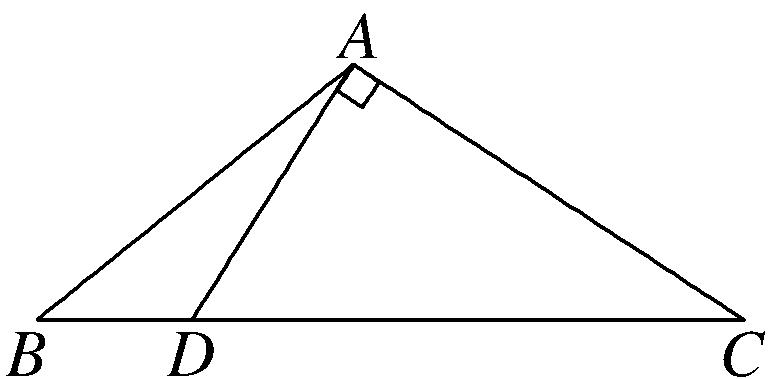
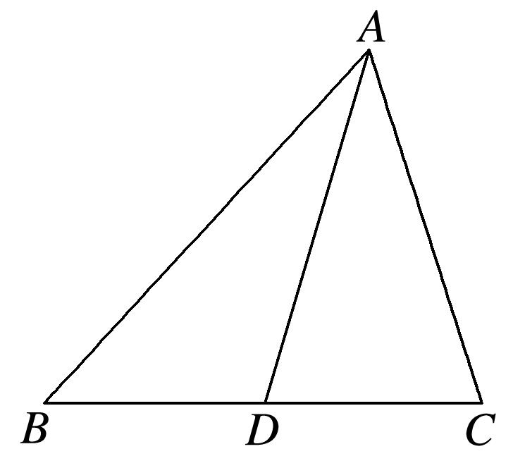

**专题六　三角形中面积的计算问题**

三角形中面积的计算问题主要考查正弦定理、余弦定理及三角形面积公式，此类问题一般是一问计算角或边，另一问计算面积．对于计算角与边的一问参考专题1，对于计算面积的一问一般用公式*S*＝*ab*sin*C*＝*ac*sin*B*＝*bc*sin*A*，一般是已知哪一个角就使用哪一个公式．但要结合三角恒等变换并同时用正弦定理、余弦定理和面积公式才能解决．

【**方法总结**】

三角形中面积计算问题的解题技巧

首先处理已知条件中的边角关系，得到两边及夹角，然后使用面积公式求解．对于条件中的边角关系一般全部化为角的关系，或全部化为边的关系．若出现边的一次式一般采用到正弦定理，出现边的二次式一般采用到余弦定理．若已知条件同时含有边和角，但不能直接使用正弦定理或余弦定理得到答案，要选择“边化角”或“角化边”，变换原则如下：

(1)若式子中含有正弦的齐次式，优先考虑正弦定理“角化边”，然后进行代数式变形；

(2)若式子中含有*a*，*b*，*c*的齐次式，优先考虑正弦定理“边化角”，然后进行三角恒等变换；

(3)若式子中含有余弦的齐次式，优先考虑余弦定理“角化边”，然后进行代数式变形；

(4)同时出现两个自由角(或三个自由角)时，要用到三角形的内角和定理．

**【例题选讲】**

<strong>[例1]</strong>已知△<em>ABC</em>的内角<em>A</em>，<em>B</em>，<em>C</em>的对边分别为<em>a</em>，<em>b</em>，<em>c</em>，<em>a</em>2－<em>ab</em>－2<em>b</em>2＝0．

(1)若*B*＝，求*A*，*C*；

(2)若<em>C</em>＝，<em>c</em>＝14，求<em>S</em>△<em>ABC</em>．

解析　(1)由已知<em>B</em>＝，<em>a</em>2－<em>ab</em>－2<em>b</em>2＝0结合正弦定理化简整理得2sin2<em>A</em>－sin <em>A</em>－1＝0，

于是sin*A*＝1或sin*A*＝－(舍)．

因为0<*A*<π，所以*A*＝，又*A*＋*B*＋*C*＝π，所以*C*＝π－－＝．

(2)由题意及余弦定理可知<em>a</em>2＋<em>b</em>2＋<em>ab</em>＝196，①

由<em>a</em>2－<em>ab</em>－2<em>b</em>2＝0得(<em>a</em>＋<em>b</em>)(<em>a</em>－2<em>b</em>)＝0，因为<em>a</em>＋<em>b</em>&gt;0，所以<em>a</em>－2<em>b</em>＝0，即<em>a</em>＝2<em>b</em>，②

联立①②解得<em>b</em>＝2，<em>a</em>＝4．所以<em>S</em>△<em>ABC</em>＝<em>ab</em>sin <em>C</em>＝14．

<strong>[例2]</strong>(2014·浙江)在△<em>ABC</em>中，内角<em>A</em>，<em>B</em>，<em>C</em>所对的边分别为<em>a</em>，<em>b</em>，<em>c</em>．已知<em>a</em>≠<em>b</em>，<em>c</em>＝，cos2<em>A</em>－cos2<em>B</em>＝sin<em>A</em>cos<em>A</em>－sin<em>B</em>cos<em>B</em>．

(1)求角*C*的大小；

(2)若sin*A*＝，求△*ABC*的面积．

解析　(1)由题意得，－＝sin2*A*－sin2*B*，

即sin2*A*－cos2*A*＝sin2*B*－cos2*B*，sin＝sin．由*a*≠*b*，得*A*≠*B*．

又*A*＋*B*∈(0，π)，得，2*A*－＋2*B*－＝π，即*A*＋*B*＝，所以*C*＝．

(2)由*c*＝，sin*A*＝，＝，得*a*＝．由*a*<*c*，得*A*<*C*，从而cos*A*＝，

故sin*B*＝sin(*A*＋*C*)＝sin*A*cos*C*＋cos*A*sin*C*＝，所以，△*ABC*的面积为*S*＝*ac*sin*B*＝．

<strong>[例3]</strong>(2017·全国Ⅲ)△<em>ABC</em>的内角<em>A</em>，<em>B</em>，<em>C</em>的对边分别为<em>a</em>，<em>b</em>，<em>c</em>，已知sin<em>A</em>＋cos<em>A</em>＝0，<em>a</em>＝2，<em>b</em>＝2．

(1)求*c*；

(2)设*D*为*BC*边上一点，且*AD*⊥*AC*，求△*ABD*的面积．

解析　(1)由sin*A*＋cos*A*＝0及cos*A*≠0，得tan*A*＝－，又0<*A*<π，所以*A*＝．

由余弦定理，得28＝4＋<em>c</em>2－4<em>c</em>·cos ．即<em>c</em>2＋2<em>c</em>－24＝0，解得<em>c</em>＝－6(舍去)，<em>c</em>＝4．

(2)由题设可得∠*CAD*＝，所以∠*BAD*＝∠*BAC*－∠*CAD*＝．

故△*ABD*与△*ACD*面积的比值为＝1．又△*ABC*的面积为×4×2sin∠*BAC*＝2，

所以△*ABD*的面积为．

<strong>[例4]</strong>如图，在△<em>ABC</em>中，已知点<em>D</em>在<em>BC</em>边上，满足<em>AD</em>⊥<em>AC</em>，cos∠<em>BAC</em>＝－，<em>AB</em>＝3，<em>BD</em>＝．

(1)求*AD*的长；

(2)求△*ABC*的面积．

解析　(1)因为*AD*⊥*AC*，cos∠*BAC*＝－，所以sin∠*BAC*＝．

又sin∠*BAC*＝sin＝cos∠*BAD*＝，

在△<em>ABD</em>中，<em>BD</em>2＝<em>AB</em>2＋<em>AD</em>2－2<em>AB</em>·<em>AD</em>·cos∠<em>BAD</em>，即<em>AD</em>2－8<em>AD</em>＋15＝0，

解得*AD*＝5或*AD*＝3，由于*AB*>*AD*，所以*AD*＝3．

(2)在△*ABD*中，＝，又由cos∠*BAD*＝，得sin∠*BAD*＝，所以sin∠*ADB*＝，

则sin∠*ADC*＝sin(π－∠*ADB*)＝sin∠*ADB*＝．

因为∠*ADB*＝∠*DAC*＋∠*C*＝＋∠*C*，所以cos∠*C*＝．

在Rt△*ADC*中，cos∠*C*＝，则tan∠*C*＝＝＝，所以*AC*＝3．

则△*ABC*的面积*S*＝*AB*·*AC*·sin∠*BAC*＝×3×3×＝6．

<strong>[例5]</strong>已知△<em>ABC</em>内接于半径为<em>R</em>的圆，<em>a</em>，<em>b</em>，<em>c</em>分别是角<em>A</em>，<em>B</em>，<em>C</em>的对边，且2<em>R</em>(sin2<em>B</em>－sin2<em>A</em>)＝(<em>b</em>－<em>c</em>)sin<em>C</em>，<em>c</em>＝3．

(1)求*A*；

(2)若*AD*是*BC*边上的中线，*AD*＝，求△*ABC*的面积．

解析　(1)对于2<em>R</em>(sin2<em>B</em>－sin2<em>A</em>)＝(<em>b</em>－<em>c</em>)sin <em>C</em>，

由正弦定理得，<em>b</em>sin<em>B</em>－<em>a</em>sin<em>A</em>＝<em>b</em>sin<em>C</em>－<em>c</em>sin<em>C</em>，即<em>b</em>2－<em>a</em>2＝<em>bc</em>－<em>c</em>2，

所以cos*A*＝＝．因为0°<*A*<180°，所以*A*＝60°．

(2)以*AB*，*AC*为邻边作平行四边形*ABEC*，连接*DE*，易知*A*，*D*，*E*三点共线．

在△<em>ABE</em>中，∠<em>ABE</em>＝120°，<em>AE</em>＝2<em>AD</em>＝，由余弦定理得<em>AE</em>2＝<em>AB</em>2＋<em>BE</em>2－2<em>AB</em>·<em>BE</em>cos120°，

即19＝9＋<em>AC</em>2－2×3×<em>AC</em>×，解得<em>AC</em>＝2．故<em>S</em>△<em>ABC</em>＝<em>bc</em>sin∠<em>BAC</em>＝．

【**对点训练**】

1．△*ABC*的内角*A*，*B*，*C*的对边分别为*a*，*b*，*c*，已知(*a*＋2*c*)cos*B*＋*b*cos*A*＝0．

(1)求*B*；

(2)若*b*＝3，△*ABC*的周长为3＋2，求△*ABC*的面积．

1．解析　(1)由已知及正弦定理得(sin *A*＋2sin *C*)cos *B*＋sin *B*cos *A*＝0，

(sin *A*cos *B*＋sin *B*cos *A*)＋2sin *C*cos *B*＝0，

sin(*A*＋*B*)＋2sin *C*cos *B*＝0，又sin(*A*＋*B*)＝sin *C*，且*C*∈(0，π)，sin *C*≠0，

∴cos *B*＝－，∵0<*B*<π，∴*B*＝π．

(2)由余弦定理，得9＝<em>a</em>2＋<em>c</em>2－2<em>ac</em>cos <em>B</em>．∴<em>a</em>2＋<em>c</em>2＋<em>ac</em>＝9，则(<em>a</em>＋<em>c</em>)2－<em>ac</em>＝9．

∵<em>a</em>＋<em>b</em>＋<em>c</em>＝3＋2，<em>b</em>＝3，∴<em>a</em>＋<em>c</em>＝2，∴<em>ac</em>＝3，∴<em>S</em>△<em>ABC</em>＝<em>ac</em>sin <em>B</em>＝×3×＝．

2．已知△*ABC*是斜三角形，内角*A*，*B*，*C*所对的边的长分别为*a*，*b*，*c*．若*c*sin*A*＝*a*cos*C．*

(1)求角*C*；

(2)若*c*＝且sin*C*＋sin(*B*－*A*)＝5sin2*A*，求△*ABC*的面积．

2．解析　(1)∵*c*sin *A*＝*a*cos*C*，由正弦定理可得sin*C*sin*A*＝sin*A*cos*C*，sin*A*≠0，

∴sin*C*＝cos*C*，得tan *C*＝＝．∵*C*∈(0，π)，∴*C*＝．

(2)∵sin*C*＋sin(*B*－*A*)＝5sin2*A*，sin *C*＝sin(*A*＋*B*)，

∴sin(*A*＋*B*)＋sin(*B*－*A*)＝5sin2*A*，∴2sin*B*cos*A*＝2×5sin*A*cos*A．*

∵△*ABC*为斜三角形，∴cos*A*≠0，∴sin*B*＝5sin*A．*

由正弦定理可知*b*＝5*a*，①

由余弦定理<em>c</em>2＝<em>a</em>2＋<em>b</em>2－2<em>ab</em>cos<em>C</em>，得21＝<em>a</em>2＋<em>b</em>2－2<em>ab</em>×，②

联立①②，得<em>a</em>＝1，<em>b</em>＝5．∴<em>S</em>△<em>ABC</em>＝<em>ab</em>sin<em>C</em>＝×1×5×＝．

3．在△*ABC*中，角*A*，*B*，*C*的对边分别为*a*，*b*，*c*．已知＝，*A*＋3*C*＝π．

(1)求cos*C*的值；

(2)若*b*＝，求△*ABC*的面积．

3．解析　(1)∵*A*＋*B*＋*C*＝π，*A*＋3*C*＝π，∴*B*＝2*C*．

由＝，得＝，化简得cos *C*＝．

(2)∵*C*∈(0，π)，∴sin *C*＝＝ ＝．

∵<em>B</em>＝2<em>C</em>，∴cos<em>B</em>＝cos2<em>C</em>＝2cos2<em>C</em>－1＝2×－1＝，∴sin<em>B</em>＝．∵<em>A</em>＋<em>B</em>＋<em>C</em>＝π，

∴sin*A*＝sin(*B*＋*C*)＝sin*B*cos*C*＋cos*B*sin*C*＝×＋×＝．

∵＝，*b*＝，∴*c*＝．∴△*ABC*的面积*S*＝*bc*sin*A*＝×××＝．

4．已知在△*ABC*中，角*A*，*B*，*C*所对的边分别为*a*，*b*，*c*，且＝．

(1)若＝，求角*A*的大小；

(2)若*a*＝1，tan*A*＝2，求△*ABC*的面积．

4．解析　(1)由＝及正弦定理得sin *B*(1－2cos *A*)＝2sin *A*cos *B*，

即sin *B*＝2sin *A*cos *B*＋2cos *A*sin *B*＝2sin(*A*＋*B*)＝2sin *C*，即*b*＝2*c*．

又由＝及余弦定理，得cos *A*＝＝⇒*A*＝．

(2)∵tan*A*＝2，∴cos*A*＝，sin*A*＝．

由余弦定理cos<em>A</em>＝，得＝，解得<em>c</em>2＝，

∴<em>S</em>△<em>ABC</em>＝<em>bc</em>sin <em>A</em>＝<em>c</em>2sin <em>A</em>＝×＝．

5．在△*ABC*中，角*A*，*B*，*C*所对的边分别为*a*，*b*，*c*，且满足2*a*sin*C*sin*B*＝*a*sin*A*＋*b*sin*B*－*c*sin*C*．

(1)求角*C*的大小；

(2)若<em>a</em>cos＝<em>b</em>cos(2<em>k</em>π＋<em>A</em>)(<em>k</em>∈<strong>Z</strong>)且<em>a</em>＝2，求△<em>ABC</em>的面积．

5．解析　(1)由2<em>a</em>sin <em>C</em>sin <em>B</em>＝<em>a</em>sin <em>A</em>＋<em>b</em>sin <em>B</em>－<em>c</em>sin <em>C</em>及正弦定理，得2<em>ab</em>sin <em>C</em>＝<em>a</em>2＋<em>b</em>2－<em>c</em>2，

∴sin *C*＝，∴sin *C*＝cos *C*，∴tan *C*＝，∴*C*＝．

(2)由*a*cos＝*b*cos(2*k*π＋*A*)(*k*∈Z)，得*a*sin*B*＝*b*cos*A*，

由正弦定理得sin*A*sin*B*＝sin*B*cos*A*，∴sin*A*＝cos*A*，∴*A*＝，

根据正弦定理可得＝，解得*c*＝，

∴<em>S</em>△<em>ABC</em>＝<em>ac</em>sin <em>B</em>＝×2×sin(π－<em>A</em>－<em>C</em>)＝sin＝．

6．在△*ABC*中，角*A*，*B*，*C*所对的边分别为*a*，*b*，*c*，且满足*c*sin*A*＝*a*cos*C*，*c*＝4．

(1)求角*C*的大小；

(2)若sin*A*＝cos＋2，求△*ABC*的面积．

6．解析　(1)在△*ABC*中，∵*c*sin *A*＝*a*cos *C*，∴由正弦定理得sin *C*sin *A*＝sin *A*cos *C*(sin *A*>0)，

∴tan *C*＝1，又0<*C*<π，∴*C*＝．

(2)∵sin*A*＝cos＋2，∴sin*A*＝cos(*B*＋*C*)＋2，即sin*A*＝－cos*A*＋2，

即sin＝1，∴*A*＋＝，∴*A*＝，∴*B*＝，

∴sin*B*＝sin＝sin＝sincos＋cossin＝，

由正弦定理＝，得*a*＝＝＝2，

∴<em>S</em>△<em>ABC</em>＝<em>ac</em>sin <em>B</em>＝×2×4×＝6＋2．

7．在△<em>ABC</em>中，<em>a</em>，<em>b</em>，<em>c</em>分别是内角<em>A</em>，<em>B</em>，<em>C</em>的对边，且(<em>a</em>＋<em>c</em>)2＝<em>b</em>2＋3<em>ac</em>．

(1)求角*B*的大小；

(2)若*b*＝2，且sin*B*＋sin(*C*－*A*)＝2sin2*A*，求△*ABC*的面积．

7．解析　(1)由(<em>a</em>＋<em>c</em>)2＝<em>b</em>2＋3<em>ac</em>，整理得<em>a</em>2＋<em>c</em>2－<em>b</em>2＝<em>ac</em>，

由余弦定理得cos *B*＝＝＝，∵0<*B*<π，∴*B*＝．

(2)在△*ABC*中，*A*＋*B*＋*C*＝π，即*B*＝π－(*A*＋*C*)，故sin *B*＝sin(*A*＋*C*)，

由已知sin *B*＋sin(*C*－*A*)＝2sin 2*A*可得sin(*A*＋*C*)＋sin(*C*－*A*)＝2sin 2*A*，

∴sin *A*cos *C*＋cos *A*sin *C*＋sin *C*cos *A*－cos *C*sin *A*＝4sin *A*cos *A*，整理得cos*A*sin*C*＝2sin*A*cos*A*．

若cos*A*＝0，则*A*＝，由*b*＝2，可得*c*＝＝，此时△*ABC*的面积*S*＝*bc*＝．

若cos*A*≠0，则sin*C*＝2sin*A*，由正弦定理可知，*c*＝2*a*，

代入<em>a</em>2＋<em>c</em>2－<em>b</em>2＝<em>ac</em>，整理可得3<em>a</em>2＝4，解得<em>a</em>＝，∴<em>c</em>＝，

此时△*ABC*的面积*S*＝*ac*sin *B*＝．综上所述，△*ABC*的面积为．

8．在△*ABC*中，内角*A*，*B*，*C*所对的边分别为*a*，*b*，*c*，已知*B*＝60°，*c*＝8．

(1)若点*M*，*N*是线段*BC*的两个三等分点，*BM*＝*BC*，＝2，求*AM*的值；

(2)若*b*＝12，求△*ABC*的面积．

8．解析　(1)由题意得*M*，*N*是线段*BC*的两个三等分点，设*BM*＝*x*，则*BN*＝2*x*，*AN*＝2*x*，

又<em>B</em>＝60°，<em>AB</em>＝8，在△<em>ABN</em>中，由余弦定理得12<em>x</em>2＝64＋4<em>x</em>2－2×8×2<em>x</em>cos 60°，

解得*x*＝2(负值舍去)，则*BM*＝2．

在△<em>ABM</em>中，由余弦定理，得<em>AB</em>2＋<em>BM</em>2－2<em>AB</em>·<em>BM</em>·cos <em>B</em>＝<em>AM</em>2，

*AM*＝＝＝2．

(2)在△*ABC*中，由正弦定理＝，得sin *C*＝＝＝．

又*b*>*c*，所以*B*>*C*，则*C*为锐角，所以cos *C*＝．

则sin *A*＝sin(*B*＋*C*)＝sin *B*cos *C*＋cos *B*sin *C*＝×＋×＝，

所以△*ABC*的面积*S*＝*bc*sin *A*＝48×＝24＋8．

9．在△<em>ABC</em>中，角<em>A</em>，<em>B</em>，<em>C</em>的对边分别为<em>a</em>，<em>b</em>，<em>c</em>，且<em>a</em>2－(<em>b</em>－<em>c</em>)2＝(2－)<em>bc</em>，sin<em>A</em>sin<em>B</em>＝cos2，<em>BC</em>

边上的中线*AM*的长为．

(1)求角*A*和角*B*的大小；

(2)求△*ABC*的面积．

9．解析　(1)由<em>a</em>2－(<em>b</em>－<em>c</em>)2＝(2－)<em>bc</em>，得<em>a</em>2－<em>b</em>2－<em>c</em>2＝－<em>bc</em>，∴cos <em>A</em>＝＝，

又0＜<em>A</em>＜π，∴<em>A</em>＝．由sin <em>A</em>sin <em>B</em>＝cos2，得sin <em>B</em>＝，即sin <em>B</em>＝1＋cos <em>C</em>，则cos <em>C</em>＜0，

即*C*为钝角，∴*B*为锐角，且*B*＋*C*＝，则sin＝1＋cos *C*，

化简得cos＝－1，解得*C*＝，∴*B*＝．

(2)由(1)知，<em>a</em>＝<em>b</em>，在△<em>ACM</em>中，由余弦定理得<em>AM</em>2＝<em>b</em>2＋2－2<em>b</em>··cos <em>C</em>＝<em>b</em>2＋＋＝()2，

解得<em>b</em>＝2，故<em>S</em>△<em>ABC</em>＝<em>ab</em>sin <em>C</em>＝×2×2×＝．

10．已知*a*，*b*，*c*分别为△*ABC*三个内角*A*，*B*，*C*的对边，且*a*cos*C*＋*a*sin*C*－*b*－*c*＝0．

(1)求*A*；

(2)若*AD*为*BC*边上的中线，cos*B*＝，*AD*＝，求△*ABC*的面积．

10．解析　(1)*a*cos *C*＋*a*sin *C*－*b*－*c*＝0，由正弦定理得sin *A*cos *C*＋sin *A*sin *C*＝sin *B*＋sin *C*，

即sin *A*cos *C*＋sin *A*sin *C*＝sin(*A*＋*C*)＋sin *C*，

亦即sin *A*cos *C*＋sin *A*sin *C*＝sin *A*cos *C*＋cos *A*sin *C*＋sin *C*，则sin *A*sin *C*－cos *A*sin *C*＝sin *C*．

又sin *C*≠0，所以sin *A*－cos *A*＝1，所以sin(*A*－30°)＝．

在△*ABC*中，0°<*A*<180°，则－30°<*A*－30°<150°，所以*A*－30°＝30°，得*A*＝60°．

(2)在△*ABC*中，因为cos*B*＝，所以sin*B*＝．所以sin*C*＝sin(*A*＋*B*)＝×＋×＝．

由正弦定理，得＝＝．设<em>a</em>＝7<em>x</em>，<em>c</em>＝5<em>x</em>(<em>x</em>&gt;0)，则在△<em>ABD</em>中，<em>AD</em>2＝<em>AB</em>2＋<em>BD</em>2－2<em>AB</em>·<em>BD</em>cos <em>B</em>，

即＝25<em>x</em>2＋×49<em>x</em>2－2×5<em>x</em>××7<em>x</em>×，解得<em>x</em>＝1(负值舍去)，所以<em>a</em>＝7，<em>c</em>＝5，

故<em>S</em>△<em>ABC</em>＝<em>ac</em>sin <em>B</em>＝10．

