# 专题八 多三角形问题

# 多三角形计算问题

# 求解多个三角形问题的关键及思路

求解多个三角形的计算问题，关键是梳理条件和所求问题的类型，然后将数据化归到多个三角形中，利用正弦定理、余弦定理、三角形面积公式及三角恒等变换公式等建立已知和所求的关系.

具体解题思路如下:  
（1）把所提供的平面图形拆分成若干个三角形，然后在各个三角形内利用正弦、余弦定理求解；  
（2）寻找各个三角形之间的联系，交叉使用公共条件，求出结果.

做题过程中，要用到平面几何中的一些知识点，如相似三角形的边角关系、平行四边形的一些性质，要把这些性质与正弦、余弦定理有机结合，才能顺利解决问题.

# 【例题选讲】

[例 1]如图，在 $\triangle ABC$ 中， $\angle B=\frac{\pi}{3}$ ，AB=8，点D在边BC上，且CD=2， $\cos\angle ADC=\frac{1}{7}$ .  
（1）求 $\sin\angle BAD;$   
（2）求 $BD$ ， $AC$ 的长.

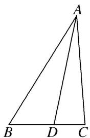

[例 2] (2020·江苏) 在 $\triangle ABC$ 中，角 A, B, C 的对边分别为 a, b, c. 已知 $a=3,\quad c=\sqrt{2},\quad B=45^{\circ}$ .  
（1）求 $\sin C$ 的值；  
（2）在边 BC 上取一点 D，使得 $\cos\angle ADC=-\frac{4}{5}$ ，求 $\tan\angle DAC$ 的值.

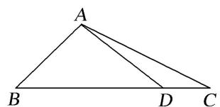

[例 3] (2018·全国 I) 在平面四边形 ABCD 中， $\angle ADC=90^{\circ}$ ， $\angle A=45^{\circ}$ ，AB=2，BD=5.  
（1）求 $\cos\angle ADB;$   
（2）若 $DC=2\sqrt{2}$ ，求 BC.

[例 4]如图，在平面四边形 ABCD 中， $\angle ABC=\frac{3\pi}{4}$ ， $AB\perp AD$ ，AB=1.  
（1）若 $AC=\sqrt{5}$ ，求 $\triangle ABC$ 的面积；  
（2）若 $\angle ADC = \frac{\pi}{6}$ , $CD = 4$ , 求 $\sin \angle CAD$ .

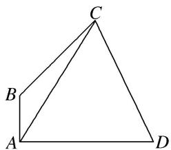

[例 5]如图，在 $\triangle ABC$ 中，AB=2， $\cos B=\frac{1}{3}$ ，点D在线段BC上.  
（1）若 $\angle ADC = \frac{3\pi}{4}$ ，求 $AD$ 的长.  
（2）若 $BD = 2DC$ ， $\triangle ACD$ 的面积为 $\frac{4}{3}\sqrt{2}$ ，求 $\frac{\sin\angle BAD}{\sin\angle CAD}$ 的值.

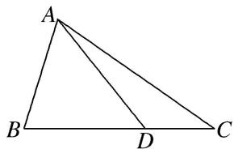

# 【对点训练】

1. (2013·全国 I) 如图，在 $\triangle ABC$ 中， $\angle ABC = 90^\circ$ ， $AB = \sqrt{3}$ ， $BC = 1$ ， $P$ 为 $\triangle ABC$ 内一点， $\angle BPC = 90^\circ$ 。  
（1）若 $PB=\frac{1}{2}$ ，求 PA;  
（2）若 $\angle APB=150^{\circ}$ ，求 $\tan\angle PBA$ 。

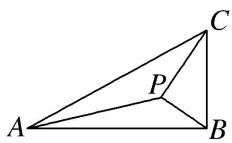

2. 如图，在 $\triangle ABC$ 中， $D$ 为边 $BC$ 上一点， $AD = 6$ ， $BD = 3$ ， $DC = 2$ .  
（1）如图1，若 $AD \perp BC$ ，求 $\angle BAC$ 的大小；  
（2）如图 2，若 $\angle ABC=\frac{\pi}{4}$ ，求 $\triangle ADC$ 的面积.
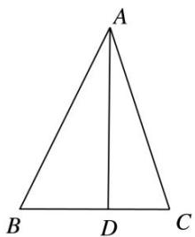

图1

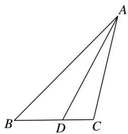

图2

3. 如图, $\triangle ACD$ 是等边三角形, $\triangle ABC$ 是等腰直角三角形, $\angle ACB = 90^{\circ}$ , $BD$ 交 $AC$ 于 $E$ , $AB = 2$ .  
（1）求 $\cos \angle CBE$ 的值；  
（2）求 AE.

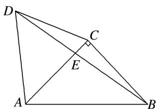

4. 如图，在平面四边形 ABCD 中，AB=BD=DA=2， $\angle ACB=30^{\circ}$  
（1）求证： $BC=4\cos\angle CBD;$  
（2）点 C 移动时，判断 CD 是否为定长，并说明理由.

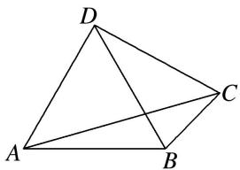

5. 如图，在平面四边形 $ABCD$ 中， $DA \perp AB$ ， $DE = 1$ ， $EC = \sqrt{7}$ ， $EA = 2$ ， $\angle ADC = \frac{2\pi}{3}$ ，且 $\angle CBE$ ， $\angle BEC$ ， $\angle BCE$ 成等差数列.  
（1）求sin∠CED:   
（2）求 BE 的长.

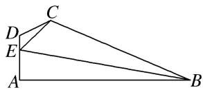

6. 如图所示，在四边形 ABCD 中， $\angle D=2\angle B$ ，且 AD=1，CD=3， $\cos B=\frac{\sqrt{3}}{3}$ .  
（1）求 $\triangle ACD$ 的面积;   
（2）若 $BC = 2\sqrt{3}$ ，求 $AB$ 的长.

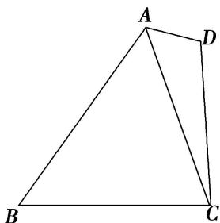

7. 如图，在平面四边形 $ABCD$ 中， $AB \perp BC$ ， $AB = 2$ ， $BD = \sqrt{5}$ ， $\angle BCD = 2\angle ABD$ ， $\triangle ABD$ 的面积为 2.  
（1）求 AD 的长;  
（2）求△CBD的面积.

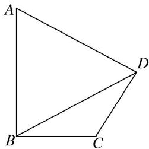

8. 已知在平面四边形 ABCD 中， $\angle ABC=\frac{3\pi}{4}$ ， $AB\perp AD$ ，AB=1， $\triangle ABC$ 的面积为 $\frac{1}{2}$ .  
（1）求 $\sin \angle CAB$ 的值：  
（2）若 $\angle ADC=\frac{\pi}{6}$ ，求 $CD$ 的长.

