# 专题八 多三角形问题

# 多三角形计算问题

# 求解多个三角形问题的关键及思路

求解多个三角形的计算问题，关键是梳理条件和所求问题的类型，然后将数据化归到多个三角形中，利用正弦定理、余弦定理、三角形面积公式及三角恒等变换公式等建立已知和所求的关系.

具体解题思路如下:  
（1）把所提供的平面图形拆分成若干个三角形，然后在各个三角形内利用正弦、余弦定理求解；  
（2）寻找各个三角形之间的联系，交叉使用公共条件，求出结果.

做题过程中，要用到平面几何中的一些知识点，如相似三角形的边角关系、平行四边形的一些性质，要把这些性质与正弦、余弦定理有机结合，才能顺利解决问题.

# 【例题选讲】

[例 1]如图，在 $\triangle ABC$ 中， $\angle B=\frac{\pi}{3}$ ，AB=8，点D在边BC上，且CD=2， $\cos\angle ADC=\frac{1}{7}$ .  
（1）求 $\sin\angle BAD;$   
（2）求 $BD$ ， $AC$ 的长.

解析 （1） 在 $\triangle ADC$ 中， $\because \cos \angle ADC = \frac{1}{7}$ ， $\therefore \sin \angle ADC = \sqrt{1 - \cos^2 \angle ADC} = \sqrt{1 - \left(\frac{1}{7}\right)^2} = \sqrt{\frac{48}{49}} = \frac{4\sqrt{3}}{7}$ ，则 $\sin \angle BAD = \sin (\angle ADC - \angle B) = \sin \angle ADC \cdot \cos \angle B - \cos \angle ADC \cdot \sin \angle B = \frac{4\sqrt{3}}{7} \times \frac{1}{2} - \frac{1}{7} \times \frac{\sqrt{3}}{2} = \frac{3\sqrt{3}}{14}$ .  
（2）在 $\triangle ABD$ 中，由正弦定理得 $BD=\frac{AB\cdot\sin\angle BAD}{\sin\angle ADB}=\frac{8\times\frac{3\sqrt{3}}{14}}{\frac{4\sqrt{3}}{7}}=3.$
在 $\triangle ABC$ 中，由余弦定理得 $AC^{2}=AB^{2}+CB^{2}-2AB\cdot BC\cos B=8^{2}+5^{2}-2\times8\times5\times\frac{1}{2}=49$ ，即 $AC=7$ .

[例 2] (2020·江苏) 在 $\triangle ABC$ 中，角 A, B, C 的对边分别为 a, b, c. 已知 $a=3,\quad c=\sqrt{2},\quad B=45^{\circ}$ .  
（1）求 $\sin C$ 的值;  
（2）在边 $BC$ 上取一点 $D$ ，使得 $\cos \angle ADC = -\frac{4}{5}$ ，求 $\tan \angle DAC$ 的值.

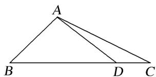

解析 （1） 在 $\triangle ABC$ 中，因为 $a=3$ ， $c=\sqrt{2}$ ， $B=45^{\circ}$ ，由余弦定理 $b^{2}=a^{2}+c^{2}-2ac\cos B$
得 $b^{2}=9+2-2\times3\times\sqrt{2}\cos45^{\circ}=5$ ，所以 $b=\sqrt{5}$ .
在 $\triangle ABC$ 中，由正弦定理 $\frac{b}{\sin B} = \frac{c}{\sin C}$ ，得 $\frac{\sqrt{5}}{\sin 45^\circ} = \frac{\sqrt{2}}{\sin C}$ ，所以 $\sin C = \frac{\sqrt{5}}{5}$ .  
（2）在 $\triangle ADC$ 中，因为 $\cos\angle ADC=-\frac{4}{5}$ ，所以 $\angle ADC$ 为钝角.

而 $\angle ADC + C + \angle CAD = 180^{\circ}$ ，所以 $C$ 为锐角．故 $\cos C = \sqrt{1 - \sin^2 C} = \frac{2\sqrt{5}}{5}$ ，则 $\tan C = \frac{\sin C}{\cos C} = \frac{1}{2}$ 因为 $\cos \angle ADC = -\frac{4}{5}$ ，所以 $\sin \angle ADC = \sqrt{1 - \cos^2 \angle ADC} = \frac{3}{5}$ ，所以 $\tan \angle ADC = \frac{\sin \angle ADC}{\cos \angle ADC} = -\frac{3}{4}$ 从而 $\tan \angle DAC = \tan (180^{\circ} - \angle ADC - C) = -\tan (\angle ADC + C)$
$= - \frac {\tan \angle A D C + \tan C}{1 - \tan \angle A D C \times \tan C} = - \frac {- \frac {3}{4} + \frac {1}{2}}{1 - \left(- \frac {3}{4}\right) \times \frac {1}{2}} = \frac {2}{1 1}.$

[例 3] (2018·全国 I) 在平面四边形 ABCD 中， $\angle ADC = 90^{\circ}$ ， $\angle A = 45^{\circ}$ ，AB = 2，BD = 5.  
（1）求 $\cos \angle ADB$ ;   
（2）若 $DC=2\sqrt{2}$ ，求 BC.
解析 （1）在 $\triangle ABD$ 中，由正弦定理得 $\frac{BD}{\sin\angle A}=\frac{AB}{\sin\angle ADB}$ ，即 $\frac{5}{\sin45^{\circ}}=\frac{2}{\sin\angle ADB}$ ，所以 $\sin\angle ADB=\frac{\sqrt{2}}{5}$ 。由题意知， $\angle ADB<90^{\circ}$ ，所以 $\cos\angle ADB=\sqrt{1-\sin^{2}\angle ADB}=\sqrt{1-\frac{2}{25}}=\frac{\sqrt{23}}{5}$ 。  
（2）由题意及（1）知， $\cos \angle BDC = \sin \angle ADB = \frac{\sqrt{2}}{5}$ . 在 $\triangle BCD$ 中，由余弦定理得 $BC^2 = BD^2 + DC^2 - 2BD \cdot DC \cdot \cos \angle BDC = 25 + 8 - 2 \times 5 \times 2\sqrt{2} \times \frac{\sqrt{2}}{5} = 25$ ，所以 $BC = 5$ .

[例 4]如图，在平面四边形 ABCD 中， $\angle ABC=\frac{3\pi}{4}$ ， $AB\perp AD$ ，AB=1.  
（1）若 $AC=\sqrt{5}$ ，求 $\triangle ABC$ 的面积；  
（2）若 $\angle ADC = \frac{\pi}{6}$ , $CD = 4$ , 求 $\sin \angle CAD$ .

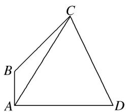

解析 （1）在 $\triangle ABC$ 中，由余弦定理得， $AC^{2}=AB^{2}+BC^{2}-2AB\cdot BC\cdot\cos\angle ABC,$
即 $5 = 1 + BC^2 +\sqrt{2} BC$ ，解得 $BC = \sqrt{2}$ ，所以 $\triangle ABC$ 的面积 $S_{\triangle ABC} = \frac{1}{2} AB\cdot BC\cdot \sin \angle ABC = \frac{1}{2}\times 1\times \sqrt{2}\times \frac{\sqrt{2}}{2} = \frac{1}{2}.$  
（2）设 $\angle CAD=\theta$ ，在 $\triangle ACD$ 中，由正弦定理得 $\frac{AC}{\sin\angle ADC}=\frac{CD}{\sin\angle CAD}$ ，即 $\frac{AC}{\sin\frac{\pi}{6}}=\frac{4}{\sin\theta}$ ，①
在 $\triangle ABC$ 中， $\angle BAC=\frac{\pi}{2}-\theta,\quad\angle BCA=\pi-\frac{3\pi}{4}-\left(\frac{\pi}{2}-\theta\right)=\theta-\frac{\pi}{4}$ ,
由正弦定理得 $\frac{AC}{\sin\angle ABC}=\frac{AB}{\sin\angle BCA}$ ，即 $\frac{AC}{\sin\frac{3\pi}{4}}=\frac{1}{\sin\left(\theta-\frac{\pi}{4}\right)}$ ，②

①②两式相除，得 $\frac{\sin\frac{3\pi}{4}}{\sin\frac{\pi}{6}}=\frac{4\sin\left(\theta-\frac{\pi}{4}\right)}{\sin\theta}$ ，即 $4\left(\frac{\sqrt{2}}{2}\sin\theta-\frac{\sqrt{2}}{2}\cos\theta\right)=\sqrt{2}\sin\theta,$
整理得 $\sin \theta = 2\cos \theta$ 。又因为 $\sin^2\theta + \cos^2\theta = 1$ ，所以 $\sin \theta = \frac{2\sqrt{5}}{5}$ ，即 $\sin \angle CAD = \frac{2\sqrt{5}}{5}$ 。

[例 5]如图，在 $\triangle ABC$ 中，AB=2， $\cos B=\frac{1}{3}$ ，点D在线段BC上.  
（1）若 $\angle ADC = \frac{3\pi}{4}$ ，求 $AD$ 的长.  
（2）若 $BD = 2DC$ ， $\triangle ACD$ 的面积为 $\frac{4}{3}\sqrt{2}$ ，求 $\frac{\sin\angle BAD}{\sin\angle CAD}$ 的值.

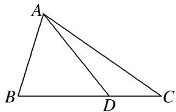

解析 （1） 在 $\triangle ABC$ 中， $\because \cos B = \frac{1}{3}, \therefore \sin B = \frac{2\sqrt{2}}{3}.$ $\because \angle ADC = \frac{3\pi}{4}, \therefore \angle ADB = \frac{\pi}{4}.$
在 $\triangle ABD$ 中，由正弦定理可得 $\frac{AD}{\frac{2\sqrt{2}}{3}}=\frac{2}{\frac{\sqrt{2}}{2}}$ ，∴ $AD=\frac{8}{3}$ .  
（2） $\because BD=2DC,\triangle ACD$ 的面积为 $\frac{4}{3}\sqrt{2},\therefore S_{\triangle ABC}=3S_{\triangle ACD}$ ，则 $4\sqrt{2}=\frac{1}{2}\times2\times BC\times\frac{2\sqrt{2}}{3}$
∴BC=6, DC=2. ∴由余弦定理得 $AC=\sqrt{4+36-2\times2\times6\times\frac{1}{3}}=4\sqrt{2}$ .
由正弦定理可得 $\frac{4}{\sin\angle BAD}=\frac{2}{\sin\angle ADB},\quad\therefore\sin\angle BAD=2\sin\angle ADB.$
又 $\because \frac{2}{\sin\angle CAD} = \frac{4\sqrt{2}}{\sin\angle ADC},\therefore \sin \angle CAD = \frac{\sqrt{2}}{4}\sin \angle ADC.\because \sin \angle ADB = \sin \angle ADC,\therefore \frac{\sin\angle BAD}{\sin\angle CAD} = 4\sqrt{2}.$

# 【对点训练】

1. (2013·全国 I) 如图，在 $\triangle ABC$ 中， $\angle ABC = 90^\circ$ ， $AB = \sqrt{3}$ ， $BC = 1$ ， $P$ 为 $\triangle ABC$ 内一点， $\angle BPC = 90^\circ$ 。  
（1）若 $PB = \frac{1}{2}$ ，求 $PA$  
（2）若 $\angle APB = 150^{\circ}$ ，求 $\tan \angle PBA$

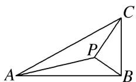

1. 解析 （1）由已知得, $\angle PBC = 60^{\circ}$ , 所以 $\angle PBA = 30^{\circ}$ .
在 $\triangle PBA$ 中，由余弦定理得 $PA^{2}=AB^{2}+PB^{2}-2AB\cdot PB\cos\angle PBA=3+\frac{1}{4}-2\times\sqrt{3}\times\frac{1}{2}\cos30^{\circ}=\frac{7}{4}$ 。故 $PA=\frac{\sqrt{7}}{2}$ 。  
（2）设 $\angle PBA = \alpha$ ，由已知得 $\frac{PB}{BC} = \cos \left(\frac{\pi}{2} -\alpha\right)$ 即 $PB = \sin \alpha .$
在 $\triangle PBA$ 中，由正弦定理得 $\frac{\sqrt{3}}{\sin 150^\circ} = \frac{\sin \alpha}{\sin (30^\circ - \alpha)}$ ，化简得 $\sqrt{3}\cos \alpha = 4\sin \alpha$ .
所以 $\tan\alpha=\frac{\sqrt{3}}{4}$ ，即 $\tan\angle PBA=\frac{\sqrt{3}}{4}$ .

2. 如图，在 $\triangle ABC$ 中， $D$ 为边 $BC$ 上一点， $AD = 6$ ， $BD = 3$ ， $DC = 2$ .  
（1）如图 1，若 $AD \perp BC$ ，求 $\angle BAC$ 的大小；  
（2）如图 2，若 $\angle ABC = \frac{\pi}{4}$ ，求 $\triangle ADC$ 的面积.
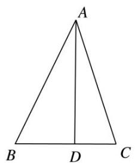

图1

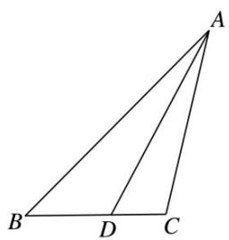

图2

2. 解析 （1） 设 $\angle BAD = \alpha, \angle DAC = \beta$ . 因为 $AD \perp BC, AD = 6, BD = 3, DC = 2$ ,
所以 $\tan\alpha=\frac{1}{2}$ ， $\tan\beta=\frac{1}{3}$ ，所以 $\tan\angle BAC=\tan(\alpha+\beta)=\frac{\tan\alpha+\tan\beta}{1-\tan\alpha\tan\beta}=\frac{\frac{1}{2}+\frac{1}{3}}{1-\frac{1}{2}\times\frac{1}{3}}=1$ .
又 $\angle BAC\in(0,\pi)$ ，所以 $\angle BAC=\frac{\pi}{4}$ .  
（2）设 $\angle BAD=\alpha$ ．在 $\triangle ABD$ 中， $\angle ABC=\frac{\pi}{4}$ ， $AD=6$ ， $BD=3$ ．
由正弦定理得 $\frac{AD}{\sin\frac{\pi}{4}}=\frac{BD}{\sin\alpha}$ ，解得 $\sin\alpha=\frac{\sqrt{2}}{4}$ .
因为 AD>BD，所以 $\alpha$ 为锐角，从而 $\cos\alpha=\sqrt{1-\sin^{2}\alpha}=\frac{\sqrt{14}}{4}$ .
因此 $\sin \angle ADC = \sin \left( \alpha + \frac{\pi}{4} \right) = \sin \alpha \cos \frac{\pi}{4} + \cos \alpha \sin \frac{\pi}{4} = \frac{\sqrt{2}}{2} \left( \frac{\sqrt{2}}{4} + \frac{\sqrt{14}}{4} \right) = \frac{1 + \sqrt{7}}{4}$ .
所以 $\triangle ADC$ 的面积 $S = \frac{1}{2} \times AD \times DC \cdot \sin \angle ADC = \frac{1}{2} \times 6 \times 2 \times \frac{1 + \sqrt{7}}{4} = \frac{3}{2}(1 + \sqrt{7})$ .

3. 如图， $\triangle ACD$ 是等边三角形， $\triangle ABC$ 是等腰直角三角形， $\angle ACB = 90^{\circ}$ ， $BD$ 交 $AC$ 于 $E$ ， $AB = 2$ 。  
（1）求 $\cos \angle CBE$ 的值；  
（2）求 AE.

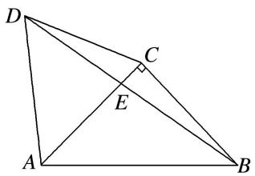

3. 解析 （1） $\because \angle BCD = 90^{\circ} + 60^{\circ} = 150^{\circ}$ , $CB = AC = CD$ , $\therefore \angle CBE = 15^{\circ}$ ,
$\therefore \cos \angle C B E = \cos (4 5 ^ {\circ} - 3 0 ^ {\circ}) = \frac {\sqrt {6} + \sqrt {2}}{4}.$  
（2）在 $\triangle ABE$ 中， $AB=2$ ，由正弦定理可得 $\frac{AE}{\sin(45^{\circ}-15^{\circ})}=\frac{2}{\sin(90^{\circ}+15^{\circ})}$ ，
得 $AE=\frac{2\sin30^{\circ}}{\cos15^{\circ}}=\frac{2\times\frac{1}{2}}{\frac{\sqrt{6}+\sqrt{2}}{4}}=\sqrt{6}-\sqrt{2}.$

4. 如图，在平面四边形 $ABCD$ 中， $AB = BD = DA = 2$ ， $\angle ACB = 30^\circ$ .  
（1）求证： $BC=4\cos\angle CBD;$  
（2）点 C 移动时，判断 CD 是否为定长，并说明理由.

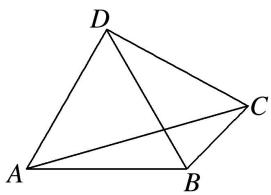

4. 解析 （1） 在 $\triangle ABC$ 中, $AB = 2$ , $\angle ACB = 30^{\circ}$ , 由正弦定理可知, $\frac{BC}{\sin \angle BAC} = \frac{2}{\sin 30^{\circ}}$ ,
所以 $BC=4\sin\angle BAC$ 。又 $\angle ABD=60^{\circ}$ ， $\angle ACB=30^{\circ}$ ，则 $\angle BAC+\angle CBD=90^{\circ}$ ，
则 $\sin\angle BAC=\cos\angle CBD$ ，所以 $BC=4\cos\angle CBD$ .  
（2） $CD$ 为定长, 因为在 $\triangle BCD$ 中, 由（1）及余弦定理可知,
$CD^{2}=BC^{2}+BD^{2}-2\times BC\times BD\times\cos\angle CBD=BC^{2}+4-4BC\cos\angle CBD=BC^{2}+4-BC^{2}=4$ ，所以 CD=2.

5. 如图，在平面四边形 $ABCD$ 中， $DA \perp AB$ ， $DE = 1$ ， $EC = \sqrt{7}$ ， $EA = 2$ ， $\angle ADC = \frac{2\pi}{3}$ ，且 $\angle CBE$ ， $\angle BEC$ ， $\angle BCE$ 成等差数列.  
（1）求 $\sin \angle CED$ ;  
（2）求 BE 的长.

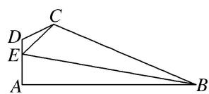

5. 解析 设 $\angle CED = \alpha$ . 因为 $\angle CBE, \angle BEC, \angle BCE$ 成等差数列,
所以 $2\angle BEC = \angle CBE + \angle BCE$ ，又 $\angle CBE + \angle BEC + \angle BCE = \pi$ ，所以 $\angle BEC = \frac{\pi}{3}$ .  
（1）在 $\triangle CDE$ 中，由余弦定理得 $EC^{2}=CD^{2}+DE^{2}-2CD\cdot DE\cdot\cos\angle EDC,$
即 $7=CD^{2}+1+CD$ ，即 $CD^{2}+CD-6=0$ ，解得 $CD=2(CD=-3$ 舍去).
在 $\triangle CDE$ 中，由正弦定理得 $\frac{EC}{\sin\angle EDC} = \frac{CD}{\sin\alpha}$ ，于是 $\sin \alpha = \frac{CD \cdot \sin\frac{2\pi}{3}}{EC} = \frac{2 \times \frac{\sqrt{3}}{2}}{\sqrt{7}} = \frac{\sqrt{21}}{7}$ ，即 $\sin \angle CED = \frac{\sqrt{21}}{7}$ .  
（2）由题设知 $0 < \alpha < \frac{\pi}{3}$ , 由（1）知 $\cos \alpha = \sqrt{1 - \sin^2 \alpha} = \sqrt{1 - \frac{21}{49}} = \frac{2\sqrt{7}}{7}$ , 又 $\angle AEB = \pi - \angle BEC - \alpha = \frac{2\pi}{3} - \alpha$ ,
所以 $\cos\angle AEB=\cos\left(\frac{2\pi}{3}-\alpha\right)=\cos\frac{2\pi}{3}\cos\alpha+\sin\frac{2\pi}{3}\sin\alpha=-\frac{1}{2}\times\frac{2\sqrt{7}}{7}+\frac{\sqrt{3}}{2}\times\frac{\sqrt{21}}{7}=\frac{\sqrt{7}}{14}.$
在 Rt△EAB 中， $\cos\angle AEB=\frac{EA}{BE}=\frac{2}{BE}=\frac{\sqrt{7}}{14}$ ，所以 $BE=4\sqrt{7}$ .

6. 如图所示，在四边形 ABCD 中， $\angle D=2\angle B$ ，且 AD=1，CD=3， $\cos B=\frac{\sqrt{3}}{3}$ .  
（1）求 $\triangle ACD$ 的面积;  
（2）若 $BC=2\sqrt{3}$ ，求 AB 的长.

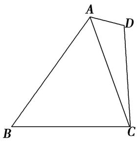

6. 解析 （1） 因为 $\angle D = 2\angle B$ ， $\cos B = \frac{\sqrt{3}}{3}$ ，所以 $\cos D = \cos 2B = 2\cos^2 B - 1 = -\frac{1}{3}$ ，
因为 $\angle D\in(0,\pi)$ ，所以 $\sin D=\sqrt{1-\cos^{2}D}=\frac{2\sqrt{2}}{3}$ .
因为 AD=1, CD=3，所以 $\triangle ACD$ 的面积 $S=\frac{1}{2}AD\cdot CD\cdot\sin D=\frac{1}{2}\times1\times3\times\frac{2\sqrt{2}}{3}=\sqrt{2}$ .  
（2）在 $\triangle ACD$ 中， $AC^{2}=AD^{2}+DC^{2}-2AD\cdot DC\cdot\cos D=12$ ，所以 $AC=2\sqrt{3}$ ，
因为 $BC=2\sqrt{3}$ ， $\frac{AC}{\sin B}=\frac{AB}{\sin\angle ACB}$ ，所以 $\frac{2\sqrt{3}}{\sin B}=\frac{AB}{\sin(\pi-2B)}=\frac{AB}{\sin2B}=\frac{AB}{2\sin B\cos B}=\frac{AB}{\frac{2\sqrt{3}}{3}\sin B}$
所以 AB=4.

7. 如图，在平面四边形 $ABCD$ 中， $AB \perp BC$ ， $AB = 2$ ， $BD = \sqrt{5}$ ， $\angle BCD = 2\angle ABD$ ， $\triangle ABD$ 的面积为 2.  
（1）求 $AD$ 的长;  
（2）求 $\triangle CBD$ 的面积.

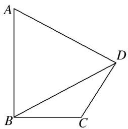

7. 解析 （1）由已知 $S_{\triangle ABD} = \frac{1}{2} AB \cdot BD \cdot \sin \angle ABD = \frac{1}{2} \times 2 \times \sqrt{5} \times \sin \angle ABD = 2$ ，可得 $\sin \angle ABD = \frac{2\sqrt{5}}{5}$ ，
又 $\angle BCD=2\angle ABD$ ，所以 $\angle ABD\in\left(0,\ \frac{\pi}{2}\right)$ ，所以 $\cos\angle ABD=\frac{\sqrt{5}}{5}$ .
在 $\triangle ABD$ 中，由余弦定理 $AD^{2}=AB^{2}+BD^{2}-2\cdot AB\cdot BD\cdot\cos\angle ABD$ ，可得 $AD^{2}=5$ ，所以 $AD=\sqrt{5}$ .  
（2）由 $AB \perp BC$ ，得 $\angle ABD + \angle CBD = \frac{\pi}{2}$ ，所以 $\sin \angle CBD = \cos \angle ABD = \frac{\sqrt{5}}{5}$ .
又 $\angle BCD=2\angle ABD$ ，所以 $\sin\angle BCD=2\sin\angle ABD\cdot\cos\angle ABD=\frac{4}{5}$ ，
$\angle B D C = \pi - \angle C B D - \angle B C D = \pi - \left(\frac {\pi}{2} - \angle A B D\right) - 2 \angle A B D = \frac {\pi}{2} - \angle A B D = \angle C B D,$
所以 $\triangle CBD$ 为等腰三角形，即CB=CD.
在 $\triangle CBD$ 中，由正弦定理 $\frac{BD}{\sin\angle BCD}=\frac{CD}{\sin\angle CBD}$ ，得 $CD=\frac{BD\cdot\sin\angle CBD}{\sin\angle BCD}=\frac{\sqrt{5}\times\frac{\sqrt{5}}{5}}{\frac{4}{5}}=\frac{5}{4}$ ，
所以 $S_{\triangle CBD}=\frac{1}{2}CB\cdot CD\cdot \sin\angle BCD=\frac{1}{2}\times\frac{5}{4}\times\frac{5}{4}\times\frac{4}{5}=\frac{5}{8}.$

8. 已知在平面四边形 ABCD 中， $\angle ABC=\frac{3\pi}{4}$ ， $AB\perp AD$ ，AB=1， $\triangle ABC$ 的面积为 $\frac{1}{2}$ .  
（1）求 $\sin \angle CAB$ 的值；  
（2）若 $\angle ADC=\frac{\pi}{6}$ , 求 $CD$ 的长.

8. 解析 （1） $\triangle ABC$ 的面积 $S = \frac{1}{2} AB \cdot BC \cdot \sin \angle ABC = \frac{1}{2} \times 1 \times BC \times \frac{\sqrt{2}}{2} = \frac{1}{2}$ , 得 $BC = \sqrt{2}$ .
在 $\triangle ABC$ 中，由余弦定理得 $AC^{2}=AB^{2}+BC^{2}-2AB\cdot BC\cdot\cos\angle ABC$
即 $AC^{2}=1+2-2\times1\times\sqrt{2}\times\left(-\frac{\sqrt{2}}{2}\right)=5$ ，得 $AC=\sqrt{5}$ .
在 $\triangle ABC$ 中，由正弦定理得 $\frac{BC}{\sin\angle CAB} = \frac{AC}{\sin\angle ABC}$ ，即 $\frac{\sqrt{2}}{\sin\angle CAB} = \frac{\sqrt{5}}{\sin\frac{3\pi}{4}}$ ，所以 $\sin \angle CAB = \frac{\sqrt{5}}{5}$ .  
（2）由题设知 $\angle CAB < \frac{\pi}{2}$ ，则 $\cos \angle CAB = \sqrt{1 - \sin^2\angle CAB} = \sqrt{1 - \frac{1}{5}} = \frac{2\sqrt{5}}{5},$
因为 $AB \perp AD$ ，所以 $\angle DAC + \angle CAB = \frac{\pi}{2}$ 。所以 $\sin \angle DAC = \cos \angle CAB = \frac{2\sqrt{5}}{5}$ 。
在 $\triangle ACD$ 中，由正弦定理得 $\frac{AC}{\sin\angle ADC}=\frac{CD}{\sin\angle DAC}$ ，即 $\frac{\sqrt{5}}{\sin\frac{\pi}{6}}=\frac{CD}{\frac{2\sqrt{5}}{5}}$ ，解得 $CD=4$ .

