**专题八　多三角形问题**

**多三角形计算问题**

求解多个三角形问题的关键及思路

求解多个三角形的计算问题，关键是梳理条件和所求问题的类型，然后将数据化归到多个三角形中，利用正弦定理、余弦定理、三角形面积公式及三角恒等变换公式等建立已知和所求的关系．

具体解题思路如下：

(1)把所提供的平面图形拆分成若干个三角形，然后在各个三角形内利用正弦、余弦定理求解；

(2)寻找各个三角形之间的联系，交叉使用公共条件，求出结果．

做题过程中，要用到平面几何中的一些知识点，如相似三角形的边角关系、平行四边形的一些性质，要把这些性质与正弦、余弦定理有机结合，才能顺利解决问题．

**【例题选讲】**

<strong>[例1]</strong>如图，在△<em>ABC</em>中，∠<em>B</em>＝，<em>AB</em>＝8，点<em>D</em>在边<em>BC</em>上，且<em>CD</em>＝2，cos∠<em>ADC</em>＝．

(1)求sin∠*BAD*；

(2)求*BD*，*AC*的长．

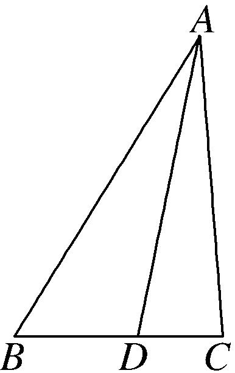

解析　(1)在△*ADC*中，∵cos∠*ADC*＝，∴sin∠*ADC*＝＝＝＝，

则sin∠*BAD*＝sin(∠*ADC*－∠*B*)＝sin∠*ADC*·cos∠*B*－cos∠*ADC*·sin∠*B*＝×－×＝．

(2)在△*ABD*中，由正弦定理得*BD*＝＝＝3．

在△<em>ABC</em>中，由余弦定理得<em>AC</em>2＝<em>AB</em>2＋<em>CB</em>2－2<em>AB</em>·<em>BC</em>cos <em>B</em>＝82＋52－2×8×5×＝49，即<em>AC</em>＝7．

<strong>[例2]</strong> (2020·江苏)在△<em>ABC</em>中，角<em>A</em>，<em>B</em>，<em>C</em>的对边分别为<em>a</em>，<em>b</em>，<em>c</em>．已知<em>a</em>＝3，<em>c</em>＝，<em>B</em>＝45°．

(1)求sin*C*的值；

(2)在边*BC*上取一点*D*，使得cos∠*ADC*＝－，求tan∠*DAC*的值．

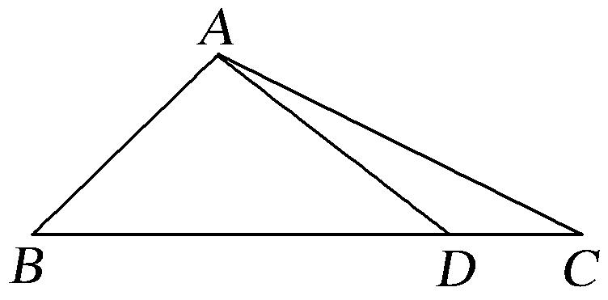

解析　(1)在△<em>ABC</em>中，因为<em>a</em>＝3，<em>c</em>＝，<em>B</em>＝45°，由余弦定理<em>b</em>2＝<em>a</em>2＋<em>c</em>2－2<em>ac</em>cos<em>B</em>，

得<em>b</em>2＝9＋2－2×3×cos 45°＝5，所以<em>b</em>＝．

在△*ABC*中，由正弦定理＝，得＝，所以sin*C*＝．

(2)在△*ADC*中，因为cos∠*ADC*＝－，所以∠*ADC*为钝角．

而∠*ADC*＋*C*＋∠*CAD*＝180°，所以*C*为锐角．故cos *C*＝＝，则tan*C*＝＝．

因为cos∠*ADC*＝－，所以sin∠*ADC*＝＝，所以tan∠*ADC*＝＝－．

从而tan∠*DAC*＝tan(180°－∠*ADC*－*C*)＝－tan(∠*ADC*＋*C*)

＝－＝－＝．

<strong>[例3]</strong> (2018·全国Ⅰ)在平面四边形<em>ABCD</em>中，∠<em>ADC</em>＝90°，∠<em>A</em>＝45°，<em>AB</em>＝2，<em>BD</em>＝5．

(1)求cos∠*ADB*；

(2)若*DC*＝2，求*BC*．

解析　(1)在△*ABD*中，由正弦定理得＝，即＝，所以sin∠*ADB*＝．

由题意知，∠*ADB*＜90°，所以cos∠*ADB*＝＝＝．

(2)由题意及(1)知，cos∠*BDC*＝sin∠*ADB*＝．在△*BCD*中，由余弦定理得

<em>BC</em>2＝<em>BD</em>2＋<em>DC</em>2－2<em>BD</em>·<em>DC</em>·cos∠<em>BDC</em>＝25＋8－2×5×2×＝25，所以<em>BC</em>＝5．

<strong>[例4]</strong>如图，在平面四边形<em>ABCD</em>中，∠<em>ABC</em>＝，<em>AB</em>⊥<em>AD</em>，<em>AB</em>＝1．

(1)若*AC*＝，求△*ABC*的面积；

(2)若∠*ADC*＝，*CD*＝4，求sin∠*CAD*．

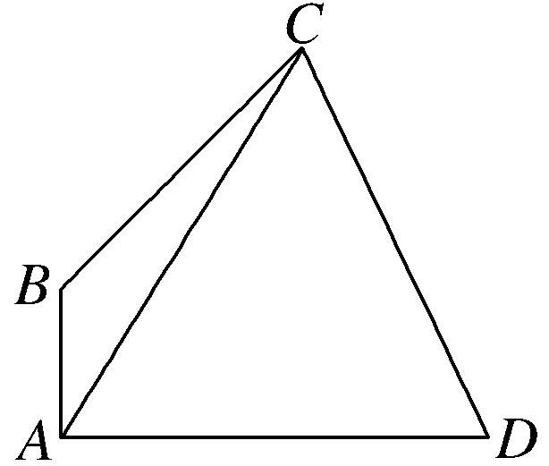

解析　(1)在△<em>ABC</em>中，由余弦定理得，<em>AC</em>2＝<em>AB</em>2＋<em>BC</em>2－2<em>AB</em>·<em>BC</em>·<em>c</em>os∠<em>ABC</em>，

即5＝1＋<em>BC</em>2＋<em>BC</em>，解得<em>BC</em>＝，所以△<em>ABC</em>的面积<em>S</em>△<em>ABC</em>＝<em>AB</em>·<em>BC</em>·sin∠<em>ABC</em>＝×1××＝．

(2)设∠*CAD*＝*θ*，在△*ACD*中，由正弦定理得＝，即＝，①

在△*ABC*中，∠*BAC*＝－*θ*，∠*BCA*＝π－－＝*θ*－，

由正弦定理得＝，即＝，②

①②两式相除，得＝，即4＝sin *θ*，

整理得sin <em>θ</em>＝2cos <em>θ</em>．又因为sin2<em>θ</em>＋<em>c</em>os2<em>θ</em>＝1，所以sin <em>θ</em>＝，即sin∠<em>CAD</em>＝．

<strong>[例5]</strong>如图，在△<em>ABC</em>中，<em>AB</em>＝2，cos <em>B</em>＝，点<em>D</em>在线段<em>BC</em>上．

(1)若∠*ADC*＝，求*AD*的长．

(2)若*BD*＝2*DC*，△*ACD*的面积为，求的值．

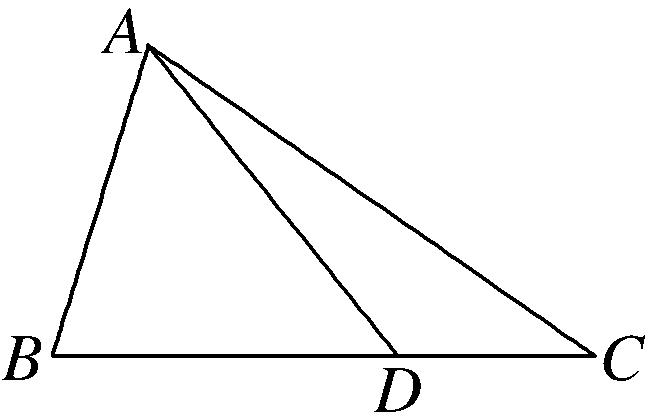

解析　(1)在△*ABC*中，∵cos *B*＝，∴sin *B*＝．∵∠*ADC*＝，∴∠*ADB*＝．

在△*ABD*中，由正弦定理可得＝，∴*AD*＝．

(2)∵<em>BD</em>＝2<em>DC</em>，△<em>ACD</em>的面积为，∴<em>S</em>△<em>ABC</em>＝3<em>S</em>△<em>ACD</em>，则4＝×2×<em>BC</em>×，

∴*BC*＝6，*DC*＝2．∴由余弦定理得*AC*＝＝4．

由正弦定理可得＝，∴sin∠*BAD*＝2sin∠*ADB*．

又∵＝，∴sin∠*CAD*＝sin∠*ADC*．∵sin∠*ADB*＝sin∠*ADC*，∴＝4．

【**对点训练**】

1．(2013·全国Ⅰ)如图，在△*ABC*中，∠*ABC*＝90°，*AB*＝，*BC*＝1，*P*为△*ABC*内一点，∠*BPC*＝90°．

(1)若*PB*＝，求*PA*；

(2)若∠*APB*＝150°，求tan∠*PBA*．

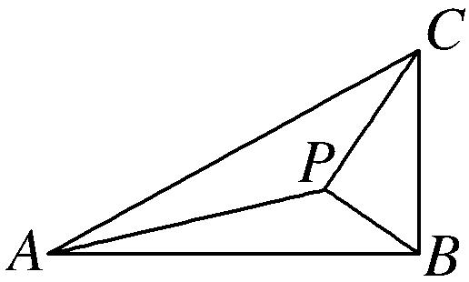

1．解析　(1)由已知得，∠*PBC*＝60°，所以∠*PBA*＝30°．

在△<em>PBA</em>中，由余弦定理得<em>PA</em>2＝<em>AB</em>2＋<em>PB</em>2－2<em>AB</em>·<em>PB</em>cos∠<em>PBA</em>＝3＋－2××cos 30°＝．故<em>PA</em>＝．

(2)设∠*PBA*＝*α*，由已知得＝cos，即*PB*＝sin *α*．

在△*PBA*中，由正弦定理得＝，化简得cos *α*＝4sin *α*．

所以tan *α*＝，即tan∠*PBA*＝．

2．如图，在△*ABC*中，*D*为边*BC*上一点，*AD*＝6，*BD*＝3，*DC*＝2．

(1)如图1，若*AD*⊥*BC*，求∠*BAC*的大小；

(2)如图2，若∠*ABC*＝，求△*ADC*的面积．

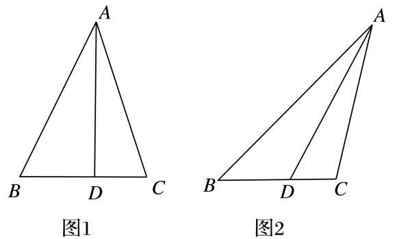

2．解析　(1)设∠*BAD*＝*α*，∠*DAC*＝*β*．因为*AD*⊥*BC*，*AD*＝6，*BD*＝3，*DC*＝2，

所以tan *α*＝，tan *β*＝，所以tan∠*BAC*＝tan(*α*＋*β*)＝＝＝1．

又∠*BAC*∈(0，π)，所以∠*BAC*＝．

(2)设∠*BAD*＝*α*．在△*ABD*中，∠*ABC*＝，*AD*＝6，*BD*＝3．

由正弦定理得＝，解得sin *α*＝．

因为*AD*>*BD*，所以*α*为锐角，从而cos *α*＝＝．

因此sin∠*ADC*＝sin＝sin *α*cos ＋cos*α*sin ＝＝．

所以△*ADC*的面积*S*＝×*AD*×*DC*·sin∠*ADC*＝×6×2×＝(1＋)．

3．如图，△*ACD*是等边三角形，△*ABC*是等腰直角三角形，∠*ACB*＝90°，*BD*交*AC*于*E*，*AB*＝2．

(1)求cos∠*CBE*的值；

(2)求*AE*．

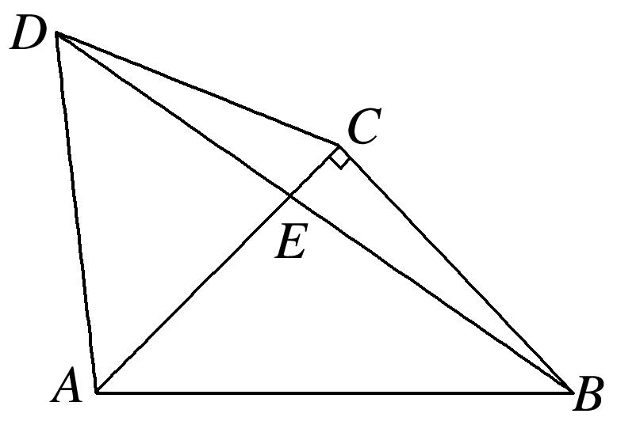

3．解析　(1)∵∠*BCD*＝90°＋60°＝150°，*CB*＝*AC*＝*CD*，∴∠*CBE*＝15°，

∴cos∠*CBE*＝cos(45°－30°)＝．

(2)在△*ABE*中，*AB*＝2，由正弦定理可得＝，

得*AE*＝＝＝－．

4．如图，在平面四边形*ABCD*中，*AB*＝*BD*＝*DA*＝2，∠*ACB*＝30°．

(1)求证：*BC*＝4cos∠*CBD*；

(2)点*C*移动时，判断*CD*是否为定长，并说明理由．

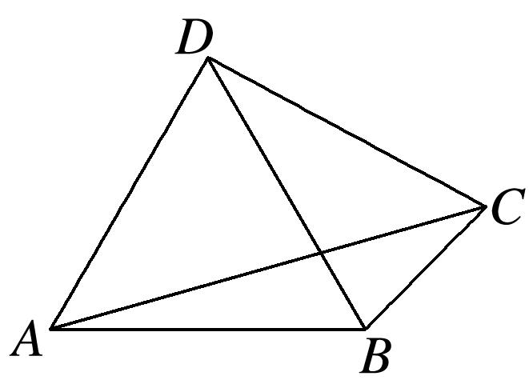

4．解析　(1)在△*ABC*中，*AB*＝2，∠*ACB*＝30°，由正弦定理可知，＝，

所以*BC*＝4sin∠*BAC*．又∠*ABD*＝60°，∠*ACB*＝30°，则∠*BAC*＋∠*CBD*＝90°，

则sin∠*BAC*＝cos∠*CBD*，所以*BC*＝4cos∠*CBD*．

(2)*CD*为定长，因为在△*BCD*中，由(1)及余弦定理可知，

<em>CD</em>2＝<em>BC</em>2＋<em>BD</em>2－2×<em>BC</em>×<em>BD</em>×cos∠<em>CBD</em>＝<em>BC</em>2＋4－4<em>BC</em>cos∠<em>CBD</em>＝<em>BC</em>2＋4－<em>BC</em>2＝4，所以<em>CD</em>＝2．

5．如图，在平面四边形*ABCD*中，*DA*⊥*AB*，*DE*＝1，*EC*＝，*EA*＝2，∠*ADC*＝，且∠*CBE*，∠*BEC*，

∠*BCE*成等差数列．

(1)求sin∠*CED*；

(2)求*BE*的长．

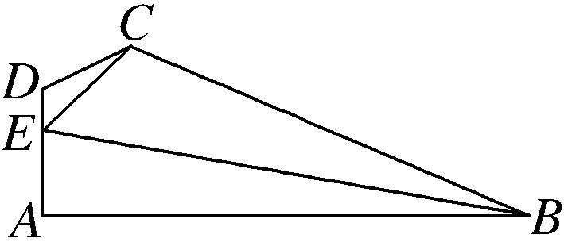

5．解析　设∠*CED*＝*α*．因为∠*CBE*，∠*BEC*，∠*BCE*成等差数列，

所以2∠*BEC*＝∠*CBE*＋∠*BCE*，又∠*CBE*＋∠*BEC*＋∠*BCE*＝π，所以∠*BEC*＝．

(1)在△<em>CDE</em>中，由余弦定理得<em>EC</em>2＝<em>CD</em>2＋<em>DE</em>2－2<em>CD</em>·<em>DE</em>·<em>c</em>os∠<em>EDC</em>，

即7＝<em>CD</em>2＋1＋<em>CD</em>，即<em>CD</em>2＋<em>CD</em>－6＝0，解得<em>CD</em>＝2(<em>CD</em>＝－3舍去)．

在△*CDE*中，由正弦定理得＝，于是sin *α*＝＝＝，即sin∠*CED*＝．

(2)由题设知0<*α*<，由(1)知cos *α*＝＝＝，又∠*AEB*＝π－∠*BEC*－*α*＝－*α*，

所以*c*os∠*AEB*＝*c*os＝*c*oscos *α*＋sinsin *α*＝－×＋×＝．

在Rt△*EAB*中，*c*os∠*AEB*＝＝＝，所以*BE*＝4．

6．如图所示，在四边形*ABCD*中，∠*D*＝2∠*B*，且*AD*＝1，*CD*＝3，cos*B*＝．

(1)求△*ACD*的面积；

(2)若*BC*＝2，求*AB*的长．

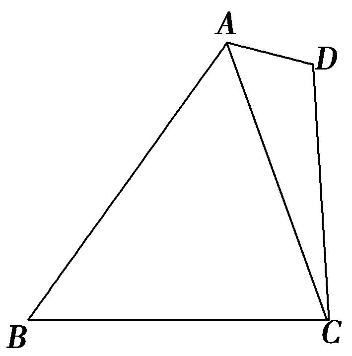

6．解析　(1)因为∠<em>D</em>＝2∠<em>B</em>，cos <em>B</em>＝，所以cos <em>D</em>＝cos 2<em>B</em>＝2cos2<em>B</em>－1＝－，

因为∠*D*∈(0，π)，所以sin *D*＝＝．

因为*AD*＝1，*CD*＝3，所以△*ACD*的面积*S*＝*AD*·*CD*·sin *D*＝×1×3×＝．

(2)在△<em>ACD</em>中，<em>AC</em>2＝<em>AD</em>2＋<em>DC</em>2－2<em>AD</em>·<em>DC</em>·cos <em>D</em>＝12，所以<em>AC</em>＝2，

因为*BC*＝2，＝，所以＝＝＝＝，

所以*AB*＝4．

7．如图，在平面四边形*ABCD*中，*AB*⊥*BC*，*AB*＝2，*BD*＝，∠*BCD*＝2∠*ABD*，△*ABD*的面积为2．

(1)求*AD*的长；

(2)求△*CBD*的面积．

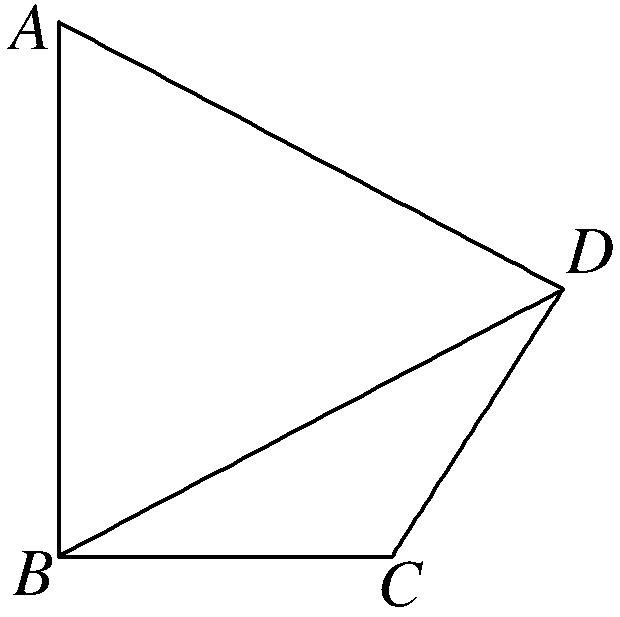

7．解析　(1)由已知<em>S</em>△<em>ABD</em>＝<em>AB</em>·<em>BD</em>·sin∠<em>ABD</em>＝×2××sin∠<em>ABD</em>＝2，可得sin∠<em>ABD</em>＝，

又∠*BCD*＝2∠*ABD*，所以∠*ABD*∈，所以*c*os∠*ABD*＝．

在△<em>ABD</em>中，由余弦定理<em>AD</em>2＝<em>AB</em>2＋<em>BD</em>2－2·<em>AB</em>·<em>BD</em>·<em>c</em>os∠<em>ABD</em>，可得<em>AD</em>2＝5，所以<em>AD</em>＝．

(2)由*AB*⊥*BC*，得∠*ABD*＋∠*CBD*＝，所以sin∠*CBD*＝*c*os∠*ABD*＝．

又∠*BCD*＝2∠*ABD*，所以sin∠*BCD*＝2sin∠*ABD*·*c*os∠*ABD*＝，

∠*BDC*＝π－∠*CBD*－∠*BCD*＝π－－2∠*ABD*＝－∠*ABD*＝∠*CBD*，

所以△*CBD*为等腰三角形，即*CB*＝*CD*．

在△*CBD*中，由正弦定理＝，得*CD*＝＝＝，

所以<em>S</em>△<em>CBD</em>＝<em>CB</em>·<em>CD</em>·sin∠<em>BCD</em>＝×××＝．

8．已知在平面四边形*ABCD*中，∠*ABC*＝，*AB*⊥*AD*，*AB*＝1，△*ABC*的面积为．

(1)求sin∠*CAB*的值；

(2)若∠*ADC*＝，求*CD*的长．

8．解析　(1)△*ABC*的面积*S*＝*AB*·*BC*·sin∠*ABC*＝×1×*BC*×＝，得*BC*＝．

在△<em>ABC</em>中，由余弦定理得<em>AC</em>2＝<em>AB</em>2＋<em>BC</em>2－2<em>AB</em>·<em>BC</em>·cos∠<em>ABC</em>，

即<em>AC</em>2＝1＋2－2×1××＝5，得<em>AC</em>＝．

在△*ABC*中，由正弦定理得＝，即＝，所以sin∠*CAB*＝．

(2)由题设知∠*CAB*＜，则cos∠*CAB*＝＝＝，

因为*AB*⊥*AD*，所以∠*DAC*＋∠*CAB*＝．所以sin∠*DAC*＝cos∠*CAB*＝．

在△*ACD*中，由正弦定理得＝，即＝，解得*CD*＝4．

