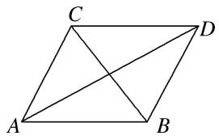
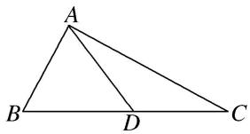

# 专题九 三角形中的最值(范围)问题

# 【方法总结】

# 三角形中最值(范围)问题的解题思路

任何最值(范围)问题，其本质都是函数问题，三角形中的范围(最值)问题也不例外。三角形中的范围(最值)问题的解法主要有两种：一是用函数求解，二是利用基本不等式求解。一般求最值用基本不等式，求范围用函数。由于三角形中的最值(范围)问题一般是以角为自变量的三角函数问题，所以，除遵循函数问题的基本要求外，还有自己独特的解法。

要建立所求量(式子)与已知角或边的关系，然后把角或边作为自变量，所求量(式子)的值作为函数值，转化为函数关系，将原问题转化为求函数的值域问题。这里要利用条件中的范围限制，以及三角形自身范围限制，要尽量把角或边的范围(也就是函数的定义域)找完善，避免结果的范围过大。

# 考点一 三角形中与角或角的函数有关的最值(范围)

# 【例题选讲】

[例 1](2020·浙江)在锐角 $\triangle ABC$ 中，角 A, B, C 所对的边分别为 a, b, c. 已知 $2b\sin A - \sqrt{3}a = 0$ .

(1)求角 B 的大小;

(2)求 $\cos A + \cos B + \cos C$ 的取值范围.

[例 2](2016·北京)在 $\triangle ABC$ 中， $a^{2}+c^{2}=b^{2}+\sqrt{2}ac$ .

(1)求 B 的大小;

(2)求 $\sqrt{2}\cos A + \cos C$ 的最大值.

[例 3](2014·陕西) $\triangle ABC$ 的内角 A, B, C 所对的边分别为 a, b, c.

(1)若 a, b, c 成等差数列，证明 $\sin A + \sin C = 2\sin(A + C)$ ;

(2)若 $a, b, c$ 成等比数列，求 $\cos B$ 的最小值.

[例 4]在 $\triangle ABC$ 中，内角 A，B，C 的对边分别为 a，b，c，且满足 $(2c-a)\cos B-b\cos A=0$ .

(1)若 b=7， $a+c=13$ ，求 $\triangle ABC$ 的面积；

(2)求 $\sin^2 A + \sin \left(\frac{C - \pi}{6}\right)$ 的取值范围.

# 【对点训练】

1. 在 $\triangle ABC$ 中，角 $A, B, C$ 的对边分别为 $a, b, c$ ，且 $2a\sin A = (2a + c)\sin B + (2c + b)\sin C$ 。

(1)求 A 的大小;

(2)求 $\sin B + \sin C$ 的最大值.

2. 已知锐角 $\triangle ABC$ 中， $b\sin B - a\sin A = (b - c)\sin C$ ，其中 $a$ 、 $b$ 、 $c$ 分别为内角 $A$ 、 $B$ 、 $C$ 的对边.

(1)求角 A 的大小;

(2)求 $\sqrt{3}\cos C - \sin B$ 的取值范围.

3. (2016 山东) 在 $\triangle ABC$ 中, 角 $A, B, C$ 的对边分别为 $a, b, c$ , 已知 $2(\tan A + \tan B) = \frac{\tan A}{\cos B} + \frac{\tan B}{\cos A}$ .

(1)证明： $a+b=2c;$

(2) 求 $\cos C$ 的最小值.

4. (2015 湖南) 设 $\triangle ABC$ 的内角 A, B, C 的对边分别为 a, b, c, $a = b \tan A$ ，且 B 为钝角.

(1)证明： $B-A=\frac{\pi}{2};$

(2)求 $\sin A + \sin C$ 的取值范围.

# 考点二 三角形中与边或周长有关的最值(范围)

# 【例题选讲】

[例 1]在 $\triangle ABC$ 中，内角 A, B, C 的对边分别为 a, b, c，若 $b^{2}+c^{2}-a^{2}=bc$ .

(1)求角 A 的大小;

(2)若 $a = \sqrt{3}$ ，求 $BC$ 边上的中线 $AM$ 的最大值.

[例 2] (2020·全国 II)△ABC 中， $\sin^{2}A-\sin^{2}B-\sin^{2}C=\sin B\sin C$ .

(1)求 $A$ ;

(2)若 BC=3，求 $\triangle ABC$ 周长的最大值.

[例 3] 在 $\triangle ABC$ 中，角 A, B, C 所对的边分别为 a, b, c，且满足 $\cos2C - \cos2A = 2\sin\left[\frac{\pi}{3} + C\right] \cdot \sin\left(\frac{\pi}{3} - C\right)$ .

(1)求角 A 的值;

(2)若 $a = \sqrt{3}$ 且 $b\geq a$ ，求 $2b - c$ 的取值范围.

[例 4]在锐角 $\triangle ABC$ 中，内角 A, B, C 的对边分别是 a, b, c，满足 $\cos2A-\cos2B+2\cos\left(\frac{\pi}{6}-B\right)\cdot\cos\left(\frac{\pi}{6}+B\right)=0$ .

(1)求角 A 的值;

(2)若 $b=\sqrt{3}$ 且 $b\leqslant a$ ，求 a 的取值范围.

[例 5]在 $\triangle ABC$ 中， $AC=BC=2$ ， $AB=2\sqrt{3}$ ， $\overrightarrow{AM}=\overrightarrow{MC}$ .

(1)求 BM 的长;

(2)设 D 是平面 ABC 内一动点，且满足 $\angle BDM = \frac{2\pi}{3}$ ，求 $BD + \frac{1}{2}MD$ 的取值范围.

# 【对点训练】

1. 在 $\triangle ABC$ 中，内角 $A, B, C$ 的对边分别为 $a, b, c$ ，且 $\sin^2\frac{A}{2} = \frac{c - b}{2c}$ .

(1)判断 $\triangle ABC$ 的形状并加以证明；

(2)当 c=1 时，求 $\triangle ABC$ 周长的最大值.

2. 在 $\triangle ABC$ 中，角 $A, B, C$ 所对的边分别为 $a, b, c, c = \sqrt{3}$ ，设 $S$ 为 $\triangle ABC$ 的面积，满足 $S = \frac{\sqrt{3}}{4} (a^2 + b^2 - c^2)$ .

(1)求角 C 的大小;

(2)求 $a+b$ 的最大值.

3. 在 $\triangle ABC$ 中，角 $A, B, C$ 的对边分别为 $a, b, c$ ，已知 $b\cos C + \sqrt{3} b\sin C - a - c = 0$

(1)求 B;

(2)若 $b=\sqrt{3}$ ，求 $2a+c$ 的取值范围.

4. 在 $\triangle ABC$ 中，设角 $A, B, C$ 的对边分别为 $a, b, c$ ，已知 $\cos^2 A = \sin^2 B + \cos^2 C + \sin A \sin B$ .

(1)求角 C 的大小;

(2)若 $c=\sqrt{3}$ ，求△ABC 周长的取值范围.

5. 如图，平面四边形 ABDC 中， $\angle CAD = \angle BAD = 30^{\circ}$ .

(1)若 $\angle ABC=75^{\circ}$ ， $AB=10$ ，且 $AC//BD$ ，求 $CD$ 的长；

(2)若 BC=10，求 $AC+AB$ 的取值范围.

text_image

C
D
A
B

# 考点三 三角形中与面积有关的最值(范围)

# 【例题选讲】

[例 1]已知在 $\triangle ABC$ 中，角 A, B, C 的对边分别为 a, b, c, $C=120^{\circ}$ , c=2.

(1)求 $\triangle ABC$ 的面积的最大值;  
(2)求 $\triangle ABC$ 的周长的取值范围.

[例 2]已知 $\triangle ABC$ 的内角 A, B, C 满足: $\frac{\sin A - \sin B + \sin C}{\sin C} = \frac{\sin B}{\sin A + \sin B - \sin C}.$

(1)求角 A;  
(2)若 $\triangle ABC$ 的外接圆半径为1，求 $\triangle ABC$ 的面积 $S$ 的最大值.

[例 3]已知 a, b, c 分别是 $\triangle ABC$ 内角 A, B, C 的对边，且满足 $(a+b+c)(\sin B+\sin C-\sin A)=b\sin C$ .

(1)求角 A 的大小;  
(2)设 $a = \sqrt{3}$ ， $S$ 为 $\triangle ABC$ 的面积，求 $S + \sqrt{3}\cos B\cos C$ 的最大值.

[例 4](2019·全国III)△ABC 的内角 A, B, C 的对边分别为 a, b, c, 已知 $a\sin\frac{A+C}{2}=b\sin A$ .

(1)求 B;   
(2)若 $\triangle ABC$ 为锐角三角形，且 $c=1$ ，求 $\triangle ABC$ 面积的取值范围.

[例 5]在 $\triangle ABC$ 中，内角 A, B, C 所对的边分别为 a, b, c，已知 $\cos^{2}B+\cos B=1-\cos A\cos C$ .

(1)求证： $a$ ， $b$ ， $c$ 成等比数列；  
(2)若 b=2，求 $\triangle ABC$ 的面积的最大值.

# 【对点训练】

1. 设在 $\triangle ABC$ 中， $\cos C + (\cos A - \sqrt{3}\sin A)\cos B = 0$ ，内角 $A, B, C$ 的对边分别为 $a, b, c$ .

(1)求角 B 的大小;  
(2)若 $a^{2}+4c^{2}=8$ ，求 $\triangle ABC$ 的面积 S 的最大值，并求出 S 取得最大值时 b 的值.

2. 已知在 $\triangle ABC$ 中，内角 $A, B, C$ 所对的边分别为 $a, b, c$ ，且 $c = 1$ ， $\cos B \sin C + (a - \sin B) \cos (A + B) = 0$ .

(1)求角 C 的大小;  
(2)求 $\triangle ABC$ 面积的最大值.

3. 已知在 $\triangle ABC$ 中，角 $A, B, C$ 的对边分别为 $a, b, c$ ，且 $\frac{\cos B}{b} + \frac{\cos C}{c} = \frac{\sin A}{\sqrt{3}\sin C}$ .

(1)求 $b$ 的值；  
(2)若 $\cos B + \sqrt{3}\sin B = 2$ ，求△ABC面积的最大值.

4. 在 $\triangle ABC$ 中， $a, b, c$ 分别为内角 $A, B, C$ 的对边，且 $b + c = a\cos C + \sqrt{3} a\sin C$ .

(1)求 A;   
(2)若 a=4，求 $\triangle ABC$ 面积的最大值.

5. 在 $\triangle ABC$ 中，角 $A, B, C$ 所对的边分别为 $a, b, c$ ，且 $\cos^2\frac{B - C}{2} - \sin B\sin C = \frac{2 - \sqrt{2}}{4}$ .

(1)求角 A;  
(2)若 a=4，求 $\triangle ABC$ 面积的最大值.

6. 如图，已知 $D$ 是 $\triangle ABC$ 的边 $BC$ 上一点.

(1)若 $\cos \angle ADC = -\frac{\sqrt{2}}{10}, \angle B = \frac{\pi}{4}$ , 且 $AB = DC = 7$ , 求 $AC$ 的长;  
(2)若 $\angle B = \frac{\pi}{6}$ , $AC = 2\sqrt{5}$ , 求 $\triangle ABC$ 面积的最大值.

text_image

A
B
D
C

7. 已知 $a, b, c$ 分别为 $\triangle ABC$ 三个内角 $A, B, C$ 的对边，且 $a, b, c$ 成等比数列.

(1)若 $\frac{1}{\tan A} +\frac{1}{\tan C} = \frac{2\sqrt{3}}{3}$ ，求角 $B$ 的值；

(2)若 $\triangle ABC$ 外接圆的面积为 $4\pi$ ，求 $\triangle ABC$ 面积的取值范围.

8. 在锐角 $\triangle ABC$ 中， $a, b, c$ 分别为角 $A, B, C$ 的对边，且 $4\sin A\cos^2 A - \sqrt{3}\cos (B + C) = \sin 3A + \sqrt{3}$ .

(1)求角 A 的大小;  
(2)若 b=2，求 $\triangle ABC$ 面积的取值范围.

