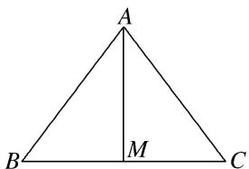
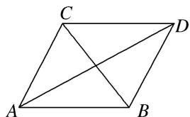
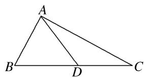

# 专题九 三角形中的最值(范围)问题

# 【方法总结】

# 三角形中最值(范围)问题的解题思路

任何最值(范围)问题，其本质都是函数问题，三角形中的范围(最值)问题也不例外。三角形中的范围(最值)问题的解法主要有两种：一是用函数求解，二是利用基本不等式求解。一般求最值用基本不等式，求范围用函数。由于三角形中的最值(范围)问题一般是以角为自变量的三角函数问题，所以，除遵循函数问题的基本要求外，还有自己独特的解法。

要建立所求量(式子)与已知角或边的关系，然后把角或边作为自变量，所求量(式子)的值作为函数值，转化为函数关系，将原问题转化为求函数的值域问题。这里要利用条件中的范围限制，以及三角形自身范围限制，要尽量把角或边的范围(也就是函数的定义域)找完善，避免结果的范围过大。

# 考点一 三角形中与角或角的函数有关的最值(范围)

# 【例题选讲】

[例 1](2020·浙江)在锐角 $\triangle ABC$ 中，角 A, B, C 所对的边分别为 a, b, c. 已知 $2b\sin A - \sqrt{3}a = 0$ .  
（1）求角 B 的大小;  
（2）求 $\cos A + \cos B + \cos C$ 的取值范围.
解析 （1）由正弦定理，得 $2\sin B\sin A=\sqrt{3}\sin A$ ，又在 $\triangle ABC$ 中， $\sin A>0$ ，
故 $\sin B=\frac{\sqrt{3}}{2}$ ，由题意得 $B=\frac{\pi}{3}$ .  
（2）由 $A+B+C=\pi$ ，得 $C=\frac{2\pi}{3}-A$ 。由 $\triangle ABC$ 是锐角三角形，得 $A\in\left(\frac{\pi}{6},\frac{\pi}{2}\right)$ 。
由 $\cos C = \cos\left(\frac{2\pi}{3} - A\right) = -\frac{1}{2}\cos A + \frac{\sqrt{3}}{2}\sin A$ ，得
$\cos A + \cos B + \cos C = \frac {\sqrt {3}}{2} \sin A + \frac {1}{2} \cos A + \frac {1}{2} = \sin \left(A + \frac {\pi}{6}\right) + \frac {1}{2} \in \left(\frac {\sqrt {3} + 1}{2}, \frac {3}{2} \right].$
故 $\cos A + \cos B + \cos C$ 的取值范围是 $\left[\frac{\sqrt{3} + 1}{2},\frac{3}{2}\right]$

[例 2](2016·北京)在 $\triangle ABC$ 中， $a^{2}+c^{2}=b^{2}+\sqrt{2}ac$ .  
（1）求 B 的大小;  
（2）求 $\sqrt{2}\cos A + \cos C$ 的最大值.
解析 （1）由 $a^2 + c^2 = b^2 + \sqrt{2} ac$ ，得 $a^2 + c^2 - b^2 = \sqrt{2} ac$ .
由余弦定理，得 $\cos B=\frac{a^{2}+c^{2}-b^{2}}{2ac}=\frac{\sqrt{2}ac}{2ac}=\frac{\sqrt{2}}{2}$ . 又 $0<B<\pi$ ，所以 $B=\frac{\pi}{4}$ .  
（2） $A+C=\pi-B=\pi-\frac{\pi}{4}=\frac{3\pi}{4}$ ，所以 $C=\frac{3\pi}{4}-A,0<A<\frac{3\pi}{4}$ .
所以 $\sqrt{2}\cos A + \cos C = \sqrt{2}\cos A + \cos \left(\frac{3\pi}{4} -A\right) = \sqrt{2}\cos A + \cos \frac{3\pi}{4}\cos A + \sin \frac{3\pi}{4}\sin A$
$= \sqrt {2} \cos A - \frac {\sqrt {2}}{2} \cos A + \frac {\sqrt {2}}{2} \sin A = \frac {\sqrt {2}}{2} \sin A + \frac {\sqrt {2}}{2} \cos A = \sin \left(A + \frac {\pi}{4}\right).$
因为 $0 < A < \frac{3\pi}{4}$ ，所以 $\frac{\pi}{4} < A + \frac{\pi}{4} < \pi$ ，
故当 $A + \frac{\pi}{4} = \frac{\pi}{2}$ ，即 $A = \frac{\pi}{4}$ 时， $\sqrt{2}\cos A + \cos C$ 取得最大值 1.

[例 3](2014·陕西) $\triangle ABC$ 的内角 A, B, C 所对的边分别为 a, b, c.  
（1）若 a, b, c 成等差数列，证明 $\sin A + \sin C = 2\sin(A + C)$ ;  
（2）若 a, b, c 成等比数列，求 $\cos B$ 的最小值.
解析 （1） $\because a, b, c$ 成等差数列， $\therefore a + c = 2b$ 。由正弦定理得 $\sin A + \sin C = 2\sin B$ 。
$\because \sin B = \sin [ \pi - (A + C) ] = \sin (A + C), \therefore \sin A + \sin C = 2 \sin (A + C).$  
（2） $\because a, b, c$ 成等比数列， $\therefore b^{2} = ac$ 。由余弦定理得， $\cos B = \frac{a^{2} + c^{2} - b^{2}}{2ac} = \frac{a^{2} + c^{2} - ac}{2ac} \geqslant \frac{2ac - ac}{2ac} = \frac{1}{2}$ ，当且仅当 $a = c$ 时等号成立。 $\therefore \cos B$ 的最小值为 $\frac{1}{2}$ .

[例 4]在 $\triangle ABC$ 中，内角A，B，C的对边分别为a，b，c，且满足 $(2c-a)\cos B-b\cos A=0$ .  
（1）若 b=7， $a+c=13$ ，求 $\triangle ABC$ 的面积；  
（2）求 $\sin^{2}A+\sin\left(C-\frac{\pi}{6}\right)$ 的取值范围.
解析 （1） 因为 $(2c-a)\cos B - b\cos A = 0$ ,
由正弦定理得 $(2\sin C-\sin A)\cos B-\sin B\cos A=0$ ，则 $2\sin C\cos B-\sin(A+B)=0$ ，
求得 $\cos B=\frac{1}{2}$ ， $B=\frac{\pi}{3}$ 。由余弦定理得 $b^{2}=a^{2}+c^{2}-2ac\cos B$ ，
即 $49=(a+c)^{2}-2ac-2accosB,$
求得 ac=40，所以 $\triangle ABC$ 的面积 $S=\frac{1}{2}ac\sin B=10\sqrt{3}$ .  
（2） $\sin^{2}A+\sin\left(C-\frac{\pi}{6}\right)=\sin^{2}A+\sin\left(\frac{2\pi}{3}-A-\frac{\pi}{6}\right)=\sin^{2}A+\sin\left(\frac{\pi}{2}-A\right)=-\cos^{2}A+\cos A+1,\quad A\in\left(0,\quad\frac{2\pi}{3}\right),$
令 $u = \cos A\in \left(-\frac{1}{2},1\right),y = -u^2 +u + 1\in \left(\frac{1}{4},\frac{5}{4}\right].$

# 【对点训练】

1. 在 $\triangle ABC$ 中，角 $A, B, C$ 的对边分别为 $a, b, c$ ，且 $2a\sin A = (2a + c)\sin B + (2c + b)\sin C$ 。  
（1）求 A 的大小;  
（2）求 $\sin B + \sin C$ 的最大值.

1. 解析 （1）由已知, 根据正弦定理得, $2a^{2} = (2a + c)b + (2c + b)c$ ,
即 $a^{2}=b^{2}+c^{2}+bc$ ，由余弦定理得， $a^{2}=b^{2}+c^{2}-2bc\cos A$ ，故 $\cos A=-\frac{1}{2}$ ，所以 $A=\frac{2\pi}{3}$ .  
（2）由（1）得， $\sin B+\sin C=\sin B+\sin(\frac{\pi}{3}-B)=\frac{\sqrt{3}}{2}\cos B+\frac{1}{2}\sin B=\sin(\frac{\pi}{3}+B)$ ,
故当 $B=\frac{\pi}{6}$ 时， $\sin B+\sin C$ 取最大值 1.

2. 已知锐角 $\triangle ABC$ 中， $b\sin B - a\sin A = (b - c)\sin C$ ，其中 $a$ 、 $b$ 、 $c$ 分别为内角 $A$ 、 $B$ 、 $C$ 的对边.  
（1）求角 A 的大小;  
（2）求 $\sqrt{3}\cos C - \sin B$ 的取值范围.

2. 解析 （1）由正弦定理得 $b^{2} - a^{2} = (b - c) \cdot c$ . 即 $b^{2} + c^{2} - a^{2} = bc$ .
$\therefore \cos A = \frac{b^2 + c^2 - a^2}{2bc} = \frac{bc}{2bc} = \frac{1}{2}$ . 又 $\because A$ 为三角形内角， $\therefore A = \frac{\pi}{3}$ .  
（2） $\because B+C=\frac{2}{3}\pi,\quad\therefore C=\frac{2}{3}\pi-B.\quad\because\triangle ABC$ 为锐角三角形， $\therefore\left\{\begin{aligned}&0<B<\frac{\pi}{2},\\ &0<\frac{2}{3}\pi-B<\frac{\pi}{2}.\end{aligned}\right.$ $\therefore\frac{\pi}{6}<B<\frac{\pi}{2}.$
又 $\because \sqrt{3}\cos C - \sin B = \sqrt{3}\cos \left(\frac{2}{3}\pi -B\right) - \sin B = -\frac{\sqrt{3}}{2}\cos B + \frac{1}{2}\sin B = \sin \left(B - \frac{\pi}{3}\right),$
$\because \frac{\pi}{6} < B < \frac{\pi}{2}, \therefore -\frac{\pi}{6} < B - \frac{\pi}{3} < \frac{\pi}{6}. \therefore -\frac{1}{2} < \sin \left(B - \frac{\pi}{3}\right) < \frac{1}{2}.$ 即 $\sqrt{3} \cos C - \sin B$ 的取值范围为 $\left(-\frac{1}{2}, \frac{1}{2}\right)$ .

3. (2016 山东) 在 $\triangle ABC$ 中，角 $A, B, C$ 的对边分别为 $a, b, c$ ，已知 $2(\tan A + \tan B) = \frac{\tan A}{\cos B} + \frac{\tan B}{\cos A}$ .  
（1）证明： $a+b=2c;$  
（2） 求 $\cos C$ 的最小值.

3. 解析 由题意知， $2(\frac{\sin A}{\cos A}+\frac{\sin B}{\cos B})=\frac{\sin A}{\cos A\cos B}+\frac{\sin B}{\cos A\cos B}$
化简得 $2(\sin A \cos B + \sin B \cos A) = \sin A + \sin B$ ，即 $2\sin(A + B) = \sin A + \sin B$ .
因为 $A+B+C=\pi$ ，所以 $\sin(A+B)=\sin(\pi-C)=\sin C$ ，从而 $\sin A+\sin B=2\sin C$ ，
由正弦定理得， $a+b=2c$ .  
（2）由（1）知 $c = \frac{a + b}{2}$ ，所以 $\cos C = \frac{a^2 + b^2 - c^2}{2ab} = \frac{a^2 + b^2 - \left(\frac{a + b}{2}\right)^2}{2ab} = \frac{3}{8}\left(\frac{b}{a} + \frac{a}{b}\right) - \frac{1}{4} \geq \frac{1}{2}$ ，
当且仅当 a=b 时，等号成立．故 $\cos C$ 的最小值为 $\frac{1}{2}$ .

4. (2015 湖南) 设 $\triangle ABC$ 的内角 A, B, C 的对边分别为 a, b, c, $a = b \tan A$ ，且 B 为钝角.  
（1）证明： $B-A=\frac{\pi}{2};$  
（2）求 $\sin A + \sin C$ 的取值范围.

4. 解析 （1）由 $a = b\tan A$ 及正弦定理，得 $\frac{\sin A}{\cos A} = \frac{a}{b} = \frac{\sin A}{\sin B}$ ，所以 $\sin B = \cos A$ ，即 $\sin B = \sin \left(\frac{\pi}{2} + A\right)$ .
因为 B 为钝角，所以 A 为锐角，所以 $\frac{\pi}{2} + A \in \left(\frac{\pi}{2}, \pi\right)$ ，则 $B = \frac{\pi}{2} + A$ ，即 $B - A = \frac{\pi}{2}$ .  
（2）由（1）知， $C=\pi-(A+B)=\pi-\left(2A+\frac{\pi}{2}\right)=\frac{\pi}{2}-2A>0$ ，所以 $A\in\left(0,\frac{\pi}{4}\right)$ .
于是 $\sin A + \sin C = \sin A + \sin\left(\frac{\pi}{2} - 2A\right) = \sin A + \cos 2A = -2\sin^{2}A + \sin A + 1 = -2\left(\sin A - \frac{1}{4}\right)^{2} + \frac{9}{8}.$
因为 $0 < A < \frac{\pi}{4}$ ，所以 $0 < \sin A < \frac{\sqrt{2}}{2}$ ，因此 $\frac{\sqrt{2}}{2} < -2\left(\sin A - \frac{1}{4}\right)^2 + \frac{9}{8} \leq \frac{9}{8}$ .
由此可知 $\sin A + \sin C$ 的取值范围是 $\left[\frac{\sqrt{2}}{2}, \frac{9}{8}\right]$ .

# 考点二 三角形中与边或周长有关的最值(范围)

# 【例题选讲】

[例 1]在 $\triangle ABC$ 中，内角 A, B, C 的对边分别为 a, b, c，若 $b^{2}+c^{2}-a^{2}=bc$ .  
（1）求角 A 的大小;  
（2）若 $a = \sqrt{3}$ ，求 $BC$ 边上的中线 $AM$ 的最大值.
解析 （1）由 $b^{2} + c^{2} - a^{2} = bc$ 及余弦定理，得 $\cos A = \frac{b^2 + c^2 - a^2}{2bc} = \frac{bc}{2bc} = \frac{1}{2}$ ，又 $0 < A < \pi$ ， $\therefore A = \frac{\pi}{3}$ .
  
（2）∵AM是BC边上的中线，∴BM=CM= $\frac{\sqrt{3}}{2}$ ，∴在△ABM中， $AM^{2}+\frac{3}{4}-2AM\cdot\frac{\sqrt{3}}{2}\cdot\cos\angle AMB=c^{2}$ ，①
在△ACM 中， $AM^{2}+\frac{3}{4}-2AM\cdot\frac{\sqrt{3}}{2}\cdot\cos\angle AMC=b^{2}$ ，②
又 $\angle AMB = \pi - \angle AMC, \therefore \cos \angle AMB = -\cos \angle AMC,$ 即 $\cos \angle AMB + \cos \angle AMC = 0,$
则①+②整理得 $AM^{2}=\frac{b^{2}+c^{2}}{2}-\frac{3}{4}$ . 又 $a=\sqrt{3}$ , $A=\frac{\pi}{3}$ , $\therefore b^{2}+c^{2}-3=bc\leq\frac{b^{2}+c^{2}}{2}$ ,
$\therefore b^{2} + c^{2}\leq 6,\therefore AM^{2} = \frac{b^{2} + c^{2}}{2} -\frac{3}{4}\leq \frac{9}{4},$ 即 $AM\leq \frac{3}{2},\therefore BC$ 边上的中线 $AM$ 的最大值为 $\frac{3}{2}$

[例 2] (2020·全国 II)△ABC 中， $\sin^{2}A-\sin^{2}B-\sin^{2}C=\sin B\sin C.$  
（1）求 A;  
（2）若 BC=3，求 $\triangle ABC$ 周长的最大值.
解析 （1）由正弦定理和已知条件得 $BC^{2}-AC^{2}-AB^{2}=AC\cdot AB$ . ①
由余弦定理得 $BC^{2}=AC^{2}+AB^{2}-2AC\cdot AB\cos A$ . ②
由①②得 $\cos A = -\frac{1}{2}$ . 因为 $0 < A < \pi$ , 所以 $A = \frac{2\pi}{3}$ .  
（2）由正弦定理及（1）得 $\frac{AC}{\sin B} = \frac{AB}{\sin C} = \frac{BC}{\sin A} = 2\sqrt{3}$ ，从而 $AC = 2\sqrt{3}\sin B$
$AB = 2\sqrt{3}\sin (\pi - A - B) = 3\cos B - \sqrt{3}\sin B.$ 故 $BC + AC + AB = 3 + \sqrt{3}\sin B + 3\cos B = 3 + 2\sqrt{3}\sin \left(B + \frac{\pi}{3}\right)$ .
又 $0 < B < \frac{\pi}{3}$ ，所以当 $B = \frac{\pi}{6}$ 时， $\triangle ABC$ 周长取得最大值 $3 + 2\sqrt{3}$ .

[例 3] 在 $\triangle ABC$ 中，角 A, B, C 所对的边分别为 a, b, c，且满足 $\cos2C - \cos2A = 2\sin\left[\frac{\pi}{3} + C\right] \cdot \sin\left(\frac{\pi}{3} - C\right)$ .  
（1）求角 A 的值;  
（2）若 $a = \sqrt{3}$ 且 $b\geq a$ ，求 $2b - c$ 的取值范围.
解析 （1）由已知得 $2\sin^2 A - 2\sin^2 C = 2\left(\frac{3}{4}\cos^2 C - \frac{1}{4}\sin^2 C\right)$ ，化简得 $\sin A = \pm \frac{\sqrt{3}}{2}$ ，
因为 A 为 $\triangle ABC$ 的内角，所以 $\sin A = \frac{\sqrt{3}}{2}$ ，故 $A = \frac{\pi}{3}$ 或 $\frac{2\pi}{3}$ .  
（2）因为 $b \geq a$ ，所以 $A = \frac{\pi}{3}$ 。由正弦定理得 $\frac{b}{\sin B} = \frac{c}{\sin C} = \frac{a}{\sin A} = 2$ ，得 $b = 2\sin B, c = 2\sin C,$
故 $2b - c = 4\sin B - 2\sin C = 4\sin B - 2\sin \left(\frac{2\pi}{3} -B\right) = 3\sin B - \sqrt{3}\cos B = 2\sqrt{3}\sin \left(B - \frac{\pi}{6}\right).$
因为 $b \geq a$ ，所以 $\frac{\pi}{3} \leq B < \frac{2\pi}{3}$ ，则 $\frac{\pi}{6} \leq B - \frac{\pi}{6} < \frac{\pi}{2}$ ，所以 $2b - c = 2\sqrt{3}\sin \left(B - \frac{\pi}{6}\right) \in [\sqrt{3}, 2\sqrt{3})$ .

[例 4]在锐角 $\triangle ABC$ 中，内角 A, B, C 的对边分别是 a, b, c，满足 $\cos2A-\cos2B+2\cos\left(\frac{\pi}{6}-B\right)\cdot\cos\left(\frac{\pi}{6}+B\right)=0$ .  
（1）求角 A 的值;  
（2）若 $b = \sqrt{3}$ 且 $b\leqslant a$ ，求 $a$ 的取值范围.
解析 （1）由 $\cos2A-\cos2B+2\cos\left(\frac{\pi}{6}-B\right)\cos\left(\frac{\pi}{6}+B\right)=0,$
得 $2\sin^{2}B-2\sin^{2}A+2\left(\frac{3}{4}\cos^{2}B-\frac{1}{4}\sin^{2}B\right)=0$ ，化简得 $\sin A=\frac{\sqrt{3}}{2}$ ，又 $\triangle ABC$ 为锐角三角形，故 $A=\frac{\pi}{3}$ .  
（2） $\because b=\sqrt{3}\leqslant a,\quad\therefore c\geqslant a,\quad\therefore\frac{\pi}{3}\leqslant C<\frac{\pi}{2},\quad\frac{\pi}{6}<B\leqslant\frac{\pi}{3},\quad\therefore\frac{1}{2}<\sin B\leqslant\frac{\sqrt{3}}{2}.$
由正弦定理 $\frac{a}{\sin A} = \frac{b}{\sin B}$ ，得 $\frac{a}{\frac{\sqrt{3}}{2}} = \frac{\sqrt{3}}{\sin B}$ ， $\therefore a = \frac{\frac{3}{2}}{\sin B}$ ，由 $\sin B \in \left[\frac{1}{2}, \frac{\sqrt{3}}{2}\right]$ 得 $a \in [\sqrt{3}, 3)$ .

[例 5]在 $\triangle ABC$ 中，AC=BC=2， $AB=2\sqrt{3}$ ， $\overrightarrow{AM}=\overrightarrow{MC}$ .  
（1）求 $BM$ 的长;  
（2）设 D 是平面 ABC 内一动点，且满足 $\angle BDM = \frac{2\pi}{3}$ ，求 $BD + \frac{1}{2}MD$ 的取值范围.
解析 （1） 在 $\triangle ABC$ 中， $AB^{2} = AC^{2} + BC^{2} - 2AC \cdot BC \cdot \cos C$ ，代入数据，得 $\cos C = -\frac{1}{2}$ .
$\because \overrightarrow {A M} = \overrightarrow {M C}, \therefore C M = M A = \frac {1}{2} A C = 1.$
在 $\triangle CBM$ 中，由余弦定理知： $BM^{2}=CM^{2}+CB^{2}-2CM\cdot CB\cdot\cos C=7$ ，所以 $BM=\sqrt{7}$ .  
（2）设 $\angle MBD = \theta$ ，则 $\angle DMB = \frac{\pi}{3} -\theta ,\theta \in \left(0,\frac{\pi}{3}\right).$
在 $\triangle BDM$ 中，由正弦定理知： $\frac{BD}{\sin\left(\frac{\pi}{3}-\theta\right)}=\frac{MD}{\sin\theta}=\frac{BM}{\sin\frac{2\pi}{3}}=\frac{2\sqrt{7}}{\sqrt{3}}.$
$\therefore B D = \frac {2 \sqrt {7}}{\sqrt {3}} \sin \left(\frac {\pi}{3} - \theta\right), M D = \frac {2 \sqrt {7}}{\sqrt {3}} \sin \theta ,$
$\therefore B D + \frac {1}{2} M D = \frac {2 \sqrt {7}}{\sqrt {3}} \sin \left(\frac {\pi}{3} - \theta\right) + \frac {\sqrt {7}}{\sqrt {3}} \sin \theta = \frac {\sqrt {7}}{\sqrt {3}} (\sqrt {3} \cos \theta - \sin \theta + \sin \theta) = \sqrt {7} \cos \theta ,$
又 $\theta \in \left(0, \frac{\pi}{3}\right)$ , $\therefore \cos \theta \in \left(\frac{1}{2}, 1\right)$ . 故 $BD + \frac{1}{2} MD$ 的取值范围是 $\left(\frac{\sqrt{7}}{2}, \sqrt{7}\right)$ .

# 【对点训练】

1. 在 $\triangle ABC$ 中，内角 $A, B, C$ 的对边分别为 $a, b, c$ ，且 $\sin^2\frac{A}{2} = \frac{c - b}{2c}$ .  
（1）判断 $\triangle ABC$ 的形状并加以证明；  
（2）当 c=1 时，求 $\triangle ABC$ 周长的最大值.

1. 解析 （1） 因为 $\frac{1 - \cos A}{2} = \frac{1}{2} - \frac{b}{2c}$ , 即 $\cos A = \frac{b}{c}$ , 所以 $b = c\cos A = c \cdot \frac{b^2 + c^2 - a^2}{2bc}$ , 即 $c^2 = b^2 + a^2$ , 所以 $\triangle ABC$ 为直角三角形.  
（2）因为 $c$ 为直角 $\triangle ABC$ 的斜边，当 $c = 1$ 时，周长 $L = 1 + \sin A + \cos A = 1 + \sqrt{2}\sin \left(A + \frac{\pi}{4}\right)$ .
因为 $0 < A < \frac{\pi}{2}$ ，所以 $\frac{\sqrt{2}}{2} < \sin\left(A + \frac{\pi}{4}\right) \leqslant 1$ ，所以当 $\sin\left(A + \frac{\pi}{4}\right) = 1$ ，
即 $A=\frac{\pi}{4}$ 时，周长 L 最大，且最大值为 $1+\sqrt{2}$ .

2. 在 $\triangle ABC$ 中，角 $A, B, C$ 所对的边分别为 $a, b, c, c=\sqrt{3}$ ，设 $S$ 为 $\triangle ABC$ 的面积，满足 $S=\frac{\sqrt{3}}{4}(a^{2}+b^{2}-c^{2})$ .  
（1）求角 C 的大小;  
（2）求 $a+b$ 的最大值.

2. 解析 （1）由题意可知 $\frac{1}{2}ab\sin C=\frac{\sqrt{3}}{4}\times2ab\cos C$ ，所以 $\tan C=\sqrt{3}$ ，因为 $0<C<\pi$ ，所以 $C=\frac{\pi}{3}$ .  
（2）由（1）知 $2R=\frac{c}{\sin C}=\frac{\sqrt{3}}{\sin\frac{\pi}{3}}=2.$
$\begin{array}{l} \text {所以} a + b = 2 R \sin A + 2 R \sin B = 2 (\sin A + \sin B) = 2 \left[ \sin A + \sin \left(\pi - A - \frac {\pi}{3}\right) \right] \\ = 2 \left[ \sin A + \sin \left(\frac {2 \pi}{3} - A\right) \right] = 2 \left(\sin A + \frac {\sqrt {3}}{2} \cos A + \frac {1}{2} \sin A\right) = 2 \sqrt {3} \sin \left(A + \frac {\pi}{6}\right) \leqslant 2 \sqrt {3} \left(0 <   A <   \frac {2 \pi}{3}\right), \\ \end{array}$
当 $A = \frac{\pi}{3}$ ，即 $\triangle ABC$ 为等边三角形时取等号。所以 $a + b$ 的最大值为 $2\sqrt{3}$ 。

3. 在 $\triangle ABC$ 中, 角 $A, B, C$ 的对边分别为 $a, b, c$ , 已知 $b \cos C + \sqrt{3} b \sin C - a - c = 0$  
（1）求 B;   
（2）若 $b = \sqrt{3}$ ，求 $2a + c$ 的取值范围.

3. 解析 （1）由正弦定理知， $\sin B\cos C+\sqrt{3}\sin B\sin C-\sin A-\sin C=0,$
$\because \sin A = \sin (B + C) = \sin B\cos C + \cos B\sin C$ ，代入上式得， $\sqrt{3}\sin B\sin C - \cos B\sin C - \sin C = 0,$ $\therefore \sin C\neq 0,\therefore \sqrt{3}\sin B - \cos B - 1 = 0$ ，即 $\sin (B - \frac{\pi}{6}) = \frac{1}{2}$ 因为 $0 <   B <   \pi$ ，所以 $B = \frac{\pi}{3}.$  
（2）由（1）得， $2R=\frac{b}{\sin B}=2,\quad2a+c=2R\sin A+2R\sin C=5\sin A+\sqrt{3}\cos A=2\sqrt{7}\sin(A+\phi)$ ，其中， $\sin\phi=\frac{\sqrt{3}}{2\sqrt{7}},\quad\cos\phi=\frac{5}{2\sqrt{7}}$ ，因为 $0<A<\frac{2\pi}{3}$ ，所以 $\sqrt{3}<2\sqrt{7}\sin(A+\phi)<2\sqrt{7}$ 。所以 $\sqrt{3}<2a+c<2\sqrt{7}$

4. 在 $\triangle ABC$ 中，设角 $A$ ， $B$ ， $C$ 的对边分别为 $a$ ， $b$ ， $c$ ，已知 $\cos^{2}A=\sin^{2}B+\cos^{2}C+\sin A\sin B$ .  
（1）求角 C 的大小;  
（2）若 $c=\sqrt{3}$ ，求△ABC 周长的取值范围.

4. 解析 （1）由题意知 $1 - \sin^2 A = \sin^2 B + 1 - \sin^2 C + \sin A\sin B,$
即 $\sin^{2}A+\sin^{2}B-\sin^{2}C=-\sin A\sin B$ ，由正弦定理得 $a^{2}+b^{2}-c^{2}=-ab$ ，由余弦定理得 $\cos C=\frac{a^{2}+b^{2}-c^{2}}{2ab}=\frac{-ab}{2ab}=-\frac{1}{2}$ ，又 $\because0<C<\pi,\therefore C=\frac{2\pi}{3}$ .  
（2）由正弦定理得 $\frac{a}{\sin A} = \frac{b}{\sin B} = \frac{c}{\sin C} = 2, \therefore a = 2\sin A, b = 2\sin B,$
则 $\triangle ABC$ 的周长为 $L = a + b + c = 2(\sin A + \sin B) + \sqrt{3} = 2\left[\sin A + \sin \left(\frac{\pi}{3} -A\right)\right] + \sqrt{3} = 2\sin \left(A + \frac{\pi}{3}\right) + \sqrt{3}.$
$\because 0 <   A <   \frac {\pi}{3}, \therefore \frac {\pi}{3} <   A + \frac {\pi}{3} <   \frac {2 \pi}{3}, \therefore \frac {\sqrt {3}}{2} <   \sin \left(A + \frac {\pi}{3}\right) \leqslant 1, \therefore 2 \sqrt {3} <   2 \sin \left(A + \frac {\pi}{3}\right) + \sqrt {3} \leqslant 2 + \sqrt {3},$
∴△ABC 周长的取值范围是 $(2\sqrt{3}, 2+\sqrt{3}]$ .

5. 如图，平面四边形 ABDC 中， $\angle CAD = \angle BAD = 30^{\circ}$ .  
（1）若 $\angle ABC=75^{\circ}$ , $AB=10$ , 且 $AC//BD$ , 求 $CD$ 的长;  
（2）若 BC=10，求 $AC+AB$ 的取值范围.

5. 解析 （1）由已知, 易得 $\angle ACB = 45^{\circ}$ , 在 $\triangle ABC$ 中, $\frac{10}{\sin 45^{\circ}} = \frac{BC}{\sin 60^{\circ}}$ , 解得 $BC = 5\sqrt{6}$ .
因为 $AC \parallel BD$ ，所以 $\angle ADB = \angle CAD = 30^{\circ}$ ， $\angle CBD = \angle ACB = 45^{\circ}$ ，
在 $\triangle ABD$ 中， $\angle ADB=30^{\circ}=\angle BAD$ ，所以DB=AB=10.
在 $\triangle BCD$ 中， $CD = \sqrt{BC^2 + DB^2 - 2BC\cdot DB\cos 45^\circ} = 5\sqrt{10 - 4\sqrt{3}}.$  
（2） $AC+AB>BC=10$ ，由 $\cos60^{\circ}=\frac{AB^{2}+AC^{2}-100}{2AB\cdot AC}$ ，得 $(AB+AC)^{2}-100=3AB\cdot AC$ ，

而 $AB \cdot AC \leq \left(\frac{AB + AC}{2}\right)^2$ ，所以 $\frac{(AB + AC)^2 - 100}{3} \leq \left(\frac{AB + AC}{2}\right)^2$ ，解得 $AB + AC \leq 20$
故 $AB + AC$ 的取值范围为(10, 20].

# 考点三 三角形中与面积有关的最值(范围)

# 【例题选讲】

[例 1]已知在 $\triangle ABC$ 中，角 A, B, C 的对边分别为 a, b, c, $C=120^{\circ}$ , c=2.  
（1）求 $\triangle ABC$ 的面积的最大值;  
（2）求 $\triangle ABC$ 的周长的取值范围.
解析 （1）法一：由余弦定理得 $4 = a^{2} + b^{2} + ab$ 。由基本不等式得 $4 = a^{2} + b^{2} + ab \geq 2ab + ab = 3ab$ ,
所以 $ab \leq \frac{4}{3}$ ，当且仅当 a = b 时等号成立.
所以三角形的面积 $S=\frac{1}{2}ab\sin C\leq\frac{1}{2}\times\frac{4}{3}\times\frac{\sqrt{3}}{2}=\frac{\sqrt{3}}{3}$ . 所以 $\triangle ABC$ 的面积的最大值为 $\frac{\sqrt{3}}{3}$ .

法二：由 $\frac{a}{\sin A}=\frac{b}{\sin B}=\frac{c}{\sin C}=\frac{4\sqrt{3}}{3}$ ，得 $a=\frac{4\sqrt{3}}{3}\sin A,\quad b=\frac{4\sqrt{3}}{3}\sin B.$
所以三角形的面积 $S=\frac{1}{2}ab\sin C=\frac{1}{2}\times\left(\frac{4\sqrt{3}}{3}\right)^{2}\times\sin A\sin B\times\frac{\sqrt{3}}{2}=\frac{4\sqrt{3}}{3}\sin A\sin B.$
因为在 $\triangle ABC$ 中， $C=120^{\circ}$ ，所以 $A+B=60^{\circ}$ ，得 $B=60^{\circ}-A$ ，且 $0^{\circ}<A<60^{\circ}$ ，
所以 $\sin A\sin B = \sin A\sin (60^{\circ} - A) = \frac{\sqrt{3}}{2}\sin A\cos A - \frac{1}{2}\sin^{2}A = \frac{\sqrt{3}}{4}\sin 2A - \frac{1}{4}(1 - \cos 2A)$
$= \frac{\sqrt{3}}{4}\sin 2A + \frac{1}{4}\cos 2A - \frac{1}{4} = \frac{1}{2}\sin (2A + 30^{\circ}) - \frac{1}{4} \leq \frac{1}{2} - \frac{1}{4} = \frac{1}{4},$ 当且仅当 $A = 30^{\circ}$ 时等号成立.
所以 $S \leq \frac{4\sqrt{3}}{3} \times \frac{1}{4} = \frac{\sqrt{3}}{3}$ ，所以 $\triangle ABC$ 的面积的最大值为 $\frac{\sqrt{3}}{3}$ .  
（2）由（1）中法二可知， $a=\frac{4\sqrt{3}}{3}\sin A,\quad b=\frac{4\sqrt{3}}{3}\sin B.$
所以 $\triangle ABC$ 的周长 $l = a + b + c = \frac{4\sqrt{3}}{3} (\sin A + \sin B) + 2.$
因为在 $\triangle ABC$ 中， $C=120^{\circ}$ ，所以 $A+B=60^{\circ}$ ，得 $B=60^{\circ}-A$ ，且 $0^{\circ}<A<60^{\circ}$ ，
所以 $\sin A + \sin B = \sin A + \sin(60^{\circ} - A) = \frac{1}{2}\sin A + \frac{\sqrt{3}}{2}\cos A = \sin(A + 60^{\circ})$ ,
所以 $l=\frac{4\sqrt{3}}{3}\sin(A+60^{\circ})+2$ 。因为 $60^{\circ}<A+60^{\circ}<120^{\circ}$ ，所以 $\frac{\sqrt{3}}{2}<\sin(A+60^{\circ})\leq1$ ，所以 $4<l\leq\frac{4\sqrt{3}}{3}+2$ ，
即 $\triangle ABC$ 的周长的取值范围是 $\left[4,\frac{4\sqrt{3}}{3}+2\right]$ .

[例 2]已知 $\triangle ABC$ 的内角 A, B, C 满足: $\frac{\sin A - \sin B + \sin C}{\sin C} = \frac{\sin B}{\sin A + \sin B - \sin C}.$  
（1）求角 A;  
（2）若 $\triangle ABC$ 的外接圆半径为1，求 $\triangle ABC$ 的面积 $S$ 的最大值.
解析 （1）设内角 $A, B, C$ 所对的边分别为 $a, b, c$ , 根据 $\frac{\sin A - \sin B + \sin C}{\sin C} = \frac{\sin B}{\sin A + \sin B - \sin C}$ ,
可得 $\frac{a-b+c}{c}=\frac{b}{a+b-c}$ ，化简得 $a^{2}=b^{2}+c^{2}-bc$ ，所以 $\cos A=\frac{b^{2}+c^{2}-a^{2}}{2bc}=\frac{bc}{2bc}=\frac{1}{2}$
又因为 $0 < A < \pi$ ，所以 $A = \frac{\pi}{3}$ .  
（2）由正弦定理得 $\frac{a}{\sin A} = 2R(R$ 为 $\triangle ABC$ 外接圆半径)，所以 $a = 2R\sin A = 2\sin \frac{\pi}{3} = \sqrt{3}$
所以 $3=b^{2}+c^{2}-bc\geqslant2bc-bc=bc$ ，所以 $S=\frac{1}{2}bc\sin A\leqslant\frac{1}{2}\times3\times\frac{\sqrt{3}}{2}=\frac{3\sqrt{3}}{4}$ （当且仅当 b=c 时取等号）.

[例 3]已知 a, b, c 分别是 $\triangle ABC$ 内角 A, B, C 的对边，且满足 $(a+b+c)(\sin B+\sin C-\sin A)=b\sin C$ .  
（1）求角 A 的大小;  
（2）设 $a = \sqrt{3}$ ， $S$ 为 $\triangle ABC$ 的面积，求 $S + \sqrt{3}\cos B\cos C$ 的最大值.
解析 （1） $\because(a+b+c)(\sin B+\sin C-\sin A)=b\sin C,$
∴根据正弦定理，知 $(a+b+c)(b+c-a)=bc$ ，即 $b^{2}+c^{2}-a^{2}=-bc$ .
∴由余弦定理，得 $\cos A=\frac{b^{2}+c^{2}-a^{2}}{2bc}=-\frac{1}{2}$ . 又 $A\in(0,\pi)$ ，所以 $A=\frac{2}{3}\pi$ .  
（2）根据 $a=\sqrt{3}$ ， $A=\frac{2}{3}\pi$ 及正弦定理得 $\frac{b}{\sin B}=\frac{c}{\sin C}=\frac{a}{\sin A}=\frac{\sqrt{3}}{\frac{\sqrt{3}}{2}}=2$ ，
$\therefore b = 2 \sin B, c = 2 \sin C.$
$\therefore S = \frac {1}{2} b c \sin A = \frac {1}{2} \times 2 \sin B \times 2 \sin C \times \frac {\sqrt {3}}{2} = \sqrt {3} \sin B \sin C.$
$\therefore S + \sqrt {3} \cos B \cos C = \sqrt {3} \sin B \sin C + \sqrt {3} \cos B \cos C = \sqrt {3} \cos (B - C).$
故当 $B=C=\frac{\pi}{6}$ 时， $S+\sqrt{3}\cos B\cos C$ 取得最大值 $\sqrt{3}$ .

[例 4](2019·全国III)△ABC 的内角 A, B, C 的对边分别为 a, b, c, 已知 $a\sin\frac{A+C}{2}=b\sin A$ .  
（1）求 B;   
（2）若 $\triangle ABC$ 为锐角三角形，且 $c=1$ ，求 $\triangle ABC$ 面积的取值范围.
解析 （1）由题设及正弦定理得 $\sin A\sin\frac{A+C}{2}=\sin B\sin A$ .
因为 $\sin A \neq 0$ ，所以 $\sin \frac{A + C}{2} = \sin B$ 。由 $A + B + C = 180^{\circ}$ ，可得 $\sin \frac{A + C}{2} = \cos \frac{B}{2}$
故 $\cos\frac{B}{2}=2\sin\frac{B}{2}\cos\frac{B}{2}$ . 因为 $\cos\frac{B}{2}\neq0$ ，故 $\sin\frac{B}{2}=\frac{1}{2}$ ，因此 $B=60^{\circ}$ .  
（2）由题设及（1）知 $\triangle ABC$ 的面积 $S_{\triangle ABC}=\frac{1}{2}ac\sin B=\frac{\sqrt{3}}{4}a$ . 由（1）知 $A+C=120^{\circ}$ ,
由正弦定理得 $a=\frac{c\sin A}{\sin C}=\frac{\sin(120^{\circ}-C)}{\sin C}=\frac{\sqrt{3}}{2\tan C}+\frac{1}{2}.$
由于 $\triangle ABC$ 为锐角三角形，故 $0^{\circ}<A<90^{\circ}$ ， $0^{\circ}<C<90^{\circ}$ .

结合 $A+C=120^{\circ}$ ，得 $30^{\circ}<C<90^{\circ}$ ，所以 $\frac{1}{2}<a<2$ ，从而 $\frac{\sqrt{3}}{8}<S_{\triangle ABC}<\frac{\sqrt{3}}{2}$ .
因此， $\triangle ABC$ 面积的取值范围是 $\left[\frac{\sqrt{3}}{8}, \frac{\sqrt{3}}{2}\right]$ .

[例 5]在 $\triangle ABC$ 中，内角 $A$ ， $B$ ， $C$ 所对的边分别为 $a$ ， $b$ ， $c$ ，已知 $\cos^{2}B+\cos B=1-\cos A\cos C$ .  
（1）求证：a，b，c成等比数列；  
（2）若 b=2，求 $\triangle ABC$ 的面积的最大值.
解析 （1）在 $\triangle ABC$ 中， $\cos B = -\cos(A + C)$ 。由已知，得
$(1 - \sin^ {2} B) - \cos (A + C) = 1 - \cos A \cos C,$
所以 $-\sin^{2}B-(\cos A\cos C-\sin A\sin C)=-\cos A\cos C$ ，化简，得 $\sin^{2}B=\sin A\sin C$ .
由正弦定理，得 $b^{2}=ac$ ，所以 a, b, c 成等比数列.  
（2）由（1）及题设条件，得 $ac=b^{2}=4$ ,
则 $\cos B=\frac{a^{2}+c^{2}-b^{2}}{2ac}=\frac{a^{2}+c^{2}-ac}{2ac}\geq\frac{2ac-ac}{2ac}=\frac{1}{2}$ ，当且仅当 a=c=2 时，等号成立.
因为 $0 < B < \pi$ ，所以 $\sin B = \sqrt{1 - \cos^{2}B} \leq \sqrt{1 - \left(\frac{1}{2}\right)^{2}} = \frac{\sqrt{3}}{2}$ ，所以 $S_{\triangle ABC} = \frac{1}{2} a \sin B \leq \frac{1}{2} \times 4 \times \frac{\sqrt{3}}{2} = \sqrt{3}$ .
所以 $\triangle ABC$ 的面积的最大值为 $\sqrt{3}$ .

# 【对点训练】

1. 设在 $\triangle ABC$ 中， $\cos C + (\cos A - \sqrt{3}\sin A)\cos B = 0$ ，内角 $A, B, C$ 的对边分别为 $a, b, c$ .  
（1）求角 B 的大小;  
（2）若 $a^{2}+4c^{2}=8$ ，求 $\triangle ABC$ 的面积 S 的最大值，并求出 S 取得最大值时 b 的值.

1. 解析 （1） $\because \cos C = -\cos(A + B) = -\cos A \cos B + \sin A \sin B,$
$\therefore \cos C + (\cos A - \sqrt {3} \sin A) \cos B = \sin A \sin B - \sqrt {3} \sin A \cdot \cos B = 0,$
$\because \sin A \neq 0, \therefore \tan B = \sqrt {3}, \text {则} B = \frac {\pi}{3}.$  
（2） $\because a,\ c>0,\ a^{2}+4c^{2}=8,\ a^{2}+4c^{2}\geqslant4ac$ ，故 $ac\leqslant2$ ，当且仅当a=2，c=1时等号成立，∴ $S=\frac{1}{2}ac\sin B \leqslant \frac{1}{2} \times 2 \times \frac{\sqrt{3}}{2} = \frac{\sqrt{3}}{2}$ ，∴ $\triangle ABC$ 的面积 S 的最大值为 $\frac{\sqrt{3}}{2}$ ,
由余弦定理 $b^{2}=a^{2}+c^{2}-2ac\cos B=3$ ，得 $b=\sqrt{3}$ .

2. 已知在 $\triangle ABC$ 中，内角 $A, B, C$ 所对的边分别为 $a, b, c$ ，且 $c = 1$ ， $\cos B \sin C + (a - \sin B) \cos (A + B) = 0$ .  
（1）求角 C 的大小;  
（2）求 $\triangle ABC$ 面积的最大值.

2. 解析 （1）由 $\cos B\sin C+(a-\sin B)\cos(A+B)=0$ ，可得 $\cos B\sin C-(a-\sin B)\cos C=0$ ，
即 $\sin(B+C)=a\cos C,\quad\sin A=a\cos C,$ 即 $\frac{\sin A}{a}=\cos C.$ 因为 $\frac{\sin A}{a}=\frac{\sin C}{c}=\sin C,$
所以 $\cos C = \sin C$ ，即 $\tan C = 1$ ， $C = \frac{\pi}{4}$ .  
（2）由余弦定理得 $1^{2}=a^{2}+b^{2}-2ab\cos\frac{\pi}{4}=a^{2}+b^{2}-\sqrt{2}ab,$
所以 $a^{2}+b^{2}=1+\sqrt{2}ab\geq2ab,\quad ab\leq\frac{1}{2-\sqrt{2}}=\frac{2+\sqrt{2}}{2}$ ，当且仅当 a=b 时取等号，
所以 $S_{\triangle ABC}=\frac{1}{2}absin C\leq\frac{1}{2}\times\frac{2+\sqrt{2}}{2}\times\frac{\sqrt{2}}{2}=\frac{\sqrt{2}+1}{4}$ . 所以 $\triangle ABC$ 面积的最大值为 $\frac{\sqrt{2}+1}{4}$ .

3. 已知在 $\triangle ABC$ 中，角 $A, B, C$ 的对边分别为 $a, b, c$ ，且 $\frac{\cos B}{b} + \frac{\cos C}{c} = \frac{\sin A}{\sqrt{3}\sin C}$ .  
（1）求 b 的值;  
（2）若 $\cos B + \sqrt{3}\sin B = 2$ ，求 $\triangle ABC$ 面积的最大值.

3. 解析 （1）由题意及正、余弦定理得 $\frac{a^2 + c^2 - b^2}{2abc} + \frac{a^2 + b^2 - c^2}{2abc} = \frac{\sqrt{3}a}{3c}$ ，整理得 $\frac{2a^2}{2abc} = \frac{\sqrt{3}a}{3c}$ ，所以 $b = \sqrt{3}$ .  
（2）由题意得 $\cos B + \sqrt{3}\sin B = 2\sin\left(\frac{B + \frac{\pi}{6}}{6}\right) = 2$ ，所以 $\sin\left(\frac{B + \frac{\pi}{6}}{6}\right) = 1$ ，
因为 $B \in (0, \pi)$ ，所以 $B + \frac{\pi}{6} = \frac{\pi}{2}$ ，所以 $B = \frac{\pi}{3}$ .
由余弦定理得 $b^{2}=a^{2}+c^{2}-2ac\cos B$ ，所以 $3=a^{2}+c^{2}-ac\geq2ac-ac=ac$ ，
即 $ac \leq 3$ ，当且仅当 $a = c = \sqrt{3}$ 时等号成立.
所以 $\triangle ABC$ 的面积 $S_{\triangle ABC} = \frac{1}{2} ac\sin B = \frac{\sqrt{3}}{4} ac\leq \frac{3\sqrt{3}}{4}$ 当且仅当 $a = c = \sqrt{3}$ 时等号成立.
故 $\triangle ABC$ 面积的最大值为 $\frac{3\sqrt{3}}{4}$ .

4. 在 $\triangle ABC$ 中， $a, b, c$ 分别为内角 $A, B, C$ 的对边，且 $b + c = a\cos C + \sqrt{3} a\sin C$ .  
（1）求 A;  
（2）若 a=4，求 $\triangle ABC$ 面积的最大值.

4. 解 （1）由条件及正弦定理得 $\sin A\cos C + \sqrt{3}\sin A\sin C = \sin B + \sin C$ ，因为 $B = \pi - (A + C)$ ，所以 $\sqrt{3}\sin A\sin C - \cos A\sin C = \sin C$ ,
又 $\sin C \neq 0$ ，所以 $\sqrt{3}\sin A - \cos A = 1$ ，所以 $\sin\left(\frac{A - \frac{\pi}{6}}{6}\right) = \frac{1}{2}$ ，又 $0 < A < \pi$ ，所以 $A = \frac{\pi}{3}$ .  
（2）法一 由（1）得 $B + C = \frac{2\pi}{3}$ ，从而 $C = \frac{2\pi}{3} - B$ ， $0 < B < \frac{2\pi}{3}$ ，
由正弦定理得 $\frac{b}{\sin B} = \frac{c}{\sin C} = \frac{a}{\sin A} = \frac{4}{\sin \frac{\pi}{3}} = \frac{8}{\sqrt{3}}$ ，所以 $b = \frac{8}{\sqrt{3}}\sin B, c = \frac{8}{\sqrt{3}}\sin C.$
所以 $S_{\triangle ABC}=\frac{1}{2}bc\sin A=\frac{1}{2}\times\frac{8}{\sqrt{3}}\sin B\times\frac{8}{\sqrt{3}}\sin C\times\sin\frac{\pi}{3}=\frac{16\sqrt{3}}{3}\cdot\sin B\cdot\sin\left(\frac{2\pi}{3}-B\right)$
$= \frac {1 6 \sqrt {3}}{3} \cdot \sin B \cdot \left(\frac {\sqrt {3}}{2} \cos B + \frac {1}{2} \sin B\right) = 4 \sin 2 B - \frac {4 \sqrt {3}}{3} \cos 2 B + \frac {4 \sqrt {3}}{3} = \frac {8 \sqrt {3}}{3} \sin \left(2 B - \frac {\pi}{6}\right) + \frac {4 \sqrt {3}}{3}.$
因为 $-\frac{\pi}{6}<2B-\frac{\pi}{6}<\frac{7\pi}{6}$ ，所以当 $2B-\frac{\pi}{6}=\frac{\pi}{2}$ ，即 $B=\frac{\pi}{3}$ 时， $S_{\triangle ABC}$ 取得最大值，最大值为 $4\sqrt{3}$ .

法二 由（1）知 $A = \frac{\pi}{3}$ ，又 $a = 4$ ，由余弦定理得 $16 = b^2 + c^2 - 2bc\cos \frac{\pi}{3}$ ，即 $b^2 + c^2 - bc = 16$
因为 $b^{2}+c^{2}\geqslant2bc$ ，所以 $2bc-bc\leqslant16$ ，即 $bc\leqslant16$ ，当且仅当 b=c=4 时取等号.
所以 $S_{\triangle ABC} = \frac{1}{2} bc\sin A = \frac{1}{2}\times \frac{\sqrt{3}}{2} bc\leqslant \frac{\sqrt{3}}{4}\times 16 = 4\sqrt{3}$ ，所以 $S_{\triangle ABC}$ 的最大值为 $4\sqrt{3}$

5. 在 $\triangle ABC$ 中，角 $A, B, C$ 所对的边分别为 $a, b, c$ ，且 $\cos^2\frac{B - C}{2} - \sin B\sin C = \frac{2 - \sqrt{2}}{4}$ .  
（1）求角 A;  
（2）若 a=4，求 $\triangle ABC$ 面积的最大值.

5. 解析 （1）由 $\cos^{2}\frac{B-C}{2}-\sin B\sin C=\frac{2-\sqrt{2}}{4}$ ，得 $\frac{\cos B-C}{2}-\sin B\sin C=-\frac{\sqrt{2}}{4}$ ,
$\therefore \cos (B + C) = - \frac {\sqrt {2}}{2}, \quad \therefore \cos A = \frac {\sqrt {2}}{2} (0 <   A <   \pi), \quad \therefore A = \frac {\pi}{4}.$  
（2）由余弦定理 $a^{2}=b^{2}+c^{2}-2bc\cos A$ ,
得 $16 = b^{2} + c^{2} - \sqrt{2} bc\geq (2 - \sqrt{2})bc$ ，当且仅当 $b = c$ 时取等号，即 $bc\leq 8(2 + \sqrt{2}).$
$\therefore S_{\triangle ABC} = \frac{1}{2} bc\sin A = \frac{\sqrt{2}}{4} bc \leq 4(\sqrt{2} + 1)$ ，即 $\triangle ABC$ 面积的最大值为 $4(\sqrt{2} + 1)$ .

6. 如图，已知 D 是 $\triangle ABC$ 的边 BC 上一点.  
（1）若 $\cos \angle ADC = -\frac{\sqrt{2}}{10}, \angle B = \frac{\pi}{4}$ , 且 $AB = DC = 7$ , 求 $AC$ 的长;  
（2）若 $\angle B = \frac{\pi}{6}$ , $AC = 2\sqrt{5}$ , 求 $\triangle ABC$ 面积的最大值.

6. 解析 （1） 因为 $\cos \angle ADC = -\frac{\sqrt{2}}{10}$ , 所以 $\cos \angle ADB = \cos (\pi - \angle ADC) = -\cos \angle ADC = \frac{\sqrt{2}}{10}$ ,
所以 $\sin\angle ADB=\frac{7\sqrt{2}}{10}$ . 在 $\triangle ABD$ 中，由正弦定理，得 $AD=\frac{AB\cdot\sin\angle B}{\sin\angle ADB}=\frac{7\times\frac{\sqrt{2}}{2}}{\frac{7\sqrt{2}}{10}}=5$ ,
所以在 $\triangle ACD$ 中，由余弦定理，得
$A C = \sqrt {A D ^ {2} + D C ^ {2} - 2 A D \cdot D C \cos \angle A D C} = \sqrt {5 ^ {2} + 7 ^ {2} - 2 \times 5 \times 7 \times \left(- \frac {\sqrt {2}}{1 0}\right)} = \sqrt {7 4 + 7 \sqrt {2}}.$  
（2）在 $\triangle ABC$ 中，由余弦定理，得
$A C ^ {2} = 2 0 = A B ^ {2} + B C ^ {2} - 2 A B \cdot B C \cos \angle B = A B ^ {2} + B C ^ {2} - \sqrt {3} A B \cdot B C \geq (2 - \sqrt {3}) A B \cdot B C,$
所以 $AB\cdot BC \leq \frac{20}{2 - \sqrt{3}} = 40 + 20\sqrt{3}$ ，所以 $S_{\triangle ABC} = \frac{1}{2} AB\cdot BC\sin \angle B \leq 10 + 5\sqrt{3}$
所以 $\triangle ABC$ 面积的最大值为 $10+5\sqrt{3}$ .

7. 已知 $a, b, c$ 分别为 $\triangle ABC$ 三个内角 $A, B, C$ 的对边，且 $a, b, c$ 成等比数列.  
（1）若 $\frac{1}{\tan A} +\frac{1}{\tan C} = \frac{2\sqrt{3}}{3}$ ，求角 $B$ 的值；  
（2）若 $\triangle ABC$ 外接圆的面积为 $4\pi$ ，求 $\triangle ABC$ 面积的取值范围.

7. 解析 （1） $\frac{1}{\tan A} + \frac{1}{\tan C} = \frac{\cos A}{\sin A} + \frac{\cos C}{\sin C} = \frac{\sin(A + C)}{\sin A \sin C} = \frac{2\sqrt{3}}{3}$ ,
又∵a，b，c成等比数列，得 $b^{2}=ac$ ，由正弦定理有 $\sin^{2}B=\sin A\sin C$ ，
∵ $A + C = \pi - B$ ，∴ $\sin(A + C) = \sin B$ ，得 $\frac{\sin B}{\sin^{2}B} = \frac{2\sqrt{3}}{3}$ ，即 $\sin B = \frac{\sqrt{3}}{2}$ ，
由 $b^{2}=ac$ 知，不是最大边，∴ $B=\frac{\pi}{3}$ .  
（2） $\because \Delta ABC$ 外接圆的面积为 $4\pi$ ，∴ $\Delta ABC$ 的外接圆的半径 R = 2，
由余弦定理 $b^{2}=a^{2}+c^{2}-2ac\cos B$ ，得 $\cos B=\frac{a^{2}+c^{2}-b^{2}}{2ac}$ ，又 $b^{2}=ac$ ，
∴ $\cos B \geq \frac{1}{2}$ . 当且仅当 a = c 时取等号，又∵ B 为 $\Delta ABC$ 的内角，∴ $0 < B \leq \frac{\pi}{3}$ ,
由正弦定理 $\frac{b}{\sin B}=2R$ ，得 $b=4\sin B$ 。
∴ $\Delta ABC$ 的面积 $S_{\Delta ABC} = \frac{1}{2} ac \sin B = \frac{1}{2} b^{2} \sin B = 8 \sin^{3} B$ ,
$\because 0 <   B \leq \frac {\pi}{3}, \quad \therefore 0 <   \sin B \leq \frac {\sqrt {3}}{2}, \quad \therefore S _ {\triangle A B C} \in (0, 3 \sqrt {3} ].$

8. 在锐角 $\triangle ABC$ 中， $a, b, c$ 分别为角 $A, B, C$ 的对边，且 $4\sin A\cos^2 A - \sqrt{3}\cos (B + C) = \sin 3A + \sqrt{3}$ .  
（1）求角 A 的大小;  
（2）若 b=2，求 $\triangle ABC$ 面积的取值范围.

8. 解析 （1） $\because A + B + C = \pi, \therefore \cos(B + C) = -\cos A.$ ①
$\because 3 A = 2 A + A, \therefore \sin 3 A = \sin (2 A + A) = \sin 2 A \cos A + \cos 2 A \sin A. \tag {②}$
又 $\sin 2A=2\sin A\cos A,$ ③
将①②③代入已知等式，得 $2\sin 2A\cos A + \sqrt{3}\cos A = \sin 2A\cos A + \cos 2A\sin A + \sqrt{3}$ ,
整理得 $\sin A + \sqrt{3}\cos A = \sqrt{3}$ ，即 $\sin\left(A + \frac{\pi}{3}\right) = \frac{\sqrt{3}}{2}$ ,
又 $A \in \left(0, \frac{\pi}{2}\right)$ , $\therefore A + \frac{\pi}{3} = \frac{2\pi}{3}$ , 即 $A = \frac{\pi}{3}$ .  
（2）由（1）得 $B+C=\frac{2\pi}{3}$ ，∴ $C=\frac{2\pi}{3}-B$ ，∵ $\triangle ABC$ 为锐角三角形，
$\therefore \frac {2 \pi}{3} - B \in \left(0, \frac {\pi}{2}\right) \text {且} B \in \left(0, \frac {\pi}{2}\right), \text {解得} B \in \left(\frac {\pi}{6}, \frac {\pi}{2}\right),$
在 $\triangle ABC$ 中，由正弦定理得 $\frac{2}{\sin B} = \frac{c}{\sin C}, \therefore c = \frac{2\sin C}{\sin B} = \frac{2\sin\left(\frac{2\pi}{3} - B\right)}{\sin B} = \frac{\sqrt{3}}{\tan B} + 1,$
又 $B \in \left(\frac{\pi}{6}, \frac{\pi}{2}\right)$ , $\therefore \frac{1}{\tan B} \in (0, \sqrt{3})$ , $\therefore c \in (1, 4)$ ,
$\because S_{\triangle ABC} = \frac{1}{2} bc\sin A = \frac{\sqrt{3}}{2} c, \therefore S_{\triangle ABC} \in \left(\frac{\sqrt{3}}{2}, 2\sqrt{3}\right)$ . 故 $\triangle ABC$ 面积的取值范围为 $\left(\frac{\sqrt{3}}{2}, 2\sqrt{3}\right)$ .

