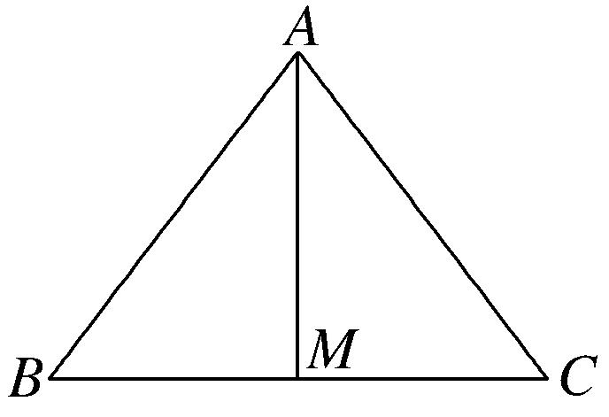
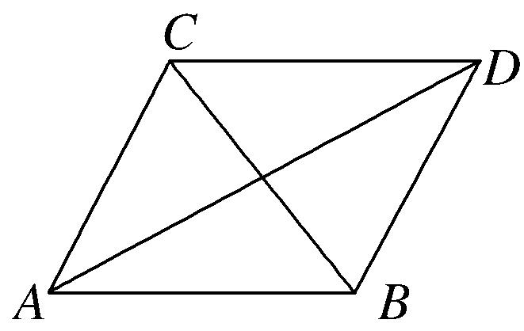
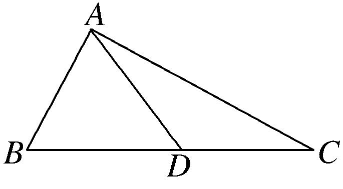

**专题九　三角形中的最值(范围)问题**

【**方法总结**】

**三角形中最值(范围)问题的解题思路**

任何最值(范围)问题，其本质都是函数问题，三角形中的范围最值问题也不例外．三角形中的范围最值问题的解法主要有两种：一是用函数求解，二是利用基本不等式求解．一般求最值用基本不等式，求范围用函数．由于三角形中的最值(范围)问题一般是以角为自变量的三角函数问题，所以，除遵循函数问题的基本要求外，还有自己独特的解法．

要建立所求量(式子)与已知角或边的关系，然后把角或边作为自变量，所求量(式子)的值作为函数值，转化为函数关系，将原问题转化为求函数的值域问题．这里要利用条件中的范围限制，以及三角形自身范围限制，要尽量把角或边的范围(也就是函数的定义域)找完善，避免结果的范围过大．

**考点一　三角形中与角或角的函数有关的最值(范围)**

**【例题选讲】**

<strong>[例1]</strong>(2020·浙江)在锐角△<em>ABC</em>中，角<em>A</em>，<em>B</em>，<em>C</em>所对的边分别为<em>a</em>，<em>b</em>，<em>c</em>．已知2<em>b</em>sin<em>A</em>－<em>a</em>＝0．

(1)求角*B*的大小；

(2)求cos*A*＋cos*B*＋cos*C*的取值范围．

解析　(1)由正弦定理，得2sin*B*sin*A*＝sin*A*，又在△*ABC*中，sin *A*>0，

故sin *B*＝，由题意得*B*＝．

(2)由*A*＋*B*＋*C*＝π，得*C*＝－*A*．由△*ABC*是锐角三角形，得*A*∈ ．

由cos*C*＝cos＝－cos*A*＋sin*A*，得

cos*A*＋cos*B*＋cos*C*＝sin *A*＋cos *A*＋＝sin＋∈．

故cos*A*＋cos*B*＋cos*C*的取值范围是．

<strong>[例2]</strong>(2016·北京)在△<em>ABC</em>中，<em>a</em>2＋<em>c</em>2＝<em>b</em>2＋<em>ac</em>．

(1)求*B*的大小；

(2)求cos*A*＋cos*C*的最大值．

解析　(1)由<em>a</em>2＋<em>c</em>2＝<em>b</em>2＋<em>ac</em>，得<em>a</em>2＋<em>c</em>2－<em>b</em>2＝<em>ac</em>．

由余弦定理，得cos *B*＝＝＝．又0＜*B*＜π，所以*B*＝．

(2)*A*＋*C*＝π－*B*＝π－＝，所以*C*＝－*A,* 0＜*A*＜．

所以cos *A*＋cos *C*＝cos *A*＋cos＝cos *A*＋coscos *A*＋sin sin *A*

＝cos *A*－cos *A*＋sin *A*＝sin *A*＋cos *A*＝sin．

因为0＜*A*＜，所以＜*A*＋＜π，

故当*A*＋＝，即*A*＝时，cos *A*＋cos *C*取得最大值1．

<strong>[例3]</strong>(2014·陕西)△<em>ABC</em>的内角<em>A</em>，<em>B</em>，<em>C</em>所对的边分别为<em>a</em>，<em>b</em>，<em>c</em>．

(1)若*a*，*b*，*c*成等差数列，证明sin*A*＋sin*C*＝2sin(*A*＋*C*)；

(2)若*a*，*b*，*c*成等比数列，求cos*B*的最小值．

解析　(1)∵*a*，*b*，*c*成等差数列，∴*a*＋*c*＝2*b*．由正弦定理得sin*A*＋sin*C*＝2sin*B*．

∵sin*B*＝sin[π－(*A*＋*C*)]＝sin(*A*＋*C*)，∴sin*A*＋sin*C*＝2sin(*A*＋*C*)．

(2)∵<em>a</em>，<em>b</em>，<em>c</em>成等比数列，∴<em>b</em>2＝<em>ac</em>．由余弦定理得，cos<em>B</em>＝＝≥＝，

当且仅当*a*＝*c*时等号成立．∴cos*B*的最小值为．

<strong>[例4]</strong>在△<em>ABC</em>中，内角<em>A</em>，<em>B</em>，<em>C</em>的对边分别为<em>a</em>，<em>b</em>，<em>c</em>，且满足(2<em>c</em>－<em>a</em>)cos<em>B</em>－<em>b</em>cos<em>A</em>＝0．

(1)若*b*＝7，*a*＋*c*＝13，求△*ABC*的面积；

(2)求sin2<em>A</em>＋sin的取值范围．

解析　(1)因为(2*c*－*a*)cos*B*－*b*cos*A*＝0，

由正弦定理得(2sin*C*－sin*A*)cos*B*－sin*B*cos*A*＝0，则2sin*C*cos*B*－sin(*A*＋*B*)＝0，

求得cos<em>B</em>＝，<em>B</em>＝．由余弦定理得<em>b</em>2＝<em>a</em>2＋<em>c</em>2－2<em>ac</em>cos<em>B</em>，

即49＝(<em>a</em>＋<em>c</em>)2－2<em>ac</em>－2<em>ac</em>cos<em>B</em>，

求得*ac*＝40，所以△*ABC*的面积*S*＝*ac*sin*B*＝10．

(2)sin2<em>A</em>＋sin＝sin2<em>A</em>＋sin＝sin2<em>A</em>＋sin＝－cos2<em>A</em>＋cos<em>A</em>＋1，<em>A</em>∈，

令<em>u</em>＝cos<em>A</em>∈，<em>y</em>＝－<em>u</em>2＋<em>u</em>＋1∈．

【**对点训练**】

1．在△*ABC*中，角*A*，*B*，*C*的对边分别为*a*，*b*，*c*，且．

(1)求*A*的大小；

(2)求sin*B*＋sin*C*的最大值．

1．解析　(1)由已知，根据正弦定理得，2<em>a</em>2＝(2<em>a</em>＋<em>c</em>) <em>b</em>＋(2<em>c</em>＋<em>b</em>)<em>c</em>，

即<em>a</em>2＝<em>b</em>2＋<em>c</em>2＋<em>bc</em>，由余弦定理得，<em>a</em>2＝<em>b</em>2＋<em>c</em>2－2<em>bc</em>cos<em>A</em>，故cos<em>A</em>＝－，所以<em>A</em>＝．

(2)由(1)得，sin*B*＋sin*C*＝sin*B*＋sin(－*B*)＝cos*B*＋sin*B*＝sin(＋*B*)，

故当*B*＝时，sin*B*＋sin*C*取最大值1．

2．已知锐角△*ABC*中，*b*sin*B*－*a*sin*A*＝(*b*－*c*)sin*C*，其中*a*、*b*、*c*分别为内角*A*、*B*、*C*的对边．

(1)求角*A*的大小；

(2)求cos*C*－sin*B*的取值范围．

2．解析　(1)由正弦定理得<em>b</em>2－<em>a</em>2＝(<em>b</em>－<em>c</em>)·<em>c．</em>即<em>b</em>2＋<em>c</em>2－<em>a</em>2＝<em>bc．</em>

∴cos *A*＝＝＝．又∵*A*为三角形内角，∴*A*＝．

(2)∵*B*＋*C*＝π，∴*C*＝π－*B．*∵△*ABC*为锐角三角形，∴∴<*B*<．

又∵cos *C*－sin *B*＝cos－sin *B*＝－cos *B*＋sin *B*＝sin，

∵<*B*<，∴－<*B*－<．∴－<sin<．即cos *C*－sin *B*的取值范围为．

3．(2016山东)在△*ABC*中，角*A*，*B*，*C*的对边分别为*a*，*b*，*c*，已知．

(1)证明：*a*＋*b*＝2*c*；

(2) 求cos*C*的最小值．

3．解析　由题意知，2(＋)＝＋，

化简得2(sin*A*cos*B*＋sin*B*cos*A*)＝sin*A*＋sin*B*，即2sin(*A*＋*B*)＝sin*A*＋sin*B*．

因为*A*＋*B*＋*C*＝π，所以sin(*A*＋*B*)＝sin(π－*C*)＝sin*C*，从而sin*A*＋sin*B*＝2sin*C*，

由正弦定理得，*a*＋*b*＝2*c*．

(2)由(1)知，所以，

当且仅当时，等号成立．故的最小值为．

4．(2015湖南)设△*ABC*的内角*A*，*B*，*C*的对边分别为*a*，*b*，*c*，*a*＝*b*tan*A*，且*B*为钝角．

(1)证明：*B*－*A*＝；

(2)求sin*A*＋sin*C*的取值范围．

4．解析　(1)由*a*＝*b*tan *A*及正弦定理，得＝＝，所以sin*B*＝cos*A*，即sin*B*＝sin．

因为*B*为钝角，所以*A*为锐角，所以＋*A*∈，则*B*＝＋*A*，即*B*－*A*＝．

(2)由(1)知，*C*＝π－(*A*＋*B*)＝π－＝－2*A*>0，所以*A*∈．

于是sin<em>A</em>＋sin<em>C</em>＝sin <em>A</em>＋sin＝sin<em>A</em>＋cos2<em>A</em>＝－2sin2<em>A</em>＋sin <em>A</em>＋1＝－22＋．

因为0&lt;<em>A</em>&lt;，所以0&lt;sin <em>A</em>&lt;，因此&lt;－22＋≤．

由此可知sin *A*＋sin *C*的取值范围是．

**考点二　三角形中与边或周长有关的最值(范围)**

**【例题选讲】**

<strong>[例1]</strong>在△<em>ABC</em>中，内角<em>A</em>，<em>B</em>，<em>C</em>的对边分别为<em>a</em>，<em>b</em>，<em>c</em>，若<em>b</em>2＋<em>c</em>2－<em>a</em>2＝<em>bc</em>．

(1)求角*A*的大小；

(2)若*a*＝，求*BC*边上的中线*AM*的最大值．

解析　(1)由<em>b</em>2＋<em>c</em>2－<em>a</em>2＝<em>bc</em>及余弦定理，得cos <em>A</em>＝＝＝，又0&lt;<em>A</em>&lt;π，∴<em>A</em>＝．

(2)∵<em>AM</em>是<em>BC</em>边上的中线，∴<em>BM</em>＝<em>CM</em>＝，∴在△<em>ABM</em>中，<em>AM</em>2＋－2<em>AM</em>··cos∠<em>AMB</em>＝<em>c</em>2，①

在△<em>ACM</em>中，<em>AM</em>2＋－2<em>AM</em>··cos∠<em>AMC</em>＝<em>b</em>2，②

又∠*AMB*＝π－∠*AMC*，∴cos∠*AMB*＝－cos∠*AMC*，即cos∠*AMB*＋cos∠*AMC*＝0，

则①＋②整理得<em>AM</em>2＝－．又<em>a</em>＝，<em>A</em>＝，∴<em>b</em>2＋<em>c</em>2－3＝<em>bc</em>≤，

∴<em>b</em>2＋<em>c</em>2≤6，∴<em>AM</em>2＝－≤，即<em>AM</em>≤，∴<em>BC</em>边上的中线<em>AM</em>的最大值为．

<strong>[例2]</strong> (2020·全国Ⅱ)△<em>ABC</em>中，sin2<em>A</em>－sin2<em>B</em>－sin2<em>C</em>＝sin <em>B</em>sin <em>C</em>．

(1)求*A*；

(2)若*BC*＝3，求△*ABC*周长的最大值．

解析　(1)由正弦定理和已知条件得<em>BC</em>2－<em>AC</em>2－<em>AB</em>2＝<em>AC</em>·<em>AB</em>．①

由余弦定理得<em>BC</em>2＝<em>AC</em>2＋<em>AB</em>2－2<em>AC</em>·<em>AB</em>cos<em>A</em>．②

由①②得cos *A*＝－．因为0<*A*<π，所以*A*＝．

(2)由正弦定理及(1)得＝＝＝2，从而*AC*＝2sin *B*，

*AB*＝2sin(π－*A*－*B*)＝3cos*B*－sin*B*．故*BC*＋*AC*＋*AB*＝3＋sin*B*＋3cos*B*＝3＋2sin．

又0<*B*<，所以当*B*＝时，△*ABC*周长取得最大值3＋2．

<strong>[例3]</strong>在△<em>ABC</em>中，角<em>A</em>，<em>B</em>，<em>C</em>所对的边分别为<em>a</em>，<em>b</em>，<em>c</em>，且满足cos2<em>C</em>－cos2<em>A</em>＝2sin·sin．

(1)求角*A*的值；

(2)若*a*＝且*b*≥*a*，求2*b*－*c*的取值范围．

解析　(1)由已知得2sin2<em>A</em>－2sin2<em>C</em>＝2，化简得sin <em>A</em>＝±，

因为*A*为△*ABC*的内角，所以sin *A*＝，故*A*＝或．

(2)因为*b*≥*a*，所以*A*＝．由正弦定理得＝＝＝2，得*b*＝2sin *B*，*c*＝2sin *C*，

故2*b*－*c*＝4sin *B*－2sin *C*＝4sin *B*－2sin＝3sin *B*－cos *B*＝2sin．

因为*b*≥*a*，所以≤*B*<，则≤*B*－<，所以2*b*－*c*＝2sin∈[，2)．

<strong>[例4]</strong>在锐角△<em>ABC</em>中，内角<em>A</em>，<em>B</em>，<em>C</em>的对边分别是<em>a</em>，<em>b</em>，<em>c</em>，满足cos2<em>A</em>－cos2<em>B</em>＋2cos·cos

＝0．

(1)求角*A*的值；

(2)若*b*＝且*b*≤*a*，求*a*的取值范围．

解析　(1)由cos2*A*－cos2*B*＋2coscos＝0，

得2sin2<em>B</em>－2sin2<em>A</em>＋2＝0，化简得sin<em>A</em>＝，又△<em>ABC</em>为锐角三角形，故<em>A</em>＝．

(2)∵*b*＝≤*a*，∴*c*≥*a*，∴≤*C*<，<*B*≤，∴<sin *B*≤．

由正弦定理＝，得＝，∴*a*＝，由sin*B*∈得*a*∈[，3)．

<strong>[例5]</strong>在△<em>ABC</em>中，<em>AC</em>＝<em>BC</em>＝2，<em>AB</em>＝2，＝．

(1)求*BM*的长；

(2)设*D*是平面*ABC*内一动点，且满足∠*BDM*＝，求*BD*＋*MD*的取值范围．

解析　(1)在△<em>ABC</em>中，<em>AB</em>2＝<em>AC</em>2＋<em>BC</em>2－2<em>AC</em>·<em>BC</em>·cos<em>C</em>，代入数据，得cos<em>C</em>＝－．

∵＝，∴*CM*＝*MA*＝*AC*＝1．

在△<em>CBM</em>中，由余弦定理知：<em>BM</em>2＝<em>CM</em>2＋<em>CB</em>2－2<em>CM</em>·<em>CB</em>·cos <em>C</em>＝7，所以<em>BM</em>＝．

(2)设∠*MBD*＝*θ*，则∠*DMB*＝－*θ*，*θ*∈．

在△*BDM*中，由正弦定理知：＝＝＝．

∴*BD*＝sin，*MD*＝sin *θ*，

∴*BD*＋*MD*＝sin＋sin *θ*＝(cos*θ*－sin*θ*＋sin*θ*)＝cos*θ*，

又*θ*∈，∴cos *θ*∈．故*BD*＋*MD*的取值范围是．

【**对点训练**】

1．在△<em>ABC</em>中，内角<em>A</em>，<em>B</em>，<em>C</em>的对边分别为<em>a</em>，<em>b</em>，<em>c</em>，且sin2＝．

(1)判断△*ABC*的形状并加以证明；

(2)当*c*＝1时，求△*ABC*周长的最大值．

1．解析　(1)因为＝－，即cos <em>A</em>＝，所以<em>b</em>＝<em>c</em>cos <em>A</em>＝<em>c</em>·，即<em>c</em>2＝<em>b</em>2＋<em>a</em>2，

所以△*ABC*为直角三角形．

(2)因为*c*为直角△*ABC*的斜边，当*c*＝1时，周长*L*＝1＋sin *A*＋cos *A*＝1＋sin．

因为0<*A*<，所以<sin≤1，所以当sin＝1，

即*A*＝时，周长*L*最大，且最大值为1＋．

2．在△<em>ABC</em>中，角<em>A</em>，<em>B</em>，<em>C</em>所对的边分别为<em>a</em>，<em>b</em>，<em>c</em>，<em>c</em>＝，设<em>S</em>为△<em>ABC</em>的面积，满足<em>S</em>＝(<em>a</em>2＋

<em>b</em>2－<em>c</em>2)．

(1)求角*C*的大小；

(2)求*a*＋*b*的最大值．

2．解析　(1)由题意可知*ab*sin *C*＝×2*ab*cos *C*，所以tan *C*＝，因为0<*C*<π，所以*C*＝．

(2)由(1)知2*R*＝＝＝2．

所以*a*＋*b*＝2*R*sin *A*＋2*R*sin *B*＝2(sin *A*＋sin *B*)＝2

＝2＝2＝2sin≤2，

当*A*＝，即△*ABC*为等边三角形时取等号．所以*a*＋*b*的最大值为2．

3．在△*ABC*中，角*A*，*B*，*C*的对边分别为*a*，*b*，*c*，已知*b*cos*C*＋*b*sin*C*－*a*－*c*＝0

(1)求*B*；

(2)若*b*＝，求2*a*＋*c*的取值范围．

3．解析　(1)由正弦定理知，sin*B*cos*C*＋sin*B*sin*C*－sin*A*－sin*C*＝0，

∵sin*A*＝sin(*B*＋*C*)＝sin*B*cos*C*＋cos*B*sin*C*，代入上式得，sin*B*sin*C*－cos*B*sin*C*－sin*C*＝0，

∵sin*C*≠0，∴sin*B*－cos*B*－1＝0，即sin(*B*－)＝，因为0<*B*<π，所以*B*＝．

(2)由(1)得，2*R*＝＝2，2*a*＋*c*＝2*R*sin*A*＋2*R*sin *C*＝5sin*A*＋cos*A*＝2sin(*A*＋φ)，其中，

sinφ＝，cosφ＝，因为0<*A*<，所以<2sin(*A*＋φ) <2．所以<2*a*＋*c*<2．

4．在△<em>ABC</em>中，设角<em>A</em>，<em>B</em>，<em>C</em>的对边分别为<em>a</em>，<em>b</em>，<em>c</em>，已知cos2<em>A</em>＝sin2<em>B</em>＋cos2<em>C</em>＋sin<em>A</em>sin<em>B．</em>

(1)求角*C*的大小；

(2)若*c*＝，求△*ABC*周长的取值范围．

4．解析　(1)由题意知1－sin2<em>A</em>＝sin2<em>B</em>＋1－sin2<em>C</em>＋sin <em>A</em>sin <em>B</em>，

即sin2<em>A</em>＋sin2<em>B</em>－sin2<em>C</em>＝－sin <em>A</em>sin <em>B</em>，由正弦定理得<em>a</em>2＋<em>b</em>2－<em>c</em>2＝－<em>ab</em>，

由余弦定理得cos *C*＝＝＝－，又∵0<*C*<π，∴*C*＝．

(2)由正弦定理得＝＝＝2，∴*a*＝2sin*A*，*b*＝2sin*B*，

则△*ABC*的周长为*L*＝*a*＋*b*＋*c*＝2(sin*A*＋sin*B*)＋＝2＋＝2sin＋．

∵0<*A*<，∴＜*A*＋＜，∴<sin≤1，∴2<2sin＋≤2＋，

∴△*ABC*周长的取值范围是(2，2＋]．

5．如图，平面四边形*ABDC*中，∠*CAD*＝∠*BAD*＝30°．

(1)若∠*ABC*＝75°，*AB*＝10，且*AC*∥*BD*，求*CD*的长；

(2)若*BC*＝10，求*AC*＋*AB*的取值范围．

5．解析　(1)由已知，易得∠*ACB*＝45°，在△*ABC*中，＝，解得*BC*＝5．

因为*AC*∥*BD*，所以∠*ADB*＝∠*CAD*＝30°，∠*CBD*＝∠*ACB*＝45°，

在△*ABD*中，∠*ADB*＝30°＝∠*BAD*，所以*DB*＝*AB*＝10．

在△*BCD*中，*CD*＝＝5．

(2)<em>AC</em>＋<em>AB</em>&gt;<em>BC</em>＝10，由cos 60°＝，得(<em>AB</em>＋<em>AC</em>)2－100＝3<em>AB</em>·<em>AC</em>，

而<em>AB</em>·<em>AC</em>≤2，所以≤2，解得<em>AB</em>＋<em>AC</em>≤20，

故*AB*＋*AC*的取值范围为(10，20]．

**考点三　三角形中与面积有关的最值(范围)**

**【例题选讲】**

<strong>[例1]</strong>已知在△<em>ABC</em>中，角<em>A</em>，<em>B</em>，<em>C</em>的对边分别为<em>a</em>，<em>b</em>，<em>c</em>，<em>C</em>＝120°，<em>c</em>＝2．

(1)求△*ABC*的面积的最大值；

(2)求△*ABC*的周长的取值范围．

解析　(1)法一：由余弦定理得4＝<em>a</em>2＋<em>b</em>2＋<em>ab</em>．由基本不等式得4＝<em>a</em>2＋<em>b</em>2＋<em>ab</em>≥2<em>ab</em>＋<em>ab</em>＝3<em>ab</em>，

所以*ab*≤，当且仅当*a*＝*b*时等号成立．

所以三角形的面积*S*＝*ab*sin *C*≤××＝． 所以△*ABC*的面积的最大值为．

法二：由＝＝＝，得*a*＝sin *A*，*b*＝sin *B*．

所以三角形的面积<em>S</em>＝<em>ab</em>sin <em>C</em>＝×2×sin <em>A</em>sin <em>B</em>×＝sin <em>A</em>sin <em>B</em>．

因为在△*ABC*中，*C*＝120°，所以*A*＋*B*＝60°，得*B*＝60°－*A*，且0°<*A*<60°，

所以sin <em>A</em>sin <em>B</em>＝sin <em>A</em>sin(60°－<em>A</em>)＝sin <em>A</em>cos <em>A</em>－sin2<em>A</em>＝sin 2<em>A</em>－(1－cos 2<em>A</em>)

＝sin 2*A*＋cos 2*A*－＝sin(2*A*＋30°)－≤－＝，当且仅当*A*＝30°时等号成立．

所以*S*≤×＝，所以△*ABC*的面积的最大值为．

(2)由(1)中法二可知，*a*＝sin *A*，*b*＝sin *B*．

所以△*ABC*的周长*l*＝*a*＋*b*＋*c*＝(sin *A*＋sin *B*)＋2．

因为在△*ABC*中，*C*＝120°，所以*A*＋*B*＝60°，得*B*＝60°－*A*，且0°<*A*<60°，

所以sin *A*＋sin *B*＝sin *A*＋sin(60°－*A*)＝sin *A*＋cos *A*＝sin(*A*＋60°)，

所以*l*＝sin(*A*＋60°)＋2．因为60°<*A*＋60°<120°，所以<sin(*A*＋60°)≤1，所以4<*l*≤＋2，

即△*ABC*的周长的取值范围是．

<strong>[例2]</strong>已知△<em>ABC</em>的内角<em>A</em>，<em>B</em>，<em>C</em>满足：＝．

(1)求角*A*；

(2)若△*ABC*的外接圆半径为1，求△*ABC*的面积*S*的最大值．

解析　(1)设内角*A*，*B*，*C*所对的边分别为*a*，*b*，*c*，根据＝，

可得＝，化简得<em>a</em>2＝<em>b</em>2＋<em>c</em>2－<em>bc</em>，所以cos <em>A</em>＝＝＝，

又因为0<*A*<π，所以*A*＝．

(2)由正弦定理得＝2*R*(*R*为△*ABC*外接圆半径)，所以*a*＝2*R*sin *A*＝2sin ＝，

所以3＝<em>b</em>2＋<em>c</em>2－<em>bc</em>≥2<em>bc</em>－<em>bc</em>＝<em>bc</em>，所以<em>S</em>＝<em>bc</em>sin <em>A</em>≤×3×＝(当且仅当<em>b</em>＝<em>c</em>时取等号)．

<strong>[例3]</strong>已知<em>a</em>，<em>b</em>，<em>c</em>分别是△<em>ABC</em>内角<em>A</em>，<em>B</em>，<em>C</em>的对边，且满足(<em>a</em>＋<em>b</em>＋<em>c</em>)(sin<em>B</em>＋sin<em>C</em>－sin<em>A</em>)＝<em>b</em>sin<em>C</em>．

(1)求角*A*的大小；

(2)设*a*＝，*S*为△*ABC*的面积，求*S*＋cos*B*cos*C*的最大值．

解析　(1)∵(*a*＋*b*＋*c*)(sin *B*＋sin *C*－sin *A*)＝*b*sin *C*，

∴根据正弦定理，知(<em>a</em>＋<em>b</em>＋<em>c</em>)(<em>b</em>＋<em>c</em>－<em>a</em>)＝<em>bc</em>，即<em>b</em>2＋<em>c</em>2－<em>a</em>2＝－<em>bc</em>．

∴由余弦定理，得cos *A*＝＝－．又*A*∈(0，π)，所以*A*＝π．

(2)根据*a*＝，*A*＝π及正弦定理得＝＝＝＝2，

∴*b*＝2sin *B*，*c*＝2sin *C*．

∴*S*＝*bc*sin *A*＝×2sin *B*×2sin *C*×＝sin *B*sin *C*．

∴*S*＋cos *B*cos *C*＝sin *B*sin *C*＋cos *B*cos *C*＝cos(*B*－*C*)．

故当*B*＝*C*＝时，*S*＋cos *B*cos *C*取得最大值．

<strong>[例4]</strong>(2019·全国Ⅲ)△<em>ABC</em>的内角<em>A</em>，<em>B</em>，<em>C</em>的对边分别为<em>a</em>，<em>b</em>，<em>c</em>，已知<em>a</em>sin＝<em>b</em>sin<em>A</em>．

(1)求*B*；

(2)若△*ABC*为锐角三角形，且*c*＝1，求△*ABC*面积的取值范围．

解析　(1)由题设及正弦定理得sin *A*sin＝sin*B*sin*A*．

因为sin *A*≠0，所以sin＝sin*B*．由*A*＋*B*＋*C*＝180°，可得sin＝cos，

故cos＝2sincos．因为cos≠0，故sin＝，因此*B*＝60°．

(2)由题设及(1)知△<em>ABC</em>的面积<em>S</em>△<em>ABC</em>＝<em>ac</em>sin <em>B</em>＝<em>a</em>．由(1)知<em>A</em>＋<em>C</em>＝120°，

由正弦定理得*a*＝＝＝＋．

由于△*ABC*为锐角三角形，故0°<*A*<90°，0°<*C*<90°．

结合<em>A</em>＋<em>C</em>＝120°，得30°&lt;<em>C</em>&lt;90°，所以&lt;<em>a</em>&lt;2，从而&lt;<em>S</em>△<em>ABC</em>&lt;．

因此，△*ABC*面积的取值范围是．

<strong>[例5]</strong>在△<em>ABC</em>中，内角<em>A</em>，<em>B</em>，<em>C</em>所对的边分别为<em>a</em>，<em>b</em>，<em>c</em>，已知cos2<em>B</em>＋cos<em>B</em>＝1－cos<em>A</em>cos<em>C</em>．

(1)求证：*a*，*b*，*c*成等比数列；

(2)若*b*＝2，求△*ABC*的面积的最大值．

解析　(1)在△*ABC*中，cos *B*＝－cos(*A*＋*C*)．由已知，得

(1－sin2<em>B</em>)－cos(<em>A</em>＋<em>C</em>)＝1－cos <em>A</em>cos <em>C</em>，

所以－sin2<em>B</em>－(cos<em>A</em>cos <em>C</em>－sin<em>A</em>sin<em>C</em>)＝－cos <em>A</em>cos<em>C</em>，化简，得sin2<em>B</em>＝sin <em>A</em>sin <em>C</em>．

由正弦定理，得<em>b</em>2＝<em>ac</em>，所以<em>a</em>，<em>b</em>，<em>c</em>成等比数列．

(2)由(1)及题设条件，得<em>ac</em>＝<em>b</em>2＝4，

则cos *B*＝＝≥＝，当且仅当*a*＝*c*＝2时，等号成立．

因为0&lt;<em>B</em>&lt;π，所以sin <em>B</em>＝≤ ＝，所以<em>S</em>△<em>ABC</em>＝<em>ac</em>sin <em>B</em>≤×4×＝．

所以△*ABC*的面积的最大值为．

【**对点训练**】

1．设在△*ABC*中，cos*C*＋(cos*A*－sin*A*)cos*B*＝0，内角*A*，*B*，*C*的对边分别为*a*，*b*，*c*．

(1)求角*B*的大小；

(2)若<em>a</em>2＋4<em>c</em>2＝8，求△<em>ABC</em>的面积<em>S</em>的最大值，并求出<em>S</em>取得最大值时<em>b</em>的值．

1．解析　(1)∵cos *C*＝－cos(*A*＋*B*)＝－cos *A*cos *B*＋sin *A*sin *B*，

∴cos *C*＋(cos *A*－sin *A*)cos *B*＝sin *A*sin *B*－sin *A*·cos *B*＝0，

∵sin *A*≠0，∴tan *B*＝，则*B*＝．

(2)∵<em>a</em>，<em>c</em>&gt;0，<em>a</em>2＋4<em>c</em>2＝8，<em>a</em>2＋4<em>c</em>2≥4<em>ac</em>，故<em>ac</em>≤2，当且仅当<em>a</em>＝2，<em>c</em>＝1时等号成立，

∴*S*＝*ac*sin *B*≤×2×＝，∴△*ABC*的面积*S*的最大值为，

由余弦定理<em>b</em>2＝<em>a</em>2＋<em>c</em>2－2<em>ac</em>cos <em>B</em>＝3，得<em>b</em>＝．

2．已知在△*ABC*中，内角*A*，*B*，*C*所对的边分别为*a*，*b*，*c*，且*c*＝1，cos*B*sin*C*＋(*a*－sin*B*)cos(*A*＋*B*)

＝0．

(1)求角*C*的大小；

(2)求△*ABC*面积的最大值．

2．解析　(1)由cos *B*sin *C*＋(*a*－sin *B*)cos(*A*＋*B*)＝0，可得cos *B*sin *C*－(*a*－sin *B*)cos *C*＝0，

即sin(*B*＋*C*)＝*a*cos *C*，sin *A*＝*a*cos *C*，即＝cos *C*．因为＝＝sin *C*，

所以cos *C*＝sin *C*，即tan *C*＝1，*C*＝．

(2)由余弦定理得12＝<em>a</em>2＋<em>b</em>2－2<em>ab</em>cos＝<em>a</em>2＋<em>b</em>2－<em>ab</em>，

所以<em>a</em>2＋<em>b</em>2＝1＋<em>ab</em>≥2<em>ab</em>，<em>ab</em>≤＝，当且仅当<em>a</em>＝<em>b</em>时取等号，

所以<em>S</em>△<em>ABC</em>＝<em>ab</em>sin <em>C</em>≤××＝．所以△<em>ABC</em>面积的最大值为．

3．已知在△*ABC*中，角*A*，*B*，*C*的对边分别为*a*，*b*，*c*，且＋＝．

(1)求*b*的值；

(2)若cos*B*＋sin*B*＝2，求△*ABC*面积的最大值．

3．解析　(1)由题意及正、余弦定理得＋＝，整理得＝，所以*b*＝．

(2)由题意得cos *B*＋sin *B*＝2sin＝2，所以sin＝1，

因为*B*∈(0，π)，所以*B*＋＝，所以*B*＝．

由余弦定理得<em>b</em>2＝<em>a</em>2＋<em>c</em>2－2<em>ac</em>cos <em>B</em>，所以3＝<em>a</em>2＋<em>c</em>2－<em>ac</em>≥2<em>ac</em>－<em>ac</em>＝<em>ac</em>，

即*ac*≤3，当且仅当*a*＝*c*＝时等号成立．

所以△<em>ABC</em>的面积<em>S</em>△<em>ABC</em>＝<em>ac</em>sin <em>B</em>＝<em>ac</em>≤，当且仅当<em>a</em>＝<em>c</em>＝时等号成立．

故△*ABC*面积的最大值为．

4．在△*ABC*中，*a*，*b*，*c*分别为内角*A*，*B*，*C*的对边，且*b*＋*c*＝*a*cos*C*＋*a*sin*C*．

(1)求*A*；

(2)若*a*＝4，求△*ABC*面积的最大值．

4．解　(1)由条件及正弦定理得sin *A*cos *C*＋sin *A*sin *C*＝sin *B*＋sin *C*，因为*B*＝π－(*A*＋*C*)，

所以sin *A*sin *C*－cos *A*sin *C*＝sin *C*，

又sin *C*≠0，所以sin *A*－cos *A*＝1，所以sin＝，又0<*A*<π，所以*A*＝．

(2)法一　由(1)得*B*＋*C*＝，从而*C*＝－*B*，0<*B*<，

由正弦定理得＝＝＝＝，所以*b*＝sin *B*，*c*＝sin *C*．

所以<em>S</em>△<em>ABC</em>＝<em>bc</em>sin <em>A</em>＝×sin <em>B</em>×sin <em>C</em>×sin＝·sin <em>B</em>·sin

＝·sin *B*·＝4sin 2*B*－cos 2*B*＋＝sin＋．

因为－&lt;2<em>B</em>－&lt;，所以当2<em>B</em>－＝，即<em>B</em>＝时，<em>S</em>△<em>ABC</em>取得最大值，最大值为4．

法二　由(1)知<em>A</em>＝，又<em>a</em>＝4，由余弦定理得16＝<em>b</em>2＋<em>c</em>2－2<em>bc</em>cos ，即<em>b</em>2＋<em>c</em>2－<em>bc</em>＝16，

因为<em>b</em>2＋<em>c</em>2≥2<em>bc</em>，所以2<em>bc</em>－<em>bc</em>≤16，即<em>bc</em>≤16，当且仅当<em>b</em>＝<em>c</em>＝4时取等号．

所以<em>S</em>△<em>ABC</em>＝<em>bc</em>sin <em>A</em>＝×<em>bc</em>≤×16＝4，所以<em>S</em>△<em>ABC</em>的最大值为4．

5．在△<em>ABC</em>中，角<em>A</em>，<em>B</em>，<em>C</em>所对的边分别为<em>a</em>，<em>b</em>，<em>c</em>，且cos2－sin<em>B</em>sin<em>C</em>＝．

(1)求角*A*；

(2)若*a*＝4，求△*ABC*面积的最大值．

5．解析　(1)由cos2－sin <em>B</em>sin <em>C</em>＝，得－sin <em>B</em>sin <em>C</em>＝－，

∴cos(*B*＋*C*)＝－，∴cos *A*＝(0<*A*<π)，∴*A*＝．

(2)由余弦定理<em>a</em>2＝<em>b</em>2＋<em>c</em>2－2<em>bc</em>cos <em>A</em>，

得16＝<em>b</em>2＋<em>c</em>2－<em>bc</em>≥(2－)<em>bc</em>，当且仅当<em>b</em>＝<em>c</em>时取等号，即<em>bc</em>≤8(2＋)．

∴<em>S</em>△<em>ABC</em>＝<em>bc</em>sin <em>A</em>＝<em>bc</em>≤4(＋1)，即△<em>ABC</em>面积的最大值为4(＋1)．

6．如图，已知*D*是△*ABC*的边*BC*上一点．

(1)若cos∠*ADC*＝－，∠*B*＝，且*AB*＝*DC*＝7，求*AC*的长；

(2)若∠*B*＝，*AC*＝2，求△*ABC*面积的最大值．

6．解析　(1)因为cos∠*ADC*＝－，所以cos∠*ADB*＝cos(π－∠*ADC*)＝－cos∠*ADC*＝，

所以sin∠*ADB*＝．在△*ABD*中，由正弦定理，得*AD*＝＝＝5，

所以在△*ACD*中，由余弦定理，得

*AC*＝＝＝．

(2)在△*ABC*中，由余弦定理，得

<em>AC</em>2＝20＝<em>AB</em>2＋<em>BC</em>2－2<em>AB</em>·<em>BC</em>cos∠<em>B</em>＝<em>AB</em>2＋<em>BC</em>2－<em>AB</em>·<em>BC</em>≥(2－)<em>AB</em>·<em>BC</em>，

所以<em>AB</em>·<em>BC</em>≤＝40＋20，所以<em>S</em>△<em>ABC</em>＝<em>AB</em>·<em>BC</em>sin∠<em>B</em>≤10＋5，

所以△*ABC*面积的最大值为10＋5．

7．已知*a*，*b*，*c*分别为△*ABC*三个内角*A*，*B*，*C*的对边，且*a*，*b*，*c*成等比数列．

(1)若，求角*B*的值；

(2)若△*ABC*外接圆的面积为，求△*ABC*面积的取值范围．

7．解析　(1)，

又∵*a*，*b*，*c*成等比数列，得，由正弦定理有，

∵，∴，得，即，

由知，不是最大边，∴．

(2)∵外接圆的面积为，∴的外接圆的半径，

由余弦定理，得，又，

∴．当且仅当时取等号，又∵为的内角，∴，

由正弦定理，得．

∴的面积，

∵，∴，∴．

8．在锐角△<em>ABC</em>中，<em>a</em>，<em>b</em>，<em>c</em>分别为角<em>A</em>，<em>B</em>，<em>C</em>的对边，且4sin<em>A</em>cos2<em>A</em>－cos(<em>B</em>＋<em>C</em>)＝sin3<em>A</em>＋．

(1)求角*A*的大小；

(2)若*b*＝2，求△*ABC*面积的取值范围．

8．解析　(1)∵*A*＋*B*＋*C*＝π，∴cos(*B*＋*C*)＝－cos *A*．①

∵3*A*＝2*A*＋*A*，∴sin 3*A*＝sin(2*A*＋*A*)＝sin 2*A*cos *A*＋cos 2*A*sin *A*．②

又sin 2*A*＝2sin *A*cos *A*，③

将①②③代入已知等式，得2sin 2*A*cos *A*＋cos *A*＝sin 2*A*cos *A*＋cos 2*A*sin *A*＋，

整理得sin *A*＋cos *A*＝，即sin＝，

又*A*∈，∴*A*＋＝，即*A*＝．

(2)由(1)得*B*＋*C*＝，∴*C*＝－*B*，∵△*ABC*为锐角三角形，

∴－*B*∈且*B*∈，解得*B*∈，

在△*ABC*中，由正弦定理得＝，∴*c*＝＝＝＋1，

又*B*∈，∴∈(0，)，∴*c*∈(1，4)，

∵<em>S</em>△<em>ABC</em>＝<em>bc</em>sin <em>A</em>＝<em>c</em>，∴<em>S</em>△<em>ABC</em>∈．故△<em>ABC</em>面积的取值范围为．

