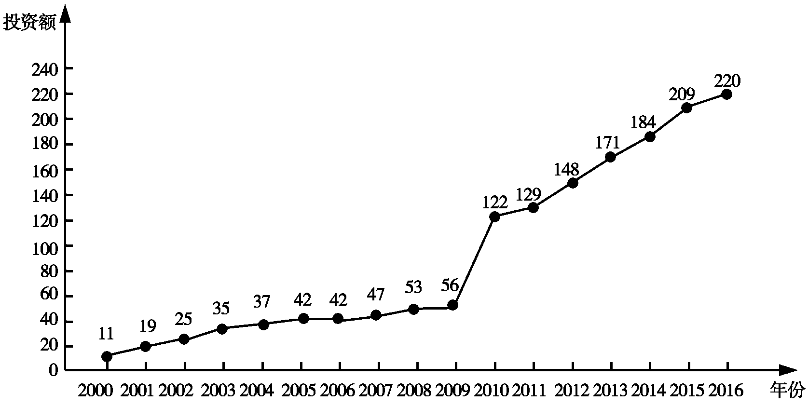
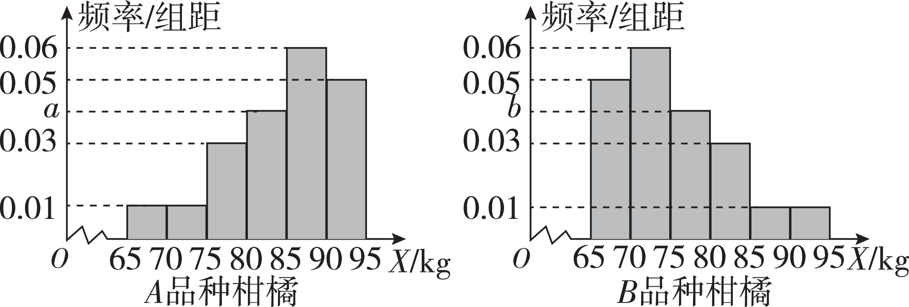

**突破1　概率、统计中的开放性与决策问题**

学生用书P248

命题点1　概率中的开放性与决策问题

**例**1 [2023重庆二模]近期，某网络平台开展了一项有奖闯关活动，并根据难度对每一关进行赋分，闯关活动共五关，规定：上一关不通过则不能进入下一关；本关第一次未通过有再挑战一次的机会，两次均未通过，则闯关失败.每次闯关相互独立.已知甲、乙、丙三人都参加了该项活动.

（1）若甲第一关、第二关通过的概率分别为 $\frac{3}{4}$ ， $\frac{2}{3}$ ，求甲可以进入第三关的概率.

（2）已知该闯关活动参赛者的累计得分服从正态分布，且满分为450分，现要根据得分给 2 500名参赛者中得分前400名发放奖励.

①假设该闯关活动平均分数为171分，351分以上共有57人，已知甲的得分为270分，问甲能否获得奖励.并说明理由.

②丙得知他的分数为430分，乙告诉丙：“这次闯关活动平均分数为201分，351分以上共有57人”，请结合统计学知识帮助丙辨别乙所说信息的真伪.

附：若随机变量<em>X</em>～<em>N</em>（<em>μ</em>，<em>σ</em>2），则<em>P</em>（<em>μ</em>－<em>σ</em>≤<em>X</em>≤<em>μ</em>＋<em>σ</em>）≈0.682 7，<em>P</em>（<em>μ</em>－2<em>σ</em>≤<em>X</em>≤<em>μ</em>＋2<em>σ</em>）≈0.954 5，<em>P</em>（<em>μ</em>－3<em>σ</em>≤<em>X</em>≤<em>μ</em>＋3<em>σ</em>）≈0.997 3.

解析　（1）设<em>Ai</em>为第<em>i</em>次通过第一关，<em>Bi</em>为第<em>i</em>次通过第二关，其中<em>i</em>＝1，2，甲可以进入第三关的概率为<em>P</em>.

由题意知<em>&lt;text style="italic"&gt;&lt;text style="italic"&gt;&lt;text style="italic"&gt;&lt;text style="italic"&gt;&lt;text style="italic"&gt;&lt;text style="italic"&gt;&lt;text style="italic"&gt;&lt;text style="italic"&gt;&lt;text style="italic"&gt;&lt;text style="italic"&gt;&lt;text style="italic"&gt;&lt;text style="italic"&gt;&lt;text style="italic"&gt;&lt;text style="italic"&gt;&lt;text style="italic"&gt;&lt;text style="italic"&gt;P</em>&lt;/text&gt;&lt;/text&gt;&lt;/text&gt;&lt;/text&gt;&lt;/text&gt;&lt;/text&gt;&lt;/text&gt;&lt;/text&gt;&lt;/text&gt;&lt;/text&gt;&lt;/text&gt;&lt;/text&gt;&lt;/text&gt;&lt;/text&gt;&lt;/text&gt;&lt;/text&gt;＝P（<em>&lt;text style="italic"&gt;&lt;text style="italic"&gt;&lt;text style="italic"&gt;&lt;text style="italic"&gt;&lt;text style="italic"&gt;&lt;text style="italic"&gt;&lt;text style="italic"&gt;A</em>&lt;/text&gt;&lt;/text&gt;&lt;/text&gt;&lt;/text&gt;&lt;/text&gt;&lt;/text&gt;&lt;/text&gt;&lt;text style="subscript"&gt;&lt;text style="subscript"&gt;&lt;text style="subscript"&gt;&lt;text style="subscript"&gt;&lt;text style="subscript"&gt;&lt;text style="subscript"&gt;&lt;text style="subscript"&gt;1&lt;/text&gt;&lt;/text&gt;&lt;/text&gt;&lt;/text&gt;&lt;/text&gt;&lt;/text&gt;&lt;/text&gt;<em>&lt;text style="italic"&gt;&lt;text style="italic"&gt;&lt;text style="italic"&gt;&lt;text style="italic"&gt;&lt;text style="italic"&gt;&lt;text style="italic"&gt;&lt;text style="italic"&gt;B</em>&lt;/text&gt;&lt;/text&gt;&lt;/text&gt;&lt;/text&gt;&lt;/text&gt;&lt;/text&gt;&lt;/text&gt;1）＋P（ $\overline{A_{1}}$ <em>&lt;text style="italic"&gt;&lt;text style="italic"&gt;&lt;text style="italic"&gt;&lt;text style="italic"&gt;&lt;text style="italic"&gt;&lt;text style="italic"&gt;&lt;text style="italic"&gt;A</em>&lt;/text&gt;&lt;/text&gt;&lt;/text&gt;&lt;/text&gt;&lt;/text&gt;&lt;/text&gt;&lt;/text&gt;&lt;text style="subscript"&gt;&lt;text style="subscript"&gt;&lt;text style="subscript"&gt;&lt;text style="subscript"&gt;&lt;text style="subscript"&gt;&lt;text style="subscript"&gt;&lt;text style="subscript"&gt;2&lt;/text&gt;&lt;/text&gt;&lt;/text&gt;&lt;/text&gt;&lt;/text&gt;&lt;/text&gt;&lt;/text&gt;<em>&lt;text style="italic"&gt;&lt;text style="italic"&gt;&lt;text style="italic"&gt;&lt;text style="italic"&gt;&lt;text style="italic"&gt;&lt;text style="italic"&gt;&lt;text style="italic"&gt;B</em>&lt;/text&gt;&lt;/text&gt;&lt;/text&gt;&lt;/text&gt;&lt;/text&gt;&lt;/text&gt;&lt;/text&gt;&lt;text style="subscript"&gt;&lt;text style="subscript"&gt;&lt;text style="subscript"&gt;&lt;text style="subscript"&gt;&lt;text style="subscript"&gt;&lt;text style="subscript"&gt;&lt;text style="subscript"&gt;1&lt;/text&gt;&lt;/text&gt;&lt;/text&gt;&lt;/text&gt;&lt;/text&gt;&lt;/text&gt;&lt;/text&gt;）＋<em>&lt;text style="italic"&gt;&lt;text style="italic"&gt;&lt;text style="italic"&gt;&lt;text style="italic"&gt;&lt;text style="italic"&gt;&lt;text style="italic"&gt;&lt;text style="italic"&gt;&lt;text style="italic"&gt;&lt;text style="italic"&gt;&lt;text style="italic"&gt;&lt;text style="italic"&gt;&lt;text style="italic"&gt;&lt;text style="italic"&gt;&lt;text style="italic"&gt;&lt;text style="italic"&gt;&lt;text style="italic"&gt;P</em>&lt;/text&gt;&lt;/text&gt;&lt;/text&gt;&lt;/text&gt;&lt;/text&gt;&lt;/text&gt;&lt;/text&gt;&lt;/text&gt;&lt;/text&gt;&lt;/text&gt;&lt;/text&gt;&lt;/text&gt;&lt;/text&gt;&lt;/text&gt;&lt;/text&gt;&lt;/text&gt;（A1 $\overline{B_{1}}$ <em>&lt;text style="italic"&gt;&lt;text style="italic"&gt;&lt;text style="italic"&gt;&lt;text style="italic"&gt;&lt;text style="italic"&gt;&lt;text style="italic"&gt;&lt;text style="italic"&gt;B</em>&lt;/text&gt;&lt;/text&gt;&lt;/text&gt;&lt;/text&gt;&lt;/text&gt;&lt;/text&gt;&lt;/text&gt;&lt;text style="subscript"&gt;&lt;text style="subscript"&gt;&lt;text style="subscript"&gt;&lt;text style="subscript"&gt;&lt;text style="subscript"&gt;&lt;text style="subscript"&gt;&lt;text style="subscript"&gt;2&lt;/text&gt;&lt;/text&gt;&lt;/text&gt;&lt;/text&gt;&lt;/text&gt;&lt;/text&gt;&lt;/text&gt;）＋<em>&lt;text style="italic"&gt;&lt;text style="italic"&gt;&lt;text style="italic"&gt;&lt;text style="italic"&gt;&lt;text style="italic"&gt;&lt;text style="italic"&gt;&lt;text style="italic"&gt;&lt;text style="italic"&gt;&lt;text style="italic"&gt;&lt;text style="italic"&gt;&lt;text style="italic"&gt;&lt;text style="italic"&gt;&lt;text style="italic"&gt;&lt;text style="italic"&gt;&lt;text style="italic"&gt;&lt;text style="italic"&gt;P</em>&lt;/text&gt;&lt;/text&gt;&lt;/text&gt;&lt;/text&gt;&lt;/text&gt;&lt;/text&gt;&lt;/text&gt;&lt;/text&gt;&lt;/text&gt;&lt;/text&gt;&lt;/text&gt;&lt;/text&gt;&lt;/text&gt;&lt;/text&gt;&lt;/text&gt;&lt;/text&gt;（ $\overline{A_{1}}$ <em>&lt;text style="italic"&gt;&lt;text style="italic"&gt;&lt;text style="italic"&gt;&lt;text style="italic"&gt;&lt;text style="italic"&gt;&lt;text style="italic"&gt;&lt;text style="italic"&gt;A</em>&lt;/text&gt;&lt;/text&gt;&lt;/text&gt;&lt;/text&gt;&lt;/text&gt;&lt;/text&gt;&lt;/text&gt;&lt;text style="subscript"&gt;&lt;text style="subscript"&gt;&lt;text style="subscript"&gt;&lt;text style="subscript"&gt;&lt;text style="subscript"&gt;&lt;text style="subscript"&gt;&lt;text style="subscript"&gt;2&lt;/text&gt;&lt;/text&gt;&lt;/text&gt;&lt;/text&gt;&lt;/text&gt;&lt;/text&gt;&lt;/text&gt; $\overline{B_{1}}$ <em>&lt;text style="italic"&gt;&lt;text style="italic"&gt;&lt;text style="italic"&gt;&lt;text style="italic"&gt;&lt;text style="italic"&gt;&lt;text style="italic"&gt;&lt;text style="italic"&gt;B</em>&lt;/text&gt;&lt;/text&gt;&lt;/text&gt;&lt;/text&gt;&lt;/text&gt;&lt;/text&gt;&lt;/text&gt;&lt;text style="subscript"&gt;&lt;text style="subscript"&gt;&lt;text style="subscript"&gt;&lt;text style="subscript"&gt;&lt;text style="subscript"&gt;&lt;text style="subscript"&gt;&lt;text style="subscript"&gt;2&lt;/text&gt;&lt;/text&gt;&lt;/text&gt;&lt;/text&gt;&lt;/text&gt;&lt;/text&gt;&lt;/text&gt;）＝<em>&lt;text style="italic"&gt;&lt;text style="italic"&gt;&lt;text style="italic"&gt;&lt;text style="italic"&gt;&lt;text style="italic"&gt;&lt;text style="italic"&gt;&lt;text style="italic"&gt;&lt;text style="italic"&gt;&lt;text style="italic"&gt;&lt;text style="italic"&gt;&lt;text style="italic"&gt;&lt;text style="italic"&gt;&lt;text style="italic"&gt;&lt;text style="italic"&gt;&lt;text style="italic"&gt;&lt;text style="italic"&gt;P</em>&lt;/text&gt;&lt;/text&gt;&lt;/text&gt;&lt;/text&gt;&lt;/text&gt;&lt;/text&gt;&lt;/text&gt;&lt;/text&gt;&lt;/text&gt;&lt;/text&gt;&lt;/text&gt;&lt;/text&gt;&lt;/text&gt;&lt;/text&gt;&lt;/text&gt;&lt;/text&gt;（<em>&lt;text style="italic"&gt;&lt;text style="italic"&gt;&lt;text style="italic"&gt;&lt;text style="italic"&gt;&lt;text style="italic"&gt;&lt;text style="italic"&gt;&lt;text style="italic"&gt;A</em>&lt;/text&gt;&lt;/text&gt;&lt;/text&gt;&lt;/text&gt;&lt;/text&gt;&lt;/text&gt;&lt;/text&gt;&lt;text style="subscript"&gt;&lt;text style="subscript"&gt;&lt;text style="subscript"&gt;&lt;text style="subscript"&gt;&lt;text style="subscript"&gt;&lt;text style="subscript"&gt;&lt;text style="subscript"&gt;1&lt;/text&gt;&lt;/text&gt;&lt;/text&gt;&lt;/text&gt;&lt;/text&gt;&lt;/text&gt;&lt;/text&gt;）P（B1）＋P（ $\overline{A_{1}}$ ）<em>&lt;text style="italic"&gt;&lt;text style="italic"&gt;&lt;text style="italic"&gt;&lt;text style="italic"&gt;&lt;text style="italic"&gt;&lt;text style="italic"&gt;&lt;text style="italic"&gt;&lt;text style="italic"&gt;&lt;text style="italic"&gt;&lt;text style="italic"&gt;&lt;text style="italic"&gt;&lt;text style="italic"&gt;&lt;text style="italic"&gt;&lt;text style="italic"&gt;&lt;text style="italic"&gt;&lt;text style="italic"&gt;P</em>&lt;/text&gt;&lt;/text&gt;&lt;/text&gt;&lt;/text&gt;&lt;/text&gt;&lt;/text&gt;&lt;/text&gt;&lt;/text&gt;&lt;/text&gt;&lt;/text&gt;&lt;/text&gt;&lt;/text&gt;&lt;/text&gt;&lt;/text&gt;&lt;/text&gt;&lt;/text&gt;（<em>&lt;text style="italic"&gt;&lt;text style="italic"&gt;&lt;text style="italic"&gt;&lt;text style="italic"&gt;&lt;text style="italic"&gt;&lt;text style="italic"&gt;&lt;text style="italic"&gt;A</em>&lt;/text&gt;&lt;/text&gt;&lt;/text&gt;&lt;/text&gt;&lt;/text&gt;&lt;/text&gt;&lt;/text&gt;&lt;text style="subscript"&gt;&lt;text style="subscript"&gt;&lt;text style="subscript"&gt;&lt;text style="subscript"&gt;&lt;text style="subscript"&gt;&lt;text style="subscript"&gt;&lt;text style="subscript"&gt;2&lt;/text&gt;&lt;/text&gt;&lt;/text&gt;&lt;/text&gt;&lt;/text&gt;&lt;/text&gt;&lt;/text&gt;）P（<em>&lt;text style="italic"&gt;&lt;text style="italic"&gt;&lt;text style="italic"&gt;&lt;text style="italic"&gt;&lt;text style="italic"&gt;&lt;text style="italic"&gt;&lt;text style="italic"&gt;B</em>&lt;/text&gt;&lt;/text&gt;&lt;/text&gt;&lt;/text&gt;&lt;/text&gt;&lt;/text&gt;&lt;/text&gt;&lt;text style="subscript"&gt;&lt;text style="subscript"&gt;&lt;text style="subscript"&gt;&lt;text style="subscript"&gt;&lt;text style="subscript"&gt;&lt;text style="subscript"&gt;&lt;text style="subscript"&gt;1&lt;/text&gt;&lt;/text&gt;&lt;/text&gt;&lt;/text&gt;&lt;/text&gt;&lt;/text&gt;&lt;/text&gt;）＋P（A1）P（ $\overline{B_{1}}$ ）<em>&lt;text style="italic"&gt;&lt;text style="italic"&gt;&lt;text style="italic"&gt;&lt;text style="italic"&gt;&lt;text style="italic"&gt;&lt;text style="italic"&gt;&lt;text style="italic"&gt;&lt;text style="italic"&gt;&lt;text style="italic"&gt;&lt;text style="italic"&gt;&lt;text style="italic"&gt;&lt;text style="italic"&gt;&lt;text style="italic"&gt;&lt;text style="italic"&gt;&lt;text style="italic"&gt;&lt;text style="italic"&gt;P</em>&lt;/text&gt;&lt;/text&gt;&lt;/text&gt;&lt;/text&gt;&lt;/text&gt;&lt;/text&gt;&lt;/text&gt;&lt;/text&gt;&lt;/text&gt;&lt;/text&gt;&lt;/text&gt;&lt;/text&gt;&lt;/text&gt;&lt;/text&gt;&lt;/text&gt;&lt;/text&gt;（<em>&lt;text style="italic"&gt;&lt;text style="italic"&gt;&lt;text style="italic"&gt;&lt;text style="italic"&gt;&lt;text style="italic"&gt;&lt;text style="italic"&gt;&lt;text style="italic"&gt;B</em>&lt;/text&gt;&lt;/text&gt;&lt;/text&gt;&lt;/text&gt;&lt;/text&gt;&lt;/text&gt;&lt;/text&gt;&lt;text style="subscript"&gt;&lt;text style="subscript"&gt;&lt;text style="subscript"&gt;&lt;text style="subscript"&gt;&lt;text style="subscript"&gt;&lt;text style="subscript"&gt;&lt;text style="subscript"&gt;2&lt;/text&gt;&lt;/text&gt;&lt;/text&gt;&lt;/text&gt;&lt;/text&gt;&lt;/text&gt;&lt;/text&gt;）＋P（ $\overline{A_{1}}$ ）<em>&lt;text style="italic"&gt;&lt;text style="italic"&gt;&lt;text style="italic"&gt;&lt;text style="italic"&gt;&lt;text style="italic"&gt;&lt;text style="italic"&gt;&lt;text style="italic"&gt;&lt;text style="italic"&gt;&lt;text style="italic"&gt;&lt;text style="italic"&gt;&lt;text style="italic"&gt;&lt;text style="italic"&gt;&lt;text style="italic"&gt;&lt;text style="italic"&gt;&lt;text style="italic"&gt;&lt;text style="italic"&gt;P</em>&lt;/text&gt;&lt;/text&gt;&lt;/text&gt;&lt;/text&gt;&lt;/text&gt;&lt;/text&gt;&lt;/text&gt;&lt;/text&gt;&lt;/text&gt;&lt;/text&gt;&lt;/text&gt;&lt;/text&gt;&lt;/text&gt;&lt;/text&gt;&lt;/text&gt;&lt;/text&gt;（<em>&lt;text style="italic"&gt;&lt;text style="italic"&gt;&lt;text style="italic"&gt;&lt;text style="italic"&gt;&lt;text style="italic"&gt;&lt;text style="italic"&gt;&lt;text style="italic"&gt;A</em>&lt;/text&gt;&lt;/text&gt;&lt;/text&gt;&lt;/text&gt;&lt;/text&gt;&lt;/text&gt;&lt;/text&gt;&lt;text style="subscript"&gt;&lt;text style="subscript"&gt;&lt;text style="subscript"&gt;&lt;text style="subscript"&gt;&lt;text style="subscript"&gt;&lt;text style="subscript"&gt;&lt;text style="subscript"&gt;2&lt;/text&gt;&lt;/text&gt;&lt;/text&gt;&lt;/text&gt;&lt;/text&gt;&lt;/text&gt;&lt;/text&gt;）P（ $\overline{B_{1}}$ ）<em>&lt;text style="italic"&gt;&lt;text style="italic"&gt;&lt;text style="italic"&gt;&lt;text style="italic"&gt;&lt;text style="italic"&gt;&lt;text style="italic"&gt;&lt;text style="italic"&gt;&lt;text style="italic"&gt;&lt;text style="italic"&gt;&lt;text style="italic"&gt;&lt;text style="italic"&gt;&lt;text style="italic"&gt;&lt;text style="italic"&gt;&lt;text style="italic"&gt;&lt;text style="italic"&gt;&lt;text style="italic"&gt;P</em>&lt;/text&gt;&lt;/text&gt;&lt;/text&gt;&lt;/text&gt;&lt;/text&gt;&lt;/text&gt;&lt;/text&gt;&lt;/text&gt;&lt;/text&gt;&lt;/text&gt;&lt;/text&gt;&lt;/text&gt;&lt;/text&gt;&lt;/text&gt;&lt;/text&gt;&lt;/text&gt;（<em>&lt;text style="italic"&gt;&lt;text style="italic"&gt;&lt;text style="italic"&gt;&lt;text style="italic"&gt;&lt;text style="italic"&gt;&lt;text style="italic"&gt;&lt;text style="italic"&gt;B</em>&lt;/text&gt;&lt;/text&gt;&lt;/text&gt;&lt;/text&gt;&lt;/text&gt;&lt;/text&gt;&lt;/text&gt;&lt;text style="subscript"&gt;&lt;text style="subscript"&gt;&lt;text style="subscript"&gt;&lt;text style="subscript"&gt;&lt;text style="subscript"&gt;&lt;text style="subscript"&gt;&lt;text style="subscript"&gt;2&lt;/text&gt;&lt;/text&gt;&lt;/text&gt;&lt;/text&gt;&lt;/text&gt;&lt;/text&gt;&lt;/text&gt;）＝ $\frac{3}{4}$ × $\frac{2}{3}$ ＋（&lt;text style="subscript"&gt;&lt;text style="subscript"&gt;&lt;text style="subscript"&gt;&lt;text style="subscript"&gt;&lt;text style="subscript"&gt;&lt;text style="subscript"&gt;&lt;text style="subscript"&gt;1&lt;/text&gt;&lt;/text&gt;&lt;/text&gt;&lt;/text&gt;&lt;/text&gt;&lt;/text&gt;&lt;/text&gt;－ $\frac{3}{4}$ ）× $\frac{3}{4}$ × $\frac{2}{3}$ ＋ $\frac{3}{4}$ ×（&lt;text style="subscript"&gt;&lt;text style="subscript"&gt;&lt;text style="subscript"&gt;&lt;text style="subscript"&gt;&lt;text style="subscript"&gt;&lt;text style="subscript"&gt;&lt;text style="subscript"&gt;1&lt;/text&gt;&lt;/text&gt;&lt;/text&gt;&lt;/text&gt;&lt;/text&gt;&lt;/text&gt;&lt;/text&gt;－ $\frac{2}{3}$ ）× $\frac{2}{3}$ ＋（&lt;text style="subscript"&gt;&lt;text style="subscript"&gt;&lt;text style="subscript"&gt;&lt;text style="subscript"&gt;&lt;text style="subscript"&gt;&lt;text style="subscript"&gt;&lt;text style="subscript"&gt;1&lt;/text&gt;&lt;/text&gt;&lt;/text&gt;&lt;/text&gt;&lt;/text&gt;&lt;/text&gt;&lt;/text&gt;－ $\frac{3}{4}$ ）× $\frac{3}{4}$ ×（&lt;text style="subscript"&gt;&lt;text style="subscript"&gt;&lt;text style="subscript"&gt;&lt;text style="subscript"&gt;&lt;text style="subscript"&gt;&lt;text style="subscript"&gt;&lt;text style="subscript"&gt;1&lt;/text&gt;&lt;/text&gt;&lt;/text&gt;&lt;/text&gt;&lt;/text&gt;&lt;/text&gt;&lt;/text&gt;－ $\frac{2}{3}$ ）× $\frac{2}{3}$ ＝ $\frac{5}{6}$ .

（2）设此次闯关活动参赛者的累计得分为<em>X</em>，<em>X</em>～<em>N</em>（<em>μ</em>，<em>σ</em>2）.

①由题意可知*<text style="italic"><text style="italic">μ*</text></text>＝171，因为 $\frac{57}{2 500}$ ＝0.022 8，且*P*（*X*＞*<text style="italic"><text style="italic">μ*</text></text>＋2*<text style="italic"><text style="italic">σ*</text></text>）＝ $\frac{1－P（\mu －2\sigma \leq X\leq \mu +2\sigma ）}{2}$ ≈ $\frac{1－0.954 5}{2}$ ≈0.022 8，所以*<text style="italic"><text style="italic">μ*</text></text>＋2*<text style="italic"><text style="italic">σ*</text></text>≈351，则σ＝ $\frac{351－171}{2}$ ＝90.

而 $\frac{400}{2 500}$ ＝0.16，且*<text style="italic">P*</text>（*<text style="italic">X*</text>＞261）＝P（X＞*μ*＋*σ*）＝ $\frac{1－P（\mu －\sigma \leq X\leq \mu ＋\sigma ）}{2}$ ≈ $\frac{1－0.682 7}{2}$ ≈0.158 7＜0.16，所以前400名参赛者的最低得分低于261分，

又甲的得分为270分，所以甲能够获得奖励.

②假设乙所说信息为真，则*<text style="italic"><text style="italic">μ*</text></text>＝201，*P*（*X*＞μ＋2*<text style="italic"><text style="italic">σ*</text></text>）＝ $\frac{1－P（\mu －2\sigma \leq X\leq \mu +2\sigma ）}{2}$ ≈ $\frac{1－0.954 5}{2}$ ≈0.022 8，而 $\frac{57}{2 500}$ ＝0.022 8，所以*<text style="italic"><text style="italic">σ*</text></text>＝ $\frac{351－201}{2}$ ＝75，从而*<text style="italic"><text style="italic">μ*</text></text>＋3*<text style="italic"><text style="italic">σ*</text></text>＝201＋3×75＝426＜430，

而*P*（*X*＞*μ*＋3*σ*）＝ $\frac{1－P（\mu －3\sigma \leq X\leq \mu +3\sigma ）}{2}$ ≈ $\frac{1－0.997 3}{2}$ ≈0.001 4＜0.005，

所以*X*＞*μ*＋3*σ*为小概率事件，即丙的分数为430分是小概率事件，可认为其不可能发生，但却发生了，所以可认为乙所说信息为假.

**训练**1 [2023湖南长沙雅礼中学模拟]某学校为了减轻同学们的学习压力，班上决定进行一次减压游戏.班主任把8个小球（只是颜色不同，其他无任何区别）放入一个袋子里，其中白色球与黄色球各3个，红色球与绿色球各1个.现甲、乙两位同学进行摸球得分比赛，摸到白色球每个记1分，黄色球每个记2分，红色球每个记3分，绿色球每个记4分，摸球人得分不低于8分为胜，否则为负.并规定如下：

①一人摸球，另一人不摸球.

②摸出的球不放回.

③摸球的人先从袋子中摸出1个球，若摸出的是绿色球，则再从袋子里摸出2个球；若摸出的不是绿色球，则再从袋子里摸出3个球，摸球人的得分为两次摸出的球的记分之和.

（1）若由甲摸球，甲先摸出了绿色球，求该局甲获胜的概率；

（2）若由乙摸球，乙先摸出了红色球，求该局乙得分*ξ*的分布列和数学期望*E*（*ξ*）；

（3）有同学提出比赛不公平，提出你的看法，并说明理由.

解析　（1）记“甲第一次摸出了绿色球，甲获胜”为事件*A*，

则*P*（*A*）＝ $\frac{C_{1}^{1}C_{6}^{1}＋C_{3}^{2}}{C_{7}^{2}}$ ＝ $\frac{9}{21}$ ＝ $\frac{3}{7}$ .

（2）如果乙第一次摸出红色球，则可以再从袋子里摸出3个球，得分情况有： 6分，7分，8分，9分，10分，11分.

*<text style="italic">P*</text>（*<text style="italic">ξ*</text>＝6）＝ $\frac{C_{3}^{3}}{C_{7}^{3}}$ ＝ $\frac{1}{35}$ ，*<text style="italic">P*</text>（*<text style="italic">ξ*</text>＝7）＝ $\frac{C_{3}^{2}\cdot C_{3}^{1}}{C_{7}^{3}}$ ＝ $\frac{9}{35}$ ，

*<text style="italic">P*</text>（*<text style="italic">ξ*</text>＝8）＝ $\frac{C_{3}^{1}\cdot C_{3}^{2}}{C_{7}^{3}}$ ＝ $\frac{9}{35}$ ，*<text style="italic">P*</text>（*<text style="italic">ξ*</text>＝9）＝ $\frac{C_{3}^{2}\cdot C_{1}^{1}}{C_{7}^{3}}$ ＋ $\frac{C_{3}^{3}}{C_{7}^{3}}$ ＝ $\frac{4}{35}$ ，

*<text style="italic">P*</text>（*<text style="italic">ξ*</text>＝10）＝ $\frac{C_{3}^{1}\cdot C_{3}^{1}\cdot C_{1}^{1}}{C_{7}^{3}}$ ＝ $\frac{9}{35}$ ， *<text style="italic">P*</text>（*<text style="italic">ξ*</text>＝11）＝ $\frac{C_{3}^{2}\cdot C_{1}^{1}}{C_{7}^{3}}$ ＝ $\frac{3}{35}$ ，

所以*ξ*的分布列为

<table><tr><td>
<em>ξ</em>
</td><td>
6
</td><td>
7
</td><td>
8
</td><td>
9
</td><td>
10
</td><td>
11
</td></tr><tr><td>
<em>P</em>
</td><td>
 $\frac{1}{35}$ 
</td><td>
 $\frac{9}{35}$ 
</td><td>
 $\frac{9}{35}$ 
</td><td>
 $\frac{4}{35}$ 
</td><td>
 $\frac{9}{35}$ 
</td><td>
 $\frac{3}{35}$ 
</td></tr></table>

所以*<text style="italic">ξ*</text>的数学期望*E*（ξ）＝6× $\frac{1}{35}$ ＋7× $\frac{9}{35}$ ＋8× $\frac{9}{35}$ ＋9× $\frac{4}{35}$ ＋10× $\frac{9}{35}$ ＋11× $\frac{3}{35}$ ＝ $\frac{60}{7}$ .

（3）由第（1）问知，若先摸出了绿色球，则摸球人获胜的概率为<em>p</em>1＝ $\frac{3}{7}$ .

由第（2）问知，若先摸出了红色球，则摸球人获胜的概率为<em>p</em>2＝ $\frac{9+4+9+3}{35}$ ＝ $\frac{5}{7}$ .

若先摸出了黄色球，则摸球人获胜的概率为<em>p</em>3＝ $\frac{C_{1}^{1}C_{6}^{2}＋C_{2}^{2}C_{1}^{1}＋C_{2}^{1}C_{3}^{1}C_{1}^{1}}{C_{7}^{3}}$ ＝ $\frac{22}{35}$ .

若先摸出了白色球，则摸球人获胜的概率为<em>p</em>4＝ $\frac{C_{1}^{1}（C_{6}^{2}－C_{2}^{2}）＋C_{3}^{2}C_{1}^{1}}{C_{7}^{3}}$ ＝ $\frac{17}{35}$ .

故摸球人获胜的概率为*P*＝ $\frac{1}{8}$ × $\frac{3}{7}$ ＋ $\frac{1}{8}$ × $\frac{5}{7}$ ＋ $\frac{3}{8}$ × $\frac{22}{35}$ ＋ $\frac{3}{8}$ × $\frac{17}{35}$ ＝ $\frac{157}{280}$ .

因为摸球人获胜的概率*P*＝ $\frac{157}{280}$ ＞ $\frac{1}{2}$ ，所以比赛不公平.

命题点2　统计中的开放性与决策问题

<strong>例</strong>2 [全国卷Ⅱ]下图是某地区2000年至2016年环境基础设施投资额<em>y</em>（单位：亿元）的折线图.

为了预测该地区2018年的环境基础设施投资额，建立了<<<<*t*ext style="italic">t</text>ext style="italic">t</text>ext style="italic">t</text>ext style="italic">y</text>与时间变量t的两个线性回归模型.根据2000年至2016年的数据（时间变量t的值依次为1，2，…，17）建立模型①： $\hat{y}=-30.4+13.5t$ ；根据2010年至2016年的数据（时间变量<<<*t*ext style="italic">t</text>ext style="italic">t</text>ext style="italic">t</text>的值依次为1，2，…，7）建立模型②： $\hat{y}$ ＝99＋17.5<<<*t*ext style="italic">t</text>ext style="italic">t</text>ext style="italic">t</text>.

（1）分别利用这两个模型，求该地区2018年的环境基础设施投资额的预测值；

（2）你认为用哪个模型得到的预测值更可靠？并说明理由.

解析　（1）利用模型①，该地区2018年的环境基础设施投资额的预测值为 $\hat{y}$ ＝－30.4＋13.5×19＝226.1（亿元）.

利用模型②，该地区2018年的环境基础设施投资额的预测值为 $\hat{y}$ ＝99＋17.5×9＝256.5（亿元）.

（2）利用模型②得到的预测值更可靠.

理由如下：

（i）从折线图可以看出，2000年至2016年的数据对应的点没有随机散布在直线 $y=-30.4+13.5t$ 上下，这说明利用2000年至2016年的数据建立的线性模型①不能很好地描述环境基础设施投资额的趋势.2010年相对2009年的环境基础设施投资额有明显增加，2010年至2016年的数据对应的点位于一条直线的附近，这说明从2010年开始环境基础设施投资额的变化规律呈线性增长趋势，利用2010年至2016年的数据建立的线性模型 $\hat{y}=99+17.5t$ 可以较好地描述2010年以后的环境基础设施投资额的变化趋势，因此利用模型②得到的预测值更可靠.

（ii）从计算结果看，相对于2016年的环境基础设施投资额220亿元，由模型①得到的预测值226.1亿元的增幅明显偏低，而利用模型②得到的预测值的增幅比较合理，说明利用模型②得到的预测值更可靠.

说明：以上给出了2种理由，考生答出其中任意一种或其他合理理由均可得分.

**训练**2 某医生计划购买某种品牌的电动牙刷，预计使用寿命为5年，该电动牙刷的刷头在使用过程中需要更换.若购买该品牌电动牙刷的同时购买刷头，则每个刷头20元；若单独购买刷头，则每个刷头30元.某经销商随机调查了使用该品牌电动牙刷的100名医生在5年使用期内更换刷头的个数，得到下表：

<table><tr><td>
更换刷头的个数
</td><td>
14
</td><td>
15
</td><td>
16
</td><td>
17
</td><td>
18
</td><td>
19
</td><td>
20
</td></tr><tr><td>
频数
</td><td>
8
</td><td>
8
</td><td>
10
</td><td>
24
</td><td>
28
</td><td>
12
</td><td>
10
</td></tr></table>

用*n*（*n*∈N）表示1个该品牌电动牙刷在5年使用期内需更换刷头的个数，*y*表示购买刷头的费用（单位：元）.

（1）求这100名医生在5年使用期内更换刷头的个数的中位数；

（2）若购买1个该品牌电动牙刷的同时购买了18个刷头，求*y*关于*n*的函数解析式；

（3）假设这100名医生购买1个该品牌电动牙刷的同时都购买了17个刷头或18个刷头，分别计算这100名医生购买刷头费用的平均数，以此作为决策依据，判断购买1个该品牌电动牙刷的同时应购买17个刷头还是18个刷头.

解析　（1）由题可知8＋8＋10＋24＝50，

所以这100名医生在5年使用期内更换刷头的个数的中位数为 $\frac{17+18}{2}$ ＝17.5.

（2）当*n*≤18时，*y*＝360，

当*n*＞18时，*y*＝360＋30（*n*－18）＝30*n*－180，

所以&lt;text st<em>y</em>le="italic"&gt;y&lt;/text&gt;关于<em>&lt;text style="italic"&gt;n</em>&lt;/text&gt;的函数解析式为y＝ $\left\{\begin{matrix}360，n\leq 18，\\30n－180，n>18，\end{matrix}\right.$ &lt;text st<em>y</em>le="italic"&gt;<em>n</em>&lt;/text&gt;∈<strong>N</strong>.

（3）若100名医生购买1个该品牌电动牙刷的同时都购买了17个刷头，

则其中有50名医生购买刷头的费用均为340元，

28名医生购买刷头的费用均为370元，

12名医生购买刷头的费用均为400元，

10名医生购买刷头的费用均为430元，

因此这100名医生购买刷头的费用的平均数为 $\frac{1}{100}$ ×（50×340＋28×370＋12×400＋10×430）＝364.6（元）.

若这100名医生购买1个该品牌电动牙刷的同时都购买了18个刷头，

则其中有78名医生购买刷头的费用均为360元，

12名医生购买刷头的费用均为390元，

10名医生购买刷头的费用均为420元，

因此这100名医生购买刷头的费用的平均数为 $\frac{1}{100}$ ×（78×360＋12×390＋10×420）＝369.6（元）.

因为364.6＜369.6，

所以购买1个该品牌电动牙刷的同时应购买17个刷头.

[命题点1*/* 2023安徽十校联考]国庆节期间，某大型服装店举办了一次“你消费我促销”活动，顾客消费满300元（含300元）可抽奖一次，抽奖方案有两种（顾客只能选择其中的一种）.

方案一：从装有5个形状、大小完全相同的小球（其中红球1个，黑球4个）的抽奖盒中，有放回地摸出3个球，每摸出1次红球，立减100元.

方案二：从装有10个形状、大小完全相同的小球（其中红球2个，白球1个，黑球7个）的抽奖盒中，不放回地摸出3个球，中奖规则为若摸出2个红球，1个白球，则享受免单优惠，若摸出2个红球，1个黑球，则打5折，若摸出1个红球，1个白球和1个黑球，则打7.5折，其余情况不打折.

（1）某顾客恰好消费300元，选择抽奖方案一，求他实付金额的分布列和数学期望；

（2）若顾客消费500元，试从实付金额的期望值分析顾客选择哪种抽奖方案更合理？

解析　（1）设顾客实付金额为*X*元，*X*所有可能的取值为0，100，200，300，

则<em>&lt;text style="italic"&gt;&lt;text style="italic"&gt;&lt;text style="italic"&gt;P</em>&lt;/text&gt;&lt;/text&gt;&lt;/text&gt;（<em>&lt;text style="italic"&gt;&lt;text style="italic"&gt;&lt;text style="italic"&gt;X</em>&lt;/text&gt;&lt;/text&gt;&lt;/text&gt;＝0）＝（ $\frac{1}{5}$ ）&lt;text style="superscript"&gt;3&lt;/text&gt;＝ $\frac{1}{125}$ ，<em>&lt;text style="italic"&gt;&lt;text style="italic"&gt;&lt;text style="italic"&gt;P</em>&lt;/text&gt;&lt;/text&gt;&lt;/text&gt;（<em>&lt;text style="italic"&gt;&lt;text style="italic"&gt;&lt;text style="italic"&gt;X</em>&lt;/text&gt;&lt;/text&gt;&lt;/text&gt;＝100）＝ $C_{3}^{2}$ ×（ $\frac{1}{5}$ ）&lt;text style="superscript"&gt;2&lt;/text&gt;× $\frac{4}{5}$ ＝ $\frac{12}{125}$ ，<em>&lt;text style="italic"&gt;&lt;text style="italic"&gt;&lt;text style="italic"&gt;P</em>&lt;/text&gt;&lt;/text&gt;&lt;/text&gt;（<em>&lt;text style="italic"&gt;&lt;text style="italic"&gt;&lt;text style="italic"&gt;X</em>&lt;/text&gt;&lt;/text&gt;&lt;/text&gt;＝&lt;text style="superscript"&gt;2&lt;/text&gt;00）＝ $C_{3}^{1}$ × $\frac{1}{5}$ ×（ $\frac{4}{5}$ ）&lt;text style="superscript"&gt;2&lt;/text&gt;＝ $\frac{48}{125}$ ，<em>&lt;text style="italic"&gt;&lt;text style="italic"&gt;&lt;text style="italic"&gt;P</em>&lt;/text&gt;&lt;/text&gt;&lt;/text&gt;（<em>&lt;text style="italic"&gt;&lt;text style="italic"&gt;&lt;text style="italic"&gt;X</em>&lt;/text&gt;&lt;/text&gt;&lt;/text&gt;＝&lt;text style="superscript"&gt;3&lt;/text&gt;00）＝（ $\frac{4}{5}$ ）&lt;text style="superscript"&gt;3&lt;/text&gt;＝ $\frac{64}{125}$ ，

故*X*的分布列为

<table><tr><td>
<em>X</em>
</td><td>
0
</td><td>
100
</td><td>
200
</td><td>
300
</td></tr><tr><td>
<em>P</em>
</td><td>
 $\frac{1}{125}$ 
</td><td>
 $\frac{12}{125}$ 
</td><td>
 $\frac{48}{125}$ 
</td><td>
 $\frac{64}{125}$ 
</td></tr></table>

所以*E*（*X*）＝0× $\frac{1}{125}$ ＋100× $\frac{12}{125}$ ＋200× $\frac{48}{125}$ ＋300× $\frac{64}{125}$ ＝240.

故该顾客实付金额的数学期望为240元.

（2）若选择方案一，设摸到红球的个数为*Y*，实付金额为*φ*元，则*φ*＝500－100*Y*，

由题意可得*<text style="italic">Y*</text>～*B*（3， $\frac{1}{5}$ ），所以*E*（*<text style="italic">Y*</text>）＝3× $\frac{1}{5}$ ＝ $\frac{3}{5}$ ，

所以*E*（*φ*）＝*E*（500－100*Y*）＝500－100*E*（*Y*）＝500－60＝440.

若选择方案二，设实付金额为*η*元，*η*所有可能的取值为0，250，375，500，

则*<text style="italic"><text style="italic"><text style="italic">P*</text></text></text>（*<text style="italic"><text style="italic"><text style="italic">η*</text></text></text>＝0）＝ $\frac{C_{2}^{2}C_{1}^{1}}{C_{10}^{3}}$ ＝ $\frac{1}{120}$ ，*<text style="italic"><text style="italic"><text style="italic">P*</text></text></text>（*<text style="italic"><text style="italic"><text style="italic">η*</text></text></text>＝250）＝ $\frac{C_{2}^{2}C_{7}^{1}}{C_{10}^{3}}$ ＝ $\frac{7}{120}$ ，*<text style="italic"><text style="italic"><text style="italic">P*</text></text></text>（*<text style="italic"><text style="italic"><text style="italic">η*</text></text></text>＝375）＝ $\frac{C_{2}^{1}C_{1}^{1}C_{7}^{1}}{C_{10}^{3}}$ ＝ $\frac{7}{60}$ ，*<text style="italic"><text style="italic"><text style="italic">P*</text></text></text>（*<text style="italic"><text style="italic"><text style="italic">η*</text></text></text>＝500）＝1－ $\frac{1}{120}$ － $\frac{7}{120}$ － $\frac{7}{60}$ ＝ $\frac{49}{60}$ ，

故*η*的分布列为

<table><tr><td>
<em>η</em>
</td><td>
0
</td><td>
250
</td><td>
375
</td><td>
500
</td></tr><tr><td>
<em>P</em>
</td><td>
 $\frac{1}{120}$ 
</td><td>
 $\frac{7}{120}$ 
</td><td>
 $\frac{7}{60}$ 
</td><td>
 $\frac{49}{60}$ 
</td></tr></table>

所以*E*（*η*）＝0× $\frac{1}{120}$ ＋250× $\frac{7}{120}$ ＋375× $\frac{7}{60}$ ＋500× $\frac{49}{60}$ ≈466.67.

因为*E*（*φ*）＜*E*（*η*），

所以从实付金额的期望值分析，顾客选择方案一更合理.

学生用书·练习帮P396

1.[2024河南名校模拟]在实施乡村振兴的进程中，某地政府引领广大农户发展特色农业，种植优良品种柑橘.现在实验基地中种植了相同数量的*A*，*B*两种柑橘.为了比较*A*，*B*两种柑橘品种的优劣，在柑橘成熟后随机选取*A*，*B*两种柑橘各100株，并根据株产量*X*（单位：kg）绘制了如图所示的频率分布直方图（数据分组为[65，70），[70，75），[75，80），[80，85），[85，90），[90，95]）.

（1）求*a*，*b*的值；

（2）将频率当作概率，在所有柑橘中随机抽取一株，求其株产量不低于80 kg的概率；

（3）求两种柑橘株产量平均数的估计值（同一组数据中的平均数用该组区间的中点值作为代表），并从产量角度分析，哪个品种的柑橘更好？说明理由.

解析　（1）由题中<text style="it*a*lic">A</text>品种柑橘的频率分布直方图可知， $\left（0.01\times 2+0.03+a+0.06+0.05\right）\times 5=1$ ，解得*a*＝0.04.

由题中*B*品种柑橘的频率分布直方图可知，（0.05＋0.06＋*b*＋0.03＋0.01×2）×5＝1，解得*b*＝0.04.

（2）*A*品种柑橘株产量不低于80 kg的频率为（0.04＋0.06＋0.05）×5＝0.75，

*B*品种柑橘株产量不低于80 kg的频率为（0.03＋0.01＋0.01）×5＝0.25，

故200株柑橘中株产量不低于80 kg的频率为 $\frac{0.75\times 100+0.25\times 100}{100+100}$ ＝0.5，

所以在所有柑橘中随机抽取一株，其株产量不低于80 kg的概率为0.5.

（3）设<em>A</em>品种柑橘株产量平均数的估计值为<em>MA</em>，则

<em>MA</em>＝（0.01×67.5＋0.01×72.5＋0.03×77.5＋0.04×82.5＋0.06×87.5＋0.05×92.5）×5＝84.5.

设<em>B</em>品种柑橘株产量平均数的估计值为<em>MB</em>，则

<em>MB</em>＝（0.05×67.5＋0.06×72.5＋0.04×77.5＋0.03×82.5＋0.01×87.5＋0.01×92.5）×5＝75.5.

*A*品种的柑橘更好.

理由一　*A*品种柑橘的株产量平均数的估计值大于*B*品种柑橘的株产量平均数的估计值，故*A*品种的柑橘更好.

理由二　由（2）可知，*A*品种柑橘株产量不低于80 kg的占比为75％，*B*品种柑橘株产量不低于80 kg的占比为25％，故*A*品种的柑橘更好.（注：答案不唯一，有道理的答案均给分）

2.[2023广东一模]某商场为了回馈广大顾客，设计了一个抽奖活动，在抽奖箱中放10个大小相同的小球，其中5个为红色，5个为白色.抽奖方式为：每名顾客进行两次抽奖，每次抽奖从抽奖箱中一次性摸出两个小球.如果每次抽奖摸出的两个小球颜色相同为中奖，两个小球颜色不同为不中奖.

（1）若规定第一次抽奖后将球放回抽奖箱，再进行第二次抽奖，求中奖次数*X*的分布列和数学期望.

（2）若规定第一次抽奖后不将球放回抽奖箱，直接进行第二次抽奖，求中奖次数*Y*的分布列和数学期望.

（3）如果你是商场老板，如何在上述两问的两种抽奖方式中进行选择？请写出你的选择及简要理由.

解析　（1）若第一次抽奖后将球放回抽奖箱，再进行第二次抽奖，则每次中奖的概率为 $\frac{C_{5}^{2}＋C_{5}^{2}}{C_{10}^{2}}$ ＝ $\frac{4}{9}$ ，

因为两次抽奖相互独立，所以中奖次数*<text style="italic">X*</text>服从二项分布，即X～*B*（2， $\frac{4}{9}$ ），

所以*X*的所有可能取值为0，1，2，

<em>P</em>（<em>X</em>＝0）＝ $C_{2}^{0}$ ×（ $\frac{4}{9}$ ）0×（ $\frac{5}{9}$ ）2＝ $\frac{25}{81}$ ，

<em>P</em>（<em>X</em>＝&lt;text style="superscript"&gt;1&lt;/text&gt;）＝ $C_{2}^{1}$ ×（ $\frac{4}{9}$ ）&lt;text style="superscript"&gt;1&lt;/text&gt;×（ $\frac{5}{9}$ ）&lt;text style="superscript"&gt;1&lt;/text&gt;＝ $\frac{40}{81}$ ，

<em>P</em>（<em>X</em>＝2）＝ $C_{2}^{2}$ ×（ $\frac{4}{9}$ ）2×（ $\frac{5}{9}$ ）0＝ $\frac{16}{81}$ ，

所以*X*的分布列为

<table><tr><td>
<em>X</em>
</td><td>
0
</td><td>
1
</td><td>
2
</td></tr><tr><td>
<em>P</em>
</td><td>
 $\frac{25}{81}$ 
</td><td>
 $\frac{40}{81}$ 
</td><td>
 $\frac{16}{81}$ 
</td></tr></table>

*<text style="italic">X*</text>的数学期望*E*（X）＝2× $\frac{4}{9}$ ＝ $\frac{8}{9}$ .

（2）若第一次抽奖后不将球放回抽奖箱，直接进行第二次抽奖，中奖次数*Y*的所有可能取值为0，1，2，

则*P*（*Y*＝0）＝ $\frac{C_{5}^{1}C_{5}^{1}}{C_{10}^{2}}$ × $\frac{C_{4}^{1}C_{4}^{1}}{C_{8}^{2}}$ ＝ $\frac{20}{63}$ ，

*P*（*Y*＝1）＝ $\frac{C_{5}^{2}＋C_{5}^{2}}{C_{10}^{2}}$ × $\frac{C_{3}^{1}C_{5}^{1}}{C_{8}^{2}}$ ＋ $\frac{C_{5}^{1}C_{5}^{1}}{C_{10}^{2}}$ × $\frac{C_{4}^{2}＋C_{4}^{2}}{C_{8}^{2}}$ ＝ $\frac{10}{21}$ ，

*P*（*Y*＝2）＝ $\frac{C_{5}^{2}＋C_{5}^{2}}{C_{10}^{2}}$ × $\frac{C_{3}^{2}＋C_{5}^{2}}{C_{8}^{2}}$ ＝ $\frac{13}{63}$ ，

所以*Y*的分布列为

<table><tr><td>
<em>Y</em>
</td><td>
0
</td><td>
1
</td><td>
2
</td></tr><tr><td>
<em>P</em>
</td><td>
 $\frac{20}{63}$ 
</td><td>
 $\frac{10}{21}$ 
</td><td>
 $\frac{13}{63}$ 
</td></tr></table>

所以*<text style="italic">Y*</text>的数学期望*E*（Y）＝0× $\frac{20}{63}$ ＋1× $\frac{10}{21}$ ＋2× $\frac{13}{63}$ ＝ $\frac{8}{9}$ .

（3）由上面分析可知，（1）（2）两问中奖次数的数学期望相等，第（1）问抽奖方式中两次奖的概率比第（2）问小，即 $\frac{16}{81}$ ＜ $\frac{13}{63}$ ，第（1）问抽奖方式不中奖的概率比第（2）问小，即 $\frac{25}{81}$ ＜ $\frac{20}{63}$ .

回答一：若商场老板希望中两次奖的顾客多，产生宣传效应，则选择按第（2）问方式进行抽奖.

回答二：若商场老板希望中奖的顾客多，则选择按第（1）问方式进行抽奖.

（注：答案不唯一，选择符合商场老板的预期即可）

3.甲、乙、丙三位重剑爱好者决定进行一场比赛，每局两人对战，没有平局.已知每局比赛甲赢乙的概率为 $\frac{1}{5}$ ，甲赢丙的概率为 $\frac{1}{4}$ ，丙赢乙的概率为 $\frac{1}{3}$ .因为甲是最弱的，所以让他决定第一局的两个比赛者，每局获胜者与此局未比赛的人进行下一局的比赛，在比赛中某人首先获胜两局就成为整个比赛的冠军，比赛结束.

（1）若甲指定第一局由乙丙比赛，求“只进行三局甲就成为冠军”的概率；

（2）请帮助甲进行第一局的决策（甲乙、甲丙或乙丙比赛），使得甲最终获得冠军的概率最大.

解析　（1）若甲指定第一局由乙丙比赛，“只进行三局甲就成为冠军”共有两种情况：

①乙丙比乙胜，甲乙比甲胜，甲丙比甲胜，其概率为 $\frac{2}{3}$ × $\frac{1}{5}$ × $\frac{1}{4}$ ＝ $\frac{1}{30}$ ；

②乙丙比丙胜，甲丙比甲胜，甲乙比甲胜，其概率为 $\frac{1}{3}$ × $\frac{1}{4}$ × $\frac{1}{5}$ ＝ $\frac{1}{60}$ .

所以“只进行三局甲就成为冠军”的概率为 $\frac{1}{30}$ ＋ $\frac{1}{60}$ ＝ $\frac{1}{20}$ .

（2）若第一局由甲乙比赛，则甲获得冠军的情况有三种：

甲乙比甲胜，甲丙比甲胜；甲乙比甲胜，甲丙比丙胜，乙丙比乙胜，甲乙比甲胜；甲乙比乙胜，乙丙比丙胜，甲丙比甲胜，甲乙比甲胜.

所以第一局由甲乙比赛时，甲获得冠军的概率为 $\frac{1}{5}$ × $\frac{1}{4}$ ＋ $\frac{1}{5}$ × $\frac{3}{4}$ × $\frac{2}{3}$ × $\frac{1}{5}$ ＋ $\frac{4}{5}$ × $\frac{1}{3}$ × $\frac{1}{4}$ × $\frac{1}{5}$ ＝ $\frac{1}{12}$ .

若第一局由甲丙比赛，则思路同上，可得甲获得冠军的概率为 $\frac{1}{4}$ × $\frac{1}{5}$ ＋ $\frac{1}{4}$ × $\frac{4}{5}$ × $\frac{1}{3}$ × $\frac{1}{4}$ ＋ $\frac{3}{4}$ × $\frac{2}{3}$ × $\frac{1}{5}$ × $\frac{1}{4}$ ＝ $\frac{11}{120}$ .

若第一局由乙丙比赛，则甲获得冠军只能是甲在第二、三局连赢两局，则甲获得冠军的概率即第（1）问的结果 $\frac{1}{20}$ .

因为 $\frac{11}{120}$ ＞ $\frac{1}{12}$ ＞ $\frac{1}{20}$ ，

所以第一局甲应指定自己和丙比赛，使得甲最终获得冠军的概率最大.

4.[2024山东枣庄模拟]某企业拥有甲、乙两条零件生产线，为了解零件质量情况，采用随机抽样的方法从两条生产线上共抽取180个零件，测量其尺寸（单位：mm），得到如下统计表，其中尺寸位于[55，58）内的零件为一等品，位于[54，55）内和[58，59）内的零件为二等品，否则为三等品.

<table><tr><td>
生产线
</td><td>
[53，54）
</td><td>
[54，55）
</td><td>
[55，56）
</td><td>
[56，57）
</td><td>
[57，58）
</td><td>
[58，59）
</td><td>
[59，60]
</td></tr><tr><td>
甲
</td><td>
4
</td><td>
9
</td><td>
23
</td><td>
28
</td><td>
24
</td><td>
10
</td><td>
2
</td></tr><tr><td>
乙
</td><td>
2
</td><td>
14
</td><td>
15
</td><td>
17
</td><td>
16
</td><td>
15
</td><td>
1
</td></tr></table>

（1）完成下列2×2列联表，依据小概率值α＝0.05的独立性检验，能否认为零件为一等品与生产线有关联？

单位：个

<table><tr><td></td><td>
一等品
</td><td>
非一等品
</td><td>
合计
</td></tr><tr><td>
甲
</td><td></td><td></td><td></td></tr><tr><td>
乙
</td><td></td><td></td><td></td></tr><tr><td>
合计
</td><td></td><td></td><td></td></tr></table>

（2）将样本的频率视为概率，从甲、乙两条生产线中分别随机抽取2个零件，每次抽取零件互不影响，以*ξ*表示这4个零件中一等品的数量，求*ξ*的分布列和数学期望*E*（*ξ*）.

（3）已知该企业生产的零件随机装箱出售，每箱60个.产品出厂前，该企业可自愿选择是否对每箱零件进行检验.若执行检验，则每个零件的检验费用为5元，并将检验出的三等品更换为一等品或二等品；若不执行检验，则对卖出的每个三等品零件支付120元赔偿费用.现对一箱零件随机检验了10个，检出了1个三等品.将从两条生产线抽取的所有样本数据的频率视为概率，以整箱检验费用与赔偿费用之和的期望作为决策依据，是否需要对该箱余下的所有零件进行检验？请说明理由.

附： $\chi ^{2}$ ＝ $\frac{n（ad－bc）^{2}}{（a＋b)(c＋d)(a＋c)(b＋d）}$ ，其中&lt;te<em>x</em>t style="it&lt;text style="itali<em>c</em>"&gt;a&lt;/text&gt;lic"&gt;n&lt;/text&gt;＝a＋<em>b</em>＋c＋<em>d</em>；x0.05＝3.841.

解析　（1）由题意得列联表如下：

单位：个

<table><tr><td></td><td>
一等品
</td><td>
非一等品
</td><td>
合计
</td></tr><tr><td>
甲
</td><td>
75
</td><td>
25
</td><td>
100
</td></tr><tr><td>
乙
</td><td>
48
</td><td>
32
</td><td>
80
</td></tr><tr><td>
合计
</td><td>
123
</td><td>
57
</td><td>
180
</td></tr></table>

零假设为<em>H</em>0：零件为一等品与生产线没有关联.

$\chi ^{2}$ ＝ $\frac{180\times （75\times 32－48\times 25）^{2}}{123\times 57\times 100\times 80}$ ≈4.621.

因为4.621＞3.841＝<em>x</em>0.05，所以依据小概率值α＝0.05的独立性检验，我们推断<em>H</em>0不成立，即认为零件为一等品与生产线有关联.

（2）由已知得任取一个甲生产线零件为一等品的概率为 $\frac{75}{100}$ ＝ $\frac{3}{4}$ ，任取一个乙生产线零件为一等品的概率为 $\frac{48}{80}$ ＝ $\frac{3}{5}$ .

*ξ*的所有可能取值为0，1，2，3，4.

*P*（*ξ*＝0）＝ $\frac{1}{4}$ × $\frac{1}{4}$ × $\frac{2}{5}$ × $\frac{2}{5}$ ＝ $\frac{1}{100}$ ，

<em>P</em>（<em>ξ</em>＝1）＝ $C_{2}^{1}$ × $\frac{1}{4}$ × $\frac{3}{4}$ ×（ $\frac{2}{5}$ ）&lt;text style="superscript"&gt;2&lt;/text&gt;＋ $C_{2}^{1}$ × $\frac{2}{5}$ × $\frac{3}{5}$ ×（ $\frac{1}{4}$ ）&lt;text style="superscript"&gt;2&lt;/text&gt;＝ $\frac{9}{100}$ ，

<em>P</em>（<em>ξ</em>＝&lt;text style="superscript"&gt;&lt;text style="superscript"&gt;&lt;text style="superscript"&gt;2&lt;/text&gt;&lt;/text&gt;&lt;/text&gt;）＝（ $\frac{3}{4}$ ）&lt;text style="superscript"&gt;&lt;text style="superscript"&gt;&lt;text style="superscript"&gt;2&lt;/text&gt;&lt;/text&gt;&lt;/text&gt;×（ $\frac{2}{5}$ ）&lt;text style="superscript"&gt;&lt;text style="superscript"&gt;&lt;text style="superscript"&gt;2&lt;/text&gt;&lt;/text&gt;&lt;/text&gt;＋（ $\frac{1}{4}$ ）&lt;text style="superscript"&gt;&lt;text style="superscript"&gt;&lt;text style="superscript"&gt;2&lt;/text&gt;&lt;/text&gt;&lt;/text&gt;×（ $\frac{3}{5}$ ）&lt;text style="superscript"&gt;&lt;text style="superscript"&gt;&lt;text style="superscript"&gt;2&lt;/text&gt;&lt;/text&gt;&lt;/text&gt;＋ $C_{2}^{1}$ × $\frac{1}{4}$ × $\frac{3}{4}$ × $C_{2}^{1}$ × $\frac{2}{5}$ × $\frac{3}{5}$ ＝ $\frac{117}{400}$ ，

<em>P</em>（<em>ξ</em>＝3）＝（ $\frac{3}{4}$ ）&lt;text style="superscript"&gt;2&lt;/text&gt;× $C_{2}^{1}$ × $\frac{2}{5}$ × $\frac{3}{5}$ ＋ $C_{2}^{1}$ × $\frac{1}{4}$ × $\frac{3}{4}$ ×（ $\frac{3}{5}$ ）&lt;text style="superscript"&gt;2&lt;/text&gt;＝ $\frac{81}{200}$ ，

<em>P</em>（<em>ξ</em>＝4）＝（ $\frac{3}{4}$ ）&lt;text style="superscript"&gt;2&lt;/text&gt;×（ $\frac{3}{5}$ ）&lt;text style="superscript"&gt;2&lt;/text&gt;＝ $\frac{81}{400}$ ，

所以*ξ*的分布列为

<table><tr><td>
<em>ξ</em>
</td><td>
0
</td><td>
1
</td><td>
2
</td><td>
3
</td><td>
4
</td></tr><tr><td>
<em>P</em>
</td><td>
 $\frac{1}{100}$ 
</td><td>
 $\frac{9}{100}$ 
</td><td>
 $\frac{117}{400}$ 
</td><td>
 $\frac{81}{200}$ 
</td><td>
 $\frac{81}{400}$ 
</td></tr></table>

*E*（*ξ*）＝0× $\frac{1}{100}$ ＋1× $\frac{9}{100}$ ＋2× $\frac{117}{400}$ ＋3× $\frac{81}{200}$ ＋4× $\frac{81}{400}$ ＝ $\frac{27}{10}$ .

（3）由已知得，每个零件为三等品的频率为 $\frac{4+2+2+1}{180}$ ＝ $\frac{1}{20}$ ，

设余下的50个零件中的三等品个数为*<text style="italic"><text style="italic">X*</text></text>，则X～*B*（50， $\frac{1}{20}$ ），所以*E*（*<text style="italic"><text style="italic">X*</text></text>）＝50× $\frac{1}{20}$ ＝ $\frac{5}{2}$ .

设整箱检验费用与赔偿费用之和为*Y*元，

若不对余下的所有零件进行检验，则*Y*＝10×5＋120*X*，

*<text style="italic">E*</text>（*Y*）＝50＋120×E（*X*）＝50＋120× $\frac{5}{2}$ ＝350（元）.

若对余下的所有零件进行检验，则总检验费用为60×5＝300（元）.

因为350＞300，所以应对该箱余下的所有零件进行检验.

