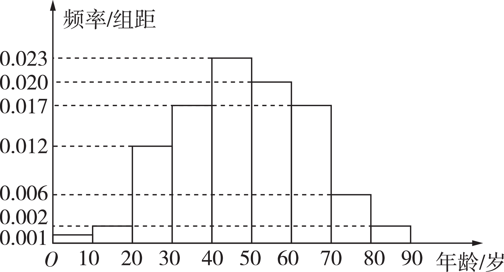
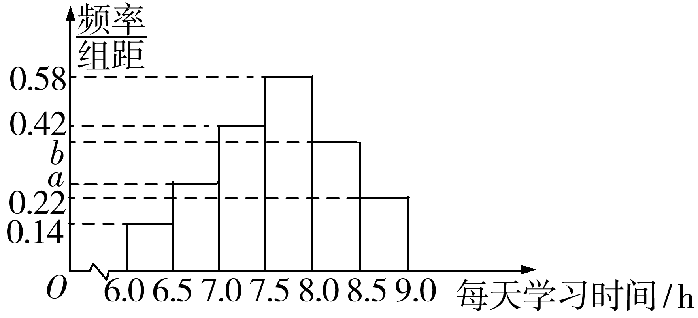
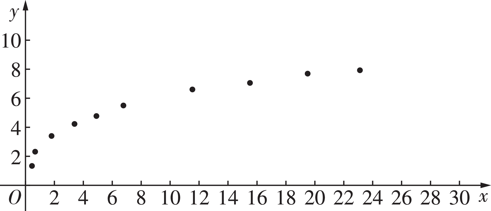
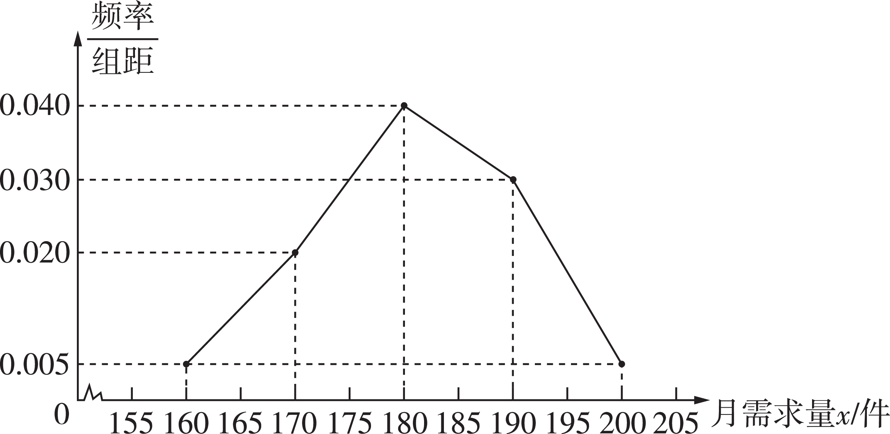
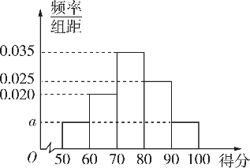
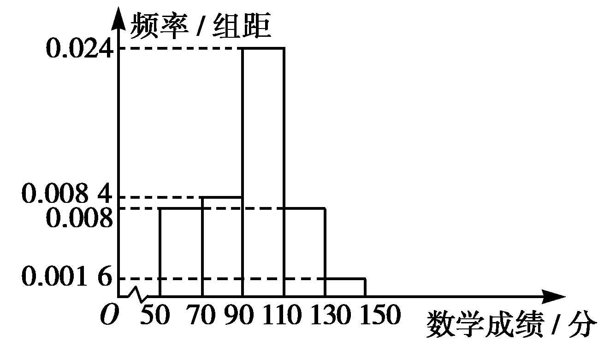

**突破2　概率与统计的综合**

学生用书P250

命题点1　概率与统计图表综合

**例**1 [2022新高考卷Ⅱ]在某地区进行流行病学调查，随机调查了100位某种疾病患者的年龄，得到如下的样本数据的频率分布直方图：

（1）估计该地区这种疾病患者的平均年龄（同一组中的数据用该组区间的中点值为代表）.

（2）估计该地区一位这种疾病患者的年龄位于区间[20，70）的概率.

（3）已知该地区这种疾病的患病率为0.1％，该地区年龄位于区间[40，50）的人口占该地区总人口的16％.从该地区中任选一人，若此人的年龄位于区间[40，50），求此人患这种疾病的概率（以样本数据中患者的年龄位于各区间的频率作为患者的年龄位于该区间的概率，精确到 0.000 1）.

解析　（1）估计该地区这种疾病患者的平均年龄 $\overline{x}$ ＝10×（5×0.001＋15×0.002＋25×0.012＋35×0.017＋45×0.023＋55×0.020＋65×0.017＋75×0.006＋85×0.002）＝47.9.

（2）该地区一位这种疾病患者的年龄位于区间[20，70）的概率*P*＝（0.012＋0.017×2＋0.023＋0.020）×10＝0.89.

（3）设从该地区任选一人，年龄位于区间[40，50）为事件*A*，患这种疾病为事件*B*，则*P*（*A*）＝16％＝0.16，*P*（*B*）＝0.001，

由频率分布直方图知这种疾病患者年龄位于区间[40，50）的概率为0.023×10＝0.23，即*P*（*A*｜*B*）＝0.23，

所以*P*（*AB*）＝*P*（*B*）*P*（*A*｜*B*）＝0.001×0.23＝0.000 23，

所以从该地区任选一人，若年龄位于区间[40，50），则此人患这种疾病的概率为*P*（*B*｜*A*）＝ $\frac{P（AB）}{P（A）}$ ＝ $\frac{0.000 23}{0.16}$ ≈0.001 4.

方法技巧

此类问题的主要依托点是统计图表，正确认识和使用这些图表是解决此类问题的关键.在弄清统计图表的含义的基础上要掌握好样本的数字特征、各类概率及随机变量的分布列、均值与方差的求解方法.

**训练**1 [2023重庆市模拟]某校随机抽取100名居家学习的高二学生进行问卷调查，得到学生每天学习时间（单位：h）的频率分布直方图如下.若被抽取的这100名学生中，每天学习时间不低于8 h的有30人.

（1）求频率分布直方图中实数*a*，*b*的值；

（2）每天学习时间在[6.0，6.5）的7名学生中，有4名男生，3名女生，现从中抽取2人进行电话访谈，已知抽取的学生有男生，求抽取的2人恰好为一男一女的概率；

（3）依据所抽取的样本，从每天学习时间在[6.0，6.5）和[7.0，7.5）的学生中按比例分层随机抽样抽取8人，再从这8人中选3人进行电话访谈，求抽取的3人中每天学习时间在[6.0，6.5）的人数的分布列和数学期望.

解析　（1）由（*b*＋0.22）×0.5×100＝30，得*b*＝0.38.

∵0.5×（0.14＋*a*＋0.42＋0.58＋0.38＋0.22）＝1，∴*a*＝0.26.

（2）从7名学生中抽取2人进行电话访谈的基本事件数为 $C_{7}^{2}$ ＝21.

记抽取的学生有男生为事件*<text style="italic">A*</text>，则*P*（A）＝ $\frac{C_{4}^{2}＋C_{4}^{1}C_{3}^{1}}{21}$ ＝ $\frac{6}{7}$ .

记抽取的学生有女生为事件*B*，则*P*（*AB*）＝ $\frac{C_{4}^{1}C_{3}^{1}}{21}$ ＝ $\frac{4}{7}$ .

则*P*（*B*｜*A*）＝ $\frac{P（AB）}{P（A）}$ ＝ $\frac{2}{3}$ ，即抽取的2人恰好为一男一女的概率为 $\frac{2}{3}$ .

（3）从每天学习时间在[6.0，6.5）和[7.0，7.5）的学生中按比例分层随机抽样抽取8人，抽取的8人中每天学习时间在[6.0，6.5）的人数为 $\frac{1}{4}$ ×8＝2，每天学习时间在[7.0，7.5）的人数为 $\frac{3}{4}$ ×8＝6.

设选中的3人中每天学习时间在[6.0，6.5）的人数为*<text style="italic"><text style="italic"><text style="italic"><text style="italic">X*</text></text></text></text>，则X的所有可能取值为0，1，2，*<text style="italic"><text style="italic">P*</text></text>（X＝0）＝ $\frac{C_{6}^{3}}{C_{8}^{3}}$ ＝ $\frac{5}{14}$ ，*<text style="italic"><text style="italic">P*</text></text>（*<text style="italic"><text style="italic"><text style="italic"><text style="italic">X*</text></text></text></text>＝1）＝ $\frac{C_{2}^{1}C_{6}^{2}}{C_{8}^{3}}$ ＝ $\frac{15}{28}$ ，*<text style="italic"><text style="italic">P*</text></text>（*<text style="italic"><text style="italic"><text style="italic"><text style="italic">X*</text></text></text></text>＝2）＝ $\frac{C_{2}^{2}C_{6}^{1}}{C_{8}^{3}}$ ＝ $\frac{3}{28}$ ，

∴*X*的分布列为

<table><tr><td>
<em>X</em>
</td><td>
0
</td><td>
1
</td><td>
2
</td></tr><tr><td>
<em>P</em>
</td><td>
 $\frac{5}{14}$ 
</td><td>
 $\frac{15}{28}$ 
</td><td>
 $\frac{3}{28}$ 
</td></tr></table>

∴*<text style="italic">X*</text>的数学期望*E*（X）＝0× $\frac{5}{14}$ ＋1× $\frac{15}{28}$ ＋2× $\frac{3}{28}$ ＝ $\frac{3}{4}$ .

命题点2　概率与回归分析综合

**例**2 [2023湖北荆荆宜三校联考]近年来，我国大学生毕业人数呈逐年上升趋势，各省市出台优惠政策鼓励高校毕业生自主创业，以创业带动就业.某市统计了该市其中四所大学2022年毕业生人数及自主创业人数（单位：千人），得到下表：

<table><tr><td></td><td>
<em>A</em>大学
</td><td>
<em>B</em>大学
</td><td>
<em>C</em>大学
</td><td>
<em>D</em>大学
</td></tr><tr><td>
2022年毕业生人数<em>x/</em>千人
</td><td>
3
</td><td>
4
</td><td>
5
</td><td>
6
</td></tr><tr><td>
自主创业人数<em>y/</em>千人
</td><td>
0.1
</td><td>
0.2
</td><td>
0.4
</td><td>
0.5
</td></tr></table>

（1）已知<te<te<te*x*t style="italic">x</text>t st*y*le="italic">x</text>t style="italic">y</text>与x具有较强的线性相关关系，求y关于x的经验回归方程 $\hat{y}$ ＝ $\hat{a}$ ＋ $\overset{\^}{b}$ <te<te*x*t style="italic">x</text>t st*y*le="italic">x</text>.

（2）假设该市政府对选择自主创业的大学生每人发放1万元的创业补贴.

（i）若该市*E*大学2022年毕业生人数为7千人，根据（1）的结论估计该市政府要给*E*大学选择自主创业的毕业生发放创业补贴的总金额；

（ii）若*A*大学的毕业生中小明、小红选择自主创业的概率分别为*<text style="italic"><text style="italic"><text style="italic">p*</text></text></text>，2p－1（ $\frac{1}{2}$ ＜*<text style="italic"><text style="italic"><text style="italic">p*</text></text></text>＜1），该市政府对小明、小红两人的自主创业的补贴总金额的期望不超过1.4万元，求p的取值范围.

参考公式及参考数据： $\overset{\^}{b}$ ＝ $\frac{\overset{n}{\underset{i=1}{\sum }}（x_{i}－\overset{－}{x})(y_{i}－\overset{－}{y}）}{\overset{n}{\underset{i=1}{\sum }}（x_{i}－\overset{－}{x}）^{2}}$ ， $\hat{a}$ ＝ $\overset{－}{y}$ － $\overset{\^}{b}\overset{－}{x}$ ， $\overset{4}{\underset{i=1}{\sum }}$ &lt;text st&lt;text style="<em>i</em>talic"&gt;y&lt;/text&gt;le="<em>i</em>talic"&gt;x&lt;/text&gt;iyi＝6.1， $\overset{4}{\underset{i=1}{\sum }}x_{i}^{2}$ ＝86.

解析　（1）由题意得 $\overset{－}{x}$ ＝ $\frac{3+4+5+6}{4}$ ＝4.5， $\overset{－}{y}$ ＝ $\frac{0.1+0.2+0.4+0.5}{4}$ ＝0.3， $\overset{\^}{b}$ ＝ $\frac{\overset{n}{\underset{i=1}{\sum }}（x_{i}－\overline{x})(y_{i}－\overline{y}）}{\overset{n}{\underset{i=1}{\sum }}（x_{i}－\overline{x}）^{2}}$ ＝ $\frac{\overset{4}{\underset{i=1}{\sum }}x_{i}y_{i}－4\overset{－}{x}\overset{－}{y}}{\overset{4}{\underset{i=1}{\sum }}x_{i}^{2}－4\overset{－}{x}^{2}}$ ＝ $\frac{6.1－4\times 4.5\times 0.3}{86－4\times 4.5^{2}}$ ＝0.14，

所以 $\hat{a}$ ＝ $\overset{－}{y}$ － $\overset{\^}{b}\overset{－}{x}$ ＝0.3－0.14×4.5＝－0.33.

故<te<te*x*t style="italic">x</text>t style="italic">y</text>关于x的经验回归方程为 $\hat{y}$ ＝0.14<te*x*t style="italic">x</text>－0.33.

（2）（i）将*x*＝7代入（1）中的回归方程，得 $\hat{y}$ ＝0.14×7－0.33＝0.65，

所以估计该市政府需要给*E*大学选择自主创业的毕业生发放创业补贴的总金额为 $0.65\times 1 000\times 1=650$ （万元）.

（ii）设小明、小红两人中选择自主创业的人数为*X*，则*X*的所有可能取值为0，1，2，

<em>P</em>（<em>X</em>＝0）＝（1－<em>p</em>）（2－2<em>p</em>）＝2<em>p</em>2－4<em>p</em>＋2，

<em>P</em>（<em>X</em>＝1）＝（1－<em>p</em>）（2<em>p</em>－1）＋<em>p</em>（2－2<em>p</em>）＝－4<em>p</em>2＋5<em>p</em>－1，

<em>P</em>（<em>X</em>＝2）＝<em>p</em>（2<em>p</em>－1）＝2<em>p</em>2－<em>p</em>，

则<em>E</em>（<em>X</em>）＝（&lt;text style="su<em>&lt;text style="italic"&gt;&lt;text style="italic"&gt;&lt;text style="italic"&gt;&lt;text style="italic"&gt;&lt;text style="italic"&gt;&lt;text style="italic"&gt;p</em>&lt;/text&gt;&lt;/text&gt;&lt;/text&gt;&lt;/text&gt;&lt;/text&gt;&lt;/text&gt;erscript"&gt;&lt;text style="superscript"&gt;2&lt;/text&gt;&lt;/text&gt;<em>p</em>2－4p＋2）×0＋（－4p2＋5p－1）×1＋（2p2－p）×2＝3p－1≤1.4，得p≤ $\frac{4}{5}$ .

因为 $\frac{1}{2}$ ＜*<text style="italic">p*</text>＜1，所以 $\frac{1}{2}$ ＜*<text style="italic">p*</text>≤ $\frac{4}{5}$ ，

故*p*的取值范围为（ $\frac{1}{2}$ ， $\frac{4}{5}$ ].

方法技巧

概率与回归分析综合问题的解题思路

（1）充分利用题目中提供的成对样本数据（散点图）作出判断，确定是线性问题还是非线性问题.求解时要充分利用已知数据，合理利用变形公式，以达到快速准确运算的目的.

（2）明确所求问题所属事件的类型，准确构建概率模型解题.

<strong>训练</strong>2 某校课题小组为了研究粮食产量与化肥施用量以及与化肥有效利用率间的关系，收集了10组化肥施用量和粮食亩产量的数据，并对这些数据做了初步处理，得到了如图所示的散点图及一些统计量的值.其中每亩化肥施用量为<em>x</em>（单位：千克），粮食亩产量为<em>y</em>（单位：百千克）.

<table><tr><td>
<em>xiyi</em>
</td><td>
<em>xi</em>
</td><td>
<em>yi</em>
</td><td></td><td>
<em>tizi</em>
</td><td>
<em>ti</em>
</td><td>
<em>zi</em>
</td><td></td></tr><tr><td>
650
</td><td>
91.5
</td><td>
52.5
</td><td>
1 478.6
</td><td>
30.5
</td><td>
15
</td><td>
15
</td><td>
46.5
</td></tr></table>
  
表中<em>ti</em>＝ln <em>xi</em>，<em>zi</em>＝ln <em>yi</em>（<em>i</em>＝1，2，…，10）.

（1）根据散点图，判断<em>y</em>＝<em>cxd</em>作为粮食亩产量<em>y</em>关于每亩化肥施用量<em>x</em>的经验回归方程类型比较适宜.请根据表中数据，建立<em>y</em>关于<em>x</em>的经验回归方程，并预测每亩化肥施用量为27千克时，粮食亩产量<em>y</em>的值.（预测时取e≈2.7）

（2）结合文献可知，当化肥施用量达到一定程度，粮食产量的增长将趋于停滞，已知某化肥有效利用率<em>Z</em>～<em>N</em>（0.54，0.022），那么这种化肥的有效利用率超过56％的概率为多少？

附：①对于一组数据（&lt;te<em>x</em>t st&lt;text style="&lt;text style="<em>i</em>talic,subscript"&gt;i&lt;/text&gt;talic"&gt;y&lt;/text&gt;le="<em>i</em>talic"&gt;x&lt;/text&gt;i，yi）（i＝1，2，3，…，<em>n</em>），其回归直线 $\overset{\^}{y}$ ＝ $\overset{\^}{b}$ &lt;te<em>x</em>t st&lt;text style="&lt;text style="<em>i</em>talic,subscript"&gt;i&lt;/text&gt;talic"&gt;y&lt;/text&gt;le="<em>i</em>talic"&gt;x&lt;/text&gt;＋ $\overset{\^}{a}$ 的斜率和截距的最小二乘估计分别为 $\overset{\^}{b}$ ＝ $\frac{\overset{n}{\underset{i=1}{\sum }}x_{i}y_{i}－n\overline{x}\overline{y}}{\overset{n}{\underset{i=1}{\sum }}x_{i}^{2}－n\overline{x}^{2}}$ ， $\overset{\^}{a}$ ＝ $\overline{y}$ － $\overset{\^}{b}\overline{x}$ ；②若随机变量<em>&lt;text style="italic"&gt;&lt;text style="italic"&gt;Z</em>&lt;/text&gt;&lt;/text&gt;～<em>N</em>（<em>&lt;text style="italic"&gt;&lt;text style="italic"&gt;&lt;text style="italic"&gt;&lt;text style="italic"&gt;μ</em>&lt;/text&gt;&lt;/text&gt;&lt;/text&gt;&lt;/text&gt;，<em>&lt;text style="italic"&gt;&lt;text style="italic"&gt;&lt;text style="italic"&gt;&lt;text style="italic"&gt;σ</em>&lt;/text&gt;&lt;/text&gt;&lt;/text&gt;&lt;/text&gt;2），则有<em>&lt;text style="italic"&gt;P</em>&lt;/text&gt;（μ－σ≤Z≤μ＋σ）≈0.682 7，P（μ－2σ≤Z≤μ＋2σ）≈0.954 5.

解析　（1）对<em>y</em>＝<em>cxd</em>两边同时取自然对数，得ln <em>y</em>＝<em>d</em>ln <em>x</em>＋ln <em>c</em>，又<em>t</em>＝ln <em>x</em>，<em>z</em>＝ln <em>y</em>，所以<em>z</em>＝<em>dt</em>＋ln <em>c</em>.

由题表中数据得 $\overline{t}$ ＝1.5， $\overline{z}$ ＝1.5，

所以 $\overset{\^}{d}$ ＝ $\frac{\overset{10}{\underset{i=1}{\sum }}t_{i}z_{i}－10\times \overline{t}\times \overline{z}}{\overset{10}{\underset{i=1}{\sum }}t_{i}^{2}－10\times \overline{t} ^{2}}＝\frac{30.5－10\times 1.5^{2}}{46.5－10\times 1.5^{2}}＝\frac{1}{3}，$

ln $\hat{c}$ ＝ $\overline{z}$ － $\overset{\^}{d}\overline{t}$ ＝1，所以 $\hat{c}$ ＝e，

所以<te*x*t style="italic">y</text>关于x的经验回归方程为 $\hat{y}$ ＝e $x^{\frac{1}{3}}$ .

当*x*＝27时， $\hat{y}$ ＝3e≈8.1.

（2）根据<em>&lt;text style="italic"&gt;Z</em>&lt;/text&gt;服从正态分布<em>N</em>（0.54，0.022）可知，<em>P</em>（Z＞0.56）＝ $\frac{1－P（0.54－0.02\leq Z\leq 0.54+0.02）}{2}$ ≈ $\frac{1－0.682 7}{2}$ ＝0.158 65，所以这种化肥的有效利用率超过56％的概率为0.158 65.

命题点3　概率与独立性检验综合

**例**3 [2023全国卷甲]一项试验旨在研究臭氧效应，试验方案如下：选40只小白鼠，随机地将其中20只分配到试验组，另外20只分配到对照组，试验组的小白鼠饲养在高浓度臭氧环境，对照组的小白鼠饲养在正常环境，一段时间后统计每只小白鼠体重的增加量（单位：g）.

（1）设*X*表示指定的两只小白鼠中分配到对照组的只数，求*X*的分布列和数学期望.

（2）试验结果如下：

对照组的小白鼠体重的增加量从小到大排序为

15.2　18.8　20.2　21.3　22.5　23.2　25.8

26.5　27.5　30.1　32.6　34.334.8　35.6

35.6　35.8　36.2　37.3　40.5　43.2

试验组的小白鼠体重的增加量从小到大排序为

7.8　 9.2 　11.4 　12.4　13.2　15.5　16.5

18.0　18.8　19.2　19.8　20.2　21.6　22.8

23.6　23.9　25.1　28.2　32.3　36.5

（i）求40只小白鼠体重的增加量的中位数*m*，再分别统计两样本中小于*m*与不小于*m*的数据的个数，完成如下列联表：

<table><tr><td></td><td>
＜<em>m</em>
</td><td>
≥<em>m</em>
</td></tr><tr><td>
对照组
</td><td></td><td></td></tr><tr><td>
试验组
</td><td></td><td></td></tr></table>

（ii）根据（i）中的列联表，能否有95％的把握认为小白鼠在高浓度臭氧环境中与在正常环境中体重的增加量有差异？

附：<em>K</em>2＝ $\frac{n（ad－bc）^{2}}{（a＋b)(c＋d)(a＋c)(b＋d）}$ ，

<table><tr><td>
<em>P</em>（<em>K</em>2≥<em>k</em>）
</td><td>
0.100　0.050　0.010
</td></tr><tr><td>
<em>k</em>
</td><td>
2.706　3.841　6.635
</td></tr></table>

解析　（1）*X*的所有可能取值为0，1，2，

*<text style="italic"><text style="italic">P*</text></text>（*<text style="italic"><text style="italic">X*</text></text>＝0）＝ $C_{2}^{0}$ ×（1－ $\frac{1}{2}$ ）×（1－ $\frac{1}{2}$ ）＝ $\frac{1}{4}$ ，*<text style="italic"><text style="italic">P*</text></text>（*<text style="italic"><text style="italic">X*</text></text>＝1）＝ $C_{2}^{1}$ × $\frac{1}{2}$ ×（1－ $\frac{1}{2}$ ）＝ $\frac{1}{2}$ ，*<text style="italic"><text style="italic">P*</text></text>（*<text style="italic"><text style="italic">X*</text></text>＝2）＝ $C_{2}^{2}$ × $\frac{1}{2}$ × $\frac{1}{2}$ ＝ $\frac{1}{4}$ ，（另解：两只小白鼠分在两个组，每只小白鼠都各有两种分配方案，总的分配方案为4种，两只小白鼠全部分配到试验组有1种情况，有一只分配到对照组有2种情况，全部分配到对照组有1种情况，利用古典概型的概率公式即可得解）

所以*X*的分布列为

<table><tr><td>
<em>X</em>
</td><td>
0
</td><td>
1
</td><td>
2
</td></tr><tr><td>
<em>P</em>
</td><td>
 $\frac{1}{4}$ 
</td><td>
 $\frac{1}{2}$ 
</td><td>
 $\frac{1}{4}$ 
</td></tr></table>

*E*（*X*）＝0× $\frac{1}{4}$ ＋1× $\frac{1}{2}$ ＋2× $\frac{1}{4}$ ＝1.

（2）（i）根据试验数据可以知道40只小白鼠体重增加量的中位数*m*＝ $\frac{23.2+23.6}{2}$ ＝23.4.

列联表如下：

<table><tr><td></td><td>
＜<em>m</em>
</td><td>
≥<em>m</em>
</td></tr><tr><td>
对照组
</td><td>
6
</td><td>
14
</td></tr><tr><td>
试验组
</td><td>
14
</td><td>
6
</td></tr></table>

（ii）根据（i）中结果可得<em>K</em>2＝ $\frac{40\times （6\times 6－14\times 14）^{2}}{20\times 20\times 20\times 20}$ ＝6.4＞3.841，

所以有95％的把握认为小白鼠在高浓度臭氧环境中与在正常环境中体重的增加量有差异.

方法技巧

概率与独立性检验综合问题的解题思路

（1）收集数据列出2×2列联表，并按照公式求得􀱽2的值后进行比较并判断；

（2）按照随机变量满足的概率模型求解.

**训练**3 [2022新高考卷Ⅰ]一医疗团队为研究某地的一种地方性疾病与当地居民的卫生习惯（卫生习惯分为良好和不够良好两类）的关系，在已患该疾病的病例中随机调查了100例（称为病例组），同时在未患该疾病的人群中随机调查了100人（称为对照组），得到如下数据：

<table><tr><td></td><td>
不够良好
</td><td>
良好
</td></tr><tr><td>
病例组
</td><td>
40
</td><td>
60
</td></tr><tr><td>
对照组
</td><td>
10
</td><td>
90
</td></tr></table>

（1）能否有99％的把握认为患该疾病群体与未患该疾病群体的卫生习惯有差异？

（2）从该地的人群中任选一人，*A*表示事件“选到的人卫生习惯不够良好”，*B*表示事件“选到的人患有该疾病”， $\frac{P（B｜A）}{P（\overline{B}｜A）}$ 与 $\frac{P（B｜\overline{A}）}{P（\overline{B}｜\overline{A}）}$ 的比值是卫生习惯不够良好对患该疾病风险程度的一项度量指标，记该指标为*R*.

（i）证明：*R*＝ $\frac{P（A｜B）}{P（\overline{A}｜B）}$ · $\frac{P（\overline{A}｜\overline{B}）}{P（A｜\overline{B}）}$ .

（ii）利用该调查数据，给出*<text style="italic">P*</text>（*<text style="italic">A*</text>｜*B*），P（A｜ $\overline{B}$ ）的估计值，并利用（i）的结果给出*R*的估计值.

附：<em>K</em>2＝ $\frac{n（ad－bc）^{2}}{（a＋b)(c＋d)(a＋c)(b＋d）}$ ，

<table><tr><td>
<em>P</em>（<em>K</em>2≥<em>k</em>）
</td><td>
0.050　0.010　0.001
</td></tr><tr><td>
<em>k</em>
</td><td>
3.841　6.635　10.828
</td></tr></table>

解析　（1）<em>K</em>2＝ $\frac{200\times （40\times 90－60\times 10）^{2}}{50\times 150\times 100\times 100}$ ＝24＞6.635，所以有99％的把握认为患该疾病群体与未患该疾病群体的卫生习惯有差异.

（2）（i）*R*＝ $\frac{\frac{P（B｜A）}{P（\overline{B}｜A）}}{\frac{P（B｜\overline{A}）}{P（\overline{B}｜\overline{A}）}}$ ＝ $\frac{P（B｜A）\cdot P（\overline{B}｜\overline{A}）}{P（\overline{B}｜A）\cdot P（B｜\overline{A}）}$ ，

由题意知，证明 $\frac{P（B｜A）\cdot P（\overline{B}｜\overline{A}）}{P（\overline{B}｜A）\cdot P（B｜\overline{A}）}$ ＝ $\frac{P（A｜B）\cdot P（\overline{A}｜\overline{B}）}{P（\overline{A}｜B）\cdot P（A｜\overline{B}）}$ 即可，

左边＝ $\frac{\frac{P（AB）}{P（A）}\cdot \frac{P（\overline{A}　\overline{B}）}{P（\overline{A}）}}{\frac{P（A\overline{B}）}{P（A）}\cdot \frac{P（\overline{A}　B）}{P（\overline{A}）}}$ ＝ $\frac{P（AB）\cdot P（\overline{A}　\overline{B}）}{P（A\overline{B}）\cdot P（\overline{A} B）}$ ，

右边＝ $\frac{\frac{P（AB）}{P（B）}\cdot \frac{P（\overline{A}　\overline{B}）}{P（\overline{B}）}}{\frac{P（\overline{A}B）}{P（B）}\cdot \frac{P（A\overline{B}）}{P（\overline{B}）}}$ ＝ $\frac{P（AB）\cdot P（\overline{A}　\overline{B}）}{P（\overline{A}B）\cdot P（A\overline{B}）}$ .

左边＝右边，故*R*＝ $\frac{P（A｜B）}{P（\overline{A}｜B）}$ · $\frac{P（\overline{A}｜\overline{B}）}{P（A｜\overline{B}）}$ .

（ii）由调查数据可知*<text style="italic">P*</text>（*<text style="italic">A*</text>｜*B*）＝ $\frac{40}{100}$ ＝ $\frac{2}{5}$ ，*<text style="italic">P*</text>（*<text style="italic">A*</text>｜ $\overline{B}$ ）＝ $\frac{10}{100}$ ＝ $\frac{1}{10}$ ，

且*<text style="italic"><text style="italic"><text style="italic">P*</text></text></text>（ $\overline{A}$ ｜*<text style="italic">B*</text>）＝1－*<text style="italic"><text style="italic"><text style="italic">P*</text></text></text>（*<text style="italic">A*</text>｜B）＝ $\frac{3}{5}$ ，*<text style="italic"><text style="italic"><text style="italic">P*</text></text></text>（ $\overline{A}$ ｜ $\overline{B}$ ）＝1－*<text style="italic"><text style="italic"><text style="italic">P*</text></text></text>（*<text style="italic">A*</text>｜ $\overline{B}$ ）＝ $\frac{9}{10}$ ，

所以*R*＝ $\frac{\frac{2}{5}}{\frac{3}{5}}$ × $\frac{\frac{9}{10}}{\frac{1}{10}}$ ＝6.

1.[命题点1]某科技公司开发出一款生态环保产品.已知该环保产品每售出1件预计利润为0.4万元，当月未售出的环保产品，每件亏损0.2万元.根据市场调研，该环保产品的市场月需求量*x*（单位：件）在[155，205]内取值，将月需求量区间平均分成5组，以各组区间的中点值代表该组的月需求量，得到如图所示的频率分布折线图.

（1）请根据频率分布折线图，估计该环保产品的市场月需求量的平均值及方差；

（2）以频率分布折线图的频率估计概率，若该公司计划环保产品的月产量<em>n</em>∈[180，190]，<em>n</em>∈N<em>\*</em>（单位：件），求月利润<em>Y</em>（单位：万元）的数学期望的最大值.

参考数据： $\overset{5}{\underset{i=1}{\sum }}x_{i}^{2}$ &lt;te&lt;text style="&lt;text style="&lt;text style="<em>i</em>talic,subscript"&gt;i&lt;/text&gt;talic,subscri<em>p</em>t"&gt;i&lt;/text&gt;talic"&gt;x&lt;/text&gt;t style="<em>i</em>talic"&gt;p&lt;/text&gt;i＝32 850，xi是各组区间中点值，pi是各组月需求量对应的频率，i＝1，2，3，4，5.

解析　（1）由题意，得该环保产品的市场月需求量的平均值 $\overline{x}$ ＝160×0.05＋170×0.2＋180×0.4＋190×0.3＋200×0.05＝181（件）.

解法一　该环保产品的市场月需求量的方差&lt;text style="<em>i</em>talic"&gt;s&lt;/text&gt;&lt;text style="su<em>p</em>erscript"&gt;2&lt;/text&gt;＝ $\overset{5}{\underset{i=1}{\sum }}x_{i}^{2}$ &lt;text style="<em>i</em>talic"&gt;p&lt;/text&gt;i－ $\overline{x}^{2}$ ＝3&lt;text style="su&lt;text style="<em>i</em>talic"&gt;p&lt;/text&gt;erscript"&gt;2&lt;/text&gt; 850－1812＝89.

解法二　<em>s</em>2＝ $\overset{5}{\underset{i=1}{\sum }}\left（x_{i}-\overline{x}\right）^{2}p_{i}=\left（160-181\right）^{2}\times 0.05+\left（170-181\right）^{2}\times 0.2+\left（180-181\right）^{2}\times 0.4+\left（190-181\right）^{2}\times 0.3+\left（200-181\right）^{2}\times 0.05=89$ .

（2）设市场月需求量为*M*件，由题意知，*M*的所有可能值为160，170，180，190，200，则*M*的分布列为

<table><tr><td>
<em>M</em>
</td><td>
160
</td><td>
170
</td><td>
180
</td><td>
190
</td><td>
200
</td></tr><tr><td>
<em>P</em>
</td><td>
0.05
</td><td>
0.2
</td><td>
0.4
</td><td>
0.3
</td><td>
0.05
</td></tr></table>

当180≤<em>n</em>≤190，<em>n</em>∈N<em>\*</em>时，

若市场月需求量为160，则*Y*＝96－0.2*n*；

若市场月需求量为170，则*Y*＝102－0.2*n*；

若市场月需求量为180，则*Y*＝108－0.2*n*；

若市场月需求量为190或200，则*Y*＝0.4*n*.

故*E*（*Y*）＝（96－0.2*n*）×0.05＋（102－0.2*n*）×0.2＋（108－0.2*n*）×0.4＋0.4*n*×0.35＝68.4＋0.01*n*.

又*n*∈[180，190]，故当*n*＝190时，月利润*Y*的数学期望取得最大值，为70.3万元.

2.[命题点2*/* 多选*/* 2023沈阳市三检]下列命题中正确的是（　ABD　）

A.已知一组数据6，6，7，8，10，12，则这组数据的50％分位数是7.5

B.已知随机变量<em>X</em>～<em>N</em>（2，<em>σ</em>2），且<em>P</em>（<em>X</em>＞3）＝0.3，则<em>P</em>（1＜<em>X</em>＜2）＝0.2

C.已知随机变量*<text style="italic">Y*</text>～*B*（10， $\frac{1}{2}$ ），则*E*（*<text style="italic">Y*</text>）＝ $\frac{5}{2}$

D.已知经验回归方程 $\overset{\^}{y}$ ＝－2<te*x*t st*y*le="italic">x</text>＋3，则y与x具有负线性相关关系

解析　数据6，6，7，8，10，1&lt;te&lt;te&lt;te<em>x</em>t st<em>y</em>le="italic"&gt;x&lt;/text&gt;t style="italic"&gt;x&lt;/text&gt;t style="superscript"&gt;2&lt;/text&gt;的50％分位数，即中位数，为 $\frac{7+8}{2}$ ＝7.5，所以选项A正确；因为随机变量&lt;te&lt;te&lt;te<em>x</em>t st<em>y</em>le="italic"&gt;x&lt;/text&gt;t style="italic"&gt;x&lt;/text&gt;t style="italic"&gt;<em>&lt;text style="italic"&gt;&lt;text style="italic"&gt;&lt;text style="italic"&gt;&lt;text style="italic"&gt;&lt;text style="italic"&gt;X</em>&lt;/text&gt;&lt;/text&gt;&lt;/text&gt;&lt;/text&gt;&lt;/text&gt;&lt;/text&gt;～<em>N</em>（2，<em>σ</em>2），且<em>&lt;text style="italic"&gt;&lt;text style="italic"&gt;&lt;text style="italic"&gt;&lt;text style="italic"&gt;&lt;text style="italic"&gt;P</em>&lt;/text&gt;&lt;/text&gt;&lt;/text&gt;&lt;/text&gt;&lt;/text&gt;（X＞3）＝0.3，所以P（2＜X＜3）＝P（X＞2）－P（X＞3）＝0.5－0.3＝0.2，则P（1＜X＜2）＝P（2＜X＜3）＝0.2，所以选项<em>B</em>正确；因为随机变量<em>&lt;text style="italic"&gt;Y</em>&lt;/text&gt;～B（10， $\frac{1}{2}$ ），所以&lt;te&lt;te&lt;te<em>x</em>t st<em>y</em>le="italic"&gt;x&lt;/text&gt;t style="italic"&gt;x&lt;/text&gt;t style="italic"&gt;E&lt;/text&gt;（<em>&lt;text style="italic"&gt;Y</em>&lt;/text&gt;）＝10× $\frac{1}{2}$ ＝5，所以选项C错误；因为经验回归方程 $\overset{\^}{y}$ ＝－&lt;te&lt;te&lt;te<em>x</em>t st<em>y</em>le="italic"&gt;x&lt;/text&gt;t style="italic"&gt;x&lt;/text&gt;t style="superscript"&gt;2&lt;/text&gt;x＋3中，x的系数为负，所以y与x具有负线性相关关系，所以选项D正确.综上，选A<em>B</em>D.

3.[命题点3*/* 2024平许济洛第一次质检]“马街书会”是流行于河南省宝丰县的传统民俗活动，为国家级非物质文化遗产之一.每年农历正月十三为书会正日，届时来自各地的说书艺人负鼓携琴，汇集于此，说书亮艺，河南坠子、道情、琴书等曲种应有尽有，规模壮观.为了解人们对该活动的喜爱程度，现随机抽取200人进行调查统计，得到如下列联表：

单位：人

<table><tr><td></td><td>
不喜爱
</td><td>
喜爱
</td><td>
合计
</td></tr><tr><td>
男性
</td><td></td><td>
90
</td><td>
120
</td></tr><tr><td>
女性
</td><td>
25
</td><td></td><td></td></tr><tr><td>
合计
</td><td></td><td></td><td>
200
</td></tr></table>

（1）完成2×2列联表，并依据小概率值*α*＝0.1的独立性检验，判断人们对该活动的喜爱程度是否与性别有关联.

（2）为宣传曲艺文化知识，当地文化局在书会上组织了戏曲知识竞赛活动.活动规定从8道备选题中随机抽取4道题进行作答.假设在8道备选题中，戏迷甲正确完成每道题的概率都是 $\frac{3}{4}$ ，且每道题正确完成与否互不影响；戏迷乙只能正确完成其中的6道题.

①求戏迷甲至少正确完成其中3道题的概率；

②设随机变量*X*表示戏迷乙正确完成题的个数，求*X*的分布列及数学期望.

附： $\chi ^{2}$ ＝ $\frac{n（ad－bc）^{2}}{（a＋b)(c＋d)(a＋c)(b＋d）}$ ，其中<text style="it<text style="itali*c*">a</text>lic">n</text>＝a＋*b*＋c＋*d*.

<table><tr><td>
<em>α</em>
</td><td>
0.1
</td><td>
0.05
</td><td>
0.01
</td><td>
0.005
</td><td>
0.001
</td></tr><tr><td>
<em>xα</em>
</td><td>
2.706
</td><td>
3.841
</td><td>
6.635
</td><td>
7.879
</td><td>
10.828
</td></tr></table>

解析　（1）补全的 2×2 列联表如下：

单位：人

<table><tr><td></td><td>
不喜爱 
</td><td>
喜爱
</td><td>
 合计
</td></tr><tr><td>
男性 
</td><td>
30
</td><td>
 90
</td><td>
 120
</td></tr><tr><td>
女性 
</td><td>
25
</td><td>
 55
</td><td>
 80
</td></tr><tr><td>
合计 
</td><td>
55 
</td><td>
145
</td><td>
 200
</td></tr></table>

零假设为<em>H</em>0：人们对该活动的喜爱程度与性别无关.

根据表中数据，计算得到 $\chi ^{2}$ ＝ $\frac{200\times （30\times 55－90\times 25）^{2}}{55\times 145\times 120\times 80}$ ＝ $\frac{300}{319}$ ＜2.706.

根据小概率值<em>α</em>＝0.1 的独立性检验，没有充分证据推断<em>H</em>0不成立，

因此我们可以认为<em>H</em>0成立，即认为人们对该活动的喜爱程度与性别无关.

（2）①记“戏迷甲至少正确完成其中 3 道题”为事件 *A*，则

<em>P</em>（<em>A</em>）＝ $C_{4}^{3}$ （ $\frac{3}{4}$ ）3 $\frac{1}{4}$ ＋ $C_{4}^{4}$ （ $\frac{3}{4}$ ）4＝ $\frac{189}{256}$ .

②*X*的所有可能取值为 2，3，4，

*<text style="italic">P*</text>（*<text style="italic">X*</text>＝2）＝ $\frac{C_{2}^{2}C_{6}^{2}}{C_{8}^{4}}$ ＝ $\frac{15}{70}$ ＝ $\frac{3}{14}$ ，*<text style="italic">P*</text>（*<text style="italic">X*</text>＝3）＝ $\frac{C_{2}^{1}C_{6}^{3}}{C_{8}^{4}}$ ＝ $\frac{40}{70}$ ＝ $\frac{4}{7}$ ，

*P*（*X*＝4）＝ $\frac{C_{2}^{0}C_{6}^{4}}{C_{8}^{4}}$ ＝ $\frac{15}{70}$ ＝ $\frac{3}{14}$ ，

*X*的分布列为

<table><tr><td>
<em>X</em>
</td><td>
2
</td><td>
3
</td><td>
4
</td></tr><tr><td>
<em>P</em>
</td><td>
 $\frac{3}{14}$ 
</td><td>
 $\frac{4}{7}$ 
</td><td>
 $\frac{3}{14}$ 
</td></tr></table>

*<text style="italic">X*</text>的数学期望*E*（X）＝2× $\frac{3}{14}$ ＋3× $\frac{4}{7}$ ＋4× $\frac{3}{14}$ ＝3.

学生用书·练习帮P398

1.第31届世界大学生夏季运动会（简称“成都大运会”）于2023年7月28日在四川成都开幕，这是中国西部第一次举办世界性综合运动会.为普及大运会相关知识，营造良好的赛事氛围，某学校举行“大运会百科知识”答题活动，并随机抽取了20名学生，他们的答题得分（满分100分）的频率分布直方图如图所示（分组区间为[50，60），[60，70），[70，80），[80，90），[90，100]）.

（1）求频率分布直方图中*a*的值及这20名学生得分的80％分位数；

（2）若从样本中任选2名得分在[50，70）内的学生，求这2人中恰有1人的得分在[60，70）内的概率.

解析　（1）由频率分布直方图知（2*a*＋0.020＋0.025＋0.035）×10＝1，所以*a*＝0.010.

设80％分位数为<te<te*x*t style="italic">x</text>t style="italic">x</text>，由题图可知前3组的频率之和为0.65，前4组的频率之和为0.9，所以x∈[80，90），且x＝80＋ $\frac{0.8－0.65}{0.9－0.65}$ ×10＝86.

故这20名学生得分的80％分位数为86.

（2）由已知可得得分在[50，60）内的学生人数为0.01×10×20＝2，得分在[60，70）内的学生人数为0.02×10×20＝4.

解法一（列举法）　记得分在[50，60）内的学生为*a*，*b*，得分在[60，70）内的学生为*c*，*d*，*e*，*f*.

则所有的样本点为{*a*，*b*}，{*a*，*c*}，{*a*，*d*}，{*a*，*e*}，{*a*，*f*}，{*b*，*c*}，{*b*，*d*}，{*b*，*e*}，{*b*，*f*}，{*c*，*d*}，{*c*，*e*}，{*c*，*f*}，{*d*，*e*}，{*d*，*f*}，{*e*，*f*}，共15个.

其中恰有1人的得分在[60，70）内的样本点为{*a*，*c*}，{*a*，*d*}，{*a*，*e*}，{*a*，*f*}，{*b*，*c*}，{*b*，*d*}，{*b*，*e*}，{*b*，*f*}，共8个.

故这2人中恰有1人的得分在[60，70）内的概率*P*＝ $\frac{8}{15}$ .

解法二（排列组合法）　从这6人中任选2人，所有基本事件种数为 $C_{6}^{2}$ ＝15，满足题意的基本事件种数为 $C_{4}^{1}C_{2}^{1}$ ＝8，故这2人中恰有1人的得分在[60，70）内的概率*P*＝ $\frac{8}{15}$ .

2.在高三一轮复习中，大单元复习教学法日渐受到老师们的喜爱，为了检验这种复习方法的效果，在*A*，*B*两所学校的高三年级用数学科目进行了对比测试.已知*A*校采用大单元复习教学法，*B*校采用传统的复习教学法.在经历两个月的实践后举行了考试，现从*A*，*B*两校高三年级各随机抽取100名学生，统计他们的数学成绩（满分150分）在各个分数段对应的人数如下表所示：

<table><tr><td></td><td>
[0，90）
</td><td>
[90，110）
</td><td>
[110，130）
</td><td>
[130，150]
</td></tr><tr><td>
<em>A</em>校
</td><td>
6
</td><td>
14
</td><td>
50
</td><td>
30
</td></tr><tr><td>
<em>B</em>校
</td><td>
14
</td><td>
26
</td><td>
38
</td><td>
22
</td></tr></table>

（1）若把数学成绩不低于110分评定为数学成绩优秀，低于110分评定为数学成绩不优秀，完成2×2列联表，并根据小概率值*α*＝0.01的独立性检验，分析复习教学法与评定结果是否有关；

单位：人

<table><tr><td></td><td>
数学成绩不优秀
</td><td>
数学成绩优秀
</td><td>
总计
</td></tr><tr><td>
<em>A</em>校
</td><td></td><td></td><td></td></tr><tr><td>
<em>B</em>校
</td><td></td><td></td><td></td></tr><tr><td>
总计
</td><td></td><td></td><td></td></tr></table>

（2）在*A*校抽取的100名学生中按分层随机抽样的方法从成绩在[0，90）和[90，110）内的学生中随机抽取10人，再从这10人中随机抽取3人进行访谈，记抽取的3人中成绩在[0，90）内的人数为*X*，求*X*的分布列与数学期望.

附： $\chi ^{2}$ ＝ $\frac{n（ad－bc）^{2}}{（a＋b)(c＋d)(a＋c)(b＋d）}$ ，其中<text style="it<text style="itali*c*">a</text>lic">n</text>＝a＋*b*＋c＋*d*.

<table><tr><td>
<em>α</em>
</td><td>
0.10
</td><td>
0.01
</td><td>
0.001
</td></tr><tr><td>
<em>xα</em>
</td><td>
2.706
</td><td>
6.635
</td><td>
10.828
</td></tr></table>

解析　（1）由题意完成2×2列联表如下：

单位：人

<table><tr><td></td><td>
数学成绩不优秀
</td><td>
数学成绩优秀
</td><td>
总计
</td></tr><tr><td>
<em>A</em>校
</td><td>
20
</td><td>
80
</td><td>
100
</td></tr><tr><td>
<em>B</em>校
</td><td>
40
</td><td>
60
</td><td>
100
</td></tr><tr><td>
总计
</td><td>
60
</td><td>
140
</td><td>
200
</td></tr></table>

零假设为<em>H</em>0：复习教学法与评定结果无关.

则 $\chi ^{2}$ ＝ $\frac{200\times （20\times 60－40\times 80）^{2}}{60\times 140\times 100\times 100}$ ≈9.524＞6.635＝<em>x</em>0.01，

故根据小概率值<em>α</em>＝0.01的独立性检验，推断<em>H</em>0不成立，即认为复习教学法与评定结果有关，此推断犯错误的概率不大于0.01.

（2）按分层随机抽样的方法从成绩在[0，90）和[90，110）内的学生中随机抽取10人，则成绩在[0，90）内的人数为3，成绩在[90，110）内的人数为7，

故*X*的所有可能取值为0，1，2，3，

*<text style="italic"><text style="italic"><text style="italic">P*</text></text></text>（*<text style="italic"><text style="italic"><text style="italic">X*</text></text></text>＝0）＝ $\frac{C_{3}^{0}C_{7}^{3}}{C_{10}^{3}}$ ＝ $\frac{7}{24}$ ，*<text style="italic"><text style="italic"><text style="italic">P*</text></text></text>（*<text style="italic"><text style="italic"><text style="italic">X*</text></text></text>＝1）＝ $\frac{C_{3}^{1}C_{7}^{2}}{C_{10}^{3}}$ ＝ $\frac{21}{40}$ ，*<text style="italic"><text style="italic"><text style="italic">P*</text></text></text>（*<text style="italic"><text style="italic"><text style="italic">X*</text></text></text>＝2）＝ $\frac{C_{3}^{2}C_{7}^{1}}{C_{10}^{3}}$ ＝ $\frac{7}{40}$ ，*<text style="italic"><text style="italic"><text style="italic">P*</text></text></text>（*<text style="italic"><text style="italic"><text style="italic">X*</text></text></text>＝3）＝ $\frac{C_{3}^{3}C_{7}^{0}}{C_{10}^{3}}$ ＝ $\frac{1}{120}$ .

故*X*的分布列为

<table><tr><td>
<em>X</em>
</td><td>
0
</td><td>
1
</td><td>
2
</td><td>
3
</td></tr><tr><td>
<em>P</em>
</td><td>
 $\frac{7}{24}$ 
</td><td>
 $\frac{21}{40}$ 
</td><td>
 $\frac{7}{40}$ 
</td><td>
 $\frac{1}{120}$ 
</td></tr></table>

*E*（*X*）＝0× $\frac{7}{24}$ ＋1× $\frac{21}{40}$ ＋2× $\frac{7}{40}$ ＋3× $\frac{1}{120}$ ＝ $\frac{9}{10}$ .

3.[2024广西玉林模拟]2023年5月10日，长征七号遥七运载火箭剑指苍穹，搭载天舟六号货运飞船为中国空间站运送补给物资，为中国空间站的航天员们长时间探索宇宙奥秘提供强有力的后援支持.5月30日，神舟十六号发射成功.在“神箭”“神舟”的护送下，景海鹏、朱杨柱、桂海潮3名中国航天员顺利进入太空，开启为期5个月的太空科研之旅.某校部分学生十分关注中国空间站的发展，若将累计关注中国空间站发展的消息6次及以上者称为“航天达人”，未达到6次者称为“非航天达人”.现从该校随机抽取200人进行分析，得到数据如下表所示：

单位：人

<table><tr><td></td><td>
航天达人
</td><td>
非航天达人
</td><td>
合计
</td></tr><tr><td>
男
</td><td>
80
</td><td>
40
</td><td>
120
</td></tr><tr><td>
女
</td><td>
30
</td><td>
50
</td><td>
80
</td></tr><tr><td>
合计
</td><td>
110
</td><td>
90
</td><td>
200
</td></tr></table>

（1）依据小概率值<em>α</em>＝0.01的􀱽2独立性检验，能否认为是否为“航天达人”与性别有关联？

（2）①从随机抽取的这200名学生中采用分层随机抽样的方法抽取20人，再从这20人中随机抽取3人.记事件*A*＝“至少有2名是男生”，事件*B*＝“至少有2名既是‘航天达人’又是男生”，事件*C*＝“至多有1名既是‘航天达人’又是女生”.试计算 $P\left（A\right）P\left(A\right)P\left(AB\right)$ 和*P*（*ABC*）的值，并比较它们的大小.

②由①中*P*（*ABC*）与*P*（*A*）*P*（*B*｜*A*）*P*（*C*｜*AB*）的大小关系能否推广到更一般的情形？请写出结论，并说明理由.

参考公式及数据： $\chi ^{2}$ ＝ $\frac{n（ad－bc）^{2}}{（a＋b)(c＋d)(a＋c)(b＋d）}$ ，<text style="it<text style="itali*c*">a</text>lic">n</text>＝a＋*b*＋c＋*d*.

<table><tr><td>
<em>α</em>
</td><td>
0.10
</td><td>
0.05
</td><td>
0.01
</td></tr><tr><td>
<em>xα</em>
</td><td>
2.706
</td><td>
3.841
</td><td>
6.635
</td></tr></table>

解析　（1）零假设为<em>H</em>0：是否为“航天达人”与性别无关联.

根据表中数据计算得􀱽&lt;te<em>x</em>t style="superscript"&gt;2&lt;/text&gt;＝ $\frac{200\times （80\times 50－40\times 30）^{2}}{120\times 80\times 110\times 90}$ ≈16.498＞6.635＝<em>x</em>0.01，

所以根据小概率值<em>α</em>＝0.01的 $\chi ^{2}$ 独立性检验，我们推断<em>H</em>0不成立，

即认为是否为“航天达人”与性别有关联，此推断犯错误的概率不大于0.01.

（2）由题意可知：抽取的20人中，男“航天达人”有8人，男“非航天达人”有4人，女“航天达人”有3人，女“非航天达人”有5人.

①事件*ABC*表示“抽取的3人为2名男生1名女生，男生都是‘航天达人’”和“抽取的3人为3名男生，其中至少2人是‘航天达人’”，

设*D*＝“抽取的3人为2名男生1名女生，男生都是‘航天达人’”，

*E*＝“抽取的3人为3名男生，其中至少2人是‘航天达人’”，

*<text style="italic">P*</text>（*D*）＝ $\frac{C_{8}^{2}（C_{3}^{1}＋C_{5}^{1}）}{C_{20}^{3}}$ ＝ $\frac{56}{285}$ ，*<text style="italic">P*</text>（*E*）＝ $\frac{C_{8}^{2}C_{4}^{1}＋C_{8}^{3}}{C_{20}^{3}}$ ＝ $\frac{14}{95}$ ，

所以*<text style="italic"><text style="italic">P*</text></text>（*ABC*）＝P（*D*）＋P（*E*）＝ $\frac{56}{285}$ ＋ $\frac{14}{95}$ ＝ $\frac{98}{285}$ ，

*<text style="italic"><text style="italic">P*</text></text>（*<text style="italic">A*</text>）P（*B*｜A）P（*C*｜*AB*）＝ $\frac{C_{12}^{2}C_{8}^{1}＋C_{12}^{3}}{C_{20}^{3}}$ × $\frac{C_{8}^{2}（C_{4}^{1}＋C_{3}^{1}＋C_{5}^{1}）＋C_{8}^{3}}{C_{12}^{2}C_{8}^{1}＋C_{12}^{3}}$ × $\frac{C_{8}^{2}（C_{3}^{1}＋C_{5}^{1}）＋C_{8}^{2}C_{4}^{1}＋C_{8}^{3}}{C_{8}^{2}（C_{4}^{1}＋C_{3}^{1}＋C_{5}^{1}）＋C_{8}^{3}}$ ＝ $\frac{98}{285}$ ，

所以*P*（*ABC*）＝*P*（*A*）*P*（*B*｜*A*）*P*（*C*｜*AB*）.

②由①中*P*（*ABC*）与*P*（*A*）*P*（*B*｜*A*）*P*（*C*｜*AB*）相等的关系可以推广到更一般的情形，即对于一般的三个事件*A*，*B*，*C*，有*P*（*ABC*）＝*P*（*A*）*P*（*B*｜*A*）*P*（*C*｜*AB*）.

理由是：*<text style="italic"><text style="italic"><text style="italic"><text style="italic">P*</text></text></text></text>（*<text style="italic"><text style="italic">A*</text></text>）P（*B*｜A）P（*C*｜*AB*）＝P（A）· $\frac{P（AB）}{P（A）}$ · $\frac{P（ABC）}{P（AB）}$ ＝*<text style="italic"><text style="italic"><text style="italic"><text style="italic">P*</text></text></text></text>（*<text style="italic"><text style="italic">A*</text></text>*BC*），得证.

4.[2023河南驻马店6月模拟]2023年是充满挑战的一年，为应对复杂的经济形势，各地出台了促进经济发展的各项政策，并取得了较好的效果.某市零售行业为促进消费，开展了新一轮的让利促销活动，活动之初，利用各种媒体进行了大量的广告宣传，为了解传媒对本次促销活动的影响，在本市内随机抽取了6个大型零售卖场（分别编号为1，2，3，…，6），得到其宣传费用*x*（单位：万元）和销售额*y*（单位：万元）的数据如下：

<table><tr><td></td><td>
1
</td><td>
2
</td><td>
3
</td><td>
4
</td><td>
5
</td><td>
6
</td></tr><tr><td>
<em>x/</em>万元
</td><td>
2
</td><td>
3
</td><td>
5
</td><td>
6
</td><td>
8
</td><td>
12
</td></tr><tr><td>
<em>y/</em>万元
</td><td>
30
</td><td>
34
</td><td>
40
</td><td>
45
</td><td>
50
</td><td>
60
</td></tr></table>

（1）求*y*关于*x*的经验回归方程，并预测当宣传费用至少多少万元时（结果取整数），销售额能突破100万元.

（2）经济活动中，人们往往关注投入和产出比值，在这次促销活动中，设销售额与投入的宣传费用的比值为λ，若λ＞10，称这次宣传策划是高效的；否则为非高效的.从这6家卖场中随机抽取3家.

①若抽取的3家中含有宣传策划高效的卖场，求抽取的3家中恰有一家是宣传策划高效卖场的概率；

②若抽取的3家卖场中宣传策划高效的有*X*家，求*X*的分布列和数学期望.

附：参考数据 $\overset{6}{\underset{i=1}{\sum }}$ &lt;te<em>x</em>t st&lt;text style="<em>i</em>talic"&gt;y&lt;/text&gt;le="<em>i</em>talic"&gt;x&lt;/text&gt;iyi＝1 752，经验回归方程 $\hat{y}$ ＝ $\overset{\^}{b}$ &lt;te<em>x</em>t st&lt;text style="<em>i</em>talic"&gt;y&lt;/text&gt;le="<em>i</em>talic"&gt;x&lt;/text&gt;＋ $\hat{a}$ 中 $\overset{\^}{b}$ 和 $\hat{a}$ 的最小二乘估计分别为 $\overset{\^}{b}$ ＝ $\frac{\overset{n}{\underset{i=1}{\sum }}x_{i}y_{i}－n\overline{x} \overline{y}}{\overset{n}{\underset{i=1}{\sum }}x_{i}^{2}－n\overline{x}^{2}}$ ， $\hat{a}$ ＝ $\overline{y}$ － $\overset{\^}{b}\overline{x}$ .

解析　（1） $\overline{x}$ ＝ $\frac{2+3+5+6+8+12}{6}$ ＝6，

$\overline{y}$ ＝ $\frac{30+34+40+45+50+60}{6}$ ＝ $\frac{259}{6}$ ，

$\overset{6}{\underset{i=1}{\sum }}x_{i}^{2}$ ＝&lt;text style="superscript"&gt;&lt;text style="superscript"&gt;&lt;text style="superscript"&gt;&lt;text style="superscript"&gt;&lt;text style="superscript"&gt;2&lt;/text&gt;&lt;/text&gt;&lt;/text&gt;&lt;/text&gt;&lt;/text&gt;2＋32＋52＋62＋82＋122＝282，

所以 $\overset{\^}{b}$ ＝ $\frac{\overset{6}{\underset{i=1}{\sum }}x_{i}y_{i}－6\overline{x}\overline{y}}{\overset{6}{\underset{i=1}{\sum }}x_{i}^{2}－6\overline{x}^{2}}$ ＝ $\frac{1 752－6\times 6\times \frac{259}{6}}{282－6\times 6^{2}}$ ＝3，

$\hat{a}$ ＝ $\overline{y}$ － $\overset{\^}{b}\overline{x}$ ＝ $\frac{259}{6}$ －3×6＝ $\frac{151}{6}$ ，所以 $\hat{y}$ ＝3*x*＋ $\frac{151}{6}$ .

令3<te*x*t style="italic">x</text>＋ $\frac{151}{6}$ ＝100，解得<te*x*t style="italic">x</text>＝ $\frac{449}{18}$ ≈25.

故预测当宣传费用至少为25万元时，销售额能突破100万元.

（2）①记事件*A*为“抽取的3家中含有宣传策划高效的卖场”，

事件*B*为“抽取的3家卖场中恰有1家为宣传策划高效卖场”，

由已知数据，卖场1，2的宣传策划是高效的，卖场3，4，5，6的宣传策划是非高效的，

*<text style="italic"><text style="italic">P*</text></text>（*<text style="italic">A*</text>）＝ $\frac{C_{4}^{2}C_{2}^{1}＋C_{4}^{1}C_{2}^{2}}{C_{6}^{3}}$ ＝ $\frac{4}{5}$ ，*<text style="italic"><text style="italic">P*</text></text>（*<text style="italic">A*</text>*B*）＝ $\frac{C_{4}^{2}C_{2}^{1}}{C_{6}^{3}}$ ＝ $\frac{3}{5}$ ，所以*<text style="italic"><text style="italic">P*</text></text>（*B*｜*<text style="italic">A*</text>）＝ $\frac{P（AB）}{P（A）}$ ＝ $\frac{3}{4}$ .

故所求概率为 $\frac{3}{4}$ .

②由题意知*X*的所有可能取值为0，1，2，

*<text style="italic"><text style="italic">P*</text></text>（*<text style="italic"><text style="italic">X*</text></text>＝0）＝ $\frac{C_{4}^{3}}{C_{6}^{3}}$ ＝ $\frac{1}{5}$ ，*<text style="italic"><text style="italic">P*</text></text>（*<text style="italic"><text style="italic">X*</text></text>＝1）＝ $\frac{C_{4}^{2}C_{2}^{1}}{C_{6}^{3}}$ ＝ $\frac{3}{5}$ ，*<text style="italic"><text style="italic">P*</text></text>（*<text style="italic"><text style="italic">X*</text></text>＝2）＝ $\frac{C_{4}^{1}C_{2}^{2}}{C_{6}^{3}}$ ＝ $\frac{1}{5}$ ，

故*X*的分布列为

<table><tr><td>
<em>X</em>
</td><td>
0
</td><td>
1
</td><td>
2
</td></tr><tr><td>
<em>P</em>
</td><td>
 $\frac{1}{5}$ 
</td><td>
 $\frac{3}{5}$ 
</td><td>
 $\frac{1}{5}$ 
</td></tr></table>

所以*E*（*X*）＝0× $\frac{1}{5}$ ＋1× $\frac{3}{5}$ ＋2× $\frac{1}{5}$ ＝1.

（【另解】*<text style="italic">X*</text>服从超几何分布*H*（6，2，3），所以*E*（X）＝ $\frac{3\times 2}{6}$ ＝1）

5.某次考试中500名学生的物理成绩（满分为150分）服从正态分布<em>N</em>（100，17.52），数学成绩的频率分布直方图如图所示.

（1）如果成绩大于135分为特别优秀，那么本次考试中物理、数学特别优秀的学生大约各有多少人？

（2）如果物理和数学两科都特别优秀的学生共有6人，从（1）中的这些学生中随机抽取3人，设3人中两科都特别优秀的学生有*X*人，求*X*的分布列和数学期望.

（3）根据以上数据及小概率值*α*＝0.001的独立性检验，是否可以认为物理特别优秀的学生，数学也特别优秀？

附：①若<em>X</em>～<em>N</em>（<em>μ</em>，<em>σ</em>2），则<em>P</em>（<em>μ</em>－<em>σ</em>≤<em>X</em>≤<em>μ</em>＋<em>σ</em>）≈0.682 7，<em>P</em>（<em>μ</em>－2<em>σ</em>≤<em>X</em>≤<em>μ</em>＋2<em>σ</em>）≈0.954 5.

② $\chi ^{2}$ ＝ $\frac{n（ad－bc）^{2}}{（a＋b)(c＋d)(a＋c)(b＋d）}$ ，<text style="it<text style="itali*c*">a</text>lic">n</text>＝a＋*b*＋c＋*d*.

③

<table><tr><td>
<em>α</em>
</td><td>
0.01
</td><td>
0.005
</td><td>
0.001
</td></tr><tr><td>
<em>xα</em>
</td><td>
6.635
</td><td>
7.879
</td><td>
10.828
</td></tr></table>

解析　（1）因为物理成绩（记为<em>Y</em>）服从正态分布<em>N</em>（100，17.52），

所以物理特别优秀的概率为*P*（*Y*＞135）≈ （1－0.954 5）× $\frac{1}{2}$ ＝0.022 75，

数学特别优秀的概率为0.001 6×20× $\frac{3}{4}$ ＝0.024，

故物理特别优秀的学生大约有500×0.022 75≈11（人），

数学特别优秀的学生大约有500×0.024＝12（人）.

（2）物理和数学两科都特别优秀的学生有6人，则由（1）可知只有一科特别优秀的学生有11人.

*X*的所有可能取值为0，1，2，3，

*<text style="italic">P*</text>（*<text style="italic">X*</text>＝0）＝ $\frac{C_{11}^{3}}{C_{17}^{3}}$ ＝ $\frac{33}{136}$ ，*<text style="italic">P*</text>（*<text style="italic">X*</text>＝1）＝ $\frac{C_{11}^{2}C_{6}^{1}}{C_{17}^{3}}$ ＝ $\frac{33}{68}$ ，

*<text style="italic">P*</text>（*<text style="italic">X*</text>＝2）＝ $\frac{C_{11}^{1}C_{6}^{2}}{C_{17}^{3}}$ ＝ $\frac{33}{136}$ ，*<text style="italic">P*</text>（*<text style="italic">X*</text>＝3）＝ $\frac{C_{6}^{3}}{C_{17}^{3}}$ ＝ $\frac{1}{34}$ ，

所以*X*的分布列为

<table><tr><td>
<em>X</em>
</td><td>
0
</td><td>
1
</td><td>
2
</td><td>
3
</td></tr><tr><td>
<em>P</em>
</td><td>
 $\frac{33}{136}$ 
</td><td>
 $\frac{33}{68}$ 
</td><td>
 $\frac{33}{136}$ 
</td><td>
 $\frac{1}{34}$ 
</td></tr></table>

则*E*（*X*）＝0× $\frac{33}{136}$ ＋1× $\frac{33}{68}$ ＋2× $\frac{33}{136}$ ＋3× $\frac{1}{34}$ ＝ $\frac{18}{17}$ .

（3）填写2×2列联表如下：

单位：人

<table><tr><td></td><td>
物理特别优秀
</td><td>
物理不特别优秀
</td><td>
合计
</td></tr><tr><td>
数学特别优秀
</td><td>
6
</td><td>
6
</td><td>
12
</td></tr><tr><td>
数学不特别优秀
</td><td>
5
</td><td>
483
</td><td>
488
</td></tr><tr><td>
合计
</td><td>
11
</td><td>
489
</td><td>
500
</td></tr></table>

零假设为&lt;te<em>x</em>t style="italic"&gt;H&lt;/text&gt;0：物理特别优秀与数学特别优秀独立.根据列联表中数据，得 $\chi ^{2}$ ＝ $\frac{500\times （6\times 483－6\times 5）^{2}}{11\times 489\times 12\times 488}$ ≈13&lt;te<em>x</em>t style="subscript"&gt;0&lt;/text&gt;.565＞10.828＝x0.001，

依据小概率值<em>α</em>＝0.001的独立性检验，我们推断<em>H</em>0不成立，即认为物理特别优秀的学生，数学也特别优秀，该推断犯错误的概率不大于0.001.

6.[2024广东七校联考]规定抽球试验规则如下：盒子中初始装有白球和红球各一个，每次有放回地任取一个，连续取两次，将以上过程记为一轮.如果每一轮取到的两个球都是白球，则记该轮为成功，否则记为失败.在抽取过程中，如果某一轮成功，则停止；否则，在盒子中再放入一个红球，然后接着进行下一轮抽球，如此不断继续下去，直至成功.

（1）某人进行该抽球试验时，最多进行三轮，即使第三轮不成功，也停止抽球，记其进行抽球试验的轮次数为随机变量*X*，求*X*的分布列和数学期望.

（2）为验证抽球试验成功的概率不超过 $\frac{1}{2}$ ，有1 000名数学爱好者独立进行该抽球试验，记<text st*y*le="italic">t</text>表示成功时抽球试验的轮次数，y表示对应的人数，部分统计数据如下表：

<table><tr><td>
<em>t</em>
</td><td>
1
</td><td>
2
</td><td>
3
</td><td>
4
</td><td>
5
</td></tr><tr><td>
<em>y</em>
</td><td>
232
</td><td>
98
</td><td>
60
</td><td>
40
</td><td>
20
</td></tr></table>

求<*t*ext style="italic">y</text>关于t的经验回归方程 $\hat{y}$ ＝ $\frac{\overset{\^}{b}}{t}$ ＋ $\hat{a}$ ，并预测成功的总人数（精确到1）.

（3）证明： $\frac{1}{2^{2}}$ ＋（1－ $\frac{1}{2^{2}}$ ） $\frac{1}{3^{2}}$ ＋（1－ $\frac{1}{2^{2}}$ ）（1－ $\frac{1}{3^{2}}$ ） $\frac{1}{4^{2}}$ ＋…＋（1－ $\frac{1}{2^{2}}$ ）（1－ $\frac{1}{3^{2}}$ ）×…×（1－ $\frac{1}{n^{2}}$ ） $\frac{1}{（n+1）^{2}}$ ＜ $\frac{1}{2}$ .

附：经验回归方程 $\hat{y}$ ＝ $\overset{\^}{b}$ *x*＋ $\hat{a}$ 的系数 $\overset{\^}{b}$ ＝ $\frac{\overset{n}{\underset{i=1}{\sum }}x_{i}y_{i}－n\overline{x} \overline{y}}{\overset{n}{\underset{i=1}{\sum }}x_{i}^{2}－n\overline{x}^{2}}$ ， $\hat{a}$ ＝ $\overline{y}$ － $\overset{\^}{b}\overline{x}$ .

参考数据： $\overset{5}{\underset{i=1}{􀰑}}x_{i}^{2}$ ≈1.46， $\overline{x}$ ≈0.46， $\overline{x}^{2}$ ≈0.212（其中&lt;te&lt;text style="<em>i</em>talic"&gt;x&lt;/text&gt;t style="<em>i</em>talic"&gt;x&lt;/text&gt;i＝ $\frac{1}{t_{i}}$ ， $\overline{x}$ ＝ $\frac{1}{5}\overset{5}{\underset{i=1}{\sum }}$ &lt;te&lt;text style="<em>i</em>talic"&gt;x&lt;/text&gt;t style="<em>i</em>talic"&gt;x&lt;/text&gt;i）.

解析　（1）由题意知，*X*的所有可能取值为1，2，3，

<em>P</em>（<em>X</em>＝1）＝（ $\frac{1}{C_{2}^{1}}$ ）2＝ $\frac{1}{4}$ ，

<em>P</em>（<em>X</em>＝&lt;text style="superscript"&gt;2&lt;/text&gt;）＝[1－（ $\frac{1}{C_{2}^{1}}$ ）&lt;text style="superscript"&gt;2&lt;/text&gt;]（ $\frac{1}{C_{3}^{1}}$ ）&lt;text style="superscript"&gt;2&lt;/text&gt;＝ $\frac{1}{12}$ ，

<em>P</em>（<em>X</em>＝3）＝[1－（ $\frac{1}{C_{2}^{1}}$ ）&lt;text style="superscript"&gt;2&lt;/text&gt;][1－（ $\frac{1}{C_{3}^{1}}$ ）&lt;text style="superscript"&gt;2&lt;/text&gt;]＝ $\frac{2}{3}$ .

所以*X*的分布列为

<table><tr><td>
<em>X</em>
</td><td>
1
</td><td>
2
</td><td>
3
</td></tr><tr><td>
<em>P</em>
</td><td>
 $\frac{1}{4}$ 
</td><td>
 $\frac{1}{12}$ 
</td><td>
 $\frac{2}{3}$ 
</td></tr></table>

所以*<text style="italic">X*</text>的数学期望*E*（X）＝1× $\frac{1}{4}$ ＋2× $\frac{1}{12}$ ＋3× $\frac{2}{3}$ ＝ $\frac{3+2+24}{12}$ ＝ $\frac{29}{12}$ .

（2）令&lt;te&lt;text st&lt;text style="<em>i</em>talic"&gt;y&lt;/text&gt;le="<em>i</em>talic"&gt;x&lt;/text&gt;t style="<em>i</em>talic"&gt;x&lt;/text&gt;i＝ $\frac{1}{t_{i}}$ ，由题知， $\overset{5}{\underset{i=1}{\sum }}$ &lt;te&lt;text st&lt;text style="<em>i</em>talic"&gt;y&lt;/text&gt;le="<em>i</em>talic"&gt;x&lt;/text&gt;t style="<em>i</em>talic"&gt;x&lt;/text&gt;iyi＝ $\overset{5}{\underset{i=1}{\sum }}\frac{y_{i}}{t_{i}}$ ＝315， $\overline{y}$ ＝90，

所以 $\overset{\^}{b}$ ＝ $\frac{\overset{5}{\underset{i=1}{\sum }}x_{i}y_{i}－5\overline{x}\cdot \overline{y}}{\overset{5}{\underset{i=1}{\sum }}x_{i}^{2}－5\overline{x}^{2}}$ ≈ $\frac{315－5\times 0.46\times 90}{1.46－5\times 0.212}$ ＝ $\frac{108}{0.4}$ ＝270，

所以 $\hat{a}$ ＝90－270×0.46＝－34.2， $\hat{y}$ ＝270*x*－34.2，

故所求的经验回归方程为 $\hat{y}$ ＝ $\frac{270}{t}$ －34.2，

所以，估计*t*＝6时，*y*≈11；估计*t*＝7时，*y*≈4；估计*t*≥8时，*y*＜0.

所以预测成功的总人数为450＋11＋4＝465.

（3）由题意知，在前*n*轮成功的概率为*P*＝ $\frac{1}{2^{2}}$ ＋（1－ $\frac{1}{2^{2}}$ ） $\frac{1}{3^{2}}$ ＋（1－ $\frac{1}{2^{2}}$ ）（1－ $\frac{1}{3^{2}}$ ） $\frac{1}{4^{2}}$ ＋…＋（1－ $\frac{1}{2^{2}}$ ）（1－（1－ $\frac{1}{n^{2}}$ ） $\frac{1}{（n+1）^{2}}$ ，

且在前*n*轮没有成功的概率为 $\overline{P}$ ＝（1－ $\frac{1}{2^{2}}$ ）×（1－ $\frac{1}{3^{2}}$ ）×…×[1－ $\frac{1}{（n+1）^{2}}$ ]＝（1－ $\frac{1}{2}$ ）×（1＋ $\frac{1}{2}$ ）×（1－ $\frac{1}{3}$ ）×（1＋ $\frac{1}{3}$ ）×…×（1－ $\frac{1}{n}$ ）×（1＋ $\frac{1}{n}$ ）×（1－ $\frac{1}{n+1}$ ）×（1＋ $\frac{1}{n+1}$ ）＝ $\frac{1}{2}$ × $\frac{3}{2}$ × $\frac{2}{3}$ × $\frac{4}{3}$ ×…× $\frac{n－1}{n}$ × $\frac{n+1}{n}$ × $\frac{n}{n+1}$ × $\frac{n+2}{n+1}$ ＝ $\frac{n+2}{2n+2}$ ＝ $\frac{\frac{1}{2}（2n+2）+1}{2n+2}$ ＝ $\frac{1}{2}$ ＋ $\frac{1}{2n+2}$ ＞ $\frac{1}{2}$ ，

故 $\frac{1}{2^{2}}$ ＋（1－ $\frac{1}{2^{2}}$ ） $\frac{1}{3^{2}}$ ＋（1－ $\frac{1}{2^{2}}$ ）（1－ $\frac{1}{3^{2}}$ ） $\frac{1}{4^{2}}$ ＋…＋（1－ $\frac{1}{2^{2}}$ ）（1－ $\frac{1}{3^{2}}$ ）×…× $(1-\frac{1}{n^{2}})\frac{1}{（n+1）^{2}}$ ＝1－ $\overline{P}$ ＜ $\frac{1}{2}$ .

