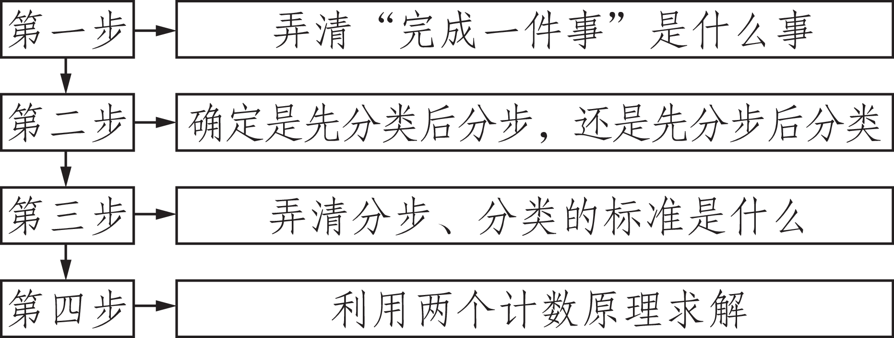
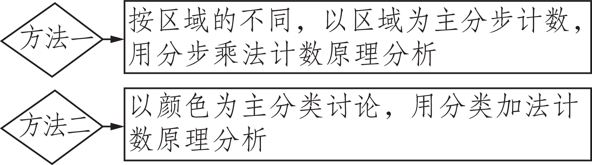
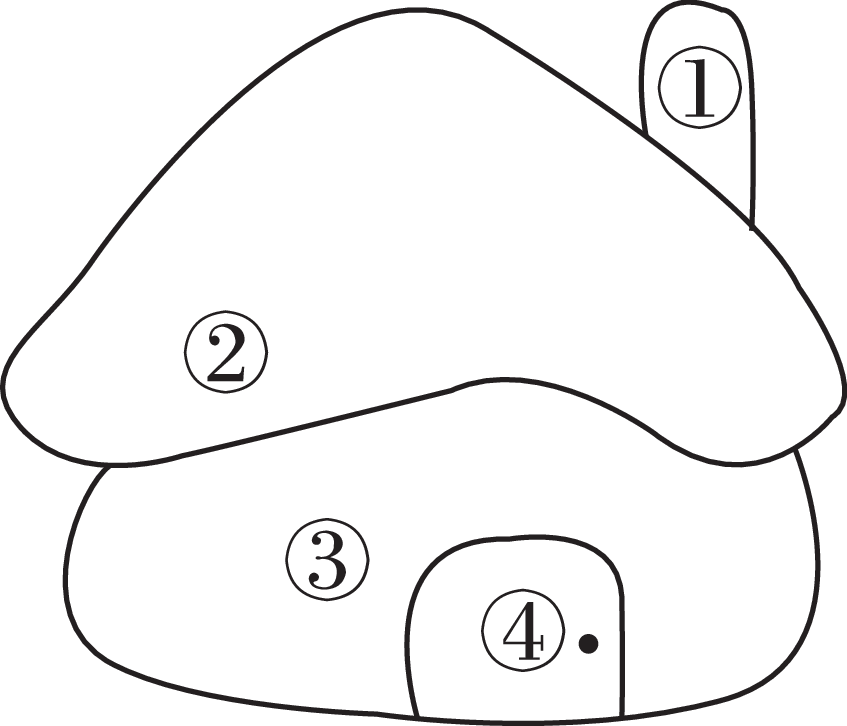
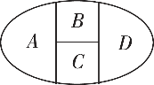
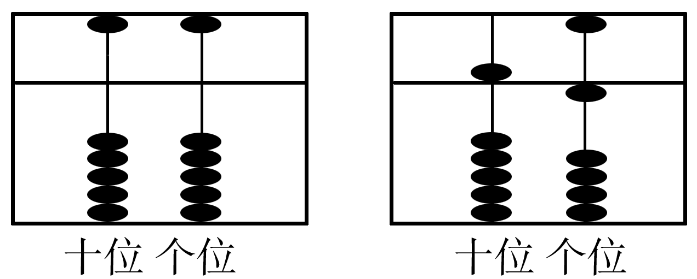
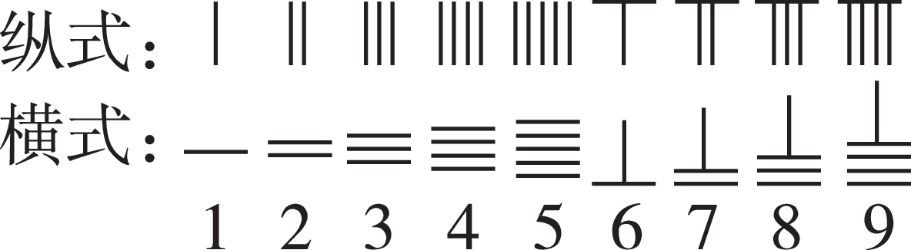

**第十章　计数原理、概率、随机变量及其分布**

**第1讲　两个计数原理**

<table><tr><td>
课标要求
</td><td>
命题点
</td><td>
五年考情
</td><td>
命题分析预测
</td></tr><tr><td rowspan="3">
了解分类加法计数原理、分步乘法计数原理及其意义.
</td><td>
分类加法计数原理
</td><td>
2023新高考卷ⅠT13
</td><td rowspan="3">
两个计数原理是解决排列、组合问题的基本方法，也是与实际联系密切的部分，既能单独命题，也常与排列组合问题、概率计算问题综合命题，题型以小题为主，难度不大.在2025年高考的复习备考中要注意两个计数原理的区别并能灵活应用.
</td></tr><tr><td>
分步乘法计数原理
</td><td>
2023全国卷乙T7；2022新高考卷ⅡT5；2021全国卷乙T6；2020新高考卷ⅠT3；2020全国卷ⅡT14
</td></tr><tr><td>
两个计数原理的综合应用
</td><td></td></tr></table>

学生用书P224

1.分类加法计数原理

完成一件事有两类不同方案，在第1类方案中有<em>m</em>种不同的方法，在第2类方案中有<em>n</em>种不同的方法，那么完成这件事共有<em>N</em>＝①<u>　</u><em><u>m</u></em><u>＋</u><em><u>n</u></em><u>　</u>种不同的方法.

2.分步乘法计数原理

完成一件事需要两个步骤，做第1步有<em>m</em>种不同的方法，做第2步有<em>n</em>种不同的方法，那么完成这件事共有<em>N</em>＝②<u>　</u><em><u>m</u></em><u>×</u><em><u>n</u></em><u>　</u>种不同的方法.

辨析比较

两个计数原理的联系与区别

<table><tr><td>
原理
</td><td>
分类加法计数原理
</td><td>
分步乘法计数原理
</td></tr><tr><td>
联系
</td><td colspan="2">
都是对完成一件事的方法种数而言.
</td></tr><tr><td>
区别一
</td><td>
每类方案中的每一种方法都能独立完成这件事.
</td><td>
各个步骤都完成才算完成这件事（每步中的每一种方法都不能独立完成这件事）.
</td></tr><tr><td>
区别二
</td><td>
各类方法之间是相互独立的，既不能重复也不能遗漏.
</td><td>
各步之间是相互依存的，缺一不可.
</td></tr></table>

1.[多选]下列说法正确的是 （　BD　）

A.在分类加法计数原理中，两类不同方案中的方法可以相同

B.在分类加法计数原理中，每类方案中的方法都能直接完成这件事

C.在分步乘法计数原理中，事情是分两步完成的，其中任何一个单独的步骤都能完成这件事

D.从甲地经丙地到乙地是分步问题

2.[教材改编]已知某公园有4个门，从一个门进，另一个门出，则不同的进出公园的方式有<u>　12　</u>种.

解析　将4个门分别编号为1，2，3，4，从1号门进入后，有3种出门的方式，同理，从2，3，4号门进入，也各有3种出门的方式，故不同的进出公园的方式共有3×4＝12（种）.

3.[易错题]某人有3个电子邮箱，他要发5封不同的电子邮件，则不同的发送方法有<u>　243　</u>种.

解析　因为每封电子邮件有3种不同的发送方法，所以要发5封电子邮件，不同的发送方法有3×3×3×3×3＝243（种）.

4.[教材改编]书架的第1层放有4本不同的计算机书，第2层放有3本不同的文艺书，第3层放有2本不同的体育书.从书架中任取1本书，则不同的取法种数为<u>　9　</u>.

解析　分三类：第一类，从第1层取一本书，有4种取法；第二类，从第2层取一本书，有3种取法；第三类，从第3层取一本书，有2种取法.共有取法4＋3＋2＝9（种）.

学生用书P224

命题点1　分类加法计数原理

**例**1 （1）我们把各位数字之和为6的四位数称为“六合数”（如2 022是“六合数”），则首位为2的“六合数”共有（　B　）

A.18个		B.15个		C.12个		D.9个

解析　依题意，这个四位数的百位数、十位数、个位数之和为4.由4，0，0组成3个数分别为400，040，004；由3，1，0组成6个数分别为310，301，130，103，013，031；由2，2，0组成3个数分别为220，202，022；由2，1，1组成3个数分别为211，121，112.共计3＋6＋3＋3＝15（个）.

（2）满足<em>a</em>，<em>b</em>∈{－1，0，1，2}，且关于<em>x</em>的方程<em>ax</em>2＋2<em>x</em>＋<em>b</em>＝0有实数解的有序数对（<em>a</em>，<em>b</em>）的个数为<u>　13　</u>.

解析　当<em>a</em>＝0时，<em>b</em>的值可以是－1，0，1，2，（<em>a</em>，<em>b</em>）的个数为4.当<em>a</em>≠0时，要使方程<em>ax</em>2＋2<em>x</em>＋<em>b</em>＝0有实数解，需使Δ＝4－4<em>ab</em>≥0，即<em>ab</em>≤1.若<em>a</em>＝－1，则<em>b</em>的值可以是－1，0，1，2，（<em>a</em>，<em>b</em>）的个数为4；若<em>a</em>＝1，则<em>b</em>的值可以是－1，0，1，（<em>a</em>，<em>b</em>）的个数为3；若<em>a</em>＝2，则<em>b</em>的值可以是－1，0，（<em>a</em>，<em>b</em>）的个数为2.由分类加法计数原理可知，（<em>a</em>，<em>b</em>）的个数为4＋4＋3＋2＝13.

方法技巧

分类加法计数原理的应用思路

（1）根据题目中的关键词、关键元素和关键位置等确定恰当的分类标准，分类标准要明确、统一；

（2）分类时，注意完成这件事的任何一种方法必须属于某一类，不能重复.

<strong>训练</strong>1 集合<em>P</em>＝{<em>x</em>，1}，<em>Q</em>＝{<em>y</em>，1，2}，其中<em>x</em>，<em>y</em>∈{1，2，3，…，9}，且<em>P</em>⊆<em>Q</em>.把满足上述条件的一对有序整数对（<em>x</em>，<em>y</em>）作为一个点的坐标，则这样的点的个数是（　B　）

A.9		B.14		C.15		D.21

解析　当*x*＝2时，*x*≠*y*，*y*可从3，4，5，6，7，8，9中取，有7种方法.当*x*≠2时，由*P*⊆*Q*，得*x*＝*y*，*x*可从3，4，5，6，7，8，9中取，有7种方法.综上，满足条件的点共有7＋7＝14（个）.

命题点2　分步乘法计数原理

**例**2 （1）[2023全国卷乙]甲、乙两位同学从6种课外读物中各自选读2种，则这两人选读的课外读物中恰有1种相同的选法共有（　C　）

A.30种		B.60种		C.120种	D.240种

解析　甲、乙二人先选1种相同的课外读物，有6种情况，再从剩下的5种课外读物中各自选1本不同的读物，有5×4＝20（种）情况，由分步乘法计数原理可得，共有6×20＝120（种）选法，故选C.

（2）[多选]有4位同学报名参加三个不同的社团，则下列说法正确的是（　AC　）

A.每位同学限报其中一个社团，则不同的报名方法共有34种

B.每位同学限报其中一个社团，则不同的报名方法共有43种

C.每个社团限报一个人，则不同的报名方法共有24种

D.每个社团限报一个人，则不同的报名方法共有33种

解析　对于A选项，第1个同学有3种报名方法，第2个同学有3种报名方法，后面的2个同学也有3种报名方法，根据分步乘法计数原理共有34种报名方法，A正确，B错误；对于C选项，每个社团限报一个人，则第1个社团有4种选择，第2个社团有3种选择，第3个社团有2种选择，根据分步乘法计数原理，共有4×3×2＝24（种）选择，C正确，D错误.故选AC.

方法技巧

分步乘法计数原理的应用思路

根据事件发生的过程合理分步，分步必须满足两个条件：一是步骤互相独立，互不干扰；二是步与步确保连续，逐步完成.

<strong>训练</strong>2 [多选]某校高二年级安排甲、乙、丙三名同学到<em>A</em>，<em>B</em>，<em>C</em>，<em>D</em>，<em>E</em>五个社区进行暑期社会实践活动，每名同学只能选择一个社区进行实践活动，且多名同学可以选择同一个社区进行实践活动，则下列说法正确的有（　AC　）

A.如果社区*A*必须有同学选择，则不同的安排方法有61种

B.如果同学甲必须选择社区*A*，则不同的安排方法有50种

C.如果三名同学选择的社区各不相同，则不同的安排方法共有60种

D.如果甲、乙两名同学必须在同一个社区，则不同的安排方法共有20种

解析　对于A，如果社区<em>A</em>必须有同学选择，则不同的安排方法有53－43＝61（种），故A正确；对于B，如果同学甲必须选择社区<em>A</em>，则不同的安排方法有52＝25（种），故B错误；对于C，如果三名同学选择的社区各不相同，则不同的安排方法共有5×4×3＝60（种），故C正确；对于D，甲、乙两名同学必须在同一个社区，第一步，将甲、乙视作一个整体，第二步，两个整体挑选社区，则不同的安排方法共有52＝25（种），故D错误.故选AC.

命题点3　两个计数原理的综合应用

**例**3 （1）《周髀算经》是中国最古老的天文学和数学著作，其中记载了“勾股圆方图”（如图），用以证明勾股定理.现提供4种不同颜色给图中5个区域涂色，规定每个区域只涂一种颜色，相邻区域颜色不同，则不同的涂色方法种数为（　C　）

A.36		B.48		C.72		D.96

解析　解法一　根据题意得，涂色分2步进行：

①对于区域*<text style="italic">A*</text>，*<text style="italic">B*</text>，*<text style="italic"><text style="italic"><text style="italic">E*</text></text></text>，三个区域两两相邻，有 $A_{4}^{3}$ ＝24（种）涂色方法；（区域*<text style="italic"><text style="italic"><text style="italic">E*</text></text></text>位于中心位置，其他4个区域均与区域E相邻，故先考虑两两相邻的区域*<text style="italic">A*</text>，*<text style="italic">B*</text>，E的涂色方法，再研究余下2个区域的涂色方法）

②对于区域*C*，*D*，若区域*C*与区域*A*颜色相同，则区域*D*有2种涂色方法，若区域*C*与区域*A*颜色不同，当*A*，*B*，*E*涂色确定时，则区域*C*和区域*D*涂色方法确定，只有1种，由分类加法计数原理可知区域*C*，*D*有2＋1＝3（种）涂色方法.

由分步乘法计数原理得，共有24×3＝72（种）不同的涂色方法.故选C.

解法二　可分两种情况：①区域*A*，*C*不同色，先涂区域*A*有4种，区域*C*有3种，区域*E*有2种，区域*B*，*D*各有1种，有4×3×2＝24（种）涂法.②区域*A*，*C*同色，先涂区域*A*有4种，区域*E*有3种，区域*C*有1种，区域*B*，*D*各有2种，有4×3×2×2＝48（种）涂法.故共有24＋48＝72（种）涂色方法.

（2）由0，1，2，3，4，5，6这7个数字可以组成<u>　420　</u>个无重复数字的四位偶数.

解析　要完成的一件事为“组成无重复数字的四位偶数”，所以千位数字不能为0，个位数字必须是偶数，且组成的四位数中的四个数字不重复.因此应先分类，再分步.第1类，当千位数字为奇数，即取1，3，5中的任意一个时，个位数字可取0，2，4，6中的任意一个，百位数字不能取与个位、千位数字重复的数字，十位数字不能取与个位、百位、千位数字重复的数字.根据分步乘法计数原理，不同的取法种数为3×4×5×4＝240.第2类，当千位数字为偶数，即取2，4，6中的任意一个时，个位数字可以取除千位数字外的任意一个偶数数字，百位数字不能取与个位、千位数字重复的数字，十位数字不能取与个位、百位、千位数字重复的数字.根据分步乘法计数原理，不同的取法种数为3×3×5×4＝180.根据分类加法计数原理，可以组成无重复数字的四位偶数的个数为240＋180＝420.

方法技巧

1.利用两个计数原理解决问题的一般步骤

2.涂色问题常用的两种方法

**训练**3 （1）如果一条直线与一个平面垂直，那么称此直线与平面构成一个“正交线面对”.在一个正方体中，由两个顶点确定的直线与含有四个顶点的平面构成的“正交线面对”的个数是（　D　）

A.48		B.18		C.24		D.36

解析　第1类，对于每一条棱，都可以与两个侧面构成“正交线面对”，这样的“正交线面对”有2×12＝24（个）；第2类，对于每一条面对角线，都可以与一个对角面构成“正交线面对”，这样的“正交线面对”有12个.所以正方体中“正交线面对”共有24＋12＝36（个）.

（2）甲与其四位同事各有一辆汽车，甲的车牌尾号为9，其四位同事的车牌尾号分别是0，2，1，5.为遵守当地某月5日至9日5天的限行规定（奇数日车牌尾号为奇数的车通行，偶数日车牌尾号为偶数的车通行），五人商议拼车出行，每天任选一辆符合规定的车，但甲的车最多只能用一天，则不同的用车方案种数为（　B　）

A.64		B.80		C.96		D.120

解析　5日至9日，有3个奇数日，2个偶数日.第一步，安排偶数日出行，每天都有2种选择，不同的用车方案共有2×2＝4（种）.第二步，安排奇数日出行，分两类讨论：第一类，选1天安排甲的车，不同的用车方案共有3×2×2＝12（种）；第二类，不安排甲的车，每天都有2种选择，不同的用车方案共有2×2×2＝8（种）.综上，不同的用车方案种数为4×（12＋8）＝80，故选B.

1.[命题点1]设集合<em>I</em>＝{1，2，3，4}，<em>A</em>与<em>B</em>是<em>I</em>的子集，若<em>A</em>∩<em>B</em>＝{1，2}，则称（<em>A</em>，<em>B</em>）为一个“理想配集”.若将（<em>A</em>，<em>B</em>）与（<em>B</em>，<em>A</em>）看成不同的“理想配集”，则符合此条件的“理想配集”有<u>　9　</u>个.

解析　 对子集*A*分类讨论：

当*A*是{1，2}时，*B*可以为{1，2，3，4}，{1，2，4}，{1，2，3}，{1，2}，共4种情况；

当*A*是{1，2，3}时，*B*可以为{1，2，4}，{1，2}，共2种情况；

当*A*是{1，2，4}时，*B*可以为{1，2，3}，{1，2}，共2种情况；

当*A*是{1，2，3，4}时，*B*为{1，2}，有1种情况.

根据分类加法计数原理可知，共有4＋2＋2＋1＝9（种）结果，即符合此条件的“理想配集”有9个.

2.[命题点2]已知集合*M*＝{1，－2，3}，*N*＝{－4，5，6，－7}，从*M*，*N*这两个集合中各选一个元素分别作为点的横坐标、纵坐标，则这样的坐标在直角坐标系中可表示第一、二象限内不同的点的个数是（　C　）

A.12		B.8 		C.6 		D.4

解析　分两步：第一步先确定横坐标，有3种情况，第二步再确定纵坐标，有2种情况，因此可表示第一、二象限内不同点的个数是3×2＝6.

3.[命题点3]如果一个三位正整数“<em>a</em>1<em>a</em>2<em>a</em>3”满足<em>a</em>1＜<em>a</em>2，且<em>a</em>2＞<em>a</em>3，则称这样的三位数为凸数（如120，343，275等），那么所有凸数的个数为<u>　240　</u>.

解析　若<em>a</em>2＝2，则百位数字只能选1，个位数字可选1

或0，凸数为120与121，共2个.若<em>a</em>2＝3，则百位数字有两种选择，个位数字有三种选择，则凸数有2×3＝6（个）.若<em>a</em>2＝4，则凸数有3×4＝12（个），……，若<em>a</em>2＝9，则凸数有8×9＝72（个）.所以凸数共有2＋6＋12＋20＋30＋42＋56＋72＝240（个）.

4.[命题点3<em>/</em>2023哈尔滨六中检测]涂色能锻炼手眼协调能力，更能提高审美能力.现有四种不同的颜色：湖蓝色、米白色、橄榄绿、薄荷绿，欲给图中的小房子中的四个区域涂色，要求相邻区域不涂同一颜色，且橄榄绿与薄荷绿也不涂在相邻的区域内，则共有<u>　66　</u>种不同的涂色方法.

解析　可分四类：第一类，当选择两种颜色时，因为橄榄绿与薄荷绿不涂在相邻的区域内，所以共有 $C_{4}^{2}$ －1＝5（种）选法，因此不同的涂色方法有5×2＝10（种）；第二类，当选择三种颜色且橄榄绿与薄荷绿都被选中时，有2种选法，因此不同的涂色方法有2×2×2＝8（种）；第三类，当选择三种颜色且橄榄绿与薄荷绿只有一个被选中时，有2种选法，因此不同的涂色方法有2×3×2×（2＋1）＝36（种）；第四类，当选择四种颜色时，不同的涂色方法有2×2×2＋2×2＝12（种）.所以共有10＋8＋36＋12＝66（种）不同的涂色方法.

学生用书·练习帮P382

1.[2024四川成都模拟]“数独九宫格”的游戏规则为：将1到9这9个自然数填到如图所示的九宫格的9个空格里，每个空格填1个数，且9个空格的数字各不相同.若中间空格已填数字5，且只填第二行和第二列，并要求第二行从左至右及第二列从上至下所填的数字都是从小到大排列的，则不同的填法种数为（　C　）

<table><tr><td></td><td></td><td></td></tr><tr><td></td><td>
5
</td><td></td></tr><tr><td></td><td></td><td></td></tr></table>

A.72		B.108		C.144		D.196

解析　按题意，5的上方和左边只能从1，2，3，4中选取，5的下方和右边只能从6，7，8，9中选取.第一步，填上方空格，有4种填法；第二步，填左方空格，有3种填法；第三步，填下方空格，有4种填法；第四步，填右方空格，有3种填法.由分步乘法计数原理得，不同的填法种数为4×3×4×3＝144.故选C.

2.[2023全国卷甲]现有5名志愿者报名参加公益活动，在某一星期的星期六、星期日两天，每天从这5人中安排2人参加公益活动，则恰有1人在这两天都参加的不同安排方式共有（　B　）

A.120种	B.60种		C.30种		D.20种

解析　先从5人中选择1人两天均参加公益活动，有5种方式；再从余下的4人中选2人分别安排到星期六、星期日，有4×3＝12（种）安排方式.所以不同的安排方式共有5×12＝60（种）.故选B.

3.[2024北京市顺义区联考]某班一天上午有4节课，下午有2节课.现要安排该班一天中语文、数学、政治、英语、体育、艺术6门课的课程表，要求数学课排在上午，体育课排在下午，则不同的排法有（　D　）

A.48种		B.96种		C.144种	D.192种

解析　由题意，要求数学课排在上午，体育课排在下午，先考虑这两门课程，有4×2＝8（种）排法，再排其余4节课，有4×3×2×1＝24（种）排法，根据分步乘法计数原理，共有8×24＝192（种）排法，故选D.

4.现有十二生肖的吉祥物各一个，已知甲同学喜欢牛、马和猴的吉祥物，乙同学喜欢牛、狗和羊的吉祥物，丙同学对所有的吉祥物都喜欢.让甲、乙、丙三位同学依次从中选一个珍藏，若每个人所选取的吉祥物都是自己喜欢的，则不同的选法共有（　C　）

A.50种		B.60种		C.80种		D.90种

解析　根据题意，按甲的选择分两类讨论：第一类，若甲选择牛的吉祥物，则乙的选法有2种，丙的选法有10种，此时不同的选法有2×10＝20（种）；第二类，若甲选择马或猴的吉祥物，则甲的选法有2种，乙的选法有3种，丙的选法有10种，此时不同的选法有2×3×10＝60（种）.所以不同的选法共有20＋60＝80（种）.故选*C*.

5.[2023南京六校联考]如图，用4种不同的颜色把图中*A*，*B*，*C*，*D*四块区域区分开，若相邻区域不能涂同一种颜色，则不同的涂法共有（　C　）

A.144种			B.73种

C.48种				D.32种

解析　由于*A*，*B*，*C*三块区域两两相邻，因此需填涂3种不同的颜色.①当*D*区域与*A*区域颜色相同时，只需从4种不同的颜色中选取3种分别填涂到*A*，*B*，*C*三块区域，有4×3×2＝24（种）涂法；②当*D*区域与*A*区域颜色不同时，只需将4种不同的颜色分别填涂到*A*，*B*，*C*，*D*四块区域，有4×3×2×1＝24（种）涂法.所以不同的涂法共有24＋24＝48（种），故选C.

6.如图所示，从正八边形的八个顶点中任选三个构成三角形，则与正八边形有公共边的三角形有<u>　40　</u>个（用数字作答）.

解析　把与正八边形有公共边的三角形分为两类：第一类，有一条公共边的三角形，此类三角形由正八边形中两个相邻的顶点和一个与所选顶点均不相邻的顶点构成，共有8×4＝32（个）；第二类，有两条公共边的三角形，此类三角形由正八边形中三个相邻的顶点构成，共有8个.由分类加法计数原理可知，共有32＋8＝40（个）.

7.[2023北京通州区质检]一个三位数，如果满足个位上的数字和百位上的数字都大于十位上的数字，那么我们称该三位数为三位数“凹数”，则没有重复数字的三位数“凹数”的个数为<u>　240　</u>.（用数字作答）

解析　依题意，无重复数字的三位数“凹数”，十位数字只可能为0，1，2，3，4，5，6，7之一，个位和百位上的数字从比对应十位数字大的数字中任取两个进行排列，所以没有重复数字的三位数“凹数”的个数为9×8＋8×7＋7×6＋6×5＋5×4＋4×3＋3×2＋2×1＝72＋56＋42＋30＋20＋12＋6＋2＝240.

8.[2024北京市景山学校期末]在0，1，2，3，4，5，6这7个数中任取4个数，将其组成无重复数字的四位数，其中能被5整除且比4 351大的数共有（　C　）

A.54个		B.62个		C.74个		D.82个

解析　根据被5整除的数特点，分成两类.第一类：个位为0，则千位为5或6时，有2×5×4＝40（个）四位数大于4 351；千位为4，百位为5或6时，有2×4＝8（个）四位数大于4 351；千位为4，百位为3时，十位为6，有1个四位数大于4 351.

第二类：个位为5，则千位为6时，有5×4＝20（个）四位数大于4 351；千位为4，百位是6时，有4个四位数大于4 351；千位为4，百位为3时，有1个四位数大于4 351.

综上，满足条件的数共有40＋8＋1＋20＋4＋1＝74（个）.故选C.

9.算盘是中国古代的一项重要发明.现有一种算盘（如图1），共两档，自右向左分别表示个位和十位，档中横以梁，梁上一珠拨下，记作数字5，梁下五珠，上拨一珠记作数字1（如图2中算盘表示整数51）.若拨动图1算盘中的三枚算珠，则可以表示不同整数的个数为（　C　）

  
图1 		图2

A.16		B.15		C.12		D.10

解析　由题意，拨动三枚算珠，有4种拨法：

①个位拨动三枚，有2种结果：3，7；

②十位拨动一枚，个位拨动两枚，有4种结果：12，16，52，56；

③十位拨动两枚，个位拨动一枚，有4种结果：21，25，61，65；

④十位拨动三枚，有2种结果：30，70.

综上，拨动题图1算盘中的三枚算珠，可以表示不同整数的个数为2＋4＋4＋2＝12，故选C.

10.[2023青岛检测]据史书记载，古代的算筹由一根根同样长短和粗细的小棍制成，如图所示，据《孙子算经》记载，算筹记数法则是：凡算之法，先识其位，一纵十横，百立千僵，千十相望，万百相当.即在算筹记数法中，表示多位数时，个位用纵式，十位用横式，百位用纵式，千位用横式，以此类推.例如表示62，表示26，现有5根算筹，据此方式表示一个两位数（算筹不剩余且个位不为0），则可以表示不同的两位数的个数为<u>　12　</u>.

解析　当十位为1时，个位可以是4，8，共2种；当十位为2时，个位可以是3，7，共2种；当十位为3时，个位可以是2，6，共2种；当十位为4时，个位为1，共1种；当十位为6时，个位可以是3，7，共2种；当十位为7时，个位可以是2，6，共2种；当十位为8时，个位为1，共1种.所以可以表示的两位数有5×2＋1×2＝12（个）.

&lt;te&lt;te&lt;te&lt;te&lt;te&lt;text style="&lt;text style="<em>i</em>talic,subscript"&gt;i&lt;/text&gt;talic"&gt;x&lt;/text&gt;t style="italic"&gt;x&lt;/text&gt;t style="italic"&gt;x&lt;/text&gt;t style="italic"&gt;x&lt;/text&gt;t style="italic"&gt;x&lt;/text&gt;t style="subscript"&gt;1&lt;/text&gt;1.[与集合综合]设集合&lt;te<em>x</em>t style="italic"&gt;<em>A</em>&lt;/text&gt;＝{（x1，x2，x3，x4，x5）｜xi∈{－1，0，1}，i＝1，2，3，4，5}，则集合A中满足条件1≤ $x_{1}^{2}$ ＋ $x_{2}^{2}$ ＋ $x_{3}^{2}$ ＋ $x_{4}^{2}$ ＋ $x_{5}^{2}$ ≤&lt;te&lt;te&lt;text style="&lt;text style="<em>i</em>talic,subscript"&gt;i&lt;/text&gt;talic"&gt;x&lt;/text&gt;t style="italic"&gt;x&lt;/text&gt;t style="subscript"&gt;4&lt;/text&gt;的元素个数为（　B　）

A.180		B.210		C.240		D.241

解析　因为<em>A</em>＝{（<em>x</em>1，<em>x</em>2，<em>x</em>3，<em>x</em>4，<em>x</em>5）｜<em>xi</em>∈{－1，0，1}，<em>i</em>＝1，2，3，4，5}，

所以<em>x</em>1，<em>x</em>2，<em>x</em>3，<em>x</em>4，<em>x</em>5都有3种不同的赋值，

集合<em>A</em>中共有35个元素，且0≤ $x_{1}^{2}$ ＋ $x_{2}^{2}$ ＋ $x_{3}^{2}$ ＋ $x_{4}^{2}$ ＋ $x_{5}^{2}$ ≤5，

其中满足 $x_{1}^{2}$ ＋ $x_{2}^{2}$ ＋ $x_{3}^{2}$ ＋ $x_{4}^{2}$ ＋ $x_{5}^{2}$ ＝0的只有1个元素，即（0，0，0，0，0）.

当 $x_{1}^{2}$ ＋ $x_{2}^{2}$ ＋ $x_{3}^{2}$ ＋ $x_{4}^{2}$ ＋ $x_{5}^{2}$ ＝&lt;text style="superscript"&gt;5&lt;/text&gt;时，&lt;te&lt;te&lt;te&lt;te<em>x</em>t style="italic"&gt;x&lt;/text&gt;t style="italic"&gt;x&lt;/text&gt;t style="italic"&gt;x&lt;/text&gt;t style="italic"&gt;x&lt;/text&gt;1，x2，x3，x4，x5都有2种不同的赋值，共有25个元素.

所以集合<em>A</em>中满足条件1≤ $x_{1}^{2}$ ＋ $x_{2}^{2}$ ＋ $x_{3}^{2}$ ＋ $x_{4}^{2}$ ＋ $x_{5}^{2}$ ≤4的元素个数为3&lt;text style="superscript"&gt;5&lt;/text&gt;－1－25＝210，故选B.

12.[逻辑推理]小李和小王玩一个猜数游戏，规则如下：已知六张纸牌上分别写有1－（ $\frac{1}{2}$ ）<em>&lt;text style="italic"&gt;&lt;text style="italic"&gt;n</em>&lt;/text&gt;&lt;/text&gt;（n∈<strong>N</strong>\*，1≤n≤6）六个数，现小李和小王分别从中各随机抽取一张，然后根据自己手中纸牌上的数推测谁手中纸牌上的数更大.小李看了看自己手中纸牌上的数，想了想说：“我不知道谁手中纸牌上的数更大.”小王听了小李的判断后，思索了一下说：“我知道谁手中纸牌上的数更大了.”假设小王和小李做出的推理都是正确的，那么小李和小王拿到纸牌的情况共有<u>　14　</u>种.

解析　六张纸牌上的数分别为 $\frac{1}{2}$ ， $\frac{3}{4}$ ， $\frac{7}{8}$ ， $\frac{15}{16}$ ， $\frac{31}{32}$ ， $\frac{63}{64}$ .

因为小李不知道谁手中纸牌上的数更大，因此小李拿的纸牌上的数不是最大的 $\frac{63}{64}$ ，也不是最小的 $\frac{1}{2}$ ，因此小李拿的纸牌有4种情况.

接下来讨论小王：

①当小王拿的纸牌上的数是 $\frac{1}{2}$ 时，则小王知道小李拿的纸牌上的数一定比他大，此时有4种情况；

②当小王拿的纸牌上的数是 $\frac{3}{4}$ 时，则小王知道小李拿的纸牌上的数一定比他大，此时有3种情况；

③当小王拿的纸牌上的数是 $\frac{31}{32}$ 时，则小王知道小李拿的纸牌上的数一定比他小，此时有3种情况；

④当小王拿的纸牌上的数是 $\frac{63}{64}$ 时，则小王知道小李拿的纸牌上的数一定比他小，此时有4种情况；

⑤当小王拿的纸牌上的数是 $\frac{15}{16}$ 或 $\frac{7}{8}$ 时，此时小王无法判断小李拿的纸牌上的数与他拿的纸牌上的数谁大谁小，舍去.

所以满足题意的情况共有4＋3＋3＋4＝14（种）.

