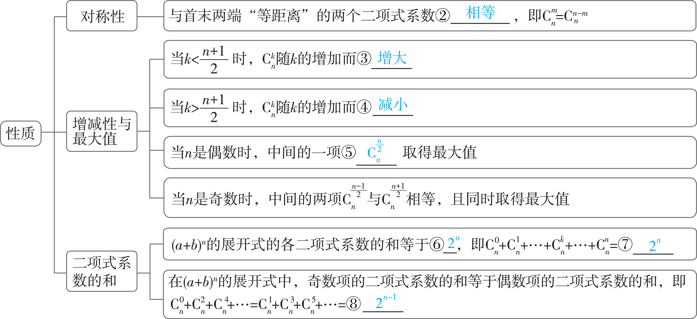
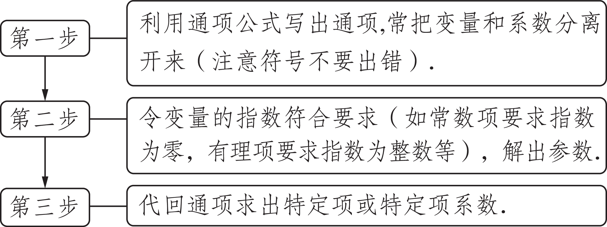
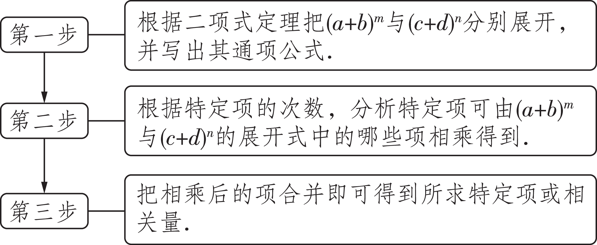

第3讲　二项式定理

<table><tr><td>
课标要求
</td><td>
命题点
</td><td>
五年考情
</td><td>
命题分析预测
</td></tr><tr><td rowspan="3">
能用多项式运算法则和计数原理证明二项式定理，会用二项式定理解决与二项展开式有关的简单问题.
</td><td>
展开式中的特定项问题
</td><td>
2023天津T11；2022新高考卷ⅠT13；2020全国卷ⅠT8；2020全国卷ⅢT14；2020北京T3；2019全国卷ⅢT4
</td><td rowspan="3">
本讲是高考常考内容，主要考查二项展开式的通项，求常数项，求某项系数，求某些项的系数和等，主要以小题的形式出现，难度不大.预计2025年高考命题常规，备考时要掌握各种问题类型及其求解方法.
</td></tr><tr><td>
二项式系数与项的系数的问题
</td><td>
2022北京T8；2022浙江T12
</td></tr><tr><td>
二项式定理的综合应用
</td><td></td></tr></table>

学生用书P229

1.二项式定理

<table><tr><td>
二项式定理
</td><td>
（<em>a</em>＋<em>b</em>）<em>n</em>＝<em>an</em>＋<em>an</em>－1<em>b</em>1＋…＋<em>an</em>－<em>kbk</em>＋…＋<em>bn</em>，<em>n</em>∈<strong>N</strong><em>*</em>.
</td></tr><tr><td>
二项展开式的通项
</td><td>
<em>Tk</em>＋1＝①　<em>an</em>－<em>kbk</em>　，即为二项展开式的第 <em>k</em>＋1项.
</td></tr><tr><td>
二项式系数
</td><td>
（<em>k</em>∈{0，1，2，…，<em>n</em>}）.
</td></tr></table>

辨析比较

二项式系数与项的系数的区别

（&lt;text style="it&lt;text style="it&lt;text style="it<em>a</em>lic"&gt;a&lt;/text&gt;lic"&gt;a&lt;/text&gt;lic"&gt;a&lt;/text&gt;＋<em>&lt;text style="italic"&gt;&lt;text style="italic"&gt;&lt;text style="italic"&gt;b</em>&lt;/text&gt;&lt;/text&gt;x&lt;/text&gt;）<em>&lt;text style="italic,superscript"&gt;n</em>&lt;/text&gt;的二项展开式中，二项式系数是指 $C_{n}^{0}$ ， $C_{n}^{1}$ ，…， $C_{n}^{n}$ ，其与&lt;text style="it&lt;text style="it&lt;text style="it<em>a</em>lic"&gt;a&lt;/text&gt;lic"&gt;a&lt;/text&gt;lic"&gt;a&lt;/text&gt;，<em>&lt;text style="italic"&gt;&lt;text style="italic"&gt;b</em>&lt;/text&gt;&lt;/text&gt;的值无关，如第<em>&lt;text style="italic"&gt;&lt;text style="italic,superscript"&gt;&lt;text style="italic,superscript"&gt;k</em>&lt;/text&gt;&lt;/text&gt;&lt;/text&gt;＋1项的二项式系数是 $C_{n}^{k}$ ；而项的系数是指该项中除变量外的常数部分，其与&lt;text style="it&lt;text style="it&lt;text style="it<em>a</em>lic"&gt;a&lt;/text&gt;lic"&gt;a&lt;/text&gt;lic"&gt;a&lt;/text&gt;，<em>&lt;text style="italic"&gt;&lt;text style="italic"&gt;b</em>&lt;/text&gt;&lt;/text&gt;的值有关，如第<em>&lt;text style="italic"&gt;&lt;text style="italic,superscript"&gt;&lt;text style="italic,superscript"&gt;k</em>&lt;/text&gt;&lt;/text&gt;&lt;/text&gt;＋1项的系数是 $C_{n}^{k}$ &lt;text style="it&lt;text style="it&lt;text style="it<em>a</em>lic"&gt;a&lt;/text&gt;lic"&gt;a&lt;/text&gt;lic"&gt;a&lt;/text&gt;<em>&lt;text style="italic,superscript"&gt;n</em>&lt;/text&gt;－<em>&lt;text style="italic"&gt;&lt;text style="italic,superscript"&gt;&lt;text style="italic,superscript"&gt;k</em>&lt;/text&gt;&lt;/text&gt;&lt;/text&gt;<em>&lt;text style="italic"&gt;&lt;text style="italic"&gt;b</em>&lt;/text&gt;&lt;/text&gt;k.

2.二项式系数的性质

1.[北京高考]在（ $\sqrt{x}$ －2）&lt;te<em>x</em>t style="superscript"&gt;5&lt;/text&gt;的展开式中，x2的系数为（　C　）

A.－5		
B.5		
C.－10		
D.10
解析　由二项式定理得（ $\sqrt{x}$ －&lt;te&lt;te&lt;te<em>x</em>t style="italic"&gt;x&lt;/text&gt;t style="italic"&gt;x&lt;/text&gt;t style="subscript"&gt;&lt;text style="superscript"&gt;&lt;text style="superscript"&gt;2&lt;/text&gt;&lt;/text&gt;&lt;/text&gt;）&lt;text style="supe&lt;text style="italic,subsc&lt;text style="italic,supe&lt;text style="italic,supe<em>r</em>script"&gt;r&lt;/text&gt;script"&gt;r&lt;/text&gt;ipt"&gt;r&lt;/text&gt;script"&gt;5&lt;/text&gt;的展开式的通项<em>&lt;text style="italic"&gt;T</em>&lt;/text&gt;r＋1＝ $C_{5}^{r}$ （ $\sqrt{x}$ ）&lt;te&lt;te&lt;te<em>x</em>t style="italic"&gt;x&lt;/text&gt;t style="italic"&gt;x&lt;/text&gt;t style="supe&lt;text style="italic,subsc&lt;text style="italic,supe&lt;text style="italic,supe<em>r</em>script"&gt;r&lt;/text&gt;script"&gt;r&lt;/text&gt;ipt"&gt;r&lt;/text&gt;script"&gt;5&lt;/text&gt;－r（－&lt;text style="superscript"&gt;&lt;text style="superscript"&gt;&lt;text style="superscript"&gt;2&lt;/text&gt;&lt;/text&gt;&lt;/text&gt;）r＝ $C_{5}^{r}\left（-2\right）^{r}x^{\frac{5－r}{2}}$ ，令 $\frac{5－r}{2}$ ＝&lt;te&lt;te&lt;te<em>x</em>t style="italic"&gt;x&lt;/text&gt;t style="italic"&gt;x&lt;/text&gt;t style="subscript"&gt;&lt;text style="superscript"&gt;&lt;text style="superscript"&gt;2&lt;/text&gt;&lt;/text&gt;&lt;/text&gt;，得&lt;text style="italic,subsc&lt;text style="italic,supe&lt;text style="italic,supe<em>r</em>script"&gt;r&lt;/text&gt;script"&gt;r&lt;/text&gt;ipt"&gt;r&lt;/text&gt;＝1，所以<em>&lt;text style="italic"&gt;T</em>&lt;/text&gt;2＝ $C_{5}^{1}$ （－&lt;te&lt;te&lt;te<em>x</em>t style="italic"&gt;x&lt;/text&gt;t style="italic"&gt;x&lt;/text&gt;t style="subscript"&gt;&lt;text style="superscript"&gt;&lt;text style="superscript"&gt;2&lt;/text&gt;&lt;/text&gt;&lt;/text&gt;）x2＝－10x2，所以x2的系数 $-10$ ，故选C.

2.[教材改编]在（<em>x</em>－<em>y</em>）10的展开式中，系数最小的项是（　C　）

A.第4项	
B.第5项	
C.第6项	
D.第7项
解析　展开式共有11项，奇数项系数为正，偶数项系数为负，且第6项的二项式系数最大，则展开式中系数最小的项是第6项.

3.已知 $C_{n}^{0}$ ＋2 $C_{n}^{1}$ ＋22 $C_{n}^{3}$ ＋23 $C_{n}^{3}$ ＋…＋2<em>n</em> $C_{n}^{n}$ ＝243，则 $C_{n}^{1}$ ＋ $C_{n}^{2}$ ＋ $C_{n}^{3}$ ＋…＋ $C_{n}^{n}$ ＝（　A　）

A.31		
B.32		
C.15		
D.16
解析　逆用二项式定理得 $C_{n}^{0}$ ＋2 $C_{n}^{1}$ ＋22 $C_{n}^{2}$ ＋23 $C_{n}^{3}$ ＋…＋2<em>&lt;text style="italic,superscript"&gt;&lt;text style="italic,superscript"&gt;&lt;text style="italic"&gt;n</em>&lt;/text&gt;&lt;/text&gt;&lt;/text&gt; $C_{n}^{n}$ ＝（1＋2）<em>&lt;text style="italic,superscript"&gt;&lt;text style="italic,superscript"&gt;&lt;text style="italic"&gt;n</em>&lt;/text&gt;&lt;/text&gt;&lt;/text&gt;＝243，即3n＝3&lt;text style="superscript"&gt;5&lt;/text&gt;，所以n＝5，所以 $C_{n}^{1}$ ＋ $C_{n}^{2}$ ＋ $C_{n}^{3}$ ＋…＋ $C_{n}^{n}$ ＝2&lt;text style="superscript"&gt;5&lt;/text&gt;－1＝31.

4.[多选]下列说法正确的是（　CD　）

A. $C_{n}^{k}$ &lt;text style="it<em>a</em>lic"&gt;a&lt;/text&gt;<em>&lt;text style="italic,superscript"&gt;n</em>&lt;/text&gt;－<em>&lt;text style="italic,superscript"&gt;&lt;text style="italic"&gt;k</em>&lt;/text&gt;&lt;/text&gt;<em>&lt;text style="italic"&gt;b</em>&lt;/text&gt;k是（a＋b）n展开式中的第k项

B.在二项展开式中，系数最大的项为中间的一项或中间的两项

C.在（<em>a</em>＋<em>b</em>）<em>n</em>的展开式中，每一项的二项式系数都与<em>a</em>，<em>b</em>无关

D.在（<em>a</em>＋<em>b</em>）<em>n</em>的展开式中，某项的系数与该项的二项式系数不同

5.[易错题]已知（2<em>x</em>－1）<em>n</em>＝<em>a</em>0＋<em>a</em>1<em>x</em>＋<em>a</em>2<em>x</em>2＋…＋<em>anxn</em>（<em>n</em>∈<strong>N</strong><em>\*</em>），设（2<em>x</em>－1）<em>n</em>的展开式中所有项的二项式系数和为<em>Sn</em>，<em>Tn</em>＝<em>a</em>1＋<em>a</em>2＋…＋<em>an</em>（<em>n</em>∈<strong>N</strong><em>\*</em>），则 <em>S</em>4＝<u>　16　</u>，<em>T</em>4＝<u>　0　</u>.
解析　因为（2&lt;te&lt;text style="it&lt;text style="it&lt;text style="it&lt;text style="it<em>a</em>lic"&gt;a&lt;/text&gt;lic"&gt;a&lt;/text&gt;lic"&gt;a&lt;/text&gt;lic"&gt;x&lt;/text&gt;t style="italic"&gt;x&lt;/text&gt;－1）<em>&lt;text style="italic,superscript"&gt;&lt;text style="italic,superscript"&gt;&lt;text style="italic,superscript"&gt;&lt;text style="italic,subscript"&gt;n</em>&lt;/text&gt;&lt;/text&gt;&lt;/text&gt;&lt;/text&gt;展开式中所有项的二项式系数和为2n，（易混淆：（2x－1）n展开式的二项式系数和为 $C_{n}^{0}$ ＋ $C_{n}^{1}$ ＋ $C_{n}^{2}$ ＋…＋ $C_{n}^{n}$ ＝2&lt;te&lt;text style="it&lt;text style="it&lt;text style="it&lt;text style="it<em>a</em>lic"&gt;a&lt;/text&gt;lic"&gt;a&lt;/text&gt;lic"&gt;a&lt;/text&gt;lic"&gt;x&lt;/text&gt;t style="italic,superscript"&gt;<em>&lt;text style="italic,superscript"&gt;&lt;text style="italic,superscript"&gt;&lt;text style="italic,subscript"&gt;n</em>&lt;/text&gt;&lt;/text&gt;&lt;/text&gt;&lt;/text&gt;，系数和为a0＋a1＋a2＋…＋an）
所以<em>Sn</em>＝2<em>n</em>，<em>S</em>4＝16.令<em>x</em>＝0，则（－1）<em>n</em>＝<em>a</em>0，令<em>x</em>＝1，则1＝<em>a</em>0＋<em>a</em>1＋<em>a</em>2＋…＋<em>an</em>，所以<em>Tn</em>＝1－（－1）<em>n</em>，所以<em>T</em>4＝0.

学生用书P230

命题点1　展开式中的特定项问题

角度1　形如（<em>a</em>＋<em>b</em>）<em>n</em>（<em>n</em>∈<strong>N</strong>\*）的展开式中的特定项

<strong>例</strong>1 （1）[2023南京市中华中学检测]若 $\left（2－x\right）^{6}＝a_{0}+a_{1}\left（1+x\right）+a_{2}\left（1+x\right）^{2}+\ldots +a_{6}\left（1+x\right）^{6}$ ，则<em>a</em>4＝	（　B　）

A.270				
B.135

C.－135				
D.－270
解析　（&lt;te&lt;te&lt;te&lt;te&lt;te&lt;te&lt;te&lt;te&lt;te&lt;te&lt;text style="it<em>a</em>lic"&gt;x&lt;/text&gt;t style="italic"&gt;x&lt;/text&gt;t style="italic"&gt;x&lt;/text&gt;t style="it<em>a</em>lic"&gt;x&lt;/text&gt;t style="it<em>a</em>lic"&gt;x&lt;/text&gt;t style="it&lt;text style="it<em>a</em>lic"&gt;a&lt;/text&gt;lic"&gt;x&lt;/text&gt;t style="italic"&gt;x&lt;/text&gt;t style="italic"&gt;x&lt;/text&gt;t style="italic"&gt;x&lt;/text&gt;t style="it<em>a</em>lic"&gt;x&lt;/text&gt;t style="subsc&lt;text style="italic,subsc&lt;text style="italic,supe&lt;text style="italic,supe&lt;text style="italic,supe<em>r</em>script"&gt;r&lt;/text&gt;script"&gt;r&lt;/text&gt;script"&gt;r&lt;/text&gt;ipt"&gt;r&lt;/text&gt;ipt"&gt;&lt;text style="subscript"&gt;&lt;text style="superscript"&gt;2&lt;/text&gt;&lt;/text&gt;&lt;/text&gt;－&lt;te&lt;text style="it<em>a</em>lic"&gt;x&lt;/text&gt;t style="it&lt;text style="it<em>a</em>lic"&gt;a&lt;/text&gt;lic"&gt;x&lt;/text&gt;）&lt;text style="subscript"&gt;&lt;text style="superscript"&gt;&lt;text style="superscript"&gt;&lt;text style="subscript"&gt;&lt;text style="superscript"&gt;&lt;text style="superscript"&gt;6&lt;/text&gt;&lt;/text&gt;&lt;/text&gt;&lt;/text&gt;&lt;/text&gt;&lt;/text&gt;＝a&lt;text style="subscript"&gt;0&lt;/text&gt;＋a&lt;text style="subscript"&gt;1&lt;/text&gt;（1＋x）＋a2（1＋x）2＋…＋a6（1＋x）6，以x－1代替x，得（3－x）6＝a0＋a1x＋a2x2＋…＋a6x6，而（3－x）6的展开式的通项公式为<em>T</em>r＋1＝ $C_{6}^{r}3^{6-r}\left(-x\right)^{r}=C_{6}^{r}$ 3&lt;te&lt;te&lt;te&lt;te&lt;te&lt;te&lt;te&lt;te&lt;te&lt;te&lt;te&lt;text style="it<em>a</em>lic"&gt;x&lt;/text&gt;t style="italic"&gt;x&lt;/text&gt;t style="italic"&gt;x&lt;/text&gt;t style="it<em>a</em>lic"&gt;x&lt;/text&gt;t style="it<em>a</em>lic"&gt;x&lt;/text&gt;t style="it&lt;text style="it<em>a</em>lic"&gt;a&lt;/text&gt;lic"&gt;x&lt;/text&gt;t style="italic"&gt;x&lt;/text&gt;t style="italic"&gt;x&lt;/text&gt;t style="italic"&gt;x&lt;/text&gt;t style="it<em>a</em>lic"&gt;x&lt;/text&gt;t style="it<em>a</em>lic"&gt;x&lt;/text&gt;t style="supe&lt;text style="italic,subsc&lt;text style="italic,supe&lt;text style="italic,supe&lt;text style="italic,supe<em>r</em>script"&gt;r&lt;/text&gt;script"&gt;r&lt;/text&gt;script"&gt;r&lt;/text&gt;ipt"&gt;r&lt;/text&gt;script"&gt;&lt;text style="superscript"&gt;&lt;text style="superscript"&gt;&lt;text style="subscript"&gt;&lt;text style="superscript"&gt;&lt;text style="superscript"&gt;6&lt;/text&gt;&lt;/text&gt;&lt;/text&gt;&lt;/text&gt;&lt;/text&gt;&lt;/text&gt;－r（－&lt;text style="subscript"&gt;1&lt;/text&gt;）r&lt;text style="it&lt;text style="it<em>a</em>lic"&gt;a&lt;/text&gt;lic"&gt;x&lt;/text&gt;r，令r＝&lt;text style="superscript"&gt;4&lt;/text&gt;，则a4＝ $C_{6}^{4}$ ×3&lt;te&lt;te&lt;te&lt;te&lt;te&lt;te&lt;te&lt;te&lt;te&lt;te&lt;te&lt;text style="it<em>a</em>lic"&gt;x&lt;/text&gt;t style="italic"&gt;x&lt;/text&gt;t style="italic"&gt;x&lt;/text&gt;t style="it<em>a</em>lic"&gt;x&lt;/text&gt;t style="it<em>a</em>lic"&gt;x&lt;/text&gt;t style="it&lt;text style="it<em>a</em>lic"&gt;a&lt;/text&gt;lic"&gt;x&lt;/text&gt;t style="italic"&gt;x&lt;/text&gt;t style="italic"&gt;x&lt;/text&gt;t style="italic"&gt;x&lt;/text&gt;t style="it<em>a</em>lic"&gt;x&lt;/text&gt;t style="it<em>a</em>lic"&gt;x&lt;/text&gt;t style="supe&lt;text style="italic,subsc&lt;text style="italic,supe&lt;text style="italic,supe&lt;text style="italic,supe<em>r</em>script"&gt;r&lt;/text&gt;script"&gt;r&lt;/text&gt;script"&gt;r&lt;/text&gt;ipt"&gt;r&lt;/text&gt;script"&gt;&lt;text style="superscript"&gt;&lt;text style="superscript"&gt;&lt;text style="subscript"&gt;&lt;text style="superscript"&gt;&lt;text style="superscript"&gt;6&lt;/text&gt;&lt;/text&gt;&lt;/text&gt;&lt;/text&gt;&lt;/text&gt;&lt;/text&gt;－&lt;text style="superscript"&gt;4&lt;/text&gt;×（－&lt;text style="subscript"&gt;1&lt;/text&gt;）4＝135，故选B.

（2）[202&lt;te<em>x</em>t style="superscript"&gt;3&lt;/text&gt;天津高考]在（2<em>x</em>3－ $\frac{1}{x}$ ）&lt;te<em>x</em>t style="superscript"&gt;6&lt;/text&gt;的展开式中，<em>x</em>2的系数是<u>　60　</u>.
解析　解法一　二项式（&lt;text style="superscript"&gt;2&lt;/text&gt;&lt;te&lt;te<em>x</em>t style="italic"&gt;x&lt;/text&gt;t style="italic"&gt;x&lt;/text&gt;&lt;text style="superscript"&gt;3&lt;/text&gt;－ $\frac{1}{x}$ ）&lt;te&lt;te<em>x</em>t style="italic"&gt;x&lt;/text&gt;t style="superscript"&gt;6&lt;/text&gt;的展开式的通项<em>T&lt;text style="italic,superscript"&gt;&lt;text style="italic,superscript"&gt;&lt;text style="italic"&gt;&lt;text style="italic"&gt;k</em>&lt;/text&gt;&lt;/text&gt;&lt;/text&gt;&lt;/text&gt;＋1＝ $C_{6}^{k}$ （&lt;text style="superscript"&gt;2&lt;/text&gt;&lt;te&lt;te<em>x</em>t style="italic"&gt;x&lt;/text&gt;t style="italic"&gt;x&lt;/text&gt;&lt;text style="superscript"&gt;3&lt;/text&gt;）6－<em>&lt;text style="italic,superscript"&gt;&lt;text style="italic,superscript"&gt;&lt;text style="italic"&gt;&lt;text style="italic"&gt;k</em>&lt;/text&gt;&lt;/text&gt;&lt;/text&gt;&lt;/text&gt;（－ $\frac{1}{x}$ ）&lt;te&lt;te<em>x</em>t style="italic"&gt;x&lt;/text&gt;t style="italic,subscript"&gt;<em>&lt;text style="italic,superscript"&gt;&lt;text style="italic"&gt;&lt;text style="italic"&gt;k</em>&lt;/text&gt;&lt;/text&gt;&lt;/text&gt;&lt;/text&gt; $=\left（－1\right）^{k}2^{6－k}C_{6}^{k}x^{18-4k}$ ，令18－4&lt;te&lt;te<em>x</em>t style="italic"&gt;x&lt;/text&gt;t style="italic,subscript"&gt;<em>&lt;text style="italic,superscript"&gt;&lt;text style="italic"&gt;&lt;text style="italic"&gt;k</em>&lt;/text&gt;&lt;/text&gt;&lt;/text&gt;&lt;/text&gt;＝&lt;text style="superscript"&gt;2&lt;/text&gt;，解得k＝4，所以<em>x</em>2的系数为（－1）4×22× $C_{6}^{4}$ ＝&lt;te&lt;te<em>x</em>t style="italic"&gt;x&lt;/text&gt;t style="superscript"&gt;6&lt;/text&gt;0.
解法二　将二项式（&lt;te&lt;te<em>x</em>t style="italic"&gt;x&lt;/text&gt;t style="superscript"&gt;2&lt;/text&gt;&lt;te&lt;te<em>x</em>t style="italic"&gt;x&lt;/text&gt;t style="italic"&gt;x&lt;/text&gt;&lt;text style="superscript"&gt;&lt;text style="superscript"&gt;3&lt;/text&gt;&lt;/text&gt;－ $\frac{1}{x}$ ）&lt;te&lt;te&lt;te&lt;te<em>x</em>t style="italic"&gt;x&lt;/text&gt;t style="italic"&gt;x&lt;/text&gt;t style="italic"&gt;x&lt;/text&gt;t style="superscript"&gt;6&lt;/text&gt;看成6个多项式（&lt;text style="superscript"&gt;2&lt;/text&gt;<em>x</em>&lt;text style="superscript"&gt;&lt;text style="superscript"&gt;3&lt;/text&gt;&lt;/text&gt;－ $\frac{1}{x}$ ）相乘，要想出现&lt;te&lt;te&lt;te&lt;te<em>x</em>t style="italic"&gt;x&lt;/text&gt;t style="italic"&gt;x&lt;/text&gt;t style="italic"&gt;x&lt;/text&gt;t style="italic"&gt;x&lt;/text&gt;&lt;text style="superscript"&gt;2&lt;/text&gt;项，则先在6个多项式中选2个多项式取2x&lt;text style="superscript"&gt;&lt;text style="superscript"&gt;3&lt;/text&gt;&lt;/text&gt;，然后余下的多项式都取－ $\frac{1}{x}$ ，相乘，即 $C_{6}^{2}\left（2x^{3}\right）^{2}\times C_{4}^{4}\left(-\frac{1}{x}\right)^{4}=60x^{2}$ ，所以&lt;te&lt;te&lt;te&lt;te<em>x</em>t style="italic"&gt;x&lt;/text&gt;t style="italic"&gt;x&lt;/text&gt;t style="italic"&gt;x&lt;/text&gt;t style="italic"&gt;x&lt;/text&gt;&lt;text style="superscript"&gt;2&lt;/text&gt;的系数为60.
方法技巧

求形如（<em>a</em>＋<em>b</em>）<em>n</em>（<em>n</em>∈<strong>N</strong><em>\*</em>）的展开式中的特定项问题的步骤

角度2　形如（<em>a</em>＋<em>b</em>）<em>m</em>（<em>c</em>＋<em>d</em>）<em>n</em>（<em>m</em>，<em>n</em>∈<strong>N</strong>\*）的展开式中的特定项

&lt;te&lt;te<em>x</em>t style="italic"&gt;x&lt;/text&gt;t style="bold"&gt;例&lt;/text&gt;2 （1）[2023沈阳市三检]（2x－3）2（1－ $\frac{1}{x}$ ）&lt;te<em>x</em>t style="superscript"&gt;6&lt;/text&gt;的展开式中，含<em>x</em>－2项的系数为（　B　）

A.430		
B.435		
C.245		
D.240
解析　（1－ $\frac{1}{x}$ ）&lt;te&lt;te&lt;te&lt;te&lt;te&lt;te&lt;te&lt;te&lt;te&lt;te&lt;te&lt;te&lt;te&lt;te<em>x</em>t style="italic"&gt;x&lt;/text&gt;t style="italic"&gt;x&lt;/text&gt;t style="italic"&gt;x&lt;/text&gt;t style="italic"&gt;x&lt;/text&gt;t style="italic"&gt;x&lt;/text&gt;t style="italic"&gt;x&lt;/text&gt;t style="italic"&gt;x&lt;/text&gt;t style="italic"&gt;x&lt;/text&gt;t style="italic"&gt;x&lt;/text&gt;t style="italic"&gt;x&lt;/text&gt;t style="italic"&gt;x&lt;/text&gt;t style="italic"&gt;x&lt;/text&gt;t style="italic"&gt;x&lt;/text&gt;t style="superscript"&gt;6&lt;/text&gt;的展开式的通项<em>T&lt;text style="italic,superscript"&gt;&lt;text style="italic,superscript"&gt;&lt;text style="italic"&gt;&lt;text style="italic"&gt;&lt;text style="italic"&gt;k</em>&lt;/text&gt;&lt;/text&gt;&lt;/text&gt;&lt;/text&gt;&lt;/text&gt;＋1＝ $C_{6}^{k}$ （－ $\frac{1}{x}$ ）&lt;te&lt;te&lt;te&lt;te&lt;te&lt;te&lt;te&lt;te&lt;te&lt;te&lt;te&lt;te&lt;te&lt;te<em>x</em>t style="italic"&gt;x&lt;/text&gt;t style="italic"&gt;x&lt;/text&gt;t style="italic"&gt;x&lt;/text&gt;t style="italic"&gt;x&lt;/text&gt;t style="italic"&gt;x&lt;/text&gt;t style="italic"&gt;x&lt;/text&gt;t style="italic"&gt;x&lt;/text&gt;t style="italic"&gt;x&lt;/text&gt;t style="italic"&gt;x&lt;/text&gt;t style="italic"&gt;x&lt;/text&gt;t style="italic"&gt;x&lt;/text&gt;t style="italic"&gt;x&lt;/text&gt;t style="italic"&gt;x&lt;/text&gt;t style="italic,subscript"&gt;<em>&lt;text style="italic,superscript"&gt;&lt;text style="italic"&gt;&lt;text style="italic"&gt;&lt;text style="italic"&gt;k</em>&lt;/text&gt;&lt;/text&gt;&lt;/text&gt;&lt;/text&gt;&lt;/text&gt;＝（－1）k $C_{6}^{k}\frac{1}{x^{k}}$ .（&lt;te&lt;te&lt;te&lt;te&lt;te&lt;te&lt;te&lt;te&lt;te&lt;te&lt;te&lt;te&lt;te<em>x</em>t style="italic"&gt;x&lt;/text&gt;t style="italic"&gt;x&lt;/text&gt;t style="italic"&gt;x&lt;/text&gt;t style="italic"&gt;x&lt;/text&gt;t style="italic"&gt;x&lt;/text&gt;t style="italic"&gt;x&lt;/text&gt;t style="italic"&gt;x&lt;/text&gt;t style="italic"&gt;x&lt;/text&gt;t style="italic"&gt;x&lt;/text&gt;t style="italic"&gt;x&lt;/text&gt;t style="italic"&gt;x&lt;/text&gt;t style="italic"&gt;x&lt;/text&gt;t style="superscript"&gt;&lt;text style="superscript"&gt;&lt;text style="superscript"&gt;&lt;text style="superscript"&gt;&lt;text style="superscript"&gt;&lt;text style="superscript"&gt;&lt;text style="superscript"&gt;&lt;text style="superscript"&gt;2&lt;/text&gt;&lt;/text&gt;&lt;/text&gt;&lt;/text&gt;&lt;/text&gt;&lt;/text&gt;&lt;/text&gt;&lt;/text&gt;<em>x</em>－&lt;text style="superscript"&gt;3&lt;/text&gt;）2＝&lt;text style="superscript"&gt;4&lt;/text&gt;x2－12x $+$ 9，当在多项式（&lt;te&lt;te&lt;te&lt;te&lt;te&lt;te&lt;te<em>x</em>t style="italic"&gt;x&lt;/text&gt;t style="italic"&gt;x&lt;/text&gt;t style="italic"&gt;x&lt;/text&gt;t style="italic"&gt;x&lt;/text&gt;t style="italic"&gt;x&lt;/text&gt;t style="italic"&gt;x&lt;/text&gt;t style="superscript"&gt;4&lt;/text&gt;&lt;te&lt;te&lt;te&lt;te&lt;te&lt;te<em>x</em>t style="italic"&gt;x&lt;/text&gt;t style="italic"&gt;x&lt;/text&gt;t style="italic"&gt;x&lt;/text&gt;t style="italic"&gt;x&lt;/text&gt;t style="italic"&gt;x&lt;/text&gt;t style="italic"&gt;x&lt;/text&gt;&lt;text style="superscript"&gt;&lt;text style="superscript"&gt;&lt;text style="superscript"&gt;&lt;text style="superscript"&gt;&lt;text style="superscript"&gt;&lt;text style="superscript"&gt;&lt;text style="superscript"&gt;&lt;text style="superscript"&gt;2&lt;/text&gt;&lt;/text&gt;&lt;/text&gt;&lt;/text&gt;&lt;/text&gt;&lt;/text&gt;&lt;/text&gt;&lt;/text&gt;－12x＋9）中取4x2时，令<em>&lt;text style="italic,superscript"&gt;&lt;text style="italic,superscript"&gt;&lt;text style="italic"&gt;&lt;text style="italic"&gt;&lt;text style="italic"&gt;k</em>&lt;/text&gt;&lt;/text&gt;&lt;/text&gt;&lt;/text&gt;&lt;/text&gt;＝4，得4x2·（－1）4 $C_{6}^{4}\frac{1}{x^{4}}$ ；当在多项式（&lt;te&lt;te&lt;te&lt;te&lt;te&lt;te&lt;te<em>x</em>t style="italic"&gt;x&lt;/text&gt;t style="italic"&gt;x&lt;/text&gt;t style="italic"&gt;x&lt;/text&gt;t style="italic"&gt;x&lt;/text&gt;t style="italic"&gt;x&lt;/text&gt;t style="italic"&gt;x&lt;/text&gt;t style="superscript"&gt;4&lt;/text&gt;&lt;te&lt;te&lt;te&lt;te&lt;te&lt;te<em>x</em>t style="italic"&gt;x&lt;/text&gt;t style="italic"&gt;x&lt;/text&gt;t style="italic"&gt;x&lt;/text&gt;t style="italic"&gt;x&lt;/text&gt;t style="italic"&gt;x&lt;/text&gt;t style="italic"&gt;x&lt;/text&gt;&lt;text style="superscript"&gt;&lt;text style="superscript"&gt;&lt;text style="superscript"&gt;&lt;text style="superscript"&gt;&lt;text style="superscript"&gt;&lt;text style="superscript"&gt;&lt;text style="superscript"&gt;&lt;text style="superscript"&gt;2&lt;/text&gt;&lt;/text&gt;&lt;/text&gt;&lt;/text&gt;&lt;/text&gt;&lt;/text&gt;&lt;/text&gt;&lt;/text&gt;－12x＋9）中取－12x时，令<em>&lt;text style="italic,superscript"&gt;&lt;text style="italic,superscript"&gt;&lt;text style="italic"&gt;&lt;text style="italic"&gt;&lt;text style="italic"&gt;k</em>&lt;/text&gt;&lt;/text&gt;&lt;/text&gt;&lt;/text&gt;&lt;/text&gt;＝&lt;text style="superscript"&gt;3&lt;/text&gt;，得－12x·（－1）3 $C_{6}^{3}\frac{1}{x^{3}}$ ；当在多项式（&lt;te&lt;te&lt;te&lt;te&lt;te&lt;te&lt;te<em>x</em>t style="italic"&gt;x&lt;/text&gt;t style="italic"&gt;x&lt;/text&gt;t style="italic"&gt;x&lt;/text&gt;t style="italic"&gt;x&lt;/text&gt;t style="italic"&gt;x&lt;/text&gt;t style="italic"&gt;x&lt;/text&gt;t style="superscript"&gt;4&lt;/text&gt;&lt;te&lt;te&lt;te&lt;te&lt;te&lt;te<em>x</em>t style="italic"&gt;x&lt;/text&gt;t style="italic"&gt;x&lt;/text&gt;t style="italic"&gt;x&lt;/text&gt;t style="italic"&gt;x&lt;/text&gt;t style="italic"&gt;x&lt;/text&gt;t style="italic"&gt;x&lt;/text&gt;&lt;text style="superscript"&gt;&lt;text style="superscript"&gt;&lt;text style="superscript"&gt;&lt;text style="superscript"&gt;&lt;text style="superscript"&gt;&lt;text style="superscript"&gt;&lt;text style="superscript"&gt;&lt;text style="superscript"&gt;2&lt;/text&gt;&lt;/text&gt;&lt;/text&gt;&lt;/text&gt;&lt;/text&gt;&lt;/text&gt;&lt;/text&gt;&lt;/text&gt;－12x＋9）中取9时，令<em>&lt;text style="italic,superscript"&gt;&lt;text style="italic,superscript"&gt;&lt;text style="italic"&gt;&lt;text style="italic"&gt;&lt;text style="italic"&gt;k</em>&lt;/text&gt;&lt;/text&gt;&lt;/text&gt;&lt;/text&gt;&lt;/text&gt;＝2，得9×（－1）2 $C_{6}^{2}\frac{1}{x^{2}}$ .所以含&lt;te&lt;te&lt;te&lt;te&lt;te&lt;te&lt;te&lt;te&lt;te&lt;te&lt;te&lt;te&lt;te<em>x</em>t style="italic"&gt;x&lt;/text&gt;t style="italic"&gt;x&lt;/text&gt;t style="italic"&gt;x&lt;/text&gt;t style="italic"&gt;x&lt;/text&gt;t style="italic"&gt;x&lt;/text&gt;t style="italic"&gt;x&lt;/text&gt;t style="italic"&gt;x&lt;/text&gt;t style="italic"&gt;x&lt;/text&gt;t style="italic"&gt;x&lt;/text&gt;t style="italic"&gt;x&lt;/text&gt;t style="italic"&gt;x&lt;/text&gt;t style="italic"&gt;x&lt;/text&gt;t style="italic"&gt;x&lt;/text&gt;－&lt;text style="superscript"&gt;&lt;text style="superscript"&gt;&lt;text style="superscript"&gt;&lt;text style="superscript"&gt;&lt;text style="superscript"&gt;&lt;text style="superscript"&gt;&lt;text style="superscript"&gt;&lt;text style="superscript"&gt;2&lt;/text&gt;&lt;/text&gt;&lt;/text&gt;&lt;/text&gt;&lt;/text&gt;&lt;/text&gt;&lt;/text&gt;&lt;/text&gt;项的系数为&lt;text style="superscript"&gt;4&lt;/text&gt;×（－1）4 $C_{6}^{4}$ ＋（－1&lt;te&lt;te&lt;te&lt;te&lt;te&lt;te&lt;te&lt;te&lt;te&lt;te&lt;te&lt;te&lt;te<em>x</em>t style="italic"&gt;x&lt;/text&gt;t style="italic"&gt;x&lt;/text&gt;t style="italic"&gt;x&lt;/text&gt;t style="italic"&gt;x&lt;/text&gt;t style="italic"&gt;x&lt;/text&gt;t style="italic"&gt;x&lt;/text&gt;t style="italic"&gt;x&lt;/text&gt;t style="italic"&gt;x&lt;/text&gt;t style="italic"&gt;x&lt;/text&gt;t style="italic"&gt;x&lt;/text&gt;t style="italic"&gt;x&lt;/text&gt;t style="italic"&gt;x&lt;/text&gt;t style="superscript"&gt;&lt;text style="superscript"&gt;&lt;text style="superscript"&gt;&lt;text style="superscript"&gt;&lt;text style="superscript"&gt;&lt;text style="superscript"&gt;&lt;text style="superscript"&gt;&lt;text style="superscript"&gt;2&lt;/text&gt;&lt;/text&gt;&lt;/text&gt;&lt;/text&gt;&lt;/text&gt;&lt;/text&gt;&lt;/text&gt;&lt;/text&gt;）×（－1）&lt;text style="superscript"&gt;3&lt;/text&gt; $C_{6}^{3}$ ＋9×（－1）&lt;te&lt;te&lt;te&lt;te&lt;te&lt;te&lt;te&lt;te&lt;te&lt;te&lt;te&lt;te&lt;te<em>x</em>t style="italic"&gt;x&lt;/text&gt;t style="italic"&gt;x&lt;/text&gt;t style="italic"&gt;x&lt;/text&gt;t style="italic"&gt;x&lt;/text&gt;t style="italic"&gt;x&lt;/text&gt;t style="italic"&gt;x&lt;/text&gt;t style="italic"&gt;x&lt;/text&gt;t style="italic"&gt;x&lt;/text&gt;t style="italic"&gt;x&lt;/text&gt;t style="italic"&gt;x&lt;/text&gt;t style="italic"&gt;x&lt;/text&gt;t style="italic"&gt;x&lt;/text&gt;t style="superscript"&gt;&lt;text style="superscript"&gt;&lt;text style="superscript"&gt;&lt;text style="superscript"&gt;&lt;text style="superscript"&gt;&lt;text style="superscript"&gt;&lt;text style="superscript"&gt;&lt;text style="superscript"&gt;2&lt;/text&gt;&lt;/text&gt;&lt;/text&gt;&lt;/text&gt;&lt;/text&gt;&lt;/text&gt;&lt;/text&gt;&lt;/text&gt; $C_{6}^{2}$ ＝&lt;te&lt;te&lt;te&lt;te&lt;te&lt;te&lt;te&lt;te&lt;te&lt;te&lt;te&lt;te&lt;te&lt;te<em>x</em>t style="italic"&gt;x&lt;/text&gt;t style="italic"&gt;x&lt;/text&gt;t style="italic"&gt;x&lt;/text&gt;t style="italic"&gt;x&lt;/text&gt;t style="italic"&gt;x&lt;/text&gt;t style="italic"&gt;x&lt;/text&gt;t style="italic"&gt;x&lt;/text&gt;t style="italic"&gt;x&lt;/text&gt;t style="italic"&gt;x&lt;/text&gt;t style="italic"&gt;x&lt;/text&gt;t style="italic"&gt;x&lt;/text&gt;t style="italic"&gt;x&lt;/text&gt;t style="italic"&gt;x&lt;/text&gt;t style="superscript"&gt;6&lt;/text&gt;0＋&lt;text style="superscript"&gt;&lt;text style="superscript"&gt;&lt;text style="superscript"&gt;&lt;text style="superscript"&gt;&lt;text style="superscript"&gt;&lt;text style="superscript"&gt;&lt;text style="superscript"&gt;&lt;text style="superscript"&gt;2&lt;/text&gt;&lt;/text&gt;&lt;/text&gt;&lt;/text&gt;&lt;/text&gt;&lt;/text&gt;&lt;/text&gt;&lt;/text&gt;&lt;text style="superscript"&gt;4&lt;/text&gt;0＋1&lt;text style="superscript"&gt;3&lt;/text&gt;5＝435，故选B.

（&lt;text st<em>y</em>le="superscript"&gt;2&lt;/text&gt;）[2022新高考卷Ⅰ]（1－ $\frac{y}{x}$ ）（&lt;te&lt;text st<em>y</em>le="italic"&gt;x&lt;/text&gt;t st<em>y</em>le="italic"&gt;x&lt;/text&gt;＋y）8的展开式中x2y6的系数为<u>　－28　</u>.（用数字作答）
解析　（&lt;te&lt;te&lt;te&lt;te&lt;te&lt;text st<em>y</em>le="italic"&gt;x&lt;/text&gt;t st<em>y</em>le="italic"&gt;x&lt;/text&gt;t st<em>y</em>le="italic"&gt;x&lt;/text&gt;t st<em>y</em>le="italic"&gt;x&lt;/text&gt;t st<em>y</em>le="italic"&gt;x&lt;/text&gt;t st<em>y</em>le="italic"&gt;x&lt;/text&gt;＋y）&lt;text style="supe&lt;text style="italic,subsc&lt;text style="italic,supe&lt;text style="italic,supe<em>&lt;text style="italic"&gt;&lt;text style="italic"&gt;r</em>&lt;/text&gt;&lt;/text&gt;script"&gt;r&lt;/text&gt;script"&gt;r&lt;/text&gt;ipt"&gt;r&lt;/text&gt;script"&gt;8&lt;/text&gt;的展开式的通项<em>&lt;text style="italic"&gt;&lt;text style="italic"&gt;T</em>&lt;/text&gt;&lt;/text&gt;r＋1＝ $C_{8}^{r}$ &lt;te&lt;te&lt;te&lt;te&lt;te&lt;text st<em>y</em>le="italic"&gt;x&lt;/text&gt;t st<em>y</em>le="italic"&gt;x&lt;/text&gt;t st<em>y</em>le="italic"&gt;x&lt;/text&gt;t st<em>y</em>le="italic"&gt;x&lt;/text&gt;t st<em>y</em>le="italic"&gt;x&lt;/text&gt;t st<em>y</em>le="italic"&gt;x&lt;/text&gt;&lt;text style="supe&lt;text style="italic,subsc&lt;text style="italic,supe&lt;text style="italic,supe<em>&lt;text style="italic"&gt;&lt;text style="italic"&gt;r</em>&lt;/text&gt;&lt;/text&gt;script"&gt;r&lt;/text&gt;script"&gt;r&lt;/text&gt;ipt"&gt;r&lt;/text&gt;script"&gt;8&lt;/text&gt;－ryr，r＝0，1，…，7，8.令r＝&lt;text style="superscript"&gt;6&lt;/text&gt;，得<em>&lt;text style="italic"&gt;&lt;text style="italic"&gt;T</em>&lt;/text&gt;&lt;/text&gt;6＋1＝ $C_{8}^{6}$ &lt;te&lt;te&lt;te&lt;te&lt;te&lt;text st<em>y</em>le="italic"&gt;x&lt;/text&gt;t st<em>y</em>le="italic"&gt;x&lt;/text&gt;t st<em>y</em>le="italic"&gt;x&lt;/text&gt;t st<em>y</em>le="italic"&gt;x&lt;/text&gt;t st<em>y</em>le="italic"&gt;x&lt;/text&gt;t st<em>y</em>le="italic"&gt;x&lt;/text&gt;&lt;text style="supe<em>r</em>script"&gt;2&lt;/text&gt;y&lt;text style="superscript"&gt;6&lt;/text&gt;，令&lt;text style="italic,subsc&lt;text style="italic,supe&lt;text style="italic,supe<em>&lt;text style="italic"&gt;r</em>&lt;/text&gt;script"&gt;r&lt;/text&gt;script"&gt;r&lt;/text&gt;ipt"&gt;r&lt;/text&gt;＝5，得<em>&lt;text style="italic"&gt;&lt;text style="italic"&gt;T</em>&lt;/text&gt;&lt;/text&gt;5＋1＝ $C_{8}^{5}$ &lt;te&lt;te&lt;te&lt;te&lt;te&lt;text st<em>y</em>le="italic"&gt;x&lt;/text&gt;t st<em>y</em>le="italic"&gt;x&lt;/text&gt;t st<em>y</em>le="italic"&gt;x&lt;/text&gt;t st<em>y</em>le="italic"&gt;x&lt;/text&gt;t st<em>y</em>le="italic"&gt;x&lt;/text&gt;t st<em>y</em>le="italic"&gt;x&lt;/text&gt;3y5，所以（1－ $\frac{y}{x}$ ）（&lt;te&lt;te&lt;te&lt;te&lt;te&lt;text st<em>y</em>le="italic"&gt;x&lt;/text&gt;t st<em>y</em>le="italic"&gt;x&lt;/text&gt;t st<em>y</em>le="italic"&gt;x&lt;/text&gt;t st<em>y</em>le="italic"&gt;x&lt;/text&gt;t st<em>y</em>le="italic"&gt;x&lt;/text&gt;t st<em>y</em>le="italic"&gt;x&lt;/text&gt;＋y）&lt;text style="supe&lt;text style="italic,subsc&lt;text style="italic,supe&lt;text style="italic,supe<em>&lt;text style="italic"&gt;&lt;text style="italic"&gt;r</em>&lt;/text&gt;&lt;/text&gt;script"&gt;r&lt;/text&gt;script"&gt;r&lt;/text&gt;ipt"&gt;r&lt;/text&gt;script"&gt;8&lt;/text&gt;的展开式中x&lt;text style="superscript"&gt;2&lt;/text&gt;y&lt;text style="superscript"&gt;6&lt;/text&gt;的系数为 $C_{8}^{6}$ － $C_{8}^{5}$ ＝－&lt;te&lt;te&lt;te&lt;text st<em>y</em>le="italic"&gt;x&lt;/text&gt;t st<em>y</em>le="italic"&gt;x&lt;/text&gt;t st<em>y</em>le="italic"&gt;x&lt;/text&gt;t st<em>y</em>le="supe<em>r</em>script"&gt;2&lt;/text&gt;&lt;te&lt;te<em>x</em>t st<em>y</em>le="italic"&gt;x&lt;/text&gt;t style="supe&lt;text style="italic,subsc&lt;text style="italic,supe&lt;text style="italic,supe<em>&lt;text style="italic"&gt;r</em>&lt;/text&gt;script"&gt;r&lt;/text&gt;script"&gt;r&lt;/text&gt;ipt"&gt;r&lt;/text&gt;script"&gt;8&lt;/text&gt;.
方法技巧

求形如（<em>a</em>＋<em>b</em>）<em>m</em>（<em>c</em>＋<em>d</em>）<em>n</em>（<em>m</em>，<em>n</em>∈<strong>N</strong><em>\*</em>）的展开式中特定项问题的步骤

角度3　形如（<em>a</em>＋<em>b</em>＋<em>c</em>）<em>n</em>（<em>n</em>∈<strong>N</strong>\*）的展开式中的特定项

<strong>例</strong>3 （1）（<em>x</em>－<em>y</em>＋2）5的展开式中，<em>x</em>3<em>y</em>的系数为（　D　）

A.80				
B.40

C.－80				
D.－40
解析　解法一　（&lt;te&lt;te&lt;te&lt;te&lt;te&lt;te&lt;text st<em>y</em>le="italic"&gt;x&lt;/text&gt;t st<em>y</em>le="italic"&gt;x&lt;/text&gt;t st&lt;text st&lt;text st&lt;text st<em>y</em>le="italic"&gt;y&lt;/text&gt;le="italic"&gt;y&lt;/text&gt;le="italic"&gt;y&lt;/text&gt;le="italic"&gt;x&lt;/text&gt;t style="italic"&gt;x&lt;/text&gt;t st<em>y</em>le="italic"&gt;x&lt;/text&gt;t st<em>y</em>le="italic"&gt;x&lt;/text&gt;t st<em>y</em>le="italic"&gt;x&lt;/text&gt;－y＋&lt;text style="superscript"&gt;2&lt;/text&gt;）&lt;text style="supe&lt;text style="italic,subsc&lt;text style="italic,supe&lt;text style="italic,supe<em>r</em>script"&gt;r&lt;/text&gt;script"&gt;r&lt;/text&gt;ipt"&gt;r&lt;/text&gt;script"&gt;&lt;text style="superscript"&gt;5&lt;/text&gt;&lt;/text&gt;＝[x－（y－2）]5，其通项<em>T</em>r＋1＝ $C_{5}^{r}$ &lt;te&lt;te&lt;te&lt;te&lt;te&lt;te&lt;text st<em>y</em>le="italic"&gt;x&lt;/text&gt;t st<em>y</em>le="italic"&gt;x&lt;/text&gt;t st&lt;text st&lt;text st&lt;text st<em>y</em>le="italic"&gt;y&lt;/text&gt;le="italic"&gt;y&lt;/text&gt;le="italic"&gt;y&lt;/text&gt;le="italic"&gt;x&lt;/text&gt;t style="italic"&gt;x&lt;/text&gt;t st<em>y</em>le="italic"&gt;x&lt;/text&gt;t st<em>y</em>le="italic"&gt;x&lt;/text&gt;t st<em>y</em>le="italic"&gt;x&lt;/text&gt;&lt;text style="supe&lt;text style="italic,subsc&lt;text style="italic,supe&lt;text style="italic,supe<em>r</em>script"&gt;r&lt;/text&gt;script"&gt;r&lt;/text&gt;ipt"&gt;r&lt;/text&gt;script"&gt;&lt;text style="superscript"&gt;5&lt;/text&gt;&lt;/text&gt;－r（－1）r·（y－&lt;text style="superscript"&gt;2&lt;/text&gt;）r，则展开式中含x&lt;text style="superscript"&gt;&lt;text style="superscript"&gt;3&lt;/text&gt;&lt;/text&gt;的项为 $C_{5}^{2}$ &lt;te&lt;te&lt;te&lt;te&lt;te&lt;te&lt;text st<em>y</em>le="italic"&gt;x&lt;/text&gt;t st<em>y</em>le="italic"&gt;x&lt;/text&gt;t st&lt;text st&lt;text st&lt;text st<em>y</em>le="italic"&gt;y&lt;/text&gt;le="italic"&gt;y&lt;/text&gt;le="italic"&gt;y&lt;/text&gt;le="italic"&gt;x&lt;/text&gt;t style="italic"&gt;x&lt;/text&gt;t st<em>y</em>le="italic"&gt;x&lt;/text&gt;t st<em>y</em>le="italic"&gt;x&lt;/text&gt;t st<em>y</em>le="italic"&gt;x&lt;/text&gt;&lt;text style="superscript"&gt;&lt;text style="superscript"&gt;3&lt;/text&gt;&lt;/text&gt;（y－&lt;text style="superscript"&gt;2&lt;/text&gt;）2，又（y－2）2的展开式中含y的项为（－2） $C_{2}^{1}$ &lt;te&lt;te&lt;te&lt;te&lt;te&lt;te&lt;text st<em>y</em>le="italic"&gt;x&lt;/text&gt;t st<em>y</em>le="italic"&gt;x&lt;/text&gt;t st&lt;text st&lt;text st&lt;text st<em>y</em>le="italic"&gt;y&lt;/text&gt;le="italic"&gt;y&lt;/text&gt;le="italic"&gt;y&lt;/text&gt;le="italic"&gt;x&lt;/text&gt;t style="italic"&gt;x&lt;/text&gt;t st<em>y</em>le="italic"&gt;x&lt;/text&gt;t st<em>y</em>le="italic"&gt;x&lt;/text&gt;t style="italic"&gt;y&lt;/text&gt;，所以（<em>x</em>－y＋&lt;text style="superscript"&gt;2&lt;/text&gt;）&lt;text style="supe&lt;text style="italic,subsc&lt;text style="italic,supe&lt;text style="italic,supe<em>r</em>script"&gt;r&lt;/text&gt;script"&gt;r&lt;/text&gt;ipt"&gt;r&lt;/text&gt;script"&gt;&lt;text style="superscript"&gt;5&lt;/text&gt;&lt;/text&gt;的展开式中，x&lt;text style="superscript"&gt;&lt;text style="superscript"&gt;3&lt;/text&gt;&lt;/text&gt;y的系数为 $C_{5}^{2}$ · $C_{2}^{1}$ ·（－&lt;te&lt;te&lt;text st<em>y</em>le="italic"&gt;x&lt;/text&gt;t st<em>y</em>le="italic"&gt;x&lt;/text&gt;t st&lt;text st&lt;text st<em>y</em>le="italic"&gt;y&lt;/text&gt;le="italic"&gt;y&lt;/text&gt;le="superscript"&gt;2&lt;/text&gt;）＝－40，故选D.
解法二　要在展开式中得到&lt;te&lt;te&lt;te&lt;text st<em>y</em>le="italic"&gt;x&lt;/text&gt;t st<em>y</em>le="italic"&gt;x&lt;/text&gt;t st<em>y</em>le="italic"&gt;x&lt;/text&gt;t st<em>y</em>le="italic"&gt;x&lt;/text&gt;&lt;text style="superscript"&gt;3&lt;/text&gt;y，可在5个“x－y＋2”中选3个“x”，1个“－y”，1个“2”，故x3y的系数为 $C_{5}^{3}$ · $C_{2}^{1}$ （－1）1×2＝－40.  
（2）（1＋2<em>x</em>－3<em>x</em>2）5的展开式中，<em>x</em>5的系数为<u>　92　</u>.
解析　（1＋&lt;te&lt;te&lt;te<em>x</em>t style="italic"&gt;x&lt;/text&gt;t style="italic"&gt;x&lt;/text&gt;t style="superscript"&gt;&lt;text style="superscript"&gt;2&lt;/text&gt;&lt;/text&gt;&lt;te<em>x</em>t style="italic"&gt;x&lt;/text&gt;－&lt;text style="superscript"&gt;3&lt;/text&gt;x2）&lt;text style="superscript"&gt;&lt;text style="superscript"&gt;&lt;text style="superscript"&gt;&lt;text style="superscript"&gt;&lt;text style="superscript"&gt;5&lt;/text&gt;&lt;/text&gt;&lt;/text&gt;&lt;/text&gt;&lt;/text&gt;＝（1－x）5（1＋3x）5，所以展开式中x5的系数为 $C_{5}^{0}C_{5}^{5}$ &lt;text style="superscript"&gt;3&lt;/text&gt;&lt;te&lt;te&lt;te<em>x</em>t style="italic"&gt;x&lt;/text&gt;t style="italic"&gt;x&lt;/text&gt;t style="superscript"&gt;&lt;text style="superscript"&gt;&lt;text style="superscript"&gt;&lt;text style="superscript"&gt;&lt;text style="superscript"&gt;5&lt;/text&gt;&lt;/text&gt;&lt;/text&gt;&lt;/text&gt;&lt;/text&gt;＋ $C_{5}^{1}$ （－1） $C_{5}^{4}$ &lt;text style="superscript"&gt;3&lt;/text&gt;&lt;text style="superscript"&gt;4&lt;/text&gt;＋ $C_{5}^{2}$ （－1）&lt;te&lt;te&lt;te<em>x</em>t style="italic"&gt;x&lt;/text&gt;t style="italic"&gt;x&lt;/text&gt;t style="superscript"&gt;&lt;text style="superscript"&gt;2&lt;/text&gt;&lt;/text&gt; $C_{5}^{3}$ &lt;text style="superscript"&gt;3&lt;/text&gt;3＋ $C_{5}^{3}$ （－1）&lt;text style="superscript"&gt;3&lt;/text&gt; $C_{5}^{2}$ &lt;text style="superscript"&gt;3&lt;/text&gt;&lt;te&lt;te&lt;te<em>x</em>t style="italic"&gt;x&lt;/text&gt;t style="italic"&gt;x&lt;/text&gt;t style="superscript"&gt;&lt;text style="superscript"&gt;2&lt;/text&gt;&lt;/text&gt;＋ $C_{5}^{4}$ （－1）&lt;text style="superscript"&gt;4&lt;/text&gt; $C_{5}^{1}$ &lt;text style="superscript"&gt;3&lt;/text&gt;1＋ $C_{5}^{5}$ （－1）&lt;te&lt;te&lt;te<em>x</em>t style="italic"&gt;x&lt;/text&gt;t style="italic"&gt;x&lt;/text&gt;t style="superscript"&gt;&lt;text style="superscript"&gt;&lt;text style="superscript"&gt;&lt;text style="superscript"&gt;&lt;text style="superscript"&gt;5&lt;/text&gt;&lt;/text&gt;&lt;/text&gt;&lt;/text&gt;&lt;/text&gt; $C_{5}^{0}$ &lt;text style="superscript"&gt;3&lt;/text&gt;0＝9&lt;te&lt;te&lt;te<em>x</em>t style="italic"&gt;x&lt;/text&gt;t style="italic"&gt;x&lt;/text&gt;t style="superscript"&gt;&lt;text style="superscript"&gt;2&lt;/text&gt;&lt;/text&gt;.
方法技巧

求形如（<em>a</em>＋<em>b</em>＋<em>c</em>）<em>n</em>（<em>n</em>∈<strong>N</strong><em>\*</em>）的展开式中的特定项问题的方法

<table><tr><td>
因式分解法
</td><td>
通过分解因式将三项式变成两个二项式的积的形式，然后用二项式定理分别展开.
</td></tr><tr><td>
逐层展开法
</td><td>
将三项式分成两组，用二项式定理展开，再把其中含两项的一组展开，从而解决问题.
</td></tr><tr><td>
利用组合知识
</td><td>
把三项式（<em>a</em>＋<em>b</em>＋<em>c</em>）<em>n</em>（<em>n</em>∈<strong>N</strong>*）看成<em>n</em>个<em>a</em>＋<em>b</em>＋<em>c</em>的积，然后利用组合知识求解.
</td></tr></table>

&lt;te&lt;te&lt;te<em>x</em>t style="italic"&gt;x&lt;/text&gt;t style="it<em>a</em>lic"&gt;x&lt;/text&gt;t style="bold"&gt;训练&lt;/text&gt;1 （1）已知（2x－a）（x＋ $\frac{2}{x}$ ）&lt;te<em>x</em>t style="superscript"&gt;6&lt;/text&gt;的展开式中&lt;te<em>x</em>t style="it<em>a</em>lic"&gt;x&lt;/text&gt;2的系数为－240，则该展开式中的常数项为（　A　）

A.－640	
B.－320		
C.640		
D.320
解析　（&lt;te&lt;te<em>x</em>t style="italic"&gt;x&lt;/text&gt;t style="italic"&gt;x&lt;/text&gt;＋ $\frac{2}{x}$ ）&lt;te&lt;te<em>x</em>t style="italic"&gt;x&lt;/text&gt;t style="superscript"&gt;6&lt;/text&gt;的展开式的通项为<em>T&lt;text style="italic,superscript"&gt;&lt;text style="italic,superscript"&gt;&lt;text style="italic,superscript"&gt;&lt;text style="italic,superscript"&gt;&lt;text style="italic"&gt;&lt;text style="italic"&gt;&lt;text style="italic"&gt;&lt;text style="italic"&gt;&lt;text style="italic"&gt;k</em>&lt;/text&gt;&lt;/text&gt;&lt;/text&gt;&lt;/text&gt;&lt;/text&gt;&lt;/text&gt;&lt;/text&gt;&lt;/text&gt;&lt;/text&gt;＋1＝ $C_{6}^{k}$ &lt;te&lt;te<em>x</em>t style="italic"&gt;x&lt;/text&gt;t style="italic"&gt;x&lt;/text&gt;6－<em>&lt;text style="italic,superscript"&gt;&lt;text style="italic,superscript"&gt;&lt;text style="italic,superscript"&gt;&lt;text style="italic,superscript"&gt;&lt;text style="italic"&gt;&lt;text style="italic"&gt;&lt;text style="italic"&gt;&lt;text style="italic"&gt;&lt;text style="italic"&gt;k</em>&lt;/text&gt;&lt;/text&gt;&lt;/text&gt;&lt;/text&gt;&lt;/text&gt;&lt;/text&gt;&lt;/text&gt;&lt;/text&gt;&lt;/text&gt;·（ $\frac{2}{x}$ ）&lt;te&lt;te<em>x</em>t style="italic"&gt;x&lt;/text&gt;t style="italic,subscript"&gt;<em>&lt;text style="italic,superscript"&gt;&lt;text style="italic,superscript"&gt;&lt;text style="italic,superscript"&gt;&lt;text style="italic"&gt;&lt;text style="italic"&gt;&lt;text style="italic"&gt;&lt;text style="italic"&gt;&lt;text style="italic"&gt;k</em>&lt;/text&gt;&lt;/text&gt;&lt;/text&gt;&lt;/text&gt;&lt;/text&gt;&lt;/text&gt;&lt;/text&gt;&lt;/text&gt;&lt;/text&gt;＝ $C_{6}^{k}$ 2&lt;te&lt;te<em>x</em>t style="italic"&gt;x&lt;/text&gt;t style="italic,subscript"&gt;<em>&lt;text style="italic,superscript"&gt;&lt;text style="italic,superscript"&gt;&lt;text style="italic,superscript"&gt;&lt;text style="italic"&gt;&lt;text style="italic"&gt;&lt;text style="italic"&gt;&lt;text style="italic"&gt;&lt;text style="italic"&gt;k</em>&lt;/text&gt;&lt;/text&gt;&lt;/text&gt;&lt;/text&gt;&lt;/text&gt;&lt;/text&gt;&lt;/text&gt;&lt;/text&gt;&lt;/text&gt;<em>x</em>6－2k.令6－2k＝2，得k＝2；令6－2k＝1，得k＝ $\frac{5}{2}$ ，舍去.（注意：&lt;te&lt;te<em>x</em>t style="italic"&gt;x&lt;/text&gt;t style="italic,subscript"&gt;<em>&lt;text style="italic,superscript"&gt;&lt;text style="italic,superscript"&gt;&lt;text style="italic,superscript"&gt;&lt;text style="italic"&gt;&lt;text style="italic"&gt;&lt;text style="italic"&gt;&lt;text style="italic"&gt;&lt;text style="italic"&gt;k</em>&lt;/text&gt;&lt;/text&gt;&lt;/text&gt;&lt;/text&gt;&lt;/text&gt;&lt;/text&gt;&lt;/text&gt;&lt;/text&gt;&lt;/text&gt;取整数）
故（&lt;text style="superscript"&gt;2&lt;/text&gt;&lt;te&lt;te&lt;text style="it&lt;text style="it<em>a</em>lic"&gt;a&lt;/text&gt;lic"&gt;x&lt;/text&gt;t style="italic"&gt;x&lt;/text&gt;t style="it<em>a</em>lic"&gt;x&lt;/text&gt;－a）（x＋ $\frac{2}{x}$ ）&lt;te&lt;text style="it&lt;text style="it<em>a</em>lic"&gt;a&lt;/text&gt;lic"&gt;x&lt;/text&gt;t style="superscript"&gt;6&lt;/text&gt;的展开式中&lt;te<em>x</em>t style="it<em>a</em>lic"&gt;x&lt;/text&gt;&lt;text style="superscript"&gt;2&lt;/text&gt;的系数为－a $C_{6}^{2}$ ·&lt;text style="superscript"&gt;2&lt;/text&gt;2＝－240，得&lt;te&lt;te&lt;text style="it&lt;text style="it<em>a</em>lic"&gt;a&lt;/text&gt;lic"&gt;x&lt;/text&gt;t style="italic"&gt;x&lt;/text&gt;t style="italic"&gt;a&lt;/text&gt;＝4.
令6－2<em>&lt;text style="italic"&gt;&lt;text style="italic"&gt;&lt;text style="italic"&gt;k</em>&lt;/text&gt;&lt;/text&gt;&lt;/text&gt;＝－1，得k＝ $\frac{7}{2}$ ，不符合题意，舍去；令6－2<em>&lt;text style="italic"&gt;&lt;text style="italic"&gt;&lt;text style="italic"&gt;k</em>&lt;/text&gt;&lt;/text&gt;&lt;/text&gt;＝0，得k＝3.故 $\left（2x-4\right）\left（x+\frac{2}{x}\right）^{6}$ 的展开式中的常数项为－4× $C_{6}^{3}$ ×23＝－640.  
（2）（<em>x</em>2＋<em>x</em>＋<em>y</em>）5的展开式中，<em>x</em>5<em>y</em>2的系数为（　C　）

A.10		
B.20		
C.30		
D.60
解析　（&lt;te&lt;te&lt;te&lt;te&lt;te&lt;te&lt;te&lt;text st<em>y</em>le="italic"&gt;x&lt;/text&gt;t st<em>y</em>le="italic"&gt;x&lt;/text&gt;t style="italic"&gt;x&lt;/text&gt;t st<em>y</em>le="italic"&gt;x&lt;/text&gt;t st<em>y</em>le="italic"&gt;x&lt;/text&gt;t style="italic"&gt;x&lt;/text&gt;t st<em>y</em>le="italic"&gt;x&lt;/text&gt;t style="italic"&gt;x&lt;/text&gt;&lt;text style="superscript"&gt;&lt;text style="superscript"&gt;&lt;text style="superscript"&gt;&lt;text style="superscript"&gt;2&lt;/text&gt;&lt;/text&gt;&lt;/text&gt;&lt;/text&gt;＋x＋y）&lt;text style="superscript"&gt;&lt;text style="superscript"&gt;5&lt;/text&gt;&lt;/text&gt;表示5个因式（x2＋x＋y）的乘积，要得到含x5y2的项，只需从5个因式中选2个因式取x2，1个因式取x，其余2个因式取y即可，故x5y2的系数为 $C_{5}^{2}C_{3}^{1}C_{2}^{2}$ ＝30.

命题点2　二项式系数与项的系数的问题

角度1　二项展开式中的系数和问题

<strong>例</strong>4 [多选]已知（1－2<em>x</em>）2 023＝<em>a</em>0＋<em>a</em>1<em>x</em>＋<em>a</em>2<em>x</em>2＋…＋<em>a</em>2 023<em>x</em>2 023，则下列结论正确的是（　ACD　）

A.展开式中所有项的二项式系数的和为22 023

B.展开式中所有奇次项的系数的和为 $\frac{3^{2 023}+1}{2}$

C.展开式中所有偶次项的系数的和为 $\frac{3^{2 023}－1}{2}$

D. $\frac{a_{1}}{2}$ ＋ $\frac{a_{2}}{2^{2}}$ ＋ $\frac{a_{3}}{2^{3}}$ ＋…＋ $\frac{a_{2 023}}{2^{2 023}}$ ＝－1
解析　对于A，（&lt;text style="subscript"&gt;1&lt;/text&gt;－&lt;text style="subscript"&gt;2&lt;/text&gt;&lt;te&lt;te&lt;text style="it&lt;text style="it&lt;text style="it&lt;text style="it&lt;text style="it&lt;text style="it&lt;text style="it&lt;text style="it&lt;text style="it&lt;text style="it&lt;text style="it&lt;text style="it<em>a</em>lic"&gt;a&lt;/text&gt;lic"&gt;a&lt;/text&gt;lic"&gt;a&lt;/text&gt;lic"&gt;a&lt;/text&gt;lic"&gt;a&lt;/text&gt;lic"&gt;a&lt;/text&gt;lic"&gt;a&lt;/text&gt;lic"&gt;a&lt;/text&gt;lic"&gt;a&lt;/text&gt;lic"&gt;a&lt;/text&gt;lic"&gt;a&lt;/text&gt;lic"&gt;x&lt;/text&gt;t style="italic"&gt;x&lt;/text&gt;t style="italic"&gt;x&lt;/text&gt;）&lt;text style="superscript"&gt;&lt;text style="superscript"&gt;2 &lt;text style="subscript"&gt;&lt;text style="subscript"&gt;&lt;text style="subscript"&gt;&lt;text style="subscript"&gt;0&lt;/text&gt;&lt;/text&gt;&lt;/text&gt;2&lt;text style="subscript"&gt;3&lt;/text&gt;&lt;/text&gt;&lt;/text&gt;&lt;/text&gt;的展开式中所有项的二项式系数的和为2&lt;text style="subscript"&gt;&lt;text style="superscript"&gt;2 023&lt;/text&gt;&lt;/text&gt;，故A正确；对于B，令<em>&lt;text style="italic"&gt;&lt;text style="italic"&gt;&lt;text style="italic"&gt;&lt;text style="italic"&gt;f</em>&lt;/text&gt;&lt;/text&gt;&lt;/text&gt;&lt;/text&gt;（x）＝（1－2x）2 023，则a0＋a1＋a2＋a3＋…＋a2 023＝f（1）＝－1，a0－a1＋a2－a3＋…－a2 023＝f（－1）＝32 023，所以展开式中所有奇次项的系数的和为 $\frac{f（1）－f（－1）}{2}$ ＝－ $\frac{3^{2 023}+1}{2}$ ，展开式中所有偶次项的系数的和为 $\frac{f（1）＋f（－1）}{2}$ ＝ $\frac{3^{2 023}－1}{2}$ ，故B错误，C正确；对于D，&lt;text style="it&lt;text style="it&lt;text style="it&lt;text style="it&lt;text style="it&lt;text style="it&lt;text style="it&lt;text style="it&lt;text style="it&lt;text style="it&lt;text style="it<em>a</em>lic"&gt;a&lt;/text&gt;lic"&gt;a&lt;/text&gt;lic"&gt;a&lt;/text&gt;lic"&gt;a&lt;/text&gt;lic"&gt;a&lt;/text&gt;lic"&gt;a&lt;/text&gt;lic"&gt;a&lt;/text&gt;lic"&gt;a&lt;/text&gt;lic"&gt;a&lt;/text&gt;lic"&gt;a&lt;/text&gt;lic"&gt;a&lt;/text&gt;&lt;text style="subscript"&gt;&lt;text style="subscript"&gt;&lt;text style="subscript"&gt;0&lt;/text&gt;&lt;/text&gt;&lt;/text&gt;＝&lt;te&lt;te<em>x</em>t style="italic"&gt;x&lt;/text&gt;t style="italic"&gt;<em>&lt;text style="italic"&gt;&lt;text style="italic"&gt;&lt;text style="italic"&gt;f</em>&lt;/text&gt;&lt;/text&gt;&lt;/text&gt;&lt;/text&gt;（0）＝&lt;text style="subscript"&gt;1&lt;/text&gt;， $\frac{a_{1}}{2}$ ＋ $\frac{a_{2}}{2^{2}}$ ＋ $\frac{a_{3}}{2^{3}}$ ＋…＋ $\frac{a_{2 023}}{2^{2 023}}$ ＝&lt;te&lt;te&lt;text style="it&lt;text style="it&lt;text style="it&lt;text style="it&lt;text style="it&lt;text style="it&lt;text style="it&lt;text style="it&lt;text style="it&lt;text style="it&lt;text style="it&lt;text style="it<em>a</em>lic"&gt;a&lt;/text&gt;lic"&gt;a&lt;/text&gt;lic"&gt;a&lt;/text&gt;lic"&gt;a&lt;/text&gt;lic"&gt;a&lt;/text&gt;lic"&gt;a&lt;/text&gt;lic"&gt;a&lt;/text&gt;lic"&gt;a&lt;/text&gt;lic"&gt;a&lt;/text&gt;lic"&gt;a&lt;/text&gt;lic"&gt;a&lt;/text&gt;lic"&gt;x&lt;/text&gt;t style="italic"&gt;x&lt;/text&gt;t style="italic"&gt;<em>&lt;text style="italic"&gt;&lt;text style="italic"&gt;&lt;text style="italic"&gt;f</em>&lt;/text&gt;&lt;/text&gt;&lt;/text&gt;&lt;/text&gt;（ $\frac{1}{2}$ ）－&lt;text style="it&lt;text style="it&lt;text style="it&lt;text style="it&lt;text style="it&lt;text style="it&lt;text style="it&lt;text style="it&lt;text style="it&lt;text style="it&lt;text style="it<em>a</em>lic"&gt;a&lt;/text&gt;lic"&gt;a&lt;/text&gt;lic"&gt;a&lt;/text&gt;lic"&gt;a&lt;/text&gt;lic"&gt;a&lt;/text&gt;lic"&gt;a&lt;/text&gt;lic"&gt;a&lt;/text&gt;lic"&gt;a&lt;/text&gt;lic"&gt;a&lt;/text&gt;lic"&gt;a&lt;/text&gt;lic"&gt;a&lt;/text&gt;&lt;text style="subscript"&gt;&lt;text style="subscript"&gt;&lt;text style="subscript"&gt;0&lt;/text&gt;&lt;/text&gt;&lt;/text&gt;＝－&lt;text style="subscript"&gt;1&lt;/text&gt;，故D正确.故选ACD.
方法技巧

应用赋值法求项的系数和问题  
（1）对形如（<em>ax</em>＋<em>by</em>）<em>n</em>（<em>a</em>，<em>b</em>∈R，<em>n</em>∈<strong>N</strong>\*）的式子求其展开式中的各项系数之和，只需令<em>x</em>＝<em>y</em>＝1即可；求系数之差时，只需根据题目要求令<em>x</em>＝1，<em>y</em>＝－1或<em>x</em>＝－1，<em>y</em>＝1即可.

（&lt;te&lt;te&lt;te&lt;text style="it&lt;text style="it&lt;text style="it&lt;text style="it&lt;text style="it&lt;text style="it&lt;text style="it&lt;text style="it<em>a</em>lic"&gt;a&lt;/text&gt;lic"&gt;a&lt;/text&gt;lic"&gt;a&lt;/text&gt;lic"&gt;a&lt;/text&gt;lic"&gt;a&lt;/text&gt;lic"&gt;a&lt;/text&gt;lic"&gt;a&lt;/text&gt;lic"&gt;x&lt;/text&gt;t style="italic"&gt;x&lt;/text&gt;t style="it<em>a</em>lic"&gt;x&lt;/text&gt;t style="subscript"&gt;&lt;text style="subscript"&gt;2&lt;/text&gt;&lt;/text&gt;）对（&lt;te&lt;text style="it<em>a</em>lic"&gt;x&lt;/text&gt;t style="it&lt;text style="it<em>a</em>lic"&gt;a&lt;/text&gt;lic"&gt;a&lt;/text&gt;＋<em>&lt;text style="italic"&gt;&lt;text style="italic"&gt;bx</em>&lt;/text&gt;&lt;/text&gt;）<em>&lt;text style="italic,subscript"&gt;&lt;text style="italic,superscript"&gt;&lt;text style="italic,superscript"&gt;&lt;text style="italic,superscript"&gt;n</em>&lt;/text&gt;&lt;/text&gt;&lt;/text&gt;&lt;/text&gt;＝a&lt;text style="subscript"&gt;0&lt;/text&gt;＋a&lt;text style="subscript"&gt;1&lt;/text&gt;x＋a2x2＋…＋anxn，令<em>&lt;text style="italic"&gt;f</em>&lt;/text&gt;（x）＝（a＋bx）n，则（a＋bx）n的展开式中各项系数之和为f（1），偶次项系数之和为a0＋a2＋a4＋…＝ $\frac{f（1）＋f（－1）}{2}$ ，奇次项系数之和为&lt;te&lt;te&lt;te&lt;te&lt;text style="it&lt;text style="it&lt;text style="it&lt;text style="it&lt;text style="it&lt;text style="it&lt;text style="it&lt;text style="it<em>a</em>lic"&gt;a&lt;/text&gt;lic"&gt;a&lt;/text&gt;lic"&gt;a&lt;/text&gt;lic"&gt;a&lt;/text&gt;lic"&gt;a&lt;/text&gt;lic"&gt;a&lt;/text&gt;lic"&gt;a&lt;/text&gt;lic"&gt;x&lt;/text&gt;t style="italic"&gt;x&lt;/text&gt;t style="it<em>a</em>lic"&gt;x&lt;/text&gt;t style="it<em>a</em>lic"&gt;x&lt;/text&gt;t style="it&lt;text style="it<em>a</em>lic"&gt;a&lt;/text&gt;lic"&gt;a&lt;/text&gt;&lt;text style="subscript"&gt;1&lt;/text&gt;＋a3＋a5＋…＝ $\frac{f（1）－f（－1）}{2}$ .

角度2　与二项展开式中的系数有关的最值问题

<strong>例</strong>5 （1）[全国卷Ⅰ]设<em>m</em>为正整数，（<em>x</em>＋<em>y</em>）2<em>m</em>展开式的二项式系数的最大值为<em>a</em>，（<em>x</em>＋<em>y</em>）2<em>m</em>＋1展开式的二项式系数的最大值为<em>b</em>，若13<em>a</em>＝7<em>b</em>，则<em>m</em>＝（　B　）

A.5		
B.6		
C.7		
D.8
解析　根据二项式系数的性质，知（&lt;te&lt;text st&lt;text style="it&lt;text style="it<em>a</em>lic"&gt;a&lt;/text&gt;lic"&gt;y&lt;/text&gt;le="italic"&gt;x&lt;/text&gt;t st<em>y</em>le="italic"&gt;x&lt;/text&gt;＋y）&lt;text style="superscript"&gt;2&lt;/text&gt;<em>&lt;text style="italic,superscript"&gt;&lt;text style="italic"&gt;m</em>&lt;/text&gt;&lt;/text&gt;展开式中二项式系数的最大值为 $C_{2m}^{m}$ ，而（&lt;te&lt;text st&lt;text style="it&lt;text style="it<em>a</em>lic"&gt;a&lt;/text&gt;lic"&gt;y&lt;/text&gt;le="italic"&gt;x&lt;/text&gt;t st<em>y</em>le="italic"&gt;x&lt;/text&gt;＋y）&lt;text style="superscript"&gt;2&lt;/text&gt;<em>&lt;text style="italic,superscript"&gt;&lt;text style="italic"&gt;m</em>&lt;/text&gt;&lt;/text&gt;＋1展开式中二项式系数的最大值为 $C_{2m+1}^{m}$ ，则 $C_{2m}^{m}$ ＝&lt;text style="it<em>a</em>lic"&gt;a&lt;/text&gt;， $C_{2m+1}^{m}$ ＝&lt;text style="it<em>a</em>lic"&gt;<em>b</em>&lt;/text&gt;.又13<em>a</em>＝7b，所以13 $C_{2m}^{m}$ ＝7 $C_{2m+1}^{m}$ ，即13× $\frac{（2m)!}{m！\times m！}$ ＝7× $\frac{（2m+1)!}{（m+1)!\times m！}$ ，解得&lt;te&lt;text st&lt;text style="it&lt;text style="it<em>a</em>lic"&gt;a&lt;/text&gt;lic"&gt;y&lt;/text&gt;le="italic"&gt;x&lt;/text&gt;t style="italic,superscript"&gt;<em>&lt;text style="italic"&gt;m</em>&lt;/text&gt;&lt;/text&gt;＝6.  
（2）已知（ $\sqrt{x}$ ＋ $\frac{1}{2\sqrt[4]{x}}$ ）<em>&lt;text style="italic"&gt;n</em>&lt;/text&gt;（n≥2）的展开式中，前三项的系数成等差数列，则展开式中系数最大的项是<u>&lt;text style="underline"&gt;　</u>7&lt;/text&gt; $x^{\frac{5}{2}}$ <u>和7</u> $x^{\frac{7}{4}}$ <u>　</u>.
解析　展开式中前三项的系数分别是1， $\frac{n}{2}$ ， $\frac{1}{8}$ *<text style="italic"><text style="italic"><text style="italic"><text style="italic"><text style="italic">n*</text></text></text></text></text>（n－1），由题意知，2× $\frac{n}{2}$ ＝1＋ $\frac{1}{8}$ *<text style="italic"><text style="italic"><text style="italic"><text style="italic"><text style="italic">n*</text></text></text></text></text>（n－1），解得n＝8或n＝1（舍去）.
于是展开式的通项<em>&lt;text style="italic"&gt;&lt;text style="italic"&gt;T</em>&lt;/text&gt;&lt;/text&gt;<em>&lt;text style="italic,superscript"&gt;&lt;text style="italic,superscript"&gt;&lt;text style="italic,superscript"&gt;&lt;text style="italic"&gt;&lt;text style="italic,superscript"&gt;&lt;text style="italic"&gt;&lt;text style="italic,superscript"&gt;&lt;text style="italic"&gt;&lt;text style="italic,superscript"&gt;&lt;text style="italic"&gt;&lt;text style="italic,superscript"&gt;&lt;text style="italic,superscript"&gt;&lt;text style="italic,superscript"&gt;&lt;text style="italic,superscript"&gt;&lt;text style="italic"&gt;&lt;text style="italic"&gt;&lt;text style="italic"&gt;&lt;text style="italic"&gt;k</em>&lt;/text&gt;&lt;/text&gt;&lt;/text&gt;&lt;/text&gt;&lt;/text&gt;&lt;/text&gt;&lt;/text&gt;&lt;/text&gt;&lt;/text&gt;&lt;/text&gt;&lt;/text&gt;&lt;/text&gt;&lt;/text&gt;&lt;/text&gt;&lt;/text&gt;&lt;/text&gt;&lt;/text&gt;&lt;/text&gt;&lt;text style="superscript"&gt;&lt;text style="superscript"&gt;＋1&lt;/text&gt;&lt;/text&gt;＝ $C_{8}^{k}$ ·（ $\sqrt{x}$ ）8&lt;text style="superscript"&gt;&lt;text style="superscript"&gt;&lt;text style="superscript"&gt;&lt;text style="superscript"&gt;&lt;text style="superscript"&gt;&lt;text style="superscript"&gt;&lt;text style="superscript"&gt;&lt;text style="superscript"&gt;－&lt;/text&gt;&lt;/text&gt;&lt;/text&gt;&lt;/text&gt;&lt;/text&gt;&lt;/text&gt;&lt;/text&gt;&lt;/text&gt;<em>&lt;text style="italic,superscript"&gt;&lt;text style="italic,superscript"&gt;&lt;text style="italic,superscript"&gt;&lt;text style="italic"&gt;&lt;text style="italic,superscript"&gt;&lt;text style="italic"&gt;&lt;text style="italic,superscript"&gt;&lt;text style="italic"&gt;&lt;text style="italic,superscript"&gt;&lt;text style="italic"&gt;&lt;text style="italic,superscript"&gt;&lt;text style="italic,superscript"&gt;&lt;text style="italic,superscript"&gt;&lt;text style="italic,superscript"&gt;&lt;text style="italic"&gt;&lt;text style="italic"&gt;&lt;text style="italic"&gt;&lt;text style="italic"&gt;k</em>&lt;/text&gt;&lt;/text&gt;&lt;/text&gt;&lt;/text&gt;&lt;/text&gt;&lt;/text&gt;&lt;/text&gt;&lt;/text&gt;&lt;/text&gt;&lt;/text&gt;&lt;/text&gt;&lt;/text&gt;&lt;/text&gt;&lt;/text&gt;&lt;/text&gt;&lt;/text&gt;&lt;/text&gt;&lt;/text&gt;·（ $\frac{1}{2\sqrt[4]{x}}$ ）<em>&lt;text style="italic,superscript"&gt;&lt;text style="italic,superscript"&gt;&lt;text style="italic,superscript"&gt;&lt;text style="italic"&gt;&lt;text style="italic,superscript"&gt;&lt;text style="italic"&gt;&lt;text style="italic,superscript"&gt;&lt;text style="italic"&gt;&lt;text style="italic,superscript"&gt;&lt;text style="italic"&gt;&lt;text style="italic,superscript"&gt;&lt;text style="italic,superscript"&gt;&lt;text style="italic,superscript"&gt;&lt;text style="italic,superscript"&gt;&lt;text style="italic"&gt;&lt;text style="italic"&gt;&lt;text style="italic"&gt;&lt;text style="italic"&gt;k</em>&lt;/text&gt;&lt;/text&gt;&lt;/text&gt;&lt;/text&gt;&lt;/text&gt;&lt;/text&gt;&lt;/text&gt;&lt;/text&gt;&lt;/text&gt;&lt;/text&gt;&lt;/text&gt;&lt;/text&gt;&lt;/text&gt;&lt;/text&gt;&lt;/text&gt;&lt;/text&gt;&lt;/text&gt;&lt;/text&gt;＝ $C_{8}^{k}$ ·2&lt;text style="superscript"&gt;&lt;text style="superscript"&gt;&lt;text style="superscript"&gt;&lt;text style="superscript"&gt;&lt;text style="superscript"&gt;&lt;text style="superscript"&gt;&lt;text style="superscript"&gt;－&lt;/text&gt;&lt;/text&gt;&lt;/text&gt;&lt;/text&gt;&lt;/text&gt;&lt;/text&gt;&lt;/text&gt;<em>&lt;text style="italic,superscript"&gt;&lt;text style="italic,superscript"&gt;&lt;text style="italic,superscript"&gt;&lt;text style="italic"&gt;&lt;text style="italic,superscript"&gt;&lt;text style="italic"&gt;&lt;text style="italic,superscript"&gt;&lt;text style="italic"&gt;&lt;text style="italic,superscript"&gt;&lt;text style="italic"&gt;&lt;text style="italic,superscript"&gt;&lt;text style="italic,superscript"&gt;&lt;text style="italic,superscript"&gt;&lt;text style="italic,superscript"&gt;&lt;text style="italic"&gt;&lt;text style="italic"&gt;&lt;text style="italic"&gt;&lt;text style="italic"&gt;k</em>&lt;/text&gt;&lt;/text&gt;&lt;/text&gt;&lt;/text&gt;&lt;/text&gt;&lt;/text&gt;&lt;/text&gt;&lt;/text&gt;&lt;/text&gt;&lt;/text&gt;&lt;/text&gt;&lt;/text&gt;&lt;/text&gt;&lt;/text&gt;&lt;/text&gt;&lt;/text&gt;&lt;/text&gt;&lt;/text&gt;· $x^{4－\frac{3}{4}k}$ ，所以第<em>&lt;text style="italic,superscript"&gt;&lt;text style="italic,superscript"&gt;&lt;text style="italic,superscript"&gt;&lt;text style="italic"&gt;&lt;text style="italic,superscript"&gt;&lt;text style="italic"&gt;&lt;text style="italic,superscript"&gt;&lt;text style="italic"&gt;&lt;text style="italic,superscript"&gt;&lt;text style="italic"&gt;&lt;text style="italic,superscript"&gt;&lt;text style="italic,superscript"&gt;&lt;text style="italic,superscript"&gt;&lt;text style="italic,superscript"&gt;&lt;text style="italic"&gt;&lt;text style="italic"&gt;&lt;text style="italic"&gt;&lt;text style="italic"&gt;k</em>&lt;/text&gt;&lt;/text&gt;&lt;/text&gt;&lt;/text&gt;&lt;/text&gt;&lt;/text&gt;&lt;/text&gt;&lt;/text&gt;&lt;/text&gt;&lt;/text&gt;&lt;/text&gt;&lt;/text&gt;&lt;/text&gt;&lt;/text&gt;&lt;/text&gt;&lt;/text&gt;&lt;/text&gt;&lt;/text&gt;&lt;text style="superscript"&gt;&lt;text style="superscript"&gt;＋1&lt;/text&gt;&lt;/text&gt;项的系数是 $C_{8}^{k}$ ·2&lt;text style="superscript"&gt;&lt;text style="superscript"&gt;&lt;text style="superscript"&gt;&lt;text style="superscript"&gt;&lt;text style="superscript"&gt;&lt;text style="superscript"&gt;&lt;text style="superscript"&gt;－&lt;/text&gt;&lt;/text&gt;&lt;/text&gt;&lt;/text&gt;&lt;/text&gt;&lt;/text&gt;&lt;/text&gt;<em>&lt;text style="italic,superscript"&gt;&lt;text style="italic,superscript"&gt;&lt;text style="italic,superscript"&gt;&lt;text style="italic"&gt;&lt;text style="italic,superscript"&gt;&lt;text style="italic"&gt;&lt;text style="italic,superscript"&gt;&lt;text style="italic"&gt;&lt;text style="italic,superscript"&gt;&lt;text style="italic"&gt;&lt;text style="italic,superscript"&gt;&lt;text style="italic,superscript"&gt;&lt;text style="italic,superscript"&gt;&lt;text style="italic,superscript"&gt;&lt;text style="italic"&gt;&lt;text style="italic"&gt;&lt;text style="italic"&gt;&lt;text style="italic"&gt;k</em>&lt;/text&gt;&lt;/text&gt;&lt;/text&gt;&lt;/text&gt;&lt;/text&gt;&lt;/text&gt;&lt;/text&gt;&lt;/text&gt;&lt;/text&gt;&lt;/text&gt;&lt;/text&gt;&lt;/text&gt;&lt;/text&gt;&lt;/text&gt;&lt;/text&gt;&lt;/text&gt;&lt;/text&gt;&lt;/text&gt;，第k项的系数是 $C_{8}^{k－1}$ ·2&lt;text style="superscript"&gt;&lt;text style="superscript"&gt;&lt;text style="superscript"&gt;&lt;text style="superscript"&gt;&lt;text style="superscript"&gt;&lt;text style="superscript"&gt;&lt;text style="superscript"&gt;－&lt;/text&gt;&lt;/text&gt;&lt;/text&gt;&lt;/text&gt;&lt;/text&gt;&lt;/text&gt;&lt;/text&gt;<em>&lt;text style="italic,superscript"&gt;&lt;text style="italic,superscript"&gt;&lt;text style="italic,superscript"&gt;&lt;text style="italic"&gt;&lt;text style="italic,superscript"&gt;&lt;text style="italic"&gt;&lt;text style="italic,superscript"&gt;&lt;text style="italic"&gt;&lt;text style="italic,superscript"&gt;&lt;text style="italic"&gt;&lt;text style="italic,superscript"&gt;&lt;text style="italic,superscript"&gt;&lt;text style="italic,superscript"&gt;&lt;text style="italic,superscript"&gt;&lt;text style="italic"&gt;&lt;text style="italic"&gt;&lt;text style="italic"&gt;&lt;text style="italic"&gt;k</em>&lt;/text&gt;&lt;/text&gt;&lt;/text&gt;&lt;/text&gt;&lt;/text&gt;&lt;/text&gt;&lt;/text&gt;&lt;/text&gt;&lt;/text&gt;&lt;/text&gt;&lt;/text&gt;&lt;/text&gt;&lt;/text&gt;&lt;/text&gt;&lt;/text&gt;&lt;/text&gt;&lt;/text&gt;&lt;/text&gt;&lt;text style="superscript"&gt;&lt;text style="superscript"&gt;＋1&lt;/text&gt;&lt;/text&gt;，第k＋2项的系数是 $C_{8}^{k+1}$ ·2&lt;text style="superscript"&gt;&lt;text style="superscript"&gt;&lt;text style="superscript"&gt;&lt;text style="superscript"&gt;&lt;text style="superscript"&gt;&lt;text style="superscript"&gt;&lt;text style="superscript"&gt;－&lt;/text&gt;&lt;/text&gt;&lt;/text&gt;&lt;/text&gt;&lt;/text&gt;&lt;/text&gt;&lt;/text&gt;<em>&lt;text style="italic,superscript"&gt;&lt;text style="italic,superscript"&gt;&lt;text style="italic,superscript"&gt;&lt;text style="italic"&gt;&lt;text style="italic,superscript"&gt;&lt;text style="italic"&gt;&lt;text style="italic,superscript"&gt;&lt;text style="italic"&gt;&lt;text style="italic,superscript"&gt;&lt;text style="italic"&gt;&lt;text style="italic,superscript"&gt;&lt;text style="italic,superscript"&gt;&lt;text style="italic,superscript"&gt;&lt;text style="italic,superscript"&gt;&lt;text style="italic"&gt;&lt;text style="italic"&gt;&lt;text style="italic"&gt;&lt;text style="italic"&gt;k</em>&lt;/text&gt;&lt;/text&gt;&lt;/text&gt;&lt;/text&gt;&lt;/text&gt;&lt;/text&gt;&lt;/text&gt;&lt;/text&gt;&lt;/text&gt;&lt;/text&gt;&lt;/text&gt;&lt;/text&gt;&lt;/text&gt;&lt;/text&gt;&lt;/text&gt;&lt;/text&gt;&lt;/text&gt;&lt;/text&gt;&lt;text style="superscript"&gt;－1&lt;/text&gt;.若第k&lt;text style="superscript"&gt;&lt;text style="superscript"&gt;＋1&lt;/text&gt;&lt;/text&gt;项的系数最大，则 $C_{8}^{k}$ ·2&lt;text style="superscript"&gt;&lt;text style="superscript"&gt;&lt;text style="superscript"&gt;&lt;text style="superscript"&gt;&lt;text style="superscript"&gt;&lt;text style="superscript"&gt;&lt;text style="superscript"&gt;－&lt;/text&gt;&lt;/text&gt;&lt;/text&gt;&lt;/text&gt;&lt;/text&gt;&lt;/text&gt;&lt;/text&gt;<em>&lt;text style="italic,superscript"&gt;&lt;text style="italic,superscript"&gt;&lt;text style="italic,superscript"&gt;&lt;text style="italic"&gt;&lt;text style="italic,superscript"&gt;&lt;text style="italic"&gt;&lt;text style="italic,superscript"&gt;&lt;text style="italic"&gt;&lt;text style="italic,superscript"&gt;&lt;text style="italic"&gt;&lt;text style="italic,superscript"&gt;&lt;text style="italic,superscript"&gt;&lt;text style="italic,superscript"&gt;&lt;text style="italic,superscript"&gt;&lt;text style="italic"&gt;&lt;text style="italic"&gt;&lt;text style="italic"&gt;&lt;text style="italic"&gt;k</em>&lt;/text&gt;&lt;/text&gt;&lt;/text&gt;&lt;/text&gt;&lt;/text&gt;&lt;/text&gt;&lt;/text&gt;&lt;/text&gt;&lt;/text&gt;&lt;/text&gt;&lt;/text&gt;&lt;/text&gt;&lt;/text&gt;&lt;/text&gt;&lt;/text&gt;&lt;/text&gt;&lt;/text&gt;&lt;/text&gt;≥ $C_{8}^{k－1}$ ·2&lt;text style="superscript"&gt;&lt;text style="superscript"&gt;&lt;text style="superscript"&gt;&lt;text style="superscript"&gt;&lt;text style="superscript"&gt;&lt;text style="superscript"&gt;&lt;text style="superscript"&gt;－&lt;/text&gt;&lt;/text&gt;&lt;/text&gt;&lt;/text&gt;&lt;/text&gt;&lt;/text&gt;&lt;/text&gt;<em>&lt;text style="italic,superscript"&gt;&lt;text style="italic,superscript"&gt;&lt;text style="italic,superscript"&gt;&lt;text style="italic"&gt;&lt;text style="italic,superscript"&gt;&lt;text style="italic"&gt;&lt;text style="italic,superscript"&gt;&lt;text style="italic"&gt;&lt;text style="italic,superscript"&gt;&lt;text style="italic"&gt;&lt;text style="italic,superscript"&gt;&lt;text style="italic,superscript"&gt;&lt;text style="italic,superscript"&gt;&lt;text style="italic,superscript"&gt;&lt;text style="italic"&gt;&lt;text style="italic"&gt;&lt;text style="italic"&gt;&lt;text style="italic"&gt;k</em>&lt;/text&gt;&lt;/text&gt;&lt;/text&gt;&lt;/text&gt;&lt;/text&gt;&lt;/text&gt;&lt;/text&gt;&lt;/text&gt;&lt;/text&gt;&lt;/text&gt;&lt;/text&gt;&lt;/text&gt;&lt;/text&gt;&lt;/text&gt;&lt;/text&gt;&lt;/text&gt;&lt;/text&gt;&lt;/text&gt;&lt;text style="superscript"&gt;&lt;text style="superscript"&gt;＋1&lt;/text&gt;&lt;/text&gt;且 $C_{8}^{k}$ ·2&lt;text style="superscript"&gt;&lt;text style="superscript"&gt;&lt;text style="superscript"&gt;&lt;text style="superscript"&gt;&lt;text style="superscript"&gt;&lt;text style="superscript"&gt;&lt;text style="superscript"&gt;－&lt;/text&gt;&lt;/text&gt;&lt;/text&gt;&lt;/text&gt;&lt;/text&gt;&lt;/text&gt;&lt;/text&gt;<em>&lt;text style="italic,superscript"&gt;&lt;text style="italic,superscript"&gt;&lt;text style="italic,superscript"&gt;&lt;text style="italic"&gt;&lt;text style="italic,superscript"&gt;&lt;text style="italic"&gt;&lt;text style="italic,superscript"&gt;&lt;text style="italic"&gt;&lt;text style="italic,superscript"&gt;&lt;text style="italic"&gt;&lt;text style="italic,superscript"&gt;&lt;text style="italic,superscript"&gt;&lt;text style="italic,superscript"&gt;&lt;text style="italic,superscript"&gt;&lt;text style="italic"&gt;&lt;text style="italic"&gt;&lt;text style="italic"&gt;&lt;text style="italic"&gt;k</em>&lt;/text&gt;&lt;/text&gt;&lt;/text&gt;&lt;/text&gt;&lt;/text&gt;&lt;/text&gt;&lt;/text&gt;&lt;/text&gt;&lt;/text&gt;&lt;/text&gt;&lt;/text&gt;&lt;/text&gt;&lt;/text&gt;&lt;/text&gt;&lt;/text&gt;&lt;/text&gt;&lt;/text&gt;&lt;/text&gt;≥ $C_{8}^{k+1}$ ·2&lt;text style="superscript"&gt;&lt;text style="superscript"&gt;&lt;text style="superscript"&gt;&lt;text style="superscript"&gt;&lt;text style="superscript"&gt;&lt;text style="superscript"&gt;&lt;text style="superscript"&gt;－&lt;/text&gt;&lt;/text&gt;&lt;/text&gt;&lt;/text&gt;&lt;/text&gt;&lt;/text&gt;&lt;/text&gt;<em>&lt;text style="italic,superscript"&gt;&lt;text style="italic,superscript"&gt;&lt;text style="italic,superscript"&gt;&lt;text style="italic"&gt;&lt;text style="italic,superscript"&gt;&lt;text style="italic"&gt;&lt;text style="italic,superscript"&gt;&lt;text style="italic"&gt;&lt;text style="italic,superscript"&gt;&lt;text style="italic"&gt;&lt;text style="italic,superscript"&gt;&lt;text style="italic,superscript"&gt;&lt;text style="italic,superscript"&gt;&lt;text style="italic,superscript"&gt;&lt;text style="italic"&gt;&lt;text style="italic"&gt;&lt;text style="italic"&gt;&lt;text style="italic"&gt;k</em>&lt;/text&gt;&lt;/text&gt;&lt;/text&gt;&lt;/text&gt;&lt;/text&gt;&lt;/text&gt;&lt;/text&gt;&lt;/text&gt;&lt;/text&gt;&lt;/text&gt;&lt;/text&gt;&lt;/text&gt;&lt;/text&gt;&lt;/text&gt;&lt;/text&gt;&lt;/text&gt;&lt;/text&gt;&lt;/text&gt;&lt;text style="superscript"&gt;－1&lt;/text&gt;，解得2≤k≤3.又k∈<strong>Z</strong>，因此k＝2或k＝3.故系数最大的项是<em>&lt;text style="italic"&gt;&lt;text style="italic"&gt;T</em>&lt;/text&gt;&lt;/text&gt;3＝ $C_{8}^{2}$ ·2&lt;text style="superscript"&gt;&lt;text style="superscript"&gt;&lt;text style="superscript"&gt;&lt;text style="superscript"&gt;&lt;text style="superscript"&gt;&lt;text style="superscript"&gt;&lt;text style="superscript"&gt;－&lt;/text&gt;&lt;/text&gt;&lt;/text&gt;&lt;/text&gt;&lt;/text&gt;&lt;/text&gt;&lt;/text&gt;2· $x^{4－\frac{3}{4}\times 2}$ ＝7 $x^{\frac{5}{2}}$ 和<em>&lt;text style="italic"&gt;&lt;text style="italic"&gt;T</em>&lt;/text&gt;&lt;/text&gt;4＝ $C_{8}^{3}$ ·2&lt;text style="superscript"&gt;&lt;text style="superscript"&gt;&lt;text style="superscript"&gt;&lt;text style="superscript"&gt;&lt;text style="superscript"&gt;&lt;text style="superscript"&gt;&lt;text style="superscript"&gt;－&lt;/text&gt;&lt;/text&gt;&lt;/text&gt;&lt;/text&gt;&lt;/text&gt;&lt;/text&gt;&lt;/text&gt;3· $x^{4－\frac{3}{4}\times 3}$ ＝7 $x^{\frac{7}{4}}$ .
方法技巧

1.二项式系数最值的求法
当*<text style="italic">n*</text>是偶数时，第 $\frac{n}{2}$ ＋1项的二项式系数最大，最大值为 $C_{n}^{\frac{n}{2}}$ ；当*<text style="italic">n*</text>是奇数时，第 $\frac{n+1}{2}$ 项和第 $\frac{n+3}{2}$ 项的二项式系数相等，且同时取得最大值，最大值为 $C_{n}^{\frac{n－1}{2}}$ 或 $C_{n}^{\frac{n+1}{2}}$ .

2.项的系数最值的求法
设展开式各项的系数分别为<em>&lt;text style="italic"&gt;&lt;text style="italic"&gt;A</em>&lt;/text&gt;&lt;/text&gt;1，A2，…，A<em>n</em>＋1，且第<em>&lt;text style="italic"&gt;k</em>&lt;/text&gt;项系数最大，解不等式组 $\left\{\begin{matrix}A_{k}\geq A_{k－1}，\\A_{k}\geq A_{k+1}，\end{matrix}\right.$ 求出<em>&lt;text style="italic"&gt;k</em>&lt;/text&gt;即可得结果.

&lt;te<em>x</em>t style="bold"&gt;训练&lt;/text&gt;2 （1）[多选]已知二项式（x－ $\frac{2}{\sqrt{x}}$ ）8，则下列结论正确的是（　AB　）

A.第5项的二项式系数最大

B.所有项的系数之和为1

C.有且仅有第6项的系数的绝对值最大

D.展开式中共有4项有理项
解析　由题意知，展开式中共有9项，二项式系数最大的项为第5项，A正确；所有项的系数和为（1－2）&lt;te<em>x</em>t style="supe&lt;text style="italic,subsc&lt;text style="italic,supe&lt;text style="italic,supe&lt;text style="italic,supe<em>&lt;text style="italic"&gt;&lt;text style="italic,subsc&lt;text style="italic"&gt;&lt;text style="italic"&gt;&lt;text style="italic"&gt;r</em>&lt;/text&gt;&lt;/text&gt;ipt"&gt;r&lt;/text&gt;&lt;/text&gt;&lt;/text&gt;script"&gt;r&lt;/text&gt;script"&gt;r&lt;/text&gt;script"&gt;r&lt;/text&gt;ipt"&gt;r&lt;/text&gt;script"&gt;8&lt;/text&gt;＝1，B正确；<em>&lt;text style="italic"&gt;T</em>&lt;/text&gt;r&lt;text style="subscript"&gt;＋1&lt;/text&gt;＝ $C_{8}^{r}$ <em>x</em>&lt;text style="supe&lt;text style="italic,subsc&lt;text style="italic,supe&lt;text style="italic,supe&lt;text style="italic,supe<em>&lt;text style="italic"&gt;&lt;text style="italic,subsc&lt;text style="italic"&gt;&lt;text style="italic"&gt;&lt;text style="italic"&gt;r</em>&lt;/text&gt;&lt;/text&gt;ipt"&gt;r&lt;/text&gt;&lt;/text&gt;&lt;/text&gt;script"&gt;r&lt;/text&gt;script"&gt;r&lt;/text&gt;script"&gt;r&lt;/text&gt;ipt"&gt;r&lt;/text&gt;script"&gt;8&lt;/text&gt;－r·（－ $\frac{2}{\sqrt{x}}$ ）&lt;te<em>x</em>t style="italic,subsc&lt;text style="italic,supe&lt;text style="italic,supe&lt;text style="italic,supe<em>&lt;text style="italic"&gt;&lt;text style="italic,subsc&lt;text style="italic"&gt;&lt;text style="italic"&gt;&lt;text style="italic"&gt;r</em>&lt;/text&gt;&lt;/text&gt;ipt"&gt;r&lt;/text&gt;&lt;/text&gt;&lt;/text&gt;script"&gt;r&lt;/text&gt;script"&gt;r&lt;/text&gt;script"&gt;r&lt;/text&gt;ipt"&gt;r&lt;/text&gt;＝（－2）r $C_{8}^{r}x^{8－\frac{3r}{2}}$ ，&lt;te<em>x</em>t style="italic,subsc&lt;text style="italic,supe&lt;text style="italic,supe&lt;text style="italic,supe<em>&lt;text style="italic"&gt;&lt;text style="italic,subsc&lt;text style="italic"&gt;&lt;text style="italic"&gt;&lt;text style="italic"&gt;r</em>&lt;/text&gt;&lt;/text&gt;ipt"&gt;r&lt;/text&gt;&lt;/text&gt;&lt;/text&gt;script"&gt;r&lt;/text&gt;script"&gt;r&lt;/text&gt;script"&gt;r&lt;/text&gt;ipt"&gt;r&lt;/text&gt;＝0，1，2，…，8，显然r＝0，2，4，6，8时，<em>&lt;text style="italic"&gt;T</em>&lt;/text&gt;r&lt;text style="subscript"&gt;＋1&lt;/text&gt;是有理项，所以共有5项有理项，D错误；由 $\left\{\begin{matrix}2^{r}C_{8}^{r}\geq 2^{r+1}C_{8}^{r+1}，\\2^{r}C_{8}^{r}\geq 2^{r－1}C_{8}^{r－1}，\end{matrix}\right.$ 得 $\left\{\begin{matrix}\frac{1}{8－r}\geq \frac{2}{r+1}，\\\frac{2}{r}\geq \frac{1}{9－r}，\end{matrix}\right.$ 解得5≤&lt;te<em>x</em>t style="italic,subsc&lt;text style="italic,supe&lt;text style="italic,supe&lt;text style="italic,supe<em>&lt;text style="italic"&gt;&lt;text style="italic,subsc&lt;text style="italic"&gt;&lt;text style="italic"&gt;&lt;text style="italic"&gt;r</em>&lt;/text&gt;&lt;/text&gt;ipt"&gt;r&lt;/text&gt;&lt;/text&gt;&lt;/text&gt;script"&gt;r&lt;/text&gt;script"&gt;r&lt;/text&gt;script"&gt;r&lt;/text&gt;ipt"&gt;r&lt;/text&gt;≤6，所以r＝5或r＝6，故第6项和第7项的系数的绝对值最大，C错误.故选AB.  
（2）[2022浙江]已知多项式（<em>x</em>＋2）（<em>x</em>－1）4＝<em>a</em>0＋<em>a</em>1<em>x</em>＋<em>a</em>2<em>x</em>2＋<em>a</em>3<em>x</em>3＋<em>a</em>4<em>x</em>4＋<em>a</em>5<em>x</em>5，则<em>a</em>2＝<u>　8　</u>，<em>a</em>1＋<em>a</em>2＋<em>a</em>3＋<em>a</em>4＋<em>a</em>5＝<u>　－2　</u>.
解析　由多项式展开式可知，&lt;te&lt;te&lt;text style="it&lt;text style="it&lt;text style="it&lt;text style="it&lt;text style="it&lt;text style="it&lt;text style="it&lt;text style="it&lt;text style="it&lt;text style="it&lt;text style="it<em>a</em>lic"&gt;a&lt;/text&gt;lic"&gt;a&lt;/text&gt;lic"&gt;a&lt;/text&gt;lic"&gt;a&lt;/text&gt;lic"&gt;a&lt;/text&gt;lic"&gt;a&lt;/text&gt;lic"&gt;a&lt;/text&gt;lic"&gt;a&lt;/text&gt;lic"&gt;a&lt;/text&gt;lic"&gt;a&lt;/text&gt;lic"&gt;x&lt;/text&gt;t style="it<em>a</em>lic"&gt;x&lt;/text&gt;t style="italic"&gt;a&lt;/text&gt;&lt;text style="superscript"&gt;&lt;text style="subscript"&gt;&lt;text style="subscript"&gt;2&lt;/text&gt;&lt;/text&gt;&lt;/text&gt;＝2 $C_{4}^{2}$ （－&lt;text style="subscript"&gt;1&lt;/text&gt;）&lt;te&lt;te&lt;text style="it&lt;text style="it&lt;text style="it&lt;text style="it&lt;text style="it&lt;text style="it&lt;text style="it&lt;text style="it&lt;text style="it&lt;text style="it&lt;text style="it<em>a</em>lic"&gt;a&lt;/text&gt;lic"&gt;a&lt;/text&gt;lic"&gt;a&lt;/text&gt;lic"&gt;a&lt;/text&gt;lic"&gt;a&lt;/text&gt;lic"&gt;a&lt;/text&gt;lic"&gt;a&lt;/text&gt;lic"&gt;a&lt;/text&gt;lic"&gt;a&lt;/text&gt;lic"&gt;a&lt;/text&gt;lic"&gt;x&lt;/text&gt;t style="it<em>a</em>lic"&gt;x&lt;/text&gt;t style="subscript"&gt;&lt;text style="subscript"&gt;&lt;text style="subscript"&gt;2&lt;/text&gt;&lt;/text&gt;&lt;/text&gt;＋ $C_{4}^{3}$ （－&lt;text style="subscript"&gt;1&lt;/text&gt;）&lt;te&lt;te&lt;text style="it&lt;text style="it&lt;text style="it&lt;text style="it&lt;text style="it&lt;text style="it&lt;text style="it&lt;text style="it&lt;text style="it&lt;text style="it&lt;text style="it<em>a</em>lic"&gt;a&lt;/text&gt;lic"&gt;a&lt;/text&gt;lic"&gt;a&lt;/text&gt;lic"&gt;a&lt;/text&gt;lic"&gt;a&lt;/text&gt;lic"&gt;a&lt;/text&gt;lic"&gt;a&lt;/text&gt;lic"&gt;a&lt;/text&gt;lic"&gt;a&lt;/text&gt;lic"&gt;a&lt;/text&gt;lic"&gt;x&lt;/text&gt;t style="it<em>a</em>lic"&gt;x&lt;/text&gt;t style="superscript"&gt;&lt;text style="subscript"&gt;3&lt;/text&gt;&lt;/text&gt;＝1&lt;text style="superscript"&gt;&lt;text style="subscript"&gt;&lt;text style="subscript"&gt;2&lt;/text&gt;&lt;/text&gt;&lt;/text&gt;－&lt;text style="subscript"&gt;4&lt;/text&gt;＝8.令x＝&lt;text style="subscript"&gt;0&lt;/text&gt;可得<em>a</em>0＝2，令x＝1可得a0＋a1＋a2＋a3＋a4＋a&lt;text style="subscript"&gt;5&lt;/text&gt;＝0，所以a1＋a2＋a3＋a4＋a5＝－2.

命题点3　二项式定理的综合应用

<strong>例</strong>6 （1）利用二项式定理计算1.056，则其结果精确到0.01的近似值是（　D　）

A.1.23		
B.1.24		
C.1.33		
D.1.34
解析　1.05&lt;text style="superscript"&gt;6&lt;/text&gt;＝（1＋0.05）6＝ $C_{6}^{0}$ ＋ $C_{6}^{1}$ ×0.05＋ $C_{6}^{2}$ ×0.052＋ $C_{6}^{3}$ ×0.053＋…＝1＋0.3＋0.037 5＋0.002 5＋…≈1.34.  
（2）设<em>a</em>∈<strong>N</strong>，且0≤<em>a</em>＜26，若51 2 020＋<em>a</em>能被13整除，则<em>a</em>的值为（　D　）

A.0 		
B.11或0	
C.12		
D.12或25
解析　∵5&lt;text style="superscript"&gt;1&lt;/text&gt;&lt;text style="superscript"&gt;&lt;text style="superscript"&gt;&lt;text style="superscript"&gt;2 020&lt;/text&gt;&lt;/text&gt;&lt;/text&gt;＋&lt;text style="it&lt;text style="it&lt;text style="it&lt;text style="it&lt;text style="it&lt;text style="it&lt;text style="it&lt;text style="it<em>a</em>lic"&gt;a&lt;/text&gt;lic"&gt;a&lt;/text&gt;lic"&gt;a&lt;/text&gt;lic"&gt;a&lt;/text&gt;lic"&gt;a&lt;/text&gt;lic"&gt;a&lt;/text&gt;lic"&gt;a&lt;/text&gt;lic"&gt;a&lt;/text&gt;＝（52－1）&lt;text style="superscript"&gt;2 020&lt;/text&gt;＋a＝ $C_{2 020}^{0}$ 52&lt;text style="superscript"&gt;&lt;text style="superscript"&gt;2 &lt;text style="superscript"&gt;020&lt;/text&gt;&lt;/text&gt;&lt;/text&gt;（－&lt;text style="superscript"&gt;1&lt;/text&gt;）0＋ $C_{2 020}^{1}$ 522 0&lt;text style="superscript"&gt;1&lt;/text&gt;9（－1）1＋ $C_{2 020}^{2}$ 522 0&lt;text style="superscript"&gt;1&lt;/text&gt;8（－1）2＋…＋ $C_{2 020}^{2 019}$ 52&lt;text style="superscript"&gt;1&lt;/text&gt;·（－1）2 019＋ $C_{2 020}^{2 020}$ （－&lt;text style="superscript"&gt;1&lt;/text&gt;）&lt;text style="superscript"&gt;&lt;text style="superscript"&gt;&lt;text style="superscript"&gt;2 020&lt;/text&gt;&lt;/text&gt;&lt;/text&gt;＋&lt;text style="it&lt;text style="it&lt;text style="it&lt;text style="it&lt;text style="it&lt;text style="it&lt;text style="it&lt;text style="it<em>a</em>lic"&gt;a&lt;/text&gt;lic"&gt;a&lt;/text&gt;lic"&gt;a&lt;/text&gt;lic"&gt;a&lt;/text&gt;lic"&gt;a&lt;/text&gt;lic"&gt;a&lt;/text&gt;lic"&gt;a&lt;/text&gt;lic"&gt;a&lt;/text&gt;，又52能被13整除，∴需使 $C_{2 020}^{2 020}$ （－&lt;text style="superscript"&gt;1&lt;/text&gt;）&lt;text style="superscript"&gt;&lt;text style="superscript"&gt;&lt;text style="superscript"&gt;2 020&lt;/text&gt;&lt;/text&gt;&lt;/text&gt;＋&lt;text style="it&lt;text style="it&lt;text style="it&lt;text style="it&lt;text style="it&lt;text style="it&lt;text style="it&lt;text style="it<em>a</em>lic"&gt;a&lt;/text&gt;lic"&gt;a&lt;/text&gt;lic"&gt;a&lt;/text&gt;lic"&gt;a&lt;/text&gt;lic"&gt;a&lt;/text&gt;lic"&gt;a&lt;/text&gt;lic"&gt;a&lt;/text&gt;lic"&gt;a&lt;/text&gt;能被13整除，即1＋a能被13整除，∴1＋a＝13<em>&lt;text style="italic"&gt;k</em>&lt;/text&gt;，k∈<strong>Z</strong>，又0≤a＜26，∴a＝12或a＝25，故选D.
方法技巧

二项式定理应用的常见题型及解题策略

<table><tr><td>
题型
</td><td>
解题策略
</td></tr><tr><td>
近似计算
</td><td>
先观察精确度，然后选取展开式中若干项求解.
</td></tr><tr><td>
证明整除问

题或求余数
</td><td>
将被除式（数）合理的变形，拆成二项式，使被除式（数）展开后的每一项都含有除式的因式.
</td></tr><tr><td>
逆用二项

式定理
</td><td>
根据所给式子的特点结合二项展开式的要求，变形使之具备二项式定理右边的结构，然后逆用二项式定理求解.
</td></tr></table>

&lt;te&lt;te&lt;te&lt;te<em>x</em>t style="italic"&gt;x&lt;/text&gt;t style="italic"&gt;x&lt;/text&gt;t style="<em>i</em>talic"&gt;x&lt;/text&gt;t style="bold"&gt;训练&lt;/text&gt;3 （1）设复数x＝ $\frac{2i}{1－i}$ （&lt;te&lt;te&lt;te<em>x</em>t style="italic"&gt;x&lt;/text&gt;t style="italic"&gt;x&lt;/text&gt;t style="italic"&gt;i&lt;/text&gt;是虚数单位），则 $C_{2 024}^{1}$ &lt;te&lt;te&lt;te<em>x</em>t style="italic"&gt;x&lt;/text&gt;t style="italic"&gt;x&lt;/text&gt;t style="<em>i</em>talic"&gt;x&lt;/text&gt;＋ $C_{2 024}^{2}$ &lt;te&lt;te&lt;te<em>x</em>t style="italic"&gt;x&lt;/text&gt;t style="italic"&gt;x&lt;/text&gt;t style="<em>i</em>talic"&gt;x&lt;/text&gt;2＋ $C_{2 024}^{3}$ &lt;te&lt;te&lt;te<em>x</em>t style="italic"&gt;x&lt;/text&gt;t style="italic"&gt;x&lt;/text&gt;t style="<em>i</em>talic"&gt;x&lt;/text&gt;3＋…＋ $C_{2 024}^{2 024}x^{2 024}=$ （　A　）

A.0		
B.－2 		
C.－1＋i	
D.－1－i
解析　&lt;te&lt;te&lt;te&lt;te&lt;te<em>x</em>t style="italic"&gt;x&lt;/text&gt;t style="italic"&gt;x&lt;/text&gt;t style="italic"&gt;x&lt;/text&gt;t style="italic"&gt;x&lt;/text&gt;t style="<em>i</em>talic"&gt;x&lt;/text&gt;＝ $\frac{2i}{1－i}$ ＝ $\frac{2i（1+i）}{（1－i)(1+i）}$ ＝－1＋&lt;te&lt;te&lt;te&lt;te&lt;te<em>x</em>t style="italic"&gt;x&lt;/text&gt;t style="italic"&gt;x&lt;/text&gt;t style="italic"&gt;x&lt;/text&gt;t style="italic"&gt;x&lt;/text&gt;t style="italic"&gt;i&lt;/text&gt;，则 $C_{2 024}^{1}$ &lt;te&lt;te&lt;te&lt;te&lt;te<em>x</em>t style="italic"&gt;x&lt;/text&gt;t style="italic"&gt;x&lt;/text&gt;t style="italic"&gt;x&lt;/text&gt;t style="italic"&gt;x&lt;/text&gt;t style="<em>i</em>talic"&gt;x&lt;/text&gt;＋ $C_{2 024}^{2}$ &lt;te&lt;te&lt;te&lt;te&lt;te<em>x</em>t style="italic"&gt;x&lt;/text&gt;t style="italic"&gt;x&lt;/text&gt;t style="italic"&gt;x&lt;/text&gt;t style="italic"&gt;x&lt;/text&gt;t style="<em>i</em>talic"&gt;x&lt;/text&gt;2＋ $C_{2 024}^{3}$ &lt;te&lt;te&lt;te&lt;te&lt;te<em>x</em>t style="italic"&gt;x&lt;/text&gt;t style="italic"&gt;x&lt;/text&gt;t style="italic"&gt;x&lt;/text&gt;t style="italic"&gt;x&lt;/text&gt;t style="<em>i</em>talic"&gt;x&lt;/text&gt;3＋…＋ $C_{2 024}^{2 024}$ &lt;te&lt;te&lt;te&lt;te&lt;te<em>x</em>t style="italic"&gt;x&lt;/text&gt;t style="italic"&gt;x&lt;/text&gt;t style="italic"&gt;x&lt;/text&gt;t style="italic"&gt;x&lt;/text&gt;t style="<em>i</em>talic"&gt;x&lt;/text&gt;2 024＝（1＋x）&lt;text style="superscript"&gt;&lt;text style="superscript"&gt;2 024&lt;/text&gt;&lt;/text&gt;－1＝i2 024－1＝1－1＝0.  
（2）若（2<em>x</em>＋1）100＝<em>a</em>0＋<em>a</em>1<em>x</em>＋<em>a</em>2<em>x</em>2＋…＋<em>a</em>100<em>x</em>100，则2（<em>a</em>1＋<em>a</em>3＋<em>a</em>5＋…＋<em>a</em>99）－3除以8的余数为<u>　5　</u>.
解析　令&lt;te&lt;text style="it&lt;text style="it&lt;text style="it&lt;text style="it&lt;text style="it&lt;text style="it&lt;text style="it&lt;text style="it&lt;text style="it&lt;text style="it&lt;text style="it&lt;text style="it&lt;text style="it&lt;text style="it&lt;text style="it&lt;text style="it<em>a</em>lic"&gt;a&lt;/text&gt;lic"&gt;a&lt;/text&gt;lic"&gt;a&lt;/text&gt;lic"&gt;a&lt;/text&gt;lic"&gt;a&lt;/text&gt;lic"&gt;a&lt;/text&gt;lic"&gt;a&lt;/text&gt;lic"&gt;a&lt;/text&gt;lic"&gt;a&lt;/text&gt;lic"&gt;a&lt;/text&gt;lic"&gt;a&lt;/text&gt;lic"&gt;a&lt;/text&gt;lic"&gt;a&lt;/text&gt;lic"&gt;a&lt;/text&gt;lic"&gt;a&lt;/text&gt;lic"&gt;x&lt;/text&gt;t style="it&lt;text style="it&lt;text style="it&lt;text style="it<em>a</em>lic"&gt;a&lt;/text&gt;lic"&gt;a&lt;/text&gt;lic"&gt;a&lt;/text&gt;lic"&gt;x&lt;/text&gt;＝&lt;text style="subscript"&gt;&lt;text style="subscript"&gt;&lt;text style="subscript"&gt;&lt;text style="subscript"&gt;1&lt;/text&gt;&lt;/text&gt;&lt;/text&gt;&lt;/text&gt;，得a&lt;text style="subscript"&gt;0&lt;/text&gt;＋a1＋a&lt;text style="subscript"&gt;2&lt;/text&gt;＋…＋a&lt;text style="superscript"&gt;&lt;text style="subscript"&gt;&lt;text style="superscript"&gt;&lt;text style="superscript"&gt;&lt;text style="superscript"&gt;100&lt;/text&gt;&lt;/text&gt;&lt;/text&gt;&lt;/text&gt;&lt;/text&gt;＝&lt;text style="subscript"&gt;&lt;text style="subscript"&gt;3&lt;/text&gt;&lt;/text&gt;100.令x＝－1，得a0－a1＋a2－…＋a100＝1，两式相减得2（a1＋a3＋a&lt;text style="subscript"&gt;&lt;text style="subscript"&gt;5&lt;/text&gt;&lt;/text&gt;＋…＋a&lt;text style="subscript"&gt;&lt;text style="subscript"&gt;99&lt;/text&gt;&lt;/text&gt;）＝3100－1，则2（a1＋a3＋a5＋…＋a99）－3＝3100－4.3100－4＝9&lt;text style="superscript"&gt;&lt;text style="superscript"&gt;&lt;text style="superscript"&gt;&lt;text style="superscript"&gt;&lt;text style="superscript"&gt;50&lt;/text&gt;&lt;/text&gt;&lt;/text&gt;&lt;/text&gt;&lt;/text&gt;－4＝（8＋1）50－4＝ $C_{50}^{0}$ ×8&lt;text style="subscript"&gt;&lt;text style="subscript"&gt;5&lt;/text&gt;&lt;/text&gt;&lt;te&lt;text style="it&lt;text style="it&lt;text style="it&lt;text style="it&lt;text style="it&lt;text style="it&lt;text style="it&lt;text style="it&lt;text style="it&lt;text style="it&lt;text style="it&lt;text style="it&lt;text style="it&lt;text style="it&lt;text style="it&lt;text style="it<em>a</em>lic"&gt;a&lt;/text&gt;lic"&gt;a&lt;/text&gt;lic"&gt;a&lt;/text&gt;lic"&gt;a&lt;/text&gt;lic"&gt;a&lt;/text&gt;lic"&gt;a&lt;/text&gt;lic"&gt;a&lt;/text&gt;lic"&gt;a&lt;/text&gt;lic"&gt;a&lt;/text&gt;lic"&gt;a&lt;/text&gt;lic"&gt;a&lt;/text&gt;lic"&gt;a&lt;/text&gt;lic"&gt;a&lt;/text&gt;lic"&gt;a&lt;/text&gt;lic"&gt;a&lt;/text&gt;lic"&gt;x&lt;/text&gt;t style="subscript"&gt;0&lt;/text&gt;＋ $C_{50}^{1}$ ×8&lt;text style="superscript"&gt;&lt;text style="superscript"&gt;&lt;text style="superscript"&gt;49&lt;/text&gt;&lt;/text&gt;&lt;/text&gt;＋…＋ $C_{50}^{49}$ ×8＋ $C_{50}^{50}$ －4＝ $C_{50}^{0}$ ×8&lt;text style="subscript"&gt;&lt;text style="subscript"&gt;5&lt;/text&gt;&lt;/text&gt;&lt;te&lt;text style="it&lt;text style="it&lt;text style="it&lt;text style="it&lt;text style="it&lt;text style="it&lt;text style="it&lt;text style="it&lt;text style="it&lt;text style="it&lt;text style="it&lt;text style="it&lt;text style="it&lt;text style="it&lt;text style="it&lt;text style="it<em>a</em>lic"&gt;a&lt;/text&gt;lic"&gt;a&lt;/text&gt;lic"&gt;a&lt;/text&gt;lic"&gt;a&lt;/text&gt;lic"&gt;a&lt;/text&gt;lic"&gt;a&lt;/text&gt;lic"&gt;a&lt;/text&gt;lic"&gt;a&lt;/text&gt;lic"&gt;a&lt;/text&gt;lic"&gt;a&lt;/text&gt;lic"&gt;a&lt;/text&gt;lic"&gt;a&lt;/text&gt;lic"&gt;a&lt;/text&gt;lic"&gt;a&lt;/text&gt;lic"&gt;a&lt;/text&gt;lic"&gt;x&lt;/text&gt;t style="subscript"&gt;0&lt;/text&gt;＋ $C_{50}^{1}$ ×8&lt;text style="superscript"&gt;&lt;text style="superscript"&gt;&lt;text style="superscript"&gt;49&lt;/text&gt;&lt;/text&gt;&lt;/text&gt;＋…＋ $C_{50}^{49}$ ×8－&lt;text style="subscript"&gt;&lt;text style="subscript"&gt;3&lt;/text&gt;&lt;/text&gt;＝ $C_{50}^{0}$ ×8&lt;text style="subscript"&gt;&lt;text style="subscript"&gt;5&lt;/text&gt;&lt;/text&gt;&lt;te&lt;text style="it&lt;text style="it&lt;text style="it&lt;text style="it&lt;text style="it&lt;text style="it&lt;text style="it&lt;text style="it&lt;text style="it&lt;text style="it&lt;text style="it&lt;text style="it&lt;text style="it&lt;text style="it&lt;text style="it&lt;text style="it<em>a</em>lic"&gt;a&lt;/text&gt;lic"&gt;a&lt;/text&gt;lic"&gt;a&lt;/text&gt;lic"&gt;a&lt;/text&gt;lic"&gt;a&lt;/text&gt;lic"&gt;a&lt;/text&gt;lic"&gt;a&lt;/text&gt;lic"&gt;a&lt;/text&gt;lic"&gt;a&lt;/text&gt;lic"&gt;a&lt;/text&gt;lic"&gt;a&lt;/text&gt;lic"&gt;a&lt;/text&gt;lic"&gt;a&lt;/text&gt;lic"&gt;a&lt;/text&gt;lic"&gt;a&lt;/text&gt;lic"&gt;x&lt;/text&gt;t style="subscript"&gt;0&lt;/text&gt;＋ $C_{50}^{1}$ ×8&lt;text style="superscript"&gt;&lt;text style="superscript"&gt;&lt;text style="superscript"&gt;49&lt;/text&gt;&lt;/text&gt;&lt;/text&gt;＋…＋ $C_{50}^{49}$ ×8－8＋&lt;text style="subscript"&gt;&lt;text style="subscript"&gt;5&lt;/text&gt;&lt;/text&gt;，则 $C_{50}^{0}$ ×8&lt;text style="subscript"&gt;&lt;text style="subscript"&gt;5&lt;/text&gt;&lt;/text&gt;&lt;te&lt;text style="it&lt;text style="it&lt;text style="it&lt;text style="it&lt;text style="it&lt;text style="it&lt;text style="it&lt;text style="it&lt;text style="it&lt;text style="it&lt;text style="it&lt;text style="it&lt;text style="it&lt;text style="it&lt;text style="it&lt;text style="it<em>a</em>lic"&gt;a&lt;/text&gt;lic"&gt;a&lt;/text&gt;lic"&gt;a&lt;/text&gt;lic"&gt;a&lt;/text&gt;lic"&gt;a&lt;/text&gt;lic"&gt;a&lt;/text&gt;lic"&gt;a&lt;/text&gt;lic"&gt;a&lt;/text&gt;lic"&gt;a&lt;/text&gt;lic"&gt;a&lt;/text&gt;lic"&gt;a&lt;/text&gt;lic"&gt;a&lt;/text&gt;lic"&gt;a&lt;/text&gt;lic"&gt;a&lt;/text&gt;lic"&gt;a&lt;/text&gt;lic"&gt;x&lt;/text&gt;t style="subscript"&gt;0&lt;/text&gt;＋ $C_{50}^{1}$ ×8&lt;text style="superscript"&gt;&lt;text style="superscript"&gt;&lt;text style="superscript"&gt;49&lt;/text&gt;&lt;/text&gt;&lt;/text&gt;＋…＋ $C_{50}^{49}$ ×8－8＋&lt;text style="subscript"&gt;&lt;text style="subscript"&gt;5&lt;/text&gt;&lt;/text&gt;除以8的余数为5，即&lt;te&lt;text style="it&lt;text style="it&lt;text style="it&lt;text style="it&lt;text style="it&lt;text style="it&lt;text style="it&lt;text style="it&lt;text style="it&lt;text style="it&lt;text style="it&lt;text style="it&lt;text style="it&lt;text style="it&lt;text style="it&lt;text style="it<em>a</em>lic"&gt;a&lt;/text&gt;lic"&gt;a&lt;/text&gt;lic"&gt;a&lt;/text&gt;lic"&gt;a&lt;/text&gt;lic"&gt;a&lt;/text&gt;lic"&gt;a&lt;/text&gt;lic"&gt;a&lt;/text&gt;lic"&gt;a&lt;/text&gt;lic"&gt;a&lt;/text&gt;lic"&gt;a&lt;/text&gt;lic"&gt;a&lt;/text&gt;lic"&gt;a&lt;/text&gt;lic"&gt;a&lt;/text&gt;lic"&gt;a&lt;/text&gt;lic"&gt;a&lt;/text&gt;lic"&gt;x&lt;/text&gt;t style="subscript"&gt;2&lt;/text&gt;（&lt;text style="it&lt;text style="it&lt;text style="it<em>a</em>lic"&gt;a&lt;/text&gt;lic"&gt;a&lt;/text&gt;lic"&gt;a&lt;/text&gt;&lt;text style="subscript"&gt;&lt;text style="subscript"&gt;&lt;text style="subscript"&gt;&lt;text style="subscript"&gt;1&lt;/text&gt;&lt;/text&gt;&lt;/text&gt;&lt;/text&gt;＋a&lt;text style="subscript"&gt;&lt;text style="subscript"&gt;3&lt;/text&gt;&lt;/text&gt;＋a5＋…＋a&lt;text style="subscript"&gt;&lt;text style="subscript"&gt;99&lt;/text&gt;&lt;/text&gt;）－3除以8的余数为5.

1.[命题点1角度1<em>/</em>2022天津高考]（ $\sqrt{x}$ ＋ $\frac{3}{x^{2}}$ ）5的展开式中常数项为<u>　15　</u>.
解析　（ $\sqrt{x}$ ＋ $\frac{3}{x^{2}}$ ）5展开式的通项公式为<em>T&lt;text style="italic,superscript"&gt;&lt;text style="italic,superscript"&gt;&lt;text style="italic,superscript"&gt;&lt;text style="italic"&gt;k</em>&lt;/text&gt;&lt;/text&gt;&lt;/text&gt;&lt;/text&gt;＋1＝ $C_{5}^{k}$ （ $\sqrt{x}$ ）5－<em>&lt;text style="italic,superscript"&gt;&lt;text style="italic,superscript"&gt;&lt;text style="italic,superscript"&gt;&lt;text style="italic"&gt;k</em>&lt;/text&gt;&lt;/text&gt;&lt;/text&gt;&lt;/text&gt;（ $\frac{3}{x^{2}}$ ）<em>&lt;text style="italic,superscript"&gt;&lt;text style="italic,superscript"&gt;&lt;text style="italic,superscript"&gt;&lt;text style="italic"&gt;k</em>&lt;/text&gt;&lt;/text&gt;&lt;/text&gt;&lt;/text&gt;＝3k $C_{5}^{k}x^{\frac{5－5k}{2}}$ ，令 $\frac{5－5k}{2}$ ＝0，得<em>&lt;text style="italic,superscript"&gt;&lt;text style="italic,superscript"&gt;&lt;text style="italic,superscript"&gt;&lt;text style="italic"&gt;k</em>&lt;/text&gt;&lt;/text&gt;&lt;/text&gt;&lt;/text&gt;＝1，所以常数项为3× $C_{5}^{1}$ ＝15.

2.[命题点1角度2<em>/</em>全国卷Ⅲ]（1＋2<em>x</em>2）（1＋<em>x</em>）4的展开式中<em>x</em>3的系数为（　A　）

A.12		
B.16		
C.20		
D.24
解析　（1＋&lt;te<em>x</em>t style="italic"&gt;x&lt;/text&gt;）&lt;text style="supe&lt;text style="italic,subsc&lt;text style="italic,supe&lt;text style="italic,supe<em>r</em>script"&gt;r&lt;/text&gt;script"&gt;r&lt;/text&gt;ipt"&gt;r&lt;/text&gt;script"&gt;4&lt;/text&gt;的展开式的通项公式为<em>T</em>r＋1＝ $C_{4}^{r}$ 1&lt;te<em>x</em>t style="supe&lt;text style="italic,subsc&lt;text style="italic,supe&lt;text style="italic,supe<em>r</em>script"&gt;r&lt;/text&gt;script"&gt;r&lt;/text&gt;ipt"&gt;r&lt;/text&gt;script"&gt;4&lt;/text&gt;－r<em>x</em>r（r＝0，1，2，3，4）.

（1＋&lt;te&lt;te<em>x</em>t style="italic"&gt;x&lt;/text&gt;t style="superscript"&gt;2&lt;/text&gt;<em>x</em>2）（1＋x）4的展开式中含x&lt;text style="superscript"&gt;3&lt;/text&gt;的项的系数为1×（ $C_{4}^{3}$ ×11）＋&lt;te&lt;te<em>x</em>t style="italic"&gt;x&lt;/text&gt;t style="superscript"&gt;2&lt;/text&gt;×（ $C_{4}^{1}$ ×1&lt;text style="superscript"&gt;3&lt;/text&gt;）＝1&lt;te&lt;te<em>x</em>t style="italic"&gt;x&lt;/text&gt;t style="superscript"&gt;2&lt;/text&gt;.故选A.

3.[命题点1角度3<em>/</em>2023湖南长沙第一中学段考]（<em>x</em>－2<em>y</em>＋<em>z</em>）8的展开式中<em>x</em>3<em>y</em>3<em>z</em>2的系数是<u>　－4 480　</u>（用数字作答）.
解析　（&lt;te&lt;te&lt;te&lt;te&lt;te&lt;text st<em>y</em>le="italic"&gt;x&lt;/text&gt;t st<em>y</em>le="italic"&gt;x&lt;/text&gt;t st<em>y</em>le="italic"&gt;x&lt;/text&gt;t st<em>y</em>le="italic"&gt;x&lt;/text&gt;t st<em>y</em>le="italic"&gt;x&lt;/text&gt;t st<em>y</em>le="italic"&gt;x&lt;/text&gt;－2y＋<em>&lt;text style="italic"&gt;&lt;text style="italic"&gt;&lt;text style="italic"&gt;&lt;text style="italic"&gt;&lt;text style="italic"&gt;z</em>&lt;/text&gt;&lt;/text&gt;&lt;/text&gt;&lt;/text&gt;&lt;/text&gt;）&lt;text style="superscript"&gt;8&lt;/text&gt;可看成8个（x－2y＋z）相乘，在8个（x－2y＋z）中的&lt;text style="superscript"&gt;&lt;text style="superscript"&gt;3&lt;/text&gt;&lt;/text&gt;个式子中取x，3个式子中取－2y，剩下的2个式子中取z，则（x－2y＋z）8的展开式中x3y3z2的系数是 $C_{8}^{3}$ × $C_{5}^{3}$ ×（－2）&lt;text st<em>y</em>le="superscript"&gt;&lt;text style="superscript"&gt;3&lt;/text&gt;&lt;/text&gt;× $C_{2}^{2}$ ＝－4 4&lt;te&lt;te&lt;te&lt;te&lt;te&lt;text st<em>y</em>le="italic"&gt;x&lt;/text&gt;t st<em>y</em>le="italic"&gt;x&lt;/text&gt;t st<em>y</em>le="italic"&gt;x&lt;/text&gt;t st<em>y</em>le="italic"&gt;x&lt;/text&gt;t st<em>y</em>le="italic"&gt;x&lt;/text&gt;t style="superscript"&gt;8&lt;/text&gt;0.

4.[命题点2角度1<em>/</em>2022北京高考]若（2<em>x</em>－1）4＝<em>a</em>4<em>x</em>4＋<em>a</em>3<em>x</em>3＋<em>a</em>2<em>x</em>2＋<em>a</em>1<em>x</em>＋<em>a</em>0，则<em>a</em>0＋<em>a</em>2＋<em>a</em>4＝（　B　）

A.40		
B.41		
C.－40		
D.－41
解析　依题意，令<em>x</em>＝1，可得1＝<em>a</em>4＋<em>a</em>3＋<em>a</em>2＋<em>a</em>1＋<em>a</em>0，令<em>x</em>＝－1，可得81＝<em>a</em>4－<em>a</em>3＋<em>a</em>2－<em>a</em>1＋<em>a</em>0，以上两式相

加可得82＝2（<em>a</em>4＋<em>a</em>2＋<em>a</em>0），所以<em>a</em>0＋<em>a</em>2＋<em>a</em>4＝41，故选B.

5.[命题点3]今天是星期二，经过7天后还是星期二，那么经过22 021天后是（　D　）

A.星期三			
B.星期四

C.星期五			
D.星期六
解析　2&lt;text style="superscript"&gt;2 021&lt;/text&gt;＝4×22 019＝4×8&lt;text style="superscript"&gt;&lt;text style="superscript"&gt;673&lt;/text&gt;&lt;/text&gt;＝4×（7＋1）673＝4×（ $C_{673}^{0}$ ×7&lt;text style="superscript"&gt;&lt;text style="superscript"&gt;673&lt;/text&gt;&lt;/text&gt;＋ $C_{673}^{1}$ ×7672＋…＋ $C_{673}^{672}$ ×7＋ $C_{673}^{673}$ ），由于括号中，除了最后一项外，其余各项都能被7整除，故整个式子除以7的余数为4 $C_{673}^{673}$ ＝4，故经过2&lt;text style="superscript"&gt;2 021&lt;/text&gt;天后是星期六，故选D.

6.[命题点&lt;te&lt;te&lt;te&lt;te&lt;text style="it&lt;text style="it&lt;text style="it&lt;text style="it<em>a</em>lic"&gt;a&lt;/text&gt;lic"&gt;a&lt;/text&gt;lic"&gt;a&lt;/text&gt;lic"&gt;x&lt;/text&gt;t style="it<em>a</em>lic"&gt;x&lt;/text&gt;t style="it<em>a</em>lic"&gt;x&lt;/text&gt;t style="it&lt;text style="it<em>a</em>lic"&gt;a&lt;/text&gt;lic"&gt;x&lt;/text&gt;t style="superscript"&gt;3&lt;/text&gt;]已知－ $C_{100}^{1}$ （&lt;te&lt;te&lt;te&lt;te&lt;te&lt;text style="it&lt;text style="it&lt;text style="it&lt;text style="it<em>a</em>lic"&gt;a&lt;/text&gt;lic"&gt;a&lt;/text&gt;lic"&gt;a&lt;/text&gt;lic"&gt;x&lt;/text&gt;t style="it<em>a</em>lic"&gt;x&lt;/text&gt;t style="it<em>a</em>lic"&gt;x&lt;/text&gt;t style="it&lt;text style="it<em>a</em>lic"&gt;a&lt;/text&gt;lic"&gt;x&lt;/text&gt;t style="italic"&gt;x&lt;/text&gt;t style="superscript"&gt;&lt;text style="superscript"&gt;&lt;text style="subscript"&gt;2&lt;/text&gt;&lt;/text&gt;&lt;/text&gt;－&lt;te<em>x</em>t style="italic"&gt;x&lt;/text&gt;）＋ $C_{100}^{2}$ （&lt;te&lt;te&lt;te&lt;te&lt;te&lt;text style="it&lt;text style="it&lt;text style="it&lt;text style="it<em>a</em>lic"&gt;a&lt;/text&gt;lic"&gt;a&lt;/text&gt;lic"&gt;a&lt;/text&gt;lic"&gt;x&lt;/text&gt;t style="it<em>a</em>lic"&gt;x&lt;/text&gt;t style="it<em>a</em>lic"&gt;x&lt;/text&gt;t style="it&lt;text style="it<em>a</em>lic"&gt;a&lt;/text&gt;lic"&gt;x&lt;/text&gt;t style="italic"&gt;x&lt;/text&gt;t style="superscript"&gt;&lt;text style="superscript"&gt;&lt;text style="subscript"&gt;2&lt;/text&gt;&lt;/text&gt;&lt;/text&gt;－&lt;te<em>x</em>t style="italic"&gt;x&lt;/text&gt;）2－ $C_{100}^{3}$ （&lt;te&lt;te&lt;te&lt;te&lt;te&lt;text style="it&lt;text style="it&lt;text style="it&lt;text style="it<em>a</em>lic"&gt;a&lt;/text&gt;lic"&gt;a&lt;/text&gt;lic"&gt;a&lt;/text&gt;lic"&gt;x&lt;/text&gt;t style="it<em>a</em>lic"&gt;x&lt;/text&gt;t style="it<em>a</em>lic"&gt;x&lt;/text&gt;t style="it&lt;text style="it<em>a</em>lic"&gt;a&lt;/text&gt;lic"&gt;x&lt;/text&gt;t style="italic"&gt;x&lt;/text&gt;t style="superscript"&gt;&lt;text style="superscript"&gt;&lt;text style="subscript"&gt;2&lt;/text&gt;&lt;/text&gt;&lt;/text&gt;－&lt;te<em>x</em>t style="italic"&gt;x&lt;/text&gt;）&lt;text style="subscript"&gt;3&lt;/text&gt;＋…＋ $C_{100}^{100}$ （&lt;te&lt;te&lt;te&lt;te&lt;te&lt;text style="it&lt;text style="it&lt;text style="it&lt;text style="it<em>a</em>lic"&gt;a&lt;/text&gt;lic"&gt;a&lt;/text&gt;lic"&gt;a&lt;/text&gt;lic"&gt;x&lt;/text&gt;t style="it<em>a</em>lic"&gt;x&lt;/text&gt;t style="it<em>a</em>lic"&gt;x&lt;/text&gt;t style="it&lt;text style="it<em>a</em>lic"&gt;a&lt;/text&gt;lic"&gt;x&lt;/text&gt;t style="italic"&gt;x&lt;/text&gt;t style="superscript"&gt;&lt;text style="superscript"&gt;&lt;text style="subscript"&gt;2&lt;/text&gt;&lt;/text&gt;&lt;/text&gt;－&lt;te<em>x</em>t style="italic"&gt;x&lt;/text&gt;）&lt;text style="subscript"&gt;&lt;text style="subscript"&gt;1&lt;/text&gt;00&lt;/text&gt;＝a0＋a1x＋a2x2＋…＋a&lt;text style="superscript"&gt;100&lt;/text&gt;x100，则a1＋a2＋a&lt;text style="subscript"&gt;3&lt;/text&gt;＋…＋a99的值是<u>　－2　</u>.
解析　记&lt;te&lt;te&lt;te&lt;te&lt;te&lt;te&lt;te&lt;te&lt;te&lt;te&lt;te&lt;te&lt;text style="it&lt;text style="it&lt;text style="it&lt;text style="it&lt;text style="it&lt;text style="it<em>a</em>lic"&gt;a&lt;/text&gt;lic"&gt;a&lt;/text&gt;lic"&gt;a&lt;/text&gt;lic"&gt;a&lt;/text&gt;lic"&gt;a&lt;/text&gt;lic"&gt;x&lt;/text&gt;t style="it&lt;text style="it&lt;text style="it&lt;text style="it<em>a</em>lic"&gt;a&lt;/text&gt;lic"&gt;a&lt;/text&gt;lic"&gt;a&lt;/text&gt;lic"&gt;x&lt;/text&gt;t style="italic"&gt;x&lt;/text&gt;t style="it<em>a</em>lic"&gt;x&lt;/text&gt;t style="it<em>a</em>lic"&gt;x&lt;/text&gt;t style="it&lt;text style="it<em>a</em>lic"&gt;a&lt;/text&gt;lic"&gt;x&lt;/text&gt;t style="italic"&gt;x&lt;/text&gt;t style="italic"&gt;x&lt;/text&gt;t style="italic"&gt;x&lt;/text&gt;t style="italic"&gt;x&lt;/text&gt;t style="italic"&gt;x&lt;/text&gt;t style="italic"&gt;x&lt;/text&gt;t style="italic"&gt;f&lt;/text&gt;（x）＝&lt;text style="subscript"&gt;&lt;text style="subscript"&gt;1&lt;/text&gt;&lt;/text&gt;－ $C_{100}^{1}$ （&lt;te&lt;te&lt;te&lt;te&lt;te&lt;te&lt;te&lt;te&lt;te&lt;text style="it&lt;text style="it&lt;text style="it&lt;text style="it&lt;text style="it&lt;text style="it<em>a</em>lic"&gt;a&lt;/text&gt;lic"&gt;a&lt;/text&gt;lic"&gt;a&lt;/text&gt;lic"&gt;a&lt;/text&gt;lic"&gt;a&lt;/text&gt;lic"&gt;x&lt;/text&gt;t style="it&lt;text style="it&lt;text style="it&lt;text style="it<em>a</em>lic"&gt;a&lt;/text&gt;lic"&gt;a&lt;/text&gt;lic"&gt;a&lt;/text&gt;lic"&gt;x&lt;/text&gt;t style="italic"&gt;x&lt;/text&gt;t style="it<em>a</em>lic"&gt;x&lt;/text&gt;t style="it<em>a</em>lic"&gt;x&lt;/text&gt;t style="it&lt;text style="it<em>a</em>lic"&gt;a&lt;/text&gt;lic"&gt;x&lt;/text&gt;t style="italic"&gt;x&lt;/text&gt;t style="italic"&gt;x&lt;/text&gt;t style="italic"&gt;x&lt;/text&gt;t style="superscript"&gt;&lt;text style="superscript"&gt;&lt;text style="subscript"&gt;&lt;text style="subscript"&gt;2&lt;/text&gt;&lt;/text&gt;&lt;/text&gt;&lt;/text&gt;－&lt;te&lt;te<em>x</em>t style="italic"&gt;x&lt;/text&gt;t style="italic"&gt;x&lt;/text&gt;）＋ $C_{100}^{2}$ （&lt;te&lt;te&lt;te&lt;te&lt;te&lt;te&lt;te&lt;te&lt;te&lt;text style="it&lt;text style="it&lt;text style="it&lt;text style="it&lt;text style="it&lt;text style="it<em>a</em>lic"&gt;a&lt;/text&gt;lic"&gt;a&lt;/text&gt;lic"&gt;a&lt;/text&gt;lic"&gt;a&lt;/text&gt;lic"&gt;a&lt;/text&gt;lic"&gt;x&lt;/text&gt;t style="it&lt;text style="it&lt;text style="it&lt;text style="it<em>a</em>lic"&gt;a&lt;/text&gt;lic"&gt;a&lt;/text&gt;lic"&gt;a&lt;/text&gt;lic"&gt;x&lt;/text&gt;t style="italic"&gt;x&lt;/text&gt;t style="it<em>a</em>lic"&gt;x&lt;/text&gt;t style="it<em>a</em>lic"&gt;x&lt;/text&gt;t style="it&lt;text style="it<em>a</em>lic"&gt;a&lt;/text&gt;lic"&gt;x&lt;/text&gt;t style="italic"&gt;x&lt;/text&gt;t style="italic"&gt;x&lt;/text&gt;t style="italic"&gt;x&lt;/text&gt;t style="superscript"&gt;&lt;text style="superscript"&gt;&lt;text style="subscript"&gt;&lt;text style="subscript"&gt;2&lt;/text&gt;&lt;/text&gt;&lt;/text&gt;&lt;/text&gt;－&lt;te&lt;te<em>x</em>t style="italic"&gt;x&lt;/text&gt;t style="italic"&gt;x&lt;/text&gt;）2－ $C_{100}^{3}$ （&lt;te&lt;te&lt;te&lt;te&lt;te&lt;te&lt;te&lt;te&lt;te&lt;text style="it&lt;text style="it&lt;text style="it&lt;text style="it&lt;text style="it&lt;text style="it<em>a</em>lic"&gt;a&lt;/text&gt;lic"&gt;a&lt;/text&gt;lic"&gt;a&lt;/text&gt;lic"&gt;a&lt;/text&gt;lic"&gt;a&lt;/text&gt;lic"&gt;x&lt;/text&gt;t style="it&lt;text style="it&lt;text style="it&lt;text style="it<em>a</em>lic"&gt;a&lt;/text&gt;lic"&gt;a&lt;/text&gt;lic"&gt;a&lt;/text&gt;lic"&gt;x&lt;/text&gt;t style="italic"&gt;x&lt;/text&gt;t style="it<em>a</em>lic"&gt;x&lt;/text&gt;t style="it<em>a</em>lic"&gt;x&lt;/text&gt;t style="it&lt;text style="it<em>a</em>lic"&gt;a&lt;/text&gt;lic"&gt;x&lt;/text&gt;t style="italic"&gt;x&lt;/text&gt;t style="italic"&gt;x&lt;/text&gt;t style="italic"&gt;x&lt;/text&gt;t style="superscript"&gt;&lt;text style="superscript"&gt;&lt;text style="subscript"&gt;&lt;text style="subscript"&gt;2&lt;/text&gt;&lt;/text&gt;&lt;/text&gt;&lt;/text&gt;－&lt;te&lt;te<em>x</em>t style="italic"&gt;x&lt;/text&gt;t style="italic"&gt;x&lt;/text&gt;）&lt;text style="subscript"&gt;3&lt;/text&gt;＋…＋ $C_{100}^{100}$ （&lt;te&lt;te&lt;te&lt;te&lt;te&lt;te&lt;te&lt;te&lt;te&lt;text style="it&lt;text style="it&lt;text style="it&lt;text style="it&lt;text style="it&lt;text style="it<em>a</em>lic"&gt;a&lt;/text&gt;lic"&gt;a&lt;/text&gt;lic"&gt;a&lt;/text&gt;lic"&gt;a&lt;/text&gt;lic"&gt;a&lt;/text&gt;lic"&gt;x&lt;/text&gt;t style="it&lt;text style="it&lt;text style="it&lt;text style="it<em>a</em>lic"&gt;a&lt;/text&gt;lic"&gt;a&lt;/text&gt;lic"&gt;a&lt;/text&gt;lic"&gt;x&lt;/text&gt;t style="italic"&gt;x&lt;/text&gt;t style="it<em>a</em>lic"&gt;x&lt;/text&gt;t style="it<em>a</em>lic"&gt;x&lt;/text&gt;t style="it&lt;text style="it<em>a</em>lic"&gt;a&lt;/text&gt;lic"&gt;x&lt;/text&gt;t style="italic"&gt;x&lt;/text&gt;t style="italic"&gt;x&lt;/text&gt;t style="italic"&gt;x&lt;/text&gt;t style="superscript"&gt;&lt;text style="superscript"&gt;&lt;text style="subscript"&gt;&lt;text style="subscript"&gt;2&lt;/text&gt;&lt;/text&gt;&lt;/text&gt;&lt;/text&gt;－&lt;te&lt;te<em>x</em>t style="italic"&gt;x&lt;/text&gt;t style="italic"&gt;x&lt;/text&gt;）&lt;text style="superscript"&gt;&lt;text style="superscript"&gt;&lt;text style="subscript"&gt;&lt;text style="subscript"&gt;&lt;text style="subscript"&gt;1&lt;/text&gt;&lt;/text&gt;&lt;text style="subscript"&gt;&lt;text style="subscript"&gt;0&lt;/text&gt;&lt;/text&gt;0&lt;/text&gt;&lt;/text&gt;&lt;/text&gt;－1＝[1－（2－x）]&lt;text style="superscript"&gt;&lt;text style="subscript"&gt;&lt;text style="subscript"&gt;100&lt;/text&gt;&lt;/text&gt;&lt;/text&gt;－1＝（x－1）100－1＝a0＋a1x＋a2x2＋…＋a100x100.令x＝1，得a0＋a1＋a2＋…＋a100＝－1.令x＝0，得a0＝0，又易知a100＝1，所以a1＋a2＋a&lt;text style="subscript"&gt;3&lt;/text&gt;＋…＋a99＝－2.

7.[命题点3]0.996的计算结果精确到0.001的近似值是（　B　）

A.0.940		
B.0.941		
C.0.942		
D.0.943
解析　0.99&lt;text style="superscript"&gt;&lt;text style="superscript"&gt;&lt;text style="superscript"&gt;6&lt;/text&gt;&lt;/text&gt;&lt;/text&gt;＝（1－0.01）6＝ $C_{6}^{0}$ ×1－ $C_{6}^{1}$ ×0.01＋ $C_{6}^{2}$ ×0.012－ $C_{6}^{3}$ ×0.013＋…＋ $C_{6}^{6}$ ×0.01&lt;text style="superscript"&gt;&lt;text style="superscript"&gt;&lt;text style="superscript"&gt;6&lt;/text&gt;&lt;/text&gt;&lt;/text&gt;＝1－0.06＋0.001 5－0.000 02＋…＋0.016≈0.941.

学生用书·练习帮P384

1.[2024河北保定部分示范高中统考]（9&lt;te<em>x</em>t style="italic"&gt;x&lt;/text&gt;＋ $\frac{8}{\sqrt{x}}$ ）&lt;te<em>x</em>t style="superscript"&gt;5&lt;/text&gt;的展开式中含<em>x</em>2的项的系数为（　D　）

A. $C_{5}^{2}$ ×92×83			
B. $C_{5}^{4}$ ×9×84

C. $C_{5}^{1}$ ×94×8			
D. $C_{5}^{2}$ ×93×82
解析　（9&lt;te&lt;te&lt;te<em>x</em>t style="italic"&gt;x&lt;/text&gt;t style="italic"&gt;x&lt;/text&gt;t style="italic"&gt;x&lt;/text&gt;＋ $\frac{8}{\sqrt{x}}$ ）&lt;te&lt;te&lt;te<em>x</em>t style="italic"&gt;x&lt;/text&gt;t style="italic"&gt;x&lt;/text&gt;t style="supe&lt;text style="italic,subsc&lt;text style="italic,supe&lt;text style="italic,supe&lt;text style="italic,supe&lt;text style="italic,supe<em>&lt;text style="italic"&gt;&lt;text style="italic"&gt;&lt;text style="italic"&gt;r</em>&lt;/text&gt;&lt;/text&gt;&lt;/text&gt;script"&gt;r&lt;/text&gt;script"&gt;r&lt;/text&gt;script"&gt;r&lt;/text&gt;script"&gt;r&lt;/text&gt;ipt"&gt;r&lt;/text&gt;script"&gt;5&lt;/text&gt;的二项展开式的通项<em>&lt;text style="italic"&gt;T</em>&lt;/text&gt;r＋1＝ $C_{5}^{r}$ （9&lt;te&lt;te&lt;te<em>x</em>t style="italic"&gt;x&lt;/text&gt;t style="italic"&gt;x&lt;/text&gt;t style="italic"&gt;x&lt;/text&gt;）&lt;text style="supe&lt;text style="italic,subsc&lt;text style="italic,supe&lt;text style="italic,supe&lt;text style="italic,supe&lt;text style="italic,supe<em>&lt;text style="italic"&gt;&lt;text style="italic"&gt;&lt;text style="italic"&gt;r</em>&lt;/text&gt;&lt;/text&gt;&lt;/text&gt;script"&gt;r&lt;/text&gt;script"&gt;r&lt;/text&gt;script"&gt;r&lt;/text&gt;script"&gt;r&lt;/text&gt;ipt"&gt;r&lt;/text&gt;script"&gt;5&lt;/text&gt;－r·（8 $x^{－\frac{1}{2}}$ ）&lt;te&lt;te&lt;te<em>x</em>t style="italic"&gt;x&lt;/text&gt;t style="italic"&gt;x&lt;/text&gt;t style="italic,subsc&lt;text style="italic,supe&lt;text style="italic,supe&lt;text style="italic,supe&lt;text style="italic,supe<em>&lt;text style="italic"&gt;&lt;text style="italic"&gt;&lt;text style="italic"&gt;r</em>&lt;/text&gt;&lt;/text&gt;&lt;/text&gt;script"&gt;r&lt;/text&gt;script"&gt;r&lt;/text&gt;script"&gt;r&lt;/text&gt;script"&gt;r&lt;/text&gt;ipt"&gt;r&lt;/text&gt;＝ $C_{5}^{r}$ ·9&lt;te&lt;te&lt;te<em>x</em>t style="italic"&gt;x&lt;/text&gt;t style="italic"&gt;x&lt;/text&gt;t style="supe&lt;text style="italic,subsc&lt;text style="italic,supe&lt;text style="italic,supe&lt;text style="italic,supe&lt;text style="italic,supe<em>&lt;text style="italic"&gt;&lt;text style="italic"&gt;&lt;text style="italic"&gt;r</em>&lt;/text&gt;&lt;/text&gt;&lt;/text&gt;script"&gt;r&lt;/text&gt;script"&gt;r&lt;/text&gt;script"&gt;r&lt;/text&gt;script"&gt;r&lt;/text&gt;ipt"&gt;r&lt;/text&gt;script"&gt;5&lt;/text&gt;－r·8r· $x^{5－\frac{3}{2}r}$ ，0≤&lt;te&lt;te&lt;te<em>x</em>t style="italic"&gt;x&lt;/text&gt;t style="italic"&gt;x&lt;/text&gt;t style="italic,subsc&lt;text style="italic,supe&lt;text style="italic,supe&lt;text style="italic,supe&lt;text style="italic,supe<em>&lt;text style="italic"&gt;&lt;text style="italic"&gt;&lt;text style="italic"&gt;r</em>&lt;/text&gt;&lt;/text&gt;&lt;/text&gt;script"&gt;r&lt;/text&gt;script"&gt;r&lt;/text&gt;script"&gt;r&lt;/text&gt;script"&gt;r&lt;/text&gt;ipt"&gt;r&lt;/text&gt;≤5，r∈<strong>N</strong>，令&lt;text style="superscript"&gt;5－&lt;/text&gt; $\frac{3}{2}$ &lt;te&lt;te&lt;te<em>x</em>t style="italic"&gt;x&lt;/text&gt;t style="italic"&gt;x&lt;/text&gt;t style="italic,subsc&lt;text style="italic,supe&lt;text style="italic,supe&lt;text style="italic,supe&lt;text style="italic,supe<em>&lt;text style="italic"&gt;&lt;text style="italic"&gt;&lt;text style="italic"&gt;r</em>&lt;/text&gt;&lt;/text&gt;&lt;/text&gt;script"&gt;r&lt;/text&gt;script"&gt;r&lt;/text&gt;script"&gt;r&lt;/text&gt;script"&gt;r&lt;/text&gt;ipt"&gt;r&lt;/text&gt;＝&lt;text style="superscript"&gt;&lt;text style="superscript"&gt;&lt;text style="superscript"&gt;2&lt;/text&gt;&lt;/text&gt;&lt;/text&gt;，得r＝2，所以展开式中含<em>x</em>2的项为<em>&lt;text style="italic"&gt;T</em>&lt;/text&gt;2＋1＝ $C_{5}^{2}$ ×9&lt;te<em>x</em>t style="superscript"&gt;3&lt;/text&gt;×8&lt;text style="superscript"&gt;&lt;text style="superscript"&gt;&lt;text style="superscript"&gt;2&lt;/text&gt;&lt;/text&gt;&lt;/text&gt;&lt;te&lt;te<em>x</em>t style="italic"&gt;x&lt;/text&gt;t style="italic"&gt;x&lt;/text&gt;2，其系数为 $C_{5}^{2}$ ×9&lt;te<em>x</em>t style="superscript"&gt;3&lt;/text&gt;×8&lt;text style="superscript"&gt;&lt;text style="superscript"&gt;&lt;text style="superscript"&gt;2&lt;/text&gt;&lt;/text&gt;&lt;/text&gt;.故选D.

2.[2024湖北武汉第四十九中模拟]（1＋<em>x</em>＋<em>x</em>2）（1－<em>x</em>）10的展开式中<em>x</em>5的系数为（　D　）

A.120		
B.135		
C.－140		
D.－162
解析　（1－&lt;te&lt;te<em>x</em>t style="italic"&gt;x&lt;/text&gt;t style="italic"&gt;x&lt;/text&gt;）&lt;text style="supe&lt;text style="italic,subsc&lt;text style="italic,supe&lt;text style="italic,supe<em>r</em>script"&gt;r&lt;/text&gt;script"&gt;r&lt;/text&gt;ipt"&gt;r&lt;/text&gt;script"&gt;10&lt;/text&gt;展开式的通项为<em>T</em>r＋1＝ $C_{10}^{r}$ （－&lt;te&lt;te<em>x</em>t style="italic"&gt;x&lt;/text&gt;t style="italic"&gt;x&lt;/text&gt;）&lt;text style="italic,subsc&lt;text style="italic,supe&lt;text style="italic,supe<em>r</em>script"&gt;r&lt;/text&gt;script"&gt;r&lt;/text&gt;ipt"&gt;r&lt;/text&gt;＝（－1）r· $C_{10}^{r}$ &lt;te&lt;te<em>x</em>t style="italic"&gt;x&lt;/text&gt;t style="italic"&gt;x&lt;/text&gt;&lt;text style="italic,subsc&lt;text style="italic,supe&lt;text style="italic,supe<em>r</em>script"&gt;r&lt;/text&gt;script"&gt;r&lt;/text&gt;ipt"&gt;r&lt;/text&gt;.
令&lt;te&lt;te<em>x</em>t style="italic"&gt;x&lt;/text&gt;t style="italic"&gt;r&lt;/text&gt;＝5，则1×（1－x）10展开式中x5的系数为 $（－1）^{5}C_{10}^{5}$ ＝－252；
令&lt;te&lt;te&lt;te<em>x</em>t style="italic"&gt;x&lt;/text&gt;t style="italic"&gt;x&lt;/text&gt;t style="italic"&gt;r&lt;/text&gt;＝4，则x（1－x）10展开式中x5的系数为（－1）4 $C_{10}^{4}$ ＝2&lt;te<em>x</em>t style="superscript"&gt;10&lt;/text&gt;；
令&lt;te&lt;te&lt;te<em>x</em>t style="italic"&gt;x&lt;/text&gt;t style="italic"&gt;x&lt;/text&gt;t style="italic"&gt;r&lt;/text&gt;＝3，则x2（1－x）10展开式中x5的系数为（－1）3 $C_{10}^{3}$ ＝－1&lt;te&lt;te<em>x</em>t style="italic"&gt;x&lt;/text&gt;t style="superscript"&gt;2&lt;/text&gt;0.
∴（1＋<em>x</em>＋<em>x</em>2）（1－<em>x</em>）10的展开式中<em>x</em>5的系数为－252＋210－120＝－162.故选D.

3.[2024陕西宝鸡金台区统考]若（<em>x</em>－ $\frac{1}{x}$ ）<em>n</em>的展开式中第3项与第9项的二项式系数相等，则展开式中二项式系数最大的项为（　C　）

A.第4项	
B.第5项	
C.第6项	
D.第7项
解析　由二项式定理可得展开式中第3项与第9项的二项式系数分别为 $C_{n}^{2}$ 和 $C_{n}^{8}$ ，即 $C_{n}^{2}$ ＝ $C_{n}^{8}$ ，解得&lt;te<em>x</em>t style="italic"&gt;n&lt;/text&gt;＝10.因此展开式中二项式系数最大的项为 $C_{10}^{5}$ <em>x</em>&lt;text style="superscript"&gt;5&lt;/text&gt;（－ $\frac{1}{x}$ ）&lt;text style="superscript"&gt;5&lt;/text&gt;，是第6项，故选C.

4.[2024山东青岛一中统考]若（&lt;te<em>x</em>t style="italic"&gt;x&lt;/text&gt;＋ $\frac{m}{x}$ ）（&lt;te<em>x</em>t style="italic"&gt;x&lt;/text&gt;－ $\frac{1}{x}$ ）5的展开式中常数项是10，则<em>m</em>＝（　D　）

A.－2		
B.－1		
C.1		
D.2
解析　（&lt;te&lt;te&lt;te&lt;te<em>x</em>t style="italic"&gt;x&lt;/text&gt;t style="italic"&gt;x&lt;/text&gt;t style="italic"&gt;x&lt;/text&gt;t style="italic"&gt;x&lt;/text&gt;＋ $\frac{m}{x}$ ）（&lt;te&lt;te&lt;te&lt;te<em>x</em>t style="italic"&gt;x&lt;/text&gt;t style="italic"&gt;x&lt;/text&gt;t style="italic"&gt;x&lt;/text&gt;t style="italic"&gt;x&lt;/text&gt;－ $\frac{1}{x}$ ）&lt;te&lt;te&lt;te<em>x</em>t style="italic"&gt;x&lt;/text&gt;t style="italic"&gt;x&lt;/text&gt;t style="superscript"&gt;&lt;text style="superscript"&gt;5&lt;/text&gt;&lt;/text&gt;＝&lt;te<em>x</em>t style="italic"&gt;x&lt;/text&gt;（x－ $\frac{1}{x}$ ）&lt;te&lt;te&lt;te<em>x</em>t style="italic"&gt;x&lt;/text&gt;t style="italic"&gt;x&lt;/text&gt;t style="superscript"&gt;&lt;text style="superscript"&gt;5&lt;/text&gt;&lt;/text&gt;＋ $\frac{m}{x}$ （&lt;te&lt;te&lt;te&lt;te<em>x</em>t style="italic"&gt;x&lt;/text&gt;t style="italic"&gt;x&lt;/text&gt;t style="italic"&gt;x&lt;/text&gt;t style="italic"&gt;x&lt;/text&gt;－ $\frac{1}{x}$ ）&lt;te&lt;te&lt;te<em>x</em>t style="italic"&gt;x&lt;/text&gt;t style="italic"&gt;x&lt;/text&gt;t style="superscript"&gt;&lt;text style="superscript"&gt;5&lt;/text&gt;&lt;/text&gt;.

（&lt;te&lt;te&lt;te<em>x</em>t style="italic"&gt;x&lt;/text&gt;t style="italic"&gt;x&lt;/text&gt;t style="italic"&gt;x&lt;/text&gt;－ $\frac{1}{x}$ ）&lt;te&lt;te&lt;te<em>x</em>t style="italic"&gt;x&lt;/text&gt;t style="italic"&gt;x&lt;/text&gt;t style="supe&lt;text style="italic,subsc&lt;text style="italic,supe&lt;text style="italic,supe<em>&lt;text style="italic"&gt;r</em>&lt;/text&gt;script"&gt;r&lt;/text&gt;script"&gt;r&lt;/text&gt;ipt"&gt;r&lt;/text&gt;script"&gt;5&lt;/text&gt;的展开式的通项为<em>T</em>r＋1＝ $C_{5}^{r}$ &lt;te&lt;te&lt;te<em>x</em>t style="italic"&gt;x&lt;/text&gt;t style="italic"&gt;x&lt;/text&gt;t style="italic"&gt;x&lt;/text&gt;&lt;text style="supe&lt;text style="italic,subsc&lt;text style="italic,supe&lt;text style="italic,supe<em>&lt;text style="italic"&gt;r</em>&lt;/text&gt;script"&gt;r&lt;/text&gt;script"&gt;r&lt;/text&gt;ipt"&gt;r&lt;/text&gt;script"&gt;5&lt;/text&gt;－r（－ $\frac{1}{x}$ ）&lt;te&lt;te&lt;te<em>x</em>t style="italic"&gt;x&lt;/text&gt;t style="italic"&gt;x&lt;/text&gt;t style="italic,subsc&lt;text style="italic,supe&lt;text style="italic,supe<em>&lt;text style="italic"&gt;r</em>&lt;/text&gt;script"&gt;r&lt;/text&gt;script"&gt;r&lt;/text&gt;ipt"&gt;r&lt;/text&gt;＝ $C_{5}^{r}$ · $（－1）^{r}x^{5－2r}$ .令&lt;te&lt;te&lt;te<em>x</em>t style="italic"&gt;x&lt;/text&gt;t style="italic"&gt;x&lt;/text&gt;t style="supe&lt;text style="italic,subsc&lt;text style="italic,supe&lt;text style="italic,supe<em>&lt;text style="italic"&gt;r</em>&lt;/text&gt;script"&gt;r&lt;/text&gt;script"&gt;r&lt;/text&gt;ipt"&gt;r&lt;/text&gt;script"&gt;5&lt;/text&gt;－2r＝－1，解得r＝3，则<em>x</em>（x－ $\frac{1}{x}$ ）&lt;te&lt;te&lt;te<em>x</em>t style="italic"&gt;x&lt;/text&gt;t style="italic"&gt;x&lt;/text&gt;t style="supe&lt;text style="italic,subsc&lt;text style="italic,supe&lt;text style="italic,supe<em>&lt;text style="italic"&gt;r</em>&lt;/text&gt;script"&gt;r&lt;/text&gt;script"&gt;r&lt;/text&gt;ipt"&gt;r&lt;/text&gt;script"&gt;5&lt;/text&gt;的展开式的常数项为－ $C_{5}^{3}$ ＝－10，
令5－2&lt;te<em>x</em>t style="italic"&gt;<em>r</em>&lt;/text&gt;＝1，解得r＝2，则 $\frac{m}{x}$ （<em>x</em>－ $\frac{1}{x}$ ）5的展开式的常数项为<em>&lt;text style="italic"&gt;m</em>&lt;/text&gt; $C_{5}^{2}$ ＝10<em>&lt;text style="italic"&gt;m</em>&lt;/text&gt;.
因为（&lt;te<em>x</em>t style="italic"&gt;x&lt;/text&gt;＋ $\frac{m}{x}$ ）（&lt;te<em>x</em>t style="italic"&gt;x&lt;/text&gt;－ $\frac{1}{x}$ ）5的展开式中常数项是10，所以10<em>&lt;text style="italic"&gt;m</em>&lt;/text&gt;－10＝10，解得m＝2，故选D.

5.[多选&lt;te<em>x</em>t style="italic"&gt;/&lt;/text&gt;2024青岛市检测]已知（2x－ $\frac{1}{x}$ ）<em>n</em>的展开式中各二项式系数的和为256，则（　ABD　）

A.*n*＝8

B.展开式中<em>x</em>－2的系数为－448

C.展开式中常数项为16

D.展开式中所有项的系数和为1
解析　因为（2<em>x</em>－ $\frac{1}{x}$ ）<em>&lt;text style="italic,superscript"&gt;&lt;text style="italic"&gt;n</em>&lt;/text&gt;&lt;/text&gt;的展开式中各二项式系数的和为256，所以2n＝256，解得n＝8，选项A正确；
（2&lt;te&lt;te&lt;te<em>x</em>t style="italic"&gt;x&lt;/text&gt;t style="italic"&gt;x&lt;/text&gt;t style="italic"&gt;x&lt;/text&gt;－ $\frac{1}{x}$ ）&lt;te&lt;te&lt;te<em>x</em>t style="italic"&gt;x&lt;/text&gt;t style="italic"&gt;x&lt;/text&gt;t style="superscript"&gt;8&lt;/text&gt;的展开式的通项公式为<em>T&lt;text style="italic,superscript"&gt;&lt;text style="italic,superscript"&gt;&lt;text style="italic,superscript"&gt;&lt;text style="italic,superscript"&gt;&lt;text style="italic,superscript"&gt;&lt;text style="italic"&gt;&lt;text style="italic"&gt;k</em>&lt;/text&gt;&lt;/text&gt;&lt;/text&gt;&lt;/text&gt;&lt;/text&gt;&lt;/text&gt;&lt;/text&gt;＋1＝ $C_{8}^{k}$ （2&lt;te&lt;te&lt;te<em>x</em>t style="italic"&gt;x&lt;/text&gt;t style="italic"&gt;x&lt;/text&gt;t style="italic"&gt;x&lt;/text&gt;）8－<em>&lt;text style="italic,superscript"&gt;&lt;text style="italic,superscript"&gt;&lt;text style="italic,superscript"&gt;&lt;text style="italic,superscript"&gt;&lt;text style="italic,superscript"&gt;&lt;text style="italic"&gt;&lt;text style="italic"&gt;k</em>&lt;/text&gt;&lt;/text&gt;&lt;/text&gt;&lt;/text&gt;&lt;/text&gt;&lt;/text&gt;&lt;/text&gt;·（－ $\frac{1}{x}$ ）&lt;te&lt;te&lt;te<em>x</em>t style="italic"&gt;x&lt;/text&gt;t style="italic"&gt;x&lt;/text&gt;t style="italic,subscript"&gt;<em>&lt;text style="italic,superscript"&gt;&lt;text style="italic,superscript"&gt;&lt;text style="italic,superscript"&gt;&lt;text style="italic,superscript"&gt;&lt;text style="italic"&gt;&lt;text style="italic"&gt;k</em>&lt;/text&gt;&lt;/text&gt;&lt;/text&gt;&lt;/text&gt;&lt;/text&gt;&lt;/text&gt;&lt;/text&gt;＝（－1）k28－k $C_{8}^{k}$ &lt;te&lt;te&lt;te<em>x</em>t style="italic"&gt;x&lt;/text&gt;t style="italic"&gt;x&lt;/text&gt;t style="italic"&gt;x&lt;/text&gt;8－2<em>&lt;text style="italic,superscript"&gt;&lt;text style="italic,superscript"&gt;&lt;text style="italic,superscript"&gt;&lt;text style="italic,superscript"&gt;&lt;text style="italic,superscript"&gt;&lt;text style="italic"&gt;&lt;text style="italic"&gt;k</em>&lt;/text&gt;&lt;/text&gt;&lt;/text&gt;&lt;/text&gt;&lt;/text&gt;&lt;/text&gt;&lt;/text&gt;，令&lt;text style="superscript"&gt;8－&lt;/text&gt;2k＝－2，解得k＝5，所以展开式中x－2的系数为（－1）5×23× $C_{8}^{5}$ ＝－44&lt;te&lt;te&lt;te<em>x</em>t style="italic"&gt;x&lt;/text&gt;t style="italic"&gt;x&lt;/text&gt;t style="superscript"&gt;8&lt;/text&gt;，所以选项B正确；
令8－2<em>&lt;text style="italic"&gt;k</em>&lt;/text&gt;＝0，解得k＝&lt;text style="superscript"&gt;4&lt;/text&gt;，所以展开式中常数项为（－1）4×24× $C_{8}^{4}$ ＝1 120，所以选项C错误；
令&lt;te<em>x</em>t style="italic"&gt;x&lt;/text&gt;＝1，得（2x－ $\frac{1}{x}$ ）8＝1，所以展开式中所有项的系数和为1，所以选项D正确.综上，选ABD.

6.[多选<em>/</em>2024江苏连云港统考]已知（1－2<em>x</em>）6＝<em>a</em>0＋<em>a</em>1<em>x</em>＋<em>a</em>2<em>x</em>2＋…＋<em>a</em>6<em>x</em>6，则下列选项正确的是（　AC　）

A.<em>a</em>0＝1

B.<em>a</em>2＝120

C.｜<em>a</em>0｜＋｜<em>a</em>1｜＋｜<em>a</em>2｜＋…＋｜<em>a</em>6｜＝729

D.<em>a</em>1＋<em>a</em>2＋…＋<em>a</em>5＝0
解析

<table><tr><td>
选项
</td><td>
分析过程
</td><td>
正误
</td></tr><tr><td>
A
</td><td>
令<em>x</em>＝0，则1＝<em>a</em>0
</td><td>
√
</td></tr><tr><td>
B
</td><td>
（1－2<em>x</em>）6展开式的通项为<em>Tr</em>＋1＝（－2<em>x</em>）<em>r</em>＝·（－2）<em>rxr</em>，所以令<em>r</em>＝2可得<em>a</em>2＝（－2）2＝60
</td><td>
✕
</td></tr><tr><td>
C
</td><td>
当<em>r</em>＝1，3，5时，可得<em>a</em>1，<em>a</em>3，<em>a</em>5＜0，同理可得<em>a</em>0，<em>a</em>2，<em>a</em>4，<em>a</em>6＞0，所以令<em>x</em>＝－1，得36＝<em>a</em>0－<em>a</em>1＋<em>a</em>2－<em>a</em>3＋<em>a</em>4－<em>a</em>5＋<em>a</em>6，所以｜<em>a</em>0｜＋｜<em>a</em>1｜＋｜<em>a</em>2｜＋…＋｜<em>a</em>6｜＝<em>a</em>0－<em>a</em>1＋<em>a</em>2－<em>a</em>3＋<em>a</em>4－<em>a</em>5＋<em>a</em>6＝36＝729
</td><td>
√
</td></tr><tr><td>
D
</td><td>
令<em>r</em>＝6，可得<em>a</em>6＝（－2）6＝64，由A知<em>a</em>0＝1.令<em>x</em>＝1，则1＝<em>a</em>0＋<em>a</em>1＋<em>a</em>2＋<em>a</em>3＋<em>a</em>4＋<em>a</em>5＋<em>a</em>6，所以<em>a</em>1＋<em>a</em>2＋…＋<em>a</em>5＝1－64－1＝－64
</td><td>
✕
</td></tr></table>

7.二项式（&lt;te<em><u>x</u></em>t style="superscript"&gt;2&lt;/text&gt;<em>x</em>2－ $\frac{1}{4x}$ ）&lt;te<em><u>x</u></em>t style="superscript"&gt;6&lt;/text&gt;的展开式的中间项是<u>&lt;text style="underline"&gt;　</u>－&lt;/text&gt; $\frac{5}{2}$ &lt;te<em><u>x</u></em>t style="italic"&gt;x&lt;/text&gt;<u>3　</u>.
解析　二项式展开式的通项为&lt;te&lt;te&lt;te<em>x</em>t style="italic"&gt;x&lt;/text&gt;t style="italic"&gt;x&lt;/text&gt;t style="italic"&gt;<em>T</em>&lt;/text&gt;<em>&lt;text style="italic,superscript"&gt;&lt;text style="italic,superscript"&gt;&lt;text style="italic,superscript"&gt;&lt;text style="italic,superscript"&gt;&lt;text style="italic"&gt;k</em>&lt;/text&gt;&lt;/text&gt;&lt;/text&gt;&lt;/text&gt;&lt;/text&gt;＋1＝ $C_{6}^{k}（2x^{2}）^{6－k}$ ·（－ $\frac{1}{4x}$ ）&lt;te&lt;te&lt;te<em>x</em>t style="italic"&gt;x&lt;/text&gt;t style="italic"&gt;x&lt;/text&gt;t style="italic,subscript"&gt;<em>&lt;text style="italic,superscript"&gt;&lt;text style="italic,superscript"&gt;&lt;text style="italic,superscript"&gt;&lt;text style="italic"&gt;k</em>&lt;/text&gt;&lt;/text&gt;&lt;/text&gt;&lt;/text&gt;&lt;/text&gt;＝（－ $\frac{1}{4}$ ）&lt;te&lt;te&lt;te<em>x</em>t style="italic"&gt;x&lt;/text&gt;t style="italic"&gt;x&lt;/text&gt;t style="italic,subscript"&gt;<em>&lt;text style="italic,superscript"&gt;&lt;text style="italic,superscript"&gt;&lt;text style="italic,superscript"&gt;&lt;text style="italic"&gt;k</em>&lt;/text&gt;&lt;/text&gt;&lt;/text&gt;&lt;/text&gt;&lt;/text&gt;26－k $C_{6}^{k}$ &lt;te&lt;te<em>x</em>t style="italic"&gt;x&lt;/text&gt;t style="italic"&gt;x&lt;/text&gt;12－&lt;text style="superscript"&gt;&lt;text style="superscript"&gt;3&lt;/text&gt;&lt;/text&gt;<em>&lt;text style="italic,superscript"&gt;&lt;text style="italic,superscript"&gt;&lt;text style="italic,superscript"&gt;&lt;text style="italic,superscript"&gt;&lt;text style="italic"&gt;k</em>&lt;/text&gt;&lt;/text&gt;&lt;/text&gt;&lt;/text&gt;&lt;/text&gt;，二项式展开式一共有7项，所以第4项为中间项，即k＝3，<em>&lt;text style="italic"&gt;T</em>&lt;/text&gt;4＝（－ $\frac{1}{4}$ ）&lt;te&lt;te<em>x</em>t style="italic"&gt;x&lt;/text&gt;t style="superscript"&gt;3&lt;/text&gt;2&lt;te<em>x</em>t style="superscript"&gt;6－&lt;/text&gt;3· $C_{6}^{3}$ &lt;te&lt;te<em>x</em>t style="italic"&gt;x&lt;/text&gt;t style="italic"&gt;x&lt;/text&gt;12－&lt;text style="superscript"&gt;&lt;text style="superscript"&gt;3&lt;/text&gt;&lt;/text&gt;×3＝－ $\frac{5}{2}$ &lt;te&lt;te<em>x</em>t style="italic"&gt;x&lt;/text&gt;t style="italic"&gt;x&lt;/text&gt;&lt;text style="superscript"&gt;3&lt;/text&gt;.

8.[&lt;te&lt;te<em>x</em>t style="italic"&gt;x&lt;/text&gt;t style="superscript"&gt;2&lt;/text&gt;024吉林一中、东北师大附中等校联考]（<em>x</em>2－x＋1）&lt;text style="superscript"&gt;5&lt;/text&gt;的展开式中，x5的系数为<u>&lt;text style="underline"&gt;　</u>&lt;/text&gt; $-51$ <u>&lt;text style="underline"&gt;　</u>&lt;/text&gt;.
解析　（<em>x</em>2－<em>x</em>＋1）5可以看作5个因式（<em>x</em>2－<em>x</em>＋1）相乘，要想得到含<em>x</em>5的项，可分三种情况：

①5个因式中选2个因式取<em>x</em>2，1个因式取－<em>x</em>，2个因式取1；
②5个因式中选1个因式取<em>x</em>2，3个因式取－<em>x</em>，1个因式取1；
③5个因式中都取－*x*.
所以展开式中含&lt;te&lt;te&lt;te&lt;te&lt;te&lt;te<em>x</em>t style="italic"&gt;x&lt;/text&gt;t style="italic"&gt;x&lt;/text&gt;t style="italic"&gt;x&lt;/text&gt;t style="italic"&gt;x&lt;/text&gt;t style="italic"&gt;x&lt;/text&gt;t style="italic"&gt;x&lt;/text&gt;&lt;text style="superscript"&gt;&lt;text style="superscript"&gt;5&lt;/text&gt;&lt;/text&gt;的项为 $C_{5}^{2}$ ·（&lt;te&lt;te&lt;te&lt;te&lt;te&lt;te<em>x</em>t style="italic"&gt;x&lt;/text&gt;t style="italic"&gt;x&lt;/text&gt;t style="italic"&gt;x&lt;/text&gt;t style="italic"&gt;x&lt;/text&gt;t style="italic"&gt;x&lt;/text&gt;t style="italic"&gt;x&lt;/text&gt;&lt;text style="superscript"&gt;&lt;text style="superscript"&gt;&lt;text style="superscript"&gt;2&lt;/text&gt;&lt;/text&gt;&lt;/text&gt;）2· $C_{3}^{1}$ ·（－&lt;te&lt;te&lt;te&lt;te&lt;te&lt;te<em>x</em>t style="italic"&gt;x&lt;/text&gt;t style="italic"&gt;x&lt;/text&gt;t style="italic"&gt;x&lt;/text&gt;t style="italic"&gt;x&lt;/text&gt;t style="italic"&gt;x&lt;/text&gt;t style="italic"&gt;x&lt;/text&gt;）· $C_{2}^{2}$ ·1&lt;te&lt;te&lt;te&lt;te&lt;te<em>x</em>t style="italic"&gt;x&lt;/text&gt;t style="italic"&gt;x&lt;/text&gt;t style="italic"&gt;x&lt;/text&gt;t style="italic"&gt;x&lt;/text&gt;t style="superscript"&gt;&lt;text style="superscript"&gt;&lt;text style="superscript"&gt;2&lt;/text&gt;&lt;/text&gt;&lt;/text&gt;＋ $C_{5}^{1}$ ·&lt;te&lt;te&lt;te&lt;te&lt;te&lt;te<em>x</em>t style="italic"&gt;x&lt;/text&gt;t style="italic"&gt;x&lt;/text&gt;t style="italic"&gt;x&lt;/text&gt;t style="italic"&gt;x&lt;/text&gt;t style="italic"&gt;x&lt;/text&gt;t style="italic"&gt;x&lt;/text&gt;&lt;text style="superscript"&gt;&lt;text style="superscript"&gt;&lt;text style="superscript"&gt;2&lt;/text&gt;&lt;/text&gt;&lt;/text&gt;· $C_{4}^{3}$ ·（－&lt;te&lt;te&lt;te&lt;te&lt;te&lt;te<em>x</em>t style="italic"&gt;x&lt;/text&gt;t style="italic"&gt;x&lt;/text&gt;t style="italic"&gt;x&lt;/text&gt;t style="italic"&gt;x&lt;/text&gt;t style="italic"&gt;x&lt;/text&gt;t style="italic"&gt;x&lt;/text&gt;）3·1＋ $C_{5}^{5}$ ·（－&lt;te&lt;te&lt;te&lt;te&lt;te&lt;te<em>x</em>t style="italic"&gt;x&lt;/text&gt;t style="italic"&gt;x&lt;/text&gt;t style="italic"&gt;x&lt;/text&gt;t style="italic"&gt;x&lt;/text&gt;t style="italic"&gt;x&lt;/text&gt;t style="italic"&gt;x&lt;/text&gt;）&lt;text style="superscript"&gt;&lt;text style="superscript"&gt;5&lt;/text&gt;&lt;/text&gt;＝－51x5，
所以<em>x</em>5的系数为－51.

9.[2023湖北十堰6月统考]（2<em>x</em>＋11）10的展开式中系数最大的项是第<u>　10　</u>项.
解析　（2&lt;te&lt;te<em>x</em>t style="italic"&gt;x&lt;/text&gt;t style="italic"&gt;x&lt;/text&gt;&lt;text style="subsc&lt;text style="italic,supe&lt;text style="italic,supe&lt;text style="italic,supe&lt;text style="italic,supe&lt;text style="italic,supe<em>&lt;text style="italic"&gt;&lt;text style="italic"&gt;r</em>&lt;/text&gt;&lt;/text&gt;script"&gt;r&lt;/text&gt;script"&gt;r&lt;/text&gt;script"&gt;r&lt;/text&gt;script"&gt;r&lt;/text&gt;script"&gt;r&lt;/text&gt;ipt"&gt;＋1&lt;/text&gt;1）&lt;text style="supe<em>r</em>script"&gt;10&lt;/text&gt;展开式的通项为<em>T</em>r＋1＝ $C_{10}^{r}$ ·（2&lt;te&lt;te<em>x</em>t style="italic"&gt;x&lt;/text&gt;t style="italic"&gt;x&lt;/text&gt;）&lt;text style="supe&lt;text style="italic,subsc&lt;text style="italic,supe&lt;text style="italic,supe&lt;text style="italic,supe&lt;text style="italic,supe&lt;text style="italic,supe<em>&lt;text style="italic"&gt;&lt;text style="italic"&gt;r</em>&lt;/text&gt;&lt;/text&gt;script"&gt;r&lt;/text&gt;script"&gt;r&lt;/text&gt;script"&gt;r&lt;/text&gt;script"&gt;r&lt;/text&gt;script"&gt;r&lt;/text&gt;ipt"&gt;r&lt;/text&gt;script"&gt;10&lt;/text&gt;－r11r＝ $C_{10}^{r}$ ·2&lt;te&lt;te<em>x</em>t style="italic"&gt;x&lt;/text&gt;t style="supe&lt;text style="italic,subsc&lt;text style="italic,supe&lt;text style="italic,supe&lt;text style="italic,supe&lt;text style="italic,supe&lt;text style="italic,supe<em>&lt;text style="italic"&gt;&lt;text style="italic"&gt;r</em>&lt;/text&gt;&lt;/text&gt;script"&gt;r&lt;/text&gt;script"&gt;r&lt;/text&gt;script"&gt;r&lt;/text&gt;script"&gt;r&lt;/text&gt;script"&gt;r&lt;/text&gt;ipt"&gt;r&lt;/text&gt;script"&gt;10&lt;/text&gt;－r·11r·<em>x</em>&lt;text style="superscript"&gt;&lt;text style="superscript"&gt;10－&lt;/text&gt;&lt;/text&gt;r，由 $\left\{\begin{matrix}C_{10}^{r}\cdot 2^{10－r}\cdot 11^{r}\geq C_{10}^{r－1}\cdot 2^{11－r}\cdot 11^{r－1}，\\C_{10}^{r}\cdot 2^{10－r}\cdot 11^{r}\geq C_{10}^{r+1}\cdot 2^{9－r}\cdot 11^{r+1}，\end{matrix}\right.$ 得 $\frac{108}{13}$ ≤&lt;te&lt;te<em>x</em>t style="italic"&gt;x&lt;/text&gt;t style="italic,subsc&lt;text style="italic,supe&lt;text style="italic,supe&lt;text style="italic,supe&lt;text style="italic,supe&lt;text style="italic,supe<em>&lt;text style="italic"&gt;&lt;text style="italic"&gt;r</em>&lt;/text&gt;&lt;/text&gt;script"&gt;r&lt;/text&gt;script"&gt;r&lt;/text&gt;script"&gt;r&lt;/text&gt;script"&gt;r&lt;/text&gt;script"&gt;r&lt;/text&gt;ipt"&gt;r&lt;/text&gt;≤ $\frac{121}{13}$ ，因为&lt;te&lt;te<em>x</em>t style="italic"&gt;x&lt;/text&gt;t style="italic,subsc&lt;text style="italic,supe&lt;text style="italic,supe&lt;text style="italic,supe&lt;text style="italic,supe&lt;text style="italic,supe<em>&lt;text style="italic"&gt;&lt;text style="italic"&gt;r</em>&lt;/text&gt;&lt;/text&gt;script"&gt;r&lt;/text&gt;script"&gt;r&lt;/text&gt;script"&gt;r&lt;/text&gt;script"&gt;r&lt;/text&gt;script"&gt;r&lt;/text&gt;ipt"&gt;r&lt;/text&gt;∈<strong>N</strong>，所以r＝9，故系数最大的项是第10项.

10. <em>S</em>＝ $C_{27}^{1}$ ＋ $C_{27}^{2}$ ＋…＋ $C_{27}^{27}$ 除以9的余数为<u>　7　</u>.
解析　依题意<em>&lt;text style="italic"&gt;S</em>&lt;/text&gt;＝ $C_{27}^{1}$ ＋ $C_{27}^{2}$ ＋…＋ $C_{27}^{27}$ ＝22&lt;text style="superscript"&gt;&lt;text style="superscript"&gt;7&lt;/text&gt;&lt;/text&gt;－1＝&lt;text style="superscript"&gt;&lt;text style="superscript"&gt;8&lt;/text&gt;&lt;/text&gt;&lt;text style="superscript"&gt;&lt;text style="superscript"&gt;9&lt;/text&gt;&lt;/text&gt;－1＝（9－1）9－1＝ $C_{9}^{0}$ ×&lt;text style="superscript"&gt;&lt;text style="superscript"&gt;9&lt;/text&gt;&lt;/text&gt;9－ $C_{9}^{1}$ ×&lt;text style="superscript"&gt;&lt;text style="superscript"&gt;9&lt;/text&gt;&lt;/text&gt;&lt;text style="superscript"&gt;&lt;text style="superscript"&gt;8&lt;/text&gt;&lt;/text&gt;＋…＋ $C_{9}^{8}$ ×&lt;text style="superscript"&gt;&lt;text style="superscript"&gt;9&lt;/text&gt;&lt;/text&gt;－ $C_{9}^{9}$ －1＝&lt;text style="superscript"&gt;&lt;text style="superscript"&gt;9&lt;/text&gt;&lt;/text&gt;×（ $C_{9}^{0}$ ×&lt;text style="superscript"&gt;&lt;text style="superscript"&gt;9&lt;/text&gt;&lt;/text&gt;&lt;text style="superscript"&gt;&lt;text style="superscript"&gt;8&lt;/text&gt;&lt;/text&gt;－ $C_{9}^{1}$ ×&lt;text style="superscript"&gt;&lt;text style="superscript"&gt;9&lt;/text&gt;&lt;/text&gt;&lt;text style="superscript"&gt;7&lt;/text&gt;＋…＋ $C_{9}^{8}$ ）－2.∵ $C_{9}^{0}$ ×&lt;text style="superscript"&gt;&lt;text style="superscript"&gt;9&lt;/text&gt;&lt;/text&gt;&lt;text style="superscript"&gt;&lt;text style="superscript"&gt;8&lt;/text&gt;&lt;/text&gt;－ $C_{9}^{1}$ ×&lt;text style="superscript"&gt;&lt;text style="superscript"&gt;9&lt;/text&gt;&lt;/text&gt;&lt;text style="superscript"&gt;7&lt;/text&gt;＋…＋ $C_{9}^{8}$ 是正整数，∴<em>&lt;text style="italic"&gt;S</em>&lt;/text&gt;被&lt;text style="superscript"&gt;&lt;text style="superscript"&gt;9&lt;/text&gt;&lt;/text&gt;除的余数为&lt;text style="superscript"&gt;7&lt;/text&gt;.

11.[开放题]写出一个正整数<em>&lt;text style="italic,superscript"&gt;&lt;text style="italic"&gt;&lt;text style="italic,underline"&gt;n</em>&lt;/text&gt;&lt;/text&gt;&lt;/text&gt;<u>，</u>使得（ $\frac{1}{x^{2}}$ ＋ $\sqrt{x}$ ）<em>&lt;text style="italic,superscript"&gt;&lt;text style="italic"&gt;&lt;text style="italic,underline"&gt;n</em>&lt;/text&gt;&lt;/text&gt;&lt;/text&gt;的展开式中存在常数项<u>，</u>则n可以是<u>　5（答案不唯一，</u>n<u>＝5</u><em><u>&lt;text style="italic,underline"&gt;k</u></em>&lt;/text&gt;，k<u>∈</u><strong><u>N</u></strong><em><u>\*</u></em><u>均可）　</u>.
解析　二项式（ $\frac{1}{x^{2}}$ ＋ $\sqrt{x}$ ）&lt;text style="italic,supe&lt;text style="italic,subsc&lt;text style="italic,supe<em>&lt;text style="italic"&gt;r</em>&lt;/text&gt;script"&gt;r&lt;/text&gt;ipt"&gt;r&lt;/text&gt;script"&gt;<em>&lt;text style="italic"&gt;&lt;text style="italic"&gt;n</em>&lt;/text&gt;&lt;/text&gt;&lt;/text&gt;的展开式的通项<em>T</em>r＋1＝ $C_{n}^{r}$ ·（ $\frac{1}{x^{2}}$ ）&lt;text style="italic,supe&lt;text style="italic,subsc&lt;text style="italic,supe<em>&lt;text style="italic"&gt;r</em>&lt;/text&gt;script"&gt;r&lt;/text&gt;ipt"&gt;r&lt;/text&gt;script"&gt;<em>&lt;text style="italic"&gt;&lt;text style="italic"&gt;n</em>&lt;/text&gt;&lt;/text&gt;&lt;/text&gt;－r· $（\sqrt{x}）^{r}$ ＝ $C_{n}^{r}$ · $x^{\frac{5r－4n}{2}}$ ，若该展开式中存在常数项，则方程5&lt;text style="italic,subsc&lt;text style="italic,supe<em>&lt;text style="italic"&gt;r</em>&lt;/text&gt;script"&gt;r&lt;/text&gt;ipt"&gt;r&lt;/text&gt;－4<em>&lt;text style="italic,superscript"&gt;&lt;text style="italic"&gt;&lt;text style="italic"&gt;n</em>&lt;/text&gt;&lt;/text&gt;&lt;/text&gt;＝0有解，故可取n＝5，r＝4.

12.若<em>x</em>8＝<em>a</em>0＋<em>a</em>1（<em>x</em>＋1）＋<em>a</em>2（<em>x</em>＋1）2＋…＋<em>a</em>8（<em>x</em>＋1）8，则<em>a</em>3＝<u>　－56　</u>.
解析　令&lt;&lt;&lt;&lt;&lt;&lt;&lt;&lt;&lt;&lt;&lt;text style="it<em>a</em>lic"&gt;t&lt;/text&gt;ext style="it<em>a</em>lic"&gt;t&lt;/text&gt;ext style="it<em>a</em>lic"&gt;t&lt;/text&gt;ext style="it&lt;text style="it<em>a</em>lic"&gt;a&lt;/text&gt;lic"&gt;t&lt;/text&gt;ext style="italic"&gt;t&lt;/text&gt;ext style="it<em>a</em>lic"&gt;t&lt;/text&gt;ext style="it<em>a</em>lic"&gt;t&lt;/text&gt;ext style="it&lt;text style="it<em>a</em>lic"&gt;a&lt;/text&gt;lic"&gt;t&lt;/text&gt;e&lt;te&lt;te&lt;te<em>x</em>t style="it<em>a</em>lic"&gt;x&lt;/text&gt;t style="it<em>a</em>lic"&gt;x&lt;/text&gt;t style="it&lt;text style="it<em>a</em>lic"&gt;a&lt;/text&gt;lic"&gt;x&lt;/text&gt;t style="italic"&gt;t&lt;/text&gt;e<em>x</em>t style="italic"&gt;t&lt;/text&gt;ext style="italic"&gt;x&lt;/text&gt;＋&lt;text style="subscript"&gt;&lt;text style="subscript"&gt;1&lt;/text&gt;&lt;/text&gt;＝t，则x＝t－1，所以x&lt;text style="subscript"&gt;&lt;text style="superscript"&gt;&lt;text style="superscript"&gt;&lt;text style="subscript"&gt;&lt;text style="superscript"&gt;&lt;text style="superscript"&gt;&lt;text style="subscript"&gt;&lt;text style="superscript"&gt;8&lt;/text&gt;&lt;/text&gt;&lt;/text&gt;&lt;/text&gt;&lt;/text&gt;&lt;/text&gt;&lt;/text&gt;&lt;/text&gt;＝a&lt;text style="subscript"&gt;&lt;text style="subscript"&gt;0&lt;/text&gt;&lt;/text&gt;＋a1（x＋1）＋a&lt;text style="superscript"&gt;&lt;text style="subscript"&gt;&lt;text style="superscript"&gt;&lt;text style="subscript"&gt;&lt;text style="superscript"&gt;2&lt;/text&gt;&lt;/text&gt;&lt;/text&gt;&lt;/text&gt;&lt;/text&gt;（x＋1）2＋…＋a8（x＋1）8可转化为（t－1）8＝a0＋a1t＋a2t2＋…＋a8t8，即（1－t）8＝a0＋a1t＋a2t2＋…＋a8t8，所以a3＝－ $C_{8}^{3}$ ＝－56.

13.（1＋<em>x</em>）2＋（1＋<em>x</em>）3＋…＋（1＋<em>x</em>）9的展开式中<em>x</em>2的系数是（　D　）

A.60				
B.80

C.84				
D.120
解析　因为（1＋&lt;te&lt;te&lt;te&lt;te&lt;te<em>x</em>t style="italic"&gt;x&lt;/text&gt;t style="italic"&gt;x&lt;/text&gt;t style="italic"&gt;x&lt;/text&gt;t style="italic"&gt;x&lt;/text&gt;t style="italic"&gt;x&lt;/text&gt;）&lt;text style="italic,supe&lt;text style="italic,subsc<em>r</em>ipt"&gt;r&lt;/text&gt;script"&gt;<em>&lt;text style="italic"&gt;n</em>&lt;/text&gt;&lt;/text&gt;的展开式的通项<em>T</em>r＋1＝ $C_{n}^{r}$ &lt;te&lt;te&lt;te&lt;te&lt;te<em>x</em>t style="italic"&gt;x&lt;/text&gt;t style="italic"&gt;x&lt;/text&gt;t style="italic"&gt;x&lt;/text&gt;t style="italic"&gt;x&lt;/text&gt;t style="italic"&gt;x&lt;/text&gt;&lt;text style="italic,subsc<em>r</em>ipt"&gt;r&lt;/text&gt;，所以（1＋x）&lt;text style="superscript"&gt;2&lt;/text&gt;＋（1＋x）3＋…＋（1＋x）9的展开式中x2的系数是 $C_{2}^{2}$ ＋ $C_{3}^{2}$ ＋ $C_{4}^{2}$ ＋…＋ $C_{9}^{2}$ ＝ $C_{3}^{3}$ ＋ $C_{3}^{2}$ ＋ $C_{4}^{2}$ ＋…＋ $C_{9}^{2}$ ＝ $C_{4}^{3}$ ＋ $C_{4}^{2}$ ＋…＋ $C_{9}^{2}$ ＝ $C_{5}^{3}$ ＋ $C_{5}^{2}$ ＋…＋ $C_{9}^{2}$ ＝…＝ $C_{9}^{3}$ ＋ $C_{9}^{2}$ ＝ $C_{10}^{3}$ ＝ $\frac{10\times 9\times 8}{3\times 2\times 1}$ ＝1&lt;te&lt;te&lt;te<em>x</em>t style="italic"&gt;x&lt;/text&gt;t style="italic"&gt;x&lt;/text&gt;t style="superscript"&gt;2&lt;/text&gt;0（组合数性质 $C_{n+1}^{m}$ ＝ $C_{n}^{m}$ ＋ $C_{n}^{m－1}$ ，&lt;te&lt;te&lt;te&lt;te&lt;te<em>x</em>t style="italic"&gt;x&lt;/text&gt;t style="italic"&gt;x&lt;/text&gt;t style="italic"&gt;x&lt;/text&gt;t style="italic"&gt;x&lt;/text&gt;t style="italic,supe&lt;text style="italic,subsc<em>r</em>ipt"&gt;r&lt;/text&gt;script"&gt;<em>&lt;text style="italic"&gt;n</em>&lt;/text&gt;&lt;/text&gt;，<em>&lt;text style="italic"&gt;m</em>&lt;/text&gt;∈<strong>N</strong><em>\*</em>，且m≤n的应用）.

14.[多选&lt;text style="it&lt;text style="it<em>a</em>lic"&gt;a&lt;/text&gt;lic"&gt;/&lt;/text&gt;2024湖南师范大学附中模拟]已知（a $\sqrt{x}$ ＋ $\frac{1}{x^{2}}$ ）10（&lt;text style="it<em>a</em>lic"&gt;a&lt;/text&gt;＞0）的展开式的各项系数之和为1 024，则展开式中（　BCD　）

A.奇数项的二项式系数和为256

B.第6项的系数最大

C.存在常数项

D.有理项共有6项
解析　令&lt;text style="it&lt;text style="it&lt;text style="it<em>a</em>lic"&gt;a&lt;/text&gt;lic"&gt;a&lt;/text&gt;lic"&gt;x&lt;/text&gt;＝1，得（a&lt;text style="subsc&lt;text style="italic,supe<em>r</em>script"&gt;r&lt;/text&gt;ipt"&gt;＋1&lt;/text&gt;）&lt;text style="supe<em>r</em>script"&gt;10&lt;/text&gt;＝1 024，则a＝1或a＝－3（舍去）.∴（ $\sqrt{x}$ ＋ $\frac{1}{x^{2}}$ ）&lt;text style="supe&lt;text style="italic,subsc&lt;text style="italic,supe<em>r</em>script"&gt;r&lt;/text&gt;ipt"&gt;r&lt;/text&gt;script"&gt;10&lt;/text&gt;的展开式的通项为<em>T</em>r＋1＝ $C_{10}^{r}$ （ $\sqrt{x}$ ）&lt;text style="supe&lt;text style="italic,subsc&lt;text style="italic,supe<em>r</em>script"&gt;r&lt;/text&gt;ipt"&gt;r&lt;/text&gt;script"&gt;10&lt;/text&gt;－r·（ $\frac{1}{x^{2}}$ ）&lt;text style="italic,subsc&lt;text style="italic,supe<em>r</em>script"&gt;r&lt;/text&gt;ipt"&gt;r&lt;/text&gt;＝ $C_{10}^{r}x^{5－\frac{5}{2}r}$ .

<table><tr><td>
选项
</td><td>
分析过程
</td><td>
正误
</td></tr><tr><td>
A
</td><td>
奇数项的二项式系数和为（＋＋…＋）＝×210＝512
</td><td>
✕
</td></tr><tr><td>
B
</td><td>
由题意知展开式共11项，故第6项的系数最大
</td><td>
√
</td></tr><tr><td>
C
</td><td>
令5－<em>r</em>＝0，解得<em>r</em>＝2，故存在常数项，且常数项为第3项
</td><td>
√
</td></tr><tr><td>
D
</td><td>
当<em>r</em>＝0，2，4，6，8，10时，为有理项，故有理项共有6项
</td><td>
√
</td></tr></table>

15.（1－ $\sqrt{x}$ ）&lt;te<em>x</em>t style="superscript"&gt;6&lt;/text&gt;（1＋ $\sqrt{x}$ ）&lt;te<em>x</em>t style="superscript"&gt;4&lt;/text&gt;的展开式中x的系数是<u>　－3　</u>.
解析　解法一　（1－ $\sqrt{x}$ ）6的展开式的通项为 $C_{6}^{m}$ （－ $\sqrt{x}$ ）<em>&lt;text style="italic,superscript"&gt;m</em>&lt;/text&gt;＝ $C_{6}^{m}$ （－1）<em>&lt;text style="italic,superscript"&gt;m</em>&lt;/text&gt; $x^{\frac{m}{2}}$ ， $\left（1+\sqrt{x}\right）^{4}$ 的展开式的通项为 $C_{4}^{n}$ （ $\sqrt{x}$ ）<em>n</em>＝ $C_{4}^{n}x^{\frac{n}{2}}$ ，
则（1－ $\sqrt{x}$ ）6（1＋ $\sqrt{x}$ ）4的展开式的通项为 $C_{6}^{m}$ （－1）<em>&lt;text style="italic"&gt;m</em>&lt;/text&gt; $C_{4}^{n}x^{\frac{m}{2}＋\frac{n}{2}}$ ，其中<em>&lt;text style="italic"&gt;m</em>&lt;/text&gt;＝0，1，2，…，6，<em>n</em>＝0，1，2，3，4.
令 $\frac{m}{2}$ ＋ $\frac{n}{2}$ ＝1，得*m*＋*n*＝2，
于是（1－ $\sqrt{x}$ ）&lt;te<em>x</em>t style="superscript"&gt;6&lt;/text&gt;（1＋ $\sqrt{x}$ ）&lt;te<em>x</em>t style="superscript"&gt;4&lt;/text&gt;的展开式中x的系数等于 $C_{6}^{0}$ ·（－1）0· $C_{4}^{2}$ ＋ $C_{6}^{1}$ ·（－1）1· $C_{4}^{1}$ ＋ $C_{6}^{2}$ ·（－1）2· $C_{4}^{0}$ ＝－3.
解法二　（1－ $\sqrt{x}$ ）&lt;te&lt;te&lt;te<em>x</em>t style="italic"&gt;x&lt;/text&gt;t style="italic"&gt;x&lt;/text&gt;t style="superscript"&gt;6&lt;/text&gt;（1＋ $\sqrt{x}$ ）&lt;te&lt;te&lt;te<em>x</em>t style="italic"&gt;x&lt;/text&gt;t style="italic"&gt;x&lt;/text&gt;t style="superscript"&gt;&lt;text style="superscript"&gt;&lt;text style="superscript"&gt;4&lt;/text&gt;&lt;/text&gt;&lt;/text&gt;＝[（1－ $\sqrt{x}$ ）（1＋ $\sqrt{x}$ ）]&lt;te&lt;te&lt;te<em>x</em>t style="italic"&gt;x&lt;/text&gt;t style="italic"&gt;x&lt;/text&gt;t style="superscript"&gt;&lt;text style="superscript"&gt;&lt;text style="superscript"&gt;4&lt;/text&gt;&lt;/text&gt;&lt;/text&gt;（1－ $\sqrt{x}$ ）&lt;te&lt;te&lt;te<em>x</em>t style="italic"&gt;x&lt;/text&gt;t style="italic"&gt;x&lt;/text&gt;t style="superscript"&gt;2&lt;/text&gt;＝（1－x）&lt;text style="superscript"&gt;&lt;text style="superscript"&gt;&lt;text style="superscript"&gt;4&lt;/text&gt;&lt;/text&gt;&lt;/text&gt;（1－2 $\sqrt{x}$ ＋&lt;te&lt;te<em>x</em>t style="italic"&gt;x&lt;/text&gt;t style="italic"&gt;x&lt;/text&gt;），于是（1－ $\sqrt{x}$ ）&lt;te&lt;te&lt;te<em>x</em>t style="italic"&gt;x&lt;/text&gt;t style="italic"&gt;x&lt;/text&gt;t style="superscript"&gt;6&lt;/text&gt;（1＋ $\sqrt{x}$ ）&lt;te&lt;te&lt;te<em>x</em>t style="italic"&gt;x&lt;/text&gt;t style="italic"&gt;x&lt;/text&gt;t style="superscript"&gt;&lt;text style="superscript"&gt;&lt;text style="superscript"&gt;4&lt;/text&gt;&lt;/text&gt;&lt;/text&gt;的展开式中x的系数为 $C_{4}^{0}$ ·1＋ $C_{4}^{1}$ ·（－1）1·1＝－3.

16.[2023成都模拟]（5－3<em>x</em>＋2<em>y</em>）<em>n</em>展开式中不含<em>y</em>的项的系数和为64，则展开式中的常数项为<u>　15 625　</u>.
解析　（5－3<em>x</em>＋2<em>y</em>）<em>n</em>展开式中不含<em>y</em>的项，即展开式中<em>y</em>的指数为0，即（5－3<em>x</em>）<em>n</em>的展开式，再令<em>x</em>＝1，得（5－3<em>x</em>＋2<em>y</em>）<em>n</em>展开式中不含<em>y</em>的项的系数和为（5－3）<em>n</em>＝64，
∴&lt;te&lt;te&lt;text st<em>y</em>le="italic"&gt;x&lt;/text&gt;t st<em>y</em>le="italic"&gt;x&lt;/text&gt;t style="italic"&gt;n&lt;/text&gt;＝&lt;text style="superscript"&gt;&lt;text style="superscript"&gt;6&lt;/text&gt;&lt;/text&gt;，由（5－3x＋2y）6＝[5－（3x－2y）]6，得展开式中的常数项为 $C_{6}^{0}$ ×5&lt;te&lt;text st<em>y</em>le="italic"&gt;x&lt;/text&gt;t style="superscript"&gt;&lt;text style="superscript"&gt;6&lt;/text&gt;&lt;/text&gt;＝15 625.

17.[数学文化]“杨辉三角”揭示了二项式系数在三角形中的一种几何排列规律，最早在我国南宋数学家杨辉1261年所著的《详解九章算法》一书中出现.“杨辉三角”是中国数学史上的一个伟大成就，激发了一批又一批数学爱好者的探究欲望.如图，由“杨辉三角”，下列叙述正确的是（　D　）

杨辉三角

第0行					　　1

第1行					　1　1

第2行					1　2　1

第3行				　　1　3　3　1

第4行				　1　4　6　4　1

第5行				1　5　10　10　5　1

第6行			　　　1　6　15　20　15　6　1

第7行			　　1　7　21　35　35　21　7　1

第8行			　1　8　28　56　70　56　28　8　1

︙　					　︙

A. $C_{3}^{2}＋C_{4}^{2}＋C_{5}^{2}$ ＋… $＋C_{9}^{2}$ ＝120

B.第2 023行中从左往右第1 013个数与第1 014个数相等

C.记第&lt;text style="&lt;text style="&lt;text style="&lt;text style="<em>i</em>t<em>a</em>lic,superscript"&gt;i&lt;/text&gt;talic,subscript"&gt;i&lt;/text&gt;t<em>a</em>lic"&gt;i&lt;/text&gt;talic"&gt;<em>n</em>&lt;/text&gt;行的第i个数为ai，则 $\overset{n+1}{\underset{i=1}{\sum }}$ 2&lt;text style="&lt;text style="&lt;text style="<em>i</em>t<em>a</em>lic,superscript"&gt;i&lt;/text&gt;talic,subscript"&gt;i&lt;/text&gt;t<em>a</em>lic"&gt;i&lt;/text&gt;－1ai＝4<em>&lt;text style="italic,superscript"&gt;n</em>&lt;/text&gt;

D.第20行中第8个数与第9个数之比为8∶13
解析　根据题意，由“杨辉三角”可得，第*n*行的第*r*个数为 $C_{n}^{r－1}$ ，由此分析选项.

<table><tr><td>
选项
</td><td>
分析过程
</td><td>
正误
</td></tr><tr><td>
A
</td><td>
＋…＋＝＋…＋－－1＝119
</td><td>
✕
</td></tr><tr><td>
B
</td><td>
第2 023行中从左往右第1 013个数为，第1 014个数为，两者不相等
</td><td>
✕
</td></tr><tr><td>
C
</td><td>
记第<em>n</em>行的第<em>i</em>个数为<em>ai</em>，则<em>ai</em>＝，

则2<em>i</em>－1×<em>ai</em>＝2<em>i</em>－1×1<em>n</em>－<em>i</em>＋1＝（1＋2）<em>n</em>＝3<em>n</em>
</td><td>
✕
</td></tr><tr><td>
D
</td><td>
第20行中第8个数为，第9个数为，则两个数的比为∶＝∶＝8∶13
</td><td>
√
</td></tr></table>

18.[综合创新<em>/</em>多选]设<em>k</em>∈R且<em>k</em>≠0，<em>n</em>≥2，<em>n</em>∈<strong>N</strong><em>\*</em>，（1＋<em>kx</em>）<em>n</em>＝<em>a</em>0＋<em>a</em>1<em>x</em>＋<em>a</em>2<em>x</em>2＋…＋<em>anxn</em>，则（　BC　）

A. $\overset{n}{\underset{i=0}{\sum }}$ &lt;text style="<em>i</em>talic"&gt;a&lt;/text&gt;i＝2<em>n</em>

B. $\overset{n}{\underset{i=1}{\sum }}$ &lt;text style="<em>i</em>talic"&gt;a&lt;/text&gt;i＝（1＋<em>k</em>）<em>n</em>－1

C. $\overset{n}{\underset{i=1}{\sum }}$ &lt;text style="<em>i</em>talic"&gt;ia&lt;/text&gt;i＝<em>&lt;text style="italic,superscript"&gt;nk</em>&lt;/text&gt;（1＋k）n－1

D. $\overset{n}{\underset{i=2}{\sum }}$ &lt;text style="<em>i</em>t<em>a</em>lic"&gt;i&lt;/text&gt;&lt;text style="superscript"&gt;2&lt;/text&gt;ai＝2<em>&lt;text style="italic"&gt;&lt;text style="italic,superscript"&gt;n</em>&lt;/text&gt;&lt;/text&gt;（n－1）<em>&lt;text style="italic"&gt;k</em>&lt;/text&gt;2（1＋k）n－2
解析　对于A，在（&lt;te&lt;te&lt;te&lt;te&lt;text style="<em>i</em>t<em>a</em>lic"&gt;x&lt;/text&gt;t style="italic"&gt;x&lt;/text&gt;t style="it<em>a</em>lic"&gt;x&lt;/text&gt;t style="it<em>a</em>lic"&gt;x&lt;/text&gt;t style="subscript"&gt;1&lt;/text&gt;＋&lt;text style="it&lt;text style="it<em>a</em>lic"&gt;a&lt;/text&gt;lic"&gt;<em>k</em>x&lt;/text&gt;）<em>&lt;text style="italic,subscript"&gt;&lt;text style="italic,superscript"&gt;&lt;text style="italic,superscript"&gt;n</em>&lt;/text&gt;&lt;/text&gt;&lt;/text&gt;＝a0＋a1x＋a&lt;text style="superscript"&gt;2&lt;/text&gt;x2＋…＋anxn中令x＝1，得 $\overset{n}{\underset{i=0}{\sum }}$ &lt;te&lt;te&lt;te&lt;te&lt;text style="<em>i</em>t<em>a</em>lic"&gt;x&lt;/text&gt;t style="italic"&gt;x&lt;/text&gt;t style="it<em>a</em>lic"&gt;x&lt;/text&gt;t style="it<em>a</em>lic"&gt;x&lt;/text&gt;t style="it<em>a</em>lic"&gt;a&lt;/text&gt;i＝（1＋<em>k</em>）<em>&lt;text style="italic,subscript"&gt;&lt;text style="italic,superscript"&gt;&lt;text style="italic,superscript"&gt;n</em>&lt;/text&gt;&lt;/text&gt;&lt;/text&gt;，故A错误；
对于B，在（&lt;te&lt;te&lt;te&lt;te&lt;text style="<em>i</em>t&lt;text style="it<em>a</em>lic"&gt;a&lt;/text&gt;lic"&gt;x&lt;/text&gt;t style="italic"&gt;x&lt;/text&gt;t style="it<em>a</em>lic"&gt;x&lt;/text&gt;t style="it<em>a</em>lic"&gt;x&lt;/text&gt;t style="subscript"&gt;1&lt;/text&gt;＋&lt;text style="it&lt;text style="it<em>a</em>lic"&gt;a&lt;/text&gt;lic"&gt;<em>k</em>x&lt;/text&gt;）<em>&lt;text style="italic,subscript"&gt;&lt;text style="italic,superscript"&gt;&lt;text style="italic,superscript"&gt;n</em>&lt;/text&gt;&lt;/text&gt;&lt;/text&gt;＝a&lt;text style="subscript"&gt;0&lt;/text&gt;＋a1x＋a&lt;text style="superscript"&gt;2&lt;/text&gt;x2＋…＋anxn中令x＝0得a0＝1，所以 $\overset{n}{\underset{i=1}{\sum }}$ &lt;te&lt;te&lt;te&lt;te&lt;text style="<em>i</em>t&lt;text style="it<em>a</em>lic"&gt;a&lt;/text&gt;lic"&gt;x&lt;/text&gt;t style="italic"&gt;x&lt;/text&gt;t style="it<em>a</em>lic"&gt;x&lt;/text&gt;t style="it<em>a</em>lic"&gt;x&lt;/text&gt;t style="it<em>a</em>lic"&gt;a&lt;/text&gt;i＝（1＋<em>k</em>）<em>&lt;text style="italic,subscript"&gt;&lt;text style="italic,superscript"&gt;&lt;text style="italic,superscript"&gt;n</em>&lt;/text&gt;&lt;/text&gt;&lt;/text&gt;－1，故B正确；
对于C，（1＋<em>kx</em>）<em>n</em>＝<em>a</em>0＋<em>a</em>1<em>x</em>＋<em>a</em>2<em>x</em>2＋…＋<em>anxn</em>两边同时求导，得<em>nk</em>（1＋<em>kx</em>）<em>n</em>－1＝<em>a</em>1＋2<em>a</em>2<em>x</em>＋…＋<em>nanxn</em>－1　（<em>\*</em>），
令&lt;text style="<em>i</em>talic"&gt;x&lt;/text&gt;＝1得 $\overset{n}{\underset{i=1}{\sum }}$ &lt;text style="<em>i</em>talic"&gt;ia&lt;/text&gt;i＝<em>&lt;text style="italic,superscript"&gt;nk</em>&lt;/text&gt;（1＋k）n－1，故C正确；
对于D，（<em>\*</em>）式两边同时求导得<em>nk</em>2（<em>n</em>－1）（1＋<em>kx</em>）<em>n</em>－2＝2<em>a</em>2＋6<em>a</em>3<em>x</em>＋…＋<em>n</em>（<em>n</em>－1）<em>anxn</em>－2，
令&lt;text style="&lt;text style="&lt;text style="&lt;text style="&lt;text style="&lt;text style="&lt;text style="&lt;text style="&lt;text style="&lt;text style="it&lt;text style="it<em>a</em>lic"&gt;a&lt;/text&gt;lic,subscript"&gt;i&lt;/text&gt;talic,subscript"&gt;i&lt;/text&gt;t<em>a</em>lic"&gt;i&lt;/text&gt;talic"&gt;i&lt;/text&gt;talic,subscript"&gt;i&lt;/text&gt;t<em>a</em>lic"&gt;i&lt;/text&gt;talic,subscript"&gt;i&lt;/text&gt;t<em>a</em>lic"&gt;i&lt;/text&gt;talic"&gt;i&lt;/text&gt;talic"&gt;x&lt;/text&gt;＝&lt;text style="subscript"&gt;1&lt;/text&gt;，得 $\overset{n}{\underset{i=2}{\sum }}$ &lt;text style="&lt;text style="&lt;text style="&lt;text style="&lt;text style="&lt;text style="&lt;text style="&lt;text style="&lt;text style="it&lt;text style="it<em>a</em>lic"&gt;a&lt;/text&gt;lic,subscript"&gt;i&lt;/text&gt;talic,subscript"&gt;i&lt;/text&gt;t<em>a</em>lic"&gt;i&lt;/text&gt;talic"&gt;i&lt;/text&gt;talic,subscript"&gt;i&lt;/text&gt;t<em>a</em>lic"&gt;i&lt;/text&gt;talic,subscript"&gt;i&lt;/text&gt;t<em>a</em>lic"&gt;i&lt;/text&gt;talic"&gt;i&lt;/text&gt;（i－&lt;text style="subscript"&gt;&lt;text style="subscript"&gt;1&lt;/text&gt;&lt;/text&gt;）ai＝<em>&lt;text style="italic"&gt;&lt;text style="italic,superscript"&gt;&lt;text style="italic"&gt;&lt;text style="italic,superscript"&gt;&lt;text style="italic,superscript"&gt;&lt;text style="italic,superscript"&gt;n</em>&lt;/text&gt;&lt;/text&gt;&lt;/text&gt;&lt;/text&gt;&lt;/text&gt;<em>&lt;text style="italic"&gt;&lt;text style="italic"&gt;&lt;text style="italic"&gt;&lt;text style="italic"&gt;&lt;text style="italic"&gt;k</em>&lt;/text&gt;&lt;/text&gt;&lt;/text&gt;&lt;/text&gt;&lt;/text&gt;&lt;/text&gt;&lt;text style="superscript"&gt;&lt;text style="superscript"&gt;2&lt;/text&gt;&lt;/text&gt;（n－1）（1＋k）n&lt;text style="superscript"&gt;&lt;text style="superscript"&gt;－2&lt;/text&gt;&lt;/text&gt;，所以 $\overset{n}{\underset{i=2}{\sum }}$ &lt;text style="&lt;text style="&lt;text style="&lt;text style="&lt;text style="&lt;text style="&lt;text style="&lt;text style="&lt;text style="it&lt;text style="it<em>a</em>lic"&gt;a&lt;/text&gt;lic,subscript"&gt;i&lt;/text&gt;talic,subscript"&gt;i&lt;/text&gt;t<em>a</em>lic"&gt;i&lt;/text&gt;talic"&gt;i&lt;/text&gt;talic,subscript"&gt;i&lt;/text&gt;t<em>a</em>lic"&gt;i&lt;/text&gt;talic,subscript"&gt;i&lt;/text&gt;t<em>a</em>lic"&gt;i&lt;/text&gt;talic"&gt;i&lt;/text&gt;&lt;text style="superscript"&gt;&lt;text style="superscript"&gt;2&lt;/text&gt;&lt;/text&gt;ai＝ $\overset{n}{\underset{i=2}{\sum }}$ &lt;text style="&lt;text style="&lt;text style="&lt;text style="&lt;text style="&lt;text style="&lt;text style="&lt;text style="&lt;text style="it&lt;text style="it<em>a</em>lic"&gt;a&lt;/text&gt;lic,subscript"&gt;i&lt;/text&gt;talic,subscript"&gt;i&lt;/text&gt;t<em>a</em>lic"&gt;i&lt;/text&gt;talic"&gt;i&lt;/text&gt;talic,subscript"&gt;i&lt;/text&gt;t<em>a</em>lic"&gt;i&lt;/text&gt;talic,subscript"&gt;i&lt;/text&gt;t<em>a</em>lic"&gt;i&lt;/text&gt;talic"&gt;i&lt;/text&gt;（i－&lt;text style="subscript"&gt;&lt;text style="subscript"&gt;1&lt;/text&gt;&lt;/text&gt;）ai＋ $\overset{n}{\underset{i=2}{\sum }}$ &lt;text style="&lt;text style="&lt;text style="&lt;text style="&lt;text style="&lt;text style="&lt;text style="&lt;text style="&lt;text style="it&lt;text style="it<em>a</em>lic"&gt;a&lt;/text&gt;lic,subscript"&gt;i&lt;/text&gt;talic,subscript"&gt;i&lt;/text&gt;t<em>a</em>lic"&gt;i&lt;/text&gt;talic"&gt;i&lt;/text&gt;talic,subscript"&gt;i&lt;/text&gt;t<em>a</em>lic"&gt;i&lt;/text&gt;talic,subscript"&gt;i&lt;/text&gt;t<em>a</em>lic"&gt;i&lt;/text&gt;talic"&gt;i&lt;/text&gt;ai＝<em>&lt;text style="italic"&gt;&lt;text style="italic,superscript"&gt;&lt;text style="italic"&gt;&lt;text style="italic,superscript"&gt;&lt;text style="italic,superscript"&gt;&lt;text style="italic,superscript"&gt;n</em>&lt;/text&gt;&lt;/text&gt;&lt;/text&gt;&lt;/text&gt;&lt;/text&gt;<em>&lt;text style="italic"&gt;&lt;text style="italic"&gt;&lt;text style="italic"&gt;&lt;text style="italic"&gt;&lt;text style="italic"&gt;k</em>&lt;/text&gt;&lt;/text&gt;&lt;/text&gt;&lt;/text&gt;&lt;/text&gt;&lt;/text&gt;&lt;text style="superscript"&gt;&lt;text style="superscript"&gt;2&lt;/text&gt;&lt;/text&gt;（n－&lt;text style="subscript"&gt;&lt;text style="subscript"&gt;1&lt;/text&gt;&lt;/text&gt;）（1＋k）n&lt;text style="superscript"&gt;&lt;text style="superscript"&gt;－2&lt;/text&gt;&lt;/text&gt;＋<em>&lt;text style="italic"&gt;&lt;text style="italic"&gt;&lt;text style="italic"&gt;nk</em>&lt;/text&gt;&lt;/text&gt;&lt;/text&gt;（1＋k）n－1－a1＝nk（nk＋1）（1＋k）n－2－k，（由对B的分析得a1＝k）
故D不正确.综上所述，故选BC.

