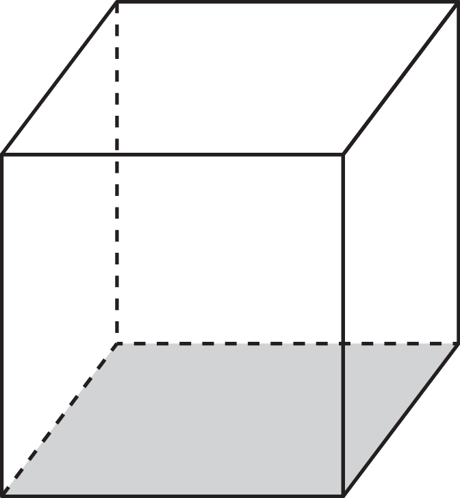
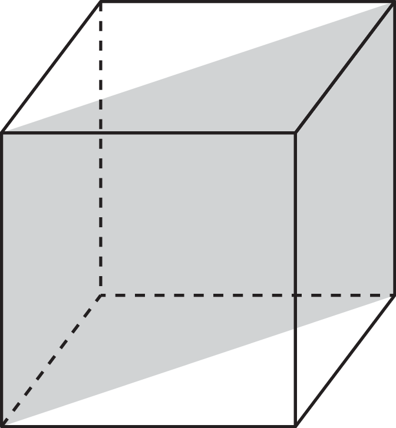
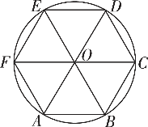
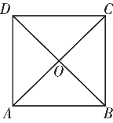

**第4讲　随机事件与概率**

<table><tr><td>
课标要求
</td><td>
命题点
</td><td>
五年考情
</td><td>
命题分析预测
</td></tr><tr><td rowspan="4">
1.结合具体实例，理解样本点和有限样本空间的含义，理解随机事件与样本点的关系.了解随机事件的并、交与互斥的含义，能结合实例进行随机事件的并、交运算.

2.结合具体实例，理解古典概型，能计算古典概型中简单随机事件的概率.

3.通过实例，理解概率的性质，掌握随机事件概率的运算法则.

4.结合实例，会用频率估计概率.
</td><td>
事件的关系的判断
</td><td>
2020新高考卷ⅠT5
</td><td rowspan="4">
本讲知识是概率部分的基础，高考命题热点为互斥事件和对立事件的概率计算，以频率估计概率，古典概型的求解，概率基本性质的应用等，题型既有小题也有大题，大题常与排列组合、分布列、期望与方差、统计等知识综合命题，难度中等.在2025年高考备考中，要加强对本讲概念的理解与应用及与其他知识的综合训练.
</td></tr><tr><td>
求随机事件的频率与概率
</td><td>
2023新高考卷ⅡT19；2023北京T18；2022新高考卷ⅡT19；2021全国卷甲T17；2020新高考卷ⅠT19；2020全国卷ⅢT18；2019北京T17
</td></tr><tr><td>
古典概型
</td><td>
2023全国卷甲T4；2022新高考卷ⅠT5；2022全国卷乙T13；2022全国卷甲T15；2021全国卷甲T10
</td></tr><tr><td>
概率的基本性质的应用
</td><td>
2023全国卷甲T6
</td></tr></table>

学生用书P232

1.样本空间和随机事件

（1）样本空间

（i）样本点：随机试验<em>E</em>的每个可能的①<u>　基本结果　</u>称为样本点，一般用<em>Ω</em>表示.

（ii）样本空间：全体样本点的集合称为试验*E*的样本空间，一般用*Ω*表示.

（iii）有限样本空间：如果一个随机试验有<em>n</em>个可能结果<em>Ω</em>1，<em>Ω</em>2，…，<em>Ωn</em>，则称样本空间<em>Ω</em>＝{<em>Ω</em>1，<em>Ω</em>2，…，<em>Ωn</em>}为有限样本空间.

说明　样本空间可以理解为集合，集合的元素就是样本空间中的样本点.

（2）随机事件

（i）定义：将样本空间<em>Ω</em>的②<u>　子集　</u>称为随机事件，简称事件.

（ii）表示：一般用大写字母*A*，*B*，*C*，…表示.

（iii）极端情形：③<u>　必然事件　</u>、不可能事件.

2.两个事件的关系和运算

<table><tr><td>
事件的关系或运算
</td><td>
含义
</td><td>
符号表示
</td></tr><tr><td>
包含
</td><td>
<em>A</em>发生导致<em>B</em>发生
</td><td>
④　<em>A</em>⊆<em>B</em>　
</td></tr><tr><td>
相等事件
</td><td>
<em>B</em>⊇<em>A</em>且<em>A</em>⊇<em>B</em>
</td><td>
⑤　<em>A</em>＝<em>B</em>　
</td></tr><tr><td>
并事件（和事件）
</td><td>
<em>A</em>与<em>B</em>至少有一个发生
</td><td>
<em>A</em>∪<em>B</em>或<em>A</em>＋<em>B</em>
</td></tr><tr><td>
交事件（积事件）
</td><td>
<em>A</em>与<em>B</em>同时发生
</td><td>
<em>A</em>∩<em>B</em>或 <em>AB</em>
</td></tr><tr><td>
互斥（互不相容）
</td><td>
<em>A</em>与<em>B</em>不能同时发生
</td><td>
<em>A</em>∩<em>B</em>＝∅
</td></tr><tr><td>
互为对立
</td><td>
<em>A</em>与<em>B</em>有且仅有一个发生
</td><td>
⑥　<em>A</em>∩<em>B</em>＝∅，<em>A</em>∪<em>B</em>＝<em>Ω</em>　
</td></tr></table>

注意　 对立事件一定是互斥事件，互斥事件不一定是对立事件，即两事件互斥是对立的必要不充分条件.

3.古典概型

（1）古典概型的特征

（i）有限性：样本空间的样本点只有⑦<u>　有限个　</u>；

（ii）等可能性：每个样本点发生的可能性⑧<u>　相等　</u>.

（2）古典概型的概率公式

一般地，设试验*E*是古典概型，样本空间*<text style="italic"><text style="italic">Ω*</text></text>包含*<text style="italic"><text style="italic">n*</text></text>个样本点，事件*<text style="italic"><text style="italic"><text style="italic"><text style="italic">A*</text></text></text></text>包含其中的*k*个样本点，则定义事件A的概率*P*（A）＝ $\frac{k}{n}$ ＝ $\frac{n（A）}{n（\Omega ）}$ .其中，*<text style="italic"><text style="italic">n*</text></text>（*<text style="italic"><text style="italic"><text style="italic"><text style="italic">A*</text></text></text></text>）和n（*<text style="italic"><text style="italic">Ω*</text></text>）分别表示事件A和样本空间Ω包含的样本点个数.

4.概率的基本性质

<table><tr><td>
性质1
</td><td>
对任意的事件<em>A</em>，都有<em>P</em>（<em>A</em>）≥0.
</td></tr><tr><td>
性质2
</td><td>
必然事件的概率为1，不可能事件的概率为0，即<em>P</em>（<em>Ω</em>）＝ 1，<em>P</em>（∅）＝0
</td></tr><tr><td>
性质3
</td><td>
如果事件<em>A</em>与事件<em>B</em>互斥，那么<em>P</em>（<em>A</em>∪<em>B</em>）＝⑨　<em>P</em>（<em>A</em>）＋<em>P</em>（<em>B</em>）　.（互斥事件的概率加法公式）
</td></tr><tr><td>
性质4
</td><td>
如果事件<em>A</em>与事件<em>B</em>互为对立事件，那么<em>P</em>（<em>B</em>）＝1－<em>P</em>（<em>A</em>），<em>P</em>（<em>A</em>）＝<strong>⑩</strong>　1－<em>P</em>（<em>B</em>）　.
</td></tr><tr><td>
性质5
</td><td>
如果<em>A</em>⊆<em>B</em>，那么<em>P</em>（<em>A</em>）≤<em>P</em>（B）.
</td></tr><tr><td>
性质6
</td><td>
设<em>A</em>，<em>B</em>是一个随机试验中的两个事件，我们有<em>P</em>（<em>A</em>∪<em>B</em>）＝⑪　　.
</td></tr></table>

性质3的推广：若事件<em>&lt;text style="italic"&gt;&lt;text style="italic"&gt;&lt;text style="italic"&gt;&lt;text style="italic"&gt;&lt;text style="italic"&gt;&lt;text style="italic"&gt;&lt;text style="italic"&gt;A</em>&lt;/text&gt;&lt;/text&gt;&lt;/text&gt;&lt;/text&gt;&lt;/text&gt;&lt;/text&gt;&lt;/text&gt;&lt;text style="subscript"&gt;&lt;text style="subscript"&gt;1&lt;/text&gt;&lt;/text&gt;，A&lt;text style="subscript"&gt;2&lt;/text&gt;，…，A<em>&lt;text style="italic,subscript"&gt;&lt;text style="italic,subscript"&gt;m</em>&lt;/text&gt;&lt;/text&gt;两两互斥，则<em>&lt;text style="italic"&gt;&lt;text style="italic"&gt;P</em>&lt;/text&gt;&lt;/text&gt;（A1∪A2∪…∪Am）＝P（A1）＋ $P\left（A_{2}\right）$ ＋…＋<em>&lt;text style="italic"&gt;&lt;text style="italic"&gt;P</em>&lt;/text&gt;&lt;/text&gt;（<em>&lt;text style="italic"&gt;&lt;text style="italic"&gt;&lt;text style="italic"&gt;&lt;text style="italic"&gt;&lt;text style="italic"&gt;&lt;text style="italic"&gt;&lt;text style="italic"&gt;A</em>&lt;/text&gt;&lt;/text&gt;&lt;/text&gt;&lt;/text&gt;&lt;/text&gt;&lt;/text&gt;&lt;/text&gt;<em>&lt;text style="italic,subscript"&gt;&lt;text style="italic,subscript"&gt;m</em>&lt;/text&gt;&lt;/text&gt;）.

5.频率与概率

（1）频率的稳定性

一般地，随着试验次数<em>n</em>的增大，频率偏离概率的幅度会缩小，即事件<em>A</em>发生的频率<em>fn</em>（<em>A</em>）会逐渐稳定于事件<em>A</em>发生的概率<em>P</em>（<em>A</em>）.我们称频率的这个性质为频率的稳定性.

（2）频率稳定性的作用：可以用频率<em>fn</em>（<em>A</em>）估计概率<em>P</em>（A）.

说明　随机事件*A*发生的频率是随机的，而概率是客观存在的确定的常数，但在大量随机试验中，事件*A*发生的频率稳定于事件*A*发生的概率.

1.一个人打靶时连续射击两次，事件“至少有一次中靶”的互斥事件是（　D　）

A.至多有一次中靶			B.两次都中靶

C.只有一次中靶			D.两次都不中靶

解析　射击两次的结果有：一次中靶，两次中靶，两次都不中靶，故至少有一次中靶的互斥事件是两次都不中靶.故选D.

2.[教材改编]下列说法错误的是（　D　）

A.任一事件的概率总在[0，1]内	B.不可能事件的概率为0

C.必然事件的概率为1			D.概率是随机的，在试验前不能确定

解析　任一事件的概率总在[0，1]内，不可能事件的概率为0，必然事件的概率为1，概率是客观存在的，是一个确定值.

3.[教材改编]若随机事件<text style="it<text style="it*a*lic">a</text>lic">*<text style="italic">A*</text></text>，*<text style="italic">B*</text>互斥，A，B发生的概率均不等于0，且*P*（A）＝2－a， $P\left（B\right）=4a-5$ ，则实数<text style="it*a*lic">a</text>的取值范围是（　D　）

A.（ $\frac{5}{4}$ ，2）	B.（ $\frac{5}{4}$ ， $\frac{3}{2}$ ）	C.[ $\frac{5}{4}$ ， $\frac{3}{2}$ ]	D.（ $\frac{5}{4}$ ， $\frac{4}{3}$ ]

解析　由题意可知 $\left\{\begin{matrix}0<P（A）<1，\\0<P（B）<1，\\P（A）＋P（B）\leq 1，\end{matrix}\right.$ 即 $\left\{\begin{matrix}0<2－a<1，\\0<4a－5<1，\\3a－3\leq 1，\end{matrix}\right.$ 即 $\left\{\begin{matrix}1<a<2，\\\frac{5}{4}＜a＜\frac{3}{2}，\\a\leq \frac{4}{3}，\end{matrix}\right.$ 解得 $\frac{5}{4}$ ＜*a*≤ $\frac{4}{3}$ .

4.[多选]下列说法正确的是（　CD　）

A.两个互斥事件的概率和为1

B.两个事件的和事件是指两个事件都发生

C.对立事件一定是互斥事件，互斥事件不一定是对立事件

D.从－3，－2，－1，0，1，2中任取一个数，取到的数小于0与不小于0的可能性相等

5.[教材改编]某战士射击一次，击中环数大于7的概率是0.6，击中环数是6或7或8的概率相等，且和为0.3，则该战士射击一次击中环数大于5的概率为<u>　0.8　</u>.

解析　记“击中6环”为事件*A*，“击中7环”为事件*B*，“击中环数大于7”为事件*C*， 事件*A*，*B*，*C*彼此互斥，且易知*P*（*A*）＝0.1，*P*（*B*）＝0.1， *P*（*C*）＝0.6.记“击中环数大于5”为事件*D*，则*P*（*D*）＝*P*（*A*∪*B*∪*C*）＝0.1＋0.1＋0.6＝0.8.

6.抛掷一枚骰子，记<em>&lt;text style="italic"&gt;&lt;text style="italic"&gt;A</em>&lt;/text&gt;&lt;/text&gt;事件为“出现点数是奇数”，<em>&lt;text style="italic"&gt;&lt;text style="italic"&gt;B</em>&lt;/text&gt;&lt;/text&gt;事件为“出现点数是3的倍数”，则<em>&lt;text style="italic"&gt;P</em>&lt;/text&gt;（A∪B）＝<u>&lt;text style="underline"&gt;&lt;text style="underline"&gt;&lt;text style="underline"&gt;　</u>&lt;/text&gt;&lt;/text&gt;&lt;/text&gt; $\frac{2}{3}$ <u>&lt;text style="underline"&gt;&lt;text style="underline"&gt;&lt;text style="underline"&gt;　</u>&lt;/text&gt;&lt;/text&gt;&lt;/text&gt;，<em>&lt;text style="italic"&gt;P</em>&lt;/text&gt;（<em>&lt;text style="italic"&gt;&lt;text style="italic"&gt;A</em>&lt;/text&gt;&lt;/text&gt;∩<em>&lt;text style="italic"&gt;&lt;text style="italic"&gt;B</em>&lt;/text&gt;&lt;/text&gt;）＝　 $\frac{1}{6}$ <u>&lt;text style="underline"&gt;&lt;text style="underline"&gt;&lt;text style="underline"&gt;　</u>&lt;/text&gt;&lt;/text&gt;&lt;/text&gt;.

解析　抛掷一枚骰子，出现点数的样本空间为*Ω*＝{1，2，3，4，5，6}，事件*<text style="italic"><text style="italic"><text style="italic">A*</text></text></text>∪*<text style="italic"><text style="italic"><text style="italic">B*</text></text></text>＝{1，3，5，6}，故*<text style="italic">P*</text>（A∪B）＝ $\frac{2}{3}$ ；事件*<text style="italic"><text style="italic"><text style="italic">A*</text></text></text>∩*<text style="italic"><text style="italic"><text style="italic">B*</text></text></text>＝{3}，故*<text style="italic">P*</text>（A∩B）＝ $\frac{1}{6}$ .

学生用书P233

命题点1　事件的关系的判断

<strong>例</strong>1 （1）[多选]掷一枚质地均匀的骰子，记“向上的点数是1或2”为事件<em>A</em>，“向上的点数是2或3”为事件<em>B</em>，则（　CD　）

A.*A*⊆*B*

B.*A*＝*B*

C.*A*∩*B*表示向上的点数是2

D.*A*∪*B*表示向上的点数是1或2或3

解析　设*A*＝{1，2}，*B*＝{2，3}，则*A*∩*B*＝{2}，*A*∪*B*＝{1，2，3}，所以*A*∩*B*表示向上的点数是2，*A*∪*B*表示向上的点数为1或2或3.故选CD.

（2）[多选]将颜色分别为红、绿、白、蓝的4个小球随机分给甲、乙、丙、丁4个人，每人一个，则（　BD　）

A.事件“甲分得红球”与事件“乙分得白球”是互斥不对立事件

B.事件“甲分得红球”与事件“乙分得红球”是互斥不对立事件

C.事件“甲分得绿球，乙分得蓝球”的对立事件是“丙分得白球，丁分得红球”

D.当事件“甲分得红球”的对立事件发生时，事件“乙分得红球”发生的概率是 $\frac{1}{3}$

解析　事件“甲分得红球”与事件“乙分得白球”可以同时发生，不是互斥事件，A错误；

事件“甲分得红球”与事件“乙分得红球”不能同时发生，是互斥事件，除了甲分得红球或者乙分得红球以外，丙或者丁也可以分得红球，B正确；

事件“甲分得绿球，乙分得蓝球”与事件“丙分得白球，丁分得红球”可以同时发生，不是对立事件，C错误；

事件“甲分得红球”的对立事件是“甲没有分得红球”，因此乙、丙、丁三人中有一个人分得红球，事件“乙分得红球”发生的概率是 $\frac{1}{3}$ .D正确.

方法技巧

判断事件关系的策略

（1）判断事件的互斥、对立关系时一般用定义法：不可能同时发生的两个事件为互斥事件；有且仅有一个发生的两个事件为对立事件.

（2）判断事件的交、并关系时，一是紧扣运算的定义，二是要全面考虑同一条件下的试验可能出现的全部结果，必要时可列出全部的试验结果进行分析，也可类比集合的关系和运用Venn图分析事件.

<strong>训练</strong>1 [多选]某人打靶时连续射击两次，设事件<em>A</em>＝“只有一次中靶”，<em>B</em>＝“两次都中靶”，则下列结论正确的是（　BC　）

A.*A*⊆*B*					B.*A*∩*B*＝∅

C.*A*∪*B*＝“至少一次中靶”		D.*A*与*B*互为对立事件

解析　事件*A*＝“只有一次中靶”，*B*＝“两次都中靶”，所以*A*，*B*是互斥事件，但不是对立事件，所以A，D错误，B正确；*A*∪*B*＝“至少一次中靶”，C正确.

命题点2　求随机事件的频率与概率

<strong>例</strong>2 [全国卷Ⅰ]某厂接受了一项加工业务，加工出来的产品（单位：件）按标准分为A，B，C，D四个等级.加工业务约定：对于A级品、B级品、C级品，厂家每件分别收取加工费90元，50元，20元；对于D级品，厂家每件要赔偿原料损失费50元.该厂有甲、乙两个分厂可承接加工业务.甲分厂加工成本费为25元<em>/</em>件，乙分厂加工成本费为20元<em>/</em>件.厂家为决定由哪个分厂承接加工业务，在两个分厂各试加工了100件这种产品，并统计了这些产品的等级，整理如下：

甲分厂产品等级的频数分布表

<table><tr><td>
等级
</td><td>
A
</td><td>
B
</td><td>
C
</td><td>
D
</td></tr><tr><td>
频数
</td><td>
40
</td><td>
20
</td><td>
20
</td><td>
20
</td></tr></table>

乙分厂产品等级的频数分布表

<table><tr><td>
等级
</td><td>
A
</td><td>
B
</td><td>
C
</td><td>
D
</td></tr><tr><td>
频数
</td><td>
28
</td><td>
17
</td><td>
34
</td><td>
21
</td></tr></table>

（1）分别估计甲、乙两分厂加工出来的一件产品为A级品的概率；

（2）分别求甲、乙两分厂加工出来的100件产品的平均利润，以平均利润为依据，厂家应选哪个分厂承接加工业务？

解析　（1）由试加工产品等级的频数分布表知，

甲分厂加工出来的一件产品为A级品的概率的估计值为 $\frac{40}{100}$ ＝0.4；

乙分厂加工出来的一件产品为A级品的概率的估计值为 $\frac{28}{100}$ ＝0.28.

（2）由数据知甲分厂加工出来的100件产品利润的频数分布表为

<table><tr><td>
利润
</td><td>
65
</td><td>
25
</td><td>
－5
</td><td>
－75
</td></tr><tr><td>
频数
</td><td>
40
</td><td>
20
</td><td>
20
</td><td>
20
</td></tr></table>

因此甲分厂加工出来的100件产品的平均利润为 $\frac{65\times 40+25\times 20－5\times 20－75\times 20}{100}$ ＝15.

由数据知乙分厂加工出来的100件产品利润的频数分布表为

<table><tr><td>
利润
</td><td>
70
</td><td>
30
</td><td>
0
</td><td>
－70
</td></tr><tr><td>
频数
</td><td>
28
</td><td>
17
</td><td>
34
</td><td>
21
</td></tr></table>

因此乙分厂加工出来的100件产品的平均利润为 $\frac{70\times 28+30\times 17+0\times 34－70\times 21}{100}$ ＝10.

比较甲、乙两分厂加工的产品的平均利润，应选甲分厂承接加工业务.

方法技巧

求随机事件的概率的思路

（1）计算所求随机事件出现的频数及总事件的频数；

（2）由频率公式求出频率，进而由频率估计概率.

**训练**2 [全国卷Ⅲ]某超市计划按月订购一种酸奶，每天进货量相同，进货成本每瓶4元，售价每瓶6元，未售出的酸奶降价处理，以每瓶2元的价格当天全部处理完.根据往年销售经验，每天需求量与当天最高气温（单位：℃）有关.如果最高气温不低于25，需求量为500瓶；如果最高气温位于区间[20，25），需求量为300瓶；如果最高气温低于20，需求量为200瓶.为了确定六月份的订购计划，统计了前三年六月份各天的最高气温数据，得下面的频数分布表：

<table><tr><td>
最高气温
</td><td>
[10，15）
</td><td>
[15，20）
</td><td>
[20，25）
</td><td>
[25，30）
</td><td>
[30，35）
</td><td>
[35，40）
</td></tr><tr><td>
天数
</td><td>
2
</td><td>
16
</td><td>
36
</td><td>
25
</td><td>
7
</td><td>
4
</td></tr></table>

以最高气温位于各区间的频率估计最高气温位于该区间的概率.

（1）估计六月份这种酸奶一天的需求量不超过300瓶的概率.

（2）设六月份一天销售这种酸奶的利润为*Y*（单位：元）.当六月份这种酸奶一天的进货量为450瓶时，写出*Y*的所有可能值，并估计*Y*大于零的概率.

解析　（1）这种酸奶一天的需求量不超过300瓶，则需最高气温低于25，由表格数据知，最高气温低于25的频率为 $\frac{2+16+36}{2+16+36+25+7+4}$ ＝0.6，所以这种酸奶一天的需求量不超过300瓶的概率的估计值为0.6.

（2）当这种酸奶一天的进货量为450瓶时，

若最高气温不低于25，则*Y*＝6×450－4×450＝900；

若最高气温位于区间[20，25），则*Y*＝6×300＋2×（450－300）－4×450＝300；

若最高气温低于20，则*Y*＝6×200＋2×（450－200）－4×450＝－100.

所以，*Y*的所有可能值为900，300，－100.

当且仅当最高气温不低于20时，*<text style="italic">Y*</text>大于零，由表格数据知，最高气温不低于20的频率为 $\frac{36+25+7+4}{90}$ ＝0.8，因此*<text style="italic">Y*</text>大于零的概率的估计值为0.8.

命题点3　古典概型

**例**3 （1）[2023全国卷甲]某校文艺部有4名学生，其中高一、高二年级各2名.从这4名学生中随机选2名组织校文艺汇演，则这2名学生来自不同年级的概率为（　D　）

A. $\frac{1}{6}$ 		B. $\frac{1}{3}$ 		C. $\frac{1}{2}$ 		D. $\frac{2}{3}$

解析　解法一　由题意可知，所求概率*P*＝ $\frac{C_{2}^{1}C_{2}^{1}}{C_{4}^{2}}$ ＝ $\frac{4}{6}$ ＝ $\frac{2}{3}$ .

解法二　记高一年级&lt;text style="su&lt;text style="it&lt;text style="it&lt;text style="it&lt;text style="it&lt;text style="it&lt;text style="it&lt;text style="it&lt;text style="it&lt;text style="it&lt;text style="it<em>a</em>lic"&gt;a&lt;/text&gt;lic"&gt;a&lt;/text&gt;lic"&gt;a&lt;/text&gt;lic"&gt;a&lt;/text&gt;lic"&gt;a&lt;/text&gt;lic"&gt;a&lt;/text&gt;lic"&gt;a&lt;/text&gt;lic"&gt;a&lt;/text&gt;lic"&gt;a&lt;/text&gt;lic"&gt;<em>&lt;text style="italic"&gt;&lt;text style="italic"&gt;&lt;text style="italic"&gt;&lt;text style="italic"&gt;&lt;text style="italic"&gt;&lt;text style="italic"&gt;&lt;text style="italic"&gt;&lt;text style="italic"&gt;&lt;text style="italic"&gt;&lt;text style="italic"&gt;b</em>&lt;/text&gt;&lt;/text&gt;&lt;/text&gt;&lt;/text&gt;&lt;/text&gt;&lt;/text&gt;&lt;/text&gt;&lt;/text&gt;&lt;/text&gt;&lt;/text&gt;&lt;/text&gt;script"&gt;&lt;text style="subscript"&gt;&lt;text style="subscript"&gt;&lt;text style="subscript"&gt;&lt;text style="subscript"&gt;&lt;text style="subscript"&gt;&lt;text style="subscript"&gt;&lt;text style="subscript"&gt;&lt;text style="subscript"&gt;&lt;text style="subscript"&gt;&lt;text style="subscript"&gt;2&lt;/text&gt;&lt;/text&gt;&lt;/text&gt;&lt;/text&gt;&lt;/text&gt;&lt;/text&gt;&lt;/text&gt;&lt;/text&gt;&lt;/text&gt;&lt;/text&gt;&lt;/text&gt;名学生分别为&lt;text style="it<em>a</em>lic"&gt;a&lt;/text&gt;&lt;text style="subscript"&gt;&lt;text style="subscript"&gt;&lt;text style="subscript"&gt;&lt;text style="subscript"&gt;&lt;text style="subscript"&gt;&lt;text style="subscript"&gt;&lt;text style="subscript"&gt;&lt;text style="subscript"&gt;&lt;text style="subscript"&gt;&lt;text style="subscript"&gt;&lt;text style="subscript"&gt;1&lt;/text&gt;&lt;/text&gt;&lt;/text&gt;&lt;/text&gt;&lt;/text&gt;&lt;/text&gt;&lt;/text&gt;&lt;/text&gt;&lt;/text&gt;&lt;/text&gt;&lt;/text&gt;，a2，高二年级2名学生分别为b1，b2，则从这4名学生中随机选2名组织校文艺汇演的基本事件有（a1，a2），（a1，b1），（a1，b2），（a2，b1），（a2，b2），（b1，b2），共6个，其中这2名学生来自不同年级的基本事件有（a1，b1），（a1，b2），（a2，b1），（a2，b2），共4个，所以这2名学生来自不同年级的概率<em>P</em>＝ $\frac{4}{6}$ ＝ $\frac{2}{3}$ ，故选D.

（2）[2022新高考卷Ⅰ]从2至8的7个整数中随机取2个不同的数，则这2个数互质的概率为（　D　）

A. $\frac{1}{6}$ 		B. $\frac{1}{3}$ 		C. $\frac{1}{2}$ 		D. $\frac{2}{3}$

解析　从7个整数中随机取2个不同的数，共有 $C_{7}^{2}$ ＝21（种）取法，取得的2个数互质的情况有{2，3}，{2，5}，{2，7}，{3，4}，{3，5}，{3，7}，{3，8}，{4，5}，{4，7}，{5，6}，{5，7}，{5，8}，{6，7}，{7，8}，共14种.根据古典概型的概率公式，得这2个数互质的概率为 $\frac{14}{21}$ ＝ $\frac{2}{3}$ .故选D.

方法技巧

1.求解古典概型问题的步骤

（1）求出样本空间*Ω*包含的样本点个数*n*；

（2）求出事件*A*包含的样本点个数*k*；

（3）代入公式*P*（*<text style="italic">A*</text>）＝ $\frac{k}{n}$ 求解，即为事件*<text style="italic">A*</text>的概率.

2.求样本点个数的方法：列举法、列表法、树状图法、排列组合法.

**训练**3 （1）[2021全国卷甲]将4个1和2个0随机排成一行，则2个0不相邻的概率为（　C　）

A. $\frac{1}{3}$ 		B. $\frac{2}{5}$ 		C. $\frac{2}{3}$ 		D. $\frac{4}{5}$

解析　解法一　将4个1和2个0视为完全不同的元素，则将4个1和2个0随机排成一行有 $A_{6}^{6}$ 种排法.将4个1排成一行有 $A_{4}^{4}$ 种排法，再将2个0插空有 $A_{5}^{2}$ 种排法.所以2个0不相邻的概率*P*＝ $\frac{A_{4}^{4}A_{5}^{2}}{A_{6}^{6}}$ ＝ $\frac{2}{3}$ .

解法二　将4个1和2个0安排在6个位置，则选择2个位置安排0，共有 $C_{6}^{2}$ 种排法.将4个1排成一行，再将2个0插空，即在5个位置中选2个位置安排0，共有 $C_{5}^{2}$ 种排法.所以2个0不相邻的概率*P*＝ $\frac{C_{5}^{2}}{C_{6}^{2}}$ ＝ $\frac{2}{3}$ .

（2）[2022全国卷甲]从正方体的8个顶点中任选4个，则这4个点在同一个平面的概率为<u>&lt;text style="underline"&gt;　</u>&lt;/text&gt; $\frac{6}{35}$ <u>&lt;text style="underline"&gt;　</u>&lt;/text&gt;.

解析　从正方体的8个顶点中任选4个，取法有 $C_{8}^{4}$ ＝70（种）.其中4个点共面有以下两种情况：

①所取的4个点为正方体同一个面上的4个顶点，如图1，有6种取法；

②所取的4个点为正方体同一个对角面上的4个顶点，如图2，也有6种取法.

  
图1		图2

所以所取的4个点在同一个平面的概率*P*＝ $\frac{12}{70}$ ＝ $\frac{6}{35}$ .

命题点4　概率的基本性质的应用

<strong>例</strong>4 （1）如图所示，靶子由一个中心圆面Ⅰ和两个同心圆环Ⅱ，Ⅲ构成，射手命中圆面Ⅰ、圆环Ⅱ、圆环Ⅲ的概率分别为0.35，0.30，0.25，则射手命中圆环Ⅱ或圆环Ⅲ的概率为<u>　0.55　</u>，未命中靶的概率为<u>　0.10　</u>.

解析　设射手命中圆面Ⅰ为事件*<text style="italic"><text style="italic"><text style="italic"><text style="italic">A*</text></text></text></text>，命中圆环Ⅱ为事件*<text style="italic"><text style="italic"><text style="italic"><text style="italic"><text style="italic"><text style="italic">B*</text></text></text></text></text></text>，命中圆环Ⅲ为事件*<text style="italic"><text style="italic"><text style="italic"><text style="italic"><text style="italic"><text style="italic">C*</text></text></text></text></text></text>，未中靶为事件*D*，则*<text style="italic"><text style="italic"><text style="italic"><text style="italic"><text style="italic"><text style="italic"><text style="italic"><text style="italic"><text style="italic">P*</text></text></text></text></text></text></text></text></text>（A）＝0.35，P（B）＝0.30，P（C）＝0.25，事件A，B，C两两互斥，故射手命中圆环Ⅱ或圆环Ⅲ的概率为P（B∪C）＝P（B）＋P（C）＝0.30＋0.25＝0.55，射手命中靶的概率为P（A∪B∪C）＝P（A）＋P（B）＋P（C）＝0.35＋0.30＋0.25＝0.90.因为中靶和未中靶是对立事件，所以未命中靶的概率 $P\left（D\right）=1-P\left（A\cup B\cup C\right）=1-0.90=0.10.$

（2）一个电路板上装有甲、乙两根熔丝，某种情况下甲熔丝熔断的概率为0.85，乙熔丝熔断的概率为0.74，甲、乙两根熔丝同时熔断的概率为0.63，则该情况下至少有一根熔丝熔断的概率为<u>　0.96　</u>.

解析　设事件*<text style="italic"><text style="italic"><text style="italic"><text style="italic"><text style="italic"><text style="italic"><text style="italic">A*</text></text></text></text></text></text></text>＝“甲熔丝熔断”，事件*<text style="italic"><text style="italic"><text style="italic"><text style="italic"><text style="italic"><text style="italic">B*</text></text></text></text></text></text>＝“乙熔丝熔断”，则有*<text style="italic"><text style="italic"><text style="italic"><text style="italic"><text style="italic">P*</text></text></text></text></text>（A）＝0.85， $P\left（B\right）=0.74$ ，“甲、乙两根熔丝同时熔断”为事件*<text style="italic"><text style="italic"><text style="italic"><text style="italic"><text style="italic"><text style="italic"><text style="italic">A*</text></text></text></text></text></text></text>∩*<text style="italic"><text style="italic"><text style="italic"><text style="italic"><text style="italic"><text style="italic">B*</text></text></text></text></text></text>，则有*<text style="italic"><text style="italic"><text style="italic"><text style="italic"><text style="italic">P*</text></text></text></text></text>（A∩B）＝0.63，“甲、乙两根熔丝至少有一根熔断”为事件A∪B，则有P（A∪B）＝P（A）＋P（B）－P（A∩B）＝0.85＋0.74－0.63＝0.96，所以至少有一根熔丝熔断的概率为0.96.

方法技巧

求复杂事件概率的方法

（1）直接法：将所求事件转化成几个彼此互斥的事件的和事件，利用互斥事件的概率加法公式求解.

（2）间接法：当求解的问题中有“至多”“至少”“最少”等关键词语时，考虑其对立事件，通过求其对立事件的概率，然后转化为所求问题.

<strong>训练</strong>4 [多选<em>/</em>2023湖北联考]中国篮球职业联赛（CBA）中，某男篮球运动员在最近几次比赛中的得分情况如下表：

<table><tr><td>
投篮次数
</td><td>
投中两分球的次数
</td><td>
投中三分球的次数
</td><td>
没投中
</td></tr><tr><td>
100
</td><td>
55
</td><td>
18
</td><td>
<em>m</em>
</td></tr></table>

记该运动员在一次投篮中，投中两分球为事件*A*，投中三分球为事件*B*，没投中为事件*C*，用频率估计概率的方法，得到的下述结论中，正确的是（　ABC　）

A.*P*（*A*）＝0.55			B.*P*（*A*＋*B*）＝0.73

C.*P*（*C*）＝0.27			D.*P*（*B*＋*C*）＝0.55

解析　由题意可知，*m*＝100－55－18＝27，*<text style="italic">P*</text>（*<text style="italic"><text style="italic">A*</text></text>）＝ $\frac{55}{100}$ ＝0.55，*<text style="italic">P*</text>（*<text style="italic"><text style="italic">B*</text></text>）＝ $\frac{18}{100}$ ＝0.18，事件*<text style="italic"><text style="italic">A*</text></text>＋*<text style="italic"><text style="italic">B*</text></text>与事件*<text style="italic">C*</text>为对立事件，且事件A，B，C互斥，

所以*<text style="italic"><text style="italic"><text style="italic">P*</text></text></text>（*C*）＝1－P（*<text style="italic">A*</text>＋*<text style="italic">B*</text>）＝1－P（A）－P（B）＝0.27， $P\left（A+B\right）=P\left（A\right）+P\left（B\right）=0.73,P\left（B+C\right）=P\left（B\right）+P\left（C\right）=0.45,$

故选ABC.

1.[命题点1*/* 多选]从装有两个红球和两个黑球的口袋内任取两个球，则下列说法正确的有（　BCD　）

A.至少有一个黑球与都是黑球是互斥事件

B.至少有一个黑球与至少有一个红球不是互斥事件

C.恰好有一个黑球与恰好有两个黑球是互斥事件

D.至少有一个黑球与都是红球是对立事件

解析　解法一（列举法）　设两个红球分别为*a*，*b*，两个黑球分别为1，2.则从装有两个红球和两个黑球的口袋内任取两个球，所有可能的情况为{*a*，*b*}，{*a*，1}，{*a*，2}，{*b*，1}，{*b*，2}，{1，2}，共6种.对于A，至少有一个黑球与都是黑球都包含事件{1，2}，故二者不是互斥事件，A错误；

对于B，至少有一个黑球与至少有一个红球都包含事件{*a*，1}，{*a*，2}，{*b*，1}，{*b*，2}，故二者不是互斥事件，B正确；对于C，恰好有一个黑球包含事件{*a*，1}，{*a*，2}，{*b*，1}，{*b*，2}，恰好有两个黑球包含事件{1，2}，故二者是互斥事件，C正确；对于D，至少有一个黑球包含事件{*a*，1}，{*a*，2}，{*b*，1}，{*b*，2}，{1，2}，都是红球包含事件{*a*，*b*}，故二者是对立事件，D正确.故选BCD.

解法二　从装有两个红球和两个黑球的口袋内任取两个球，设取出的黑球个数为*<text style="italic"><text style="italic"><text style="italic"><text style="italic"><text style="italic"><text style="italic"><text style="italic"><text style="italic"><text style="italic"><text style="italic"><text style="italic"><text style="italic"><text style="italic"><text style="italic"><text style="italic"><text style="italic"><text style="italic"><text style="italic"><text style="italic"><text style="italic"><text style="italic"><text style="italic">X*</text></text></text></text></text></text></text></text></text></text></text></text></text></text></text></text></text></text></text></text></text></text>，则取出的红球个数为2－X，X的所有可能取值为0，1，2.对于A，“至少有一个黑球”对应X≥1，即X＝1或X＝2，“都是黑球”对应X＝2.显然当X＝2时，两个事件同时发生，故A错误.对于B，“至少有一个黑球”对应X≥1，即X＝1或X＝2，“至少有一个红球”对应2－X≥1，即X≤1，即X＝0或X＝1，显然当X＝1时，两个事件同时发生，故B正确.对于C，“恰好有一个黑球”对应X＝1，“恰好有两个黑球”对应X＝2，显然二者不能同时发生，是互斥事件，故C正确.对于D，“至少有一个黑球”对应X≥1，即X＝1或 $X=2$ ，“都是红球”对应2－*<text style="italic"><text style="italic"><text style="italic"><text style="italic"><text style="italic"><text style="italic"><text style="italic"><text style="italic"><text style="italic"><text style="italic"><text style="italic"><text style="italic"><text style="italic"><text style="italic"><text style="italic"><text style="italic"><text style="italic"><text style="italic"><text style="italic"><text style="italic"><text style="italic"><text style="italic">X*</text></text></text></text></text></text></text></text></text></text></text></text></text></text></text></text></text></text></text></text></text></text>＝2，即X＝0，显然二者不能同时发生，且二者的并事件包含X的所有取值，故两事件是对立事件，故D正确.故选BCD.

2.[命题点2*/* 北京高考]电影公司随机收集了电影的有关数据，经分类整理得到下表：

<table><tr><td>
电影类型
</td><td>
第一类
</td><td>
第二类
</td><td>
第三类
</td><td>
第四类
</td><td>
第五类
</td><td>
第六类
</td></tr><tr><td>
电影部数
</td><td>
140
</td><td>
50
</td><td>
300
</td><td>
200
</td><td>
800
</td><td>
510
</td></tr><tr><td>
好评率
</td><td>
0.4
</td><td>
0.2
</td><td>
0.15
</td><td>
0.25
</td><td>
0.2
</td><td>
0.1
</td></tr></table>

好评率是指一类电影中获得好评的部数与该类电影的部数的比值.

（1）从电影公司收集的电影中随机选取1部，求这部电影是获得好评的第四类电影的概率；

（2）随机选取1部电影，估计这部电影没有获得好评的概率；

（3）电影公司为增加投资回报，拟改变投资策略，这将导致不同类型电影的好评率发生变化.假设表格中只有两类电影的好评率数据发生变化，那么哪类电影的好评率增加0.1，哪类电影的好评率减少0.1，使得获得好评的电影总部数与样本中的电影总部数的比值达到最大？（只需写出结论）

解析　（1）由题意知，样本中电影的总部数是140＋50＋300＋200＋800＋510＝2 000，

第四类电影中获得好评的电影部数是200×0.25＝50，

故所求概率为 $\frac{50}{2 000}$ ＝0.025.

（2）由题意知，样本中获得好评的电影部数是140×0.4＋50×0.2＋300×0.15＋200×0.25＋800×0.2＋510×0.1＝56＋10＋45＋50＋160＋51＝372.

故所求概率估计为1－ $\frac{372}{2 000}$ ＝0.814.

（3）增加第五类电影的好评率，减少第二类电影的好评率.

3.[命题点3*/* 2023济南3月模拟]从正六边形的6个顶点中任取3个构成三角形，则所得三角形是直角三角形的概率为（　C　）

A. $\frac{3}{10}$ 		B. $\frac{1}{2}$ 		C. $\frac{3}{5}$ 		D. $\frac{9}{10}$

解析　如图所示，正六边形*<text style="italic">A<text style="italic">B*</text>*<text style="italic">C*</text>*D<text style="italic">E*</text>*<text style="italic">F*</text></text>的外接圆为圆*<text style="italic">O*</text>，则*AD*，*BE*，*CF*均为圆O的直径.从正六边形的6个顶点中任取3个顶点，共有 $C_{6}^{3}$ ＝20（种）等可能结果.取定*A*，*D*两点时，在*<text style="italic">B*</text>，*<text style="italic">C*</text>，*<text style="italic">E*</text>，*<text style="italic">F*</text>中任取一个点均可构成直角三角形，即此时可构成4个直角三角形；同理，当取定B，E两点或取定C，F两点时，均可构成4个直角三角形.故共可构成4×3＝12（个）直角三角形.所以所得三角形是直角三角形的概率*P*＝ $\frac{12}{20}$ ＝ $\frac{3}{5}$ ，故选*<text style="italic">C*</text>.

4.[命题点3*/* 多选]某次数学考试对多项选择题的要求是：在每小题给出的A，B，C，D四个选项中，有多项符合题目要求；全部选对的得5分，部分选对的得2分，有选错的得0分.已知某选择题的正确答案是CD，且甲、乙、丙、丁四位同学都不会做，下列表述正确的是（　ABC　）

A.甲同学仅随机选一个选项，能得2分的概率是 $\frac{1}{2}$

B.乙同学仅随机选两个选项，能得5分的概率是 $\frac{1}{6}$

C.丙同学随机选择选项，能得分的概率是 $\frac{1}{5}$

D.丁同学随机至少选择两个选项，能得分的概率是 $\frac{1}{10}$

解析　对于A，甲同学仅随机选择一个选项，有四种方

式，即A，B，C，D，能得2分的选项为C，D，概率为 $\frac{1}{2}$ ；

对于B，乙同学可能选择的情况有AB，AC，AD，BC，BD，CD，仅在选CD时才能得5分，概率为 $\frac{1}{6}$ ；

对于C，丙同学可能选择的情况有A，B，C，D，AB，AC，AD，BC，BD，CD，ABC，ABD，ACD，BCD，ABCD，共15种，能得分的情况有C，D，CD，共3种，故丙同学能得分的概率为 $\frac{3}{15}$ ＝ $\frac{1}{5}$ ；

对于D，丁同学可能选择的情况为AB，AC，AD，BC，BD，CD，ABC，ABD，ACD，BCD，ABCD，共11种，能得分的情况只有CD 1种，故丁同学能得分的概率为 $\frac{1}{11}$ .故选ABC.

5.[命题点4*/* 全国卷Ⅲ]若某群体中的成员只用现金支付的概率为0.45，既用现金支付也用非现金支付的概率为0.15，则不用现金支付的概率为（　B　）

A.0.3		B.0.4		C.0.6		D.0.7

解析　设“只用现金支付”为事件*A*，“既用现金支付也用非现金支付”为事件*B*，“不用现金支付”为事件*C*，则*P*（*C*）＝1－*P*（*A*）－*P*（*B*）＝1－0.45－0.15＝0.4.

学生用书·练习帮P385

1.[2024吉林长春东北师大附中模拟]下列叙述正确的是（　D　）

A.随着试验次数的增加，频率一定越来越接近一个确定数值

B.若随机事件*A*发生的概率为*P*（*A*），则0＜*P*（*A*）＜1

C.若事件*A*与事件*<text style="italic">B*</text>互斥，则*<text style="italic">P*</text>（ $\overline{A}$ ＋*<text style="italic">B*</text>）＝*<text style="italic">P*</text>（B）

D.若事件*A*与事件*B*对立，则*P*（*A*）＋*P*（*B*）＝1

解析　随着试验次数的增加，频率偏离概率的幅度会缩小，即事件发生的频率会逐渐稳定于事件发生的概率，并不一定越来越接近这个确定数值，故A不正确；

必然事件发生的概率为1，不可能事件发生的概率为0，所以0≤*P*（*A*）≤1，故B不正确；

若事件*<text style="italic">A*</text>与事件*<text style="italic"><text style="italic"><text style="italic"><text style="italic"><text style="italic">B*</text></text></text></text></text>互斥，则它们不可能同时发生，即B发生则A一定不发生，所以B⊆ $\overline{A}$ ，则 $\overline{A}$ ＋*<text style="italic"><text style="italic"><text style="italic"><text style="italic"><text style="italic">B*</text></text></text></text></text>＝ $\overline{A}$ ，则有*<text style="italic"><text style="italic">P*</text></text>（ $\overline{A}$ ＋*<text style="italic"><text style="italic"><text style="italic"><text style="italic"><text style="italic">B*</text></text></text></text></text>）＝*<text style="italic"><text style="italic">P*</text></text>（ $\overline{A}$ ），不一定与*<text style="italic"><text style="italic">P*</text></text>（*<text style="italic"><text style="italic"><text style="italic"><text style="italic"><text style="italic">B*</text></text></text></text></text>）相等，故C不正确；

若事件*A*与事件*B*对立，则*A*∪*B*为必然事件，且事件*A*与事件*B*互斥，则*P*（*A*∪*B*）＝*P*（*A*）＋*P*（*B*）＝1，故D正确.故选D.

2.[2024广东佛山模拟]从1～9这9个数中随机选取一个，则这个数平方的个位数字大于5的概率为（　B　）

A. $\frac{1}{3}$ 		B. $\frac{4}{9}$ 		C. $\frac{5}{9}$ 		D. $\frac{2}{3}$

解析　从1～9这9个数中随机选取一个数，共有9种选法，其中这个数平方的个位数字大于5的是3，4，6，7，故这个数平方的个位数字大于5的概率为 $\frac{4}{9}$ ，故选B.

3.[2024四川成都模拟]我国数学家陈景润在哥德巴赫猜想的研究中取得了世界领先的成果.哥德巴赫猜想是“每个大于2的偶数可以表示为两个素数的和”，如40＝3＋37.在不超过30的素数中，随机选取两个不同的数，其和等于30的概率是（　B　）

A. $\frac{2}{45}$ 		B. $\frac{1}{15}$ 		C. $\frac{1}{45}$ 		D. $\frac{1}{9}$

解析　不超过30的素数有2，3，5，7，11，13，17，19，23，29，共10个，随机选取两个不同的数有 $C_{10}^{2}$ ＝45（种）情况，其中和等于30的有7和23，11和19，13和17这3种情况，所以所求概率是 $\frac{3}{45}$ ＝ $\frac{1}{15}$ .故选B.

4.[2024四川遂宁模拟]抛掷一颗质地均匀的骰子，定义如下随机事件：<em>Ci</em>＝“点数为<em>i</em>”，其中<em>i</em>＝1，2，3，4，5，6；<em>D</em>1＝“点数不大于2”；<em>D</em>2＝“点数大于2”；<em>D</em>3＝“点数大于4” .则下列结论错误的是（　D　）

A.<em>C</em>1与<em>C</em>2互斥				B.<em>D</em>1∪<em>D</em>2＝<em>Ω</em>，<em>D</em>1<em>D</em>2＝∅

C.<em>D</em>3⊆<em>D</em>2				D.<em>C</em>2，<em>C</em>3为对立事件

解析　由题意知<em>C</em>1与<em>C</em>2不可能同时发生，它们互斥，A正确；由题意知，样本空间<em>Ω</em>＝{1，2，3，4，5，6}，<em>D</em>1＝{1，2}，<em>D</em>2＝{3，4，5，6}，因此B正确；<em>D</em>3＝{5，6}⊆<em>D</em>2，C正确；<em>C</em>2与<em>C</em>3不可能同时发生，但也可能都不发生，互斥不对立，D错误.故选D.

5.[2024湖北宜昌宜都市一中模拟]从装有除颜色外完全相同的2个红球和2个白球的口袋内任取2个球，那么互斥但不对立的两个随机事件是（　C　）

A.至少有1个白球，都是白球

B.至少有1个白球，至少有1个红球

C.恰有1个白球，恰有2个白球

D.至少有1个白球，都是红球

解析　对于A，“都是白球”这个事件发生时，事件“至少有1个白球”也发生了，因此不互斥，A不正确；对于B，任取2球一红一白时，事件“至少有1个白球”与“至少有1个红球”同时发生，因此不互斥，B不正确； 对于C，“恰有1个白球”，“恰有2个白球”这两个事件不可能同时发生，但当任取2个球都是红球时，它们都不发生，因此它们互斥且不对立，C正确；对于D，“至少有1个白球”与“都是红球”不可能同时发生，但必有一个会发生，因此它们是对立事件，D不正确.故选C.

6.[新高考卷Ⅰ]某中学的学生积极参加体育锻炼，其中有96％的学生喜欢足球或游泳，60％的学生喜欢足球，82％的学生喜欢游泳，则该中学既喜欢足球又喜欢游泳的学生数占该校学生总数的比例是（　C　）

A.62％		B.56％		C.46％		D.42％

解析　记“该中学学生喜欢足球”为事件*A* ，“该中学学生喜欢游泳”为事件*B* ，则“该中学学生喜欢足球或游泳”为事件*A*∪*B*，“该中学学生既喜欢足球又喜欢游泳”为事件*A*∩*B*，则*P*（*A*）＝0.6， *P*（*B*）＝0.82， *P*（*A*∪*B*）＝0.96，所以*P*（*A*∩*B*）＝ *P*（*A*）＋*P*（*B*）－*P*（*A*∪*B*）＝0.6＋0.82－0.96＝0.46，所以该中学既喜欢足球又喜欢游泳的学生数占该校学生总数的比例为46％，故选C.

7.[全国卷Ⅰ]设*O*为正方形*ABCD*的中心， 在*O*，*A*，*B*，*C*，*D*中任取3点，则取到的3点共线的概率为（　A　）

A. $\frac{1}{5}$ 		B. $\frac{2}{5}$ 		C. $\frac{1}{2}$ 		D. $\frac{4}{5}$

解析　根据题意作出图形，如图所示，在*<text style="italic">O*</text>，*<text style="italic">A*</text>，*<text style="italic">B*</text>，*<text style="italic">C*</text>，*<text style="italic">D*</text>中任取3点，有 $C_{5}^{3}=10$ （种）等可能的情况，其中取到的3点共线有（*<text style="italic">O*</text>*<text style="italic">A*</text>*<text style="italic">C*</text>）和（O*<text style="italic">B*</text>*<text style="italic">D*</text>）2种等可能的情况，所以在O，A，B，C，D中任取3点，则取到的3点共线的概率为 $\frac{2}{10}$ ＝ $\frac{1}{5}$ ，故选*<text style="italic">A*</text>.

8.[2023广西联考]现有一组数据1，2，3，4，5，6，7，8，若将这组数据随机删去两个数，则剩下数据的平均数大于5的概率为（　A　）

A. $\frac{1}{7}$ 		 B. $\frac{3}{14}$ 		 C. $\frac{3}{28}$ 		 D. $\frac{5}{28}$

解析　由已知可得，1＋2＋3＋…＋8＝36，若使删去两个数后剩余六个数的平均数大于5，则剩余六个数的总和大于30，即删去两个数的总和小于6，则有（1，2），（1，3），（1，4），（2，3）四种情况，所以随机删去两个数，剩下数据的平均数大于5的概率 $P=\frac{4}{C_{8}^{2}}=\frac{1}{7}$ ，故选A.

9.[多选*/* 2024山东济宁模拟]掷一颗质地均匀的骰子，事件*A*表示“出现小于5的偶数点”，事件*<text style="italic">B*</text>表示“出现小于5的点数”.若 $\overline{B}$ 表示*<text style="italic">B*</text>的对立事件，则一次试验中，下列说法正确的是（　*A*BD　）

*A*.*<text style="italic">P*</text>（A）＝ $\frac{1}{3}$ 				*B*.*<text style="italic">P*</text>（B）＝ $\frac{2}{3}$

C.*<text style="italic">P*</text>（ $\overline{A}$ ∪ $\overline{B}$ ）＝ $\frac{1}{3}$ 			D.*<text style="italic">P*</text>（*A*∪ $\overline{B}$ ）＝ $\frac{2}{3}$

解析　易知*<text style="italic"><text style="italic"><text style="italic"><text style="italic"><text style="italic"><text style="italic"><text style="italic"><text style="italic">P*</text></text></text></text></text></text></text></text>（*<text style="italic"><text style="italic"><text style="italic">A*</text></text></text>）＝ $\frac{2}{6}$ ＝ $\frac{1}{3}$ ，*<text style="italic"><text style="italic"><text style="italic"><text style="italic"><text style="italic"><text style="italic"><text style="italic"><text style="italic">P*</text></text></text></text></text></text></text></text>（*B*）＝ $\frac{4}{6}$ ＝ $\frac{2}{3}$ ，故*<text style="italic"><text style="italic"><text style="italic">A*</text></text></text>，*B*正确，*<text style="italic"><text style="italic"><text style="italic"><text style="italic"><text style="italic"><text style="italic"><text style="italic"><text style="italic">P*</text></text></text></text></text></text></text></text>（ $\overline{A}$ ）＝1－ $\frac{1}{3}$ ＝ $\frac{2}{3}$ ，*<text style="italic"><text style="italic"><text style="italic"><text style="italic"><text style="italic"><text style="italic"><text style="italic"><text style="italic">P*</text></text></text></text></text></text></text></text>（ $\overline{B}$ ） $=1-\frac{2}{3}$ ＝ $\frac{1}{3}$ ，易知*<text style="italic"><text style="italic"><text style="italic">A*</text></text></text>与 $\overline{B}$ 互斥，故*<text style="italic"><text style="italic"><text style="italic"><text style="italic"><text style="italic"><text style="italic"><text style="italic"><text style="italic">P*</text></text></text></text></text></text></text></text>（*<text style="italic"><text style="italic"><text style="italic">A*</text></text></text>∪ $\overline{B}$ ）＝*<text style="italic"><text style="italic"><text style="italic"><text style="italic"><text style="italic"><text style="italic"><text style="italic"><text style="italic">P*</text></text></text></text></text></text></text></text>（*<text style="italic"><text style="italic"><text style="italic">A*</text></text></text>）＋P（ $\overline{B}$ ）＝ $\frac{2}{3}$ ，故D正确，易知 $\overline{B}$ ⊆ $\overline{A}$ ，则*<text style="italic"><text style="italic"><text style="italic"><text style="italic"><text style="italic"><text style="italic"><text style="italic"><text style="italic">P*</text></text></text></text></text></text></text></text>（ $\overline{A}$ ∪ $\overline{B}$ ）＝*<text style="italic"><text style="italic"><text style="italic"><text style="italic"><text style="italic"><text style="italic"><text style="italic"><text style="italic">P*</text></text></text></text></text></text></text></text>（ $\overline{A}$ ）＝ $\frac{2}{3}$ ，故C错误.故选*<text style="italic"><text style="italic"><text style="italic">A*</text></text></text>*B*D.

10.[2024湖北黄冈模拟]事件<em>&lt;text style="italic"&gt;A</em>&lt;/text&gt;，<em>&lt;text style="italic"&gt;B</em>&lt;/text&gt;是相互独立事件，若<em>&lt;text style="italic"&gt;P</em>&lt;/text&gt;（A）＝<em>&lt;text style="italic"&gt;m</em>&lt;/text&gt;，P（B）＝0.3， $P\left（\overline{A}+B\right）=0.7$ ，则实数<em>&lt;text style="italic"&gt;m</em>&lt;/text&gt;的值等于<u>&lt;text style="underline"&gt;　</u>&lt;/text&gt; $\frac{3}{7}$ <u>&lt;text style="underline"&gt;　</u>&lt;/text&gt;.

解析　*<text style="italic"><text style="italic"><text style="italic"><text style="italic"><text style="italic"><text style="italic"><text style="italic"><text style="italic"><text style="italic"><text style="italic"><text style="italic"><text style="italic"><text style="italic">P*</text></text></text></text></text></text></text></text></text></text></text></text></text>（ $\overline{A}$ ＋*<text style="italic"><text style="italic"><text style="italic"><text style="italic"><text style="italic"><text style="italic">B*</text></text></text></text></text></text>）＝*<text style="italic"><text style="italic"><text style="italic"><text style="italic"><text style="italic"><text style="italic"><text style="italic"><text style="italic"><text style="italic"><text style="italic"><text style="italic"><text style="italic"><text style="italic">P*</text></text></text></text></text></text></text></text></text></text></text></text></text>（ $\overline{A}$ ）＋*<text style="italic"><text style="italic"><text style="italic"><text style="italic"><text style="italic"><text style="italic"><text style="italic"><text style="italic"><text style="italic"><text style="italic"><text style="italic"><text style="italic"><text style="italic">P*</text></text></text></text></text></text></text></text></text></text></text></text></text>（*<text style="italic"><text style="italic"><text style="italic"><text style="italic"><text style="italic"><text style="italic">B*</text></text></text></text></text></text>）－P（ $\overline{A}$ *<text style="italic"><text style="italic"><text style="italic"><text style="italic"><text style="italic"><text style="italic">B*</text></text></text></text></text></text>）＝1－*<text style="italic"><text style="italic"><text style="italic"><text style="italic"><text style="italic"><text style="italic"><text style="italic"><text style="italic"><text style="italic"><text style="italic"><text style="italic"><text style="italic"><text style="italic">P*</text></text></text></text></text></text></text></text></text></text></text></text></text>（*<text style="italic"><text style="italic"><text style="italic">A*</text></text></text>）＋P（B）－P（ $\overline{A}$ ）*<text style="italic"><text style="italic"><text style="italic"><text style="italic"><text style="italic"><text style="italic"><text style="italic"><text style="italic"><text style="italic"><text style="italic"><text style="italic"><text style="italic"><text style="italic">P*</text></text></text></text></text></text></text></text></text></text></text></text></text>（*<text style="italic"><text style="italic"><text style="italic"><text style="italic"><text style="italic"><text style="italic">B*</text></text></text></text></text></text>）＝1－P（*<text style="italic"><text style="italic"><text style="italic">A*</text></text></text>）＋P（B）[1－P（ $\overline{A}$ ）]＝1－*<text style="italic"><text style="italic"><text style="italic"><text style="italic"><text style="italic"><text style="italic"><text style="italic"><text style="italic"><text style="italic"><text style="italic"><text style="italic"><text style="italic"><text style="italic">P*</text></text></text></text></text></text></text></text></text></text></text></text></text>（*<text style="italic"><text style="italic"><text style="italic">A*</text></text></text>）＋P（*<text style="italic"><text style="italic"><text style="italic"><text style="italic"><text style="italic"><text style="italic">B*</text></text></text></text></text></text>）P（A），即0.7＝1－*<text style="italic"><text style="italic">m*</text></text>＋0.3m，解得m＝ $\frac{3}{7}$ .

11.[2024广东佛山模拟]有两个人从一座28层大楼的第一层进入电梯，假设每一个人自第二层开始在每一层离开电梯是等可能的，则这两个人在不同层离开电梯的概率为<u>&lt;text style="underline"&gt;　</u>&lt;/text&gt; $\frac{26}{27}$ <u>&lt;text style="underline"&gt;　</u>&lt;/text&gt;.

解析　两人离开电梯的所有可能情况有27×27＝729（种），两人在同一层离开电梯的可能情况有 $C_{27}^{1}$ ＝27（种），则两人在同一层离开电梯的概率为 $\frac{27}{729}$ ＝ $\frac{1}{27}$ ，所以这两个人在不同层离开电梯的概率为1－ $\frac{1}{27}$ ＝ $\frac{26}{27}$ .

12.[2024河南商丘模拟]某射击运动员在一次射击训练中共射击10次，这10次命中的环数分别为8，7，9，9，10，6，8，8，7，8.

（1）求这名运动员10次射击成绩的方差.

（2）若以这10次命中环数的频率来估计这名运动员命中环数的概率，求该运动员射击一次时：

（i）命中9环或者10环的概率；

（ii）至少命中7环的概率.

解析　（1）平均数 $\overline{x}$ ＝ $\frac{1}{10}$ （8＋7＋9＋9＋10＋6＋8＋8＋7＋8）＝8，

方差<em>s</em>&lt;text style="superscript"&gt;&lt;text style="superscript"&gt;&lt;text style="superscript"&gt;&lt;text style="superscript"&gt;&lt;text style="superscript"&gt;2&lt;/text&gt;&lt;/text&gt;&lt;/text&gt;&lt;/text&gt;&lt;/text&gt;＝ $\frac{1}{10}$ [（6－8）&lt;text style="superscript"&gt;&lt;text style="superscript"&gt;&lt;text style="superscript"&gt;&lt;text style="superscript"&gt;&lt;text style="superscript"&gt;2&lt;/text&gt;&lt;/text&gt;&lt;/text&gt;&lt;/text&gt;&lt;/text&gt;＋2×（7－8）2＋4×（8－8）2＋2×（9－8）2＋（10－8）2]＝1.2.

（2）设该运动员射击一次时，事件*<text style="italic">A*</text>＝“命中7环”，事件*<text style="italic">B*</text>＝“命中8环”，事件*C*＝“命中9环”，事件*<text style="italic">D*</text>＝“命中10环”，用频率估计概率，则*<text style="italic"><text style="italic">P*</text></text>（A）＝ $\frac{1}{5}$ ，*<text style="italic"><text style="italic">P*</text></text>（*<text style="italic">B*</text>）＝ $\frac{2}{5}$ ， $P\left（C\right）=\frac{1}{5}$ ，*<text style="italic"><text style="italic">P*</text></text>（*<text style="italic">D*</text>）＝ $\frac{1}{10}$ .

（i）设事件*E*＝“命中9环或者10环”，

则*<text style="italic"><text style="italic"><text style="italic">P*</text></text></text>（*E*）＝P（*<text style="italic">C*</text>∪*<text style="italic">D*</text>）＝P（C）＋P（D）＝ $\frac{1}{5}$ ＋ $\frac{1}{10}$ ＝ $\frac{3}{10}$ .

（ii）解法一　设事件*<text style="italic">F*</text>＝“至少命中7环”，则*<text style="italic"><text style="italic"><text style="italic"><text style="italic"><text style="italic">P*</text></text></text></text></text>（F）＝P（*<text style="italic">A*</text>∪*<text style="italic">B*</text>∪*<text style="italic">C*</text>∪*<text style="italic">D*</text>）＝P（A）＋P（B）＋P（C）＋P（D）＝ $\frac{1}{5}$ ＋ $\frac{2}{5}$ ＋ $\frac{1}{5}$ ＋ $\frac{1}{10}$ ＝ $\frac{9}{10}$ .

解法二　设事件*<text style="italic">F*</text>＝“至少命中7环”，事件*<text style="italic"><text style="italic">G*</text></text>＝“命中不超过6环”，则*<text style="italic"><text style="italic">P*</text></text>（G）＝ $\frac{1}{10}$ ，所以*<text style="italic"><text style="italic">P*</text></text>（*<text style="italic">F*</text>）＝1－P（*<text style="italic"><text style="italic">G*</text></text>）＝1－ $\frac{1}{10}$ ＝ $\frac{9}{10}$ .

13.某商家在春节前开展商品促销活动，顾客凡购物金额满80元，则可以从“福”字、春联和灯笼这三类礼品中任意免费领取一件，若有5名顾客都领取一件礼品，则他们中恰有3人领取的礼品种类相同的概率是（　D　）

A. $\frac{140}{243}$ 		B. $\frac{40}{243}$ 		C. $\frac{20}{81}$ 		D. $\frac{40}{81}$

解析　5名顾客从“福”字、春联和灯笼这三类礼品中任取一件，共有35种可能结果，令事件<em>&lt;text style="italic"&gt;&lt;text style="italic"&gt;A</em>&lt;/text&gt;&lt;/text&gt;为“5人中恰有3人领取的礼品种类相同”，则事件A包含的可能结果有 $C_{5}^{3}$ × $C_{3}^{1}$ × $C_{2}^{1}$ × $C_{2}^{1}$ ＝120（种），所以<em>P</em>（<em>&lt;text style="italic"&gt;&lt;text style="italic"&gt;A</em>&lt;/text&gt;&lt;/text&gt;）＝ $\frac{120}{3^{5}}$ ＝ $\frac{40}{81}$ ，故选D.

14.[2024湖北武汉市第一中学模拟]在集合{2，3，4，5，6}的所有非空真子集中任选一个，其元素之和为偶数的概率是（　B　）

A. $\frac{3}{5}$ 		B. $\frac{7}{15}$ 		C. $\frac{1}{2}$ 		D. $\frac{8}{15}$

解析　集合{2，3，4，5，6}中有两个奇数3，5，三个偶数2，4，6，共5个元素，则集合{2，3，4，5，6}的非空真子集一共有25－2＝30（个）.

分类讨论满足题意的非空真子集的个数：

（1）当集合中只有1个元素时，当且仅当从2，4，6中随机选取一个，此时满足题意的非空真子集的个数为 $C_{3}^{1}$ ＝3；

（2）当集合中有2个元素时，当且仅当从2，4，6中随机选取两个，或者同时选取3，5，此时满足题意的非空真子集的个数为 $C_{3}^{2}$ ＋ $C_{2}^{2}$ ＝3＋1＝4；

（3）当集合中有3个元素时，当且仅当从2，4，6中随机选取一个且同时选取3，5，或者同时选取2，4，6，此时满足题意的非空真子集的个数为 $C_{3}^{1}$ × $C_{2}^{2}$ ＋ $C_{3}^{3}$ ＝3×1＋1＝4；

（4）当集合中有4个元素时，当且仅当从2，4，6中随机选取两个且同时选取3，5，此时满足题意的非空真子集的个数为 $C_{3}^{2}$ × $C_{2}^{2}$ ＝3×1＝3.

综上，满足题意的非空真子集的个数共有3＋4＋4＋3＝14（个），因此所求概率为 $\frac{14}{30}$ ＝ $\frac{7}{15}$ .故选B.

15.[2024陕西西安市铁一中模拟]甲、乙两人独立解某一道数学题，已知该题被甲独立解出的概率为0.7，被甲或乙解出的概率为0.94，则该题被乙独立解出的概率为<u>　0.8　</u>.

解析　记“该题被甲独立解出”为事件*<text style="italic"><text style="italic"><text style="italic"><text style="italic">A*</text></text></text></text>，“该题被乙独立解出”为事件*<text style="italic"><text style="italic"><text style="italic"><text style="italic"><text style="italic">B*</text></text></text></text></text>，由题知 $P\left（A\right）=0.7$ ，*<text style="italic"><text style="italic"><text style="italic"><text style="italic"><text style="italic">P*</text></text></text></text></text>（*<text style="italic"><text style="italic"><text style="italic"><text style="italic">A*</text></text></text></text>∪*<text style="italic"><text style="italic"><text style="italic"><text style="italic"><text style="italic">B*</text></text></text></text></text>）＝0.94.因为事件A，B相互独立，所以 $P\left（AB\right）=P\left（A\right）P\left（B\right）=0.7P\left（B\right）$ .又*<text style="italic"><text style="italic"><text style="italic"><text style="italic"><text style="italic">P*</text></text></text></text></text>（*<text style="italic"><text style="italic"><text style="italic"><text style="italic">A*</text></text></text></text>∪*<text style="italic"><text style="italic"><text style="italic"><text style="italic"><text style="italic">B*</text></text></text></text></text>）＝P（A）＋P（B）－P（*AB*）＝0.7＋0.3P（B）＝0.94，所以 $P\left（B\right）=0.8.$

16.[2024四川成都模拟]已知2，4，6，8，&lt;te<em>x</em>t style="italic"&gt;x&lt;/text&gt;这5个数的标准差为2，若在－2，0，5， $2x-1$ ，&lt;te<em>x</em>t style="italic"&gt;x&lt;/text&gt;－2中随机取出3个不同的数，则5为这3个数的中位数的概率是<u>&lt;text style="underline"&gt;　</u>&lt;/text&gt; $\frac{3}{10}$ <u>&lt;text style="underline"&gt;　</u>&lt;/text&gt;.

解析　2，4，6，8，<te<te<te*x*t style="italic">x</text>t style="italic">x</text>t style="italic">x</text>这5个数的平均数为 $\frac{2+4+6+8+x}{5}$ ＝ $\frac{20+x}{5}$ ，则 $\sqrt{\frac{1}{5}[(2－\frac{20+x}{5}）^{2}＋（4－\frac{20+x}{5}）^{2}＋（6－\frac{20+x}{5}）^{2}＋（8－\frac{20+x}{5}）^{2}＋（x－\frac{20+x}{5}）^{2}]}$ ＝2，解得<te<te<te*x*t style="italic">x</text>t style="italic">x</text>t style="italic">x</text>＝5，则－2，0，5，2x－1，x－2，即－2，0，5，9，3，按照从小到大的顺序排列为 $-2，0，3，5，9.$

从－2，0，3，5，9中随机取出3个不同的数，有 $C_{5}^{3}$ ＝10（种）情况，其中5为这3个数的中位数有（－2，5，9），（0，5，9），（3，5，9），3种情况，所以所求概率是 $\frac{3}{10}$ .

17.[2024广东佛山模拟]在一次猜灯谜活动中，共有20个灯谜，甲、乙两名同学独立竞猜，甲同学猜对了12个，乙同学猜对了8个.假设猜对每个灯谜都是等可能的.

（1）任选一个灯谜，求恰有一个人猜对的概率；

（2）任选一个灯谜，求两人同时猜对或猜错的概率.

解析　（1）设事件*<text style="italic">A*</text>表示“任选一个灯谜，甲猜对”，事件*<text style="italic">B*</text>表示“任选一个灯谜，乙猜对”，由古典概型的概率公式得*<text style="italic">P*</text>（A）＝ $\frac{12}{20}$ ＝ $\frac{3}{5}$ ，*<text style="italic">P*</text>（*<text style="italic">B*</text>）＝ $\frac{8}{20}$ ＝ $\frac{2}{5}$ ，

则*<text style="italic">P*</text>（ $\overline{A}$ ）＝1－ $\frac{3}{5}$ ＝ $\frac{2}{5}$ ，*<text style="italic">P*</text>（ $\overline{B}$ ）＝1－ $\frac{2}{5}$ ＝ $\frac{3}{5}$ ，

记事件*<text style="italic">C*</text>＝“任选一个灯谜，恰有一个人猜对”，则*P*（C）＝（*<text style="italic">A*</text> $\overline{B}$ ）∪（ $\overline{A}$ *<text style="italic">B*</text>），且*<text style="italic">A*</text> $\overline{B}$ 与 $\overline{A}$ *<text style="italic">B*</text>互斥，

因为甲、乙独立竞猜，所以事件*A*和*B*相互独立，

从而*A*与 $\overline{B}$ ， $\overline{A}$ 与*B*， $\overline{A}$ 与 $\overline{B}$ 相互独立，

于是*<text style="italic"><text style="italic"><text style="italic"><text style="italic"><text style="italic">P*</text></text></text></text></text>（*C*）＝P（*<text style="italic">A*</text> $\overline{B}$ ＋ $\overline{A}$ *<text style="italic">B*</text>）＝*<text style="italic"><text style="italic"><text style="italic"><text style="italic"><text style="italic">P*</text></text></text></text></text>（*<text style="italic">A*</text>）P（ $\overline{B}$ ）＋*<text style="italic"><text style="italic"><text style="italic"><text style="italic"><text style="italic">P*</text></text></text></text></text>（ $\overline{A}$ ）*<text style="italic"><text style="italic"><text style="italic"><text style="italic"><text style="italic">P*</text></text></text></text></text>（*<text style="italic">B*</text>）＝ $\frac{3}{5}$ × $\frac{3}{5}$ ＋ $\frac{2}{5}$ × $\frac{2}{5}$ ＝ $\frac{13}{25}$ .

（2）事件*<text style="italic">C*</text>＝“任选一个灯谜，恰有一个人猜对”，则其对立事件 $\overline{C}$ ＝“任选一个灯谜，两人同时猜对或猜错”，故所求事件的概率为*<text style="italic">P*</text>（ $\overline{C}$ ）＝1－*<text style="italic">P*</text>（*<text style="italic">C*</text>）＝1－ $\frac{13}{25}$ ＝ $\frac{12}{25}$ .

18.[设问创新]一个袋子中有<em>&lt;text style="italic"&gt;&lt;text style="italic"&gt;&lt;text style="italic"&gt;n</em>&lt;/text&gt;&lt;/text&gt;&lt;/text&gt;（n∈<strong>N</strong>&lt;text style="italic,su<em>&lt;text style="italic"&gt;p</em>&lt;/text&gt;erscript"&gt;\*&lt;/text&gt;）个红球和5个白球，每次从袋子中随机摸出2个球.若“摸出的2个球颜色不相同”发生的概率记为p（n），则p（n）的最大值为<u>&lt;text style="underline"&gt;　</u>&lt;/text&gt; $\frac{5}{9}$ <u>&lt;text style="underline"&gt;　</u>&lt;/text&gt;.

解析　由古典概型的概率计算公式可得<em>&lt;text style="italic"&gt;p</em>&lt;/text&gt;（<em>&lt;text style="italic"&gt;&lt;text style="italic"&gt;&lt;text style="italic"&gt;&lt;text style="italic"&gt;&lt;text style="italic"&gt;&lt;text style="italic"&gt;&lt;text style="italic"&gt;n</em>&lt;/text&gt;&lt;/text&gt;&lt;/text&gt;&lt;/text&gt;&lt;/text&gt;&lt;/text&gt;&lt;/text&gt;）＝ $\frac{C_{n}^{1}C_{5}^{1}}{C_{n+5}^{2}}$ ＝ $\frac{10n}{n^{2}+9n+20}$ ＝ $\frac{10}{n＋\frac{20}{n}+9}$ ，∵<em>&lt;text style="italic"&gt;&lt;text style="italic"&gt;&lt;text style="italic"&gt;&lt;text style="italic"&gt;&lt;text style="italic"&gt;&lt;text style="italic"&gt;&lt;text style="italic"&gt;n</em>&lt;/text&gt;&lt;/text&gt;&lt;/text&gt;&lt;/text&gt;&lt;/text&gt;&lt;/text&gt;&lt;/text&gt;＋ $\frac{20}{n}$ ≥2 $\sqrt{n\times \frac{20}{n}}$ ＝4 $\sqrt{5}$ ，当且仅当<em>&lt;text style="italic"&gt;&lt;text style="italic"&gt;&lt;text style="italic"&gt;&lt;text style="italic"&gt;&lt;text style="italic"&gt;&lt;text style="italic"&gt;&lt;text style="italic"&gt;n</em>&lt;/text&gt;&lt;/text&gt;&lt;/text&gt;&lt;/text&gt;&lt;/text&gt;&lt;/text&gt;&lt;/text&gt;＝ $\frac{20}{n}$ ，即<em>&lt;text style="italic"&gt;&lt;text style="italic"&gt;&lt;text style="italic"&gt;&lt;text style="italic"&gt;&lt;text style="italic"&gt;&lt;text style="italic"&gt;&lt;text style="italic"&gt;n</em>&lt;/text&gt;&lt;/text&gt;&lt;/text&gt;&lt;/text&gt;&lt;/text&gt;&lt;/text&gt;&lt;/text&gt;＝2 $\sqrt{5}$ 时取等号，但<em>&lt;text style="italic"&gt;&lt;text style="italic"&gt;&lt;text style="italic"&gt;&lt;text style="italic"&gt;&lt;text style="italic"&gt;&lt;text style="italic"&gt;&lt;text style="italic"&gt;n</em>&lt;/text&gt;&lt;/text&gt;&lt;/text&gt;&lt;/text&gt;&lt;/text&gt;&lt;/text&gt;&lt;/text&gt;∈<strong>N</strong>&lt;text style="italic,su<em>p</em>erscript"&gt;\*&lt;/text&gt;，∴当n＝4或5时，n＋ $\frac{20}{n}$ 有最小值9，此时<em>&lt;text style="italic"&gt;p</em>&lt;/text&gt;（<em>&lt;text style="italic"&gt;&lt;text style="italic"&gt;&lt;text style="italic"&gt;&lt;text style="italic"&gt;&lt;text style="italic"&gt;&lt;text style="italic"&gt;&lt;text style="italic"&gt;n</em>&lt;/text&gt;&lt;/text&gt;&lt;/text&gt;&lt;/text&gt;&lt;/text&gt;&lt;/text&gt;&lt;/text&gt;）有最大值 $\frac{10}{9+9}$ ＝ $\frac{5}{9}$ .

