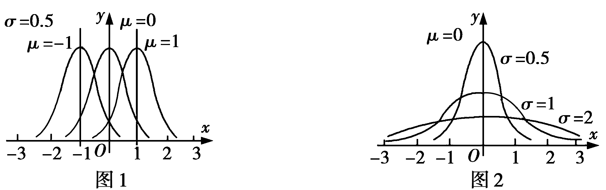

第7讲　二项分布、超几何分布与正态分布

<table><tr><td>
课标要求
</td><td>
命题点
</td><td>
五年考情
</td><td>
命题分析预测
</td></tr><tr><td rowspan="3">
1.了解伯努利试验，掌握二项分布及其数字特征，并能解决简单的实际问题.

2.了解超几何分布及其均值，并能解决简单的实际问题.

3.通过误差模型，了解服从正态分布的随机变量.通过具体实例，借助频率分布直方图的几何直观，了解正态分布的特征.

4.了解正态分布的均值、方差及其含义.
</td><td>
二项分布
</td><td>
2021天津T14；2019天津T16
</td><td rowspan="3">
本讲常以生产生活实际情境为载体考查二项分布、超几何分布及正态分布的应用，解题时注意对相关概念的理解及相关公式的应用.在2025年高考备考时注意对不同分布模型的理解和应用.
</td></tr><tr><td>
超几何分布
</td><td>
2021浙江T15
</td></tr><tr><td>
正态分布及其应用
</td><td>
2022新高考卷ⅡT13；2021新高考卷ⅡT6
</td></tr></table>

学生用书P243

1.*n*重伯努利试验  
（1）定义：把只包含两个可能结果的试验叫做伯努利试验.将一个伯努利试验独立地重复进行*n*次所组成的随机试验称为*n*重伯努利试验.  
（2）特征：a.同一个伯努利试验重复做*n*次；b.各次试验的结果相互独立.

2.二项分布

&lt;text style="u&lt;text style="italic,u<em>n</em>derline"&gt;n&lt;/text&gt;derline"&gt;（&lt;/text&gt;1&lt;text style="u&lt;text style="italic,u<em>n</em>derline,su<em><u>p</u></em>erscript"&gt;n&lt;/text&gt;derline"&gt;）&lt;/text&gt;定义：一般地<u>，</u>在<em>n</em>重伯努利试验中，设每次试验中事件<em>&lt;text style="italic"&gt;A</em>&lt;/text&gt;发生的概率为<em>&lt;text style="italic"&gt;&lt;text style="italic,underline"&gt;&lt;text style="italic,underline"&gt;p</em>&lt;/text&gt;&lt;/text&gt;&lt;/text&gt;（0＜p＜1），用<em>&lt;text style="italic"&gt;&lt;text style="italic"&gt;&lt;text style="italic"&gt;&lt;text style="italic"&gt;&lt;text style="italic,underline"&gt;X</em>&lt;/text&gt;&lt;/text&gt;&lt;/text&gt;&lt;/text&gt;&lt;/text&gt;表示事件A发生的次数，则X的分布列为<em>P</em>（X＝<em>&lt;text style="italic,underline,superscript"&gt;&lt;text style="italic,underline,superscript"&gt;&lt;text style="italic"&gt;k</em>&lt;/text&gt;&lt;/text&gt;&lt;/text&gt;）＝① $C_{n}^{k}$ <em>&lt;text style="italic"&gt;&lt;text style="italic,u&lt;text style="italic,u&lt;text style="italic"&gt;&lt;text style="italic,u&lt;text style="italic"&gt;n</em>derline"&gt;n&lt;/text&gt;&lt;/text&gt;derline,su<em><u>p</u></em>erscript"&gt;n&lt;/text&gt;derline"&gt;<em><u>p</u></em>&lt;/text&gt;&lt;/text&gt;&lt;/text&gt;<em>&lt;text style="italic,underline,superscript"&gt;&lt;text style="italic,underline,superscript"&gt;&lt;text style="italic"&gt;k</em>&lt;/text&gt;&lt;/text&gt;&lt;/text&gt;<u>&lt;text style="underline"&gt;（</u>1<u>－</u>&lt;/text&gt;p<u>）</u><em>n</em>－k<u>，</u>k＝0，1，2，…，n.如果随机变量<em>&lt;text style="italic"&gt;&lt;text style="italic"&gt;&lt;text style="italic"&gt;&lt;text style="italic"&gt;&lt;text style="italic,underline"&gt;X</em>&lt;/text&gt;&lt;/text&gt;&lt;/text&gt;&lt;/text&gt;&lt;/text&gt;的分布列具有上式的形式，则称随机变量X服从二项分布，记作②<u>　</u>X<u>～</u><em><u>B</u></em>（n，p<u>）　</u>.特别地，当n＝1时，此时的二项分布为两点分布.  
（2）期望与方差：若<em>X</em>～<em>B</em>（<em>n</em>，<em>p</em>），则<em>E</em>（<em>X</em>）＝③<u>　</u><em><u>np</u></em><u>　</u>，<em>D</em>（<em>X</em>）＝④<u>　</u><em><u>np</u></em><u>（1－</u><em><u>p</u></em><u>）　</u>.

3.超几何分布  
（1）定义：一般地，假设一批产品共有<em>&lt;text style="italic"&gt;&lt;text style="italic"&gt;&lt;text style="bold"&gt;&lt;text style="italic"&gt;&lt;text style="italic"&gt;&lt;text style="italic"&gt;N</em>&lt;/text&gt;&lt;/text&gt;&lt;/text&gt;&lt;/text&gt;&lt;/text&gt;&lt;/text&gt;件，其中有<em>&lt;text style="italic"&gt;&lt;text style="italic"&gt;&lt;text style="italic"&gt;&lt;text style="italic"&gt;M</em>&lt;/text&gt;&lt;/text&gt;&lt;/text&gt;&lt;/text&gt;件次品.从N件产品中随机抽取<em>&lt;text style="italic"&gt;&lt;text style="italic"&gt;&lt;text style="italic"&gt;&lt;text style="italic"&gt;&lt;text style="italic"&gt;n</em>&lt;/text&gt;&lt;/text&gt;&lt;/text&gt;&lt;/text&gt;&lt;/text&gt;件（不放回），用<em>&lt;text style="italic"&gt;&lt;text style="italic"&gt;&lt;text style="italic"&gt;&lt;text style="italic"&gt;X</em>&lt;/text&gt;&lt;/text&gt;&lt;/text&gt;&lt;/text&gt;表示抽取的n件产品中的次品数，则X的分布列为<em>P</em>（X＝<em>&lt;text style="italic"&gt;k</em>&lt;/text&gt;）＝⑤&lt;text style="unde<em>&lt;text style="italic"&gt;r</em>&lt;/text&gt;line"&gt;<u>　</u>&lt;/text&gt; $\frac{C_{M}^{k}C_{N－M}^{n－k}}{C_{N}^{n}}$ &lt;text style="u<em>&lt;text style="italic"&gt;&lt;text style="italic"&gt;&lt;text style="italic"&gt;n</em>&lt;/text&gt;&lt;/text&gt;&lt;/text&gt;de<em>&lt;text style="italic"&gt;r</em>&lt;/text&gt;line"&gt;<u>　</u>&lt;/text&gt;，<em>&lt;text style="italic"&gt;k</em>&lt;/text&gt;＝<em>&lt;text style="italic"&gt;&lt;text style="italic"&gt;&lt;text style="italic"&gt;m</em>&lt;/text&gt;&lt;/text&gt;&lt;/text&gt;，m＋1，m＋2，…，r.其中<em>&lt;text style="italic"&gt;n</em>&lt;/text&gt;，<em>&lt;text style="italic"&gt;&lt;text style="italic"&gt;&lt;text style="bold"&gt;&lt;text style="italic"&gt;&lt;text style="italic"&gt;&lt;text style="italic"&gt;N</em>&lt;/text&gt;&lt;/text&gt;&lt;/text&gt;&lt;/text&gt;&lt;/text&gt;&lt;/text&gt;，<em>&lt;text style="italic"&gt;&lt;text style="italic"&gt;&lt;text style="italic"&gt;&lt;text style="italic"&gt;M</em>&lt;/text&gt;&lt;/text&gt;&lt;/text&gt;&lt;/text&gt;∈N\*，M≤N，n≤N，m＝max{0，n－N＋M}，r＝min{n，M}.如果随机变量<em>&lt;text style="italic"&gt;&lt;text style="italic"&gt;&lt;text style="italic"&gt;&lt;text style="italic"&gt;X</em>&lt;/text&gt;&lt;/text&gt;&lt;/text&gt;&lt;/text&gt;的分布列具有上式的形式，那么称随机变量X服从超几何分布.  
（2）期望：<em>E</em>（<em>X</em>）＝⑥<u>&lt;text style="underline"&gt;　</u>&lt;/text&gt; $\frac{nM}{N}$ <u>&lt;text style="underline"&gt;　</u>&lt;/text&gt;.

注意　 二项分布是有放回抽取问题，超几何分布是不放回抽取问题.

4.正态分布

<u>（</u>1）定义：若随机变量&lt;te&lt;te<em>x</em>t style="italic"&gt;x&lt;/text&gt;t style="italic"&gt;<em>&lt;text style="italic,underline"&gt;&lt;text style="italic"&gt;X</em>&lt;/text&gt;&lt;/text&gt;&lt;/text&gt;的概率分布密度函数为<em>f</em>（x）＝ $\frac{1}{\sigma \sqrt{2\pi }}e^{－\frac{（x－\mu ）^{2}}{2\sigma ^{2}}}$ <u>，</u>&lt;te<em>x</em>t style="italic"&gt;x&lt;/text&gt;∈R，其中<em>&lt;text style="italic,underline"&gt;&lt;text style="italic"&gt;μ</em>&lt;/text&gt;&lt;/text&gt;∈R，<em>&lt;text style="italic,underline"&gt;&lt;text style="italic"&gt;σ</em>&lt;/text&gt;&lt;/text&gt;＞0为参数，则称随机变量<em>&lt;text style="italic"&gt;&lt;text style="italic,underline"&gt;&lt;text style="italic"&gt;X</em>&lt;/text&gt;&lt;/text&gt;&lt;/text&gt;服从正态分布，记为⑦<u>　</u>X<u>～</u><em><u>N</u></em><u>（</u>μ，σ<u>2）　</u>.特别地，当μ＝0，σ＝1时，称随机变量X服从标准正态分布.  
（2）正态曲线的特点

a.曲线是单峰的，它关于直线⑧<u>　</u><em><u>x</u></em><u>＝</u><em><u>μ</u></em><u>　</u>对称.

b.曲线在⑨&lt;te<em><u>x</u></em>t style="underline"&gt;<u>　</u>&lt;/text&gt;x<u>＝</u><em><u>μ</u></em>　处达到峰值 $\frac{1}{\sigma \sqrt{2\pi }}$ .

c.当｜*x*｜无限增大时，曲线无限接近*x*轴.

d.曲线与<em>x</em>轴之间的面积为<strong>⑩</strong><u>　1　</u>.

e.当*σ*取定值时，曲线的位置由*μ*确定，且随着*μ*的变化而沿*x*轴平移，如图1所示.

f.当<em>μ</em>取定值时，曲线的形状由<em>σ</em>确定.<em>σ</em>越小，曲线越“⑪<u>　瘦高　</u>”，表示总体的分布越⑫<u>　集中　</u>；<em>σ</em>越大，曲线越“⑬<u>　矮胖　</u>”，表示总体的分布越⑭<u>　分散　</u>，如图2所示.

说明　从图1，图2可以发现参数*μ*反映了正态分布的集中位置，*σ*反映了随机变量的分布相对于均值*μ*的离散程度.  
（3）正态分布三个常用数据

*P*（*μ*－*σ*≤*X*≤*μ*＋*σ*）≈0.682 7，

*P*（*μ*－2*σ*≤*X*≤*μ*＋2*σ*）≈0.954 5，

*P*（*μ*－3*σ*≤*X*≤*μ*＋3*σ*）≈0.997 3.
说明　在实际应用中，通常认为服从正态分布<em>N</em>（<em>μ</em>，<em>σ</em>2）的随机变量<em>X</em>只取[<em>μ</em>－3<em>σ</em>，<em>μ</em>＋3<em>σ</em>]中的值，这在统计学中称为3<em>σ</em>原则.  
（4）正态分布的期望与方差：若<em>X</em>～<em>N</em>（<em>μ</em>，<em>σ</em>2），则<em>E</em>（<em>X</em>）＝<strong>⑮</strong><u>　</u><em><u>μ</u></em><u>　</u>，<em>D</em>（<em>X</em>）＝<strong>⑯</strong><u>　</u><em><u>σ</u></em><u>2　</u>.

1.下列说法错误的是 （　A　）

A.某射手击中目标的概率为0.9，从开始射击到击中目标所需的射击次数*X*服从二项分布

B.从4名男演员和3名女演员中选出4人，其中女演员的人数*X*服从超几何分布

C.*n*重伯努利试验中各次数试验的结果相互独立

D.正态分布是对连续型随机变量而言的

2.[多选]若袋子中有2个白球，3个黑球（球除了颜色不同，没有其他任何区别），现从袋子中有放回地随机取球4次，每次取一个球，取到白球记1分，取到黑球记0分，记4次取球的总分数为*X*，则（　BCD　）

A.*<text style="italic">X*</text>～*B*（4， $\frac{3}{5}$ ）		*B*.*P*（*<text style="italic">X*</text>＝3）＝ $\frac{96}{625}$

C.*E*（*<text style="italic">X*</text>）＝ $\frac{8}{5}$ 			*D*.D（*<text style="italic">X*</text>）＝ $\frac{24}{25}$
解析　由题意知，每次取到白球的概率为 $\frac{2}{5}$ ，取到黑球的概率为 $\frac{3}{5}$ ，由于取到白球记1分，取到黑球记0分，所以*<text style="italic">X*</text>为4次取球取到白球的个数，易知X～*B*（4， $\frac{2}{5}$ ），故A错误；
<em>P</em>（<em>X</em>＝3）＝ $C_{4}^{3}$ （ $\frac{2}{5}$ ）3× $\frac{3}{5}$ ＝ $\frac{96}{625}$ ，故B正确；
*E*（*X*）＝4× $\frac{2}{5}$ ＝ $\frac{8}{5}$ ，故C正确；
*D*（*X*）＝4× $\frac{2}{5}$ × $\frac{3}{5}$ ＝ $\frac{24}{25}$ ，故*D*正确.故选BCD.

3.已知随机变量&lt;text style="itali&lt;text style="itali&lt;text style="itali<em>c</em>"&gt;c&lt;/text&gt;"&gt;c&lt;/text&gt;"&gt;<em>&lt;text style="italic"&gt;X</em>&lt;/text&gt;&lt;/text&gt;服从正态分布<em>N</em>（3，1），且<em>&lt;text style="italic"&gt;P</em>&lt;/text&gt;（X＞2c－1）＝P（X＜c＋3），则c＝<u>&lt;text style="underline"&gt;　</u>&lt;/text&gt; $\frac{4}{3}$ <u>&lt;text style="underline"&gt;　</u>&lt;/text&gt;.
解析　∵随机变量<text style="itali<text style="itali<text style="itali*c*">c</text>">c</text>">*<text style="italic">X*</text></text>服从正态分布*N*（3，1），且*<text style="italic">P*</text>（X＞2c－1）＝P（X＜c＋3），∴ $\frac{2c－1+c+3}{2}$ ＝3，∴<text style="itali<text style="itali*c*">c</text>">c</text>＝ $\frac{4}{3}$ .

4.[教材改编]生产方提供一批产品50箱，其中有2箱不合格产品.采购方接收该批产品的准则是：从该批产品中任取5箱产品进行检测，若至多有1箱不合格产品，便接收该批产品.则该批产品被接收的概率是<u>&lt;text style="underline"&gt;　</u>&lt;/text&gt; $\frac{243}{245}$ <u>&lt;text style="underline"&gt;　</u>&lt;/text&gt;.
解析　用*X*表示“5箱中不合格产品的箱数”，则*X*服从超几何分布，且*N*＝50，*M*＝2，*n*＝5.
因为这批产品被接收的条件是5箱全部合格或只有1箱不合格，
所以该批产品被接收的概率是*P*（*X*≤1）＝ $\frac{C_{2}^{0}C_{48}^{5}}{C_{50}^{5}}$ ＋ $\frac{C_{2}^{1}C_{48}^{4}}{C_{50}^{5}}$ ＝ $\frac{243}{245}$ .

学生用书P245

命题点1　二项分布

<strong>例</strong>1 （1）已知随机变量<em>&lt;text style="italic"&gt;&lt;text style="italic"&gt;&lt;text style="italic"&gt;X</em>&lt;/text&gt;&lt;/text&gt;&lt;/text&gt;～<em>B</em>（<em>n</em>，<em>p</em>），<em>E</em>（X）＝2，<em>D</em>（X）＝ $\frac{2}{3}$ ，则<em>P</em>（<em>&lt;text style="italic"&gt;&lt;text style="italic"&gt;&lt;text style="italic"&gt;X</em>&lt;/text&gt;&lt;/text&gt;&lt;/text&gt;≥2）＝（　A　）

A. $\frac{20}{27}$ 		
B. $\frac{2}{3}$ 		
C. $\frac{16}{27}$ 		
D. $\frac{13}{27}$
解析　由随机变量*<text style="italic"><text style="italic">X*</text></text>～*B*（*n*，*p*），*E*（X）＝2，*D*（X）＝ $\frac{2}{3}$ ，得 $\left\{\begin{matrix}np=2，\\np（1－p）＝\frac{2}{3}，\end{matrix}\right.$ 解得 $\left\{\begin{matrix}n=3，\\p＝\frac{2}{3}，\end{matrix}\right.$
所以<em>&lt;text style="italic"&gt;&lt;text style="italic"&gt;P</em>&lt;/text&gt;&lt;/text&gt;（<em>&lt;text style="italic"&gt;&lt;text style="italic"&gt;X</em>&lt;/text&gt;&lt;/text&gt;≥2）＝1－P（X＝1）－P（X＝0）＝1－ $C_{3}^{1}$ ×（ $\frac{2}{3}$ ）1×（1－ $\frac{2}{3}$ ）3－1－ $C_{3}^{0}$ × $\left(\frac{2}{3}\right)^{0}$ ×（1－ $\frac{2}{3}$ ）3－0＝1－ $\frac{2}{9}$ － $\frac{1}{27}$ ＝ $\frac{20}{27}$ .  
（2）为了解观众对2023年央视春晚小品节目《坑》的评价，某机构随机抽取10位观众对其打分（满分10分），得到如下表格：

<table><tr><td>
观众序号
</td><td>
1
</td><td>
2
</td><td>
3
</td><td>
4
</td><td>
5
</td><td>
6
</td><td>
7
</td><td>
8
</td><td>
9
</td><td>
10
</td></tr><tr><td>
评分
</td><td>
7.8
</td><td>
8.9
</td><td>
8.6
</td><td>
7.4
</td><td>
8.5
</td><td>
8.5
</td><td>
9.5
</td><td>
9.9
</td><td>
8.3
</td><td>
9.1
</td></tr></table>

①求这组数据的第75百分位数；
②将频率视为概率，现从观众中随机抽取3人对节目《坑》进行评价，记抽取的3人中评分超过9.0的人数为*X*，求*X*的分布列、数学期望与方差.
解析　①将这组数据从小到大排列，为7.4，7.8，8.3，8.5，8.5，8.6，8.9，9.1，9.5，9.9，
所以这组数据的第75百分位数为9.1.

②样本中评分超过9.0的有3个，所以评分超过9.0的频率为0.3.

把频率视为概率，则评分超过9.0的概率为0.3.
依题意，*X*的所有可能取值为0，1，2，3，且*X*～*B*（3，0.3），
则<em>P</em>（<em>X</em>＝0）＝ $C_{3}^{0}$ ×0.73＝0.343，

<em>P</em>（<em>X</em>＝1）＝ $C_{3}^{1}$ ×0.3×0.72＝0.441，

<em>P</em>（<em>X</em>＝2）＝ $C_{3}^{2}$ ×0.32×0.7＝0.189，

<em>P</em>（<em>X</em>＝3）＝ $C_{3}^{3}$ ×0.33＝0.027，
所以*X*的分布列为

<table><tr><td>
<em>X</em>
</td><td>
0
</td><td>
1
</td><td>
2
</td><td>
3
</td></tr><tr><td>
<em>P</em>
</td><td>
0.343
</td><td>
0.441
</td><td>
0.189
</td><td>
0.027
</td></tr></table>

（注意根据分布列中所有可能取值的概率之和为1检验所求的分布列是否正确）
所以*E*（*X*）＝3×0.3＝0.9，

*D*（*X*）＝3×0.3×0.7＝0.63.
方法技巧

二项分布问题的解题关键

1.定型  
（1）在每一次试验中，事件发生的概率相同.  
（2）各次试验中的事件是相互独立的.  
（3）在每一次试验中，试验的结果只有两个，即发生与不发生.

2.定参：确定二项分布中的两个参数*n*和*p*，即试验发生的次数和试验中事件发生的概率.

训练1 [天津高考]设甲、乙两位同学上学期间，每天7：30之前到校的概率均为 $\frac{2}{3}$ ，假定甲、乙两位同学到校情况互不影响，且任一同学每天到校情况相互独立.  
（1）用*X*表示甲同学上学期间的三天中7：30之前到校的天数，求随机变量*X*的分布列和数学期望；  
（2）设*M*为事件“上学期间的三天中，甲同学在7：30之前到校的天数比乙同学在7：30之前到校的天数恰好多2”，求事件*M*发生的概率.
解析　（1）因为甲同学上学期间的三天中每天到校情况相互独立，且每天7：30之前到校的概率均为 $\frac{2}{3}$ ，故<em>&lt;text style="italic"&gt;X</em>&lt;/text&gt;～<em>B</em>（3， $\frac{2}{3}$ ），从而<em>P</em>（<em>&lt;text style="italic"&gt;X</em>&lt;/text&gt;＝<em>&lt;text style="italic,superscript"&gt;&lt;text style="italic,superscript"&gt;&lt;text style="italic"&gt;k</em>&lt;/text&gt;&lt;/text&gt;&lt;/text&gt;）＝ $C_{3}^{k}$ （ $\frac{2}{3}$ ）<em>&lt;text style="italic,superscript"&gt;&lt;text style="italic,superscript"&gt;&lt;text style="italic"&gt;k</em>&lt;/text&gt;&lt;/text&gt;&lt;/text&gt;（ $\frac{1}{3}$ ）3－<em>&lt;text style="italic,superscript"&gt;&lt;text style="italic,superscript"&gt;&lt;text style="italic"&gt;k</em>&lt;/text&gt;&lt;/text&gt;&lt;/text&gt;，k＝0，1，2，3.
所以随机变量*X*的分布列为

<table><tr><td>
<em>X</em>
</td><td>
0
</td><td>
1
</td><td>
2
</td><td>
3
</td></tr><tr><td>
<em>P</em>
</td><td>
 $\frac{1}{27}$ 
</td><td>
 $\frac{2}{9}$ 
</td><td>
 $\frac{4}{9}$ 
</td><td>
 $\frac{8}{27}$ 
</td></tr></table>

随机变量*<text style="italic">X*</text>的数学期望*E*（X）＝3× $\frac{2}{3}$ ＝2.  
（2）设乙同学上学期间的三天中每天7：30之前到校的天数为*<text style="italic"><text style="italic"><text style="italic">Y*</text></text></text>，则Y～*B*（3， $\frac{2}{3}$ ），且*M*＝{*<text style="italic">X*</text>＝3，*<text style="italic"><text style="italic"><text style="italic">Y*</text></text></text>＝1}∪{X＝2，Y＝0}.
由题意知事件{*<text style="italic"><text style="italic"><text style="italic">X*</text></text></text>＝3，*<text style="italic"><text style="italic"><text style="italic">Y*</text></text></text>＝1}与{X＝2，Y＝0}互斥，且事件{X＝3}与{Y＝1}，事件{X＝2}与{Y＝0}均相互独立，从而由（1）知 $P\left（M\right）=P\left（\left\{X=3,Y=1\right\}\cup \left\{X=2,Y=0\right\}\right）=P\left（\left\{X=3,Y=1\right\}\right）+P\left（\left\{X=2,Y=0\right\}\right）=P\left（\left\{X=3\right\}\right）P\left（\left\{Y=1\right\}\right）+P\left（\left\{X=2\right\}\right）P\left（\left\{Y=0\right\}\right）=\frac{8}{27}\times \frac{2}{9}+\frac{4}{9}\times \frac{1}{27}=\frac{20}{243}$ .

命题点2　超几何分布

> [!example]- 例2 [2023北京市朝阳区质检]某数学教师组织学生进行线上答题交流活动，规定从8道备选题中随机抽取题目作答，假设在8道备选题中，学生甲答对每道题的概率都是 $\frac{2}{3}$ ，且每道题答对与否互不影响，学生乙、丙都只能答对其中的6道题.  
（1）若甲、乙两人分别从8道备选题中随机抽取1道作答，求至少有1人能答对的概率；  
（2）若学生丙从8道备选题中随机抽取2道作答，以*X*表示其中丙能答对的题数，求*X*的分布列及数学期望.
解析　（1）由题意可知随机抽取1道试题作答，乙能答对的概率为 $\frac{3}{4}$ ，
则甲、乙两人都不能答对的概率*P*＝（1－ $\frac{3}{4}$ ）×（1－ $\frac{2}{3}$ ）＝ $\frac{1}{12}$ ，
所以甲、乙两人至少有1人能答对的概率为1－*P*＝ $\frac{11}{12}$ .  
（2）*X*的所有可能取值为0，1，2，

*<text style="italic"><text style="italic">P*</text></text>（*<text style="italic"><text style="italic">X*</text></text>＝0）＝ $\frac{C_{2}^{2}}{C_{8}^{2}}$ ＝ $\frac{1}{28}$ ，*<text style="italic"><text style="italic">P*</text></text>（*<text style="italic"><text style="italic">X*</text></text>＝1）＝ $\frac{C_{6}^{1}C_{2}^{1}}{C_{8}^{2}}$ ＝ $\frac{3}{7}$ ，*<text style="italic"><text style="italic">P*</text></text>（*<text style="italic"><text style="italic">X*</text></text>＝2）＝ $\frac{C_{6}^{2}}{C_{8}^{2}}$ ＝ $\frac{15}{28}$ ，

*X*的分布列为

<table><tr><td>
<em>X</em>
</td><td>
0
</td><td>
1
</td><td>
2
</td></tr><tr><td>
<em>P</em>
</td><td>
 $\frac{1}{28}$ 
</td><td>
 $\frac{3}{7}$ 
</td><td>
 $\frac{15}{28}$ 
</td></tr></table>
解法一　所以*E*（*X*）＝0× $\frac{1}{28}$ ＋1× $\frac{3}{7}$ ＋2× $\frac{15}{28}$ ＝ $\frac{3}{2}$ .
解法二　因为*<text style="italic">X*</text>服从超几何分布*H*（8，6，2），所以*E*（X）＝ $\frac{6\times 2}{8}$ ＝ $\frac{3}{2}$ .
方法技巧

1.超几何分布描述的是不放回抽样问题，随机变量为抽到的某类个体的个数.

2.超几何分布的特征是：（1）考查对象分两类；（2）已知各类对象的个数；（3）从中抽取若干个个体，考查某类个体数*X* 的概率分布.

3.超几何分布主要用于抽检产品、摸不同类别的小球等概率模型，其实质是古典概型.

训练2 [天津高考]已知某单位甲、乙、丙三个部门的员工人数分别为24，16，16.现采用分层随机抽样的方法从中抽取7人，进行睡眠时间的调查.  
（1）应从甲、乙、丙三个部门的员工中分别抽取多少人？  
（2）若抽出的7人中有4人睡眠不足，3人睡眠充足，现从这7人中随机抽取3人做进一步的身体检查.

（i）用*X*表示抽取的3人中睡眠不足的员工人数，求随机变量*X*的分布列与数学期望；
（ii）设*A*为事件“抽取的3人中，既有睡眠充足的员工，也有睡眠不足的员工”，求事件*A*发生的概率.
解析　（1）由已知，甲、乙、丙三个部门的员工人数之比为3∶2∶2.由于采用分层随机抽样的方法从中抽取7人，因此应从甲、乙、丙三个部门的员工中分别抽取3人，2人，2人.  
（2）（i）随机变量*X*的所有可能取值为0，1，2，3，且服从超几何分布，则 $P\left（X=k\right）=\frac{C_{4}^{k}\cdot C_{3}^{3－k}}{C_{7}^{3}}$ （*k*＝0，1，2，3）.
所以随机变量*X*的分布列为

<table><tr><td>
<em>X</em>
</td><td>
0
</td><td>
1
</td><td>
2
</td><td>
3
</td></tr><tr><td>
<em>P</em>
</td><td>
 $\frac{1}{35}$ 
</td><td>
 $\frac{12}{35}$ 
</td><td>
 $\frac{18}{35}$ 
</td><td>
 $\frac{4}{35}$ 
</td></tr></table>
所以随机变量*<text style="italic"><text style="italic">X*</text></text>的数学期望*<text style="italic">E*</text>（X）＝0× $\frac{1}{35}$ ＋1× $\frac{12}{35}$ ＋2× $\frac{18}{35}$ ＋3× $\frac{4}{35}$ ＝ $\frac{12}{7}$ .（也可直接由超几何分布的期望计算公式*<text style="italic">E*</text>（*<text style="italic"><text style="italic">X*</text></text>）＝ $\frac{nM}{N}$ 求解）

（ii）设事件*B*为“抽取的3人中，睡眠充足的员工有1人，睡眠不足的员工有2人”；事件*C*为“抽取的3人中，睡眠充足的员工有2人，睡眠不足的员工有1人”，则*A*＝*B*∪*C*，且*B*与*C*互斥.由（i）知，*P*（*B*）＝*P*（*X*＝2），*P*（*C*）＝*P*（*X*＝1），
故*<text style="italic"><text style="italic"><text style="italic">P*</text></text></text>（*A*）＝P（*B*∪*C*）＝P（*<text style="italic">X*</text>＝2）＋P（X＝1）＝ $\frac{6}{7}$ .
所以事件*A*发生的概率为 $\frac{6}{7}$ .

命题点3　正态分布及其应用

<strong>例</strong>3 （1）[2021新高考卷Ⅱ]某物理量的测量结果服从正态分布<em>N</em>（10，<em>σ</em>2），则下列结论中不正确的是（　D　）

A.*σ*越小，该物理量一次测量结果落在（9.9，10.1）内的概率越大

B.该物理量一次测量结果大于10的概率为0.5

C.该物理量一次测量结果小于9.99的概率与大于10.01的概率相等

D.该物理量一次测量结果落在（9.9，10.2）内的概率与落在（10，10.3）内的概率相等
解析　设该物理量一次测量结果为*X*，

对于A，*σ*越小，说明数据越集中在10附近，所以*X*落在（9.9，10.1）内的概率越大，所以选项A正确；
对于B，根据正态曲线的对称性可得，*P*（*X*＞10）＝0.5，所以选项B正确；
对于C，根据正态曲线的对称性可得，*P*（*X*＞10.01）＝*P*（*X*＜9.99），所以选项C正确；
对于D，根据正态曲线的对称性可得，*<text style="italic"><text style="italic"><text style="italic"><text style="italic"><text style="italic">P*</text></text></text></text></text>（9.9＜*<text style="italic"><text style="italic"><text style="italic"><text style="italic"><text style="italic">X*</text></text></text></text></text>＜10.2）－P（10＜X＜10.3）＝P（9.9＜X＜10）－P（10.2＜X＜10.3），又P（9.9＜X＜10）＞P（10.2＜X＜10.3），所以 $P\left（9.9<X<10.2\right）>P\left（10<X<10.3\right）$ ，所以选项D错误.故选D.  
（2）某工厂制造的某种机器零件的尺寸<em>X</em>（单位：mm）近似服从正态分布<em>N</em>（100，0.01），现从中随机抽取10 000个零件，尺寸在[99.8，99.9]内的个数约为（附：若随机变量<em>X</em>～<em>N</em>（<em>μ</em>，<em>σ</em>2），则<em>P</em>（<em>μ</em>－<em>σ</em>≤<em>X</em>≤<em>μ</em>＋<em>σ</em>）≈0.682 7，<em>P</em>（<em>μ</em>－2<em>σ</em>≤<em>X</em>≤<em>μ</em>＋2<em>σ</em>）≈0.954 5） （　B　）

A.2 718		
B.1 359		
C.430		
D.215
解析　∵*<text style="italic"><text style="italic"><text style="italic"><text style="italic">X*</text></text></text></text>～*N*（100，0.01），∴*<text style="italic"><text style="italic"><text style="italic"><text style="italic"><text style="italic"><text style="italic">μ*</text></text></text></text></text></text>＝100，*<text style="italic"><text style="italic"><text style="italic"><text style="italic"><text style="italic"><text style="italic">σ*</text></text></text></text></text></text>＝0.1，则*<text style="italic"><text style="italic"><text style="italic">P*</text></text></text>（99.8≤X≤99.9）＝P（μ－2σ≤X≤μ－σ）＝ $\frac{1}{2}$ [*<text style="italic"><text style="italic"><text style="italic">P*</text></text></text>（*<text style="italic"><text style="italic"><text style="italic"><text style="italic"><text style="italic"><text style="italic">μ*</text></text></text></text></text></text>－2*<text style="italic"><text style="italic"><text style="italic"><text style="italic"><text style="italic"><text style="italic">σ*</text></text></text></text></text></text>≤*<text style="italic"><text style="italic"><text style="italic"><text style="italic">X*</text></text></text></text>≤μ＋2σ）－P（μ－σ≤X≤μ＋σ）]≈ $\frac{1}{2}$ ×（0.954 5－0.682 7）＝0.135 9.故随机抽取的

10 000个零件中尺寸在[99.8，99.9]内的个数约为10 000×0.135 9＝1 359.
方法技巧
解决正态分布问题的思路

1.把给出的区间或范围与参数*μ*，*σ*进行对比计算，确定它们属于[*μ*－*σ*，*μ*＋*σ*]，[*μ*－2*σ*，*μ*＋2*σ*]，[*μ*－3*σ*，*μ*＋3*σ*]中的哪一个.

2.利用正态曲线的对称性转化所求概率，常用结论如下：  
（1）*P*（*X*≥*μ*）＝*P*（*X*＜*μ*）＝0.5；  
（2）对任意的*a*，有*P*（*X*＜*μ*－*a*）＝*P*（*X*＞*μ*＋*a*）；  
（3）<em>P</em>（<em>X</em>＜<em>x</em>0）＝1－<em>P</em>（<em>X</em>≥<em>x</em>0）；  
（4）*P*（*a*＜*X*＜*b*）＝*P*（*X*＜*b*）－*P*（*X*≤*a*）.

<strong>训练</strong>3 （1）[2022新高考卷Ⅱ]已知随机变量<em>X</em>服从正态分布<em>N</em>（2，<em>σ</em>2），且<em>P</em>（2＜<em>X</em>≤2.5）＝0.36，则<em>P</em>（<em>X</em>＞2.5）＝<u>　0.14　</u>.
解析　因为<em>X</em>～<em>N</em>（2，<em>σ</em>2），所以<em>P</em>（<em>X</em>＞2）＝0.5，
所以*P*（*X*＞2.5）＝*P*（*X*＞2）－*P*（2＜*X*≤2.5）＝0.5－0.36＝0.14.  
（2）[2023广州市阶段测试]某品牌手机的电池使用寿命<em>X</em>（单位：年）服从正态分布，且使用寿命不少于1年的概率为0.9，使用寿命不少于9年的概率为0.1，则该品牌手机的电池使用寿命不少于5年且不多于9年的概率为<u>　0.4　</u>.
解析　由题意知*P*（*X*≥1）＝0.9，*P*（*X*≥9）＝0.1，
所以<te*x*t style="italic">*P*</text>（*<text style="italic">X*</text>＜1）＝1－0.9＝0.1＝P（X≥9），所以正态曲线的对称轴为直线x＝ $\frac{1+9}{2}$ ＝5.
因为*<text style="italic">P*</text>（1≤*<text style="italic">X*</text>≤9）＝0.9－0.1＝0.8，所以P（5≤X≤9）＝ $\frac{0.8}{2}$ ＝0.4，即该品牌手机的电池使用寿命不少于5年且不多于9年的概率为0.4.

1.[命题点1]据悉强基计划的校考由试点高校自主命题，校考过程中达到笔试优秀才能进入面试环节.已知甲、乙两所大学的笔试环节都设有三门考试科目且每门科目是否达到优秀相互独立.若某考生报考甲大学，每门科目达到优秀的概率均为 $\frac{1}{3}$ ，若该考生报考乙大学，三门科目达到优秀的概率依次为 $\frac{1}{6}$ ， $\frac{2}{5}$ ，*<text style="italic">n*</text>，其中0＜n＜1.  
（1）若*n*＝ $\frac{1}{3}$ ，分别求出该考生报考甲、乙两所大学在笔试环节恰好有一门科目达到优秀的概率；  
（2）强基计划规定每名考生只能报考一所试点高校，若以笔试过程中达到优秀科目个数的期望为依据作出决策，该考生更希望进入甲大学的面试环节，求*n*的范围.
解析　（1）设该考生报考甲大学恰好有一门笔试科目优秀为事件*A*，
则<em>P</em>（<em>A</em>）＝ $C_{3}^{1}$ × $\frac{1}{3}$ ×（ $\frac{2}{3}$ ）2＝ $\frac{4}{9}$ ；
设该考生报考乙大学恰好有一门笔试科目优秀为事件*<text style="italic">B*</text>，则*P*（B）＝ $\frac{1}{6}$ × $\frac{3}{5}$ × $\frac{2}{3}$ ＋ $\frac{5}{6}$ × $\frac{2}{5}$ × $\frac{2}{3}$ ＋ $\frac{5}{6}$ × $\frac{3}{5}$ × $\frac{1}{3}$ ＝ $\frac{41}{90}$ .  
（2）该考生报考甲大学达到优秀科目的个数设为*X*，
根据题意可知，*<text style="italic">X*</text>～*B*（3， $\frac{1}{3}$ ），则*E*（*<text style="italic">X*</text>）＝3× $\frac{1}{3}$ ＝1.

该考生报考乙大学达到优秀科目的个数设为*Y*，则随机变量*Y*的可能取值为0，1，2，3.

*<text style="italic">P*</text>（*<text style="italic">Y*</text>＝0）＝ $\frac{5}{6}$ × $\frac{3}{5}$ ×（1－*<text style="italic"><text style="italic"><text style="italic">n*</text></text></text>）＝ $\frac{1－n}{2}$ ，*<text style="italic">P*</text>（*<text style="italic">Y*</text>＝1）＝ $\frac{1}{6}$ × $\frac{3}{5}$ ×（1－*<text style="italic"><text style="italic"><text style="italic">n*</text></text></text>）＋ $\frac{5}{6}$ × $\frac{2}{5}$ ×（1－*<text style="italic"><text style="italic"><text style="italic">n*</text></text></text>）＋ $\frac{5}{6}$ × $\frac{3}{5}$ *<text style="italic"><text style="italic"><text style="italic">n*</text></text></text>＝ $\frac{13+2n}{30}$ ，

*<text style="italic">P*</text>（*<text style="italic">Y*</text>＝2）＝ $\frac{5}{6}$ × $\frac{2}{5}$ *<text style="italic"><text style="italic"><text style="italic">n*</text></text></text>＋ $\frac{1}{6}$ × $\frac{3}{5}$ *<text style="italic"><text style="italic"><text style="italic">n*</text></text></text>＋ $\frac{1}{6}$ × $\frac{2}{5}$ ×（1－*<text style="italic"><text style="italic"><text style="italic">n*</text></text></text>）＝ $\frac{2+11n}{30}$ ，*<text style="italic">P*</text>（*<text style="italic">Y*</text>＝3）＝ $\frac{1}{6}$ × $\frac{2}{5}$ *<text style="italic"><text style="italic"><text style="italic">n*</text></text></text>＝ $\frac{2n}{30}$ ＝ $\frac{n}{15}$ ，

随机变量*Y*的分布列为

<table><tr><td>
<em>Y</em>
</td><td>
0
</td><td>
1
</td><td>
2
</td><td>
3
</td></tr><tr><td>
<em>P</em>
</td><td>
 $\frac{1－n}{2}$ 
</td><td>
 $\frac{13+2n}{30}$ 
</td><td>
 $\frac{2+11n}{30}$ 
</td><td>
 $\frac{n}{15}$ 
</td></tr></table>

*E*（*Y*）＝0× $\frac{1－n}{2}$ ＋1× $\frac{13+2n}{30}$ ＋2× $\frac{2+11n}{30}$ ＋3× $\frac{n}{15}$ ＝ $\frac{17+30n}{30}$ ，
因为该考生更希望进入甲大学的面试环节，所以*<text style="italic">E*</text>（*Y*）＜E（*X*），即 $\frac{17+30n}{30}$ ＜1，解得*n*＜ $\frac{13}{30}$ .
所以*n*的取值范围为（0， $\frac{13}{30}$ ）.

2.[命题点2<em>/</em>浙江高考]袋中有4个红球，<em>&lt;text style="italic"&gt;m</em>&lt;/text&gt;个黄球，<em>&lt;text style="italic"&gt;n</em>&lt;/text&gt;个绿球.现从中任取两个球，记取出的红球数为ξ ，若取出的两个球都是红球的概率为 $\frac{1}{6}$ ，一红一黄的概率为 $\frac{1}{3}$ ，则<em>&lt;text style="italic"&gt;m</em>&lt;/text&gt;－<em>&lt;text style="italic"&gt;n</em>&lt;/text&gt;＝<u>&lt;text style="underline"&gt;&lt;text style="underline"&gt;　</u>&lt;/text&gt;1　&lt;/text&gt;， <em>E</em>（ξ）＝　 $\frac{8}{9}$ <u>&lt;text style="underline"&gt;　</u>&lt;/text&gt;.
解析　由题意可得，<em>&lt;text style="italic"&gt;P</em>&lt;/text&gt;（ξ＝2）＝ $\frac{C_{4}^{2}}{C_{4+m＋n}^{2}}$ ＝ $\frac{12}{（4+m＋n)(3+m＋n）}$ ＝ $\frac{1}{6}$ ，化简得（<em>&lt;text style="italic"&gt;&lt;text style="italic"&gt;&lt;text style="italic"&gt;&lt;text style="italic"&gt;m</em>&lt;/text&gt;&lt;/text&gt;&lt;/text&gt;&lt;/text&gt;＋<em>&lt;text style="italic"&gt;&lt;text style="italic"&gt;&lt;text style="italic"&gt;&lt;text style="italic"&gt;n</em>&lt;/text&gt;&lt;/text&gt;&lt;/text&gt;&lt;/text&gt;）2＋7（m＋n）－60＝0，得m＋n＝5，取出的两个球一红一黄的概率<em>&lt;text style="italic"&gt;P</em>&lt;/text&gt;＝ $\frac{C_{4}^{1}C_{m}^{1}}{C_{4+m＋n}^{2}}$ ＝ $\frac{4m}{36}$ ＝ $\frac{1}{3}$ ，解得<em>&lt;text style="italic"&gt;&lt;text style="italic"&gt;&lt;text style="italic"&gt;&lt;text style="italic"&gt;m</em>&lt;/text&gt;&lt;/text&gt;&lt;/text&gt;&lt;/text&gt;＝3，故<em>&lt;text style="italic"&gt;&lt;text style="italic"&gt;&lt;text style="italic"&gt;&lt;text style="italic"&gt;n</em>&lt;/text&gt;&lt;/text&gt;&lt;/text&gt;&lt;/text&gt;＝2，所以m－n＝1.易知ξ服从超几何分布，则<em>E</em>（ξ）＝ $\frac{4\times 2}{9}$ ＝ $\frac{8}{9}$ .

3.[命题点3<em>/</em>2023四省联考]某工厂生产的产品的质量指标服从正态分布<em>N</em>（100，<em>σ</em>2）.质量指标介于99至101之间的产品为良品，为使这种产品的良品率达到95.45％，则需调整生产工艺，使得<em>σ</em>至多为<u>　0.5　</u>.（若<em>X</em>～<em>N</em>（<em>μ</em>，<em>σ</em>2），则<em>P</em>（｜<em>X</em>－<em>μ</em>｜＜2<em>σ</em>）≈0.954 5）
解析　由题知，*μ*＝100.根据题意以及正态曲线的特征可知，｜*<text style="italic"><text style="italic">X*</text></text>－100｜＜2*<text style="italic"><text style="italic"><text style="italic"><text style="italic"><text style="italic">σ*</text></text></text></text></text>的解集*A*⊆（99，101）.由｜X－100｜＜2σ可得，100－2σ＜X＜100＋2σ，所以 $\left\{\begin{matrix}100－2\sigma \geq 99，\\100+2\sigma \leq 101，\end{matrix}\right.$ 解得*<text style="italic"><text style="italic"><text style="italic"><text style="italic"><text style="italic">σ*</text></text></text></text></text>≤0.5，故σ至多为0.5.

学生用书·练习帮P393

1.设随机变量*<text style="italic">ζ*</text>～ *<text style="italic">B*</text>（2，*<text style="italic">p*</text>），*<text style="italic">η*</text>～B（4，p），若*<text style="italic">P*</text>（ζ≥1）＝ $\frac{5}{9}$ ，则*<text style="italic">P*</text>（*<text style="italic">η*</text>≥2）的值为（　*<text style="italic">B*</text>　）

A. $\frac{32}{81}$ 		
B. $\frac{11}{27}$ 		
C. $\frac{65}{81}$ 		
D. $\frac{16}{81}$
解析　因为随机变量*ζ*～*B*（2，*p*），
所以<em>&lt;text style="italic"&gt;P</em>&lt;/text&gt;（<em>&lt;text style="italic"&gt;ζ</em>&lt;/text&gt;≥1）＝1－P（ζ＝0）＝1－（1－<em>&lt;text style="italic"&gt;p</em>&lt;/text&gt;）2＝ $\frac{5}{9}$ ，解得<em>&lt;text style="italic"&gt;p</em>&lt;/text&gt;＝ $\frac{1}{3}$ ，
所以<em>&lt;text style="italic"&gt;&lt;text style="italic"&gt;&lt;text style="italic"&gt;η</em>&lt;/text&gt;&lt;/text&gt;&lt;/text&gt;～<em>B</em>（4， $\frac{1}{3}$ ），则<em>&lt;text style="italic"&gt;&lt;text style="italic"&gt;P</em>&lt;/text&gt;&lt;/text&gt;（<em>&lt;text style="italic"&gt;&lt;text style="italic"&gt;&lt;text style="italic"&gt;η</em>&lt;/text&gt;&lt;/text&gt;&lt;/text&gt;≥2）＝1－P（η＝0）－P（η＝1）＝1－（1－ $\frac{1}{3}$ ）4－ $C_{4}^{1}$ （1－ $\frac{1}{3}$ ）3× $\frac{1}{3}$ ＝ $\frac{11}{27}$ .故选<em>B</em>.

2.已知随机变量*X*～*B*（4， $\frac{1}{3}$ ），则下列表达式正确的是（　C　）

A.*P*（*<text style="italic">X*</text>＝2）＝ $\frac{4}{81}$ 		
B.*E*（3*<text style="italic">X*</text>＋1）＝4

C.*<text style="italic">D*</text>（3*<text style="italic">X*</text>＋1）＝8		
D.D（X）＝ $\frac{4}{9}$
解析　因为*X*～*B*（4， $\frac{1}{3}$ ），
所以<em>P</em>（<em>&lt;text style="italic"&gt;&lt;text style="italic"&gt;X</em>&lt;/text&gt;&lt;/text&gt;＝&lt;text style="superscript"&gt;2&lt;/text&gt;）＝ $C_{4}^{2}$ ×（ $\frac{1}{3}$ ）&lt;text style="superscript"&gt;2&lt;/text&gt;×（1－ $\frac{1}{3}$ ）&lt;text style="superscript"&gt;2&lt;/text&gt;＝ $\frac{8}{27}$ ，<em>E</em>（<em>&lt;text style="italic"&gt;&lt;text style="italic"&gt;X</em>&lt;/text&gt;&lt;/text&gt;）＝4× $\frac{1}{3}$ ＝ $\frac{4}{3}$ ，<em>D</em>（<em>&lt;text style="italic"&gt;&lt;text style="italic"&gt;X</em>&lt;/text&gt;&lt;/text&gt;）＝4× $\frac{1}{3}$ ×（1－ $\frac{1}{3}$ ）＝ $\frac{8}{9}$ ，
所以<em>&lt;text style="italic"&gt;E</em>&lt;/text&gt;（3<em>&lt;text style="italic"&gt;&lt;text style="italic"&gt;&lt;text style="italic"&gt;X</em>&lt;/text&gt;&lt;/text&gt;&lt;/text&gt;＋1）＝3E（X）＋1＝3× $\frac{4}{3}$ ＋1＝5，<em>&lt;text style="italic"&gt;D</em>&lt;/text&gt;（3<em>&lt;text style="italic"&gt;&lt;text style="italic"&gt;&lt;text style="italic"&gt;X</em>&lt;/text&gt;&lt;/text&gt;&lt;/text&gt;＋1）＝32·D（X）＝9× $\frac{8}{9}$ ＝8，
所以A，B，D不正确，C正确.故选C.

3.[2024贵州贵阳一中模拟]若随机变量<em>X</em>～<em>N</em>（10，22），则下列选项错误的是（　D　）

A.*P*（*X*≥10）＝0.5

B.*P*（*X*≤8）＋*P*（*X*≤12）＝1

C.*P*（8≤*X*≤12）＝2*P*（8≤*X*≤10）

D.*D*（2*X*＋1）＝8
解析　根据随机变量<em>X</em>～<em>N</em>（10，22）可知<em>μ</em>＝10，<em>σ</em>＝2，所以<em>P</em>（<em>X</em>≥10）＝0.5，故A正确，

*P*（*X*≤8）＋*P*（*X*≤12）＝*P*（*X*≥12）＋*P*（*X*≤12）＝1，故B正确，

*P*（8≤*X*≤12）＝2*P*（8≤*X*≤10），C正确，

*D*（2*X*＋1）＝4*D*（*X*）＝16，故D错误，故选D.

4.[2024河北邢台模拟]若*X*～*B*（16，*p*）（0＜*p*＜1），且*D*（*aX*）＝16，则（　B　）

A.<em>a</em>的最小值为4		
B.<em>a</em>2的最小值为4

C.<em>a</em>的最大值为4		
D.<em>a</em>2的最大值为4
解析　因为&lt;text style="it&lt;text style="it&lt;text style="it&lt;text style="it<em>a</em>lic"&gt;a&lt;/text&gt;lic"&gt;a&lt;/text&gt;lic"&gt;a&lt;/text&gt;lic"&gt;X&lt;/text&gt;～<em>B</em>（16，<em>&lt;text style="italic"&gt;&lt;text style="italic"&gt;&lt;text style="italic"&gt;&lt;text style="italic"&gt;&lt;text style="italic"&gt;&lt;text style="italic"&gt;p</em>&lt;/text&gt;&lt;/text&gt;&lt;/text&gt;&lt;/text&gt;&lt;/text&gt;&lt;/text&gt;）（0＜p＜1），所以<em>D</em>（<em>aX</em>）＝16a&lt;text style="superscript"&gt;&lt;text style="superscript"&gt;&lt;text style="superscript"&gt;&lt;text style="superscript"&gt;2&lt;/text&gt;&lt;/text&gt;&lt;/text&gt;&lt;/text&gt;p（1－p）＝16，则a2＝ $\frac{1}{p（1－p）}$ ，因为&lt;text style="it&lt;text style="it&lt;text style="it&lt;text style="it<em>a</em>lic"&gt;a&lt;/text&gt;lic"&gt;a&lt;/text&gt;lic"&gt;a&lt;/text&gt;lic"&gt;<em>&lt;text style="italic"&gt;&lt;text style="italic"&gt;&lt;text style="italic"&gt;&lt;text style="italic"&gt;&lt;text style="italic"&gt;p</em>&lt;/text&gt;&lt;/text&gt;&lt;/text&gt;&lt;/text&gt;&lt;/text&gt;&lt;/text&gt;（1－p）≤（ $\frac{p+1－p}{2}$ ）&lt;text style="su&lt;text style="it&lt;text style="it&lt;text style="it<em>a</em>lic"&gt;a&lt;/text&gt;lic"&gt;a&lt;/text&gt;lic"&gt;<em>&lt;text style="italic"&gt;&lt;text style="italic"&gt;&lt;text style="italic"&gt;p</em>&lt;/text&gt;&lt;/text&gt;&lt;/text&gt;&lt;/text&gt;erscript"&gt;&lt;text style="superscript"&gt;&lt;text style="superscript"&gt;&lt;text style="superscript"&gt;2&lt;/text&gt;&lt;/text&gt;&lt;/text&gt;&lt;/text&gt;＝ $\frac{1}{4}$ （当且仅当&lt;text style="it&lt;text style="it&lt;text style="it&lt;text style="it<em>a</em>lic"&gt;a&lt;/text&gt;lic"&gt;a&lt;/text&gt;lic"&gt;a&lt;/text&gt;lic"&gt;<em>&lt;text style="italic"&gt;&lt;text style="italic"&gt;&lt;text style="italic"&gt;&lt;text style="italic"&gt;&lt;text style="italic"&gt;p</em>&lt;/text&gt;&lt;/text&gt;&lt;/text&gt;&lt;/text&gt;&lt;/text&gt;&lt;/text&gt;＝ $\frac{1}{2}$ 时，等号成立），所以&lt;text style="it&lt;text style="it&lt;text style="it<em>a</em>lic"&gt;a&lt;/text&gt;lic"&gt;a&lt;/text&gt;lic"&gt;a&lt;/text&gt;&lt;text style="su<em>&lt;text style="italic"&gt;&lt;text style="italic"&gt;&lt;text style="italic"&gt;&lt;text style="italic"&gt;p</em>&lt;/text&gt;&lt;/text&gt;&lt;/text&gt;&lt;/text&gt;erscript"&gt;&lt;text style="superscript"&gt;&lt;text style="superscript"&gt;&lt;text style="superscript"&gt;2&lt;/text&gt;&lt;/text&gt;&lt;/text&gt;&lt;/text&gt;≥4，则a2的最小值为4.故选<em>B</em>.

5.孪生素数猜想是希尔伯特在1900年提出的23个数学问题之一，该问题可以直观描述为：存在无穷多个素数*p*，使得*p*＋2是素数.素数对（*p*，*p*＋2）称为孪生素数.从8个数对（3，5），（5，7），（7，9），（9，11），（11，13），（13，15），（15，17），（17，19）中任取3个，设取出的孪生素数的个数为*X*，则*E*（*X*）＝（　C　）

A. $\frac{3}{8}$ 		
B. $\frac{1}{2}$ 		
C. $\frac{3}{2}$ 		
D.3
解析　解法一　由题意可知，这8个数对中只有（3，5），（5，7），（11，13），（17，19）是孪生素数，则*X*的可能取值为0，1，2，3，
故*P*（*X*＝0）＝ $\frac{C_{4}^{0}C_{4}^{3}}{C_{8}^{3}}$ ＝ $\frac{1}{14}$ ，

*P*（*X*＝1）＝ $\frac{C_{4}^{1}C_{4}^{2}}{C_{8}^{3}}$ ＝ $\frac{3}{7}$ ，

*P*（*X*＝2）＝ $\frac{C_{4}^{2}C_{4}^{1}}{C_{8}^{3}}$ ＝ $\frac{3}{7}$ ，

*P*（*X*＝3）＝ $\frac{C_{4}^{3}C_{4}^{0}}{C_{8}^{3}}$ ＝ $\frac{1}{14}$ ，
所以*E*（*X*）＝0× $\frac{1}{14}$ ＋1× $\frac{3}{7}$ ＋2× $\frac{3}{7}$ ＋3× $\frac{1}{14}$ ＝ $\frac{3}{2}$ .
解法二　直接利用超几何分布的期望公式得*E*（*X*）＝3× $\frac{4}{8}$ ＝ $\frac{3}{2}$ .

6.[2024贵阳市模拟]已知随机变量<em>&lt;text style="italic"&gt;&lt;text style="italic"&gt;X</em>&lt;/text&gt;&lt;/text&gt;，<em>&lt;text style="italic"&gt;&lt;text style="italic"&gt;&lt;text style="italic"&gt;&lt;text style="italic"&gt;Y</em>&lt;/text&gt;&lt;/text&gt;&lt;/text&gt;&lt;/text&gt;，其中X～<em>B</em>（6， $\frac{1}{3}$ ），<em>&lt;text style="italic"&gt;&lt;text style="italic"&gt;&lt;text style="italic"&gt;&lt;text style="italic"&gt;Y</em>&lt;/text&gt;&lt;/text&gt;&lt;/text&gt;&lt;/text&gt;～<em>N</em>（<em>μ</em>，<em>σ</em>2）.若<em>&lt;text style="italic"&gt;E</em>&lt;/text&gt;（<em>&lt;text style="italic"&gt;&lt;text style="italic"&gt;X</em>&lt;/text&gt;&lt;/text&gt;）＝E（Y），<em>&lt;text style="italic"&gt;P</em>&lt;/text&gt;（｜Y｜＜2）＝0.3，则P（Y≥6）＝<u>　0.2　</u>.
解析　∵*<text style="italic">E*</text>（*X*）＝6× $\frac{1}{3}$ ＝2，*<text style="italic">E*</text>（*<text style="italic"><text style="italic"><text style="italic"><text style="italic"><text style="italic">Y*</text></text></text></text></text>）＝*<text style="italic">μ*</text>，∴μ＝2.∵*<text style="italic"><text style="italic"><text style="italic"><text style="italic">P*</text></text></text></text>（｜Y｜＜2）＝P（－2＜Y＜2）＝0.3，∴结合正态曲线知，P（2＜Y＜6）＝0.3，故P（Y≥6）＝0.5－P（2＜Y＜6）＝0.2.

7.已知某科技公司员工发表论文获奖的概率都为<em>&lt;text style="italic"&gt;p</em>&lt;/text&gt;，且各员工发表论文是否获奖相互独立.若<em>&lt;text style="italic"&gt;&lt;text style="italic"&gt;X</em>&lt;/text&gt;&lt;/text&gt;为该公司的6名员工发表论文获奖的人数，<em>D</em>（X）＝0.96，<em>E</em>（X）＞2，则p＝<u>&lt;text style="underline"&gt;　</u>&lt;/text&gt; $\frac{4}{5}$ <u>&lt;text style="underline"&gt;　</u>&lt;/text&gt;.
解析　由已知可得<em>&lt;text style="italic"&gt;&lt;text style="italic"&gt;&lt;text style="italic"&gt;X</em>&lt;/text&gt;&lt;/text&gt;&lt;/text&gt;～<em>B</em>（6，<em>&lt;text style="italic"&gt;&lt;text style="italic"&gt;&lt;text style="italic"&gt;&lt;text style="italic"&gt;&lt;text style="italic"&gt;&lt;text style="italic"&gt;&lt;text style="italic"&gt;&lt;text style="italic"&gt;&lt;text style="italic"&gt;p</em>&lt;/text&gt;&lt;/text&gt;&lt;/text&gt;&lt;/text&gt;&lt;/text&gt;&lt;/text&gt;&lt;/text&gt;&lt;/text&gt;&lt;/text&gt;），则<em>D</em>（X）＝6p（1－p）＝0.96，即25p2－25p＋4＝0，解得p＝ $\frac{1}{5}$ 或<em>&lt;text style="italic"&gt;&lt;text style="italic"&gt;&lt;text style="italic"&gt;&lt;text style="italic"&gt;&lt;text style="italic"&gt;&lt;text style="italic"&gt;&lt;text style="italic"&gt;&lt;text style="italic"&gt;&lt;text style="italic"&gt;p</em>&lt;/text&gt;&lt;/text&gt;&lt;/text&gt;&lt;/text&gt;&lt;/text&gt;&lt;/text&gt;&lt;/text&gt;&lt;/text&gt;&lt;/text&gt;＝ $\frac{4}{5}$ ，若<em>&lt;text style="italic"&gt;&lt;text style="italic"&gt;&lt;text style="italic"&gt;&lt;text style="italic"&gt;&lt;text style="italic"&gt;&lt;text style="italic"&gt;&lt;text style="italic"&gt;&lt;text style="italic"&gt;&lt;text style="italic"&gt;p</em>&lt;/text&gt;&lt;/text&gt;&lt;/text&gt;&lt;/text&gt;&lt;/text&gt;&lt;/text&gt;&lt;/text&gt;&lt;/text&gt;&lt;/text&gt;＝ $\frac{1}{5}$ ，则<em>&lt;text style="italic"&gt;E</em>&lt;/text&gt;（<em>&lt;text style="italic"&gt;&lt;text style="italic"&gt;&lt;text style="italic"&gt;X</em>&lt;/text&gt;&lt;/text&gt;&lt;/text&gt;）＝6× $\frac{1}{5}$ ＜&lt;text style="su<em>&lt;text style="italic"&gt;&lt;text style="italic"&gt;&lt;text style="italic"&gt;&lt;text style="italic"&gt;&lt;text style="italic"&gt;p</em>&lt;/text&gt;&lt;/text&gt;&lt;/text&gt;&lt;/text&gt;&lt;/text&gt;erscript"&gt;2&lt;/text&gt;，不符合题意；若<em>&lt;text style="italic"&gt;&lt;text style="italic"&gt;&lt;text style="italic"&gt;p</em>&lt;/text&gt;&lt;/text&gt;&lt;/text&gt;＝ $\frac{4}{5}$ ，则<em>&lt;text style="italic"&gt;E</em>&lt;/text&gt;（<em>&lt;text style="italic"&gt;&lt;text style="italic"&gt;&lt;text style="italic"&gt;X</em>&lt;/text&gt;&lt;/text&gt;&lt;/text&gt;）＝6× $\frac{4}{5}$ ＝ $\frac{24}{5}$ ＞&lt;text style="su<em>&lt;text style="italic"&gt;&lt;text style="italic"&gt;&lt;text style="italic"&gt;&lt;text style="italic"&gt;&lt;text style="italic"&gt;p</em>&lt;/text&gt;&lt;/text&gt;&lt;/text&gt;&lt;/text&gt;&lt;/text&gt;erscript"&gt;2&lt;/text&gt;，符合题意.故<em>&lt;text style="italic"&gt;&lt;text style="italic"&gt;&lt;text style="italic"&gt;p</em>&lt;/text&gt;&lt;/text&gt;&lt;/text&gt;＝ $\frac{4}{5}$ .

8.若<em>&lt;text style="italic"&gt;X</em>&lt;/text&gt;～<em>B</em>（20， $\frac{1}{3}$ ），则<em>P</em>（<em>&lt;text style="italic"&gt;X</em>&lt;/text&gt;＝<em>&lt;text style="italic"&gt;&lt;text style="italic"&gt;&lt;text style="italic"&gt;k</em>&lt;/text&gt;&lt;/text&gt;&lt;/text&gt;）（0≤k≤20，k∈<strong>N</strong>）取得最大值时，k＝<u>　6或7　</u>.
解析　由题意知，*X*服从二项分布，
所以<em>P</em>（<em>X</em>＝<em>&lt;text style="italic,superscript"&gt;&lt;text style="italic,superscript"&gt;&lt;text style="italic,superscript"&gt;&lt;text style="italic,superscript"&gt;&lt;text style="italic"&gt;&lt;text style="italic"&gt;k</em>&lt;/text&gt;&lt;/text&gt;&lt;/text&gt;&lt;/text&gt;&lt;/text&gt;&lt;/text&gt;）＝ $C_{20}^{k}$ （ $\frac{1}{3}$ ）<em>&lt;text style="italic,superscript"&gt;&lt;text style="italic,superscript"&gt;&lt;text style="italic,superscript"&gt;&lt;text style="italic,superscript"&gt;&lt;text style="italic"&gt;&lt;text style="italic"&gt;k</em>&lt;/text&gt;&lt;/text&gt;&lt;/text&gt;&lt;/text&gt;&lt;/text&gt;&lt;/text&gt;·（1－ $\frac{1}{3}$ ）&lt;text style="superscript"&gt;20－&lt;/text&gt;<em>&lt;text style="italic,superscript"&gt;&lt;text style="italic,superscript"&gt;&lt;text style="italic,superscript"&gt;&lt;text style="italic,superscript"&gt;&lt;text style="italic"&gt;&lt;text style="italic"&gt;k</em>&lt;/text&gt;&lt;/text&gt;&lt;/text&gt;&lt;/text&gt;&lt;/text&gt;&lt;/text&gt;＝ $C_{20}^{k}$ （ $\frac{1}{3}$ ）<em>&lt;text style="italic,superscript"&gt;&lt;text style="italic,superscript"&gt;&lt;text style="italic,superscript"&gt;&lt;text style="italic,superscript"&gt;&lt;text style="italic"&gt;&lt;text style="italic"&gt;k</em>&lt;/text&gt;&lt;/text&gt;&lt;/text&gt;&lt;/text&gt;&lt;/text&gt;&lt;/text&gt;（ $\frac{2}{3}$ ）&lt;text style="superscript"&gt;20－&lt;/text&gt;<em>&lt;text style="italic,superscript"&gt;&lt;text style="italic,superscript"&gt;&lt;text style="italic,superscript"&gt;&lt;text style="italic,superscript"&gt;&lt;text style="italic"&gt;&lt;text style="italic"&gt;k</em>&lt;/text&gt;&lt;/text&gt;&lt;/text&gt;&lt;/text&gt;&lt;/text&gt;&lt;/text&gt;，0≤k≤20且k∈<strong>N</strong>.
由不等式 $\frac{P（X＝k+1）}{P（X＝k）}$ ≤1（0≤<em>&lt;text style="italic"&gt;&lt;text style="italic"&gt;k</em>&lt;/text&gt;&lt;/text&gt;≤19且k∈<strong>N</strong>），得 $\frac{20－k}{k+1}$ × $\frac{1}{2}$ ≤1，解得<em>&lt;text style="italic"&gt;&lt;text style="italic"&gt;k</em>&lt;/text&gt;&lt;/text&gt;≥6.
所以当*k*≥6时，*P*（*X*＝*k*）≥*P*（*X*＝*k*＋1）；当*k*＜6时，*P*（*X*＝*k*＋1）＞*P*（*X*＝*k*）.
因为当且仅当*k*＝6时，*P*（*X*＝*k*＋1）＝*P*（*X*＝*k*），所以当*k*＝6或*k*＝7时，*P*（*X*＝*k*）取得最大值.

9.[2024云南昆明模拟]某商场在周年庆活动期间为回馈新老顾客，采用抽奖的形式领取购物卡.该商场在一个纸箱里放15个小球（除颜色外其余均相同），包括3个红球、5个黄球和7个白球.每个顾客均不放回地从15个小球中拿3次，每次拿1个球，每拿到一个红球获得一张*A*类购物卡，每拿到一个黄球获得一张*B*类购物卡，每拿到一个白球获得一张*C*类购物卡.  
（1）已知某顾客在3次拿球中只有1次拿到白球，求其至多有1次拿到红球的概率；  
（2）设某顾客抽奖获得*A*类购物卡的数量为*X*，求*X*的分布列和数学期望.
解析　（1）记事件*A*为“在3次拿球中只有1次拿到白球”，事件*B*为“在3次拿球中至多有1次拿到红球”，则事件*AB*为“在3次拿球中只有1次拿到白球，其他两次至多1次拿到红球”.
解法一　所以*<text style="italic"><text style="italic">P*</text></text>（*<text style="italic">A*</text>）＝ $\frac{C_{7}^{1}C_{8}^{2}}{C_{15}^{3}}$ ＝ $\frac{28}{65}$ ，*<text style="italic"><text style="italic">P*</text></text>（*<text style="italic">A*</text>*B*）＝ $\frac{C_{7}^{1}C_{3}^{1}C_{5}^{1}＋C_{7}^{1}C_{5}^{2}}{C_{15}^{3}}$ ＝ $\frac{5}{13}$ ，*<text style="italic"><text style="italic">P*</text></text>（*B*｜*<text style="italic">A*</text>）＝ $\frac{P（AB）}{P（A）}$ ＝ $\frac{25}{28}$ .
解法二　*P*（*B*｜*A*）＝ $\frac{n（AB）}{n（A）}$ ＝ $\frac{C_{7}^{1}C_{3}^{1}C_{5}^{1}＋C_{7}^{1}C_{5}^{2}}{C_{7}^{1}C_{8}^{2}}$ ＝ $\frac{25}{28}$ .  
（2）依题意得*X*的所有可能取值为0，1，2，3.
则*<text style="italic"><text style="italic"><text style="italic">P*</text></text></text>（*<text style="italic"><text style="italic"><text style="italic">X*</text></text></text>＝0）＝ $\frac{C_{12}^{3}}{C_{15}^{3}}$ ＝ $\frac{44}{91}$ ，*<text style="italic"><text style="italic"><text style="italic">P*</text></text></text>（*<text style="italic"><text style="italic"><text style="italic">X*</text></text></text>＝1）＝ $\frac{C_{3}^{1}C_{12}^{2}}{C_{15}^{3}}$ ＝ $\frac{198}{455}$ ，*<text style="italic"><text style="italic"><text style="italic">P*</text></text></text>（*<text style="italic"><text style="italic"><text style="italic">X*</text></text></text>＝2）＝ $\frac{C_{3}^{2}C_{12}^{1}}{C_{15}^{3}}$ ＝ $\frac{36}{455}$ ，*<text style="italic"><text style="italic"><text style="italic">P*</text></text></text>（*<text style="italic"><text style="italic"><text style="italic">X*</text></text></text>＝3）＝ $\frac{C_{3}^{3}}{C_{15}^{3}}$ ＝ $\frac{1}{455}$ ，
所以*X*的分布列为

<table><tr><td>
<em>X</em>
</td><td>
0
</td><td>
1
</td><td>
2
</td><td>
3
</td></tr><tr><td>
<em>P</em>
</td><td>
 $\frac{44}{91}$ 
</td><td>
 $\frac{198}{455}$ 
</td><td>
 $\frac{36}{455}$ 
</td><td>
 $\frac{1}{455}$ 
</td></tr></table>
解法一　所以*E*（*X*）＝ $\frac{44}{91}$ ×0＋ $\frac{198}{455}$ ×1＋ $\frac{36}{455}$ ×2＋ $\frac{1}{455}$ ×3＝ $\frac{273}{455}$ ＝ $\frac{3}{5}$ .
解法二　因为*X*服从超几何分布*H*（15，3，3），
所以*E*（*X*）＝ $\frac{3\times 3}{15}$ ＝ $\frac{3}{5}$ .

10.[2024福建龙岩质检]杭州第19届亚运会于2023年9月23日至10月8日在杭州举办.为了让中学生了解亚运会，某市举办了一次亚运会知识竞赛，分预赛和复赛两个环节，现从参加预赛的全体学生中随机抽取100人的预赛成绩作为样本，得到频率分布表（见下表）.

<table><tr><td>
分组（百分制）
</td><td>
频数
</td><td>
频率
</td></tr><tr><td>
[0，20）
</td><td>
10
</td><td>
0.1
</td></tr><tr><td>
[20，40）
</td><td>
20
</td><td>
0.2
</td></tr><tr><td>
[40，60）
</td><td>
30
</td><td>
0.3
</td></tr><tr><td>
[60，80）
</td><td>
25
</td><td>
0.25
</td></tr><tr><td>
[80，100]
</td><td>
15
</td><td>
0.15
</td></tr><tr><td>
合计
</td><td>
100
</td><td>
1
</td></tr></table>  
（1）由频率分布表可认为该市参加预赛的全体学生的预赛成绩<em>X</em>服从正态分布<em>N</em>（<em>μ</em>，<em>σ</em>2）（<em>σ</em>＞0），其中<em>μ</em>可近似视为样本中的100名学生预赛成绩的平均值（同一组数据用该组区间的中点值代替），且<em>σ</em>2＝342.利用该正态分布，求<em>P</em>（<em>X</em>≥90）.  
（2）预赛成绩不低于80分的学生将参加复赛，现用样本估计总体，将频率视为概率，从该市参加预赛的学生中随机抽取2人，记进入复赛的人数为*Y*，求*Y*的分布列和数学期望.

参考数据： $\sqrt{342}$ ≈18.5，*P*（｜*X*－*μ*｜≤2*σ*）≈0.954 5.
解析　（1）由题意知，样本中的100名学生预赛成绩的平均值为10×0.1＋30×0.2＋50×0.3＋70×0.25＋90×0.15＝53，由<em>&lt;text style="italic"&gt;σ</em>&lt;/text&gt;2＝342得σ＝ $\sqrt{342}$ ≈18.5，
所以*<text style="italic"><text style="italic">P*</text></text>（*<text style="italic"><text style="italic">X*</text></text>≥90）＝P（X≥*<text style="italic"><text style="italic">μ*</text></text>＋2*<text style="italic"><text style="italic">σ*</text></text>）＝ $\frac{1}{2}$ ×[1－*<text style="italic"><text style="italic">P*</text></text>（*<text style="italic"><text style="italic">μ*</text></text>－2*<text style="italic"><text style="italic">σ*</text></text>≤*<text style="italic"><text style="italic">X*</text></text>≤μ＋2σ）]≈0.022 75.  
（2）由题意得，随机抽取2人进入复赛的人数*<text style="italic">Y*</text>～*B*（2， $\frac{3}{20}$ ），且*<text style="italic">Y*</text>的所有可能取值为0，1，2.

<em>P</em>（<em>Y</em>＝0）＝ $C_{2}^{0}$ ×（1－ $\frac{3}{20}$ ）2＝ $\frac{289}{400}$ ，

*P*（*Y*＝1）＝ $C_{2}^{1}$ × $\frac{3}{20}$ ×（1－ $\frac{3}{20}$ ）＝ $\frac{51}{200}$ ，

<em>P</em>（<em>Y</em>＝2）＝ $C_{2}^{2}$ ×（ $\frac{3}{20}$ ）2＝ $\frac{9}{400}$ .
所以*Y*的分布列为

<table><tr><td>
<em>Y</em>
</td><td>
0
</td><td>
1
</td><td>
2
</td></tr><tr><td>
<em>P</em>
</td><td>
 $\frac{289}{400}$ 
</td><td>
 $\frac{51}{200}$ 
</td><td>
 $\frac{9}{400}$ 
</td></tr></table>
所以*<text style="italic">Y*</text>的数学期望为*E*（Y）＝0× $\frac{289}{400}$ ＋1× $\frac{51}{200}$ ＋2× $\frac{9}{400}$ ＝ $\frac{3}{10}$ .

&lt;text style="subscript"&gt;1&lt;/text&gt;1.[多选]某计算机程序每运行一次都会随机出现一个五位二进制数&lt;text style="it&lt;text style="it&lt;text style="it&lt;text style="it&lt;text style="it&lt;text style="it&lt;text style="it&lt;text style="it&lt;text style="it&lt;text style="it&lt;text style="it<em>a</em>lic"&gt;a&lt;/text&gt;lic"&gt;a&lt;/text&gt;lic"&gt;a&lt;/text&gt;lic"&gt;a&lt;/text&gt;lic"&gt;a&lt;/text&gt;lic"&gt;a&lt;/text&gt;lic"&gt;a&lt;/text&gt;lic"&gt;a&lt;/text&gt;lic"&gt;a&lt;/text&gt;lic"&gt;a&lt;/text&gt;lic"&gt;<em>A</em>&lt;/text&gt;＝a1a&lt;text style="subscript"&gt;2&lt;/text&gt;a&lt;text style="subscript"&gt;3&lt;/text&gt;a&lt;text style="subscript"&gt;4&lt;/text&gt;a&lt;text style="subscript"&gt;5&lt;/text&gt;（例如10100），其中A的各位数中，a1＝1，a<em>&lt;text style="italic"&gt;k</em>&lt;/text&gt;（k＝2，3，4，5）出现0的概率为 $\frac{1}{3}$ ，出现&lt;text style="subscript"&gt;1&lt;/text&gt;的概率为 $\frac{2}{3}$ ，记&lt;text style="it&lt;text style="it&lt;text style="it&lt;text style="it<em>a</em>lic"&gt;a&lt;/text&gt;lic"&gt;a&lt;/text&gt;lic"&gt;a&lt;/text&gt;lic"&gt;X&lt;/text&gt;＝&lt;text style="it&lt;text style="it&lt;text style="it&lt;text style="it&lt;text style="it&lt;text style="it<em>a</em>lic"&gt;a&lt;/text&gt;lic"&gt;a&lt;/text&gt;lic"&gt;a&lt;/text&gt;lic"&gt;a&lt;/text&gt;lic"&gt;a&lt;/text&gt;lic"&gt;a&lt;/text&gt;&lt;text style="subscript"&gt;2&lt;/text&gt;＋a&lt;text style="subscript"&gt;3&lt;/text&gt;＋a&lt;text style="subscript"&gt;4&lt;/text&gt;＋a&lt;text style="subscript"&gt;5&lt;/text&gt;，则（　<em>&lt;text style="italic"&gt;A</em>&lt;/text&gt;C　）

A.*<text style="italic">X*</text>服从二项分布		
B.*P*（X＝2）＝ $\frac{8}{81}$

C.*E*（*<text style="italic">X*</text>）＝ $\frac{8}{3}$ 			*D*.D（*<text style="italic">X*</text>）＝ $\frac{8}{3}$
解析　由二进制数*A*的特点，知后4位上的数字的填法有5类：

①后4位上的数字均为0，则<em>&lt;text style="italic"&gt;X</em>&lt;/text&gt;＝0，<em>P</em>（X＝0）＝（ $\frac{1}{3}$ ）4＝ $\frac{1}{81}$ ；
②后4位上的数字中只出现1个1，则<em>&lt;text style="italic"&gt;X</em>&lt;/text&gt;＝1，<em>P</em>（X＝1）＝ $C_{4}^{1}$ （ $\frac{2}{3}$ ）1（ $\frac{1}{3}$ ）3＝ $\frac{8}{81}$ ；
③后4位上的数字中出现&lt;text style="superscript"&gt;2&lt;/text&gt;个1，则<em>&lt;text style="italic"&gt;X</em>&lt;/text&gt;＝2，<em>P</em>（X＝2）＝ $C_{4}^{2}$ （ $\frac{2}{3}$ ）&lt;text style="superscript"&gt;2&lt;/text&gt;（ $\frac{1}{3}$ ）&lt;text style="superscript"&gt;2&lt;/text&gt;＝ $\frac{8}{27}$ ；
④后4位上的数字中出现3个1，则<em>&lt;text style="italic"&gt;X</em>&lt;/text&gt;＝3，<em>P</em>（X＝3）＝ $C_{4}^{3}$ （ $\frac{2}{3}$ ）3（ $\frac{1}{3}$ ）1＝ $\frac{32}{81}$ ；
⑤后4位上的数字均为1，则<em>&lt;text style="italic"&gt;&lt;text style="italic"&gt;&lt;text style="italic"&gt;&lt;text style="italic"&gt;X</em>&lt;/text&gt;&lt;/text&gt;&lt;/text&gt;&lt;/text&gt;＝4，<em>P</em>（X＝4）＝（ $\frac{2}{3}$ ）4＝ $\frac{16}{81}$ .由上述可知<em>&lt;text style="italic"&gt;&lt;text style="italic"&gt;&lt;text style="italic"&gt;&lt;text style="italic"&gt;X</em>&lt;/text&gt;&lt;/text&gt;&lt;/text&gt;&lt;/text&gt;～<em>B</em>（4， $\frac{2}{3}$ ），故A正确；易知<em>B</em>错误；<em>E</em>（<em>&lt;text style="italic"&gt;&lt;text style="italic"&gt;&lt;text style="italic"&gt;&lt;text style="italic"&gt;X</em>&lt;/text&gt;&lt;/text&gt;&lt;/text&gt;&lt;/text&gt;）＝4× $\frac{2}{3}$ ＝ $\frac{8}{3}$ ，故C正确；<em>D</em>（<em>&lt;text style="italic"&gt;&lt;text style="italic"&gt;&lt;text style="italic"&gt;&lt;text style="italic"&gt;X</em>&lt;/text&gt;&lt;/text&gt;&lt;/text&gt;&lt;/text&gt;）＝4× $\frac{2}{3}$ × $\frac{1}{3}$ ＝ $\frac{8}{9}$ ，故<em>D</em>错误.故选AC.

&lt;text style="subscript"&gt;1&lt;/text&gt;&lt;text style="subscript"&gt;2&lt;/text&gt;.某同学骑自行车上学，第一条路线较短但拥挤，路途用时<em>&lt;text style="italic"&gt;&lt;text style="italic"&gt;&lt;text style="italic"&gt;&lt;text style="italic"&gt;&lt;text style="italic"&gt;&lt;text style="italic"&gt;&lt;text style="italic"&gt;&lt;text style="italic"&gt;X</em>&lt;/text&gt;&lt;/text&gt;&lt;/text&gt;&lt;/text&gt;&lt;/text&gt;&lt;/text&gt;&lt;/text&gt;&lt;/text&gt;1（单位：min）服从正态分布<em>N</em>（5，1）；第二条路线较长但不拥挤，路途用时X2（单位：min）服从正态分布 $N\left（6,0.16\right）$ .若有一天他出发时离上课时间还有7 min，则<em>&lt;text style="italic"&gt;&lt;text style="italic"&gt;&lt;text style="italic"&gt;&lt;text style="italic"&gt;&lt;text style="italic"&gt;&lt;text style="italic"&gt;P</em>&lt;/text&gt;&lt;/text&gt;&lt;/text&gt;&lt;/text&gt;&lt;/text&gt;&lt;/text&gt;（<em>&lt;text style="italic"&gt;&lt;text style="italic"&gt;&lt;text style="italic"&gt;&lt;text style="italic"&gt;&lt;text style="italic"&gt;&lt;text style="italic"&gt;&lt;text style="italic"&gt;&lt;text style="italic"&gt;X</em>&lt;/text&gt;&lt;/text&gt;&lt;/text&gt;&lt;/text&gt;&lt;/text&gt;&lt;/text&gt;&lt;/text&gt;&lt;/text&gt;&lt;text style="subscript"&gt;2&lt;/text&gt;≤7）－P（X&lt;text style="subscript"&gt;1&lt;/text&gt;≤7）＝<u>　0.016 6　</u>.（精确到0.000 1）（参考数据：P（<em>&lt;text style="italic"&gt;&lt;text style="italic"&gt;&lt;text style="italic"&gt;&lt;text style="italic"&gt;&lt;text style="italic"&gt;&lt;text style="italic"&gt;&lt;text style="italic"&gt;&lt;text style="italic"&gt;&lt;text style="italic"&gt;μ</em>&lt;/text&gt;&lt;/text&gt;&lt;/text&gt;&lt;/text&gt;&lt;/text&gt;&lt;/text&gt;&lt;/text&gt;&lt;/text&gt;&lt;/text&gt;－<em>&lt;text style="italic"&gt;&lt;text style="italic"&gt;&lt;text style="italic"&gt;&lt;text style="italic"&gt;&lt;text style="italic"&gt;&lt;text style="italic"&gt;&lt;text style="italic"&gt;&lt;text style="italic"&gt;&lt;text style="italic"&gt;σ</em>&lt;/text&gt;&lt;/text&gt;&lt;/text&gt;&lt;/text&gt;&lt;/text&gt;&lt;/text&gt;&lt;/text&gt;&lt;/text&gt;&lt;/text&gt;＜X≤μ＋σ）≈0.682 7，P（μ－1.5σ＜X≤μ＋1.5σ）≈0.866 4，P（μ－2σ＜X≤μ＋2σ）≈0.954 5，P（μ－2.5σ＜X≤μ＋2.5σ）≈0.987 6，P（μ－3σ＜X≤μ＋3σ）≈0.997 3）
解析　因为<em>&lt;text style="italic"&gt;&lt;text style="italic"&gt;&lt;text style="italic"&gt;&lt;text style="italic"&gt;&lt;text style="italic"&gt;&lt;text style="italic"&gt;&lt;text style="italic"&gt;&lt;text style="italic"&gt;&lt;text style="italic"&gt;X</em>&lt;/text&gt;&lt;/text&gt;&lt;/text&gt;&lt;/text&gt;&lt;/text&gt;&lt;/text&gt;&lt;/text&gt;&lt;/text&gt;&lt;/text&gt;&lt;text style="subscript"&gt;&lt;text style="subscript"&gt;&lt;text style="subscript"&gt;&lt;text style="subscript"&gt;&lt;text style="subscript"&gt;&lt;text style="subscript"&gt;&lt;text style="subscript"&gt;&lt;text style="subscript"&gt;&lt;text style="subscript"&gt;&lt;text style="subscript"&gt;1&lt;/text&gt;&lt;/text&gt;&lt;/text&gt;&lt;/text&gt;&lt;/text&gt;&lt;/text&gt;&lt;/text&gt;&lt;/text&gt;&lt;/text&gt;&lt;/text&gt;～<em>&lt;text style="italic"&gt;N</em>&lt;/text&gt;（5，1），即<em>&lt;text style="italic"&gt;&lt;text style="italic"&gt;&lt;text style="italic"&gt;&lt;text style="italic"&gt;&lt;text style="italic"&gt;μ</em>&lt;/text&gt;&lt;/text&gt;&lt;/text&gt;&lt;/text&gt;&lt;/text&gt;1＝5，<em>&lt;text style="italic"&gt;&lt;text style="italic"&gt;&lt;text style="italic"&gt;&lt;text style="italic"&gt;&lt;text style="italic"&gt;σ</em>&lt;/text&gt;&lt;/text&gt;&lt;/text&gt;&lt;/text&gt;&lt;/text&gt;1＝1，所以<em>&lt;text style="italic"&gt;&lt;text style="italic"&gt;&lt;text style="italic"&gt;&lt;text style="italic"&gt;&lt;text style="italic"&gt;&lt;text style="italic"&gt;&lt;text style="italic"&gt;P</em>&lt;/text&gt;&lt;/text&gt;&lt;/text&gt;&lt;/text&gt;&lt;/text&gt;&lt;/text&gt;&lt;/text&gt;（X1≤7）＝P（X1≤5）＋P（5＜X1≤7）＝ $\frac{1}{2}$ ＋ $\frac{1}{2}$ <em>&lt;text style="italic"&gt;&lt;text style="italic"&gt;&lt;text style="italic"&gt;&lt;text style="italic"&gt;&lt;text style="italic"&gt;&lt;text style="italic"&gt;&lt;text style="italic"&gt;P</em>&lt;/text&gt;&lt;/text&gt;&lt;/text&gt;&lt;/text&gt;&lt;/text&gt;&lt;/text&gt;&lt;/text&gt;（<em>&lt;text style="italic"&gt;&lt;text style="italic"&gt;&lt;text style="italic"&gt;&lt;text style="italic"&gt;&lt;text style="italic"&gt;μ</em>&lt;/text&gt;&lt;/text&gt;&lt;/text&gt;&lt;/text&gt;&lt;/text&gt;&lt;text style="subscript"&gt;&lt;text style="subscript"&gt;&lt;text style="subscript"&gt;&lt;text style="subscript"&gt;&lt;text style="subscript"&gt;&lt;text style="subscript"&gt;&lt;text style="subscript"&gt;&lt;text style="subscript"&gt;&lt;text style="subscript"&gt;&lt;text style="subscript"&gt;1&lt;/text&gt;&lt;/text&gt;&lt;/text&gt;&lt;/text&gt;&lt;/text&gt;&lt;/text&gt;&lt;/text&gt;&lt;/text&gt;&lt;/text&gt;&lt;/text&gt;－&lt;text style="subscript"&gt;&lt;text style="subscript"&gt;&lt;text style="subscript"&gt;&lt;text style="subscript"&gt;&lt;text style="subscript"&gt;&lt;text style="subscript"&gt;&lt;text style="subscript"&gt;&lt;text style="subscript"&gt;&lt;text style="subscript"&gt;&lt;text style="subscript"&gt;2&lt;/text&gt;&lt;/text&gt;&lt;/text&gt;&lt;/text&gt;&lt;/text&gt;&lt;/text&gt;&lt;/text&gt;&lt;/text&gt;&lt;/text&gt;&lt;/text&gt;<em>&lt;text style="italic"&gt;&lt;text style="italic"&gt;&lt;text style="italic"&gt;&lt;text style="italic"&gt;&lt;text style="italic"&gt;σ</em>&lt;/text&gt;&lt;/text&gt;&lt;/text&gt;&lt;/text&gt;&lt;/text&gt;1＜<em>&lt;text style="italic"&gt;&lt;text style="italic"&gt;&lt;text style="italic"&gt;&lt;text style="italic"&gt;&lt;text style="italic"&gt;&lt;text style="italic"&gt;&lt;text style="italic"&gt;&lt;text style="italic"&gt;&lt;text style="italic"&gt;X</em>&lt;/text&gt;&lt;/text&gt;&lt;/text&gt;&lt;/text&gt;&lt;/text&gt;&lt;/text&gt;&lt;/text&gt;&lt;/text&gt;&lt;/text&gt;1≤μ1＋2σ1）≈ $\frac{1}{2}$ ＋ $\frac{1}{2}$ ×0.954 5＝0.977 &lt;text style="subscript"&gt;&lt;text style="subscript"&gt;&lt;text style="subscript"&gt;&lt;text style="subscript"&gt;&lt;text style="subscript"&gt;&lt;text style="subscript"&gt;&lt;text style="subscript"&gt;&lt;text style="subscript"&gt;&lt;text style="subscript"&gt;&lt;text style="subscript"&gt;2&lt;/text&gt;&lt;/text&gt;&lt;/text&gt;&lt;/text&gt;&lt;/text&gt;&lt;/text&gt;&lt;/text&gt;&lt;/text&gt;&lt;/text&gt;&lt;/text&gt;5.因为<em>&lt;text style="italic"&gt;&lt;text style="italic"&gt;&lt;text style="italic"&gt;&lt;text style="italic"&gt;&lt;text style="italic"&gt;&lt;text style="italic"&gt;&lt;text style="italic"&gt;&lt;text style="italic"&gt;&lt;text style="italic"&gt;X</em>&lt;/text&gt;&lt;/text&gt;&lt;/text&gt;&lt;/text&gt;&lt;/text&gt;&lt;/text&gt;&lt;/text&gt;&lt;/text&gt;&lt;/text&gt;2～<em>&lt;text style="italic"&gt;N</em>&lt;/text&gt;（6，0.&lt;text style="subscript"&gt;&lt;text style="subscript"&gt;&lt;text style="subscript"&gt;&lt;text style="subscript"&gt;&lt;text style="subscript"&gt;&lt;text style="subscript"&gt;&lt;text style="subscript"&gt;&lt;text style="subscript"&gt;&lt;text style="subscript"&gt;&lt;text style="subscript"&gt;1&lt;/text&gt;&lt;/text&gt;&lt;/text&gt;&lt;/text&gt;&lt;/text&gt;&lt;/text&gt;&lt;/text&gt;&lt;/text&gt;&lt;/text&gt;&lt;/text&gt;6），即<em>&lt;text style="italic"&gt;&lt;text style="italic"&gt;&lt;text style="italic"&gt;&lt;text style="italic"&gt;&lt;text style="italic"&gt;μ</em>&lt;/text&gt;&lt;/text&gt;&lt;/text&gt;&lt;/text&gt;&lt;/text&gt;2＝6，<em>&lt;text style="italic"&gt;&lt;text style="italic"&gt;&lt;text style="italic"&gt;&lt;text style="italic"&gt;&lt;text style="italic"&gt;σ</em>&lt;/text&gt;&lt;/text&gt;&lt;/text&gt;&lt;/text&gt;&lt;/text&gt;2＝0.4，所以<em>&lt;text style="italic"&gt;&lt;text style="italic"&gt;&lt;text style="italic"&gt;&lt;text style="italic"&gt;&lt;text style="italic"&gt;&lt;text style="italic"&gt;&lt;text style="italic"&gt;P</em>&lt;/text&gt;&lt;/text&gt;&lt;/text&gt;&lt;/text&gt;&lt;/text&gt;&lt;/text&gt;&lt;/text&gt;（X2≤7）＝P（X2≤6）＋P（6＜X2≤7）＝ $\frac{1}{2}$ ＋ $\frac{1}{2}$ <em>&lt;text style="italic"&gt;&lt;text style="italic"&gt;&lt;text style="italic"&gt;&lt;text style="italic"&gt;&lt;text style="italic"&gt;&lt;text style="italic"&gt;&lt;text style="italic"&gt;P</em>&lt;/text&gt;&lt;/text&gt;&lt;/text&gt;&lt;/text&gt;&lt;/text&gt;&lt;/text&gt;&lt;/text&gt;（<em>&lt;text style="italic"&gt;&lt;text style="italic"&gt;&lt;text style="italic"&gt;&lt;text style="italic"&gt;&lt;text style="italic"&gt;μ</em>&lt;/text&gt;&lt;/text&gt;&lt;/text&gt;&lt;/text&gt;&lt;/text&gt;&lt;text style="subscript"&gt;&lt;text style="subscript"&gt;&lt;text style="subscript"&gt;&lt;text style="subscript"&gt;&lt;text style="subscript"&gt;&lt;text style="subscript"&gt;&lt;text style="subscript"&gt;&lt;text style="subscript"&gt;&lt;text style="subscript"&gt;&lt;text style="subscript"&gt;2&lt;/text&gt;&lt;/text&gt;&lt;/text&gt;&lt;/text&gt;&lt;/text&gt;&lt;/text&gt;&lt;/text&gt;&lt;/text&gt;&lt;/text&gt;&lt;/text&gt;－2.5<em>&lt;text style="italic"&gt;&lt;text style="italic"&gt;&lt;text style="italic"&gt;&lt;text style="italic"&gt;&lt;text style="italic"&gt;σ</em>&lt;/text&gt;&lt;/text&gt;&lt;/text&gt;&lt;/text&gt;&lt;/text&gt;2＜<em>&lt;text style="italic"&gt;&lt;text style="italic"&gt;&lt;text style="italic"&gt;&lt;text style="italic"&gt;&lt;text style="italic"&gt;&lt;text style="italic"&gt;&lt;text style="italic"&gt;&lt;text style="italic"&gt;&lt;text style="italic"&gt;X</em>&lt;/text&gt;&lt;/text&gt;&lt;/text&gt;&lt;/text&gt;&lt;/text&gt;&lt;/text&gt;&lt;/text&gt;&lt;/text&gt;&lt;/text&gt;2≤μ2＋2.5σ2）≈ $\frac{1}{2}$ ＋ $\frac{1}{2}$ ×0.987 6＝0.993 8，所以 $P\left（X_{2}\leq 7\right）-P\left（X_{1}\leq 7\right）=0.993 8-0.977 25\approx 0.016 6.$

13.[2024河北张家口统考]某校举办乒乓球颠球比赛，现从高一年级1 000名学生中随机选出40名学生统计成绩（单位：个），其中24名&lt;text <em>s</em>tyle="subscript"&gt;女&lt;/text&gt;生的平均成绩 $\overline{x}_{女}$ ＝70，标准差&lt;text <em>s</em>tyle="italic"&gt;s&lt;/text&gt;女＝4；16名男生的平均成绩 $\overline{y}_{男}$ ＝80，标准差&lt;text <em>s</em>tyle="italic"&gt;s&lt;/text&gt;男＝6.  
（1）高一年级全员参加颠球比赛的成绩&lt;text <em>s</em>tyle="italic"&gt;X&lt;/text&gt;近似服从正态分布<em>N</em>（<em>&lt;text style="italic"&gt;μ</em>&lt;/text&gt;，<em>&lt;text style="italic"&gt;σ</em>&lt;/text&gt;2），若用这40名参赛同学的样本平均数 $\overline{x}$ 和标准差<em>s</em>（四舍五入取整数）分别作为<em>&lt;text style="italic"&gt;μ</em>&lt;/text&gt;，<em>&lt;text style="italic"&gt;σ</em>&lt;/text&gt;，估计高一年级颠球成绩不超过60个的人数（四舍五入取整数）；  
（2）颠球比赛决赛采用5局3胜制，甲、乙两名同学争夺冠、亚军，如果甲每局比赛获胜的概率为 $\frac{2}{3}$ ，在甲获胜的条件下，求其前2局获胜的概率.

附：若<em>X</em>～<em>N</em>（<em>μ</em>，<em>σ</em>2），则<em>P</em>（｜<em>X</em>－<em>μ</em>｜≤<em>σ</em>）≈0.682 7，<em>P</em>（｜<em>X</em>－<em>μ</em>｜≤2<em>σ</em>）≈0.954 5，<em>P</em>（｜<em>X</em>－<em>μ</em>｜≤3<em>σ</em>）≈0.997 3.
解析　（1）依题意， $\overline{x}$ ＝ $\frac{70\times 24+80\times 16}{40}$ ＝74，即*μ*＝74，

<em>s</em>2＝ $\frac{24\times [4^{2}＋（74－70）^{2}]+16\times [6^{2}＋（74－80）^{2}]}{40}$ ＝48，
所以*s*＝ $\sqrt{48}$ ≈7，即*σ*＝7.
因为<em>X</em>～<em>N</em>（74，72），且<em>P</em>（｜<em>X</em>－<em>μ</em>｜≤2<em>σ</em>）≈0.954 5，
所以*P*（*X*≤60）≈ $\frac{1－0.954 5}{2}$ ＝0.022 75，
所以0.022 75×1 000＝22.75≈23，
即估计高一年级颠球成绩不超过60个的人数为23.  
（2）设事件*A*表示“甲获胜”，事件*B*表示“甲前2局获胜”，
所以<em>P</em>（<em>A</em>）＝（ $\frac{2}{3}$ ）&lt;text style="superscript"&gt;&lt;text style="superscript"&gt;3&lt;/text&gt;&lt;/text&gt;＋ $C_{3}^{1}$ × $\frac{1}{3}$ ×（ $\frac{2}{3}$ ）&lt;text style="superscript"&gt;&lt;text style="superscript"&gt;3&lt;/text&gt;&lt;/text&gt;＋ $C_{4}^{2}$ ×（ $\frac{1}{3}$ ）2×（ $\frac{2}{3}$ ）&lt;text style="superscript"&gt;&lt;text style="superscript"&gt;3&lt;/text&gt;&lt;/text&gt;＝ $\frac{64}{81}$ ，

<em>P</em>（<em>AB</em>）＝（ $\frac{2}{3}$ ）&lt;text style="superscript"&gt;&lt;text style="superscript"&gt;3&lt;/text&gt;&lt;/text&gt;＋ $\frac{1}{3}$ ×（ $\frac{2}{3}$ ）&lt;text style="superscript"&gt;&lt;text style="superscript"&gt;3&lt;/text&gt;&lt;/text&gt;＋（ $\frac{1}{3}$ ）2×（ $\frac{2}{3}$ ）&lt;text style="superscript"&gt;&lt;text style="superscript"&gt;3&lt;/text&gt;&lt;/text&gt;＝ $\frac{104}{243}$ ，
所以*P*（*B*｜*A*）＝ $\frac{P（AB）}{P（A）}$ ＝ $\frac{13}{24}$ ，
所以在甲获胜的条件下，其前2局获胜的概率为 $\frac{13}{24}$ .

14.[2023昆明市模拟]已知某校的校排球队中来自高一、高二、高三三个年级的学生人数分别为7，6，2.  
（1）若从该校队随机抽取3人拍宣传海报，求抽取的3人中恰有1人来自高三年级的概率.  
（2）现该校的排球教练对“发球、垫球、扣球”这3个动作进行训练，且在训练阶段进行了多轮测试.规定：在一轮测试中，这3个动作至少有2个动作达到“优秀”，则该轮测试结果为“优秀”.已知在某轮测试中，甲同学每个动作达到“优秀”的概率均为 $\frac{1}{2}$ ，乙同学每个动作达到“优秀”的概率均为 $\frac{2}{3}$ ，且每位同学的每个动作互不影响，甲、乙两人的测试结果互不影响.记*<text style="italic">X*</text>为甲、乙两人在该轮测试中结果为“优秀”的人数，求X的分布列和数学期望.
解析　（1）设事件*A*为“抽取的3人中恰有1人来自高三年级”，
则*P*（*A*）＝ $\frac{C_{13}^{2}C_{2}^{1}}{C_{15}^{3}}$ ＝ $\frac{12}{35}$ .  
（2）设甲同学在一轮测试中3个动作达到“优秀”的个数为*<text style="italic">Y*</text>，则有Y～*B*（3， $\frac{1}{2}$ ），
设乙同学在一轮测试中3个动作达到“优秀”的个数为*<text style="italic">Z*</text>，则有Z～*B*（3， $\frac{2}{3}$ ），
所以甲同学一轮测试结果为“优秀”的概率<em>&lt;text style="italic"&gt;&lt;text style="italic"&gt;P</em>&lt;/text&gt;&lt;/text&gt;（<em>&lt;text style="italic"&gt;&lt;text style="italic"&gt;Y</em>&lt;/text&gt;&lt;/text&gt;≥2）＝P（Y＝2）＋P（Y＝3）＝ $C_{3}^{2}$ （ $\frac{1}{2}$ ）2×（ $\frac{1}{2}$ ）1＋ $C_{3}^{3}$ （ $\frac{1}{2}$ ）3×（ $\frac{1}{2}$ ）0＝ $\frac{1}{2}$ ，

乙同学一轮测试结果为“优秀”的概率<em>&lt;text style="italic"&gt;&lt;text style="italic"&gt;P</em>&lt;/text&gt;&lt;/text&gt;（<em>&lt;text style="italic"&gt;&lt;text style="italic"&gt;Z</em>&lt;/text&gt;&lt;/text&gt;≥2）＝P（Z＝2）＋P（Z＝3）＝ $C_{3}^{2}$ （ $\frac{2}{3}$ ）2×（ $\frac{1}{3}$ ）1＋ $C_{3}^{3}$ （ $\frac{2}{3}$ ）3×（ $\frac{1}{3}$ ）0＝ $\frac{20}{27}$ .
由题意，得*X*的所有可能取值为0，1，2，

且有*P*（*X*＝0）＝（1－ $\frac{1}{2}$ ）×（1－ $\frac{20}{27}$ ）＝ $\frac{7}{54}$ ，

*P*（*X*＝1）＝ $\frac{1}{2}$ ×（1－ $\frac{20}{27}$ ）＋（1－ $\frac{1}{2}$ ）× $\frac{20}{27}$ ＝ $\frac{1}{2}$ ，

*P*（*X*＝2）＝ $\frac{1}{2}$ × $\frac{20}{27}$ ＝ $\frac{10}{27}$ .
所以*X*的分布列为

<table><tr><td>
<em>X</em>
</td><td>
0
</td><td>
1
</td><td>
2
</td></tr><tr><td>
<em>P</em>
</td><td>
 $\frac{7}{54}$ 
</td><td>
 $\frac{1}{2}$ 
</td><td>
 $\frac{10}{27}$ 
</td></tr></table>
因此*<text style="italic">X*</text>的数学期望*E*（X）＝0× $\frac{7}{54}$ ＋1× $\frac{1}{2}$ ＋2× $\frac{10}{27}$ ＝ $\frac{67}{54}$ .

15.[情境创新]我们将服从二项分布的随机变量称为二项随机变量，服从正态分布的随机变量称为正态随机变量.概率论中有一个重要的结论：若随机变量*<text style="italic"><text style="italic">Y*</text></text>～*B*（*<text style="italic">n*</text>，*<text style="italic"><text style="italic">p*</text></text>），当n充分大时，二项随机变量Y可以由正态随机变量*<text style="italic">X*</text>来近似替代，且正态随机变量X的期望和方差与二项随机变量Y的期望和方差相同.法国数学家棣莫弗（1667—1754）在1733年证明了p＝ $\frac{1}{2}$ 时这个结论是成立的，法国数学家、物理学家拉普拉斯（1749—1827）在1812年证明了这个结论对任意的实数*<text style="italic"><text style="italic">p*</text></text>∈（0，1]都成立，因此，人们把这个结论称为棣莫弗－拉普拉斯中心极限定理.现拋掷一枚质地均匀的硬币900次，利用正态分布估算硬币正面向上次数不少于420次的概率为（　A　）

（附：若<em>X</em>～<em>N</em>（<em>μ</em>，<em>σ</em>2），则<em>P</em>（<em>μ</em>－<em>σ</em>≤<em>X</em>≤<em>μ</em>＋<em>σ</em>）≈0.682 7，<em>P</em>（<em>μ</em>－2<em>σ</em>≤<em>X</em>≤<em>μ</em>＋2<em>σ</em>）≈0.954 5，<em>P</em>（<em>μ</em>－3<em>σ</em>≤<em>X</em>≤<em>μ</em>＋3<em>σ</em>）≈0.997 3）

A.0.977 25			
B.0.841 35

C.0.658 65			
D.0.022 75
解析　抛掷一枚质地均匀的硬币900次，设硬币正面向上的次数为*<text style="italic"><text style="italic"><text style="italic">X*</text></text></text>，则X～*B*（900， $\frac{1}{2}$ ），*E*（*<text style="italic"><text style="italic"><text style="italic">X*</text></text></text>）＝*<text style="italic">n<text style="italic">p*</text></text>＝900× $\frac{1}{2}$ ＝450，*D*（*<text style="italic"><text style="italic"><text style="italic">X*</text></text></text>）＝*<text style="italic">n<text style="italic">p*</text></text>（1－p）＝900× $\frac{1}{2}$ ×（1－ $\frac{1}{2}$ ）＝225.
由题意知，<em>X</em>～<em>N</em>（<em>μ</em>，<em>σ</em>2），且<em>μ</em>＝<em>E</em>（<em>X</em>）＝450，<em>σ</em>2＝<em>D</em>（<em>X</em>）＝225＝152，
因为*<text style="italic">P*</text>（*<text style="italic">μ*</text>－2*<text style="italic">σ*</text>≤*<text style="italic">X*</text>≤μ＋2σ）≈0.954 5，即P（450－2×15≤X≤450＋2×15）≈0.954 5，所以利用正态分布估算硬币正面向上次数不少于420次的概率为 $P\left（X\geq 420\right）=P\left（X\geq 450-2\times 15\right）\approx \frac{0.954 5}{2}+0.5=0.977 25$ .故选A.

16.[设问创新]为监控某种零件的某条生产线的生产过程，检验员每天从该生产线上随机抽取10个零件，测量其内径（单位：mm）.根据长期生产经验，可以认为这条生产线正常状态下生产的零件内径尺寸服从正态分布<em>N</em>（<em>μ</em>，<em>σ</em>2）.  
（1）假设生产线状态正常，记*X*表示某天抽取的10个零件中内径在[*μ*－3*σ*，*μ*＋3*σ*]之外的零件数，求*P*（*X*≥2）及*X*的数学期望.  
（2）该生产线某天正常状态下生产的10个零件的内径分别为97，97，98，98，105，106，107，108，108，116.

①计算该天生产的10个零件的平均值*μ*与标准差*σ*；
②一家公司引进了一条这种生产线，为了检查这条生产线是否正常，用这条生产线试生产了5个零件，测量其内径（单位：mm）分别为85，95，103，109，119.试问此条生产线是否需要进一步调试，并说明理由.

参考数据： $P\left（\mu -2\sigma \leq X\leq \mu +2\sigma \right）\approx 0.954 5,P\left（\mu -3\sigma \leq X\leq \mu +3\sigma \right）\approx 0.997 3,0.997 310\approx 0.973 3,0.027\times 0.997 39\approx 0.026 4.$
解析　（1）由题意知，

<em>P</em>（<em>X</em>＝0）≈0.997 310≈0.973 3，

<em>P</em>（<em>X</em>＝1）≈ $C_{10}^{1}$ ×（1－0.997 3）1×0.997 39≈0.026 4，

*P*（*X*≥2）＝1－*P*（*X*＝0）－*P*（*X*＝1）≈1－0.973 3－0.026 4＝0.000 3.

易得*<text style="italic">X*</text>～*B*（10，0.002 7），（因为每天抽到的10个零件中的每个零件的内径在 $[\mu -3\sigma ,\mu +3\sigma ]$ 之外的概率都相同，所以这10个零件中内径在[*<text style="italic">μ*</text>－3*<text style="italic">σ*</text>，μ＋3σ]之外的零件数*<text style="italic">X*</text>服从二项分布）
所以*E*（*X*）＝10×0.002 7＝0.027.  
（2）①*μ*＝ $\frac{1}{10}$ （97＋97＋98＋98＋105＋106＋107＋108＋108＋116）＝104，

<em>σ</em>&lt;text style="superscript"&gt;&lt;text style="superscript"&gt;&lt;text style="superscript"&gt;&lt;text style="superscript"&gt;&lt;text style="superscript"&gt;&lt;text style="superscript"&gt;&lt;text style="superscript"&gt;&lt;text style="superscript"&gt;&lt;text style="superscript"&gt;&lt;text style="superscript"&gt;2&lt;/text&gt;&lt;/text&gt;&lt;/text&gt;&lt;/text&gt;&lt;/text&gt;&lt;/text&gt;&lt;/text&gt;&lt;/text&gt;&lt;/text&gt;&lt;/text&gt;＝ $\frac{1}{10}$ [（－7）&lt;text style="superscript"&gt;&lt;text style="superscript"&gt;&lt;text style="superscript"&gt;&lt;text style="superscript"&gt;&lt;text style="superscript"&gt;&lt;text style="superscript"&gt;&lt;text style="superscript"&gt;&lt;text style="superscript"&gt;&lt;text style="superscript"&gt;&lt;text style="superscript"&gt;2&lt;/text&gt;&lt;/text&gt;&lt;/text&gt;&lt;/text&gt;&lt;/text&gt;&lt;/text&gt;&lt;/text&gt;&lt;/text&gt;&lt;/text&gt;&lt;/text&gt;＋（－7）2＋（－6）2＋（－6）2＋12＋22＋32＋42＋42＋122]＝36，
所以*σ*＝6.

②结论：需要进一步调试.

理由如下：记生产线状态正常时，生产的零件的内径为<em>Y</em> mm，则<em>Y</em>～<em>N</em>（104，62），

*P*（*μ*－3*σ*≤*Y*≤*μ*＋3*σ*）＝*P*（86≤*Y*≤122）≈0.997 3，
所以零件的内径在[86，122]之外的概率大约只有0.002 7，而85∉[86，122]，
所以根据3*σ*原则，知生产线异常，需要进一步调试.

