张永辉 主编

# 高考数学 培优40讲

函数与导数

# 内容简介

《高考数学培优 40 讲》针对高考数学中的重难点内容,分为四个分册:函数与导数;解析几何;三角、向量、数列、不等式与复数;立体几何与概率统计.全套书用高观点的视角、联系变化的眼光分析问题,洞悉问题背后的本质,达到“万理归一,大道至简”的境界.

本书为“函数与导数”分册,重点研究函数性质与思想、函数形态处理策略、导数三大主要问题,丰富的方法和技巧贯穿始末,精彩纷呈.本书适合数学成绩优秀的学生挑战高分甚至满分使用,也适合高中数学教师、高考数学研究者,以及广大数学爱好者参考使用.

本书封面贴有清华大学出版社防伪标签、封底贴有刮刮卡，无标签和刮刮卡者不得销售。版权所有，侵权必究。举报：010-62782989, beiqinquan@tup.tsinghua.edu.cn.

# 图书在版编目(CIP)数据

高考数学培优 40 讲. 函数与导数/张永辉主编. — 北京: 清华大学出版社, 2022.12
ISBN 978-7-302-62221-5

I. ①高…
II. ①张…
III. ①中学数学课—高中—升学参考资料
IV. ①G634.603

中国版本图书馆 CIP 数据核字(2022)第 226429 号

责任编辑：汪操

封面设计:常雪影

责任校对:王淑云

责任印制: 沈露

出版发行:清华大学出版社

网址:http://www.tup.com.cn,http://www.wqbook.com

地址:北京清华大学学研大厦 A 座 邮编:100084

社总机:010-83470000 邮购:010-62786544

投稿与读者服务:010-62776969, c-service@tup.tsinghua.edu.cn

质量反馈:010-62772015,zhiliang@tup.tsinghua.edu.cn

印装者:三河市龙大印装有限公司

经销:全国新华书店

开 本:210mm×285mm 印 张:19 字 数:401千字

版 次:2022年12月第1版 印 次:2022年12月第1次印刷

定 价:69.00元

# 《高考数学培优 40 讲》编委会

主 编

张永辉

副主编

张宏卫 余臣

编委

彭剑平 章世骏 蒋新峰 高艳山 张喜金 李拴柱

何龙 董家兴 周逸飞 于明辉 孙光磊 黄垠超

袁 志 颜亚冰 张 潇 李明红 赵晓翠 李艳丽

# 前言

《高考数学培优 40 讲》是一套诞生于新高考时代,面向数学培优的教辅作品.

自 2017 年教育部实行新课程标准以来,我国高中数学的教学和考试发生了根本性的变化.新课程标准明确提出将“学科素养”作为培养人、选拔人的最重要指标,无论是教学还是考试都贯穿“基础性、综合性、创新性和应用性”四大特征,这意味着未来的数学考题,将从偏重经验归纳,转向加强思维品质考查,加强考查思维的灵活性,发挥数学学科的高考选拔功能.如何在教学中渗透对数学思维的培养?这对广大教师和学生提出了新的要求.

2019 年起新教材在部分省市被陆续使用. 由于各地教学规划不同, 近几年出现了新教材新高考、老教材老高考、新教材老高考等多种教学现状, 这无疑进一步增加了教学备考的复杂度. 与此同时, 数学高考也从过去的多省市独自命题, 逐步转向教育部统一命题. 随着山东省、江苏省、浙江省等一大批高考强省陆续加入全国卷的队伍, 高考大军竞争异常激烈.

在过去的两年中,我们团队的老师们深入全国10多个省份,陆续为接近100所重点高中作了300多场数学培优讲座.在与广大一线师生的交流中,很多教师最关心的问题就是:“未来高考会怎么考,我们的数学课堂该如何教,高考培优应该讲什么?”由此可见,在新的时代背景下,如何能组织好教学过程,真正的培养出国家需要的人才让学生具备较高的数学素养进而在高考中脱颖而出,成为了最核心的问题.

这套书最大的亮点就是完全出自教学实践。由于我们的课程是面向数学功底较好的学生开展进行，所以在300多场讲座中经历了无数次教师和学生之间、学生和学生之间的思想交锋。甚至在一些互动交流过程中，出现了学生和老师分成不同阵营，相互辩论的场面。而每一次的交流辩论都让我们更加接近数学解题的本质，更加明白数学培优课程应该讲什么、怎么讲。所以书中的内容既包含了团队老师的辛勤付出，也包含了很多一线教师和数学尖子生的集体智慧。综上所述，本套图书的内容不是一蹴而就的，它经历了原创研发——教学实践——反思优化，再教学实践——反思优化……这样一个又一个的轮回，在这样螺旋式上升的迭代过程中，内容的质量与实用性都达到了我们前所未有的高度。

本套图书的另一大亮点便是其深邃的思想性,主要体现在以下几个方面:

# 1. 启迪智慧, 知所以然

好的教育永远都不是告知,而是启发引导.在本套讲义的编写过程中充分尊重了这一规律,例如通过分而治之的策略拆分函数实现不等式证明时,我们没有止步于题目本身的解答,而是设置了一系列的问题进行反思,甚至陪同读者一起走过错路与弯路,在知识的探索与内化过程中,这些都是必经之路,通过抛出一系列的问题,引导学生的思维步步深入,达到知其然也知其所以然的境界.

# 2. 深入本质, 返璞归真

比勤奋更重要的是深度思考的能力,在纷繁复杂的题目背后抽丝剥茧或追本溯源以接近问题的本质,这是数学精神,也是在书中带领并帮助读者习得的一项能力.例如在解析几何的开篇,讲义一针见血地点明了数与形的辩证关系,即以形助数和以数化形,抓住这一本源如同获取一把钥匙.大道至简,衍化至繁,本套图书一直在通往道的层面上前进不息.

# 3. 引申触类, 远见卓识

在学习过程中,有纵向的“深”与横向的“伸”两个维度,本书兼顾这两个维度并加以挖掘和拓展.在许多例题后面设置了探究总结等版块,引申出了更多的定理与推论,它们将带领读者进入一个更广阔的领域.

# 4. 高数视角, 知己知彼

会当凌绝顶,一览众山小.当我们身处高一级的层面,再反观原有的层面时,我们会发现问题的布局或背景等原来看不到的事物.本书中有的内容,例如泰勒展开、极点极线等专题就是在高等数学的视角下来俯视问题,进入命题人的思维,这样真是知己知彼,百战不殆.

《高考数学培优 40 讲》共含《函数与导数》《解析几何》《三角、向量、数列、不等式与复数》以及《立体几何与概率统计》四本分册。从初稿到出版，我们不断在教学实践中调整、完善，历经了四个版本的迭代，积极采纳各方意见，数易其稿。同时，为了满足部分尖子生的学习需要，我们在内容编写的过程中，有选择的加入了一定比例的清北强基考试题目。这部分题目与高考题目相结合，呈现出更加完整且富于变化的知识体系，对培养数学思维能力和综合能力大有裨益。

在本书的创作过程中,团队的老师们付出了很多,感谢张宏卫、余臣、孙光磊、李艳丽、张潇等各位老师的不懈努力,也感谢清华大学出版社给予的大力支持.

路漫漫其修远兮，吾将上下而求索。

在追求教学创新和培优精进的道路上,注定没有尽头.限于编写水平有限,书中错漏难免.欢迎各位读者帮我们纠正错误,我们也将在后续版本中不断修订、调整.

张永辉

2022年8月

# 目录

# 第1讲 函数的性质及延拓 …… 1

1.1 对称性及延拓……2  
1.2 单调性及延拓……6  
1.3 周期性及延拓 …… 10  
训练 1 …… 16

# 第 2 讲 函数的图像及延拓…… 18

2.1 函数图像的变换 …… 19   
2.2 等高线问题 …… 21  
2.3 含参函数零点问题 …… 25  
2.4 复合函数零点问题 …… 30  
2.5 分段函数零点问题 …… 33  
训练 2 …… 34

# 第 3 讲 函数构造与函数方程思想…… 36

函数构造…… 37

3.1 转化等量关系 …… 37  
3.2 转化不等关系 40

函数与方程思想…… 42

3.3 函数思想 42  
3.4 方程思想 43  
训练 3 46

# 第 4 讲 三次函数的图像与性质…… 47

4.1 三次函数的图像 48

# 三次函数的性质…… 49

4.2 对称性 49  
4.3 切线问题 54  
4.4 等分面积 56

4.5 单调性与最值 58

# 三次函数的零点问题……60

4.6 极值点与零点 60

4.7 韦达定理与判别式 …… 63

训练 4 …… 65

# 第 5 讲 含指数、对数函数形式的变形技巧 …… 66

# 单一含有指数或对数函数不等式的变形技巧…… 67

5.1 指数找朋友,对数单独走…… 67

# 含有 $\ln x, e^x$ 混合形式的不等式的变形技巧 …… 70

5.2 从数与形看变形转化 …… 70

5.3 凹凸反转 72

5.4 设而不求隐零点 78

5.5 切线放缩 82

5.6 指数对数同构 86

训练 5 90

# 第 6 讲 导数中含有三角函数形式的处理策略…… 93

6.1 借助导数研究三角函数性质 …… 94

6.2 “三看”原则 95

6.3 含三角函数不等式的证明 …… 100

6.4 三角函数不等式恒成立问题…… 107

训练6 111

# 第 7 讲 函数中含绝对值形式的问题探究 …… 114

7.1 函数中含绝对值形式的最值问题…… 115

7.2 函数中含绝对值形式的参数取值范围问题…… 122

训练 7 …… 126

# 第 8 讲 函数零点问题的研究 …… 128

8.1 插值法…… 129

# 分类讨论结合放缩法 …… 132

8.2 含参指数型函数的零点赋值 …… 132

8.3 含参对数型函数的零点赋值 …… 138

8.4 含参三角型函数的零点赋值 …… 143

训练 8 …… 145

# 第 9 讲 导数中的不等式恒成立问题的解题策略 …… 148

9.1 分离自变量与参变量…… 149  
9.2 不分离自变量与参变量…… 155

训练 9 …… 173

# 第 10 讲 极值点偏移问题的深度研究…… 175

10.1 极值点偏移与拐点偏移 …… 176   
10.2 非常规类型极值点偏移问题 …… 183  
10.3 极值点偏移问题的加强 …… 188  
10.4 切割线的放缩与应用 …… 190

训练 10 …… 193

# 第 11 讲 导数中双变量问题的处理策略…… 195

11.1 主元变更法 …… 196  
11.2 韦达定理法 …… 199  
11.3 同构法 200  
11.4 参数法 203  
训练 11 …… 221

# 第 12 讲 泰勒展开在高考压轴题中的应用 …… 224

12.1 求解不等式 225  
12.2 估值计算 238  
训练 12 240

# 第 13 讲 导数中常见的放缩与估值…… 241

13.1 基本不等式放缩 242  
13.2 指数、对数、三角函数不等式放缩 …… 244  
13.3 几何放缩 248   
13.4 估值分析 …… 250  
训练 13 …… 255

# 参考答案 257

# 第1讲

# 函数的性质及延拓

函数是贯穿整个中学数学的一根主线, 其内容包括两个方面: 性质和图像. 其中, 函数的概念、定义域、值域、解析式、奇偶性、单调性、周期性是函数性质的重要组成部分, 也是高考重点考查的知识, 函数的图像主要包括基本初等函数的图像及图像变换, 函数知识的外延主要结合在方程 (零点)、不等式等方面. 处理这两类问题的主导思想是转化, 其转化的方向为借助函数的图像与性质求解. 在转化的路径上, 我们研发了函数解题思维 “∞” 图 (如图所示).

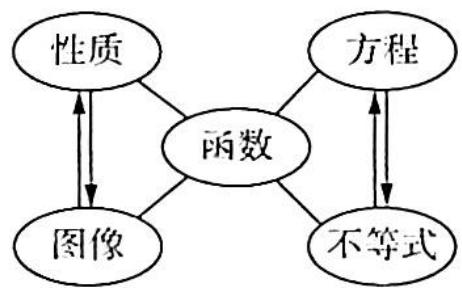

flowchart

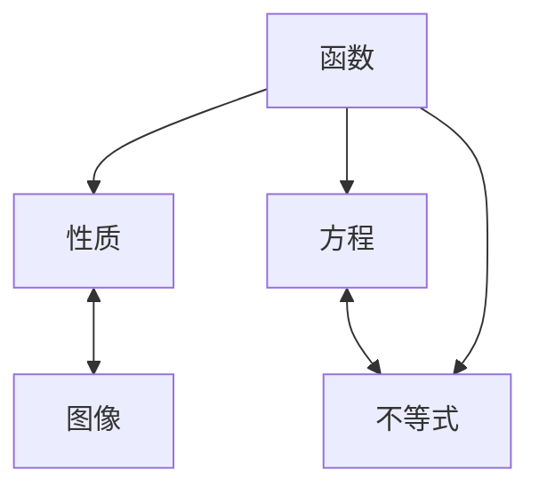

数量关系包括等量关系和不等量关系,它是数学的核心研究对象.从形式上看,函数方程(零点)呈现的是等量关系,函数不等式呈现的是不等量关系.处理数量关系的本质是建立数量关系的模型.函数这部分的重要数学思想是转化思想,将函数、方程、不等式问题转化为函数图像和函数性质求解.从更大范围来讲,学好函数是整个数学学习的基石,在数学的其他分支上都需要用函数的思想方法来处理问题.

# 1.1 对称性及延拓

# 研究密钥

函数对称性是函数奇偶性的延伸, 函数奇偶性是函数对称性的特例. 和为定值 $2a$ 的两个自变量通过函数 $f$ 作用产生的函数值恒相等, 则 $f(x)$ 为轴对称函数, 其图像关于 $x=a$ 对称; 若通过函数 $f$ 作用产生的函数值之和恒为定值 $2b$ , 则为中心对称函数, 函数图像关于点 $(a,b)$ 对称, 否则不具有对称性.

于是, 函数 $y = f(x)$ 的图像关于点 $A(a, b)$ 对称的充要条件是 $f(x) + f(2a - x) = 2b$ ;

函数 $y=f(x)$ 的图像关于直线 x=a 对称的充要条件是 $f(a+x)=f(a-x)$ ，或 $f(x)=f(2a-x)$ .

由此可知,两个自变量之和为定值是函数具有对称性的前提条件,即必要条件,这是判断函数对称性的首要着眼点.

例 1.1 已知函数 $f(x)=1+\frac{2^{x+1}}{2^{x}+1}+\sin x$ 在区间 $[-k,k]$ (k>0) 上的值域为 $[m,n]$ ，则 $m+n=$ \_\_\_\_.

分析 考虑函数 $f(x)$ 在区间 $[-k, k]$ 上的值域, 该区间是一个对称区间, 而奇函数在对称区间上的最值之和为 0 , 因此转化原函数为 “奇+常” 模型, 利用奇函数的上述性质解题.

$$
\begin{array}{r l} & {\text {解析}} \\ & {f (- x) + f (x) = 1 + \frac {2 ^ {- x + 1}}{2 ^ {- x} + 1} + \sin (- x) + 1 + \frac {2 ^ {x + 1}}{2 ^ {x} + 1} + \sin x = 1 + \frac {2}{1 + 2 ^ {x}} - \sin x +} \\ & {1 + \frac {2 ^ {x + 1}}{2 ^ {x} + 1} + \sin x = 2 + \frac {2 ^ {x + 1} + 2}{1 + 2 ^ {x}} = 4.} \end{array}
$$

所以 $f(-x) + f(x) - 4 = 0, f(-x) - 2 + f(x) - 2 = 0.$

令 $g(x)=f(x)-2$ ，则 $g(x)+g(-x)=0, g(-x)=-g(x)$ ，所以 $g(x)$ 为奇函数，奇函数在对称区间上的最值之和为 0，所以 $g(x)$ 在区间 $[-k,k]$ (k>0) 上的最值之和为 $m-2+n-2=0$ ，即 $m+n=4$ 。

变式(1) 已知 $f(x)=\left(\frac{1}{a^{x}-1}+\frac{1}{2}\right)x^{2}+bx+6(a,b$ 为常数，a>1 且 $f(\lg \log_{8}1000)=8$ ，则 $f(\lg \lg 2)=$ \_\_\_\_.

解析 $\lg \log_8 1000 = \lg \log_{2^3} 10^3 = \lg \log_2 10 = \lg \frac{1}{\lg 2} = -\lg \lg 2$ ，所以 $f(-\lg \lg 2) = f(\lg \log_8 1000) = 8$ .

$$
\begin{array}{l} f (- x) + f (x) = \left(\frac {1}{a ^ {- x} - 1} + \frac {1}{2}\right) x ^ {2} - b x + 6 + \left(\frac {1}{a ^ {x} - 1} + \frac {1}{2}\right) x ^ {2} + b x + 6 \\ = \left(\frac {a ^ {x}}{1 - a ^ {x}} + \frac {1}{2}\right) x ^ {2} + \left(\frac {1}{a ^ {x} - 1} + \frac {1}{2}\right) x ^ {2} + 1 2 = 1 2. \\ \end{array}
$$

所以 $f(\mathrm{lg}\lg 2) + f(-\mathrm{lg}\lg 2) = 12, f(\mathrm{lg}\lg 2) = 12 - f(-\mathrm{lg}\lg 2) = 12 - 8 = 4.$

变式(2) 函数 $f(x)=\frac{2^{|3x|}+9x+\lg(\sqrt{900x^{2}+100}-30x)}{8^{|x|}+1}$ 的最大值与最小值之和为 \_\_\_\_.

解析 $f(x)=\frac{2^{|3x|}+9x+\lg(\sqrt{900x^{2}+100}-30x)}{8^{|x|}+1}$

$$
= \frac {8 ^ {| x |} + 9 x + \lg [ 1 0 \times (\sqrt {9 x ^ {2} + 1} - 3 x) ]}{8 ^ {| x |} + 1}
$$

$$
= \frac {8 ^ {| x |} + 1 + 9 x + \lg (\sqrt {9 x ^ {2} + 1} - 3 x)}{8 ^ {| x |} + 1}
$$

$$
= 1 + \frac {9 x + \lg (\sqrt {9 x ^ {2} + 1} - 3 x)}{8 ^ {| x |} + 1}.
$$

令 $g(x) = \frac{9x + \lg(\sqrt{9x^2 + 1} - 3x)}{8^{|x|} + 1}$ , 易知 $9x + \lg(\sqrt{9x^2 + 1} - 3x)$ 为奇函数, $8^{|x|} + 1$ 为偶函数, 所以 $g(x)$ 为奇函数, $f(x) - 1$ 为奇函数, 则 $f(x)_{\max} - 1 + f(x)_{\min} - 1 = 0$ , $f(x)_{\max} + f(x)_{\min} = 2$ .

例1.2 已知函数 $f(x)(x \in \mathbb{R})$ 满足 $f(-x) = 2 - f(x)$ ，若函数 $y = \frac{x + 1}{x}$ 与 $y = f(x)$ 图像的交点为 $(x_{1}, y_{1}), (x_{2}, y_{2}), \cdots, (x_{m}, y_{m})$ ，则 $\sum_{i=1}^{m}(x_{i} + y_{i}) = (\quad)$ .

A. 0

B. m

C. 2m

D. $4m$

分析 ➤ 函数 $f(x)(x \in \mathbb{R})$ 满足 $f(-x) = 2 - f(x)$ ，得到 $y = f(x)$ 关于点 $(0,1)$ 对称，函数 $y = \frac{x + 1}{x}$ 经过化简也可以得到关于点 $(0,1)$ 对称，由此可知两个函数的交点关于 $(0,1)$ 对称，根据点的对称性，就可以得到 $\sum_{i=1}^{m} (x_i + y_i)$ 的值。

解析 因为函数 $f(x)$ 满足 $f(-x)=2-f(x)$ , 即函数 $f(x)$ 满足 $f(-x)+f(x)=2$ , 所以 $y=f(x)$ 关于点 $(0,1)$ 对称.

又函数 $y=\frac{x+1}{x}$ 等价于 $y=1+\frac{1}{x}$ ，则函数 $y=\frac{x+1}{x}$ 也关于点 $(0,1)$ 对称，所以函数 $y=\frac{x+1}{x}$ 与 $y=f(x)$ 图像的交点 $(x_{1},y_{1}),(x_{2},y_{2}),\cdots,(x_{m},y_{m})$ 也关于点 $(0,1)$ 对称，故交点 $(x_{1},y_{1})$ ，

$(x_{2},y_{2}),\cdots,(x_{m},y_{m})$ 成对出现,即 m 为偶数,且每一对点都关于点(0,1)对称,故 $\sum_{i=1}^{m}(x_{i}+y_{i})=(x_{1}+x_{2}+\cdots+x_{m})+(y_{1}+y_{2}+\cdots+y_{m})=0+\frac{m}{2}\cdot2=m.$ 故选 B.

变式(1) 已知函数 $f(x)=x^{3}-3x^{2}+x+\frac{5}{4}$ ，则 $\sum_{k=1}^{2023}f\left(\frac{k}{1012}\right)$ 的值为 \_\_\_\_.

解析 $\sum_{k=1}^{2023}f\left(\frac{k}{1012}\right)=f\left(\frac{1}{1012}\right)+f\left(\frac{2}{1012}\right)+\cdots+f\left(\frac{2023}{1012}\right)$

$$
= f \left(\frac {1}{1 0 1 2}\right) + f \left(\frac {2}{1 0 1 2}\right) + \dots + f \left(2 - \frac {2}{1 0 1 2}\right) + f \left(2 - \frac {1}{1 0 1 2}\right).
$$

$$
f (x) + f (2 - x)
$$

$$
= x ^ {3} - 3 x ^ {2} + x + \frac {5}{4} + (2 - x) ^ {3} - 3 (2 - x) ^ {2} + (2 - x) + \frac {5}{4}
$$

$$
= x ^ {3} - 3 x ^ {2} + x + \frac {5}{2} + \mathrm{C} _ {3} ^ {0} 2 ^ {3} + \mathrm{C} _ {3} ^ {1} 2 ^ {2} (- x) + \mathrm{C} _ {3} ^ {2} 2 (- x) ^ {2} +
$$

$$
\mathrm{C} _ {3} ^ {3} (- x) ^ {3} - 3 \left(x ^ {2} + 4 - 4 x\right) + 2 - x
$$

$$
= x ^ {3} - 3 x ^ {2} + x + \frac {5}{2} + 8 - 1 2 x + 6 x ^ {2} - x ^ {3} - 3 x ^ {2} - 1 2 + 1 2 x + 2 - x
$$

$$
= \frac {1}{2}.
$$

所以 $\sum_{k=1}^{2023} f\left(\frac{k}{1012}\right) = \frac{1}{2} \times 2023 \times \frac{1}{2} = \frac{2023}{4}$ .

变式2: 函数 $f(x)=\frac{x}{x+1}+\frac{x+1}{x+2}+\frac{x+2}{x+3}+\cdots+\frac{x+2022}{x+2023}$ 的图像的对称中心为 \_\_\_\_.

解析 $f(x)=\frac{x}{x+1}+\frac{x+1}{x+2}+\frac{x+2}{x+3}+\cdots+\frac{x+2022}{x+2023}$

$$
= 1 - \frac {1}{x + 1} + 1 - \frac {1}{x + 2} + 1 - \frac {1}{x + 3} + \dots + 1 - \frac {1}{x + 2 0 2 3}
$$

$$
= 2 0 2 3 - \left(\frac {1}{x + 1} + \frac {1}{x + 2} + \frac {1}{x + 3} + \dots + \frac {1}{x + 2 0 2 3}\right),
$$

$$
f (- 2 0 2 4 - x) = 2 0 2 3 - \left(\frac {1}{- 2 0 2 3 - x} + \frac {1}{- 2 0 2 2 - x} + \frac {1}{- 2 0 2 1 - x} + \dots + \frac {1}{- 1 - x}\right)
$$

$$
= 2 0 2 3 + \left(\frac {1}{2 0 2 3 + x} + \frac {1}{2 0 2 2 + x} + \frac {1}{2 0 2 1 + x} + \dots + \frac {1}{1 + x}\right)
$$

$$
= 2 0 2 3 + (2 0 2 3 - f (x))
$$

$$
= 4 0 4 6 - f (x),
$$

则 $f(-2024-x)+f(x)=4046$ ，所以函数 $f(x)$ 的图像的对称中心为 $(-1012,2023)$ .

例1.3 函数 $f(x)=\frac{x^{2}-x+1}{x^{2}+x+1}$ 的最大值与最小值之积为 \_\_\_\_.

分析 ▶ 思路一:首先对 $f(x)$ 变形处理,得

$$
f (x) \xrightarrow {\text {分离常数}} 1 - \frac {2 x}{x ^ {2} + x + 1} \xrightarrow {\text {分子常数化}} 1 - \frac {2}{x + \frac {1}{x} + 1},
$$

再通过对勾函数的值域求 $f(x)$ 的值域.

思路二: $f(x)$ 的表达式很有规律, $f(-x)$ 正好是其倒数, 因此可思考 $f(x)$ 取得最大值与最小值时自变量的关系.

解析 $f(x) = \frac{x^2 - x + 1}{x^2 + x + 1} = 1 - \frac{2x}{x^2 + x + 1}.$

当 $x = 0$ 时， $f(0) = 1$ ；当 $x \neq 0$ 时， $f(x) = 1 - \frac{2}{x + \frac{1}{x} + 1}$ .

又 $x + \frac{1}{x} + 1 \geqslant 3$ 或 $x + \frac{1}{x} + 1 \leqslant -1$ , 所以 $\frac{1}{3} \leqslant f(x) < 1$ 或 $1 < f(x) \leqslant 3$ .

综上可得 $\frac{1}{3} \leqslant f(x) \leqslant 3$ ，所以 $f(x)_{\max} \cdot f(x)_{\min} = 1$ .

# 评注

$f(-x) \cdot f(x) = \frac{x^{2} + x + 1}{x^{2} - x + 1} \cdot \frac{x^{2} - x + 1}{x^{2} + x + 1} = 1, f(x)$ 取到最大值和最小值的情形，恰好其自变量互为相反数，因此，由 $f(x) \cdot f(-x) = 1$ ，不难知 $f(x)_{\max} \cdot f(x)_{\min} = 1$ .

变式(1) $f(x)=\frac{x^{2}-2023x+2022^{2}}{x^{2}+2023x+2022^{2}}$ 的最大值和最小值之积为 \_\_\_\_.

解析 $f(x) \cdot f(-x) = \frac{x^{2} - 2023x + 2022^{2}}{x^{2} + 2023x + 2022^{2}} \cdot \frac{x^{2} + 2023x + 2022^{2}}{x^{2} - 2023x + 2022^{2}} = 1$ ，且 $f(x) = 1 - \frac{4046x}{x^{2} + 2023x + 2022^{2}}$ .

当. $x = 0$ 时， $f(x) = 1$ ；当 $x \neq 0$ 时， $f(x) = 1 - \frac{4046}{x + 2023 + \frac{2022^2}{x}}$ .

当 $x = -2022$ 时， $f(x)$ 取最大值；当 $x = 2022$ 时， $f(x)$ 取最小值.

故 $f(x)_{\max} \cdot f(x)_{\min} = f(-2022) \cdot f(2022) = 1.$

例 1.4 (2017 江苏赛区复赛 2) 若函数 $f(x) = (x^2 - 1)(x^2 + ax + b)$ 对任意的 $x \in \mathbb{R}$ 均满足 $f(x) = f(4 - x)$ ，则 $f(x)$ 的最小值为 \_\_\_\_.

分析 ▶ 由题意可得 $f(x)$ 的对称轴为 $x = 2$ , 又知 $\pm 1$ 为函数零点, 因此 3 和 5 也是函数的零点, 至此得出函数解析式, 为一个最高次数为 4 的多项式, 接下来可利用换元法降次, 并用配方法求出最值.

解析 由题意可得 $f(x)$ 的对称轴为 $x = 2$ .

已知函数有两个零点 1 和 -1, 由对称性可得 3 和 5 也是函数的零点. 所以

$$
\begin{array}{l} f (x) = (x - 1) (x + 1) (x - 3) (x - 5) \\ = [ (x + 1) (x - 5) ] [ (x - 1) (x - 3) ] \\ = (x ^ {2} - 4 x - 5) (x ^ {2} - 4 x + 3). \\ \end{array}
$$

令 $t = x^{2} - 4x$ ，则 $t\geqslant -4$ ，所以 $f(t) = (t - 5)(t + 3) = t^2 -2t - 15 = (t - 1)^2 -16.$

当 t=1 时,有最小值 $f(t)_{\min}=-16$ . 故填 -16.

变式(1) 函数 $f(x)=ax^{2}+bx+c(a\neq0)$ 的图像关于直线 $x=-\frac{b}{2a}$ 对称. 据此可推测, 对任意的非零实数 a, b, c, m, n, p, 关于 x 的方程 $m[f(x)]^{2}+nf(x)+p=0$ 的解集都不可能是().

A. $\{1,2\}$

B. $\{1,4\}$

C. $\{1,2,3,4\}$

D. $\{1,4,16,64\}$

分析 ▶ 方程 $m[f(x)]^{2} + nf(x) + p = 0$ 若有四个不同解，则可根据二次函数的图像的对称性知道四个不同的解中，有两个解的和与余下两个解的和相等，可以由此判断.

解析 ▶ 设关于 $f(x)$ 的方程 $m[f(x)]^{2} + nf(x) + p = 0$ 有两个解，即 $f(x) = t_{1}$ 或 $f(x) = t_{2}$ .

而 $f(x)=ax^{2}+bx+c$ 的图像关于 $x=-\frac{b}{2a}$ 对称，因此 $f(x)=t_{1}$ 或 $f(x)=t_{2}$ 的两个解也关于 $x=-\frac{b}{2a}$ 对称，所以若有 4 个不同解，则有两个解的和与余下两个解的和应相等。而选项 D 中 $\frac{4+16}{2}\neq\frac{1+64}{2}$ ，故选 D.

# 1.2 单调性及延拓

# 研究密钥

一切不等式的问题都是函数问题,因此在函数中的不等式问题往往转化为函数问题去求解,借助函数的性质,尤其是单调性来转化,从而将函数符号“f”去掉.

本类问题需把握两点:一是要把原不等式转化为 $f(\triangle) > f(\square)$ (其中不等号还可以为 $\geqslant, <, \leqslant$ ) 的模型;二是要判断函数 $f(x)$ 的单调性,再根据函数的单调性将抽象函数不等式中的函数符号“f”去掉,得到具体的不等式(组)来求解.

例 1.5 已知函数 $f(x)=x^{3}+3x$ ，对任意的 $m\in[-2,2]$ ， $f(mx-8)+f(2^{x})<0$ 恒成立，则正实数 x 的取值范围是 \_\_\_\_.

分析 ➤ 首先利用 $f(x)$ 的单调性把不等式中的函数符号“f”去掉, 得到一个含参数 m 的不等式, 问题转化为此不等式恒成立, 求 x 的取值范围. 此时可用更换主元与辅元, 求出 x 的取值范围.

解析 由题意知 $f(x) = x^{3} + 3x$ 为奇函数且在 $\mathbf{R}$ 上单调递增.

由 $f(mx - 8) + f(2^x) < 0$ 可得 $f(mx - 8) < -f(2^x) = f(-2^x)$ , 所以 $mx - 8 < -2^x$ , 即 $mx - 8 + 2^x < 0, m \in [-2, 2]$ .

令 $g(m) = x \cdot m + 2^x - 8$ ，则 $\left\{ \begin{array}{l} g(-2) = -2x + 2^x - 8 < 0 \\ g(2) = 2x + 2^x - 8 < 0 \end{array} \right.$ ，又因为 $x$ 为正实数，故 $g(m) < 0$ 恒成立等价于 $2x + 2^x - 8 < 0$ 。

令 $h(x) = 2x + 2^x - 8$ ，则 $h(x)$ 为增函数，且 $h(2) = 0$ ，所以 $2x + 2^x - 8 < 0$ 的解集为 $0 < x < 2$ ，即 $x$ 的取值范围是 $0 < x < 2$ .

# 探究总结

# 函数不等式常见的三种形式

函数不等式问题常以如下三种形式出现:一是已知函数性质(单调性、奇偶性),求解函数不等式;二是已知函数解析式,分析函数性质,从而求解函数不等式;三是构造函数解析式,研究函数的性质,求解函数不等式.不管是哪一类形式,其根本方向是通过函数单调性去转化为不等关系,求解不等式.这是核心方向同时也是问题的突破口.

变式(1) 已知函数 $f(x) = 2023^x + \log_{2023}(\sqrt{x^2 + 1} + x) - 2023^{-x} + 2$ ，则关于 $x$ 的不等式 $f(3x + 1) + f(x) > 4$ 的解集为（ ）.

A. $\left(-\frac{1}{2023},+\infty\right)$

B. $\left(-\frac{1}{3},+\infty\right)$

C. $\left(-\frac{1}{2},+\infty\right)$

D. $\left(-\frac{1}{4},+\infty\right)$

解析 令 $g(x) = f(x) - 2 = 2023^{x} + \log_{2023}(\sqrt{x^{2} + 1} + x) - 2023^{-x}$ , 则

$$
\begin{array}{l} g (- x) = 2 0 2 3 ^ {- x} + \log_ {2 0 2 3} (\sqrt {x ^ {2} + 1} - x) - 2 0 2 3 ^ {x} \\ = - 2 0 2 3 ^ {x} + \log_ {2 0 2 3} \left(\frac {1}{\sqrt {x ^ {2} + 1} + x}\right) + 2 0 2 3 ^ {- x} \\ = - \left[ 2 0 2 3 ^ {x} + \log_ {2 0 2 3} \left(\sqrt {x ^ {2} + 1} + x\right) - 2 0 2 3 ^ {- x} \right] \\ = - g (x). \\ \end{array}
$$

所以 $g(x)$ 是奇函数, 易知 $g(x)$ 在 R 上单调递增.

由 $f(3x + 1) + f(x) > 4$ 可得 $g(3x + 1) + g(x) > 0$ ，所以 $3x + 1 + x > 0$ ，解得 $x > -\frac{1}{4}$

故选D.

变式(2) 已知函数 $f(x) = f(-x) + 2\sin x$ ，又当 $x \geqslant 0$ 时， $f'(x) \geqslant 1$ ，则关于 $x$ 的不等式 $f(x) \geqslant f\left(\frac{\pi}{2} - x\right) + \sqrt{2}\sin \left(x - \frac{\pi}{4}\right)$ 的解集为（ ）.

A. $\left[\frac{\pi}{4},+\infty\right)$

B. $\left[-\frac{\pi}{4},+\infty\right)$

C. $\left(-\infty,\frac{\pi}{4}\right]$

D. $\left(-\infty,-\frac{\pi}{4}\right]$

分析 ▶ 突破口在于利用形式上的对称来构造函数,研究函数的性质,并借助函数的单调性转化为不等关系,求解不等式.

解析 $f(x) \geqslant f\left(\frac{\pi}{2}-x\right) + \sqrt{2} \sin\left(x - \frac{\pi}{4}\right)$ ，即 $f(x) \geqslant f\left(\frac{\pi}{2}-x\right) + \sin x - \cos x = f\left(\frac{\pi}{2}-x\right) + \sin x - \sin\left(\frac{\pi}{2}-x\right)$ ，所以 $f(x) - \sin x \geqslant f\left(\frac{\pi}{2}-x\right) - \sin\left(\frac{\pi}{2}-x\right)$ .

设 $g(x)=f(x)-\sin x$ ，则所求的式子转化为 $g(x)\geqslant g\left(\frac{\pi}{2}-x\right)$ 。由 $f(x)=f(-x)+2\sin x$ ，
可知 $f(x)-\sin x=f(-x)-\sin(-x), g(x)=g(-x)$ ，于是判断出 $g(x)$ 为 R 上的偶函数.

当 $x \geqslant 0$ 时, $g'(x) = f'(x) - \cos x \geqslant f'(x) - 1 \geqslant 0$ , 则 $g(x)$ 在区间 $[0, +\infty)$ 上单调递增. 又 $g(x)$ 为 $\mathbf{R}$ 上的偶函数, 所以 $g(x)$ 在区间 $(- \infty, 0]$ 上单调递减.

因为所求的式子转化为 $g(x) \geqslant g\left(\frac{\pi}{2} - x\right)$ ，所以得到 $|x| \geqslant \left|\frac{\pi}{2} - x\right|$ ，解得 $x \geqslant \frac{\pi}{4}$ 。故选 A.

变式(3) 已知函数 $f(x) = \frac{1}{2} x^2 - \frac{\mathrm{e}^x - 1}{\mathrm{e}^x + 1}$ ，若 $f(4 - m) - f(m) \geqslant 8 - 4m$ ，则实数 $m$ 的取值范围为 \_\_\_\_.

分析 ▶ 根据条件进行转化,构造函数 $g(x)=f(x)-\frac{1}{2}x^{2}=-\frac{\mathrm{e}^{x}-1}{\mathrm{e}^{x}+1}$ , 研究函数 $g(x)$ 的奇偶性和单调性,利用函数的性质进行转化求解.

解析 因为 $f(x) = \frac{1}{2} x^2 - \frac{\mathrm{e}^x - 1}{\mathrm{e}^x + 1}$ ，设 $g(x) = f(x) - \frac{1}{2} x^2 = -\frac{\mathrm{e}^x - 1}{\mathrm{e}^x + 1}$ ，则 $g(-x) = -\frac{\mathrm{e}^{-x} - 1}{\mathrm{e}^{-x} + 1} = -\frac{1 - \mathrm{e}^x}{1 + \mathrm{e}^x} = \frac{\mathrm{e}^x - 1}{\mathrm{e}^x + 1} = -g(x)$ ，即 $g(x)$ 是奇函数.

又 $g(x) = -\frac{\mathrm{e}^x - 1}{\mathrm{e}^x + 1} = -\frac{\mathrm{e}^x + 1 - 2}{\mathrm{e}^x + 1} = -1 + \frac{2}{\mathrm{e}^x + 1}$ , 则 $g(x)$ 在 $(- \infty, + \infty)$ 上为减函数.

因为 $f(x) = \frac{1}{2} x^2 + g(x)$ ，所以 $f(4 - m) - f(m) \geqslant 8 - 4m$ ，等价于 $\frac{1}{2}(4 - m)^2 + g(4 - m) - g(m) - \frac{1}{2} \cdot m^2 \geqslant 8 - 4m$ ，即 $g(4 - m) - g(m) + 8 - 4m \geqslant 8 - 4m, g(4 - m) - g(m) \geqslant 0, g(4 - m) \geqslant g(m)$ .

又 $g(x)$ 在 $(-\infty, +\infty)$ 上为减函数，所以 $4 - m \leqslant m$ ，解得 $m \geqslant 2$ 。

所以实数 $m$ 的取值范围是 $[2, +\infty)$ . 故填 $[2, +\infty)$ .

例 1.6 已知 $f(x)=x|x|$ ，若对任意的 $x\geqslant1$ 有 $f(x+m)+mf(x)<0$ 恒成立，则实数 m 的取值范围是（）.

A. $(-∞,-1)$

B. $(-∞,-1]$

C. $(-∞,-2)$

D. $(-∞,-2]$

分析 $f(x+m)+mf(x)<0\Rightarrow f(x+m)<-mf(x)$ ，研究 $f(x)=x|x|$ 的单调性，分类讨论得到 m 可能的取值范围后，设法去掉函数 f 的符号，得到一个含参不等式，然后分析使此不等式恒成立的参数的取值范围。

解析 ▷ 由 $f(x) = x |x| = \begin{cases} x^2, & x \geqslant 0 \\ -x^2, & x < 0 \end{cases}$ 可得 $f(x)$ 为 $\mathbb{R}$ 上单调递增的奇函数.

当 $x \geqslant 1$ 时, $f(x + m) + mf(x) < 0$ 恒成立, 即 $f(x + m) < -mf(x)$ 恒成立.

当 $m = 0$ 时, 不等式左边为正数, 右边为 0 , 显然不成立; 当 $m > 0$ 时, 不等式左边为正数, 右边为负数, 显然不成立; 当 $m < 0$ 时, $-m > 0$ , 所以 $f(x + m) < -mf(x) = f(\sqrt{-mx})$ .

由单调性可得 $x + m < \sqrt{-m}x, (1 - \sqrt{-m})x + m < 0$ ，需满足 $\left\{\begin{aligned}1 - \sqrt{-m} &\leqslant 0① \\ 1 - \sqrt{-m} &+m < 0②\end{aligned}\right.$ ，解①式得 $m \leqslant -1$ ，整理②式得 $1 + m < \sqrt{-m}$ 。故当 $m \leqslant -1$ 时也满足②式，所以不等式组的解集为 $m \leqslant -1$ ，即实数 m 的取值范围是 $(-∞, -1]$ 。故选 B。

变式(1) 设 $f(x)$ 是定义在 R 上的奇函数, 且当 $x \geqslant 0$ 时, $f(x) = x^{2}$ , 若对任意的 $x \in [t, t+2]$ , 不等式 $f(x+t) \geqslant 2f(x)$ 恒成立, 则实数 t 的取值范围是().

A. $[2, +\infty)$

B. $[- \sqrt{2}, -1] \cup [0, \sqrt{2}]$

C. $\left[\sqrt{2}, +\infty\right)$

D. $(0,\sqrt{2}]$

解析 ▶ 由题意可得 $f(x) = \begin{cases} x^2, & x \geqslant 0 \\ -x^2, & x < 0 \end{cases}$ , $f(x)$ 在 $\mathbb{R}$ 上单调递增，且 $2f(x) = f(\sqrt{2}x)$ ，所以 $f(x + t) \geqslant 2f(x) = f(\sqrt{2}x)$ 在 $[t, t + 2]$ 上恒成立.

由 $f(x)$ 的单调性可得 $x + t \geqslant \sqrt{2} x$ , 即 $x \leqslant (1 + \sqrt{2})t$ , 所以 $t + 2 \leqslant (1 + \sqrt{2})t$ , 解得 $t \geqslant \sqrt{2}$ , 则实数 $t$ 的取值范围是 $[\sqrt{2}, +\infty)$ . 故选 C.

例1.7 已知可导函数 $f(x)$ 的导函数为 $f'(x), f(0) = 2023$ ，若对任意的 $x \in \mathbb{R}$ ，都有 $f(x) > f'(x)$ ，则不等式 $f(x) < 2023\mathrm{e}^x$ 的解集为（ ）.

A. $(0, +\infty)$

B. $\left(\frac{1}{\mathrm{e}^{2}},+\infty\right)$

C. $\left(-\infty,\frac{1}{e^{2}}\right)$

D. $(-∞,0)$

分析 要想求 $f(x) < 2023\mathrm{e}^x$ 的解集, 则 $f(x) < 2023\mathrm{e}^x \Rightarrow \frac{f(x)}{\mathrm{e}^x} < 2023$ . 构造函数 $g(x) = \frac{f(x)}{\mathrm{e}^x}$ , 则 $g(0) = 2023$ , 这样原不等式转化为 $g(x) < g(0)$ , 然后再根据 $g(x)$ 的单调性化简不等式求解.

解析 ▶ 令 $g(x) = \frac{f(x)}{\mathrm{e}^x}$ , 所以 $g'(x) = \frac{f'(x) - f(x)}{\mathrm{e}^x} < 0$ , $g(x)$ 单调递减, $g(0) =$

$$
\frac {f (0)}{\mathrm{e} ^ {0}} = 2 0 2 3.
$$

因此， $f(x) < 2023\mathrm{e}^{x}\Rightarrow \frac{f(x)}{\mathrm{e}^{x}} < 2023\Rightarrow g(x) < g(0)\Rightarrow x > 0.$ 故选A.

变式 1 已知可导函数 $f(x)$ 的导函数为 $f'(x)$ ，若对任意的 $x \in \mathbb{R}$ ，都有 $f(x) - f'(x) > 1$ 。且 $f(x) - 2022$ 为奇函数，则不等式 $f(x) - 2021e^{x} > 1$ 的解集为（ ）.

A. $(-\infty, 0)$

B. $(0,+\infty)$

C. $(-∞,e)$

D. $(e, +\infty)$

分析 ▶ 根据题意构造 $F(x)=\frac{f(x)-1}{\mathrm{e}^{x}}$ ，结合已知条件，讨论其单调性，再将不等式 $f(x)-2021\mathrm{e}^{x}>1$ 转化为 $F(x)>F(0)$ ，即可利用单调性求解。

解析 ▶ 根据题意,构造 $F(x)=\frac{f(x)-1}{\mathrm{e}^{x}}$ , 则 $F'(x)=\frac{f'(x)-f(x)+1}{\mathrm{e}^{x}}<0$ , 故 $F(x)$ 在 R 上单调递减.

又 $f(x) - 2022$ 为 $\mathbf{R}$ 上的奇函数，可得 $f(0) - 2022 = 0$ ，即 $f(0) = 2022$ ，则 $F(0) = 2021$

不等式 $f(x) - 2021\mathrm{e}^{x} > 1$ 等价于 $F(x) > 2021 = F(0)$ , 又因为 $F(x)$ 是 $\mathbf{R}$ 上的单调减函数, 故解得 $x < 0$ . 故选 A.

变式2 函数 $f(x)$ 是定义在 $[0, +\infty)$ 上的函数， $f(0) = 0$ ，且在 $(0, +\infty)$ 上可导， $f'(x)$ 为其导函数，若 $xf'(x) + f(x) = e^x (x - 2)$ 且 $f(3) = 0$ ，则不等式 $f(x) < 0$ 的解集为（ ）.

A. $(0,2)$

B. $(0,3)$

C. $(2,3)$

D. $(3,+\infty)$

分析 ▶ 构造函数 $g(x)=xf(x)$ ，利用导函数的单调性，转化为简单的不等式求解.

由题意得函数 $f(x)$ 在 $(0, +\infty)$ 上可导， $f'(x)$ 为其导函数，令 $g(x) = xf(x)$ ，则 $g'(x) = x \cdot f'(x) + f(x) = e^x (x - 2)$ .

可知当 $x \in (0,2)$ 时， $g(x)$ 是单调减函数；当 $x \in (2, +\infty)$ 时，函数 $g(x)$ 是单调增函数。

又 $f(3) = 0, f(0) = 0$ ，则 $g(3) = 3f(3) = 0$ ，且 $g(0) = 0$ .

于是不等式 $f(x) < 0$ 的解集就是 $xf(x) < 0$ 的解集, 所以不等式的解集为 $\{x \mid 0 < x < 3\}$ . 故选 B.

# 1.3 周期性及延拓

# 研究密钥

判断函数的周期性一般有两种方法:定义法与图像法.

用定义法推导函数周期的方法,需根据递推公式求函数周期,往往需要根据条件多次递

推,直至得到 $f(x+T)=f(x)$ .

本方法还有几个常见的结论:对于 $f(x)$ 定义域内任一自变量 x,有:

(1) 若 $f(x+a)=-f(x)$ ，则 $T=2|a|$ ;  
(2) 若 $f(x+a)=\frac{1}{f(x)}$ ，则 $T=2|a|$ ;  
(3) 若 $f(x + a) = -\frac{1}{f(x)}$ ，则 $T = 2|a|$ .

用图像法确定函数的周期性,一般是双对称出周期.函数的对称性与周期性的关系结论如下.

(1) 若函数 $y = f(x)$ 有两条对称轴 x = a, $x = b (a < b)$ ，则函数 $f(x)$ 是周期函数，且 $T = 2|b - a|$ ;  
(2) 若函数 $y = f(x)$ 的图像有两个对称中心 $(a, c)$ , $(b, c)$ (a < b), 则函数 $f(x)$ 是周期函数, 且 $T = 2|b - a|$ ;  
(3) 若函数 $y = f(x)$ 有一条对称轴 $x = a$ 和一个对称中心 $(b,0)(a < b)$ , 则函数 $f(x)$ 是周期函数, 且 $T = 4|b - a|$ .

对于此结论,可类比 $y=\sin x$ 的周期性与对称性的关系记忆.

例1.8 (2017年全国高中数学联赛A卷一试1)设 $f(x)$ 是定义在 $\mathbb{R}$ 上的函数，对任意的 $x$ 有 $f(x + 3)f(x - 4) = -1$ 。又当 $0 \leqslant x < 7$ 时， $f(x) = \log_2(9 - x)$ ，则 $f(-100) =$

分析 对于一些有关“大数”的计算或求值,一般会借助函数的周期性将“大数”转化到给定的区间上来.因此本题思路的入口在于根据给定的等式研究 $f(x)$ 的最小正周期,把-100转化对应到[0,7]这个区间上求值.

解析 由 $f(x + 3)f(x - 4) = -1$ 可得 $f(x + 7)f(x) = -1$ , 所以 $f(x + 7) = \frac{-1}{f(x)}$ , $f(x + 14) = \frac{-1}{f(x + 7)} = f(x)$ , 即函数 $f(x)$ 是周期函数, $T = 14$ .

于是 $f(-100) = f(-100 + 14 \times 7) = f(-2) = \frac{-1}{f(5)}$ ，又因为 $f(5) = \log_2(9 - 5) = 2$ ，所以 $f(-100) = -\frac{1}{2}$ .

变式(1) (2015 浙江赛区预赛 9)已知函数 $f(x)$ 满足 $f(x+1)+f(1-x)=0, f(x+2)-f(2-x)=0$ , 且 $f\left(\frac{2}{3}\right)=1$ , 则 $f\left(\frac{1000}{3}\right)=$ \_\_\_\_.

解析 由 $f(x + 1) + f(1 - x) = 0$ 可得 $f(x) + f(2 - x) = 0$ ，即 $f(2 - x) = -f(x)$ .

又因为 $f(x + 2) - f(2 - x) = 0$ ，所以 $f(x + 2) + f(x) = 0$ ，即 $f(x + 2) = -f(x)$ ，则

$f(x+4)=-f(x+2)=f(x)$ ，故函数 $f(x)$ 是周期函数，T=4。

所以 $f\left(\frac{1000}{3}\right) = f\left(83 \times 4 + \frac{4}{3}\right) = f\left(\frac{4}{3}\right) = f\left(2 - \frac{2}{3}\right) = -f\left(\frac{2}{3}\right) = -1.$

变式2: (2018 新课标全国Ⅱ卷理 12)已知 $f(x)$ 是定义域为 $(- \infty, + \infty)$ 的奇函数, 满足 $f(1 - x) = f(1 + x)$ . 若 $f(1) = 2$ , 则 $f(1) + f(2) + \cdots + f(50) = (\quad)$ .

A. -50

B. 0

C. 2

D. 50

解析 因为 $f(x)$ 是奇函数, 所以 $f(-x) = -f(x)$ , 由 $f(1 - x) = f(1 + x)$ 可得 $f(x)$ 关于 $x = 1$ 对称, 即 $f(-x) = f(x + 2)$ , 所以 $f(x + 2) = -f(x), f(x + 4) = -f(x + 2) = f(x)$ , 则函数 $f(x)$ 是周期函数, $T = 4$ .

由题意可得 $f(0)=0, f(-1)=-f(1)=-2$ ，所以 $f(1)=2, f(2)=-f(0)=0, f(3)=f(-1)=-2, f(4)=f(0)=0, f(1)+f(2)+f(3)+f(4)=0$ ，则 $f(1)+f(2)+\cdots+f(50)=0+f(1)+f(2)=2$ 。故选 C.

变式(3) (2022 新课标全国乙卷理 12) 已知函数 $f(x), g(x)$ 的定义域均为 $\mathbf{R}$ , 且 $f(x)+g(2-x)=5, g(x)-f(x-4)=7$ , 若 $y=g(x)$ 的图像关于直线 $x=2$ 对称, $g(2)=4$ , 则 $\sum_{k=1}^{22} f(k)=(\quad)$ .

A. -21

B. -22

C. -23

D. -24

解析 ▶ 函数 $y=g(x)$ 的图像关于直线 x=2 对称，则 $g(2+x)=g(2-x)$ ，因此 $f(x)+g(2-x)=f(x)+g(x+2)=5$ .

又 $g(x) - f(x - 4) = 7$ ，即 $g(x + 2) - f(x - 2) = 7$ ，故 $f(x) + f(x - 2) = -2$ ，所以 $f(x + 2) + f(x) = -2$ ，则 $f(x + 2) = f(x - 2)$ ，即 $f(x + 4) = f(x)$ ，得 $f(x)$ 的周期 $T = 4$

令 $x = 0, f(0) + g(2) = 5$ ，得 $f(0) = 1, f(2) = -3, f(4) = f(0) = 1$ ；令 $x = 1, f(1) + g(1) = 5$ ；令 $x = 1, g(1) - f(-3) = 7 = g(1) - f(1)$ ，解得 $f(1) = -1, g(1) = 6 = g(3)$ ；令 $x = 3, g(3) - f(-1) = 7$ ，所以 $f(-1) = -1 = f(3)$ ，故 $f(1) + f(2) + f(3) + f(4) = -1 - 3 - 1 + 1 = -4$ ，所以

$$
\begin{array}{l} \sum_ {k = 1} ^ {2 2} f (k) = 5 (f (1) + f (2) + f (3) + f (4)) + f (2 1) + f (2 2) = - 2 0 + f (1) + f (2) \\ = - 2 0 - 4 = - 2 4. \\ \end{array}
$$

故选D.

变式4: (2022 新高考全国Ⅱ卷 8) 若函数 $f(x)$ 的定义域为 $\mathbf{R}$ 且 $f(x+y)+f(x-y)=f(x)f(y), f(1)=1$ , 则 $\sum_{k=1}^{22} f(k)=(\quad)$ .

A. -3

B.-2

C. 0

D. 1

解析 令 $y = 1$ ，得 $f(x + 1) + f(x - 1) = f(x)f(1) = f(x)$ ，因此 $f(x + 2) + f(x) =$

$f(x+1)$ ，所以 $f(x+2)+f(x-1)=0$ ，即 $f(x+3)+f(x)=0$ ， $f(x+6)=-f(x+3)=f(x)$ ，
故函数 $f(x)$ 的周期 T=6.

令 $x = 1, y = 0$ ，得 $2f(1) = f(1)f(0)$ ，所以 $f(0) = 2$ ，又 $f(x + 1) = f(x) - f(x - 1)$ ，且 $f(0) = 2, f(1) = 1, f(2) = f(1) - f(0) = -1, f(3) = f(2) - f(1) = -2, f(4) = f(3) - f(2) = -1, f(5) = f(4) - f(3) = 1, f(6) = f(5) - f(4) = 2$ ，所以 $f(1) + f(2) + f(3) + f(4) + f(5) + f(6) = 1 - 1 - 2 - 1 + 1 + 2 = 0.$ 因此

$$
\begin{array}{l} \sum_ {k = 1} ^ {2 2} f (k) = 3 (f (1) + f (2) + \dots + f (6)) + f (1 9) + f (2 0) + f (2 1) + f (2 2) \\ = f (1) + f (2) + f (3) + f (4) = - 3. \\ \end{array}
$$

故选A.

例1.9 (2021新课标全国甲卷理12)设函数 $f(x)$ 的定义域为 $\mathbb{R}, f(x + 1)$ 为奇函数， $f(x + 2)$ 为偶函数，当 $x \in [1, 2]$ 时， $f(x) = ax^2 + b$ 。若 $f(0) + f(3) = 6$ ，则 $f\left(\frac{9}{2}\right) = (\quad)$ 。

A. $-\frac{9}{4}$

B. $-\frac{3}{2}$

C. $\frac{7}{4}$

D. $\frac{5}{2}$

分析 ▶ 由 $f(x+1)$ 为奇函数, $f(x+2)$ 为偶函数可推知 $f(x)$ 的周期, 利用周期将 $f(0)$ , $f(3)$ 的值转化至区间 $[1,2]$ 上的值, 得到 $f(x)$ 的表达式, 再求 $f\left(\frac{9}{2}\right)$ .

解析 因为 $f(x + 1)$ 为奇函数, 所以 $f(-x + 1) = -f(x + 1), f(x)$ 关于 $(1,0)$ 中心对称, 则 $f(1) = 0$ .

因为 $f(x+2)$ 为偶函数, 所以 $f(-x+2)=f(x+2)$ , 即 $f(x)$ 关于 x=2 成轴对称.

由 $f(-x + 1) = -f(x + 1)$ 得 $f(-x + 2) = -f(x)$ , 所以 $f(x + 2) = -f(x), f(x + 4) = -f(x + 2) = f(x)$ , 即 4 为 $f(x)$ 的一个周期, $f\left(\frac{9}{2}\right) = f\left(\frac{1}{2}\right) = -f\left(\frac{3}{2}\right)$ . 又因为 $f(0) = -f(2)$ , $f(3) = f(1) = 0$ , 所以 $f(0) + f(3) = 6$ , 即 $f(1) - f(2) = 6$ , 得出 $f(2) = -6$ . 所以 $\left\{ \begin{array}{l} f(1) = a + b = 0 \\ f(2) = 4a + b = -6 \end{array} \right.$ , 解得 $\left\{ \begin{array}{l} a = -2 \\ b = 2 \end{array} \right.$ .

所以, 当 $x \in [1,2]$ 时, $f(x) = -2x^{2} + 2$ , 则 $f\left(\frac{9}{2}\right) = -f\left(\frac{3}{2}\right) = -\left(-2 \times \frac{9}{4} + 2\right) = \frac{5}{2}$ . 故选 D.

变式(7) 已知定义在 $\mathbf{R}$ 上的函数 $f(x)$ 满足

① $f(2-x)+f(x)=0;$   
② $f(x-2)-f(-x)=0;$

③在 $[-1,1]$ 上表达式为 $f(x)=\left\{\begin{aligned}\cos\frac{\pi x}{2},&x\in[-1,0]\\ 1-x,&x\in(0,1]\end{aligned}\right.$

则函数 $f(x)$ 与函数 $g(x)=\left(\frac{1}{2}\right)^{|x|}$ 的图像在区间 $[-3,3]$ 上的交点个数为 \_\_\_\_.

分析 ▶ 先根据①②可知函数的对称中心和对称轴,再分别画出 $f(x)$ 和 $g(x)$ 的部分图像,由图像观察交点的个数.

解析 根据题意,① $f\left( {2 - x}\right)  + f\left( x\right)  = 0$ ,可得函数 $f\left( x\right)$ 的图像关于点(1,0)对称.

② $f(x-2)-f(-x)=0$ ，得函数 $f(x)$ 的图像关于x=-1对称，则函数 $f(x)$ 与 $g(x)$ 在区间 $[-3,3]$ 上的图像如图所示，由图可知 $f(x)$ 与 $g(x)$ 的图像在 $[-3,3]$ 上有4个交点.

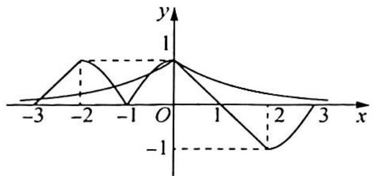

line

| x   | y     |
| --- | ----- |
| -3  | 0     |
| -2  | 1     |
| -1  | 0     |
| 0   | 1     |
| 1   | 0     |
| 2   | -1    |
| 3   | 0     |

# 评注

本题的关键是当 $x \in (0,1]$ 时, $f(x)$ 和 $g(x)$ 的图像没有公共点.

$\left(\frac{1}{2}\right)^x > \left(\frac{1}{\mathrm{e}}\right)^x \geqslant -x + 1, x > 0$ ，无零点。如图所示。

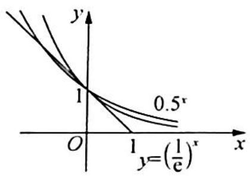

text_image

y
1
0.5^x
O
1
y=(1/e)^x
x

# 研究反思

# 利用函数周期性求值

运用周期性求函数值的问题,一般在形式上具有“大数”函数值(如 f(2023))的求解问题.通过周期转化到“小数”或已知的区间上来求值.根据周期性求值的特点可延拓到类周期函数问题,因为二者的解题方向思路是一致的.

我们知道,如果函数 $f(x)$ 满足 $f(x+T)=f(x)$ , 则函数 $f(x)$ 是周期函数, 那么我们再多想一步, 如果等式两边系数不相等, 在周期区间段进行了放缩, 这时虽不是周期函数, 但是许多方法是相通的. 请接下来思考下面的问题.

例 1.10 (2019 新课标全国 II 卷理 12) 设函数 $f(x)$ 的定义域为 R，满足 $f(x+1)=2f(x)$ ，且当 $x\in(0,1]$ 时， $f(x)=x(x-1)$ 。若对任意 $x\in(-\infty,m]$ ，都有 $f(x)\geqslant-\frac{8}{9}$ ，则 m 的取值范围是（ ）.

A. $\left(-\infty,\frac{9}{4}\right]$

B. $\left(-\infty,\frac{7}{3}\right]$

C. $\left(-\infty,\frac{5}{2}\right]$

D. $\left(-\infty,\frac{8}{3}\right]$

分析 ▶ 根据条件判断, 此函数为一个类周期函数, 画出函数图像. 类周期函数的特征是间隔相同的点的纵坐标为等比数列, 因此判断 $f(x) = -\frac{8}{9}$ 的解位于哪一区间, 利用数形结合求

出 $m$ 的临界值.

解析 ▶ 由题意可得函数 $f(x)$ 的图像如图所示:

根据图像可得 $f(x)=-\frac{8}{9}$ 的解位于区间 [2,3] 内，经类周期变换可以转化到区间 [0,1] 内，令 $f(x)=x(x-1)=-\frac{2}{9}$ ，即 $x^{2}-x+\frac{2}{9}=0$ ，解得 $x_{1}=\frac{1}{3}$ ， $x_{2}=\frac{2}{3}$ ，则 $m-2=\frac{1}{3}$ ，即 $m=\frac{7}{3}$ .

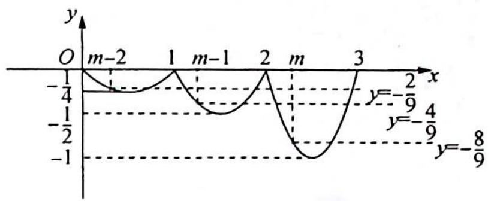

line

| x     | y       |
|-------|---------|
| m-2   | -1/4    |
| m-1   | -1/2    |
| m     | 0       |
| 3     | -1      |

根据图像可得 m 的取值范围是 $\left(-\infty, \frac{7}{3}\right]$ . 故选 B.

变式(1) 已知 $T=4$ 的周期函数 $f(x)=\begin{cases}m\sqrt{1-x^{2}}, & -1<x \leqslant 1 \\1-|x-2|, & 1<x \leqslant 3\end{cases}$ , 其中 $m>0$ . 若方程 $3f(x)=x$ 恰有 5 个实数解, 则 $m$ 的取值范围是 ( ).

A. $\left(\frac{\sqrt{15}}{3},\frac{8}{3}\right)$

B. $\left(\frac{\sqrt{15}}{3},\sqrt{7}\right)$

C. $\left(\frac{4}{3},\frac{8}{3}\right)$

D. $\left(\frac{4}{3},\sqrt{7}\right)$

解析 ▶ 因为当 $x \in (-1, 1]$ 时，将函数化为方程 $x^{2} + \frac{y^{2}}{m^{2}} = 1 (y \geqslant 0)$ ，实质上为一个半椭圆，同时在坐标系中作出当 $x \in (1, 3]$ 的图像，再根据周期性作出函数其他部分的图像，其图像如图所示。

由图易知直线 $y=\frac{x}{3}$ 与第二个椭圆 $(x-4)^{2}+\frac{y^{2}}{m^{2}}=1(y\geqslant0)$ 相交，而与第三个半椭圆 $(x-8)^{2}+\frac{y^{2}}{m^{2}}=1(y\geqslant0)$ 无公共点时，方程恰有 5 个实数解.

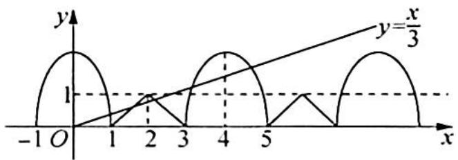

text_image

y
y=x/3
1
-1 O 1 2 3 4 5 x

将 $y=\frac{x}{3}$ 代入 $(x-4)^{2}+\frac{y^{2}}{m^{2}}=1(y\geqslant0)$ ，得 $(9m^{2}+1)x^{2}-72m^{2}x+135m^{2}=0$ ，令 $t=9m^{2}(t>0)$ ，则有 $(t+1)x^{2}-8tx+15t=0$ 。

由 $\Delta = (8t)^2 - 4 \times 15t(t + 1) > 0$ 得 $t > 15$ , 由 $9m^2 > 15$ , 且 $m > 0$ 得 $m > \frac{\sqrt{15}}{3}$ .

同样由 $y=\frac{x}{3}$ 与第三个半椭圆 $(x-8)^{2}+\frac{y^{2}}{m^{2}}=1(y\geqslant0)$ 无交点，联立得 $(1+9m^{2})x^{2}-144m^{2}x+63\times9m^{2}=0$ .

由 $\Delta < 0$ 得 $(144m^2)^2 - 4 \times 63 \times 9m^2 (1 + 9m^2) < 0$ ，解得 $m < \sqrt{7}$ .

综上可知 $m \in \left(\frac{\sqrt{15}}{3}, \sqrt{7}\right)$ . 故选 B.

变式2 定义域为 $\mathbf{R}$ 的函数 $f(x)$ 满足 $f(x + 2) = 2f(x)$ , 当 $x \in [0,2)$ 时, $f(x) = \begin{cases} x^2 - x, & x \in [0,1) \\ -\left(\frac{1}{2}\right)^{|x - \frac{3}{2}|}, & x \in [1,2) \end{cases}$ , 若当 $x \in [-4, -2)$ 时, 不等式 $f(x) \geqslant \frac{m^2}{4} - m + \frac{1}{2}$ 恒成立, 则实数 $m$ 的取值范围是 ( ).

A. $[2,3]$

B. $[1,3]$

C. $[1,4]$

D. $[2,4]$

解析 由题意可得函数 $f(x)$ 在 $[0,2)$ 上的图像如图所示.

当 $x \in [-4, -2)$ 时， $f(x) \geqslant \frac{m^2}{4} - m + \frac{1}{2}$ 恒成立，即 $f(x)_{\min} \geqslant \frac{m^2}{4} - m + \frac{1}{2}$ ，由图像可得函数在 $[0, 2)$ 上的最小值为 $-1$ 。

根据 $f(x + 2) = 2f(x)$ 可得，函数在 $[-4, - 2)$ 上的最小值为 $-\frac{1}{4}$ ，所以 $-\frac{1}{4} \geqslant \frac{m^2}{4} - m + \frac{1}{2}$ ，即 $m^2 - 4m + 3 \leqslant 0$ ，解得 $1 \leqslant m \leqslant 3$ 。故选B.

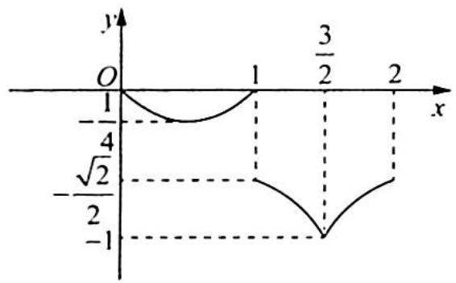

line

| x | y |
|---|---|
| 0 | 1 |
| 1 | -1/4 |
| √2/2 | -1 |
| 3/2 | 0 |
| 2 | 1 |

# 训练 1

1. 已知函数 $f(x)$ 是 $\mathbf{R}$ 上的偶函数, 且 $f(x)$ 的图像关于点(1,0)对称, 当 $x \in [0,1]$ 时, $f(x) = 2 - 2^x$ , 则 $f(0) + f(1) + f(2) + \cdots + f(2022)$ 的值为 (   ).

A.-2

B. -1

C. 0

D. 1

2. 已知函数 $f(x)$ 的定义域为 $\mathbf{R}$ ，对于任意的 $x_1 < x_2$ ，有 $\frac{f(x_1) - f(x_2)}{x_1 - x_2} > -1$ ，且 $f(1) = 1$ ，则不等式 $f(\log_2 |3^x - 1|) < 2 - \log_2 |3^x - 1|$ 的解集是（ ）.

A. $(-\infty, 0)$

B. $(-\infty, 1)$

C. $(-1,0) \cup (0,3)$

D. $(-\infty, 0) \cup (0, 1)$

3. 已知 $f(x) = \begin{cases} x^2 - 4x + 3, & x \leqslant 0 \\ -x^2 - 2x + 3, & x > 0 \end{cases}$ ，不等式 $f(x + a) > f(2a - x)$ 在 $[a, a + 1]$ 上恒成立，则实数 $a$ 的取值范围为（ ）.

A. $(-∞,-2)$

B. $(-2,0)$

C. $(0,2)$

D. $(2, +\infty)$

4. 已知实数 $a, b$ 满足 $a = \mathrm{e}^{5 - a}, 2 + \ln b = \mathrm{e}^{3 - \ln b}$ , 则 $ab = (\quad)$ .

A. 3

B. 7

C. $\mathrm{e}^{3}$

D. $\mathrm{e}^{7}$

5. 设 $f(x)$ 是 $\mathbf{R}$ 上连续的偶函数, 且当 $x > 0$ 时 $f(x)$ 是单调函数, 则满足 $f\left(\frac{x+3}{x+4}\right) = f(x)$ 的所

有 x 之和为( ).

A. -3

B. 3

C. -8

D. 8

6.(多选题)已知函数 $f(x)$ 满足 $f(1)=\frac{1}{4}$ , $4f(x)f(y)=f(x+y)+f(x-y)$ , $x,y\in R$ , 则下列说法正确的是().

A. $f(x)$ 是周期函数，且 $T = 3$

B. $f(x)$ 是周期函数, 且 T=6

C. $f(0) = \frac{1}{2}$

D. $f(2020) = -\frac{1}{4}$

7. 若 $f(x)$ 图像上存在两点 A, B 关于原点对称，则点对 $[A, B]$ 称为函数 $f(x)$ 的“友情点对”（点对 $[A, B]$ 与 $[B, A]$ 视为同一个“友情点对”）若 $f(x)=\left\{\begin{aligned}\frac{x^{3}}{\mathrm{e}^{x}}, & x\geqslant0\\ ax^{2}, & x<0\end{aligned}\right.$ 恰有两个“友情点对”，则实数 a 的取值范围是 \_\_\_\_.

8. 已知 $f(x) = |x - 1| + |x| + |x + 1$ ，且 $f(a^2 - 3a + 2) = f(a - 1)$ ，则满足条件的所有 $a$ 之和为 \_\_\_\_.

9. 已知函数 $f(x) = \frac{\sqrt{3}x + 1}{\sqrt{3} - x}$ ，定义 $f_{1}(x) = f(x)$ ，且 $f_{k+1}(x) = f(f_{k}(x))$ ，则 $f_{2023}(2023) =$ （ ）.

A. 2023

B. $\frac{2023 + \sqrt{3}}{2023 - \sqrt{3}}$

C. $\frac{1 + 2023\sqrt{3}}{2023 + \sqrt{3}}$

D. $\frac{1 + 2023\sqrt{3}}{\sqrt{3} - 2023}$

10. 若定义在 $\mathbf{R}$ 上的偶函数 $f(x)$ 满足 $f(x + 1) = \frac{1}{2} +\sqrt{f(x) - f^2(x)}$ ，则 $f\left(\frac{2023}{2}\right) = \_$ .

# 第2讲

# 函数的图像及延拓

函数的零点、方程的根、图像的交点,这三者各有各的特点又可以互相转化.函数图像以其直观的优点使得问题更加清晰,特别是遇到从代数的角度去看比较抽象、复杂的式子时,比如复合函数和分段函数,从形的角度看就非常直观明了.

利用函数图像解决问题的基础是作出函数的图像。函数的图像要求掌握基本初等函数的图像及图像变换，函数知识的外延主要结合在方程（零点）、不等式等方面。处理这两类问题的主导思想是转化，其转化的方向为借助函数的图像求解。

# 2.1 函数图像的变换

# 研究密钥

利用函数图像解决问题的基础是作函数图像,这往往成为同学们求解问题的拦路虎,作函数图像有两种常见的方法:

(1) 描点法. 当函数表达式 (或变形后的表达式) 是熟悉的基本函数时, 就可以根据这些函数的特征直接作出图像.  
(2)图像变换法.描点法是用有限点来逼近函数图像,因而对于较复杂的函数图像不易作准确.对于高中生,除了会用描点法作图外,还应掌握用变换法作图.常见函数图像的变换有四种:平移变换、翻折变换、对称变换、伸缩变换.

同学们经常遇到这样的问题,在存在多种变换的作图时,不知道应先进行哪一种变换.如作函数 $y=3\sin\left(2x+\frac{\pi}{3}\right)$ 的图像时,要用到左右平移、横向伸缩、纵向伸缩三种变换,究竟应先进行哪种变换?按不同变换顺序作出的图像是否一样?这是变换作图中的关键问题.

正确方法应按下面步骤进行:(1)找出母函数;(2)分解函数,按分解顺序作图.

例 2.1 利用图像变换,分别画出下列函数的图像.

(1) $y=2^{-x-3}+1$ ; (2) $y=|\lg|x-1|$ .

分析 (1) 基本图像是 $y = 2^x$ ，由 $y = 2^x$ 到 $y = 2^{-x - 3} + 1$ 有两种变换途径.

途径一： $y=2^{x}\Rightarrow y=2^{x-3}\Rightarrow y=2^{-x-3}\Rightarrow y=2^{-x-3}+1$ ;

途径二: $y = 2^x \Rightarrow y = 2^{-x} \Rightarrow y = 2^{-x-3} \Rightarrow y = 2^{-x-3} + 1$ , 按照分解的顺序依次作图.

(2) 基本图像是 $y = \lg x, y = \lg x \Rightarrow y = \lg |x| \Rightarrow y = \lg |x - 1| \Rightarrow y = |\lg |x - 1||$ ，按照分解的顺序依次作图.

解析 (1)途径一: $y = 2^x \Rightarrow y = 2^{x-3} \Rightarrow y = 2^{-x-3} \Rightarrow y = 2^{-x-3} + 1$ , 其中①平移变换(向右平移3个单位);②对称变换(关于y轴对称);③平移变换(向上平移1个单位).

途径二: $y = 2^x \Rightarrow y = 2^{-x} \Rightarrow y = 2^{-x-3} \Rightarrow y = 2^{-x-3} + 1$ , 其中①对称变换(关于 $y$ 轴对称); ②平移变换(向左平移 3 个单位); ③平移变换(向上平移 1 个单位).

无论用哪种途径,得到的最终的函数图像如图1所示:

(2) 设 $f(x) = \lg x \xrightarrow{\text{将 } f(x) = \lg x \text{ 的图像向左翻折}} f_1(x) = f(|x|) = \lg |x|$

将 $f_{1}(x) = \lg |x|$ 的图像向右平移1个单位将 $f_{2}(x) = \lg |x - 1|$ 的图像向上翻折 $y = |f_{2}(x)| = |\lg |x - 1||$ ，如图2所示：

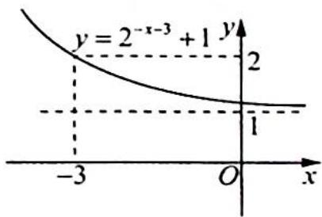

text_image

y = 2^{-x-3} + 1
y
2
1
-3 O x

图1

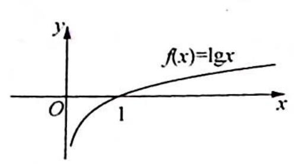

text_image

y
f(x)=lgx
O
1
x

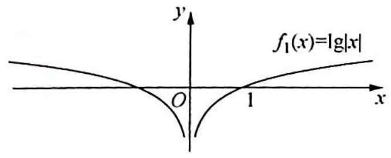

text_image

f₁(x)=lg|x|
O
1
x
y

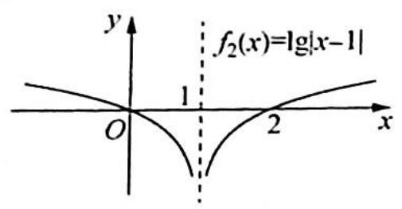

text_image

y
f₂(x)=|g|x-1|
1
O
2
x

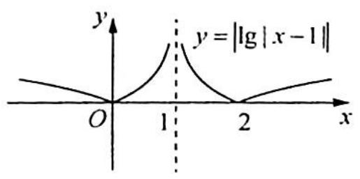

text_image

y
y = |lg | x - 1 ||
O
1
2
x

图 2

# 评注

由上面作图的过程可以看出用图像变换法作函数图像应注意以下三点:①找出母函数;②正确分解函数(每分解一次,应使图像产生一次基本变换);③严格按照函数分解顺序作图,一个函数有多少种分解方法,就有多少种作图方法.

第(1)问中两种变换途径中细节稍微不同,也是学生常犯错误之一,学生常认为从 “ $y=2^{-x}\Rightarrow y=2^{-x-3}$ ”是向右平移3个单位.辨别正误的办法是:函数 $y=f(x)$ 的图像如何变换,关键取决于解析式中x(或y)发生了什么变化.第②步中-x-3=-(x+3)是将x变换为 $x+3$ ,所以是向左平移3个单位.

# 研究反思

# 图像变换的顺序对最终结果有影响吗？

在基础函数上进行变换时, 常见变换有平移、伸缩、翻折、旋转, 无论怎样分解函数进行图像变换, 最终结果是不受变换顺序影响的. 原因很简单, 因为一个函数的图像是确定的, 只要严格按照规则, 变换先后顺序不影响最后的结果.

变换时要抓住这个规律:变换时都是以 x 自变量为中心变换,例如要由 x 变换为 $3x+2$ , 第一种方法是 x 先 +2, 即左移, 再由 x 变换为 3x, 因为是以 x 为中心; 第二种方法是先变换 3x, 再左移, 这里注意这时候 x 和 3 相连, 以 x 为中心则是 $3\left(x+\frac{2}{3}\right)$ , 左移 $\frac{2}{3}$ 个单位. 总结一下就是所有的平移是相对于 x 的系数是“1”, 若 x 的系数不是“1”, 必须要先化为“1”.

变式1: 作出下列函数的图像.

(1) $y = |x^2 + 2|x| - 3|$ ;   
(2) $y=\lg\frac{2x+3}{10}.$

解析 (1)作出函数 $y = x^{2} + 2x - 3$ 的图像, 如图(a)所示;保留 $x \geqslant 0$ 的部分,再作其关于 $y$ 轴对称的图像, 两部分图像即函数 $y = x^{2} + 2|x| - 3$ 的图像, 如图 (b) 所示; 然后保留 $x$ 轴上方的部分, 将 $x$ 轴下方的图像翻折到 $x$ 轴上方, 即得到 $y = |x^{2} + 2|x| - 3|$ 的图像, 如图 (c) 所示.

(2) $y=\lg\frac{2x+3}{10}=\lg(2x+3)-1$ ，基本图像是 $y=\lg x$ ，有以下两种变换途径：

途径一: $y = \lg x$ (母函数) ① $y = \lg(x + 3)$

$$
\xrightarrow {\text {②}} y = \lg (2 x + 3) \xrightarrow {\text {③}} y = \lg (2 x + 3) - 1.
$$

途径二: $y = \lg x \xrightarrow{①} y = \lg (2x) \xrightarrow{②} y = \lg (2x + 3) \xrightarrow{③} y = \lg (2x + 3) - 1.$

无论用哪种途径,得到的最终的函数图像如图(d)所示.

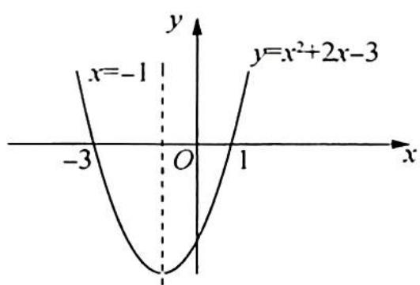

text_image

x=-1
y=x²+2x-3
-3 O 1 x

图(a)

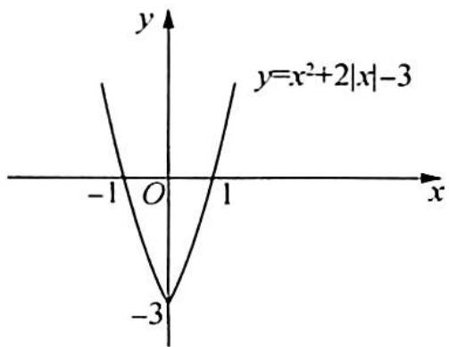

text_image

y
y=x²+2|x|-3
-1 O 1 x
-3

图(b)

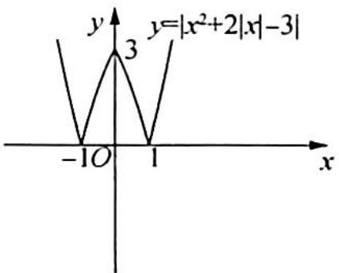  
图(c)

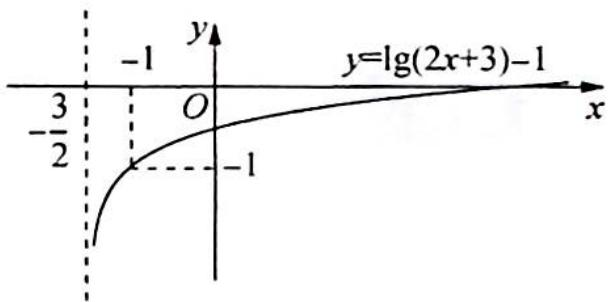

text_image

y
-1
y=lg(2x+3)-1
-3/2
O
x
-1

图(d)

# 评注

注意函数 $y = 2^{|x - 1|}$ 与 $y = 2^{|x| - 1}$ 的图像在画法上的区别：

$$
y = 2 ^ {| x - 1 |} \Leftarrow y = 2 ^ {| x |} \Leftarrow y = 2 ^ {x}; y = 2 ^ {| x | - 1} \Leftarrow y = 2 ^ {x - 1} \Leftarrow y = 2 ^ {x}.
$$

# 2.2 等高线问题

# 研究密钥

函数零点问题常可以转化为拉一条水平直线与函数的交点问题,通过数形结合,由图像确定该交点横坐标的范围,把所给的式子转化为关于某一交点横坐标的函数,求此函数的值域.求解这类问题的主导思想就是转化与数形结合.

例 2.2 已知函数 $f(x) = |\lg x|$ ，若 $0 < a < b$ 且 $f(a) = f(b)$ ，则 $a + 2b$ 的范围是（）.

A. $(2\sqrt{2}, + \infty)$

B. $\left[2\sqrt{2},+\infty\right)$

C. $(3,+\infty)$

D. $[3,+\infty)$

分析 ➤ 首先作出 $f(x)$ 的图像, 因为 $f(a)=f(b)$ , 所以 0<a<1<b, 所以 $f(a)=|\lg a|=-\lg a$ , $f(b)=|\lg b|= \lg b$ , 根据 $f(a)=f(b)$ 可得关于 a, b 的等式, 要求的是 $a+2b$ , 把 b 用 a 表示, 实现消元的目的, 利用对勾函数的单调性求值域.

解析

首先作出 $f(x)$ 的图像, 如图所示.

因为 $f(a) = f(b)$ , 所以 $0 < a < 1 < b$ , 即 $f(a) = |\lg a| = -\lg a, f(b) = |\lg b| = \lg b$ , 所以 $-\lg a = \lg b, ab = 1$ , 则 $a + 2b = a + \frac{2}{a}$ 为对勾函数.

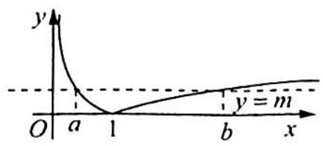

text_image

y
O a 1 b x
y = m

因为 0 < a < 1，由对勾函数 $y = x + \frac{2}{x}$ 的单调性，可知 $a + 2b = a + \frac{2}{a}$ 在 (0,1) 上单调递减，故 $a + \frac{2}{a} > 1 + 2 = 3$ 。故选 C.

变式 1 设函数 $f(x) = \begin{cases} 2^x - 1, & x \geqslant 0 \\ x + 1, & x < 0 \end{cases}$ ，若函数 $a = f(x)$ 有两个实根 $x_1, x_2 (x_1 < x_2)$ ，则 $x_1 + x_2$ 的取值范围是（ ）.

A. $\left[-1,1\right]$

B. $[-1, 1)$

C. $(-1,0]$

D. $(-1,0)$

解析 ▶ 画出函数 $y = f(x)$ 的图像, 如图所示.

由题意可得 $f(x_{1}) = f(x_{2})$ ，即 $x_{1} + 1 = 2^{x_{2}} - 1$ ，可得 $x_{1} = 2^{x_{2}} - 2, x_{1} + x_{2} = 2^{x_{2}} + x_{2} - 2.$

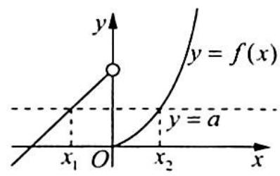

text_image

y
y = f(x)
x₁ O x₂ y = a
x

由图可知 $x_{1} \in [-1,0)$ , 即 $-1 \leqslant 2^{x_{2}} - 2 < 0$ , 可得 $1 \leqslant 2^{x_{2}} < 2$ , 则 $x_{2} \in [0,1)$ , 令 $g(x) = 2^{x} + x - 2, x \in [0,1)$ , 函数 $g(x)$ 是单调递增函数, 可得 $g(x)_{\min} = g(0) = -1, g(1) = 1$ , 则 $g(x) \in [-1,1)$ . 故选 B.

变式(2) (2018 黑龙江赛区预赛 12) 已知函数 $f(x) = \begin{cases} \frac{1}{2}x + \frac{3}{2}, & x \leqslant 1 \\ \ln x, & x > 1 \end{cases} (\ln x \text{是以 } e \text{为底的自然对数，} e = 2.71828 \cdots)$ ，若存在实数 $m, n (m < n)$ ，满足 $f(m) = f(n)$ ，则 $n - m$ 的取值范围是（ ）.

A. $(0, e^{2} + 3)$

B. $(4,e^{2}-1]$

C. $[5 - 2\ln 2, e^2 - 1]$

D. $[5 - 2\ln 2,4]$

解析 由题意可得函数 $f(x)$ 的图像如图所示.

根据图像可得， $-3 < m \leqslant 1, 1 < n \leqslant \mathrm{e}^2, \frac{1}{2} m + \frac{3}{2} = \ln n,$ $m = 2\ln n - 3$ ，所以 $n - m = n - 2\ln n + 3.$

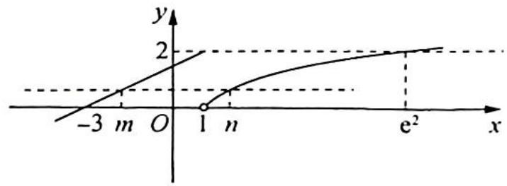

text_image

-3 m O 1 n
y
2
e² x

令 $g(n) = n - 2\ln n + 3$ ，则 $g^{\prime}(n) = 1 - \frac{2}{n} = \frac{n - 2}{n}$

当 $1 < n < 2$ 时, $g'(x) < 0$ , $g(x)$ 单调递减; 当 $2 < n < \mathrm{e}^2$ 时, $g'(x) > 0$ , $g(x)$ 单调递增, 所以 $g(x)_{\min} = g(2) = 5 - 2\ln 2$ .

又 $g(1) = 4, g(\mathrm{e}^2) = \mathrm{e}^2 - 1 > 4$ ，所以 $g(x)_{\max} = \mathrm{e}^2 - 1$ 。故选C.

例2.3 (2017年全国高中数学联赛A卷一试1)已知定义在 $\mathbf{R}_{+}$ 上的函数为 $f(x) = \left\{ \begin{array}{ll}|\log_3x - 1|, & 0 < x \leqslant 9 \\ 4 - \sqrt{x}, & x > 9 \end{array} \right.$ , 设 $a, b, c$ 是三个互不相同的实数, 满足 $f(a) = f(b) = f(c)$ , 求 $abc$ 的取值范围.

分析 ▶ 画出此分段函数的图像,拉一根等高线确定 $a, b, c$ 的范围 (可不妨设 $a < b < c$ ), 再进一步挖掘条件 $f(a) = f(b)$ , 根据 $a, b$ 的范围去掉绝对值符号, 化简转化 $abc$ 的值.

解析 由题意可得函数 $f(x)$ 的图像如图所示.

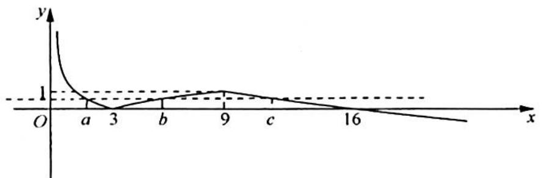

line

| x  | y    |
|----|------|
| 0  | >1   |
| a  | 0    |
| 3  | 0    |
| b  | 0.5  |
| 9  | 1    |
| c  | 0.5  |
| 16 | 0    |

由图像可得 $a < 3, 3 < b < 9, 9 < c < 16$ ，且 $1 - \log_3 a = \log_3 b - 1$ ，所以 $\log_3 a + \log_3 b = \log_3 ab = 2, ab = 9$ ，故 $abc \in (81, 144)$ .

变式1: (2012 河南赛区预赛 5) 已知函数 $f(x) = \begin{cases} |\log_2 x|, & 0 < x \leqslant 4 \\ \frac{2}{3}x^2 - 8x + \frac{70}{3}, & x > 4 \end{cases}$ . 若 $a, b, c, d$ 互不相同，且 $f(a) = f(b) = f(c) = f(d)$ ，则 $abcd$ 的取值范围是 \_\_\_\_.

解析 由题意可得函数 $f(x)$ 的图像如图所示.

由图像可得 $a < 1, 1 < b < 4, 4 < c < 5, 7 < d$ ，且 $\log_2\frac{1}{a} = \log_2b$ ，解得 $ab = 1, c + d = 6 \times 2 = 12$ ，所以 $abcd = cd = c(12 - c) = -(c - 6)^2 + 36.$

当 $c = 4$ 时, abcd 有最小值 32; 当 $c = 5$ 时, abcd 有最大值 35. 故填 (32, 35).

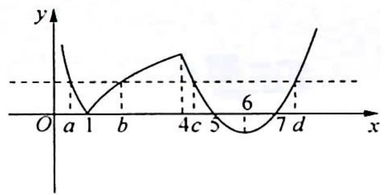

line

| x    | y    |
| ---- | ---- |
| a    | 3.0  |
| 1    | 0.0  |
| b    | 2.0  |
| 4c   | 4.0  |
| 5    | 2.0  |
| 6    | 0.0  |
| 7    | 4.0  |

变式2: 已知函数 $f(x) = \begin{cases} |x + 1|, & x \leqslant 0 \\ |\log_3 x|, & x > 0 \end{cases}$ ，若方程 $f(x) = a$ 有四个不同的解 $x_1, x_2, x_3$ ， $x_4$ 且 $x_1 < x_2 < x_3 < x_4$ ，则 $x_3(x_1 + x_2) + \frac{1}{x_3^2 x_4}$ 的取值范围是（ ）.

A. $(-1, +\infty)$

B. $\left[-1, \frac{7}{3}\right)$

C. $(-∞, \frac{7}{3})$

D. $\left(-1,\frac{7}{3}\right]$

分析 ▶ 由方程 $f(x) = a$ 得到 $x_{1}, x_{2}$ 关于 $x = -1$ 对称, $x_{3}x_{4} = 1$ . 化简 $x_{3}(x_{1} + x_{2}) + \frac{1}{x_{3}^{2}x_{4}} = -2x_{3} + \frac{1}{x_{3}}$ , 再利用函数单调性求出范围.

解析 作出函数 $f(x) = \begin{cases} |x + 1|, & x \leqslant 0 \\ |\log_3 x|, & x > 0 \end{cases}$ 的图像如图所示.

因为方程 $f(x)=a$ 有四个不同的解 $x_{1}, x_{2}, x_{3}, x_{4}$ 且 $x_{1}<x_{2}<x_{3}<x_{4}$ .

根据图像可知, 当 $x \leqslant 0$ 时, $f(x) = |x + 1|$ , 则横坐标为 $x_{1}$ 与 $x_{2}$ 两点的中点横坐标为 $x = -1$ , 即 $x_{1} + x_{2} = -2$ ; 当 $x > 0$ 时, 由于 $y = |\log_{3} x|$ 在 $(0,1)$ 上是减函数, 在 $(1,+\infty)$ 上是增函数, 又因为 $x_{3} < x_{4}$ , $|\log_{3} x_{3}| = |\log_{3} x_{4}|$ , 则 $\frac{1}{3} \leqslant x_{3} < 1 < x_{4}$ , 有 $-\log_{3} x_{3} = \log_{3} x_{4}$ , 即 $x_{3} x_{4} = 1$ .

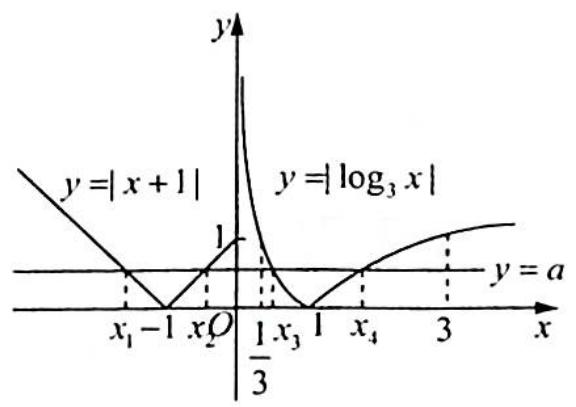

所以 $x_{3}(x_{1} + x_{2}) + \frac{1}{x_{3}^{2}x_{4}} = -2x_{3} + \frac{1}{x_{3}},\frac{1}{3}\leqslant x_{3} <   1.$

令函数 $h(t)=-2t+\frac{1}{t}$ ，由反比例函数和一次函数的性质得函数 $h(t)$ 在 $(0,1)$ 上单调递减，故 $h(t)>h(1)=-2+1=-1,h(t)\leqslant h\left(\frac{1}{3}\right)=-\frac{2}{3}+3=\frac{7}{3}$ ，所以 $-2x_{3}+\frac{1}{x_{3}}\in\left(-1,\frac{7}{3}\right]$ 。故选 D.

例2.4 已知函数 $f(x) = \begin{cases} x + 2, & x \leqslant 0 \\ x - \ln x, & x > 0 \end{cases}$ . 若存在 $x_1 \leqslant 0, x_2 > 0$ , 使得 $f(x_1) = f(x_2)$ . 则 $x_1f(x_2)$ 的取值范围为 \_\_\_\_.

分析 ▶ 通过求导运算得到当 x>0 时 $f(x)$ 的图像, 从而得到 $f(x)$ 整体的图像; 由 $f(x_{1})=f(x_{2})$ 得到 $x_{1}$ 与 $x_{2}$ 的关系, 从而将问题转化为求解 $f^{2}(x_{2})-2f(x_{2})$ 的值域; 利用二次函数来求解出值域.

解析 当 $x > 0$ 时, $f'(x) = 1 - \frac{1}{x} = \frac{x - 1}{x}$ .

当 $x > 1$ 时, $f'(x) > 0$ ; 当 $0 < x < 1$ 时, $f'(x) < 0$ , 即 $f(x)$ 在 $(0,1)$ 上单调递减; 在 $(1,+\infty)$ 上单调递增, 所以 $f(x)_{\min} = f(1) = 1 - \ln 1 = 1$ , 可知函数图像如图所示.

因为 $f(x_{1}) = f(x_{2}), x_{1} \leqslant 0, x_{2} > 0$ ，可知 $x_{1} + 2 = x_{2} - \ln x_{2}$ ，即 $x_{1} = x_{2} - \ln x_{2} - 2$ ，所以 $x_{1}f(x_{2}) = (x_{2} - \ln x_{2} - 2)(x_{2} - \ln x_{2}) = [f(x_{2}) - 2]\cdot f(x_{2}) = f^{2}(x_{2}) - 2f(x_{2})$ .

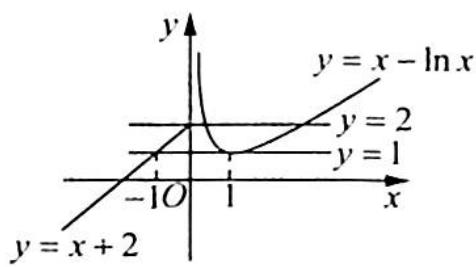

text_image

y
y = x - \ln x
y = 2
y = 1
-1O 1 x
y = x + 2

由图像可知 $f(x_{2})\in [1,2]$ ，则 $[x_1f(x_2)]_{\min} = 1^2 -2\times 1 = -1;$ $[x_1f(x_2)]_{\max} = 2^2 -2\times 2 = 0.$ 所以 $x_{1}f(x_{2})\in [-1,0]$ .故填[-1,0].

变式 1 函数 $f(x) = \begin{cases} |x - 2|, & x \geqslant 0 \\ 2^{x + 1}, & x < 0 \end{cases}$ ，若 $x_1 < x_2 < x_3$ ，且 $f(x_1) = f(x_2) = f(x_3)$ ，则 $\frac{x_2f(x_1)}{x_2 + x_3}$ 的取值范围是（ ）.

A. $\left[0, \frac{1}{4}\right)$

B. $\left(0,\frac{1}{4}\right]$

C. $(0, \frac{1}{2})$

D. $\left(0,\frac{1}{2}\right]$

解析 ▶ 函数 $f(x)$ 的图像如图所示, 易知 $x_{2} + x_{3} = 4, x_{2} \in (0, 2)$ , 所以 $y = \frac{x_{2} f(x_{1})}{x_{2} + x_{3}} = \frac{x_{2} f(x_{2})}{4} = \frac{1}{4} x_{2}(2 - x_{2})$ .

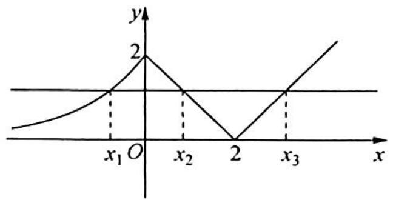

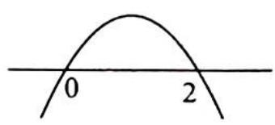

当 $x = 1$ 时， $y_{\max} = \frac{1}{4}$ . 故 $y \in \left(0, \frac{1}{4}\right]$ . 故选 B.

# 2.3 含参函数零点问题

# 研究室钥

函数的零点、方程的根、函数图像的交点三类问题之间可以相互转化: 函数的零点 $\Leftrightarrow$ 方程的根 $\Leftrightarrow$ 函数图像的交点, 运用方程可进行等式的变形进而构造函数转化为两个函数图像的交点问题, 或分离参数, 将原函数零点问题转化为一个函数与一条水平直线的交点问题, 通过上下平移水平直线有不同的交点个数求出参数的取值范围. 转化时要选择合适的函数, 以便于作图、便于求出参数的取值范围为原则. 这类问题的主导思想仍是转化与数形结合的思想.

例2.5 (2015天津卷理8)已知函数 $f(x) = \begin{cases} 2 - |x|, & x \leqslant 2, \\ (x - 2)^2, & x > 2, \end{cases}$ 函数 $g(x) = b - f(2 - x)$ . 其中 $b \in \mathbb{R}$ . 若函数 $y = f(x) - g(x)$ 恰有4个零点, 则 $b$ 的取值范围是( ).

A. $\left(\frac{7}{4},+\infty\right)$

B. $\left(-\infty,\frac{7}{4}\right)$

C. $\left(0,\frac{7}{4}\right)$

D. $\left(\frac{7}{4},2\right)$

分析 将问题转化为 $F(x) = f(x) + f(2 - x)$ 与 $y = b$ 有4个交点, 求 $b$ 的取值范围问题. 作出 $F(x)$ 的图像. 由于 $F(x)$ 的对称轴为 $x = 1$ , 所以看 $b$ 取何值时与 $F(x)$ 在 $[1, +\infty)$ 上的图像有2个交点.

解析 $y=f(x)-g(x)=f(x)-b+f(2-x).$

令 $f(x) - b + f(2 - x) = 0$ ，则 $b = f(x) + f(2 - x)$ ，令 $F(x) = f(x) + f(2 - x)$ ，函数 $F(x)$ 的图像关于 $x = 1$ 对称。

$$
F (x) = \left\{ \begin{array}{l l} 2 - | x | + 2 - | x - 2 |, & 1 \leqslant x \leqslant 2 \\ (x - 2) ^ {2} + 2 - | x - 2 |, & x > 2 \end{array} , \text {即} F (x) = \left\{ \begin{array}{l l} 2 - x + 2 - (2 - x) = 2, & 1 \leqslant x \leqslant 2 \\ (x - 2) ^ {2} + 2 - (x - 2) = x ^ {2} - 5 x + 8, & x > 2 \end{array} . \right. \right.
$$

作出 $F(x)$ 的部分图像如图所示, 要使得函数 $y = f(x) - g(x)$ 恰有 4 个零点, 则 $b = F(x)$ 在 $x \geqslant 1$ 时有两个交点, 由图像可得 $\frac{7}{4} < b < 2$ . 故选 D.

变式 7: 若关于 $x$ 的方程 $x \mid x - a \mid = a$ 有三个不同的实数根, 则 $a$ 的取值范围为 ( ).

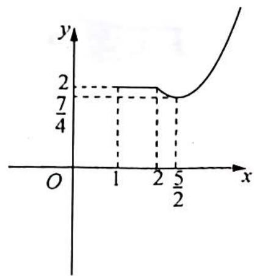

line

| x | y |
|---|---|
| 1 | 2 |
| 2 | 2 |
| 5/2 | 2 |

A. $(0,4)$

B. $(-4,0)$

C. $(- \infty, -4) \cup (4, +\infty)$

D. $(-4,0) \cup (0,4)$

解析 ▶ 令 $f(x) = x \mid x - a \mid = \begin{cases} x^2 - ax, & x \geqslant a \\ ax - x^2, & x < a \end{cases}$ ，方程 $x \mid x - a \mid = a$ 有三个不同的实数根可转化为直线 $y = a$ 与函数 $f(x)$ 的图像有三个交点.

(1)当 $a > 0$ 时,画出 $f(x)$ 的图像,如图(a)所示,当 $0 < a < \frac{a^2}{4}$ ,即 $a > 4$ 时,直线 $y = a$ 与 $f(x)$ 有三个交点;  
(2)当 a<0 时,画出 $f(x)$ 的图像,如图(b)所示,当 $-\frac{a^{2}}{4}<a<0$ , 即 a<-4 时,直线 y=a 与 $f(x)$ 有三个交点;  
(3)当 $a = 0$ 时,原方程为 $x\left| x\right|  = 0$ ,只有一个根 $x = 0$ ,不符合题意.

综上所述， $a$ 的取值范围为 $a > 4$ 或 $a < -4$ . 故选 C.

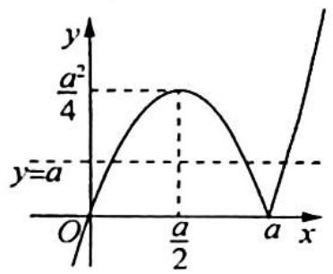

line

| x | y |
|---|---|
| 0 | 0 |
| a/2 | a²/4 |
| a | 0 |

图(a)

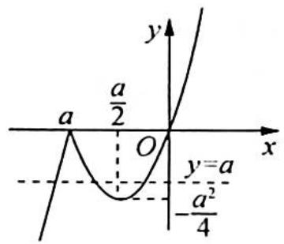

text_image

a
a/2
O
y=a
-a²/4

图(b)

例2.6 已知函数 $f(x) = \begin{cases} x e^{x}, & x \leqslant 0 \\ \ln x, & x > 0 \end{cases}$ ，若 $g(x) = f(x) - ax$ 有四个不同的零点，则 $a$ 的取值范围为（ ）.

A. $\left(0\cdot\frac{1}{e}\right)$

B. $\left[\frac{1}{e},1\right)$

C. [1, e)

D. $[e, +\infty)$

分析 ▶ 应用导数研究 $x \leqslant 0$ 和 x > 0 时 $g(x)$ 的单调性, 要使 $g(x) = 0$ 有四个不同的解, 即当两个区间均存在两个零点时, 求 a 的范围.

解析 由题意知， $g(x)=f(x)-ax$ 有四个不同的零点，所以 $g(x)=$ $\left\{\begin{aligned}xe^{x}-ax,\quad&x\leqslant0\\ \ln x-ax,\quad&x>0\end{aligned}\right.$ ,则 $g(x)=0$ 有四个不同的解.

当 $x \leqslant 0$ 时, $g(x) = x(e^x - a) = 0$ , 其零点情况如下:

(1) 当 $a \leqslant 0$ 或 a = 1 时, x = 0;

(2) 当 0 < a < 1 或 a > 1 时, x = 0 或 $x = \ln a$ .

当 $x > 0$ 时， $g'(x) = \frac{1}{x} - a$ ，则有如下情况：

(1) 当 $a \leqslant 0$ 时, $g'(x) > 0$ , 即 $g(x)$ 单调递增, 不可能出现两个零点, 不合题意;

(2) 当 $a > 0$ 时, 在 $0 < x < \frac{1}{a}$ 上 $g'(x) > 0$ , $g(x)$ 单调递增, 在 $x > \frac{1}{a}$ 上 $g'(x) < 0$ , $g(x)$ 单调递减, 而 $x \Rightarrow 0^{+}$ 有 $g(x) \Rightarrow -\infty$ , $x \Rightarrow +\infty$ 有 $g(x) \Rightarrow -\infty$ , 所以只需 $g\left(\frac{1}{a}\right) = -\ln a - 1 > 0$ , 得当 $a < \frac{1}{e}$ 时, $g(x)$ 必有两个零点.

综上所述, 有 $0 < a < \frac{1}{\mathrm{e}}$ 时, $g(x)$ 在 $x \leqslant 0$ 和 $x > 0$ 上各有两个零点, 即共有 4 个不同的零点. 故选 A.

变式 1 已知关于 $x$ 的方程 $a\left(\frac{1}{4}\right)^x - \left(\frac{1}{2}\right)^x + 2 = 0$ 在区间 $[-1,0]$ 上有实数根, 则实数 $a$ 取值范围为 ( ).

A. $\left[0, \frac{1}{8}\right]$

B. $\left[-1,0\right)\cup\left(0,\frac{1}{8}\right]$

C. $\left[-1, \frac{1}{8}\right]$

D. $[-1,0]$

解析 令 $t = \left(\frac{1}{2}\right)^x$ ，则 $t \in [1,2]$ . 原方程等价于 $at^2 - t + 2 = 0$ 在 $[1,2]$ 上有实数根，分离参数 $a = g(t) = \frac{t - 2}{t^2} = \frac{-2}{t^2} + \frac{1}{t} = -2\left(\frac{1}{t} - \frac{1}{4}\right)^2 + \frac{1}{8}, \frac{1}{t} \in \left[\frac{1}{2}, 1\right]$ ，可见 $g(t)$ 单调，当 $\frac{1}{t} = \frac{1}{2}$ 时， $g(t)_{\max} = 0$ ；当 $\frac{1}{t} = 1$ 时， $g(t)_{\min} = -1$ ，即函数 $g(t)$ 的值域为 $[-1,0]$ ，所以当 $a \in [-1,0]$ 时，原方程有解。故选 D.

例2.7 已知函数 $f(x) = \begin{cases} x^3, & x \geqslant 0 \\ -x, & x < 0 \end{cases}$ ，若函数 $g(x) = f(x) - |kx^2 - 2x| (k \in \mathbb{R})$ 恰有 4 个零点，则 $k$ 的取值范围是（ ）.

A. $\left(-\infty,-\frac{1}{2}\right)\cup(2\sqrt{2},+\infty)$

B. $\left(-\infty,-\frac{1}{2}\right)\cup(0,2\sqrt{2})$

C. $(-∞,0)∪(0,2\sqrt{2})$

D. $(-∞,0)∪(2\sqrt{2},+∞)$

分析 ➤ 问题转化为求 $f(x)$ 的图像与 $\left|kx^{2}-2x\right|$ 的图像有 4 个交点时 k 的取值范围. 当 x≠0 时转化为 $y_{1}=|kx-2|$ 与 $y_{2}=\begin{cases}x^{2}, & x>0 \\1, & x<0\end{cases}$ 有 3 个交点. 以下分 k>0, k<0, k=0 几种情况下看图像交点个数为 3 时, 求 k 的取值范围.

解析 ▶ 函数 $g(x)$ 恰有 4 个零点, 即 $f(x)$ 的图像和 $\left| kx^{2}-2x \right|$ 的图像有 4 个交点.

令 $g(x) = 0$ ，得 $f(x) = |kx^{2} - 2x|$ ，即 $|kx^{2} - 2x| = \left\{ \begin{array}{ll}x^3, & x\geqslant 0\\ -x, & x <   0 \end{array} \right.$

当 $x = 0$ 时, 满足方程, 即无论 $k$ 取何值, $g(x)$ 在 $x = 0$ 处都有一个零点;

当 $x \neq 0$ 时，方程可以转化为 $|kx - 2| = \begin{cases} x^2, & x > 0 \\ 1, & x < 0 \end{cases}$ ，图像如图所示。

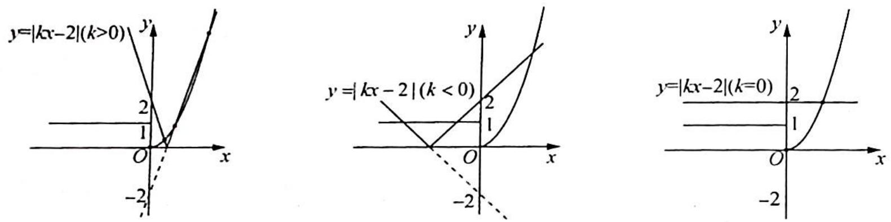

①当 $k > 0$ 时, 要使得 $y_{1} = |kx - 2|$ 的图像和 $y_{2} = \left\{ \begin{array}{l} x^{2}, x > 0 \\ 1, x < 0 \end{array} \right.$ 的图像有 3 个交点, 只需要满足 $\left\{ \begin{array}{l} y = kx - 2 \\ y = x^{2} \end{array} \right.$ 有两个根, 即 $x^{2} - kx + 2 = 0$ 有两个根, 所以 $\Delta = k^{2} - 8 > 0$ , 解得 $k > 2\sqrt{2}$ .

②当 k<0 时， $|kx-2|$ 的图像和 $y_{2}$ 的图像始终有 3 个交点，所以 k<0 时都符合题意.  
③当 k=0 时， $g(x)$ 只有两个零点 x=0 和 $x=\sqrt{2}$ ，不符合题意。

综上所述， $k$ 的取值范围是 $(- \infty, 0) \cup (2\sqrt{2}, + \infty)$ . 故选 D.

例2.8 已知函数 $f(x) = \begin{cases} \frac{|x|}{x + 4}, & -4 < x < 2 \\ \sqrt{\frac{x^3}{6 - x}}, & 2 \leqslant x < 6 \end{cases}$

，若方程 $f(x) - ax^{2} = 0$ 有5个不等实

根,则实数 a 的取值范围是().

A. $\left(0,\frac{\sqrt{2}}{4}\right)$

B. $\left[\frac{1}{4}\cdot\frac{1}{3}\right]$

C. $\left[\frac{1}{3},\frac{\sqrt{2}}{4}\right]$

D. $\left(\frac{\sqrt{2}}{4},+\infty\right)\cup\left\{\frac{1}{3}\right\}$

分析 $f(x)$ 与 $y = ax^{2}$ 有 5 个交点, 由于 $y = ax^{2}$ 的图像在变化, 不好确定 $a$ 的范围, 因此等式两边除以 $x^{2}$ , 分离出参数得到 $a = g(x)$ , 再通过上下平移水平直线, 根据交点个数得 $a$ 的取值范围.

解析 当 x=0 时， $f(x)-ax^{2}=0$ 恒成立，即无论 a 取何值， $f(x)-ax^{2}=0$ 在 x=0 处
始终有一个根. 当 $x \neq 0$ 时，由 $f(x) - ax^{2} = 0$ 可得 $a = \frac{f(x)}{x^{2}} = \begin{cases} \frac{|x|}{x^{2}(x+4)}, & -4 < x < 2 \\ \frac{1}{x^{2}}\sqrt{\frac{x^{3}}{6-x}}, & 2 \leqslant x < 6 \end{cases}$

即 $a = \begin{cases} \frac{1}{-x(x + 4)}, & -4 < x < 0 \\ \frac{1}{x(x + 4)}, & 0 < x < 2 \\ \frac{1}{x^2}\sqrt{\frac{x^3}{6 - x}}, & 2 \leqslant x < 6 \end{cases}$ , 所以 $\frac{1}{a} = \begin{cases} -x(x + 4), & -4 < x < 0 \\ x(x + 4), & 0 < x < 2 \\ \sqrt{x(6 - x)}, & 2 \leqslant x < 6 \end{cases}$ .

要使得方程 $f(x) - ax^{2} = 0$ 有5个不等实根，只需要满足 $y = \frac{1}{a}$ 的图像与 $y = \left\{ \begin{array}{ll} - x(x + 4), & -4 < x < 0\\ x(x + 4), & 0 < x < 2\\ \sqrt{x(6 - x)}, & 2\leqslant x < 6 \end{array} \right.$ 的图像有4个交点，如图所示.

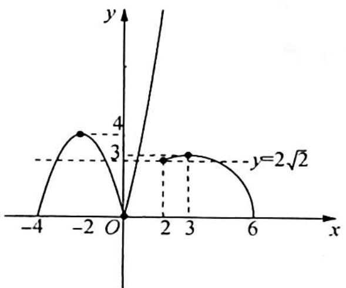

line

| x    | y     |
| ---- | ----- |
| -2   | 3.5   |
| 3    | 3.0   |
| 6    | 0.0   |

由图像可得, $0 < \frac{1}{a} < 2\sqrt{2}$ 或 $\frac{1}{a} = 3$ , 解得 $a > \frac{\sqrt{2}}{4}$ 或 $a = \frac{1}{3}$ . 故选 D.

变式(1) 若关于 $x$ 的方程 $\frac{|x|}{x+2} = kx^2$ 有 4 个不同的实数解, 则实数 $k$ 的范围为 ( ).

A. $(0,1)$

B. $\left(\frac{1}{2},1\right)$

C. $\left(\frac{1}{2},+\infty\right)$

D. $(1, +\infty)$

显然 $x = 0$ 是原方程的一个解, 且 $k \neq 0$ .

当 $x \neq 0$ 时, 分离参数 $\frac{1}{k} = |x|(x + 2)$ , 其中 $x \neq 0$ 且 $x \neq -2$ .

由此可知方程 $\frac{1}{k}=|x|(x+2)$ 在 $x\neq0$ 且 $x\neq-2$ 的情形下有3个实数根.

令 $g(x) = |x|(x + 2) = \left\{ \begin{array}{ll}x(x + 2), & x > 0\\ -x(x + 2), & x <   0 \end{array} \right.$ ，作出函数 $g(x)$ 的图像如图所示.

当 $0 < \frac{1}{k} < 1$ ，即 $k > 1$ 时，水平直线 $y = \frac{1}{k}$ 与 $y = g(x)$ 的图像恰有3个交点，即 $k$ 的取值范围为 $k > 1$ . 故选D.

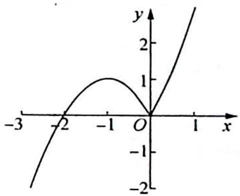

line

| x   | y    |
| --- | ---- |
| -3  | -2.5 |
| -2  | -1.0 |
| -1  | 1.0  |
| 0   | 1.0  |
| 1   | 2.5  |

# 2.4 复合函数零点问题

# 研究密钥

对于这一类问题可以分两个步骤解决:(1)先把复合函数的内层函数设为 t,使得关于内层函数的方程转化为关于 t 的方程,根据方程的根的个数确定 t 的取值范围或者 t 的值;(2)将问题转化为函数 $f(x)$ 的图像与直线 y=t 有几个交点的问题.有时候满足交点个数的情况不止一种,需要注意考虑问题要全面.

例 2.9 已知函数 $f(x) = \begin{cases} 2^{|x-1|} - 1, & x \geqslant 0 \\ x^2 + 2x + 1, & x < 0 \end{cases}$ ，若关于 $x$ 的方程 $f^2(x) - (m+1)f(x) + 2m^2 = 0$ 有七个不同的实根，则 $m$ 的值是（ ）.

A. 0 或 $\frac{1}{2}$

B. 0

C. $\frac{1}{2}$

D. 不存在

分析 作出 $f(x)$ 的图像, 令 $t = f(x)$ , 根据方程确定至多存在两个 $t$ 的值, 使得 $y = t$ 与 $t = f(x)$ 有 7 个交点, 求出 $t$ 的值或取值范围, 进而转化为求方程 $t^2 - (m + 1)t + 2m^2 = 0$ 在 $t$ 的值或取值范围有解, 利用一元二次方程根的分布, 即可求解.

解析 作出函数 $f(x)$ 的图像, 如图所示.

令 $t = f(x)$ , 方程 $f^{2}(x) - (m + 1)f(x) + 2m^{2} = 0$ , 即 $t^{2} - (m + 1)t + 2m^{2} = 0$ . 当 $t < 0$ 时, 方程 $t = f(x)$ 没有实数解; 当 $t = 0$ 或 $t > 1$ 时, 方程 $t = f(x)$ 有 2 个实数解; 当 $0 < t < 1$ , 方程有 4 个实数解; 当 $t = 1$ 时, 方程有 3 个解.

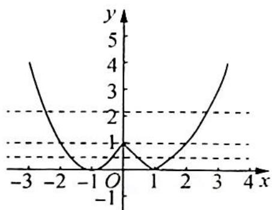

line

| x | y |
|---|---|
| -3 | 4 |
| -2 | 1 |
| -1 | 0 |
| 0 | 1 |
| 1 | 0 |
| 2 | 1 |
| 3 | 4 |
| 4 | 5 |

要使方程 $f^{2}(x) - (m + 1)f(x) + 2m^{2} = 0$ 有七个不同的实根, 则方程 $t^{2} - (m + 1)t + 2m^{2} = 0$ 有一根为 1 , 另一根大于 0 且小于 1 , 当 $t = 1$ 时, 有 $2m^{2} - m = 0$ , 所以 $m = 0$ 或 $m = \frac{1}{2}$ .

当 $m = 0$ 时, $t^2 - t = 0$ , $t = 0$ 或 $t = 1$ , 不满足题意; 当 $m = \frac{1}{2}$ 时, $t^2 - \frac{3}{2} t + \frac{1}{2} = 0$ , $t = 1$ 或 $t = \frac{1}{2}$ , 满足题意.

所以 $m=\frac{1}{2}$ . 故选 C.

变式(1) 已知函数 $f(x)$ 满足 $f(x)=\left\{\begin{array}{l}1-x^{2}, \quad x \leqslant 0 \\ |\lg x|, \quad x>0\end{array}\right.$ , 若方程 $[f(x)]^{2}-4mf(x)+m^{2}+2=0$ 有 4 个不相等的实数根, 则实数 $m$ 的取值范围为 \_\_\_\_.

分析 ▶ 令 $t = f(x)$ , 则方程 $[f(x)]^{2} - 4mf(x) + m^{2} + 2 = 0$ 转化为 $t^{2} - 4mt + m^{2} + 2 = 0$ , 作出函数 $f(x)$ 的图像, 由题意得原问题等价于 $t^{2} - 4mt + m^{2} + 2 = 0$ 有两个大于 1 的不等实数根, 根据一元二次方程根的分布列出不等式组求解即可得到答案.

解析 ▶ 作出函数 $f(x)$ 的图像, 如图所示.

令 $t = f(x)$ , 则方程 $[f(x)]^2 - 4mf(x) + m^2 + 2 = 0$ 转化为 $t^2 - 4mt + m^2 + 2 = 0$ .

由题意得,方程 $[f(x)]^2 - 4mf(x) + m^2 + 2 = 0$ 有 4 个不相等的实数根,而一元二次方程最多有两个实数根,即 $t^2 - 4mt + m^2 +$ 2=0 有两个大于 1 的不等实数根. 令 $h(t)=t^{2}-4mt+m^{2}+2$ ，则 $\left\{\begin{aligned}\Delta&=(-4m)^{2}-4(m^{2}+2)>0\\ -\frac{-4m}{2}>1\\ h(1)&=1^{2}-4m+m^{2}+2>0\end{aligned}\right.$ 解得 m>3 或 $\frac{\sqrt{6}}{3}<m<1$ ，则实数 m 的取值范围为 m>3 或 $\frac{\sqrt{6}}{3}<m<1$ 。

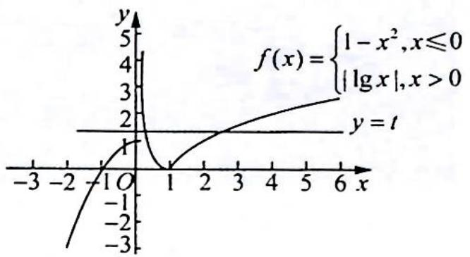

line

| x    | f(x) |
| ---- | ---- |
| -3   | -3   |
| -2   | -1   |
| -1   | 0    |
| 0    | 1    |
| 1    | 0    |
| 2    | 1    |
| 3    | 2    |
| 4    | 3    |
| 5    | 4    |
| 6    | 5    |

变式2: 已知函数 $f(x)=\frac{x}{e^{x}}$ , 若关于 $x$ 的方程 $[f(x)]^{2}+mf(x)+m-1=0$ 恰有 3 个不同的实数解, 则实数 $m$ 的取值范围是( ).

A. $(- \infty, 2) \cup (2, +\infty)$

B. $\left(1-\frac{1}{e},+\infty\right)$

C. $\left(1-\frac{1}{e},1\right)$

D. (1, e)

分析 ▶ 先画出函数 $f(x)$ 的图像, 令 $f(x)=t$ , 由题意中的恰有 3 个不同的实数解, 确定方程 $t^{2}+mt+m-1=0$ 的根的取值情况, 继而求出 m 的范围.

解析 因为 $f(x)=\frac{x}{\mathrm{e}^{x}}$ ，则 $f'(x)=\frac{\mathrm{e}^{x}-x\mathrm{e}^{x}}{(\mathrm{e}^{x})^{2}}=\frac{1-x}{\mathrm{e}^{x}}$ .

当 $x \in (-\infty, 1)$ 时， $f'(x) > 0$ ， $f(x)$ 单调递增；当 $x \in (1, +\infty)$ 时， $f'(x) < 0$ ， $f(x)$ 单调递增减，且 $f(x)_{\max} = f(1) = \frac{1}{\mathrm{e}}, f(x)$ 的图像如图所示. 令 $f(x) = t$ ，则有 $t^2 + mt + m - 1 = 0$ ，即 $(t + m - 1)(t + 1) = 0$ ，解得 $t_1 = 1 - m, t_2 = -1.$

因为直线 $y=t_{2}$ 与函数图像有一个交点, 所以直线 $y=t_{1}$ 与函数图像有两个交点, 即 $0<1-m<\frac{1}{e}$ , 即 $1-\frac{1}{e}<m<1$ . 故选 C.

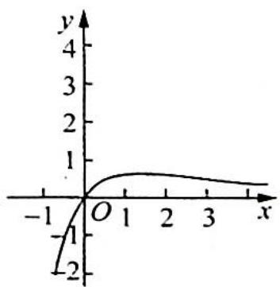

line

| x   | y    |
| --- | ---- |
| -1  | -2   |
| 0   | 0    |
| 1   | 1    |
| 2   | 1    |
| 3   | 0.5  |

变式3 设函数 $f(x)=\left\{\begin{aligned}x+1,&\quad x\leqslant0\\ \log_{2}x,&\quad x>0\end{aligned}\right.$ ，若函数 $g(x)=f(f(x))-a$ 有三个零点，则实数 a 的范围为 \_\_\_\_.

分析 ▶ 令 $t = f(x)$ , 则原方程的解变为方程组 $f(t) = a$ 的解, 作出函数 $y = f(x)$ , 采用数形结合法求解.

解析 ▶ 函数 $g(x)$ 的零点即为方程 $g(x)=0$ 的解, 令 $t=f(x)$ , 则原方程的解变为方程组 $f(t)=a$ 的解, 作出函数 $y=f(x)$ 的图像, 如图所示.

由图像可知, 当 $t > 1$ 时, 有唯一的 $x$ 与之对应; 当 $t \leqslant 1$ 时, 有两个不同的 $x$ 与之对应.

由方程组 $f(t) = a$ 有三个不同的 $x$ 知, 需要有两个不同的 $t$ , 且一个 $t > 1$ , 一个 $t \leqslant 1$ , 结合图像可知, 当 $a \in (0,1]$ 时, 满足一个 $t \in (-1,0]$ , 一个 $t \in (1,2]$ , 符合要求.

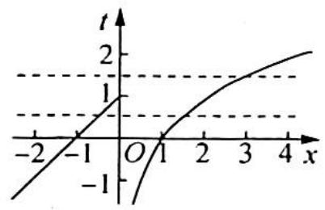

line

| x   | t (solid line) | t (dashed line) |
| --- | -------------- | --------------- |
| -2  | -1             | -1              |
| -1  | 0              | 1               |
| 0   | 1              | 1               |
| 1   | 2              | 1               |
| 2   | 3              | 1               |
| 3   | 4              | 1               |
| 4   | 5              | 1               |

综上可知,实数 a 的取值范围为 $(0,1]$ .

例 2.10 若函数 $f(x)=x^{3}+ax^{2}+bx+c$ 有极值点 $x_{1}, x_{2}$ ，且 $f(x_{1})=x_{1}$ ，则关于 x 的方程 $3(f(x))^{2}+2af(x)+b=0$ 的不同实根个数是（）.

A. 3

B. 4

C. 5

D. 6

分析 ▶ 由题意求导结合极值点的性质可得原方程等价于 $f(x) = x_{1}$ 或 $f(x) = x_{2}$ , 按照 $x_{1} < x_{2}, x_{1} > x_{2}$ 分类, 作出函数图像, 数形结合即可得解.

解析 由题意 $f'(x) = 3x^2 + 2ax + b, x_1, x_2$ 为函数 $f(x)$ 的极值点，所以 $f'(x) = 3x^2 + 2ax + b = 0$ 有两个解 $x_1, x_2$ ，即 $f(x) = x_1$ 或 $f(x) = x_2$ .

当 $x_{1} < x_{2}$ 时, 则 $x_{1}$ 为函数 $f(x)$ 的极大值点, 且 $f(x_{1}) = x_{1}, x_{2}$ 为函数 $f(x)$ 的极小值点, 画出函数图像, 如图 1 所示. 此时 $f(x) = x_{1}$ 有两个不同实根, $f(x) = x_{2}$ 有一个实根, $3(f(x))^{2} + 2af(x) + b = 0$ 有三个不同实根.

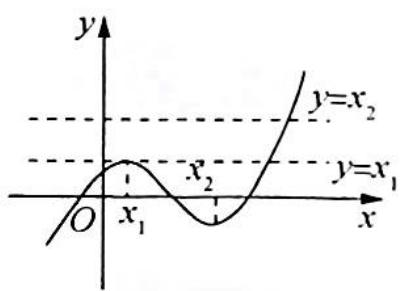

text_image

y
y=x₂
x₂
y=x₁
O
x₁
x

图1

当 $x_{1} > x_{2}$ 时, 则 $x_{1}$ 为函数 $f(x)$ 的极小值点, 且 $f(x_{1}) = x_{1}, x_{2}$ 为函数 $f(x)$ 的极大值点, 画出函数图像, 如图2所示. 此时 $f(x) = x_{1}$ 有两个不同实根, $f(x) = x_{2}$ 有一个实根, $3(f(x))^{2} + 2af(x) + b = 0$ 有三个不同实根.

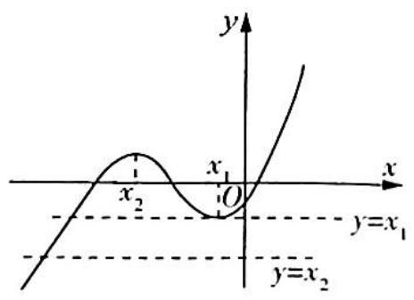

text_image

y
x
x₂
x₁
O
y=x₁
y=x₂

图 2

综上所述, $3(f(x))^{2}+2af(x)+b=0$ 有三个不同实根. 故选A.

# 2.5 分段函数零点问题

# 研究密钥

对于这类问题,可以将零点分给不同的定义域区间,在每个区间内求解满足根的个数时参数的取值范围.需要注意的是有时候零点的分法不止一种,需要考虑全面.在分零点之前先判断每个区间上的函数最多最少有几个零点,可以为零点的分法提供方向.

例2.11 设函数 $f(x) = \begin{cases} 2^x + a, & x < 1 \\ 4(x + a)(x + 2a), & x \geqslant 1 \end{cases}$ ，若 $f(x)$ 恰有 2 个零点，则实数 $a$ 的取值范围是（ ）.

A. $\left[-2, -\frac{1}{2}\right]$

B. $(-∞,-2]\cup(-1,-\frac{1}{2}]$

C. $(-∞,-1)$

D. $\left[-2.+\infty\right)$

分析 当 $x < 1$ 时, $f(x)$ 单调递增, $f(x)$ 至多有一个零点; 当 $x \geqslant 1$ 时, $f(x)$ 至多有两个零点 $x = -a$ 和 $x = -2a$ . 若 $f(x)$ 在 $x < 1$ 上没有零点, 则 $x = -a$ 和 $x = -2a$ 都大于 0; 若 $f(x)$ 在 $x < 1$ 上有一个零点, 则 $x = -a$ 和 $x = -2a$ , 一个在 $x = 1$ 的左侧, 一个在 $x = 1$ 的右侧. 分情况讨论 $a$ 的取值范围.

解析 当 x<1 时， $f(x)$ 单调递增， $f(x)<2+a$ ; 当 $x\geqslant1$ 时，令 $f(x)=0$ 得 x=-a 或 x=-2a.

(1) 若 $2 + a \leqslant 0$ , 即 $a \leqslant -2$ 时, $f(x)$ 在 $(- \infty, 1)$ 上无零点, 此时 $-2a > -a \geqslant 2$ , 所以 $f(x)$ 在 $[1, +\infty)$ 上有两个零点, 符合题意.

(2) 若 $2 + a > 0$ , 即 $a > -2$ 时, $f(x)$ 在 $(- \infty, 1)$ 上有 1 个零点, 所以 $f(x)$ 在 $[1, +\infty)$ 上只有 1 个零点.

①若-2<a<0，则-2a>-a，所以-a<1≤-2a，解得-1<a≤- $\frac{1}{2}$ ;

②若 a=0，则 $-a=-2a=0 \notin [1,+\infty)$ ，所以 $f(x)$ 在 $[1,+\infty)$ 上无零点，不符合题意；

③若 a > 0，则 0 > -a > -2a，所以 $f(x)$ 在 $[1, +\infty)$ 上无零点，不符合题意。

综上所述， $a$ 的取值范围是 $(- \infty, -2] \cup \left(-1, -\frac{1}{2}\right]$ . 故选 B.

变式(1) 已知 $f(x)=m(x-2m)(x+m+3)$ , $g(x)=2^{x}-2$ . 若同时满足条件:

① $\forall x\in\mathbb{R},f(x)<0$ 或 $g(x)<0;$

② $\exists x\in(-\infty,-4)$ , $f(x)g(x)<0$ ,

则 m 的取值范围是 \_\_\_\_.

分析 因为 $g(x) = 2^{x} - 2$ ，当 $x < 1$ 时， $g(x) < 0$ ，所以 $f(x) = m(x - 2m)(x + m + 3) < 0$ 在 $x \geqslant 1$ 时恒成立，根据二次函数的性质求出 $m$ 的范围。又当 $x \in (-\infty, -4)$ 时， $f(x)g(x) < 0$ ，此时 $g(x) = 2^{x} - 2 < 0$ 恒成立，所以 $f(x) = m(x - 2m)(x + m + 3) > 0$ 在 $(- \infty, -4)$ 上有成立的可能，结合二次函数的性质求出 $m$ 的范围。

解析 ①因为 $g(x) = 2^{x} - 2$ ，当 $x < 1$ 时， $g(x) < 0$ ，又 $\forall x \in \mathbb{R}, f(x) < 0$ 或 $g(x) < 0$ ，所以 $f(x) = m(x - 2m)(x + m + 3) < 0$ 在 $x \geqslant 1$ 时恒成立，所以由二次函数的性质开口只能向下，且二次函数与 $x$ 轴交点都在(1,0)点的左边，即 $\left\{ \begin{array}{l} m < 0 \\ -m - 3 < 1 \\ 2m < 1 \end{array} \right.$ ，解得 $-4 < m < 0$ 。

②因为 $x \in (-\infty, -4)$ 时, $f(x)g(x) < 0$ , 此时 $g(x) = 2^x - 2 < 0$ 恒成立, 所以 $f(x) = m(x - 2m)(x + m + 3) > 0$ 在 $x \in (-\infty, -4)$ 有成立的可能, 则只要 $-4$ 比 $x_1, x_2$ 中的较小的根大即可.

当 $-1 < m < 0$ 时， $-m - 3 < 2m$ ，但是 $-m - 3 < -4$ 不成立；当 $m = -1$ 时， $-m - 3 = 2m = -2 > -4$ ，不成立；当 $-4 < m < -1$ 时， $2m < -m - 3, 2m < -4$ 成立，即 $m < -2$ 成立。

综上可知,当①②成立时,-4<m<-2,故答案为(-4,-2).

# 训练 2

1. 定义函数 $F(x) = \begin{cases} f(x), & f(x) \leqslant g(x) \\ g(x), & f(x) > g(x) \end{cases}$ ，若函数 $f(x) = x^2 - 2x + 1, g(x) = x^2 - ax + b$ ，且对任意的 $x \in \mathbb{R}$ ，都有 $F(x) = F(4 - x)$ 成立，函数 $y = F(x)$ 的图像与 $y = m$ 自左向右有 4 个交点 $A, B, C, D$ ，则 $|BC| \cdot m$ 的范围为（ ）.

A. $\left(0,\frac{8}{27}\right]$

B. $\left( {0,\frac{2}{3}}\right)$

C. $(0,1)$

D. $\left(\frac{1}{2},\frac{2}{3}\right)$

2. 函数 $f(x) = \begin{cases} |x - 1|, & x \geqslant 0 \\ 3^x, & x < 0 \end{cases}$ ，若 $x_1 < x_2 < x_3$ ，且 $f(x_1) = f(x_2) = f(x_3)$ ，则 $\frac{x_2f(x_1)}{x_2 + x_3}$ 的取值范围为（ ）.

A. $\left(0,\frac{1}{8}\right]$

B. $\left( {0,\frac{1}{4}}\right)$

C. $\left[0, \frac{1}{8}\right)$

D. $\left(0,\frac{1}{4}\right]$

3. 已知函数 $f(x) = \begin{cases} \frac{|x^2 - 1|}{x - 1} + 1, & x \in [-2,0] \\ 2f(x - 2), & x \in (0, +\infty) \end{cases}$ ，若函数 $g(x) = f(x) - x - 2m + 1$ 在区间

$[-2,4]$ 内有 3 个零点, 则实数 $m$ 的取值范围是( ).

A. $\left\{m \mid -\frac{1}{2} < m < \frac{1}{2}\right\}$

B. $\left\{m \mid -1 < m \leqslant \frac{1}{2}\right\}$

C. $\{m \mid -1 < m < \frac{1}{2} \text{或 } m = 1\}$

D. $\left\{m \mid -\frac{1}{2} < m < \frac{1}{2} \text{或} m = 1\right\}$

4. 已知函数 $f(x)=\left\{\begin{aligned}&\mathrm{e}^{x},&x\in[-3,1)\\ &-|x^{2}-1|+\frac{3}{2},&x\in[1,3]\end{aligned}\right.$ ，函数 $g(x)=m$ ，若 $f(x)=g(x), x\in[-3,3]$ 恰有两个零点，则 m 的取值范围为 \_\_\_\_.

5. 已知 $f(x)=\left\{\begin{aligned}-x^{2}+2x,&\quad x\geqslant0\\|x-1|-1,&\quad x<0\end{aligned}\right.$ ，关于 x 的不等式 $[f(x)]^{2}+af(x)-b^{2}<0$ 有且只有一个整数解，则实数 a 的最大值是 \_\_\_\_.

# 第3讲

# 函数构造与函数方程思想

没有基础,莫谈方法;建构基础,决胜思想.以一定的观点去破解问题,支撑这种定性思维的观点就是数学思想,通常把数学思想概括为如下几种:函数与方程思想、数形结合思想、分类与整合思想、化归与转化思想、特殊与一般思想、有限与无限思想、整体把握与极端性、归纳与类比等.

函数思想可以说是数学思想之首。函数思想用运动和变化的观点、集合与对应的方法去分析、研究数学问题中的数量关系,建立函数关系或者构造函数,运用函数的图像和性质去分析问题、转化问题、解决问题,因此函数思想直接支撑数形结合思想。

方程(零点)同样是分析数学问题中的数量关系,是函数知识的主要外延之一,因为函数方程(零点)呈现出变量间的等量关系,而处理数量关系的本质是函数.因此需借助函数及其图像和性质来研究方程.函数与方程是通过转化达到互通的:对于函数 $y=f(x)$ ,当y=0时,就转化为方程 $f(x)=0$ 了.同样也可以把函数 $y=f(x)$ 看作是二元方程 $y-f(x)=0$ ,函数与方程的这种相互转化关系非常重要.

转化思想是函数问题的重要思想,它将问题转化为函数图像和函数性质求解,其应用主要表现在两个方面:一是借助有关初等函数的性质,解有关求值、解(证)不等式、解方程以及讨论有关参数的取值范围等问题;二是在问题研究中通过建立函数关系式或者构造中间函数,把所研究的问题转化为讨论函数的有关性质,以达到化难为易、化繁为简的目的.

在实现问题的转化中,构造函数是重要和常用的手段之一,它使问题变得可操作、可研究.构造函数有时整体构造,有时源于式子的结构,具有一定的技巧,需多观察多积累.

# 函数构造

# 3.1 转化等量关系

# 研究密钥

解复杂方程的问题,可尝试往函数的方向上转化。此转化有代数的结构分析和元的处理两大难点方向。构造函数源于结构,因此观察方程的结构或适当变形,利用结构的对称性来构造辅助函数。从元的角度看,处理的方法是降元,将一元视为主元,一元视为参数,构造函数将二元问题化为一元问题。通过研究函数的性质(奇偶性和单调性等)来建立等量关系,达到求解函数方程的目的。

例3.1 设 $x, y \in \mathbb{R}$ , 且满足 $\left\{\begin{array}{l}(x-1)^{3}+2023(x-1)=-1 \\ (y-1)^{3}+2023(y-1)=1\end{array}\right.$ , 则 $x+y=$ \_\_\_\_.

分析 ▶ 对比观察两个方程的结构,两个方程左边是具有相似结构的代数式,右边值为相反数,可以构造函数 $f(t)=t^{3}+2023t$ ,通过研究函数的性质,根据单调性、对称性得到两个自变量之间的关系.

解析 ▶ 由题意可得 $(x-1)^{3}+2023(x-1)=-\left[(y-1)^{3}+2023(y-1)\right]$ . 令 $f(t)=t^{3}+2023t$ ，易知 $f(t)$ 为 R 上单调递增的奇函数， $f(x-1)=-f(y-1)$ ，所以 $x-1+y-1=0, x+y=2$ 。故填 2。

变式(1) 若实数 $x, y$ 满足方程组 $\left\{ \begin{array}{l} (x - 1)^{2023} + (x - 1)^{2021} + 2022x = 4044 \\ (y - 1)^{2023} + (y - 1)^{2021} + 2022y = 0 \end{array} \right.$ , 则 $x + y =$ \_\_\_\_.

解析 由 $\left\{ \begin{array}{l} (x - 1)^{2023} + (x - 1)^{2021} + 2022x = 4044 \\ (y - 1)^{2023} + (y - 1)^{2021} + 2022y = 0 \end{array} \right.$ 可得

$$
\left\{ \begin{array}{l} (x - 1) ^ {2 0 2 3} + (x - 1) ^ {2 0 2 1} + 2 0 2 2 (x - 1) = 2 0 2 2 \\ (y - 1) ^ {2 0 2 3} + (y - 1) ^ {2 0 2 1} + 2 0 2 2 (y - 1) = - 2 0 2 2 \end{array} , \right.
$$

即 $(x - 1)^{2023} + (x - 1)^{2021} + 2022(x - 1) = -[(y - 1)^{2023} + (y - 1)^{2021} + 2022(y - 1)].$

令 $f(t)=t^{2023}+t^{2021}+2022t$ ，易知 $f(t)$ 为 R 上单调递增的奇函数，因为 $f(x-1)=-f(y-1)$ ，所以 $x-1+y-1=0, x+y=2$ 。故填 2。

例 3.2 (2020 新课标全国 | 卷理 12) 若 $2^{a} + \log_{2} a = 4^{b} + 2 \log_{4} b$ , 则 ( ).

A. $a > 2b$

B. a < 2b

C. $a > b^{2}$

D. $a < b^{2}$

分析 ▶ 观察等式两边的结构, 它们结构类似, 因此可以尝试构造函数 $f(x) = 2^{x} + \log_{2} x$ . 为此将等式右边变形为以 2 为底的指数式与对数式的和的形式, 经过放缩得到函数不等式, 根据函数单调性去掉函数符号 $f$ , 解得自变量之间的关系.

解析 令 $f(x) = 2^x + \log_2 x$ ，易知 $f(x)$ 是一个增函数， $2^a + \log_2 a = f(a), 4^b + 2\log_4 b = 2^{2b} + \log_2^2 b^2 = 2^{2b} + \log_2 b < 2^{2b} + \log_2 2b = f(2b)$ ，所以 $f(a) < f(2b)$ ，得 $a < 2b$ . 故选 B.

变式(1) 已知 $a, b \in (0, 2)$ , 且满足 $a^2 - b^2 - 4 = \frac{4}{2^b} - 2^a - 4b$ , 则 $a + b$ 的值为 \_\_\_\_.

分析 ▶ 这个等式中的 a, b 混杂在一起, 关系不清, 因此首先分离 a, b, 并向相似结构的方向转化, 从中构造函数, 通过研究函数的单调性、对称性, 由函数值得到自变量之间的关系.

解析 由 $a^2 - b^2 - 4 = \frac{4}{2^b} - 2^a - 4b$ 移项可得 $a^2 + 2^a = b^2 + 4 + \frac{4}{2^b} - 4b = (2 - b)^2 + 2^{2 - b}$ . 令 $f(x) = x^2 + 2^x, x \in (0, 2)$ , 易知 $f(x)$ 在 $(0, 2)$ 上单调递增, $f(a) = f(2 - b)$ , 所以 $a = 2 - b$ , 即 $a + b = 2$ . 故填 2.

# 解后反思

# 函数构造的两大方向——代数的结构分析和元的处理

# 1. 结构分析

观察代数式的结构是否相同,有时通过适当变形,形成结构上的相似,这时便可利用结构的对称性来构造辅助函数.

[思考题1]求函数 $f(x) = (3x - 1)(\sqrt{9x^2 - 6x + 5} + 1) + (2x - 3)(\sqrt{4x^2 - 12x + 13} + 1)$ 的图像与 $x$ 轴的交点坐标.

[分析与解] $f(x)=(3x-1)\left(\sqrt{(3x-1)^{2}+4}+1\right)+(2x-3)\left(\sqrt{(2x-3)^{2}+4}+1\right)$ ，观察结构可构造函数 $g(x)=x\left(\sqrt{x^{2}+4}+1\right)$ ，易知 $g(x)$ 为奇函数且在R上单调递增.

依题意, $f(x)=0$ 等价于 $g(3x-1)+g(2x-3)=0$ , 则 $3x-1+2x-3=0$ , 得 $x=\frac{4}{5}$ , 所以 $y=f(x)$ 的图像与 $x$ 轴的交点坐标为 $\left(\frac{4}{5},0\right)$ .

# 2. 元的处理

对于二元函数的问题,处理的方法是降元,将一元视为主元,一元视为参数来构造函数,这样将二元问题化为一元问题.

[思考题2]已知 $a > b > 0$ ，求 $a^2 + \frac{1}{ab} + \frac{1}{a(a - b)}$ 的最小值.

[分析与解]从元的角度看,这是关于a,b的二元问题,处理的方法是降元,将二元问题化为一元问题.视b为主元,a为参数. $f(x)=a^{2}+\frac{1}{ax}+\frac{1}{a(a-x)},0<x<a.$

$$
f ^ {\prime} (x) = - \frac {1}{a} \cdot \frac {1}{x ^ {2}} + \frac {1}{a} \cdot \frac {1}{(a - x) ^ {2}} = \frac {1}{a} \cdot \frac {x ^ {2} - (a - x) ^ {2}}{(a - x) ^ {2} x ^ {2}} = \frac {2 x - a}{x ^ {2} (a - x) ^ {2}}.
$$

令 $f'(x)=0$ 得 $x=\frac{a}{2}$ ，函数 $f(x)$ 在 $\left(0,\frac{a}{2}\right)$ 上单调递减，在 $\left(\frac{a}{2},+\infty\right)$ 上单调递增，则 $f(x)_{\min}=f\left(\frac{a}{2}\right)=a^{2}+\frac{4}{a^{2}}\geqslant2\sqrt{a^{2}\cdot\frac{4}{a^{2}}}=4$ （当且仅当 $a^{2}=\frac{4}{a^{2}}$ ，即 $a=\sqrt{2}$ 时，取“=”）.

综上所述，当 $a = \sqrt{2}, b = \frac{\sqrt{2}}{2}$ 时， $a^2 + \frac{1}{ab} + \frac{1}{a(a - b)}$ 取得最小值为 4.

# 3. 综合看结构分析和元的处理

以上构造函数的两个角度不是对立的,有的题目可以通过不同的角度来构造函数.

[思考题3]已知 $a, b$ 为正数, 若不等式 $a \mathrm{e}^{b} + \ln a > \ln (a + b) + a$ 恒成立, 则 $a$ 的取值范围是( ).

A. $\left(0,\frac{1}{\mathrm{e}}\right]$

B. $\left[\frac{1}{\mathrm{e}}, + \infty\right)$

C. $[1, +\infty)$

D. $[1, e)$

[分析与解]解法一:(从元的角度思考,将二元问题变为一元问题)

令 $f(b)=ae^{b}+\ln a-\ln(a+b)-a$ , $f'(b)=ae^{b}-\frac{1}{a+b}$ , $f''(b)=ae^{b}+\frac{1}{(a+b)^{2}}>0$ , 则 $f'(b)$ 在 $(0,+\infty)$ 上单调递增，则 $f'(b)>f'(0)=a-\frac{1}{a}$ .

①若 $a - \frac{1}{a} \geqslant 0$ ，即当 $a \geqslant 1$ 时， $f'(0) \geqslant 0$ ，则 $f(b)$ 在 $(0, +\infty)$ 上单调递增，则 $f(b) > f(0) = a + \ln a - \ln a - a = 0$ ，不等式恒成立，则 $a \geqslant 1$ 满足题意。

②若 $a - \frac{1}{a} < 0$ ，即当 $0 < a < 1$ 时， $f'(0) < 0$ ，则 $\exists b_1 > 0$ ，使得 $f(b)$ 在 $(0, b_1)$ 单调递减，又 $f(0) = 0$ ，则 $f(b) < 0$ 在 $(0, b_1)$ 上恒成立，不满足题意，舍去。

综上所述， $a$ 的取值范围是 $[1, +\infty)$ 。故选C.

解法二:(从结构角度,对称处理): $a\mathrm{e}^{b}+\ln a>\ln(a+b)+a$ , 即 $a\mathrm{e}^{b}+b+\ln a>a+b+\ln(a+b)$ , 亦即 $\mathrm{e}^{b+\ln a}+b+\ln a>\mathrm{e}^{\ln(a+b)}+\ln(a+b)$ .

构造函数 $f(x) = x + \mathrm{e}^x$ ，易知 $y = f(x)$ 在 $\mathbf{R}$ 上单调递增，由 $f(b + \ln a) > f(\ln (a + b))$ 得 $b + \ln a > \ln (a + b) \Leftrightarrow b > \ln \left(1 + \frac{b}{a}\right)$ ，又 $\ln \left(1 + \frac{b}{a}\right) < \frac{b}{a}$ ，则 $\frac{b}{a} \leqslant b$ ，得 $a \geqslant 1$ ，所以 $a$ 的取值范围为 $[1, +\infty)$ . 故选 C.

# 3.2 转化不等关系

# 研究密钥

构造函数研究不等式要抓住所解不等式的结构特征,适当构造函数。一般对称不等式都可构造出函数来进一步研究。函数构造好了,后面解题过程才会顺畅。先把原不等式转化为 $f(A)>f(B)$ 的形式;接下来再判断函数 $f(x)$ 的单调性,根据函数的单调性将抽象函数不等式中的函数符号“f”去掉,得到具体的不等式来解。

例 3.3 不等式 $1 + 2^{x} < 3^{x}$ 的解集为

分析 ▶ 这个不等式中若 $3^{x}$ 改为 $4^{x}$ , 则换元转化为一元二次不等式易解. 但现在是 $3^{x}$ , 此路不通, 想到通过构造函数、解函数不等式获解. 现将不等式变形为 $3^{x} - 2^{x} > 1$ , 若构造函数 $f(x) = 3^{x} - 2^{x}$ , 则 $1 = f(1)$ , 原不等式转化为 $f(x) > f(1)$ , 但 $f(x)$ 单调性不易确定, 因此将原不等式变形, 构造函数 $f(x) = \left(\frac{1}{3}\right)^{x} + \left(\frac{2}{3}\right)^{x}$ , 解函数不等式得解.

解析 由 $1 + 2^{x} < 3^{x}$ 可得 $\left(\frac{1}{3}\right)^{x} + \left(\frac{2}{3}\right)^{x} < 1$ . 令 $f(x) = \left(\frac{1}{3}\right)^{x} + \left(\frac{2}{3}\right)^{x}$ , 易知 $f(x)$ 在 $\mathbf{R}$ 上单调递减, $f(x) = \left(\frac{1}{3}\right)^{x} + \left(\frac{2}{3}\right)^{x} < 1 = f(1)$ , 所以 $x > 1$ .

变式(1) 设 $a, b \in \mathbb{R}$ , 且 $3^{a} + 11^{a} = 16^{a}, 6^{b} + 8^{b} = 13^{b}$ , 试比较 $a$ 与 $b$ 的大小关系.

解析 ➤ 构造辅助函数解函数不等式. 由 $3^{a} + 11^{a} = 16^{a}$ , 得 $\left(\frac{3}{16}\right)^{a} + \left(\frac{11}{16}\right)^{a} = 1 > \frac{3}{16} + \frac{11}{16}$ .

令 $f(x)=\left(\frac{3}{16}\right)^{x}+\left(\frac{11}{16}\right)^{x}$ ，得 $f(a)>f(1)$ 。易知 $f(x)$ 在 R 上单调递减，所以 a<1。

由 $6^{b} + 8^{b} = 13^{b}$ 得 $\left(\frac{6}{13}\right)^{b} + \left(\frac{8}{13}\right)^{b} = 1 < \frac{6}{13} + \frac{8}{13}$ . 令 $g(x) = \left(\frac{6}{13}\right)^{x} + \left(\frac{8}{13}\right)^{x}$ , 得 $g(b) < g(1)$ , 易知 $g(x)$ 在 $\mathbb{R}$ 上单调递减, 所以 $b > 1$ .

综上可知， $a <   1 <   b$ ，即 $a <   b$

变式2 设 $a, b \in \mathbb{R}$ , 且 $3^{a} + 11^{b} = 16^{a}, 6^{a} + 8^{b} = 13^{b}$ , 证明: $a < b$ .

解析 假设 $a \geqslant b$ , 则 $3^{a} + 11^{a} \geqslant 3^{a} + 11^{b} = 16^{a}$ , 所以 $\left(\frac{3}{16}\right)^{a} + \left(\frac{11}{16}\right)^{a} \geqslant 1 > \frac{3}{16} + \frac{11}{16}$ . 同理可得 $6^{b} + 8^{b} \leqslant 6^{a} + 8^{b} = 13^{b}, \left(\frac{6}{13}\right)^{b} + \left(\frac{8}{13}\right)^{b} \leqslant 1 < \frac{6}{13} + \frac{8}{13}$ .

令 $f(x) = \left(\frac{3}{16}\right)^x +\left(\frac{11}{16}\right)^x$ ，易知 $f(x)$ 在 $\mathbf{R}$ 上单调递减， $f(a) > f(1)$ ，所以 $a <   1$

令 $g(x) = \left(\frac{6}{13}\right)^x +\left(\frac{8}{13}\right)^x$ ，易知 $g(x)$ 在 $\mathbf{R}$ 上单调递减， $g(b) <   g(1)$ ，所以 $b > 1$

于是假设不成立,所以 a<b.

例 3.4 设 $x_{0}$ 是方程 $x^{2023}-x-1=0$ 的正实根， $y_{0}$ 是方程 $y^{4016}-y=3x_{0}$ 的正实根.

(1)试比较 $x_{0}$ 和 $y_{0}$ 的大小；  
(2)试求 $\left|x_{0}-y_{0}\right|$ 小数点后面的第二位数.

分析 ▶ (1) 构造函数 $f(x) = x^{4046} - x$ ，将 $x_0$ 和 $y_0$ 的大小转化为比较 $f(x_0)$ 和 $f(y_0)$ 的大小；(2) 因为无法求出 $|x_0 - y_0|$ 具体的值，所以考虑求出它的范围，该范围精确到小数点后三位，因此设法将 $|x_0 - y_0|$ 进行放缩。

解析 (1) 构造函数 $f(x) = x^{4046} - x (x > 1)$ ，易知 $f(x)$ 在 $(1, +\infty)$ 上单调递增.

又 $x_0$ 是方程 $x^{2023} - x - 1 = 0$ 的正实根，可得 $x_0^{2023} - 1 = x_0 > 0$ ，所以 $x_0 > 1$

由 $y_0^{4046} - y_0 = 3x_0 > 1$ 可得 $y_0 > 1$ ，所以要比较 $x_0$ 和 $y_0$ 的大小，只需要比较 $f(x_0)$ 和 $f(y_0)$ 的大小，即 $f(x_0) - f(y_0) = (x_0^{4046} - x_0) - (y_0^{4046} - y_0) = (x_0 + 1)^2 - x_0 - 3x_0 = (x_0 - 1)^2 > 0$ ，所以 $f(x_0) > f(y_0)$ ，由单调性可得 $x_0 > y_0$ .

(2) 易知 $x_0, y_0 \in (1, 2)$ , 设 $x_0 = 1 + t (t > 0)$ .

由 $x_{0}^{2023}=x_{0}+1$ 可得 $(1+t)^{2023}=(1+t)+1=t+2>1+2023t$ ，即 2022t<1，解得 $t<\frac{1}{2022}$ .

$|x_{0}-y_{0}|<|x_{0}-1|=t<\frac{1}{2022}<0.0005$ ，因此 $|x_{0}-y_{0}|$ 小数点后面的第二位数为0.

变式(1) 若 $e^{x}=1+x+\frac{1}{2}x^{2}e^{y}, x>0$ ，求证：0<y<x.

解析 ▶ 要比较 x 与 y 的大小关系, 可构造函数来比较.

由 $\mathrm{e}^x = 1 + x + \frac{1}{2} x^2\mathrm{e}^y (x > 0)$ 得 $\mathrm{e}^y = \frac{\mathrm{e}^x - x - 1}{\frac{1}{2} x^2} = \frac{2(\mathrm{e}^x - x - 1)}{x^2}$ .

要证明 0 < y < x，只需证明 $1 < e^{y} < e^{x}$ ，即 $1 < \frac{2(e^{x} - x - 1)}{x^{2}} < e^{x}$ ，只需证明 $e^{x} > \frac{x^{2}}{2} + x + 1 (x > 0)$ ①
和 $e^{x}-x-1<\frac{1}{2}x^{2}e^{x}(x>0)$ ②.

先证明不等式①: $e^{x}>\frac{x^{2}}{2}+x+1(x>0)$ .

构造辅助函数 $f(x) = \mathrm{e}^{x} - \frac{1}{2} x^{2} - x - 1, x > 0, f(0) = 0, f'(x) = \mathrm{e}^{x} - x - 1, x > 0$ ，由经典不等式知 $f'(x) > 0$ ，因此 $y = f(x)$ 在 $(0, +\infty)$ 上单调递增，则 $f(x) > f(0) = 0$ ，所以 $\mathrm{e}^x > \frac{1}{2} x^2 + x + 1$ .

再证不等式②： $e^{x}-x-1-\frac{1}{2}x^{2}e^{x}<0\Leftrightarrow\left(1-\frac{1}{2}x^{2}\right)e^{x}-x-1<0(x>0)$ .

构造辅助函数 $g(x) = \left(1 - \frac{1}{2} x^2\right)\mathrm{e}^x - x - 1, x > 0, g(0) = 0, g'(x) = -x\mathrm{e}^x + \left(1 - \frac{1}{2} x^2\right)\mathrm{e}^x - 1 = \left(1 - \frac{1}{2} x^2 - x\right)\mathrm{e}^x - 1, g'(0) = 0, g''(x) = \left(1 - \frac{1}{2} x^2 - x - x - 1\right)\mathrm{e}^x = -\left(\frac{1}{2} x^2 + 2x\right)\mathrm{e}^x < 0$ ，因此 $g'(x)$ 在 $(0, +\infty)$ 上单调递减。

而 $g'(0)=0$ ，则 $g'(x)<0(x>0)$ 因此 $g(x)$ 在 $(0,+\infty)$ 上单调递减。

又 $g(0) = 0$ ，所以 $g(x) <   0(x > 0)$ ，即 $\mathrm{e}^x -x - 1 <   \frac{1}{2} x^2\mathrm{e}^x.$ 证毕.

# 函数与方程思想

# 3.3 函数思想

# 研究密钥

函数思想是解决数学问题的一种思维策略,即以函数观点,也就是用变量之间对应的观点去破解问题。在函数思想中,构造函数是其重要体现。首先抓住变化过程中那些保持不变的规律和性质,通过类比、联想、转化等方式,合理地构造函数,然后结合函数的概念和性质,去分析问题、转化问题并解决问题。

例 3.5 已知 a>0，则 $x_{0}$ 满足关于 x 的方程 ax=b 的充要条件是（）.

A. $\exists x\in \mathbb{R},\frac{1}{2} ax^2 -bx\geqslant \frac{1}{2} ax_0^2 -bx_0$

B. $\exists x\in \mathbb{R}\cdot \frac{1}{2} ax^2 -bx\leqslant \frac{1}{2} ax_0^2 -bx_0$

C. $\forall x\in \mathbb{R}\cdot \frac{1}{2} ax^2 -bx\geqslant \frac{1}{2} ax_0^2 -bx_0$

D. $\forall x\in \mathbb{R}\cdot \frac{1}{2} ax^2 -bx\leqslant \frac{1}{2} ax_0^2 -bx_0$

分析 ▶ 根据选项可构造一个函数 $f(x)=\frac{1}{2}ax^{2}-bx, x_{0}$ 是函数 $f(x)$ 的最小值点，以此判断.

解析 ▶ 设函数 $f(x)=\frac{1}{2}ax^{2}-bx$ ，则 $f'(x)=ax-b$ ，由已知可得 $f'(x_{0})=ax_{0}-b=0$ ，又因为 a>0，所以 $x_{0}$ 是极小值点，同时也是最小值点（或由二次函数的性质得出 $x_{0}$ 是最小值点），即 $\forall x\in R,\frac{1}{2}ax^{2}-bx\geqslant\frac{1}{2}ax_{0}^{2}-bx_{0}$ 。反之亦成立。

因此, $x_{0}$ 满足关于x的方程ax=b的充要条件是 $\frac{1}{2}ax^{2}-bx\geqslant\frac{1}{2}ax_{0}^{2}-bx_{0}$ .故选C.

变式(1) (2018 浙江卷 10) 已知 $a_1, a_2, a_3, a_4$ 成等比数列，且 $a_1 + a_2 + a_3 + a_4 = \ln(a_1 +$

$a_{2}+a_{3}$ ，若 $a_{1}>1$ ，则（ ）.

A. $a_{1} < a_{3}, a_{2} < a_{4}$

B. $a_{1} > a_{3}, a_{2} < a_{4}$

C. $a_{1} < a_{3}, a_{2} > a_{4}$

D. $a_{1} > a_{3}, a_{2} > a_{4}$

解析 ▶ 根据 $\ln x \leqslant x - 1$ 可得, $a_{1} + a_{2} + a_{3} + a_{4} = \ln(a_{1} + a_{2} + a_{3}) \leqslant a_{1} + a_{2} + a_{3} - 1$ , 所以 $a_{4} \leqslant -1, q^{3} = \frac{a_{4}}{a_{1}} < 0$ , 即 q < 0.

若 $q \leqslant -1$ ，则 $a_1 + a_2 + a_3 + a_4 = a_1 (1 + q + q^2 + q^3) = a_1 (1 + q)(1 + q^2) \leqslant 0, \ln(a_1 + a_2 + a_3) = \ln a_1 (1 + q + q^2) \geqslant \ln a_1 > 0$ ，不符合题意，所以 $q$ 的取值范围是 $-1 < q < 0$ ，即 $0 < q^2 < 1$ .

因此 $a_3 = a_1q^2, a_1, a_3$ 均为正数， $a_1 > a_3; a_4 = a_2q^2, a_2, a_4$ 均为负数， $a_2 < a_4$ . 故选 B.

# 评注

本题运用了代数运算的方法求解,是否可以运用数形结合的思想来求解?读者可另辟蹊径思考一番.

# 3.4 方程思想

# 研究密钥

方程思想是从分析问题的数量关系入手,将问题中的已知量和未知量之间的数量关系通过适当设元建立起方程(组),或是利用已知条件或公式、定理中的已知结论构造方程(组),然后通过解方程(组)使问题得到解决的思维方式.这种思想在代数和几何中有着广泛的应用.

零点使得函数思想与方程思想互相作用. 通过方程思想建立方程后, 方程中的工具便可加以应用, 其中判别式是方程、函数和不等式相联系的重要工具, 通过构造一元二次方程或一次不等式, 运用 $\Delta \geqslant 0$ 或 $\Delta \leqslant 0$ 来求参数范围或参数间的联系是一种重要的解题策略.

例3.6 已知 $\frac{\sqrt{5}b - c}{5a} = 1(a, b, c \in \mathbb{R})$ ，则有（ ）.

A. $b^{2}>1ac$

B. $b^{2} \geqslant 1ac$

C. $b^{2}<1ac$

D. $b^{2} \leqslant 1ac$

分析 ➤ 题目的选项是根的判别式的形式,所以考虑构造以 a,b,c 为系数的方程,判断此方程的根的情况.另外本题也可尝试走不等式的思路,利用均值不等式来解.

解析 ▶ 解法一(不等式法): 由 $\frac{\sqrt{5}b - c}{5a} = 1$ 可得 $\sqrt{5} b = 5a + c$ , 所以 $5b^{2} = 25a^{2} + 10ac + c^{2} \geqslant 10ac + 2\sqrt{25a^{2} \cdot c^{2}} = 10ac + 10ac = 20ac$ , 即 $b^{2} \geqslant 4ac$ . 故选 B.

解法二(方程法):根据题意可得 $5a - \sqrt{5}b + c = 0$ , 即 $a \cdot \sqrt{5}^{2} - b \cdot \sqrt{5} + c = 0$ , 所以 $\sqrt{5}$ 是方程 $ax^{2} - bx + c = 0$ 的一个实根, $\Delta = b^{2} - 4ac \geqslant 0$ , 即 $b^{2} \geqslant 4ac$ . 故选 B.

变式(1) 设 a, b, c 为实数，若 $(a+c)(a+b+c)<0$ ，证明： $(b-c)^{2}>4a(a+b+c)$ .

解析 ➤ 所证不等式 $\Leftrightarrow (b-c)^{2}-4a(a+b+c)>0$ ，联想到一元二次方程的根的判别式 $\Delta=b^{2}-4ac$ ，因此可以构造二次函数 $f(x)=ax^{2}+(b-c)x+(a+b+c)$ ，只要证得方程 $f(x)=0$ 有两根或 $f(x)$ 与 x 轴相交即可.

当 a=0 时，由已知条件可得 $b \neq c$ （若 b=c，则 $c(b+c) < 0 \Leftrightarrow 2b^{2} < 0$ ，不成立），此时满足 $(b-c)^{2} > 4a(a+b+c)$ .

当 $a \neq 0$ 时, 设 $f(x) = ax^2 + (b - c)x + (a + b + c)$ , 因为 $f(0) = a + b + c$ , $f(-1) = 2(a + c)$ , 由已知得 $(a + c)(a + b + c) < 0$ , 所以 $f(0) \cdot f(-1) < 0$ , 则二次函数 $f(x)$ 的图像与 $x$ 轴相交, 故 $\Delta = (b - c)^2 - 4a(a + b + c) > 0$ , 即 $(b - c)^2 > 4a(a + b + c)$ .

变式2: 已知 $\alpha, \beta, \gamma$ 为任意三角形的三个内角, 求证: $x^{2} + y^{2} + z^{2} \geqslant 2xy\cos\alpha + 2yz\cos\beta + 2zx\cos\gamma$ .

解析 设 $f(x) = x^{2} + y^{2} + z^{2} - (2xy\cos \alpha + 2yz\cos \beta + 2zx\cos \gamma)$

$$
= x ^ {2} - 2 (y \cos \alpha + z \cos \gamma) x + y ^ {2} + z ^ {2} - 2 y z \cos \beta ,
$$

此二次函数的判别式为

$$
\begin{array}{l} \Delta = 4 (y \cos \alpha + z \cos \gamma) ^ {2} - 4 (y ^ {2} + z ^ {2} - 2 y z \cos \beta) \\ = 4 \left(y ^ {2} \cos^ {2} \alpha + z ^ {2} \cos^ {2} \gamma + 2 y z \cos \alpha \cos \gamma\right) - 4 \left(y ^ {2} + z ^ {2} + 2 y z \cos (\alpha + \gamma)\right) \\ = 4 \left(y ^ {2} (1 - \sin^ {2} \alpha) + z ^ {2} (1 - \sin^ {2} \gamma) + 2 y z \cos \alpha \cos \gamma\right) - 4 \left(y ^ {2} + z ^ {2} + 2 y z (\cos \alpha \cos \gamma - \sin \alpha \sin \gamma)\right) \\ = 4 \left(- y ^ {2} \sin^ {2} \alpha - z ^ {2} \sin^ {2} \gamma + 2 y z \sin \alpha \sin \gamma\right) \\ = - 4 (y \sin \alpha - z \sin \gamma) ^ {2} \leqslant 0, \\ \end{array}
$$

所以 $f(x)\geqslant 0$ ，即 $x^{2} + y^{2} + z^{2}\geqslant 2xy\cos \alpha +2yz\cos \beta +2zx\cos \gamma .$

# 评注

判别式是方程、函数和不等式相联系的重要工具, 是等式和不等式相互转化的重要桥梁, 运用判别式法证明不等式有两种途径: (1) 构造一元二次方程, 然后利用 $\Delta \geqslant 0$ 来证明不等式; (2) 构造恒大于 (或小于) 零的一元二次函数, 然后利用 $\Delta \leqslant 0$ 来证明不等式.

例 3.7 已知函数 $y=\frac{ax^{2}+bx+6}{x^{2}+2}$ 的最小值是 2，最大值是 6。求实数 a、b 的值。

分析 利用判别式求值域的方法得到关于 y 的不等式, 而由已知得 $2 \leqslant y \leqslant 6$ , 此时再次运用方程思想, 由根与系数的关系列方程组求 a, b 的值.

解析 ▶ 将原函数去分母, 并整理得 $(a - y)x^{2} + bx + (6 - 2y) = 0$ , 显然 $y = a$ 不满足题意, 于是 $\Delta = b^{2} - 4(a - y)(6 - 2y) \geqslant 0$ , 所以 $y^{2} - (a + 3)y + 3a - \frac{b^{2}}{8} \leqslant 0$ .

由题设知 y 的最小值为 2，最大值为 6，由韦达定理得 $\left\{\begin{aligned}a+3&=8\\ 3a-\frac{b^{2}}{8}&=12\end{aligned}\right.$ ，解得 $a=5, b=\pm2\sqrt{6}$ .

例 3.8 三个不同的实数 x, y, z 满足 $x^{3}-3x^{2}=y^{3}-3y^{2}=z^{3}-3z^{2}$ ，则 $x+y+z=(\quad)$ .

A. -1

B. 0

C. 1

D. 3

分析 ▶ 等式 $x^{3} - 3x^{2} = y^{3} - 3y^{2} = z^{3} - 3z^{2}$ 在结构上是对称的, 可提炼出函数 $f(t) = t^{3} - 3t^{2} - c$ , 那么 $x, y, z$ 就是 $t^{3} - 3t^{2} - c = 0$ 的三个根, 由一元三次方程根与系数的关系得解.

解析 ▶ 解法一(根据一元三次方程根与系数的关系): 设 $x^{3}-3x^{2}=y^{3}-3y^{2}=z^{3}-3z^{2}=c(c\in\mathbb{R})$ ，由题意可得，x,y,z 是函数 $f(t)=t^{3}-3t^{2}-c$ 的三个根，所以 $f(t)=t^{3}-3t^{2}-c=(t-x)(t-y)(t-z)$ ，根据一元三次方程根与系数的关系可得 $x+y+z=-\frac{-3}{1}=3$ 。故选 D.

解法二(根据三次函数的对称中心): 设 $x^{3}-3x^{2}=y^{3}-3y^{2}=z^{3}-3z^{2}=c(c\in\mathbb{R})$ ，由题意可得，x, y, z 是函数 $f(t)=t^{3}-3t^{2}-c$ 的三个根， $f(t)=t^{3}-3t^{2}-c$ 的对称中心的横坐标为 $-\frac{b}{3a}=-\frac{-3}{3}=1$ .

不妨设 $x < y < z$ ，则 $y = 1, x + z = 2$ ，所以 $x + y + z = 3$ 。故选 D.

变式(1) 已知 $\left(\lg\frac{c}{a}\right)^{2}-4\left(\lg\frac{a}{b}\right)\left(\lg\frac{b}{c}\right)=0$ ，求证：a,b,c 成等比数列.

解析 由已知构造一元二次方程 $\left(\lg \frac{a}{b}\right)t^2 +\left(\lg \frac{c}{a}\right)t + \lg \frac{b}{c} = 0①$ ，由 $\Delta = 0$ ，可知方程 $①$ 有相等实根，且不难发现实根 $t_1 = t_2 = 1$

由韦达定理得 $t_1 t_2 = \frac{\lg \frac{b}{c}}{\lg \frac{a}{b}} = 1$ ，计算得 $\frac{b}{c} = \frac{a}{b}$ ，即 $b^2 = ac$ ，所以 $a, b, c$ 成等比数列。

例3.9 方程组 $\left\{\begin{aligned}x^{x-y}&=y^{x+y}\\ y\sqrt{x}&=1\end{aligned}\right.$ $(x,y>0)$ 有()组解.

A. 1

B. 2

C. 3

D. 4

分析 ▶ 对 $y\sqrt{x}=1$ 和 $x^{x-y}=y^{x+y}$ 两边取对数, 尝试得到 x 与 y 的关系式, 代入 $y\sqrt{x}=1$ 求解.

解析 ▶ 对方程组中的两个方程两边取对数得 $\left\{\begin{aligned}(x-y)\ln x &= (x+y)\ln y \\ \ln y + \frac{1}{2}\ln x &= 0\end{aligned}\right.$ ⇔

$\left\{ \begin{array}{l} (x - y) \ln x = (x + y) \ln y \\ \ln y = -\frac{1}{2} \ln x \end{array} \right.$ ，由 $\frac{\ln y}{\ln x} = -\frac{1}{2} = \frac{x - y}{x + y}$ 可得 $-2x + 2y = x + y$ ，即 $y = 3x$ ，则 $y \sqrt{x} =$

$1 \Leftrightarrow 3x \sqrt{x} = 1$ , 得 $9x^{3} = 1$ , 即 $x^{3} = \frac{1}{9}$ , 解得 $x = \sqrt[3]{\frac{1}{9}}$ , $y = 3\sqrt[3]{\frac{1}{9}}$ , 即有一组解. 故选 A.

# 训练 3

1. 设 a > 0, b > 0, e 是自然对数的底数, 则( ).

A. 若 $\mathrm{e}^a + 2a = \mathrm{e}^b + 3b$ ，则 $a > b$

B. 若 $\mathrm{e}^{a} + 2a = \mathrm{e}^{b} + 3b$ ，则 $a < b$

C. 若 $\mathrm{e}^a - 2a = \mathrm{e}^b - 3b$ ，则 $a > b$

D. 若 $\mathrm{e}^{a} - 2a = \mathrm{e}^{b} - 3b$ ，则 $a < b$

2.(2022新课标全国甲卷文12)已知 $9^{m}=10,a=10^{m}-11,b=8^{m}-9$ ,则().

A. $a > 0 > b$

B. $a > b > 0$

C. $b > a > 0$

D. $b > 0 > a$

3. 设 $x, y \in \left[-\frac{\pi}{4}, \frac{\pi}{4}\right]$ , 若 $\left\{ \begin{array}{l} x^3 + \cos \left( x + \frac{3\pi}{2} \right) + 2a = 0 \\ 4y^3 + \sin y \cos y - a = 0 \end{array} \right.$ , 则 $\cos (x + 2y) =$ \_\_\_\_.

4. 已知实数 a > b > c，且 $a + b + c = 1, ab + c = c^{2}$ ，则实数 c 的取值范围是 \_\_\_\_.

5. 已知实数 $x_{1}, x_{2}$ 满足 $x_{1} \mathrm{e}^{x_{1}} = \mathrm{e}^{3}, x_{2} (\ln x_{2} - 2) = \mathrm{e}^{5}$ , 则 $x_{1} x_{2} =$ \_\_\_\_.

6. 已知 $P(x, y)$ 是单位圆 $O: x^{2} + y^{2} = 1$ 上的动点, 并且满足 $|x + 2y - a| + |6 - x - 2y + a|$ 是常数, 则 $a$ 的取值范围是 \_\_\_\_.

7. 已知 $a, b, c$ 是三角形的三边长, $a^k + b^k = c^k$ , 求证: $k < 0$ 或 $k > 1$ .

# 第 4 讲

# 三次函数的图像与性质

函数与导数一直是高考中的热点与难点,其中三次函数是一类重要的函数,我们知道二次函数是重要的且具有广泛应用的基本初等函数,学生对此已有较为全面、系统、深刻的认识,并在某些方面具备了把握规律的能力.由于三次函数的导数是二次函数,使得我们可以利用二次函数较为深入地研究三次函数的图像与性质,以及三次方程的解的个数的问题,这使得三次函数成为高考数学的一大亮点.

三次函数规律性强,内容相对独立,且有一些独有的结论和技巧.如果能得当运用三次函数的有关结论,可以大大简化解题过程.

本讲研究了三次函数的图像与性质,以及三次方程的根的判别式与韦达定理等问题,愿我们借助这些题目能够更好地、更深刻地认识三次函数.

# 4.1 三次函数的图像

# 研究密钥

三次函数 $f(x)=ax^{3}+bx^{2}+cx+d(a\neq0)$ 的大致图像如“N”型，其中 $\Delta$ 为导函数的判别式.

<table><tr><td rowspan="2"></td><td colspan="2">a&gt;0</td><td colspan="2">a&lt;0</td></tr><tr><td>Δ&gt;0</td><td>Δ≤0</td><td>Δ&gt;0</td><td>Δ≤0</td></tr><tr><td>图像</td><td>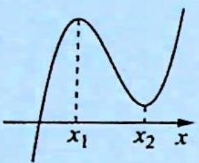</td><td>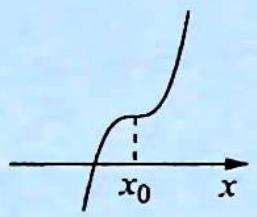</td><td>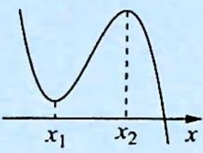</td><td>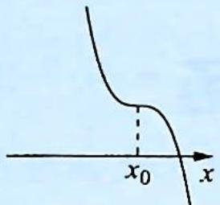</td></tr><tr><td>单调区间</td><td>在(-∞,x1),(x2,+∞)上是增函数;在(x1,x2)上是减函数</td><td>在R上是增函数</td><td>在(x1,x2)上是增函数;在(-∞,x1),(x2,+∞)上是减函数</td><td>在R上是减函数</td></tr><tr><td>极值</td><td>f(x)极大值=f(x1),f(x)极大值=f(x2)</td><td>无极值</td><td>f(x)极大值=f(x1),f(x)极大值=f(x2)</td><td>无极值</td></tr></table>

例 4.1 (2021 新课标全国乙卷理 10) 设 $a \neq 0$ , 若 $x = a$ 为函数 $f(x) = a(x - a)^2(x - b)$ 的极大值点, 则 ( ).

A. $a < b$

B. $a > b$

C. $ab < a^2$

D. $ab > a^2$

分析 当 a=b 时, $f(x)=a(x-a)^{3}$ 无极值点; 当 $a\neq b$ 时, 分 a<0 和 a>0 两种情况, 结合三次函数的性质可得答案.

解析 若 a=b，则 $f(x)=a(x-a)^{3}$ 为单调函数，无极值点，不符合题意，故 $a\neq b$ .

所以 $f(x)$ 有 x=a 和 x=b 两个不同零点，且在 x=a 左右附近是不变号，在 x=b 左右附近是变号的。

依题意, $x = a$ 为函数 $f(x) = a(x - a)^2 (x - b)$ 的极大值点, 所以在 $x = a$ 左右附近都是小于零的.

当 a<0 时，有 x>b, $f(x)\leqslant0$ ，画出 $f(x)$ 的图像如图(a)所示。由图可知 b<a, a<0，故 $ab>a^{2}$ 。

当 a > 0 时，有 x > b, $f(x) > 0$ ，画出 $f(x)$ 的图像如图(b)所示。由图可知 b > a, a > 0，故 $ab > a^{2}$ 。

综上所述, $ab > a^{2}$ 成立. 故选D.

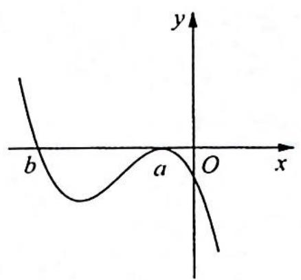

text_image

y
b	a	O	x

图(a)

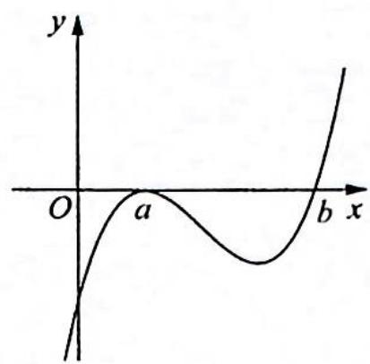

text_image

y
O
a
b x

图(b)

变式(1) (2020 浙江卷 9)已知 $a, b \in \mathbb{R}$ 且 $ab \neq 0$ , 若 $(x - a)(x - b)(x - 2a - b) \geqslant 0$ 在 $x \geqslant 0$ 上恒成立, 则( ).

A. $a <   0$

B. $a > 0$

C. b<0

D. $b > 0$

分析 ▶ 分 a > 0 与 a < 0 两种情况讨论, 结合三次函数的性质分析即可得到答案.

解析 设 $f(x)=(x-a)(x-b)[x-(2a+b)], ab \neq 0.$

①当 $a, b, 2a + b$ 互不相等，若对于 $\forall x \geqslant 0$ ，都有 $f(x) \geqslant 0$ ，则 $a < 0, b < 0$ . 如图 (a) 所示。

②当 $a, b, 2a + b$ 中有相等的情形，则只能是 $a = b$ 或 $a = 2a + b$ . 当 $a = b$ 时，如图 (b) 所示，则 $a < 0, b < 0$ .

当 $a=2a+b$ 时，即 $a+b=0$ ，如图(c)所示，显然不满足题意，故舍去。

当 $a = 2a + b$ 时，即 $a + b = 0$ ，如图(d)所示，则 $b < 0$ 即可.

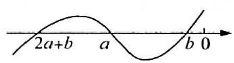  
图(a)

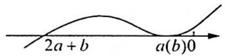  
图(b)

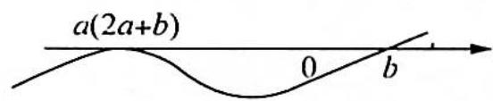  
图(c)

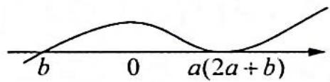  
图(d)

综上所述,满足题设条件的 b<0. 故选 C.

# 评注

运用数形结合思想,抓住三次函数图像的特征,合理分类讨论,判断 a,b 的范围,得到共同性质.

# 三次函数的性质

# 4.2 对称性

# 研究密钥

# 1. 三次函数是中心对称函数

仔细观察图像,我们不难发现三次函数是中心对称曲线,这一点可以得到进一步的验证:

解法一: 设 $f(m-x)+f(m+x)=2n$ , 得

$[a(m - x)^3 + b(m - x)^2 + c(m - x) + d] + [a(m + x)^3 + b(m + x)^2 + c(m + x) + d] = 2n,$ 整理得 $(6ma + 2b)x^{2} + (2am^{3} + 2bm^{2} + 2mc + 2d) = 2n.$

根据多项式恒等对应系数相等, 可得 $m = -\frac{b}{3a}$ 且 $n = a m^{3} + b m^{2} + m c + d$ , 从而三次函数是中心对称曲线, 且由 $n = f(m)$ 知其对称中心 $(m, f(m))$ 仍然在曲线上.

故对称中心为 $\left(-\frac{b}{3a},f\left(-\frac{b}{3a}\right)\right)$ .

解法二:设三次函数 $f(x)=ax^{3}+bx^{2}+cx+d(a\neq0)$ 的对称中心是 $(m,n)$ ，按照向量 $a=(-m,-n)$ 将函数图像平移，则函数 $g(x)=f(x+m)-n$ 为奇函数，所以 $g(-x)+g(x)=f(-x+m)-n+f(x+m)-n=f(-x+m)+f(x+m)-2n=0$ .

代入化简得 $(3ma + b)x^{2} + am^{3} + bm^{2} + cm + d - n = 0$ 对 $x\in \mathbb{R}$ 恒成立.故 $3ma + b = 0$ ，解得 $m = -\frac{b}{3a},n = am^3 +bm^2 +cm + d = f(m) = f\left(-\frac{b}{3a}\right)$ ，所以对称中心为 $\left(-\frac{b}{3a},f\left(-\frac{b}{3a}\right)\right)$

这里的 $m=-\frac{b}{3a}$ 是否具有特殊的意义？

对函数 $f(x)$ 进行两次求导, $f''(x)=6ax+2b$ , 再令其等于 0 , 可得到 $x=-\frac{b}{3a}$ , 恰好是对称中心的横坐标, 这可不是巧合, 因为满足 $f''(m)=0$ 的 $m$ 正是函数拐点的横坐标, 这一性质刚好与图像吻合.

引申: 函数 $f(x)$ 与其导函数 $f'(x)$ 的对称性关系:

① $y=f(x)$ 是可导函数,且其图像关于点 $(m,n)$ 对称,则 $y=f'(x)$ 图像关于直线x=m对称.

证明:由 $y=f(x)$ 图像关于点 $(m,n)$ 对称,得 $f(x)+f(2m-x)=2n$ .

因为 $f'(x)=\lim_{\Delta x\to0}\frac{f(x+\Delta x)-f(x)}{\Delta x}$ ，所以 $f'(2m-x)=\lim_{\Delta x\to0}\frac{f(2m-x+\Delta x)-f(2m-x)}{\Delta x}=$

$$
\lim _ {\Delta x \rightarrow 0} \frac {[ 2 n - f (x - \Delta x) ] - [ 2 n - f (x) ]}{\Delta x} = \lim _ {\Delta x \rightarrow 0} \frac {f (x) - f (x - \Delta x)}{\Delta x} = f ^ {\prime} (x).
$$

所以 $f'(2m-x)=f'(x)$ ，即 $y=f'(x)$ 图像关于直线 x=m 对称。

② $y=f(x)$ 是可导函数,且其图像关于直线x=m对称,则 $y=f'(x)$ 图像关于点 $(m,0)$ 对称.

证明:由 $y=f(x)$ 图像关于直线 x=m 对称,得 $f(x)=f(2m-x)$ .

因为 $f'(x)=\lim_{\Delta x\to0}\frac{f(x+\Delta x)-f(x)}{\Delta x}$ ，所以 $f'(2m-x)=\lim_{\Delta x\to0}\frac{f(2m-x+\Delta x)-f(2m-x)}{\Delta x}=$

$$
\lim _ {\Delta x \rightarrow 0} \frac {f (x - \Delta x) - f (x)}{\Delta x} = - \lim _ {\Delta x \rightarrow 0} \frac {f (x - \Delta x) - f (x)}{- \Delta x} = - f ^ {\prime} (x).
$$

所以 $f'(2m-x)+f'(x)=0$ ，即 $y=f'(x)$ 图像关于点 $(m,0)$ 对称.

# 2. 三次函数极值点与对称中心的关系

若三次函数 $f(x)=ax^{3}+bx^{2}+cx+d$ 有极值, 则它的对称中心是两个极值点的中心.

证明: 设 $f'(x)=3ax^{2}+2bx+c=0$ 的两根为 $x_{1}, x_{2}$ ，则 $x_{1}+x_{2}=-\frac{2b}{3a}, x_{1}x_{2}=\frac{c}{3a}$ .

设 $f(x)$ 的两个极值点为 $A(x_{1},f(x_{1})),B(x_{2},f(x_{2}))$ ，则

$$
\begin{array}{l} f (x _ {1}) + f (x _ {2}) = (a x _ {1} ^ {3} + b x _ {1} ^ {2} + c x _ {1} + d) + (a x _ {2} ^ {3} + b x _ {2} ^ {2} + c x _ {2} + d) \\ = a (x _ {1} ^ {3} + x _ {2} ^ {3}) + b (x _ {1} ^ {2} + x _ {2} ^ {2}) + c (x _ {1} + x _ {2}) + 2 d \\ = a (x _ {1} + x _ {2}) \left[ (x _ {1} + x _ {2}) ^ {2} - 3 x _ {1} x _ {2} \right] + b \left[ (x _ {1} + x _ {2}) ^ {2} - 2 x _ {1} x _ {2} \right] + c (x _ {1} + x _ {2}) + 2 d \\ = a \left(- \frac {2 b}{3 a}\right) \left(\frac {4 b ^ {2}}{9 a ^ {2}} - \frac {c}{a}\right) + b \left(\frac {4 b ^ {2}}{9 a ^ {2}} - \frac {2 c}{3 a}\right) - \frac {2 b c}{3 a} + 2 d = \frac {4 b ^ {3}}{2 7 a ^ {2}} - \frac {2 b c}{3 a} + 2 d. \\ \end{array}
$$

$2f\left(-\frac{b}{3a}\right)=2\left[a\left(-\frac{b}{3a}\right)^{3}+b\left(-\frac{b}{3a}\right)^{2}+c\left(-\frac{b}{3a}\right)+d\right]=\frac{4b^{3}}{27a^{2}}-\frac{2bc}{3a}+2d$ ，所以 $f(x_{1})+f(x_{2})=2f\left(-\frac{b}{3a}\right)$ .

${AB}$ 的中点 $P\left( {\frac{{x}_{1} + {x}_{2}}{2},\frac{f\left( {{x}_{1}}\right)  + f\left( {{x}_{2}}\right) }{2}}\right)  = \left( {-\frac{b}{3a},f\left( {-\frac{b}{3a}}\right) }\right)$ 即为对称中心.

例4.2 已知函数 $f(x) = 2x^3 - 3x^2 + 9x - \frac{7}{2}$ ，则 $f\left(\frac{1}{2022}\right) + f\left(\frac{2}{2022}\right) + f\left(\frac{3}{2022}\right) + \cdots + f\left(\frac{2021}{2022}\right) = (\quad)$ .

A. 2021

B. $\frac{2021}{2}$

C. 2022

D. $\frac{4021}{2}$

分析 $f(x) = 2x^{3} - 3x^{2} + 9x - \frac{7}{2}$ 为三次函数，找到对称中心，利用对称性解决即可.

解析 由 $f(x) = 2x^{3} - 3x^{2} + 9x - \frac{7}{2}$ , 可得 $f'(x) = 6x^{2} - 6x + 9, f''(x) = 12x - 6$ . 令 $f''(x) = 12x - 6 = 0$ , 得 $x = \frac{1}{2}$ , 又 $f\left(\frac{1}{2}\right) = 2 \times \left(\frac{1}{2}\right)^{3} - 3 \times \left(\frac{1}{2}\right)^{2} + 9 \times \frac{1}{2} - \frac{7}{2} = \frac{1}{2}$ , 所以对称中心为 $\left(\frac{1}{2}, \frac{1}{2}\right), f\left(\frac{1}{2022}\right) + f\left(\frac{2021}{2022}\right) = 1, f\left(\frac{2}{2022}\right) + f\left(\frac{2020}{2022}\right) = 1, \cdots, f\left(\frac{1010}{2022}\right) + f\left(\frac{1012}{2022}\right) = 1, f\left(\frac{1011}{2022}\right) = \frac{1}{2}, f\left(\frac{1}{2022}\right) + f\left(\frac{2}{2022}\right) + f\left(\frac{3}{2022}\right) + \cdots + f\left(\frac{2021}{2022}\right) = 1010 \times 1 + \frac{1}{2} = \frac{2021}{2}$ . 故选 B.

变式 1 已知函数 $f(x) = x^{3} + ax^{2} - 9x + b$ 图像关于(1,0)对称，且满足 $-1 \leqslant s < t \leqslant m$ 的任意实数 $s, t$ 有 $f(s) > f(t)$ ，则实数 $m$ 的最大值为 \_\_\_\_.

解析 $f^{\prime}(x) = 3x^{2} + 2ax - 9, f^{\prime \prime}(x) = 6x + 2a.$

因为函数 $f(x)=x^{3}+ax^{2}-9x+b$ 的图像关于点 $(1,0)$ 对称，所以 $f''(1)=6+2a=0$ 且 $f(1)=1+a-9+b=0$ ，解得 a=-3, b=11，所以 $f(x)=x^{3}-3x^{2}-9x+11$ 。

又因为对满足 $-1 \leqslant s < t \leqslant m$ 的任意实数 $s, t$ 有 $f(s) > f(t)$ , 所以 $f(x)$ 在 $[-1, m]$ 上单调递减, 令 $f'(x) = 3x^2 - 6x - 9 \leqslant 0$ , 解得 $-1 \leqslant x \leqslant 3$ , 所以实数 $m$ 的最大值为 3.

变式2: 函数 $f(x)=x^{3}-bx^{2}+c$ ，若 $f(1-x)+f(1+x)=2$ ，则下列不等关系成立的是()。

A. $f(\ln 2) + f(\ln 4) <   2$

B. $f\left( {-2}\right)  + f\left( 5\right)  < 2$

C. $f(\ln 2) + f(\ln 3) <   2$

D. $f\left( {-1}\right)  + f\left( 2\right)  > 2$

解析 $f^{\prime}(x) = 3x^{2} - 2bx, f^{\prime \prime}(x) = 6x - 2b.$

由 $f(1 - x) + f(1 + x) = 2$ 可知三次函数 $f(x)$ 的对称中心为 $(1,1)$ , 所以 $f(1) = 1^3 - b \cdot 1^2 + c = 1$ , $f''(1) = 6 - 2b = 0$ , 解得 $b = 3, c = 3$ , 故 $f(x) = x^3 - 3x^2 + 3$ , $f'(x) = 3x^2 - 6x = 3x(x - 2)$ , 故 $f(x)$ 在 $(0,2)$ 上单调递减, 在 $(- \infty, 0)$ 和 $(2, + \infty)$ 上单调递增.

由 $f(1 - x) + f(1 + x) = 2$ 得 $f(x) + f(2 - x) = 2$ ，又 $1 < \ln 3 < 2 - \ln 2 = \ln \frac{\mathrm{e}^2}{2} < \ln 4 < 2$ ，于是可得 $2 = f(\ln 2) + f(2 - \ln 2) = f(\ln 2) + f\left(\ln \frac{\mathrm{e}^2}{2}\right) > f(\ln 2) + f(\ln 4), 2 = f(\ln 2) + f(2 - \ln 2) = f(\ln 2) + f\left(\ln \frac{\mathrm{e}^2}{2}\right) < f(\ln 2) + f(\ln 3)$ ，故A正确，C不正确。

又 $2 = f(-2) + f(4) < f(-2) + f(5), 2 = f(-1) + f(3) > f(-1) + f(2)$ ，故 B, D 都不正确。

综上可知,故选 A.

变式(3) 已知 $a \in \mathbb{R}$ , 函数 $f(x) = x^{3} + 3(a - 1)x + 1$ .

(1)求证: $f(x)$ 的图像关于点 $(0,1)$ 对称;  
(2) 当 $x \in [0, 2]$ 时, 求 $|f(x - 1)|$ 的最大值.

解析 (1)要证明 $f(x)$ 的图像关于点(0,1)对称,等价于证明 $f(x) + f(-x) = 2$ .

由 $f(x) = x^{3} + 3(a - 1)x + 1, f(-x) = -x^{3} - 3(a - 1)x + 1, f(x) + f(-x) = 2$ ，因此函数 $f(x)$ 的图像关于点 $(0,1)$ 对称。

(2) 设 $g(x) = f(x - 1) = (x - 1)^3 + 3(a - 1)(x - 1) + 1, x \in [0, 2]$ .

令 $t = x - 1 \in [-1, 1]$ , 得 $g(t) = t^3 + 3(a - 1)t + 1, t \in [-1, 1], g'(t) = 3t^2 + 3(a - 1) = 3(t^2 + a - 1), t \in [-1, 1]$ .

①当 $a \geqslant 1$ 时, $g'(t) \geqslant 0$ , 此时 $g(t)$ 在 $[-1, 1]$ 上单调递增, 所以 $\left|g(t)\right|_{\max} = \max \left\{\left|g(-1)\right|, \left|g(1)\right|\right\}$ , 又 $\left|g(-1)\right| = \left|-3(a - 1)\right| = 3(a - 1), \left|g(1)\right| = 3a - 1$ , 且 $3a - 1 > 3(a - 1)$ , 所以, 此时 $\left|g(t)\right|_{\max} = 3a - 1$ .

②当 $a \leqslant 0$ 时, $g'(t) \leqslant 0$ , 此时 $g(t)$ 在 $[-1, 1]$ 上单调递减, 所以 $|g(t)|_{\max} = \max \{|g(-1)|, |g(1)|\} = \max \{3 - 3a, 1 - 3a\} = 3 - 3a$ .  
③当 $0 < a < 1$ 时, 令 $g'(t) = 0$ , 得 $t_1 = -\sqrt{1 - a}, t_2 = \sqrt{1 - a}$ , 因此 $g(t)$ 在 $(-1, -\sqrt{1 - a})$ , $(\sqrt{1 - a}, 1)$ 上单调递增, 在 $(- \sqrt{1 - a}, \sqrt{1 - a})$ 上单调递减.

且 $g(-1) = 3(1 - a) > 0, g(1) = 3a - 1, g(t_1) = g(-\sqrt{1 - a}) > g(-1) > 0, g(t_2) =$ $g(\sqrt{1 - a}) = -2(1 - a)\sqrt{1 - a} + 1.$ 如图(a)所示.

(i) 若 $g(1) = 3a - 1 \leqslant 0$ ，即 $0 < a \leqslant \frac{1}{3}$ ，此时 $|g(t_1)| = 2(1 - a)\sqrt{1 - a} + 1, |g(t_2)| = 2(1 - a)\sqrt{1 - a} - 1$ ，显然 $|g(t_1)| = g(t_1) > |g(t_2)|$ ，此时， $|g(t)|_{\max} = |g(t_1)| = 2(1 - a) \cdot \sqrt{1 - a} + 1$ .  
(ii) 若 $g(1) = 3a - 1 > 0$ ，即 $\frac{1}{3} < a < 1$ ，此时 $|g(t)|_{\max} = \max \{ |g(t_1)|, |g(t_2)|, |g(1)|\} = \max \{ 2(1 - a)\sqrt{1 - a} + 1, |-2(1 - a)\sqrt{1 - a} + 1 |, 3a - 1 \}$ . 如图 (b) 所示.

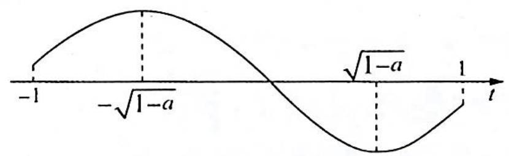

text_image

-1
-√(1-a)
√(1-a)
1
t

图(a)

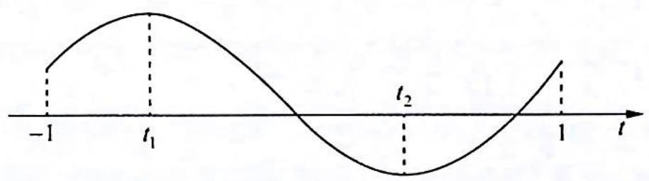

text_image

-1
t₁
t₂
1
t

图(b)

又 $g(t_{1}) - |g(t_{2})| = 2(1 - a)\sqrt{1 - a} +1 - |1 - 2(1 - a)\sqrt{1 - a}| > 0$ ，所以只需比较 $g(t_{1})$ 和 $|g(1)|$ 的大小关系.

令 $h(a) = g(-\sqrt{1 - a}) - g(1) = 2(1 - a)\sqrt{1 - a} - 3a + 2, \frac{1}{3} < a < 1, h'(a) = -2\sqrt{1 - a} + 2(1 - a) \cdot \frac{1}{2} \cdot \frac{-1}{\sqrt{1 - a}} - 3 = -3\sqrt{1 - a} - 3 < 0$ ，函数 $h(a)$ 在 $\left(\frac{1}{3}, 1\right)$ 上单调递减，且 $h\left(\frac{1}{3}\right) > 0$ ， $h(1) = -1 < 0, h\left(\frac{3}{4}\right) = 2 \times \frac{1}{4} \times \frac{1}{2} + 2 - \frac{9}{4} = 0$ ，因此当 $\frac{1}{3} < a < \frac{3}{4}$ 时， $h(a) > 0$ ，即 $g(-\sqrt{1 - a}) > g(1)$ ，此时 $|g(t)|_{\max} = g(-\sqrt{1 - a}) = 2(1 - a)\sqrt{1 - a} + 1$ ；当 $\frac{3}{4} \leqslant a < 1$ 时， $h(a) \leqslant 0$ ，即 $g(-\sqrt{1 - a}) \leqslant g(1)$ ，此时 $|g(t)|_{\max} = g(1) = 3a - 1$ 。

综上所述， $\left|f(x-1)\right|_{\max}=\left|g(t)\right|_{\max}=\begin{cases}3-3a,&a\leqslant0\\2(1-a)\sqrt{1-a}+1,&0<a<\frac{3}{4}\\3a-1,&a\geqslant\frac{3}{4}\end{cases}$

# 评注

本题说难也难, 种类多, 过程长, 计算量大; 但本题说简单也简单, 思路很容易想到, 计算处理也没有太大的难度, 唯一的难点是判断 $2(1 - a) \sqrt{1 - a} - 3a + 2$ 的正负. 但就算想不到分子有理化的技巧, 老老实实利用平方, 比较 $2(1 - a) \sqrt{1 - a}$ 的平方和 $3a - 2$ 的平方的大小, 也不算繁杂. 通过这道题, 我们可以对分类讨论的方法朴实和功能强大有一个清醒的认识.

设连续函数 $f(x)$ 在 $[a, b]$ 上的最小值为 $m$ ，最大值为 $n$ ，即 $m \leqslant f(x) \leqslant n$ ，则 $\left|f(x)\right|_{\max} = \max \{|m|, |n|\}$ ，本例给 $f(x)$ 整体加绝对值，实质是研究 $f(x)$ 的单调性及函数的最大与最小值问题。

# 4.3 切线问题

# 研究密钥

1. 过三次曲线的对称中心且与该三次曲线相切的直线有且仅有一条, 而过三次曲线上除对称中心外的任一点与该三次曲线相切的直线有两条.

由于三次曲线都是中心对称曲线,因此,将其对称中心移至坐标原点,便可将三次函数的解析式简化为 $f(x)=ax^{3}+bx$ .

若 $M(x_{1},y_{1})$ 是三次曲线 $f(x)=ax^{3}+bx$ 上的任一点，设过 M 的切线与曲线 $y=f(x)$ 相切于 $(x_{0},y_{0})$ ，则切线方程为 $y-y_{0}=f'(x_{0})(x-x_{0})$ 。因点 M 在此切线上，故 $y_{1}-y_{0}=f'(x_{0})\cdot(x_{1}-x_{0})$ ，又 $y_{0}=ax_{0}^{3}+bx_{0},y_{1}=ax_{1}^{3}+bx_{1}$ ，所以 $ax_{1}^{3}+bx_{1}-(ax_{0}^{3}+bx_{0})=(3ax_{0}^{2}+b)\cdot(x_{1}-x_{0})$ ，整理得 $(x_{0}-x_{1})^{2}(2x_{0}+x_{1})=0$ ，解得 $x_{0}=x_{1}$ 或 $x_{0}=-\frac{x_{1}}{2}$ 。

综上所述, 当点 $M$ 是对称中心即 $x_{1} = 0$ 时, 过点 $M$ 作曲线的切线切点是唯一的, 且为 $M$ , 故只有一条切线; 当点 $M$ 不是对称中心即 $x_{1} \neq 0$ 时, 过点 $M$ 作曲线的切线可产生两个不同的切点, 故必有两条切线, 其中一条就是以 $M$ 为切点 (亦即曲线在点 $M$ 处) 的切线.

由此可见,不仅切线与曲线的公共点可以多于一个,而且过曲线上点的切线也不一定唯一.

2. 求以曲线上的点 $(x_{0}, f(x_{0}))$ 为切点的切线方程的求解步骤: ①求出函数 $f(x)$ 的导数 $f'(x)$ ; ②求切线的斜率 $f'(x_{0})$ ; ③写出切线方程 $y - f(x_{0}) = f'(x_{0})(x - x_{0})$ , 并化简.  
3. 问题延伸: 过三次函数 $f(x) = ax^{3} + bx^{2} + cx + d$ 的图像外一点 $P(x_{0}, y_{0})$ 可以作几条切线?

设 $f(x)=ax^{3}+bx^{2}+cx+d(a>0)$ 在对称中心 $N\left(-\frac{b}{3a},f\left(-\frac{b}{3a}\right)\right)$ 处的切线为 l，曲线 $\Gamma$ 及 l 把坐标平面分成 I、II、III、IV 四个区域，如图 1 (a<0)、图 2 (a>0) 所示.

(1) 当定点 $P$ 在对称中心 $N$ 或在 I 和 III 区域时, 过点 $P$ 的切线有且仅有一条;  
(2)当定点 $P$ 在曲线上或在切线 $l$ 上且不在对称中心 $N$ 时, 过点 $P$ 的切线有两条;  
(3)当定点 $P$ 在 $\mathrm{II}$ 和 $\mathrm{IV}$ 区域时, 过点 $P$ 的切线有三条.

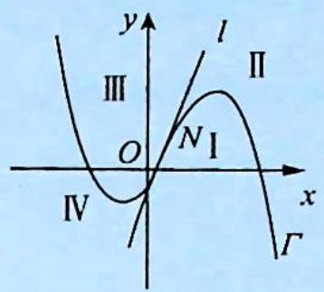

text_image

y
l
Ⅲ
II
O
N₁
IV
x
Γ

$a <   0$   
图1

text_image

y
IV
N I
O
III
II
x
l
Γ

$a > 0$   
图 2

例 4.3 (2014 北京卷文 20) 已知函数 $f(x) = 2x^{3} - 3x$ .

(1) 求 $f(x)$ 在区间 $[-2,1]$ 上的最大值；  
(2) 若过点 $P(1, t)$ 存在 3 条直线与曲线 $y = f(x)$ 相切，求 t 的取值范围；  
(3)问过点 A(-1,2), B(2,10), C(0,2) 分别存在几条直线与曲线 $y=f(x)$ 相切？（只需写出结论）

分析 ▶ (1)根据函数的单调性求最值; (2)求出过点 $P(1, t)$ 的切线方程, 转化为方程有 3 个零点的问题; (3)借助单调性和极值的正负判断零点的个数, 或根据曲线与切线分成的 4 个区域来判断.

解析 (1)由 $f(x) = 2x^{3} - 3x$ 得 $f^{\prime}(x) = 6x^{2} - 3$ ，令 $f^{\prime}(x) = 0$ ，得 $x = -\frac{\sqrt{2}}{2}$ 或 $x = \frac{\sqrt{2}}{2}$

因为 $f(-2) = -10, f\left(-\frac{\sqrt{2}}{2}\right) = \sqrt{2}, f\left(\frac{\sqrt{2}}{2}\right) = -\sqrt{2}, f(1) = -1$ ，所以 $f(x)$ 在区间 $[-2, 1]$ 上的最大值为 $f\left(-\frac{\sqrt{2}}{2}\right) = \sqrt{2}$ .

(2)设过点 $P(1,t)$ 的直线与曲线 $y = f(x)$ 相切于点 $(x_0,y_0)$ , 则 $y_0 = 2x_0^3 - 3x_0$ , 且切线斜率为 $k = 6x_0^2 - 3$ , 所以切线方程为 $y - y_0 = (6x_0^2 - 3)(x - x_0)$ , 因此 $t - y_0 = (6x_0^2 - 3)(1 - x_0)$ , 整理得 $4x_0^3 - 6x_0^2 + t + 3 = 0$ .

设 $g(x)=4x^{3}-6x^{2}+t+3$ ，则“过点 $P(1,t)$ 存在 3 条直线与曲线 $y=f(x)$ 相切”等价于 “ $g(x)$ 有 3 个不同零点”， $g'(x)=12x^{2}-12x=12x(x-1)$ ， $g(x)$ 与 $g'(x)$ 的情况如下：

<table><tr><td>x</td><td> $(-\infty,0)$ </td><td>0</td><td> $(0,1)$ </td><td>1</td><td> $(1,+\infty)$ </td></tr><tr><td> $g'(x)$ </td><td>+</td><td>0</td><td>-</td><td>0</td><td>+</td></tr><tr><td> $g(x)$ </td><td>↑</td><td> $t+3$ </td><td>↓</td><td> $t+1$ </td><td>↑</td></tr></table>

所以, $t+3$ 是 $g(x)$ 的极大值, $t+1$ 是 $g(x)$ 的极小值.

当 $g(0) = t + 3 \leqslant 0$ ，即 $t \leqslant -3$ 时，此时 $g(x)$ 在区间 $(- \infty, 1)$ 和 $(1, +\infty)$ 上分别至多有 1 个零点, 所以 $g(x)$ 至多有 2 个零点; 当 $g(1)=t+1 \geqslant 0$ , 即 $t \geqslant -1$ 时, 此时 $g(x)$ 在区间 $(-∞, 0)$ 和 $(0, +∞)$ 上分别至多有 1 个零点, 所以 $g(x)$ 至多有 2 个零点.

当 $g(0) > 0$ 且 $g(1) < 0$ , 即 $-3 < t < -1$ 时, 因为 $g(-1) = t - 7 < 0$ , $g(2) = t + 11 > 0$ , 所以 $g(x)$ 分别在区间 $[-1, 0)$ , $[0, 1)$ 和 $[1, 2)$ 上恰有 1 个零点, 由于 $g(x)$ 在区间 $(- \infty, 0)$ 和 $(1, +\infty)$ 上单调, 所以 $g(x)$ 分别在区间 $(- \infty, 0)$ 和 $[1, +\infty)$ 上恰有 1 个零点.

综上可知,当过点 $P(1,t)$ 存在 3 条直线与曲线 $y=f(x)$ 相切时, $t$ 的取值范围是 $(-3,-1)$ .

(3)过点 $A(-1,2)$ 存在 3 条直线与曲线 $y=f(x)$ 相切；

过点 $B(2,10)$ 存在 2 条直线与曲线 $y=f(x)$ 相切；

过点 $C(0,2)$ 存在 1 条直线与曲线 $y=f(x)$ 相切.

# 4.4 等分面积

# 研究密钥

由于三次函数 $f(x)=ax^{3}+bx^{2}+cx+d(a\neq0)$ 总可以通过配方或平移变为 $f(x)=px^{3}+qx$ 的形式, 不妨设 p>0, $f'(x)=3px^{2}+q=0$ , 令 $\Delta=-12pq>0$ , 即 q<0, 则 $x_{1}=-\sqrt{-\frac{q}{3p}}$ , $x_{2}=\sqrt{-\frac{q}{3p}}$ . 如图所示.

令 $f(x_{1}) = f(n), f(x_{2}) = f(m), x_{1} \neq n, x_{2} \neq m.$

$$
\begin{array}{r l} & {f (m) = f (x _ {2}), \text {即} p m ^ {3} + q m = p x _ {2} ^ {3} + q x _ {2}, p (m ^ {3} - x _ {2} ^ {3}) + q (m - x _ {2})} \\ & {= 0, \text {则} p (m - x _ {2}) (m ^ {2} + m x _ {2} + x _ {2} ^ {2}) + q (m - x _ {2}) = 0,} \\ & {\text {即} (m - x _ {2}) [ p (m ^ {2} + m x _ {2} + x _ {2} ^ {2}) + q ] = 0.} \end{array}
$$

text_image

A B C D E
m x₁ O x₂ n x
A₁ B₁ C₁ D₁ E₁

因为 $m \neq x_{2}$ ，所以 $p(m^{2} + mx_{2} + x_{2}^{2}) + q = 0, p(m^{2} + mx_{2} + x_{2}^{2}) - 3px_{2}^{2} = 0$ ，则 $m^{2} + mx_{2} + x_{2}^{2} - 3x_{2}^{2} = 0$ ，即 $m^{2} + mx_{2} - 2x_{2}^{2} = 0$ ，有 $(m + 2x_{2})(m - x_{2}) = 0$ 。

而 $m \neq x_2$ ，故 $m = -2x_2$ . 同理 $n = -2x_1$ .

又 $x_{1} = -x_{2}$ ，则 $m = 2x_{1}, n = 2x_{2}, |x_{1} - m| = |x_{1}| = |x_{2}| = |n - x_{2}|$ . 故 $S_{\text{矩形} ABB_1A_1} = S_{\text{矩形} BCC_1B_1} = S_{\text{矩形} CDD_1C_1} = S_{\text{矩形} DEE_1D_1}$ .

例 4.4 已知函数 $f(x)=x^{3}+ax+b, a, b \in \mathbb{R}, x_{1}, x_{2} \in (m, n)$ 且满足 $f(x_{1})=f(n)$ ， $f(x_{2})=f(m)$ ，对任意的 $x \in [m, n]$ 恒有 $f(m) \leqslant f(x) \leqslant f(n)$ ，则当 a, b 取不同的值时，( ).

A. $n + 2x_{1}$ 与 $m - 2x_{2}$ 均为定值

B. $n - 2x_{1}$ 与 $m + 2x_{2}$ 均为定值

C. $n - 2x_{1}$ 与 $m - 2x_{2}$ 均为定值

D. $n + 2x_{1}$ 与 $m + 2x_{2}$ 均为定值

分析 ▶ 根据 $f(x)=x^{3}+ax+b$ 的单调性可得对任意的 $x\in[m,n]$ ， $f(x)_{\min}=f(m)$ ，

$f(x)_{\max}=f(n), x_{1}=-\sqrt{-\frac{a}{3}}$ 为函数 $f(x)$ 的极大值点， $x_{2}=\sqrt{-\frac{a}{3}}$ 为函数 $f(x)$ 的极小值点，由 $f(x_{1})=f(n)$ ，将 $x_{1}$ 和n代入函数，化简可得 $n+2x_{1}$ 为定值，同理可得 $m+2x_{2}$ 为定值。

解析 当 $a \geqslant 0$ 时, $f'(x) = 3x^2 + a \geqslant 0$ , 此时, 函数 $f(x)$ 在 $\mathbf{R}$ 上为增函数.

当 $x_{1}, x_{2} \in (m, n)$ 时， $f(x_{1}) < f(n), f(x_{2}) > f(m)$ ，不合乎题意，所以， $a < 0$ 。由 $f'(x) = 0$ 可得 $x = \pm \sqrt{-\frac{a}{3}}$ 。

当 $x < -\sqrt{-\frac{a}{3}}$ 或 $x > \sqrt{-\frac{a}{3}}$ 时， $f'(x) > 0$ ；当 $-\sqrt{-\frac{a}{3}} < x < \sqrt{-\frac{a}{3}}$ 时， $f'(x) < 0$ 。

所以, 函数 $f(x)$ 的单调递增区间为 $\left(-\infty, -\sqrt{-\frac{a}{3}}\right), \left(\sqrt{-\frac{a}{3}}, +\infty\right)$ , 单调递减区间为 $\left(-\sqrt{-\frac{a}{3}}, \sqrt{-\frac{a}{3}}\right)$ .

如图所示,对任意的 $x \in [m, n]$ , 恒有 $f(m) \leqslant f(x) \leqslant f(n), f(x)_{\min} = f(m), f(x)_{\max} = f(n)$ . 又当 $x_1, x_2 \in (m, n)$ 且满足 $f(x_1) = f(n), f(x_2) = f(m)$ , 所以, $x_1$ 为函数 $f(x)$ 的极大值点, $x_2$ 为函数 $f(x)$ 的极小值点, 则 $x_1 = -\sqrt{-\frac{a}{3}}, x_2 = \sqrt{-\frac{a}{3}}$ .

text_image

y
m x₁ O x₂ n x

由 $f(x_{1}) = f(n)$ 可知 $x_{1}^{3} + ax_{1} + b = n^{3} + an + b$ ，故 $(x_{1}^{3} - n^{3}) + a(x_{1} - n) = 0$ ，即 $(x_{1} - n) \cdot (x_{1}^{2} + nx_{1} + n^{2} + a) = 0$ ，又 $x_{1} \neq n$ ，故 $x_{1}^{2} + nx_{1} + n^{2} + a = 0$ .

因为 $x_{1} = -\sqrt{\frac{-a}{3}}$ ，可知 $a = -3x_1^2$ ，所以 $n^2 +nx_1 - 2x_1^2 = 0$ ，即 $(n - x_{1})(n + 2x_{1}) = 0$ ，得 $n+$ $2x_{1} = 0.$ 同理 $m + 2x_{2} = 0.$ 故选D.

变式(1) 已知函数 $f(x)=\frac{1}{3}x^{3}+tx+t.$

(1) 讨论函数 $f(x)$ 的单调区间；

(2)若函数 $f(x)$ 有三个不同的零点 $x_{1}, x_{2}, x_{3}$ ，求 t 的取值范围，并证明：

$$
x _ {1} + 2 x _ {2} + 3 x _ {3} <   4 \sqrt {- t}.
$$

解析 (1)由题意得 $f'(x) = x^2 + t$ .

①当 $t \geqslant 0$ 时, $f'(x) \geqslant 0$ , 则 $f(x)$ 在 $\mathbf{R}$ 上单调递增, 无单调递减区间;

②当 t<0 时， $f(x)$ 在 $(- \sqrt{-t}, \sqrt{-t})$ 上单调递减，在 $(-∞, -√-t)$ ， $(\sqrt{-t}, +∞)$ 上单调递增.

(2)如下图所示,由(1)知函数 $f(x)$ 有三个零点,因此 $t<0$ .

因为 $f(x)$ 在 $(- \sqrt{-t}, \sqrt{-t})$ 上单调递减，在 $(- \infty, -\sqrt{-t})$ ， $(\sqrt{-t}, +\infty)$ 上单调递减增，且 $f(x)$ 有三个不同的零点 $x_{1}, x_{2}, x_{3}$ ，所以 $f(x)$ 的极大值为 $f(-\sqrt{-t}) = t - \frac{2}{3} t \sqrt{-t}$ ，令 $t - \frac{2}{3} t \sqrt{-t} > 0$ 得 $t < -\frac{9}{4}$ . 故 $t$ 的取值范围为 $\left(-\infty, -\frac{9}{4}\right)$ .

text_image

-2\u221a-1
x₁
-\u221a-1
x₂
\u221a-1
x₃
2\u221a-1
x

依题意知 $-2\sqrt{-t} < x_{1} < -\sqrt{-t} < x_{2} < \sqrt{-t} < x_{3} < 2\sqrt{-t}$ , 且 $f(x)$ 在 $(- \sqrt{-t}, \sqrt{-t})$ 上单调递减, $f(x_{2}) = 0$ , $f(0) = t < 0$ , 则 $f(0) < f(x_{2})$ , 所以 $x_{2} < 0$ .

那么 $x_{1} + 2x_{2} + 3x_{3} = x_{1} + x_{2} + x_{3} + x_{2} + 2x_{3} <   0 + x_{2} + 2x_{3} <   2x_{3} <   4\sqrt{-t}.$

# 4.5 单调性与最值

# 研究密钥

三次函数的导数为二次函数,根据二次函数的正负判断三次函数的单调性,根据二次函数的零点可得三次函数的极值点,比较区间端点值和极值可得最值.

例 4.5 (2019 新课标全国Ⅲ卷文 20) 已知函数 $f(x) = 2x^3 - ax^2 + 2$ .

(1) 讨论 $f(x)$ 的单调性；

(2)当 0 < a < 3 时, 记 $f(x)$ 在区间 $[0,1]$ 上的最大值为 M, 最小值为 m, 求 M - m 的取值范围.

分析 (1) 利用导函数判断 $f(x)$ 的单调性, 导函数的零点为 $x = 0$ 或 $x = \frac{a}{3}$ , 对 $a$ 分类讨论两个零点的大小, 可得 $f(x)$ 的单调性; (2) 由 (1) 可得 $f(x)$ 在 $[0, 1]$ 的最小值为 $f\left(\frac{a}{3}\right) = -\frac{a^3}{27} + 2$ , 最大值为 $f(0) = 2$ 或 $f(1) = 4 - a$ . 对 $a$ 分类讨论两个最大值的大小, 可得最大值与最小值的差.

解析 (1) $f^{\prime}(x) = 6x^{2} - 2ax = 2x(3x - a)$ , 令 $f^{\prime}(x) = 0$ , 得 $x = 0$ 或 $x = \frac{a}{3}$ .

若 $a > 0$ ，则当 $x \in (-\infty, 0) \cup \left(\frac{a}{3}, +\infty\right)$ 时， $f'(x) > 0$ ；当 $x \in \left(0, \frac{a}{3}\right)$ 时， $f'(x) < 0$ 。

故 $f(x)$ 在 $(-\infty, 0), \left(\frac{a}{3}, +\infty\right)$ 上单调递增，在 $\left(0, \frac{a}{3}\right)$ 上单调递减.

若 $a = 0$ ，则 $f(x)$ 在 $(-\infty, +\infty)$ 上单调递增.

若 $a < 0$ ，则当 $x \in \left(-\infty, \frac{a}{3}\right) \cup (0, +\infty)$ 时， $f'(x) > 0$ ；当 $x \in \left(\frac{a}{3}, 0\right)$ 时， $f'(x) < 0$ .

故 $f(x)$ 在 $\left(-\infty, \frac{a}{3}\right), (0, +\infty)$ 上单调递增，在 $\left(\frac{a}{3}, 0\right)$ 上单调递减.

(2) 当 $0 < a < 3$ 时, 由 (1) 知, $f(x)$ 在 $\left(0, \frac{a}{3}\right)$ 上单调递减, 在 $\left(\frac{a}{3}, 1\right)$ 上单调递增, 所以 $f(x)$ 在 $[0, 1]$ 的最小值为 $f\left(\frac{a}{3}\right) = -\frac{a^3}{27} + 2$ , 最大值为 $f(0) = 2$ 或 $f(1) = 4 - a$ .

于是 $m = -\frac{a^3}{27} + 2, M = \begin{cases} 4 - a, & 0 < a < 2 \\ 2, & 2 \leqslant a < 3 \end{cases}$ , 所以 $M - m = \begin{cases} 2 - a + \frac{a^3}{27}, & 0 < a < 2 \\ \frac{a^3}{27}, & 2 \leqslant a < 3 \end{cases}$ .

当 0 < a < 2 时, 可知 $2 - a + \frac{a^{3}}{27}$ 单调递减, 所以 M - m 的取值范围是 $\left(\frac{8}{27}, 2\right)$ ; 当 $2 \leqslant a < 3$ 时, $\frac{a^{3}}{27}$ 单调递增, 所以 M - m 的取值范围是 $\left[\frac{8}{27}, 1\right)$ .

综上所述， $M - m$ 的取值范围是 $\left[\frac{8}{27}, 2\right)$ .

例4.6 若函数 $f(x) = x^2 |x - a|$ 在区间[0,2]上单调递增，则实数 $a$ 的取值范围是

分析 ▶ 函数 $f(x)$ 的一个极值点是 x=0，对 a 分类讨论 $f(x)=x^{2}|x-a|$ 的单调递增区间.

解析 $f(x)=x^{2}|x-a|=\left\{\begin{aligned}x^{2}(x-a),&x\geqslant a\\ -x^{2}(x-a),&x<a\end{aligned}\right.$

①当 $a > 0$ 时, 如图1所示, 由 $f'(x) = -3x^2 + 2ax = 0$ 得 $x = 0$ 或 $x = \frac{2a}{3}$ , 欲使函数 $f(x) = x^2 |x - a|$ 在区间[0,2]上单调递增, 只需 $x = \frac{2a}{3} \geqslant 2$ , 即 $a \geqslant 3$ .

②当 a<0 时, 如图 2 所示, $f(x)=x^{2}|x-a|$ 在区间 $[0,2]$ 上单调递增, 满足题意.

③当 $a = 0, f(x) = x^3$ 区间 $[0,2]$ 上单调递增显然成立.

综上可知,实数 a 的取值范围是 $(-∞,0]∪[3,+∞)$ .

  
图1

  
图2

变式(1) 已知 $a \in \mathbb{R}$ , 函数 $f(x) = x^2 |x - a|$ , 求函数 $y = f(x)$ 在区间[1,2]上的最小值.

解析 ▶ 设此最小值为 m.

(1) 当 $a \leqslant 1$ , 函数 $y = f(x)$ 在区间 $[1, 2]$ 上, $f(x) = x^3 - ax^2$ , 因为 $f'(x) = 3x^2 - 2ax =$

$3x\left(x-\frac{2}{3}a\right)>0,x\in(1,2)$ ，所以 $f(x)$ 在 $[1,2]$ 上单调递增，因此 $m=f(1)=1-a$ .

(2) 当 $1 < a \leqslant 2$ 时, 函数 $y = f(x)$ 在区间 $[1, 2]$ 上, $f(x) = x^2 |x - a| \geqslant 0$ , 又因为 $f(a) = 0$ , 得 $m = f(a) = 0$ .

(3) 当 $a > 2$ 时, 在区间 $[1, 2]$ 上, $f(x) = ax^2 - x^3$ , $f'(x) = 2ax - 3x^2 = 3x\left(\frac{2a}{3} - x\right)$ , $f(x)$ 在 $(0, \frac{2}{3}a)$ 上单调递增, 在 $\left(\frac{2}{3}a, a\right)$ 上单调递减.

①若 $\frac{2}{3}a\geqslant2$ ,即 $a\geqslant3,f(x)$ 在区间 $[1,2]$ 上单调递增,故 $m=f(1)=a-1$ .

②若 $1 < \frac{2}{3} a < 2$ ，即 $2 < a < 3, f(x)$ 在 $\left[1, \frac{2}{3} a\right]$ 上单调递增，在 $\left[\frac{2}{3} a, 2\right]$ 上单调递减， $m = \min \{f(1), f(2)\}$ . 又 $f(1) = a - 1, f(2) = 4(a - 2) = 4a - 8$ .

令 $a - 1 \leqslant 4a - 8$ 得 $a \geqslant \frac{7}{3}$ , 即当 $\frac{7}{3} \leqslant a < 3$ 时, $m = f(1) = a - 1$ ; 令 $a - 1 > 4a - 8$ 得 $a < \frac{7}{3}$ , 即当 $2 < a < \frac{7}{3}$ 时, $m = f(2) = 4a - 8$ .

综上所述, 当 $a \leqslant 1$ 时, 最小值为 $1 - a$ ; 当 $1 < a \leqslant 2$ 时, 最小值为 0; 当 $2 < a < \frac{7}{3}$ 时, 最小值为 $4a - 8$ ; 当 $a \geqslant \frac{7}{3}$ 时, 最小值为 $a - 1$ .

# 三次函数的零点问题

# 4.6 极值点与零点

# 研究密钥

三次函数 $f(x)=ax^{3}+bx^{2}+cx+d(a\neq0)$ ，导函数 $f'(x)=3ax^{2}+2bx+c$ .

导函数判别式 $\Delta=4b^{2}-12ac=4(b^{2}-3ac)$ .

①若 $b^{2}-3ac<0$ ，则三次函数 $f(x)$ 没有极值点，则 $f(x)$ 有 1 个零点.  
②若 $b^{2}-3ac>0$ ，则三次函数 $f(x)$ 有2个极值点 $x_{1},x_{2}$ ，则

当 $f(x_{1})f(x_{2})>0$ 时， $f(x)$ 有 1 个零点；

当 $f(x_{1})f(x_{2})=0$ 时， $f(x)$ 有 2 个零点；

当 $f(x_{1})f(x_{2})<0$ 时， $f(x)$ 有 3 个零点.

例4.7 已知函数 $f(x) = x^3 - kx + k^2$ .

(1) 讨论 $f(x)$ 的单调性；

(2) 若 $f(x)$ 有三个零点, 求 k 的取值范围.

分析 ▶ (1) $f'(x) = 3x^2 - k$ , 对 $k$ 分类讨论; (2) $f(x)$ 有三个零点, 则 $f(x)_{\text{极大}} > 0$ , $f(x)_{\text{极小}} < 0$ .

解析 (1)由题意得, $f'(x)=3x^{2}-k$ .

①当 $k \leq 0$ 时, ${f}^{\prime }\left( x\right)  \geq  0$ 在 $\mathbf{R}$ 上恒成立,此时 $f\left( x\right)$ 在 $\mathbf{R}$ 上单调递增.

②当 $k > 0$ 时，令 $f^{\prime}(x) = 3x^{2} - k = 0$ ，得 $x = \pm \sqrt{\frac{k}{3}} = \pm \frac{\sqrt{3k}}{3}$

当 $x \in \left(-\infty, -\frac{\sqrt{3k}}{3}\right), x \in \left(\frac{\sqrt{3k}}{3}, +\infty\right)$ 时， $f'(x) > 0$ ；当 $x \in \left(-\frac{\sqrt{3k}}{3}, \frac{\sqrt{3k}}{3}\right)$ 时， $f'(x) < 0$ .

故 $f(x)$ 在 $(-∞, -\frac{\sqrt{3k}}{3})$ 和 $(\frac{\sqrt{3k}}{3}, +∞)$ 上是增函数，在 $(-∞, √3k, √3k/3)$ 上是减函数.

(2)解法一:由(1)可知 k>0, 且 $f(x)_{\text{极大值}}=f\left(-\frac{\sqrt{3k}}{3}\right)=\left(-\frac{\sqrt{3k}}{3}\right)^{3}-k\left(-\frac{\sqrt{3k}}{3}\right)+k^{2}=$ $\frac{2k\sqrt{k}}{3\sqrt{3}}+k^{2}>0$ 恒成立, 即 $f(x)_{\text{极小值}}=f\left(\frac{\sqrt{3k}}{3}\right)=\left(\frac{\sqrt{3k}}{3}\right)^{3}-k\left(\frac{\sqrt{3k}}{3}\right)+k^{2}=k\sqrt{k}\left(\sqrt{k}-\frac{2}{3\sqrt{3}}\right).$

由 $f(x)_{\text{极小值}} < 0$ 得 $\sqrt{k} - \frac{2}{3\sqrt{3}} < 0$ ，即 $k < \frac{4}{27}$ ，故当 $0 < k < \frac{4}{27}$ 时， $f(x)$ 有三个零点.

解法二： $p = -k, q = k^{2}$

$f(x)$ 有三个零点，由卡尔达诺公式知 $\Delta < 0$ ，即 $\left(\frac{q}{2}\right)^2 + \left(\frac{p}{3}\right)^3 = \frac{k^4}{4} - \frac{k^3}{27} < 0$ ，化简可得 $k^3(27k - 4) < 0$ ，解得 $k \in \left(0, \frac{4}{27}\right)$ .

变式(1) (2014 新课标全国Ⅱ卷文 21)已知函数 $f(x) = x^{3} - 3x^{2} + ax + 2$ ，曲线 $y = f(x)$ 在点(0,2)处的切线与 $x$ 轴交点的横坐标为 -2.

(1) 求 $a$ 的值；

(2)证明:当 $k < 1$ 时,曲线 $y = f(x)$ 与直线 $y = {kx} - 2$ 只有一个交点.

解析 (1) $f'(x)=3x^{2}-6x+a$ , $f'(0)=a$ ，曲线 $y=f(x)$ 在点 $(0,2)$ 处的切线方程为 $y=ax+2$ 。由题设得 $-\frac{2}{a}=-2$ ，所以 a=1。

(2) 解法一: 由(1)知 $f(x) = x^{3} - 3x^{2} + x + 2$ .

设 $g(x) = f(x) - kx + 2 = x^3 -3x^2 +(1 - k)x + 4.$

由题设知 1-k>0，当 $x \leqslant 0$ 时， $g'(x)=3x^{2}-6x+1-k>0$ ， $g(x)$ 单调递增， $g(-1)=k-$

$1 < 0, g(0) = 4$ ，所以 $g(x) = 0$ 在 $(- \infty, 0]$ 上有唯一实根.

当 $x > 0$ 时，令 $h(x) = x^3 - 3x^2 + 4$ ，则 $g(x) = h(x) + (1 - k)x > h(x)$ .

$h'(x)=3x^{2}-6x=3x(x-2),h(x)$ 在 $(0,2)$ 上单调递减，在 $(2,+\infty)$ 上单调递增，所以 $g(x)>h(x)\geqslant h(2)=0$ 。所以 $g(x)=0$ 在 $(0,+\infty)$ 上没有实根。

综上所述, $g\left( x\right)  = 0$ 在 $\mathbf{R}$ 上有唯一实根,即曲线 $y = f\left( x\right)$ 与直线 $y = {kx} - 2$ 只有一个交点.

解法二:由题意得 $f(x)=x^{3}-3x^{2}+x+2$ ，记 $g(x)=x^{3}-3x^{2}+(1-k)x+4$ ，现证明当 k<1 时， $g(x)=0$ 有唯一解.

令 $t = x - 1, g(t) = t^3 - (2 + k)t + 3 - k = 0.$

由三次方程 $x^{3}+px+q=0$ 的判别式 $\Delta=\left(\frac{q}{2}\right)^{2}+\left(\frac{p}{3}\right)^{3}$ 得：

①当 $\Delta < 0$ 时, 方程有三个不等实数根, 不符合题意;  
②当 $\Delta=0$ 时，即 k=1，方程 $t^{3}-3t+2=(t-1)^{2}(t+2)=0$ 有两根，不符合题意；  
③当 $\Delta >0$ 时，得 $-4k^{3}+3k^{2}-210k+211>0$ ，解得 k<1，此时方程有唯一实数根.

# 评注

□ □ □ □

本题主要考查导数的几何意义及导数的应用,考查了分类讨论、函数与方程、等价转化等思想方法.把曲线 $y=f(x)$ 与直线 y=kx-2 只有一个交点的问题转化为研究函数 $g(x)=x^{3}-3x^{2}+(1-k)x+4$ 在 R 上有唯一实根问题是解决问题的关键.

变式(2) (2018 新课标全国Ⅱ卷文 21) 已知函数 $f(x) = \frac{1}{3} x^3 - a (x^2 + x + 1)$ .

(1) 若 $a = 3$ , 求 $f(x)$ 的单调区间;

(2)证明: $f(x)$ 只有一个零点.

解析 (1) 当 $a = 3$ 时, $f(x) = \frac{1}{3} x^3 - 3x^2 - 3x - 3$ , $f'(x) = x^2 - 6x - 3$ .

令 $f'(x) = 0$ ，解得 $x = 3 - 2\sqrt{3}$ 或 $x = 3 + 2\sqrt{3}$ .

当 $x \in (-\infty, 3 - 2\sqrt{3}) \cup (3 + 2\sqrt{3}, +\infty)$ 时 $f'(x) > 0$ ; 当 $x \in (3 - 2\sqrt{3}, 3 + 2\sqrt{3})$ 时, $f'(x) < 0$ .

故 $f(x)$ 在 $(-∞,3-2\sqrt{3}),(3+2\sqrt{3},+∞)$ 上单调递增，在 $(3-2\sqrt{3},3+2\sqrt{3})$ 上单调递减.

(2)由于 $x^{2} + x + 1 > 0$ ，所以 $f(x) = 0$ 等价于 $\frac{x^3}{x^2 + x + 1} - 3a = 0.$

设 $g(x) = \frac{x^3}{x^2 + x + 1} - 3a$ ，则 $g'(x) = \frac{x^2(x^2 + 2x + 3)}{(x^2 + x + 1)^2} \geqslant 0$ ，所以 $g(x)$ 在 $(- \infty, +\infty)$ 上单调递增。故 $g(x)$ 至多有一个零点，从而 $f(x)$ 至多有一个零点。

$$
g (x _ {0}) = \frac {x _ {0} ^ {3}}{x _ {0} ^ {2} + x _ {0} + 1} - 3 a > \frac {x _ {0} ^ {3} - 1}{x _ {0} ^ {2} + x _ {0} + 1} - 3 a = x _ {0} - 1 - 3 a = 0, \text {得} x _ {0} = 3 a + 1;
$$

$$
g (x _ {1}) = \frac {x _ {1} ^ {3}}{x _ {1} ^ {2} + x _ {1} + 1} - 3 a <   \frac {\left(x _ {1} + \frac {1}{2}\right) ^ {3}}{\left(x _ {1} + \frac {1}{2}\right) ^ {2}} - 3 a = x _ {1} + \frac {1}{2} - 3 a = 0, \text {得} x _ {1} = 3 a - \frac {1}{2}.
$$

所以 $g(3a + 1) > 0, g\left(3a - \frac{1}{2}\right) < 0.$

由零点存在定理知， $\exists \xi \in \left(3a - \frac{1}{2}, 3a + 1\right)$ ，使得 $g(\xi) = 0$ ，故 $f(x)$ 有一个零点。

综上所述， $f(x)$ 只有一个零点.

# 评注

(1)用导数求函数单调区间的步骤如下:①确定函数 $f(x)$ 的定义域;②求导数 $f'(x)$ ; ③由 $f'(x)>0$ (或 $f'(x)<0$ ) 解出相应的 $x$ 的取值范围. 当 $f'(x)>0$ 时, $f(x)$ 在相应区间上是增函数; 当 $f'(x)<0$ 时, $f(x)$ 在相应区间上是减函数.

(2)本题第二问重在考查零点存在性问题,解题的关键在于将问题转化为求证函数 $g(x)$ 有唯一零点.可先证明其单调,再结合零点存在性定理进行论证.

# 4.7 韦达定理与判别式

# 研究密钥

# 1. 三次方程的韦达定理

设 $ax^3 + bx^2 + cx + d = 0$ 的三个根分别为 $x_1, x_2, x_3$ , 则 $ax^3 + bx^2 + cx + d = a(x - x_1)(x - x_2)(x - x_3) = ax^3 - a(x_1 + x_2 + x_3)x^2 + a(x_1x_2 + x_2x_3 + x_3x_1)x - ax_1x_2x_3$ .

比较系数可得 $x_{1}+x_{2}+x_{3}=-\frac{b}{a}, x_{1}x_{2}+x_{2}x_{3}+x_{3}x_{1}=\frac{c}{a}, x_{1}x_{2}x_{3}=-\frac{d}{a}.$

# 2. 三次方程的判别式

任意三次方程 $ax^3 + bx^2 + cx + d = 0 (a \neq 0)$ , 都可以变形为 $x^3 + px + q = 0 (p, q$ 均为实数)的形式, 利用三次方程求根公式 (卡尔达诺公式), 可得一个实数解的形式为 $x = \sqrt[3]{- \frac{q}{2} + \sqrt{\left(\frac{q}{2}\right)^2 + \left(\frac{p}{3}\right)^3}} + \sqrt[3]{- \frac{q}{2} - \sqrt{\left(\frac{q}{2}\right)^2 + \left(\frac{p}{3}\right)^3}}$ .

其中, $\Delta = \left(\frac{q}{2}\right)^2 + \left(\frac{p}{3}\right)^3$ 称为三次方程的判别式. 卡尔达诺公式只是给出了三次方程的一个具有性质 $x = u + v$ 的解, 并非全部解, 因此在解方程中应用不多, 但是其判别式具有一般意义.

当 $\Delta >0$ 时, 方程有一个实根和两个复数根;

当 $\Delta = 0$ 时, 方程有三个实数根. 其中, $p = q = 0$ 时, 有一个三重根为 $0; \left(\frac{q}{2}\right)^2 = -\left(\frac{p}{3}\right)^3 \neq 0$ 时, 三个根中有两个相等;

当 $\Delta < 0$ 时, 方程有三个不等实根.

关于判别式与根的个数的关系,也可以用导数证明.

例4.8 已知 $a^3 = 3(b^2 + c^2) - 25, b^3 = 3(c^2 + a^2) - 25, c^3 = 3(a^2 + b^2) - 25$ ，求 $abc$ 的值.

分析 ▶ 由题意可设 a, b, c 为 $x^{3} - px^{2} + qx - r = 0$ 的根，根据三次方程的韦达定理得到 $\gamma, b, c$ 与 p, q, r 之间的代换关系，代入三个已知条件可得 a, b, c 是方程 $x^{3} + 3x^{2} - 3(p^{2} - 2q) + 0$ 的根，比较系数可得 abc 的值.

设以 a, b, c 为根的三次方程为 $x^{3} - px^{2} + qx - r = 0$ .

5. 达定理可知 $a + b + c = p, ab + bc + ca = q, abc = r$ .

$$
a ^ {2} + b ^ {2} + c ^ {2} = (a + b + c) ^ {2} - 2 (a b + b c + c a) = p ^ {2} - 2 q \text {, 故} b ^ {2} + c ^ {2} = p ^ {2} - 2 q - a ^ {2}.
$$

$$
\text {   从   } a ^ {3} = 3 (b ^ {2} + c ^ {2}) - 2 5 = 3 (p ^ {2} - 2 q - a ^ {2}) - 2 5, \text {   即   } a ^ {3} + 3 a ^ {2} - 3 (p ^ {2} - 2 q) + 2 5 = 0, \text {   故   } x = a
$$

程 $x^{3} + 3x^{2} - 3(p^{2} - 2q) + 25 = 0$ 的根，同理 $b, c$ 也是方程 $x^{3} + 3x^{2} - 3(p^{2} - 2q) + 25 = 0$ 的根.

所以 $x^{3} - px^{2} + qx - r = x^{3} + 3x^{2} - 3(p^{2} - 2q) + 25$ ，比较系数可得 $p = -3, q = 0, r = 2$ ，即 $abc = 2$ .

变式1 实数 $a, b, c$ 满足 $a + b + c = 2, \frac{1}{a} + \frac{1}{b} + \frac{1}{c} = \frac{1}{2}$ , 求证: $a, b, c$ 必有一个数为 2.

解析 由 $\frac{1}{a} + \frac{1}{b} + \frac{1}{c} = \frac{ab + bc + ca}{abc} = \frac{1}{2}$ , 可得 $2(ab + bc + ca) = abc$ .

令 $f(x) = (x - a)(x - b)(x - c) = x^3 - (a + b + c)x^2 + (ab + bc + ca)x - abc$ ，即 $f(x) = x^3 - 2x^2 + \frac{1}{2} abc x - abc = x^2(x - 2) + \frac{1}{2} abc(x - 2) = (x - 2)(x^2 + \frac{1}{2} abc)$ ，

故 $x = 2$ 是 $f(x)$ 的一个零点，即 $a, b, c$ 必有一个数为2.

# 训练 4

1. 已知函数 $f(x) = x \mid x^2 - 12$ 的定义域是 $[0, m]$ , 值域是 $[0, am^2]$ , 则实数 $a$ 的取值范围是 \_\_\_\_.  
2. 经研究发现: 任意一个三次多项式函数 $f(x) = ax^{3} + bx^{2} + cx + d (a \neq 0)$ 的图像都只有一个对称中心点 $(x_{0}, f(x_{0}))$ , 其中 $x_{0}$ 是 $f''(x) = 0$ 的根, $f'(x)$ 是 $f(x)$ 的导数, $f''(x)$ 是 $f'(x)$ 的导数. 若函数 $f(x) = x^{3} + ax^{2} + x + b$ 图像的对称点为 $(-1, 2)$ , 且不等式 $\mathrm{e}^{x} - mx^{\mathrm{c}} (\ln x + 1) \geqslant [f(x) - x^{3} - 3x^{2} + \mathrm{e}]x^{\mathrm{c}}$ 对任意 $x \in (1, +\infty)$ 恒成立, 则 ( ).

A. $a = 3$

B. $b = 2$

C. $m$ 的值不可能是一e

D. $m$ 的值可能是 $-\frac{1}{\mathrm{e}}$

# 第5讲

# 含指数、对数函数形式的变形技巧

遍 览全国高考导数大题,含有指数函数和对数函数等形式的超越函数是命题热点,但是这类问题学生往往不知从何下手.如果求导,不仅导函数复杂,而且很多时候还不能解决问题.其实,这类问题的一般思路是利用条件,对其进行变形,构造新函数,通过对新函数的研究解决问题.对学生而言,讲能听懂,但如何对这类超越函数、方程或不等式进行合理变形,再构造新函数,将问题进行转化与简化却不是很清楚.其实这是有规律可循的,可利用结构和形式的特点进行变形与转化.经研究,含指数、对数函数形式的超越函数、方程、不等式的处理方法,有两个层次:一是若单独含有指数或对数,运用好“指数找朋友,对数单独走”的变形原理;二是若指对混合形式,从数和形的角度有四种方法:形的角度是切线放缩、数的角度有分离指对,凹凸反转和指对同构.不分离指对时,虚设隐零点.这是解这类题目的思维与灵魂所在.

本讲以高考题为主,探讨含有指数函数和对数函数类型的超越函数的五大变形技巧,并对此类问题作展现和剖析,对解题方法作研究和总结.同时,我们也衷心希望读者在阅读学习过程中,以文中内容为引,能对数学的研究有初步的了解,今后能自主探索数学的无穷奥秘.

# 单一含有指数或对数函数不等式的变形技巧

# 5.1 指数找朋友,对数单独走

# 研究密钥

1. 在证明或处理含对数函数的不等式时,通常要将对数型的函数“独立分离”出来,这样再对新函数求导时,就不含对数了,只需一次就可以求出它的极值点,从而避免了多次求导.这种相当于让对数函数“孤军奋战”的变形过程,我们形象地称之为“对数单独走”.

例如，由 $f(x)\ln x + g(x) > 0 \Leftrightarrow \ln x + \frac{g(x)}{f(x)} > 0$ （这里设 $f(x) > 0$ ），则 $\left[\ln x + \frac{g(x)}{f(x)}\right]' = \frac{1}{x} + \left[\frac{g(x)}{f(x)}\right]$ 不含超越函数，求解过程简单.

2. 在证明或处理含指数函数的不等式时, 通常要将指数型的函数“结合”起来, 即让指数型的函数乘以或除以一个多项式函数, 这样再对新函数求导时, 只需一次就可以求出它的极值点, 从而避免了多次求导. 这样相当于让指数函数寻找“合作伙伴”的变形过程, 我们形象地称之为“指数找朋友”.

例如，由 $e^{x} + f(x) > 0 \Leftrightarrow 1 + \frac{f(x)}{e^{x}} > 0$ ，则 $\left[1 + \frac{f(x)}{e^{x}}\right]' = \frac{f'(x) - f(x)}{e^{x}}$ 是一个多项式函数，变形后可很大程度地简化运算。

例5.1 已知函数 $f(x) = \mathrm{e}^{x} - 1 - x - ax^2$ ，当 $x \geqslant 0$ 时， $f(x) \geqslant 0$ 恒成立，则实数 $a$ 的取值范围为 \_\_\_\_.

分析 ▶ 思路一: 函数求导, 根据导函数为 0 得到分类讨论的节点, 然后分别讨论; 思路二: 按照“指数找朋友”的策略对不等式变形处理, 研究转化后函数的单调性与极值.

解析 ▶ 解法一(分类讨论): 由 $f'(x) = \mathrm{e}^x - 1 - 2ax$ , 又 $\mathrm{e}^x \geqslant x + 1$ , 所以 $f'(x) = \mathrm{e}^x - 1 - 2ax \geqslant x - 2ax = (1 - 2a)x$ , 因此当 $1 - 2a \geqslant 0$ , 即 $a \leqslant \frac{1}{2}$ 时, $f'(x) \geqslant 0 (x \geqslant 0)$ , 而 $f(0) = 0$ , 于是当 $x \geqslant 0$ 时, $f(x) \geqslant 0$ , 满足题意.

又 $e^{x} \geqslant x + 1$ ，可得 $e^{-x} \geqslant 1 - x$ ，所以当 $a > \frac{1}{2}$ 时， $f'(x) = e^{x} - 1 - 2ax \leqslant e^{x} - e^{x} \cdot e^{-x} + 2a(e^{-x} - 1) = (1 - e^{-x})(e^{x} - 2a)$ .

因为 $x \geqslant 0$ ，所以 $1 - \mathrm{e}^{-x} \geqslant 0$ ，故当 $x \in (0, \ln 2a)$ 时， $f'(x) < 0$ ，而 $f(0) = 0$ ，于是当 $x \in (0, \ln 2a)$ 时， $f(x) < 0$ ，不合题意。

综上所述,实数 a 的取值范围为 $\left(-\infty, \frac{1}{2}\right]$ .

解法二(指数找朋友): 因为 $e^{x} \geqslant x + 1$ , 所以当 $a \leqslant 0$ 时, $e^{x} \geqslant ax^{2} + x + 1$ 恒成立, 故只需讨论 a > 0 的情形.

令 $F(x) = \mathrm{e}^{-x}(1 + x + ax^2) - 1$ ，问题等价于 $F(x) \leqslant 0$ ，由 $F'(x) = \mathrm{e}^{-x}[-ax^2 + (2a - 1)x] = 0$ 得 $x_1 = 0, x_2 = \frac{2a - 1}{a}$ .

(1)当 $0 < a \leqslant \frac{1}{2}$ 时, $F(x)$ 在 $[0, +\infty)$ 上单调递减, $F(x) \leqslant F(0) = 0$ 恒成立.

(2) 当 $a > \frac{1}{2}$ 时, 因为 $F(x)$ 在 $[0, x_2]$ 上单调递增, $F(x_2) \geqslant F(0) = 0$ , 此时 $F(x) \leqslant 0$ 不恒成立, 不合题意.

综上所述,实数 a 的取值范围为 $\left(-\infty, \frac{1}{2}\right]$ .

变式(1) 已知函数 $f(x) = \mathrm{e}^{x} + a{x}^{2} - x$ ,当 $x \geq  0$ 时, $f\left( x\right)  \geq  \frac{1}{2}{x}^{3} + 1$ ,求 $a$ 的取值范围.

分析 ▶ 遇到 $f(x)e^{x}+g(x)$ 的形式变形为 $e^{x}\cdot h(x)$ ，其求导后的结果是 $\left[e^{x}\cdot h(x)\right]'=e^{x}\cdot\left[h(x)+h'(x)\right]$ ，其导数方程是多项式形式，所以它的根与指数函数无关，有利于更快捷地解决问题。

解析 $f(x) \geqslant \frac{1}{2}x^{3} + 1$ 等价于 $\left(\frac{1}{2}x^{3} - ax^{2} + x + 1\right)e^{-x} \leqslant 1$ .

设函数 $g(x) = \left(\frac{1}{2} x^3 - ax^2 + x + 1\right)\mathrm{e}^{-x}(x \geqslant 0)$ ，则

$$
\begin{array}{l} g ^ {\prime} (x) = - \left(\frac {1}{2} x ^ {3} - a x ^ {2} + x + 1 - \frac {3}{2} x ^ {2} + 2 a x - 1\right) \mathrm{e} ^ {- x} \\ = - \frac {1}{2} x [ x ^ {2} - (2 a + 3) x + 4 a + 2 ] \mathrm{e} ^ {- x} \\ = - \frac {1}{2} x (x - 2 a - 1) (x - 2) \mathrm{e} ^ {- x}. \\ \end{array}
$$

(1) 若 $2a + 1 \leqslant 0$ , 即 $a \leqslant -\frac{1}{2}$ , 当 $x \in (0,2)$ 时, $g'(x) > 0$ , 所以 $g(x)$ 在 $(0,2)$ 上单调递增, 而 $g(0) = 1$ , 故当 $x \in (0,2)$ 时, $g(x) > 1$ , 不合题意.

(2) 若 $0 < 2a + 1 < 2$ , 即 $-\frac{1}{2} < a < \frac{1}{2}$ , 则当 $x \in (0, 2a + 1) \cup (2, +\infty)$ 时, $g'(x) < 0$ .

当 $x \in (2a + 1, 2)$ 时， $g'(x) > 0$ ，所以 $g(x)$ 在 $(0, 2a + 1), (2, +\infty)$ 上单调递减，在 $(2a + 1, 2a + 1)$

2)上单调递增. 又 $g(0)=1$ , 所以 $g(x)\leqslant 1$ 当且仅当 $g(2)=(7-4a)e^{-2}\leqslant 1$ , 即 $a\geqslant\frac{7-e^{2}}{4}$ 时成立, 即当 $\frac{7-e^{2}}{4}\leqslant a<\frac{1}{2}$ 时, $g(x)\leqslant 1$ .

(3) 若 $2a + 1 \geqslant 2$ , 即 $a \geqslant \frac{1}{2}$ , 则 $g(x) \leqslant \left(\frac{1}{2} x^3 + x + 1\right) e^{-x}$ .

由于 $0 \in \left[\frac{7 - \mathrm{e}^2}{4}, \frac{1}{2}\right)$ , 故由(2)可得 $\left(\frac{1}{2} x^3 + x + 1\right) \mathrm{e}^{-x} \leqslant 1$ , 故当 $a \geqslant \frac{1}{2}$ 时, $g(x) \leqslant 1$ .

综上所述，a 的取值范围是 $\left[\frac{7-\mathrm{e}^{2}}{4},+\infty\right)$ .

# 评注

解决形如 $f(x)\mathrm{e}^{x} + g(x)$ 常见结论 $\mathrm{e}^x\geqslant x + 1$ （有时甚至 $\mathrm{e}^x\geqslant \frac{1}{2} x^2 +x + 1)$ ，从形的角度看，它揭示了曲线与其切线的位置关系，从数的角度看，它提供了一种将指数型结构转化为多项式型结构的方法，从而顺利突破难点.

例5.2 若不等式 $x \ln x \geqslant a (x - 1)$ 对所有 $x \geqslant 1$ 都成立，求实数 $a$ 的取值范围.

分析 ▶ 根据“对数单独走”的原则, 不等式等价于 $\ln x - \frac{a(x - 1)}{x} \geqslant 0$ , 以下再通过分析函数 $f(x) = \ln x - \frac{a(x - 1)}{x}$ 的单调性与极值, 求 $a$ 的取值范围.

解析 原问题等价于 $\ln x - \frac{a(x - 1)}{x} \geqslant 0$ 对所有 $x \geqslant 1$ 都成立, 令 $f(x) = \ln x - \frac{a(x - 1)}{x}, x \geqslant 1$ , 则 $f'(x) = \frac{x - a}{x^2}$ .

(1) 当 $a \leqslant 1$ 时, $f'(x) = \frac{x - a}{x^2} \geqslant 0$ 恒成立, 即 $f(x)$ 在 $[1, +\infty)$ 上单调递增, 因而 $f(x) \geqslant f(1) = 0$ 恒成立.

(2) 当 $a > 1$ 时, 令 $f'(x) = 0$ , 则 $x = a, f(x)$ 在 $(1, a)$ 上单调递减, 在 $(a, +\infty)$ 上单调递增, $f(x)_{\min} = f(a) = \ln a - a + 1 < 0$ , 不合题意.

综上所述,实数 a 的取值范围是 $(-∞,1]$ .

# 评注

上述解法优势在于将 $\ln x$ 的系数化“1”后, 就可以有效避免求导后再出现对数函数, 避免了隐性零点的出现, 这是解决对数型函数的精华所在.

变式(1) 已知 $f(x) = x \ln x$ ，若 $f(x) \geqslant ax^2 + \frac{2}{a} (a \neq 0)$ 在 $x \in (0, +\infty)$ 上恒成立，求 $a$ 的最

小值.

分析 ▶ 若令函数 $g(x) = x \ln x - ax^2 - \frac{2}{a}$ , 首先注意到 $g(1) \geqslant 0$ , 可知 $a < 0$ , 即便如此, 由 $g'(x) = \ln x + 1 - 2ax$ , 可见必须还要对导函数 $g'(x)$ 求导才行. 再令 $h(x) = g'(x)$ , 那么 $h'(x) = \frac{1}{x} - 2a > 0$ , 而 $g'(x)$ 的零点依然难求, 非常烦琐, 所以可以考虑先将不等式进行变形, 把 $\ln x$ 独立出来, 再构造函数研究.

解析 由题意得 $f(x) = x \ln x \geqslant ax^2 + \frac{2}{a} \Leftrightarrow \ln x \geqslant ax + \frac{2}{ax}$ ，在 $(0, +\infty)$ 上恒成立.

令函数 $g(x)=\ln x-ax-\frac{2}{ax}$ ，则须求 $g(x)\geqslant0$ 在 $(0,+\infty)$ 上恒成立时 a 的取值范围.

由于 $g(1)=-a-\frac{2}{a}$ ，当 a>0 时， $g(1)<0$ ，不符合题意，故只需考虑 a<0 的情况。

因为 $g'(x)=\frac{1}{x}-a+\frac{2}{ax^{2}}=\frac{-a\left(x-\frac{2}{a}\right)\left(x+\frac{1}{a}\right)}{x^{2}}$ ，且 a<0，故当 $x\in\left(0,-\frac{1}{a}\right)$ 时， $g'(x)<0$ ，
g(x)单调递减；当 $x \in \left(-\frac{1}{a}, +\infty\right)$ 时， $g'(x) > 0, g(x)$ 单调递增.

所以 $g(x)_{\min} = g\left(-\frac{1}{a}\right) = \ln \left(-\frac{1}{a}\right) + 3 \geqslant 0$ ，解得 $-\mathrm{e}^3 \leqslant a < 0$ ，故 $a$ 的最小值为 $-\mathrm{e}^3$ 。

# 含有 $\ln x, e^{x}$ 混合形式的不等式的变形技巧

# 5.2 从数与形看变形转化

# 研究密钥

# 1. 从数的观点看: 分而治之与合而歼之

含指、对数混合形式的不等式证明之所以难, 其根本原因在于指数与对数是水火不容的, 其导函数的零点一般不可求, 因此常分离 $\mathrm{e}^{x}$ 和 $\ln x$ 以便于求导, 但分离还不足以解决所有问题, 常需要与幂函数配对, 将 $\mathrm{e}^{x}$ 与含有幂函数的代数式配对为 $f(x)$ , 将 $\ln x$ 与含有幂函数的代数式配对为 $g(x)$ , 将 $\mathrm{e}^{x}$ 与 $\ln x$ 分离在两边, 也使两部分 $f(x)$ 和 $g(x)$ 的函数极值容易求解, 从而证明更强的结论 $f(x)_{\min} \geqslant g(x)_{\max}$ , 则有 $F(x) = f(x) - g(x) \geqslant 0$ . 也可以不分离 $\mathrm{e}^{x}$ 和 $\ln x$ , 令整体为函数 $f(x)$ , 其导函数的零点一般不可求, 我们称此种情况为“零点不可求——隐零点”问题, 隐零点虽然不能求出, 但是有价值. 令导函数值为 0 , 利用这一等式, 将隐零点代回到原函数中后, 往往可以进行整体代换, 将不便操作的指数或对数函数, 转化为我们熟悉并容易把握的幂函数.

# 2. 从形的观点看: 切线放缩

指对混合型的不等式恒成立问题最基本的方法当属参变量分离,把问题转化为求指对混合型函数的最值问题,多数情况下会遇到隐零点问题,求解过程麻烦,若能抓住函数的特点恰当变形,用相应的切线不等式放缩求出函数的最值,就能很巧妙地回避隐零点代换的麻烦.

例 5.3 证明: $e^{x}-\ln x>2$ .

分析 ▶ 思路一(分而治之): 含指数、对数函数形式的不等式证明常分离指、对函数, 分离 $e^{x}$ 和 $\ln x$ 后 $e^{x} > \ln x + 2$ , 两边分别再与幂函数配对, 使其函数极值点可求, 证明左边函数的最小值大于等于右边函数的最大值即可.

思路二(合而歼之): 不分离 $e^{x}$ 和 $\ln x$ , 由于对 $e^{x}-\ln x$ 求导后 $e^{x}-\frac{1}{x}=0$ 是超越方程, 求不出具体的解, 通过虚设零点可以将 $e^{x}$ 和 $\ln x$ 转化成 $\frac{1}{x_{0}}$ 和 $-x_{0}$ , 再使用基本不等式即可证明.

另外,本题也可以使用切线不等式放缩来证明.

解析 从数与形的数学观来分析和求解.

解法一(数的观点:分而治之): 分离 $e^{x}$ 和 $\ln x$ , 即 $e^{x} > \ln x + 2$ , $e^{x} - x > \ln x - x + 2$ .

令 $f_{1}(x) = \mathrm{e}^{x} - x, f_{2}(x) = \ln x - x + 2, f_{1}'(x) = \mathrm{e}^{x} - 1 > 0$ ，函数 $f_{1}(x)$ 在 $(0, +\infty)$ 上单调递增，则 $f_{1}(x) > f_{1}(0) = 1$ .

$f_{2}^{\prime}(x)=\frac{1}{x}-1=\frac{1-x}{x}$ ，函数 $f_{2}(x)$ 在(0,1)上单调递增，在 $(1,+\infty)$ 上单调递减， $f_{2}(x)_{\max}=f_{2}(1)=1$ ，因此 $f_{1}(x)>f_{2}(x)$ ，即 $e^{x}>\ln x+2$ 。

也可在不等式 $e^{x} > \ln x + 2$ 两边同除以 x，即 $\frac{e^{x}}{x} > \frac{\ln x + 2}{x}$ .

令 $g_{1}(x)=\frac{\mathrm{e}^{x}}{x}, g_{2}(x)=\frac{\ln x+2}{x}$ ，则 $g'_{1}(x)=\frac{\mathrm{e}^{x}\cdot x-\mathrm{e}^{x}}{x^{2}}=\frac{\mathrm{e}^{x}(x-1)}{x^{2}}, g_{1}(x)$ 在 $(0,1)$ 上单调递减，在 $(1,+\infty)$ 上单调递增，于是 $g_{1}(x)_{\min}=g_{1}(1)=\mathrm{e}. g'_{2}(x)=\frac{\frac{1}{x}\cdot x-(\ln x+2)}{x^{2}}=\frac{-\ln x-1}{x^{2}}$ ，令 $g'_{2}(x)=0$ 得 $x=\frac{1}{e}$ ，所以函数 $g_{2}(x)$ 在 $\left(0,\frac{1}{e}\right)$ 上单调递增，在 $\left(\frac{1}{e},+\infty\right)$ 上单调递减，则 $g_{2}(x)_{\max}=g_{2}\left(\frac{1}{e}\right)=\mathrm{e}$ 。故 $g_{1}(x)>g_{2}(x)$ ，即 $\frac{e^{x}}{x}>\frac{\ln x+2}{x}$ ，因此 $e^{x}>\ln x+2$ 。

解法二(数的观点:合而歼之.虚设零点,设而不求,整体代换):

令 $g(x) = \mathrm{e}^{x} - \ln x$ ，则 $g'(x) = \mathrm{e}^{x} - \frac{1}{x}$ ，显然 $g'(x)$ 单调递增，且易知 $g'(x)$ 有且仅有一个零点 $x_{0}$ . 则 $\mathrm{e}^{x_{0}} = \frac{1}{x_{0}}$ ，两边取对数，得 $x_{0} = -\ln x_{0}, x_{0} \neq 1$ .

由单调性可知 $g^{\prime}(x)$ 在 $(0,x_0)$ 上小于0，在 $(x_0, + \infty)$ 上大于0，所以 $g(x)$ 在 $(0,x_0)$ 上单调递减，在 $(x_0, + \infty)$ 上单调递增， $g(x)_{\min} = g(x_0) = e^{x_0} - \ln x_0 = \frac{1}{x_0} + x_0.$

因为 $x_0 \neq 1$ 且 $x_0 > 0$ , 所以 $\frac{1}{x_0} + x_0 > 2$ , 即证 $\mathrm{e}^x - \ln x > 2$ .

解法三(形的观点:切线放缩):由经典不等式 $e^{x} \geqslant x + 1, \ln x \leqslant x - 1$ 可得 $e^{x} - \ln x \geqslant x + 1 - (x - 1) = 2$ , 且等号不同时取得,所以 $e^{x} - \ln x > 2$ .

# 评注

解法三的几何直观是切线分割. 如图所示.

在证明本题时, 因为 $\mathrm{e}^{x} > x + 1, \ln x \leqslant x - 1, \mathrm{e}^{x} - \ln x \geqslant (x + 1) - (x - 1) = 2$ (等号不能取得), 则 $\mathrm{e}^{x} - \ln x > 2$ .

text_image

y
y=e^x
O
x
y=x+1
y=x-1
y=ln x

无论是从代数角度还是从几何角度,本质是反映数学问题的不同方面.

# 5.3 凹凸反转

# 研究密钥

含指、对数混合形式的不等式,其对应函数的导数零点不可求时,我们可以将不等式拆分,转化为证明 $f(x)\geqslant g(x)$ ,然后通过证明更强的结论 $f(x)_{\min}\geqslant g(x)_{\max}$ 来证明原不等式.

这是分而治之的解题策略,从结论的形态上来说叫做凹凸反转,拆分的两个函数的凹凸性刚好相反.在给定区间上,凹函数能找到最小值,凸函数能找到最大值,且这个最小值大于最大值.

注:在不同的教材中,凹凸函数的定义不统一.在本书中,凹函数指形态下凹的函数,凸函数指形态上凸的函数.

实现凹凸反转的关键就是如何分离, 分离的原则一般是考虑指对分离, 即指数函数和多项式函数的组合与对数函数和多项式函数的组合分开. 另外我们最好熟练掌握一些常见的指对和多项式组合函数的图像, 便于我们分拆函数.

例5.4 已知函数 $f(x) = \frac{x + 1}{\mathrm{e}^x} (1 - x - x\ln x)$ ，证明： $f(x) < 1 + \mathrm{e}^{-2}$ .

分析 ▶ 函数中既有 $e^{x}$ ，又有 $\ln x$ ，而且还是分式的形式，给求导带来极大的困难，为此考虑分离函数，将 $e^{x}$ 与 $\ln x$ 分离在不等式两边，即 $1 - x - x \ln x < \frac{e^{x}}{x + 1} (1 + e^{-2})$ ，只需证明 $(1 - x -$

$$
x \ln x) _ {\max} <   \left[ \frac {e ^ {x}}{x + 1} (1 + e ^ {- 2}) \right] _ {\min}.
$$

解析 ▶ 由于 $\frac{x+1}{e^{x}}(1-x-x\ln x)<1+e^{-2}\Leftrightarrow1-x-x\ln x<\frac{e^{x}}{x+1}(1+e^{-2})$ ，因此猜想证明 $(1-x-x\ln x)_{\max}<\left[\frac{e^{x}}{x+1}(1+e^{-2})\right]_{\min},x>0.$

令 $g(x) = 1 - x - x\ln x$ ，则 $g'(x) = -2 - \ln x$ ，可知 $g'(x)$ 在 $(0, e^{-2})$ 上大于 0，在 $(e^{-2}, +\infty)$ 上小于 0，所以 $g(x)$ 在 $(0, e^{-2})$ 上单调递增，在 $(e^{-2}, +\infty)$ 上单调递减，即 $g(x)_{\max} = g(e^{-2}) = 1 + e^{-2}$ .

令 $t(x) = \frac{\mathrm{e}^x}{x + 1} (1 + \mathrm{e}^{-2})$ ，则 $t^{\prime}(x) = \frac{\mathrm{e}^{x}x}{(x + 1)^{2}} (1 + \mathrm{e}^{-2}) > 0$ ，所以 $t(x)$ 在 $(0, + \infty)$ 上单调递增，则 $t(x)_{\min} = t(0) = 1 + \mathrm{e}^{-2}$ ，且因为 $x > 0$ ，所以 $t(x) > 1 + \mathrm{e}^{-2}$

综上所述， $1 - x - x\ln x\leqslant 1 + \mathrm{e}^{-2} <   \frac{\mathrm{e}^x}{x + 1} (1 + \mathrm{e}^{-2})$ ，所以 $f(x) <   1 + \mathrm{e}^{-2}$

# 评注

本题函数形式复杂,既有指数函数,又有对数函数,此时我们可以采用分离函数的方法,将原本不便求导、隐零点无法利用的函数,分拆为两个易求导,且可以求出极值的形式,从而破解这道高考压轴题.

变式(1) 已知函数 $f(x)=\frac{\frac{1}{2}x^{2}+x+1}{\mathrm{e}^{x}}(1-x-x\ln x)$ ，证明： $f(x)<1+\mathrm{e}^{-2}$ .

解析 (1) 当 $1 - x - x \ln x \leqslant 0$ 时, 有 $f(x) < 1 + \mathrm{e}^{-2}$ .

(2) 当 $1 - x - x \ln x > 0$ 时, 注意到当 $x > 0$ 时, $\mathrm{e}^{x} > 1 + x + \frac{x^{2}}{2}$ (由麦克劳林公式易得), 所以 $f(x) < 1 - x - x \ln x$ , 故只需证 $1 - x - x \ln x \leqslant 1 + \mathrm{e}^{-2}$ , 由上面例题知 $(1 - x - x \ln x)_{\max} = 1 + \mathrm{e}^{-2}$ , 所以 $f(x) < 1 + \mathrm{e}^{-2}$ .

综上可知， $f(x) <   1 + \mathrm{e}^{-2}$

例5.5 已知函数 $f(x) = \mathrm{e}^{x}\ln x + \frac{2\mathrm{e}^{x - 1}}{x}$ . 证明: $f(x) > 1$ .

分析 ▶ 函数中既有 $e^{x}$ ，又有 $\ln x$ ，而且有分式的形式，求导以后结构非常复杂，为此考虑将 $e^{x}$ 与 $\ln x$ 分离，将原不等式进行变形。

$e^{x}\ln x+\frac{2e^{x-1}}{x}>1\Leftrightarrow\ln x>e^{-x}-\frac{2}{ex}$ ，两边的函数都没有极值点，继续进行变形，两边同时乘以x，即 $x\ln x>xe^{-x}-\frac{2}{e}$ ，只需证明 $(x\ln x)_{\min}>\left(xe^{-x}-\frac{2}{e}\right)_{\max}$ .

解析 解法一(凹凸反转): $e^{x} \ln x + \frac{2 e^{x - 1}}{x} > 1 \Leftrightarrow \ln x > e^{-x} - \frac{2}{e x} \Leftrightarrow x \ln x > x e^{-x} - \frac{2}{e}$ .

猜想 $(x\ln x)_{\min} > \left(x\mathrm{e}^{-x} - \frac{2}{\mathrm{e}}\right)_{\max}, x > 0.$

证明: 令 $g(x) = x \ln x$ , 则 $g'(x) = 1 + \ln x$ , 可知 $g'(x)$ 在 $(0, e^{-1})$ 上小于 0, 在 $(e^{-1}, +\infty)$ 上大于 0,

所以 $g(x)$ 在 $(0, e^{-1})$ 上单调递减，在 $(e^{-1}, +\infty)$ 上单调递增，则有 $g(x)_{\min} = g(e^{-1}) = -e^{-1}$ .

令 $t(x) = x\mathrm{e}^{-x} - \frac{2}{\mathrm{e}}$ ，则 $t'(x) = \mathrm{e}^{-x}(1 - x)$ ，可知 $t'(x)$ 在 $(0,1)$ 上大于 0，在 $(1, +\infty)$ 上小于 0，所以 $g(x)$ 在 $(0,1)$ 上单调递增，在 $(1, +\infty)$ 上单调递减，则有 $t(x)_{\max} = t(1) = -\mathrm{e}^{-1}$ .

所以 $g(x) \geqslant g(x)_{\min} = -\mathrm{e}^{-1} = t(x)_{\max} \geqslant t(x)$ , 等号不同时取得, $x \ln x > x \mathrm{e}^{-x} - \frac{2}{\mathrm{e}}$ , 即证 $f(x) > 1$ .

解法二(不等式放缩): 由 $\ln x \leqslant x - 1$ 得 $\ln \frac{x}{e} \leqslant \frac{x}{e} - 1$ , 即 $\ln x - 1 \leqslant \frac{x}{e} - 1$ , 亦即 $\ln x \leqslant \frac{x}{e}$ .

因此 $\ln \frac{1}{x} \leqslant \frac{1}{\mathrm{e}x}, -\ln x \leqslant \frac{1}{\mathrm{e}x}$ , 即 $\ln x \geqslant -\frac{1}{\mathrm{e}x}$ , 所以 $\mathrm{e}^x \ln x > -\frac{\mathrm{e}^{x-1}}{x}$ , 则 $\mathrm{e}^x \ln x + \frac{2\mathrm{e}^{x-1}}{x} > \frac{\mathrm{e}^{x-1}}{x} > 1$ .

# 评注

遇到难题,不要自乱阵脚,往往越是复杂的题目,其解题思路越是清楚.本题函数形式复杂多样,直接求导研究极值走不通.为此,我们自然想到分离函数法.

变式1: 已知函数 $f(x) = \mathrm{e}x^{2} - x\ln x$ ，求证：当 $x > 0$ 时， $f(x) < x\mathrm{e}^{x} + \frac{1}{\mathrm{e}}$ 。

解析 因为 $x > 0$ ，则需证 $\mathrm{ex} - \ln x < \mathrm{e}^x + \frac{1}{\mathrm{e}x}$ ，即证 $\ln x + \frac{1}{\mathrm{e}x} > -\mathrm{e}^x + \mathrm{e}x$ 。

设 $h(x) = \ln x + \frac{1}{\mathrm{e}x}$ , 则 $h'(x) = \frac{1}{x} - \frac{1}{\mathrm{e}x^2} = \frac{\mathrm{e}x - 1}{\mathrm{e}x^2} (x > 0)$ .

由 $h^{\prime}(x) < 0$ 得 $0 < x < \frac{1}{\mathrm{e}}$ ，由 $h^{\prime}(x) > 0$ 得 $x > \frac{1}{\mathrm{e}}$ ，则 $h(x)$ 在 $\left(0, \frac{1}{\mathrm{e}}\right)$ 上单调递减，在 $\left(\frac{1}{\mathrm{e}}, +\infty\right)$ 上单调递增，所以 $h(x)_{\min} = h\left(\frac{1}{\mathrm{e}}\right) = 0$ ，从而 $h(x) \geqslant 0$ ，即 $\ln x + \frac{1}{\mathrm{e}x} \geqslant 0$ 。

设 $\varphi(x) = -\mathrm{e}^x + \mathrm{e}x$ ，则 $\varphi'(x) = -\mathrm{e}^x + \mathrm{e}$ .

由 $\varphi'(x) > 0$ 得 $0 < x < 1$ , 由 $\varphi'(x) < 0$ 得 $x > 1$ , 则 $\varphi(x)$ 在 $(0,1)$ 上单调递增, 在 $(1, +\infty)$ 上单调递减, 所以 $\varphi(x)_{\max} = \varphi(1) = 0$ , 从而 $\varphi(x) \leqslant 0$ , 即 $\mathrm{ex} - \mathrm{e}^x \leqslant 0$ .

因为 $h(x)$ 和 $\varphi(x)$ 不同时为零, 所以 $\ln x + \frac{1}{ex} > e x - e^{x}$ , 故原不等式成立.

例5.6 (1)已知函数 $f(x) = 2\mathrm{e}^{x - 2} - x\ln x$ ，证明： $f(x) > 0$ .

(2) 已知函数 $f(x)=4\mathrm{e}^{x-3}-x\ln x$ ，证明： $f(x)>0$ .

分析 ▶ 拆分为两个函数使其凹凸性相反,且凹函数能找到最小值,凸函数能找到最大值.若是无法实现凹凸反转,还得变形,以产生凹凸性相反.

解析 (1)要证明 $2 \mathrm{e}^{x - 2} > x \ln x$ , 在不等式两端同除以 $x^2, \frac{2 \mathrm{e}^{x - 2}}{x^2} > \frac{\ln x}{x}$ .

令 $h(x)=\frac{2\mathrm{e}^{x-2}}{x^{2}}$ ，则 $h'(x)=2\cdot\frac{\mathrm{e}^{x-2}\cdot x^{2}-\mathrm{e}^{x-2}\cdot 2x}{x^{4}}=\frac{2\mathrm{e}^{x-2}(x-2)}{x^{3}}$ ， $h(x)$ 在 $(0,2)$ 上单调递减，在 $(2,+\infty)$ 上单调递增， $h(x)_{\min}=h(2)=\frac{1}{2}$ .

令 $g(x)=\frac{\ln x}{x}$ ，则 $g'(x)=\frac{1-\ln x}{x^{2}}=0$ ，得 x=e, $g(x)$ 在 $(0,e)$ 上单调递增，在 $(e,+\infty)$ 上单调递减， $g(x)_{\max}=g(e)=\frac{1}{e}$ ，显然 $h(x)_{\min}>g(x)_{\max}$ ，因此 $\frac{2e^{x-2}}{x^{2}}>\frac{\ln x}{x}$ ，即 $2e^{x-2}-x\ln x>0$ 。

若本题在不等式 $2 \mathrm{e}^{x - 2} > x \ln x$ 的两端同除以 $x^3$ 是否可以证明呢？试一试.

(2) $f(x)>0\Leftrightarrow4\mathrm{e}^{x-3}-x\ln x>0\Leftrightarrow4\mathrm{e}^{x-3}>x\ln x\Leftrightarrow\frac{4\mathrm{e}^{x-3}}{x^2}>\frac{\ln x}{x}.$

令 $g(x) = \frac{4\mathrm{e}^{x - 3}}{x^2}$ ，则 $g^{\prime}(x) = \frac{4\mathrm{e}^{x - 3}(x - 2)}{x^3}, x > 0.$

可知 $g'(x)$ 在 $(0,2)$ 上小于 0，在 $(2,+\infty)$ 上大于 0，所以 $g(x)$ 在 $(0,2)$ 上单调递减，在 $(2,+\infty)$ 上单调递增，所以有 $g(x)_{\min}=g(2)=\mathrm{e}^{-1}$ .

令 $t(x)=\frac{\ln x}{x}$ ，则 $t'(x)=\frac{1-\ln x}{x^{2}}$ 。可知 $t'(x)$ 在 $(0,e)$ 上大于 0，在 $(e,+\infty)$ 上小于 0。

所以 $t(x)$ 在 $(0, e)$ 上单调递增，在 $(e, +\infty)$ 上单调递减， $t(x)_{\max} = t(e) = e^{-1}$ .

综上所述，有 $g(x) \geqslant \mathrm{e}^{-1} \geqslant t(x)$ ，又等号不同时取得，则 $g(x) > t(x)$ ，所以 $f(x) > 0$ 。

# 解后反思

# 拆分函数实现凹凸反转的再思

本题中分离函数后, 左右两侧的 $4 \mathrm{e}^{x - 3}$ 和 $x \ln x$ 不便比较, 为此左右两侧同时除以 $x^2$ , 这是一个常用的技巧, 改变了函数的凹凸性, 使之出现极值. 但我们不仅要知其然, 更要知其所以然, 为什么除以 $x^2$ , 可不可以除以 $x^3, x^4$ ? 为什么是同时除以, 可不可以作加法、减法、乘法? 能不能不变形, 直接用隐零点的方法做? 这些错路或弯路, 是参考答案中所没有的, 但只有亲自走过这些错路弯路, 才能研究明白细微之处, 才能理解分离函数的本质, 比较得出分离函数法和隐零点法的适用情形, 才能在解题时心中有数, 胸有成竹.

为此,笔者提出如下几个问题:

问题1:为什么要分离函数? 最正常最本质的解法,难道不是研究 $f'(x)$ , 得出极值点, 求出 $f(x)_{\min}$ , 证明 $f(x)_{\min} > 0$ 吗?

问题2: 分离函数后, 为什么想到左右同时除以 $x^{2}$ , 为什么不是左右同时加上一个数, 或者减去一个数? 为什么是除以 $x^{2}$ , 而不是除以 $x^{3}$ , 不是除以 $x^{4}$ ?

问题3: 我们将此题进行一般化处理, 将 $4 \mathrm{e}^{-3}$ 视为 $a (a > 0)$ , 就有 $a \mathrm{e}^{x} - x \ln x > 0$ . 那么 $a$ 的范围能不能再强化, 有没有比 $4 \mathrm{e}^{-3}$ 更小的 $a$ , 也满足 $a \mathrm{e}^{x} - x \ln x > 0$ 恒成立?

问题4:问题的最终形式,如果 $f(x)=me^{ax}-x^{b}\ln x(m>0)$ , 这里 a,b 是给定的正实数,且 $f(x)>0$ , 我们能不能研究一下 m 的取值范围?

下面依次来回答这些问题.

对于问题 1, 我们不妨先按照最正常, 最本质的解法, 来做一遍.

$$
f (x) = 4 \mathrm{e} ^ {x - 3} - x \ln x, \text {则} f ^ {\prime} (x) = 4 \mathrm{e} ^ {x - 3} - 1 - \ln x.
$$

这里出现了两个大障碍：

(1) $f'(x)$ 有两个零点(读者自证),意味着 $f(x)$ 有两个极值点;  
(2) $f'(x)$ 的零点为隐零点, 设为 $x_0$ , 有 $4e^{x_0 - 3} - 1 - \ln x_0 = 0$ , 则 $f(x_0) = 4e^{x_0 - 3} - x_0 \ln x_0 = 1 + \ln x_0 - x_0 \ln x_0$ , 下面无法处理.

(其实这也启示了我们,隐零点的设而不求法,只能在其满足的等式较为简单时有用,一旦等式稍为复杂,例如这里, $4e^{x_{0}-3}-1-\ln x_{0}=0$ ,就很难利用了.)

所以问题1解决了,我们暂时无法证明 $f(x)_{\min}>0$ .

对于问题2,我们先看分离后的形式, $4e^{x-3}>x\ln x$ ,首先明确一点,我们之所以分离函数,是希望证明一个更强的结论: $(4e^{x-3})_{\min}>(x\ln x)_{\max}$ .

但现在, $(x \ln x)_{\max}$ 是不存在的, 所以需要变形, 那么为什么想到除以 $x^{2}$ , 而不是除以别的数, 也不是加上别的数, 减去别的数?

事实上,这是由于高等数学中阶的概念, $x\ln x$ 的阶大于x但小于 $x^{1+r}$ ,这里r为任意一个给定的正实数,简而言之,就是当 $x\rightarrow+\infty$ 时, $\frac{x\ln x}{x}\rightarrow+\infty,\frac{x\ln x}{x^{1+r}}\rightarrow0.$

所以, 这就解释了为什么想到除以 $x^{2}$ , 因为这样 $\frac{x \ln x}{x^{2}}$ 就不再像 $x \ln x$ 可以任意大, 而会出现极大值, 同时说明, 除以一切 $x^{1+r}$ 是可以做的, 但得出的结果, 其精度不一样.

在处理形如 $x^{\alpha}\mathrm{e}^{x} > \ln x + k$ 的不等式，两边往往可以同时除以 $x^{\beta}$ ，其原理如下：

设常数 $k \in R, n > 0$ ，那么函数 $f(x) = \frac{\ln x + k}{x^{n}}$ 有唯一的极大值点（同时也是最大值点）.

由 $f'(x)=\frac{\frac{1}{x}\cdot x^{n}-(\ln x+k)\cdot nx^{n-1}}{(x^{n})^{2}}=\frac{1-n(\ln x+k)}{x^{n+1}}$ ，令 $f'(x)=0$ 得 $x=e^{\frac{1}{n}-\dot{k}}$ ，显然这个极大值点随着 n 的增大而减小。

设常数 m>0，那么函数 $g(x)=\frac{\mathrm{e}^{x}}{x^{m}}(x>0)$ 有唯一的极小值点（同时也是最小值点）。由 $g'(x)=\frac{\mathrm{e}^{x}\cdot x^{m}-\mathrm{e}^{x}\cdot mx^{m-1}}{(x^{m})^{2}}=\frac{\mathrm{e}^{x}(x-m)}{x^{m+1}}$ ，令 $g'(x)=0$ ，得 x=m。显然这个极小值点随着 m 的增大而增大，选取的 m 应该让两个极值点尽量靠近。

现在再看问题3,我们便可以理解,要使a更小,关键就在于 $ae^{x}>x\ln x$ 的两端除以 $x^{1+r}$ 的幂次的选择,对此,我们可以进行研究 $ae^{x}>x\ln x\Leftrightarrow\frac{ae^{x}}{x^{1+r}}> \frac{x\ln x}{x^{1+r}}\Leftrightarrow\frac{ae^{x}}{x^{1+r}}>\frac{\ln x}{x^{r}}$ ,r为正实数, $\left(\frac{ae^{x}}{x^{1+r}}\right)'=\frac{ae^{x}x^{1+r}-(1+r)x^{r}ae^{x}}{x^{2+2r}}=\frac{ae^{x}x^{r}(x-r-1)}{x^{2+2r}}$ ,易知当 $x=r+1$ 时, $\frac{ae^{x}}{x^{1+r}}$ 取得最小值为 $\frac{ae^{r+1}}{(1+r)^{1+r}}$ .

由 $\left(\frac{\ln x}{x^{r}}\right)^{'}=\frac{x^{r-1}-rx^{r-1}\ln x}{x^{2r}}=\frac{x^{r-1}(1-r\ln x)}{x^{2r}}$ ，易知 $x=e^{\frac{1}{r}}$ 时， $\frac{\ln x}{x^{r}}$ 取得最大值 $\frac{1}{re}$ 。所以只需 $\frac{a\mathrm{e}^{r+1}}{(1+r)^{1+r}}>\frac{1}{re}\Leftrightarrow a>\frac{(1+r)^{1+r}}{re^{r+2}}.$

所以, 任意 $r > 0$ , 只要 $a > \frac{(1 + r)^{1 + r}}{r e^{r + 2}}$ , 就有 $a e^x > x \ln x$ . 特别地, 取 $r = 1$ , 只要 $a > 4 e^{-3}$ , 就有 $a e^x > x \ln x$ , 且等号显然取不到, 所以 $a \geqslant 4 e^{-3}$ 即可, 这就是我们的结论.

研究 $\frac{(1 + r)^{1 + r}}{r\mathrm{e}^{r + 2}}$ ，换元，令 $x = r + 1$ ，则 $x > 1$

令 $g(x)=\frac{x^{x}}{(x-1)\mathrm{e}^{x+1}}$ . $g'(x)=\frac{x^{x}(1+\ln x)(x-1)\mathrm{e}^{x+1}-x^{x}x\mathrm{e}^{x+1}}{(x-1)^{2}\mathrm{e}^{2x+2}}=\mathrm{e}^{x+1}x^{x}\frac{(1+\ln x)(x-1)-x}{(x-1)^{2}\mathrm{e}^{2x+2}}$ .

（注： $x^{x}$ 的导数为 $x^{x}(1+\ln x)$ ，方法为令 $t(x)=x^{x}$ ，左右取对数， $\ln t(x)=x\ln x$ ，两边求导，由复合函数求导法则，得 $t'(x)\frac{1}{t(x)}=1+\ln x$ ，所以 $t'(x)=x^{x}(1+\ln x)$ 。）

易知 $(1 + \ln x)(x - 1) - x$ 单调递增，有唯一零点 $x_0 \approx 2.3$ 且 $g(x)_{\min} = g(x_0)$ .

综上,用分离函数的方法,能得出 a 的最好下界,为 $g(x)_{\min}=g(x_{0})\approx g(2.3)$ .

由于已经有了问题 3 的经验,问题 4 也就不难了,简要分析如下:

$m\mathrm{e}^{ax}-x^{b}\ln x>0\Leftrightarrow\frac{m\mathrm{e}^{ax}}{x^{b+r}}>\frac{x^{b}\ln x}{x^{b+r}}\Leftrightarrow\frac{m\mathrm{e}^{ax}}{x^{b+r}}>\frac{\ln x}{x^{r}},r$ 为正实数.由上题结论,可知 $x=\mathrm{e}^{\frac{1}{r}}$ 时, $\frac{\ln x}{x^{r}}$ 取得最大值 $\frac{1}{re}$ .又 $\left(\frac{me^{ax}}{x^{b+r}}\right)^{\prime}=\frac{ame^{ax}x^{b+r}-(b+r)x^{b+r-1}me^{ax}}{x^{2b+2r}}=\frac{me^{ax}x^{b+r-1}(ax-b-r)}{x^{2b+2r}}$ ,

可知当 $x=\frac{b+r}{a}$ 时， $\frac{me^{ax}}{x^{b+r}}$ 取得最小值 $\frac{me^{b+r}}{\left(\frac{b+r}{a}\right)^{b+r}}=\frac{m(ae)^{b+r}}{(b+r)^{b+r}}$ .

所以只需 $\frac{m(a\mathrm{e})^{b + r}}{(b + r)^{b + r}}\geqslant \frac{1}{re}\Leftrightarrow m\geqslant \frac{1}{re}\left(\frac{b + r}{ae}\right)^{b + r}.$

于题得出结论:给定正实数 a, b, 对任意的 r > 0, 只要 $m \geqslant \frac{1}{\operatorname{re}} \left( \frac{b + r}{a e} \right)^{b + r}$ 就有 $m e^{ax} > x^{b} \ln x$ .
希望同学们从上面的内容中能有所启发,了解数学研究的起点与过程,并在今后的数学学习中,可以开展自己的研究,去发掘数学的无穷奥秘.

# 5.4 设而不求隐零点

# 研究密钥

含指数、对数混合形式的不等式证明之所以难,其根本原因在于指数与对数是“水火不容”的,其导函数的零点一般不可求,我们称此种情况为“零点不可求——隐零点”问题,隐零点虽然不能求出,但是有价值,令导函数值为0,利用这一等式,将隐零点代回到原函数中后,我们往往可以进行整体代换,将不便操作的指数或对数函数,转化为我们熟悉并容易把握的幂函数.用隐零点转化上要注意三点:

# 1. 隐零点对应的方程

这个方程的目的是作为中间桥梁去转化求最值,一般有三种形式:①幂函数、指数混合;②幂函数、对数混合;③指数、对数混合.前两者直接利用隐零点的方程将指、对幂上转,但对于第3种形式,不能直接将指数、对数向幂函数的方向上转化,如何实现指数、对数形式向幂函数形式转化,第3种形式需要进行同构降阶,如隐零点对应方程为

$x_0^2\mathrm{e}^{x_0} + \ln x_0 = 0 \Leftrightarrow x_0\mathrm{e}^{x_0} + \frac{1}{x_0}\ln x_0 = 0 \Leftrightarrow x_0\mathrm{e}^{x_0} = \frac{1}{x_0}\ln \frac{1}{x_0} = \ln \frac{1}{x_0}\mathrm{e}^{\ln \frac{1}{x_0}}$ ，构造函数 $f(x) = x\mathrm{e}^x$ ，则 $f(x_0) = f\left(\ln \frac{1}{x_0}\right)$ ，再通过单调性降阶为 $x_0 = \ln \frac{1}{x_0} = -\ln x_0$ ，此时可简洁地将 $\ln x_0$ 和 $\mathrm{e}^{x_0}$ 向幂函数形式转化，如 $\ln x_0 = -x_0, \mathrm{e}^{x_0} = \frac{1}{x_0}$ .

还有一类情况也需要注意操作的方法:若隐零点对应的方程是含参数的情形,要运用处理代数问题的一般方法:消参.消参是将二元(含隐零点 $x_{0}$ 和参数的形式)问题转化为只含有隐零点的形式.

# 2. 隐零点所在的区间

隐零点虽不能直接解出,但对隐零点区间的估计是证明不等式的关键,常需要根据所证

明的目标对隐零点的区间作合理的限定.

# 3. 转化路径: 指、对幂上转

指、对幂上转,即将指数和对数形式向幂函数转化,转化的本质在于将指、对复杂形式转化为熟悉且易于求导的幂函数形式.

例5.7 已知函数 $f(x) = x\mathrm{e}^x - x - \ln x - 1$ ，证明： $f(x) \geqslant 0$ .

分析 ▶ 不分离 $e^{x}$ 和 $\ln x$ ，由于对 $f(x)=xe^{x}-x-\ln x-1$ 求导后 $e^{x}-\frac{1}{x}=0$ 是超越方程，求不出具体的解，根据单调性判断 $e^{x}-\frac{1}{x}=0$ 有唯一零点，通过虚设零点，得到隐零点对应的方程来实现简化函数的目的，得到要证明的结论。

解析 $f^{\prime}(x) = \mathrm{e}^{x} + x\mathrm{e}^{x} - 1 - \frac{1}{x} = (x + 1)\left(\mathrm{e}^{x} - \frac{1}{x}\right)$ , 注意到函数定义域为 $(0, +\infty)$ .

所以 $x + 1 > 0$ ，令 $g(x) = \mathrm{e}^{x} - \frac{1}{x}$ 显然 $g(x)$ 单调递增.

而 $g\left(\frac{1}{2}\right) = \sqrt{\mathrm{e}} - 2 < 0, g(1) = \mathrm{e} - 1 > 0$ ，所以 $g(x)$ 在 $\left(\frac{1}{2}, 1\right)$ 上有一个零点 $x_0$ ，结合单调性，可知 $g(x)$ 仅有这一个零点，则 $g(x_0) = 0$ ，即 $\mathrm{e}^{x_0} - \frac{1}{x_0} = 0 \Leftrightarrow x_0 = -\ln x_0$ ，且可知 $g(x)$ 在 $(0, x_0)$ 上小于 0，在 $(x_0, +\infty)$ 上大于 0，所以 $f(x)$ 在 $(0, x_0)$ 上单调递减，在 $(x_0, +\infty)$ 上单调递增。

又 $f(x)_{\min} = f(x_0) = x_0\mathrm{e}^{x_0} - x_0 - \ln x_0 - 1 = 1 - x_0 + x_0 - 1 = 0$ ，故 $f(x)\geqslant 0.$

# 评注

本题中零点满足 $\mathrm{e}^{x_0} = \frac{1}{x_0}$ , 两边取对数, 即 $x_0 = -\ln x_0$ , 尽管我们不能解出 $x_0$ 的值, 但我们可以虚设隐零点 $x_0$ , 利用其满足的上述两个等式, 遵循指数、对数函数向幂函数转化的原则, 就可以巧妙化简原函数, 得到要证的结论.

变式(1) (2017 新课标全国Ⅱ卷理 21) 已知函数 $f(x) = ax^2 - ax - x \ln x$ ，且 $f(x) \geqslant 0$ .

(1) 求 $a$ 的值；  
(2)证明: $f(x)$ 存在唯一的极大值点 $x_0$ , 且 $\mathrm{e}^{-2} < f(x_0) < 2^{-2}$ .

解析 (1)解法一(分类讨论): 因为 $f(x)=x(ax-a-\ln x)\geqslant0, x>0$ , 所以 $ax-a-\ln x\geqslant0$ . 令 $g(x)=ax-a-\ln x$ , 则 $g(1)=0, g'(x)=a-\frac{1}{x}=\frac{ax-1}{x}$ .

当 $a \leqslant 0$ 时, $g'(x) < 0$ , $g(x)$ 单调递减, 但 $g(1) = 0$ , 当 $x > 1$ 时, $g(x) < 0$ , 不满足题意.

当 $a > 0$ 时，令 $g'(x) = 0$ ，得 $x = \frac{1}{a}$ 当 $0 < x < \frac{1}{a}$ 时， $g'(x) < 0$ ，此时 $g(x)$ 单调递减；当 $x > \frac{1}{a}$

时， $g'(x)>0$ ，此时 $g(x)$ 单调递增。

若 $0 < a < 1$ ，则 $g(x)$ 在 $\left(1, \frac{1}{a}\right)$ 上单调递减， $g\left(\frac{1}{a}\right) < g(1) = 0$ ，不满足题意；

若 $a > 1$ ，则 $g(x)$ 在 $\left(\frac{1}{a},1\right)$ 上单调递增， $g\left(\frac{1}{a}\right) < g(1) = 0$ ，不满足题意；

若 $a = 1$ ，则 $g(x)_{\min} = g\left(\frac{1}{a}\right) = g(1) = 0$ ，则 $g(x)\geqslant 0$

综上所述,a=1.

解法二(极值点定义): 由 $f(x) \geqslant 0 \Leftrightarrow f(x) \geqslant f(1)$ , 则 $f'(1) = 0$ , 又 $f'(x) = 2ax - a - 1 - \ln x, f'(1) = a - 1 = 0$ , 得 $a = 1$ .

再证: 当 a=1 时, $f(x)=x^{2}-x-x\ln x \geqslant 0$ , 即 $x-1-\ln x \geqslant 0 \Leftrightarrow \ln x \leqslant x-1$ , 易证. 所以 a=1.

(2) $f(x)=x^{2}-x-x\ln x,f'(x)=2x-2-\ln x,x>0.$

令 $h(x) = 2x - 2 - \ln x$ ，则 $h^{\prime}(x) = 2 - \frac{1}{x} = \frac{2x - 1}{x}, x > 0.$ 令 $h^{\prime}(x) = 0$ ，得 $x = \frac{1}{2}$ .

当 $0 < x < \frac{1}{2}$ 时， $h'(x) < 0$ ，此时 $h(x)$ 单调递减；当 $x > \frac{1}{2}$ 时， $h'(x) > 0$ ，此时 $h(x)$ 单调递增，所以 $h(x)_{\min} = h\left(\frac{1}{2}\right) = 1 - 2 + \ln 2 < 0$ .

因为 $h(e^{-2})=2e^{-2}>0$ , $h(2)=2-\ln2>0$ , 且 $e^{-2}\in\left(0,\frac{1}{2}\right)$ , $2\in\left(\frac{1}{2},+\infty\right)$ , 所以在 $\left(0,\frac{1}{2}\right)$ 和 $\left(\frac{1}{2},+\infty\right)$ 上, $h(x)$ 即 $f'(x)$ 各有一个零点.

设 $f'(x)$ 在 $\left(0, \frac{1}{2}\right)$ 和 $\left(\frac{1}{2}, +\infty\right)$ 上的零点分别为 $x_0, x_2$ ，因为 $f'(x)$ 在 $\left(0, \frac{1}{2}\right)$ 上单调递减，所以当 $0 < x < x_0$ 时， $f'(x) > 0$ ，此时 $f(x)$ 单调递增；当 $x_0 < x < \frac{1}{2}$ 时， $f'(x) < 0$ ，此时 $f(x)$ 单调递减，因此 $x_0$ 是 $f(x)$ 的极大值点。

因为 $f'(x)$ 在 $\left(\frac{1}{2}, +\infty\right)$ 上单调递增，所以当 $\frac{1}{2} < x < x_{2}$ 时， $f'(x) < 0$ ，此时 $f(x)$ 单调递减，当 $x > x_{2}$ 时， $f'(x) > 0, f(x)$ 单调递增，因此 $x_{2}$ 是 $f(x)$ 的极小值点。

所以 $f(x)$ 有唯一的极大值点 $x_{0}$ .

由前面的证明可知， $x_0\in \left(\mathrm{e}^{-2},\frac{1}{2}\right)$ ，则 $f(x_0) > f(\mathrm{e}^{-2}) = \mathrm{e}^{-4} + \mathrm{e}^{-2} > \mathrm{e}^{-2}$

因为 $f^{\prime}(x_0) = 2x_0 - 2 - \ln x_0 = 0$ ，所以 $\ln x_0 = 2x_0 - 2$ ，又 $f(x_0) = x_0^2 - x_0 - x_0(2x_0 - 2) = x_0 - x_0^2, 0 < x_0 < \frac{1}{2}$ 所以 $f(x_0) < \frac{1}{4}$ .

因此 $\mathrm{e}^{-2} < f(x_0) < \frac{1}{4}$ . 即 $\mathrm{e}^{-2} < f(x_0) < 2^{-2}$ .

变式2 已知函数 $f(x)=xe^{x}-ae^{2x}(a\in\mathbb{R})$ 恰有两个极值点 $x_{1}, x_{2}(x_{1}<x_{2})$ .

(1)求实数 $a$ 的取值范围；  
(2) 求证: $f(x_{2}) > -\frac{1}{2}$ .

解析 (1) $f'(x)=\mathrm{e}^{x}(x+1-2a\mathrm{e}^{x})$ ，要使得 $f(x)$ 恰有两个极值点，则方程 $x+1-2a\mathrm{e}^{x}=0$ 有 2 个不相等的实根，令 $g(x)=x+1-2a\mathrm{e}^{x}, g'(x)=1-2a\mathrm{e}^{x}$ .

(i) 当 $a \leqslant 0$ 时, $g'(x) > 0$ , $g(x)$ 在 $\mathbf{R}$ 上单调递增, 不合题意.

(ii) 当 $a > 0$ 时, 令 $g'(x) = 0$ , 解得 $x = \ln \frac{1}{2a}$ , 且当 $x < \ln \frac{1}{2a}$ 时, $g(x)$ 单调递增; 当 $x > \ln \frac{1}{2a}$ 时, $g(x)$ 单调递减.

若 $g(x)$ 有2个不同实根，则 $g\left(\ln \frac{1}{2a}\right) > 0 \Leftrightarrow \ln \frac{1}{2a} + 1 - 1 > 0$ ，即 $0 < a < \frac{1}{2}$ .

且当 $0 < a < \frac{1}{2}$ 时， $\ln \frac{1}{2a} > 0, g(-1) = -2ae^{-1} < 0$ ，所以 $g(x)$ 在 $(-1, -\ln 2a)$ 上有一个零点.

当 $x > -\ln(2a)$ 时， $\mathrm{e}^{x} = (\mathrm{e}^{\frac{x}{2}})^{2} > \left(\frac{x}{2} + 1\right)^{2} > \frac{(x+1)^{2}}{4}$ ，则 $g(x) = x + 1 - 2a\mathrm{e}^{x} < (x+1) - \frac{a(x+1)^{2}}{2} = (x+1)\left[1 - \frac{a(x+1)}{2}\right]$ .

令 $a(\xi + 1) = 2$ ，得 $\xi = \frac{2}{a} - 1$ 。以下证明 $\frac{2}{a} - 1$ 在 $(- \ln 2a, +\infty)$ 上，即证 $\frac{2}{a} - 1 + \ln 2a > 0$ 。令 $h(a) = \frac{2}{a} - 1 + \ln(2a), 0 < a < \frac{1}{2}, h'(a) = -\frac{2}{a^2} + \frac{1}{a} = \frac{a - 2}{a^2} < 0, h(a)$ 在 $(0, \frac{1}{2})$ 上单调递减，因此 $h(a) > h\left(\frac{1}{2}\right) > 0$ ，则 $\frac{2}{a} - 1 > \ln \frac{1}{2a}$ 。所以 $g(x)$ 在 $(- \ln 2a, +\infty)$ 上有一个零点。

综上所述, 若 $f(x)$ 有两个极值点, 则 $a$ 的取值范围是 $\left(0, \frac{1}{2}\right)$ .

(2)由(1)知 $f(x)$ 有极值点 $x_{1}, x_{2}, x_{1} < \ln \frac{1}{2a} < x_{2}$ ，且 $x_{1}, x_{2}$ 满足 $x + 1 - 2a e^{x} = 0$ ，则 $x_{2} + 1 - 2a e^{x_{2}} = 0$ ，即 $2a e^{x_{2}} = x_{2} + 1$ ，所以 $f(x_{2}) = x_{2} e^{x_{2}} - a e^{2x_{2}} = e^{x_{2}} (x_{2} - a e^{x_{2}}) = \frac{e^{x_{2}}}{2}(x_{2} - 1)$ ，其中 $x_{2} > \ln \frac{1}{2a} > 0$ ，即令 $m(x) = \frac{e^{x}}{2}(x - 1) (x > \ln \frac{1}{2a} > 0)$ .

又 $m^{\prime}(x) = \frac{1}{2}\mathrm{e}^{x}(x - 1) + \frac{\mathrm{e}^{x}}{2} = \frac{x\mathrm{e}^{x}}{2} >0,m(x)$ 在 $\left(\ln \frac{1}{2a}, + \infty\right)$ 上单调递增，所以 $m(x)>$ $m\left(\ln \frac{1}{2a}\right) = \frac{1}{4a}\left(\ln \frac{1}{2a} -1\right) = -\frac{1 + \ln 2a}{4a},0 <   a <   \frac{1}{2}.$

令 $n(a) = -\frac{1 + \ln 2a}{4a}, 0 < a < \frac{1}{2}, n'(a) = -\frac{\frac{1}{a} \cdot 4a - [1 + \ln(2a)] \cdot 4}{16a^2} = -\frac{4 - 4 - 4\ln(2a)}{16a^2} = \frac{\ln(2a)}{4a^2} < 0$ ，所以 $n(a)$ 在 $\left(0, \frac{1}{2}\right)$ 上单调递减， $n(a) > n\left(\frac{1}{2}\right) = -\frac{1}{2}$ ，即 $m(x) > n(a) > -\frac{1}{2}$ ，即 $f(x_2) > -\frac{1}{2}$ .

# 5.5 切线放缩

切线放缩就是根据凹凸性,把函数恰当变形,用相应的切线不等式放缩求出函数的最值或证明不等式,常用的切线放缩及其衍生放缩公式为 $e^{x} \geqslant x + 1, e^{x} \geqslant ex, \ln x \leqslant x - 1 (x > 0)$ , $\ln x \leqslant \frac{x}{e} (x > 0)$ .

# 1. 利用切线放缩求函数最值

# 研究密钥

含指对混合形式的不等式通过等价变形、取对数等方法变化形式, 然后利用两个重要的切线不等式 $(\mathrm{e}^{x} \geqslant x + 1$ 和 $\ln x \leqslant x - 1)$ 进行放缩, 不等式取等号时即为相应函数的最值.

其中, 常见的同构变形有 $x \mathrm{e}^{x} = \mathrm{e}^{x + \ln x}, \frac{\mathrm{e}^{x}}{x} = \mathrm{e}^{x - \ln x}, x^{2} \mathrm{e}^{x} = \mathrm{e}^{x + 2 \ln x}, \frac{x}{\mathrm{e}^{x}} = \mathrm{e}^{\ln x - x}, x + \ln x = \ln x \mathrm{e}^{x}, x - \ln x = \ln \frac{\mathrm{e}^{x}}{x}$ .

例 5.8 运用切线放缩, 求函数最值.

(1) 函数 $f(x)=\mathrm{e}^{x}-\frac{\ln x+1}{x}$ 的最小值是 \_\_\_\_；

(2) 函数 $f(x)=\frac{x^{2}e^{x}-2\ln x}{x+1}$ 的最小值是 \_\_\_\_；

(3)已知函数 $f(x)=xe^{x}-\ln x-x-2$ , $g(x)=\frac{e^{x-2}}{x}+\ln x-x$ 的最小值分别为 a, b，判断 a, b 之间的大小关系.

分析 ▶ 观察函数形式, 发现函数解析式或通分后出现常见的变形形式, 如 $x \mathrm{e}^{\mathrm{x}}$ , $x^{2} \mathrm{e}^{x}, \frac{\mathrm{e}^{x}}{x}$ 等, 先将其指数化, 然后将指数函数放缩为它的切线, 不等式取等号时即为所求函数的最值.

解析 (1) $f(x) = \mathrm{e}^{x} - \frac{\ln x + 1}{x} = \frac{x\mathrm{e}^{x} - \ln x - 1}{x} = \frac{\mathrm{e}^{x + \ln x} - \ln x - 1}{x} \geqslant \frac{x + \ln x + 1 - \ln x - 1}{x} = 1$ (当且仅当 $x + \ln x = 0$ 时取“=”），故 $f(x)$ 的最小值为 1.

(2) $f(x)=\frac{x^{2}\mathrm{e}^{x}-2\ln x}{x+1}=\frac{\mathrm{e}^{x+2\ln x}-2\ln x}{x+1}\geqslant\frac{x+2\ln x+1-2\ln x}{x+1}=1$ （当且仅当 $x+2\ln x=0$ 时取“=”），故 $f(x)$ 的最小值为1.

(3) $f(x)=xe^{x}-\ln x-x-2=e^{x+\ln x}-(x+\ln x)-2 \geqslant x+\ln x+1-(x+\ln x)-2=-1$ （当且仅当 $x+\ln x=0$ 时取“=”），故 $f(x)$ 的最小值为-1.

$g(x)=\frac{e^{x-2}}{x}+\ln x-x=e^{x-2-\ln x}-(x-\ln x)\geqslant x-\ln x-1-(x-\ln x)=-1$ （当且仅当 $x-\ln x=2$ 时取“=”），故 $g(x)$ 的最小值为-1.

因此， $a = b = -1$

# 2. 切线放缩解不等式恒成立问题

# 研究密钥

利用切线放缩解不等式恒成立时参数的取值范围问题,多将指数、对数、无理根式等统一到一阶幂函数的形式,即转化为曲线与直线的位置关系,难点是寻找切线放缩的位置,移动曲线或切线找到那个重合处的分界点(临界点),通常于端点处进行放缩,使得问题得以简化.

例 5.9 运用切线放缩, 求解下列不等式恒成立问题.

(1)已知函数 $f(x)=x^{b}e^{x}-a\ln x-x-1(x>1)$ ，其中 b>0，若 $f(x)\geqslant0$ 恒成立，则实数 a 与 b 的大小关系是 \_\_\_\_；

(2)若对任意的 $x \in (0, +\infty), e^{2x} - a - \frac{\ln x}{x} \geqslant \frac{1}{x}$ 恒成立，则 $a$ 的取值范围为 \_\_\_\_；

(3)已知 $x^{3}\mathrm{e}^{2x} - 1\geqslant mx + 3\ln x$ 对 $x\in (0, + \infty)$ 恒成立，则实数 $m$ 的取值范围为

分析 ▶ 对于指、对混合型的不等式恒成立问题,通常参变量分离,把问题转化为求指、对混合型函数的最值问题,运用切线放缩( $e^{x} \geqslant x + 1$ , $e^{x} \geqslant ex$ , $\ln x \leqslant x - 1$ ),将对数函数或指数函数放缩成易于处理的幂函数的形式,便于研究函数的最值.

解析 (1) $f(x) \geqslant 0 \Leftrightarrow x^{b} \mathrm{e}^{x} \geqslant a \ln x + x + 1 \Leftrightarrow \mathrm{e}^{x + b \ln x} - x - 1 \geqslant a \ln x \Leftrightarrow a \leqslant \frac{\mathrm{e}^{x + b \ln x} - x - 1}{\ln x}$ , 其中 $x > 1$ .

因为 $\frac{\mathrm{e}^{x + b\ln x} - x - 1}{\ln x}\geqslant \frac{x + b\ln x + 1 - x - 1}{\ln x} = b$ ，当且仅当 $x + b\ln x = 0$ 时等号成立，所以 $a\leqslant b$

(2)依题意, $e^{2x}-a-\frac{\ln x}{x}\geqslant\frac{1}{x}$ 对任意的 $x\in(0,+\infty)$ 恒成立，则 $a\leqslant e^{2x}-\frac{\ln x+1}{x}=$ $\frac{xe^{2x}-\ln x-1}{x}=\frac{e^{2x+\ln x}-\ln x-1}{x}.$

又 $e^{2x+\ln x} \geqslant 2x + \ln x + 1$ (当且仅当 $2x + \ln x = 0$ 时取“=”)，因此 $\frac{e^{2x+\ln x} - \ln x - 1}{x} \geqslant \frac{2x + \ln x + 1 - \ln x - 1}{x} = 2$ ，所以 $a \leqslant 2$ ，因此实数 a 的取值范围是 $(-∞, 2]$ .

(3) 分离自变量和参变量. $m \leqslant \frac{x^3 \mathrm{e}^{2x} - 3 \ln x - 1}{x} = \frac{\mathrm{e}^{2x + 3 \ln x} - (3 \ln x + 1)}{x}$ , 又 $\mathrm{e}^{2x + 3 \ln x} \geqslant 2x + 3 \ln x + 1$ (当且仅当 $2x + 3 \ln x = 0$ 时取“=”), 则 $\frac{\mathrm{e}^{2x + 3 \ln x} - 3 \ln x - 1}{x} \geqslant \frac{2x + 3 \ln x + 1 - 3 \ln x - 1}{x} = 2$ . 因此 $m$ 的取值范围是 $(- \infty, 2]$ .

# 3. 切线放缩证明不等式

# 研究密钥

切线法证明不等式是从“形”的角度入手思考问题,将所证的不等式转化为相应曲线与直线、曲线与曲线的位置关系问题,利用切线实现分而治之的策略.

①曲直模型:利用切线型不等式进行放缩,证明函数 $f(x)$ 的图像总在切线 $y=ax+b$ 的上方或下方.  
②曲曲模型:利用公切线隔离法,证明两个函数图像分别在它们切线的上方或下方,适用于凹函数与凸函数且它们的凹凸性相反的问题(拆成两个函数).

当两函数有斜率相同的切线,这是切线放缩的本质. 引入一个中间量,分别证明两个不等式成立,然后利用不等式的传递性就可以了. 这个方法的难点在于合理拆分函数,寻找它们斜率相等的切线隔板.

例 5.10 设函数 $f(x)=\mathrm{e}^{mx}-\ln x-2$ . 证明: 当 x>0, $m>\mathrm{e}^{-\frac{1}{2}}$ 时, $f(x)>-\frac{1}{2}$ .

分析 ▶ 本题思路较多,可根据参数的范围进行放缩消掉参数,然后利用指数函数或对数函数放缩为其切线来证明;也可利用一些常用不等式的结论来证明,或通过设隐零点的方法得证.

解析 ▶ 证法一(指数切线放缩):

$$
\begin{array}{r l} & {f (x) = \mathrm{e} ^ {m x} - \ln x - 2 \geqslant \mathrm{e} m x - \ln x - 2 > \mathrm{e} ^ {\frac {1}{2}} x - \ln x - 2 = \mathrm{e} ^ {\frac {1}{2} + \ln x} - \ln x - 2 \geqslant \frac {1}{2} + \ln x + 1 - \ln x -} \\ & {2 = - \frac {1}{2}, \text {所以} f (x) > - \frac {1}{2}.} \end{array}
$$

证法二(对数切线放缩): $f(x)=\mathrm{e}^{mx}-\ln x-2\geqslant emx-\ln x-2>\mathrm{e}^{\frac{1}{2}}x-\ln x-2.$

又 $\ln x \leqslant x - 1$ ，则 $\ln \sqrt{\mathrm{e}}x \leqslant \sqrt{\mathrm{e}}x - 1$ ，即 $\frac{1}{2} + \ln x \leqslant \sqrt{\mathrm{e}}x - 1$ ，亦即 $\ln x \leqslant \sqrt{\mathrm{e}}x - \frac{3}{2}$ .

所以 $f(x) > \mathrm{e}^{\frac{1}{2}}x - \ln x - 2\geqslant \mathrm{e}^{\frac{1}{2}}x - \sqrt{\mathrm{e}} x + \frac{3}{2} -2 = -\frac{1}{2}.$

证法三(常用不等式的放缩): 利用例 5.3 所证明的不等式, 即 $e^{x}-\ln x>2$ .

所以 $\mathrm{e}^{mx} - \ln x - 2 > \ln (mx) + 2 - \ln x - 2 = \ln m > -\frac{1}{2}$ .

证法四(合而歼之,隐零点): $f'(x)=me^{mx}-\frac{1}{x}=\frac{mxe^{mx}-1}{x}$ .

令 $f'(x_0) = 0$ 得 $mx_0e^{mx_0} = 1$ ，且 $f(x)$ 在 $(0, x_0)$ 上单调递减，在 $(x_0, +\infty)$ 上单调递增，因此 $f(x)_{\min} = f(x_0) = e^{mx_0} - \ln x_0 - 2$ .

又 $\mathrm{e}^{mx_0} = \frac{1}{mx_0},\ln (mx_0) + mx_0 = 0$ ，即 $\ln x_0 + \ln m + mx_0 = 0$ ，所以 $f(x_0) = \frac{1}{mx_0} +\ln m+$ $mx_0 - 2\geqslant 2\sqrt{mx_0\cdot\frac{1}{mx_0}} -2 + \ln m = \ln m > - \frac{1}{2}.$

变式1: 已知函数 $f(x) = \mathrm{e}^{2x - 1}\left(\mathrm{e}\ln 2x + \frac{1}{x}\right)$ , 证明: $f(x) > 1$ .

分析 ▶ 函数 $f(x)$ 中有 $e^{2x-1}$ ，如果求导，只会更加复杂；函数中既有指数函数，又有对数函数，可以考虑使用经典不等式向幂函数的方向放缩，根据结论中不等号的方向可以考虑经典不等式中的 $\ln x \geqslant -\frac{1}{ex}$ ，代入化简即可证明。

解析 $f(x)$ 的定义域为 $(0, +\infty)$ . 由经典不等式 $\ln x \geqslant \frac{1}{-\mathrm{e}x}$ 和 $\mathrm{e}^{x-1} \geqslant x$ 可得 $\ln 2x \geqslant \frac{1}{-2\mathrm{e}x}, \mathrm{e}^{2x-1} \geqslant 2x$ , 所以有 $f(x) = \mathrm{e}^{2x-1} \left( \mathrm{e} \ln 2x + \frac{1}{x} \right) = \mathrm{e}^{2x} \ln 2x + \frac{\mathrm{e}^{2x-1}}{x} \geqslant \mathrm{e}^{2x} \frac{1}{-2\mathrm{e}x} + \frac{\mathrm{e}^{2x-1}}{x} = \frac{\mathrm{e}^{2x-1}}{2x} \geqslant 1$ , 等号不同时取得, 即证 $f(x) > 1$ .

# 评注

高考命题人为了掩盖经典不等式的痕迹,往往会作一系列的变形,比如本题中,用2x来替换x,从而隐藏真实的结构,来考查同学们的解题能力.那么越是遇到此类形式复杂的问题,其实思路越是清晰,只要把相关的经典不等式及引申,一一尝试,很快就能发现哪条是正确的道路.比如本题,我们需要的是 $\ln2x\geqslant?$ ,也就是得将 $\ln2x$ 缩小,那么只有 $\ln x\geqslant1-\frac{1}{x}$ 和 $\ln x\geqslant-\frac{1}{ex}$ 这两种,分别尝试,发现后者为我们所需,难题就迎刃而解了.

# 5.6 指数对数同构

# 研究密钥

用同构法解题,除了要有同构法的思想意识外,对观察能力及代数式变形能力的要求也是比较高的,正所谓,同构解题,观察第一!以下是同构函数的常见模型.

# 1. “指”“对”跨阶想同构, 同左同右取对数

同构基本模式：

(1)积型： $ae^{a}\leqslant b\ln b\xrightarrow{三种同构方式}$

同右: $e^{a} \ln e^{a} \leqslant b \ln b$ $\rightarrow f(x) = x \ln x$ , 不等式等价于 $f(e^{a}) \leqslant f(b)$

同左: $a \mathrm{e}^{a} \leqslant (\ln b) \mathrm{e}^{\ln b} \cdots \rightarrow f(x) = x \mathrm{e}^{x}$ , 不等式等价于 $f(a) \leqslant f(\ln b)$

取对数: $a+\ln a\leqslant\ln b+\ln(\ln b)\cdots\cdots\rightarrow f(x)=x+\ln x$ ，不等式等价于 $f(a)\leqslant f(\ln b)$

如： $2x^{3}\ln x\geqslant m\mathrm{e}^{\frac{m}{x}}\Leftrightarrow x^{2}\ln x^{2}\geqslant\frac{m}{x}\mathrm{e}^{\frac{m}{x}}$ ，后面的转化同(1).

说明: 在对“积型”进行同构时, 取对数是最快捷的, 同构出的函数, 其单调性一看便知.

(2)商型: $\frac{\mathrm{e}^{a}}{a}<\frac{b}{\ln b}$ 三种同构方式

同左: $\frac{\mathrm{e}^a}{a} < \frac{\mathrm{e}^{\ln b}}{\ln b}$ $\cdots\cdots$ → $f(x) = \frac{\mathrm{e}^x}{x}$ , 不等式等价于 $f(a) < f(\ln b)$

同右: $\frac{\mathrm{e}^{a}}{\ln \mathrm{e}^{a}} < \frac{b}{\ln b}$ → $f(x) = \frac{x}{\ln x}$ , 不等式等价于 $f(\mathrm{e}^{a}) < f(b)$

取对数: $a - \ln a < \ln b - \ln (\ln b) \cdots \rightarrow f(x) = x - \ln x$ , 不等式等价于 $f(a) < f(\ln b)$

(3)和差型: $e^{a} \pm a < b \pm \ln b \xrightarrow{\text{两种同构方式}}$

同左： $e^{a}\pm a<e^{\ln b}\pm\ln b\cdots\cdots\rightarrow f(x)=e^{x}\pm x$ ，不等式等价于 $f(a)<f(\ln b)$ .

同右: $e^{a} \pm \ln e^{a} < b \pm \ln b \cdots \cdots \rightarrow f(x) = x \pm \ln x$ , 不等式等价于 $f(e^{a}) < f(b)$ .

如： $e^{ax}+ax>\ln(x+1)+x+1\Leftrightarrow e^{ax}+ax>e^{\ln(x+1)}+\ln(x+1)\Leftrightarrow ax>\ln(x+1)$

# 2.“无中生有”去同构,凑好形式是关键,凑常数或凑参数,如有必要凑变量

(1) $ae^{ax} > \ln x \xrightarrow{\text{同乘 } x\text{(无中生有)}} axe^{ax} > x \ln x$ ，转化为 $e^{ax} \ln e^{ax} > x \ln x$ ，构造 $f(x) = x \ln x$ ，或转化为 $axe^{ax} > \ln x \cdot e^{\ln x}$ ，构造 $g(x) = xe^{x}$ .

(2) $\mathrm{e}^{x} > a\ln (ax - a) - a\Leftrightarrow \frac{1}{a}\mathrm{e}^{x} > \ln a(x - 1) - 1\Leftrightarrow \mathrm{e}^{x - \ln a} - \ln a > \ln (x - 1) - 1$ 同加 $x$ （无中生有） $\mathrm{e}^{x - \ln a} + x - \ln a > \ln (x - 1) + x - 1 = \mathrm{e}^{\ln (x - 1)} + \ln (x - 1)$ ，构造 $f(x) = \mathrm{e}^x +x,$

转化为 $x-\ln a>\ln(x-1)$ .

(3) $a^{x}>\log_{a}x\Leftrightarrow e^{x\ln a}>\frac{\ln x}{\ln a}\Leftrightarrow(x\ln a)e^{x\ln a}>x\ln x(a>1)$ . 后面的转化同 2(1).

说明:由于 $a^{x} > \log_{a} x$ 两边互为反函数,所以还可以这样转化: $a^{x} > \log_{a} x \Rightarrow a^{x} > x \Rightarrow \ln a > \frac{\ln x}{x}$ . 对于某些不等式,两边互为反函数是比较隐蔽的,若能发现,则难者亦易矣.

如: $\frac{1}{a} e^{x} + 1 > \ln a (x - 1)$ , 左右两边互为反函数, 所以只需 $\frac{1}{a} e^{x} + 1 > x$ , 即 $\frac{1}{a} > \frac{x - 1}{e^{x}}$ , 所以若原不等式恒成立, 可得 $\frac{1}{a} > \frac{1}{e^{2}}$ .

# 3. 同构放缩需有方，“切放”同构一起上

(1) 放缩也是一种能力, 利用切线放缩, 往往需要局部同构. 切线放缩是对同构思想方法的一个灵活运用. 另外需注意, 利用切线放缩如同用均值不等式, 只要取等号的条件成立即可.  
(2) 掌握常见放缩（注意取等号的条件，以及常见变形）

$$
\begin{array}{l} {\mathrm{①} \mathrm{e} ^ {x} \geqslant x + 1 \Rightarrow \mathrm{e} ^ {x - 1} \geqslant x \Rightarrow \mathrm{e} ^ {x} \geqslant \mathrm{e} x \Rightarrow \mathrm{e} ^ {x} \geqslant \frac {\mathrm{e} ^ {2}}{4} x ^ {2}, \mathrm{e} ^ {x} \geqslant 1 + x + \frac {x ^ {2}}{2} (x \geqslant 0), \mathrm{e} ^ {x} \leqslant \frac {2 + x}{2 - x} (0 \leqslant x <   2),} \\ {\mathrm{e} ^ {x} \geqslant a x + 1 (x \geqslant 0, a \leqslant 1).} \end{array}
$$

(变形: $x\mathrm{e}^{x} = \mathrm{e}^{x + \ln x}\geqslant x + \ln x + 1,\frac{\mathrm{e}^{x}}{x} = \mathrm{e}^{x - \ln x}\geqslant x - \ln x + 1,\frac{x}{\mathrm{e}^{x}} = \mathrm{e}^{\ln x - x}\geqslant \ln x - x + 1$

$$
x ^ {2} \mathrm{e} ^ {x} = \mathrm{e} ^ {x + 2 \ln x} \geqslant x + 2 \ln x + 1, x ^ {2} \mathrm{e} ^ {x} = \mathrm{e} ^ {x + 2 \ln x} \geqslant \mathrm{e} (x + 2 \ln x).)
$$

$$
② \ln x \leqslant x - 1 \Rightarrow \ln e x \leqslant x \Rightarrow \ln x \leqslant \frac {x}{e}, \ln x \leqslant x - 1 \Rightarrow \ln x \leqslant e ^ {x} - 2,
$$

$$
\ln x \geqslant 1 - \frac {1}{x} \Rightarrow x \ln x \geqslant x - 1, \ln x \leqslant \frac {1}{2} \left(x - \frac {1}{x}\right) (x \geqslant 1), \ln x \geqslant \frac {2 (x - 1)}{x + 1} (x \geqslant 1),
$$

$\ln x \leqslant a(x - 1) (x \geqslant 1, a \geqslant 1)$ . (变形: $x + \ln x = \ln x e^{x}, x - \ln x = \ln \frac{e^{x}}{x}$ .)

说明: $x \mathrm{e}^{x} = \mathrm{e}^{x + \ln x}, \frac{\mathrm{e}^{x}}{x} = \mathrm{e}^{x - \ln x}, \frac{x}{\mathrm{e}^{x}} = \mathrm{e}^{\ln x - x}, x + \ln x = \ln x \mathrm{e}^{x}, x - \ln x = \ln \frac{\mathrm{e}^{x}}{x}$ 等, 这些变形对解决指对混合不等式问题, 如恒成立求参数取值范围, 或证明不等式, 都带来极大的便利. 当然, 在具体使用中, 往往要结合切线放缩或换元法. 可以说掌握了这些变形常见切线型不等式, 就大大降低了这类问题的难度. (会推广到关于 $x$ 与 $a^{x}$ 或 $\log_{a} x$ 的各种组合的变形.)

同构变形在不等式恒成立问题中应用很广, 恒成立问题有很大一部分题目是命题者利用函数单调性构造出来的, 那么我们只要找到函数, 无疑就是找到了题目的命门. 在寻找函数时, 进行分组整理是一种常见的变形. 如果整理 (即同构) 后不等式两边具有结构的一致性, 则可构造函数, 然后利用此函数的单调性解题.

例5.11 若对任意 x > 0，恒有 $a(\mathrm{e}^{ax} + 1) \geqslant 2\left(x + \frac{1}{x}\right) \ln x$ ，则实数 a 的最小值为 \_\_\_\_.

分析 ▶ 观察不等式形式,需“无中生有”两边同乘以 $x$ , 将不等式变形为积型同构模型 $ax(e^{ax}+1) \geqslant (x^2+1)\ln x^2$ , 右边不变, 变形 $ax = \ln e^{ax}$ , 这样不等式两边结构一致, 从中构造出函数, 根据单调性简化不等式.

解析 $a(e^{ar}+1)\geqslant2\left(x+\frac{1}{x}\right)\ln x\Leftrightarrow ax(e^{ar}+1)\geqslant(x^{2}+1)\ln x^{2}\Leftrightarrow(e^{ar}+1)\ln e^{ax}\geqslant(x^{2}+1)\ln x^{2}$ . (积型同构)

令 $f(x)=(x+1)\ln x$ ，则 $f'(x)=\ln x+\frac{x+1}{x}$ ， $f''(x)=\frac{1}{x}-\frac{1}{x^{2}}=\frac{x-1}{x^{2}}$ ，易知 $f'(x)$ 在 $(0,1)$ 上单调递减，在 $(1,+\infty)$ 上单调递增，所以 $f'(x)\geqslant f'(1)=2>0$ ，所以 $f(x)$ 在 $(0,+\infty)$ 上单调递增，则 $(\mathrm{e}^{ax}+1)\ln\mathrm{e}^{ax}\geqslant(x^{2}+1)\ln x^{2}\Leftrightarrow f(\mathrm{e}^{ax})\geqslant f(x^{2})\Leftrightarrow\mathrm{e}^{ax}\geqslant x^{2}\Leftrightarrow ax\geqslant2\ln x\Leftrightarrow a\geqslant\frac{2\ln x}{x}$ .

令 $g(x) = \frac{2\ln x}{x}$ , 由导数法易得 $\left(\frac{2\ln x}{x}\right)_{\max} = \frac{2\ln e}{e} = \frac{2}{e}$ , 所以 $a \geqslant \frac{2}{e}$ .

故实数 a 的最小值为 $\frac{2}{e}$ .

变式 1: 若 $x \in \left(0, \frac{1}{\mathrm{e}}\right)$ 时, 关于 $x$ 的不等式 $ax^3 \mathrm{e}^{ax} + 2 \ln x \leqslant 0$ 恒成立, 则 $a$ 的最大值是 \_\_\_\_.

解析 由 $ax^3 e^{ax} + 2\ln x \leqslant 0$ ，得 $axe^{ax} + \frac{2}{x^2}\ln x \leqslant 0 \Leftrightarrow axe^{ax} \leqslant -\frac{2}{x^2}\ln x = \frac{1}{x^2}\ln \frac{1}{x^2} = \ln \frac{1}{x^2}e^{\ln \frac{1}{x^2}}, x \in (0, \frac{1}{e})$ 。

上述不等式对于 $a \leq  0$ 显然成立.

当 $a > 0$ 时, 构造函数 $f(x) = x \mathrm{e}^{x}, x > 0, f'(x) = (x + 1) \mathrm{e}^{x} > 0$ , 函数 $f(x)$ 在 $(0, +\infty)$ 上单调递增, 故 $f(ax) \leqslant f \left( \ln \frac{1}{x^2} \right)$ , 得 $ax \leqslant \ln \frac{1}{x^2} = -2 \ln x$ . 因此 $a \leqslant \frac{-2 \ln x}{x}, 0 < x < \frac{1}{\mathrm{e}}$ .

令 $g(x) = \frac{-2\ln x}{x}, g'(x) = -2 \cdot \frac{1 - \ln x}{x^2} = \frac{2(\ln x - 1)}{x^2}$ .

当 $0 < x < \mathrm{e}$ 时, $g'(x) < 0$ , $g(x)$ 单调递减; 当 $x > \mathrm{e}$ 时, $g'(x) > 0$ , $g(x)$ 单调递增.

又 $0 < x < \frac{1}{\mathrm{e}}$ ，则 $g(x)_{\min} > g\left(\frac{1}{\mathrm{e}}\right) = \frac{-2\ln \frac{1}{\mathrm{e}}}{\frac{1}{\mathrm{e}}} = 2\mathrm{e}$ ，因此 $a \leqslant 2\mathrm{e}$ ，故 $a$ 的最大值是 $2\mathrm{e}$ .

变式2 对任意 x>0 ，不等式 $2ae^{2x}-\ln x+\ln a \geqslant 0$ 恒成立，则实数 a 的最小值为 \_\_\_\_.

分析 ▶ 将指对分列两侧, 不等式变形为积型同构模型 $2x\mathrm{e}^{2x} \geqslant \frac{x}{a}\ln \frac{x}{a}$ , 两边取对数, 得

$2x+\ln2x\geqslant\ln\frac{x}{a}+\ln\left(\ln\frac{x}{a}\right)(x>a)$ ，从中构造出函数，根据其单调性简化不等式.

解析 $2ae^{2x}-\ln x+\ln a\geqslant0\Leftrightarrow2ae^{2x}\geqslant\ln\frac{x}{a}\Leftrightarrow2xe^{2x}\geqslant\frac{x}{a}\ln\frac{x}{a}(x>0)$ (积型同构)

$$
\Leftrightarrow 2 x + \ln 2 x \geqslant \ln \frac {x}{a} + \ln \left(\ln \frac {x}{a}\right) (x > a).
$$

设 $f(x) = x + \ln x$ ，由于 $f(x)$ 为增函数，所以由 $f(2x) \geqslant f\left(\ln \frac{x}{a}\right)$ ，得 $2x \geqslant \ln \frac{x}{a}$ ，即 $a \geqslant \frac{x}{e^{2x}}$ 恒成立。令 $g(x) = \frac{x}{e^{2x}}$ ，则 $g'(x) = \frac{1 - 2x}{e^{2x}}$ ，易得 $g(x)_{\max} = g\left(\frac{1}{2}\right) = \frac{1}{2e}$ ，所以 $a \geqslant \frac{1}{2e}$ ，即实数 $a$ 的最小值为 $\frac{1}{2e}$ 。

例5.12 已知函数 $f(x) = x(\mathrm{e}^x - a) - 2\ln x + 2\ln 2 - 2 (a \in \mathbb{R})$ .

(1) 当 a=2 时, 若 $f(x)$ 的一条切线垂直于 y 轴, 证明: 该切线为 x 轴;  
(2) 若 $f(x) \geqslant 0$ ，求 a 的取值范围.

(1)证明该切线为 $x$ 轴即证切线方程为 $y = 0$ , 为此用设而不求也就是隐零点的方法得出一个关于该切点横坐标 $x_0$ 的方程, 代入切线方程化简即可; (2)把不等式变形整理, 根据恒成立得出 $a$ 的取值范围, 再进一步证明其补集不满足; 另外本问也可以将参变量分离, 转化为最值问题来解.

解析 (1) 当 $a = 2$ 时, $f(x) = x(\mathrm{e}^{x} - 2) - 2\ln x + 2\ln 2 - 2$ , 则

$$
\begin{array}{l} f ^ {\prime} (x) = \mathrm{e} ^ {x} - 2 + x \mathrm{e} ^ {x} - \frac {2}{x} = \mathrm{e} ^ {x} (x + 1) - 2 \left(\frac {1}{x} + 1\right) = \mathrm{e} ^ {x} (x + 1) - \frac {2 (x + 1)}{x} \\ = (x + 1) \left(\mathrm{e} ^ {x} - \frac {2}{x}\right) (x > 0). \\ \end{array}
$$

令 $f^{\prime}(x_0) = 0$ 得 $\mathrm{e}^{x_0} = \frac{2}{x_0}$ ，即 $x_0\mathrm{e}^{x_0} = 2$ ，亦即 $x_0 + \ln x_0 = \ln 2.$

曲线 $y = f(x)$ 在点 $(x_0, f(x_0))$ 处的切线方程为 $y - f(x_0) = f'(x_0)(x - x_0)$ ，即 $y - [x_0(\mathrm{e}^{x_0} - 2) - 2\ln x_0 + 2\ln 2 - 2] = 0$ ，亦即 $y = x_0(\mathrm{e}^{x_0} - 2) - 2\ln x_0 + 2\ln 2 - 2$ ，故 $y = x_0\left(\frac{2}{x_0} - 2\right) - 2(\ln 2 - x_0) + 2\ln 2 - 2 = 2 - 2x_0 - 2\ln 2 + 2x_0 + 2\ln 2 - 2 = 0$ ，则该切线为 $x$ 轴.

(2)解法一(同构,经典不等式放缩): 若 $f(x) \geqslant 0$ , 得 $x(e^{x} - a) - 2\ln x + 2\ln 2 - 2 \geqslant 0$ , 得 $\frac{1}{2}x(e^{x} - a) - \ln x + \ln 2 - 1 \geqslant 0$ , 即 $\frac{1}{2}x e^{x} - \frac{1}{2}ax - \ln x + \ln 2 - 1 \geqslant 0$ , $\frac{1}{2}e^{\ln x + x} - \frac{1}{2}ax - \ln x + \ln 2 - 1 \geqslant 0$ , $e^{\ln x + x - \ln 2} - x - \ln x + \ln 2 - \frac{1}{2}ax + x - 1 \geqslant 0$ , 即 $e^{\ln x + x - \ln 2} - (x + \ln x - \ln 2) - 1 \geqslant \left(\frac{a}{2} - 1\right)x$ .

由 $e^{x} \geqslant x + 1$ (当且仅当 x = 0 时取“=”)，则 $e^{\ln x + x - \ln 2} \geqslant \ln x + x - \ln 2 + 1$ (当且仅当 $\ln x + x - \ln 2 = 0$ 时取“=”)，故当 $\frac{a}{2} - 1 \leqslant 0$ 即 $a \leqslant 2$ 时， $f(x) \geqslant 0$ 恒成立.

下面证明当 a > 2 时， $f(x) \geqslant 0$ 不恒成立，取 $x_{0}$ ，使 $\ln x_{0} + x_{0} - \ln 2 = 0$ .

此时 $f(x_0) = \mathrm{e}^{\ln x_0 + x_0 - \ln 2} - (x_0 + \ln x_0 - \ln 2) - 1 - \left(\frac{a}{2} - 1\right)x_0 = \left(1 - \frac{a}{2}\right)x_0 < 0$ ，与题意不符。

综上所述，a 的取值范围为 $(-∞,2]$ .

解法二(分离参数): 由 $\forall x \geqslant 0, f(x) \geqslant 0$ 得 $a \leqslant \frac{x e^{x} - 2 \ln x + 2 \ln 2 - 2}{x} = e^{x} - \frac{2 \ln x + 2 - 2 \ln 2}{x}$ .

构造 $g(x) = \mathrm{e}^{x} - \frac{2\ln x + 2 - 2\ln 2}{x}$ ，则

$$
g ^ {\prime} (x) = \mathrm{e} ^ {x} - \frac {\frac {2}{x} \cdot x - (2 \ln x + 2 - 2 \ln 2)}{x ^ {2}} = \mathrm{e} ^ {x} - \frac {2 - 2 \ln x - 2 + 2 \ln 2}{x ^ {2}} = \mathrm{e} ^ {x} - \frac {2 \ln \frac {2}{x}}{x ^ {2}} = \frac {x ^ {2} \mathrm{e} ^ {x} - 2 \ln \frac {2}{x}}{x ^ {2}}.
$$

令 $g^{\prime}(x_0) = 0$ ，得 $x_0^2\mathrm{e}^{x_0} = 2\ln \frac{2}{x_0} (x_0 > 0)$ ，即 $x_0\mathrm{e}^{x_0} = \frac{2}{x_0}\ln \frac{2}{x_0} = \mathrm{e}^{\ln \frac{2}{x_0}}\cdot \ln \frac{2}{x_0}$ （同构）

令 $u(x) = x\mathrm{e}^{x}(x > 0), u'(x) = \mathrm{e}^{x}(x + 1) > 0, u(x)$ 在 $(0, +\infty)$ 上单调递增，又 $u(x_0) = u\left(\ln \frac{2}{x_0}\right)$ ，则 $x_0 = \ln \frac{2}{x_0}$ ，故 $\mathrm{e}^{x_0} = \frac{2}{x_0}$ ，即 $x_0\mathrm{e}^{x_0} = 2$ 。

因为 $g'(x)=\mathrm{e}^{x}-\frac{2}{x^{2}}\ln\frac{2}{x}$ 在 $(0,+\infty)$ 上单调递增， $g'(x_{0})=0$ ，所以 $g(x)$ 在 $(0,x_{0})$ 上单调递减，在 $(x_{0},+\infty)$ 上单调递增.

$$
\begin{array}{r l} & {g (x) _ {\min} = g (x _ {0}) = \mathrm{e} ^ {x _ {0}} - \frac {2 \ln x _ {0} + 2 - 2 \ln 2}{x _ {0}}, \text {代入} \mathrm{e} ^ {x _ {0}} = \frac {2}{x _ {0}} \text {和} \ln \frac {2}{x _ {0}} = x _ {0}, \text {则} g (x _ {0}) = \frac {2}{x _ {0}} - \frac {2}{x _ {0}} -} \\ & {\frac {2 \ln x _ {0} - 2 \ln 2}{x _ {0}} = \frac {2 \ln 2 - 2 \ln x _ {0}}{x _ {0}} = \frac {2 \ln \frac {2}{x _ {0}}}{x _ {0}} = \frac {2 x _ {0}}{x _ {0}} = 2.} \end{array}
$$

故 $g(x)_{\min} = g(x_0) = 2$ ，故 $a \leqslant 2$ ，即 $a$ 的取值范围为 $(- \infty, 2]$ .

# 训练 5

1. 已知函数 $f(x) = x \mathrm{e}^{ax - 1} - \ln x - ax, a \in \left(-\infty, -\frac{1}{\mathrm{e}^2}\right]$ ，函数 $f(x)$ 的最小值为 $M$ ，则实数 $M$ 的最小值是（ ）.

A. -1

B. $- \frac{1}{\mathrm{e}}$

C. 0

D. $-\frac{1}{\mathrm{e}^{2}}$

2. 已知 $x \in (0, +\infty)$ , 不等式 $ax + e^{ax} \geqslant \ln x + x$ 恒成立, 则实数 $a$ 的最小值为 ( ).

A. $\frac{1}{\mathrm{e}}$

B. $\frac{2}{\mathrm{e}}$

C. 0

D. 1

3. 已知 $x_0$ 是方程 $x^3 \mathrm{e}^{x-4} + 2 \ln x - 4 = 0$ 的一个根, 则 $\mathrm{e}^{\frac{4-x_0}{2}} + 2 \ln x_0$ 的值是 ( ).

A. 3

B. 4

C. 5

D. 6

4. 已知 $e^{x} > x^{2} - 2ax + 1$ 对任意的 x > 0 恒成立，则实数 a 的取值范围是 \_\_\_\_.  
5. 已知当 $x \geqslant 1$ 时， $x^{2} \ln x - x + 1 \geqslant m(x - 1)^{2}$ 恒成立，则实数 m 的取值范围是 \_\_\_\_.  
6. 设函数 $f(x)=\frac{1+\ln(x+1)}{x}$ ，x>0，若 k 为正整数， $f(x)\geqslant\frac{k}{x+1}$ 恒成立，求 k 的最大值.

7. 已知函数 $f(x) = ax - \ln (x + 1)$ .

(1) 当 a=1 时, 求函数 $f(x)$ 的最小值;  
(2) 求证: $\frac{\mathrm{e}^x}{x^2} - x \geqslant 1 - 2\ln x$ .

8. 证明: $x \mathrm{e}^{x} - 2 \mathrm{e} \ln x \geqslant \mathrm{e}(x^{2} - 2x + 2)$ .

9. 证明: 当 x > 1 时, $e^{x} > x^{2} - (2 - e)\ln(x + 1) + 1$ .

10. 当 $x \in (1, +\infty)$ 时, 证明: 不等式 $x \ln x + \ln x - (x - 1)(e^{x - 1} + 1) \leqslant 0$ 成立.

11. 已知函数 $f(x) = x\mathrm{e}^{x}$ .

(1) 求函数 $f(x)$ 的图像在 $(0, f(0))$ 处的切线 l 的方程；

(2) 判断直线 $l$ 与函数 $g(x) = \frac{\ln x + 1}{x e^{x}}$ 图像的交点个数, 并说明理由.

12. 已知函数 $f(x) = \mathrm{e}^{x} - \ln (x + m) + m$ .

(1) 设 x=0 是 $f(x)$ 的极值点, 求 m 的值;

(2)在(1)的条件下, $f(x)-k\geqslant0$ 在定义域内恒成立,求k的取值范围;

(3) 当 $m \leqslant 2$ 时, 证明: $f(x) > m$ .

# 第6讲

# 导数中含有三角函数形式的处理策略

长期以来,导数解答题被指数函数、对数函数占据,但近年来随着新高考对这类题目的不断探索与创新,含三角函数的导数题也逐渐成为近年高考及各类模拟考试的常考题型.

三角函数、导数都是高考的必考内容,一个侧重基础,一个侧重压轴,旨在考查考生的数学基础水平与思维深度.二者的交汇融合的题型,其命题立意常考常新.由于函数表达式为三角函数与其他初等函数的复合,无论怎么求导函数,都会出现含三角函数的较为复杂的函数表达式.解决此类问题,需要利用三角函数性质、分离参数、分类讨论、构造函数等方法来处理,涉及函数隐零点、极值点偏移等相关知识与技巧.

本讲归纳总结了此类问题的有效解题思路与方法,能够帮助考生破解困惑,拓宽数学视野,同时也能践行新高考从“能力立意”向“素养导向”转变的理念与要求,提升考生的数学学科素养.

# 6.1 借助导数研究三角函数性质

# 研究密钥

导数是研究函数性质的一种强有力工具,利用导数可解决函数单调性、极值、最值等问题.三角函数是函数的一种,解三角函数问题时,一般思路是通过恒等变形,利用三角函数的性质求解.但是若能注意题目的特点,利用导数处理相关问题,不仅可以突破难点,开拓思路,提高解题效率,而且简单易懂,便于掌握.

例6.1 若 $3\sin \theta + 4\cos \theta = 5$ ，则 $\tan \theta =$ \_\_\_\_.

分析 ▶ 思路一: 利用同角三角函数关系可得 $\sin \theta$ 与 $\cos \theta$ 的齐次式, 再弦化切; 思路二: 利用辅助角公式, 得出 $\theta$ 与辅助角的关系, 再求 $\tan \theta$ ; 思路三: $3 \sin \theta + 4 \cos \theta$ 的最大值为 5 , 说明 $\theta$ 是 $f(\theta)$ 的极大值点, 在 $\theta$ 处的极值为 0 .

解析 ▶ 解法一(齐次式下弦化切): $(3\sin\theta+4\cos\theta)^{2}=25(\sin^{2}\theta+\cos^{2}\theta)$ , 即 $9\sin^{2}\theta+16\cos^{2}\theta+24\sin\theta\cos\theta=25\sin^{2}\theta+25\cos^{2}\theta$ , 得 $16\sin^{2}\theta-24\sin\theta\cos\theta+9\cos^{2}\theta=0$ , 故 $(4\sin\theta-3\cos\theta)^{2}=0$ , 得 $4\sin\theta=3\cos\theta$ , 即 $\tan\theta=\frac{3}{4}$ .

解法二(辅助角公式): $3\sin\theta + 4\cos\theta = 5\sin(\theta + \varphi)$ ，且 $\tan\varphi = \frac{4}{3}$ ，由 $3\sin\theta + 4\cos\theta = 5$ 得 $\theta + \varphi = \frac{\pi}{2} + 2k\pi, k \in Z$ ，因此 $\tan\theta = \tan\left(2k\pi + \frac{\pi}{2} - \varphi\right) = \frac{1}{\tan\varphi} = \frac{3}{4}$ .

解法三(函数思想): 构造函数 $f(\theta)=3\sin\theta+4\cos\theta=5\sin(\theta+\varphi)\leqslant5$ ，由 $f(\theta)=5$ ，得 $f'(\theta)=3\cos\theta-4\sin\theta=0$ ，即 $\tan\theta=\frac{3}{4}$ .

# 评注

本题解法三构造函数, 由 $f(\theta) = 5$ 得到 $f'(\theta) = 0$ . 考查可导函数在区间上取得最值不是在极值点处, 就是在区间端点处取得. 这是三角与导数的一种融合, 是以函数思想切入.

例6.2 已知函数 $f(x) = 2\sin x + \sin 2x$ ，则 $f(x)$ 的最小值是

分析 ▶ 一般求三角函数的最值, 常化为同角同函的形式: ① $y = A \sin (\omega x + \varphi) + B$ ; ② $y = a \sin ^{2} x + b \sin x + c$ . 但本题无法划归为同角同函形式, 因此联想到运用导数得出单调区间与极值来求函数最值.

解析 ➤ 函数 $f(x)$ 的周期为 $T=2\pi$ ，因此求 $f(x)$ 在 R 上的最小值，等价于 $f(x)$ 在 [0, $2\pi$ ] 上的最小值（缩小区间范围）。

$f'(x)=2\cos x+2\cos 2x=2(2\cos^{2}x+\cos x-1)=2(2\cos x-1)(\cos x+1)$ ，令 $f'(x)=0$ ，得 $\cos x=\frac{1}{2}$ 或 $\cos x=-1$ ，即 $x_{1}=\frac{\pi}{3}, x_{2}=\frac{5\pi}{3}, x_{3}=\pi.$

又 $f(x)$ 在 $\left(0, \frac{\pi}{3}\right), \left(\frac{5\pi}{3}, 2\pi\right)$ 上单调递增， $f(x)$ 在 $\left(\frac{\pi}{3}, \pi\right), \left(\pi, \frac{5\pi}{3}\right)$ 上单调递减，所以最小值只能在 $x = 0$ 或 $x = \frac{5\pi}{3}$ 时取到， $f(0) = 0, f\left(\frac{5\pi}{3}\right) = 2\sin \frac{5\pi}{3} + \sin \frac{10\pi}{3} = -\frac{3\sqrt{3}}{2} < 0.$

故 $f(x)$ 的最小值是 $-\frac{3\sqrt{3}}{2}$ .

# 6.2 “三看”原则

# 研究密钥

含三角形式的函数中含有参数问题常用分类讨论的思想,因为分类讨论是解决含有参数的复杂数学问题的重要途径.当各区间上的单调性、极值、最值等不能进行统一的研究处理时,需按照某种标准进行分类,然后对每一区间进行分别研究并得出结论,最后综合各区间情况进行整体的解释,这样使问题得以简化.在分类讨论时要明确分类节点是什么,以及按什么标准进行分类,做到不重复、不遗漏.

例6.3 设函数 $f(x) = a\cos x + \mathrm{e}^{-x} (a > 1)$ ，求证： $f(x)$ 在 $(0,2\pi)$ 上有两个零点。

分析 ▶ 含三角形式的零点问题先看原函数的符号, 可以看出 $f(x)$ 在 $\left(0, \frac{\pi}{2}\right) \cup \left(\frac{3\pi}{2}, 2\pi\right)$ 上没有零点; 再看导函数与二阶导函数, 通过单调区间与零点存在定理确定各分区间的零点个数.

解析 一看原函数. 当 $x \in \left(0, \frac{\pi}{2}\right) \cup \left(\frac{3\pi}{2}, 2\pi\right)$ 时, $\cos x > 0$ , $f(x) > 0$ , 故 $f(x)$ 在 $\left(0, \frac{\pi}{2}\right) \cup \left(\frac{3\pi}{2}, 2\pi\right)$ 上没有零点.

二看导函数. $f^{\prime}(x) = -a\sin x - \mathrm{e}^{-x}$ , 当 $\frac{\pi}{2} < x < \pi$ 时, $\sin x > 0$ , 即 $f^{\prime}(x) < 0$ , $f(x)$ 在 $\left(\frac{\pi}{2}, \pi\right)$ 上单调递减, 且 $f\left(\frac{\pi}{2}\right) = a\cos \frac{\pi}{2} + \mathrm{e}^{-\frac{\pi}{2}} > 0$ , $f(\pi) = a\cos \pi + \mathrm{e}^{-\pi} = -a + \mathrm{e}^{-\pi} < 0$ , 因此 $f(x)$ 在 $\left(\frac{\pi}{2}, \pi\right)$ 上存在一个 $x_0$ , 使得 $f(x_0) = 0$ .

三看二阶导. $f''(x) = -a\cos x + e^{-x}$ , 当 $\pi < x < \frac{3\pi}{2}$ 时, $\cos x < 0$ , $f''(x) > 0$ , $f'(x)$ 在

$\left(\pi, \frac{3\pi}{2}\right)$ 上单调递增，又 $f'(\pi) = -\mathrm{e}^{-\pi} < 0, f'\left(\frac{3\pi}{2}\right) = -a\sin \frac{3\pi}{2} - \mathrm{e}^{-\frac{3\pi}{2}} = a - \mathrm{e}^{-\frac{3\pi}{2}} > 0$ ，因此 $\exists \xi \in$ $\left(\pi, \frac{3\pi}{2}\right)$ ，使得 $f'(\xi) = 0$

当 $\pi < x < \xi$ 时, $f'(x) < 0$ , $f(x)$ 在 $(\pi, \xi)$ 上单调递减; 当 $\xi < x < \frac{3\pi}{2}$ 时, $f'(x) > 0$ , $f(x)$ 在 $(\xi, \frac{3\pi}{2})$ 上单调递增.

又 $f(\pi) = a\cos \pi + e^{-\pi} = -a + e^{-\pi} < 0, f\left(\frac{3\pi}{2}\right) = a\cos \frac{3\pi}{2} + e^{-\frac{3\pi}{2}} = e^{-\frac{3\pi}{2}} > 0$ ，因此 $f(x)$ 在 $(\pi, \frac{3\pi}{2})$ 上存在 $x_0'$ ，使得 $f(x_0') = 0$ 。

综上所述， $f(x)$ 在 $(0,2\pi)$ 上有两个零点.

# 评注

含三角形式的分类讨论策略以“三看”为原则, 即一看原函数, 即看原函数的符号, 直到再无法看出后进行下一步; 二看导函数, 即看导函数的符号; 三看二阶导, 即看二阶导函数的符号.

变式(1) 已知函数 $f(x) = \mathrm{e}^{x} + \cos x$ ，求函数 $f(x)$ 在区间 $\left(-\frac{3\pi}{2}, +\infty\right)$ 上零点的个数.

解析 一看原函数. 当 $x > 0$ 时, $\mathrm{e}^{x} > 1, -1 \leqslant \cos x \leqslant 1, \mathrm{e}^{x} + \cos x > 0$ , 因此 $f(x)$ 在区间 $(0, +\infty)$ 上没有零点.

当 $-\frac{\pi}{2} \leqslant x \leqslant 0$ 时, $0 \leqslant \cos x \leqslant 1, e^x > 0$ , 则 $f(x) > 0$ , 故 $f(x)$ 在区间 $\left[-\frac{\pi}{2}, 0\right]$ 上没有零点.

二看导函数. $f^{\prime}(x) = \mathrm{e}^{x} - \sin x$ ，当 $-\pi \leqslant x < -\frac{\pi}{2}$ 时， $\sin x \leqslant 0$ ，则 $f^{\prime}(x) > 0$ ，因此 $f(x)$ 在区间 $\left[-\pi, -\frac{\pi}{2}\right]$ 上单调递增，又 $f(-\pi) = \mathrm{e}^{-\pi} + \cos (-\pi) = \mathrm{e}^{-\pi} - 1 < 0, f\left(-\frac{\pi}{2}\right) = \mathrm{e}^{-\frac{\pi}{2}} > 0$ ，由零点存在定理， $\exists x_0 \in \left(-\pi, -\frac{\pi}{2}\right)$ ，使得 $f(x_0) = 0$

三看二阶导. $f''(x) = \mathrm{e}^x -\cos x$ ，当 $-\frac{3\pi}{2} <  x <   - \pi$ 时， $\cos x <   0$ ，得 $f''(x) > 0$ ，因此 $f^{\prime}(x)$ 在 $\left(-\frac{3\pi}{2}, - \pi\right)$ 上单调递增，且 $f^{\prime}\left(-\frac{3\pi}{2}\right) = \mathrm{e}^{-\frac{3\pi}{2}} - \sin \left(-\frac{3\pi}{2}\right) <   0,f^{\prime}(-\pi) = \mathrm{e}^{-\pi} - \sin (-\pi) = \mathrm{e}^{-\pi}>$ $0$ ，存在 $\xi \in \left(-\frac{3\pi}{2}, - \pi\right)$ ，使得 $f^{\prime}(\xi) = 0$ ，则当 $-\frac{3\pi}{2} <  x <   \xi$ 时， $f^{\prime}(x) <   0,f(x)$ 单调递减；当 $\xi < x <   - \pi$ 时， $f^{\prime}(x) > 0,f(x)$ 单调递增.

又 $f\left(-\frac{3\pi}{2}\right) = \mathrm{e}^{-\frac{3\pi}{2}} + \cos \left(-\frac{3\pi}{2}\right) > 0, f(-\pi) = \mathrm{e}^{-\pi} + \cos (-\pi) = \mathrm{e}^{-\pi} - 1 < 0$ ，故 $f(x)$ 在区间 $\left(-\frac{3\pi}{2}, -\pi\right)$ 上存在一零点 $x_1$ ，使得 $f(x_1) = 0$ 。

综上所述， $f(x)$ 在 $\left(-\frac{3\pi}{2}, +\infty\right)$ 上有两个零点.

例 6.4 (2019 新课标全国 I 卷理 19) 已知函数 $f(x) = \sin x - \ln (1 + x), f'(x)$ 为 $f(x)$ 的导数.

证明：(1) $f'(x)$ 在区间 $\left(-1, \frac{\pi}{2}\right)$ 存在唯一极大值点；

(2) $f(x)$ 有且仅有2个零点.

分析 ▶ (1) 要证明 $f'(x)$ 在区间 $(-1, \frac{\pi}{2})$ 上存在唯一极大值，即证 $f''(x)$ 在区间 $(-1, \frac{\pi}{2})$ 上单调递减且有一个变号零点；(2) 分区间依次判断各区间的单调性、大于 0、小于 0 的情况，从而确定零点个数。

解析 ▶ (1) $f'(x) = \cos x - \frac{1}{x+1}$ , $f''(x) = -\sin x + \frac{1}{(x+1)^2}$ , 易知 $f''(x)$ 在区间 $(-1, \frac{\pi}{2})$ 上单调递减, 又 $f''(0) = 1 > 0$ , 则 $f''\left(\frac{\pi}{2}\right) = -1 + \frac{1}{\left(\frac{\pi}{2}+1\right)^2} < 0$ .

根据零点存在定理, $\exists \xi \in \left(0, \frac{\pi}{2}\right)$ , 使得 $f''(\xi) = 0$ .

且当 $-1 < x < \xi$ 时, $f'(x)$ 单调递增; 当 $\xi < x < \frac{\pi}{2}$ 时, $f'(x)$ 单调递减, 故 $f'(x)$ 在区间 $\left(-1, \frac{\pi}{2}\right)$ 上存在唯一极大值点.

(2)一看原函数, $f(0)=0$ , 这是其中一个零点, 当 $x>\pi$ 时, $\ln(1+x)>1$ , 而 $\sin x\leqslant1$ , 则 $f(x)<0$ , 因此 $f(x)$ 在 $(\pi,+\infty)$ 上没有零点.

二看导函数, $f'(x)=\cos x-\frac{1}{x+1}$ ，当-1<x<0时， $\frac{1}{x+1}>1,\cos x<1$ ，此时 $f'(x)<0$ ，函数 $f(x)$ 在 $(-1,0)$ 上单调递减，又 $f(0)=0$ ，因此当-1<x<0时， $f(x)>0,f(x)$ 在 $(-1,0)$ 上没有零点.

当 $\frac{\pi}{2} < x < \pi$ 时, $\cos x < 0$ , $f'(x) < 0$ , 函数 $f(x)$ 在 $\left(\frac{\pi}{2}, \pi\right)$ 上单调递减, 且 $f\left(\frac{\pi}{2}\right) = 1 - \ln\left(1 + \frac{\pi}{2}\right) > 0$ , $f(\pi) = \sin \pi - \ln(1 + \pi) < 0$ , 根据零点存在定理可知, $f(x)$ 在 $\left(\frac{\pi}{2}, \pi\right)$ 上有一个零点.

三看二阶导. 由(1)知, 当 $0 < x < \xi$ 时, $f'(x)$ 单调递增; 当 $\xi < x < \frac{\pi}{2}$ 时, $f'(x)$ 单调递减. 又$f'(0)=\cos0-1=0,f'\left(\frac{\pi}{2}\right)=\cos\frac{\pi}{2}-\frac{1}{1+\frac{\pi}{2}}<0$ ,所以 $\exists\eta\in\left(0,\frac{\pi}{2}\right)$ ,使得 $f'(\eta)=0$ .

当 $0 < x < \eta$ 时, $f(x)$ 单调递增; 当 $\eta < x < \frac{\pi}{2}$ 时, $f(x)$ 单调递减.

又 $f(0) = 0, f\left(\frac{\pi}{2}\right) = 1 - \ln \left(1 + \frac{\pi}{2}\right) > 0$ ，因此， $f(x)$ 在 $\left(0, \frac{\pi}{2}\right)$ 上没有零点。

综上所述， $f(x)$ 有两个零点.

# 评注

本题考查导数与函数极值之间的关系、利用导数解决函数零点个数的问题。解决零点问题的关键一方面是利用零点存在定理或最值点来说明存在零点，另一方面是利用函数的单调性说明在区间内零点的唯一性，二者缺一不可。

变式(1) 已知函数 $f(x) = a\ln x - \sin x + x$ ，其中 $a$ 为非零常数.

(1)若函数 $f(x)$ 在 $(0, +\infty)$ 上单调递增,求 $a$ 的取值范围;

(2) 设 $\theta \in (\pi, \frac{3\pi}{2})$ ，且 $\cos \theta = 1 + \theta \sin \theta$ ，证明：当 $\theta^2 \sin \theta < a < 0$ 时，函数 $f(x)$ 在 $(0, 2\pi)$ 上恰有两个极值点。

解析 (1) 若函数 $f(x)$ 在 $(0, +\infty)$ 上单调递增，则 $f'(x) = \frac{a}{x} - \cos x + 1 \geqslant 0, x > 0$ ，得 $a \geqslant x (\cos x - 1), x \in (0, +\infty)$ .

又函数 $g(x)=x(\cos x-1)\leqslant0$ ，且 $a\neq0$ ，则 a>0，所以 a 的取值范围是 $(0,+\infty)$ .

(2)解法一:要证明 $f(x)$ 在 $(0,2\pi)$ 上恰有两个极值点, 即等价于证明 $f'(x)$ 在 $(0,2\pi)$ 内有两个变号零点.

$f'(x)=\frac{a}{x}-\cos x+1=0$ ，即 $a=x\cos x-x$ 有两个变号零点，令 $g(x)=x(\cos x-1)$ ， $g'(x)=\cos x-1-x\sin x.$

当 $0 < x < \pi$ 时, $g'(x) < 0$ , $g(x)$ 单调递减, $g''(x) = -\sin x - \sin x - x \cos x = -2 \sin x - x \cos x$ ; 当 $\pi < x < \frac{3\pi}{2}$ 时, $g''(x) > 0$ , $g'(x)$ 单调递增.

又 $g^{\prime}(\pi) = -2 < 0, g^{\prime}\left(\frac{3\pi}{2}\right) = -1 + \frac{3\pi}{2} > 0$ ，所以 $\exists \xi \in \left(\pi, \frac{3\pi}{2}\right)$ ，使得 $g^{\prime}(\xi) = 0$ ，且当 $x \in (\pi, \xi)$ 时， $g^{\prime}(x) < 0, g(x)$ 单调递减；当 $x \in \left(\xi, \frac{3\pi}{2}\right)$ 时， $g^{\prime}(x) > 0, g(x)$ 单调递增.

而 $g(\pi) = -2\pi < 0, g\left(\frac{3\pi}{2}\right) = -\frac{3\pi}{2} < 0.$

当 $\frac{3\pi}{2} < x < 2\pi$ 时， $g'''(x) = -2\cos x - \cos x + x\sin x = -3\cos x + x\sin x < 0$ ，所以 $g''(x)$ 在 $\left(\frac{3\pi}{2}, 2\pi\right)$ 上单调递减。

又 $g''\left(\frac{3\pi}{2}\right) = 2, g''(2\pi) = -2\pi < 0$ ，所以 $\exists x_1 \in \left(\frac{3\pi}{2}, 2\pi\right)$ ，使得 $g''(x_1) = 0$ .

当 $x \in \left(\frac{3\pi}{2}, x_1\right)$ 时， $g''(x) > 0, g'(x)$ 单调递增；当 $x \in (x_1, 2\pi), g''(x) < 0, g'(x)$ 单调递减。

而 $g'\left(\frac{3\pi}{2}\right)=-1+\frac{3\pi}{2}>0$ , $g'(2\pi)=0$ . 因此，在 $\left(\frac{3\pi}{2},2\pi\right)$ 上, $g'(x)>0$ , $g(x)$ 单调递增.

综上所述， $g(x)$ 在 $(0, \xi)$ 上单调递减，在 $(\xi, 2\pi)$ 上单调递增， $\xi \in \left(\pi, \frac{3\pi}{2}\right)$ .

又 $g(0) = 0, g(2\pi) = 0, g(\xi) = \xi (\cos \xi - 1)$ ，且 $\cos \xi = 1 + \xi \sin \xi$

由题意知 $\xi = \theta$ ，且 $g(\theta) = \theta (\cos \theta -1) = \theta (1 + \theta \sin \theta -1) = \theta^2\sin \theta .$

当 $\theta^2\sin \theta < a < 0$ 时, $g(x)$ 在 $(0,2\pi)$ 上有两个变号零点, 即 $f(x)$ 在 $(0,2\pi)$ 上恰有两个极值点.

解法二:要证明 $f(x)$ 在 $(0,2\pi)$ 上恰有两个极值点,等价于证明 $f'(x)$ 在 $(0,2\pi)$ 内有两个变号零点.

$$
f ^ {\prime} (x) = \frac {a}{x} - \cos x + 1, x \in (0, 2 \pi).
$$

$f''(x)=-\frac{a}{x^{2}}+\sin x$ ，显然当 $x\in(0,\pi)$ 时， $f''(x)>0,f'(x)$ 在 $(0,\pi)$ 上单调递增.

$f'''(x)=\frac{2a}{x^3}+\cos x$ , 当 $x\in\left(\pi,\frac{3\pi}{2}\right)$ 时, $f'''(x)<0$ , 得 $f''(x)$ 在 $\left(\pi,\frac{3\pi}{2}\right)$ 上单调递减.

又 $f''(\pi) = -\frac{a}{\pi^2} > 0$ ，则 $f''\left(\frac{3\pi}{2}\right) = -\frac{a}{\frac{9\pi^2}{4}} + \sin \frac{3\pi}{2} = -\frac{a}{\frac{9\pi^2}{4}} - 1 < \frac{-\theta^2\sin\theta}{\frac{9\pi^2}{4}} - 1.$

而 $\theta \in \left(\pi, \frac{3\pi}{2}\right)$ , 则 $\pi^2 < \theta^2 < \frac{9\pi^2}{4}, -1 < \sin \theta < 0, 0 < -\sin \theta < 1$ , 则 $0 < -\theta^2 \sin \theta < \frac{9\pi^2}{4}$ , 得 $f''\left(\frac{3\pi}{2}\right) < 0$ .

设 $\xi \in \left(\pi, \frac{3\pi}{2}\right)$ , 则 $f''(\xi) = 0$ , 则当 $\pi < x < \xi$ 时, $f''(x) > 0$ , $f'(x)$ 在 $(\pi, \xi)$ 上单调递增; 当 $\xi < x < \frac{3\pi}{2}$ 时, $f''(x) < 0$ , $f'(x)$ 在 $\left(\xi, \frac{3\pi}{2}\right)$ 上单调递减.

再来分析当 $x \in \left(\frac{3\pi}{2}, 2\pi\right)$ 时， $f'(x)$ 的单调性。

$f'''(x)=\frac{-6a}{x^{4}}-\sin x>0,x\in\left(\frac{3\pi}{2},2\pi\right)$ ，则 $f'''(x)$ 在 $\left(\frac{3\pi}{2},2\pi\right)$ 上单调递增，又 $f'''\left(\frac{3\pi}{2}\right)<0$ ， $f'''(2\pi)=\frac{2a}{8\pi^3}+1=\frac{a}{4\pi^3}+1=\frac{4\pi^3+a}{4\pi^3}>0$ ，故 $\exists\eta\in\left(\frac{3\pi}{2},2\pi\right)$ ，使得 $f'''(\eta)=0$ ，且当 $\frac{3\pi}{2}<x<\eta$ 时，

$f'''(x)<0,f''(x)$ 在 $\left(\frac{3\pi}{2},\eta\right)$ 上单调递减；当 $\eta<x<2\pi$ 时， $f'''(x)>0,f''(x)$ 在 $(\eta,2\pi)$ 上单调递增.

又 $f''\left(\frac{3\pi}{2}\right) < 0, f''(2\pi) > 0$ ，则 $\exists \xi' \in \left(\frac{3\pi}{2}, 2\pi\right)$ ，使得 $f''(\xi') = 0$ ，且当 $\frac{3\pi}{2} < x < \xi'$ 时， $f''(x) < 0, f'(x)$ 在 $\left(\frac{3\pi}{2}, \xi'\right)$ 上单调递减；当 $\xi' < x < 2\pi$ 时， $f''(x) > 0, f'(x)$ 在 $(\xi', 2\pi)$ 上单调递增，且 $f'(2\pi) < 0$ 。

综上所述, $f'(x)$ 在 $(0,\xi)$ 上单调递增,在 $(\xi,\xi')$ 上单调递减,在 $(\xi',2\pi)$ 上单调递增,且 $\xi\in\left(\pi,\frac{3\pi}{2}\right),\xi'\in\left(\frac{3\pi}{2},2\pi\right).$

$$
\text { 又 } \lim _ {x \to 0 ^ {-}} f ^ {\prime} (x) = - \infty , f ^ {\prime} (2 \pi) <   0, f ^ {\prime} (\theta) = \frac {a}{\theta} - \cos \theta + 1 > \frac {\theta^ {2} \sin \theta}{\theta} - \cos \theta + 1 = \theta \sin \theta - \cos \theta + 1 = 0.
$$

所以 $f'(x)$ 在 $(0,2\pi)$ 上存在两个变号零点 $x_{1}, x_{2}$ ，使得 $f'(x_{1}) = f'(x_{2}) = 0$ ，故函数 $f(x)$ 在 $(0,2\pi)$ 上恰有两个极值点.

# 评注

相比之下,本解法的复杂度要远高于对 $f'(x)=\frac{a}{x}-\cos x+1=\frac{a-x\cos x+x}{x}$ 的分子的符号研究,所以工欲善其事,必先利其器,大道至简,先简化再计算会事半功倍.

# 6.3 含三角函数不等式的证明

# 1. 策略之一: 优先放缩三角函数

# 研究密钥

对于含有指数、对数、幂函数、三角函数混合形式的不等式证明问题,一般优先处理三角函数的形式,即将三角函数的形式放缩为幂函数的形式,将原不等式转化为只含有指数、对数、幂函数的混合形式的不等式.接下来的处理是运用分而治之或合而歼之的方法,将指数、对数化为幂函数的形式,证明不等式成立.不难看出,对于处理指数、对数、幂函数、三角函数混合形式的基本策略是“指、对、三角、幂上转”,只是对于三者混合而言,优先转化三角函数形式而已.

例 6.5 已知函数 $f(x)=\mathrm{e}^{x}+\cos x$ ，求证： $f(x)>x\ln x+1$ .

分析 ▶ $f(x)$ 既含有指数形式, 又含有三角形式, 优先处理三角函数的形式, 将含三角函数的不等式转化为含“指、对、幂”的不等式, 即转化为 $\frac{e^{x}}{x^{2}} > \frac{\ln x}{x} + \frac{1}{2}$ 进行证明, 此不等式可采用分而治之的策略, 通过得出一个更强的结论来证明.

解析 $\mathrm{e}^{x}+\cos x>\mathrm{x}\ln x+1.$

解法一(三角函数有界性放缩转化):

当 $0 < x < 1$ 时， $\ln x < 0, x \ln x < 0, e^x > 1, \cos x > 0$ ，所以 $e^x + \cos x > x \ln x + 1$ .

当 $x \geqslant 1$ 时, 根据余弦函数的有界性可得 $\mathrm{e}^{x} + \cos x > \mathrm{e}^{x} - 1$ , 只需要证明 $\mathrm{e}^{x} - 1 > x \ln x + 1$ , 即 $\mathrm{e}^{x} > x \ln x + 2$ .

构造函数 $F(x) = \mathrm{e}^{x} - x\ln x - 2, x \geqslant 1, F'(x) = \mathrm{e}^{x} - 1 - \ln x, F''(x) = \mathrm{e}^{x} - \frac{1}{x} = \frac{x\mathrm{e}^{x} - 1}{x} > 0,$ $x \geqslant 1$ ，所以 $F'(x)$ 在 $[1, +\infty)$ 上单调递增， $F'(x) > F'(1) = \mathrm{e} - 1 > 0$ ，因此函数 $F(x)$ 在 $[1, +\infty)$ 上单调递增， $F(x) \geqslant F(1) = \mathrm{e} - 2 > 0$ ，即 $\mathrm{e}^x - x\ln x - 2 > 0$ 。

综上所述， $e^{x}+\cos x>x\ln x+1.$

解法二(凹凸反转): 因为 $\cos x = 1 - 2\sin^{2}\frac{x}{2}$ ，所以只需要证明 $e^{x} + 1 - 2\sin^{2}\frac{x}{2} > x\ln x + 1 \Rightarrow e^{x} > x\ln x + 2\sin^{2}\frac{x}{2}$ .

又 $\sin\frac{x}{2}<\frac{x}{2}(x>0)$ ，所以 $x\ln x+2\cdot\left(\frac{x}{2}\right)^{2}>x\ln x+2\sin^{2}\frac{x}{2}$ ，只需要证明 $e^{x}>x\ln x+\frac{x^{2}}{2}\Rightarrow$ $\frac{e^{x}}{x^{2}}>\frac{\ln x}{x}+\frac{1}{2}.$

构造 $p(x) = \frac{\mathrm{e}^x}{x^2}, q(x) = \frac{\ln x}{x} + \frac{1}{2}, p'(x) = \frac{\mathrm{e}^x \cdot x^2 - \mathrm{e}^x \cdot 2x}{x^4} = \frac{\mathrm{e}^x (x - 2)}{x^3}$ .

令 $p^{\prime}(x) = 0$ ，解得 $x = 2, p(x)_{\min} = p(2) = \frac{\mathrm{e}^2}{4}$ .

$q^{\prime}(x) = \frac{\frac{1}{x} \cdot x - \ln x}{x^{2}} = \frac{1 - \ln x}{x^{2}}$ ，令 $q^{\prime}(x) = 0$ ，解得 $x = \mathrm{e}, q(x)_{\max} = q(\mathrm{e}) = \frac{\ln \mathrm{e}}{\mathrm{e}} + \frac{1}{2} = \frac{1}{\mathrm{e}} + \frac{1}{2} < 1 < \frac{\mathrm{e}^{2}}{4}$ .

$$
p (x) _ {\min} > q (x) _ {\max} \Rightarrow \frac {\mathrm{e} ^ {x}}{x ^ {2}} > \frac {\ln x}{x} + \frac {1}{2} \Rightarrow \mathrm{e} ^ {x} > x \ln x + \frac {x ^ {2}}{2}.
$$

2. 策略之二：“指、对、三角，幂上转”（因地制宜决定放缩谁）

# 研究密钥

对于含有幂函数、指数(对数)、三角函数混合形式的不等式证明的策略:并非简单地将三角函数形式转化为幂函数的形式.因为在不等式中,三角和指(对)这两种形式,在结构上是平等的,先放缩哪一种形式要视具体情况来确定,如不等式方向等.正如例6.6中将 $e^{x}$ 向幂的形式放缩,运用更为逼近的形式,即将 $e^{x}$ 泰勒展开处理得 $e^{x}=1+x+\frac{x^{2}}{2!}+\frac{x^{3}}{3!}+\cdots+\frac{x^{n}}{n!}+\cdots$ ,从而可以根据需要有效调节放缩的度.

例6.6 求证： $xe^{x} + 3\sin x > x^{2} + 4x, x \in (0,1)$ .

分析 ▶ 思路一: 构造函数 $f(x) = x \mathrm{e}^{x} + 3 \sin x - x^{2} - 4x$ , 证明 $f(x)$ 的最小值大于 0 即可.

思路二: 若放缩 $e^{x} > x + 1, 0 < x < 1$ . 只需要证明 $x^{2} + x + 3\sin x > x^{2} + 4x$ , 即 $x < \sin x$ , 显然不成立; 尝试将 $e^{x}$ 进行泰勒展开, 放缩为幂函数.

思路三:放缩三角函数 $\sin x > x - \frac{1}{6}x^{3}$ ，转化为证明 $xe^{x} + 3x - \frac{1}{2}x^{3} > x^{2} + 4x$ ，构造函数 $h(x) = xe^{x} - \frac{1}{2}x^{3} - x^{2} - x$ ，证明 $h(x)$ 的最小值大于 0.

解析 ▶ 解法一(构造函数直接证明): 直接证明 $xe^{x} + 3\sin x > x^{2} + 4x, x \in (0,1)$ .

构造函数 $f(x) = x\mathrm{e}^{x} + 3\sin x - x^{2} - 4x,0 <   x <   1,f(0) = 0.$

$$
\begin{array}{r l} & f ^ {\prime} (x) = (x + 1) \mathrm{e} ^ {x} + 3 \cos x - 2 x - 4, f ^ {\prime} (0) = 0, f ^ {\prime \prime} (x) = (x + 2) \mathrm{e} ^ {x} - 3 \sin x - 2, f ^ {\prime \prime} (0) = 0, \\ & f ^ {\prime \prime \prime} (x) = (x + 3) \mathrm{e} ^ {x} - 3 \cos x. \end{array}
$$

当 $0 < x < 1$ 时, $f'''(x) > 0$ , 因此 $f''(x)$ 在 $(0,1)$ 上单调递增, $f''(x) > f''(0) = 0$ , 则 $f'(x)$ 在 $(0,1)$ 上单调递增, $f'(x) > f'(0) = 0$ .

所以 $y=f(x)$ 在 $(0,1)$ 上单调递增，故 $f(x)>f(0)=0$ .

解法二(泰勒展开放缩): 若放缩 $e^{x} > x + 1, 0 < x < 1$ .

$x\mathrm{e}^{x}+3\sin x>x(x+1)+3\sin x$ ,即 $x^{2}+x+3\sin x>x^{2}+4x$ ,亦即 $x<\sin x$ ,显然不成立.

若将 $e^{x}$ 进行泰勒展开，即 $e^{x}=1+x+\frac{x^{2}}{2!}+\frac{x^{3}}{3!}+\cdots+\frac{x^{n}}{n!}+\cdots$ ，可得 $e^{x}\geqslant1+x+\frac{x^{2}}{2},0<x<1$ 故不等式 $xe^{x} + 3\sin x \geqslant x \left(1 + x + \frac{x^{2}}{2}\right) + 3\sin x.$

要证 $x\mathrm{e}^{x} + 3\sin x > x^{2} + 4x$ ，只需证明 $\frac{x^3}{2} + x^2 + x + 3\sin x > x^2 + 4x, 0 < x < 1 \Leftrightarrow \frac{x^3}{2} - 3x + 3\sin x > 0, 0 < x < 1.$

构造函数 $G(x)=\frac{x^{3}}{2}-3x+3\sin x,0<x<1,G(0)=0,G'(x)=\frac{3}{2}x^{2}-3+3\cos x,G'(0)=0,$ $G''(x)=3x-3\sin x=3(x-\sin x)>0$ ，因此 $G'(x)$ 在 $(0,1)$ 上单调递增.

故 $G^{\prime}(x) > G^{\prime}(0) = 0$ ，所以 $G(x)$ 在 $(0,1)$ 上单调递增， $G(x) > G(0) = 0$ ，即 $\frac{x^3}{2} - 3x + 3\sin x > 0.$

解法三(常见三角不等式放缩): 若放缩三角函数: $\sin x > x - \frac{1}{6}x^{3}, 0 < x < 1$ .

令 $g(x) = \sin x - x + \frac{1}{6} x^3, 0 < x < 1, g(0) = 0, g'(x) = \cos x - 1 + \frac{1}{2} x^2, g'(0) = 0, g''(x) =$

$-\sin x + x > 0$ ，因此 $g'(x)$ 在 $(0,1)$ 上单调递增，则 $g'(x) > g'(0) = 0$ ，故 $g(x)$ 在 $(0,1)$ 上单调递增，所以 $g(x) > g(0) = 0$ ，即 $\sin x > x - \frac{1}{6} x^3, 0 < x < 1$ 。

要证明 $x\mathrm{e}^{x} + 3\sin x > x^{2} + 4x,0 <   x <   1$ ，只需证明 $x\mathrm{e}^x +3\sin x > x\mathrm{e}^x +3\left(x - \frac{1}{6} x^3\right) = x\mathrm{e}^x+$ $3x - \frac{1}{2} x^3 >x^2 +4x,0 <   x <   1.$

构造 $h(x) = x\mathrm{e}^{x} - \frac{1}{2} x^{3} - x^{2} - x,0 <   x <   1$ ，又 $h(0) = 0,h^{\prime}(x) = (x + 1)\mathrm{e}^{x} - \frac{3}{2} x^{2} - 2x - 1,$ $h^{\prime}(0) = 0,h^{\prime \prime}(x) = (x + 2)\mathrm{e}^{x} - 3x - 2,h^{\prime \prime}(0) = 0,h^{\prime \prime \prime}(x) = (x + 3)\mathrm{e}^{x} - 3 > 0,x > 0,$ 所以 $h''(x)$ 在(0,1)上单调递增， $h^{\prime \prime}(x) > h^{\prime \prime}(0) = 0;$ 即 $h^\prime (x)$ 在(0,1)上单调递增， $h^\prime (x) > h^\prime (0) = 0;$ 所以 $h(x)$ 在(0,1)上单调递增， $h(x) > h(0) = 0$ ，因此 $x\mathrm{e}^x +3x - \frac{1}{2} x^3 >x^2 +4x.$

所以 $x\mathrm{e}^x +3\sin x > x^2 +4x,x\in (0,1).$

解法四:(将 $e^{x}$ 和 $\sin x$ 同时放缩——泰勒展开):

由 $\mathrm{e}^x > \frac{1}{2} x^2 + x + 1, \sin x > x - \frac{1}{6} x^3, x \in (0,1)$ 得 $x\mathrm{e}^x + 3\sin x > x\left(\frac{1}{2} x^2 + x + 1\right) + 3\left(x - \frac{1}{6} x^3\right) = x^2 + 4x$ ，所以 $x\mathrm{e}^x + 3\sin x > x^2 + 4x, x \in (0,1)$ .

变式 1 求证： $\forall x>0,\sin x+e^{x}>1+2x.$

解析 ▶ 解法一(构造函数直接证明): 构造函数 $f(x)=\mathrm{e}^{x}+\sin x-2x-1,x>0$ , $f(0)=0$ , 则 $f'(x)=\mathrm{e}^{x}+\cos x-2, f'(0)=0, f''(x)=\mathrm{e}^{x}-\sin x>x+1-x=1>0$ , 因此 $f'(x)$ 在 $(0,+\infty)$ 上单调递增, $f'(x)>f'(0)=0$ .

故 $f(x)$ 在 $(0, +\infty)$ 上单调递增，因此 $f(x) > f(0) = 0$ .

解法二(借助常见不等式放缩):运用常见不等式进行证明.

$$
\mathrm{e} ^ {x} > \frac {1}{6} x ^ {3} + \frac {1}{2} x ^ {2} + x + 1, x > 0 \quad ①,
$$

$$
\sin x > x - \frac {1}{6} x ^ {3}, x > 0 \quad ②.
$$

对于不等式①的证明:构造函数 $F(x)=\mathrm{e}^{x}-\frac{1}{6}x^{3}-\frac{1}{2}x^{2}-x-1,x>0,F(0)=0.$

$F'(x)=\mathrm{e}^{x}-\frac{1}{2}x^{2}-x-1,F'(0)=0,F''(x)=\mathrm{e}^{x}-x-1>0,F'(x)$ 在 $(0,+\infty)$ 上单调递增，
因此 $F'(x)>F'(0)=0$ ，则 $F(x)$ 在 $(0,+\infty)$ 上单调递增，所以 $F(x)>F(0)=0$ ，即 $e^{x}>\frac{1}{6}x^{3}+\frac{1}{2}x^{2}+x+1,x>0.$

对于不等式②的证明:构造函数 $G(x)=\sin x-x+\frac{1}{6}x^{3},x>0,G(0)=0$ ，则 $G'(x)=\cos x-1+\frac{1}{2}x^{2},G'(0)=0,G''(x)=-\sin x+x>0,G'(x)$ 在 $(0,+\infty)$ 上单调递增，则 $G'(x)>G'(0)=0$ ，所以 $G(x)$ 在 $(0,+\infty)$ 上单调递增，则 $G(x)>G(0)=0$ 。

所以 $\sin x + \mathrm{e}^{x} > \frac{1}{6} x^{3} + \frac{1}{2} x^{2} + x + 1 + x - \frac{1}{6} x^{3} = \frac{1}{2} x^{2} + 2x + 1 > 2x + 1, x > 0, \sin x + \mathrm{e}^{x} > 2x + 1, x > 0.$

变式(2) 对任意的 $x \in [-2, +\infty)$ , 证明: $\mathrm{e}^{2x+1} > 2 (\sin x + \cos x)$ .

解析 因为 $e^{2x+1} \geqslant 2x + 2$ ，再证明 $2x + 2 > 2 (\sin x + \cos x)$ ，即 $x + 1 > \sin x + \cos x$ .

当 $x \geqslant 0$ 时，显然 $x \geqslant \sin x, 1 \geqslant \cos x$ ，因此 $x + 1 > \sin x + \cos x$ .

当 $-2 \leqslant x < 0$ 时，设 $g(x) = \cos x + \sin x - x - 1$ ，则 $g'(x) = -\sin x + \cos x - 1 = \sqrt{2} \cos \left( x + \frac{\pi}{4} \right) - 1, x + \frac{\pi}{4} \in \left[ -2 + \frac{\pi}{4}, \frac{\pi}{4} \right)$ .

于是当 $-2 \leqslant x \leqslant -\frac{\pi}{2}$ 时， $g'(x) < 0, g(x)$ 在 $\left[-2, -\frac{\pi}{2}\right]$ 上单调递减；当 $-\frac{\pi}{2} < x < 0$ 时， $g'(x) > 0, g(x)$ 在 $\left(-\frac{\pi}{2}, 0\right)$ 上单调递增.

又注意到 $g(0) = 0, g(-2) = \cos (-2) - \sin 2 + 1 = \cos 2 - \sin 2 + 1 = \sqrt{2}\cos \left(2 + \frac{\pi}{4}\right) + 1 < 0,$ 因此 $g(x) < 0$ ，即 $\cos x + \sin x < x + 1$ ，故 $\mathrm{e}^{2x + 1} > 2(\sin x + \cos x)$ .

# 评注

本题将指数向幂的方向放缩,再证明含幂和三角的不等式即可.

变式3 (1)求证:当 $x \geqslant 0$ 时, $\cos x \geqslant 1 - \frac{1}{2} x^2$ 恒成立;

(2)当 $a \geqslant 1$ 时, $\forall x \in [0, +\infty)$ , 证明: 不等式 $x e^{ax} + x \cos x + 1 \geqslant (1 + \sin x)^{2}$ 恒成立.

解析 (1) 令 $f(x) = \cos x + \frac{1}{2} x^2 - 1$ ，则 $f'(x) = -\sin x + x, f''(x) = -\cos x + 1 \geqslant 0$ 在 $[0, +\infty)$ 上恒成立，故 $f'(x)$ 在 $[0, +\infty)$ 上单调递增。

又 $f^{\prime}(0) = 0$ ，有 $f^{\prime}(x)\geqslant 0$ 在 $[0, + \infty)$ 恒成立， $f(x)$ 在 $[0, + \infty)$ 上单调递增.

而 $f(0)=0$ ，故 $f(x)\geqslant0$ 在 $[0,+\infty)$ 上恒成立，即 $\cos x\geqslant1-\frac{1}{2}x^{2}$ 当 $x\geqslant0$ 时恒成立.

(2) 若要证明 $x\mathrm{e}^{ax} + x\cos x + 1 \geqslant (1 + \sin x)^2, x\mathrm{e}^{ax} + x\cos x + 1 \geqslant x\mathrm{e}^{ax} + x\left(1 - \frac{1}{2} x^2\right) + 1 \geqslant$ $(1 + x)^2 \geqslant (1 + \sin x)^2$ ，只需证明 $x\mathrm{e}^{ax} + x\left(1 - \frac{1}{2} x^2\right) + 1 \geqslant (1 + x)^2$ ，等价于 $x\mathrm{e}^x + x\left(1 - \frac{1}{2} x^2\right) +$

$$
1 \geqslant x ^ {2} + 2 x + 1 \Leftrightarrow \mathrm{e} ^ {x} + 1 - \frac {1}{2} x ^ {2} \geqslant x + 2 \Rightarrow \mathrm{e} ^ {x} \geqslant \frac {1}{2} x ^ {2} + x + 1.
$$

令 $g(x)=\mathrm{e}^{x}-\frac{1}{2}x^{2}-x-1$ , $g(0)=0$ , $g'(x)=\mathrm{e}^{x}-x-1\geqslant0$ , 在 $[0,+\infty)$ 上恒成立, 所以 $g(x)$ 单调递增, 因此在 $[0, +\infty)$ 上 $g(x) \geqslant 0$ , 即 $e^{x} \geqslant \frac{1}{2}x^{2} + x + 1$ .

例6.7 求证: 当 x > 0 时, $\ln(x + 1) > \frac{\sin x}{1 + \sin x}$ .

分析 思路一: 当 x > 0 时, $\ln(x + 1) > \frac{x}{1 + x}$ , 转化为证明 $\frac{x}{x + 1} > \frac{\sin x}{\sin x + 1}$ , 构造函数 $n(x) = \frac{x}{1 + x}$ , 根据单调性即可证明.

思路二: x > 0 时, 根据 $f(x) = \frac{x}{1 + x}$ 的单调性, 可得 $\frac{\sin x}{1 + \sin x} < \frac{x}{1 + x}$ , 转化为证明 $\ln(x + 1) > \frac{x}{x + 1}$ , 构造函数 $g(x) = \ln(x + 1) - \frac{x}{1 + x} (x > 0)$ , 只需要证明 $g(x)$ 的最小值大于 0.

解析 ▶ 解法一(将对数转化为幂函数的形式):

当 $x > 0$ 时， $\ln (x + 1) > \frac{x}{1 + x}$ ，令 $m(x) = x - \sin x, m(0) = 0.$

当 $x \in \left(0, \frac{\pi}{2}\right)$ 时，则 $m'(x) = 1 - \cos x > 0$ ，所以 $m(x)$ 单调递增，则 $m(x) > 0$ ，即 $x > \sin x > 0$ .

当 $x \in \left[\frac{\pi}{2}, +\infty\right)$ 时，有 $x > \sin x$ ，所以 $x \in (0, +\infty)$ 时，都有 $x > \sin x$

又 $n(x) = \frac{x}{1 + x}$ 在 $(0, +\infty)$ 上单调递增，所以 $\frac{x}{x + 1} > \frac{\sin x}{\sin x + 1}$ ，故 $\ln (x + 1) > \frac{\sin x}{1 + \sin x}$ .

解法二(将三角转化为幂函数的形式):

因为当 $x > 0$ 时， $x > \sin x$ ，且 $f(x) = \frac{x}{1 + x}$ 在 $(0, +\infty)$ 上单调递增，则 $f(\sin x) < f(x)$ ，即 $\frac{\sin x}{1 + \sin x} < \frac{x}{1 + x}$ .

再证 $\ln(x+1)>\frac{x}{x+1}$ ，构造函数 $g(x)=\ln(x+1)-\frac{x}{1+x}(x>0)$ ， $g(0)=0$ ， $g'(x)=\frac{1}{x+1}-\frac{x+1-x}{(x+1)^2}=\frac{x}{(x+1)^2}>0$ ，所以函数 $g(x)$ 在 $(0,+\infty)$ 上单调递增， $g(x)>g(0)=0$ 。

因此， $\ln(x+1)>\frac{x}{x+1}>\frac{\sin x}{\sin x+1}(x>0)$ .

变式 1 求证: $2 \ln (x + 1) \leqslant x + \sin x$ .

①当-1<x<0时, $\sin x>\ln(x+1)$ , $x>\ln(x+1)$ ,则有 $x+\sin x>2\ln(x+1)$ .

②当 $0 < x < \frac{\pi}{2}$ 时，令 $f(x) = \sin x - \ln (x + 1), f(0) = 0, f'(x) = \cos x - \frac{1}{x + 1}, f'(0) = 0,$ $f''(x) = -\sin x + \frac{1}{(x + 1)^2}$ ，易知 $f''(x)$ 在 $\left(0, \frac{\pi}{2}\right)$ 上单调递减，且 $f''(0) = 1 > 0, f''\left(\frac{\pi}{2}\right) = -1 + \frac{1}{\left(\frac{\pi}{2} + 1\right)^2} < 0$ ，所以 $\exists \xi \in \left(0, \frac{\pi}{2}\right)$ ，使得 $f''(\xi) = 0.$

当 $0 < x < \xi$ 时, $f''(x) > 0$ , $f'(x)$ 在 $(0, \xi)$ 上单调递增; 当 $\xi < x < \frac{\pi}{2}$ 时, $f''(x) < 0$ , $f'(x)$ 在 $(\xi, \frac{\pi}{2})$ 上单调递减.

而 $f'(0)=0, f'\left(\frac{\pi}{2}\right)<0$ ，所以 $\exists\eta\in\left(0,\frac{\pi}{2}\right)$ ，使得 $f'(\eta)=0$ ，且当 $0<x<\eta$ 时， $f'(x)>0$ ， $f(x)$ 在 $(0,\eta)$ 上单调递增；当 $\eta<x<\frac{\pi}{2}$ 时， $f'(x)<0, f(x)$ 在 $\left(\eta,\frac{\pi}{2}\right)$ 上单调递减.

又 $f(0) = 0, f\left(\frac{\pi}{2}\right) = 1 - \ln \left(1 + \frac{\pi}{2}\right) > 0$ ，所以在 $\left(0, \frac{\pi}{2}\right)$ 上， $f(x) > 0$ ，则 $\sin x > \ln (x + 1), 0 < x < \frac{\pi}{2}$ ，因此 $x + \sin x > 2\ln (x + 1)$ .

③当 $\frac{\pi}{2} \leqslant x < \frac{5\pi}{6}$ 时, $\sin x \geqslant \frac{1}{2}$ , 又令 $y = x - 2\ln (x + 1)$ , $y' = 1 - \frac{2}{x + 1} = \frac{x - 1}{x + 1}$ 在 $(1, +\infty)$ 上单调递增, 则 $x - 2\ln (x + 1) > 1 - 2\ln 2 = 1 - \ln 4 = \ln \frac{\mathrm{e}}{4} > \ln \frac{1}{\sqrt{\mathrm{e}}} = -\frac{1}{2}$ , 所以 $x > -\frac{1}{2} + 2\ln (x + 1)$ . 所以 $x + \sin x > 2\ln (x + 1) - \frac{1}{2} + \sin x > 2\ln (x + 1)$ .

④当 $x \geqslant \frac{5\pi}{6}$ 时，设 $f_{1}(x) = 2\ln (x + 1), f_{2}(x) = \sin x + x, f_{1}(x)$ 在 $(4, 2\ln 5)$ 处的切线方程为 $y = \frac{2}{5} (x - 4) + 2\ln 5 = \frac{2}{5} x - \frac{8}{5} + 2\ln 5.$

由于 $y = 2\ln (x + 1)$ 在 $\left[\frac{5\pi}{6}, +\infty\right)$ 上的二阶导函数小于0，故 $\forall x \in \left[\frac{5\pi}{6}, +\infty\right)$ ，有 $2\ln (x + 1) < \frac{2}{5} x - \frac{8}{5} + 2\ln 5$ .

设 $f_{2}(x) = \sin x + x$ 在点 $(x_0, f_2(x_0))$ 处的切线方程为 $y - (\sin x_0 + x_0) = (1 + \cos x_0)(x - x_0)$ ，即 $y = (1 + \cos x_0)x + \sin x_0 + x_0 - x_0 - x_0\cos x_0$ ，得 $y = (1 + \cos x_0)x + \sin x_0 - x_0\cos x_0$ 。

令 $1 + \cos x_0 = \frac{2}{5}$ , 得 $\cos x_0 = -\frac{3}{5}$ , 又 $f_2(x)$ 的图像过一、三象限, 由此知 $x_0 \in \left(\pi, \frac{3\pi}{2}\right)$ ,

$\tan x_{0}=\frac{4}{3}$ ，则 $y=f_{2}(x)$ 在 $x=x_{0}$ 处的切线方程为 $y=\frac{2}{5}x+\frac{3}{5}x_{0}-\frac{4}{5}$ .

(i) 当 $\frac{5\pi}{6} \leqslant x < \pi$ 时, 证明 $x + \sin x > \frac{2}{5} x + \frac{3}{5} x_0 - \frac{4}{5}, x_0 \in (\pi, \frac{3\pi}{2}), \tan x_0 = \frac{4}{3}$ .

设 $P(x)=x+\sin x-\frac{2}{5}x-\frac{3}{5}x_{0}+\frac{4}{5}, P'(x)=1+\cos x-\frac{2}{5}=\frac{3}{5}+\cos x<0$ ，因此 $y=P(x)$ 在 $\left(\frac{5\pi}{6},\pi\right)$ 上单调递减，且 $P(\pi)=\pi-\frac{2}{5}\pi-\frac{3}{5}x_{0}+\frac{4}{5}=\frac{3}{5}\pi+\frac{4}{5}-\frac{3}{5}x_{0}.$

又 $\tan x_0 = \frac{4}{3}, x_0 = \pi + \arctan \frac{4}{3} < \frac{4\pi}{3}$ , 故 $P(\pi) > \frac{3}{5}\pi + \frac{4}{5} - \frac{4}{5}\pi = \frac{4}{5} - \frac{\pi}{5} > 0$ .

因此，对于 $\frac{5\pi}{6} \leqslant x < \pi$ 时，有 $x + \sin x > \frac{2}{5} x + \frac{3}{5} x_0 - \frac{4}{5}$ .

(ii) 当 $\pi \leqslant x < 2\pi$ 时, 由于 $y = x + \sin x$ 在 $(\pi, 2\pi)$ 上的二阶导函数大于 0 , 故 $\forall x \in (\pi, 2\pi)$ , 有 $x + \sin x > \frac{2}{5} x + \frac{3}{5} x_0 - \frac{4}{5}$ .

(iii) 当 $x \geqslant 2\pi$ 时, $3x + 5\sin x + 4 > 6\pi - 5 + 4 = 6\pi - 1 > 4\pi > 3x_0$ , 故 $x + \sin x > \frac{2}{5}x + \frac{3}{5}x_0 - \frac{4}{5}$ .

综上所述，当 $x \geqslant \frac{5\pi}{6}$ 时，恒有 $x + \sin x > \frac{2}{5} x + \frac{3}{5} x_0 - \frac{4}{5}$ .

至此只需证明 $\frac{2}{5} x + \frac{3}{5} x_0 - \frac{4}{5} >\frac{2}{5} x - \frac{8}{5} +2\ln 5\Leftrightarrow 3x_0 + 4 > 10\ln 5$ ，即 $x_0 > \frac{10\ln 5 - 4}{3}$

又 $x_0 = \pi + \arctan \frac{4}{3} > \pi \left(1 + \frac{53}{180}\right) > \frac{233}{180} \times 3.14 > 4.06, \ln 5 < \frac{7}{3} \ln 2 < \frac{7}{3} \times 0.6932 < 1.6175,$ 得 $\frac{10\ln 5 - 4}{3} < \frac{10 \times 1.6175 - 4}{3} = 4.0583 < 4.06 < x_0.$

因此，当 $x \geqslant \frac{5\pi}{6}$ 时， $x + \sin x > \frac{2}{5} x + \frac{3}{5} x_0 - \frac{4}{5} > \frac{2}{5} x - \frac{8}{5} + 2\ln 5 > 2\ln (x + 1)$ .

综上所述，对于 $\forall x > -1$ ，都有 $2\ln (x + 1)\leqslant x + \sin x.$

# 6.4 三角函数不等式恒成立问题

# 研究密钥

以三角函数为载体的不等式恒成立问题在方法上与以指数函数、对数函数为载体的不等式恒成立问题是相通的,常通过分类讨论、分离参数、端点效应和适度放缩得以解决.在放缩时,常利用三角函数的有界性及一些常见的三角函数不等式.

例 6.8 已知函数 $f(x)=\mathrm{e}^{x}-\sin x-\cos x$ .

(1) 证明：当 $x > -\frac{5\pi}{4}$ 时， $f(x) \geqslant 0$ 。

(2) $g(x)=e^{x}+\sin x+\cos x$ . 若 $g(x)\geqslant2+ax$ . 求 a 的值.

分析 ▶ (1) 分区间分别证明 $f(x) \geqslant 0$ ; (2) 构造函数 $G(x) = e^{x} + \sin x + \cos x - 2 - ax$ , 对 $\forall x \in \mathbb{R}, G(x) \geqslant G(0)$ 恒成立, 所以从必要条件入手, 令 $G'(0) = 0$ 求出 $a$ 的值, 再验证其充分性.

解析 (1) 当 $x \geqslant 0$ 时, $\sin x \leqslant x$ , $\cos x \leqslant 1$ , 则 $f(x) = e^{x} - \sin x - \cos x \geqslant e^{x} - x - 1 \geqslant 0$ .

又 $f(x) = \mathrm{e}^{x} - \sqrt{2}\sin \left(x + \frac{\pi}{4}\right)$ , 当 $-\frac{5\pi}{4} < x \leqslant -\frac{\pi}{4}$ 时, $-\pi < x + \frac{\pi}{4} \leqslant 0$ , $\sin \left(x + \frac{\pi}{4}\right) \leqslant 0$ , 所以 $f(x) > 0$ .

最后, 再讨论当 $-\frac{\pi}{4} < x < 0$ 时, $f(x) = \mathrm{e}^{x} - \sin x - \cos x$ , $f'(x) = \mathrm{e}^{x} - \cos x + \sin x = \mathrm{e}^{x} - \sqrt{2}\cos \left(x + \frac{\pi}{4}\right)$ .

又 $-\frac{\pi}{4} < x < 0$ ，得 $0 < x + \frac{\pi}{4} < \frac{\pi}{4}$ ，所以 $\frac{\sqrt{2}}{2} < \cos \left(x + \frac{\pi}{4}\right) < 1$ ，即 $1 < \sqrt{2} \cos \left(x + \frac{\pi}{4}\right) < \sqrt{2}$ .

故 $f^{\prime}(x) < 0, y = f(x)$ 在 $\left(-\frac{\pi}{4}, 0\right)$ 上单调递减，又 $f(0) = 0$ ，所以 $f(x) > 0, x \in \left(-\frac{\pi}{4}, 0\right)$ .

综上所述, 当 $x > -\frac{5 \pi}{4}$ 时, $f(x) \geqslant 0$ 成立.

(2) $g(x)=\mathrm{e}^{x}+\sin x+\cos x\geqslant2+ax.$

构造 $G(x)=\mathrm{e}^{x}+\sin x+\cos x-2-ax,G(x)\geqslant G(0)$ 对 $\forall x\in R$ 恒成立，则 $G'(0)=0$ .

又 $G^{\prime}(x) = \mathrm{e}^{x} + \cos x - \sin x - a, G^{\prime}(0) = 2 - a = 0$ ，得 $a = 2$

下面来证 $e^{x} + \sin x + \cos x \geqslant 2 + 2x.$

令 $H(x) = \mathrm{e}^{x} + \sin x + \cos x - 2 - 2x (x \in \mathbf{R})$ ，则 $H'(x) = \mathrm{e}^{x} + \cos x - \sin x - 2, H'(0) = 0$ .

看二阶导: 令 $H''(x) = \mathrm{e}^{x} - \sin x - \cos x > 0$ , 得 $x > -\frac{5\pi}{4}$ , 则当 $x > -\frac{5\pi}{4}$ 时, $H'(x)$ 单调递增.

又 $H^{\prime}(0) = 0$ ，所以当 $-\frac{5\pi}{4} < x < 0$ 时， $H^{\prime}(x) < 0, H(x)$ 单调递减，又 $H(0) = 0$ ，因此当 $-\frac{5\pi}{4} < x < 0$ 时， $H(x) > H(0)$ .

当 x>0 时， $H'(x)>0$ ， $H(x)$ 单调递增.

又 $H(0)=0$ ，因此当 x>0 时， $H(x)>H(0)$ .

看原函数: 当 $x \leqslant -\frac{5\pi}{4}$ 时, $H(x) = e^{x} + \sin x + \cos x - 2 - 2x = e^{x} + \sqrt{2}\sin\left(x + \frac{\pi}{4}\right) - 2 - 2x > -\sqrt{2} - 2 + \frac{5\pi}{2} > 0 = H(0)$ .

综上所述,对于 $\forall x\in R,H(x)\geqslant H(0)=0$ 成立.因此,a=2.

# 评注

第(1)问的证明仍符合含三角形式的“三看原则”，三看原则不仅适合对于零点问题的讨论，还对于不等式证明同样有效。

变式(1) 若 $e^{x} + \sin x \geqslant ax + 1$ 恒成立, 求 a 的取值范围.

解析 令 $F(x) = \mathrm{e}^{x} + \sin x - ax - 1, F(0) = 0$ ，即 $F(x) \geqslant F(0)$ 恒成立， $F'(x) = \mathrm{e}^{x} + \cos x - a, F'(0) = 2 - a = 0$ 得 $a = 2$ .

再证 $F(x) = \mathrm{e}^{x} + \sin x - 2x - 1 \geqslant 0, F'(x) = \mathrm{e}^{x} + \cos x - 2, F'(0) = 0, F''(x) = \mathrm{e}^{x} - \sin x$ ，当 $x \geqslant 0$ 时， $F''(x) > 0, F'(x)$ 单调递增，又 $F'(x) > F'(0) = 0$ ，则 $F(x)$ 单调递增，故当 $x > 0$ 时， $F(x) > F(0)$ .

当 $x < 0$ 时， $F(x) = \mathrm{e}^{x} + \sin x - 2x - 1 > \mathrm{e}^{x} + x - 2x - 1 = \mathrm{e}^{x} - x - 1 > 0$ ，即证.

综上所述，a 的取值范围是 $\{2\}$ .

例6.9 若不等式 $ax + x^2 + \frac{x^3}{2} + 2(x + 2)\cos x \leqslant 4$ 对 $x \in [0,1]$ 恒成立，求实数 $a$ 的取值范围。

分析 ▶ 构造函数 $f(x)=ax+x^{2}+\frac{x^{3}}{2}+2(x+2)\cos x-4$ , $f(0)=0$ , 对 $\forall x\in[0,1]$ , $f(x)\leqslant f(0)$ 恒成立，即 $f'(0)=a+2\leqslant0$ 恒成立，求出 a 的取值范围，再验证其充分性.

解析 设 $f(x) = ax + x^2 + \frac{x^3}{2} + 2(x + 2)\cos x - 4, f(0) = 0$ ，又 $f(x) \leqslant 0$ 对 $x \in [0,1]$ 恒成立，所以 $f'(0) \leqslant 0$ .

又 $f^{\prime}(x) = a + 2x + \frac{3}{2} x^{2} + 2\cos x - 2(x + 2)\sin x, f^{\prime}(0) = a + 2 \leqslant 0$ ，得 $a \leqslant -2$ ，再证充分性。

当 $a \leqslant -2$ 时， $f(x) \leqslant -2x + x^2 + \frac{x^3}{2} + 2(x + 2)\cos x - 4, 0 \leqslant x \leqslant 1$ ，又 $\cos x = 1 - 2\sin^2\frac{x}{2}$ ，

$$
y = - 2 x + x ^ {2} + \frac {x ^ {3}}{2} + 2 (x + 2) \cos x - 4 = - 2 x + x ^ {2} + \frac {x ^ {3}}{2} + 2 (x + 2) \left(1 - 2 \sin^ {2} \frac {x}{2}\right) - 4.
$$

$\sin x \geqslant \frac{\sqrt{2}}{2} x, 0 \leqslant x \leqslant 1$ ，得 $\sin \frac{x}{2} \geqslant \frac{\sqrt{2}}{4} x, 0 \leqslant x \leqslant 1$ 。则

$$
\begin{array}{l} - 2 x + x ^ {2} + \frac {x ^ {3}}{2} + 2 (x + 2) \left(1 - 2 \sin^ {2} \frac {x}{2}\right) - 4 \leqslant - 2 x + x ^ {2} + \frac {x ^ {3}}{2} + 2 (x + 2) \left(1 - \frac {x ^ {2}}{4}\right) - 4 \\ = x ^ {2} + \frac {x ^ {3}}{2} - \frac {(x + 2) x ^ {2}}{2} = 0. \\ \end{array}
$$

故 $f(x) \leqslant 0, 0 \leqslant x \leqslant 1$ ，因此 $a$ 的取值范围是 $(- \infty, -2]$ .

变式(1) 若不等式 $e^{ax} \geqslant \sin x - \cos x + 2$ 对任意的 $x \geqslant 0$ 恒成立, 求实数 $a$ 的取值范围.

分析 ▶ (端点效应) 将端点 $x=0$ 代入到不等式两端, 左边 = 右边 = 1 , 此时应构造函数.

解析 设 $F(x)=\mathrm{e}^{ax}-\sin x+\cos x-2,x\geqslant0,F(0)=0.$

$F'(x)=ae^{ax}-\cos x-\sin x$ ，且 $F(x)\geqslant F(0)=0$ ，因此 $F'(0)\geqslant0$ （必要条件），即 $F'(0)=a-1\geqslant0$ 得 $a\geqslant1$ .

再证充分性, 当 $a \geqslant 1$ 时, $F(x) \geqslant e^{x} - \sin x + \cos x - 2$ , $y = e^{x} - \sin x + \cos x - 2$ , $x \geqslant 0$ , $y|_{x=0} = 0$ , $y' = e^{x} - \cos x - \sin x$ , $y'|_{x=0} = 0$ , $y'' = e^{x} + \sin x - \cos x \geqslant x + 1 + \sin x - \cos x \geqslant 0 (x \geqslant 0)$ , 所以 $y' = e^{x} - \cos x - \sin x$ 在 $[0, +\infty)$ 上单调递增, 则 $y' > 0$ , $x > 0$ , 因此函数 $y = e^{x} - \sin x + \cos x - 2$ 在 $(0, +\infty)$ 上单调递增.

$$
y = \mathrm{e} ^ {x} - \sin x + \cos x - 2 > 0, x > 0 \text {, 故} F (x) \geqslant \mathrm{e} ^ {x} - \sin x + \cos x - 2 \geqslant 0 (x \geqslant 0).
$$

综上所述， $a$ 的取值范围是 $[1, +\infty)$

例6.10 已知函数 $f(x) = a\mathrm{e}^{x} - \cos (a - 1)$ .

(1) 若 $a = 1$ , 求曲线 $y = f(x)$ 在点 $(0, f(0))$ 处的切线方程;  
(2) 设 $g(x) = f(x) - \ln (x + 1)$ ，若 $g(x) \geqslant 0$ ，求 $a$ 的取值范围.

分析 (1) 把 $a = 1$ 代入 $f(x) = ae^{x} - \cos(a - 1)$ , 求出 $f'(0)$ 和 $f(0)$ , 代入 $y - f(0) = f'(0)(x - 0)$ 可得切线方程.

(2)令 $h(a) = g(0)$ , 根据 $h'(a) = 1 + \sin (a - 1) \geqslant 0$ , 求出 $a$ 的取值范围再证明充分性.

解析 (1) 当 $a = 1$ 时, $f(x) = \mathrm{e}^{x} - \cos 0 = \mathrm{e}^{x} - 1$ , $f(0) = 0$ , $f'(x) = \mathrm{e}^{x}$ , $f'(0) = 1$ .

曲线 $y=f(x)$ 在点 $(0,f(0))$ 处的切线方程为 $y-f(0)=f'(0)(x-0)$ ，即 y=x，得 x-y=0。

(2) $g(x)=f(x)-\ln(x+1)=ae^{x}-\cos(a-1)-\ln(x+1),g(0)=a-\cos(a-1)$ ，令 $h(a)=a-\cos(a-1),h(1)=0,h'(a)=1+\sin(a-1)\geqslant0$ ，因此 $h(a)$ 在R上单调递增.

所以当 $a < 1$ 时, $h(a) \leqslant h(1) = 0$ ; 当 $a \geqslant 1$ 时, $h(a) \geqslant h(1) = 0$ , 即 $a - \cos (a - 1) \geqslant 0$ . 因此, 由 $g(0) \geqslant 0$ 得 $a \geqslant 1$ .

再证充分性. 当 $a \geqslant 1$ 时, $g(x) = ae^x - \cos(a-1) - \ln(x+1) \geqslant e^x - 1 - \ln(x+1) \geqslant x + 1 - 1 - \ln(x+1) \geqslant 0$ .

综上所述， $a$ 的取值范围是 $[1, +\infty)$

# 研究总结

# 将三角函数放缩为指对幂函数的常用不等式

含三角函数的不等式直接证明不太容易,常需通过放缩转化为含“指、对、幂”形式的函数进行证明.

常用的含三角函数的不等式放缩主要是当 $x \geqslant 0$ 时, $\sin x \leqslant x$ . 也可根据值域放缩, 例如当

$0 < x < \frac{\pi}{2}$ 时, $0 < \sin x < 1$ , $0 < \cos x < 1$ , 当三角函数的定义域包含一个完整的周期时, 也可利用 $|\sin x| \leqslant 1$ , $|\cos x| \leqslant 1$ , 总之以能判断导函数的符号或某点处函数值的正负为目的.

(1) 常见的三角函数与幂函数结合的不等式

①当 $x \in [0,1]$ 时， $\frac{\sqrt{2}}{2}x \leqslant \sin x \leqslant x$ ; ②当 $x \in \left[0, \frac{\pi}{2}\right]$ 时， $\frac{2}{\pi}x \leqslant \sin x \leqslant x$ ;  
③当 $x \geqslant 0$ 时， $x - \frac{x^{3}}{6} \leqslant \sin x \leqslant x$ ; ④当 $x \in R$ 时， $1 - \frac{x^{2}}{2} \leqslant \cos x \leqslant 1 - \frac{x^{2}}{2} + \frac{x^{4}}{24}$ ;  
⑤当 $x \in \mathbb{R}$ 时, $\sin x \geqslant x - \frac{x^2}{2}$ ; ⑥当 $x \in \mathbb{R}$ 时, $\cos x \leqslant 1 - \frac{1}{2} \sin^2 x$ ;  
⑦ 当 $x \in \left(0, \frac{\pi}{2}\right)$ 时， $\sin x + \tan x > 2x.$

(2) 常见的三角函数与指数函数、对数函数结合的不等式

①当 $x \geqslant 0$ 时， $e^{x} \geqslant \sin x + 1$ ; ② $\frac{x + 1}{e^{x}} < \cos x + 2$ ; ③ 当 $x \geqslant 0$ 时， $e^{x} \geqslant \sin x - \cos x + 2$ .  
(3) 常见的三角函数与绝对值函数结合的不等式  
①当 $x \in \mathbb{R}$ 时, $|\sin x| \leqslant |x|$ ; ②当 $-\frac{\pi}{2} < x < \frac{\pi}{2}$ 时, $|x| \leqslant |\tan x|$ .  
(4) 一个重要极限

$$
\lim _ {x \rightarrow 0} \frac {\sin x}{x} = 1.
$$

# 训练 6

1. 设 $f(x) = \cos x + \frac{x^2}{2} - 1$ .

(1) 求证: 当 $x \geqslant 0$ 时, $f(x) \geqslant 0$ ;  
(2)若不等式 $e^{mx} \geqslant \sin x - \cos x + 2$ 对任意的 $x \geqslant 0$ 恒成立,求实数 m 的取值范围.

2. 已知函数 $f(x) = \mathrm{e}^{x}\sin x$ ，其中 $x \in \mathbf{R}$ .

(1) 求 $f(x)$ 的单调区间；  
(2) 当 $x \in \left[0, \frac{\pi}{2}\right]$ 时, $f(x) \geqslant kx$ , 求实数 $k$ 的取值范围.

3. 已知函数 $f(x) = (1 + x)e^{-2x}, g(x) = ax + \frac{x^3}{2} + 1 + 2x\cos x$ . 当 $x \in [0,1]$ 时.

(1) 求证: $1 - x \leqslant f(x) \leqslant \frac{1}{1 + x}$ ;   
(2) 若 $f(x) \geqslant g(x)$ 恒成立, 求实数 a 的取值范围.

4. 已知函数 $f(x) = 2\sin x - x\cos x - x$ , $f'(x)$ 为 $f(x)$ 的导数.

(1)证明： $f'(x)$ 在区间 $(0, \pi)$ 存在唯一零点；  
(2) 若 $x \in [0, \pi]$ 时, $f(x) \geqslant ax$ , 求 $a$ 的取值范围.

5. 已知 $f(x) = \ln (a + x) - x$ .

(1)求函数 $f(x)$ 的单调区间；  
(2) 当 $x > 0$ 时, $f(x) + \frac{x^2}{1 + x} > 0$ 恒成立, 求 $a$ 的取值范围.

6. 已知函数 $f(x)=\ln x-x+2\sin x$ . 证明：

(1) $f(x)$ 在区间 $(0,\pi)$ 上存在唯一的极大值点；  
(2) $f(x)$ 有且仅有两个零点.

7. 证明: 函数 $f(x) = \frac{\mathrm{e}^{x}}{x} - 2\sin x$ 在 $(- \pi, 0)$ 上有且仅有一个极大值点 $x_0$ , 且 $2 - \frac{2}{\pi}\mathrm{e}^{-\frac{\pi}{2}} < f(x_0) < 2$ .

8.(2022天津卷)已知 $f(x)=\mathrm{e}^{x}-a\sin x$ , $g(x)=b\sqrt{x}$ .

(1) 求 $f(x)$ 在 $(0, f(0))$ 处的切线方程；  
(2) 假设 $f(x)$ 与 $g(x)$ 有公共点, ①当 $a = 0$ 时, 求 $b$ 的取值范围; ②证明: $a^2 + b^2 > e$ .

9. 已知函数 $f(x) = \mathrm{e}^{x} - k\sin x$ 在区间 $\left(0, \frac{\pi}{2}\right)$ 上存在极值点 $\alpha$ .

(1)求实数 k 的取值范围；  
(2)求证:在区间 $(0,\pi)$ 上存在唯一的点 $\beta$ ,使 $f(\beta)=1$ ,并比较 $\beta$ 与 $2\alpha$ 的大小.

# 第7讲

# 函数中含绝对值形式的问题探究

纵观近十年全国各省市的高考数学试题,一类含有绝对值形式的导数问题正悄然兴起,引起了笔者的高度重视。众所周知,导数作为压轴题的常客,其难度本来就大,而绝对值的加入,又给求导、分析、计算带来了更大的困难和障碍,考生对此往往一筹莫展,找不到突破口,甚至弃而不答。事实上,绝对值问题的核心,是如何处理绝对值符号,主要考查分类讨论和函数的综合能力,同时也需结合代数变形、换元转化、参数分离、数形结合等重要数学思想。

本讲着重解决两个方面的问题:导数中含有绝对值形式的最值问题与参数取值范围问题。导数的功能是研究原函数的性质,如单调性、极值点等,最值自然也是重中之重。而与绝对值相结合后,函数最值的求解难度大大增加,主要原因有两点:一是函数往往难以直接求导,本来“所向披靡”的导数工具,此时可能用处很小;二是最值的取得点数量大大增加,可以是端点、原函数极值点、导数不存在点等,因此需要找到切入点,利用好导数工具。关于参数取值范围的问题,一般题干中除具备绝对值形式外,还含有一个或多个参数。要求考生在不等式恒成立的条件下,求解参数的范围。绝对值和参数的加入,使得此类问题难度增大,考生常有摸不着头脑之感。事实上,只要将求解参数范围的常用方法与绝对值处理的常用方法相结合,就能破解这类难题。

本讲在选题上以高考题为主、模考题为辅来总结此类问题的常见类型,并给出核心思路和完备解答.同学们在高考中,如果最终遇到了这座“高山”——含有绝对值形式的导数问题,希望你们能勇攀高峰,翻过这座巍峨巨峦,踏上崭新的、光明的平坦大道.

# 7.1 函数中含绝对值形式的最值问题

# 1. 利用绝对值不等式求解

# 研究密钥

$\left|\left|a\right|-\left|b\right|\right|\leqslant\left|a+b\right|\leqslant\left|a\right|+\left|b\right|$ ，当且仅当 $ab\leqslant0$ 时左边等号成立，当且仅当 $ab\geqslant0$ 时右边等号成立。这一不等式在数轴上有着明显的几何含义，即a到原点的距离与b到原点的距离差的绝对值，不大于 $a+b$ 到原点的距离，且 $a+b$ 到原点的距离不大于a到原点的距离与b到原点的距离之和。

在最值问题中,绝对值不等式有时可起到四两拨千斤的作用,其可以帮助我们消去某些复杂变量,直接估计范围.例如,欲求 $|x-3|+|x-1|$ 的最小值,利用绝对值不等式,有 $|x-3|+|x-1|\geqslant|x-3-(x-1)|=2.$

例 7.1 (2015 浙江卷理 18) 已知函数 $f(x) = x^{2} + ax + b (a, b \in \mathbb{R})$ ，记 $M(a, b)$ 是 $|f(x)|$ 在区间 $[-1, 1]$ 上的最大值。

(1) 证明: 当 $\left|a\right|\geqslant2$ 时, $M(a,b)\geqslant2$ ;  
(2) 当 $a, b$ 满足 $M(a, b) \leqslant 2$ 时，求 $|a| + |b|$ 的最大值.

分析 (1)的条件 $|a| \geqslant 2$ , 启发我们考虑 $f(x)$ 的对称轴, 研究 $f(x)$ 的单调性; 对于 (2), $M(a, b) \leqslant 2$ 表明 $|f(x)| \leqslant 2$ 恒成立, 我们可以赋值, 先做出一些结论, 再见机行事. $|a| + |b|$ 的形式启发我们联想到绝对值不等式.

解析 (1) $f(1)=1+a+b$ , $f(-1)=1-a+b$ , 对称轴为 $x=-\frac{a}{2}$ .

因为 $|a| \geqslant 2$ ，所以 $-\frac{a}{2} \notin (-1,1)$ ， $f(x)$ 在 $[-1,1]$ 上为单调函数，则 $M(a,b) = \max \{|f(1)|, |f(-1)|\} = \max \{|1 + a + b|, |1 - a + b|\}$ ， $2M(a,b) \geqslant |1 + a + b| + |1 - a + b| \geqslant |1 + a + b - (1 - a + b)| = 2|a| \geqslant 4$ ，故 $M(a,b) \geqslant 2$ .

(2)解法一(定范围再赋值): 因为 $M(a, b) \leqslant 2$ , 则 $-2 \leqslant x^{2} + ax + b \leqslant 2$ 对任意 $[-1, 1]$ 上的 $x$ 值恒成立. 取 $x = 1$ , 得 $-3 \leqslant a + b \leqslant 1$ ; 取 $x = -1$ , 得 $-3 \leqslant b - a \leqslant 1$ .

又由绝对值性质, 知 $|a| + |b| = \max \{|a + b|, |a - b|\}$ , 所以 $|a| + |b| = \max \{|a + b|, |a - b|\} \leqslant 3$ .

当 $a = 2, b = -1$ 时， $|a| + |b| = 3$ ，且满足 $M(a, b) \leqslant 2$ .

即当 $a = 2, b = -1$ 时， $|a| + |b| = 3, |x^2 + 2x - 1|$ 在 $[-1, 1]$ 上的最大值为 2.

综上所述， $|a| + |b|$ 的最大值为3.

解法二(反解系数法): 由 $\left\{ \begin{array}{l} f(1) = 1 + a + b \\ f(-1) = 1 - a + b \end{array} \right.$ 得 $\left\{ \begin{array}{l} a = \frac{1}{2}[f(1) - f(-1)] \\ b = \frac{1}{2}[f(1) + f(-1) - 2] \end{array} \right.$ , 即 $|a| + |b| = \frac{1}{2}$ $|f(1) - f(-1)| + \frac{1}{2}|f(1) + f(-1) - 2| \leqslant \frac{1}{2} (|f(1)| + |f(-1)| + |f(1)| + |f(-1)| - 2) \leqslant$ $\frac{1}{2}[4M(a,b) - 2] \leqslant 3$ .

# 评注

本题看似困难,需要烦琐讨论,实则曲径通幽.利用对称轴,得出 $f(x)$ 在区间上的单调性,进而得出重要结论: $f(x)$ 的最大值只可能在两个端点处取得.由此第一问就基本大功告成.对于第二问,大胆赋值,巧用绝对值不等式,就能成功破解.本题难度不大,但对考生的数学基本素养提出了较高要求,需要活学活用,而非生搬硬套.本例第二问另解,采用反解系数法.对于二次函数中多系数绝对值最大值问题,反解系数表示法也是比较容易解决的一个方法.

例 7.2 函数 $f(x)=ax^{2}+bx+c(a\neq0)$ ，对一切 $x\in[-1,1]$ ，都有 $|f(x)|\leqslant1$ .

证明：对一切 $x \in [-2, 2]$ ，都有 $|f(x)| \leqslant 7$

分析 ▶ 根据题设给出 $x \in [-1, 1]$ , $|f(x)| \leqslant 1$ 恒成立, 则对于区间端点均满足. 根据 $f(-1) = a - b + c$ , $f(1) = a + b + c$ , $f(0) = c$ , 反解出各系数, 重新整理 $f(x)$ 的表达式, 利用 $x \in [-1, 1]$ 时 $|f(x)|$ 的有界性化简表达式.

解析 ▶ 依题意得 $f(-1) = a - b + c, f(1) = a + b + c, f(0) = c$ ，所以反解出各系数： $a = \frac{1}{2} [f(1) + f(-1) - 2f(0)], b = \frac{1}{2} [f(1) - f(-1)]$ ，故 $f(x) = f(1)\left(\frac{x^2 + x}{2}\right) + f(-1) \cdot \left(\frac{x^2 - x}{2}\right) + f(0)(1 - x^2)$ 对一切 $x \in [-1, 1]$ ，都有 $|f(x)| \leqslant 1$ .

(1) 当 $-2 \leqslant x \leqslant -1$ 时， $|f(x)| \leqslant |f(1)| \cdot \left|\frac{x^{2} + x}{2}\right| + |f(-1)| \cdot \left|\frac{x^{2} - x}{2}\right| + |f(0)| \cdot |1 - x^{2}| \leqslant \left|\frac{x^{2} + x}{2}\right| + \left|\frac{x^{2} - x}{2}\right| + |1 - x^{2}| = \left(\frac{x^{2} + x}{2}\right) + \left(\frac{x^{2} - x}{2}\right) + (x^{2} - 1) = 2x^{2} - 1 \leqslant 7.$

(2) 当 $1 \leqslant x \leqslant 2$ 时, $|f(x)| \leqslant |f(1)| \cdot \left|\frac{x^2 + x}{2}\right| + |f(-1)| \cdot \left|\frac{x^2 - x}{2}\right| + |f(0)| \cdot |1 - x^2| \leqslant$ $\left|\frac{x^2 + x}{2}\right| + \left|\frac{x^2 - x}{2}\right| + |1 - x^2| = \left(\frac{x^2 + x}{2}\right) + \left(\frac{x^2 - x}{2}\right) + (x^2 - 1) = 2x^2 - 1 \leqslant 7$ . 又对一切 $x \in [-1, 1]$ , 都有 $|f(x)| \leqslant 1$ .

综上可得,对于一切 $x \in [-2, 2]$ ,都有 $|f(x)| \leqslant 7$ .

# 评注

反解法求解时,主要看两端点和对称轴的值,尤其是对称轴的函数值的处理方法,解二次函数绝对值要有一次函数的意识.

例7.3 (2019 北京卷理 19) 已知函数 $f(x) = \frac{1}{4} x^3 - x^2 + x$ .

(1) 当 $x \in [-2, 4]$ 时，求证： $x - 6 \leqslant f(x) \leqslant x$ ；

(2) 设 $F(x) = |f(x) - (x + a)|$ ( $a \in \mathbb{R}$ ), 记 $F(x)$ 在区间 $[-2, 4]$ 上的最大值为 $M(a)$ , 当 $M(a)$ 最小时, 求 $a$ 的值.

分析 ▶ (1)通过导数研究函数单调性、极值与最值来证明；(2)由形式和题中条件,联想到绝对值不等式,得出 $M(a)$ 的最小值,进而由取等条件求出 $a$ ,再进行检验.

解析 (1) 令 $g(x) = f(x) - x = \frac{1}{4}x^3 - x^2$ ，则 $g'(x) = \frac{3}{4}x^2 - 2x$ ，令 $g'(x) = 0$ ，解得 $x = 0$ 或 $x = \frac{8}{3}$ ，可列表如下：

<table><tr><td>x</td><td>-2</td><td>(-2,0)</td><td>0</td><td>(0,8/3)</td><td> $\frac{8}{3}$ </td><td>(8/3,4)</td><td>4</td></tr><tr><td>g&#x27;(x)</td><td>+</td><td>+</td><td>0</td><td>-</td><td>0</td><td>+</td><td>+</td></tr><tr><td>g(x)</td><td>-6</td><td>↗</td><td>0</td><td>↘</td><td> $-\frac{64}{27}$ </td><td>↗</td><td>0</td></tr></table>

所以 $g(x)_{\min} = -6, g(x)_{\max} = 0$ ，故 $-6 \leqslant g(x) \leqslant 0$ ，即 $x - 6 \leqslant f(x) \leqslant x$ .

(2) $F(x)=|f(x)-(x+a)|=|g(x)-a|$ ，则 $2M(a)=2F(x)_{\max}\geqslant F(-2)+F(0)=|g(-2)-a|+|g(0)-a|=|6+a|+|a|$ .

由绝对值不等式得 $|6 + a| + |a|\geqslant |6 + a - a| = 6$ ，所以 $2M(a)\geqslant 6$ ，即 $M(a)\geqslant 3.$ 当 $M(a)$ 最小时，等号成立， $F(x)_{\max} = 3$ ，且 $|6 + a| + |a| = 6$ 成立时，需满足 $|6 + a| = 3,|a| = 3$ ，解得 $a = -3$ ，经检验，当 $a = -3$ 时，确有 $M(a) = 3.$

综上所述, 当 $M(a)$ 最小时, a = -3.

# 评注

本题与上一题可谓异曲同工,看似麻烦,其实简单.第一小问,将函数和导数情况研究清楚;第二问,从绝对值不等式切入,直接得出 $M(a)$ 的最小值,进而由取等号条件求出 $a$ ,再进行检验,可以说思路清晰,有条不紊,对学生的基本功是很好的考查.

# 2. 分类讨论去绝对值

# 研究密钥

分类讨论的目的是为了去掉绝对值符号,这一方法朴实无华,却非常强大,且对考生的基本功有很高要求.含有绝对值形式的导数问题作为压轴题,有时只能分类讨论,步步为营地处理,这恰恰也是对我们学习态度的一种提醒——应当脚踏实地.

例7.4 (2013 浙江卷理 22) 已知 $a \in \mathbb{R}$ , 函数 $f(x) = x^3 - 3x^2 + 3ax - 3a + 3$ . 当 $x \in [0, 2]$ 时, 求 $|f(x)|$ 的最大值.

分析 ▶ 本题虽有绝对值符号,但并不复杂,是一个三次函数.求 $|f(x)|$ 的最大值,需要知道 $f(x)$ 的单调性及正负情况,就可以脱去绝对值符号,因此要分类讨论,研究 $f(x)$ 及其导数.

解析 $f'(x)=3(x-1)^{2}+3(a-1), x\in[0,2].$

(1) 当 $a \leqslant 0$ 时, $f'(x) \leqslant 0$ , 此时 $f(x)$ 在 $[0, 2]$ 上单调递减, 所以 $|f(x)|_{\max} = \max \{|f(0)|, |f(2)|\} = 3 - 3a$ .  
(2) 当 $a \geqslant 1$ 时, $f'(x) \geqslant 0$ , 此时 $f(x)$ 在 $[0, 2]$ 上单调递增, 所以 $|f(x)|_{\max} = \max \{|f(0)|, |f(2)|\} = 3a - 1$ .  
(3)当 $0 < a < 1$ 时, 设 $x_{1} = 1 - \sqrt{1 - a}, x_{2} = 1 + \sqrt{1 - a}$ , 则 $0 < x_{1} < x_{2} < 2$ , 且 $f^{\prime}(x) = 3(x - x_{1})(x - x_{2})$ . 列表如下:

<table><tr><td>x</td><td>0</td><td>(0,x1)</td><td>x1</td><td>(x1,x2)</td><td>x2</td><td>(x2,2)</td><td>2</td></tr><tr><td>f&#x27;(x)</td><td></td><td>+</td><td>0</td><td>-</td><td>0</td><td>+</td><td></td></tr><tr><td>f(x)</td><td>3-3a</td><td>↑</td><td>f(x1)</td><td>↓</td><td>f(x2)</td><td>↑</td><td>3a-1</td></tr></table>

又 $f(x_{1}) = 1 + 2(1 - a)\sqrt{1 - a}, f(x_{2}) = 1 - 2(1 - a)\sqrt{1 - a}$ ，故 $f(x_{1}) + f(x_{2}) = 2, f(x_{1}) - f(x_{2}) = 4(1 - a)\sqrt{1 - a} >0$ ，所以 $f(x_{1}) > |f(x_{2})|$ ，则 $|f(x)|_{\max} = \max \{f(0), |f(2)|, |f(x_{1})|\} = \max \{3 - 3a, |3a - 1|, 1 + 2(1 - a)\sqrt{1 - a}\}$ .

(i) 当 $0 < a < \frac{2}{3}$ 时, $3 - 3a > 1 > |3a - 1|$ , 即 $f(0) > |f(2)|$ .

又 $|f(x_1)| - f(0) = 2(1 - a)\sqrt{1 - a} - 2 + 3a = \frac{a^2(3 - 4a)}{2(1 - a)\sqrt{1 - a} + 2 - 3a} > 0$ ，所以 $|f(x)|_{\max} = |f(x_1)| = 1 + 2(1 - a)\sqrt{1 - a}$ .

(ii) 当 $\frac{2}{3} \leqslant a < 1$ 时, $|f(2)| = f(2), f(2) \geqslant f(0)$ , 又 $|f(x_1)| - f(2) = 2(1 - a) \sqrt{1 - a} -$

$3a + 2 = \frac{a^2(3 - 4a)}{2(1 - a)\sqrt{1 - a} + 3a - 2}$ , 所以当 $\frac{2}{3} \leqslant a < \frac{3}{4}$ 时, $|f(x_1)| > |f(2)|$ , $|f(x)|_{\max} = |f(x_1)| = 1 + 2(1 - a)\sqrt{1 - a}$ .

当 $\frac{3}{4} \leqslant a < 1$ 时， $|f(x_1)| \leqslant |f(2)|, |f(x)|_{\max} = |f(2)| = 3a - 1.$

综上所述， $|f(x)|_{\max} = \left\{ \begin{array}{ll}3 - 3a, & a\leqslant 0\\ 1 + 2(1 - a)\sqrt{1 - a}, & 0 <   a <   \frac{3}{4}\\ 3a - 1, & a\geqslant \frac{3}{4} \end{array} \right.$

# 评注

(1)本题说难也难,种类多,过程长,计算量大;说简单也简单,其实本题思路很容易想到,计算处理也没有太大的难度,唯一的难点是判断 $2(1 - a)\sqrt{1 - a} - 3a + 2$ 的正负.但就算想不到分子有理化的技巧,老老实实利用平方,比较 $2(1 - a)\sqrt{1 - a}$ 的平方和 $3a - 2$ 的平方的大小,也不算烦琐.通过这道题,我们可以对分类讨论的朴实和强大,有一个清醒的认识.

(2)设连续函数 $f(x)$ 在 $[a, b]$ 上的最小值为 $m$ , 最大值为 $n$ , 即 $m \leqslant f(x) \leqslant n$ , 则 $|f(x)|_{\max} = \max \{|m|, |n|\}$ . 本例给 $f(x)$ 整体加绝对值, 实质是研究 $f(x)$ 的单调性及函数最大与最小值的问题.

# 3. 含有绝对值形式的导数公式

# 研究密钥

含有绝对值形式的导数问题,一般难以求导,但高考压轴题中,含有绝对值形式的函数,一般为多项式函数,其可以利用绝对值函数的导数公式,简化过程.

由复合函数的求导法则,我们有 $|x|' = (\sqrt{x^2})' = \frac{2x}{2\sqrt{x^2}} = \frac{x}{|x|} (x \neq 0)$ .

利用这一重要公式,我们总结出一套程序化的解题步骤如下:

(1) 利用绝对值函数的导数公式求导；  
(2) 求出极值可能点 (即导数为 0 的点和导数不存在的点);  
(3)划界讨论,一般以绝对值内正负变号点以及参数与定义域临界点为界;  
(4) 排序极值可能点, 划分区间;   
(5) 求出函数最值.

例7.5 (2009 江苏卷理 20) $a \in \mathbb{R}$ , 函数 $f(x) = 2x^{2} + (x - a)|x - a|$ , 求 $f(x)$ 的最小值.

分析 ▶ 观察形式,本题为常规多项式函数,可利用绝对值函数的导数公式求导.求导后,根据极值可疑点划分区间分类讨论.

解析 $f'(x)=4x+|x-a|+(x-a)\frac{x-a}{|x-a|}=4x+2|x-a|=\begin{cases}6x-2a,&x>a\\2x+2a,&x<a\end{cases}.$

令 $f'(x)=0$ ，得 $\left\{\begin{aligned}x<a\\ x=-a\end{aligned}\right.$ 或 $\left\{\begin{aligned}x>a\\ x=\frac{a}{3}\end{aligned}\right.$ ，因此 $f(x)$ 的所有极值可疑点为 $x_1=-a, x_2=\frac{a}{3}$ ， $x_3=a$ .

(1)当 $a > 0$ 时, $f^{\prime}(x)$ 的图像如图1所示, 因此 $f(x)$ 在 $(- \infty, -a)$ 上单调递减, 在 $(-a, +\infty)$ 上单调递增, $f(x)_{\min} = f(-a) = -2a^{2}$ .  
(2) 当 $a < 0$ 时, $f'(x)$ 的图像如图 2 所示, 因此 $f'(x)$ 在 $\left(-\infty, \frac{a}{3}\right)$ 上单调递减, 在 $\left(\frac{a}{3}, +\infty\right)$ 上单调递增, $f(x)_{\min} = f\left(\frac{a}{3}\right) = \frac{2a^2}{3}$ .

text_image

y
f'(x)
-a O a x

图 1

text_image

y
f'(x)
a/3
a
O
x

图 2

(3) 当 $a = 0$ 时, $f(x) = \begin{cases} 3x^2, & x \geqslant 0 \\ x^2, & x < 0 \end{cases}$ , $f(x)_{\min} = 0$ .

综上可知， $f(x)_{\min} = \left\{ \begin{array}{ll}\frac{2a^2}{3}, & a <   0\\ -2a^2,a\geqslant 0 \end{array} \right.$

# 评注

掌握绝对值函数的导数公式后,关键在于处理导函数的零点,运用图像的方法可以直观分析导函数的图像和导函数的符号,从而确定函数的单调性和最值.

例 7.6 (2005 江苏卷理 22) 已知 $a \in \mathbb{R}$ , 函数 $f(x) = x^2 |x - a|$ , 求 $f(x)$ 在区间 [1,2] 的最小值.

分析 ▶ 本题为多项式函数加绝对值,可利用绝对值函数的导数公式求导. 求导后,对极值可能点分类讨论,再按分界点分段讨论.

解析 $f^{\prime}(x) = 2x|x - a| + x^{2}\frac{x - a}{|x - a|} = \frac{2x(x - a)^{2} + x^{2}(x - a)}{|x - a|} = \frac{x(x - a)(3x - 2a)}{|x - a|}$ $(x\neq a)$ .

令 $f'(x)=0$ ，得 $x_{1}=0, x_{2}=\frac{2a}{3}$ ，而 x=a 为导数不存在的可能点，所以 $f(x)$ 的所有极值可能点为 $x_{1}=0, x_{2}=\frac{2a}{3}, x_{3}=a$ 。

(1) 当 $a \leqslant 0$ 时, $f'(x) = x (3x - 2a) > 0$ , $x \in [1, 2]$ , $f(x)$ 在 $[1, 2]$ 上单调递增, 所以 $f(x)_{\min} = f(1) = |1 - a| = 1 - a$ .  
(2) 当 $a > 0$ 时, 有 $a > \frac{2a}{3} > 0$ .  
(i) 当 $0 < \frac{2a}{3} < a \leqslant 1$ 时, 即 $0 < a \leqslant 1$ , 如图 1 所示. 此时 $f'(x)$ 在 $[1, 2]$ 上恒大于 0 , 所以 $f(x)$ 单调递增, $f(x)_{\min} = f(1) = |1 - a| = 1 - a$ .  
(ii) 当 $0 < \frac{2a}{3} \leqslant 1 < a$ 时, 即 $1 < a \leqslant \frac{3}{2}$ , 如图 2 所示. 此时 $f(x)$ 在 (1, a) 上单调递减, 在 $(a, 2)$ 上单调递增, $f(x)_{\min} = f(a) = 0$ .  
(iii) 当 $1 < \frac{2a}{3} < a < 2$ 时, 即 $\frac{3}{2} < a < 2$ , 如图 3 所示. 此时 $f(x)$ 在 $\left(1, \frac{2a}{3}\right), (a, 2)$ 上单调递增, 在 $\left(\frac{2a}{3}, a\right)$ 上单调递减, 所以 $f(x)$ 在 $[1, 2]$ 上的最小值为 $\min \{f(1), f(a)\}$ .

又 $f(1) = |1 - a| = a - 1, f(a) = 0$ ，且 $f(1) - f(a) = a - 1 > 0$ ，因此 $f(x)_{\min} = f(a) = 0$ .

(iv) 当 $1 < \frac{2a}{3} < 2 \leqslant a$ 时, 即 $2 \leqslant a < 3$ , 如图 4 所示. 此时 $f(x)$ 在 $\left(1, \frac{2a}{3}\right)$ 上单调递增, 在 $\left(\frac{2a}{3}, 2\right)$ 上单调递减, 因此 $f(x)_{\min} = \min \{f(1), f(2)\} = \min \{|1 - a|, 4|2 - a|\} = \min \{a - 1, 4a - 8\}$ .

又 $(a - 1) - (4a - 8) = 7 - 3a$ ，当 $7 - 3a\geqslant 0$ 时，

即 $2 \leqslant a \leqslant \frac{7}{3}, f(x)_{\min} = 4(a - 2)$ ; 当 $\frac{7}{3} < a < 3$ 时, $f(x)_{\min} = a - 1$ .

(V) 当 $\frac{2a}{3} \geqslant 2$ 时, 即 $a \geqslant 3$ , 如图 5 所示. 此时 $f(x)$ 在 $[1, 2]$ 上单调递增, 因此 $f(x)_{\min} = f(1) = |1 - a| = a - 1$ .

text_image

0 2a
— 3
a 1
2

图1

  
图 2

  
图3

  
图4

  
图5

综上所述， $f(x)_{\min} = \left\{ \begin{array}{ll}|1 - a|, & a\leqslant 1\text{或} a > \frac{7}{3}\\ 0, & 1 <   a\leqslant 2\\ 4(a - 2), & 2 <   a\leqslant \frac{7}{3} \end{array} \right.$

# 评注

本题若用零点分段,去绝对值,化为分段函数,然后求导数,非常烦琐.利用绝对值函数的导数公式,我们可以省去大量步骤,在求导时不必分类分段,相较而言更简便实用.运用此种方法,尽管思路不复杂,但解题时需要始终保持清醒的头脑,具有明确的目标.

# 7.2 函数中含绝对值形式的参数取值范围问题

# 1. 利用函数性质求解

# 研究密钥

无论是导数的形式,还是绝对值的形式,其内在本质都是函数.不要被表面的复杂所迷惑,先考虑函数本身是否具备某些特殊性质,例如单调性、对称性等,在解题时往往能简化问题,取得事半功倍的效果.

例7.7 (2018南京高三一模)已知函数 $f(x) = x^{2} - m\ln x + n$ ，其中 $-2 \leqslant m < 0$ ，若对任意 $x_{1}, x_{2} \in (0,2]$ ， $|f(x_{1}) - f(x_{2})| \leqslant t \left| \frac{1}{x_{1}} - \frac{1}{x_{2}} \right|$ 恒成立，求 $t$ 的取值范围。

分析 从已知条件出发,利用导数,研究 $f(x)$ 的单调性,去掉绝对值,再利用恒成立条件,转化为最值问题来求参数范围.

解析 $f^{\prime}(x) = 2x - \frac{m}{x} = \frac{2x^{2} - m}{x}$ , 因为 $-2 \leqslant m < 0$ , 所以当 $x \in (0,2]$ 时, $f^{\prime}(x) > 0$ , 即 $f(x)$ 在 $(0,2]$ 上单调递增, 所以不妨设 $x_{1} \geqslant x_{2}$ , 则 $f(x_{1}) \geqslant f(x_{2})$ , 且 $\frac{1}{x_{1}} - \frac{1}{x_{2}} = \frac{x_{2} - x_{1}}{x_{1}x_{2}} \leqslant 0$ , 因此 $|f(x_{1}) - f(x_{2})| \leqslant t\left|\frac{1}{x_{1}} - \frac{1}{x_{2}}\right| \Leftrightarrow f(x_{1}) - f(x_{2}) \leqslant t\left(\frac{1}{x_{2}} - \frac{1}{x_{1}}\right) \Leftrightarrow f(x_{1}) + \frac{t}{x_{1}} \leqslant f(x_{2}) + \frac{t}{x_{2}}$ .

构造函数 $g(x)=f(x)+\frac{t}{x},0<x\leqslant2$ , 则 $g(x)$ 在 $(0,2]$ 上单调递减.

$g'(x)=f'(x)-\frac{t}{x^{2}}=2x-\frac{m}{x}-\frac{t}{x^{2}}$ ，所以 $2x-\frac{m}{x}-\frac{t}{x^{2}}\leqslant0$ 在 $(0,2]$ 上恒成立

$\Leftrightarrow 2x^{3} - mx - t \leqslant 0$ 在 $(0,2]$ 上恒成立 $\Leftrightarrow t \geqslant (2x^{3} - mx)_{\max}, x \in (0,2]$ .

将 $2x^{3} - mx$ 视为关于 $m$ 的一次函数 $h(m)$ , 则因为 $x \in (0, 2]$ , 所以 $h(m)$ 单调递减, 又

$$
- 2 \leqslant m <   0, \text {所以} h (m) _ {\max} = h (- 2) = 2 x ^ {3} + 2 x, \text {显然} (2 x ^ {3} + 2 x) _ {\max} = 2 0, x \in (0, 2 ].
$$

故 $t$ 的取值范围为 $[20, +\infty)$ .

# 评注

本题非常精巧,首先,利用单调性,去掉绝对值符号;其次,将恒成立条件改为函数的单调性,从而将两个变量变回只有一个变量;最后,再利用更换主元法,将 $2x^{3}-mx$ 视为关于m的一次函数,从而轻松得解.本题需要对形式具有深刻的洞察力,对函数的性质和方法了然于胸.如果被形式所困,纠结于对数函数的处理,或是踌躇于两个变量,或者执着于变量分离法,那么就是雾里看花,水中看月,也就不得要领,无从得解了.

# 2. 利用分类讨论求解

# 研究密钥

在求解函数极值问题中,已论述了分类讨论法,这里再次提及,也佐证了分类讨论法的重要性、强大性和基本性.

在专题“导数中的不等式恒成立问题”中,我们已经指出,高考为了体现区分度,几乎不再出现可使用分离变量法等类似方法“一步到位”的题目,往往需要分多种情况,细致深入地讨论.尽管分类讨论法备受“嫌弃”,但所谓大智若愚,大勇若怯,数学有时并没有捷径,甚至“自古华山一条道”.如果连区区三五种分类情形都不能搞定,而是畏首畏尾、瞻前顾后,我们又如何能站在人生的交叉口,迈出勇往直前的一步?

例7.8 (2012 浙江卷理 22) 已知 $a > 0, b \in \mathbb{R}$ , 函数 $f(x) = 4ax^3 - 2bx - a + b$ .

(1) 当 $0 \leqslant r \leqslant 1$ 时，证明：

(i) $f(x)_{\max} = |2a - b| + a;$

(ii) $f(x) + |2a - b| + a \geqslant 0.$

(2) 若 $|f(x)| \leqslant 1$ 对 $x \in [0,1]$ 恒成立，求 $a + b$ 的取值范围.

分析 $f(x)$ 为三次函数, 利用导数, 可以清楚完备地研究其单调性和单调区间以及极值点; 本题中有两个参数 $a, b$ , 要适时考虑能否将参数视为主元, 从而大大简化计算及证明过程. 在问题 (i)(ii) 以及问题 (2) 之间预计存在关联, 要利用好已知条件和已证明的结论.

解析

$$
f ^ {\prime} (x) = 1 2 a x ^ {2} - 2 b, x \in [ 0, 1 ].
$$

(1)(i)①当 $b \leqslant 0$ 时, $f'(x) > 0$ , 此时 $f(x)$ 在 $[0,1]$ 上单调递增, 所以 $f(x)_{\max} = f(1) = 3a - b = |2a - b| + a$ .

②当 $b > 0$ 时，令 $f^{\prime}(x) = 0, x = \sqrt{\frac{b}{6a}}$ ，则 $f(x)$ 在 $\left[0, \sqrt{\frac{b}{6a}}\right]$ 上单调递减，在 $\left(\sqrt{\frac{b}{6a}}, +\infty\right)$ 上单

调递增,所以 $f(x)_{\max}=\max\{f(0),f(1)\}=\max\{b-a,3a-b\}=\left\{\begin{aligned}&b-a,&b\geqslant2a\\ &3a-b,&b<2a\end{aligned}\right.=\left|2a-b\right|+a.$

综上所述，当 $x \in [0,1]$ 时， $f(x)_{\max} = |2a - b| + a$ .

(ii) 将 b 视为主元.

当 $b \leqslant 2a$ 时， $f(x) + |2a - b| + a = 4ax^3 - 2bx + 2a \geqslant 4ax^3 - 4ax + 2a = 2a(2x^3 - 2x + 1)$ ；

当 $b > 2a$ 时， $f(x) + |2a - b| + a = 4ax^3 + 2b(1 - x) - 2a > 4ax^3 + 4a(1 - x) - 2a = 2a(2x^3 - 2x + 1)$ .

设 $g(x) = 2x^{3} - 2x + 1, x \in [0,1]$ , 则 $g'(x) = 6x^{2} - 2$ , 其零点 $x_{0} = \frac{\sqrt{3}}{3}, g'(x)$ 与 $g(x)$ 随 $x$ 的变化情况列表如下:

<table><tr><td>x</td><td>0</td><td> $(0.x_0)$ </td><td> $x_0$ </td><td> $(x_0,1)$ </td><td>1</td></tr><tr><td> $g'(x)$ </td><td></td><td>-</td><td>0</td><td>+</td><td></td></tr><tr><td> $g(x)$ </td><td>1</td><td>↓</td><td>极小值</td><td>↑</td><td>1</td></tr></table>

所以 $g(x)_{\min}=g(x_{0})=1-\frac{4\sqrt{3}}{9}>0$ , $f(x)+|2a-b|+a=2a(2x^{3}-2x+1)>0$ .

(2)由(i)知, $f(x)_{\max}=|2a-b|+a$ ,结合条件 $|f(x)|\leqslant1$ ,可得 $|2a-b|+a\leqslant1$ .

又当 $|2a - b| + a \leqslant 1$ 时，由(ii)知， $f(x) \geqslant -|2a - b| - a \geqslant -1$ . 所以 $|f(x)| \leqslant 1$ 对

$x \in [0,1]$ 恒成立的充要条件为 $\left\{ \begin{array}{l} |2a - b| + a \leqslant 1 \\ a > 0 \end{array} \right.$ , 即 $\left\{ \begin{array}{l} b \leqslant 2a \\ a > 0 \\ 3a - b \leqslant 1 \end{array} \right.$ 或 $\left\{ \begin{array}{l} b > 2a \\ a > 0 \\ b - a \leqslant 1 \end{array} \right.$ , 作图如图

text_image

b
2
A
1
C
-1 O
a
B₁
b=a+1
b=2a
b=3a-1

所示. 不等式表示图中阴影部分, 不包括线段 $BC$ , 作一组平行线 $a + b = t$ , 可知 $-1 < t \leqslant 3$ . 所以 $a + b$ 的取值范围为 $(-1, 3]$ .

# 评注

本题第一问(ii)的参考答案,是研究函数 $f(x)+|2a-b|+a$ ,通过零点来划界讨论,过程烦琐,当然也不失为一种朴素的方法.而上述的解法,利用更换主元的思想,将 $f(x)+|2a-b|+a$ 视为关于 $b$ 的含绝对值形式的一次函数,立即取得了极大的简化,而且分类讨论的情形也大大缩小,只需要分别考虑 $b \leqslant 2a$ 和 $b>2a$ 两种情况即可.由此可见,分类讨论法和其他好方法相配合,才能取长补短,取得“ $1+1>2$ ”的效果.

例7.9 (2014 浙江卷理 22) 已知函数 $f(x) = x^3 + 3|x - a|$ .

(1) $f(x)$ 在 $[-1,1]$ 的最大值和最小值分别记为 $M(a)$ 和 $m(a)$ ，求 $M(a)-m(a)$ ;  
(2) 设 $b \in \mathbb{R}$ . 若 $[f(x) + b]^2 \leqslant 4$ 对 $x \in [-1, 1]$ 恒成立，求 $3a + b$ 的取值范围.

(1)由 $x \in [-1, 1]$ , 所以需对 $a$ 分类讨论; (2)利用条件 $[f(x) + b]^2 \leqslant 4$ , 转化为

含有绝对值形式的函数最值问题,得出参数满足的不等式,进而求出 $3a+b$ 的取值范围.

解析 (1) $f(x) = x^3 + 3 \mid x - a \mid = \begin{cases} x^3 + 3x - 3a, & x \geqslant a \\ x^3 - 3x + 3a, & x < a \end{cases}$ , 所以 $f'(x) = \begin{cases} 3x^2 + 3, & x \geqslant a \\ 3x^2 - 3, & x < a \end{cases}$ , 因为 $x \in [-1, 1]$ , 对 $a$ 分类讨论如下:

①当 $a \leqslant -1$ 时, 此时 $x \geqslant a$ , 所以 $f'(x) = 3x^2 + 3 > 0$ , $f(x)$ 在 $[-1, 1]$ 上单调递增, 所以 $M(a) = f(1) = 4 - 3a$ , $m(a) = f(-1) = -4 - 3a$ , 所以 $M(a) - m(a) = 8$ .

②当 $a \in (-1, 1)$ 时, 若 $x \in (-1, a)$ , 此时 $f'(x) = 3x^2 - 3 < 0$ , $f(x)$ 在 $(-1, a)$ 上单调递减.

若 $x \in (a, 1)$ , 此时 $3x^{2} + 3 > 0$ , $f(x)$ 在 $(a, 1)$ 上单调递增, 所以 $M(a) = \max \{f(1), f(-1)\}$ , $m(a) = f(a) = a^{3}$ .

因为 $f(1) - f(-1) = -6a + 2$ ，所以当 $a \in \left(-1, \frac{1}{3}\right]$ 时， $f(1) - f(-1) \geqslant 0$ ，此时 $M(a) = f(1), M(a) - m(a) = f(1) - a^3 = 4 - 3a - a^3$ .

当 $a \in \left(\frac{1}{3}, 1\right)$ 时， $f(1) - f(-1) < 0$ ，此时 $M(a) = f(-1)$ . 则 $M(a) - m(a) = f(-1) - a^3 = 2 + 3a - a^3$ .

③当 $a \geqslant 1$ 时, 此时 $x \leqslant a$ , 所以 $f(x) = x^3 - 3x + 3a$ , $f(x)$ 在 $[-1, 1]$ 上单调递减, 所以 $M(a) = f(-1) = 2 + 3a$ , $m(a) = f(1) = -2 + 3a$ , 所以 $M(a) - m(a) = 4$ .

综上所述， $M(a)-m(a)=\left\{\begin{aligned}&8,&a\leqslant-1\\ &4-3a-a^{3},&-1<a\leqslant\frac{1}{3}\\ &2+3a-a^{3},&\frac{1}{3}<a<1\\ &4,&a\geqslant1\end{aligned}\right.$

(2) 令 $h(x) = f(x) + b$ ，则 $h(x) = \begin{cases} x^3 + 3x - 3a + b, & x \geqslant a \\ x^3 - 3x + 3a + b, & x < a \end{cases}$ ， $h'(x) = \begin{cases} 3x^2 + 3, & x \geqslant a \\ 3x^2 - 3, & x < a \end{cases}$ .

$[f(x)+b]^{2}\leqslant4$ 对 $x\in[-1,1]$ 恒成立 $\Leftrightarrow-2\leqslant h(x)\leqslant2$ 对 $x\in[-1,1]$ 恒成立. 由(1)知:

①当 $a \leqslant -1$ 时, 此时 $h(x)$ 在 $[-1, 1]$ 上单调递增, $h(x)_{\max} = h(1) = 4 - 3a + b$ , $h(x)_{\min} = h(-1) = -4 - 3a + b$ , 则 $4 - 3a + b \leqslant 2$ 与 $-4 - 3a + b \geqslant -2$ 矛盾.

②当 $a \in \left(-1, \frac{1}{3}\right]$ 时，在区间 $[-1, 1]$ 上， $h(x)_{\min} = h(a) = a^3 + b, h(x)_{\max} = 4 - 3a + b$ ，所以 $a^3 + b \geqslant -2$ ，且 $4 - 3a + b \leqslant 2$ ，从而 $-2 - a^3 + 3a \leqslant 3a + b \leqslant 6a - 2$ ，且 $-2 - a^3 + 3a \leqslant 6a - 2$ ，得 $a \in \left[0, \frac{1}{3}\right]$ .

令 $t(a) = -2 - a^3 + 3a$ ，则 $t'(a) = -3a^2 + 3 > 0$ ，所以 $t(a)$ 单调递增， $t(a) \geqslant t(0) = -2$ 。因此 $-2 \leqslant 3a + b \leqslant 0$ 。

③当 $a \in \left(\frac{1}{3}, 1\right]$ 时, $h(x)$ 在区间 $[-1, 1]$ 上的最小值 $h(x)_{\min} = h(a) = a^3 + b$ , 最大值 $h(x)_{\max} = h(-1) = 3a + b + 2$ .

又 $a^3 + b \geqslant -2$ ，且 $3a + b + 2 \leqslant 2$ ，从而 $-a^3 + 3a - 2 \leqslant 3a + b \leqslant 0$ .

而 $t(a)=-2-a^{3}+3a$ ，则 $t'(a)=-3a^{2}+3>0$ ，所以 $t(a)$ 单调递增， $t(a)>t\left(\frac{1}{3}\right)=-\frac{28}{27}$ .
因此 $-\frac{28}{27}<3a+b\leqslant0.$

④当 $a \geqslant 1$ 时, $h(x)$ 在区间 $[-1, 1]$ 上的最小值 $h(x)_{\min} = h(1) = 3a + b - 2$ , 最大值 $h(x)_{\max} = h(-1) = 3a + b + 2$ .

又 $3a + b - 2 \geqslant -2$ ，且 $3a + b + 2 \leqslant 2$ ，解得 $3a + b = 0$ .

综上所述， $3a+b$ 的取值范围为 $[-2,0]$ .

# 评注

又是浙江卷的压轴题, 又是含有绝对值形式的导数问题. 与上一道例题不同, 本题几乎没有捷径, 只能一步一个脚印, 踏踏实实地分情况讨论, 最终解决这道难题. 值得注意的是, 本题 $3a + b$ 的取值范围, 也可以用画图法来做, 但稍显麻烦, 耗时过多. 与2012年压轴题相比, 这道题的难度大了不是一星半点, 需要更多的耐心, 更大的毅力,更强的数学基本素养.

# 训练 7

1. 求 $f(x)=\ln|x-a|$ 的导数.

2.(2014 浙江卷文 21)已知函数 $f(x) = x^3 + 3|x - a|$ , $a > 0$ ，若 $f(x)$ 在 $[-1, 1]$ 上的最小值记为 $g(a)$ ，求 $g(a)$ .

3.(2015 湖北卷文 17 改)已知 $a \in \mathbb{R}$ , 函数 $f(x) = |x^2 - ax|, a > 0$ , 记 $f(x)$ 在 $[0,1]$ 上的最大值为 $g(a)$ , 求 $g(a)_{\min}$ .

4. (2018 苏州高三三模)已知 $a \in \mathbb{R}$ , 函数 $f(x) = |ax^3 - \ln x|$ , 若 $f(x) \geqslant 1$ 对任意 $x \in (0,1]$ 恒成立, 求 $a$ 的取值范围.

5.(2017泉州高三调研)已知 $a \in \mathbf{R}$ , 函数 $f(x) = |x - a| - \frac{a}{2} \ln x$ .

(1)求函数 $f(x)$ 的单调区间；

(2)若函数 $f(x)$ 有两个零点 $x_{1}, x_{2}, x_{1} < x_{2}$ , 证明: $1 < x_{1} < a < x_{2} < a^{2}$ .

# 第8讲

# 函数零点问题的研究

函数的零点问题作为高考热点,在近些年的高考中频频出现,且一般作为最后两道大题之一,难度层次丰富、解法多种多样,可以关联函数的性质、函数与方程、数形结合、代数变形、导数、不等式放缩等重要思想与方法.但无论题目如何千变万化,零点问题的关键在于函数.函数既是零点问题的载体,也是零点问题的内核,更是解决零点问题的奥义所在.

零点问题的表征为:证明函数的零点存在、证明函数的零点唯一、求函数的零点个数,或者反之,在已知函数零点的个数情况下,求参数的取值范围.函数零点与方程的根和函数图像间存在如下等价关系,方程 $f(x)=g(x)$ 有 n 个实根 $\Leftrightarrow$ 函数 $h(x)=f(x)-g(x)$ 有 n 个零点 $\Leftrightarrow$ 函数 $f(x)$ 和 $g(x)$ 的图像有 n 个交点.一般而言,此类问题中的函数为超越函数,即变量之间不能用有限次加减乘除、乘方、开方运算表示的函数,如三角函数、对数函数、指数函数等.之所以高考命题青睐超越函数,一是因为函数性质非显性,往往需要通过导数来研究其性质,如单调性、极值点等,进而得出零点个数;二则是因为其零点不能直接解出,需要综合运用各种方法,对学生的数学能力是较好的锻炼.

本讲以高考题为主,来展现和总结此类问题的几种主要类型,并给出解题思路与方法.同时,也希望学生能够触类旁通,联想并结合其他相关内容,如导数、不等式恒成立等章节,来增强对零点问题的理解,体会数学的统一与和谐.

# 8.1 插值法

# 研究密钥

在函数零点问题的研究中,主要用到以下定理及理论.

# 1. 零点存在性定理

若 $f(x)$ 在 $[a, b]$ 上连续，且 $f(a)f(b) < 0$ ，则 $f(x)$ 在 $(a, b)$ 上有零点。进一步地，若 $f(x)$ 在 $[a, b]$ 上连续且单调，且 $f(a)f(b) < 0$ ，则 $f(x)$ 在 $(a, b)$ 上有唯一零点。这是零点问题中最基本也是最重要的方法，其难点在于赋值，即在 $f(x)$ 的定义域内找到 $a, b$ ，使得 $f(a)f(b) < 0$ 。

# 2. 插值理论

函数 $f(x)$ , $g(x)$ 定义在同一区间上, 若 $f(a) > g(a)$ , 则对任意的 $C \in (g(a), f(a))$ , 不等式组 $\left\{\begin{aligned} f(x) &>C \\ g(x) &<C \end{aligned}\right.$ 都有解, 且显然每个解都满足 $f(x) > g(x)$ . 我们将之称为插值效应.

具体来说,利用零点存在性定理及插值效应和插值法,证明函数零点存在,有如下4个步骤:

(1) 定性研究. 先探究 $f(x)$ 何时为正, 何时为负, 一般令 $x \to \pm \infty$ , 或令 $x$ 趋于定义域的端点等特殊情形.

(2)不等式变形. 令 $f(x) = t(x) - g(x)$ ，将原不等式变形为 $t(x) < g(x)$ 或 $t(x) > g(x)$ ，这里， $t(x)$ 与 $g(x)$ 要能求解简单的不等式，即 $t(x) < C, g(x) > C$ ，或 $t(x) > C, g(x) < C, C$ 为常数.

(3)插值.利用第一步的定性研究及插值效应,取两个合适的常数 $C_1, C_2$ ,解不等式组: $\left\{ \begin{array}{l} t(x) > C_1 \\ g(x) < C_1 \end{array} \right.$ , $\left\{ \begin{array}{l} t(x) < C_2 \\ g(x) > C_2 \end{array} \right.$ .

(4) 倒序书写过程. 得到不等式组的解 $x_{1}, x_{2}$ 后, 我们将上述思维及计算过程倒过来写, 就是标准的证明. 由此可见, 答案并不是万能的, 思维过程最为重要. 零点问题的赋值向来是一大难点, 利用插值效应和插值法, 可以势如破竹. 但需注意的是, 不等式变形, 令 $f(x) = t(x) - g(x)$ 的这一步骤十分重要, 有的拆分是显而易见的, 如果 $f(x)$ 的形式较为复杂, 那么变形为 $t(x) - g(x)$ 时, 既要满足存在 $a$ , 使 $t(a) < g(a)$ 或 $t(a) > g(a)$ , 也要满足 $t(x)$ 与 $g(x)$ 能求解简单的不等式.

例 8.1 (2019 新课标全国Ⅱ卷理 20) 已知函数 $f(x) = \ln x - \frac{x + 1}{x - 1}, x > 0$ 且 $x \neq 1$ ，证明： $f(x)$ 有且仅有两个零点。

分析 ➤ 首先利用导数研究 $f(x)$ 的单调性, 可得 $f(x)$ 有两个单调区间 $(0,1)$ 和 $(1,+\infty)$ , 在两个单调区间上分别取特殊值 $f(e^{-2})<0, f(e^{-1})>0, f(e)<0, f(e^{2})>0$ , 根据零点存在定理可得 $f(x)$ 在 $(0,1)$ 上有且仅有一个零点, 在 $(1,+\infty)$ 上有且仅有一个零点.

解析 ▶ 解法一(零点存在性定理): $f'(x) = \frac{1}{x} + \frac{2}{(x-1)^2} \geqslant 0$ , 所以 $f(x)$ 在 (0,1) 和 (1, +∞) 上单调递增.

$$
f \left(\mathrm{e} ^ {- 2}\right) = - 2 - \frac {\mathrm{e} ^ {- 2} + 1}{\mathrm{e} ^ {- 2} - 1} = \frac {1 - 3 \mathrm{e} ^ {- 2}}{\mathrm{e} ^ {- 2} - 1} = \frac {\mathrm{e} ^ {2} - 3}{1 - \mathrm{e} ^ {2}} <   0, f \left(\mathrm{e} ^ {- 1}\right) = - 1 - \frac {\mathrm{e} ^ {- 1} + 1}{\mathrm{e} ^ {- 1} - 1} = \frac {- 2 \mathrm{e} ^ {- 1}}{\mathrm{e} ^ {- 1} - 1} = \frac {- 2}{1 - \mathrm{e}} > 0,
$$

结合单调性,所以 $f(x)$ 在 $(0,1)$ 上有且仅有一个零点.

又 $f(\mathrm{e}) = 1 - \frac{\mathrm{e} + 1}{\mathrm{e} - 1} = \frac{-2}{\mathrm{e} - 1} < 0, f(\mathrm{e}^2) = 2 - \frac{\mathrm{e}^2 + 1}{\mathrm{e}^2 - 1} = \frac{\mathrm{e}^2 - 3}{\mathrm{e}^2 - 1} > 0$ ，结合单调性，所以 $f(x)$ 在(1，+ $\infty$ )上有且仅有一个零点.

综上所述， $f(x)$ 有且仅有两个零点。

解法二(零点存在性定理结合函数自身性质): $f'(x)=\frac{1}{x}+\frac{2}{(x-1)^2}\geqslant0$ ,所以 $f(x)$ 在(0,1)
和 $(1,+\infty)$ 上单调递增，由 $f\left(\frac{1}{x}\right)=\ln\frac{1}{x}-\frac{\frac{1}{x}+1}{\frac{1}{x}-1}=-\ln x-\frac{1+x}{1-x}=-\ln x+\frac{1+x}{x-1}=-f(x).$

$f(\mathrm{e}) = 1 - \frac{\mathrm{e} + 1}{\mathrm{e} - 1} = \frac{-2}{\mathrm{e} - 1} < 0, f(\mathrm{e}^2) = 2 - \frac{\mathrm{e}^2 + 1}{\mathrm{e}^2 - 1} = \frac{\mathrm{e}^2 - 3}{\mathrm{e}^2 - 1} > 0, \exists \xi \in (\mathrm{e}, \mathrm{e}^2)$ , 使得 $f(\xi) = 0$ , 则 $f\left(\frac{1}{\xi}\right) = -f(\xi) = 0$ , 因此 $\exists \frac{1}{\xi} \in \left(\frac{1}{\mathrm{e}^2}, \frac{1}{\mathrm{e}}\right), f\left(\frac{1}{\xi}\right) = 0$ , 所以 $f(x)$ 有且仅有两个零点.

已知 $f(x) = \sin x + \ln x$ ，证明： $f(x)$ 在 $(0, +\infty)$ 上有且仅有一个零点。

解析 当 $x \geqslant \pi$ 时, $\ln x > 1$ , $\sin x \in [-1, 1]$ , 因此 $f(x) > 0$ , 此时 $f(x)$ 在 $[\pi, +\infty)$ 上没有零点.

当 $\frac{\pi}{2} \leqslant x < \pi$ 时, $\ln x > 0$ , $\sin x > 0$ , 所以 $f(x) > 0$ , 函数 $f(x)$ 在 $\left[\frac{\pi}{2}, \pi\right)$ 上没有零点.

当 $0 < x < \frac{\pi}{2}$ 时，易知 $f(x)$ 在区间 $\left(0, \frac{\pi}{2}\right)$ 上单调递增，且 $f\left(\frac{1}{e}\right) = \sin \frac{1}{e} + \ln \frac{1}{e} = \sin \frac{1}{e} - 1 < 0, f(1) = \sin 1 + \ln 1 = \sin 1 > 0$ ，因此， $\exists \xi \in \left(0, \frac{\pi}{2}\right)$ ，使得 $f(\xi) = 0$ 。

综上所述， $f(x)$ 在 $(0, +\infty)$ 上有且仅有一个零点.

# 解后反思

# 插入的常数值是如何锁定的？

例题的赋值貌似清晰易懂,同学们都能掌握,实则不然,试问:为何赋值 $x = \mathrm{e}^{-2}, x = \mathrm{e}^{-1}$ , $x = \mathrm{e}, x = \mathrm{e}^{2}$ ? 同学们可能认为,从形式入手,因为题中函数是对数函数,为了方便计算及化简,我们自然会考虑取 $x = \mathrm{e}^{a}$ 的形式,这样 $\ln x = a$ ,十分简洁.从形式入手是猜测超越函数零点的常用技巧,但是,如果在零点存在性问题中总这么思考,那就不一定可取.

例如:证明 $f(x)=\ln x-\tan\frac{x}{4}$ 存在零点.

如果从形式入手,注意到有对数函数 $\ln x$ , 可取 $x = e^{a}$ , 但 $\tan \frac{x}{4} = \tan \frac{e^{a}}{4}$ 并不好解. 如果注意到有三角函数, 可取 $x = \pi$ , 那么此时 $\ln x = \ln \pi$ , $\tan \frac{x}{4} = \tan \frac{\pi}{4} = 1$ , $\ln x = \ln \pi > \ln e = 1$ , 所以 $f(\pi) > 0$ .

其实以 1 为界已经隐含了插值法的思想, 我们在零点存在性问题的赋值中, 插值法是一种比观察法或者放缩法更简明、更有力、更可靠的方法.

在例 8.1 中, $f(x) = \ln x - \frac{x + 1}{x - 1}$ , 我们希望找到 $a, b$ , 使得 $f(a)f(b) < 0$ , 即找到实数 $a$ , 使得 $\ln a - \frac{a + 1}{a - 1} < 0$ , 找到实数 $b$ , 使得 $\ln b - \frac{b + 1}{b - 1} > 0$ , 显然, 这两个不等式是无法求解的, 而且我们也不需求解, 只需要在 (0,1) 和 (1, +∞) 内, 对两个不等式分别求出一个解即可.

以在区间(0,1)为例,我们先找出 $\ln x - \frac{x+1}{x-1} > 0$ 的一个解.为此,先做定性的研究,当 $x \to 1^{-}$ 时,有 $f(x) \to +\infty$ ,这提示我们在1的左侧附近找解,然后,我们对不等式作变形 $\ln x - \frac{x+1}{x-1} > 0 \Leftrightarrow \ln x > \frac{x+1}{x-1}$ . 变形的目的是启示我们在其中插入一个常数值 C,使 $\ln x > C > \frac{x+1}{x-1}$ . 这么做有两方面的好处,一方面是将原来的不等式分成了可求解的两部分;另一方面是常数 C 可自由选取,提供了方便与灵活性.

接下来的关键在于常数 $C$ 的取值, 结合定性的研究, 我们发现, 当 $x \to 1^{-}$ 时, $\ln x \to 0^{-}$ , $\frac{x + 1}{x - 1} \to -\infty$ , 所以只要 $C < 0$ , 则不等式组必有解, 因此不妨取 $C = -1$ .

解不等式 $\ln x > -1 > \frac{x + 1}{x - 1}$ , 得 $x > \mathrm{e}^{-1}$ , 取 $x = \mathrm{e}^{-1}$ , 两个不等式的不等号不同时成立, 所以此时仍然有 $\ln x > \frac{x + 1}{x - 1}$ , 即 $f(\mathrm{e}^{-1}) > 0$ . 同理使用插值法, 可以得出其余情形的解, 这就是赋值 $x = \mathrm{e}^{-2}, x = \mathrm{e}^{-1}, x = \mathrm{e}, x = \mathrm{e}^{2}$ 的原因.

# 分类讨论结合放缩法

# 研究密钥

# 切线放缩与非切线放缩

高考题中的函数 $f(x)$ 往往是超越函数的形式, 难点在于 $a$ 和 $b$ 的赋值. 但恰恰是这种丰富多变的函数形式与不等关系, 给放缩法提供了极大的发挥空间. 一方面, 放缩法可以将超越函数转为熟悉且易于处理的幂函数, 例如 $\ln x \leqslant x - 1$ , $\ln x \leqslant x^2 - x$ , $\mathrm{e}^x \geqslant x + 1$ , $\sin x < x < \tan x (x \in (0, \frac{\pi}{2}))$ , $\sin x \geqslant x - \frac{x^3}{6} (x \geqslant 0)$ 等; 另一方面, 放缩法可以删繁就简, 利于计算, 直接求出满足不等式要求的赋值.

与插值法相比,放缩法更为简便与巧妙,但相应的代价是其局限性较大.究其原因,主要是放缩时很容易放过头,导致原本成立的不等式不再成立;次要原因是难以掌握,需要同学们对于函数的形式以及函数的大小有着敏锐的嗅觉和判断力.

# 8.2 含参指数型函数的零点赋值

# 研究密钥

含参指数型函数零点赋值,常将 $e^{x}$ 化为幂的形式,最为突出的是 $e^{x} \geqslant x + 1$ 不等关系的应用,但不限于该不等关系的应用,如 $\mathrm{e}^{\frac{x}{\alpha}} \geqslant \frac{x + 1}{\alpha} (\alpha \geqslant 1)$ , 即 $\mathrm{e}^{x} \geqslant \left(\frac{x + 1}{\alpha}\right)^{\alpha} > \left(\frac{x}{\alpha}\right)^{\alpha}$ , 将指数形式向 $x^{a}$ 的方向放缩,达到合理赋值的效果.

例 8.2 (2016 新课标全国 | 卷理 21) 已知函数 $f(x) = (x - 2)e^x + a(x - 1)^2$ 恰有两个零点，求实数 $a$ 的取值范围。

分析 ▶ 先对 $f(x)$ 求导, 分析 $f(x)$ 的单调性, 并借由导数的零点得出分类讨论的界限. 要使用零点存在定理需要在 $(-∞,1)$ 内找到一个 $x_{0}$ , 使得 $f(x_{0})>0$ , $f(x)$ 中含有 $e^{x}$ , 通过使用放缩法可得 $e^{x_{0}}<1$ , 即把 $e^{x}$ 放缩成常数, 从而找到符合条件的 $x_{0}$ .

解析 $f^{\prime}(x) = (x - 1)(\mathrm{e}^{x} + 2a).$

当 a=0 时， $f(x)=(x-2)\mathrm{e}^{x}$ 只有一个零点，与题意不符，故舍去.

当 $a < 0$ 时，令 $f'(x) = 0$ ，得 $x = 1$ 或 $x = \ln (-2a)$

(1) 当 $\ln (-2a) \leqslant 1$ , 即 $\frac{-e}{2} \leqslant a < 0$ 时, $f(x)$ 在 $(1, +\infty)$ 内单调递增, 又当 $x \leqslant 1$ 时, $f(x) < 0$

恒成立,所以 $f(x)$ 至多有一个零点,不满足题意,故舍去.

(2) 当 $\ln (-2a) > 1$ , 即 $a < \frac{-e}{2}$ 时, $f(x)$ 在 $(1, \ln (-2a))$ 内单调递减, 在 $(\ln (-2a), +\infty)$ 内单调递增, 又当 $x < 1$ 时, $f(x) < 0$ 恒成立, 所以 $f(x)$ 至多有一个零点, 不满足题意, 故舍去.

当 $a > 0$ 时, 由导数可知, $f(x)$ 在 $(- \infty, 1)$ 内单调递减, 在 $(1, + \infty)$ 内单调递增, 则 $f(x)_{\min} = f(1) = -e < 0$ . 又 $f(2) = a > 0$ , 所以 $f(x)$ 在 $(1, + \infty)$ 内恰有一个零点.

下面我们需要在 $(-∞,1)$ 内，找到一个 $x_{0}$ ，使得 $f(x_{0})>0$ ，即 $(x_{0}-2)e^{x_{0}}+a(x_{0}-1)^{2}>0$ 。

因为 $(x_0 - 2)\mathrm{e}^{x_0} + a(x_0 - 1)^2 = (x_0 - 2)\mathrm{e}^{x_0} + a(x_0^2 -2x_0 + 1) > (x_0 - 2)\mathrm{e}^{x_0} + ax_0(x_0 - 2) =$ $(x_0 - 2)(\mathrm{e}^{x_0} + ax_0)$ ，若需 $(x_0 - 2)(\mathrm{e}^{x_0} + ax_0) > 0$ 且 $x_0 <   1$ ，则 $\mathrm{e}^{x_0} + ax_0 <   0$ ，又 $\mathrm{e}^{x_0} > 0,a > 0$ ，则 $x_0 <   0$ ，此时 $\mathrm{e}^{x_0} <   1$ ，若令 $ax_{0} = -1$ ，得 $x_0 = -\frac{1}{a} <  0$ ，则 $f\left(-\frac{1}{a}\right) > 0.$

故存在 $f\left(-\frac{1}{a}\right)f(1) < 0$ ，结合单调性， $f(x)$ 在 $(- \infty, 1)$ 内恰有一个零点，综合 $f(x)$ 在 $(1, +\infty)$ 上恰有一个零点，则 $f(x)$ 恰有两个零点。

综上所述，a 的取值范围为 $(0, +\infty)$ .

# 评注

放缩法的难点就在于度的把握,以及能否对各种变换灵活使用. 熟知 $\mathrm{e}^{x} \geqslant x + 1$ 不等式对这道题可谓“有害无益”, 因为这道题其实是需要放大而非缩小.

变式(1) (2022 新课标全国乙卷理 21) 已知函数 $f(x) = \ln (x + 1) + ax\mathrm{e}^{-x}$ .

(1)当 $a = 1$ 时,求曲线 $y = f(x)$ 在点 $(0, f(0))$ 处的切线方程;  
(2) 若 $f(x)$ 在区间 $(-1,0), (0, +\infty)$ 各恰有一个零点，求 $a$ 的取值范围.

解析 (1) 当 $a = 1$ 时, $f(x) = \ln (x + 1) + \frac{x}{\mathrm{e}^x}, f'(x) = \frac{1}{x + 1} + \frac{1 - x}{\mathrm{e}^x}, f(0) = 0, f'(0) = 2$ , 所以曲线 $y = f(x)$ 在点 $(0,0)$ 处的切线方程为 $y = 2x$ .

(2) $f(0)=0,f'(x)=\frac{1}{x+1}+a(e^{-x}-xe^{-x})=\frac{1}{x+1}+\frac{a(1-x)}{e^{x}}=\frac{e^{x}+a(1-x^{2})}{(1+x)e^{x}}$ ，令 $g(x)=$ $e^{x} + a(1 - x^{2}), g'(x) = e^{x} - 2ax, g''(x) = e^{x} - 2a.$

讨论: ①当 $a \geqslant 0$ 时, $f(x)$ 在 $(-1,0)$ 上单调递增, 则 $f(x) < f(0) = 0$ , 即 $f(x)$ 在 $(-1,0)$ 上无零点, 与题意不符, 故舍去.

②当 $-1 \leqslant a < 0$ 时, $g''(x) > 0$ , 当 $x \in (0, +\infty)$ 时, $g'(x) > g'(0) = 1 > 0$ , $g(x)$ 在 $(0, +\infty)$ 上单调递增, 且 $g(0) = 1 + a \geqslant 0$ , 即 $f'(x) > 0$ , $f(x)$ 在 $(0, +\infty)$ 上单调递增, 则 $f(x) > f(0) = 0$ , 与题意不符, 故舍去.

③当 $a < -1$ 时：

①当 $x \in (-1,0)$ 时， $g''(x) > 0, g'(x)$ 在 $(-1,0)$ 上单调递增， $g'(-1) = e^{-1} + 2a < 0$ ， $g'(0) = 1 > 0$ ， $\exists x_0 \in (-1,0)$ ，使得 $g'(x_0) = 0$ 。

且当 $-1 < x < x_0$ 时, $g'(x) < 0$ , $g(x)$ 上单调递减; 当 $x_0 < x < 0$ 时, $g'(x) > 0$ , $g(x)$ 上单调递增.

又 $g(-1) = \frac{1}{\mathrm{e}} > 0, g(0) = 1 + a < 0$ ，所以 $\exists x_1 \in (-1, 0)$ ，使得 $g(x_1) = 0$ .

且当 $-1 < x < x_{1}$ 时， $g(x) > 0$ ，即 $f'(x) > 0, f(x)$ 在 $(-1, x_{1})$ 上单调递增；

当 $x_{1} < x < 0$ 时， $g(x) < 0$ ，即 $f'(x) < 0, f(x)$ 在 $(x_{1}, 0)$ 上单调递减。

又 $f(0) = 0, f(x) = \ln (x + 1) + \frac{ax}{\mathrm{e}^x}$ , 找一个实数 $\xi \in (-1,0)$ , 使得 $f(\xi) < 0, f(\xi) = \ln (\xi + 1) + \frac{a\xi}{\mathrm{e}^{\xi}}$ , 有 $\frac{x}{\mathrm{e}^x} \in (-\mathrm{e},0)$ , 所以 $\frac{ax}{\mathrm{e}^x} \in (0, -ae)$ .

故 $f(\xi) = \ln (\xi + 1) + \frac{a\xi}{\mathrm{e}^{\xi}} < \ln (\xi + 1) - ae = 0$ ，则 $\xi + 1 = \mathrm{e}^{ae}$ ，得 $\xi = \mathrm{e}^{ae} - 1 \in (-1, 0)$ .

因此， $f(x)$ 在 $(-1,0)$ 上存在一个零点.

⑪再来分析 $f(x)$ 在 $(0, +\infty)$ 上的变化.

$g''(x)=\mathrm{e}^{x}-2a>0$ , $g'(x)$ 在 $(0,+\infty)$ 上单调递增，又 $g'(0)=1>0$ ，所以 $g'(x)>0$ , $g(x)$ 在 $(0,+\infty)$ 上单调递增.

$g(0)=1+a<0, g(1)=e>0$ , 所以 $\exists x_{2}\in(0,1)$ , 使得 $g(x_{2})=0$ .

且当 $0 < x < x_{2}$ 时， $g(x) < 0$ ，即 $f'(x) < 0, f(x)$ 在 $(0, x_{2})$ 上单调递减。

当 $x > x_{2}$ 时， $g(x) > 0$ ，即 $f'(x) > 0, f(x)$ 在 $(x_{2}, +\infty)$ 上单调递增.

又 $f(0) = 0, 0 < \frac{x}{\mathrm{e}^x} < \frac{1}{\mathrm{e}}$ ，则 $\frac{a}{\mathrm{e}} < \frac{ax}{\mathrm{e}^x} < 0$ ，所以 $f(x) = \ln (x + 1) + \frac{ax}{\mathrm{e}^x} > \ln (x + 1) + \frac{a}{\mathrm{e}}$ .

令 $\ln (\eta + 1) + \frac{a}{e} = 0$ ，即 $\ln (\eta + 1) = -\frac{a}{e}$ ，得 $\eta = e^{-\frac{a}{c}} - 1 > 0$ ，故 $f(e^{-\frac{a}{c}} - 1) > 0$ ，所以 $\exists x_1 \in (0, e^{-\frac{a}{c}} - 1)$ ，使得 $f(x_1) = 0$ ，因此 $f(x)$ 在 $(0, +\infty)$ 上存在一个零点。

综上所述，a 的取值范围为 $(-∞, -1)$ .

变式2 (2021新高考全国Ⅱ卷22)已知函数 $f(x)=(x-1)\mathrm{e}^{x}-ax^{2}+b$ .

(1) 讨论 $f(x)$ 的单调性；

(2)从下面两个条件中选一个,证明: $f(x)$ 有一个零点.

① $\frac{1}{2} < a \leqslant \frac{\mathrm{e}^2}{2}, b > 2a$ ; ② $0 < a < \frac{1}{2}, b \leqslant 2a$ .

解析 (1) $f^{\prime}(x) = x\mathrm{e}^{x} - 2ax = x(\mathrm{e}^{x} - 2a)$ .

①当 $a \leqslant 0$ 时, $\mathrm{e}^{x} - 2a > 0$ , $f(x)$ 在 $(- \infty, 0)$ 上单调递减, 在 $(0, + \infty)$ 上单调递增.

②当 a > 0 时，令 $f'(x) = 0$ ，得 $x_{1} = 0, x_{2} = \ln(2a)$ （比较两者的大小）.

①若 $0 < \ln (2a)$ , 即 $a > \frac{1}{2}$ , 则 $f(x)$ 在 $(- \infty, 0)$ , $(\ln (2a), +\infty)$ 上单调递增, 在 $(0, \ln (2a))$ 上单调递减;

⑪ 若 $\ln (2a) = 0$ ，得 $a = \frac{1}{2}$ ，则 $f(x)$ 在 $\mathbf{R}$ 上单调递增；

①若 $\ln(2a)<0$ ，得 $0<a<\frac{1}{2}$ ，则 $f(x)$ 在 $(-∞, \ln(2a))$ ， $(0, +∞)$ 上单调递增，在 $(\ln(2a), 0)$ 上单调递减.

(2) 若选① $\frac{1}{2} < a \leqslant \frac{\mathrm{e}^2}{2}, b > 2a$ .

由 $f'(x)=x(\mathrm{e}^{x}-2a)=0$ 得 $x_{1}=0, x_{2}=\ln(2a)>0$ ，则 $f(x)$ 在 $(-∞,0)$ ， $(\ln(2a),+∞)$ 上单调递增，在 $(0,\ln(2a))$ 上单调递减，且 $f(0)=b-1>0$ ，于是

$$
\begin{array}{l} f (\ln (2 a)) = (\ln (2 a) - 1) \mathrm{e} ^ {\ln (2 a)} - a \ln^ {2} (2 a) + b \\ = 2 a \ln (2 a) - 2 a - a \ln^ {2} (2 a) + b > 2 a \ln (2 a) - 2 a - a \ln^ {2} (2 a) + 2 a \\ = a \ln (2 a) (2 - \ln (2 a)) \geqslant 0, \\ \end{array}
$$

因此 $f(\ln(2a))>0.$

找到 $x_{1} < 0$ ，使得 $f(x_{1}) = (x_{1} - 1)\mathrm{e}^{x_{1}} - ax_{1}^{2} + b < 0.$

因为 $x_{1}<0$ ，所以 $(x_{1}-1)e^{x_{1}}<0$ ，若 $f(x_{1})<0$ ，将 $f(x_{1})$ 放大， $f(x_{1})<-ax_{1}^{2}+b=0$ ，得 $x_{1}^{2}=\frac{b}{a}$ ，又 $x_{1}<0$ ，即 $x_{1}=-\sqrt{\frac{b}{a}}$ ， $\exists x_{1}=-\sqrt{\frac{b}{a}}<0$ ，使得 $f\left(-\sqrt{\frac{b}{a}}\right)<0$ ，则由零点存在定理， $\exists\xi\in\left(-\sqrt{\frac{b}{a}},0\right)$ ，使得 $f(\xi)=0$ ，所以 $f(x)$ 在 R 上有一个零点。

若选②: $0 < a < \frac{1}{2}, b \leqslant 2a, \ln(2a) < 0, f(0) = b - 1 < 0$ , 则

$$
\begin{array}{l} f (\ln (2 a)) = (\ln (2 a) - 1) \mathrm{e} ^ {\ln (2 a)} - a \ln^ {2} (2 a) + b \\ = 2 a \ln (2 a) - 2 a - a \ln^ {2} (2 a) + b \\ \leqslant 2 a \ln (2 a) - 2 a - a \ln^ {2} (2 a) + 2 a \\ = 2 a \ln (2 a) - a \ln^ {2} (2 a) \\ = a \ln (2 a) [ 2 - \ln (2 a) ] <   0. \\ \end{array}
$$

下面是找点 $x_{2} > 0$ ，使得 $f(x_{2}) > 0$ ，即 $(x_{2} - 1)\mathrm{e}^{x_{2}} - ax_{2}^{2} + b > 0.$

显然有 $(x_{2} - 1)\mathrm{e}^{x_{2}} - ax_{2}^{2} + b > (x_{2} - 1)\mathrm{e}^{x_{2}} - ax_{2}^{2} - |b|$ .

不妨设 $x_{2} > 1$ ，则 $(x_{2} - 1)\mathrm{e}^{x_{2}} - ax_{2}^{2} - |b| > x_{2}^{2} - 1 - ax_{2}^{2} - |b| = (1 - a)x_{2}^{2} - |b| - 1 = 0$ ，得 $x_{2}^{2} = \frac{|b| + 1}{1 - a}$ ，又 $\frac{|b| + 1}{1 - a} -1 = \frac{|b| + a}{1 - a} >0$ ，故 $x_{2} = \sqrt{\frac{|b| + 1}{1 - a}}$ ，使得 $f(x_{2}) > 0.$

因此， $f(x)$ 在 R 上有一个零点.

例 8.3 (2013 全国高中数学联赛模拟) 已知函数 $f(x) = \mathrm{e}^{x} - ax + a$ 恰有两个零点, 求 $a$ 的取值范围.

分析 ▶ 求导,研究函数的单调性与极值.当 $a \leqslant 0$ 时, $f'(x) > 0$ , 不符合题意.当 $a > 0$ 时,要使用零点存在定理需要满足 $f(x)_{\min} = f(\ln a) < 0$ , 且在 $x = \ln a$ 左右两边各有一个点使得函数值大于零,在 $x = \ln a$ 左侧可取 $f(1) = e > 0$ , 在右侧需要借助 $\ln x < \alpha x^{\frac{1}{\alpha}} - 1 (\alpha \geqslant 1)$ 放缩.

解析 $f^{\prime}(x) = \mathrm{e}^{x} - a$ ，当 $a \leqslant 0$ 时， $f^{\prime}(x) > 0$ ，所以 $f(x)$ 在 $(- \infty, + \infty)$ 单调递增， $f(x)$ 至多有一个零点，不可能有两个零点。

所以 $a > 0$ ，令 $f^{\prime}(x) = 0,x = \ln a$ ，由导数正负性可知 $f(x)_{\min} = f(\ln a) = 2a - a\ln a.$

$f(x)$ 恰有两个零点，则必须有 $f(\ln a) < 0$ ，即 $a > \mathrm{e}^{2}$ .

由 $\ln x < \alpha x^{\frac{1}{\alpha}} - 1 (\alpha \geqslant 1)$ 得 $x = \ln e^{x} \leqslant \alpha e^{\frac{x}{\alpha}} - 1 (\alpha \geqslant 1)$ , 则 $e^{\frac{x}{\alpha}} \geqslant \frac{x + 1}{\alpha} (\alpha \geqslant 1)$ .

令 $\alpha = 2$ ，得 $\mathrm{e}^{\frac{x}{2}}\geqslant \frac{x + 1}{2}$ ，因此对于赋值 $x_0$ ，满足 $x_0 > \ln a$ 使得 $f(x_0) > 0$ ，即 $\mathrm{e}^{x_0} - a(x_0 - 1) > 0.$

由 $\mathrm{e}^{\frac{x_0}{2}}\geqslant \frac{x_0 + 1}{2}$ 得 $\mathrm{e}^{x_0}\geqslant \left(\frac{x_0 + 1}{2}\right)^2 >\frac{x_0^2}{4}$ ，则 $\mathrm{e}^{x_0} - a(x_0 - 1) > \frac{x_0^2}{4} -ax_0.$

令 $\frac{x_0^2}{4} - ax_0 = 0$ ，得 $x_0 = 4a > \ln a$ ，故 $f(4a) > 0$

又 $f(1) = \mathrm{e} > 0$ , 所以 $f(x)$ 在 $(1, \ln a)$ 和 $(\ln a, 4a)$ 内恰各有一个零点, 所以 $a$ 的取值范围为 $(\mathrm{e}^2, +\infty)$ .

变式(1) (2018 新课标全国Ⅱ卷理 21) 已知函数 $f(x) = \mathrm{e}^{x} - a{x}^{2}$ 在 $\left( {0, + \infty }\right)$ 只有一个零点,求 $a$ .

解析 ▶ 设函数 $h(x)=\frac{f(x)}{\mathrm{e}^{x}}=1-ax^{2}\mathrm{e}^{-x}$ ， $f(x)$ 在 $(0,+\infty)$ 只有一个零点当且仅当 $h(x)$ 在 $(0,+\infty)$ 只有一个零点.

(1) 当 $a \leqslant 0$ 时, $h(x) > 0$ , $h(x)$ 没有零点;  
(2) 当 $a > 0$ 时, $h'(x) = ax(x - 2)e^{-x}$ .

当 $x \in (0,2)$ 时， $h'(x) < 0$ ；当 $x \in (2, +\infty)$ 时， $h'(x) > 0$ .

所以 $h(x)$ 在 $(0,2)$ 上单调递减，在 $(2,+\infty)$ 上单调递增.

故 $h(2) = 1 - \frac{4a}{\mathrm{e}^2}$ 是 $h(x)$ 在 $[0, +\infty)$ 上的最小值.

(i) 若 $h(2) > 0$ , 即 $a < \frac{\mathrm{e}^2}{4}, h(x)$ 在 $(0, +\infty)$ 上没有零点;  
(ii) 若 $h(2) = 0$ ，即 $a = \frac{\mathrm{e}^2}{4}, h(x)$ 在 $(0, +\infty)$ 上只有一个零点；

(iii) 若 $h(2) < 0$ , 即 $a > \frac{\mathrm{e}^2}{4}$ , 由于 $h(0) = 1 > 0$ , 所以 $h(x)$ 在 $(0,2)$ 上有一个零点.

由不等式 $\ln x < \alpha x^{\frac{1}{\alpha}} - 1 (\alpha \geqslant 1)$ 得 $x = \ln \mathrm{e}^{x} \leqslant \alpha \mathrm{e}^{\frac{x}{\alpha}} - 1$ ，即 $\mathrm{e}^{\frac{x}{\alpha}} \geqslant \frac{x + 1}{\alpha} (\alpha \geqslant 1)$ ，因此赋值 $x_0 > 2$ ，使得 $h(x_0) = 1 - ax_0^2 \mathrm{e}^{-x_0} > 0$ 。

不妨令 $\alpha = 3$ ，得 $\mathrm{e}^{\frac{x}{3}} \geqslant \frac{x + 1}{3}$ ，即 $\mathrm{e}^{x} \geqslant \left(\frac{x + 1}{3}\right)^{3} > \frac{x^{3}}{27}$ ，所以 $h(x_{0}) = 1 - \frac{ax_{0}^{2}}{\mathrm{e}^{x_{0}}} > 1 - \frac{ax_{0}^{2}}{\frac{x_{0}^{3}}{27}} = 1 - \frac{27a}{x_{0}} = 0$ ，得 $x_{0} = 27a > 2$ （因为 $a > \frac{\mathrm{e}^{2}}{4}$ ），故 $h(2)h(27a) < 0$ ，即 $h(x)$ 在 $(2,27a)$ 有一个零点，因此 $h(x)$ 在 $(0, +\infty)$ 上有两个零点。

综上所述， $f(x)$ 在 $(0, +\infty)$ 上只有一个零点时， $a = \frac{e^{2}}{4}$ .

变式2 已知函数 $f(x) = \mathrm{e}^{x} - ax^{3}$ 在 $(0, +\infty)$ 上有两个零点，求 $a$ 的取值范围.

解析 令 $f(x) = 0$ ，得 $a = \frac{\mathrm{e}^x}{x^3}$ ，令 $g(x) = \frac{\mathrm{e}^x}{x^3}, x \in (0, +\infty), g'(x) = \frac{\mathrm{e}^x \cdot x^3 - \mathrm{e}^x \cdot 3x^2}{x^6} = \frac{\mathrm{e}^x(x - 3)}{x^4}, g(x)$ 在(0,3)上单调递减，在(3, +∞)上单调递增， $g(x)_{\min} = g(3) = \frac{\mathrm{e}^3}{27}$ . $f(x)$ 在(0, +∞)上有两个零点的必要条件是 $a > \frac{\mathrm{e}^3}{27}$ . 在(0,3)上找到 $x_1$ ，使得 $g(x_1) > a$ .

又 $g(x_{1}) = \frac{\mathrm{e}^{x_{1}}}{x_{1}^{3}} >\frac{x_{1}}{x_{1}^{3}} = \frac{1}{x_{1}^{2}} = a$ ，得 $x_{1} = \sqrt{\frac{1}{a}} <  \sqrt{\frac{27}{\mathrm{e}^{3}}} = \frac{3}{\mathrm{e}}\sqrt{\frac{3}{\mathrm{e}}} <  3.$

在 $(3, +\infty)$ 上找到 $x_{2}$ , 使得 $g(x_{2}) > a$ , $g(x_{2}) = \frac{\mathrm{e}^{x_{2}}}{x_{2}^{3}}$ , 又 $\mathrm{e}^{x_{2}} = (\mathrm{e}^{\frac{x_{2}}{4}})^{4} > \left(\frac{x_{2}}{4} + 1\right)^{4} > \frac{x_{2}^{4}}{256}$ , 则 $g(x_{2}) > \frac{\frac{x_{2}^{4}}{256}}{x_{2}^{3}} = \frac{x_{2}}{256} = a$ , 即 $x_{2} = 256a$ , 使得 $g(256a) > a$ , 且 $256a > 256 \times \frac{\mathrm{e}^{3}}{27} > 3$ .

因此， $\exists \xi \in \left(\sqrt{\frac{1}{a}}, 3\right)$ ，使得 $g(\xi) = a$ ，以及 $\exists \eta \in (3, 256a)$ ，使得 $g(\eta) = a$ 。

综上所述, $g(x)$ 有两个零点,则a的取值范围是 $\left(\frac{\mathrm{e}^{3}}{27},+\infty\right)$ .

变式(3) 已知函数 $f(x) = \mathrm{e}^{x} - m{x}^{k}\left( {x > 0}\right)$ . 求证: 对任意的实数 $m,k$ ,存在正数 ${x}_{0}$ ,任意 $x > {x}_{0},f\left( x\right)  > 0$ .

解析 $f(x)=\mathrm{e}^{x}-mx^{k}(x>0)$ .

(1) 当 $m \leqslant 0$ 时, $mx^{k} \leqslant 0$ , 则 $f(x) > 0$ , 所以存在 $x_{0} \in R^{+}$ , 对任意 $x > x_{0}$ , 使得 $f(x) > 0$ .

(2) 当 $m > 0, k \leqslant 0$ 时, $\mathrm{e}^{x} > mx^{k} \Leftrightarrow \mathrm{e}^{x}x^{-k} > m, \mathrm{e}^{x} > 1$ , 则 $\mathrm{e}^{x} \cdot x^{-k} > x^{-k} = m$ , 得 $x = m^{-\frac{1}{k}}$ , 因此 $\exists x_{0} = m^{-\frac{1}{k}}$ , 使得 $\forall x > x_{0}, f(x) > 0$ .

(3) 当 $m > 0, k > 0, m = \frac{\mathrm{e}^x}{x^k}, x > 0$ ，令 $g(x) = \frac{\mathrm{e}^x}{x^k}, x > 0$ ，则

$$
g ^ {\prime} (x) = \frac {\mathrm{e} ^ {x} x ^ {k} - \mathrm{e} ^ {x} \cdot k x ^ {k - 1}}{(x ^ {k}) ^ {2}} = \frac {x \mathrm{e} ^ {x} - k \mathrm{e} ^ {x}}{x ^ {k + 1}} = \frac {\mathrm{e} ^ {x} (x - k)}{x ^ {k + 1}}.
$$

于是 $g(x)$ 在 $(- \infty, k)$ 上单调递减，在 $(k, +\infty)$ 上单调递增，因为 $\mathrm{e}^{x} = (\mathrm{e}^{\frac{x}{a}})^{a} > \left(\frac{x}{a} + 1\right)^{a} >$ $\left(\frac{x}{a}\right)^{a}$ ，所以 $\frac{\mathrm{e}^{x_0}}{x_0^k} > \frac{\left(\frac{x_0}{k+1}\right)^{k+1}}{x_0^k} = \frac{x_0}{(k+1)^{k+1}} = m$ ，得 $x_0 = m(k+1)^{k+1} > 0$ ，故 $\exists x_0 = m(k+1)^{k+1} > 0$ ， $\forall x > x_0, f(x) > 0$ 。综上所述，命题成立。

# 8.3 含参对数型函数的零点赋值

# 研究密钥

对于含对数型 $(\ln x)$ 的函数零点赋值, 常采用 $\ln x \leqslant x - 1$ (当且仅当 $x = 1$ 时取“=”), 但放缩不限于该不等式, 有时将 $\ln x$ 放得更小, 即合理把握放缩的度, 让放缩更宜于调节. 如 $\ln x = \ln (x^{\frac{1}{a}})^{\alpha} = \alpha \ln x^{\frac{1}{a}} \leqslant \alpha (x^{\frac{1}{a}} - 1) \leqslant \alpha x^{\frac{1}{a}} - 1 (\alpha \geqslant 1)$ , 可以将 $\ln x$ 向 $x^{\frac{1}{a}} (\alpha \geqslant 1)$ 方向转化.

例8.4 (2019 杭州高三模考改) 已知函数 $f(x) = x (\ln x - ax)$ 存在两个极值点. 求 $a$ 的取值范围.

分析 可导函数的极值点即为导函数的零点, 因此 $f'(x)$ 存在两个零点, 将问题转化为函数的零点问题; 要研究 $f'(x)$ 的零点个数, 往往要考查函数的单调性, 所以我们还需研究并考查 $f''(x)$ .

解析 ▶ 解法一(对数放缩,插值):由题意知, $f'(x)=\ln x-2ax+1$ 在区间 $(0,+\infty)$ 内有两个不同的变号零点, $f''(x)=\frac{1}{x}-2a,x>0$ .

当 $a \leqslant 0$ 时, $f''(x) > 0$ , 所以 $f'(x)$ 在区间 $(0, +\infty)$ 上单调递增, 至多存在一个零点;

当 $a > 0$ 时, 令 $f''(x) = 0$ , $x = \frac{1}{2a}$ , 易知 $f'(x)$ 在 $x = \frac{1}{2a}$ 时取得最大值.

要使 $f'(x)$ 在区间 $(0, +\infty)$ 内有两个不同的变号零点，则 $f'\left(\frac{1}{2a}\right) > 0$ ，得 $0 < a < \frac{1}{2}$ .

以下只需在 $\frac{1}{2a}$ 的两侧各找一个点,使 $f'(x)<0$ 即可.

可以利用插值法(注意到 $f'(0^{+}) < 0, f' (+\infty) < 0$ ), 但本题的函数比较简单, 直接利用放缩法和尝试法更为简便.

$f'\left(\frac{1}{e}\right)=-\frac{2a}{e}<0$ ，结合单调性，所以 $f'(x)$ 在 $\left(\frac{1}{e},\frac{1}{2a}\right)$ 上恰有1个零点，由 $\ln x=\ln(x^{\frac{1}{a}})^{a}=$ $\alpha\ln x^{\frac{1}{a}}\leqslant\alpha(x^{\frac{1}{a}}-1)<\alpha x^{\frac{1}{a}}-1(\alpha>1)$ 得 $\ln x<\alpha x^{\frac{1}{a}}-1(\alpha>1)$ .

若在 $\left(\frac{1}{2a}, +\infty\right)$ 上找到 $x_0$ 使得 $f'(x_0) < 0$ ，即 $\ln x_0 - 2ax_0 + 1 < 0$ ，因为 $\ln x_0 < 2x_0^{\frac{1}{2}} - 1$ ，所以 $\ln x_0 - 2ax_0 + 1 < 2x_0^{\frac{1}{2}} - 1 - 2ax_0 + 1 = 2x_0^{\frac{1}{2}} (1 - ax_0^{\frac{1}{2}})$ .

令 $1 - ax_0^{\frac{1}{2}} = 0$ ，得 $x_0 = \frac{1}{a^2}$ ，且 $\frac{1}{a^2} -\frac{1}{2a} = \frac{2 - a}{2a^2} >0\left(0 <   a <   \frac{1}{2}\right)$ ，所以 $f^{\prime}\left(\frac{1}{a^{2}}\right) <   0$ ，结合单调性，可知 $f^{\prime}(x)$ 在 $\left(\frac{1}{2a},\frac{1}{a^2}\right)$ 上恰有1个零点.

综上所述，a 的取值范围为 $\left(0, \frac{1}{2}\right)$ .

解法二(数形结合,零点转化为交点个数): 函数 $f(x)$ 定义域为 $(0,+\infty)$ , $f'(x)=\ln x-2ax+1$ .

已知函数 $f(x)$ 有两个极值点, 等价于 $f'(x)=\ln x-2ax+1$ 有两个不同的变号零点.

在同一直角坐标系中, 画出 $y = \ln x$ 与 $y = 2ax - 1$ 的图像, 如图所示:

由图可得, 当 $a \leqslant 0$ 时, 两图像最多只有一个交点, 所以 $a > 0$ .

(1) 当 $a = \frac{1}{2}$ 时, 直线 $y = 2ax - 1$ 与 $y = \ln x$ 的图像相切, 只有一个交点;

(2) 当 $0 < a < \frac{1}{2}$ 时, 直线 $y = 2ax - 1$ 与 $y = \ln x$ 的图像有两个交点, 此时 $f'(x)$ 有两个不同的变号零点;

(3)当 $a > \frac{1}{2}$ 时, 直线 $y = 2ax - 1$ 与 $y = \ln x$ 的图像没有交点.

综上所述，a 的取值范围为 $\left(0, \frac{1}{2}\right)$ .

text_image

y
y=x-1
y=2ax-1
y=lnx
O
x

# 评注

本题的难点在于赋值, 如果利用 $\ln x \leqslant x - 1$ , 那么 $\ln x - 2ax + 1 \leqslant x - 2ax = (1 - 2a)x$ , 又因为 $(1 - 2a)x > 0$ , 不合要求, 反思过程, 会发现是放大了. 因此, 我们自然想到降低幂次, 利用 $\ln x \leqslant x - 1$ 的变换, 将 $\ln x = \ln (x^{\frac{1}{a}})^{a} = a\ln x^{\frac{1}{a}} \leqslant a(x^{\frac{1}{a}} - 1) = ax^{\frac{1}{a}} - a < ax^{\frac{1}{a}} - 1 (\alpha > 1)$ , 令 $a = 2$ , 可得 $\ln x < 2x^{\frac{1}{2}} - 1$ , 这道题就迎刃而解了.

变式(1) (2022 新课标全国乙卷文 22)已知函数 $f(x) = ax - \frac{1}{x} - (a + 1)\ln x$ .

(1) 当 a=0，时，求 $f(x)$ 的最大值；  
(2) 若 $f(x)$ 恰有一个零点, 求 a 的取值范围.

解析 (1) 当 $a = 0$ 时, $f(x) = -\frac{1}{x} - \ln x, f'(x) = \frac{1}{x^2} - \frac{1}{x} = \frac{1 - x}{x^2}$ .

令 $f'(x)=0$ 得 x=1, $f(x)$ 在 $(0,1)$ 上单调递增，在 $(1,+\infty)$ 上单调递减， $f(x)_{\max}=f(1)=-1$ .

(2) 函数 $f(x)$ 的定义域为 $(0, +\infty)$ , 则

$$
f ^ {\prime} (x) = a + \frac {1}{x ^ {2}} - \frac {a + 1}{x} = \frac {a x ^ {2} - (a + 1) x + 1}{x ^ {2}} = \frac {(a x - 1) (x - 1)}{x ^ {2}}.
$$

①当 $a = 0$ 时， $f(x) = -\frac{1}{x} - \ln x, f(x)_{\max} = -1, f(x) < 0$ ，因此 $f(x)$ 无零点。

②当 a<0 时,ax-1<0,f(x)在(0,1)上单调递增,在 $(1,+\infty)$ 上单调递减,且 $f(x)_{\max}=f(1)=a-1<0$ ,因此 $f(x)$ 无零点.

③当 a > 0 时，令 $f'(x) = 0$ 得 $x_{1} = \frac{1}{a}, x_{2} = 1$ .

①若 $\frac{1}{a}=1$ ，即a=1时， $f'(x)\geqslant0,f(x)$ 在 $(0,+\infty)$ 上单调递增，且 $f(x)=x-\frac{1}{x}-2\ln x$ ， $f(1)=0$ ，此时， $f(x)$ 恰有一个零点，满足题意.

⑪当 $0 < \frac{1}{a} < 1$ ，即 $a > 1$ 时， $f(x)$ 在 $\left(0, \frac{1}{a}\right), (1, +\infty)$ 上单调递增，在 $\left(\frac{1}{a}, 1\right)$ 上单调递减，

又 $f(1) = a - 1 > 0$ ，不妨设 $x_0 = \frac{1}{(a + 2)^2} \in \left(0, \frac{1}{a}\right), 0 < x_0 < \frac{1}{a} < 1$ ，则

$$
\begin{array}{l} f \left(x _ {0}\right) = f \left(\frac {1}{(a + 2) ^ {2}}\right) = a (a + 2) ^ {- 2} - (a + 2) ^ {2} + (a + 1) \ln (a + 2) ^ {2} <   1 - (a + 2) ^ {3} + (a + 1) \ln (a + 2) ^ {3} \\ = 1 - (a + 2) ^ {3} + 3 (a + 1) \ln (a + 2) <   1 - (a + 2) ^ {3} + 3 (a + 2) \ln (a + 2). \\ \end{array}
$$

设 $g(t)=1-t^{3}+3t\ln t, t>3, g(3)<0, g'(t)=-3t^{2}+3(\ln t+1)=3(1+\ln t-t^{2})$ ,

$$
g ^ {\prime} (3) <   0, g ^ {\prime \prime} (t) = 3 \left(\frac {1}{t} - 2 t\right) = \frac {3 (1 - 2 t ^ {2})}{t} <   0.
$$

$g'(t)$ 在 $(3, +\infty)$ 上单调递减，又 $g'(3) < 0$ ，所以 $g(t)$ 在 $(3, +\infty)$ 上单调递减， $g(t) < g(3) < 0$ ，因此 $g(a + 2) < 0, f(x_0) < 0$ ，根据零点存在定理，则 $\exists x_1 \in \left(\frac{1}{(a + 2)^2}, \frac{1}{a}\right)$ ，使得 $f(x_1) = 0$ ，此时， $f(x)$ 有唯一零点，满足题意。

③当 $\frac{1}{a}>1$ ，即0<a<1时， $f(x)$ 在 $(0,1)$ ， $\left(\frac{1}{a},+\infty\right)$ 上单调递增，在 $\left(1,\frac{1}{a}\right)$ 上单调递减.

$f(1) = a - 1 < 0$ ，设 $x_0' \in \left(\frac{1}{a}, +\infty\right), f(x_0') = ax_0' - \frac{1}{x_0'} - (a + 1)\ln x_0' > ax_0' - \frac{1}{x_0'} - 2\ln x_0' > ax_0'$ $-a - 2\ln x_0' = a(x_0' - 1) - 2\ln x_0'$ .

又 $\ln x_0' < 2(\sqrt{x_0'} - 1), (x_0' > 1)$ 则 $f(x_0') > a(x_0' - 1) - 2\ln x_0' > a(x_0' - 1) - 4(\sqrt{x_0'} - 1) =$

$(\sqrt{x_0'} - 1)[a(\sqrt{x_0'} + 1) - 4] = 0$ ，得 $x_0' = \left(\frac{4 - a}{a}\right)^2$ ，且 $\left(\frac{4 - a}{a}\right)^2 - \frac{1}{a} = \frac{16 + a^2 - 9a}{a^2} > 0$ ，因此 $f\left(\left(\frac{4 - a}{a}\right)^2\right) > 0$ ，故 $\exists x_1' \in \left(\frac{1}{a}, \left(\frac{4 - a}{a}\right)^2\right)$ ，使得 $f(x_1') = 0$ 。

综上所述, 若 $f(x)$ 有一个零点, 则 $a$ 的取值范围是 $(0, +\infty)$ .

变式2: (2021新课标全国甲卷理21)已知a>0且 $a\neq1$ ,函数 $f(x)=\frac{x^{a}}{a^{x}}(x>0)$ .

(1) 当 a=2 时, 求 $f(x)$ 的单调区间;  
(2)若曲线 $y = f(x)$ 与直线 $y = 1$ 有且仅有两个交点,求 $a$ 的取值范围.

分析 (1) 根据导数的零点判断单调区间.

(2)根据题意可得 $\frac{x^a}{a^x} = 1$ 有两个实根, 即 $\frac{\ln a}{a} = \frac{\ln x}{x}$ 有两个相异实根, 构造函数 $F(x) = \frac{\ln x}{x} - \frac{\ln a}{a} (x > 0)$ , 即 $F(x)$ 有两个零点, 或令 $h(x) = \frac{x^a}{a^x} - 1 (x > 0)$ , 即 $h(x)$ 有两个零点, 将问题转化为函数的零点问题.

解析 (1) 当 $a = 2$ 时, $f(x) = \frac{x^2}{2^x} (x > 0), f'(x) = \frac{2x \cdot 2^x - x^2 \cdot 2^x \ln 2}{(2^x)^2} = \frac{x(2 - x \ln 2)}{2^x}$ , 令 $f'(x) = 0$ , 得 $x = \frac{2}{\ln 2} > 0$ , 所以 $f(x)$ 在 $\left(0, \frac{2}{\ln 2}\right)$ 上单调递增, 在 $\left(\frac{2}{\ln 2}, +\infty\right)$ 上单调递减.

(2)解法一(构造函数 $F(x)=\frac{\ln x}{x}-\frac{\ln a}{a}$ ，对数放缩定零点): 若曲线 $y=f(x)$ 与直线 y=1 有且仅有两个交点，等价于 $\frac{x^{a}}{a^{x}}=1$ 有两个实根，即 $x^{a}=a^{x}$ 有两个实根，亦即 $a\ln x=x\ln a$ 有两个实根，所以 $\frac{\ln a}{a}=\frac{\ln x}{x}$ 有两个相异实根.

令 $F(x)=\frac{\ln x}{x}-\frac{\ln a}{a}(x>0)$ ，由 $F'(x)=\frac{1-\ln x}{x^{2}}=0$ ，得 x=e，则 $F(x)$ 在 $(0,e)$ 上单调递增，在 $(e,+\infty)$ 上单调递减。

若 $F(x)$ 在 $(0, +\infty)$ 上有两个零点，则其必要条件为 $\{a \mid a > 1 \text{ 且 } a \neq e\}$ .

①当 $1 < a < e$ 时， $F(a) = 0$ ，且 $F(x)$ 在 $(e, +\infty)$ 上单调递减， $F(e) = \frac{1}{e} - \frac{\ln a}{a} > 0$ ，又 $\ln x = \alpha \ln x^{\frac{1}{a}} < \alpha (x^{\frac{1}{a}} - 1) < \alpha x^{\frac{1}{a}}, \alpha > 1.$

令 $\alpha = 2$ ，得 $\ln x < 2x^{\frac{1}{2}}$ ，即 $\frac{\ln x}{x} < \frac{2\sqrt{x}}{x} = \frac{2}{\sqrt{x}}$ ，因此 $F(x_0) = \frac{\ln x_0}{x_0} - \frac{\ln a}{a} < \frac{2}{\sqrt{x_0}} - \frac{\ln a}{a} = 0$ ，得 $x_0 = 4\left(\frac{a}{\ln a}\right)^2 > 4e^2 > e$ ，故 $\exists x_0 = 4\left(\frac{a}{\ln a}\right)^2 \in (e, +\infty)$ ，使得 $F(x_0) < 0$

根据零点存在定理, $\exists x_{1} \in \left(\mathrm{e}, 4\left(\frac{a}{\ln a}\right)^{2}\right)$ , 使得 $F(x_{1}) = 0$ , 而 $F(1) = 0 - \frac{\ln a}{a} < 0$ , 故 $\exists x_{2} \in (1, \mathrm{e})$ , 使得 $F(x_{2}) = 0$ . 因此, 当 $1 < a < \mathrm{e}$ 时, $F(x)$ 有两个零点.

②当 $a > e$ 时, $F(1) < 0$ , $F(e) > 0$ , 又 $F(x)$ 在 $(1, e)$ 上单调递增, 根据零点存在定理, $\exists \xi \in (1, e)$ , 使得 $f(\xi) = 0$ . 且 $F(a) = 0$ , $a \in (e, +\infty)$ , 因此, 当 $a > e$ 时, $F(x)$ 有两个零点.

综上所述, 若 $f(x) = 1$ 有两个零点, 则 $a$ 的取值范围是 $\{a \mid a > 1 \text{ 且 } a \neq e\}$ .

解法二(构造函数 $h(x)=\frac{x^{a}}{a^{x}}-1$ ，对数放缩定零点):

令 $h(x) = \frac{x^a}{a^x} - 1 (x > 0)$ ，则 $h(a) = 0$ ，且 $h'(x) = \frac{ax^{a-1} \cdot a^x - x^a \cdot a^x \ln a}{(a^x)^2} = \frac{x^{a-1}(a - x \ln a)}{a^x}$ .

当 $0 < a < 1$ 时, $h'(x) > 0$ , $h(x)$ 是增函数, 不合题意.

当 a > 1 时，令 $p(x) = a - x \ln a (x > 0)$ ，则 $p(x)$ 是减函数，令 $p(x) = 0$ 得 $x = \frac{a}{\ln a}$ ，所以 $h(x)$ 在 $\left(0, \frac{a}{\ln a}\right)$ 上单调递增，在 $\left(\frac{a}{\ln a}, +\infty\right)$ 上单调递减。故 $h(x)$ 的最大值为 $h\left(\frac{a}{\ln a}\right)$ 。

①若 $a > \mathrm{e}$ , 则 $1 < \frac{a}{\ln a} < a$ , 所以 $h(x)$ 在区间 $\left(\frac{a}{\ln a}, +\infty\right)$ 上有且仅有一个零点 $a$ , 且 $h\left(\frac{a}{\ln a}\right) > 0, h(1) = \frac{1}{a} - 1 < 0$ , 即 $h(x)$ 在区间 $\left(0, \frac{a}{\ln a}\right)$ 上也有且仅有一个零点.

②若 a=e，则 $\frac{a}{\ln a}=e,h(x)$ 的最大值为 $h(e)=0$ ，不合题意.

③若 1 < a < e，则 $\frac{a}{\ln a} > a > 1$ ，所以 $h(x)$ 在 $\left(0, \frac{a}{\ln a}\right)$ 上有且仅有一个零点 a，且 $h\left(\frac{a}{\ln a}\right) > 0$ 。

下面讨论 $h(x)$ 在 $\left(\frac{a}{\ln a}, +\infty\right)$ 上是否有零点：

$h(x)=\frac{x^{a}}{a^{x}}-1<0\Leftrightarrow\frac{\ln x}{x}<\frac{\ln a}{a}$ ，此时运用对数放缩 $\ln x<2\sqrt{x}$ （将对数形式向多项式形式转化）， $\frac{\ln x}{x}<\frac{2\sqrt{x}}{x}$ ，若 $\frac{2\sqrt{x_{0}}}{x_{0}}=\frac{\ln a}{a}$ ，即 $x_{0}=4\left(\frac{a}{\ln a}\right)^{2}$ ，则 $\frac{\ln x_{0}}{x_{0}}<\frac{\ln a}{a}$ 且 $x_{0}>\frac{a}{\ln a}$ ，因此 $h\left(4\left(\frac{a}{\ln a}\right)^{2}\right)<0$ ，所以 $h(x)$ 在区间 $\left(\frac{a}{\ln a},+\infty\right)$ 上有且仅有一个零点。综上所述，a 的取值范围是 $\{a|a>1$ 且 $a\neq e\}$ 。

# 评注

本题出自高中数学教材人教版必修第一册, 对 $y = 2^{x}$ 和 $y = x^{2}$ 图像的交点个数的分析和探究, 高考中也对此有过考查.

零点问题以小题形式出现,运用数形结合思想求解不难,但以大题形式命题,需严谨论证.

# 8.4 含参三角型函数的零点赋值

# 研究密钥

含参三角型函数的零点赋值的方法要把握四点：

①大范围:有界性放缩,缩小范围(如当 $x > \pi$ 时, $\ln (1 + x) > 1 \geqslant \sin x$ ,则 $\sin x - \ln (x + 1) < 0 (x > \pi)$ );  
②小范围:结合sinx,cosx分区间(如0<x<π,sinx>0;π/2<x<π,cosx<0等);   
③找点:嵌入端点,判定正负,猜根;   
④常见放缩,如 $\sin x \leqslant x (x \geqslant 0)$ , $\sin x, \cos x$ 与幂函数、指数、对数函数的不等关系.

例 8.5 (2019 新课标全国 I 卷理 20) 已知函数 $f(x) = \sin x - \ln (1 + x), f'(x)$ 为 $f(x)$ 的导数. 证明：

(1) $f'(x)$ 在区间 $\left(-1, \frac{\pi}{2}\right)$ 存在唯一极大值点；  
(2) $f(x)$ 有且仅有2个零点.

分析 (1) $f'(x)$ 存在唯一极大值点, 即 $f''(x)$ 存在唯一零点, 结合零点存在定理和单调性即可证明.

(2)将定义域分为 $(-1,0]$ ， $\left(0,\frac{\pi}{2}\right],\left(\frac{\pi}{2},\pi\right],(\pi,+\infty)$ 四个部分，将端点值代入判断正负，结合零点存在定理和单调性判断零点个数.

解析 (1) 设 $g(x) = f'(x)$ ，则 $g(x) = \cos x - \frac{1}{1 + x}$ , $g'(x) = -\sin x + \frac{1}{(1 + x)^2}$ .

当 $x \in \left(-1, \frac{\pi}{2}\right)$ 时， $g'(x)$ 单调递减，而 $g'(0) > 0, g'\left(\frac{\pi}{2}\right) < 0$ ，可得 $g'(x)$ 在 $\left(-1, \frac{\pi}{2}\right)$ 上有唯一零点，设为 $\alpha$ ，则当 $x \in (-1, \alpha)$ 时， $g'(x) > 0$ ；当 $x \in \left(\alpha, \frac{\pi}{2}\right)$ 时， $g'(x) < 0$ ，所以 $g(x)$ 在 $(-1, \alpha)$ 单调递增，在 $\left(\alpha, \frac{\pi}{2}\right)$ 上单调递减，故 $g(x)$ 在 $\left(-1, \frac{\pi}{2}\right)$ 上存在唯一极大值点，即 $f'(x)$ 在 $\left(-1, \frac{\pi}{2}\right)$ 上存在唯一极大值点。

(2) $f(x)$ 的定义域为 $(-1,+\infty)$ .

(i) 当 $x \in (-1,0]$ 时, 由(1)知, $f'(x)$ 在 $(-1,0)$ 上单调递增, 而 $f'(0)=0$ , 所以当 $x \in (-1,0)$ 时, $f'(x)<0$ , 故 $f(x)$ 在 $(-1,0)$ 单调递减, 又 $f(0)=0$ , 从而 $x=0$ 是 $f(x)$ 在 $(-1,0]$ 的唯一零点.

（ii）当 $x \in \left(0, \frac{\pi}{2}\right]$ 时，由(1)知， $f'(x)$ 在 $(0, \alpha)$ 上单调递增，在 $\left(\alpha, \frac{\pi}{2}\right)$ 上单调递减，而 $f'(0) = 0$ ， $f'\left(\frac{\pi}{2}\right) < 0$ ，所以存在 $\beta \in \left(\alpha, \frac{\pi}{2}\right)$ ，使得 $f'(\beta) = 0$ ，且当 $x \in (0, \beta)$ 时， $f'(x) > 0$ ；

当 $x \in \left(\beta, \frac{\pi}{2}\right)$ 时， $f'(x) < 0$ 。故 $f(x)$ 在 $(0, \beta)$ 上单调递增，在 $\left(\beta, \frac{\pi}{2}\right)$ 上单调递减。

又 $f(0) = 0, f\left(\frac{\pi}{2}\right) = 1 - \ln \left(1 + \frac{\pi}{2}\right) > 0$ ，所以当 $x \in \left(0, \frac{\pi}{2}\right]$ 时， $f(x) > 0$ .

从而 $f(x)$ 在 $\left(0, \frac{\pi}{2}\right]$ 上没有零点.

(iii) 当 $x \in \left(\frac{\pi}{2}, \pi\right]$ 时, $f'(x) < 0$ , 所以 $f(x)$ 在 $\left(\frac{\pi}{2}, \pi\right)$ 上单调递减. 而 $f\left(\frac{\pi}{2}\right) > 0, f(\pi) < 0$ , 所以 $f(x)$ 在 $\left(\frac{\pi}{2}, \pi\right]$ 上有唯一零点.

(iv) 当 $x \in (\pi, +\infty)$ 时, $\ln (x + 1) > 1$ , 所以 $f(x) < 0$ , 从而 $f(x)$ 在 $(\pi, +\infty)$ 上没有零点. 综上所述, $f(x)$ 有且仅有 2 个零点.

变式(1) 已知函数 $f(x) = \mathrm{e}^{x} - \cos x$ 的导函数为 $g(x)$ . 证明:

(1) $g(x)$ 在区间 $(-π,0)$ 上存在唯一极小值点；

(2) $f(x)$ 在区间 $\left(-\frac{3\pi}{2},+\infty\right)$ 上有且仅有2个零点.

分析 ▶ (1)通过研究函数 $g(x)$ 在区间 $(- \pi, 0)$ 上的单调性, 判断极小值点的个数, $g(x)$ 的单调性需通过研究 $g'(x)$ 的正负来实现; (2)分区间结合函数的正负及零点存在性定理判断零点的个数.

解析 (1)由 $f'(x) = \mathrm{e}^x + \sin x$ ，令 $g(x) = f'(x) = \mathrm{e}^x + \sin x, g'(x) = \mathrm{e}^x + \cos x$ ，易知 $g'(x)$ 在 $(- \pi, 0)$ 上单调递增， $g'(-\pi) = \mathrm{e}^{-\pi} + \cos (-\pi) = \mathrm{e}^{-\pi} - 1 < 0, g'(0) = \mathrm{e}^0 + \cos 0 = 2 > 0$ ，故 $g'(x)$ 在 $(- \pi, 0)$ 上存在唯一零点 $x_0$ ，且当 $-\pi < x < x_0$ 时， $g'(x) < 0$ ，函数 $g(x)$ 单调递减；当 $x_0 < x < 0$ 时， $g'(x) > 0$ ，函数 $g(x)$ 单调递增。

因此 $y = g(x)$ 在区间 $(- \pi, 0)$ 上存在唯一极小值点 $x_0$ .

(2) 当 $x > 0$ 时, $\mathrm{e}^{x} > 1 \geqslant \cos x$ , 此时, $f(x) = \mathrm{e}^{x} - \cos x > 0$ , 所以函数 $y = f(x)$ 在区间 $(0, +\infty)$ 上没有零点.

又 $f(0) = 0$ ，下面只需证明函数 $y = f(x)$ 在区间 $\left(-\frac{3\pi}{2}, 0\right)$ 上有且只有一个零点.

当 $-\frac{3\pi}{2} < x \leqslant -\frac{\pi}{2}$ 时, $e^x > 0$ , $\cos x < 0$ , 所以 $y = e^x - \cos x > 0$ , 则函数 $y = f(x)$ 在区间 $\left(-\frac{3\pi}{2}, -\frac{\pi}{2}\right]$ 上没有零点.

由 $f'(x)=\mathrm{e}^{x}+\sin x$ 易知 $f'(x)$ 在区间 $\left(-\frac{\pi}{2},0\right)$ 上单调递增，因为 $f'\left(-\frac{\pi}{2}\right)=\mathrm{e}^{-\frac{\pi}{2}}+\sin\left(-\frac{\pi}{2}\right)=\mathrm{e}^{-\frac{\pi}{2}}-1<0, f'(0)=\mathrm{e}^{0}+\sin0=1>0$ ，由零点存在定理知， $\exists t\in\left(-\frac{\pi}{2},0\right)$ ，使得 $f'(t)=0$ 。

当 $-\frac{\pi}{2} < x < t$ 时, $f'(x) < 0$ ; 当 $t < x < 0$ 时, $f'(x) > 0$ , 所以函数 $y = f(x)$ 在 $x = t$ 处取得极小值, $f(t) < f(0) = 0$ .

又 $f\left(-\frac{\pi}{2}\right) = \mathrm{e}^{-\frac{\pi}{2}} - \cos \left(-\frac{\pi}{2}\right) = \mathrm{e}^{-\frac{\pi}{2}} > 0$ ，所以 $f\left(-\frac{\pi}{2}\right)f(t) < 0.$

由零点存在定理可知, 函数 $y = f(x)$ 在区间 $\left(-\frac{\pi}{2}, 0\right)$ 上有且只有一个零点.

综上所述, 函数 $y = f(x)$ 在 $\left(-\frac{3\pi}{2}, +\infty\right)$ 上有且仅有两个零点.

# 训练 8

1. 设函数 $f(x) = \mathrm{e}^{2x} - a\ln x$ ，讨论 $f(x)$ 的导函数 $f'(x)$ 零点的个数。

2. 已知函数 $f(x) = \mathrm{e}^{x} - \frac{1}{2} x^{2} - (m + 1)x - m\ln x (m \in \mathbb{R})$ , $g(x)$ 是 $f(x)$ 的导函数.

(1) 若 $g(x)$ 在 $(0, +\infty)$ 上单调递增，求 m 的取值范围；

(2) 设 $F(x) = g(x) - f(x)$ , 证明: 当 $m = -\frac{1}{3}$ 时, $F(x)$ 有且仅有两个零点.

3. 函数 $f(x)=\ln x+\frac{1}{2}ax^{2}-(a+1)x.$

(1)a=1时,判断函数 $f(x)$ 的零点个数;  
(2)若方程 $f(x) = \frac{1}{2} ax^2$ 有两个不同实根,求 $a$ 的取值范围.

4. 已知函数 $f(x)=ae^{2x}-2(ax+1)e^{x}+x^{2}+2x$ ，当 $0<a\leqslant2$ 时，证明： $f(x)$ 必有两个零点.

5. (2017 新课标全国Ⅰ卷理 21) 已知函数 $f(x) = a \mathrm{e}^{2x} + (a - 2) \mathrm{e}^x - x$ , 若 $f(x)$ 恰有两个零点, 求 $a$ 的取值范围.

6.(2013 江苏高考压轴题)已知函数 $f(x) = \ln x - ax, g(x) = e^x - ax, a$ 为实数. 若 $g(x)$ 在区间 $(-1, +\infty)$ 内单调递增, 试求 $f(x)$ 的零点个数, 并证明你的结论.

7. (2022 新高考全国 I 卷理 22) 已知函数 $f(x) = \mathrm{e}^{x} - ax$ 和 $g(x) = ax - \ln x$ 有相同的最小值.

(1) 求 $a$ ;   
(2)证明:存在直线 y=b, 其与两条曲线 $y=f(x)$ 和 $y=g(x)$ 共有三个不同的交点, 求证:从左到右的三个交点的横坐标成等差数列.

8.(2016 江苏高考改)已知函数 $f(x)=a^{3x}+b^{3x}-2,0<a<1<b$ ，若 $f(x)$ 恰有一个零点，求 ab 的值.

9. 已知函数 $f(x) = \mathrm{e}^{x} - ax^{n} (n \in \mathbb{N}^{*})$ 在 $(0, +\infty)$ 上只有一个零点，求 $a$ .

10. 已知函数 $f(x) = a + \sqrt{x} \ln x (a \in \mathbb{R})$ .

(1)求 $f(x)$ 的单调区间；  
(2)求函数 $f(x)$ 零点的个数,并证明你的结论.

11. 已知函数 $f(x) = \sin x - \frac{1}{x}, x \in (0, \pi), f'(x)$ 为 $f(x)$ 的导数，证明：

(1) $f'(x)$ 在区间 $(0,\pi)$ 上有唯一零点；  
(2) $f(x)$ 有且仅有两个零点.

# 第9讲

# 导数中的不等式恒成立问题的解题策略

纵观近年高考,利用导数证明不等式恒成立问题层出不穷,频繁考查,且往往作为压轴题出现,与函数的性质、函数与方程、换元化归、参数分离、数形结合等重要数学方法或思想相结合.其难度较大、方法多样,但万变不离其宗——函数.函数及导数作为高中数学的主干内容,只有掌握并熟练灵活地运用这一有力“武器”,不等式恒成立问题才能迎刃而解.

笔者通过解大量的不等式恒成立问题,总结其解题策略如下:在不等式恒成立条件下求参数的取值范围时,一般原理是利用转化思想将其转化为函数的最值或值域问题加以求解.在转化途径上,可采用“分离参数法”或“不分离参数法”直接移项构造辅助函数的形式.由函数最值的求法及极值的定义可知,函数在区间上的最大(小)值点若不是区间端点就是极大(小)值点.而对于是否分离自变量与参变量,取决于最值点在区间端点还是在极大(小)值点.若区间端点代入不等式中,不等式的左右两边相等,一般不分离,即转化为直接求函数的最值.若不分离自变量与参变量,是否有避免复杂讨论的方法?答案是有,可从必要条件入手,用区间端点的导数值的符号来确定参数的范围,在此基础上证明充分性;当然,也可从充分条件入手,大胆假设目标成立的前提,得到参数的范围,再证明其反面不成立,这样求得取值范围.

对于恒成立问题,其本质就是最值问题,求解最值的转化方式有多种(如直接讨论和隐零点设而不求等),但是纵观近几年的全国卷在这个问题上的考查,依旧是以基本能力立意为核心,考查学生的分类讨论的能力.导数这道题本身就是区分度,在掌握技巧之前,应该扎扎实实练好基本功,以不变应万变.

本讲以高考题为主,以模考题、竞赛题为辅,来总结此类问题的几种主要类型,并给出一种或多种解题方法.同时,也希望读者可以体会数学的多样性与统一性之美.

# 9.1 分离自变量与参变量

# 研究密钥

在不等式恒成立条件下求参数的取值范围时,可采用“分离参数法”或“不分离参数法”直接移项构造辅助函数的形式.

若区间端点代入不等式中, 不等式的左右两边不相等 (或区间端点代入不等式中导致函数无意义), 则需分离自变量与参变量, 因此在此种情形下, 转化后的函数最值在极大 (小) 值点处取得, 而不是区间端点. 分离自变量与参变量的作用在于有效避免对参数的讨论. 分离自变量与参变量, 有利于降低对参数讨论的复杂度, 直接求解函数的最值即可.

分离参数法将各个变量的项分离开来, 从而将原函数或不等式拆分成多个更简单的只含一个自变量的不等式. 具体而言, 利用分离参数法来确定不等式 $f(x, a) \geqslant 0, x \in D$ 恒成立问题中参数 $a$ 的取值范围, 有以下三个步骤:

第一步:参数与变量分离,化为 $f_{1}(a)\geqslant f_{2}(x)$ 或 $f_{1}(a)\leqslant f_{2}(x)$ ;

第二步：求 $f_{2}(x)_{\max}$ 或 $f_{2}(x)_{\min}, x \in D$

第三步：解 $f_{1}(a)\geqslant f_{2}(x)_{\max}$ 或 $f_{1}(a)\leqslant f_{2}(x)_{\min}$

分离自变量与参变量的作用在于有效避免对参数的讨论,或有利于降低对参数讨论的复杂度,简化解题过程,但需注意两点,一是函数是否可以参数分离;二是如果变形后得到的函数形式太复杂,则不宜使用分离参数法.

此外,因为分离参数法思路简单,同学们经过训练都能较好地掌握,区分度不高.因此在近些年全国各地的高考导数压轴题中,几乎不存在可使用分离参数法解题的实例.

例 9.1 已知函数 $f(x)=xe^{ax}$ （其中常数 $e=2.71828\cdots$ ，是自然对数的底数）.

(1) 求函数 $f(x)$ 的极值；

(2) 当 $a = 1$ 时, 若 $f(x) - \ln x - bx \geqslant 1$ 恒成立, 求实数 $b$ 的取值范围.

分析 ▶ 分离参数 b，构造函数 $g(x)$ ，将问题转化为求函数 $g(x)$ 的最值。可用设隐零点的方法求最值，也可分离参数后进行同构变形，使用切线放缩 $e^{x} \geqslant x + 1$ 求出最值。

解析 (1) 由 $f(x) = x \mathrm{e}^{ax}$ 求导得 $f'(x) = (1 + ax) \mathrm{e}^{ax}$ .

①若 $a = 0, f'(x) = \mathrm{e}^{ar} > 0$ , 所以函数 $f(x)$ 在 $(- \infty, + \infty)$ 上单调递增, 因此函数 $f(x)$ 无极值;  
②若 $a > 0$ ，令 $f^{\prime}(x) = (1 + ax)\mathrm{e}^{ax} = 0$ ，得 $x = -\frac{1}{a}$

当 $x < -\frac{1}{a}$ 时， $f'(x) < 0$ ；当 $x > -\frac{1}{a}$ 时， $f'(x) > 0$ ，所以函数 $f(x)$ 在 $\left(-\infty, -\frac{1}{a}\right)$ 上单调递

减, 在 $\left(-\frac{1}{a}, +\infty\right)$ 上单调递增, 则函数 $f(x)$ 存在极小值, 其极小值为 $f\left(-\frac{1}{a}\right) = -\frac{1}{e a}$ , 无极大值.

③若 $a < 0$ ，令 $f'(x) = (1 + ax)\mathrm{e}^{ax} = 0$ ，得 $x = -\frac{1}{a}$

当 $x < -\frac{1}{a}$ 时, $f'(x) > 0$ ; 当 $x > -\frac{1}{a}$ 时, $f'(x) < 0$ , 所以函数 $f(x)$ 在 $\left(-\infty, -\frac{1}{a}\right)$ 上单调递增, 在 $\left(-\frac{1}{a}, +\infty\right)$ 上单调递减, 则函数 $f(x)$ 存在极大值, 其极大值为 $f\left(-\frac{1}{a}\right) = -\frac{1}{ea}$ , 无极小值.

(2)解法一(同构,虚设隐零点):由题意有 $x \mathrm{e}^{x} - \ln x - bx \geqslant 1$ 恒成立,即 $b \leqslant \mathrm{e}^{x} - \frac{\ln x}{x} - \frac{1}{x}$ 恒成立.

设 $g(x) = \mathrm{e}^{x} - \frac{\ln x}{x} -\frac{1}{x}$ 则 $g^{\prime}(x) = \mathrm{e}^{x} - \frac{1 - \ln x}{x^{2}} +\frac{1}{x^{2}} = \frac{x^{2}\mathrm{e}^{x} + \ln x}{x^{2}}.$

设 $h(x) = x^{2} \mathrm{e}^{x} + \ln x$ ，下面证明 $h(x) = 0$ 有唯一解.

易知 $h(x)$ 单调递增, 且 $h(1) = \mathrm{e} > 0$ , 所以若 $h(x)$ 有零点, 则 $0 < x < 1$ , 令 $h(x) = 0$ , 可得 $x \mathrm{e}^{x} = -\frac{\ln x}{x}, (0 < x < 1)$ (\*). 注意到 $-\frac{\ln x}{x} = -\ln x \cdot \mathrm{e}^{-\ln x} = f(-\ln x), (0 < x < 1)$ , 所以方程 (\*) 等价于 $f(x) = f(-\ln x), (0 < x < 1)$ . (隐零点对应的方程中含有指数对数混合型, 运用同构降阶)

又由(1)可知,当 a=1 时, $f(x)$ 在 $(0,+\infty)$ 上单调递增,当 0<x<1 时, $-\ln x\in(0,+\infty)$ ,所以方程 $f(x)=f(-\ln x)$ 等价于方程 $x=-\ln x(0<x<1)$ .

设函数 $m(x) = x + \ln x (0 < x < 1)$ , 则 $m(x)$ 单调递增, 又 $m\left(\frac{1}{e}\right) = \frac{1}{e} - 1 < 0, m(1) = 1 > 0$ , 所以存在 $x_0 \in \left(\frac{1}{e}, 1\right)$ , 使得 $m(x_0) = 0$ , 即方程 $x = -\ln x$ 有唯一解 $x_0, \ln x_0 = -x_0$ 或 $\mathrm{e}^{x_0} = \frac{1}{x_0}$ , 因此方程 $f(x) = f(-\ln x)$ 有唯一解 $x_0$ , 代入可得 $x_0^2 \mathrm{e}^{x_0} + \ln x_0 = 0$ , 所以 $h(x) = 0$ 有唯一解 $x_0$ , 且当 $x \in (0, x_0)$ 时, $h(x) < 0$ , 即 $g'(x) < 0, g(x)$ 单调递减; 当 $x \in (x_0, +\infty)$ 时, $h(x) > 0$ , 即 $g'(x) > 0, g(x)$ 单调递增, 故 $g(x)$ 的最小值为 $g(x_0) = \mathrm{e}^{x_0} - \frac{\ln x_0}{x_0} - \frac{1}{x_0} = \frac{1}{x_0} - \frac{-x_0}{x_0} - \frac{1}{x_0} = 1$ , 所以 $b \leqslant 1$ .

解法二(同构,经典不等式放缩):由 $xe^{x}-\ln x-bx\geqslant1$ 恒成立,得 $b\leqslant\frac{xe^{x}-\ln x-1}{x}=$ $\frac{e^{x+\ln x}-\ln x-1}{x}$ . 又 $e^{x+\ln x}\geqslant x+\ln x+1$ (当且仅当 $x+\ln x=0$ 时取“=”), 所以 $\frac{e^{x+\ln x}-\ln x-1}{x}\geqslant$ $\frac{x+\ln x+1-\ln x-1}{x}=1$ , 因此 $b \leqslant 1$ .

# 评注

本题在利用隐零点解题过程中,对于隐零点所对应的方程含有指对混合型,应进行同构降阶,这样的处理有利于进行指数与对数向幂函数的方向进行转化.

切线放缩 $e^{x} \geqslant x + 1$ 的应用十分广泛, 在不等式的几何意义上即为 $f(x) = e^{x}$ 在点 (0,1) 处的切线方程为 $y = x + 1$ , 反映在数量关系上即 $e^{x} \geqslant x + 1$ (当且仅当 x = 0 时等号成立).

变式(1) 已知关于 $x$ 的不等式 $\frac{\mathrm{e}^{x}}{x^{3}} - x - a\ln x \geqslant 1$ 对于任意 $x \in (1, +\infty)$ 恒成立, 则实数 $a$ 的取值范围为 ( ).

A. $(-\infty, 1 - e]$

B. $(-∞,-3]$

C. $(-∞,-2]$

D. $(-\infty, 2 - e^{2}]$

解析 $\frac{e^{x}}{x^{3}} - x - a\ln x \geqslant 1, x > 1$ ，分离自变量 x 和参变量 a 得 $a \leqslant \frac{\frac{e^{x}}{x^{3}} - x - 1}{\ln x} = \frac{e^{x - 3\ln x} - x - 1}{\ln x}$ 。又 $e^{x - 3\ln x} \geqslant x - 3\ln x + 1$ （当且仅当 $x = 3\ln x$ 时取“=”），所以 $\frac{e^{x - 3\ln x} - x - 1}{\ln x} \geqslant \frac{x - 3\ln x + 1 - x - 1}{\ln x} = -3$ ，因此 $a \leqslant -3$ 。故选 B.

例 9.2 已知函数 $f(x)=ax^{2}-\mathrm{e}^{x-1}$ .

(1) 当 $a=\frac{1}{2}$ 时，证明： $f(x)$ 在 R 上为减函数；

(2) 当 $x \in \left[0, \frac{\pi}{2}\right]$ 时， $f(x) \leqslant a \cos x$ ，求实数 $a$ 的取值范围。

分析 ▶ (1) 利用二阶导数研究 $f'(x)$ 的单调性, 结合极值点确定 $f'(x)$ 的符号, 即可证明结论; (2) 分离参数转化为最值问题来解, 分离参数 $a$ 时, 需注意根据其系数的正负分情况讨论.

解析 (1) 当 $a = \frac{1}{2}$ 时, $f(x) = \frac{1}{2} x^2 - \mathrm{e}^{x-1}$ , 则 $f'(x) = x - \mathrm{e}^{x-1}$ , 令 $g(x) = x - \mathrm{e}^{x-1}$ , 则 $g'(x) = 1 - \mathrm{e}^{x-1}$ .

当 $x \in (-\infty, 1)$ 时, $g'(x) > 0$ , $g(x)$ 单调递增; 当 $x \in (1, +\infty)$ 时, $g'(x) < 0$ , $g(x)$ 单调递减, 所以 $g(x) \leqslant g(1) = 0$ , 当 $x = 1$ 时, $f'(1) = 0$ , 当 $x \neq 1$ 时, $f'(x) < 0$ , 故 $f(x)$ 是 $\mathbb{R}$ 上, 以 $x = 1$ 为拐点的减函数.

(2)由题意, $e^{x-1}\geqslant a(x^{2}-\cos x)$ 对于 $x\in\left[0,\frac{\pi}{2}\right]$ 恒成立.

设 $h(x) = x^{2} - \cos x$ ，则 $h^{\prime}(x) = 2x + \sin x$ ，易知 $h^\prime (x)$ 在 $\left[0,\frac{\pi}{2}\right]$ 上为增函数，所以 $h^\prime (x)\geqslant$ $h'(0)=0$ , 故 $h(x)$ 在 $\left[0, \frac{\pi}{2}\right]$ 上为增函数, 又 $h(0)=-1<0$ , $h\left(\frac{\pi}{2}\right)=\frac{\pi^{2}}{4}>0$ , 所以存在唯一的 $x_{0}\in \left(0, \frac{\pi}{2}\right)$ , 使得 $h(x_{0})=0$ .

当 $x \in [0, x_0)$ 时， $h(x) = x^2 - \cos x < 0$ ，此时，由 $\mathrm{e}^{x-1} \geqslant a (x^2 - \cos x)$ ，得 $a \geqslant \frac{\mathrm{e}^{x-1}}{x^2 - \cos x}$ ;

当 $x \in \left(x_0, \frac{\pi}{2}\right]$ 时， $h(x) = x^2 - \cos x > 0$ ，由 $\mathrm{e}^{x-1} \geqslant a (x^2 - \cos x)$ ，得 $a \leqslant \frac{\mathrm{e}^{x-1}}{x^2 - \cos x}$ .

令 $\varphi(x) = \frac{\mathrm{e}^{x - 1}}{x^2 - \cos x}$ , 则 $\varphi'(x) = \frac{\mathrm{e}^{x - 1}(x^2 - \cos x - 2x - \sin x)}{(x^2 - \cos x)^2}$ , 令 $m(x) = x^2 - \cos x - 2x - \sin x = x(x - 2) - \sqrt{2}\sin\left(x + \frac{\pi}{4}\right)$ .

当 $0 < x < x_0$ 或 $x_0 < x < \frac{\pi}{2}$ 时， $x(x - 2) < 0, \sin \left(x + \frac{\pi}{4}\right) > 0$ ，得 $m(x) < 0$ ，所以 $\varphi(x)$ 在 $[0, x_0), \left(x_0, \frac{\pi}{2}\right]$ 上单调递减。

因此，当 $x \in [0, x_0)$ 时， $a \geqslant \frac{\mathrm{e}^{x - 1}}{x^2 - \cos x} \Leftrightarrow a \geqslant \left(\frac{\mathrm{e}^{x - 1}}{x^2 - \cos x}\right)_{\max}, x \in [0, x_0)$ ，又 $\frac{\mathrm{e}^{x - 1}}{x^2 - \cos x}\bigg|_{x = 0} = -\frac{1}{\mathrm{e}}$ ，则 $a \geqslant -\frac{1}{\mathrm{e}}$ ；

当 $x \in \left(x_0, \frac{\pi}{2}\right]$ 时， $a \leqslant \frac{\mathrm{e}^{x - 1}}{x^2 - \cos x} \Leftrightarrow a \leqslant \left(\frac{\mathrm{e}^{x - 1}}{x^2 - \cos x}\right)_{\min}, x \in \left(x_0, \frac{\pi}{2}\right], \left.\frac{\mathrm{e}^{x - 1}}{x^2 - \cos x}\right|_{x = \frac{\pi}{2}} = \frac{\mathrm{e}^{\frac{\pi}{2} - 1}}{\frac{\pi^2}{4}} = \frac{4\mathrm{e}^{\frac{\pi}{2} - 1}}{\pi^2}.$

综上可知,实数 a 的取值范围为 $\left[-\frac{1}{e},\frac{4e^{\frac{\pi}{2}-1}}{\pi^{2}}\right]$ .

# 评注

关键点点睛:第(2)问, $e^{x-1}\geqslant a(x^{2}-\cos x)$ 对于 $x\in\left[0,\frac{\pi}{2}\right]$ 恒成立,利用导数研究 $h(x)=x^{2}-\cos x$ 的符号,当 $h(x)<0$ 时有 $a\geqslant\left(\frac{e^{x-1}}{x^{2}-\cos x}\right)_{\max}$ ;当 $h(x)>0$ 时有 $a\leqslant\left(\frac{e^{x-1}}{x^{2}-\cos x}\right)_{\min}$ ,再求参数范围.

变式(1) 已知函数 $f(x) = x^{2} + ax + b, g(x) = \mathrm{e}^{x}(cx + d)$ ，若曲线 $y = f(x)$ 和曲线 $y = g(x)$ 都过点 $P(0, 2)$ ，且在点 $P$ 处有相同的切线 $y = 4x + 2$ .

(1) 求 $a, b, c, d$ 的值；

(2) 若 $x \geqslant -2$ 时, $f(x) \leqslant kg(x)$ , 求 $k$ 的取值范围.

解析 (1)依题意， $\left\{ \begin{array}{l} f(0) = g(0) = 2 \\ f'(0) = g'(0) = 4 \end{array} \right.$ ， $f'(x) = 2x + a, g'(x) = (cx + c + d)e^x, f'(0) = a = 4, g'(0) = c + d = 4, f(0) = b = 2, g(0) = d = 2$ ，则 $a = 4, b = c = d = 2$ .

(2)解法一(分离参数): 若 $x \geqslant -2, x^{2} + 4x + 2 \leqslant k e^{x}(2x + 2)$ , 等价于:

当 $-2 \leqslant x < -1$ 时, $k \leqslant \frac{x^2 + 4x + 2}{2\mathrm{e}^x(x + 1)}$ ; 当 $x > -1$ 时, $k \geqslant \frac{x^2 + 4x + 2}{2\mathrm{e}^x(x + 1)}$ .

构造函数 $F(x) = \frac{x^2 + 4x + 2}{2\mathrm{e}^x(x + 1)}, x \in [-2, -1) \cup (-1, +\infty)$ .

$$
\begin{array}{l} F ^ {\prime} (x) = \frac {1}{2} \cdot \frac {(2 x + 4) \cdot \mathrm{e} ^ {x} (x + 1) - (x ^ {2} + 4 x + 2) \cdot \mathrm{e} ^ {x} (x + 2)}{\left[ \mathrm{e} ^ {x} (x + 1) \right] ^ {2}} \\ = \frac {1}{2} \cdot \frac {(x + 2) [ 2 (x + 1) - (x ^ {2} + 4 x + 2) ]}{\mathrm{e} ^ {x} (x + 1) ^ {2}} \\ = \frac {1}{2} \cdot \frac {- x (x + 2) ^ {2}}{\mathrm{e} ^ {x} (x + 1) ^ {2}}. \\ \end{array}
$$

令 $F'(x)=0$ 得 x=0 为 $F'(x)$ 的变号零点.

①当 $-2 \leqslant x < -1$ 时, $F'(x) > 0$ , $F(x)$ 在 $[-2, -1)$ 上单调递增, 则 $F(x)_{\min} = F(-2) = e^{2}$ , $x \in [-2, -1)$ , 因此 $k \leqslant e^{2}$ .

②当 $x > -1$ 时, 函数 $F(x)$ 在 $(-1,0)$ 上单调递增, 在 $(0, +\infty)$ 上单调递减, 因此 $F(x)_{\max} = F(0) = 1, x \in (-1, +\infty)$ , 因此 $k \geqslant 1$ .

综上所述，k 的取值范围为 $[1, e^{2}]$ .

解法二(从必要条件入手): 令 $F(x) = kg(x) - f(x) = 2ke^{x}(x + 1) - x^{2} - 4x - 2, x \geqslant -2$ , 则由条件恒有 $F(x) \geqslant 0$ , 取 $x = 0$ , 得 $F(0) \geqslant 0$ , 即 $2k - 2 \geqslant 0$ , 解得 $k \geqslant 1$ .

取 $x = -2$ ，得 $k \leqslant \mathrm{e}^{2}$ ，则我们得到了 $k$ 需满足的必要条件 $1 \leqslant k \leqslant \mathrm{e}^{2}$ .

$$
F ^ {\prime} (x) = 2 k \mathrm{e} ^ {x} (x + 2) - 2 x - 4 = 2 (x + 2) (k \mathrm{e} ^ {x} - 1), (x \geqslant - 2).
$$

令 $F'(x)=0$ ，得 $x_{1}=-\ln k, x_{2}=-2$ ，以下对 k 的取值范围分类讨论：

①若 $1 \leqslant k < \mathrm{e}^{2}$ , 则 $-2 < x_{1} \leqslant 0$ , 当 $x \in (-2, x_{1})$ 时, $F'(x) < 0$ ; 当 $x \in (x_{1}, +\infty)$ 时, $F'(x) > 0$ , 所以 $F(x)$ 在 $(-2, x_{1})$ 上单调递减, 在 $(x_{1}, +\infty)$ 上单调递增, 即 $F(x)_{\min} = F(x_{1}) = -x_{1}(x_{1} + 2) \geqslant 0$ .

②若 $k = \mathrm{e}^{2}$ , 则 $F^{\prime}(x) = 2(x + 2)(\mathrm{e}^{x + 2} - 1)$ , 当 $x \geqslant -2$ 时, 恒有 $F^{\prime}(x) \geqslant 0$ , 所以 $F(x)$ 在 $[-2, +\infty)$ 上单调递增, 又 $F(-2) = 0$ , 所以 $F(x) \geqslant 0$ .

综上所述，k 的取值范围为 $[1, e^{2}]$ .

例 9.3 已知函数 $f(x)=ae^{x-1}-\ln x+\ln a$ ，若 $f(x)\geqslant1$ ，求 a 的取值范围.

分析 ▶ 解析式既含指数函数又含对数函数,求导后无法得知单调性,必须转化。根据函数式的特征,利用指数、对数的恒等变形转化为同构式,由此构造函数,将原不等式降阶简化。

再分离参数,转化为函数最值问题求解.

解析 因为 $f(x) \geqslant 1$ , 所以 $a e^{x - 1} - \ln x + \ln a \geqslant 1 \Rightarrow a e^{x - 1} \geqslant \ln x - \ln a + 1 \Rightarrow e^{x - 1 + \ln a} + (x - 1 + \ln a) \geqslant x + \ln x = e^{\ln x} + \ln x.$

令 $g(t) = \mathrm{e}^t + t, g(t)$ 单调递增，则上式为 $g(x - 1 + \ln a) \geqslant g(\ln x)$ ，即 $x - 1 + \ln a \geqslant \ln x$ ， $\ln a \geqslant \ln x + 1 - x$ .

令 $h(x) = \ln x + 1 - x, h'(x) = \frac{1}{x} - 1 = \frac{1 - x}{x}, x \in (0,1), h'(x) > 0, h(x)$ 在 $(0,1)$ 上单调递增； $x \in (1, +\infty), h'(x) < 0, h(x)$ 在 $(1, +\infty)$ 上单调递减； $h(x)_{\max} = h(1) = 0$ ，所以 $\ln a \geqslant 0$ ，即 $a \geqslant 1$ .

# 探究总结

# 利用同构降阶简化不等式

在解决不等式恒成立问题时,解析式既含指数函数又含对数函数,较为复杂,求导后无法得知单调性,这时可对不等式进行同构变形,简化不等式,步骤如下:

第一步:对不等式或方程进行同构变形,找到对应的同构函数;

第二步: 判断对应函数的单调性;

第三步: 求参数取值范围或证明不等式.

在对“积型”同构时,取对数是最快的(单调性容易求解).

同构放缩需有方,切放同构一起上.这个是对同构思想方法的一个灵活运用.利用切线放缩,往往需要局部同构(利用切线放缩如同用均值不等式,只要取等号的条件成立即可.)

变式(1) 设实数 $m > 0$ , 若对任意的 $x \geqslant e$ , 不等式 $x^{2} \ln x - m e^{\frac{m}{r}} \geqslant 0$ 恒成立, 则 $m$ 的最大值是 ( ).

A. $\frac{1}{\mathrm{e}}$

B. $\frac{e}{3}$

C. e

D. $2\mathrm{e}$

由 $x^{2}\ln x-me^{\frac{m}{x}}\geqslant0$ , 得 $x\ln x\geqslant\frac{m}{x}e^{\frac{m}{x}}$ , 又 m>0, $x\geqslant e$ , 则 $\ln x\cdot e^{\ln x}\geqslant\frac{m}{x}e^{\frac{m}{x}}$

构造函数 $f(x)=xe^{x}(x>0)$ ，易知 $f(x)$ 在 $(0,+\infty)$ 上单调递增，因此 $f(\ln x)\geqslant f\left(\frac{m}{x}\right)$ ，等价于 $\ln x\geqslant\frac{m}{x},x\geqslant e$ ，即 $m\leqslant x\ln x,x\geqslant e$ 。

令 $g(x) = x\ln x(x \geqslant e), g(x)$ 在 $[e, +\infty)$ 上单调递增，则 $g(x)_{\min} = g(e) = e.$

所以 $m \leqslant e$ ，即 m 的最大值为 e。故选 C.

变式(2) 已知函数 $f(x) = m\mathrm{e}^{mx} - \ln x$ ，当 $x > 0$ 时， $f(x) > 0$ 恒成立，则 $m$ 的取值范围为（ ）.

A. $\left(\frac{1}{e},+\infty\right)$

B. $\left(\frac{1}{e},e\right)$

C. $[1, +\infty)$

D. $(-\infty, e)$

解析 ▶ 依题意, $x > 0$ , $f(x) > 0$ 恒成立 $\Leftrightarrow m e^{mx} > \ln x \Leftrightarrow m x e^{mx} > x \ln x$ , $x > 0$ .

若 $x > 0, m x \mathrm{e}^{mx} > x \ln x$ 恒成立，显然 $m > 0, m x \mathrm{e}^{mx} > x \ln x = \ln x \cdot \mathrm{e}^{\ln x}$ .

构造函数 $g(x)=xe^{x}, x>0$ ，则 $f(mx)>f(\ln x)\Leftrightarrow mx>\ln x$ ，即 $m>\frac{\ln x}{x}$ .

令 $h(x) = \frac{\ln x}{x}$ , 则 $h'(x) = \frac{1 - \ln x}{x^2}$ , 易判断函数 $h(x)$ 在 $(0, +\infty)$ 上有最大值, $h(x)_{\max} = h(e) = \frac{1}{e}$ , 所以 $m > \frac{1}{e}$ . 故选 A.

# 策略总结

# 含指数、对数混合不等式的同构降阶法

在解决含指数对数混合不等式问题时(证明不等式或根据恒成立求参数取值范围),为了避免隐零点代换或求根的复杂计算,可根据函数结构特征,采用同构法,即不等号两边对应同一函数,构造函数模型.在将含指数、对数混合不等式进行简化处理时,同构降阶法是最基本也最常用的方法,具体可分为“移项法”和“变形法”(通过等价变形、取对数等方法简化形式),将要证不等式简化后转化为函数最值问题,利用导数研究函数性质,如讨论函数的单调性、求出函数的最值等,最终证明不等式.

例如: 若 $F(x) \geqslant 0$ 能等价变形为 $f[g(x)] \geqslant f[h(x)]$ , 然后利用 $f(x)$ 的单调性, 如单调递增, 转化为 $g(x) \geqslant h(x)$ , 此法称为同构不等式法 (等号成立, 成为同构方程), 简称同构法.

可以进行同构变形的式子的基本模式及变形方式参见第 5 讲中的内容,在此不再赘述.

# 9.2 不分离自变量与参变量

# 研究室钥

若区间端点代入不等式中, 不等式的左右两边相等, 一般不分离. 不分离参数解不等式恒成立问题有两条思路.

策略突破 1: 转化为函数的最值问题.

$f(x)\geqslant a$ 恒成立 $\Leftrightarrow f(x)_{\min}\geqslant a;f(x)\leqslant a$ 恒成立 $\Leftrightarrow f(x)_{\max}\leqslant a;f(x)\geqslant g(x)$ 恒成立,可令 $h(x)=f(x)-g(x)$ ,则 $f(x)\geqslant g(x)$ 恒成立 $\Leftrightarrow h(x)_{\min}\geqslant0.$

# 策略突破 2:从充分条件或必要条件入手

若不分离自变量与参变量,是否有避免复杂讨论的方法?有,对于含参函数不等式恒成立避免讨论复杂度的方法有两种:

# 方法一:从充分条件入手

此方法从目标前提入手. 若 $f(x) \geqslant 0$ 且 $f(0) = 0$ 对于 $\forall x \geqslant 0$ 恒成立, 求参数的范围. 显然满足结论成立的充分条件为函数 $f(x)$ 在 $[0, +\infty)$ 上单调递增, 即对于 $\forall x \geqslant 0, f'(x) \geqslant 0$ 恒成立, 求得参数的取值范围, 再证此前提下的反面不成立, 即参数的取值范围的补集区间存在使结论不恒成立的情形, 因此反面不成立, 故舍去.

# 方法二:从必要条件入手

此方法从必要条件入手,先合理赋值,得出参数需要满足的必要条件,缩小其范围.

若函数 $f(x)$ 在 $x = a$ 处可导, 且 $x \in [a, b)$ 时, $f(x) \geqslant f(a) (f(x) \leqslant f(a))$ 恒成立, 则 $f'(a) \geqslant 0 (f'(a) \leqslant 0)$ ;

若函数 $f(x)$ 在 $x = b$ 处可导, 且 $x \in (a, b]$ 时, $f(x) \geqslant f(b) (f(x) \leqslant f(b))$ 恒成立, 则 $f'(b) \leqslant 0 (f'(b) \geqslant 0)$ . 得到参数的取值范围后, 再进一步证明这也是充分条件.

此外,分类讨论法的关键就是按什么来分类,而这一方法恰可给出分类的依据,所以这种方法往往与分类讨论法“强强联手”.

例 9.4 若 $e^{x}-ax \geqslant x^{2} \ln x$ 恒成立，求正整数 a 的最大值.

分析 ▶ 显然本题用同构处理不了. 若分离自变量和参变量得 $a \leqslant \frac{e^{x}}{x} - x \ln x$ ，直接求 $y = \frac{e^{x}}{x} - x \ln x$ 的最小值极其复杂，做不下去. 从分离的角度行不通，需另辟蹊径. 在前面的例题和变式中，运用同构处理指数、对数混合形式，降阶为含指幂或对幂的形式，分离自变量和参变量求解最值，但异构形式又将如何处理？从特值探路得必要条件，再证充分性可谓异构问题的新想法.

解析 特值探路, 令 $x=1$ , 得 $e-a \geqslant 0$ , 即 $a \leqslant e$ , 不妨取 $a=2$ , 下证 $e^{x}-2x \geqslant x^{2} \ln x$ .

若证明 $\mathrm{e}^x - 2x \geqslant x^2 \ln x \Leftrightarrow \frac{\mathrm{e}^x - 2x}{x^2} \geqslant \ln x$ ，即 $\frac{\mathrm{e}^x}{x^2} - \frac{2}{x} - \ln x \geqslant 0$ .

构造函数 $h(x)=\frac{\mathrm{e}^{x}}{x^{2}}-\frac{2}{x}-\ln x, h'(x)=\frac{\mathrm{e}^{x}\cdot x^{2}-\mathrm{e}^{x}\cdot 2x}{x^{4}}+\frac{2}{x^{2}}-\frac{1}{x}=\frac{\mathrm{e}^{x}(x-2)}{x^{3}}+\frac{2-x}{x^{2}}=$ $\frac{x-2}{x^{2}}\left(\frac{\mathrm{e}^{x}}{x}-1\right)=\frac{(x-2)(\mathrm{e}^{x}-x)}{x^{3}}$ ，又 $e^{x}>x$ ，则当 0<x<2 时， $h'(x)<0,h(x)$ 单调递减；当 x>2

时， $h'(x)>0,h(x)$ 单调递增， $h(x)_{\min}=h(2)=\frac{\mathrm{e}^{2}}{4}-1-\ln 2>0$ ，故 $h(x)>0$ 。

综上所述,正整数 a 的最大值为 2.

# 评注

本题是含有指数、对数混合不等式的异构状态,运用特殊值探路得必要条件,再证明充分性,这样我们再回头看前面的同构问题,亦可以采用同样之法.

如例 9.3 中函数 $f(x)=ae^{x-1}-\ln x+\ln a$ ，若 $f(x)\geqslant1$ ，求 a 的取值范围.

如赋值 $x = 1, f(1) = a + \ln a \geqslant 1$ ，得 $a \geqslant 1$ . 下证：

当 $a \geqslant 1$ 时, $f(x) \geqslant 1$ , 因为 $a \geqslant 1, f(x) \geqslant e^{x - 1} - \ln x \geqslant x - (x - 1) = 1$ (当且仅当 $x = 1$ 时取“=”).

综上所述，a 的取值范围是 $[1, +\infty)$ .

变式 1: (2019 浙江卷)已知实数 $a \neq 0$ , 设函数 $f(x) = a \ln x + \sqrt{x + 1}, x > 0$ . 对任意 $x \in \left[\frac{1}{e^2}, +\infty\right)$ , 均有 $f(x) \leqslant \frac{\sqrt{x}}{2a}$ , 求 $a$ 的取值范围.

分析 ▶ 首先构造函数 $g(x)=f(x)-\frac{\sqrt{x}}{2a}$ ，将条件转化为 $g(x)\leqslant0$ 。然后通过赋值，得到 a 需满足的必要条件。由于对数计算较烦琐，想消去对数，可取 x=1，这样得到 a 需满足的必要条件，再大胆猜想其就是充要条件，因此再证明其充分性。

解析 令 $g(x) = f(x) - \frac{\sqrt{x}}{2a}$ , 问题化为 $g(x) \leqslant 0, x \in \left[\frac{1}{\mathrm{e}^2}, +\infty\right)$ , 求 $a$ 的取值范围.

取 $x = 1$ ，则 $g(1) = \sqrt{2} -\frac{1}{2a}\leqslant 0$ ，解得 $0 <   a\leqslant \frac{\sqrt{2}}{4}$ 此为 $g(x)\leqslant 0$ 的必要条件.

下证其也为充分条件.

$$
g (x) \leqslant 0 \Leftrightarrow a \ln x + \sqrt {1 + x} - \frac {\sqrt {x}}{2 a} \leqslant 0 \Leftrightarrow \frac {\sqrt {x}}{a ^ {2}} - \frac {2 \sqrt {1 + x}}{a} - 2 \ln x \geqslant 0.
$$

(注:此处为什么不改写成 $2a^{2} \ln x + 2a\sqrt{1 + x} - \sqrt{x} \leqslant 0$ ? 这是一个非常重要的变形技巧, 对数需要“被孤立”. 因为 $a^{2} \ln x$ 难以处理, 计算求导都很麻烦, 所以我们希望“孤立” $\ln x$ , 也利用了二次函数的特性, 在以后的解题中, 同学们要掌握并运用这些技巧.)

令 $t = \frac{1}{a}, a \in \left(0, \frac{\sqrt{2}}{4}\right]$ ，则 $t \geqslant 2\sqrt{2}$ .

设 $h(t) = t^2\sqrt{x} - 2t\sqrt{1 + x} - 2\ln x = \sqrt{x}\left(t - \sqrt{1 + \frac{1}{x}}\right)^2 - \frac{1 + x}{\sqrt{x}} - 2\ln x.$

$t \geqslant 2\sqrt{2}$ ，令 $\sqrt{1+\frac{1}{x}}=2\sqrt{2}$ ，解得 $x=\frac{1}{7}$ ，所以分为 $x\in\left[\frac{1}{7},+\infty\right)$ 和 $x\in\left[\frac{1}{e^{2}},\frac{1}{7}\right)$ 两种情况分类讨论：

(1) 当 $x \in \left[\frac{1}{7}, +\infty\right)$ 时, 此时 $\sqrt{1 + \frac{1}{x}} \leqslant 2\sqrt{2}$ , 由二次函数性质知 $h(t)$ 在 $[2\sqrt{2}, +\infty)$ 上单调

递增,所以 $h(t)_{\min}=h(2\sqrt{2})=8\sqrt{x}-4\sqrt{2}\sqrt{1+x}-2\ln x.$

令 $p(x) = 4\sqrt{x} - 2\sqrt{2}\sqrt{1 + x} - \ln x$ ，只需证明当 $x \geqslant \frac{1}{7}$ ，恒有 $p(x) \geqslant 0$ 。

$p'(x)=\frac{2}{\sqrt{x}}-\frac{\sqrt{2}}{\sqrt{x+1}}-\frac{1}{x}=\frac{2\sqrt{x}\sqrt{x+1}-\sqrt{2}x-\sqrt{x+1}}{x\sqrt{x+1}}$ ，分母恒为正，考查分子.

(注: 当 x=1 时, $2\sqrt{x}\sqrt{x+1}-\sqrt{2}x-\sqrt{x+1}=0$ , 因此其必然可以分解出 x-1 这个因式, 我们只需要瞄准这个方向不断努力, 并熟练运用代数变形的技巧, 就可以得到答案.)

$$
\begin{array}{l} 2 \sqrt {x} \sqrt {x + 1} - \sqrt {2} x - \sqrt {x + 1} \\ = \sqrt {x} \sqrt {x + 1} - \sqrt {2} x + \sqrt {x} \sqrt {x + 1} - \sqrt {x + 1} \\ = \sqrt {x} \sqrt {x + 1} - \sqrt {x + 1} + \sqrt {x} \sqrt {x + 1} - \sqrt {2} x \\ = \sqrt {x + 1} (\sqrt {x} - 1) + \sqrt {x} (\sqrt {x + 1} - \sqrt {2 x}) \\ = \sqrt {x + 1} (\sqrt {x} - 1) + \frac {\sqrt {x} (\sqrt {x + 1} - \sqrt {2 x}) (\sqrt {x + 1} + \sqrt {2 x})}{\sqrt {x + 1} + \sqrt {2 x}} \\ = \sqrt {x + 1} (\sqrt {x} - 1) + \frac {\sqrt {x} (1 - x)}{\sqrt {x + 1} + \sqrt {2 x}} \\ = (\sqrt {x} - 1) \left[ \sqrt {x + 1} - \frac {\sqrt {x} (1 + \sqrt {x})}{\sqrt {x + 1} + \sqrt {2 x}} \right] \\ = (\sqrt {x} - 1) \left[ \frac {1 + x + \sqrt {2 x (x + 1)} - \sqrt {x} - x}{\sqrt {x + 1} + \sqrt {2 x}} \right] \\ = (\sqrt {x} - 1) \left[ \frac {1 + \sqrt {x} (\sqrt {2 (x + 1)} - 1)}{\sqrt {x + 1} + \sqrt {2 x}} \right]. \\ \end{array}
$$

$\frac{1 + \sqrt{x} (\sqrt{2(x + 1)} - 1)}{\sqrt{x + 1} + \sqrt{2x}} > 0$ ，所以当 $x \in \left[\frac{1}{7}, 1\right)$ 时， $p(x)$ 单调递减；当 $x \in [1, +\infty)$ 时， $p(x)$ 递增，则 $p(x) \geqslant p(1) = 0$ 。

(2) 当 $x \in \left[\frac{1}{\mathrm{e}^2}\right]$ , 由二次函数性质有 $h(t)_{\min} = h\left(\sqrt{1 + \frac{1}{x}}\right) = -\frac{1 + x + 2\sqrt{x}\ln x}{\sqrt{x}}$ .

令 $q(x) = 1 + x + 2\sqrt{x}\ln x$ ，只需证明 $q(x)\leqslant 0,x\in \left[\frac{1}{\mathrm{e}^2},\frac{1}{7}\right).$

$q'(x)=\frac{2+\ln x}{\sqrt{x}}+1>0$ ,所以 $q(x)$ 在 $\left[\frac{1}{\mathrm{e}^{2}},\frac{1}{7}\right)$ 上单调递增,即 $q(x)<q\left(\frac{1}{7}\right)$ .

又 $q\left(\frac{1}{7}\right) = -\frac{2\sqrt{7}}{7} p\left(\frac{1}{7}\right) < -\frac{2\sqrt{7}}{7} p(1) = 0.$

综上所述， $a$ 的取值范围为 $\left(0, \frac{\sqrt{2}}{4}\right]$ .

# 评注

本题中函数的导函数非常复杂. 我们处理此类问题时用到了更换主元法, 将 $t$ 视为主元. 在细微的处理上, 例如证明 $q\left(\frac{1}{7}\right) < 0$ 也可直接代入证明如下:

$$
q \left(\frac {1}{7}\right) <   0 \Leftrightarrow \frac {8}{7} + 2 \sqrt {\frac {1}{7}} \ln \frac {1}{7} <   0 \Leftrightarrow \frac {8}{7} <   2 \sqrt {\frac {1}{7}} \ln 7 \Leftrightarrow 4 <   \sqrt {7} \ln 7 \Leftrightarrow \frac {4}{7 \sqrt {7}} <   \frac {\ln 7}{7}.
$$

求导可知 $\frac{\ln x}{x}$ 在 $[e, +\infty)$ 上单调递减，所以 $\frac{\ln7}{7} > \frac{\ln8}{8} > \frac{\ln e^{2}}{8} = \frac{1}{4} = \frac{4}{16} > \frac{4}{7\sqrt{7}}$ .

但解析给出的方法显然更巧妙,同学们可能会问,如何想到 $q\left(\frac{1}{7}\right) = -\frac{2\sqrt{7}}{7} p\left(\frac{1}{7}\right)$ 的呢?事实上,注意到 $x = \frac{1}{7}$ 为两个函数的公共端点,而原函数又连续,所以必然有这种等式的联系.

变式2 已知函数 $f(x)=\mathrm{e}^{x}, g(x)=\ln x.$

(1)若函数 $h(x) = f(x) + ag(x)$ 存在极小值,求实数 $a$ 的取值范围;

(2) 若 $m > 0$ , 且 $m^2 x^2 f(x - 1) - (x + 1) g(x) - mx \geqslant 0$ 对任意 $x > 0$ 恒成立, 求实数 $m$ 的取值范围.

解析 (1)由题得 $h(x) = \mathrm{e}^{x} + a\ln x, h'(x) = \mathrm{e}^{x} + \frac{a}{x} = \frac{x\mathrm{e}^{x} + a}{x}$ , 又 $\varphi(x) = x\mathrm{e}^{x}$ 在 $(0, +\infty)$ 上为单调递增函数, $\varphi(0) = 0$ .

①当 $a \geqslant 0$ 时， $h'(x) > 0$ ，故 $h(x)$ 无极值；

②当 a<0 时, 存在 $x_{0}>0$ , $h(x)$ 在 $(0, x_{0})$ 上单调递减, 在 $(x_{0}, +\infty)$ 上单调递增, 存在极小值.

综上所述， $a < 0$

(2) 原不等式即为 $m^2 x^2 \mathrm{e}^{x - 1} - (x + 1) \ln x - mx \geqslant 0$ .

必要性: 取 x=1，则有 $m^{2}-m \geqslant 0$ ，又 m > 0，所以可得 $m \geqslant 1$ .

接下来我们证明: 当 $m \geqslant 1$ 时, 不等式 $m^{2}x^{2}e^{x-1}-(x+1)\ln x - mx \geqslant 0$ 恒成立.

从整个不等式的各个部分式子来看, 出现了 $\mathrm{e}^{x - 1}, \ln x$ , 那么基本上可以说离不开 $\ln x + 1 \leqslant x \leqslant \mathrm{e}^{x - 1}$ 这一经典不等式, 因此把 $\mathrm{e}^{x - 1}$ 与 $\ln x$ 都放缩掉, 得 $m^2 x^2 \mathrm{e}^{x - 1} - (x + 1) \ln x - mx \geqslant m^2 x^3 - x^2 + 1 - mx$ .

而 $m^{2}x^{3}-x^{2}+1-mx\geqslant mx^{3}-x^{2}+1-mx=(x^{2}-1)(mx-1)$ ，很明显 $(x^{2}-1)(mx-1)$ 不可能恒大于等于 0，说明这个放缩是有问题的……

难不成只能转换成二次函数处理？

其实不然, 既然 $\mathrm{e}^{x - 1}$ 与 $\ln x$ 都放缩行不通, 那么我们可以放缩其中一个.

我们先把 $\ln x$ 放缩, 则有 $m^2 x^2 e^{x-1} - (x+1)\ln x - mx \geqslant m^2 x^2 e^{x-1} + 1 - x^2 - mx$ , 这时候重点来了, 根据必要性我们代入的数值以及 $m$ 的范围, 取等条件应该是在 $m = x = 1$ 的时候, 既然不能直接放缩 $e^{x-1}$ , 那么肯定是还要保留一部分, 好奇心使得我们对 $m^2 x^2 e^{x-1} + 1$ 产生了想法, 如果用基本不等式处理一下, 这样还能留下 $e^{\frac{x-1}{2}}$ , 肯定是要比之前更精确的, 所以就有了 $m^2 x^2 e^{x-1} + 1 - x^2 - mx \geqslant 2mx e^{\frac{x-1}{2}} - x^2 - mx$ .

这时候让人惊喜的是,用完基本不等式之后,mx 更好处理了,并且 $2e^{\frac{x-1}{2}} > \frac{2}{\sqrt{e}} > 1$ , 以 m 为主元,那么就有 $2mx e^{\frac{x-1}{2}} - x^{2} - mx = mx (2e^{\frac{x-1}{2}} - 1) - x^{2} \geqslant x (2e^{\frac{x-1}{2}} - 1) - x^{2}$ , 最后,剩下的式子就是 $x(2e^{\frac{x-1}{2}} - 1) - x^{2} = 2x \left( e^{\frac{x-1}{2}} - \frac{x-1}{2} - 1 \right)$ .

而 $\mathrm{e}^{\frac{x - 1}{2}} - \frac{x - 1}{2} - 1$ 正好可以利用经典不等式 $\mathrm{e}^{x} \geqslant x + 1$ , 得 $\mathrm{e}^{\frac{x - 1}{2}} - \frac{x - 1}{2} - 1 \geqslant 0$ .

综上所述,实数 m 的取值范围为 $[1, +\infty)$ .

# 评注

本题先找到 $m$ 取值的必要条件, 再证其充分性. 这一步是非常关键的, 常规的解析都是以 $m$ 为主元, 转化成二次函数的问题, 再结合对称轴的范围进行分类讨论, 其实这个解法是很复杂的. 以上的解题过程是一个思考的心路历程, 大家可以体会一下在处理整道题时的感觉.

# 探究总结

# 更换主元法

当函数的导函数非常复杂并且不易分离参数时,我们处理此类问题就用更换主元法,将其中某个变量视为主元,改为对此变量求导.

更换主元法的最主要目的在于多元变一元,即当有很多变量同时出现,不容易把两个参数完全分开在不等式两侧的时候,可以通过这种主元转换,将函数的形式变成更容易探讨其性质的函数,从而消掉某一个元,最终仍然将一侧变成只含一个变量的函数。更换主元法相当于把参数重新排序再求导.

许多时候解题的难度主要体现在缺乏思路,在解题过程中存在着重重障碍,例如猜想答案、等价变形、二次函数性质、因式分解、导数运用等,但只要我们坚定信念,步步为营,稳扎稳打,一步一个脚印,就能山重水复疑无路,柳暗花明又一村.

例 9.5 已知函数 $f(x)=(ax^{2}+2ax+1)e^{x}-2$ .

(1) 讨论 $f(x)$ 的单调区间；  
(2) 若 $a < -\frac{1}{7}$ , 求证: 当 $x \geqslant 0$ 时, 恒有 $f(x) < 0$ .

分析 ▶ 思路一:利用零点消元,将问题转化为只含一个变量的不等式恒成立问题;思路二:将 a 视为主变量,x 视为常数,根据以 a 为主变量函数的单调性及 a 的范围转化不等式;思路三:分离自变量与参数转化为函数最值问题;思路四:分离自变量与参变量,结合 a 的范围转化为不含参的不等式证明.

解析 (1) $f^{\prime}(x) = (ax^{2} + 4ax + 2a + 1)\mathrm{e}^{x}, x \in \mathbf{R}$ .

①若 a=0，则 $f'(x)=\mathrm{e}^{x}$ ， $f(x)$ 在 R 上单调递增.  
②若 $a \neq 0$ ，则令 $t(x) = ax^2 + 4ax + 2a + 1, \Delta = 4a(2a - 1)$ .  
①当 $0 < a \leqslant \frac{1}{2}$ 时，有 $\Delta \leqslant 0$ ，则 $t(x) \geqslant 0, f'(x) \geqslant 0$ ，此时 $f(x)$ 在 $\mathbf{R}$ 上单调递增；

当 $a \notin \left(0, \frac{1}{2}\right]$ , 此时 $\Delta > 0$ . 令 $t(x) = 0$ , 解得 $x_{1} = -2 - \sqrt{2 - \frac{1}{a}}, x_{2} = -2 + \sqrt{2 - \frac{1}{a}}$ .

⑪当 a<0 时， $f(x)$ 在 $(-∞, x_{1})$ 上单调递减，在 $(x_{1}, x_{2})$ 上单调递增，在 $(x_{2}, +∞)$ 上单调递减.  
①当 $a > \frac{1}{2}$ 时， $f(x)$ 在 $(-∞, x_{1})$ 上单调递增，在 $(x_{1}, x_{2})$ 上单调递减，在 $(x_{2}, +∞)$ 上单调递增.

(2)证法一(零点消元 构造函数):

结合(1)的结论分类讨论：

①若 $a \leqslant -\frac{1}{2}$ , 则 $x_1 < x_2 \leqslant 0$ , 此时 $f(x)$ 在 $(0, +\infty)$ 上单调递减, 所以 $f(x) \leqslant f(0) = -1 < 0$ .  
②若 $-\frac{1}{2}<a<-\frac{1}{7}$ ，则 $f(x)$ 在 $(0,x_{2})$ 上单调递增，在 $(x_{2},+\infty)$ 上单调递减，且 $x_{2}$ 满足 $ax_{2}^{2}+4ax_{2}+2a+1=0\Leftrightarrow a=-\frac{1}{x_{2}^{2}+4x_{2}+2}$ ，又 $-\frac{1}{2}<a<-\frac{1}{7}$ ，解得 $0<x_{2}<1$ 。

由单调性,此时有 $f(x) \leqslant f(x_{2}) = (ax_{2}^{2} + 2ax_{2} + 1)e^{x_{2}} - 2 = \frac{2x_{2} + 2}{x_{2}^{2} + 4x_{2} + 2}e^{x_{2}} - 2.$

只需证明 $\frac{2x_2 + 2}{x_2^2 + 4x_2 + 2}\mathrm{e}^{x_2} - 2 < 0 \Leftrightarrow \mathrm{e}^{x_2} < \frac{x_2^2 + 4x_2 + 2}{x_2 + 1}$ , 这里 $0 < x_2 < 1$ .

令 $\lambda (x) = \mathrm{e}^{x} - \frac{x^{2} + 4x + 2}{x + 1} = \mathrm{e}^{x} - x + \frac{1}{x + 1} -3,0 <   x <   1$ ，则 $\lambda^{\prime}(x) = \mathrm{e}^{x} - 1 - \frac{1}{(x + 1)^{2}}.$

$\lambda''(x) = \mathrm{e}^x + \frac{2}{(x+1)^3} > 0$ ，所以 $\lambda'(x)$ 在 $(0,1)$ 上单调递增，又 $\lambda'(0) = -1 < 0, \lambda'(1) = \mathrm{e} - \frac{5}{4} > 0$ ，由零点存在性定理，存在唯一的 $x_0 \in (0,1)$ ，使 $\lambda'(x_0) = 0$ ，所以 $\lambda(x)$ 在 $(0, x_0)$ 上单调递减，在 $(x_0,1)$ 上单调递增。

又 $\lambda(0) = -1 < 0, \lambda(1) = e - \frac{7}{2} < 0$ ，所以当 $0 < x < 1$ 时， $\lambda(x) < 0$ ，即 $f(x_2) < 0$ ，则 $f(x) \leqslant f(x_2) < 0$ .

证法二(不分离自变量与参变量,通过更换主元,化难为易):

固定 $x$ ，令 $g(a) = (ax^2 + 2ax + 1)e^x - 2 = (x^2 + 2x)e^xa + e^x - 2$ ，其中 $x \geqslant 0$ ，则 $g'(a) = (x^2 + 2x)e^x \geqslant 0$ .

所以 $g(a)$ 单调递增, $a \in \left(-\infty, -\frac{1}{7}\right)$ , 因此 $g(a) < g\left(-\frac{1}{7}\right) = \left(-\frac{1}{7}x^{2} - \frac{2}{7}x + 1\right)e^{x} - 2$ .

只需证明当 $x \geqslant 0$ 时， $\left(-\frac{1}{7} x^2 - \frac{2}{7} x + 1\right) e^x - 2 < 0 \Leftrightarrow (-x^2 - 2x + 7) e^x - 14 < 0.$

令 $\varphi(x) = (-x^2 - 2x + 7)\mathrm{e}^x - 14, x \geqslant 0$ ，则 $\varphi'(x) = -(x + 5)(x - 1)\mathrm{e}^x$ ，所以 $\varphi(x)$ 在 $(0,1)$ 上单调递增，在 $(1, +\infty)$ 上单调递减，因此 $\varphi(x) \leqslant \varphi(1) = 4\mathrm{e} - 14 < 0$ 。

证法三(分离自变量与参变量,求函数最值):

①当 x=0 时， $f(0)=-1$ ，显然成立；

②当 $x \neq 0$ 时，有 $ax(x + 2)e^{x} + e^{x} - 2 < 0 (x > 0) \Leftrightarrow ax(x + 2)e^{x} < 2 - e^{x} \Leftrightarrow a < \frac{2 - e^{x}}{x(x + 2)e^{x}}$ .

①当 $0 < x \leqslant \ln 2$ 时， $\frac{2 - e^{x}}{x(x + 2)e^{x}} > 0$ ，故 $a < -\frac{1}{7} < 0$ 恒成立.

⑪当 $x > \ln 2$ 时， $a < \frac{2 - e^x}{x(x + 2)e^x} (x > \ln 2)$ 。令 $g(x) = \frac{2 - e^x}{x(x + 2)e^x}$ ，则

$$
\begin{array}{l} g ^ {\prime} (x) = \frac {- \mathrm{e} ^ {x} \cdot x (x + 2) \mathrm{e} ^ {x} - (2 - \mathrm{e} ^ {x}) (x ^ {2} + 4 x + 2) \mathrm{e} ^ {x}}{\left[ x (x + 2) \mathrm{e} ^ {x} \right] ^ {2}} \\ = \frac {- x (x + 2) \mathrm{e} ^ {x} - (2 - \mathrm{e} ^ {x}) (x ^ {2} + 4 x + 2)}{\mathrm{e} ^ {x} \cdot x ^ {2} (x + 2) ^ {2}} \\ = \frac {- 2 (x ^ {2} + 4 x + 2) + \mathrm{e} ^ {x} (x ^ {2} + 4 x + 2 - x ^ {2} - 2 x)}{\mathrm{e} ^ {x} \cdot x ^ {2} (x + 2) ^ {2}} \\ = \frac {- 2 (x ^ {2} + 4 x + 2) + \mathrm{e} ^ {x} (2 x + 2)}{\mathrm{e} ^ {x} \cdot x ^ {2} (x + 1) ^ {2}}. \\ \end{array}
$$

令 $h(x) = -2(x^{2} + 4x + 2) + \mathrm{e}^{x}(2x + 2), h'(x) = -4x - 8 + \mathrm{e}^{x}(2x + 4) = -4(x + 2) +$

$2\mathrm{e}^{x}(x+2)=2(x+2)(\mathrm{e}^{x}-2)>0$ ，因此 $h(x)$ 在 $(\ln2,+\infty)$ 上单调递增.

因为 $h(1)=4\mathrm{e}-14<0$ ，且 $h(2)=6\mathrm{e}^{2}-28>0$ ，所以 $\exists x_{0}\in(\ln2,+\infty)$ ，使得 $g'(x_{0})=0$ ，且 $g(x)_{\min}=g(x_{0})=\frac{2-e^{x_{0}}}{x_{0}(x_{0}+2)e^{x_{0}}}$ ，又 $-2(x_{0}^{2}+4x_{0}+2)+e^{x_{0}}(2x_{0}+2)=0,e^{x_{0}}=\frac{2(x_{0}^{2}+4x_{0}+2)}{2x_{0}+2}$ ，则

$$
\begin{array}{l} g \left(x _ {0}\right) = \frac {2 - \frac {2 \left(x _ {0} ^ {2} + 4 x _ {0} + 2\right)}{2 x _ {0} + 2}}{x _ {0} \left(x _ {0} + 2\right) \cdot \frac {2 \left(x _ {0} ^ {2} + 4 x _ {0} + 2\right)}{2 x _ {0} + 2}} \\ = \frac {2 (2 x _ {0} + 2) - 2 x _ {0} ^ {2} - 8 x _ {0} - 4}{2 x _ {0} (x _ {0} + 2) (x _ {0} ^ {2} + 4 x _ {0} + 2)} \\ = \frac {- 2 x _ {0} ^ {2} - 4 x _ {0}}{2 x _ {0} (x _ {0} + 2) (x _ {0} ^ {2} + 4 x _ {0} + 2)} \\ = \frac {- 1}{x _ {0} ^ {2} + 4 x _ {0} + 2}. \\ \end{array}
$$

又 $x_0 > 1$ ，则 $x_0^2 + 4x_0 + 2 > 7$ ，所以 $0 < \frac{1}{x_0^2 + 4x_0 + 2} < \frac{1}{7}$ ，因此 $-\frac{1}{7} < \frac{-1}{x_0^2 + 4x_0 + 2} < 0$ ，即 $a < g(x)_{\min} = g(x_0)$ 成立，故此原不等式成立。

证法四(分离自变量与参变量,转化为不等式证明问题):

要证明当 $a < -\frac{1}{7}, x \geqslant 0$ 时，恒有 $f(x) < 0$ ，即 $[ax(x + 2) + 1] e^{x} < 2, ax(x + 2) < \frac{2}{e^{x}} - 1$ .

①当 x=0 时，左边 =0 < 右边 =1 ，显然成立；  
②当 $x > 0$ 时， $a < \frac{2 - \mathrm{e}^x}{\mathrm{e}^x \cdot x(x + 2)}$ .

要证明上述不等式, 若能证明 $\frac{2 - \mathrm{e}^{x}}{\mathrm{e}^{x} \cdot x(x + 2)} > -\frac{1}{7}$ , 则原不等式成立.

$$
\frac {2 - \mathrm{e} ^ {x}}{x (x + 2) \mathrm{e} ^ {x}} > - \frac {1}{7} \Leftrightarrow - 7 (2 - \mathrm{e} ^ {x}) <   x (x + 2) \mathrm{e} ^ {x} \Leftrightarrow [ x (x + 2) - 7 ] \mathrm{e} ^ {x} + 1 4 > 0, x > 0.
$$

构造函数 $g(x) = [x(x + 2) - 7]\mathrm{e}^x +14,x > 0,g'(x) = (x^2 +2x - 7 + 2x + 2)\mathrm{e}^x = (x^2 +$ $4x - 5)\mathrm{e}^{x} = (x + 5)(x - 1)\mathrm{e}^{x},x > 0.$

显然, 当 $0 < x < 1$ 时, $g'(x) < 0$ , 函数 $g(x)$ 在 $(0,1)$ 上单调递减; 当 $x > 1$ 时, $g'(x) > 0$ , 函数 $g(x)$ 在 $(1, +\infty)$ 上单调递增.

$$
g (x) _ {\min} = g (1) = - 4 \mathrm{e} + 1 4 > 0.
$$

综上所述,不等式 $\frac{2-\mathrm{e}^{x}}{x(x+2)\mathrm{e}^{x}}>-\frac{1}{7}>a$ 成立.

# 评注

比较本题的四种证法,第一种思想朴素,本质是利用零点消元,将 $a$ 用 $x_{2}$ 表示,从而将问题转化为只含一个变量的不等式恒成立问题,再设函数,利用导数求证.在证明过程中,对导数的正负性不能直接判断,则需对导函数再求导,这也是一种常见而重要的方法.

第二种是更换主元法,不仅计算简单,而且思路清晰,需要同学们细细揣摩并掌握.更换主元法的最主要目的在于多元变一元,即当有很多变量同时出现,不容易把两个参数完全分开在不等式两侧的时候,可以通过这种主元转换,将函数的形式变成更容易探讨其性质的函数,从而消掉某一个元,最终将一侧变成只含一个变量的函数.变换主元法相当于把参数重新排序再求导,因此原来的x就相当于常数,而参数a相当于真正的主元.

第三种是分离自变量和参变量方法,转化为求解函数的最值,从而证明不等式.我们在面对数学问题时,要多角度思考,多层次分析,不等式恒成立问题亦是如此.

第四种是在第三种方法基础之上更为高效的证明方法,将不等式恒成立与不等式证明之间灵活切换.

变式(1) (2022 北京丰台二模 19)已知函数 $f\left( x\right)  = \frac{ax + 1}{{\mathrm{e}}^{x}}$ .

(1)当 $a = 1$ 时, 求 $f(x)$ 的单调区间和极值;  
(2) 当 $a \geqslant 1$ 时, 求证 $f(x) \leqslant (a - 1)x + 1$ ;  
(3)直接写出 a 的一个取值范围,使得 $f(x) \geqslant ax^{2} + (a - 1)x + 1$ 恒成立.

解析 (1) 当 $a = 1$ 时, $f(x) = \frac{x + 1}{\mathrm{e}^x}, f'(x) = \frac{-x}{\mathrm{e}^x}$ .

当 $x < 0$ 时, $f'(x) > 0$ , $f(x)$ 在 $(- \infty, 0)$ 上单调递增; 当 $x > 0$ 时, $f'(x) < 0$ , $f(x)$ 在 $(0, +\infty)$ 上单调递减. 故 $f(x)$ 在 $x = 0$ 处取得极大值, $f(0) = 1$ .

(2)主元变更,视a为主元.

要证明 $f(x) \leqslant (a - 1)x + 1 \Leftrightarrow \frac{ax + 1}{\mathrm{e}^x} \leqslant (a - 1)x + 1$ ，即 $ax + 1 \leqslant (a - 1)xe^x + e^x \Leftrightarrow ax(e^x - 1) - xe^x + e^x - 1 \geqslant 0, a \geqslant 1$ .

构造函数 $F(a)=x(e^{x}-1)\cdot a-xe^{x}+e^{x}-1, a\geqslant1$ ，又 $F(1)=x(e^{x}-1)-xe^{x}+e^{x}-1\geqslant0$ ， $F'(a)=x(e^{x}-1)\geqslant0$ ，则函数 $F(a)$ 在 $[1,+\infty)$ 上单调递增，所以 $F(a)\geqslant F(1)\geqslant0$ 。证毕。

(3) $a$ 的取值范围是 $(-\infty, 0]$ .

证明：当 $a \leqslant 0$ 时， $\frac{ax + 1}{\mathrm{e}^x} \geqslant ax^2 + (a - 1)x + 1$ 恒成立.

令 $G(a) = x(\mathrm{e}^{-x} - x - 1)a + \mathrm{e}^{-x} + x - 1, a \leqslant 0$ , 又 $G(0) = \mathrm{e}^{-x} + x - 1 \geqslant 0, G'(a) = x(\mathrm{e}^{-x} - x - 1) \leqslant 0$ . 所以 $G(a)$ 在 $(- \infty, 0]$ 上单调递减, 则 $G(a) \geqslant G(0) \geqslant 0$ .

因此， $\frac{ax+1}{e^{x}}\geqslant ax^{2}+(a-1)x+1,a\leqslant0$ 恒成立.

变式2: (2022 北京卷 20(3)) 已知函数 $f(x) = \mathrm{e}^{x}\ln (1 + x)$ . 证明: 对任意的 $s, t \in (0, +\infty)$ , 有 $f(s + t) > f(s) + f(t)$ .

解析 ▶ (主元思想, 视 s 为主元) 原不等式等价于 $f(s + t) - f(s) > f(t) - f(0)$ , 令 $m(x) = f(x + t) - f(x), (x, t > 0)$ , 即证 $m(s) > m(0)$ .

$m(x) = f(x + t) - f(x) = \mathrm{e}^{x + t}\ln (1 + x + t) - \mathrm{e}^x\ln (1 + x), x > 0$ ，则

$$
m ^ {\prime} (x) = \mathrm{e} ^ {x + t} \left[ \ln (1 + x + t) + \frac {1}{1 + x + t} \right] - \mathrm{e} ^ {x} \left[ \ln (1 + x) + \frac {1}{1 + x} \right].
$$

令 $g(x) = \mathrm{e}^{x}\left[\ln (1 + x) + \frac{1}{1 + x}\right]$ ，则 $m^{\prime}(x) = g(x + t) - g(x)$ ，故

$$
g ^ {\prime} (x) = \mathrm{e} ^ {x} \left[ \ln (1 + x) + \frac {2}{x + 1} - \frac {1}{(x + 1) ^ {2}} \right].
$$

设 $h(x) = \ln (x + 1) + \frac{2}{x + 1} -\frac{1}{(x + 1)^2}$ ，则

$$
h ^ {\prime} (x) = \frac {1}{x + 1} - \frac {2}{(x + 1) ^ {2}} + \frac {2}{(x + 1) ^ {3}} = \frac {(x + 1) ^ {2} - 2 (x + 1) + 2}{(x + 1) ^ {3}} = \frac {x ^ {2} + 1}{(x + 1) ^ {3}} > 0.
$$

故 $h(x)$ 在 $(0, +\infty)$ 上单调递增，因此 $h(x) > h(0) = 1 > 0$ ，则 $g'(x) > 0, g(x)$ 在 $(0, +\infty)$ 上单调递增，即对于 $x > 0$ ，有 $g(x + t) > g(x)$ ，则 $m'(x) > 0, m(x)$ 在 $(0, +\infty)$ 上单调递增，所以 $m(s) > m(0)$ ，则 $f(s + t) - f(s) > f(t) - f(0) = f(t)$ ，即 $f(s + t) > f(s) + f(t)$ .

例 9.6 (2020 新课标全国 I 卷理 21 改编) 已知函数 $f(x) = \mathrm{e}^{x} + ax^{2} - x$ .

(1) 当 a=1 时，讨论 $f(x)$ 的单调性；  
(2) 当 $x \geqslant 0$ 时, $f(x) \geqslant \frac{1}{2} x^2 + 1$ , 求 $a$ 的取值范围.

分析 ▶ (1)二次求导,利用导函数的单调性求解;(2)将区间端点代入不等式中,不等式的左右两边相等,不分离自变量与参变量.可从必要条件入手,得出 a 的取值范围,再证明当 a 在此取值范围内不等式成立,而其补集不满足不等式.

解析 (1) 当 $a = 1$ 时, $f(x) = \mathrm{e}^{x} + x^{2} - x$ , $f'(x) = \mathrm{e}^{x} + 2x - 1$ , $f''(x) = \mathrm{e}^{x} + 2 \geqslant 0$ , 所以 $f'(x)$ 在 $(- \infty, + \infty)$ 上单调递增.

又 $f'(0) = 0$ ，所以当 $x < 0$ 时。 $f'(x) < 0$ ；当 $x > 0$ 时， $f'(x) > 0$ ，则 $f(x)$ 在 $(-\infty, 0)$ 上单调递减，在 $(0, +\infty)$ 上单调递增。

(2)将区间端点代入不等式中,不等式的左右两边相等,不分离自变量与参变量.

令 $F(x) = \mathrm{e}^{x} + ax^{2} - x - \frac{1}{2} x^{2} - 1 = \mathrm{e}^{x} + \left(a - \frac{1}{2}\right)x^{2} - x - 1$ ，则

$$
F ^ {\prime} (x) = \mathrm{e} ^ {x} + 2 \left(a - \frac {1}{2}\right) x - 1 = \mathrm{e} ^ {x} + (2 a - 1) x - 1, \quad F ^ {\prime} (0) = 0, \quad F ^ {\prime \prime} (x) = \mathrm{e} ^ {x} + 2 a - 1.
$$

若 $F''(0) \geqslant 0$ ，即 $F''(0) = 2a \geqslant 0$ ，则 $a \geqslant 0$ .

当 $a \geqslant 0$ 时, $F''(0) \geqslant 0$ , 且 $F''(x) = \mathrm{e}^{x} + 2a - 1$ 在 $[0, +\infty)$ 上单调递增, 故 $F''(x) \geqslant 0$ , 则 $F'(x)$ 在 $[0, +\infty)$ 上单调递增, $F'(0) = 0$ , $F'(x) \geqslant 0 (x \geqslant 0)$ , 因此 $F(x)$ 在 $[0, +\infty)$ 上单调递增, 且 $F(0) = 0$ , 所以, 当 $x \geqslant 0$ 时, $F(x) \geqslant 0$ .

反之, 若 $a < 0$ 时, $F''(0) = 2a < 0$ . 又 $F''(x)$ 在 $(0, +\infty)$ 上单调递增, 则存在 $x_0$ 使得 $F''(x_0) = 0$ , 所以当 $0 < x < x_0$ 时, $F''(x) < 0$ , $y = F'(x)$ 单调递减.

而 $F'(0)=0$ ，所以当 $0<x<x_{0}$ 时， $F'(x)<0$ ，函数 $F(x)$ 单调递减。

又 $F(0) = 0$ ，则当 $0 < x < x_0$ 时， $F(x) < 0$ ，这与题意不符，因此 $a < 0$ 舍去。

综上所述, 若不等式恒成立, $a$ 的取值范围是 $[0, +\infty)$ .

变式(1) 已知函数 $f(x) = \mathrm{e}^{-x} - ax, x \in \mathbb{R}$ ，若当 $x \geqslant 0$ 时，恒有 $f(-x) + \ln (x + 1) \geqslant 1$ ，求实数 $a$ 的取值范围.

分析 ▶ 令 $g(x) = f(-x) + \ln (x + 1) - 1$ , 考查 $g(x)$ . 对 $g(x)$ 求导后, 无法看出导函数的单调性, 因此需求二阶导, 以研究导函数的单调性, 并利用零点, 得到分类讨论的依据.

$$
\begin{array}{r l} & {\text {   解析   } \quad \text {   令   } g (x) = f (- x) + \ln (x + 1) - 1 = e ^ {x} + a x + \ln (x + 1) - 1, x \geqslant 0, \text {   则   } g ^ {\prime} (x) =} \\ & {e ^ {x} + a + \frac {1}{x + 1}, g ^ {\prime \prime} (x) = e ^ {x} - \frac {1}{(x + 1) ^ {2}}.} \end{array}
$$

当 $x \geqslant 0$ 时, $g''(x) \geqslant 0$ , 所以 $g'(x)$ 在 $[0, +\infty)$ 上单调递增, $g'(x) \geqslant g'(0) = 2 + a$ , 这样我们就找到了分类讨论的分界点.

以下分类讨论：

(1) 当 $a \geqslant -2$ 时, $g'(x) \geqslant g'(0) = 2 + a \geqslant 0$ , 所以 $g(x)$ 在 $[0, +\infty)$ 上单调递增, $g(x) \geqslant g(0) = 0$ , 满足要求.

(2) 当 $a < -2$ 时, $g'(0) = 2 + a < 0$ , 又 $g'(\ln(-a)) = \frac{1}{1 + \ln(-a)} > 0$ , 由零点存在性定理结合 $g'(x)$ 在 $[0, +\infty)$ 上单调递增, $g'(x) = 0$ 存在唯一实根 $x_0$ , 且 $x_0 \in (0, \ln(-a))$ , 当 $x \in (0, x_0)$ 时, $g'(x) < g'(x_0) = 0$ , 所以 $g(x)$ 单调递减, 故 $g(x) < g(0) = 0$ , 不合要求.

综上所述，a 的取值范围为 $[-2, +\infty)$ .

# 评注

本题中 $g'(x)$ 的单调性无法直接判断, 因此采取再次求导的方法, 以研究其单调性, 并利用零点, 得到了分类讨论的依据.

在求零点时, $\ln (-a)$ 是怎样找出来的? 因为 $g'(0) < 0$ , 所以只需找到 $x_1$ , 使 $g'(x_1) = e^{x_1} + a + \frac{1}{1 + x_1} > 0$ . 又因为 $x_1 > 0$ , 则 $\frac{1}{1 + x_1} > 0$ , 所以要想 $g'(x_1) > 0$ , 只需 $e^{x_1} + a = 0$ 就行, 则 $x_1 = \ln (-a)$ , 这样就找到了 $x_1$ .

# 探究总结

# 恒成立问题中的端点效应

恒成立与区间的端点有很深的渊源,在以上的题目中,我们就是通过观察区间端点值来解决问题的,这种做法称为端点效应.端点效应的核心思想是:利用端点处所需满足的必要条件缩小参数的取值范围,而在很多情况下,该范围即为所求.

以 $f(x) \geqslant 0$ 在 $[a, +\infty)$ 上恒成立, 求参数取值范围为例, 可将端点效应分为三个层次:

第一层——利用原函数: $f(a)\geqslant0$ , 解此不等式缩小参数取值范围;

第二层——利用一阶导:若端点处的函数值恰为0,即 $f(a)=0$ ,则此时有 $f'(a)\geqslant0$ ;

第三层——利用二阶导:若端点处的函数值和导数值均为0,即 $f(a)=0$ ,且 $f'(a)=0$ ,则此时有 $f''(a)\geqslant0$ .

通过解不等式得到必要条件,在接下来的分类讨论中,要说清楚两件事:一、在参数取值范围内,不等式恒成立;二、在参数取值范围外,不等式不恒成立.

变式(2) (2022 新高考全国Ⅱ卷 22)已知 $f(x) = x{\mathrm{e}}^{ax} - {\mathrm{e}}^{x}$ .

(1) 当 $a = 1$ 时, 讨论 $f(x)$ 的单调性;  
(2) 当 x > 0 时, 若 $f(x) < -1$ , 求 a 的取值范围;  
(3) 设 $n \in \mathbb{N}^*$ , 证明: $\frac{1}{\sqrt{1^2 + 1}} + \frac{1}{\sqrt{2^2 + 2}} + \cdots + \frac{1}{\sqrt{n^2 + n}} > \ln (n + 1)$ .

解析 (1) 当 $a = 1$ 时, $f(x) = x\mathrm{e}^{x} - \mathrm{e}^{x} = (x - 1)\mathrm{e}^{x}, f'(x) = x\mathrm{e}^{x}$ .

当 x<0 时， $f'(x)<0$ ， $f(x)$ 在 $(-∞,0)$ 上单调递减；

当 $x > 0$ 时， $f'(x) > 0, f(x)$ 在 $(0, +\infty)$ 上单调递增.

(2) 设 $g(x) = x\mathrm{e}^{ax} - \mathrm{e}^x + 1, g(0) = 0$ ，则

$$
\begin{array}{l} g ^ {\prime} (x) = \mathrm{e} ^ {a x} + a x \mathrm{e} ^ {a x} - \mathrm{e} ^ {x} = (a x + 1) \mathrm{e} ^ {a x} - \mathrm{e} ^ {x}, g ^ {\prime} (0) = 0, \\ g ^ {\prime \prime} (x) = a \mathrm{e} ^ {a x} + a (a x + 1) \mathrm{e} ^ {a x} - \mathrm{e} ^ {x} = a \mathrm{e} ^ {a x} (a x + 2) - \mathrm{e} ^ {x}, g ^ {\prime \prime} (0) = 2 a - 1. \\ \end{array}
$$

令 $g''(0) \leqslant 0$ ，即 $a \leqslant \frac{1}{2}$ （这是不等式恒成立的必要条件）.

①当 $0 < a \leqslant \frac{1}{2}$ 时, $g''(x) \leqslant \frac{1}{2} \mathrm{e}^{\frac{x}{2}}\left(\frac{x}{2} + 2\right) - \mathrm{e}^{x} = \mathrm{e}^{\frac{x}{2}}\left(\frac{x}{4} + 1 - \mathrm{e}^{\frac{x}{2}}\right) < 0$ , 因此 $g'(x)$ 在 $(0, +\infty)$ 上单调递减, 则 $g'(x) < g'(0) = 0$ , 所以 $g(x)$ 在 $(0, +\infty)$ 上单调递减, $g(x) < g(0) = 0$ , 故不等式恒成立.

②当 $a \leqslant 0$ 时, 有 $g'(x) = e^{ax} - e^x + axe^{ax} < 1 - 1 + 0 = 0$ , 所以函数 $g(x)$ 在 $(0, +\infty)$ 上为减函数, $g(x) < g(0) = 0$ .

综上所述， $a$ 的取值范围为 $\left(-\infty, \frac{1}{2}\right]$ .

(3)要证明 $\frac{1}{\sqrt{1^2 + 1}} +\frac{1}{\sqrt{2^2 + 2}} +\dots +\frac{1}{\sqrt{n^2 + n}} >\ln (n + 1).$

通项分析法, 只需证明 $\frac{1}{\sqrt{n^2 + n}} > \ln (n + 1) - \ln n = \ln \left(1 + \frac{1}{n}\right)$ , 即

$$
\frac {1}{\sqrt {n (n + 1)}} > \ln (n + 1) - \ln n \Leftrightarrow \sqrt {\frac {1}{n (n + 1)}} > \ln \left(1 + \frac {1}{n}\right) \Leftrightarrow \frac {1}{n (n + 1)} > \ln^ {2} \left(1 + \frac {1}{n}\right).
$$

令 $\frac{1}{n} = x\in (0,1]$ ，则 $n = \frac{1}{x}$ 所以 $\frac{1}{\frac{1}{x}\left(\frac{1}{x} + 1\right)} >\ln^2 (1 + x)$ ，即 $\frac{x^2}{x + 1} >\ln^2 (1 + x),x\in (0,1]\Leftrightarrow$

$$
\frac {x}{\sqrt {x + 1}} > \ln (1 + x), x \in (0, 1 ].
$$

构造函数 $G(x) = \frac{x}{\sqrt{x + 1}} - \ln (1 + x), 0 < x \leqslant 1, G(0) = 0$ ，则

$$
\begin{array}{l} G ^ {\prime} (x) = \frac {\sqrt {x + 1} - x \cdot \frac {1}{2} \cdot \frac {1}{\sqrt {x + 1}}}{x + 1} - \frac {1}{x + 1} = \frac {\frac {2 (x + 1) - x}{2 \sqrt {x + 1}} - 1}{x + 1} = \frac {\frac {x + 2}{2 \sqrt {x + 1}} - 1}{x + 1} = \frac {x + 2 - 2 \sqrt {x + 1}}{2 \sqrt {x + 1} (x + 1)} \\ = \frac {(\sqrt {x + 1} - 1) ^ {2}}{2 \sqrt {x + 1} (x + 1)} > 0. \\ \end{array}
$$

函数 $G(x)$ 在 $(0,1]$ 上单调递增，因此 $G(x) > G(0) = 0$ .

变式3 设 $f(x) = \mathrm{e}^{x} + \sin x - ax - b$ ，已知当 $x \geqslant 0$ 时，恒有 $f(x) \geqslant f(-x)$ ，求实数 $a$ 的取值范围.

分析 设 $G(x)=f(x)-f(-x)$ ，考查 $G(x)$ 的单调性。对 $G(x)$ 求导后，无法看出导函数的正负性，因此还需再次求导，直到确定单调性，再利用零点得到分类讨论的区间。

解析 设 $G(x) = f(x) - f(-x) = \mathrm{e}^{x} - \mathrm{e}^{-x} + 2\sin x - 2ax$ ，由题意知当 $x \geqslant 0$ 时， $G(x) \geqslant 0$ 恒成立。又 $G'(x) = \mathrm{e}^{x} + \mathrm{e}^{-x} + 2\cos x - 2a, G''(x) = \mathrm{e}^{x} - \mathrm{e}^{-x} - 2\sin x, G'''(x) = \mathrm{e}^{x} + \mathrm{e}^{-x} - 2\cos x \geqslant 2 - 2\cos x \geqslant 0$ ，所以 $G''(x)$ 单调递增，即当 $x \geqslant 0$ 时， $G''(x) \geqslant G''(0) = 0$ ，因此 $G'(x)$ 在 $[0, +\infty)$ 上单调递增， $G'(x) \geqslant G'(0) = 4 - 2a$ 。

因此，当 $a \leqslant 2$ 时， $G'(x) \geqslant 0$ ，此时 $G(x)$ 在 $[0, +\infty)$ 上单调递增，所以 $G(x) \geqslant G(0) = 0$ ；

当 $a > 2$ 时, $G'(0) = 4 - 2a < 0$ , 所以存在 $x_0 > 0$ , 使得当 $0 < x \leqslant x_0$ 时, 有 $G'(x) < 0$ , 即 $G(x)$ 在 $[0, x_0)$ 上单调递减, $G(x_0) < G(0) = 0$ , 不满足要求.

综上所述, 满足不等式恒成立的 a 的取值范围为 $(-∞, 2]$ .

# 评注

本题的思路容易想到,考查 $G(x) = f(x) - f(-x)$ 并求导,难点在于 $G'(x)$ 的正负性难以判断,需要我们再次求导, $G''(x)$ 的正负性还是难以判断,需要我们第三次求导,至此,问题才水落石出.同学们可能会问,怎么想到多次求导的呢?一方面,这是因为 $G'(x)$ 与 $G''(x)$ 的符号尚未确定,无法判断原函数的单调性,所以不得不多次求导;另一方面,则注意到 $\mathrm{e}^x$ 与 $\cos x$ , $\sin x$ 求导的特殊性,求导后不会导致函数变得更复杂,因此不妨大胆尝试.

变式4: 已知函数 $f(x) = \mathrm{e}^{x} - \mathrm{e}^{-x} - 2x$ . $g(x) = f(2x) - 4bf(x)$ , 当 $x > 0$ 时, $g(x) > 0$ , 求 $b$ 的最大值.

分析 ➤ 思路一: $g'(0) \geqslant 0$ 为 $g(x) > 0$ 恒成立的必要条件, 由此得出必要条件, 再证其充分性; 思路二: 利用导函数零点, 得到分类讨论的节点, 据此分区间讨论是否恒有 $g(x) > 0$ .

解析 $g(x) = f(2x) - 4bf(x) = \mathrm{e}^{2x} - \mathrm{e}^{-2x} - 4x - 4b(\mathrm{e}^x -\mathrm{e}^{-x} - 2x),x > 0$ ，求导得到

$$
\begin{array}{l} g ^ {\prime} (x) = 2 \mathrm{e} ^ {2 x} + 2 \mathrm{e} ^ {- 2 x} - 4 - 4 b \left(\mathrm{e} ^ {x} + \mathrm{e} ^ {- x} - 2\right) = 2 \left(\mathrm{e} ^ {x} + \mathrm{e} ^ {- x}\right) ^ {2} - 8 - 4 b \left(\mathrm{e} ^ {x} + \mathrm{e} ^ {- x} - 2\right) \\ = 2 \left(\mathrm{e} ^ {x} + \mathrm{e} ^ {- x}\right) ^ {2} - 4 b \left(\mathrm{e} ^ {x} + \mathrm{e} ^ {- x}\right) + 8 b - 8 = 2 \left(\mathrm{e} ^ {x} + \mathrm{e} ^ {- x} - 2\right) \left(\mathrm{e} ^ {x} + \mathrm{e} ^ {- x} + 2 - 2 b\right). \\ \end{array}
$$

因为 $e^{x} + e^{-x} - 2 > 0$ ，所以 $g'(x)$ 的符号与 $e^{x} + e^{-x} + 2 - 2b$ 的符号相同.

令 $t(x) = \mathrm{e}^{x} + \mathrm{e}^{-x} + 2 - 2b.$ 以下分两种方法求解.

解法一(从必要条件入手):由已知,当 x>0 时,g(x)>0 恒成立,又 g(0)=0,所以 g'(0)≥0 为 g(x)>0 恒成立的必要条件,即 t(0)=e^{0}+e^{-0}+2-2b≥0,解得 b≤2.

又当 $b \leqslant 2$ 时, $t(x) = e^{x} + e^{-x} + 2 - 2b \geqslant e^{x} + e^{-x} - 2 \geqslant 0$ , 故 $g'(x) \geqslant 0$ , 则 $g(x)$ 在 $(0, +\infty)$ 上单调递增, 所以恒有 $g(x) > g(0) = 0$ .

综上所述, $b_{max}=2$ .

解法二(分类讨论): ①当 $b \leqslant 2$ 时, $t(x) = e^{x} + e^{-x} + 2 - 2b \geqslant e^{x} + e^{-x} - 2 \geqslant 0$ , 故 $g'(x) \geqslant 0$ , 则 $g(x)$ 在 $(0, +\infty)$ 上单调递增, 所以恒有 $g(x) > g(0) = 0$ .

②当 $b > 2$ 时， $t(x) = \mathrm{e}^x + \mathrm{e}^{-x} + 2 - 2b, x > 0$ ，因为 $t(0) = 4 - 2b < 0$ ，且 $t'(x) = \mathrm{e}^x - \mathrm{e}^{-x} > 0$ ，则 $t(x)$ 在 $(0, +\infty)$ 上单调递增，存在 $x_0 = \ln (b - 1 + \sqrt{b^2 - 2b}) \in (0, +\infty)$ ，使 $t(x_0) = 0$ ，则当 $x \in (0, x_0)$ 时，有 $t(x) < 0$ ，所以 $g'(x) < 0$ 。即 $g(x)$ 在 $(0, x_0)$ 上单调递减，所以 $g(x_0) < g(0) = 0$ ，不符合要求。

所以满足条件的 b 的取值范围为 $(-∞,2]$ . 综上所述, $b_{max}=2$ .

注：当 $t(x_0) = 0$ 时，即 $\mathrm{e}^{x_0} + \mathrm{e}^{-x_0} + 2 - 2b = 0$ ，则 $\mathrm{e}^{2x_0} + 2(1 - b)\mathrm{e}^{x_0} + 1 = 0.$ 令 $\mathrm{e}^{x_0} = y > 1$ ，则 $y^{2} + 2(1 - b)y + 1 = 0,y = b - 1 + \sqrt{b^{2} - 2b}$ ，所以 $x_0 = \ln (b - 1 + \sqrt{b^2 - 2b})$

# 评注

正所谓愚者暗于成事,智者见于未萌.第一种方法,站得更高,看得更远,事先已经未雨绸缪,提前发现 $g'(0) \geqslant 0$ 为 $g(x) > 0$ 恒成立的必要条件,由此得出必要条件 $b \leqslant 2$ ,后面只需证明充分性,大大简化了解题过程.第二种方法,其实主要就在于利用反证法,证明若存在一点 $x_0$ ,使得当 $x \in (0, x_0)$ 时有 $g'(x) < 0$ ,则不合题意.尽管过程稍显烦琐,但其思想纯实,循序渐进,更易把握.最后值得注意的是, $g'(x)$ 的因式分解需要有扎实的基本功.若对形式有足够深刻的洞察力,能提前想到很可能存在因式 $e^x + e^{-x} - 2$ ,分解起来就有迹可循,更为轻松了.

根据此题,我们可总结一个常用结论: $g(x) \geqslant 0$ 在 $[a, +\infty)$ (或 $(a, +\infty))$ 上恒成立, 若 $g(a) = 0$ , 且导函数 $g'(x)$ 可因式分解, 即 $g'(x) = h(x)\varphi(x)$ , 其中 $h(x) \geqslant 0$ , 则 $\varphi(x) \geqslant 0$ .

若对例 9.6 中函数形式稍加改编, 将第(2)问改编为 $f(x) \geqslant \frac{1}{2} x^3 + 1$ , 求 $a$ 的取值范围. 从充分条件或必要条件入手是否仍然有效?

例 9.7 (2020 新课标全国 I 卷理 21(2)) 已知函数 $f(x) = \mathrm{e}^{x} + ax^{2} - x$ . 当 $x \geqslant 0$ 时, $f(x) \geqslant \frac{1}{2} x^{3} + 1$ , 求 $a$ 的取值范围.

分析 ▶ 思路一: 分离参数, 通过求最值的方法求出参数的取值范围; 思路二: 构造函数, 根据讨论导函数的零点 $2a+1$ 与 $0,2$ 的大小关系来分区间讨论, 求参数 $a$ 的取值范围.

解析 ▶ 解法一(分离自变量与参变量): $f(x) \geqslant \frac{1}{2}x^{3} + 1 \Leftrightarrow e^{x} + ax^{2} - x \geqslant \frac{1}{2}x^{3} + 1$ .

当 x=0 时, 不等式成立.

当 $x > 0$ 时，原不等式等价于 $a \geqslant \frac{\frac{1}{2} x^3 + x + 1 - \mathrm{e}^x}{x^2}$ .

令 $g(x) = \frac{\frac{1}{2}x^3 + x + 1 - \mathrm{e}^x}{x^2} (x > 0)$ ，则 $g'(x) = \frac{(x - 2)(x^2 + 2x - 2\mathrm{e}^x + 2)}{2x^3}$ .

令 $h(x) = x^{2} + 2x - 2\mathrm{e}^{x} + 2(x > 0)$ ，则 $h^{\prime}(x) = 2x + 2 - 2\mathrm{e}^{x} = -2(\mathrm{e}^{x} - x - 1)$ .

易证当 $x > 0$ 时, $\mathrm{e}^x > x + 1$ , 所以 $h'(x) < 0$ , 则 $h(x)$ 在 $(0, +\infty)$ 上单调递减, 所以 $h(x) < h(0) = 0$ .

令 $g'(x)=0 \Rightarrow x=2$ 。当 0 < x < 2 时， $g'(x) > 0$ ；当 x > 2 时， $g'(x) < 0$

所以 $g(x)$ 在 $(0,2)$ 上单调递增，在 $(2,+\infty)$ 上单调递减，则 $g(x)_{\max}=g(2)=\frac{7-e^{2}}{4}$ ，从而可得 $a\geqslant\frac{7-e^{2}}{4}$ ，即 a 的取值范围为 $\left[\frac{7-e^{2}}{4},+\infty\right)$ .

解法二(不分离自变量与参变量): $e^{x}+ax^{2}-x\geqslant\frac{1}{2}x^{3}+1\Rightarrow\frac{\frac{1}{2}x^{3}-ax^{2}+x+1}{e^{x}}-1\leqslant0$ 恒成立.

设 $g(x) = \frac{\frac{1}{2}x^3 - ax^2 + x + 1}{\mathrm{e}^x} - 1, g'(x) = \frac{-x(x - 2)[x - (2a + 1)]}{2\mathrm{e}^x}$ .

(1) ${2a} + 1 \leq  0$ ,即 $a \leq   - \frac{1}{2}$ 时, ${g}^{\prime }\left( x\right)$ 的示意图如图 1 所示.

  
图1

所以 $g(x)$ 在 $(0,2)$ 上单调递增，在 $(2,+\infty)$ 上单调递减， $g(x)_{\max}=g(2)=\frac{7-4a}{e^{2}}-1\leqslant0$ ，解得 $a\geqslant\frac{7-e^{2}}{4}$ ，则 $a\in\varnothing$ 。

(2) $2a+1\geqslant2$ , 即 $a\geqslant\frac{1}{2}$ 时, $g'(x)$ 的示意图如图 2 所示.

  
图2

$g(x)$ 在 $(0,2)$ 上单调递减，在 $(2,2a+1)$ 上单调递增，在 $(2a+1,+\infty)$ 上单调递减.

$$
g (0) = 0, g (2 a + 1) \leqslant 0 \Rightarrow \frac {\frac {1}{2} (2 a + 1) ^ {3} - a (2 a + 1) ^ {2} + (2 a + 1) + 1}{\mathrm{e} ^ {2 a + 1}} - 1 = \frac {\frac {1}{2} (2 a + 1) ^ {2} + (2 a + 1) + 1}{\mathrm{e} ^ {2 a + 1}} -
$$

$1 \leqslant 0$ . 令 $t = 2a + 1 (t \geqslant 2)$ , 则 $h(t) = \frac{\frac{1}{2} t^2 + t + 1}{e^t} - 1, h'(t) = \frac{-t^2}{2 e^t} < 0$ , 所以 $h(t)$ 在 $[2, +\infty)$ 上单调递减, 则 $h(t) \leqslant h(2) < 0$ 恒成立. 故 $a \geqslant \frac{1}{2}$ 满足题意.

(3) $0 < {2a} + 1 < 2$ ,即 $- \frac{1}{2} < a < \frac{1}{2}$ 时. ${g}^{\prime }\left( x\right)$ 的示意图如图 3 所示.

  
图3

$g(x)$ 在 $(0,2a+1)$ 上单调递减， $(2a+1,2)$ 上单调递增， $(2,+\infty)$ 上单调递减。 $g(0)=0$ ， $g(2)=\frac{7-4a}{e^{2}}-1\leqslant0$ ，所以 $\frac{7-e^{2}}{4}\leqslant a<\frac{1}{2}$ 。

综上所述， $a$ 的取值范围为 $\left[\frac{7 - \mathrm{e}^2}{4}, + \infty\right)$

变式(1) 已知函数 $f(x) = \mathrm{e}^{x} - x^{2} + a$ 的图像在点 $x = 0$ 处的切线方程为 $y = bx$ .

(1) 求 $f(x)$ 的解析式；

(2) $f(x) > kx$ 对任意的 $x \in (0, +\infty)$ 成立, 求实数 $k$ 的取值范围.

解析 (1) $f(x)=\mathrm{e}^{x}-x^{2}+a$ 在点 x=0 处的切线方程为 y=bx.

$f(0)=1+a,f'(x)=\mathrm{e}^{x}-2x,f'(0)=1$ ,得b=1, $f(x)$ 在x=0处的切线方程为y=x.

由 $f(0) = 1 + a = 0$ 得 $a = -1$ ，所以 $f(x) = \mathrm{e}^{x} - x^{2} - 1.$

(2) $f(x)>kx$ , 对 $\forall x>0$ 成立.

$e^{x}-x^{2}-1>kx$ ，不难知x=0时，左边=右边，先按不分离的思路做。

首先得出 k 所满足的必要条件.

令 $g(x) = \mathrm{e}^{x} - x^{2} - 1 - kx$ ，则 $g(0) = 0$ ，又 $g^{\prime}(x) = \mathrm{e}^{x} - 2x - k,g^{\prime}(0) = 1 - k\geqslant 0$ ，解得 $k\leqslant 1.$

再证充分性: 当 $k \leqslant 1$ 时, $e^{x} - x^{2} - 1 - kx \geqslant e^{x} - x^{2} - 1 - x$ , 令 $h(x) = e^{x} - x^{2} - 1 - x$ , $h(0) = 0$ , $h'(x) = e^{x} - 2x - 1$ , $h'(0) = 0$ , $h''(x) = e^{x} - 2 = 0$ , $x = \ln 2$ .

当 $x<\ln2$ 时， $h''(x)<0,h'(x)$ 单调递减；当 $x>\ln2$ 时， $h''(x)>0,h'(x)$ 单调递增， $h'(x)_{\min}=e^{\ln2}-2\ln2-1=1-2\ln2<0.$

因此当 $0 < x < \ln 2$ 时, $h'(x) < 0$ , $h(x)$ 单调递减, 则当 $x > 0$ 时, $\mathrm{e}^{x} - x^{2} - 1 - x < 0$ 不恒成立, 与题意不符. 所以在端点效应失效的情况下, 应分离自变量和参变量, $\mathrm{e}^{x} - x^{2} - 1 > kx$ , $x > 0$ , $k < \frac{\mathrm{e}^{x} - x^{2} - 1}{x} = \frac{\mathrm{e}^{x}}{x} - \left(x + \frac{1}{x}\right)$ .

构造函数 $p(x) = \frac{\mathrm{e}^x}{x} -\left(x + \frac{1}{x}\right),x > 0,p'(x) = \frac{\mathrm{e}^x\cdot x - \mathrm{e}^x}{x^2} -\left(1 - \frac{1}{x^2}\right) = \frac{\mathrm{e}^x(x - 1)}{x^2} -\frac{x^2 - 1}{x^2} =$ $\frac{x - 1}{x^2} [\mathrm{e}^x - (x + 1)].$

又 $e^{x}>x+1, p(x)$ 在 $(0,1)$ 上单调递减，在 $(1,+\infty)$ 上单调递增，则 $p(x)_{\min}=p(1)=e-2$ .
所以 k<e-2，即实数 k 的取值范围是 $(-∞, e-2)$ .

# 评注

区间端点失效的情形,尝试分离自变量和参变量求解参数最值或范围.

# 策略总结

# 分离参数与不分离参数的判断

在是否分离自变量与参变量的问题上,我们用直观的判断方法即区间端点效应代入检验,这个判断方法可以快速鉴别是否分离.但是究其本质原因是函数的最值问题,因为不等式恒成立转化为函数最值来求解,若函数的最值取得在区间端点,一般是不分离自变量与参变量,因为若分离,会出现求解极限的问题,这需要用到高等数学的洛必达法则,显然对于高中学生是不合适的.若函数的最值不是在区间端点而是在极值点取得的情况,一般分离自变量与参变量来求解.

# 训练 9

1. 已知关于 $x$ 的不等式 $\frac{\mathrm{e}^x}{x^3} - x - a\ln x \geqslant 1$ 对于任意 $x \in (1, +\infty)$ 恒成立, 则实数 $a$ 的取值范围为( ).

A. $(-∞,1-e]$

B. $(-∞,-3]$

C. $(-∞,-2]$

D. $(-∞,2-e^{2}]$

2. 已知函数 $f(x) = \mathrm{e}^{x} (\mathrm{e}^{x} - a) - a^{2} x$ .

(1) 讨论 $f(x)$ 的单调性；

(2) 若 $f(x)$ 恒不小于 0, 求 a 的取值范围.

3. 已知函数 $f(x) = \ln (2x - 1) + \frac{a}{x} - ax$ ，且 $f(x) \leqslant 0$ 恒成立，求 $a$ 的值。

4. 已知函数 $f(x) = \frac{\mathrm{e}^x}{x}$ 的定义域为 $(0, +\infty)$ ，若对任意 $x \in (0, +\infty)$ ，不等式 $xf(x) > -x^2 + \lambda x - 1$ 恒成立，求 $\lambda$ 的取值范围。

5. 已知函数 $f(x) = \mathrm{e}^{x} - \mathrm{e}^{-x}$ 若对所有 $x \geqslant 0$ 都有 $f(x) \geqslant ax$ , 求 $a$ 的取值范围.

6. 设函数 $f(x) = \mathrm{e}^{x} - 1 - x - ax^{2}$ ，当 $x \geqslant 0$ 时， $f(x) \geqslant 0$ 恒成立，求 $a$ 的取值范围。

7. 已知函数 $f(x) = \frac{1}{2} ax^2 - (2a + 1)x + 2\ln x$ ，若当 $x \in (0, 2]$ 时， $f(x) < 0$ ，求实数 $a$ 的取值范围。

8. 已知函数 $f(x) = x \mathrm{e}^{x} + a x, a \in \mathbb{R}$ , 设 $g(x) = a x^{a} \ln x + a \ln x + (a - 1)x$ , 当 $x \in (1, +\infty)$ 时, 若 $f(x) \geqslant g(x)$ 恒成立, 求 $a$ 的取值范围.

# 第 10 讲

# 极值点偏移问题的深度研究

随着高考试题中导数问题的难度增大,出现了很多双零点问题,其中以极值点(拐点)偏移问题最为常见.尤其是在模拟考试中,此类问题层出不穷.对于这类问题本讲从不同角度给出认知,学生可以由此掌握很多这类问题的解题技巧.

所谓极值点偏移问题,是指对于单极值函数,由于函数极值点左右的增减速度不同,导致函数图像没有对称性.

text_image

y=a
x₁ x₀ x₂
x₁+x₂/2

极值点的左偏   

text_image

x₁+x₂
  2
x₁ x₀ x₂
y=a

text_image

y=a
x₁ x₀ x₂
x₁+x₂/2

text_image

x₁+x₂
2
x₁ x₀ x₂
y=a

极值点的右偏

极值点左偏与右偏的判断

如上图所示, 可导函数 $f(x)$ 在区间 $D$ 上只有一个极大 (小) 值点 $x_0, x_1$ 与 $x_2$ 分别为 $f(x) = a$ 的零点.

(1) 若 $f' \left( \frac{x_1 + x_2}{2} \right) > 0$ , 则 $\frac{x_1 + x_2}{2} < (>)x_0$ , 即函数 $y = f(x)$ 在区间 $(x_1, x_2)$ 上极大 (小) 值点 $x_0$ 右 (左) 偏;  
(2) 若 $f' \left( \frac{x_1 + x_2}{2} \right) < 0$ , 则 $\frac{x_1 + x_2}{2} > (<)x_0$ , 即函数 $y = f(x)$ 在区间 $(x_1, x_2)$ 上极大 (小) 值点 $x_0$ 左 (右) 偏.

本讲结合例题与变式讲解极值点偏移问题的常见解法,如构造对称性函数法,比值(差值)换元法及对数平均值不等式等方法,使读者在面对这类问题时,有章可循,有路可走.

# 10.1 极值点偏移与拐点偏移

# 研究密钥

极值点偏移问题求解的方法一般分为以下几种：

# 1. 构造函数法

若设 $f(x)$ 的极值点为 $x_0$ ，则可将这类问题的求解方法总结如下：

(1) 构造函数 $F(x)=f(x)-f(2x_{0}-x)$ ;  
(2) 对 $F(x)$ 求导, 判断 $F'(x)$ 的正负, 确定 $F(x)$ 的单调性;  
(3)利用 $F(x_{0})=0$ ，结合 $F(x)$ 的单调性判断 $F(x)=f(x)-f(2x_{0}-x)$ 的正负，从而得到 $f(x)$ 与 $f(2x_{0}-x)$ 的大小关系；  
(4) 若 $f(x_{2}) > f(2x_{0} - x_{2})$ ，结合 $f(x_{1}) = f(x_{2})$ ，得到 $f(x_{1}) > f(2x_{0} - x_{2})$ ；

若 $f(x_{2}) < f(2x_{0} - x_{2})$ ，结合 $f(x_{1}) = f(x_{2})$ ，得到 $f(x_{1}) < f(2x_{0} - x_{2})$

(5)结合函数 $f(x)$ 的单调性,由 $f(x_{1})$ 与 $f(2x_{0}-x_{2})$ 的大小关系,继而得出 $x_{1}$ 与 $2x_{0}-x_{2}$ 的大小关系.

构造函数法通过统一区间,利用单调性,将未知问题转化为已知的问题进行求解,其本质就是对称构造,统一自变量来构造函数,这种思维方式在很多问题中都可以体现.

# 2. 比值换元法

比值换元法是根据题设中 $f(x_{1}) = f(x_{2})$ 的条件列出方程, 对方程进行变形, 引入参数 $t$ , 令 $\frac{x_{2}}{x_{1}} = t$ (比值换元), 将 $x_{1}, x_{2}$ 都表示为关于此参数的形式, 将二元变量转化为一元变量, 同时将所证不等式转化为只含有 $t$ 的不等式, 构造关于一元变量的函数, 再用导数工具来证明.

类似于比值换元法,还有差值换元法,令 $x_{2} - x_{1} = t$ (差值换元),再将含二元变量 $x_{1}, x_{2}$ 的不等式转化为一元变量 $t$ 的不等式,构造函数,用导数工具来证明.

# 3. 对数均值不等式

有关极值点(拐点)偏移的问题,从大方面来讲应该属于函数中有关双变量或双零点的问题,而处理这类问题,有一个重要的不等式:对数平均值不等式.

【定义】设 $a, b > 0 (a \neq b)$ , 则 $\frac{a + b}{2} > \frac{a - b}{\ln a - \ln b} > \sqrt{ab}$ , 其中 $\frac{a - b}{\ln a - \ln b}$ 称为对数平均值.

【对数平均值的不等式链】设 b > a > 0，则 $b > \frac{a + b}{2} > \frac{a - b}{\ln a - \ln b} > \sqrt{ab} > \frac{2}{\frac{1}{a} + \frac{1}{b}} > a.$

【不等式链证明1】已知 $b > a > 0$ ，求证： $\frac{a + b}{2} >\frac{a - b}{\ln a - \ln b}$

证明:有关双变量的问题,一个重要的思路就是把双变量变为单变量,而其中一个重要的转变方法就是定义主辅元法.利用定义主辅元就可以去掉一个变量,本题我们不妨将b视为主元.可以给出以下证明.

欲证 $\frac{a+b}{2}>\frac{a-b}{\ln a-\ln b}$ ，即证 $\ln b-\ln a>\frac{2(b-a)}{b+a}$ .

视 b 为主元, 构造函数: 令 $f(x)=\ln x-\ln a-\frac{2(x-a)}{x+a}(x>a)$ , $f'(x)=\frac{1}{x}-\frac{4a}{(x+a)^{2}}=\frac{(x-a)^{2}}{x(x+a)^{2}}>0$ , 则 $f(x)$ 在 $(a,+\infty)$ 上单调递增.

由于 $b > a$ ，则 $f(b) > f(a) = 0$ ，所以 $\ln b - \ln a > \frac{2(b - a)}{b + a}$

【不等式链证明 2】已知 b > a > 0，求证： $\sqrt{ab} < \frac{b - a}{\ln b - \ln a}$ .

证明: 欲证 $\sqrt{ab} < \frac{b-a}{\ln b - \ln a}$ , 即证 $\ln b - \ln a < \frac{b-a}{\sqrt{ab}}$ , $\ln b - \ln a < \sqrt{\frac{b}{a}} - \sqrt{\frac{a}{b}}$ , $\ln \frac{b}{a} < \sqrt{\frac{b}{a}} - \sqrt{\frac{a}{b}}$ .

令 $\sqrt{\frac{b}{a}} = x > 1$ ，则 $\frac{b}{a} = x^2$ ，原不等式可转化为 $\ln x^2 < x - \frac{1}{x} \Leftrightarrow 2\ln x < x - \frac{1}{x}$ .

构造函数, 令 $f(x) = 2 \ln x - x + \frac{1}{x} (x > 1), f'(x) = \frac{2}{x} - 1 - \frac{1}{x^2} = -\frac{(x-1)^2}{x^2} < 0$ , 即 $f(x)$ 在 $(1, +\infty)$ 上单调递减, 所以 $f(x) < f(1) = 0, \sqrt{ab} < \frac{b-a}{\ln b - \ln a}$ .

对于不等式 $\frac{x_1 + x_2}{2} \geqslant \frac{x_1 - x_2}{\ln x_1 - \ln x_2} \geqslant \sqrt{x_1x_2}$ , 在极值点偏移问题的时候, 取不到等号, 因为必有两不等根.

# 4. 极值点偏移的高等数学背景

首先,我们回顾一下偶函数的定义,对于定义域关于原点对称的函数,若满足 $f(-x)=f(x)$ ,则称 $f(x)$ 是偶函数.

注： $f(-x)=f(x)$ . 令 $x_{1}=-x, x_{2}=x$ ，则 $f(x_{1})=f(x_{2})$ ，且 $x_{1}+x_{2}=0$ .

众所周知,偶函数的图像关于 y 轴对称,如果我们将偶函数的图像进行左右平移则对称轴发生改变.

例如: 把偶函数的图像向右平移 1 个单位, 则函数 $f(x)$ 的图像就关于 $x=1$ 对称, 则 $f(x_{1})=f(x_{2}), x_{1} \neq x_{2}$ , 可以推导出 $x_{1}+x_{2}=2$ , 即此时 $f(x)$ 的极值点不偏移.

可以说,一般来讲存在对称轴的函数,都可以称之为极值点不偏移的函数.而对于有关极值点偏移的问题,我们在研究时,应当去掉函数中极值点不偏移或者说不构成极值点偏移的部分,重点思考使其偏移的部分.

而对于可导函数 $f(x)$ 来讲， $f(x)$ 在 $x = x_0$ 处的泰勒展开式为

$$
\begin{array}{l} f (x) = f \left(x _ {0}\right) + f ^ {\prime} \left(x _ {0}\right) \left(x - x _ {0}\right) + \frac {f ^ {\prime \prime} \left(x _ {0}\right)}{2 !} \left(x - x _ {0}\right) ^ {2} + \frac {f ^ {\prime \prime \prime} \left(x _ {0}\right)}{3 !} \left(x - x _ {0}\right) ^ {3} + \\ \frac {f ^ {4} \left(x _ {0}\right)}{4 !} (x - x _ {0}) ^ {4} + \dots + o (x - x _ {0}) ^ {n}. \\ \end{array}
$$

令 $g(x)=f(x_{0})+f'(x_{0})(x-x_{0})+\frac{f''(x_{0})}{2!}(x-x_{0})^{2}$ ，很明显 $g(x)$ 是一个二次函数，对称轴为 $x=x_{0}$ ，所以 $g(x)$ 的极值点不偏移，而在实际解题过程中， $x_{0}$ 是 $f(x)$ 的极值点，则 $f'(x_{0})=0$ 。

例 10.1 已知函数 $f(x)=\frac{x}{e^{x}}, f(x_{1})=f(x_{2}), x_{1}\neq x_{2}$ . 求证: $x_{1}+x_{2}>2$ .

分析 ▶ 思路一:通过题目条件知 $x_{1}, x_{2}$ 无法直接求出,也就无法直接将 $x_{1} + x_{2}$ 与 2 作比较,需要进行转化: $x_{1} + x_{2} > 2 \Leftrightarrow x_{2} > 2 - x_{1}$ (或 $x_{1} > 2 - x_{2}$ ), 因为 $x_{2}$ 和 $2 - x_{1}$ 在同一个单调区间内,可以利用函数的单调性来证明. 又因为 $f(x_{1}) = f(x_{2})$ , 等价于比较 $f(x_{1})$ 和 $f(2 - x_{1})$ 的大小关系,因此构造辅助函数 $g(x) = f(x) - f(2 - x)$ , 结合 $g(x)$ 的零点和单调性即可证明.

思路二:待证不等式为一个二元不等式, $x_{1},x_{2}$ 无法直接求出,也就无法直接将 $x_{1}+x_{2}$ 与2作比较,引入参数t,令 $t=\frac{x_{2}}{x_{1}}$ ,将 $x_{1},x_{2}$ 都表示为关于t的形式, $x_{1}+x_{2}>2$ 转化为关于t的不等式,再构造关于一元变量的函数,求导证明.

思路三:根据对数均值不等式 $\frac{a+b}{2}>\frac{a-b}{\ln a-\ln b}$ ，只要证明 $\frac{x_{1}-x_{2}}{\ln x_{1}-\ln x_{2}}=1$ 即可.

设 $f(x_{1}) = f(x_{2}) = \frac{1}{m} (m > 0)$ ，列出两个方程，通过取对数作差，即可得到 $x_{1} - x_{2} = \ln x_{1} - \ln x_{2}$ .

思路四：对于这类问题 $x_{1} + x_{2}$ 是无法直接求得的，但是对于二次函数来说就很容易求出.

根据 $x_{1} + x_{2} > 2$ 可得 1 是 $f(x)$ 的极值点. 所以考虑构造一个二次函数, 设函数 $g(x) = f(1) + \frac{f''(1)}{2}(x - 1)^{2} = \frac{1}{\mathrm{e}} - \frac{1}{2\mathrm{e}} (x - 1)^{2}$ , 这是一个对称轴为 $x = 1$ 的二次函数, 所以 $g(x)$ 的极值点不偏移. 令 $h(x) = f(x) - g(x)$ , 利用 $h(x)$ 的零点和单调性证明不等式成立.

解析 ▶ 解法一(构造函数法): $f'(x)=\frac{1-x}{e^x}$ , 令 $f'(x)=0 \Rightarrow x=1$ .

<table><tr><td>x</td><td>(-∞,1)</td><td>1</td><td>(1,+∞)</td></tr><tr><td>f&#x27;(x)</td><td>+</td><td>0</td><td>-</td></tr><tr><td>f(x)</td><td>增</td><td>极大</td><td>减</td></tr></table>

不妨设 $x_{1} < 1 < x_{2}$ , 很明显 $x_{1}$ 和 $x_{2}$ 位于不同的两个单调区间, 所以我们需要统一区间.

line

| x    | y     |
| ---- | ----- |
| 0    | 0     |
| x₁   | 1/e   |
| 1    | 1/e   |
| x₂   | 0     |

欲证 $x_{1} + x_{2} > 2$ ，即证 $x_{2} > 2 - x_{1}(x_{2} > 1,2 - x_{1} > 1),f(x_{2}) <   f(2 - x_{1}).$

因为 $f(x_{1}) = f(x_{2})$ ，即证 $f(x_{1}) <   f(2 - x_{1})($ 自变量统一为 $x_{1}$ ）.

构造函数 $g(x) = f(x) - f(2 - x)(x < 1)$ , 即 $g(x) = \frac{x}{\mathrm{e}^x} - \frac{2 - x}{\mathrm{e}^{2 - x}} (x < 1), g'(x) = \frac{1 - x}{\mathrm{e}^x} - \frac{1 - x}{\mathrm{e}^{2 - x}} = (1 - x)\left(\frac{1}{\mathrm{e}^x} - \frac{1}{\mathrm{e}^{2 - x}}\right)$ ,

因为 $x < 1$ , 所以 $1 - x > 0, \mathrm{e}^{x} < \mathrm{e}^{2 - x} \Rightarrow \frac{1}{\mathrm{e}^{x}} - \frac{1}{\mathrm{e}^{2 - x}} > 0$ , 即 $g'(x) > 0$ , 因此 $g(x)$ 在 $(- \infty, 1)$ 上单调递增.

所以 $g(x) < g(1) = 0$ ，即 x < 1 时， $f(x) < f(2 - x)$ .

由于 $x_{1} < 1$ ，则 $f(x_{1}) < f(2 - x_{1})$

# 解法二(参数法,比值换元引入参数):

可设 $0 < x_{1} < 1 < x_{2}, f(x_{1}) = f(x_{2})$ ，即 $x_{1} \mathrm{e}^{-x_{1}} = x_{2} \mathrm{e}^{-x_{2}}$ ，取自然对数得 $\ln x_{1} - x_{1} = \ln x_{2} - x_{2}$ 。令 $t = \frac{x_{2}}{x_{1}} > 1$ ，则 $x_{2} = tx_{1}$ ，代入上式得 $\ln x_{1} - x_{1} = \ln t + \ln x_{1} - tx_{1}$ ，解得 $x_{1} = \frac{\ln t}{t - 1}, x_{2} = \frac{t\ln t}{t - 1}$ ，所以 $x_{1} + x_{2} = \frac{(t + 1)\ln t}{t - 1} > 2 \Leftrightarrow \ln t - \frac{2(t - 1)}{t + 1} > 0.$

构造函数 $g(x)=\ln x-\frac{2(x-1)}{x+1}(x>1)$ ，求导可得 $g'(x)=\frac{1}{x}-\frac{4}{(x+1)^{2}}=\frac{(x-1)^{2}}{x(x+1)^{2}}$ .

因为 $x > 1$ ，所以 $g^{\prime}(x) > 0$ ，则 $g(x)$ 在 $(1, + \infty)$ 上单调递增， $g(x) > g(1) = 0$ ，即 $\ln t - \frac{2(t - 1)}{t + 1} > 0$ ，不等式得证.

解法三(对数均值不等式): 易知 $x_{1}, x_{2}$ 都大于 0, 设 $f(x_{1}) = f(x_{2}) = \frac{1}{m} (m > 0), x_{1} < x_{2}$ , 即 $\frac{x_{1}}{\mathrm{e}^{x_{1}}} = \frac{x_{2}}{\mathrm{e}^{x_{2}}} = \frac{1}{m} (m > 0), \left\{ \begin{array}{l} \mathrm{e}^{x_{1}} = mx_{1} \\ \mathrm{e}^{x_{2}} = mx_{2} \end{array} \right. \Rightarrow \left\{ \begin{array}{l} x_{1} = \ln m + \ln x_{1} ① \\ x_{2} = \ln m + \ln x_{2} ② \end{array} \right.$ .

①-②得 $x_{1} - x_{2} = \ln x_{1} - \ln x_{2}$ ，由对数平均值不等式得 $x_{2} > x_{1} > 0, \sqrt{x_{1}x_{2}} < \frac{x_{1} - x_{2}}{\ln x_{1} - \ln x_{2}} < \frac{x_{1} + x_{2}}{2}$ 其中 $\frac{x_1 - x_2}{\ln x_1 - \ln x_2} = 1$ ，则 $\sqrt{x_1x_2} < 1 < \frac{x_1 + x_2}{2}$ .

所以 $x_{1} + x_{2} > 2$ ，且 $x_{1}\cdot x_{2} <   1.$

解法四(将极值点偏移转化为极值点不偏移的情形):

令 $g(x) = \frac{1}{\mathrm{e}} -\frac{1}{2\mathrm{e}} (x - 1)^2$ ，不妨设 $x_{1},x_{3}$ 小于 $1,x_{2},x_{4}$ 大于1.

$$
f (x _ {1}) = f (x _ {2}) = g (x _ {3}) = g (x _ {4}), \text {则易知} x _ {3} + x _ {4} = 2.
$$

$$
h (x) = f (x) - g (x) = \frac {x}{\mathrm{e} ^ {x}} + \frac {1}{2 \mathrm{e}} (x - 1) ^ {2} - \frac {1}{\mathrm{e}},
$$

$$
h ^ {\prime} (x) = \frac {1 - x}{\mathrm{e} ^ {x}} + \frac {x - 1}{\mathrm{e}} = (1 - x) \left(\frac {1}{\mathrm{e} ^ {x}} - \frac {1}{\mathrm{e}}\right).
$$

text_image

y
1/e
f(x)
O x₁ 1 x₂ 4 x
y
1/e
g(x)
O x₃ 1 x₄ x

①当 $x > 1$ 时， $1 - x < 0$ ，且 $\frac{1}{\mathrm{e}^x} - \frac{1}{\mathrm{e}} < 0$ ，所以 $h'(x) > 0$ ，则 $h(x)$ 在 $x > 1$ 上单调递增， $h(x) > h(1) = 0$ ，即当 $x > 1$ 时， $f(x) > g(x)$ ，由于 $x_4 > 1$ ，则 $f(x_4) > g(x_4), f(x_4) > f(x_2)$ .

因为 $f(x)$ 在 $(1, +\infty)$ 上单调递减，所以 $x_{4} < x_{2}$ .

②当 $x < 1$ 时, $1 - x > 0$ , 且 $\frac{1}{\mathrm{e}^x} - \frac{1}{\mathrm{e}} > 0$ . 所以 $h'(x) > 0$ , 则 $h(x)$ 在 $x < 1$ 上单调递增.

所以 $h(x) < h(1) = 0$ ，即当 $x < 1$ 时， $f(x) < g(x)$ ，由于 $x_3 < 1$ ，则 $f(x_3) < g(x_3), f(x_3) < f(x_1)$ .

因为 $f(x)$ 在 $(-∞,1)$ 上单调递增，所以 $x_{3}<x_{1}$ .

综合①②可知， $x_{1}+x_{2}>x_{3}+x_{4}=2.$

# 探究总结

# 极值点偏移问题规律技巧小结

(1)乘法的证明多转化为加法,比如证 $x_{1}x_{2} > \mathrm{e}^{2}$ , 即等价于证明 $\ln x_{1} + \ln x_{2} > 2$ , 可用换元构造对称或者去凑对称手段.

(2)遇到 $x_{1}x_{2} < x_{1} + x_{2}$ 有两个想法：

①除过去换元,即 $\frac{1}{x_{1}}+\frac{1}{x_{2}}>1\Rightarrow t_{1}+t_{2}>1$ ;   
②凑“1”换元，即 $x_{1} + x_{2} - x_{1}x_{2} - 1 > - 1 \Rightarrow (x_{1} - 1)(x_{2} - 1) < 1 \Rightarrow t_{1} \cdot t_{2} < 1.$

凑因式分解是一个比较重要的能力.

另外,偏移问题多变,但是掌握几种常用的方法即可,其中变化还需从刷题中去体会,并没有万能之法.

变式1: (2022 新课标全国甲卷理 22) 已知函数 $f(x)=\frac{e^{x}}{x}-\ln x+a$ .

(1) 若 $f(x) \geqslant 0$ ，求 a 的取值范围；  
(2) 证明: 若 $f(x)$ 有两个零点 $x_{1}, x_{2}$ , 则 $x_{1} x_{2} < 1$ .

解析 第一问考查恒成立,第二问考查函数零点及不等式证明.

(1) 由 $f(x) = \frac{\mathrm{e}^x}{x} - \ln x + x - a = \mathrm{e}^{x - \ln x} + (x - \ln x) - a \geqslant 0$ ，即 $a \leqslant \mathrm{e}^{x - \ln x} + (x - \ln x)$ ，令 $t = x - \ln x, x > 0, t' = 1 - \frac{1}{x} = \frac{x - 1}{x} = 0$ ，得 $x = 1$ .

$t=x-\ln x$ 在 $(0,1)$ 上单调递减，在 $(1,+\infty)$ 上单调递增， $t=x-\ln x$ 的最小值为 1，所以 $a\leqslant e'+t,t\geqslant1$ ，因此 $a\leqslant e+1$ ，故 a 的取值范围是 $(-∞,e+1]$ .

(2) 令 $x - \ln x = t$ ，则 $\mathrm{e}^t + t = a$ .

若函数 $e^t + t = a$ 有一个零点 $t_1 > 1$ ，则 $t_1 = x - \ln x$ 在(0,1)和(1,+\infty)各有一个零点分别为 $x_1, x_2$ ，所以 $x_1 - \ln x_1 = x_2 - \ln x_2$ ，即 $\ln x_1 - \ln x_2 = x_1 - x_2$ ，根据对数平均值不等式 $\sqrt{x_1x_2} < \frac{x_1 - x_2}{\ln x_1 - \ln x_2} < \frac{x_1 + x_2}{2}$ ，即 $x_1x_2 < 1$ .

# 评注

本题也可通过构造函数,运用单调性证明 $x_{1}x_{2}<1$ , 或引入参数,即将 $x_{1},x_{2}$ 均用参数 t 来表示, $\left\{\begin{aligned}x_{1}&=f(t)\\ x_{2}&=g(t)\end{aligned}\right.$ , $x_{1}x_{2}<1\Leftrightarrow f(t)g(t)<1$ .

变式2: (2021新高考全国Ⅰ卷22)已知函数 $f(x)=x(1-\ln x)$ .

(1) 讨论 $f(x)$ 的单调性；

(2)设 $a,b$ 为两个不相等的正数,且 $b\ln a - a\ln b = a - b$ ,证明: $2 < \frac{1}{a} + \frac{1}{b} < e$ .

# 解析

(1) 函数 $f(x)$ 的定义域为 $(0, +\infty)$ .

$f'(x)=1-\ln x+x\left(-\frac{1}{x}\right)=-\ln x.$ 令 $f'(x)=0$ 得 x=1，当 0<x<1 时， $f'(x)>0$ ， $f(x)$ 在 $(0,1)$ 上单调递增；当 x>1 时， $f'(x)<0$ ， $f(x)$ 在 $(1,+\infty)$ 上单调递减.

(2) 因为 $b \ln a - a \ln b = a - b$ ，所以 $b(\ln a + 1) = a (\ln b + 1)$ ，即 $\frac{\ln a + 1}{a} = \frac{\ln b + 1}{b}$ ，亦即 $\frac{1}{a} \left( 1 - \ln \frac{1}{a} \right) = \frac{1}{b} \left( 1 - \ln \frac{1}{b} \right)$ .

设 $f(x) = x(1 - \ln x),\frac{1}{a} = x_1,\frac{1}{b} = x_2$ ，故 $f\left(\frac{1}{a}\right) = f\left(\frac{1}{b}\right)$ ，即 $f(x_{1}) = f(x_{2})$ ，其中不妨设 $a>$ $b > 0$ ，则 $0 <   x_{1} <   x_{2}$

$f(x)$ 在 $(0,1)$ 上单调递增， $(1,+\infty)$ 上单调递减.

先证 $x_{1} + x_{2} > 2$ ，若 $x_{2} > 2, x_{1} + x_{2} > 2$ 必成立.

若 $x_{2} < 2$ ，要证 $x_{1} + x_{2} > 2$ ，即证 $x_{1} > 2 - x_{2}$ ，而 $0 < 2 - x_{2} < 1$ ，故即证 $f(x_{1}) > f(2 - x_{2})$ ， $f(x_{2}) > f(2 - x_{2})$ ，其中 $1 < x_{2} < 2$

设 $g(x) = f(x) - f(2 - x) = x(1 - \ln x) - (2 - x)[1 - \ln (2 - x)] = 2x - 2 - x\ln x + (2 - x)$ $\ln (2 - x),1 <   x <   2.$

$$
\begin{array}{r l} & g ^ {\prime} (x) = 2 - (1 + \ln x) - \ln (2 - x) + (2 - x) \cdot \frac {- 1}{2 - x} = - \ln x - \ln (2 - x) = - \ln (- x ^ {2} + 2 x) = \\ & - \ln [ x (2 - x) ], 1 <   x <   2. \end{array}
$$

所以 $g'(x)>0$ ，故 $g(x)$ 在 $(1,2)$ 为增函数，所以 $g(x)>g(1)=0$ ， $f(x)>f(2-x)$ ，即 $f(x_{2})>f(2-x_{2})$ 成立，得证。

再证 $x_{1} + x_{2} <   \mathrm{e}$

解法一（构造函数）：要使得 $f(x_{1}) = f(x_{2})$ ，则 $0 < x_{2} < \mathrm{e}$

若 $x_{2} < \mathrm{e} - 1$ ，则 $x_{1} + x_{2} < \mathrm{e}$ 必成立.

若 $\mathrm{e} - 1 \leqslant x_{2} < \mathrm{e}$ , 要证 $x_{1} + x_{2} < \mathrm{e}$ , 即证 $x_{1} < \mathrm{e} - x_{2}$ , 而 $0 < \mathrm{e} - x_{2} \leqslant 1$ , 故即证 $f(x_{1}) < f(\mathrm{e} - x_{2}), f(x_{2}) < f(\mathrm{e} - x_{2})$ .

设 $h(x) = f(x) - f(\mathrm{e} - x) = x(1 - \ln x) - (\mathrm{e} - x)[1 - \ln (\mathrm{e} - x)]$

$$
\begin{array}{l} = x - x \ln x - (e - x) + (e - x) \ln (e - x) \\ = 2 x - x \ln x + (e - x) \ln (e - x) - e, e - 1 \leqslant x <   e. \\ \end{array}
$$

因为 $e-1 \leqslant x < e$ ，所以 $(e-x)\ln(e-x) \leqslant 0$ ，从而 $h(x) \leqslant 2x - x\ln x - e$ ，又 $y = 2x - x\ln x - e$ 在 $[e-1, e)$ 上单调递增，且 $y\bigg|_{x=e} = 0$ ，因此 $2x - x\ln x - e \leqslant 0$ ，所以 $h(x) < 0$ ，即 $f(x) < f(e-x)$ ， $e-1 \leqslant x < e$ . 代入 $x_2$ ，得 $f(x_2) < f(e-x_2)$ ，又 $f(x_1) = f(x_2)$ ，则 $f(x_1) < f(e-x_2)$ ，而 $x_1, e-x_2 \in (0,1]$ ，且 $f(x)$ 在 $(0,1]$ 上单调递增，故 $x_1 < e - x_2$ ，即 $x_1 + x_2 < e$ .

解法二(参数法): 设 $x_{2}=tx_{1}$ ，则 t>1，结合 $\frac{\ln a+1}{a}=\frac{\ln b+1}{b},\frac{1}{a}=x_{1},\frac{1}{b}=x_{2}$ ，可得 $x_{1}(1-\ln x_{1})=x_{2}(1-\ln x_{2})$ ，即 $1-\ln x_{1}=\frac{x_{2}}{x_{1}}(1-\ln x_{2})=t(1-\ln x_{2})=t[1-\ln(tx_{1})]=t(1-\ln t-\ln x_{1})$ 。故 $1-\ln x_{1}=t(1-\ln t)-t\ln x_{1}$ ，得 $(t-1)\ln x_{1}=t(1-\ln t)-1,\ln x_{1}=\frac{t(1-\ln t)-1}{t-1}$ 。

要证 $x_{1} + x_{2} < \mathrm{e}$ , 即证 $(t + 1)x_{1} < \mathrm{e}$ , 即 $\ln (t + 1) + \ln x_{1} < 1, \ln (t + 1) + \frac{t(1 - \ln t) - 1}{t - 1} < 1$ , $(t - 1)\ln (t + 1) + t(1 - \ln t) - 1 < t - 1$ , 即 $(t - 1)\ln (t + 1) - t\ln t < 0$ .

令 $S(t) = (t - 1)\ln (1 + t) - t\ln t, t > 1$ ，则 $S'(t) = \ln (1 + t) + \frac{t - 1}{t + 1} - \ln t - 1 = \ln \left(1 + \frac{1}{t}\right) - \frac{2}{t + 1}$ ，先证明一个不等式： $\ln (1 + x) \leqslant x$ 。

设 $u(x)=\ln(1+x)-x$ ，则 $u'(x)=\frac{1}{x+1}-1=\frac{-x}{x+1}$ .

当 $-1 < x < 0$ 时, $u'(x) > 0$ ; 当 $x > 0$ 时, $u'(x) < 0$ , 所以 $u(x)$ 在 $(-1, 0)$ 上为增函数, 在 $(0, +\infty)$ 上为减函数, $u(x)_{\max} = u(0) = 0$ , 故 $\ln (1 + x) \leqslant x$ 成立.

由上述不等式可知当 $t > 1$ 时, $\ln \left(1 + \frac{1}{t}\right) < \frac{1}{t} < \frac{2}{t + 1}$ , 所以 $S'(t) < 0$ 恒成立.

故 $S(t)$ 在 $(1,+\infty)$ 上为减函数, $S(t)<S(1)=0,(t-1)\ln(t+1)-t\ln t<0$ 成立,即 $x_{1}+x_{2}<e$ .

综上所述, $2<\frac{1}{a}+\frac{1}{b}<e.$

解法三(利用纳皮尔不等式放缩): 以上不等式左边的证明运用到极值点偏移的构造函数, 将变量转化到同一单调区间上去比较: 不等式右端的证明是消元的思想, 将二元不等式转化为一元函数不等式证明.

对于不等式的右端还可以运用不等式放缩来证明.

先看一个重要的不等式 $\frac{b - a}{b} < \ln \frac{b}{a} < \frac{b - a}{a} (0 < a < b)$ , 其几何直观如图1所示.

$\frac{b-a}{b}<\int_{a}^{b}\frac{1}{x}dx<\frac{b-a}{a}$ ，即 $\frac{b-a}{b}<\ln\frac{b}{a}<\frac{b-a}{a}$ （纳皮尔不等式）.

利用纳皮尔不等式: 若 0 < a < b, 则 $\frac{b - a}{b} < \ln \frac{b}{a} < \frac{b - a}{a}$ .

因为 $x_{1} \in (0,1), \ln \frac{\mathrm{e}}{x_{1}} > 1$ ，所以 $x_{1} < x_{1} \ln \frac{\mathrm{e}}{x_{1}} = x_{2} \ln \frac{\mathrm{e}}{x_{2}} < x_{2} \left(\frac{\mathrm{e} - x_{2}}{x_{2}}\right) = \mathrm{e} - x_{2}$ ，则 $x_{1} + x_{2} < \mathrm{e}$ .

综上所述， $2<x_{1}+x_{2}<e.$

解法四(切割线放缩):如图2所示, $f(x)$ 在点(e,0)处的切线方程为y=e-x,且经过 $O(0,0)$ 和 $A(1,1)$ 的直线方程为y=x,又 $x_{1}<x_{1}^{\prime},x_{2}<x_{2}^{\prime}$ ,且 $x_{1}^{\prime}+x_{2}^{\prime}=e$ ,则 $x_{1}+x_{2}<x_{1}^{\prime}+x_{2}^{\prime}=e$ .

text_image

y
y = \frac{1}{a}
y = \frac{1}{b}
O x = a x = b x

图1

text_image

y
y = x
A
y = a
O
x₁ x₁'
e/2 x₂ x₂'
e
x
y = -x + e

图 2

# 10.2 非常规类型极值点偏移问题

# 研究密钥

数学解题的精髓在于转化,有的问题形似极值点偏移问题,但又不是,可以大胆尝试,看能否利用换元等手段,经过转化成为常规的极值点偏移问题.

例10.2 已知函数 $f(x) = x - \ln x$ ，若相异正实数 $x_{1}, x_{2}$ ，满足 $f(x_{1}) = f(x_{2})$ ，求证：

$$
f ^ {\prime} (x _ {1}) + f ^ {\prime} (x _ {2}) <   0.
$$

分析 ▶ 对函数 $f(x)$ 求导可得 $f'(x)=1-\frac{1}{x}$ ，则待证不等式转化为 $f'(x_{1})+f'(x_{2})=$ $2-\frac{1}{x_{1}}-\frac{1}{x_{2}}<0\Leftrightarrow\frac{1}{x_{1}}+\frac{1}{x_{2}}>2.$ 令 $a=\frac{1}{x_{1}}>0, b=\frac{1}{x_{2}}>0$ ，即证 $a+b>2$ ，代入 $f(x_{1})=f(x_{2})$ ，可得

$\frac{1}{a} + \ln a = \frac{1}{b} + \ln b$ ，构造函数 $g(x) = \frac{1}{x} + \ln x$ ，则原问题转化为：已知函数 $g(x) = \frac{1}{x} + \ln x$ ，若两相异正实数 $a, b$ ，满足 $g(a) = g(b)$ ，求证： $a + b > 2$ 。利用构造函数法求证即可。

解析 令 $a = \frac{1}{x_1} > 0, b = \frac{1}{x_2} > 0$ ，即证 $a + b > 2$ . 因为 $f(x_1) = f(x_2)$ ，即 $x_1 - \ln x_1 = x_2 - \ln x_2, \frac{1}{a} + \ln a = \frac{1}{b} + \ln b$ ，记函数 $g(x) = \frac{1}{x} + \ln x, g(a) = g(b)$ ，原问题转化为：已知函数 $g(x) = \frac{1}{x} + \ln x$ ，若两相异正实数 $a, b$ ，满足 $g(a) = g(b)$ ，求证： $a + b > 2$ .

$g^{\prime}(x) = -\frac{1}{x^{2}} + \frac{1}{x} = \frac{x - 1}{x^{2}}$ ，令 $g^{\prime}(x) = 0$ ，可得 $x = 1$ 。

当 0 < x < 1 时， $g'(x) < 0$ ， $g(x)$ 单调递减；当 x > 1 时， $g'(x) > 0$ ， $g(x)$ 单调递增。

不妨设 $a < 1 < b$ ，证明 $a + b > 2$ 可以转化为证明 $a > 2 - b$ .

(1) 当 $b \geqslant 2$ 时, $a + b > 2$ 成立.

(2) 当 $1 < b < 2$ 时, $0 < a < 1, 0 < 2 - b < 1$ 成立.

因为当 0 < x < 1 时, g(x) 单调递减, 所以转化为证明 $g(a) < g(2 - b)$ , 又因为 $g(a) = g(b)$ , 所以转化为证明 $g(b) < g(2 - b)$ .

构造函数 $F(x) = g(x) - g(2 - x), x > 1$ ，即 $F(x) = \frac{1}{x} + \ln x - \frac{1}{2 - x} - \ln (2 - x)$ ，求导可得 $F'(x) = -\frac{1}{x^2} + \frac{1}{x} - \frac{1}{(2 - x)^2} + \frac{1}{2 - x} = \frac{-4(x - 1)^2}{x^2(2 - x)^2} < 0$ ，所以 $F(x) < F(x)_{\max} = F(1) = 0$ ，得证.

# 评注

在用换元变更结论时,选取的函数也要变更,其实是将原问题(不常规)变更为另一个问题(常规).

变式(1) 已知函数 $f(x) = 2\ln x - ax$ ，若 $x_{1}, x_{2} (x_{1} < x_{2})$ 是 $f(x)$ 的两个零点，证明： $f'\left(\frac{x_{1} + 2x_{2}}{3}\right) < 0$ .

分析 ▶ 对函数 $f(x)$ 求导可得 $f'(x)=\frac{2}{x}-a$ ，则 $f'\left(\frac{x_{1}+2x_{2}}{3}\right)=\frac{6}{x_{1}+2x_{2}}-a<0$ ，待证不等式转化为 $f'\left(\frac{x_{1}+2x_{2}}{3}\right)<0\Leftrightarrow x_{1}+2x_{2}>\frac{6}{a}$ .

使用换元法, 令 $t = \frac{x_2}{x_1}$ , 代入 $f(x_1) = f(x_2)$ , 可得 $ax_1 = \frac{2\ln t}{t - 1}$ , 转化为证明: $ax_1 + 2ax_2 > 6 \Leftrightarrow (1 + 2t) \cdot \frac{2\ln t}{t - 1} > 6 \Leftrightarrow \ln t - \frac{3(t - 1)}{1 + 2t} > 0$ . 构造函数求导即可证明: $\ln t - \frac{3(t - 1)}{1 + 2t} > 0$ .

解析 ▶ 对函数 $f(x)$ 求导可得 $f'(x)=\frac{2}{x}-a$ ，若 $a \leqslant 0$ ，则 $f'(x)>0, f(x)$ 在 $(0,+\infty)$ 上单调递增，至多只有一个零点，不符合题意，故舍去。

所以有 a > 0，得 $f(x)$ 在 $\left(0, \frac{2}{a}\right)$ 上单调递增，在 $\left(\frac{2}{a}, +\infty\right)$ 上单调递减，需满足 $f\left(\frac{2}{a}\right) > 0$ ，即 $0 < a < \frac{2}{e}$ 。由 $f(x_{1}) = f(x_{2}) = 0$ ，设 $0 < x_{1} < \frac{2}{a} < x_{2}$ 。

$f(x_{1})=f(x_{2})$ ，即 $2\ln x_{1}-ax_{1}=2\ln x_{2}-ax_{2}$ ，令 $t=\frac{x_{2}}{x_{1}}>1, x_{2}=tx_{1}$ ，则 $2\ln x_{1}-ax_{1}=2\ln tx_{1}-atx_{1}=2\ln t+2\ln x_{1}-atx_{1}$ ，得 $ax_{1}=\frac{2\ln t}{t-1}$ ，所证结论等价于 $ax_{1}+2ax_{2}>6\Leftrightarrow(1+2t)\cdot\frac{2\ln t}{t-1}>6\Leftrightarrow\ln t-\frac{3(t-1)}{1+2t}>0.$

令 $g(x)=\ln x-\frac{3(x-1)}{1+2x}, x>1$ ，所以 $g'(x)=\frac{1}{x}-\frac{3(1+2x)-6(x-1)}{(1+2x)^{2}}=\frac{(4x-1)(x-1)}{x(1+2x)^{2}}>0$ 故 $g(x) > g(x)_{\min} = g(1) = 0.$

# 评注

运用比值代换法解极值点偏移问题来看:代换 $t=\frac{x_{2}}{x_{1}}$ 对单一的对数式 $\ln x$ 最有效; 若稍微复杂一点就可能失效,关键是看代换后能否顺利解出 $x_{1}$ 的值(用 t 表示),有时转化后的函数不等式比较复杂(可证但不易),这样就失去了比值代换的便捷.

变式2 已知函数 $g(x)=\ln x+2x+\frac{a}{x}(a\in\mathbb{R})$ .

(1) 讨论函数 $g(x)$ 的单调性；

(2) 当 $0 < a < \frac{1}{\mathrm{e}}$ 时, 函数 $f(x) = xg(x) - \left(\frac{a}{2} + 2\right)x^2 - x$ 在其定义域内有两个不同的极值点, 记作 $x_1, x_2$ , 且 $x_1 < x_2$ , 当 $m \geqslant 1$ 时, 证明: $x_1 \cdot x_2^m > \mathrm{e}^{m + 1}$ .

# 分析

(1)求导判断 $g(x)$ 的单调性；

(2) 将待证不等式进行转化 $x_{1} \cdot x_{2}^{m} > \mathrm{e}^{m + 1} \Leftrightarrow \ln x_{1} + m \ln x_{2} > m + 1 \Leftrightarrow \ln x_{1} - 1 > m - m \ln x_{2} \Leftrightarrow \ln \frac{x_{1}}{\mathrm{e}} > m \ln \frac{\mathrm{e}}{x_{2}} \Leftrightarrow \ln \frac{x_{1}}{\mathrm{e}} + m \ln \frac{x_{2}}{\mathrm{e}} > 0$ ，故只需证明 $\ln \frac{x_{1}}{\mathrm{e}} + \ln \frac{x_{2}}{\mathrm{e}} > 0$ ，即证明 $x_{1} x_{2} > \mathrm{e}^{2}$ 即可，利用构造函数法可得到证明。

# 解析

(1) 函数 $g(x)$ 的定义域为 $(0, +\infty)$ , $g'(x) = \frac{1}{x} + 2 - \frac{a}{x^{2}} = \frac{2x^{2} + x - a}{x^{2}}$ .

当 $a \leqslant 0$ 时, $g'(x) > 0$ , 函数 $g(x)$ 在 $(0, +\infty)$ 上单调递增;

当 $a > 0$ 时，令 $g'(x) = 0$ ，得 $x_{1} = \frac{-1 - \sqrt{1 + 8a}}{4}, x_{2} = \frac{-1 + \sqrt{1 + 8a}}{4}$ .

函数 $g(x)$ 在区间 $\left(0, \frac{-1 + \sqrt{1 + 8a}}{4}\right)$ 上单调递减，在区间 $\left(\frac{-1 + \sqrt{1 + 8a}}{4}, +\infty\right)$ 上单调递增。

(2) $f(x)=xg(x)-\left(\frac{a}{2}+2\right)x^{2}-x=x\ln x+2x^{2}+a-\left(\frac{a}{2}+2\right)x^{2}-x=x\ln x-\frac{a}{2}x^{2}-x+a,$ 得 $f'(x)=1+\ln x-ax-1=\ln x-ax.$

当 $0 < a < \frac{1}{\mathrm{e}}$ 时， $f(x)$ 有两个极值点，记作 $x_{1}, x_{2}$ ，且 $x_{1} < x_{2}$ .

由 $f'(x)$ 的单调性与极值易得 $0 < x_{1} < \frac{1}{a} < x_{2}$ ，故 $x_{2} > e$ .

若证明 $x_{1} \cdot x_{2}^{m} > \mathrm{e}^{m + 1}$ , 即证明 $\ln x_{1} + m\ln x_{2} > m + 1, \ln x_{1} - 1 > m - m\ln x_{2}$ , 所以 $\ln \frac{x_1}{\mathrm{e}} > m\ln \frac{\mathrm{e}}{x_2}$ , 则 $\ln \frac{x_1}{\mathrm{e}} + m\ln \frac{x_2}{\mathrm{e}} > 0 (m \geqslant 1)$ (\*), 故目标前提是证明 $\ln \frac{x_1}{\mathrm{e}} + \ln \frac{x_2}{\mathrm{e}} > 0$ , 即 $\ln \frac{x_1x_2}{\mathrm{e}^2} > 0 \Leftrightarrow x_1x_2 > \mathrm{e}^2$ .

设 $a = \frac{\ln x}{x}$ 的两个零点为 $x_{1}, x_{2} (x_{1} < x_{2})$ . 令 $h(x) = \frac{\ln x}{x}, h'(x) = \frac{1 - \ln x}{x^{2}}$ , 当 $0 < x < e$ 时, $h'(x) > 0$ , 函数 $h(x)$ 上单调递增; 当 $x > e$ 时, $h'(x) < 0$ , 函数 $h(x)$ 上单调递减.

要证明 $x_{1}x_{2} > \mathrm{e}^{2}$ ，只须证明 $\frac{\mathrm{e}^2}{x_2} < x_1 < \mathrm{e}$ ，又 $h(x)$ 在(0,e)上单调递增，则 $h\left(\frac{\mathrm{e}^2}{x_2}\right) < h(x_1) = h(x_2)$

构造 $H(x) = h\left(\frac{\mathrm{e}^2}{x}\right) - h(x) = \frac{\ln\frac{\mathrm{e}^2}{x}}{\frac{\mathrm{e}^2}{x}} -\frac{\ln x}{x} = \frac{(2 - \ln x)x}{\mathrm{e}^2} -\frac{\ln x}{x} (x > \mathrm{e}).$

因为 $H(e)=0, H'(x)=\frac{1}{e^{2}}(-1+2-\ln x)-\frac{1-\ln x}{x^{2}}=\frac{1}{e^{2}}(1-\ln x)-\frac{1-\ln x}{x^{2}}=(1-\ln x)\cdot$ $\left(\frac{1}{e^{2}}-\frac{1}{x^{2}}\right)<0$ ，所以 $H(x)$ 在 $(e,+\infty)$ 上单调递减，则当 x>e 时， $H(x)<H(e)=0$ ，故 $h\left(\frac{e^{2}}{x_{2}}\right)<h(x_{2})=h(x_{1})$ ，则 $\frac{e^{2}}{x_{2}}<x_{1}$ ，即 $x_{1}x_{2}>e^{2}$ ，则原命题得证.

变式(3) 已知函数 $f(x) = 2\ln x - (a + 1)x^{2} - 2ax + 1 (a < 0)$ .

(1) 求 $f(x)$ 的单调区间；

(2) 若函数 $f(x)$ 有两个零点 $x_1, x_2$ , 求证: $x_1 + x_2 > 2\sqrt{\frac{1}{a + 1}}$ .

解析 (1) $f^{\prime}(x) = \frac{2}{x} - 2(a + 1)x - 2a = -\frac{2(x + 1)[(a + 1)x - 1]}{x}$ .

①当 $a \leqslant -1$ 时, 有 $f'(x) > 0$ , $(0, +\infty)$ 是函数 $f(x)$ 的单调增区间;

②当 a > -1 时，由 $f'(x) > 0$ ，解得 $x \in \left(0, \frac{1}{a+1}\right)$ ；由 $f'(x) < 0$ ，解得 $x \in \left(\frac{1}{a+1}, +\infty\right)$ .

函数 $f(x)$ 的单调递增区间是 $\left(0, \frac{1}{a+1}\right)$ ，单调递减区间是 $\left(\frac{1}{a+1}, +\infty\right)$ .

(2)解法一:依题意-1<a<0,所以 $\frac{1}{a+1}>1,\frac{2}{a+1}>2\sqrt{\frac{1}{a+1}}$ .

下面先证明 $x_{1} + x_{2} > 2\sqrt{\frac{1}{a + 1}}.$

根据(1)的结果,不妨设 $0 < x_{1} < \frac{1}{a + 1} < x_{2}$ , 则只需证明 $x_{1} > \frac{2}{a + 1} - x_{2}$ .

因为 $f(x)$ 在 $\left(0, \frac{1}{a+1}\right)$ 上单调递增，且 $x_1 \in \left(0, \frac{1}{a+1}\right), \frac{2}{a+1} - x_2 \in \left(0, \frac{1}{a+1}\right)$ ，于是只需证明 $f(x_1) > f\left(\frac{2}{a+1} - x_2\right)$ .

因为 $f(x_{1}) = f(x_{2})$ ，故即证 $f(x_{2}) - f\left(\frac{2}{a + 1} -x_{2}\right) > 0.$

记 $F(x) = f(x) - f\left(\frac{2}{a + 1} -x\right),x\in \left(\frac{1}{a + 1}, + \infty\right)$ ，则

$$
\begin{array}{l} F ^ {\prime} (x) = f ^ {\prime} (x) + f ^ {\prime} \left(\frac {2}{a + 1} - x\right) = \frac {2}{x} + \frac {2}{\frac {2}{a + 1} - x} - 4 (a + 1) \\ = \frac {4}{(a + 1) \cdot x \cdot \left(\frac {2}{a + 1} - x\right)} - 4 (a + 1) > \frac {4}{(a + 1) \cdot \left(\frac {1}{a + 1}\right) ^ {2}} - 4 (a + 1) = 0, \\ \end{array}
$$

所以 $F(x)$ 在 $\left(\frac{1}{a+1}, +\infty\right)$ 上单调递增，则 $F(x) > F\left(\frac{1}{a+1}\right) = 0$ ，即 $x_{1} + x_{2} > \frac{2}{a+1} > 2\sqrt{\frac{1}{a+1}}$ ，原命题得证.

解法二: 先证明不等式: $\frac{x_{1}-x_{2}}{\ln x_{1}-\ln x_{2}}<\frac{x_{1}+x_{2}}{2}$ .

不妨设 $0 < x_{1} < x_{2}$ , 即证 $(x_{1} + x_{2})(\ln x_{1} - \ln x_{2}) < 2(x_{1} - x_{2}), \left(\frac{x_{1}}{x_{2}} + 1\right) \ln \frac{x_{1}}{x_{2}} < 2\left(\frac{x_{1}}{x_{2}} - 1\right)$ .

令 $\frac{x_1}{x_2} = t, 0 < t < 1$ ，即证 $(t + 1) \ln t < 2(t - 1)$ .

设 $g(t) = (t + 1)\ln t - 2(t - 1)(0 < t < 1)$ ，则 $g'(t) = \ln t + \frac{1}{t} - 1, g''(t) = \frac{t - 1}{t^2}$ .

因为 0 < t < 1，所以 $g''(t) < 0, g'(t) > g'(1) = 0$ ，则 $g(t)$ 在 $(0,1)$ 上单调递增， $g(t) < g(1) = 0$ 。

因此,不等式 $(t+1)\ln t<2(t-1)$ 成立,从而不等式成立.

由 $f(x_{1}) = 0$ ，得 $2\ln x_{1} = (a + 1)x_{1}^{2} + 2ax_{1} - 1;$

由 $f(x_{2}) = 0$ ，得 $2\ln x_2 = (a + 1)x_2^2 +2ax_2 - 1.$

两式相减，得 $2(\ln x_{1} - \ln x_{2}) = (a + 1)(x_{1}^{2} - x_{2}^{2}) + 2a(x_{1} - x_{2})$

$$
= (x _ {1} - x _ {2}) [ (a + 1) (x _ {1} + x _ {2}) + 2 a ],
$$

即 $\frac{x_1 - x_2}{\ln x_1 - \ln x_2} = \frac{2}{(a + 1)(x_1 + x_2) + 2a}$ .

根据上面证明的不等式,有 $\frac{x_{1}+x_{2}}{2}>\frac{2}{(a+1)(x_{1}+x_{2})+2a}$ ,

即 $[(x_{1} + x_{2}) + 2][(a + 1)(x_{1} + x_{2}) - 2] > 0.$

因为 $x_{1} + x_{2} + 2 > 0, - 1 <   a <   0$ ，所以解得 $x_{1} + x_{2} > \frac{2}{a + 1}$

又 $\frac{1}{a + 1} > 1$ ，则 $\frac{2}{a + 1} > 2\sqrt{\frac{1}{a + 1}}$ ，故不等式 $x_{1} + x_{2} > 2\sqrt{\frac{1}{a + 1}}$ 成立.

解法三:前面步骤同解法二.

因为 $-1 < a < 0, 0 < x_{1} < \frac{1}{a + 1} < x_{2}$ , 所以 $\frac{2}{(a + 1)(x_1 + x_2) + 2a} > \frac{2}{(a + 1)(x_1 + x_2)}$ .

由 $\frac{x_1 - x_2}{\ln x_1 - \ln x_2} = \frac{2}{(a + 1)(x_1 + x_2) + 2a}$ 得 $\frac{x_1 - x_2}{\ln x_1 - \ln x_2} > \frac{2}{(a + 1)(x_1 + x_2)}$ ，根据解法二中证明的不等式，有 $\frac{x_1 + x_2}{2} > \frac{2}{(a + 1)(x_1 + x_2)}$ ，即 $(x_1 + x_2)^2 > \frac{4}{a + 1}$ .

因此，不等式 $x_{1} + x_{2} > 2\sqrt{\frac{1}{a + 1}}$ 成立.

# 10.3 极值点偏移问题的加强

# 研究密钥

有关极值点偏移类型的问题大多是研究方程的两个根与极值点的关系 $(x_{1}+x_{2}>2x_{0})$ ，当不等式右侧不是极值点的两倍时就涉及如何加强极值点偏移的问题。函数中多有形如 $e^{x}$ 的式子，可利用对数平均值不等式将 $x_{1}, x_{2}$ 满足的方程放缩成对数不等式求解。

例10.3 已知 $f(x) = \frac{x}{\mathrm{e}^x}, x_1 \neq x_2, f(x_1) = f(x_2) = \mathrm{e}^{-\frac{x}{2}}$ . 求证: $x_1 + x_2 > 2.5$ .

分析 ▶ 令 $f'(x) = 0$ ，可得函数 $f(x) = \frac{x}{\mathrm{e}^x}$ 的极值点为 1，若 $f(x_1) = f(x_2)$ ，易证 $x_1 + x_2 > 2$ 。而要证明的结论是 $x_1 + x_2 > 2.5$ ，则需要根据条件 $f(x_1) = f(x_2) = \mathrm{e}^{-\frac{3}{2}}$ 去分析，得出比 $x_1 + x_2 > 2$ 更精确的结论 $x_1 + x_2 > 2.5$ 。令 $f(x_1) = f(x_2) = \frac{1}{m}$ ，已知条件是方程而结论是不等式，使用对数平均不等式可以将方程放缩成不等式，最后将 $m = \mathrm{e}^{\frac{3}{2}}$ 代入即可得证。

解析 若 $f(x_{1})=f(x_{2})=\frac{1}{m}$ ，由 $f(x)$ 的图像可知 $0<\frac{1}{m}<\frac{1}{e}\Rightarrow m>e.$

line

| x    | y     |
| ---- | ----- |
| 0    | 0     |
| 1    | 1/e   |

因为 $\frac{x_1}{\mathrm{e}^{x_1}} = \frac{x_2}{\mathrm{e}^{x_2}} = \frac{1}{m}$ , 不妨设 $x_1 < 1 < x_2$ , 所以 $\left\{ \begin{array}{l} \mathrm{e}^{x_1} = mx_1 \\ \mathrm{e}^{x_2} = mx_2 \end{array} \right. \Rightarrow \left\{ \begin{array}{l} x_1 = \ln m + \ln x_1 \\ x_2 = \ln m + \ln x_2 \end{array} \right.$ .

根据对数均值不等式可得, 当 $x > 1$ 时, $\ln x > \frac{2(x - 1)}{x + 1}$ ; 当 $0 < x < 1$ 时, $\ln x < \frac{2(x - 1)}{x + 1}$ , 则 $\left\{ \begin{array}{l} x_{1} = \ln m + \ln x_{1} < \ln m + \frac{2(x_{1} - 1)}{x_{1} + 1} \\ x_{2} = \ln m + \ln x_{2} > \ln m + \frac{2(x_{2} - 1)}{x_{2} + 1} \end{array} \right.$ , 整理得 $\left\{ \begin{array}{l} x_{1}^{2} - (1 + \ln m)x_{1} + 2 - \ln m < 0① \\ x_{2}^{2} - (1 + \ln m)x_{2} + 2 - \ln m > 0② \end{array} \right.$ .

②-①得 $(x_{2}+x_{1})(x_{2}-x_{1})-(1+\ln m)(x_{2}-x_{1})>0$ ，则 $(x_{2}+x_{1})(x_{2}-x_{1})>(1+\ln m)(x_{2}-x_{1})$ .

因为 $x_{2}>x_{1}\Rightarrow x_{2}-x_{1}>0$ ，所以 $x_{1}+x_{2}>1+\ln m$ 。而 m>e ，故 $x_{1}+x_{2}>1+\ln m>2$ ，而取 $m=e^{\frac{3}{2}}\Rightarrow x_{1}+x_{2}>2.5$ ，即本例题得证。

# 评注

首先,我们只要取大于 e 的实数做 m 就可以加强出不同的问题,也就是说这是一个出题的题根.其次,平时我们应该养成把问题加强和推广的能力,不要总是“就题论题”.

# 探究推广

# 极值点偏移问题的推广

推广方向 1: 极值点不偏移, 而极值偏移.

如：已知函数 $f(x) = \frac{x}{\mathrm{e}^x}, x_1 < x_2, x_1 + x_2 = 2$ ，求证： $f(x_1) < f(x_2)$ .

推广方向 2: 拐点不偏移, 而拐值偏移.

如：已知函数 $f(x) = 2\ln x + x^2 + x$ ，若 $x_1, x_2 \in \mathbb{R}^+$ ， $x_1 + x_2 = 2$ ，求证： $f(x_1) + f(x_2) \leqslant 4$ .

推广方向3:一般极值点偏移问题都是 $x_{1}+x_{2}$ 和 $x_{1}\cdot x_{2}$ ，那么如果是 $|x_{1}-x_{2}|$ 或 $\frac{x_{2}}{x_{1}}$ 呢？

如:(1)已知函数 $f(x)=(1-x^{2})\mathrm{e}^{-x}$ ，若方程 $f(x)=m(m>0)$ 有两个实数根 $x_{1}, x_{2}$ ，求证 $\left|x_{1}-x_{2}\right|<2-m\left(1+\frac{1}{2\mathrm{e}}\right)$ .

(2)已知函数 $h(x) = (x - 1)(\ln x - 1)$ , 若方程 $h(x) = m (0 \leqslant m < 1)$ 有两个实数根 $x_{1} < x_{2}$ . 求证 $\frac{x_{2}}{x_{1}} \leqslant \frac{\mathrm{e}}{1 - m} \left(1 + \frac{m}{\mathrm{e} - 1}\right)$ .

# 10.4 切割线的放缩与应用

# 研究密钥

切线放缩: 利用泰勒公式放缩,

$$
\begin{array}{l} f (x) = f \left(x _ {0}\right) + f ^ {\prime} \left(x _ {0}\right) \left(x - x _ {0}\right) + \frac {(x - x _ {0}) ^ {2}}{2 !} f ^ {\prime \prime} \left(x _ {0}\right) + \dots + \frac {(x - x _ {0}) ^ {n}}{n !} f ^ {(n)} \left(x _ {0}\right) \\ \geqslant f ^ {\prime} (x _ {0}) (x - x _ {0}) + f (x _ {0}). \\ \end{array}
$$

割线放缩: 若函数在区间上有凹凸性, 可以利用割线来放缩.

若函数的图像在区间下凸,则 $\frac{f(x) - f(a)}{x - a} \leqslant \frac{f(b) - f(a)}{b - a}$ ;

若函数的图像在区间上凸,则 $\frac{f(x) - f(a)}{x - a} \geqslant \frac{f(b) - f(a)}{b - a}$ .

例10.4 已知函数 $f(x) = 4x - x^4$ ，设 $f(x) = a$ 有两个正实数根为 $x_1, x_2$ ，且 $x_1 < x_2$ ，求证： $x_2 - x_1 < -\frac{a}{3} + 4^{\frac{1}{3}}$ .

分析 ▶ 对函数求导可得函数在定义域上任意一点 $x_{0}$ 处切线的斜率, 根据 $y - f(x_{0}) = f'(x_{0})(x - x_{0})$ 可得切线的方程, 根据图像可得切线与直线 $f(x) = a$ 的交点和函数与直线 $f(x) = a$ 的交点的位置关系, 而切线与直线 $f(x) = a$ 的交点可以用含 a 的式子表示出来, 再证明不等式成立.

解析 $f^{\prime}(x) = 4 - 4x^{3}$ ，令 $f^{\prime}(x) = 0$ 得 $x = 1$

当 $0 < x < 1$ 时, $f'(x) > 0$ , 函数 $f(x)$ 在 $(0,1)$ 上单调递增; 当 $x > 1$ 时, $f'(x) < 0$ , 函数 $f(x)$ 在 $(1, +\infty)$ 上单调递减, 又函数 $y = f(x)$ 在 $(0,0)$ 处的切线方程为 $y = 4x$ , 函数 $y = f(x)$ 在 $(4^{\frac{1}{3}}, 0)$ 处的切线方程为 $y = f'(4^{\frac{1}{3}})(x - 4^{\frac{1}{3}}) = [4 - 4 \times (4^{\frac{1}{3}})^3](x - 4^{\frac{1}{3}}) = -12(x - 4^{\frac{1}{3}})$ .

text_image

y
l₁ l₂
(1,3)
a
O x₁ x₁ x₂ x₂ 4³/³ x

令 $4x_{1}^{\prime} = a$ ，得 $x_{1}^{\prime} = \frac{a}{4}$ ，令 $-12(x_{2}^{\prime} - 4^{\frac{1}{3}}) = a$ ，得 $x_{2}^{\prime} = -\frac{a}{12} +4^{\frac{1}{3}}$ ，则 $x_{2}^{\prime} - x_{1}^{\prime} = -\frac{a}{12} +4^{\frac{1}{3}} - \frac{a}{4} =$ $-\frac{a}{3} +4^{\frac{1}{3}}$ ，又 $x_{2} <   x_{2}^{\prime},x_{1} > x_{1}^{\prime}$ ，得 $x_{2} - x_{1} <   x_{2}^{\prime} - x_{1}^{\prime} = -\frac{a}{3} +4^{\frac{1}{3}}.$

变式(1) 已知函数 $f(x) = nx - x^n (n > 1, n \in \mathbb{N})$ ，且 $f(x) = a$ 的两个正实数根 $x_1, x_2$ ，求证： $|x_2 - x_1| < \frac{a}{1-n} + 2$ .

解析 $f^{\prime}(x) = n - nx^{n - 1} = n(1 - x^{n - 1})$ ，令 $f^{\prime}(x) = 0$ 得 $x = 1$

当 $0 < x < 1$ 时, $f'(x) > 0$ , $f(x)$ 在 $(0,1)$ 上单调递增; 当 $x > 1$ 时, $f'(x) < 0$ , $f(x)$ 在 $(1, +\infty)$ 上单调递减.

函数 $f(x)=nx-x^{n}$ 在 $(0,0)$ 处的切线方程为 $l_{1}:y=nx$ ，如图所示，在 $(n^{\frac{1}{n-1}},0)$ 处的切线方程为 $y=n\left[1-(n^{\frac{1}{n-1}})^{n-1}\right](x-n^{\frac{1}{n-1}})=n(1-n)(x-n^{\frac{1}{n-1}})$ .

不妨设 $x_{1} < x_{2}$ , 令 $nx_{1}^{\prime} = a$ , 得 $x_{1}^{\prime} = \frac{a}{n}$ ; 令 $n(1 - n)(x_{2}^{\prime} - n^{\frac{1}{n - 1}}) = a$ , 得 $x_{2}^{\prime} = \frac{a}{n(1 - n)} + n^{\frac{1}{n - 1}}$ , 则 $x_{2}^{\prime} - x_{1}^{\prime} = \frac{a}{n(1 - n)} + n^{\frac{1}{n - 1}} - \frac{a}{n} = -\frac{a}{(n - 1)n} + n^{\frac{1}{n - 1}} - \frac{a}{n} = -a\left(\frac{1}{n - 1} - \frac{1}{n}\right) + n^{\frac{1}{n - 1}} - \frac{a}{n} = \frac{a}{1 - n} + n^{\frac{1}{n - 1}}.$

text_image

y
l₁ l₂
a
O x₁ x₁ x₂ x₂ n^(1/n-1) x

又 $n \leqslant 2^{n-1} (n \geqslant 2, n \in \mathbb{N}^*)$ , 则 $n^{n-1} \leqslant 2$ , 所以 $x_2' - x_1' \leqslant \frac{a}{1-n} + 2$ , 因此 $x_2 - x_1 < x_2' - x_1' \leqslant \frac{a}{1-n} + 2$ , 故 $|x_2 - x_1| < \frac{a}{1-n} + 2$ .

变式2 已知函数 $f(x)=x\ln x$ ，设 $f(x)=a$ 有两个正实数根 $x_{1}, x_{2}$ ，且 $x_{1}<x_{2}$ ，求证： $1+ea<x_{2}-x_{1}<1+2a+\frac{1}{e^{2}}$ .

解析 $f'(x)=1+\ln x, f(x)$ 在 $\left(0,\frac{1}{\mathrm{e}}\right)$ 上单调递减， $f(x)$ 在 $\left(\frac{1}{\mathrm{e}},+\infty\right)$ 上单调递增.

如图1所示, $f(x)$ 在(1,0)处的切线方程为 $y=f'(1)(x-1)$ , 即 $y=x-1$ . $f(x)$ 在 $x=\frac{1}{\mathrm{e}^{2}}$ 处的切线方程为 $y+\frac{2}{\mathrm{e}^{2}}=-\left(x-\frac{1}{\mathrm{e}^{2}}\right)$ , 得 $y=-x-\frac{1}{\mathrm{e}^{2}}$ . 令 $-x_{1}^{\prime}-\frac{1}{\mathrm{e}^{2}}=a$ , 得 $x_{1}^{\prime}=-a-\frac{1}{\mathrm{e}^{2}}$ ; $x_{2}^{\prime}-1=a$ , 得 $x_{2}^{\prime}=1+a$ , 所以 $x_{2}-x_{1}<x_{2}^{\prime}-x_{1}^{\prime}=1+2a+\frac{1}{\mathrm{e}^{2}}$ .

如图2所示， $l_{1}:y = -x,l_{2}:y = \frac{\frac{1}{\mathrm{e}}}{1 - \frac{1}{\mathrm{e}}} (x - 1) = \frac{1}{\mathrm{e} - 1}(x - 1).$

text_image

y
O x₁'x₁ 1/e x₂x₂'
1 x
y=a

图1

text_image

y
l₁
x₁ x₁' ½ e
x₂' x₂
O
1
x
y=a
-½ e

图2

令 $-x_{1}^{\prime} = a$ ，得 $x_{1}^{\prime} = -a, \frac{1}{\mathrm{e} - 1} (x_{2}^{\prime} - 1) = a$ ，得 $x_{2}^{\prime} - 1 = a(\mathrm{e} - 1)$ ，即 $x_{2}^{\prime} = 1 + a(\mathrm{e} - 1)$

由图2知 $x_{2} > x_{2}^{\prime}, x_{1}^{\prime} > x_{1}$ , 则 $x_{2} - x_{1} > x_{2}^{\prime} - x_{1}^{\prime} = 1 + a(\mathrm{e} - 1) + a = 1 + ae$ .

综上所述， $1 + \mathrm{e}a <   x_{2} - x_{1} <   1 + 2a + \frac{1}{\mathrm{e}^{2}}.$

变式 3: 已知函数 $f(x) = (x + 1)(\mathrm{e}^{x} - 1)$ , 设 $f(x) = a (a > 0)$ 有两个实数根为 $x_{1}, x_{2}$ , 且 $x_{1} < x_{2}$ , 求证: $x_{2} - x_{1} < 1 + \frac{a(1 - 2e)}{1 - e}$ .

解析 $f(x)=(x+1)(e^{x}-1)$ ，易知函数 $f(x)$ 在点 $(0,0)$ 处的切线为 y=x，在点 $(-1,0)$ 处的切线为 $y=\left(\frac{1}{e}-1\right)(x+1)$ .

下证: 当 x > 0 时, $(x + 1)(\mathrm{e}^{x} - 1) > x$ ; 当 x < -1 时, $(x + 1)(\mathrm{e}^{x} - 1) > \left(\frac{1}{\mathrm{e}} - 1\right)(x + 1)$ .

构造函数 $g(x)=(x+1)(\mathrm{e}^{x}-1)-x,x>0$ , $g(0)=0$ , $g'(x)=\mathrm{e}^{x}-1+(x+1)\mathrm{e}^{x}-1=(x+2)\mathrm{e}^{x}-2$ , $g''(x)=(x+3)\mathrm{e}^{x}>0$ , 则 $g'(x)$ 在 $(0,+\infty)$ 上单调递增, 故 $g'(x)>g'(0)=0$ , 所以 $g(x)$ 在 $(0,+\infty)$ 上单调递增, 即 $g(x)>0(x>0)$ .

再证当 $x < -1$ 时， $(x + 1)(\mathrm{e}^x - 1) > \left(\frac{1}{\mathrm{e}} - 1\right)(x + 1)$ .

构造函数 $h(x) = (x + 1)\left(\mathrm{e}^x -\frac{1}{\mathrm{e}}\right),x <   - 1$ ，可知 $x + 1 <   0,\mathrm{e}^{x} <   \frac{1}{\mathrm{e}}$ ，所以 $h(x) > 0$ ，得 $(x + 1)(\mathrm{e}^x -1) > \left(\frac{1}{\mathrm{e}} -1\right)(x + 1),x <   - 1.$

设 $x_{1}^{\prime}$ 是直线 $y = a$ 与 $y = \left(\frac{1}{\mathrm{e}} - 1\right)(x + 1)$ 交点的横坐标，即 $\left(\frac{1}{\mathrm{e}} - 1\right)(x_1' + 1) = a$ ，解得 $x_{1}^{\prime}+$ $1 = \frac{\mathrm{e}a}{1 - \mathrm{e}}$ ，即 $x_{1}^{\prime} = \frac{\mathrm{e}a}{1 - \mathrm{e}} - 1.$

设 $x_{2}^{\prime}$ 是直线 $y = a$ 与 $y = x$ 交点的横坐标, 即 $x_{2}^{\prime} = a$ , 从而 $x_{2} - x_{1} < x_{2}^{\prime} - x_{1}^{\prime} = a - \left(\frac{ea}{1 - e} - 1\right) = 1 + \frac{a(1 - 2e)}{1 - e}$ .

变式 4 设 $x_{1}, x_{2}$ 是方程 $\frac{\ln x}{x} = a$ 的两个不同的根, 其中 $\frac{3}{2\mathrm{e}^{\frac{3}{2}}} < a < \frac{1}{\mathrm{e}}$ , 求证:

$$
\left| x _ {2} - x _ {1} \right| <   4 \mathrm{e} ^ {\frac {3}{2}} - 1 - (2 \mathrm{e} ^ {3} + 1) a.
$$

解析 如图所示, 设 $y = \frac{\ln x}{x}$ , 则 $y' = \frac{\frac{1}{x}x - \ln x}{x^2} = \frac{1 - \ln x}{x^2}$ .

text_image

y
l₁
l₂
a
O
1 x₁' x₁
x₂ x₂' e³/²
x

函数 $y=\frac{\ln x}{x}$ 在 $(0,e)$ 上单调递增，在 $(e,+\infty)$ 上单调递减， $a=\frac{\ln x}{x},\frac{3}{2e^{\frac{3}{2}}}<a<\frac{1}{e}$ .

曲线 $y=\frac{\ln x}{x}$ 在点 $(1,0)$ 处的切线方程为 $l_{1}:y=x-1$ .

曲线 $y=\frac{\ln x}{x}$ 在 $x=e^{\frac{3}{2}}$ 处的切线方程为 $l_{2}:y-\frac{3}{2e^{\frac{3}{2}}}=-\frac{1}{2e^{3}}(x-e^{\frac{3}{2}})$ ，即 $y=-\frac{1}{2e^{3}}x+\frac{3}{2e^{\frac{3}{2}}}+\frac{1}{2e^{\frac{3}{2}}}=-\frac{1}{2e^{3}}x+\frac{2}{e^{\frac{3}{2}}}$ .

令 $a = x_1' - 1$ ，得 $x_1' = a + 1$ ，令 $a = -\frac{1}{2\mathrm{e}^3} x_2' + 2\mathrm{e}^{-\frac{3}{2}}$ ，得 $\frac{x_2'}{2\mathrm{e}^3} = 2\mathrm{e}^{-\frac{3}{2}} - a$ ，即 $x_2' = 4\mathrm{e}^{\frac{3}{2}} - 2a\mathrm{e}^3.$

因此 $\left|x_{2}-x_{1}\right|<\left|x_{2}^{\prime}-x_{1}^{\prime}\right|=4e^{\frac{3}{2}}-2ae^{3}-a-1=4e^{\frac{3}{2}}-1-(2e^{3}+1)a.$

# 训练 10

1. 已知函数 $f(x) = \mathrm{e}^{ax}\ln x (a > 0, e$ 为自然对数).

(1) 若 $f(x)$ 在定义域内递增, 求 a 的取值范围;

(2) 令 $g(x) = \frac{f'(x)}{\mathrm{e}^{ax}}$ ，若存在相异实数 $x_1, x_2$ ，满足 $g(x_1) = g(x_2)$ ，求证： $x_1 + x_2 > \frac{2}{a}$ .

2. 已知 $f(x) = \frac{ax}{\mathrm{e}^x}$ 的图像在 $x = 0$ 处的切线方程为 $y = x$ .

(1)求实数a;

(2)对任意的 $x \in (0, 2)$ , 都有 $f(x) < \frac{1}{k + 2x - x^2}$ 成立, 求 $k$ 的取值范围;

(3) 若 $g(x) = \ln f(x) - b (b \in \mathbb{R})$ 的两个零点为 $x_1, x_2$ ，试判断 $g' \left( \frac{x_1 + x_2}{2} \right)$ 的正负并说明理由.

3. 已知直线 $l: y = x + 1$ 与函数 $f(x) = \mathrm{e}^{ax + b}$ 的图像相切，且 $f'(1) = e$ .

(1) 求 a, b 的值;

(2)若在曲线 $y = mf(x)$ 上存在两个不同的点 $A(x_{1}, mf(x_{1}))$ , $B(x_{2}, mf(x_{2}))$ 关于 $y$ 轴的对称点均在直线 $l$ 上.求证: $x_{1} + x_{2} > 4$ .

4. 过点 $P(-1,0)$ 作曲线 $y = \mathrm{e}^{x}$ 的切线 $l$ .

(1)求 $l$ 的方程:

(2) 若 $A\left(x_{1}, \frac{a}{e^{x_{1}}}\right), B\left(x_{2}, \frac{a}{e^{x_{2}}}\right)$ 是直线 $l$ 上的不同两点. 求证: $x_{1} + x_{2} < -4$ .

# 第11讲

# 导数中双变量问题的处理策略

函数的双变量问题是近几年来高考试卷中“热门”问题之一,是指题设的函数中涉及两个变量的问题。此类问题一般有两类题型:一是求参数取值范围;二是没有参数的双变量证明问题。解题时,其难点在于同一函数中的两个变量都在变,不知把哪个变量当成自变量进行研究,因此无法直接利用函数和导数的性质及方法求解。两类题虽然形式不同,但在思想上均为构造函数的范畴,即构造函数将两个变量关联起来,将双变量问题转化为单变量的函数问题。

极值点偏移问题属于双变量问题,是双变量问题的一种典型分型.这类题目都是围绕函数极值点位置与两等值点的对称轴(纵向)之间的偏离量来进行设问的.这一分型解题思路特点突出、通用性强,在上一讲中已阐述,此讲中不再赘述.

函数的双变量问题不仅形式多样,而且联系的知识面较广,构造思维要求较高,因此这类问题的解决方法也是多种多样的.本讲对双变量问题的各种解法进行归类总结,通过明确变量间的可能联系或关系,将问题一步步转化为常见的导数问题.

# 11.1 主元变更法

# 研究密钥

在解答与函数、方程、不等式有关的题目时,常常把数学式子中的主元与常量换位,主元与参数换位,产生一种认识上的转化,但并不换元.借助这种思维方式解题的方法叫作变更主元法。多元函数的不等式证明问题也常用此法将多元变单元,而定义主元、辅元就是一个常用的将多元变单元的方法,即将多元函数看作某一个变量的函数,函数形式往往会变得很简单.

例11.1 函数 $f(x) = \ln (1 + x) - x \cdot g(x) = x \ln x$ .

(1) 求 $f(x)$ 的最大值；  
(2) 设 $0 < a < b$ , 求证: $0 < g(a) + g(b) - 2g\left(\frac{a + b}{2}\right) < (b - a)\ln 2$ .

分析

思路一: 主元变更法. 视 b 为主元, a 为参数. 构造函数, 借助所构造函数的单调性和零点即可证明不等式;思路二:不等式放缩法.利用经典不等式的变形形式: $\ln x>1-\frac{1}{x}$ 及 $(a+b)^{2}>4ab$ 进行放缩来证明;思路三:比值换元法.对不等式进行变形,令 $t=\frac{b}{a}$ ,转化为关于t的不等式,构造关于一元变量t的函数,利用导数证明.

解析

(1) 函数 $f(x)$ 的定义域为 $(-1, +\infty)$ ，令 $f'(x) = \frac{1}{1 + x} - 1 = 0$ ，得 x = 0。

当 $-1 < x < 0$ 时, $f'(x) > 0$ , $f(x)$ 为单调递增函数; 当 $x > 0$ 时, $f'(x) < 0$ , $f(x)$ 为单调递减函数. 故当 $x = 0$ 时, $f(x)$ 有最大值, 最大值为 $f(0) = 0$ .

(2)解法一(主元变更法):先证明不等式的左端.

$$
g (a) + g (b) - 2 g \left(\frac {a + b}{2}\right) > 0 \Leftrightarrow a \ln a + b \ln b - (a + b) \ln \frac {a + b}{2} > 0.
$$

视 b 为主元, a 为参数. 令 $F(x)=a\ln a+x\ln x-(a+x)\ln\frac{a+x}{2}, x>a>0.$

$F'(x)=1+\ln x-\ln\frac{a+x}{2}-(a+x)\cdot\frac{2}{a+x}\cdot\frac{1}{2}=\ln\frac{2x}{a+x}>0$ ，所以 $F(x)$ 在 $(a,+\infty)$ 上单调递增，又 $F(a)=0$ ，故当x>a时， $F(x)>F(a)=0$ ，即证.

再证明不等式的右端.

$$
g (a) + g (b) - 2 g \left(\frac {a + b}{2}\right) <   (b - a) \ln 2 \Leftrightarrow a \ln a + b \ln b - (a + b) \ln \frac {a + b}{2} <   (b - a) \ln 2,
$$

视 b 为主元, a 为参数. 设 $G(x)=a\ln a+x\ln x-(a+x)\ln\frac{a+x}{2}-(x-a)\ln2,0<a<x.$

$G(a)=0,G'(x)=1+\ln x-\ln\frac{a+x}{2}-1-\ln2=\ln\frac{x}{a+x}<0$ ,所以 $G(x)$ 在 $(a,+\infty)$ 上单调递减,则 $G(x)<G(a)=0$ ,故 $G(b)<0$ ,即证.

解法二(不等式放缩法): 先证明不等式的左端.

$$
g (a) + g (b) - 2 g \left(\frac {a + b}{2}\right) > 0 \Leftrightarrow a \ln a + b \ln b - (a + b) \ln \frac {a + b}{2} > 0 \Leftrightarrow a \ln \frac {2 a}{a + b} + b \ln \frac {2 b}{a + b} > 0.
$$

因为 $\ln(1+x)<x$ , 所以 $\ln x<x-1$ , 即 $\ln\frac{1}{x}<\frac{1}{x}-1$ , 得 $-\ln x<\frac{1}{x}-1, \ln x>1-\frac{1}{x}$

因此 $a \ln \frac{2a}{a + b} + b \ln \frac{2b}{a + b} > a\left(1 - \frac{a + b}{2a}\right) + b\left(1 - \frac{a + b}{2b}\right) = a \cdot \frac{a - b}{2a} + b \cdot \frac{b - a}{2b} = 0$ ，即证.

再证明不等式的右端.

由 $a \ln a + b \ln b - (a + b) \ln \frac{a + b}{2} = a \ln \frac{2a}{a + b} + b \ln \frac{2b}{a + b} < (b - a) \ln 2.$

又 $(a+b)^{2}>4ab$ ，得 $\frac{a+b}{2b}>\frac{2a}{a+b}$ ，因此 $a\ln\frac{2a}{a+b}<a\ln\frac{a+b}{2b}$ ，则 $a\ln\frac{2a}{a+b}+b\ln\frac{2b}{a+b}<a\ln\frac{a+b}{2b}+b\ln\frac{2b}{a+b}$ $a\ln\frac{a+b}{2b}+b\ln\frac{2b}{a+b}=(b-a)\ln\frac{2b}{a+b}<(b-a)\ln2$ ，即证.

解法三(比值换元): 先证明不等式的左端.

不等式的左端等价于 $a \ln \frac{2a}{a + b} + b \ln \frac{2b}{a + b} > 0$ ，得 $\ln \frac{2a}{a + b} + \frac{b}{a} \ln \frac{2b}{a + b} > 0 \Leftrightarrow \ln \frac{2}{1 + \frac{b}{a}} + \frac{b}{a} \ln \frac{2}{\frac{a}{b} + 1} > 0.$

令 $t = \frac{b}{a} > 1$ ，上述不等式等价于 $\ln \frac{2}{1 + t} + t\ln \frac{2}{1 + \frac{1}{t}} > 0 \Leftrightarrow \ln \frac{2}{1 + t} + t\ln \frac{2t}{1 + t} > 0$ ，构造函数 $G(t) = \ln \frac{2}{1 + t} + t\ln \frac{2t}{1 + t}, t > 1, G(1) = 0$ ，则

$$
\begin{array}{l} G ^ {\prime} (t) = \frac {1 + t}{2} \cdot \frac {- 2}{(1 + t) ^ {2}} + \ln \frac {2 t}{1 + t} + t \cdot \frac {1 + t}{2 t} \cdot \frac {2 (1 + t) - 2 t}{(1 + t) ^ {2}} \\ = - \frac {1}{1 + t} + \ln \frac {2 t}{1 + t} + \frac {1}{1 + t} = \ln \frac {2 t}{1 + t} > 0, \\ \end{array}
$$

所以 $G(t)$ 在 $(1, +\infty)$ 上单调递增， $G(t) > G(1) = 0$ ，则 $\ln \frac{2}{1+t} + t \ln \frac{2t}{1+t} > 0$ ，即 $a \ln \frac{2a}{a+b} + b \ln \frac{2b}{a+b} > 0$ .

再证明不等式的右端.

不等式的右端等价于 $a \ln \frac{2a}{a + b} + b \ln \frac{2b}{a + b} < (b - a) \ln 2$ ，得 $\ln \frac{2a}{a + b} + \frac{b}{a} \ln \frac{2b}{a + b} < \left(\frac{b}{a} - 1\right) \ln 2 \Leftrightarrow \ln \frac{2}{1 + \frac{b}{a}} + \frac{b}{a} \ln \frac{2}{\frac{a}{b} + 1} < \left(\frac{b}{a} - 1\right) \ln 2.$

令 $t = \frac{b}{a} > 1$ ，上述不等式等价于 $\ln \frac{2}{1 + t} + t \ln \frac{2}{1 + \frac{1}{t}} < (t - 1) \ln 2 \Leftrightarrow \ln \frac{2}{1 + t} + t \ln \frac{2t}{1 + t} < (t - 1) \ln 2$ ，构造函数 $H(t) = \ln \frac{2}{1 + t} + t \ln \frac{2t}{1 + t} - (t - 1) \ln 2, t > 1, H(1) = 0$ ，则

$$
\begin{array}{l} H ^ {\prime} (t) = \frac {1 + t}{2} \cdot \frac {- 2}{(1 + t) ^ {2}} + \ln \frac {2 t}{1 + t} + t \cdot \frac {1 + t}{2 t} \cdot \frac {2 (1 + t) - 2 t}{(1 + t) ^ {2}} - \ln 2 \\ = - \frac {1}{1 + t} + \ln \frac {2 t}{1 + t} + \frac {1}{1 + t} - \ln 2 = \ln \frac {t}{1 + t} <   0. \\ \end{array}
$$

因此 $H(t)$ 在 $(1, +\infty)$ 上单调递减，所以 $H(t) < H(1) = 0$ ，则 $\ln \frac{2}{1+t} + t \ln \frac{2t}{t+1} - (t-1) \ln 2 < 0$ ，即 $a\ln a+b\ln b-(a+b)\ln\frac{a+b}{2}<(b-a)\ln2.$

变式 1: 已知函数 $f(x)=x-a-\ln x(a\in\mathbb{R})$ 。

(1) 若 $f(x) \geqslant 0$ 恒成立, 求实数 a 的取值范围;

(2) 求证: 若 $0 < x_{1} < x_{2}$ , 则 $\frac{f(x_{1}) - f(x_{2})}{x_{2} - x_{1}} < \frac{1}{x_{1}(x_{1} + 1)}$ .

解析 (1) $f(x) \geqslant 0$ 恒成立 $\Leftrightarrow x - a - \ln x \geqslant 0$ 恒成立 $\Leftrightarrow x - \ln x \geqslant a$ 恒成立 $\Leftrightarrow (x - \ln x)_{\min} \geqslant a.$

记 $g(x) = x - \ln x$ ，所以 $g^{\prime}(x) = 1 - \frac{1}{x}$

令 $g^{\prime}(x)\leqslant 0$ ，则 $x\leqslant 1$ ，所以 $g(x)$ 在 $(0,1)$ 上单调递减；同理 $g(x)$ 在 $(1, + \infty)$ 上单调递增，所以 $g(x)_{\min} = g(1) = 1,a\leqslant 1$ ，故实数 $a$ 的取值范围为 $a\leqslant 1$

(2) 原不等式变形为 $f(x_1) - f(x_2) - \frac{x_2 - x_1}{x_1(x_1 + 1)} < 0$ ，构造函数 $F(x) = f(x_1) - f(x) - \frac{x - x_1}{x_1(x_1 + 1)}$ ，其中 $x > x_1 > 0$ .

$$
\begin{array}{l} F ^ {\prime} (x) = - f ^ {\prime} (x) - \frac {1}{x _ {1} (x _ {1} + 1)} = - \left(1 - \frac {1}{x} + \frac {1}{x _ {1} (x _ {1} + 1)}\right) <   - 1 + \frac {1}{x _ {1}} - \frac {1}{x _ {1} (x _ {1} + 1)} \\ = - 1 + \frac {1}{x _ {1} + 1} = \frac {- x _ {1}}{x _ {1} + 1} <   0. \\ \end{array}
$$

所以 $F(x)$ 在 $(x_{1}, +\infty)$ 上单调递减，即 $F(x) < F(x_{1}) = 0$ 。令 $x = x_{2}$ ，原命题成立。

# 11.2 韦达定理法

# 研究密钥

若 $x_{1}, x_{2}$ 为某函数或导函数的零点, 在求有关 $x_{1}, x_{2}$ 的代数式的取值范围或不等式问题时, 可通过韦达定理所建立的 $x_{1}$ 与 $x_{2}$ 的关系式, 将 $x_{1}$ 或 $x_{2}$ 代换, 从而达到降元的目的.

例 11.2 若函数 $f(x)=(x-1)^{2}+m\ln x$ 有两个极值点 $x_{1}, x_{2}$ ，且 $x_{1}<x_{2}$ ，求 $\frac{f(x_{2})}{x_{1}}$ 的取值范围.

分析 $x_{1}, x_{2}$ 是 $f(x)$ 的极值, 则 $x_{1}, x_{2}$ 为 $f^{\prime}(x)$ 的零点, 也是其主导函数的零点。另一方面待求式为一个二元函数, 需降元, 因此通过韦达定理得到 $x_{1}, x_{2}$ 的关系达到降元的目的, 再研究构造函数的单调性与最值.

解析 $x_{1}, x_{2}$ 是函数 $f(x)$ 的两个极值点，则 $f'(x)=2(x-1)+\frac{m}{x}$ 的两个根分别为 $x_{1}$ ， $x_{2}$ ，即 $2x^{2}-2x+m=0$ 的两个根为 $x_{1}, x_{2}$ ，则 $\left\{\begin{aligned}\Delta&=4-8m>0,\\ x_{1}&+x_{2}=1\\ x_{1}&x_{2}=\frac{m}{2}\end{aligned}\right.$

因此 $\frac{f(x_2)}{x_1} = \frac{(x_2 - 1)^2 + m\ln x_2}{x_1} = \frac{x_1^2 + m\ln(1 - x_1)}{x_1} = x_1 + 2x_2\ln (1 - x_1) = x_1 + 2(1 - x_1)\ln (1 - x_1),$ 且 $0 <   x_{1} <   \frac{1}{2}$

设函数 $g(x)=x+2(1-x)\ln(1-x)$ ， $0<x<\frac{1}{2}$ ，则 $g'(x)=1-2\ln(1-x)+2(1-x)$ $\frac{-1}{1-x}=-1-2\ln(1-x)=0$ ，得 $2\ln(1-x)=-1$ ，即 $1-x=e^{-\frac{1}{2}}$ ，亦即 $x=1-e^{-\frac{1}{2}}\in\left(0,\frac{1}{2}\right)$ .

函数 $g(x)$ 在 $(0,1 - \mathrm{e}^{-\frac{1}{2}})$ 上单调递减，在 $\left(1 - \mathrm{e}^{-\frac{1}{2}},\frac{1}{2}\right)$ 上单调递增，所以

$$
\begin{array}{l} g (x) _ {\min} = g \left(1 - \mathrm{e} ^ {- \frac {1}{2}}\right) = 1 - \mathrm{e} ^ {- \frac {1}{2}} + 2 \left[ 1 - \left(1 - \mathrm{e} ^ {- \frac {1}{2}}\right) \right] \ln \mathrm{e} ^ {- \frac {1}{2}} \\ = 1 - \mathrm{e} ^ {- \frac {1}{2}} + 2 \mathrm{e} ^ {- \frac {1}{2}} \cdot \left(- \frac {1}{2}\right) = 1 - 2 \mathrm{e} ^ {- \frac {1}{2}}. \\ \end{array}
$$

又 $g(0) = 0, g\left(\frac{1}{2}\right) = \frac{1}{2} + 2 \times \frac{1}{2} \ln \frac{1}{2} = \frac{1}{2} - \ln 2 < 0$ ，那么 $\frac{f(x_2)}{x_1}$ 的取值范围是 $[1 - 2e^{-\frac{1}{2}}, 0)$ .

已知函数 $f(x)=-\ln x-ax^{2}+x+1(a>0)$ .

(1) 若 $f(x)$ 是定义域上的单调函数, 求实数 $a$ 的取值范围;  
(2) 若 $f(x)$ 在定义域上有两个极值点 $x_{1}, x_{2}$ , 证明: $f(x_{1}) + f(x_{2}) > 5 - 2\ln 2$ .

解析 (1) 因为 $f(x) = -\ln x - ax^2 + x + 1$ ，所以 $f'(x) = -\frac{2ax^2 - x + 1}{x}$ .

令 $g(x) = 2ax^{2} - x + 1(x > 0)$ ，则 $\Delta = 1 - 8a$ ，因为 $a > 0$ ，所以对称轴 $x = \frac{1}{4a} > 0$ .

①当 $a \geqslant \frac{1}{8}$ 时, $\Delta \leqslant 0$ , $g(x) \geqslant 0$ , 所以 $f'(x) \leqslant 0$ , 故 $f(x)$ 在 $(0, +\infty)$ 上单调递减.  
②当 $0 < a < \frac{1}{8}$ 时， $\Delta > 0$ ，方程 $2ax^2 - x + 1 = 0$ 有两个不相等的正根 $x_1, x_2$ 。不妨设 $x_1 < x_2$ ，则当 $x \in (0, x_1) \cup (x_2, +\infty)$ 时， $f'(x) < 0$ ，当 $x \in (x_1, x_2)$ 时， $f'(x) > 0$ ，这时 $f(x)$ 不是单调函数。

综上所述， $a$ 的取值范围是 $\left[\frac{1}{8}, +\infty\right)$

(2)由(1)知,当 $a \in \left(0, \frac{1}{8}\right)$ 时, $f(x)$ 有极小值点 $x_{1}$ 和极大值 $x_{2}$ , 且 $x_{1} + x_{2} = \frac{1}{2a}, x_{1}x_{2} = \frac{1}{2a}$ .

$$
\begin{array}{l} f \left(x _ {1}\right) + f \left(x _ {2}\right) = - \ln x _ {1} - a x _ {1} ^ {2} + x _ {1} - \ln x _ {2} - a x _ {2} ^ {2} + x _ {2} + 2 \\ = - \left(\ln x _ {1} + \ln x _ {2}\right) - a \left(x _ {1} ^ {2} + x _ {2} ^ {2}\right) + \left(x _ {1} + x _ {2}\right) + 2 \\ = - \ln \left(x _ {1} x _ {2}\right) - a \left[ \left(x _ {1} + x _ {2}\right) ^ {2} - 2 x _ {1} x _ {2} \right] + \left(x _ {1} + x _ {2}\right) + 2 \\ = \ln (2 a) - a \left(\frac {1}{4 a ^ {2}} - \frac {1}{a}\right) + \frac {1}{2 a} + 2 = \ln (2 a) + \frac {1}{4 a} + 3, \\ \end{array}
$$

令 $g(a)=\ln(2a)+\frac{1}{4a}+3, a\in\left(0,\frac{1}{8}\right)$ ，则当 $a\in\left(0,\frac{1}{8}\right)$ 时， $g'(a)=\frac{1}{a}-\frac{1}{4a^{2}}=\frac{4a-1}{4a^{2}}<0$ ，所以 $g(a)$ 在 $\left(0,\frac{1}{8}\right)$ 上单调递减，则 $g(a)>g\left(\frac{1}{8}\right)=5-2\ln2$ ，故 $f(x_{1})+f(x_{2})>5-2\ln2$ .

# 11.3 同构法

# 研究座钥

如果原不等式经过变形可以分离为两个函数的大小关系,且两个函数结构相同,由此可构造一个函数,通过函数的单调性简化不等式,并证明不等式.

例11.3 已知函数 $f(x) = (x - 1)\mathrm{e}^x - \frac{3}{2} x^2$ ，对任意的 $x_1 \in \mathbb{R}, x_2 > 0$ .

求证： $f(x_{1} + x_{2}) - f(x_{1} - x_{2}) > - 2x_{2}$ 恒成立.

分析 ▶ 将待证的不等式变形,使不等式两边有相同结构,由此构造函数,将问题转化为证明函数单调性的问题.

证明 要证: $f(x_{1}+x_{2})-f(x_{1}-x_{2})>-2x_{2}$ , 只需证: $f(x_{1}+x_{2})-f(x_{1}-x_{2})>(x_{1}-x_{2})-(x_{1}+x_{2})$ , 即 $f(x_{1}+x_{2})+(x_{1}+x_{2})>f(x_{1}-x_{2})+(x_{1}-x_{2})$ .

设 $g(x) = f(x) + x$ ，则上式等价于 $g(x_{1} + x_{2}) > g(x_{1} - x_{2})$

因为 $x_{1} \in R, x_{2} > 0$ ，显然 $x_{1} + x_{2} > x_{1} - x_{2}$ ，故只需证 $g(x) = (x - 1)e^{x} - \frac{3}{2}x^{2} + x$ 在 R 上单调递增，即 $g'(x) = xe^{x} - 3x + 1 \geqslant 0(*)$ .

又 $\mathrm{e}^x\geqslant x + 1$ ，所以当 $x\geqslant 0$ 时， $x\mathrm{e}^{x} - 3x + 1\geqslant x(x + 1) - 3x + 1 = (x - 1)^{2}\geqslant 0$ ，当 $x <   0$ 时， $0 <   \mathrm{e}^{x} <   1,x\mathrm{e}^{x} - 3x + 1 = x\left(\mathrm{e}^{x} - 3 + \frac{1}{x}\right) > 0$ ，所以（\*）式成立， $f(x_{1} + x_{2}) - f(x_{1} - x_{2}) > - 2x_{2}$ 恒成立.

变式(1) 已知函数 $f(x)=\frac{1}{2}x^{2}-ax+(a-1)\ln x,a>1$ .

(1) 讨论函数的单调性；

(2) 证明: 若 $a < 5$ , 则对任意的 $x_{1}, x_{2} \in (0, +\infty), x_{1} \neq x_{2}$ , 有 $\frac{f(x_{1}) - f(x_{2})}{x_{1} - x_{2}} > -1$ .

分析 ▶ (1) 对 $f(x)$ 求导, 根据导函数的零点分类讨论可得单调区间; (2) 设 $x_{1} > x_{2}$ , 对待求不等式进行变形, 将两个变量 $x_{1}, x_{2}$ 分离得两边结构相同的不等式, 构造辅助函数, 证明其单调递增.

解析 (1) 函数 $f(x)$ 的定义域为 $(0, +\infty)$ , 则

$$
f ^ {\prime} (x) = x - a + \frac {a - 1}{x} = \frac {x ^ {2} - a x + a - 1}{x} = \frac {[ x - (a - 1) ] (x - 1)}{x}.
$$

令 $f'(x)=0$ , 得 $x_{1}=1, x_{2}=a-1$ (比较导函数零点的大小关系).

①若 $1 < a - 1$ , 即 $a > 2$ 时, $f(x)$ 在 $(0,1), (a - 1, +\infty)$ 上单调递增, 在 $(1, a - 1)$ 上单调递减;

②若 a-1=1，即 a=2 时， $f(x)$ 在 $(0,+\infty)$ 上单调递增；

③若 0 < a - 1 < 1，即 1 < a < 2 时， $f(x)$ 在 $(0, a - 1)$ ， $(1, +\infty)$ 上单调递增，在 $(a - 1, 1)$ 上单调递减。

(2)不妨设 $x_{1} > x_{2}$ , 则 $x_{1} - x_{2} > 0$ , 不等式 $\frac{f(x_1) - f(x_2)}{x_1 - x_2} > -1 \Leftrightarrow f(x_1) - f(x_2) > -(x_1 -$

$x_{2}$ )，即 $f(x_{1}) + x_{1} > f(x_{2}) + x_{2}$ ，即证 $y = f(x) + x$ 在 $(0, +\infty)$ 上单调递增.

设 $g(x) = f(x) + x = \frac{1}{2} x^2 +(1 - a)x + (a - 1)\ln x,1 <   a <   5$ ，则

$$
g ^ {\prime} (x) = x + 1 - a + \frac {a - 1}{x} \geqslant 2 \sqrt {a - 1} + 1 - a = - (a - 1 - 2 \sqrt {a - 1} + 1) + 1 = 1 - (\sqrt {a - 1} - 1) ^ {2} > 0,
$$

故函数 $g(x)$ 在 $(0, +\infty)$ 上单调递增.

例11.4 若 $b > a > e$ ，求证： $a^b > b^a$ 。

分析 因为 a, b 具有轮换对称性, 所以考虑取对数分离两个变量, 产生相同结构的函数, 从而构造辅助函数证明.

解析 将所证不等式等价变形为 $b\ln a > a\ln b$ ，即 $\frac{\ln a}{a} > \frac{\ln b}{b} (b > a > e)$ .

构造函数 $f(x)=\frac{\ln x}{x}(x>\mathrm{e}), f'(x)=\frac{1-\ln x}{x^{2}}$ ，所以当 $x\in(\mathrm{e},+\infty)$ 时， $f(x)$ 单调递减.

因为 $b > a > \mathrm{e}$ , 所以 $f(b) < f(a) \Leftrightarrow \frac{\ln b}{b} < \frac{\ln a}{a} \Leftrightarrow b^a < a^b$ .

变式 1 若 n > m > 0，求证： $(1 + m)^{n} > (1 + n)^{m}$ .

解析 原不等式等价于 $n \ln (1 + m) > m \ln (1 + n)$ , 即 $\frac{\ln(1 + m)}{m} > \frac{\ln(1 + n)}{n}$ .

构造辅助函数 $f(x) = \frac{\ln(1 + x)}{x} (x > 0)$ , 则 $f'(x) = \frac{\frac{x}{1 + x} - \ln(x + 1)}{x^2}$ .

由经典不等式的变形形式 $\ln x \geqslant 1 - \frac{1}{x}$ 知, $f'(x) < 0$ , 所以 $f(x)$ 在 $(0, +\infty)$ 上是一个减函数. 因为 $n > m > 0$ , 所以 $f(n) < f(m)$ , 即原命题成立.

变式2: 当 $0 < x < y < \mathrm{e}^{2}$ 且 $x \neq \mathrm{e}$ 时, 试比较 $\frac{y}{x}$ 与 $\frac{1 - \ln y}{1 - \ln x}$ 的大小.

解析 ▶ 先比较 $\frac{1-\ln y}{y}$ 与 $\frac{1-\ln x}{x}$ 的大小.

构造函数 $f(x) = \frac{1 - \ln x}{x}, x \in (0, e^2)$ ，则 $f'(x) = \frac{\ln x - 2}{x^2}$ ，当 $0 < x < e^2$ 时， $f'(x) < 0, f(x)$ 在 $(0, e^2)$ 上单调递减，从而当 $0 < x < y < e^2$ 时， $\frac{1 - \ln y}{y} < \frac{1 - \ln x}{x}$ .

当 $0 < x < e$ 时， $1 - \ln x > 0$ ，则 $\frac{1 - \ln y}{1 - \ln x} < \frac{y}{x}$ ；

当 $\mathrm{e} < x < y < \mathrm{e}^2$ 时， $1 - \ln x < 0$ ，则 $\frac{1 - \ln y}{1 - \ln x} > \frac{y}{x}$ .

# 11.4 参数法

# 1. 差值换元法

# 研究密钥

不等式变形后,对某多元表达式进行整体换元,引入参数 t,令 $x_{2}-x_{1}=t$ (差值换元),将多元不等式转化为一元不等式,构造一元变量 t 的函数,借助导数证明.

例11.5 已知函数 $f(x) = \mathrm{e}^{x} - ax$ 有两个零点 $x_{1}, x_{2} (x_{1} < x_{2})$ .

(1) 求实数 a 的取值范围；  
(2) 证明: $x_{2} - x_{1} < \frac{2}{x_{1}} - 2$ .

分析 (1)分类讨论,利用导数研究函数单调性,通过看零点个数求 $a$ 的取值范围; (2)利用差值换元或比值换元将二元不等式转化为一元不等式,构造函数证明.

解析 (1)由题意得 $f'(x)=\mathrm{e}^{x}-a$ .

当 $a \leqslant 0$ 时, $f(x)$ 在 $\mathbf{R}$ 上单调递增, 至多有一个零点, 不符合题意.

当 $a > 0$ 时, $f(x)$ 在 $(- \infty, \ln a)$ 上单调递减, 在 $(\ln a, + \infty)$ 上单调递增, $f(x)_{\min} = f(\ln a) = a(1 - \ln a)$ .

若 $0 < a \leqslant e, f(x)_{\min} = a (1 - \ln a) \geqslant 0, f(x)$ 至多有一个零点，不符合题意.

若 $a > \mathrm{e}$ ，则 $\ln a > 1, f(x)_{\min} = a(1 - \ln a) < 0.$

$f(2\ln a)=a^{2}-2a\ln a=a(a-2\ln a)>0,f(0)=1>0,0<\ln a<2\ln a,f(x)$ 存在两个零点，分别在 $(0,\ln a),(\ln a,2\ln a)$ 内，所以实数a的取值范围为 $(e,+\infty)$ .

(2)解法一(差值换元):由题意得 $\left\{\begin{aligned}\mathrm{e}^{x_{1}}&=ax_{1}\\ \mathrm{e}^{x_{2}}&=ax_{2}\end{aligned}\right.$ ，令 $t=x_{2}-x_{1}>0$ ，得 $e^{t}=e^{x_{2}-x_{1}}=\frac{x_{2}}{x_{1}}=\frac{x_{1}+t}{x_{1}}$ ，
变形得 $x_{1}=\frac{t}{e^{t}-1}$ . 欲证 $x_{2}-x_{1}<\frac{2}{x_{1}}-2$ , 即证 $t<\frac{2(e^{t}-1)}{t}-2,\frac{t^{2}+2t+2}{e^{t}}<2$ .

构造函数 $h(t) = \frac{t^2 + 2t + 2}{\mathrm{e}^t} (t > 0), h'(t) = \frac{(2t + 2)\mathrm{e}^t - (t^2 + 2t + 2)\mathrm{e}^t}{\mathrm{e}^{2t}} = -\frac{t^2}{\mathrm{e}^t} < 0$ ，所以 $h(t)$ 在 $(0, +\infty)$ 上单调递减，从而 $h(t) < h(0) = 2$ ，即 $\frac{t^2 + 2t + 2}{\mathrm{e}^t} < 2$ ，则原不等式得证。

解法二(比值换元): 令 $t = \frac{x_2}{x_1} > 1$ , 则 $x_2 = tx_1, \begin{cases} e^{x_1} = ax_1 & ① \\ e^{tx_1} = atx_1 & ② \end{cases}, \frac{②}{①}$ 得 $e^{(t-1)x_1} = t, x_1 = \frac{\ln t}{t-1}, x_2 = \frac{t\ln t}{t-1}$ .

欲证 $x_{2} - x_{1} < \frac{2}{x_{1}} - 2$ ，即证 $\ln t < \frac{2(t - 1)}{\ln t} - 2, (\ln t)^{2} + 2\ln t - 2t + 2 < 0.$

$g(t)=(\ln t)^{2}+2\ln t-2t+2(t>1)$ ，则 $g'(t)=2(\ln t)\frac{1}{t}+\frac{2}{t}-2=\frac{2}{t}(\ln t-t+1)$ .

由经典不等式知 $\ln t \leqslant t - 1$ ，所以 $g'(t) < 0$ ，故 $g(t)$ 在 $(1, +\infty)$ 上单调递减。

$g(t)<g(1)=0$ , 故原不等式得证.

变式 1 已知 $f(x)=\mathrm{e}^{x}$ .

(1)求关于 x 的函数 $g(x)=f(x)-4f(-x)-5x$ 的单调区间；  
(2)已知 a > b，证明： $\frac{e^{a} - e^{b}}{a - b} \leqslant \frac{1}{6}(e^{a} + e^{b} + 4e^{\frac{a + b}{2}})$ .

解析 ▶ (1)依题意, $g(x)=\mathrm{e}^{x}-4\mathrm{e}^{-x}-5x$ , 则 $g'(x)=\mathrm{e}^{-x}(\mathrm{e}^{x}-1)(\mathrm{e}^{x}-4)$ , 令 $g'(x)=0$ , 得 $x_{1}=0, x_{2}=\ln 4$ , 所以 $g(x)$ 的单调递增区间为 $(-∞,0)$ 和 $(\ln 4,+∞)$ , 单调递减区间为 $(0, \ln 4)$ .

(2) $\frac{\mathrm{e}^a - \mathrm{e}^b}{a - b} \leqslant \frac{1}{6} (\mathrm{e}^a + \mathrm{e}^b + 4\mathrm{e}^{\frac{a + b}{2}}) \Leftrightarrow \mathrm{e}^{\frac{a - b}{2}} - \mathrm{e}^{\frac{b - a}{2}} \leqslant \frac{1}{6}(a - b)(\mathrm{e}^{\frac{a - b}{2}} + \mathrm{e}^{\frac{b - a}{2}} + 4)$ .

令 $t = \mathrm{e}^{\frac{a - b}{2}} > 1$ ，即不等式等价于 $t - \frac{1}{t} \leqslant \frac{1}{3}\left(t + \frac{1}{t} + 4\right)\ln t$ ，只需证 $\ln t \geqslant \frac{3\left(t - \frac{1}{t}\right)}{t + \frac{1}{t} + 4} = \frac{3(t^2 - 1)}{t^2 + 4t + 1}$ .

设 $h(x) = \ln x - \frac{3(x^2 - 1)}{x^2 + 4x + 1} (x > 1), h'(x) = \frac{(x - 1)^4}{x(x^2 + 4x + 1)^2} > 0$ ，所以 $h(x)$ 在 $(1, +\infty)$ 上单调递增，故 $h(x) > h(1) = 0$ ，即 $h(t) > 0$ ，亦即 $\frac{\mathrm{e}^a - \mathrm{e}^b}{a - b} \leqslant \frac{1}{6} (\mathrm{e}^a + \mathrm{e}^b + 4\mathrm{e}^{\frac{a + b}{2}})$ .

# 2. 比值换元法

# 研究密钥

在多元不等式的证明中,根据其函数特征变形,形成比值,引入参数 t,令 $\frac{x_{2}}{x_{1}} = t$ (比值换元,将一个双变量的比值形式用一个单变量来代替),将多元不等式转化为一元不等式,构造单变量 t 的函数,借助导数证明.

例11.6 已知函数 $f(x) = \frac{ax + b}{x^2 + 1}$ 在点 $(-1, f(-1))$ 处的切线方程为 $x + y + 3 = 0$ .

(1) 求函数 $f(x)$ 的解析式：  
(2) 设 $g(x) = \ln x$ . 求证: $g(x) \geqslant f(x)$ 在 $x \in [1, +\infty)$ 上恒成立;  
(3)已知 0 < a < b，求证： $\frac{\ln b - \ln a}{b - a} > \frac{2a}{a^{2} + b^{2}}$

(1)列方程组求出a,b;(2)移项构造函数,利用导数研究单调性证明;(3)求证的

不等式为双变量不等式,考虑比值换元,将二元化为一元.根据不等式形态注意应用上一问的结论.

解析 (1) 将 $x = -1$ 代入切线方程得 $y = -2$ , 所以 $f(-1) = \frac{b - a}{1 + 1} = -2$ , 化简得 $b - a = -4$ . $f'(x) = \frac{a(x^2 + 1) - (ax + b) \cdot 2x}{(1 + x^2)^2}$ , $f'(-1) = \frac{2a + 2(b - a)}{4} = \frac{2b}{4} = \frac{b}{2} = -1$ , 即 $\left\{ \begin{array}{l} b - a = -4 \\ \frac{b}{2} = -1 \end{array} \right.$ , 解得 $\left\{ \begin{array}{l} a = 2 \\ b = -2 \end{array} \right.$ , 所以 $f(x) = \frac{2x - 2}{x^2 + 1}$ .

(2)由已知得需证 $\ln x \geqslant \frac{2x - 2}{x^2 + 1}$ 在 $[1, +\infty)$ 上恒成立，化简得 $(x^2 + 1)\ln x \geqslant 2x - 2$ ，即 $x^2 \ln x + \ln x - 2x + 2 \geqslant 0$ 在 $[1, +\infty)$ 上恒成立。

设 $h(x) = x^{2}\ln x + \ln x - 2x + 2, h'(x) = 2x\ln x + x + \frac{1}{x} - 2$ ，因为 $x \geqslant 1$ ，所以 $2x\ln x \geqslant 0, x + \frac{1}{x} \geqslant 2$ ，即 $h'(x) \geqslant 0$ ，所以 $h(x)$ 在 $[1, +\infty)$ 上单调递增， $h(x) \geqslant h(1) = 0$ ，故 $g(x) \geqslant f(x)$ 在 $x \in [1, +\infty)$ 上恒成立。

(3) 因为 $0 < a < b$ , 所以 $\frac{b}{a} > 1$ . 由 (2) 知有 $\ln \frac{b}{a} > \frac{2 \frac{b}{a} - 2}{\left(\frac{b}{a}\right)^2 + 1}$ , 整理得 $\frac{\ln b - \ln a}{b - a} > \frac{2a}{a^2 + b^2}$ .

所以当 $0 < a < b$ 时， $\frac{\ln b - \ln a}{b - a} > \frac{2a}{a^2 + b^2}$ .

变式 1 已知函数 $f(x) = \ln x$ .

(1) 若曲线 $g(x) = f(x) + \frac{a}{x} - 1$ 在点 $(2, g(2))$ 处的切线与直线 $x + 2y - 1 = 0$ 平行, 求实数 $a$ 的值;

(2) 若 $h(x) = f(x) - \frac{b(x-1)}{x+1}$ 在定义域上是增函数, 求实数 $b$ 的取值范围;

(3) 设 $m, n \in \mathbf{R}^*$ , 且 $m \neq n$ , 求证: $\frac{m - n}{m + n} < \left|\frac{\ln m - \ln n}{2}\right|$ .

解析 (1) $g(x) = \ln x + \frac{a}{x} - 1, g'(x) = \frac{1}{x} - \frac{a}{x^2}$ .

$g(x)$ 在点 $(2, g(2))$ 处的切线与直线 $x + 2y - 1 = 0$ 平行，所以 $g'(2) = \frac{1}{2} - \frac{a}{4} = -\frac{1}{2} \Rightarrow a = 4.$

(2) 由 $h(x) = \ln x - \frac{b(x - 1)}{x + 1}$ 得 $h'(x) = \frac{1}{x} - \frac{b(x + 1) - b(x - 1)}{(x + 1)^2} = \frac{x^2 + 2(1 - b)x + 1}{x(x + 1)^2}$ .

因为 $h(x)$ 在定义域上是增函数, 所以 $h'(x) \geqslant 0$ 在 $(0, +\infty)$ 上恒成立, 则 $x^2 + 2(1 - b)x + 1 \geqslant 0$ , 即 $b \leqslant \frac{x^2 + 2x + 1}{2x}$ 恒成立.

因为 $\frac{x^2 + 2x + 1}{2x} = \frac{x}{2} + \frac{1}{2x} + 1 \geqslant 2\sqrt{\frac{x}{2} \cdot \frac{1}{2x}} + 1 = 2$ ，当且仅当 $\frac{x}{2} = \frac{1}{2x}$ ，即 $x = 1$ 时，等号成立，所以 $b \leqslant 2$ ，故 $b$ 的取值范围是 $(- \infty, 2]$ .

(3)不妨设 m > n > 0，则 $\frac{m}{n} > 1$ .

要证 $\frac{m - n}{m + n} < \left|\frac{\ln m - \ln n}{2}\right|$ , 即证 $\frac{m - n}{m + n} < \frac{\ln m - \ln n}{2}$ , 即 $\frac{2\left(\frac{m}{n} - 1\right)}{\frac{m}{n} + 1} < \ln \frac{m}{n}$ .

令 $x = \frac{m}{n} (x > 1)$ ，则 $\frac{2(x - 1)}{x + 1} < \ln x$ .

设 $h(x) = \ln x - \frac{2(x - 1)}{x + 1} (x > 1)$ . 由(2)知 $h(x)$ 在 $(1, +\infty)$ 上单调递增, 所以 $h(x)>$ $h(1) = 0$ , 故 $\ln \frac{m}{n} - \frac{2\left(\frac{m}{n} - 1\right)}{\frac{m}{n} + 1} > 0$ , 所以 $\frac{m - n}{m + n} < \left|\frac{\ln m - \ln n}{2}\right|$ 恒成立.

变式2: (2022 浙江卷 22) 设函数 $f(x)=\frac{e}{2x}+\ln x(x>0)$ .

(1) 求 $f(x)$ 的单调区间；

(2)已知 $a, b \in \mathbb{R}$ , 曲线 $y = f(x)$ 上不同的三点 $(x_1, f(x_1)), (x_2, f(x_2)), (x_3, f(x_3))$ 处的切线都经过点 $(a, b)$ . 证明:

(i) 若 $a > \mathrm{e}$ , 则 $0 < b - f(a) < \frac{1}{2} \left( \frac{a}{\mathrm{e}} - 1 \right)$ ;

(ii) 若 $0 < a < \mathrm{e}, x_{1} < x_{2} < x_{3}$ , 则 $\frac{2}{\mathrm{e}} + \frac{\mathrm{e} - a}{6\mathrm{e}^{2}} < \frac{1}{x_{1}} + \frac{1}{x_{3}} < \frac{2}{a} - \frac{\mathrm{e} - a}{6\mathrm{e}^{2}}$ .

(注:e=2.71828…是自然对数的底数)

解析 (1) $f'(x) = -\frac{e}{2x^2} + \frac{1}{x} = \frac{2x - e}{2x^2}$ . 当 $x \in \left(0, \frac{e}{2}\right)$ 时， $f'(x) < 0$ ; 当 $x \in \left(\frac{e}{2}, +\infty\right)$ 时， $f'(x) > 0$ . 所以 $f(x)$ 的单调递减区间为 $\left(0, \frac{e}{2}\right)$ ，单调递增区间为 $\left(\frac{e}{2}, +\infty\right)$ .

(2)(i)因为过 $(a,b)$ 有三条不同的切线, 设切点为 $(x_{i},f(x_{i})), i = 1,2,3$ , 故 $f(x_{i}) - b = f'(x_{i})(x_{i} - a)$ , 故方程 $f(x) - b = f'(x)(x - a)$ 有 3 个不同的根, 该方程可整理为 $\left(\frac{1}{x} - \frac{\mathrm{e}}{2x^2}\right)(x - a) - \frac{\mathrm{e}}{2x} - \ln x + b = 0$ .

设 $g(x) = \left(\frac{1}{x} -\frac{\mathrm{e}}{2x^2}\right)(x - a) - \frac{\mathrm{e}}{2x} -\ln x + b$ ，则

$$
g ^ {\prime} (x) = \frac {1}{x} - \frac {\mathrm{e}}{2 x ^ {2}} + \left(- \frac {1}{x ^ {2}} + \frac {\mathrm{e}}{x ^ {3}}\right) (x - a) - \frac {1}{x} + \frac {\mathrm{e}}{2 x ^ {2}} = - \frac {1}{x ^ {3}} (x - \mathrm{e}) (x - a).
$$

当 $0 < x < e$ 或 $x > a$ 时, $g'(x) < 0$ ; 当 $e < x < a$ 时, $g'(x) > 0$ , 故 $g(x)$ 在 $(0, e), (a, +\infty)$ 上为减函数, 在 $(e, a)$ 上为增函数.

因为 $g(x)$ 有 3 个不同的零点, 故 $g(e) < 0$ 且 $g(a) > 0$ , 故

$$
\left(\frac {1}{\mathrm{e}} - \frac {\mathrm{e}}{2 \mathrm{e} ^ {2}}\right) (\mathrm{e} - a) - \frac {\mathrm{e}}{2 \mathrm{e}} - \ln \mathrm{e} + b <   0 \text {且} \left(\frac {1}{a} - \frac {\mathrm{e}}{2 a ^ {2}}\right) (a - a) - \frac {\mathrm{e}}{2 a} - \ln a + b > 0,
$$

整理得到 $b < \frac{a}{2\mathrm{e}} + 1$ 且 $b > \frac{\mathrm{e}}{2a} + \ln a = f(a)$ , 此时

$$
b - f (a) - \frac {1}{2} \left(\frac {a}{e} - 1\right) <   \frac {a}{2 e} + 1 - \left(\frac {e}{2 a} + \ln a\right) - \frac {a}{2 e} + \frac {1}{2} = \frac {3}{2} - \frac {e}{2 a} - \ln a.
$$

设 $u(a) = \frac{3}{2} -\frac{\mathrm{e}}{2a} -\ln a$ ，则 $u^{\prime}(a) = \frac{\mathrm{e} - 2a}{2a^{2}} < 0$ ，故 $u(a)$ 为 $(\mathrm{e}, + \infty)$ 上的减函数， $u(a) < u(\mathrm{e}) = \frac{3}{2} -\frac{\mathrm{e}}{2\mathrm{e}} -\ln \mathrm{e} = 0$ ，所以 $b - f(a) <   \frac{1}{2}\left(\frac{a}{\mathrm{e}} -1\right)$ .又由证明过程中，有 $b > f(a)$ ，故 $0 < b-$ $f(a) <   \frac{1}{2}\left(\frac{a}{\mathrm{e}} -1\right).$

(ii) 当 $0 < a < e$ 时, 同 (i) 中讨论可得 $g(x)$ 在 $(0, a), (e, +\infty)$ 上为减函数, 在 $(a, e)$ 上为增函数.

因为 $g(x)$ 有 3 个不同的零点，故 $g(a)<0$ 且 $g(e)>0$ . $\left(\frac{1}{e}-\frac{e}{2e^{2}}\right)(e-a)-\frac{e}{2e}-\ln e+b>0$ 且 $\left(\frac{1}{a}-\frac{e}{2a^{2}}\right)(a-a)-\frac{e}{2a}-\ln a+b<0$ ，整理得到 $\frac{a}{2e}+1<b>\frac{e}{2a}+\ln a$ .

因为 $x_{1}<x_{2}<x_{3}$ ，故 $0<x_{1}<a<x_{2}<e<x_{3}$ ，又 $g(x)=1-\frac{a+e}{x}+\frac{ea}{2x^{2}}-\ln x+b$ ，设 $t=\frac{e}{x}$ ， $\frac{a}{e}=m\in(0,1)$ ，则方程 $1-\frac{a+e}{x}+\frac{ea}{2x^{2}}-\ln x+b=0$ 即为 $-\frac{a+e}{e}t+\frac{a}{2e}t^{2}+\ln t+b=0$ ，也就是 $-(m+1)t+\frac{m}{2}t^{2}+\ln t+b=0$ 。

记 $t_1 = \frac{\mathrm{e}}{x_1}, t_2 = \frac{\mathrm{e}}{x_2}, t_3 = \frac{\mathrm{e}}{x_3}$ , 则 $t_1, t_2, t_3$ 为 $-(m + 1)t + \frac{m}{2} t^2 + \ln t + b = 0$ 的三个不同的根.

设 $k = \frac{t_1}{t_3} = \frac{x_3}{x_1} >\frac{\mathrm{e}}{a} >1,m = \frac{a}{\mathrm{e}} < 1.$

要证： $\frac{2}{e}+\frac{e-a}{6e^{2}}<\frac{1}{x_{1}}+\frac{1}{x_{3}}<\frac{2}{a}-\frac{e-a}{6e^{2}}$ ，即证 $2+\frac{e-a}{6e}<t_{1}+t_{3}<\frac{2e}{a}-\frac{e-a}{6e}$ .

$$
\frac {1 3 - m}{6} <   t _ {1} + t _ {3} <   \frac {2}{m} - \frac {1 - m}{6}, \left(t _ {1} + t _ {3} - \frac {1 3 - m}{6}\right) \left(t _ {1} + t _ {3} - \frac {2}{m} + \frac {1 - m}{6}\right) <   0, t _ {1} + t _ {3} - 2 - \frac {2}{m} <
$$

$$
\begin{array}{r l} & {\frac {(m - 1 3) (m ^ {2} - m + 1 2)}{3 6 m (t _ {1} + t _ {3})}, \text {而} - (m + 1) t _ {1} + \frac {m}{2} t _ {1} ^ {2} + \ln t _ {1} + b = 0 \text {且} - (m + 1) t _ {3} + \frac {m}{2} t _ {3} ^ {2} + \ln t _ {3} + b = 0, \text {故}} \\ & {\ln t _ {1} - \ln t _ {3} + \frac {m}{2} (t _ {1} ^ {2} - t _ {3} ^ {2}) - (m + 1) (t _ {1} - t _ {3}) = 0, t _ {1} + t _ {3} - 2 - \frac {2}{m} = - \frac {2}{m} \cdot \frac {\ln t _ {1} - \ln t _ {3}}{t _ {1} - t _ {3}}, \text {即证}: - \frac {2}{m} \cdot} \end{array}
$$

$$
\frac {\ln t _ {1} - \ln t _ {3}}{t _ {1} - t _ {3}} <   \frac {(m - 1 3) (m ^ {2} - m + 1 2)}{3 6 m (t _ {1} + t _ {3})}, \frac {(t _ {1} + t _ {3}) \ln \frac {t _ {1}}{t _ {3}}}{t _ {1} - t _ {3}} + \frac {(m - 1 3) (m ^ {2} - m + 1 2)}{7 2} > 0.
$$

设 $k = \frac{t_1}{t_3}, k \in (1, +\infty)$ , 欲证明上式, 即证: $\frac{(k+1)\ln k}{k-1} + \frac{(m-13)(m^2 - m + 12)}{72} > 0$ .

记 $\varphi(k) = \frac{(k+1)\ln k}{k-1}, k > 1$ ，则 $\varphi'(k) = \frac{1}{(k-1)^2}\left(k - \frac{1}{k} - 2\ln k\right)$ .

设 $u(k) = k - \frac{1}{k} - 2\ln k$ ，则 $u'(k) = 1 + \frac{1}{k^2} - \frac{2}{k} > \frac{2}{k} - \frac{2}{k} = 0, u(k) > u(1) = 0$ ，即 $\varphi'(k) > 0$ ，故 $\varphi(k)$ 在 $(1, +\infty)$ 上为增函数， $\varphi(k) > \varphi(m)$ ，所以

$$
\frac {(k + 1) \ln k}{k - 1} + \frac {(m - 1 3) (m ^ {2} - m + 1 2)}{7 2} > \frac {(m + 1) \ln m}{m - 1} + \frac {(m - 1 3) (m ^ {2} - m + 1 2)}{7 2}.
$$

记 $\omega(m) = \ln m + \frac{(m - 1)(m - 13)(m^2 - m + 12)}{72(m + 1)}, 0 < m < 1$ ，则

$$
\omega^ {\prime} (m) = \frac {(m - 1) ^ {2} (3 m ^ {3} - 2 0 m ^ {2} - 4 9 m + 7 2)}{7 2 m (m + 1) ^ {2}} > \frac {(m - 1) ^ {2} (3 m ^ {3} + 3)}{7 2 m (m + 1) ^ {2}} > 0,
$$

所以 $\omega(m)$ 在 $(0,1)$ 上为增函数， $\omega(m)<\omega(1)=0$ ，故 $\ln m+\frac{(m-1)(m-13)(m^{2}-m+12)}{72(m+1)}<0$ ，
即 $\frac{(m+1)\ln m}{m-1}+\frac{(m-13)(m^{2}-m+12)}{72}>0$ ，所以原不等式得证。

例 11.7 设 $x_{1}, x_{2}$ 是方程 $x - \ln x = a$ 的两个不同的根，求证：

(1) $x_{1}x_{2}<1$ ;   
(2) $x_{1}+x_{2}>2;$   
(3) $2x_{1}+x_{2}>c$ ;   
(4) $a+1<x_{1}+x_{2}<2a;$   
(5) $x_{1}x_{2} > \mathrm{e}^{1 - a}$ ;   
(6) $x_{1}+x_{2}<\frac{4a+2}{3}$ ;   
(7) $2\mathrm{e}^{a - 1} <   \frac{1}{x_1} +\frac{1}{x_2} <   \mathrm{e}^a$   
(8) $e^{\frac{x}{2}}<\frac{1}{\sqrt{x_{1}}}+\frac{1}{\sqrt{x_{2}}}<2e^{\frac{x}{2}}.$

分析 ▶ 总的思想就是化二元为一元, 引入参数, 将 $x_{1}, x_{2}$ 均用该参数表示, 将二元不等式转化为一元不等式来证明; 也可变形使不等式两边形成相同的结构, 从而构造函数, 借助单调性来证明.

解析 (1)不妨设 $0 < x_{1} < x_{2}$ , 由 $x_{1} - \ln x_{1} = x_{2} - \ln x_{2} = a$ , 得 $\ln x_{2} - \ln x_{1} = x_{2} - x_{1}$ , 即 $\ln \frac{x_{2}}{x_{1}} = x_{2} - x_{1}$ .

设 $t = \frac{x_2}{x_1} > 1$ ，则 $\ln t = tx_{1} - x_{1} = (t - 1)x_{1}$ ，得 $x_{1} = \frac{\ln t}{t - 1}, x_{2} = \frac{t\ln t}{t - 1}$ .

要证明 $x_{1}x_{2} < 1$ ，等价于证明 $\frac{t\ln^2t}{(t - 1)^2} < 1, t > 1, \Leftrightarrow \frac{\sqrt{t}\ln t}{t - 1} < 1, t > 1 \Leftrightarrow \ln t < \frac{t - 1}{\sqrt{t}} = \sqrt{t} - \frac{1}{\sqrt{t}}$ $t > 1 \Leftrightarrow 2\ln \sqrt{t} < \sqrt{t} - \frac{1}{\sqrt{t}}, \sqrt{t} > 1.$

构造函数 $F(x) = 2\ln x - \left(x - \frac{1}{x}\right), x > 1$ ，则

$$
F ^ {\prime} (x) = \frac {2}{x} - \left(1 + \frac {1}{x ^ {2}}\right) = \frac {2}{x} - \frac {x ^ {2} + 1}{x ^ {2}} = \frac {2 x - x ^ {2} - 1}{x ^ {2}} = \frac {- (x ^ {2} - 2 x + 1)}{x ^ {2}} = \frac {- (x - 1) ^ {2}}{x ^ {2}} <   0,
$$

函数 $F(x)$ 在 $(1, +\infty)$ 上单调递减， $F(x) < F(1) = 0$ ，即 $2\ln x < x - \frac{1}{x}, x > 1$ ，则原不等式得证。

# 评注

引入参数 $t = \frac{x_2}{x_1} > 1$ ，将 $x_1, x_2$ 均用参数 $t$ 表示，即 $\left\{ \begin{array}{l} x_1 = f(t) \\ x_2 = g(t) \end{array} \right.$ .

(2)不妨设 $0 < x_{1} < x_{2}$ , 由 $x_{1} - \ln x_{1} = x_{2} - \ln x_{2} = a$ , 得 $x_{2} - x_{1} = \ln x_{2} - \ln x_{1} = \ln \frac{x_{2}}{x_{1}}$ .

令 $t = \frac{x_2}{x_1} > 1$ ，得 $(t - 1)x_1 = \ln t$ ，即 $x_1 = \frac{\ln t}{t - 1}(t > 1), x_2 = \frac{t\ln t}{t - 1}$ ，要证明 $x_1 + x_2 > 2 \Leftrightarrow \frac{(t + 1)\ln t}{t - 1} > 2, t > 1 \Leftrightarrow \ln t > \frac{2(t - 1)}{t + 1}, t > 1.$ 设 $G(t) = \ln t - \frac{2(t - 1)}{t + 1}, t > 1$ ，则

$$
G ^ {\prime} (x) = \frac {1}{t} - 2 \cdot \frac {(t + 1) - (t - 1)}{(t + 1) ^ {2}} = \frac {1}{t} - \frac {4}{(t + 1) ^ {2}} = \frac {(t + 1) ^ {2} - 4 t}{t (t + 1) ^ {2}} = \frac {(t - 1) ^ {2}}{t (t + 1) ^ {2}} > 0,
$$

$G(t)$ 在 $(1, +\infty)$ 上单调递增，则 $G(t) > G(1) = 0$ ，所以 $\ln t > \frac{2(t - 1)}{t + 1}, t > 1$ ，因此 $x_{1} + x_{2} > 2$ .

# 评注

本题也可以运用对数平均值不等式证明：

由 $x_{1} - \ln x_{1} = x_{2} - \ln x_{2}$ 得 $x_{1} - x_{2} = \ln x_{1} - \ln x_{2}, 1 = \frac{x_{1} - x_{2}}{\ln x_{1} - \ln x_{2}} < \frac{x_{1} + x_{2}}{2}$ , 即 $x_{1} + x_{2} > 2$ .

(3)要证 $2x_{1} + x_{2} > \mathrm{e}$ , 即 $\frac{2\ln t}{t - 1} + \frac{t\ln t}{t - 1} > \mathrm{e}(t > 1)$ , 即只要证 $\forall t > 1, \frac{(2 + t)\ln t}{t - 1} > \mathrm{e}$ .

设 $g(t) = \frac{(2 + t)\ln t}{t - 1} (t > 1)$ ，则 $g'(t) = \frac{\left(t + 1 - \frac{2}{t}\right) - 3\ln t}{(t - 1)^2}$ .

设 $h(t) = \left(t + 1 - \frac{2}{t}\right) - 3\ln t$ ，则 $h'(t) = 1 + \frac{2}{t^2} - \frac{3}{t} = \frac{t^2 - 3t + 2}{t^2} = \frac{(t - 1)(t - 2)}{t^2}$ .

所以 $h(t)$ 在 $(1,2)$ 上单调递减，在 $(2, +\infty)$ 上单调递增， $h(1) = 0$ ，所以 $h(t)$ 在 $(1,2)$ 上小于 $0$ ，在 $(2, +\infty)$ 上有唯一零点 $\alpha_0$ ，且由于 $\left(e + 1 - \frac{2}{e}\right) - 3\ln e < 0 = \left(\alpha_0 + 1 - \frac{2}{\alpha_0}\right) - 3\ln \alpha_0$ ，故 $e < \alpha_0$ ，所以 $g(t)_{\min} = \frac{(2 + \alpha_0)\ln\alpha_0}{\alpha_0 - 1} = \frac{2 + \alpha_0}{\alpha_0 - 1}\cdot \frac{\alpha_0 + 1 - \frac{2}{\alpha_0}}{3} = \frac{\alpha_0 + \frac{4}{\alpha_0} + 4}{3} >\frac{\mathrm{e} + \frac{4}{\mathrm{e}} + 4}{3} >\mathrm{e}.$

(4)解法一(构造辅助函数):先证不等式左边 $x_{1}+x_{2}>a+1$ , 即证 $x_{2}>a+1-x_{1}$ .

又 $x_{1} - \ln x_{1} = a$ ，则上式等价于 $x_{2} > x_{1} - \ln x_{1} + 1 - x_{1} = 1 - \ln x_{1}$

令 $f(x) = x - \ln x (x > 0)$ ，易得 $f(x)$ 在(0,1)上单调递减，在(1, +∞)上单调递增，由于 $x_1$ ， $x_2$ 是 $x - \ln x = a$ 的两根，不妨设 $x_1 < x_2$ ，则易得 $0 < x_1 < 1 < x_2, 1 - \ln x_1 > 1$ .

要证明 $x_{2} > 1 - \ln x_{1}$ ，即证 $f(x_{2}) > f(1 - \ln x_{1})$ ，又 $f(x_{2}) = f(x_{1})$ ，得 $f(x_{1}) > f(1 - \ln x_{1})$ ， $0 < x_{1} < 1.$

构造函数 $F(x) = f(x) - f(1 - \ln x) = (x - \ln x) - [(1 - \ln x) - \ln (1 - \ln x)]$

$$
= x - 1 + \ln (1 - \ln x), 0 <   x <   1,
$$

又 $F(1) = 0$ ，则

$$
F ^ {\prime} (x) = 1 + \frac {1}{1 - \ln x} \left(- \frac {1}{x}\right) = 1 - \frac {1}{x (1 - \ln x)} = \frac {x (1 - \ln x) - 1}{x (1 - \ln x)}, 0 <   x <   1.
$$

令 $y = x - 1 - x \ln x, y \Big|_{x=1} = 0, y' = 1 - 1 - \ln x = -\ln x > 0$ ，函数 $y = x - 1 - x \ln x$ 在(0,1)上单调递增，则 $x - 1 - x \ln x < 0$ ，因此 $F'(x) < 0, F(x)$ 在(0,1)上单调递减，所以 $F(x) > F(1) = 0$ ，即 $f(x) > f(1 - \ln x)$ ，

令 $x = x_{1}$ ，即 $f(x_{1}) > f(1 - \ln x_{1})$

再证 $x_{1} + x_{2} < 2a$ ，由 $\left\{ \begin{array}{l}x_{1} - \ln x_{1} = a\\ x_{2} - \ln x_{2} = a \end{array} \right.$ 得 $x_{1} + x_{2} = \ln x_{1} + \ln x_{2} + 2a = \ln (x_{1}x_{2}) + 2a$ ，由 $x_{1}x_{2} < 1$ 得 $x_{1} + x_{2} < 2a.$

解法二(数形结合,构造方程借助韦达定理):

首先研究 $g(x)=(x+1)\ln x-2(x-1)(x>0)$ ，有 $g'(x)=\ln x+\frac{x+1}{x}-2=\ln x+\frac{1}{x}-1=\frac{x\ln x-x+1}{x}$ .

令 $h(x) = x\ln x - x + 1$ ，则 $h'(x) = \ln x + 1 - 1 = \ln x$ ，易得 $h(x)_{\min} = h(1) = 0$ ，所以 $h(x) > 0$ ，即 $g'(x) > 0, g(x)$ 在 $(0, +\infty)$ 上单调递增。

当 $x > 1$ 时， $g(x) > g(1) = 0$ ，有 $\ln x > \frac{2(x - 1)}{x + 1}$ ；当 $0 < x < 1$ 时， $g(x) < g(1) = 0$ ，有

$\ln x<\frac{2(x-1)}{x+1}$ ，则 $x-\ln x<x-\frac{2(x-1)}{x+1}=\frac{x^{2}-x+2}{x+1},x>1;x-\ln x>\frac{x^{2}-x+2}{x+1},0<x<1.$

如图1所示, 直线 $y = a$ 与 $y = x - \ln x$ 的图像交于 $A, B$ 两点, 与 $y = \frac{x^2 - x + 2}{x + 1}$ 的图像交于 $A'$ , $B'$ 两点, 则 $x_1 > x_1'$ , $x_2 > x_2'$ , 所以 $x_1 + x_2 > x_1' + x_2'$ .

又 $\frac{x^2 - x + 2}{x + 1} = a$ ，得 $x^2 - x + 2 = ax + a$ ，即 $x^2 - (a + 1)x + 2 - a = 0$ ，得 $x_1' + x_2' = a + 1$ ，因此 $x_1 + x_2 > x_1' + x_2' = a + 1$ .

再证不等式的右边.

构造函数 $f(x) = \ln x - \frac{1}{2}\left(x - \frac{1}{x}\right)(x > 0)$ , 则 $f'(x) = \frac{1}{x} - \frac{1}{2}\left(1 + \frac{1}{x^2}\right) \leqslant \frac{1}{x} - \frac{1}{2} \cdot \frac{2}{x} = 0$ , 所以 $f(x)$ 在 $(0, +\infty)$ 上单调递减.

text_image

y
A'
A
B'
y = a
O
x₂' x₂ 1 x₁' x₁
x

图1

又 $f(1) = 0$ ，所以当 $0 < x < 1$ 时， $f(x) > 0, \ln x > \frac{1}{2}\left(x - \frac{1}{x}\right)$ ；当 $x > 1$ 时， $f(x) < 0, \ln x < \frac{1}{2}\left(x - \frac{1}{x}\right)$ .

因此，当 $0 < x < 1$ 时， $x - \ln x < x - \frac{1}{2} (x - \frac{1}{x}) = \frac{1}{2} (x + \frac{1}{x})$ ；当 $x > 1$ 时， $x - \ln x > \frac{1}{2} (x + \frac{1}{x})$ .

如图2所示, $x_{1} < x_{1}^{\prime}, x_{2} < x_{2}^{\prime}$ , 则 $x_{1} + x_{2} < x_{1}^{\prime} + x_{2}^{\prime}$ , 又 $x_{1}^{\prime}$ 和 $x_{2}^{\prime}$ 是方程 $\frac{1}{2}\left(x + \frac{1}{x}\right) = a$ 的两个根, 即 $x^{2} - 2ax + 1 = 0, x_{1}^{\prime} + x_{2}^{\prime} = 2a$ , 因此 $x_{1} + x_{2} < x_{1}^{\prime} + x_{2}^{\prime} = 2a$ .

text_image

y
y = a
1
O x₂ x₂' 1 x₁ x₁'
x

图2

综上所述， $a+1<x_{1}+x_{2}<2a.$

# 评注

解法二的运用以曲化曲,体现了数形结合的精髓.2021年全国卷也考查了以曲代曲和切割线放缩,这种方法要格外重视,是高考命题新的增长点和亮点.

(5)解法一(等价变形,利用已知结论): $x_{1} x_{2} > \mathrm{e}^{1 - a} \Leftrightarrow \ln x_{1} + \ln x_{2} > 1 - a$ , 又 $x_{1} - \ln x_{1} = a = x_{2} - \ln x_{2}$ , 所以 $\ln x_{1} = x_{1} - a, \ln x_{2} = x_{2} - a$ , 则 $\ln x_{1} + \ln x_{2} = x_{1} + x_{2} - 2a > 1 - a$ , 即 $x_{1} + x_{2} > 1 + a$ , 与上问中的不等式左边一致, 是成立的.

解法二(数形结合,构造方程借助韦达定理):由 $x_{1}, x_{2}$ 是方程 $x - \ln x = a$ 的两个根,也是方程 $\frac{e^{x}}{x} = e^{a}$ 的两个根,构造函数 $f(x) = (3 - x)e^{x - 1} - x - 1 (x > 0)$ ,则

$$
f ^ {\prime} (x) = (2 - x) \mathrm{e} ^ {x - 1} - 1, f ^ {\prime \prime} (x) = (1 - x) \mathrm{e} ^ {x - 1}.
$$

所以易得 $f^{\prime}(x)_{\max} = f^{\prime}(1) = 0$ ，则 $f^{\prime}(x)\leqslant 0,f(x)$ 在 $(0, + \infty)$ 上单调递减，且 $f(1) = 0$

注意到当 $x < 3$ 时，若 $1 < x < 3, f(x) < 0$ ，则 $\mathrm{e}^x < \frac{\mathrm{e}(x + 1)}{3 - x}$ ，即 $\frac{\mathrm{e}^x}{x} < \frac{\mathrm{e}(x + 1)}{x(3 - x)}$ ；若 $0 < x < 1, f(x) > 0$ ，则 $\mathrm{e}^x > \frac{\mathrm{e}(x + 1)}{3 - x}$ ，即 $\frac{\mathrm{e}^x}{x} > \frac{\mathrm{e}(x + 1)}{x(3 - x)}$ 。

text_image

y
y = e^a
e
O x_2' x_2 1 x_1' x_1 x

并且令 $\frac{\mathrm{e}(x + 1)}{x(3 - x)} = \mathrm{e}^a$ ，即 $\mathrm{e}^a \cdot x^2 + (\mathrm{e} - 3\mathrm{e}^a)x + \mathrm{e} = 0$ ，设 $x_1', x_2'$ 为此方程的两根，故 $x_1' x_2' = \mathrm{e}^{1 - a}$ ，如图所示， $x_1 > x_1', x_2 > x_2', x_1 x_2 > x_1' x_2'$ ，则 $x_1 x_2 > \mathrm{e}^{1 - a}$ .

# 评注

本题应设计对不等式当 $1 < x < 3$ 时, $\mathrm{e}^{x} < \frac{\mathrm{e}(x + 1)}{3 - x}$ 和 $0 < x < 1$ 时, $\mathrm{e}^{x} > \frac{\mathrm{e}(x + 1)}{3 - x}$ 的证明, 其命题背景源于帕德逼近, 高考中常以帕德逼近作为放缩或命题背景.

(6)要证 $x_{1} + x_{2} < \frac{4a + 2}{3}$ , 即 $x_{2} < \frac{4a + 2}{3} - x_{1}$ , 且 $a = x_{1} - \ln x_{1}$ , 因此 $x_{2} < \frac{4(x_{1} - \ln x_{1}) + 2}{3} - x_{1} = \frac{x_{1} - 4\ln x_{1} + 2}{3}$ .

构造函数 $g(x)=\frac{x-4\ln x+2}{3}(0<x<1)$ , $g(1)=1$ , $g'(x)=\frac{1}{3}\left(1-\frac{4}{x}\right)=\frac{1}{3}\cdot\frac{x-4}{x}<0$ , $g(x)$ 在 $(0,1)$ 上单调递减，所以 $g(x)>g(1)=1$ ，故 $\frac{x_{1}-4\ln x_{1}+2}{3}>1$ .

又 $f(x) = x - \ln x$ 在 $(1, +\infty)$ 上单调递增，要证明 $x_{2} < \frac{x_{1} - 4\ln x_{1} + 2}{3} \Leftrightarrow f(x_{2}) < f\left(\frac{x_{1} - 4\ln x_{1} + 2}{3}\right)$ ，又 $f(x_{1}) = f(x_{2})$ ，即证明 $f(x_{1}) < f\left(\frac{x_{1} - 4\ln x_{1} + 2}{3}\right)$ ，构造函数 $h(x) = f(x) - f\left(\frac{x - 4\ln x + 2}{3}\right)(0 < x < 1)$ ，且 $f(x) = x - \ln x$ ，则 $h(x) = x - \ln x - \frac{x - 4\ln x + 2}{3} + \ln \frac{x - 4\ln x + 2}{3}, 0 < x < 1, h(1) = 0$ ，则

$$
\begin{array}{l} h ^ {\prime} (x) = 1 - \frac {1}{x} - \left(\frac {1}{3} - \frac {4}{3 x}\right) + \frac {3}{x - 4 \ln x + 2} \cdot \frac {1}{3} \left(1 - \frac {4}{x}\right) = \frac {2}{3} + \frac {1}{3 x} + \frac {1}{x - 4 \ln x + 2} - \frac {4}{x (x - 4 \ln x + 2)} \\ = \frac {2 x + 1}{3 x} + \frac {1}{x - 4 \ln x + 2} \cdot \frac {x - 4}{x}. \\ \end{array}
$$

下面证明 $h'(x) > 0$ .

$$
\frac {2 x + 1}{3 x} + \frac {x - 4}{x (x - 4 \ln x + 2)} > 0 \Leftrightarrow \frac {2 x + 1}{3} + \frac {x - 4}{x - 4 \ln x + 2} > 0, \quad \frac {x - 4}{x - 4 \ln x + 2} > - \frac {2 x + 1}{3},
$$

得 $4\ln x < x + 2 + \frac{3(x - 4)}{2x + 1} = \frac{2(x + 5)(x - 1)}{2x + 1}$ , 即 $2\ln x < \frac{(x + 5)(x - 1)}{2x + 1}, 0 < x < 1$ .

令 $p(x) = 2\ln x - \frac{(x + 5)(x - 1)}{2x + 1},0 <   x <   1,p(1) = 0$ ，则

$$
\begin{array}{l} p ^ {\prime} (x) = \frac {2}{x} - \frac {(2 x + 4) (2 x + 1) - 2 \left(x ^ {2} + 4 x - 5\right)}{(2 x + 1) ^ {2}} = \frac {2}{x} - \frac {4 x ^ {2} + 1 0 x + 4 - 2 x ^ {2} - 8 x + 1 0}{(2 x + 1) ^ {2}} \\ = \frac {2}{x} - \frac {2 x ^ {2} + 2 x + 1 4}{(2 x + 1) ^ {2}} = 2 \left[ \frac {1}{x} - \frac {x ^ {2} + x + 7}{(2 x + 1) ^ {2}} \right] = 2 \cdot \frac {(2 x + 1) ^ {2} - x ^ {3} - x ^ {2} - 7 x}{x (2 x + 1) ^ {2}} \\ = 2 \cdot \frac {4 x ^ {2} + 4 x + 1 - x ^ {3} - x ^ {2} - 7 x}{x (2 x + 1) ^ {2}} = 2 \cdot \frac {- x ^ {3} + 3 x ^ {2} - 3 x + 1}{x (2 x + 1) ^ {2}} \\ = 2 \cdot \frac {(1 - x) ^ {3}}{x (2 x + 1) ^ {2}} > 0. \\ \end{array}
$$

所以 $p(x)$ 在 $(0,1)$ 上单调递增，则 $p(x) < p(1) = 0$ ，故 $2\ln x < \frac{(x + 5)(x - 1)}{2x + 1}, 0 < x < 1$ .

$h'(x)>0,h(x)$ 在 $(0,1)$ 上单调递增，所以 $h(x)<h(1)=0$ ，令 $x=x_{1}$ ，得 $f(x_{1})<f\left(\frac{x_{1}-4\ln x_{1}+2}{3}\right)$ ，又 $f(x_{1})=f(x_{2})$ ，则 $f(x_{2})<f\left(\frac{x_{1}-4\ln x_{1}+2}{3}\right)$ ，且 $x_{2},\frac{x_{1}-4\ln x_{1}+2}{3}\in(1,+\infty)$ ， $f(x)=x-\ln x$ 在 $(1,+\infty)$ 上单调递增，则 $x_{2}<\frac{x_{1}-4\ln x_{1}+2}{3}=\frac{4a+2}{3}-x_{1}$ ，即 $x_{1}+x_{2}<\frac{4a+2}{3}$ .

(7)要证 $2\mathrm{e}^{a - 1} < \frac{1}{x_1} + \frac{1}{x_2}$ , 只需证 $2 < \frac{1}{\mathrm{e}^{a - 1}x_1} + \frac{1}{\mathrm{e}^{a - 1}x_2}$ , 设 $\left\{ \begin{array}{l} \frac{1}{\mathrm{e}^{a - 1}x_1} = t_1 \\ \frac{1}{\mathrm{e}^{a - 1}x_2} = t_2 \end{array} \right.$ , 则 $\left\{ \begin{array}{l} x_1 = \frac{1}{\mathrm{e}^{a - 1}t_1} \\ x_2 = \frac{1}{\mathrm{e}^{a - 1}t_2} \end{array} \right.$ . 又 $x_1$ , $x_2$ 是方程 $x - \ln x = a$ 的两根, 则有 $\frac{1}{\mathrm{e}^{a - 1}t_1} - \ln \frac{1}{\mathrm{e}^{a - 1}t_1} = \frac{1}{\mathrm{e}^{a - 1}t_2} - \ln \frac{1}{\mathrm{e}^{a - 1}t_2} = a$ . 即 $\frac{1}{\mathrm{e}^{a - 1}t_1} + a - 1 + \ln t_1 = \frac{1}{\mathrm{e}^{a - 1}t_2} + a - 1 + \ln t_2 = a$ , 亦即 $\frac{1}{\mathrm{e}^{a - 1}t_1} = 1 - \ln t_1, \frac{1}{\mathrm{e}^{a - 1}t_2} = 1 - \ln t_2$ , 所以 $t_1, t_2$ 是方程 $t - t\ln t = e^{1 - a}$ 的两根.

要证明 $t_1 + t_2 > 2$ ，设 $f(t) = t - t \ln t, f'(t) = 1 - (1 + \ln t) = -\ln t$ ，函数 $f(t)$ 在 $(0,1)$ 上单调递增， $(1, +\infty)$ 上单调递减，若 $t_2 > 2$ ，则 $t_1 + t_2 > 2$ ；若 $1 < t_2 < 2$ ，要证明 $t_1 + t_2 > 2$ ，只需证明 $t_1 > 2 - t_2$ ，即证明 $f(t_1) > f(2 - t_2)$ ，又 $f(t_1) = f(t_2)$ ，即证 $f(t_2) > f(2 - t_2), 1 < t_2 < 2$ 。

构造函数 $F(t) = f(t) - f(2 - t), 1 < t < 2$ ，因为 $F(1) = 0$ ，要证明 $F(t) > 0$ ，只需证明 $F(t)$ 在 $(1,2)$ 上单调递增， $F'(t) = -\ln t + [-\ln (2 - t)] = -\ln [t(2 - t)] > 0$ ，即证。

再证明 $\frac{1}{x_1} +\frac{1}{x_2} <  \mathrm{e}^a\Leftrightarrow \frac{1}{\mathrm{e}^{a - 1}x_1} +\frac{1}{\mathrm{e}^{a - 1}x_2} <   \mathrm{e},$ 即 $t_1 + t_2 <   \mathrm{e}$

又 $t_1, t_2$ 是方程 $t - t \ln t = \mathrm{e}^{1 - a}$ 的两根，则 $t_1 \ln \frac{\mathrm{e}}{t_1} = t_2 \ln \frac{\mathrm{e}}{t_2}$ ，不妨设 $0 < t_1 < 1 < t_2 < \mathrm{e}$ .

由取值范围的放缩和经典不等式放缩得 $t_1 < t_1 \ln \frac{\mathrm{e}}{t_1} = t_2 \ln \frac{\mathrm{e}}{t_2} < t_2 \left(\frac{\mathrm{e}}{t_2} - 1\right)$ , 即 $t_1 < \mathrm{e} - t_2$ , 故 $t_1 + t_2 < \mathrm{e}$ .

(8)要证 $\frac{1}{\sqrt{x_1}} + \frac{1}{\sqrt{x_2}} < 2e^{\frac{a - 1}{2}}$ ，只需证 $\frac{1}{\sqrt{e^{a - 1}x_1}} + \frac{1}{\sqrt{e^{a - 1}x_2}} < 2.$

设 $\left\{ \begin{array}{l} \frac{1}{\sqrt{\mathrm{e}^{a - 1}x_1}} = t_1 \\ \frac{1}{\sqrt{\mathrm{e}^{a - 1}x_2}} = t_2 \end{array} \right.$ ，则 $t_1^2 \ln t_1^2 - t_1^2 = t_2^2 \ln t_2^2 - t_2^2 = -\mathrm{e}^{1 - a}, t_1, t_2$ 是方程 $t^2(2\ln t - 1) = -\mathrm{e}^{1 - a}$ 的两

根, 原不等式转化为证明 $t_1 + t_2 < 2$ .

设 $f(t) = t^2 (2\ln t - 1)$ ，则 $f'(t) = 2t(2\ln t - 1) + t^2 \cdot \frac{2}{t} = 4t\ln t.$

当 $0 < t < 1$ 时, $f'(t) < 0$ , $f(t)$ 在 $(0,1)$ 上单调递减; 当 $t > 1$ 时, $f'(t) > 0$ , $f(t)$ 在 $(1, +\infty)$ 上单调递增.

要证明 $t_1 + t_2 < 2$ ，只需证明 $t_1 < 2 - t_2$

不妨设 $t_1 < t_2$ ，则 $t_1, 2 - t_2 < 1$ ，即证 $f(t_1) > f(2 - t_2)$ ，又 $f(t_1) = f(t_2)$ ，即证 $f(t_2) > f(2 - t_2), 1 < t_2 < \sqrt{e}$ .

构造 $F(t) = f(t) - f(2 - t), 1 < t < \sqrt{\mathrm{e}}, F(1) = 0$ ，则

$$
F ^ {\prime} (t) = 4 t \ln t - 4 (2 - t) \ln (2 - t) \cdot (- 1) = 4 [ t \ln t + (2 - t) \ln (2 - t) ], F ^ {\prime} (1) = 0,
$$

$$
F ^ {\prime \prime} (t) = 4 [ 1 + \ln t - \ln (2 - t) - 1 ] = 4 \ln \frac {t}{2 - t} > 0,
$$

于是 $F'(t)$ 在 $(1, \sqrt{e})$ 上单调递增，所以 $F'(t) > 0$ ; $F(t)$ 在 $(1, \sqrt{e})$ 上单调递增，所以 $F(t) > 0$ .

所以 $f(t_{2}) > f(2 - t_{2})$ ，即 $f(t_{1}) > f(2 - t_{2})$

又 $t_1, 2 - t_2 \in (0,1), f(t)$ 在 $(0,1)$ 上单调递减，则 $t_1 < 2 - t_2$ ，即 $t_1 + t_2 < 2$ ，所以 $\frac{1}{\sqrt{x_1}} + \frac{1}{\sqrt{x_2}} < 2e^{\frac{a - 1}{2}}$ .

要证 $\mathrm{e}^{\frac{a}{2}} < \frac{1}{\sqrt{x_1}} + \frac{1}{\sqrt{x_2}}$ ，只需证 $\frac{1}{\sqrt{\mathrm{e}^a x_1}} + \frac{1}{\sqrt{\mathrm{e}^a x_2}} > 1.$

设 $\left\{ \begin{array}{l} \frac{1}{\sqrt{\mathrm{e}^a x_1}} = t_1 \\ \frac{1}{\sqrt{\mathrm{e}^a x_2}} = t_2 \end{array} \right.$ ，则 $t_1^2 \ln t_1^2 = t_2^2 \ln t_2^2 = -\mathrm{e}^{-a}$ ，现只需证 $t_1 + t_2 > 1$ ，令 $f(t)$

text_image

y
O
t₁'
t₁
t₂'
t₂
x

$= t^{2}\ln t^{2}$ ，则 $f^{\prime}(t) = 2t\ln t^{2} + t^{2}\cdot \frac{2t}{t^{2}} = 2t(2\ln t + 1)$ ，当 $f^{\prime}(t) = 0$ 时， $t = \frac{1}{\sqrt{\mathrm{e}}}$

不妨设 $t_1 < t_2$ ，则有 $t_1 < \frac{1}{\sqrt{\mathrm{e}}} < t_2 < 1$ ，易知 $\left\{ \begin{array}{ll} t^2 \ln t^2 > -\frac{2}{\mathrm{e}} t, & 0 < t < \frac{1}{\sqrt{\mathrm{e}}} \\ t^2 \ln t^2 < \frac{2}{\mathrm{e}} (t - 1), & \frac{1}{\sqrt{\mathrm{e}}} < t < 1 \end{array} \right.$ .

令 $-\frac{2}{e} t_1' = -e^{-a}, \frac{2}{e} (t_2' - 1) = -e^{-a}$ , 得 $t_1' = \frac{e^{1 - a}}{2}, t_2' = \frac{-e^{1 - a}}{2} + 1$ , 且 $t_1' < t_1, t_2' < t_2$ , 则 $t_1 + t_2 > \frac{e^{1 - a}}{2} + \left(\frac{-e^{1 - a}}{2} + 1\right) = 1$ .

# 探究总结

# 设参降元

在函数中,“元”和“结构”是永恒的话题,多元函数不等式的证明,从变量的角度,即“元”的角度,一般的处理方法是将多元问题转化为一元问题的形式来解决,这是永恒的规律.在函数思想的前提下,参数方法尤为重要,对于双变量寻找内在的联系,“设参”是非常好的处理办法,“设参”的目的是将二元问题划归为“一元”问题来求解,运用比值换元和差值换元的方法设参,从而统一变量.同样,若不等式中含有参数,“消参”如同“设参”的目的一样,“殊路同归”,即二元问题转化为一元问题来求解,这看似矛盾,实则乃对立和统一的关系.

多元函数不等式的证明,把握了“设参”和“消参”的技巧以及构造函数和运用单调性证明不等式的基本方法,从函数的角度证明不等式的问题就基本解决了,再延伸到其他方法,利用不等式放缩来证明不等式以及从形的角度处理不等式——运用切割线放缩,当然是锦上添花了!

变式(1) 已知 $x_{1}, x_{2}$ 是函数 $f(x) = \ln x - ax$ 的两个零点, 求证: $x_{1} x_{2} > e^{2}$ .

解析 ▶ 依题意知 $a = \frac{\ln x_1}{x_1} = \frac{\ln x_2}{x_2}$ , 令 $g(x) = \frac{\ln x}{x}, g'(x) = \frac{\frac{1}{x} \cdot x - \ln x}{x^2} = \frac{1 - \ln x}{x^2}, g(x)$ 在 $(0, e)$ 上单调递增, 在 $(e, +\infty)$ 上单调递减, 由于 $x_1, x_2$ 是函数 $f(x)$ 的两个零点, 不妨设 $x_1 < x_2$ , 则有 $1 < x_1 < e < x_2$ .

若要证明 $x_{1}x_{2} > \mathrm{e}^{2}$ , 等价于证明 $x_{1} > \frac{\mathrm{e}^{2}}{x_{2}}$ , 显然当 $x_{2} > \mathrm{e}^{2}$ 时, 又 $x_{1} > 1, x_{1}x_{2} > \mathrm{e}^{2}$ , 即证.

若 $\mathrm{e} < x_{2} < \mathrm{e}^{2}, \frac{\mathrm{e}^{2}}{x_{2}} < \mathrm{e}$ , 要证明 $x_{1} > \frac{\mathrm{e}^{2}}{x_{2}} \Leftrightarrow g(x_{1}) > g\left(\frac{\mathrm{e}^{2}}{x_{2}}\right)$ , 又 $g(x_{1}) = g(x_{2})$ , 则证明 $g(x_{2}) > g\left(\frac{\mathrm{e}^{2}}{x_{2}}\right), \mathrm{e} < x < \mathrm{e}^{2}$ .

设 $G(x) = g(x) - g\left(\frac{\mathrm{e}^2}{x}\right) = \frac{\ln x}{x} -\frac{x}{\mathrm{e}^2}\ln \frac{\mathrm{e}^2}{x} = \frac{\ln x}{x} -\frac{x}{\mathrm{e}^2} (2 - \ln x),\mathrm{e} <   x <   \mathrm{e}^2.$

$$
\begin{array}{l} G (\mathrm{e}) = 0, \quad G ^ {\prime} (x) = \frac {\frac {1}{x} \cdot x - \ln x}{x ^ {2}} - \frac {1}{\mathrm{e} ^ {2}} (2 - \ln x) - \frac {x}{\mathrm{e} ^ {2}} \cdot \left(- \frac {1}{x}\right) \\ = \frac {1 - \ln x}{x ^ {2}} - \frac {2 - \ln x - 1}{\mathrm{e} ^ {2}} = (1 - \ln x) \left(\frac {1}{x ^ {2}} - \frac {1}{\mathrm{e} ^ {2}}\right) > 0, \mathrm{e} <   x <   \mathrm{e} ^ {2}, \\ \end{array}
$$

所以函数 $G(x)$ 在 $(e, e^{2})$ 上单调递增，则 $G(x) > G(e) = 0$ ，故 $g(x) > g\left(\frac{e^{2}}{x}\right)$ ， $e < x < e^{2}$ .

令 $x = x_{2} \in (\mathrm{e}, \mathrm{e}^{2})$ ，得 $g(x_{2}) > g\left(\frac{\mathrm{e}^{2}}{x_{2}}\right)$ 且 $g(x_{1}) = g(x_{2}) > g\left(\frac{\mathrm{e}^{2}}{x_{2}}\right)$ ，又 $x_{1}, \frac{\mathrm{e}^{2}}{x_{2}} \in (1, \mathrm{e}), g(x)$ 在 (1, e) 上单调递增，得 $x_{1} > \frac{\mathrm{e}^{2}}{x_{2}}$ ，即 $x_{1}x_{2} > \mathrm{e}^{2}$ .

变式2 已知 $x_{1}, x_{2}$ 是函数 $f(x) = \ln x - ax$ 的两个零点, 求证: $\frac{1}{x_1} + \frac{1}{x_2} > \frac{2}{\mathrm{e}}$ .

解析 由 $x_{1}, x_{2}$ 是函数 $f(x) = \ln x - ax$ 的两个零点, 得 $\frac{1}{x_1}, \frac{1}{x_2}$ 是函数 $f\left(\frac{1}{x}\right)$ 的两个零点, 又 $f\left(\frac{1}{x}\right) = \ln \frac{1}{x} - \frac{a}{x}, \ln \frac{1}{x} - \frac{a}{x} = 0 \Leftrightarrow \ln x + \frac{a}{x} = 0$ , 所以方程 $-a = x \ln x$ 有两个零点为 $\frac{1}{x_1}, \frac{1}{x_2}$ .

令 $t_1 = \frac{1}{x_1}, t_2 = \frac{1}{x_2}, 0 < t_1 < t_2$ . 设 $g(x) = x \ln x, g'(x) = 1 + \ln x = 0$ , 解得 $x = \frac{1}{e}$ , 易知 $g(x)$ 在 $\left(0, \frac{1}{e}\right)$ 上单调递减, $g(x)$ 在 $\left(\frac{1}{e}, +\infty\right)$ 上单调递增.

要证明 $t_1 + t_2 > \frac{2}{\mathrm{e}}$ ，若当 $t_2 > \frac{2}{\mathrm{e}}$ 时，则 $t_1 + t_2 > \frac{2}{\mathrm{e}}$ ；若 $\frac{1}{\mathrm{e}} < t_2 < \frac{2}{\mathrm{e}}$ 时，要证明 $t_1 + t_2 > \frac{2}{\mathrm{e}} \Leftrightarrow t_1 > \frac{2}{\mathrm{e}} - t_2$ 。

又 $g(x)$ 在 $\left(0, \frac{1}{\mathrm{e}}\right)$ 上单调递减，则等价于证明 $g(t_2) = g(t_1) < g\left(\frac{2}{\mathrm{e}} - t_2\right), \frac{1}{\mathrm{e}} < t_2 < \frac{2}{\mathrm{e}}.$

设 $G(t) = g(t) - g\left(\frac{2}{\mathrm{e}} -t\right) = t\ln t - \left(\frac{2}{\mathrm{e}} -t\right)\ln \left(\frac{2}{\mathrm{e}} -t\right),\frac{1}{\mathrm{e}} <  t <   \frac{2}{\mathrm{e}},$ 则 $G\left(\frac{1}{\mathrm{e}}\right) = 0$ ，且

$$
\begin{array}{l} G ^ {\prime} (t) = (1 + \ln t) + \ln \left(\frac {2}{\mathrm{e}} - t\right) - \left(\frac {2}{\mathrm{e}} - t\right) \cdot \frac {- 1}{\frac {2}{\mathrm{e}} - t} = 2 + \ln t + \ln \left(\frac {2}{\mathrm{e}} - t\right) \\ = 2 + \ln \left[ t \left(\frac {2}{\mathrm{e}} - t\right) \right] <   2 + \ln \frac {1}{\mathrm{e} ^ {2}} = 0, \\ \end{array}
$$

则 $G(t)$ 在 $\left(\frac{1}{\mathrm{e}}, \frac{2}{\mathrm{e}}\right)$ 上单调递减，所以 $G(t) < G\left(\frac{1}{\mathrm{e}}\right) = 0$ ，因此 $g(t) < g\left(\frac{2}{\mathrm{e}} - t\right)$ .

令 $t = t_{2}$ ，得 $g(t_{2}) < g\left(\frac{2}{\mathrm{e}} - t_{2}\right)$ ，即 $g(t_{1}) < g\left(\frac{2}{\mathrm{e}} - t_{2}\right), t_{1}, \frac{2}{\mathrm{e}} - t_{2} \in \left(0, \frac{1}{\mathrm{e}}\right)$ ，且 $g(t)$ 在 $\left(0, \frac{1}{\mathrm{e}}\right)$ 上单调递减，故 $t_{1} > \frac{2}{\mathrm{e}} - t_{2}$ ，得 $t_{1} + t_{2} > \frac{2}{\mathrm{e}}$ ，因此 $\frac{1}{x_1} + \frac{1}{x_2} > \frac{2}{\mathrm{e}}$

变式3: 已知 $x_{1}, x_{2}$ 是函数 $f(x)=\ln x - ax$ 的两个零点, 求证: $2 \ln x_{1}+\ln x_{2}>e$ , 其中 $e=$

2.71828…是自然对数的底数.

解析 由 $\ln x_{1} - ax_{1} = \ln x_{2} - ax_{2} = 0$ ，即 $\ln x_{1} = ax_{1}, \ln x_{2} = ax_{2}$ .

要证明 $2\ln x_{1} + \ln x_{2} > \mathrm{e}\Leftrightarrow 2ax_{1} + ax_{2} > \mathrm{e}\Leftrightarrow 2t_{1} + t_{2} > \mathrm{e},t_{1},t_{2}$ 是方程 $\ln t - t = \ln a$ 的两个根，即 $\ln t_1 - t_1 = \ln t_2 - t_2 = \ln a$ ，则 $t_2 - t_1 = \ln \frac{t_2}{t_1}$

设 $\frac{t_2}{t_1} = \alpha > 1$ ，则 $t_2 - t_1 = \ln \alpha$ ，故 $t_1(\alpha - 1) = \ln \alpha$ ，即 $t_1 = \frac{\ln \alpha}{\alpha - 1}, t_2 = \frac{\alpha \ln \alpha}{\alpha - 1}, \alpha > 1$ ，要证明 $2t_1 + t_2 > e \Leftrightarrow \frac{(2 + \alpha) \ln \alpha}{\alpha - 1} > e, \alpha > 1$ .

设 $g(\alpha)=\frac{(2+\alpha)\ln\alpha}{\alpha-1}$ ，则 $g'(\alpha)=\frac{\left(\alpha+1-\frac{2}{\alpha}\right)-3\ln\alpha}{(\alpha-1)^{2}}$ ，易知 $y=\left(\alpha+1-\frac{2}{\alpha}\right)-3\ln\alpha$ 在 $(1,2)$ 上单调递减，在 $(2,+\infty)$ 上单调递增，且在 $(2,+\infty)$ 上有唯一零点 $\alpha_{0}$ ，且由于 $\left(e+1-\frac{2}{e}\right)-3\ln e<0=\left(\alpha_{0}+1-\frac{2}{\alpha_{0}}\right)-3\ln\alpha_{0}$ ，故 $e<\alpha_{0}$ ，所以 $\left(\frac{(2+\alpha)\ln\alpha}{\alpha-1}\right)_{\min}=\frac{(2+\alpha_{0})\ln\alpha_{0}}{\alpha_{0}-1}=\frac{2+\alpha_{0}}{\alpha_{0}-1}\cdot\frac{\alpha_{0}+1-\frac{2}{\alpha_{0}}}{3}=$ $\frac{\alpha_{0}+\frac{4}{\alpha_{0}}+4}{3}>\frac{e+\frac{4}{e}+4}{3}>e.$

变式(4) 已知 $x_{1}, x_{2}$ 是函数 $f(x) = \ln x - ax$ 的两个零点, 求证: $x_{1} + x_{2} > \frac{2}{a}$ .

解析 依题意知 $f(x_{1}) = f(x_{2}) = 0$ ，即 $\ln x_{1} - ax_{1} = \ln x_{2} - ax_{2} = 0$ ，得 $a = \frac{\ln x_1}{x_1} = \frac{\ln x_2}{x_2} (x_1 < x_2)$ .

令 $g(x)=\frac{\ln x}{x}$ , $g'(x)=\frac{\frac{1}{x}\cdot x-\ln x}{x^{2}}=\frac{1-\ln x}{x^{2}}$ , $g(x)$ 在 $(0,e)$ 上单调递增，在 $(e,+\infty)$ 上单调递减，且 $g(e)=\frac{1}{e}$ ，若 $a=g(x)$ 有两个零点，则 $0<a<\frac{1}{e}$ .

设 $ax = t$ ，则 $t_1, t_2$ 是方程 $\ln t - t = \ln a$ 的两根，要证明 $x_1 + x_2 > \frac{2}{a}$ ，等价于证明 $ax_1 + ax_2 > 2$ ，即 $t_1 + t_2 > 2$ 。

设 $h(t) = \ln t - t, h'(t) = \frac{1}{t} - 1 = \frac{1 - t}{t}$ , 则 $h(t)$ 在 $(0,1)$ 上单调递增, 在 $(1, +\infty)$ 上单调递减, 显然, 若 $t_2 > 2, 0 < t_1 < 1$ , 则 $t_1 + t_2 > 2$ ; 若 $1 < t_2 < 2$ , 要证明 $t_1 + t_2 > 2 \Leftrightarrow t_1 > 2 - t_2$ , 又 $h(t)$ 在 $(0,1)$ 上单调递增, 则只需证明 $h(t_1) > h(2 - t_2)$ , 又 $h(t_1) = h(t_2)$ , 因此 $h(t_2) > h(2 - t_2), 1 < t_2 < 2$ .

构造 $H(t) = h(t) - h(2 - t) = \ln t - t - [\ln (2 - t) - (2 - t)] = \ln t - \ln (2 - t) + 2 - 2t, 1 < t < 2,$

又 $H(1) = 0$ ，则

$$
\begin{array}{l} H ^ {\prime} (t) = \frac {1}{t} - \frac {- 1}{2 - t} - 2 = \frac {1}{t} + \frac {1}{2 - t} - 2 = \frac {2}{t (2 - t)} - 2 = \frac {2 - 2 t (2 - t)}{t (2 - t)} \\ = \frac {2}{t (2 - t)} [ 1 - t (2 - t) ] = \frac {2}{t (2 - t)} (t ^ {2} - 2 t + 1) = \frac {2 (t - 1) ^ {2}}{t (2 - t)} > 0. \\ \end{array}
$$

故 $H(t)$ 在 $(1,2)$ 上单调递增，所以 $H(t) > H(1) = 0$ ，因此 $h(t_{2}) > h(2 - t_{2})$

又 $h(t_{1}) = h(t_{2})$ ，则 $h(t_{1}) > h(2 - t_{2})$ ，且 $h(t)$ 在 $(0,1)$ 上单调递增，故 $t_1 > 2 - t_2$ ，即 $t_1 + t_2 > 2$ ，故 $ax_{1} + ax_{2} > 2$ ，即 $x_{1} + x_{2} > \frac{2}{a}$

变式 5 已知 $x_{1}, x_{2}$ 是函数 $f(x)=\ln x - ax$ 的两个零点, 求证: $\frac{e}{a}<x_{1}x_{2}<\frac{1}{a^{2}}$ .

易知 $0 < a < \frac{1}{\mathrm{e}}$ ，设 $ax = t$ ，则 $t_1, t_2$ 是 $\ln t - t = \ln a$ 的两个根，不妨设 $0 < t_1 < t_2$ ，则 $0 < t_1 < 1 < t_2$ .

要证明 $\frac{\mathrm{e}}{a} < x_1x_2 < \frac{1}{a^2}$ , 等价于证明 $ae < t_1t_2 < 1$ .

令 $\ln t - t = \ln a = A$ ，则 $e^{A} = a$ ，所以 $ae = e^{A+1}$ ，不等式 $ae < t_{1}t_{2} < 1$ ，等价于 $e^{A+1} < t_{1}t_{2} < 1$ 。

由对数平均值不等式知 $\sqrt{t_1 t_2} < \frac{t_1 - t_2}{\ln t_1 - \ln t_2} < \frac{t_1 + t_2}{2}$ , 且 $\ln t_1 - t_1 = \ln t_2 - t_2$ , 即 $\ln t_1 - \ln t_2 = t_1 - t_2, t_1 < t_2$ , 则 $\frac{t_1 - t_2}{\ln t_1 - \ln t_2} = 1$ , 因此 $\sqrt{t_1 t_2} < 1$ , 即 $t_1 t_2 < 1$ .

再证不等式的左边, $e^{A+1}<t_{1}t_{2}\Leftrightarrow\ln t_{1}+\ln t_{2}>A+1=\ln a+1$ , 即 $t_{1}+t_{2}+2\ln a>\ln a+1\Leftrightarrow t_{1}+$ $t_{2}>1-\ln a=1+\ln\frac{1}{a}>2.$

当 $t_{2}>1-\ln a$ 时，显然 $t_{1}+t_{2}>1-\ln a$ ;

当 $1 < t_{2} < 1 - \ln a$ 时，要证明 $t_{1} + t_{2} > 1 - \ln a \Leftrightarrow t_{2} > 1 - \ln a - t_{1} = 1 - \ln t_{1} > 1.$

令 $g(t) = \ln t - t, g'(t) = \frac{1}{t} - 1 = \frac{1 - t}{t}$ 在 $(1, +\infty)$ 上单调递减，则只需证明 $g(t_2) < g(1 - \ln t_1)$ ，又 $g(t_2) = g(t_1)$ ，则等价于证明 $g(t_1) < g(1 - \ln t_1), 0 < t_1 < 1$ 。

构造函数 $G(t)=g(t)-g(1-\ln t)=\ln t-t-\ln(1-\ln t)+1-\ln t=1-t-\ln(1-\ln t)$ ，0<t<1，

$$
G ^ {\prime} (t) = - 1 - \frac {- \frac {1}{t}}{1 - \ln t} = - 1 + \frac {1}{t (1 - \ln t)} = \frac {1 - t (1 - \ln t)}{t (1 - \ln t)}, \quad 0 <   t <   1.
$$

设 $y = 1 - t(1 - \ln t), 0 < t < 1, y \bigg|_{t=1} = 0, y' = -(1 - \ln t) - t\left(-\frac{1}{t}\right) = \ln t < 0$ ，函数 $y = 1 - t(1 - \ln t)$ 在 (0,1) 上单调递减，所以 $1 - t(1 - \ln t) > 0, 0 < t < 1$ ，则 $G'(t) > 0, G(t)$ 在 (0,1) 上单调递增, 故 $G(t) < G(1) = 0, 0 < t < 1$ , 即 $g(t_{1}) < g(1 - \ln t_{1}), 0 < t_{1} < 1$ .

# 评注

对于 $x_{1}x_{2} > \frac{\mathrm{e}}{a}$ , 用函数单调性的方法来证明.

变式6: 已知 $x_{1}, x_{2}$ 是函数 $f(x)=\ln x - ax$ 的两个零点, 求证: $\sqrt{x_{1}}+\sqrt{x_{2}}>\frac{2}{\sqrt{a}}$ .

解析 要证明 $\sqrt{x_1} + \sqrt{x_2} > \frac{2}{\sqrt{a}}$ ，即证 $\sqrt{ax_1} + \sqrt{ax_2} > 2, \sqrt{t_1} + \sqrt{t_2} > 2$ ，等价于证明 $t_1 + t_2 + 2\sqrt{t_1t_2} > 4$ 。

$t_{1},t_{2}$ 是方程 $\ln t-t=\ln a=A$ 的两根，且 $t_{1}<t_{2}$ ，则 $\left\{\begin{aligned}\ln t_{1}-t_{1}&=\ln a\\ \ln t_{2}-t_{2}&=\ln a\end{aligned}\right.$ ，即 $\ln t_{2}-\ln t_{1}=t_{2}-t_{1}$ .

设 $\ln \frac{t_2}{t_1} = t_2 - t_1 = m > 0$ ，得 $\frac{t_2}{t_1} = \mathrm{e}^m$ ，即 $t_2 = \mathrm{e}^m t_1$

那么 $\left\{ \begin{array}{l} t_{2} - t_{1} = m \\ t_{2} = \mathrm{e}^{m}t_{1} \end{array} \right.$ ，得 $\left\{ \begin{array}{l} t_{1} = \frac{m}{\mathrm{e}^{m} - 1} \\ t_{2} = \frac{me^{m}}{\mathrm{e}^{m} - 1} \end{array} \right.$ ， $m > 0$ （设参数 $m$ ，将 $t_{1}, t_{2}$ 用参数表示），要证明 $t_{1} + t_{2} + 2\sqrt{t_{1}t_{2}} > 4$ ，等价于证明 $\frac{m(\mathrm{e}^m + 1)}{\mathrm{e}^m - 1} + 2\sqrt{\frac{m^2\mathrm{e}^m}{(\mathrm{e}^m - 1)^2}} > 4$

$$
\begin{array}{l} \Leftrightarrow \frac {m (\mathrm{e} ^ {m} + 1)}{\mathrm{e} ^ {m} - 1} + \frac {2 m \mathrm{e} ^ {\frac {m}{2}}}{\mathrm{e} ^ {m} - 1} > 4 \\ \Leftrightarrow m \left(\mathrm{e} ^ {m} + 1\right) + 2 m \mathrm{e} ^ {\frac {m}{2}} > 4 \left(\mathrm{e} ^ {m} - 1\right), m > 0 \\ \Leftrightarrow (m - 4) \mathrm{e} ^ {m} + 2 m \mathrm{e} ^ {\frac {m}{2}} + m + 4 > 0, m > 0. \\ \end{array}
$$

构造函数 $F(m) = (m - 4)\mathrm{e}^{m} + 2m\mathrm{e}^{\frac{m}{2}} + m + 4 > 0, m > 0$ ，则

$$
\begin{array}{l} F (0) = 0, F ^ {\prime} (m) = (m - 3) \mathrm{e} ^ {m} + 2 \mathrm{e} ^ {\frac {m}{2}} + 2 m \cdot \frac {1}{2} \mathrm{e} ^ {\frac {m}{2}} + 1 = (m - 3) \mathrm{e} ^ {m} + (m + 2) \mathrm{e} ^ {\frac {m}{2}} + 1, F ^ {\prime} (0) = 0, \\ F ^ {\prime \prime} (m) = (m - 2) \mathrm{e} ^ {m} + \mathrm{e} ^ {\frac {m}{2}} + \frac {m + 2}{2} \mathrm{e} ^ {\frac {m}{2}} = (m - 2) \mathrm{e} ^ {m} + \left(\frac {m}{2} + 2\right) \mathrm{e} ^ {\frac {m}{2}} = \mathrm{e} ^ {\frac {m}{2}} \left[ (m - 2) \mathrm{e} ^ {\frac {m}{2}} + \frac {m}{2} + 2 \right]. \\ \end{array}
$$

$F^{\prime \prime}(0) = 0$ ，设 $y = (m - 2)\mathrm{e}^{\frac{m}{2}} + \frac{m}{2} +2,y\Big|_{m = 0} = 0.$

$y' = e^{\frac{m}{2}} + \frac{m-2}{2}e^{\frac{m}{2}} + \frac{1}{2} = \frac{m}{2}e^{\frac{m}{2}} + \frac{1}{2} > 0$ , 因此函数 $y = (m-2)e^{\frac{m}{2}} + \frac{m}{2} + 2$ 在 $(0, +\infty)$ 上单调递增，且 $y\Big|_{m=0} = 0$ ，故 $F''(m) > 0$ ，得 $F'(m)$ 在 $(0, +\infty)$ 上单调递增，且 $F'(0) = 0$ ，所以 $F'(m) > 0$ ，则 $F(m)$ 在 $(0, +\infty)$ 上单调递增，故 $F(m) > F(0) = 0$ .

已知 $x_{1}, x_{2}$ 是函数 $f(x) = \ln x - ax$ 的两个零点, 求证: $\frac{1 - \ln a}{a} < x_{1} + x_{2} <$

$$
- \frac {2 \ln a}{a}.
$$

解析 若证明 $\frac{1 - \ln a}{a} < x_{1} + x_{2} < \frac{-2\ln a}{a}$ , 等价于证明 $1 - \ln a < ax_{1} + ax_{2} < -2\ln a$ , 即证明 $1 - \ln a < t_{1} + t_{2} < -2\ln a$ .

设 $ax = t$ ，则 $t_1, t_2$ 是方程 $\ln t - t = \ln a$ 的两个根，要证明 $t_1 + t_2 < -2\ln a \Leftrightarrow \ln t_1 - \ln a + \ln t_2 - \ln a < -2\ln a \Leftrightarrow \ln t_1 + \ln t_2 < 0 \Leftrightarrow t_1 t_2 < 1$ ，这个不等式前面已证明。

同样要证明 $t_1 + t_2 > 1 - \ln a$ ，这个不等式前面也已证明。

变式8: 已知 $x_{1}, x_{2}$ 是函数 $f(x)=\ln x - ax$ 的两个零点, 求证: $\frac{1}{\ln x_{1}}+\frac{1}{\ln x_{2}}>2ae$ .

解析 $x_{1}, x_{2}$ 是方程 $\ln x - ax = 0$ 两根，则 $\left\{ \begin{array}{l} \ln x_{1} = ax_{1} \\ \ln x_{2} = ax_{2} \end{array} \right.$ ，即 $\left\{ \begin{array}{l} \frac{1}{\ln x_{1}} = \frac{1}{ax_{1}} \\ \frac{1}{\ln x_{2}} = \frac{1}{ax_{2}} \end{array} \right.$ ， $\frac{1}{\ln x_{1}} + \frac{1}{\ln x_{2}} = \frac{1}{a} \left( \frac{1}{x_{1}} + \frac{1}{x_{2}} \right)$ .

要证明 $\frac{1}{\ln x_1} + \frac{1}{\ln x_2} > 2ae \Leftrightarrow \frac{1}{a}\left(\frac{1}{x_1} + \frac{1}{x_2}\right) > 2ae \Leftrightarrow \frac{1}{t_1} + \frac{1}{t_2} > 2ae$ ，又 $0 < a < \frac{1}{e}, 2ae < 2$ ，只需证明 $\frac{1}{t_1} + \frac{1}{t_2} > 2.$

又 $t_1, t_2$ 是方程 $\ln t - t = \ln a$ 的两个根，即 $\frac{1}{t_1}, \frac{1}{t_2}$ 是方程 $\ln \frac{1}{t} - \frac{1}{t} = \ln a$ 的两个根， $-\ln t - \frac{1}{t} = \ln a$ .

设 $g(t) = -\ln t - \frac{1}{t}, g'(t) = -\frac{1}{t} + \frac{1}{t^2} = \frac{1 - t}{t^2}$ , 可知 $g(t)$ 在 $(0,1)$ 上单调递增, 在 $(1,+\infty)$ 上单调递减.

设 $t_1' = \frac{1}{t_1}, t_2' = \frac{1}{t_2}$ , 即证明 $t_1' + t_2' > 2$ .

若 $t_2' > 2$ ，又 $t_1' > 0$ ，则 $t_1' + t_2' > 2$

若 $1 < t_{2}^{\prime} < 2$ ，要证明 $t_{1}^{\prime} + t_{2}^{\prime} > 2 \Leftrightarrow t_{1}^{\prime} > 2 - t_{2}^{\prime}$ ，且 $g(t)$ 在 $(0,1)$ 上单调递增，则等价证明 $g(t_{1}^{\prime}) > g(2 - t_{2}^{\prime})$ ，又 $g(t_{1}^{\prime}) = g(t_{2}^{\prime})$ ，即证明 $g(t_{2}^{\prime}) > g(2 - t_{2}^{\prime})$ 。

构造函数 $G(t)=g(t)-g(2-t)=\left(-\ln t-\frac{1}{t}\right)-\left[-\ln(2-t)-\frac{1}{2-t}\right]=\ln(2-t)-\ln t+\frac{1}{2-t}-\frac{1}{t},1<t<2$ ，则

$$
G ^ {\prime} (t) = \frac {- 1}{2 - t} - \frac {1}{t} + \frac {1}{(2 - t) ^ {2}} + \frac {1}{t ^ {2}} = \frac {1}{t - 2} - \frac {1}{t} + \frac {1}{t ^ {2}} + \frac {1}{(2 - t) ^ {2}} = \frac {t - 1}{(t - 2) ^ {2}} + \frac {1 - t}{t ^ {2}}
$$

$$
= (t - 1) \left[ \frac {1}{(t - 2) ^ {2}} - \frac {1}{t ^ {2}} \right] = (t - 1) \cdot \frac {t ^ {2} - (t - 2) ^ {2}}{t ^ {2} (t - 2) ^ {2}} = \frac {4 (t - 1) ^ {2}}{t ^ {2} (t - 2) ^ {2}} > 0,
$$

因此 $G(t)$ 在 $(1,2)$ 上单调递增，则 $G(t)>G(1)=0$ ，所以 $g(t_{2}^{\prime})>g(2-t_{2}^{\prime})$ ，即 $g(t_{1}^{\prime})>g(2-t_{2}^{\prime})$ 。

又 $t_1', 2 - t_2' \in (0,1)$ , 且 $g(t)$ 在 $(0,1)$ 上单调递增, 则 $t_1' > 2 - t_2'$ , 得 $t_1' + t_2' > 2$ , 则 $\frac{1}{t_1} + \frac{1}{t_2} > 2>$ $2ae, \frac{1}{ax_1} + \frac{1}{ax_2} > 2ae$ , 即 $\frac{1}{\ln x_1} + \frac{1}{\ln x_2} > 2ae$ .

# 训练 11

1. 若 $0 < a < b$ ，试比较 $\frac{\ln b - \ln a}{b - a}$ 和 $\frac{a + b}{2ab}$ 的大小。

2. 若 $0 < a < b$ ，求证： $\mathrm{e}^{\frac{b - a}{b + a}} < \frac{b}{a}$ .

3. 若 $a < b$ , 求证: $\frac{\mathrm{e}^a + \mathrm{e}^b}{2} > \frac{\mathrm{e}^b - \mathrm{e}^a}{b - a}$ .

4. 若 a < b，求证： $e^{\frac{a+b}{2}} < \frac{e^{b} - e^{a}}{b - a}$ .

5. 已知函数 $f(x) = (a + 1)\ln x + ax^2 + 1$ .

(1) 讨论函数 $f(x)$ 的单调性；

(2) 设 $a \leqslant -2$ , 证明: 对任意 $x_1, x_2 \in (0, +\infty)$ , $|f(x_2) - f(x_1)| \geqslant 4|x_2 - x_1|$ .

6. 已知函数 $f(x) = \frac{1}{2} x^2 - x + a\ln x (a > 0)$ .

(1) 若 $a = 1$ , 求 $f(x)$ 的图像在 $(1, f(1))$ 处的切线方程;

(2)若 $f(x)$ 在定义域上是单调函数, 求 a 的取值范围;

(3) 若 $f(x)$ 存在两个极值点 $x_1, x_2$ ，求证： $f(x_1) + f(x_2) > -\frac{3 + 2\ln 2}{4}$ .

7. 已知函数 $f(x) = \ln x + mx$ ( $m$ 为常数).

(1) 讨论函数 $f(x)$ 的单调区间；

(2) 当 $m \leqslant -\frac{3\sqrt{2}}{2}$ 时, 设 $g(x) = f(x) + \frac{1}{2} x^2$ 的两个极值点 $x_1, x_2 (x_1 < x_2)$ 恰为 $h(x) = 2 \ln x - ax - x^2$ 的零点, 求 $y = (x_1 - x_2) h' \left(\frac{x_1 + x_2}{2}\right)$ 的最小值.

8. 已知函数 $f(x) = x^2 - 1 + a\ln (1 - x), a \in \mathbb{R}$ .

(1)若函数 $f(x)$ 为定义域上的单调函数,求实数 $a$ 的取值范围;  
(2)若函数 $f(x)$ 存在两个极值点 $x_{1}, x_{2}$ ，且 $x_{1} < x_{2}$ ，证明： $\frac{f(x_{1})}{x_{2}} > \frac{f(x_{2})}{x_{1}}$ .

9. 已知 $f(x)=ae^{-x}+x$ , $g(x)=\frac{1}{2}x^{2}+x-b$ , 若 $x_{1}, x_{2}$ 是 $f(x)-g(x)$ 的两个极值点, 且 $3x_{1}\geqslant x_{2}$ , 求 a 的取值范围.

10. 已知函数 $f(x) = \mathrm{e}^{x - 1} - ax (a \in \mathbb{R})$ 在区间(0,2)上有两个不同的零点 $x_{1}, x_{2}$ .

(1)求实数 $a$ 的取值范围；  
(2) 求证: $x_{1} x_{2} > \frac{1}{a}$ .

11. 已知函数 $f(x) = a\left(\ln x + \frac{2}{x} + 2\right) - \frac{\mathrm{e}^{x - 1}}{x^2} - 1$ 在定义域(0,2)内有两个极值点.

(1) 求 a 的取值范围;  
(2) 设 $x_{1}, x_{2}$ 是 $f(x)$ 的两个极值点, 求证: $-2 \ln a < \ln x_{1} + \ln x_{2} < 0$ .

# 第 12 讲

# 泰勒展开在高考压轴题中的应用

由于高考命题组成员中有很多大学老师,他们在命题时难免会受自身高等数学背景的影响,因此一些具有高等数学背景的试题走进高考就不足为奇了.另外高考属于选拔性考试,要考查学生进一步学习数学的潜力,这就需要有一个比较公平又有区分度的知识背景,而高等数学的一些内容可以通过初等数学的方法来解决,正是考查学生进一步学习潜能的好素材,所以泰勒公式很受高考命题专家的青睐,它是高中导数命题中最常用的高等数学背景,以其为背景的一阶导数(切线)放缩,二阶放缩等活跃于高考试题和各地模考试题中.通过研究发现,最近几年的很多高考压轴题都与泰勒展开有关.

虽然泰勒展开可能无法出现在高考或者模考的答题卷上,但是熟悉泰勒展开对把握此题的解题方向至关重要,我们完全可以用泰勒展开搜寻结果,再反过来用高中导数方法给予证明,做题时更加胸有成竹.

本讲通过一些典型例题来展示其中的泰勒展开身影,以命题人的视角探析其中常见的命题手法,帮助学生追本溯源,使其解题思路更加清晰.

# 12.1 求解不等式

# 研究密钥

# 1. 泰勒公式

我们在学习导数和微分概念时已经知道,如果函数 f 在点 $x_{0}$ 可导,则有

$$
f (x) = f \left(x _ {0}\right) + f ^ {\prime} \left(x _ {0}\right) \left(x - x _ {0}\right) + o \left(x - x _ {0}\right),
$$

即在点 $x_0$ 附近, 用一次多项式 $f(x_0) + f'(x_0)(x - x_0)$ 逼近函数 $f(x)$ 时, 其误差为 $(x - x_0)$ 的高阶无穷小量. 然而在很多场合, 取一次多项式逼近是不够的, 往往需要用二次或高于二次的多项式去逼近, 并要求误差为 $o((x - x_0)^n)$ , 其中 $n$ 为多项式的次数. 为此, 我们考查任一 $n$ 次多项式

$$
p _ {n} (x) = a _ {0} + a _ {1} \left(x - x _ {0}\right) + a _ {2} \left(x - x _ {0}\right) ^ {2} + \dots + a _ {n} \left(x - x _ {0}\right) ^ {n} ①.
$$

逐次求它在点 $x_0$ 处的各阶导数，得到

$$
\begin{array}{r l} & {p _ {n} (x _ {0}) = a _ {0}, p _ {n} ^ {\prime} (x _ {0}) = a _ {1}, p _ {n} ^ {\prime \prime} (x _ {0}) = 2! a _ {2}, \dots , p _ {n} ^ {(n)} (x _ {0}) = n! a _ {n}, \text {即} a _ {0} = p _ {n} (x _ {0}), a _ {1} =} \\ & {\frac {p _ {n} ^ {\prime} (x _ {0})}{1 !}, a _ {2} = \frac {p _ {n} ^ {\prime \prime} (x _ {0})}{2 !}, \dots , a _ {n} = \frac {p _ {n} ^ {(n)} (x _ {0})}{n !}.} \end{array}
$$

由此可见,多项式 $p_{n}(x)$ 的各项系数由其在点 $x_{0}$ 的各阶导数值唯一确定.

对于一般函数 $f$ , 设它在点 $x_0$ 处存在直到 $n$ 阶的导数, 由这些导数构造一个 $n$ 次多项式:

$$
T _ {n} (x) = f \left(x _ {0}\right) + \frac {f ^ {\prime} \left(x _ {0}\right)}{1 !} \left(x - x _ {0}\right) + \frac {f ^ {\prime \prime} \left(x _ {0}\right)}{2 !} \left(x - x _ {0}\right) ^ {2} + \dots + \frac {f ^ {(n)} \left(x _ {0}\right)}{n !} \left(x - x _ {0}\right) ^ {n},
$$

此式称为函数 f 在点 $x_{0}$ 处的泰勒 (Taylor) 多项式, $T_{n}(x)$ 的各项系数 $\frac{f^{(k)}(x_{0})}{k!}(k=1,2,\cdots,n)$ 称为泰勒系数. 由上面对多项式系数的讨论, 易知 $f(x)$ 与其泰勒多项式 $T_{n}(x)$ 在点 $x_{0}$ 处有相同的函数值和相同的直至 n 阶导数值, 即 $f^{(k)}(x_{0}) = T_{n}^{(k)}(x_{0}), k = 0, 1, 2, \cdots, n$ .

# 2. 常见的泰勒展开式

(1) $e^{x}=1+x+\frac{x^{2}}{2!}+\frac{x^{3}}{3!}+\cdots+\frac{x^{n}}{n!}+\cdots;$   
(2) $\ln(x+1)=x-\frac{x^{2}}{2}+\frac{x^{3}}{3}-\cdots+(-1)^{n-1}\frac{x^{n}}{n}+\cdots;$   
(3) $\sin x=x-\frac{x^{3}}{3!}+\frac{x^{5}}{5!}+\cdots+(-1)^{n-1}\frac{x^{2n-1}}{(2n-1)!}+\cdots;$   
(4) $\cos x=1-\frac{x^{2}}{2!}+\frac{x^{4}}{4!}+\cdots+(-1)^{n-1}\frac{x^{2n-2}}{(2n-2)!}+\cdots.$

# 3. 由常见泰勒展开式得到的不等式

当 $x \geqslant 0$ 时, 从中截取片段, 易得下列函数不等式:

(1) ${\mathrm{e}}^{x} \geq  1 + x,{\mathrm{e}}^{x} \geq  1 + x + \frac{{x}^{2}}{2},{\mathrm{e}}^{x} \geq  1 + x + \frac{{x}^{2}}{2} + \frac{{x}^{3}}{6}$ ;   
(2) $x-\frac{x^{2}}{2}\leqslant\ln(x+1)\leqslant x;$   
(3) $x-\frac{x^{3}}{6}\leqslant\sin x\leqslant x;$   
(4) $1-\frac{x^{2}}{2}\leqslant\cos x\leqslant1-\frac{x^{2}}{2}+\frac{x^{4}}{24}.$

从这些函数不等式出发,通过换元还能产生更多的不等式,例如用 x-1 去替换 $e^{x} \geqslant 1 + x$ 中的 x, 即得 $e^{x} \geqslant ex$ ; 用 -x 去换 $e^{x} \geqslant 1 + x$ 中的 x, 即得 $e^{-x} \geqslant 1 - x$ , 用 x-1 换 $x \geqslant \ln(x + 1)(x > -1)$ 中的 x 得 $\ln x \leqslant x - 1 (x > 0)$ , 用 $\frac{1}{x}$ 换 $\ln x \leqslant x - 1 (x > 0)$ 中的 x, 即得 $\ln x \geqslant 1 - \frac{1}{x}(x > 0)$ , 将 $\ln x \geqslant 1 - \frac{1}{x}$ 两边同乘以 x, 得 $x \ln x \geqslant x - 1 (x > 0)$ .

# 4. 泰勒公式的价值

泰勒公式是高等数学中的一个重要公式,它将各种类型的函数(指数函数、对数函数、三角函数)与多项式函数联系了起来,这样在局部可以用多项式函数近似替代其他函数,使问题得以简化.

例12.1（2022新课标全国甲卷理12）已知 $a = \frac{31}{32}, b = \cos \frac{1}{4}, c = 4\sin \frac{1}{4}$ ，则（ ）.

A. $c > b > a$

B. b > a > c

C. $a > b > c$

D. $a > c > b$

分析 ▶ 本题考查通过构造函数,研究单调性来比较大小,也可通过在 x=0 处进行泰勒展开来比较大小.

解析 ▶ 解法一(构造函数): $a = \frac{31}{32} = 1 - \frac{1}{32}, b = \cos \frac{1}{4}, c = 4 \sin \frac{1}{4} = \frac{\sin \frac{1}{4}}{\frac{1}{4}}$ , 因此 $a = 1 - \frac{1}{2}\left(\frac{1}{4}\right)^2, b = \cos \frac{1}{4}, c = \frac{\sin \frac{1}{4}}{\frac{1}{4}}$ .

构造函数, 设 $f(x) = 1 - \frac{1}{2} x^2$ , $g(x) = \cos x$ , $h(x) = \frac{\sin x}{x}$ , $x \in (0,1)$ , 则 $a = f\left(\frac{1}{4}\right)$ , $b = g\left(\frac{1}{4}\right)$ , $c = h\left(\frac{1}{4}\right)$ , $a - b = f\left(\frac{1}{4}\right) - g\left(\frac{1}{4}\right)$ .

设 $F(x) = f(x) - g(x) = 1 - \frac{1}{2} x^2 -\cos x,x\in (0,1),F(0) = 0,F'(x) = -x + \sin x <   0,$ $F(x)$ 在 $(0,1)$ 上单调递减，所以 $F(x) <   F(0) = 0$ ，即 $f\left(\frac{1}{4}\right) <   g\left(\frac{1}{4}\right)$ ，得 $a <   b$

再比较 b 与 c，设 $G(x)=x\cos x-\sin x,0<x<1,G(0)=0,G'(x)=\cos x-x\sin x-\cos x=-x\sin x<0,G(x)$ 在 $(0,1)$ 上单调递减， $G(x)<G(0)=0$ ，所以 $x\cos x<\sin x,x\in(0,1)$ ，即 $\cos x<\frac{\sin x}{x}$ ，因此 b<c。

综上所述， $a < b < c$ .故选A.

解法二:从泰勒展开的方向角度来比较大小. $f(x)=1-\frac{1}{2}x^{2},g(x)=\cos x,h(x)=\frac{\sin x}{x},$ $a=f\left(\frac{1}{4}\right),b=g\left(\frac{1}{4}\right),c=h\left(\frac{1}{4}\right)$ ，因为0.25较小，所以对三个函数在x=0处进行四阶泰勒展开.

$$
f (x) = 1 - \frac {x ^ {2}}{2}, g (x) = 1 - \frac {x ^ {2}}{2} + \frac {x ^ {4}}{4 !} + \sigma (x ^ {4}), h (x) = 1 - \frac {x ^ {2}}{3 !} + \frac {x ^ {4}}{5 !} + \sigma (x ^ {4}).
$$

显然, 在 $x = 0.25$ 时, $f\left(\frac{1}{4}\right) < g\left(\frac{1}{4}\right) < h\left(\frac{1}{4}\right)$ , 故 $a < b < c$ . 故选 A.

# 评注

比较大小是目前高考命题的热点,同时命题背景上涉及到泰勒展开,并在近两年全国卷中反复考查,应引起重视.

变式(1) (2022 新高考全国 I 卷 7) 设 $a = 0.1 \mathrm{e}^{0.1}, b = \frac{1}{9}, c = -\ln 0.9$ , 则 ( ).

A. $a < b < c$

B. $c < b < a$

C. $c < a < b$

D. $a < c < b$

解析 ▶ 解法一: 比较大小, 构造函数.

$a, b, c > 0, c = -\ln 0.9 = \ln \frac{10}{9} = \ln \left(1 + \frac{1}{9}\right) < \frac{1}{9}$ (运用 $\ln (1 + x) < x$ 这一重要不等式).

再比较 $a$ 与 $b$ 的大小， $\frac{a}{b} = \frac{0.1\mathrm{e}^{0.1}}{\frac{1}{9}} = 0.9\mathrm{e}^{0.1} = (1 - 0.1)\mathrm{e}^{0.1}$ .

构造函数 $f(x) = (1 - x)\mathrm{e}^{x}, 0 < x < 1, f(0) = 1, f'(x) = -\mathrm{e}^{x} + (1 - x)\mathrm{e}^{x} = -x\mathrm{e}^{x} < 0, f(x)$ 在 $(0,1)$ 上单调递减，因此 $f(0,1) < f(0) = 1$ ，即 $a < b$ ，且 $c < b$ .

再比较 $a$ 和 $c, a = 0.1\mathrm{e}^{0.1}, c = -\ln 0.9 = -\ln (1 - 0.1), a - c = 0.1\mathrm{e}^{0.1} + \ln (1 - 0.1)$ .

构造函数 $g(x) = x\mathrm{e}^{x} + \ln (1 - x), 0 < x \leqslant 0.1, g(0) = 0, g'(x) = (x + 1)\mathrm{e}^{x} - \frac{1}{1 - x} =$ $\frac{(1 - x^2)\mathrm{e}^x - 1}{1 - x}$ , 设 $h(x) = (1 - x^2)\mathrm{e}^x - 1, 0 < x \leqslant 0.1$ , 则 $h(0) = 0, h'(x) = (1 - x^2 - 2x)\mathrm{e}^x > 0$ , 因

此 $h(x)$ 在 $(0,0.1]$ 上单调递增，则 $h(x) > h(0) = 0$ ，即 $g'(x) > 0$ ，故 $g(x)$ 在 $(0,0.1]$ 上也单调递增，所以 $g(x) > g(0) = 0$ ，则 $a > c$ 。

综上所述， $c < a < b$ 故选C.

# 解法二:运用泰勒展开放缩求解.

常见泰勒展开式：

$$
\mathrm{e} ^ {x} \approx 1 + x + \frac {1}{2} x ^ {2},
$$

$$
\ln (1 + x) \approx x - \frac {1}{2} x ^ {2} + \frac {1}{3} x ^ {3},
$$

$$
a = 0. 1 \mathrm{e} ^ {0. 1} \approx 0. 1 \left(1 + 0. 1 + \frac {1}{2} 0. 1 ^ {2}\right) = 0. 1 1 0 5,
$$

$$
c = - \ln (1 - 0. 1) \approx - \left(- 0. 1 - \frac {1}{2} 0. 1 ^ {2} + \frac {1}{3} (- 0. 1) ^ {3}\right) \approx 0. 1 0 5 3,
$$

$b \approx 0.1111$ ，所以 $b > a > c$

故选C.

例12.2 (2015北京卷理18)已知函数 $f(x) = \ln \frac{1 + x}{1 - x}$ .

(1) 求曲线 $y = f(x)$ 在点 $(0, f(0))$ 处的切线方程；  
(2) 求证: 当 $x \in (0,1)$ 时, $f(x) > 2\left(x + \frac{x^{3}}{3}\right)$ ;  
(3) 设实数 $k$ 使得 $f(x) > k\left(x + \frac{x^3}{3}\right)$ 对 $x \in (0,1)$ 恒成立，求实数 $k$ 的最大值.

分析 (1)由导数的几何意义求切线方程；(2)构造差值函数，求导研究其单调性；(3)此问与上一问有很大关联。由(2)知 $k \leqslant 2$ 时满足题意，下面证 $k > 2$ 时不满足题意便可知 $k$ 的最大值。

解析 ▶ (1) $f'(x)=\frac{2}{1-x^2}$ , $f'(0)=2$ , $f(0)=0$ , 所以曲线 $y=f(x)$ 在点 $(0,f(0))$ 处的切线方程为 y=2x.

(2) 令 $g(x) = f(x) - 2\left(x + \frac{x^3}{3}\right) = \ln (1 + x) - \ln (1 - x) - 2\left(x + \frac{x^3}{3}\right) (0 < x < 1)$ ，则 $g'(x) = \frac{2x^4}{1 - x^2}$ . 当 $x \in (0,1)$ 时， $g'(x) > 0$ ，所以 $g(x)$ 在 $(0,1)$ 上单调递增，故 $g(x) > g(0) = 0$ ，因此当 $x \in (0,1)$ 时， $f(x) > 2\left(x + \frac{x^3}{3}\right)$ .

(3)由(2)可知,当 $k \leqslant 2$ 时, $f(x) > k\left(x + \frac{x^3}{3}\right)$ 在区间(0,1)上恒成立.当 $k > 2$ 时,令 $h(x) =$

$f(x)-k\left(x+\frac{x^{3}}{3}\right)$ ，则 $h'(x)=\frac{kx^{4}+2-k}{1-x^{2}}$ 。可知当 $x\in\left(0,\sqrt[4]{\frac{k-2}{k}}\right)$ 时， $h'(x)<0$ ；当 $x\in\left(\sqrt[4]{\frac{k-2}{k}},1\right)$ 时， $h'(x)>0$ ，所以 $h(x)$ 在 $\left(0,\sqrt[4]{\frac{k-2}{k}}\right)$ 上单调递减，在 $\left(\sqrt[4]{\frac{k-2}{k}},1\right)$ 上单调递增，因此当 $x\in\left(0,\sqrt[4]{\frac{k-2}{k}}\right)$ 时， $h(x)<h(0)=0$ ，不合题意。

综上所述,实数 k 的最大值是 2.

# 评注

由(2)知 $k \leqslant 2$ 时满足题意, 只需证 $k > 2$ 时不满足题意即可, 这可通过构造函数解决, 从而得到 $k$ 的最大值为 2. 那么, 本题中的 2 是如何找到的呢?

由泰勒公式有 $\ln(1+x)=x-\frac{x^{2}}{2}+\frac{x^{3}}{3}-\frac{x^{4}}{4}+\cdots+(-1)^{n-1}\frac{x^{n}}{n}+\cdots,(x\in(-1,1))$ .

将 x 换成 -x，得到 $\ln(1-x)=-x-\frac{x^{2}}{2}-\frac{x^{3}}{3}-\frac{x^{4}}{4}-\cdots-\frac{x^{n}}{n}-\cdots,(x\in(-1,1))$ .

将两式相减, 得 $\ln \frac{1 + x}{1 - x} = \ln (1 + x) - \ln (1 - x) = 2x + \frac{2}{3}x^3 + \frac{2}{5}x^5 + \cdots, (x \in (-1, 1))$ .

当 $x \in (0,1)$ 时，显然有 $\ln \frac{1 + x}{1 - x} > 2\left(x + \frac{x^3}{3}\right)$ .

若有 $\ln \frac{1 + x}{1 - x} > 2\left(x + \frac{x^3}{3}\right) \geqslant k\left(x + \frac{x^3}{3}\right)$ 成立，则 $k \leqslant 2$ 。而 $k \leqslant 2$ 只是使 $\ln \frac{1 + x}{1 - x} > k\left(x + \frac{x^3}{3}\right)$ 成立的一个充分条件，因此必须证 $k > 2$ 时不符合题意，这样问题的求解思路就自然形成了。

变式(1) 已知函数 $f(x)=\mathrm{e}^{x}-\mathrm{e}^{-x}$ .

(1) 求曲线 $y = f(x)$ 在点 $(0, f(0))$ 处的切线方程；  
(2) 求证: 当 $x \in (0, +\infty)$ 时, $f(x) > 2\left(x + \frac{x^{3}}{6}\right)$ ;  
(3) 设实数 $k$ 使得 $f(x) > k \left( x + \frac{x^3}{6} \right)$ 对 $x \in (0, +\infty)$ 恒成立, 求 $k$ 的最大值.

解析 ▶ (1)由题意, $f(0)=0,f'(x)=\mathrm{e}^{x}+\mathrm{e}^{-x}$ , 即切线的斜率 $k=f'(0)=2$ , 故切线方程为 $y=2x$ .

(2) 令 $g(x) = \mathrm{e}^{x} - \mathrm{e}^{-x} - 2x - \frac{x^3}{3} (x > 0)$ ，则 $g'(x) = \mathrm{e}^{x} + \mathrm{e}^{-x} - 2 - x^2, g''(x) = \mathrm{e}^{x} - \mathrm{e}^{-x} - 2x$ .

因为 $g^{\prime \prime \prime}(x) = \mathrm{e}^{x} + \mathrm{e}^{-x} - 2 > 2 - 2 = 0$ ，所以 $g''(x)$ 在 $(0, + \infty)$ 上单调递增，得 $g''(x) > g''(0) = 0$ 从而 $g'(x)$ 在 $(0, +\infty)$ 上单调递增，得 $g'(x) > g'(0) = 0$ ，因此 $g(x)$ 在 $(0, +\infty)$ 上单调递增，故 $g(x) > g(0) = 0$ ，即 $f(x) > 2\left(x + \frac{x^{3}}{6}\right)$ .

(3)由(2)知,当 $k \leqslant 2$ 时, $f(x) > k\left(x + \frac{x^3}{6}\right)$ 对 $x \in (0, +\infty)$ 恒成立.

下面证明: 当 $k > 2$ 时, $f(x) > k\left(x + \frac{x^3}{6}\right)$ 对 $x \in (0, +\infty)$ 不一定成立.

令 $h(x)=f(x)-kx-\frac{k}{6}x^{3}(x>0)$ ，则 $h'(x)=\mathrm{e}^{x}+\mathrm{e}^{-x}-k-\frac{k}{2}x^{2}, h''(x)=\mathrm{e}^{x}-\mathrm{e}^{-x}-kx,$ $h'''(x)=\mathrm{e}^{x}+\mathrm{e}^{-x}-k.$

令 $h'''(x)=\mathrm{e}^{x}+\mathrm{e}^{-x}-k=0$ , 即 $e^{2x}-ke^{x}+1=0$ , 解得 $x_{1}=\ln\frac{k-\sqrt{k^{2}-4}}{2}<0$ (舍去) (因为当 k>2 时, $\frac{k-\sqrt{k^{2}-4}}{2}<1$ ) , $x_{2}=\ln\frac{k+\sqrt{k^{2}-4}}{2}$ .

当 $x \in (0, x_2)$ 时, $h''(x)$ 在 $(0, x_2)$ 上单调递减, 得 $h''(x) < h''(0) = 0$ , 从而 $h'(x)$ 在 $(0, x_2)$ 上单调递减, 可得 $h'(x) < h'(0) = 2 - k < 0$ , 因此 $h(x)$ 在 $(0, x_2)$ 上单调递减, 所以 $h(x) < h(0) = 0$ , 矛盾. 所以当 $k > 2$ 时, $f(x) > k \left( x + \frac{x^3}{6} \right)$ 对 $x \in (0, +\infty)$ 不一定成立.

综上所述, 只有当 $k \leqslant 2$ 时, 有 $f(x) > k \left( x + \frac{x^3}{6} \right)$ 对 $x \in (0, +\infty)$ 恒成立, 故 $k$ 的最大值为 2.

评注

由泰勒公式有 $e^{x}=1+x+\frac{x^{2}}{2!}+\frac{x^{3}}{3!}+\frac{x^{4}}{4!}+\frac{x^{5}}{5!}+\cdots+\frac{x^{n}}{n!}+\cdots$ ，将 x 换成 -x，得到 $e^{-x}=1-x+\frac{x^{2}}{2!}-\frac{x^{3}}{3!}+\frac{x^{4}}{4!}-\frac{x^{5}}{5!}+\cdots+\frac{(-x)^{n}}{n!}+\cdots$ ，两式相减，得 $e^{x}-e^{-x}=2\left(x+\frac{x^{3}}{3!}+\frac{x^{5}}{5!}+\cdots\right)$ ，于是得到 $e^{x}-e^{-x}>2\left(x+\frac{x^{3}}{6}\right),x\in(0,+\infty)$ .

例 12.3 (2013 新课标全国 I 卷理 21) 已知函数 $f(x) = \mathrm{e}^{x} - \ln (x + m)$ .

(1) 设 x=0 是 $f(x)$ 的极值点。求 m，并讨论 $f(x)$ 的单调性；

(2) 当 $m \leqslant 2$ 时，证明： $f(x) > 0$ .

(1)由极值点的导数值为0求出m的值,求导判断单调性;(2)根据参数范围放缩不等式消参,转化为不含参的不等式证明,可虚设隐零点来证明.

解析 (1)由题意知 $f'(x) = \mathrm{e}^x - \frac{1}{x + m}$ ，因为 $x = 0$ 是 $f(x)$ 的极值点，所以 $f'(0) = 0$ ，解得 $m = 1$ . 又函数 $f'(x) = \mathrm{e}^x - \frac{1}{x + 1}$ 在 $(-1, +\infty)$ 上单调递增，且 $f'(0) = 0$ ，所以当 $x \in (-1, \infty)$ 上单调递增.

0) 时, $f'(x)<0$ ; 当 $x\in(0,+\infty)$ 时, $f'(x)>0$ .

因此 $f(x)$ 在 $(-1,0)$ 上单调递减，在 $(0, +\infty)$ 上单调递增.

(2)本题可利用参数放缩、隐零点方法过渡.

当 $m \leqslant 2$ 时, $\ln (x + m) \leqslant \ln (x + 2)$ , 所以 $f(x) = \mathrm{e}^{x} - \ln (x + m) \geqslant \mathrm{e}^{x} - \ln (x + 2)$ , 故只需证明当 $m = 2$ 时, $f(x) > 0$ .

当 $m = 2$ 时， $f'(x) = \mathrm{e}^x - \frac{1}{x + 2}$ 在 $(-2, +\infty)$ 上单调递增，又 $f'(-1) < 0, f'(0) > 0$

故 $f'(x)=0$ 有唯一实根 $x_0$ ，且 $x_0 \in (-1,0)$ . 所以 $f(x)$ 在 $(-2,x_0)$ 上单调递减，在 $(x_0,+\infty)$ 上单调递增，从而 $f(x)$ 在 $x=x_0$ 处取得极小值. 由 $f'(x_0)=0$ ，得 $e^{x_0}=\frac{1}{x_0+2},\ln(x_0+2)=-x_0$ ，所以 $f(x) \geqslant f(x_0)=e^{x_0}-\ln(x_0+2)=\frac{1}{x_0+2}+x_0=\frac{(x_0+1)^2}{x_0+2}>0$ .

综上所述，当 $m \leqslant 2$ 时， $f(x) > 0$ .

# 评注

第(2)问的关键是证明当 $m = 2$ 时 $f(x) > 0$ , 即证 $\mathrm{e}^x > \ln (x + 2)$ , 那么 $m = 2$ 是怎么得到的呢?

由泰勒公式得 $\mathrm{e}^x\geqslant 1 + x①$ ，当且仅当 $x = 0$ 时等号成立.

又由泰勒公式得 $\ln (1 + x) \leqslant x (x \geqslant 0)$ , 把 $x$ 换成 $x + 1$ , 得到 $x + 1 \geqslant \ln (x + 2)$ ②, 当且仅当 $x = -1$ 时等号成立.

根据①②两式可得 $e^x > \ln (x + 2)$ (这是因为式①和式②等号成立的条件不同, 即两式不能同时取到等号.)

由泰勒公式得到一些不等式,然后把关键的常数改为参数,就得到了一个新颖的试题.这是命题人利用泰勒公式命制考题的方式之一.而且由泰勒公式,我们可以得到证明该题的简洁方法,那就是通过构造函数,去证明式①和式②成立.使用一次函数去过渡指数函数和对数函数,不会出现隐零点,证明起来更容易.

变式(1) (2020 新高考全国 I 卷) 已知函数 $f(x) = a \mathrm{e}^{x - 1} - \ln x + \ln a$ .

(1)当 $a = \mathrm{e}$ 时,求曲线 $y = f(x)$ 在点(1, $f\left( 1\right)$ )处的切线与两坐标轴围成的三角形的面积；

(2) 若 $f(x) \geqslant 1$ , 求 $a$ 的取值范围.

解析 $f(x)$ 的定义域为 $(0, +\infty)$ .

(1) 当 $a = \mathrm{e}$ 时, $f(x) = \mathrm{e}^{x} - \ln x + 1$ , $f'(1) = \mathrm{e} - 1$ , $f(1) = \mathrm{e} + 1$ , 曲线 $y = f(x)$ 在点 $(1, f(1))$ 处的切线方程为 $y - (\mathrm{e} + 1) = (\mathrm{e} - 1)(x - 1)$ , 即 $y = (\mathrm{e} - 1)x + 2$ .

直线 $y=(e-1)x+2$ 在 x 轴和 y 轴上的截距分别为 $\frac{-2}{e-1}$ 和 2，因此所求三角形的面积为 $\frac{2}{e-1}$ .

(2) 当 $0 < a < 1$ 时, $f(1) = a + \ln a < 1$ , 不满足题意.

当 $a = 1$ 时, $f(x) = \mathrm{e}^{x - 1} - \ln x$ , $f'(x) = \mathrm{e}^{x - 1} - \frac{1}{x}$ . 因为 $f'(x)$ 在 $(0, +\infty)$ 上单调递增且 $f'(1) = 0$ , 所以当 $x \in (0,1)$ 时, $f'(x) < 0$ , $f(x)$ 单调递减; 当 $x \in (1, +\infty)$ 时, $f'(x) > 0$ , $f(x)$ 单调递增. 因此当 $x = 1$ 时, $f(x)$ 取得最小值, 最小值为 $f(1) = 1$ , 从而 $f(x) \geqslant 1$ .

当 $a > 1$ 时， $f(x) = ae^{x - 1} - \ln x + \ln a > e^{x - 1} - \ln x \geqslant 1.$

综上所述，a 的取值范围是 $[1, +\infty)$ .

# 评注

对于第(2)问,当 $0 < a < 1$ 时,显然不满足题意,所以只需证明当 $a = 1$ 时,满足题意,就可以得到当 $a > 1$ 时也满足题意,也就是说,问题的关键是证明当 $a = 1$ 时满足题意.

由泰勒公式, 得 $\mathrm{e}^{x} = 1 + x + \frac{x^{2}}{2!} + \frac{x^{3}}{3!} + \cdots + \frac{x^{n}}{n!} + \cdots$ , 从而得到 $\mathrm{e}^{x} \geqslant 1 + x$ , 把 $x$ 换成 $x - 1$ , 得到 $\mathrm{e}^{x - 1} \geqslant x$ ①, 又由泰勒公式, 得 $\ln (1 + x) = x - \frac{x^{2}}{2} + \frac{x^{3}}{3} + \cdots + (-1)^{n - 1} \frac{x^{n}}{n} + \cdots$ , 从而得 $\ln (1 + x) \leqslant x$ , 把 $x$ 换成 $x - 1$ , 得到 $\ln x \leqslant x - 1$ , 即 $-\ln x \geqslant 1 - x$ ②, 由 ① + ②, 得 $\mathrm{e}^{x - 1} - \ln x \geqslant 1$ ③, 式 ③ 即当 $a = 1$ 时的情形.

所以先证明当 a=1 时满足题意, 这样其他的情形就是显然的, 从而形成了解题思路.

变式2 (2020新课标全国I卷理21)已知函数 $f(x) = \mathrm{e}^{x} + ax^{2} - x$ .

(1) 当 $a = 1$ 时, 讨论 $f(x)$ 的单调性;

(2) 当 $x \geqslant 0$ 时, $f(x) \geqslant \frac{1}{2} x^3 + 1$ , 求 $a$ 的取值范围.

解析 ▶ 本题可分离自变量与参变量,通过求辅助函数的最值获解,也可不分离自变量与参变量,分类讨论得解,具体解析过程详见本书第9讲的例9.7,在此不再赘述.

# 评注

本题很明显与泰勒展开式 $e^{x}=1+x+\frac{x^{2}}{2!}+\frac{x^{3}}{3!}+\cdots+\frac{x^{n}}{n!}+\cdots$ 有关. 猜测本题的命
制过程如下:先由泰勒公式构建函数 $h(x)=\mathrm{e}^{x}-1-x-\frac{x^{2}}{2}$ (当 $x \geqslant 0$ 时显然有 $h(x) \geqslant$

0), 进一步构建函数 $H(x) = \frac{(2 - x)\left(\mathrm{e}^x - 1 - x - \frac{x^2}{2}\right)}{x^3}$ (目的是为了 $H(x)$ 在 $x = 2$ 处取极值), 然后对 $H(x)$ 求积分得 $\int H(x) \mathrm{d}x = \frac{x^3 + 2x + 2 - 2\mathrm{e}^x}{2x^2} + C$ , 再引入参数 $a$ 构建不等式 $a > \frac{x^3 + 2x + 2 - 2\mathrm{e}^x}{2x^2}$ , 变形即得不等式 $\mathrm{e}^x + ax^2 - x \geqslant \frac{1}{2} x^3 + 1$ .

变式 3: 已知函数 $f(x)=\mathrm{e}^{x}-\sin x-\cos x$ .

(1) 证明: 当 $x > -\frac{5 \pi}{4}$ 时, $f(x) \geqslant 0$ ;

(2) $g(x)=\mathrm{e}^{x}+\sin x+\cos x$ , 若 $g(x)\geqslant2+ax$ , 求 a 的值.

分析 ▶ (1) 分区间分别证明 $f(x) \geqslant 0$ ; (2) 构造函数 $G(x) = e^{x} + \sin x + \cos x - 2 - ax$ , 对 $\forall x \in \mathbb{R}, G(x) \geqslant G(0)$ 恒成立, 所以 $G'(0) = 0$ , 求出 $a$ 的值, 再证明其反面成立.

解析 (1) ① 当 $x \geqslant 0$ 时, $\sin x \leqslant x$ , $\cos x \leqslant 1$ , 则 $f(x) = e^{x} - \sin x - \cos x \geqslant e^{x} - x - 1 \geqslant 0$ .

② 又 $f(x) = \mathrm{e}^{x} - \sqrt{2}\sin \left(x + \frac{\pi}{4}\right)$ ，当 $-\frac{5\pi}{4} < x < -\frac{\pi}{4}$ ，即 $-\pi < x + \frac{\pi}{4} < 0$ 时， $\sin \left(x + \frac{\pi}{4}\right) < 0$ 所以 $f(x) > 0$ .

③再讨论当 $-\frac{\pi}{4} \leqslant x < 0$ 时, $f(x) = e^{x} - \sin x - \cos x$ , $f'(x) = e^{x} - \cos x + \sin x = e^{x} - \sqrt{2}\cos \left(x + \frac{\pi}{4}\right)$ , 又 $-\frac{\pi}{4} \leqslant x < 0$ , 得 $0 \leqslant x + \frac{\pi}{4} < \frac{\pi}{4}$ , 所以 $\frac{\sqrt{2}}{2} < \cos \left(x + \frac{\pi}{4}\right) \leqslant 1$ , 即 $1 < \sqrt{2}\cos \left(x + \frac{\pi}{4}\right) \leqslant \sqrt{2}$ .

故 $f^{\prime}(x) < 0, y = f(x)$ 在 $\left[-\frac{\pi}{4}, 0\right)$ 上单调递减，又 $f(0) = 0$ ，所以 $f(x) > 0, x \in \left[-\frac{\pi}{4}, 0\right)$ .

综上所述，当 $x > -\frac{5\pi}{4}$ 时， $f(x) \geqslant 0$ 成立.

(2)由题意得 $g(x)=\mathrm{e}^{x}+\sin x+\cos x\geqslant2+ax.$

构造 $G(x)=\mathrm{e}^{x}+\sin x+\cos x-2-ax,G(x)\geqslant G(0)$ 对 $\forall x\in R$ 恒成立，则 $G'(0)=0$ .

又 $G^{\prime}(x) = \mathrm{e}^{x} + \cos x - \sin x - a, G^{\prime}(0) = 2 - a = 0$ ，得 $a = 2$ ，下证： $\mathrm{e}^{x} + \sin x + \cos x \geqslant 2 + 2x$ .

令 $H(x) = \mathrm{e}^{x} + \sin x + \cos x - 2 - 2x (x \in \mathbb{R})$ ，则 $H'(x) = \mathrm{e}^{x} + \cos x - \sin x - 2, H'(0) = 0$ .

看二阶导: 令 $H''(x) = \mathrm{e}^{x} - \sin x - \cos x \geqslant 0$ , 由 (1) 可得 $x > -\frac{5\pi}{4}$ , 则当 $x > -\frac{5\pi}{4}$ 时, $H'(x)$ 单调递增.

又 $H^{\prime}(0) = 0$ ，所以当 $-\frac{5\pi}{4} < x < 0$ 时， $H^{\prime}(x) < 0$ ， $H(x)$ 单调递减， $H(0) = 0$ ，因此当 $-\frac{5\pi}{4} < x < 0$ 时， $H(x) > H(0)$

当 $x > 0$ 时， $H'(x) > 0, H(x)$ 单调递增，又 $H(0) = 0$ ，因此当 $x > 0$ 时， $H(x) > H(0)$ .

看原函数: 当 $x \leqslant -\frac{5\pi}{4}$ 时, $H(x) = \mathrm{e}^{x} + \sin x + \cos x - 2 - 2x = \mathrm{e}^{x} + \sqrt{2}\sin\left(x + \frac{\pi}{4}\right) - 2 - 2x$

$$
> - \sqrt {2} - 2 + \frac {5 \pi}{2} > 0 = H (0).
$$

综上所述,对于 $\forall x\in R,H(x)\geqslant H(0)=0$ 成立,a 的值为 2.

# 评注

这是一道 2021 年 1 月新高考八省联考的压轴题(由教育部考试中心命制). 先观察 $g(x)$ 与 $f(x)$ 的关系, 发现 $g''(x) = f(x)$ . 这提示我们, 第(2)问可以用第(1)问的结论来做, 需要对构造的新函数二次求导. 第(2)问的高等数学背景是泰勒公式, 其可能命制过程如下:

由泰勒公式,可得

$$
\mathrm{e} ^ {x} = 1 + x + \frac {x ^ {2}}{2 !} + \frac {x ^ {3}}{3 !} + \dots + \frac {x ^ {n}}{n !} + \dots + \frac {x ^ {2 n}}{(2 n) !} + \frac {x ^ {2 n + 1}}{(2 n + 1) !} + \dots , \tag {①}
$$

$$
\sin x = x - \frac {x ^ {3}}{3 !} + \frac {x ^ {5}}{5 !} + \dots + (- 1) ^ {n - 1} \frac {x ^ {2 n - 1}}{(2 n - 1) !} + \dots , \tag {②}
$$

$$
\cos x = 1 - \frac {x ^ {2}}{2 !} + \frac {x ^ {4}}{4 !} + \dots + (- 1) ^ {n} \frac {x ^ {2 n}}{(2 n) !} + \dots . \tag {③}
$$

由①+②+③得 $e^{x}+\sin x+\cos x=2+2x+2\left(\frac{x^{4}}{4!}+\frac{x^{5}}{5!}+\frac{x^{8}}{8!}+\frac{x^{9}}{9!}+\frac{x^{12}}{12!}+\frac{x^{13}}{13!}+\cdots\right)$ .

(展开式中, $\sin x$ , $\cos x$ 中的负项全部被 $e^{x}$ 中的正项抵消,故其和只有正项。)

于是得到 $g(x)=\mathrm{e}^{x}+\sin x+\cos x\geqslant2+2x$ 成立，该结论可通过几何画板验证，把 2x 中的常数 2 改为参数，即可命制出本题的第(2)问.

如果我们了解本题的高数背景,那么自然就形成了解题思路:先证当 a=2 时命题成立,再证当 a>2 和 a<2 时命题不成立即可.

例12.4 函数 $f(x) = \ln (1 + x) - x \cdot g(x) = x \ln x$ .

(1) 求 $f(x)$ 的最大值；  
(2) 设 0 < a < b，求证： $0 < g(a) + g(b) - 2g\left(\frac{a + b}{2}\right) < (b - a)\ln 2.$

本题有三条思路. 思路一: 主元变更法: 视 b 为主元, a 为参数. 构造函数, 借助所构造函数的单调性和零点即可证明不等式; 思路二: 不等式放缩法. 利用经典不等式的变形形式: $\ln x > 1 - \frac{1}{x}$ 及 $(a + b)^{2} > 4ab$ 进行放缩来证明; 思路三: 比值换元法. 对不等式进行变形, 令 $t = \frac{b}{a}$ , 转化为关于 t 的不等式, 构造关于一元变量 t 的函数, 利用导数证明.

具体解题过程见本书第 11 讲中的例 11.1, 在此只展示不等式左边的泰勒展开式证法, 其余方法不再赘述.

解析 因为 $g^{\prime}(x) = \ln x + 1, g^{\prime \prime}(x) = \frac{1}{x} >0$ ，将函数 $g(x)$ 在点 $x = \frac{a + b}{2}$ 处泰勒展开，得

$g(x)=g\left(\frac{a+b}{2}\right)+g'\left(\frac{a+b}{2}\right)\left(x-\frac{a+b}{2}\right)+\frac{1}{2}g''(\xi)\left(x-\frac{a+b}{2}\right)^{2}$ ，其中 $\xi$ 介于x与 $\frac{a+b}{2}$ 之间.

分别令 $x = a, x = b$ ，可得 $g(a) = g\left(\frac{a + b}{2}\right) + g'\left(\frac{a + b}{2}\right)\frac{a - b}{2} + \frac{1}{2} g''(\xi_1)\left(\frac{a - b}{2}\right)^2, a < \xi_1 < \frac{a + b}{2}$ ，

$$
g (b) = g \left(\frac {a + b}{2}\right) + g ^ {\prime} \left(\frac {a + b}{2}\right) \frac {b - a}{2} + \frac {1}{2} g ^ {\prime \prime} (\xi_ {2}) \left(\frac {b - a}{2}\right) ^ {2}, \frac {a + b}{2} <   \xi_ {2} <   b.
$$

所以 $g(a)+g(b)=2g\left(\frac{a+b}{2}\right)+\frac{1}{2}\left(\frac{a-b}{2}\right)^{2}\left[g''(\xi_{1})+g''(\xi_{2})\right]$ ， $g(a)+g(b)-2g\left(\frac{a+b}{2}\right)=\frac{1}{2}\left(\frac{a-b}{2}\right)^{2}\left[g''(\xi_{1})+g''(\xi_{2})\right]>0$ ，即 $g(a)+g(b)-2g\left(\frac{a+b}{2}\right)>0$ 。

# 评注

本题证法一是让 b 动起来, 构造函数 $F(x)=g(a)+g(x)-2g\left(\frac{a+x}{2}\right)$ 和 $G(x)=g(a)+g(x)-2g\left(\frac{a+x}{2}\right)-(x-a)\ln2$ , 从函数单调性的角度来证明, 方法具有通性且运算量不大; 证法二直接计算, 然后利用 (1) 的结论 $\ln(1+x)<x(x>-1$ , 且 $x\neq0$ 进行放缩, 有很强的技巧性和相当的运算量. 在这一讲的解法中使用了高数背景下的泰勒公式, 都不失为实用的解题方法.

例 12.5 (2018 新课标全国Ⅲ卷理 21) 已知函数 $f(x) = (2 + x + ax^2) \ln(1 + x) - 2x$ .

(1) 若 $a = 0$ ，证明：当 $-1 < x < 0$ 时， $f(x) < 0$ ；当 $x > 0$ 时， $f(x) > 0$ ；

(2) 若 $x = 0$ 是 $f(x)$ 的极大值点，求 $a$ .

分析 $f(x)$ 在 $x = 0$ 的一阶与二阶导数 $f'(0) = f''(0) = 0$ . 所以应该根据三阶导数 $f'''(0) = 0$ 求 $a$ , 并且根据 0 附近的二阶导数 $f''(x) < 0$ 来论证 $f(0)$ 是极大值.

解析 (1) $a = 0, h(x) = f'(x) = \ln(1 + x) + \frac{2 + x}{1 + x} - 2 = \ln(1 + x) + \frac{1}{1 + x} - 1, h(0) = 0,$ $h'(x) = \frac{1}{1 + x} - \frac{1}{(1 + x)^2} = \frac{x}{(1 + x)^2}.$

①当 $x > 0$ 时, $h'(x) > 0$ , $h(x)$ 在 $(0, +\infty)$ 上单调递增, 由 $h(0) = 0$ 得 $h(x) = f'(x) > 0$ , 即 $f(x)$ 在区间 $(0, +\infty)$ 上单调递增. 又 $f(0) = 0$ , 所以 $f(x) > 0$ . 这证明了 $f(x) > 0$ 对所有 $x > 0$ 成立.

②当 $-1 < x < 0$ 时, $h'(x) < 0$ , $h(x)$ 在 $(-1,0)$ 上单调递减, $h(0) = 0$ , 得 $h(x) = f'(x) > 0$ . 即 $f(x)$ 在区间 $(-1,0)$ 上单调递增. 又 $f(0) = 0$ , 所以 $f(x) < 0$ . 可知 $f(x) < 0$ 对所有 $-1 < x < 0$ 成立.

(2)解法一(利用二阶导大于零、小于零判断极值情况): $f(x)$ 在定义域 $(-1, +\infty)$ 有任意阶导数, $f(0)$ 是极大值, 就是说 0 附近某区间 $(-d, d)$ 内其他值均满足 $f(x) < f(0)(x \neq 0)$ .

当 $x \in (-d, 0)$ 时， $f(x)$ 单调递增， $f'(x) > 0$ ，令 $x \to 0$ 得 $f'(0) \geqslant 0$ ；当 $x \in (0, d)$ 时， $f(x)$ 单

调递减, $f'(x)<0$ ,令 $x\to0$ 得 $f'(0)\leqslant0$ ,故 $f'(0)=0$ .

这是 $f(0)$ 是极大值的必要条件, $f'(x)$ 由正递减到0再递减到负, $f''(x)$ 都是负,如下表所示:

<table><tr><td>x</td><td>-</td><td>↗</td><td>0</td><td>↗</td><td>+</td></tr><tr><td>f(x)</td><td>&lt; f(0)</td><td>↗</td><td>f(0)</td><td>↘</td><td>&lt; f(0)</td></tr><tr><td>f&#x27;(x)</td><td>+</td><td>↘</td><td>0</td><td>↘</td><td>-</td></tr><tr><td>f&#x27;&#x27;(x)</td><td>-</td><td></td><td>f&#x27;&#x27;(0)</td><td></td><td>-</td></tr></table>

$f'(0)=0$ , 且 $f''(x)<0$ 对 0 附近某区间内 $x\neq0$ 都成立, 这是 $f(0)$ 为极大值的充分必要条件, 计算得 $f'(x)=(1+2ax)\ln(1+x)+\frac{2+x+ax^{2}}{1+x}-2=(1+2ax)\ln(1+x)+\frac{ax^{2}-x}{1+x}$ .

$$
\text { 又 } f ^ {\prime} (0) = 0, f ^ {\prime \prime} (x) = 2 a \ln (1 + x) + \frac {1 + 2 a x}{1 + x} + \frac {2 a x - 1}{1 + x} - \frac {a x ^ {2} - x}{(1 + x) ^ {2}} = 2 a \ln (1 + x) + \frac {(4 a + 1) x + 3 a x ^ {2}}{(1 + x) ^ {2}}.
$$

$f''(0)=0,f(0)$ 是极大值 $\Leftrightarrow$ 在x=0左右附近有 $g(x)=f''(x)<0=g(0)$ ，这又要求 $g(0)$ 是极大值，必须 $g'(0)=0$ 。

$$
g ^ {\prime} (x) = \frac {2 a}{1 + x} + \frac {4 a + 1 + 6 a x}{(1 + x) ^ {2}} - \frac {2 [ (4 a + 1) x + 3 a x ^ {2} ]}{(1 + x) ^ {3}} \Leftrightarrow g ^ {\prime} (0) = \frac {2 a}{1} + \frac {4 a + 1}{1} + \frac {0}{1} = 6 a + 1 = 0 \Leftrightarrow a = - \frac {1}{6}.
$$

$$
g ^ {\prime} (x) = \frac {- \frac {1}{3} (1 + x) ^ {2} + \left(\frac {1}{3} - x\right) (1 + x) - \frac {2}{3} x + x ^ {2}}{(1 + x) ^ {3}} = - \frac {x (6 + x)}{3 (1 + x) ^ {3}} = - x \lambda (x), \lambda (x) = \frac {6 + x}{3 (1 + x) ^ {3}}.
$$

在区间 $(-1,+\infty)$ 内， $\lambda(x)>0,g'(x)=-x\lambda(x)$ 的正负号与x相反；在区间 $(-1,0)$ 内， $g'(x)>0$ ；在区间 $(0,+\infty)$ 内， $g'(x)<0,g(x)$ 在区间 $(-1,+\infty)$ 递增到 $g(0)=0$ 再递减，当 $x\neq0$ 都有 $f''(x)=g(x)<0$ ，这与 $f'(0)=0$ 一起保证了 $f(0)$ 是一个极大值。综上所述， $a=-\frac{1}{6}$ 。

解法二(先按对数单独走变形,再判断一阶导 x=0 附近取值正负):

当 $x \to 0, 2 + x + ax^2 \to 2 > 0$ ，在 0 附近足够小区间 $(-d, d)$ 内， $2 + x + ax^2$ 足够接近 2，也有 $2 + x + ax^2 > 0, f(x)$ 在区间 $(-d, d)$ 内的正负号与 $q(x) = \frac{f(x)}{2 + x + ax^2} = \ln(1 + x) - \frac{2x}{2 + x + ax^2}$ 相同， $f(0)$ 是极大值 $\Leftrightarrow q(0)$ 是极大值 $\Leftrightarrow 0$ 附近某区间 $(-h, 0)$ 内。

$$
\begin{array}{l} q ^ {\prime} (x) = \frac {1}{1 + x} - \frac {2 (2 + x + a x ^ {2}) - 2 x (1 + 2 a x)}{(2 + x + a x ^ {2}) ^ {2}} = \frac {1}{1 + x} - \frac {4 - 2 a x ^ {2}}{(2 + x + a x ^ {2}) ^ {2}} \\ = \frac {(2 + x + a x ^ {2}) ^ {2} - (1 + x) (4 - 2 a x ^ {2})}{(1 + x) (2 + x + a x ^ {2}) ^ {2}} = \frac {(6 a + 1) x ^ {2} + 4 a x ^ {3} + a ^ {2} x ^ {4}}{(1 + x) (2 + x + a x ^ {2}) ^ {2}} > 0, \\ \end{array}
$$

且在 $(0, h)$ 内 $q'(x) < 0 \Leftrightarrow 6a + 1 = 0, a = -\frac{1}{6}$ , 此时 $q'(x) = \frac{-\frac{2}{3}x^3 + \frac{1}{36}x^4}{(1 + x)(2 + x - \frac{1}{6}x^2)^2}$ 符合要求, $q(0)$ 与 $f(0)$ 都是极大值. 综上所述, $a = -\frac{1}{6}$ .

# 评注

用泰勒展开式 $\ln(1+x)=x-\frac{1}{2}x^{2}+\frac{1}{3}x^{3}-\frac{1}{4}x^{4}+\cdots$ , 得 $f(x)=(2+x+ax^{2})\cdot\left(x-\frac{1}{2}x^{2}+\frac{1}{3}x^{3}-\frac{1}{4}x^{4}+\cdots\right)-2x=\left(a+\frac{1}{6}\right)x^{3}+\left(-\frac{a}{2}-\frac{1}{6}\right)x^{4}+\cdots.$

如果三次项系数 $a + \frac{1}{6} \neq 0$ ，在0附近足够小的区间 $(-d, d)$ 内，三次以上各项和绝对值比三次项小， $f(x)$ 的正负号与三次项 $\left(a + \frac{1}{6}\right)x^3$ 相同， $f(x)$ 与 $f(-x)$ 异号，总有一个大于0。 $f(0) = 0$ 不是极大值，要使 $f(0)$ 极大，必须使得三次项系数 $a + \frac{1}{6} = 0, a = -\frac{1}{6}$ ，此时 $f(x) = -\frac{1}{12} x^4 + \cdots$ 的最低次非零项是四次项 $-\frac{1}{12} x^4$ 。在0附近足够小的区间内， $f(x)$ 的正负号与四次项 $-\frac{1}{12} x^4$ 相同。

当 $x \neq 0$ 时， $f(x)$ 都小于 0, $f(0)$ 确实是极大值.

一般地, 设 $f(x) = f(c) + a_{m}(x - c)^{m} + a_{m+1}(x - c)^{m+1} + \cdots$ 是无穷级数且 $a_{m} \neq 0$ 是常数项之外最低次非零项的系数, 则当 $x \to c$ 时, $f(x) - f(c) = (x - c)^{m} \cdot [a_{m} + a_{m+1}(x - c) + \cdots]$ , 方括号内的 $\lambda(x) = a_{m} + a_{m+1}(x - c) + \cdots \to a_{m}$ . 在 $c$ 附近足够小的区间 $(c - d, c + d)$ 内, $|x - c|$ 足够小, $\lambda(x)$ 足够接近 $a_{m}$ , 正负号与 $a_{m}$ 相同, $f(x) - f(c)$ 与 $m$ 次项 $a_{m}(x - c)^{m}$ 正负号相同.

当 $m$ 是奇数， $x - c < 0$ 与 $x - c > 0$ 时， $f(x) - f(c)$ 的正负号相反，一正一负， $f(c)$ 既不是极大值也不是极小值。

当 $m$ 是偶数, 只要 $x - c \neq 0$ 都有 $(x - c)^{m} > 0$ . 当 $a_{m} < 0$ 时都有 $f(x) - f(c) < 0$ , $f(c)$ 是极大值; 当 $a_{m} > 0$ 时都有 $f(x) - f(c) > 0$ , $f(c)$ 是极小值.

学生只要背熟了泰勒展开式 $\ln (1 + x) = x - \frac{1}{2} x^2 + \frac{1}{3} x^3 - \cdots + (-1)^{n-1} \frac{x^n}{n} + \cdots$ , 就不难在草稿上完成以上解答, 知道此题的正确答案. 虽然不能将这个解答过程写在高考试卷上, 但既然知道了 $f(x)$ 展开式中的三次以下的项都等于 0 , 就知道 $f(x)$ 在 $x = 0$ 的一阶与二阶导数 $f'(0) = f''(0) = 0$ , 也知道应该根据三阶导数 $f'''(0) = 0$ 得到 $a = -\frac{1}{6}$ , 并且根据 0 附近的三阶导数 $f'''(x)$ 单调递减, 二阶导数 $f''(x) < 0$ , 来论证 $f(0)$ 确实是极大值. 本题的解法中, 运用对数单独走的变形原理, 先用除法将与 $\ln (1 + x)$ 相乘的 $2 + x + ax^2$ 剥离. 只求一阶导数就把对数函数消去, 化成分式, 容易判定 $q'(x)$ 在 $x = 0$ 附近取值的正负号, 不需要高阶导数, 也不需要再求极限.

# 12.2 估值计算

# 11 研究空钥

泰勒展开式 $T_{n}(x)=f(x_{0})+\frac{f'(x_{0})}{1!}(x-x_{0})+\frac{f''(x_{0})}{2!}(x-x_{0})^{2}+\cdots+\frac{f^{(n)}(x_{0})}{n!}(x-x_{0})^{n}$ ，用关于 $(x-x_{0})$ 的 n 次多项式函数来拟合一个复杂函数，使该复杂函数能以简单的方式近似计算。

使用泰勒展开式进行估算时,该展开点离要计算的数值越近越好,因为离展开点越近的地方,泰勒展开式拟合得越准确,需要泰勒展开的项数也更少.

例12.6 已知函数 $f(x) = \ln x + x^2$ .

(1) 若函数 $g(x)=f(x)-ax$ 在 $[1,+\infty)$ 内为增函数，求实数 a 的取值范围；  
(2) 若函数 $h(x)=f(x)-(1+b)x^{2}+bx(b\geqslant1)$ ，判断 $h(x)$ 在 $[1,2]$ 内的零点个数：  
(3)已知 $\ln2=0.6931$ .试估算 $\ln5$ 的近似值.(结果精确到 0.001)

分析 ▶ 求导研究函数的单调性极值情况确定参数范围或零点个数。前两问为铺垫, 把在 $[1,2]$ 内的 $\ln x$ 限定在两个函数之间, 由于已知 $\ln 2$ 的值, 因此在 $(1,2]$ 内找到关于 $\ln 2$ 与 $\ln 5$ 的数代入两个不等式中求解即可得到 $\ln 5$ 的范围。

解析 (1) $g(x) = \ln x + x^2 - ax (x > 0)$ , 则 $g'(x) = \frac{1}{x} + 2x - a$ , 因为 $g(x)$ 在 $[1, +\infty)$ 上为增函数, 所以 $g'(x) \geqslant 0$ 在 $x \in [1, +\infty)$ 上恒成立, 即 $a \leqslant \left(2x + \frac{1}{x}\right)_{\min}$ .

令 $t(x) = \frac{1}{x} + 2x$ ，则 $t'(x) = -\frac{1}{x^2} + 2 > 0$ ，所以 $t(x)$ 在 $[1, +\infty)$ 上为增函数。

故 $a \leqslant t(x)_{\min} = t(1) = 3.$

(2)依题意, $h(x)=\ln x-bx^{2}+bx$ ,则 $h'(x)=\frac{1}{x}-2bx+b$ ,故 $h''(x)=-\frac{1}{x^{2}}-2b$ .

当 $b \geqslant 1, x \in (1,2)$ 时， $h''(x) < 0, h'(x)$ 在 $[1,2]$ 上单调递减，即 $h'(x) < h'(1) = 1 - b \leqslant 0$ ，所以 $h(x)$ 在 $[1,2]$ 上为减函数。

又 $h(1)=0$ ，则当 $x\in(1,2]$ 时， $h(x)<h(1)=0$ ，故 $h(x)$ 在 $[1,2]$ 上有且只有一个零点。

(3)解法一(挖掘已知结论估值):由(1)可知,当 a=3 时, $g(x)=\ln x+x^{2}-3x$ 在 $(1,+\infty)$ 上为增函数,所以 $g(x)>g(1)=-2$ ,即 $\ln x> - x^{2}+3x-2$ 在 $(1,+\infty)$ 内恒成立.

由(2)可知, 当 $b=1$ 时, $h(x)=\ln x-x^{2}+x$ 在 $(1,2]$ 内为减函数, 所以 $h(x)<h(1)=0$ , 即 $\ln x<x^{2}-x$ 在 $(1,2]$ 内恒成立.

综上所述,有 $-x^{2}+3x-2<\ln x<x^{2}-x$ , 即 $(x-1)(2-x)<\ln x<x(x-1)$ 在 $(1,2]$ 内恒成立.

令 $x = \frac{128}{125} = 1.024$ ，则有 $(1.024 - 1) \times (2 - 1.024) < \ln \frac{128}{125} < 1.024 \times (1.024 - 1)$ ，可得 $0.0234 < \ln \frac{2^7}{5^3} < 0.0246$ ，即 $0.0234 < 7\ln 2 - 3\ln 5 < 0.0246$ ，则 $0.0234 < 7 \times 0.6931 - 3\ln 5 < 0.0246$ ，解得 $1.6090 < \ln 5 < 1.6094$ ，所以 $\ln 5$ 的近似值约为 $1.609$ 。

# 解法二(泰勒展开式估值):

为求解 $\ln5$ 的近似值, 构造函数 $f(x)=\ln\left(\frac{1+x}{1-x}\right)=\ln(1+x)-\ln(1-x)$ , 将 $\ln(1+x)$ 和 $\ln(1-x)$ 分别在 x=0 处展开, 然后作差, 可得 $\ln\left(\frac{1+x}{1-x}\right)=2x+\frac{2}{3}x^{3}+\frac{2}{5}x^{5}+\frac{2}{7}x^{7}+\cdots$ , 然后令 $x=\frac{2}{3}$ , 可得 $\ln5=2\times\frac{2}{3}+\frac{2}{3}\times\left(\frac{2}{3}\right)^{3}+\frac{2}{5}\times\left(\frac{2}{3}\right)^{5}+\frac{2}{7}\times\left(\frac{2}{3}\right)^{7}\approx1.6002.$ 故 $\ln5$ 的近似值约为 1.600.

变式(7) 利用泰勒展开式估算, 可得到 cos1 的近似值为().

A. 0.50

B. 0.52

C. 0.54

D. 0.56

构造函数 $f(x)=\cos x$ ，将其在 x=0 处展开，得 $\cos x=1-\frac{x^{2}}{2!}+\frac{x^{4}}{4!}-\frac{x^{6}}{6!}+\cdots+(-1)^{n-1}\frac{x^{2n-2}}{(2n-2)!}+\cdots$ ，令 x=1，得 $\cos1=1-\frac{1^{2}}{2!}+\frac{1^{4}}{4!}-\frac{1^{6}}{6!}+\cdots=1-\frac{1}{2}+\frac{1}{24}-\frac{1}{720}+\cdots=1-0.5+0.042-0.001+\cdots\approx0.54$ .

故选C.

变式 2: 泰勒公式将一些复杂函数近似地表示为简单的多项式函数,使得它成为分析和研究许多数学问题的有力工具,试用泰勒公式估计 $e^{\frac{1}{2}}$ 的近似值为( ). (精确到 0.0001)

A. 1.7472

B. 1.6719

C. 1.6990

D. 1.6002

由题意可知,结果精确到 0.0001 即可,

构造函数 $f(x)=\mathrm{e}^{x}$ ，将其在 x=0 处展开，得 $e^{x}=\sum_{n=0}^{+\infty}\frac{x^{n}}{n!}=\frac{x^{0}}{0!}+\frac{x^{1}}{1!}+\frac{x^{2}}{2!}+\frac{x^{3}}{3!}+\cdots+\frac{x^{n}}{n!}+\cdots.$

令 $x = 0.5$ ，取前5项可得 $\mathrm{e}^{\frac{1}{2}} = \sum_{n = 0}^{+\infty}\frac{0.5^n}{n!}\approx \sum_{n = 0}^{4}\frac{0.5^n}{n!} = \frac{0.5^0}{0!} +\frac{0.5^1}{1!} +\frac{0.5^2}{2!} +\frac{0.5^3}{3!} +\frac{0.5^4}{4!} =$ $1 + 0.5 + \frac{0.25}{2} +\frac{0.125}{6} +\frac{0.0625}{24} = 1.671875\approx 1.6719.$

所以 $\mathrm{e}^{\frac{1}{2}}$ 的近似值为1.6719.故选B.

# 训练 12

1. (2015 新课标全国Ⅱ卷文 21) 已知函数 $f(x) = \ln x + a(1 - x)$ .

(1) 讨论 $f(x)$ 的单调性；

(2)当 $f(x)$ 有最大值,且最大值大于 $2a - 2$ 时,求实数 $a$ 的取值范围.

2. (2019 新课标全国 I 卷文 21) 已知函数 $f(x) = 2\sin x - x\cos x - x, f'(x)$ 为 $f(x)$ 的导数.

(1)证明: $f'(x)$ 在区间 $(0,\pi)$ 存在唯一零点;

(2) 若 $x \in [0, \pi]$ 时, $f(x) \geqslant ax$ , 求实数 $a$ 的取值范围.

3.(1)证明:当 $x \geqslant 0$ 时, $\sin x \geqslant x - \frac{1}{6}x^{3}$ ;

(2)证明:当 $0 < x < \frac{\pi}{2}$ 时, $\frac{2\sin x + \sin 2x}{x} > 4\cos x.$

4. (2017年华师一附中模拟)已知函数 $f(x) = \sin x + \frac{1}{6} x^3 - mx (m \geqslant 0)$ .

(1) 若 $f(x)$ 在 $[0, +\infty)$ 上单调递增，求实数 m 的取值范围；

(2)当 $a \geqslant 1$ 时, $\forall x \in [0, +\infty)$ , 不等式 $\sin x - \cos x \leqslant e^{ax} - 2$ 是否恒成立? 并说明理由.

# 第 13 讲

# 导数中常见的放缩与估值

不等式是研究许多数学分支的重要工具,在高考和竞赛中都有举足轻重的地位.其中放缩法是解决函数不等式问题的利器.导数压轴题中的函数往往是指数、对数与其他函数综合,或者指数对数函数并存的超越函数,有时直接构造出的函数难以直接求出最值或进行不等式证明,此时常常需要借助放缩以简化问题.另外利用导数判断函数单调性、解决函数零点问题等问题中都会用到放缩法.

常用的放缩方式有三类：

一、利用不等式放缩: 即根据函数结构, 选择不同的不等式, 如指数不等式、对数不等式、三角不等式、基本不等式、泰勒展开等进行放缩, 使函数简单化, 从而降低难度. 从图像角度看, 是以直代曲的思路.  
二、利用已证结论放缩:解答题的上一问中证明的不等式,或者推导过程中证明出的结论,为后续的证明提供放缩依据,即利用已证结论,进行放缩,化繁为简.  
三、利用参数范围放缩: 函数解析式中含有参数, 且已知参数范围, 证明不等式成立, 可以从参数的范围入手, 在参数给定的范围内, 结合不等式的结构进行第一步的放缩, 达到减少变量, 使函数结构简单的目的.

除此之外,还有利用单调性放缩或由数值大小关系直接放缩.由这些策略我们看到,放缩的目的就是简化函数,降低难度.但是放缩的度不是很好掌握,放缩的程度大容易出现误差;放缩的程度小又起不到简化作用,因此还需多多尝试.

估值分析是放缩法的一种应用,通过放缩将数值卡在一定的范围内,精度要求越高,需要放缩得越精确.

用放缩法证明不等式或进行估值分析,技巧性强,综合能力要求高,是衡量数学解题能力的重要标志.本讲将着重介绍放缩法与估值分析的常用解题思路与技巧,希望读者领会并掌握这些方法,并在今后的解题过程中灵活运用.

# 13.1 基本不等式放缩

# 研究密钥

放缩法是贯穿不等式证明始终的、指导变形方向的一种思考方法, 它将不等式的一边放大或缩小, 即寻找一个中间量, 根据不等式的传递性得证。在寻找中间量时, 根据不等式的特征, 有时可以利用基本不等式来进行放大或缩小, 转化为证明一个更强的结论。

用来放缩的基本不等式及其变形如下.

(1) $a, b \in \mathbb{R}_{+}, \sqrt{ab} \leqslant \frac{a + b}{2}$ (二元), $\sqrt[3]{abc} \leqslant \frac{a + b + c}{3}$ (三元);   
(2) $a^{2}+b^{2}\geqslant2ab(a,b\in\mathbb{R})$ ;   
(3) $ab \leqslant \left(\frac{a + b}{2}\right)^2 \leqslant \frac{a^2 + b^2}{2}, \sqrt{ab} \leqslant \frac{a + b}{2} \leqslant \sqrt{\frac{a^2 + b^2}{2}} (a > 0, b > 0)$ .

例 13.1 对于 $a, b \in \mathbb{R}_{+}$ , 证明: $2ab \leqslant e^{a-1} + e^{b-1} + a\ln a + b\ln b$ .

分析 ▶ 注意到不等式右边的式子具有结构上的对称性,为使整个不等式具有对称性,可将不等式左边放缩为 $a^{2}+b^{2}$ ,接下来提炼构造函数,通过导数的方法证明.

解析 $\mathrm{e}^{a - 1} + a\ln a\geqslant a^2,\mathrm{e}^{b - 1} + b\ln b\geqslant b^2$ ，下证 $\mathrm{e}^{x - 1} + x\ln x\geqslant x^2$ ，等价于证明 $\frac{\mathrm{e}^{x - 1}}{x} +\ln x\geqslant$ $x$ ，即证明 $\frac{\mathrm{e}^{x - 1}}{x} +\ln x - x\geqslant 0.$

构造函数 $F(x) = \frac{\mathrm{e}^{x - 1}}{x} + \ln x - x (x > 0), F'(x) = \frac{\mathrm{e}^{x - 1}x - \mathrm{e}^{x - 1}}{x^2} + \frac{1}{x} - 1 = \frac{\mathrm{e}^{x - 1}(x - 1)}{x^2} + \frac{1 - x}{x} = \frac{\mathrm{e}^{x - 1}(x - 1)}{x^2} - \frac{x - 1}{x} = \frac{x - 1}{x^2} (\mathrm{e}^{x - 1} - x)$ ，又 $\mathrm{e}^{x - 1} \geqslant x$ ，所以当 $0 < x < 1$ 时， $F'(x) < 0, F(x)$ 单调递减；当 $x > 1$ 时， $F'(x) > 0, F(x)$ 单调递增。

$F(x)_{\min}=F(1)=0$ ，因此 $F(x)\geqslant0\Leftrightarrow\frac{e^{x-1}}{x}+\ln x\geqslant x\Leftrightarrow e^{x-1}+x\ln x\geqslant x^{2}$ ，则 $e^{a-1}+a\ln a\geqslant a^{2}$ ， $e^{b-1}+b\ln b\geqslant b^{2}$ ，故 $e^{a-1}+e^{b-1}+a\ln a+b\ln b\geqslant a^{2}+b^{2}\geqslant2ab.$ 得证.

变式1 证明: 当 $0 < x < 2$ 时, $f(x) = \ln (x + 1) + \sqrt{x + 1} - 1 < \frac{9x}{x + 6}$ .

解析 ▶ 解法一(基本不等式放缩):

令 $g(x)=f(x)-\frac{9x}{x+6}=\ln(x+1)+\sqrt{x+1}-1-\frac{9x}{x+6}, x\in(0,2)$ ，所以 $g'(x)=\frac{1}{x+1}+$

$$
\frac {1}{2 \sqrt {x + 1}} - \frac {5 4}{(x + 6) ^ {2}} = \frac {2 + \sqrt {x + 1}}{2 (x + 1)} - \frac {5 4}{(x + 6) ^ {2}}.
$$

又由均值不等式知，当 $x \geqslant 0$ 时， $\sqrt{x + 1} = \sqrt{(x + 1) \cdot 1} \leqslant \frac{x + 1 + 1}{2} = \frac{x}{2} + 1$ ，所以 $g'(x) \leqslant \frac{3 + \frac{x}{2}}{2(x + 1)} - \frac{54}{(x + 6)^2} = \frac{(x + 6)^3 - 216(x + 1)}{4(x + 1)(x + 6)^2}$ .

令 $\varphi(x) = (x + 6)^3 - 216(x + 1), x \in [0, 2)$ ，则 $\varphi'(x) = 3(x + 6)^2 - 216$ .

当 $x \in [0,2)$ 时, $\varphi'(x) < 0$ , 所以 $\varphi(x)$ 在 $(0,2)$ 上单调递减.

又 $\varphi(0) = 0$ , 所以当 $0 < x < 2$ 时, $\varphi(x) < \varphi(0) = 0$ , 即当 $0 < x < 2$ 时, $g'(x) < 0$ , 故当 $0 < x < 2$ 时, $g(x)$ 单调递减. 又 $g(0) = 0$ , 所以当 $0 < x < 2$ 时, $g(x) < g(0) = 0$ .

综上所述，当 $0 < x < 2$ 时， $f(x) < \frac{9x}{x + 6}$ .

# 评注

本解法的技巧是在求导之前先利用均值不等式把 $g'(x)$ 放大成简化的形式.

解法二(换元切线放缩):要证明当 0 < x < 2 时,有 $\ln(x + 1) + \sqrt{x + 1} - 1 < \frac{9x}{x + 6}$ .

令 $t=\sqrt{x+1}$ ，其中 $t\in(1,\sqrt{3})$ ，则只需证明 $2\ln t+t-1<\frac{9(t^{2}-1)}{t^{2}+5}$ ，因为任意 t>1， $\ln t<t-1$ ，于是只需证明 $3(t-1)<\frac{9(t^{2}-1)}{t^{2}+5}$ ，即证明 $\frac{(t-1)(t-2)}{t^{2}+5}<0, t\in(1,\sqrt{3})$ ，这显然成立，所以命题得证。

# 评注

换元法通常可以在不改变题目意思的前提下使解法更简捷,使用换元法时要注意变量的取值范围.本题转化为证明不等式 $2\ln t + t - 1 < \frac{9(t^{2} - 1)}{t^{2} + 5}$ 后,也可以设 $h(t) = 2\ln t + t - 1 - \frac{9(t^{2} - 1)}{t^{2} + 5}$ ,运用函数最值来证明不等式.

利用“切线放缩”可以把一些复杂的函数放缩为一次函数,给解题带来很大的方便.

解法三(利用基本不等式化曲为直):由基本不等式,当 x>0 时, $\sqrt{(x+1)\cdot1}<\frac{x+1+1}{2}$ ,
所以 $\sqrt{x+1}<\frac{x}{2}+1,f(x)=\ln(x+1)+\sqrt{x+1}-1<\ln(x+1)+\frac{x}{2}.$

记 $h(x) = \ln (x + 1) + \frac{x}{2} -\frac{9x}{x + 6}$ ，则 $h^{\prime}(x) = \frac{1}{x + 1} +\frac{1}{2} -\frac{54}{(x + 6)^{2}} = \frac{x(x^{2} + 15x - 36)}{2(x + 1)(x + 6)^{2}}.$

当 $0 < x < 2$ 时, $h'(x) < 0$ , 所以 $h(x)$ 在 $(0,2)$ 内是减函数, 故 $h(x) < h(0) = 0$ .

所以 $\ln (x + 1) + \frac{x}{2} < \frac{9x}{x + 6}$ , 从而 $f(x) < \frac{9x}{x + 6}$ .

# 评注

在上面的解法中,关键在用基本不等式证明 $\sqrt{x + 1} < \frac{x}{2} + 1$ , 亦即将抛物线弧 $y = \sqrt{x + 1}$ 放大简化为直线段 $y = \frac{x}{2} + 1$ , 而该线段正是抛物线弧 $y = \sqrt{x + 1}$ 在左端点 (0, 1) 处的切线. 这种“化曲为直”的方法是我们用放缩法处理函数问题的常用方法.

# 13.2 指数、对数、三角函数不等式放缩

# 研究密钥

常见的含指数、对数、三角函数形式的不等式放缩,其遵循的原则是指数、对数、三角函数向幂函数的方向转化.

(1)指数函数不等式: $e^{x}>1+\frac{x}{1!}+\frac{x^{2}}{2!}+\cdots+\frac{x^{n}}{n!}(x>0).$

特殊地， $e^{x}>x+1,e^{x}>\frac{1}{2}x^{2}+x+1,e^{x}>\frac{1}{6}x^{3}+\frac{1}{2}x^{2}+x+1$ 等.

(2)对数函数不等式：

① $\frac{x}{x+1}<\frac{2x}{x+2}<\ln(x+1)<x(x>0)$ ;   
② $\ln x\leqslant\frac{x}{e}$ ;   
③ $\frac{2(x-1)}{x+1}<\ln x<\frac{1}{2}\left(x-\frac{1}{x}\right)(x>1)$ ;   
④ $\sqrt{x_{1}x_{2}}<\frac{x_{1}-x_{2}}{\ln x_{1}-\ln x_{2}}<\frac{x_{1}+x_{2}}{2}(x_{1},x_{2}\in\mathbf{R}_{+},x_{1}\neq x_{2})$ .

(3)三角函数不等式：

①若 $0 < x < \theta < \frac{\pi}{2}$ ，则 $\frac{\sin\theta}{\theta}x < \sin x < x < \tan x < \frac{\tan\theta}{\theta}x$ ;  
② $\forall x>0, x>\sin x>x-\frac{x^{3}}{6};$   
③ $\forall x>0,\cos x>1-\frac{x^{2}}{2};$   
④ $\forall x\in\left(0,\frac{\pi}{2}\right),\tan x>x+\frac{x^{3}}{3}.$

例13.2 当 $x > 0$ 时, 证明不等式: $\mathrm{e}^{x}\ln (x + 1) > x^{2} + \frac{2x}{x + 2}$ .

分析 利用对数函数不等式 $\frac{2x}{x + 2} < \ln (x + 1)$ 放缩, 将原不等式转化为证明 $e^x \ln (x + 1) > x^2 + \ln (x + 1)$ , 即 $\frac{\ln(x + 1)}{x} > \frac{x}{e^x - 1}$ , 利用同构构造函数, 简化不等式得以证明.

解析 设 $f(x) = \frac{\ln(x + 1)}{x}, x > 0, f'(x) = \frac{\frac{x}{x + 1} - \ln(x + 1)}{x^2}$ ，且 $y = \frac{x}{x + 1} - \ln (x + 1), y' = \frac{x + 1 - x}{(x + 1)^2} - \frac{1}{x + 1} = \frac{-x}{(x + 1)^2} < 0$ ，则 $y = \frac{x}{x + 1} - \ln (x + 1)$ 在 $(0, +\infty)$ 上单调递减，又 $y|_{x=0} = 0$ ，所以 $\frac{x}{x + 1} < \ln (x + 1)$ ，即 $f'(x) < 0$ ，故 $f(x)$ 在 $(0, +\infty)$ 上单调递减。

又 $x < \mathrm{e}^{x} - 1 (x > 0)$ , 则 $f(x) > f(\mathrm{e}^{x} - 1)$ , 即 $\frac{\ln(x + 1)}{x} > \frac{x}{\mathrm{e}^{x} - 1}$ , 得 $\mathrm{e}^{x} \ln(x + 1) > x^{2} + \ln(x + 1)$ .

再证 $\ln (x + 1) > \frac{2x}{x + 2}, x > 0.$

构造函数 $g(x)=\ln(x+1)-\frac{2x}{x+2}, x>0, g(0)=0, g'(x)=\frac{1}{x+1}-2 \cdot \frac{x+2-x}{(x+2)^2}=\frac{1}{x+1}-\frac{4}{(x+2)^2}=\frac{(x+2)^2-4(x+1)}{(x+1)(x+2)^2}=\frac{x^2}{(x+1)(x+2)^2}>0$ ，则 $g(x)$ 在 $(0,+\infty)$ 上单调递增，因此 $g(x)>g(0)=0$ ，即 $\ln(x+1)>\frac{2x}{x+2}$ 。综上所述， $e^{x}\ln(x+1)>x^{2}+\frac{2x}{x+2}$ 。

变式(1) 求证: $\frac{1 + x + \frac{x^2}{2}}{\mathrm{e}^x} (1 - x - x\ln x) < 1 + \mathrm{e}^{-2}$ .

解析 依题意, $x > 0$ . 若 $1 - x - x \ln x \leqslant 0$ , 则原不等式成立.

若 $1 - x - x\ln x > 0$ ，注意到当 $x > 0$ 时， $\mathrm{e}^x >1 + x + \frac{x^2}{2}$ 所以只需证 $1 - x - x\ln x\leqslant 1 + \mathrm{e}^{-2}$

令 $g(x) = 1 - x - x\ln x$ ，则 $g'(x) = -2 - \ln x$ ，可知 $g'(x)$ 在 $(0, e^{-2})$ 上大于 0，在 $(e^{-2}, +\infty)$ 上小于 0，所以 $g(x)$ 在 $(0, e^{-2})$ 上单调递增，在 $(e^{-2}, +\infty)$ 上单调递减，所以有 $g(x)_{\max} = g(e^{-2}) = 1 + e^{-2}$ ，即 $1 - x - x\ln x \leqslant 1 + e^{-2}$ .

变式2 求证： $-1<\sum_{k=1}^{n}\frac{k}{k^{2}+1}-\ln n\leqslant\frac{1}{2},n\in N^{*}$

解析 ▶ 注意到 $\sum_{k=1}^{n}\frac{k}{k^{2}+1}$ 是求和的形式, 所以也将 $\ln n$ 写成求和的形式, 即 $\ln n=\ln\frac{2}{1}+\ln\frac{3}{2}+\ln\frac{4}{3}+\cdots+\ln\frac{n}{n-1}=\sum_{k=1}^{n-1}\ln\frac{k+1}{k}, n\geqslant2.$

一方面，由于 $\forall k\in \mathbb{N}^*$ ， $\ln \frac{k + 1}{k} = \ln \left(1 + \frac{1}{k}\right) > \frac{1}{k + 1} >\frac{k + 1}{(k + 1)^2 + 1}$ ，上式两端求和，得 $\sum_{k = 1}^{n - 1}\ln \frac{k + 1}{k} >\sum_{k = 1}^{n - 1}\frac{k + 1}{(k + 1)^2 + 1} = \sum_{k = 2}^{n}\frac{k}{k^2 + 1}$ ，所以 $\frac{1}{2} +\sum_{k = 2}^{n}\frac{k}{k^2 + 1} -\ln n <   \frac{1}{2}$ ，即 $\sum_{k = 1}^{n}\frac{k}{k^2 + 1} -\ln n<$ $\frac{1}{2},n\geqslant 2.$

当 $n = 1$ 时， $\sum_{k=1}^{n} \frac{k}{k^2 + 1} - \ln n = \frac{1}{2}$ .

综上所述， $\sum_{k = 1}^{n}\frac{k}{k^2 + 1} -\ln n\leqslant \frac{1}{2}.$

另一方面，由于 $\forall k\in \mathbf{N}^*$ ， $\ln \frac{k + 2}{k + 1} = \ln \left(1 + \frac{1}{k + 1}\right) <   \frac{1}{k + 1}\leqslant \frac{k}{k^2 + 1}$ ，上式两端对 $1\leqslant k\leqslant n$ 求和，得 $\sum_{k = 1}^{n}\ln \frac{k + 2}{k + 1} <  \sum_{k = 1}^{n}\frac{k}{k^2 + 1}$ ，即 $\ln (n + 2) - \ln 2 <   \sum_{k = 1}^{n}\frac{k}{k^2 + 1}$ ，而 $\ln n - 1 <   \ln (n + 2) - \ln 2$ ，于是 $\ln n - 1 <   \sum_{k = 1}^{n}\frac{k}{k^2 + 1}.$

综上所述， $-1 < \sum_{k=1}^{n} \frac{k}{k^2 + 1} - \ln n \leqslant \frac{1}{2}$ .

13.3 对 $x \geqslant \frac{\pi}{2}$ . 求证: $(e - x)^2 > 2(\sin x - \mathrm{e} \ln x) + \pi - 2$ .

分析 ▶ 不等式右边展开后有 $2 \sin x - 2$ , 而 $2 \sin x - 2 \leqslant 0$ , 可据此对原不等式放缩, 去掉三角函数式, 以简化不等式便于证明.

由题意可将原不等式转化为 $(e-x)^{2}>\pi-2\ln x+2\sin x-2$ ，注意到， $0\geqslant2\sin x-2$ ，所以只需证 $(e-x)^{2}>\pi-2\ln x$ 。

设 $f(x)=(e-x)^{2}+2\mathrm{e}\ln x-\pi$ ，则 $f'(x)=2x-2\mathrm{e}+\frac{2\mathrm{e}}{x}=2\left(x+\frac{\mathrm{e}}{x}-\mathrm{e}\right)\geqslant2(2\sqrt{\mathrm{e}}-\mathrm{e})>0$ ，从
而 $f(x)$ 单调递增，注意到 $\ln \frac{\pi}{2} > \ln \frac{3}{2} > 2 \times \frac{\frac{3}{2}-1}{\frac{3}{2}+1} = 0.4.$

$$
f (x) _ {\min} = f \left(\frac {\pi}{2}\right) = \left(\mathrm{e} - \frac {\pi}{2}\right) ^ {2} + 2 \mathrm{eln} \frac {\pi}{2} - \pi > (2. 7 - 1. 6) ^ {2} + 2 \times 2. 7 \times 0. 4 - \pi = 3. 3 7 - \pi > 0.
$$

变式1 求证: 函数 $f(x)=\frac{\mathrm{e}^{x}}{x}-2\sin x$ 在 $(0,+\infty)$ 上只有一个极小值点 $x_{0}$ ，且 e-2 < f( $x_{0}$ ) < 1.2.

解析 求导得 $f'(x)=\frac{\mathrm{e}^{x}(x-1)-2x^{2}\cos x}{x^{2}}$ ，当 $x\in\left(\frac{\pi}{2},\frac{3\pi}{2}\right)$ 时， $\cos x<0,f'(x)>0$ ;

当 $x \in \left(\frac{3\pi}{2}, +\infty\right)$ 时， $\mathrm{e}^{x}(x - 1) - 2x^{2}\cos x > \mathrm{e}^{x}(x - 1) - 2x^{2}$ .

令 $\varphi(x) = \mathrm{e}^{x}(x - 1) - 2x^{2},\varphi'(x) = x\mathrm{e}^{x} - 4x,\varphi''(x) = (x + 1)\mathrm{e}^{x} - 4.$

当 $x \in \left(\frac{3\pi}{2}, +\infty\right)$ 时, $\varphi''(x) > 0$ , $\varphi'(x)$ 单调递增, $\varphi'(x) > \varphi'\left(\frac{3\pi}{2}\right) > 0$ , 从而 $\varphi(x)$ 单调递增, $\varphi(x) > \varphi\left(\frac{3\pi}{2}\right) > 0$ .

所以当 $x \in \left(\frac{3\pi}{2}, +\infty\right)$ 时, $f'(x) > 0$ , 从而在 $\left(\frac{\pi}{2}, +\infty\right)$ 上, $f'(x) > 0$ , 即 $f(x)$ 在 $\left(\frac{\pi}{2}, +\infty\right)$ 上单调递增.

为了考虑 $f'(x)$ 在 $\left(0, \frac{\pi}{2}\right)$ 上的符号，设 $g(x) = e^{x}(x - 1) - 2x^{2} \cos x$ ，则 $g'(x) = x(e^{x} + 2x \sin x - 4 \cos x)$ .

设 $h(x)=\mathrm{e}^{x}+2x\sin x-4\cos x$ ，则 $h'(x)=\mathrm{e}^{x}+6\sin x+2x\cos x>0$ ，所以 $g'(x)$ 在 $\left(0,\frac{\pi}{2}\right)$ 上有唯一零点 $x_{1}$ ，即 $g(x)$ 在 $(0,x_{1})$ 上单调递减，在 $(x_{1},+\infty)$ 上单调递增，其中 $x_{1}\in\left(0,\frac{\pi}{2}\right)$ .

又 $g(0)=-1<0, g\left(\frac{\pi}{2}\right)=\mathrm{e}^{\frac{\pi}{2}}\left(\frac{\pi}{2}-1\right)>0$ , 所以 $f'(x)$ 在 $\left(0,\frac{\pi}{2}\right)$ 上有唯一零点 $x_{0}$ ，即 $f(x)$ 在 $(0,x_{0})$ 上单调递减，在 $(x_{0},+\infty)$ 上单调递增，其中 $x_{0}\in\left(0,\frac{\pi}{2}\right)$ ，于是， $x_{0}$ 是 $f(x)$ 唯一的极小值点.

$$
f (x _ {0}) = \frac {\mathrm{e} ^ {x _ {0}}}{x _ {0}} - 2 \sin x _ {0} > \frac {\mathrm{e} x _ {0}}{x _ {0}} - 2 \sin \frac {\pi}{2} = \mathrm{e} - 2, f (x _ {0}) <   f \left(\frac {\pi}{2}\right) = \frac {\mathrm{e} ^ {\frac {\pi}{2}}}{\frac {\pi}{2}} - 2 \sin \frac {\pi}{2} = \frac {2 \mathrm{e} ^ {\frac {\pi}{2}}}{\pi} - 2 <   1. 2.
$$

# 评注

$$
\begin{array}{r l} & {(1) \text {解题过程中最后用到了} \frac {2 e ^ {\frac {\pi}{2}}}{\pi} <   3. 2, \text {要证明此式,只需证} \ln 1. 6 \pi > \frac {\pi}{2}, \ln 1. 6 \pi >} \\ & {\ln 5 = \ln \frac {5}{4} + 2 \ln 2 > 2 \times \frac {\frac {5}{4} - 1}{\frac {5}{4} + 1} + 2 \times 0. 6 9 > \frac {\pi}{2}.} \end{array}
$$

(2) $f(x)=\frac{\mathrm{e}^{x}}{x}-2\sin x$ 在 $(0,+\infty)$ 上的极小值的精确值为0.893617557.

# 13.3 几何放缩

# 研究座钥

几何放缩主要是指以直代曲和以曲代曲.

以直代曲思想本质上是利用非线性函数在定义域内某个区间上的凸性,恰当利用切线或割线,将函数值放缩为线性运算.对于一些不等式的证明和最值的求解问题,运用以直代曲方法,达到化繁为简的目的.这一方法有着特定的几何意义:函数 $f(x)$ 的图像总在切线 $y=g(x)$ 的上方或下方.

以曲代曲是以直代曲的深化与发展, 可以这样理解: 以直代曲是一次性估值, 而以曲代曲进行了 $n$ 次估值. 以曲代曲是一种试探性方法, 应用此法的关键是看清取等条件, 然后寻找适当的过此点的函数来代替.

例13.4 若方程 $(x + 1)(\mathrm{e}^{x} - 1) = m$ 有两个实数根 $x_{1}, x_{2}$ , 且 $x_{1} < x_{2}$ . 证明: $x_{2} - x_{1} \leqslant 1 + \frac{m(1 - 2\mathrm{e})}{1 - \mathrm{e}}$ .

分析 ▶ $x_{2}-x_{1}$ 无法表达,想到以直代曲的方法,过函数 $f(x)=(x+1)(\mathrm{e}^{x}-1)$ 纵坐标为 0 的点,即 $(0,0)$ 与 $(-1,0)$ 作两条切线,将曲线“卡”在其中,这样 $x_{2}-x_{1}$ 也缩小在一个范围中.

解析 $f(x) = (x + 1)(\mathrm{e}^x -1)$ ，则 $f^{\prime}(x) = x\mathrm{e}^{x} + 2\mathrm{e}^{x} - 1.$

易知函数 $f(x)$ 的图像在点 $(0,0)$ 处的切线 y=x，及在点 $(-1,0)$ 处的切线 $y=\left(\frac{1}{e}-1\right)(x+1)$ .

下证: 当 x > 0 时, $(x + 1)(\mathrm{e}^{x} - 1) > x$ 和当 x < -1 时, $(x + 1)(\mathrm{e}^{x} - 1) > \left(\frac{1}{\mathrm{e}} - 1\right)(x + 1)$ .

构造函数, $g(x)=(x+1)(e^{x}-1)-x,x>0,g(0)=0,g'(x)=e^{x}-1+(x+1)e^{x}-1=(x+2)e^{x}-2,g''(x)=(x+3)e^{x}>0$ ,则 $g'(x)$ 在 $(0,+\infty)$ 上单调递增,故 $g'(x)>g'(0)=0$ ,所以 $g(x)$ 在 $(0,+\infty)$ 上单调递增,即 $g(x)>g(0)=0(x>0)$ .

再证：当 $x < -1$ 时， $(x + 1)(\mathrm{e}^x - 1) > \left(\frac{1}{\mathrm{e}} - 1\right)(x + 1)$ .

构造函数 $h(x) = (x + 1)\left(\mathrm{e}^{x} - \frac{1}{\mathrm{e}}\right), x < -1$ ，可知 $x + 1 < 0, \mathrm{e}^{x} < \frac{1}{\mathrm{e}}$ ，所以 $h(x) > 0$ ，得 $(x + 1)(\mathrm{e}^{x} - 1) > \left(\frac{1}{\mathrm{e}} - 1\right)(x + 1), x < -1.$

设 $x_{1}^{\prime}$ 是直线 $y = m$ 与 $y = \left(\frac{1}{\mathrm{e}} - 1\right)(x + 1)$ 交点的横坐标，即 $\left(\frac{1}{\mathrm{e}} - 1\right)(x_1' + 1) = m$ ，解得 $x_{1}^{\prime}+$

$1=\frac{em}{1-e}$ ，即 $x_{1}^{\prime}=\frac{em}{1-e}-1$ .

设 $x_{2}^{\prime}$ 是直线 $y = m$ 与 $y = x$ 交点的横坐标, 即 $x_{2}^{\prime} = m$ , 从而 $x_{2} - x_{1} < x_{2}^{\prime} - x_{1}^{\prime} = m - \left(\frac{e m}{1 - e} - 1\right) = 1 + \frac{m(1 - 2 e)}{1 - e}$ .

变式(1) 已知函数 $f(x) = 2x \ln x$ ，若函数 $h(x) = |f(x)| - 2a$ 有 3 个不同的零点 $x_1, x_2, x_3 (x_1 < x_2 < x_3)$ .

(1) 求证: $x_{1} + x_{2} > \frac{2}{\mathrm{e}}$ ;   
(2) 求证: $x_{3} - x_{2} > \sqrt{1 + 2a} - \sqrt{1 - 2a}$ .

解析 ▶ (1) $h(x)=0\Leftrightarrow\left|f(x)\right|=2a$ ，而 $f'(x)=2\ln x+2$ ，当 $0<x<\frac{1}{e}$ 时， $f'(x)<0$ ；当 $x>\frac{1}{e}$ 时， $f'(x)>0$ ，则 $f(x)$ 在 $\left(0,\frac{1}{e}\right)$ 上单调递减，在 $\left(\frac{1}{e},+\infty\right)$ 上单调递增。

当 $x$ 趋于 0 时, $f(x)$ 趋于 0 , $f\left(\frac{1}{e}\right) = -\frac{2}{e} < 0$ , $f(1) = 0$ , 函数 $y = |f(x)|$ 的图像如图 1 所示.

由图可得 $2a \in \left(0, \frac{2}{\mathrm{e}}\right)$ , 即 $a \in \left(0, \frac{1}{\mathrm{e}}\right)$ , 且 $0 < x_{1} < \frac{1}{\mathrm{e}} < x_{2} < 1 < x_{3}$ .

令 $\varphi(x) = |f(x)| = -2x\ln x, x \in (0,1)$ , 于是得 $\varphi(x)$ 在 $\left(0, \frac{1}{e}\right)$ 上单调递增, 在 $\left(\frac{1}{e}, 1\right)$ 上单调递减.

text_image

y
O x₁ x₂ 1 x₃ x

图1

令 $G(x)=\varphi(x)-\varphi\left(\frac{2}{\mathrm{e}}-x\right), x\in\left(0,\frac{1}{\mathrm{e}}\right)$ ，即 $G(x)=-2x\ln x+2\left(\frac{2}{\mathrm{e}}-x\right)\ln\left(\frac{2}{\mathrm{e}}-x\right), x\in$ $\left(0,\frac{1}{\mathrm{e}}\right), G'(x)=-2\ln x-2x\cdot\frac{1}{x}-2\ln\left(\frac{2}{\mathrm{e}}-x\right)+2\left(\frac{2}{\mathrm{e}}-x\right)\cdot\frac{1}{\frac{2}{\mathrm{e}}-x}\cdot(-1)=-2\ln x-$ $2\ln\left(\frac{2}{\mathrm{e}}-x\right)-4=-2\ln x\left(\frac{2}{\mathrm{e}}-x\right)-4.$

当 $0 < x < \frac{1}{\mathrm{e}}$ 时， $x\left(\frac{2}{\mathrm{e}} - x\right) < \frac{1}{\mathrm{e}^2}$ ，于是得 $G'(x) > 0$ ，所以 $G(x)$ 在 $\left(0, \frac{1}{\mathrm{e}}\right)$ 上单调递增， $G(x) < G\left(\frac{1}{\mathrm{e}}\right) = 0$ ，而 $x_1 \in \left(0, \frac{1}{\mathrm{e}}\right)$ ，则 $\varphi(x_1) < \varphi\left(\frac{2}{\mathrm{e}} - x_1\right)$ .

又 $\varphi(x_1) = \varphi(x_2) = 2a$ ，即 $\varphi(x_2) < \varphi\left(\frac{2}{e} - x_1\right)$ ，显然 $\frac{2}{e} - x_1 \in \left(\frac{1}{e}, 1\right), x_2 \in \left(\frac{1}{e}, 1\right)$ .

因为 $\varphi(x)$ 在 $\left(\frac{1}{\mathrm{e}},1\right)$ 上单调递减，所以 $x_{2}>\frac{2}{\mathrm{e}}-x_{1},x_{1}+x_{2}>\frac{2}{\mathrm{e}}.$

(2) 由于 $\ln x + 1 \leqslant x$ , 故 $(2x \ln x)' \leqslant (x^2 - 1)'$ .

又当 $x = 1$ 时， $y_{1} = 2x\ln x = 0, y_{2} = x^{2} - 1 = 0$ ，所以当 $x \geqslant 1$ 时， $0 \leqslant 2x\ln x \leqslant x^{2} - 1$ .

令 $F(x)=2\ln x-x+\frac{1}{x}$ ，当 0<x<1 时， $F'(x)=\frac{2}{x}-1-\frac{1}{x^{2}}=-\frac{(x-1)^{2}}{x^{2}}<0$ ，故 $F(x)=2\ln x-x+\frac{1}{x}$ 在 $(0,1]$ 上单调递减；当 $0<x\leqslant1$ 时， $F(x)\geqslant F(1)=0$ ，即 $2\ln x-x+\frac{1}{x}\geqslant0$ ，

于是 $x^{2} - 1 \leqslant 2x\ln x < 0$ ，从而得 $\forall x > 0, |2x\ln x| \leqslant |x^{2} - 1|$ ，即 $|f(x)| \leqslant |x^{2} - 1|$ ，当且仅当 $x = 1$ 时取“=”，在同一坐标系中做出函数 $y = |f(x)|$ 与 $y = |x^{2} - 1|$ 的图像，如图2所示。

line

| x     | y (Upper Curve) | y (Lower Curve) |
|-------|-----------------|-----------------|
| x₁    | 1               | 0               |
| x₂    | ~0.5            | ~2a             |
| x₄    | 0               | 0               |
| x₅    | 2a              | 2a              |

图 2

由(1)知 $a \in \left(0, \frac{1}{\mathrm{e}}\right)$ , 设直线 $y = 2a$ 与 $y = |x^2 - 1|$ 在 $x > 0$ 时的交点的横坐标为 $x_4, x_5 (x_4 < 1 < x_5)$ .

观察图像知， $\frac{1}{e}<x_{2}<x_{4}<1<x_{5}<x_{3}$ ，即 $x_{3}-x_{2}>x_{5}-x_{4}$ ，由 $\left|x^{2}-1\right|=2a$ 得 $x_{4}=\sqrt{1-2a}$ ， $x_{5}=\sqrt{1+2a}$ ，所以 $x_{3}-x_{2}>\sqrt{1+2a}-\sqrt{1-2a}$ 。

# 13.4 估值分析

# 研究密钥

估值分析在高考题中时有出现,它是放缩法的一个应用,通过放缩将数值卡在一定的范围内,精度要求越高,需要放缩的越精确.估值时仍是通过指数不等式、对数不等式、三角不等式、泰勒展开等实现放缩,将数值限定在某一区间范围内.

以下列举几个常用估值式和超越数近似计算.

根式: $\sqrt{2}=1.414\cdots,\sqrt{3}=1.732\cdots,\sqrt{5}=2.236\cdots,\sqrt{10}=3.162\cdots;$

分式: $\frac{1}{3}=0.333\cdots,\frac{\pi}{2}=1.57079\cdots;$

指数式:e=2.718281 $\cdots$ ,e $^{2}$ =7.389 $\cdots$ ;

对数式: $\lg2\approx0.3010,\lg3\approx0.4771,\ln2\approx0.6931,\ln3\approx1.099;$

三角式: $\sin15^{\circ}=\cos75^{\circ}=\frac{\sqrt{6}-\sqrt{2}}{4},\sin75^{\circ}=\cos15^{\circ}=\frac{\sqrt{6}+\sqrt{2}}{4},\sin18^{\circ}=\frac{\sqrt{5}-1}{4}.$

例 13.5 (2014 新课标全国 II 卷理 21) 已知函数 $f(x) = \mathrm{e}^{x} - \mathrm{e}^{-x} - 2x$ .

(1) 讨论 $f(x)$ 的单调性；

(2) 设 $g(x)=f(2x)-4bf(x)$ ，当 x>0 时， $g(x)>0$ ，求 b 的最大值；

(3) 已知 $1.4142 < \sqrt{2} < 1.4143$ ，估计 $\ln 2$ 的近似值（精确到 0.001）.

分析 ▶ (1)求导判断单调性；(2)求 $g(x)$ 的导数，根据导数与0的大小关系得出分类节点，用分类讨论求解；(3)利用泰勒展开进行放缩求出近似值.

解析 (1) $f'(x)=\mathrm{e}^{x}+\mathrm{e}^{-x}-2\geqslant0$ ，等号仅当 x=0 时成立，所以 $f(x)$ 在 $(-∞,+∞)$ 上单调递增.

(2) $g(x)=f(2x)-4bf(x)=\mathrm{e}^{2x}-\mathrm{e}^{-2x}-4x-4b(\mathrm{e}^{x}-\mathrm{e}^{-x}-2x)$ ，则 $g'(x)=2\mathrm{e}^{2x}+2\mathrm{e}^{-2x}-4-4b(\mathrm{e}^{x}+\mathrm{e}^{-x}-2)=2[(\mathrm{e}^{2x}+\mathrm{e}^{-2x}+2)-2b(\mathrm{e}^{x}+\mathrm{e}^{-x})+2(2b-2)]=2[(\mathrm{e}^{x}+\mathrm{e}^{-x})^{2}-2b(\mathrm{e}^{x}+\mathrm{e}^{-x})+2(2b-2)]=2(\mathrm{e}^{x}+\mathrm{e}^{-x}-2)[\mathrm{e}^{x}+\mathrm{e}^{-x}-(2b-2)]$ ，易知当 $x>0$ 时， $\mathrm{e}^x+\mathrm{e}^{-x}-2>0$ .

①若 $b \leqslant 2$ , 则 $e^{x} + e^{-x} - (2b - 2) > 0$ , 所以 $g(x)$ 在 $(0, +\infty)$ 上单调递增.

由 $g(0)=0$ ，可得 $g(x)>0$ ，符合题意。

②若 b>2，令 $e^{x}+e^{-x}-(2b-2)=0$ ，解得 $x=\ln(b-1+\sqrt{b^{2}-2b})$ .

可知 $x \in [0, \ln (b - 1 + \sqrt{b^2 - 2b})]$ 时， $g'(x) < 0, g(x)$ 单调递减.

所以 $g[\ln (b - 1 + \sqrt{b^2 - 2b})] < 0$ ，与 $g(x) > 0$ 矛盾，舍去.

综上所述，b 的最大值为 2.

(3)解法一(借助函数范围,通过解不等式求解):

由(2)可知， $g(\ln \sqrt{2}) = \frac{3}{2} - 2\sqrt{2}b + (4b - 2)\ln 2.$

当 $b = 2$ 时，由 $g(\ln \sqrt{2}) > 0$ 知， $\ln 2 > \frac{8\sqrt{2} - 3}{12} > 0.6928$ ；当 $b > 2$ 时，可令 $\ln \sqrt{2} = \ln (b - 1 + \sqrt{b^2 - 2b})$ ，可得 $b = 1 + \frac{3}{4}\sqrt{2}$ .

所以当 $b = 1 + \frac{3}{4}\sqrt{2}$ 时， $g(\ln \sqrt{2}) = -\frac{3}{2} - 2\sqrt{2} + (3\sqrt{2} + 2)\ln 2 < 0$ ，解得 $\ln 2 < \frac{18 + \sqrt{2}}{28} < 0.6934$ .

所以 $\ln 2$ 的近似值为0.693.

# 评注

本题第三问的解法,如果没有第二问,是很难想到的.有人用积分法对 $\ln 2$ 进行估算,但是容易出现由于放缩过度,达不到题目要求的精度的问题.

实际上,利用之前提到过的泰勒展开,就能很好地解决之前提到的计算量过大,无法推广或者精度达不到要求这些问题.对 $\ln 2$ 的估算可以有如下两种思路.

解法二(利用泰勒展开放缩): 由泰勒公式得

$$
\ln (1 + x) = x - \frac {x ^ {2}}{2} + \frac {x ^ {3}}{3} + \dots + (- 1) ^ {n - 1} \frac {x ^ {n}}{n} + \dots , \tag {①}
$$

$$
\ln (1 - x) = - x - \frac {x ^ {2}}{2} - \frac {x ^ {3}}{3} + \dots + (- 1) ^ {n - 1} \frac {(- x) ^ {n}}{n} + \dots . \tag {②}
$$

①-②得 $\ln\frac{1+x}{1-x}=2\left(x+\frac{x^{3}}{3}+\frac{x^{5}}{5}+\cdots+\frac{x^{2n+1}}{2n+1}+\cdots\right)$ ，保留前三项得 $\ln\frac{1+x}{1-x}>2\left(x+\frac{x^{3}}{3}+\frac{x^{5}}{5}\right)$ ，而 $\ln\frac{1+x}{1-x}<2\left(x+\frac{x^{3}}{3}+\frac{x^{5}}{5}+\frac{x^{7}}{5}+\frac{x^{9}}{5}+\cdots+\frac{x^{2n+1}}{5}+\cdots\right)=2\left[x+\frac{x^{3}}{3}+\frac{1}{5}(x^{5}+x^{7}+x^{9}+\cdots+x^{2n+1}+\cdots)\right]$ .

因为 0 < x < 1，所以 $x^{5} + x^{7} + x^{9} + \cdots + x^{2n+1} + \cdots$ 表示一个首项为 $x^{5}$ ，公比为 $x^{2}$ 的无穷递缩等比数列的所有项和 $\frac{x^{5}}{1 - x^{2}}$ ， $\ln \frac{1 + x}{1 - x} < 2 \left[ x + \frac{x^{3}}{3} + \frac{x^{5}}{5(1 - x^{2})} \right]$ .

即当 $0 < x < 1$ 时， $2\left(x + \frac{x^3}{3} + \frac{x^5}{5}\right) < \ln \frac{1 + x}{1 - x} < 2\left[x + \frac{x^3}{3} + \frac{x^5}{5(1 - x^2)}\right]$ .

令 $\frac{1 + x}{1 - x} = 2$ ，可知 $x = \frac{1}{3}$ ，将 $x = \frac{1}{3}$ 代入上式得 $\frac{842}{1215} < \ln 2 < \frac{1123}{1620}$ 即 $0.6930041152 < \ln 2 < 0.69320987654$ ，所以可知 $\ln 2 \approx 0.693$

解法三(利用泰勒展开式结合裂项放缩):

由泰勒公式有 $\ln(1+x)=x-\frac{x^{2}}{2}+\frac{x^{3}}{3}+\cdots+(-1)^{n-1}\frac{x^{n}}{n}+\cdots$ ，令 x=1，可知 $\ln2=1-\frac{1}{2}+\frac{1}{3}-\frac{1}{4}+\frac{1}{5}-\frac{1}{6}+\cdots+\frac{(-1)^{n-1}}{n}+\cdots$ .

当 $n$ 为奇数时，

$$
\begin{array}{l} \frac {1}{n} - \frac {1}{n + 1} + \frac {1}{n + 2} - \frac {1}{n + 3} + \dots = \frac {1}{n (n + 1)} + \frac {1}{(n + 2) (n + 3)} + \dots \\ <   \frac {1}{\left(n - \frac {1}{2}\right) \left(n + \frac {3}{2}\right)} + \frac {1}{\left(n + \frac {3}{2}\right) \left(n + \frac {7}{2}\right)} + \dots \\ = \frac {1}{2} \left(\frac {1}{n - \frac {1}{2}} - \frac {1}{n + \frac {3}{2}} + \frac {1}{n + \frac {3}{2}} - \frac {1}{n + \frac {7}{2}} + \dots\right) = \frac {1}{2 n - 1}, \\ \end{array}
$$

所以 $\ln 2 < 1 - \frac{1}{2} + \frac{1}{3} - \frac{1}{4} + \frac{1}{5} - \frac{1}{6} + \frac{1}{2 \times 7 - 1} < 0.694$ .

当 $n$ 为偶数时，

$$
\begin{array}{l} - \frac {1}{n} + \frac {1}{n + 1} - \frac {1}{n + 2} + \frac {1}{n + 3} - \dots = - \frac {1}{n (n + 1)} - \frac {1}{(n + 2) (n + 3)} - \dots \\ > - \frac {1}{\left(n - \frac {1}{2}\right) \left(n + \frac {3}{2}\right)} - \frac {1}{\left(n + \frac {3}{2}\right) \left(n + \frac {7}{2}\right)} - \dots \\ = - \frac {1}{2} \left(\frac {1}{n - \frac {1}{2}} - \frac {1}{n + \frac {3}{2}} + \frac {1}{n + \frac {3}{2}} - \frac {1}{n + \frac {7}{2}} + \dots\right) = - \frac {1}{2 n - 1}, \\ \end{array}
$$

所以 $\ln 2 > 1 - \frac{1}{2} +\frac{1}{3} -\frac{1}{4} +\frac{1}{5} -\frac{1}{2\times 6 - 1} >0.692.$

故 $\ln 2 \approx 0.693, \ln 2$ 的近似值为 $0.693$ .

# 评注

有了泰勒展开式和麦克劳林展开式,我们还可以对根式、指数、对数,甚至三角函  
数值进行估算.

# 解后反思

# 关于 In2 放缩的思考与推广

点拨一: 在重要放缩不等式 $2 \cdot \frac{x - 1}{x + 1} < \ln x < \frac{1}{2}\left(x - \frac{1}{x}\right)$ 中, 当 $x$ 越接近 1 , 误差越小, 当 $x$ 比 1 大得多时, 误差将难以接受, 这一点正是将 $\ln 2$ 拆成 $\ln (\sqrt{2} \times \sqrt{2})$ 或 $\ln \left(\frac{4}{3} \times \frac{5}{4} \times \frac{6}{5}\right)$ 的原因. 以下在对数的估算中, 均采用了这个原则, 即令自变量尽量接近 1 .

$$
\begin{array}{r l} & {\text {点拨二: 对于解题过程中的} 2 = \frac {4}{3} \times \frac {5}{4} \times \frac {6}{5}, \text {还可以进一步做推广, 即} 2 = \frac {n + 1}{n} \cdot} \\ & {\frac {n + 2}{n + 1} \cdot \frac {n + 3}{n + 2} \cdot \dots \cdot \frac {2 n}{2 n - 1}, \text {这样根据} \forall x > 1, \ln x <   \frac {1}{2} (x - \frac {1}{x}) \text {知,} \forall k \in \mathbb {N} ^ {*}, \ln (1 + \frac {1}{k}) <  } \\ & {\frac {1}{2} (1 + \frac {1}{k} - \frac {1}{1 + \frac {1}{k}}) = \frac {1}{2} (\frac {1}{k} + \frac {1}{k + 1}), \text {于是} \ln 2 = \ln (1 + \frac {1}{n}) + \ln (1 + \frac {1}{n + 1}) + \dots +} \\ & {\ln (1 + \frac {1}{2 n - 1}) <   \frac {1}{2} (\frac {1}{n} + \frac {1}{n + 1}) + \frac {1}{2} (\frac {1}{n + 1} + \frac {1}{n + 2}) + \dots + \frac {1}{2} (\frac {1}{2 n - 1} + \frac {1}{2 n}) =} \\ & {\left(\frac {1}{n + 1} + \frac {1}{n + 2} + \dots + \frac {1}{2 n}\right) + \frac {1}{4 n}.} \end{array}
$$

而 $\ln 2 < 0.7$ 是 $n = 3$ 的特殊情况, $\left(\frac{1}{n + 1} + \frac{1}{n + 2} + \dots + \frac{1}{2n}\right) + \frac{1}{4n}$ 恰是积分 $\int_{n}^{2n} \frac{1}{x} \mathrm{d}x$ (即 $\ln 2$ ) 的梯形近似, 这种技巧其实是数值积分中的复化求积技巧.

此外， $\ln 2$ 下界也不难得到，根据 $\forall x > 0, \ln (1 + x) > \frac{x}{1 + x}$ 知， $\forall k \in \mathbb{N}^*$ ， $\ln \left(1 + \frac{1}{k}\right) > \frac{\frac{1}{k}}{1 + \frac{1}{k}} = \frac{1}{k + 1}$ ，于是 $\ln 2 = \ln \frac{n + 1}{n} + \ln \frac{n + 2}{n + 1} + \cdots + \ln \frac{2n}{2n - 1} = \ln \left(1 + \frac{1}{n}\right) + \ln \left(1 + \frac{1}{n + 1}\right) + \cdots + \ln \left(1 + \frac{1}{2n - 1}\right) > \frac{1}{n + 1} + \frac{1}{n + 2} + \cdots + \frac{1}{2n}$ . 这里 $\frac{1}{n + 1} + \frac{1}{n + 2} + \cdots + \frac{1}{2n}$ 恰是积分 $\int_{n}^{2n} \frac{1}{x} dx$ （即 $\ln 2$ ）的矩形近似.

点拨三: 在 $\forall x > 0, \frac{x}{1 + x} < \ln (1 + x) < x$ 中, 令 $x = \frac{1}{n}$ , 得到

$$
\forall n \geqslant 1, \frac {1}{n + 1} <   \ln \left(1 + \frac {1}{n}\right) <   \frac {1}{n}.
$$

在 $\forall x > 1, 2 \cdot \frac{x - 1}{x + 1} < \ln x < \frac{1}{2}\left(x - \frac{1}{x}\right)$ 中，令 $x = 1 + \frac{1}{n}$ ，得到

$$
\forall n \geqslant 1, \frac {1}{n + \frac {1}{2}} <   \ln \left(1 + \frac {1}{n}\right) <   \frac {1}{2} \left(\frac {1}{n} + \frac {1}{n + 1}\right).
$$

另外，由于 $\frac{1}{2}\left(\frac{1}{n} +\frac{1}{n + 1}\right) = \frac{1}{2}\cdot \frac{2n + 1}{n^2 + n} = \frac{n + \frac{1}{2}}{\left(n + \frac{1}{2}\right)^2 - \frac{1}{4}} = \frac{1}{n + \frac{1}{2} - \frac{1}{4\left(n + \frac{1}{2}\right)}}\leqslant \frac{1}{n + \frac{1}{3}}$ ，所

以 $\forall n\geqslant 1,\frac{1}{n + \frac{1}{2}} <  \ln \left(1 + \frac{1}{n}\right) <   \frac{1}{n + \frac{1}{3}}.$

变式 1 求证: (1) $\ln 2 < 0.75$ ; (2) $\ln 2 < \frac{\sqrt{2}}{2}$ ; (3) $\ln 2 < 0.7$ .

解析 $\forall x > 1, \ln x < \frac{1}{2} (x - \frac{1}{x})$ .

(1) $\ln 2 < \frac{1}{2} \left(2 - \frac{1}{2}\right) = 0.75$ ;

(2) $\ln 2 = 2 \ln \sqrt{2} < 2 \times \frac{1}{2} \left( \sqrt{2} - \frac{1}{\sqrt{2}} \right) = \frac{\sqrt{2}}{2}$ ;

(3) $\ln 2 = \ln \left(\frac{4}{3} \times \frac{5}{4} \times \frac{6}{5}\right) = \ln \frac{4}{3} + \ln \frac{5}{4} + \ln \frac{6}{5} < \frac{1}{2} \times \left(\frac{4}{3} - \frac{3}{4}\right) + \frac{1}{2} \times \left(\frac{5}{4} - \frac{4}{5}\right) + \frac{1}{2} \times$ $\left(\frac{6}{5} - \frac{5}{6}\right) = 0.7$ , 所以 $\ln 2 < 0.7$ .

变式2 (1)对 $\sin\frac{\pi}{10}$ 进行估算；(2)对 $\sqrt{2}$ 进行估值；(3)对 e 进行估算.

解析 ▶ (1)由泰勒展开式易知,当 x>0 时, $x-\frac{x^{3}}{6}<\sin x<x$ .

令 $x = \frac{\pi}{10}$ . 可知 0.308991553 < sin $\frac{\pi}{10} < 0.31415926$ , 这与 $\sin \frac{\pi}{10} = \sin 18^\circ = \frac{\sqrt{5} - 1}{4} \approx$ 0.309016994 已经比较接近了, 如果想进一步接近, 可以利用之前证明过的 $x - \frac{x^3}{6} < \sin x < x - \frac{x^3}{6} + \frac{x^5}{120}$ 进行赋值计算.

(2)对 $\sqrt{x}$ 在 $x = 1$ 处进行泰勒式展开得 $\sqrt{x} = 1 + \frac{1}{2} (x - 1) - \frac{1}{8} (x - 1)^2 +\frac{1}{16} (x - 1)^3-$ $\frac{5}{128} (x - 1)^4 +\frac{7}{256} (x - 1)^5 +\dots +\frac{f^{(n)}(1)}{n!} (x - 1)^n +R_n(x).$ 令 $x = 2$ ，知 $\sqrt{2}\approx 1.42578125$ ，精确不够可以向后多写几项再计算.

(3)对 $e^{x}$ 进行麦克劳林展开, $e^{x}=1+x+\frac{1}{2}x^{2}+\frac{1}{6}x^{3}+\cdots+\frac{1}{n!}x^{n}+R_{n}(x)$ .

令 x=1，得 $e=1+1+\frac{1}{2}+\frac{1}{6}+\cdots+\frac{1}{9!}\approx2.7182815\cdots$

# 训练 13

1. 对正数 $x, y$ ,求证: $\ln \left( {x + \frac{1}{4y}}\right)  + \frac{1}{4x} + y \geq  1$ .

2. 设 $x \geqslant 0$ , 求证: $\frac{\mathrm{e}^x}{x + 2} > \sqrt{x + 1} + \frac{x^2 - 6}{2x + 4}$ .

3.(1)求证: $\ln3<\frac{2\sqrt{3}}{3}$ ;(2)求证: $\ln3<1.12$ .

4. 已知当 $0 < x \leqslant 1$ 时, 有 $\frac{2x}{2 + x} < \ln (1 + x) < \frac{3x}{3 + x}$ . 设 $a_1 = 1, a_{n+1} = \ln (a_n + 1)$ ,

证明： $\frac{2}{n + 2} < a_{n}\leqslant \frac{3}{n + 2}.$

5. 若 $x_{1}, x_{2}$ 是方程 $\ln x - ax + 1 = 0 (a > 0)$ 的两个零点，且 $x_{2} > 2x_{1}$ ，求证： $\sqrt{x_{1}^{2} + x_{2}^{2}} > \frac{4}{e}$ .

# 参考答案

# 训练 1

1.【解析】如图所示,因为 $f(x)$ 是偶函数,所以 $f(-x) = f(x)$ ,又 $f(x)$ 的图像关于点(1,0)对称,所以 $f(x)$ 是 $T = 4$ 的周期函数.当 $x \in [0,1]$ 时, $f(x) = 2 - 2^x$ ,如图所示,则 $f(0) = 1,f(1) = f(-1) = f(3) = 0,f(2) = -f(0) = -1$ .

所以 $f(0)+f(1)+f(2)+f(3)=0$ ，即 $f(0)+f(1)+\cdots+f(2022)=0$ $\times505+f(0)+f(1)+f(2)=0.$ 故选 C.

2.【解析】 $\frac{f(x_{1})-f(x_{2})}{x_{1}-x_{2}}>-1$ ，等价于 $\frac{\left[f(x_{1})+x_{1}\right]-\left[f(x_{2})+x_{2}\right]}{x_{1}-x_{2}}>0$ 。令 $g(x)=f(x)+x$ ，即 $\frac{g(x_{1})-g(x_{2})}{x_{1}-x_{2}}>0$ ，故 $g(x)$ 在R上单调递增。由 $f(1)=1$ ，则原不等式等价于 $f(\log_{2}|3^{x}-1|)+\log_{2}|3^{x}-1|<2=f(1)+1$ ，即 $g(\log_{2}|3^{x}-1|)<g(1)$ 。

由 $g(x)$ 的单调性可知 $\log_{2}|3^{x}-1|<1$ ，即 $0<|3^{x}-1|<2$ ，解得 x<1 且 $x\neq0$ 。故选 D.

3.【解析】 $y=x^{2}-4x+3$ 的对称轴是x=2，该函数在 $(-∞,0]$ 上单调递减，所以 $y=x^{2}-4x+3≥3$ 。同样可知函数 $y=-x^{2}-2x+3$ 在 $(0,+∞)$ 上单调递减，所以 $y=-x^{2}-2x+3<3$ 。即 $f(x)$ 在R上单调递减。
由 $f(x+a)>f(2a-x)$ 可得 $x+a<2a-x$ ，即 a>2x 在 $[a,a+1]$ 上恒成立，所以 $2(a+1)<a$ ，解得 a<-2。故选 A.

4.【解析】令 $f(x)=x-\mathrm{e}^{5-x}$ ，函数单调递增，又 $f(a)=f(2+\ln b)=0$ ，结合单调性可知 $a=2+\ln b$ 。 $a=\mathrm{e}^{5-a}\Rightarrow\ln a=5-a$ ，代入 $a=2+\ln b$ ，则 $5-\ln a=2+\ln b\Rightarrow\ln ab=3\Rightarrow ab=\mathrm{e}^{3}$ 。故选 C.

5.【解析】因为 $f(x)$ 是 R 上的偶函数，且当 x>0 时， $f(x)$ 是单调函数，则由 $f\left(\frac{x+3}{x+4}\right)=f(x)$ ，可得 $|x|=$ $\left|\frac{x+3}{x+4}\right|\Rightarrow(x^{2}+4x)^{2}=(x+3)^{2}\Rightarrow(x^{2}+5x+3)(x^{2}+3x-3)=0$ ，于是 $x^{2}+5x+3=0$ 或 $x^{2}+3x-3=0$ 。不妨设方程 $x^{2}+5x+3=0$ 的两根为 $x_{1}, x_{2}$ ，则 $x_{1}+x_{2}=-5$ ；方程 $x^{2}+3x-3=0$ 的两根为 $x_{3}, x_{4}$ ，则 $x_{3}+x_{4}=-3$ ，即 $x_{1}+x_{2}+x_{3}+x_{4}=-8$ 。故选 C。

6.【解析】考查抽象函数的性质.

令 $y = 1$ ，得 $4f(x)f(1) = f(x + 1) + f(x - 1) = f(x)$ ，因此 $f(x + 2) + f(x) = f(x + 1)$ ，则 $f(x + 2) + f(x - 1) = 0$ ，即 $f(x + 3) = -f(x),f(x + 6) = -f(x + 3) = f(x)$ ，函数 $f(x)$ 的周期 $T = 6$

令 $x = 1, y = 0$ ，得 $4f(1)f(0) = 2f(1)$ ，故 $f(0) = 2f(1) = \frac{1}{2}$ .

又由函数 $f(x)$ 的最小正周期 $T = 6, f(2020) = f(336 \times 6 + 4) = f(4) = f(3) - f(2) = f(2) - f(1)$ $f(2) = -f(1) = -\frac{1}{4}$ . 故选 BCD.

7.【分析】以原点为中心,作 $x < 0$ 时函数图像的中心对称图形,有两个友情点对,说明对称后的图像和 $x \geqslant 0$ 时函数图像有两个交点,再进一步转化为 $a = -\frac{x}{\mathrm{e}^{x}}$ 有两个解即可.

【解析】根据题意,若要求“友情点对”,可把 x<0 时的函数图像关于原点对称,研究对称过去的图像和 $x \geqslant 0$ 时的图像有两交点即可.

$y=ax^{2}(x<0)$ 关于原点对称的解析式为 $y=-ax^{2}(x>0)$ ，考查 $y=\frac{x^{3}}{\mathrm{e}^{x}}$ 的图像和 $y=-ax^{2}(x>0)$ 的交点，可得 $\frac{x^{3}}{\mathrm{e}^{x}}=-ax^{2},a=-\frac{x}{\mathrm{e}^{x}}$ . 令 $g(x)=-\frac{x}{\mathrm{e}^{x}}$ ，则 $g'(x)=\frac{x-1}{\mathrm{e}^{x}}$ .

所以当 $x \in (0,1)$ 时， $g'(x) < 0, g(x)$ 为减函数；当 $x \in (1, +\infty)$ 时， $g'(x) > 0$ ， $g(x)$ 为增函数， $g(x)_{\min} = g(1) = -\frac{1}{e}$ ，其图像如图所示。

text_image

y
O 1
-1/e
x

若要 $a = -\frac{x}{\mathrm{e}^x}$ 有两解，只要 $-\frac{1}{\mathrm{e}} < a < 0$ 即可，故实数 $a$ 的取值范围是 $\left(-\frac{1}{\mathrm{e}}, 0\right)$ .

8.【解析】显然 $f(x)$ 是 $\mathbf{R}$ 上的偶函数, 打开绝对值符号可画出 $f(x)$ 的图像, 如图所示. 可以看出, 当 $x > 0$ 时, $f(x)$ 单调递增, 则由 $f(a^{2} - 3a + 2) = f(a - 1)$ , 得 $|a^{2} - 3a + 2| = |a - 1|$ ①.

由式①可得 $(a^{2} - 4a + 3)(a^{2} - 2a + 1) = 0$ ，于是 $a^2 - 4a + 3 = 0$ 或 $a^2 - 2a + 1 = 0$ ，因为 $a^2 - 4a + 3 = 0$ 得两根 $a_1 = 1, a_2 = 3, a^2 - 2a + 1 = 0$ 得两根 $a_3 = 1, a_4 = 1$ ，因此满足 $|a^2 - 3a + 2| = |a - 1|$ 的 $a$ 只有 $a = 3, a = 1$ .

line

| x | y |
|---|---|
| -1 | 2 |
| 0 | 2 |
| 1 | 2 |

综上所述,满足条件的 a 之和为 $3+1=4$ .

9.【分析】函数迭代问题的常用方法是归纳法,或用数列求通项的方法,主要考查函数的周期性.

【解析】解法一:根据题意,得

$$
f _ {1} (x) = \frac {1 + \sqrt {3} x}{\sqrt {3} - x}; f _ {2} (x) = \frac {1 + \sqrt {3} \left(\frac {1 + \sqrt {3} x}{\sqrt {3} - x}\right)}{\sqrt {3} - \frac {1 + \sqrt {3} x}{\sqrt {3} - x}} = \frac {\sqrt {3} + x}{1 - \sqrt {3} x};
$$

$$
f _ {3} (x) = \frac {1 + \sqrt {3} \left(\frac {\sqrt {3} + x}{1 - \sqrt {3} x}\right)}{\sqrt {3} - \left(\frac {\sqrt {3} + x}{1 - \sqrt {3} x}\right)} = - \frac {1}{x}; f _ {4} (x) = \frac {1 + \sqrt {3} \left(- \frac {1}{x}\right)}{\sqrt {3} - \left(- \frac {1}{x}\right)} = \frac {x - \sqrt {3}}{1 + \sqrt {3} x};
$$

$$
f _ {5} (x) = \frac {1 + \sqrt {3} \left(\frac {x - \sqrt {3}}{1 + \sqrt {3} x}\right)}{\sqrt {3} - \left(\frac {x - \sqrt {3}}{1 + \sqrt {3} x}\right)} = \frac {\sqrt {3} x - 1}{\sqrt {3} + x}; f _ {6} (x) = \frac {1 + \sqrt {3} \left(\frac {\sqrt {3} x - 1}{\sqrt {3} + x}\right)}{\sqrt {3} - \left(\frac {\sqrt {3} x - 1}{\sqrt {3} + x}\right)} = x,
$$

所以 $f_{n + 6}(x) = f_n(x), T = 6$ ，即 $f_{2023}(2023) = f_1(2023) = \frac{1 + 2023\sqrt{3}}{\sqrt{3} - 2023}$ . 故选 D.

解法二: $f(x)=\frac{1+\sqrt{3}x}{\sqrt{3}-x}=\frac{\frac{\sqrt{3}}{3}+x}{1-\frac{\sqrt{3}}{3}x}=\tan\left(\frac{\pi}{6}+\theta\right)$ (构造函数).

令 $x = \tan \theta$ ，则 $T = \pi = \frac{\pi}{6} \times 6$ ，故 $f_{n+6}(x) = f_n(x)$ ，所以 $T = 6, f_{2023}(2023) = f_1(2023) = \frac{1 + 2023\sqrt{3}}{\sqrt{3} - 2023}$ . 故选D.

解法三:设数列 $\{a_{n}\}$ 中, $a_{0}=x,a_{1}=\frac{1+\sqrt{3}x}{\sqrt{3}-x},a_{n+1}=\frac{1+\sqrt{3}a_{n}}{\sqrt{3}-a_{n}}$ ,则 $f_{2023}(x)=a_{2023}$ .

一次分式递推数列常用不动点法求解通项公式,令 $f(x)=x$ ,得 $x^{2}=-1$ ,无实数根.

由 $x^{2}=-1$ , 得 $x=\pm i$ (i 为虚数单位), 则 $\left\{\begin{aligned}a_{n+1}+i &= \frac{1+\sqrt{3}a_{n}}{\sqrt{3}-a_{n}}+i = \frac{(\sqrt{3}-i)(a_{n}+i)}{\sqrt{3}-a_{n}} \\ a_{n+1}-i &= \frac{1+\sqrt{3}a_{n}}{\sqrt{3}-a_{n}}-i = \frac{(\sqrt{3}+i)(a_{n}-i)}{\sqrt{3}-a_{n}}\end{aligned}\right.$

两式相除, 可得 $\frac{a_{n+1} + \mathrm{i}}{a_{n+1} - \mathrm{i}} = \frac{\sqrt{3} - \mathrm{i}}{\sqrt{3} + \mathrm{i}} \cdot \frac{a_n + \mathrm{i}}{a_n - \mathrm{i}} = \left(\frac{1}{2} - \frac{\sqrt{3}}{2}\mathrm{i}\right) \cdot \frac{a_n + \mathrm{i}}{a_n - \mathrm{i}}$ , 所以 $\left\{\frac{a_n + \mathrm{i}}{a_n - \mathrm{i}}\right\}$ 是以 $\frac{a_1 + \mathrm{i}}{a_1 - \mathrm{i}}$ 为首项, $\frac{1}{2} - \frac{\sqrt{3}}{2}\mathrm{i}$ 为公比的等比数列, 则 $\frac{a_n + \mathrm{i}}{a_n - \mathrm{i}} = \frac{a_1 + \mathrm{i}}{a_1 - \mathrm{i}} \cdot \left(\frac{1}{2} - \frac{\sqrt{3}}{2}\mathrm{i}\right)^{n-1}, n \in \mathbb{N}^*$ , $\frac{a_{2023} + \mathrm{i}}{a_{2023} - \mathrm{i}} = \frac{a_1 + \mathrm{i}}{a_1 - \mathrm{i}} \cdot \left(\frac{1}{2} - \frac{\sqrt{3}}{2}\mathrm{i}\right)^{2022}$ .

又 $\left(\frac{1}{2} -\frac{\sqrt{3}}{2}\mathrm{i}\right)^6 = 1,2022 = 6\times 337$ ，所以 $\frac{a_{2023} + \mathrm{i}}{a_{2023} - \mathrm{i}} = \frac{a_1 + \mathrm{i}}{a_1 - \mathrm{i}},a_{2023} = a_1 = \frac{1 + \sqrt{3}x}{\sqrt{3} - x}$ 则 $f_{2023}(2023) =$ $f_{1}(2023) = \frac{1 + 2023\sqrt{3}}{\sqrt{3} - 2023}.$ 故选D.

10.【分析】大数原理一般与函数的周期性相关,又 $f(x)$ 为偶函数,所以考虑引入 $f(-x)$ .

【解析】解法一: 因为 $f(x)$ 是定义在 R 上的偶函数, 所以 $f(x)$ 的图像关于 y 轴对称, 且

$$
f (1 - x) = \frac {1}{2} + \sqrt {f (- x) - f ^ {2} (- x)} = \frac {1}{2} + \sqrt {f (x) - f ^ {2} (x)} = f (1 + x).
$$

故函数 $f(x)$ 的图像关于直线 x=1 轴对称, 所以 $f(x)$ 是 T=2 的周期函数, 则

$$
f \left(\frac {2 0 2 3}{2}\right) = f \left(1 0 1 2 - \frac {1}{2}\right) = f \left(- \frac {1}{2}\right) = f \left(\frac {1}{2}\right).
$$

由已知有 $f\left(1 - \frac{1}{2}\right) = \frac{1}{2} +\sqrt{f\left(-\frac{1}{2}\right) - f^2\left(-\frac{1}{2}\right)} = \frac{1}{2} +\sqrt{f\left(\frac{1}{2}\right) - f^2\left(\frac{1}{2}\right)}$ ，解得 $f\left(\frac{1}{2}\right) = \frac{2 + \sqrt{2}}{4},$ $f\left(\frac{1}{2}\right) = \frac{2 - \sqrt{2}}{4} <  \frac{1}{2} ($ 舍去），所以 $f\left(\frac{2023}{2}\right) = \frac{2 + \sqrt{2}}{4}.$

解法二:本题也可以考虑特殊函数,即常数函数 $f(x)=c$ 也符合题意.

故只需求解不动点 $c = \frac{1}{2} +\sqrt{c - c^2}$ ，解得 $c = \frac{1}{2} +\frac{\sqrt{2}}{4}$ 或 $c = \frac{1}{2} -\frac{\sqrt{2}}{4}$ （舍去），所以 $f(x) = \frac{1}{2} +\frac{\sqrt{2}}{4}$ 符合

题意, 可得 $f\left(\frac{2023}{2}\right)=\frac{2+\sqrt{2}}{4}$ .

# 训练 2

1.【分析】由已知得 $F(x)$ 关于 $x = 2$ 对称,再由 $f(x)$ 关于 $x = 1$ 对称,可得 $g(x) = x^{2} - ax + b$ 关于 $x = 3$ 对称,且 $f(1) = g(3)$ ,得 $a = 6, b = 9$ .作出 $F(x)$ 图像,得出 $m \in (0,1)$ ,表示 $|BC| \cdot m = 2m - 2m\sqrt{m}$ ,根据函数的性质可求得答案.

【解析】由 $F(x)=F(4-x)$ 可得， $F(x)$ 关于 x=2 对称，因为 $f(x)=x^{2}-2x+1$ ，

所以 $f(x)$ 关于 $x = 1$ 对称，即 $g(x) = x^2 - ax + b$ 关于 $x = 3$ 对称，且 $f(1) = g(3)$ ，得 $a = 6, b = 9$ . $F(x)$ 图像如图所示，则 $m \in (0,1), x_B = 1 + \sqrt{m}, x_C = 3 - \sqrt{m}$ ，所以 $|BC| \cdot m = 2m - 2m\sqrt{m}$ .

text_image

f(x) = x² - 2x + 1
y = m
g(x) = x² - 6x + 9

令 $t = \sqrt{m}\in (0,1)$ ，则 $\vert BC\vert \cdot m = 2t^2 -2t^3$ ；令 $h(t) = 2t^{2} - 2t^{3}$ ，则 $h^\prime (t) = 4t - 6t^2 = 2t(2 - 3t).$

由 $h^{\prime}(t) > 0$ 得 $0 < t < \frac{2}{3}$ ; 由 $h^{\prime}(t) < 0$ 得 $\frac{2}{3} < t < 1$ , 所以 $h(t)$ 在 $\left(0, \frac{2}{3}\right)$ 上单调递增, 在 $\left(\frac{2}{3}, 1\right)$ 上单调递减, 即 $h(t)_{\max} = h\left(\frac{2}{3}\right) = \frac{8}{27}, g(t) \in \left(0, \frac{8}{27}\right]$ . 故选 A.

2.【分析】作出函数图像,可得 $x_{2}+x_{3}=2$ ,且 $0<x_{2}<1$ ,将 $\frac{x_{2}f(x_{1})}{x_{2}+x_{3}}$ 化简为关于 $x_{2}$ 的函数即可求出.

【解析】作出函数图像如图所示.

观察图像可得 $\frac{x_2 + x_3}{2} = 1$ ，即 $x_{2} + x_{3} = 2$ ，且 $0 <   x_{2} <   1$ ，则

$$
\frac {x _ {2} f (x _ {1})}{x _ {2} + x _ {3}} = \frac {x _ {2} f (x _ {2})}{2} = \frac {x _ {2} | x _ {2} - 1 |}{2} = - \frac {1}{2} x _ {2} ^ {2} + \frac {1}{2} x _ {2}.
$$

text_image

y
1
y = f(x)
x₁ O x₂ 1 x₃
x

因为 $0 < x_{2} < 1$ ，所以 $0 < -\frac{1}{2} x_{2}^{2} + \frac{1}{2} x_{2} \leqslant \frac{1}{8}$ ，即 $\frac{x_{2} f(x_{1})}{x_{2} + x_{3}}$ 的取值范围为 $\left(0, \frac{1}{8}\right]$ . 故选 A.

3.【解析】解法一:当 $x\in[-2,-1)$ 时, $f(x)=x+2$ ; 当 $x\in[-1,0]$ 时, $f(x)=-x$ ;

又当 $x > 0$ 时， $f(x) = 2f(x - 2)$ ，所以函数 $f(x)$ 在 $[-2, 4]$ 的图像如图所示。

函数 $g(x) = f(x) - x - 2m + 1$ 在区间 $[-2,4]$ 内有3个零点，所以函数 $y = f(x)$ 与 $y = x + 2m - 1$ 在区间 $[-2,4]$ 内有3个不同交点，

由图像可得 $2m - 1 = 1$ 或 $-2 < 2m - 1 < 0$ ，即 $m = 1$ 或 $-\frac{1}{2} < m < \frac{1}{2}$ 故选D.

line

| Point | x | y |
|---|---|---|
| A | 1 | 0 |
| B | 3 | 4 |
| C | 1 | 2 |
| D | -2 | 0 |
| E | -1 | 1 |
| F | 2 | 0 |
| G | 4 | 0 |
| H | 0 | 0 |
| I | 1 | 1 |
| J | 2 | 0 |
| K | 3 | 0 |
| L | -1 | 0 |
| M | -2 | 0 |
| N | 0 | 0 |
| O | 1 | 0 |
| P | 2 | 0 |
| Q | -1 | 0 |
| R | 3 | 0 |
| S | -2 | 0 |
| T | -1 | 0 |
| U | 0 | 0 |
| V | 1 | 0 |
| W | -1 | 0 |
| X | -2 | 0 |
| Y | -1 | 0 |
| Z | 0 | 0 |
| AA | -1 | 0 |
| AB | -2 | 0 |
| AC | -1 | 0 |
| AD | 0 | 0 |
| AE | 1 | 0 |
| AF | -1 | 0 |
| AG | -2 | 0 |
| AH | -1 | 0 |
| AI | 0 | 0 |
| AJ | 1 | 0 |
| AK | -1 | 0 |
| AL | -2 | 0 |
| AM | -1 | 0 |
| AN | 0 | 0 |
| AO | -1 | 0 |
| AP | -2 | 0 |
| AQ | -1 | 0 |
| AR | 0 | 0 |
| AS | -1 | 0 |
| AT | -2 | 0 |
| AU | -1 | 0 |
| AV | -2 | 0 |
| AW | -1 | 0 |
| AXA | -2 | 0 |
| AYA | -1 | 0 |
| AZA | -2 | 0 |
| BAZBQYQYQYQYQYQYQYQYQYQYQYQYQYQYQYQYQYQYQYQYQYQYQYQYQYQYQYQYQYQYQYQYQYQYQYQYQYQYQYQYQYQYQYQYQYQYQYQYQYQYQ
y-axis: y
x-axis: x
y-axis: y
x-axis: x
y-axis: y
x-axis: y
x-axis: y
x-axis: z
x-axis: z
x-axis: x
x-axis: y
x-axis: y
x-axis: z
x-axis: z
x-axis: y
x-axis: y
x-axis: z
x-axis: y
x-axis: z
x-axis: y
x-axis: z
x-axis: y
x-axis: z
x-axis: y
x-axis: z
x-axis: y
x-axis: z
x-axis: y
x-axis: z
x-axis: y
x-axis: z
x-axis: y
x-axis: z
x-axis: y
x-axis: z
x-axis: y
x-axis:z
x-axis: y
x-axis:z
x-axis:y
x-axis:z
x-axis:y
x-axis:z
x-axis:y
x-axis:z
x-axis:y
x-axis:z
x-axis:y
x-axis:z
x-axis:y
x-axis:z
x-axis:y
x-axis:z
x-axis:y
x-axis:z
x-axis:y
x-axis:z
x-axis:y
x-axis:z
x-axis:z
x-axis:y
x-axis:z
x-axis:y
x-axis:z
x-axis:y
x-axis:z
x-axis:y
x-axis:z
x-axis:y
x-axis:z
x-axis:y
x-axis:z
x-axis:y
x-axis:z
x-axis:y
x-axis:z
x-axis:y
x-axis:z
x-axis:yz
x-axis:yz
x-axis:yz
x-axis:yz
x-axis:yz
x-axis:yz
x-axis:yz
x-axis:yz
x-axis:yz
x-axis:yz
x-axis:yz
x-axis:yz
x-axis:yz
x-axis:yz
x-axis:yz
x-axis:yz
x-axis:yz
x-axis:yz
x-axis:yz
x-axis:yz
x-axis:xyz
x-axis:xyz
x-axis:xyz
x-axis:xyz
x-axis:xyz
x-axis:xyz
x-axis:xyz
x-axis:xyz
x-axis:xyz
x-axis:xyz
x-axis:xyz
x-axis:xyz
x-axis:xyz
x-axis:xyz
x-axis:xyz
x-axis:xyz
x-axis:xyz
x-axis:xyz
x-axis:xyz
x-axis:xyz
x-axis: xyz

解法二：令 $F(x) = f(x) - x = \left\{ \begin{array}{ll}\frac{|x^2 - 1|}{x - 1} +1 - x, & -2\leqslant x\leqslant 0\\ 2f(x - 2) - x, & x > 0 \end{array} \right.$

即 $F(x)=\left\{\begin{aligned}&2,&-2\leqslant x\leqslant-1\\&-2x,&-1<x\leqslant0\\&x,&0<x\leqslant1\\&-3x+4,&1<x\leqslant2\\&3x-8,&2<x\leqslant3\\&-5x+16,&3<x\leqslant4\end{aligned}\right.$ ，其图像如图所示.

line

| x   | y   |
| --- | --- |
| -2  | 2   |
| -1  | 2   |
| 0   | 0   |
| 1   | 1   |
| 2   | -2  |
| 3   | 1   |
| 4   | -4  |

因为 $g(x)=f(x)-x-2m+1$ 在区间 $[-2,4]$ 内有 3 个零点，所以 $F(x)=2m-1$ 在区间 $[-2,4]$ 内有 3 个不等实根，所以 2m-1=1 或 -2<2m-1<0，解得 m=1 或 $-\frac{1}{2}<m<\frac{1}{2}$ . 故选 D.

4.【解析】由题意得 $f(x)=\left\{\begin{aligned}&\mathrm{e}^{x},&x\in[-3,1)\\&-x^{2}+\frac{5}{2},&x\in[1,3]\end{aligned}\right.$ ，作出函数的图像如图所示.若 $f(x) = g(x) = m, x \in [-3, 3]$ 恰有两个零点，则 $m$ 的取值范围为 $\left[\mathrm{e}^{-3}, \frac{3}{2}\right]$ .

text_image

A(1,e)
C(1,3/2)
g(x)=m
B(-3,e^-3) O x
D(3,-13/2)

5.【解析】作出 $f(x)$ 的函数图像如图所示.

(1) 若 $b = 0$ , 则 $[f(x)]^2 + af(x) < 0$ , 当 $a = 0$ 时, $[f(x)]^2 < 0$ 无解; 当 $a < 0$ 时, $0 < f(x) < -a$ , $f(1) = f(-1) = 1$ , 由图像可知 $0 < f(x) < -a$ 不可能只有一个整数解; 当 $a > 0$ 时, $-a < f(x) < 0$ , 若 $-a < f(x) < 0$ 只有一个整数解, 由图像可知此整数解必为 $x = 3$ .

line

| x   | y   |
| --- | --- |
| -2  | 3   |
| 0   | 0   |
| 1   | 1   |
| 2   | 0   |
| 3   | -1  |
| 4   | -2  |

又 $f(3) = -3$ ， $f(4) = -8$ ，故而 $-8\leqslant -a <   - 3$ ，即 $3 <   a\leqslant 8$

(2) 若 $b \neq 0$ , 由 $[f(x)]^2 + af(x) - b^2 < 0$ , 可得 $\frac{-a - \sqrt{a^2 + 4b^2}}{2} < f(x) < \frac{-a + \sqrt{a^2 + 4b^2}}{2}$ , 无论 $a$ 取何值, 均有 $\frac{-a - \sqrt{a^2 + 4b^2}}{2} < 0 < \frac{-a + \sqrt{a^2 + 4b^2}}{2}$ .

由图像可知 $f(x) = 0$ 有两个整数解 $x = 0, x = 2$ , 所以 $\frac{-a - \sqrt{a^2 + 4b^2}}{2} < f(x) < \frac{-a + \sqrt{a^2 + 4b^2}}{2}$ 至少含有两个整数解, 不符合题意.

综上所述， $a$ 的最大值为8.

# 训练 3

1.【解析】因为 a>0, b>0，所以 $e^{a}+2a=e^{b}+3b=e^{b}+2b+b>e^{b}+2b$ .

构造函数 $y=e^{x}+2x(x>0)$ ，因为 $y' = e^{x} + 2 > 0$ ，所以 $y = e^{x} + 2x$ 在 $(0, +\infty)$ 上单调递增，因为 $f(a) > f(b)$ ，所以 a > b 成立。故选 A.

2.【解析】由 $9^{m} = 10$ 得 $m = \log_910 > 1, a = 10^m - 11 = 10^{\log_910} - 11.$

构造函数 $f(x) = \frac{\ln(x + 1)}{\ln x} (x > 1), f'(x) = \frac{\frac{\ln x}{x + 1} - \frac{\ln(x + 1)}{x}}{\ln^2 x} = \frac{x\ln x - (x + 1)\ln(x + 1)}{x(x + 1)\ln^2 x} < 0, f(x)$ 在

$(1, + \infty)$ 上单调递减，所以 $f(8) > f(9) > f(10)$ ，即 $\log_8 9 > \log_9 10 > \log_{10} 11$

$a = 10^{m} - 11 = 10^{\log_{9}10} - 11 > 10^{\log_{10}11} - 11 = 0, b = 8^{m} - 9 = 8^{\log_{9}10} - 9 < 8^{\log_{8}9} - 9 = 0$ , 所以 $a > 0 > b$ . 故选 A.

【评注】本题以构造函数比较大小,不落俗套.曾经在历年高考中考查过比较大小的经典试题,如全国卷中出现过比较 $\frac{\ln2}{2}$ , $\frac{\ln3}{3}$ 和 $\frac{\ln5}{5}$ 的大小,其实本题构造函数之前,需要有广阔的视野,发现共性.

3.【解析】由 \( \left\{\begin{aligned}x^{3}+\cos\left(x+\frac{3\pi}{2}\right)+2a=0\\4y^{3}+\sin y\cos y-a=0\end{aligned}\right. \) 可得 \( \left\{\begin{aligned}x^{3}+\sin x+2a=0\\4y^{3}+\frac{1}{2}\sin 2y-a=0\end{aligned}\right. \) ，即 \( \left\{\begin{aligned}x^{3}+\sin x=-2a\\(2y)^{3}+\sin 2y=2a\end{aligned}\right. \)

令 $f(x) = x^{3} + \sin x$ ，则 $f'(x) = 3x^{2} + \cos x, f(x)$ 为 $\mathbf{R}$ 上的奇函数，故可只考虑 $(0, +\infty)$ 上的情形。通过多次求导的方法可得 $f(x)$ 在 $(0, +\infty)$ 上单调递增，由于 $f(x)$ 为 $\mathbf{R}$ 上的奇函数，所以 $f(x)$ 在 $\mathbf{R}$ 上单调递增。 $f(x) + f(2y) = 0$ ，所以 $x + 2y = 0$ ，即 $\cos (x + 2y) = 1$ 。

4.【解析】因为 $a+b=1-c, ab=c^{2}-c$ ，可将 a, b 视为关于 x 的方程 $x^{2}+(c-1)x+c^{2}-c=0$ 的两个大于 c 的

根，故 $\left\{ \begin{array}{l} -\frac{c - 1}{2} > c \\ \Delta = (c - 1)^2 - 4(c^2 - c) > 0 \\ c^2 + (c - 1)c + c^2 - c > 0 \end{array} \right. \Rightarrow \left\{ \begin{array}{l} c < \frac{1}{3} \\ -\frac{1}{3} < c < 1 \\ c < 0 \text{或} c > \frac{2}{3} \end{array} \right. \Rightarrow -\frac{1}{3} < c < 0$ ，所以 $c$ 的取值范围是 $\left(-\frac{1}{3}, 0\right)$ .

5.【分析】由已知条件考虑将两个等式转化为统一的结构形式,令 $\ln x_{2} - 2 = t, x_{2} = e^{t + 2}$ , 得 $t e^{t} = e^{3}$ , 研究函数 $f(x) = x e^{x}$ 的单调性, 求出 $x_{1}, t$ 的关系, 即可求解.

【解析】解法一: 实数 $x_{1}, x_{2}$ 满足 $x_{1}e^{x_{1}} = e^{3}, x_{2}(\ln x_{2} - 2) = e^{5}, x_{1} > 0, x_{2} > e^{2}$ ，令 $\ln x_{2} - 2 = t > 0, x_{2} = e^{t + 2}$ ，则 $te^{t + 2} = e^{5}$ ，即 $te^{t} = e^{3}$ .

$f(x)=xe^{x}(x>0)$ , $f'(x)=(x+1)e^{x}>0(x>0)$ ，所以 $f(x)$ 在 $(0,+\infty)$ 上单调递增，而 $f(x_{1})=f(t)=e^{3}$ ，因此 $x_{1}=t=\ln x_{2}-2$ ，即 $x_{1}x_{2}=x_{2}(\ln x_{2}-2)=e^{5}$ .

解析二: 对 $x_{1}e^{x_{1}}=e^{3}$ 两边取自然对数得 $\ln x_{1}+x_{1}=3$ ; 对 $x_{2}(\ln x_{2}-2)=e^{5}$ 两边取自然对数得 $\ln x_{2}+\ln(\ln x_{2}-2)=5$ .

为使两式结构相同,将上式进一步变形为 $(\ln x_{2}-2)+\ln(\ln x_{2}-2)=3$ .

设 $f(x)=\ln x+x(x>0)$ ，则 $f'(x)=\frac{1}{x}+1>0$ ，所以 $f(x)$ 在 $(0,+\infty)$ 上单调递增， $f(x)=3$ 的解只有一个.

因此 $x_{1} = \ln x_{2} - 2$ ，即 $x_{1}x_{2} = (\ln x_{2} - 2)x_{2} = \mathrm{e}^{5}$

6.【解析】令 $t=x+2y$ ，则 $x+2y-t=0$ ，由 $\frac{|-t|}{\sqrt{1^{2}+2^{2}}}\leqslant1$ ，可得 $-\sqrt{5}\leqslant t\leqslant\sqrt{5}$ .

设 $f(t) = |t - a| + |6 + a - t| = |t - a| + |t - (6 + a)|$ ，因为它的值为常数，所以 $a \leqslant t \leqslant 6 + a$ ，则 $a \leqslant -\sqrt{5} \leqslant t \leqslant \sqrt{5} \leqslant 6 + a$ ，即 $\left\{ \begin{array}{l} a \leqslant -\sqrt{5} \\ \sqrt{5} \leqslant 6 + a \end{array} \right.$ ，解得 $\sqrt{5} - 6 \leqslant a \leqslant -\sqrt{5}$ ，即 $a$ 的取值范围是 $[\sqrt{5} - 6, -\sqrt{5}]$ .

7.【解析】由 $a^{k}+b^{k}=c^{k}$ 得 $\left(\frac{a}{c}\right)^{k}+\left(\frac{b}{c}\right)^{k}=1<\left(\frac{a}{c}\right)^{1}+\left(\frac{b}{c}\right)^{1}$ ，令 $f(x)=\left(\frac{a}{c}\right)^{x}+\left(\frac{b}{c}\right)^{x}$ .

(1) 若 $c$ 为最大边, 则 $0 < \frac{a}{c} < 1, 0 < \frac{b}{c} < 1, f(x)$ 在 $\mathbb{R}$ 上单调递减, 由 $\left(\frac{a}{c}\right)^k + \left(\frac{b}{c}\right)^k < \left(\frac{a}{c}\right)^1 + \left(\frac{b}{c}\right)^1$ , 即 $f(k) < f(1)$ , 所以 $k > 1$ .

(2) 若 $c$ 不为最大边, 则 $\frac{a}{c}$ 和 $\frac{b}{c}$ 至少有一个大于 $1, \left(\frac{a}{c}\right)^k + \left(\frac{b}{c}\right)^k = 1$ , 又 $\left(\frac{a}{c}\right)^k, \left(\frac{b}{c}\right)^k \in (0,1)$ , 则 $k < 0$ , 且 $c$ 为最小边.

综上所述， $k < 0$ 或 $k > 1$

# 训练 4

1. 【解析】解法一: 易知当 $0 \leqslant x \leqslant 2$ 时, $f(x)$ 单调递增; 当 $2 \leqslant x \leqslant 2\sqrt{3}$ 时, $f(x)$ 单调递减; 当 $x \geqslant 2\sqrt{3}$ 时, $f(x)$ 单调递增, 且 $f(2) = f(4) = 16$ .

(1) 当 $0 < m \leqslant 2$ 时, $f(x)$ 在区间 $[0, m]$ 上单调递增, 所以 $-m(m^2 - 12) = am^2$ , $a = -m + \frac{12}{m} \in [4, +\infty)$ .

(2) 当 $2 < m \leqslant 4$ 时, $am^2 = 16, a = \frac{16}{m^2} \in [1, 4)$ .

(3) 当 $m > 4$ 时, $m(m^2 - 12) = am^2$ , $a = m - \frac{12}{m} \in (1, +\infty)$ .

综上所述， $a \geqslant 1$ .

解法二:仅考虑函数 $f(x)$ 在 $x \geqslant 0$ 时的情况, 可知 $f(x) = \begin{cases} 12x - x^{3}, & 0 \leqslant x < 2\sqrt{3} \\ x^{3} - 12x, & x \geqslant 2\sqrt{3} \end{cases}$ ,

函数 $f(x)$ 在 $x = 2$ 时取得极大值16. 令 $x^{3} - 12x = 16$ , 解得 $x = 4$ , 作出函数的图像如图所示.

line

| x | y |
|---|---|
| 0 | 0 |
| 2 | 16 |
| 2√3 | 0 |
| 4 | 16 |

函数 $f(x)$ 的定义域为 $[0, m]$ ，值域为 $[0, am^2]$ ，分为以下情况考虑：

(1) 当 0 < m < 2 时, 函数的值域为 $[0, m(12 - m^{2})]$ , 有 $m(12 - m^{2}) = am^{2}$ ,
所以 $a=\frac{12}{m}-m$ ，又 0<m<2，所以 a>4。

(2) 当 $2 \leqslant m \leqslant 4$ 时, 函数的值域为 $[0, 16]$ , 有 $am^2 = 16$ , 所以 $a = \frac{16}{m^2}$ , 因为 $2 \leqslant m \leqslant 4$ , 所以 $1 \leqslant a \leqslant 4$ .

(3) 当 $m > 4$ 时, 函数的值域为 $[0, m(m^2 - 12)]$ , 有 $m(m^2 - 12) = am^2$ , 所以 $a = m - \frac{12}{m}$ , 又 $m > 4$ , 所以 $a > 1$ .

综上所述,实数 a 的取值范围是 $a \geqslant 1$ .

2.【分析】先根据对称中心求解出 a 的值, 再根据 $f(-1)=2$ 求解出 b 的值, 由此可求 $f(x)$ 的解析式; 根据不等式恒成立, 通过分离参数得到 $m \leqslant \frac{\frac{e^{x}}{x^{e}} - x - e - 1}{\ln x + 1}$ , 借助不等式 $e^{x} > x + 1$ 得到 $\frac{e^{x}}{x^{e}} - x - e - 1 \geqslant -e \ln x - e$ ,

由此求解出 m 的范围并判断.

【解析】因为 $f'(x)=3x^{2}+2ax+1$ ，所以 $f''(x)=6x+2a$ ，又因为 $(-1,2)$ 是 $f(x)$ 的对称中心，所以 $f''(-1)=2a-6=0, a=3$ ，故 A 正确；

又 $f(x) = x^{3} + 3x^{2} + x + b$ ，则 $f(-1) = -1 + 3 + (-1) + b = 2$ ，所以 $b = 1$ ，故B错误.

$f(x)=x^{3}+3x^{2}+x+1$ ，因为 $e^{x}-mx^{c}(\ln x+1)\geqslant[f(x)-x^{3}-3x^{2}+e]x^{c}$ 对任意 $x\in(1,+\infty)$ 恒成立，所以 $m\leqslant\frac{\frac{e^{x}}{x^{c}}-x-e-1}{\ln x+1}$ 对任意 $x\in(1,+\infty)$ 恒成立.

令 $g(x)=\mathrm{e}^{x}-x-1(x>0)$ , $g'(x)=\mathrm{e}^{x}-1>0$ , 所以 $g(x)$ 在 $(0,+\infty)$ 上单调递增, 因此 $g(x)>g(0)=0$ , $e^{x}>x+1$ , 即 $\frac{\mathrm{e}^{x}}{x^{\mathrm{e}}} = x^{-\mathrm{e}}\mathrm{e}^{x} = \mathrm{e}^{\ln(x^{-\mathrm{e}})+x} = \mathrm{e}^{-\mathrm{e}\ln x+x} \geqslant -\mathrm{e}\ln x+x+1$ , 当 x=e 时取等号.

又 $\ln x + 1 > 0$ ，所以 $\frac{\frac{\mathrm{e}^x}{x^c} - x - \mathrm{e} - 1}{\ln x + 1} \geqslant \frac{-\mathrm{e}\ln x + x + 1 - x - 1 - \mathrm{e}}{\ln x + 1} = \frac{-\mathrm{e}\ln x - \mathrm{e}}{\ln x + 1} = -\mathrm{e}$ ，当 $x = \mathrm{e}$ 时取等号，所以 $\left(\frac{\mathrm{e}^x}{x^c} - x - \mathrm{e} - 1\right)_{\min} = -\mathrm{e}$ ，即 $m \leqslant -\mathrm{e}$ ，CD均错误。

故选 A.

# 训练 5

1. 【解析】 $f(x)=xe^{ax-1}-\ln x-ax=e^{ax+\ln x-1}-\ln x-ax\geqslant ax+\ln x-1+1-\ln x-ax=0$ ，切点满足条件 $ax+\ln x=1$ ，即 $a=\frac{1-\ln x}{x}$ .

令 $g(x) = \frac{1 - \ln x}{x}$ , 则 $g'(x) = \frac{\ln x - 2}{x^2}$ , 由导数法易知 $g(x)_{\min} = g(\mathrm{e}^2) = -\frac{1}{\mathrm{e}^2}$ , 显然 $a = g(x)$ 时可以获得相切取等条件, 所以 $M$ 的最小值为 0. 故选 C.

2.【解析】设 $f(x)=x+e^{x}$ ，显然 $f(x)$ 是增函数.

不等式 $ax + \mathrm{e}^{\alpha x}\geqslant \ln x + x$ 变形为 $ax + \mathrm{e}^{\alpha x}\geqslant \ln x + \mathrm{e}^{\ln x}$ ，即 $f(ax)\geqslant f(\ln x)$ ，所以 $ax\geqslant \ln x$ ，即 $a\geqslant \frac{\ln x}{x}$ 令 $g(x) = \frac{\ln x}{x}$ 则 $g^{\prime}(x) = \frac{1 - \ln x}{x^{2}}.$

当 $0 < x < \mathrm{e}$ 时, $g'(x) > 0$ , $g(x)$ 单调递增; $x > \mathrm{e}$ 时, $g'(x) < 0$ , $g(x)$ 单调递减, 所以 $g(x)_{\max} = g(\mathrm{e}) = \frac{1}{\mathrm{e}}$ , 不等式 $a \geqslant \frac{\ln x}{x}$ 恒成立, 则 $a \geqslant \frac{1}{\mathrm{e}}$ , 即 $a$ 的最小值是 $\frac{1}{\mathrm{e}}$ . 故选 A.

3.【解析】 $x^{3}e^{x-4}+2\ln x-4=0\Rightarrow e^{3\ln x+x-4}+3\ln x+x-4=\ln x+x=e^{\ln x}+\ln x.$

设 $f(x) = \mathrm{e}^{x} + x, f'(x) = \mathrm{e}^{x} + 1 > 0$ 恒成立，故 $f(x)$ 单调递增.

由 $f(3\ln x + x - 4) = f(\ln x)$ 得 $3\ln x + x - 4 = \ln x$ ，所以 $2\ln x = 4 - x$ ，即 $x = \mathrm{e}^{\frac{4 - x}{2}}$ ，所以 $\mathrm{e}^{\frac{4 - x_0}{2}} + 2\ln x_0 = x_0 + 2\ln x_0 = 4.$ 故选B.

4.【解析】 $e^{x}>x^{2}-2ax+1\Leftrightarrow\frac{x^{2}-2ax+1}{e^{x}}-1<0.$ 设 $g(x)=\frac{x^{2}-2ax+1}{e^{x}}-1$ ，

则 $g^{\prime}(x) = \frac{-(x - 1)(x - 2a - 1)}{\mathrm{e}^{x}}.$

(1) $a=-\frac{1}{2}$ ，当0<x<1时， $g'(x)>0$ ， $g(x)$ 单调递增，注意到 $g(0)=0$ ，所以当 $x\in(0,1)$ 时， $g(x)>g(0)=0$ ，不满足题意.

(2)当 $0 < 2a + 1 < 1$ ，即 $-\frac{1}{2} < a < 0$ 时， $g(x)$ 在 $(0, 2a + 1)$ ， $(1, +\infty)$ 上单调递减，在 $(2a + 1, 1)$ 上单调递增。又因为 $g(0) = 0$ ，所以 $g(x) < 0$ 对任意的 $x > 0$ 恒成立等价于 $g(1) < 0$ ，解得 $a > 1 - \frac{e}{2}$ 。所以 $1 - \frac{e}{2} < a < 0$ 。

(3)当 $2a + 1 = 1$ ，即 $a = 0$ 时， $g^{\prime}(x) <   0,g(x)$ 在 $(0, + \infty)$ 上单调递减， $g(x) <   g(0) = 0$ ，满足题意.

(4)当 $2a + 1 > 1$ ，即 $a > 0$ 时， $g(x)$ 在 $(0,1),(2a + 1, + \infty)$ 上单调递减，在 $(1,2a + 1)$ 上单调递增。又因为 $g(0) = 0$ ，所以 $g(x) < 0$ 对任意的 $x > 0$ 恒成立等价于 $g(2a + 1) < 0$ ，即 $\frac{2a + 2}{\mathrm{e}^{2a + 1}} - 1 < 0$ 。由经典不等式 $\mathrm{e}^x > x + 1$ 可得 $\mathrm{e}^{2a + 1} > 2a + 2$ ，故 $\frac{2a + 2}{\mathrm{e}^{2a + 1}} - 1 < 0$ 成立，所以 $a > 0$ 满足题意。

综上所述， $a$ 的取值范围是 $\left(1 - \frac{\mathrm{e}}{2}, + \infty\right)$

5.【解析】原不等式等价于 $\ln x - \frac{m(x - 1)^2 + (x - 1)}{x^2} \geqslant 0$ .

令 $f(x) = \ln x - \frac{m(x - 1)^2 + (x - 1)}{x^2}, x \geqslant 1$ ，则 $f'(x) = \frac{(x - 1)[x - (2m - 2)]}{x^3}$ ，令 $f'(x) = 0$ ，得 $x_1 = 1$ ， $x_2 = 2m - 2$ .

(1) 当 $2m - 2 \leqslant 1$ , 即 $m \leqslant \frac{3}{2}$ 时, 对 $x \geqslant 1, f'(x) \geqslant 0, f(x)$ 在 $[1, +\infty)$ 上单调递增, 所以 $f(x) \geqslant f(1) = 0$ , 满足题意.

(2)当 $2m - 2 > 1$ ，即 $m > \frac{3}{2}$ 时，对 $x\in (1,2m - 2),f'(x) <   0,f(x)$ 在 $(1,2m - 2)$ 上单调递减，所以 $f(2m - 2) <   f(1) = 0$ ，不合题意.

综上所述,实数 m 的取值范围为 $\left(-\infty, \frac{3}{2}\right]$ .

6.【解析】 $f(x)\geqslant\frac{k}{x+1}\Leftrightarrow\frac{1+\ln(x+1)}{x}\geqslant\frac{k}{x+1}\Leftrightarrow k\leqslant\frac{(x+1)[1+\ln(x+1)]}{x},x>0.$

令 $g(x) = \frac{(x + 1)[1 + \ln(x + 1)]}{x}$ , 则 $g'(x) = \frac{x - 1 - \ln(x + 1)}{x^2}$ ;

令 $t(x) = x - 1 - \ln (x + 1)$ ，则 $t'(x) = \frac{x}{x + 1} > 0$ ，所以 $t(x)$ 在 $(0, +\infty)$ 上单调递增。

又 $t(2) = 1 - \ln 3 < 0, t(3) = 2 - \ln 4 > 0$ ，所以 $t(x)$ 在 $(0, +\infty)$ 上有唯一的零点 $x_0$ ，且 $x_0 \in (2,3)$ ，可知 $g'(x)$ 在 $(0, x_0)$ 上小于 0，在 $(x_0, +\infty)$ 上大于 0，所以 $g(x)$ 在 $(0, x_0)$ 上单调递减，在 $(x_0, +\infty)$ 上单调递增，则有 $g(x)_{\min} = g(x_0) = \frac{(x_0 + 1)[1 + \ln(x_0 + 1)]}{x_0}$ .

注意到 $x_0$ 满足 $x_0 - 1 - \ln (x_0 + 1) = 0$ ，所以 $x_0 = 1 + \ln (x_0 + 1)$ ，则 $g(x)_{\min} = g(x_0) = \frac{(x_0 + 1)[1 + \ln(x_0 + 1)]}{x_0} = 1 + x_0 \in (3,4)$ .

又 $k \leqslant \frac{(x + 1)[1 + \ln(x + 1)]}{x}$ 恒成立, $k$ 为正整数, 所以 $k$ 的最大值为 3.

【评注】也可看必要条件, 当 $x = 1$ 时有 $1 + \ln 2 \geqslant \frac{k}{2}$ , 即 $k \leqslant 2 + \ln 4 < 4$ , 从而 $k$ 的最大值猜想为 3, 再进一步证明. 或先由不等式放缩估计范围. $k \leqslant \frac{(x + 1)[1 + \ln(x + 1)]}{x} < \frac{(x + 1)(x + 1)}{x} = x + \frac{1}{x} + 2$ . 由 $x + \frac{1}{x} + 2 \geqslant 4$ , 故 $k < 4$ , 猜想 $k$ 的最大值为 3.

7.【解析】(1)当 $a = 1$ 时, $f(x) = x - \ln (x + 1)$ , 求导得 $f'(x) = 1 - \frac{1}{x + 1} = \frac{x}{x + 1}$ .

当 $-1 < x < 0$ 时， $f'(x) < 0, f(x)$ 单调递减；当 $x > 0$ 时， $f'(x) > 0, f(x)$ 单调递增，从而 $f(x)_{\min} = f(0) = 0$ .

(2)由(1)知 $x \geqslant \ln (x + 1)$ , 即有 $x - 1 \geqslant \ln x$ , 要证 $\frac{\mathrm{e}^x}{x^2} - x \geqslant 1 - 2\ln x$ , 即证 $\frac{\mathrm{e}^x}{x^2} - 1 \geqslant x - 2\ln x = \ln \frac{\mathrm{e}^x}{x^2}$ . 显然是成立的.

8.【解析】 $x\mathrm{e}^{x}-2\mathrm{e}\ln x\geqslant\mathrm{e}(x^{2}-2x+2)\Leftrightarrow x\mathrm{e}^{x-1}-2\ln x\geqslant x^{2}-2x+2\Leftrightarrow\frac{\mathrm{e}^{x-1}}{x}-1\geqslant\frac{2\ln x-2(x-1)}{x^{2}}$

由熟知的不等式 $\mathrm{e}^{x - 1}\geqslant x,\ln x\leqslant x - 1$ 得 $\frac{\mathrm{e}^{x - 1}}{x} -1\geqslant 0\geqslant \frac{2\ln x - 2(x - 1)}{x^2}.$

或按如下方法证: 因为 $e^{x-1} \geqslant x, \ln x \leqslant x-1$ ，定义域为 $(0, +\infty)$ ，所以 $xe^{x}-2\mathrm{e}\ln x = xe \cdot e^{x-1}-2\mathrm{e}\ln x \geqslant \mathrm{e}x^{2}-2\mathrm{e}(x-1)=\mathrm{e}(x^{2}-2x+2)$ 。得证。

9.【解析】要证 $e^{x}>x^{2}-(2-e)\ln(x+1)+1$ ，等价于证 $ex+x^{2}-2x+1\geqslant x^{2}-(2-e)\ln(x+1)+1$ （当且仅当 x=0 时，等号成立）。为此先证明 $e^{x}>ex+x^{2}-2x+1$ 。

设 $g(x) = \mathrm{e}^{x} - x^{2} + (2 - \mathrm{e})x - 1$ ，则 $g^{\prime}(x) = \mathrm{e}^{x} - 2x + (2 - \mathrm{e})$ ，再令 $h(x) = \mathrm{e}^{x} - 2x + (2 - \mathrm{c})$ ，则 $h^{\prime}(x) = \mathrm{e}^{x} - 2$ 。

因为 $x > 1$ ，所以 $h^{\prime}(x) > h^{\prime}(1) > 0,h(x)$ 在 $(1, + \infty)$ 上单调递增， $h(x) > h(1) = 0$ ，即 $g(x)$ 在 $(1, + \infty)$ 上单调递增，所以 $g(x) > g(1) = 0$ ，因此 $\mathrm{e}^x >\mathrm{e}x + x^2 -2x + 1$

问题转化为证明 $ex + x^2 - 2x + 1 \geqslant x^2 - (2 - e)\ln(x + 1) + 1$ . $ex - 2x \geqslant (e - 2)\ln(x + 1) \Rightarrow x(e - 2) \geqslant (e - 2)\ln(x + 1) \Rightarrow x \geqslant \ln(x + 1)$ (当且仅当 $x = 0$ 时等号成立).

10.【分析】首先将指对函数分列两侧, 将 $x \ln x$ 变形为 $\ln x e^{\ln x}$ , 形成相同的结构, 构造函数, 再用经典不等式即可证出.

【解析】 $x\ln x+\ln x\leqslant(x-1)(e^{x-1}+1)\Leftrightarrow\ln x\cdot e^{\ln x}+\ln x\leqslant(x-1)e^{x-1}+x-1$ ，构造函数 $f(t)=t\mathrm{e}^{t}+t(t>0)$ 。由 $f'(t)=\mathrm{e}^{t}(t+1)+1>0$ ，所以 $f(t)$ 为增函数。

又由经典不等式得 $\ln x \leqslant x - 1$ , 所以 $f(\ln x) \leqslant f(x - 1)$ , 即 $\ln x \cdot e^{\ln x} + \ln x \leqslant (x - 1)e^{x - 1} + x - 1$ , 则原不等式得证.

11.【解析】(1) $f(x)=xe^{x}$ ，则 $f'(x)=(x+1)e^{x}$ ，函数 $f(x)$ 的图像在 $(0,f(0))$ 处的切线l的方程为 $y-f(0)$

$= f^{\prime}(0)(x - 0)$ ，化简得 $y = x$

(2) $x = \frac{\ln x + 1}{x\mathrm{e}^x}\Leftrightarrow x^2\mathrm{e}^x = \ln x + 1\Leftrightarrow \frac{\mathrm{e}^x}{x} = \frac{\ln x + 1}{x^3}$ , 两个函数 $f_{1}(x) = \frac{\mathrm{e}^{x}}{x}$ 和 $f_{2}(x) = \frac{\ln x + 1}{x^3}$ , 其函数的极值点可求.

$$
f _ {1} ^ {\prime} (x) = \frac {\mathrm{e} ^ {x} \cdot x - \mathrm{e} ^ {x}}{x ^ {2}} = \frac {\mathrm{e} ^ {x} (x - 1)}{x ^ {2}}, f _ {1} (x) _ {\min} = f _ {1} (1) = \mathrm{e}; f _ {2} ^ {\prime} (x) = \frac {\frac {1}{x} \cdot x ^ {3} - (\ln x + 1) \cdot 3 x ^ {2}}{x ^ {6}} =
$$

$$
\frac {1 - 3 \ln x - 3}{x ^ {4}} = \frac {- 2 - 3 \ln x}{x ^ {4}} = 0, x = \mathrm{e} ^ {- \frac {2}{3}}, f _ {2} (x) _ {\max} = f _ {2} (\mathrm{e} ^ {- \frac {2}{3}}) = \frac {\frac {1}{3}}{\mathrm{e} ^ {- 2}} = \frac {\mathrm{e} ^ {2}}{3}, \text {又} \mathrm{e} > \frac {\mathrm{e} ^ {2}}{3}, \text {故} f _ {1} (x) > f _ {2} (x).
$$

综上所述, 直线 l 与函数 $g(x)$ 图像的交点个数为 0.

12.【解析】(1) $f'(x)=\mathrm{e}^{x}-\frac{1}{x+m},x=0$ 是 $f(x)$ 的极值点,所以 $f'(0)=1-\frac{1}{m}=0$ ,解得 m=1,经检验 m=1 符合题意.

(2)由(1)知 $f(x) = \mathrm{e}^{x} - \ln (x + 1) + 1$ ，定义域为 $(-1, +\infty)$ ，则 $f'(x) = \mathrm{e}^{x} - \frac{1}{x + 1} = \frac{\mathrm{e}^{x}(x + 1) - 1}{x + 1}$ .

令 $g(x)=\mathrm{e}^{x}(x+1)-1$ ，则 $g'(x)=\mathrm{e}^{x}(x+1)+\mathrm{e}^{x}=\mathrm{e}^{x}(x+2)>0$ ，所以 $g(x)$ 在 $(-1,+\infty)$ 上为增函数。又因为 $g(0)=0$ ，所以当 x>0 时， $g(x)>0$ ，即 $f'(x)>0$ ；当 -1<x<0 时， $g(x)<0$ ，即 $f'(x)<0$ 。

所以 $f(x)$ 在 $(-1,0)$ 上为减函数；在 $(0, +\infty)$ 上为增函数；因此 $f(x) \geqslant f(0) = 2$ ，即 $f(x)$ 的最小值为 2，所以 $k \leqslant 2$ 。

(3)要证: $f(x)=\mathrm{e}^{x}-\ln(x+m)+m>m$ , 即证: $\mathrm{e}^{x}-\ln(x+m)>0.$

设 $F(x)=\mathrm{e}^{x}-\ln(x+m)$ ，即证： $F(x)>0$ .

当 $m \leqslant 2, x \in (-m, +\infty)$ 时， $\ln (x + m) \leqslant \ln (x + 2)$ ，故只需证明当 $m = 2$ 时， $F(x) > 0$ 。

$$
\begin{array}{r l} & {\text {当} m = 2 \text {时,} F (x) = \mathrm{e} ^ {x} - \ln (x + 2) = \mathrm{e} ^ {x} - x - 1 + x + 2 - 1 - \ln (x + 2) = \mathrm{e} ^ {x} - x - 1 + \mathrm{e} ^ {\ln (x + 2)} -} \\ & {\ln (x + 2) - 1.} \end{array}
$$

令 $g(x) = \mathrm{e}^{x} - x - 1$ ，由经典不等式知 $g(x) \geqslant 0$ ，则 $F(x) = g(x) + g(\ln (x + 2)) \geqslant 0$ . 由于取等条件不一致，故 $F(x) > 0$ . 得证.

# 训练 6

1.【解析】(1) $f(x)=\cos x+\frac{x^{2}}{2}-1(x\geqslant0)$ ，则 $f'(x)=x-\sin x$ .

当 $x \geqslant 0$ 时, $f''(x) = 1 - \cos x \geqslant 0$ , 即 $f'(x) = x - \sin x$ 为增函数, 所以 $f'(x) \geqslant f'(0) = 0$ .

故 $f(x)$ 在 $(0, +\infty)$ 上为增函数， $f(x) \geqslant f(0) = 0$

(2)解法一:由(1)知,当 $x \geqslant 0$ 时, $x \geqslant \sin x$ , $\frac{x^{2}}{2} - 1 \geqslant -\cos x$ , 所以 $\frac{x^{2}}{2} + x + 1 \geqslant \sin x - \cos x + 2$ , 只需要证明 $e^{x}\geqslant\frac{x^{2}}{2}+x+1.$

设 $G(x) = \mathrm{e}^{x} - \frac{x^{2}}{2} - x - 1$ ，则 $G'(x) = \mathrm{e}^{x} - x - 1$ ；设 $g(x) = \mathrm{e}^{x} - x - 1$ ，则 $g'(x) = \mathrm{e}^{x} - 1$ .

当 $x \geqslant 0$ 时, $g'(x) = e^x - 1 \geqslant 0$ , 所以 $g(x) = e^x - x - 1$ 为增函数, 则 $g(x) \geqslant g(0) = 0$ , $G(x)$ 为增函数, $G(x) \geqslant G(0) = 0$ , 所以 $e^x \geqslant \frac{x^2}{2} + x + 1 \geqslant \sin x - \cos x + 2$ 对任意的 $x \geqslant 0$ 恒成立.

又当 $x \geqslant 0, m \geqslant 1$ 时, $\mathrm{e}^{mr} \geqslant \mathrm{e}^x$ , 所以 $m \geqslant 1$ 时, $\mathrm{e}^{mr} \geqslant \sin x - \cos x + 2$ 对任意的 $x \geqslant 0$ 恒成立. 当 $m < 1$ 时, 设 $h(x) = \mathrm{e}^{mr} - \sin x + \cos x - 2$ , 则 $h'(x) = m \mathrm{e}^{mr} - \cos x - \sin x, h'(0) = m - 1 < 0$ , 所以存在实数 $x_0 > 0$ , 使得任意 $x \in (0, x_0)$ , 均有 $h'(x) < 0$ , 即 $h(x)$ 在 $(0, x_0)$ 上为减函数, $h(x) < h(0) = 0, m < 1$ 不符合题意.

综上所述,实数 m 的取值范围为 $[1, +\infty)$ .

解法二： $e^{mx}\geqslant\sin x-\cos x+2$ 等价于 $mx\geqslant\ln(\sin x-\cos x+2)$ .

设 $g(x) = mx - \ln (\sin x - \cos x + 2)$ , 则 $g'(x) = m - \frac{\sin x + \cos x}{\sin x - \cos x + 2}$ , 可求 $\frac{\sin x + \cos x}{\sin x - \cos x + 2} \in [-1, 1]$ , 所以当 $m \geqslant 1$ 时, $g'(x) \geqslant 0$ 恒成立, $g(x)$ 在 $[0, +\infty)$ 是增函数, 即 $g(x) \geqslant g(0) = 0$ , $mx \geqslant \ln (\sin x - \cos x + 2)$ , $e^{mx} \geqslant \sin x - \cos x + 2$ .

所以当 $m \geqslant 1$ 时， $\mathrm{e}^{mx} \geqslant \sin x - \cos x + 2$ 对任意 $x \geqslant 0$ 恒成立.

当 $m < 1$ 时, 一定存在 $x_0 > 0$ , 满足在 $(0, x_0)$ 时, $g'(x) < 0$ , 所以 $g(x)$ 在 $(0, x_0)$ 上是减函数, 此时一定有 $g(x) < g(0) = 0$ , 即 $mx < \ln(\sin x - \cos x + 2)$ , $e^{mx} < \sin x - \cos x + 2$ , 不符合题意, 故 $m < 1$ 不能满足题意.

综上所述， $m \geqslant 1$ 时， $e^{mx} \geqslant \sin x - \cos x + 2$ 对任意 $x \geqslant 0$ 恒成立.

【评注】利用导数研究不等式恒成立或存在型问题,首先要构造函数,利用导数研究函数的单调性,求出最值,进而得出相应的含参不等式,从而求出参数的取值范围;也可分离变量,构造函数,直接把问题转化为函数的最值问题.

2.【解析】(1)因为 $f(x)=\mathrm{e}^{x}\sin x$ ，所以 $f'(x)=\mathrm{e}^{x}\sin x+\mathrm{e}^{x}\cos x=\mathrm{e}^{x}(\sin x+\cos x)=\sqrt{2}\mathrm{e}^{x}\sin\left(x+\frac{\pi}{4}\right)$ .

当 $x + \frac{\pi}{4} \in (2k\pi, 2k\pi + \pi)$ ，即 $x \in \left(2k\pi - \frac{\pi}{4}, 2k\pi + \frac{3\pi}{4}\right)$ 时， $f'(x) > 0$ ; 当 $x + \frac{\pi}{4} \in (2k\pi + \pi, 2k\pi + 2\pi)$ ，
即 $x \in \left(2k\pi + \frac{3\pi}{4}, 2k\pi + \frac{7\pi}{4}\right)$ 时， $f'(x) < 0$ .

所以 $f(x)$ 的单调递增区间为 $\left(2k\pi - \frac{\pi}{4}, 2k\pi + \frac{3\pi}{4}\right)$ , 单调递减区间为 $\left(2k\pi + \frac{3\pi}{4}, 2k\pi + \frac{7\pi}{4}\right), k \in \mathbf{Z}$ .

(2) 令 $g(x) = f(x) - kx = \mathrm{e}^x\sin x - kx$ ，要使 $f(x) \geqslant kx$ 总成立，只需 $x \in \left[0, \frac{\pi}{2}\right]$ 时， $g(x)_{\min} \geqslant 0$ .

对 $g(x)$ 求导，得 $g'(x) = \mathrm{e}^{x} (\sin x + \cos x) - k$ ，令 $h(x) = \mathrm{e}^{x} (\sin x + \cos x)$ ，则 $h'(x) = 2\mathrm{e}^{\tau}\cos x > 0$ $\left(x \in \left[0, \frac{\pi}{2}\right]\right)$ ，所以 $h(x)$ 在 $\left[0, \frac{\pi}{2}\right]$ 上为增函数，则 $h(x) \in [1, \mathrm{e}^{\frac{\pi}{2}}]$ .

对 $k$ 分类讨论: ① 当 $k \leqslant 1$ 时, $g'(x) \geqslant 0$ 恒成立, 所以 $g(x)$ 在 $\left[0, \frac{\pi}{2}\right]$ 上为增函数, $g(x)_{\min} = g(0) = 0$ , 即 $g(x) \geqslant 0$ 恒成立;

②当 $1 < k < e^{\frac{\pi}{2}}$ 时， $g'(x) = 0$ 在 $\left[0, \frac{\pi}{2}\right]$ 上有实根 $x_{0}$ ，因为 $h(x)$ 在 $\left(0, \frac{\pi}{2}\right)$ 上为增函数，所以当 $x \in (0,$

$x_0$ )时， $g^{\prime}(x) <   0$ ，即 $g(x_0) <   g(0) = 0$ ，不符合题意；

③当 $k \geqslant e^{\frac{\pi}{2}}$ 时， $g'(x) \leqslant 0$ 恒成立，所以 $g(x)$ 在 $\left(0, \frac{\pi}{2}\right)$ 上为减函数，则 $g(x) < g(0) = 0$ ，不符合题意。

综合①②③可得,所求的实数 k 的取值范围是 $(-∞,1]$ .

3.【解析】(1)要证当 $x \in [0, 1]$ 时， $(1 + x)e^{-2x} \geqslant 1 - x$ ，只需证明： $(1 + x)e^{-x} \geqslant (1 - x)e^{x}$ .

记 $h(x) = (1 + x)e^{-x} - (1 - x)e^x$ ，则 $h'(x) = x(e^x - e^{-x})$ 。当 $x \in [0, 1]$ 时， $h'(x) > 0$ ，因此 $h(x)$ 在 $[0, 1]$ 上是增函数，故 $h(x) \geqslant h(0) = 0$ ，所以 $f(x) \geqslant 1 - x, x \in [0, 1]$ 。

要证当 $x \in [0,1]$ 时， $(1+x)\mathrm{e}^{-2x} \leqslant \frac{1}{1+x}$ ，只需证明 $\mathrm{e}^x \geqslant x+1$ ，此为经典不等式，在 $[-1,+\infty)$ 上成立。所以 $f(x) \leqslant \frac{1}{1+x}, x \in [0,1]$ 。

综上所述， $1 - x\leqslant f(x)\leqslant \frac{1}{1 + x},x\in [0,1].$

$$
\begin{array}{l} (2) f (x) - g (x) = (1 + x) \mathrm{e} ^ {- 2 x} - \left(a x + \frac {x ^ {3}}{2} + 1 + 2 x \cos x\right) \geqslant 1 - x - a x - 1 - \frac {x ^ {3}}{2} - 2 x \cos x = \\ - x \left(a + 1 + \frac {x ^ {2}}{2} + 2 \cos x\right). \\ \end{array}
$$

设 $G(x)=\frac{x^{2}}{2}+2\cos x$ ，则 $G'(x)=x-2\sin x$ ；记 $H(x)=x-2\sin x$ ，则 $H'(x)=1-2\cos x$ 。

当 $x \in [0,1]$ 时， $H'(x) < 0$ ，于是 $G'(x)$ 在 $[0,1]$ 上是减函数，从而当 $x \in [0,1]$ 时， $G'(x) < G'(0) = 0$ ，故 $G(x)$ 在 $[0,1]$ 上是减函数， $G(x) \leqslant G(0) = 2$ ，从而 $a + 1 + G(x) \leqslant a + 3$ .

所以，当 $a \leqslant -3$ 时， $f(x) \geqslant g(x)$ 在 $[0,1]$ 上恒成立.

$$
\begin{array}{r l} & {\text {下面证明,当} a > - 3 \text {时,} f (x) \geqslant g (x) \text {在} [ 0, 1 ] \text {上不恒成立,} f (x) - g (x) \leqslant \frac {1}{1 + x} - 1 - a x - \frac {x ^ {3}}{2} - 2 x \cos x} \\ & {= \frac {- x}{1 + x} - a x - \frac {x ^ {3}}{2} - 2 x \cos x = - x \Big (\frac {1}{1 + x} + a + \frac {x ^ {2}}{2} + 2 \cos x \Big).} \end{array}
$$

记 $I(x) = \frac{1}{1 + x} + a + \frac{x^2}{2} + 2\cos x = \frac{1}{1 + x} + a + G(x)$ , 则 $I'(x) = \frac{-1}{(1 + x)^2} + G'(x)$ , 当 $x \in [0,1]$ 时, $I'(x) < 0$ , 故 $I(x)$ 在 $[0,1]$ 上是减函数, 于是 $I(x)$ 在 $[0,1]$ 上的值域为 $[a + 1 + 2\cos 1, a + 3]$ .

因为当 $a > -3$ 时， $a + 3 > 0$ ，所以存在 $x_0 \in (0,1)$ ，使得 $I(x_0) > 0$ ，此时 $f(x_0) < g(x_0)$ ，即 $f(x) \geqslant g(x)$ 在 $[0,1]$ 上不恒成立。

综上所述,实数 a 的取值范围是 $(-∞,-3]$ .

【评注】求证不等式 $f(x) \geqslant g(x)$ , 一种常见思路是用图像法来说明函数 $f(x)$ 的图像在函数 $g(x)$ 图像的上方, 但通常不易说明. 于是常构造函数 $F(x) = f(x) - g(x)$ , 通过导数研究函数 $F(x)$ 的性质, 进而证明欲证不等式.

4.【解析】(1)设 $g(x)=f'(x)$ ，则 $g(x)=\cos x+x\sin x-1$ ，从而 $g'(x)=x\cos x$ .

当 $x \in (0, \frac{\pi}{2})$ 时， $g'(x) > 0$ ；当 $x \in \left(\frac{\pi}{2}, \pi\right)$ 时， $g'(x) < 0$ ，所以 $g(x)$ 在 $\left(0, \frac{\pi}{2}\right)$ 上单调递增，在 $\left(\frac{\pi}{2}, \pi\right)$ 上单调递减。

又 $g(0) = 0, g\left(\frac{\pi}{2}\right) > 0, g(\pi) = -2$ ，故 $g(x)$ 在 $(0, \pi)$ 存在唯一零点，所以 $f'(x)$ 在 $(0, \pi)$ 存在唯一零点.

(2)由(1)知, $f'(x)$ 在 $(0,\pi)$ 只有一个零点,设为 $x_0$ ,且当 $x\in(0,x_0)$ 时, $f'(x)>0$ ;当 $x\in(x_0,\pi)$ 时, $f'(x)<0$ ,所以 $f(x)$ 在 $(0,x_0)$ 单调递增,在 $(x_0,\pi)$ 单调递减.

又 $f(0) = 0, f(\pi) = 0$ ，故当 $x \in [0, \pi]$ 时， $f(x) \geqslant 0$ .

根据题意, 当 $x \in [0, \pi]$ 时, $f(x) \geqslant ax$ . 因此, $a$ 的取值范围是 $(- \infty, 0]$ .

5.【解析】(1)因为 $f'(x)=\frac{1}{a+x}-1=\frac{1-a-x}{a+x}$ ，令 $f'(x)=0$ ，得 x=1-a，所以当 $x\in(-a,1-a)$ 时， $f'(x)>0$ ；当 $x\in(1-a,+\infty)$ 时， $f'(x)<0$ 。

所以 $f(x)$ 在 $(-a,1-a)$ 上单调递增，在 $(1-a,+\infty)$ 上单调递减.

(2) 令 $g(x) = f(x) + \frac{x^2}{1 + x} = \ln (x + a) + \frac{x^2}{1 + x} - x = \ln (x + a) - \frac{x}{1 + x} > 0$ ，所以 $x + a > e^{\frac{x}{x + 1}}$ ，即 $a > e^{\frac{x}{x + 1}} - x$ 恒成立.

令 $t = \frac{x}{x + 1} \in (0,1)$ ，则 $a > \mathrm{e}^t + \frac{t}{t - 1}$ 恒成立.

令 $\varphi(t) = \mathrm{e}^t + \frac{t}{t-1}, 0 < t < 1$ ，则 $\varphi'(t) = \mathrm{e}^t - \frac{1}{(t-1)^2} = \frac{1}{\mathrm{e}^{-t}} - \frac{1}{(t-1)^2}$ ，下面证明 $\varphi'(t) < 0$ .

因为 $\mathrm{e}^{-t} > -t + 1$ (由经典不等式易知), 且 $t \in (0,1)$ 时, $(t - 1)^2 - (-t + 1) = t^2 - t < 0$ , 所以 $\mathrm{e}^{-t} > -t + 1 > (t - 1)^2 > 0$ , 即 $\varphi'(t) = \mathrm{e}^t - \frac{1}{(t - 1)^2} < 0$ , 则 $\varphi(t)$ 单调递减.

故 $a \geqslant \varphi(0) = 1, a$ 的取值范围是 $[1, +\infty)$ .

6.【解析】(1) ${f}^{\prime }\left( x\right)  = \frac{1}{x} - 1 + 2\cos x,{f}^{\prime \prime }\left( x\right)  =  - \frac{1}{{x}^{2}} - {2\sin x} < 0,0 < x < \pi$ ,因此 ${f}^{\prime }\left( x\right)$ 在 $\left( {0,\pi }\right)$ 上单调递减.

当 $x \to 0, f'(x) \to +\infty, f'\left(\frac{\pi}{2}\right) = \frac{2}{\pi} - 1 < 0.$

所以根据零点存在定理, $\exists \xi \in \left(0, \frac{\pi}{2}\right)$ , 使得 $f'(\xi) = 0$ , 且当 $0 < x < \xi$ 时, $f'(x) > 0$ , $f(x)$ 单调递增; 当 $\xi < x < \pi$ 时, $f'(x) < 0$ , $f(x)$ 单调递减.

因此 $f(x)$ 在区间 $(0,\pi)$ 上存在唯一极大值点.

(2)由(1)知,当 $0 < x < \xi$ 时, $f(x)$ 单调递增; 当 $\xi < x < \pi$ 时, $f(x)$ 单调递减, 且 $\xi \in \left(0, \frac{\pi}{2}\right)$ , 当 $x \to 0$ , $f(0) \to -\infty$ , $f\left(\frac{\pi}{2}\right) = \ln \frac{\pi}{2} - \frac{\pi}{2} + 2\sin \frac{\pi}{2} > 0$ , $f(\xi) > f\left(\frac{\pi}{2}\right) > 0$ , $f(\pi) = \ln \pi - \pi + 2\sin \pi < 0$ , 所以 $f(x)$ 在 $(0, \xi)$ 及 $(\xi, \pi)$ 上各有一个零点.

当 $\pi < x < 2\pi$ 时, $f(x) = \ln x - x + 2\sin x < \ln x - x < -1$ , 因此 $f(x)$ 在 $(\pi, 2\pi)$ 上没有零点; 当 $x \geqslant 2\pi$ 时, $y = \ln x - x$ 在 $[1, +\infty)$ 上单调递减.

因此 $\ln x - x + 2\sin x < \ln 4 - 4 + 2 = 2\ln 2 - 2 < 0$ ，所以 $f(x)$ 在 $[2\pi, +\infty)$ 上没有零点.

综上所述， $f(x)$ 有且仅有两个零点.

7.【解析】 $f'(x)=\frac{e^{x}\cdot x-e^{x}}{x^{2}}-2\cos x=\frac{e^{x}(x-1)-2x^{2}\cos x}{x^{2}}$ ，当 $-\frac{\pi}{2}<x<0$ 时， $\cos x>0,f'(x)<0$ ，函数 $f(x)$ 在 $\left(-\frac{\pi}{2},0\right)$ 上单调递减.

当 $-\pi < x < -\frac{\pi}{2}$ 时，设 $g(x) = \mathrm{e}^{x}(x - 1) - 2x^{2}\cos x$ ，则 $g'(x) = x\mathrm{e}^{x} - 4x\cos x + 2x^{2}\sin x = x(\mathrm{e}^{x} - 4\cos x + 2x\sin x)$ .

当 $-\pi < x < -\frac{\pi}{2}$ 时， $\mathrm{e}^x > 0, \cos x < 0, x \sin x > 0$ ，因此 $g'(x) < 0, g(x)$ 在 $\left(-\pi, -\frac{\pi}{2}\right)$ 上单调递减.

又 $g(-\pi) = \mathrm{e}^{-\pi}(-\pi -1) - 2\pi^2\cos (-\pi) = -\mathrm{e}^{-\pi}(\pi +1) + 2\pi^2 >0,g\left(-\frac{\pi}{2}\right) = \mathrm{e}^{-\frac{\pi}{2}}\left(-\frac{\pi}{2} -1\right) <   0,$ 故 $g(x)$ 在 $\left(-\pi , - \frac{\pi}{2}\right)$ 上存在唯一零点 $x_0$ ，即当 $-\pi < x <   x_0$ 时， $g(x) > 0$ ，即 $f^{\prime}(x) > 0,f(x)$ 单调递增；

当 $x_0 < x < -\frac{\pi}{2}$ 时， $g(x) < 0$ ，即 $f'(x) < 0, f(x)$ 单调递减.

于是 $x_0$ 是 $f(x)$ 唯一的极大值点， $f(x_0) > f\left(-\frac{\pi}{2}\right) = \frac{e^{-\frac{\pi}{2}}}{-\frac{\pi}{2}} + 2 = 2 - \frac{2}{\pi} e^{-\frac{\pi}{2}}$ ， $f(x_0) = \frac{e^{x_0}}{x_0} - 2 \sin x_0 < -2 \sin x_0 < 2.$

8.【解析】(1) $f'(x)=\mathrm{e}^{x}-a\cos x$ ，所以 $f'(0)=\mathrm{e}^{0}-a=1-a$ 。又 $f(0)=1$ ，所以切线方程为 $y-1=(1-a)x$ ，即 $(1-a)x-y+1=0$ 。

(2)①当 a=0 时， $f(x)=\mathrm{e}^{x}=g(x)=b\sqrt{x}, x\geqslant0$ ，则 $\frac{1}{b}=\frac{\sqrt{x}}{\mathrm{e}^{x}}$ ，令 $h(x)=\frac{\sqrt{x}}{\mathrm{e}^{x}}, x\geqslant0, h'(x)=\frac{1}{2}\cdot\frac{1}{\sqrt{x}}-\sqrt{x}$ $\frac{\frac{1}{2}\cdot\frac{1}{\sqrt{x}}-\sqrt{x}}{\mathrm{e}^{x}}=\frac{1-2x}{2\sqrt{x}\mathrm{e}^{x}}, h(x)$ 在 $\left(0,\frac{1}{2}\right)$ 上单调递增，在 $\left(\frac{1}{2},+\infty\right)$ 上单调递减.

$h(x)_{\max} = h\left(\frac{1}{2}\right) = \frac{\frac{\sqrt{2}}{2}}{\mathrm{e}^{\frac{1}{2}}} = \frac{\sqrt{2}}{2\mathrm{e}^{\frac{1}{2}}},$ 则 $0 <   \frac{1}{b}\leqslant \frac{\sqrt{2}}{2}\mathrm{e}^{-\frac{1}{2}},$ 即 $b\geqslant \sqrt{2}\mathrm{e}^{\frac{1}{2}}.$

② $e^{x}-a\sin x=b\sqrt{x}$ ，即 $a\sin x+b\sqrt{x}=e^{x}$ .

由柯西不等式 $(a\sin x + b\sqrt{x})^2 \leqslant (a^2 + b^2)(\sin^2 x + x)$ 得 $(a^2 + b^2)(\sin^2 x + x) \geqslant e^{2x}$ . 即 $a^2 + b^2 \geqslant \frac{e^{2x}}{\sin^2 x + x}$ .

所以只需证明 $\frac{\mathrm{e}^{2x}}{\sin^2 x + x} >\mathrm{e}\Leftrightarrow \frac{\sin^2 x + x}{\mathrm{e}^{2x}} < \frac{1}{\mathrm{e}}.$

又 $\mathrm{e}^x\geqslant \mathrm{e}x$ ，得 $\mathrm{e}^{2x}\geqslant 2\mathrm{e}x$ ，因此 $\frac{x + \sin^2x}{\mathrm{e}^{2x}}\leqslant \frac{x + \sin^2x}{2\mathrm{e}x}\leqslant \frac{1}{\mathrm{e}}\Leftrightarrow \sin^2 x\leqslant x.$

下证 $\sin^2 x \leqslant x, \frac{1 - \cos 2x}{2} \leqslant x \Leftrightarrow 2x + \cos 2x - 1 \geqslant 0, x \geqslant 0.$

令 $g(x) = 2x + \cos 2x - 1, x \geqslant 0, g(0) = 0, g'(x) = 2 - 2\sin 2x \geqslant 0, g(x)$ 在 $[0, +\infty)$ 上单调递增，因此$g(x)\geqslant0(x\geqslant0)$ ，即 $\sin^{2}x\leqslant x$ ，又不等式①，②不能同时取“=”，则 $\frac{x+\sin^{2}x}{e^{2x}}<\frac{1}{e}\Leftrightarrow a^{2}+b^{2}\geqslant\frac{e^{2x}}{\sin^{2}x+x}>e.$

9.【解析】(1) $f'(x)=\mathrm{e}^{x}-k\cos x,x\in\left(0,\frac{\pi}{2}\right)$ ，又 $\cos x\in(0,1),\mathrm{e}^{x}>1$ .

当 $-1 < k \leqslant 1$ 时, $f'(x) > 0$ , $f(x)$ 在 $\left(0, \frac{\pi}{2}\right)$ 上不存在极值点; 当 $k \leqslant -1$ 时, $f'(x) > 0$ , $f(x)$ 在 $\left(0, \frac{\pi}{2}\right)$ 上单调递增, $f(x)$ 不存在极值点; 当 $k > 1$ 时, $f''(x) = e^x + k \sin x > 0$ , $f'(x)$ 在 $\left(0, \frac{\pi}{2}\right)$ 上单调递增, 且 $f'(0) = 1 - k < 0$ , $f'\left(\frac{\pi}{2}\right) = e^{\frac{x}{2}} > 0$ , 因此 $\exists \alpha \in \left(0, \frac{\pi}{2}\right)$ , 使得 $f'(\alpha) = 0$ .

综上所述，k 的取值范围是 $(1, +\infty)$ .

(2) $f'(x)=\mathrm{e}^{x}-k\cos x$ ，当 $x\in\left(\frac{\pi}{2},\pi\right)$ 时， $f'(x)>0,f(x)$ 单调递增，且当 $0<x<\alpha$ 时， $f(x)$ 单调递减；当 $\alpha<x<\frac{\pi}{2}$ 时， $f'(x)>0,f(x)$ 单调递增。因此， $f(x)$ 在 $(0,\alpha)$ 上单调递减，在 $(\alpha,\pi)$ 上单调递增。

又 $f(0) = 1, f(\pi) = \mathrm{e}^{\pi} > 1, f(\beta) = \mathrm{e}^{\beta} - k\sin \beta = 1, \mathrm{e}^{\alpha} - k\cos \alpha = 0.$

$f(2\alpha) = \mathrm{e}^{2\alpha} - k\sin 2\alpha (\alpha$ 满足 $\mathrm{e}^{\alpha} = k\cos \alpha) = \mathrm{e}^{2\alpha} - 2k\sin \alpha \cos \alpha = \mathrm{e}^{2\alpha} - 2\mathrm{e}^{\alpha}\sin \alpha = \mathrm{e}^{\alpha}(\mathrm{e}^{\alpha} - 2\sin \alpha).$

构造函数 $F(x) = \mathrm{e}^{x} - 2\sin x - \mathrm{e}^{-x}, 0 < x < \frac{\pi}{2}, F'(x) = \mathrm{e}^{x} - 2\cos x + \mathrm{e}^{-x} > 2 - 2\cos > 0, F(x)$ 单调递增， $F(x) > F(0) = 0$ ，则 $\mathrm{e}^{\alpha} - 2\sin \alpha > \mathrm{e}^{-\alpha}$ ，则 $f(2\alpha) = \mathrm{e}^{\alpha} (\mathrm{e}^{\alpha} - 2\sin \alpha) > 1 = f(\beta)$ ，又 $f(x)$ 在 $(\alpha, \pi)$ 上单调递增，故 $2\alpha > \beta$ .

# 训练 7

1.【解析】 $f(x)=\ln|x-a|$ ，由复合函数求导法则， $f'(x)=\frac{1}{|x-a|}(|x-a|)'=\frac{1}{|x-a|}\frac{x-a}{|x-a|}=\frac{x-a}{(x-a)^2}=\frac{1}{x-a}$ ， $x\neq a.$

2.【解析】 $f'(x)=3x^{2}+3\frac{x-a}{|x-a|}=\begin{cases}3(x^{2}+1),&x>a\\3(x^{2}-1),&x<a\end{cases}$

当 $0 < a < 1$ 时， $f(x)$ 在 $(-1, a)$ 上单调递减，在 $(a, 1)$ 上单调递增，因此 $f(x)_{\min} = f(a) = a^3$ .

当 $a \geqslant 1$ 时， $f(x)$ 在 $(-1, 1)$ 上单调递减，因此 $f(x)_{\min} = f(1) = 1 + 3|1 - a| = 3a - 2$ .

综上所述， $g(a)=\left\{\begin{aligned}a^{3},&\quad0<a<1\\ 3a-2,&\quad a\geqslant1\end{aligned}\right.$

3.【解析】因为 $x \in [0,1]$ , 所以 $f(x) = |x^2 - ax| = x|x - a|$ .

$$
f ^ {\prime} (x) = | x - a | + x (| x - a |) ^ {\prime} = | x - a | + x \frac {x - a}{| x - a |} = \frac {(x - a) (2 x - a)}{| x - a |}.
$$

令 $f'(x) = 0$ ，得 $x_1 = \frac{a}{2}$ ，而导数不存在的点为 $x = a$ ，因此， $f(x)$ 的极值可疑点为 $x_1 = \frac{a}{2}$ 和 $x_2 = a$ ，因为 $a > 0$ ，所以 $a > \frac{a}{2}$ ，由于区间端点为 0 和 1，所以二次讨论界点为 1, 2.

(1)如图1所示,当 $0<\frac{a}{2}<a\leqslant1$ 时,即 $0<a\leqslant1,f(x)$ 在 $\left(0,\frac{a}{2}\right),(a,1)$ 上单调递增,在 $\left(\frac{a}{2},a\right)$ 上单调递减, $f(x)_{\max}=\max\left\{f\left(\frac{a}{2}\right),f(1)\right\}=\max\left\{\frac{a^{2}}{4},1-a\right\}$ ,且 $\frac{a^{2}}{4}-1+a$ $=\left(\frac{a}{2}+1\right)^{2}-2.$

  
图1

若 $\frac{a^2}{4} + a - 1 > 0$ ，得 $2\sqrt{2} - 2 < a \leqslant 1$ ，则 $f(x)_{\max} = \frac{a^2}{4}$ ；若 $\frac{a^2}{4} - 1 + a \leqslant 0$ ，得 $0 < a \leqslant 2\sqrt{2} - 2$ ，则 $f(x)_{\max} = 1 - a$ .

(2)如图2所示,当 $0<\frac{a}{2}\leqslant1<a$ 时,即 $1<a\leqslant2,f(x)$ 在 $\left(0,\frac{a}{2}\right)$ 上单调递增,在 $\left(\frac{a}{2},1\right)$ 上单调递减, $f(x)_{\max}=\dot{f}\left(\frac{a}{2}\right)=\frac{a^{2}}{4}$ .

  
图2

(3)如图3所示,当 $\frac{a}{2}>1$ 时,即a>2,f(x)在[0,1]上单调递增,

$$
f (x) _ {\max} = f (1) = | 1 - a | = a - 1.
$$

  
图3

综上所述， $g(a)=\left\{\begin{aligned}&|1-a|,&0<a\leqslant2\sqrt{2}-2\text{或}a>2\\&\frac{a^{2}}{4},&2\sqrt{2}-2<a\leqslant2\end{aligned}\right.$ ，所以 $g(a)_{\min}=g(2\sqrt{2}-2)=$

$$
\left| 1 - (2 \sqrt {2} - 2) \right| = 3 - 2 \sqrt {2}.
$$

4.【解析】令 x=1，得 $\left|a\right|\geqslant1$ ，所以 $a\geqslant1$ 或 $a\leqslant-1$ .

令 $g(x) = ax^3 -\ln x$ ，则 $g^{\prime}(x) = 3ax^{2} - \frac{1}{x} = \frac{3ax^{3} - 1}{x}.$

(1) 当 $a \leqslant -1$ 时, $g'(x) < 0, x \in (0,1], g(x)$ 在 $(0,1]$ 上单调递减, $g(x)_{\min} = g(1) = a \leqslant -1$ , 此时 $g(x)$ 的值域为 $[a, +\infty)$ , 则 $|g(x)|$ 最小值为 0, 不合题意.

(2)当 $a \geqslant 1$ 时, 令 $g'(x) = 0$ , 得 $x = \sqrt[3]{\frac{1}{3a}}$ , 由导数正负性结合单调性知, $g(x)$ 在 $\left(0, \sqrt[3]{\frac{1}{3a}}\right)$ 上单调递减, 在 $\left(\sqrt[3]{\frac{1}{3a}}, 1\right]$ 上单调递增, 所以 $g(x)_{\min} = g\left(\sqrt[3]{\frac{1}{3a}}\right) > 0$ 只需满足 $g\left(\sqrt[3]{\frac{1}{3a}}\right) \geqslant 1$ , 解得 $a \geqslant \frac{\mathrm{e}^2}{3}$ .

综上所述，a 的取值范围是 $\left[\frac{e^{2}}{3}, +\infty\right)$ .

5.【解析】(1)由题意知,函数的定义域为 $(0,+\infty)$ .

当 $a \leqslant 0$ 时， $f(x) = x - a - \frac{a}{2} \ln x$ ，显然 $f(x)$ 单调递增。

当 $a > 0$ 时：

①若 $x \geqslant a$ ，则 $f(x) = x - a - \frac{a}{2} \ln x, f'(x) = 1 - \frac{a}{2x} > 0$ ;

②若 $x < a$ ，则 $f(x) = a - x - \frac{a}{2} \ln x, f'(x) = -1 - \frac{a}{2x} < 0.$

综上所述, 当 $a \leqslant 0$ 时, $f(x)$ 的单调递增区间为 $(0, +\infty)$ ; 当 $a > 0$ 时, $f(x)$ 的单调递减区间为 $(0, a)$ ,

单调递增区间为 $(a,+\infty)$ .

(2)由(1)知,当 $a \leqslant 0$ 时, $f(x)$ 单调递增,至多有一个零点,不合题意,所以必有 $a > 0$ , 由 $f(x)$ 在 $(0, a)$ 上单调递减,在 $(a, +\infty)$ 上单调递增,可知必须有 $f(a) < 0$ , 即 $-\frac{a}{2} \ln a < 0$ , 解得 $a > 1$ .

由 $f(1) = a - 1 - \frac{a}{2}\ln 1 = a - 1 > 0, f(a) = -\frac{a}{2}\ln a < 0$ 知 $x_{1} \in (1, a)$ , 而 $f(a^{2}) = a^{2} - a - a\ln a = a(a - 1 - \ln a)$ . 由经典不等式知, $a - 1 > \ln a$ , 则 $f(a^{2}) > 0$ , 所以 $x_{2} \in (a, a^{2})$ , 即证得 $1 < x_{1} < a < x_{2} < a^{2}$ .

# 训练 8

1.【解析】函数 $f(x)$ 定义域为 $(0, +\infty), f'(x) = 2e^{2x} - \frac{a}{x} = \frac{2xe^{2x} - a}{x}$ , 函数 $f'(x)$ 零点的个数等价于 $g(x) = 2xe^{2x} - a$ 零点的个数, 又 $g(x)$ 在 $(0, +\infty)$ 上单调递增.

(1) 当 $a \leqslant 0$ 时, $g(x)$ 恒大于零, $g(x)$ 无零点.

(2)当 $a > 0$ 时, $\mathrm{e}^{2x} > 2x + 1$ , 所以 $2x < \mathrm{e}^{2x} - 1$ , 所以 $2x\mathrm{e}^{2x} - a < (\mathrm{e}^{2x} - 1)\mathrm{e}^{2x} - a = (\mathrm{e}^{2x})^2 - \mathrm{e}^{2x} - a =$ $\left(\mathrm{e}^{2x} - \frac{1}{2}\right)^2 - a - \frac{1}{4} = 0$ , 即 $\mathrm{e}^{2x} - \frac{1}{2} = \sqrt{a + \frac{1}{4}}$ .

取 $x_0 = \frac{1}{2}\ln \left(\frac{1}{2} +\sqrt{a + \frac{1}{4}}\right)$ ，使得 $g(x_0) <   0,2xe^{2r} - a > (2x)^2 -a = 0$ ，即 $2x = \sqrt{a}$ ，取 $x_{1} = \frac{\sqrt{a}}{2}$ ，使得 $g\left(\frac{\sqrt{a}}{2}\right)$ $>0.$ 由零点存在定理得， $\exists \xi \in \left(\frac{1}{2}\ln \left(\frac{1}{2} +\sqrt{a + \frac{1}{4}}\right),\frac{\sqrt{a}}{2}\right)$ ，使得 $g(\xi) = 0$ ，因此 $f^{\prime}(x)$ 零点的个数为1.

综上所述, 当 $a \leqslant 0$ 时, $f'(x)$ 没有零点; 当 $a > 0$ 时, $f'(x)$ 的零点个数为 1.

2.【解析】(1)因为 $g(x)=f'(x)=\mathrm{e}^{x}-x-\frac{m}{x}-(m+1)$ ，所以 $g'(x)=\mathrm{e}^{x}+\frac{m}{x^{2}}-1$ ，由题意， $g'(x)\geqslant0$ 在 $(0,+\infty)$ 上恒成立，即有 $e^{x}+\frac{m}{x^{2}}-1\geqslant0,x^{2}(e^{x}-1)+m\geqslant0$ .

令 $G(x)=x^{2}(e^{x}-1)+m,x>0$ ，所以 $G'(x)=2x(e^{x}-1)+x^{2}e^{x}$ ，因为 x>0 ，所以 $e^{x}-1>0,x^{2}e^{x}>0$ ，则 $G'(x)>0$ ，因此 $G(x)$ 在 $(0,+\infty)$ 上单调递增， $G(x)>G(0)=m$ ，所以 $m\geqslant0$ 。

(2) 当 $m = -\frac{1}{3}$ 时, $F(x) = \frac{1}{2} x^2 - \frac{1}{3} x - \frac{1}{3} \ln x + \frac{1}{3x} - \frac{2}{3}, F'(x) = \frac{(x-1)(3x^2+2x+1)}{3x^2}$ .

当 $0 < x < 1$ 时, $F'(x) < 0$ ; 当 $x > 1$ 时, $F'(x) > 0$ , 所以 $F(x)$ 在 $(0,1)$ 上单调递减, 在 $(1, +\infty)$ 上单调递增.

又 $F(1) = -\frac{1}{6} < 0, F\left(\frac{1}{\mathrm{e}^2}\right) = \frac{1}{3}\mathrm{e}^2 - \frac{1}{3\mathrm{e}^2} + \frac{1}{2\mathrm{e}^4} > 0, F(\mathrm{e}) = \frac{1}{2}\mathrm{e}^2 + \frac{1}{3\mathrm{e}} - 1 - \frac{1}{3}\mathrm{e} > 2 - 1 - \frac{\mathrm{e}}{3} > 0$ ，所以 $\exists x_1 \in \left(\frac{1}{\mathrm{e}^2}, 1\right), \exists x_2 \in (1, \mathrm{e})$ ，使 $F(x_1) = F(x_2) = 0$ ，故当 $m = -\frac{1}{3}$ 时， $F(x)$ 有且仅有两个零点。

3.【解析】(1)当 a=1 时， $f(x)=\ln x+\frac{1}{2}x^{2}-2x$ ，则 $f'(x)=\frac{1}{x}+x-2\geqslant0$ ，当 $x\in(0,1)$ 时， $f'(x)>0$ ；当 x=1 时， $f'(x)=0$ ；当 $x\in(1,+\infty)$ 时， $f'(x)>0$ 。

所以在(0,1)和(1,+∞)上， $f(x)=\ln x+\frac{1}{2}x^{2}-2x$ 单调递增， $f(1)=0+\frac{1}{2}-2=-\frac{3}{2}$ ，当 $x\in(0,1)$ 时， $f(x)<f(1)<0$ ，所以 $f(x)$ 在(0,1)上没有零点.

$f(4)=\ln4+8-8=\ln4>0,f(1)f(4)<0$ ,所以 $f(x)$ 在 $(1,+\infty)$ 上有一个零点,故当a=1时,函数 $f(x)$ 有一个零点.

(2) 设 $g(x) = \ln x - (a + 1)x$ ，则 $g'(x) = \frac{1}{x} - (a + 1)$ ，令 $g'(x) = 0$ ，可得 $x = \frac{1}{a + 1}$ .

当 $0 < x < \frac{1}{a + 1}$ 时， $g'(x) > 0, g(x)$ 单调递增；当 $x > \frac{1}{a + 1}$ 时， $g'(x) < 0, g(x)$ 单调递减，所以 $g(x)_{\max} = g\left(\frac{1}{a + 1}\right) = \ln \frac{1}{a + 1} - 1$ ，要使得 $g(x)$ 有两个零点，须满足 $g(x)_{\max} > 0$ ，即 $\frac{1}{a + 1} > e, 0 < a + 1 < \frac{1}{e}$ ，所以 $-1 < a < \frac{1}{e} - 1$ 。

①当 $0 < x < \frac{1}{a + 1}$ 时， $g(1) = \ln 1 - (a + 1) < 0, g(1)g(\frac{1}{a + 1}) < 0$ ，所以 $g(x)$ 在 $\left(0, \frac{1}{a + 1}\right)$ 上存在一个零点.

②当 $x > \frac{1}{a + 1}$ 时，需要找一个点 $x_0$ 满足 $g(x_0) < 0, g(x) = \ln x - (a + 1)x < 2\sqrt{x} - (a + 1)x =$ $\sqrt{x}[2 - (a + 1)\sqrt{x}] < 0$ ，只需 $2 - (a + 1)\sqrt{x} < 0$ ，即 $x > \frac{4}{(a + 1)^2}$ ，取 $x_0 = \frac{5}{(a + 1)^2}$ ，则 $g(x_0) < 0$ ，所以 $g(x)$ 在 $\left(\frac{1}{a + 1}, + \infty\right)$ 上存在唯一零点.

所以方程 $g(x)$ 有两个零点, 即方程 $f(x)=\frac{1}{2}ax^{2}$ 有两个不同实根.

综上所述， $a$ 的取值范围是 $\left(-1, \frac{1}{\mathrm{e}} - 1\right)$ .

4.【解析】 $f'(x)=2ae^{2x}-2(ax+a+1)e^{x}+2x+2=2(ae^{x}-1)(e^{x}-x-1)$ ，令 $f'(x)=0$ ，解得 $x=\ln\frac{1}{a}$ ，或x=0。

当 $x \in \left(-\infty, \ln \frac{1}{a}\right)$ 时， $f'(x) < 0$ ， $f(x)$ 单调递减；当 $x \in \left(\ln \frac{1}{a}, +\infty\right)$ 时， $f'(x) > 0$ ， $f(x)$ 单调递增，故

$$
f (x) _ {\min} = f \left(\ln \frac {1}{a}\right) = a \mathrm{e} ^ {2 \ln \frac {1}{a}} - 2 \left(a \ln \frac {1}{a} + 1\right) \mathrm{e} ^ {\ln \frac {1}{a}} + \left(\ln \frac {1}{a}\right) ^ {2} + 2 \ln \frac {1}{a} = \left(\ln \frac {1}{a}\right) ^ {2} - \frac {1}{a}.
$$

令 $t = \frac{1}{a} \in \left[\frac{1}{2}, +\infty\right)$ , 记 $g(t) = \ln^2 t - t, g'(t) = 2\frac{1}{t}\ln t - 1 = \frac{2\ln t - t}{t}$ , 记 $h(t) = 2\ln t - t, h'(t) = \frac{2}{t} - 1$ .

当 $t \in \left[\frac{1}{2}, 2\right)$ 时, $h'(t) > 0, h(t)$ 单调递增; 当 $t \in (2, +\infty)$ 时, $h'(t) < 0, h(t)$ 单调递减, 所以 $h(t)_{\max} = h(2) = 2\ln 2 - 2 < 0, g'(t) < 0, g(t)$ 在 $\left[\frac{1}{2}, +\infty\right)$ 单调递减, 则 $g(t) \leqslant g\left(\frac{1}{2}\right) = \left(\ln \frac{1}{2}\right)^2 - \frac{1}{2} < 0$ , 即 $f\left(\ln \frac{1}{a}\right) < 0$ . 下面需要在 $\ln \frac{1}{a}$ 两侧各找一个 $x$ 使得 $f(x) > 0$ .

(1) 当 $x < \ln \frac{1}{a}$ 时, $f(x) = a e^{2 x} - 2 (ax + 1) e^x + x^2 + 2 x > 0$ , 只需 $-2(ax + 1) e^x + x^2 + 2 x > 0$ ,$-2(ax + 1)\mathrm{e}^{x} > 0, x^{2} + 2x > 0$ ，即 $ax + 1 < 0, x^{2} + 2x > 0$ ，也就是 $x < -\frac{1}{a}, x < -2$ ，取 $x_{0} < \min \left\{-\frac{1}{a}, -2\right\}$ ，则 $f(x_{0}) > 0, f\left(\ln \frac{1}{a}\right)f(x_{0}) < 0, f(x)$ 在 $\left(-\infty, \ln \frac{1}{a}\right)$ 上存在唯一零点.

(2)当 $x > \ln \frac{1}{a}$ 时， $f(x) = ae^{2x} - 2(ax + 1)e^x + x^2 + 2x > 0$ ，即 $\mathrm{e}^x [ae^x - 2(ax + 1)] + x^2 + 2x > 0$ ，只需 $\mathrm{e}^x [ae^x - 2(ax + 1)] > 0, x^2 + 2x > 0, ae^x - 2(ax + 1) > 0, x^2 + 2x > 0, aex - 2(ax + 1) > 0, x^2 + 2x > 0, (ae - 2a)x > 2, x^2 + 2x > 0$ ，也就是 $x > \frac{2}{ae - 2a}, x > 0$ .

取 $x_{1} > \max \left\{\frac{2}{ae - 2a},0\right\}$ ，则 $f(x_{1}) > 0,f\left(\ln \frac{1}{a}\right)f(x_{1}) <   0,f(x)$ 在 $\left(\ln \frac{1}{a}, + \infty\right)$ 上存在唯一零点.

综上所述， $f(x)$ 必有两个零点.

5.【解析】 $f'(x)=(2e^{x}+1)(ae^{x}-1)$ ，当 $a\leqslant0$ 时， $f(x)$ 至多1个零点，不合题意.

当 $a > 0, f(x)_{\min} = f(-\ln a) = 1 - a^{-1} + \ln a$ ，则 $1 - a^{-1} + \ln a < 0$ .

令 $g(a) = 1 - a^{-1} + \ln a, g(a)$ 是 $(0, +\infty)$ 上的增函数，且 $g(1) = 0$ ，由 $g(a) < 0$ ，得 $0 < a < 1$ ，此时 $f(-2) = ae^{-4} + (a - 2)e^{-2} + 2 > 0$ ，下面需在 $-\ln a$ 的右侧找点，使得 $f(x) > 0$

$f(x) = ae^{2x} + (a - 2)e^x - x = e^x (ae^x + a - 2) - x$ ，只需 $ae^x + a - 2 > 1$ ，得 $x > \ln \left(\frac{3}{a} - 1\right)$ ，取 $x_0 = \ln \left(\frac{3}{a}\right), f\left(\ln \frac{3}{a}\right) = a \cdot \left(\frac{3}{a}\right)^2 + (a - 2) \cdot \frac{3}{a} - \ln \frac{3}{a} = \frac{3}{a} - \ln \frac{3}{a} + 3 > 0.$ 所以 $f(x)$ 在 $(-2, -\ln a)$ 和 $(- \ln a, \ln \frac{3}{a})$ 内恰各有一个零点.

综上所述，0<a<1，即a的取值范围是(0,1).

6.【分析】由 $g(x)$ 在区间 $(-1, +\infty)$ 内单调递增可知 $g'(x)$ 在 $(-1, +\infty)$ 上恒不小于 0，解得 $a \leqslant e^{-1}$ . $f'(x) = x^{-1} - a$ ，可知当 $a \leqslant 0$ 时，恒有 $f'(x) > 0$ ，且当 a > 0 时，有 $f(x)_{\max} = f(a^{-1})$ ; 再利用零点存在定理确定零点的个数，赋值前，可通过放缩，将 $\ln x$ 转为易于处理的幂函数形式.

【解析】由 $g(x)$ 在区间 $(-1, +\infty)$ 内单调递增，可知 $g'(x) = e^{x} - a$ 在 $(-1, +\infty)$ 上恒不小于 0，

解得 $a \leqslant e^{-1}$ . 下面分类讨论：

(1) 若 $a \leqslant 0$ , 此时恒有 $f'(x) > 0, f(x)$ 在 $(0, +\infty)$ 上单调递增.

因为 $f(1) = -a \geqslant 0$ ，所以只需找到一个 $x_0$ ，使得 $f(x_0) \leqslant 0$ ，即证此时 $f(x)$ 恰有一个零点。 $f(x_0) \leqslant 0 \Leftrightarrow \ln x_0 - ax_0 \leqslant 0 \Leftrightarrow \ln x_0 \leqslant ax_0$ ，可以用插值法，但此处用放缩法更为巧妙简便。

过程如下，熟知 $\ln x_0 \leqslant x_0 - 1$ ，所以只需令 $x_0 - 1 \leqslant ax_0$ ，解得 $x_0 \in \left(0, \frac{1}{1 - a}\right]$ .

取 $x_0 = \frac{1}{1 - a}$ , 此时 $f(x_0) = f\left(\frac{1}{1 - a}\right) = \ln \frac{1}{1 - a} - \frac{a}{1 - a} \leqslant \frac{1}{1 - a} - 1 - \frac{a}{1 - a} = 0$ , 所以 $f(x_0)f(1) \leqslant 0$ , 由零点存在性定理结合单调性, 可知此时 $f(x)$ 恰有一个零点.

(2) 若 $0 < a \leqslant e^{-1}$ , 求导可知此时 $f(x)$ 在 $(0, a^{-1})$ 上单调递增, 在 $(a^{-1}, +\infty)$ 上单调递减, 所以 $f(x)_{\max} = f(a^{-1}) = -\ln a - 1$ .

当 $a = \mathrm{e}^{-1}$ 时， $f(x)_{\max} = f(a^{-1}) = -\ln a - 1 = 0$ ，所以 $f(x)$ 恰有一个零点。

当 $0 < a < \mathrm{e}^{-1}$ 时， $f(a^{-1}) = -\ln a - 1 > 0$ ，又 $f(1) = -a < 0, f(1)f(a^{-1}) < 0.$

所以可知, $f(x)$ 在 $(0, a^{-1})$ 上恰有一个零点, 接下来的关键在于证明 $f(x)$ 在 $(a^{-1}, +\infty)$ 上也恰有一个零点, 为此需要找到 $x_{1} \in (a^{-1}, +\infty)$ , 使得 $f(x_{1}) < 0$ , 即 $\ln x_{1} - ax_{1} < 0$ .

熟知 $\ln x_{1} < 2\sqrt{x_{1}}$ ，所以只需 $2\sqrt{x_1} - ax_1 = 0$ ，解得 $x_{1} = \frac{4}{a^{2}} >\frac{1}{a}$ ，此时 $f\left(\frac{4}{a^2}\right) <   0$ ，则 $f\left(\frac{1}{a}\right)f\left(\frac{4}{a^2}\right) <   0,$ 所以结合单调性，可知 $f(x)$ 在 $\left(\frac{1}{a},\frac{4}{a^2}\right)$ 上恰有一个零点.

综上所述, 当 $a \leqslant 0$ 或 $a = \mathrm{e}^{-1}$ 时, $f(x)$ 恰有一个零点, 当 $0 < a < \mathrm{e}^{-1}$ 时, $f(x)$ 恰有两个零点.

【评注】本题值得品味之处,在于同样是赋值,使得 $\ln x - ax < 0$ ,为什么前一个放缩采用 $\ln x \leqslant x - 1$ ,而后一个放缩采用 $\ln x < 2\sqrt{x}$ 呢? 原因在 $a$ 范围的变化. 在第二种情况中,因为 $0 < a < e^{-1}$ ,所以如果还采用 $\ln x \leqslant x - 1$ ,则 $\ln x - ax \leqslant (1 - a)x - 1$ ,而此时 $x \in (a^{-1}, +\infty)$ ,又 $1 - a > 0$ ,所以 $(1 - a)x - 1 \geqslant (1 - a)a^{-1} - 1 = a^{-1} - 2 > e - 2 > 0$ ,不等号反了,究其原因,是把 $\ln x$ 放成 $x - 1$ 放得太大了,要更精确,即放得小一点,可以降低 $x$ 的幂次,运用 $\ln x \leqslant x - 1$ 的变换, $\ln x = \ln (x^{\frac{1}{a}})^{a} = \alpha \ln x^{\frac{1}{a}} \leqslant \alpha (x^{\frac{1}{a}} - 1) \leqslant \alpha x^{\frac{1}{a}} - 1 (\alpha \geqslant 1)$ ,当 $\alpha = 2$ 时, $\ln x < 2\sqrt{x} - 1 < 2\sqrt{x}$ ,所以想到 $\ln x < 2\sqrt{x}$ .

7.【解析】(1) $f'(x)=\mathrm{e}^{x}-a$ , $g'(x)=a-\frac{1}{x}=\frac{ax-1}{x}$ .

①当 $a \leqslant 0$ 时, $f'(x) > 0$ , 所以 $f(x)$ 在 $\mathbf{R}$ 上单调递增, 此时 $f(x)$ 无最小值;

②当 a>0 时，令 $f'(x)=0$ ，得 $x=\ln a, g'(x)=0$ ，得 $x=\frac{1}{a}$ .

$f(x)$ 在 $(-∞, \ln a)$ 上单调递减，在 $(\ln a, +∞)$ 上单调递增， $g(x)$ 在 $\left(0, \frac{1}{a}\right)$ 上单调递减，在 $\left(\frac{1}{a}, +∞\right)$ 上单调递增.

$$
f (x) _ {\min} = f (\ln a) = \mathrm{e} ^ {\ln a} - a \ln a = a - a \ln a, g (x) _ {\min} = g \left(\frac {1}{a}\right) = 1 - \ln \frac {1}{a} = 1 + \ln a.
$$

依题意得 $a - a\ln a = 1 + \ln a$ ，即 $a - 1 = (a + 1)\ln a.$

构造函数 $F(a) = (a + 1)\ln a - a + 1,F(1) = 0,F^{\prime}(a) = \ln a + \frac{a + 1}{a} -1 = \ln a + \frac{1}{a},F^{\prime \prime}(a) = \frac{1}{a} -\frac{1}{a^{2}} =$ $\frac{a - 1}{a^2} = 0$ ，得 $a = 1$

$F'(a)$ 在 $(0,1)$ 上单调递减，在 $(1,+\infty)$ 上单调递增，且 $F'(1)=1>0$ ，因此 $F'(a)>0, F(a)$ 在 $(0,+\infty)$ 上单调递增，所以 $F(a)=0$ ，得 a=1。

(2)由(1)知 $a = 1, f(x) = \mathrm{e}^{x} - x, f'(x) = \mathrm{e}^{x} - 1$ , 所以 $f(x)$ 在 $(- \infty, 0)$ 上单调递减, 在 $(0, +\infty)$ 上单调递增.

$g(x)=x-\ln x, g'(x)=1-\frac{1}{x}=\frac{x-1}{x}, g(x)$ 在 $(0,1)$ 上单调递减， $(1,+\infty)$ 上单调递增.

依题意设直线 $y = b$ 与两条曲线 $y = f(x)$ 和 $y = g(x)$ 相交于 $A, B, C$ 三点且横坐标分别为 $x_{1}, x_{2}, x_{3}$ $(x_{1} < x_{2} < x_{3})$ ，则 $\mathrm{e}^{x_1} - x_1 = \mathrm{e}^{x_2} - x_2 = b$ ，且 $x_{2} - \ln x_{2} = x_{3} - \ln x_{3} = b$ ，即 $f(x_1) = f(x_2) = f(\ln x_2) = f(\ln x_3)$ ，因此 $x_{1} = \ln x_{2}, x_{2} = \ln x_{3}$ ，也就是 $x_{2} = \mathrm{e}^{x_{1}}, x_{3} = \mathrm{e}^{x_{2}}, x_{1} + x_{3} = x_{1} + \mathrm{e}^{x_{2}} = \ln x_{2} + \mathrm{e}^{x_{2}} = (x_{2} - b) + (b + x_{2}) = 2x_{2}$ ，因此 $x_{1}, x_{2}, x_{3}$ 成等差数列。

8.【分析】由 $f(0) = 0$ 可得 $x = 0$ 为 $f(x)$ 的零点,换元,令 $s = a^3$ , $t = b^3$ ,又因为 $f(\log_3 3) > 0$ , $f(\log_3 3) > 0$ ,根据零点存在定理可得 $x = 0$ 是 $f(x)$ 在 $(\log_3 3, \log_3 3)$ 上的唯一零点,且 $f'(0) = 0$ .

【解析】令 $s = a^3, t = b^3$ ，则 $f(x) = s^x + t^x - 2, 0 < s < 1 < t$ .

注意到 $f(0) = 0$ ，由题意， $x = 0$ 即为 $f(x)$ 唯一的零点，则 $x = 0$ 也是 $f(x)$ 在 $(\log_3, \log_t 3)$ 上的唯一零点，又因为 $f(\log_3 3) = 1 + t^{\log_3 3} > 0$ ， $f(\log_t 3) = s^{\log_t 3} + 1 > 0$ ，所以由零点存在性定理，不存在 $x \in (\log_3, \log_t 3)$ ，使得 $f(x) < 0$ 。

又 $f(x) \geqslant 0$ 在 $(\log_3, \log_3)$ 上恒成立, $f(0) = 0$ , 所以 $f(x)$ 在 $x = 0$ 处取得最小值, 即 $f'(0) = 0$ .

$f'(x)=s^{x}\ln s+t^{x}\ln t$ ，代入 $f'(0)=0$ ，得 $\ln s+\ln t=0$ ，所以st=1，即 $a^{3}b^{3}=1,ab=1$ 。

【评注】按照插值法的步骤,本题实际的解题思路如下.

(1)定性研究, 发现 $f(+\infty) > 0, f(-\infty) > 0, f(0) = 0$ , 结合 $f(x)$ 恰有一个零点及零点存在定理, 这启示我们 $f(x)$ 在 $x = 0$ 处取得最小值, $f'(0) = 0$ , 但直接写不严谨, 需要更严格, 我们只需缩小区间, 得到一个包含 0 在内的区间 $(m, n)$ , 使得 $f(m) > 0, f(n) > 0$ , 则上述 $f'(0) = 0$ 的结论依然成立. 由插值效应可知, 当 $x_1$ 足够大时, 必有 $x_1$ , 使得 $f(x_1) > 0$ , 即 $s^{x_1} + t^{x_1} - 2 > 0$ , 我们需要具体解得一个这样的 $x_1$ .

(2)不等式变形, $s^{x_1} + t^{x_1} - 2 > 0 \Leftrightarrow t^{x_1} > 2 - s^{x_1}$ , 注意到当 $x_1 \to +\infty$ 时, $t^{x_1} \to +\infty, 2 - s^{x_1} \to 2$ , 提示我们下一步插值的选择.

(3)插值,取常数 $C = 3$ ,解不等式组 $t^{x_1} > 3 > 2 - s^{x_1}$ ,得 $x_1 > \log_t 3$ ,当 $x_1 = \log_t 3$ 时,两不等式的不等号不同时成立,所以仍有 $t^{x_1} > 2 - s^{x_1}$ ,即 $f(\log_t 3) > 0$ ,同理可得在一 $\infty$ 这一侧的 $x_2$ 可取 $\log_t 3$ ,即 $f(\log_t 3) > 0$ .

9.【解析】由 $f(x)=0$ 得 $a=\frac{e^{x}}{x^{n}}, x>0$ ，则令 $g(x)=\frac{e^{x}}{x^{n}}, x>0$ ，则 $g'(x)=\frac{e^{x} \cdot x^{n}-e^{x} \cdot nx^{n-1}}{x^{2n}}=\frac{e^{x}(x-n)}{x^{n+1}}=0$ ，
x=n.

函数 $g(x)$ 在 $(0, n)$ 上单调递减，在 $(n, +\infty)$ 上单调递增， $g(x)_{\min} = \left(\frac{e}{n}\right)^n$ ，当 $a < \left(\frac{e}{n}\right)^n$ 时， $a = g(x)$ 没有零点；当 $a = \left(\frac{e}{n}\right)^n$ 时， $a = g(x)$ 有一个零点；当 $a > \left(\frac{e}{n}\right)^n$ 时， $a = g(x)$ 有两个零点。

$g(x_{1}) = \frac{\mathrm{e}^{x_{1}}}{x_{1}^{n}} >\frac{1}{x_{1}^{n - 1}} = a$ ，得 $x_{1} = \sqrt[n - 1]{\frac{1}{a}} <  n$ ，使得 $g\left(\sqrt[n - 1]{\frac{1}{a}}\right) > a.$

$g(x_{2})=\frac{\mathrm{e}^{x_{2}}}{x_{2}^{n}}> \frac{\left(\frac{x_{2}}{n+1}+1\right)^{n+1}}{x_{2}^{n}}>\frac{\left(\frac{x_{2}}{n+1}\right)^{n+1}}{x_{2}^{n}}=\frac{x_{2}}{(n+1)^{n+1}}=a$ ，则 $x_{2}=(n+1)^{n+1}\cdot a>(n+1)^{n+1}\cdot\left(\frac{\mathrm{e}}{n}\right)^{n}>$ n, 因此 $\exists\xi\in\left(\sqrt[n-1]{\frac{1}{a}},n\right)$ ，使得 $g(\xi)=a$ ，以及 $\exists\eta\in(n,(n+1)^{n+1}a)$ ，使得 $g(\eta)=a$ ，故当 $a>\left(\frac{\mathrm{e}}{n}\right)^{n}$ 时， $g(x)=a$ 有两个零点.

综上所述， $f(x)$ 在 $(0, + \infty)$ 上只有一个零点时， $a = \left(\frac{\mathrm{e}}{n}\right)^n$

10.【解析】(1) $f(x)=a+\sqrt{x}\ln x$ , $f'(x)=\frac{\ln x}{2\sqrt{x}}+\frac{\sqrt{x}}{x}=\frac{\ln x+2}{2\sqrt{x}}(x>0)$ ，令 $f'(x)=0$ ，得 $x=e^{-2}$ .

当 $x \in (0, \mathrm{e}^{-2})$ 时， $f'(x) < 0, f(x)$ 单调递减；当 $x \in (\mathrm{e}^{-2}, +\infty)$ 时， $f'(x) > 0, f(x)$ 单调递增，所以 $f(x)$ 的单调递减区间是 $(0, \mathrm{e}^{-2})$ ，单调递增区间是 $(\mathrm{e}^{-2}, +\infty)$ .

(2)由(1)知 $f(x)_{\min} = f(\mathrm{e}^{-2}) = a + \mathrm{e}^{-1}\cdot (-2) = a - \frac{2}{\mathrm{e}}.$

①当 $a = \frac{2}{\mathrm{e}}$ 时， $f(x)$ 在 $x \in (0, \mathrm{e}^{-2})$ 单调递减，在 $x \in (\mathrm{e}^{-2}, +\infty)$ 单调递增。 $f(x) \geqslant f(\mathrm{e}^{-2}) = a - \frac{2}{\mathrm{e}} = 0$ ，此时 $f(x)$ 的零点个数为 1。

②当 $a > \frac{2}{\mathrm{e}}$ 时，由 $f(x) > f(x)_{\min} = f(\mathrm{e}^{-2}) = a - \frac{2}{\mathrm{e}} >0$ ，可知 $f(x)$ 的零点个数为0.

③当 $a \leqslant 0$ 时, 当 $x \in (0, e^{-2})$ 时, $f(x) = a + \sqrt{x} \ln x < a \leqslant 0$ , 没有零点; 当 $x \in (e^{-2}, +\infty)$ 时, $f(e^{-2a}) = a (1 - 2e^{-a}) > 0$ , 又因为 $f(e^{-2}) = a - \frac{2}{e} < 0$ , 所以 $f(x)$ 有 1 个零点.

④当 $0 < a < \frac{2}{\mathrm{e}}$ 时， $f(x)$ 在 $(\mathrm{e}^{-2}, +\infty)$ 单调递增，此时 $f(x)_{\min} = f(\mathrm{e}^{-2}) = a - \frac{2}{\mathrm{e}} < 0$ ，又因为 $f(1) = a > 0$ ，故 $f(x)$ 在 $(\mathrm{e}^{-2}, +\infty)$ 上有唯一零点.

又 $f(x)$ 在 $x \in (0, \mathrm{e}^{-2})$ 单调递减，且 $f(\mathrm{e}^{-2}) = a - \frac{2}{\mathrm{e}} < 0$ ，下面在 $(0, \mathrm{e}^{-2})$ 上找一个 $x$ ，满足 $f(x) = a + \sqrt{x} \ln x > 0$ ，只需 $f(x) = a + \sqrt{x} \left(-\frac{4}{\sqrt[4]{x}}\right) > 0, a - 4\sqrt[4]{x} > 0, \sqrt[4]{x} < \frac{a}{4}$ ，也就是 $x < \frac{a^4}{256}$ ，取 $x_0 = \frac{a^4}{257}$ ，则 $f(x_0) > 0$ ，所以 $f(x)$ 在 $(0, \mathrm{e}^{-2})$ 上存在唯一零点。

于是， $f(x)$ 有2个零点.

综上所述, 当 $a \leqslant 0$ 或当 $a = \frac{2}{\mathrm{e}}$ 时, $f(x)$ 有 1 个零点; 当 $a > \frac{2}{\mathrm{e}}$ 时, $f(x)$ 没有零点; 当 $0 < a < \frac{2}{\mathrm{e}}$ 时, $f(x)$ 有 2 个零点.

11.【解析】(1) $f'(x)=\cos x+\frac{1}{x^{2}}$ , $f''(x)=-\sin x-\frac{2}{x^{3}}<0$ , 故 $f'(x)$ 在 $(0,\pi)$ 上单调递减。又 $f'\left(\frac{\pi}{2}\right)=0+\frac{4}{\pi^{2}}>0$ , $f'\left(\frac{2\pi}{3}\right)=-\frac{1}{2}+\frac{9}{4\pi^{2}}=\frac{9-2\pi^{2}}{4\pi^{2}}<0$ , 故 $f'(x)$ 在 $(0,\pi)$ 上有唯一零点。

(2) 设 $f'(x)$ 在 $(0, \pi)$ 上的零点为 $x_0$ ，由第(1)问知 $\frac{1}{x_0^2} = -\cos x_0, x_0 \in \left(\frac{\pi}{2}, \frac{2\pi}{3}\right)$ ，且 $f(x)$ 在 $(0, x_0)$ 上单调递增，在 $(x_0, \pi)$ 上单调递减.

$f\left(\frac{\pi}{6}\right) = \frac{1}{2} -\frac{6}{\pi} < 0,f(\pi) = -\frac{1}{\pi} < 0$ ，因为 $x_0\in \left(\frac{\pi}{2},\frac{2\pi}{3}\right)$ ，所以 $\cos x_0\in \left(-\frac{1}{2},0\right),\sin^2 x_0 - \frac{1}{x_0^2} =$ $\sin^2 x_0 + \cos x_0 = -\cos^2 x_0 + \cos x_0 + 1 > -\left(-\frac{1}{2}\right)^2 -\frac{1}{2} +1 > 0$ ，由于 $\sin x_0 + \frac{1}{x_0} >0$ ，所以 $f(x_0) = \sin x_0 -$ $\frac{1}{x_0} >0$ ，故 $f(x)$ 在 $(0,x_0)$ 有且只有一个零点，在 $(x_0,\pi)$ 有且只有一个零点.

综上所述， $f(x)$ 有且仅有两个零点.

# 训练 9

1. 【解析】 $\frac{e^{x}}{x^{3}}-x-a\ln x-1=x^{-3}e^{x}-x-a\ln x-1=e^{(x-3\ln x)}-x-a\ln x-1\geqslant(x-3\ln x)+1-x-a\ln x-1=$ $-(a+3)\ln x\geqslant0$ ，当且仅当 $x-3\ln x=0$ 时，等号成立，因为 x>1，所以 $\ln x>0$ ，只需 $a+3\leqslant0$ ，即 $a\leqslant-3$ 。

故选 B.

【评注】(1)本题用差一的同构方式构造函数 $g(x) = \mathrm{e}^{x} - x - 1$ ，将 $x - 3\ln x$ 看成一个整体 $x$ ，使用经典不等式 $\mathrm{e}^{x} \geqslant x + 1 (x \in \mathbb{R})$ 进行放缩.

(2)同构法常构造三大函数是 $g(x) = x\mathrm{e}^x, g(x) = x\mathrm{e}^x + x, g(x) = \mathrm{e}^x - x - 1$ (此时的函数值非负，在 $x = 0$ 处取等).

2.【分析】(1)本题函数形式并不复杂,没有分式与对数,可以先求出函数的导数,直接对参数 $a$ 进行分类讨论;(2) $f(x)$ 恒不小于 0 , 即 $f(x)_{\min} \geqslant 0$ , 无法分离参数,那么可以借助第一问的结论,分类讨论各种情形.

【解析】(1)函数 $f(x)$ 的定义域为 R，则 $f'(x)=(\mathrm{e}^{x}-a)(2\mathrm{e}^{x}+a)$ ， $x\in R$ .

①当 a=0 时， $f'(x)>0$ 恒成立， $f(x)$ 在 R 上单调递增.

②当 $a > 0$ 时, $2 \mathrm{e}^{x} + a > 0$ , 令 $\mathrm{e}^{x} - a = 0$ , 解得 $x = \ln a$ , 故当 $x < \ln a$ 时, $f'(x) < 0$ , $f(x)$ 单调递减; 当 $x > \ln a$ 时, $f'(x) > 0$ , $f(x)$ 单调递增.

③当 $a < 0$ 时, $\mathrm{e}^{x} - a > 0$ , 令 $2\mathrm{e}^{x} + a = 0$ , 解得 $x = \ln \left(\frac{-a}{2}\right)$ , 故当 $x < \ln \left(\frac{-a}{2}\right)$ 时, $f'(x) < 0$ , $f(x)$ 单调递减; 当 $x > \ln \left(\frac{-a}{2}\right)$ 时, $f'(x) > 0$ , $f(x)$ 单调递增.

(2)分类讨论：

①当 a=0 时， $f(x)=\mathrm{e}^{2x}\geqslant0$ 恒成立；

②当 a > 0 时，由(1)可得 $f(x)_{\min} = f(\ln a) = -a^{2}\ln a$ ，所以 $f(x)_{\min} \geqslant 0 \Leftrightarrow \ln a \leqslant 0$ ，解得 $0 < a \leqslant 1$ ;

③当 $a < 0$ 时，由(1)可得 $f(x)_{\min} = f\left(\ln \frac{-a}{2}\right) = \frac{3a^2}{4} - a^2\ln \left(\frac{-a}{2}\right)$ ，令 $f(x)_{\min} \geqslant 0$ ，解得 $-2\mathrm{e}^{\frac{3}{4}} \leqslant a < 0$ .

综上所述，a 的取值范围为 $\left[-2e^{\frac{3}{4}},1\right]$ .

【评注】本题的参数 $a$ 既有二次项, 又有一次项, 显然无法使用分离参数法. 注意本题的函数形式较为简洁,又有第一问的结论, 这启示我们直接分类讨论, 一步一步循序渐进, 这道题就自然解出了.

3.【分析】注意到 $f(1) = 0$ ，这表明 $f(x)$ 在 $x = 1$ 时取得极大值，因此 $f'(1) = 0$ ，由此得出 $a$ 需满足的必要条件，再证明其充分性。

【解析】 $f'(x)=\frac{2}{2x-1}-\frac{a}{x^{2}}-a$ ，因为 $f(x)\leqslant0$ 恒成立，又 $f(1)=0$ ，所以 $f(x)$ 在x=1时取得极大值，因此 $f'(1)=0$ ，解得a=1，此为a需满足的必要条件，下证其充分性.

即证当 $a = 1$ 时， $f(x) = \ln (2x - 1) + \frac{1}{x} - x \leqslant 0$ 恒成立，这里 $x \in \left(\frac{1}{2}, +\infty\right)$ .

$f'(x)=\frac{2}{2x-1}-\frac{1}{x^{2}}-1=\frac{-(x-1)(2x^{2}-x+1)}{(2x-1)x^{2}}$ ，所以当 $x\in\left(\frac{1}{2},1\right)$ 时， $f'(x)>0$ ；当 $x\in(1,+\infty)$

时， $f'(x)<0$ ，则 $f(x)$ 在 $\left(\frac{1}{2},1\right)$ 上单调递增，在 $(1,+\infty)$ 上单调递减，所以 $f(x)\leqslant f(1)=0$ 。

综上所述,满足条件的 a 的值为 1.

【评注】常规思路是对参数 $a$ 分类讨论, 讨论标准和原则为 $f(x)$ 的单调性, 即 $f'(x)$ 的正负, 这样做比较烦琐. 本题在观察到 $f(1)=0$ 后, 求出必要条件 $a=1$ , 既为下面的充分性证明指出了方向, 又避免了大量讨论, 且思路清晰自然.

4.【分析】思路一:题中 $\lambda$ 只出现一次,很容易改写成一侧只含有 $\lambda$ 的形式,因此可将 $\lambda$ 分离出来;思路二:将原不等式转化为 $e^{x} + x^{2} + 1 > \lambda x$ ,数形结合借助切线求解.

【解析】解法一(分离参数法): $xf(x) > -x^{2} + \lambda x - 1$ 恒成立 $\Leftrightarrow e^{x} + x^{2} + 1 > \lambda x$ 恒成立, 又 $x \in (0, +\infty)$ , 即 $\frac{e^{x} + x^{2} + 1}{x} > \lambda$ 恒成立.

令 $g(x)=\frac{\mathrm{e}^{x}+x^{2}+1}{x}=\frac{\mathrm{e}^{x}}{x}+x+\frac{1}{x}$ ，则 $g'(x)=\frac{x\mathrm{e}^{x}-\mathrm{e}^{x}}{x^{2}}+1-\frac{1}{x^{2}}$ ，注意到 $g'(1)=0$ ，可因式分解为 $g'(x)=\frac{(x-1)(e^{x}+x+1)}{x^{2}}.$

当 $0 < x < 1$ 时， $g'(x) < 0$ ；当 $x > 1$ 时， $g'(x) > 0$ ，所以 $g(x)_{\min} = g(1) = e + 2$ .

故 $\lambda$ 的取值范围为 $(-∞, e+2)$ .

解法二(半分离参数法 数形结合): $xf(x) > -x^2 + \lambda x - 1$ 恒成立 $\Leftrightarrow \mathrm{e}^x + x^2 + 1 > \lambda x$ 恒成立. 设 $g(x) = \mathrm{e}^x + x^2 + 1, h(x) = \lambda x, x \in (0, +\infty)$ , 即 $g(x) > h(x)$ 恒成立. 设 $y = kx$ 为 $g(x)$ 的切线, 切点坐标 $(x_0, \mathrm{e}^{x_0} + x_0^2 + 1)$ , 则 $g'(x) = \mathrm{e}^x + 2x > 0, g''(x) = \mathrm{e}^x + 2 > 0$ , 函数 $g(x)$ 为凹函数.

研究切线 $k = \mathrm{e}^{x_0} + 2x_0, g(x)$ 在切点处的切线方程为 $y - (\mathrm{e}^{x_0} + x_0^2 + 1) = (\mathrm{e}^{x_0} + 2x_0)(x - x_0)$ , 即 $y = (\mathrm{e}^{x_0} + 2x_0)x + (\mathrm{e}^{x_0} + x_0^2 + 1) - (\mathrm{e}^{x_0} + 2x_0)x_0 = (\mathrm{e}^{x_0} + 2x_0)x + (1 - x_0)(\mathrm{e}^{x_0} + x_0 + 1), (1 - x_0)(\mathrm{e}^{x_0} + x_0 + 1) = 0$ , 所以 $x_0 = 1$ , 得 $k = \mathrm{e} + 2$ , 故 $\lambda$ 的取值范围是 $(- \infty, \mathrm{e} + 2)$ .

【评注】本题解法一为使用分离参数法的典例,一来参数易于分离,二来另一侧的函数方便研究.此外,在求出 $g'(x)$ 后,先观察其零点,从而将其因式分解,化简形式,解题就是水到渠成了.

完全分离参数法解题严谨,运算量、思维量更大,难度会更大;半分离参数法一般来说是把原不等式分离成我们熟知的便于求最值的函数,再数形结合进行处理,有时还要考虑函数的凹凸性.两种方法可以根据实际情况,酌情选用.

5.【解析】令 $F(x)=f(x)-ax=e^{x}-e^{-x}-ax(x\geqslant0)$ ， $F'(x)=e^{x}+e^{-x}-a$ .

当 $a \leqslant 2$ 时, $F'(x) \geqslant 0$ , 所以 $F(x)$ 在 $[0, +\infty)$ 上单调递增, $F(x) \geqslant F(0) = 0$ .

当 $a > 2$ 时，令 $F^{\prime}(x_0) = \mathrm{e}^{x_0} + \mathrm{e}^{-x_0} - a = 0$ ，解得 $x_0 = \ln \frac{a + \sqrt{a^2 - 4}}{2}$ 或 $x_0 = \ln \frac{a - \sqrt{a^2 - 4}}{2} < 0$ （舍去）.

易证 $F^{\prime}(x)$ 在 $[0, +\infty)$ 上单调递增，所以当 $0 < x < x_0$ 时， $F^{\prime}(x) < F^{\prime}(x_0) = 0$ ，则 $F(x)$ 单调递减， $F(x) < F(0) = 0$ ，不符合题意。

综上所述，a 的取值范围为 $(-∞,2]$ .

6.【解析】 $f(x)=\mathrm{e}^{x}-1-x-ax^{2}(x\geqslant0)$ ，则 $f'(x)=\mathrm{e}^{x}-1-2ax,f''(x)=\mathrm{e}^{x}-2a\geqslant1-2a$ ，启示我们以 $\frac{1}{2}$ 为界

讨论.

(1) 当 $a \leqslant \frac{1}{2}$ 时, $f''(x) \geqslant 0$ , $f'(x)$ 单调递增, 则 $f'(x) \geqslant f'(0) = 0$ , 则 $f(x)$ 单调递增, $f(x) \geqslant f(0) = 0$ ;  
(2) 当 $a > \frac{1}{2}$ 时, 可知当 $0 < x < \ln 2a$ 时, 有 $f''(x) < f''(\ln 2a) = 0$ , 则 $f'(x)$ 单调递减. $f'(x) < f'(0) = 0$ , 则 $f(x)$ 单调递减, $f(x) < f(0) = 0$ , 不满足题意.

综上所述,使不等式恒成立的 a 的取值范围是 $\left(-\infty, \frac{1}{2}\right]$ .

【评注】通过本题我们可进一步总结一些常用结论：

(1)已知 $g(x)\geqslant0$ 在 $[a,+\infty)$ 上恒成立，若 $g(a)=0,g'(a)=0$ ，则 $g''(a)\geqslant0$ ;  
(2)已知 $g(x)\leqslant0$ 在 $[a,+\infty)$ 上恒成立，若 $g(a)=0,g'(a)=0$ ，则 $g''(a)\leqslant0$ .

注意开闭区间,结论相同.

# 7.【解析】解法一:分离参数

题中不等式即为在 $x \in (0,2]$ 时， $\frac{1}{2} ax^2 - (2a + 1)x + 2\ln x < 0$ 恒成立 $\Leftrightarrow a > \frac{x - 2\ln x}{\frac{1}{2}x^2 - 2x}$ . 令 $g(x) = \frac{x - 2\ln x}{\frac{1}{2}x^2 - 2x}$ ，则 $g'(x) = \frac{(x - 2)(2\ln x - \frac{1}{2}x - 2)}{(\frac{1}{2}x^2 - 2x)^2}$ . 求导易得 $2\ln x - \frac{1}{2}x - 2$ 在 $x \in (0,2]$ 上单调递增， $2\ln x - \frac{1}{2}x - 2 \leqslant 2\ln 2 - 3 < 0$ ，所以 $g'(x) > 0$ ，即 $g(x)$ 在 $x \in (0,2]$ 上单调递增， $g(x)_{\max} = g(2) = \ln 2 - 1$ . 故 $a > \ln 2 - 1$ .

另解:(从必要条件或充分条件入手+更换主元求解参数取值范围)

# 解法二:从必要条件入手

由已知得, 当 $x \in (0, 2]$ 时, $f(x) < 0$ , 所以 $f(2) < 0$ 为 $f(x) < 0$ 恒成立的必要条件, 即 $\frac{1}{2} a \cdot 2^2 - (2a + 1) \cdot 2 + 2\ln 2 < 0$ , 解得 $a > \ln 2 - 1$ .

反过来，当 $a > \ln 2 - 1$ 时，要证 $\frac{1}{2} ax^2 - (2a + 1) \cdot x + 2\ln x < 0$ ，更换主元，令 $h(a) = \left(\frac{1}{2} x^2 - 2x\right)a - x + 2\ln x, h'(a) = \frac{1}{2} x^2 - 2x < 0, h(a)$ 单调递减，所以 $h(a) < h(\ln 2 - 1)$ .

令 $g(x) = h(\ln 2 - 1) = \left(\frac{1}{2} x^2 - 2x\right)(\ln 2 - 1) - x + 2\ln x, x \in (0,2], g'(x) = (x - 2)(\ln 2 - 1) - 1 + \frac{2}{x} =$ $(x - 2)\left(\ln 2 - 1 - \frac{1}{x}\right) > 0, g(x)$ 单调递增，所以 $g(x) \leqslant g(2) = 0, h(a) < 0$ ，即 $f(x) < 0$ 成立.

故 a 的取值范围是 $(\ln2-1,+\infty)$ .

8.【分析】本题用常规方法计算困难,不等式由幂指对组合而成,隐含着对称性,可以尝试同构法.

【解析】 $xe^{x}+ax\geqslant ax^{a}\ln x+a\ln x+(a-1)x\Leftrightarrow xe^{x}\geqslant ax^{a}\ln x+a\ln x-x$ （同构同左）

$$
\begin{array}{l} \Leftrightarrow x \mathrm{e} ^ {x} + x \geqslant x ^ {a} \ln x ^ {a} + \ln x ^ {a} \\ \Leftrightarrow x \left(\mathrm{e} ^ {x} + 1\right) \geqslant \ln x ^ {a} \left(x ^ {a} + 1\right) \\ \end{array}
$$

$$
\Leftrightarrow x \left(\mathrm{e} ^ {x} + 1\right) \geqslant \ln x ^ {a} \left(\mathrm{e} ^ {\ln x ^ {a}} + 1\right).
$$

构造函数 $h(x) = x(\mathrm{e}^x + 1)$ , 则上式为 $h(x) \geqslant h(\ln x^a), h'(x) = (x + 1)\mathrm{e}^x + 1 > 0$ , 所以 $h(x)$ 在 $(1, +\infty)$ 上单调递增, $x \geqslant \ln x^a = a\ln x. x \in (1, +\infty), \ln x > 0$ , 分离参数得 $a \leqslant \frac{x}{\ln x}$ .

令 $\varphi(x) = \frac{x}{\ln x}, x \in (1, +\infty), \varphi'(x) = \frac{\ln x - 1}{(\ln x)^2}, \varphi'(x) = 0$ ，得 $x = e$ 。所以 $x \in (1, e), \varphi'(x) < 0, \varphi(x)$ 单调递减； $x \in (e, +\infty), \varphi'(x) > 0, \varphi(x)$ 单调递增， $\varphi(x)_{\min} = \varphi(e) = e$ ，得 $a \leqslant e$ 。故 $a$ 的取值范围是 $(- \infty, e]$ 。

# 训练 10

1. 【解析】(1) $f'(x)=\mathrm{e}^{ax}\left(a\ln x+\frac{1}{x}\right)$ ，令 $h(x)=a\ln x+\frac{1}{x}$ ，则 $h'(x)=\frac{ax-1}{x^2}$ .

令 $h^{\prime}(x) = 0$ ，得 $x = \frac{1}{a}$ 所以 $h(x)$ 在 $\left(0,\frac{1}{a}\right)$ 上单调递减，在 $\left(\frac{1}{a}, + \infty\right)$ 上单调递增，要使 $f(x)$ 在定义域内单调递增，则 $h\left(\frac{1}{a}\right)\geqslant 0$ ，即 $a\left(\ln \frac{1}{a} +1\right)\geqslant 0$ ，解得 $a\in (0,\mathrm{e}]$

(2)由 $g(x)=h(x)$ ，且 $\frac{1}{a}$ 是 $g(x)$ 的极小值点，不妨设 $0<x_{1}<\frac{1}{a}<x_{2},\frac{2}{a}-x_{1}>\frac{1}{a}$ .

欲证 $x_{1} + x_{2} > \frac{2}{a}$ 即证 $x_{2} > \frac{2}{a} - x_{1}$ ，也即证 $g(x_{2}) > g\left(\frac{2}{a} -x_{1}\right)$ ，即 $g(x_{1}) > g\left(\frac{2}{a} -x_{1}\right)$

构造辅助函数 $F(x) = g(x) - g\left(\frac{2}{a} - x\right)\left(0 < x < \frac{1}{a}\right)$ , 则 $F'(x) = -\frac{4(ax - 1)^2}{x^2(2 - ax)^2} < 0$ , 所以 $F(x)$ 在 $\left(0, \frac{1}{a}\right)$ 上是单调递减的, 由此得 $F(x) > F\left(\frac{1}{a}\right) = 0$ , 即 $g(x) > g\left(\frac{2}{a} - x\right)\left(0 < x < \frac{1}{a}\right)$ .

又因为 $g(x_{2}) = g(x_{1}) > g\left(\frac{2}{a} -x_{1}\right)$ ，且 $g(x)$ 在区间 $\left(\frac{1}{a}, + \infty\right)$ 上单调递增，所以 $x_{2} > \frac{2}{a} -x_{1}$ ，即 $x_{1}+$ $x_{2} > \frac{2}{a}$

2.【解析】(1)由题意得 $f'(x)=\frac{a(1-x)}{\mathrm{e}^{x}}$ ，因为函数在 x=0 处的切线方程为 y=x，所以 $f'(0)=\frac{a}{1}=1$ ，得 a=1。

(2)由(1)知, $f(x)=\frac{x}{\mathrm{e}^{x}}<\frac{1}{k+2x-x^{2}}$ 对任意 $x\in(0,2)$ 都成立,所以 $k+2x-x^{2}>0$ ,即 $k>x^{2}-2x$ 对任意 $x\in(0,2)$ 都成立,从而 $k\geqslant0$ .

又不等式整理可得 $k < \frac{\mathrm{e}^x}{x} + x^2 - 2x$ ，令 $g(x) = \frac{\mathrm{e}^x}{x} + x^2 - 2x$ ，令 $g'(x) = \frac{\mathrm{e}^x(x - 1)}{x^2} + 2(x - 1) = (x - 1)\left(\frac{\mathrm{e}^x}{x^2} + 2\right) = 0$ ，得 $x = 1$ ，当 $x \in (1,2)$ 时， $g'(x) > 0$ ，函数 $g(x)$ 在 $(1,2)$ 上单调递增。

同理, 函数 $g(x)$ 在 $(0,1)$ 上单调递减, 所以 $k < g(x)_{\min} = g(1) = e - 1$ .

综上所述,实数 k 的取值范围是 $[0, e-1)$ .

(3)结论是 $g'\left(\frac{x_{1}+x_{2}}{2}\right)<0.$

证明:由题意知函数 $g(x)=\ln x-x-b$ ，所以 $g'(x)=\frac{1}{x}-1=\frac{1-x}{x}$ ，易得函数 $g(x)$ 在 $(0,1)$ 单调递增，
在 $(1,+\infty)$ 上单调递减，所以只需证明 $\frac{x_{1}+x_{2}}{2}>1$ 即可.

因为 $x_{1}, x_{2}$ 是函数 $g(x)$ 的两个零点，所以 $\left\{ \begin{array}{l} x_{1} + b = \ln x_{1} \\ x_{2} + b = \ln x_{2} \end{array} \right.$ ，相减得 $x_{2} - x_{1} = \ln \frac{x_{2}}{x_{1}}$

不妨令 $\frac{x_2}{x_1} = t > 1$ ，则 $x_2 = tx_1, tx_1 - x_1 = \ln t$ ，所以 $x_1 = \frac{1}{t-1} \ln t, x_2 = \frac{t}{t-1} \ln t$ ，即证 $\frac{t+1}{t-1} \ln t > 2$ ，也就是 $\varphi(t) = \ln t - 2 \frac{t-1}{t+1} > 0$ ，因为 $\varphi'(t) = \frac{1}{t} - \frac{4}{(t+1)^2} = \frac{(t-1)^2}{t(t+1)^2} > 0$ ，所以 $\varphi(t)$ 在 $(1, +\infty)$ 上单调递增， $\varphi(t) > \varphi(1) = 0$ 。

综上所述，函数 $g(x)$ 总满足 $g'\left(\frac{x_{1}+x_{2}}{2}\right)<0$ 成立.

3.【解析】(1)因为 $f(x)=\mathrm{e}^{ax+b}$ ，所以 $f'(x)=ae^{ax+b}$ ，又 $f'(1)=e$ ，所以 a=1, b=0。

(2)由(1)得 $f(x)=\mathrm{e}^{x}$ ，则 $y=me^{x}$ ，设 A, B 关于 y 轴的对称点分别为 $A', B'$ ，则点 $A'$ 的坐标为 $(-x_{1}, me^{x_{1}})$ ，点 $B'$ 的坐标为 $(-x_{2}, me^{x_{2}})$ ，且 $A', B' \in l$ ，故有 $me^{x_{1}} = 1 - x_{1}$ ①， $me^{x_{2}} = 1 - x_{2}$ ②。

① + ② 得 $m(\mathrm{e}^{x_1} + \mathrm{e}^{x_2}) = 2 - (x_1 + x_2)$ ③，① - ② 得 $m(\mathrm{e}^{x_1} - \mathrm{e}^{x_2}) = x_2 - x_1$ ④，

③得 $\frac{\mathrm{e}^{x_1} + \mathrm{e}^{x_2}}{\mathrm{e}^{x_1} - \mathrm{e}^{x_2}} = \frac{2 - (x_1 + x_2)}{-(x_1 - x_2)}$ ⑤，⑤得 $(x_{1} + x_{2}) - 2 = \frac{\mathrm{e}^{x_{1}} + \mathrm{e}^{x_{2}}}{\mathrm{e}^{x_{1}} - \mathrm{e}^{x_{2}}} (x_{1} - x_{2}) = (x_{1} - x_{2})\cdot \frac{\mathrm{e}^{x_{1} - x_{2}} + 1}{\mathrm{e}^{x_{1} - x_{2}} - 1}$ ⑥.

设 $t = x_{1} - x_{2}(t < 0)$ ，要证 $x_{1} + x_{2} > 4$ ，即 $(x_{1} + x_{2}) - 2 > 2$ ，只要证 $t\left(\frac{\mathrm{e}^t + 1}{\mathrm{e}^t - 1}\right) > 2$ ，即 $t(\mathrm{e}^t +1) <   2(\mathrm{e}^t -1),(t - 2)\mathrm{e}^t +(t + 2) <   0.$

设 $h(t) = (t - 2)\mathrm{e}^t +(t + 2)(t <   0)$ ，则 $h^\prime (t) = (t - 1)\mathrm{e}^t +1,h''(t) = te^{t} <   0,h^{\prime}(t)$ 在 $(-\infty ,0)$ 内单调递减，故 $h^\prime (t) > h^\prime (0) = 0.$ 所以 $h(t)$ 在 $(-\infty ,0)$ 内单调递增， $h(t) <   h(0) = 0.$

于是由此证得 $(x_{1}+x_{2})-2>2$ ，即 $x_{1}+x_{2}>4$ 。

4.【解析】(1) $y'=\mathrm{e}^{x}$ ，设切点 $(x_{0},y_{0})$ ，则 $\left\{\begin{aligned}y_{0}&=\mathrm{e}^{x_{0}}\\ \mathrm{e}^{x_{0}}&=\frac{y_{0}}{x_{0}+1}\end{aligned}\right.$ ，解得 $x_{0}=0$ 。因此 $y'\mid_{x=0}=1,l$ 的方程是 $y=x+1$ 。

(2)依题意有 $\left\{ \begin{array}{l} \frac{a}{\mathrm{e}^{x_1}} = x_1 + 1 \\ \frac{a}{\mathrm{e}^{x_2}} = x_2 + 1 \end{array} \right.$ ，所以 $(x_1 + 1)\mathrm{e}^{x_1} = (x_2 + 1)\mathrm{e}^{x_2}$ . 设 $f(x) = (x + 1)\mathrm{e}^x$ ，则 $f(x_1) = f(x_2)$ .

$f'(x)=(x+2)e^{x}$ ，当 x<-2 时， $f'(x)<0$ ；当 x>-2 时， $f'(x)>0$ ，所以 $f(x)$ 在 $(-∞,-2)$ 单调递减，在 $(-2,+∞)$ 单调递增。

因为 $x_{1} \neq x_{2}$ , 不妨设 $x_{1} < -2, x_{2} > -2$ . 要证 $x_{1} + x_{2} < -4$ , 即证 $x_{1} < -4 - x_{2}, f(x_{1}) > f(-4 - x_{2})$ , 即证 $f(x_{2}) > f(-4 - x_{2})$ , 所以设 $g(x) = f(x) - f(-4 - x), (x > -2)$ , 则 $g'(x) = f'(x) +$ $f'(-4-x)=(x+2)e^{x}(1-e^{-2(2+x)})$ ，当x>-2时， $g'(x)>0$ ， $g(x)$ 在 $(-2,+\infty)$ 单调递增，所以 $g(x)>g(-2)=0$ 。故当x>-2时， $f(x)>f(-4-x)$ 。

因为 $x_{2} > -2$ ，所以 $f(x_{2}) > f(-4 - x_{2})$ ，从而 $f(x_{1}) > f(-4 - x_{2})$ ，又 $-4 - x_{2} < -2, f(x)$ 在 $(- \infty, -2)$ 单调递减，所以 $x_{1} < -4 - x_{2}$ ，即 $x_{1} + x_{2} < -4$

# 训练 11

1.【分析】先取特值代入,可得 $\frac{\ln b-\ln a}{b-a}<\frac{a+b}{2ab}$ ,再证明结论成立.对 $\frac{\ln b-\ln a}{b-a}<\frac{a+b}{2ab}$ 进行变形,引入参数,化二元不等式为一元不等式来证明.

【解析】取 b=2, a=1，则 $\frac{\ln b-\ln a}{b-a}=\frac{\ln2-\ln1}{2-1}=\ln2\approx0.69<\frac{a+b}{2ab}=\frac{1+2}{2\times1\times2}=0.75.$

下面证明： $\frac{\ln b - \ln a}{b - a} <  \frac{a + b}{2ab}$

原不等式等价于 $\ln b - \ln a < \frac{(a + b)(b - a)}{2ab} \Leftrightarrow \ln \frac{b}{a} < \frac{\left(\frac{b}{a}\right)^2 - 1}{2\frac{b}{a}}.$

由于 0 < a < b，所以令 $\frac{b}{a} = t > 1$ ，不等式等价于 $\ln t < \frac{t^{2} - 1}{2t}$ .

构造函数 $f(t) = \ln t - \frac{t^2 - 1}{2t}, f'(t) = \frac{1}{t} - \frac{1}{2} - \frac{1}{2t^2} = \frac{-(t - 1)^2}{2t^2} < 0$ ，所以 $f(t)$ 在 $(1, +\infty)$ 上单调递减。故 $f(t) < f(1) = 0$ ，即原命题成立。

2.【解析】原不等式变形为 $e^{\frac{b}{a}-1} < \frac{b}{a}$ ，令 $\frac{b}{a} = t > 1$ ，则原不等式等价于 $e^{\frac{t-1}{t+1}} < t \Leftrightarrow \frac{t-1}{t+1} < \ln t$ .

构造函数 $f(t) = \ln t - \frac{t - 1}{t + 1}$ ，则 $f'(t) = \frac{1}{t} - \frac{2}{(t + 1)^2} = \frac{t^2 + 1}{t(t + 1)^2} > 0$ ，即 $f(t)$ 在 $(1, +\infty)$ 上单调递增，所以必有 $f(t) > f(1) = 0$ ，则原命题成立.

3.【分析】我们将要证明的式子具体显示出来: $\frac{e^{a} + e^{b}}{2}$ 和 $\frac{e^{b} - e^{a}}{b - a}$ , 看着这样两个式子, 其实很难一下看出头绪. 那么我们来做一个代数变形处理, 而处理的数学思想就是广义的齐次式思想. 这样一来, 我们就将指数级变化的变量和线性级变化的变量分别放在一起, 有 $\frac{e^{b} - e^{a}}{e^{a} + e^{b}}$ 和 $\frac{b - a}{2}$ . 到这一步, 我们依旧无法处理, 于是还需要继续观察, 注意到 $b - a$ 已经无法继续处理了, 所以将火力集中在 $\frac{e^{b} - e^{a}}{e^{a} + e^{b}}$ 上. 既然 $b - a$ 无法再简化, 就可以猜想最后得将 $b - a$ 看成一个整体 (从而达到减少变元的效果), 那么分子分母同时除以 $e^{a}$ 可得 $\frac{e^{b} - e^{a}}{e^{a} + e^{b}} = \frac{e^{b - a} - 1}{e^{b - a} + 1}$ . 这么一来, 达到减元的目的. 至此, 多变元化单变元的任务完成, 后面就是我们常见的单变元函数不等式问题了.

【解析】 $\frac{\mathrm{e}^a + \mathrm{e}^b}{2} >\frac{\mathrm{e}^b - \mathrm{e}^a}{b - a}\Leftrightarrow \frac{b - a}{2} >\frac{\mathrm{e}^b - \mathrm{e}^a}{\mathrm{e}^a + \mathrm{e}^b}\Leftrightarrow \frac{b - a}{2} >\frac{\mathrm{e}^{b - a} - 1}{\mathrm{e}^{b - a} + 1}.$

令 $b - a = t > 0$ ，则原命题等价于 $\frac{t}{2} > \frac{\mathrm{e}^t - 1}{\mathrm{e}^t + 1}$ . 构造函数 $f(t) = \frac{t}{2} - \frac{\mathrm{e}^t - 1}{\mathrm{e}^t + 1} (t > 0)$ ，则 $f'(t) = \frac{1}{2} - \frac{\mathrm{e}^t (\mathrm{e}^t + 1) - \mathrm{e}^t (\mathrm{e}^t - 1)}{(\mathrm{e}^t + 1)^2} = \frac{(\mathrm{e}^t - 1)^2}{2(\mathrm{e}^t + 1)^2} > 0$ .

所以函数 $f(t)$ 在 $(0, +\infty)$ 上单调递增，故 $f(t) > f(0) = 0$ ，即原命题成立.

【评注】本题利用齐次式的思想,将式子进行合理变形,从而解决问题,除了本题提供的方法,还可以选择主元法、换元法,对于本题中的 $e^{a} = x$ , $e^{b} = y \Rightarrow a = \ln x$ , $b = \ln y$ , 原不等式转化成 $\frac{x + y}{2} > \frac{x - y}{\ln x - \ln y}$ , 也就是经典的对数平均不等式.

4.【解析】原不等式变形为 $b - a < \frac{\mathrm{e}^b - \mathrm{e}^a}{\mathrm{e}^{\frac{a + b}{2}}} \Leftrightarrow b - a < \mathrm{e}^{\frac{b - a}{2}} - \mathrm{e}^{\frac{a - b}{2}}$ .

令 $\frac{b - a}{2} = t > 0$ ，原不等式等价于 $2t < \mathrm{e}^t - \mathrm{e}^{-t}$ . 构造函数 $f(t) = \mathrm{e}^t - \mathrm{e}^{-t} - 2t (t > 0)$ ，则 $f'(t) = \mathrm{e}^t + \mathrm{e}^{-t} - 2 \geqslant 2\sqrt{\mathrm{e}^t \cdot \mathrm{e}^{-t}} - 2 = 0$ ，所以 $f(t)$ 在 $(0, +\infty)$ 上单调递增，故 $f(t) > f(0) = 0$ ，即原不等式成立.

5.【解析】(1) $f(x)$ 的定义域为 $(0,+\infty)$ , $f'(x)=\frac{a+1}{x}+2ax=\frac{2ax^{2}+a+1}{x}$ .

①当 $a \geqslant 0$ 时, $f'(x) > 0$ , 函数 $f(x)$ 在 $(0, +\infty)$ 上单调递增.

②当 $a < 0$ 时，令 $f'(x) = 0$ 得 $2ax^2 + a + 1 = 0$ ，即 $x^2 = -\frac{a + 1}{2a} > 0$ 得 $-1 < a < 0$ ，因此 $x = \sqrt{-\frac{a + 1}{2a}}$ ，函数 $f(x)$ 在 $\left(0, \sqrt{-\frac{a + 1}{2a}}\right)$ 上单调递增，在 $\left(\sqrt{-\frac{a + 1}{2a}}, +\infty\right)$ 上单调递减。

当 $a \leqslant -1$ 时, $f'(x) < 0$ , $f(x)$ 在 $(0, +\infty)$ 上单调递减.

(2) 当 $a \leqslant -2$ 时, $f(x)$ 在 $(0, +\infty)$ 上单调递减, 设 $x_1 < x_2$ , 则不等式 $|f(x_2) - f(x_1)| \geqslant 4|x_2 - x_1| \Leftrightarrow f(x_1) + 4x_1 \geqslant f(x_2) + 4x_2$ ①.

构造函数 $g(x) = f(x) + 4x, x > 0$ ，则式①等价于 $g(x)$ 在 $(0, +\infty)$ 上单调递减，故以下证明 $g(x)$ 在 $(0, +\infty)$ 上单调递减即可.

$g(x)=f(x)+4x,x>0$ ，则 $g'(x)=\frac{a+1}{x}+2ax+4$ ，即证 $\frac{a+1}{x}+2ax+4\leqslant0$ .

而 $\frac{a + 1}{x} + 2ax + 4 \leqslant 0 \Leftrightarrow a \leqslant \frac{-4x - 1}{2x^2 + 1} = \frac{(2x - 1)^2 - 4x^2 - 2}{2x^2 + 1} = \frac{(2x - 1)^2}{2x^2 + 1} - 2$ ，由于 $\frac{(2x - 1)^2}{2x^2 + 1} - 2 \geqslant -2$ ，且 $a \leqslant -2$ ，所以 $a \leqslant \frac{(2x - 1)^2}{2x^2 + 1} - 2$ 成立，从而原不等式成立。

6.【解析】(1) $a = 1, f(1) = -\frac{1}{2}$ , 函数 $f(x) = \frac{1}{2} x^2 - x + \ln x$ , 可得 $f'(x) = x - 1 + \frac{1}{x}$ , 所以 $f'(1) = 1$ . 于是切线方程为 $y + \frac{1}{2} = x - 1$ , 化简得 $2x - 2y - 3 = 0$ .

(2) $f'(x)=x-1+\frac{a}{x}$ ，依题意有 $f'(x)\geqslant0$ 或 $f'(x)\leqslant0$ 在 $(0,+\infty)$ 上恒成立，即 $a\leqslant-x^{2}+x$ 或 $a\geqslant-x^{2}+x$ 在 $(0,+\infty)$ 上恒成立，显然 $a\leqslant-x^{2}+x$ 不可能恒成立，所以 $a\geqslant-x^{2}+x$ ，解得 $a\geqslant\frac{1}{4}$ .

(3)由 $f^{\prime}(x) = x - 1 + \frac{a}{x}$ , 令 $f^{\prime}(x) = 0$ , 得 $x^{2} - x + a = 0$ , 即 $x_{1}, x_{2}$ 是 $f^{\prime}(x) = 0$ 的两根, 所以 $x_{1} + x_{2} = 1, x_{1}x_{2} = a$ .

$$
\begin{array}{r l} & f (x _ {1}) + f (x _ {2}) = \frac {1}{2} x _ {1} ^ {2} - x _ {1} + a \ln x _ {1} + \frac {1}{2} x _ {2} ^ {2} - x _ {2} + a \ln x _ {2} = \frac {1}{2} (x _ {1} + x _ {2}) ^ {2} - (x _ {1} + x _ {2}) - x _ {1} x _ {2} + a \ln x _ {1} x _ {2} = \\ & \frac {1}{2} - 1 - a + a \ln a = - \frac {1}{2} - a + a \ln a. \end{array}
$$

由(2)可知 $a < \frac{1}{4}$ , 令 $g(x) = x \ln x - x - \frac{1}{2} \left(0 < x < \frac{1}{4}\right)$ , 则 $g'(x) = \ln x < 0$ , 所以 $g(x)$ 在 $\left(0, \frac{1}{4}\right)$ 上单调递减, $g(x) > g\left(\frac{1}{4}\right) = -\frac{3 + 2 \ln 2}{4}$ , 故 $f(x_1) + f(x_2) > -\frac{3 + 2 \ln 2}{4}$ .

7.【解析】(1) ${f}^{\prime }\left( x\right)  = \frac{1}{x} + m = \frac{1 + {mx}}{x},x > 0.$

①当 $m < 0$ 时，由 $1 + mx > 0$ ，解得 $x < -\frac{1}{m}$ 即当 $0 < x < -\frac{1}{m}$ 时， $f'(x) > 0, f(x)$ 单调递增；由 $1 + mx < 0$ 解得 $x > -\frac{1}{m}$ 即当 $x > -\frac{1}{m}$ 时， $f'(x) < 0, f(x)$ 单调递减.

②当 m=0 时， $f'(x)=\frac{1}{x}>0$ ，即 $f(x)$ 在 $(0,+\infty)$ 上单调递增.

③当 m>0 时， $1+mx>0$ ，故 $f'(x)>0$ ，即 $f(x)$ 在 $(0,+\infty)$ 上单调递增.

所以当 $m < 0$ 时， $f(x)$ 的单调递增区间为 $\left(0, -\frac{1}{m}\right)$ ，单调递减区间为 $\left(-\frac{1}{m}, +\infty\right)$ ；

当 $m \geqslant 0$ 时, $f(x)$ 的单调递增区间为 $(0, +\infty)$ , 无单调递减区间.

(2)由 $g(x) = \ln x + mx + \frac{1}{2} x^2$ 得 $g'(x) = \frac{1}{x} + m + x = \frac{x^2 + mx + 1}{x}$ , 已知 $x^2 + mx + 1 = 0$ 有两个互异实根 $x_1, x_2$ , 由根与系数的关系得 $x_1 + x_2 = -m, x_1x_2 = 1$ , 因为 $x_1, x_2 (x_1 < x_2)$ 是 $h(x)$ 的两个零点, 故 $h(x_1) = 2\ln x_1 - x_1^2 - ax_1 = 0$ ①, $h(x_2) = 2\ln x_2 - x_2^2 - ax_2 = 0$ ②.

②-①得 $2\ln \frac{x_2}{x_1} -(x_2^2 - x_1^2) - a(x_2 - x_1) = 0$ ，解得 $a = \frac{2\ln \frac{x_2}{x_1}}{x_2 - x_1} -(x_1 + x_2)$ .

因为 $h'(x)=\frac{2}{x}-2x-a$ ，得 $h'\left(\frac{x_{1}+x_{2}}{2}\right)=\frac{4}{x_{1}+x_{2}}-2\cdot\frac{x_{1}+x_{2}}{2}-a$ ，将 $a=\frac{2\ln\frac{x_{2}}{x_{1}}}{x_{2}-x_{1}}-(x_{1}+x_{2})$ 代入得 $h^{\prime}\left(\frac{x_{1}+x_{2}}{2}\right)=\frac{4}{x_{1}+x_{2}}-2\cdot\frac{x_{1}+x_{2}}{2}-\left[\frac{2\ln\frac{x_{2}}{x_{1}}}{x_{2}-x_{1}}-(x_{1}+x_{2})\right]=-\frac{2\ln\frac{x_{2}}{x_{1}}}{x_{2}-x_{1}}+\frac{4}{x_{1}+x_{2}}=-\frac{2}{x_{2}-x_{1}}$

$\left[\ln \frac{x_2}{x_1} - \frac{2(x_2 - x_1)}{x_1 + x_2}\right] = -\frac{2}{x_2 - x_1}\left[\ln \frac{x_2}{x_1} - 2\frac{\left(\frac{x_2}{x_1} - 1\right)}{\frac{x_2}{x_1} + 1}\right]$ ，所以 $y = (x_1 - x_2)h'\left(\frac{x_1 + x_2}{2}\right) = 2\left[\ln \frac{x_2}{x_1} - 2 \cdot \frac{\frac{x_2}{x_1} - 1}{\frac{x_2}{x_1} + 1}\right].$

设 $t = \frac{x_2}{x_1} > 1$ ，因为 $(x_1 + x_2)^2 = x_1^2 + x_2^2 + 2x_1x_2 = m^2 \geqslant \frac{9}{2}$ ，所以 $x_1^2 + x_2^2 \geqslant \frac{5}{2}$ ，则 $\frac{x_1^2 + x_2^2}{x_1x_2} = \frac{x_1}{x_2} + \frac{x_2}{x_1} \geqslant \frac{5}{2}$ ， $t + \frac{1}{t} \geqslant \frac{5}{2}, t \geqslant 2.$

构造函数 $F(t) = \ln t - 2\frac{t - 1}{t + 1} (t\geqslant 2)$ ，得 $F^{\prime}(t) = \frac{1}{t} -\frac{4}{(t + 1)^{2}} = \frac{(t - 1)^{2}}{t(t + 1)^{2}} >0$ ，则 $F(t) = \ln t - 2\frac{t - 1}{t + 1}$ 在 $[2, + \infty)$ 上是增函数，所以 $F(x)_{\min} = F(2) = \ln 2 - \frac{2}{3}$ 即 $y = (x_{1} - x_{2})h^{\prime}\left(\frac{x_1 + x_2}{2}\right)$ 的最小值为 $2\ln 2 - \frac{4}{3}$

8.【解析】(1)函数 $f(x)$ 的定义域为 $(-∞,1)$ ，求导： $f'(x)=2x-\frac{a}{1-x}=\frac{-2x^{2}+2x-a}{1-x},x<1.$

令 $g(x) = -2x^{2} + 2x - a$ ，则 $\Delta = 4 - 4(-2)(-a) = 4 - 8a$ ，当 $4 - 8a \leqslant 0$ ，即 $a \geqslant \frac{1}{2}$ 时，则 $-2x^{2} + 2x - a \leqslant 0$ 恒成立，则 $f(x)$ 在 $(- \infty, 1)$ 上单调递减；当 $4 - 8a > 0$ ，即 $a < \frac{1}{2}$ 时，则 $-2x^{2} + 2x - a = 0$ 的两个根为 $x_{1} = \frac{1 - \sqrt{1 - 2a}}{2}, x_{2} = \frac{1 + \sqrt{1 - 2a}}{2}$ .

当 $x \in (-\infty, x_1)$ 时， $f'(x) < 0$ ，函数 $f(x)$ 单调递减；当 $x \in \left(x_1, \frac{1}{2}\right)$ 时， $f'(x) > 0$ ，函数 $f(x)$ 单调递增，不符合题意。

综上可知, 函数 $f(x)$ 为定义域上的单调函数, 实数 a 的取值范围 $\left[\frac{1}{2}, +\infty\right)$ .

(2)由函数 $f(x)$ 有两个极值点, 则 $f'(x)=0$ , 在 $x<1$ 上有两个不等的实根, 即 $g(x)=-2x^{2}+2x-a=0$ , 在 $x<1$ 有两个不等的实根 $x_{1}, x_{2}$ , 则 $g(1)<0$ , 得 $a>0$ .

又由(1)知 $a < \frac{1}{2}$ , 故 $0 < a < \frac{1}{2}$ , 所以 $\left\{ \begin{array}{l} x_{1} + x_{2} = 1 \\ x_{1}x_{2} = \frac{a}{2} \end{array} \right.$ , 且 $x_{1} \in \left(0, \frac{1}{2}\right), x_{2} \in \left(\frac{1}{2}, 1\right)$ , 则

$$
\frac {f \left(x _ {1}\right)}{x _ {2}} = \frac {x _ {1} ^ {2} - 1 + a \ln \left(1 - x _ {1}\right)}{x _ {2}} = \frac {\left(x _ {1} - 1\right) \left(x _ {1} + 1\right) + 2 x _ {1} x _ {2} \ln \left(1 - x _ {1}\right)}{x _ {2}} = - (1 + x _ {1}) + 2 x _ {1} \ln \left(1 - x _ {1}\right).
$$

同理可得 $\frac{f(x_2)}{x_1} = -(1 + x_2) + 2x_2\ln (1 - x_2)$ ，则

$$
\frac {f \left(x _ {1}\right)}{x _ {2}} - \frac {f \left(x _ {2}\right)}{x _ {1}} = \left(x _ {2} - x _ {1}\right) + 2 x _ {1} \ln \left(1 - x _ {1}\right) - 2 x _ {2} \ln \left(1 - x _ {2}\right) = 2 x _ {2} - 1 + 2 \left(1 - x _ {2}\right) \ln x _ {2} - 2 x _ {2} \ln \left(1 - x _ {2}\right).
$$

令 $g(x)=2x-1+2(1-x)\ln x-2x\ln(1-x)$ , $x\in\left(\frac{1}{2},1\right)$ ，求导得 $g'(x)=-2\ln\left[x(1-x)\right]+\frac{2}{x}+\frac{2x}{1-x}$ , $x\in\left(\frac{1}{2},1\right)$ .

由 $x \in \left(\frac{1}{2}, 1\right)$ , 则 $\frac{2}{x} + \frac{2x}{1 - x} > 0, g'(x) > 0$ , 所以 $g(x)$ 在 $x \in \left(\frac{1}{2}, 1\right)$ 上单调递增, $g(x) > g\left(\frac{1}{2}\right) = 0$ , $\frac{f(x_1)}{x_2} - \frac{f(x_2)}{x_1} > 0$ . 故 $\frac{f(x_1)}{x_2} > \frac{f(x_2)}{x_1}$ 成立.

9.【解析】 $F(x)=f(x)-g(x)=ae^{-x}-\frac{1}{2}x^{2}+b$ ，则 $F'(x)=-ae^{-x}-x$ 。由条件可知 $x_{1},x_{2}$ 是 $F(x)$ 的两个极

值点, 则 $x_{1}, x_{2}$ 是方程 $a \mathrm{e}^{-x} + x = 0$ 的两个根, 易判断 $a > 0, x_{1} < 0, x_{2} < 0$ .

设 $x_{1} = -t_{1}$ ，得到 $t_1,t_2$ 是方程 $t - \ln t = \ln \frac{1}{a}$ 的两个根，则 $\left\{ \begin{array}{l}t_{1} - \ln t_{1} = \ln \frac{1}{a}\\ t_{2} - \ln t_{2} = \ln \frac{1}{a} \end{array} \right.$ ①，②-①得 $t_2 - t_1 - \ln \frac{t_2}{t_1} = 0.$

设 $t_2 = \alpha t_1$ ，可得 $\left\{ \begin{array}{l}t_{1} = \frac{\ln\alpha}{\alpha - 1}\\ t_{2} = \frac{\alpha\ln\alpha}{\alpha - 1} \end{array} \right.$ ，由已知 $3x_{1}\geqslant x_{2}$ 得 $\alpha \geqslant 3$

令 $g(x) = \frac{\ln x}{x - 1}, x \geqslant 3, g'(x) = \frac{\frac{x - 1}{x} - \ln x}{(x - 1)^2} = \frac{1 - \frac{1}{x} - \ln x}{(x - 1)^2} < 0$ ，所以 $g(x)$ 在 $[3, +\infty)$ 上单调递减，则 $g(x) \leqslant g(3) = \frac{\ln 3}{2}$ ，故 $0 < t_1 \leqslant \frac{\ln 3}{2}$ .

又因为 $\ln \frac{1}{a} = t_1 - \ln t_1$ ，所以 $a = \frac{t_1}{\mathrm{e}^{t_1}}, 0 < t_1 \leqslant \frac{\ln 3}{2}$ .

令 $h(x) = \frac{x}{\mathrm{e}^x}, 0 < x \leqslant \frac{\ln 3}{2}, h'(x) = \frac{1 - x}{\mathrm{e}^x}$ , 当 $0 < x \leqslant \frac{\ln 3}{2}$ 时, $h'(x) > 0, h(x)$ 单调递增.

所以 $h(x) \leqslant h\left(\frac{\ln 3}{2}\right) = \frac{\sqrt{3} \ln 3}{6}$ , 故 $a$ 的取值范围是 $\left(0, \frac{\sqrt{3} \ln 3}{6}\right]$ .

10.【解析】(1) $f'(x)=\mathrm{e}^{x-1}-a$ ，又 $\frac{1}{\mathrm{e}}<\mathrm{e}^{x-1}<\mathrm{e}$ ，当 $a\leqslant\frac{1}{\mathrm{e}}$ 或 $a\geqslant\mathrm{e}$ 时，此时 $f'(x)>0$ 或 $f'(x)<0$ ，函数 $f(x)$ 在 (0,2)上单调递增或单调递减，则 $f(x)$ 不可能满足在区间(0,2)上有两个不同的零点。

当 $\frac{1}{\mathrm{e}} < a < \mathrm{e}$ 时，令 $f^{\prime}(x) = 0$ 得 $x = \ln a + 1 \in (0,2)$ ，且当 $0 < x < \ln a + 1$ 时， $f^{\prime}(x) < 0, f(x)$ 在 $(0, \ln a + 1)$ 上单调递减.

当 $\ln a + 1 < x < 2$ 时， $f'(x) > 0, f(x)$ 在 $(\ln a + 1, 2)$ 上单调递增，又 $f(0) = \mathrm{e}^{-1}, f(2) = \mathrm{e} - 2a, f(\ln a + 1) = \mathrm{e}^{\ln a} - a(\ln a + 1) = -a\ln a.$

若 $f(x)$ 在区间 $(0,2)$ 上有两个不同的零点，则 $\left\{ \begin{array}{l} \mathrm{e} - 2a > 0 \\ -a\ln a < 0 \end{array} \right.$ ，得 $1 < a < \frac{\mathrm{e}}{2}$ ，所以 $a$ 的取值范围是 $\left(1, \frac{\mathrm{e}}{2}\right)$ .

(2)由(1)知, $f(x)$ 在 $(0,1+\ln a)$ 上单调递减,在 $(1+\ln a,2)$ 上单调递增.

因为 $x_{1}, x_{2}$ 为 $f(x)$ 的两个零点，不妨设 $x_{1} < x_{2}$ ，则 $0 < x_{1} < 1 + \ln a < x_{2} < 2$ .

且 $\left\{ \begin{array}{l} \mathrm{e}^{x_1 - 1} = ax_1 \\ \mathrm{e}^{x_2 - 1} = ax_2 \end{array} \right.$ ，取对数 $\left\{ \begin{array}{l} x_1 - 1 = \ln a + \ln x_1 \\ x_2 - 1 = \ln a + \ln x_2 \end{array} \right.$ ，原不等式等价于 $\ln x_1 + \ln x_2 > -\ln a$ ，又 $x_1 + x_2 = 2\ln a + \ln x_1 + \ln x_2 + 2 > \ln a + 2$ ，则原不等式等价于 $x_1 + x_2 > \ln a + 2$ 。

即证 $x_{1} > \ln a + 2 - x_{2} = \ln a + 2 - (\ln a + \ln x_{2} + 1) = 1 - \ln x_{2}$ , 因为 $1 + \ln a < x_{2} < 2$ , 所以 $\ln (1 + \ln a) < \ln x_{2} < \ln 2, 1 - \ln 2 < 1 - \ln x_{2} < 1 - \ln (1 + \ln a) < 1 < 1 + \ln a$ .

$f(x)$ 在 $(0,1 + \ln a)$ 上单调递减，也就是证明 $0 = f(x_{1}) <   f(1 - \ln x_{2})$

又 $f(1 - \ln x_2) = \mathrm{e}^{1 - \ln x_2 - 1} - a(1 - \ln x_2) = \frac{1}{x_2} -\frac{\mathrm{e}^{x_2 - 1}}{x_2} (1 - \ln x_2) = \frac{1 - \mathrm{e}^{x_2 - 1}(1 - \ln x_2)}{x_2}$ ，要证明 $f(1 - \ln x_2) > 0$ ，即证 $1 - \mathrm{e}^{x_2 - 1}(1 - \ln x_2) > 0\Leftrightarrow \mathrm{e}^{x_2 - 1}(1 - \ln x_2) <   1$ ，即证明 $1 - \ln x_{2} <   \mathrm{e}^{1 - x_{2}}$

设 $m(x) = \mathrm{e}^{1 - x} + \ln x, x \in (\ln a + 1,2), m'(x) = -\mathrm{e}^{1 - x} + \frac{1}{x} = \frac{1 - x\mathrm{e}^{1 - x}}{x}$ , 又 $\mathrm{e}^{x - 1} > x (x > 1)$ , 故 $m'(x) > 0, m(x)$ 在 $(1, +\infty)$ 上单调递增, 故 $m(x) > m(1) = 1, \mathrm{e}^{1 - x_2} + \ln x_2 > 1, \ln x_1 + \ln x_2 > -\ln a$ , 所以 $x_1x_2 > \frac{1}{a}$ .

11.【解析】(1) $f'(x)=a\left(\frac{1}{x}-\frac{2}{x^{2}}\right)-\frac{\mathrm{e}^{x-1}\cdot x^{2}-\mathrm{e}^{x-1}\cdot 2x}{x^{4}}=\frac{a(x-2)}{x^{2}}-\frac{\mathrm{e}^{x-1}(x-2)}{x^{3}}=\frac{x-2}{x^{2}}\left(a-\frac{\mathrm{e}^{x-1}}{x}\right).$

若 $f(x)$ 在定义域 $(0,2)$ 内有 2 个极值点，等价于 $a = \frac{\mathrm{e}^{x - 1}}{x}$ 在 $(0,2)$ 上有两个变号零点.

令 $g(x) = \mathrm{e}^{x - 1} - ax$ ，问题转化为函数 $g(x)$ 在区间 $(0,2)$ 上有两个不同的零点 $x_{1}, x_{2}$ ，求实数 $a$ 的取值范围，以下解析同第10题的(1)问。故 $a$ 的取值范围是 $\left(1, \frac{\mathrm{e}}{2}\right)$ 。

(2)由条件知 $\left\{ \begin{array}{l} \mathrm{e}^{x_1 - 1} = ax_1① \\ \mathrm{e}^{x_2 - 1} = ax_2② \end{array} \right.$ ，两式相除 $\frac{\mathrm{e}^{x_1 - 1}}{\mathrm{e}^{x_2 - 1}} = \frac{x_1}{x_2}$ ，即 $\mathrm{e}^{x_1 - x_2} = \frac{x_1}{x_2}$ ，取对数得 $x_1 - x_2 = \ln x_1 - \ln x_2$ ，故 $\frac{x_1 - x_2}{\ln x_1 - \ln x_2} = 1$ ，由对数平均值不等式有 $\sqrt{x_1x_2} < \frac{x_1 - x_2}{\ln x_1 - \ln x_2} < \frac{x_1 + x_2}{2}$ ，所以 $\sqrt{x_1x_2} < 1 < \frac{x_1 + x_2}{2}$ ，得 $x_1 + x_2 > 2,0 < x_1x_2 < 1$ ，且 $\left\{ \begin{array}{l} x_1 - 1 = \ln a + \ln x_1 \\ x_2 - 1 = \ln a + \ln x_2 \end{array} \right.$ ，即 $\ln x_1 + \ln x_2 + 2\ln a = x_1 + x_2 - 2 > 0$ ，则 $\ln x_1 + \ln x_2 > -2\ln a$ ，且 $\ln x_1 + \ln x_2 < 0$ ，故 $-2\ln a < \ln x_1 + \ln x_2 < 0$ 。

# 训练 12

1. 【解析】(1) $f(x)$ 的定义域为 $(0, +\infty)$ , $f'(x) = \frac{1}{x} - a$ .

若 $a \leqslant 0$ ，则 $f'(x) > 0, f(x)$ 在 $(0, +\infty)$ 上单调递增；

若 $a > 0$ ，则当 $x\in \left(0,\frac{1}{a}\right)$ 时， $f^{\prime}(x) > 0$ ；当 $\left(\frac{1}{a}, + \infty\right)$ 时， $f^{\prime}(x) <   0.$

所以 $f(x)$ 在 $\left(0, \frac{1}{a}\right)$ 上单调递增，在 $\left(\frac{1}{a}, +\infty\right)$ 上单调递减.

(2)由(1)知,当 $a \leqslant 0$ 时, $f(x)$ 在 $(0, +\infty)$ 上无最大值; 当 $a > 0$ 时, $f(x)$ 在 $x = \frac{1}{a}$ 处取得最大值, 最大值为 $f\left(\frac{1}{a}\right) = \ln \left(\frac{1}{a}\right) + a\left(1 - \frac{1}{a}\right) = -\ln a + a - 1$ , 因此 $f\left(\frac{1}{a}\right) > 2a - 2$ 等价于 $\ln a + a - 1 < 0$ .

令 $g(a) = \ln a + a - 1$ ，则 $g(a)$ 在 $(0, +\infty)$ 上单调递增，又 $g(1) = 0$ ，于是，当 $0 < a < 1$ 时， $g(a) < 0$ ；当 $a > 1$ 时， $g(a) > 0$ 。

因此，a 的取值范围是 $(0,1)$ .

【评注】猜测本题的命制过程如下:由泰勒展开式先得到 $\ln x \leqslant x - 1$ , 左右两边同时加 2 得到不等式 $\ln x + 2 \leqslant x + 1$ , 然后在右边添加参数 a 改为含参不等式 $\ln x + 2 \leqslant a(x + 1)$ , 即 $\ln x + a(1 - x) \leqslant 2a - 2$ .

2.【解析】(1)设 $g(x)=f'(x)$ ，则 $g(x)=\cos x+x\sin x-1, g'(x)=x\cos x$ 。当 $x\in(0,\frac{\pi}{2})$ 时， $g'(x)>0$ ；当 $x\in\left(\frac{\pi}{2},\pi\right)$ 时， $g'(x)<0$ ，所以 $g(x)$ 在 $\left(0,\frac{\pi}{2}\right)$ 上单调递增，在 $\left(\frac{\pi}{2},\pi\right)$ 上单调递减。

又 $g(0) = 0, g\left(\frac{\pi}{2}\right) > 0, g(\pi) = -2$ ，故 $g(x)$ 在 $(0, \pi)$ 上存在唯一零点。所以 $f'(x)$ 在 $(0, \pi)$ 上存在唯一零点。

(2)由题设知 $f(\pi)\geqslant a\pi ,f(\pi) = 0$ ，可得 $a\leqslant 0$

由(1)知, $f'(x)$ 在 $(0,\pi)$ 只有一个零点,设为 $x_0$ ,且当 $x\in(0,x_0)$ 时, $f'(x)>0$ ; 当 $x\in(x_0,\pi)$ 时, $f'(x)<0$ ,所以 $f(x)$ 在 $(0,x_0)$ 上单调递增,在 $(x_0,\pi)$ 上单调递减. 又 $f(0)=0,f(\pi)=0$ ,所以当 $x\in[0,\pi]$ 时, $f(x)\geqslant0$ .

当 $a \leqslant 0, x \in [0, \pi]$ 时， $ax \leqslant 0$ ，故 $f(x) \geqslant ax$ . 因此， $a$ 的取值范围是 $(- \infty, 0]$ .

【评注】猜测本题的命制过程如下,由泰勒公式得

$$
2 \sin x = 2 x - \frac {2 x ^ {3}}{3 !} + \frac {2 x ^ {5}}{5 !} + \dots + (- 1) ^ {n - 1} \frac {2 x ^ {2 n - 1}}{(2 n - 1) !} + \dots ,
$$

$$
x \cos x = x - \frac {x ^ {3}}{2 !} + \frac {x ^ {5}}{4 !} + \dots + (- 1) ^ {n} \frac {x ^ {2 n + 1}}{(2 n) !} + \dots .
$$

两式相减得 $2\sin x - x\cos x = x - \left(\frac{2}{3!} - \frac{1}{2!}\right)x^{3} + \left(\frac{2}{5!} - \frac{1}{4!}\right)x^{5} - \left(\frac{2}{7!} - \frac{1}{6!}\right)x^{7} + \cdots + (-1)^{n-1}\left[\frac{2}{(2n-1)!} - \frac{1}{(2n-2)!}\right]x^{2n-1} + \cdots$ ，所以当 $x \in [0, \pi]$ 时，有 $2\sin x - x\cos x \geqslant x$ ，然后隐掉 x 前面的系数即可.

3.【解析】(1)设 $f(x)=\sin x-x+\frac{1}{6}x^{3}$ ，则 $f'(x)=\cos x-1+\frac{1}{2}x^{2}$ ， $f''(x)=x-\sin x$ ，因为 $f'''(x)=1-\cos x\geqslant0$ ，所以 $f''(x)$ 在 $[0,+\infty)$ 上单调递增，因此 $f''(x)\geqslant f''(0)=0$ ，从而 $f'(x)$ 在 $[0,+\infty)$ 上单调递增，因此 $f'(x)\geqslant f'(0)=0$ ，所以 $f(x)$ 在 $[0,+\infty)$ 上单调递增，即 $f(x)\geqslant f(0)=0$ ，故 $\sin x\geqslant x-\frac{1}{6}x^{3}$ .

(2) 当 $0 < x < \frac{\pi}{2}$ 时, $\frac{2\sin x + \sin 2x}{x} > 4\cos x$ 等价于 $\tan x + \sin x > 2x$ .

设 $g(x) = \tan x + \sin x - 2x\left(0 <   x <   \frac{\pi}{2}\right).$

因为当 $0 < x < \frac{\pi}{2}$ 时， $\cos x > \cos^2 x$ ，所以 $g'(x) = \frac{1}{\cos^2 x} + \cos x - 2 > \frac{1}{\cos^2 x} + \cos^2 x - 2 > 2 - 2 = 0.$

因此 $g(x)$ 在 $\left(0, \frac{\pi}{2}\right)$ 上单调递增， $g(x) > g(0) = 0$ ，即当 $0 < x < \frac{\pi}{2}$ 时， $\tan x + \sin x > 2x$ ，原不等式得证。

【评注】由泰勒公式有 $\sin x = x - \frac{x^{3}}{3!} + \frac{x^{5}}{5!} + \cdots + (-1)^{n-1} \frac{x^{2n-1}}{(2n-1)!} + \cdots, \tan x = x + \frac{x^{3}}{3} + \frac{2x^{5}}{15} + \cdots$ ，于是得到 $\sin x \geqslant x - \frac{1}{6} x^{3} (x \geqslant 0)$ .

当 $0 < x < \frac{\pi}{2}$ 时，两式相加，得 $\sin x + \tan x = 2x + \frac{1}{6}x^{3} + \frac{17}{120}x^{5} + \cdots$ ，可知 $\sin x + \tan x > 2x\left(0 < x < \frac{\pi}{2}\right)$ 。这就是本题的命制思路。

4.【解析】(1)由题意知 $f'(x)=\cos x+\frac{x^{2}}{2}-m$ , $f''(x)=x-\sin x$ , $f'''(x)=1-\cos x$ .

因为 $f'''(x)=1-\cos x \geqslant 0$ ，所以 $f''(x)$ 在 $[0,+\infty)$ 上单调递增，即有 $f''(x) \geqslant f''(0) = 0$ .

从而 $f^{\prime}(x)$ 在 $[0, +\infty)$ 上单调递增，所以 $f^{\prime}(x) = \cos x + \frac{x^{2}}{2} - m \geqslant f^{\prime}(0) = 1 - m.$

要使 $f(x)$ 在 $[0, +\infty)$ 上单调递增，只需 $f'(x) \geqslant 0$ ，则 $1 - m \geqslant 0$ ，即 $m \leqslant 1$ .

(2)由(1)可知,当 $x \in [0, +\infty)$ 时, $\sin x \leqslant x$ , 且 $\cos x + \frac{x^2}{2} - m \geqslant 1 - m$ , 即 $\cos x \geqslant 1 - \frac{x^2}{2}$ , 所以 $\sin x - \cos x \leqslant x - \left(1 - \frac{x^2}{2}\right)$ .

因此, 要使 $\forall x \in [0, +\infty)$ , 不等式 $\sin x - \cos x \leqslant e^{ax} - 2$ 恒成立, 只需 $\forall x \in [0, +\infty)$ , 不等式 $x - (1 - \frac{x^2}{2}) \leqslant e^{ax} - 2$ 恒成立, 即 $\forall x \in [0, +\infty)$ , 不等式 $e^{ax} \geqslant 1 + x + \frac{x^2}{2}$ 恒成立.

先证当 a=1 时, 上述不等式恒成立.

令 $g(x) = \mathrm{e}^{x} - \frac{x^{2}}{2} - x - 1$ ，则 $g'(x) = \mathrm{e}^x - x - 1, g''(x) = \mathrm{e}^x - 1$ .

当 $x \in [0, +\infty)$ 时， $g''(x) \geqslant 0$ ，所以 $g'(x)$ 在 $[0, +\infty)$ 上单调递增，故 $g'(x) \geqslant g'(0) = 0$ ，从而 $g(x)$ 在 $[0, +\infty)$ 上单调递增，因此 $g(x) \geqslant g(0) = 0$ ，即 $\mathrm{e}^x \geqslant 1 + x + \frac{x^2}{2}$ .

所以当 $a \geqslant 1$ 时， $\mathrm{e}^{ax} \geqslant \mathrm{e}^x \geqslant 1 + x + \frac{x^2}{2}$ .

故当 $a \geqslant 1$ 时， $\forall x \in [0, +\infty)$ ，不等式 $\sin x - \cos x \leqslant e^{ax} - 2$ 恒成立。

【评注】第(1)问， $f(x)$ 在 $[0, +\infty)$ 上单调递增，即 $f'(x) = \cos x + \frac{x^2}{2} - m \geqslant 0$ 在 $[0, +\infty)$ 上恒成立，也即 $\cos x \geqslant m - \frac{x^2}{2}$ 在 $[0, +\infty)$ 上恒成立.

由泰勒公式有 $\cos x \geqslant 1 - \frac{x^2}{2}$ , 故要使 $\cos x \geqslant m - \frac{x^2}{2}$ 在 $[0, +\infty)$ 上恒成立, 则 $m \leqslant 1$ .

第(2)问, 由泰勒公式知, 当 $x \in [0, +\infty)$ 时, 有 $\sin x \leqslant x, \cos x \geqslant 1 - \frac{x^2}{2}$ , 所以 $\sin x - \cos x \leqslant x - \left(1 - \frac{x^2}{2}\right)$ .

要证 $\sin x - \cos x \leqslant e^{ax} - 2$ 恒成立, 只需证 $x - \left(1 - \frac{x^2}{2}\right) \leqslant e^{ax} - 2$ 恒成立, 即证 $e^{ax} \geqslant 1 + x + \frac{x^2}{2}$ 恒成立. 而 $a \geqslant 1$ , 所以 $e^{ax} \geqslant e^x$ , 故只需证 $\forall x \in [0, +\infty), e^x \geqslant 1 + x + \frac{x^2}{2}$ 恒成立, 该不等式由 $e^x$ 的泰勒展开式即可得到.

# 训练 13

1.【解析】由于 $\ln \frac{1}{t} \leqslant \frac{1}{t} - 1$ ，所以 $\ln t \geqslant 1 - \frac{1}{t}$ ，从而只需证 $1 - \frac{1}{x + \frac{1}{4y}} + \frac{1}{4x} + y \geqslant 1$ ，即 $(x + \frac{1}{4y})(\frac{1}{4x} + y) \geqslant 1$ ，由均值不等式 $(x + \frac{1}{4y})(\frac{1}{4x} + y) \geqslant 2\sqrt{\frac{x}{4y}} \cdot 2\sqrt{\frac{y}{4x}} = 1$ ，当且仅当 $4xy = 1$ 时，等号成立。得证。

2.【解析】由于 $1 + \frac{x}{2} \geqslant \sqrt{x + 1}$ , 从而本题只要证 $\frac{\mathrm{e}^x}{x + 2} > 1 + \frac{x}{2} + \frac{x^2 - 6}{2x + 4}$ , 化简即 $\mathrm{e}^x > x^2 + 2x - 1$ .

令 $F(x) = \mathrm{e}^{x} - x^{2} - 2x + 1$ ，则 $F^{\prime}(x) = \mathrm{e}^{x} - 2x - 2,F^{\prime \prime}(x) = \mathrm{e}^{x} - 2.$

当 $x \in [0, \ln 2)$ 时， $F''(x) < 0$ ， $F'(x)$ 单调递减；当 $x \in (\ln 2, +\infty)$ 时， $F''(x) > 0$ ， $F'(x)$ 单调递增，因为 $F'(0) = -1 < 0$ ，所以在 $[0, \ln 2)$ 上 $F'(x)$ 无零点。

又 $F^{\prime}(1) = \mathrm{e} - 4 <   0$ ，而 $F^{\prime}(\sqrt{3}) = \mathrm{e}^{\sqrt{3}} - 2\sqrt{3} -2 > 0$ ，所以存在 $x_0\in (1,\sqrt{3})$ ，有 $F^{\prime}(x_0) = 0$ ，即 $\mathbf{e}^{x_0} -$ $2x_{0} - 2 = 0,\mathrm{e}^{x_{0}} = 2x_{0} + 2.$

故 $F(x)$ 在 $(0, x_0)$ 上单调递减，在 $(x_0, +\infty)$ 上单调递增， $F(x)_{\min} = F(x_0) = 2x_0 + 2 - x_0^2 - 2x_0 + 1 = 3 - x_0^2$ 。

因为 $x_0 \in (1, \sqrt{3})$ ，所以 $F(x_0) > 0$ ，则 $F(x) > 0$ 。原命题得证。

3. 【解析】(1)根据 $\forall x>1,\ln x<\frac{1}{2}\left(x-\frac{1}{x}\right)$ ，得 $\ln3=2\ln\sqrt{3}<2\times\frac{1}{2}\times\left(\sqrt{3}-\frac{1}{\sqrt{3}}\right)=\frac{2\sqrt{3}}{3}$ .

$$
\begin{array}{l} (2) \ln 3 = \ln \left(\frac {3}{2} \times \frac {4}{3} \times \frac {5}{4} \times \frac {6}{5}\right) = \ln \frac {3}{2} + \ln \frac {4}{3} + \ln \frac {5}{4} + \ln \frac {6}{5} \\ <   \frac {1}{2} \times \left(\frac {3}{2} - \frac {2}{3}\right) + \frac {1}{2} \times \left(\frac {4}{3} - \frac {3}{4}\right) + \frac {1}{2} \times \left(\frac {5}{4} - \frac {4}{5}\right) + \frac {1}{2} \times \left(\frac {6}{5} - \frac {5}{6}\right) \\ = \frac {6 7}{6 0} <   1. 1 2. \\ \end{array}
$$

【评注】使用 $2 \cdot \frac{x-1}{x+1} < \ln x < \frac{1}{2}\left(x - \frac{1}{x}\right)$ 估算时，x 越接近 1，误差越小，所以把 3 拆成 $3 = \frac{3}{2} \times \frac{4}{3} \times \frac{5}{4} \times \frac{6}{5}$ .

4.【解析】采用数学归纳法,当 n=1 时,命题成立.

假设当 $n = k$ 时，有 $\frac{2}{k + 2} < a_k \leqslant \frac{3}{k + 2}$ ，则当 $n = k + 1$ 时，根据 $\forall 0 < x \leqslant 1, \frac{2x}{2 + x} < \ln (1 + x) < \frac{3x}{3 + x}$ ，得 $a_{k+1} = \ln (a_k + 1) > \frac{2a_k}{2 + a_k} > \frac{2 \cdot \frac{2}{k + 2}}{2 + \frac{2}{k + 2}} = \frac{2}{k + 3}, a_{k+1} = \ln (a_k + 1) < \frac{3a_k}{3 + a_k} < \frac{3 \cdot \frac{3}{k + 2}}{3 + \frac{3}{k + 2}} = \frac{3}{k + 3}$ ，所以 $\frac{2}{k + 3} < a_{k+1} < \frac{3}{k + 3}$ ，即当 $n = k + 1$ 时也成立.

综上所述， $\frac{2}{n + 2} < a_{n}\leqslant \frac{3}{n + 2}$ 即原不等式成立.

5.【解析】方程 $\ln x - ax + 1 = 0$ 有两个零点，即 $\ln x = ax - 1$ 有交点，显然 a < 1.

变形方程 $\ln x - ax + 1 = 0$ 得 $ax - \ln ax = 1 - \ln a$ .

设 $t_1 = ax_1, t_2 = ax_2, t_1, t_2$ 是方程 $t - \ln t = \ln \frac{\mathrm{e}}{a}$ 的两个根，则 $\left\{ \begin{array}{l} t_1 - \ln t_1 = \ln \frac{\mathrm{e}}{a} \\ t_2 - \ln t_2 = \ln \frac{\mathrm{e}}{a} \end{array} \right.$ ，两式相减得 $t_2 - t_1 - \ln \frac{t_2}{t_1} = 0$ .

设 $t_2 = \alpha t_1$ ，于是可得 $\left\{ \begin{array}{l} t_1 = \frac{\ln\alpha}{\alpha - 1} \\ t_2 = \frac{\alpha\ln\alpha}{\alpha - 1} \end{array} \right.$ ，由已知 $x_2 > 2x_1$ ，得 $\alpha > 2$ ，即 $\left\{ \begin{array}{l} ax_1 = \frac{\ln\alpha}{\alpha - 1} \\ ax_2 = \frac{\alpha\ln\alpha}{\alpha - 1} \end{array} \right.$ ， $\alpha > 2$ ，于是 $\sqrt{x_1^2 + x_2^2} = \frac{1}{a}\cdot$ $\frac{\sqrt{\alpha^2 + 1}}{\alpha - 1}\cdot \ln \alpha >\frac{\sqrt{\alpha^2 + 1}}{\alpha - 1}\cdot \ln \alpha >\sqrt{5}\ln 2 > 1.5 > \frac{4}{e}.$

故 $\sqrt{x_1^2 + x_2^2} >\frac{4}{\mathrm{e}}$ ，得证.

