张永辉 主编

# 高考数学 培优40讲

解析几何

# 内容简介

《高考数学培优 40 讲》针对高考数学中的重难点内容,分为四个分册:函数与导数;解析几何;三角、向量、数列、不等式与复数;立体几何与概率统计.全套书用高观点的视角、联系变化的眼光分析问题,洞悉问题背后的本质,达到“万理归一,大道至简”的境界.

本书为“解析几何”分册,重点研究解析几何中数与形的转化、系统的计算方法与规律、圆锥曲线中的模型等重点问题,丰富的方法和技巧贯穿始末,精彩纷呈.本书适合数学成绩优秀的学生挑战高分甚至满分使用,也适合高中数学教师、高考数学研究者,以及广大数学爱好者参考使用.

本书封面贴有清华大学出版社防伪标签、封底贴有刮刮卡，无标签和刮刮卡者不得销售。

版权所有,侵权必究.举报:010-62782989,beiqinquan@tup.tsinghua.edu.cn.

# 图书在版编目(CIP)数据

高考数学培优 40 讲. 解析几何/张永辉主编. — 北京: 清华大学出版社, 2023.2
ISBN 978-7-302-62782-1

I. ①高… II. ①张… III. ①中学数学课—高中—升学参考资料 IV. ①G634.603

中国国家版本馆 CIP 数据核字(2023)第 022229 号

责任编辑: 汪 操

封面设计:常雪影

责任校对:王淑云

责任印制: 沈露

出版发行:清华大学出版社

网址:http://www.tup.com.cn,http://www.wqbook.com

地址:北京清华大学学研大厦 A 座 邮编:100084

社总机:010-83470000 邮购:010-62786544

投稿与读者服务:010-62776969,c-service@tup.tsinghua.edu.cn

质量反馈:010-62772015,zhiliang@tup.tsinghua.edu.cn

印装者:保定市中画美凯印刷有限公司

经销:全国新华书店

开 本:210mm×285mm 印 张:20.75 字 数:433 千字

版 次:2023年2月第1版 印 次:2023年2月第1次印刷

定 价:69.00元

# 《高考数学培优 40 讲》编委会

主 编

张永辉

副主编

张宏卫 余臣

编 委

彭剑平 章世骏 蒋新峰 高艳山 张喜金 李拴柱

何龙 董家兴 周逸飞 于明辉 孙光磊 黄垠超

袁 志 颜亚冰 张 潇 李明红 赵晓翠 李艳丽

# 前言

《高考数学培优 40 讲》是一套诞生于新高考时代,面向数学培优的教辅作品.

自 2017 年教育部实行新课程标准以来,我国高中数学的教学和考试发生了根本性的变化.新课程标准明确提出将“学科素养”作为培养人、选拔人的最重要指标,无论是教学还是考试都贯穿“基础性、综合性、创新性和应用性”四大特征,这意味着未来的数学考题,将从偏重经验归纳,转向加强思维品质考查,加强考查思维的灵活性,发挥数学学科的高考选拔功能.如何在教学中渗透对数学思维的培养?这对广大教师和学生提出了新的要求.

2019 年起新教材在部分省市被陆续使用. 由于各地教学规划不同, 近几年出现了新教材新高考、老教材老高考、新教材老高考等多种教学现状, 这无疑进一步增加了教学备考的复杂度. 与此同时, 数学高考也从过去的多省市独自命题, 逐步转向教育部统一命题. 随着山东省、江苏省、浙江省等一大批高考强省陆续加入全国卷的队伍, 高考大军竞争异常激烈.

在过去的两年中,我们团队的老师们深入全国10多个省份,陆续为接近100所重点高中作了300多场数学培优讲座.在与广大一线师生的交流中,很多教师最关心的问题就是:“未来高考会怎么考,我们的数学课堂该如何教,高考培优应该讲什么?”由此可见,在新的时代背景下,如何能组织好教学过程,真正的培养出国家需要的人才让学生具备较高的数学素养进而在高考中脱颖而出,成为了最核心的问题.

这套书最大的亮点就是完全出自教学实践。由于我们的课程是面向数学功底较好的学生开展进行，所以在300多场讲座中经历了无数次教师和学生之间、学生和学生之间的思想交锋。甚至在一些互动交流过程中，出现了学生和老师分成不同阵营，相互辩论的场面。而每一次的交流辩论都让我们更加接近数学解题的本质，更加明白数学培优课程应该讲什么、怎么讲。所以书中的内容既包含了团队老师的辛勤付出，也包含了很多一线教师和数学尖子生的集体智慧。综上所述，本套图书的内容不是一蹴而就的，它经历了原创研发——教学实践——反思优化，再教学实践——反思优化……这样一个又一个的轮回，在这样螺旋式上升的迭代过程中，内容的质量与实用性都达到了我们前所未有的高度。

本套图书的另一大亮点便是其深邃的思想性,主要体现在以下几个方面:

# 1. 启迪智慧, 知所以然

好的教育永远都不是告知,而是启发引导.在本套讲义的编写过程中充分尊重了这一规律,例如通过分而治之的策略拆分函数实现不等式证明时,我们没有止步于题目本身的解答,而是设置了一系列的问题进行反思,甚至陪同读者一起走过错路与弯路,在知识的探索与内化过程中,这些都是必经之路,通过抛出一系列的问题,引导学生的思维步步深入,达到知其然也知其所以然的境界.

# 2. 深入本质, 返璞归真

比勤奋更重要的是深度思考的能力,在纷繁复杂的题目背后抽丝剥茧或追本溯源以接近问题的本质,这是数学精神,也是在书中带领并帮助读者习得的一项能力.例如在解析几何的开篇,讲义一针见血地点明了数与形的辩证关系,即以形助数和以数化形,抓住这一本源如同获取一把钥匙.大道至简,衍化至繁,本套图书一直在通往道的层面上前进不息.

# 3. 引申触类, 远见卓识

在学习过程中,有纵向的“深”与横向的“伸”两个维度,本书兼顾这两个维度并加以挖掘和拓展.在许多例题后面设置了探究总结等版块,引申出了更多的定理与推论,它们将带领读者进入一个更广阔的领域.

# 4. 高数视角, 知己知彼

会当凌绝顶,一览众山小.当我们身处高一级的层面,再反观原有的层面时,我们会发现问题的布局或背景等原来看不到的事物.本书中有的内容,例如泰勒展开、极点极线等专题就是在高等数学的视角下来俯视问题,进入命题人的思维,这样真是知己知彼,百战不殆.

《高考数学培优 40 讲》共含《函数与导数》《解析几何》《三角、向量、数列、不等式与复数》以及《立体几何与概率统计》四本分册。从初稿到出版，我们不断在教学实践中调整、完善，历经了四个版本的迭代，积极采纳各方意见，数易其稿。同时，为了满足部分尖子生的学习需要，我们在内容编写的过程中，有选择的加入了一定比例的清北强基考试题目。这部分题目与高考题目相结合，呈现出更加完整且富于变化的知识体系，对培养数学思维能力和综合能力大有裨益。

在本书的创作过程中, 团队的老师们付出了很多, 感谢张宏卫、余臣、孙光磊、李艳丽、张潇等各位老师的不懈努力, 也感谢清华大学出版社给予的大力支持.

路漫漫其修远兮，吾将上下而求索。

在追求教学创新和培优精进的道路上,注定没有尽头.限于编写水平有限,书中错漏难免.欢迎各位读者帮我们纠正错误,我们也将在后续版本中不断修订、调整.

张永辉

2022年12月

# 目录

# 第 14 讲 以形助数——圆锥曲线中几何性质研究……1

# 挖掘平面几何性质多想少算 …… 2

14.1 挖掘三角形的几何性质 …… 2  
14.2 挖掘圆的几何性质 …… 7   
14.3 挖掘平行线的几何性质 …… 9

# 圆锥曲线的几何性质…… 12

14.4 圆锥曲线的圆幂定理…… 12   
14.5 圆锥曲线的蝴蝶定理 …… 19

# 圆锥曲线的光学性质及其应用 …… 22

14.6 圆锥曲线的光学性质…… 22   
14.7 光学性质应用 25  
14.8 圆锥曲线的蒙日圆 …… 29

# 训练 14 …… 31

# 第 15 讲 以数化形——圆锥曲线中几何条件的转化策略 …… 35

15.1 以向量为背景的转化…… 36  
15.2 以斜率为背景的转化…… 43  
15.3 以几何图形为背景的转化…… 49

# 训练 15 …… 59

# 第 16 讲 直线与圆的动态问题探究 …… 63

16.1 动点在已知轨迹上求最值…… 64

# 显现隐圆,研究最值 65

16.2 模型一: $90^{\circ}$ 的圆周角 65  
16.3 模型二:蒙日圆 70  
16.4 模型三:阿波罗尼斯圆 72  
16.5 模型四:矩形性质 73

# 训练 16 74

# 第 17 讲 圆锥曲线的焦半径、焦点弦和焦点三角形问题…… 75

# 相关性质研究 …… 76

17.1 圆锥曲线的极坐标方程…… 76   
17.2 焦半径公式的应用 …… 77  
17.3 焦半径、焦点弦的性质 83   
17.4 焦点三角形的性质 86

# 相关例题研究…… 89

17.5 焦半径和焦点弦问题…… 89  
17.6 焦点三角形问题…… 96

训练 17 99

# 第 18 讲 圆锥曲线中离心率的求解和最值问题…… 103

# 圆锥曲线离心率的计算 …… 104

18.1 利用定义与几何性质 …… 104  
18.2 构造齐次式 106  
18.3 离心率的取值范围 …… 107

# 圆锥曲线中的最值问题 …… 109

18.4 距离最值问题 …… 109  
18.5 面积最值问题 …… 112  
18.6 向量相关最值问题 …… 117

训练 18 …… 118

# 第 19 讲 解析几何计算方法的系统研究…… 121

# 设线与设点 122

19.1 设线: 圆锥曲线硬解公式 …… 122  
19.2 设点消元 126

# 对称与非对称 …… 129

19.3 对称结构的简化计算 …… 129  
19.4 非对称问题的处理策略 …… 131

# 参数方程与极坐标 …… 136

19.5 应用参数方程简化 …… 136  
19.6 应用极坐标简化 …… 140

# 坐标平移齐次化 …… 142

19.7 化齐次求斜率之积 …… 143  
19.8 坐标平移化齐次求斜率之积 …… 144   
19.9 坐标平移化齐次求斜率之和 …… 145

19.10 曲线系及其应用 …… 146

训练 19 …… 150

# 第 20 讲 仿射变换…… 153

# 仿射变换的概念与性质 …… 154

20.1 仿射变换的定义 …… 154  
20.2 仿射变换的基本性质 …… 154  
20.3 常用的仿射变换 …… 156  
20.4 仿射变换性质应用 …… 158

# 巧用仿射变换 椭圆问题圆中解 …… 166

20.5 化椭圆为圆 166  
20.6 化椭圆为单位圆 176

训练 20 …… 181

# 第 21 讲 圆锥曲线中常考六大模型及延伸…… 184

21.1 直线定向或过定点模型及延伸 …… 185

21.1.1 斜率之积为定值 185   
21.1.2 斜率之和为定值 …… 198

21.2 垂直弦模型及延伸 214   
21.3 中点弦模型及延伸 221  
21.4 阿基米德三角形及延伸 227

21.4.1 阿基米德三角形模型及其性质 227  
21.4.2 阿基米德三角形模型的拓展 233

21.5 彭色列闭合定理及延伸 241  
21.6 圆锥曲线四点共圆及延伸 244

21.6.1 重要性质 244  
21.6.2 常用方法 247

训练 21 …… 251

# 第 22 讲 圆锥曲线的命题背景揭秘——极点与极线…… 255

22.1 切线与切点弦问题 …… 256  
22.2 割线的极点极线 260  
22.3 极点极线和调和分割 270   
22.4 等角问题 278

训练 22 …… 283

# 参考答案 287

# 第 14 讲

# 以形助数——圆锥曲线中几何性质研究

当年笛卡儿发明了直角坐标系,整个数学界为之欢欣鼓舞,大家认为一切几何问题都可以归结为代数问题,但之后数学家费马提出了一个难题:已知 $\triangle ABC$ ,在平面内求点 $P$ ,如何使得 $PA+PB+PC$ 的值最小.这里点 $P$ 就是赫赫有名的费马点.如果用代数方法,就是求函数 $f(x,y)=\sqrt{(x-x_A)^2+(y-y_A)^2}+\sqrt{(x-x_B)^2+(y-y_B)^2}+\sqrt{(x-x_C)^2+(y-y_C)^2}$ 的最小值.虽表述不难,但对这一复杂函数求解最小值却极其困难.其实,如果能巧妙运用几何方法,那么费马点的求解就十分简单,有兴趣的读者可以查阅资料,在此不再赘述.

这也启示我们,代数方法是解析几何问题最常见、最基本的方法,是一类通用方法,解析几何归根结底是几何,如果只用代数方法生搬硬套或盲目计算,解题就会十分烦琐,甚至无法解出.因此,在计算之前,不妨仔细看一看,图形里有没有什么几何特征,要充分挖掘图形的几何性质及隐含条件,结合平面几何的相关知识求解这么做往往能另辟蹊径,化难为易.

圆锥曲线是高考数学的重难点内容,以其为背景命制的考题常作为解答题甚至压轴题出现.近年来,一类结合几何知识求解的圆锥曲线问题层出不穷,该类考题的破解需要学生敏锐地发现其几何性质,巧妙地将几何条件转化为代数条件,从而构建解题思路、简化计算过程,这对学生处理综合问题的能力也提出了很高的要求.

本讲以高考题为主,对结合几何性质求解的圆锥曲线问题进行展示和剖析,并作概括和总结.希望读者能够触类旁通,擦亮双眼,在以后的解题中,不仅能熟练掌握代数方法,而且能巧妙运用几何性质.

# 挖掘平面几何性质多想少算

# 14.1 挖掘三角形的几何性质

# 研究密钥

关于直线与圆锥曲线的综合性解答题中常常会有三角形的身影出现,此时不要把注意力一味地集中在求点、求方程的代数运算上,而应先把图形中的点、线、角度、三角形等分析清楚.在初中我们学习了许多三角形的性质,如三角形中线性质、中位线定理、直角三角形斜边上的中线性质、等腰三角形性质、等边三角形性质、中垂线性质、全等三角形性质、相似三角形性质、三角形的“四心”等.在解题时,要紧扣题设中的图形特征和数量关系,充分应用三角形的有关性质,便可化难为易、化繁为简.

# 1. 三角形的中位线的性质

例 14.1 (2019 新课标全国 I 卷理 16) 已知双曲线 $C: \frac{x^2}{a^2} - \frac{y^2}{b^2} = 1 (a > 0, b > 0)$ 的左、右焦点分别为 $F_1, F_2$ , 过 $F_1$ 的直线与 $C$ 的两条渐近线分别交于 $A, B$ 两点. 若 $\overrightarrow{F_1A} = \overrightarrow{AB}, \overrightarrow{F_1B} \cdot \overrightarrow{F_2B} = 0$ , 则 $C$ 的离心率为 \_\_\_\_.

分析 ▶ 将向量条件转化为几何条件, 向量 $\overrightarrow{F_1A} = \overrightarrow{AB}$ 说明两条线段平行且等长, $\overrightarrow{F_1B} \cdot \overrightarrow{F_2B} = 0$ 说明两线段垂直, 结合双曲线的对称性挖掘几何性质, 求出特殊角度.

解析 如图所示,由向量关系可知, $F_{1}A=AB,F_{1}B\perp F_{2}B.$

又 $F_{1}O = F_{2}O$ ，可知 $OA$ 是 $\triangle F_1F_2B$ 的中位线，所以 $OA / / F_2B,OA\bot$ $F_{1}B$ ，则 $OA$ 是线段 $F_{1}B$ 的垂直平分线，故 $\angle F_1OA = \angle BOA.$

又由于直线 $OA, OB$ 为双曲线的两条渐近线，所以 $\angle F_{1}OA = \angle F_{2}OB, \angle F_{1}OA = \angle BOA = \angle F_{2}OB = \frac{\pi}{3}$ ，则直线 $OB$ 的斜率为 $\tan \frac{\pi}{3} = \sqrt{3}$ ，即 $\frac{b}{a} = \sqrt{3}$ ，故离心率 $e = \frac{c}{a} = \sqrt{1 + \left(\frac{b}{a}\right)^2} = 2$ .

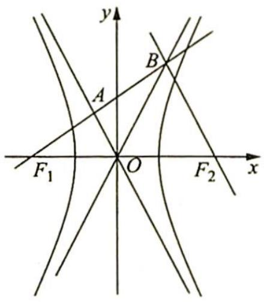

text_image

y
B
A
F₁ O F₂ x

# 评注

本题充分利用了已知条件的几何性质,通过中位线推出角相等,进而直接计算出 $\angle F_{2}OB$ 的值,这样其正切值就是渐近线 OB 的斜率,最终计算得出离心率.本题过程简洁,几乎不需要计算,可见活用几何性质的巧妙性与重要性.

变式 1 已知双曲线 $C: \frac{x^2}{a^2} - \frac{y^2}{b^2} = 1 (a > 0, b > 0)$ 的左、右焦点分别为 $F_1, F_2$ ，过 $F_1$ 的直线

与 C 的一条渐近线交于点 A (点 A 在第二象限), 且与双曲线的右支交于点 B, 若 $\overrightarrow{F_1A} = \overrightarrow{AB}$ , $\overrightarrow{F_1B} \cdot \overrightarrow{F_2B} = 0$ , 则 C 的离心率为 \_\_\_\_.

分析 ▶ 求解椭圆或双曲线的离心率一般运用“定义+几何性质”或“方程+几何性质”，但凡涉及焦半径 $|PF_{1}|$ ， $|PF_{2}|$ 的关系，优先考虑用“定义+几何性质”。

解析 ▶ 解法一: 如图所示, $\overrightarrow{F_1A} = \overrightarrow{AB}$ , 且 $\overrightarrow{F_1B} \cdot \overrightarrow{F_2B} = 0$ , 则 $\triangle F_1BF_2$ 为直角三角形, 又 $\overrightarrow{F_1A} = \overrightarrow{AB}$ , $A$ 为 $F_1B$ 中点, $AO$ 为 $\triangle F_1BF_2$ 的中位线, 所以 $OA \parallel BF_2$ , 因此 $OA \perp BF_1$ , 而双曲线的一条渐近线方程为 $y = -\frac{b}{a}x$ , 故 $k_{BF_1} = \frac{a}{b} = \tan \angle BF_1F_2$ .

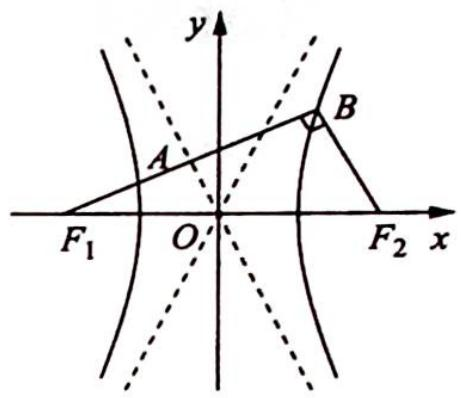

text_image

y
A
B
F₁ O F₂ x

又在 Rt△BF₁F₂ 中，|F₁F₂| = 2c, tan ∠BF₁F₂ = a/b，则 sin∠BF₁F₂ = a/c = |BF₂| / |F₁F₂|，故 |BF₂| = 2a, |BF₁| = 2b.

根据双曲线定义知 $\left|BF_{1}\right|-\left|BF_{2}\right|=2a$ ，因此2b-2a=2a，即b=2a，所以 $\frac{b}{a}=2$ ，则 $e=\frac{c}{a}=$ $\sqrt{1+\frac{b^{2}}{a^{2}}}=\sqrt{5}.$

解法二(利用焦渐距):由焦渐距为 b 可知 $\left|F_{1}A\right|=b$ , 又 $\overrightarrow{F_{1}A}=\overrightarrow{AB}$ , 则 A 为 $F_{1}B$ 的中点, 所以 $\left|F_{1}B\right|=2b$ .

由双曲线定义可得 $|BF_{2}| = 2b - 2a$ ，在 Rt△BF $_{1}$ F $_{2}$ 中，由勾股定理得 $(2b)^{2} + (2b - 2a)^{2} = (2c)^{2}$ ，化简得 $\frac{b}{a} = 2$ ，则 $e = \sqrt{5}$ .

# 评注

本题中点 B 在双曲线上, 因此 $BF_{1}$ 和 $BF_{2}$ 为焦半径, 在离心率的计算时优先考虑用定义, 即 $\left|BF_{1}\right| - \left|BF_{2}\right| = 2a$ , 通过这一组试题, 是否能领悟出求离心率的思路和规律呢?

变式(2) 已知双曲线 $M: \frac{x^{2}}{a^{2}} - \frac{y^{2}}{b^{2}} = 1 (a, b > 0)$ 的左焦点为 $F_{1}, A, B$ 分别为双曲线 $M$ 左、右两支上的两点， $O$ 为坐标原点，若四边形 $F_{1}ABO$ 为菱形，则双曲线 $M$ 的离心率为（ ）.

A. $\sqrt{2}$

B. $\sqrt{3}$

C. $\sqrt{2} + 1$

D. $\sqrt{3} + 1$

解析 ▶ 定义+几何性质求解离心率.

如图所示， $|F_{1}F_{2}| = 2c, \angle OBF_{2} = \angle BOF_{2} = \angle OF_{2}B = 60^{\circ}$ ，且 $\angle F_{1}BF_{2} = 90^{\circ}$ ，则 $|BF_{1}| = \sqrt{3} c, |BF_{2}| = c$ ，由双曲线的定义得 $|BF_{1}| - |BF_{2}| = 2a$ ，即$(\sqrt{3} - 1)c = 2a$ ，得 $e = \frac{c}{a} = \frac{2}{\sqrt{3} - 1} = \sqrt{3} + 1.$

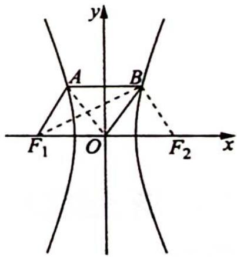

text_image

y
A
B
F₁ O F₂ x

故选D.

# 2. 直角三角形的性质

例 14.2 (2018 新课标全国 I 卷理 11) 已知双曲线 $C: \frac{x^2}{3} - y^2 = 1, O$ 为坐标原点, $F$ 为 $C$ 的右焦点, 过 $F$ 的直线与 $C$ 的两条渐近线的交点分别为 $M, N$ . 若 $\triangle OMN$ 为直角三角形, 则 $|MN| = (\quad)$ .

A. $\frac{3}{2}$

B. 3

C. $2\sqrt{3}$

D. 4

分析 ▶ 充分挖掘图形的几何性质以获取角度与边长。由双曲线方程可知, 每条渐近线与 $x$ 轴的夹角为 $30^{\circ}$ , 两条渐近线的夹角为 $60^{\circ}$ 。由角度可知, $\triangle ONF$ 为等腰三角形, $\triangle OMF$ 为 $30^{\circ}$ 与 $60^{\circ}$ 的特殊的直角三角形, 由此求 $|MN|$ 的长。

解析 如图所示, 设 $l_{1}, l_{2}$ 是 $C$ 的两条渐近线, 方程为 $\frac{x}{\sqrt{3}} \pm y = 0$ .

右焦点为 $F(2,0)$ , 于是 $\angle MOF = \angle NOF = 30^{\circ}$ , 则 $\angle MON = 60^{\circ}$ .

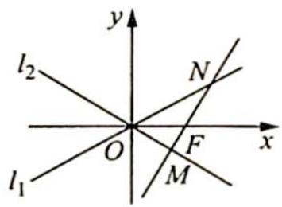

text_image

l₂
N
O
F
x
M
l₁
y

因为 $l_{1}, l_{2}$ 关于 x 轴对称, 所以不失一般性, 可设 $\angle OMN = 90^{\circ}$ .

在 Rt△OMN 中，∠ONF=90°-60°=30°；在 Rt△OMF 中，|OF|=2，∠MOF=30°，所以 |MF|=1。

在 $\triangle ONF$ 中， $\angle ONF=\angle NOF=30^{\circ}$ ，所以 $|NF|=|OF|=2$ 。

则 $|MN| = |MF| + |NF| = 1 + 2 = 3$ ，故选B.

变式(1) 已知双曲线 $C: \frac{x^2}{a^2} - \frac{y^2}{b^2} = 1 (a, b > 0)$ 的左、右焦点分别为 $F_1, F_2$ , 过 $F_2$ 作一条渐近线的垂线, 垂足为 $A$ , 并延长交另一条渐近线于点 $B$ , 且 $2\overrightarrow{AF_2} = \overrightarrow{F_2B}$ , 则 $C$ 的离心率是 \_\_\_\_.

解析 如图所示, 过 $F_{2}$ 作另一条渐近线的垂线, 垂足为 $M$ .

由于 $\angle AOF_{2} = \angle BOF_{2}$ ，则 $|AF_2| = |F_2M|$

因为 $2 \overrightarrow{AF_{2}} = \overrightarrow{F_{2}B}$ ，所以 $2 |AF_{2}| = |F_{2}B|$ ， $2 |F_{2}M| = |F_{2}B|$ ，则 $\angle OBA = 30^{\circ}$ ， $\angle AOF_{2} = 30^{\circ}$ ，所以 $\frac{b}{a} = \frac{\sqrt{3}}{3}$ 。

因此 $e = \frac{c}{a} = \sqrt{\frac{c^2}{a^2}} = \sqrt{\frac{a^2 + b^2}{a^2}} = \sqrt{1 + \frac{1}{3}} = \frac{2\sqrt{3}}{3}$ .

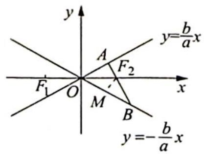

text_image

y
y=b/a x
A
F₂
x
F₁
O
M
B
y=-b/a x

# 3. 等腰(等边)三角形的性质

例 14.3 过抛物线 C: $y^{2}=4x$ 的焦点 F，且斜率为 $\sqrt{3}$ 的直线交 C 于点 M (M 在 x 轴的上方)，l 为 C 的准线，点 N 在 l 上且 $MN \perp l$ ，则 M 到直线 NF 的距离为（）.

A. $\sqrt{5}$

B. $2\sqrt{2}$

C. $2\sqrt{3}$

D. $3\sqrt{3}$

分析 ▶ MF 的斜率为 $\sqrt{3}$ ，说明 $\angle FMN = \frac{\pi}{3}$ ，又由抛物线定义有 $|MF| = |MN|$ ，所以 $\triangle MNF$ 是等边三角形。由抛物线 p 的几何意义求其边长，求高得解。

解析 如图所示, 过 $F$ 作 $FA \perp MN$ , 垂足为 $A, l$ 与 $x$ 轴的交点为 $B, |FB| = 2$ .

由于直线 ${FM}$ 的斜率为 $\sqrt{3}$ ,故有 $\angle {MFx} = \frac{\pi }{3}$ ,即 $\angle {FMN} = \frac{\pi }{3}$ .

根据抛物线定义可得 $|MF| = |MN|$ , 故 $\triangle MNF$ 是等边三角形, 从而 $A$ 是 $MN$ 的中点, 即有 $|AN| = |FB| = 2$ .

在 Rt△FAN 中，|FA|=2tan $\frac{\pi}{3}=2\sqrt{3}$ ，因为等边三角形每条边上的高相等，所以 M 到 NF 的距离为 $2\sqrt{3}$ .

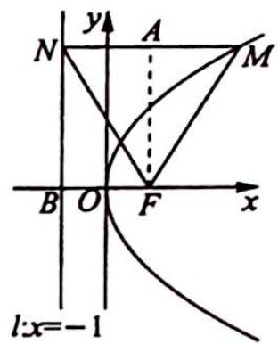

text_image

y
N A M
B O F x
l:x=-1

故选C.

变式(1) 设抛物线 $C: y^{2} = 2px (p > 0)$ 的焦点为 $F$ , 点 $M$ 在 $C$ 上, $|MF| = 5$ , 若以 $MF$ 为直径的圆过点 $(0,2)$ , 则 $C$ 的方程为 ( ).

A. $y^{2} = 4x$ 或 $y^{2} = 8x$

B. $y^{2} = 2x$ 或 $y^{2} = 8x$

C. $y^{2}=4x$ 或 $y^{2}=16x$

D. $y^{2} = 2x$ 或 $y^{2} = 16x$

解析 如图所示, 过点 $M$ 作准线 $x = -\frac{p}{2}$ 的垂线于点 $M_{1}$ , 连接 $M_{1}F$ 交 $y$ 轴于点 $N$ .

由抛物线的定义知 $|MM_1| = |MF|$ , $\triangle MM_1F$ 为等腰三角形, 且点 $N$ 为 $M_1F$ 的中点, 故 $MN \perp M_1F$ , 因此 $N(0,2), y_M = 4$ , 则 $x_M = \frac{8}{p}, |MM_1| = \frac{8}{p} + \frac{p}{2} = 5$ , 即 $16 + p^2 - 10p = 0$ , 得 $p = 2$ 或 $p = 8$ , 所以抛物线 $C$ 的方程为 $y^2 = 4x$ 或 $y^2 = 16x$ .

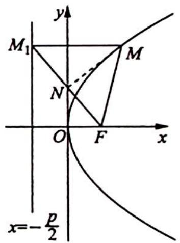

text_image

y
M₁
M
N
O
F
x
x=-\frac{p}{2}

故选C.

# 4. 全等三角形的性质

例 14.4 (2020 新课标全国Ⅲ卷理 20) 已知椭圆 $C: \frac{x^{2}}{25} + \frac{y^{2}}{m^{2}} = 1 (0 < m < 5)$ 的离心率为 $\frac{\sqrt{15}}{4}, A, B$ 分别为 $C$ 的左、右顶点.

(1) 求 C 的方程；  
(2) 若点 $P$ 在 $C$ 上, 点 $Q$ 在直线 $x = 6$ 上, 且 $|BP| = |BQ|$ , $BP \perp BQ$ , 求 $\triangle APQ$ 的面积.

分析 ▶ (1)根据离心率的公式求出 $m$ 的值即可; (2)本题可用已知三角形三顶点的坐标, 求三角形的面积, 但计算量较大. 所以转换方向, 尝试从平面几何的角度思考: 过点 $P$ 作 $x$ 轴的垂线, 设交点为 $M, x = 6$ 与 $x$ 轴交点为 $N$ , 由 $|BP| = |BQ|$ , $BP \perp BQ$ 易证 $\triangle PMB \cong \triangle BNQ$ , 由全等可得三角形中一些边的长, 再利用割补法求面积, 这样求解非常简洁.

解析 (1) 由 $e = \frac{c}{a} = \frac{\sqrt{25 - m^2}}{5} = \frac{\sqrt{15}}{4}$ 可得 $m = \frac{5}{4}$ , 故 $C$ 的方程为 $\frac{x^2}{25} + \frac{16y^2}{25} = 1$ .

(2)由椭圆的对称性,不妨设点P在第一象限,如图所示.

过点 $P$ 作 $x$ 轴的垂线, 垂足为 $M$ , 设 $x = 6$ 与 $x$ 轴的交点为 $N$ , 由 $|BP| = |BQ|$ , $BP \perp BQ$ 易证 $\triangle PMB \cong \triangle BNQ$ , 所以 $PM = BN = 1$ .

则可得 $P$ 点纵坐标为 $y_{P} = 1$ ，将其代入椭圆方程解得 $x_{P} = 3$ 或 $x_{P} = -3$ ，因为设点 $P$ 在第一象限，所以 $x_{P} = 3$ ，所以 $QN = MB = 5 - 3 = 2$ .

因为 $PM = 1, QN = 2, AQ$ 的直线方程为 $y = \frac{2}{11} (x + 5)$ , 所以点 $P$ 在 $AQ$ 的下方, 则

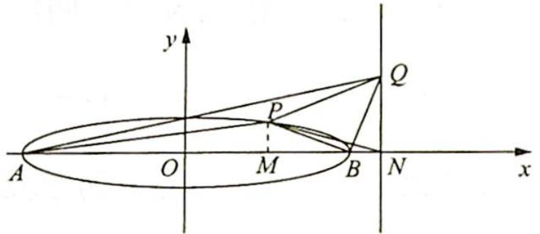

text_image

y
Q
P
A O M B N x

$$
\begin{array}{l} S _ {\triangle A P Q} = S _ {\triangle A Q N} - S _ {\triangle P A N} - S _ {\triangle P N Q} \\ = \frac {1}{2} \times 2 \times (5 + 6) - \frac {1}{2} \times 1 \times (5 + 6) - \frac {1}{2} \times 2 \times (6 - 3) \\ = 1 1 - \frac {1 1}{2} - 3 = \frac {5}{2}. \\ \end{array}
$$

所以 $\triangle APQ$ 的面积为 $\frac{5}{2}$ .

# 评注

由已知条件容易想到初中常见的全等模型,用割补法求三角形面积省去繁杂的计算,由此可见运用平面几何知识可以减轻计算负担.历年高考题,尤其是客观题,经常可以数形结合,找到图形规律再“秒杀”,值得我们深入研究.

# 5. 相似三角形的性质

例 14.5 椭圆 $C: \frac{x^2}{a^2} + \frac{y^2}{b^2} = 1 (a > b > 0)$ 的右焦点和左焦点分别为 $F_1, F_2, E$ 是椭圆 $C$ 上一点，且 $|F_1 F_2| = 2, |EF_1| + |EF_2| = 4$ .

(1) 求椭圆 C 的方程；  
(2) $M, N$ 是 $y$ 轴上的两个动点 (点 $M$ 与点 $E$ 位于 $x$ 轴的两侧), $\angle MF_{1}N = \angle MEN = 90^{\circ}$ , 直线 $EM$ 交 $x$ 轴于点 $P$ , 求 $\frac{|EP|}{|PM|}$ 的值.

分析 ▶ 本题可从代数、几何两个角度入手考虑。代数角度:由条件进行坐标运算,将 $\frac{|EP|}{|PM|}$ 的值转化为E与M纵坐标的比;几何角度:证明 $\triangle MF_{1}P\sim\triangle MEF_{1}$ ,得到对应边的相似

比, 再由 $\frac{PM}{ME} = \frac{PM}{MF_1} \cdot \frac{MF_1}{ME}$ 求出 $PM$ 与 $ME$ 的比, 进而得出 $\frac{|EP|}{|PM|}$ 的值.

解析 (1) $2c = 2, 2a = 4$ , 得 $a = 2, c = 1, b = \sqrt{3}$ , 所以椭圆 $C$ 的方程为 $\frac{x^2}{4} + \frac{y^2}{3} = 1$ .

(2)解法一(代数方法): 设 $M(0,m)$ , $N(0,n)$ (不妨设 m<0, n>0), $E(x_{0},y_{0})$ , 因为 $\angle MF_{1}N=90^{\circ}$ , 所以 mn=-1, 则 $\overrightarrow{EM}=(-x_{0},m-y_{0}),\overrightarrow{EN}=(-x_{0},n-y_{0})$ .

又 $\overrightarrow{EM} \cdot \overrightarrow{EN} = x_0^2 + (m - y_0)(n - y_0) = 0$ ，即 $x_0^2 + mn - (m + n)y_0 + y_0^2 = 0$ ，亦即 $x_0^2 - 1 - (m + n)y_0 + y_0^2 = 0$ ，整理得 $x_0^2 + y_0^2 - 1 - \left(n - \frac{1}{n}\right)y_0 = 0$ ①.

又 $\frac{x_0^2}{4} +\frac{y_0^2}{3} = 1$ ，得 $x_0^2 = 4\left(1 - \frac{y_0^2}{3}\right) = 4 - \frac{4}{3} y_0^2$ ，代入①式得 $4 - \frac{4}{3} y_0^2 +y_0^2 -1 - \left(n - \frac{1}{n}\right)y_0 = 0,$

即 $-\frac{1}{3} y_0^2 - (n - \frac{1}{n}) y_0 + 3 = 0$ ，亦即 $y_0^2 + 3(n - \frac{1}{n}) y_0 - 9 = 0$ ，可得 $(y_0 + 3n)(y_0 - \frac{3}{n}) = 0$ ，即 $y_0 = -3n$ 或 $\frac{3}{n}$ .

又 $y_0 > 0$ ，得 $y_0 = \frac{3}{n}$ 所以 $\frac{|EP|}{|PM|} = \left|\frac{\frac{3}{n}}{\frac{-1}{n}}\right| = 3.$

解法二(几何法): $\angle MEN = \angle MF_{1}N = 90^{\circ}$ , 得 $N, E, F_{1}, M$ 四点共圆. 连接 $EF_{2}, EF_{1}$ , 如图所示.

$$
\angle F _ {2} E M = \angle F _ {1} E M, \text {所以} \frac {E F _ {2}}{E F _ {1}} = \frac {F _ {2} P}{P F _ {1}} \Rightarrow \frac {E F _ {2} + E F _ {1}}{E F _ {2}} = \frac {F _ {2} P + P F _ {1}}{F _ {2} P},
$$

可得 $\frac{2a}{2c} = \frac{EF_2}{F_2P} = \frac{1}{e} = 2$ ，故 $\frac{EF_2}{F_2P} = 2$ 或 $\frac{EF_1}{F_1P} = 2.$

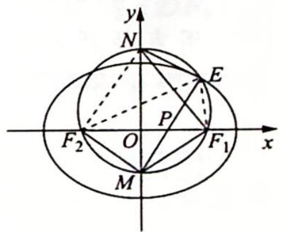

text_image

y
N
E
P
F₂ O F₁ x
M

$\triangle MF_{1}P \sim \triangle MEF_{1}$ , 得 $\frac{MP}{MF_{1}} = \frac{MF_{1}}{ME} = \frac{PF_{1}}{EF_{1}} = \frac{1}{2}, \frac{PM}{MF_{1}} \cdot \frac{MF_{1}}{ME} = \frac{PM}{ME}$ , 所以 $\frac{PM}{ME} = \frac{1}{4}$ , 则 $|PM| = \frac{1}{3} |PE|$ , 故 $\frac{|EP|}{|PM|} = 3$ .

# 14.2 挖掘圆的几何性质

# 研究密钥

圆是非常重要且内涵丰富的图形,当圆锥曲线与圆相结合时,应当充分利用已知条件和图形特征,灵活运用圆的几何性质,如对称性、切线性质、垂径定理、直径所对圆周角为直角等.解题时多思考、多发现,就能少计算、省时间.

例 14.6 (2019 浙江卷)已知椭圆 $C: \frac{x^2}{9} + \frac{y^2}{5} = 1$ 的左焦点为 $F$ , 点 $P$ 在椭圆上且在 $x$ 轴上方, 若线段 $PF$ 的中点在以原点为圆心, $OF$ 的长为半径的圆上, 则直线 $PF$ 的斜率为 \_\_\_\_.

分析 ▶ PF 的中点在圆上, 直径所对圆周角为 $90^{\circ}$ , 所以存在垂直条件. 由等腰三角形三线合一知 $|AP| = |AF| = 4$ (其中 $A$ 为右焦点), 则可得 $|BF|$ 与 $|AB|$ , 再由 $k_{PF} = \tan \angle PFA = \frac{|AB|}{|BF|}$ 得解.

解析 ▶ 设椭圆的右焦点为 A, PF 的中点为点 B, 连接 AB, AP, 如图所示.

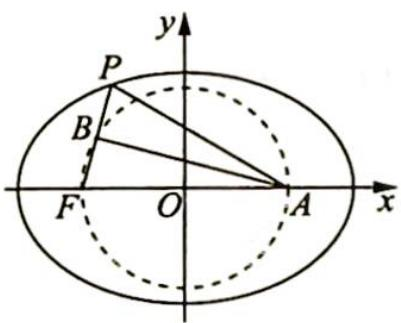

text_image

y
P
B
F O A x

由已知 $\left| {AF}\right|  = {2c} = 4$ ,因为点 $B$ 在以原点为圆心, ${OF}$ 长为半径的圆上, 所以 $\angle {ABF} = {90}^{ \circ  }$ ,又点 $B$ 为 ${PF}$ 的中点,所以 ${AB}$ 为线段 ${PF}$ 的垂直平分线, 所以 $|AP| = |AF| = 4$ , 则 $|PF| = 2a - |AP| = 2$ , $|BF| = 1$ , $|AB| = \sqrt{|AF|^2 - |BF|^2}$ $= \sqrt{15}$ .

故直线 $PF$ 的斜率 $k_{PF} = \tan \angle PFA = \frac{|AB|}{|BF|} = \sqrt{15}$ .

# 评注

本题为填空题,题中出现了圆的条件,且 $\angle ABF$ 恰为直径所对的圆周角,所以利用直径所对圆周角为 $90^{\circ}$ ,我们就得出了重要的垂直条件,进而顺利解决了本题.

变式(1) 已知 $F_{1}, F_{2}$ 为椭圆 $\frac{x^{2}}{a^{2}} + \frac{y^{2}}{b^{2}} = 1 (a > b > 0)$ 的两焦点, 点 $P$ 在椭圆上, 线段 $PF_{1}$ 的中点在以 $F_{1} F_{2}$ 为直径的圆上, 直线 $PF_{1}$ 的斜率为 $\frac{4}{3}$ , 则椭圆的离心率为 \_\_\_\_.

解析 ▶ 设 $PF_{1}$ 的中点为 M，连接 $MF_{2}$ ，不妨设 $\left|MF_{2}\right|=4$ ， $\left|MF_{1}\right|=3$ ，则 $\left|PM\right|=\left|MF_{1}\right|=3,\left|PF_{2}\right|=\left|F_{1}F_{2}\right|=5$ ，故椭圆离心率 $e=\frac{c}{a}=\frac{2c}{2a}=\frac{\left|F_{1}F_{2}\right|}{\left|PF_{1}\right|+\left|PF_{2}\right|}=\frac{5}{11}$ .

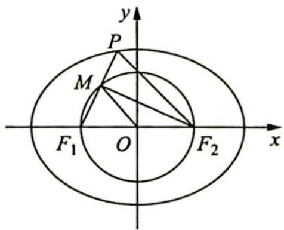

text_image

y
P
M
F₁ O F₂ x

# 评注

焦点三角形的研究也是常考内容,本题是将焦点三角形与图形几何关系相结合研究.

# 14.3 挖掘平行线的几何性质

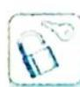

# 研究密钥

当题设条件出现平行线或可挖掘出平行线的条件时,可根据平行线的性质进一步获取诸多信息,如斜率相等、角相等、中点、平行线分线段成比例及三角形相似等,知晓这些条件可以更深入地认识图形结构特征,以避免复杂的代数运算.

例 14.7 (2019 江苏卷) 如图所示, 在平面直角坐标系 $xOy$ 中, 椭圆 $C: \frac{x^2}{a^2} + \frac{y^2}{b^2} = 1 (a > b > 0)$ 的焦点为 $F_1(-1,0), F_2(1,0)$ . 过 $F_2$ 作 $x$ 轴的垂线 $l$ , 在 $x$ 轴的上方, $l$ 与圆 $F_2: (x - 1)^2 +$ $y^{2}=4a^{2}$ 交于点 A，与椭圆 C 交于点 D。连接 $AF_{1}$ 并延长交圆 $F_{2}$ 于点 B，连接 $BF_{2}$ 交椭圆 C 于点 E，连接 $DF_{1}$ 。已知 $DF_{1}=\frac{5}{2}$ 。

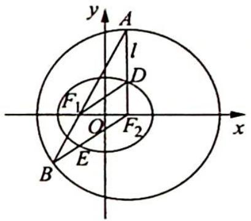

text_image

y
A
l
D
F₁
O
F₂
x
B
E

(1) 求椭圆 C 的标准方程；  
(2) 求点 E 的坐标.

分析 ▶ (1) 根据焦点坐标可得 $c$ , 已知 $DF_{1} = \frac{5}{2}$ , 根据勾股定理可得 $|DF_{2}| = \sqrt{|DF_{1}|^{2} - |F_{1}F_{2}|^{2}}$ , 根据椭圆的定义可得 $a$ , 根据 $b = \sqrt{a^{2} - c^{2}}$ 可得 $b$ . (2) 求点 $E$ 的坐标, 若用直线和椭圆联立方程求解计算量太大, 设法从其他角度突破. 利用椭圆上的点到两个焦点的距离和为 $2a$ 及圆的半径也是 $2a$ 推出边相等, 进而角相等, 由此发现等腰三角形以及平行、垂直关系, 打开“解题之门”.

解析 ▶ (1) 设椭圆 C 的焦距为 2c，因为 $F_{1}(-1,0)$ ， $F_{2}(1,0)$ ，所以 $F_{1}F_{2}=2$ ，c=1，又因为 $\left|DF_{1}\right|=\frac{5}{2}$ ， $AF_{2}\perp x$ 轴，所以 $\left|DF_{2}\right|=\sqrt{\left|DF_{1}\right|^{2}-\left|F_{1}F_{2}\right|^{2}}=\frac{3}{2}$ .

因此 $2a = |DF_{2}| + |DF_{1}| = 4$ ，从而 $a = 2$ ，所以 $b = \sqrt{a^2 - c^2} = \sqrt{3}$ ，所以椭圆 $C$ 的标准方程为 $\frac{x^2}{4} +\frac{y^2}{3} = 1.$

(2)由(1)知,椭圆 $C:\frac{x^{2}}{4}+\frac{y^{2}}{3}=1$ , 连接 $EF_{1}$ , 如图所示.

因为 $|BF_{2}| = 2a, |EF_{2}| + |EF_{1}| = 2a$ ，所以 $|EF_{1}| = |EB|, \angle BF_{1}E = \angle B.$

又 $|F_2A| = |F_2B|$ ，所以 $\angle A = \angle B, \angle A = \angle BF_1E, EF_1 \parallel F_2A.$

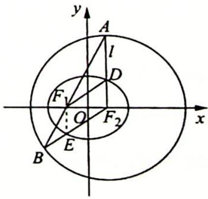

text_image

y
A
l
D
F₁
O
F₂
x
B
E

因为 $AF_{2} \perp x$ 轴, 所以 $EF_{1} \perp x$ 轴, E 点横坐标 $x_{E} = x_{F_{1}} = -1$ .

代入椭圆方程, 即 $\frac{(-1)^{2}}{4} + \frac{y^{2}}{3} = 1$ , 解得 $y = \pm \frac{3}{2}$ .

因为 E 是线段 $BF_{2}$ 与椭圆的交点, 所以 $y_{E} = -\frac{3}{2}$ , 因此 $E\left(-1, -\frac{3}{2}\right)$ .

# 评注

本题通过挖掘图形特征, 发现平行的隐藏条件, 进而通过同位角相等加以证明. 利用平行关系, 可推出 $E$ 点的横坐标, 代入椭圆方程, 就得到了 $E$ 点的纵坐标. 本题再次说明了充分挖掘圆锥曲线中图形的几何性质, 对解题大有作用.

例 14.8 如图所示, 在平面直角坐标系 $xOy$ 中, 点 $B$ 与点 $A(-1,1)$ 关于原点 $O$ 对称, $P$ 是动点, 且直线 $AP$ 与 $BP$ 的斜率之积等于 $-\frac{1}{3}$ .

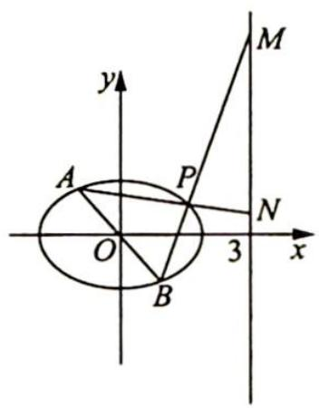

text_image

y
A
P
M
N
O
3
x
B

(1) 求动点 P 的轨迹方程；

(2)设直线 $AP$ 与 $BP$ 分别与直线 $x = 3$ 交于点 $N, M$ . 是否存在点 $P$ , 使得 $\triangle PAB$ 与 $\triangle PMN$ 的面积相等? 若存在, 求出点 $P$ 的坐标; 若不存在, 请说明理由.

分析 ▶ (1)已知点 $A$ 的坐标, 根据对称可得点 $B$ 的坐标, 设 $P(x,y)$ , 分别表示出直线 $AP$ 与 $BP$ 的斜率, 根据乘积为 $-\frac{1}{3}$ 可得点 $P$ 的轨迹方程; (2)挖掘图形几何性质, 若使 $\triangle PAB$ 与 $\triangle PMN$ 的面积相等, 即 $\triangle ABN$ 与 $\triangle MBN$ 的面积相等, 那么 $AM \parallel BN$ . 延长 $AB$ 交直线 $x = 3$ 于点 $Q$ , 由 $A,B,Q$ 三点横坐标知点 $B$ 为线段 $AQ$ 的中点, 结合中位线定理, $N$ 为线段 $MQ$ 的中点, 则 $P$ 是 $\triangle AMQ$ 的重心.

# 解析

(1)由点 B 与点 A(-1,1) 关于原点 O 对称, 则 B(1,-1).

设 $P(x,y), x \neq \pm 1$ . 由题设可得 $\frac{y-1}{x+1} \cdot \frac{y+1}{x-1} = -\frac{1}{3}$ ，整理得动点 P 的轨迹方程为 $x^{2} + 3y^{2} = 4 (x \neq \pm 1)$ .

(2) 连接 BN, AM, 如图所示.

若 $S_{\triangle PAB} = S_{\triangle PMN}$ ，则 $S_{\triangle ABN} = S_{\triangle MBN}$

因为 $\triangle ABN$ 与 $\triangle MBN$ 同底 $BN$ , 所以点 $A$ 与点 $M$ 到 $BN$ 的距离相等, 故 $AM \parallel BN$ .

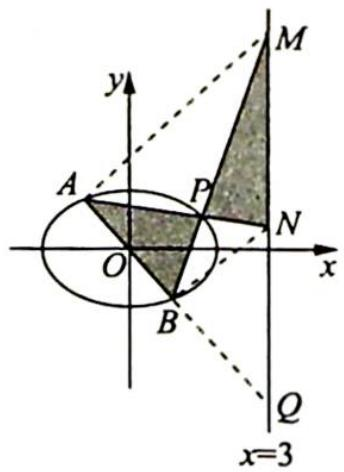

text_image

y
A
P
M
N
O
x
B
Q
x=3

延长 AB 交直线 x=3 于点 Q，由 A, B, Q 三点横坐标知点 B 为线段 AQ 的中点，所以点 N 为线段 MQ 的中点，因此，点 P 是 $\triangle AMQ$ 两条中线 AN 与 BM 的交点，即点 P 是 $\triangle AMQ$ 的重心，由重心坐标公式得 $x_{P}=\frac{x_{A}+x_{M}+x_{Q}}{3}=\frac{5}{3}$ .

将点 $P$ 的横坐标代入椭圆方程 $x^{2} + 3y^{2} = 4$ 中，得 $y_{P}^{2} = \frac{11}{27}$ ，即 $y_{P} = \pm \frac{\sqrt{33}}{9}$ .

所以存在点 $P$ ，使得 $\triangle PAB$ 与 $\triangle PMN$ 的面积相等，其坐标为 $\left[\frac{5}{3},\pm \frac{\sqrt{33}}{9}\right]$

变式 1 已知椭圆 $W: \frac{x^{2}}{a^{2}} + \frac{y^{2}}{b^{2}} = 1 (a > b > 0)$ 的离心率为 $\frac{\sqrt{3}}{2}$ , 且经过点 $C(2, \sqrt{3})$ .

(1)求椭圆 W 的方程及其长轴长；

(2) $A, B$ 分别为椭圆 $W$ 的左、右顶点, 点 $D$ 在椭圆 $W$ 上, 且位于 $x$ 轴下方, 直线 $C D$ 交 $x$ 轴于点 $Q$ , 若 $\triangle A C Q$ 的面积比 $\triangle B D Q$ 的面积大 $2 \sqrt{3}$ , 求点 $D$ 的坐标.

分析 ▶ (1) 解方程 $\frac{4}{a^{2}} + \frac{3}{b^{2}} = 1$ 和 $\frac{c}{a} = \frac{\sqrt{3}}{2}, a^{2} = b^{2} + c^{2}$ ，求出 a, b 的值即可得椭圆 W 的方程和长轴 2a 的值；(2) 由已知条件可计算 $\triangle AOC$ 的面积为 $\frac{1}{2} \times 4 \times \sqrt{3} = 2\sqrt{3}$ 。而 $\triangle ACQ$ 的面积比 $\triangle BDQ$ 的面积大 $2\sqrt{3}$ ， $\triangle ACQ$ 的面积等于 $\triangle AOC$ 的面积与 $\triangle COQ$ 面积之和，可得 $\triangle OCQ$ 的面积等于 $\triangle BDQ$ 的面积，进而可得 $\triangle OCB$ 的面积等于 $\triangle BCD$ 的面积，所以 $OD \parallel BC$ 。设 $D(m, n)$ ，利用点 D 在椭圆上以及 $k_{OD} = k_{BC}$ 可求出点 D 的坐标。

解析 (1) 因为椭圆 $W$ 经过点 $C(2, \sqrt{3})$ , 所以 $\frac{4}{a^2} + \frac{3}{b^2} = 1$ .

又椭圆 W 的离心率为 $\frac{\sqrt{3}}{2}$ ，所以 $\frac{c}{a} = \frac{\sqrt{3}}{2}$ ，且 $a^{2} = b^{2} + c^{2}$ ，于是解得 $\left\{\begin{aligned}a &= 4 \\ b &= 2\end{aligned}\right.$ .

故椭圆 W 的方程为 $\frac{x^{2}}{16} + \frac{y^{2}}{4} = 1$ ，长轴长 2a = 8。

(2)因为点D在x轴下方,所以点Q在线段AB(不包括端点)上.

由(1)可知 $A(-4,0)$ , $B(4,0)$ ，所以 $\triangle AOC$ 的面积为 $\frac{1}{2} \times 4 \times \sqrt{3} = 2\sqrt{3}$ .

因为 $\triangle ACQ$ 的面积比 $\triangle BDQ$ 的面积大 $2\sqrt{3}$ , 所以点 $Q$ 在线段 $OB$ (不包括端点)上, 且 $\triangle OCQ$ 的面积等于 $\triangle BDQ$ 的面积, 则 $\triangle OCB$ 的面积等于 $\triangle BCD$ 的面积, $OD \parallel BC$ .

设 $D(m,n)$ , n<0，则 $\frac{n}{m}=\frac{0-\sqrt{3}}{4-2}=-\frac{\sqrt{3}}{2}$ ①；因为点 D 在椭圆 W 上，所以 $\frac{m^{2}}{16}+\frac{n^{2}}{4}=1$ ②.

由①②解得 $\left\{\begin{aligned}m=2\\n=-\sqrt{3}\end{aligned}\right.$ ，所以D的坐标为 $(2,-\sqrt{3})$ .

# 评注

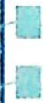

本题解题的关键是由 $\triangle ACQ$ 的面积比 $\triangle BDQ$ 的面积大 $2\sqrt{3}$ ,得出 $\triangle OCQ$ 的面积等于 $\triangle BDQ$ 的面积,进而可得 $\triangle OCB$ 的面积等于 $\triangle BCD$ 的面积,从而 $OD \parallel BC$ .

# 圆锥曲线的几何性质

# 14.4 圆锥曲线的圆幂定理

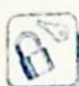

# 研究密钥

圆锥曲线的统一的极坐标方程为 $\rho=\frac{ep}{1-ecos\theta}$ ，其中 e 为离心率，p 为焦参数（焦点 F 到准线 l 的距离），具体推导过程如下：如图所示，设点 F 到直线 l 的距离为 p，点 F 在直线 l 上的射影为点 K，以 F 为极点，向量 $\overrightarrow{KF}$ 的方向为极轴的正方向建立极坐标系，点 $P(\rho,\theta)$ 为圆锥曲线上任意一点,其在直线 $l$ 上的投影为点 $M$ , 在极轴上的投影为点 $N$ , 则由圆锥曲线的定义知 $\frac{|PF|}{|PM|} = e$ . 因为 $|PF| = \rho$ , $|PM| = |KF| + |FN| = p + \rho \cos \theta$ , 所以 $\frac{\rho}{p + \rho \cos \theta} = e$ , 化简得 $\rho = \frac{ep}{1 - e \cos \theta}$ .

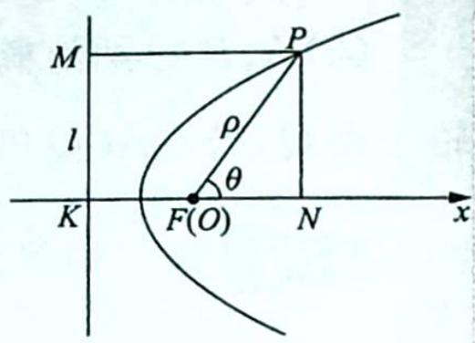

text_image

M
l
P
ρ
θ
K
F(O)
N
x

根据圆锥曲线的统一的极坐标方程,可得如下定理:

# 1. 引理

设过圆锥曲线的焦点 $F$ 的弦 $PQ$ 与 $x$ 轴正半轴的夹角为 $\alpha$ , 则 $|PQ| = \frac{2ep}{1 - e^2\cos^2\alpha}$ .

【证明】由圆锥曲线的统一的极坐标方程可得

$$
| P Q | = | P F | + | Q F | = \frac {e p}{1 - e \cos \alpha} + \frac {e p}{1 - e \cos (\alpha + \pi)} = \frac {e p}{1 - e \cos \alpha} + \frac {e p}{1 + e \cos \alpha} = \frac {2 e p}{1 - e ^ {2} \cos^ {2} \alpha}.
$$

# 2. 相交弦、割线定理

已知点 $M$ 不在圆锥曲线 $\Gamma$ 上, 过点 $M$ 作两条直线分别交曲线 $\Gamma$ 于 $A, B$ 两点和 $C, D$ 两点.

(1)当圆锥曲线 $\Gamma$ 是椭圆或双曲线时, 过坐标原点 $O$ 作 $OP \parallel AB$ , $OQ \parallel CD$ , 分别交曲线 $\Gamma$ 于 $P, Q$ 两点, 过焦点 $F$ 作 $A_{1}B_{1} \parallel AB$ , $C_{1}D_{1} \parallel CD$ , 分别交曲线 $\Gamma$ 于 $A_{1}, B_{1}$ 两点和 $C_{1}, D_{1}$ 两点, 则 $\frac{|MA||MB|}{|MC||MD|} = \frac{|OP|^2}{|OQ|^2} = \frac{|A_1B_1|}{|C_1D_1|}$ ;

(2)当圆锥曲线 $\Gamma$ 是抛物线时, 过焦点 $F$ 作 $A_{1}B_{1} \parallel AB, C_{1}D_{1} \parallel CD$ , 分别交曲线 $\Gamma$ 于 $A_{1}$ , $B_{1}$ 两点和 $C_{1}, D_{1}$ 两点, 则 $\frac{|MA||MB|}{|MC||MD|} = \frac{|A_{1}B_{1}|}{|C_{1}D_{1}|}$ .

【证明】(1)如图所示,当圆锥曲线 $\Gamma$ 是椭圆时,设椭圆的方程为 $\frac{x^{2}}{a^{2}}+\frac{y^{2}}{b^{2}}=1(a>b>0)$ ,

$M(x_0, y_0)$ , 直线 $AB$ 的参数方程为 $\left\{ \begin{array}{l} x = x_0 + t \cos \alpha \\ y = y_0 + t \sin \alpha \end{array} \right.$ (其中 $t$ 为参数), 直线 $CD$ 的参数方程为 $\left\{ \begin{array}{l} x = x_0 + t \cos \beta \\ y = y_0 + t \sin \beta \end{array} \right.$ (其中 $t$ 为参数).

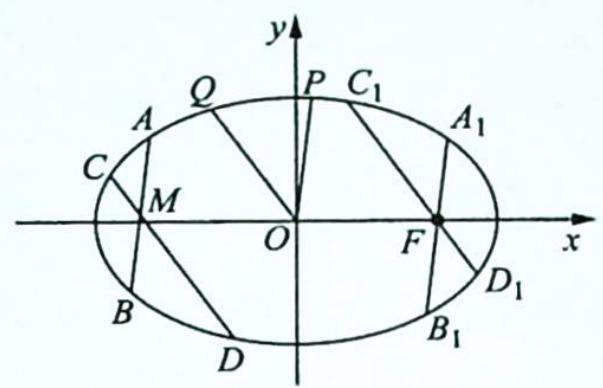

text_image

y
Q
P C₁
A
C
M
O
F
x
B
D
B₁
D₁
A₁
y

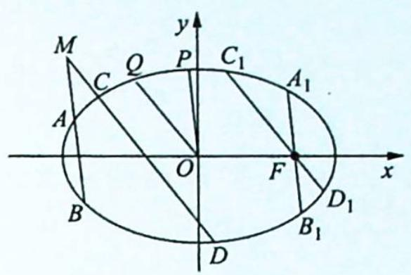

text_image

M
C Q P C₁ A₁
A O F x
B D₁ B₁

将直线 AB 的参数方程代入椭圆的方程中, 得

$(b^{2}\cos^{2}\alpha+a^{2}\sin^{2}\alpha)t^{2}+2(b^{2}x_{0}\cos\alpha+a^{2}y_{0}\sin\alpha)t+b^{2}x_{0}^{2}+a^{2}y_{0}^{2}-a^{2}b^{2}=0$ ，所以由参数t的几何意义，可知 $|MA||MB|=|t_{1}t_{2}|=\left|\frac{b^{2}x_{0}^{2}+a^{2}y_{0}^{2}-a^{2}b^{2}}{b^{2}\cos^{2}\alpha+a^{2}\sin^{2}\alpha}\right|$ .

同理可得 $|MC||MD| = \left|\frac{b^2x_0^2 + a^2y_0^2 - a^2b^2}{b^2\cos^2\beta + a^2\sin^2\beta}\right|$ ，所以 $\frac{|MA||MB|}{|MC||MD|} = \frac{b^2\cos^2\beta + a^2\sin^2\beta}{b^2\cos^2\alpha + a^2\sin^2\alpha}$ .

根据上述推导过程,同理可得 $\frac{|OP|^{2}}{|OQ|^{2}}=\frac{b^{2}\cos^{2}\beta+a^{2}\sin^{2}\beta}{b^{2}\cos^{2}\alpha+a^{2}\sin^{2}\alpha}$ .

又根据引理可知 $|A_{1}B_{1}| = \frac{2ep}{1 - e^{2}\cos^{2}\alpha} = \frac{2\cdot\frac{c}{a}\cdot\left(\frac{a^{2}}{c} - c\right)}{1 - \frac{c^{2}}{a^{2}}\cdot\cos^{2}\alpha} = \frac{2ab^{2}}{b^{2}\cos^{2}\alpha + a^{2}\sin^{2}\alpha}, |C_{1}D_{1}| = \frac{2ab^{2}}{b^{2}\cos^{2}\beta + a^{2}\sin^{2}\beta}$ , 所以 $\frac{|A_1B_1|}{|C_1D_1|} = \frac{b^2\cos^2\beta + a^2\sin^2\beta}{b^2\cos^2\alpha + a^2\sin^2\alpha}, \frac{|MA||MB|}{|MC||MD|} = \frac{|OP|^2}{|OQ|^2} = \frac{|A_1B_1|}{|C_1D_1|}$ , 即原结论成立.

当圆锥曲线 $\Gamma$ 是双曲线时, 同理可证结论正确.

(2)如图所示,当圆锥曲线 $\Gamma$ 是抛物线时,设抛物线的方程为 $y^{2}=2px(p>0)$ , $M(x_{0},y_{00})$ , 直线 AB 的参数方程为 $\left\{\begin{aligned}x&=x_{0}+t\cos\alpha\\ y&=y_{0}+t\sin\alpha\end{aligned}\right.$ (其中 t 为参数), 直线 CD 的参数方程为 $\left\{\begin{aligned}x&=x_{0}+t\cos\beta\\ y&=y_{0}+t\sin\beta\end{aligned}\right.$ (其中 t 为参数).

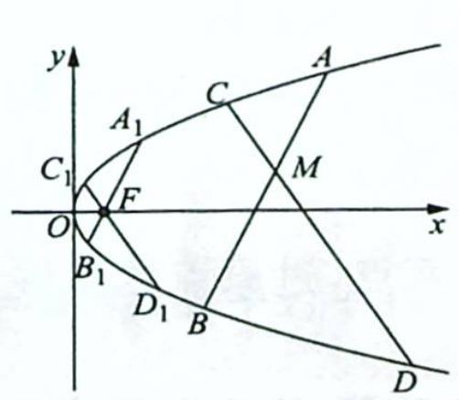

text_image

y
A
C
A₁
C₁
F
M
O
x
B₁
D₁
B
D

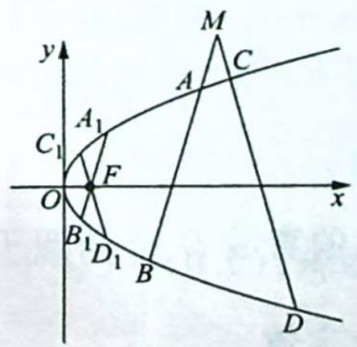

text_image

y
M
A
C
A₁
C₁
F
O
x
B₁D₁
B
D

将直线 $AB$ 的参数方程代入抛物线的方程中, 得 $t^2 \sin^2 \alpha + 2 (y_0 \sin \alpha - p \cos \alpha) t + y_0^2 - 2 px_0 = 0$ , 所以由参数 $t$ 的几何意义, 可知 $|MA||MB| = |t_1 t_2| = \left|\frac{y_0^2 - 2px_0}{\sin^2 \alpha}\right|$ .

同理可得 $|MC||MD| = \left|\frac{y_0^2 - 2px_0}{\sin^2\beta}\right|$ ，所以 $\frac{|MA||MB|}{|MC||MD|} = \frac{\sin^2\beta}{\sin^2\alpha}$ .

根据引理可知 $|A_{1}B_{1}| = \frac{2ep}{1 - e^{2}\cos^{2}\alpha} = \frac{2p}{\sin^{2}\alpha}, |C_{1}D_{1}| = \frac{2p}{\sin^{2}\beta}$ , 所以 $\frac{|A_{1}B_{1}|}{|C_{1}D_{1}|} = \frac{\sin^{2}\beta}{\sin^{2}\alpha}$ , $\frac{|MA||MB|}{|MC||MD|} = \frac{|A_{1}B_{1}|}{|C_{1}D_{1}|}$ , 即原结论成立.

# 3. 切割线定理

已知点 M 在圆锥曲线 $\Gamma$ 的外部, 过点 M 作两条直线, 其中一条直线与曲线 $\Gamma$ 相切于点 A, 另一条直线交曲线 $\Gamma$ 于 C, D 两点.

(1)当圆锥曲线 $\Gamma$ 是椭圆或双曲线时, 过坐标原点 $O$ 作 $OP \parallel MA$ , $OQ \parallel CD$ , 分别交曲线 $\Gamma$ 于 $P, Q$ 两点, 过焦点 $F$ 作 $A_{1}B_{1} \parallel MA$ , $C_{1}D_{1} \parallel CD$ , 分别交曲线 $\Gamma$ 于 $A_{1}, B_{1}$ 两点和 $C_{1}, D_{1}$ 两点, 则 $\frac{|MA|^{2}}{|MC||MD|} = \frac{|OP|^{2}}{|OQ|^{2}} = \frac{|A_{1}B_{1}|}{|C_{1}D_{1}|}$ ;  
(2)当圆锥曲线 $\Gamma$ 是抛物线时, 过焦点 $F$ 作 $A_{1}B_{1} \parallel MA$ , $C_{1}D_{1} \parallel CD$ , 分别交曲线 $\Gamma$ 于 $A_{1}, B_{1}$ 两点和 $C_{1}, D_{1}$ 两点, 则 $\frac{|MA|^{2}}{|MC||MD|} = \frac{|A_{1}B_{1}|}{|C_{1}D_{1}|}$ .

# 4. 切线定理

已知点 M 在圆锥曲线 $\Gamma$ 的外部, 过点 M 作两条直线, 分别与曲线 $\Gamma$ 相切于 A, C 两点.

(1)当圆锥曲线 $\Gamma$ 是椭圆或双曲线时, 过坐标原点 $O$ 作 $OP \parallel MA$ , $OQ \parallel MC$ , 分别交曲线 $\Gamma$ 于 $P, Q$ 两点, 过焦点 $F$ 作 $A_{1}B_{1} \parallel MA$ , $C_{1}D_{1} \parallel MC$ , 分别交曲线 $\Gamma$ 于 $A_{1}, B_{1}$ 两点和 $C_{1}, D_{1}$ 两点, 则 $\frac{|MA|^{2}}{|MC|^{2}} = \frac{|OP|^{2}}{|OQ|^{2}} = \frac{|A_{1}B_{1}|}{|C_{1}D_{1}|}$ ;  
(2)当圆锥曲线 $\Gamma$ 是抛物线时, 过焦点 F 作 $A_{1}B_{1} \parallel MA, C_{1}D_{1} \parallel MC$ , 分别交曲线 $\Gamma$ 于 $A_{1}, B_{1}$ 两点和 $C_{1}, D_{1}$ 两点, 则 $\frac{|MA|^{2}}{|MC|^{2}} = \frac{|A_{1}B_{1}|}{|C_{1}D_{1}|}$ .

【特别说明】当过点 M 所作的两条直线的斜率互为相反数时, 易得 $\left|A_{1}B_{1}\right|=\left|C_{1}D_{1}\right|$ , 所以 $\left|MA\right|\left|MB\right|=\left|MC\right|\left|MD\right|$ 或 $\left|MA\right|^{2}=\left|MC\right|\left|MD\right|$ 或 $\left|MA\right|^{2}=\left|MC\right|^{2}$ .

例14.9 已知椭圆 $E: \frac{x^2}{a^2} + \frac{y^2}{b^2} = 1 (a > b > 0)$ 的一个顶点为 $(0, \sqrt{3})$ ，离心率为 $\frac{1}{2}$ .

(1) 求椭圆 E 的方程：

(2)设过椭圆右焦点的直线 $l_{1}$ 交椭圆于 $A, B$ 两点，过原点的直线 $l_{2}$ 交椭圆于 $C, D$ 两点，若 $l_{1} \parallel l_{2}$ ，求证： $\frac{|CD|^{2}}{|AB|}$ 为定值.

分析 ▶ (1) 根据题意可得 $\left\{ \begin{array}{l} b = \sqrt{3} \\ \frac{c}{a} = \frac{1}{2} \end{array} \right.$ , 结合 $a^2 - b^2 = c^2$ , 可得 $a, b, c$ ; (2) 可直接应用椭圆的相交弦定理, 根据其结论可得 $\frac{|OC||OD|}{a^2} = \frac{|AB|}{2a}$ , 而 $|CD|^2 = 4|OC||OD|$ , 综合起来可得 $\frac{|CD|^2}{|AB|}$ 为定值.

解析 (1)根据题意可得 $\left\{ \begin{array}{l} b = \sqrt{3} \\ \frac{c}{a} = \frac{1}{2} \end{array} \right.$ , 结合 $a^2 - b^2 = c^2$ , 可得 $\left\{ \begin{array}{l} a = 2 \\ b = \sqrt{3} \end{array} \right.$ , 所以椭圆 $E$ 的方程为 $\frac{x^2}{4} + \frac{y^2}{3} = 1$ .

(2)根据结论可得 $\frac{|CD|^2}{|AB|} = \frac{4|OC||OD|}{|AB|}$ . 又 $\frac{|OC||OD|}{a^2} = \frac{|AB|}{2a}$ , 则 $\frac{|OC||OD|}{|AB|} = \frac{a}{2}$ , 因此 $\frac{|CD|^2}{|AB|} = 2a = 4$ (定值).

例 14.10 已知点 O 为坐标原点, 点 F 为椭圆 $C: x^{2} + \frac{y^{2}}{2} = 1$ 在 y 轴正半轴上的焦点, 过点 F 且斜率为 $-\sqrt{2}$ 的直线 l 与椭圆 C 交于 A, B 两点, 点 P 满足 $\overrightarrow{OA} + \overrightarrow{OB} + \overrightarrow{OP} = 0$ .

(1) 证明: 点 P 在椭圆 C 上;  
(2)设点 $P$ 关于坐标原点 $O$ 的对称点为点 $Q$ ,证明: $A,P,B,Q$ 四点在同一个圆上.

分析 ▶ (1) $\overrightarrow{OA} + \overrightarrow{OB} + \overrightarrow{OP} = 0 \Rightarrow (x_{1} + x_{2} + x_{P}, y_{1} + y_{2} + y_{P}) = (0,0)$ , 求出点 $P$ 坐标, 看是否满足椭圆方程; (2) 要证明四点共圆, 根据目前掌握的条件可尝试使用圆的相交弦定理的逆定理. 设 $AB$ 和 $PQ$ 交于点 $M$ , 即证明 $|MA||MB| = |MP||MQ|$ , 过焦点 $F$ 作 $C_{1}D_{1} // PQ$ 交椭圆于 $C_{1}, D_{1}$ 两点, 则根据椭圆的相交弦定理, 有 $\frac{|MA||MB|}{|MP||MQ|} = \frac{|AB|}{|C_{1}D_{1}|}$ , 由椭圆对称性有 $|AB| = |C_{1}D_{1}|$ , 因此得证.

解析 (1) 易求得 $F(0,1)$ , 所以直线 $l$ 的方程为 $y = -\sqrt{2} x + 1$ .

联立方程组 $\left\{ \begin{array}{l} x^{2} + \frac{y^{2}}{2} = 1 \\ y = -\sqrt{2}x + 1 \end{array} \right.$ ，得 $4x^{2} - 2\sqrt{2}x - 1 = 0$ ，解得 $x_{1} + x_{2} = \frac{\sqrt{2}}{2}$ ，所以 $y_{1} + y_{2} = -\sqrt{2}(x_{1} + x_{2}) + 2 = 1$ .

因为 $\overrightarrow{OA} +\overrightarrow{OB} +\overrightarrow{OP} = 0$ ，即 $(x_{1} + x_{2} + x_{P},y_{1} + y_{2} + y_{P}) = (0,0)$ ，所以 $P\left(-\frac{\sqrt{2}}{2}, - 1\right)$

又点 P 的坐标满足椭圆 C 的方程, 所以点 P 在椭圆 C 上.

(2)如图所示,连接 PQ, 设 AB 和 PQ 交于点 M, 过焦点 F 作 $C_{1}D_{1} \parallel PQ$ 交椭圆于 $C_{1}, D_{1}$ 两点, 则根据椭圆的相交弦定理, 可得 $\frac{|MA||MB|}{|MP||MQ|} = \frac{|AB|}{|C_{1}D_{1}|}$ .

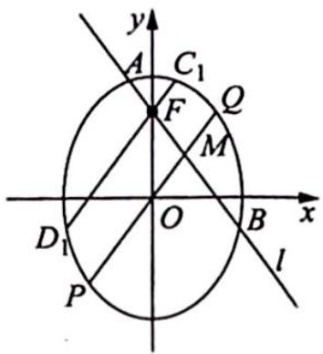

text_image

y
A C₁ Q
F M
D₁ O B x
P l

因为 $k_{PQ}=k_{OP}=\frac{-1}{-\frac{\sqrt{2}}{2}}=\sqrt{2}$ ，所以 $k_{AB}=-k_{PQ}$ ，直线 AB, $C_{1}D_{1}$ 的斜率互为相反数，则由椭圆的对称性可知 $|AB|=|C_{1}D_{1}|$ ，即 $\frac{|MA||MB|}{|MP||MQ|}=\frac{|AB|}{|C_{1}D_{1}|}=1$ ， $|MA||MB|=|MP||MQ|$ 。

故由圆的相交弦定理的逆定理, 可知 $A, P, B, Q$ 四点在同一个圆上.

变式(1) 已知椭圆 $E: \frac{x^{2}}{a^{2}} + \frac{y^{2}}{b^{2}} = 1 (a > b > 0)$ 的一个焦点与短轴的两个端点是正三角形的三个顶点, 点 $P\left(\sqrt{3}, \frac{1}{2}\right)$ 在椭圆 $E$ 上.

(1)求椭圆 E 的方程；

(2)设不过原点 O 且斜率为 $\frac{1}{2}$ 的直线 l 与椭圆 E 交于不同的两点 A, B, 线段 AB 的中点为 M, 直线 OM 与椭圆 E 交于 C, D 两点, 证明: $|MA||MB|=|MC||MD|$ .

解析 ▶ (1) 因为椭圆的一个焦点与短轴的两个端点是正三角形的三个顶点, 且点 $P\left(\sqrt{3}, \frac{1}{2}\right)$ 在椭圆上, 所以 $\left\{\begin{array}{l} 2b = a \\ \frac{3}{a^2} + \frac{1}{4b^2} = 1 \end{array}\right.$ , 结合 $a^2 = b^2 + c^2$ , 可得 $\left\{\begin{array}{l} a^2 = 4 \\ b^2 = 1 \end{array}\right.$ , 所以椭圆 $E$ 的方程为 $\frac{x^2}{4} + y^2 = 1$ .

(2)如图所示,过左焦点 F 作 $A_{1}B_{1} \parallel AB$ 交椭圆于 $A_{1}, B_{1}$ 两点,作 $C_{1}D_{1} \parallel CD$ 交椭圆于 $C_{1}, D_{1}$ 两点,则根据椭圆的相交弦定理,可得 $\frac{|MA||MB|}{|MC||MD|} = \frac{|A_{1}B_{1}|}{|C_{1}D_{1}|}$ .

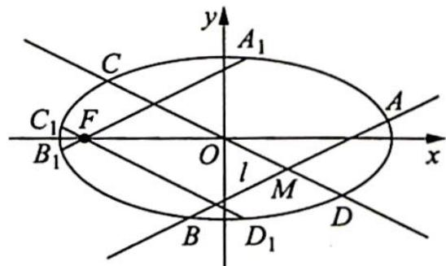

text_image

C
A₁
y
C₁ F
B₁ O l M D
x
B D₁

因为点 M 是 AB 的中点, 所以由椭圆的垂径定理, 可得 $k_{OM} \cdot k_{AB} = -\frac{b^{2}}{a^{2}} = -\frac{1}{4}$ , 又 $k_{AB} = \frac{1}{2}$ , 所以 $k_{OM} = -\frac{1}{2}$ , 直线 $A_{1}B_{1}, C_{1}D_{1}$ 的斜率分别为 $\frac{1}{2}, -\frac{1}{2}$ , 即直线 $A_{1}B_{1}, C_{1}D_{1}$ 的斜率互为相反数, 所以由椭圆的对称性可知 $|A_{1}B_{1}| = |C_{1}D_{1}|$ , $\frac{|MA||MB|}{|MC||MD|} = \frac{|A_{1}B_{1}|}{|C_{1}D_{1}|} = 1$ , 即 $|MA||MB| = |MC||MD|$ .

# 解后反思

# 圆锥曲线相交弦结论的推广

【推广】已知 AB 和 CD 是圆锥曲线 $\Gamma$ 的两条相交弦, 证明: 当且仅当直线 AB 和直线 CD 的倾斜角互补时, A, B, C, D 四点共圆.

【证明】设 AB 和 CD 交于点 M，直线 AB, CD 的倾斜角分别为 $\alpha$ 、 $\beta$ 。过焦点 F 作 $A_{1}B_{1} \parallel AB, C_{1}D_{1} \parallel CD$ ，分别交曲线 $\Gamma$ 于 $A_{1}, B_{1}$ 两点和 $C_{1}, D_{1}$ 两点，则由圆锥曲线的相交弦定理，可得 $\frac{|MA||MB|}{|MC||MD|} = \frac{|A_{1}B_{1}|}{|C_{1}D_{1}|}$ 。

又根据圆锥曲线的焦点弦长公式 $l = \frac{2ep}{1 - e^2\cos^2\alpha}$ ，可得 $\left\{ \begin{array}{l} |A_1B_1| = \frac{2ep}{1 - e^2\cos^2\alpha} \\ |C_1D_1| = \frac{2ep}{1 - e^2\cos^2\beta} \end{array} \right.$ ，所以 $A, B, C, D$ 四点共圆 $\Leftrightarrow |MA||MB| = |MC||MD| \Leftrightarrow |A_1B_1| = |C_1D_1| \Leftrightarrow \cos^2\alpha = \cos^2\beta \Leftrightarrow \cos \alpha = -\cos \beta \Leftrightarrow \alpha = \pi - \beta \Leftrightarrow$ 直线 $AB$ 和直线 $CD$ 的倾斜角互补.

变式(2) (2021 新高考全国 I 卷 21) 在平面直角坐标系 $xOy$ 中, 已知点 $F_{1}(-\sqrt{17},0)$ , $F_{2}(\sqrt{17},0)$ , 点 $M$ 满足 $|MF_{1}|-|MF_{2}|=2$ . 记 $M$ 的轨迹为 $C$ .

(1) 求 $C$ 的方程；

(2)设点 $T$ 在直线 $x = \frac{1}{2}$ 上, 过 $T$ 的两条直线分别交 $C$ 于 $A, B$ 两点和 $P, Q$ 两点, 且 $|TA||TB| = |TP||TQ|$ , 求直线 $AB$ 的斜率与直线 $PQ$ 的斜率之和.

解析 ▶ (1) 因为 $|MF_1| - |MF_2| = 2 < 2\sqrt{17} = |F_1F_2|$ , 所以轨迹 $C$ 为双曲线的右半支, $c^2 = 17, 2a = 2$ ,

所以 $a^{2}=1, b^{2}=16$ ，故 C 的方程为 $x^{2}-\frac{y^{2}}{16}=1(x\geqslant1)$ .

(2) 如图所示, 设 $T\left(\frac{1}{2}, n\right)$ , $AB: y - n = k_{1}\left(x - \frac{1}{2}\right)$ , 联立 $\left\{ \begin{array}{l} y - n = k_{1}\left(x - \frac{1}{2}\right) \\ x^{2} - \frac{y^{2}}{16} = 1 \end{array} \right.$ , 可得 $(16 - k_{1}^{2})x^{2} + (k_{1}^{2} - 2k_{1}n)x - \frac{1}{4}k_{1}^{2} - n^{2} + k_{1}n -$

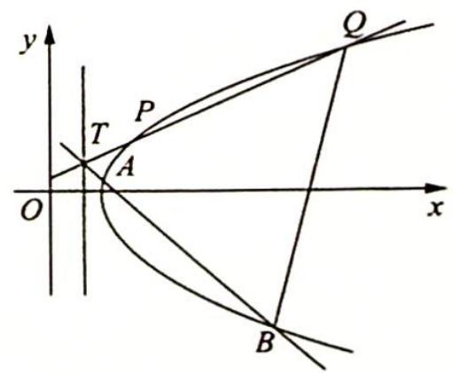

text_image

y
T
P
A
O
x
Q
B

16=0, 所以 $x_{1}+x_{2}=\frac{k_{1}^{2}-2k_{1}n}{k_{1}^{2}-16}$ , $x_{1}x_{2}=\frac{\frac{1}{4}k_{1}^{2}+n^{2}-k_{1}n+16}{k_{1}^{2}-16}$ , $|TA|=\sqrt{1+k_{1}^{2}}\left(x_{1}-\frac{1}{2}\right)$ , $|TB|=$ $\sqrt{1+k_{1}^{2}}\left(x_{2}-\frac{1}{2}\right)$ ，则 $|TA||TB|=(1+k_{1}^{2})\left(x_{1}-\frac{1}{2}\right)\left(x_{2}-\frac{1}{2}\right)=\frac{(n^{2}+12)(1+k_{1}^{2})}{k_{1}^{2}-16}$ .

设 $PQ: y - n = k_{2}\left(x - \frac{1}{2}\right)$ , 同理 $|TP||TQ| = \frac{(n^{2} + 12)(1 + k_{2}^{2})}{k_{2}^{2} - 16}$ .

因为 $|TA||TB| = |TP||TQ|$ ，所以 $\frac{1 + k_1^2}{k_1^2 - 16} = \frac{1 + k_2^2}{k_2^2 - 16}, 1 + \frac{17}{k_1^2 - 16} = 1 + \frac{17}{k_2^2 - 16}$ ，则 $k_1^2 - 16 = k_2^2 - 16$ ，即 $k_1^2 = k_2^2$ .

又 $k_{1} \neq k_{2}$ , 所以 $k_{1} + k_{2} = 0$ .

# 评注

运用直线的参数方程求解线段的乘积,计算效率更高,大家可以试试.

变式3 如图所示, 已知抛物线 $C: y^{2} = 2px (p > 0)$ 的焦点为点 $F$ , 直线 $y = 4$ 与 $y$ 轴的交点为点 $P$ , 与抛物线 $C$ 的交点为点 $Q$ , 且 $|QF| = \frac{5}{4} |PQ|$ .

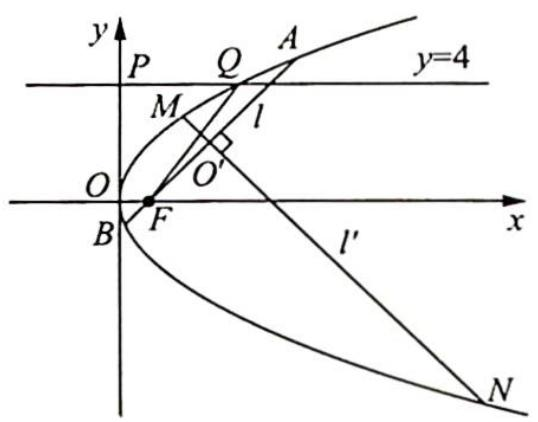

text_image

y
P Q A
y=4
M l
O O'
B F x
l'
N

(1)求抛物线 C 的方程；

(2)过点 F 的直线 l 与抛物线 C 相交于 A, B 两点, 若线段 AB 的垂直平分线 $l'$ 与抛物线 C 相交于 M, N 两点, 且 A, M, B, N 四点在同一个圆上, 求直线 l 的方程.

解析 (1) 设 $Q(x_{Q}, 4)$ , 代入抛物线 $C$ 的方程中, 可得 $4^{2} = 2px_{Q}$ , 所以 $x_{Q} = \frac{8}{p}$ .

根据抛物线的定义可得 $|QF| = x_{Q} + \frac{p}{2} = \frac{8}{p} + \frac{p}{2}$ , 又 $|PQ| = x_{Q} = \frac{8}{p}$ , 所以根据 $|QF| = \frac{5}{4} |PQ|$ , 可得 $\frac{8}{p} + \frac{p}{2} = \frac{5}{4} \times \frac{8}{p}$ , 解得 $p = 2$ (舍去负值).

故抛物线 C 的方程为 $y^{2}=4x$ .

(2)设 ${AB}$ 和 ${MN}$ 交于点 ${O}^{\prime }$ ,过点 $F$ 作 ${C}_{1}{D}_{1}//{MN}$ 交抛物线于 ${C}_{1},{D}_{1}$ 两点.

因为 $A, M, B, N$ 四点在同一个圆上, 所以 $|O'A||O'B|=|O'M||O'N|$ , 根据抛物线的相交弦定理, 可得 $\frac{|O'A||O'B|}{|O'M||O'N|}=\frac{|AB|}{|C_1D_1|}=1$ , 即 $|AB|=|C_1D_1|$ .

设直线 $AB$ 的倾斜角为 $\theta$ , 则直线 $C_1D_1$ 的倾斜角为 $\theta + \frac{\pi}{2}$ , 由抛物线的焦点弦长 $l = \frac{2ep}{1 - e^2\cos^2\alpha}$ , 可得 $\left\{ \begin{array}{l} |AB| = \frac{4}{1 - \cos^2\theta} \\ |C_1D_1| = \frac{4}{1 - \cos^2\left(\theta + \frac{\pi}{2}\right)} = \frac{4}{1 - \sin^2\theta} \end{array} \right.$ , 所以 $\frac{4}{1 - \cos^2\theta} = \frac{4}{1 - \sin^2\theta}$ , 解得 $\tan \theta = \pm 1$ .

又 $F(1,0)$ , 故直线 $l$ 的方程为 $y = x - 1$ 或 $y = -(x - 1)$ , 即 $x - y - 1 = 0$ 或 $x + y - 1 = 0$ .

# 14.5 圆锥曲线的蝴蝶定理

# 研究密钥

蝴蝶定理最开始是一个关于圆的定理, 因其图形像一只翩翩起舞的蝴蝶, 故被称为蝴蝶定理. 后来被推广到任意二次曲线之中, 一些试题的命题背景颇具蝴蝶定理的特色.

蝴蝶定理:如图所示,在圆锥曲线 $\Gamma$ 中,过弦 AB 的中点 M 任意作两条弦 CD 和 EF,直线 CE 与直线 DF 分别交直线 AB 于 P,Q 两点,则有 $|MP|=|MQ|$ .

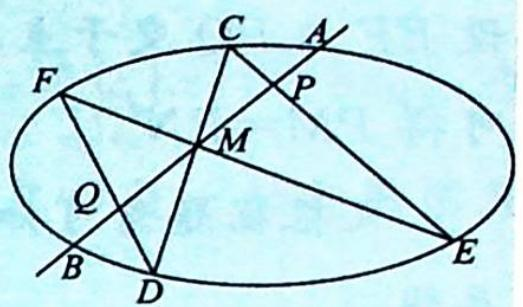

text_image

Geometric diagram of an ellipse with labeled points and intersecting lines, likely for a math problem or proof.

【证明】如图所示,以点 M 为原点,弦 AB 所在的直线为 y 轴,垂直 AB 的直线为 x 轴,建立直角坐标系.

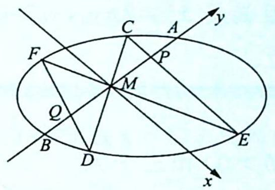

text_image

F
C
A
y
P
M
Q
B
D
E
x

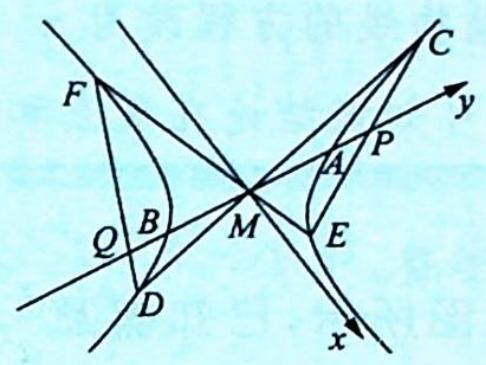

text_image

F
Q B
D
M
A P
E
C
y
x

设圆锥曲线 $\Gamma$ 的方程为 $ax^{2}+2bxy+cy^{2}+2dx+2ey+f=0(*), A(0,t), B(0,-t)$ ，可知 t,-t 是关于 y 的方程 $cy^{2}+2ey+f=0$ 的两个根，所以 e=0。

①若直线 $CD, EF$ 中有一条直线的斜率不存在, 则 $P, Q$ 两点和 $A, B$ 两点重合, 结论成立;  
②若直线 $CD, EF$ 的斜率都存在, 则设直线 $CD, EF$ 的方程分别为 $y = k_{1}x, y = k_{2}x$ , 且 $C(x_{1}, k_{1}x_{1}), D(x_{2}, k_{1}x_{2}), E(x_{3}, k_{2}x_{3}), F(x_{4}, k_{2}x_{4})$ , 则直线 $CE$ 的方程为 $y = \frac{k_{2}x_{3} - k_{1}x_{1}}{x_{3} - x_{1}} (x - x_{1}) + k_{1}x_{1}$ , 令 $x = 0$ , 可得 $y_{P} = \frac{x_{1}x_{3}(k_{1} - k_{2})}{x_{3} - x_{1}}$ .

同理可得 $y_{Q}=\frac{x_{2}x_{4}(k_{1}-k_{2})}{x_{4}-x_{2}}$ ，所以 $y_{P}+y_{Q}=\frac{(k_{1}-k_{2})\left[x_{3}x_{4}(x_{1}+x_{2})-x_{1}x_{2}(x_{3}+x_{4})\right]}{(x_{3}-x_{1})(x_{4}-x_{2})}$ .

将 $y=k_{1}x$ 代入 (\*) 式，得 $(a+2bk_{1}+ck_{1}^{2})x^{2}+(2d+2ek_{1})x+f=0$ ，由 e=0，可得

$$
\left\{ \begin{array}{l l} x _ {1} + x _ {2} = - \frac {2 d}{a + 2 b k _ {1} + c k _ {1} ^ {2}} \\ x _ {1} x _ {2} = \frac {f}{a + 2 b k _ {1} + c k _ {1} ^ {2}} \end{array} \right., \text {同理可得} \left\{ \begin{array}{l l} x _ {3} + x _ {4} = - \frac {2 d}{a + 2 b k _ {2} + c k _ {2} ^ {2}} \\ x _ {3} x _ {4} = \frac {f}{a + 2 b k _ {2} + c k _ {2} ^ {2}} \end{array} \right..
$$

所以 $y_{P} + y_{Q} = 0$ ，即 $|MP| = |MQ|$ .

例14.11 已知抛物线 $y = x^{2}$ 和三个点 $M(x_{0},y_{0}),P(0,y_{0}),N(-x_{0},y_{0})(y_{0}\neq x_{0}^{2},y_{0} > 0)$ ，过点 $M$ 的一条直线交抛物线于 $A,B$ 两点， $AP,BP$ 的延长线分别交抛物线于 $E,F$ 两点，证明： $E,F,N$ 三点共线。

分析 ▶ 连接 EF 与 $y = y_{0}$ 交于一点, 证明这个点与 N 点为同一点即可. 根据圆锥曲线的蝴蝶定理结合线段长度的等量关系确定此两点为同一点.

解析 如图所示,作直线 $y=y_{0}$ 交抛物线于 Q,R 两点,连接 EF,设 EF 与 PQ 交于点 $N'$ , 因为 PQ=PR, 所以根据圆锥曲线的蝴蝶定理,可得 $PM=PN'$ .

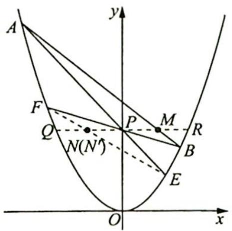

text_image

A
y
F
P
M
Q
N(N)
R
B
E
O
x

又根据题意可知 $PM = PN$ ，所以 $N'$ ， $N$ 两点重合，故 $E, F, N$ 三点共线。

# 评注

如果将抛物线的方程改为 $x^{2} = 2py (p > 0)$ , 且满足 $x_{0}^{2} \neq 2py_{0}, y_{0} > 0$ , 那么结论仍然成立, 同理可知该结论在椭圆和双曲线中也成立.

变式 1 如图所示, 已知椭圆 $\frac{x^{2}}{a^{2}} + \frac{y^{2}}{b^{2}} = 1 (a > b > 0)$ 和三个点 $M(x_{0}, y_{0}), P(0, y_{0}), N(-x_{0}, y_{0}) \left( \frac{x_{0}^{2}}{a^{2}} + \frac{y_{0}^{2}}{b^{2}} < 1, -b < y_{0} < 0 \right)$ , 过点 $M$ 的一条直线交椭圆于 $A, B$ 两点, $AP, BP$ 的延长线分别交椭圆于 $E, F$ 两点, 证明: $E, F, N$ 三点共线.

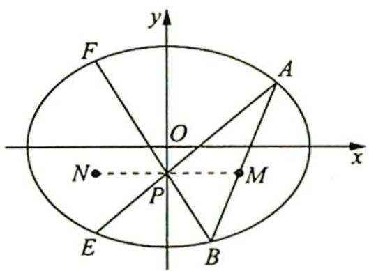

text_image

y
F
O
A
x
N
P
M
E
B

证明 如图所示,作直线 $y=y_{0}$ 交椭圆于 Q,R 两点,连接 EF,设 EF 与 PQ 交于点 $N'$ .

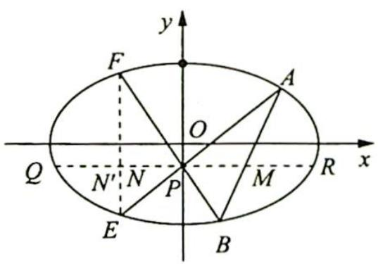

text_image

y
F
O
A
Q
N'
N
P
M
R
x
E
B

因为 PQ=PR，所以根据圆锥曲线的蝴蝶定理，可得 $PM=PN'$ ，又根据题意可知 PM=PN，所以 $N'$ ，N 两点重合，点 N 在直线 EF 上.

故 E, F, N 三点共线.

例 14.12 (2003 北京卷理 18) 如图所示, 已知椭圆的长轴 $A_{1}A_{2}$ 与 $x$ 轴平行, 短轴 $B_{1}B_{2}$ 在 $y$ 轴上, 中心为 $M(0,r)(b>r>0)$ .

(1) 写出椭圆的方程并求出焦点坐标和离心率；  
(2) 设直线 $y = k_{1}x$ 与椭圆交于 $C(x_{1}, y_{1})$ ,

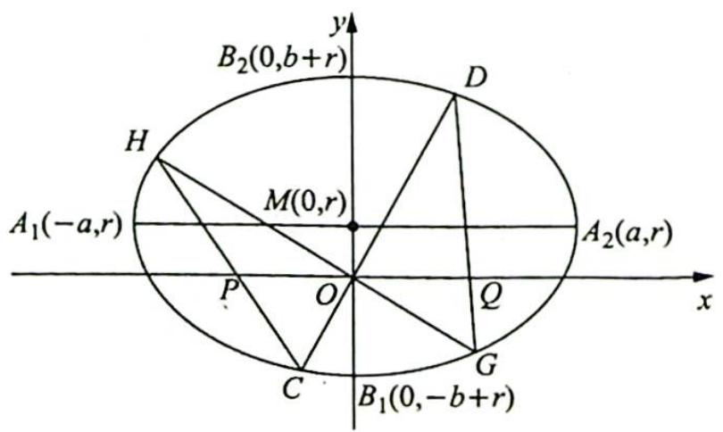

text_image

B₂(0,b+r)
H
A₁(-a,r)
M(0,r)
P
O
Q
C
B₁(0,-b+r)
D
A₂(a,r)
G
x
y

$D(x_{2},y_{2})(y_{2} > 0)$ ，直线 $y = k_{2}x$ 与椭圆交于 $G(x_3,y_3),H(x_4,y_4)(y_4 > 0)$ ，求证： $\frac{k_1x_1x_2}{x_1 + x_2} =$ $\frac{k_2x_3x_4}{x_3 + x_4};$

(3)对于(2)中的 C, D, G, H 四点, 设 CH 交 x 轴于点 P, GD 交 x 轴于点 Q, 求证: $|OP| = |OQ|$ (证明过程不考虑 GH 或 CD 垂直于 x 轴的情形).

分析 ▶ (1)通过平移得焦点坐标,离心率同中心在原点的椭圆;(2)曲直联立后进行坐标运算,得出 $\frac{k_{1}x_{1}x_{2}}{x_{1}+x_{2}}$ 与 $\frac{k_{2}x_{3}x_{4}}{x_{3}+x_{4}}$ 的相等关系;(3)思路一:要证|OP|=|OQ|,即证|x $_{P}$ |=|x $_{Q}$ |,也即证 $x_{P}+x_{Q}=0$ ,所以分别表示出 $x_{P},x_{Q}$ ,证明 $x_{P}+x_{Q}=0$ ;思路二:因为点O是x轴与椭圆相交所得弦的中点,直接应用圆锥曲线的蝴蝶定理.

解析 (1) 椭圆的方程为 $\frac{x^2}{a^2} + \frac{(y - r)^2}{b^2} = 1$ , 焦点坐标为 $(\pm \sqrt{a^2 - b^2}, r)$ , 离心率为 $\frac{\sqrt{a^2 - b^2}}{a}$ .

(2) 将直线 $CD$ 的方程 $y = k_{1}x$ 代入椭圆的方程 $\frac{x^{2}}{a^{2}} + \frac{(y - r)^{2}}{b^{2}} = 1$ 中, 整理得 $(b^{2} + a^{2}k_{1}^{2})x^{2} - 2k_{1}a^{2}rx + (a^{2}r^{2} - a^{2}b^{2}) = 0$ .

根据韦达定理, 得 $\left\{\begin{aligned}x_{1}+x_{2}&=\frac{2k_{1}a^{2}r}{b^{2}+a^{2}k_{1}^{2}}\\ x_{1}x_{2}&=\frac{a^{2}r^{2}-a^{2}b^{2}}{b^{2}+a^{2}k_{1}^{2}}\end{aligned}\right.$ ，所以 $\frac{x_{1}x_{2}}{x_{1}+x_{2}}=\frac{r^{2}-b^{2}}{2k_{1}r}$ .

同理可得 $\frac{x_3x_4}{x_3 + x_4} = \frac{r^2 - b^2}{2k_2r}$ 则 $\frac{k_1x_1x_2}{x_1 + x_2} = \frac{r^2 - b^2}{2r} = \frac{k_2x_3x_4}{x_3 + x_4}$ .

(3)证法一(坐标运算): 根据 C, P, H 三点共线, 可得 $\frac{y_{4}}{x_{4}-x_{P}} = \frac{y_{1}}{x_{1}-x_{P}}$ , 即 $\frac{k_{2}x_{4}}{x_{4}-x_{P}} = \frac{k_{1}x_{1}}{x_{1}-x_{P}}$ , 解得 $x_{P} = \frac{(k_{1}-k_{2})x_{1}x_{4}}{k_{1}x_{1}-k_{2}x_{4}}$ , 同理可得 $x_{Q} = \frac{(k_{1}-k_{2})x_{2}x_{3}}{k_{1}x_{2}-k_{2}x_{3}}$ .

根据(2)中的结论 $\frac{k_1x_1x_2}{x_1 + x_2} = \frac{k_2x_3x_4}{x_3 + x_4}$ , 可得

$$
x _ {P} + x _ {Q} = \frac {(k _ {1} - k _ {2}) [ k _ {1} x _ {1} x _ {2} (x _ {3} + x _ {4}) - k _ {2} x _ {3} x _ {4} (x _ {1} + x _ {2}) ]}{(k _ {1} x _ {1} - k _ {2} x _ {4}) (k _ {1} x _ {2} - k _ {2} x _ {3})} = 0,
$$

所以 $|x_{P}| = |x_{Q}|$ ，即 $|OP| = |OQ|$ .

证法二(蝴蝶定理): 因为点 O 是 x 轴与椭圆相交所得弦的中点, 且 CH 交 x 轴于点 P, GD 交 x 轴于点 Q, 所以根据圆锥曲线的蝴蝶定理, 可得 $\left|OP\right| = \left|OQ\right|$ .

# 圆锥曲线的光学性质及其应用

# 14.6 圆锥曲线的光学性质

# 研究密钥

圆锥曲线的光学性质背后蕴含着奇妙的数学关系. 要探究圆锥曲线的光学性质, 首先必须将这样一个光学实际问题, 转化为数学问题, 用我们学过的知识进行解释论证.

# 1. 椭圆的光学性质

从椭圆一个焦点发出的光,经过椭圆反射后,反射光线都汇聚到椭圆的另一个焦点上.椭圆的这种光学特性,常被用来设计一些照明设备或聚热装置.

# 2. 双曲线的光学性质

从双曲线一个焦点发出的光,经过双曲线反射后,反射光线的反向延长线都汇聚到双曲线的另一个焦点.双曲线的这种反向虚聚焦性质,常被用在天文望远镜的设计等方面.

# 3. 抛物线的光学性质

从抛物线的焦点发出的光,经过抛物线反射后,反射光线都平行于抛物线的轴.抛物线这种聚焦特性,成为聚能装置或定向发射装置的最佳选择.

以下就将圆锥曲线的光学性质用数学的方法进行解释论证.

例 14.13 (椭圆的光学性质): 如图所示, 从椭圆的一个焦点发出的光, 经过椭圆反射后, 反射光线都汇聚到椭圆的另一个焦点上. 用数学语言描述为: 设椭圆的方程为 $\frac{x^{2}}{a^{2}} + \frac{y^{2}}{b^{2}} = 1 (a > b > 0)$ , 左、右焦点分别为 $F_{1}, F_{2}$ , 直线 $l$ 是过椭圆上任意一点 $P$ 处的切线, 直线 $l'$ 为垂直于直线 $l$ 且过点 $P$ 的椭圆的法线, 交 $x$ 轴于点 $D$ , 则 $\angle F_{1}PD = \angle$

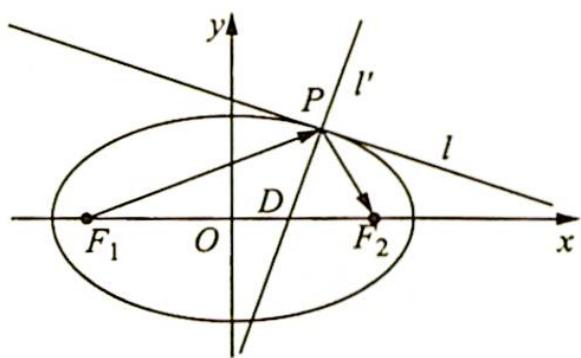

text_image

y
P
l'
l
D
F₁ O F₂ x

分析 ▶ 思路一: 将角的关系转化为边的关系, 考虑三角形的角平分线的判定定理, 要证 $\angle F_{1}PD = \angle F_{2}PD$ , 即证 $\frac{|F_{1}D|}{|DF_{2}|} = \frac{|PF_{1}|}{|PF_{2}|}$ , 结合椭圆的焦半径公式证明此等式; 思路二: 将角的关系转化为坐标的关系, 利用两条直线的到角公式将 $\tan \angle F_{1}PD$ 与 $\tan \angle F_{2}PD$ 用坐标表示出来进行比较.

解析 ▶ 证法一:设点 $P(x_0, y_0)$ , 则切线 $l$ 的方程为 $\frac{x_0 x}{a^2} + \frac{y_0 y}{b^2} = 1$ .

利用直线的点斜式可知法线 $l'$ 的方程为 $\frac{y_0}{b^2} (x - x_0) - \frac{x_0}{a^2} (y - y_0) = 0$ ，在 $l'$ 的方程中，令 $y =$

0 得 $x = \frac{c^2}{a^2} x_0$ ，所以 $D\left(\frac{c^2}{a^2} x_0, 0\right), \frac{|F_1 D|}{|DF_2|} = \frac{\left|\frac{c^2}{a^2} x_0 + c\right|}{\left|c - \frac{c^2}{a^2} x_0\right|} = \frac{|a^2 + cx_0|}{|a^2 - cx_0|}$ .

由椭圆焦半径公式得 $|PF_1| = a + ex_0 = \frac{a^2 + cx_0}{a}, |PF_2| = a - ex_0 = \frac{a^2 - cx_0}{a}$ , 所以 $\frac{|F_1D|}{|DF_2|} = \frac{|PF_1|}{|PF_2|}$ , 则由三角形的角平分线的判定定理可知 $\angle F_1PD = \angle F_2PD$ .

证法二:设点 $P(x_{0},y_{0})$ ，则切线 l 的方程为 $\frac{x_{0}x}{a^{2}}+\frac{y_{0}y}{b^{2}}=1$ ，所以法线 $l'$ 的斜率为 $k_{l'}=\frac{a^{2}y_{0}}{b^{2}x_{0}}$ .

又因为直线 $PF_{1}$ 和直线 $PF_{2}$ 的斜率分别为 $k_{PF_1} = \frac{y_0}{x_0 + c}, k_{PF_2} = \frac{y_0}{x_0 - c}$ , 所以利用两条直线的到角公式可得 $\tan \angle F_{1}PD = \frac{k_{l'} - k_{PF_1}}{1 + k_{l'}k_{PF_1}} = \frac{\frac{a^2y_0}{b^2x_0} - \frac{y_0}{x_0 + c}}{1 + \frac{a^2y_0}{b^2x_0} \cdot \frac{y_0}{x_0 + c}} = \frac{c^2x_0y_0 + a^2cy_0}{b^2x_0^2 + a^2y_0^2 + b^2cx_0} = \frac{c^2x_0y_0 + a^2cy_0}{a^2b^2 + b^2cx_0} = \frac{c y_0}{b^2}.$

同理可得 $\tan \angle F_{2}PD = \frac{cy_{0}}{b^{2}}$ ，所以 $\tan \angle F_{1}PD = \tan \angle F_{2}PD$ ，即 $\angle F_{1}PD = \angle F_{2}PD$ .

例 14.14 (双曲线的光学性质) 如图所示, 从双曲线的一个焦点发出的光, 经过双曲线反射后, 反射光线的反向延长线都经过双曲线的另一个焦点. 用数学语言描述为设双曲线的方程为 $\frac{x^2}{a^2} - \frac{y^2}{b^2} = 1 (a, b > 0)$ , 左、右焦点分别为 $F_1, F_2$ , 直线 $l$ 是过双曲线上任意一点 $P$ 处的切线, 交 $x$ 轴于点 $D$ , 则 $\angle F_1PD = \angle F_2PD$ .

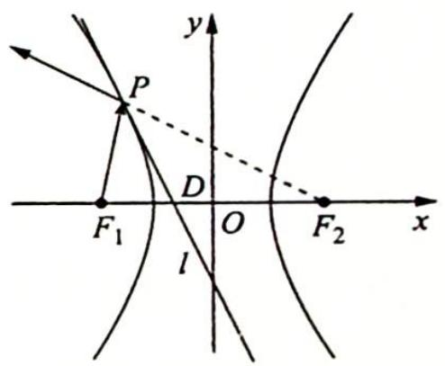

text_image

y
P
D
F₁ O F₂ x
l

分析 ▶ 思路一: 将角的关系转化为边的关系, 考虑三角形的角平分线的判定定理, 要证 $\angle F_{1}PD = \angle F_{2}PD$ , 即证 $\frac{|F_{1}D|}{|DF_{2}|} = \frac{|PF_{1}|}{|PF_{2}|}$ , 结合双曲线的焦半径公式证明此等式; 思路二: 将角的关系转化为坐标的关系, 利用两条直线的到角公式将 $\tan\angle F_{1}PD$ 与 $\tan\angle F_{2}PD$ 用坐标表示出来进行比较.

解析 ▶ 证法一: 设点 $P(x_0, y_0)$ , 则切线 $l$ 的方程为 $\frac{x_0 x}{a^2} - \frac{y_0 y}{b^2} = 1$ , 令 $y = 0$ 得 $x = \frac{a^2}{x_0}$ , 则 $D\left(\frac{a^2}{x_0}, 0\right)$ , 所以 $\frac{|F_1 D|}{|DF_2|} = \frac{\left|\frac{a^2}{x_0} + c\right|}{\left|c - \frac{a^2}{x_0}\right|} = \frac{|a^2 + cx_0|}{|a^2 - cx_0|}$ .

由双曲线的焦半径公式得 $\left\{\begin{aligned}|PF_{1}|&=|-a-ex_{0}|=\left|-\frac{a^{2}+cx_{0}}{a}\right|\\ |PF_{2}|&=|a-ex_{0}|=\left|\frac{a^{2}-cx_{0}}{a}\right|\end{aligned}\right.$ ，所以 $\frac{|F_{1}D|}{|DF_{2}|}=\frac{|PF_{1}|}{|PF_{2}|}$ .

故由三角形的角平分线的判定定理可知 $\angle F_{1}PD = \angle F_{2}PD.$

证法二:设点 $P(x_{0},y_{0})$ ，则切线 l 的方程为 $\frac{x_{0}x}{a^{2}}-\frac{y_{0}y}{b^{2}}=1$ ，其斜率为 $k_{l}=\frac{b^{2}x_{0}}{a^{2}y_{0}}$ .

又因为直线 $PF_{1}$ 和直线 $PF_{2}$ 的斜率分别为 $k_{PF_1} = \frac{y_0}{x_0 + c}, k_{PF_2} = \frac{y_0}{x_0 - c}$ , 所以由两条直线的到角公式得 $\tan \angle F_{1}PD = \frac{k_l - k_{PF_1}}{1 + k_l k_{PF_1}} = \frac{\frac{b^2 x_0}{a^2 y_0} - \frac{y_0}{x_0 + c}}{1 + \frac{b^2 x_0}{a^2 y_0} \cdot \frac{y_0}{x_0 + c}} = \frac{b^2 x_0^2 - a^2 y_0^2 + b^2 cx_0}{(a^2 + b^2)x_0y_0 + a^2 cy_0} = \frac{a^2 b^2 + b^2 cx_0}{c^2 x_0y_0 + a^2 cy_0} = \frac{b^2}{cy_0}$ .

同理得 $\tan \angle F_{2}PD = \frac{b^{2}}{cy_{0}}$ ，所以 $\tan \angle F_{1}PD = \tan \angle F_{2}PD$ ，即 $\angle F_{1}PD = \angle F_{2}PD$ .

例 14.15 (抛物线的光学性质) 如图所示, 从抛物线的一个焦点发出的光, 经过抛物线反射后, 反射光线平行于抛物线的对称轴. 用数学语言描述为设抛物线的方程为 $y^{2} = 2px (p > 0)$ , 焦点为 $F$ , 直线 $l$ 是过抛物线上任意一点 $P$ 处的切线, 交 $x$ 轴于点 $D$ , 则 $\angle FDP = \angle FPD$ .

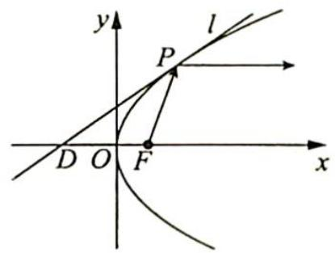

text_image

y
l
P
D O F x

分析 ▶ 思路一: 将角的关系转化为边的关系, 要证 $\angle FDP = \angle FPD$ , 即证 $|DF| = |PF|$ , 结合抛物线焦半径公式证明此等式; 思路二: 将角的关系转化为坐标的关系, 利用两条直线的到角公式将 $\tan \angle FDP$ 与 $\tan \angle FPD$ 用坐标表示出来进行比较来证明.

解析 ▶ 证法一: 设点 $P(x_0, y_0)$ , 则切线 $l$ 的方程为 $y_0y = p(x + x_0)$ , 令 $y = 0$ 得 $x = -x_0$ , 所以 $D(-x_0, 0), |DF| = \frac{p}{2} + x_0$ .

由抛物线的焦半径公式得 $|PF| = x_0 - \left(-\frac{p}{2}\right) = x_0 + \frac{p}{2}$ , 所以 $|DF| = |PF|$ , 则 $\angle FDP = \angle FPD$ .

证法二:设点 $P(x_{0},y_{0})$ ，则切线 l 的方程为 $y_{0}y=p(x+x_{0})$ ，所以 $\tan\angle FDP=k_{l}=\frac{p}{y_{0}}$ .

又因为直线 $PF$ 的斜率为 $k_{PF} = \frac{y_0}{x_0 - \frac{p}{2}}$ , 所以由两条直线的到角公式得 $\tan \angle FPD =$

$$
\begin{array}{r l} & {\frac {k _ {P F} - k _ {l}}{1 + k _ {P F} k _ {l}} = \frac {\frac {y _ {0}}{x _ {0} - \frac {p}{2}} - \frac {p}{y _ {0}}}{1 + \frac {y _ {0}}{x _ {0} - \frac {p}{2}} \cdot \frac {p}{y _ {0}}} = \frac {y _ {0} ^ {2} - p x _ {0} + \frac {p ^ {2}}{2}}{x _ {0} y _ {0} + \frac {p y _ {0}}{2}} = \frac {\frac {y _ {0} ^ {2}}{2} + \frac {p ^ {2}}{2}}{\frac {y _ {0} ^ {3}}{2 p} + \frac {p y _ {0}}{2}} = \frac {p}{y _ {0}}, \text {则} \tan \angle F D P = \tan \angle F P D, \text {即}} \\ & {\angle F D P = \angle F P D.} \end{array}
$$

# 14.7 光学性质应用

# 研究密钥

近年来, 涉及圆锥曲线的焦半径、切线等相关的问题在高考、自主招生及各类数学竞赛中频频出现. 对于这类问题, 如果利用解析法求解, 运算量较大, 正确率也并不高, 但利用圆锥曲线的光学性质求解, 思路简洁, 会给人耳目一新的感觉, 同时以圆锥曲线的光学性质为背景还可以编拟有趣的新命题, 也便于学生理解和掌握. 把圆锥曲线的切线想象成一面小小的平面镜, 不失为一种好办法, 在应用圆锥曲线的光学性质时, 还要注意应用光线的路程最短、光路可逆等性质.

例14.16 已知点 $P$ 在抛物线 $y = x^{2}(x > 0)$ 上，点 $A$ 的坐标为 $\left(-\frac{1}{3}, 0\right)$ ，抛物线在点 $P$ 处的切线与 $y$ 轴及直线 $PA$ 的夹角相等，求点 $P$ 的坐标。

分析 ▶ 由夹角相等的条件及抛物线的光学性质可知焦点 F 在直线 PA 上, 设出点 P 坐标, 由 $k_{FA} = k_{PF}$ 列方程求 P 点横坐标.

解析 如图所示, 设抛物线的焦点为 $F$ , 则 $F\left(0, \frac{1}{4}\right)$ , 因为抛物线在点 $P$ 处的切线与 $y$ 轴及直线 $PA$ 的夹角相等, 即 $\angle 1 = \angle 2$ , 所以平行于 $y$ 轴的入射光线 $BP$ 经抛物线反射后的反射光线为射线 $PA$ . 根据抛物线的光学性质及光路的可逆性知: 焦点 $F$ 在直线 $PA$ 上.

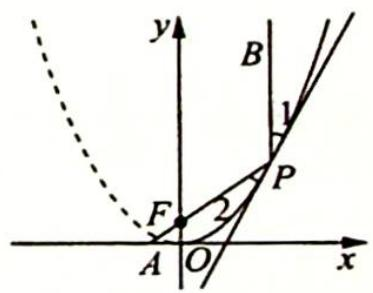

text_image

y
B
1
F
2
P
A
O
x

设 $P(x_0, x_0^2)(x_0 > 0)$ , 则 $\frac{x_0^2 - \frac{1}{4}}{x_0 - 0} = \frac{0 - \frac{1}{4}}{-\frac{1}{3} - 0}$ , 解得 $x_0 = 1$ 或 $x_0 = -\frac{1}{4}$ (舍去), 所以点 $P$ 的坐标为 $(1, 1)$ .

例 14.17 (2010 安徽卷理 19) 已知椭圆 E 经过点 A(2,3)，对称轴为坐标轴，焦点 $F_{1}, F_{2}$ 在 x 轴上，离心率 $e = \frac{1}{2}$ .

(1) 求椭圆 E 的方程；

(2) 求 $\angle F_{1}AF_{2}$ 的平分线所在直线 l 的方程；

(3)在椭圆 E 上是否存在关于直线 l 对称的相异两点？若存在，请找出；若不存在，说明理由.

分析 (1) 已知椭圆基本量, 待定系数法求椭圆方程. (2) 由椭圆的光学性质可知 $\angle F_{1} A F_{2}$ 的平分线为椭圆 $E$ 在点 $A$ 处的法线, 而在该点处的切线易求, 则此法线也易求. (3) 假设在椭圆 $E$ 上存在关于直线 $l$ 对称的相异两点, 设出两点所在方程, 将中点坐标用引入的参数表示出来. 另一方面, 该中点又在法线 $l$ 上, 将坐标代入法线 $l$ 的方程, 若能求出满足要求的解, 则存在; 否则, 则不存在.

解析 (1)设椭圆 $E$ 的方程为 $\frac{x^2}{a^2} +\frac{y^2}{b^2} = 1(a > b > 0)$

根据题意可得 $\left\{ \begin{array}{l} \frac{4}{a^2} + \frac{9}{b^2} = 1 \\ \frac{c}{a} = \frac{1}{2} \\ a^2 - b^2 = c^2 \end{array} \right.$ ，解得 $\left\{ \begin{array}{l} a^2 = 16 \\ b^2 = 12 \end{array} \right.$ ，所以椭圆 $E$ 的方程为 $\frac{x^2}{16} + \frac{y^2}{12} = 1$ .

(2)如图所示,由椭圆的光学性质可知直线 l 为椭圆 E 在点 A(2,3) 处的法线,易求得椭圆 E 在点 A(2,3) 处的切线方程为 $\frac{2x}{16} + \frac{3y}{12} = 1$ , 其斜率为 $-\frac{1}{2}$ , 所以法线 l 的斜率为 $k_{l} = -\frac{1}{-\frac{1}{2}} = 2$ , 其方程为 y - 3 = 2(x - 2), 即 2x - y - 1 = 0.

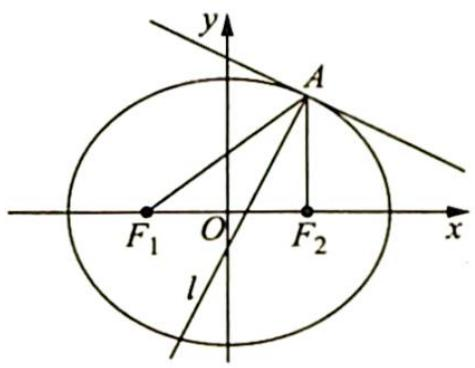

text_image

y
A
F₁ O F₂ x
l

(3)假设在椭圆 $E$ 上存在关于直线 $l$ 对称的相异两点 $B(x_{1},y_{1}),C(x_{2},y_{2})$ ，则直线 $BC$ 的斜率为 $-\frac{1}{k_l} = -\frac{1}{2}$ ，设其方程为 $y = -\frac{1}{2} x + m$ ，联立方程组 $\left\{ \begin{array}{l} \frac{x^2}{16} +\frac{y^2}{12} = 1 \\ y = -\frac{1}{2} x + m \end{array} \right.$ ，得 $x^{2} - mx + m^{2} - 12 = 0$ ，则由 $\Delta = (-m)^2 -4(m^2 -12) > 0$ 解得 $m\in (-4,4)$ .且 $x_{1} + x_{2} = m$ ，所以 $y_{1} + y_{2} =$ $-\frac{1}{2} (x_1 + x_2) + 2m = \frac{3m}{2}$

$BC$ 的中点坐标为 $\left(\frac{x_1 + x_2}{2}, \frac{y_1 + y_2}{2}\right)$ , 即 $\left(\frac{m}{2}, \frac{3m}{4}\right)$ , 该点在直线 $l$ 上, 则 $2 \cdot \frac{m}{2} - \frac{3m}{4} - 1 = 0$ , 解得 $m = 4$ , 与 $m \in (-4, 4)$ 矛盾, 所以假设不正确, 即在椭圆 $E$ 上不存在关于直线 $l$ 对称的相异两点.

变式(1) (东北三省 2020 届高三一模理 12) 已知双曲线 $x^{2} - \frac{y^{2}}{3} = 1$ 的左、右焦点分别为

$F_{1}, F_{2}$ ，点 P 在双曲线上，且 $\angle F_{1}PF_{2}=120^{\circ}$ ， $\angle F_{1}PF_{2}$ 的平分线交 x 轴于点 A，则 $|PA|=(\quad)$ .

A. $\frac{\sqrt{5}}{5}$

B. $\frac{2 \sqrt{5}}{5}$

C. $\frac{3 \sqrt{5}}{5}$

D. $\sqrt{5}$

解析 ▶ 由双曲线的对称性, 不妨设 $P$ 在右支上, 如图所示, 设 $|PF_1| = m$ , $|PF_2| = m - 2$ , $|F_1F_2| = 2c = 4$ , 则 $\cos 120^\circ = -\frac{1}{2} = \frac{m^2 + (m - 2)^2 - 16}{2m(m - 2)}$ , 得 $m^2 + m^2 - 4m + 4 - 16 = -m(m - 2)$ , 即 $2m^2 - 4m - 12 + m^2 - 2m = 0$ , $3m^2 - 6m - 12 = 0$ , $m^2 - 2m - 4 = 0$ , $m = \frac{2 \pm 2\sqrt{5}}{2} = 1 \pm \sqrt{5}$ ,

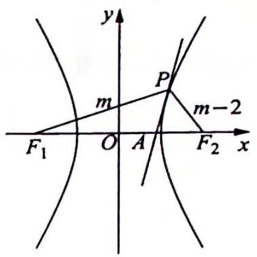

text_image

y
m
P
m-2
F₁ O A F₂ x

因此 $\left|PF_{1}\right|=1+\sqrt{5},\left|PF_{2}\right|=\sqrt{5}-1.$

$$
S _ {\triangle P F _ {1} F _ {2}} = \frac {b ^ {2}}{\tan \frac {\theta}{2}} = \frac {3}{\tan \frac {\pi}{3}} = \sqrt {3} = \frac {1}{2} | P F _ {1} | | P A | \sin 6 0 ^ {\circ} + \frac {1}{2} | P F _ {2} | | P A | \sin 6 0 ^ {\circ} =
$$

$\frac{\sqrt{3}}{4} |PA| (|PF_1| + |PF_2|)$ , 又 $|PF_1| = 1 + \sqrt{5}$ , $|PF_2| = \sqrt{5} - 1$ , 则 $\sqrt{3} = \frac{\sqrt{3}}{4} |PA| \cdot 2\sqrt{5}$ , 因此 $|PA| = \frac{2}{\sqrt{5}} = \frac{2\sqrt{5}}{5}$ . 故选 B.

例 14.18 (2013 山东卷理 22) 椭圆 $C: \frac{x^2}{a^2} + \frac{y^2}{b^2} = 1 (a > b > 0)$ 的左、右焦点分别是 $F_1, F_2$ ，离心率为 $\frac{\sqrt{3}}{2}$ ，过点 $F_1$ 且垂直于 $x$ 轴的直线被椭圆 $C$ 截得的线段长为 1。

(1) 求椭圆 C 的方程；  
(2) 点 $P$ 是椭圆 $C$ 上除长轴端点外的任一点, 连接 $PF_{1}, PF_{2}$ , 设 $\angle F_{1}PF_{2}$ 的角平分线 $PM$ 交椭圆 $C$ 的长轴于点 $M(m,0)$ , 求 $m$ 的取值范围;  
(3)在(2)的条件下,过点 $P$ 作斜率为 $k$ 的直线 $l$ ,使得直线 $l$ 与椭圆 $C$ 有且只有一个公共点.设直线 $PF_{1},PF_{2}$ 的斜率分别为 $k_{1}, k_{2}$ ,若 $k \neq 0$ ,试证明 $\frac{1}{kk_1} + \frac{1}{kk_2}$ 为定值,并求出这个定值.

分析 ▶ (1)已知椭圆基本量,用待定系数法求椭圆方程;(2)根据椭圆的光学性质知PM是法线,其方程易求.令y=0,将m表示为P点横坐标 $x_{0}$ 的函数,借 $x_{0}$ 范围得出m的范围.(3)证明 $\frac{1}{kk_{1}}+\frac{1}{kk_{2}}$ 为定值并求得这个定值,需将其用 $x_{0},y_{0}$ 表示并整理,看参数是否约去得出定值.表示斜率k时,由于l是点P处的切线,其方程和斜率易得.

解析 (1)由题意可得点 $(-c, \pm \frac{1}{2})$ 均在椭圆 $C$ 上, 所以有 $\frac{c^2}{a^2} + \frac{1}{4b^2} = 1$ .

再结合 $\left\{\begin{aligned}\frac{c}{a}&=\frac{\sqrt{3}}{2}\\ a^{2}-b^{2}&=c^{2}\end{aligned}\right.$ ，可得 $\left\{\begin{aligned}a^{2}&=4\\ b^{2}&=1\end{aligned}\right.$ ，所以椭圆C的方程为 $\frac{x^{2}}{4}+y^{2}=1$ .

(2)如图所示,设 $P(x_0,y_0)$ , 过点 $P$ 作椭圆的切线 $l$ , 其方程为 $\frac{x_0x}{4} + y_0y = 1$ , 则根据椭圆的光学性质可得: 直线 $PM$ 是椭圆在点 $P$ 处的法线, 其斜率为 $-\frac{1}{k_l} = \frac{4y_0}{x_0}$ , 方程为 $y - y_0 = \frac{4y_0}{x_0}(x - x_0)$ .

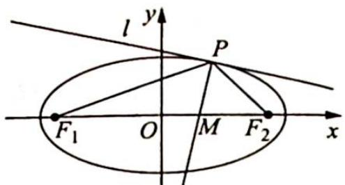

text_image

l y
P
F₁ O M F₂ x

令 $y = 0$ ，可得 $m = \frac{3}{4} x_0$ ，因为 $-2 < x_0 < 2$ ，所以 $m$ 的取值范围是 $\left(-\frac{3}{2}, \frac{3}{2}\right)$ .

(3)因为直线 l 与椭圆 C 有且只有一个公共点,所以直线 l 是椭圆 C 在点 P 处的切线,其方程为 $\frac{x_{0}x}{4} + y_{0}y = 1$ , 斜率为 $k = -\frac{x_{0}}{4y_{0}}$ .

又因为 $k_{1} = \frac{y_{0}}{x_{0} + c}, k_{2} = \frac{y_{0}}{x_{0} - c}$ , 所以 $\frac{1}{kk_1} + \frac{1}{kk_2} = -\frac{4y_0}{x_0} \left( \frac{x_0 + c}{y_0} + \frac{x_0 - c}{y_0} \right) = -\frac{4y_0}{x_0} \cdot \frac{2x_0}{y_0} = -8$ , 故 $\frac{1}{kk_1} + \frac{1}{kk_2}$ 的值为定值, 定值为-8.

变式 1 双曲线 $C: \frac{x^2}{a^2} - \frac{y^2}{b^2} = 1 (a, b > 0)$ 的左、右焦点分别是 $F_1, F_2$ ，点 $P$ 是双曲线 $C$ 上除实轴端点外的任一点，连接 $PF_1, PF_2$ ，设 $\angle F_1PF_2$ 的角平分线 $PM$ 交双曲线 $C$ 的实轴于点 $M(m,0)$ .

(1) 求 m 的取值范围；

(2)过点 P 作斜率为 k 的直线 l，使得直线 l 与双曲线 C 有且只有一个公共点。设直线 $PF_{1}$ ， $PF_{2}$ 的斜率分别为 $k_{1}, k_{2}$ ，若 $k \neq 0$ ，试证明 $\frac{1}{kk_{1}} + \frac{1}{kk_{2}}$ 为定值，并求出这个定值。

解析 (1)如图所示, 设 $P(x_0, y_0)$ , 因为 $PM$ 是 $\angle F_1PF_2$ 的角平分线, 所以根据双曲线的光学性质可得: 直线 $PM$ 是双曲线在点 $P$ 处的切线, 其方程为 $\frac{x_0x}{a^2} - \frac{y_0y}{b^2} = 1$ .

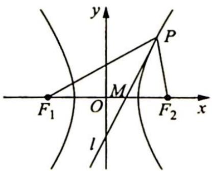

text_image

y
P
M
F₁ O F₂ x
l

令 $y = 0$ ，可得 $m = \frac{a^2}{x_0}$ ，又 $x_0 \in (-\infty, -a) \cup (a, +\infty)$ ，所以 $m$ 的取值范围是 $(-a, 0) \cup (0, a)$ .

(2)因为直线 l 与双曲线 C 有且只有一个公共点,所以直线 l 是双曲线 C 在点 P 处的切线,其方程为 $\frac{x_{0}x}{a^{2}} - \frac{y_{0}y}{b^{2}} = 1$ , 斜率为 $k = \frac{b^{2}x_{0}}{a^{2}y_{0}}$ .

又因为 $k_{1} = \frac{y_{0}}{x_{0} + c}, k_{2} = \frac{y_{0}}{x_{0} - c}$ , 所以 $\frac{1}{kk_{1}} + \frac{1}{kk_{2}} = \frac{a^{2}y_{0}}{b^{2}x_{0}}\left(\frac{x_{0} + c}{y_{0}} + \frac{x_{0} - c}{y_{0}}\right) = \frac{a^{2}y_{0}}{b^{2}x_{0}} \cdot \frac{2x_{0}}{y_{0}} = \frac{2a^{2}}{b^{2}}$ , 为定值.

# 14.8 圆锥曲线的蒙日圆

# 研究密钥

我们从小学开始接触圆,在初中从图形(几何法)上定性研究圆的基本性质,进入高中后在直角坐标系中用坐标(代数法)定量研究并得到了圆的标准方程及一般方程. 定性与定量的有机结合、数与形的完美互补,使得我们对圆有了较为完善的认识. 其实,圆有更丰富的内涵,比如阿波罗尼斯圆、蒙日圆等,下面就浅谈蒙日圆的相关定理、证明及应用.

引理: 已知点 P 为矩形 ABCD 所在平面上任意一点, 则有 $\left|PA\right|^{2} + \left|PC\right|^{2} = \left|PB\right|^{2} + \left|PD\right|^{2}$ .

【证明】在平面直角坐标系中, 设 $P(x,y), A(0,0), B(a,0), C(a,b), D(0,b) (a > 0, b > 0)$ , 则 $\left\{ \begin{array}{l} |PA|^2 + |PC|^2 = x^2 + y^2 + (x - a)^2 + (y - b)^2 \\ |PB|^2 + |PD|^2 = (x - a)^2 + y^2 + x^2 + (y - b)^2 \end{array} \right.$ , 所以 $|PA|^2 + |PC|^2 = |PB|^2 + |PD|^2$ .

定理 1(椭圆的蒙日圆): 过椭圆 $\frac{x^{2}}{a^{2}} + \frac{y^{2}}{b^{2}} = 1 (a > b > 0)$ 上任意不同两点 A, B 作椭圆的切线, 如果两条切线垂直且相交于点 P, 那么动点 P 的轨迹为圆, 其方程为 $x^{2} + y^{2} = a^{2} + b^{2}$ .

【证明】如图所示, 设 $P(x,y)$ , 作点 $F_{1}$ 关于直线 PA, PB 的对称点 $F_{1}^{\prime}, F_{1}^{\prime\prime}$ , 设 $F_{1}F_{1}^{\prime}$ 和直线 PA 交于点 M, $F_{1}F_{1}^{\prime\prime}$ 和直线 PB 交于点 N, 根据椭圆的光学性质可知 $F_{1}^{\prime}, A, F_{2}$ 三点共线, 且 $\left|F_{1}^{\prime}F_{2}\right| = \left|F_{1}^{\prime}A\right| + \left|AF_{2}\right| = \left|F_{1}A\right| + \left|AF_{2}\right| = 2a$ , 又 $\left\{\begin{aligned}|F_{1}M| &= |MF_{1}^{\prime}| \\ |F_{1}O| &= |OF_{2}| \end{aligned}\right.$ , 所以 OM 是

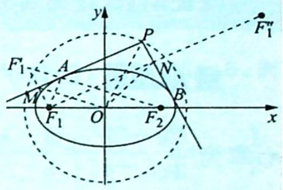

text_image

y
P
F₁'
A
N
M
F₁ O F₂ B
x

$\triangle F_{1}F_{1}^{\prime}F_{2}$ 的中位线，所以 $|OM| = \frac{1}{2}|F_1'F_2| = a$ ，同理可得 $|ON| = a$ ，易证四边形 $F_{1}MPN$ 为矩形，所以根据引理可得 $|OP|^2 + |OF_1|^2 = |OM|^2 + |ON|^2$ ，即 $x^{2} + y^{2} = |OP|^2 = |OM|^2 + |ON|^2 - |OF_1|^2 = a^{2} + b^{2}$ .

故动点 P 的轨迹为圆, 其方程为 $x^{2} + y^{2} = a^{2} + b^{2}$ .

定理2(双曲线的蒙日圆): 过双曲线 $\frac{x^{2}}{a^{2}} - \frac{y^{2}}{b^{2}} = 1 (a > 0, b > 0)$ 上任意不同两点 $A, B$ 作双曲线的切线, 如果两条切线垂直且相交于点 $P$ , 那么动点 $P$ 的轨迹为圆, 其方程为 $x^{2} + y^{2} = a^{2} - b^{2}$ .

【证明】如图①所示, 当 $A, B$ 两点位于双曲线的两支上时, 设 $P(x, y)$ , 作点 $F_{1}$ 关于直线 $PA, PB$ 的对称点 $F_{1}^{\prime}, F_{1}^{\prime \prime}$ , 设 $F_{1}F_{1}^{\prime}$ 和直线 $PA$ 交于点 $M, F_{1}F_{1}^{\prime \prime}$ 和直线 $PB$ 交于点 $N$ , 根据双曲线的光学性质可知 $A, F_{1}^{\prime}, F_{2}$ 三点共线, 且 $|F_{1}^{\prime}F_{2}| = |AF_{2}| - |AF_{1}^{\prime}| = |AF_{2}| - |AF_{1}| = 2a$ ,

又 $\left\{\begin{aligned}|F_{1}M|=|MF_{1}^{\prime}|\\ |F_{1}O|=|OF_{2}|\end{aligned}\right.$ ，所以OM是 $\triangle F_{1}F_{1}^{\prime}F_{2}$ 的中位线，所以 $|OM|=\frac{1}{2}|F_{1}^{\prime}F_{2}|=a$ ，同理可得 $|ON|=a.$

易证四边形 $F_{1}MPN$ 为矩形, 所以根据引理可得 $|OP|^{2} + |OF_{1}|^{2} = |OM|^{2} + |ON|^{2}$ , 即 $x^{2} + y^{2} = |OP|^{2} = |OM|^{2} + |ON|^{2} - |OF_{1}|^{2} = a^{2} - b^{2}$ .

故动点 P 的轨迹为圆, 其方程为 $x^{2} + y^{2} = a^{2} - b^{2}$ .

如图②所示,当 $A,B$ 两点位于双曲线的同一支上时,可得到相同的结论.

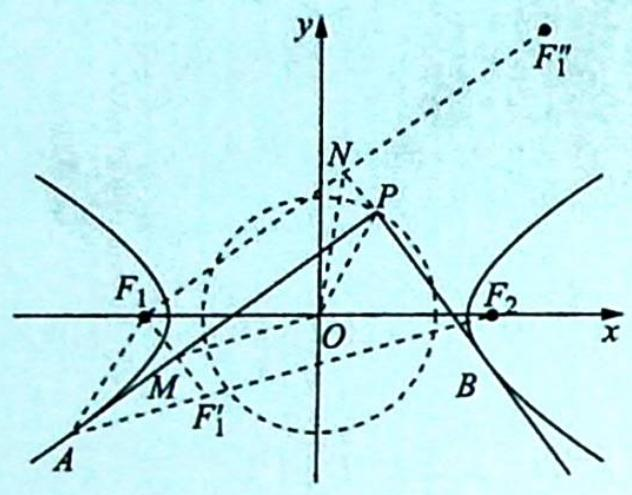

text_image

y
F₁"
N
P
F₁
O
x
F₂
M
F₁'
A
B

①

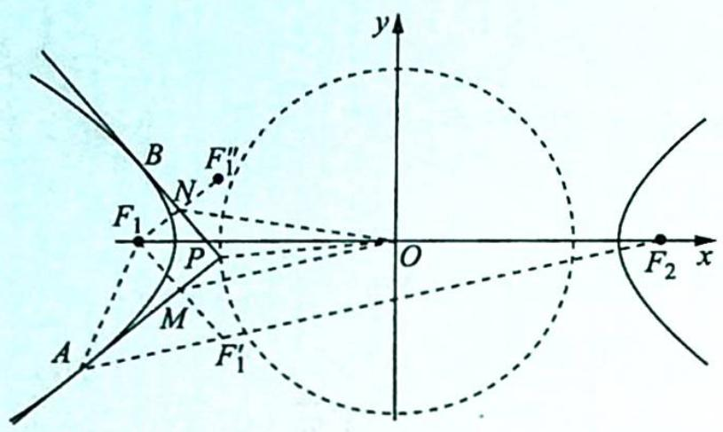

text_image

y
B
F₁"
N
F₁
P
O
x
F₂
A
M
F₁'

②

定理 3(圆的蒙日圆): 过圆 $x^{2} + y^{2} = a^{2} (a > 0)$ 上任意不同两点 A, B 作圆的切线, 如果两条切线垂直且相交于点 P, 那么动点 P 的轨迹为圆, 其方程为 $x^{2} + y^{2} = 2a^{2}$ .

【证明】这是椭圆为蒙日圆的特殊情形. 令 $b = a$ , 得出圆的蒙日圆方程为 $x^{2} + y^{2} = 2a^{2}$ .

例 14.19 (2014 广东卷理 20) 已知椭圆 $C: \frac{x^2}{a^2} + \frac{y^2}{b^2} = 1 (a > b > 0)$ 的一个焦点为 $(\sqrt{5}, 0)$ , 离心率为 $\frac{\sqrt{5}}{3}$ .

(1) 求椭圆 C 的标准方程；  
(2)若动点 $P(x_0, y_0)$ 为椭圆 $C$ 外一点, 且点 $P$ 到椭圆 $C$ 的两条切线互相垂直, 求点 $P$ 的轨迹方程.

分析 ▶ (1)已知椭圆基本量、待定系数法求椭圆方程；(2)点 $P$ 到椭圆 $C$ 的两条切线互相垂直, 那么动点 $P$ 的轨迹方程就是椭圆的蒙日圆方程, 解答过程需正常书写.

解析 (1)由题意得 $\left\{ \begin{array}{l} c = \sqrt{5} \\ \frac{c}{a} = \frac{\sqrt{5}}{3} \end{array} \right.$ , 结合 $a^2 - b^2 = c^2$ , 可得 $\left\{ \begin{array}{l} a^2 = 9 \\ b^2 = 4 \end{array} \right.$ , 所以椭圆 $C$ 的标准方程为 $\frac{x^2}{9} + \frac{y^2}{4} = 1$ .

(2)①若两条切线的斜率都存在,则设切线方程为 $y = k(x - x_0) + y_0$ , 将其代入椭圆的方程 $\frac{x^2}{9} + \frac{y^2}{4} = 1$ 中, 可得 $4x^2 + 9 [k(x - x_0) + y_0]^2 - 36 = 0$ , 即 $(9k^2 + 4)x^2 + 18k(y_0 - kx_0)x +$

$$
9 \left[ (y _ {0} - k x _ {0}) ^ {2} - 4 \right] = 0.
$$

根据 $\Delta = [18k(y_0 - kx_0)]^2 - 36(9k^2 + 4)[(y_0 - kx_0)^2 - 4] = 0$ ，化简得 $(y_0 - kx_0)^2 - (9k^2 + 4) = 0$ ，整理成关于 $k$ 的一元二次方程为 $(x_0^2 - 9)k^2 - 2x_0y_0k + y_0^2 - 4 = 0$ .

因为两条切线互相垂直,所以由韦达定理可得 $k_{1}k_{2} = \frac{y_{0}^{2} - 4}{x_{0}^{2} - 9} = -1$ , 即 $x_{0}^{2} + y_{0}^{2} = 13$ , $(x_{0} \neq \pm 3)$ .

②若一条切线垂直于 $x$ 轴, 另一条切线垂直于 $y$ 轴, 则点 $P$ 的坐标为 $(-3, -2)$ 或 $(-3, 2)$ 或 $(3, 2)$ 或 $(3, -2)$ , 显然这四点也满足方程 $x^{2} + y^{2} = 13$ .

综上可得, 点 P 的轨迹方程为 $x^{2} + y^{2} = 13$ .

变式(1) 已知椭圆 $C: \frac{x^{2}}{24} + \frac{y^{2}}{12} = 1$ , 设 $R(x_{0}, y_{0})$ 为椭圆上任意一点. 过原点作圆 $R: (x - x_{0})^{2} + (y - y_{0})^{2} = 8$ 的两条切线, 分别交椭圆于 $P$ , $Q$ . 试问 $|OP|^{2} + |OQ|^{2}$ 是否为定值? 若是, 求出该定值; 若不是, 请说明理由.

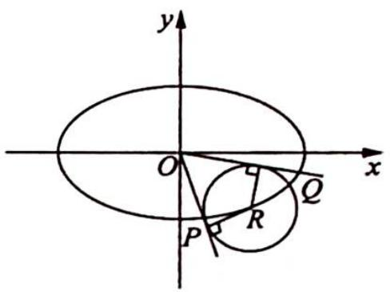

text_image

y
O
x
P
R
Q

解析 设 $P(x_{1},y_{1}), Q(x_{2},y_{2}), OP: y=k_{1}x, OQ: y=k_{2}x.$

$|OP|^{2}+|OQ|^{2}=x_{1}^{2}+y_{1}^{2}+x_{2}^{2}+y_{2}^{2},\left\{\begin{aligned}y=k_{1}x\\ x^{2}+2y^{2}&=24\end{aligned}\right.$ ，消 y 得 $x^{2}+2k_{1}^{2}x^{2}=24$ ，即 $x_{1}^{2}=\frac{24}{2k_{1}^{2}+1}$ ， $x_{1}^{2}+y_{1}^{2}=x_{1}^{2}+12\times\left(1-\frac{x_{1}^{2}}{24}\right)=12+\frac{x_{1}^{2}}{2}=12+\frac{12}{2k_{1}^{2}+1}$ ，同理 $|OQ|^{2}=12+\frac{12}{2k_{2}^{2}+1}$ .

又 $d = 2\sqrt{2}, \frac{|kx_0 - y_0|}{\sqrt{1 + k^2}} = 2\sqrt{2}, (kx_0 - y_0)^2 = 8k^2 + 8$ ，即 $k^2 x_0^2 + y_0^2 - 2kx_0y_0 - 8k^2 - 8 = 0$ ，则关于 $k$ 的一元二次方程为 $k^2 (x_0^2 - 8) - 2x_0y_0 \cdot k + y_0^2 - 8 = 0$ ，得 $k_1k_2 = \frac{y_0^2 - 8}{x_0^2 - 8} = \frac{y_0^2 - 8}{16 - 2y_0^2} = -\frac{1}{2}$ ， $k_2 = \frac{1}{-2k_1}$ .

所以 $|OP|^2 + |OQ|^2 = 24 + \frac{12}{2k_1^2 + 1} + \frac{12}{2k_2^2 + 1} = 24 + 12\left(\frac{1}{2k_1^2 + 1} + \frac{1}{2k_2^2 + 1}\right) = 24 + 12\left(\frac{1}{2k_1^2 + 1} + \frac{1}{2k_2^2 + 1}\right) = 36$ ，为定值.

# 训练 14

1. 过抛物线 $C: y^{2} = 2px (p > 0)$ 的焦点 $F$ , 且倾斜角为 $60^{\circ}$ 的直线交 $C$ 于点 $M(M$ 在 $x$ 轴上方), 若以 $MF$ 为直径的圆过点 $(0, \sqrt{3})$ , 则 $C$ 的方程为 ( ).

A. ${y}^{2} = {2x}$

B. ${y}^{2} = {4x}$

C. ${y}^{2} = {6x}$

D. ${y}^{2} = {8x}$

2. (2017 新课标全国 I 卷理 15) 已知双曲线 $C: \frac{x^{2}}{a^{2}} - \frac{y^{2}}{b^{2}} = 1 (a > 0, b > 0)$ 的右顶点为 $A$ , 以 $A$ 为圆心, $b$ 为半径作圆 $A$ , 圆 $A$ 与双曲线 $C$ 的一条渐近线交于 $M, N$ 两点. 若 $\angle MAN = 60^{\circ}$ , 则 $C$ 的离心率为 \_\_\_\_.

3. 抛物线有如下光学性质: 过焦点的光线(光线不同过抛物线对称轴上任意两点)经抛物线反射后平行于抛物线的对称轴; 平行于抛物线对称轴的入射光线经抛物线反射后必过抛物线的焦点. 若一条平行于 $x$ 轴的光线从 $M(3,1)$ 射出, 经过抛物线 $y^{2} = 4x$ 上的点 $A$ 反射后, 再经抛物线上的另一点 $B$ 反射出, 则直线 $AB$ 的斜率为( ).

A. $-\frac{4}{3}$

B. $\frac{4}{3}$

C. ± $\frac{4}{3}$

D. $- \frac{16}{9}$

4. 已知椭圆 $C: \frac{x^{2}}{a^{2}} + \frac{y^{2}}{b^{2}} = 1 (a > b > 0)$ 的左焦点为 $F$ , 直线 $y = \sqrt{3} x$ 与 $C$ 相交于 $A, B$ 两点, 且 $AF \perp BF$ , 则 $C$ 的离心率为 \_\_\_\_.

5.(椭圆光学性质)如图所示,椭圆有这样的光学性质:从椭圆的一个焦点出发的光线,经椭圆反射后,反射光线经过椭圆的另一个焦点.根据椭圆的光学性质解决下题:已知曲线C的方程为 $x^{2}+4y^{2}=4$ ,其左、右焦点分别是 $F_{1},F_{2}$ ,直线l与椭圆C切于点P,且 $|PF_{1}|=1$ ,过

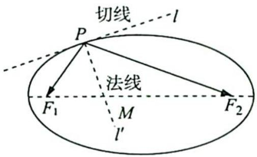

text_image

切线
l
P
法线
F₁
M
l′
F₂

点 $P$ 且与直线 $l$ 垂直的直线 $l'$ 与椭圆长轴交于点 $M$ , 则 $\left|F_{1} M\right|: \left|F_{2} M\right| = (\quad)$ .

A. $\sqrt{2}:\sqrt{3}$

B. $1 : \sqrt{2}$

C. $1 : 3$

D. $1: \sqrt{3}$

6. 抛物线有如下光学性质: 过焦点的光线经抛物线反射后得到的光线平行于抛物线的对称轴; 反之, 平行于抛物线对称轴的入射光线经抛物线反射后必过抛物线的焦点. 已知抛物线 $y^{2}=4x$ 的焦点为 F, 一条平行于 x 轴的光线从点 M(3,1) 射出, 经过抛物线上的点 A 反射后, 再经抛物线上的另一点 B 射出, 则 $\triangle ABM$ 的周长为().

A. $9 + \sqrt{10}$

B. $9 + \sqrt{26}$

C. $\frac{71}{12}+\sqrt{26}$

D. $\frac{83}{12} + \sqrt{26}$

7. 智慧的人们在进行工业设计时, 巧妙地利用了圆锥曲线的光学性质, 比如电影放映机利用椭圆镜面反射出聚焦光线, 探照灯利用抛物线镜面反射出平行光线. 如图所示, 从双曲线右焦点 $F_{2}$ 发出的光线通过双曲线镜面反射出发散光线, 且反射光线的反向延长线经过左焦点 $F_{1}$ . 已知双曲线的离心率为 $\sqrt{2}$ , 则当入射光线 $F_{2}P$ 和反射光线 $PE$ 相互垂直时 (其中 $P$ 为入射点), $\angle F_{1}F_{2}P$ 的大小为 ( ).

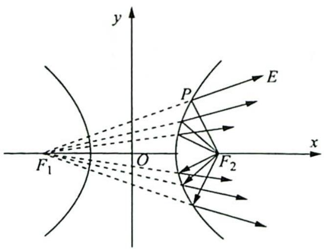

text_image

y
P
E
x
F₁
O
F₂

A. $\frac{\pi}{12}$

B. $\frac{\pi}{6}$

C. $\frac{\pi}{3}$

D. $\frac{5 \pi}{12}$

8. 已知点 $A, B$ 关于坐标原点对称, $|AB| = 4$ , 圆 $M$ 过点 $A, B$ 且与直线 $x + 2 = 0$ 相切, 是否存在定点 $P$ , 使得当 $A$ 运动时, $|MA| - |MP|$ 为定值? 并说明理由.

9. 已知椭圆 $C: \frac{x^2}{a^2} + \frac{y^2}{b^2} = 1 (a > b > 0)$ 的左、右焦点分别为 $F_1, F_2$ , 上顶点为 $A$ , 离心率为 $\frac{1}{2}$ , 点 $P$ 为第一象限内椭圆上的一个点, 且 $S_{\triangle PF_1A}: S_{\triangle PF_1F_2} = 2: 1$ , 求直线 $PF_1$ 的斜率.

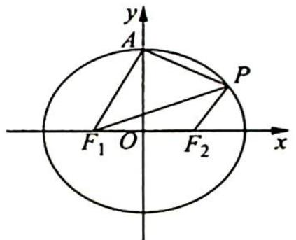

text_image

y
A
P
F₁ O F₂ x

10. (圆锥曲线蝴蝶定理推论) 过点 $M(m,0)$ 作椭圆 $\frac{x^2}{a^2} + \frac{y^2}{b^2} = 1$ 的弦 $CD, E, F$ 分别是椭圆的左、右顶点, 则直线 $CE, DF$ 的连线交点 $G$ 在直线 \_\_\_\_ 上.

11. 已知椭圆 $E: \frac{x^2}{a^2} + \frac{y^2}{b^2} = 1 (a > b > 0)$ 的两个焦点与短轴的一个端点是直角三角形的三个顶点，直线 $l: y = -x + 3$ 与椭圆 $E$ 有且只有一个公共点 $T$ .

(1)求椭圆 E 的方程及点 T 的坐标；

(2)设 O 是坐标原点, 直线 $l'$ 平行于 OT, 与椭圆 E 交于不同的两点 A, B, 且与直线 l 交于点 P, 证明: 存在常数 $\lambda$ , 使得 $|PT|^{2} = \lambda |PA||PB|$ , 并求 $\lambda$ 的值.

12. 已知椭圆 $C: \frac{x^2}{a^2} + \frac{y^2}{b^2} = 1 (a > b > 0)$ 的长轴长为 4，焦距为 $2\sqrt{2}$ .

(1)求椭圆 C 的方程；

(2) 过动点 $M(0, m) (m > 0)$ 的直线交 $x$ 轴于点 $N$ , 交 $C$ 于点 $A$ , $P$ ( $P$ 在第一象限), 且 $M$ 是线段 $PN$ 的中点. 过点 $P$ 作 $x$ 轴的垂线交椭圆 $C$ 于另一点 $Q$ , 延长 $QM$ 交 $C$ 于点 $B$ .

(i) 设直线 PM, QM 的斜率分别为 $k_{1}, k_{2}$ ，证明： $\frac{k_{2}}{k_{1}}$ 为定值；

(ii) 求直线 $AB$ 的斜率的最小值.

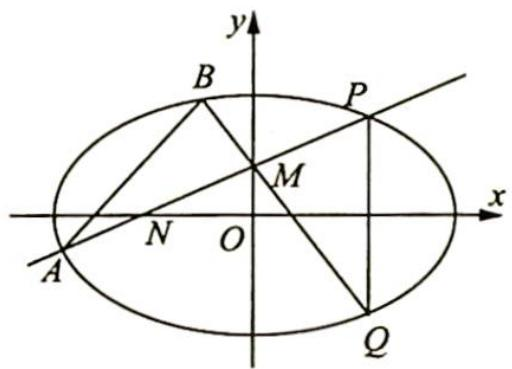

text_image

y
B
P
M
x
A
N
O
Q

13. 给定椭圆 $C: \frac{x^2}{a^2} + \frac{y^2}{b^2} = 1 (a > b > 0)$ , 称圆心在原点 $O$ , 半径为 $\sqrt{a^2 + b^2}$ 的圆为椭圆 $C$ 的“准圆”. 若椭圆 $C$ 的一个焦点为 $F(\sqrt{2}, 0)$ , 其短轴上的一个端点到 $F$ 的距离为 $\sqrt{3}$ .

(1)求椭圆 C 的方程和其“准圆”方程:

(2)若点 P 是椭圆 C 的“准圆”上的动点, 过点 P 作椭圆的切线 $l_{1}, l_{2}$ 交“准圆”于点 M, N. 证明: $l_{1} \perp l_{2}$ , 且线段 MN 的长为定值.

# 第 15 讲

# 以数化形——圆锥曲线中几何条件的转化策略

解析几何的本质是用代数方法解决几何问题,因此解决解析几何解答题无外乎做三项工作:(1)将几何关系转化为代数运算(坐标、方程、函数、不等式等);(2)用代数规则对代数简化后的问题进行处理;(3)经过代数运算后,把运算结果转化为几何结论.在这个基本思路的指导下,我们希望能将以往大量的、零碎的、彼此之间看似没有多少联系的问题,通过高度统一的方法解决,因此下面我们研究直线与圆锥曲线综合这一大类问题的通解方法.这个通解方法的解题思路流程如下:

flowchart

在这个流程中,②是思维难点,③④⑥是计算难点,⑤是解题套路. 思考过程应用了分析法,以目标为导向. 贯穿全局的转化思想是核心,坐标和方程是工具.

解析几何最重要的思想就是转化,即将几何关系转化为代数运算,这个过程就需要将几何语言翻译为代数语言. 常见翻译转化,并建立问题的解决模式如下.

(1)点在曲线上 $\rightarrow$ 点的坐标满足曲线方程.   
(2)直线与二次曲线的交点→ $\left\{\begin{aligned}& 点坐标满足直线方程\\ & 点坐标满足曲线方程\\&x_{1}+x_{2}=\cdots,x_{1}x_{2}=\cdots\\&y_{1}+y_{2}=\cdots,y_{1}y_{2}=\cdots\end{aligned}\right.$ .   
(3) $A, B, C$ 共线 $\rightarrow \left\{ \begin{array}{l} \overrightarrow{AB} // \overrightarrow{BC} \\ k_{AB} = k_{BC} \\ C \text{满足直线 } AB \text{ 的方程} \end{array} \right.$ .  
(4) 点 A 与 B 关于直线 l 对称 $\rightarrow \left\{\begin{aligned} 中: &AB 的中点 \in l \\ &垂: &AB \perp l \end{aligned}\right.$ .  
(5)直线与曲线相切→{圆:d=r
一般二次曲线:二次项系数≠0且Δ=0.   
(6)点 $(x_{0},y_{0})$ 在曲线的一侧、内部或外部→代入后 $f(x_{0},y_{0})$ 的符号.  
(7) $\angle ABC$ 为锐角或零角 $\rightarrow\overrightarrow{BA}\cdot\overrightarrow{BC}>0.$   
(8)以 AB 为直径的圆过点 $C \rightarrow \left\{\begin{aligned}\overrightarrow{CA} \cdot \overrightarrow{CB} &= 0 \\ |CA|^{2} + |CB|^{2} &= |AB|^{2}\end{aligned}\right.$ .  
(9) $AD$ 平分 $\angle BAC \rightarrow \left\{ \begin{array}{l} AD \perp x \text{ 轴或 } AD \perp y \text{ 轴时: } k_{BA} = -k_{AC} \\ AD \text{ 上的点到直线 } AB, AC \text{ 的距离相等} \end{array} \right.$ .  
(10) 点 A, B, C 共线 $\rightarrow \frac{|AB|}{|AC|} = \frac{x_{B} - x_{A}}{x_{C} - x_{A}} = \frac{y_{B} - y_{A}}{y_{C} - y_{A}}$ .  
(11)等式恒成立→系数为0或对应项系数成比例.

# 15.1 以向量为背景的转化

# 研究密钥

不管是大题还是小题,题目必将给出较为核心的条件,解题的过程便是考查我们如何将其进行合理的代数化翻译,建立与其目标信息之间的关系.在这个过程中,可以把几何条件转化为向量关系,然后用向量知识来解决,这样通过几何特征—向量—向量的坐标表示—方程这一桥梁,就能实现几何条件向代数的转化.对于诸如垂直、平行、共线等问题,均可转化为向量形式.

例 15.1 过抛物线 $y^{2}=2px(p>0)$ 的焦点 F 作直线交抛物线于 A, B 两点，点 O 为坐标原点，M 为 AB 的中点.

(1) 求证: $\overrightarrow{OA} \cdot \overrightarrow{OB} < 0$ ;   
(2) 探究 $\left|\overrightarrow{OM}\right|$ 与 $\frac{\left|\overrightarrow{AB}\right|}{2}$ 的大小关系.

分析 ▶ 解析几何核心思想是数形结合思想. 从画图入手, 图文并茂, 以形助数; 观察图形, 深入分析图形中的几何特征, 把解题动态情境过程形象化, 寻求解题的突破口. 本题先画图, 在图形中分析. 若直接计算 $|\overrightarrow{OM}|$ 与 $\frac{|\overrightarrow{AB}|}{2}$ , 计算量较大, 可结合中线向量公式, 将 $\overrightarrow{OM}$ 与 $\frac{\overrightarrow{AB}}{2}$ 用基底向量 $\overrightarrow{OA}, \overrightarrow{OB}$ 表示, 然后通过向量运算判断其大小关系.

解析 ▶ (1) 设 $A(x_{1}, y_{1}), B(x_{2}, y_{2})$ , 抛物线 $y^{2} = 2px (p > 0)$ 的焦点坐标为 $F\left(\frac{p}{2}, 0\right)$ , 依题意知直线 $AB$ 的斜率不为零且斜率可以不存在, 设 $AB$ 的直线方程 $x = ty + \frac{p}{2}$ .

联立直线 $AB$ 的方程与抛物线的方程得 $\left\{ \begin{array}{l} x = ty + \frac{p}{2} \\ y^2 = 2px \end{array} \right.$ ，消去 $x$ ，建立关于 $y$ 的一元二次方程 $y^2 - 2py - p^2 = 0$ ，即 $\left\{ \begin{array}{l} \Delta = 4p^2t^2 + 4p^2 > 0 \\ y_1 + y_2 = 2pt \\ y_1y_2 = -p^2 \end{array} \right.$ ，则 $\overrightarrow{OA} \cdot \overrightarrow{OB} = x_1x_2 + y_1y_2 = (ty_1 + \frac{p}{2})(ty_2 + \frac{p}{2}) + y_1y_2 = (t^2 + 1)y_1y_2 + \frac{pt}{2}(y_1 + y_2) + \frac{p^2}{4} = (t^2 + 1)(-p^2) + \frac{pt}{2} \cdot 2pt + \frac{p^2}{4} = -p^2t^2 - p^2 + p^2t^2 + \frac{p^2}{4} = -\frac{3p^2}{4} < 0.$

(2)解法一(转化为向量运算): 因为 M 为 AB 的中点, 所以 $\overrightarrow{OM} = \frac{\overrightarrow{OA} + \overrightarrow{OB}}{2}, \frac{\overrightarrow{AB}}{2} = \frac{\overrightarrow{OB} - \overrightarrow{OA}}{2}$ , $\overrightarrow{OM}^{2} - \left(\frac{\overrightarrow{AB}}{2}\right)^{2} = \left(\frac{\overrightarrow{OA} + \overrightarrow{OB}}{2}\right)^{2} - \left(\frac{\overrightarrow{OB} - \overrightarrow{OA}}{2}\right)^{2} = \frac{(\overrightarrow{OA}^{2} + \overrightarrow{OB}^{2} + 2\overrightarrow{OA} \cdot \overrightarrow{OB}) - (\overrightarrow{OA}^{2} + \overrightarrow{OB}^{2} - 2\overrightarrow{OA} \cdot \overrightarrow{OB})}{4}$ $= \overrightarrow{OA} \cdot \overrightarrow{OB}.$

因此通过 $\overrightarrow{OA}\cdot\overrightarrow{OB}$ 的符号来判断 $|\overrightarrow{OM}|$ 与 $\frac{|\overrightarrow{AB}|}{2}$ 之间的大小关系.

由(1)可知 $\overrightarrow{OA} \cdot \overrightarrow{OB} < 0$ ，所以 $|\overrightarrow{OM}| < \frac{|\overrightarrow{AB}|}{2}$ ，即在钝角 $\triangle OAB$ 中，长边AB上的中线小于 $\frac{1}{2}|AB|$ .

解法二(转化为坐标运算): 设 AB 的中点 M 的坐标为 $(x_{0}, y_{0})$ ，由(1)中的韦达定理知，$y_{0}=pt,x_{0}=pt^{2}+\frac{p}{2}$ ，则 $|OM|^{2}=\left(pt^{2}+\frac{p}{2}\right)^{2}+p^{2}t^{2}=\left(t^{4}+2t^{2}+\frac{1}{4}\right)p^{2},\left|AB\right|=\sqrt{1+t^{2}}\left|y_{1}-y_{2}\right|=2p(t^{2}+1)$ .

又因为 $|OM|^2 - \frac{|AB|^2}{4} = (t^4 + 2t^2 + \frac{1}{4})p^2 - p^2 (t^2 + 1)^2 = -\frac{3}{4}p^2 < 0$ ，所以 $|OM|^2 < \frac{|AB|^2}{4}$ ，即 $|\overrightarrow{OM}| < \frac{|\overrightarrow{AB}|}{2}$ .

# 解后反思

# 向量角度看三角形中线的一个结论

(1)本题将一个几何问题转化为向量问题,通过向量的运算再得出一个几何性的结论,向量在其中起到了“桥梁”的作用.假若没有第(1)问的限制,我们可以得到结论:

①当 $\overrightarrow{OA} \cdot  \overrightarrow{OB} < 0$ 时, $\left| {\overrightarrow{OM}}\right|  < \frac{\left| {\overrightarrow{AB}}\right| }{2}$ ,即在钝角 $\bigtriangleup  {OAB}$ 中,长边 ${AB}$ 上的中线长小于 $\frac{1}{2}\left| {AB}\right|$ ；  
②当 $\overrightarrow{OA} \cdot \overrightarrow{OB} = 0$ 时, $|\overrightarrow{OM}| = \frac{|\overrightarrow{AB}|}{2}$ , 即在直角 $\triangle OAB$ 中, 斜边 $AB$ 上的中线长等于 $\frac{1}{2} |\overrightarrow{AB}|$ ;  
③当 $\overrightarrow{OA} \cdot  \overrightarrow{OB} > 0$ 时, $\left| {\overrightarrow{OM}}\right|  > \frac{\left| {\overrightarrow{AB}}\right| }{2}$ ,即在锐角 $\bigtriangleup  {OAB}$ 中,边 ${AB}$ 上的中线长大于 $\frac{1}{2}\left| {AB}\right|$ .

这与我们平面几何的结论是一致的.

(2)更为特别地,我们有如下重要结论,熟记这些重要结论会为相关题目的求解带来极大的方便,有兴趣的读者也可以自己证明.

① 过点 $M(t,0)(t>0)$ 的直线交抛物线 $y^{2}=2px(p>0)$ 于 A, B 两点.  
当 $0 < t < 2p$ 时, $\angle AOB$ 为钝角; 当 $t = 2p$ 时, $\angle AOB$ 为直角; 当 $t > 2p$ 时, $\angle AOB$ 为锐角.  
② 过点 $M(0,t)(t>0)$ 的直线交抛物线 $x^{2}=2py(p>0)$ 于 A, B 两点.

当 $0 < t < 2p$ 时, $\angle AOB$ 为钝角; 当 $t = 2p$ 时, $\angle AOB$ 为直角; 当 $t > 2p$ 时, $\angle AOB$ 为锐角.

③ 抛物线 $y^{2}=2px(p>0)$ 上异于原点 O 的动点 A, B 满足 $\overrightarrow{OA} \perp \overrightarrow{OB}$ ，则直线 AB 必过定点 $(2p,0)$ ，反之亦成立。  
④ 抛物线 $x^{2}=2py(p>0)$ 上异于原点 O 的动点 A, B 满足 $\overrightarrow{OA} \perp \overrightarrow{OB}$ ，则直线 AB 必过定点 $(0,2p)$ ，反之亦成立。

变式 1 已知椭圆 $C: x^{2} + 2y^{2} = 9$ ，点 $P(2,0)$ .

(1)求椭圆 C 的短轴长和离心率；

(2)过(1,0)的直线 l 与椭圆 C 相交于点 M, N, 设 MN 的中点为 T, 判断 $\left| TP \right|$ 与 $\left| TM \right|$ 的大小, 并证明你的结论.

分析 ▶ 若直接计算弦长 $\left|\overrightarrow{TP}\right|$ 与 $\left|\overrightarrow{TM}\right|$ ，计算量很大，将几何条件转化为向量关系，用向量表示 $\overrightarrow{PT}$ 和 $\overrightarrow{MT}$ 。若比较 $\left|\overrightarrow{PT}\right|$ 与 $\left|\overrightarrow{MT}\right|$ 的大小，即比较 $\left|\overrightarrow{PT}\right|^{2}-\left|\overrightarrow{MT}\right|^{2}=\left(\frac{\overrightarrow{PM}+\overrightarrow{PN}}{2}\right)^{2}-\left(\frac{\overrightarrow{PN}-\overrightarrow{PM}}{2}\right)^{2}=\overrightarrow{PM}\cdot\overrightarrow{PN}$ 与 0 的大小，运用坐标表示 $\overrightarrow{PM}$ 和 $\overrightarrow{PN}$ 及 $\overrightarrow{PM}\cdot\overrightarrow{PN}$ ，这样实现几何问题代数化。

解析 (1) 易得椭圆 $C: \frac{x^2}{9} + \frac{y^2}{\frac{9}{2}} = 1$ ，故 $a^2 = 9, b^2 = \frac{9}{2}$ ，则 $c^2 = \frac{9}{2}, a = 3, b = c = \frac{3\sqrt{2}}{2}$ .

所以椭圆的短轴长为 $2b=3\sqrt{2}$ ，离心率 $e=\frac{c}{a}=\frac{\sqrt{2}}{2}$ .

(2) 已知 $P(2,0)$ , 设 $M(x_1, y_1), N(x_2, y_2), l: x = ty + 1$ , 联立 $\left\{ \begin{array}{l} x = ty + 1 \\ x^2 + 2y^2 = 9 \end{array} \right.$ , 消去 $x$ 得 $(t^2 + 2)y^2 + 2ty - 8 = 0$ .

因为 $(2t)^{2} - 4(t^{2} + 2)\times (-8) = 4t^{2} + 32(t^{2} + 2) = 36t^{2} + 64 > 0$ ，由韦达定理可得 $y_{1} + y_{2} =$ $\frac{-2t}{t^2 + 2},y_1y_2 = \frac{-8}{t^2 + 2}.$

由 $\overrightarrow{PM}=(x_{1}-2,y_{1}),\overrightarrow{PN}=(x_{2}-2,y_{2})$ ，所以 $\overrightarrow{PM}\cdot\overrightarrow{PN}=(x_{1}-2)\cdot(x_{2}-2)+y_{1}y_{2}=$ $(ty_{1}-1)\cdot(ty_{2}-1)+y_{1}y_{2}=(t^{2}+1)y_{1}y_{2}-t(y_{1}+y_{2})+1=\frac{-8(t^{2}+1)}{t^{2}+2}+\frac{2t^{2}}{t^{2}+2}+1=\frac{-5t^{2}-6}{t^{2}+2}<0.$

又 $\overrightarrow{PT} = \frac{\overrightarrow{PM} + \overrightarrow{PN}}{2}, \frac{\overrightarrow{MN}}{2} = \frac{\overrightarrow{PN} - \overrightarrow{PM}}{2}, \overrightarrow{PT}^2 - \left(\frac{\overrightarrow{MN}}{2}\right)^2 = \frac{(\overrightarrow{PM} + \overrightarrow{PN})^2 - (\overrightarrow{PN} - \overrightarrow{PM})^2}{4} = \overrightarrow{PM} \cdot \overrightarrow{PN}$ , 所以 $|PT|^2 - |TM|^2 = \overrightarrow{PT}^2 - \left(\frac{\overrightarrow{MN}}{2}\right)^2 = \overrightarrow{PM} \cdot \overrightarrow{PN} < 0$ , 即 $|TP| < |TM|$ .

# 评注

本题同样体现了以几何条件为背景的转化和翻译,将几何问题转化为坐标、方程来求解,体现了向量运算的优越性.

变式(2) 已知椭圆 $E: \frac{x^{2}}{a^{2}} + \frac{y^{2}}{b^{2}} = 1 (a > b > 0)$ 过点 $(0, \sqrt{2})$ ，且离心率 $e = \frac{\sqrt{2}}{2}$ .

(1)求椭圆 E 的方程；

(2) 设直线 $l: x = my - 1 (m \in \mathbb{R})$ 交椭圆 $E$ 于 $A, B$ 两点, 判断点 $G\left(-\frac{9}{4}, 0\right)$ 与以线段 $AB$ 为直径的圆的位置关系, 并说明理由.

text_image

y
A
G O x
B

分析 ▶ 思路一: 判断点 G 与以线段 AB 为直径的圆的位置关系, 即判断点 G 与 AB 的中点间的距离与 $\frac{1}{2}AB$ 的大小关系. 比较两者大小, 可根据坐标利用两点间距离公式表示出来, 但这样计算量较大; 思路二: 判断点 G 与以线段 AB 为直径的圆的位置关系转化为判断向量 $\overrightarrow{GA}, \overrightarrow{GB}$ 夹角的大小, 进一步转化为数量积 $\overrightarrow{GA} \cdot \overrightarrow{GB}$ 与 0 的大小比较.

解析 (1) 由已知得 $\left\{ \begin{array}{l} b = \sqrt{2} \\ \frac{c}{a} = \frac{\sqrt{2}}{2} \\ a^2 = b^2 + c^2 \end{array} \right.$ , 解得 $\left\{ \begin{array}{l} a = 2 \\ b = \sqrt{2}, \text{所以椭圆 } E \text{ 的方程为 } \frac{x^2}{4} + \frac{y^2}{2} = 1. \\ c = \sqrt{2} \end{array} \right.$

(2)解法一(借助坐标运算比较距离大小):设点 $A(x_{1},y_{1}),B(x_{2},y_{2}),AB$ 的中点为

$H(x_0,y_0)$ .由 $\left\{ \begin{array}{l}x = my - 1\\ \frac{x^2}{4} +\frac{y^2}{2} = 1 \end{array} \right.$ 得 $(m^2 +2)y^2 -2my - 3 = 0$ ，所以 $y_{1} + y_{2} = \frac{2m}{m^{2} + 2},y_{1}y_{2} =$ $-\frac{3}{m^2 + 2}$ ，从而 $y_0 = \frac{m}{m^2 + 2}$

$$
\begin{array}{r l} {\text {则} \left| G H \right| ^ {2} = \left(x _ {0} + \frac {9}{4}\right) ^ {2} + y _ {0} ^ {2} = \left(m y _ {0} + \frac {5}{4}\right) ^ {2} + y _ {0} ^ {2} = (m ^ {2} + 1) y _ {0} ^ {2} + \frac {5}{2} m y _ {0} + \frac {2 5}{1 6}, \frac {| A B | ^ {2}}{4} =} \\ {\frac {(x _ {1} - x _ {2}) ^ {2} + (y _ {1} - y _ {2}) ^ {2}}{4}} & {= \quad \frac {(1 + m ^ {2}) (y _ {1} - y _ {2}) ^ {2}}{4} = \quad \frac {(1 + m ^ {2}) [ (y _ {1} + y _ {2}) ^ {2} - 4 y _ {1} y _ {2} ]}{4} =} \end{array}
$$

$(1+m^{2})(y_{0}^{2}-y_{1}y_{2})$ ，即 $|GH|^{2}-\frac{|AB|^{2}}{4}=\frac{5}{2}my_{0}+(1+m^{2})y_{1}y_{2}+\frac{25}{16}=\frac{5m^{2}}{2(m^{2}+2)}-\frac{3(1+m^{2})}{m^{2}+2}+$ $\frac{25}{16}=\frac{17m^{2}+2}{16(m^{2}+2)}>0$ ，所以 $|GH|>\frac{|AB|}{2}$ .

故点 $G\left(-\frac{9}{4},0\right)$ 在以 AB 为直径的圆外.

解法二（借助向量运算判断夹角）：设点 $A(x_{1},y_{1}),B(x_{2},y_{2})$ ，则 $\overrightarrow{GA} = \left(x_1 + \frac{9}{4},y_1\right)$ $\overrightarrow{GB} = \left(x_2 + \frac{9}{4},y_2\right).$

由 $\left\{ \begin{array}{l} x = my - 1 \\ \frac{x^2}{4} + \frac{y^2}{2} = 1 \end{array} \right.$ 得 $(m^2 + 2)y^2 - 2my - 3 = 0$ ，所以 $y_1 + y_2 = \frac{2m}{m^2 + 2}, y_1y_2 = -\frac{3}{m^2 + 2}$ ，从而 $\overrightarrow{GA} \cdot \overrightarrow{GB} = (x_1 + \frac{9}{4})(x_2 + \frac{9}{4}) + y_1y_2 = (my_1 + \frac{5}{4})(my_2 + \frac{5}{4}) + y_1y_2 = (m^2 + 1)y_1y_2 +$

$\frac{5}{4} m(y_1 + y_2) + \frac{25}{16} = \frac{-3(m^2 + 1)}{m^2 + 2} + \frac{\frac{5}{2}m^2}{m^2 + 2} + \frac{25}{16} = \frac{17m^2 + 2}{16(m^2 + 2)} > 0$ ，所以 $\cos \langle \overrightarrow{GA}, \overrightarrow{GB} \rangle > 0$ 。又 $\overrightarrow{GA}$ ，

$\overrightarrow{GB}$ 不共线, 所以 $\angle AGB$ 为锐角.

故点 $G\left(-\frac{9}{4},0\right)$ 在以 AB 为直径的圆外.

例 15.2 已知抛物线 C 的焦点 F 到准线 l 的距离为 2，点 P 是直线 l 上的动点，若点 A 在抛物线 C 上，且 $\left|AF\right|=5$ ，过点 A 作 PF 的垂线，垂足为 H，则 $\left|PH\right|\left|PF\right|$ 的最小值为 \_\_\_\_。

分析 ▶ 将 $\left| PH \right| \left| PF \right|$ 这个几何量转化为用向量的语言表示, 即 $\left| PH \right| \left| PF \right| = \overrightarrow{PA} \cdot \overrightarrow{PF}$ , 利用向量的坐标形式来求数量积, 再求其最值.

解析 ▶ 依题意, 抛物线方程为 $y^{2} = 4x$ . 如图所示, 过点 $A$ 作 $PF$ 的垂线, 垂足为 $H$ , 则 $|\overrightarrow{PH}| |\overrightarrow{PF}| = \overrightarrow{PA} \cdot \overrightarrow{PF}$ .

text_image

y
P
H
O
F(1,0)
x
y²=4x
x=-1

设 $P(-1, t), A(4, 4), F(1, 0), \overrightarrow{PA} = (5, 4 - t), \overrightarrow{PF} = (2, -t), \overrightarrow{PA} \cdot \overrightarrow{PF} = 10 - t(4 - t) = t^2 - 4t + 10 = (t - 2)^2 + 6 \geqslant 6.$

所以 $|PH||PF|$ 的最小值为6.

变式(1) 如图所示, 已知抛物线 $x^{2} = y$ . 点 $A\left(-\frac{1}{2}, \frac{1}{4}\right)$ , $B\left(\frac{3}{2}, \frac{9}{4}\right)$ , 抛物线上的点 $P(x, y)\left(-\frac{1}{2} < x < \frac{3}{2}\right)$ , 过点 $B$ 作直线 $AP$ 的垂线, 垂足为 $Q$ .

text_image

y
A
B
P
Q
O
x

(1)求直线 $AP$ 斜率的取值范围；

(2) 求 $|PA||PQ|$ 的最大值.

分析 ▶ (1) 将 $AP$ 的斜率 $k$ 表示为 $x$ 的函数求取值范围; (2) 可从目标函数法与向量法两个角度考虑. 函数角度: 将 $|PA||PQ|$ 表示为 $AP$ 的斜率 $k$ 的函数, 将问题转化为求函数最值; 向量角度: 直接表示 $|PA|$ , $|PQ|$ 会比较复杂, 从 $|\overrightarrow{PA}||\overrightarrow{PQ}| = -\overrightarrow{PA} \cdot \overrightarrow{PB}$ , 即转化为数量积入手求解会大大简化.

解析 (1) 设直线 $AP$ 的斜率为 $k$ , 已知 $A\left(-\frac{1}{2}, \frac{1}{4}\right), P(x, y)$ , 则 $k = \frac{y - \frac{1}{4}}{x + \frac{1}{2}} = \frac{x^2 - \frac{1}{4}}{x + \frac{1}{2}} =$

$$
x - \frac {1}{2}.
$$

因为 $-\frac{1}{2} < x < \frac{3}{2}$ , 所以 $-1 < x - \frac{1}{2} < 1$ , 则直线 $AP$ 斜率的取值范围是 $(-1, 1)$ .

(2)解法一(目标函数法): 因为直线 $AP \perp BQ$ , 且 $B\left(\frac{3}{2}, \frac{9}{4}\right)$ , 所以直线 BQ 的方程为 $y - \frac{9}{4} = -\frac{1}{k} \left(x - \frac{3}{2}\right)$ .

联立直线 $AP$ 与 $BQ$ 的方程 $\left\{ \begin{array}{l} kx - y + \frac{1}{2} k + \frac{1}{4} = 0 \\ x + ky - \frac{9}{4} k - \frac{3}{2} = 0 \end{array} \right.$ ，解得点 $Q$ 的横坐标是 $x_{Q} = \frac{-k^{2} + 4k + 3}{2(k^{2} + 1)}$ .

又 $|PA| = \sqrt{1 + k^2}\left|x + \frac{1}{2}\right| = \sqrt{1 + k^2} (k + 1)(-1 < k < 1), |PQ| = \sqrt{1 + k^2} |x_Q - x| = -\frac{(k - 1)(k + 1)^2}{\sqrt{1 + k^2}} (-1 < k < 1)$ ，所以 $|PA||PQ| = -(k - 1)(k + 1)^3 (-1 < k < 1)$ .

令 $f(k) = -(k - 1)(k + 1)^3 (-1 < k < 1)$ , 因为 $f'(k) = -(4k - 2)(k + 1)^2$ , 则当 $-1 < k < \frac{1}{2}$ 时, $f'(k) > 0$ ; 当 $\frac{1}{2} < k < 1$ 时, $f'(k) < 0$ , 所以 $f(k)$ 在 $\left(-1, \frac{1}{2}\right)$ 上单调递增, 在 $\left(\frac{1}{2}, 1\right)$ 上单调递减.

故当 $k = \frac{1}{2}$ 时， $|PA||PQ|$ 取得最大值 $\frac{27}{16}$ .

解法二(极化恒等式): 直接表示 $\left|PA\right|$ , $\left|PQ\right|$ 会比较复杂, 利用 $\left|\overrightarrow{PA}\right|\left|\overrightarrow{PQ}\right| = -\overrightarrow{PA} \cdot \overrightarrow{PB}$ 会大大简化, 设 AB 中点为 M, 则 $M\left(\frac{1}{2}, \frac{5}{4}\right)$ .

由 $|\overrightarrow{PA}| |\overrightarrow{PQ}| = -\overrightarrow{PA} \cdot \overrightarrow{PB} = -\left(\overrightarrow{PM^2} - \frac{1}{4}\overrightarrow{AB^2}\right) = \frac{1}{4}\overrightarrow{AB^2} - \overrightarrow{PM^2}$ , 又 $|\overrightarrow{AB}|^2 = \left(-\frac{1}{2} - \frac{3}{2}\right)^2 + \left(\frac{1}{4} - \frac{9}{4}\right)^2 = 8$ , 所以 $|\overrightarrow{PA}| |\overrightarrow{PQ}| = 2 - \overrightarrow{PM^2}$ .

又 $\overrightarrow{PM^2} = \left(x_0 - \frac{1}{2}\right)^2 +\left(y_0 - \frac{5}{4}\right)^2 = \left(x_0 - \frac{1}{2}\right)^2 +\left(x_0^2 -\frac{5}{4}\right)^2 = x_0^4 -\frac{3}{2} x_0^2 -x_0 + \frac{29}{16}$ ，令 $f(x) =$ $x^{4} - \frac{3}{2} x^{2} - x + \frac{29}{16}\left(-\frac{1}{2} <  x <   \frac{3}{2}\right),f^{\prime}(x) = 4x^{3} - 3x - 1 = (x - 1)(2x + 1)^{2},$ 因此 $f(x)$ 在 $\left(-\frac{1}{2},1\right)$ 上单调递减，在 $\left(1,\frac{3}{2}\right)$ 上单调递增， $f(x)_{\min} = f(1) = \frac{5}{16}.$

故 $|\overrightarrow{PA}| |\overrightarrow{PQ}|$ 的最大值为 $2 - \frac{5}{16} = \frac{27}{16}$ .

解法三(几何方法,圆幂定理):依题意得 $QA \perp QB$ , 则以 AB 为直径的圆 $O'$ 过点 Q, 如图所示.

由相交弦定理知 $|PA||PQ| = |PC||PD| = (r + |PO'|) \cdot (r - |PO'|) = r^2 - |PO'|^2 = \left(\frac{|AB|}{2}\right)^2 - |PO'|^2 = 2 - |PO'|^2$ .

设 $P(x_0, x_0^2)$ , $O'\left(\frac{1}{2}, \frac{5}{4}\right)$ , $2 - |PO'|^2 = 2 - \left[(x_0 - \frac{1}{2})^2 + (x_0^2 - \frac{5}{4})^2\right] = 2 - (x_0^2 - x_0 + \frac{1}{4} + x_0^4 - \frac{5}{2} x_0^2 + \frac{25}{16}) = 2 - (x_0^4 - \frac{3}{2} x_0^2 - x_0 + \frac{29}{16}) = -x_0^4 + \frac{3}{2} x_0^2 + x_0 + \frac{3}{16} (-\frac{1}{2} < x_0 < \frac{3}{2})$ .

令 $f(x_0) = -x_0^4 + \frac{3}{2} x_0^2 + x_0 + \frac{3}{16}\left(-\frac{1}{2} < x_0 < \frac{3}{2}\right), f'(x_0) = -4x_0^3 + 3x_0 + 1 = -4(x_0^3 - 1) + 3x_0 - 3 = (2x_0 + 1)^2 (1 - x_0), f(x_0)$ 在 $\left(-\frac{1}{2}, 1\right)$ 上单调递增，在 $\left(1, \frac{3}{2}\right)$ 上单调递减， $f(x_0)_{\max} = f(1) = \frac{27}{16}$ .

text_image

y
C
O'
B
A
P
Q
D
O
x

# 15.2 以斜率为背景的转化

# 研究密钥

斜率是解析几何中常用的知识和工具. 证明角相等的方法, 一是可以考虑角平分线性质, 即证明点到角两边的距离相等; 二是可以考虑三角形内角平分线性质; 三是可以考虑夹角公式; 四是证明两条直线关于 $x$ 轴对称, 故只需证明两条直线的斜率之和为 0. 对于证明角度相等转化为斜率关系是通法.

例 15.3 如图所示, 已知椭圆 $C: \frac{x^2}{a^2} + \frac{y^2}{b^2} = 1 (a > b > 0)$ 的短轴长为 $2\sqrt{3}$ , 右焦点为 $F(1,0)$ , 点 $M$ 是椭圆 $C$ 上异于左、右顶点 $A, B$ 的一点.

text_image

y
M
N
E
A
O
F
B
x

(1) 求椭圆 C 的方程；

(2) 若直线 AM 与直线 x=2 交于点 N，线段 BN 的中点为 E。证明：点 B 关于直线 EF 的对称点在直线 MF 上。

分析 ▶ (1)根据短轴长可得 b，根据焦点坐标可得 c，根据 $a^{2}=b^{2}+c^{2}$ 可得 a；(2)如果用纯代数的方法，需求出点 B 关于 EF 的对称点及直线 MF 的方程，计算量较大，如果分析一下几何性质，将点 B 关于 EF 的对称点在直线 MF 上转化为 EF 平分 $\angle MFB$ ，再进一步挖掘几何性质知点 E 到 MF 的距离等于 BE。这样经过分析出几何特征降低了计算难度。

解析 ▶ (1)由题意得 $2b = 2\sqrt{3}$ , 则 $b = \sqrt{3}, c = 1, a^2 = b^2 + c^2 = 4$ , 所以椭圆方程为 $\frac{x^2}{4} + \frac{y^2}{3} = 1$ .

(2)证法一(通过点到直线距离相等证明角平分线): 点 B 关于直线 EF 的对称点在直线 MF 上等价于 EF 平分 $\angle MFB$ .

设直线 AM 的方程为 $y=k(x+2)(k\neq0)$ ，则 $N(2,4k)$ ， $E(2,2k)$ ，联立 $\left\{\begin{aligned}\frac{x^{2}}{4}+\frac{y^{2}}{3}&=1\\ y=k(x+2)\end{aligned}\right.$ ，消 y 得 $(4k^{2}+3)x^{2}+16k^{2}x+16k^{2}-12=0$ .

设 $M(x_0, y_0)$ , 由韦达定理可知 $-2x_0 = \frac{16k^2 - 12}{3 + 4k^2}, x_0 = \frac{-8k^2 + 6}{3 + 4k^2}, y_0 = k(x_0 + 2) = \frac{12k}{3 + 4k^2}$ .

①当直线 $MF \perp x$ 轴时, $x_0 = 1, k = \pm \frac{1}{2}, M\left(1, \pm \frac{3}{2}\right), N(2, \pm 2), E(2, \pm 1)$ , 此时点 $E$ 在 $\angle BFM$ 的角平分线所在的直线 $y = x - 1$ 或 $y = -x + 1$ 上, 即 $EF$ 平分 $\angle MFB$ .

②当直线 $MF$ 斜率存在时, $k \neq \pm \frac{1}{2}$ , 直线 $MF$ 的斜率 $k_{MF} = \frac{y_0}{x_0 - 1} = \frac{4k}{1 - 4k^2}$ , 直线 $MF$ 的方程为 $4kx + (4k^2 - 1)y - 4k = 0$ . 点 $E$ 到 $MF$ 的距离 $d = \frac{|8k + (4k^2 - 1) \cdot 2k - 4k|}{\sqrt{16k^2 + (4k^2 - 1)^2}} = \frac{|2k(4k^2 + 1)|}{4k^2 + 1} = |2k| = |BE|$ , 即 $EF$ 为 $\angle BFM$ 的平分线, 所以点 $B$ 关于直线 $EF$ 的对称点在直线 $MF$ 上.

综上所述,点 B 关于直线 EF 的对称点在 MF 上.

证法二(通过二倍角公式证明角平分线): 若证明点 B 关于直线 EF 的对称点在直线 MF 上, 则需证明 EF 平分 $\angle BFM$ .

设 $\theta = \angle BFE$ ，则 $\tan 2\theta = \frac{2\tan\theta}{1 - \tan^2\theta}$ ，依题意得 $A(-2,0),AM:y = k(x + 2)(k\neq 0)$ ，令 $x = 2$ 得 $N(2,4k),F(1,0),E(2,2k),k_{EF} = \tan \theta = 2k$ ，得 $\tan 2\theta = \frac{4k}{1 - 4k^2}.$

以下求点 $M$ 的坐标, 同解法一同样步骤可得 $M\left(\frac{6 - 8k^2}{3 + 4k^2}, \frac{12k}{3 + 4k^2}\right), F(1,0)$ , 所以 $k_{MF} = \frac{\frac{12k}{3 + 4k^2}}{\frac{6 - 8k^2}{3 + 4k^2} - 1} = \frac{\frac{12k}{3 + 4k^2}}{\frac{3 - 12k^2}{3 + 4k^2}} = \frac{12k}{3 - 12k^2} = \frac{4k}{1 - 4k^2} = \tan 2\theta$ , 因此 $\tan \angle BFM = \tan 2\theta = \tan 2\angle BFE$ ,

即 $\angle BFM = 2\angle BFE.$

故 $\angle {BFE} = \angle {MFE}$ ,点 $B$ 关于直线 ${EF}$ 的对称点在直线 ${MF}$ 上.

变式(1) (2021八省联考第21题)双曲线 $C: \frac{x^2}{a^2} - \frac{y^2}{b^2} = 1 (a > 0, b > 0)$ 的左顶点为 $A$ ,

右焦点为 F，动点 B 在 C 上。当 $BF \perp AF$ 时， $|AF| = |BF|$ 。

(1) 求 $C$ 的离心率;  
(2) 若 B 在第一象限, 证明: $\angle BFA = 2\angle BAF$ .

解析 (1) 当 $BF \perp AF$ 时, $|AF| = |BF|$ , 此时设 $B(c, y_B)$ , 则 $\frac{c^2}{a^2} - \frac{y_B^2}{b^2} = 1$ , 所以 $y_B^2 = b^2\left(\frac{c^2}{a^2} - 1\right) = \frac{b^4}{a^2}$ .

因为 $|BF| = |y_B| = \frac{b^2}{a} = |AF| = a + c$ ，即 $b^2 = a^2 + ac$ ，又 $b^2 = c^2 - a^2$ ，所以 $c^2 - a^2 = a^2 + ac$ ，则 $c^2 - ac - 2a^2 = 0, e^2 - e - 2 = 0, (e - 2)(e + 1) = 0$ ，解得 $e = 2, e = -1$ （舍去）.

故 C 的离心率为 2.

(2)解法一(坐标法):如图所示,设 $B(x_{0},y_{0})$ ,则 $x_{0}>a,y_{0}>0$ .

由(1)知， $e = 2$ ，所以 $\frac{c}{a} = 2, c = 2a, b = \sqrt{3} a$ ，则渐近线方程为 $y = \pm \frac{b}{a} x = \pm \sqrt{3} x, \angle BAF < 60^{\circ}, \angle BFA < 120^{\circ}$ .

①当 $x_0 = c$ 时，由(1)知， $\angle BFA = 90^\circ, \angle BAF = 45^\circ$ ，所以 $\angle BFA = 2\angle BAF$ .  
② 当 $x_0 \neq c$ 时, $\tan \angle BFA = \frac{-y_0}{x_0 - c}$ , $\tan \angle BAF = \frac{y_0}{x_0 + a}$ , 所以

$$
\tan 2 \angle B A F = \frac {2 \tan \angle B A F}{1 - \tan^ {2} \angle B A F} = \frac {\frac {2 y _ {0}}{x _ {0} + a}}{1 - \left(\frac {y _ {0}}{x _ {0} + a}\right) ^ {2}} = \frac {2 y _ {0} (x _ {0} + a)}{(x _ {0} + a) ^ {2} - y _ {0} ^ {2}} = \frac {2 y _ {0} (x _ {0} + a)}{(x _ {0} + a) ^ {2} + b ^ {2} \left(1 - \frac {x _ {0} ^ {2}}{a ^ {2}}\right)} =
$$

$$
\frac {2 y _ {0} (x _ {0} + a)}{(x _ {0} + a) ^ {2} + 3 a ^ {2} \left(1 - \frac {x _ {0} ^ {2}}{a ^ {2}}\right)} = \frac {2 y _ {0} (x _ {0} + a)}{(x _ {0} + a) ^ {2} + 3 (a ^ {2} - x _ {0} ^ {2})} = \frac {2 y _ {0} (x _ {0} + a)}{(x _ {0} + a) ^ {2} - 3 (x _ {0} ^ {2} - a ^ {2})} = \frac {2 y _ {0}}{(x _ {0} + a) - 3 (x _ {0} - a)} =
$$

$$
\frac {2 y _ {0}}{4 a - 2 x _ {0}} = \frac {- y _ {0}}{x _ {0} - 2 a} = \tan \angle B F A.
$$

又 $\angle BFA<120^{\circ}$ , 所以 $\angle BFA=2\angle BAF$ .

综合①②可得 $\angle BFA=2\angle BAF$ .

解法二(几何法):如图所示,由(1)知 e=2,设直线 $l: x=\frac{a^{2}}{c}=\frac{a}{2}$ (右准线)与 x 轴交于点

text_image

y
B
A(-a,0) O F(c,0) x

$H\left(\frac{a}{2},0\right)$ ，和AB交于点P，连接PF，易知 $\triangle PAF$ 为等腰三角形，且 $\angle BAF=\angle PFA.$

欲证 $\angle BFA = 2\angle BAF$ ，即证 $\angle PFA = \angle PFB$ ，也就是 $PF$ 为 $\angle BFA$ 的平分线。

text_image

y
l
P
B
A O H F x

由角平分线定理可知, 若 $\angle PFA = \angle PFB$ , 则 $\frac{PA}{PB} = \frac{FA}{FB}$ (\*), 即 $\frac{d(A,l)}{d(B,l)} = \quad / \quad |$ $\frac{FA}{FB} \Leftrightarrow \frac{FA}{d(A,l)} = \frac{FB}{d(B,l)}$ , 由双曲线的第二定义, 得 $\frac{|FA|}{d(A,l)} = \frac{|FB|}{d(B,l)} = e = 2$ , 即 (\*) 式成立.

由角平分线定理的逆定理, 可知 $PF$ 为 $\angle BFA$ 的平分线, 命题得证.

例 15.4 (2022 北京东城二模) 已知椭圆 $E: \frac{x^2}{a^2} + \frac{y^2}{b^2} = 1 (a > b > 0)$ 的右顶点为 $A(2,0)$ , 离心率为 $\frac{1}{2}$ . 过点 $P(6,0)$ 与 $x$ 轴不重合的直线 $l$ 交椭圆 $E$ 于不同的两点 $B, C$ , 直线 $AB, AC$ 分别交直线 $x = 6$ 于点 $M, N$ .

(1) 求椭圆 E 的方程；

(2) 设 O 为原点. 求证: $\angle PAN + \angle POM = 90^{\circ}$ .

分析 ▶ (1)由题得到关于 $a, c$ 的方程组, 解方程组即可得解; (2)将条件 $\angle PAN + \angle POM = 90^{\circ}$ 转化为有关斜率的关系式, 通过坐标法解决. 如图所示, 设 $M(6, m), N(6, n)$ , 将角度条件转化为 $m, n$ 的关系式. 设直线 $l$ 的方程为 $y = k(x - 6)$ , 联立椭圆方程 $\frac{x^{2}}{4} + \frac{y^{2}}{3} = 1$ 得韦达定理, 根据 $A, B, M$ 三点共线得到 $m = \frac{4y_{1}}{x_{1} - 2}, n = \frac{4y_{2}}{x_{2} - 2}$ , 求出 $m, n$ 的关系式即得证.

text_image

l
y
C
B
-2
O
A
2
6
x
P
N
M

解析 (1)由题得 $a = 2, \frac{c}{a} = \frac{1}{2}$ , 所以 $a = 2, c = 1, b = \sqrt{3}$ , 故椭圆 $E$ 的方程为 $\frac{x^2}{4} + \frac{y^2}{3} = 1$ .

(2)要证 $\angle PAN + \angle POM = 90^{\circ}$ , 只需证明 $\angle PAN = 90^{\circ} - \angle POM$ , 两边取正切得 $\tan \angle PAN = \frac{1}{\tan \angle POM}, \tan \angle PAN \cdot \tan \angle POM = 1$ , 即 $k_{AN} \cdot k_{OM} = 1$ .

设 $M(6,m), N(6,n)$ , 只需证明 $\frac{n}{6-2} \cdot \frac{m}{6} = 1, mn = 24$ .

设直线 l 的方程为 $y = k(x - 6)$ , $k \neq 0$ ，联立椭圆方程与直线方程 $\left\{\begin{aligned}\frac{x^{2}}{4} + \frac{y^{2}}{3} &= 1 \\ y &= k(x - 6)\end{aligned}\right.$ ，得

$$
(3 + 4 k ^ {2}) x ^ {2} - 4 8 k ^ {2} x + 1 4 4 k ^ {2} - 1 2 = 0.
$$

设 $B(x_{1},y_{1}),C(x_{2},y_{2})$ ，所以 $\Delta >0,x_1 + x_2 = \frac{48k^2}{3 + 4k^2},x_1x_2 = \frac{144k^2 - 12}{3 + 4k^2}.$

又 A, B, M 三点共线，所以 $\frac{m}{4} = \frac{y_{1}}{x_{1}-2}, m = \frac{4y_{1}}{x_{1}-2}$ ，同理 $n = \frac{4y_{2}}{x_{2}-2}$ ，则 $mn = \frac{4y_{1}}{x_{1}-2} \cdot \frac{4y_{2}}{x_{2}-2} = \frac{16k^{2}(x_{1}-6)(x_{2}-6)}{(x_{1}-2)(x_{2}-2)} = \frac{16k^{2}[x_{1}x_{2}-6(x_{1}+x_{2})+36]}{x_{1}x_{2}-2(x_{1}+x_{2})+4}$ ，也就是 mn = $\frac{16k^{2}\left[\frac{144k^{2}-12}{3+4k^{2}}-6\cdot\frac{48k^{2}}{3+4k^{2}}+36\right]}{\frac{144k^{2}-12}{3+4k^{2}}-2\cdot\frac{48k^{2}}{3+4k^{2}}+4} = \frac{16k^{2}\cdot96}{64k^{2}} = 24$ .

故 $\angle PAN + \angle POM = 90^{\circ}.$

变式(1) 已知椭圆 $C: \frac{x^{2}}{a^{2}} + \frac{y^{2}}{b^{2}} = 1 (a > b > 0)$ 过点 $P(2,1)$ , 且离心率为 $\frac{\sqrt{3}}{2}$ .

(1) 求 $C$ 的方程;

(2)已知直线 l 不经过点 P，且斜率为 $\frac{1}{2}$ ，若 l 与 C 交于两个不同点 A, B，且直线 PA, PB 的倾斜角分别为 $\alpha, \beta$ ，试判断 $\alpha + \beta$ 是否为定值，若是，求出该定值；否则，请说明理由。

解析 ▶ (1) 离心率为 $e = \frac{c}{a} = \frac{\sqrt{3}}{2}, a = 2k, c = \sqrt{3}k, b = k, k > 0$ ，由 $\frac{4}{4k^2} + \frac{1}{k^2} = 1$ ，得 $k^2 = 2$ ，故椭圆的方程为 $\frac{x^2}{8} + \frac{y^2}{2} = 1$ .

(2) 设直线 $l: y = \frac{1}{2} x + m (m \neq 0), A(x_1, y_1), B(x_2, y_2)$ ，由 $\left\{ \begin{array}{l} x - 2y + 2m = 0 \\ \frac{x^2}{8} + \frac{y^2}{2} = 1 \end{array} \right.$ ，消去 $y$ 得 $x^2 + 2mx + 2m^2 - 4 = 0$ ，又 $\Delta = 4m^2 - 4(2m^2 - 4) > 0$ ，故 $m \in (-2, 0) \cup (0, 2), x_1 + x_2 = -2m, x_1x_2 = 2m^2 - 4$ .

根据题意可得 PA 与 PB 的斜率存在, 所以 $\alpha, \beta \neq \frac{\pi}{2}$ .

设直线 $PA, PB$ 的斜率分别为 $k_{1}, k_{2}$ , 则 $k_{1} = \frac{y_{1} - 1}{x_{1} - 2}, k_{2} = \frac{y_{2} - 1}{x_{2} - 2}$ .

故 $k_{1} + k_{2} = \frac{y_{1} - 1}{x_{1} - 2} +\frac{y_{2} - 1}{x_{2} - 2} = \frac{(y_{1} - 1)(x_{2} - 2) + (y_{2} - 1)(x_{1} - 2)}{(x_{1} - 2)(x_{2} - 2)}$

$$
= \frac {\left(\frac {1}{2} x _ {1} + m - 1\right) (x _ {2} - 2) + \left(\frac {1}{2} x _ {2} + m - 1\right) (x _ {1} - 2)}{(x _ {1} - 1) (x _ {2} - 1)}
$$

$$
= \frac {x _ {1} x _ {2} + (m - 2) \left(x _ {1} + x _ {2}\right) - 4 (m - 1)}{\left(x _ {1} - 2\right) \left(x _ {2} - 2\right)}
$$

$$
= \frac {2 m ^ {2} - 4 + (m - 2) (- 2 m) - 4 (m - 1)}{(x _ {1} - 2) (x _ {2} - 2)} = 0.
$$

又 $\tan \alpha + \tan \beta = 0$ ，故 $\alpha + \beta = \pi$ .

变式(2) (2022 新课标全国甲卷理 20 文 21) 设抛物线 $C: y^{2} = 2px (p > 0)$ 的焦点为 $F$ , 点 $D(p,0)$ , 过 $F$ 的直线交 $C$ 于 $M, N$ 两点. 当直线 $MD$ 垂直于 $x$ 轴时, $|MF| = 3$ .

(1) 求 $C$ 的方程；

(2)设直线 $MD, ND$ 与 $C$ 的另一个交点分别为 $A, B$ , 记直线 $MN, AB$ 的倾斜角分别为 $\alpha$ , $\beta$ . 当 $\alpha - \beta$ 取得最大值时, 求直线 $AB$ 的方程.

解析 ▶ (1) 当直线 MD 垂直于 x 轴时, $M(p, \sqrt{2}p)$ , 则 $\left|MF\right| = p + \frac{p}{2} = 3$ , 解得 p = 2, 故抛物线 C 的方程为 $y^{2} = 4x$ .

(2)由题意知, $F(1,0)$ , $D(2,0)$ .

① 当 $MN \perp x$ 轴时，易知 $AB \perp x$ 轴，此时 $\alpha = \beta = 90^{\circ}$ ，则 $\alpha - \beta = 0$ ；  
② 当直线 $MN$ 的斜率存在时, 如图所示, 设直线 $MN$ 的斜率为 $k_{1}, AB$ 的斜率为 $k_{2}$ .

由题意可知 $k_{1}k_{2} > 0$ ，则根据对称性，不妨考虑 $k_{1} > 0, k_{2} > 0$ 的情况.

text_image

y
M
F
O
N
D
A
x
B

若 $\alpha - \beta$ 取得最大值, 则 $\tan (\alpha - \beta) = \frac{k_1 - k_2}{1 + k_1k_2}$ 取得最大值.

设 $MN$ 的直线方程为 $x = t_{1}y + 1$ （其中 $t_1 = \frac{1}{k_1}$ ）， $M(x_1, y_1)$ ， $N(x_2, y_2)$ ， $A(x_A, y_A)$ ， $B(x_B, y_B)$ ，联立直线 $MN$ 的方程与抛物线 $\left\{ \begin{array}{l} x = t_1y + 1 \\ y^2 = 4x \end{array} \right.$ ，可得 $y^2 - 4t_1y - 4 = 0$ ，则 $y_1y_2 = -4$ ，所以 $x_1x_2 = \frac{y_1^2}{4} \cdot \frac{y_2^2}{4} = 1$ .

因为 AM, BN 均过 D(2,0)，则按同样方法可得 $x_{1}x_{A}=4, x_{A}=\frac{4}{x_{1}}; y_{1}y_{A}=-8, y_{A}=-\frac{8}{y_{1}}$ 且 $x_{B}=\frac{4}{x_{2}}, y_{B}=-\frac{8}{y_{2}}$ ，所以 $k_{1}=\frac{y_{1}-y_{2}}{x_{1}-x_{2}}=\frac{y_{1}-y_{2}}{\frac{y_{1}^{2}}{4}-\frac{y_{2}^{2}}{4}}=\frac{4}{y_{1}+y_{2}}, k_{2}=\frac{y_{A}-y_{B}}{x_{A}-x_{B}}=\frac{-8\left(\frac{1}{y_{1}}-\frac{1}{y_{2}}\right)}{4\left(\frac{1}{x_{1}}-\frac{1}{x_{2}}\right)}=$ $\frac{y_{2}-y_{1}}{\frac{y_{2}^{2}}{2}-\frac{y_{1}^{2}}{2}}=\frac{2}{y_{1}+y_{2}}$ ，则 $k_{1}=2k_{2},\tan(\alpha-\beta)=\frac{k_{1}-k_{2}}{1+k_{1}k_{2}}=\frac{k_{2}}{1+2k_{2}^{2}}=\frac{1}{\frac{1}{k_{2}}+2k_{2}}\leqslant\frac{1}{2\sqrt{2}}$ ，当且仅当 $\frac{1}{k_{2}}=$ $2k_{2}$ ，即 $k_{2}=\frac{\sqrt{2}}{2}$ 时等号成立，故当 $\alpha-\beta$ 取得最大值时， $k_{2}=\frac{\sqrt{2}}{2}$ .

设直线 $AB$ 的方程为 $x = t_{2}y + n = \sqrt{2} y + n$ , 联立直线 $AB$ 与抛物线方程可得 $y^{2} - 4\sqrt{2} y - 4n = 0$ , 因为 $y_{A}y_{B} = \frac{64}{y_{1}y_{2}} = -16 = -4n$ , 则 $n = 4$ , 故直线 $AB$ 的方程为 $x - \sqrt{2} y - 4 = 0$ .

# 评注

本题考查抛物线中的运算能力,主要涉及抛物线中韦达定理的快速计算(单割线定理)及倾斜角与斜率的转化关系.若注意到直线 $MN$ , $AM$ (或 $BN$ )均过定点,可迅速判断横坐标及纵坐标之积为定值,进而构造四点坐标间的联系,不难发现 $AB$ 也过定点;否则,不断地设直线并与曲线联立,需要考生具备较强的逻辑推理能力.同时本题也考查学生对倾斜角与斜率的转化能力,注意到 $\alpha-\beta$ ,可采用分析法取正切值将角度差的最大值转化为含斜率形式的函数最大值,从而可以有效地将点的坐标引入进来.如果对本题研习较深,则会对角度与斜率的转化方法具有较高的敏感度.

# 15.3 以几何图形为背景的转化

# 研究密钥

通常情况下, 图形都具有形象、直观、简洁、易懂的特性, 但对于某些特定题目的演算, 特别是对于那些特别复杂的图形时, 原本图形的那些优点特性或许就无法帮助我们进行快速有效的分析。而数学运算具有可操作性与严谨性, 所以, 这时候我们就要通过缜密的逻辑思维将那些特别复杂的图形中的几何关系转化为形式简洁的数学表达式, 将原本的图形蕴含的信息完整地表达出来, 再通过代数运算得出结论, 最后转化为图形语言来解决问题。

例 15.5 (2022 北京海淀二模) 椭圆 $M: \frac{x^2}{a^2} + \frac{y^2}{b^2} = 1 (a > b > 0)$ 的左顶点为 $A(-2,0)$ , 离心率为 $\frac{\sqrt{3}}{2}$ .

(1) 求椭圆 M 的方程；

(2)已知经过点 $\left[0, \frac{\sqrt{3}}{2}\right]$ 的直线 $l$ 交椭圆 $M$ 于 $B, C$ 两点， $D$ 是直线 $x = -4$ 上一点。若四边形 $ABCD$ 为平行四边形，求直线 $l$ 的方程。

分析 ▶ (1) 直接由顶点和离心率求出椭圆方程即可; (2) 将四边形 ABCD 为平行四边形这一条件转化为向量相等, 即 $\overrightarrow{AD} = \overrightarrow{BC}$ , 再进一步转化为坐标相等; 或将四边形 ABCD 为平行四边形这一条件转化为对边相等, 其目的都是求出所设的参数值, 即可求得直线 l 的方程.

解析 (1)由题意知: $a = 2, \frac{c}{a} = \frac{\sqrt{3}}{2}$ , 则 $b^{2} = a^{2} - c^{2} = 1$ , 故椭圆 $M$ 的方程为 $\frac{x^{2}}{4} + y^{2} = 1$ .

(2)当直线 l 的斜率不存在时, 四边形 ABCD 不可能为平行四边形; 当直线 l 的斜率存在时, 如图所示, 设 $D(-4, t)$ , $B(x_{1}, y_{1})$ , $C(x_{2}, y_{2})$ , 又 $A(-2, 0)$ , 故 $k_{AD} = -\frac{t}{2} = k_{BC}$ .

text_image

x=-4
y
l
A
B
C
O
D
x

又直线 l 经过点 $\left(0, \frac{\sqrt{3}}{2}\right)$ ，故 l 的方程为 $y = -\frac{t}{2}x + \frac{\sqrt{3}}{2}$ .

联立直线与椭圆方程 $\left\{ \begin{array}{l} y = -\frac{t}{2} x + \frac{\sqrt{3}}{2} \\ \frac{x^2}{4} + y^2 = 1 \end{array} \right.$ ，消 $y$ 可得 $(1 + t^2)x^2 - 2\sqrt{3}tx - 1 = 0(*)$ .

以下可分两种解法.

解法一(利用边长相等): 由(\*)式, 显然 $\Delta > 0$ , $x_{1} + x_{2} = \frac{2\sqrt{3}t}{1 + t^{2}}$ , $x_{1}x_{2} = -\frac{1}{1 + t^{2}}$ , 则 $|BC| = \sqrt{1 + \left(-\frac{t}{2}\right)^{2}}\sqrt{(x_{1} + x_{2})^{2} - 4x_{1}x_{2}} = \sqrt{1 + \frac{t^{2}}{4}}\sqrt{\left(\frac{2\sqrt{3}t}{1 + t^{2}}\right)^{2} + \frac{4}{1 + t^{2}}} = \frac{\sqrt{(4 + t^{2})(4t^{2} + 1)}}{1 + t^{2}}$ .

又 $|AD|=\sqrt{4+t^{2}}$ ，由 $|BC|=|AD|$ ，可得 $\frac{\sqrt{(4+t^{2})(4t^{2}+1)}}{1+t^{2}}=\sqrt{4+t^{2}}$ ，解得t=0或 $t=\pm\sqrt{2}$ ，故直线l的方程为 $y=\frac{\sqrt{3}}{2}$ 或 $y=\pm\frac{\sqrt{2}}{2}x+\frac{\sqrt{3}}{2}$ .

解法二（利用向量相等）： $\Delta=(2\sqrt{3}t)^{2}+4(1+t^{2})=16t^{2}+4>0,\quad x_{1}=\frac{2\sqrt{3}t+\sqrt{\Delta}}{2(1+t^{2})},$ $x_{2}=\frac{2\sqrt{3}t-\sqrt{\Delta}}{2(1+t^{2})}.$

因为 ABCD 为平行四边形, 所以 $\overrightarrow{AD} = \overrightarrow{BC}$ , 即 $(-2, t) = (x_{2} - x_{1}, y_{2} - y_{1})$ , 则 $x_{2} - x_{1} = -2$ ,
即 $\frac{2\sqrt{3}t-\sqrt{\Delta}}{2(1+t^{2})}-\frac{2\sqrt{3}t+\sqrt{\Delta}}{2(1+t^{2})}=-\frac{\sqrt{\Delta}}{1+t^{2}}=-\frac{\sqrt{16t^{2}+4}}{1+t^{2}}=-2$ , 解得 t=0 或 $t=\pm\sqrt{2}$ , 故直线 l 的方程为 $y=\frac{\sqrt{3}}{2}$ 或 $y=\pm\frac{\sqrt{2}}{2}x+\frac{\sqrt{3}}{2}$ .

变式 1 已知椭圆 $C: \frac{x^2}{a^2} + \frac{y^2}{b^2} = 1 (a > b > 0)$ 过点 $M(2,1)$ , 且离心率为 $\frac{\sqrt{3}}{2}$ .

(1) 求椭圆 C 的方程；

(2)若过原点的直线 $l_{1}$ 与椭圆 $C$ 交于 $P, Q$ 两点, 且在直线 $l_{2}: x - y + 2\sqrt{6} = 0$ 上存在点 $M$ , 使得 $\triangle MPQ$ 为等边三角形, 求直线 $l_{1}$ 的方程.

解析 (1)由题意可知,椭圆的离心率 $e = \frac{c}{a} = \sqrt{1 - \frac{b^2}{a^2}} = \frac{\sqrt{3}}{2}$ , 即 $a^2 = 4b^2$ .

由椭圆 $C: \frac{x^2}{a^2} + \frac{y^2}{b^2} = 1 (a > b > 0)$ 过点 $M(2,1)$ , 代入可知 $\frac{4}{4b^2} + \frac{1}{b^2} = 1$ , 解得 $b^2 = 2$ , 则 $a^2 = 8$ , 故椭圆 $C$ 的方程为 $\frac{x^2}{8} + \frac{y^2}{2} = 1$ .

(2) 显然, 直线 $l_{1}$ 的斜率 $k$ 存在, 设 $P(x_{0}, y_{0})$ , 则 $Q(-x_{0}, -y_{0})$ .

(i) 当 $k=0$ , 直线 $PQ$ 的垂直平分线为 $y$ 轴, $y$ 轴与直线 $l_{2}$ 的交点为 $M(0,2\sqrt{6})$ .

由 $|PO| = 2\sqrt{2}$ , $|MO| = 2\sqrt{6}$ , 所以 $\angle MPO = 60^{\circ}$ , 则 $\triangle MPQ$ 为等边三角形, 此时直线 $l_{1}$ 的方程为 $y = 0$ .

(ii) 当 $k \neq 0$ 时, 设直线 $l_{1}$ 的方程为 $y = kx$ , 则 $\left\{ \begin{array}{l} y = kx \\ \frac{x^{2}}{8} + \frac{y^{2}}{2} = 1 \end{array} \right.$ , 整理得 $(1 + 4k^{2})x^{2} = 8$ , 解得 $|x_{0}| = \sqrt{\frac{8}{1 + 4k^{2}}}$ , 则 $|PO| = \sqrt{1 + k^{2}} \cdot \sqrt{\frac{8}{1 + 4k^{2}}}$ , $PQ$ 的垂直平分线为 $y = -\frac{1}{k} x$ .

联立 $\left\{\begin{aligned}x-y+2\sqrt{6}&=0\\ y&=-\frac{1}{k}x\end{aligned}\right.$ ，解得 $\left\{\begin{aligned}x&=-\frac{2\sqrt{6}k}{k+1}\\ y&=\frac{2\sqrt{6}}{k+1}\end{aligned}\right.$ ，则 $M(-\frac{2\sqrt{6}k}{k+1},\frac{2\sqrt{6}}{k+1})$ ，所以 $|MO|=\sqrt{\frac{24(k^{2}+1)}{(k+1)^{2}}}$ .

又 $\triangle MPQ$ 为等边三角形,则 $|MO|=\sqrt{3}|PO|$ ,所以 $\sqrt{\frac{24(k^{2}+1)}{(k+1)^{2}}}=\sqrt{3}\cdot\sqrt{1+k^{2}}\cdot\sqrt{\frac{8}{1+4k^{2}}}$ ,解得 $k=0$ (舍去)或 $k=\frac{2}{3}$ ,所以直线 $l_{1}$ 的方程为 $y=\frac{2}{3}x$ .

综上可知, 直线 $l_{1}$ 的方程为 y=0 或 $y=\frac{2}{3}x$ .

例 15.6 直线 $y=kx+m(m\neq0)$ 与 $W:\frac{x^{2}}{4}+y^{2}=1$ 相交于 A, C 两点, O 是坐标原点.

(1)当点 B 的坐标为 $(0,1)$ ，且四边形 OABC 为菱形时，求 AC 的长；

(2)当点 B 在 W 上且不是 W 的顶点时,证明四边形 OABC 不可能为菱形.

分析 (1)由菱形的对角线互相垂直平分可知 $M\left(0, \frac{1}{2}\right), l_{AC}: y = \frac{1}{2}$ , 如图所示.

text_image

y
B
A
M
C
O
x

text_image

y
A
B
M
O
C
x

(2)如图所示,设 $AC \cap OB = M$ , 由菱形的几何性质可知 $k_{OB} \cdot k_{AC} = -1$ . 由中点弦结论可知 $k_{OM} \cdot k_{AC} = -\frac{b^2}{a^2} = -\frac{1}{4}$ , 矛盾. 故四边形 OABC 不可能为菱形.

解析 (1) 因为四边形 $OABC$ 为菱形, 则 $AC$ 与 $OB$ 相互垂直平分.

由于 $O(0,0), B(0,1)$ , 所以设点 $A\left(t, \frac{1}{2}\right)$ , 代入椭圆方程得 $\frac{t^2}{4} + \frac{1}{4} = 1$ , 则 $t = \pm \sqrt{3}$ , 故 $|AC| = 2\sqrt{3}$ .

(2)证明:假设四边形 OABC 为菱形,因为点 B 不是 W 的顶点,且 $AC \perp OB$ ,设 AC 的斜率为 k,所以 $k \neq 0$ .

由 $\left\{\begin{aligned}x^{2}+4y^{2}=4\\ y=kx+m\end{aligned}\right.$ 消去y并整理得 $(1+4k^{2})x^{2}+8kmx+4m^{2}-4=0.$

设 $A(x_{1},y_{1}),C(x_{2},y_{2})$ ，则 $\frac{x_1 + x_2}{2} = -\frac{4km}{1 + 4k^2},\frac{y_1 + y_2}{2} = k\cdot \frac{x_1 + x_2}{2} +m = \frac{m}{1 + 4k^2}$ ，所以AC的中点为 $M\left(\frac{-4km}{1 + 4k^2},\frac{m}{1 + 4k^2}\right)$

又 $M$ 为 $AC$ 和 $OB$ 的交点, 且 $m \neq 0, k \neq 0$ , 所以直线 $OB$ 的斜率为 $-\frac{1}{4k}$ . 因为 $k \cdot \left(-\frac{1}{4k}\right) = -\frac{1}{4} \neq -1$ , 所以 $AC$ 与 $OB$ 不垂直. 故四边形 $OABC$ 不是菱形, 与假设矛盾.

综上, 当点 $B$ 在 $W$ 上且不是 $W$ 的顶点时, 四边形 $OABC$ 不可能是菱形.

变式(1) 已知 $A,B,C$ 是抛物线 $W : {y}^{2} = {4x}$ 上的三个点, $D$ 是 $x$ 轴上的点.

(1)当点 $B$ 是 $W$ 的顶点, 且四边形 $ABCD$ 为正方形时, 求此正方形的面积;

(2)当点 $B$ 不是 $W$ 的顶点时, 判断四边形 $ABCD$ 是否可能为正方形, 并说明理由.

分析 (1)正方形 $ABCD$ 中, $AC$ 与 $BD$ 垂直平分, 设 $AC \cap BD = E$ , 如图 1 所示, 则点 $(x_{E}, x_{E})$ 在抛物线上; (2)正方形 $\Leftrightarrow$ 对角线互相垂直、平分, 且对角线相等, 若 $B$ 不是 $W$ 的顶点, 可由垂直平分得出矛盾, 如图 2 所示.

text_image

(B)
O
E
A
D
x
y
C

图 1

text_image

y
A
B
M
O
D
x
C

图 2

解析 ▶ (1) 当点 B 是 W 的顶点时, 设 AC 与 BD 相交于点 E, 则 $\left|EA\right| = \left|EB\right|$ , 不妨设点 A 在 x 轴上方, 则 A 的坐标为 $(x_{E}, x_{E})$ .

代入抛物线方程得 $x_{E}=4$ ，此时正方形的边长为 $4\sqrt{2}$ ，所以正方形的面积为 $(4\sqrt{2})^{2}=32$ 。

(2)四边形 $ABCD$ 不可能为正方形. 理由如下:

当点 B 不是 W 的顶点时, 直线 AC 的斜率一定存在, 设其方程为 $y = kx + m (k \neq 0, m \neq 0)$ ,
A, C 坐标分别为 $(x_{1}, y_{1})$ , $(x_{2}, y_{2})$ ，联立 $\left\{\begin{aligned}y^{2}&=4x\\ y&=kx+m\end{aligned}\right.$ ，则 $k^{2}x^{2}+(2km-4)x+m^{2}=0$ ，所
以 $\left\{\begin{aligned}x_{1}+x_{2}&=\frac{4-2km}{k^{2}}\\ x_{1}x_{2}&=\frac{m^{2}}{k^{2}}\end{aligned}\right.$

又 $y_{1} + y_{2} = k(x_{1} + x_{2}) + 2m = \frac{4}{k}$ , 因此, $AC$ 的中点 $M$ 的坐标为 $\left(\frac{2 - km}{k^2}, \frac{2}{k}\right)$ , $|AC| = \sqrt{1 + k^2} |x_1 - x_2| = \frac{\sqrt{1 + k^2} \cdot \sqrt{16 - 16km}}{k^2}$ .

若四边形 $ABCD$ 为正方形, 则 $BD$ 的中点也是 $M, k_{BD} = -\frac{1}{k_{AC}} = -\frac{1}{k}$ , 因为点 $D$ 在 $x$ 轴上, 所以 $y_D = 0, y_B = 2 \times \frac{2}{k} = \frac{4}{k}$ , 代入 $y^2 = 4x$ , 得 $x_B = \frac{4}{k^2}$ , 即 $B\left(\frac{4}{k^2}, \frac{4}{k}\right)$ , 则 $k_{BD} = k_{BM} = \frac{\frac{4}{k} - \frac{2}{k}}{\frac{4}{k^2} - \frac{2 - km}{k^2}} = \frac{2k}{2 + km} = -\frac{1}{k}$ , 整理得 $2k^2 + km + 2 = 0$ ①.

又 $|BD| = 2|BM| = 2\sqrt{\left(\frac{4}{k^2} - \frac{2 - km}{k^2}\right)^2 + \left(\frac{4}{k} - \frac{2}{k}\right)^2} = 2\sqrt{\frac{4 + 4km + k^2m^2 + 4k^2}{k^4}}$ ，因为 $|AC| = |BD|$ ，所以 $(1 + k^2)(16 - 16km) = 4(4 + 4km + k^2m^2 + 4k^2)$ ，化简得 $8 + 4k^2 + km = 0$ ②.

由①②得 $k^{2}+3=0$ ，此时 k 无解，故四边形 ABCD 不可能为正方形.

变式2: 已知 A, B 是椭圆 $C: 2x^{2} + 3y^{2} = 9$ 上两点，点 M 的坐标为 $(1,0)$ .

(1)当 $A, B$ 两点关于 $x$ 轴对称, 且 $\triangle MAB$ 为等边三角形时, 求 $AB$ 的长;

(2)当 $A, B$ 两点不关于 $x$ 轴对称时, 证明: $\triangle MAB$ 不可能为等边三角形.

分析 ▶ (1) 如图所示, 由对称性可知, $\angle AMO = \angle A'Mx = 30^\circ$ , $k_{A'M} = \frac{\sqrt{3}}{3}$ , $k_{AM} = -\frac{\sqrt{3}}{3}$ , 故 $AB$ 长有两解.

(2) $\triangle MAB$ 不可能为等边三角形 $\Leftrightarrow |MA| \neq |MB| \Leftrightarrow |MA| = f(x_A)$ 是单调函数, 推出矛盾.

text_image

y
A
O
M
x
B
A'
B'

解析 ▶ 设 $A(x_0, y_0)$ , $B(x_0, -y_0)$ , 因为 $\triangle ABM$ 为等边三角形, 所以 $|y_0| =$

$$
\frac {\sqrt {3}}{3} \left| x _ {0} - 1 \right|.
$$

又点 $A(x_0, y_0)$ 在椭圆上，所以 $\left\{ \begin{array}{l} |y_0| = \frac{\sqrt{3}}{3} |x_0 - 1| \\ 2x_0^2 + 3y_0^2 = 9 \end{array} \right.$ ，消去 $y_0$ ，得到 $3x_0^2 - 2x_0 - 8 = 0$ ，解得 $x_0 = 2$ 或 $x_0 = -\frac{4}{3}$ .

当 $x_0 = 2$ 时， $|AB| = \frac{2\sqrt{3}}{3}$ ；当 $x_0 = -\frac{4}{3}$ 时， $|AB| = \frac{14\sqrt{3}}{9}$ .

(2) 设 $A(x_{1}, y_{1})$ , 则 $2x_{1}^{2} + 3y_{1}^{2} = 9$ , 且 $x_{1} \in \left[-\frac{3\sqrt{2}}{2}, \frac{3\sqrt{2}}{2}\right]$ , 所以 $|MA| = \sqrt{(x_{1} - 1)^{2} + y_{1}^{2}} = \sqrt{(x_{1} - 1)^{2} + 3 - \frac{2}{3}x_{1}^{2}} = \sqrt{\frac{1}{3}(x_{1} - 3)^{2} + 1}$ .

设 $B(x_{2},y_{2})$ ，同理可得 $\vert MB\vert = \sqrt{\frac{1}{3} (x_2 - 3)^2 + 1}$ ，且 $x_{2}\in \left[-\frac{3\sqrt{2}}{2},\frac{3\sqrt{2}}{2}\right]$

因为 $y = \frac{1}{3} (x - 3)^2 + 1$ 在 $\left[-\frac{3\sqrt{2}}{2}, \frac{3\sqrt{2}}{2}\right]$ 上单调，所以有 $x_1 = x_2 \Leftrightarrow |MA| = |MB|$ ，又 $A, B$ 不关于 $x$ 轴对称，所以 $x_1 \neq x_2, |MA| \neq |MB|$ .

故 $\triangle MAB$ 不可能为等边三角形.

例15.7 (2022 新高考全国Ⅱ卷 21) 已知双曲线 $C: \frac{x^2}{a^2} - \frac{y^2}{b^2} = 1 (a > 0, b > 0)$ 的右焦点为 $F(2,0)$ , 渐近线方程为 $y = \pm \sqrt{3} x$ .

(1) 求 C 的方程；

(2) 过 $F$ 的直线与 $C$ 的两条渐近线分别交于 $A, B$ 两点，点 $P(x_{1}, y_{1}), Q(x_{2}, y_{2})$ 在 $C$ 上，且 $x_{1} > x_{2} > 0, y_{1} > 0$ . 过 $P$ 且斜率为 $-\sqrt{3}$ 的直线与过 $Q$ 且斜率为 $\sqrt{3}$ 的直线交于点 $M$ . 从下面①②③中选取两个作为条件，证明另外一个成立.

①M 在 AB 上；②PQ//AB；③|MA|=|MB|.

注:若选择不同的组合分别解答,则按第一个解答计分.

分析 ➤ 先分析得到直线 AB 的斜率存在且不为零, 设直线 AB 的斜率为 k, $M(x_{0}, y_{0})$ , 由③ $|AM| = |BM|$ 等价分析得到 $x_{0} + ky_{0} = \frac{8k^{2}}{k^{2} - 3}$ ; 由直线 PM 和 QM 的斜率得到直线方程, 结合双曲线的方程, 得到直线 PQ 的斜率 $m = \frac{3x_{0}}{y_{0}}$ , 由② $PQ \parallel AB$ 等价转化为 $ky_{0} = 3x_{0}$ , 由① M 在直线 AB 上等价于 $ky_{0} = k^{2}(x_{0} - 2)$ , 然后选择两个作为已知条件一个作为结论, 进行证明即可.

解析 ▶ (1)由题意可知,右焦点为 $F(2,0)$ , 所以 $c=2$ , 又渐近线方程为 $y=\pm\sqrt{3}x$ , 所以 $\frac{b}{a}=\sqrt{3}, b=\sqrt{3}a, c^{2}=a^{2}+b^{2}=4a^{2}=4$ , 则 $a=1, b=\sqrt{3}$ .

故 C 的方程为 $x^{2}-\frac{y^{2}}{3}=1$ .

(2)解法一:由已知得直线 $PQ$ 的斜率存在且不为零, 直线 $AB$ 的斜率不为零.

若选由①②推③或选由②③推①:由②成立可知直线 $AB$ 的斜率存在且不为零.

若选①③推②, 则 $M$ 为线段 $AB$ 的中点, 假若直线 $AB$ 的斜率不存在, 则由双曲线的对称性可知 $M$ 在 $x$ 轴上, 即为焦点 $F$ , 此时由对称性可知 $P, Q$ 关于 $x$ 轴对称, 从而 $x_{1} = x_{2}$ , 与已知不符; 总之, 直线 $AB$ 的斜率存在且不为零.

设直线 $AB$ 的斜率为 $k (k \neq 0)$ , 直线 $AB$ 方程为 $y = k(x - 2)$ , 两渐近线的方程合并为 $3x^{2} - y^{2} = 0$ , 联立消去 $y$ 并化简整理得: $(k^{2} - 3)x^{2} - 4k^{2}x + 4k^{2} = 0$ .

设 $A(x_{3},y_{3}),B(x_{4},y_{4})$ ，线段AB中点为 $N(x_{N},y_{N})$ ，则 $x_{N} = \frac{x_{3} + x_{4}}{2} = \frac{2k^{2}}{k^{2} - 3},y_{N} =$ $k(x_N - 2) = \frac{6k}{k^2 - 3}.$

设 $M(x_{0}, y_{0})$ ，则条件①M 在 AB 上，等价于 $y_{0} = k(x_{0} - 2) \Leftrightarrow ky_{0} = k^{2}(x_{0} - 2)$ ；条件③ $|AM| = |BM|$ 等价于 $(x_{0} - x_{3})^{2} + (y_{0} - y_{3})^{2} = (x_{0} - x_{4})^{2} + (y_{0} - y_{4})^{2}$ .

移项并利用平方差公式整理得: $(x_{3} - x_{4})[2x_{0} - (x_{3} + x_{4})] + (y_{3} - y_{4})[2y_{0} - (y_{3} + y_{4})] = 0, [2x_{0} - (x_{3} + x_{4})] + \frac{y_{3} - y_{4}}{x_{3} - x_{4}} [2y_{0} - (y_{3} + y_{4})] = 0$ , 即 $x_{0} - x_{N} + k(y_{0} - y_{N}) = 0$ , 即 $x_{0} + ky_{0} = \frac{8k^{2}}{k^{2} - 3}$ .

由题意知直线 $PM$ 的斜率为 $-\sqrt{3}$ , 直线 $QM$ 的斜率为 $\sqrt{3}$ , 所以由 $y_{1} - y_{0} = -\sqrt{3}(x_{1} - x_{0})$ , $y_{2} - y_{0} = \sqrt{3}(x_{2} - x_{0})$ , 则 $y_{1} - y_{2} = -\sqrt{3}(x_{1} + x_{2} - 2x_{0})$ .

直线 $PQ$ 的斜率 $m = \frac{y_1 - y_2}{x_1 - x_2} = -\frac{\sqrt{3}(x_1 + x_2 - 2x_0)}{x_1 - x_2}$ , 直线 $PM$ 的方程为 $y = -\sqrt{3}(x - x_0) + y_0$ , 即 $y = y_0 + \sqrt{3}x_0 - \sqrt{3}x$ , 代入双曲线方程 $3x^2 - y^2 - 3 = 0$ , 即 $(\sqrt{3}x + y)(\sqrt{3}x - y) = 3$ 中, 得 $(y_0 + \sqrt{3}x_0)[2\sqrt{3}x - (y_0 + \sqrt{3}x_0)] = 3$ , 解得 $P$ 的横坐标 $x_1 = \frac{1}{2\sqrt{3}}\left[\frac{3}{y_0 + \sqrt{3}x_0} + y_0 + \sqrt{3}x_0\right]$ .

同理 $x_{2} = -\frac{1}{2\sqrt{3}}\left(\frac{3}{y_{0} - \sqrt{3}x_{0}} +y_{0} - \sqrt{3} x_{0}\right)$ ，所以 $x_{1} - x_{2} = \frac{1}{\sqrt{3}}\left(\frac{3y_0}{y_0^2 - 3x_0^2} +y_0\right),x_1 + x_2 - 2x_0 =$ $-\frac{3x_0}{y_0^2 - 3x_0^2} -x_0$ ，则 $m = \frac{3x_0}{y_0}$ ，即条件② $PQ / / AB$ 等价于 $m = k\Leftrightarrow ky_0 = 3x_0$

综上所述,条件①M 在 AB 上,等价于 $ky_{0}=k^{2}(x_{0}-2)$ ; 条件② $PQ \parallel AB$ 等价于 $ky_{0}=3x_{0}$ ;

条件③ $|AM|=|BM|$ 等价于 $x_{0}+ky_{0}=\frac{8k^{2}}{k^{2}-3}$ .

选①②推③:由①②解得 $x_{0}=\frac{2k^{2}}{k^{2}-3}$ ，则 $x_{0}+ky_{0}=4x_{0}=\frac{8k^{2}}{k^{2}-3}$ ，③成立；

选①③推②:由①③解得 $x_{0}=\frac{2k^{2}}{k^{2}-3}, ky_{0}=\frac{6k^{2}}{k^{2}-3}$ ，则 $ky_{0}=3x_{0}$ ，②成立；

选②③推①:由②③解得 $x_{0}=\frac{2k^{2}}{k^{2}-3}, ky_{0}=\frac{6k^{2}}{k^{2}-3}$ ，所以 $x_{0}-2=\frac{6}{k^{2}-3}$ ，则 $ky_{0}=k^{2}(x_{0}-2)$ ，
①成立.

解法二:从几何角度来看.

由①③推②, 若 $M$ 在 $AB$ 上, 且 $|MA| = |MB|$ , 则 $PQ \parallel AB$ .

设 PM 与渐近线 OA 相交于 $P'$ 点, QM 与渐近线 OB 相交于 $Q'$ 点. 如图 1 所示.

text_image

y
P'
P
M
Q'
Q
F
x
Q'
B
A'

图 1

text_image

y
A.
P'
P
M
N
O'
Q
R'
Q'
B'
x

图 2

由题意知, $PM \parallel OB$ , $M$ 为 $AB$ 的中点, 得 $P'$ 为 $OA$ 的中点, 同理, $Q'$ 为 $OB$ 的中点, 所以 $P'Q' \parallel AB$ .

若证明 $AB \parallel PQ$ , 只需证明 $PQ \parallel P'Q'$ .

在双曲线 $\frac{x^2}{a^2} - \frac{y^2}{b^2} = 1 (a > 0, b > 0)$ 中，过双曲线上的两点 $P(x_1, y_1), Q(x_2, y_2)$ ，作两条渐近线的平行线与渐近线所形成的平行四边形 $OP'PR$ 和平行四边形 $ONQQ'$ 的面积相等。如图2所示。

设渐近线方程分别为 $y = \frac{b}{a} x$ 和 $y = -\frac{b}{a} x$ ，联立 $\left\{ \begin{array}{l} y = \frac{b}{a} x \\ y - y_1 = -\frac{b}{a} (x - x_1) \end{array} \right.$ ，得 $x_{P'} =$

$$
\begin{array}{l} \frac {1}{2} \left(x _ {1} + \frac {a}{b} y _ {1}\right), \text {同理} x _ {R} = \frac {1}{2} \left(x _ {1} - \frac {a}{b} y _ {1}\right), \text {设} \angle A O x = \theta , \text {则} S _ {\square O P ^ {\prime} P R} = | O P ^ {\prime} | | O R | \sin 2 \theta = \sqrt {1 + \frac {b ^ {2}}{a ^ {2}}} \cdot \\ \sqrt {x _ {P ^ {\prime}} ^ {2}} \cdot \sqrt {1 + \frac {b ^ {2}}{a ^ {2}}} \sqrt {x _ {R} ^ {2}} \cdot \sin 2 \theta = \left(1 + \frac {b ^ {2}}{a ^ {2}}\right) \cdot x _ {P ^ {\prime}} x _ {R} \cdot \sin 2 \theta = \left(1 + \frac {b ^ {2}}{a ^ {2}}\right) \cdot \frac {1}{4} \left(x _ {1} ^ {2} - \frac {a ^ {2}}{b ^ {2}} y _ {1} ^ {2}\right) \cdot \frac {2 \tan \theta}{1 + \tan^ {2} \theta} = \\ \frac {1}{2} \cdot \frac {b}{a} \cdot \left(x _ {1} ^ {2} - \frac {a ^ {2}}{b ^ {2}} y _ {1} ^ {2}\right). \\ \end{array}
$$

又 $\frac{x_1^2}{a^2} -\frac{y_1^2}{b^2} = 1$ ，得 $x_{1}^{2} - \frac{a^{2}}{b^{2}} y_{1}^{2} = a^{2}$ ，则 $S_{\square OP^{\prime}PR} = \frac{1}{2}\cdot \frac{b}{a}\cdot a^2 = \frac{ab}{2}$ 为定值.

因此 $S_{\square OP'PR} = S_{\square OQ'QN}$ , 即 $|OP'| |OR| \sin 2\theta = |ON||OQ'| \sin 2\theta$ , 亦即 $|OP'| |OR| = |OQ'| |ON|$ , 故 $\frac{|OP'|}{|ON|} = \frac{|OQ'|}{|OR|}$ .

对于本题而言， $\frac{|OP'|}{|ON|} = \frac{|MQ'|}{|QQ'|} = \frac{|OQ'|}{|OR|} = \frac{|MP'|}{|PP'|}$ ，即 $\frac{|MQ'|}{|QQ'|} = \frac{|MP'|}{|PP'|}$ ，得 $PQ \parallel P'Q'$ ，又 $P'Q' \parallel AB$ ，故 $PQ \parallel AB$ .

# 评注

本题蕴含着丰富的性质,总结归纳如下:

推论: 若直线 l 与双曲线 $C: \frac{x^{2}}{a^{2}} - \frac{y^{2}}{b^{2}} = 1 (a > 0, b > 0)$ 的渐近线分别交于点 A, B, M 是 AB 中点，则 $k_{AB} \cdot k_{OM} = \frac{b^{2}}{a^{2}} = e^{2} - 1$ .

定理 1: 若斜率为 k 的直线 l 与双曲线 $C: \frac{x^{2}}{a^{2}} - \frac{y^{2}}{b^{2}} = 1 (a > 0, b > 0)$ 的渐近线分别交于点 A, B, N 是 AB 中点，则点 N 的轨迹方程为 $y = \frac{b^{2}}{ka^{2}}x = \frac{e^{2} - 1}{k}x$ .

【证明】设 $N(x, y)$ , 由推论知 $k_{AB} \cdot k_{ON} = \frac{b^2}{a^2} = e^2 - 1$ , 即 $\frac{y}{x} k = \frac{b^2}{a^2} = e^2 - 1$ , 所以点 $N$ 的轨迹方程为 $y = \frac{b^2}{ka^2} x = \frac{e^2 - 1}{k} x$ .

定理2: 若斜率为 $m (m \neq 0)$ 的直线 $l$ 与双曲线 $C: \frac{x^2}{a^2} - \frac{y^2}{b^2} = 1 (a > 0, b > 0)$ 交于点 $P, Q$ , 过 $P$ 且斜率为 $-\frac{b}{a}$ 的直线与过 $Q$ 且斜率为 $\frac{b}{a}$ 的直线交于点 $M$ , 则点 $M$ 的轨迹方程为 $y = \frac{b^2}{ma^2} x = \frac{e^2 - 1}{m} x$ .

【证明】设 $P(x_{1},y_{1})$ , $Q(x_{2},y_{2})$ , $M(x_{0},y_{0})$ , 如图所示.

# 评注

则直线 $PM, QM$ 的方程分别为 $y - y_0 = -\frac{b}{a} (x - x_0), y - y_0 = \frac{b}{a} (x - x_0)$ ，所以直线 $PQ$ 的斜率 $m = \frac{y_1 - y_2}{x_1 - x_2} = \frac{\left[y_0 - \frac{b}{a}(x_1 - x_0)\right] - \left[y_0 + \frac{b}{a}(x_2 - x_0)\right]}{x_1 - x_2} = -\frac{b(x_1 + x_2 - 2x_0)}{a(x_1 - x_2)}.$

联立 $\left\{\begin{aligned}y&=-\frac{b}{a}(x-x_{0})+y_{0}\\ \frac{x^{2}}{a^{2}}-\frac{y^{2}}{b^{2}}&=1\end{aligned}\right.$ ，得 $x_{1}=\frac{a}{2b}\left(\frac{a^{2}b^{2}}{y_{0}+\frac{b}{a}x_{0}}+y_{0}+\frac{b}{a}x_{0}\right)$ .

text_image

y
A
P
M
O
Q
F
x
B

同理: $x_{2} = -\frac{a}{2b}\left[\frac{a^{2}b^{2}}{y_{0} - \frac{b}{a}x_{0}} + y_{0} - \frac{b}{a}x_{0}\right]$ , 所以 $x_{1} - x_{2} = \frac{a}{b}\left[\frac{a^{2}b^{2}y_{0}}{y_{0}^{2} - \frac{b^{2}}{a^{2}}x_{0}^{2}} + y_{0}\right], x_{1} + x_{2} - 2x_{0} = -\frac{a^{2}b^{2}x_{0}}{y_{0}^{2} - \frac{b^{2}}{a^{2}}x_{0}^{2}} - x_{0}$ , 则 $m = \frac{b^{2}x_{0}}{a^{2}y_{0}} = \frac{(e^{2} - 1)x_{0}}{y_{0}}$ , 故点 $M$ 的轨迹方程为 $y = \frac{b^{2}}{ma^{2}}x = \frac{e^{2} - 1}{m}x$ .

定理 3: 若过 $T(t,0)(t\neq0)$ 且斜率为 k 的直线与双曲线 $C:\frac{x^{2}}{a^{2}}-\frac{y^{2}}{b^{2}}=1(a>0,b>0)$ 的两条渐近线分别交于 A,B 两点，斜率为 m 的直线 l 与双曲线 $C:\frac{x^{2}}{a^{2}}-\frac{y^{2}}{b^{2}}=1(a>0,b>0)$ 交于点 $P(x_{1},y_{1}), Q(x_{2},y_{2})$ ，且 $x_{1}>x_{2}>0,y_{1}>0$ ，过 P 且斜率为 $-\frac{b}{a}$ 的直线与过 Q 且斜率为 $\frac{b}{a}$ 的直线交于点 M，则：

(1) 当 M 在 AB 上, $PQ \parallel AB$ 时, $|MA| = |MB|$ ;  
(2) 当 M 在 AB 上, $\left|MA\right| = \left|MB\right|$ 时, $PQ \parallel AB$ ;  
(3) 当 $PQ \parallel AB, |MA| = |MB|$ 时, M 在 AB 上.

【证明】直线 $PQ$ 与直线 $AB$ 的斜率均不为零. 因为 $|AM| = |BM|$ , 所以点 $M(x_0, y_0)$ 在 $AB$ 的中垂线 $y - y_N = -\frac{1}{k} (x - x_N)$ 上, 即 $y_0 - y_N = -\frac{1}{k} (x_0 - x_N)$ . (其中 $N$ 为 $AB$ 的中点)

又由定理1、定理2可知 $k = \frac{b^2x_N}{a^2y_N}, m = \frac{b^2x_0}{a^2y_0}$ ，所以 $\left(m + \frac{b^2}{a^2} k\right)y_0 - \left(1 + \frac{b^2}{a^2}\right)ky_N = 0.$

# 评注

(1) 当 $M$ 在 $AB$ 上, $PQ \parallel AB$ 时, $|MA| = |MB|$ .

因为 $M$ 在 $AB$ 上, 所以 $y_0 = k(x_0 - t)$ . 又 $PQ \parallel AB$ , 所以 $k = m$ , 即 $\frac{b^2x_N}{a^2y_N} = \frac{b^2x_0}{a^2y_0}$ , 则 $\frac{x_N}{k(x_N - t)} = \frac{x_0}{k(x_0 - t)}, x_N = x_0, y_N = y_0$ , 故 $\left(m + \frac{b^2}{a^2} k\right)y_0 - \left(1 + \frac{b^2}{a^2}\right)ky_N = \left(1 + \frac{b^2}{a^2}\right)k(y_0 - y_N) = 0$ , 即 $|MA| = |MB|$ .

(2) 当 $M$ 在 $AB$ 上, $|MA| = |MB|$ 时, $PQ \parallel AB$ .

因为 M 在 AB 上， $|MA| = |MB|$ ，所以点 M, N 重合， $\frac{b^{2}x_{N}}{a^{2}y_{N}} = \frac{b^{2}x_{0}}{a^{2}y_{0}}$ ，即 k = m，故 $PQ \parallel AB$ .

(3) 当 $PQ \parallel AB, |MA| = |MB|$ 时, M 在 AB 上.

因为 $PQ \parallel AB$ ，所以 $k = m$ ，又 $|MA| = |MB|$ ，所以 $\left(m + \frac{b^2}{a^2} k\right)y_0 - \left(1 + \frac{b^2}{a^2}\right)ky_N = \left(1 + \frac{b^2}{a^2}\right)k(y_0 - y_N) = 0.$

又 $k \neq 0$ ，所以 $y_0 = y_N$ 。因为 $k = m$ ，即 $\frac{b^2 x_N}{a^2 y_N} = \frac{b^2 x_0}{a^2 y_0}$ ，所以 $x_0 = x_N$ ，故点 $M, N$ 重合， $M$ 在 $AB$ 上。

# 训练 15

1. 已知动圆过定点 $A(4,0)$ , 且在 $y$ 轴上截得的弦 $MN$ 的长为 8.

(1)求动圆圆心的轨迹 C 的方程;  
(2)已知点 $B(-3,0)$ , 设不垂直于 $x$ 轴的直线 $l$ 与轨迹 $C$ 交于不同的两点 $P, Q$ , 若 $x$ 轴是 $\angle PBQ$ 的角平分线, 证明: 直线 $l$ 过定点.

2. 已知抛物线 $C: y^{2} = 2x$ , 过点 $(2,0)$ 的直线 $l$ 交 $C$ 于 $A, B$ 两点, 圆 $M$ 是以线段 $AB$ 为直径的圆.

(1)求证:坐标原点O在圆M上;   
(2)设圆 M 过点 $P(4,-2)$ ，求直线 l 与圆 M 的方程.

3. 在平面直角坐标系 $xOy$ 中, $A, B$ 两点的坐标分别为 $(-2,0)$ , $(2,0)$ , 直线 $AM, BM$ 相交于点 $M$ 且它们的斜率之积是 $-\frac{3}{4}$ , 记动点 $M$ 的轨迹为曲线 $E$ .

(1)求曲线 $E$ 的方程;  
(2)已知点 $F(1,0)$ , 直线 $l: x=4$ 交 $x$ 轴于 $D$ , 直线 $A M$ 与直线 $l$ 交于点 $N$ , 是否存在常数 $\lambda$ , 使得 $\angle M F D = \lambda \angle N F D$ ? 若存在, 求出 $\lambda$ 的值; 若不存在, 说明理由.

4. 设椭圆 $\frac{x^2}{a^2} + \frac{y^2}{3} = 1 (a > \sqrt{3})$ 的右焦点为 $F$ , 右顶点为 $A$ , 已知 $\frac{1}{|OF|} + \frac{1}{|OA|} = \frac{3e}{|FA|}$ , 其中 $O$ 为原点, $e$ 为椭圆的离心率.

(1)求椭圆的方程;  
(2)设过点 A 的直线 l 与椭圆交于 B(B 不在 x 轴上), 垂直于 l 的直线与 l 交于点 M, 与 y 轴交于点 H, 若 $BF \perp HF$ , 且 $\angle MOA \leqslant \angle MAO$ , 求直线 l 的斜率的取值范围.

5. 已知抛物线 $C_{1}: x^{2} = 4y$ 的焦点 $F$ 也是椭圆 $C_{2}: \frac{y^{2}}{a^{2}} + \frac{x^{2}}{b^{2}} = 1 (a > b > 0)$ 的一个焦点, $C_{1}$ 与 $C_{2}$ 的公共弦的长为 $2\sqrt{6}$ .

(1)求椭圆 $C_2$ 的方程；  
(2)经过点 $(-1,0)$ 作斜率为k的直线l与曲线 $C_{2}$ 交于A,B两点,O是坐标原点,是否存在实数k,使O在以AB为直径的圆外?若存在,求k的取值范围;若不存在,请说明理由.

6. 已知抛物线 $C_{1}: x^{2} = 4y$ 和椭圆 $C_{2}: \frac{y^{2}}{9} + \frac{x^{2}}{8} = 1$ . $C_{1}$ 的焦点为 $F$ , 过点 $F$ 的直线 $l$ 与 $C_{1}$ 相交于 $A, B$ 两点, 与 $C_{2}$ 相交于 $C, D$ 两点, 且 $\overrightarrow{AC}$ 与 $\overrightarrow{BD}$ 同向.

(1) 若 $\left|AC\right|=\left|BD\right|$ ，求直线 l 的斜率；  
(2)设 $C_{1}$ 在点 A 处的切线与 x 轴的交点为 M, 证明: 直线 l 绕点 F 旋转时, $\triangle MFD$ 总是钝角三角形.

7. 如图所示, 已知抛物线 $C_{1}: x^{2} = 4y$ 和抛物线 $C_{2}: x^{2} = -y$ 的焦点分别为 $F$ 和 $F'$ , $N$ 是抛物线 $C_{1}$ 上一点, 过 $N$ 且与 $C_{1}$ 相切的直线 $l$ 交 $C_{2}$ 于 $A, B$ 两点, $M$ 是线段 $AB$ 的中点.

(1) 求 $\left|FF'\right|$ ;   
(2) 若点 F 在以线段 MN 为直径的圆上, 求直线 l 的方程.

注: 直线与抛物线有且只有一个公共点, 且与抛物线的对称轴不平行, 则该直线与抛物线相切, 称该公共点为切点.

text_image

y
F-
O
N
A
M
F'
B
x
l

8. 已知椭圆 $E: x^{2} + 9y^{2} = m^{2} (m > 0)$ , 直线 $l$ 不过原点 $O$ 且不平行于坐标轴, $l$ 与 $E$ 有两个交点 $A, B$ , 线段 $AB$ 的中点为 $M$ .

(1)若 $m = 3$ ，点 $K$ 在椭圆 $E$ 上， $F_{1}, F_{2}$ 分别为椭圆的两个焦点，求 $\overrightarrow{KF_1} \cdot \overrightarrow{KF_2}$ 的范围；

(2)证明:直线 OM 的斜率与 l 的斜率的乘积为定值;

(3)若 l 过点 $(m,\frac{m}{3})$ ，射线 OM 与椭圆 E 交于点 P，四边形 OAPB 能否为平行四边形？若能，
求此时直线 l 的斜率；若不能，说明理由.

9. 如图所示, 已知点 $A_{1}, A_{2}$ 分别是椭圆 $C_{1}: \frac{x^{2}}{4} + y^{2} = 1$ 的左、右顶点, 点 $P$ 是椭圆 $C_{1}$ 与抛物线 $C_{2}: y^{2} = 2px (p > 0)$ 的交点, 直线 $A_{1}P, A_{2}P$ 分别与抛物线 $C_{2}$ 交于 $M, N$ 两点 $(M, N$ 不同于 $P)$ .

(1) 求证: 直线 MN 垂直于 x 轴;

(2)设坐标原点为 O，分别记 $\triangle OPM, \triangle OMN$ 的面积为 $S_{1}, S_{2}$ ，当 $\angle OPA_{2}$ 为钝角时，求 $\frac{S_{1}}{S_{2}}$ 的最大值.

text_image

y
M
P
A₁
O
A₂
x
N

# 第 16 讲

# 直线与圆的动态问题探究

直线与圆作为解析几何的基础知识,在数形结合方面具有非常好的应用,也为我们研究圆锥曲线提供了支持.就直线与圆本身而言,动态关系问题的探究是相对较难的,高考也经常会涉及.动态的“动”体现在三种题型上,即动圆定直线、定圆动直线、动圆动直线.动态问题常常要进行动静之间的相互转化,而动与静的转化是过程与瞬间的转化.因此,深刻理解转化过程中的变与不变、动与静的关系,对分析问题和解决问题十分重要.因为只有这样才能真正理解消化,并举一反三、触类旁通.

直线与圆动态关系问题具体到考试中,往往会体现在定轨迹上的动点,或探寻动点运动轨迹求最值等两类问题。这时需根据几何特征先把“隐身的圆”显现出来,并使其参与到转化中。一般可转化为点到直线距离或直线与圆的位置关系,或是圆与圆的位置关系,但最终均和距离最值有关。

本讲结合例题阐述如何将抽象的量转化为可操作的量,及如何让隐形圆显现出来并参与问题的转化,希望通过本讲的研究读者可以掌握以静制动的策略,学会转化并发现问题的本质.

# 16.1 动点在已知轨迹上求最值

# 研究密钥

直线与圆动态问题中的“动”涉及点动、线动和圆动,本研究课题讨论在直线与圆是定的状态下,动点在其上面运动所产生的最值和取值范围问题.解决此类问题的关键是建立动点与圆心或弦中点的关系,充分利用圆的几何性质进行转化.在解题角度上,既可以从几何的角度来探索它们的位置关系,又可以从函数角度来解决一些度量问题,体现用代数方法研究几何问题的思想.

例 16.1 在平面直角坐标系 $xOy$ 中, 已知圆 $C: (x - 2)^{2} + y^{2} = 4$ , 点 $A$ 是直线 $x - y + 2 = 0$ 上的一个动点, 直线 $AP, AQ$ 分别切圆 $C$ 于 $P, Q$ 两点, 则线段 $PQ$ 长的取值范围为 \_\_\_\_.

分析 ▶ 圆与直线是定的, 直线上的点是动的, PQ 的长随 A 点的运动而变化. $PQ = 2 \times \frac{AP \cdot PC}{AC}$ , 这里面 PC 为定值, AP 可由 AC 表示, 所以引入 AC 这一变量, 设为 x, 将 PQ 的长表示为 x 的函数, 通过求函数值域求出 PQ 长的取值范围.

解析 由圆的方程可知圆心 $C(2,0)$ , 半径 $r = 2$ , 设 $AC = x$ , 则 $x \geqslant \frac{|2 - 0 + 2|}{\sqrt{2}} = 2\sqrt{2}$ .

如图所示, 因为 $AP, AQ$ 为圆 $C$ 的切线, 所以 $CP \perp AP, CQ \perp AQ$ , $AP = AQ = \sqrt{AC^2 - r^2} = \sqrt{x^2 - 4}$ , 又 $AC$ 是 $PQ$ 的垂直平分线, 则 $PQ = 2 \times \frac{AP \cdot PC}{AC} = \frac{4\sqrt{x^2 - 4}}{x} = 4\sqrt{1 - \frac{4}{x^2}}$ .

text_image

y
A
P
O
Q
C
x

因为 $x \geqslant 2\sqrt{2}$ , 所以 $\frac{1}{2} \leqslant 1 - \frac{4}{x^2} < 1$ , 也就是 $2\sqrt{2} \leqslant PQ < 4$ , 即线段 $PQ$ 长的取值范围为 $[2\sqrt{2}, 4)$ .

# 评注

本题动点在直线上,引入长度变量.

变式(1) 已知圆 $M: x^{2} + y^{2} - 2x - 2y - 2 = 0$ , 直线 $l: 2x + y + 2 = 0, P$ 为 $l$ 上的动点, 过点 $P$ 作圆 $M$ 的切线 $PA, PB$ , 切点为 $A, B$ , 则 $|PM||AB|$ 的最小值为 \_\_\_\_.

解析 ▶ 由 $x^{2} + y^{2} - 2x - 2y - 2 = 0$ 得 $(x - 1)^{2} + (y - 1)^{2} = 4$ ，所以圆心 $M(1,1)$ ，半径 $r = 2$ .

又 $|PA|=|PB|$ ， $|MA|=|MB|$ ，所以PM为线段AB的垂直平分线， $|PM||AB|=$

$2S_{\text{四边形}PAMB} = 4S_{\triangle PAM} = 2|PA| \cdot r = 4\sqrt{|PM|^2 - 4}$ , 所以若 $|PM||AB|$ 最小, 则 $|PM|$ 最小.

因为 $|PM|_{\min} = \frac{|2 + 1 + 2|}{\sqrt{4 + 1}} = \sqrt{5}$ ，所以 $(|PM||AB|)_{\min} = 4.$

# 评注

本题动点在直线上,通过研究几何性质确定最值.

# 显现隐圆,研究最值

对于动点运动轨迹不明的问题,即隐圆问题还是需根据动点运动特征确定其轨迹,定性分析、定量计算,实现“以定制动”,将复杂问题化归为简单问题处理.

解决此类问题的关键是让“圆”显现出来,然后转化为直线与圆或者圆与圆的位置关系来求解.如何显现此圆主要体现在以下几点:

(1)根据圆的基本性质确定圆；  
(2)符合“蒙日圆”的条件；  
(3)符合“阿波罗尼斯圆”的条件.

# 16.2 模型一: $90^{\circ}$ 的圆周角

# 研究密钥

因为圆的直径所对的圆周角为直角,所以动点 $P$ 对两定点 $A,B$ 的张角为 $90^{\circ}$ ,即 $k_{PA} \cdot k_{PB} = -1$ 时,可确定动点 $P$ 的轨迹为隐形圆.

例 16.2 (2018 北大) 已知实数 $a, b, c$ 成公差非 0 的等差数列, 在平面直角坐标系中, 点 $P$ 的坐标为 $(-3, 2)$ , 点 $N$ 的坐标为 $(2, 3)$ . 过点 $P$ 作直线 $ax + by + c = 0$ 的垂线, 垂足为点 $M$ , 则 $M, N$ 间的距离的最大值与最小值的乘积是 ( ).

A. 10

B. 72

C. 32

D. $6\sqrt{2}$

分析 ▶ 由等差中项性质可得直线 $ax + by + c = 0$ 过定点 $Q$ . 由于 $PM \perp QM$ , 所以点 $M$ 在以 $PQ$ 为直径的圆上运动, 因此将 $M, N$ 间的距离的最大值与最小值转化为圆外一点到圆上一点距离的最大值与最小值问题.

解析 ▶ 由等差中项性质得 $a + c = 2b$ ，则直线 $ax + by + c = 0$ 为 $a(x + \frac{1}{2}y) + c(\frac{1}{2}y + 1) =$

0, 所以 $\left\{\begin{aligned} x+\frac{1}{2}y=0 \\ \frac{1}{2}y+1=0 \end{aligned}\right.$ ，解得 $\left\{\begin{aligned} x=1 \\ y=-2 \end{aligned}\right.$ ，可见直线 $ax+by+c=0$ 过定点 $Q(1,-2)$ .

设垂足 $M(x_0, y_0)$ , 则 $PM \perp QM \Leftrightarrow \overrightarrow{PM} \cdot \overrightarrow{QM} = 0 \Rightarrow (x_0 + 1)^2 + y_0^2 = 8$ , 即点 $M$ 在圆 $T: (x + 1)^2 + y^2 = 8$ 上.

点 N 到圆心 T 的距离 $\left|NT\right|=3\sqrt{2}$ ，所以 $\left|MN\right|_{\max}\left|MN\right|_{\min}=(\left|NT\right|+2\sqrt{2})(\left|NT\right|-2\sqrt{2})=\left|NT\right|^{2}-8=10.$ 故选 A.

变式(1) 已知直线 $l_{1}: mx - y - 3m + 1 = 0$ 与直线 $l_{2}: x + my - 3m - 1 = 0$ 相交于点 $P$ , 线段 $AB$ 是圆 $C: (x + 1)^{2} + (y + 1)^{2} = 4$ 的一条动弦, 且 $|AB| = 2\sqrt{3}$ , 则 $|\overrightarrow{PA} + \overrightarrow{PB}|$ 的最大值为 ( ).

A. $3\sqrt{2}$

B. $8\sqrt{2}$

C. $5\sqrt{2}$

D. $8\sqrt{2}+2$

分析 ▶ 由两直线方程形式知 $l_{1} \perp l_{2}$ , 构造隐形圆, 找到动点轨迹, 转化距离.

解析 ▶ 由题意得圆 C 的圆心为 $(-1,-1)$ ，半径 r=2，易知直线 $l_{1}:mx-y-3m+1=0$ 恒过点 $(3,1)$ ，直线 $l_{2}:x+my-3m-1=0$ 恒过点 $(1,3)$ ，且 $l_{1}\perp l_{2}$ ，所以点 P 的轨迹为 $(x-2)^{2}+(y-2)^{2}=2$ ，圆心为 $(2,2)$ ，半径为 $\sqrt{2}$ .

若点 $D$ 为弦 $AB$ 的中点, 位置关系如图所示, 所以 $\overrightarrow{PA} + \overrightarrow{PB} = 2\overrightarrow{PD}$ . 连接 $CD$ , 由 $|AB| = 2\sqrt{3}$ 易知 $|CD| = \sqrt{4 - (\sqrt{3})^2} = 1$ , 则 $|\overrightarrow{PD}|_{\max} = |PC|_{\max} + |CD| = \sqrt{3^2 + 3^2} + \sqrt{2} + 1 = 4\sqrt{2} + 1$ .

text_image

y
P
A
O
x
C
D
B

所以 $|\overrightarrow{PA} + \overrightarrow{PB}|_{\max} = 2|\overrightarrow{PD}|_{\max} = 8\sqrt{2} +2.$ 故选D.

变式2 在平面直角坐标系 $xOy$ 中, 已知点 $A(-4,0), B(0,4)$ , 从直线 $AB$ 上一点 $P$ 向圆 $x^{2}+y^{2}=4$ 引两条切线 $PC, PD$ , 切点分别为 $C, D$ . 设线段 $CD$ 的中点为 $M$ , 则线段 $AM$ 长的最大值为 \_\_\_\_.

分析 ▶ 求出切点弦 CD 的方程为 $ax + (a + 4)y = 4$ ，易知 CD 过定点，总有 $OM \perp CD$ ，所以 M 的轨迹为一个定圆，问题转化为求圆外一点到圆上一点的距离的最大值。

解析 ▶ 解法一(构造隐形圆): 因为直线 $AB$ 的方程为 $y = x + 4$ , 所以可设 $P(a, a + 4)$ , $C(x_1, y_1), D(x_2, y_2)$ , 则 $PC$ 方程为 $x_1x + y_1y = 4$ , $PD: x_2x + y_2y = 4$ .

将 $P(a,a+4)$ 分别代入 PC, PD 方程, 得 $\left\{\begin{aligned} ax_{1}+(a+4)y_{1}&=4 \\ ax_{2}+(a+4)y_{2}&=4\end{aligned}\right.$ ，则直线 CD 的方程为 $ax+(a+4)y=4$ ，即 $a(x+y)=4-4y$ ，所以直线 CD 过定点 $N(-1,1)$ ，又因为 $OM\perp CD$ ，所以点 M 在以 ON 为直径的圆上（除去原点）。

又以 $ON$ 为直径的圆的方程为 $\left(x + \frac{1}{2}\right)^2 +\left(y - \frac{1}{2}\right)^2 = \frac{1}{2}$ ，则 $AM$ 的最大值为

$$
\sqrt {\left(- 4 + \frac {1}{2}\right) ^ {2} + \left(\frac {1}{2}\right) ^ {2}} + \frac {\sqrt {2}}{2} = 3 \sqrt {2}.
$$

解法二(参数法): 因为直线 AB 的方程为 $y = x + 4$ , 所以可设 $P(a, a + 4)$ , 同解法一可知直线 CD 的方程为 $ax + (a + 4)y = 4$ , 即 $a(x + y) = 4 - 4y$ , 得 $a = \frac{4 - 4y}{x + y}$ .

又因为 O, P, M 三点共线, 所以 $ay - (a + 4)x = 0$ , 得 $a = \frac{4x}{y - x}$ .

因为 $a=\frac{4-4y}{x+y}=\frac{4x}{y-x}$ ，所以点 M 的轨迹方程为 $\left(x+\frac{1}{2}\right)^{2}+\left(y-\frac{1}{2}\right)^{2}=\frac{1}{2}$ （除去原点），故 AM 的最大值为 $\sqrt{\left(-4+\frac{1}{2}\right)^{2}+\left(\frac{1}{2}\right)^{2}}+\frac{\sqrt{2}}{2}=3\sqrt{2}$ .

例 16.3 已知直线 $l: mx + y + m = 0$ 交圆 $C: (x - 1)^2 + y^2 = 1$ 于 $A(x_1, y_1), B(x_2, y_2)$ 两点，则 $\vert x_1 - y_1 + 4 \vert + \vert x_2 - y_2 + 4 \vert$ 的取值范围为 \_\_\_\_.

分析 ▶ 设法转化 $|x_{1}-y_{1}+4|+|x_{2}-y_{2}+4|$ 这个式子, 使解题有的放矢. 由此式联想到点到直线距离公式, 所以作如下转化: $|x_{1}-y_{1}+4|+|x_{2}-y_{2}+4|= \sqrt{2}\left(\frac{|x_{1}-y_{1}+4|}{\sqrt{2}}+\frac{|x_{2}-y_{2}+4|}{\sqrt{2}}\right)=2 \sqrt{2}d$ , 其中 d 为 AB 中点到直线 x-y+4=0 的距离, 接下来研究这个 AB 中点的轨迹. 由圆心与弦中点连线垂直于弦可知 AB 中点的轨迹为圆, 这样问题转化为圆上一点到一定直线距离的范围问题.

解析 ▶ 设 AB 中点为 $M(x, y)$ ，圆 $C: (x-1)^{2} + y^{2} = 1$ ，圆心 $C(1, 0)$ ， $l: mx + y + m = 0$ 化为 $y = -m(x + 1)$ ，则直线 l 过定点 $D(-1, 0)$ ，所以 $MD \perp CM$ ，则点 M 的轨迹为以 CD 为直径的圆在圆 C 内的圆弧。

text_image

y
4
l'
3
2
E
D
1
C
O
1
2
x
-4 -3 -2 -1
-1
F
-2
-3
-4

联立 $\left\{ \begin{array}{l}(x - 1)^2 +y^2 = 1\\ x^2 +y^2 = 1 \end{array} \right.$ ，解得 $x = \frac{1}{2}$ ，则 $E\left(\frac{1}{2},\frac{\sqrt{3}}{2}\right),F\left(\frac{1}{2}, - \frac{\sqrt{3}}{2}\right),$

所以 M 的轨迹方程为 $x^{2} + y^{2} = 1 \left( \frac{1}{2} < x \leqslant 1 \right)$ ，圆心 O 到直线 $l' : x - y + 4 = 0$ 的距离为 $\frac{4}{\sqrt{2}} = 2\sqrt{2}$ .

过点 O 与直线 $l'$ 垂直的直线方程为 y = -x，它与圆 $x^{2} + y^{2} = 1$ 的交点为 $\left(\frac{\sqrt{2}}{2}, -\frac{\sqrt{2}}{2}\right)$ ， $\left(-\frac{\sqrt{2}}{2},\frac{\sqrt{2}}{2}\right)$ ，又点 $\left(\frac{\sqrt{2}}{2},-\frac{\sqrt{2}}{2}\right)$ 在点M轨迹上，点 $\left(-\frac{\sqrt{2}}{2},\frac{\sqrt{2}}{2}\right)$ 不在点M轨迹上，所以M到直线 $l'$ 的距离的最大值为 $2\sqrt{2}+1$ ，点 $E\left(\frac{1}{2},\frac{\sqrt{3}}{2}\right)$ 到直线 $l'$ 的距离为 $\frac{9-\sqrt{3}}{2\sqrt{2}}$ .

设点 $M$ 到直线 $l'$ 的距离为 $d$ , 则 $\frac{9 - \sqrt{3}}{2\sqrt{2}} < d \leqslant 2\sqrt{2} + 1, |x_1 - y_1 + 4| + |x_2 - y_2 + 4| = \sqrt{2}\left[\frac{|x_1 - y_1 + 4|}{\sqrt{2}} + \frac{|x_2 - y_2 + 4|}{\sqrt{2}}\right] = 2\sqrt{2}d, |x_1 - y_1 + 4| + |x_2 - y_2 + 4| \in (9 - \sqrt{3}, 2\sqrt{2} + 8]$ , 故答案为 $(9 - \sqrt{3}, 2\sqrt{2} + 8]$ .

变式(1) 已知实数 $x_{1}, x_{2}, y_{1}, y_{2}$ 满足 $x_{1}^{2} + y_{1}^{2} = 1, x_{2}^{2} + y_{2}^{2} = 1, x_{1}x_{2} + y_{1}y_{2} = \frac{1}{2}$ , 则 $\frac{|x_1 + y_1 - 1|}{\sqrt{2}} + \frac{|x_2 + y_2 - 1|}{\sqrt{2}}$ 的最大值为 \_\_\_\_.

解析 如图所示, $\frac{|x_1 + y_1 - 1|}{\sqrt{2}}$ 和 $\frac{|x_2 + y_2 - 1|}{\sqrt{2}}$ 分别表示动点 $A(x_1, y_1), B(x_2, y_2)$ 到直线 $x + y - 1 = 0$ 的距离. $\frac{|x_1 + y_1 - 1|}{\sqrt{2}} + \frac{|x_2 + y_2 - 1|}{\sqrt{2}} = d_1 + d_2 = 2d$ ( $d$ 表示线段 $AB$ 的中点 $M$ 到直线 $x + y - 1 = 0$ 距离).

text_image

y
A
M
B
O
x
x+y-1=0

text_image

y
1
O
1
x

因为 $x_{1}x_{2} + y_{1}y_{2} = \frac{1}{2}$ , 即 $\overrightarrow{OA} \cdot \overrightarrow{OB} = |\overrightarrow{OA}| |\overrightarrow{OB}| \cos \angle AOB = \frac{1}{2}$ , 所以 $\angle AOB = 60^{\circ}$ , 则 $OM = \frac{\sqrt{3}}{2}$ , 故动点 $M$ 的轨迹方程为 $x^{2} + y^{2} = \frac{3}{4}$ , 动点到直线的距离 $d_{\max} = \frac{\sqrt{2}}{2} + \frac{\sqrt{3}}{2}$ , 因此 $d_{1} + d_{2}$ 的最大值为 $\sqrt{2} + \sqrt{3}$ .

# 评注

两道题在命题角度上,均考查了点到直线的距离,探究动点的轨迹到定直线的距离.

例 16.4 在平面直角坐标系中, $A, B$ 是直线 $l: x + y = m$ 上的两点, 且 $|AB| = 10$ . 若对于任意点 $P(\cos \theta, \sin \theta) (0 \leqslant \theta < 2\pi)$ , 存在 $A, B$ 使 $\angle APB = 90^\circ$ 成立, 则 $m$ 的最大值为 ( ).

A. $2\sqrt{2}$

B. 4

C. $4\sqrt{2}$

D. 8

分析 ➤ 思路一: A, B 是直线 $x + y = m$ 上的两动点, 且 $|AB| = 10$ . 因为存在 A, B 使 $\angle APB = 90^{\circ}$ 成立, 转化为以 AB 为直径的圆与单位圆有交点, 即对于单位圆 O 上的任意一点 P, 总能找到一点 M, 使 $|PM| = 5$ , 所以应满足圆上点到直线的最远距离小于等于 5. 思路二: 点

P 和线段 AB 都是动的, 首先对它们分别进行考虑. 作以 AB 为直径的圆 M, 因为对于单位圆上的任意点 P, 都存在 A, B 使 $\angle APB = 90^{\circ}$ 成立, 所以圆 M 应该包含圆 O. 求 m 的最大值就是向上平移直线, 使圆 O 内切于圆 M. 若再向上平移直线 l, 就会有圆 O 上的点 P 不合题意的情况了.

解析 ▶ 解法一(转化为直线与圆的位置关系): 如图所示, 设 $P(x, y)$ , 则 $x = \cos \theta$ , $y = \sin \theta$ , 满足 $x^{2} + y^{2} = 1$ . 又因为 $\angle A P B = 90^{\circ}$ , 所以点 $P$ 在以 $A B$ 为直径的圆上.

设 $AB$ 中点为 $M$ , 由题意知, 对于单位圆 $O$ 上的任意一点 $P$ , 总能找到一点 $M$ , 使 $|PM| = 5$ , 则圆上点 $P$ 到直线 $AB$ 的距离 $|PM'| \leqslant 5$ , 所以应满足圆上点到直线的最远距离小于等于 5, 即 $d(O, AB) + r \leqslant 5$ , 则只需满足 $\frac{|m|}{\sqrt{2}} + 1 \leqslant 5$ , 解得 $m \in [-4\sqrt{2}, 4\sqrt{2}]$ . 故选 C.

text_image

y
A
M'
P
O
x
M
B

text_image

y
P'
A
5
P
4
M
O
m
x
B
l:x+y=m

解法二(转化为圆与圆的位置关系): 点 $P$ 和线段 $AB$ 都是动的, 首先对它们分别进行考虑. 以 $AB$ 为直径作圆, 设圆心为 $M$ , 因为对于单位圆上的任意点 $P$ , 都存在 $A, B$ 使 $\angle APB = 90^\circ$ 成立, 所以圆 $M$ 应该包含圆 $O$ , 若是其他情况, 总会存在点 $P$ 及 $A, B$ 使 $\angle APB \neq 90^\circ$ . 求 $m$ 的最大值就是平移直线 $l$ , 使圆 $O$ 内切于圆 $M$ , 此时是临界状态, 再向上平移直线 $l$ , 就会有圆 $O$ 上的点 $P$ 在圆 $M$ 外的情况, 不合题意. 圆 $O$ 内切于圆 $M$ , 此时 $OM = 5 - 1 = 4$ , 则 $m = 4\sqrt{2}$ , 即 $m$ 的最大值为 $4\sqrt{2}$ . 故选 C.

变式(1) 在平面直角坐标系 $xOy$ 中, 已知圆 $O: x^{2} + y^{2} = r^{2} (r > 0)$ 与直线 $l: x + y - 5 = 0$ , 若对圆 $O$ 上任意一点 $P$ , 在直线 $l$ 上均存在两点 $E, F$ , 使得 $PE = \sqrt{2}PF$ , 且 $EF = 8$ , 则 $r$ 的取值范围为 \_\_\_\_.

解析 ▶ 圆 O 的圆心到直线 l 的距离为 $\frac{5\sqrt{2}}{2}$ .

我们先不考虑题中的坐标系, 以 $EF$ 中点 $O'$ , $EF$ 所在直线为 $x'$ 轴建立平面直角坐标系 $x'O'y'$ , 因为 $EF = 8$ , 故可设 $E(-4,0), F(4,0)$ .

现计算在 $x^{\prime}O^{\prime}y^{\prime}$ 坐标系下满足 $PE = \sqrt{2} PF$ 的点的轨迹是何种曲线.

由直译法易得轨迹是一个半径为 $8 \sqrt{2}$ 的圆.

另外,我们也可以通过阿波罗尼斯圆满足的条件判断出 $P$ 点轨迹是一个半径为 $8\sqrt{2}$ 的圆.

再回到原问题中,在平面直角坐标系 $xOy$ 中,对于确定位置的 $E,F$ ,如图所示,可得满足$PE = \sqrt{2} PF$ 的 $P$ 的轨迹是以 $P_{0}$ 为圆心， $8\sqrt{2}$ 为半径的圆，其中 $P_{0}$ 在直线 $l$ 上；当 $E, F$ 在直线 $l$ 上滑动时， $P$ 点的轨迹为宽度为 $16\sqrt{2}$ 的带状区域。由题意可得，让此区域包含圆 $O$ 即可。

因为 $O$ 到 $l$ 的距离为 $\frac{5\sqrt{2}}{2}$ , 所以 $r \leqslant 8\sqrt{2} - \frac{5\sqrt{2}}{2} = \frac{11\sqrt{2}}{2}$ , 即 $r \in \left[0, \frac{11\sqrt{2}}{2}\right]$ .

text_image

y
E
P
F
P₀
O
x
y=-x+5

# 16.3 模型二:蒙日圆

# 研究密钥

对于一个圆或椭圆, 任意两条相互垂直的切线的交点都在同一个圆上, 即交点轨迹为一个圆, 圆心即为圆或椭圆的中心. 这个圆就是蒙日圆. 蒙日圆亦称“准圆”, 属于“筷子夹汤圆”的一种, 我们可以抓住此特征构造隐形圆 (蒙日圆).

例 16.5 设直线 $l:3x+4y+a=0$ ，圆 $C:(x-2)^{2}+y^{2}=2$ ，若在直线 l 上存在一点 M，使得过 M 的圆 C 的切线 MP, MQ (P, Q 为切点) 满足 $\angle PMQ=90^{\circ}$ ，则 a 的取值范围是 \_\_\_\_.

分析 ➤ 在直线 l 上存在一点 M 满足 $\angle PMQ = 90^{\circ}$ ，那么以 PQ 为直径的圆（隐形圆）与直线 l 相切或相交。通过 $\triangle CMP, \triangle CMQ$ 为等腰直角三角形，计算出相切时 CM 的长度，由此转化为圆心到直线的距离小于或等于此长度。

解析 ▶ 圆 $C: (x - 2)^{2} + y^{2} = 2$ , 圆心为 $C(2,0)$ , 半径为 $\sqrt{2}$ , 因为在直线 $l$ 上存在一点 $M$ ,使得过 $M$ 的圆 $C$ 的切线 $MP, MQ(P, Q$ 为切点) 满足 $\angle PMQ = 90^{\circ}$ , 也即以 $PQ$ 为直径的圆 (隐形圆)与直线 l 相切或相交. 如图所示.

相切时, 切点为 $M, MC = \sqrt{2}PC = \sqrt{2}r = 2$ , 所以要想使以 $PQ$ 为直径的圆与 $l$ 有公共点, 必须使得圆心 $C$ 到直线 $l$ 的距离小于或等于 2 , 即 $\frac{|3\times 2 + 4\times 0 + a|}{\sqrt{3^2 + 4^2}}\leqslant 2$ , 解得 $-16\leqslant a\leqslant 4$ .

text_image

y
O P C
x
M Q
l

故 a 的取值范围是 $[-16,4]$ .

变式(1) 已知圆 $O: x^{2} + y^{2} = 1$ , 圆 $M: (x - a)^{2} + (y - a + 4)^{2} = 1$ . 若圆 $M$ 上存在点 $P$ , 过点 $P$ 作圆 $O$ 的两条切线, 切点为 $A, B$ , 使得 $\angle APB = 60^{\circ}$ , 则实数 $a$ 的取值范围为 \_\_\_\_.

解析 由题意得圆心 $M(a, a - 4)$ 在直线 $x - y - 4 = 0$ 上运动, 所以动圆 $M$ 是圆心在直

线 x-y-4=0 上, 半径为 1 的圆, 如图所示.

又因为圆 $M$ 上存在点 $P$ , 使经过点 $P$ 作圆 $O$ 的两条切线, 使 $\angle APB = 60^\circ$ , 所以 $OP = 2$ , 即点 $P$ 在圆 $x^2 + y^2 = 4$ 上, 所以圆 $M$ 与圆 $x^2 + y^2 = 4$ 相交或相切, 于是 $2 - 1 \leqslant \sqrt{a^2 + (a - 4)^2} \leqslant 2 + 1$ , 即 $1 \leqslant \sqrt{a^2 + (a - 4)^2} \leqslant 3$ , 解得实数 $a$ 的取值范围是 $\left[2 - \frac{\sqrt{2}}{2}, 2 + \frac{\sqrt{2}}{2}\right]$ .

text_image

y
A
P
M
O
B
x

变式(2) 在平面直角坐标系 $xOy$ 中, 圆 $O: x^{2} + y^{2} = 1$ , 圆 $M: (x + a + 3)^{2} + (y - 2a)^{2} = 1$ ( $a$ 为实数). 若圆 $O$ 与圆 $M$ 上分别存在点 $P, Q$ , 使得 $\angle OQP = 30^{\circ}$ , 则 $a$ 的取值范围为 \_\_\_\_.

分析 ▶ 本题中在两个圆上分别存在点 P, Q, 使得 $\angle OQP = 30^{\circ}$ 是本题的关键. 首先对于圆 O, 可以根据 $\angle OQP = 30^{\circ}$ 得出点 Q 的轨迹, 再将点 Q 的存在性问题转化为点 Q 的轨迹与圆 M 有公共点, 从而求出参数 a 的取值范围.

解析 如图所示, 过 $Q$ 点作圆 $O$ 的切线, 设切点为 $P'$ , 在圆 $O$ 上要存在点 $P$ 满足 $\angle OQP = 30^\circ$ , 即 $\angle OQP' \geqslant 30^\circ$ , 又 $\sin \angle OQP' = \frac{OP'}{OQ} \geqslant \frac{1}{2}$ , 即 $OQ \leqslant 2$ . 设 $Q(x, y)$ , 所以 $x^2 + y^2 \leqslant 4$ .

又点 $Q$ 在圆 $M$ 上, 即圆 $M$ 与 $x^{2} + y^{2} \leqslant 4$ 有公共点, 则有 $1 \leqslant (-a - 3)^{2} + (2a)^{2} \leqslant 9$ , 解得 $a \in \left[-\frac{6}{5}, 0\right]$ .

text_image

y
P'
O
1 2 x
P
Q
M

变式(3) 已知圆 $(x-2)^{2}+y^{2}=4$ ，线段 EF 在直线 $l: y=x+1$ 上运动，点 P 为线段 EF 上任意一点，若圆 C 上存在两点 A, B，使得 $\overrightarrow{PA} \cdot \overrightarrow{PB} \leqslant 0$ ，则线段 EF 长度的最大值为 \_\_\_\_.

解析 由 $\overrightarrow{PA} \cdot \overrightarrow{PB} \leqslant 0$ 可知 $\angle APB \geqslant 90^{\circ}$ . 圆外一点与圆上两点所成角度最大的时候就是过圆外一点做圆的两条切线,两切点与圆外一点的夹角.

如图所示,所以保证相切时的角度 $\angle APB \geqslant 90^{\circ}$ ,则 $\angle APC \geqslant 45^{\circ}$ ,则 $\frac{|CA|}{|PC|} \geqslant \frac{\sqrt{2}}{2}$ .

text_image

y
F
P
E
A
B
O
C
x

又 $|CA|=2$ ，则 $|PC|\leqslant2\sqrt{2}$ ，由于圆的对称性，直线上有两个点到点C的距离为 $2\sqrt{2}$ ，而当这两个点就是E,F时， $|EF|$ 取最大值.

由圆心 $C$ 到直线的距离 $d = \frac{|2 + 1 - 0|}{\sqrt{1^2 + (-1)^2}} = \frac{3\sqrt{2}}{2}$ ，则 $|EF|_{\max} = 2\sqrt{|PC|_{\max}^2 - d^2} = \sqrt{14}$ .

故线段 EF 长度的最大值为 $\sqrt{14}$ .

# 16.4 模型三:阿波罗尼斯圆

# 研究密钥

A, B 是两个定点, 动点 P 满足 $\frac{|PA|}{|PB|} = \lambda (\lambda > 0 \text{ 且 } \lambda \neq 1)$ . 动点 P 的轨迹为一个圆, 称为阿波罗尼斯圆. 以此为特征确定隐形圆 (阿波罗尼斯圆).

例 16.6 如图所示, 在平面直角坐标系 $xOy$ 中, 点 $A(0,3)$ , 直线 $l: y = 2x - 4$ . 设圆 $C$ 的半径为 1 , 圆心在 $l$ 上. 若圆 $C$ 上存在点 $M$ , 使 $MA = 2MO$ , 求圆心 $C$ 的横坐标 $a$ 的取值范围.

text_image

y
A
M
C
O
x

分析 ▶ 由于 $MA = 2MO$ , 动点到两个定点的距离的比值为定值, 说明动点 $M$ 的轨迹为阿波罗尼斯圆 $D$ , 由已知圆 $C$ 上存在这样的点 $M$ , 则点 $M$ 应该既在圆 C 上又在圆 D 上, 即圆 C 和圆 D 有公共点, 这样问题就转化为两圆相交或相切的问题.

解析 ▶ 因为圆 C 的圆心在直线 l: y=2x-4 上, 所以设圆心 C 为 $(a,2a-4)$ , 则圆 C 的方程为 $(x-a)^{2}+[y-(2a-4)]^{2}=1$ .

又因为 $MA = 2MO$ , 所以设 $M$ 为 $(x, y)$ , 则 $\sqrt{x^2 + (y - 3)^2} = 2\sqrt{x^2 + y^2}$ , 整理得 $x^2 + (y + 1)^2 = 4$ , 设为圆 $D$ , 所以点 $M$ 应该既在圆 $C$ 上又在圆 $D$ 上, 即圆 $C$ 和圆 $D$ 有交点, 则 $|2 - 1| \leqslant \sqrt{a^2 + [(2a - 4) - (-1)]^2} \leqslant |2 + 1|$ .

由 $5a^{2} - 12a + 8 \geqslant 0$ 得 $x \in \mathbb{R}$ , 由 $5a^{2} - 12a \leqslant 0$ 得 $0 \leqslant a \leqslant \frac{12}{5}$ .

综上所述， $a$ 的取值范围为 $\left[0, \frac{12}{5}\right]$ .

变式(1) 在平面直角坐标系 $xOy$ 中, 已知圆 $O: x^{2} + y^{2} = 1, O_{1}: (x - 4)^{2} + y^{2} = 4$ , 动点 $P$ 在直线 $x + \sqrt{3}y - b = 0$ 上, 过点 $P$ 分别作圆 $O, O_{1}$ 的切线, 切点分别为 $A, B$ , 若满足 $|PB| = 2|PA|$ 的点 $P$ 有且只有两个, 则实数 $b$ 的取值范围是 \_\_\_\_.

解析 ▶ 解法一(直译法): 设点 $P(x, y)$ , 在 $\triangle PAO$ 中, $|PA| = \sqrt{|OP|^2 - 1}$ , 在 $\triangle PBO_1$ 中, $|PB| = \sqrt{|O_1P|^2 - 4}$ .

由 $|PB| = 2 |PA|$ ，可得 $\sqrt{|O_1P|^2 - 4} = 2\sqrt{|OP|^2 - 1}$ ，即 $\sqrt{(x - 4)^2 + y^2 - 4} = 2\sqrt{x^2 + y^2 - 1}$ ，整理得 $\left(x + \frac{4}{3}\right)^2 + y^2 = \frac{64}{9}$ .

又点 $P$ 在直线 $x + \sqrt{3}y - b = 0$ 上运动,且满足题意的点 $P$ 有且只有两个,则直线 $x + \sqrt{3}y - b = 0$

与圆 $\left(x+\frac{4}{3}\right)^{2}+y^{2}=\frac{64}{9}$ 相交，故圆心到直线的距离 $d=\frac{\left|-\frac{4}{3}-b\right|}{2}<r=\frac{8}{3}$ ，解得 $-\frac{20}{3}<b<4$ 。

解法二(阿波罗尼斯圆):如图所示,由于 PA,PB 为切线,则在 Rt $\triangle PAO$ 中, $|PO|^{2}=|PA|^{2}+1$ ;在 Rt $\triangle PBO_{1}$ 中, $|PO_{1}|^{2}=|PB|^{2}+4$ .

又 $|PB| = 2|PA|$ ，有 $|PB|^2 = 4|PA|^2$ ，则 $|PO_1|^2 = 4|PA|^2 + 4 = 4(|PA|^2 + 1) = 4|PO|^2$ ， $|PO_1| = 2|PO|$ .

text_image

y
P
A
O
B
O₁
x

设点 $P(x,y)$ ，则 $\sqrt{(x-4)^{2}+y^{2}}=2\sqrt{x^{2}+y^{2}}$ ，整理得 $\left(x+\frac{4}{3}\right)^{2}+y^{2}=\frac{64}{9}$ .

以下同解法一.

# 16.5 模型四:矩形性质

# 研究变钥

若矩形所在平面上任意一点到对角线上的两个定点的距离的平方和相等, 以此列方程探寻动点轨迹, 由于动点到定点的距离定长, 所以该动点的轨迹为圆, 可以此为特征确定隐形圆.

例 16.7 在平面直角坐标系 $xOy$ 中, 已知 $B, C$ 为圆 $x^{2} + y^{2} = 4$ 上两点, 点 $A(1,1)$ , 且 $AB \perp AC$ , 则线段 $BC$ 的长的取值范围为 \_\_\_\_.

分析 ▶ 思路一: 转化 BC 的长. 设 BC 中点 M, 由已知 $AB \perp AC$ , 所以 BC = 2AM. 接下来求 M 的轨迹, 其轨迹为圆, 问题继续转化为定点到圆上一点的距离范围问题. 思路二: 转化 BC 的长, 以 AB, AC 为邻边作矩形 BACN, 则 BC = AN, 由矩形的几何性质 (矩形所在平面上任意一点到其对角线上的两个定点的距离的平方和相等), 可知 N 的轨迹为一个圆, 问题转化为定点到圆上一点距离的范围问题.

解析 ▶ 解法一: 如图所示, 设 BC 的中点为 $M(x, y)$ , 因为 $OB^{2} = OM^{2} + BM^{2} = OM^{2} + AM^{2}$ , 所以 $4 = x^{2} + y^{2} + (x - 1)^{2} + (y - 1)^{2}$ , 化简得 $\left(x - \frac{1}{2}\right)^{2} + \left(y - \frac{1}{2}\right)^{2} = \frac{3}{2}$ , 所以点 M 的轨迹是以 $\left(\frac{1}{2}, \frac{1}{2}\right)$ 为圆心, $\frac{\sqrt{6}}{2}$ 为半径的

text_image

y
B
M
C
A
O
x

圆, 则 ${AM}$ 的取值范围是 $\left\lbrack  {\frac{\sqrt{6} - \sqrt{2}}{2},\frac{\sqrt{6} + \sqrt{2}}{2}}\right\rbrack  ,{BC}$ 的取值范围是 $\left\lbrack  {\sqrt{6} - \sqrt{2},\sqrt{6} + \sqrt{2}}\right\rbrack$ .

解法二: 以 AB, AC 为邻边作矩形 BACN, 则 BC = AN.

由矩形的几何性质(矩形所在平面上的任意一点到其对角线上的两个定点的距离的平方和相等), 有 $OB^{2} + OC^{2} = OA^{2} + ON^{2}$ , 所以 $ON = \sqrt{6}$ , 故 $N$ 在以 $O$ 为圆心, 半径为 $\sqrt{6}$ 的圆上, $BC$ 的取值范围是 $[\sqrt{6} - \sqrt{2}, \sqrt{6} + \sqrt{2}]$ .

变式(1) 已知圆 $C_{1}: x^{2} + y^{2} = 9$ , 圆 $C_{2}: x^{2} + y^{2} = 4$ , 定点 $M(1,0)$ , 动点 $A, B$ 分别在圆 $C_{2}$ 和圆 $C_{1}$ 上, 满足 $AM \perp MB$ , 则线段 $AB$ 的取值范围是 \_\_\_\_.

解析 如图所示, 以 $MA, MB$ 为邻边作矩形 $AMBN$ , 则 $AB = MN$ .

由矩形的几何性质(矩形所在平面上的任意一点到其对角线上的两个定点的距离的平方和相等), 有 $OA^2 + OB^2 = OM^2 + ON^2$ , 代入数据得 $4 + 9 = 1 + ON^2$ , 解得 $|ON| = 2\sqrt{3}$ , 则点 $N$ 在以原点 $O$ 为圆心, 半径为 $2\sqrt{3}$ 的圆上, 圆的方程为 $x^2 + y^2 = 12$ .

text_image

y
N
B
A
O M x

所以 ${MN}$ 的取值范围是 $\left\lbrack  {2\sqrt{3} - 1,2\sqrt{3} + 1}\right\rbrack$ . 故 $\left| {AB}\right|$ 的范围为 $\left\lbrack  {2\sqrt{3} - 1,2\sqrt{3} + 1}\right\rbrack$ .

# 训练 16

1. (2020 新课标全国 I 卷理 11) 已知 $\odot M: x^{2} + y^{2} - 2x - 2y - 2 = 0$ , 且直线 $l: 2x + y + 2 = 0, P$ 为 $l$ 上的动点, 过点 $P$ 作 $\odot M$ 的切线 $PA, PB$ , 切点为 $A, B$ , 当 $|PM||AB|$ 最小时, 直线 $AB$ 的方程为 ( ).

A. $2x - y - 1 = 0$

B. $2x+y-1=0$

C. ${2x} - y + 1 = 0$

D. $2x+y+1=0$

2. 若对圆 $(x-1)^{2}+(y-1)^{2}=1$ 上任意一点 $P(x,y)$ ， $\left|3x-4y+a\right|+\left|3x-4y-9\right|$ 的取值与x，y无关，则实数a的取值范围是（）.

A. $a \leqslant 4$

B. $-4 \leq a \leq 6$

C. $a \leqslant -4$ 或 $a \geqslant 6$

D. $a \geq  6$

3. 已知 $O$ 为坐标原点, $\odot M: x^{2} + (y - 1)^{2} = 1$ , $\odot N: x^{2} + (y + 3)^{2} = 9$ , $A, B$ 分别为 $\odot M$ 和 $\odot N$ 上的动点, 则 $\triangle AOB$ 面积的最大值为 ( ).

A. $\frac{3 \sqrt{3}}{4}$

B. $\frac{9 \sqrt{3}}{4}$

C. $3\sqrt{3}$

D. $9\sqrt{3}$

4. 已知圆 $C: (x - 3)^{2} + (y - 4)^{2} = 1$ 和两点 $A(0, m), B(0, -m) (m > 0)$ , 若圆 $C$ 上存在点 $P$ , 使得 $\angle APB = 90^{\circ}$ , 则 $m$ 的取值范围是 \_\_\_\_.

5. 若直线 $x + y + m = 0$ 上存在点 P 可作圆 O: $x^{2} + y^{2} = 1$ 的两条切线 PA, PB, 切点为 A, B, 且 $\angle APB = 60^{\circ}$ , 则实数 m 的取值范围为 \_\_\_\_.

6. 在平面直角坐标系中, 已知点 $P(3,0)$ 在圆 $C: (x-m)^{2}+(y-2)^{2}=40$ 内, 动直线 $AB$ 过点 $P$ 且交圆 $C$ 于 $A, B$ 两点, 若 $\triangle ABC$ 的面积的最大值为 20 , 则实数 $m$ 的取值范围是 \_\_\_\_.

# 第 17 讲

# 圆锥曲线的焦半径、焦点弦和焦点三角形问题

圆锥曲线的焦半径、焦点弦与焦点三角形问题一直都是解析几何的重要内容,也是高考命题的热点之一. 圆锥曲线的第二定义即涉及圆锥曲线的焦半径. 沿此思路,本讲先给出圆锥曲线焦半径长度的几何形式的公式,再给出圆锥曲线的焦点弦弦长的一个几何形式的公式,最后给出圆锥曲线的焦半径与焦点弦这两类问题的一个简单的处理方法.

在研究焦半径与焦点弦时,我们深刻地认识了圆锥曲线的统一性:如统一的极坐标方程、横(纵)向型圆锥曲线的统一焦点弦长公式等.这些统一性质不仅体现了椭圆、双曲线、抛物线的紧密联系,展示了圆锥曲线内在的“统一美”,而且其本身也具有广泛的应用价值.

在数学中,我们常常是利用性质去讨论问题,因此本讲第一个课题先探讨圆锥曲线焦点弦及焦点三角形的性质,然后再讨论这些性质的应用.

本讲涉及了焦半径代数及几何形式的公式、焦点三角形面积公式、角度与离心率不等式等结论,需要同学们在平时做题中尝试运用,熟练掌握.

# 相关性质研究

# 17.1 圆锥曲线的极坐标方程

# 研究密钥

在学习圆锥曲线的定义时,我们知道圆锥曲线有着统一的第二定义,即平面内到定点F和定直线l的距离之比为定值e的点的轨迹.在此基础上,我们可以得出圆锥曲线的统一的极坐标方程 $\rho=\frac{ep}{1-ecos\theta}$ ,其中e为离心率,p为焦参数(焦点F到准线l的距离),具体推导过程如下:如图所示,设点F到直线l的距离为p,点F在直线l上的射影为点K,以F为极点,向量 $\overrightarrow{KF}$ 的方向为极轴的正方向建立极坐标系,点 $P(\rho,\theta)$ 为圆锥曲线上任意一点,其在直线l上的投影为点M,在极轴上的投影为点N,则由圆锥曲线的定义知 $\frac{|PF|}{|PM|}=e$ .因为 $|PF|=\rho$ , $|PM|=|KF|+|FN|=p+\rho\cos\theta$ ,所以 $\frac{\rho}{p+\rho\cos\theta}=e$ ,化简得 $\rho=\frac{ep}{1-ecos\theta}$ .

text_image

y
M
P
l
ρ
θ
K
F(O)
N
x

(1)当圆锥曲线为椭圆 $\frac{x^{2}}{a^{2}}+\frac{y^{2}}{b^{2}}=1(a>b>0)$ 时, $e=\frac{c}{a}$ , $p=\frac{a^{2}}{c}-c=\frac{b^{2}}{c}$ ，代入 $\rho=\frac{ep}{1-ecos\theta}$ 中，得椭圆的极坐标方程为 $\rho=\frac{b^{2}}{a-c\cos\theta}$ .  
(2)当圆锥曲线为双曲线 $\frac{x^{2}}{a^{2}}-\frac{y^{2}}{b^{2}}=1(a>0,b>0)$ 时, $e=\frac{c}{a}$ , $p=c-\frac{a^{2}}{c}=\frac{b^{2}}{c}$ ，代入 $\rho=\frac{ep}{1-ecos\theta}$ 中，得双曲线的极坐标方程为 $\rho=\frac{b^{2}}{a-ccos\theta}$ .  
(3)当圆锥曲线为抛物线 $y^{2}=2px(p>0)$ 时，e=1，代入 $\rho=\frac{ep}{1-e\cos\theta}$ 中，得抛物线的极坐标方程为 $\rho=\frac{p}{1-\cos\theta}$ .

例 17.1 (2006 年复旦大学自主招生试题) 对所有满足 $1 \leqslant n \leqslant m \leqslant 5$ 的正整数 $m, n$ , 极坐标方程 $\rho = \frac{1}{1 - C_m^n \cos \theta}$ 表示的不同双曲线的条数为 ( ).

A. 6

B. 9

C. 12

D. 15

分析 双曲线的极坐标方程为 $\rho = \frac{ep}{1 - e\cos\theta}$ , 将 $\rho = \frac{1}{1 - C_m^n\cos\theta}$ 向 $\rho = \frac{ep}{1 - e\cos\theta}$ 的形式靠拢, 其中 $e > 1$ . 再由 $m, n$ 的取值确定 $C_m^n$ 的所有可能取值, 取值大于 1 的就是双曲线.

解析 $\triangleright C_m^n$ 的所有可能取值为 1, 2, 3, 4, 5, 6, 10. 根据双曲线的极坐标方程为 $\rho = \frac{ep}{1 - e\cos\theta}$ , 其中 $e > 1$ , 可得 $\rho = \frac{1}{1 - C_m^n\cos\theta} = \frac{C_m^n \cdot \frac{1}{C_m^n}}{1 - C_m^n\cos\theta}$ 表示双曲线的充要条件为 $C_m^n > 1$ , 共有 6 条. 故选 A.

# 17.2 焦半径公式的应用

# 研究密钥

1. 焦半径: 椭圆上任意一点到焦点的距离叫作椭圆的焦半径. 焦半径公式主要有两种形式:

【代数形式】 $\left|PF_{1}\right|=a+ex,\left|PF_{2}\right|=a-ex.$

如图所示, 已知点 $P(x, y)$ 是椭圆 $\frac{x^2}{a^2} + \frac{y^2}{b^2} = 1 (a > b > 0)$ 上任意一点, 椭圆的左、右两焦点分别为 $F_1, F_2$ , 左、右两准线分别为 $l_1, l_2$ . 设点 $P$ 到直线 $l_1, l_2$ 的距离分别为 $d_1, d_2$ , 则根据椭圆的第二定义可得 $e = \frac{|PF_1|}{d_1} = \frac{|PF_1|}{x - \left(-\frac{a^2}{c}\right)}$ , 由此得 $|PF_1| = a + ex$ . 同理根据 $e = \frac{|PF_2|}{d_2} = \frac{|PF_2|}{\frac{a^2}{c} - x}$ , 可得 $|PF_2| = a - ex$ .

【几何形式】 $\left|PF_{1}\right|=\frac{b^{2}}{a-c\cos\alpha},\left|PF_{2}\right|=\frac{b^{2}}{a+c\cos\beta}.$

【证法一】如图所示, 设 $PF_{1}$ 与 x 轴的正半轴的夹角为 $\alpha$ , $PF_{2}$ 与 x 轴的正半轴的夹角为 $\beta$ , x 轴正方向的单位向量为 $e_{1} = (1,0)$ , 则根据向量的数量积的定义得 $\cos\alpha = \frac{\overrightarrow{F_{1}P} \cdot e_{1}}{|\overrightarrow{F_{1}P}| |e_{1}|} =$ $\frac{(x-(-c),y)\cdot(1,0)}{|PF_1|}=\frac{x+c}{|PF_1|}$ , 将 $x=\frac{|PF_1|-a}{e}$ 代入上式得 $\cos\alpha=\frac{\frac{|PF_1|-a}{e}+c}{|PF_1|}=\frac{|PF_1|-a+ec}{e|PF_1|}, |PF_1|= \frac{b^2}{a-c\cos\alpha}$ , 同理 $|PF_2|= \frac{b^2}{a+c\cos\beta}$ .

text_image

d₁
y
P
d₂
l₁
α
β
F₁ O F₂
x
l₂

【证法二】如图所示, 设 $PF_{1}$ 与 $x$ 轴的正半轴的夹角为 $\alpha$ , $PF_{2}$ 与 $x$ 轴的正半轴的夹角为 $\beta$ , 利用椭圆的极坐标方程可得 $|PF_{1}| = \frac{b^{2}}{a - c\cos\alpha}$ , 同理可得 $|PF_{2}| = \frac{b^{2}}{a + c\cos\beta}$ .

2. 焦点弦: 椭圆的经过焦点的弦称为焦点弦.   
3. 通径: 过椭圆的焦点的所有弦中, 垂直于两焦点所在直线的弦称为椭圆的通径.  
4. 焦点三角形: 如果椭圆上的任意一点 $P(x, y)$ 与两焦点 $F_{1}, F_{2}$ 能构成三角形(如图所示), 那么称 $\triangle PF_{1}F_{2}$ 为焦点三角形.

(只以椭圆举例说明,双曲线和抛物线相应的定义和性质请同学们自己推导.)

text_image

y
P
θ
F₁ O F₂ x

例 17.2 (2013 福建卷理 14) 椭圆 $\Gamma: \frac{x^{2}}{a^{2}} + \frac{y^{2}}{b^{2}} = 1 (a > b > 0)$ 的左、右焦点分别为 $F_{1}, F_{2}$ , 焦距为 $2c$ . 若直线 $y = \sqrt{3} (x + c)$ 与椭圆 $\Gamma$ 的一个交点 $M$ 满足 $\angle MF_{1}F_{2} = 2\angle MF_{2}F_{1}$ , 则该椭圆的离心率为 \_\_\_\_.

分析 画图分析,由直线倾斜角为 $\frac{\pi}{3}$ 及 $\angle MF_{1}F_{2}=2\angle MF_{2}F_{1}$ 这个条件可知焦点三角形是一个特殊的直角三角形,两条直角边的比为 $\sqrt{3}:1$ 的关系,由焦半径公式写出这两条直角边,化简即得离心率.

解析 由直线 $y = \sqrt{3} (x + c)$ 的倾斜角为 $\frac{\pi}{3}$ ，可得 $\angle MF_1F_2 = \frac{\pi}{3}$ ，由 $\angle MF_1F_2 = 2\angle MF_2F_1$ 可得 $\angle MF_2F_1 = \frac{\pi}{6}$ ，所以 $\angle F_1MF_2 = \frac{\pi}{2}$ ，即 $\triangle F_1MF_2$ 是直角三角形， $|MF_2| = \sqrt{3}|MF_1|$ ，根据椭圆的焦半径公式可得 $\frac{b^2}{a + c\cos\frac{5\pi}{6}} = \frac{\sqrt{3}b^2}{a - c\cos\frac{\pi}{3}}$ ， $a - \frac{1}{2}c = \sqrt{3}\left(a - \frac{\sqrt{3}}{2}c\right)$ ， $(1 - \sqrt{3})a = -c$ ，解得 $e = \frac{c}{a} = \sqrt{3} - 1$ .

例 17.3 (2011 年北京大学自主招生考试) 如图所示, 点 $P$ 为双曲线 $\frac{x^2}{a^2} - \frac{y^2}{b^2} = 1 (a > 0, b > 0)$ 上任意的一点, 直线 $PQ$ 为双曲线在点 $P$ 处的切线, $F_1, F_2$ 为双曲线的焦点, 证明: $PQ$ 平分 $\angle F_1PF_2$ .

text_image

y
P
F₁ O M F₂ x
Q

分析 ▶ 证明 PQ 平分 $\angle F_{1}PF_{2}$ ，即证明 $\frac{|F_{1}M|}{|MF_{2}|} = \frac{|PF_{1}|}{|PF_{2}|}$ ，用焦半径公式将 $PF_{1}, PF_{2}$ 用 a, c 及 P 点横坐标表示出来， $F_{1}M, MF_{2}$ 也表示出来，证明相等。

证明 不妨设点 $P(x_0, y_0) (x_0 > a)$ 在双曲线的右支上，且直线 $PQ$ 与 $x$ 轴的交点为 $M$ ，则直线 $PQ$ 的方程为 $\frac{x_0 x}{a^2} - \frac{y_0 y}{b^2} = 1$ ，令 $y = 0$ 得 $x = \frac{a^2}{x_0}$ ，所以 $M\left(\frac{a^2}{x_0}, 0\right)$ .

因为 $0 < \frac{a^2}{x_0} < a$ ，所以 $\frac{|F_1M|}{|MF_2|} = \frac{\frac{a^2}{x_0} + c}{c - \frac{a^2}{x_0}} = \frac{a^2 + cx_0}{cx_0 - a^2}$ .

由双曲线的焦半径公式得 $\left\{ \begin{array}{l} |PF_1| = a + ex_0 = \frac{a^2 + cx_0}{a} \\ |PF_2| = ex_0 - a = \frac{cx_0 - a^2}{a} \end{array} \right.$ ，所以 $\frac{|F_1M|}{|MF_2|} = \frac{|PF_1|}{|PF_2|}$ ，则由三角形的角平分线的判定定理可知 $\angle F_1PM = \angle F_2PM$ ，即 $PQ$ 平分 $\angle F_1PF_2$ 。

例 17.4 (2021 年全国八省联考) 设双曲线 $C: \frac{x^2}{a^2} - \frac{y^2}{b^2} = 1 (a > 0, b > 0)$ 的左顶点为点 $A$ , 右焦点为点 $F$ , 动点 $B$ 在双曲线 $C$ 上. 当 $BF \perp AF$ 时, $|AF| = |BF|$ .

(1)求双曲线 C 的离心率;  
(2) 若点 $B$ 在第一象限, 证明: $\angle BFA = 2\angle BAF$ .

分析 ▶ 思路一: 要证 $\angle BFA = 2\angle BAF$ , 作 $\angle BFA$ 的平分线交 $AB$ 于点 $D$ , 只要证明点 $D$ 在线段 $AF$ 的垂直平分线上即可; 思路二: 利用双曲线的参数方程, 将对 $\angle BFA = 2\angle BAF$ 的证明转化为 $\tan \angle BFA = \tan 2\angle BAF$ , 再转化为三角恒等式的证明.

解析 (1) 当 $BF \perp AF$ 时, $|AF| = a + c$ , $|BF| =$ 通径长的一半 $= \frac{b^2}{a}$ , 所以 $a + c = \frac{b^2}{a}$ , 即 $a + c = \frac{c^2 - a^2}{a}, c^2 - ca - 2a^2 = 0, \left(\frac{c}{a}\right)^2 - \frac{c}{a} - 2 = 0$ , 解得双曲线 $C$ 的离心率 $e = \frac{c}{a} = 2$ .

(2)证法一:如图所示,设 $B(x_{0},y_{0})$ , 作 $\angle BFA$ 的平分线交 $AB$ 于点 $D$ .

因为 $\frac{|BF|}{x_0 - \frac{a^2}{c}} = \frac{c}{a}$ , 所以 $|BF| = \frac{c}{a} x_0 - a$ , 根据角平分线的性质, 可得

text_image

y
D
B
A O F x

$$
\frac {| B F |}{| A F |} = \frac {| B D |}{| A D |}, \text {即} \frac {\frac {c}{a} x _ {0} - a}{a + c} = \frac {x _ {0} - x _ {D}}{x _ {D} + a}, \left(\frac {c}{a} x _ {0} - a\right) x _ {D} + c x _ {0} - a ^ {2} =
$$

$(-a - c)x_{D} + (a + c)x_{0}$ , 解得 $x_{D} = \frac{ax_{0} + a^{2}}{\frac{c}{a}x_{0} + c}$ , 由(1)可得 $c = 2a$ , 代入可得 $x_{D} = \frac{ax_{0} + a^{2}}{2x_{0} + 2a} = \frac{a}{2} = \frac{c + (-a)}{2}$ , 即点 $D$ 在 $AF$ 的垂直平分线上, 所以 $\frac{1}{2}\angle BFA = \angle DFA = \angle BAF$ , 故 $\angle BFA = 2\angle BAF$ .

证法二:由(1)可得 c=2a, 则 $b=\sqrt{c^{2}-a^{2}}=\sqrt{3}a$ , 所以双曲线的方程为 $\frac{x^{2}}{a^{2}}-\frac{y^{2}}{3a^{2}}=1$ . 设 $B(a\sec\alpha,\sqrt{3}a\tan\alpha)$ , 其中 $\alpha\in\left(0,\frac{\pi}{2}\right)$ .

当 $\alpha = \frac{\pi}{3}$ 时，点 $B$ 的坐标为 $(2a,3a)$ ，此时 $\left\{ \begin{array}{l} \angle BFA = \frac{\pi}{2} \\ \angle BAF = \frac{\pi}{4} \end{array} \right.$ ，所以 $\angle BFA = 2\angle BAF$ 显然成立.

当 $\alpha \neq \frac{\pi}{3}$ 时， $\left\{ \begin{array}{l} \tan \angle BFA = -k_{BF} = -\frac{\sqrt{3} a \tan \alpha}{a \sec \alpha - 2a} = \frac{\sqrt{3} \sin \alpha}{2 \cos \alpha - 1} \\ \tan \angle BAF = k_{AB} = \frac{\sqrt{3} a \tan \alpha}{a \sec \alpha + a} = \frac{\sqrt{3} \sin \alpha}{\cos \alpha + 1} \end{array} \right.$ ，所以 $\tan 2\angle BAF =$

$$
\begin{array}{l} {\frac {2 \tan \angle B A F}{1 - \tan^ {2} \angle B A F} = \frac {2 \times \frac {\sqrt {3} \sin \alpha}{\cos \alpha + 1}}{1 - \left(\frac {\sqrt {3} \sin \alpha}{\cos \alpha + 1}\right) ^ {2}} = \frac {2 \times \frac {\sqrt {3} \sin \alpha}{\cos \alpha + 1}}{1 - \frac {3 (1 - \cos \alpha) (1 + \cos \alpha)}{(\cos \alpha + 1) ^ {2}}} = \frac {\sqrt {3} \sin \alpha}{2 \cos \alpha - 1}, \text {则} \tan \angle B F A =} \\ {\tan 2 \angle B A F, \angle B F A = 2 \angle B A F.} \end{array}
$$

综上可得, $\angle {BFA} = 2\angle {BAF}$ 恒成立.

变式(1) (2010年全国高中数学联赛福建省预赛)已知双曲线 $C: \frac{x^2}{a^2} - \frac{y^2}{b^2} = 1 (a > 0, b > 0)$ 的离心率为2, 过点 $P(0, m) (m > 0)$ 的斜率为1的直线 $l$ 交双曲线 $C$ 于 $A, B$ 两点, 且 $\overrightarrow{AP} = 3\overrightarrow{PB}, \overrightarrow{OA} \cdot \overrightarrow{OB} = 3$ .

(1)求双曲线的方程；

(2)设点 $Q$ 为双曲线 $C$ 右支上的动点, 点 $F$ 为双曲线 $C$ 的右焦点, 在 $x$ 轴的负半轴上是否存在定点 $M$ , 使得 $\angle QFM = 2\angle QMF$ ? 若存在, 求出点 $M$ 的坐标; 若不存在, 请说明理由.

解析 (1)由双曲线离心率为2知 $c=2a,b=\sqrt{3}a$ ，于是双曲线方程可化为 $\frac{x^{2}}{a^{2}}-\frac{y^{2}}{3a^{2}}=1$ .

又直线 $l: y = x + m$ ，与双曲线方程联立得 $2x^{2} - 2mx - m^{2} - 3a^{2} = 0$ ①，设点 $A(x_{1}, y_{1})$ ， $B(x_{2}, y_{2})$ ，则 $x_{1} + x_{2} = m, x_{1}x_{2} = \frac{-m^{2} - 3a^{2}}{2}$ ②.

因为 $\overrightarrow{AP} = 3\overrightarrow{PB}$ ，所以 $(-x_{1},m - y_{1}) = 3(x_{2},y_{2} - m)$ ，故 $x_{1} = -3x_{2}$

结合 $x_{1} + x_{2} = m$ ，解得 $x_{1} = \frac{3}{2} m, x_{2} = -\frac{1}{2} m$ ，代入式②得 $-\frac{3}{4} m^{2} = \frac{-m^{2} - 3a^{2}}{2} \Rightarrow m^{2} = 6a^{2}$

又 $\overrightarrow{OA}\cdot\overrightarrow{OB}=x_{1}x_{2}+y_{1}y_{2}=x_{1}x_{2}+(x_{1}+m)(x_{2}+m)=2x_{1}x_{2}+m(x_{1}+x_{2})+m^{2}=m^{2}-3a^{2}=3a^{2}=3$ ，从而 $a^{2}=1$ 。此时 $m=\sqrt{6}$ 或 $m=-\sqrt{6}$ （舍去），代入式①并整理得 $2x^{2}-2\sqrt{6}x-9=0$ 。

显然,该方程有两个不同的实根,因此, $a^{2}=1$ 符合要求.

故双曲线 C 的方程为 $x^{2}-\frac{y^{2}}{3}=1$ .

(2)解法一:找特殊情况确定点 M 的位置. 令 $QF \perp MF$ , 此时 $\angle QFM = 2\angle QMF = 90^{\circ}$ , 则 $\angle QMF = 45^{\circ}$ , $\triangle QFM$ 是一个等腰直角三角形. 又 $QF = \frac{b^{2}}{a} = 3$ , 所以 MF = 3, 故点 M 的坐标为

$$
M (- 1, 0).
$$

下面证明 M 在一般情况下也成立, 使得 $\angle QFM = 2\angle QMF$ .

如图所示, 作 $\angle QFM$ 的平分线交 $QM$ 于点 $D$ , 因为 $\frac{|QF|}{x_0 - \frac{a^2}{c}} = \frac{c}{a}$ , 所以

text_image

y
D
Q
M O F x

$|QF|=\frac{c}{a}x_{0}-a$ ,根据角平分线的性质,可得 $\frac{|QF|}{|MF|}=\frac{|QD|}{|MD|}$ ,即 $\frac{\frac{c}{a}x_{0}-a}{a+c}=$ $\frac{x_0 - x_D}{x_D + a}$ , 解得 $x_D = \frac{ax_0 + a^2}{\frac{c}{a}x_0 + c}$ , 由(1)可得 $e = 2, c = 2a$ , 代入上式得 $x_D = \frac{a}{2} = \frac{c + (-a)}{2}$ , 即点 $D$ 在 $MF$ 的垂直平分线上, 所以 $\frac{1}{2}\angle QFM = \angle DFM = \angle QMF$ , 故 $\angle QFM = 2\angle QMF$ , 此时 $M$ 的坐标为 $(-1,0)$ .

综上所述,存在定点 $M(-1,0)$ 满足 $\angle QFM = 2\angle QMF$ .

解法二: 假设点 $M(t,0)$ 存在. 由(1)知双曲线右焦点为 $F(2,0)$ .

设 $Q(x_0, y_0)(x_0 \geqslant 1)$ 为双曲线 $C$ 右支上一点，当 $x_0 \neq 2$ 时， $\tan \angle QFM = -k_{QF} = -\frac{y_0}{x_0 - 2}$ ， $\tan \angle QMF = k_{QM} = \frac{y_0}{x_0 - t}$ .

因为 $\angle QFM = 2\angle QMF$ ，所以 $-\frac{y_0}{x_0 - 2} = \frac{\frac{2y_0}{x_0 - t}}{1 - \left(\frac{y_0}{x_0 - t}\right)^2}, -\frac{1}{x_0 - 2} = \frac{2(x_0 - t)}{(x_0 - t)^2 - y_0^2}$ 将 $y_0^2 = 3x_0^2 -3$ 代入上式整理得 $(4 + 2t)x_0 - 4t = -2tx_0 + t^2 +3\Rightarrow \left\{ \begin{array}{ll}4 + 2t = -2t\\ -4t = t^2 +3 \end{array} \right.\Rightarrow t = -1.$

当 $x_0 = 2$ 时， $\angle QFM = 90^\circ$ ，而 $t = -1$ 时， $\angle QMF = 45^\circ$ ，符合 $\angle QFM = 2\angle QMF$ .

所以满足条件的点 $M(-1,0)$ 存在.

变式(2) (2011年清华大学等七校联考自主招生试题)已知双曲线 $C: \frac{x^2}{a^2} - \frac{y^2}{b^2} = 1 (a > 0, b > 0)$ , 点 $F_1, F_2$ 分别为双曲线 $C$ 的左、右焦点. 点 $P$ 为双曲线 $C$ 的右支上一点, 且使 $\angle F_1PF_2 = \frac{\pi}{3}, \triangle F_1PF_2$ 的面积为 $3\sqrt{3} a^2$ .

(1)求双曲线 C 的离心率 e;  
(2)设点 $A$ 为双曲线 $C$ 的左顶点, 点 $Q$ 为第一象限内双曲线 $C$ 上的任意一点, 问: 是否存在常数 $\lambda (\lambda > 0)$ , 使得 $\angle QF_{2}A = \lambda \angle QAF_{2}$ 恒成立? 若存在, 求出 $\lambda$ 的值; 若不存在, 请说明理由.

解析 ▶ (1) 设 $|PF_1| = m, |PF_2| = n, F_2 (c,0)$ , 则 $\left\{ \begin{array}{l} m - n = 2a \\ \frac{1}{2}\sin \frac{\pi}{3} \cdot mn = 3\sqrt{3} a^2 \end{array} \right.$ , 即 $\left\{ \begin{array}{l} m - n = 2a \\ mn = 12a^2 \end{array} \right.$ . 根据余弦定理得 $(2c)^2 = |F_1F_2|^2 = m^2 + n^2 - mn = 16a^2$ , 于是 $e = \frac{c}{a} = 2$ .

(2) 双曲线方程为 $\frac{x^2}{a^2} - \frac{y^2}{3a^2} = 1$ ，即 $y^2 = 3(x^2 - a^2)$ .

显然 $(c,3a)$ 是双曲线上一点,此时 $\lambda=2$ ,于是若 $\lambda$ 存在,则其值只可能为2.

如图所示，设 $Q(x_0, y_0)$ ， $MN$ 为 $AF_2$ 的垂直平分线，则 $A(-a, 0)$ ，

$F_{2}(2a,0),M\left(\frac{1}{2} a,0\right)$ ，于是 $\frac{|AN|}{|NQ|} = \frac{x_N - x_A}{x_Q - x_N} = \frac{\frac{3}{2} a}{x_0 - \frac{1}{2} a} = \frac{3a}{2x_0 - a} =$ $\frac{|AF_2|}{|QF_2|}$ ，其中最后一个等号是因为 $|AF_2| = 3a, |QF_2| = ex_0 - a = 2x_0 - a.$

text_image

A
M
N
F₂
Q

又 $\frac{|AN|}{|NQ|} = \frac{|AF_2|}{|QF_2|}$ , 所以 $|NF_2|$ 为 $\angle QF_2A$ 的平分线, 因此 $\angle QF_2A = 2\angle NF_2A = 2\angle QAF_2$ , 故 $\lambda$ 的值为 2.

变式(3) (2017年全国高中数学联赛甘肃省预赛)设向量 $i, j$ 分别为直角坐标平面内 $x$ 轴， $y$ 轴正方向上的单位向量，若 $a = (x + 2)i + yj, b = (x - 2)i + yj$ ，且 $|a| - |b| = 2$ .

(1)求满足上述条件的点 $P(x,y)$ 的轨迹方程；

(2)设点 $A(-1,0), F(2,0)$ , 问: 是否存在常数 $\lambda (\lambda > 0)$ , 使得 $\angle PFA = \lambda \angle PAF$ 恒成立? 证明你的结论.

解析 (1)由 $|a| - |b| = 2$ 得 $\sqrt{(x + 2)^2 + y^2} -\sqrt{(x - 2)^2 + y^2} = 2$ ，故点 $P$ 的轨迹方程为 $x^{2} - \frac{y^{2}}{3} = 1(x > 0)$

(2)在第一象限内作 $PF \perp x$ 轴, 则 $P(2,3)$ , 此时 $\angle PFA = 90^{\circ}, \angle PAF = 45^{\circ}$ , 即 $\lambda = 2$ . 下面证明 $PF$ 不与 $x$ 轴垂直时, $\angle PFA = 2\angle PAF$ 也成立.

如图所示, 设 $P(x_0, y_0)$ , 作 $\angle PFA$ 的平分线交 $AP$ 于点 $D$ .

因为 $\frac{|PF|}{x_0 - \frac{a^2}{c}} = \frac{c}{a}$ , 所以 $|PF| = \frac{c}{a} x_0 - a$ , 根据角平分线的性质可得

text_image

y
D
P
A O F x

$\frac{|PF|}{|AF|} = \frac{|PD|}{|AD|}$ , 即 $\frac{\frac{c}{a}x_0 - a}{a + c} = \frac{x_0 - x_D}{x_D + a}$ , 解得 $x_D = \frac{ax_0 + a^2}{\frac{c}{a}x_0 + c}$ .

由(1)可得 c=2a，代入上式得 $x_{D}=\frac{a}{2}=\frac{c+(-a)}{2}$ ，即点 D 在 AF 的垂直平分线上，所以 $\frac{1}{2}\angle PFA=\angle DFA=\angle PAF,\angle PFA=2\angle PAF.$

由对称性知, 当点 $P$ 在第四象限时, 结论同样成立, 因此存在常数 $\lambda = 2$ , 使得 $\angle PFA = 2\angle PAF$ 恒成立.

# 17.3 焦半径、焦点弦的性质

# 1. 焦半径的性质

# 研究密钥

性质1: 已知点 $P$ 是椭圆 $\frac{x^2}{a^2} + \frac{y^2}{b^2} = 1 (a > b > 0)$ 上任意一点, 椭圆的左、右两焦点分别为 $F_1, F_2$ , 则椭圆的焦半径 $|PF_1|$ , $|PF_2|$ 的取值范围是 $[a - c, a + c]$ , $\overrightarrow{PF_1} \cdot \overrightarrow{PF_2}$ 的取值范围是 $[2b^2 - a^2, b^2]$ , $|PF_1||PF_2|$ 的取值范围是 $[b^2, a^2]$ .

【证明】设 $P(x_0, y_0)$ ，则由 $|PF_1| = a + ex_0, |PF_2| = a - ex_0$ ，且 $-a \leqslant x_0 \leqslant a$ 可得 $|PF_1|$ ， $|PF_2| \in [a - c, a + c]$ . 因为 $F_1(-c, 0), F_2(c, 0)$ ，所以 $\overrightarrow{PF_1} \cdot \overrightarrow{PF_2} = (-c - x_0, -y_0) \cdot (c - x_0, -y_0) = x_0^2 - c^2 + y_0^2 = x_0^2 - c^2 + b^2\left(1 - \frac{x_0^2}{a^2}\right) = \left(1 - \frac{b^2}{a^2}\right)x_0^2 + b^2 - c^2$ .

又 $0 \leqslant x_0^2 \leqslant a^2$ ，所以 $\overrightarrow{PF_1} \cdot \overrightarrow{PF_2} = \left(1 - \frac{b^2}{a^2}\right)x_0^2 + b^2 - c^2$ 的取值范围是 $[2b^2 - a^2, b^2]$ .

由椭圆的定义可得 $|PF_1| + |PF_2| = 2a$ ，所以 $|PF_1||PF_2| = |PF_1|(2a - |PF_1|) = -|PF_1|^2 + 2a|PF_1|$ ，根据 $|PF_1| \in [a - c, a + c]$ 及二次函数的性质，可得 $|PF_1||PF_2| = -|PF_1|^2 + 2a|PF_1| \in [b^2, a^2]$ .

例 17.5 (2010 四川卷理 9) 如图所示, 椭圆 $\frac{x^{2}}{a^{2}} + \frac{y^{2}}{b^{2}} = 1 (a > b > 0)$ 的右焦点为 $F_{2}$ , 其右准线与 $x$ 轴的交点为 $A$ , 在椭圆上存在点 $P$ 满足线段 $AP$ 的垂直平分线过点 $F_{2}$ , 则椭圆的离心率的取值范围是( ).

text_image

y
P
F₁ O F₂ A x
Q

A. $\left(0,\frac{\sqrt{2}}{2}\right]$

B. $\left(0,\frac{1}{2}\right]$

C. $\left[\sqrt{2} - 1, 1\right)$

D. $\left[\frac{1}{2},1\right)$

分析 ▶ 根据中垂线定理, 存在点 P 满足线段 AP 的垂直平分线过点 $F_{2}$ 可转化为在椭圆上存在点 P 使得 $\left|PF_{2}\right|=\left|AF_{2}\right|$ , 而 $\left|AF_{2}\right|=\frac{a^{2}}{c}-c,\left|PF_{2}\right|$ 的取值范围是 $[a-c,a+c]$ , 即

$\frac{a^2}{c} - c$ 在 $[a - c, a + c]$ 区间上，由此得离心率的取值范围.

解析 ▶ 易求得 $\left|AF_{2}\right|=\frac{a^{2}}{c}-c=\frac{b^{2}}{c}$ ，在椭圆上存在点 P 满足线段 AP 的垂直平分线过点 $F_{2}$ 的充要条件是在椭圆上存在点 P 使得 $\left|PF_{2}\right|=\left|AF_{2}\right|=\frac{b^{2}}{c}$ 。因为 $\left|PF_{2}\right|$ 的取值范围是 $[a-c,a+c]$ ，且 $\frac{b^{2}}{c}>a-c$ ，所以只需 $\frac{b^{2}}{c}\leqslant a+c$ ，即 $\frac{a^{2}-c^{2}}{c}\leqslant a+c$ ，解得 $e=\frac{c}{a}\geqslant\frac{1}{2}$ 。又因为 $e=\frac{c}{a}<1$ ，故选 D。

# 2. 焦点弦的性质

# 研究密钥

性质2:已知椭圆的方程为 $\frac{x^{2}}{a^{2}}+\frac{y^{2}}{b^{2}}=1(a>b>0)$ ，则过椭圆的焦点的所有弦中，通径最短，其长度为 $\frac{2b^{2}}{a}$ .

【证法一】如图所示，设 $PQ$ 是过椭圆的右焦点 $F_{2}$ 的弦且 $P(x_{1},y_{1}), Q(x_{2},y_{2})$ ，点 $M(x_{M},y_{M})$ 是线段 $PQ$ 的中点，则由代数形式的焦半径公式得 $\left|PF_{2}\right| = a - ex_{1},\left|QF_{2}\right| = a - ex_{2}$ ，所以 $\left|PQ\right| =$ $\left|PF_2\right| + \left|QF_2\right| = 2a - e(x_1 + x_2) = 2a - 2ex_M.$

text_image

y
P
M
F₁ O F₂ x
Q

当 $PQ$ 垂直于 $x$ 轴时, 点 $M$ 的坐标为 $(c,0)$ , 所以 $|PQ| = 2a - 2ec = \frac{2a^2 - 2c^2}{a} = \frac{2b^2}{a}$ ; 当 $PQ$ 不垂直于 $x$ 轴时, 不妨设 $|PF_2| > |QF_2|$ , 则点 $M$ 在线段 $|PF_2|$ 上, 且点 $M$ 的横坐标小于 $c$ , 所以 $|PQ| = 2a - 2ex_M > 2a - 2ec = \frac{2a^2 - 2c^2}{a} = \frac{2b^2}{a}$ .

综上可得, 过椭圆的焦点的所有弦中, 通径最短, 其长度为 $\frac{2b^2}{a}$ .

【证法二】设 $\angle PF_{2}x = \alpha$ ，由几何形式的焦半径公式得 $|PF_{2}| = \frac{b^{2}}{a + c\cos\alpha}$ ， $|QF_{2}| = \frac{b^{2}}{a + c\cos(\pi + \alpha)} = \frac{b^{2}}{a - c\cos\alpha}$ ，所以 $|PQ| = |PF_{2}| + |QF_{2}| = \frac{b^{2}}{a + c\cos\alpha} + \frac{b^{2}}{a - c\cos\alpha} = \frac{2ab^{2}}{a^{2} - c^{2}\cos^{2}\alpha} \geqslant \frac{2ab^{2}}{a^{2}} = \frac{2b^{2}}{a}$ ，当且仅当 $\cos^2\alpha = 0$ ，即 $PQ$ 垂直于 $x$ 轴时等号成立，所以过椭圆的焦点的所有弦中，通径最短，其长度为 $\frac{2b^{2}}{a}$ .

由此可得如下推论.

推论:已知椭圆的方程为 $\frac{x^{2}}{a^{2}}+\frac{y^{2}}{b^{2}}=1(a>b>0)$ ，设过椭圆的焦点的弦与x轴正半轴的夹

角为 $\alpha$ ，则此焦点弦长为 $\frac{2ab^{2}}{a^{2}-c^{2}\cos^{2}\alpha}$ .

性质3:如图所示,已知PQ是过椭圆 $\frac{x^{2}}{a^{2}}+\frac{y^{2}}{b^{2}}=1(a>b>0)$ 的右焦点 $F_{2}$ 的弦,则 $\frac{1}{\left|PF_{2}\right|}+\frac{1}{\left|QF_{2}\right|}=\frac{2a}{b^{2}}$ ,即椭圆的焦点弦被相应的焦点分成的两条线段长的倒数和等于通径长的倒数的4倍.

text_image

y
P
F₁
F₂
x
Q

【证明】根据椭圆的焦半径公式得 $|PF_{2}|=\frac{b^{2}}{a+c\cos\beta},|QF_{2}|=\frac{b^{2}}{a+c\cos(\beta+\pi)}=\frac{b^{2}}{a-c\cos\beta}$ ，所以 $\frac{1}{|PF_{2}|}+\frac{1}{|QF_{2}|}=\frac{a+c\cos\beta}{b^{2}}+\frac{a-c\cos\beta}{b^{2}}=\frac{2a}{b^{2}}.$

【注】事实上, 利用圆锥曲线的统一的极坐标方程得 $\frac{1}{|PF|} + \frac{1}{|QF|} = \frac{1 - e\cos\theta}{ep} + \frac{1 - e\cos(\theta + \pi)}{ep} = \frac{1 - e\cos\theta}{ep} + \frac{1 + e\cos\theta}{ep} = \frac{2}{ep}$ . 当圆锥曲线为椭圆或双曲线时, $\frac{1}{|PF|} + \frac{1}{|QF|} = \frac{2a}{b^2}$ ; 当圆锥曲线为抛物线时, $\frac{1}{|PF|} + \frac{1}{|QF|} = \frac{2}{p}$ .

例 17.6 (2012 重庆卷理 14) 过抛物线 $y^{2} = 2x$ 的焦点 $F$ 作直线交抛物线于 $A, B$ 两点，若 $|AB| = \frac{25}{12}, |AF| < |BF|$ ，则 $|AF| =$ \_\_\_\_.

分析 ▶ 根据焦点弦性质 3 的【注】可得 $\frac{1}{|AF|} + \frac{1}{|BF|} = \frac{2}{p} = 2$ ，又因为 $|AB| = |AF| + |BF| = \frac{25}{12}$ ，解方程组求 $|AF|$ .

解析 ▶ 根据上面所述的性质3的【注】可得 $\frac{1}{|AF|} + \frac{1}{|BF|} = \frac{2}{p} = 2$ ①; 又因为 $|AB| = |AF| + |BF| = \frac{25}{12}$ ②, 所以由①②并结合 $|AF| < |BF|$ , 解得 $|AF| = \frac{5}{6}$ .

例 17.7 (2010 全国 I 卷理 12) 已知点 F 是椭圆 C 的一个焦点, 点 B 是短轴的一个端点, 线段 BF 的延长线交椭圆 C 于点 D, 且 $\overrightarrow{BF}=2\overrightarrow{FD}$ , 则椭圆 C 的离心率为 \_\_\_\_.

分析 ▶ 根据焦点弦的性质 3 有 $\frac{1}{|BF|} + \frac{1}{|FD|} = \frac{2a}{b^2}$ , 将 $|BF|$ , $|FD|$ 用基本量表示出来, 则离心率可求. 由于条件 $\overrightarrow{BF} = 2\overrightarrow{FD}$ 告诉了 $|BF|$ , $|FD|$ 的关系, 所以只将 $|FD|$ 用基本量表示出来即可.

解析 如图所示, 设椭圆 C 的方程为 $\frac{x^{2}}{a^{2}} + \frac{y^{2}}{b^{2}} = 1 (a > b > 0)$ , 点 B(0, b) 为椭圆的上顶点, 点 F(c, 0) 为椭圆的右焦点, 所以 $|BF| =$ $\sqrt{(0 - c)^2 + (b - 0)^2} = a$ ，根据 $\overrightarrow{BF} = 2\overrightarrow{FD}$ ，可得 $|FD| = \frac{1}{2}|BF| = \frac{1}{2} a.$

text_image

y
B
F
D
x

根据性质3得 $\frac{1}{|BF|} +\frac{1}{|FD|} = \frac{2a}{b^2}$ ，所以 $\frac{1}{a} +\frac{2}{a} = \frac{2a}{b^2}$ 即 $2a^{2} = 3b^{2}$ ，将 $b^{2} = a^{2} - c^{2}$ 代入上式得 $a^2 = 3c^2$ ，解得 $e = \frac{c}{a} = \frac{\sqrt{3}}{3}$

# 17.4 焦点三角形的性质

# 研究密钥

性质1(椭圆焦点三角形的周长与面积):如图所示,已知椭圆的方程为 $\frac{x^{2}}{a^{2}}+\frac{y^{2}}{b^{2}}=1(a>b>0)$ ，左、右两焦点分别为 $F_{1},F_{2},\triangle PF_{1}F_{2}$ 为焦点三角形，设 $\angle F_{1}PF_{2}=\theta(0^{\circ}<\theta<180^{\circ})$ ，则 $C_{\triangle PF_{1}F_{2}}=2(a+c),S_{\triangle PF_{1}F_{2}}=b^{2}\tan\frac{\theta}{2}.$

text_image

y
P
θ
F₁ O F₂ x

【证明】根据椭圆的定义及余弦定理可知 $\left\{\begin{aligned}&|PF_{1}|+|PF_{2}|=2a&①\\&|PF_{1}|^{2}+|PF_{2}|^{2}-2|PF_{1}||PF_{2}|\cos\theta=4c^{2}\end{aligned}\right.$ ① $^{2}$ −②得 2 $|PF_{1}||PF_{2}|(1+\cos\theta)=4b^{2}$ ，所以 $|PF_{1}||PF_{2}|=\frac{2b^{2}}{1+\cos\theta}$ ，则 $C_{\triangle PF_{1}F_{2}}=|PF_{1}|+|PF_{2}|+|F_{1}F_{2}|=2(a+c), S_{\triangle PF_{1}F_{2}}=\frac{1}{2}|PF_{1}||PF_{2}|\sin\theta=\frac{1}{2}\times\frac{2b^{2}}{1+\cos\theta}\cdot\sin\theta=b^{2}\cdot\frac{2\sin\frac{\theta}{2}\cos\frac{\theta}{2}}{2\cos^{2}\frac{\theta}{2}}=b^{2}\tan\frac{\theta}{2}.$

推论1(双曲线焦点三角形的周长与面积): 已知双曲线的方程为 $\frac{x^{2}}{a^{2}} - \frac{y^{2}}{b^{2}} = 1 (a > 0, b > 0)$ ，左、右两焦点分别为 $F_{1}, F_{2}, \triangle PF_{1}F_{2}$ 为焦点三角形，设 $\angle F_{1}PF_{2} = \theta (0^{\circ} < \theta < 180^{\circ})$ ，则 $S_{\triangle PF_{1}F_{2}} = \frac{b^{2}}{\tan \frac{\theta}{2}} = b^{2} \cot \frac{\theta}{2}$ .

性质2(焦点三角形的张角):如图所示,已知椭圆的方程为 $\frac{x^{2}}{a^{2}}+\frac{y^{2}}{b^{2}}=1(a>b>0)$ ,左、右两焦点分别为 $F_{1},F_{2},\triangle PF_{1}F_{2}$ 是焦点三角形,设 $\angle F_{1}PF_{2}=\theta(0^{\circ}<\theta<180^{\circ})$ ,则 $\cos\theta\geqslant1-2e^{2}$ ,当且仅当点P为椭圆短轴的端点时, $\cos\theta$ 取得最小值,即 $\angle F_{1}PF_{2}$ 取得最大值.

text_image

y
P
θ
F₁ O F₂ x

【证明】设 $\angle F_{1}PF_{2} = \theta (0^{\circ} < \theta < 180^{\circ})$ ，由椭圆的性质及余弦定理知 $\cos \theta = \frac{|PF_{1}|^{2} + |PF_{2}|^{2} - 4c^{2}}{2|PF_{1}||PF_{2}|} = \frac{(|PF_{1}| + |PF_{2}|)^{2} - 2|PF_{1}||PF_{2}| - 4c^{2}}{2|PF_{1}||PF_{2}|} = \frac{2b^{2}}{|PF_{1}||PF_{2}|} - 1 \geqslant \frac{2b^{2}}{\left(\frac{|PF_{1}| + |PF_{2}|}{2}\right)^{2}} - 1 = \frac{2b^{2}}{a^{2}} - 1 = 1 - 2e^{2}$ ，当且仅当 $|PF_{1}| = |PF_{2}|$ 时等号成立，此时点 $P$ 为椭圆短轴的端点， $\cos \theta$ 取得最小值， $\angle F_{1}PF_{2}$ 取得最大值。

性质3(椭圆焦点三角形的角度与离心率):如图所示,已知椭圆的方程为 $\frac{x^{2}}{a^{2}}+\frac{y^{2}}{b^{2}}=1(a>b>0)$ ，左、右两焦点分别为 $F_{1},F_{2},\triangle PF_{1}F_{2}$ 为焦点三角形，设 $\angle F_{1}PF_{2}=\theta,\angle PF_{1}F_{2}=\alpha,\angle PF_{2}F_{1}=\beta$ ，则椭圆的离心率为 $e=\frac{\sin(\alpha+\beta)}{\sin\alpha+\sin\beta}$ .

text_image

y
P
θ
α
β
F₁ O F₂ x

【证明】由椭圆的离心率的定义及正弦定理知

$$
e = \frac {c}{a} = \frac {2 c}{2 a} = \frac {\left| F _ {1} F _ {2} \right|}{\left| P F _ {1} \right| + \left| P F _ {2} \right|} = \frac {1}{\frac {\left| P F _ {1} \right|}{\left| F _ {1} F _ {2} \right|} + \frac {\left| P F _ {2} \right|}{\left| F _ {1} F _ {2} \right|}} = \frac {1}{\frac {\sin \beta}{\sin \theta} + \frac {\sin \alpha}{\sin \theta}} = \frac {\sin \theta}{\sin \alpha + \sin \beta} = \frac {\sin (\alpha + \beta)}{\sin \alpha + \sin \beta}.
$$

性质4(椭圆焦点三角形内切圆性质):如图所示,已知椭圆的方程为 $\frac{x^{2}}{a^{2}}+\frac{y^{2}}{b^{2}}=1(a>b>0)$ ，左、右两焦点分别为 $F_{1},F_{2},\triangle PF_{1}F_{2}$ 为焦点三角形，点I是 $\triangle PF_{1}F_{2}$ 的内心，若 $\angle F_{1}PF_{2}=\theta$ ，则 $|PI|\cos\frac{\theta}{2}=a-c$ .

text_image

y
P
r
θ
I
F₁ O F₂ x

【证明】设焦点三角形 $PF_{1}F_{2}$ 的内切圆的半径为 r，则 $S_{\triangle PF_{1}F_{2}} = \frac{1}{2} (|PF_{1}| + |PF_{2}| + |F_{1}F_{2}|)r = (a + c)r$ 。又由上面性质 1 可知 $S_{\triangle PF_{1}F_{2}} = b^{2}\tan\frac{\theta}{2}$ ，所以 $(a + c)r = b^{2}\tan\frac{\theta}{2}$ 。将 $r = |PI| \sin\frac{\theta}{2}$ 代入上式化简得 $(a + c)|PI| \cos\frac{\theta}{2} = b^{2}$ ，即 $(a + c) \cdot |PI| \cos\frac{\theta}{2} = a^{2} - c^{2}$ ， $|PI| \cos\frac{\theta}{2} = a - c$ ，原命题得证。

推论2(椭圆焦点三角形内切圆性质): 已知椭圆的方程为 $\frac{x^{2}}{a^{2}} + \frac{y^{2}}{b^{2}} = 1 (a > b > 0)$ , 左、右两焦点分别为 $F_{1}, F_{2}, \triangle PF_{1}F_{2}$ 为焦点三角形, 点 $I$ 是 $\triangle PF_{1}F_{2}$ 的内心, 则 $\frac{|PI|^{2}}{|PF_{1}| \cdot |PF_{2}|} = \frac{1 - e}{1 + e}$ .

【证明】设 $\angle F_{1}PF_{2} = \theta$ ，且 $\triangle PF_{1}F_{2}$ 的内切圆半径为 $r$ ，由上面焦点三角形面积公式可知

$S_{\triangle PF_1F_2} = b^2\tan \frac{\theta}{2}$ . 因为 $S_{\triangle PF_1F_2} = \frac{1}{2}|PF_1||PF_2|\sin \theta$ ，所以 $b^2\tan \frac{\theta}{2} = \frac{1}{2}|PF_1||PF_2|\sin \theta$ ，即 $b^2\tan \frac{\theta}{2} = |PF_1||PF_2|\sin \frac{\theta}{2}\cos \frac{\theta}{2},\cos^2\frac{\theta}{2} = \frac{b^2}{|PF_1||PF_2|}$ .

又 $S_{\triangle PF_1F_2} = \frac{1}{2} (|PF_1| + |PF_2| + |F_1F_2|)r = (a + c)r$ ，所以 $(a + c)r = \frac{1}{2}|PF_1|\cdot$ $|PF_2|\sin \theta ,$ 将 $r = |PI|\sin \frac{\theta}{2}$ 代入上面式子得 $(a + c)|PI|\sin \frac{\theta}{2} = |PF_1||PF_2|\sin \frac{\theta}{2}\cos \frac{\theta}{2}$ ，即 $(a + c)|PI| = |PF_1||PF_2|\cos \frac{\theta}{2},(a + c)^2 |PI|^2 = |PF_1|^2 |PF_2|^2\cos^2\frac{\theta}{2}.$

将 $\cos^2\frac{\theta}{2} = \frac{b^2}{|PF_1||PF_2|}$ 代入上式化简得 $(a + c)^2 |PI|^2 = |PF_1||PF_2|b^2$ ，即 $\frac{|PI|^2}{|PF_1||PF_2|} = \frac{b^2}{(a + c)^2} = \frac{a^2 - c^2}{(a + c)^2} = \frac{a - c}{a + c} = \frac{1 - e}{1 + e}$ ，原命题得证。

例 17.8 已知椭圆 $\frac{x^{2}}{a_{1}^{2}} + \frac{y^{2}}{b_{1}^{2}} = 1 (a_{1} > b_{1} > 0)$ 的离心率为 $\frac{\sqrt{2}}{2}$ ，双曲线 $\frac{x^{2}}{a_{2}^{2}} - \frac{y^{2}}{b_{2}^{2}} = 1 (a_{2} > 0, b_{2} > 0)$ 与椭圆有相同的焦点 $F_{1}, F_{2}, M$ 是两曲线的一个公共点，若 $\angle F_{1}MF_{2} = 60^{\circ}$ ，则双曲线的渐近线方程为（）.

A. $y = \pm \frac{\sqrt{2}}{2} x$

B. $y = \pm x$

C. $y=\pm\sqrt{2}x$

D. $y = \pm \sqrt{3} x$

分析 因为椭圆与双曲线有相同的焦点, 所以 $a_{1}^{2} - b_{1}^{2} = a_{2}^{2} + b_{2}^{2}$ , 下面设法求出 $a_{2}$ 与 $b_{2}$ 的关系即可. $\triangle F_{1}MF_{2}$ 既是椭圆的焦点三角形又是双曲线的焦点三角形, 将焦点三角形面积公式分别代入可得 $b_{1}$ 与 $b_{2}$ 的关系, 再由其他条件消去参数 $a_{1}$ 与 $b_{1}$ 得到 $a_{2}$ 与 $b_{2}$ 的关系, 就得出双曲线的渐近线.

解析 ▶ 根据性质 1、推论 1 及题目中的条件可知 $S_{\triangle MF_1F_2} = b_1^2 \tan \frac{60^\circ}{2} = \frac{b_2^2}{\tan \frac{60^\circ}{2}}$ ，所以 $b_1^2 = 3b_2^2$ .

因为椭圆 $\frac{x^2}{a_1^2} +\frac{y^2}{b_1^2} = 1$ 的离心率为 $\frac{\sqrt{2}}{2}$ 所以 $\frac{\sqrt{a_1^2 - b_1^2}}{a_1} = \frac{\sqrt{2}}{2}$ 化简得 $a_1^2 = 2b_1^2 = 6b_2^2$ ；又椭圆 $\frac{x^2}{a_1^2} +$ $\frac{y^2}{b_1^2} = 1$ 与双曲线 $\frac{x^2}{a_2^2} -\frac{y^2}{b_2^2} = 1$ 有相同的焦点，所以 $a_1^2 -b_1^2 = a_2^2 +b_2^2$ ，即 $6b_{2}^{2} - 3b_{2}^{2} = a_{2}^{2} + b_{2}^{2}$ ，所以 $\frac{b_2}{a_2} =$ $\frac{\sqrt{2}}{2}$ 双曲线的渐近线方程为 $y = \pm \frac{b_2}{a_2} x = \pm \frac{\sqrt{2}}{2} x.$

故选 A.

# 相关例题研究

# 17.5 焦半径和焦点弦问题

# 1. 圆锥曲线代数形式的焦点弦长

# 研究密钥

解决圆锥曲线的焦点弦问题常用的两种方法：

①利用圆锥曲线的弦长公式 $|AB| = \sqrt{1 + k^2} \cdot |x_1 - x_2| = \sqrt{1 + k^2} \cdot \sqrt{(x_1 + x_2)^2 - 4x_1x_2}$ 求解；  
②利用圆锥曲线的定义,即圆锥曲线上的点到焦点的距离与它到对应准线的距离之比等于常数(离心率)求解.

例 17.9 (2016 新课标全国Ⅲ卷文 20) 已知抛物线 $C: y^{2} = 2x$ 的焦点为 $F$ , 平行于 $x$ 轴的两条直线 $l_{1}, l_{2}$ 分别交抛物线 $C$ 于 $A, B$ 两点, 交抛物线的准线于 $P, Q$ 两点.

(1) 若点 $F$ 在线段 $AB$ 上, 点 $R$ 是线段 $PQ$ 的中点, 证明: $AR \parallel FQ$ ;  
(2) 若 $\triangle PQF$ 的面积是 $\triangle ABF$ 的面积的两倍, 求线段 AB 中点的轨迹方程.

分析 ▶ (1)证明 $AR \parallel FQ$ , 画图分析, 可以通过 $AR, FQ$ 都与 $PF$ 垂直来证明, 其中 $PF \perp FQ$ 可由角度来证明; $AR \perp PF$ 可通过中垂线定理来证明. (2)将中点坐标用 $A, B$ 的坐标表示出来, 再消参得出中点横纵坐标间的关系.

解析 (1)如图所示,连接 ${PF},{RF}$ ,根据抛物线的定义可知 ${AF} =$ ${AP},{BF} = {BQ}$ ,所以 $\bigtriangleup  {PAF}$ 和 $\bigtriangleup  {QBF}$ 都是等腰三角形,则 $\angle {AFP} + \angle {QFB} =$ $\frac{1}{2}\left( {{180}^{ \circ  } - \angle {PAF}}\right)  + \frac{1}{2}\left( {{180}^{ \circ  } - \angle {QBF}}\right)  = {180}^{ \circ  } - \frac{1}{2}\left( {\angle {PAF} + \angle {QBF}}\right)$ .

text_image

y
l₁
P
A
R
O
F
x
Q
B
l₂

又因为 $l_{1} \parallel l_{2}$ ，所以 $\angle PAF + \angle QBF = 180^{\circ}$ ， $\angle AFP + \angle QFB = 180^{\circ} - \frac{1}{2} \times 180^{\circ} = 90^{\circ}$ ，则 $PF \perp FQ$ 。因为点 R 是线段 PQ 的中点，所以 $FR = \frac{1}{2}PQ = PR$ ，直线 AR 是线段 PF 的垂直平分线， $PF \perp AR$ ，故 $AR \parallel FQ$ 。

(2)如图所示,设线段AB的中点为M,并且 $A\left(\frac{y_{1}^{2}}{2},y_{1}\right),B\left(\frac{y_{2}^{2}}{2},y_{2}\right)$ 则可得到 $P\left(-\frac{1}{2},y_{1}\right),Q\left(-\frac{1}{2},y_{2}\right),M(x_{0},y_{0})=\left(\frac{y_{1}^{2}+y_{2}^{2}}{4},\frac{y_{1}+y_{2}}{2}\right)$ .

利用点斜式求得直线 $AB$ 的方程为 $\left(y - \frac{y_1 + y_2}{2}\right) = \frac{y_2 - y_1}{\frac{y_2^2}{2} - \frac{y_1^2}{2}}\left(x - \frac{y_1^2 + y_2^2}{4}\right)$ , 即 $(y_1 + y_2)\left(y - \frac{y_1 + y_2}{2}\right) = 2\left(x - \frac{y_1^2 + y_2^2}{4}\right)$ .

text_image

y
l₁
P
A
M
O
F
x
Q
l₂
B

令 $y = 0$ ，得 $-\frac{(y_1 + y_2)^2}{2} = 2x - \frac{y_1^2 + y_2^2}{2}, x = -\frac{y_1y_2}{2}$ ，所以直线 $AB$ 与 $x$ 轴交点的横坐标为 $-\frac{y_1y_2}{2}$

根据 $\triangle PQF$ 的面积是 $\triangle ABF$ 的面积的两倍，得 $\frac{1}{2} |y_1 - y_2| \times 1 = 2 \times \frac{1}{2} \left| -\frac{y_1y_2}{2} - \frac{1}{2} \right| \times |y_1 - y_2|$ ，化简得 $y_1y_2 = -2 (y_1y_2 = 0$ 舍去），所以 $x_0 - y_0^2 = \frac{y_1^2 + y_2^2}{4} - \left(\frac{y_1 + y_2}{2}\right)^2 = -\frac{y_1y_2}{2} = 1$ ，即线段 $AB$ 中点的轨迹方程为 $y^2 = x - 1$ 。

例 17.10 (2011 年清华大学等七校联考自主招生试题)已知抛物线 $y^{2} = 4x$ 的焦点为 $F$ , 抛物线的准线与 $x$ 轴交于点 $M, A, B$ 两点位于抛物线上且直线 $AB$ 过点 $F, \angle OFA = 130^{\circ}$ , 求 $\angle AMB$ 的正切值.

分析 利用两条直线之间的到角公式将 $\tan \angle AMB$ 用 $A, B$ 两点的坐标表示出来, 再用曲直联立、韦达定理得出 $\tan \angle AFx (AB$ 斜率) 与坐标间的关系. 这样就将待求的 $\angle AMB$ 的正切值与已知角 $\angle OFA$ 联系起来了.

解析 如图所示, 易知 $F(1,0), M(-1,0)$ , 不妨设直线 $AB$ 的倾斜角为 $\theta (0^{\circ} < \theta < 90^{\circ})$ , 则直线 $AB$ 的方程为 $y = \tan \theta (x - 1)$ .

text_image

y
A
F
M O x
B

联立方程组 $\left\{\begin{aligned}y^{2}&=4x\\ y&=\tan\theta(x-1)\end{aligned}\right.$ ，得 $y^{2}\tan\theta-4y-4\tan\theta=0$ .

设 $A(x_{1},y_{1}),B(x_{2},y_{2})$ ，则由一元二次方程的根与系数的关系得 $y_{1} + y_{2} = \frac{4}{\tan\theta},y_{1}y_{2} = -4$ ，所以 $x_{1} + x_{2} = \frac{y_{1}^{2}}{4} +\frac{y_{2}^{2}}{4} = \frac{(y_{1} + y_{2})^{2} - 2y_{1}y_{2}}{4} = \frac{4}{\tan^{2}\theta} +2,x_{1}x_{2} = \frac{y_{1}^{2}}{4}\cdot \frac{y_{2}^{2}}{4} = 1.$

利用两条直线之间的到角公式可知 $\tan \angle AMB = \frac{k_{AM} - k_{BM}}{1 + k_{AM}k_{BM}} = \frac{\frac{y_1}{x_1 + 1} - \frac{y_2}{x_2 + 1}}{1 + \frac{y_1}{x_1 + 1} \cdot \frac{y_2}{x_2 + 1}} =$ $\frac{y_1x_2 + y_1 - y_2x_1 - y_2}{x_1x_2 + x_1 + x_2 + 1 + y_1y_2}.$

因为 $y_{1}x_{2} + y_{1} - y_{2}x_{1} - y_{2} = \frac{y_{1}y_{2}^{2}}{4} +y_{1} - \frac{y_{2}y_{1}^{2}}{4} -y_{2} = \left(-\frac{y_{1}y_{2}}{4} +1\right)(y_{1} - y_{2}) = 2(y_{1} - y_{2}) =$ $2\sqrt{(y_1 + y_2)^2 - 4y_1y_2} = 8\sqrt{\frac{1}{\tan^2\theta} + 1}$ ，所以利用上面所得的式子化简 $\tan \angle AMB$ 的表达式可得

$$
\tan \angle A M B = \frac {8 \sqrt {\frac {1}{\tan^ {2} \theta} + 1}}{1 + \frac {4}{\tan^ {2} \theta} + 2 + 1 - 4} = \frac {\frac {8}{\sin \theta}}{\frac {4 \cos^ {2} \theta}{\sin^ {2} \theta}} = \frac {2 \sin \theta}{\cos^ {2} \theta}.
$$

由题目中条件可知 $\theta = 50^{\circ}$ , 代入上式可得 $\tan \angle AMB = \frac{2 \sin 50^{\circ}}{\cos^2 50^{\circ}}$ .

# 评注

一般地,有如下结论:已知抛物线 $C: y^{2} = 2px (p > 0)$ 的焦点为 $F$ , 抛物线 $C$ 的准线与 $x$ 轴交于点 $M$ , 倾斜角为 $\theta (0^{\circ} < \theta < 90^{\circ})$ 的直线 $l$ 交抛物线 $C$ 于 $A, B$ 两点, 则 $\angle AMB$ 为锐角且 $\tan \angle AMB = \frac{2\sin\theta}{\cos^2\theta}$ .

此结论的证明除了可利用与上例同样的方法外,还可利用平面几何的方法:如图所示,过点 A 作 $AA_{1}$ 垂直于抛物线 C 的准线于点 $A_{1}$ , 过点 B 作 $BB_{1}$ 垂直于抛物线 C 的准线于点 $B_{1}$ , 根据抛物线的定义知 $AA_{1}=AF, BB_{1}=BF$ . 又因为 $AA_{1} \parallel MF \parallel BB_{1}$ , 所以 $\frac{A_{1}M}{B_{1}M}=$

text_image

A
y
A
O
F
M
B
B₁
x

$\frac{AF}{BF} = \frac{AA_1}{BB_1}$ , 则 $\triangle AA_1M \sim \triangle BB_1M, \angle A_1AM = \angle B_1BM, \angle AMF = \angle BMF$ , 因此 $\tan \frac{\angle AMB}{2} = \tan \angle MAA_1 = \frac{A_1M}{AA_1} = \frac{AF\sin\theta}{AF} = \sin\theta.$

故 $\tan \angle AMB = \frac{2\tan\frac{\angle AMB}{2}}{1 - \tan^2\frac{\angle AMB}{2}} = \frac{2\sin\theta}{1 - \sin^2\theta} = \frac{2\sin\theta}{\cos^2\theta}.$

# 2. 圆锥曲线的几何形式的焦半径公式

# 研究密钥

妙用圆锥曲线的几何形式的焦半径公式:在极坐标系中,圆锥曲线有统一的极坐标方程 $\rho=\frac{ep}{1-e\cos\theta}$ , 极径 $\rho$ 事实上就是圆锥曲线的焦半径, 即其极坐标方程可以看成是圆锥曲线的统一的焦半径公式, 所以椭圆的几何形式的焦半径公式为 $\frac{\frac{c}{a}\left(\frac{a^{2}}{c}-c\right)}{1-\frac{c}{a}\cos\theta}=\frac{b^{2}}{a-c\cos\theta}$ ; 双曲线的几何形式的焦半径公式为 $\frac{\frac{c}{a}\left(c-\frac{a^{2}}{c}\right)}{1-\frac{c}{a}\cos\theta}=\frac{b^{2}}{a-c\cos\theta}$ ; 抛物线的几何形式的焦半径公式为 $\frac{ep}{1-e\cos\theta}=\frac{p}{1-\cos\theta}$ .

圆锥曲线的几何形式的焦半径公式形式简单、应用灵活多变,因此在解题时要注意抓住本质,灵活应用.

例 17.11 (2018 年清华大学学科能力综合测试理科数学(三测))已知抛物线 $C: y^{2} = 2px (p > 0)$ , 过焦点 $F$ 且斜率为 $\sqrt{3}$ 的直线与抛物线 $C$ 相交于 $P, Q$ 两点, 且 $P, Q$ 两点在准线上的投影分别为 $M, N$ 两点, 则 $\triangle MFN$ 的面积为 ( ).

A. $\frac{8}{3} p^{2}$

B. $\frac{2\sqrt{3}}{3} p^{2}$

C. $\frac{4\sqrt{3}}{3} p^{2}$

D. $\frac{8\sqrt{3}}{3} p^{2}$

分析 ▶ △MFN 的面积为 $\frac{1}{2}|MN|p$ ，而 $|MN|=|PQ|\sin\theta$ ，问题转化为求 $|PQ|$ 的长. $|PQ|$ 为焦点弦， $|PQ|=|PF|+|QF|$ ，根据抛物线的焦半径公式写出 $|PF|$ 与 $|QF|$ .

解析 如图所示, 直线 PQ 的倾斜角为 $\theta = 60^{\circ}$ , 根据抛物线的焦半径公式得 $|PF| = \frac{p}{1 - \cos\theta} = \frac{p}{1 - \cos60^{\circ}} = 2p, |QF| = \frac{p}{1 - \cos(60^{\circ} + 180^{\circ})} = \frac{2}{3}p$ , 所以 $|PQ| = |PF| + |QF| = 2p + \frac{2}{3}p = \frac{8}{3}p, |MN| = |PQ| \sin\theta = \frac{8}{3}p \times \sin60^{\circ} = \frac{4\sqrt{3}}{3}p$ , 又点 F 到抛物线的准线的距离为 p, 所以 $\triangle MFN$ 的面积为 $\frac{1}{2}|MN| \cdot p = \frac{1}{2} \times \frac{4\sqrt{3}}{3}p \cdot p = \frac{2\sqrt{3}}{3}p^{2}$ . 故选 B.

例 17.12 (2014 新课标全国Ⅱ卷理 20) 设 $F_{1}, F_{2}$ 分别是椭圆 $C: \frac{x^{2}}{a^{2}} + \frac{y^{2}}{b^{2}} = 1 (a > b > 0)$ 的左、右焦点, 点 $M$ 是椭圆 $C$ 上一点, 且 $MF_{2}$ 与 $x$ 轴垂直, 直线 $MF_{1}$ 与椭圆 $C$ 的另一个交点为 $N$ .

(1)若直线 $MN$ 的斜率为 $\frac{3}{4}$ , 求椭圆 $C$ 的离心率;  
(2)若直线 $MN$ 在 $y$ 轴上的截距为 2 ,且 $\vert MN\vert = 5\vert F_1N\vert$ ,求 $a,b$ 的值.

分析 (1)已知直线 $MN$ 的斜率求出 $\cos \theta$ , 代入几何形式的焦半径公式, 便可得离心率; (2)根据两个已知条件分别列两个方程, 直线 $MN$ 在 $y$ 轴上的截距为 2 , 即通径的一半为 4 ; 另一方面, $|MN| = 5 |F_1N|$ , 可得 $|MF_1| = 4 |F_1N|$ , 代入焦半径公式, 并用 $a, b$ 表示, 这样得出关于 $a, b$ 的方程组, 解方程组即可.

解析 (1)如图所示, 设 $\angle MF_{1}F_{2} = \theta$ , 因为直线 $MN$ 的斜率为 $\frac{3}{4}$ , 即 $\tan \theta = \frac{3}{4}$ , 所以 $\sin \theta = \frac{|MF_{2}|}{|MF_{1}|} = \frac{3}{5}, \cos \theta = \frac{4}{5}$ . 根据椭圆的焦半径公式可得 $|MF_{2}| = \frac{ep}{1 + e\cos \frac{\pi}{2}}, |MF_{1}| = \frac{ep}{1 - e\cos \theta}$ , 则 $\frac{|MF_{2}|}{|MF_{1}|} =$

text_image

y
M
θ
F₁ O F₂ x
N

$\frac{1 - e\cos\theta}{1 + e\cos\frac{\pi}{2}} = \frac{1 - \frac{4}{5}e}{1} = \frac{3}{5}$ , 解得椭圆的离心率 $e = \frac{1}{2}$ .

(2) 因为 $MF_{2} \parallel y$ 轴， $|F_{1}O| = |OF_{2}|$ ，且直线 MN 在 y 轴上的截距为 2，所以由三角形的中位线的性质可知 $|MF_{2}| = \frac{ep}{1 + e\cos\frac{\pi}{2}} = ep = \frac{b^{2}}{a} = 4$ ①.

由题目中条件 $|MN| = 5|F_1N|$ ，可得 $|MF_1| = 4|F_1N|$ ，即 $\frac{ep}{1 - e\cos\theta} = \frac{4ep}{1 - e\cos(\theta + \pi)}$ ，解得 $e\cos \theta = \frac{3}{5}$ .

又 $\cos\theta=\frac{F_{1}O}{\sqrt{F_{1}O^{2}+2^{2}}}=\frac{c}{\sqrt{c^{2}+4}}$ ，所以 $\frac{c}{a}\cdot\frac{c}{\sqrt{c^{2}+4}}=\frac{a^{2}-b^{2}}{a\sqrt{a^{2}-b^{2}+4}}=\frac{3}{5}$ ②，所以解①②组成的方程组可得 $a=7, b=2\sqrt{7}$ .

例 17.13 (2013 天津卷理 18) 设椭圆 $\Gamma: \frac{x^{2}}{a^{2}} + \frac{y^{2}}{b^{2}} = 1 (a > b > 0)$ 的左焦点为 $F$ , 离心率为 $\frac{\sqrt{3}}{3}$ , 过点 $F$ 且与 $x$ 轴垂直的直线被椭圆截得的线段长为 $\frac{4\sqrt{3}}{3}$ .

(1) 求椭圆的方程；

(2)设 $A, B$ 分别为椭圆的左、右顶点, 过点 $F$ 且斜率为 $k$ 的直线交椭圆 $\Gamma$ 于 $C, D$ 两点. 若 $\overrightarrow{AC} \cdot \overrightarrow{DB} + \overrightarrow{AD} \cdot \overrightarrow{CB} = 8$ , 求 $k$ 的值.

分析 ▶ $\overrightarrow{AC} \cdot \overrightarrow{DB} + \overrightarrow{AD} \cdot \overrightarrow{CB} = 8$ 这个条件如果直接进行数量积计算不太现实. 因为需用弦长公式求弦长, 两组向量的夹角间的关系也未知. 因此将 $\overrightarrow{AC} \cdot \overrightarrow{DB} + \overrightarrow{AD} \cdot \overrightarrow{CB}$ 写为 $(\overrightarrow{AF} + \overrightarrow{FC}) \cdot (\overrightarrow{DF} + \overrightarrow{FB}) + (\overrightarrow{AF} + \overrightarrow{FD}) \cdot (\overrightarrow{CF} + \overrightarrow{FB})$ , 这样可以利用椭圆的焦半径公式进行化简, 从而求出 $\tan\theta$ 即 k.

解析 (1)由题意可知, $e = \frac{c}{a} = \frac{\sqrt{3}}{3},\frac{ep}{1 - e\cos\frac{\pi}{2}} = \frac{\sqrt{3}}{3}\left(\frac{a^2}{c} - c\right) = \frac{\sqrt{3}}{3} \times \frac{b^2}{c} = \frac{2\sqrt{3}}{3}$ ,再结合

$a^{2}=b^{2}+c^{2}$ ，可解得 $a=\sqrt{3}$ ， $b=\sqrt{2}$ ，所以椭圆的方程为 $\frac{x^{2}}{3}+\frac{y^{2}}{2}=1$ 。

(2) 如图所示, 设 $\angle CFB = \theta$ , 则 $\overrightarrow{AC} \cdot \overrightarrow{DB} + \overrightarrow{AD} \cdot \overrightarrow{CB} = (\overrightarrow{AF} + \overrightarrow{FC}) \cdot (\overrightarrow{DF} + \overrightarrow{FB}) + (\overrightarrow{AF} + \overrightarrow{FD}) \cdot (\overrightarrow{CF} + \overrightarrow{FB}) = \overrightarrow{AF} \cdot \overrightarrow{DF} + 2\overrightarrow{AF} \cdot \overrightarrow{FB} + 2\overrightarrow{FC} \cdot \overrightarrow{DF} + \overrightarrow{FC} \cdot \overrightarrow{FB} + \overrightarrow{AF} \cdot \overrightarrow{CF} + \overrightarrow{FD} \cdot \overrightarrow{FB} = |\overrightarrow{AF}| |\overrightarrow{DF}| \cos \theta + 2 |\overrightarrow{AF}| |\overrightarrow{FB}| + 2 |\overrightarrow{FC}| |\overrightarrow{DF}| + |\overrightarrow{FC}| |\overrightarrow{FB}| \cos \theta - |\overrightarrow{AF}| |\overrightarrow{CF}| \cos \theta - |\overrightarrow{FD}| |\overrightarrow{FB}| \cos \theta.$

text_image

y
C
θ
A
F
O
B
x
D

根据椭圆的代数特征及焦半径公式可得 $|\overrightarrow{AF}| = a - c, |\overrightarrow{DF}| = \frac{b^2}{a - c\cos(\theta + \pi)} = \frac{b^2}{a + c\cos\theta}$ , $|\overrightarrow{FB}| = c + a, |\overrightarrow{FC}| = \frac{b^2}{a - c\cos\theta}$ , 代入上面的式子化简可得 $\overrightarrow{AC} \cdot \overrightarrow{DB} + \overrightarrow{AD} \cdot \overrightarrow{CB} = \frac{8\cos^2\theta}{3 - \cos^2\theta} + 4 + \frac{8}{3 - \cos^2\theta} = 8$ , 解得 $\cos^2\theta = \frac{1}{3}$ , 所以 $k = \tan \theta = \pm \sqrt{\frac{1}{\cos^2\theta} - 1} = \pm \sqrt{2}$ .

# 3. 圆锥曲线几何形式的焦点弦长

# 研究密钥

利用圆锥曲线的统一的焦半径公式,可以求得圆锥曲线几何形式的焦点弦长.

椭圆的焦点弦长：

$$
\frac {b ^ {2}}{a - c \cos \theta} + \frac {b ^ {2}}{a - c \cos (\theta + \pi)} = \frac {b ^ {2}}{a - c \cos \theta} + \frac {b ^ {2}}{a + c \cos \theta} = \frac {2 a b ^ {2}}{a ^ {2} - c ^ {2} \cos^ {2} \theta};
$$

双曲线的焦点弦长：

$$
\frac {b ^ {2}}{a - c \cos \theta} + \frac {b ^ {2}}{a - c \cos (\theta + \pi)} = \frac {b ^ {2}}{a - c \cos \theta} + \frac {b ^ {2}}{a + c \cos \theta} = \frac {2 a b ^ {2}}{a ^ {2} - c ^ {2} \cos^ {2} \theta};
$$

抛物线的焦点弦长：

$$
\frac {p}{1 - \cos \theta} + \frac {p}{1 - \cos (\theta + \pi)} = \frac {p}{1 - \cos \theta} + \frac {p}{1 + \cos \theta} = \frac {2 p}{1 - \cos^ {2} \theta} = \frac {2 p}{\sin^ {2} \theta}.
$$

例 17.14 (2016 年清华大学夏令营数学试题) 如图所示, 已知椭圆 $\frac{x^{2}}{3} + \frac{y^{2}}{2} = 1$ 的左、右焦点分别为 $F_{1}, F_{2}$ , 过点 $F_{2}$ 作直线 $l_{1}$ 与椭圆交于 $A, C$ 两点, 直线 $l_{1}$ 的斜率为 1 , 过点 $F_{1}$ 作直线 $l_{2}$ 与椭圆交于 $B, D$ 两点, 且 $AC \perp BD$ , 则四边形 $ABCD$ 的面积是 \_\_\_\_.

text_image

l₂
B
F₁
F₂
A
l₁
x
C
D
y

分析 ▶ 由于 $AC \perp BD$ , 所以四边形 $ABCD$ 的面积为 $\frac{1}{2} \times |AC| \times |BD|$ , 而 $|AC|$ 与 $|BD|$ 可利用椭圆的焦点弦长公式求出, 代入公式求解即可.

解析 ▶ 易知直线 $l_{1}$ 的倾斜角为 $\theta_{1}=45^{\circ}$ , 直线 $l_{2}$ 的倾斜角为 $\theta_{2}=135^{\circ}$ , 所以由椭圆的焦点弦长公式得 $|AC|=\frac{2ab^{2}}{a^{2}-c^{2}\cos^{2}\theta_{1}}=\frac{4\sqrt{3}}{3-\frac{1}{2}}=\frac{8\sqrt{3}}{5}, |BD|=\frac{2ab^{2}}{a^{2}-c^{2}\cos^{2}\theta_{2}}=\frac{4\sqrt{3}}{3-\frac{1}{2}}=\frac{8\sqrt{3}}{5}$ .

故四边形 $ABCD$ 的面积 $S_{ABCD} = \frac{1}{2}|AC||BD| = \frac{1}{2}\times \frac{8\sqrt{3}}{5}\times \frac{8\sqrt{3}}{5} = \frac{96}{25}.$

例 17.15 (2016 年全国高中数学联赛江苏赛区预赛试题) 在平面直角坐标系 $xOy$ 中, 双曲线 $C: \frac{x^2}{a^2} - \frac{y^2}{b^2} = 1 (a > 0, b > 0)$ 的右焦点为 $F$ , 过点 $F$ 的直线 $l$ 与双曲线 $C$ 交于 $A, B$ 两点. 若 $|OF||AB| = |FA||FB|$ 时, 求双曲线的离心率 $e$ .

分析 ▶ AB 为焦点弦, FA 与 FB 均为焦半径. 且 $\left|AB\right| = \left|AF\right| + \left|BF\right|$ , 根据双曲线的焦半径公式得出 AB, FA 与 FB, 再代入 $\left|OF\right| \left|AB\right| = \left|FA\right| \left|FB\right|$ , 化简即可得出离心率 e.

解析 ①当直线 l 不与 x 轴重合,且交于双曲线的右支时,不妨设点 A 位于 x 轴上方,且 $\angle AFx = \theta (0^{\circ} < \theta \leqslant 90^{\circ})$ , 则根据双曲线的焦半径公式得 $|AF| = \frac{b^{2}}{a - c\cos\theta}, |BF| = \frac{b^{2}}{a - c\cos(\theta + \pi)} = \frac{b^{2}}{a + c\cos\theta}$ , 所以 $|AB| = |AF| + |BF| = \frac{b^{2}}{a - c\cos\theta} + \frac{b^{2}}{a + c\cos\theta} = \frac{2ab^{2}}{a^{2} - c^{2}\cos^{2}\theta}$ .

根据题目中的已知条件 $|OF||AB|=|FA||FB|$ , 可得 $c \cdot \frac{2ab^2}{a^2 - c^2 \cos^2 \theta} = \frac{b^2}{a - c \cos \theta} \cdot \frac{b^2}{a + c \cos \theta}$ , 化简得 $2ac = b^2$ , 即 $2ac = c^2 - a^2$ , 即 $e^2 - 2e - 1 = 0$ , 解得双曲线的离心率 $e = \sqrt{2} + 1$ .

②当直线 l 不与 x 轴重合, 且交于双曲线的两支时, 此时 $\left|AB\right| = \left|\left|AF\right| - \left|BF\right|\right|$ , 与①方法类似, 也可得 $2ac = b^{2}, e = \sqrt{2} + 1$ .

③当直线 l 与 x 轴重合时, 根据题目中的已知条件 $\left|OF\right|\left|AB\right|=\left|FA\right|\left|FB\right|$ 可得 $c \cdot 2a = (c + a)(c - a)$ , 化简得 $2ac = c^{2} - a^{2}$ , 即 $e^{2} - 2e - 1 = 0$ , 同样可得双曲线的离心率 $e = \sqrt{2} + 1$ .

综上所述,双曲线的离心率 $e=\sqrt{2}+1$ .

例 17.16 (2017 年清华大学学科能力综合测试理科数学(一测)) 如图所示, 已知圆 $B: (x + \sqrt{2})^2 + y^2 = 16$ , 定点 $A(\sqrt{2}, 0)$ , $P$ 是圆周上任意一点, 线段 $AP$ 的垂直平分线与 $BP$ 交于点 $Q$ .

text_image

P
Q
B O A
x
y

(1) 求点 Q 的轨迹 C 的方程；

(2)若直线 l 过点 A 且不与 x 轴重合,交曲线 C 于 M,N 两点,过点 A 且与直线 l 垂直的直线交圆 B 于 D,E 两点,求四边形 MDNE 面积的取值.

分析 ▶ (1) 按照椭圆的定义求出轨迹 C 的方程; (2) 由于 $DE \perp MN$ , 所以四边形 MDNE 面积为 $S = \frac{1}{2} |DE||MN|$ , DE 为圆 B 的弦长, 利用弦心距、半径、半弦长组成的直角三角形可求出, $|MN|$ 由椭圆的焦点弦长公式可以求得. 这样, 将四边形 MDNE 的面积表示出来, 再求值域即可.

解析 (1)根据线段的垂直平分线的性质可知 $|QA| + |QB| = |QP| + |QB| = |PB| = 4 > 2\sqrt{2} = |AB|$ ，所以点 $Q$ 的轨迹是以 $A, B$ 为焦点，长轴长为 4 的椭圆，其方程为 $\frac{x^2}{4} + \frac{y^2}{2} = 1$ .

(2)如图所示,设直线 l 的倾斜角为 $\alpha\left(0<\alpha\leqslant\frac{\pi}{2}\right)$ ，则直线 l 的方程为 $x\sin\alpha-y\cos\alpha-\sqrt{2}\sin\alpha=0$ ，所以直线 DE 的方程可以表示为 $x\cos\alpha+y\sin\alpha-\sqrt{2}\cos\alpha=0$ 。

B 到直线 DE 的距离 $d = \frac{\left| -\sqrt{2} \times \cos \alpha + 0 \times \sin \alpha - \sqrt{2} \cos \alpha \right|}{\sqrt{\cos^{2} \alpha + \sin^{2} \alpha}} = 2\sqrt{2} |\cos \alpha|$ ，则由垂径定理得 $|DE| = 2\sqrt{16 - d^{2}} = 2\sqrt{16 - (2\sqrt{2} |\cos \alpha|)^{2}} = 4\sqrt{2 + 2 \sin^{2} \alpha}$ .

text_image

D
y
l
M
B O A x
N
E

又根据椭圆的焦点弦长公式, 得 $|MN| = \frac{4}{1 + \sin^2\alpha}$ , 所以四边形
MDNE 的面积 $S = \frac{1}{2} |DE||MN| = \frac{1}{2} \times 4\sqrt{2 + 2\sin^2\alpha} \cdot \frac{4}{1 + \sin^2\alpha} = \frac{8\sqrt{2}}{\sqrt{1 + \sin^2\alpha}}$ .

因为 $\sin^2\alpha \in (0,1]$ , 所以四边形 $MDNE$ 的面积的取值范围是 $[8, 8\sqrt{2})$ .

# 17.6 焦点三角形问题

# 研究密钥

在椭圆和双曲线的焦点三角形中,蕴含着很多几何性质,常用定义与解三角形的知识来解决.在全国各地的高考模拟试卷及高考试题中,都曾出现以椭圆和双曲线的焦点三角形为背景的试题,这些试题可以很好地考查考生的逻辑推理能力和运算求解能力.

例 17.17 (2017 年北京大学优特测试数学试题) 设椭圆 $C_{1}: \frac{x^{2}}{a^{2}} + \frac{y^{2}}{b^{2}} = 1 (a > b > 0)$ 的左、右焦点分别为 $F_{1}, F_{2}$ , 离心率为 $\frac{3}{4}$ , 双曲线 $C_{2}: \frac{x^{2}}{m^{2}} - \frac{y^{2}}{n^{2}} = 1 (m, n > 0)$ 的渐近线交椭圆 $C_{1}$ 于点 $P$ , $PF_{1} \perp PF_{2}$ , 则双曲线 $C_{2}$ 的离心率是 ( ).

A. $\sqrt{2}$

B. $\frac{9\sqrt{2}}{8}$

C. $\frac{9\sqrt{2}}{4}$

D. $\frac{3\sqrt{2}}{2}$

分析 ▶ 画图分析,由直角三角形性质可得 $|OP| = \frac{1}{2} |F_1 F_2| = c$ , 根据焦点三角形面积公式, 点 $P$ 的纵坐标也用基本量表示出来, 则渐近线倾斜角的余弦值的倒数可求, 此即双曲线的离心率.

解析 不妨设 $a = 4, c = 3, O$ 为坐标原点，则 $\vert OP\vert = \frac{1}{2}\vert F_1F_2\vert = 3$ ，记点 $P$ 的纵坐标为 $h$ ，根据椭圆的焦点三角形面积公式，有 $\triangle PF_1F_2$ 的面积 $S = b^2\tan \frac{90^\circ}{2} = \frac{1}{2}\vert F_1F_2\vert h$ ，解得 $h = \frac{7}{3}$ ，因此双曲线 $C_2$ 的离心率，也即渐近线倾斜角的余弦值的倒数为 $\frac{1}{\sqrt{1 - \left(\frac{h}{\vert OP\vert}\right)^2}} =$

$\sqrt{\frac{1}{1 - \left(\frac{7}{9}\right)^2}} = \frac{9\sqrt{2}}{8}$ . 故选 B.

变式(1) 已知 $F_{1}, F_{2}$ 是椭圆和双曲线的公共焦点, $P$ 是它们的一个公共点, 且 $\angle F_{1}PF_{2}=\frac{\pi}{3}$ , 则椭圆和双曲线的离心率的倒数之和的最大值为 ( ).

A. $\frac{4 \sqrt{3}}{3}$

B. $\frac{2 \sqrt{3}}{3}$

C. 3

D. 2

分析 ▶ △ $F_{1}PF_{2}$ 既是椭圆的焦点三角形,又是双曲线的焦点三角形,由各自的焦点三角形面积公式可推导出它们离心率之间的关系,再引入三角变量,将离心率的倒数之和表示为关于一个角的三角函数式,这样问题转化为求此三角函数式的最大值.

解析 不妨设椭圆的方程为 $\frac{x^2}{a_1^2} +\frac{y^2}{b_1^2} = 1(a_1 > b_1 > 0)$ ，双曲线的方程为 $\frac{x^2}{a_2^2} -\frac{y^2}{b_2^2} =$ $1(a_{2} > 0,b_{2} > 0)$ ，根据题目中的已知条件可知 $S_{\triangle PF_1F_2} = b_1^2\tan \frac{\pi}{6} = \frac{b_2^2}{\tan\frac{\pi}{6}}$ ，所以 $b_{1}^{2} = 3b_{2}^{2}$ ，即 $a_1^2-$ $c^2 = 3(c^2 -a_2^2),a_1^2 +3a_2^2 = 4c^2,\frac{1}{e_1^2} +\frac{3}{e_2^2} = 4.$

设 $\frac{1}{e_1} = 2\cos \theta, \frac{\sqrt{3}}{e_2} = 2\sin \theta$ ，则 $\frac{1}{e_1} + \frac{1}{e_2} = 2\cos \theta + \frac{2\sin \theta}{\sqrt{3}} = \frac{4\sqrt{3}}{3}\sin \left(\theta + \frac{\pi}{3}\right)$ ，当 $\theta = \frac{\pi}{6}$ 时， $\frac{1}{e_1} + \frac{1}{e_2} = \frac{4\sqrt{3}}{3}\sin \left(\theta + \frac{\pi}{3}\right)$ 取得最大值 $\frac{4\sqrt{3}}{3}$ ，且此时由 $\frac{1}{e_1} = 2\cos \theta, \frac{\sqrt{3}}{e_2} = 2\sin \theta$ ，解得 $e_1 = \frac{\sqrt{3}}{3}, e_2 = \sqrt{3}$ ，符合题意。故选 A.

变式2: 已知椭圆 $\frac{x^{2}}{a^{2}} + \frac{y^{2}}{b^{2}} = 1 (a > b > 0)$ 与双曲线 $\frac{x^{2}}{m^{2}} - \frac{y^{2}}{n^{2}} = 1 (m > 0, n > 0)$ 具有相同焦点 $F_{1}, F_{2}$ , 且在第一象限交于点 $P$ , 椭圆与双曲线的离心率分别为 $e_{1}, e_{2}$ , 若 $\angle F_{1}PF_{2} = \frac{\pi}{3}$ , 则 $e_{1}^{2} + e_{2}^{2}$ 的最小值是( ).

A. $\frac{2 + \sqrt{3}}{2}$

B. $2 + \sqrt{3}$

C. $\frac{1 + 2\sqrt{3}}{2}$

D. $\frac{2 + \sqrt{3}}{4}$

分析 ▶ 思路一: 在焦点三角形中利用余弦定理, 将 $e_1^2 + e_2^2$ 表示为关于 $a, m$ 的式子, 应用基本不等式求得最小值; 思路二: $\triangle F_1PF_2$ 既是椭圆也是双曲线的焦点三角形, 由各自的焦点三角形面积公式可推导出它们离心率之间的关系, 再应用基本不等式求最小值.

解析 ▶ 解法一(利用余弦定理): 根据题意, 可知 $\left|PF_{1}\right| + \left|PF_{2}\right| = 2a, \left|PF_{1}\right| - \left|PF_{2}\right| = 2m$ , 解得 $\left|PF_{1}\right| = a + m, \left|PF_{2}\right| = a - m.$

根据余弦定理, 可知 $(2c)^{2} = (a + m)^{2} + (a - m)^{2} - 2(a + m)(a - m)\cos 60^{\circ}$ , 整理得 $c^{2} = \frac{a^{2} + 3m^{2}}{4}$ , 所以 $e_{1}^{2} + e_{2}^{2} = \frac{c^{2}}{a^{2}} + \frac{c^{2}}{m^{2}} = \frac{a^{2} + 3m^{2}}{4a^{2}} + \frac{a^{2} + 3m^{2}}{4m^{2}} = 1 + \frac{1}{4}\left(\frac{3m^{2}}{a^{2}} + \frac{a^{2}}{m^{2}}\right) \geqslant 1 + \frac{\sqrt{3}}{2} = \frac{2 + \sqrt{3}}{2}$ .

故选A.

解法二(利用焦点三角形面积公式):根据题目中的已知条件可知 $S_{\triangle PF_{1}F_{2}} = b^{2} \tan \frac{\pi}{6} = \frac{n^{2}}{\tan \frac{\pi}{6}}$ ，所以 $b^{2} = 3n^{2}$ ，即 $a^{2} - c^{2} = 3 (c^{2} - m^{2})$ ， $a^{2} + 3m^{2} = 4c^{2}$ ， $\frac{1}{e_{1}^{2}} + \frac{3}{e_{2}^{2}} = 4$ ，则 $e_{1}^{2} + e_{2}^{2} =$

$$
\frac {1}{4} \left(e _ {1} ^ {2} + e _ {2} ^ {2}\right) \left(\frac {1}{e _ {1} ^ {2}} + \frac {3}{e _ {2} ^ {2}}\right) = \frac {1}{4} \left(1 + 3 + \frac {e _ {2} ^ {2}}{e _ {1} ^ {2}} + \frac {3 e _ {1} ^ {2}}{e _ {2} ^ {2}}\right) \geqslant \frac {1}{4} \left[ 4 + 2 \sqrt {\frac {e _ {2} ^ {2}}{e _ {1} ^ {2}} \cdot \frac {3 e _ {1} ^ {2}}{e _ {2} ^ {2}}} \right] = \frac {2 + \sqrt {3}}{2}.
$$

故选 A.

# 评注

本题考查的是有关椭圆和双曲线的离心率的问题,涉及的知识点有椭圆和双曲线的定义、余弦定理、椭圆和双曲线的离心率、基本不等式求最小值的问题,正确理解知识点是解题的关键.

例 17.18 设点 P 为椭圆 $C: \frac{x^{2}}{a^{2}} + \frac{y^{2}}{b^{2}} = 1 (a > b > 0)$ 上的动点， $F_{1}, F_{2}$ 为椭圆的两个焦点，点 I 为 $\triangle PF_{1}F_{2}$ 的内心，则直线 $IF_{1}$ 和直线 $IF_{2}$ 的斜率之积（）.

A. 是定值

B. 非定值,但存在最大值

C. 非定值,但存在最小值

D. 非定值,且不存在最值

分析 判断直线 $IF_{1}$ 和直线 $IF_{2}$ 的斜率之积的情况, 因此需将此斜率之积的表达式求出来. 圆 $I$ 为 $\triangle PF_{1}F_{2}$ 的内切圆, 借助海伦公式及等面积法, 得出内切圆半径与各切线长之间的关系. 再将 $k_{IF_1} \cdot k_{IF_2}$ 用各段切线长表示出来, 并进行化简, 看能否进一步转化为基本量之间的关系. 如果用基本量可以表示出来, 则斜率之积为定值; 若表达式中有变化的量, 则斜率之积为非定值.

解析 如图所示, 设 $\triangle PF_{1}F_{2}$ 的内切圆与 $PF_{1}$ 和 $F_{1}F_{2}$ 分别相切于 $M, H$ 两点, 半径为 $r$ , 设 $|PM| = x$ , $|F_{1}H| = y$ , $|F_{2}H| = z$ , 则 $|PF_{1}| = x + y$ , $|PF_{2}| = x + z$ . 由椭圆的定义及题目中条件可得 $|F_{1}F_{2}| = 2c$ , $|PF_{1}| + |PF_{2}| = 2a$ , 所以 $y + z = 2c$ , $2x + y + z = 2a$ , $k_{IF_1} = \tan \angle IF_1H = \frac{r}{y}$ , $k_{IF_2} = -\tan \angle IF_2H = -\frac{r}{z}$ , 即 $k_{IF_1} \cdot k_{IF_2} = -\frac{r^2}{yz}$ .

text_image

y
M
P
I
F₁ O H F₂ x

$\triangle PF_{1}F_{2}$ 的半周长 $p = \frac{1}{2}(2x + 2y + 2z) = x + y + z$ ，根据海伦公式，由等面积法可得

$S_{\triangle PF_1F_2} = \frac{1}{2}(2x + 2y + 2z)\cdot r = \sqrt{xyz(x + y + z)}$ ，所以 $r = \sqrt{\frac{xyz}{x + y + z}}.$

$$
k _ {I F _ {1}} \cdot k _ {I F _ {2}} = - \frac {r ^ {2}}{y z} = - \frac {x}{x + y + z} = - \frac {2 x}{2 x + 2 y + 2 z} = - \frac {(2 x + y + z) - (y + z)}{(2 x + y + z) + (y + z)} = - \frac {2 a - 2 c}{2 a + 2 c} =
$$

$-\frac{a-c}{a+c}=-\frac{1-e}{1+e}$ ，其中 e 为椭圆的离心率.

故选 A.

# 训练 17

1.(2009 重庆卷理 15)已知双曲线 $\frac{x^{2}}{a^{2}}-\frac{y^{2}}{b^{2}}=1(a>0,b>0)$ 的左、右焦点分别为 $F_{1}(-c,0)$ , $F_{2}(c,0)$ , 若双曲线上存在一点 $P$ 使得 $\frac{\sin\angle PF_{1}F_{2}}{\sin\angle PF_{2}F_{1}}=\frac{a}{c}$ , 则该双曲线的离心率的取值范围是 \_\_\_\_.

2.(2012 安徽卷理 9)过抛物线 $y^{2}=4x$ 的焦点 F 作直线交抛物线于 A, B 两点, 点 O 是原点. 若 $|AF|=3$ , 则 $\triangle AOB$ 的面积为().

A. $\frac{\sqrt{2}}{2}$

B. $\sqrt{2}$

C. $\frac{3 \sqrt{2}}{2}$

D. $2\sqrt{2}$

3.(多选)(2015年清华大学自主招生暨领军计划试题)在极坐标系中,下列方程表示的图形是椭圆的有().

A. $\rho = \frac{1}{\cos\theta + \sin\theta}$

B. $\rho = \frac{1}{2 + \sin\theta}$

C. $\rho = \frac{1}{2 - \cos\theta}$

D. $\rho = \frac{1}{1 + 2\cos\theta}$

4. 如图所示, 设 $F_{1}, F_{2}$ 分别为椭圆 $\frac{x^{2}}{a^{2}} + \frac{y^{2}}{b^{2}} = 1 (a > b > 0)$ 的左、右焦点, 过椭圆上任意一点 $A$ 作椭圆的两条焦点弦 $AB, AC$ , 若 $\overrightarrow{AF_1} = m_1 \overrightarrow{F_1B}, \overrightarrow{AF_2} = m_2 \overrightarrow{F_2C}$ , 求 $m_1 + m_2$ 的值.

text_image

y
A
F₁ O F₂ C
x
B

5. 如图所示, 已知椭圆 $C: \frac{x^2}{a^2} + \frac{y^2}{b^2} = 1 (a > b > 0)$ 的左、右焦点分别为 $F_1, F_2$ , 过左焦点 $F_1$ 的直线 $l$ 与椭圆 $C$ 相交于 $P, Q$ 两点, 作线段 $PQ$ 的垂直平分线交 $x$ 轴于点 $D$ , 求证: $\frac{|DF_1|}{|PQ|}$ 的值是一个常数.

text_image

y
P
M
F₁ D O F₂ x
Q

6.(2018 新课标全国Ⅱ卷理 19)设抛物线 C: $y^{2} = 4x$ 的焦点为 F, 过点 F 且斜率为 k (k > 0) 的直线 l 与抛物线 C 交于 A, B 两点, $|AB| = 8$ .

(1)求直线 l 的方程；  
(2)求过点 A, B 且与抛物线 C 的准线相切的圆的方程.

7.(2013 山东卷理 22)椭圆 $C: \frac{x^{2}}{a^{2}} + \frac{y^{2}}{b^{2}} = 1 (a > b > 0)$ 的左、右焦点分别是 $F_{1}, F_{2}$ , 离心率为 $\frac{\sqrt{3}}{2}$ , 过点 $F_{1}$ 且垂直于 $x$ 轴的直线被椭圆 $C$ 截得的线段长为 1.

(1)求椭圆 C 的方程;  
(2)点 $P$ 是椭圆 $C$ 上除长轴端点外的任意一点, 连接 $PF_{1}, PF_{2}$ , 设 $\angle F_{1}PF_{2}$ 的角平分线 $PM$ 交椭圆 $C$ 的长轴于点 $M(m,0)$ , 求 $m$ 的取值范围.

8.(2016年清华大学夏令营数学试题)已知椭圆的两个焦点为 $F_{1}(-1,0)$ , $F_{2}(1,0)$ ，且椭圆与直线 $y=x-\sqrt{3}$ 相切.

(1)求椭圆的方程；  
(2) 过点 $F_{1}$ 作两条互相垂直的直线 $l_{1}, l_{2}$ , 与椭圆分别交于 $P, Q, M, N$ 四点, 求四边形 $PNQM$ 面积的最大值与最小值.

9.(2017 天津卷文 20)如图所示,已知椭圆 $\frac{x^{2}}{a^{2}}+\frac{y^{2}}{b^{2}}=1(a>b>0)$ 的左焦点为 $F(-c,0)$ ,右顶点为 $A$ ,点 $E$ 的坐标为 $(0,c)$ , $\triangle EFA$ 的面积为 $\frac{b^{2}}{2}$ .

(1)求椭圆的离心率;   
(2)设点 Q 在线段 AE 上, $\left|FQ\right|=\frac{3}{2}c$ , 延长线段 FQ 与椭圆交于点 P, 点 M, N 在 x 轴上, PM//QN, 且直线 PM 与直线 QN 间的距离为 c, 四边形 PQNM 的面积为 3c.

(i) 求直线 FP 的斜率;

(ii) 求椭圆的方程.

text_image

y
P
E Q
F O N A M x

10. (2016年江西省赣州市高三摸底考试) 设椭圆 $C: \frac{x^2}{a^2} + \frac{y^2}{b^2} = 1 (a > b > 0)$ 的左、右焦点分别为 $F_1, F_2$ , 过右焦点 $F_2$ 的直线 $l$ 与椭圆 $C$ 相交于 $P, Q$ 两点, 且 $\triangle PQF_1$ 的周长为短轴长的 $2\sqrt{3}$ 倍.

(1)求椭圆 C 的离心率；  
(2)设直线 l 的斜率为 1, 在椭圆 C 上是否存在一点 M, 使得 $\overrightarrow{OM}=2\overrightarrow{OP}+\overrightarrow{OQ}$ ? 若存在, 求出点 M 的坐标; 若不存在, 请说明理由.

# 第 18 讲

# 圆锥曲线中离心率的求解和最值问题

在圆锥曲线中,最值问题和离心率的求解无疑是重要的部分.其中最值问题实质是探求运动变化中的特殊值或临界值,可以与函数、向量、不等式等知识相结合出题,因其考查的知识容量大、分析能力要求高、区分度高而成为高考命题者青睐的热点.除此之外,离心率的求解也是高考的热点问题,多出现在选择题、填空题中,其解题思路灵活,常可多角度多方向求解,同样深受命题者的青睐.

圆锥曲线中的最值与范围问题的类型虽然较多,解法灵活多变,但总体上主要有两种方法:一是利用几何方法,即数形结合,通过利用圆锥曲线的定义、几何性质以及平面几何中的定理、性质等求解;二是利用代数方法,即利用函数方程的思想把需要求解最值的几何量或者代数式表示为某个(些)参数的函数(解析式),然后利用函数、不等式等方法进行求解.在建立函数的过程中要根据题目的其他已知条件,把需要的量都用我们选用的变量表示,有时为了运算方便,在建立关系的过程中也可以采用多个变量,只要在最后结果中将多变量归结为单变量即可,同时要特别注意变量的取值范围.

圆锥曲线中另外一个重点是圆锥曲线离心率的值及其范围. 离心率是反映圆锥曲线几何特征(扁平或开阔程度)的一个数量, 是圆锥曲线的重要几何性质, 也是圆锥曲线“统一定义”的纽带. 这一类试题立意新颖, 构思巧妙, 既有数的本色, 又有形的特性. 解决这类问题, 我们只要抓住圆锥曲线的定义、性质、标准方程及其图形特征, 进行分析、讨论, 就可以很快解决. 除此之外也可用代数的方法, 构造 $a, c$ 的关系 (特别是齐二次式) 求得离心率.

# 圆锥曲线离心率的计算

# 研究密钥

离心率是圆锥曲线中一个重要的几何性质,下面介绍三种常见的解题方向:

(1)构造a,c的齐次式,解出e;   
(2) 利用圆锥曲线定义及图形的几何性质求解；  
(3)根据圆锥曲线的第二定义 $\frac{|MF_{1}|}{d_{1}}=e,\frac{|MF_{2}|}{d_{2}}=e$ 求解.

# 18.1 利用定义与几何性质

例 18.1 已知双曲线 $C: \frac{x^2}{a^2} - \frac{y^2}{b^2} = 1 (a > 0, b > 0)$ 的右焦点为 $F, A, B$ 是双曲线的一条渐近线上关于原点对称的两点， $\overrightarrow{AF} \cdot \overrightarrow{BF} = 0$ 且线段 $AF$ 的中点 $M$ 落在另一条渐近线上，则双曲线 $C$ 的离心率为 \_\_\_\_.

分析 ▶ 将向量条件转化为几何条件, $\overrightarrow{AF} \cdot \overrightarrow{BF} = 0$ 说明两线段垂直,结合双曲线的对称性挖掘几何性质,求出特殊角度.

解析 如图所示, 由题知 $AF \perp BF$ , 则 $OA = OB = OF$ , 点 $M$ 是线段 $AF$ 的中点, 则 $OM \perp AF$ , 即 $OM$ 为 $AF$ 的垂直平分线, 所以 $\angle AOM = \angle MOF = \angle BOF$ , 故 $\angle AOM = \angle MOF = 60^\circ$ , 则 $\frac{b}{a} = \tan 60^\circ = \sqrt{3}$ , 所以 $e = \frac{c}{a} = \sqrt{1 + \left(\frac{b}{a}\right)^2} = \sqrt{1 + (\sqrt{3})^2} = 2$ .

text_image

y
A
M
F
O
x
B

变式(1) 已知双曲线 $C: \frac{x^{2}}{a^{2}} - \frac{y^{2}}{b^{2}} = 1 (a > 0, b > 0)$ 的左、右焦点分别为 $F_{1}(-c,0)$ , $F_{2}(c,0)$ , 若其渐近线与圆 $x^{2} + y^{2} = c^{2}$ 的第一象限的交点为 $P$ , 且 $PF_{1}$ 的中点恰好在另一条渐近线上, 则 $C$ 的离心率为(   ).

A. $\sqrt{2}$

B. $\sqrt{3}$

C. 2

D. $\sqrt{5}$

解析 ▶ 解法一(几何法): 由题意可知 $PF_{1} \perp PF_{2}$ , 又 $PF_{1}$ 的中点恰好在另一条渐近线上, 如图所示, 设 $PF_{1}$ 的中点为 $Q$ , 则 $OQ \perp PF_{1}$ .

由双曲线的对称性知 $\angle QOF_{1} = \angle POF_{2}$ , 由垂径定理知 $\angle QOF_{1} = \angle QOP$ , 即渐近线 $OP$ 的倾斜角为 $\frac{\pi}{3}$ , 所以 $\frac{b}{a} = \sqrt{3}, e = \frac{c}{a} = \sqrt{\frac{a^2 + b^2}{a^2}} = \sqrt{1 + 3} = 2$ , 故选 C.

解法二(坐标法): 设点 $P(x_{0}, y_{0})$ ，则 $\left\{\begin{aligned}\frac{y_{0}}{x_{0}} &= \frac{b}{a} \\ x_{0}^{2} &= y_{0}^{2} = c^{2}\end{aligned}\right.$ ，解得 $\left\{\begin{aligned}x_{0} &= a \\ y_{0} &= b\end{aligned}\right.$ .

text_image

y
P
Q
F₁ O F₂ x

又 $PF_{1}$ 的中点 $Q$ 在另一条渐近线上, 所以 $Q\left(\frac{x_0 - c}{2}, \frac{y_0}{2}\right)$ , 且 $k_{\infty} = \frac{y_0}{x_0 - c} = -\frac{b}{a}$ , 即 $\frac{b}{a - c} = -\frac{b}{a}$ , 则 $c = 2a$ .

所以 C 的离心率 $e=\frac{c}{a}=2$ ，故选 C.

# 评注

本题破解的关键是由数形结合找到 $P, F_{1}$ 关于直线 $y = -\frac{b}{a} x$ 对称, 有一中一垂两个条件可用. 涉及圆的性质、双曲线的性质及直线的斜率.

text_image

y
P
Q
F₁ O F₂ x

变式2 (多选)(2022新课标全国乙卷理11)双曲线C的两个焦点为 $F_{1},F_{2}$ ，以C的实轴为直径的圆记为D，过 $F_{1}$ 作D的切线与C交于M,N两点，且 $\cos\angle F_{1}NF_{2}=\frac{3}{5}$ ，则C的离心率为( ).

A. $\frac{\sqrt{5}}{2}$

B. $\frac{3}{2}$

C. $\frac{\sqrt{13}}{2}$

D. $\frac{\sqrt{17}}{2}$

解析 ①依题意,圆 D 的圆心即为坐标原点 O,如图所示,若切线与双曲线的两支相交,记圆上的切点为 A,连接 OA,则 $\left|OA\right|=a$ 且 $OA\perp MN$ . 过 $F_{2}$ 作 $F_{2}B\perp MN$ 交 MN 于点 B,则 $F_{2}B\parallel OA$ .

因为 $O$ 为 $F_{1}F_{2}$ 的中点，则 $|F_{2}B| = 2a, |F_{1}B| = 2|F_{1}A| = 2\sqrt{c^{2} - a^{2}} = 2b.$

text_image

y
N
B
A
M
F₁
O
F₂
x

因为 $\cos \angle F_{1}NF_{2} = \frac{3}{5}$ ，不妨设 $|BN| = 3m, |F_{2}N| = 5m$ ，则

$$
\mid B F _ {2} \mid = 4 m = 2 a, m = \frac {a}{2}, \text {所以} \mid B N \mid = \frac {3 a}{2}, \mid F _ {2} N \mid = \frac {5 a}{2}, \text {则} \mid F _ {1} N \mid = \mid F _ {1} B \mid + \mid B N \mid = 2 b + \frac {3 a}{2}.
$$

因为点 N 在双曲线上, 则根据双曲线的定义可知 $\left|F_{1}N\right| - \left|F_{2}N\right| = 2b + \frac{3a}{2} - \frac{5a}{2} = 2a$ , 即

$2b = 3a$ ，所以离心率 $e = \sqrt{1 + \frac{b^2}{a^2}} = \sqrt{1 + \frac{9}{4}} = \frac{\sqrt{13}}{2}$ 故选C.

②若切线与双曲线的一支交于两点,如图所示, $|OA|=a$ , $|F_{2}B|=2a$ . 在 Rt△NBF $_{2}$ 中,设 $|BN|=3m$ , $|F_{2}N|=5m$ , 则 $|BF_{2}|=4m=2a$ , $m=\frac{a}{2}$ .

所以 $|BN| = \frac{3a}{2}, |F_2N| = \frac{5a}{2}$ , 则 $|F_1N| = |BN| - |F_1B| = \frac{3a}{2} - 2b$ .

text_image

y
B
A
M
F₁
O
F₂
x
N

因为点 N 在双曲线上, 则根据双曲线的定义可知 $\left|F_{2}N\right| - \left|F_{1}N\right| = \frac{5a}{2} - \frac{3a}{2} + 2b = 2a, a = 2b$ , 所以离心率 $e = \sqrt{1 + \frac{b^{2}}{a^{2}}} = \sqrt{1 + \frac{1}{4}} = \frac{\sqrt{5}}{2}$ , A 选项正确.

故选 AC.

# 评注

本题考查双曲线的定义及角度的几何条件转化,需要考生对特殊的数值具有一定的敏感度,如注意到 $\cos\angle F_{1}NF_{2}=\frac{3}{5}$ ,要能够联想到边长为 3,4,5 的直角三角形,进而将各线段长度通过直角三角形的长度关系用双曲线的参数进行表达.

另外,由于本题未明确切线与双曲线是交于一支还是两支,因此有两个解.

# 18.2 构造齐次式

例 18.2 已知双曲线 $C: \frac{x^2}{a^2} - \frac{y^2}{b^2} = 1 (a > 0, b > 0)$ 的左、右焦点分别为 $F_1, F_2$ ，过 $F_1$ 作斜率为 $\frac{\sqrt{2}}{2}$ 的直线 $l$ 与双曲线 $C$ 的左、右两支分别交于 $A, B$ 两点，若 $|AF_2| = |BF_2|$ ，则双曲线的离心率为（ ）.

A. 2

B. $\sqrt{2}$

C. $\sqrt{5}$

D. $\sqrt{3}$

分析 ▶ 取 AB 中点 M，连接 $F_{2}M$ ，分别找出 $\left|F_{2}M\right|$ 和 $\left|F_{1}M\right|$ 关于 a, b, c 的表达式，再由直线 l 的斜率为 $\frac{\sqrt{2}}{2}$ 得出 a, b, c 的齐次式，即可求出离心率。

解析 如图所示, 因为 $\left|AF_{2}\right|=\left|BF_{2}\right|$ , 则取 AB 中点 M, 连接 $F_{2}M$ , 可得 $F_{2}M \perp AB$ .

设 $\left|AF_{2}\right|=\left|BF_{2}\right|=x$ ，因为 $\left|AF_{2}\right|-\left|AF_{1}\right|=2a$ ，则 $\left|AF_{1}\right|=x-2a$ ，又 $\left|BF_{1}\right|-\left|BF_{2}\right|=$

2a, 则 $\left|BF_{1}\right|=x+2a,\left|AB\right|=\left|BF_{1}\right|-\left|AF_{1}\right|=4a,\left|AM\right|=\left|BM\right|=2a,$ $\left|F_{1}M\right|=x.$

在 Rt△F₁F₂M 中，有 |F₂M| = √4c² - x²；在 Rt△AF₂M 中，有 |F₂M| = √x² - 4a²，所以 √4c² - x² = √x² - 4a²，解得 x² = 2a² + 2c²，又直线 l 的斜率为 √2/2，所以 tan∠MF₁F₂ = |F₂M| / |F₁M| = √2b² / √2a² + 2c² = √2/2，则 c² - a² / a² + c² = 1/2，c² = 3a²。

text_image

y
B
M
A
F₁ O F₂ x

所以离心率 $e=\sqrt{3}$ ，故选 D.

# 18.3 离心率的取值范围

例 18.3 (2022 浙江 21(1)) 已知椭圆 $\frac{x^2}{12} + y^2 = 1$ . 设 $A, B$ 是椭圆上异于 $P(0,1)$ 的两点, 且点 $Q\left(0, \frac{1}{2}\right)$ 在线段 $AB$ 上, 直线 $PA, PB$ 分别交直线 $y = -\frac{1}{2}x + 3$ 于 $C, D$ 两点.

求点 P 到椭圆上点的距离的最大值.

分析 ▶ 本题研究椭圆的上顶点与椭圆上任意一点距离的最大值问题, 将此距离表示出来, 借助函数求其最值; 或利用椭圆的参数方程, 将距离表示为含三角函数的函数, 借助三角函数的有界性求最值.

解析 (1)解法一(从一般到特殊):首先我们来研究如下更具一般性的问题.

已知椭圆 $\frac{x^2}{a^2} +\frac{y^2}{b^2} = 1(a > b > 0)$ ， $B(0,b),P(x,y)$ ，求点 $B$ 到椭圆上点 $P(x,y)$ 的距离的最大值.

$$
\left| P B \right| ^ {2} = x ^ {2} + (y - b) ^ {2} = a ^ {2} \left(1 - \frac {y ^ {2}}{b ^ {2}}\right) + (y - b) ^ {2} = - \frac {c ^ {2}}{b ^ {2}} y ^ {2} - 2 b y + a ^ {2} + b ^ {2}, - b \leqslant y \leqslant b,
$$

对称轴 $y = -\frac{-2b}{2 \times \left(-\frac{c^2}{b^2}\right)} = -\frac{b^3}{c^2}$ .

①当 $-\frac{b^3}{c^2} \leqslant -b$ 时, 即 $\frac{b^3}{c^2} \geqslant b$ , 得 $b^2 \geqslant c^2$ , 即 $b \geqslant c$ , 此时 $|PB|_{\max}^2 = -\frac{c^2}{b^2} \cdot b^2 + 2b^2 + a^2 + b^2 = 4b^2$ , 即当点 $P$ 位于 $(0, -b)$ 时, $|PB|$ 取最大值, 而此时椭圆的离心率 $0 < e \leqslant \frac{\sqrt{2}}{2}$ , $|PB|_{\max} = 2b$ .

②当 $-\frac{b^3}{c^2} > -b$ ，即 $b < c$ ，得 $\frac{\sqrt{2}}{2} < e < 1$ ，此时 $|PB|_{\max}^2 = \frac{4 \times \left(\frac{-c^2}{b^2}\right) \cdot (a^2 + b^2) - 4b^2}{4 \times \left(\frac{-c^2}{b^2}\right)} =$

$$
a ^ {2} + b ^ {2} + \frac {b ^ {4}}{c ^ {2}}, \text {即} | P B | _ {\max} = \frac {a ^ {2}}{c}.
$$

综上，当 $0 \leqslant e \leqslant \frac{\sqrt{2}}{2}$ 时， $|PB|_{\max} = 2b$ ；当 $\frac{\sqrt{2}}{2} < e < 1$ 时， $|PB|_{\max} = \frac{a^2}{c}$ .

再回到本题中, 椭圆方程 $\frac{x^2}{12} + y^2 = 1$ , $P(0,1)$ , $M$ 为椭圆上任意一点, 求 $|PM|$ 的最大值.

由 $e_{\text{桶}} = \frac{\sqrt{11}}{2\sqrt{3}} = \frac{\sqrt{33}}{6} > \frac{\sqrt{2}}{2}$ , 得 $|PB|_{\max} = \frac{a^2}{c} = \frac{12}{\sqrt{11}} = \frac{12\sqrt{11}}{11}$ .

解法二(借助参数方程): 设 $Q(2\sqrt{3}\cos\theta, \sin\theta)$ 是椭圆上一点, $P(0,1)$ , 所以 $|PQ| = 12\cos^{2}\theta + (1 - \sin\theta)^{2} = 13 - 11\sin^{2}\theta - 2\sin\theta = \frac{144}{11} - 11\left(\sin\theta + \frac{1}{11}\right)^{2} \leqslant \frac{144}{11}$ .

故 P 到椭圆点的距离的最大值为 $\frac{12\sqrt{11}}{11}$ .

# 评注

本题的解法一揭示了椭圆上顶点与椭圆上任一点距离最大值受到离心率的制约。对于2021年新课标全国乙卷11题(见本书例19.6)中, 若 $|PB| \leqslant 2b$ , 则椭圆的离心率 $e$ 满足 $0 < e \leqslant \frac{\sqrt{2}}{2}$ 也可用此解释, 两道高考题有异曲同工之妙。

变式 1 设 $F_{1}, F_{2}$ 分别是椭圆 $\frac{x^{2}}{a^{2}} + \frac{y^{2}}{b^{2}} = 1 (a > b > 0)$ 的左、右焦点, 若在其右准线上存在 $P$ , 使线段 $PF_{1}$ 的中垂线过点 $F_{2}$ , 则椭圆离心率的取值范围是 ( ).

A. $\left[\frac{1}{2},1\right)$

B. $\left[\frac{2}{3},1\right)$

C. $\left[\frac{\sqrt{3}}{3},1\right)$

D. $\left[\frac{\sqrt{2}}{2},1\right)$

解析 如图所示, 设准线与 $x$ 轴的交点为 $M$ , 依题意, $|PF_2| = |F_1F_2| = 2c$ , $|F_2M| = \frac{a^2}{c} - c = \frac{b^2}{c}$ , 又 $|PF_2| \geqslant |F_2M|$ , 可得 $2c \geqslant \frac{b^2}{c}$ , 即 $2c^2 \geqslant b^2 = a^2 - c^2$ , 因此 $3c^2 \geqslant a^2$ , 故 $e^2 \geqslant \frac{1}{3}$ , 得 $\frac{\sqrt{3}}{3} \leqslant e < 1$ , 故选 C.

text_image

y
P
F₁ O F₂ M x

# 圆锥曲线中的最值问题

# 圆锥曲线的最值问题解题策略

(1)当题目的条件和结论能明显体现几何特征及意义,可考虑利用数形结合法解答,认识解析几何中“以形助数”简化运算的途径.  
(2) 目标函数法是我们探求解析几何最值问题的通用方法, 把所讨论的量作为一个函数、一个适当的参数作为自变量来表示这个函数, 通过讨论函数的值域来求最值或范围中所涉及的函数最常见的有二次函数、对勾函数等, 值得注意的是函数自变量取值范围的考查不能被忽视.  
(3)结合参数方程,将待求范围的几何量表示为含三角函数的形式,利用三角函数的有界性求最值或范围.

# 18.4 距离最值问题

# 研究密钥

圆锥曲线中有关距离的最值问题一般是利用弦长公式将此距离表示出来,再利用基本不等式或函数的单调性求最值或范围.

弦长公式 $|AB| = \sqrt{1 + k^2} |x_1 - x_2| = \sqrt{1 + k^2}\sqrt{(x_1 + x_2)^2 - 4x_1x_2} = \sqrt{1 + k^2}$ $\sqrt{\left(-\frac{b}{a}\right)^2 - \frac{4c}{a}} = \sqrt{1 + k^2}\frac{\sqrt{\Delta}}{|a|}$ (直线与圆锥曲线联立消去 $y$ 后, 得到的方程记为 $ax^2 + bx + c = 0$ ).

求解时一般利用“曲直联立—消未知数—韦达定理”的解题思路.

例 18.4 已知椭圆 $G: \frac{x^2}{4} + y^2 = 1$ , 过点 $(m,0)$ 作圆 $x^2 + y^2 = 1$ 的切线 $l$ 交椭圆 $G$ 于 $A, B$ 两点.

(1) 求椭圆 G 的焦点坐标和离心率；  
(2) 将 $\left| AB \right|$ 表示为 m 的函数, 并求 $\left| AB \right|$ 的最大值.

分析 ▶ 本题利用“曲直联立—消未知数—韦达定理”的解题套路, 设直线方程为 $l: x = ty + m$ , 结合弦长公式得出 $|AB|$ 关于 $t, m$ 的表达式. 由于 $l$ 为切线, 可得出 $t, m$ 之间的关系, 这样消掉参数 $t$ , 得到 $|AB|$ 关于 $m$ 的表达式, 再求函数最值.

解析 ▶ (1) 由已知得 $a = 2, b = 1$ , 所以 $c = \sqrt{a^2 - b^2} = \sqrt{3}$ , 则椭圆 $G$ 的焦点坐标为 $(- \sqrt{3}, 0), (\sqrt{3}, 0)$ , 离心率 $e = \frac{c}{a} = \frac{\sqrt{3}}{2}$ .

(2)如图所示,过点 $(m,0)$ 作圆 $x^{2}+y^{2}=1$ 的切线 $l:x=ty+m,t\in\mathbb{R}$ , $|m|\geqslant1$ ,即x-ty-m=0,d(O,l)= $\frac{|m|}{\sqrt{1+t^{2}}}=1$ ,即 $m^{2}=t^{2}+1$ .

text_image

(m,0)
-1
O
1
B
A
l
y
x

联立 $\left\{ \begin{array}{l} x = ty + m \\ x^2 + 4y^2 = 4 \end{array} \right.$ ，消 $x$ 得 $(ty + m)^2 + 4y^2 - 4 = 0$ ，即 $(t^2 + 4)y^2 +$

$2mty+m^{2}-4=0$ . 设交点 $A(x_{1},y_{1}), B(x_{2},y_{2})$ ，则 $y_{1}+y_{2}=-\frac{2mt}{t^{2}+4}, y_{1}y_{2}=\frac{m^{2}-4}{t^{2}+4}, \Delta=4m^{2}t^{2}-4(t^{2}+4)(m^{2}-4)=16(t^{2}-m^{2}+4)$ .

由弦长公式可得， $|AB|=\sqrt{1+t^{2}}\left|y_{1}-y_{2}\right|=\sqrt{1+t^{2}}\sqrt{(y_{1}+y_{2})^{2}-4y_{1}y_{2}}=\sqrt{1+t^{2}}\frac{\sqrt{\Delta}}{|a|}=$ $\frac{4\sqrt{1+t^{2}}}{t^{2}+4}\sqrt{t^{2}-m^{2}+4}$ .

又 $t^2 + 1 = m^2$ ，故 $|AB| = \frac{4\sqrt{m^2}}{m^2 + 3}\sqrt{m^2 + 3 - m^2} = \frac{4\sqrt{3}|m|}{m^2 + 3} = \frac{4\sqrt{3}}{|m| + \frac{3}{|m|}}.$

$|m|+\frac{3}{|m|}\geqslant2\sqrt{3}$ ，当且仅当 $m=\pm\sqrt{3}$ 时，等号成立，所以 $|AB|\leqslant2$ ，即 $|AB|_{\max}=2$ .

# 解后反思

# 目标函数求最值的处理原则

上述例题中在设直线时用到了两个未知数,通过已知条件得出它们之间的关系,这样就消掉了一个未知数,得到关于一个未知量的目标函数.在设直线方程时,若无直线的任何信息,可以考虑假设 $y = kx + b$ ; 若直线过定点 $(x_0, y_0)$ , 可以考虑利用定点设直线,且先关注最后需要达到的目标是什么,根据需要达到的目标考虑消参时应该消去 $x$ 还是 $y$ , 这是首要原则. 此外,在目标不明确的情况下,若知道直线过定点 $(x_0, 0)$ , 可假设直线为 $x = my + x_0$ ; 若知道直线过定点 $(0, y_0)$ , 可假设直线为 $y = kx + y_0$ , 这是次要原则.

不管何种假设模式,都离不开对参数的讨论.本题的目标函数为“ $\frac{1}{2}$ 次”（分式函数,分子次数为 1 , 分母次数为 2 )的情形,“ $\frac{1}{2}$ 次”(“ $\frac{2}{1}$ 次”与此类似)型函数求最值处理原则如下:

原则1: 若分子(或分母)以含某一变量的单项式形式出现, 如 $x, x^2$ , 可以考虑直接除以 $x, x^2$ 变形整理, 整理后利用函数单调性或基本不等式解决; 原则2: 若分子(或分母)以含某一变量的一次多项式形式出现, 如 $x + 3, 2x + 1$ 等, 将其视为整体 $t$ , 将目标式转化为关于 $t$ 的式子, 再将分子、分母同时除以 $t$ 后整理, 整理后利用函数单调性或基本不等式解决.

变式(1) 已知椭圆 $C: \frac{x^{2}}{a^{2}} + \frac{y^{2}}{b^{2}} = 1 (a > b > 0)$ 的长轴长是短轴长的 $2\sqrt{2}$ 倍, 且椭圆 $C$ 经过点 $A \left(2, \frac{\sqrt{2}}{2}\right)$ .

(1)求椭圆 C 的方程；

(2)设不与坐标轴平行的直线 l 交椭圆 C 于 M, N 两点, $|MN| = 2\sqrt{2}$ , 记直线 l 在 y 轴上的截距为 m, 求 m 的最值.

解析 (1) 因为 $a = 2\sqrt{2} b$ , 所以椭圆的方程为 $\frac{x^2}{8b^2} + \frac{y^2}{b^2} = 1$ .

把点 $A\left(2, \frac{\sqrt{2}}{2}\right)$ 的坐标代入椭圆的方程, 得 $\frac{4}{8b^2} + \frac{1}{2b^2} = 1$ , 所以 $b^2 = 1, a^2 = 8$ , 故椭圆的方程为 $\frac{x^2}{8} + y^2 = 1$ .

(2)设直线 l 的方程为 $y=kx+m(k\neq0)$ , $M(x_{1},y_{1})$ , $N(x_{2},y_{2})$ ，联立方程组 $\left\{\begin{aligned}\frac{x^{2}}{8}+y^{2}=1\\ y=kx+m\end{aligned}\right.$ 消去 y 得 $(1 + 8k^{2})x^{2} + 16kmx + 8m^{2} - 8 = 0$ .

由 $256k^{2}m^{2} - 32(m^{2} - 1)(1 + 8k^{2}) > 0$ ，得 $m^2 < 1 + 8k^2$ ，所以 $x_{1} + x_{2} = -\frac{16km}{1 + 8k^{2}}, x_{1}x_{2} = \frac{8m^{2} - 8}{1 + 8k^{2}}$ ，则 $|MN| = \sqrt{1 + k^2}\sqrt{(x_1 + x_2)^2 - 4x_1x_2} = \sqrt{1 + k^2}\sqrt{\left(-\frac{16km}{1 + 8k^2}\right)^2 - 4\times\frac{8m^2 - 8}{1 + 8k^2}} = \frac{4\sqrt{2}\sqrt{1 + k^2}\sqrt{8k^2 + 1 - m^2}}{1 + 8k^2}$

由 $\frac{4\sqrt{2}\sqrt{1 + k^2}\sqrt{8k^2 + 1 - m^2}}{1 + 8k^2} = 2\sqrt{2}$ 得， $m^2 = \frac{(8k^2 + 1)(3 - 4k^2)}{4(k^2 + 1)}$ 。

令 $k^2 + 1 = t (t > 1) \Rightarrow k^2 = t - 1$ ，所以 $m^2 = \frac{-32t^2 + 84t - 49}{4t}, m^2 = 21 - \left(8t + \frac{49}{4t}\right) \leqslant 21 - 14\sqrt{2}$ ，即 $\sqrt{7} - \sqrt{14} \leqslant m \leqslant \sqrt{14} - \sqrt{7}$ .

当且仅当 $8t = \frac{49}{4t}$ , 即 $t = \frac{7\sqrt{2}}{8}$ 时, 上式取等号, 此时 $k^2 = \frac{7\sqrt{2} - 8}{8}$ , 满足 $m^2 < 1 + 8k^2$ , 所以 $m$ 的最大值为 $\sqrt{14} - \sqrt{7}$ , 最小值为 $\sqrt{7} - \sqrt{14}$ .

# 18.5 面积最值问题

# 研究密钥

面积的最值问题是圆锥曲线中最常见的一类最值问题. 解题时, 首先需要将面积表达出来, 面积的表达我们以直线与椭圆相交得到的 $\triangle OAB$ 为例, 总结一下高考中常见的三角形面积公式. 对于 $\triangle OAB$ , 有以下四种常见的表达模式:

(1) $S_{\triangle OAB} = \frac{1}{2}|AB||OH|$ (随时随地使用, 需用弦长公式和点到直线距离公式, 因此相对比较繁琐);  
(2) $S_{\triangle OAB}=\frac{1}{2}|OM||y_1-y_2|$ (横截距已知的条件下使用, 其中 M 为 AB 与 x 轴的交点);  
(3) $S_{\triangle QAB}=\frac{1}{2}|ON||x_{1}-x_{2}|$ （纵截距已知的条件下使用，其中N为AB与y轴的交点）；  
(4) $S_{\triangle QAB}=\frac{1}{2}\left|x_{1}y_{2}-x_{2}y_{1}\right|$ （点的坐标易于表示的条件下使用，利用正弦定理下的面积公式及向量夹角公式推导可得）.

面积表达出来后,接下来就是最值的求解了,需根据表达式的特征分为基本不等式法和函数单调性法,有时还要借助换元和求导法求解.

例 18.5 设过点 $P(0, t) (|t| > 1)$ 的直线与椭圆 $\frac{x^{2}}{3} + \frac{y^{2}}{2} = 1$ 交于点 A, B, 求 $\triangle OAB$ 面积的最大值.

分析 ▶ 既然要求面积的最值,我们先把面积表达出来.因为本题的纵截距已知,所以我们就把面积表示成了 $S_{\triangle OAB} = \frac{1}{2}|t||x_1 - x_2| = \frac{1}{2}|t|\frac{\sqrt{\Delta}}{|a|}$ ,得到面积的函数表达式后再利用基本不等式或函数单调性求最值.

解析 ▶ 由题意知过点 $P(0, t) (|t| > 1)$ 的直线斜率必存在（若不存在，则不构成三角形），故可设其方程为 $y = kx + t$ ，点 $A(x_1, y_1), B(x_2, y_2)$ ，则 $\left\{ \begin{array}{l} y = kx + t \\ 2x^2 + 3y^2 = 6 \end{array} \right.$ ，消去 $y$ 所得方程为 $(3k^2 + 2)x^2 + 6ktx + 3t^2 - 6 = 0$ ①，可得 $\Delta = (6kt)^2 - 4(3k^2 + 2)(3t^2 - 6) = 24(3k^2 + 2 - t^2) > 0$ .

设方程①的两个实数根为 $x_{1}, x_{2}$ , 由韦达定理可得 $x_{1} + x_{2} = -\frac{6kt}{3k^{2} + 2}, x_{1}x_{2} = \frac{3t^{2} - 6}{3k^{2} + 2}$ .

$$
S _ {\triangle O A B} = \frac {1}{2} | t | | x _ {1} - x _ {2} | = \frac {1}{2} | t | \cdot \sqrt {(x _ {1} + x _ {2}) ^ {2} - 4 x _ {1} x _ {2}} = \sqrt {6} \frac {| t | \cdot \sqrt {3 k ^ {2} + 2 - t ^ {2}}}{3 k ^ {2} + 2} \leqslant
$$

$\sqrt{6} \frac{\sqrt{\left(\frac{(3k^2 + 2 - t^2) + t^2}{2}\right)^2}}{3k^2 + 2} = \frac{\sqrt{6}}{2}$ , 当且仅当 $3k^2 + 2 - t^2 = t^2$ , 即 $t^2 = \frac{3}{2} k^2 + 1$ 时等号成立, 所以 $\triangle OAB$ 面积的最大值为 $\frac{\sqrt{6}}{2}$ .

求最值时还可以考虑采用换元的方式处理根号,方法如下:令 $\sqrt{3k^{2}+2-t^{2}}=u>0\Rightarrow3k^{2}+$ $2-t^{2}=u^{2}\Rightarrow3k^{2}+2=t^{2}+u^{2}$ ,则 $S_{\triangle OAB}=\sqrt{6}\frac{|t|\cdot u}{t^{2}+u^{2}}=\frac{\sqrt{6}u}{|t|+\frac{u^{2}}{|t|}}\leqslant\frac{\sqrt{6}u}{2\sqrt{|t|\cdot\frac{u^{2}}{|t|}}}=\frac{\sqrt{6}}{2}$ .

# 解后反思

# 关于求面积最值的几点思考

1. 纵观本题, 有两大关键部分: ①面积的表达; ②最值的求解. 其中, 面积表达又有几个关键的小点, 需要同学们认真消化.

(1)判别式的快速书写方法:将椭圆方程 $\frac{x^{2}}{a^{2}}+\frac{y^{2}}{b^{2}}=1$ 与直线 $y=kx+m$ 联立后,得到的关于x的一元二次方程为 $(a^{2}k^{2}+b^{2})x^{2}+(2kma^{2})x+(a^{2}m^{2}-a^{2}b^{2})=0$ ,其中 $\Delta=4a^{2}b^{2}\cdot(a^{2}k^{2}+b^{2}-m^{2})>0$ .

这里需要注意, 直线和曲线的联立没有太多技巧, 而在写判别式的时候, 是可以一步到位的, 因为直线和椭圆联立所得判别式等于 “ $4a^{2}b^{2}\cdot(二次项系数一直线常数项平方)$ ”.

(2)三角形面积的几种常见表示方法以及使用条件(见研究密钥).

(3) 横截距 $\left|x_{1}-x_{2}\right|$ 的公式: $\left|x_{1}-x_{2}\right|=\frac{\sqrt{\Delta}}{\left|a\right|}$ .

2. 本题的结论可以推广到一般情况下: 对于直线 $y = kx + m$ 与椭圆 $\frac{x^2}{a^2} + \frac{y^2}{b^2} = 1$ , 有两个交点 $A, B$ , 则 $(S_{\triangle OAB})_{\max} = \frac{ab}{2}$ . 除了用本题的方法可以证明, 还可以借助“面积叉乘公式+参数方程”来进行处理.

3. 当面积取得最大值的时候, 必有 $x_{1}^{2} + x_{2}^{2}, y_{1}^{2} + y_{2}^{2}$ 为定值, 且 $k_{OA} \cdot k_{OB}$ 为定值 (可以自己去证明, 既可以借助本题的结论, 也可以用参数方程去处理).

4. 注意: 上面所有的公式都是针对三角形有一个顶点在原点的情形. 如果没有顶点在原点, 请同学们根据具体情况, 采取类似的分析方式去得到对应的结果.

例 18.6 已知椭圆 $\frac{x^{2}}{3} + \frac{y^{2}}{2} = 1$ 的左、右焦点分别为 $F_{1}, F_{2}$ ，过 $F_{1}$ 的直线交椭圆于 B, D 两点，过 $F_{2}$ 的直线交椭圆于 A, C 两点，且 $AC \perp BD$ ，垂足为 P，求四边形 ABCD 的面积的最小值.

分析 ▶ 本题已知 $AC \perp BD$ , 所以 $S = \frac{1}{2} |AC||BD|$ , 因此接下来需通过求出 $|AC|$ , $|BD|$ 的长得出面积的目标函数式求最值, 求 $|AC|$ , $|BD|$ 时要分别考虑斜率存在与不存在两种情况.

解析 以 $F_{1} F_{2}$ 为直径的圆为 $x^{2} + y^{2} = 1$ , 该圆在椭圆内部, 与椭圆无交点, 所以 $AC \perp$ BD 的垂足 $P$ 必定在椭圆内部.

①当直线 $BD$ 的斜率 $k$ 存在且 $k \neq 0$ 时, 直线 $BD$ 的方程为 $y = k(x + 1)$ , 联立方程 $\left\{ \begin{array}{l} \frac{x^2}{3} + \frac{y^2}{2} = 1 \\ y = k(x + 1) \end{array} \right.$ , 消去 $y$ 整理得 $(3k^2 + 2)x^2 + 6k^2x + 3k^2 - 6 = 0$ .

$$
\begin{array}{r l} & {\text {设} B (x _ {1}, y _ {1}), D (x _ {2}, y _ {2}), \text {则} x _ {1} + x _ {2} = - \frac {6 k ^ {2}}{3 k ^ {2} + 2}, x _ {1} x _ {2} = \frac {3 k ^ {2} - 6}{3 k ^ {2} + 2}, \text {故} | B D | = \sqrt {1 + k ^ {2}} \cdot} \\ & {| x _ {1} - x _ {2} | = \sqrt {(1 + k ^ {2}) \cdot [ (x _ {1} + x _ {2}) ^ {2} - 4 x _ {1} x _ {2} ]} = \frac {4 \sqrt {3} (k ^ {2} + 1)}{3 k ^ {2} + 2}.} \end{array}
$$

过点 $F_{1}$ 作 $EF \parallel AC$ 交椭圆于 $E, F$ 两点，则 $EF$ 的方程为 $y = -\frac{1}{k} (x + 1)$ ，同理 $|EF| = \frac{4\sqrt{3}\left(\frac{1}{k^2} + 1\right)}{3 \cdot \frac{1}{k^2} + 2} = \frac{4\sqrt{3}(k^2 + 1)}{2k^2 + 3}$ .

因为 EF 与 AC 关于原点中心对称, 所以 $\left|EF\right| = \left|AC\right|$ , 故 $\left|AC\right| = \frac{4\sqrt{3}(k^{2} + 1)}{2k^{2} + 3}$ .

则 $S_{\text{四边形}ABCD} = \frac{1}{2} |BD||AC| = \frac{24(k^2 + 1)^2}{(3k^2 + 2)(2k^2 + 3)} \geqslant \frac{24(k^2 + 1)^2}{\left[\frac{(3k^2 + 2) + (2k^2 + 3)}{2}\right]^2} = \frac{96}{25}$ , 当且仅当 $3k^2 + 2 = 2k^2 + 3$ , 即 $k^2 = 1$ 时取等号.

②当直线 $BD$ 的斜率 $k = 0$ 或斜率不存在时, 易得四边形 $ABCD$ 的面积 $S = \frac{1}{2} \times \frac{4}{\sqrt{3}} \times 2\sqrt{3} = 4$ .

综上所述,四边形ABCD面积的最小值为 $\frac{96}{25}$ .

# 评注

面积的最值问题一般有着统一的思路:主要以斜率 k 为变量,根据具体条件建立目标函数,转化为函数的最值问题,然后利用基本不等式、函数单调性等求其最值.在求解过程中,非常关键的一步就是四边形的面积如何表示?四边形的面积可以分解成两个三角形面积之和,也可以用公式 $S=\frac{1}{2}l_{1}l_{2}\sin\alpha$ ,其中 $l_{1}, l_{2}$ 为四边形的对角线, $\alpha$ 为两对角线的夹角.

变式(1) 设圆 $x^{2}+y^{2}+2x-15=0$ 的圆心为 $A$ , 直线 $l$ 过点 $B(1,0)$ 且与 $x$ 轴不重合, $l$ 交圆 $A$ 于 $C, D$ 两点, 过 $B$ 作 $AC$ 的平行线交 $AD$ 于点 $E$ .

(1)证明 $|EA|+|EB|$ 为定值,并写出点E的轨迹方程;

(2)设点 E 的轨迹为曲线 $C_{1}$ ，直线 l 交 $C_{1}$ 于 M, N 两点，过 B 且与 l 垂直的直线与圆 A 交于 P, Q 两点，求四边形 MPNQ 面积的取值范围.

解析 (1)如图所示,圆A的圆心为A(-1,0),半径R=4.

因为 $BE \parallel AC$ , 所以 $\angle C = \angle EBD$ , 又因为 $AC = AD$ , 所以 $\angle C = \angle EDB$ , 于是 $\angle EBD = \angle EDB$ , 所以 $|EB| = |ED|$ . 故 $|AE| + |EB| = |AE| + |ED| = |AD| = 4$ 为定值.

text_image

y
A
O
B
C
E
D
x

又 $|AB|=2$ ，点E的轨迹是以A，B为焦点，长轴长为4的椭圆，由c=1，a=2得 $b^{2}=3$ 。

故点 E 的轨迹 $C_{1}$ 的方程为 $\frac{x^{2}}{4} + \frac{y^{2}}{3} = 1$ .

(2)因为直线 l 与 x 轴不重合, 故可设 l 的方程为 $x = my + 1$ , 过 B 且与 l 垂直的直线方程为 $y = -m(x - 1)$ . 由 $\left\{\begin{aligned}\frac{x^{2}}{4} + \frac{y^{2}}{3} &= 1 \\ x &= my + 1\end{aligned}\right.$ 得 $(3m^{2} + 4)y^{2} + 6my - 9 = 0$ .

设 $M(x_{1},y_{1}), N(x_{2},y_{2})$ ，则 $y_{1}+y_{2}=-\frac{6m}{3m^{2}+4}, y_{1}y_{2}=-\frac{9}{3m^{2}+4}$ ，得 $|MN|=\sqrt{m^{2}+1}\cdot\sqrt{\left(-\frac{6m}{3m^{2}+4}\right)^{2}-4\left(-\frac{9}{3m^{2}+4}\right)}=\frac{12(m^{2}+1)}{3m^{2}+4}$ .

由圆的方程 $x^{2}+y^{2}+2x-15=0$ ，得 $(x+1)^{2}+y^{2}=16$ ， $|PQ|=2\sqrt{16-\left(\frac{|-m-m|}{\sqrt{m^{2}+1}}\right)^{2}}=4\sqrt{\frac{3m^{2}+4}{m^{2}+1}}$ .

四边形 MPNQ 的面积 $S=\frac{1}{2}|MN||PQ|=24\sqrt{\frac{m^{2}+1}{3m^{2}+4}}=24\sqrt{\frac{1}{3}-\frac{1}{9m^{2}+12}}$ .

又 $m^2 \geqslant 0$ ，所以 $0 < \frac{1}{9m^2 + 12} \leqslant \frac{1}{12}$ ，故 $12 \leqslant S < 8\sqrt{3}$ ，即四边形 MPNQ 面积的取值范围是 $[12, 8\sqrt{3})$ 。

变式(2) 已知椭圆 $N: \frac{x^{2}}{a^{2}} + \frac{y^{2}}{b^{2}} = 1 (a > b > 0)$ 经过点 $C(0,1)$ , 且离心率为 $\frac{\sqrt{2}}{2}$ .

(1)求椭圆 N 的方程；  
(2) 若 $A, B$ 在椭圆 $N$ 上, 且四边形 $CADB$ 是矩形, 求矩形 $CADB$ 面积 $S$ 的最大值.

分析 运用矩形的几何性质将四边形的面积分解成两个三角形面积之和即 $S_{CADB}=2S_{\triangle CAB}$ ，若题设中给出四边形的对角线的弦长的情形下也可以用公式 $S=\frac{1}{2}l_{1}l_{2}\sin\alpha$ 求解，其中 $l_{1}, l_{2}$ 为四边形的对角线，α 为两对角线的夹角。面积的最值问题一般有着统一的思路，主要以斜率 k 为变量，根据具体条件建立目标函数，转化为函数的最值问题，然后利用基本不等式、函数单调性等求其最值。

解析 (1)由题意可得 $b = 1, \frac{c}{a} = \frac{\sqrt{2}}{2}$ ，则 $c = 1, a = \sqrt{2}$ ，所以所求椭圆方程为 $\frac{x^2}{2} + y^2 = 1$ .

(2)由题意知,直线 AB 不垂直于 x 轴,设 AB: $y=kx+m$ ,联立 $\left\{\begin{aligned}y&=kx+m\\ \frac{x^{2}}{2}&+y^{2}=1\end{aligned}\right.$ ,消去 y 整理得 $(2k^{2}+1)x^{2}+4kmx+2m^{2}-2=0,\Delta=8(2k^{2}+1-m^{2})>0.$

设 $A(x_{1},y_{1}),B(x_{2},y_{2})$ ，则 $x_{1} + x_{2} = \frac{-4km}{2k^{2} + 1},x_{1}x_{2} = \frac{2m^{2} - 2}{2k^{2} + 1}.$

$$
\begin{array}{r l} & {\text {又因为} \overrightarrow {C A} = (x _ {1}, y _ {1} - 1), \overrightarrow {C B} = (x _ {2}, y _ {2} - 1), \text {所以} \overrightarrow {C A} \cdot \overrightarrow {C B} = x _ {1} x _ {2} + (y _ {1} - 1) (y _ {2} - 1) =} \\ & {x _ {1} x _ {2} + (k x _ {1} + m - 1) (k x _ {2} + m - 1) = (1 + k ^ {2}) x _ {1} x _ {2} + k (m - 1) (x _ {1} + x _ {2}) + (m - 1) ^ {2} =} \\ & {(1 + k ^ {2}) \cdot \frac {2 m ^ {2} - 2}{2 k ^ {2} + 1} + k (m - 1) \cdot \frac {- 4 k m}{2 k ^ {2} + 1} + (m - 1) ^ {2} = 0.} \end{array}
$$

化简可得 $(m - 1)(3m + 1) = 0$ ，解得 $m = -\frac{1}{3} (m = 1$ 舍去），所以 $|x_{1} - x_{2}| = \sqrt{(x_{1} + x_{2})^{2} - 4x_{1}x_{2}} = \frac{4}{3}\frac{\sqrt{9k^{2} + 4}}{2k^{2} + 1}$

设 $\sqrt{9k^2 + 4} = t (t \geqslant 2)$ , 则 $|x_1 - x_2| = \frac{12t}{2t^2 + 1}$ . 令 $f(t) = \frac{12t}{2t^2 + 1} (t \geqslant 2)$ , 因为 $f'(t) = \frac{12 - 24t^2}{(2t^2 + 1)^2} < 0$ , 所以 $f(t)$ 在 $[2, +\infty)$ 上单调递减, $|x_1 - x_2|_{\max} = f(2) = \frac{8}{3}$ .

设直线 $AB: y = kx - \frac{1}{3}$ 与 $y$ 轴交于点 $E$ , 则 $S_{CADB} = 2 \times \frac{1}{2} \times |CE| \cdot |x_1 - x_2| = \frac{4}{3}|x_1 - x_2|$ , 所以矩形 $CADB$ 的面积最大值为 $\frac{4}{3} \times \frac{8}{3} = \frac{32}{9}$ .

# 评注

在求解弦长和面积的最值问题中, 注意解题的灵活性, 当求最值用基本不等式失败时, 应及时回头, 改用函数单调性求解. 比如此题解法中求 $f(t)$ 的最大值, 如果考虑到分子、分母同时除以 $t$ , 再对分母运用基本不等式, 发现等号不能成立. 这时要改变方法, 像解析中通过求导得到单调性, 也可以直接利用对勾函数 $y = x + \frac{k}{x} (k > 0)$ 的性质求解. 这一点需要在平时解题中不断积累经验, 只有不断磨合总结, 才能形成以不变应万变的解题技能.

# 18.6 向量相关最值问题

例 18.7 已知点 $M(4,0)$ , $N(1,0)$ ，若动点 P 满足 $\overrightarrow{MN} \cdot \overrightarrow{MP} = 6 \left| \overrightarrow{PN} \right|$ .

(1) 求动点 P 的轨迹 C 的方程；

(2)设过点 $N$ 的直线 $l$ 交轨迹 $C$ 于 $A, B$ 两点, 若直线 $l$ 的斜率 $k$ 的取值范围为 $1 \leqslant k \leqslant \sqrt{3}$ , 求 $\overrightarrow{NA} \cdot \overrightarrow{NB}$ 的取值范围.

分析 ▶ (1) 设出 $P$ 点坐标, 将条件 $\overrightarrow{MN} \cdot \overrightarrow{MP} = 6 |\overrightarrow{PN}|$ 翻译为坐标语言便得出 $C$ 的方程; (2) 将 $\overrightarrow{NA} \cdot \overrightarrow{NB}$ 表示为关于斜率 $k$ 的函数, 在 $1 \leqslant k \leqslant \sqrt{3}$ 的条件下求函数值域.

解析 (1) 设动点 $P(x, y)$ , 则 $\overrightarrow{MP} = (x - 4, y), \overrightarrow{MN} = (-3, 0), \overrightarrow{PN} = (1 - x, -y)$ .

由已知得 $-3(x - 4) = 6\sqrt{(1 - x)^2 + (-y)^2}$ ，化简得 $3x^{2} + 4y^{2} = 12$ ，即 $\frac{x^2}{4} + \frac{y^2}{3} = 1$ 。

所以动点 P 的轨迹 C 的方程为 $\frac{x^{2}}{4} + \frac{y^{2}}{3} = 1$ .

(2)设过点 N 的直线 l 的方程为 $y=k(x-1)$ , $A(x_{1},y_{1})$ , $B(x_{2},y_{2})$ .

联立方程 $\left\{ \begin{array}{l} y = k(x - 1) \\ \frac{x^2}{4} + \frac{y^2}{3} = 1 \end{array} \right.$ ，消去 $y$ 整理得 $(3 + 4k^2)x^2 - 8k^2x + 4k^2 - 12 = 0$ ，所

$$
\text {以} \left\{ \begin{array}{l l} x _ {1} + x _ {2} = \frac {8 k ^ {2}}{3 + 4 k ^ {2}} \\ x _ {1} x _ {2} = \frac {4 k ^ {2} - 1 2}{3 + 4 k ^ {2}} \end{array} \right..
$$

因为 $\overrightarrow{NA} = (x_1 - 1, y_1), \overrightarrow{NB} = (x_2 - 1, y_2)$ ，所以 $\overrightarrow{NA} \cdot \overrightarrow{NB} = (x_1 - 1)(x_2 - 1) + y_1y_2 =$

$$
(1 + k ^ {2}) (x _ {1} - 1) (x _ {2} - 1) = (1 + k ^ {2}) [ x _ {1} x _ {2} - (x _ {1} + x _ {2}) + 1 ] = (1 + k ^ {2}) \frac {4 k ^ {2} - 1 2 - 8 k ^ {2} + 3 + 4 k ^ {2}}{3 + 4 k ^ {2}} =
$$

$$
\frac {- 9 (1 + k ^ {2})}{3 + 4 k ^ {2}} = - 9 \cdot \frac {\frac {1}{4} (4 k ^ {2} + 3) + \frac {1}{4}}{4 k ^ {2} + 3} = - 9 \left(\frac {1}{4} + \frac {\frac {1}{4}}{4 k ^ {2} + 3}\right).
$$

又 $1 \leqslant k \leqslant \sqrt{3}$ , 故 $7 \leqslant 4k^{2} + 3 \leqslant 15$ , $\frac{1}{15} \leqslant \frac{1}{4k^{2} + 3} \leqslant \frac{1}{7}$ , $\frac{4}{15} \leqslant \frac{1}{4} + \frac{\frac{1}{4}}{4k^{2} + 3} \leqslant \frac{2}{7}$ , 所以 $-\frac{18}{7} \leqslant \frac{-9(1 + k^{2})}{4k^{2} + 3} \leqslant -\frac{12}{5}$ , 即 $\overrightarrow{NA} \cdot \overrightarrow{NB}$ 的取值范围为 $\left[-\frac{18}{7}, -\frac{12}{5}\right]$ .

# 训练 18

1. (2021 新高考全国 I 卷 5) 已知 $F_{1}, F_{2}$ 是椭圆 $C: \frac{x^{2}}{9} + \frac{y^{2}}{4} = 1$ 的两个焦点, 点 $M$ 在 $C$ 上, 则 $|MF_{1}| |MF_{2}|$ 的最大值为 ( ).

A. 13

B. 12

C. 9

D. 6

2.(2021 浙江温州市高三模拟)已知 $F_{1}, F_{2}$ 分别为双曲线 $C: \frac{x^{2}}{a^{2}} - \frac{y^{2}}{b^{2}} = 1 (a > 0, b > 0)$ 左、右焦点，直线 l 过 $F_{1}$ 交双曲线的左支于 M, N 两点，若线段 $MF_{2}$ 中点恰好在 y 轴上，且 $\cos \angle MF_{2} F_{1} = \frac{1}{3}$ ，则双曲线 C 的离心率是（）.

A. $2\sqrt{2}$

B. $3 + 2\sqrt{2}$

C. $5 + 2\sqrt{2}$

D. $2 + \sqrt{2}$

3.(2021 山东潍坊市高三三模)已知椭圆 $C: \frac{x^{2}}{a^{2}} + \frac{y^{2}}{b^{2}} = 1 (a > b > 0)$ 的左、右焦点分别为 $F_{1}, F_{2}$ , 点 $A, B$ 在椭圆上, 且满足 $\overrightarrow{AF_1} = 2\overrightarrow{F_1B}, \overrightarrow{AF_2} \cdot \overrightarrow{AF_1} = 0$ , 则椭圆 $C$ 的离心率为 \_\_\_\_.

4.(2022 湖北华中师大附中等六校开学考试联考)双曲线 $C: \frac{x^{2}}{a^{2}} - \frac{y^{2}}{b^{2}} = 1 (a > 0, b > 0)$ 的左、右焦点分别为 $F_{1}(-c,0), F_{2}(c,0)$ , 过 $F_{1}$ 且斜率为 $\sqrt{3}$ 的直线与双曲线的左、右两支分别交于点 $A, B$ (B 在右侧), 若 $(\overrightarrow{BA} + \overrightarrow{BF_{2}}) \cdot \overrightarrow{AF_{2}} = 0$ , 则 $C$ 的离心率为 \_\_\_\_.

5.(2020 浙江高中发展共同体高三上学期期末)已知椭圆 $\frac{x^{2}}{a^{2}}+\frac{y^{2}}{b^{2}}=1(a>b>0)$ 的内接 $\triangle ABC$ 的顶点 B 为短轴的一个端点, 右焦点 F, 线段 AB 中点为 K, 且 $\overrightarrow{CF}=2\overrightarrow{FK}$ , 则椭圆离心率的取值范围是 \_\_\_\_.

6. 已知椭圆 $C: \frac{x^2}{a^2} + \frac{y^2}{b^2} = 1 (a > b > 0)$ 的右焦点 $F$ 恰为抛物线 $E: y^2 = 4x$ 的焦点, $P\left(x_0, \frac{2\sqrt{6}}{3}\right)$ 是椭圆 $C$ 与抛物线 $E$ 的一个公共点.

(1)求椭圆 C 的方程；  
(2)过点 F 且不与 x 轴平行的直线 l 交椭圆 C 于 A, B 两点, 线段 AB 的中垂线分别交 x, y 轴于 M, N 两点, 求 $\frac{|AB|}{|MN|}$ 的取值范围.

7. 在平面直角坐标系 $xOy$ 中, 已知点 $F(1,0)$ , 直线 $l: x = -1$ , 点 $P$ 在直线 $l$ 上移动, $R$ 是线段 $PF$ 与 $y$ 轴的交点, 动点 $Q$ 满足: $RQ \perp PF$ , $PQ \perp l$ .

(1)求动点 Q 的轨迹 E 的方程;  
(2)若直线 $PF$ 与曲线 $E$ 交于 $A, B$ 两点, 过点 $F$ 作直线 $PF$ 的垂线与曲线 $E$ 相交于 $C, D$ 两点, 求 $\overrightarrow{FA} \cdot \overrightarrow{FB} + \overrightarrow{FC} \cdot \overrightarrow{FD}$ 的最大值.

8. 已知椭圆的中心在坐标原点, $A(2,0), B(0,1)$ 是它的两个顶点, 直线 $y = kx (k > 0)$ 与直线 $AB$ 相交于点 $D$ , 与椭圆相交于 $E, F$ 两点.

(1) 若 $\overrightarrow{ED}=6\overrightarrow{DF}$ ，求 k 的值；  
(2)求四边形 AEBF 面积的最大值.

text_image

y
B
O
D
F
A
x
E

9.(2019 浙江卷理 21)如图所示,已知点 $F(1,0)$ 为抛物线 $y^{2}=2px(p>0)$ 的焦点,过点 $F$ 的直线交抛物线于 $A,B$ 两点,点 $C$ 在抛物线上,使得 $\triangle ABC$ 的重心 $G$ 在 $x$ 轴上,直线 $AC$ 交 $x$ 轴于点 $Q$ ,且 $Q$ 在点 $F$ 右侧.记 $\triangle AFG, \triangle CQG$ 的面积为 $S_{1}, S_{2}$ .

(1) 求 p 的值及抛物线的准线方程；  
(2)求 $\frac{S_{1}}{S_{2}}$ 的最小值及此时点G的坐标.

text_image

y
A
F
O
G
Q
x
B
C

# 第 19 讲

# 解析几何计算方法的系统研究

用代数法研究几何问题是解析几何的基本特点和性质,使用代数法必然要考虑到运算的正确性和算法的有效性,关键是要优化运算策略,能够避免或者简化复杂的运算过程.我们对此进行了大量研究,建立了许多数学模型,并提供了严谨的理论证明与实际应用.

本讲主要从以下几个方面对运算进行简化:使用韦达定理起到设而不求的作用;引入参数转化为角度的计算或者利用三角函数的性质解决;建立极坐标系对于角度和距离的计算更加容易;坐标平移齐次化是通过对直曲方程特别的联立方式达到求解的目的;利用计算的对称性避免重复运算;双直线与二次曲线合并成曲线系方程.

希望学生通过对本讲的学习,能够养成程序化思考问题的习惯.

# 设线与设点

# 19.1 设线: 圆锥曲线硬解公式

# 研究密钥

圆锥曲线硬解公式是一套求解椭圆、双曲线与直线相交时， $x_{1}+x_{2}, x_{1}x_{2}$ ，弦长的简便算法。设直线 $y=kx+m$ ，椭圆 $\frac{x^{2}}{a^{2}}+\frac{y^{2}}{b^{2}}=1$ ，联立直线与椭圆 $\left\{\begin{array}{l} b^{2}x^{2}+a^{2}y^{2}-a^{2}b^{2}=0 \\ y=kx+m \end{array}\right.$ ，消 $y$ 得 $\underbrace{(b^{2}+a^{2}k^{2})}_{A}x^{2}+\underbrace{2a^{2}kmx}_{B}+\underbrace{a^{2}m^{2}-a^{2}b^{2}}_{C}=0.$

①韦达定理： $\left\{ \begin{array}{l}x_{1} + x_{2} = \frac{-2a^{2}km}{b^{2} + a^{2}k^{2}}\\ x_{1}x_{2} = \frac{a^{2}m^{2} - a^{2}b^{2}}{b^{2} + a^{2}k^{2}} \end{array} \right.,\left\{ \begin{array}{l}y_{1} + y_{2} = \frac{2b^{2}m}{b^{2} + a^{2}k^{2}}\\ y_{1}y_{2} = \frac{b^{2}m^{2} - a^{2}b^{2}k^{2}}{b^{2} + a^{2}k^{2}} \end{array} \right.,x_{1}y_{2} + x_{2}y_{1} = \frac{-2ka^{2}b^{2}}{b^{2} + a^{2}k^{2}};$

②判别式: $\Delta=4a^{2}b^{2}(b^{2}+a^{2}k^{2}-m^{2})$ ;

③弦长公式： $|AB|=\sqrt{1+k^{2}}\cdot|x_{1}-x_{2}|=\sqrt{1+k^{2}}\cdot\left|\frac{-B+\sqrt{\Delta}}{2A}-\frac{-B-\sqrt{\Delta}}{2A}\right|$

$$
= \sqrt {1 + k ^ {2}} \frac {\sqrt {\Delta}}{| A |} = \sqrt {1 + k ^ {2}} \cdot \frac {\sqrt {4 a ^ {2} b ^ {2} (b ^ {2} + a ^ {2} k ^ {2} - m ^ {2})}}{b ^ {2} + a ^ {2} k ^ {2}}.
$$

例 19.1 (2016 新课标全国Ⅱ卷理 20) 已知椭圆 $E: \frac{x^2}{t} + \frac{y^2}{3} = 1$ 的焦点在 $x$ 轴上, $A$ 是 $E$ 的左顶点, 斜率为 $k (k > 0)$ 的直线交 $E$ 于 $A, M$ 两点, 点 $N$ 在 $E$ 上, $MA \perp NA$ .

(1) 当 t=4, $|AM|=|AN|$ 时, 求 $\triangle AMN$ 的面积;  
(2) 当 $2|AM|=|AN|$ 时，求 k 的范围.

分析 ▶ (1)由硬解定理可得 $|AM| = \frac{12\sqrt{1 + k^2}}{3 + 4k^2}, |AN| = \frac{12k\sqrt{1 + k^2}}{3k^2 + 4}$ , 由 $|AM| = |AN|$ 可得 $k = 1$ , 代入可得 $|AM|, |AN|, S_{\triangle AMN} = \frac{1}{2} \times |AM| \cdot |AN|$ ; (2)根据 $MA \perp NA$ 可得 $NA$ 的斜率为 $-\frac{1}{k}, AM, AN$ 都是椭圆的弦长, 由硬解定理可得 $|AM|, |AN|$ , 由 $2|AM| = |AN|$ 得到关于 $k, t$ 的方程, 根据椭圆的定义可得 $t$ 的取值范围, 从而求出 $k$ 的范围.

解析 (1) 当 $t=4$ 时, $A(-2,0)$ , 直线 $AM: y=k(x+2)$ .

联立方程 $\left\{ \begin{array}{l} y = k(x + 2) \\ \frac{x^2}{4} + \frac{y^2}{3} = 1 \end{array} \right.$ ，可得 $(3 + 4k^2)x^2 + 16k^2x + 16k^2 - 12 = 0$ ，解得 $x = -2$ 或

$x=-\frac{8k^{2}-6}{3+4k^{2}}$ ，所以 $|AM|=\sqrt{1+k^{2}}\left|-2+\frac{8k^{2}-6}{3+4k^{2}}\right|=\frac{12\sqrt{1+k^{2}}}{3+4k^{2}}$ ，同理可得 $|AN|=$ $\frac{12\sqrt{1+\frac{1}{k^{2}}}}{3+\frac{4}{k^{2}}}=\frac{12k\sqrt{1+k^{2}}}{3k^{2}+4}.$

因为 $|AM| = |AN|$ ，所以 $\frac{12\sqrt{1 + k^2}}{3 + 4k^2} = \frac{12k\sqrt{1 + k^2}}{3k^2 + 4}$ ，解得 $k = 1$ ，则 $|AM| = |AN| = \frac{12\sqrt{2}}{7}$ ， $S_{\triangle AMN} = \frac{1}{2} \times \left(\frac{12\sqrt{2}}{7}\right)^2 = \frac{144}{49}$ .

(2)解法一(点斜式): $l_{AM}: y = k(x + \sqrt{t}), l_{AN}: y = -\frac{1}{k}(x + \sqrt{t})$ .

由硬解定理可得 $|AM| = \sqrt{1 + k^2}\frac{\sqrt{12t(3 + tk^2 - tk^2)}}{3 + tk^2} = \sqrt{1 + k^2}\frac{6\sqrt{t}}{3 + tk^2}, |AN| = \sqrt{1 + \frac{1}{k^2}}\frac{6\sqrt{t}}{3 + t\frac{1}{k^2}}$ ，又 $2|AM| = |AN|$ ，则 $\frac{2\sqrt{1 + k^2}}{3 + tk^2} = \frac{\sqrt{1 + \frac{1}{k^2}}}{3 + \frac{t}{k^2}} = \frac{k\sqrt{1 + k^2}}{3k^2 + t}, 6k^2 + 2t = 3k + tk^3.$

因为椭圆 E 的焦点在 x 轴上, 所以 $t=\frac{3k-6k^{2}}{2-k^{3}}>3$ , 即 $\frac{k-2k^{2}-2+k^{3}}{2-k^{3}}=\frac{k^{2}(k-2)+(k-2)}{2-k^{3}}=$ $\frac{(k^{2}+1)(k-2)}{2-k^{3}}>0$ , 也就是 $(k-2)(k^{3}-2)<0$ , 故 $\sqrt[3]{2}<k<2$ .

解法二(轴截距式): 设直线 x=my-a, $m=\frac{1}{k}$ , $a=\sqrt{t}$ .

联立直线与椭圆方程得 $\left\{ \begin{array}{l} \frac{x^2}{a^2} + \frac{y^2}{3} = 1 \\ x + (-m)y + a = 0 \end{array} \right.$ ，消去 $x$ 得 $(3m^2 + a^2)y^2 - 6may = 0$ ，所以 $y_M = \frac{6ma}{3m^2 + a^2}$ ，同理 $y_N = \frac{\frac{6a}{-m}}{3\left(-\frac{1}{m}\right)^2 + a^2} = \frac{-6ma}{a^2m^2 + 3}$ .

因为 $2|AM| = |AN|$ ，所以 $2\sqrt{1 + m^2} \cdot \left|\frac{6ma}{3m^2 + a^2}\right| = \sqrt{1 + \frac{1}{m^2}} \cdot \left|\frac{-6ma}{a^2m^2 + 3}\right|, a^2 = \frac{3(m^2 - 2m)}{2m^3 - 1} > 3 \Rightarrow \frac{1}{2} < m < \sqrt[3]{\frac{1}{2}}$ ，故 $\sqrt[3]{2} < k < 2$ .

解法三(参数法): $A(-\sqrt{t},0)(t>3)$ , 设 $AM$ 的倾斜角为 $\theta\left(\theta\in\left(0,\frac{\pi}{2}\right)\right)$ , 则 $AM$ 的参数方程

为 $\left\{\begin{aligned}x&=-\sqrt{t}+m\cos\theta\\ y&=m\sin\theta\end{aligned}\right.$ (m为参数); AN的参数方程为 $\left\{\begin{aligned}x&=-\sqrt{t}-n\sin\theta\\ y&=n\cos\theta\end{aligned}\right.$ (n为参数).

因为 M, N 在椭圆上，则 $\frac{(-\sqrt{t} + m\cos\theta)^{2}}{t} + \frac{(m\sin\theta)^{2}}{3} = 1, \frac{(-\sqrt{t} - n\sin\theta)^{2}}{t} + \frac{(n\cos\theta)^{2}}{3} = 1$ ，所以 $m = \frac{6\sqrt{t}\cos\theta}{3\cos^{2}\theta + t\sin^{2}\theta}, n = \frac{-6\sqrt{t}\sin\theta}{3\sin^{2}\theta + t\cos^{2}\theta}.$

又 $2|AM| = |AN|$ ，所以 $2|m| = |n|$ ，即 $2\left|\frac{6\sqrt{t}\cos\theta}{3\cos^2\theta + t\sin^2\theta}\right| = \left|\frac{-6\sqrt{t}\sin\theta}{3\sin^2\theta + t\cos^2\theta}\right|$ ，则 $\frac{3\tan^2\theta + t}{3 + t\tan^2\theta} = \frac{1}{2}\tan \theta$ ，即 $\frac{3k^2 + t}{3 + tk^2} = \frac{1}{2} k, t(k^3 - 2) = 3k(2k - 1)$ .

又 $k^3 \neq 2$ ，所以 $t = \frac{3k(2k - 1)}{k^3 - 2} > 3$ ，即 $\frac{k(2k - 1)}{k^3 - 2} - 1 = \frac{k(2k - 1) - k^3 + 2}{k^3 - 2} = \frac{(k^2 + 1)(2 - k)}{k^3 - 2} > 0$ ，所以 $(2 - k)(k^3 - 2) > 0$ ，解得 $\sqrt[3]{2} < k < 2$ .

综上所述， $k$ 的取值范围是 $(\sqrt[3]{2}, 2)$ .

变式(1) 已知圆 $C: (x+1)^{2} + y^{2} = 8$ , 定点 $A(1,0), M$ 为圆上一动点, 点 $P$ 为 $A M$ 中点, $A M$ 的垂直平分线 $P N$ 交线段 $C M$ 于点 $N$ .

(1)求点 N 运动轨迹 E 的方程；

(2)若过 $F(0,2)$ 的直线交曲线 $\pmb{E}$ 于不同的两点 $G,H(G$ 在 $F,H$ 之间),且满足 $\overrightarrow{FG} = \lambda \overrightarrow{FH}$ , 求实数 $\lambda$ 的取值范围.

解析 ▶ (1)如图1所示,由题意得 $NC + NA = NM + NC = CM = 2\sqrt{2} > 2 = |CA|$ , 所以点 N 的轨迹是以 A, C 为焦点, $2\sqrt{2}$ 为长轴长的椭圆, 故 $E: \frac{x^{2}}{2} + y^{2} = 1$ .

(2)①当直线 $GH$ 斜率不存在时, $G(0,1), H(0,-1), \overrightarrow{FG} = (0,-1), \overrightarrow{FH} = (0,-3)$ , $\lambda = \frac{1}{3}$ .

②当直线 $GH$ 的斜率存在时, 由椭圆的对称性可设 $y = kx + 2 (k > 0)$ , 代入 $\frac{x^2}{2} + y^2 = 1$ , 消去 $y$ , 整理得 $(1 + 2k^2)x^2 + 8kx + 6 = 0, \Delta = 64k^2 - 24(1 + 2k^2) > 0$ , 解得 $k^2 > \frac{3}{2}$ .

解法一（设而求）：如图2所示，令 $G(x_{1},y_{1})$

text_image

M
y
P
N
C
O A
x

图1

text_image

y
F
G
O
x
H

图2

$H(x_{2},y_{2})$ ，则 $x_{1} = \lambda x_{2}$ ，所以 $\lambda = \frac{x_1}{x_2} = \frac{-8k + \sqrt{16k^2 - 24}}{-8k - \sqrt{16k^2 - 24}} = \frac{2 - \sqrt{1 - \frac{3}{2k^2}}}{2 + \sqrt{1 - \frac{3}{2k^2}}}.$

令 $t = \sqrt{1 - \frac{3}{2k^2}}$ ，则 $t\in (0,1)$ ，所以 $\lambda = \frac{2 - t}{2 + t} = \frac{4}{2 + t} -1\in \left(\frac{1}{3},1\right).$

综上所述， $\lambda \in \left[\frac{1}{3}, 1\right)$ .

解法二(设而不求): 令 $G(x_{1}, y_{1}), H(x_{2}, y_{2})$ , 则 $x_{1} + x_{2} = \frac{-8k}{1 + 2k^{2}}, x_{1}x_{2} = \frac{6}{1 + 2k^{2}}$ . 又 $\overrightarrow{FG} = \lambda \overrightarrow{FH}$ , 故 $x_{1} = \lambda x_{2}, \lambda = \frac{x_{1}}{x_{2}}$ , 所以 $\frac{(x_{1} + x_{2})^{2}}{x_{1}x_{2}} = \frac{x_{1}}{x_{2}} + 2 + \frac{x_{2}}{x_{1}} = \lambda + \frac{1}{\lambda} + 2 = \frac{64k^{2}}{6(1 + 2k^{2})} = \frac{16}{3} - \frac{16}{3(1 + 2k^{2})}$ .

又 $k^2 > \frac{3}{2}$ , 所以 $1 + 2k^2 > 4$ , $\frac{(x_1 + x_2)^2}{x_1x_2} \in \left(4, \frac{16}{3}\right)$ , 即 $\lambda + \frac{1}{\lambda} + 2 \in \left(4, \frac{16}{3}\right)$ , 解得 $\lambda \in \left(\frac{1}{3}, 1\right)$ .

综上所述， $\lambda \in \left[\frac{1}{3}, 1\right)$ .

# 评注

本题由韦达定理求解两根之比的取值范围,运算转化能力要求较高,反观设而求或设而不求运算量都相对较小.故在问题求解时,要多注意解析几何的本质.

变式(2) (2022年04月江苏南京、盐城二模)如图所示,平行四边形ABCD的顶点A,B在

曲线 $C_{1}:\frac{x^{2}}{4}+\frac{y^{2}}{3}=1(y\geqslant0)$ 上，点 C, D 在曲线 $C_{2}:y=\frac{3}{4}(x^{2}-4)$ 上，直线 AB 方程为 $y=kx+1$ .

text_image

y
A
B
O
x
C
D

(1) 用 k 表示 $\left| AB \right|$ ;  
(2)求直线 CD 在 y 轴上截距的最大值.

解析 (1) $\left\{ \begin{array}{l} y = kx + 1 \\ \frac{x^2}{4} + \frac{y^2}{3} = 1 \end{array} \right. \Rightarrow 3x^2 + 4(k^2 x^2 + 2kx + 1) = 12$ ，即 $(3 + 4k^2)x^2 + 8kx - 8 =$

$$
0, \Delta > 0, A (x _ {1}, y _ {1}), B (x _ {2}, y _ {2}), x _ {1} + x _ {2} = \frac {- 8 k}{3 + 4 k ^ {2}}, x _ {1} x _ {2} = \frac {- 8}{3 + 4 k ^ {2}}.
$$

故 $|AB| = \sqrt{1 + k^2} |x_1 - x_2| = \sqrt{1 + k^2} \frac{\sqrt{64k^2 + 32(3 + 4k^2)}}{3 + 4k^2} = \frac{4\sqrt{6}\sqrt{(1 + k^2)(1 + 2k^2)}}{3 + 4k^2}$ ,

$$
k \in \left[ - \frac {1}{2}, \frac {1}{2} \right].
$$

(2) 因为四边形 $ABCD$ 为平行四边形, $AB \parallel CD$ .

设 $CD: y = kx + m$ ，代入 $y = \frac{3}{4}(x^2 - 4), \frac{3}{4}x^2 - kx - m - 3 = 0, \Delta = k^2 + 4(m + 3)\left(\frac{3}{4}\right) = k^2 + 3m + 9 > 0$ ，所以 $m > -3 - \frac{k^2}{3}$ .

设 $C(x_{3},y_{3})$ , $D(x_{4},y_{4})$ , $|CD|=\sqrt{1+k^{2}}\left|x_{3}-x_{4}\right|=\sqrt{1+k^{2}}\cdot\frac{4\sqrt{k^{2}+3m+9}}{3}=|AB|=$ $\frac{4\sqrt{6}\sqrt{(1+k^{2})(1+2k^{2})}}{3+4k^{2}}$ , 所以 $3\sqrt{6}\sqrt{1+2k^{2}}=(3+4k^{2})\sqrt{k^{2}+3m+9}$ , $m=\frac{18(1+2k^{2})}{(3+4k^{2})^{2}}-\frac{k^{2}}{3}-3$ , $k\in\left[-\frac{1}{2},\frac{1}{2}\right]$ .

令 $t = 3 + 4k^2$ ，则 $t\in [3,4]$ ，则 $4k^{2} = t - 3,m = \frac{18 + 9(t - 3)}{t^{2}} -\frac{t - 3}{12} -3 = \frac{9}{t} -\frac{9}{t^{2}} -\frac{t}{12} -\frac{11}{4}.$

设 $g(t)=-\frac{9}{t^{2}}+\frac{9}{t}-\frac{t}{12}-\frac{11}{4}, t\in[3,4], g'(t)=\frac{18}{t^{3}}-\frac{9}{t^{2}}-\frac{1}{12}=\frac{18-9t}{t^{3}}-\frac{1}{12}<0$ ，所以 $g(t)$ 在 [3,4] 上单调递减， $g(t)_{\max}=g(3)=-1+3-\frac{1}{4}-\frac{11}{4}=-1.$

故直线 CD 在 y 轴上截距的最大值为 -1.

# 评注

同学们在高考前要关注解析几何的本质计算,在计算上注意设而求和设而不求,利用向量转化,斜率转化,转化为定值、定点或函数最值(含导数)等,希望同学们多总结,用心算.

# 19.2 设点消元

# 研究密钥

动点 $P$ 在椭圆 $\frac{x^{2}}{a^{2}}+\frac{y^{2}}{b^{2}}=1(a>b>0)$ 上, 则点 $P$ 一般有以下三种方法消元.

(1) 设 $P(x_{0}, y_{0})$ ，则 $\frac{x_{0}^{2}}{a^{2}} + \frac{y_{0}^{2}}{b^{2}} = 1$ ，故 $y_{0}^{2} = -\frac{b^{2}}{a^{2}} (x_{0} + a)(x_{0} - a)$ ，同时 $\frac{y_{0}}{x_{0} + a} \cdot \frac{y_{0}}{x_{0} - a} = -\frac{b^{2}}{a^{2}}, \frac{a^{2}y_{0}}{x_{0} - a} = \frac{b^{2}(x_{0} + a)}{-y_{0}}$ ;  
(2) $P(a\cos\theta,b\sin\theta),\theta\in[0,2\pi)$ ，三角消元；  
(3) $P(\rho\cos\theta,\rho\sin\theta)$ ，极坐标设点，三角消元.

例19.2 如图所示, 已知椭圆 $C: \frac{x^2}{a^2} + \frac{y^2}{b^2} = 1 (a > b > 0)$ 的离心率为 $\frac{\sqrt{3}}{2}$ , 以椭圆 $C$ 的左顶点 $T$ 为圆心作圆 $T: (x + 2)^2 + y^2 = r^2 (r > 0)$ , 设圆 $T$ 与椭圆 $C$ 交于点 $M, N$ .

(1) 求椭圆 C 的方程；

(2) 求 $\overrightarrow{TM} \cdot \overrightarrow{TN}$ 的最小值，并求此时圆 T 的方程；

(3) 设点 $P$ 是椭圆 $C$ 上异于 $M, N$ 的任意一点, 且直线 $MP, NP$ 分别与 $x$ 轴交于点 $R, S, O$ 为坐标原点, 求证: $|OR||OS|$ 为定值.

text_image

y
M
P
R
T
S O x
N

分析 |OR||OS|⇔ $x_{R}\cdot x_{S}$ ←直线 PM,PN 的方程⇐P,M,N. 第一步:设出 P,M,N 坐标,并表示直线 PM,PN 的方程;第二步:求得两条直线与 x 轴交点的横坐标 $x_{R},x_{S}$ ;第三步:计算 $x_{R}x_{S}$ .

解析 ▶ 圆 T 的圆心 $T(-2,0)$ ，即 a=2，由 $e=\frac{c}{a}=\frac{\sqrt{3}}{2}$ ，得 $c=\sqrt{3}$ ，故 $b^{2}=a^{2}-c^{2}=1$ ，所以椭圆 C 的方程为 $\frac{x^{2}}{4}+y^{2}=1$ 。

(2)本题关键是点 $M$ 的设取, 一般而言, 椭圆上的点有两种设法: 直角坐标形式 $M(x_0, y_0)$ 或三角参数形式 $M(2\cos \theta, \sin \theta)$ .

解法一(设点的直角坐标形式):由圆与椭圆关于x轴对称可得M,N关于x轴对称.

设 $M(x_0, y_0)$ ，则 $N(x_0, -y_0)$ ，且 $\frac{x_0^2}{4} + y_0^2 = 1$ .

由 $T(-2,0)$ 可得 $\overrightarrow{TM}=(x_{0}+2,y_{0}),\overrightarrow{TN}=(x_{0}+2,-y_{0})$ ，所以 $\overrightarrow{TM}\cdot\overrightarrow{TN}=(x_{0}+2)^{2}-y_{0}^{2}=(x_{0}+2)^{2}+\frac{x_{0}^{2}}{4}-1=\frac{5}{4}x_{0}^{2}+4x_{0}+3=\frac{5}{4}\left(x_{0}+\frac{8}{5}\right)^{2}-\frac{1}{5}.$

因为 M 在椭圆上(非长轴顶点)，所以 $-2 < x_{0} < 2$ ，故当 $x_{0} = -\frac{8}{5}$ 时， $(\overrightarrow{TM} \cdot \overrightarrow{TN})_{\min} = -\frac{1}{5}$ ，
将 $x_{0}=-\frac{8}{5}$ 代入椭圆可得 $y_{0}=\frac{3}{5}$ ，即 $M\left(-\frac{8}{5},\frac{3}{5}\right)$ ，圆的半径 $r=\sqrt{\left(-\frac{8}{5}+2\right)^{2}+\left(\frac{3}{5}\right)^{2}}=\frac{\sqrt{13}}{5}$ .

故圆 T 的方程为 $(x+2)^{2}+y^{2}=\frac{13}{25}$ .

解法二(设点的参数方程形式): 设 $M(2\cos\alpha, \sin\alpha)$ , $\alpha \in (0, \pi)$ , 则 $N(2\cos\alpha, -\sin\alpha)$ .

由 $T(-2,0)$ 可得: $\overrightarrow{TM} \cdot \overrightarrow{TN} = (2\cos\alpha + 2, \sin\alpha) \cdot (2\cos\alpha + 2, -\sin\alpha) = 5\cos^{2}\alpha + 8\cos\alpha + 3.$

当 $\cos \alpha = -\frac{4}{5} \in (-1, 1)$ 时， $(\overrightarrow{TM} \cdot \overrightarrow{TN})_{\min} = -\frac{1}{5}$ ，将 $\cos \alpha = -\frac{4}{5}$ 代入椭圆方程可得 $\sin \alpha = \frac{3}{5}$ ，即 $M\left(-\frac{8}{5}, \frac{3}{5}\right)$ ，圆的半径 $r = \sqrt{\left(-\frac{8}{5} + 2\right)^2 + \left(\frac{3}{5}\right)^2} = \frac{\sqrt{13}}{5}$ .

故圆 $T$ 的方程为 $(x + 2)^{2} + y^{2} = \frac{13}{25}$ .

(3)解法一(设点的直角坐标形式): 设 $P(x_{1}, y_{1})$ ，由 $M(x_{0}, y_{0}), -2 < x_{0} < 2, N(x_{0}, -y_{0})$ ，得 $MP: y - y_{1} = \frac{y_{1} - y_{0}}{x_{1} - x_{0}} (x - x_{1})$ ，令 y = 0，解得 $x_{R} = \frac{x_{0} y_{1} - x_{1} y_{0}}{y_{1} - y_{0}}$ .

同理可解得 NP 与 x 轴的交点 S 的横坐标 $x_{S}=\frac{x_{0}y_{1}+x_{1}y_{0}}{y_{1}+y_{0}}$ ，所以 $|OR||OS|=$ $\left|x_{R}\right|\left|x_{S}\right|=\left|x_{R}x_{S}\right|=\left|\frac{x_{0}y_{1}-x_{1}y_{0}}{y_{1}-y_{0}}\cdot\frac{x_{0}y_{1}+x_{1}y_{0}}{y_{1}+y_{0}}\right|=\left|\frac{x_{0}^{2}y_{1}^{2}-x_{1}^{2}y_{0}^{2}}{y_{1}^{2}-y_{0}^{2}}\right|$ ①.

因为 $P(x_{1},y_{1})$ , $M(x_{0},y_{0})$ 均在椭圆上，则 $\left\{\begin{aligned}\frac{x_{0}^{2}}{4}+y_{0}^{2}&=1\\ \frac{x_{1}^{2}}{4}+y_{1}^{2}&=1\end{aligned}\right.$ ，即 $\left\{\begin{aligned}x_{0}^{2}&=4-4y_{0}^{2}\\ x_{1}^{2}&=4-4y_{1}^{2}\end{aligned}\right.$ ，代入到①可得 $|OR||OS|=\left|\frac{x_{0}^{2}y_{1}^{2}-x_{1}^{2}y_{0}^{2}}{y_{1}^{2}-y_{0}^{2}}\right|=\left|\frac{(4-4y_{0}^{2})y_{1}^{2}-(4-4y_{1}^{2})y_{0}^{2}}{y_{1}^{2}-y_{0}^{2}}\right|=\left|\frac{4y_{1}^{2}-4y_{0}^{2}}{y_{1}^{2}-y_{0}^{2}}\right|=4.$

所以 $\left|OR\right|\left|OS\right|=4$ , 即为定值.

解法二（设点的参数方程形式）：设 $P(2\cos \beta, \sin \beta), M(2\cos \alpha, \sin \alpha), \alpha \in (0, \pi)$ ， $N(2\cos \alpha, -\sin \alpha)$ ，则 $MP: y - \sin \beta = \frac{\sin \beta - \sin \alpha}{2\cos \beta - 2\cos \alpha} (x - 2\cos \beta)$ .

令 $y = 0$ ，解得 $x_{R} = \frac{2\cos\alpha\sin\beta - 2\cos\beta\sin\alpha}{\sin\beta - \sin\alpha} = \frac{2\sin(\beta - \alpha)}{\sin\beta - \sin\alpha}$ ，同理可解得 $NP$ 与 $x$ 轴的交点 $S$ 的横坐标 $x_{S} = \frac{2\sin(\beta + \alpha)}{\sin\beta + \sin\alpha}$ ，所以 $|OR||OS| = |x_{R}x_{S}| = \left|\frac{2\sin(\beta - \alpha)}{\sin\beta - \sin\alpha} \cdot \frac{2\sin(\beta + \alpha)}{\sin\beta + \sin\alpha}\right| = \left|\frac{4\sin(\beta - \alpha)\sin(\beta + \alpha)}{\sin^2\beta - \sin^2\alpha}\right| = 4.$ （注：利用积化和差公式及二倍角公式可得， $\sin (\beta - \alpha) \cdot \sin (\beta + \alpha) = \sin^2\beta - \sin^2\alpha$ ）

所以 $|OR||OS|=4$ ，即为定值.

变式(1) 设椭圆 $C: \frac{x^2}{a^2} + \frac{y^2}{b^2} = 1 (a > b > 0)$ 的左、右顶点分别为 $A, B$ , 上顶点为 $D$ , 点 $P$ 是椭圆 $C$ 上异于顶点的动点, 已知椭圆的离心率 $e = \frac{\sqrt{3}}{2}$ , 短轴长为 2.

(1)求椭圆 C 的方程；

(2)若直线 $AD$ 与直线 $BP$ 交于点 $M$ , 直线 $DP$ 与 $x$ 轴交于点 $N$ , 求证: 直线 $MN$ 恒过某定点, 并求出该定点.

解析 ▶ (1) 因为 $2b = 2$ , 所以 $b = 1$ , 又 $e = \frac{c}{a} = \frac{\sqrt{3}}{2}$ , 所以 $a = 2, c = \sqrt{3}$ , 故椭圆 $C$ 的方程为 $\frac{x^2}{4} + y^2 = 1$ .

(2)如图所示,设 $P(x_{0},y_{0})$ , 则 $\frac{x_{0}^{2}}{4} + y_{0}^{2} = 1 (x_{0}y_{0} \neq 0)$ .

直线 $AD: y = \frac{1}{2} x + 1$ ①; 直线 $BP: y = \frac{y_0}{x_0 - 2}(x - 2)$ ②.

联立①②，解得 $x_{M} = \frac{2x_{0} + 4y_{0} - 4}{2y_{0} - x_{0} + 2}, y_{M} = \frac{4y_{0}}{2y_{0} - x_{0} + 2}$ ，直线 $DP: y = \frac{y_{0} - 1}{x_{0}} x + 1$ ，令 $y = 0$ ，得 $x_{N} = \frac{x_{0}}{1 - y_{0}}$ .

text_image

y
M
D
T
P
Q
A
O
B
N
x

所以直线 $MN: \frac{y}{x - x_N} = \frac{y_M - y_N}{x_M - x_N} \Leftrightarrow (x_M - x_N)y = (y_M - y_N)(x - x_N)$ ，即 $\left(\frac{2x_0 + 4(y_0 - 1)}{2(y_0 + 1) - x_0} - \frac{x_0}{1 - y_0}\right)y = \frac{4y_0}{2y_0 - x_0 + 2}\left(x - \frac{x_0}{1 - y_0}\right)$ ，又 $x_0^2 + 4y_0^2 = 4$ ，化简得 $(2y_0 + x_0 - 2)y = (y_0 - 1)x + x_0 \Leftrightarrow (y_0 - 1)(2y - x) + x_0(y - 1) = 0$ 。

令 y=1，则 x=2。故直线 MN 恒过点 $T(2,1)$ 。

# 评注

本题亦可设线处理: $l_{PB}: y = k_1(x - 2), l_{PD}: y = k_2x + 1$ . 可找 $k_1, k_2$ 的关系. 另利用极点、极线: 连接 $BD, AP$ 交于点 $Q$ , 则 $MN$ 是点 $Q$ 关于椭圆 $C$ 的极线, 因为点 $Q$ 在定直线 $BD: y = -\frac{1}{2}x + 1$ 上, 故直线 $MN$ 过定点 $T$ 为极线 $BD$ 关于椭圆 $C$ 的极点, 即 $\frac{x_0x}{4} + y_0y = 1 \Leftrightarrow x + 2y - 2 = 0$ , 所以 $x_0 = 2, y_0 = 1$ .

故 $T(2,1)$

# 对称与非对称

# 19.3 对称结构的简化计算

# 研究密钥

对称是一个数学概念,不仅仅指图形的对称关系,而是泛指某些对象在有些方面如图形、关系、地位等同,彼此相对又相称,对称是一种非常重要的数学思想.很多题目利用对称思想解决,不仅简洁灵巧,而且可以迅速降低题目难度,省去繁杂重复的计算过程.

如果在处于同等地位的两个变量构成的方程组中,各方程的结构都是相同的,那么这两个变量可以看作是同一个方程的两个根,在这种情况下使用韦达定理得到根与系数的关系是常用的方法,最后将所求问题向两根关系转化就可以快速解决问题.

在解析几何中,经常涉及直线与二次曲线的交点问题,在计算过程中往往要用到二次方程的根与系数间的关系,且相应的目标式是二元轮换对称式(将两个变量对调位置以后式子与原式相等),因为二元轮换对称式都可以转换成两个变量的和与积的混合运算.

例 19.3 (2021 新课标全国甲卷理 20) 抛物线 C 的顶点为坐标原点 O，焦点在 x 轴上，直线 l: x=1 交 C 于 P, Q 两点，且 OP⊥OQ。已知点 M(2,0)，且 ⊙M 与 l 相切。

(1) 求 $C, \odot M$ 的方程；

(2) 设 $A_{1}, A_{2}, A_{3}$ 是 $C$ 上的三个点, 直线 $A_{1}A_{2}, A_{1}A_{3}$ 均与 $\odot M$ 相切, 判断直线 $A_{2}A_{3}$ 与 $\odot M$ 的位置关系, 并说明理由.

分析 (1)根据题意可得 $\triangle POQ$ 是等腰直角三角形, 所以抛物线 $y^{2} = 2px$ 过点(1,1), 代入解得 $p$ . 点 $M(2,0)$ 到直线 $l$ 的距离为 1 , 所以 $\odot M$ 是以(2,0)为圆心, 1 为半径的圆. (2)设 $A(y_{1}^{2}, y_{1}), B(y_{2}^{2}, y_{2}), C(y_{3}^{2}, y_{3})$ , 直线 $A_{1}A_{2}, A_{1}A_{3}$ 均与 $\odot M$ 相切 $\Leftrightarrow$ 直线 $A_{1}A_{2}, A_{1}A_{3}$ 到圆心 $M(2,0)$ 的距离为 1 , 可以得到结构相同的两个方程, 将结构相同的部分抽象为同一个方程, 则 $y_{2}, y_{3}$ 是该方程的两个根, 根据韦达定理可得两根关系, 代入圆心 $M(2,0)$ 到直线 $A_{2}A_{3}$ 的距离公式中求出距离, 与半径作比较就可以判断直线 $A_{2}A_{3}$ 与 $\odot M$ 的位置关系.

解析 (1)抛物线 $y^{2} = 2px$ 过点(1,1)，得 $2p = 1$ ，即抛物线 $C: y^{2} = x, \odot M: (x - 2)^{2} + y^{2} = 1$ .

(2)如图所示,设 $A(y_{1}^{2},y_{1}),B(y_{2}^{2},y_{2}),C(y_{3}^{2},y_{3}),A_{1}A_{3}:x - (y_{1} + y_{3})y + y_{1}y_{3} = 0,A_{1}A_{2}$ $x - (y_{1} + y_{2})y + y_{1}y_{2} = 0,A_{2}A_{3}:x - (y_{2} + y_{3})y + y_{2}y_{3} = 0,d(M,A_{1}A_{2}) = \frac{|2 + y_{1}y_{2}|}{\sqrt{1 + (y_{1} + y_{2})^{2}}} = 1,$

$d(M,A_{1}A_{3})=\frac{\left|2+y_{1}y_{3}\right|}{\sqrt{1+(y_{1}+y_{3})^{2}}}=1$ ，即 $(2+y_{1}y_{2})^{2}=1+(y_{1}+y_{2})^{2}$

$(2 + y_{1}y_{3})^{2} = 1 + (y_{1} + y_{3})^{2}$ ，则 $y_{2},y_{3}$ 是方程 $(2 + y_1y)^2 = 1 + (y_1 + y)^2$

的两根，即 $(y_{1}^{2} - 1)y^{2} + 2y_{1}y + 3 - y_{1}^{2} = 0,\left\{ \begin{array}{l}y_{2} + y_{3} = \frac{-2y_{1}}{y_{1}^{2} - 1}\\ y_{2}y_{3} = \frac{3 - y_{1}^{2}}{y_{1}^{2} - 1} \end{array} \right.$

text_image

y
A₁
P
A₂
O
M
x
Q
A₃
x=1

因此 $d(M, A_2A_3) = \frac{|2 + y_2y_3|}{\sqrt{1 + (y_2 + y_3)^2}} = \frac{\left|2 + \frac{3 - y_1^2}{y_1^2 - 1}\right|}{\sqrt{1 + \left(\frac{-2y_1}{y_1^2 - 1}\right)^2}} = \frac{\left|\frac{y_1^2 + 1}{y_1^2 - 1}\right|}{\left|\frac{y_1^2 + 1}{y_1^2 - 1}\right|} = 1 = r$ ，故直线 $A_2A_3$ 与 $\odot M$ 相切.

变式 1 如图所示, 抛物线 $y^{2} = 2px$ 的内接三角形有两边与抛物线 $x^{2} = 2qy$ 相切, 证明:

这个三角形的第三边也与 $x^{2}=2qy$ 相切.

text_image

x²=2qy
y
y²=2px
A₁
O
A₂
A₃
x

解析 设 $A_{1}\left(\frac{y_{1}^{2}}{2p}, y_{1}\right), A_{2}\left(\frac{y_{2}^{2}}{2p}, y_{2}\right), A_{3}\left(\frac{y_{3}^{2}}{2p}, y_{3}\right) (y_{1}, y_{2}, y_{3}$ 均不相同), $A_{1}A_{2}: \frac{y - y_{1}}{y_{2} - y_{1}} = \frac{x - \frac{y_{1}^{2}}{2p}}{\frac{y_{2}^{2} - y_{1}^{2}}{2p}} = \frac{2px - y_{1}^{2}}{y_{2}^{2} - y_{1}^{2}}$ , 即 $(y - y_{1})(y_{2} + y_{1}) = 2px - y_{1}^{2}$ , 得 $(y_{1} + y_{2})y - y_{1}^{2} - y_{1}y_{2} = 2px - y_{1}^{2}$ , 因此 $2px - (y_{1} + y_{2})y + y_{1}y_{2} = 0$ , 同理 $A_{1}A_{3}: 2px - (y_{1} + y_{3})y + y_{1}y_{3} = 0, A_{2}A_{3}: 2px - (y_{2} + y_{3})y + y_{2}y_{3} = 0$ .

直线 $A_{1}A_{2}$ 与抛物线 $x^{2}=2qy$ 相切，则 $\left\{\begin{aligned}&2px-(y_{1}+y_{2})y+y_{1}y_{2}=0\\ &x^{2}=2qy\end{aligned}\right.$ ，消 y 建立关于 x 的一元二次方程，可得 $2px-(y_{1}+y_{2})\cdot\frac{x^{2}}{2q}+y_{1}y_{2}=0,\Delta=4p^{2}+4\times(y_{1}+y_{2})\cdot\frac{1}{2q}\cdot y_{1}y_{2}=0$ ，即 $4p^{2}+\frac{2}{q}\cdot(y_{1}+y_{2})y_{1}y_{2}=0$ ，得 $2p^{2}q+(y_{1}+y_{2})y_{1}y_{2}=0$ 。同理有 $2p^{2}q+(y_{1}+y_{3})y_{1}y_{3}=0$ ，则 $y_{2}$ 和 $y_{3}$ 是方程 $2p^{2}q+(y_{1}+y)y_{1}y=0$ 的两根，也即 $y_{1}y^{2}+y_{1}^{2}y+2p^{2}q=0$ 的两根，那么 $y_{2}+y_{3}=-y_{1}, y_{2}y_{3}=\frac{2p^{2}q}{y_{1}}$ 。

则 $2p^{2}q + (y_{2} + y_{3})y_{2}y_{3} = 2p^{2}q + (-y_{1})\cdot \frac{2p^{2}q}{y_{1}} = 0$ ，即 $\Delta = 0$ ，故直线 $A_{2}A_{3}$ 与抛物线 $x^{2} = 2qy$ 相切.

# 19.4 非对称问题的处理策略

# 研究密钥

在解析几何中,时常也会碰到相关的目标式子不是简单的关于 $x_{1}, x_{2}$ (或 $y_{1}, y_{2}$ ) 的和或积的轮换式子,此时就不能通过简单的代换来解决.在这种情况下如何有效地将问题解决,有时就会陷入困境.接下来将尝试通过举例说明解决此类问题的方法.

例 19.4 已知点 A, B 分别是椭圆 $E: \frac{x^{2}}{4} + y^{2} = 1$ 的右、上顶点，与直线 AB 平行的直线 l 交椭圆 E 于点 C, D，记直线 AC, BD 的斜率分别为 $k_{1}, k_{2}$ ，求 $k_{1}k_{2}$ 的值.

分析 ▶ 设点 $C(x_{1}, y_{1})$ , $D(x_{2}, y_{2})$ , $k_{1}k_{2} = \frac{y_{1}}{x_{1}-2} \cdot \frac{y_{2}-1}{x_{2}} = \frac{y_{1}(y_{2}-1)}{(x_{1}-2)x_{2}}$ ，目标式不是轮换对称式，要想求出 $k_{1}k_{2}$ 的值，就需要使得分子和分母可以约分化简。为此可尝试将 $y_{1}, y_{2}$ 用 $x_{1}, x_{2}$ 表示，或将 $x_{1}, x_{2}$ 用 $y_{1}, y_{2}$ 表示，使得分子和分母可以约分化简。

解析 ▶ 解法一: 设点 $C(x_{1}, y_{1}), D(x_{2}, y_{2})$ , 则点 $A(2,0), B(0,1), k_{AB} = -\frac{1}{2} = k_{CD} = \frac{y_{1} - y_{2}}{x_{1} - x_{2}}$ .

由点 $C(x_{1},y_{1}),D(x_{2},y_{2})$ 均在椭圆 $\frac{x^2}{4} +y^2 = 1$ 上，可得 $\left\{ \begin{array}{l}\frac{x_1^2}{4} +y_1^2 = 1\\ \frac{x_2^2}{4} +y_2^2 = 1 \end{array} \right.$ ，两式相减并整理得 $\frac{y_1 - y_2}{x_1 - x_2}\cdot \frac{y_1 + y_2}{x_1 + x_2} = -\frac{1}{4}.$

又 $\frac{y_1 - y_2}{x_1 - x_2} = -\frac{1}{2}$ , 于是有 $\frac{y_1 + y_2}{x_1 + x_2} = \frac{1}{2}$ , 即有 $\left\{ \begin{array}{l} y_1 - y_2 = -\frac{1}{2}(x_1 - x_2) \\ y_1 + y_2 = \frac{1}{2}(x_1 + x_2) \end{array} \right.$ , 由此解得 $\left\{ \begin{array}{l} y_1 = \frac{1}{2} x_2 \\ y_2 = \frac{1}{2} x_1 \end{array} \right.$ .

因此 $k_{1}k_{2} = \frac{y_{1}}{x_{1} - 2}\cdot \frac{y_{2} - 1}{x_{2}} = \frac{\frac{1}{2}x_{2}\left(\frac{1}{2}x_{1} - 1\right)}{(x_{1} - 2)x_{2}} = \frac{(x_{1} - 2)x_{2}}{4(x_{1} - 2)x_{2}} = \frac{1}{4}.$

解法二:依题意得 $k_{AB}=-\frac{1}{2}=k_{CD}$ . 设直线 CD 的方程为 $y=-\frac{1}{2}x+t(t\neq1)$ ，点 $C(x_{1},y_{1})$ ， $D(x_{2},y_{2})$ ，则由 $\left\{\begin{aligned}y&=-\frac{1}{2}x+t\\ &\frac{x^{2}}{4}+y^{2}&=1\end{aligned}\right.$ ，消去y得 $x^{2}+4\left(-\frac{1}{2}x+t\right)^{2}-4=0$ ，即 $x^{2}-2tx+2(t^{2}-1)=0$ .

$$
\begin{array}{l} x _ {1} + x _ {2} = 2 t, t = \frac {1}{2} (x _ {1} + x _ {2}), y _ {1} = - \frac {1}{2} x _ {1} + t = - \frac {1}{2} x _ {1} + \frac {1}{2} (x _ {1} + x _ {2}) = \frac {1}{2} x _ {2}, y _ {2} - 1 = \\ \left(- \frac {1}{2} x _ {2} + t\right) - 1 = - \frac {1}{2} x _ {2} + \frac {1}{2} \left(x _ {1} + x _ {2}\right) - 1 = \frac {1}{2} x _ {1} - 1 = \frac {1}{2} \left(x _ {1} - 2\right), k _ {1} k _ {2} = \frac {y _ {1}}{x _ {1} - 2} \cdot \frac {y _ {2} - 1}{x _ {2}} = \\ \frac {y _ {1} (y _ {2} - 1)}{(x _ {1} - 2) x _ {2}} = \frac {\frac {1}{4} (x _ {1} - 2) x _ {2}}{(x _ {1} - 2) x _ {2}} = \frac {1}{4}. \\ \end{array}
$$

# 评注

解法一是充分利用点 $C(x_{1}, y_{1}), D(x_{2}, y_{2})$ 均在椭圆 $\frac{x^{2}}{4} + y^{2} = 1$ 上的条件以及斜率公式, 类似于“点差法”的操作, 将点 $C, D$ 的纵坐标与横坐标间的关系找到, 由此得出答案. 解法二比较常规, 只是在利用 $x_{1} x_{2}$ 与 $x_{1} + x_{2}$ 间的关系时, 灵活地进行了代换, 从而达到简化运算的目的.

变式(1) 已知 $A, B$ 分别是椭圆 $E: \frac{x^2}{16} + \frac{y^2}{4} = 1$ 的左、右顶点, 过点 $M(-2,0)$ 作斜率为 $k (k \neq 0)$ 的直线 $l$ 交 $E$ 于点 $C, D$ . 记直线 $AC, BD$ 的斜率分别为 $k_1, k_2$ , 求 $\frac{k_1}{k_2}$ 的值.

分析 ▶ 思路一:此类问题在处理时,通常考虑将直线 l 的方程代入椭圆方程,进行消元,再由二次方程的根与系数间的关系,得出两个交点 C,D 的横(或纵)坐标 $x_{1}, x_{2}$ (或 $y_{1}, y_{2}$ ) 间的关系,再结合斜率公式,得到 $\frac{k_{1}}{k_{2}}$ 的表示式,最后通过代换并化简得出结论.思路二:依据点 $C(x_{1}, y_{1})$ 或 $D(x_{2}, y_{2})$ 在椭圆 $\frac{x^{2}}{16} + \frac{y^{2}}{4} = 1$ 上,将 $\frac{x_{2} - 4}{y_{2}}$ 或 $\frac{y_{1}}{x_{1} + 4}$ 进行转化,从而将目标式化为关于 $x_{1}, x_{2}$ (或 $y_{1}, y_{2}$ ) 对称的式子.

解析 ▶ 设点 $C(x_{1},y_{1}),D(x_{2},y_{2})$ ，由已知得直线 $l$ 的方程为 $y = k(x + 2)$

则由 $\left\{\begin{aligned}y=k(x+2)\\x^{2}+4y^{2}=16\end{aligned}\right.$ 消去y得 $x^{2}+4k^{2}(x+2)^{2}=16$ ，即 $(1+4k^{2})x^{2}+16k^{2}x+16(k^{2}-1)=0$ ， $x_{1}+x_{2}=-\frac{16k^{2}}{4k^{2}+1}$ ， $x_{1}x_{2}=\frac{16(k^{2}-1)}{4k^{2}+1}$ ， $\frac{k_{1}}{k_{2}}=\frac{y_{1}}{x_{1}+4}\cdot\frac{x_{2}-4}{y_{2}}=\frac{k(x_{1}+2)(x_{2}-4)}{k(x_{1}+4)(x_{2}+2)}=$ $\frac{x_{1}x_{2}-4x_{1}+2x_{2}-8}{x_{1}x_{2}+2x_{1}+4x_{2}+8}$ （此式就是一个关于 $x_{1},x_{2}$ 非对称的式子，不能简单地将 $x_{1}+x_{2}$ 与 $x_{1}x_{2}$ 代入其中解决问题）.

解法一：设 $x_{1}x_{2} = m(x_{1} + x_{2}) + n$ ，则有 $16(k^{2} - 1) = -16mk^{2} + (4k^{2} + 1)n = (-16m + 4n)k^{2} + n$ ，于是有 $\left\{ \begin{array}{l} - 16m + 4n = 16 \\ n = -16 \end{array} \right.$ ，即 $m = -5, n = -16, x_{1}x_{2} = -5(x_{1} + x_{2}) - 16.$

$$
\frac {k _ {1}}{k _ {2}} = \frac {x _ {1} x _ {2} - 4 x _ {1} + 2 x _ {2} - 8}{x _ {1} x _ {2} + 2 x _ {1} + 4 x _ {2} + 8} = \frac {- 5 (x _ {1} + x _ {2}) - 4 x _ {1} + 2 x _ {2} - 2 4}{- 5 (x _ {1} + x _ {2}) + 2 x _ {1} + 4 x _ {2} - 8} = \frac {- 3 (3 x _ {1} + x _ {2} + 8)}{- (3 x _ {1} + x _ {2} + 8)} = 3, \text {即} \frac {k _ {1}}{k _ {2}} = 3.
$$

解法二： $\frac{k_{1}}{k_{2}}=\frac{\left[x_{1}x_{2}-4\left(x_{1}+x_{2}\right)-8\right]+6x_{2}}{\left[x_{1}x_{2}+2\left(x_{1}+x_{2}\right)+8\right]+2x_{2}}=\frac{\frac{16\left(k^{2}-1\right)+64k^{2}-8\left(4k^{2}+1\right)}{4k^{2}+1}+6x_{2}}{\frac{16\left(k^{2}-1\right)-32k^{2}+8\left(4k^{2}+1\right)}{4k^{2}+1}+2x_{2}}=$

$$
\frac {\frac {2 4 (2 k ^ {2} - 1)}{4 k ^ {2} + 1} + 6 x _ {2}}{\frac {8 (2 k ^ {2} - 1)}{4 k ^ {2} + 1} + 2 x _ {2}} = \frac {3 \left[ \frac {8 (2 k ^ {2} - 1)}{4 k ^ {2} + 1} + 2 x _ {2} \right]}{\frac {8 (2 k ^ {2} - 1)}{4 k ^ {2} + 1} + 2 x _ {2}} = 3.
$$

解法三：由解法一可知， $-4k^{2}(x_{1} + 2)(x_{2} + 2) = -4k^{2}[x_{1}x_{2} + 2(x_{1} + x_{2}) + 4] = -4k^{2}\cdot$

$$
\frac {1 6 (k ^ {2} - 1) - 3 2 k ^ {2} + 4 (4 k ^ {2} + 1)}{4 k ^ {2} + 1} = \frac {4 8 k ^ {2}}{4 k ^ {2} + 1}.
$$

$$
(x _ {1} + 4) (x _ {2} + 4) = x _ {1} x _ {2} + 4 (x _ {1} + x _ {2}) + 1 6 = \frac {1 6 (k ^ {2} - 1) - 6 4 k ^ {2} + 1 6 (4 k ^ {2} + 1)}{4 k ^ {2} + 1} = \frac {1 6 k ^ {2}}{4 k ^ {2} + 1}.
$$

由点 $D(x_{2},y_{2})$ 在椭圆 $\frac{x^2}{16} +\frac{y^2}{4} = 1$ 上，得 $\frac{x_2^2}{16} +\frac{y_2^2}{4} = 1$ ，即有 $\frac{x_2 - 4}{y_2} = -\frac{4y_2}{x_2 + 4}$ ，因此 $\frac{k_1}{k_2} = \frac{y_1}{x_1 + 4}$

$$
\frac {x _ {2} - 4}{y _ {2}} = \frac {- 4 y _ {1} y _ {2}}{(x _ {1} + 4) (x _ {2} + 4)} = \frac {- 4 k ^ {2} (x _ {1} + 2) (x _ {2} + 2)}{(x _ {1} + 4) (x _ {2} + 4)} = \frac {- 4 k ^ {2} [ 2 (x _ {1} + x _ {2}) + x _ {1} x _ {2} + 4 ]}{4 (x _ {1} + x _ {2}) + x _ {1} x _ {2} + 1 6} = 3.
$$

# 评注

解法一是先找到 $x_{1}x_{2}$ 与 $x_{1}+x_{2}$ 间的关系, 再进行相应的替换, 从而解决问题. 同时, 读者也可以尝试将本题中的直线 l 的方程写为 x=ty-2. 其中 $t=\frac{1}{k}$ , 再与椭圆的方程联立消元, 再重复本题的类似过程, 可以发现更方便.

解法二是将目标式进行恰当变形, 配凑出 $x_{1} x_{2}$ 与 $x_{1} + x_{2}$ , 同时注意考虑到约分,有意识地让分子与分母均单独剩余相同的 $x_{1}$ (或 $x_{2}$ ) 项, 否则容易“绕圈”.

解法三是利用点 $D(x_{2},y_{2})$ 在椭圆 $\frac{x^2}{16} +\frac{y^2}{4} = 1$ 上，将 $\frac{x_2 - 4}{y_2}$ 进行转化，从而将非对称结构转化为对称结构.

例19.5 已知双曲线 $C: \frac{x^2}{a^2} - \frac{y^2}{b^2} = 1 (a > 0, b > 0)$ 的虚轴长为 4，直线 $2x - y = 0$ 为双曲线 $C$ 的一条渐近线.

(1) 求双曲线 C 的标准方程：

(2)记双曲线的左、右顶点分别为 A, B, 斜率为正的直线 l 过点 T(2,0), 交双曲线 C 于点 M, N (点 M 在第一象限), 直线 MA 交 y 轴于点 P, 直线 NB 交 y 轴于点 Q, 记 $\triangle PAT$ 面积为 $S_{1}, \triangle QBT$ 面积为 $S_{2}$ , 求证: $\frac{S_{1}}{S_{2}}$ 为定值.

分析 $\frac{S_{1}}{S_{2}}=\frac{\frac{1}{2}\times3\times\left|y_{P}-y_{T}\right|}{\frac{1}{2}\times1\times\left|y_{Q}-y_{T}\right|}=\frac{3\left|y_{P}-y_{T}\right|}{\left|y_{Q}-y_{T}\right|}=\frac{3\left|y_{P}\right|}{\left|y_{Q}\right|}$ ，设法得到 $y_{P}$ 和 $y_{Q}$ ，最后化简求值.

解析 (1)由题意可得 $b = 2$ ，因为一条渐近线方程为 $y = 2x$ ，所以 $\frac{b}{a} = 2$ ，解得 $a = 1$ ，则

双曲线的方程为 $x^{2} - \frac{y^{2}}{4} = 1$

(2)由(1)可得 $A(-1,0)$ , $B(1,0)$ ，设直线 $l: x = ny + 2$ , $M(x_{1}, y_{1})$ , $N(x_{2}, y_{2})$ .

联立 $\left\{ \begin{array}{l} x^{2} - \frac{y^{2}}{4} = 1 \\ x = ny + 2 \end{array} \right.$ ，整理可得 $(4n^{2} - 1)y^{2} + 16ny + 12 = 0$ ，可得 $y_{1} + y_{2} = -\frac{16n}{4n^{2} - 1}, y_{1}y_{2} = \frac{12}{4n^{2} - 1}$ ，即有 $ny_{1}y_{2} = -\frac{3}{4}(y_{1} + y_{2})$ 。

设直线 $MA: y = \frac{y_1}{x_1 + 1} (x + 1)$ , 可得 $P\left(0, \frac{y_1}{x_1 + 1}\right)$ ; 设直线 $NB: y = \frac{y_2}{x_2 - 1} (x - 1)$ , 可得 $Q\left(0, \frac{y_2}{1 - x_2}\right)$ .

又 $|AT|=3,|BT|=1$ ，所以 $\frac{S_{1}}{S_{2}}=\frac{3\left|\frac{y_{1}}{x_{1}+1}\right|}{\left|\frac{y_{2}}{x_{2}-1}\right|}$

$$
\begin{array}{l} = 3 \left| \frac {y _ {1} (n y _ {2} + 1)}{y _ {2} (n y _ {1} + 3)} \right| = 3 \left| \frac {n y _ {1} y _ {2} + y _ {1}}{n y _ {1} y _ {2} + 3 y _ {2}} \right| \\ = 3 \left| \frac {- \frac {3}{4} (y _ {1} + y _ {2}) + y _ {1}}{- \frac {3}{4} (y _ {1} + y _ {2}) + 3 y _ {2}} \right| = 3 \left| \frac {y _ {1} - 3 y _ {2}}{- 3 y _ {1} + 9 y _ {2}} \right| = 1. \\ \end{array}
$$

变式(1) 如图所示, $O$ 为坐标原点, 椭圆 $C: \frac{x^{2}}{a^{2}} + \frac{y^{2}}{b^{2}} = 1 (a > b > 0)$ 的焦距等于其长半轴长, $M, N$ 为椭圆 $C$ 的上、下顶点, 且 $|MN| = 2\sqrt{3}$ .

text_image

y
A
M
T
P
B
O
x
N

(1)求椭圆 C 的方程；

(2)过点 $P(0,1)$ 作直线 $l$ 交椭圆 $C$ 异于 $M, N$ 的 $A, B$ 两点, 直线 $A M, B N$ 交于点 $T$ . 求证: 点 $T$ 的纵坐标为定值 3.

解析 (1) $2c = a, e = \frac{1}{2}$ , 又 $|MN| = 2b = 2\sqrt{3}, b = \sqrt{3}$ , 所以 $\frac{c}{a} = \frac{1}{2}$ , 得 $a = 2, c = 1, b = \sqrt{3}$ , 故椭圆 $C$ 的方程为 $\frac{x^2}{4} + \frac{y^2}{3} = 1$ .

(2) 设 $A(x_{1}, y_{1}), B(x_{2}, y_{2}), M(0, \sqrt{3}), N(0, -\sqrt{3}), AB: y = kx + 1, AM: y - \sqrt{3} = \frac{y_{1} - \sqrt{3}}{x_{1}} x$ ，即 $y = \frac{y_{1} - \sqrt{3}}{x_{1}} x + \sqrt{3}$ .

同理 $BN:y + \sqrt{3} = \frac{y_2 + \sqrt{3}}{x_2} x,y = \frac{y_2 + \sqrt{3}}{x_2} x - \sqrt{3}.$

要证明直线 AM 与 BN 交于点 T, $y_{T}=3$ , 即证明 $\frac{\frac{y_{1}-\sqrt{3}}{x_{1}}}{\frac{y_{2}+\sqrt{3}}{x_{2}}}=\frac{y_{1}-\sqrt{3}}{x_{1}}\cdot\frac{x_{2}}{y_{2}+\sqrt{3}}=\frac{3-\sqrt{3}}{3+\sqrt{3}}=2-\sqrt{3}$ ，即 $\frac{kx_{1}+1-\sqrt{3}}{x_{1}}\cdot\frac{x_{2}}{kx_{2}+1+\sqrt{3}}=\frac{kx_{1}x_{2}+(1-\sqrt{3})x_{2}}{kx_{1}x_{2}+(1+\sqrt{3})x_{1}}.$

又 $\left\{ \begin{array}{l} y = kx + 1 \\ 3x^2 + 4y^2 = 12 \end{array} \right.$ ，消 $y$ 得 $3x^{2} + 4 (kx + 1)^{2} - 12 = 0$ ，即 $(4k^{2} + 3)x^{2} + 8kx - 8 = 0$

$$
\left\{ \begin{array}{l l} x _ {1} + x _ {2} = \frac {- 8 k}{4 k ^ {2} + 3} \\ x _ {1} x _ {2} = \frac {- 8}{4 k ^ {2} + 3} \end{array} , \text {故} \frac {x _ {1} + x _ {2}}{x _ {1} x _ {2}} = k. \right.
$$

$$
\begin{array}{l} = \frac {k x _ {1} x _ {2} + (1 - \sqrt {3}) x _ {2}}{k x _ {1} x _ {2} + (1 + \sqrt {3}) x _ {1}} = \frac {x _ {1} + x _ {2} + (1 - \sqrt {3}) x _ {2}}{x _ {1} + x _ {2} + (1 + \sqrt {3}) x _ {1}} \\ = \frac {x _ {1} + (2 - \sqrt {3}) x _ {2}}{(2 + \sqrt {3}) x _ {1} + x _ {2}} = 2 - \sqrt {3}. \\ \end{array}
$$

所以 $\frac{\frac{y_1 - \sqrt{3}}{x_1}}{\frac{y_2 + \sqrt{3}}{x_2}} = \frac{y_1 - \sqrt{3}}{x_1} \cdot \frac{x_2}{y_2 + \sqrt{3}} = \frac{kx_1 + 1 - \sqrt{3}}{x_1} \cdot \frac{x_2}{kx_2 + 1 + \sqrt{3}}$

因此 $y_{T}=3$ ，得证。

# 参数方程与极坐标

# 19.5 应用参数方程简化

# 研究密钥

在解决有些解析几何问题时,如果方法选择不当往往导致计算量过大,就不易得到正确的计算结果.适当引入参数,对于深入研究直线与圆锥曲线的关系十分重要,特别是解析几何中的最值问题、不等式问题等.用参数法解决问题关键在于设置合适的参数,列出参数方程,配之以相应的代数式变形,最后化为普通方程,往往可简化计算.

例 19.6 (2021 新课标全国乙卷理 11) 设 B 是椭圆 $C: \frac{x^{2}}{a^{2}} + \frac{y^{2}}{b^{2}} = 1 (a > b > 0)$ 的上顶点，若 C 上的任意一点 P 都满足 $|PB| \leqslant 2b$ ，则 C 的离心率的取值范围是（）.

A. $\left[\frac{\sqrt{2}}{2},1\right)$

B. $\left[\frac{1}{2},1\right)$

C. $\left(0,\frac{\sqrt{2}}{2}\right]$

D. $\left(0,\frac{1}{2}\right]$

分析 ▶ 设 $P$ 的坐标为 $(a\cos \theta, b\sin \theta)$ , 表示出 $|PB|$ 的长, 根据 $|PB|^2 \leqslant (2b)^2$ 得到关于 $a, b, \theta$ 的不等关系, 变形为关于 $\sin \theta$ 的二次函数. 思路一: 结合函数图像和 $\sin \theta$ 的有界性, 得到关于 $a, b$ 的齐次式, 可得离心率的取值范围. 思路二: 将二次函数因式分解, 利用 $\sin \theta$ 的有界性消去 $\sin \theta$ , 转化为关于 $a, b$ 的齐次不等式, 可得离心率的取值范围. 思路三: $C$ 上的任意一点 $P$ 都满足 $|PB| \leqslant 2b$ , 转化为图形语言, 即以 $B$ 为圆心, $2b$ 为半径的圆包含着椭圆 $C$ ; 再转化为不等式: 即用参数方程表示圆 $B$ 上的点, 则代入椭圆方程应大于等于 1 , 得到关于 $a, b$ 的齐次不等式, 进而可得离心率的取值范围.

解析 ▶ 解法一(参数方程): 设 $P(a\cos\theta, b\sin\theta)$ , $\theta \in [0, 2\pi)$ , $B(0, b)$ ，由 $|PB|^{2} \leqslant (2b)^{2}$ 得: $(b^{2} - a^{2})\sin^{2}\theta - 2b^{2}\sin\theta + a^{2} - 3b^{2} \leqslant 0$ ，只需 $f(t) = (b^{2} - a^{2})t^{2} - 2b^{2}t + a^{2} - 3b^{2} \leqslant 0$ 在 $t \in [-1, 1]$ 上恒成立，注意到 $f(-1) = 0$ , $f(1) = -4b^{2} < 0$ ，只需对称轴 $\frac{b^{2}}{b^{2} - a^{2}} \leqslant -1$ 即可，即 $b^{2} \geqslant -(b^{2} - a^{2})$ , $2b^{2} \geqslant a^{2}$ , $\frac{b^{2}}{a^{2}} \geqslant \frac{1}{2}$ ，所以 $e = \sqrt{1 - \frac{b^{2}}{a^{2}}} \leqslant \sqrt{1 - \frac{1}{2}} = \frac{\sqrt{2}}{2}$ ，故选 C.

解法二（因式分解）：设 $P(a\cos \theta ,b\sin \theta),\theta \in [0,2\pi),B(0,b)$ ，由 $\vert PB\vert^2\leqslant (2b)^2$ 得： $(b^{2} - a^{2})\sin^{2}\theta -2b^{2}\sin \theta +a^{2} - 3b^{2}\leqslant 0$ ，而 $(b^{2} - a^{2})\sin^{2}\theta -2b^{2}\sin \theta +a^{2} - 3b^{2} =$ $(\sin \theta +1)[(b^{2} - a^{2})\sin \theta +a^{2} - 3b^{2}]$

因为 $\sin\theta+1\geqslant0$ ，所以只需 $(b^{2}-a^{2})\sin\theta+a^{2}-3b^{2}\leqslant0$ 即可，即 $(b^{2}-a^{2})\cdot(-1)+a^{2}-3b^{2}\leqslant0$ 。后略，故选 C.

解法三(曲线系,不等式有解): B 点坐标为 $(0,b)$ , 以 B 为圆心, 2b 为半径的圆上的点可设为 $(2b\cos\theta, b-2b\sin\theta)$ , 依题意得该点在椭圆外, 即满足 $\frac{x^{2}}{a^{2}} + \frac{y^{2}}{b^{2}} \geqslant 1$ , 这样 $\frac{4b^{2}\cos^{2}\theta}{a^{2}} + \frac{(b-2b\sin\theta)^{2}}{b^{2}} \geqslant 1$ , $\frac{b^{2}}{a^{2}} \geqslant \frac{1}{4\cos^{2}\theta} \left[1 - \frac{(b-2b\sin\theta)^{2}}{b^{2}}\right] = \frac{\sin\theta}{1 + \sin\theta}$ .

因为 $\frac{\sin\theta}{1+\sin\theta}\leqslant\frac{1}{2}$ ，故 $\frac{b^{2}}{a^{2}}$ 的最小值是 $\frac{1}{2}$ .后略，故选C.

# 探索新知

# 曲率圆与曲率半径

如图1所示,椭圆 $\frac{x^2}{a^2} +\frac{y^2}{b^2} = 1(a > b > 0)$ 上长轴端点 $A$ 和短轴端点 $B$ 处的曲率半径分别为 $r = \frac{b^2}{a},R = \frac{a^2}{b}$ ,从 $A$ 到 $B$ 曲率圆半径增大.所以 $A$ 处圆刚好被椭圆包络, $B$ 处圆刚好把椭圆包络.

上述例题还可将椭圆的变化推向极限,通过曲率圆的半径加以解决.

如图 2 所示, 根据题意, 不妨设圆心 $(0, b)$ , 半径 2b 的圆固定, 椭圆变化仅当椭圆完全在圆内时满足题意, 所以椭圆有 2 种临界情况:

①趋近于圆 $x^{2}+y^{2}=b^{2}$ 的椭圆, 其离心率 $e\to0$ .

②曲率圆为 $x^{2} + (y - b)^{2} = 4b^{2}$ （图2中外层的大圆）的椭圆，该椭圆的曲率半径 $R = \frac{a^2}{b} = 2b \Rightarrow e = \frac{\sqrt{2}}{2}$ . 所以离心率可在 $\left(0, \frac{\sqrt{2}}{2}\right]$ 中变化.

text_image

y
O
A
x
B

图1

text_image

y
B
O
x
B₁

图 2

曲率半径:在光滑弧线上自 M 点开始取一段弧 MN, 其弧长为 $\Delta s, M, N$ 处切线的转角为 $\Delta\theta$ , 如图所示, 定义: 弧段 $\Delta s$ 上的平均曲率 $\bar{k} = \left| \frac{\Delta\theta}{\Delta s} \right|$ ; 点 M 处的曲率, 即当 $\Delta s \to 0$ 时, k = $\lim_{\Delta s \to 0} \left| \frac{\Delta\theta}{\Delta s} \right| = \left| \frac{d\theta}{ds} \right|$ .

注意:直线上任意一点的曲率为0.

text_image

N
Δs
M
Δθ
O
Δθ
ρ
N
Δs
M
Δθ

若在 M 点附近取一小段曲线, 恰好与某个圆的一小段圆弧重合, 则该圆称为曲率圆, 它的圆心为曲率中心, 它的半径称为曲率半径 $\rho$ .

由 $\Delta s = \rho \cdot \Delta \theta$ ，可得 $\rho = \frac{\Delta s}{\Delta \theta} = \frac{1}{k}$ ，所以 $\rho = \frac{1}{k}$ .

曲率半径的数学求法：

已知曲线的方程 $y = f(x)$ ，则曲率半径 $\rho = \frac{(1 + y'^2)^{\frac{3}{2}}}{|y''|}$ ， $y'$ ， $y''$ 分别为函数 $f(x)$ 的一阶、二阶导数；如曲线的参数方程为 $x = x(t)$ ， $y = y(t)$ ，则曲率半径 $\rho = \frac{(x'(t)^2 + y'(t)^2)^{\frac{3}{2}}}{|x'(t)y''(t) - y'(t)x''(t)|}$ ，其中 $x'(t), x''(t), y'(t), y''(t)$ 分别为 $x, y$ 对时间 $t$ 的一阶、二阶导数，也就是 $x, y$ 方向的速度和加速度。

变式 1 如图所示, 在平面直角坐标系 $xOy$ 中, $P$ 是不在 $x$ 轴上的一个动点, 过点 $P$ 可作抛物线 $y^{2} = 4x$ 的两条切线, 两切点 $A, B$ 的连线与 $PO$ 垂直. 设直线 $AB$ 与直线 $PO, x$ 轴的交点分别为 $Q, R$ .

text_image

y
A
P
O R
x
Q
B

(1) 证明: $R$ 是一个定点;

(2) 求 $\frac{|PQ|}{|QR|}$ 的最小值.

分析 ▶ (1) 设 $R(x_{0}, 0)(x_{0} > 0)$ , 直线 $AB$ 的参数方程与抛物线联立表示出 $A, B$ 的坐标, 由此确定切线 $PA, PB$ 的方程, 联立可表示出 $P(-x_{0}, 2 \cot \alpha)$ , 由直线垂直的斜率关系列方程求出 $x_{0}$ , 由此证明 $R$ 是一个定点. (2) 由 (1) 求 $\frac{|PQ|}{|QR|}$ 的表达式, 结合基本不等式求其最小值.

解析 (1) 证明: 设 $R(x_{0}, 0)(x_{0} > 0)$ , 直线 $AB$ 的参数方程为 $\left\{ \begin{array}{l} x = x_{0} + t \cos \alpha \\ y = t \sin \alpha \end{array} \right.$ (t 为参数) ①.

将①代入 $y^{2}=4x$ ，得 $(\sin^{2}\alpha)t^{2}-(4\cos\alpha)t-4x_{0}=0.$

设 $A(x_0 + t_1\cos \alpha ,t_1\sin \alpha),B(x_0 + t_2\cos \alpha ,t_2\sin \alpha)$ ，则抛物线 $y^{2} = 4x$ 在点 $A,B$ 处的切线方程分别为 $PA:(t_1\sin \alpha)y = 2(x + x_0 + t_1\cos \alpha),PB:(t_2\sin \alpha)y = 2(x + x_0 + t_2\cos \alpha).$

联立解得 $P(-x_0, 2\cot \alpha)$ , 所以 $k_{PO} = -\frac{2}{x_0}\cot \alpha$ .

又 $PO \perp AB$ ，所以 $k_{PO} \cdot k_{AB} = -1$ ，即 $-\frac{2}{x_0} \cot \alpha \cdot \tan \alpha = -1$ ，得 $x_0 = 2$ ，故 $R$ 为定点.

(2)由(1)知, $P(-2,2\cot\alpha)$ ,设直线PQ的参数方程为 $\left\{\begin{aligned}x&=-2+p\cos(\alpha+90^{\circ})\\ y&=2\cot\alpha+p\sin(\alpha+90^{\circ})\end{aligned}\right.$ (p为参数),即 $\left\{\begin{aligned}x&=-2-p\sin\alpha\\ y&=2\cot\alpha+p\cos\alpha\end{aligned}\right.$ (p为参数).

与①联立解得 $p=-\frac{2(2\sin^{2}\alpha+\cos^{2}\alpha)}{\sin\alpha}$ ，所以 $|PQ|=|p|=\frac{2(2\sin^{2}\alpha+\cos^{2}\alpha)}{|\sin\alpha|}$ .

在 Rt△OQR 中， $|QR|=|OR||\cos\alpha|=2|\cos\alpha|$ ，所以 $\frac{|PQ|}{|QR|}=\frac{2\sin^{2}\alpha+\cos^{2}\alpha}{|\sin\alpha\cos\alpha|}=2|\tan\alpha|+$

$|\cot\alpha|\geqslant2\sqrt{2}$ ，当且仅当 $2|\tan\alpha|=|\cot\alpha|$ ，即 $\tan\alpha=\pm\frac{\sqrt{2}}{2}$ 时，等号成立，故 $\frac{|PQ|}{|QR|}$ 的最小值为 $2\sqrt{2}$ .

变式 2 在平面直角坐标系 $xOy$ 中, 以原点 $O$ 为圆心、分别以 $a, b (a > b > 0)$ 为半径作两个圆. 点 $Q$ 是大圆半径 $OP$ 与小圆的交点, 过点 $P$ 作 $PN \perp Ox$ , 垂足为 $N$ , 过点 $Q$ 作 $QM \perp PN$ , 垂足为 $M$ , 记当半径 $OP$ 绕点 $O$ 旋转时点 $M$ 的轨迹为曲线 $E$ .

(1)求曲线 E 的方程；  
(2)设 $A,B,C$ 为曲线 $E$ 上的三点,且满足 $\overrightarrow{OA} + \overrightarrow{OB} + \overrightarrow{OC} = 0$ ,求 $\triangle ABC$ 的面积.

解析 (1) 设 $M(x, y)$ , 取 $\angle xOP$ 为参数 $\varphi$ , 则 $\left\{ \begin{array}{l} x = a \cos \varphi \\ y = b \sin \varphi \end{array} \right.$ , 消去 $\varphi$ , 即得曲线 $E$ 的方程 $\frac{x^2}{a^2} + \frac{y^2}{b^2} = 1$ .

(2) 设 $A(x_{1}, y_{1}), B(x_{2}, y_{2}), C(x_{3}, y_{3})$ , 即 $A(a \cos \alpha, b \sin \alpha), B(a \cos \beta, b \sin \beta)$ , $C(a \cos \gamma, b \sin \gamma)$ , 其中 $0 \leqslant \alpha, \beta, \gamma < 2\pi$ .

由 $\overrightarrow{OA} +\overrightarrow{OB} +\overrightarrow{OC} = 0$ 知， $O$ 为 $\triangle ABC$ 的重心，由重心坐标公式得 $\left\{ \begin{array}{l}a\cos \alpha +a\cos \beta +a\cos \gamma = 0\\ b\sin \alpha +b\sin \beta +b\sin \gamma = 0 \end{array} \right.$ ，即 $\left\{ \begin{array}{l}\cos \alpha +\cos \beta +\cos \gamma = 0\\ \sin \alpha +\sin \beta +\sin \gamma = 0 \end{array} \right.$ ，消去 $\gamma$ ，得 $\cos (\beta -\alpha) = -\frac{1}{2}$ ，从而 $\sin (\beta -\alpha) = \pm \frac{\sqrt{3}}{2}$ ，则 $S_{\triangle AOB} =$ $\frac{1}{2}|x_1y_2 - x_2y_1| = \frac{1}{2}|ab\cos \alpha \sin \beta -ab\sin \alpha \cos \beta | = \frac{ab}{2} |\sin (\alpha -\beta)| = \frac{\sqrt{3}}{4} ab.$

同理可得 $S_{\triangle BOC} = S_{\triangle COA} = \frac{\sqrt{3}}{4} ab$ ，故 $S_{\triangle ABC} = S_{\triangle AOB} + S_{\triangle BOC} + S_{\triangle COA} = \frac{3\sqrt{3}}{4} ab.$

# 19.6 应用极坐标简化

# 研究密钥

利用极坐标系求曲线的方程, 若从直角坐标系考虑, 则计算比较繁琐. 一般来说, 与“角”和“距离”有关的问题可以考虑建立极坐标系求解, 但必须建立“适当”的极坐标系.

例 19.7 设 F 是椭圆 $E: \frac{x^{2}}{3} + y^{2} = 1$ 的左焦点，过点 F 且斜率为正的直线 l 与椭圆 E 相交于 A, B 两点，过点 A, B 分别作直线 AM 和 BN 使其满足 $AM \perp l, BN \perp l$ ，且直线 AM, BN 分别与 x 轴相交于 M 和 N。试求 $|MN|$ 的最小值。

分析 ▶ |MN| = |MF| + |NF| = $\frac{|AF|}{\cos\alpha}$ + $\frac{|BF|}{\cos\alpha}$ ，以 F 为极点、Fx 为极轴建立极坐标

系, 可得 $|AF|$ , $|BF|$ , 代入得 $|MN|$ , 使用均值不等式可求最值.

解析 如图所示, 设过椭圆 E 的左焦点 F 的直线 l 的倾斜角为 $\alpha$ , 则 $0 < \alpha < \frac{\pi}{2}$ .

text_image

y
B
M
α
F
O
N
x
A

在 Rt△MAF 中，|MF| = $\frac{|AF|}{\cos\alpha}$ ; 在 Rt△NBF 中，|NF| = $\frac{|BF|}{\cos\alpha}$ .

以左焦点 $F$ 为极点, 以过焦点 $F$ 且垂直于准线的右半直线为极轴建立极坐标系, 有 $|BF| = \frac{ep}{1 - e\cos\alpha} = \frac{1}{\sqrt{3} - \sqrt{2}\cos\alpha}, |AF| = \frac{ep}{1 - e\cos(\alpha + \pi)} = \frac{1}{\sqrt{3} + \sqrt{2}\cos\alpha}$ , 从而 $|MN| = |MF| + |NF| = \frac{|AF| + |BF|}{\cos\alpha} = \frac{2\sqrt{3}}{(3 - 2\cos^2\alpha)\cos\alpha}$ .

令 $f(\alpha) = (3 - 2\cos^2\alpha)\cos \alpha$ ，则根据均值不等式，有 $(3 - 2\cos^2\alpha)^2 \cdot 4\cos^2\alpha = (3 - 2\cos^2\alpha) \cdot (3 - 2\cos^2\alpha) \cdot 4\cos^2\alpha \leqslant \left[\frac{(3 - 2\cos^2\alpha) + (3 - 2\cos^2\alpha) + 4\cos^2\alpha}{3}\right]^3 = 8$ ，当且仅当 $3 - 2\cos^2\alpha = 4\cos^2\alpha$ ，即 $\alpha = \frac{\pi}{4}$ 时，等号成立。

所以 $f(\alpha)_{\max} = \sqrt{2}$ , 即 $|MN|_{\min} = \sqrt{6}$ .

变式(1) 已知点 $A, B$ 在椭圆 $\frac{x^{2}}{a^{2}} + \frac{y^{2}}{b^{2}} = 1 (a > b > 0)$ 上, $OA \perp OB$ , 求 $\triangle AOB$ 面积的最大值和最小值.

解析 ▶ 以原点为极点, $Ox$ 轴正半轴为极轴建立极坐标系, 将 $x = \rho \cos \theta$ , $y = \rho \sin \theta$ 代入 $\frac{x^2}{a^2} + \frac{y^2}{b^2} = 1$ , 得 $\rho^2 = \frac{a^2 b^2}{b^2 \cos^2 \theta + a^2 \sin^2 \theta}$ .

设 $A(\rho_1, \alpha), B\left(\rho_2, \alpha + \frac{\pi}{2}\right)$ ，则 $\rho_1 = \frac{ab}{\sqrt{b^2 \cos^2 \alpha + a^2 \sin^2 \alpha}}$

$$
\rho_ {2} = \frac {a b}{\sqrt {b ^ {2} \cos^ {2} \left(\alpha + \frac {\pi}{2}\right) + a ^ {2} \sin^ {2} \left(\alpha + \frac {\pi}{2}\right)}} = \frac {a b}{\sqrt {b ^ {2} \sin^ {2} \alpha + a ^ {2} \cos^ {2} \alpha}}.
$$

所以 $S_{\triangle AOB} = \frac{1}{2} |OA| |OB| = \frac{1}{2} \rho_{1} \rho_{2} = \frac{1}{2} \frac{ab}{\sqrt{b^{2} \cos^{2}\alpha + a^{2} \sin^{2}\alpha}} \cdot \frac{ab}{\sqrt{b^{2} \sin^{2}\alpha + a^{2} \cos^{2}\alpha}} = \frac{1}{2} \frac{a^{2} b^{2}}{\sqrt{(b^{2} + c^{2} \sin^{2}\alpha) (a^{2} - c^{2} \sin^{2}\alpha)}} = \frac{1}{2} \frac{a^{2} b^{2}}{\sqrt{-c^{4} (\sin^{2}\alpha - \frac{1}{2})^{2} + a^{2} b^{2} + \frac{1}{4} c^{4}}}$ .

当 $\sin^{2}\alpha = 0$ 或 1 时， $S_{\triangle AOB}$ 有最大值为 $\frac{1}{2}ab$ ; 当 $\sin^{2}\alpha = \frac{1}{2}$ 时， $S_{\triangle AOB}$ 有最小值为 $\frac{1}{2}\frac{a^{2}b^{2}}{\sqrt{a^{2}b^{2}+\frac{1}{4}(a^{2}-b^{2})^{2}}}=\frac{1}{2}\frac{a^{2}b^{2}}{\sqrt{\frac{1}{4}(a^{2}+b^{2})^{2}}}=\frac{a^{2}b^{2}}{a^{2}+b^{2}}.$

# 评注

本题还可以从垂直弦模型角度解答:如图所示,设OA=x,OB=y,(x>0,y>0),

则 $AB = \sqrt{x^2 + y^2}$

过点 $O$ 作 $OH \perp AB$ 交 $AB$ 于点 $H$ , 因为 $OA \perp OB$ , 所以

$$
\frac {1}{O H ^ {2}} = \frac {1}{a ^ {2}} + \frac {1}{b ^ {2}}, \text {则} | O H | = \frac {a b}{\sqrt {a ^ {2} + b ^ {2}}}.
$$

text_image

y
A
x
H
O
y
B
x

由垂直弦模型可知， $\frac{1}{x^2} +\frac{1}{y^2} = \frac{1}{a^2} +\frac{1}{b^2}.$

$$
\begin{array}{l} \left| A B \right| ^ {2} = x ^ {2} + y ^ {2} = \left(x ^ {2} + y ^ {2}\right) \cdot \left(\frac {1}{x ^ {2}} + \frac {1}{y ^ {2}}\right) \cdot \frac {1}{\frac {1}{a ^ {2}} + \frac {1}{b ^ {2}}} \\ = \left(2 + \frac {y ^ {2}}{x ^ {2}} + \frac {x ^ {2}}{y ^ {2}}\right) \cdot \frac {a ^ {2} b ^ {2}}{a ^ {2} + b ^ {2}} \geqslant 4 \cdot \frac {a ^ {2} b ^ {2}}{a ^ {2} + b ^ {2}}. \\ \end{array}
$$

当且仅当 $x = y$ ，即 $OA = OB$ 时取等号，所以 $\left|AB\right|_{\min} = \frac{2ab}{\sqrt{a^2 + b^2}}.$

$|AB|^2 = \left(2 + \frac{y^2}{x^2} + \frac{x^2}{y^2}\right) \cdot \frac{a^2b^2}{a^2 + b^2}$ , 由对勾函数的单调性可知, 当 $x$ 与 $y$ 差距越大, $|AB|$ 越大, 即当 $x = a, y = b$ 或 $x = b, y = a$ 时, $|AB|$ 有最大值, $|AB|_{\max} = \sqrt{a^2 + b^2}$ .

又 $S_{\triangle OAB} = \frac{1}{2}|AB||OH| = \frac{ab}{2}\cdot \frac{1}{\sqrt{a^2 + b^2}}\cdot |AB|$ ，所以当 $OA = OB$ 时， $S_{\triangle OAB}$ 取得最小值为 $\frac{a^2b^2}{a^2 + b^2}$

当 $OA = a, OB = b$ 或 $OA = b, OB = a$ 时， $S_{\triangle OAB}$ 取得最大值为 $\frac{1}{2} ab$ .

# 坐标平稳齐次化

# 研究密钥

# 一、坐标系的平移

我们知道, 点的坐标和曲线方程都是对于一个确定的坐标系而言的. 在不同的坐标系中, 同一曲线会有不同的方程, 但是曲线的形状、大小是曲线所固有的, 它们不受坐标系选择的影响. 进行坐标系的平移是为了化简曲线的方程, 例如圆 $(x - 3)^2 + (y - 2)^2 = 1$ 的圆心为点(3,2), 若把坐标原点移到点(3,2), 且不改变坐标轴的方向和单位长度, 则方程可以写成 $x^2 + y^2 = 1$ , 由此可得如下定义: 坐标轴的方向和单位长度都不改变, 只改变原点的位置, 这种

坐标系的变换叫作坐标系的平移.

如图所示, 设点 $O'$ 在原坐标系中的坐标为 $(h, k)$ , 以 $O'$ 为原点平移坐标系, 建立新的坐标系. 设点 $M$ 在原坐标系中的坐标为 $(x, y)$ , 在新坐标系中的坐标为 $(x', y')$ , 则 $\left\{ \begin{array}{l} x' = x - h \\ y' = y - k \end{array} \right.$ 或 $\left\{ \begin{array}{l} x = x' + h \\ y = y' + k \end{array} \right.$ , 这称为坐标平移公式.

text_image

y
y'
•M
O'(h,k)
x'
O
x

# 二、坐标平移齐次化

在解析几何中, 过某定点的两条直线的斜率关系可以通过齐次化联立的方法进行转化. 如: 一条直线与曲线相交, 且交点对原点张角为直角, 我们在联立消元时, 可以选择以 $\frac{y}{x}$ 为未知数, 得到一元二次方程 $A\left(\frac{y}{x}\right)^2 + B \cdot \frac{y}{x} + C = 0$ , 则有两根之积为 -1 , 即 $A + C = 0$ , 从而大大简化了计算. 在联立消元时, 要想达到以 $\frac{y}{x}$ 为未知数的目的, 就需要将原来的方程化为关于 $x, y$ 的齐次式; 如果直线与曲线的交点对任意点 $P(x_0, y_0)$ (点 $P$ 不是原点) 张角为直角或者连线斜率有其他关系, 齐次化联立之前可先平移坐标系, 即将坐标原点 $O$ 平移至点 $P$ , 再联立直线与曲线方程齐次化, 最后转化为关于 $\frac{y'}{x'}$ 的一元二次方程的两根关系问题.

在解析几何中, 求两直线的斜率的和与积的问题是一种常见问题, 在高考中经常出现. 常规的方法是将直线方程代入圆锥曲线的方程中, 通过韦达定理, 并结合直线的方程将 $y$ 转化为 $x$ (或将 $x$ 转化为 $y$ ), 然后进行化简与求值. 这种思路虽然容易想到, 但运算量较大, 费时费力, 难以算出结果. 本书探究“化齐次”运算策略, 减少了运算量, 使这类问题变得相对简单.

# 19.7 化齐次求斜率之积

例19.8 已知直线 $y = -x + 1$ 与椭圆 $x^{2} + 3y^{2} = 2$ 相交于 $A, B$ 两点， $O$ 为坐标原点，求证： $OA \perp OB$ .

分析 ▶ 本题的 $OA \perp OB$ , 本质是 $k_{1} k_{2} = -1$ , 所以这是一个两直线斜率的积的问题, 故运用齐次化方法求解. 直线方程和椭圆方程联立, 将联立后的方程转化为关于 $\frac{y}{x}$ 的方程, $\frac{y_{1}}{x_{1}}, \frac{y_{2}}{x_{2}}$ 为方程的两根, 只要两根之积为 -1 即可.

解析 设 $A(x_{1},y_{1}), B(x_{2},y_{2})$ ，直线方程为 $y=-x+1$ ，即 $x+y=1$ 。

将直线 $x + y = 1$ 代入椭圆方程得 $x^{2} + 3y^{2} = 2(x + y)^{2}$ , 即 $y^{2} - 4xy - x^{2} = 0$ , $\left(\frac{y}{x}\right)^{2} - 4\left(\frac{y}{x}\right) - 1 = 0$ , 由韦达定理得 $k_{OA}k_{OB} = \frac{y_1y_2}{x_1x_2} = -1$ , 所以 $OA \perp OB$ .

# 解后反思

# 在解析几何中求过原点的两条直线斜率之积或斜率之和的一般方法

【问题形式】设直线 l 与曲线 C 交于 $A(x_{1}, y_{1})$ , $B(x_{2}, y_{2})$ 两点，记 OA, OB 的斜率分别为 $k_{1}, k_{2}$ ，求 $k_{1} + k_{2}$ 或 $k_{1}k_{2}$ .

【问题解答】曲线 C 的方程为 $ax^{2}+by^{2}+cxy+dx+ey+f=0$ (可以是椭圆、双曲线或抛物线)，设直线 l 的方程为 $mx+ny=1$ 。将直线代入曲线方程有 $ax^{2}+by^{2}+cxy+dx(mx+ny)+ey(mx+ny)+f(mx+ny)^{2}=0$ ，这是一个二次齐次式，可化为 $Ay^{2}+Bxy+Cx^{2}=0$ ，即 $A\left(\frac{y}{x}\right)^{2}+B\left(\frac{y}{x}\right)+C=0$ 。

其两根 $k_{1} = \frac{y_{1}}{x_{1}}, k_{2} = \frac{y_{2}}{x_{2}}$ 的几何意义为 $OA, OB$ 的斜率，由韦达定理知 $k_{1} + k_{2} = -\frac{B}{A}$ ， $k_{1}k_{2} = \frac{C}{A}$ .

从上述推导可知,要求两斜率的和与积,只需要用韦达定理就可以,当然这个前提是直线代入曲线后的方程是一个齐次式,这里的运算技巧是设直线 l 的方程为 $mx + ny = 1$ .

# 19.8 坐标平移化齐次求斜率之积

例 19.9 已知椭圆 $E: \frac{x^2}{4} + y^2 = 1$ , 点 $P(0,1)$ , 若过点 $Q\left(0, -\frac{1}{2}\right)$ 的直线 $l$ 与轨迹 $E$ 相交于 $M, N$ 两点 (均不同于点 $P$ ). 证明: 直线 $PM$ 与直线 $PN$ 的斜率之积为定值.

分析 要证明 $k_{PM} \cdot k_{PN}$ 为定值, 而 $P(0,1)$ , 所以需要先把坐标原点平移到 $P(0,1)$ , 那么新坐标系 $x'Oy'$ 与原坐标系的坐标关系为 $\left\{ \begin{array}{l} x = x' \\ y = y' + 1 \end{array} \right.$ , 将已知条件放到新坐标系中, 直线方程与椭圆方程联立以后转化为关于 $\frac{y'}{x'}$ 的方程, 则 $\frac{y'_1}{x'_1}, \frac{y'_2}{x'_2}$ 为方程的两根, 只要两根之积为定值即可.

解析 将坐标原点平移到 $P$ , 则 $\left\{ \begin{array}{l} x = x' \\ y = y' + 1 \end{array} \right.$ , 在新坐标系 $x' Oy'$ 中, 椭圆方程为 $\frac{x'^2}{4} + (y' + 1)^2 = 1$ , 即 $x'^2 + 4y'^2 + 8y' = 0$ .

设直线 $l': mx' + ny' = 1$ ，由于直线 $l'$ 过 $Q'(0, -\frac{3}{2})$ ，所以 $n = -\frac{2}{3}$ ，代入椭圆方程得 $x'^2 + 4y'^2 + 8y'(mx' - \frac{2}{3}y') = 0$ ，化齐次可得 $-4\left(\frac{y'}{x'}\right)^2 + 24m\left(\frac{y'}{x'}\right) + 3 = 0.$

由韦达定理得 $k_{PM} \cdot k_{PN} = -\frac{3}{4}$ , 即直线 $PM$ 与直线 $PN$ 的斜率之积为定值.

# 评注

上面给出的解法运算量并不大,齐次化使得运算量大大减少,使这道圆锥曲线大题变成了容易题.

# 解后反思

# 通过坐标平移与化齐次,解两直线斜率之积的问题

上面两个例题,一个涉及的是过原点的两直线斜率问题,另一个则进一步对任意一点 $P$ , 记 $PA, PB$ 的斜率分别为 $k_{1}, k_{2}$ , 来求 $k_{1} + k_{2}$ 或 $k_{1}k_{2}$ .

实际上, 由于 $A \left(\frac{y}{x}\right)^2 + B\left(\frac{y}{x}\right) + C = 0$ 两根 $k_1 = \frac{y_1}{x_1}, k_2 = \frac{y_2}{x_2}$ 的几何意义为 $OA, OB$ 的斜率, 所以此时可以平移曲线将点 $P$ 移到坐标原点或者平移坐标系, 将坐标原点平移到点 $P$ , 则可以用基本问题呈现的方法解决问题.

# 19.9 坐标平移化齐次求斜率之和

例 19.10 (2013 江西卷理 20) 如图所示, 椭圆 $C: \frac{x^{2}}{a^{2}} + \frac{y^{2}}{b^{2}} = 1 (a > b > 0)$ 经过点 $P\left(1, \frac{3}{2}\right)$ , 离心率 $e = \frac{1}{2}$ , 直线 $l$ 的方程为 $x = 4$ .

(1) 求椭圆 C 的方程；

(2) $AB$ 是经过右焦点 $F$ 的任一弦 (不经过点 $P$ ), 设直线 $AB$ 与

text_image

y
P
O
B
M
x
A
F
l

直线 l 相交于点 M，记 PA, PB, PM 的斜率分别为 $k_{1}, k_{2}, k_{3}$ . 问：是否存在常数 $\lambda$ ，使得 $k_{1} + k_{2} = \lambda k_{3}$ ? 若存在，求 $\lambda$ 的值；若不存在，说明理由.

分析▶ 先把坐标原点平移到 $P\left(1,\frac{3}{2}\right)$ ，求出新坐标系下椭圆与直线 $A^{\prime}B^{\prime}$ 的方程，并联立以后转化为关于 $\frac{y^{\prime}}{x^{\prime}}$ 的方程，则 $\frac{y_{1}^{\prime}}{x_{1}^{\prime}},\frac{y_{2}^{\prime}}{x_{2}^{\prime}}$ 为方程的两根，使用韦达定理可得 $k_{1}+k_{2}$ ；再求直线 l 在新坐标系下的方程，与直线 $A^{\prime}B^{\prime}$ 的方程联立可得 $M^{\prime}$ 的坐标，表示出 $P^{\prime}M^{\prime}$ 的斜率 $k_{3}$ 。求 $\frac{k_{1}+k_{2}}{k_{3}}$

可得 $\lambda$ 的值.

解析 (1) 将点 $P\left(1, \frac{3}{2}\right)$ 代入椭圆方程可得 $\frac{1}{a^2} + \frac{9}{4b^2} = 1$ ，离心率 $e = \frac{c}{a} = \frac{1}{2}$ ，再与 $a^2 = b^2 + c^2$ 联立，解得 $\begin{cases} a = 2 \\ b = \sqrt{3} \\ c = 1 \end{cases}$ ，所以椭圆 $C$ 的方程为 $\frac{x^2}{4} + \frac{y^2}{3} = 1$ .

(2)将坐标原点 O 平移到点 P，则 $\left\{\begin{aligned}x&=x'+1\\ y&=y'+\frac{3}{2}\end{aligned}\right.$

在新坐标系中,椭圆方程为 $\frac{(x' + 1)^2}{4} +\frac{(y' + \frac{3}{2})^2}{3} = 1$ ，即 $3x^{\prime 2} + 6x^{\prime} + 4y^{\prime 2} + 12y^{\prime} = 0.$

设直线 $A^{\prime}B^{\prime}:mx^{\prime}+ny^{\prime}=1$ 过点 $F^{\prime}\left(0,-\frac{3}{2}\right)$ ，所以 $n=-\frac{2}{3}$ .

代入椭圆方程得 $3x'^2 + 6x'\left(mx' - \frac{2}{3}y'\right) + 4y'^2 + 12y'\left(mx' - \frac{2}{3}y'\right) = 0$ ，整理得 $-4y'^2 + (12m - 4)x'y' + Cx'^2 = 0$ （注： $x'^2$ 的系数不必算出，减少了运算量），化齐次得 $-4\left(\frac{y'}{x'}\right)^2 + (12m - 4)\frac{y'}{x'} + C = 0$ ，由韦达定理得 $k_1 + k_2 = 3m - 1$ ，直线 $l$ 在新坐标系下的方程为 $x' = 3$ ，所以 $3m - \frac{2}{3}y_M' = 1, y_{M'} = \frac{3(3m - 1)}{2}, k_3 = \frac{y_{M'}}{x_{M'}} = \frac{3m - 1}{2}$ .

故存在常数 $\lambda=2$ ，使得 $k_{1}+k_{2}=\lambda k_{3}$ 恒成立。

# 19.10 曲线系及其应用

# 研究密钥

圆、椭圆、双曲线、抛物线统称为“二次曲线”，两条相交直线被视为二次曲线的退化形式。二次曲线系的一般形式为： $Ax^{2}+By^{2}+Cxy+Dx+Ey+F=0$ 。

两条直线所组成的二次曲线方程为: $(A_{1}x + B_{1}y + C_{1})(A_{2}x + B_{2}y + C_{2}) = 0.$

过二次曲线 $f(x,y)=0$ 和二次曲线 $g(x,y)=0$ 的交点的二次曲线系, 可以记为 $f(x,y)+\lambda g(x,y)=0$ 或 $\lambda f(x,y)+\mu g(x,y)=0$ .

例 19.11 已知抛物线 $y^{2}=2x$ 及点 $P(1,1)$ ，过点 P 的不重合的直线 $l_{1}, l_{2}$ 与抛物线分别交于点 A, B, C, D。证明：A, B, C, D 四点共圆的充要条件是直线 $l_{1}, l_{2}$ 的倾斜角互补。

分析 ▶ 充分性: 直线 $l_{1}, l_{2}$ 的倾斜角互补 $\Leftrightarrow$ 直线 $l_{1}, l_{2}$ 的斜率互为相反数, 设 $l_{1,2}: y - 1 =$ $\pm k(x - 1)$ , 则过 $A, B, C, D$ 的二次曲线可以表示为 $(y - 1)^2 - k^2 (x - 1)^2 + \lambda (y^2 - 2x) = 0$ . 只有满足 $D^2 + E^2 - 4F > 0$ , $x^2 + y^2 + Dx + Ey + F = 0$ 才表示圆, 所以将 $(y - 1)^2 - k^2 (x - 1)^2 + \lambda (y^2 - 2x) = 0$ 展开, 合并同类项, 把 $x^2, y^2$ 的系数化为 1, 计算 $D^2 + E^2 - 4F$ . 必要性: 设 $l_{1,2}: y - 1 = k_i (x - 1)$ , $i = 1, 2$ , 则过 $A, B, C, D$ 的二次曲线可以表示为 $[(y - 1) - k_1(x - 1)][(y - 1) - k_2(x - 1)] + \lambda (y^2 - 2x) = 0$ , 表示一个圆, 即展开以后不含二次交叉项, 二次交叉项系数为 0, 可得直线 $l_1, l_2$ 的斜率的关系.

解析 ▶（充分性）设 $l_{1,2}: y-1=\pm k(x-1)$ ，将其合并为二次曲线，即 $(y-1)^{2}-k^{2}(x-1)^{2}=0$ ，于是 A, B, C, D 所在的二次曲线可写为 $(y-1)^{2}-k^{2}(x-1)^{2}+\lambda(y^{2}-2x)=0$ ，整理得 $y^{2}-2y+1-k^{2}(x^{2}-2x+1)+\lambda y^{2}-2\lambda x=0,(1+\lambda)y^{2}-k^{2}x^{2}+2k^{2}x-2\lambda x-2y+1-k^{2}=0,(1+\lambda)y^{2}-k^{2}x^{2}+2(k^{2}-\lambda)x-2y+1-k^{2}=0.$

取 $1 + \lambda = -k^2$ ，即 $\lambda = -1 - k^2$ ，上述方程为 $-k^2 y^2 - k^2 x^2 + 2(2k^2 + 1)x - 2y + 1 - k^2 = 0$ ，即 $k^2 x^2 + k^2 y^2 - 2(2k^2 + 1)x + 2y + k^2 - 1 = 0 (k \neq 0), x^2 + y^2 - 2\left(2 + \frac{1}{k^2}\right)x + \frac{2}{k^2}y + 1 - \frac{1}{k^2} = 0$ ，满足 $D^2 + E^2 - 4F = 4\left(2 + \frac{1}{k^2}\right)^2 + \frac{4}{k^4} - 4\left(1 - \frac{1}{k^2}\right) = \frac{8}{k^4} + \frac{20}{k^2} + 12 > 0.$

因此方程 $x^{2} + y^{2} - 2\left(2 + \frac{1}{k^{2}}\right)x + \frac{2}{k^{2}}y + 1 - \frac{1}{k^{2}} = 0$ 表示一个圆，即 $A, B, C, D$ 四点共圆.

（必要性）设 $l_{1,2}: y - 1 = k_i(x - 1), i = 1, 2$ ，仍将其合并为二次曲线，则 $[(y - 1) - k_1(x - 1)][(y - 1) - k_2(x - 1)] = 0$ .

由共圆可知, 存在 $\lambda \in \mathbf{R}$ , 使得 $[(y - 1) - k_1(x - 1)][(y - 1) - k_2(x - 1)] + \lambda (y^2 - 2x) = 0$ 表示一个圆, 展开得 $(y - 1)^2 + k_1k_2(x - 1)^2 + \lambda (y^2 - 2x) - (k_1 + k_2)(x - 1)(y - 1) = 0$ , 亦即 $k_1k_2(x - 1)^2 + (y - 1)^2 + \lambda (y^2 - 2x) + (k_1 + k_2)(x + y - 1) - (k_1 + k_2)xy = 0$ .

又因圆的方程不含二次交叉项, 故有 $k_{1} + k_{2} = 0$ , 即 $l_{1}, l_{2}$ 的斜率互为相反数, 也即直线 $l_{1}, l_{2}$ 的倾斜角互补. 得证.

例 19.12 $F_{1}, F_{2}$ 分别是双曲线 $C: \frac{x^{2}}{a^{2}} - \frac{y^{2}}{b^{2}} = 1 (a > 0, b > 0)$ 的左、右焦点， $B$ 是虚轴的端点，直线 $F_{1} B$ 与双曲线 $C$ 的两条渐近线分别交于 $P, Q$ 两点，线段 $PQ$ 的垂直平分线与 $x$ 轴交于点 $M$ . 若 $|MF_{2}| = |F_{1} F_{2}|$ ，则 $C$ 的离心率是（ ）.

A. $\frac{2 \sqrt{3}}{3}$

B. $\frac{\sqrt{6}}{2}$

C. $\sqrt{2}$

D. $\sqrt{3}$

分析 ▶ 设 PQ 的中点 $N(x_{0}, y_{0})$ ，MN 是直线 PQ 的垂直平分线，则 $k_{MN} = -\frac{1}{k_{PQ}} = -\frac{1}{k_{BF_{1}}}$ .

由题意可得 $\left|MF_{2}\right|=\left|F_{1}F_{2}\right|=2c$ ，所以 $M(3c,0)$ ，而点N的坐标可以由点P,Q的坐标确定, 因为 $P, Q$ 是直线 $F_{1}B$ 与双曲线的两条渐近线的交点, 将两条渐近线可合并为二次曲线, 与直线 $F_{1}B$ 的方程联立, 由韦达定理可以求出 $x_{P} + x_{Q}$ , 所以 $x_{0} = \frac{x_{P} + x_{Q}}{2}$ , 代入直线 $F_{1}B$ 的方程可得 $y_{0}$ , 根据 $M, N$ 两点的坐标也可以表示出 $k_{MN}$ . 用两种方式表示 $k_{MN}$ 可以得到一个方程, 只要方程两边是齐次的, 就可以求出离心率.

解析 如图所示,由题意设 $c = \sqrt{a^2 + b^2}$ , 直线 $F_1B: \frac{x}{-c} + \frac{y}{b} = 1$ , 设 $P, Q$ 中点为 $N(x_0, y_0)$ 以及 $P(x_1, y_1), Q(x_2, y_2)$ , 则 $k_{MN} = -\frac{c}{b}$ .

不难知道, 两条渐近线 $y = \pm \frac{b}{a} x$ 可合并为二次曲线 $a^2 y^2 - b^2 x^2 = 0$ , 其与 $F_1 B$ 联立, 可得 $a^2 \left( \frac{b}{c} x + b \right)^2 - b^2 x^2 = 0$ , 化简后即得$b^{2}x^{2}-2a^{2}cx-a^{2}c^{2}=0$ ，由韦达定理及 $x_{0}=\frac{x_{1}+x_{2}}{2}$ ，可得 $x_{0}=\frac{a^{2}c}{b^{2}}$ ，进而 $y_{0}=\frac{b}{c}x_{0}+b=\frac{c^{2}}{b}$ .

text_image

y
N
Q
P
B
F₁
O
F₂
M
x

由于点 M 显然不与点 $F_{1}$ 重合, 故由条件有 $M(3c,0)$ , 于是 $k_{MN}=\frac{y_{0}-0}{x_{0}-3c}=\frac{bc}{a^{2}-3b^{2}}$ .

又由 $MN$ 是直线 $PQ$ 的垂直平分线, 可知 $k_{MN} = -\frac{c}{b}$ , 故得 $\frac{bc}{a^2 - 3b^2} = -\frac{c}{b}$ , 解得 $a^2 = 2b^2$ , 因此 $e = \frac{\sqrt{6}}{2}$ , 故选 B.

例 19.13 (蝴蝶定理) 如图所示, 设 AB 是已知圆的弦, M 是 AB 的中点, 弦 CD, EF 过点 M, 弦 CF, ED 与 AB 分别相交于 P, Q 两点. 求证: PM = MQ.

分析 ▶ 以 M 为坐标原点, 弦 AB 所在直线为 x 轴, 建立平面直角坐标系.

则直线 $CD, EF$ 可合并为二次曲线, 再与圆组成二次曲线系方程, 因为 $C, D, E, F$ 四点都在曲线系方程上, 所以四边形 CFDE 的四条边上的点都满足曲线系方程, 将 $y = 0$ 代入曲线系方程, 即可求出 $P, Q$ 的横坐标.

解析 如图所示, 以 $M$ 为坐标原点, 弦 $A B$ 所在直线为 $x$ 轴, 视圆 $O$ 为单位圆, 建立直角坐标系.

设圆 O 的方程为 $x^{2}+(y-a)^{2}=1$ ，直线 CD, EF 的方程为 $y=k_{1}x, y=k_{2}x$ ，由于圆和直线组成的二次曲线系方程为 $\mu[x^{2}+(y-a)^{2}-1]+\lambda(y-k_{1}x)(y-k_{2}x)=0.$

text_image

y
C
E
P
O
Q
A
M
B
x
F
D

令 $y = 0$ ，则 $x_{P}, x_{Q}$ 满足方程 $(\mu + \lambda k_{1} k_{2}) x^{2} + \mu (a^{2} - 1) = 0$ ，由于 $x$ 的一次项的系数为 0，则 $x_{P} + x_{Q} = 0$ ，即 $x_{P} = -x_{Q}$ ，故 $|PM| = |QM|$ .

变式(1) (蝴蝶定理的推广)在圆锥曲线中, 过弦 AB 的中点 M 任作两条弦 CD 和 EF, 直

线 $CE$ 与 $DF$ 交直线 $AB$ 于点 $P, Q$ , 则有 $|MP| = |MQ|$ .

解析 如图所示,以 M 为原点,AB 所在的直线为 y 轴,建立直角坐标系.

设圆锥曲线的方程为: $Ax^{2} + Bxy + Cy^{2} + Dx + Ey + F = 0$ (\*).

设 $A(0, t), B(0, -t)$ , 可知 $t, -t$ 是 $Cy^2 + Ey + F = 0$ 的两个根, 所以 $E = 0$ .

text_image

y
A
C
E
P
M
Q
F
x
D
B

若 $CD, EF$ 有一条斜率不存在, 则点 $P, Q$ 与点 $A, B$ 重合, 结论成立.

若 $CD, EF$ 斜率都存在，设 $C(x_1, k_1x_1), D(x_2, k_1x_2), E(x_3, k_2x_3), F(x_4, k_2x_4), P(0, p)$ ， $Q(0, q)$ ，则 $CE: y = \frac{k_2x_3 - k_1x_1}{x_3 - x_1} \cdot (x - x_1) + k_1x_1, p = \frac{k_2x_3 - k_1x_1}{x_3 - x_1} \cdot (0 - x_1) + k_1x_1 = \frac{x_1x_3(k_1 - k_2)}{x_3 - x_1}$ ，同理 $q = \frac{x_2x_4(k_1 - k_2)}{x_4 - x_2}$ ，所以 $p + q = \frac{(k_1 - k_2)[x_3x_4(x_1 + x_2) - x_1x_2(x_3 + x_4)]}{(x_4 - x_2)(x_3 - x_1)}$ .

将 $y = k_{1}x$ 代入（ $*$ ）得 $(A + Bk_{1} + Ck_{1}^{2})x^{2} + (D + Ek_{1})x + F = 0$ ，由 $E = 0$ ，得 $x_{1} + x_{2} = \frac{-D}{A + Bk_{1} + Ck_{1}^{2}}, x_{1}x_{2} = \frac{F}{A + Bk_{1} + Ck_{1}^{2}}.$

同理 $x_{3} + x_{4} = \frac{-D}{A + Bk_{2} + Ck_{2}^{2}}, x_{3}x_{4} = \frac{F}{A + Bk_{2} + Ck_{2}^{2}}$ ，所以 $p + q = 0$ ，即 $|MP| = |MQ|$ .

例 19.14 设 b > a > 0，过两定点 A(a,0)，B(b,0)，分别引直线 l 和 m，使与抛物线 $y^{2} = x$ 有四个不同的交点，当这四点共圆时，求 l 和 m 的交点 P 的轨迹。

分析 ▶ 设 $P(x_{0}, y_{0})$ ，已知点 A, B 的坐标可得直线 PA, PB 的方程，将直线 PA, PB 合并为二次曲线，再与抛物线方程合并为二次曲线系方程，要使得曲线系方程表示圆，只要与标准的圆的方程比较系数即可。

解析 设 $P(x_{0}, y_{0})$ ，则 $PA: y = \frac{y_{0}}{x_{0} - a} (x - a)$ ， $PB: y = \frac{y_{0}}{x_{0} - b} (x - b)$ .

将两直线 $PA, PB$ 合并为二次曲线: $\left[y - \frac{y_0}{x_0 - a} (x - a)\right] \cdot \left[y - \frac{y_0}{x_0 - b} (x - b)\right] = 0$ .

又抛物线方程为 $y^{2} - x = 0$ ，则过四个点的二次曲线系方程为 $\lambda \left[ y - \frac{y_0}{x_0 - a} (x - a) \right] \cdot \left[ y - \frac{y_0}{x_0 - b} (x - b) \right] + \mu (y^2 - x) = 0 (*)$ .

因为四个交点共圆, 则方程 \* 表示圆, 四点必满足方程: $(x - x_{1})^{2} + (y - y_{1})^{2} - r^{2} = 0(x_{1}, y_{1}, r$ 为常数), 于是 $\lambda \left[y - \frac{y_{0}}{x_{0} - a}(x - a)\right] \cdot \left[y - \frac{y_{0}}{x_{0} - b}(x - b)\right] + \mu (y^{2} - x) = (x - x_{1})^{2} + (y - y_{1})^{2} - \dot{r}^{2}$ , 对比两侧 $xy$ 项的系数, 可得 $\lambda \left[-\frac{y_{0}}{x_{0} - a} - \frac{y_{0}}{x_{0} - b}\right] = 0$ , 所以 $x_{0} = \frac{a + b}{2}$ , 即点 $P$ 的轨迹是直线 $x = \frac{a + b}{2}$ (除去与 $y = 0$ 和 $y^{2} = x$ 的三个交点).

# 评注

本题借助曲线系方程,巧妙利用“四点共圆”的已知条件,成功避开了求交点的繁杂过程.需要注意的是,在对比系数时,不必找出所有项的系数,我们只要找出其中最好用的即可.本例中,由于圆方程的特点:没有 $xy$ 项,即 $xy$ 项系数为0,故对比 $xy$ 项的系数即可得到结果.

# 训练 19

1. 如图所示, 在平面直角坐标系中, 点 $M(x_0, y_0)$ 在椭圆 $C: \frac{x^2}{a^2} + \frac{y^2}{b^2} = 1 (a > b > 0)$ 上, 从原点 $O$ 向圆 $M: (x - x_0)^2 + (y - y_0)^2 = r^2$ 作两条切线分别与椭圆 $C$ 交于点 $P, Q$ , 若直线 $OP, OQ$ 的斜率分别为 $k_{1}, k_{2}$ , 且 $k_{1} k_{2} = -\frac{b^{2}}{a^{2}}$ .

(1) 求证: $\left|OP\right|^{2}+\left|OQ\right|^{2}=a^{2}+b^{2}$ ;

(2) 求证: $r^2 = \frac{a^2b^2}{a^2 + b^2}$ .

text_image

y
P
M
Q
O
x

2. 已知椭圆 $C: \frac{x^2}{a^2} + \frac{y^2}{b^2} = 1 (a > b > 0)$ 的左、右焦点分别为 $F_1, F_2$ , 离心率为 $\frac{\sqrt{6}}{3}$ , 直线 $x = \sqrt{2}$ 被 $C$ 截得的线段长为 $\frac{2\sqrt{3}}{3}$ .

(1)求 C 的方程;  
(2) 若 $A$ 和 $B$ 为椭圆 $C$ 上在 $x$ 轴同侧的两点, 且 $\overrightarrow{AF_2} = \lambda \overrightarrow{BF_1}$ , 求四边形 $ABF_1F_2$ 面积的最大值及此时 $\lambda$ 的值.

3. 已知 $AB, CD$ 是椭圆 $\frac{x^2}{a^2} + \frac{y^2}{b^2} = 1$ 的两条相交弦, 若直线 $AB, CD$ 的倾斜角互补, 求证: $A, B, C$ , $D$ 四点共圆.

4. 已知过椭圆 $\frac{x^{2}}{a^{2}} + \frac{y^{2}}{b^{2}} = 1$ 的一个焦点 F，作两条相互垂直的弦 AB, CD.

(1)证明: $\frac{1}{|FA|} + \frac{1}{|FB|}$ 为定值及 $\frac{1}{|AB|} + \frac{1}{|CD|}$ 为定值;  
(2)求 $|AB|+|CD|$ 及 $|AB||CD|$ 的最小值.

5. 如图所示, 椭圆 $x^{2} + \frac{y^{2}}{4} = 1$ 短轴的左右两个端点分别为 $A, B$ , 直线 $l: y = kx + 1$ 与 $x$ 轴, $y$ 轴分别交于两点 $E, F$ , 与椭圆交于两点 $C, D$ .

(1) 若 $\overrightarrow{CE} = \overrightarrow{FD}$ ，求直线 l 的方程；  
(2)设直线 AD, CB 的斜率分别为 $k_{1}, k_{2}$ ，若 $k_{1}: k_{2} = 2: 1$ ，求 k 的值.

text_image

y
l
D
F
A
E O x
B
C

6. 已知椭圆 $C$ 的左焦点为 $F_{1}(-1,0)$ , 上顶点为 $A$ , 且 $\angle AF_{1}O = 60^{\circ}$ .

(1)求椭圆 C 的方程;  
(2) 过点 A 作斜率为 $k_{1}, k_{2} (k_{1} \cdot k_{2} \neq 0)$ 的两条直线分别交 C 于 M, N 两点, 证明: 当 $k_{2} = \frac{k_{1}}{k_{1} - 1}$ 时, 直线 MN 过定点.

# 第20讲

# 仿射变换

圆锥曲线是高中数学的重要内容,它通常会以压轴题的形式出现在各种考试中,平时学生训练的也不少,但得分率相对其他题型依旧比较低.究其原因,学生的运算能力以及对解析几何方法的深层次认识有待得到进一步的提高.

解析几何最基本的方法是坐标法,即建立一个坐标系,将平面上的点与有序实数对建立起对应关系,从而实现图形与方程的相互转化,使得我们可以通过方程来研究图形的性质.坐标法的优越性在于它利用了数可以运算的特点,把几何问题代数化.

坐标法是解析几何中最基本的方法,也是最重要的方法.但也有其局限性,比如椭圆的任意一对共轭直径把椭圆分成的四部分的面积相等,用普通坐标系证明都比较麻烦,但如果我们把椭圆变成圆,那么椭圆的共轭直径就变成圆的共轭直径,这样处理起来就简单得多.这种方法就是点变换法,常用的点变换包括正交变换和仿射变换等.

如图所示,仿射变换(Affine Transformation)是一种二维坐标到二维坐标之间的线性变换,保持二维图形的“平直性”(即变换后直线还是直线不会打弯,圆弧还是圆弧)和“平行性”(其实是指保持二维图形间的相对位置关系不变,平行线还是平行线,而直线上点的位置顺序不变,另特别注意向量间夹角可能会发生变化).仿射变换可以通过一系列的变换的复合来实现,包括平移、缩放、翻转、旋转等.

text_image

仿射变换

仿射变换不会改变直线与圆锥曲线的交点个数,也不会改变共线线段长度的比例关系、平行和直线共点关系等,但是仿射变换会改变线段的长度.在这一讲,我们着重讲述利用仿射变换将椭圆变换为圆,再利用圆的良好几何性质解决问题的方法.

# 仿射变换的概念与性质

# 研究密钥

仿射变换是一种二维坐标到二维坐标的线性变换, 通俗来讲, 就是将一个空间内的图形按照一定的法则变换, 就会在另一个空间内得到与之对应的新图形. 变换保持二维图形间的相对位置关系不发生变化: 平行线还是平行线, 直线还是直线, 并且同一条直线上的点的位置顺序和长度的比例关系不变, 但向量的夹角可能会发生变化, 垂直关系可能会发生变化.

在进行仿射变换的过程中,需要清楚的是什么变了,什么没有变.在圆锥曲线中应用仿射变换,可实现化椭圆为圆,这样就可以借助圆中特有的一些性质解决问题,从而使问题的解决过程大大简化.

# 20.1 仿射变换的定义

设点 $P(x,y)$ 是平面直角坐标系中的任意一点，在变换 $f:\left\{\begin{aligned}x^{\prime}&=ax+by+x_{0}\\ y^{\prime}&=cx+dy+y_{0}\end{aligned}\right.$ （其中 $\left|\begin{matrix}a&b\\ c&d\end{matrix}\right|=$ $ad-bc\neq0$ ）的作用下，点 $P(x,y)$ 对应到点 $P^{\prime}(x^{\prime},y^{\prime})$ ，则称 f 为平面直角坐标系中的仿射变换。
因为当ad-bc≠0时，由方程组 $\left\{\begin{aligned}x^{\prime}&=ax+by+x_{0}\\ y^{\prime}&=cx+dy+y_{0}\end{aligned}\right.$ ，可解得 $\left\{\begin{aligned}x&=\frac{d}{ad-bc}(x^{\prime}-x_{0})-\frac{b}{ad-bc}(y^{\prime}-y_{0})\\ y&=-\frac{c}{ad-bc}(x^{\prime}-x_{0})+\frac{a}{ad-bc}(y^{\prime}-y_{0})\end{aligned}\right.$ 所以仿射变换是可逆的.

# 20.2 仿射变换的基本性质

性质 1: 仿射变换把直线变成直线, 把线段变成线段.

性质2:仿射变换把平行直线变成平行直线,把相交直线变成相交直线,把交点变成交点.

性质3:仿射变换把共线的三点变成共线的三点,把不共线的三点变成不共线的三点.

性质4:仿射变换保持共线三点的简单比值不变,即设 $f(A)=A',f(B)=B',f(C)=C'$ ,如果 $\overrightarrow{AC}=\lambda\overrightarrow{CB}$ ,那么 $\overrightarrow{A'C'}=\lambda\overrightarrow{C'B'}$ .特别地,仿射变换把线段的中点仍然变成线段的中点.

性质5:仿射变换把二次曲线的切线仍然变成二次曲线的切线,把切点仍然变成切点.

解析 因为仿射变换是可逆的,所以仿射变换引起了坐标平面上的点到同一个坐标平面上的点之间的一一对应,所以如果一条直线与另一条曲线相切(有两个重合的交点),那么这条直线的象直线与这条曲线的象曲线也相切(有两个重合的交点),即直线与曲线的位置关系在仿射变换下保持不变.

(注:象直线(曲线)指经仿射变换后对应得到的原直线(曲线)的象.)

性质6:如果仿射变换 $f:\left\{\begin{aligned}x^{\prime}&=ax+by+x_{0}\\ y^{\prime}&=cx+dy+y_{0}\end{aligned}\right.$ ，把平行四边形ABCD变成平行四边形 $A^{\prime}B^{\prime}C^{\prime}D^{\prime}$ ，那么 $\frac{S_{A^{\prime}B^{\prime}C^{\prime}D^{\prime}}}{S_{ABCD}}=|ad-bc|$ .

解析 如图所示,在平面直角坐标系 $xOy$ 中,设 $A(x_1,y_1),B(x_2,y_2),D(x_3,y_3)$ .

根据 $\left\{ \begin{array}{l} x^{\prime} = ax + by + x_{0}\\ y^{\prime} = cx + dy + y_{0} \end{array} \right.$ ，可得 $A^{\prime}(x_1^{\prime},y_1^{\prime})$ ， $B^{\prime}(x_2^{\prime},y_2^{\prime})$ ， $D^{\prime}(x_3^{\prime},y_3^{\prime})$ 的坐标满足： $\left\{ \begin{array}{l}x_{1}^{\prime} = ax_{1} + by_{1} + x_{0}\\ y_{1}^{\prime} = cx_{1} + dy_{1} + y_{0} \end{array} \right.,\left\{ \begin{array}{l}x_{2}^{\prime} = ax_{2} + by_{2} + x_{0}\\ y_{2}^{\prime} = cx_{2} + dy_{2} + y_{0} \end{array} \right.,\left\{ \begin{array}{l}x_{3}^{\prime} = ax_{3} + by_{3} + x_{0}\\ y_{3}^{\prime} = cx_{3} + dy_{3} + y_{0} \end{array} \right.$ 所以 $\overrightarrow{AB} = (x_2 - x_1,y_2 - y_1),\overrightarrow{AD} =$ $(x_{3} - x_{1},y_{3} - y_{1})$ ，且 $\overrightarrow{A'B'} = (x_2' - x_1',y_2' - y_1') = (a(x_2 - x_1) + b(y_2 - y_1),c(x_2 - x_1) + d(y_2 - y_1)),\overrightarrow{A'D'} = (x_3' - x_1',y_3' - y_1') = (a(x_3 - x_1) + b(y_3 - y_1),c(x_3 - x_1) + d(y_3 - y_1)).$

所以 $S_{A'B'C'D'} = |\overrightarrow{A'B'} \times \overrightarrow{A'D'}| = |[a(x_2 - x_1) + b(y_2 - y_1)][c(x_3 - x_1) + d(y_3 - y_1)] - [a(x_3 - x_1) + b(y_3 - y_1)][c(x_2 - x_1) + d(y_2 - y_1)]| = |ad - bc| \mid (x_2 - x_1)(y_3 - y_1) - (x_3 - x_1)(y_2 - y_1)|.$

(注:向量叉乘 $|\alpha\times\beta|=|\alpha||\beta|\sin\theta,\theta$ 为向量 $\alpha,\beta$ 之间的夹角, $|\alpha\times\beta|$ 的几何意义即等于向量 $\alpha,\beta$ 构成的平行四边形的面积.)

$$
S _ {A B C D} = \left| \overrightarrow {A B} \times \overrightarrow {A D} \right| = \left| (x _ {2} - x _ {1}) (y _ {3} - y _ {1}) - (x _ {3} - x _ {1}) (y _ {2} - y _ {1}) \right|, \text {所以} \frac {S _ {A ^ {\prime} B ^ {\prime} C ^ {\prime} D ^ {\prime}}}{S _ {A B C D}} = | a d - b c |.
$$

text_image

D C
A B
→
D' C'
A' B'

性质7: 如果平面上任意一个有面积的区域 D 经过仿射变换 f: $\left\{\begin{array}{l} x' = ax + by + x_{0} \\ y' = cx + dy + y_{0} \end{array}\right.$ 变成区域

$D^{\prime}$ ，那么 $\frac{S_{D'}}{S_D} = |ad - bc|$

解析 ▶ 用两组平行直线分割区域 D，由于仿射变换把平行直线变成平行直线，因此相应地有两组平行直线分割区域 $D'$ 。用 $S_{1}(S_{1}')$ 表示在区域 $D(D')$ 内的所有平行四边形面积的总和；用 $S_{2}(S_{2}')$ 表示至少与区域 $D(D')$ 有一个公共点的平行四边形面积的总和，则有 $S_{1}' \leqslant S_{D'} \leqslant S_{2}'$ (\*).

由于 $S_{1}^{\prime} = |ad - bc|S_{1}, S_{2}^{\prime} = |ad - bc|S_{2}$ ，代入 $(*)$ 式得 $|ad - bc|S_{1} \leqslant S_{D'} \leqslant |ad - bc|S_{2}(**)$ .

由于用两组平行直线无限细分区域 $D$ 时, 有 $\lim S_{1} = S_{D}, \lim S_{2} = S_{D}$ , 所以对 $(\ast \ast)$ 式取极限即可得到 $|ad - bc| S_{D} \leqslant S_{D'} \leqslant |ad - bc| S_{D}$ , 即得 $S_{D'} = |ad - bc| S_{D}$ .

# 20.3 常用的仿射变换

# 1. 伸缩变换

伸缩变换在人教版教材选修 4-4 中已有初步介绍, 其定义为设点 $P(x, y)$ 是平面直角坐标系中的任意一点, 在变换 $\varphi: \begin{cases} x' = \lambda x \\ y' = \mu x \end{cases} (\lambda > 0, \mu > 0)$ 的作用下, 点 $P(x, y)$ 对应到点 $P'(x', y')$ , 则称 $\varphi$ 为平面直角坐标系中的坐标伸缩变换, 简称伸缩变换.

# 2. 伸缩变换下化椭圆为圆

通过适当的伸缩变换,椭圆和圆之间可以相互转化,于是某些椭圆问题就可转化为圆中相应的问题来加以解决,再将所得的结果还原到椭圆上,从而使得问题得以化解.

具体思路如下:对于椭圆 $\frac{x^{2}}{a^{2}}+\frac{y^{2}}{b^{2}}=1(a>b>0)$ ，令 $\left\{\begin{aligned}x^{\prime}&=x\\ y^{\prime}&=\frac{a}{b}y\end{aligned}\right.$ ，则在此伸缩变换下，原椭圆的方程变成圆的方程 $x^{\prime2}+y^{\prime2}=a^{2}$ ；或令 $\left\{\begin{aligned}x^{\prime}&=\frac{x}{a}\\ y^{\prime}&=\frac{y}{b}\end{aligned}\right.$ （即水平方向变为原来的 $\frac{1}{a}$ 倍，竖直方向变为原来的 $\frac{1}{b}$ 倍），就得到一个新方程 $x^{\prime2}+y^{\prime2}=1$ 。

在伸缩变换后, 在直角坐标系 $xOy$ 中的椭圆变成了在直角坐标系 $x'Oy'$ 中的圆; 然后在直角坐标系 $x'Oy'$ 中, 充分借助圆的相关性质 (如垂径定理、切线垂直于过切点的半径、直径所对的圆周角为 $90^\circ$ 、等弧对等角、圆内接四边形的性质、切割线定理、蝴蝶定理等) 来进行相应问题对象的研究, 利用伸缩变换的不变性, 最后将研究结果换回到直角坐标系 $xOy$ 中的结果.

性质8:设椭圆的标准方程为 $\frac{x^{2}}{a^{2}}+\frac{y^{2}}{b^{2}}=1(a>b>0)$ ，令 $\left\{\begin{aligned}x^{\prime}&=x\\ y^{\prime}&=\frac{a}{b}y\end{aligned}\right.$ ，则在此伸缩变换下：

(1) 原椭圆的方程变成圆的方程 $x'^{2} + y'^{2} = a^{2}$ .  
(2) 点 $P(x, y)$ 变为点 $P'\left(x, \frac{a}{b}y\right)$ .  
(3) 直线 $l: Ax + By + C = 0$ 变为 $l': Aax' + Bby' + Ca = 0$ ,

斜率 $k$ 变为 $k' = \frac{y_2' - y_1'}{x_2' - x_1'} = \frac{\frac{a}{b}y_2 - \frac{a}{b}y_1}{x_2 - x_1} = \frac{a}{b} k.$

(4) 弦长 $l = \sqrt{1 + k^2} |x_1 - x_2|$ 变为 $l' = \sqrt{1 + \left(\frac{a}{b}k\right)^2} |x_1' - x_2'| = \sqrt{1 + \frac{a^2}{b^2}k^2} \cdot |x_1 - x_2| = \frac{\sqrt{1 + \frac{a^2}{b^2}k^2}}{\sqrt{1 + k^2}} l$ .

(5)平面图形的面积 S 变为 $S'=\frac{a}{b}S$ .

性质9:设椭圆的标准方程为 $\frac{x^{2}}{a^{2}}+\frac{y^{2}}{b^{2}}=1(a>b>0)$ ，令 $\left\{\begin{aligned}x^{\prime}&=\frac{x}{a}\\ y^{\prime}&=\frac{y}{b}\end{aligned}\right.$ （即水平方向变为原来的 $\frac{1}{a}$ 倍，竖直方向变为原来的 $\frac{1}{b}$ 倍），则在此伸缩变换下：

(1) 原椭圆的方程变成单位圆的方程 $x'^{2} + y'^{2} = 1$ .  
(2) 点 $P(x, y)$ 变为点 $P'\left(\frac{x}{a}, \frac{y}{b}\right)$ .  
(3) 直线 $l: Ax + By + C = 0$ 变为直线 $l': Aax' + Bby' + C = 0$ , 斜率 $k$ 变为 $k' = \frac{y_2' - y_1'}{x_2' - x_1'} = \frac{\frac{y_2}{b} - \frac{y_1}{b}}{\frac{x_2}{a} - \frac{x_1}{a}} = \frac{a}{b} k$ .  
(4) 弦长 $l = \sqrt{1 + k^2} |x_1 - x_2|$ 变为 $l' = \sqrt{1 + \left(\frac{a}{b}k\right)^2} |x_1' - x_2'| = \sqrt{1 + \frac{a^2}{b^2}k^2} \cdot \left|\frac{x_1}{a} - \frac{x_2}{a}\right| = \frac{\sqrt{\frac{1}{a^2} + \frac{1}{b^2}k^2}}{\sqrt{1 + k^2}} l$ .  
(5)平面图形的面积 S 变为 $S'=\frac{1}{ab}S$ .

# 20.4 仿射变换性质应用

例 20.1 已知经过椭圆的中心的弦叫作椭圆的直径, 若椭圆 $\frac{x^{2}}{a^{2}} + \frac{y^{2}}{b^{2}} = 1 (a > b > 0)$ 的两条直径的斜率之积为 $-\frac{b^{2}}{a^{2}}$ , 则称这两条直径为共轭直径. 特别地, 当一条直径所在的直线的斜率为 0 , 另一条直径所在的直线斜率不存在时, 我们也称这两条直径为椭圆的共轭直径. 求证: 椭圆的任意一对共轭直径把椭圆分成的四部分的面积相等.

分析 ▶ 在圆中有类似椭圆这样的结论,因此作仿射变换将椭圆变换为圆.变换后圆的直径的斜率之积为-1,因此直径互相垂直,分圆所成的四部分的面积相等,根据变换前图形的面积与变换后图形的面积的比值为定值可得结论.

解析 如图所示,作仿射变换 $\left\{\begin{aligned}x^{\prime}&=x\\ y^{\prime}&=\frac{a}{b}y\end{aligned}\right.$ ，则椭圆 $\frac{x^{2}}{a^{2}}+\frac{y^{2}}{b^{2}}=1$ 变为圆 $x^{\prime2}+y^{\prime2}=a^{2}$ .

当椭圆的两条直径 AB, CD 的斜率之积为 $-\frac{b^{2}}{a^{2}}$ ，即 $k_{AB} \cdot k_{CD} = -\frac{b^{2}}{a^{2}}$ 时，变换后的圆的直径 $A'B'$ , $C'D'$ 的斜率之积为 $k_{A'B'} \cdot k_{C'D'} = \left(\frac{a}{b} k_{AB}\right) \cdot \left(\frac{a}{b} k_{CD}\right) = \frac{a^{2}}{b^{2}} \cdot \left(-\frac{b^{2}}{a^{2}}\right) = -1$ ，所以直径 $A'B' \perp C'D'$ ，直径 $A'B'$ , $C'D'$ 分圆所成的四部分的面积相等.

根据变换前图形的面积与变换后图形的面积的比值为定值, 可知直径 $AB, CD$ 分椭圆所成的四部分的面积相等.

由椭圆的对称性可得: 当椭圆的一条直径所在的直线的斜率为 0 , 另一条直径所在的直线斜率不存在时, 这两条直径分椭圆所成的四部分的面积相等.

综上可得原命题成立.

text_image

Two coordinate diagrams showing ellipses with labeled points and lines in a Cartesian plane.

# 探究总结

# 仿射变换下几何元素的对应关系

在仿射变换下,在几何方面有下列对应关系:

(1)线段的中点在变化后仍然是新的线段的中点.

(2)平行直线变换后仍然保持平行,相交直线变换后仍然相交,且交点互相对应.  
(3)椭圆在变换后可以变成圆,而圆在变换后可以变成椭圆.  
(4) 直线与曲线的位置关系在变换后保持不变, 特别地, 原来的切点在变换后即成为新的切点.  
(5)平行四边形在变换后往往可以变成特殊的平行四边形(菱形、正方形、矩形).

例 20.2 如图 1 所示, 已知椭圆 $C: \frac{x^2}{4} + y^2 = 1, A, B$ 是四条直线 $x = \pm 2, y = \pm 1$ 所围成矩形的两个顶点, 若 $M, N$ 是椭圆 $C$ 上两动点, 且直线 $OM, ON$ 的斜率之积等于直线 $OA, OB$ 的斜率之积, 试求 $\triangle OMN$ 的面积是否为定值, 说明理由.

text_image

B
y
M
O
x
A
N

图 1

分析 ▶ 作仿射变换将椭圆变为圆,求出变换后圆中三角形的

面积,再由性质8,椭圆与仿射变换所得圆中对应图形的面积关系求出椭圆中 $\triangle OMN$ 的面积.其中圆中 $\triangle OM'N'$ 的面积可利用仿射变换后对应半径的垂直关系求出.

解析 如图2所示,作仿射变换 $\left\{\begin{aligned}x^{\prime}&=x\\ y^{\prime}&=2y\end{aligned}\right.$ ，则椭圆 $C:\frac{x^{2}}{4}+y^{2}=1$ 变为圆 $C^{\prime}:x^{\prime2}+y^{\prime2}=4$ ，点A,B,M,N变换后对应的点分别为 $A^{\prime},B^{\prime}$ ， $M^{\prime},N^{\prime}$ ，且 $A^{\prime}(2,2),B^{\prime}(-2,2)$ ，所以 $\left\{\begin{aligned}k_{OA^{\prime}}&\cdot k_{OB^{\prime}}=2k_{OA}\cdot2k_{OB}=-1\\ k_{OM^{\prime}}&\cdot k_{ON^{\prime}}=2k_{OM}\cdot2k_{ON}\end{aligned}\right.$ ，又因为 $k_{OA}\cdot k_{OB}=k_{OM}\cdot k_{ON}$ ，则 $k_{OA^{\prime}}\cdot k_{OB^{\prime}}=k_{OM^{\prime}}\cdot k_{ON^{\prime}}=-1$ ，即 $OM^{\prime}\perp ON^{\prime}$ ，所以 $S_{\triangle OM^{\prime}N^{\prime}}=\frac{1}{2}|OM^{\prime}||ON^{\prime}|=\frac{1}{2}\times2\times2=2$ ，所以 $S_{\triangle OMN}=\frac{1}{2}S_{\triangle OM^{\prime}N^{\prime}}=1$ 。

text_image

B'
M'
A'
O
x'
N'

图 2

例 20.3 如图 1 所示, 已知椭圆 $C: \frac{x^{2}}{9} + \frac{y^{2}}{4} = 1$ , 过点 $M(2,0)$ 且斜率不为 0 的直线 $l$ 交椭圆 $C$ 于 $A, B$ 两点, 在 $x$ 轴上存在定点 $P$ , 使 $PM$ 平分 $\angle APB$ , 则点 $P$ 的坐标为 \_\_\_\_.

text_image

y
E
A
O
M
l
D
B
P
x

图 1

分析 ▶ 作仿射变换将椭圆变为圆, 求出圆中对应点 $P'$ 的坐标, 则可得 $P$ 点坐标. 在圆中, $P'G \cdot P'F = P'A' \cdot P'E' = P'D'$ .

$P^{\prime}B^{\prime}=P^{\prime}A^{\prime}\cdot P^{\prime}B^{\prime}$ ，再找到 $P^{\prime}A^{\prime}$ 与 $A^{\prime}M^{\prime},P^{\prime}B^{\prime}$ 与 $B^{\prime}M^{\prime}$ 的关系。由相交弦定理有 $A^{\prime}M^{\prime}\cdot B^{\prime}M^{\prime}=GM^{\prime}\cdot FM^{\prime}$ ，由此 $P^{\prime}G\cdot P^{\prime}F$ 可求，这样便可求得 $P^{\prime}$ 的坐标。

解析 如图 2 所示, 作仿射变换 $\left\{\begin{aligned} x' &= x \\ y' &= \frac{3}{2}y \end{aligned}\right.$ ，则椭圆 $\frac{x^{2}}{9} + \frac{y^{2}}{4} = 1$ 变为圆 $x'^{2} + y'^{2} = 9$ ，点

M, A, B, P, D, E 变换后对应的点分别为 $M'$ , $A'$ , $B'$ , $P'$ , $D'$ , $E'$ ，且 $M'(2,0)$ ，直线 l 变为直线 $l'$ . 因为 PM 平分 $\angle APB$ ，且 $\left\{\begin{aligned}k_{P'A'} &= \frac{3}{2}k_{PA}\\ k_{P'B'} &= \frac{3}{2}k_{PB}\end{aligned}\right.$ ，所以 $P'M'$ 平分 $\angle A'P'B'$ .

图2中图形关于x轴对称.因为 $\angle E^{\prime}OF=\angle E^{\prime}A^{\prime}B^{\prime}$ ，所以 $\angle E^{\prime}OM^{\prime}=\angle P^{\prime}A^{\prime}M^{\prime}$ ，又因为 $\angle E^{\prime}M^{\prime}O=\angle P^{\prime}M^{\prime}D^{\prime}=\angle P^{\prime}M^{\prime}A^{\prime}$ ，所以 $\triangle E^{\prime}M^{\prime}O\sim\triangle P^{\prime}M^{\prime}A^{\prime}$ ，所以 $\frac{E^{\prime}O}{OM^{\prime}}=\frac{P^{\prime}A^{\prime}}{A^{\prime}M^{\prime}}=\frac{3}{2},P^{\prime}A^{\prime}=\frac{3}{2}A^{\prime}M^{\prime}$ .由三角形中的角平分线定理,可得 $\frac{P^{\prime}B^{\prime}}{P^{\prime}A^{\prime}}=\frac{B^{\prime}M^{\prime}}{A^{\prime}M^{\prime}}$ ,即 $\frac{P^{\prime}B^{\prime}}{B^{\prime}M^{\prime}}=\frac{P^{\prime}A^{\prime}}{A^{\prime}M^{\prime}}=\frac{3}{2}$ ,所以 $P^{\prime}B^{\prime}=\frac{3}{2}B^{\prime}M^{\prime}$ .

text_image

y'
E'
A'
F
O
M'
G
P'
x'
l'
D'
B'

图 2

由圆中的割线定理和相交弦定理可得 $P^{\prime}G \cdot P^{\prime}F = P^{\prime}A^{\prime} \cdot P^{\prime}E^{\prime} = P^{\prime}D^{\prime} \cdot P^{\prime}B^{\prime} = P^{\prime}A^{\prime} \cdot P^{\prime}B^{\prime} = \left(\frac{3}{2}A^{\prime}M^{\prime}\right) \cdot \left(\frac{3}{2}B^{\prime}M^{\prime}\right) = \frac{9}{4}A^{\prime}M^{\prime} \cdot B^{\prime}M^{\prime} = \frac{9}{4}GM^{\prime} \cdot FM^{\prime}$ ，即 $(P^{\prime}O - 3) \cdot (P^{\prime}O + 3) = \frac{9}{4} \times 1 \times 5$ ，所以 $P^{\prime}O = \frac{9}{2}$ 。又点 P 与点 $P^{\prime}$ 的坐标相同，所以点 P 的坐标为 $\left(\frac{9}{2}, 0\right)$ 。

例 20.4 (2011 年全国高中数学联赛试题) 如图 1 所示, 已知斜率为 $\frac{1}{3}$ 的直线 $l$ 与椭圆 $C$ : $\frac{x^{2}}{36} + \frac{y^{2}}{4} = 1$ 交于 $A, B$ 两点并且点 $P(3\sqrt{2}, \sqrt{2})$ 在直线 $l$ 的左上方, 求证: $\triangle PAB$ 的内切圆的圆心在一条定直线上.

分析 ➤ 在椭圆中作点 P 关于 x 轴的对称点 Q，通过仿射变换将椭圆变为圆，借助 $A^{\prime}B^{\prime}$ 与 $OQ^{\prime}$ 斜率之积及垂径定理可判断 $Q^{\prime}$ 为 $\widehat{A^{\prime}B^{\prime}}$ 的中点，从而找到直线 $P^{\prime}A^{\prime}$ 与直线 $P^{\prime}B^{\prime}$ 的斜率互为相反数的关系。再对应回椭圆中，直线 PA 与直线 PB 的斜率也互为相反数，即 PQ 平分 $\angle APB$ ，这样便得 $\triangle PAB$ 的内切圆的圆心所在直线。

解析 如图1所示,作 $PQ \perp x$ 轴交椭圆于另一点 $Q$ ,则 $Q(3\sqrt{2}, -\sqrt{2})$ ,连接 $OQ$ .

如图2所示, 把 $xOy$ 平面上所有点的横坐标不变, 纵坐标变为原来的 3 倍, 即 $\left\{ \begin{array}{l} x' = x \\ y' = 3y \end{array} \right.$ , 得到 $x'Oy'$ 平面直角坐标系, 于是椭圆 $\frac{x^2}{36} + \frac{y^2}{4} = 1$ 变成圆 $x'^2 + y'^2 = 36$ . 相应地, 任意一条直线的斜率变为原来的 3 倍, 点 $Q'$ 的坐标为 $(3\sqrt{2}, -3\sqrt{2})$ , 所以 $k_{OQ'} = -1$ , 又直线 $A'B'$ 的斜率 $k_{A'B'} = 3k_{AB} = 3 \times \frac{1}{3} = 1$ , 所以 $k_{OQ'} \cdot k_{A'B'} = -1, OQ' \perp A'B'$ .

由垂径定理知点 ${Q}^{\prime }$ 平分 ${\widehat{A^{\prime }B^{\prime }}}$ ,所以 ${P}^{\prime }{Q}^{\prime }$ 平分 $\angle {A}^{\prime }{P}^{\prime }{B}^{\prime }$ .

因为 $P^{\prime}Q^{\prime}\perp x^{\prime}$ 轴, 所以直线 $P^{\prime}A^{\prime}$ 与直线 $P^{\prime}B^{\prime}$ 的斜率互为相反数, 则直线 PA 与直线 PB 的斜率也互为相反数, 即 PQ 平分 $\angle APB$ , 故 $\triangle PAB$ 的内切圆的圆心在定直线 $x=3\sqrt{2}$ 上.

text_image

y
P
O
x
A
Q
B

图 1

text_image

y'
P'
O
x'
B'
Q'
A'

图2

例 20.5 (2009 年清华大学自主招生试题) 如图 1 所示, 已知椭圆 $\frac{x^{2}}{a^{2}} + \frac{y^{2}}{b^{2}} = 1 (a > b > 0)$ , 过椭圆左顶点 $A(-a,0)$ 的直线 $l$ 与椭圆交于点 $Q$ , 与 $y$ 轴交于点 $R$ , 过原点 $O$ 与直线 $l$ 平行的直线与椭圆交于点 $P$ , 求证: $|AQ|, \sqrt{2}|OP|, |AR|$ 成等比数列.

分析 ▶ 作仿射变换将椭圆变为圆, 则 $|AQ|, \sqrt{2}|OP|$ , $|AR|$ 成等比数列 $\Leftrightarrow |AQ||AR| = 2|OP|^2$ , 即在圆中证明 $|A'Q'| |A'R'| = 2|OP'|^2$ . 以下可从两个角度来证明: 思路一: 在圆中应用割线定理及勾股定理, 推导出上述等式; 思路二: 转化为证明 $\frac{|OP'|}{|A'Q'|} = \frac{|A'R'|}{2|OP'|}$ , 即 $\frac{|OA'|}{|A'Q'|} = \frac{|A'R'|}{|T'Q'|}$ , 可通过三角形相似来证明.

解析 如图2所示,作仿射变换 $\left\{\begin{aligned}x^{\prime}&=x\\ y^{\prime}&=\frac{a}{b}y\end{aligned}\right.$ ，(即把xOy平面上所有点横坐标不变,纵坐标变为原来的 $\frac{a}{b}$ 倍,得到 $x^{\prime}Oy^{\prime}$ 平面),则椭圆 $\frac{x^{2}}{a^{2}}+\frac{y^{2}}{b^{2}}=1$ 变为圆 $x^{\prime2}+y^{\prime2}=a^{2}$ ,点A,Q,R,P变换后对应的点分别为 $A^{\prime},Q^{\prime},R^{\prime},P^{\prime}$ ,且 $A^{\prime}(-a,0)$ .

text_image

y
R
Q
P
A
O
x

图 1

text_image

y'
R'
Q'
P'
A'
O
x'
T'

图2

因为 $OP \parallel AR$ ，所以 $\overrightarrow{OP} = \lambda \overrightarrow{AR}$ ，即 $(x_{P}, y_{P}) = \lambda (x_{R} - x_{A}, y_{R})$ ，所以 $\left(x_{P}, \frac{a}{b} y_{P}\right) =$

$\lambda \left(-x_{A}, \frac{a}{b} y_{R}\right), \overrightarrow{OP'} = \lambda \overrightarrow{A'R'}$ ，则 $OP' \parallel A'R'$ （或者由仿射变换把平行直线变为平行直线可得）.

设直线 $AR, A'R'$ 的斜率分别为 $k, k'$ , 则 $|AQ|, \sqrt{2}|OP|$ , $|AR|$ 成等比数列

$$
\begin{array}{l} \Leftrightarrow | A Q | | A R | = 2 | O P | ^ {2} \\ \Leftrightarrow \sqrt {1 + k ^ {2}} | x _ {Q} + a | \cdot \sqrt {1 + k ^ {2}} | x _ {A} | = 2 (\sqrt {1 + k ^ {2}} | x _ {P} |) ^ {2} \\ \Leftrightarrow \left| x _ {Q} + a \right| \left| x _ {A} \right| = 2 \left| x _ {P} \right| ^ {2} \\ \Leftrightarrow \sqrt {1 + k ^ {\prime 2}} | x _ {Q} + a | \cdot \sqrt {1 + k ^ {\prime 2}} | x _ {A} | = 2 (\sqrt {1 + k ^ {\prime 2}} | x _ {P} |) ^ {2} \\ \Leftrightarrow \left| A ^ {\prime} Q ^ {\prime} \right| \left| A ^ {\prime} R ^ {\prime} \right| = 2 \left| O P ^ {\prime} \right| ^ {2}. \\ \end{array}
$$

下面证明在图2中，有 $|A'Q'| \cdot |A'R'| = 2|OP'|^{2}$ 成立.

证法一:由圆幂定理及勾股定理,可得

$$
\left\{ \begin{array}{l} \left| Q ^ {\prime} R ^ {\prime} \right| \left| A ^ {\prime} R ^ {\prime} \right| = \left(\left| O R ^ {\prime} \right| - a\right) \left(\left| O R ^ {\prime} \right| + a\right) = \left| O R ^ {\prime} \right| ^ {2} - a ^ {2} \\ \left| A ^ {\prime} Q ^ {\prime} \right| \left| A ^ {\prime} R ^ {\prime} \right| + \left| Q ^ {\prime} R ^ {\prime} \right| \left| A ^ {\prime} R ^ {\prime} \right| = \left(\left| A ^ {\prime} Q ^ {\prime} \right| + \left| Q ^ {\prime} R ^ {\prime} \right|\right) \cdot \left| A ^ {\prime} R ^ {\prime} \right| = \left| A ^ {\prime} R ^ {\prime} \right| ^ {2} = \left| O R ^ {\prime} \right| ^ {2} + a ^ {2} \end{array} \quad ① \right.
$$

②一①,得 $|A'Q'||A'R'|=2a^{2}=2|OP'|^{2}$ 成立.

综上可得,原命题成立.

证法二:如图2所示,连接 $Q^{\prime}O$ 并延长交圆O于点 $T^{\prime}$ ,连接 $A^{\prime}T^{\prime}$ .

易知 $\left\{\begin{aligned}\angle O A^{\prime}R^{\prime}&=\angle T^{\prime}Q^{\prime}A^{\prime}\\ \angle A^{\prime}O R^{\prime}&=\angle Q^{\prime}A^{\prime}T^{\prime}=90^{\circ}\end{aligned}\right.$ ，所以 $\triangle O A^{\prime}R^{\prime}\sim\triangle A^{\prime}Q^{\prime}T^{\prime},\frac{|O A^{\prime}|}{|A^{\prime}Q^{\prime}|}=\frac{|A^{\prime}R^{\prime}|}{|T^{\prime}Q^{\prime}|}$ ，即 $\frac{|O P^{\prime}|}{|A^{\prime}Q^{\prime}|}=\frac{|A^{\prime}R^{\prime}|}{2|O P^{\prime}|}$ ，则 $|A^{\prime}Q^{\prime}||A^{\prime}R^{\prime}|=2|O P^{\prime}|^{2}$ .

综上可得,原命题成立.

例 20.6 (2008 年全国 I 卷理 21 改编) 如图 1 所示, 在直角坐标系中, 椭圆方程为 $\frac{x^{2}}{4} + y^{2} = 1, A, B$ 分别为上顶点和右顶点. 过原点 $O$ 的直线 $y = kx (k > 0)$ 与线段 $AB$ 交于点 $D$ , 与椭圆交于 $E, F$ 两点.

text_image

y
A
E
D
O
B
x
F

图1

(1) 若 $\overrightarrow{FD}=6\overrightarrow{DE}$ ，求 k 的值；

(2) 求四边形 AEBF 面积的最大值.

分析 (1) 求 $k$ , 可通过求 $D$ 点坐标获得, 也即需求 $D'$ 的坐标. 作仿射变换将椭圆变为圆, 在圆中得出 $\overrightarrow{A'D'}$ 与 $\overrightarrow{D'B'}$ 的数量关系, 再由定比分点公式可得 $D'$ 坐标; (2) 求四边形 $AEBF$ 面积的最大值, 转化为在圆中求 $A'E'B'F'$ 面积的最大值.

而 $S_{A'E'B'F'} = \frac{1}{2} |E'F'| |A'B'| \sin \angle A'D'E'$ 且 $|E'F'|$ 与 $|A'B'|$ 均为定值, 所以当 $\angle A'D'E' = 90^\circ$ 时, $S_{A'E'B'F'}$ 取得最大值, 在椭圆中对应的 $S_{AEBF}$ 也取得最大值.

解析 如图 2 所示, 作仿射变换 $\left\{\begin{aligned} x^{\prime}=x \\ y^{\prime}=2y \end{aligned}\right.$ ，则椭圆 $\frac{x^{2}}{4}+y^{2}=1$ 变为圆 $x^{\prime2}+y^{\prime2}=4$ ，点 A, B, D, E, F 变换后对应的点分别为 $A^{\prime}, B^{\prime}, D^{\prime}, E^{\prime}, F^{\prime}$ ，且 $A^{\prime}(0,2), B^{\prime}(2,0)$ .

(1) 因为 $\overrightarrow{FD}=6\overrightarrow{DE}$ ，所以 $\overrightarrow{F'D'}=6\overrightarrow{D'E'}$ ，又因为 $|E'F'|=4$ ，所以
以 $\left\{\begin{aligned}|E^{\prime}D^{\prime}|&=\frac{4}{7}\\ |D^{\prime}F^{\prime}|&=\frac{24}{7}\end{aligned}\right.$

text_image

y'
A'
E'
D'
O
B' x'
F'

图 2

由圆中的相交弦定理, 得 $|A'D'| |D'B'| = |E'D'| |D'F'| = \frac{96}{49}$ , 又 $|A'D'| + |D'B'| = |A'B'| = 2\sqrt{2}$ , 所以 $\left\{ \begin{array}{l} |A'D'| = \frac{8\sqrt{2}}{7} \\ |D'B'| = \frac{6\sqrt{2}}{7} \end{array} \right.$ 或 $\left\{ \begin{array}{l} |A'D'| = \frac{6\sqrt{2}}{7} \\ |D'B'| = \frac{8\sqrt{2}}{7} \end{array} \right.$ , 则 $\overrightarrow{A'D'} = \frac{4}{3}\overrightarrow{D'B'}$ 或 $\overrightarrow{A'D'} = \frac{3}{4}\overrightarrow{D'B'}$ .

由定比分点公式可得点 $D'$ 的坐标为 $\left(\frac{8}{7},\frac{6}{7}\right)$ 或 $\left(\frac{6}{7},\frac{8}{7}\right)$ ，所以点 D 的坐标为 $\left(\frac{8}{7},\frac{3}{7}\right)$ 或 $\left(\frac{6}{7},\frac{4}{7}\right)$ ， $k=\frac{3}{8}$ 或 $k=\frac{2}{3}$ .

(2) 因为 $S_{A'E'B'F'} = \frac{1}{2} |E'F'| |A'B'| \sin \angle A'D'E'$ 且 $|E'F'| = 4, |A'B'| = 2\sqrt{2}$ 均为定值，所以 $S_{A'E'B'F'} = 4\sqrt{2} \sin \angle A'D'E'$ ，当且仅当 $\angle A'D'E' = 90^\circ$ ，即 $A'B' \perp E'F'$ 时， $S_{A'E'B'F'}$ 取得最大值 $4\sqrt{2}$ ，所以 $S_{AEBF}$ 的最大值为 $\frac{1}{2} \times S_{A'E'B'F'} = \frac{1}{2} \times 4\sqrt{2} = 2\sqrt{2}$ .

例 20.7 (2012 年全国高中数学联赛贵州省预赛试题) 如图 1 所示, 已知 $A, B$ 是椭圆 $\frac{x^2}{a^2} + \frac{y^2}{b^2} = 1 (a > b > 0)$ 的左、右顶点, $P, Q$ 是椭圆上不同于顶点的两点, 直线 $AP$ 与 $QB$ , $PB$ 与 $AQ$ 分别交于点 $M, N$ .

text_image

y
P
M
A
O
F₂
B
R
x
Q
N

图1

(1) 求证: $MN \perp AB$ ;   
(2) 若弦 PQ 过椭圆的右焦点 $F_{2}$ ，求直线 MN 的方程.

分析 ▶ (1)作仿射变换将椭圆变为圆, 将证明 $MN \perp AB$ 转化为证明 $M'N' \perp A'B'$ ; (2)求直线 $MN$ 的方程, 转化为在仿射坐标系中求 $M'N'$ 的方程, 即求 $|OR'|$ , 而 $|OR'|$ 可通过相似三角形对应边成比例求得.

解析 (1) 把 $xOy$ 平面上所有点的横坐标不变, 纵坐标变为原来的 $\frac{a}{b}$ 倍得到 $x'Oy'$ 平

面, 即作仿射变换 $\left\{ \begin{array}{l} x' = x \\ y' = \frac{a}{b}y \end{array} \right.$ , 于是椭圆 $\frac{x^2}{a^2} + \frac{y^2}{b^2} = 1$ 变成圆 $x'^2 + y'^2 = a^2$ , 如图 2 所示. 观察图形及伸缩变换不改变点的横坐标可知: $MN \perp AB \Leftrightarrow x_M = x_N \Leftrightarrow x_{M'} = x_{N'} \Leftrightarrow M'N' \perp A'B'$ .

显然, 因为 $A'B'$ 是直径, 所以 $N'P' \perp A'M', M'Q' \perp A'N'$ , 点 $B'$ 是 $\triangle A'M'N'$ 的垂心, $M'N' \perp A'B'$ , 则 $MN \perp AB$ .

(2)如图2所示,设 $M^{\prime}N^{\prime}$ 与 $x^{\prime}$ 轴交于点 $R^{\prime}$ ,连接 $P^{\prime}R^{\prime},OP^{\prime},OQ^{\prime}$ ,设 $\widehat{A^{\prime}Q^{\prime}}$ 为 $\alpha$ 弧度, $\widehat{B^{\prime}P^{\prime}}$ 为 $\beta$ 弧度,则 $\angle P^{\prime}M^{\prime}B^{\prime}=\frac{\alpha-\beta}{2},\angle OP^{\prime}F_{2}^{\prime}=$ $\frac{\alpha-\beta}{2}$ .又 $P^{\prime},B^{\prime},R^{\prime},M^{\prime}$ 四点共圆,所以 $\angle P^{\prime}R^{\prime}B^{\prime}=\angle P^{\prime}M^{\prime}B^{\prime},$ $\angle OP^{\prime}F_{2}^{\prime}=\angle P^{\prime}R^{\prime}B^{\prime},$ 又 $\angle P^{\prime}OF_{2}^{\prime}=\angle R^{\prime}OP^{\prime},$ 所以 $\triangle OP^{\prime}F_{2}^{\prime}\sim$ $\triangle OR^{\prime}P^{\prime}.$

text_image

y'
P'
M'
A'
O
F'₂
B
R' x'
Q'
N'

图2

(另证: 因为 $P', B', R', M'$ 四点共圆, 所以 $\angle OP'F_{2}' = 90^{\circ} - \frac{1}{2}\angle P'OQ' = 90^{\circ} - \angle P'A'Q' = \angle A'M'Q' = \angle P'R'B'$ , 又 $\angle P'OF_{2}' = \angle R'OP'$ , 所以 $\triangle OP'F_{2}' \sim \triangle OR'P'$ .)

因此, $\frac{|OP'|}{|OR'|} = \frac{|OF_2'|}{|OP'|}$ , 即 $|OP'|^2 = |OF_2'| |OR'|$ , $|OR'| = \frac{a^2}{c}$ , 所以直线 $M'N'$ 的方程为 $x = \frac{a^2}{c}$ , 故直线 $MN$ 的方程为 $x = \frac{a^2}{c}$ .

例 20.8 (椭圆的垂径定理) 如图 1 所示, 已知椭圆的方程为 $\frac{x^{2}}{a^{2}} + \frac{y^{2}}{b^{2}} = 1 (a > b > 0), A, B$ 是椭圆上的两点, 如果点 $M$ 为线段 $AB$ 的中点, 那么 $k_{OM} \cdot k_{AB} = -\frac{b^{2}}{a^{2}}$ , 其中 $k_{OM}, k_{AB}$ 分别表示直线 $OM, AB$ 的斜率; 反之, 如果 $k_{OM} \cdot k_{AB} = -\frac{b^{2}}{a^{2}}$ , 那么点 $M$ 为线段 $AB$ 的中点.

text_image

y
A
M
O
B
x

图 1

分析 ▶ (1)作伸缩变换将椭圆变为单位圆,在圆中 $OM'\perp A'B'$ , 所以 $k_{OM'} \cdot k_{A'B'} = -1$ , 再换回原坐标系求 $k_{OM} \cdot k_{AB}$ ; (2)反过来的证明是一个相逆的过程: 若已知 $k_{OM} \cdot k_{AB} = -\frac{b^2}{a^2}$ , 对应到圆中就是 $k_{OM'} \cdot k_{A'B'} = -1$ , 那么 $OM'\perp A'B'$ , 则 $M'$ 为中点, 也即 $M$ 为中点.

解析 ▶ 作仿射变换 $\left\{\begin{aligned}x^{\prime}&=\frac{x}{a}\\ y^{\prime}&=\frac{y}{b}\end{aligned}\right.$ ，则椭圆 $\frac{x^{2}}{a^{2}}+\frac{y^{2}}{b^{2}}=1$ 变为圆 $x^{\prime2}+y^{\prime2}=1$ ，如图 2 所示。

text_image

y'
A'
M'
O
B'
x'

图 2

①因为点 M 是线段 AB 的中点, 所以变换后的点 $M'$ 也是线段 $A'B'$ 的中点.

由圆中的垂径定理的推论可得 $OM' \perp A'B'$ , 所以 $k_{OM'} \cdot k_{A'B'} = -1$ , 所以变换前的直线 $OM, AB$ 的斜率之积 $k_{OM} \cdot k_{AB} = \left(\frac{b}{a} k_{OM'}\right) \cdot \left(\frac{b}{a} k_{A'B'}\right) = \frac{b^2}{a^2} \times (-1) = -\frac{b^2}{a^2}$ .

②如果直线 $OM, AB$ 的斜率之积 $k_{OM} \cdot k_{AB} = -\frac{b^2}{a^2}$ 时, 那么变换后的直线 $OM', A'B'$ 的斜率之积 $k_{OM'} \cdot k_{A'B'} = \left(\frac{a}{b} k_{OM}\right) \cdot \left(\frac{a}{b} k_{AB}\right) = \frac{a^2}{b^2} \cdot \left(-\frac{b^2}{a^2}\right) = -1$ , 所以 $OM' \perp A'B'$ , 则由圆中的垂径定理可得点 $M'$ 是线段 $A'B'$ 的中点, 故变换前的点 $M$ 也是线段 $AB$ 的中点.

例 20.9 (2013 年全国高中数学联赛湖北省预赛) 如图 1 所示, 设 $P(x_0, y_0)$ 为椭圆 $\frac{x^2}{4} + y^2 = 1$ 内部的一个定点 (不在坐标轴上), 过点 $P$ 的两条直线分别与椭圆交于 $A, C$ 两点和 $B, D$ 两点, 已知 $AB$ 平行于 $CD$ .

text_image

y
A
F
B
P
O
D
x
E
C

图 1

(1)求证:直线AB的斜率为定值;

(2) 过点 $P$ 作 $AB$ 的平行线与椭圆交于 $E, F$ 两点, 求证: 点 $P$ 平分线段 $EF$ .

分析 (1)作仿射变换将椭圆变为圆,要证直线 $AB$ 的斜率为定值,转化为在圆中求直线 $A'B'$ 的斜率,再转化为求 $OP'$ 的斜率; (2)要证点 $P$ 平分线段 $EF$ ,即在圆中证 $P'$ 平分线段 $E'F'$ ,根据垂径定理转化为证明 $OP'\perp E'F'$ .

解析 如图 2 所示, 把 $xOy$ 平面上所有点的横坐标不变, 纵坐标变为原来的 2 倍 $\left\{ \begin{array}{l} \text{即作仿射变换} \left\{ \begin{array}{l} x' = x, \\ y' = 2y \end{array} \right. \end{array} \right.$ , 得到 $x'Oy'$ 平面, 于是椭圆 $\frac{x^2}{4} + y^2 = 1$ 变成圆 $x'^2 + y'^2 = 4$ , 任意一条直线的斜率变为原来的 2 倍, 且 $P'(x_0, 2y_0)$ .

text_image

y'
A'
F'
B'
P'
O
x'
D'
E'
C'

图 2

(1)如图2所示,作直线 $OP'$ 并连接 $A'D', B'C'$ , 因为 $AB \parallel CD$ , 所以 $A'B' \parallel C'D'$ , 则 $\angle A'C'D' = \angle B'A'C', \widehat{A'D'} = \widehat{B'C'}, A'D' = B'C'$ , 即四边形 $A'B'C'D'$ 为等腰梯形, 则 $A'P' = B'P'$ , 所以点 $P'$ 在 $A'B'$ 的垂直平分线上. 又因为点 $O$ 也在 $A'B'$ 的垂直平分线上, 所以直线 $OP'$ 垂直平分弦 $A'B', k_{A'B'} = -\frac{1}{k_{OP'}}$ .

又 $P^{\prime}(x_0,2y_0)$ ，所以 $k_{OP'} = \frac{2y_0}{x_0}, k_{A'B'} = -\frac{x_0}{2y_0}$ ，故 $k_{AB} = \frac{1}{2} k_{A'B'} = -\frac{x_0}{4y_0}$ .

(2) 因为 $OP' \perp A'B', A'B' \parallel E'F'$ , 所以 $OP' \perp E'F'$ , 则根据垂径定理可知点 $P'$ 平分线段 $E'F'$ , 所以点 $P$ 平分线段 $EF$ .

# 探究总结

# 圆与椭圆之间的“相似”

根据仿射变换的不变性,我们还可以发现圆与椭圆之间存在着很多方面的“相似”,下面不妨列举两者在若干方面的性质进行比对.

<table><tr><td>圆</td><td>椭圆</td></tr><tr><td>圆的方程为  $x^{2} + y^{2} = 1$ </td><td>椭圆的方程为  $\frac{x^{2}}{a^{2}} + \frac{y^{2}}{b^{2}} = 1$ </td></tr><tr><td>圆的面积为  $\pi$ </td><td>椭圆的面积为  $\pi ab$ </td></tr><tr><td>当圆上任意一点与任意一条直径两端点连线的斜率均存在时,其斜率之积为 -1</td><td>当椭圆上任意一点与任意一条“直径”(中心弦)两端点连线的斜率均存在时,其斜率之积为  $-\frac{b^{2}}{a^{2}}$ </td></tr><tr><td>在圆中,当弦的中点与圆心连线的斜率和弦所在直线的斜率均存在时,其斜率之积为 -1</td><td>在椭圆中,当弦的中点与中心连线的斜率和弦所在直线的斜率均存在时,其斜率之积为  $-\frac{b^{2}}{a^{2}}$ </td></tr><tr><td>当圆的切线斜率和过切点的半径所在直线的斜率均存在时,其斜率之积为 -1</td><td>当椭圆的切线斜率和过切点的“半径”所在直线的斜率均存在时,其斜率之积为  $-\frac{b^{2}}{a^{2}}$ </td></tr><tr><td>在圆中,若弦 AB, CD 相交于点 P,则有 |PA||PB|=|PC||PD|</td><td>在椭圆中,若弦 AB, CD 相交于点 P,且其倾斜角互补,则有 |PA||PB|=|PC||PD|</td></tr><tr><td>以圆的任意一对互相垂直的直径为对角线的四边形面积为定值 2,且该值为圆内接四边形面积的最大值</td><td>以椭圆的任意一对斜率之积为  $-\frac{b^{2}}{a^{2}}$  的“直径”(中心弦)为对角线的四边形面积为定值 2ab,且该值为椭圆内接四边形面积的最大值</td></tr></table>

# 巧用仿射变换 椭圆问题圆中解

# 20.5 化椭圆为圆

# 研究密钥

圆有很多重要的几何性质,因此我们可以通过仿射变换将椭圆变成圆,再利用圆幂定理(相交弦定理、切割线定理、割线定理)等结论,就可以很好地处理与弦长、斜率、面积有关的一类问题.利用仿射变换的解法可大大降低解析几何的计算量,而且解题的思维更加流畅,更容易接近问题的本质.在日常的解析几何学习中,同学们应有意识地用不同的思想方法去探究解决数学问题,培养更自然的解题策略.

# 1. 妙解以求弦长为背景的解析几何问题

例 20.10 (2016 北京卷理 19) 已知椭圆 $C: \frac{x^2}{a^2} + \frac{y^2}{b^2} = 1 (a > b > 0)$ 的离心率为 $\frac{\sqrt{3}}{2}, A(a,0)$ ,

$B(0,b),O(0,0),\triangle OAB$ 的面积为1.

(1)求椭圆 C 的方程；  
(2)设点 P 是椭圆 C 上一点, 直线 PA 与 y 轴交于点 M, 直线 PB 与 x 轴交于点 N.

求证： $|AN||BM|$ 为定值.

分析 ▶ 作仿射变换将椭圆变为圆, 证明 $|AN||BM|$ 为定值转化为证明 $|A'N'||B'M'|$ 为定值, 分析图形, 通过角度可以证明 $\triangle A'B'N'\sim\triangle B'M'A'$ , 通过对应边成比例得出 $|A'N'||B'M'|$ 为定值, 即可得 $|AN||BM|$ 为定值.

解析 (1)由已知条件可得 $\frac{c}{a} = \frac{\sqrt{3}}{2}, \frac{1}{2} ab = 1$ , 又因为 $a^2 = b^2 + c^2$ , 解得 $\left\{ \begin{array}{l} a = 2 \\ b = 1 \\ c = \sqrt{3} \end{array} \right.$ , 所以椭圆 $C$ 的方程为 $\frac{x^2}{4} + y^2 = 1$ .

(2)如图所示,在仿射变换 $\left\{\begin{aligned}x^{\prime}&=x\\ y^{\prime}&=2y\end{aligned}\right.$ 下,椭圆C变为圆 $C^{\prime}:x^{\prime2}+y^{\prime2}=4$ .

设点 A, B, P, M, N 变换后对应的点分别为 $A'$ , $B'$ , $P'$ , $M'$ , $N'$ ，连接 $A'B'$ , $M'N'$ ，则由于 $\left\{\begin{aligned}\angle A^{\prime}B^{\prime}N^{\prime}&=\angle OB^{\prime}N^{\prime}+45^{\circ}=\angle OB^{\prime}N^{\prime}+\angle P^{\prime}=\angle A^{\prime}M^{\prime}B^{\prime}\\ \angle B^{\prime}A^{\prime}N^{\prime}&=\angle A^{\prime}B^{\prime}M^{\prime}=45^{\circ}\end{aligned}\right.$ ，所以 $\triangle A^{\prime}B^{\prime}N^{\prime}\sim\triangle B^{\prime}M^{\prime}A^{\prime}$ $\angle B^{\prime}A^{\prime}N^{\prime}=\angle A^{\prime}B^{\prime}M^{\prime}=45^{\circ}$ $\frac{|A^{\prime}N^{\prime}|}{|B^{\prime}A^{\prime}|}=\frac{|A^{\prime}B^{\prime}|}{|B^{\prime}M^{\prime}|}$ ，即 $|A^{\prime}N^{\prime}||B^{\prime}M^{\prime}|=|A^{\prime}B^{\prime}|^{2},|AN|\cdot2|BM|=8$ ，即 $|AN||BM|=4$ ，为定值.

text_image

y
B
N
O
A
x
P
M
y'
B'
N'
O
A'
x'
M'
P'

例 20.11 (2016 四川卷理 20) 已知椭圆 $E: \frac{x^{2}}{a^{2}} + \frac{y^{2}}{b^{2}} = 1 (a > b > 0)$ 的两个焦点与短轴的一个端点是直角三角形的三个顶点, 直线 $l: y = -x + 3$ 与椭圆 $E$ 有且只有一个公共点 $T$ .

(1)求椭圆 E 的方程及点 T 的坐标;

(2)设点 O 是坐标原点, 直线 $l'$ 平行于 OT, 与椭圆 E 相交于不同的两点 A, B, 且与直线 l 交于点 P. 证明: 存在常数 $\lambda$ , 使得 $|PT|^{2} = \lambda |PA||PB|$ , 并求 $\lambda$ 的值.

分析 ▶ (1)曲直联立,直线与椭圆有且只有一个公共点,即 $\Delta=0$ ,再结合条件可求出 $a$ , $b$ ;(2)要证明 $|PT|^{2}=\lambda|PA||PB|$ ,作仿射变换将椭圆变为圆,在圆中由圆幂定理可得 $|P^{\prime}T^{\prime}|^{2}=$

$|P'A'||P'B'|$ ，所以接下来的解题方向就是分别求 $\frac{|P'T'|^{2}}{|PT|^{2}}$ 及 $\frac{|P'A'||P'B'|}{|PA||PB|}$ 的数量关系。而这个数量关系可由仿射变换的弦长对应公式得出。

解析 (1)由已知条件可得 $a = \sqrt{2} b$ ，则椭圆 $E$ 的方程为 $\frac{x^2}{2b^2} +\frac{y^2}{b^2} = 1.$

联立方程组 $\left\{ \begin{array}{l} \frac{x^2}{2b^2} + \frac{y^2}{b^2} = 1 \\ y = -x + 3 \end{array} \right.$ , 可得 $3x^{2} - 12x + (18 - 2b^{2}) = 0$ (\*), 依题意可知方程 (\*) 的判别式 $\Delta = (-12)^{2} - 4 \times 3 \times (18 - 2b^{2}) = 24(b^{2} - 3) = 0$ , 解得 $b^{2} = 3$ , 此时方程 (\*) 的解为 $x = 2$ , 所以椭圆 $E$ 的方程为 $\frac{x^2}{6} + \frac{y^2}{3} = 1$ , 点 $T$ 的坐标为 (2,1).

(2)如图所示,在仿射变换 $\left\{\begin{aligned}x^{\prime}&=x\\ y^{\prime}&=\sqrt{2}y\end{aligned}\right.$ 下,椭圆变为圆 $x^{\prime2}+y^{\prime2}=6$ ,点P,A,B,T变换后对应的点分别为 $P^{\prime},A^{\prime},B^{\prime},T^{\prime}$ .

由仿射变换的弦长对应公式知， $\frac{|P'T'|^2}{|PT|^2} = \frac{1 + \left(\frac{a}{b}\right)^2\cdot k_l^2}{1 + k_l^2} = \frac{1 + 2\times(-1)^2}{1 + (-1)^2} = \frac{3}{2}.$

因为 $k_{l'} = k_{OT} = \frac{1}{2}$ ，所以 $\frac{|P'A'| |P'B'|}{|PA||PB|} = \frac{1 + \left(\frac{a}{b}\right)^2 \cdot k_{l'}^2}{1 + k_{l'}^2} = \frac{1 + 2 \times \left(\frac{1}{2}\right)^2}{1 + \left(\frac{1}{2}\right)^2} = \frac{6}{5}$ ，则 $\frac{|PT|^2}{|PA||PB|} \cdot \frac{|P'A'| |P'B'|}{|P'T'|^2} = \frac{4}{5}$ .

又由圆幂定理可得 $|P'T'|^2 = |P'A'| |P'B'|$ ，所以 $\frac{|PT|^2}{|PA||PB|} = \frac{4}{5}$ ，即 $|PT|^2 = \frac{4}{5}|PA||PB|$ ，故 $\lambda = \frac{4}{5}$ 满足题目条件。

text_image

y
A
P
l'
B
O
l
x
y'
P'
A'
T'
B'
O
x'

# 2. 妙解以求斜率为背景的解析几何题目

例 20.12 如图 1 所示, 在平面直角坐标系 $xOy$ 中, 经过点 $(0, \sqrt{2})$ 且斜率为 $k$ 的直线 $l$ 与椭圆 $\frac{x^2}{2} + y^2 = 1$ 有两个不同的交点 $P$ 和 $Q$ .

text_image

y
l
P
B
M
O
A
x
Q

图1

(1) 求 k 的取值范围；

(2)设椭圆与 $x$ 轴的正半轴, $y$ 轴的正半轴的交点分别为 $A, B$ , 是否存在常数 $k$ , 使得向量 $\overrightarrow{OP} + \overrightarrow{OQ}$ 与 $\overrightarrow{AB}$ 共线? 如果存在, 求 $k$ 的值; 如果不存在, 请说明理由.

分析 ▶ 作仿射变换将椭圆变为圆。(1) 将直线 l 与椭圆有两个不同的交点转化为直线 $l'$ 与圆有两个不同的交点；(2) 向量 $\overrightarrow{OP} + \overrightarrow{OQ} = \overrightarrow{OM}$ 与 $\overrightarrow{AB}$ 共线等价于向量 $\overrightarrow{OP'} + \overrightarrow{OQ'} = \overrightarrow{OM'}$ 与 $\overrightarrow{A'B'}$ 共线。所以可得 $\overrightarrow{P'Q'}$ 与 $\overrightarrow{A'B'}$ 的垂直关系，由此易求出 k 的值，看是否满足要求。

解析 如图2所示,作仿射变换 $\left\{\begin{aligned}x^{\prime}&=\frac{x}{\sqrt{2}}\\ y^{\prime}&=y\end{aligned}\right.$ ，则椭圆 $\frac{x^{2}}{2}+y^{2}=1$ 变为圆 $x^{\prime2}+y^{\prime2}=1$ ，点A,B,P,Q,M变换后对应的点分别为 $A^{\prime},B^{\prime},P^{\prime},Q^{\prime},M^{\prime}$ ，直线 $l:y=kx+\sqrt{2}$ 变为直线 $l^{\prime}:y^{\prime}=\sqrt{2}kx^{\prime}+\sqrt{2}$ .

text_image

y'
P'
B'
M'
O
A'
x'
Q'

图 2

(1)因为直线 l 与椭圆 $\frac{x^{2}}{2} + y^{2} = 1$ 有两个不同的交点, 所以直线 $l'$ 与圆 $x'^{2} + y'^{2} = 1$ 有两个不同的交点, 所以 $\frac{\sqrt{2}}{\sqrt{1 + (\sqrt{2}k)^{2}}} < 1$ , 解得 $k \in \left(-\infty, -\frac{\sqrt{2}}{2}\right) \cup \left(\frac{\sqrt{2}}{2}, +\infty\right)$ .

(2)因为仿射变换把平行直线变为平行直线,所以仿射变换把平行四边形 OPMQ 变为平行四边形 $OP^{\prime}M^{\prime}Q^{\prime}$ , 把 $\overrightarrow{OM}$ 变为 $\overrightarrow{OM^{\prime}}$ , 即向量 $\overrightarrow{OP} + \overrightarrow{OQ} = \overrightarrow{OM}$ 与 $\overrightarrow{AB}$ 共线等价于向量 $\overrightarrow{OP^{\prime}} + \overrightarrow{OQ^{\prime}} = \overrightarrow{OM^{\prime}}$ 与 $\overrightarrow{A^{\prime}B^{\prime}}$ 共线. 当向量 $\overrightarrow{OP^{\prime}} + \overrightarrow{OQ^{\prime}} = \overrightarrow{OM^{\prime}}$ 与 $\overrightarrow{A^{\prime}B^{\prime}}$ 共线时, 因为平行四边形 $OP^{\prime}M^{\prime}Q^{\prime}$ 是菱形, 所以 $\overrightarrow{P^{\prime}Q^{\prime}} \perp \overrightarrow{OM^{\prime}}, \overrightarrow{P^{\prime}Q^{\prime}} \perp \overrightarrow{A^{\prime}B^{\prime}}$ , 即 $\sqrt{2}k \times (-1) = -1$ , 则 $k = \frac{\sqrt{2}}{2}$ , 但这与 (1) 中结论矛盾.

所以不存在常数 k，使得向量 $\overrightarrow{OP} + \overrightarrow{OQ}$ 与 $\overrightarrow{AB}$ 共线。

例 20.13 如图所示, 已知椭圆 $C: 9x^{2} + y^{2} = m^{2} (m > 0)$ , 直线 $l$ 不过原点且不平行于坐标轴, 直线 $l$ 与椭圆 $C$ 有两个交点 $A, B$ . 线段 $AB$ 的中点为点 $M$ .

text_image

y
P
A
M
B
O
l
x

(1) 证明: 直线 OM 的斜率与直线 l 的斜率的乘积为定值;

(2) 若直线 $l$ 过点 $\left(\frac{m}{3}, m\right)$ , 延长线段 $OM$ 与椭圆 $C$ 交于点 $P$ , 四边形 $OAPB$ 能否为平行四边形? 若能, 求此时直线 $l$ 的斜率; 若不能, 说明理由.

分析 ▶ (1)作仿射变换将椭圆变为圆,由仿射变换前后对应直线斜率的关系求 $k_{OM} \cdot k_{AB}$ ; (2)欲使四边形 OAPB 为平行四边形,只需要变换后的四边形 $OA'P'B'$ 为菱形.求出变换后的直线 $l'$ 的方程,再转换为变换前的直线,看能否求出.若能求出,说明四边形 OAPB 能为平行四边形;否则它不能为平行四边形.

解析 (1)如图所示,在仿射变换 $\left\{ \begin{array}{l} x' = x \\ y' = \frac{1}{3} y \end{array} \right.$ 下,椭圆 $C$ 变为半径为 $m' = \frac{m}{3}$ 的圆 $x'^2 + y'^2 =$

$m^{\prime2}$ ，所有直线的斜率变为原来的 $\frac{1}{3}$ 。因为变换后的直线 $OM'$ 与直线 $A'B'$ 垂直，所以 $k_{OM'} \cdot k_{A'B'} = -1$ ，又因为 $k_{OM'} = \frac{1}{3} k_{OM}$ ， $k_{A'B'} = \frac{1}{3} k_{AB}$ ，所以 $k_{OM} \cdot k_{AB} = 9k_{OM'} \cdot k_{A'B'} = -9.$

text_image

y'
P'
A'
B'
M'
O
x'

(2)欲使四边形 OAPB 为平行四边形, 只需要变换后的四边形$OA^{\prime}P^{\prime}B^{\prime}$ 为菱形. 因为变换前的直线 $l$ 过点 $\left(\frac{m}{3}, m\right)$ , 所以变换后的直线 $l^{\prime}$ 过点 $\left(\frac{m}{3}, \frac{m}{3}\right)$ , 即 $(m^{\prime}, m^{\prime})$ . 设变换后的直线 $l^{\prime}$ 的方程为 $y^{\prime} - m^{\prime} = k^{\prime}(x^{\prime} - m^{\prime})$ , 则依题意可知: 当四边形 $OA^{\prime}P^{\prime}B^{\prime}$ 为菱形时, 点 $O$ 到直线 $l^{\prime}$ 的距离为圆的半径的一半, 即 $\frac{|-k^{\prime}m^{\prime} + m^{\prime}|}{\sqrt{1 + k'^2}} = \frac{m^{\prime}}{2}$ , 解得 $k^{\prime} = \frac{4 \pm \sqrt{7}}{3}$ , 所以变换前的直线的斜率为 $k = 3k^{\prime} = 4 \pm \sqrt{7}$ , 则当直线 $l$ 的斜率为 $4 + \sqrt{7}$ 或 $4 - \sqrt{7}$ 时, 四边形 $OAPB$ 为平行四边形.

例 20.14 如图 1 所示, 设椭圆 $\frac{x^2}{a^2} + \frac{y^2}{4} = 1 (a > 2)$ 的离心率为 $\frac{\sqrt{3}}{3}$ , 斜率为 $k$ 的直线 $l$ 过点 $E(0,1)$ 且与椭圆交于 $C, D$ 两点.

text_image

y
D
M
E
G O x
C
A

图 1

(1) 求椭圆的方程；

(2) 若直线 $l$ 与 $x$ 轴交于点 $G$ 且 $\overrightarrow{GC} = \overrightarrow{DE}$ , 求 $k$ 的值;

(3)设点 $A$ 是椭圆的下顶点, $k_{AC}, k_{AD}$ 分别为直线 $AC, AD$ 的斜率, 求证: 对于任意的 $k$ , 恒有 $k_{AC} \cdot k_{AD} = -2$ .

分析 ▶ (1)待定系数法求基本量; (2)作仿射变换将椭圆变为圆, 求直线 $l$ 的斜率转化为求圆中 $C^{\prime}D^{\prime}$ 的斜率; (3)要证 $k_{AC} \cdot k_{AD} = -2$ , 即证 $k_{A^{\prime}C^{\prime}} \cdot k_{A^{\prime}D^{\prime}} = -3$ , 此等式可通过转化为 $\triangle C^{\prime}A^{\prime}D^{\prime}$ 与 $\triangle C^{\prime}B^{\prime}D^{\prime}$ 的面积比为 3 来证明.

解析 (1) 根据 $\left\{ \begin{array}{l} \frac{c}{a} = \frac{\sqrt{3}}{3} \\ a^2 - 4 = c^2 \end{array} \right.$ , 易得椭圆的方程为 $\frac{x^2}{6} + \frac{y^2}{4} = 1$ .

(2)如图2所示,把xOy平面上所有点的横坐标变为原来的 $\frac{\sqrt{6}}{3}$ ,纵坐标不变,即作仿射变换 $\left\{\begin{aligned}x^{\prime}&=\frac{\sqrt{6}}{3}x\\ y^{\prime}&=y\end{aligned}\right.$ ，得到 $x'Oy'$ 平面，则椭圆 $\frac{x^{2}}{6}+\frac{y^{2}}{4}=1$ 变成圆 $x^{\prime2}+y^{\prime2}=4$ ，任意一条直线的斜率变为原来的 $\frac{3}{\sqrt{6}}$ 倍.

如图1所示,取GE的中点M,连接OM,因为 $\overrightarrow{GC}=\overrightarrow{DE}$ ,所以点M平分弦CD,将点线位置关系对应到图2中, 有点 $M'$ 平分弦 $C'D'$ , $OM'$ 垂直平分弦 $C'D'$ , 又 $\overrightarrow{G'C'} = \overrightarrow{D'E'}$ , 所以 $OM'$ 垂直平分线段 $G'E'$ , 则在 Rt $\triangle E'OG'$ 中, $\triangle OM'G'$ 是等腰直角三角形, 所以 $\angle M'G'O = \angle M'OG' = 45^\circ$ , $k_{C'D'} = \tan 45^\circ = 1$ .

根据对称性可知直线 $l'$ 的斜率为 $k' = \pm 1$ , 所以直线 $l$ 的斜率为 $k = \frac{\sqrt{6}}{3} k' = \pm \frac{\sqrt{6}}{3}$ .

text_image

y'
B'
D'
M'
E'
P'
G'
O
Q'
x'
C'
A'

图2

(3)根据仿射变换的性质可知 $k_{AC} \cdot k_{AD} = -2 \Leftrightarrow k_{A'C'} \cdot k_{A'D'} = \frac{3}{\sqrt{6}} k_{AC} \cdot \frac{3}{\sqrt{6}} k_{AD} = -3.$

设圆与 $y^\prime$ 轴的交点为 $B^\prime$ , 连接 $B^{\prime}C^{\prime}, B^{\prime}D^{\prime}$ , 延长 $A^{\prime}C^{\prime}$ 交 $x^\prime$ 轴于点 $P^\prime$ , 设 $A^{\prime}D^{\prime}$ 交 $x^\prime$ 轴于点 $Q^\prime$ , 则 $k_{A^{\prime}C^{\prime}} = -\tan \angle A^{\prime}P^{\prime}O = -\tan \angle A^{\prime}B^{\prime}C^{\prime} = -\frac{|A^{\prime}C^{\prime}|}{|B^{\prime}C^{\prime}|}, k_{A^{\prime}D^{\prime}} = \tan \angle A^{\prime}Q^{\prime}O = \tan \angle A^{\prime}B^{\prime}D^{\prime} = \frac{|A^{\prime}D^{\prime}|}{|B^{\prime}D^{\prime}|}$ , 所以 $k_{A^{\prime}C^{\prime}} \cdot k_{A^{\prime}D^{\prime}} = -3 \Leftrightarrow \frac{|A^{\prime}C^{\prime}|}{|B^{\prime}C^{\prime}|} \cdot \frac{|A^{\prime}D^{\prime}|}{|B^{\prime}D^{\prime}|} = 3 \Leftrightarrow \frac{\frac{1}{2}|A^{\prime}C^{\prime}| |A^{\prime}D^{\prime}| \sin \angle C^{\prime}A^{\prime}D^{\prime}}{\frac{1}{2}|B^{\prime}C^{\prime}| |B^{\prime}D^{\prime}| \sin \angle C^{\prime}B^{\prime}D^{\prime}} = 3 \Leftrightarrow \frac{S_{\triangle C'A'D'}}{S_{\triangle C'B'D'}} = 3 \Leftrightarrow \frac{|A'E'|}{|B'E'|} = 3.$

而 $\left|\frac{A'E'}{B'E'}\right|=3$ 显然成立,所以对于任意的k,恒有 $k_{AC}\cdot k_{AD}=-2$ .

# 3. 妙解以求面积最值为背景的解析几何题目

例20.15 已知 $A(0, -2)$ , 椭圆 $E: \frac{x^2}{a^2} + \frac{y^2}{b^2} = 1 (a > b > 0)$ 的离心率为 $\frac{\sqrt{3}}{2}$ , 点 $F$ 是椭圆 $E$ 的焦点. 直线 $AF$ 的斜率为 $\frac{2\sqrt{3}}{3}$ , 点 $O$ 为坐标原点.

(1) 求椭圆 E 的方程；

(2)设过点 A 的直线 l 与椭圆 E 相交于 P, Q 两点, 当 $\triangle OPQ$ 的面积最大时, 求直线 l 的方程.

分析 ▶ (1)由待定系数法求基本量; (2)作仿射变换将椭圆变为圆, 则这时 $S_{\triangle OP'Q'} = 2S_{\triangle OPQ}$ , 所以求 $\triangle OPQ$ 的面积最大时即是圆中 $\triangle OP'Q'$ 的面积最大时. 因为 $S_{\triangle OP'Q'} = \frac{1}{2} |OP'| |OQ'| \sin \angle P'OQ'$ , 所以当 $\angle P'OQ' = \frac{\pi}{2}$ 时, $S_{\triangle OP'Q'}$ 取得最大值, 求此时直线 $P'Q'$ 的方程, 再转换回原坐标系求直线方程.

解析 (1)如图1所示,设点 $F(c,0)$ ,由题目条件知 $k_{AF}=\frac{2}{c}=\frac{2\sqrt{3}}{3}$ ,解得 $c=\sqrt{3}$ .又 $\frac{c}{a}=\frac{\sqrt{3}}{2}$ ,所以a=2, $b^{2}=a^{2}-c^{2}=1$ ,故椭圆E的方程为 $\frac{x^{2}}{4}+y^{2}=1$ .

text_image

l
P
y
O
F
x
Q
A

图 1

text_image

l'
y'
P'
O
F'
x'
Q'
A'

图2

(2)如图2所示,在仿射变换 $\left\{\begin{aligned}x^{\prime}&=x\\ y^{\prime}&=2y\end{aligned}\right.$ 下,椭圆E变为圆 $x^{\prime2}+y^{\prime2}=4$ ,此时直线 $P^{\prime}Q^{\prime}$ 过定点 $A^{\prime}(0,-4)$ 且 $S_{\triangle OP^{\prime}Q^{\prime}}=2S_{\triangle OPQ}$ .

因为 $\angle P'OQ' \in (0, \pi)$ , $S_{\triangle OP'Q'} = \frac{1}{2} |OP'| |OQ'| \sin \angle P'OQ'$ , 所以当 $\angle P'OQ' = \frac{\pi}{2}$ 时, $S_{\triangle OP'Q'}$ 取得最大值, 此时点 $O$ 到直线 $P'Q'$ 的距离为 $\sqrt{2}$ . 设此时直线 $P'Q'$ 的方程为 $y' = k'x' - 4$ , 则有 $\frac{4}{\sqrt{1 + k'^2}} = \sqrt{2}$ , 解得 $k' = \pm \sqrt{7}$ , 所以直线 $PQ$ 的斜率为 $k = \frac{1}{2} k' = \pm \frac{\sqrt{7}}{2}$ , 则当 $\triangle OPQ$ 的面积最大时, 直线 $l$ 的方程为 $y = \frac{\sqrt{7}}{2} x - 2$ 或 $y = -\frac{\sqrt{7}}{2} x - 2$ .

例 20.16 在平面直角坐标系 $xOy$ 中, 已知椭圆 $C: \frac{x^2}{a^2} + \frac{y^2}{b^2} = 1 (a > b > 0)$ 的离心率为 $\frac{\sqrt{3}}{2}$ , 左、右焦点分别是 $F_1, F_2$ . 以点 $F_1$ 为圆心, 3 为半径的圆与以点 $F_2$ 为圆心, 1 为半径的圆相交, 且交点在椭圆 $C$ 上.

(1) 求椭圆 C 的方程；

(2)如图1所示,设椭圆 $E: \frac{x^2}{4a^2} + \frac{y^2}{4b^2} = 1$ , 点 $P$ 为椭圆 $C$ 上任意一点, 过点 $P$ 的直线 $y = kx + m$ 交椭圆 $E$ 于 $A, B$ 两点, 射线 $PO$ 交椭圆 $E$ 于点 $Q$ . ①求 $\frac{|OQ|}{|OP|}$ 的值; ②求 $\triangle ABQ$ 面积的最大值.

分析 ▶ (1)由椭圆定义及离心率的值求出基本量得椭圆方程; (2)作仿射变换将椭圆 $C$ 与椭圆 $E$ 都变为圆. ①椭圆 $E$ 经仿射变换后变为圆, 根据仿射线段长度比不变, 在圆中求 $\frac{|OQ'|}{|OP'|}$ 即可; ②求 $\triangle ABQ$ 面积的最大值, 即求圆中 $\triangle A'B'Q'$ 面积的最大值, 由第①问 $\frac{|OQ'|}{|OP'|}$ 为定值, 所以进一步转化为求 $\triangle A'B'O$ 的最大值. 因为 $S_{\triangle OA'B'} = \frac{1}{2} |OA'| |OB'| \sin \angle A'OB'$ , 所以问题再转化为求 $\sin \angle A'OB'$ 的最大值.

解析 (1)由题意知 $2a = 3 + 1$ ，即 $a = 2$ ，又因为椭圆的离心率为 $\frac{c}{a} = \frac{\sqrt{3}}{2}$ 所以 $c = \sqrt{3}$

$b^{2}=a^{2}-c^{2}=1$ , 故椭圆 C 的方程为 $\frac{x^{2}}{4}+y^{2}=1$ .

(2)由(1)知椭圆 E 的方程为 $\frac{x^{2}}{16} + \frac{y^{2}}{4} = 1$ .

①作仿射变换 $\left\{\begin{aligned}x^{\prime}=x\\ y^{\prime}=2y\end{aligned}\right.$ ，则椭圆C变为圆 $C^{\prime}:x^{\prime2}+y^{\prime2}=4$ ，椭圆E变为圆 $E^{\prime}:x^{\prime2}+y^{\prime2}=16$ ，如图1所示，观察图像可知 $\frac{|OQ|}{|OP|}=\frac{|OQ^{\prime}|}{|OP^{\prime}|}=\frac{4}{2}=2.$

②由①中的仿射变换可知, 变换后的图形如图2所示, 根据图形可知, 在点 $P'$ 的运动过程中, $\frac{|OQ'|}{|OP'|} = 2$ , 所以 $S_{\triangle A'B'Q'} = 3S_{\triangle A'B'O}$ , 固定点 $A'$ 不动, 当点 $B'$ 在圆 $E'$ 上运动 (保持直线 $A'B'$ 与圆 $C'$ 有交点) 时, $\angle A'OB' \in \left[\frac{2\pi}{3}, \pi\right]$ , 当且仅当直线 $A'B'$ 与圆 $C'$ 相切时, $\angle A'OB' = \frac{2\pi}{3}$ , 所以 $S_{\triangle OA'B'} = \frac{1}{2}|OA'| |OB'| \sin \angle A'OB' = 8\sin \angle A'OB'$ 的最大值为 $8\sin \frac{2\pi}{3} = 4\sqrt{3}$ ,$S_{\triangle A'B'Q'} = 3S_{\triangle OA'B'}$ 的最大值为 $12\sqrt{3}$ ，故 $S_{\triangle ABQ} = \frac{1}{2} S_{\triangle A'B'Q'}$ 的最大值为 $\frac{1}{2} \times 12\sqrt{3} = 6\sqrt{3}$ .

text_image

E
y
A
P
O
B
x
C
Q

图 1

text_image

y'
B'
E'
P'
O
x'
A'
C'
Q'

图 2

例 20.17 一种作图工具如图 1 所示. O 是滑槽 AB 的中点, 短杆 ON 可绕 O 转动, 长杆 MN 通过 N 处铰链与 ON 连接, MN 上的栓子 D 可沿滑槽 AB 滑动, 且 DN = ON = 1, MN = 3. 当栓子 D 在滑槽 AB 内作往复运动时, 带动 N 绕 O 转动一周 (D 不动时, N 也不动), M 处的笔尖画出的曲线记为 C. 以 O 为原点, AB 所在的直线为 x 轴建立如图 2 所示的平面直角坐标系.

(1)求曲线 C 的方程；

(2) 设动直线 $l$ 与两定直线 $l_{1}: x - 2y = 0$ 和 $l_{2}: x + 2y = 0$ 分别交于 $P, Q$ 两点. 若直线 $l$ 总与曲线 $C$ 有且只有一个公共点, 试探究: $\triangle OPQ$ 的面积是否存在最小值? 若存在, 求出该最小值; 若不存在, 说明理由.

text_image

N
A D O B
M

图 1

  
图 2

分析 ▶ (1) 找到 $N$ 点和 $M$ 点坐标之间的关系, $N$ 点在单位圆上运动, 利用相关点法求出 $M$ 点的轨迹方程; (2) 作仿射变换将椭圆变为圆, 求 $\triangle OPQ$ 面积最小时, 即求变换后的 $\triangle OP'Q'$ 的面积最小, 而 $S_{\triangle OP'Q'} = \frac{1}{2} |P'Q'| |OT'| = 2(|P'T'| + |Q'T'|)$ , 接下来用基本不等式及直角三角形中的射影定理求出最小值,再转换回椭圆中求 $\triangle OPQ$ 面积最小值.

解析 ▶ (1) 设点 $N(x_0, y_0)$ , $M(x, y)$ , 那么根据 $DN = ON$ 可得 $D(2x_0, 0)$ . 由题意得 $\overrightarrow{MD} = 2\overrightarrow{DN}$ , 所以 $(2x_0 - x, 0 - y) = 2(x_0 - 2x_0, y_0 - 0)$ , 即 $\left\{ \begin{array}{l} x_0 = \frac{1}{4} x \\ y_0 = -\frac{1}{2} y \end{array} \right.$ . 又因为 $ON = 1$ , 所以 $x_0^2 + y_0^2 = 1$ . 将 $\left\{ \begin{array}{l} x_0 = \frac{1}{4} x \\ y_0 = -\frac{1}{2} y \end{array} \right.$ 代入 $x_0^2 + y_0^2 = 1$ 得 $\frac{x^2}{16} + \frac{y^2}{4} = 1$ , 故曲线 $C$ 的方程为 $\frac{x^2}{16} + \frac{y^2}{4} = 1$ .

(2)如图3所示,作仿射变换 $\left\{\begin{aligned}x^{\prime}&=x\\ y^{\prime}&=2y\end{aligned}\right.$ ,则椭圆 $C:\frac{x^{2}}{16}+\frac{y^{2}}{4}=1$ 变为圆 $C^{\prime}:x^{\prime 2}+y^{\prime 2}=16$ ,圆 $C^{\prime}$ 的半径为4,变换前的直线 $l_{1}:x-2y=0$ 和 $l_{2}:x+2y=0$ ,变换后为 $l_{1}^{\prime}:x^{\prime}-y^{\prime}=0$ 和 $l_{2}^{\prime}:x^{\prime}+y^{\prime}=0$ 是互相垂直的直线, $P,Q$ 两点变换后为 $P^{\prime},Q^{\prime}$ 两点.因为直线 $l$ 总与椭圆 $C$ 有且只有一个公共点,所以直线 $l$ 与椭圆 $C$ 相切于点 $T$ ,切点 $T$ 变换后为点 $T^{\prime}$ ,直线 $l^{\prime}$ 与圆 $C^{\prime}$ 相切于点 $T^{\prime}$ ,所以变换后的 $\triangle OP^{\prime}Q^{\prime}$ 的面积为 $S_{\triangle OP^{\prime}Q^{\prime}}=\frac{1}{2}|P^{\prime}Q^{\prime}||OT^{\prime}|=2(|P^{\prime}T^{\prime}|+|Q^{\prime}T^{\prime}|)\geqslant4\sqrt{|P^{\prime}T^{\prime}||Q^{\prime}T^{\prime}|}=4|OT^{\prime}|=16$ (利用了直角三角形 $OP^{\prime}Q^{\prime}$ 中的射影定理: $|P^{\prime}T^{\prime}||Q^{\prime}T^{\prime}|=|OT^{\prime}|^{2}$ ),当且仅当 $|P^{\prime}T^{\prime}|=|Q^{\prime}T^{\prime}|$ ,即直线 $l^{\prime}$ 与坐标轴垂直时等号成立,所以当动直线 $l$ 与椭圆 $C$ 在四个顶点处相切时, $\triangle OPQ$ 的面积取得最小值为 $\frac{1}{2}S_{\triangle OP^{\prime}Q^{\prime}}=8$ .

text_image

y
P
l
O
T
x
Q
y'
P'
l'
O
T'
x'
Q'

图3

例 20.18 (2011 年全国高中数学联赛河南省预赛试题)以原点 O 为圆心, 分别以 a, b (a > b > 0) 为半径作两个圆, 点 Q 是大圆半径 OP 与小圆的交点. 过点 P 作 $PN \perp x$ 轴, 垂足为点 N; 过点 Q 作 $Q M \perp P N$ , 垂足为点 M, 当半径 OP 绕点 O 旋转时, 点 M 的轨迹记为曲线 E.

(1)求曲线 E 的方程；
(2)设 A, B, C 为曲线 E 上的三点并且满足 $\overrightarrow{OA} + \overrightarrow{OB} + \overrightarrow{OC} = 0$ ，求 $\triangle ABC$ 的面积.

分析 ▶ (1) 点 $M$ 随着 $OP$ 的旋转而动, 所以引入参数 $\angle POx = \theta$ , 求出点 $M$ 的坐标,消参后便得点 $M$ 的轨迹方程; (2) 作仿射变换将椭圆变为圆, 通过求仿射变换后 $\triangle A'B'C'$ 的面积来得出 $\triangle ABC$ 的面积. 而 $\triangle A'B'C'$ 的面积可通过分析 $\overrightarrow{OA} + \overrightarrow{OB} + \overrightarrow{OC} = 0$ 这一条件得出其几何特征来求面积.

解析 ▶ (1) 如图 1 所示, 设 $\angle POx = \theta$ , 则 $P(a\cos\theta, a\sin\theta), Q(b\cos\theta, b\sin\theta)$ , 因为 $QM \perp PN$ , 所以 $M(a\cos\theta, b\sin\theta)$ , 设 $\left\{\begin{array}{l} x = a\cos\theta \\ y = b\sin\theta \end{array}\right.$ , 则消去参数 $\theta$ 得曲线 $E$ 的方程为 $\frac{x^2}{a^2} + \frac{y^2}{b^2} = 1$ .

(2)如图2所示,把 $xOy$ 平面上所有点的横坐标不变,纵坐标变为原来的 $\frac{a}{b}$ 倍,即作仿射变换 $\left\{ \begin{array}{l} x' = x \\ y' = \frac{a}{b} y \end{array} \right.$ , 得到 $x'Oy'$ 平面,于是椭圆 $\frac{x^2}{a^2} + \frac{y^2}{b^2} = 1$ 变成圆 $x'^2 + y'^2 = a^2$ , 点 $A, B, C$ 变换后对应的点分别为 $A', B', C'$ .

text_image

y
P
Q
M
θ
O
N
x

图1

text_image

y'
A'
O
x'
C'
B'

图2

解法一: 因为 $\overrightarrow{OA} + \overrightarrow{OB} + \overrightarrow{OC} = 0$ , 所以 $\triangle ABC$ 的重心是原点 O. 如图 3 所示.

设点 D, E, F 分别是 BC, CA, AB 的中点，则点 $D', E', F'$ 分别是 $B'C', C'A', A'B'$ 的中点，因为点 O 在线段 AD, BE, CF 上，所以点 O 在线段 $A'D', B'E', C'F'$ 上， $\triangle A'B'C'$ 的重心也是原点 O。由垂径定理易证 $\triangle A'B'C'$ 是正三角形，所以 $\triangle A'B'C'$ 的面积为 $\frac{3\sqrt{3}}{4}a^{2}$ ，则 $\triangle ABC$ 的面积为 $\frac{3\sqrt{3}}{4}a^{2} \div \frac{a}{b} = \frac{3\sqrt{3}}{4}ab$ 。

解法二:如图4所示,设 $\overrightarrow{OA}+\overrightarrow{OB}=\overrightarrow{OG}$ ,因为仿射变换把平行四边形OAGB变成平行四边形 $OA^{\prime}G^{\prime}B^{\prime}$ ,所以 $\overrightarrow{OA^{\prime}}+\overrightarrow{OB^{\prime}}=\overrightarrow{OG^{\prime}}$ ,又因为 $\overrightarrow{OG}+\overrightarrow{OC}=\mathbf{0}$ ,即点O为线段GC的中点,所以点O是线段 $G^{\prime}C^{\prime}$ 的中点， $\overrightarrow{OG^{\prime}} + \overrightarrow{OC^{\prime}} = 0$ ，即 $\overrightarrow{OA^{\prime}} + \overrightarrow{OB^{\prime}} + \overrightarrow{OC^{\prime}} = 0$ ，则由拉密定理得 $\frac{|\overrightarrow{OA^{\prime}}|}{\sin\angle B^{\prime}OC^{\prime}} = \frac{|\overrightarrow{OB^{\prime}}|}{\sin\angle C^{\prime}OA^{\prime}} = \frac{|\overrightarrow{OC^{\prime}}|}{\sin\angle A^{\prime}OB^{\prime}}$ ，即 $\angle B^{\prime}OC^{\prime} = \angle C^{\prime}OA^{\prime} = \angle A^{\prime}OB^{\prime} = 120^{\circ}$ ，故 $\triangle A^{\prime}B^{\prime}C^{\prime}$ 是正三角形， $\triangle A^{\prime}B^{\prime}C^{\prime}$ 的面积为 $\frac{3\sqrt{3}}{4}a^{2}$ ， $\triangle ABC$ 的面积为 $\frac{3\sqrt{3}}{4}a^{2} \div \frac{a}{b} = \frac{3\sqrt{3}}{4}ab$ 。

text_image

y'
A'
E'
C'
F'
O
x'
D'
B'

图3

text_image

y'
A'
O
x'
C'
G'
B'

图 4

# 评注

拉密定理: 在同一个平面内, 当三个共点力 $F_{1}, F_{2}, F_{3}$ 的合力为 0 时, 其中任意一个力的模长与其他两个力夹角正弦值的比值相等, 即

$$
\frac {\mid F _ {1} \mid}{\sin \langle F _ {2} , F _ {3} \rangle} = \frac {\mid F _ {2} \mid}{\sin \langle F _ {3} , F _ {1} \rangle} = \frac {\mid F _ {3} \mid}{\sin \langle F _ {1} , F _ {2} \rangle},
$$

这用正弦定理很容易证明.

# 20.6 化椭圆为单位圆

# 研究密钥

椭圆 $\frac{x^{2}}{a^{2}}+\frac{y^{2}}{b^{2}}=1(a>b>0)$ 在伸缩变换 $\varphi:\begin{cases}x'=\frac{x}{a}\\y'=\frac{y}{b}\end{cases}$ 的作用下变成单位圆 $x^{\prime2}+y^{\prime2}=1$ ，圆是学生比较熟悉的几何图形，它的问题主要采用平面几何知识来解决，从而可以回避一些繁杂的计算，降低试题的难度。伸缩变换具有以下几条简单性质。

(1)在伸缩变换 $\varphi$ 的作用下, 直线 $Ax + By + C = 0$ 变为直线 $Aax' + Bby' + C = 0$ , 斜率变为原来的 $\frac{a}{b}$ 倍;  
(2) 若 $A, B, C$ 三点共线, 则变换后的 $A', B', C'$ 三点仍然共线, 且对应线段长度的比值不变, 如 $\frac{AB}{BC} = \frac{A'B'}{B'C'}$ (特别地, 当点 $B$ 为线段 $AC$ 的中点时, 点 $B'$ 也为线段 $A'C'$ 的中点);  
(3)若伸缩变换前直线与椭圆相切(相交、相离),则伸缩变换后直线仍然与圆相切(相交、相离);   
(4)伸缩变换前图形的面积 S 与伸缩变换后图形的面积 $S'$ 满足关系 $S' = \frac{S}{ab}$ .

例 20.19 (2011 四川卷理 21) 如图 1 所示, 过 (0,1) 作直线 $l$ 与椭圆 $x^{2} + \frac{y^{2}}{2} = 1$ 交于 $C, D$ 两点, 与 $x$ 轴交于点 $P, A, B$ 分别是左、右顶点, $AC$ 与 $BD$ 交于点 $Q$ , 求证: $x_{P} \cdot x_{Q}$ 为定值.

text_image

l
D
y
O
C
A
O
B
P
x

图 1

分析 ▶ 作仿射变换将椭圆变为圆, 将证明 $x_{P} \cdot x_{Q}$ 为定值转化为在圆中证明 $x_{P}^{\prime} \cdot x_{Q}^{\prime}$ 为定值. 即 $|OM^{\prime}| |OP^{\prime}|$ 为定值. 观察图形, 联想直角三角形射影定理, 由类比推理可得 $|OM^{\prime}| |OP^{\prime}| = |OC^{\prime}|^{2}$ , 因此问题又转化为证明 $\triangle OC'M' \sim \triangle OP'C'$ .

解析 如图2所示,先把 $xOy$ 平面上所有点横坐标不变,纵坐标变为原来的 $\frac{1}{\sqrt{2}}$ ,即作仿射变换 $\left\{ \begin{array}{l} x' = x \\ y' = \frac{1}{\sqrt{2}} y \end{array} \right.$ 得到 $x'Oy'$ 平面,则原问题转化为:在 $x'Oy'$ 平面内,过点 $\left[0, \frac{1}{\sqrt{2}}\right]$ 作直线 $l'$ 与圆 $x'^2 + y'^2 = 1$ 交于 $C'$ , $D'$ 两点,与 $x$ 轴交于点 $P'$ , $A'C'$ 与 $B'D'$ 交于点 $Q'$ .

text_image

y'
D'
O'
C'
A'
O
M'
B'
P'
x'

图2

求证 $x_{P}^{\prime}\cdot x_{Q}^{\prime}$ 为定值.事实上，过点 $\left[0,\frac{1}{\sqrt{2}}\right]$ 是一个多余条件，只要直线 $l^{\prime}$ 与圆 $x^{\prime 2} + y^{\prime 2} = 1$ 相交即可.

作 $Q^{\prime}M^{\prime}\perp A^{\prime}B^{\prime}$ 于 $M^{\prime}$ , 连接 $B^{\prime}C^{\prime}, OC^{\prime}, C^{\prime}M^{\prime}$ . 设 $\widehat{A^{\prime}D^{\prime}}$ 为 $\alpha$ 弧度, $\widehat{B^{\prime}C^{\prime}}$ 为 $\beta$ 弧度, 则 $\angle C^{\prime}P^{\prime}O=\frac{\alpha-\beta}{2}, \angle C^{\prime}Q^{\prime}B^{\prime}=\frac{\alpha+\beta}{2}$ . 又因为 $Q^{\prime}, C^{\prime}, B^{\prime}, M^{\prime}$ 四点共圆, 所以 $\angle C^{\prime}M^{\prime}B^{\prime}=\angle C^{\prime}Q^{\prime}B^{\prime}=\frac{\alpha+\beta}{2}, \angle OC^{\prime}M^{\prime}=\angle C^{\prime}M^{\prime}B^{\prime}-\angle B^{\prime}OC^{\prime}=\frac{\alpha+\beta}{2}-\beta=\frac{\alpha-\beta}{2}$ , 则 $\angle OC^{\prime}M^{\prime}=\angle C^{\prime}P^{\prime}O$ , 又 $\angle M^{\prime}OC^{\prime}=\angle C^{\prime}OP^{\prime}$ , 所以 $\triangle OC^{\prime}M^{\prime}\sim\triangle OP^{\prime}C^{\prime}$ .

另证因为 $Q', C', B', M'$ 四点共圆，所以 $\angle C'M'B' = \angle C'Q'B' = \frac{\alpha + \beta}{2}$ .

又 $\angle OC'D' = \angle OC'A' + \angle A'C'D' = \angle OA'C' + \angle A'B'D' = \frac{\alpha + \beta}{2}$ , 所以 $\angle OM'C' = \angle OC'P'$ , 又 $\angle M'OC' = \angle C'OP'$ , 所以 $\triangle OC'M' \sim \triangle OP'C'$ , $\frac{|OC'|}{|OP'|} = \frac{|OM'|}{|OC'|}$ , 即 $|OC'|^2 =$

$|OM'||OP'|$ ，则 $x_{P}' \cdot x_{Q}' = |OM'||OP'| = r^{2} = 1.$

又在伸缩变换中横坐标不变,所以在 $xOy$ 平面上, $x_{P} \cdot x_{Q} = 1$ 为定值.

例20.20 (2014 浙江卷理 21) 如图 1 所示, 设动直线 $l$ 与椭圆 $C$ : $\frac{x^2}{a^2} + \frac{y^2}{b^2} = 1 (a > b > 0)$ 只有一个公共点 $P$ 且点 $P$ 在第一象限.

text_image

y
P
l₁
O
l
x

图1

(1)已知直线 l 的斜率为 k，用 a, b, k 表示点 P 的坐标；  
(2) 若过原点的直线 $l_{1}$ 与直线 $l$ 垂直, 证明: 点 $P$ 到直线 $l_{1}$ 的距离的最大值为 $a - b$ .

分析 ▶ (1)作仿射变换将椭圆变为圆,那么由仿射的性质知 $OP' \perp l'$ , 这样可求出 $OP'$ 的方程,与圆的方程联立便可表示出仿射变换后点 $P'$ 的坐标,再转换回原坐标系表示 $P$ 点坐标; (2)代入点到直线的距离公式化简,问题转化为利用基本不等式求最值.

解析 (1)作仿射变换 $\left\{ \begin{array}{l} x' = \frac{x}{a} \\ y' = \frac{y}{b} \end{array} \right.$ ，则椭圆 $\frac{x^2}{a^2} + \frac{y^2}{b^2} = 1$ 变为圆 $x'^2 +$

$y'^{2}=1$ , 点 P 变换后对应的点为点 $P'$ , 直线 l 变为直线 $l'$ , 如图 2 所示. 因为直线 l 与椭圆 $\frac{x^{2}}{a^{2}}+\frac{y^{2}}{b^{2}}=1$ 相切于点 P, 所以直线 $l'$ 与圆 $x'^{2}+y'^{2}=1$ 相切于点 $P'$ , 连接 $OP'$ , 则 $OP'\perp l'$ .

text_image

y'
P'
O
l' x'

图2

因为直线 $l'$ 的斜率为 $\frac{ak}{b}$ , 所以直线 $OP'$ 的斜率为 $-\frac{b}{ak}$ , 方程为 $y' = -\frac{b}{ak} x'$ .

易知 $k < 0$ ，联立方程组 $\left\{ \begin{array}{l} x'^2 + y'^2 = 1 \\ y' = -\frac{b}{ak} x' \end{array} \right.$ ，解得点 $P'$ 的坐标为 $\left[ -\frac{ak}{\sqrt{a^2k^2 + b^2}}, \frac{b}{\sqrt{a^2k^2 + b^2}} \right]$ ，所以点 $P$ 的坐标为 $\left[ -\frac{a^2k}{\sqrt{a^2k^2 + b^2}}, \frac{b^2}{\sqrt{a^2k^2 + b^2}} \right]$ .

(2)因为直线 $l_{1}$ 的斜率为 $-\frac{1}{k}$ , 所以直线 $l_{1}$ 的方程为 $y = -\frac{1}{k} x$ , 点 $P$ 到直线 $l_{1}$ 的距离为 $\left| -\frac{1}{k} \cdot \left[ -\frac{a^2 k}{\sqrt{a^2 k^2 + b^2}} \right] - \frac{b^2}{\sqrt{a^2 k^2 + b^2}} \right|$ $\frac{\left| -\frac{1}{k} \cdot \left[ -\frac{a^2 k}{\sqrt{a^2 k^2 + b^2}} \right] - \frac{b^2}{\sqrt{a^2 k^2 + b^2}} \right|}{\sqrt{1 + \frac{1}{k^2}}} = \frac{a^2 - b^2}{\sqrt{a^2 k^2 + \frac{b^2}{k^2} + a^2 + b^2}} \leqslant \frac{a^2 - b^2}{\sqrt{2ab + a^2 + b^2}} = a - b$ , 当且仅当 $k = -\sqrt{\frac{b}{a}}$ 时等号成立, 所以点 $P$ 到直线 $l_{1}$ 的距离的最大值为 $a - b$ .

例 20.21 (2013 年新课标全国Ⅱ卷理 20) 如图 1 所示, 在平面直角坐标系 $xOy$ 中, 过椭圆

$M:\frac{x^{2}}{a^{2}}+\frac{y^{2}}{b^{2}}=1(a>b>0)$ 右焦点的直线 $x+y-\sqrt{3}=0$ 交椭圆 M 于 A，
B 两点，点 P 为线段 AB 的中点，且直线 OP 的斜率为 $\frac{1}{2}$ .

text_image

y
A
D
P
O
x
B
C

图 1

(1) 若椭圆 M 的方程；  
(2) 点 C, D 为椭圆 M 上的两点, 若四边形 ACBD 的对角线 CD ⊥ AB, 求四边形 ACBD 面积的最大值.

分析 ▶ (1)作仿射变换将椭圆变为圆,由性质得 $k_{A'B'}$ 与 $k_{AB}$ 的关系, $k_{OP'}$ 与 $k_{OP}$ 的关系,代入 $k_{A'B'} \cdot k_{OP'} = -1$ 得出 $a, b$ 的关系; (2)求四边形 ACBD 面积的最大值转化为求伸缩变换后四边形 $A'B'C'D'$ 面积的最大值. 而 $S_{A'B'C'D'} = \frac{1}{2} |A'B'| |C'D'| \sin \alpha$ , 其中 $|A'B'|$ 与 $\sin \alpha$ 为定值, 当 $C'D'$ 最大, 即为圆的直径时四边形 $A'B'C'D'$ 的面积最大.

解析 如图 2 所示, 在伸缩变换 $\left\{\begin{aligned} x' &= \frac{x}{a} \\ y' &= \frac{y}{b} \end{aligned}\right.$ 的作用下, 椭圆 $\frac{x^{2}}{a^{2}} + \frac{y^{2}}{b^{2}} = 1$ 变

成单位圆 $x'^{2} + y'^{2} = 1$ ，点 P, A, B, C, D 变换后对应的点分别为 $P', A', B', C', D'$ .

text_image

y'
A'
P'
D'
O
x'
B'
C'

图 2

(1)由伸缩变换的性质可知 $k_{A'B'} = \frac{a}{b} k_{AB} = -\frac{a}{b}, k_{OP'} = \frac{a}{b} k_{OP} = \frac{a}{2b}$ .

因为点 P 为线段 AB 的中点, 所以点 $P'$ 为线段 $A'B'$ 的中点, 由垂径定理的推论得 $OP' \perp A'B'$ , 即 $k_{A'B'} \cdot k_{OP'} = -\frac{a}{b} \cdot \frac{a}{2b} = -1$ , 即 $a^{2} = 2b^{2}$ , 又直线 $x + y - \sqrt{3} = 0$ 过椭圆 M 的右焦点, 所以 $c = \sqrt{3}$ .

联立方程组 $\left\{ \begin{array}{l}a^{2} = 2b^{2}\\ c = \sqrt{3}\\ a^{2} - b^{2} = c^{2} \end{array} \right.$ ，解得 $\left\{ \begin{array}{l}a = \sqrt{6}\\ b = \sqrt{3}\\ c = \sqrt{3} \end{array} \right.$ ，所以椭圆 $M$ 的方程为 $\frac{x^2}{6} +\frac{y^2}{3} = 1.$

(2)根据 $CD \perp AB$ 可得 $k_{CD} = -\frac{1}{k_{AB}} = 1$ , 所以 $k_{A'B'} = \frac{\sqrt{6}}{\sqrt{3}} k_{AB} = -\sqrt{2}, k_{C'D'} = \frac{\sqrt{6}}{\sqrt{3}} k_{CD} = \sqrt{2}$ .

设直线 $A^{\prime}B^{\prime}$ 与直线 $C^{\prime}D^{\prime}$ 的夹角为 $\alpha$ ，则 $\tan\alpha=\left|\frac{-\sqrt{2}-\sqrt{2}}{1+(-\sqrt{2})\times\sqrt{2}}\right|=2\sqrt{2}$ ，所以 $\sin\alpha=\frac{2\sqrt{2}}{3}$ .
又直线 $AB: x + y - \sqrt{3} = 0$ 变为直线 $A^{\prime}B^{\prime}: \sqrt{2}x^{\prime} + y^{\prime} - 1 = 0$ ，所以点 O 到直线 $A^{\prime}B^{\prime}$ 的距离 $d = \frac{1}{\sqrt{3}} = \frac{\sqrt{3}}{3}$ .

由垂径定理得 $\left|A^{\prime}B^{\prime}\right|=2\sqrt{1-d^{2}}=2\sqrt{1-\left(\frac{\sqrt{3}}{3}\right)^{2}}=\frac{2\sqrt{6}}{3}$ ，所以 $S_{A^{\prime}B^{\prime}C^{\prime}D^{\prime}}=\frac{1}{2}\left|A^{\prime}B^{\prime}\right|\left|C^{\prime}D^{\prime}\right|\sin\alpha=\frac{4\sqrt{3}}{9}\left|C^{\prime}D^{\prime}\right|\leqslant\frac{4\sqrt{3}}{9}\times2=\frac{8\sqrt{3}}{9}$ ，当且仅当 $C^{\prime}D^{\prime}$ 为圆的直径时等号成立，所以四边形 ACBD 的面积的最大值 $S_{ACBD}=\sqrt{6}\times\sqrt{3}\times S_{A^{\prime}B^{\prime}C^{\prime}D^{\prime}}=\sqrt{6}\times\sqrt{3}\times\frac{8\sqrt{3}}{9}=\frac{8\sqrt{6}}{3}$ .

例 20.22 如图 1 所示, 过点 $P(2,0)$ 作直线 $l$ 交椭圆 $E: \frac{x^2}{2} + y^2 = 1$ 于不同的两点 $A, B$ , 设点 $G$ 为线段 $AB$ 的中点, 直线 $OG$ 交椭圆于 $C, D$ 两点.

text_image

l
B
y
C
G
O
A
x
P
D

图1

(1) 若点 G 的横坐标为 $\frac{2}{3}$ ，求直线 l 的方程；  
(2)设 $\triangle ABD$ 和 $\triangle ABC$ 的面积分别为 $S_{1},S_{2}$ ,求 $|S_{1}-S_{2}|$ 的最大值.

分析 ▶ (1)作仿射变换将椭圆变为圆,在圆中求 $P^{\prime}G^{\prime}$ 的斜率,从而求直线 $l$ 的方程; (2)求 $\left|S_{1}-S_{2}\right|$ 的最大值转化为求 $\left|S_{\triangle A^{\prime}B^{\prime}D^{\prime}}-S_{\triangle A^{\prime}B^{\prime}C^{\prime}}\right|$ 的最大值,而 $\left|S_{\triangle A^{\prime}B^{\prime}D^{\prime}}-S_{\triangle A^{\prime}B^{\prime}C^{\prime}}\right|= \frac{1}{2}\left|A^{\prime}B^{\prime}\right| \left(\left|G^{\prime}D^{\prime}\right|-\left|G^{\prime}C^{\prime}\right|\right)= \frac{1}{2}\left|A^{\prime}B^{\prime}\right| \cdot 2\left|OG^{\prime}\right|$ ,将 $\left|A^{\prime}B^{\prime}\right|$ 与 $\left|OG^{\prime}\right|$ 用 $A^{\prime}B^{\prime}$ 的斜率 $k$ 表示,通过求目标函数的最大值来求 $\left|S_{\triangle A^{\prime}B^{\prime}D^{\prime}}-S_{\triangle A^{\prime}B^{\prime}C^{\prime}}\right|$ 的最大值.

解析 如图2所示,在伸缩变换 $\left\{ \begin{array}{l} x' = \frac{x}{\sqrt{2}} \\ y' = y \end{array} \right.$ 的作用下,椭圆 $\frac{x^2}{2} + y^2 = 1$ 变成单位圆 $x'^2 + y'^2 = 1$ ,点 $P, A, B, C, G, D$ 变换后对应的点分别为 $P', A', B', C', G', D'$ ,则线段 $C'D'$ 是单位圆的直径,且 $P'(\sqrt{2}, 0)$ .

(1)设 $G\left(\frac{2}{3},y_0\right)$ , 则由伸缩变换的性质可知 $G'\left(\frac{\sqrt{2}}{3},y_0\right)$ , 且线段 $A'B'$ 依然被点 $G'$ 平分, 所以 $OG'\perp A'B', \overrightarrow{OG'} \cdot \overrightarrow{P'G'} = \left(\frac{\sqrt{2}}{3},y_0\right) \cdot \left(\frac{\sqrt{2}}{3} - \sqrt{2},y_0\right) = 0$ , 解得 $y_0 = \pm \frac{2}{3}$ , 则 $k_{OG'} = \pm \sqrt{2}, k_{P'G'} = \pm \frac{1}{\sqrt{2}}$ , 从而 $k_{PG} = \frac{1}{\sqrt{2}} k_{P'G'} = \pm \frac{1}{2}$ .

故直线 l 的方程为 $y=\pm\frac{1}{2}(x-2)$ .

text_image

y'
B'
C'
G'
O
A'
x'
P'
D'

图2

(2)设直线 $P^{\prime}G^{\prime}$ 的方程为 $y^{\prime}=k(x^{\prime}-\sqrt{2})$ ，则由点到直线的距离公式得 $\left|OG^{\prime}\right|=\frac{\sqrt{2k^{2}}}{\sqrt{k^{2}+1}}$ .

因为直线 $P^{\prime}G^{\prime}$ 与圆 $x^{\prime 2} + y^{\prime 2} = 1$ 相交，所以 $0 \leqslant |OG^{\prime}| = \frac{\sqrt{2k^{2}}}{\sqrt{k^{2} + 1}} < 1$ ，解得 $k^{2} \in [0,1)$ .

根据圆中的垂径定理得 $|A'B'| = 2\sqrt{1 - |OG'|^2} = 2\sqrt{1 - \left(\frac{\sqrt{2k^2}}{\sqrt{k^2 + 1}}\right)^2} = 2\sqrt{\frac{1 - k^2}{k^2 + 1}}$ ，所以 $|S_1' - S_2'| = |S_{\triangle A'B'D'} - S_{\triangle A'B'C'}| = \left|\frac{1}{2} |A'B'| |G'D'| - \frac{1}{2} |A'B'| |G'C'|\right| = \frac{1}{2} |A'B'|$ 。

$$
(| G ^ {\prime} D ^ {\prime} | - | G ^ {\prime} C ^ {\prime} |) = \frac {1}{2} | A ^ {\prime} B ^ {\prime} | \cdot 2 | O G ^ {\prime} | = \frac {1}{2} \times 2 \sqrt {\frac {1 - k ^ {2}}{k ^ {2} + 1}} \times 2 \times \frac {\sqrt {2 k ^ {2}}}{\sqrt {k ^ {2} + 1}} = 2 \sqrt {\frac {2 k ^ {2} (1 - k ^ {2})}{(k ^ {2} + 1) ^ {2}}}.
$$

令 $t = k^2 + 1 \in [1,2)$ ，则 $|S_1' - S_2'| = 2\sqrt{2}\sqrt{\frac{k^2(1 - k^2)}{(k^2 + 1)^2}} = 2\sqrt{2}\sqrt{-\frac{2}{t^2} + \frac{3}{t} - 1} = 2\sqrt{2}\sqrt{-2\left(\frac{1}{t} - \frac{3}{4}\right)^2 + \frac{1}{8}}$ ，当且仅当 $\frac{1}{t} = \frac{3}{4}$ ，即 $t = \frac{4}{3}$ 时， $|S_1' - S_2'|$ 取得最大值为 1，而 $|S_1 - S_2| = \sqrt{2}|S_1' - S_2'|$ ，所以 $|S_1 - S_2|$ 的最大值为 $\sqrt{2}$ .

# 评注

椭圆变成单位圆后,主要从圆的几何性质入手解决问题,特别是题目中出现的有

关圆的弦的中点、直径、切线等问题,仿射变换求解就可极大体现其优越性,从而化繁

为简,达到准确、快速解题的目的.

# 训练 20

1.(2007 江苏卷 10)在平面直角坐标系 $xOy$ 中, 已知平面区域 $A = \{(x, y) | x + y \leqslant 1$ , 且 $x \geqslant 0$ , $y \geqslant 0\}$ , 则平面区域 $B = \{(x + y, x - y) | x, y \in A\}$ 的面积为 ( ).

A. 2

B. 1

C. $\frac{1}{2}$

D. $\frac{1}{4}$

2.(2019届成都市高三一诊(理))已知椭圆 $\frac{x^{2}}{a^{2}}+\frac{y^{2}}{b^{2}}=1\left(a>0,b>0,c=\sqrt{a^{2}-b^{2}},e=\frac{c}{a}\right)$ ，其左、右焦点分别为 $F_{1},F_{2}$ ，关于椭圆有以下四种说法：

①设 A 为椭圆上任一点, 其到直线 $l_{1}: x = -\frac{a^{2}}{c}, l_{2}: x = \frac{a^{2}}{c}$ 的距离分别为 $d_{2}, d_{1}$ , 则 $\frac{|AF_{1}|}{d_{1}} = \frac{|AF_{2}|}{d_{2}}$ .

②设 $A$ 为椭圆上任一点， $AF_{1}, AF_{2}$ 分别与椭圆交于 $B, C$ 两点，则 $\frac{|AF_1|}{|F_1B|} + \frac{|AF_2|}{|F_2C|} \geqslant \frac{2(1 + e^2)}{1 - e^2}$ . (当且仅当点 $A$ 在椭圆的顶点时取等号)

(3)设 $A$ 为椭圆上且不在坐标轴上的任一点, 过 $A$ 的椭圆切线为 $l, M$ 为线段 $F_{1} F_{2}$ 上一点, 且 $\frac{|A F_{1}|}{|A F_{2}|} = \frac{|F_{1} M|}{|M F_{2}|}$ , 则直线 $A M \perp l$ .

④面积为 2ab 的椭圆内接四边形仅有 1 个.

其中正确的有( ).

A. 1 个

B. 2 个

C. 3 个

D. 4 个

3. 如图所示, $A, B$ 是椭圆 $C: \frac{x^2}{3} + y^2 = 1$ 上的两点且 $|AB| = \sqrt{3}$ , 求 $\triangle AOB$ 面积的最大值.

text_image

y
A
O
B
x

4. (2013年全国高中数学联赛山东省预赛试题)已知椭圆 $\frac{x^{2}}{4} + \frac{y^{2}}{3} = 1$ 的内接平行四边形的一组对边分别过椭圆的焦点 $F_{1}, F_{2}$ , 求该平行四边形面积的最大值.

5.(2006 浙江卷理 19)椭圆 $\frac{x^{2}}{a^{2}}+\frac{y^{2}}{b^{2}}=1(a>b>0)$ 与过点 $A(2,0), B(0,1)$ 的直线有且只有一个公共点 $T$ , 且椭圆的离心率为 $e=\frac{\sqrt{3}}{2}$ .

(1)求椭圆的方程;  
(2)设 $F_{1}, F_{2}$ 分别为椭圆的焦点, $M$ 为线段 $AF_{2}$ 的中点, 求证: $\angle ATM = \angle AF_{1}T$ .

6. 已知点 $A, B, C$ 是椭圆 $E: \frac{x^2}{a^2} + \frac{y^2}{b^2} = 1 (a > b > 0)$ 上的三点, 其中点 $A(2\sqrt{3}, 0)$ 是椭圆的右顶点, 直线 $BC$ 过椭圆的中心 $O$ 且 $\overrightarrow{AC} \cdot \overrightarrow{BC} = 0, |\overrightarrow{BC}| = 2 |\overrightarrow{AC}|$ .

(1)求点 C 的坐标及椭圆 E 的方程;  
(2)若椭圆 E 上存在两点 P, Q, 使得直线 PC 与直线 QC 关于直线 $x = \sqrt{3}$ 对称, 求直线 PQ 的斜率.

7.(2012年浙江卷理21)椭圆 $C: \frac{x^2}{a^2} + \frac{y^2}{b^2} = 1 (a > b > 0)$ 的离心率为 $\frac{1}{2}$ , 其左焦点到点 $P(2,1)$ 的距离为 $\sqrt{10}$ , 不过原点 $O$ 的直线 $l$ 与椭圆 $C$ 相交于 $A, B$ 两点, 且线段 $AB$ 被直线 $OP$ 平分.

(1)求椭圆 C 的方程:  
(2)求 $\triangle ABP$ 的面积取得最大值时直线l的方程.

# 第21讲

# 圆锥曲线中常考六大模型及延伸

解析几何是高中数学的主干知识之一,而直线与圆锥曲线的位置关系更是高考考查的重中之重,历来是学生学习数学的难点,也是教师教学的痛点.如何有效地掌握好解析几何的相关知识?如何在这一部分高效得分?始终是每一位教师和学生思考的问题.除了大家耳熟能详的解析几何的翻译与转化能力、运算能力(尤其是字符化简能力)之外,一些基本的二级结论或基本的模型性质也是有必要了解并熟悉的,当然能够达到理解并记忆的水平自然更佳,因为这样可以有效提升思考问题的“跨越度”,快速找到已知条件与所求结论之间的内在联系,进而让我们对题目的本质理解更加透彻,甚至可以对命题者的命题角度、意图、途径都得窥门径.

本讲就以若干具体的解析几何问题为例,探索其背后所蕴含的基本模型,进而探索这种模型有哪些基本性质或二级结论,最终得以了解命题者命题的数学来源与本质.

# 21.1 直线定向或过定点模型及延伸

在解析几何中, 定点与定值问题常常是伴随状态, 如两相交直线的斜率乘积为定值 $\lambda \left( \lambda \neq \frac{b^{2}}{a^{2}} \right)$ 时, 第三条直线过定点; 若两相交直线斜率之和为定值 $\lambda (\lambda \neq 0)$ 时, 第三条直线也过定点. 反之, 亦成立. 除特例外, 我们可将两个模型统一研究, 实际上是定点问题的两个侧面. 以椭圆为例, 我们将二者统一.

如图所示, 已知 $P(x_0, y_0)$ 是椭圆 $C: \frac{x^2}{a^2} + \frac{y^2}{b^2} = 1 (a > b > 0)$ 上一点, 过 $P$ 作斜率为 $k_1, k_2$ 的两条直线分别与椭圆交于 $A, B$ 两点.

text_image

y
P(x₀,y₀)
k₁
k₂
O
x
A
B

(1) 若 $k_{1}k_{2} = \lambda \left( \lambda \neq \frac{b^{2}}{a^{2}} \right)$ ，则直线 AB 过定点 $\left( \frac{\lambda a^{2} + b^{2}}{\lambda a^{2} - b^{2}} x_{0}, -\frac{\lambda a^{2} + b^{2}}{\lambda a^{2} - b^{2}} y_{0} \right)$ .

(2) 若 $k_{1} + k_{2} = \lambda (\lambda \neq 0)$ , 则直线 $AB$ 过定点 $\left(x_{0} - \frac{2y_{0}}{\lambda}, -y_{0} - \frac{2x_{0}b^{2}}{\lambda a^{2}}\right)$ .

# 21.1.1 斜率之积为定值

# 研究密钥

如图所示, 若 $P(x_0, y_0)$ 为椭圆 $C: \frac{x^2}{a^2} + \frac{y^2}{b^2} = 1 (a > b > 0)$ 上一点, 过 $P$ 作斜率为 $k_1, k_2$ 的两条直线分别与椭圆交于 $A, B$ 两点, 若 $k_1 k_2 = \lambda (\lambda \neq \frac{b^2}{a^2})$ , 则直线 $AB$ 过定点 $M \left( \frac{\lambda a^2 + b^2}{\lambda a^2 - b^2} x_0, -\frac{\lambda a^2 + b^2}{\lambda a^2 - b^2} y_0 \right)$ .

text_image

y
P(x₀,y₀)
k₁
O
k₂
x
A
B

【证明】(1)当直线 $AB$ 的斜率不存在时, 设 $A(x,y), B(x,-y)$ , 则 $k_{1}k_{2}=\frac{y-y_{0}}{x-x_{0}}\cdot\frac{-y-y_{0}}{x-x_{0}}=\frac{y_{0}^{2}-y^{2}}{(x-x_{0})^{2}}=\frac{b^{2}\left(1-\frac{x_{0}^{2}}{a^{2}}\right)-b^{2}\left(1-\frac{x^{2}}{a^{2}}\right)}{(x-x_{0})^{2}}=\frac{b^{2}(x+x_{0})}{a^{2}(x-x_{0})}=\lambda$ , 解得 $x=\frac{\lambda a^{2}+b^{2}}{\lambda a^{2}-b^{2}}x_{0}$ , 所以直线 $AB$ 过定点 $M\left(\frac{\lambda a^{2}+b^{2}}{\lambda a^{2}-b^{2}}x_{0}, -\frac{\lambda a^{2}+b^{2}}{\lambda a^{2}-b^{2}}y_{0}\right)$ .

(2)当直线 ${AB}$ 的斜率存在时,将坐标原点平移至点 $P\left( {{x}_{0},{y}_{0}}\right)$ ,则曲线方程变为 $\frac{{\left( x + {x}_{0}\right) }^{2}}{{a}^{2}} +$ $\frac{{\left( y + {y}_{0}\right) }^{2}}{{b}^{2}} = 1.$

在新坐标系下, 设直线 $AB: y = kx + m$ , 当 $m \neq 0$ 时, 则有 $\frac{y - kx}{m} = 1$ , 所以 $A, B$ 两点的坐标满足 $b^{2}x^{2} + a^{2}y^{2} + 2b^{2}x_{0}x \cdot \frac{y - kx}{m} + 2a^{2}y_{0}y \cdot \frac{y - kx}{m} = 0$ , 化简得 $a^{2}(m + 2y_{0})y^{2} + (2b^{2}x_{0} - 2a^{2}y_{0}k)xy + b^{2}(m - 2kx_{0})x^{2} = 0$ (※).

当 $m = 0$ 时，方程（※）也成立，在方程（※）两边同时除以 $x^{2}$ ，得 $a^2 (m + 2y_0)\left(\frac{y}{x}\right)^2 + (2b^2 x_0 - 2a^2 y_0k)\left(\frac{y}{x}\right) + b^2 (m - 2kx_0) = 0$ ，所以 $k_{1}k_{2} = \frac{b^{2}(m - 2kx_{0})}{a^{2}(m + 2y_{0})} = \lambda (\lambda \neq \frac{b^{2}}{a^{2}})$ ，即 $b^{2}(m - 2kx_{0}) = \lambda a^{2}(m + 2y_{0})$ ，解得 $m = -\frac{2b^2x_0}{\lambda a^2 - b^2} k - \frac{2\lambda a^2y_0}{\lambda a^2 - b^2}$ .

所以直线 AB 的方程为 $y = kx + m = k\left(x - \frac{2b^{2}x_{0}}{\lambda a^{2} - b^{2}}\right) - \frac{2\lambda a^{2}y_{0}}{\lambda a^{2} - b^{2}}$ ，过定点 $M\left(\frac{2b^{2}x_{0}}{\lambda a^{2} - b^{2}}, -\frac{2\lambda a^{2}y_{0}}{\lambda a^{2} - b^{2}}\right)$ .

故直线 $AB$ 在原坐标系下过定点 $M\left(\frac{\lambda a^2 + b^2}{\lambda a^2 - b^2} x_0, - \frac{\lambda a^2 + b^2}{\lambda a^2 - b^2} y_0\right)$ .

特殊情况：

(1)当 $\lambda = -1$ 时, 即 $PA \perp PB$ , 直线 AB 过定点 $\left(\frac{a^{2} - b^{2}}{a^{2} + b^{2}}x_{0}, \frac{b^{2} - a^{2}}{a^{2} + b^{2}}y_{0}\right)$ , 此结论在 2020 新高考全国卷的压轴题中考查过.  
(2)当 $P$ 点位于特殊位置, 即椭圆的顶点时, 设 $P(a,0), k_1k_2 = \lambda (\lambda \neq \frac{b^2}{a^2})$ , 则直线 $AB$ 过定点 $\left(\frac{a^2\lambda + b^2}{a^2\lambda - b^2} a, 0\right)$ , 此结论在 2020 新课标全国 I 卷理科试卷的 20 题中考查过.  
(3) 当 $\lambda = -1$ 时, 且 $P(a,0)$ (右顶点) 时, 直线 $AB$ 过定点 $\left(\frac{a^2 - b^2}{a^2 + b^2} a, 0\right)$ .

# 1. 斜率之积为 -1

例 21.1 在直角坐标系 $xOy$ 中, 动点 $M$ 到点 $F_{1}(-\sqrt{3},0), F_{2}(\sqrt{3},0)$ 的距离之和是 4 , 点 $M$ 的轨迹是曲线 $C$ . 若曲线 $C$ 与 $x$ 轴的负半轴交于点 $A$ , 不经过点 $A$ 的直线 $l$ 与曲线 $C$ 交于不同的两点 $P$ 和 $Q$ .

(1) 求曲线 C 的方程；  
(2)当 $\overrightarrow{AP}\cdot\overrightarrow{AQ}=0$ 时,证明:直线l过定点,并求出此定点的坐标.

分析 ▶ (1)由题意可得 $c = \sqrt{3}$ , 根据椭圆的定义可得 $a = 2$ , 由 $b^{2} = a^{2} - c^{2}$ 可得 $b = 1$ ; (2)思路一(代数法): 设直线方程 $y = kx + m$ , 将直线方程与椭圆方程联立, 根据韦达定理可得 $x_{1} + x_{2}, x_{1}x_{2}$ , 代入 $\overrightarrow{AP} \cdot \overrightarrow{AQ} = 0$ 求出 $m$ 与 $k$ 的关系式得到定点. 思路二(坐标平移齐次化): $\overrightarrow{AP} \cdot$ $\overrightarrow{AQ} = 0$ ，即 $k_{AP} \cdot k_{AQ} = -1$ ，两直线斜率之积为定值，故可以用坐标平移齐次化处理。当然也可以根据对称性及模型结论，先猜后证。

解析 (1) 因为 $|F_{1} F_{2}| = 2 \sqrt{3}, |MF_{1}| + |MF_{2}| = 4 > 2 \sqrt{3}$ , 所以动点 $M$ 的轨迹是以 $F_{1}(-\sqrt{3}, 0), F_{2}(\sqrt{3}, 0)$ 为焦点, 以 4 为长轴长的椭圆, 即 $2a = 4, 2c = 2 \sqrt{3}$ , 故 $a = 2, c = \sqrt{3}, b^{2} = a^{2} - c^{2} = 1$ .

所以曲线 C 的方程为 $\frac{x^{2}}{4} + y^{2} = 1$ .

(2)解法一(代数法):①当直线 $l \perp x$ 轴时,设 $P(x_0, y_0)(x_0 \in (-2, 2])$ , $Q(x_0, -y_0)$ .

又因为点 $A(-2,0)$ , 则 $\overrightarrow{AP} = (x_0 + 2, y_0), \overrightarrow{AQ} = (x_0 + 2, -y_0)$ , 由 $\overrightarrow{AP} \cdot \overrightarrow{AQ} = 0$ 可得 $(x_0 + 2)^2 - y_0^2 = 0$ .

联立 $\left\{\begin{aligned}(x_{0}+2)^{2}-y_{0}^{2}&=0\\ \frac{x_{0}^{2}}{4}+y_{0}^{2}&=1\end{aligned}\right.$ ，消去 $y_{0}$ 并整理得， $5x_{0}^{2}+16x_{0}+12=0$ ，解得 $x_{0}=-\frac{6}{5}$ 或 $x_{0}=-2$ （舍去）.

此时直线 $l: x = -\frac{6}{5}$ , 由题意及椭圆的对称性可知, 定点在 $x$ 轴上, 故定点为 $\left(-\frac{6}{5}, 0\right)$ .

②下面证明在一般情形下, 直线 l 都过定点 $\left(-\frac{6}{5},0\right)$ .

当直线 l 不与 x 轴垂直时，设直线方程为 $l: y = kx + m$ ，并设点 $P(x_{1}, y_{1}), Q(x_{2}, y_{2})$ ，联立方程 $\left\{\begin{aligned}\frac{x^{2}}{4} + y^{2} &= 1 \\ y &= kx + m\end{aligned}\right.$ ，消去 y 整理得 $(4k^{2} + 1)x^{2} + 8kmx + 4m^{2} - 4 = 0$ .

则有 $\Delta = (8km)^2 - 4(4k^2 + 1)(4m^2 - 4) > 0$ ，即 $m^2 < 4k^2 + 1$ ，且 $x_1 + x_2 = \frac{-8km}{4k^2 + 1}, x_1x_2 = \frac{4m^2 - 4}{4k^2 + 1}$ .

因为 $\overrightarrow{AP} \cdot \overrightarrow{AQ} = 0$ ，且 $A$ 为左顶点，所以 $(x_{1} + 2, y_{1}) \cdot (x_{2} + 2, y_{2}) = 0$ ，即 $x_{1}x_{2} + 2(x_{1} + x_{2}) + 4 + y_{1}y_{2} = 0$ ，亦即 $x_{1}x_{2} + 2(x_{1} + x_{2}) + 4 + (kx_{1} + m)(kx_{2} + m) = 0$ ，整理得 $(k^{2} + 1)x_{1}x_{2} + (km + 2)(x_{1} + x_{2}) + m^{2} + 4 = 0$ ①.

将 $x_{1} + x_{2}, x_{1}x_{2}$ 代入式①，化简得 $5m^{2} - 16km + 12k^{2} = 0$ ，解得 $m = 2k$ 或 $m = \frac{6k}{5}$ .

(i) 当 $m = {2k}$ 时, $l : y = {kx} + {2k} = k\left( {x + 2}\right)$ 过左顶点(-2,0),与题意不符,故舍去.

(ii) 当 $m = \frac{6k}{5}$ 时, $l: y = kx + \frac{6k}{5} = k\left(x + \frac{6}{5}\right)$ 过定点 $\left(-\frac{6}{5}, 0\right)$ , 且满足 $m^2 < 4k^2 + 1$ , 符合题意, 所以 $m = \frac{6k}{5}$ , 直线 $l$ 过定点 $\left(-\frac{6}{5}, 0\right)$ .

综上所述，当 $\overrightarrow{AP} \cdot \overrightarrow{AQ} = 0$ 时，直线 $l$ 过定点，其坐标为 $\left(-\frac{6}{5}, 0\right)$ .

解法二（坐标平移齐次化）：直接套用模型：若 $k_{1}k_{2} = \lambda \left(\lambda \neq \frac{b^{2}}{a^{2}}\right)$ ，直线过定点 $\left(\frac{\lambda a^2 + b^2}{\lambda a^2 - b^2} x_0, -\frac{\lambda a^2 + b^2}{\lambda a^2 - b^2} y_0\right)$ .

因为 $k_{AP} \cdot k_{AQ} = -1, A(-2,0)$ , 所以把 $\lambda = -1, x_0 = -a = -2, y_0 = 0$ 代入, 可得定点 $\left(-\frac{6}{5}, 0\right)$ .

证明如下：

将原坐标系的原点 O 平移至点 A(-2,0)，则 $\left\{\begin{aligned}x&=x^{\prime}-2\\ y&=y^{\prime}\end{aligned}\right.$ ，在新坐标系下椭圆方程为 $\frac{(x^{\prime}-2)^{2}}{4}+y^{\prime2}=1$ ，即 $x^{\prime2}+4y^{\prime2}-4x^{\prime}=0$ 。

设直线 l 的方程为 $mx' + ny' = 1$ ，代入椭圆方程得 $x'^{2} + 4y'^{2} - 4x'(mx' + ny') = 0$ ，即 $(1 - 4m)x'^{2} + 4y'^{2} - 4nx'y' = 0$ ，两边同时除以 $x'^{2}$ ，可得 $4\left(\frac{y'}{x'}\right)^{2} - 4n\frac{y'}{x'} + (1 - 4m) = 0$ ，因为 $\overrightarrow{AP} \cdot \overrightarrow{AQ} = 0$ ，所以 $k_{AP} \cdot k_{AQ} = \frac{1 - 4m}{4} = -1$ ，解得 $m = \frac{5}{4}$ ，所以直线 l 在新坐标系下过定点 $\left(\frac{4}{5}, 0\right)$ ，则直线 l 在原坐标系下过定点 $\left(-\frac{6}{5}, 0\right)$ 。

# 探究总结

# 椭圆内接直角三角形的直角顶点在椭圆的顶点时,斜边过定点

通过上述模型,我们可得一个结论:

椭圆 $C: \frac{x^2}{a^2} + \frac{y^2}{b^2} = 1 (a > b > 0)$ 有内接直角三角形, 若直角顶点在椭圆的左顶点 $(-a, 0)$ 时, 则斜边所在的直线过定点 $\left(\frac{-a(a^2 - b^2)}{a^2 + b^2}, 0\right)$ .

证明:如图所示,设 $A(x_{1},y_{1}), B(x_{2},y_{2})$ , 将原坐标系的原点 O 平移至点 P, 则任意一点的原坐标 $(x,y)$ 与新坐标 $(x',y')$ 的关系为 $\left\{\begin{aligned} x &= x' - a \\ y &= y'\end{aligned}\right.$ , 故椭圆在新坐标系中的方程为 $\frac{(x'-a)^{2}}{a^{2}} + \frac{y'^{2}}{b^{2}} = 1$ , 所以椭圆的方程可化为 $\frac{x'^{2}}{a^{2}} + \frac{y'^{2}}{b^{2}} - \frac{2}{a}x' = 0$ .

text_image

y'
A
P
O
x(x')
B

设直线 $AB$ 在新坐标系中的方程为 $mx' + ny' = 1$ , 将直线 $AB$ 的方程代入椭圆的方程齐

次化得 $\frac{x^{'2}}{a^{2}}+\frac{y^{'2}}{b^{2}}-\frac{2}{a}x^{'}(mx^{'+ny^{'})=0$ ，展开得 $\frac{y^{'2}}{b^{2}}-\frac{2n}{a}y^{'x^{'}}+\frac{1-2am}{a^{2}}x^{'2}=0$ ，左、右两边同时除以 $x^{'2}$ ，得 $\frac{1}{b^{2}}\left(\frac{y^{'}}{x^{'}}\right)^{2}-\frac{2n}{a}\left(\frac{y^{'}}{x^{'}}\right)+\frac{1-2am}{a^{2}}=0$ 。

而上述方程的两根即为直线 $PA, PB$ 的斜率, 所以由根与系数的关系得 $k_{PA} \cdot k_{PB} = \frac{y_1'}{x_1'} \cdot \frac{y_2'}{x_2'} = \frac{b^2(1 - 2am)}{a^2}$ .

若 $PA \perp PB$ , 则 $k_{PA} \cdot k_{PB} = \frac{b^2(1 - 2am)}{a^2} = -1$ , 即 $\frac{2b^2a}{a^2 + b^2} m = 1$ , 所以直线 $AB$ 在新坐标系中过定点 $\left(\frac{2b^2a}{a^2 + b^2}, 0\right)$ , 直线 $AB$ 在原坐标系中过定点 $\left(\frac{2b^2a}{a^2 + b^2} - a, 0\right)$ , 即过定点 $\left(\frac{-a(a^2 - b^2)}{a^2 + b^2}, 0\right)$ .

同理,不难证明以下结论都是正确的:

若直角顶点在椭圆的右顶点 $(a,0)$ 时，则斜边所在的直线过定点 $\left(\frac{a\left(a^{2}-b^{2}\right)}{a^{2}+b^{2}},0\right)$ ;

若直角顶点在椭圆的上顶点 $(0, b)$ 时，则斜边所在的直线过定点 $\left(0, \frac{-b(a^2 - b^2)}{a^2 + b^2}\right)$ ;

若直角顶点在椭圆的下顶点 $(0,-b)$ 时，则斜边所在的直线过定点 $\left(0,\frac{(a^{2}-b^{2})b}{a^{2}+b^{2}}\right)$ .

变式(1) 已知椭圆 $M: \frac{x^2}{4} + \frac{y^2}{3} = 1$ , 点 $F_1, C$ 分别是椭圆 $M$ 的左焦点和左顶点, 过点 $F_1$ 的直线 $l$ (不与 $x$ 轴重合) 与椭圆 $M$ 交于 $A, B$ 两点.

(1)求椭圆 M 的离心率及短轴长；

(2)是否存在直线 l，使得点 B 在以线段 AC 为直径的圆上？若存在，求出直线 l 的方程；若不存在，请说明理由。

分析 ▶ 本题突破的关键在于将“点 B 在以线段 AC 为直径的圆上”, 转化为 $\overrightarrow{BC} \perp \overrightarrow{BA}$ 或 $\overrightarrow{BC} \perp \overrightarrow{BF_{1}}$ , 且点 $F_{1}, C$ 为定点, 则点 B 的轨迹方程可求, 再通过联立椭圆方程求得点 B 的坐标. 或由直线 l 过定点 $F_{1}$ 分析 $\angle ACB$ 的范围, 来判断是否存在直线 l, 满足题设条件.

解析 (1)由题意知,椭圆 $M$ 的离心率 $e = \frac{c}{a} = \frac{1}{2}$ , 短轴长 $2b = 2\sqrt{3}$ .

(2)解法一:设点 $B(x_0, y_0)(-2 < x_0 < 2)$ , 且 $\overrightarrow{BC} \perp \overrightarrow{BF_1}, F_1(-1, 0), C(-2, 0)$ , 则 $\overrightarrow{BC} \perp \overrightarrow{BF_1} \Rightarrow \overrightarrow{BC} \cdot \overrightarrow{BF_1} = 0$ , 得 $(-2 - x_0, -y_0) \cdot (-1 - x_0, -y_0) = 0, (x_0 + 2)(x_0 + 1) + y_0^2 = 0$ ①, 且点 $B(x_0, y_0)$ 满足椭圆方程, 即 $\frac{x_0^2}{4} + \frac{y_0^2}{3} = 1$ ②.

联立①②整理得 $x_0^2 + 12x_0 + 20 = 0$ ，解得 $x_0 = -2$ 或 $-10$ ，由椭圆方程知 $x_0 = -2$ 或 $-10$ 均不满足题意，故舍去。

因此不存在直线 l，使得点 B 在以线段 AC 为直径的圆上。

解法二:由题意得,可设直线 l 的方程为 $x=my-1$ , $A(x_{1},y_{1})$ , $B(x_{2},y_{2})$ .

由 $\left\{\begin{aligned}\frac{x^{2}}{4}+\frac{y^{2}}{3}&=1\\ x&=my-1\end{aligned}\right.$ 消去x可得 $(3m^{2}+4)y^{2}-6my-9=0$ ，所以 $y_{1}+y_{2}=\frac{6m}{3m^{2}+4}$ ， $y_{1}y_{2}=$ $\frac{-9}{3m^{2}+4}.$

则 $\overrightarrow{CA} \cdot \overrightarrow{CB} = (x_1 + 2, y_1) \cdot (x_2 + 2, y_2) = (x_1 + 2)(x_2 + 2) + y_1y_2 = (my_1 + 1)(my_2 + 1) + y_1y_2$

$$
= (m ^ {2} + 1) y _ {1} y _ {2} + m (y _ {1} + y _ {2}) + 1 = \frac {- 9 (m ^ {2} + 1)}{3 m ^ {2} + 4} + \frac {6 m ^ {2}}{3 m ^ {2} + 4} + 1 = \frac {- 5}{3 m ^ {2} + 4} <   0.
$$

因为 $\cos C = \frac{\overrightarrow{CA} \cdot \overrightarrow{CB}}{|\overrightarrow{CA}| |\overrightarrow{CB}|} \in (-1,0)$ , 所以 $C \in \left(\frac{\pi}{2}, \pi\right)$ , 则 $B \in \left(0, \frac{\pi}{2}\right)$ .

故点 B 不在以线段 AC 为直径的圆上, 即不存在直线 l, 使得点 B 在以 AC 为直径的圆上.

# 评注

①椭圆 $\frac{x^{2}}{a^{2}}+\frac{y^{2}}{b^{2}}=1(a>b>0)$ ，C为椭圆左顶点，则以C为直角顶点的直角三角形的斜边所在的直线过定点 $\left(-\frac{a(a^{2}-b^{2})}{a^{2}+b^{2}},0\right)$ ，反之亦成立。在本题中，直线l过定点 $F_{1}(-1,0)$ ，推出∠ACB为钝角，间接证明 $\angle ABC\neq90^{\circ}$ ，即不存在点B在以AC为直径的圆上。

②本题对几何性质的挖掘也是别出心裁,题设中要使得点 $B$ 在以线段 $AC$ 为直径的圆上, 即 $\angle ABC = 90^{\circ}$ , 且 $B$ 为动点, $A$ 为动点, 进一步转化为 $\angle F_{1}BC$ 为直角, 此时, 点 $C$ 与点 $F_{1}$ 都为定点, 因此点 $B$ 的轨迹方程为 $\left(x + \frac{3}{2}\right)^{2} + y^{2} = \frac{1}{4}$ , 同时点 $B$ 也在椭圆 $M$ 上, 满足椭圆方程, 联立方程组即可求出点 $B$ 的坐标, 若无解则说明不存在这样的直线 $l$ . 本题在解法上善于挖掘几何性质, 突出动静转化.

变式(2) 在平面直角坐标系 $xOy$ 中, 已知双曲线 $C: \frac{x^2}{4} - \frac{y^2}{2} = 1$ 的右顶点为 $A, P, Q$ 是双曲线上除顶点以外的任意两点, $M$ 为 $PQ$ 的中点.

(1)设直线 PQ 与直线 OM 的斜率分别为 $k_{1}, k_{2}$ ，求证： $k_{1}k_{2}$ 为定值；
(2) 若 $\frac{|AM|}{|PQ|} = \frac{1}{2}$ ，试探究直线 PQ 是否过定点？若过定点，求出定点坐标，否则，请说明理由.

分析 ▶ (1) 利用点差法可解; (2) 思考将 $\frac{|AM|}{|PQ|} = \frac{1}{2}$ 这一条件作为突破口, 由 $\frac{|AM|}{|PQ|} = \frac{1}{2}$ , 得 $\overrightarrow{AP} \perp \overrightarrow{AQ}$ , 接下来设出坐标及参数, 利用坐标法来解.

解析 (1) 设 $P(x_{1},y_{1}),Q(x_{2},y_{2}),M\left(\frac{x_{1} + x_{2}}{2},\frac{y_{1} + y_{2}}{2}\right),k_{PQ} = \frac{y_2 - y_1}{x_2 - x_1},k_{OM} = \frac{y_1 + y_2}{x_1 + x_2},$ $k_{PQ}\cdot k_{OM} = \frac{y_2^2 - y_1^2}{x_2^2 - x_1^2}.$

将 $P, Q$ 两点坐标代入双曲线方程中得 $\left\{ \begin{array}{l} \frac{x_1^2}{4} - \frac{y_1^2}{2} = 1 \\ \frac{x_2^2}{4} - \frac{y_2^2}{2} = 1 \end{array} \right.$ ，两式相减得 $\frac{x_1^2 - x_2^2}{4} - \frac{y_1^2 - y_2^2}{2} = 0$ ，即 $\frac{y_2^2 - y_1^2}{x_2^2 - x_1^2} = \frac{1}{2}$ ，故 $k_{PQ} \cdot k_{OM} = \frac{1}{2}$ ，即 $k_1 k_2 = \frac{1}{2}$ .

(2)由 $\frac{|AM|}{|PQ|} = \frac{1}{2}$ 得 $\overrightarrow{AP} \perp \overrightarrow{AQ}$ .

(i) 当直线 $PQ$ 的斜率不存在时, 设 $l_{PQ}: x = x_0$ , $\left\{ \begin{array}{l} \frac{x^2}{4} - \frac{y^2}{2} = 1 \\ x = x_0 \end{array} \right.$ , 得 $y_0^2 = \frac{x_0^2}{2} - 2$ , 即 $y_0 = \pm \sqrt{\frac{x_0^2}{2} - 2}$ , 所以 $|x_0 - 2| = \sqrt{\frac{x_0^2}{2} - 2}$ , 得 $x_0 = 2$ (舍) 或 $x_0 = 6$ .  
(ii)当直线 $PQ$ 的斜率存在时，设 $PQ:y = kx + m,P(x_1,y_1),Q(x_2,y_2)$ ，联立直线与双曲线方程 $\left\{ \begin{array}{l}y = kx + m\\ x^2 -2y^2 = 4 \end{array} \right.$ ，消 $y$ 得 $x^{2} - 2(kx + m)^{2} - 4 = 0$ ，即 $(1 - 2k^{2})x^{2} - 4mkx - 2m^{2} - 4 = 0,$

$$
\left\{ \begin{array}{l} \Delta = (- 4 m k) ^ {2} + 4 (1 - 2 k ^ {2}) (2 m ^ {2} + 4) = 8 (m ^ {2} + 2 - 4 k ^ {2}) > 0 \\ x _ {1} + x _ {2} = \frac {4 m k}{1 - 2 k ^ {2}} \\ x _ {1} x _ {2} = \frac {- 2 m ^ {2} - 4}{1 - 2 k ^ {2}} \end{array} \right.
$$

$\overrightarrow{AP} \cdot \overrightarrow{AQ} = (x_{1}-2)(x_{2}-2) + y_{1}y_{2} = x_{1}x_{2} - 2(x_{1}+x_{2}) + 4 + (kx_{1}+m)(kx_{2}+m) = (k^{2}+1)x_{1}x_{2} + (mk-2)(x_{1}+x_{2}) + m^{2} + 4 = \frac{-(2m^{2}+4)(k^{2}+1)}{1-2k^{2}} + \frac{4m^{2}k^{2}-8mk}{1-2k^{2}} + m^{2} + 4 = 0$ ，即 $-2m^{2}k^{2}-2m^{2}-4k^{2}-4+4m^{2}k^{2}-8mk+(m^{2}+4)(1-2k^{2})=0$ ，化简得 $m^{2}+8mk+12k^{2}=0$ ，因此 $(m+2k)(m+6k)=0$ ，故 $m=-2k$ 或 $m=-6k$ 。

所以直线 $PQ$ 的方程为 $y = k(x - 2)$ 过定点 $(2,0)$ (舍) 或直线 $PQ$ 的方程为 $y = k(x - 6)$ 过定点 $(6,0)$ .

综上, 直线 PQ 过定点 $(6,0)$ .

例 21.2 (2020 新高考全国 I 卷 22) 已知椭圆 $C: \frac{x^2}{a^2} + \frac{y^2}{b^2} = 1 (a > b > 0)$ 的离心率为 $\frac{\sqrt{2}}{2}$ , 且过点 $A(2,1)$ .

(1) 求 C 的方程；

(2) 点 $M, N$ 在 $C$ 上, 且 $AM \perp AN$ , $AD \perp MN$ , $D$ 为垂足. 证明: 存在定点 $Q$ , 使得 $|DQ|$ 为定值.

分析 因为 $AM \perp AN \rightarrow k_{AM} \cdot k_{AN} = -1$ ，所以可以预测直线 MN 会过定点，先用常规套路求出定点，设为 H，由于 A, H 为定点，AH 为定值，而 $\angle ADH = 90^{\circ}$ 。取 AH 的中点 Q，则 $DQ = \frac{1}{2}AH$ 为定值。

解析 (1) 把点 $A(2,1)$ 代入椭圆方程可得 $\frac{4}{a^2} + \frac{1}{b^2} = 1$ , 离心率 $e = \frac{c}{a} = \frac{\sqrt{2}}{2}$ , 再与 $a^2 = b^2 + c^2$ 联立可解得 $a = \sqrt{6}, b = \sqrt{3}, c = \sqrt{3}$ , 所以椭圆 $C$ 的方程为 $\frac{x^2}{6} + \frac{y^2}{3} = 1$ .

(2) 设 $M(x_{1}, y_{1})$ , $N(x_{2}, y_{2})$ ，当 MN 不与 x 轴垂直时，设 $MN: y = kx + m$ ，代入 $\frac{x^{2}}{6} + \frac{y^{2}}{3} = 1$ ，得 $(1 + 2k^{2})x^{2} + 4kmx + 2m^{2} - 6 = 0$ ，所以 $x_{1} + x_{2} = \frac{-4km}{1 + 2k^{2}}$ , $x_{1}x_{2} = \frac{2m^{2} - 6}{1 + 2k^{2}}$ .

由 $AM \perp AN \Rightarrow \overrightarrow{AM} \cdot \overrightarrow{AN} = 0 \Rightarrow (x_1 - 2)(x_2 - 2) + (y_1 - 1)(y_2 - 1) = 0$ ，整理得 $(k^2 + 1)x_1x_2 + (km - k - 2) \cdot (x_1 + x_2) + (m - 1)^2 + 4 = 0$ ，所以 $(k^2 + 1)\frac{2m^2 - 6}{1 + 2k^2} + (km - k - 2)\frac{-4km}{1 + 2k^2} + (m - 1)^2 + 4 = 0.$

整理得 $(2k + m - 1)(2k + 3m + 1) = 0$ ，因为直线 $MN$ 不经过 $A(2,1)$ ，所以 $2k + m - 1 \neq 0$ ，则 $2k + 3m + 1 = 0$ ，直线 $MN: y = k(x - \frac{2}{3}) - \frac{1}{3}$ .

因此直线 MN 经过定点 $H\left(\frac{2}{3}, -\frac{1}{3}\right)$ .

当 $MN$ 与 $x$ 轴垂直时容易验证出直线 $MN$ 也经过定点 $H\left(\frac{2}{3}, -\frac{1}{3}\right)$ , 由于 $A(2,1)$ , $H\left(\frac{2}{3}, -\frac{1}{3}\right)$ 为定点, $AH$ 为定值, 而 $\angle ADH = 90^\circ$ , 取 $AH$ 的中点 $Q\left(\frac{4}{3}, \frac{1}{3}\right)$ , 则 $DQ = \frac{1}{2} AH = \frac{2\sqrt{2}}{3}$ 为定值.

综上所述,存在定点 $Q\left(\frac{4}{3},\frac{1}{3}\right)$ 使得 $|DQ|$ 为定值.

# 解后反思

# 椭圆内接直角三角形的直角顶点在椭圆上(非顶点)时,斜边过定点

椭圆的内接直角三角形, 直角顶点 $P(x_0, y_0)$ 在椭圆上 (不在椭圆顶点上), 则斜边所在的直线过定点 $\left(\frac{a^2 - b^2}{a^2 + b^2} x_0, \frac{b^2 - a^2}{a^2 + b^2} y_0\right)$ .

【证明】如图所示, 设 $A(x_{1}, y_{1})$ , $B(x_{2}, y_{2})$ , 将原坐标系的原点 O 平移至点 P, 则任意一

点的原坐标 $(x,y)$ 与新坐标 $(x',y')$ 的关系为 $\left\{\begin{aligned}x&=x'+x_{0}\\ y&=y'+y_{0}\end{aligned}\right.$ ，故椭圆在新坐标系中的方程为 $\frac{(x'+x_{0})^{2}}{a^{2}}+\frac{(y'+y_{0})^{2}}{b^{2}}=1$ ，即 $\frac{x'^{2}}{a^{2}}+\frac{y'^{2}}{b^{2}}+\frac{2x_{0}}{a^{2}}x'+\frac{2y_{0}}{b^{2}}y'+\frac{x_{0}^{2}}{a^{2}}+\frac{y_{0}^{2}}{b^{2}}=1$ .

text_image

y
P
O
x
A
B

因为点 $P(x_{0}, y_{0})$ 在椭圆 $\frac{x^{2}}{a^{2}} + \frac{y^{2}}{b^{2}} = 1$ 上，所以 $\frac{x_{0}^{2}}{a^{2}} + \frac{y_{0}^{2}}{b^{2}} = 1$ ，则椭圆的方程可化为 $\frac{x'^{2}}{a^{2}} + \frac{y'^{2}}{b^{2}} + \frac{2x_{0}}{a^{2}}x' + \frac{2y_{0}}{b^{2}}y' = 0$ .

设直线 AB 在新坐标系中的方程为 $mx' + ny' = 1$ ，将直线 AB 的方程代入椭圆的方程齐次化得 $\frac{x'^{2}}{a^{2}} + \frac{y'^{2}}{b^{2}} + \left(\frac{2x_{0}}{a^{2}}x' + \frac{2y_{0}}{b^{2}}y'\right)(mx' + ny') = 0$ ，展开得 $\left(\frac{1 + 2y_{0}n}{b^{2}}\right)y'^{2} + \left(\frac{2x_{0}n}{a^{2}} + \frac{2y_{0}m}{b^{2}}\right) \cdot x'y' + \left(\frac{1 + 2x_{0}m}{a^{2}}\right)x'^{2} = 0$ ，左、右两边同时除以 $x'^{2}$ ，得 $\left(\frac{1 + 2y_{0}n}{b^{2}}\right)\left(\frac{y'}{x'}\right)^{2} + \left(\frac{2x_{0}n}{a^{2}} + \frac{2y_{0}m}{b^{2}}\right)\left(\frac{y'}{x'}\right) + \frac{1 + 2x_{0}m}{a^{2}} = 0.$

而上述方程的两根即为直线 $PA, PB$ 的斜率, 所以由根与系数的关系得 $k_{PA} \cdot k_{PB} = \frac{y_1'}{x_1'} \cdot \frac{y_2'}{x_2'} = \frac{b^2(1 + 2x_0m)}{a^2(1 + 2y_0n)}$ .

若 $PA \perp PB$ , 则 $k_{PA} \cdot k_{PB} = \frac{b^2(1 + 2x_0m)}{a^2(1 + 2y_0n)} = -1$ , 即 $-\frac{2b^2x_0}{a^2 + b^2} m - \frac{2a^2y_0}{a^2 + b^2} n = 1$ , 所以直线 $AB$ 在新坐标系中过定点 $\left(-\frac{2b^2x_0}{a^2 + b^2}, -\frac{2a^2y_0}{a^2 + b^2}\right)$ , 则直线 $AB$ 在原坐标系中过定点 $\left(-\frac{2b^2x_0}{a^2 + b^2} + x_0, -\frac{2a^2y_0}{a^2 + b^2} + y_0\right)$ , 即过定点 $\left(\frac{a^2 - b^2}{a^2 + b^2} x_0, \frac{b^2 - a^2}{a^2 + b^2} y_0\right)$ .

变式 1 已知点 F 为抛物线 $C: y^{2} = 2px (p > 0)$ 的焦点，点 $P(2, m) (m > 0)$ 在抛物线 C 上，且 $|PF| = 3$ .

(1)求抛物线 $C$ 的方程；

(2) 点 $M, N$ 在 $C$ 上, 且 $PM \perp PN$ , $PD \perp MN$ , $D$ 为垂足. 证明存在定点 $Q$ , 使得 $|DQ|$ 为定值.

分析 因为 $PM \perp PN$ ，得 $k_{PM} \cdot k_{PN} = -1$ ，所以预测直线 MN 过定点，先用常规套路，求出定点，设为 R，由于 P, R 为定点， $|PR|$ 为定值，而 $\angle PDR = 90^{\circ}$ 。取 PR 的中点 Q，则 $|DQ| = \frac{1}{2}|PR|$ 为定值。

解析 (1)依题意可知 $|PF| = 3$ ，得点 $P$ 到准线 $l: x = -\frac{p}{2}$ 的距离为 $2 + \frac{p}{2} = 3, p = 2,$ 所以抛物线 $C$ 的方程为 $y^{2} = 4x.$

(2)如图所示,设点 $M,N$ 的坐标分别为 $(x_{1},y_{1}),(x_{2},y_{2})$ , 由 $PM \perp PN$ 得 $\overrightarrow{PM} \cdot \overrightarrow{PN} = 0$ , 又 $\overrightarrow{PM} = (x_{1}-2,y_{1}-2\sqrt{2}), \overrightarrow{PN} = (x_{2}-2,y_{2}-2\sqrt{2})$ , 得 $(x_{1}-2)(x_{2}-2)+(y_{1}-2\sqrt{2})(y_{2}-2\sqrt{2}) = 0$ , 即 $\left(\frac{y_1^2}{4}-2\right)\left(\frac{y_2^2}{4}-2\right) + (y_1 - 2\sqrt{2})(y_2 - 2\sqrt{2}) = 0, \frac{(y_1^2 - 8)(y_2^2 - 8)}{16} + (y_1 - 2\sqrt{2})(y_2 - 2\sqrt{2}) = 0$ , 即 $(y_1 - 2\sqrt{2})(y_2 - 2\sqrt{2}) \cdot [(y_1 + 2\sqrt{2})(y_2 + 2\sqrt{2}) + 16] = 0$ , 则 $(y_1 + 2\sqrt{2})(y_2 + 2\sqrt{2}) + 16 = 0$ , 得 $y_1 y_2 + 2\sqrt{2}(y_1 + y_2) + 24 = 0$ (\*).

text_image

y
M
P
D
O
Q
x
R
N

又 $l_{MN}: y - y_1 = \frac{y_2 - y_1}{\frac{y_2^2}{4} - \frac{y_1^2}{4}}\left(x - \frac{y_1^2}{4}\right)$ , 化简得 $4x - (y_1 + y_2)y + y_1y_2 = 0$ , 将 (\*) 式代入上式:

$$
4 x - (y _ {1} + y _ {2}) y - 2 4 - 2 \sqrt {2} (y _ {1} + y _ {2}) = 0, \text {即} 4 x - (2 \sqrt {2} + y) (y _ {1} + y _ {2}) = 2 4.
$$

直线 $MN$ 过定点 $(6, -2\sqrt{2})$ ，此点设为 $R$ 。又 $P(2, 2\sqrt{2})$ ，则 $|PR|$ 为定值。

若 $Q$ 为线段 $PR$ 的中点即 $Q(4,0)$ , 则 $|DQ| = \frac{1}{2} |PR| = \frac{1}{2}\sqrt{(6 - 2)^2 + (-2\sqrt{2} - 2\sqrt{2})^2} = 2\sqrt{3}$ 为定值.

# 评注

本题实为定点模型: 点 $P(x_0, y_0)$ 在抛物线 $y^2 = 2px (p > 0)$ 上, 过点 $P$ 作两直线 $l_1, l_2$ 分别交抛物线于 $A, B$ 两点, 若 $PA \perp PB$ , 则直线 $AB$ 过定点 $(x_0 + 2p, -y_0)$ . 只有掌握一些基本的模型、套路、方法, 分析解析几何问题才会信手拈来.

# 模型拓展

# 双曲线、抛物线内接直角三角形斜边过定点的证明

# 1. 双曲线中的结论

已知双曲线 $C: \frac{x^2}{a^2} - \frac{y^2}{b^2} = 1 (a > 0, b > 0)$ , 若直线 $l: y = kx + m$ 与双曲线 $C$ 相交于 $A, B$ 两点 ( $A, B$ 不是左、右顶点), 则以 $AB$ 为直径的圆过双曲线 $C$ 的右顶点的充要条件是直线 $l$ 过定点 $\left(\frac{a(a^2 + b^2)}{a^2 - b^2}, 0\right)$ .

# 2. 抛物线中的结论

已知抛物线 $C: y^{2} = 2px (p > 0)$ , 若直线 $l: y = kx + m$ 与抛物线 $C$ 相交于 $A, B$ 两点 $(A, B$ 不是原点 $O)$ , 则以 $A, B$ 为直径的圆过抛物线 $C$ 上的一点 $P(x_{0}, y_{0})$ 的充要条件是直线 $l$ 过定点 $(2p + x_{0}, -y_{0})$ , 当点 $P$ 与坐标原点重合时, 定点坐标为 $(2p, 0)$ .

【证明】双曲线的证明类似于椭圆,在此不再赘述.下面证明抛物线中的模型拓展:

如图所示, 设 $A(x_{1}, y_{1}), B(x_{2}, y_{2})$ , 将原坐标系的原点 $O$ 平移至点 $P$ , 则任意一点的

原坐标 $(x,y)$ 与新坐标 $(x',y')$ 的关系为 $\left\{\begin{aligned}x&=x'+x_{0}\\ y&=y'+y_{0}\end{aligned}\right.$ ，所以抛物线在新坐标系中的方程为 $(y'+y_{0})^{2}=2p(x'+x_{0})$ ，即 $y'^{2}+2y_{0}y'-2px'+y_{0}^{2}-2px_{0}=0$ 。

text_image

y
P
A
O
x
B

因为点 $P(x_{0}, y_{0})$ 在抛物线 $y^{2} = 2px$ 上，所以 $y_{0}^{2} = 2px_{0}$ ，则抛物线的方程可化为 $y'^{2} + 2y_{0}y' - 2px' = 0$ .

设直线 AB 在新坐标系中的方程为 $mx' + ny' = 1$ ，将直线 AB 的方程代入抛物线的方程齐次化得 $y'^{2} + (2y_{0}y' - 2px') (mx' + ny') = 0$ ，展开得 $(1 + 2y_{0}n)y'^{2} + (2y_{0}m - 2pn)x'y' - 2pmx'^{2} = 0$ ，左、右两边同时除以 $x'^{2}$ ，得 $(1 + 2y_{0}n)\left(\frac{y'}{x'}\right)^{2} + (2y_{0}m - 2pn)\left(\frac{y'}{x'}\right) - 2pm = 0$ 。

而上述方程的两根即为直线 $PA, PB$ 的斜率, 所以由根与系数的关系得 $k_{PA} \cdot k_{PB} = \frac{y_1'}{x_1'} \cdot \frac{y_2'}{x_2'} = -\frac{2pm}{1 + 2y_0n}$ .

若 $PA \perp PB$ , 则 $k_{PA} \cdot k_{PB} = -\frac{2pm}{1 + 2y_0n} = -1$ , 即 $2pm - 2y_0n = 1$ , 所以直线 $AB$ 在新坐标系中过定点 $(2p, -2y_0)$ , 则直线 $AB$ 在原坐标系中过定点 $(2p + x_0, -2y_0 + y_0)$ , 即过定点 $(2p + x_0, -y_0)$ .

故当点 P 与坐标原点重合时, 定点坐标为 $(2p,0)$ .

2. 斜率之积不为 -1，为定值 $\lambda\left(\lambda \neq \frac{b^2}{a^2}\right)$

例 21.3 (2020 新课标全国 I 卷理 20) 已知 A, B 分别为椭圆 $E: \frac{x^{2}}{a^{2}} + y^{2} = 1 (a > 1)$ 的左、右顶点，G 为 E 的上顶点， $\overrightarrow{AG} \cdot \overrightarrow{GB} = 8$ . P 为直线 x = 6 上的动点，PA 与 E 的另一交点为 C, PB 与 E 的另一交点为 D.

(1) 求 E 的方程；  
(2) 证明: 直线 CD 过定点.

分析 ▶ (1) 已知 $\overrightarrow{AG} \cdot \overrightarrow{GB} = 8$ , 分别表示出点 $G, A, B$ 的坐标, 代入即可求出 $a^2$ . (2) 由中点弦模型可得, 在椭圆 $\frac{x^2}{9} + y^2 = 1$ 中, $k_{CA} \cdot k_{CB} = -\frac{1}{9}$ . 设 $CD: my + t = x$ , 直线方程与椭圆方程联立可以表示出 $k_{BC} \cdot k_{BD}$ , 两个乘积的比值可得 $\frac{k_{CA}}{k_{BD}}$ , 即 $\frac{k_{PA}}{k_{PB}}$ , 解方程求出 $t$ 的值, 可得直线 $CD$ 过定点.

解析 ▶ (1) 由题意可得 $G(0,1)$ , 设 $A(-a,0), B(a,0)$ , 则 $\overrightarrow{AG} \cdot \overrightarrow{GB} = (a,1) \cdot (a,-1) = a^2 - 1 = 8$ , 所以 $a^2 = 9, a = 3$ .

故 E 的方程为 $\frac{x^{2}}{9} + y^{2} = 1$ .

(2)由(1)可知 $A(-3,0), B(3,0)$ , 设 $CD:my + t = x, C(x_1, y_1), D(x_2, y_2), P(6, y_0)$ .

由 $\left\{\begin{aligned}m y+t&=x\\ \frac{x^{2}}{9}+y^{2}&=1\end{aligned}\right.$ ，得 $(m^{2}+9)y^{2}+2m t y+t^{2}-9=0$ ，所以 $y_{1}+y_{2}=\frac{-2m t}{m^{2}+9},y_{1}y_{2}=\frac{t^{2}-9}{m^{2}+9},k_{BC}\cdot$

$$
k _ {B D} = \frac {y _ {1}}{x _ {1} - 3} \cdot \frac {y _ {2}}{x _ {2} - 3} = \frac {y _ {1} y _ {2}}{(m y _ {1} + t - 3) (m y _ {2} + t - 3)} = \frac {y _ {1} y _ {2}}{m ^ {2} y _ {1} y _ {2} + m (t - 3) (y _ {1} + y _ {2}) + (t - 3) ^ {2}}.
$$

把 $y_{1} + y_{2}$ 与 $y_{1}y_{2}$ 代入整理得 $k_{BC} \cdot k_{BD} = \frac{t + 3}{9(t - 3)}$ ①, 由中点弦模型的推论可得 $k_{CA} \cdot k_{BC} = k_{PA} \cdot k_{BC} = -\frac{b^{2}}{a^{2}} = -\frac{1}{9}$ ②, ① ÷ ② 得 $\frac{k_{BD}}{k_{PA}} = \frac{t + 3}{3 - t}$ .

又因为 $k_{PA} = \frac{y_0}{9}, k_{PB} = \frac{y_0}{3} = k_{BD}$ , 所以 $\frac{k_{PB}}{k_{PA}} = \frac{t + 3}{3 - t} = 3, t = \frac{3}{2}$ , 则直线 $CD: my + \frac{3}{2} = x$ 经过定点 $\left(\frac{3}{2}, 0\right)$ .

# 评注

命题本源解密, 在椭圆 $\frac{x^{2}}{9} + y^{2} = 1$ 中, $k_{CA} \cdot k_{CB} = -\frac{1}{9}$ , 又 $k_{PB} = 3k_{PA}$ (因为 $k_{PA} = \frac{y_{0}}{9}, k_{PB} = \frac{y_{0}}{3}$ ), 则 $k_{BC} \cdot k_{BD} = \frac{-\frac{1}{9}}{k_{CA}} \cdot k_{BD} = \frac{-\frac{1}{9}}{k_{CA}} \cdot k_{PB} = \frac{-\frac{1}{9}k_{PB}}{k_{PA}} = -\frac{1}{3}$ , 因此直线 $CD$ 过定点 $(t,0)$ , 且 $k_{BC} \cdot k_{BD} = \frac{1}{9} \cdot \frac{t+3}{t-3} = -\frac{1}{3}$ , 即 $t = \frac{3}{2}$ , 所以直线 $CD$ 过定点 $\left(\frac{3}{2}, 0\right)$ .

# 解后反思

# 例题的反思与发散

【反思一】若将本例中直线方程 x=6 改为 x=9 ，试求直线 CD 过定点的坐标.

若将本题中直线 $x = 6 \Rightarrow$ 改为 $x = 9, P(9, t), k_{PA} = \frac{t}{12}, k_{PB} = \frac{t}{6}$ , 即 $\frac{k_{PB}}{k_{PA}} = \frac{k_{BD}}{k_{AC}} = 2$ , 所以 $k_{BC} \cdot k_{BD} = k_{BC} \cdot 2k_{AC} = 2k_{AC} \cdot k_{BC} = 2 \cdot \left(-\frac{b^2}{a^2}\right) = -\frac{2}{9}$ 为定值.

设直线 $CD$ 过定点 $(n,0)$ , 则 $k_{BC} \cdot k_{BD} = \frac{b^2(n + a)}{a^2(n - a)} = -\frac{2}{9}$ , 即 $\frac{n + 3}{n - 3} = -2$ , 亦即 $n + 3 = -2n + 6$ , 所以 $n = 1$ . 因此直线 $CD$ 过定点 $(1,0)$ .

【反思二】已知椭圆 $C:\frac{x^{2}}{9}+y^{2}=1$ , A, B 为左、右顶点，过 x 轴上定点 $T(1,0)$ 作直线 l 与椭圆 C 相交于 M, N 两点，连接 AM, BN，若直线 AM, BN 相交于点 P，求动点 P 的轨迹方程.

【解析】如图所示, 令 $l_{MN}: x = ty + 1$ , 代入 $\frac{x^2}{9} + y^2 = 1$ , 得 $(t^2 + 9)y^2 + 2ty + 1 - 9 = 0$ , 即 $(t^2 + 9)y^2 + 2ty - 8 = 0, \Delta > 0$ .

设 $M(x_{1},y_{1}), N(x_{2},y_{2}), P(x,y)$ ，则 $y_{1} + y_{2} = \frac{-2t}{t^{2} + 9}, y_{1}y_{2} = \frac{-8}{t^{2} + 9}$ .

text_image

y
M
A
O
T
B
N
x
P

$l_{MA}:\frac{y_{1}}{x_{1}+3}=\frac{y}{x+3}$ ①, $l_{NB}:\frac{y_{2}}{x_{2}-3}=\frac{y}{x-3}$ ②,联立①②消去y得 $\frac{y_{1}(x+3)}{x_{1}+3}=$ $\frac{y_{2}(x-3)}{x_{2}-3}\Rightarrow\frac{y_{1}(x+3)}{ty_{1}+4}=\frac{y_{2}(x-3)}{ty_{2}-2}$ ，所以 $y_{1}(ty_{2}-2)(x+3)=y_{2}(ty_{1}+4)(x-3),(ty_{1}y_{2}-2y_{1})x+3y_{1}(ty_{2}-2)=(ty_{1}y_{2}+4y_{2})x-3y_{2}(ty_{1}+4),(ty_{1}y_{2}+4y_{2}-ty_{1}y_{2}+2y_{1})x=$ $3ty_{1}y_{2}-6y_{1}+3ty_{1}y_{2}+12y_{2},(4y_{2}+2y_{1})x=6ty_{1}y_{2}-6y_{1}+12y_{2}$ ，所以 $x=\frac{6ty_{1}y_{2}-6y_{1}+12y_{2}}{4y_{2}+2y_{1}}=$

$$
\frac {\frac {- 4 8 t}{t ^ {2} + 9} + \frac {1 2 t}{t ^ {2} + 9} + 1 8 y _ {2}}{2 y _ {2} + \left(\frac {- 4 t}{t ^ {2} + 9}\right)} = \frac {\frac {- 3 6 t}{t ^ {2} + 9} + 1 8 y _ {2}}{\frac {- 4 t}{t ^ {2} + 9} + 2 y _ {2}} = 9.
$$

故动点 P 的轨迹方程为直线 x=9.

【反思三】若直线 l 与椭圆 $\frac{x^{2}}{a^{2}} + \frac{y^{2}}{b^{2}} = 1 (a > b > 0)$ 交于 A, B 两点，点 M 是椭圆的右顶点，且 $k_{MA} \cdot k_{MB}$ 为定值，则直线 l 经过 x 轴上的定点.

反之, 若直线 $l$ 经过 $x$ 轴上的定点, 且与椭圆 $\frac{x^2}{a^2} + \frac{y^2}{b^2} = 1 (a > b > 0)$ 相交于 $A, B$ 两点, 点 $M$ 是椭圆的右顶点, 则 $k_{MA} \cdot k_{MB}$ 为定值.

【解析】(以第二个结论为例证明). 设直线 $l$ 经过 $x$ 轴上的定点 $(t,0)$ , 设 $l:my + t = x$ , $A(x_1,y_1),B(x_2,y_2)$ .

因为 $M(a,0)$ ，所以 $k_{MA} \cdot k_{MB} = \frac{y_{1}}{x_{1}-a} \cdot \frac{y_{2}}{x_{2}-a} = \frac{y_{1} y_{2}}{(my_{1}+t-a)(my_{2}+t-a)}$ .

由 $\left\{\begin{aligned}my+t=x\\ \frac{x^{2}}{a^{2}}+\frac{y^{2}}{b^{2}}=1\end{aligned}\right.$ 得 $(b^{2}m^{2}+a^{2})y^{2}+2b^{2}mty+b^{2}t^{2}-a^{2}b^{2}=0$ ，所以 $y_{1}+y_{2}=\frac{-2b^{2}mt}{b^{2}m^{2}+a^{2}},y_{1}y_{2}=$ $\frac{b^{2}t^{2}-a^{2}b^{2}}{b^{2}m^{2}+a^{2}}$ ，把上述两式代入 $k_{MA}\cdot k_{MB}=\frac{y_{1}y_{2}}{m^{2}y_{1}y_{2}+m(t-a)(y_{1}+y_{2})+(t-a)^{2}}$ ，整理得 $k_{MA}\cdot k_{MB}=\frac{b^{2}}{a^{2}}\frac{t+a}{t-a}$ 为定值.

# 21.1.2 斜率之和为定值

# 1. 斜率之和为 0

# 研究密钥

设椭圆方程 $\frac{x^{2}}{a^{2}}+\frac{y^{2}}{b^{2}}=1(a>b>0)$ ，在椭圆上取一点 $M\left(c,\frac{b^{2}}{a}\right)$ ，过点M作斜率互为相反数的两条直线交椭圆于A，B两点，则AB连线的斜率为定值，且此定值为椭圆离心率e。

【证明】如图所示,设直线 $MA: y = k(x - c) + \frac{b^2}{a} (k$ 存在且 $k \neq 0)$ , 与椭圆方程联立, 得 $(b^2 + a^2 k^2)x^2 + (2ab^2k - 2a^2ck^2)x + b^4 + a^2c^2k^2 - 2ab^2ck - a^2b^2 = 0$ .

利用根与系数关系得 $x_{A} + x_{M} = \frac{2a^{2}ck^{2} - 2ab^{2}k}{b^{2} + a^{2}k^{2}}$ .

text_image

y
M
O
F
x
A
B

又 $x_{M} = c$ ，则 $x_{A} = \frac{a^{2}ck^{2} - 2ab^{2}k - b^{2}c}{b^{2} + a^{2}k^{2}}.$ 同理 $x_{B} = \frac{a^{2}ck^{2} + 2ab^{2}k - b^{2}c}{b^{2} + a^{2}k^{2}}$ ，所以 $k_{AB} =$

$$
\frac {k (x _ {A} + x _ {B} - 2 c)}{x _ {A} - x _ {B}} = \frac {k \left(\frac {2 a ^ {2} c k ^ {2} - 2 b ^ {2} c}{b ^ {2} + a ^ {2} k ^ {2}} - 2 c\right)}{\frac {- 4 a b ^ {2} k}{b ^ {2} + a ^ {2} k ^ {2}}} = \frac {\frac {- 4 b ^ {2} c k}{b ^ {2} + a ^ {2} k ^ {2}}}{\frac {- 4 a b ^ {2} k}{b ^ {2} + a ^ {2} k ^ {2}}} = \frac {c}{a} = e.
$$

显然, 当点 $M$ 在椭圆上运动时, 直线 $A B$ 的斜率有正有负, 那么其斜率是否仍为定值? 与点 $M$ 的坐标有什么关系? 从其他圆锥曲线能否探寻类似性质?

通过演算可以总结出以下性质：

性质1: 过椭圆或双曲线上任意一点 $M$ (不含顶点) 作斜率互为相反数的两条直线与圆锥曲线交于 $A, B$ 两点, 则直线 $AB$ 的斜率为定值. 具体如下:

(以焦点在 x 轴为例)过椭圆上一点 $M(m,n)$ 作斜率互为相反数的两条直线与椭圆交于 A, B 两点，则 $k_{AB} = \frac{b^{2}m}{a^{2}n} = (1 - e^{2}) \cdot \frac{m}{n}$ .

性质2: 过椭圆上任意一点 $M$ (不含顶点) 作斜率互为相反数的两条直线与圆锥曲线交于 $A, B$ 两点, 若点 $M$ 为椭圆通径与其在一、三象限的交点, 则直线 $A B$ 的斜率为椭圆离心率 $e$ .

两条性质是共性与个性的关系,下面以椭圆为例证明性质1.

【证明】设直线 $MA: y = k(x - m) + n (k$ 存在且 $k \neq 0)$ , 与椭圆方程联立, 得 $(b^2 + a^2 k^2)x^2 - (2a^2 k^2 m - 2a^2 kn)x + a^2 n^2 + a^2 m^2 k^2 - 2a^2 mn k - a^2 b^2 = 0$ , 利用根与系数关系得 $x_A + x_M = \frac{2a^2 k^2 m - 2a^2 kn}{b^2 + a^2 k^2}$ .

又 $x_{M} = m$ ，则 $x_{A} = \frac{a^{2}k^{2}m - 2a^{2}kn - b^{2}m}{b^{2} + a^{2}k^{2}}.$ 同理 $x_{B} = \frac{a^{2}k^{2}m + 2a^{2}kn - b^{2}m}{b^{2} + a^{2}k^{2}}$ ，故 $k_{AB} =$

$$
\frac {k (x _ {A} + x _ {B} - 2 m)}{x _ {A} - x _ {B}} = \frac {k \left(\frac {2 a ^ {2} k ^ {2} m - 2 b ^ {2} m}{b ^ {2} + a ^ {2} k ^ {2}} - 2 m\right)}{\frac {- 4 a ^ {2} k n}{b ^ {2} + a ^ {2} k ^ {2}}} = \frac {\frac {- 4 b ^ {2} m k}{b ^ {2} + a ^ {2} k ^ {2}}}{\frac {- 4 a ^ {2} n k}{b ^ {2} + a ^ {2} k ^ {2}}} = \frac {b ^ {2} m}{a ^ {2} n} = (1 - e ^ {2}) \cdot \frac {m}{n}.
$$

例 21.4 已知椭圆 $C: \frac{x^{2}}{a^{2}} + \frac{y^{2}}{2} = 1$ 过点 $P(2,1)$ .

(1)求椭圆 C 的方程,并求其离心率;

(2) 过点 $P$ 作 $x$ 轴的垂线 $l$ , 设点 $A$ 为第四象限内一点且在椭圆 $C$ 上 (点 $A$ 不在直线 $l$ 上), 点 $A$ 关于 $l$ 的对称点 $A'$ , 直线 $A' P$ 与椭圆 $C$ 交于另一点 $B$ , 设 $O$ 为原点. 判断直线 $A B$ 与直线 $O P$ 的位置关系, 并说明理由.

分析 ▶ OP 所在的直线斜率为 $\frac{1}{2}$ . 根据模型结论可得直线 AB 的斜率为 $(1-e^{2})\cdot\frac{m}{n}=$ $\left(1-\frac{3}{4}\right)\cdot\frac{2}{1}=\frac{1}{2}$ ，所以先猜测出结果为直线 AB 与直线 OP 平行，再证明。设直线 PA: y-1=$k(x-2)$ ，联立直线 PA 与椭圆方程，根据韦达定理可以表示出点 A 的横坐标，同理可以表示出点 B 的横坐标，将直线 AB 的斜率表示为关于点 A、点 B 横坐标的式子，代入化简即可求出直线 AB 的斜率。

解析 (1)由椭圆方程过点 $P(2,1)$ 可得 $a^2 = 8$ ，所以 $c^2 = a^2 - 2 = 8 - 2 = 6$ ，则椭圆 $C$ 的方程为 $\frac{x^2}{8} + \frac{y^2}{2} = 1$ ，离心率 $e = \frac{\sqrt{6}}{2\sqrt{2}} = \frac{\sqrt{3}}{2}$ .

(2) 直线 $AB$ 与直线 $OP$ 平行, 证明如下:

OP 所在的直线斜率为 $\frac{1}{2}$ , 设 $A(x_1, y_1), B(x_2, y_2)$ , 直线 $PA$ 的斜率为 $k, PA: y - 1 = k(x - 2)$ .

联立 $\left\{ \begin{array}{l} y - 1 = k(x - 2) \\ x^2 + 4y^2 = 8 \end{array} \right.$ ，消 $y$ 建立关于 $x$ 的一元二次方程，即 $x^2 + 4[k(x - 2) + 1]^2 = 8$ ，整理得 $(4k^2 + 1)x^2 + (8k - 16k^2)x + 16k^2 - 16k - 4 = 0$ ，则 $x_1 + 2 = \frac{16k^2 - 8k}{4k^2 + 1}, x_1 = \frac{8k^2 - 8k - 2}{4k^2 + 1}$ ，同理可得 $x_2 = \frac{8k^2 + 8k - 2}{4k^2 + 1}$ .

$$
k _ {A B} = \frac {y _ {2} - y _ {1}}{x _ {2} - x _ {1}} = \frac {[ - k (x _ {2} - 2) + 1 ] - [ k (x _ {1} - 2) + 1 ]}{x _ {2} - x _ {1}} = \frac {- k (x _ {1} + x _ {2} - 4)}{x _ {2} - x _ {1}} = \frac {- k (\frac {1 6 k ^ {2} - 4}{4 k ^ {2} + 1} - 4)}{\frac {1 6 k}{4 k ^ {2} + 1}} =
$$

$\frac{-k\left(\frac{-8}{4k^2 + 1}\right)}{\frac{16k}{4k^2 + 1}} = \frac{1}{2} = k_{OP}$ ，即 $k_{AB} = k_{OP}$ ，因此 $OP / / AB$

变式(1) (2021年江苏省G4联考)如图所示,已知椭圆 $C: \frac{x^2}{a^2} + \frac{y^2}{b^2} = 1 (a > b > 0)$ 经过点 $P(2,1)$ ,且离心率为 $\frac{\sqrt{3}}{2}$ ,直线 $l$ 与椭圆交于 $A$ , $B$ 两点,线段 $AB$ 的中点为 $M$ .

text_image

y
P
B
l
O
x
M
A

(1) 求椭圆 C 的方程；  
(2)若 $\angle APB$ 的角平分线与 $x$ 轴垂直,求 $|PM|$ 长度的最小值.

解析 (1)由题意可知, $e=\frac{c}{a}=\frac{\sqrt{3}}{2}$ ,得 $\frac{b}{a}=\frac{1}{2},\frac{b^{2}}{a^{2}}=\frac{1}{4}$ ,即 $a^{2}=4b^{2}$ ,所以 $\frac{x^{2}}{4b^{2}}+\frac{y^{2}}{b^{2}}=1$ 过点 $P(2,1)$ ，即 $\frac{4}{4b^{2}}+\frac{1}{b^{2}}=1$ ，得 $\frac{2}{b^{2}}=1,b^{2}=2,a^{2}=8$ ，故椭圆C的方程为 $\frac{x^{2}}{8}+\frac{y^{2}}{2}=1$ .

(2)解法一(坐标法:建立目标函数):如图所示,由题意得 $P(2,1)$ , $k_{OP}=k_{AB}=\frac{1}{2}$ , AB:y=

$\frac{1}{2} x + m, \left\{ \begin{array}{l} y = \frac{1}{2} x + m \\ x^2 + 4y^2 = 8 \end{array} \right.$ , 消 $y$ 得 $x^2 + 4\left(\frac{1}{4} x^2 + m^2 + mx\right) - 8 = 0$ , 即 $2x^2 + 4mx + 4m^2 - 8 = 0, x^2 + 2mx + 2m^2 - 4 = 0, \Delta = 4m^2 - 4(2m^2 - 4) > 0$ , 亦即 $m^2 - 2m^2 + 4 > 0$ , 所以 $-2 < m < 2$ .

又 $\left\{ \begin{array}{l} x_{1} + x_{2} = -2m \\ x_{1}x_{2} = 2m^{2} - 4 \end{array} \right., M\left(-m, \frac{m}{2}\right), |PM|^{2} = (2 + m)^{2} + \left(1 - \frac{m}{2}\right)^{2} = 4 + m^{2} + 4m + \frac{m^{2}}{4} - m + 1 =$

$$
\frac {5 m ^ {2}}{4} + 3 m + 5.
$$

对称轴 $m = -\frac{6}{5}, |PM|_{\min}^2 = \frac{5 \times \frac{36}{25}}{4} - \frac{18}{5} + 5 = \frac{9 - 18 + 25}{5} = \frac{16}{5}$ , 所以 $|PM|_{\min} = \frac{4}{\sqrt{5}} = \frac{4\sqrt{5}}{5}$ .

解法二(数形结合:转化为点到直线的距离):同解法一可得 $M\left(-m,\frac{m}{2}\right)$ ,所以 $OM$ 所在的直线方程为 $l':y=-\frac{1}{2}x$ ,即 $x+2y=0$ ,又 $P(2,1)$ , $d(P,l')=\frac{|2+2|}{\sqrt{5}}=\frac{4\sqrt{5}}{5}$ .因此 $|PM|_{\min}=\frac{4}{\sqrt{5}}=\frac{4\sqrt{5}}{5}$ .

text_image

y
P(2,1)
B
l
O
x
M
A
l'

变式(2) (2011 高中数学联赛)作斜率为 $\frac{1}{3}$ 的直线 $l$ 与椭圆 $\frac{x^{2}}{36}+\frac{y^{2}}{4}=$ 1交于 $A, B$ 两点(如图所示), 且 $P(3\sqrt{2}, \sqrt{2})$ 在直线 $l$ 的左上方.

text_image

y
P
B
x
O
l
A

(1)证明: $\triangle PAB$ 的内切圆的圆心在一条定直线上;

(2)若 $\angle APB=60^{\circ}$ ,求 $\triangle PAB$ 的面积.

分析 ▶ (1) $\triangle PAB$ 内切圆的圆心一定在 $\angle APB$ 的平分线上, 所以只需要证明 $k_{PA} + k_{PB} = 0$ . (2) 因为 $\angle APB = 60^{\circ}$ , 所以 $k_{PA} = \sqrt{3}, k_{PB} = -\sqrt{3}$ , 可得 $PA: y - \sqrt{2} = \sqrt{3} (x - 3\sqrt{2})$ , 与椭圆方程联立可得弦长 $|PA|$ , 同理可得 $|PB|$ , 则 $\triangle PAB$ 的面积为 $\frac{1}{2} |PA||PB| \sin 60^{\circ}$ .

解析 (1) $\triangle PAB$ 内切圆的圆心一定在 $\angle APB$ 的平分线上, 本题的目的是证明 $k_{PA} + k_{PB} = 0$ .

设 $A(x_{1},y_{1}),B(x_{2},y_{2}),P(3\sqrt{2},\sqrt{2})$ ，将坐标原点平移到点 $P(3\sqrt{2},\sqrt{2})$ ，则新坐标与原坐标的关系为 $\left\{ \begin{array}{l}x^{\prime} = x - 3\sqrt{2}\\ y^{\prime} = y - \sqrt{2} \end{array} \right.$ ， $\left\{ \begin{array}{l}x = x^{\prime} + 3\sqrt{2}\\ y = y^{\prime} + \sqrt{2} \end{array} \right.$ ，代入椭圆 $\frac{x^2}{36} +\frac{y^2}{4} = 1$ 中，可得 $\frac{(x' + 3\sqrt{2})^2}{36} +$ $\frac{(y' + \sqrt{2})^2}{4} = 1$ ，即 $(x^{\prime} + 3\sqrt{2})^{2} + 9(y^{\prime} + \sqrt{2})^{2} = 36,x^{\prime 2} + 9y^{\prime 2} + 6\sqrt{2}(x^{\prime} + 3y^{\prime}) = 0.$

设 $l: mx' + ny' = 1$ ，则 $y' = -\frac{m}{n} x' + \frac{1}{n}, -\frac{m}{n} = \frac{1}{3} \Rightarrow n + 3m = 0$ ，故 $x'^2 + 9y'^2 + 6\sqrt{2}(x' + 3y') (mx' + ny') = 0, x'^2 + 9y'^2 + 6\sqrt{2} (mx'^2 + nx'y' + 3mx'y' + 3ny'^2) = 0,$

$$
\begin{array}{l} (6 \sqrt {2} m + 1) x ^ {\prime 2} + (1 8 \sqrt {2} n + 9) y ^ {\prime 2} + 6 \sqrt {2} (n + 3 m) x ^ {\prime} y ^ {\prime} = 0, (1 8 \sqrt {2} n + 9) \left(\frac {y ^ {\prime}}{x ^ {\prime}}\right) ^ {2} + 6 \sqrt {2} (n + 3 m) \cdot \\ \frac {y ^ {\prime}}{x ^ {\prime}} + (6 \sqrt {2} m + 1) = 0, k _ {P A} + k _ {P B} = \frac {y _ {1}}{x _ {1}} + \frac {y _ {2}}{x _ {2}} = - \frac {6 \sqrt {2} (n + 3 m)}{1 8 \sqrt {2} n + 9} = 0, \text {则} k _ {P A} + k _ {P B} = 0. \\ \end{array}
$$

所以 $\triangle PAB$ 的内切圆的圆心一定在一条定直线 $l: x=3\sqrt{2}$ 上.

(2)在第(1)问的前提下,求第(2)问 $\triangle PAB$ 的面积.

由题意得 $k_{PA}=\sqrt{3}$ ， $k_{PB}=-\sqrt{3}$ ，PA: $y-\sqrt{2}=\sqrt{3}(x-3\sqrt{2})$ ，即 $y=\sqrt{3}x-3\sqrt{6}+\sqrt{2}$ .

联立方程 $\left\{\begin{aligned}\frac{x^{2}}{36}+\frac{y^{2}}{4}=1\\ y=\sqrt{3}x-3\sqrt{6}+\sqrt{2}\end{aligned}\right.$ ，消y得 $14x^{2}+9\sqrt{6}(1-3\sqrt{3})x+18(13-3\sqrt{3})=0.$

因为上式两根分别是 $x_{1}, 3\sqrt{2}$ , 所以 $x_{1} = \frac{3\sqrt{2}(13 - 3\sqrt{3})}{14}$ , 则 $|PA| = \sqrt{1 + (\sqrt{3})^{2}} \cdot |x_{1} - 3\sqrt{2}| = \frac{3\sqrt{2}(3\sqrt{3} + 1)}{7}$ . 同理 $|PB| = \frac{3\sqrt{2}(3\sqrt{3} - 1)}{7}$ .

故 $S_{\triangle PAB}=\frac{1}{2}|PA||PB|\sin60^{\circ}=\frac{1}{2}\times\frac{18}{49}\times26\times\frac{\sqrt{3}}{2}=\frac{9\times13\sqrt{3}}{49}=\frac{117\sqrt{3}}{49}.$

# 解后反思

# 变换条件 举一反三

若本题第(2)问中不直接给出 $\angle APB=60^{\circ}$ 的条件,而是直接让大家求 $S_{\triangle PAB}$ 的最值,又该如何计算?试一试.

【分析】先设直线 $AB: y = \frac{1}{3} x + m$ , 求弦长 $|AB|$ , 再求 $d(P, AB)$ , 从而表示出 $\triangle PAB$ 的面积来求最值.

【解析】 $\left\{\begin{aligned}y&=\frac{1}{3}x+m\\ x^{2}&+9y^{2}=36\end{aligned}\right.$ ，消 y 得 $2x^{2}+6mx+9m^{2}-36=0$ ，

$$
\left\{ \begin{array}{l} \Delta = 3 6 m ^ {2} - 4 \times 2 \times (9 m ^ {2} - 3 6) > 0 \Rightarrow 3 6 m ^ {2} - 7 2 m ^ {2} + 3 6 \times 8 > 0 \Rightarrow m ^ {2} <   8 \\ x _ {1} + x _ {2} = - \frac {6 m}{2} = - 3 m \\ x _ {1} x _ {2} = \frac {9 m ^ {2} - 3 6}{2} \end{array} \right.
$$

$$
\vert A B \vert = \sqrt {1 + \left(\frac {1}{3}\right) ^ {2}} \vert x _ {1} - x _ {2} \vert = \sqrt {\frac {1 0}{9}} \sqrt {(x _ {1} + x _ {2}) ^ {2} - 4 x _ {1} x _ {2}} = \frac {\sqrt {1 0}}{3} \sqrt {(- 3 m) ^ {2} - 4 \cdot \frac {9 m ^ {2} - 3 6}{2}} =
$$

$$
\frac {\sqrt {1 0}}{3} \sqrt {9 m ^ {2} - 2 (9 m ^ {2} - 3 6)} = \frac {\sqrt {1 0}}{3} \sqrt {7 2 - 9 m ^ {2}}.
$$

$d(P,AB)=\frac{\left|\frac{1}{3}\times3\sqrt{2}-\sqrt{2}+m\right|}{\sqrt{1+\frac{1}{9}}}=\frac{|m|}{\frac{\sqrt{10}}{3}}=\frac{3|m|}{\sqrt{10}},S_{\triangle PAB}=\frac{1}{2}\cdot\frac{\sqrt{10}}{3}\cdot\sqrt{72-9m^{2}}\cdot\frac{3|m|}{\sqrt{10}}=$ $\frac{3|m|}{2}\cdot\sqrt{8-m^{2}}\leqslant\frac{3}{2}\cdot\frac{m^{2}+8-m^{2}}{2}=\frac{3}{2}\times4=6.$ (当且仅当 $|m|=\sqrt{8-m^{2}}$ ，即 $m^{2}=8-m^{2}$ ，
m=±2时取“=”）

因此, $\triangle PAB$ 面积的最大值为6,此时 $m=\pm2$ ,直线 $AB:y=\frac{1}{3}x\pm2$ .

变式(3) (2022 全国新高考 I 卷 21) 已知点 A(2,1) 在双曲线 C: $\frac{x^{2}}{a^{2}} - \frac{y^{2}}{a^{2} - 1} = 1 (a > 1)$ 上, 直线 l 交 C 于 P, Q 两点, 直线 AP, AQ 的斜率之和为 0.

(1) 求 $l$ 的斜率；

(2) 若 $\tan \angle PAQ = 2\sqrt{2}$ , 求 $\triangle PAQ$ 的面积.

解析 ▶ 解法一: (1) 因为点 A 在双曲线 C 上, 则 $\frac{4}{a^{2}} - \frac{1}{a^{2} - 1} = 1$ , 解得 $a^{2} = 2$ , 所以 $C: \frac{x^{2}}{2} - y^{2} = 1$ .

设 $P(x_{1},y_{1}),Q(x_{2},y_{2})$ ，直线 $l:y = kx + m$ ，联立直线 $l$ 与双曲线 $C:\left\{ \begin{array}{l}y = kx + m\\ \frac{x^2}{2} -y^2 = 1 \end{array} \right.$ ，可得

$(1-2k^{2})x^{2}-4kmx-2m^{2}-2=0$ ，则 $\left\{\begin{aligned} & x_{1}+x_{2}=\frac{4km}{1-2k^{2}}\\ & x_{1}x_{2}=\frac{-2m^{2}-2}{1-2k^{2}}\end{aligned}\right.$

又直线 $AP, AQ$ 的斜率之和为 0 , 则 $k_{AP} + k_{AQ} = \frac{y_1 - 1}{x_1 - 2} + \frac{y_2 - 1}{x_2 - 2} = 0$ , 即 $(kx_1 + m - 1)(x_2 - 2) + (kx_2 + m - 1)(x_1 - 2) = 0$ , 整理得 $2k x_1 x_2 + (m - 1 - 2k)(x_1 + x_2) - 4m + 4 = 0$ , 代入韦达定理, 等式两侧同乘 $1 - 2k^2$ , 可得 $2k(-2m^2 - 2) + 4km(m - 1 - 2k) + (4 - 4m)(1 - 2k^2) = 0$ , 整理得 $2k^2 + km + k + m - 1 = 0$ . 方程等价于 $2k^2 + km - k + 2k + m - 1 = 0$ , 即 $(k + 1)(2k + m - 1) = 0$ , 解得 $k = -1$ 或 $2k + m - 1 = 0$ .

若 $2k + m - 1 = 0$ ，直线 $l: y = kx + 1 - 2k$ ，过定点 $A(2,1)$ ，不合题意，舍去.

综上，k=-1，所以 l 的斜率为 -1。

(2)因为直线 $AP, AQ$ 的斜率之和为 0 , 则 $x = 2$ 是 $\angle PAQ$ 的角平分线, 设 $\angle PAQ = 2\theta$ , 则 $\tan 2\theta = \frac{2\tan\theta}{1 - \tan^2\theta} = 2\sqrt{2}$ , 即 $\sqrt{2}\tan^2\theta + \tan\theta - \sqrt{2} = 0$ .

又 $\tan\theta>0$ ，解得 $\tan\theta=\frac{\sqrt{2}}{2}$ ，则直线 AP 的倾斜角为 $\frac{\pi}{2}-\theta$ ，斜率 $k_{1}=\tan\left(\frac{\pi}{2}-\theta\right)=\frac{1}{\tan\theta}=\sqrt{2}$

故 $l_{AP}:y=\sqrt{2}(x-2)+1.$

联立直线 $AP$ 与双曲线 $C$ 的方程, 可得 $x_{A}x_{1}=2x_{1}=\frac{2(10-4\sqrt{2})}{3}$ , 则 $x_{1}=\frac{10-4\sqrt{2}}{3}, y_{1}=\sqrt{2}(x_{1}-2)+1=\frac{4\sqrt{2}-5}{3}$ . 因为直线 $l: y=-x+m$ , 代入点 $P$ 可得 $\frac{4\sqrt{2}-5}{3}=\frac{4\sqrt{2}-10}{3}+m, m=\frac{5}{3}$ , 联立 $\left\{\begin{aligned}&\frac{x^{2}}{2}-y^{2}=1\\&y=-x+\frac{5}{3}\end{aligned}\right.$ , 消 $y$ 得 $x^{2}-\frac{20}{3}x+\frac{68}{9}=0$ , 则 $\left\{\begin{aligned}&x_{1}+x_{2}=\frac{20}{3}\\&x_{1}x_{2}=\frac{68}{9}\end{aligned}\right.$ .

因为 $|AP| = \sqrt{1 + k_1^2}\left|x_1 - 2\right| = \sqrt{3}\left|x_1 - 2\right|$ ，同理可得 $|AQ| = \sqrt{3}\left|x_2 - 2\right|$ 。又 $\tan 2\theta = 2\sqrt{2}$ ，所以 $\sin 2\theta = \frac{2\sqrt{2}}{3}$ ，所以 $S_{\triangle PAQ} = \frac{1}{2}|AP||AQ|\sin 2\theta = \sqrt{2}\left|x_1x_2 - 2(x_1 + x_2) + 4\right| = \frac{16\sqrt{2}}{9}$ 。

解法二:(1) $\frac{4}{a^{2}}-\frac{1}{a^{2}-1}=1\Rightarrow4a^{2}-4-a^{2}=a^{4}-a^{2}$ ，所以 $(a^{2}-2)^{2}=0,a^{2}=2$ ，故 $C:\frac{x^{2}}{2}-y^{2}=1$ .

$$
\begin{array}{r l} & {\text {如图所示, 坐标平移齐次化, 建立新坐标系} x ^ {\prime} A y ^ {\prime}, \text {可得}} \\ & {\left\{ \begin{array}{l l} {x = x ^ {\prime} + 2} \\ {y = y ^ {\prime} + 1} \end{array} , C: \frac {(x ^ {\prime} + 2) ^ {2}}{2} - (y ^ {\prime} + 1) ^ {2} = 1, x ^ {\prime 2} + 4 x ^ {\prime} - 2 y ^ {\prime 2} - 4 y ^ {\prime} = 0.} \right. \end{array}
$$

$$
\begin{array}{r l} & {\text {令} P Q: m x ^ {\prime} + n y ^ {\prime} = 1, P (x _ {1} ^ {\prime}, y _ {1} ^ {\prime}), Q (x _ {2} ^ {\prime}, y _ {2} ^ {\prime}), x ^ {\prime 2} + 4 x ^ {\prime} (m x ^ {\prime} + n y ^ {\prime}) -} \\ & {2 y ^ {\prime 2} - 4 y ^ {\prime} (m x ^ {\prime} + n y ^ {\prime}) = 0 \Leftrightarrow (2 + 4 n) \left(\frac {y ^ {\prime}}{x ^ {\prime}}\right) ^ {2} + (4 m - 4 n) \frac {y ^ {\prime}}{x ^ {\prime}} - 4 m - 1 = 0.} \end{array}
$$

text_image

y
y'
A
x'
O
P
B
x
Q

因为 $k_{AP} + k_{AQ} = 0$ ，所以 $\frac{4m - 4n}{2 + 4n} = 0$ ，即 $m = n, k_l = -\frac{m}{n} = -1.$

(2) 设 $y'$ 轴与 x 轴交点为 B，令 $\angle PAB = \theta$ ，则 $\tan 2\theta = 2\sqrt{2} = \frac{2\tan\theta}{1 - \tan^{2}\theta}$ ，解得 $\tan\theta = \frac{\sqrt{2}}{2}$ ，所以 $k_{AP} = \sqrt{2}, k_{AQ} = -\sqrt{2}$ ，直线 AP: $\left\{\begin{aligned}y' &= \sqrt{2}x' \\ x'^{2} &= 4x' - 2y'^{2} - 4y' = 0\end{aligned}\right.$ ，消 $y'$ 得 $-3x'^{2} + (4 - 4\sqrt{2})x' = 0$ ， $x_{1}' = \frac{4 - 4\sqrt{2}}{3}.$

$|PA|=\sqrt{1+2}\cdot|x_{1}^{\prime}|=\sqrt{3}\times\frac{4\sqrt{2}-4}{3}=\frac{4\sqrt{6}-4\sqrt{3}}{3}$ ，同理 $x_{2}^{\prime}=\frac{4+4\sqrt{2}}{3}$ ， $|AQ|=\sqrt{1+2}|x_{2}^{\prime}|=$ $\sqrt{3}\times\frac{4\sqrt{2}+4}{3}=\frac{4\sqrt{6}+4\sqrt{3}}{3}.$

所以 $S_{\triangle PAQ} = \frac{1}{2}|AP||AQ|\sin 2\theta = \frac{1}{2}\times \frac{4\sqrt{6} - 4\sqrt{3}}{3}\times \frac{4\sqrt{6} + 4\sqrt{3}}{3}\times \frac{2\sqrt{2}}{3} = \frac{16\sqrt{2}}{9}.$

# 2. 斜率之和不为 0

# 研究密钥

如图所示， $P(x_0,y_0)$ 为曲线 $C:\frac{x^2}{a^2} +\frac{y^2}{b^2} = 1(a > b > 0)$ 上一点，过点 $P$ 作斜率为 $k_{1},k_{2}$ 的两条直线分别与曲线交于 $A,B$ 两点，若 $k_{1}+$ $k_{2} = \lambda (\lambda \neq 0)$ ，则直线 $AB$ 过定点 $M\left(x_0 - \frac{2y_0}{\lambda}, - y_0 - \frac{2b^2x_0}{a^2\lambda}\right).$

text_image

y
P(x₀,y₀)
k₁
k₂
A O B x

当 $\lambda=0$ 时，直线 AB 的斜率为定值 $\frac{b^{2}x_{0}}{a^{2}y_{0}}$ .

【证明】①当直线 $AB$ 的斜率不存在时，设 $A(x, y), B(x, -y)$ ，则 $k_{1} + k_{2} = \frac{y - y_{0}}{x - x_{0}} + \frac{-y - y_{0}}{x - x_{0}} = \frac{-2y_{0}}{x - x_{0}} = \lambda$ ，解得 $x = x_{0} - \frac{2y_{0}}{\lambda}$ ，所以直线 $AB$ 过定点 $M\left(x_{0} - \frac{2y_{0}}{\lambda}, -y_{0} - \frac{2b^{2}x_{0}}{a^{2}\lambda}\right)$ .

②当直线 AB 的斜率存在时, 将坐标原点平移至点 P, 则曲线方程变为 $\frac{(x + x_{0})^{2}}{a^{2}} + \frac{(y + y_{0})^{2}}{b^{2}} = 1$ .

在新坐标系下, 设直线 $AB: y = kx + m$ , 当 $m \neq 0$ 时, 则有 $\frac{y - kx}{m} = 1$ , 所以 $A, B$ 两点的坐标满足 $b^{2}x^{2} + a^{2}y^{2} + 2b^{2}x_{0}x \cdot \frac{y - kx}{m} + 2a^{2}y_{0}y \cdot \frac{y - kx}{m} = 0$ , 化简得 $a^{2}(m + 2y_{0})y^{2} + (2b^{2}x_{0} - 2a^{2}y_{0}k)xy + b^{2}(m - 2kx_{0})x^{2} = 0$ (※).

当 $m = 0$ 时，方程（※）也成立，在方程（※）两边同时除以 $x^{2}$ ，得 $a^2 (m + 2y_0)\left(\frac{y}{x}\right)^2 + (2b^2 x_0 - 2a^2 y_0k)\left(\frac{y}{x}\right) + b^2 (m - 2kx_0) = 0$ ，所以 $k_{1} + k_{2} = -\frac{2b^{2}x_{0} - 2a^{2}y_{0}k}{a^{2}(m + 2y_{0})} = \lambda$ ，即 $2a^{2}y_{0}k - 2b^{2}x_{0} = a^{2}\lambda (m + 2y_{0})$ ，解得 $m = \frac{2ky_0}{\lambda} -\frac{2b^2x_0}{a^2\lambda} -2y_0.$

所以直线 AB 的方程为 $y = kx + \frac{2ky_{0}}{\lambda} - \frac{2b^{2}x_{0}}{a^{2}\lambda} - 2y_{0}$ ，即 $y = k\left(x + \frac{2y_{0}}{\lambda}\right) - \frac{2b^{2}x_{0}}{a^{2}\lambda} - 2y_{0}$ ，故直线 AB 过定点 $M\left(-\frac{2y_{0}}{\lambda}, -\frac{2b^{2}x_{0}}{a^{2}\lambda} - 2y_{0}\right)$ ，即在原坐标系下过定点 $M\left(x_{0} - \frac{2y_{0}}{\lambda}, -y_{0} - \frac{2b^{2}x_{0}}{a^{2}\lambda}\right)$ .

例 21.5 已知椭圆 $C: \frac{x^{2}}{a^{2}} + \frac{y^{2}}{b^{2}} = 1 (a > b > 0)$ 的焦距为 $2\sqrt{3}b$ ，经过点 $P(-2,1)$ .

(1)求椭圆 C 的标准方程；

(2)设 O 为坐标原点, 在椭圆短轴上有两点 M, N 满足 $\overrightarrow{OM} = \overrightarrow{NO}$ , 直线 PM, PN 分别交椭圆于 A, B, PQ⊥AB, Q 为垂足. 是否存在定点 R, 使得 $|QR|$ 为定值, 说明理由.

分析 ▶ 由条件“PQ⊥AB, Q为垂足”及结论“|QR|为定值”, 可推测 Q 在某一个定圆上, 而定点 R 为圆心, |QR|为半径, 因此问题可转化为求 AB 是否过定点的问题. 注意在求定点的过程中, 为了简化计算, 可以平移坐标系, 使点 P 为坐标原点, 求出定点后再还原回原坐标系中得出坐标.

解析 (1) 由 $2c = 2\sqrt{3}b$ ，得 $c = \sqrt{3}b$ ，且 $\frac{4}{a^2} + \frac{1}{b^2} = 1, a^2 = b^2 + c^2 = 4b^2$ ，则 $\frac{4}{4b^2} + \frac{1}{b^2} = 1$ ，即 $\frac{2}{b^2} = 1$ ，得 $b = \sqrt{2}, c = \sqrt{6}, a = 2\sqrt{2}$ ，所以椭圆 $C$ 的标准方程为 $\frac{x^2}{8} + \frac{y^2}{2} = 1$ .

(2)如图所示,设 $M(0,m)$ , $N(0,-m)$ , $k_{PM}=\frac{m-1}{2}$ , $k_{PN}=$ $-\frac{1+m}{2},k_{PM}+k_{PN}=-1.$

以 $P$ 为原点建立一个新的平面直角坐标系 $x^{\prime}Oy^{\prime}$ ，即 $P(-2,1)\rightarrow P^{\prime}(0,0)$ ，即 $(x,y)\rightarrow (x^{\prime},y^{\prime})$ ，得 $\left\{ \begin{array}{l}x^{\prime} = x + 2\\ y^{\prime} = y - 1 \end{array} \right.$

即 $\left\{\begin{aligned}x&=x^{\prime}-2\\ y&=y^{\prime}+1\end{aligned}\right.$

text_image

y
P
M
A
x
R
O
N
Q
C
B

椭圆 $\frac{x^2}{8} +\frac{y^2}{2} = 1\Rightarrow \frac{(x' - 2)^2}{8} +\frac{(y' + 1)^2}{2} = 1$ ，即 $x^{\prime 2} - 4x^{\prime} + 4 + 4(y^{\prime 2} + 2y^{\prime} + 1) - 8 = 0$ ，得 $x^{\prime 2} + 4y^{\prime 2} - 4x^{\prime} + 8y^{\prime} = 0.$

$AB: mx' + ny' = 1$ , 因此 $x'^2 + 4y'^2 - 4(x' - 2y')(mx' + ny') = 0$ , 即 $x'^2 + 4y'^2 - 4(mx'^2 + nx'y' - 2mx'y' - 2ny'^2) = 0$ , $(1 - 4m)x'^2 + (8n + 4)y'^2 + 4(2m - n)x'y' = 0$ , $(1 - 4m) + (8n + 4)\left(\frac{y'}{x'}\right)^2 + 4(2m - n) \cdot \frac{y'}{x'} = 0$ , $\frac{y'_1}{x'_1} + \frac{y'_2}{x'_2} = -\frac{4(2m - n)}{8n + 4} = -1$ , 即 $8m - 4n = 8n + 4$ , 得 $2m - 3n = 1$ , 由 $mx' + ny' = 1$ , 得 $mx' + ny' = 2m - 3n$ , 即 $m(x' - 2) + n(y' + 3) = 0$ , 说明直线 $mx' + ny' = 1$ 过定点 $(2, -3)$ .

还原到原坐标系 $xOy$ 中, 直线 $AB$ 过定点 $C(0, -2)$ . 取 $PC$ 的中点 $R$ , 因此 $R\left(-1, -\frac{1}{2}\right)$ , 由于 $PQ \perp AB$ , 所以 $Q$ 在以 $R$ 为圆心, $PC$ 为直径的圆上, 故 $|QR| = \frac{1}{2} |PC| = \frac{1}{2}\sqrt{(-2 - 0)^2 + (1 + 2)^2} = \frac{\sqrt{13}}{2}$ , 为定值.

变式(1) (2022 北京海淀一模 20) 已知椭圆 $C: \frac{x^2}{a^2} + \frac{y^2}{b^2} = 1 (a > b > 0)$ 的下顶点 $A$ 和右顶点 $B$ 都在直线 $l_1: y = \frac{1}{2}(x - 2)$ 上.

(1)求椭圆方程及离心率;

(2)不经过点 B 的直线 $l_{2}: y = kx + m$ 交椭圆于两点 P, Q, 过点 P 作 x 轴的垂线交 $l_{1}$ 于点 D, 点 P 关于点 D 的对称点为 E, 若 E, B, Q 三点共线, 求证: 直线 $l_{2}$ 经过定点.

解析 (1)依题意得 $A(0, - 1),B(2,0)$ ，则 $a = 2,b = 1$ ，椭圆 $C:\frac{x^2}{4} +y^2 = 1,e = \frac{c}{a} = \frac{\sqrt{3}}{2}$

(2)由 $A(0, - 1),B(2,0),AB:y = \frac{1}{2} (x - 2)$ ，如图所示.

设 $P(x_{1},y_{1}),Q(x_{2},y_{2}),PQ:y = kx + m$ ，则 $y_{D} = \frac{1}{2} (x_{1} - 2)$ ，得 $D\left(x_1,\frac{1}{2} (x_1 - 2)\right),E(x_1,x_1 - 2 - y_1),\overrightarrow{BQ} = (x_2 - 2,y_2),\overrightarrow{BE} = (x_1 - 2,$ $x_{1} - 2 - y_{1})$

text_image

y
P
O
l₁
B
x
D
A
Q
l₂
E

又 $E, B, Q$ 三点共线，则 $(x_{2} - 2)(x_{1} - 2 - y_{1}) = (x_{1} - 2)y_{2}$ ，所以 $x_{1}x_{2} - 2x_{2} - x_{2}y_{1} - 2x_{1} + 4 + 2y_{1} = x_{1}y_{2} - 2y_{2}$ ，即 $x_{1}x_{2} - 2(x_{1} + x_{2}) + 2(y_{1} + y_{2}) + 4 = x_{1}y_{2} + x_{2}y_{1} = x_{1}(kx_{2} + m) + x_{2}(kx_{1} + m) = 2kx_{1}x_{2} + m(x_{1} + x_{2})$ ，亦即 $(2k - 1)x_{1}x_{2} + (m + 2)(x_{1} + x_{2}) = 2[k(x_{1} + x_{2}) + 2m] + 4 = 2k(x_{1} + x_{2}) + 4m + 4$ ，等价于 $(2k - 1)x_{1}x_{2} + (m + 2 - 2k)(x_{1} + x_{2}) = 4(m + 1)$ .

联立 $\left\{\begin{aligned}y&=kx+m\\ \frac{x^{2}}{4}&+y^{2}=1\end{aligned}\right.$ ，消 y 建立关于 x 的一元二次方程 $x^{2}+4(kx+m)^{2}-4=0$ ，即

$$
(4 k ^ {2} + 1) x ^ {2} + 8 m k x + 4 m ^ {2} - 4 = 0, \left\{ \begin{array}{l l} \Delta = 6 4 m ^ {2} k ^ {2} - 4 (4 k ^ {2} + 1) (4 m ^ {2} - 4) > 0 \\ x _ {1} + x _ {2} = - \frac {8 m k}{4 k ^ {2} + 1} \\ x _ {1} x _ {2} = \frac {4 (m ^ {2} - 1)}{4 k ^ {2} + 1} \end{array} \right., \text {因此(2k-1)}.
$$

$\frac{4(m^2 - 1)}{4k^2 + 1} + (m + 2 - 2k) \cdot \frac{-8mk}{4k^2 + 1} = 4(m + 1)$ , 化简得 $16k^2 + 16mk + 4m^2 + 8k + 4m = 0$ , 即 $4(2k + m)^2 + 4(2k + m) = 0$ , 故 $4(2k + m)(2k + m + 1) = 0$ , 亦得 $m + 2k = 0$ 或 $m + 2k + 1 = 0$ , 所以直线 $PQ: y = kx + m = kx - 2k = k(x - 2)$ 过 $(2,0)$ (舍去). 或 $y = kx + m = kx - 2k - 1 = k(x - 2) - 1$ , 直线 $l_2$ 过定点 $(2, -1)$ .

# 评注

本题椭圆方程为 $\frac{x^2}{4} + y^2 = 1, B(2,0), P(x_1, y_1), Q(x_2, y_2), k_{BP} + k_{BQ} = k_{BP} + k_{BE}$ .

又 $AB: y = \frac{1}{2}(x - 2)$ , 则 $D\left(x_1, \frac{1}{2}(x_1 - 2)\right), E(x_1, x_1 - 2 - y_1), k_{BP} = \frac{y_1}{x_1 - 2}, k_{BE} = \frac{x_1 - 2 - y_1}{x_1 - 2}$ , 则 $k_{BP} + k_{BE} = \frac{y_1}{x_1 - 2} + \frac{x_1 - 2 - y_1}{x_1 - 2} = 1$ 为定值, 所以 $PQ$ 过定点. 因此本题的本质是在斜率之和为定值的前提下, 对直线过定点模型的应用.

# 探究总结

# 斜率之和为定值在双曲线和抛物线中的结论

(1) 过双曲线 $\frac{x^2}{a^2} - \frac{y^2}{b^2} = 1 (a > 0, b > 0)$ 上一定点 $P(s, t) (P$ 不是双曲线顶点) 作两条直线分别与双曲线交于 $A, B$ 两点. 若这两条直线的斜率之和等于 $\lambda (\lambda$ 为常数), 则:

①当 $\lambda=0$ 时, 直线 AB 的斜率为定值 $-\frac{b^{2}s}{a^{2}t}$ .

②当 $\lambda\neq0$ 时，直线 AB 恒过一个定点，且定点为 $\left(s-\frac{2t}{\lambda},-t+\frac{2b^{2}s}{\lambda a^{2}}\right)$ .

(2)过抛物线 $y^{2} = 2px (p > 0)$ 上一定点 $P(x_{0}, y_{0})$ 作两条直线分别与抛物线交于 $A, B$ 两点.

①若 $k_{AP} + k_{BP} = 0$ ，则 $k_{AB} = -\frac{p}{y_{0}}$ .

②若 $k_{AP} + k_{BP} = \lambda$ ，则直线 AB 恒过定点 $\left(x_{0} - \frac{2y_{0}}{\lambda}, \frac{2p}{\lambda} - y_{0}\right)$ .

【证明】双曲线中该性质的证明类似于椭圆, 不再赘述, 下面重点再做一下抛物线中的证明. 如图所示, 设 $A(x_{1}, y_{1}), B(x_{2}, y_{2})$ , 将原坐标系的原点 $O$ 平移至点 $P$ , 则任意一点的原坐

标 $(x,y)$ 与新坐标 $(x',y')$ 的关系为 $\left\{\begin{aligned}x&=x'+x_{0}\\ y&=y'+y_{0}\end{aligned}\right.$ ，所以抛物线在新坐标系中的方程为 $(y'+y_{0})^{2}=2p(x'+x_{0})$ ，即 $y'^{2}+2y_{0}y'-2px'+y_{0}^{2}-2px_{0}=0$ 。

因为点 $P(x_{0}, y_{0})$ 在抛物线 $y^{2} = 2px$ 上，所以 $y_{0}^{2} = 2px_{0}$ ，抛物线的方程可化为 $y'^{2} + 2y_{0}y' - 2px' = 0$ .

text_image

y
P
A
O
x
B

设直线 $AB$ 在新坐标系中的方程为 $mx' + ny' = 1$ , 将直线 $AB$ 的方程代入抛物线的方程齐次化得 $y'^2 + (2y_0y' - 2px') (mx' + ny') = 0$ , 展开得 $(1 + 2y_0n)y'^2 + (2y_0m - 2pn)x'y' -$

$2pmx^{\prime2}=0$ ，左、右两边同时除以 $x^{\prime2}$ ，得 $(1+2y_{0}n)\left(\frac{y^{\prime}}{x^{\prime}}\right)^{2}+(2y_{0}m-2pn)\left(\frac{y^{\prime}}{x^{\prime}}\right)-2pm=0.$

上述方程的两根即为直线 $PA, PB$ 的斜率, 所以由根与系数的关系得 $k_{PA} + k_{PB} = \frac{y_1'}{x_1'} + \frac{y_2'}{x_2'} = \frac{2pn - 2y_0m}{1 + 2y_0n}$ .

①若 $k_{PA} + k_{PB} = \frac{2pn - 2y_{0}m}{1 + 2y_{0}n} = 0$ ，即 $2pn - 2y_{0}m = 0$ ，则直线 AB 在新坐标系中的斜率为 k = - $\frac{m}{n}$ = - $\frac{2p}{2y_{0}}$ = - $\frac{p}{y_{0}}$ 。因为平移坐标系不改变直线的斜率，所以直线 AB 在原坐标系中的斜率为定值 $-\frac{p}{y_{0}}$ 。

② 若 $k_{PA} + k_{PB} = \frac{2pn - 2y_{0}m}{1 + 2y_{0}n} = \lambda$ 且 $\lambda \neq 0$ ，即 $2pn - 2y_{0}m = \lambda (1 + 2y_{0}n)$ ，整理得： $m\left(\frac{-2y_{0}}{\lambda}\right) + n\left(\frac{2p}{\lambda} - 2y_{0}\right) = 1$ ，故直线 AB 过定点 $\left(\frac{-2y_{0}}{\lambda}, \frac{2p}{\lambda} - 2y_{0}\right)$ ，直线 AB 在原坐标系中恒过定点 $\left(x_{0} - \frac{2y_{0}}{\lambda}, \frac{2p}{\lambda} - y_{0}\right)$ .

例 21.6 如图所示, 已知圆 $G: (x - 2)^{2} + y^{2} = r^{2}$ 是椭圆 $\frac{x^{2}}{16} + y^{2} = 1$ 的内接 $\triangle ABC$ 的内切圆, 其中 $A$ 为椭圆的左顶点.

(1)求圆 G 的半径 r;

(2) 过点 $M(0,1)$ 作圆 $G$ 的两条切线交椭圆于 $E, F$ 两点, 证明: 直线 $EF$ 与圆 $G$ 相切.

text_image

y
M
B
A
O
G
F
x
E
C

分析 ▶ (1)由题设可分析出 $BC \perp x$ 轴, 所以设 $B(2 + r, y_0)$ , 则 $\frac{(2 + r)^2}{16} + y_0^2 = 1$ , 过圆心 $G$ 作 $GD \perp AB$ 于 $D$ , $BC$ 交长轴于 $H$ , 易知 $\triangle ADG \sim \triangle AHB$ , 所以 $\frac{GD}{AD} = \frac{HB}{AH}$ , 根据两个方程可以解出 $r$ ; (2)设法求出直线 $EF$ 的方程, 再根据圆心到直线的距离确定 $EF$ 与圆 $G$ 相切.

解析 (1) 如图所示, 由题设可分析出 $BC \perp x$ 轴, 所以设 $B(2 + r, y_0)$ , 过圆心 $G$ 作 $GD \perp AB$ 于 $D$ , $BC$ 交长轴于 $H$ , 所以 $\triangle ADG \sim \triangle AHB$ .

text_image

y
M
D
B
F
O
G
H
A
x
E
C

由 $\frac{GD}{AD}=\frac{HB}{AH}$ 得 $\frac{r}{\sqrt{36-r^{2}}}=\frac{y_{0}}{6+r}$ ，即 $y_{0}=\frac{r\sqrt{6+r}}{\sqrt{6-r}}$ ①，而点 $B(2+r,y_{0})$ 在椭圆上， $y_{0}^{2}=1-$ $\frac{(2+r)^{2}}{16}=\frac{12-4r-r^{2}}{16}=-\frac{(r-2)(r+6)}{16}$ ②，由①②式得 $15r^{2}+8r-12=0$ ，解得 $r=\frac{2}{3}$ 或r=

$-\frac{6}{5}$ (舍去).

(2) 设 $E(x_{1}, y_{1}), F(x_{2}, y_{2})$ , 将坐标原点平移到点 $M(0, 1)$ , 得到新的坐标系 $x^{\prime} M y^{\prime}$ , 则 $\left\{ \begin{array}{l} x^{\prime} = x \\ y^{\prime} = y - 1 \end{array} \right.$ , 得 $\left\{ \begin{array}{l} x = x^{\prime} \\ y = y^{\prime} + 1 \end{array} \right.$ .

设直线 $EF: mx' + ny' = 1$ ，椭圆方程在新的坐标系 $x'My'$ 下的方程为 $\frac{x'^2}{16} + (y' + 1)^2 = 1$ ，即 $x'^2 + 16(y' + 1)^2 = 16, x'^2 + 16y'^2 + 32y' = 0$ ，齐次化 $x'^2 + 16y'^2 + 32y'(mx' + ny') = 0$ ，即 $x'^2 + 16y'^2 + 32mx'y' + 32ny'^2 = 0, (32n + 16)y'^2 + 32mx'y' + x'^2 = 0, (32n + 16) \cdot \left(\frac{y'}{x'}\right)^2 + 32m\frac{y'}{x'} + 1 = 0$ ，所以 $\begin{cases} \frac{y_1'}{x_1'} + \frac{y_2'}{x_2'} = \frac{-32m}{32n + 16} = \frac{-2m}{2n + 1} \\ \frac{y_1'}{x_1'} \cdot \frac{y_2'}{x_2'} = \frac{1}{32n + 16} \end{cases}$ .

设过点 $M(0,1)$ 且与圆 $G:(x-2)^{2}+y^{2}=\left(\frac{2}{3}\right)^{2}$ 相切的直线方程为 $y=kx+1$ ，则 $\frac{|2k+1|}{\sqrt{k^{2}+1}}=\frac{2}{3}$ ，即 $32k^{2}+36k+5=0$ ，则 $k_{MF}+k_{ME}=-\frac{36}{32}=-\frac{9}{8}$ ， $k_{MF}\cdot k_{ME}=\frac{5}{32}$ ，所以 $\left\{\begin{aligned}\frac{y_{1}^{\prime}}{x_{1}^{\prime}}+\frac{y_{2}^{\prime}}{x_{2}^{\prime}}&=-2m\\ \frac{y_{1}^{\prime}}{x_{1}^{\prime}}\cdot\frac{y_{2}^{\prime}}{x_{2}^{\prime}}&=\frac{1}{32n+16}=\frac{5}{32}\end{aligned}\right.$ ，解得 $n=-\frac{3}{10}, m=\frac{9}{40}$ ，即 $EF:\frac{9}{40}x^{\prime}-\frac{3}{10}y^{\prime}=1$ ，还原到坐标系 xOy 中，得 $EF:\frac{9}{40}x-\frac{3}{10}(y-1)=1$ ，即 9x-12y-28=0。

故圆心 $G(2,0)$ 到直线 EF 的距离 $d=\frac{|9\times2-28|}{15}=\frac{2}{3}=r$ ，因此直线 EF 与圆 G 相切.

例 21.7 如图所示, 已知椭圆 $\frac{x^2}{4} + \frac{y^2}{3} = 1$ , 过椭圆上一点 $A(-1, \frac{3}{2})$ 作两条直线分别交椭圆于除 $A$ 外的 $P, Q$ 两点, 并且都与以 $B(0, -1)$ 为圆心, $r$ 为半径的动圆相切, 探究 $PQ$ 是否过定点, 若过定点, 求出定点坐标: 若不过定点, 请说明理由.

text_image

A
y
O
x
B
P
Q

分析 ▶ 由圆心到切线的距离为半径可得关于斜率的方程,由韦达定理可得 $k_{AP} + k_{AQ}$ , $k_{AP} \cdot k_{AQ}$ . 将坐标原点平移到点 $A\left(-1, \frac{3}{2}\right)$ , 设新坐标系下直线 $PQ: mx' + ny' = 1$ , 与椭圆方程联立并齐次化, 转化为关于 $\frac{y'}{x'}$ 的方程, 同样由韦达定理可得 $k_{AP} + k_{AQ}, k_{AP} \cdot k_{AQ}$ , 从而得到 $m, n$ 的数量关系, 即直线 $PQ$ 过定点.

解析 ▶ $AP: y - \frac{3}{2} = k_{1}(x + 1)$ , $AQ: y - \frac{3}{2} = k_{2}(x + 1)$ , 圆心 $B(0, -1)$ , 则圆心到两直线的距离 $d(B, AP) = d(B, AQ) = r$ .

$AP:k_{1}x - y + k_{1} + \frac{3}{2} = 0,AQ:k_{2}x - y + k_{2} + \frac{3}{2} = 0,\frac{\left|\frac{5}{2} + k_{1}\right|}{\sqrt{1 + k_{1}^{2}}} = \frac{\left|\frac{5}{2} + k_{2}\right|}{\sqrt{1 + k_{2}^{2}}} = r$ ，即 $\left\{ \begin{array}{l}k_1^2 +5k_1 + \frac{25}{4} = r^2 (k_1^2 +1)\\ k_2^2 +5k_2 + \frac{25}{4} = r^2 (k_2^2 +1) \end{array} \right.$ ， $k_{1},k_{2}$ 是方程 $(r^2 -1)k^2 -5k + r^2 -\frac{25}{4} = 0$ 的两个根，所

以 $\left\{\begin{aligned}k_{1}+k_{2}&=\frac{5}{r^{2}-1}\\ &r^{2}-\frac{25}{4}\\ k_{1}k_{2}&=\frac{r^{2}-1}{r^{2}-1}\end{aligned}\right.$

由上式得 $r^2 - 1 = \frac{5}{k_1 + k_2}$ , 所以 $k_1k_2 = \frac{\frac{5}{k_1 + k_2} - \frac{21}{4}}{\frac{5}{k_1 + k_2}} = \frac{5 - \frac{21}{4}(k_1 + k_2)}{5}$ , 即 $k_1k_2 = 1 - \frac{21}{20}(k_1 + k_2)$ .

再用坐标平移齐次化 $A\left(-1, \frac{3}{2}\right) \to O'(0, 0), \begin{cases} x' = x + 1 \\ y' = y - \frac{3}{2} \end{cases}$ , 得 $\begin{cases} x = x' - 1 \\ y = y' + \frac{3}{2} \end{cases}$ , 代入椭圆 $3x^2 + 4y^2 = 12$ 中, $3(x' - 1)^2 + 4(y' + \frac{3}{2})^2 - 12 = 0, 3x'^2 - 6x' + 3 + 4y'^2 + 9 + 12y' = 12, 3x'^2 + 4y'^2 - 6x' + 12y' = 0, PQ: mx' + ny' = 1, 3x'^2 + 4y'^2 - 6(x' - 2y')(mx' + ny') = 0$ , 所以 $(12n + 4)y'^2 + (12m - 6n)x'y' - (6m - 3)x'^2 = 0$ , 即 $(12n + 4)\left(\frac{y'}{x'}\right)^2 + (12m - 6n)\left(\frac{y'}{x'}\right) - 6m + 3 = 0$ , 所以 $\begin{cases} k_1 + k_2 = -\frac{12m - 6n}{12n + 4} \\ k_1k_2 = \frac{3 - 6m}{12n + 4} \end{cases}, \frac{3 - 6m}{12n + 4} = 1 - \frac{21}{20} \cdot \frac{6n - 12m}{12n + 4}$ , 解得 $\frac{-57}{10} n - \frac{93}{5} m = 1$ .

过点 $\left(-\frac{93}{5}, -\frac{57}{10}\right)$ , 所以在 $xOy$ 中的坐标为 $\left(-\frac{98}{5}, -\frac{21}{5}\right)$ , 故 $PQ$ 过定点, 定点坐标为 $\left(-\frac{98}{5}, -\frac{21}{5}\right)$ .

# 解后反思

相似情境下, $k_{1}+k_{2},k_{1}k_{2}$ 满足一定的线性关系,直线是否过定点?

以上例题实际上给了我们更多方向的思维拓展,如果 $k_{1}+k_{2}, k_{1}k_{2}$ 不为常数,但满足一定的线性关系, 如 $Ak_{1}k_{2} + B(k_{1} + k_{2}) + C = 0$ , 不难得到直线依然过定点. 有如下定理: 如图所示, 已知 $P_{0}(x_{0}, y_{0})$ 为曲线 $C': \frac{x^{2}}{a^{2}} + \frac{y^{2}}{b^{2}} = 1 (a > b > 0)$ 上一点, $P_{1}P_{2}$ 为曲线 $C'$ 的动弦, 且弦 $P_{0}P_{1}, P_{0}P_{2}$ 的斜率存在 (记为 $k_{1}, k_{2}$ ), 则直线 $P_{1}P_{2}$ 过定点或直线 $P_{1}P_{2}$ 有定向的充要条件是存在不全为 0 的实数 $A, B, C$ , 使得 $Ak_{1}k_{2} + B(k_{1} + k_{2})$

text_image

y
P₀(x₀,y₀)
k₁
k₂
O
x
P₂
P₁

【证明】先证明充分性:存在不全为0的实数A,B,C,使得 $Ak_{1}k_{2}+B(k_{1}+k_{2})+C=0\Rightarrow$ 直线 $P_{1}P_{2}$ 过定点或直线 $P_{1}P_{2}$ 有定向.

(1) 若直线 $P_{1}P_{2}$ 恒垂直于 x 轴，则直线 $P_{1}P_{2}$ 有定向；  
(2) 若直线 $P_{1} P_{2}$ 不恒垂直于 $x$ 轴, 又分两种情况:

①若直线 $P_{1}P_{2}$ 的斜率不存在，设 $P_{1}(x,y), P_{2}(x, -y)$ ，则 $k_{1} = \frac{y - y_{0}}{x - x_{0}}, k_{2} = \frac{-y - y_{0}}{x - x_{0}}$ ，所以 $k_{1}k_{2} = \frac{y - y_{0}}{x - x_{0}} \cdot \frac{-y - y_{0}}{x - x_{0}} = \frac{y_{0}^{2} - y^{2}}{(x - x_{0})^{2}} = \frac{b^{2}\left(1 - \frac{x_{0}^{2}}{a^{2}}\right) - b^{2}\left(1 - \frac{x^{2}}{a^{2}}\right)}{(x - x_{0})^{2}} = \frac{b^{2}(x + x_{0})}{a^{2}(x - x_{0})}, k_{1} + k_{2} = \frac{y - y_{0}}{x - x_{0}} + \frac{-y - y_{0}}{x - x_{0}} = \frac{-2y_{0}}{x - x_{0}}$ ，则 $Ak_{1}k_{2} + B(k_{1} + k_{2}) + C = \frac{Ab^{2}(x + x_{0})}{a^{2}(x - x_{0})} - \frac{2By_{0}}{x - x_{0}} + C = 0$ ，即 $(Ab^{2} + Ca^{2})x = (Ca^{2} - Ab^{2})x_{0} + 2Ba^{2}y_{0}$ .

① 若 $Ab^{2} + Ca^{2} \neq 0$ ，则 $x = \frac{(Ca^{2} - Ab^{2})x_{0} + 2Ba^{2}y_{0}}{Ab^{2} + Ca^{2}}$ ，所以直线 $P_{1}P_{2}$ 过定点 $\left(\frac{(Ca^{2} - Ab^{2})x_{0} + 2Ba^{2}y_{0}}{Ab^{2} + Ca^{2}}, \frac{2Bb^{2}x_{0} + (Ab^{2} - Ca^{2})y_{0}}{Ab^{2} + Ca^{2}}\right)$ .  
⑥若 $Ab^{2}+Ca^{2}=0$ ，则 $(Ca^{2}-Ab^{2})x_{0}+2Ba^{2}y_{0}=0$ ，此时，对任意 $x\in(-a,a)$ ， $Ak_{1}k_{2}+B(k_{1}+k_{2})+C=0$ 恒成立，即直线 $P_{1}P_{2}$ 恒垂直于 x 轴，与题意矛盾。  
②当直线 $P_{1}P_{2}$ 的斜率存在时, 将坐标原点平移至点 $P_{0}$ , 则椭圆方程变为 $\frac{(x+x_{0})^{2}}{a^{2}}+\frac{(y+y_{0})^{2}}{b^{2}}=1$ , 化简得 $\frac{x^{2}}{a^{2}}+\frac{2x_{0}x}{a^{2}}+\frac{y^{2}}{b^{2}}+\frac{2y_{0}y}{b^{2}}=0$ .

在新坐标系下, 设直线 $P_{1} P_{2}: y = k x + m$ , 与椭圆方程联立, 齐次化, 可得 $b^{2} x^{2} + 2 b^{2} x^{2} x_{0} x \cdot \frac{y - k x}{m} + a^{2} y^{2} + 2 a^{2} y_{0} y \cdot \frac{y - k x}{m} = 0$ , 化简并等式两边除以 $x^{2}$ , 得 $a^{2}(m + 2 y_{0}) \left(\frac{y}{x}\right)^{2} + (2 b^{2} x_{0} - 2 a^{2} y_{0} k) \left(\frac{y}{x}\right) + b^{2}(m - 2 x_{0} k) = 0$ , 则 $A k_{1} k_{2} + B (k_{1} + k_{2}) + C = A \cdot \frac{b^{2}(m - 2 x_{0} k)}{a^{2}(m + 2 y_{0})} - B \cdot \frac{2 b^{2} x_{0} - 2 a^{2} y_{0} k}{a^{2}(m + 2 y_{0})} + C = 0$ , 即 $(A b^{2} + C a^{2}) m = (2 A b^{2} x_{0} - 2 B a^{2} y_{0}) k + 2 B b^{2} x_{0} - 2 C a^{2} y_{0}$ .

①若 $Ab^2 + Ca^2 \neq 0$ ，解得 $m = \frac{(2Ab^2x_0 - 2Ba^2y_0)k + 2Bb^2x_0 - 2Ca^2y_0}{Ab^2 + Ca^2}$ ，则直线 $P_1P_2: y = kx + \frac{(2Ab^2x_0 - 2Ba^2y_0)k + 2Bb^2x_0 - 2Ca^2y_0}{Ab^2 + Ca^2}$ ，即直线 $P_1P_2: y = k\left(x + \frac{2Ab^2x_0 - 2Ba^2y_0}{Ab^2 + Ca^2}\right) + \frac{2Bb^2x_0 - 2Ca^2y_0}{Ab^2 + Ca^2}$ ，所以直线 $P_1P_2$ 在新坐标系中过定点 $\left(-\frac{2Ab^2x_0 - 2Ba^2y_0}{Ab^2 + Ca^2}, \frac{2Bb^2x_0 - 2Ca^2y_0}{Ab^2 + Ca^2}\right)$ .

故直线 $P_{1}P_{2}$ 在原坐标系中过定点 $\left(\frac{(Ca^{2}-Ab^{2})x_{0}+2Ba^{2}y_{0}}{Ab^{2}+Ca^{2}},\frac{2Bb^{2}x_{0}+(Ab^{2}-Ca^{2})y_{0}}{Ab^{2}+Ca^{2}}\right)$ .

⑥若 $Ab^{2} + Ca^{2} = 0, 2Ab^{2}x_{0} - 2Ba^{2}y_{0} \neq 0$ ，则 $k = -\frac{Bb^{2}x_{0} - Ca^{2}y_{0}}{Ab^{2}x_{0} - Ba^{2}y_{0}}$ ，直线 $P_{1}P_{2}$ 有定向.

©若 $Ab^{2}+Ca^{2}=0$ , $2Ab^{2}x_{0}-2Ba^{2}y_{0}=0$ , 则 $2Bb^{2}x_{0}-2Ca^{2}y_{0}=0$ , 即关于 $x_{0}, y_{0}$ 的方程组 $\left\{\begin{aligned}&2Ab^{2}x_{0}-2Ba^{2}y_{0}=0\\ &2Bb^{2}x_{0}-2Ca^{2}y_{0}=0\end{aligned}\right.$ 有非零解，则 $AC=B^{2}$ .

若 $B \neq 0$ , 则 $A, C$ 同为正数或同为负数, 所以 $Ab^{2} + Ca^{2} \neq 0$ , 与 $Ab^{2} + Ca^{2} = 0$ 矛盾, 不成立; 若 $B = 0$ , 则 $AC = 0$ , 所以 $A = 0, C = 0$ , 与实数 $A, B, C$ 不全为 0 矛盾, 也不成立.

再证明必要性: 直线 $P_{1}P_{2}$ 过定点或直线 $P_{1}P_{2}$ 有定向 $\Rightarrow$ 存在不全为 0 的实数 A, B, C, 使得 $Ak_{1}k_{2} + B(k_{1} + k_{2}) + C = 0$ .

(1) 若直线 $P_{1}P_{2}$ 恒垂直于 $x$ 轴, 设 $P_{1}(x,y), P_{2}(x,-y)$ , 则 $k_{1} = \frac{y - y_{0}}{x - x_{0}}, k_{2} = \frac{-y - y_{0}}{x - x_{0}}$ , 所以 $k_{1}k_{2} = \frac{b^{2}(x + x_{0})}{a^{2}(x - x_{0})}, k_{1} + k_{2} = \frac{-2y_{0}}{x - x_{0}}$ .

存在不全为 0 的实数 A, B, C，使得 $Ak_{1}k_{2} + B(k_{1} + k_{2}) + C = 0$ ，等价于 $\frac{Ab^{2}(x + x_{0})}{a^{2}(x - x_{0})} - \frac{2By_{0}}{x - x_{0}} + C = 0$ 对 $x \in (-a, a)$ 且 $x \neq x_{0}$ 恒成立，即 $(Ab^{2} + Ca^{2})x = (Ca^{2} - Ab^{2})x_{0} + 2Ba^{2}y_{0}$ 对 $x \in (-a, a)$ 且 $x \neq x_{0}$ 恒成立，也就是 $\left\{\begin{aligned} &Ab^{2} + Ca^{2} = 0 \\ &(Ca^{2} - Ab^{2})x_{0} + 2Ba^{2}y_{0} = 0\end{aligned}\right.$ .

①若 $y_0 = 0$ ，点 $P_0$ 为长轴端点，则 $k_{1} + k_{2} = 0$ ，令 $A = 0, B = 1, C = 0$ ，则 $Ak_{1}k_{2}+$ $B(k_{1} + k_{2}) + C = 0$

②若 $y_{0} \neq 0$ ，令 $A = a^{2}$ ， $B = \frac{b^{2} x_{0}}{y_{0}}$ ， $C = -b^{2}$ ，则 $Ak_{1}k_{2} + B(k_{1} + k_{2}) + C = 0$ 。

(2) 若直线 $P_{1} P_{2}$ 不恒垂直于 $x$ 轴, 将坐标原点平移至点 $P_{0}$ , 则椭圆方程变为 $\frac{(x + x_{0})^{2}}{a^{2}} +$

$\frac{(y + y_0)^2}{b^2} = 1$ ，化简得 $\frac{x^2}{a^2} + \frac{2x_0x}{a^2} + \frac{y^2}{b^2} + \frac{2y_0y}{b^2} = 0.$

在新坐标系下, 若直线 $P_{1} P_{2}$ 的斜率存在, 设直线 $P_{1} P_{2}: y = k x + m$ , 与椭圆方程联立, 齐次化, 可得 $a^{2}(m + 2y_{0}) \left(\frac{y}{x}\right)^{2} + (2b^{2} x_{0} - 2a^{2} y_{0} k) \left(\frac{y}{x}\right) + b^{2}(m - 2x_{0} k) = 0$ .

①若直线 $P_{1}P_{2}$ 有定向, 即 $k$ 为常数, 则 $2b^{2}x_{0}-2a^{2}y_{0}k, b^{2}(m-2x_{0}k)$ 为不全为 0 的常数, 则一定存在不全为 0 的实数 $A, B, C$ , 使得 $Ak_{1}k_{2}+B(k_{1}+k_{2})+C=0$ .  
②若直线 $P_{1}P_{2}$ 在新坐标系下过定点 $(-u,m_{0})$ ，得 $m_{0}=-uk+m$ ，即 $m=uk+m_{0}$ ，则关于 $\frac{y}{x}$ 的二次方程 $a^{2}(m+2y_{0})\cdot\left(\frac{y}{x}\right)^{2}+(2b^{2}x_{0}-2a^{2}y_{0}k)\cdot\left(\frac{y}{x}\right)+b^{2}(m-2x_{0}k)=0$ 的二次项系数为 $a^{2}uk+a^{2}(m_{0}+2y_{0})$ ，一次项系数为 $-2a^{2}y_{0}k+2b^{2}x_{0}$ ，常数项为 $(u-2x_{0})b^{2}k+b^{2}m_{0}$ 。  
① 若 $(a^{2}u, a^{2}(m_{0} + 2y_{0}))$ 与 $(-2a^{2}y_{0}, 2b^{2}x_{0})$ 共线，又 $(a^{2}u, a^{2}(m_{0} + 2y_{0})) \neq 0$ ， $(-2a^{2}y_{0}, 2b^{2}x_{0}) \neq 0$ ，则根据共线向量定理，存在非零实数 $\mu$ ，使得 $\mu(a^{2}u, a^{2}(m_{0} + 2y_{0})) + (-2a^{2}y_{0}, 2b^{2}x_{0}) = 0$ ，令 $A = 0, B = 1, C = -\mu$ ，则 $Ak_{1}k_{2} + B(k_{1} + k_{2}) + C = 0$ 。  
⑥若 $(a^{2}u,a^{2}(m_{0}+2y_{0}))$ 与 $(-2a^{2}y_{0},2b^{2}x_{0})$ 不共线，由平面向量基本定理，存在实数 $\mu_{1}$ ， $\mu_{2}$ ，使得 $\mu_{1}(a^{2}u,a^{2}(m_{0}+2y_{0}))+\mu_{2}(-2a^{2}y_{0},2b^{2}x_{0})+((u-2x_{0})b^{2},b^{2}m_{0})=0$ ，令A=1， $B=-\mu_{2},C=\mu_{1}$ ，则 $Ak_{1}k_{2}+B(k_{1}+k_{2})+C=0$ 。

在新坐标系中, 若直线 $P_{1}P_{2}$ 的斜率不存在, 则与 $y = kx + uk + m_{0}$ 过同一定点的直线 $P_{1}P_{2}: x = -u$ , 在原坐标系中的 $P_{1}P_{2}: x = -u + x_{0}$ , 可得 $k_{1}k_{2} = \frac{b^{2}(u - 2x_{0})}{a^{2}u}, k_{1} + k_{2} = \frac{2y_{0}}{u}$ , 若 $(a^{2}u, a^{2}(m_{0} + 2y_{0}))$ 与 $(-2a^{2}y_{0}, 2b^{2}x_{0})$ 共线, 同上令 $A = 0, B = 1, C = -\mu$ , 则 $Ak_{1}k_{2} + B(k_{1} + k_{2}) + C = 0$ ; 若 $(a^{2}u, a^{2}(m_{0} + 2y_{0}))$ 与 $(-2a^{2}y_{0}, 2b^{2}x_{0})$ 不共线, 同上令 $A = 1, B = -\mu_{2}, C = \mu_{1}$ , 则 $Ak_{1}k_{2} + B(k_{1} + k_{2}) + C = 0$ .

# 21.2 垂直弦模型及延伸

# 研究密钥

椭圆 $\frac{x^2}{a^2} + \frac{y^2}{b^2} = 1 (a > b > 0)$ 与直线 $l$ 交于 $A, B$ 两点，在 $\triangle ABO$ 中， $OH$ 为 $AB$ 上的高，则 $\langle \overrightarrow{OA}, \overrightarrow{OB} \rangle = \frac{\pi}{2} \Leftrightarrow \frac{1}{|OH|^2} = \frac{1}{a^2} + \frac{1}{b^2}$ .

【证明】充分性

依题意,如图1所示.

不妨设 $|OA| = m, |OB| = n, \angle AOx = \alpha$ ，则 $\angle BOx = \alpha + \frac{\pi}{2}$ ，从而 $A(m\cos \alpha, m\sin \alpha), B(n\cos (\alpha + \frac{\pi}{2}), n\sin (\alpha + \frac{\pi}{2}))$ ，即 $B(-n\sin \alpha, n\cos \alpha)$ .

由 A, B 在椭圆上，得 $\left\{\begin{aligned}\frac{m^{2}\cos^{2}\alpha}{a^{2}}+\frac{m^{2}\sin^{2}\alpha}{b^{2}}=1\\ \frac{n^{2}\sin^{2}\alpha}{a^{2}}+\frac{n^{2}\cos^{2}\alpha}{b^{2}}=1\end{aligned}\right.$ ，即

text_image

y
B
H
A
O
C
x

图1

$\left\{ \begin{array} { l } { \frac { \cos ^ { 2 } \alpha } { a ^ { 2 } } + \frac { \sin ^ { 2 } \alpha } { b ^ { 2 } } = \frac { 1 } { m ^ { 2 } } } \\ { \frac { \sin ^ { 2 } \alpha } { a ^ { 2 } } + \frac { \cos ^ { 2 } \alpha } { b ^ { 2 } } = \frac { 1 } { n ^ { 2 } } } \end{array} \right.$ ，两式相加可得 $\frac{1}{m^2} + \frac{1}{n^2} = \frac{1}{a^2} + \frac{1}{b^2}$ 又 $\frac{1}{2} | O H | | A B| = \frac{1}{2} | O A | | O B|$ ，即

$\left|OH\right|^{2}\left(\left|OA\right|^{2}+\left|OB\right|^{2}\right)=\left|OA\right|^{2}\left|OB\right|^{2}$ ，所以 $\frac{1}{\left|OH\right|^{2}}=\frac{\left|OA\right|^{2}+\left|OB\right|^{2}}{\left|OA\right|^{2}\left|OB\right|^{2}}=\frac{1}{m^{2}}+\frac{1}{n^{2}}=\frac{1}{a^{2}}+\frac{1}{b^{2}}.$

必要性

①如图2所示,直线AB的斜率不存在.

设 AB: x = m，则 $\left|OH\right| = m$ ，又因为 $\frac{1}{\left|OH\right|^{2}} = \frac{1}{a^{2}} + \frac{1}{b^{2}}$ ，所以 $\frac{1}{m^{2}} = \frac{1}{a^{2}} + \frac{1}{b^{2}}$ ， $m^{2}=\frac{a^{2}b^{2}}{a^{2}+b^{2}}.$

text_image

y
A
H
O
x
B

图2

联立方程 $\left\{ \begin{array}{l} x = m \\ \frac{x^2}{a^2} + \frac{y^2}{b^2} = 1 \end{array} \right.$ , 可得 $y^2 = b^2 - \frac{b^2}{a^2} m^2 = \frac{b^2}{a^2} (a^2 - m^2)$ , 所以 $A(m, \frac{b}{a} \sqrt{a^2 - m^2})$ , $B(m, -\frac{b}{a} \sqrt{a^2 - m^2})$ , $\overrightarrow{OA} \cdot \overrightarrow{OB} = m^2 - \frac{b^2}{a^2} (a^2 - m^2) = m^2 - b^2 + \frac{b^2}{a^2} m^2 = \frac{a^2 b^2}{a^2 + b^2} - b^2 + \frac{b^4}{a^2 + b^2} = 0$ , 所以 $\langle \overrightarrow{OA}, \overrightarrow{OB} \rangle = \frac{\pi}{2}$ .

②如图3所示,直线AB的斜率存在.

设 $AB: y = kx + m$ ，则 $|OH| = \frac{|m|}{\sqrt{1 + k^2}}$ ，又因为 $\frac{1}{|OH|^2} = \frac{1}{a^2} + \frac{1}{b^2}$ ，所以 $\frac{1}{\left(\frac{|m|}{\sqrt{1 + k^2}}\right)^2} = \frac{1}{a^2} + \frac{1}{b^2}$ ，即 $\frac{1 + k^2}{m^2} = \frac{a^2 + b^2}{a^2b^2}$ ，所以 $(1 + k^2)a^2b^2 = (a^2 + b^2)m^2, a^2b^2 +$

text_image

y
A
H
B
O
x

图3

$a^2 b^2 k^2 = a^2 m^2 + b^2 m^2$ ，即 $a^2 (m^2 - b^2) + b^2 (m^2 - a^2 k^2) = 0$ .

联立方程 $\left\{\begin{aligned}y&=kx+m\\ \frac{x^{2}}{a^{2}}+\frac{y^{2}}{b^{2}}&=1\end{aligned}\right.$ ，消去x整理可得 $\left(a^{2}+\frac{b^{2}}{k^{2}}\right)y^{2}-\frac{2mb^{2}}{k^{2}}y+\frac{m^{2}b^{2}}{k^{2}}-a^{2}b^{2}=0$ ，所以 $y_{1}\cdot$

$$
y _ {2} = \frac {\frac {m ^ {2} b ^ {2}}{k ^ {2}} - a ^ {2} b ^ {2}}{a ^ {2} + \frac {b ^ {2}}{k ^ {2}}} = \frac {b ^ {2} (m ^ {2} - a ^ {2} k ^ {2})}{b ^ {2} + a ^ {2} k ^ {2}}.
$$

消去 $y$ 整理可得 $(a^2 k^2 + b^2)x^2 + 2mka^2x + a^2m^2 - a^2b^2 = 0$ ，所以 $x_1x_2 = \frac{a^2(m^2 - b^2)}{a^2k^2 + b^2}$ ， $\overrightarrow{OA} \cdot \overrightarrow{OB} = x_1x_2 + y_1y_2 = \frac{a^2(m^2 - b^2)}{a^2k^2 + b^2} + \frac{b^2(m^2 - a^2k^2)}{b^2 + a^2k^2} = 0$ ，所以 $\langle \overrightarrow{OA}, \overrightarrow{OB} \rangle = \frac{\pi}{2}$ .

例21.8 设椭圆 $\frac{x^2}{a^2} + \frac{y^2}{b^2} = 1 (a > b > 0)$ 的左、右焦点分别为 $F_1, F_2, A$ 是椭圆上的一点， $AF_2 \perp F_1F_2$ ，原点 $O$ 到直线 $AF_1$ 的距离为 $\frac{1}{3} |OF_1|$ .

(1) 求证: $a = \sqrt{2}b$ ;

(2) 设 $Q_{1}, Q_{2}$ 为椭圆上的两个动点, $OQ_{1} \perp OQ_{2}$ , 过原点 $O$ 作直线 $Q_{1}Q_{2}$ 的垂线 $OD$ , 垂足为 $D$ , 求点 $D$ 的轨迹方程.

分析 ▶ (1) 可从代数法与几何法两个角度寻找 $a, b$ 之间的数量关系; (2) 符合垂直弦模型特征, 可应用模型快速求出 $|OD|$ , 从而得出 $D$ 的轨迹方程.

解析 ▶ (1)证法一(代数法): 由题设 $AF_{2} \perp F_{1}F_{2}$ 及 $F_{1}(-c,0), F_{2}(c,0)$ , 不妨设点 $A'(c,y)(y>0)$ .

由于点 A 在椭圆上, 有 $\frac{c^{2}}{a^{2}} + \frac{y^{2}}{b^{2}} = 1$ , 即 $\frac{a^{2} - b^{2}}{a^{2}} + \frac{y^{2}}{b^{2}} = 1$ , 解得 $y = \frac{b^{2}}{a}$ , 从而得到 $A\left(c, \frac{b^{2}}{a}\right)$ , 直线 $AF_{1}$ 的方程为 $y = \frac{b^{2}}{2ac}(x + c)$ , 整理得 $b^{2}x - 2acy + b^{2}c = 0$ .

由题设, 原点 $O$ 到直线 $AF_{1}$ 的距离为 $\frac{1}{3} |OF_{1}|$ , 即 $\frac{c}{3} = \frac{b^{2}c}{\sqrt{b^{4} + 4a^{2}c^{2}}}$ ①, 将 $c^{2} = a^{2} - b^{2}$ 代入式 ① 并化简, 得 $a^{2} = 2b^{2}$ , 即 $a = \sqrt{2}b$ .

证法二(几何法): 同证法一, 得到点 A 的坐标为 $A\left(c, \frac{b^{2}}{a}\right)$ . 如图所示,
过点 O 作 $OB \perp AF_{1}$ ，垂足为点 B，易知 $\triangle F_{1}BO \sim \triangle F_{1}F_{2}A$ ，故 $\frac{|BO|}{|OF_{1}|} = \frac{|F_{2}A|}{|F_{1}A|}$ .

text_image

y
A
B
F₁ O F₂ x

由椭圆定义得 $|AF_1| + |AF_2| = 2a$ ，又 $|BO| = \frac{1}{3} |OF_1|$ ，所以 $\frac{1}{3} = \frac{|F_2A|}{|F_1A|} = \frac{|F_2A|}{2a - |F_2A|}$ ，解得 $|F_2A| = \frac{a}{2}$ .

而 $|F_2A| = \frac{b^2}{a}$ ，得 $\frac{b^2}{a} = \frac{a}{2}$ 即 $a = \sqrt{2} b.$

(2)由垂直弦模型可知 $\frac{1}{|OD|^2} = \frac{1}{a^2} + \frac{1}{b^2} = \frac{3}{2b^2}$ , 所以可知点 $D$ 到原点 $O$ 的距离始终为定值 $\sqrt{\frac{2b^2}{3}}$ , 因此点 $D$ 的轨迹方程为 $x^2 + y^2 = \frac{2}{3} b^2$ .

# 评注

模型的好处就是对于题目能够迅速地找到解决问题的途径,本题利用垂直弦模型,可以直接得出答案,但是对于正规的解答过程,需要将模型的证明书写上去.

变式(1) 直线 $x + y = 1$ 与椭圆 $\frac{x^2}{a^2} + \frac{y^2}{b^2} = 1 (a > b > 0)$ 交于点 $P, Q$ , 且 $OP \perp OQ$ , 离心率 $e \in [\frac{\sqrt{3}}{3}, \frac{\sqrt{2}}{2}]$ , 则 $a$ 的取值范围是 \_\_\_\_.

分析 由 ${OP} \bot  {OQ}$ 知,圆 ${x}^{2} + {y}^{2} = {r}^{2}$ 与直线 $x + y = 1$ 相切,且 $\frac{1}{{r}^{2}} = \frac{1}{{a}^{2}} + \frac{1}{{b}^{2}}$ .

解析 由垂直弦模型可知, 若 $OP \perp OQ$ , 则原点 $O$ 到直线 $x + y = 1$ 的距离 $d$ 为定值, 即 $d = \frac{1}{\sqrt{2}} = \frac{\sqrt{2}}{2} = r$ , 所以 $\frac{1}{r^2} = 2 = \frac{1}{a^2} + \frac{1}{b^2}$ .

又 $e = \frac{c}{a}\in \left[\frac{\sqrt{3}}{3},\frac{\sqrt{2}}{2}\right]$ ，故 $e^2 = \frac{c^2}{a^2} = 1 - \frac{b^2}{a^2}\in \left[\frac{1}{3},\frac{1}{2}\right],\frac{b^2}{a^2}\in \left[\frac{1}{2},\frac{2}{3}\right].$

令 $b^{2} = \lambda a^{2}$ ，则 $\lambda \in \left[\frac{1}{2},\frac{2}{3}\right]$ 所以 $\frac{1}{a^2} +\frac{1}{b^2} = \frac{1}{\lambda a^2} +\frac{1}{a^2} = \frac{\lambda + 1}{\lambda a^2} = 2$ ，即 $a^2 = \frac{\lambda + 1}{2\lambda}\in \left[\frac{5}{4},\frac{3}{2}\right].$

又 $a > 0$ ，故 $a\in \left[\frac{\sqrt{5}}{2},\frac{\sqrt{6}}{2}\right]$

例 21.9 若椭圆 $\frac{x^{2}}{a^{2}} + \frac{y^{2}}{b^{2}} = 1 (a > b > 0)$ 与直线 l 交于 A, B 两点，且 $OA \perp OB$ ，求弦 $|AB|$ 及 $S_{\triangle OAB}$ 的取值范围.

分析 因为 $OA \perp OB$ ，根据勾股定理可得 $|AB|^{2} = |OA|^{2} + |OB|^{2}, |OA|, |OB|$ 都是变量，由垂直弦模型可知 $\frac{1}{|OA|^{2}} + \frac{1}{|OB|^{2}} = \frac{1}{a^{2}} + \frac{1}{b^{2}}$ 为定值，所以添加 $\frac{1}{|OA|^{2}} + \frac{1}{|OB|^{2}}$ ，创造条件使用基本不等式和完全平方公式求取值范围。由垂直弦模型可知，原点 O 到直线 l 的距离 d 为定值，只要把 $|AB|$ 的取值范围代入 $S_{\triangle OAB} = \frac{1}{2} |AB| d$ 即可。

解析 由垂直弦模型可知, 原点 O 到直线 l 的距离 d 满足 $\frac{1}{d^{2}} = \frac{1}{a^{2}} + \frac{1}{b^{2}} = \frac{1}{|OA|^{2}} +$

$\frac{1}{|OB|^{2}}$ ，且 $b\leqslant|OA|\leqslant a,b\leqslant|OB|\leqslant a.$

所以 $|AB|^{2} = |OA|^{2} + |OB|^{2} = (|OA|^{2} + |OB|^{2}) \cdot \left( \frac{1}{|OA|^{2}} + \frac{1}{|OB|^{2}} \right) \cdot \frac{1}{\frac{1}{a^{2}} + \frac{1}{b^{2}}}$

$$
= \frac {a ^ {2} b ^ {2}}{a ^ {2} + b ^ {2}} \left(1 + \frac {| O A | ^ {2}}{| O B | ^ {2}} + \frac {| O B | ^ {2}}{| O A | ^ {2}} + 1\right) = \frac {a ^ {2} b ^ {2}}{a ^ {2} + b ^ {2}} \left(2 + \frac {| O B | ^ {2}}{| O A | ^ {2}} + \frac {| O A | ^ {2}}{| O B | ^ {2}}\right).
$$

令 $t = \frac{|OB|}{|OA|}$ , 则 $t \in \left[\frac{b}{a}, \frac{a}{b}\right]$ , 所以 $|AB|^2 = \frac{a^2b^2}{a^2 + b^2} \left(2 + t^2 + \frac{1}{t^2}\right) \geqslant \frac{4a^2b^2}{a^2 + b^2}$ .

当 $t = \frac{1}{t}$ 时，等号成立， $|AB|_{\min}^2 = \frac{4a^2b^2}{a^2 + b^2}$ ，故 $\left|AB\right|_{\min} = \frac{2ab}{\sqrt{a^2 + b^2}}$

当 $t = \frac{b}{a}$ 或 $t = \frac{a}{b}$ 时， $|AB|_{\max}^2 = \frac{a^2b^2}{a^2 + b^2}\left(2 + \frac{b^2}{a^2} +\frac{a^2}{b^2}\right) = \frac{a^2b^2}{a^2 + b^2}\left(\frac{b}{a} +\frac{a}{b}\right)^2 = a^2 +b^2$ ，故 $|AB|_{\max} =$ $\sqrt{a^2 + b^2}$ ，所以 $|AB|\in \left[\frac{2ab}{\sqrt{a^2 + b^2}},\sqrt{a^2 + b^2}\right].$

同时 $S_{\triangle QAB} = \frac{1}{2}|AB|d = \frac{1}{2}\frac{ab}{\sqrt{a^2 + b^2}} |AB|\in \left[\frac{a^2b^2}{a^2 + b^2},\frac{ab}{2}\right].$

变式 1 已知椭圆 $E: \frac{x^2}{a^2} + \frac{y^2}{b^2} = 1 (a > b > 0)$ , 它的上、下顶点分别为 $A, B$ , 左、右焦点分别为 $F_1, F_2$ , 若四边形 $AF_1BF_2$ 为正方形, 且面积为 2.

(1)求椭圆 E 的标准方程；

(2)设存在斜率不为零且平行的两条直线 $l_{1}$ , $l_{2}$ , 与椭圆 $E$ 分别交于点 $C, D, M, N$ , 且四边形 $CDNM$ 是菱形, 求出该菱形周长的最大值.

解析 (1) 因为 $E: \frac{x^2}{a^2} + \frac{y^2}{b^2} = 1 (a > b > 0)$ , 所以 $a^2 = b^2 + c^2$ .

又四边形 $AF_{1}BF_{2}$ 为正方形，且面积为2，所以 $2b = 2c, \frac{1}{2}(2b) \times (2c) = 2$ ，则 $b = c = 1, a^{2} = b^{2} + c^{2} = 2$ . 故椭圆 $E$ 的标准方程为 $\frac{x^2}{2} + y^2 = 1$ .

(2)解法一(垂直弦模型): 过点 O 作 $OH \perp CM$ 交 CM 于点 H, 如图所示.

由题意可得 $OC \perp OM$ , 根据垂直弦模型可得 $\frac{1}{|OH|^2} = \frac{1}{|OC|^2} + \frac{1}{|OM|^2} = \frac{1}{a^2} + \frac{1}{b^2} = \frac{3}{2}$ , 且 $b \leqslant |OC| \leqslant a, b \leqslant |OM| \leqslant a$ .

text_image

y
C
H
M
O
x
D
N

$$
\left| C M \right| ^ {2} = \left| O C \right| ^ {2} + \left| O M \right| ^ {2} = \frac {2}{3} \left(\left| O C \right| ^ {2} + \left| O M \right| ^ {2}\right) \cdot \left(\frac {1}{\left| O C \right| ^ {2}} + \frac {1}{\left| O M \right| ^ {2}}\right) =
$$

$\frac{2}{3}\left(2 + \frac{|OM|^2}{|OC|^2} + \frac{|OC|^2}{|OM|^2}\right) \leqslant \frac{2}{3}\left(2 + \frac{b^2}{a^2} + \frac{a^2}{b^2}\right) = \frac{2}{3}\left(2 + \frac{1}{2} + \frac{2}{1}\right) = 3$ ，所以 $|CM|_{\max} = \sqrt{3}$ ，菱形 CDMN 的周长的最大值 $C_{\max} = 4|CM| = 4\sqrt{3}$ .

解法二(坐标法): 设平行直线 $l_{1}: y = kx + m, l_{2}: y = kx - m$ , 不妨设直线 $y = kx + m$ 与 $\frac{x^{2}}{2} + y^{2} = 1$ 交于 $C(x_{1}, y_{1}), D(x_{2}, y_{2})$ .

由 $\left\{\begin{aligned}\frac{x^{2}}{2}+y^{2}=1\\ y=kx+m\end{aligned}\right.$ 消 y 得 $x^{2}+2(kx+m)^{2}=2$ ，化简得 $(2k^{2}+1)x^{2}+4kmx+2m^{2}-2=0$ ，其中 $\Delta=(4km)^{2}-4\times(2k^{2}+1)\cdot(2m^{2}-2)=16k^{2}-8m^{2}+8>0$ ，即 $m^{2}<2k^{2}+1$ ，所以 $x_{1}+x_{2}=-\frac{4km}{2k^{2}+1},x_{1}x_{2}=\frac{2m^{2}-2}{2k^{2}+1}.$

$$
\begin{array}{l} = \frac {(2 m ^ {2} - 2) (1 + k ^ {2}) - 4 k ^ {2} m ^ {2} + m ^ {2} (2 k ^ {2} + 1)}{2 k ^ {2} + 1} \\ = \frac {2 k ^ {2} m ^ {2} + 2 m ^ {2} - 2 k ^ {2} - 2 - 4 k ^ {2} m ^ {2} + 2 k ^ {2} m ^ {2} + m ^ {2}}{2 k ^ {2} + 1} \\ = \frac {3 m ^ {2} - 2 k ^ {2} - 2}{2 k ^ {2} + 1} = 0, \\ \end{array}
$$

由椭圆的对称性和菱形的中心对称性, 可知 $OC \perp OD$ , 所以 $x_{1}x_{2} + y_{1}y_{2} = 0, y_{1} = kx_{1} + m$ , $y_{2} = kx_{2} + m, x_{1}x_{2} + y_{1}y_{2} = (1 + k^{2})x_{1}x_{2} + km(x_{1} + x_{2}) + m^{2}$

所以 $3m^{2}=2k^{2}+2$ .

$$
\begin{array}{l} \left| C D \right| = \sqrt {\left(1 + k ^ {2}\right) \left[ \left(x _ {1} + x _ {2}\right) ^ {2} - 4 \left(x _ {1} x _ {2}\right) \right]} = \sqrt {\left(1 + k ^ {2}\right) \left[ \frac {1 6 k ^ {2} m ^ {2}}{\left(2 k ^ {2} + 1\right) ^ {2}} - \frac {8 (m ^ {2} - 1)}{2 k ^ {2} + 1} \right]} \\ = \sqrt {\frac {(1 + k ^ {2}) (3 2 k ^ {2} + 8)}{3 (2 k ^ {2} + 1) ^ {2}}} = \sqrt {\frac {8}{3} + \frac {8 k ^ {2}}{3 (2 k ^ {2} + 1) ^ {2}}} = \sqrt {\frac {8}{3} + \frac {8}{3 (4 k ^ {2} + 4 + \frac {1}{k ^ {2}})}} \\ \leqslant \sqrt {\frac {8}{3} + \frac {8}{3 \left(4 + 2 \sqrt {4 k ^ {2} \cdot \frac {1}{k ^ {2}}}\right)}} = \sqrt {3}, \\ \end{array}
$$

则当且仅当 $k = \pm \frac{\sqrt{2}}{2}$ 时， $|CD|$ 的最大值为 $\sqrt{3}$ . 此时四边形 CDMN 周长最大值为 $4\sqrt{3}$ .

# 探究总结

# 垂直弦模型的拓展

椭圆中的垂直弦模型: $\overrightarrow{OA} \perp \overrightarrow{OB} \Leftrightarrow \frac{1}{|OH|^{2}} = \frac{1}{|OA|^{2}} + \frac{1}{|OB|^{2}} = \frac{1}{a^{2}} + \frac{1}{b^{2}}.$

对于该模型还有如下推广：

模型演绎 1: 若 $\langle\overrightarrow{OA},\overrightarrow{OB}\rangle<\frac{\pi}{2}\Leftrightarrow\frac{1}{|OH|^{2}}<\frac{1}{a^{2}}+\frac{1}{b^{2}}.$

模型演绎 2: 若 $\langle\overrightarrow{OA},\overrightarrow{OB}\rangle>\frac{\pi}{2}\Leftrightarrow\frac{1}{|OH|^{2}}>\frac{1}{a^{2}}+\frac{1}{b^{2}}.$

模型演绎 3: 类似地, 在双曲线中也有垂直弦模型:

$$
\overrightarrow {O A} \perp \overrightarrow {O B} \Leftrightarrow \frac {1}{| O H | ^ {2}} = \frac {1}{| O A | ^ {2}} + \frac {1}{| O B | ^ {2}} = \frac {1}{a ^ {2}} - \frac {1}{b ^ {2}}.
$$

例:(2009 北京卷理 19)已知双曲线 $C:\frac{x^{2}}{a^{2}}-\frac{y^{2}}{b^{2}}=1(a>0,b>0)$ 的离心率为 $\sqrt{3}$ ，右准线方程为 $x=\frac{\sqrt{3}}{3}$ .

(1) 求双曲线 C 的方程;

(2)设直线 l 是圆 $x^{2}+y^{2}=2$ 上动点 $P(x_{0},y_{0})(x_{0}y_{0}\neq0)$ 处的切线，l 与双曲线 C 交于不同的两点 A, B，证明 $\angle AOB$ 的大小为定值.

第(1)问求出双曲线 C 的方程为 $x^{2}-\frac{y^{2}}{2}=1$ ; $\frac{1}{|OH|^{2}}=\frac{1}{2}=\frac{1}{a^{2}}-\frac{1}{b^{2}}$ , 所以由垂直弦模型可得 $\overrightarrow{OA}\perp\overrightarrow{OB}$ , 即 $\angle AOB=90^{\circ}$ . 由此可见掌握一些模型可以预知结果, 快速锁定解题方向.

例21.10 已知椭圆 $C: x^{2} + 2y^{2} = 4$ .

(1)求椭圆 C 的离心率；

(2)设 O 为原点, 若点 A 在椭圆 C 上, 点 B 在直线 y=2 上, 且 $AO \perp OB$ , 求直线 AB 与圆 $x^{2} + y^{2} = 2$ 的位置关系, 并证明你的结论;

(3)在(2)的条件下,求线段AB的最小值.

分析 ▶ (1)求出原点到直线 AB 的距离, 将这个值与半径作比较, 可得直线 AB 与圆 $x^{2} + y^{2} = 2$ 的位置关系; (2)根据勾股定理可得 $\left|AB\right|^{2} = \left|OA\right|^{2} + \left|OB\right|^{2}$ , 结合第 (2)问的结论凑项以满足基本不等式的条件来求出最小值.

解析 (1)椭圆 $C$ 的方程为 $\frac{x^2}{4} +\frac{y^2}{2} = 1,e = \frac{c}{a} = \frac{\sqrt{2}}{2}.$

(2)判断直线与圆的位置关系,即寻找圆心到直线的距离d与半径r之间的关系.

若 $OA \perp OB$ , 则斜边 $AB$ 上的高 $h$ 满足 $\frac{1}{h^2} = \frac{1}{|OA|^2} + \frac{1}{|OB|^2}$ .

设 $A(x_{1},y_{1}), B(x_{2},2)$ ，由 $\overrightarrow{OA} \perp \overrightarrow{OB}$ ，得 $\overrightarrow{OA} \cdot \overrightarrow{OB} = 0$ ，即 $x_{1}x_{2} + 2y_{1} = 0$ ①， $x_{1}^{2} + 2y_{1}^{2} = 4$ ②， $\frac{1}{|OA|^{2}}+\frac{1}{|OB|^{2}}=\frac{1}{x_{1}^{2}+y_{1}^{2}}+\frac{1}{x_{2}^{2}+4}$ ③.

由①式得 $x_{2}=\frac{-2y_{1}}{x_{1}}$ ，代入③式，得 $\frac{1}{|OA|^{2}}+\frac{1}{|OB|^{2}}=\frac{1}{x_{1}^{2}+y_{1}^{2}}+\frac{1}{\frac{4y_{1}^{2}}{x_{1}^{2}}+4}=\frac{1}{x_{1}^{2}+y_{1}^{2}}+\frac{x_{1}^{2}}{4x_{1}^{2}+4y_{1}^{2}}=$

$\frac{x_{1}^{2}+4}{4x_{1}^{2}+4y_{1}^{2}}=\frac{x_{1}^{2}+4}{4x_{1}^{2}+8-2x_{1}^{2}}=\frac{x_{1}^{2}+4}{2x_{1}^{2}+8}=\frac{1}{2}=\frac{1}{h^{2}}$ ，则点O到AB的距离 $h=\sqrt{2}=r$ ，因此直线AB与圆 $x^{2}+y^{2}=2$ 的位置关系为相切.

(3) 由 (2) 知, $\frac{1}{|OA|^2} + \frac{1}{|OB|^2} = \frac{1}{2}$ , $|AB|^2 = |OA|^2 + |OB|^2 = 2(|OA|^2 + |OB|^2) \cdot \left(\frac{1}{|OA|^2} + \frac{1}{|OB|^2}\right) = 2\left(2 + \frac{|OA|^2}{|OB|^2} + \frac{|OB|^2}{|OA|^2}\right) \geqslant 2\left(2 + 2\sqrt{\frac{|OA|^2}{|OB|^2} \cdot \frac{|OB|^2}{|OA|^2}}\right) = 8$ , 当且仅当 $|OA| = |OB|$ 时取“=”. 此时线段 $AB$ 的最小值为 $2\sqrt{2}$ .

# 评注

本题深挖直角三角形的几何性质:斜边上的高线满足 $\frac{1}{h^{2}}=\frac{1}{a^{2}}+\frac{1}{b^{2}}(a,b$ 为两条直角边长, $h$ 为斜边上的高).

# 21.3 中点弦模型及延伸

# 研究密钥

在椭圆 $E:\frac{x^{2}}{a^{2}}+\frac{y^{2}}{b^{2}}=1(a>b>0)$ 中，如图所示，若直线 $y=kx+m(k\neq0$ 且 $m\neq0)$ 与椭圆 E 交于 A, B 两点，点 P 为弦 AB 的中点，设直线 PO 的斜率为 $k_{0}$ ，则 $k_{0}k=-\frac{b^{2}}{a^{2}}$ .

【证明】证法一(推演法): 设 $A(x_{1}, y_{1}), B(x_{2}, y_{2})$ .

由 $\left\{\begin{aligned}\frac{x^{2}}{a^{2}}+\frac{y^{2}}{b^{2}}=1\\ y=kx+m\end{aligned}\right.$ 消去 y 得 $(b^{2}+a^{2}k^{2})x^{2}+2kma^{2}x+a^{2}m^{2}-a^{2}b^{2}=0$ ，由韦

text_image

y
O
P
x
A
B

达定理得 $\left\{ \begin{array}{l} x_{1} + x_{2} = -\frac{2kma^{2}}{b^{2} + a^{2}k^{2}} \\ x_{1}x_{2} = \frac{a^{2}(m^{2} - b^{2})}{b^{2} + a^{2}k^{2}} \end{array} \right.$ ，由 $\Delta = 4k^{2}m^{2}a^{4} - 4a^{2}(b^{2} + a^{2}k^{2})(m^{2} - b^{2}) > 0$ 得 $a^2 k^2 + b^2 > m^2$ .

设 $P(x_0, y_0)$ , 则 $x_0 = \frac{x_1 + x_2}{2} = -\frac{kma^2}{b^2 + a^2k^2}, y_0 = kx_0 + m = \frac{mb^2}{b^2 + a^2k^2}$ , 即 $k_0 = k_{OP} = \frac{y_0}{x_0} = -\frac{b^2}{ka^2}$ , 故 $k_0k = -\frac{b^2}{a^2}$ .

证法二(点差法): 不妨设 $A(x_{1}, y_{1})$ , $B(x_{2}, y_{2})$ ，则 AB 的中点 $P\left(\frac{x_{1} + x_{2}}{2}, \frac{y_{1} + y_{2}}{2}\right)$ .

由 $\left\{\begin{aligned}\frac{x_{1}^{2}}{a^{2}}+\frac{y_{1}^{2}}{b^{2}}=1\\ \frac{x_{2}^{2}}{a^{2}}+\frac{y_{2}^{2}}{b^{2}}=1\end{aligned}\right.$ 两式作差后得 $\frac{x_{1}^{2}-x_{2}^{2}}{a^{2}}+\frac{y_{1}^{2}-y_{2}^{2}}{b^{2}}=0$ ，从而 $\frac{y_{1}^{2}-y_{2}^{2}}{x_{1}^{2}-x_{2}^{2}}=\frac{y_{1}+y_{2}}{x_{1}+x_{2}}\cdot\frac{y_{1}-y_{2}}{x_{1}-x_{2}}=k_{0}k=$ $-\frac{b^{2}}{a^{2}}.$

证法三(斜率的几何意义):

设 $A(x_{1},y_{1}), B(x_{2},y_{2})$ ，则 AB 的中点 $P\left(\frac{x_{1}+x_{2}}{2},\frac{y_{1}+y_{2}}{2}\right)$ .

$$
\begin{array}{l} k _ {0} k = \frac {\frac {y _ {1} + y _ {2}}{2}}{\frac {x _ {1} + x _ {2}}{2}} \cdot \frac {y _ {1} - y _ {2}}{x _ {1} - x _ {2}} = \frac {y _ {1} + y _ {2}}{x _ {1} + x _ {2}} \cdot \frac {y _ {1} - y _ {2}}{x _ {1} - x _ {2}} = \frac {y _ {1} ^ {2} - y _ {2} ^ {2}}{x _ {1} ^ {2} - x _ {2} ^ {2}} \\ = \frac {b ^ {2} \left(1 - \frac {x _ {1} ^ {2}}{a ^ {2}}\right) - b ^ {2} \left(1 - \frac {x _ {2} ^ {2}}{a ^ {2}}\right)}{x _ {1} ^ {2} - x _ {2} ^ {2}} = \frac {\frac {b ^ {2}}{a ^ {2}} (x _ {2} ^ {2} - x _ {1} ^ {2})}{x _ {1} ^ {2} - x _ {2} ^ {2}} = - \frac {b ^ {2}}{a ^ {2}}. \\ \end{array}
$$

例21.11 (2022全国新高考Ⅱ卷16)已知椭圆 $\frac{x^2}{6} + \frac{y^2}{3} = 1$ , 直线 $l$ 与椭圆在第一象限交于 $A, B$ , 与 $x$ 轴、 $y$ 轴分别交于 $M, N$ , 且 $|MA| = |NB|$ , $|MN| = 2\sqrt{3}$ , 则直线 $l$ 的方程为 \_\_\_\_.

分析 ▶ 设直线方程 $y=kx+m$ , AB 的中点为 E, 根据中点弦模型的结论 $k_{OE} \cdot k_{AB} = -\frac{1}{2}$ 可求 k 的值, 再由另一个条件 $|MN| = 2\sqrt{3}$ 列出关于 k, m 的方程, 求 m 的值.

解析 ▶ 取 AB 的中点为 E，因为 $\left|MA\right| = \left|NB\right|$ ，则 $\left|ME\right| = \left|NE\right|$ ，根据椭圆的中点弦模型的结论可知 $k_{OE} \cdot k_{AB} = -\frac{1}{2}$ 。设 $l_{AB}: y = kx + m$ ，其中 k < 0, m > 0。

令 $x = 0$ ，则 $y = m$ ；令 $y = 0$ ，则 $x = -\frac{m}{k}$ ，故 $E\left(-\frac{m}{2k}, \frac{m}{2}\right)$ ，由 $k_{OE} \cdot k_{AB} = -\frac{1}{2}$ ，可知 $\frac{m}{2} \cdot \left(-\frac{2k}{m}\right) \cdot k = -\frac{1}{2}$ ，整理得 $k^2 = \frac{1}{2}$ ，因为 $k < 0$ ，所以 $k = -\frac{\sqrt{2}}{2}$

又 $|MN| = 2\sqrt{3}$ , 则 $m^2 + \frac{m^2}{k^2} = 12$ , 即 $m = 2$ , 故直线 $AB$ 的方程为 $y = -\frac{\sqrt{2}}{2} x + 2$ .

变式(1) 已知椭圆 $E: \frac{x^{2}}{a^{2}} + \frac{y^{2}}{b^{2}} = 1 (a > b > 0)$ 的半焦距为 $c$ , 原点 $O$ 到经过两点 $(c, 0), (0, b)$ 的直线的距离为 $\frac{1}{2} c$ .

(1)求椭圆 E 的离心率；

(2)如图所示, $AB$ 是圆 $M: (x + 2)^{2} + (y - 1)^{2} = \frac{5}{2}$ 的一条直径, 若椭圆 $E$ 经过 $A, B$ 两点, 求椭圆 $E$ 的方程.

text_image

y
B
M
A
O
x

分析 ▶ (1)思路一(等面积法): 点到直线的距离理解为三角形斜边上的高, 用两种方式表示三角形的面积, 再结合 $a^{2} = b^{2} + c^{2}$ 求离心率; 思路二(方程思想): 根据公式和已知条件用两种方式表示点到直线的距离, 再结合 $a^{2} = b^{2} + c^{2}$ 求离心率. (2)根据中点弦模型可得 $k_{AB}$ , 因此可得直线 $AB$ 的方程, 与椭圆方程联立, 使用韦达定理可得弦长 $|AB|$ , $AB$ 又是圆的直径, 建立方程求出待定系数得椭圆方程.

解析 ▶ (1)解法一(等面积法):依题意得 $\frac{1}{2}bc=\frac{1}{2}\sqrt{b^{2}+c^{2}}\cdot\frac{c}{2}=\frac{ac}{4}$ ,得 a=2b,所以 e= $\frac{c}{a}=\sqrt{1-\frac{b^{2}}{a^{2}}}=\frac{\sqrt{3}}{2}.$

解法二(方程思想): 由题意得直线经过 $(c,0)$ , $(0,b)$ 两点, 则直线的方程为 $\frac{x}{c} + \frac{y}{b} = 1$ , 即 $bx + cy - bc = 0$ , 原点 $O$ 到直线的距离 $d = \frac{bc}{\sqrt{b^2 + c^2}} = \frac{bc}{a} = \frac{c}{2}$ , 则 $a = 2b$ , 故 $e = \frac{c}{a} = \sqrt{1 - \frac{b^2}{a^2}} = \frac{\sqrt{3}}{2}$ .

(2)(利用中点弦模型求解)因为点 M 为弦 AB 的中点,所以 $k_{OM} \cdot k_{AB} = -\frac{b^{2}}{a^{2}} = -\frac{1}{4}$ .

又 $M(-2,1)$ , 即 $k_{OM} = -\frac{1}{2}$ , 得 $k_{AB} = \frac{1}{2}$ , 因此 $AB$ 所在的直线方程为 $y - 1 = \frac{1}{2}(x + 2)$ , 即 $x - 2y + 4 = 0$ .

联立 $\left\{\begin{aligned}x^{2}+4y^{2}&=4b^{2}\\ x-2y+4&=0\end{aligned}\right.$ ，消去x建立关于y的一元二次方程得 $(2y-4)^{2}+4y^{2}=4b^{2}$ ，化简整理得 $2y^{2}-4y+4-b^{2}=0$ 。

由韦达定理可得 $y_1 + y_2 = 2$ , $y_1y_2 = \frac{4 - b^2}{2}$ , $|AB| = \sqrt{1 + \frac{1}{k_{AB}^2}} \cdot |y_1 - y_2| = \sqrt{5}\sqrt{(y_1 + y_2)^2 - 4y_1y_2} = \sqrt{5} \cdot \sqrt{4 - 2(4 - b^2)} = \sqrt{5} \cdot \sqrt{2b^2 - 4} = \sqrt{10}$ , 所以 $2b^2 - 4 = 2, b^2 = 3$ , $a^2 = 4b^2 = 12$ .

故椭圆方程为 $\frac{x^{2}}{12}+\frac{y^{2}}{3}=1$ .

# 评注

本题挖掘几何性质,利用中点弦模型 $k_{OM} \cdot k_{AB} = -\frac{b^2}{a^2}$ ,得到 $AB$ 所在直线的斜率,从而求出 $AB$ 所在直线的方程,将求解椭圆方程的问题转化到直线与椭圆相交的弦长等于圆 $M$ 的直径上来,从而求出椭圆方程,在命题意图上,命题者很好地把握了圆的几何性质以及中点弦模型的应用.在考生实际做题时,对于中点弦模型可通过点差法得到,在这里我们不再赘述,关键是通过例题及变式题的分析、研究来理解试题本身的内涵及外延,希望广大考生掌握圆锥曲线中几种常见的衍生结论,以便在考试中迅速找到解题的切入点与突破口.

# 探究总结

# 中点弦模型的拓展

椭圆中的中点弦模型: 点 P 为弦 AB 的中点, 则 $k_{OP} \cdot k_{AB} = -\frac{b^{2}}{a^{2}}$ . 另外还有以下推广.

模型演绎 1: 当 a=b 时, 椭圆演变为圆, 有 $k_{0} \cdot k = -1$ , OP 恰好是 AB 的中垂线, 在直线与圆类型的题目中, 常用这点进行解题.

模型演绎2:类似的模型还有如下几种,椭圆方程均为 $\frac{x^{2}}{a^{2}}+\frac{y^{2}}{b^{2}}=1(a>b>0)$ .

(1)长轴模型:如图1所示,A,B为长轴端点,P为椭圆上异于A,B的任一点,则 $k_{PA}\cdot$ $k_{PB} = -\frac{b^{2}}{a^{2}}.$   
(2)长轴模型延伸:如图2所示,A,B为长轴端点,点M,N在椭圆上,且关于x轴对称,则 $k_{AM}\cdot k_{BN}=\frac{b^{2}}{a^{2}}$ .  
(3)中心弦模型:如图3所示,MN为过原点的弦,点P在椭圆上(异于M,N两点),且 $k_{PM},k_{PN}$ 存在,则 $k_{PM}\cdot k_{PN}=-\frac{b^{2}}{a^{2}}$ .

text_image

y
P
A
O
B
x

图1

text_image

y
M
A O B x
N

图 2

text_image

y
M
O
x
P
N

图 3

例 21.12 (2022 新课标全国甲卷理 10) 椭圆 $C: \frac{x^{2}}{a^{2}} + \frac{y^{2}}{b^{2}} = 1 (a > b > 0)$ 的左顶点为 $A$ , 点 $P$ , $Q$ 在 $C$ 上, 且关于 $y$ 轴对称. 若直线 $AP, AQ$ 的斜率之积为 $\frac{1}{4}$ , 则 $C$ 的离心率为 ( ).

A. $\frac{\sqrt{3}}{2}$

B. $\frac{\sqrt{2}}{2}$

C. $\frac{1}{2}$

D. $\frac{1}{3}$

分析 ▶ 将 AP, AQ 的斜率之积转化为 $AP'$ , AQ 的斜率之积, 利用中心弦模型公式可求得 $\frac{b^{2}}{a^{2}}$ .

解析 ▶ 设点 P 关于 x 轴的对称点为 $P'$ ，则 $P'Q$ 过原点，根据中心弦模型公式可知 $k_{AP'} \cdot k_{AQ} = -\frac{b^{2}}{a^{2}} = -\frac{1}{4}$ ，则椭圆的离心率 $e = \sqrt{1 - \frac{b^{2}}{a^{2}}} = \frac{\sqrt{3}}{2}$ 。故选 A。

变式(1) (2019 新课标全国Ⅱ卷理 21)已知点 $A(-2,0), B(2,0)$ , 动点 $M(x,y)$ 满足直线 $AM$ 与 $BM$ 的斜率之积为 $-\frac{1}{2}$ . 记 $M$ 的轨迹为曲线 $C$ .

(1) 求 C 的方程, 并说明 C 是什么曲线;

(2)过坐标原点的直线交 $C$ 于 $P, Q$ 两点, 点 $P$ 在第一象限, $PE \perp x$ 轴, 垂足为 $E$ , 连接 $QE$ 并延长交 $C$ 于点 $G$ .

(i) 证明: $\triangle PQG$ 是直角三角形;

(ii) 求 $\triangle PQG$ 面积的最大值.

分析 ▶ (1)直译法翻译为代数语言,并化简得出轨迹方程;(2)(i)将证明△PQG是直角三角形转化为三边所在直线的斜率关系问题.由斜率公式和中心弦模型可知 PQ 与 QG,PG 与 QG 均不垂直,因此要证 $k_{PQ} \cdot k_{PG} = -1$ ,由中心弦模型可得 $k_{PG} \cdot k_{QG} = -\frac{1}{2}$ ,再考虑 $k_{PQ}$ 与 $k_{QG}$ 之间关系即可.(ii)设直线 PQ 的方程为 $y = kx$ ,与椭圆的方程联立,结合韦达定理及弦长公式求出 $|PQ|$ , $|PG|$ ,由 PQ,PG 的垂直关系可得 $S_{\triangle PQG} = \frac{1}{2}|PQ||PG|$ ,将 $|PQ|, |PG|$ 代入,利用函数单调性求最值.

解析 (1)由题设得 $\frac{y}{x + 2} \cdot \frac{y}{x - 2} = -\frac{1}{2}$ , 化简得 $\frac{x^2}{4} + \frac{y^2}{2} = 1 (|x| \neq 2)$ , 所以 $C$ 为中心在坐标原点, 焦点在 $x$ 轴上的椭圆, 不含左右顶点.

(2)(i)如图所示, 设 $P(x_{1}, y_{1})(x_{1} > 0, y_{1} > 0)$ , $G(x_{2}, y_{2})$ , 则 $Q(-x_{1}, -y_{1}), E(x_{1}, 0)$ , 又 $k_{PQ} = \frac{y_{1}}{x_{1}}, k_{QE} = \frac{y_{1}}{2x_{1}}$ , 得 $k_{PQ} = 2k_{QE}$ , 即 $k_{PQ} = 2k_{QG}$ .

text_image

y
P
G
O
E
x
Q

将点 $P(x_{1},y_{1})$ , $G(x_{2},y_{2})$ 的坐标代入椭圆 $\frac{x^{2}}{4}+\frac{y^{2}}{2}=1$ 中，得 $\left\{\begin{aligned}\frac{x_{1}^{2}}{4}+\frac{y_{1}^{2}}{2}&=1\\ \frac{x_{2}^{2}}{4}+\frac{y_{2}^{2}}{2}&=1\end{aligned}\right.$ ，①-②得， $\frac{x_{1}^{2}-x_{2}^{2}}{4}+\frac{y_{1}^{2}-y_{2}^{2}}{2}=0$ ，所以 $\frac{y_{1}^{2}-y_{2}^{2}}{x_{1}^{2}-x_{2}^{2}}=-\frac{1}{2}$ ，即 $\frac{(y_{1}+y_{2})(y_{1}-y_{2})}{(x_{1}+x_{2})(x_{1}-x_{2})}=-\frac{1}{2}$ .

设 $PG$ 中点为 $R$ , 则 $k_{OR} = k_{QG}$ , 又 $k_{OR} = \frac{y_1 + y_2}{x_1 + x_2}$ , 因此 $k_{QG} \cdot k_{PG} = -\frac{1}{2}, k_{PQ} \cdot k_{PG} = 2k_{QG} \cdot k_{PG} = -1$ , 故 $PQ \perp PG$ , 所以 $\triangle PQG$ 是直角三角形.

(2)设直线 $PQ$ 的方程为 $y = kx (k > 0)$ , 联立 $\left\{ \begin{array}{l} y = kx \\ \frac{x^2}{4} + \frac{y^2}{2} = 1 \end{array} \right.$ , 消 $y$ 得 $x^2 + 2k^2 x^2 = 4$ , 即 $x_1^2 = \frac{4}{1 + 2k^2}$ .

$$
\vert P Q \vert = \sqrt {1 + k ^ {2}} \cdot \vert x _ {P} - x _ {Q} \vert = \sqrt {1 + k ^ {2}} \cdot \vert 2 x _ {1} \vert = 2 x _ {1} \sqrt {1 + k ^ {2}}.
$$

以下求 $|PG|$ ，有两种方法.

解法一(利用弦长公式):依题意可得 $E(x_{1},0)$ 在直线 QG 上,所以直线 QG 的方程为 $y=\frac{k}{2}(x-x_{1})$ . 联立 $\left\{\begin{aligned}y&=\frac{k}{2}(x-x_{1})\\ &\frac{x^{2}}{4}+\frac{y^{2}}{2}&=1\end{aligned}\right.$ ，消 y 得 $(2+k^{2})x^{2}-2x_{1}k^{2}x+k^{2}x_{1}^{2}-8=0$ ①，由于 $G(x_{2},y_{2})$ ，则 $-x_{1}$ 和 $x_{2}$ 是方程①的解，故 $\left|x_{2}-x_{1}\right|=\left|-x_{1}+x_{2}\right|=\frac{2k^{2}x_{1}}{2+k^{2}}$ .

由此得 $|PG| = \sqrt{1 + \frac{1}{k^2}}\cdot |x_2 - x_1| = \sqrt{1 + \frac{1}{k^2}}\cdot \frac{2k^2x_1}{2 + k^2}$ 所以 $S_{\triangle PQG} = \frac{1}{2}|PQ||PG| = \frac{1}{2}\times$ $2x_{1}\sqrt{1 + k^{2}}\cdot \sqrt{1 + \frac{1}{k^{2}}}\cdot \frac{2k^{2}x_{1}}{2 + k^{2}} = \frac{2k(1 + k^{2})x_{1}^{2}}{2 + k^{2}}.$

而 $x_{1}^{2} = \frac{4}{1 + 2k^{2}}$ ，所以 $S_{\triangle PQG} = \frac{2\cdot\frac{4}{1 + 2k^2}\cdot k(1 + k^2)}{2 + k^2} = \frac{8k(1 + k^2)}{(1 + 2k^2)(2 + k^2)} = \frac{8(\frac{1}{k} + k)}{1 + 2(\frac{1}{k} + k)^2}.$

设 $t = k + \frac{1}{k}$ , 则由 $k > 0$ 得 $t \geqslant 2$ , 当且仅当 $k = 1$ 时取等号, 则 $S = \frac{8t}{1 + 2t^2}, t \in [2, +\infty)$ . 由于 $S = \frac{8t}{1 + 2t^2} = \frac{8}{\frac{1}{t} + 2t}$ 在 $[2, +\infty)$ 上单调递减, 所以当 $t = 2$ , 即 $k = 1$ 时, $S_{\triangle PQG}$ 取得最大值为 $S_{\max} = \frac{8}{\frac{1}{2} + 2 \times 2} = \frac{16}{9}$ .

解法二(利用直角三角形中三角函数定义): $|PQ| = 2x_{1}\sqrt{1 + k^{2}} = \sqrt{1 + k^{2}}\cdot \frac{4}{\sqrt{2k^{2} + 1}}.$

又由到角公式得 $\tan \angle PQG = \frac{k - \frac{k}{2}}{1 + \frac{k^2}{2}} = \frac{k}{k^2 + 2}$ , 所以 $\frac{|PG|}{|PQ|} = \tan \angle PQG = \frac{k}{k^2 + 2}$ , 得 $|PG| = \frac{k}{k^2 + 2} \cdot |PQ| = \frac{k}{k^2 + 2} \cdot \frac{4\sqrt{1 + k^2}}{\sqrt{2k^2 + 1}}$ . 所以 $S_{\triangle PQG} = \frac{1}{2} |PQ| |PG| = \frac{1}{2} \times \frac{4\sqrt{1 + k^2}}{\sqrt{2k^2 + 1}} \cdot \frac{k}{k^2 + 2}$ .

$$
\frac {4 \sqrt {1 + k ^ {2}}}{\sqrt {2 k ^ {2} + 1}} = \frac {8 k (1 + k ^ {2})}{(k ^ {2} + 2) (2 k ^ {2} + 1)} = \frac {8 \left(\frac {1}{k} + k\right)}{1 + 2 \left(\frac {1}{k} + k\right) ^ {2}}.
$$

以下同解法一.

# 评注

设线段 PG 的中点为 R，由中点弦的结论得 $k_{PG} \cdot k_{OR} = -\frac{b^{2}}{a^{2}} = -\frac{1}{2}$ ， $k_{OR} = k_{QG} = k_{QE}$ .
又 $k_{PQ}=2k_{QE}$ ，则 $k_{PQ}\cdot k_{PG}=-1$ ，故 $PQ\perp PG$ 。这里充分运用了设而不求与整体代入的思想，是解析几何中用代数解决几何问题的重要思想。

# 21.4 阿基米德三角形及延伸

# 21.4.1 阿基米德三角形模型及其性质

# 研究密钥

# 1. 阿基米德三角形模型

抛物线的阿基米德三角形:如图所示,已知直线 l 交抛物线 C 于 A,B 两点,过 A,B 两点分别作抛物线 C 的切线 $l_{1}, l_{2}$ 相交于点 P,那么 $\triangle PAB$ 叫作抛物线 C 的阿基米德三角形,这条弦 AB 叫作阿基米德三角形的底边,两切线的交点 P 叫作阿基米德三角形的顶点.

text_image

y
l₁
A
P
O
l
x
B
l₂

# 2. 阿基米德三角形的得名及其结论的证明

阿基米德三角形的得名是因为阿基米德本人最早利用逼近的思想证明了如下结论:抛物线的弦与抛物线所围成的封闭图形的面积等于抛物线的弦与过弦的端点的两条切线所围成的三角形的面积的2/3.用数学语言描述为:如图所示,已知 $A(x_{1},y_{1})$ , $B(x_{2},y_{2})$ 是抛物线 $x^{2}=$

$2py(p>0)$ 上的两点,以A,B两点为切点的抛物线的两条切线相交于点P,则弦AB与抛物线所围成的封闭图形(图中阴影部分)的面积是 $\triangle PAB$ 的面积的 $\frac{2}{3}$ .

text_image

y
N
Q
B
M
A
O
x
P

【证明】(定积分法)不妨设 $x_{1}<x_{2}$ ，则根据 $A(x_{1},y_{1}), B(x_{2},y_{2})$ ，
易得直线 PA, PB 的方程分别为 $x_{1}x = p(y + y_{1})$ , $x_{2}x = p(y + y_{2})$ ，联立方程组 $\left\{\begin{aligned}x_{1}&x=p(y+y_{1})\\ x_{2}&x=p(y+y_{2})\end{aligned}\right.$ ，解得 $\left\{\begin{aligned}x&=\frac{x_{1}+x_{2}}{2}\\ y&=\frac{x_{1}x_{2}}{2p}\end{aligned}\right.$ ，所以点P的坐标为 $\left(\frac{x_{1}+x_{2}}{2},\frac{x_{1}x_{2}}{2p}\right)$ .

如图所示, 过点 $P$ 作 $x$ 轴的垂线交线段 $A B$ 于点 $Q$ , 过点 $A$ 作 $A M \perp P Q$ 于点 $M$ , 过点 $B$ 作 $B N \perp P Q$ 于点 $N$ , 因为点 $Q$ 的横坐标为 $\frac{x_1 + x_2}{2}$ , 即点 $Q$ 是线段 $A B$ 的中点, 所以点 $Q \left( \frac{x_1 + x_2}{2}, \frac{y_1 + y_2}{2} \right)$ .

则 $\triangle PAB$ 的面积 $S_{\triangle PAB} = \frac{1}{2}\times |PQ|\cdot (|AM| + |BN|)$

$$
= \frac {1}{2} \times \left| \frac {y _ {1} + y _ {2}}{2} - \frac {x _ {1} x _ {2}}{2 p} \right| \cdot (x _ {2} - x _ {1})
$$

$$
= \frac {1}{2} \times \left| \frac {\frac {x _ {1} ^ {2}}{2 p} + \frac {x _ {2} ^ {2}}{2 p}}{2} - \frac {x _ {1} x _ {2}}{2 p} \right| \cdot (x _ {2} - x _ {1})
$$

$$
= \frac {1}{2} \times \left| \frac {x _ {1} ^ {2} + x _ {2} ^ {2} - 2 x _ {1} x _ {2}}{4 p} \right| \cdot (x _ {2} - x _ {1})
$$

$$
= \frac {\left(x _ {2} - x _ {1}\right) ^ {3}}{8 p}.
$$

因为点 P 的坐标 $(x_{P}, y_{P})$ 满足 $\left\{\begin{aligned} x_{1} & x_{P}=p(y_{P}+y_{1}) \\ & x_{2} & x_{P}=p(y_{P}+y_{2}) \end{aligned}\right.$ ，所以 A, B 的坐标满足方程 $x_{P}x=p(y+y_{P})$ .

又 $(x_{P},y_{P})$ ，即 $\left(\frac{x_{1}+x_{2}}{2},\frac{x_{1}x_{2}}{2p}\right)$ ，所以直线AB的方程为 $\frac{x_{1}+x_{2}}{2}\cdot x=p\left(y+\frac{x_{1}x_{2}}{2p}\right)$ .

根据定积分的几何意义可知:线段 $AB$ 与抛物线所围成的封闭图形的面积

$$
S = \int_ {x _ {1}} ^ {x _ {2}} \left(\frac {x _ {1} + x _ {2}}{2 p} \cdot x - \frac {x _ {1} x _ {2}}{2 p} - \frac {x ^ {2}}{2 p}\right) d x = \left. \left(\frac {x _ {1} + x _ {2}}{4 p} \cdot x ^ {2} - \frac {x _ {1} x _ {2}}{2 p} x - \frac {x ^ {3}}{6 p}\right) \right| _ {x _ {1}} ^ {x _ {2}}
$$

$= \frac{x_1 + x_2}{4p} (x_2^2 - x_1^2) - \frac{x_1x_2}{2p} (x_2 - x_1) - \frac{x_2^3 - x_1^3}{6p} = \frac{(x_2 - x_1)^3}{12p} = \frac{2}{3} S_{\triangle PAB}$ , 所以原命题得证.

# 3. 阿基米德三角形模型的性质

性质1:如图所示,已知过抛物线 $y^{2}=2px(p>0)$ 的焦点F的直线交抛物线于 $A(x_{1},y_{1})$ , $B(x_{2},y_{2})$ 两点,且直线AB的倾斜角为 $\alpha$ ,则有如下结论:

① $y_{1}y_{2}=-p^{2},x_{1}x_{2}=\frac{p^{2}}{4};$

② $|AB|=x_{1}+x_{2}+p=\frac{2p}{\sin^{2}\alpha};$

③ $\frac{1}{|AF|}+\frac{1}{|BF|}=\frac{2}{p};$

④ $\frac{S_{\triangle OAB}^{2}}{|AB|}=\frac{p^{3}}{8}$ （或 $S_{\triangle OAB}=\frac{p^{2}}{2\sin\alpha}$ ）；

⑤过 A, B 两点作抛物线的切线, 两条切线的交点 P 在准线上.

text_image

y
A
α
O
F
x
B

【证明】①由抛物线的极坐标方程知 $y_{1}=\rho_{1}\sin\alpha=\frac{p\sin\alpha}{1-\cos\alpha},y_{2}=\rho_{2}\sin(\alpha+\pi)=$ $\frac{p\sin(\alpha+\pi)}{1-\cos(\alpha+\pi)}=\frac{-p\sin\alpha}{1+\cos\alpha}$ ，所以 $y_{1}y_{2}=\frac{p\sin\alpha}{1-\cos\alpha}\cdot\frac{-p\sin\alpha}{1+\cos\alpha}=-p^{2},x_{1}x_{2}=\frac{y_{1}^{2}}{2p}\cdot\frac{y_{2}^{2}}{2p}=\frac{p^{2}}{4}$ .

②由抛物线的焦半径公式的代数形式可知 $\left|AB\right|=\left|AF\right|+\left|BF\right|=\left(x_{1}+\frac{p}{2}\right)+$ $\left(x_{2}+\frac{p}{2}\right)=x_{1}+x_{2}+p$ ，由抛物线的焦半径公式的几何形式可知 $\left|AB\right|=\left|AF\right|+\left|BF\right|=$ $\frac{p}{1-\cos\alpha}+\frac{p}{1-\cos(\alpha+\pi)}=\frac{p}{1-\cos\alpha}+\frac{p}{1+\cos\alpha}=\frac{2p}{\sin^{2}\alpha}.$

③根据抛物线的焦半径公式的几何形式可知 $\frac{1}{|AF|} + \frac{1}{|BF|} = \frac{1 - \cos\alpha}{p} + \frac{1 - \cos(\alpha + \pi)}{p} = \frac{1 - \cos\alpha}{p} + \frac{1 + \cos\alpha}{p} = \frac{2}{p}$ .

④ 观察上面图形可以得到 $S_{\triangle OAB} = S_{\triangle OFA} + S_{\triangle OFB} = \frac{1}{2}|OF||AF|\sin \angle OFA+$ $\frac{1}{2}|OF||BF|\sin \angle OFB = \frac{1}{2}|OF|(|AF| + |BF|)\sin \alpha = \frac{1}{2}|OF||AB|\sin \alpha ,$ 所以 $\frac{S_{\triangle OAB}^2}{|AB|} =$ $\frac{|OF|^2|AB|^2\sin^2\alpha}{4|AB|} = \frac{p^2|AB|\sin^2\alpha}{16} = \frac{p^2\cdot\frac{2p}{\sin^2\alpha}\cdot\sin^2\alpha}{16} = \frac{p^3}{8}$ （或 $S_{\triangle OAB} = \frac{p^2}{2\sin\alpha})$

⑤设直线 $AB: y = k\left(x - \frac{p}{2}\right)$ , 联立 $\left\{ \begin{array}{l} y = k\left(x - \frac{p}{2}\right) \\ y^2 = 2px \end{array} \right.$ , 可得 $k^2 x^2 - p(k^2 + 2)x + \frac{p^2 k^2}{4} = 0$ , 所以 $x_1 + x_2 = \frac{p(k^2 + 2)}{k^2}, x_1 x_2 = \frac{p^2}{4}$ .

$y^{2}=2px$ 对 x 进行求导， $2yy^{\prime}=2p, y^{\prime}=\frac{p}{y}$ ，在点 $A(x_{1},y_{1})$ 的切线方程为 $y-y_{1}=\frac{p}{y_{1}}(x-x_{1})$ ，即 $yy_{1}=p(x-x_{1})+y_{1}^{2}=p(x-x_{1})+2px_{1}=px+px_{1}=p(x+x_{1})$ .

同理可得在点 $B(x_{2},y_{2})$ 的切线方程为 $y_{2}y = p(x + x_{2})$ ，联立 $\left\{ \begin{array}{l} y_{1}y = p(x + x_{1}) \\ y_{2}y = p(x + x_{2}) \end{array} \right.$ ，可得 $\frac{x + x_1}{y_1} = \frac{x + x_2}{y_2}$ 即 $x(y_{2} - y_{1}) = x_{2}y_{1} - x_{1}y_{2}, x\left[k\left(x_{2} - \frac{p}{2}\right) - k\left(x_{1} - \frac{p}{2}\right)\right] = x_{2}k \cdot \left(x_{1} - \frac{p}{2}\right) - x_{1}k \cdot \left(x_{2} - \frac{p}{2}\right), kx(x_{2} - x_{1}) = -\frac{pk}{2}(x_{2} - x_{1}), x = -\frac{p}{2}$ 即 $P$ 在准线上.

性质2:如图所示,已知过抛物线 $y^{2}=2px(p>0)$ 的焦点 F 的直线交抛物线于 $A(x_{1},y_{1})$ , $B(x_{2},y_{2})$ 两点, 过点 A 作 $AA_{1}$ 垂直抛物线的准线于点 $A_{1}$ , 过点 B 作 $BB_{1}$ 垂直抛物线的准线于点 $B_{1}$ . 设线段 AB 的中点为点 M, 过点 M 作 $MM_{1}$ 垂直抛物线的准线于点 $M_{1}$ , 连接 $A_{1}F$ , $B_{1}F$ , $M_{1}F$ , 设 $AM_{1}$ 与 $A_{1}F$ 交于点 P, $BM_{1}$ 与 $B_{1}F$ 交于点 Q, 则有如下结论:

① $A{M}_{1}$ 平分 $\angle {A}_{1}{AF}$ , $B{M}_{1}$ 平分 $\angle {B}_{1}{BF}$ ,以 ${AB}$ 为直径的圆与抛物线的准线相切于点 ${M}_{1}$ ;

② ${A}_{1}F \bot  {B}_{1}F$ ;

③ ${M}_{1}F \bot  {AB}$ ;

④ $\left|M_{1}F\right|^{2}=\left|AF\right|\left|BF\right|$ ;

⑤ $AM_{1}$ 垂直平分 $A_{1}F$ , $BM_{1}$ 垂直平分 $B_{1}F$ , 且四边形 $M_{1}QFP$ 是矩形;

⑥A,O,B₁三点共线,B,O,A₁三点共线.

text_image

A₁
y
P
M₁
O
Q
B₁
B
x
A
M
F

【证明】①由梯形的中位线的性质及抛物线的定义可得 $|MM_{1}| = \frac{1}{2} (|AA_{1}| + |BB_{1}|) = \frac{1}{2} (|AF| + |BF|) = \frac{1}{2} |AB| = |AM| = |BM|$ ，所以 $\angle MM_{1}A = \angle MAM_{1}, \angle MM_{1}B = \angle MBM_{1}$ ，且以 AB 为直径的圆的圆心到抛物线的准线的距离等于圆的半径，即以 AB 为直径的圆与抛物线的准线相切于点 $M_{1}$ .

又因为 $AA_{1} \parallel MM_{1} \parallel BB_{1}$ , 所以 $\angle A_{1}AM_{1} = \angle AM_{1}M, \angle B_{1}BM_{1} = \angle BM_{1}M$ , 所以 $\angle A_{1}AM_{1} = \angle MAM_{1}, \angle B_{1}BM_{1} = \angle MBM_{1}$ , 即 $AM_{1}$ 平分 $\angle A_{1}AF, BM_{1}$ 平分 $\angle B_{1}BF$ .

②因为 $|AA_{1}|=|AF|$ ，所以 $\angle AA_{1}F=\angle AFA_{1}$ ，又 $AA_{1}\parallel OF$ ，所以 $\angle AA_{1}F=\angle A_{1}FO$ ，则 $\angle AFA_{1}=\angle A_{1}FO$ ，同理可得 $\angle BFB_{1}=\angle B_{1}FO,\angle A_{1}FO+\angle B_{1}FO=\angle AFA_{1}+\angle BFB_{1}=\frac{1}{2}\times180^{\circ}=90^{\circ}$ ，即 $A_{1}F\perp B_{1}F$ 。

③因为 $A_{1}F \perp B_{1}F$ ，所以 $\triangle A_{1}FB_{1}$ 是直角三角形，又因为 $AA_{1} \parallel MM_{1} \parallel BB_{1}$ ，且 M 是线段 AB 的中点，所以 $M_{1}$ 是 Rt $\triangle A_{1}FB_{1}$ 的斜边 $A_{1}B_{1}$ 的中点， $|M_{1}A_{1}| = |M_{1}F|$ ， $\angle M_{1}A_{1}F = \angle M_{1}FA_{1}$ ，则 $\angle M_{1}FA_{1} + \angle AFA_{1} = \angle M_{1}A_{1}F + \angle AA_{1}F = 90^{\circ}$ ，即 $M_{1}F \perp AB$ 。  
④因为以 $AB$ 为直径的圆与抛物线的准线切于点 $M_{1}$ , 所以 $\triangle ABM_{1}$ 是直角三角形, 又因为 $M_{1}F \perp AB$ , 所以易证 $\triangle AM_{1}F \sim \triangle M_{1}BF$ , 可得 $\frac{|AF|}{|M_{1}F|} = \frac{|M_{1}F|}{|BF|}$ , 即 $|M_{1}F|^{2} = |AF||BF|$ .  
⑤ 因为 $\left|AA_{1}\right|=\left|AF\right|$ ， $\angle A_{1}AM_{1}=\angle FAM_{1}$ ， $\left|AM_{1}\right|=\left|AM_{1}\right|$ ，所以 $\triangle A_{1}AM_{1}\cong\triangle FAM_{1}$ ，根据图形的对称性可知 $AM_{1}$ 垂直平分 $A_{1}F$ ，同理可得 $BM_{1}$ 垂直平分 $B_{1}F$ 。

又因为 $\angle AM_{1}B = \angle A_{1}FB_{1} = 90^{\circ}$ , 所以四边形 $M_{1}QFP$ 是矩形.

⑥因为 $k_{OA}=\frac{y_{1}}{x_{1}}=\frac{y_{1}}{\frac{y_{1}^{2}}{2p}}=\frac{2p}{y_{1}}, k_{OB_{1}}=\frac{y_{2}}{-\frac{p}{2}}=-\frac{2y_{2}}{p}$ ，由性质 1 可知 $y_{1}y_{2}=-p^{2}$ ，所以 $k_{OA}=$ $\frac{2p}{y_{1}}=-\frac{2y_{2}}{p}=k_{OB_{1}}$ ，即 A, O, $B_{1}$ 三点共线，同理可证 B, O, $A_{1}$ 三点共线.

性质3: 若阿基米德三角形底边 $AB$ 过抛物线的焦点 $F\left(\frac{p}{2},0\right)$ , 则 $\triangle PAB$ 的面积的最小值为 $p^{2}$ .

【证明】如图所示,由性质1可知点P在直线 $x=-\frac{p}{2}$ 上,且 $y_{1}y_{2}=-p^{2}$ ①.

易求得直线 $PA, PB$ 的方程分别为 $y_{1}y = p(x + x_{1}), y_{2}y = p(x + x_{2})$ ，所以 $\left\{ \begin{array}{l} k_{PA} = \frac{p}{y_1} \\ k_{PB} = \frac{p}{y_2} \end{array} \right.$ ，结合①式可得 $k_{PA} \cdot k_{PB} = \frac{p}{y_1} \cdot \frac{p}{y_2} = -1$ ，

text_image

y
A
P
M
H
O
F
B
x

所以 $PA \perp PB$ ，再根据性质 2 可知 $PF \perp AB$ .

设点 M 是 AB 的中点，则 $M\left(\frac{x_{1}+x_{2}}{2},\frac{y_{1}+y_{2}}{2}\right)$ ，结合 $\left\{\begin{aligned}x_{1}&=\frac{y_{1}^{2}}{2p}\\ x_{2}&=\frac{y_{2}^{2}}{2p}\end{aligned}\right.$ ，可得 $|PM|=\frac{x_{1}+x_{2}}{2}+\frac{p}{2}=\frac{\frac{y_{1}^{2}}{2p}+\frac{y_{2}^{2}}{2p}}{2}+\frac{p}{2}\geqslant\frac{2\sqrt{\frac{y_{1}^{2}}{2p}\cdot\frac{y_{2}^{2}}{2p}}}{2}+\frac{p}{2}=p$ （或者由 $|PM|\geqslant|PF|\geqslant|HF|$ 得出），当且仅当 $y_{1}=-y_{2}=p$ 或 $y_{1}=-y_{2}=-p$ 时等号成立。

所以 $\triangle PAB$ 的面积为 $\frac{1}{2}|PM|\cdot|y_{1}-y_{2}|\geqslant\frac{1}{2}p\cdot|y_{1}-y_{2}|=\frac{1}{2}p\cdot(|y_{1}|+|y_{2}|)\geqslant\frac{1}{2}p\cdot2\sqrt{|y_{1}|\cdot|y_{2}|}=p^{2}$ ,当且仅当 $y_{1}=-y_{2}=p$ 或 $y_{1}=-y_{2}=-p$ 时等号成立.

例 21.13 (2019 新课标全国Ⅲ卷理 21) 如图所示, 已知曲线 $C: y = \frac{x^2}{2}$ , 点 $D$ 为直线 $y = -\frac{1}{2}$ 上的动点, 过点 $D$ 作曲线 $C$ 的两条切线, 切点分别为 $A, B$ .

(1) 证明: 直线 AB 过定点:

(2)若以点 $E\left(0,\frac{5}{2}\right)$ 为圆心的圆与直线 AB 相切,且切点为线段 AB 的中点,求四边形 ADBE 的面积.

text_image

y
4
3
E
2
1
A
-3 -2 -1 0 1 2 3 x
-1 D

分析 ▶ (1) 设 $D, A$ 两点的坐标, 用导数和斜率的几何意义分别表示切线 $DA$ 的斜率, 根据相等关系建立方程, 同理根据 $DB$ 的斜率建立方程, 根据方程思想可得直线 $AB$ 的方程. (2) 由 (1) 得直线 $AB$ 的方程为 $y = tx + \frac{1}{2}$ , 联立直线方程与抛物线方程, 根据弦长公式得 $|AB|$ , 根据点到直线的距离公式得点 $D, E$ 到直线 $AB$ 的距离 $d_1, d_2$ , 则四边形 $ADBE$ 的面积 $S = \frac{1}{2} |AB|(d_1 + d_2)$ , 根据已知条件求出 $t$ , 代入可得四边形 $ADBE$ 的面积.

解析 (1) 设 $D\left(t, -\frac{1}{2}\right), A(x_1, y_1)$ , 则 $x_1^2 = 2y_1$ , 由于 $y' = x$ , 所以切线 $DA$ 的斜率为 $x_1, \frac{y_1 + \frac{1}{2}}{x_1 - t} = x_1$ , 整理得 $2tx_1 - 2y_1 + 1 = 0$ .

设 $B(x_{2},y_{2})$ ，同理可得 $2tx_{2} - 2y_{2} + 1 = 0$ ，所以直线 $AB$ 的方程为 $2tx - 2y + 1 = 0$ ，即直线 $AB$ 过定点 $\left(0,\frac{1}{2}\right)$

(2)由(1)得直线 $AB$ 的方程为 $y = tx + \frac{1}{2}$ , 联立方程组 $\left\{ \begin{array}{l} y = tx + \frac{1}{2} \\ y = \frac{x^2}{2} \end{array} \right.$ , 可得 $x^2 - 2tx - 1 = 0$ , 于是 $x_1 + x_2 = 2t, x_1x_2 = -1, y_1 + y_2 = t(x_1 + x_2) + 1 = 2t^2 + 1$ , 由弦长公式得 $|AB| = \sqrt{t^2 + 1}$ . $|x_1 - x_2| = \sqrt{t^2 + 1} \cdot \sqrt{(x_1 + x_2)^2 - 4x_1x_2} = 2(t^2 + 1)$ .

设 $d_{1}, d_{2}$ 分别为点 $D, E$ 到直线 $AB$ 的距离，则 $d_{1} = \sqrt{t^{2} + 1}, d_{2} = \frac{2}{\sqrt{t^{2} + 1}}$ ，所以四边形

ADBE的面积 $S = \frac{1}{2} |AB|(d_1 + d_2) = (t^2 + 3)\sqrt{t^2 + 1}$ .

设点 M 为线段 AB 的中点，则 $M\left(t, t^{2} + \frac{1}{2}\right)$ ，由于 $\overrightarrow{EM} \perp \overrightarrow{AB}$ ，而 $\overrightarrow{EM} = (t, t^{2} - 2)$ ， $\overrightarrow{AB}$ 与向量 $(1, t)$ 平行，所以 $t + (t^{2} - 2) \cdot t = 0$ ，解得 t = 0 或 $t = \pm 1$ 。

当 $t = 0$ 时, $S = 3$ ; 当 $t = \pm 1$ 时, $S = 4\sqrt{2}$ , 所以四边形 $ADBE$ 的面积为 3 或 $4\sqrt{2}$ .

变式(1) (2006 全国Ⅱ卷理 21)已知抛物线 $x^{2} = 4y$ 的焦点为 $F, A, B$ 是抛物线上的两动点, 且 $\overrightarrow{AF} = \lambda \overrightarrow{FB} (\lambda > 0)$ , 过 $A, B$ 两点分别作抛物线的切线, 设其交点为 $M$ .

(1)证明 $\overrightarrow{FM}\cdot\overrightarrow{AB}$ 为定值；  
(2)设 $\triangle ABM$ 的面积为 $S$ ,写出 $S=f(\lambda)$ 的表达式,并求 $S$ 的最小值.

解析 (1) 设 $A\left(x_{1}, \frac{x_{1}^{2}}{4}\right), B\left(x_{2}, \frac{x_{2}^{2}}{4}\right)$ , 则直线 $AB$ 为 $(x_{1} + x_{2})x = 4y + x_{1}x_{2}$ , 代入点 $F(0,1)$ , 可得 $x_{1}x_{2} = -4$ .

由于 $y'=\frac{x}{2}$ ，故抛物线在点 A, B 的切线分别为 $xx_{1}=2\left(y+\frac{x_{1}^{2}}{4}\right)$ ， $xx_{2}=2\left(y+\frac{x_{2}^{2}}{4}\right)$ ，联立这两条切线，可解得点 M 的坐标为 $\left(\frac{x_{1}+x_{2}}{2},\frac{x_{1}x_{2}}{4}\right)$ ，即为 $\left(\frac{x_{1}+x_{2}}{2},-1\right)$ .

$$
\begin{array}{r l} & {\overrightarrow {F M} = \left(\frac {x _ {1} + x _ {2}}{2}, - 2\right),   \overrightarrow {A B} = \left(x _ {2} - x _ {1}, \frac {x _ {2} ^ {2}}{4} - \frac {x _ {1} ^ {2}}{4}\right),   \text {故}   \overrightarrow {F M} \cdot \overrightarrow {A B} = \frac {x _ {1} + x _ {2}}{2} \cdot (x _ {2} - x _ {1}) -} \\ & {2 \left(\frac {x _ {2} ^ {2}}{4} - \frac {x _ {1} ^ {2}}{4}\right) = 0.} \end{array}
$$

(2)由 $\overrightarrow{AF} = \lambda \overrightarrow{FB}$ 可得 $0 = \frac{x_1 + \lambda x_2}{1 + \lambda}$ , 结合 $x_{1}x_{2} = -4$ , 可解得 $\frac{x_1^2}{4} = \lambda, \frac{x_2^2}{4} = \frac{1}{\lambda}$ .

$|\overrightarrow{FM}|=\sqrt{\left(\frac{x_{1}+x_{2}}{2}\right)^{2}+(-1-1)^{2}}=\sqrt{\lambda}+\frac{1}{\sqrt{\lambda}},|AB|=|AF|+|BF|=\frac{x_{1}^{2}}{4}+1+\frac{x_{2}^{2}}{4}+1=$ $\left(\sqrt{\lambda}+\frac{1}{\sqrt{\lambda}}\right)^{2}$ ，由(1)知 $FM\perp AB$ ，故 $S=\frac{1}{2}|AB||FM|=\frac{1}{2}\left(\sqrt{\lambda}+\frac{1}{\sqrt{\lambda}}\right)^{3}\geqslant4$ ，当且仅当 $\sqrt{\lambda}=\frac{1}{\sqrt{\lambda}}$ ，即 $\lambda=$ 1 时，S 有最小值 4.

# 21.4.2 阿基米德三角形模型的拓展

# 研究密钥

# 模型演绎一:有关顶点和底边过定点的相关性质

性质1:如图所示,已知抛物线 $y^{2}=2px(p>0)$ 的焦点为 $F,A(x_{1},y_{1}),B(x_{2},y_{2})$ 是抛物线上的两点,直线AB恒过抛物线内一点 $C(x_{C},y_{C})$ .以A,B两点为切点的抛物线的两条切线相交于点 $P$ , 设线段 $AB$ 的中点为 $Q$ , 连接 $PQ$ , 则有如下结论:

①点 P 的坐标为 $\left(\frac{y_{1}y_{2}}{2p},\frac{y_{1}+y_{2}}{2}\right)$ ;  
② $PQ \perp y$ 轴(即 $PQ \parallel x$ 轴);   
③直线 AB 的方程为 $2px-(y_{1}+y_{2})y+y_{1}y_{2}=0$ ;  
④ $\triangle PAB$ 的面积为 $\frac{|y_{1}-y_{2}|^{3}}{8p}$ ;  
⑤点 $P$ 位于直线 $y_{C}y - p(x + x_{C}) = 0$ 上.

text_image

y
A
C(x_C,y_C)
P
Q
O
F
x
B

【证明】①根据 $A(x_{1},y_{1})$ , $B(x_{2},y_{2})$ 易得直线 PA, PB 的方程分别为 $y_{1}y = p(x + x_{1})$ ,

$y_{2}y=p(x+x_{2})$ ，联立方程组 $\left\{\begin{aligned}y_{1}y=p(x+x_{1})\\ y_{2}y=p(x+x_{2})\end{aligned}\right.$ ，解得 $\left\{\begin{aligned}x&=\frac{y_{1}y_{2}}{2p}\\ y&=\frac{y_{1}+y_{2}}{2}\end{aligned}\right.$

所以点 P 的坐标为 $\left(\frac{y_{1}y_{2}}{2p},\frac{y_{1}+y_{2}}{2}\right)$ .

②因为点 $Q$ 为线段 $AB$ 的中点, 所以点 $Q$ 的坐标为 $\left(\frac{x_1 + x_2}{2}, \frac{y_1 + y_2}{2}\right)$ , 则点 $P$ 与点 $Q$ 的纵坐标相同, $PQ \parallel x$ 轴, 即 $PQ \perp y$ 轴.  
③由直线方程的点斜式得直线 AB 的方程为 $x - x_{1} = \frac{x_{1} - x_{2}}{y_{1} - y_{2}} (y - y_{1})$ ，将 $\left\{\begin{aligned}x_{1}&=\frac{y_{1}^{2}}{2p}\\ x_{2}&=\frac{y_{2}^{2}}{2p}\end{aligned}\right.$ 代入上式化简得直线 AB 的方程为 $2px - (y_{1} + y_{2})y + y_{1}y_{2} = 0$ .  
④根据上述若干结论可得点 $P\left(\frac{y_1y_2}{2p}, \frac{y_1 + y_2}{2}\right)$ 到直线 $AB: 2px - (y_1 + y_2)y + y_1y_2 = 0$ 的距离 $d = \frac{\left|2p \cdot \frac{y_1y_2}{2p} - (y_1 + y_2) \cdot \frac{y_1 + y_2}{2} + y_1y_2\right|}{\sqrt{4p^2 + (y_1 + y_2)^2}} = \frac{(y_1 - y_2)^2}{2\sqrt{4p^2 + (y_1 + y_2)^2}}$ , 又 $|AB| =$

$$
\sqrt {1 + \left(\frac {y _ {1} + y _ {2}}{2 p}\right) ^ {2}} \mid y _ {1} - y _ {2} \mid = \frac {\sqrt {4 p ^ {2} + (y _ {1} + y _ {2}) ^ {2}}}{2 p} \mid y _ {1} - y _ {2} \mid , \text {所以} S _ {\triangle P A B} = \frac {1}{2} \mid A B \mid \cdot d = \frac {1}{2} \times
$$

$$
\frac {\sqrt {4 p ^ {2} + (y _ {1} + y _ {2}) ^ {2}}}{2 p} \cdot | y _ {1} - y _ {2} | \cdot \frac {(y _ {1} - y _ {2}) ^ {2}}{2 \sqrt {4 p ^ {2} + (y _ {1} + y _ {2}) ^ {2}}} = \frac {| y _ {1} - y _ {2} | ^ {3}}{8 p}.
$$

⑤设 $P(x,y)$ ，由①得到 $\left\{\begin{aligned}x&=\frac{y_{1}y_{2}}{2p}\\ y&=\frac{y_{1}+y_{2}}{2}\end{aligned}\right.$ ，所以 $\left\{\begin{aligned}y_{1}y_{2}&=2px\\ y_{1}+y_{2}&=2y\end{aligned}\right.$ .

又点 C 位于直线 AB 上, 所以由③可得 $2px_{C}-(y_{1}+y_{2})y_{C}+y_{1}y_{2}=0$ .

将 $\left\{\begin{aligned}y_{1}&y_{2}=2px\\ y_{1}&+y_{2}=2y\end{aligned}\right.$ 代入上式可得 $y_{C}y-p(x+x_{C})=0$ ，即点P位于直线 $y_{C}y-p(x+x_{C})=0$ 上.

性质2: 若阿基米德三角形的顶点 $P$ 在定直线 $L: ax + by + c = 0 (a \neq 0)$ 上, 则其底边 $AB$ 恒过定点 $C\left(\frac{c}{a}, -\frac{bp}{a}\right)$ .

【证明】在直线 $L: ax + by + c = 0$ 上任取一点 $P_{0}(m, n)$ , 则 $am + bn + c = 0$ , 则易求得直线 $L$ 的参数方程为 $\left\{ \begin{array}{l} x = m + bt \\ y = n - at \end{array} \right.$ , 其中 $t$ 是参数.

由性质1可知,当点 $P$ 的坐标为 $(m + bt, n - at)$ 时, 直线 $AB$ 的方程为 $(n - at)y = p[x + (m + bt)]$ , 化简得 $(pb + ay)t = ny - px - pm$ .

由 $\left\{\begin{aligned}pb+ay=0\\ny-px-pm=0\end{aligned}\right.$ 并结合 $am+bn+c=0$ ，解得 $\left\{\begin{aligned}x=\frac{c}{a}\\ y=-\frac{bp}{a}\end{aligned}\right.$ ，即直线 AB 恒过定点 $C\left(\frac{c}{a},-\frac{bp}{a}\right)$ .

模型演绎二:有关阿基米德三角形面积的性质

性质3: 若阿基米德三角形底边 $AB$ 的长度为定值 $a$ , 则 $\triangle PAB$ 的面积的最大值为 $\frac{a^3}{8p}$ .

【证明】如图所示, 过点 P 作 $PH \perp AB$ 于点 H.

设点 M 是 AB 的中点，则 $M\left(\frac{x_{1}+x_{2}}{2},\frac{y_{1}+y_{2}}{2}\right)$ .

由性质1知 $P\left(\frac{y_1y_2}{2p},\frac{y_1 + y_2}{2}\right)$ ，结合 $\left\{ \begin{array}{l}x_{1} = \frac{y_{1}^{2}}{2p}\\ x_{2} = \frac{y_{2}^{2}}{2p} \end{array} \right.$ 得

text_image

y
A
H
O
M
x
P
B

$$
| P M | = \frac {x _ {1} + x _ {2}}{2} - \frac {y _ {1} y _ {2}}{2 p} = \frac {\frac {y _ {1} ^ {2}}{2 p} + \frac {y _ {2} ^ {2}}{2 p}}{2} - \frac {y _ {1} y _ {2}}{2 p} = \frac {(y _ {1} - y _ {2}) ^ {2}}{4 p} \quad ①.
$$

设直线 AB 的方程为 $x = my + n$ ，则由弦长公式得 $\left|AB\right| = \sqrt{1 + m^{2}} \left|y_{1} - y_{2}\right| = a$ ，即 $\left|y_{1} - y_{2}\right| = \frac{a}{\sqrt{1 + m^{2}}}$ ②，根据①②两式可得 $\triangle PAB$ 的面积 $S_{\triangle PAB} = \frac{1}{2} \left|AB\right| \cdot \left|PH\right| = \frac{1}{2} a \cdot |PH| \leqslant \frac{1}{2} a \cdot |PM| = \frac{a (y_{1} - y_{2})^{2}}{8p} = \frac{a^{3}}{8p (1 + m^{2})} \leqslant \frac{a^{3}}{8p}$ ，当且仅当 $AB \perp x$ 轴时等号成立.

# 模型演绎三:和阿基米德三角形有关的轨迹问题

性质4: 若抛物线 $y^{2} = 2px (p > 0)$ 的焦点为 $F\left(\frac{p}{2}, 0\right)$ , 则 $\angle PFA = \angle PFB$ .

【证明】如图所示, 过点 A 作 $AA_{1}$ 垂直于抛物线的准线于点 $A_{1}$ , 过点 B 作 $BB_{1}$ 垂直于抛物线的准线于点 $B_{1}$ , 连接 $PA_{1}$ , $A_{1}F, PB_{1}, B_{1}F$ , 则有 $A_{1}\left(-\frac{p}{2}, y_{1}\right), B_{1}\left(-\frac{p}{2}, y_{2}\right)$ , 所以 $\overrightarrow{A_{1}F} \cdot \overrightarrow{PA} = \left(\frac{p}{2} - \left(-\frac{p}{2}\right), 0 - y_{1}\right) \cdot \left(\frac{y_{1}^{2}}{2p} - \frac{y_{1}y_{2}}{2p}, y_{1} - \frac{y_{1} + y_{2}}{2}\right) = 0$ , 故 $A_{1}F \perp PA$ .

text_image

A₁
y
A
P
O
F
x
B₁
B

又 $|AA_{1}|=|AF|$ ，所以 PA 是 $A_{1}F$ 的垂直平分线， $|PA_{1}|=|PF|$ ，同理可证 $|PB_{1}|=|PF|$ ，则 $|PA_{1}|=|PB_{1}|$ ， $\angle PA_{1}B_{1}=\angle PB_{1}A_{1}$ ，即 $\angle PA_{1}A=\angle PA_{1}B_{1}+\angle AA_{1}B_{1}=\angle PA_{1}B_{1}+90^{\circ}=\angle PB_{1}A_{1}+90^{\circ}=\angle PB_{1}A_{1}+\angle BB_{1}A_{1}=\angle PB_{1}B.$

易证 $\triangle PA_{1}A\cong\triangle PFA,\triangle PB_{1}B\cong\triangle PFB$ ,故 $\angle PFA=\angle PA_{1}A=\angle PB_{1}B=\angle PFB.$

# 模型演绎四:椭圆和双曲线的阿基米德三角形的性质

圆锥曲线中一条弦的两个端点和这两个端点处的切线的交点所构成的三角形叫作阿基米德三角形,这条弦叫作阿基米德三角形的底边,两切线的交点叫作阿基米德三角形的顶点.类比于抛物线的阿基米德三角形的许多性质,可得到椭圆和双曲线的阿基米德三角形的一些性质.

性质5: 圆锥曲线的切点弦: 设点 $P(x_{0}, y_{0})$ 是圆锥曲线外任意一点, 过点 P 向圆锥曲线引两条切线, 切点分别为 $M(x_{1}, y_{1}), N(x_{2}, y_{2})$ , 则线段 MN 称为圆锥曲线的切点弦.

【证明】设椭圆、双曲线和抛物线的方程分别为 $\frac{x^2}{a^2} + \frac{y^2}{b^2} = 1 (a > b > 0)$ , $\frac{x^2}{a^2} - \frac{y^2}{b^2} = 1$ $(a > 0, b > 0)$ 和 $y^2 = 2px (p > 0)$ , 则椭圆、双曲线和抛物线在点 $M(x_1, y_1)$ 处的切线方程分别为 $\frac{x_1x}{a^2} + \frac{y_1y}{b^2} = 1, \frac{x_1x}{a^2} - \frac{y_1y}{b^2} = 1$ 和 $y_1y = p(x + x_1)$ .

因为点 $P$ 在上述切线上, 所以 $(x_0, y_0)$ 满足 $\frac{x_1 x_0}{a^2} + \frac{y_1 y_0}{b^2} = 1, \frac{x_1 x_0}{a^2} - \frac{y_1 y_0}{b^2} = 1$ 和 $y_1 y_0 = p(x_0 + x_1)$ , 同样可得 $(x_0, y_0)$ 满足 $\frac{x_2 x_0}{a^2} + \frac{y_2 y_0}{b^2} = 1, \frac{x_2 x_0}{a^2} - \frac{y_2 y_0}{b^2} = 1$ 和 $y_2 y_0 = p(x_0 + x_2)$ , 则椭圆、双曲线和抛物线的过 $M, N$ 两点的直线方程分别为 $\frac{x_0 x}{a^2} + \frac{y_0 y}{b^2} = 1, \frac{x_0 x}{a^2} - \frac{y_0 y}{b^2} = 1$ 和 $y_0 y = p(x + x_0)$ .

故椭圆、双曲线和抛物线对应点 $P(x_0, y_0)$ 的切点弦方程分别为 $\frac{x_0x}{a^2} + \frac{y_0y}{b^2} = 1, \frac{x_0x}{a^2} - \frac{y_0y}{b^2} = 1$ 和 $y_0y = p(x + x_0)$ .

性质6: 已知椭圆的方程为 $\frac{x^{2}}{a^{2}} + \frac{y^{2}}{b^{2}} = 1 (a > b > 0)$ , 点 $F_{2}$ 是椭圆的右焦点, 线段 $MN$ 是过点 $F_{2}$ 的椭圆的焦点弦, 过 $M, N$ 两点作椭圆的两条切线交于点 $P$ , 则点 $P$ 的轨迹是椭圆的右准线 $l$ , 且 $F_{2} P \perp MN$ .

【证明】如图所示，设 $P(x_0, y_0), M(x_1, y_1), N(x_2, y_2)$ ，则切点弦 $MN$ 的方程为 $\frac{x_0x}{a^2} + \frac{y_0y}{b^2} = 1$ ，直线 $MP$ 的方程为 $\frac{x_1x}{a^2} + \frac{y_1y}{b^2} = 1$ ，直线 $NP$ 的方程为 $\frac{x_2x}{a^2} + \frac{y_2y}{b^2} = 1$ 。因为切点弦 $MN$ 经过点 $F_2(c, 0)$ ，所以将

text_image

y
M
P
F₁ O F₂ N x

点 $F_{2}$ 的坐标代入切点弦 $MN$ 的方程得 $x_{0} = \frac{a^{2}}{c}, P\left(\frac{a^{2}}{c}, y_{0}\right)$ , 即点 $P$ 在椭圆的右准线 $l$ 上.

因为点 $P$ 在直线 $MP$ 和直线 $NP$ 上，所以 $\left\{ \begin{array}{l} x_{1} \cdot \frac{a^{2}}{c} \\ \frac{a^{2}}{a^{2}} + \frac{y_{1} y_{0}}{b^{2}} = 1 \end{array} \right.$ ，解得 $y_{0}(y_{2} - y_{1}) = -\frac{b^{2}}{c} (x_{2} - x_{1})$ 。

又 $\overrightarrow{F_2P} = \left(\frac{a^2}{c} - c, y_0\right) = \left(\frac{b^2}{c}, y_0\right), \overrightarrow{MN} = (x_2 - x_1, y_2 - y_1)$ ，所以 $\overrightarrow{F_2P} \cdot \overrightarrow{MN} = \left(\frac{b^2}{c}, y_0\right) \cdot (x_2 - x_1, y_2 - y_1) = \frac{b^2}{c} (x_2 - x_1) + y_0 (y_2 - y_1) = 0$ ，即 $F_2P \perp MN$ .

性质7: 已知双曲线的方程为 $\frac{x^{2}}{a^{2}} - \frac{y^{2}}{b^{2}} = 1 (a > 0, b > 0)$ , 点 $F_{2}$ 是双曲线的右焦点, 线段 $MN$ 是过点 $F_{2}$ 的双曲线的焦点弦, 过 $M, N$ 两点作双曲线的两条切线交于点 $P$ , 则点 $P$ 的轨迹是双曲线的右准线 $l$ , 且 $F_{2}P \perp MN$ .

证明过程与性质 6 类似, 在此不再赘述.

例 21.14 设点 P 为直线 y = x - 2 上的动点，过点 P 作抛物线 $y = \frac{1}{2}x^{2}$ 的切线，切点分别为 A, B.

(1) 求证: 直线 AB 过定点;

(2)求 $\triangle PAB$ 的面积S的最小值,以及S取得最小值时点P的坐标.

分析 (1)联立抛物线 $y = \frac{1}{2} x^2$ 在点 $A, B$ 处的切线方程，化简可得点 $P$ 的坐标，满足直线方程 $y = x - 2$ ，将化简结果代入直线 $AB$ 的方程可得定点。(2)思路一：根据模型演绎一的性质 1 可得 $\triangle PAB$ 的面积为 $\frac{|x_1 - x_2|^3}{8p}$ ；思路二：根据三角形面积公式可得 $S_{\triangle ABC} = \frac{1}{2} |x_1y_2 - x_2y_1| = \frac{|x_1 - x_2|^3}{8p}$ 。由点 $P\left(\frac{x_1 + x_2}{2}, \frac{x_1x_2}{2}\right)$ 在直线 $y = x - 2$ 上，得到 $x_1 + x_2, x_1x_2$ 的关系，从而得到 $|x_1 - x_2| = \sqrt{(x_1 + x_2)^2 - 4x_1x_2}$ 的取值范围，代入面积公式可得 $\triangle PAB$ 的面积 $S$ 的最小值。

解析 (1) 设 $A\left(x_{1}, \frac{x_{1}^{2}}{2}\right), B\left(x_{2}, \frac{x_{2}^{2}}{2}\right)$ , 抛物线 $y = \frac{1}{2} x^{2}$ 在点 $A$ 处的切线方程为 $y - \frac{x_{1}^{2}}{2} = x_{1}(x - x_{1})$ , 即 $y = x_{1}x - \frac{x_{1}^{2}}{2}$ , 同理可得抛物线 $y = \frac{1}{2} x^{2}$ 在点 $B$ 处的切线方程 $y = x_{2}x - \frac{x_{2}^{2}}{2}$ , 联立得 $x_{1}x - \frac{x_{1}^{2}}{2} = x_{2}x - \frac{x_{2}^{2}}{2}$ , 故 $(x_{1} - x_{2})x = \frac{x_{1}^{2} - x_{2}^{2}}{2}$ , 即 $x = \frac{x_{1} + x_{2}}{2}$ , 代入 $y = x_{1}x - \frac{x_{1}^{2}}{2} = \frac{x_{1}x_{2}}{2}$ , 即点 $P(\frac{x_{1} + x_{2}}{2}, \frac{x_{1}x_{2}}{2})$ .

由 $P$ 点在直线 $y = x - 2$ 上，即 $\frac{x_1x_2}{2} = \frac{x_1 + x_2}{2} - 2 \Leftrightarrow x_1x_2 = x_1 + x_2 - 4.$

又 $AB$ 的方程 $\frac{y - \frac{x_1^2}{2}}{x - x_1} = \frac{\frac{x_1^2}{2} - \frac{x_2^2}{2}}{x_1 - x_2} = \frac{x_1 + x_2}{2}$ , 则 $y - \frac{x_1^2}{2} = \frac{x_1 + x_2}{2}x - \frac{x_1^2 + x_1x_2}{2}$ , 即 $y = \frac{x_1 + x_2}{2}x - \frac{x_1x_2}{2} = \frac{x_1 + x_2}{2}x - \frac{x_1 + x_2}{2} + 2 = \frac{x_1 + x_2}{2}(x - 1) + 2$ .

故直线 AB 过定点 $(1,2)$ .

(2)解法一(运用阿基米德三角形的性质):如图所示,过点P作y轴的平行线与AB相交于点M,则 $S_{\triangle PAB}=\frac{1}{2}|PM||x_{1}-x_{2}|$ ,又 $|PM|=|y_{M}-y_{P}|$ ,易证M为AB的中点,所以 $y_{M}=\frac{y_{1}+y_{2}}{2}=\frac{x_{1}^{2}+x_{2}^{2}}{4},y_{P}=\frac{x_{1}x_{2}}{2}$ ,因此 $|PM|=\frac{x_{1}^{2}+x_{2}^{2}}{4}-\frac{x_{1}x_{2}}{2}=\frac{(x_{1}-x_{2})^{2}}{4}$ ,那么 $S_{\triangle PAB}$

text_image

y
M
B
A
O
x
P

再看 $|x_1 - x_2|^2 = (x_1 + x_2)^2 - 4x_1x_2$ ，又 $P\left(\frac{x_1 + x_2}{2}, \frac{x_1x_2}{2}\right)$ ，且点 $P$ 在直线 $y = x - 2$ 上，不妨设 $\frac{x_1 + x_2}{2} = a$ ，则 $\frac{x_1x_2}{2} = a - 2$ ，因此 $x_1 + x_2 = 2a, x_1x_2 = 2a - 4$ .

故 $(x_{1}-x_{2})^{2}=(x_{1}+x_{2})^{2}-4x_{1}x_{2}=4a^{2}-8a+16=4(a^{2}-2a+1)+12=4(a-1)^{2}+12\geqslant$ 12(当且仅当 a=1 时, 取“=”).

此时， $S_{\triangle PAB}$ 的最小值为 $\frac{1}{8} \times (2\sqrt{3})^{3} = 3\sqrt{3}$ ，此时点 P 的坐标为 $(1, -1)$ .

解法二(运用三角形面积公式):如图所示, $\overrightarrow{AB}=(x_{1},y_{1}),\overrightarrow{AC}=(x_{2},y_{2})$ , $S_{\triangle ABC}=\frac{1}{2}\left|x_{1}y_{2}-x_{2}y_{1}\right|$ .

text_image

A
B
C

在本题中，设 $P(x_0, y_0), A\left(x_1, \frac{x_1^2}{2}\right), B\left(x_2, \frac{x_2^2}{2}\right)$ ，且 $x_0 = \frac{x_1 + x_2}{2}, y_0 = \frac{x_1x_2}{2}$ ，那么 $\overrightarrow{PA} = \left(x_1 - \frac{x_1 + x_2}{2}, \frac{x_1^2}{2} - \frac{x_1x_2}{2}\right) = \left(\frac{x_1 - x_2}{2}, \frac{x_1(x_1 - x_2)}{2}\right)$ ，同理 $\overrightarrow{PB} = \left(x_2 - \frac{x_1 + x_2}{2}, \frac{x_2^2}{2} - \frac{x_1x_2}{2}\right) = \left(\frac{x_2 - x_1}{2}, \frac{x_2(x_2 - x_1)}{2}\right)$ ，则 $S_{\triangle PAB} = \frac{1}{2} \left|\frac{x_2}{4}(x_1 - x_2)(x_2 - x_1) - \frac{x_1}{4}(x_2 - x_1)(x_1 - x_2)\right| = \frac{1}{8} |-x_2(x_1 - x_2)^2 + x_1(x_1 - x_2)^2| = \frac{1}{8}|x_1 - x_2|^3.$

计算 $S_{\triangle PAB} = \frac{1}{8}\left|x_1 - x_2\right|^3$ 的最值方法同上.

# 评注

若 P 点的运动轨迹由直线 y = x - 2 变为其他曲线, 如圆、圆锥曲线等, 其方法是不变的, 只是计算的复杂度不同.

变式 1 (2021 新课标全国 I 卷理 21) 已知抛物线 $C: x^{2} = 2py (p > 0)$ 的焦点为 $F$ , 且 $F$ 与圆 $M: x^{2} + (y + 4)^{2} = 1$ 上点的距离的最小值为 4.

(1) 求 $p$ ;   
(2) 若点 $P$ 在 $M$ 上, $PA, PB$ 是 $C$ 的两条切线, $A, B$ 是切点, 求 $\triangle PAB$ 面积的最大值.

解析 (1) 设 $F\left(0, \frac{p}{2}\right)$ , 由题意可得 $\frac{p}{2} + 3 = 4$ , 解得 $p = 2$ .

(2)解法一:由(1)知,抛物线C的方程为 $x^{2}=4y$ .如图所示,设 $A(x_{1},\frac{x_{1}^{2}}{4}),B(x_{2},\frac{x_{2}^{2}}{4})$ ,抛物线 $y=\frac{1}{4}x^{2}$ 在点A处的切线方程为 $y-\frac{x_{1}^{2}}{4}=\frac{x_{1}}{2}(x-x_{1})$ ,即 $y=\frac{x_{1}}{2}x-\frac{x_{1}^{2}}{4}$ .

同理抛物线 $y=\frac{1}{4}x^{2}$ 在点 B 处的切线方程为 $y-\frac{x_{2}^{2}}{4}=\frac{x_{2}}{2}(x-x_{2})$ ，即 $y=\frac{x_{2}}{2}x-\frac{x_{2}^{2}}{4}$ ，得 $\frac{x_{1}x}{2}-\frac{x_{1}^{2}}{4}=\frac{x_{2}x}{2}-\frac{x_{2}^{2}}{4}$ ， $\frac{x_{1}-x_{2}}{2}x=\frac{x_{1}^{2}-x_{2}^{2}}{4}$ ，故 $x=\frac{x_{1}+x_{2}}{2}$ ， $y=\frac{x_{1}x_{2}}{4}$ ，即 $P\left(\frac{x_{1}+x_{2}}{2},\frac{x_{1}x_{2}}{4}\right)$ .

text_image

y
A
B
O
x
P

那么 $S_{\triangle PAB} = \frac{1}{2}\left|\frac{y_1 + y_2}{2} -\frac{x_1x_2}{4}\right|x_1 - x_2| = \frac{1}{2}\left|\frac{x_1^2 + x_2^2 - 2x_1x_2}{8}\right|x_1 - x_2| = \frac{1}{16}|x_1 - x_2|^3.$

再来分析点 $P\left(\frac{x_1 + x_2}{2}, \frac{x_1x_2}{4}\right)$ 在圆 $x^2 + (y + 4)^2 = 1$ 上，则有 $\left\{ \begin{array}{l} \frac{x_1 + x_2}{2} = \cos \theta \\ \frac{x_1x_2}{4} + 4 = \sin \theta \end{array} \right.$ ( $\theta \in [0, 2\pi]$ ),

故 $\left\{ \begin{array}{l} x_{1} + x_{2} = 2\cos \theta \\ x_{1}x_{2} = 4\sin \theta -16 \end{array} \right.$ ，那么 $|x_1 - x_2|^2 = (x_1 + x_2)^2 -4x_1x_2 = 4\cos^2\theta -4(4\sin \theta -16) = 4\cos^2\theta -$ $16\sin \theta +64 = -4\sin^2\theta -16\sin \theta +68 = -4(\sin \theta +2)^2 +84,\theta \in [0,2\pi ]$

当 $\sin \theta = -1$ 时， $|x_1 - x_2|^2$ 取最大值，且 $|x_1 - x_2|_{\max}^2 = 80$ ，故 $S_{\triangle PAB}$ 的最大值为 $\frac{1}{16} \times 80 \times \sqrt{80} = 20\sqrt{5}$ .

解法二(运用△PAB的顶点坐标表示面积): 设 $P(x_0, y_0), A(x_1, \frac{x_1^2}{4}), B(x_2, \frac{x_2^2}{4})$ , 且 $x_0 = \frac{x_1 + x_2}{2}, y_0 = \frac{x_1 x_2}{4}, \overrightarrow{PA} = (x_1 - \frac{x_1 + x_2}{2}, \frac{x_1^2}{4} - \frac{x_1 x_2}{4}) = (\frac{x_1 - x_2}{2}, \frac{x_1 (x_1 - x_2)}{4}), \overrightarrow{PB} = (x_2 - \frac{x_1 + x_2}{2}, \frac{x_2^2}{4} - \frac{x_1 x_2}{4}) = (\frac{x_2 - x_1}{2}, \frac{x_2 (x_2 - x_1)}{4}), S_{\triangle PAB} = \frac{1}{2} \left| \frac{-x_2}{8} (x_1 - x_2)^2 + \frac{x_1}{8} (x_1 - x_2)^2 \right| = \frac{1}{16} |x_1 - x_2|^3.$

求最值的方法同解法一.

# 评注

对于抛物线 $C: x^{2} = 2py (p > 0)$ , 设 $P(x_{0}, y_{0}), PA, PB$ 是 $C$ 的两条切线, $A(x_{1}, y_{1}), B(x_{2}, y_{2})$ 是切点, 则阿基米德 $\triangle PAB$ 的面积 $S_{\triangle PAB} = \frac{\sqrt{(x_{0}^{2} - 2py_{0})^{3}}}{p} = \frac{|x_{1} - x_{2}|^{3}}{8p}$ .

变式(2) (2018 浙江卷理 21)如图所示,已知点 P 是 y 轴左侧(不含 y 轴)一点,抛物线 C: $y^{2}=4x$ 上存在不同的两点 A, B 满足 PA, PB 的中点均在 C 上.

text_image

y
A
P
O
M
x
B

(1)设 ${AB}$ 中点为 $M$ ,证明： ${PM}$ 垂直于 $y$ 轴；

(2) 若 $P$ 是半椭圆 $x^{2} + \frac{y^{2}}{4} = 1 (x < 0)$ 上的动点, 求 $\triangle PAB$ 面积的取值范围.

解析 (1) 设 $P(x_0, y_0), A(\frac{1}{4}y_1^2, y_1), B(\frac{1}{4}y_2^2, y_2)$ . 因为 $PA, PB$ 的中点在抛物线上, 所

以 $y_{1}, y_{2}$ 为方程 $y^{2} - 2y_{0}y + 8x_{0} - y_{0}^{2} = 0$ 的两个不同的实数根, 则 $y_{1} + y_{2} = 2y_{0}, \frac{y_{1} + y_{2}}{2} = y_{0}$ , 点 $M$ 的纵坐标等于点 $P$ 的纵坐标.

因此，PM 垂直于 y 轴。

(2)由(1)可知 $\left\{\begin{aligned}y_{1}+y_{2}&=2y_{0}\\ y_{1}y_{2}&=8x_{0}-y_{0}^{2}\end{aligned}\right.$ ，所以 $|PM|=\frac{1}{8}(y_{1}^{2}+y_{2}^{2})-x_{0}=\frac{3}{4}y_{0}^{2}-3x_{0},|y_{1}-y_{2}|=$ $2\sqrt{2(y_{0}^{2}-4x_{0})}$ ，因此△PAB的面积 $S_{\triangle PAB}=\frac{1}{2}|PM||y_{1}-y_{2}|=\frac{3\sqrt{2}}{4}(y_{0}^{2}-4x_{0})^{\frac{3}{2}}$ .

又 $x_0^2 +\frac{y_0^2}{4} = 1(-1\leqslant x_0 <   0)$ ，所以 $y_0^2 -4x_0 = -4x_0^2 -4x_0 + 4\in [4,5].$

故 $\triangle PAB$ 面积的取值范围是 $\left[6\sqrt{2}, \frac{15\sqrt{10}}{4}\right]$ .

# 21.5 彭色列闭合定理及延伸

# 研究密钥

彭色列闭合定理 平面上有两个圆(可以推广为圆锥曲线), 设想在外圆上有一只跳蚤, 它从某点出发, 每次沿着向内圆作出的一条切线跳到外圆上的一个新的点, 如果经过 $N$ 次跳跃后它回到了起点, 我们就说它的路径闭合. 彭色列闭合定理断言: 跳蚤的路径是否闭合和它的起始位置无关, 也就是说, 假设它从外圆上某点出发经过 $N$ 次跳跃后回到起点, 那么它从外圆上任意一点出发经过 $N$ 次跳跃后也一定回到起点.

以上即为圆中的彭色列闭合定理,如图所示,当 $N = 3$ 时是最简明的情况.此定理在圆锥曲线中同样成立.该定理描述为:平面上给定两条圆锥曲线,若存在一封闭多边形外切其中一条圆锥曲线且内接另一条圆锥曲线,则此封闭多边形内接的圆锥曲线上每一个点都是满足这样(外切内接)性质的封闭多边形的顶点,且所有满足此性质的封闭多边形的边数相同.

text_image

N=3

text_image

N=4

text_image

N=5

例21.15 (2021新课标全国甲卷文21)抛物线C的顶点为坐标原点O,焦点在x轴上,直线l:x=1交C于P,Q两点,且 $OP\perp OQ$ .已知点M(2,0),且 $\odot M$ 与l相切.

(1) 求 $C, \odot M$ 的方程；

(2) 设 $A_{1}, A_{2}, A_{3}$ 是 $C$ 上的三个点, 直线 $A_{1}A_{2}, A_{1}A_{3}$ 均与 $\odot M$ 相切, 判断直线 $A_{2}A_{3}$ 与 $\odot M$ 的位置关系, 并说明理由.

分析 ▶ (1)根据题意可得 $PQ$ 过定点 $(1,0)$ , 直线 $l: x = 1$ 与抛物线 $C$ 的一个交点为 $(1,1)$ , 代入可得 $p$ 的值, 即可求出 $C$ 的方程. 由题意可得圆心为 $M(2,0)$ , 圆的半径 1 , 即可求出 $\odot M$ 的方程. (2)直线 $A_{1}A_{2}, A_{1}A_{3}$ 均与 $\odot M$ 相切, 根据圆心到直线的距离公式可得两个方程, 根据方程思想和韦达定理可得 $y_{2} + y_{3}, y_{2}y_{3}$ . 由题意可得直线 $A_{2}A_{3}$ 的方程, 求出圆心到直线的距离, 即可判断直线 $A_{2}A_{3}$ 与 $\odot M$ 的位置关系.

解析 (1) 因为 $OP \perp OQ$ , 所以 $PQ$ 过定点 $(1,0)$ , 抛物线 $C$ 过点 $(1,1)$ , 故 $2p = 1$ , 解得 $p = \frac{1}{2}$ , 则 $C$ 的方程为 $y^2 = x$ .

由题意可得圆心为 $M(2,0)$ , 圆的半径 1 , 故 $\odot M$ 的方程为 $(x - 2)^{2} + y^{2} = 1$ .

(2) 设 $A_{1}(x_{1}, y_{1}), A_{2}(x_{2}, y_{2}), A_{3}(x_{3}, y_{3})$ ，直线 $A_{1}A_{2}$ 的方程为 $\frac{y - y_{1}}{y_{2} - y_{1}} = \frac{x - y_{1}^{2}}{y_{2}^{2} - y_{1}^{2}}$ ，即 $x - (y_{2} + y_{1})y + y_{1}y_{2} = 0$ ，直线 $A_{1}A_{2}$ 与 $\odot M$ 相切，所以点 $M(2,0)$ 到直线 $A_{1}A_{2}$ 的距离为 1，则 $1 = \frac{|2 + y_{1}y_{2}|}{\sqrt{1 + (y_{2} + y_{1})^{2}}}$ ，即 $(y_{1}^{2} - 1)y_{2}^{2} + 2y_{1}y_{2} + 3 - y_{1}^{2} = 0.$

同理可得 $(y_{1}^{2} - 1)y_{3}^{2} + 2y_{1}y_{3} + 3 - y_{1}^{2} = 0$ ，所以 $y_{2},y_{3}$ 是方程 $(y_{1}^{2} - 1)t^{2} + 2y_{1}t + 3 - y_{1}^{2} = 0$ 的两个根， $y_{2} + y_{3} = -\frac{2y_{1}}{y_{1}^{2} - 1},y_{2}y_{3} = \frac{3 - y_{1}^{2}}{y_{1}^{2} - 1}.$

由题意可得直线 $A_{2}A_{3}$ 的方程为 $x-(y_{2}+y_{3})y+y_{2}y_{3}=0$ ，设点 $M(2,0)$ 到直线 $A_{2}A_{3}$ 的距离为 d，则 $d^{2}=\frac{\left(2+\frac{3-y_{1}^{2}}{y_{1}^{2}-1}\right)^{2}}{1+\left(\frac{2y_{1}}{y_{1}^{2}-1}\right)^{2}}=1$ .

故直线 $A_{2}A_{3}$ 与 $\odot M$ 相切.

变式(1) 已知曲线 $C: y^{2} = 2px (p > 0)$ 过定点 $(1,1)$ , 点 $P$ 是曲线 $C$ 上的动点, 过点 $P$ 的圆 $M: (x - t)^{2} + y^{2} = 1 (t > 1)$ 的切线 $l_{1}, l_{2}$ 分别交曲线 $C$ 于另外两点 $A, B$ .

(1)求曲线 C 的方程；

(2) 若 $t = \sqrt{2}$ , 点 $P$ 为原点, 判断直线 $AB$ 与圆的位置关系;

(3)对任意的动点 $P$ , 是否存在实数 $t$ , 使得直线 $AB$ 与圆相切? 若存在, 求出 $t$ 的值; 若不存在, 请说明理由.

解析 (1) 将 $(1,1)$ 代入曲线 $C: y^{2} = 2px (p > 0)$ , 可得 $2p = 1$ , 所以曲线 $C$ 的方程为 $y^{2} = x$ .

(2) 若 $t = \sqrt{2}$ , 点 $P$ 为原点, 则圆的方程为 $(x - \sqrt{2})^2 + y^2 = 1$ , 设切线为 $y = kx$ . 则 $\frac{|\sqrt{2}k|}{\sqrt{1 + k^2}} = 1$ , 解得 $k = \pm 1$ , 即切线为 $y = \pm x$ , 与抛物线方程联立, 根据对称性易解得直线 $AB$ 为 $x = 1$ , 此时, 圆心 $(\sqrt{2}, 1)$ 到直线 $x = 1$ 的距离为 $\sqrt{2} - 1 < 1$ , 因此, 直线 $AB$ 和圆相交.

(3)探索型的题目,可以先利用特殊值引路:取 $P(0,0)$ , 圆 $M: (x-t)^{2}+y^{2}=1(t>1)$ , 设切线为 $y=kx$ , 由 $\frac{|tk|}{\sqrt{1+k^{2}}}=1$ , 解得 $k^{2}=\frac{1}{t^{2}-1}$ ①, 切线 $y=kx$ 与抛物线联立, 根据对称性可解得直线 $AB$ 为 $x=\frac{1}{k^{2}}$ .

若直线和圆相切,则 $\frac{1}{k^2} = 1 + t$ ②,由①②解得 $t = 2$ 或 $t = -1$ (舍去).因此,对任意的动点 $P$ , 直线 $AB$ 和圆相切, 必有 $t = 2$ .

下面继续证明 t=2 时, 对任意的动点 P, 直线 AB 和圆 $M: (x-2)^{2} + y^{2} = 1$ 相切.

解法一(常规方法):设出点 P 和切线,先利用双切线模型,然后再利用韦达定理求出点 A, B 的坐标.

设点 $P(a^{2},a)$ ，过点 P 和圆 M 相切的切线为 $x=m(y-a)+a^{2}$ ，则 $\frac{|2+ma-a^{2}|}{\sqrt{1+m^{2}}}=1$ ，整理可得 $(a^{2}-1)m^{2}-2(a^{2}-2)am+(a^{2}-2)^{2}-1=0$ ①.

设切线 $PA, PB$ 对应的 $m$ 分别为 $m_1, m_2$ , 则 $m_1 + m_2 = \frac{2a(a^2 - 2)}{a^2 - 1}, m_1m_2 = \frac{(a^2 - 2)^2 - 1}{a^2 - 1}$ .

切线 $PA: x = m_1(y - a) + a^2$ 与抛物线联立: $y^2 - m_1y + m_1a - a^2 = 0$ , 则 $y_P y_A = m_1a - a^2$ , 即 $y_A = m_1 - a$ , 即点 $A((m_1 - a)^2, m_1 - a)$ , 同理可得点 $B((m_2 - a)^2, m_2 - a)$ , 因此, 直线 $AB$ 为 $y - (m_1 - a) = \frac{(m_1 - a) - (m_2 - a)}{(m_1 - a)^2 - (m_2 - a)^2} [x - (m_1 - a)^2] = \frac{1}{m_1 + m_2 - 2a} [x - (m_1 - a)^2]$ , 即为 $y - (m_1 - a) = \frac{1 - a^2}{2a} [x - (m_1 - a)^2]$ , 则圆心 (2,0) 到直线 $AB$ 的距离 $d = \left|\frac{1 - a^2}{a} + m_1 - a - \frac{1 - a^2}{2a} (m_1 - a)^2\right|$ $\sqrt{1 + \left(\frac{1 - a^2}{2a}\right)^2}$ , 结合①式, 代入化简可得 $d = \frac{|a^2 + 1|}{a^2 + 1} = 1$ .

综上所述,对任意的动点 $P$ ,存在实数 $t = 2$ ,使得直线 ${AB}$ 与圆相切.

解法二（利用抛物线的两点式方程+双切线模型+轮换证明）：设 $P(y_{0}^{2}, y_{0})$ ， $A(y_{1}^{2}, y_{1})$ ， $B(y_{2}^{2}, y_{2})$ ，则切线 PA 为 $(y_{0} + y_{1})y = x + y_{0}y_{1}$ ，由 $\frac{|2 + y_{0}y_{1}|}{\sqrt{1 + (y_{0} + y_{1})^{2}}} = 1$ 可得 $y_{0}^{2}y_{1}^{2} - y_{0}^{2} - y_{1}^{2} + 2y_{0}y_{1} + 3 = 0$ ①.

对于切线 $PB: (y_0 + y_2)y = x + y_0y_2$ ，同理可得 $y_0^2y_2^2 - y_0^2 - y_2^2 + 2y_0y_2 + 3 = 0$ ②.

因此,欲证明直线 $AB: (y_1 + y_2)y = x + y_1y_2$ 和圆相切, 只需要由①②证得 $y_1^2 y_2^2 - y_1^2 - y_2^2 + 2y_1y_2 + 3 = 0$ ③, 成立即可.

根据①②可知: $y_1, y_2$ 是二次方程 $y_0^2 y^2 - y_0^2 - y^2 + 2y_0y + 3 = 0$ , 即 $y^2 (y_0^2 - 1) + 2y_0y + 3 - y_0^2 = 0$ 的两个根, 故 $y_1 + y_2 = \frac{-2y_0}{y_0^2 - 1}$ ④, $y_1y_2 = \frac{3 - y_0^2}{y_0^2 - 1}$ ⑤, 只需将④⑤代入③进行验证, 易知③成立.

# 评注

本题为彭色列闭合定理在抛物线中的应用,我们可由此推出一个结论:一条抛物线可以有无数个内接三角形共内切圆.

# 21.6 圆锥曲线四点共圆及延伸

# 21.6.1 重要性质

# 研究密钥

如图所示, 若非圆二次曲线上四点 $A, B, C, D$ 共圆, 则 $k_{AB} + k_{CD} = 0, k_{AD} + k_{BC} = 0$ , $k_{AC} + k_{BD} = 0$ , 假设上述各条直线的斜率皆存在.

text_image

Three coordinate diagrams showing ellipse and circle geometry with labeled points A, B, C, D and axes x, y

以抛物线 $y^{2}=2px(p>0)$ 为例, 证明 $k_{AB}+k_{CD}=0$ , 椭圆和双曲线证明过程类似.

【证明】证法一(利用直线的参数方程十圆幂定理): 设圆的两条弦所在直线的交点为 $P(x_{0}, y_{0})$ ，设直线 AB, CD 的斜率分别为 $k_{1}, k_{2}$ ，过点 P 的直线 AB 的参数方程为 $\left\{\begin{aligned} x &= x_{0} + t \\ y &= y_{0} + k_{1}t \end{aligned}\right.$ (t 为参数)，与抛物线 $y^{2} = 2px$ 联立并整理，可得 $k_{1}^{2}t^{2} + (2y_{0}k_{1} - 2p)t + y_{0}^{2} - 2px_{0} = 0$ .

设此方程的两个根为 $t_1, t_2$ ，则 $|PA||PB| = (1 + k_1^2)|t_1t_2| = (1 + k_1^2)\left|\frac{y_0^2 - 2px_0}{k_1^2}\right|$ ，同理，对于直线 $CD$ ，可得 $|PC||PD| = (1 + k_2^2)\left|\frac{y_0^2 - 2px_0}{k_2^2}\right|$ .

由圆幂定理可得 $|PA||PB| = |PC||PD|$ ，即 $(1 + k_1^2)\left|\frac{y_0^2 - 2px_0}{k_1^2}\right| = (1 + k_2^2)\left|\frac{y_0^2 - 2px_0}{k_2^2}\right|$ ，

整理得 $k_{1}^{2}=k_{2}^{2}$ ，故 $k_{1}+k_{2}=0$ ，即 $k_{AB}+k_{CD}=0$ 。

注:二次曲线为双曲线或椭圆时,当 AB 与 CD 不平行时,证明方法与上述相同;当 AB 与 CD 平行时,A,B,C,D 共圆,在弦 AB,CD 斜率存在的条件下,则必有 $k_{AB}=k_{CD}=0$ ,结论仍然成立.

证法二(利用直线的点斜式方程十圆幂定理十点乘双根算法):设圆的两条弦所在直线的交点为 $P(x_{0},y_{0})$ ，设直线 AB, CD 的斜率分别为 $k_{1}, k_{2}$ ，则直线 AB 的方程为 $y - y_{0} = k_{1}(x - x_{0})$ ，与 $y^{2} = 2px$ 联立，可得 $(k_{1}(x - x_{0}) + y_{0})^{2} - 2px = 0$ .

设此方程的两个根为 $x_{1}, x_{2}$ , 故 $(k_{1}(x - x_{0}) + y_{0})^{2} - 2px = k_{1}^{2}(x - x_{1})(x - x_{2})$ , 即 $(x - x_{1})(x - x_{2}) = \frac{(k_{1}(x - x_{0}) + y_{0})^{2} - 2px}{k_{1}^{2}}$ .

$$
\left| P A \right| \left| P B \right| = (1 + k _ {1} ^ {2}) \left| x _ {0} - x _ {1} \right| \left| x _ {0} - x _ {2} \right| = (1 + k _ {1} ^ {2}) \left| \frac {(k _ {1} (x _ {0} - x _ {0}) + y _ {0}) ^ {2} - 2 p x _ {0}}{k _ {1} ^ {2}} \right| =
$$

$(1+k_{1}^{2})\left|\frac{y_{0}^{2}-2px_{0}}{k_{1}^{2}}\right|$ ，同理，对于直线 CD 可得 $\left|PC\right|\left|PD\right|=(1+k_{2}^{2})\left|\frac{y_{0}^{2}-2px_{0}}{k_{2}^{2}}\right|$ .

由圆幂定理可得 $|PA||PB| = |PC||PD|$ ，即 $(1 + k_1^2)\left|\frac{y_0^2 - 2px_0}{k_1^2}\right| = (1 + k_2^2) \cdot$ $\left|\frac{y_0^2 - 2px_0}{k_2^2}\right|$ ，整理得 $k_1^2 = k_2^2$ 。故 $k_1 + k_2 = 0$ ，即 $k_{AB} + k_{CD} = 0$ 。

例21.16（2021全国新高考I卷）在平面直角坐标系 $xOy$ 中，已知点 $F_{1}(-\sqrt{17},0)$ ， $F_{2}(\sqrt{17},0)$ ，点 $M$ 满足 $|MF_{1}| - |MF_{2}| = 2$ 。记 $M$ 的轨迹为 $C$ 。

(1) 求 C 的方程；

(2)设点 $T$ 在直线 $x = \frac{1}{2}$ 上, 过 $T$ 的两条直线分别交 $C$ 于 $A, B$ 两点和 $P, Q$ 两点, 且 $|TA||TB| = |TP||TQ|$ , 求直线 $AB$ 的斜率与直线 $PQ$ 的斜率之和.

分析 ▶ (1) 根据 $|MF_1| - |MF_2| = 2$ 可得轨迹为双曲线且为双曲线的右半支, $2a = 2$ , 根据焦点可得 $c$ , 根据 $a^2 + b^2 = c^2$ 可得 $b$ . (2) 因为 $|TA||TB| = |TP||TQ|$ , 符合四点共圆, 所以 $k_{AB} + k_{PQ} = 0$ . 解题步骤参考模型证明过程.

解析 ▶ (1) 因为 $|MF_1| - |MF_2| = 2$ ，所以轨迹 $C$ 为双曲线右半支， $c^2 = 17, 2a = 2$ ，则 $a^2 = 1, b^2 = 16$ ，故 $C$ 的方程为 $x^2 - \frac{y^2}{16} = 1 (x \geqslant 1)$ .

(2) 解法一（坐标法）：如图所示，设 $T\left(\frac{1}{2}, n\right)$ ，AB: $y - n = k_{1}\left(x - \frac{1}{2}\right)$ ，联立 $\left\{\begin{aligned}y-n=k_{1}\left(x-\frac{1}{2}\right)\end{aligned}\right.$ ，所以 $(16-k_{1}^{2})x^{2}+(k_{1}^{2}-2k_{1}n)x-\frac{1}{4}k_{1}^{2}-n^{2}+k_{1}n-16=0,x_{1}+x_{2}=$ $x^{2}-\frac{y^{2}}{16}=1$

$$
\frac {k _ {1} ^ {2} - 2 k _ {1} n}{k _ {1} ^ {2} - 1 6}, x _ {1} \cdot x _ {2} = \frac {\frac {1}{4} k _ {1} ^ {2} + n ^ {2} - k _ {1} n + 1 6}{k _ {1} ^ {2} - 1 6}, | T A | = \sqrt {1 + k _ {1} ^ {2}} \left(x _ {1} - \frac {1}{2}\right),
$$

$$
\mid T B \mid = \sqrt {1 + k _ {1} ^ {2}} \left(x _ {2} - \frac {1}{2}\right),
$$

则 $|TA||TB| = (1 + k_1^2)(x_1 - \frac{1}{2})(x_2 - \frac{1}{2}) = \frac{(n^2 + 12)(1 + k_1^2)}{k_1^2 - 16}$ .

text_image

y
T
P
A
O
x
Q
B

设 $PQ: y - n = k_{2} \left(x - \frac{1}{2}\right)$ , 同理 $|TP||TQ| = \frac{(n^{2} + 12)(1 + k_{2}^{2})}{k_{2}^{2} - 16}$ , 又 $|TA||TB| = |TP||TQ|$ , 所以 $\frac{1 + k_1^2}{k_1^2 - 16} = \frac{1 + k_2^2}{k_2^2 - 16}, 1 + \frac{17}{k_1^2 - 16} = 1 + \frac{17}{k_2^2 - 16}, k_1^2 - 16 = k_2^2 - 16$ , 即 $k_{1}^{2} = k_{2}^{2}$ , 又因为 $k_{1} \neq k_{2}$ , 所以 $k_{1} + k_{2} = 0$ .

解法二(参数方程): 设 AB: $\left\{\begin{aligned} x &= \frac{1}{2} + t \cos \alpha \\ y &= m + t \sin \alpha \end{aligned}\right.$ , PQ: $\left\{\begin{aligned} x &= \frac{1}{2} + t \cos \beta \\ y &= m + t \sin \beta \end{aligned}\right.$ .

将 $\left\{ \begin{array}{l} x = \frac{1}{2} + t\cos \alpha \\ y = m + t\sin \alpha \end{array} \right.$ 代入 $x^{2} - \frac{y^{2}}{16} = 1 (x \geqslant 1)$ , 可得 $16 \left( \frac{1}{2} + t\cos \alpha \right)^{2} - (m + t\sin \alpha)^{2} = 16$ , 即 $(16\cos^{2}\alpha - \sin^{2}\alpha)t^{2} + (16\cos \alpha - 2m\sin \alpha)t - m^{2} - 12 = 0, t_{1}t_{2} = \frac{-m^{2} - 12}{16\cos^{2}\alpha - \sin^{2}\alpha}$ , 同理 $t_{3}t_{4} = \frac{-m^{2} - 12}{16\cos^{2}\beta - \sin^{2}\beta}$ .

因此 $16\cos^2\alpha - \sin^2\alpha = 16\cos^2\beta - \sin^2\beta$ ，即 $17\cos^2\alpha - 1 = 17\cos^2\beta - 1$ ，得 $\cos^2\alpha = \cos^2\beta$ ，又 $\alpha \neq \beta$ ，所以 $\alpha + \beta = \pi$ ，即 $k_{AB} + k_{PQ} = 0$ 。

解法三(坐标平移):如图所示,平移 y 轴,使得点 T 在 $y'$ 轴上,即 $T\left(\frac{1}{2},m\right)\rightarrow T^{\prime}(0,m),\left\{\begin{aligned}x^{\prime}&=x-\frac{1}{2}\\ y^{\prime}&=y\end{aligned}\right.$ ，故 $\left\{\begin{aligned}x&=x^{\prime}+\frac{1}{2}\\ y&=y^{\prime}\end{aligned}\right.$ ，代入双曲线 $x^{2}-\frac{y^{2}}{16}=1$ 中得 $\left(x^{\prime}+\frac{1}{2}\right)^{2}-\frac{y^{\prime2}}{16}=1$ .

text_image

y
y'
Q
P
T
O
O'
A
x
B

设直线 $AB$ 与 $PQ$ 在新坐标系下的方程分别为 $y' = k_1 x' + m, y' = k_2 x' + m, A, B, P, Q$ 在新坐标系下的坐标分别为 $A'(x_1', y_1')$ , $B'(x_2', y_2')$ , $P'(x_3', y_3')$ , $Q'(x_4', y_4')$ .

联立 $\left\{ \begin{array}{l} y' = k_1 x' + m \\ (x' + \frac{1}{2})^2 - \frac{y'^2}{16} = 1 \end{array} \right.$ , 得 $(16 - k_1^2) x'^2 + (16 - 2mk_1) x' - m^2 - 12 = 0, x'_1 x'_2 = \frac{-m^2 - 12}{16 - k_1^2}$ , 同理 $x_3' x_4' = \frac{-m^2 - 12}{16 - k_2^2}$ , 则 $|T'A'| |T'B'| = (1 + k_1^2) \cdot \left|\frac{-m^2 - 12}{16 - k_1^2}\right|$ , $|T' P'| |T' Q'| = (1 + k_2^2)$ .

$\left|\frac{-m^2 - 12}{16 - k_2^2}\right|$ , 所以 $(1 + k_1^2) \cdot \frac{-m^2 - 12}{16 - k_1^2} = (1 + k_2^2) \cdot \frac{-m^2 - 12}{16 - k_2^2}$ , 即 $\frac{1 + k_1^2}{16 - k_1^2} = \frac{1 + k_2^2}{16 - k_2^2}$ , 又 $k_1 \neq k_2$ , 得 $k_1 + k_2 = 0$ .

解法四(曲线系, 四点共圆): $|TA||TB| = |TP||TQ| \Leftrightarrow A, B, P, Q$ 四点共圆, 不妨设 $AB: y - k_1x - m_1 = 0$ , $PQ: y - k_2x - m_2 = 0$ , 则 $AB \cup PQ: (y - k_1x - m_1)(y - k_2x - m_2) = 0, A, B, P$ , $Q$ 四点满足 $x^2 - \frac{y^2}{16} - 1 = 0$ 和 $(y - k_1x - m_1)(y - k_2x - m_2) = 0$ , 则满足 $x^2 - \frac{y^2}{16} - 1 + k(y - k_1x - m_1) \cdot (y - k_2x - m_2) = 0$ (\*) 对任意 $k$ 均成立.

由于 A, B, P, Q 四点共圆，这四点的坐标需同时满足圆方程 $x^{2} + y^{2} + Ax + By + C = 0$ ，它没有 xy 项。若 k 不为 0，则 $k_{1}$ 和 $k_{2}$ 互为相反数才能使 (\*) 式中无 xy 项。

故直线 $AB$ 的斜率与直线 $PQ$ 的斜率之和是 0.

# 21.6.2 常用方法

# 研究密钥

对于四点共圆,全国卷每隔几年就会考查一次,因此,熟悉四点共圆的求解套路是很有必要的.圆锥曲线上四点共圆的证明常用共圆定理解决.

垂径定理:垂直于弦的直径平分这条弦,且平分弦所对的弧.

推论:(1)平分弦(不是直径)的直径垂直于弦,并且平分弦所对的两条弧;

(2)弦的垂直平分线经过圆心,并且平分弦所对的两条弧,找到满足垂径定理的几何条件,即可证明四点共圆.

另外通过解析的方法找到线段长度、两条直线的位置关系,再结合圆的定义、圆周角定理也可证明四点共圆.

例 21.17 如图所示, 已知 $O$ 为坐标原点. $F$ 为椭圆 $C: x^{2} + \frac{y^{2}}{2} = 1$ 在 $y$ 轴正半轴上的焦点. 过 $F$ 且斜率为 $-\sqrt{2}$ 的直线 $l$ 与 $C$ 交于 $A, B$ 两点, 点 $P$ 满 $\overrightarrow{OA} + \overrightarrow{OB} + \overrightarrow{OP} = 0$ .

text_image

y
A
F
O
B
x
l

(1) 证明: 点 P 在 C 上;  
(2)设点 $P$ 关于点 $O$ 的对称点为 $Q$ . 证明: $A, P, B, Q$ 四点在同一圆上.

分析 ▶ (1) 设 $A, B$ 两点的坐标, 根据题意可得直线 $l$ 的方程, 与椭圆方程联立可得两根之间的关系, 由 $\overrightarrow{OA} + \overrightarrow{OB} + \overrightarrow{OP} = 0$ 求出点 $P$ 的坐标, 满足椭圆的方程即可; (2) 由垂径定理的推论可得, 弦的垂直平分线一定经过圆心, 所以若 $A, P, B, Q$ 四点共圆, 则直线 $AB$ 和 $PQ$ 各自的垂直平分线的交点为圆心, 设为 $O'$ , 则有 $|O'A| = |O'B|$ , $|O'P| = |O'Q|$ , 只需满足 $|O'P| = |O'A|$ 即可.

证明 ▶ (1)由题意得 $F(0,1)$ ，直线 $l:y=-\sqrt{2}x+1$ .

联立 $\left\{ \begin{array}{l} y = -\sqrt{2} x + 1 \\ x^2 + \frac{y^2}{2} = 1 \end{array} \right.$ ，消 $y$ 得 $2x^{2} + (-\sqrt{2} x + 1)^{2} = 2, 4x^{2} - 2\sqrt{2} x - 1 = 0, \left\{ \begin{array}{l} x_{1} + x_{2} = \frac{2\sqrt{2}}{4} = \frac{\sqrt{2}}{2} \\ x_{1}x_{2} = -\frac{1}{4} \end{array} \right.$ ，

由 $\overrightarrow{OA} +\overrightarrow{OB} = -\overrightarrow{OP}$ 得

$$
\left\{ \begin{array}{l} x _ {P} = - (x _ {1} + x _ {2}) = - \frac {\sqrt {2}}{2} \\ y _ {P} = - (y _ {1} + y _ {2}) = - (- \sqrt {2} x _ {1} + 1 - \sqrt {2} x _ {2} + 1) = \sqrt {2} (x _ {1} + x _ {2}) - 2 = \sqrt {2} \cdot \frac {\sqrt {2}}{2} - 2 = - 1 \end{array} . \right.
$$

所以 $P\left(-\frac{\sqrt{2}}{2}, - 1\right)$ 满足椭圆方程，故点 $P$ 在 $C$ 上.

(2) 点 $P$ 关于原点 $O$ 的对称点为 $Q\left(\frac{\sqrt{2}}{2}, 1\right)$ , $AB$ 的垂直平分线方程为 $y - \frac{1}{2} = \frac{\sqrt{2}}{2}\left(x - \frac{\sqrt{2}}{4}\right)$ , 得 $y = \frac{\sqrt{2}}{2} x + \frac{1}{4}$ , $PQ$ 的垂直平分线方程为 $y = -\frac{\sqrt{2}}{2} x$ .

联立 $\left\{ \begin{array}{l} y = \frac{\sqrt{2}}{2} x + \frac{1}{4} \\ y = -\frac{\sqrt{2}}{2} x \end{array} \right.$ , 得 $O' \left(-\frac{\sqrt{2}}{8}, \frac{1}{8}\right)$ , $|O'P| = \sqrt{\left(\frac{\sqrt{2}}{2} - \frac{\sqrt{2}}{8}\right)^2 + \left(\frac{9}{8}\right)^2} = \frac{3\sqrt{11}}{8}$ , $|O'A| = \sqrt{\left(-\frac{\sqrt{2}}{8} + \frac{\sqrt{6} - \sqrt{2}}{4}\right)^2 + \left(\frac{1}{8} - \frac{\sqrt{3} + 1}{2}\right)^2} = \frac{3\sqrt{11}}{8}$ , 可得 $|O'P| = |O'A|$ , 则 $|O'A| = |O'B| = |O'P| = |O'Q|$ , 故 $A, P, B, Q$ 四点在同一圆上.

变式 1 设 A, B 是椭圆 $3x^{2} + y^{2} = \lambda$ 上的两点，点 $N(1,3)$ 是线段 AB 的中点，线段 AB 的垂直平分线与椭圆相交于 C, D 两点.

(1)确定 $\lambda$ 的取值范围,并求直线 $AB$ 的方程;

(2)试判断是否存在这样的 $\lambda$ , 使得 $A, B, C, D$ 四点在同一个圆上? 并说明理由.

解析

(1)解法一:依题意得,可设直线AB的方程为 $y=k(x-1)+3$ ,代入 $3x^{2}+y^{2}=$

$\lambda$ , 整理得 $(k^{2}+3)x^{2}-2k(k-3)x+(k-3)^{2}-\lambda=0$ ①.

设 $A(x_{1},y_{1}),B(x_{2},y_{2})$ ，则 $x_{1},x_{2}$ 是方程①的两个不同的根，所以 $\Delta = 4[\lambda (k^2 +3) - 3(k - 3)^2 ] > 0$ ②，且 $x_{1} + x_{2} = \frac{2k(k - 3)}{k^{2} + 3}$ .由 $N(1,3)$ 是线段 $AB$ 的中点，得 $\frac{x_1 + x_2}{2} = 1$ ，所以 $k(k - 3) = k^2 +3$ ，解得 $k = -1$ ，代入②得， $\lambda >12$ ，即 $\lambda$ 的取值范围是 $(12, + \infty)$

则直线 AB 的方程为 $y-3=-(x-1)$ ，即 $x+y-4=0$ 。

解法二: 设 $A(x_{1}, y_{1})$ , $B(x_{2}, y_{2})$ ，则有 $\left\{\begin{aligned}3x_{1}^{2}+y_{1}^{2}&= \lambda \\ 3x_{2}^{2}+y_{2}^{2}&= \lambda\end{aligned}\right.\Rightarrow3(x_{1}-x_{2})(x_{1}+x_{2})+(y_{1}-y_{2})(y_{1}+y_{2})=0.$

依题意可得 $x_{1} \neq x_{2}$ , 所以 $k_{AB} = -\frac{3(x_{1} + x_{2})}{y_{1} + y_{2}}$ .

因为 $N(1,3)$ 是 $AB$ 的中点, 所以 $x_{1} + x_{2} = 2, y_{1} + y_{2} = 6$ , 从而 $k_{AB} = -1$ , 又由 $N(1,3)$ 在椭圆内, $\lambda > 3 \times 1^{2} + 3^{2} = 12$ , 所以 $\lambda$ 的取值范围是 $(12, +\infty)$ .

直线 $AB$ 的方程为 $y - 3 = -(x - 1)$ , 即 $x + y - 4 = 0$ .

(2)解法一:因为 CD 垂直平分 AB, 所以直线 CD 的方程为 y-3=x-1, 即 $x-y+2=0$ . 代入椭圆方程, 整理得 $4x^{2}+4x+4-\lambda=0$ ③.

又设 $C(x_{3},y_{3}),D(x_{4},y_{4}),CD$ 的中点为 $M(x_0,y_0)$ ，则 $x_{3},x_{4}$ 是方程③的两根，所以 $x_{3}+$ $x_{4} = -1$ ，且 $x_0 = \frac{1}{2} (x_3 + x_4) = -\frac{1}{2},y_0 = x_0 + 2 = \frac{3}{2}$ 即 $M(-\frac{1}{2},\frac{3}{2})$

于是由弦长公式可得 $|CD| = \sqrt{1 + \left(-\frac{1}{k}\right)^2} \cdot |x_3 - x_4| = \sqrt{2(\lambda - 3)}$ ④, 将直线 $AB$ 的方程 $x + y - 4 = 0$ 代入椭圆方程得 $4x^2 - 8x + 16 - \lambda = 0$ ⑤, 同理可得 $|AB| = \sqrt{1 + k^2} \cdot |x_1 - x_2| = \sqrt{2(\lambda - 12)}$ ⑥.

因为当 $\lambda > 12$ 时, $\sqrt{2(\lambda - 3)} > \sqrt{2(\lambda - 12)}$ , 所以 $|AB| < |CD|$ .

假设在 $\lambda > 12$ 时, 使得 $A, B, C, D$ 四点共圆, 则 $CD$ 必为圆的直径, 点 $M$ 为圆心. 点 $M$ 到直线 $AB$ 的距离 $d = \frac{|x_0 + y_0 - 4|}{\sqrt{2}} = \frac{|\frac{1}{2} + \frac{3}{2} - 4|}{\sqrt{2}} = \frac{3\sqrt{2}}{2}$ ⑦, 于是, 由 ④ ⑥ ⑦ 式和勾股定理可得 $|MA|^2 = |MB|^2 = d^2 + \left(\frac{|AB|}{2}\right)^2 = \frac{9}{2} + \frac{\lambda - 12}{2} = \frac{\lambda - 3}{2} = \left(\frac{|CD|}{2}\right)^2$ .

故当 $\lambda > 12$ 时, $A, B, C, D$ 四点均在以 $M$ 为圆心, $\frac{|CD|}{2}$ 为半径的圆上.

注：上述解法中最后一步可按如下解法获得：

A, B, C, D 共圆 $\Leftrightarrow \triangle ACD$ 为直角三角形，A 为直角 $\Leftrightarrow |AN|^{2} = |CN||DN|$ ，即 $\left(\frac{|AB|}{2}\right)^{2} = \left(\frac{|CD|}{2} + d\right) \cdot \left(\frac{|CD|}{2} - d\right)$ ⑧，由⑥式知，⑧式左边 $=\frac{\lambda-12}{2}$ .

由④式和⑦式知，⑧式右边= $\left(\frac{\sqrt{2(\lambda-3)}}{2}+\frac{3\sqrt{2}}{2}\right)\cdot\left(\frac{\sqrt{2(\lambda-3)}}{2}-\frac{3\sqrt{2}}{2}\right)=\frac{\lambda-3}{2}-\frac{9}{2}=\frac{\lambda-12}{2}$

所以⑧式成立,即 A,B,C,D 四点共圆.

解法二:由(2)解法一及 $\lambda>12$ .

因为 $CD$ 垂直平分 $AB$ , 所以直线 $CD$ 的方程为 $y - 3 = x - 1$ , 代入椭圆方程, 整理得

$4x^{2}+4x+4-\lambda=0$ ③, 将直线 AB 的方程 $x+y-4=0$ , 代入椭圆方程, 整理得 $4x^{2}-8x+16-\lambda=0$ ⑤.

解③式和⑤式可得 $x_{1,2}=\frac{2\pm\sqrt{\lambda-12}}{2},x_{3,4}=\frac{-1\pm\sqrt{\lambda-3}}{2}.$

不妨设 $A\left(1 + \frac{1}{2}\sqrt{\lambda - 12}, 3 - \frac{1}{2}\sqrt{\lambda - 12}\right), C\left(\frac{-1 - \sqrt{\lambda - 3}}{2}, \frac{3 - \sqrt{\lambda - 3}}{2}\right), D\left(\frac{-1 + \sqrt{\lambda - 3}}{2}, \frac{3 + \sqrt{\lambda - 3}}{2}\right)$ .

所以 $\overrightarrow{CA} = \left[\frac{3 + \sqrt{\lambda - 12} + \sqrt{\lambda - 3}}{2}, \frac{3 + \sqrt{\lambda - 3} - \sqrt{\lambda - 12}}{2}\right]$ ,

$$
\overrightarrow {D A} = \left(\frac {3 + \sqrt {\lambda - 1 2} - \sqrt {\lambda - 3}}{2}, \frac {3 - \sqrt {\lambda - 3} - \sqrt {\lambda - 1 2}}{2}\right).
$$

计算可得 $\overrightarrow{CA}\cdot\overrightarrow{DA}=0$ ，所以A在以CD为直径的圆上，又B为A关于CD的对称点，所以A,B,C,D四点共圆.

(注:也可用勾股定理证明 $AC \perp AD.$ )

变式(2) 已知抛物线 $C: y^{2} = 2px (p > 0)$ 的焦点为 $F$ , 直线 $y = 4$ 与 $y$ 轴的交点为 $P$ , 与抛物线 $C$ 的交点为 $Q$ , 且 $|QF| = \frac{5}{4} |PQ|$ .

(1)求抛物线 C 的方程；

(2) 过 $F$ 的直线 $l$ 与 $C$ 相交于 $A, B$ 两点, 若 $AB$ 的垂直平分线 $l'$ 与 $C$ 相交于 $M, N$ 两点, 且 $A, M, B, N$ 四点在同一圆上, 求 $l$ 的方程.

解析 (1) 设 $Q(x_0, 4)$ , 代入 $y^2 = 2px$ 得 $x_0 = \frac{8}{p}$ .

所以 $|PQ| = \frac{8}{p}, |QF| = \frac{p}{2} + x_0 = \frac{p}{2} + \frac{8}{p}$ . 由题意得 $\frac{p}{2} + \frac{8}{p} = \frac{5}{4} \times \frac{8}{p}$ , 解得 $p = -2$ (舍去) 或 $p = 2$ . 故抛物线 $C$ 的方程为 $y^2 = 4x$ .

(2)依题意知 $l$ 与坐标轴不垂直, 故可设 $l$ 的方程为 $x = my + 1 (m \neq 0)$ , 代入 $y^{2} = 4x$ 得 $y^{2} - 4my - 4 = 0$ . 设 $A(x_{1}, y_{1}), B(x_{2}, y_{2})$ , 则 $y_{1} + y_{2} = 4m, y_{1}y_{2} = -4$ .

故 AB 的中点为 $D(2m^{2}+1,2m)$ ， $|AB|=\sqrt{m^{2}+1}|y_{1}-y_{2}|=4(m^{2}+1)$ .

又 $l'$ 的斜率为 -m，所以 $l'$ 的方程为 $x = -\frac{1}{m} y + 2m^2 + 3$ ，将上式代入 $y^2 = 4x$ ，并整理得 $y^2 + \frac{4}{m} y - 4(2m^2 + 3) = 0$ .

设 $M(x_{3},y_{3}),N(x_{4},y_{4})$ ，则 $y_{3} + y_{4} = -\frac{4}{m},y_{3}\cdot y_{4} = -4(2m^{2} + 3)$ ，故MN的中点为 $E\left(\frac{2}{m^2} +2m^2 +3, - \frac{2}{m}\right),|MN| = \sqrt{1 + \frac{1}{m^2}} |y_3 - y_4| = \frac{4(m^2 + 1)\sqrt{2m^2 + 1}}{m^2}.$ 由于MN垂直平分

$AB$ ，故 $A, M, B, N$ 四点在同一圆上等价于 $|AE| = |BE| = \frac{1}{2} |MN|$ ，从而 $\frac{1}{4} |AB|^2 + |DE|^2 = \frac{1}{4} |MN|^2$ ，即 $4(m^2 + 1)^2 + \left(2m + \frac{2}{m}\right)^2 + \left(\frac{2}{m^2} + 2\right)^2 = \frac{4(m^2 + 1)^2(2m^2 + 1)}{m^4}, m \neq 0$ ，化简得 $m^2 - 1 = 0$ ，解得 $m = 1$ 或 $m = -1$ 。故所求直线 $l$ 的方程为 $x = y + 1$ 或 $x = -y + 1$ 。

# 评注

本题主要考查抛物线的几何性质、直线与抛物线、四点共圆等基础知识以及解析几何的基本思想方法、运算求解能力和综合解题能力。对于第(2)问将直线 $l$ 方程设为 $x = my + 1 (m \neq 0)$ ，这样可以避免讨论斜率不存在的情形，使问题简单化。

# 训练 21

1. (2013 广东卷理 20) 已知抛物线 $C$ 的顶点为原点, 其焦点 $F(0, c) (c > 0)$ 到直线 $l: x - y - 2 = 0$ 的距离为 $\frac{3\sqrt{2}}{2}$ . 设点 $P$ 为直线 $l$ 上的点, 过点 $P$ 作抛物线 $C$ 的两条切线 $PA, PB$ , 其中 $A, B$ 为切点.

(1)求抛物线 C 的方程;  
(2) 当点 $P(x_{0}, y_{0})$ 为直线 l 上的定点时, 求直线 AB 的方程;  
(3) 当点 P 在直线 l 上移动时, 求 $\left|AF\right|\left|BF\right|$ 的最小值.

2. 如图所示, 已知抛物线 $C: x^{2} = 4y$ 的焦点为 $F$ , 过点 $F$ 作直线 $l$ 交抛物线 $C$ 于 $A, B$ 两点; 椭圆 $E$ 的中心在原点, 焦点在 $x$ 轴上, 点 $F$ 是它的一个顶点且其离心率 $e = \frac{\sqrt{3}}{2}$ .

(1)求椭圆 E 的方程;  
(2)经过 $A, B$ 两点分别作抛物线 $C$ 的切线 $l_{1}, l_{2}$ , 切线 $l_{1}$ 与 $l_{2}$ 相交于点 $M$ , 求证: $AB \perp MF$ ;  
(3)在椭圆 $E$ 上是否存在一点 $M'$ , 经过点 $M'$ 作抛物线 $C$ 的两条切线 $M'A', M'B'(A', B'$ 为切点), 使得直线 $A'B'$ 过点 $F$ ? 若存在, 求出抛物线 $C$ 与切线 $M'A', M'B'$ 所围成图形的面积; 若不存在, 试说明理由.

text_image

y
F
A
O
x
M
B

3. 如图所示, 设 $A,B$ 为曲线 $C : y = \frac{x^2}{4}$ 上的两点, 点 $A$ 与 $B$ 的横坐标之和为 4.

(1)求直线 $AB$ 的斜率；  
(2)设点 M 为曲线 C 上一点, 曲线 C 在点 M 处的切线与直线 AB 平行, 且 $AM \perp BM$ , 求直线 AB 的方程.

text_image

y
A
B
M
O
x

4. 椭圆 $\frac{x^2}{4} + y^2 = 1$ 的上顶点为 $A$ , 过点 $A$ 作直线 $l_1, l_2$ 分别与椭圆交于 $C, D$ 两点且直线 $l_1, l_2$ 都与动圆 $(x + 1)^2 + y^2 = r^2 (r > 0)$ 相切, 求证: 直线 $CD$ 过定点.

5. 设点 $P$ 是抛物线 $C_{1}: y^{2} = 4x$ 上的动点, 过点 $P$ 作圆 $C_{2}: (x - 3)^{2} + y^{2} = r^{2} (r > 0)$ 的两条切线, 交抛物线 $C_{1}$ 于 $A, B$ 两点, 若过 $A, B$ 两点的直线恒与 $C_{2}$ 相切, 求圆的半径 $r$ .

6. 已知椭圆 $C: 9x^{2} + y^{2} = m^{2} (m > 0)$ , 直线 $l$ 不过原点 $O$ 且不平行于坐标轴, $l$ 与 $C$ 有两个交点 $A, B$ , 线段 $AB$ 的中点为 $M$ .

(1)证明:直线 OM 的斜率与 l 的斜率的乘积为定值;  
(2) 若 $l$ 过点 $\left(\frac{m}{3}, m\right)$ , 延长线段 $OM$ 与 $C$ 交于点 $P$ , 四边形 $OAPB$ 能否为平行四边形? 若能, 求此时 $l$ 的斜率; 若不能, 说明理由.

7. 设椭圆 $E: \frac{x^{2}}{a^{2}} + \frac{y^{2}}{b^{2}} = 1 (a > b > 0)$ 过点 $M(2, \sqrt{2}), N(\sqrt{6}, 1)$ 两点， $O$ 为坐标原点。

(1)求椭圆 E 的标准方程；  
(2)是否存在圆心为原点的圆,使得该圆的任意一条切线与椭圆 E 恒有两个交点 A, B, 且 $\overrightarrow{OA} \perp \overrightarrow{OB}$ ? 若存在,写出该圆的方程,并求 $|AB|$ 的取值范围; 若不存在,请说明理由.

8. 已知椭圆 $E: \frac{x^{2}}{a^{2}} + \frac{y^{2}}{b^{2}} = 1 (a > b > 0)$ 的离心率为 $\frac{1}{2}$ , 且经过点 $(-1, \frac{3}{2})$ .

(1)求椭圆 E 的标准方程；  
(2)设椭圆 E 的右顶点为 A, 点 O 为坐标原点, 点 B 为椭圆 E 上异于左、右顶点的动点, 直线 l: $x = t (t > a)$ 交 x 轴于点 P, 直线 PB 交椭圆 E 于另一点 C, 直线 BA 和 CA 分别交直线 l 于点 M 和 N, 若 O, A, M, N 四点共圆, 求 t 的值.

# 第22讲

# 圆锥曲线的命题背景揭秘——极点与极线

极点与极线是高等几何中一个基本且重要的概念,虽然在中学教材中没有具体介绍,但以它为背景命制的高考题却经常出现.我们了解极点极线并不是为了做到对解析几何题的“秒杀”,而是因为极点极线与圆锥曲线中的切线、切点弦、二次曲线系都有交集,多了解一些会对宏观把握整个解析几何有一定帮助.高中解析几何无非是点、线、曲线的组合,点和线相对曲线来说都有三个位置关系,线与曲线会形成交点和割线,线与线之间也会出现交点,有时候在判断基于曲线的点与线的位置关系时可通过极点与极线快速做出判断,常见的题型为三点共线问题、动直线过定点问题和动点在定直线上,在涉及线段长度时也可能会用到极点极线的相关结论.

在处理一些动直线过定点和动点在定直线上的问题时,利用极点极线的理论很容易将答案直接看出来,因此掌握极点极线的基本知识,很多时候能够让我们抓住问题的本质,虽然试卷上不能直接使用相关的结论,但我们可以将它作为辅助手段,快速找到正确答案,寻找更便捷的解题途径,然后用所学方法写过程.极点极线的应用一般适用于特定题型,对于高中阶段并不具备普适性,此处只是将极点极线的性质直接拿来使用,更多的性质以及性质的证明在大学高等几何中会学到.

在解析几何中, 定点与定值问题常常是伴随状态. 2020 新课标全国 I 卷理科 20 题证明直线 $CD$ 过定点, 这个定点与条件中的直线 $x = 6$ 恰好是已知椭圆的一对极点与极线, 这就是这道高考题的命题背景. 我们将从这道高考题出发, 以点带面拓广并深化这类定点定值模型, 引出对极点与极线理论的深入研究.

# 22.1 切线与切点弦问题

# 研究密钥

# 一、圆锥曲线中的切线与切点弦

# 1. 点在圆锥曲线上的切线方程

(1) 圆 $x^{2} + y^{2} = r^{2}$ 上一点 $P(x_{0}, y_{0})$ 处的切线方程为 $xx_{0} + yy_{0} = r^{2}$ ;  
(2) 圆 $(x-a)^{2}+(y-b)^{2}=r^{2}$ 上一点 $P(x_{0},y_{0})$ 处的切线方程为 $(x-a)(x_{0}-a)+(y-b)(y_{0}-b)=r^{2}$ ;  
(3) 圆 $x^{2} + y^{2} + Dx + Ey + F = 0$ 上一点 $P(x_{0},y_{0})$ 处的切线方程为 $xx_{0} + yy_{0} + D\frac{x + x_{0}}{2} + E\frac{y + y_{0}}{2} + F = 0;$   
(4)椭圆 $\frac{x^{2}}{a^{2}}+\frac{y^{2}}{b^{2}}=1$ 上一点 $P(x_{0},y_{0})$ 处的切线方程为 $\frac{xx_{0}}{a^{2}}+\frac{yy_{0}}{b^{2}}=1$ ;  
(5)双曲线 $\frac{x^{2}}{a^{2}}-\frac{y^{2}}{b^{2}}=1$ 上一点 $P(x_{0},y_{0})$ 处的切线方程为 $\frac{xx_{0}}{a^{2}}-\frac{yy_{0}}{b^{2}}=1$ ;  
(6) 抛物线 $y^{2}=2px$ 上一点 $P(x_{0},y_{0})$ 处的切线方程为 $yy_{0}=p(x+x_{0})$ .

# 2. 点在圆锥曲线外的切点弦方程

点 $P(x_0, y_0)$ 在圆锥曲线外, 过点 $P$ 作圆锥曲线的两条切线, 切点分别为 $A, B$ , 切点弦 $AB$ 所在的直线方程与上述直线完全一样. 证明如下.

(以椭圆为例进行证明,双曲线与抛物线证明过程类似.)

切点弦方程证明: 设 $P(x_{0}, y_{0})$ , $A(x_{1}, y_{1})$ 和 $B(x_{2}, y_{2})$ 为椭圆上两点, 则 $l_{PA} : \frac{x_{1}x}{a^{2}} + \frac{y_{1}y}{b^{2}} = 1$ , $l_{PB} : \frac{x_{2}x}{a^{2}} + \frac{y_{2}y}{b^{2}} = 1$ .

又 $P$ 在 $PA, PB$ 上，所以 $\frac{x_1x_0}{a^2} + \frac{y_1y_0}{b^2} = 1$ 且 $\frac{x_2x_0}{a^2} + \frac{y_2y_0}{b^2} = 1$ ，即 $A(x_1, y_1), B(x_2, y_2)$ 都满足方程： $\frac{x_0x}{a^2} + \frac{y_0y}{b^2} = 1$ ，而这说明 $l_{AB}: \frac{x_0x}{a^2} + \frac{y_0y}{b^2} = 1.$

# 3. 点在圆锥曲线内, 割线的端点处切线的交点所在直线方程

点 $P(x_0, y_0)$ 在圆锥曲线内, 过点 $P$ 作圆锥曲线的一条割线, 与圆锥曲线交于 $A, B$ 两点, 过 $A, B$ 作圆锥曲线的切线 $AM, BM$ , 点 $M$ 是两条切线的交点; 过点 $P$ 再作圆锥曲线的一条割线, 与圆锥曲线交于 $C, D$ 两点, 过 $C, D$ 作圆锥曲线的切线 $CN, DN$ , 点 $N$ 是两条切线的交点,则直线 $MN$ 所在的直线方程与上述直线完全一样.

点 $P(x_{0},y_{0})$ 及其对应的直线是关于圆锥曲线的一对极点极线.

# 二、极点极线的定义

已知圆锥曲线 $\Gamma: Ax^2 + Cy^2 + 2Dx + 2Ey + F = 0$ ，则称点 $P(x_0, y_0)$ 和直线 $l: Ax_0x + Cy_0y + D(x + x_0) + E(y + y_0) + F = 0$ 是圆锥曲线 $\Gamma$ 的一对极点和极线。也称点 $P$ 为直线 $l$ 关于圆锥曲线 $\Gamma$ 的极点，直线 $l$ 为点 $P$ 关于圆锥曲线 $\Gamma$ 的极线。

事实上, 在圆锥曲线方程中, 以 $x_0 x$ 替换 $x^2$ , 以 $\frac{x_0 + x}{2}$ 替换 $x$ (另一变量 $y$ 也是如此) 即可得到点 $P(x_0, y_0)$ 对应的极线方程.

注:极点和极线一定是成对出现的.

(1)对于椭圆 $\frac{x^2}{a^2} +\frac{y^2}{b^2} = 1$ ，与点 $P(x_0,y_0)$ 对应的极线方程为 $\frac{x_0x}{a^2} +\frac{y_0y}{b^2} = 1$   
(2)对于双曲线 $\frac{x^{2}}{a^{2}}-\frac{y^{2}}{b^{2}}=1$ ，与点 $P(x_{0},y_{0})$ 对应的极线方程为 $\frac{x_{0}x}{a^{2}}-\frac{y_{0}y}{b^{2}}=1$ ;  
(3)对于抛物线 $y^{2}=2px$ ，与点 $P(x_{0},y_{0})$ 对应的极线方程为 $y_{0}y=p(x_{0}+x)$ .

例 22.1 已知圆 $M: x^{2} + y^{2} - 2x - 2y - 2 = 0$ , 且直线 $l: 2x + y + 2 = 0, P$ 为 $l$ 上的动点, 过点 $P$ 作圆 $M$ 的切线 $PA, PB$ , 切点为 $A, B$ , 当 $|PM||AB|$ 最小时, 直线 $AB$ 的方程为 ( ).

A. 2x - y - 1 = 0

B. $2x + y - 1 = 0$

C. $2x - y + 1 = 0$

D. $2x + y + 1 = 0$

分析 考查圆及切线的相关性质,首先找到使 $|PM||AB|$ 最小时点P的坐标,然后利用切点弦可得AB的方程.

解析 ▶ 解法一(代数法): 依题意得圆 M 的方程为 $(x-1)^{2}+(y-1)^{2}=4$ , 由图可知, 设 $\angle APM=\alpha$ , 所以 $|PM|=\frac{|AM|}{\sin\alpha}=\frac{2}{\sin\alpha}, |AB|=2|AM|\sin\angle AMP=2|AM|\cos\angle APM=4\cos\alpha$ , 则 $|PM||AB|=\frac{8}{\tan\alpha}$ .

text_image

y
A
M
P₁
O
x
B
P

因为 $\sin\alpha=\frac{|AM|}{|PM|}=\frac{2}{|PM|}\in\left(0,\frac{2\sqrt{5}}{5}\right]$ ， $\tan\alpha\in(0,2]$ ，当 $\tan\alpha=2$ 时，即过 M 作直线 l 的垂线，点 P 取垂足 $P_{1}$ 时， $|PM||AB|$ 达到最小.

联立直线 $MP_{1}$ 与直线 $l$ ，得 $\left\{ \begin{array}{l}y - 1 = \frac{1}{2} (x - 1)\\ y = -2x - 2 \end{array} \right.\Rightarrow \left\{ \begin{array}{l}y = \frac{1}{2} x + \frac{1}{2}\\ y = -2x - 2 \end{array} \right.\Rightarrow \left\{ \begin{array}{l}x = -1\\ y = 0 \end{array} \right..$

AB 方程即为过点 $P_{1}$ 的两条切线的切点弦, 其方程为 $(x-1)\cdot(-1-1)+(y-1)\cdot(0-1)=4\Rightarrow2-2x+1-y=4\Rightarrow2x+y+1=0$ . 故选 D.

解法二(几何法): 圆的方程可化为 $(x-1)^{2}+(y-1)^{2}=4$ , 点 M 到直线 l 的距离 d= $\frac{|2\times1+1+2|}{\sqrt{2^{2}+1^{2}}}=\sqrt{5}>2$ , 所以直线 l 与圆相离.

根据圆的知识可知, $A, P, B, M$ 四点共圆, 且 $AB \perp MP$ , 如图所示, 所以 $|PM||AB| = 4S_{\triangle PAM} = 4 \times \frac{1}{2} \times |PA| \times |AM| = 4|PA|$ , 而 $|PA| = \sqrt{|MP|^2 - 4}$ , 当直线 $MP \perp l$ 时, $|MP|_{\min} = \sqrt{5}$ , $|PA|_{\min} = 1$ , 此时 $|PM||AB|$ 最小.

text_image

y
3
A
2
P
1
M
-2 -1 B O 1 2 3 x
-1
-2

所以 $MP:y - 1 = \frac{1}{2} (x - 1)$ ，即 $y = \frac{1}{2} x + \frac{1}{2}$ ，由 $\left\{ \begin{array}{l} y = \frac{1}{2} x + \frac{1}{2} \\ 2x + y + 2 = 0 \end{array} \right.$ 解得$\left\{ \begin{array} { l } { x = - 1 } \\ { y = 0 } \end{array} \right.$ ，即 $P(-1,0)$ ，所以以 $MP$ 为直径的圆的方程为 $(x - 1)(x + 1) + y(y - 1) = 0$ ，即 $x^{2}+$ $y^{2} - y - 1 = 0$

两圆的方程相减可得 $2x + y + 1 = 0$ ，即为直线 $AB$ 的方程。故选 D。

变式(1) 有如下结论:“圆 $x^{2}+y^{2}=r^{2}$ 上一点 $P(x_{0},y_{0})$ 处的切线方程为 $x_{0}x+y_{0}y=r^{2}$ .”类比也有结论:“椭圆 $\frac{x^{2}}{a^{2}}+\frac{y^{2}}{b^{2}}=1(a>b>0)$ 上一点 $P(x_{0},y_{0})$ 处的切线方程为 $\frac{x_{0}x}{a^{2}}+\frac{y_{0}y}{b^{2}}=1$ .”过椭圆 $C:\frac{x^{2}}{4}+y^{2}=1$ 的右准线 $l$ 上任意一点 $M$ 引椭圆 $C$ 的两条切线,切点为 $A,B$ .

(1)求证:直线AB恒过一定点;   
(2)当点 M 的纵坐标为 1 时, 求 $\triangle ABM$ 的面积.

解析 (1) 设 $M\left(\frac{4\sqrt{3}}{3}, t\right) (t \in \mathbb{R}), A(x_1, y_1), B(x_2, y_2)$ , 则 $MA$ 的方程为 $\frac{x_1x}{4} + y_1y = 1$ .

因为点 M 在 MA 上, 所以 $\frac{\sqrt{3}}{3}x_{1} + ty_{1} = 1$ ①, 同理可得 $\frac{\sqrt{3}}{3}x_{2} + ty_{2} = 1$ ②.

由①②式知 AB 的方程为 $\frac{\sqrt{3}}{3}x + ty = 1$ ，即 $x = \sqrt{3}(1 - ty)$ ③.

易知右焦点 $F(\sqrt{3},0)$ 满足③式, 故 $AB$ 恒过椭圆 $C$ 的右焦点 $F(\sqrt{3},0)$ .

(2)把直线 $AB$ 的方程 $x = \sqrt{3} (1 - y)$ 代入 $\frac{x^2}{4} + y^2 = 1$ ，化简得 $7y^2 - 6y - 1 = 0$ ，所以 $|AB| = \sqrt{1 + 3} \cdot \frac{\sqrt{36 + 28}}{7} = \frac{16}{7}$ ，又 $M$ 到 $AB$ 的距离 $d = \frac{\left|\frac{4\sqrt{3}}{3}\right|}{\sqrt{1 + 3}} = \frac{2\sqrt{3}}{3}$ ，故 $\triangle ABM$ 的面积 $S = \frac{1}{2} \cdot |AB| d = \frac{16\sqrt{3}}{21}$ .

变式(2) 如图所示, 过直线 $x - 2y + 13 = 0$ 上的动点 $A$ ( $A$ 不在 $y$ 轴上) 作抛物线 $y^{2} = 8x$ 的两条切线, $M, N$ 为切点, 直线 $A M, A N$ 分别与 $y$ 轴交于点 $B, C$ .

(1) 求证: 直线 MN 恒过一定点;  
(2)求证: $\triangle ABC$ 的外接圆恒过一定点, 并求该圆半径的最小值.

text_image

x-2y+13=0
y
B
A
M
C
N
F
x

解析 (1) 设 $A(x_0, y_0), M(x_1, y_1), N(x_2, y_2)$ , 则抛物线的过点 $M$ 的切线方程为 $AM: y_1y = 4(x + x_1)$ .

因为切线 $AM$ 过点 $A(x_0, y_0)$ , 所以 $y_1y_0 = 4(x_0 + x_1)$ , 此式说明直线 $y_0y = 4(x + x_0)$ 恒过点 $M$ , 同理可证直线 $y_0y = 4(x + x_0)$ 恒过点 $N$ , 所以直线 $y_0y = 4(x + x_0)$ 恒过 $M, N$ 两点, 直线 $MN$ 的方程为 $y_0y = 4(x + x_0)$ .

又因为 $x_0 = 2y_0 - 13$ ，代入直线 $MN$ 的方程得 $y_0(y - 8) = 4(x - 13)$ ，故直线 $MN$ 恒过定点(13,8).

(2) 易求得直线 $AM: y_1y = 4(x + x_1)$ 与 $y$ 轴的交点坐标为 $B\left(0, \frac{4x_1}{y_1}\right)$ , 抛物线 $y^2 = 8x$ 的焦点为 $F(2,0)$ , 所以 $k_{BF} = \frac{\frac{4x_1}{y_1} - 0}{0 - 2} = -\frac{2x_1}{y_1}$ .

又因为 $k_{BA} \cdot k_{BF} = \frac{4}{y_1} \cdot \left(-\frac{2x_1}{y_1}\right) = -\frac{8x_1}{y_1^2} = -1$ ，所以 $BA \perp BF$ .

同理可得 $CA \perp CF$ , 所以 $A, B, C, F$ 四点在以 $AF$ 为直径的圆上, 则 $\triangle ABC$ 的外接圆恒过定点 $F(2,0)$ .

当线段 $AF$ 与直线 $x - 2y + 13 = 0$ 垂直时, 圆的直径 $|AF|$ 取得最小值, 易求得此时直线 $AF$ 的方程为 $2x + y - 4 = 0$ .

联立方程组 $\left\{\begin{aligned}&2x+y-4=0\\ &x-2y+13=0\end{aligned}\right.$ ，解得 $A(-1,6)$ ，所以 $|AF|=3\sqrt{5}$ ，故△ABC的外接圆的半径的最小值为 $\frac{3\sqrt{5}}{2}$ .

变式(3) 已知 $B, C$ 是抛物线 $W: y = x^{2}$ 上的两个点, 且 $AB \perp AC$ , 点 $A(1,1), O$ 为坐标原点, 过 $B, C$ 两点分别作 $W$ 的切线, 记两切线的交点为 $D, |OD|$ 的最小值为 ( ).

A. $\frac{\sqrt{5}}{5}$

B. $\frac{2 \sqrt{5}}{5}$

C. $\frac{3 \sqrt{5}}{5}$

D. $\frac{4 \sqrt{5}}{5}$

解析 ▶ 抛物线开口向上, 且由 $AB \perp AC$ , $A(1,1)$ , 根据定点定值模型可知直线 $BC$ 过定点 $H(-x_0, y_0 + 2p)$ , 即 $(-1, 2)$ . 由极点极线基本理论可知 $H$ 关于抛物线 $W$ 的极线过 $D$ , 即点 $D$ 在 $\frac{2+y}{2} = -x \Rightarrow 2x + y + 2 = 0$ 上.

当 $OD$ 垂直于直线 $2x + y + 2 = 0$ 时， $|OD|$ 有最小值为 $\frac{2}{\sqrt{4 + 1}} = \frac{2}{5}\sqrt{5}$ . 故选 B.

# 22.2 割线的极点极线

# 研究密钥

# 1. 自配极三角形

如图所示, 点 $P$ 是不在圆锥曲线上的点, 过 $P$ 点引两条割线依次交圆锥曲线于四点 $E, F, G, H$ , 连接 $EH, FG$ 交于 $N$ , 连接 $EG, FH$ 交于 $M, \triangle PMN$ 称为自配极三角形.

其中, 直线 $MN$ 为点 $P$ 对应的极线, 直线 $PM$ 为点 $N$ 对应的极线, 直线 $PN$ 为点 $M$ 对应的极线.

text_image

Geometric diagram with labeled points and lines, likely from a math problem or proof

# 2. 极点极线的几何意义

(1)如图1所示,当P在圆锥曲线Γ上时,则极线l是曲线Γ在P点处的切线;   
(2)如图2所示,当P在Γ外时,则极线l是曲线Γ从点P所引两条切线的切点所确定的直线(即切点弦所在直线);   
(3)如图3所示,当P在Γ内时,则极线l是曲线Γ过点P的割线两端点处的切线交点的轨迹.

text_image

P
l

点在椭圆上

text_image

P
l

点在椭圆外

text_image

P
Q
Q'
l

点在椭圆内  
图1  
图2  
图3

# 3. 极点在特殊位置的极线方程

(1)我们所熟知的焦点和焦点对应的准线就是常见的一对极点极线.当极点在准线上时

如右图所示,切点弦一定过焦点,且满足 $PF \perp AB$ .

【证明】设 $P(\frac{a^{2}}{c}, y_{0}) \Rightarrow$ 切点弦方程为 $\frac{\frac{a^{2}}{c}x}{a^{2}} + \frac{y_{0}y}{b^{2}} = 1 \Rightarrow \frac{x}{c} + \frac{y_{0}y}{b^{2}} = 1$ ，此直线必过焦点 $F(c, 0)$ .

text_image

y
A
P(\frac{a^2}{c}y_0)
O
F
B
x

切点弦方程 $\frac{x}{c}+\frac{y_{0}y}{b^{2}}=1\Leftrightarrow y=-\frac{b^{2}}{cy_{0}}x+\frac{b^{2}}{y_{0}}$ ，所以 $k_{AB}=-\frac{b^{2}}{cy_{0}}$ ，而 $k_{PF}=\frac{y_{0}-0}{\frac{a^{2}}{c}-c}=\frac{y_{0}}{\frac{a^{2}-c^{2}}{c}}=$ $\frac{cy_{0}}{b^{2}}$ ，则 $k_{AB} \cdot k_{PF} = -1$ ，故 $PF \perp AB$ .

(2) 若极点在坐标轴上, 则极线垂直于该坐标轴.

如图所示,设极点 $M(m,0)\Rightarrow\frac{mx}{a^{2}}+\frac{0\cdot y}{b^{2}}=1\Rightarrow x=\frac{a^{2}}{m}$ ; 同理可得当极点为 $N(0,n)$ 时, 极线为 $y=\frac{b^{2}}{n}$ .

text_image

y
A
B
M(m,0)
O
x
C
O
D
x=a²/m

我们如何识别极点极线？

特别地, 当极点为 $M(m,0)$ 时, 我们容易发现 $m \cdot \frac{a^2}{m} = a^2$ , 当极点为 $N(0,n)$ 时, 极线为 $y = \frac{b^2}{n}$ , 此时 $n \cdot \frac{b^2}{n} = b^2$ .

注:如果一个点与一条线对应坐标的乘积刚好等于对应轴长的平方,那么这道题目大概率是以极点极线为背景命题的.

(3) 若两条割线对称, 则点 $Q$ 不仅在 $x = \frac{a^2}{m}$ 上, 还在 $x$ 轴上.

两个重要推论：

(1)如图4所示,设点P关于有心圆锥曲线C的调和共轭点为点Q,PQ连线经过圆锥曲线的中心O,且与C交于两点R,R′,则有 $OR^{2}=OP\cdot OQ$ ,反之若有此式成立,则点P与Q关于C调和共轭.

举例:椭圆 $C:\frac{x^{2}}{8}+\frac{y^{2}}{4}=1$ , $M(4,0)$ , M, N 关于曲线 C 共轭, 则 $N(2,0)$ , 点 M 关于椭圆的极线方程为 x=2.

text_image

P
R
Q
O
R'

图 4

text_image

Q'
P
l
R
A
B
Q
P'

图 5

(2)如图5所示，A,B是圆锥曲线C的一条对称轴l上的两点(不在C上)，若A,B关于C调和共轭，过B任作C的一条割线，交C于P,Q两点，则 $\angle PAB=\angle QAB$ .

举例:(2018 新课标全国 I 卷理 19)椭圆 C: $\frac{x^{2}}{2}+y^{2}=1$ , 过 $F(1,0)$ 作直线 $l$ 交曲线 C 于点 $P,Q,M(2,0)$ , 求证: $\angle PMO=\angle QMO$ .

# 4. 配极性质

(1)如图所示,点 P 关于圆锥曲线 $\Gamma$ 的极线 $l_{1}$ 经过点 $Q \Leftrightarrow$ 点 Q 关于圆锥曲线 $\Gamma$ 的极线 $l_{2}$ 经过点 P;

(2) 直线 $l_{1}$ 关于圆锥曲线 $\Gamma$ 的极点 $P$ 在直线 $l_{2}$ 上 $\Leftrightarrow$ 直线 $l_{2}$ 关于圆锥曲线 $\Gamma$ 的极点 $Q$ 在直线 $l_{1}$ 上. 也就是说, 点 $P$ 和点 $Q$ 是圆锥曲线 $\Gamma$ 的一组调和共轭点.

text_image

l₂
y
P
l₁
Q
O
x

# 1. 轨迹问题

例 22.2 如图所示, 自点 $P(0,4)$ 向椭圆 $\frac{x^2}{8} + \frac{y^2}{4} = 1$ 引割线, 交点分别为 $C, D, A, B$ 为椭圆短轴端点. $AD \cap BC = Q$ , 求点 $Q$ 的轨迹.

分析 ▶ 由极点极线结论可得极点 $P(0,4)$ 对应的极线方程为 $\frac{x \cdot 0}{8} + \frac{y \cdot 4}{4} = 1$ ，解得 $y = 1$ ，所以点 $Q$ 的轨迹方程为 $y = 1$ ，这就为后面的解答提供了解题方向。

text_image

y
P
C
A
Q
O
x
D
B

解析 设 $C(x_{1},y_{1}),D(x_{2},y_{2})$ ，联立 $\left\{ \begin{array}{l} l_{BC}:y = \frac{y_1 + 2}{x_1} x - 2 \\ l_{AD}:y = \frac{y_2 - 2}{x_2} x + 2 \end{array} \right.$ （思考：在此处我们是消 $y$ 还是消 $x?$ ）

消 $x$ 得 $\frac{y + 2}{y - 2} = \frac{(y_1 + 2)x_2}{(y_2 - 2)x_1} \Rightarrow (y + 2)(y_2 - 2)x_1 = (y - 2)(y_1 + 2)x_2 \Rightarrow y_Q = \frac{2x_1(y_2 - 2) + 2x_2(y_1 + 2)}{x_2(y_1 + 2) - x_1(y_2 - 2)}$ , 把 $y = kx + 4$ 代入, 则 $y_Q = \frac{2x_1(kx_2 + 2) + 2x_2(kx_1 + 6)}{x_2(kx_1 + 6) - x_1(kx_2 + 2)} = \frac{4kx_1x_2 + 4x_1 + 12x_2}{6x_2 - 2x_1}$ .

(直接证明 $y_{Q} = 1$ 比较困难, 我们可以考虑等价证明 $y_{Q} - 1 = 0$ , 这也是我们处理这种问题的常见手段.)

只需证明 $y_{Q} - 1 = \frac{4kx_{1}x_{2} + 6x_{1} + 6x_{2}}{6x_{2} - 2x_{1}} = 0$ 成立。(韦达定理代入即可)

联立 $\left\{ \begin{array}{l} y = kx + 4 \\ \frac{x^2}{8} + \frac{y^2}{4} = 1 \end{array} \right.$ ，可得 $(1 + 2k^2)x^2 + 16kx + 24 = 0$ ，所以 $\left\{ \begin{array}{l} x_1 + x_2 = \frac{-16k}{1 + 2k^2} \\ x_1x_2 = \frac{24}{1 + 2k^2} \end{array} \right.$ ，代入上式可得

$$
y _ {Q} - 1 = \frac {4 k x _ {1} x _ {2} + 6 x _ {1} + 6 x _ {2}}{6 x _ {2} - 2 x _ {1}} = 0.
$$

故 Q 点的轨迹方程为 y=1.

# 解后反思

# 变换条件 举一反三

反思1:如图1所示,自点 $P(0,4)$ 向椭圆 $\frac{x^{2}}{8}+\frac{y^{2}}{4}=1$ 引割线,交点分别为A,B和C,D,且AD交BC于点Q,求点Q的轨迹方程.

由极点极线结论可得极点 $P(0,4)$ 对应的极线方程为 $\frac{x \cdot 0}{8} + \frac{y \cdot 4}{4} = 1$ ，解得 y = 1，所以点 Q 的轨迹方程为 y = 1。

text_image

y
P
A
C
Q
O
x
B
D

图1

text_image

y
A
P
Q
C
x
B
O
D

图2

反思2:(更一般的情形)如图2所示,自椭圆 $\frac{x^{2}}{8}+\frac{y^{2}}{4}=1$ 外一点 $P(4,1)$ 向椭圆引两条割线,分别交椭圆于点A,B和C,D,且 $AD\cap BC=Q$ ,求动点Q的轨迹方程.

由极点极线结论可得极点 $P(4,1)$ 对应的极线方程为 $\frac{x \cdot 4}{8} + \frac{y \cdot 1}{4} = 1$ ，即 $2x + y - 4 = 0$ ，
所以点 Q 的轨迹方程为 $2x + y - 4 = 0$ .

解法一(运用定比点差法证明): 设 $\overrightarrow{AP} = \lambda \overrightarrow{PB}, A(x_{1}, y_{1}), B(x_{2}, y_{2})$ ，则 $\left\{\begin{aligned}&4=\frac{x_{1}+\lambda x_{2}}{1+\lambda}\\ &1=\frac{y_{1}+\lambda y_{2}}{1+\lambda}\end{aligned}\right.$ ，即

$$
\left\{ \begin{array}{l} {\lambda x _ {2} = 4 + 4 \lambda - x _ {1}} \\ {\lambda y _ {2} = 1 + \lambda - y _ {1}} \end{array} \right. \quad ①, \text {又} \left\{ \begin{array}{l} {\frac {x _ {1} ^ {2}}{8} + \frac {y _ {1} ^ {2}}{4} = 1} \\ {\frac {(\lambda x _ {2}) ^ {2}}{8} + \frac {(\lambda y _ {2}) ^ {2}}{4} = \lambda^ {2}} \end{array} \Rightarrow \frac {4 (x _ {1} - \lambda x _ {2})}{8} + \frac {y _ {1} - \lambda y _ {2}}{4} = 1 - \lambda , \text {代入①式，可} \right.
$$

得 $2(2x_{1}-4-4\lambda)+(2y_{1}-1-\lambda)=4-4\lambda$ ，即 $4x_{1}+2y_{1}=5\lambda+13$ ②.

综合 ① ② 式，可得 $\left\{ \begin{array}{l} y_{1} = \frac{5\lambda + 13 - 4x_{1}}{2} \\ \lambda x_{2} = 4 + 4\lambda - x_{1} \\ \lambda y_{2} = \frac{4x_{1} - 3\lambda - 11}{2} \end{array} \right.$ ③，同理，设 $\overrightarrow{CP} = \mu \overrightarrow{PD}, C(x_{3}, y_{3}), D(x_{4}, y_{4})$ ，则

$$
\left\{ \begin{array}{l} y _ {3} = \frac {5 \mu + 1 3 - 4 x _ {3}}{2} \\ \mu x _ {4} = 4 + 4 \mu - x _ {3} \quad ④. \\ \mu y _ {4} = \frac {4 x _ {3} - 3 \mu - 1 1}{2} \end{array} \right.
$$

直线 $AD$ 的方程为 $\frac{y - y_1}{x - x_1} = \frac{y_4 - y_1}{x_4 - x_1}$ , 即 $(y_4 - y_1)x + (x_1 - x_4)y = x_1y_4 - x_4y_1$ , $\left(\frac{4x_3 - 3\mu - 11}{2\mu} - \frac{5\lambda + 13 - 4x_1}{2}\right)x + \left(x_1 - \frac{4 + 4\mu - x_3}{\mu}\right)y = x_1 \cdot \frac{4x_3 - 3\mu - 11}{2\mu} - \frac{4 + 4\mu - x_3}{\mu}$ . $\frac{5\lambda + 13 - 4x_1}{2}$ , 即 $(4\mu x_1 + 4x_3 - 16\mu - 5\lambda\mu - 11)x + (2\mu x_1 + 2x_3 - 8\mu - 8)y = (13\mu + 5)x_1 + (5\lambda + 13)x_3 - (5\lambda + 13)(4 + 4\mu)$ .

同理直线 BC 的方程为 $(4\lambda x_{3}+4x_{1}-16\lambda-5\lambda\mu-11)x+(2\lambda x_{3}+2x_{1}-8\lambda-8)y=(13\lambda+5)x_{3}+(5\mu+13)x_{1}-(5\mu+13)(4+4\lambda)$ .

两式相减，得 $[4(\mu - 1)x_{1} + 4(1 - \lambda)x_{3} + 16(\lambda - \mu)]x + [2(\mu - 1)x_{1} + 2(1 - \lambda)x_{3} + 8(\lambda - \mu)]y = 8(\mu - 1)x_{1} + 8(1 - \lambda)x_{3} + 32(\lambda - \mu)$ ，即 $2x + y = 4$ 。

解法二(运用曲线系证明): 如图所示, 点 $P(x_0, y_0)$ 不在二次曲线 $\Gamma$ : $F(x, y) = 0$ 上, 其中 $F(x, y) = ax^2 + bxy + cy^2 + dx + ey + f$ . 经过点 $P$ 的两条直线分别交曲线 $\Gamma$ 于点 $A, B, C, D, AD$ 与 $BC$ 交于点 $Q, AC$ 与 $BD$ 交于点 $R$ , 则直线 $QR$ 的方程为 $ax_0x + b \cdot \frac{x_0y + y_0x}{2} + cy_0y + d \cdot \frac{x_0 + x}{2} + e \cdot \frac{y_0 + y}{2} + f = 0$ .

text_image

Geometric diagram with labeled points and lines, including a circle, triangle, and auxiliary constructions

# 引理证明

为了解决此问题,先解决下面问题:

如图所示, 点 $A, B, C, D$ 在二次曲线 $\Gamma: F(x, y) = 0$ 上, 其中 $F(x, y) = ax^2 + bxy + cy^2 + dx + ey + f$ , AB 与 CD 交于点 $P(x_1, y_1)$ , AD 与 BC 交于点 $Q(x_2, y_2)$ . 求证: $ax_1x_2 + b \cdot \frac{x_1y_2 + x_2y_1}{2} + cy_1y_2 + d \cdot \frac{x_1 + x_2}{2} + e \cdot \frac{y_2 + y_1}{2} + f = 0$ .

text_image

Geometric diagram showing an ellipse with points P, A, B, C, D and intersecting lines forming triangles and chords.

【证明】设 $AB: m_1(x - x_1) + n_1(y - y_1) = 0, CD: p_1(x - x_1) + q_1(y - y_1) = 0, AD: m_2(x - x_2) + n_2(y - y_2) = 0, BC: p_2(x - x_2) + q_2(y - y_2) = 0.$

考虑二次曲线方程的一般形式是 $ax^2 + bxy + cy^2 + dx + ey + f = 0 (a, b, c$ 不同时为 0), 因此可将二次曲线 $\Gamma$ 的方程设为 ( $\lambda$ 与 $\mu$ 为参数): $\lambda[m_1(x - x_1) + n_1(y - y_1)][p_1(x - x_1) + q_1(y - y_1)] + \mu[m_2(x - x_2) + n_2(y - y_2)][p_2(x - x_2) + q_2(y - y_2)] = 0$ .

显然 A, B, C, D 四点坐标均满足这个方程.

将 $\lambda [m_1(x - x_1) + n_1(y - y_1)][p_1(x - x_1) + q_1(y - y_1)]$ 整理成如下形式：

$$
a _ {1} (x - x _ {1}) ^ {2} + b _ {1} (x - x _ {1}) (y - y _ {1}) + c _ {1} (y - y _ {1}) ^ {2},
$$

将上式进一步展开, 设结果为 $a_{1}x^{2} + b_{1}xy + c_{1}y^{2} + d_{1}x + e_{1}y + f_{1}$ , 其中 $d_{1} = -2a_{1}x_{1} - b_{1}y_{1}, e_{1} = -b_{1}x_{1} - 2c_{1}y_{1}, f_{1} = a_{1}x_{1}^{2} + b_{1}x_{1}y_{1} + c_{1}y_{1}^{2}$ .

不难验证: $a_{1}x_{1}x + b_{1} \cdot \frac{x_{1}y + xy_{1}}{2} + c_{1}y_{1}y + d_{1} \cdot \frac{x + x_{1}}{2} + e_{1} \cdot \frac{y + y_{1}}{2} + f_{1} = 0$ , 这是一个与 $x, y$ 无关的恒等式, 从而得 $a_{1}x_{1}x_{2} + b_{1} \cdot \frac{x_{1}y_{2} + x_{2}y_{1}}{2} + c_{1}y_{1}y_{2} + d_{1} \cdot \frac{x_{1} + x_{2}}{2} + e_{1} \cdot \frac{y_{1} + y_{2}}{2} + f_{1} = 0$ .

为叙述方便,将前面等式简记为 $T_{1}=0$ . 类似地,可证得 $T_{2}=0$ .

同时,依据前面的符号表示,二次曲线 $\Gamma$ 的方程可整理为 $(a_{1}+a_{2})x^{2}+(b_{1}+b_{2})xy+(c_{1}+c_{2})y^{2}+(d_{1}+d_{2})x+(e_{1}+e_{2})y+(f_{1}+f_{2})=0$ .

要证明原题结论成立, 只要证明: $T = (a_{1} + a_{2})x_{1}x_{2} + (b_{1} + b_{2}) \cdot \frac{x_{1}y_{2} + x_{2}y_{1}}{2} + (c_{1} + c_{2})y_{1}y_{2} + (d_{1} + d_{2}) \cdot \frac{x_{1} + x_{2}}{2} + (e_{1} + e_{2}) \cdot \frac{y_{1} + y_{2}}{2} + (f_{1} + f_{2}) = 0$ , 而 $T = T_{1} + T_{2} = 0$ , 即 $ax_{1}x_{2} + b \cdot \frac{x_{1}y_{2} + x_{2}y_{1}}{2} + cy_{1}y_{2} + d \cdot \frac{x_{1} + x_{2}}{2} + e \cdot \frac{y_{1} + y_{2}}{2} + f = 0$ .

解决问题

设 $P(x_0, y_0), Q(x_1, y_1), R(x_2, y_2)$ ，则依据前文的结论可得 $ax_0x_1 + b \cdot \frac{x_0y_1 + x_1y_0}{2} + cy_0y_1 + d \cdot \frac{x_0 + x_1}{2} + e \cdot \frac{y_0 + y_1}{2} + e \cdot \frac{y_0 + y_1}{2} + f = 0$ ，因此 $Q, R$ 两点均满足方程 $ax_0x + b \cdot \frac{x_0y + xy_0}{2} + cy_0y + d \cdot \frac{x_0 + x}{2} + e \cdot \frac{y_0 + y}{2} + f = 0$ .

这是一条直线的方程,由两点确定一条直线可知,此方程即为直线 QR 的方程.

因此过 $P(4,1)$ 向椭圆外引两条割线 AB 和 CD，则 AD 和 BC 的交点 Q 的轨迹为 $\frac{4x}{8} + \frac{y}{4} = 1$ ，即 $2x + y = 4$ 。

# 2. 定点、定值问题

例 22.3 在平面直角坐标系 $xOy$ 中, 如图所示, 已知椭圆 $\frac{x^2}{9} + \frac{y^2}{5} = 1$ 的左、右顶点为 $A$ , $B$ , 右焦点为 $F$ . 设过点 $T(t, m)$ 的直线 $TA, TB$ 与椭圆分别交于点 $M(x_1, y_1), N(x_2, y_2)$ , 其中 $m > 0, y_1 > 0, y_2 < 0$ .

(1) 设动点 P 满足 $PF^{2}-PB^{2}=4$ ，求点 P 的轨迹方程；

(2) 设 $x_{1}=2, x_{2}=\frac{1}{3}$ ，求点 T 的坐标；

(3) 设 t=9，求证：直线 MN 必过 x 轴上的一定点（其坐标与 m 无关）.

text_image

y
M
T
A
O
Q
B
x
N

分析 ▶ (1) 根据椭圆方程可得 $F, B$ 的坐标, 设点 $P(x, y)$ , 分别表示出 $PF, PB$ 的长度, 代入 $PF^2 - PB^2 = 4$ , 可解得点 $P$ 的轨迹方程; (2) 将 $x_1 = 2, x_2 = \frac{1}{3}$ 分别代入椭圆方程, 可得点 $M$ 和 $N$ 的坐标, 可得直线 $AM$ 和 $NB$ 的方程, 两直线的交点即为点 $T$ ; (3) 因为 $t = 9$ , 所以点 $T$ 所在直线为 $x = 9$ , 是 $MN$ 与 $AB$ 的交点关于椭圆的极线, 因为极线垂直 $x$ 轴, 所以极点一定在 $x$ 轴上, 设为点 $Q$ , 则一定有 $x_Q \cdot 9 = a^2$ , 故极点坐标为 $Q(1,0)$ . 证明过程如下: 根据点 $T$ 的坐标为 $(9, m)$ , 可以表示出直线 $TA$ 的方程, 与椭圆联立得 $M$ 的坐标, 同理可得 $N$ 的坐标, 表示出直线 $MN$ 的方程, 可得直线 $MN$ 必过定点, 且定点的纵坐标为 0.

解析 (1) 由 $PF^{2} - PB^{2} = 4$ , 得 $(x - 2)^{2} + y^{2} - [(x - 3)^{2} + y^{2}] = 4$ , 化简得 $x = \frac{9}{2}$ .

故所求点 P 的轨迹为直线 $x=\frac{9}{2}$ .

(2) 将 $x_{1} = 2, x_{2} = \frac{1}{3}$ 分别代入椭圆方程，以及 $y_{1} > 0, y_{2} < 0$ 得： $M(2, \frac{5}{3}), N(\frac{1}{3}, -\frac{20}{9})$ ，直线 MTA 方程为 $\frac{y - 0}{\frac{5}{3} - 0} = \frac{x + 3}{2 + 3}$ ，即 $y = \frac{1}{3} x + 1$ ，直线 NTB 方程为 $\frac{y - 0}{-\frac{20}{9} - 0} = \frac{x - 3}{\frac{1}{3} - 3}$ ，即 $y = \frac{5}{6} x - \frac{5}{2}$ .

联立方程组,解得 $\left\{\begin{aligned}x=7\\ y=\frac{10}{3}\end{aligned}\right.$ ,所以点T的坐标为 $(7,\frac{10}{3})$ .

(3) 点 $T$ 的坐标为 $(9, m)$ , 直线 $TA: y = \frac{m}{12} (x + 3)$ , 与椭圆联立得 $M(-\frac{3(m^2 - 80)}{m^2 + 80})$ , $\frac{40m}{m^2 + 80}$ ; 直线 $TB: y = \frac{m}{6} (x - 3)$ , 与椭圆联立得 $N(\frac{3(m^2 - 20)}{m^2 + 20}, -\frac{20m}{m^2 + 20})$ .

当 $x_{1} \neq x_{2}$ 时，直线 $MN$ 方程为 $\frac{y + \frac{20m}{20 + m^2}}{\frac{40m}{80 + m^2} + \frac{20m}{20 + m^2}} = \frac{x - \frac{3(m^2 - 20)}{20 + m^2}}{\frac{3(80 - m^2)}{80 + m^2} - \frac{3(m^2 - 20)}{20 + m^2}}$ ，令 $y = 0$ ，解得 $x = 1$ . 此时必过点 $Q(1,0)$ .

当 $x_{1} = x_{2}$ 时, 直线 $MN$ 方程为 $x = 1$ , 与 $x$ 轴交点为 $Q(1,0)$ , 所以直线 $MN$ 必过 $x$ 轴上的一定点 $Q(1,0)$ .

变式(1) 如图所示, $A, B$ 是椭圆 $E: \frac{x^2}{4} + y^2 = 1$ 的左、右顶点, 过点 $M(-1,0)$ 作斜率为 $k (k \neq 0)$ 的直线 $l$ 交椭圆 $E$ 于 $C, D$ 两点, 其中点 $C$ 在 $x$ 轴的上方, 设 $k_1 = k_{AD}, k_2 = k_{BC}$ , 证明: $\frac{k_1}{k_2}$ 为定值.

text_image

y
C
A
M
-1 O B x
D

解析 设 $BC \cap DA = T, T(x_0, y_0)$ , 则点 $T$ 对应的极线方程为 $\frac{xx_0}{4} + yy_0 = 1$ , 将点 $M(-1, 0)$ 代入可得 $\frac{-x_0}{4} + 0 = 1$ , 解得 $x_0 = -4$ , 所以 $T(-4, y_0)$ , 则 $k_1 = k_{AD} = \frac{y_0}{-2}, k_2 = k_{BC} = \frac{y_0}{-6}$ , 因此 $\frac{k_1}{k_2} = \frac{y_0}{-2} \cdot \frac{-6}{y_0} = 3$ .

例 22.4 椭圆有两顶点 A(-1,0), B(1,0), 过其焦点 F(0,1) 的直线 l 与椭圆交于 C, D 两点, 并与 x 轴交于点 P, 直线 AC 与直线 BD 交于点 Q.

(1) 当 $\left|CD\right|=\frac{3}{2}\sqrt{2}$ 时，求直线 l 的方程；  
(2) 当点 P 异于 A, B 两点时, 求证: $\overrightarrow{OP} \cdot \overrightarrow{OQ}$ 为定值.

分析 ▶ (1)由题意可得椭圆方程为 $x^{2} + \frac{y^{2}}{2} = 1$ , 设直线 $l$ 的方程为 $y = kx + 1$ , 直线方程与椭圆方程联立, 使用弦长公式表示 $|CD|$ , 得到关于 $k$ 的方程, 解出 $k$ 可得直线 $l$ 的方程; (2)由极点极线结论可得极点 $P(-\frac{1}{k}, 0)$ 对应的极线方程为 $-\frac{x}{k} + \frac{y \cdot 0}{2} = 1$ , 解得 $x = -k$ , 所以点 $Q$ 的轨迹方程为 $x = -k$ , $\overrightarrow{OP} \cdot \overrightarrow{OQ} = 1$ , 只需要证 $x_{Q} = -k$ 即可. 证明方法: 设 $C(x_{1}, y_{1})$ , $D(x_{2}, y_{2})$ , 表示出直线 $AC$ 和 $BD$ 的方程, 联立可表示出点 $Q$ 的横坐标, 将韦达定理代入满足 $x_{Q} + k = 0$ 即可.

(1)根据题意可得,椭圆的焦点在y轴上,设椭圆方程为 $\frac{x^{2}}{a^{2}}+\frac{y^{2}}{b^{2}}=1(b>a>0)$ ,

$a = 1, c = 1, b = \sqrt{a^2 + c^2} = \sqrt{2}$ , 所以椭圆方程为 $x^2 + \frac{y^2}{2} = 1$ .

直线 l 过点 $F(0,1)$ ，设其方程为 $y=kx+1$ ，联立 $\left\{\begin{aligned}y&=kx+1\\ x^{2}&+\frac{y^{2}}{2}=1\end{aligned}\right.$ ，可得 $(2+k^{2})x^{2}+2kx-1=0$ ，
由韦达定理可得 $\left\{\begin{aligned}x_{1}+x_{2}&=\frac{-2k}{2+k^{2}}\\ x_{1}x_{2}&=\frac{-1}{2+k^{2}}\end{aligned}\right.$ ， $|CD|=\sqrt{1+k^{2}}\cdot|x_{1}-x_{2}|=\sqrt{1+k^{2}}\cdot\sqrt{(x_{1}+x_{2})^{2}-4x_{1}x_{2}}=$ $\frac{2\sqrt{2}(1+k^{2})}{2+k^{2}}=\frac{3\sqrt{2}}{2}$ ，解得 $k=\pm\sqrt{2}$ ，所以直线 l 的方程为 $y=\sqrt{2}x+1$ 或 $y=-\sqrt{2}x+1$ .

(2)椭圆方程为 $x^{2}+\frac{y^{2}}{2}=1$ ，直线 $l: y=kx+1 \Rightarrow P(-\frac{1}{k},0)$ ，猜测 $x_{Q}=-k$ （当极点在坐标轴上时，极点极线乘积等于对应坐标轴的平方），进而有 $\overrightarrow{OP} \cdot \overrightarrow{OQ}=1$ （在此处，我们也可以采取极限思想，如图所示，当 P, C 点无限接近 B 点时，Q 点也无限接近 B 点，此时 $\overrightarrow{OP} \cdot \overrightarrow{OQ}=\overrightarrow{OB^{2}}=1$ ）.

接下来我们只需要证 $x_{Q} = -k$ 即可.

由 $\left\{\begin{aligned}l_{AC}:y&=\frac{y_{1}}{x_{1}+1}(x+1)\\ l_{BD}:y&=\frac{y_{2}}{x_{2}-1}(x-1)\end{aligned}\right.$ 消 y 得 $y_{1}(x_{2}-1)(x+1)=y_{2}(x_{1}+$

text_image

D(x₂,y₂)
F
C(x₁,y₁)
A
Q
B
-1
O
1
P
x
y

$$
1) (x - 1) \Rightarrow x _ {Q} = \frac {y _ {1} (x _ {2} - 1) + y _ {2} (x _ {1} + 1)}{y _ {2} (x _ {1} + 1) - y _ {1} (x _ {2} - 1)}.
$$

将 $y = kx + 1$ 代入 $\Rightarrow x_{Q} = \frac{(kx_{1} + 1)(x_{2} - 1) + (kx_{2} + 1)(x_{1} + 1)}{(kx_{2} + 1)(x_{1} + 1) - (kx_{1} + 1)(x_{2} - 1)}\Rightarrow x_{Q} =$ $\frac{2kx_1x_2 + (1 - k)x_1 + (k + 1)x_2}{(1 + k)x_1 + (k - 1)x_2 + 2}$ , 则 $x_{Q} + k = \frac{2kx_{1}x_{2} + (k^{2} + 1)x_{1} + (k^{2} + 1)x_{2} + 2k}{(1 + k)x_{1} + (k - 1)x_{2} + 2} =$ $\frac{2kx_1x_2 + (k^2 + 1)(x_1 + x_2) + 2k}{(1 + k)x_1 + (k - 1)x_2 + 2}$ , 只需证明 $x_{Q} + k = \frac{2kx_{1}x_{2} + (k^{2} + 1)(x_{1} + x_{2}) + 2k}{(1 + k)x_{1} + (k - 1)x_{2} + 2} = 0$ 成立. (韦达定理代入即可)

联立 $\left\{ \begin{array}{l} y = kx + 1 \\ x^2 + \frac{y^2}{2} = 1 \end{array} \right.$ , 可得 $(2 + k^2)x^2 + 2kx - 1 = 0$ , 所以 $\left\{ \begin{array}{l} x_1 + x_2 = \frac{-2k}{2 + k^2} \\ x_1x_2 = \frac{-1}{2 + k^2} \end{array} \right.$ .

代入上式可得 $x_{Q} + k = \frac{2k\cdot\frac{-1}{2 + k^{2}} + (k^{2} + 1)\cdot\frac{-2k}{2 + k^{2}} + 2k}{(1 + k)x_{1} + (k - 1)x_{2} + 2} = \frac{\frac{-2k}{2 + k^{2}} + \frac{-2k^{3} - 2k}{2 + k^{2}} + \frac{2k^{3} + 4k}{2 + k^{2}}}{(1 + k)x_{1} + (k - 1)x_{2} + 2} =$ 0，即 $x_{Q} = -k$ ，所以 $\overrightarrow{OP}\cdot \overrightarrow{OQ} = 1$ ，为定值.

变式(1) (2021年北京西城区模拟)已知椭圆 $E: \frac{x^2}{a^2} + \frac{y^2}{b^2} = 1 (a > b > 0)$ 经过点 $C(0,1)$ ,

离心率为 $\frac{\sqrt{3}}{2}$ ，O为坐标原点.

(1)求椭圆 E 的方程；

(2)设 $A, B$ 分别为椭圆 $E$ 的左、右顶点, $D$ 为椭圆 $E$ 上一点 (不在坐标轴上), 直线 $C D$ 交 $x$ 轴于点 $P, Q$ 为直线 $A D$ 上一点, 且 $\overrightarrow { O P } \cdot \overrightarrow { O Q } = 4$ , 求证: $C, B, Q$ 三点共线.

解析 (1) 由题意可知 $\left\{ \begin{array}{l} b = 1 \\ \frac{c}{a} = \frac{\sqrt{3}}{2} \\ a^2 - b^2 = c^2 \end{array} \right.$ , 解得 $\left\{ \begin{array}{l} a = 2 \\ b = 1 \\ c = \sqrt{3} \end{array} \right.$ , 所以椭圆 $E$ 的方程为 $\frac{x^2}{4} + y^2 = 1$ .

(2) 设 $D(x_0, y_0)$ , 则直线 $CD, AD$ 的方程分别为 $y = \frac{y_0 - 1}{x_0} x + 1$ , $y = \frac{y_0}{x_0 + 2}(x + 2)$ .

在直线 $CD$ 的方程中，令 $y = 0$ ，得 $x = \frac{x_0}{1 - y_0}$ ，所以 $P\left(\frac{x_0}{1 - y_0},0\right)$

设 $Q(x_{Q},y_{Q})$ ，则由 $\overrightarrow{OP}\cdot \overrightarrow{OQ} = \left(\frac{x_0}{1 - y_0},0\right)\cdot (x_Q,y_Q) = 4$ ，可得 $x_{Q} = \frac{4(1 - y_{0})}{x_{0}}.$

解法一: 将 $x_{Q}$ 代入直线 AD 的方程, 得 $y_{Q} = \frac{y_{0}}{x_{0} + 2} \cdot \left[ \frac{4(1 - y_{0})}{x_{0}} + 2 \right] = \frac{y_{0}(4 - 4y_{0} + 2x_{0})}{x_{0}(x_{0} + 2)}$ ,

所以 $Q\left(\frac{4(1 - y_0)}{x_0}, \frac{y_0(4 - 4y_0 + 2x_0)}{x_0(x_0 + 2)}\right), k_{BQ} = \frac{\frac{y_0(4 - 4y_0 + 2x_0)}{x_0(x_0 + 2)}}{\frac{4(1 - y_0)}{x_0} - 2} = \frac{2y_0 - 2y_0^2 + x_0y_0}{-4y_0 - x_0^2 + 4 - 2x_0y_0}$ .

将 $\frac{x_0^2}{4} + y_0^2 = 1$ ，即 $x_0^2 = 4 - 4y_0^2$ 代入上式得 $k_{BQ} = \frac{2y_0 - 2y_0^2 + x_0y_0}{-4y_0 - x_0^2 + 4 - 2x_0y_0} = \frac{2y_0 - 2y_0^2 + x_0y_0}{-4y_0 + 4y_0^2 - 2x_0y_0} = -\frac{1}{2}$ .

又 $k_{BC} = -\frac{1}{2}$ ，所以 $k_{BQ} = k_{BC}$ ，即 $C,B,Q$ 三点共线.

解法二:如图所示,连接 AC,DB 并延长交于点 R,连接 CB 并延长 AD,CB 交于点 $Q'$ ,则 $\triangle PRQ'$ 是自配极三角形,所以直线 $RQ'$ 是点P 关于椭圆的极线, 其方程为 $\frac{\frac{x_{0}}{1-y_{0}}\cdot x}{4}+0\cdot y=1$ , 即 $x=\frac{4(1-y_{0})}{x_{0}}$ ,
所以点 $Q'$ 是直线 AD 和直线 $RQ'$ 的交点.

text_image

y
C
O
A
P
B
x
D
Q(Q')

因为 $x_{Q}=\frac{4(1-y_{0})}{x_{0}}$ ，所以点 Q 在直线 $RQ'$ 上，又点 Q 在直线 AD 上，所以点 Q 是直线 AD 和直线 $RQ'$ 的交点， $Q', Q$ 两点重合。

故点 Q 在直线 CB 上, 即 C, B, Q 三点共线.

# 22.3 极点极线和调和分割

# 研究密钥

在《高等几何》中关于二次曲线的极点、极线的定义是通过“共轭点”的定义引进的。我们先给出“共轭点”的定义：给定二次曲线 $G: Ax^2 + Bxy + Cy^2 + Dx + Ey + F = 0$ 和点 $P, Q$ （点 $P, Q$ 不在曲线 $G$ 上），如果 $P, Q$ 两点的连线与二次曲线 $G$ 交于两点 $A, B$ ，且 $(PQ, AB) = \frac{PA}{QA} \cdot \frac{QB}{PB} = -1$ （即 $\frac{|PA|}{|PB|} = \frac{|QA|}{|QB|}$ 或 $\frac{2}{|PQ|} = \frac{1}{|PA|} + \frac{1}{|PB|}$ ），则称 $P, Q$ 关于二阶曲线 $G$ 调和共轭，或点 $P$ 与 $Q$ 关于二次曲线 $G$ 互为共轭点。

也就是说, 不在二次曲线上的一个定点 $P$ 关于二次曲线 $G$ 的调和共轭点的轨迹是一条直线, 这条直线叫作点 $P$ 关于此二次曲线的极线, $P$ 为这条直线关于此二次曲线的极点.

如图所示, 若 P, A, Q, B 成调和点列, 则有

(1) $\frac{2}{|PQ|}=\frac{1}{|PA|}+\frac{1}{|PB|}$ ;(2) $\frac{|PA|}{|PB|}=\frac{|QA|}{|QB|}$ .

text_image

P
A
Q
B

①若 M 为 AB 的中点，则 $\left|MA\right|^{2}=\left|MP\right|\left|MQ\right|$ ;

②若 D=E=0，且 AB 过原点 O，则有 $\left|OA\right|^{2}=\left|OP\right|\left|OQ\right|$ .

【证明】①由 $\frac{|PA|}{|PB|} = \frac{|QA|}{|QB|}$ ，且 M 为 AB 的中点，得 $\frac{|MP| - |MA|}{|MP| + |MA|} = \frac{|MA| - |MQ|}{|MA| + |MQ|}$ ，即 $(|MP| - |MA|)(|MA| + |MQ|) = (|MA| - |MQ|)(|MP| + |MA|)$ ，得 $|MP||MA| + |MP||MQ| - |MA|^2 - |MA||MQ| = |MP||MA| + |MA|^2 - |MP||MQ| - |MA||MQ|$ ，即 $|MA|^2 = |MP||MQ|$ .

②由 $\frac{|PA|}{|PB|} = \frac{|QA|}{|QB|}$ 得 $\frac{|OP|-|OA|}{|OP|+|OA|} = \frac{|OA|-|OQ|}{|OA|+|OQ|}$ ，因此 $(|OP|-|OA|)$ $(|OA| + |OQ|) = (|OA| - |OQ|)(|OP| + |OA|)$ ，即 $|OP||OA| + |OP||OQ| - |OA|^2 - |OA||OQ| = |OP||OA| + |OA|^2 - |OP||OQ| - |OA||OQ|$ ，亦即 $|OA|^2 = |OP||OQ|$ .

例: 椭圆 $C: \frac{x^{2}}{8} + \frac{y^{2}}{4} = 1, M(4,0), M, N$ 关于曲线 C 共轭，则 $N(2,0)$ ，点 M 关于椭圆的极线方程为 x = 2.

解析:如图所示,因为直线 AB 经过原点 O,所以 8=4· $x_{N},x_{N}=2,N(2,0)$ ,故点 M 关于椭圆的极线方程为 x=2.

text_image

y
A O N B M x

推论：

(1)如图1所示,设点P关于有心圆锥曲线C的调和共轭点为点Q,PQ连线经过圆锥曲线的中心O,且与C交于两点R,R′,则有 $OR^{2}=OP\cdot OQ$ ;反之,若有此式成立,则点P与Q关于

(2)如图2所示,设极点P关于抛物线 $y^{2}=2px$ 的极线为l,过点P作抛物线对称轴的平行线,分别交极线、抛物线于Q,R两点,则 $|RP|=|RQ|$ .

text_image

P
R
Q
O
R'

图1

text_image

y
l
Q
R
P
O
x

图 2

text_image

y
M
O(R)
P
Q
x
N

图3

【证明】设 $P(x_{0}, y_{0})$ ，则极线 $l: yy_{0} = p(x + x_{0})$ ，抛物线对称轴的平行线 PQ: $y = y_{0}$ .

联立 $\left\{\begin{aligned}yy_{0}&=p(x+x_{0})\\ y&=y_{0}\end{aligned}\right.$ ，可得 $Q\left(\frac{y_{0}^{2}}{p}-x_{0},y_{0}\right)$ ；联立 $\left\{\begin{aligned}y^{2}&=2px\\ y&=y_{0}\end{aligned}\right.$ ，可得 $R\left(\frac{y_{0}^{2}}{2p},y_{0}\right)$ .

因为 $\frac{x_{Q}+x_{P}}{2}=\frac{\frac{y_{0}^{2}}{p}-x_{0}+x_{0}}{2}=\frac{y_{0}^{2}}{2p}=x_{R}$ ，所以点R为线段PQ的中点， $|RP|=|RQ|$ .

如图 3 所示, 若极点在抛物线的对称轴上, 则点 R 与坐标原点重合, 此时 $\left|OP\right| = \left|OQ\right|$ .

例 22.5 设椭圆 $C: \frac{x^{2}}{a^{2}} + \frac{y^{2}}{b^{2}} = 1 (a > b > 0)$ 过点 $M(\sqrt{2}, 1)$ ,

且左焦点为 $F_{1}(-\sqrt{2},0)$ .

text_image

y
A
l
P
O
Q
x
B

(1) 求椭圆 C 的方程；  
(2)如图所示,当过点 $P(4,1)$ 的动直线 l 与椭圆 C 相交于不

同点 A, B 时, 在线段 AB 上取点 Q, 满足 $\left|\overrightarrow{AP}\right| \left|\overrightarrow{QB}\right| = \left|\overrightarrow{AQ}\right| \left|\overrightarrow{PB}\right|$ . 证明: 点 Q 总在某定直线上.

分析 $\left|\overrightarrow{AP}\right|\left|\overrightarrow{QB}\right|=\left|\overrightarrow{AQ}\right|\left|\overrightarrow{PB}\right|$ ，即 $\frac{\left|\overrightarrow{PA}\right|}{\left|\overrightarrow{PB}\right|}=\frac{\left|\overrightarrow{QA}\right|}{\left|\overrightarrow{QB}\right|}$ ，所以 P 和 Q 关于椭圆调和共轭，则 Q 在点 P 关于椭圆 C 的极线上.

解析 (1)根据题意可得 $c = \sqrt{2}$ , 把 $M(\sqrt{2}, 1)$ 代入椭圆方程, 又 $a^2 = b^2 + c^2$ , 可得椭圆 $C$

的方程为 $\frac{x^{2}}{4}+\frac{y^{2}}{2}=1.$

(2)(定比点差法)由 $|\overrightarrow{AP}||\overrightarrow{QB}| = |\overrightarrow{AQ}||\overrightarrow{PB}|$ 得 $\frac{|\overrightarrow{PA}|}{|\overrightarrow{PB}|} = \frac{|\overrightarrow{QA}|}{|\overrightarrow{QB}|}$ , 令 $\lambda = \frac{|\overrightarrow{PA}|}{|\overrightarrow{PB}|} = \frac{|\overrightarrow{QA}|}{|\overrightarrow{QB}|}$ ( $\lambda > 0$ ), 则 $\overrightarrow{PA} = \lambda \overrightarrow{PB}, \overrightarrow{QA} = -\lambda \overrightarrow{QB}$ .

设 $A(x_{1},y_{1}),B(x_{2},y_{2}),P(4,1),Q(x_{0},y_{0}),\overrightarrow{PA} = (x_{1} - 4,y_{1} - 1),\overrightarrow{PB} = (x_{2} - 4,y_{2} - 1),$ $\overrightarrow{QA} = (x_1 - x_0,y_1 - y_0),\overrightarrow{QB} = (x_2 - x_0,y_2 - y_0).$

由 $\left\{\begin{aligned}x_{1}-4&=\lambda(x_{2}-4)\\ y_{1}-1&=\lambda(y_{2}-1)\end{aligned}\right.$ 得 $\left\{\begin{aligned}4&=\frac{x_{1}-\lambda x_{2}}{1-\lambda}\\ 1&=\frac{y_{1}-\lambda y_{2}}{1-\lambda}\end{aligned}\right.$ ，同理 $\left\{\begin{aligned}x_{0}&=\frac{x_{1}+\lambda x_{2}}{1+\lambda}\\ y_{0}&=\frac{y_{1}+\lambda y_{2}}{1+\lambda}\end{aligned}\right.$

将 $A, B$ 点的坐标代入椭圆方程中，得 $\left\{ \begin{array}{l} \frac{x_1^2}{4} + \frac{y_1^2}{2} = 1 \\ \frac{x_2^2}{4} + \frac{y_2^2}{2} = 1 \end{array} \right.$ ，则 $\left\{ \begin{array}{l} \frac{x_1^2}{4} + \frac{y_1^2}{2} = 1 \\ \frac{\lambda^2 x_2^2}{4} + \frac{\lambda^2 y_2^2}{2} = \lambda^2 \end{array} \right.$ .

因此 $\frac{x_1^2 - \lambda^2x_2^2}{4} +\frac{y_1^2 - \lambda^2y_2^2}{2} = 1 - \lambda^2$ ，即 $\frac{(x_1 + \lambda x_2)(x_1 - \lambda x_2)}{4(1 + \lambda)(1 - \lambda)} +\frac{(y_1 + \lambda y_2)(y_1 - \lambda y_2)}{2(1 + \lambda)(1 - \lambda)} = 1$ ，则 $\frac{1}{4}\times 4\cdot x_0 + \frac{1}{2}\times 1\cdot y_0 = 1$ ，即 $x_0 + \frac{y_0}{2} = 1.$

故点 Q 在定直线 $x + \frac{y}{2} = 1$ 上.

变式(1) (2020 北京卷理 20) 已知椭圆 $C: \frac{x^{2}}{a^{2}} + \frac{y^{2}}{b^{2}} = 1$ 过点 $A(-2, -1)$ , 且 $a = 2b$ .

(1)求椭圆 $C$ 的方程:

(2)过点 $B(-4,0)$ 的直线 $l$ 交椭圆 $C$ 于点 $M, N$ , 直线 $MA, NA$ 分别交直线 $x = -4$ 于点 $P, Q$ . 求 $\frac{|PB|}{|BQ|}$ 的值.

解析 (1) 由题意可得 $\left\{ \begin{array}{l} \frac{(-2)^2}{a^2} + \frac{(-1)^2}{b^2} = 1 \\ a = 2b \end{array} \right.$ , 解得 $\left\{ \begin{array}{l} a^2 = 8 \\ b^2 = 2 \end{array} \right.$ , 所以椭圆 $C$ 的方程为 $\frac{x^2}{8} + \frac{y^2}{2} = 1$ .

(2)解法一:如图1所示,设直线l的方程为 $y=k(x+4)$ ,联立方程
组 $\left\{\begin{aligned}\frac{x^{2}}{8}+\frac{y^{2}}{2}&=1\\ y=k(x+4)\end{aligned}\right.$ ，得 $(4k^{2}+1)x^{2}+32k^{2}x+64k^{2}-8=0$ ，令 $\Delta=(32k^{2})^{2}-$

$4(4k^{2} + 1)(64k^{2} - 8) > 0$ ，解得 $-\frac{1}{2} < k < \frac{1}{2}$

text_image

P
M
B
x=-4
Q
A
O
N
y
x

图1

设 $M(x_{1},k(x_{1} + 4)),N(x_{2},k(x_{2} + 4))$ ，则根据韦达定理可得 $\left\{ \begin{array}{l}x_{1} + x_{2} = -\frac{32k^{2}}{4k^{2} + 1}\\ x_{1}x_{2} = \frac{64k^{2} - 8}{4k^{2} + 1} \end{array} \right.$ (\*).

设 $P(-4, y_P), Q(-4, y_Q)$ , 则根据 $P, M, A$ 三点共线, 可得 $\frac{y_P - (-1)}{-4 - (-2)} = \frac{k(x_1 + 4) - (-1)}{x_1 - (-2)}$ , 解得 $y_P = -\frac{(2k + 1)(x_1 + 4)}{x_1 + 2}$ , 同理得 $y_Q = -\frac{(2k + 1)(x_2 + 4)}{x_2 + 2}$ , 所以 $y_P + y_Q = -\frac{(2k + 1)(x_1 + 4)}{x_1 + 2} - \frac{(2k + 1)(x_2 + 4)}{x_2 + 2} = -\frac{(2k + 1)[2x_1x_2 + 6(x_1 + x_2) + 16]}{x_1x_2 + 2(x_1 + x_2) + 4}$ .

将 $(\ast)$ 式代入上式得 $y_{P} + y_{Q} = -\frac{(2k + 1)\left[2\cdot\frac{64k^{2} - 8}{4k^{2} + 1} - 6\cdot\frac{32k^{2}}{4k^{2} + 1} + 16\right]}{x_{1}x_{2} + 2(x_{1} + x_{2}) + 4} = 0$ ，所以 $\frac{|PB|}{|BQ|} = \left|\frac{y_P}{y_Q}\right| = 1.$

解法二: 如图 2 所示, 点 $B(-4,0)$ 关于椭圆 $C$ 的极线方程为 $\frac{(-4) \cdot x}{8} + \frac{0 \cdot y}{2} = 1$ , 即 $x = -2$ , 该直线经过点 $A(-2,-1)$ , 设该直线交 $MN$ 于点 $D$ , 则由极线的几何特性可知 $\frac{|BM|}{|BN|} = \frac{|DM|}{|DN|}$ (\*).

text_image

P
x=-2
y
M
D
N
B
x=-4
O
x
A
Q

图2

因为 $PQ \parallel AD$ , 所以根据平行线分线段成比例定理, 可得 $\left\{ \begin{array}{l} \frac{|PB|}{|AD|} = \frac{|BM|}{|MD|} \\ \frac{|BQ|}{|AD|} = \frac{|BN|}{|DN|} \end{array} \right.$ .

故结合 $(\ast)$ 式可得 $\frac{|PB|}{|AD|} = \frac{|BQ|}{|AD|}$ , 即 $\frac{|PB|}{|BQ|} = 1$ .

变式 2: (2022 广东二模)已知椭圆 $C: \frac{x^{2}}{a^{2}} + \frac{y^{2}}{b^{2}} = 1 (a > b > 0)$ 的 $e = \frac{\sqrt{2}}{2}$ , 短轴长是 4.

(1) 求 $C$ 的方程；

(2)过点 $P(-3,0)$ 作两条相互垂直的直线 $l_{1}$ 和 $l_{2}$ , 直线 $l_{1}$ 与 $C$ 相交于两个不同点 $A, B$ , 在线段 $AB$ 上取点 $Q$ , 满足 $\frac{|AQ|}{|QB|} = \frac{|AP|}{|PB|}$ , 直线 $l_{2}$ 交 $y$ 轴于点 $R$ , 求 $\triangle PQR$ 面积的最小值.

解析 (1) 由 $e = \frac{c}{a} = \frac{\sqrt{2}}{2}$ 得 $\frac{b}{a} = \sqrt{1 - e^2} = \frac{\sqrt{2}}{2}, 2b = 4, b = 2$ ，解得 $a = 2\sqrt{2}$ .

故椭圆 C 的方程为 $\frac{x^{2}}{8} + \frac{y^{2}}{4} = 1$ .

(2)由 $\frac{|AQ|}{|QB|}=\frac{|AP|}{|PB|}$ 得P,A,Q,B成调和点列,因此点Q位于定直线 $x=-\frac{8}{3}$ 上.

设直线 $AB$ 的斜率为 $k$ , 那么直线 $PR$ 的斜率为 $-\frac{1}{k} (k \neq 0)$ , 因此 $|PQ| = \sqrt{1 + k^2} \left| -\frac{8}{3} + 3 \right| = \frac{1}{3}\sqrt{1 + k^2}$ , $|PR| = 3\sqrt{1 + \frac{1}{k^2}} = \frac{3\sqrt{1 + k^2}}{|k|}$ , 所以 $S_{\triangle PQR} = \frac{1}{2}|PQ||PR| = \frac{1}{2} \times \frac{1}{3}\sqrt{1 + k^2} \cdot \frac{3\sqrt{1 + k^2}}{|k|} = \frac{1}{2} \cdot \frac{k^2 + 1}{|k|} = \frac{1}{2}\left(|k| + \frac{1}{|k|}\right) \geqslant \frac{1}{2} \times 2\sqrt{|k| \cdot \frac{1}{|k|}} = 1$ (当且仅当 $|k| = 1$ 时取“=”), 当直线 $AB$ 的斜率为 $\pm 1$ 时, $AB$ 的方程为 $y = \pm x + 3$ , 此时, 直线 $y = \pm x + 3$ 与椭圆有两个交点. 综上, $\triangle PQR$ 的面积最小值为 1.

变式(3) 在平面直角坐标系中, 已知 $D(-1,0), E(1,0), M(x,y) (x > 0)$ , 点 $M$ 满足 $k_{MD} \cdot k_{ME} = 3$ , 记 $M$ 的轨迹为 $C$ .

(1) 求 $C$ 的方程；

(2) 过点 $P\left(\frac{1}{2}, 0\right)$ 作两条相互垂直的直线 $l_{1}$ 和 $l_{2}$ , 直线 $l_{1}$ 与 $C$ 相交于两个不同点 $A, B$ , 在线段 $AB$ 上取点 $Q$ , 满足 $\frac{|AQ|}{|QB|} = \frac{|AP|}{|PB|}$ , 直线 $l_{2}$ 交直线 $x = 2$ 于点 $R$ , 探究 $\triangle PQR$ 面积是否存在最小值, 若存在, 请求出最小值; 若不存在, 请说明理由.

解析 (1) $D(-1,0), E(1,0), M(x,y), k_{MD} = \frac{-y}{-1 - x}, k_{ME} = \frac{-y}{1 - x}, k_{MD} \cdot k_{ME} = \frac{y^2}{x^2 - 1} = 3, x > 0$ , 得 $y^2 = 3x^2 - 3$ , 即 $x^2 - \frac{y^2}{3} = 1 (x > 0)$ .

(2) 设 $A(x_{1}, y_{1}), B(x_{2}, y_{2}), Q(x_{0}, y_{0}), P\left(\frac{1}{2}, 0\right), \overrightarrow{PA} = \lambda \overrightarrow{PB}, \overrightarrow{QA} = -\lambda \overrightarrow{QB}, \lambda > 0$ 且 $\lambda \neq 1$ .

$$
\overrightarrow {P A} = \left(x _ {1} - \frac {1}{2}, y _ {1}\right), \overrightarrow {P B} = \left(x _ {2} - \frac {1}{2}, y _ {2}\right), \overrightarrow {Q A} = (x _ {1} - x _ {0}, y _ {1} - y _ {0}), \overrightarrow {Q B} = (x _ {2} - x _ {0}, y _ {2} - y _ {0}),
$$

则 $\left\{ \begin{array}{l} x_{1} - \frac{1}{2} = \lambda \left( x_{2} - \frac{1}{2} \right) \\ y_{1} = \lambda y_{2} \end{array} \right.$ ，得 $\left\{ \begin{array}{l} \frac{x_1 - \lambda x_2}{1 - \lambda} = \frac{1}{2} \\ \frac{y_1 - \lambda y_2}{1 - \lambda} = 0 \end{array} \right.$ ， $\left\{ \begin{array}{l} x_1 - x_0 = -\lambda (x_2 - x_0) \\ y_1 - y_0 = -\lambda (y_2 - y_0) \end{array} \right.$ ，得 $\left\{ \begin{array}{l} x_0 = \frac{x_1 + \lambda x_2}{1 + \lambda} \\ y_0 = \frac{y_1 + \lambda y_2}{1 + \lambda} \end{array} \right.$ ，即 $\frac{1}{2} x_0 -$ $0 \cdot \frac{1}{3} y_0 = \frac{x_1^2 - \lambda^2 x_2^2}{1 - \lambda^2} - \frac{1}{3} \cdot \frac{y_1^2 - \lambda^2 y_2^2}{1 - \lambda^2}$ .

将 A, B 两点的坐标代入双曲线 $x^{2}-\frac{y^{2}}{3}=1$ (x>0) 中，得 $\left\{\begin{aligned}x_{1}^{2}-\frac{y_{1}^{2}}{3}&=1\\ x_{2}^{2}-\frac{y_{2}^{2}}{3}&=1\end{aligned}\right.$ ，即 $x_{1}^{2}-\frac{y_{1}^{2}}{3}-$ $\lambda^{2}\left(x_{2}^{2}-\frac{y_{2}^{2}}{3}\right)=1-\lambda^{2},\left(x_{1}^{2}-\lambda^{2}x_{2}^{2}\right)-\frac{y_{1}^{2}-\lambda^{2}y_{2}^{2}}{3}=1-\lambda^{2},\frac{x_{1}^{2}-\lambda^{2}x_{2}^{2}}{1-\lambda^{2}}-\frac{1}{3}\cdot\frac{y_{1}^{2}-\lambda^{2}y_{2}^{2}}{1-\lambda^{2}}=1$ ( $\lambda>0$ 且 $\lambda\neq1$ )，则 $\frac{1}{2}x_{0}=1$ ，可得动点 Q 的轨迹方程为 x=2。

设直线 $l_{1}$ 的斜率为 $k$ (由对称性不妨设 $k > 0$ ), 直线 $l_{2}$ 的斜率为 $-\frac{1}{k}, |PQ| = \sqrt{1 + k^{2}} \left|2 - \frac{1}{2}\right| = \frac{3}{2}\sqrt{1 + k^{2}}, |PR| = \sqrt{1 + \frac{1}{k^{2}}} \left|2 - \frac{1}{2}\right| = \frac{3}{2} \cdot \frac{\sqrt{1 + k^{2}}}{k}, S_{\triangle PQR} = \frac{1}{2} |PQ||PR| = \frac{9}{8} \cdot \frac{1 + k^{2}}{k} = \frac{9}{8} (k + \frac{1}{k}) \geqslant \frac{9}{8} \times 2\sqrt{k \cdot \frac{1}{k}} = \frac{9}{4}$ (当且仅当 $k = 1$ 时取“=”), 易验证, 此时直线 $l_{1}$ 与双曲线 $x^{2} - \frac{y^{2}}{3} = 1 (x > 0)$ 不相交于两点, 因此与题意不符, 故 $\triangle PQR$ 面积不存在最小值.

变式4: 已知抛物线 $C: y = \frac{1}{2} x^{2}$ 与直线 $l: y = kx - 1$ 没有公共点, 设点 $P$ 为直线 $l$ 上的动点, 过点 $P$ 作抛物线 $C$ 的两条切线, $A, B$ 两点为切点.

(1)证明:直线AB恒过定点Q;   
(2)若点 $P$ 与(1)中的定点 $Q$ 的连线交抛物线 $C$ 于 $M, N$ 两点, 证明: $\frac{|PM|}{|PN|} = \frac{|QM|}{|QN|}$ .

解析 (1) 证法一: 设 $P(x_0, kx_0 - 1)$ , 则点 $P$ 关于抛物线的极线 $AB$ 的方程为 $\frac{y + kx_0 - 1}{2} = \frac{1}{2} x_0 x$ , 即 $x_0(x - k) - (y - 1) = 0$ , 所以直线 $AB$ 恒过定点 $Q(k, 1)$ .

证法二: 因为点 $Q(x_{Q}, y_{Q})$ 关于抛物线 $y = \frac{1}{2}x^{2}$ 的极线方程为 $\frac{y + y_{Q}}{2} = \frac{1}{2}x_{Q}x$ ，即 $y = x_{Q}x - y_{Q}$ ，将 $y = x_{Q}x - y_{Q}$ 与直线 l: y = kx - 1 比较系数可得 $\left\{\begin{aligned} x_{Q}&=k \\ y_{Q}&=1 \end{aligned}\right.$ .

所以当点 $Q$ 的坐标为 $(k,1)$ 时, 点 $P$ 在点 $Q$ 关于抛物线的极线上, 则根据配极原则, 可知点 $Q$ 在点 $P$ 关于抛物线的极线上.

又因为直线 $AB$ 是点 $P$ 关于抛物线的极线, 所以直线 $AB$ 恒过定点 $Q(k,1)$ .

(2)证法一: 易知直线 PQ 的方程为 $y=\frac{kx_{0}-2}{x_{0}-k}(x-k)+1$ ，与抛物线的方程 $y=\frac{1}{2}x^{2}$ 联立，
得 $x^{2}-\frac{2kx_{0}-4}{x_{0}-k}x+\frac{(2k^{2}-2)x_{0}-2k}{x_{0}-k}=0$ ，设 $M(x_{3},y_{3}), N(x_{4},y_{4})$ ，则 $\left\{\begin{aligned}x_{3}+x_{4}&=\frac{2kx_{0}-4}{x_{0}-k}\\ x_{3}x_{4}&=\frac{(2k^{2}-2)x_{0}-2k}{x_{0}-k}\end{aligned}\right.$ ①.

要证 $\frac{|PM|}{|PN|} = \frac{|QM|}{|QN|}$ ，只需证 $\frac{x_3 - x_0}{x_4 - x_0} = \frac{k - x_3}{x_4 - k}$ 即 $2x_{3}x_{4} - (k + x_{0})(x_{3} + x_{4}) + 2kx_{0} = 0$ ②.

将①式代入 ②式左边, 得左边 $= 2 \cdot \frac{(2k^2 - 2)x_0 - 2k}{x_0 - k} - (k + x_0) \cdot \frac{2kx_0 - 4}{x_0 - k} + 2kx_0 =$ $\frac{2(2k^2 - 2)x_0 - 4k - (k + x_0)(2kx_0 - 4) + 2kx_0(x_0 - k)}{x_0 - k} = 0$ , 所以 ②式成立, 即原命题成立.

证法二: 因为直线 AB 是点 P 关于抛物线的极线, 所以 P, Q, M, N 是调和点列, 所以 $\frac{|PM|}{|PN|} = \frac{|QM|}{|QN|}$ 成立.

例 22.6 (2022 新课标全国乙卷理 20) 已知椭圆 E 的中心为坐标原点, 对称轴为 x 轴, y 轴, 且过 A(0, -2), B(3/2, -1) 两点.

(1) 求 E 的方程；

(2)设过点 $P(1,-2)$ 的直线交 E 于 M, N 两点, 过 M 且平行于 x 轴的直线与线段 AB 交于点 T, 点 H 满足 $\overrightarrow{MT} = \overrightarrow{TH}$ , 证明: 直线 HN 过定点.

分析 ▶ 从特殊入手,即过点 $P(1,-2)$ 的直线斜率不存在时,求出直线 $HN$ 所过的定点,再证明直线斜率存在时,直线 $HN$ 也过该定点.

解析 (1) 设 $E: \frac{x^2}{a^2} + \frac{y^2}{b^2} = 1$ ，将 $A, B$ 两点代入可得 $\left\{ \begin{array}{l} \frac{4}{b^2} = 1 \\ \frac{9}{4a^2} + \frac{1}{b^2} = 1 \end{array} \right.$ ，解得 $a^2 = 3, b^2 = 4$ ，故 $E$ 的方程为 $\frac{x^2}{3} + \frac{y^2}{4} = 1$ .

(2)解法一:因为 $A(0,-2)$ , $B\left(\frac{3}{2},-1\right)$ ，则直线 AB 的方程为 $y=\frac{2}{3}x-2$ .

①若过点 $P(1, -2)$ 的直线的斜率不存在，直线为 $x = 1$ 。代入 $\frac{x^2}{3} + \frac{y^2}{4} = 1$ ，可得 $M\left(1, -\frac{2\sqrt{6}}{3}\right), N\left(1, \frac{2\sqrt{6}}{3}\right)$ ，将直线 $y = -\frac{2\sqrt{6}}{3}$ 与直线 $AB$ 的方程 $y = \frac{2}{3} x - 2$ 联立可得 $T\left(3 - \sqrt{6}, -\frac{2\sqrt{6}}{3}\right)$ .

因为 $\overrightarrow{MT} = \overrightarrow{TH}$ , 则 $T$ 为线段 $MH$ 的中点, 故 $H\left(5 - 2\sqrt{6}, -\frac{2\sqrt{6}}{3}\right)$ , 此时直线 $HN$ 的方程为 $y - \frac{2\sqrt{6}}{3} = \frac{\frac{4\sqrt{6}}{3}}{2\sqrt{6} - 4} (x - 1)$ , 即 $y - \frac{2\sqrt{6}}{3} = \frac{6 + 2\sqrt{6}}{3} (x - 1), y = \frac{6 + 2\sqrt{6}}{3} x - 2$ , 所以过 $(0, -2)$ .

②若过点 $P(1, -2)$ 的直线的斜率存在，设直线方程为 $y + 2 = k(x - 1), M(x_1, y_1), N(x_2, y_2)$ ，如图1所示.

联立 $\left\{ \begin{array}{l} y = kx - k - 2 \\ \frac{x^2}{3} + \frac{y^2}{4} = 1 \end{array} \right.$ ，可得 $(4 + 3k^2)x^2 - 6k(k + 2)x + 3k(k + 4) = 0$ ，故 $\left\{ \begin{array}{l} x_1 + x_2 = \frac{6k(k + 2)}{4 + 3k^2} \\ x_1x_2 = \frac{3k(k + 4)}{4 + 3k^2} \end{array} \right.$ .

联立直线 $y = y_{1}$ 与 $y = \frac{2}{3} x - 2$ ，可得 $T\left(\frac{3y_1}{2} + 3, y_1\right)$ ，故 $H(3y_1 + 6 - x_1, y_1)$ .

此时直线 $HN$ 的方程为 $y - y_{2} = \frac{y_{1} - y_{2}}{3y_{1} + 6 - x_{1} - x_{2}} (x - x_{2})$ ，将点 $(0, -2)$ 代入，可得 $-2 - y_{2} = \frac{-x_{2}(y_{1} - y_{2})}{3y_{1} + 6 - x_{1} - x_{2}}$ ，即 $-3(y_{1} + 2)(y_{2} + 2) + (x_{1} + x_{2})(y_{2} + 2) = -x_{2}(y_{1} - y_{2}),$ $-3(y_{1} + 2)(y_{2} + 2) + x_{1}y_{2} + 2(x_{1} + x_{2}) + x_{2}y_{2} = -x_{2}y_{1} + x_{2}y_{2}$ ，整理得 $2(x_{1} + x_{2}) - 6(y_{1} + y_{2}) + x_{1}y_{2} + x_{2}y_{1} - 3y_{1}y_{2} - 12 = 0.$

text_image

y
N
O
x
B
H
T
M
P
A

图 1

因为 $\left\{ \begin{array}{l} x_{1} + x_{2} = \frac{6k(k + 2)}{4 + 3k^{2}} \\ x_{1}x_{2} = \frac{3k(k + 4)}{4 + 3k^{2}} \end{array} \right.$ ，则 $\left\{ \begin{array}{l} y_1 + y_2 = \frac{-8(k + 2)}{4 + 3k^2} \\ y_1y_2 = \frac{4(4 + 4k - 2k^2)}{4 + 3k^2} \end{array} \right.$ ，且 $x_{1}y_{2} + x_{2}y_{1} = \frac{-24k}{4 + 3k^{2}}$ ，代入方程，得$12k^{2}+24k+96+48k-24k-48-48k+24k^{2}-48-36k^{2}=0$ 显然成立,由于直线 HN 为动直线,故有且仅有一个定点满足题意,故直线 HN 过定点 $(0,-2)$ .

解法二(仿射变换): 由(1)知, $E: \frac{x^2}{3} + \frac{y^2}{4} = 1$ , 如图 2 所示, 作仿射变换, $x' = \frac{x}{\sqrt{3}}, y' = \frac{y}{2}$ , 则 $E$ 化为单位圆 $x'^2 + y'^2 = 1$ , 且 $A'(0, -1), B'\left(\frac{\sqrt{3}}{2}, -\frac{1}{2}\right), P'\left(\frac{\sqrt{3}}{3}, -1\right)$ , 容易发现 $\triangle O'A'B'$ 为等边三角形.

我们猜想 $H^{\prime}N^{\prime}$ 恒过 $A^{\prime}$ ，故只需证 $H^{\prime}, N^{\prime}, A^{\prime}$ 三点共线，只需证 $\frac{M^{\prime}N^{\prime}}{P^{\prime}N^{\prime}} = \frac{H^{\prime}M^{\prime}}{A^{\prime}P^{\prime}}$ .

text_image

y'
N'
O'
1
x'
B'
H'
T'
R'
O'
M'
A'
P'

图2

由题意可知 $\frac{Q'M'}{P'Q'} = \frac{T'M'}{A'P'}$ ，即 $1 - \frac{P'M'}{P'Q'} = \frac{T'M'}{A'P'}$ ，两式相除，得 $\frac{1 - \frac{M'P'}{P'Q'}}{\frac{T'M'}{A'P'}} = 1$ ，则 $\frac{1 - \frac{M'P'}{P'Q'}}{\frac{H'M'}{A'P'}} =$ $\frac{1}{2}$ , 故 $\frac{1 - \frac{M'P'}{P'Q'}}{\frac{M'N'}{P'N'}} = \frac{1}{2}$ , 即 $\frac{P'N'}{M'N'} - \frac{P'M' \cdot P'N'}{P'Q' \cdot M'N'} = \frac{1}{2}$ ①.

由切割线定理: $P^{\prime} M^{\prime} \cdot P^{\prime} N^{\prime} = A^{\prime} P^{\prime 2} = \frac{1}{3}$ , ①式变为 $P^{\prime} N^{\prime} - \frac{1}{3 P^{\prime} Q^{\prime}} = \frac{1}{2} M^{\prime} N^{\prime}$ ②, $P^{\prime} A^{\prime}, P^{\prime} B^{\prime}$ 与圆相切, 则 $O^{\prime} P^{\prime} \perp A^{\prime} B^{\prime}$ , 设其交点为 $R^{\prime}$ .

在 Rt△P'Q'R' 中，P'Q' = $\frac{P'R'}{\cos\angle O'P'N'}$ = $\frac{\frac{\sqrt{3}}{6}}{\cos\angle O'P'N'}$ ，将 P'Q' 代入 ② 式得 P'N' -

$$
\frac {2 \sqrt {3}}{3} \cos \angle O ^ {\prime} P ^ {\prime} N ^ {\prime} = \frac {1}{2} M ^ {\prime} N ^ {\prime}, \text {即} P ^ {\prime} N ^ {\prime} - O ^ {\prime} P ^ {\prime} \cos \angle O ^ {\prime} P ^ {\prime} N ^ {\prime} = \frac {1}{2} M ^ {\prime} N ^ {\prime}.
$$

此式显然成立,故直线 $H^{\prime}N^{\prime}$ 恒过 $A^{\prime}(0,-1)$ , 则直线 HN 过定点 $A(0,-2)$ .

# 评注

本题的命题背景为调和线束.

首先, 直线 $MN$ 过定点 $P$ , 意味着 $M, N$ 是椭圆上以 $P$ 为对合中心的对合的一组对应点, (注: 两次射影变换后还原的射影变换称为对合变换, 它的特性是, 任意一个矢量变换两次后变回自身 (这里不关心矢量的长度), 对合变换的意义是, 它在所有的矢量之间进行了两两配对, 配成一对, 此时这两个元素称为互相对合). 按照常规的出题逻辑, 此时应该考查椭圆上某定点与 $M, N$ 相连后两条连线斜率的数量关系. 但这题新就新在它没有直接这样考, 而是进一步结合对合的性质, 得到点 (或线) 之间的调和关系.

不过细心一点的话容易发现直线 $AB$ 恰好为对合中心 $P$ 的极线, 它是对合轴, 那就意味着 $A, B$ 是对合不动点. 对于双曲型对合 (有两个不动点的对合), 我们有结论: 在双曲型对合中, 任意一组对应点被两个不动点调和分割, 即椭圆上的点列 $(A, B, M, N)$ 为调和点列.

连接 $AA, AB, AM, AN$ (其中 $AA$ 表示点 $A$ 处的切线) 得到一组调和线束 $A(A, B, M, N)$ , 根据调和性质, 有 $\frac{2}{k_{AB} - k_{AA}} = \frac{1}{k_{AM} - k_{AA}} + \frac{1}{k_{AN} - k_{AA}}$ .

又因为 $k_{AA}=0$ ，则 $\frac{2}{k_{AB}}=\frac{1}{k_{AM}}+\frac{1}{k_{AN}}$ .

记 $AN \cap MT = H'$ , 则有 $\frac{2x_T}{y_0 + 2} = \frac{x_M}{y_0 + 2} + \frac{x_{H'}}{y_0 + 2}$ , 即 $T$ 为 $MH'$ 中点, 而这恰好是题目的已知条件, 所以 $H = H'$ , 于是 $A, N, H$ 共线, 即 $HN$ 过定点 $A$ .

# 22.4 等角问题

# 研究密钥

P, Q 是圆锥曲线 C 的一条对称轴 l 上的两点 (不在 C 上), 若 P, Q 关于 C 调和共轭, 过 Q 任作 C 的一条割线, 交 C 于 M, N 两点, 则 $\angle MPO = \angle NPO$ .

(1) 在椭圆中的证明

【证明】如图1所示，设 $M(x_{1},y_{1}),N(x_{2},y_{2}),Q(q,0),P(p,0)$ ，则 $l_{MN}:y=k(x-q)$ ，

联立 $\left\{ \begin{array}{l} y = k(x - q) \\ \frac{x^2}{a^2} + \frac{y^2}{b^2} = 1 \end{array} \right.$ ，可得 $(b^2 + a^2 k^2)x^2 - 2qa^2k^2x + a^2k^2q^2 - a^2b^2 = 0, x_1 +$

$$
x _ {2} = \frac {2 q a ^ {2} k ^ {2}}{b ^ {2} + a ^ {2} k ^ {2}}, x _ {1} x _ {2} = \frac {a ^ {2} (k ^ {2} q ^ {2} - b ^ {2})}{b ^ {2} + a ^ {2} k ^ {2}}.
$$

text_image

y
M
B O Q A P x
N

图1

因为 P, Q 关于椭圆调和共轭, 所以 $a^{2}=pq$ .

要证明 $\angle MPO = \angle NPO$ ，即证明 $k_{MP} + k_{NP} = 0$ 。

$$
\begin{array}{l} k _ {M P} + k _ {N P} = \frac {y _ {1} - 0}{x _ {1} - p} + \frac {y _ {2} - 0}{x _ {2} - p} = \frac {k (x _ {1} - q)}{x _ {1} - p} + \frac {k (x _ {2} - q)}{x _ {2} - p} = \frac {k [ 2 x _ {1} x _ {2} - (p + q) (x _ {1} + x _ {2}) + 2 p q ]}{(x _ {1} - p) (x _ {2} - p)} \\ = \frac {k \frac {2 b ^ {2} (p q - a ^ {2})}{b ^ {2} + a ^ {2} k ^ {2}}}{(x _ {1} - p) (x _ {2} - p)} = 0. \\ \end{array}
$$

得证.

(2) 在抛物线中的证明

【证明】如图2所示，设 $O(0,0), M(x_1, y_1), N(x_2, y_2), Q(q,0)$ ， $P(p,0)$ ，则 $l_{MN}: y = k(x - q)$ ，联立 $\left\{ \begin{array}{l} y = k(x - q) \\ y^2 = 2px \end{array} \right.$ ，可得 $k^2 x^2 -$

$$
(2 q k ^ {2} + 2 p) x + k ^ {2} q ^ {2} = 0, x _ {1} + x _ {2} = \frac {2 q k ^ {2} + 2 p}{k ^ {2}}, x _ {1} x _ {2} = \frac {k ^ {2} q ^ {2}}{k ^ {2}} = q ^ {2}.
$$

text_image

y
M
P O Q x
N

图2

因为 P, Q 关于抛物线调和共轭, 所以 $p + q = 0$ .

要证明 $\angle MPO = \angle NPO$ ，即证明 $k_{MP} + k_{NP} = 0$ 。

$$
\begin{array}{l} k _ {M P} + k _ {N P} = \frac {y _ {1} - 0}{x _ {1} - p} + \frac {y _ {2} - 0}{x _ {2} - p} = \frac {k (x _ {1} - q)}{x _ {1} - p} + \frac {k (x _ {2} - q)}{x _ {2} - p} = \frac {k [ 2 x _ {1} x _ {2} - (p + q) (x _ {1} + x _ {2}) + 2 p q ]}{(x _ {1} - p) (x _ {2} - p)} \\ = \frac {k \frac {- 2 p (p + q)}{k ^ {2}}}{(x _ {1} - p) (x _ {2} - p)} = \frac {- 2 p (p + q)}{k (x _ {1} - p) (x _ {2} - p)} = 0. \text {得证.} \\ \end{array}
$$

例 22.7 (2015 新课标全国 I 卷理 20) 在直角坐标系 $xOy$ 中, 曲线 $C: y = \frac{x^2}{4}$ 与直线 $l: y = kx + a (a > 0)$ 交于 $M, N$ 两点.

(1) 当 k=0 时, 分别求 C 在点 M 和 N 处的切线方程;  
(2) $y$ 轴上是否存在点 $P$ , 使得当 $k$ 变动时, 总存在 $\angle OPM = \angle OPN$ ? 说明理由.

分析 ▶ (1) 把 $y = a$ 代入曲线方程 $y = \frac{x^2}{4}$ , 可得 $M, N$ 的横坐标, 对曲线 $y = \frac{x^2}{4}$ 求导可得切线斜率, 将 $M, N$ 两点坐标代入可得切线方程. (2) 设 $P(0, p)$ , 因为 $\angle OPM = \angle OPN$ , 所以根据模型可得: $MN$ 与 $y$ 轴的交点和点 $P$ 关于抛物线调和共轭. 只要证明 $P$ 的坐标与 $k$ 无关即可.

解析 (1)联立 $\left\{ \begin{array}{l} y = \frac{x^2}{4}, \\ y = a \end{array} \right.$ , 可得 $(-2\sqrt{a}, a), (2\sqrt{a}, a)$ .

不妨设 $M(-2\sqrt{a}, a)$ , $N(2\sqrt{a}, a)$ ，对曲线 $C: y = \frac{x^{2}}{4}$ 求导，可得 $y' = \frac{1}{2}x$ ，所以曲线 C 在点 M 处的切线的斜率为 $-\sqrt{a}$ ，其切线方程为 $y = -\sqrt{ax} - a$ ，同理可得曲线 C 在点 N 处的切线的斜率为 $\sqrt{a}$ ，其切线方程为 $y = \sqrt{ax} - a$ 。

(2) 设 $P(0, p), M(x_1, y_1), N(x_2, y_2)$ , 联立 $\left\{ \begin{array}{l} y = \frac{x^2}{4} \\ y = kx + a \end{array} \right.$ , 可得 $x^2 - 4kx - 4a = 0, x_1 + x_2 = 4k, x_1x_2 = -4a$ .

因为 $\angle OPM = \angle OPN$ ，所以 $k_{PM} + k_{PN} = 0$ ，即 $k_{PM} + k_{PN} = \frac{y_1 - p}{x_1 - 0} +\frac{y_2 - p}{x_2 - 0} = \frac{kx_1 + a - p}{x_1} +$ $\frac{kx_2 + a - p}{x_2} = \frac{(kx_1 + a - p)x_2 + (kx_2 + a - p)x_1}{x_1x_2} = \frac{2kx_1x_2 + (a - p)(x_1 + x_2)}{x_1x_2} =$ $\frac{2k(-4a) + (a - p)(4k)}{x_1x_2} = \frac{(a + p)(-4k)}{x_1x_2} = 0$ ，则 $a + p = 0,P(0, - a).$

故 $y$ 轴上存在点 $P(0, -a)$ , 使得当 $k$ 变动时, 总存在 $\angle OPM = \angle OPN$ .

变式(1) (2018 新课标全国卷 I 理 19) 如图所示, 设椭圆 $C: \frac{x^{2}}{2} + y^{2} = 1$ 的右焦点为 $F$ , 过点 $F$ 的直线 $l$ 与椭圆 $C$ 交于 $A, B$ 两点, 点 $M$ 的坐标为 $(2,0)$ .

text_image

y
l
A
O
F
M
x
B

(1)当直线 l 与 x 轴垂直时,求直线 AM 的方程;

(2)设点 O 为坐标原点, 求证: $\angle OMA = \angle OMB$ .

解析 ▶ (1) 易知点 F 的坐标为 $(1,0)$ ，当直线 l 与 x 轴垂直时，将 x=1 代入椭圆的方程 $\frac{x^{2}}{2} + y^{2} = 1$ ，得点 A 的坐标为 $\left(1, \frac{\sqrt{2}}{2}\right)$ .

由 $A\left(1, \frac{\sqrt{2}}{2}\right)$ , $M(2,0)$ 可得直线 $AM$ 的方程为 $y = -\frac{\sqrt{2}}{2} (x - 2)$ .

(2) 因为 $a^2 = 2, x_M = 2, x_F = 1$ , 根据椭圆的等角模型可知点 $F$ 和点 $M$ 关于椭圆 $C$ 调和共轭, 可知该结论正确.

设 $A(x_{1},y_{1}),B(x_{2},y_{2})$ ，联立 $\left\{ \begin{array}{l}y = k(x - 1)\\ \frac{x^2}{2} +y^2 = 1 \end{array} \right.$ ，可得 $(1 + 2k^{2})x^{2} - 4k^{2}x + 2k^{2} - 2 = 0$ ，由韦达定理可得 $x_{1} + x_{2} = \frac{4k^{2}}{1 + 2k^{2}},x_{1}x_{2} = \frac{2k^{2} - 2}{1 + 2k^{2}}.$

要证明 $\angle OMA = \angle OMB$ ，即证明 $k_{MA} + k_{MB} = 0$ .

$$
\begin{array}{l} k _ {M A} + k _ {M B} = \frac {y _ {1} - 0}{x _ {1} - 2} + \frac {y _ {2} - 0}{x _ {2} - 2} = \frac {k (x _ {1} - 1)}{x _ {1} - 2} + \frac {k (x _ {2} - 1)}{x _ {2} - 2} \\ = \frac {k [ (x _ {1} - 1) (x _ {2} - 2) + (x _ {2} - 1) (x _ {1} - 2) ]}{(x _ {1} - 2) (x _ {2} - 2)} = \frac {k [ 2 \cdot x _ {1} x _ {2} - 3 \cdot (x _ {1} + x _ {2}) + 4 ]}{(x _ {1} - 2) (x _ {2} - 2)} \\ = \frac {k \left(2 \cdot \frac {2 k ^ {2} - 2}{1 + 2 k ^ {2}} - 3 \cdot \frac {4 k ^ {2}}{1 + 2 k ^ {2}} + 4\right)}{(x _ {1} - 2) (x _ {2} - 2)} = \frac {k (4 k ^ {2} - 4 - 1 2 k ^ {2} + 4 + 8 k ^ {2})}{(1 + 2 k ^ {2}) (x _ {1} - 2) (x _ {2} - 2)} = 0. \text {得证.} \\ \end{array}
$$

# 探究总结

# 与极点极线有关的一个等角定理

如图所示, 已知椭圆 $\frac{x^2}{a^2} + \frac{y^2}{b^2} = 1 (a > b > 0)$ 的对称轴上有一点 $M\left(\frac{a^2}{m}, 0\right)$ , 那么点 $M$ 与过点 $N(m, 0) (0 < m < a)$ 的弦的两端点 $A, B$ 连线的斜率互为相反数.

text_image

y
O
N
A
M
x
B
P

【证明】(1)当直线 $AB$ 与 $y$ 轴平行时, 结论显然成立;

(2)当直线 ${AB}$ 与 $y$ 轴不平行时,如图所示,设直线 ${AB}$ 与直线 $x = \frac{{a}^{2}}{m}$ 相交于点 $P$ .

因为点 $N(m,0)$ 关于椭圆 $\frac{x^{2}}{a^{2}}+\frac{y^{2}}{b^{2}}=1$ 的极线方程为 $\frac{m\cdot x}{a^{2}}+\frac{0\cdot y}{b^{2}}=1$ ，即 $x=\frac{a^{2}}{m}$ ，所以点 P 在点 N 关于椭圆的极线上.

根据配极原则可知点 N 在点 P 关于椭圆的极线上, 所以由极线的几何性质, 可知 P, N, A, B 是调和点列, 则 $\frac{|PA|}{|PB|} = \frac{|NA|}{|NB|}$ .

过点 $A$ 作 $AC \perp x$ 轴于点 $C$ , 过点 $B$ 作 $BD \perp x$ 轴于点 $D$ , 则根据平行线分线段成比例定理, 可得 $\frac{|MC|}{|MD|} = \frac{|PA|}{|PB|} = \frac{|NA|}{|NB|} = \frac{|AC|}{|BD|}$ , 所以 $\frac{BD}{MD} = \frac{AC}{MC}, \tan \angle AMC = \tan \angle BMD$ .

故直线 ${MA}$ 与直线 ${MB}$ 的斜率互为相反数.

变式(2) 已知椭圆 $W: \frac{x^2}{2m + 10} + \frac{y^2}{m^2 - 2} = 1$ 的左焦点为 $F(m,0)$ , 过点 $M(-3,0)$ 作一条斜率大于 0 的直线 $l$ 交椭圆 $W$ 于 $A, B$ 两点, 延长 $BF$ 交椭圆 $W$ 于点 $C$ .

(1)求椭圆 W 的离心率;  
(2) 若 $\angle MAC = 60^{\circ}$ , 求直线 $l$ 的斜率.

分析 (1) 根据 $2m + 10 = a^2, m^2 - 2 = b^2, c = m, a^2 = b^2 + c^2$ ，可以解出 $m$ ，代入 $e = \frac{c}{a}$ .

(2)由共轭点的推论:设椭圆左顶点 $T(-\sqrt{6},0)$ , $OT^{2}=OF\cdot OM$ , 则 F 和 M 调和共轭.

即 $\angle BMF = \angle CMF = 30^{\circ}$ ，则 $k = \tan 30^{\circ} = \frac{\sqrt{3}}{3}$ （根据画图也可猜出答案）

解析 (1) $2m + 10 - (m^2 - 2) = m^2 (m < 0) \Rightarrow 2m^2 - 2m - 12 = 0 \Rightarrow m^2 - m - 6 = 0$

$\Rightarrow (m - 3)(m + 2) = 0$ ，所以 $m = 3$ （舍）或 $m = -2$ ，即 $W:\frac{x^2}{6} +\frac{y^2}{2} = 1,e = \frac{2}{\sqrt{6}} = \frac{\sqrt{6}}{3}.$

(2)如图所示,设直线 $AB: y = k(x + 3)$ , $A(x_{1}, y_{1})$ , $B(x_{2}, y_{2})$ ,

点 $A$ 关于 $x$ 轴的对称点为 $C'(x_1, -y_1)$ , 证明 $B, F, C'$ 共线即可.

即证: $k_{BF}=k_{FC'}$ ，即 $\frac{k(x_{2}+3)}{x_{2}+2}=\frac{-k(x_{1}+3)}{x_{1}+2},2x_{1}x_{2}+5(x_{1}+x_{2})+12=0$ ①，联立直线与椭圆可得： $(3k^{2}+1)x^{2}+$ $18k^{2}x + 27k^{2} - 6 = 0$ ，则 $\left\{ \begin{array}{l} x_{1} + x_{2} = \frac{-18k^{2}}{3k^{2} + 1}\\ x_{1}x_{2} = \frac{27k^{2} - 6}{3k^{2} + 1} \end{array} \right.$ ，代入整理发现①式成立.

text_image

y
A(x₁,y₁)
B(x₂,y₂)
M(-3,0)
F(-2,0)
D
O
C(x₃,y₃)
x

则 C 与 $C'$ 重合, 即 $\triangle MAC$ 为等边三角形, 所以 $k = \tan \angle BMF = \frac{\sqrt{3}}{3}$ .

变式3 已知双曲线 C 的渐近线方程为 $y=\pm\frac{\sqrt{3}}{3}x$ ，且过点 $P(3,\sqrt{2})$ .

(1) 求 C 的方程；

(2) 设 $Q(1,0)$ , 直线 $x = t (t \in \mathbb{R})$ 不经过点 $P$ 且与 $C$ 相交于 $A, B$ 两点, 若直线 $BQ$ 与 $C$ 交于另一点 $D$ , 求证: 直线 $AD$ 过定点.

解析 (1)渐近线方程为 $y = \pm \frac{\sqrt{3}}{3} x$ ，且过点 $P(3, \sqrt{2})$ ，所以双曲线 $C$ 的焦点在 $x$ 轴上. 令 $\frac{x^2}{a^2} - \frac{y^2}{b^2} = 1$ ，则 $\frac{b}{a} = \frac{\sqrt{3}}{3}$ ，所以 $a^2 = 3b^2, \frac{9}{3b^2} - \frac{2}{b^2} = 1$ ，则 $b^2 = 1$ .

故双曲线 C 的方程为 $\frac{x^{2}}{3}-y^{2}=1$ .

(2)如图所示,设双曲线左、右顶点分别为M,N.

text_image

A
y
P
D
t
M O Q N R x
B

建立新坐标系 $x^{\prime}My^{\prime}$ ，则 $\left\{ \begin{array}{l}x = x^{\prime} - \sqrt{3}\\ y = y^{\prime} \end{array} \right.$

所以双曲线 $C': \frac{(x' - \sqrt{3})^2}{3} - y'^2 = 1, x'^2 - 2\sqrt{3} x' - 3y'^2 = 0.$

令 $B^{\prime}D^{\prime}:mx^{\prime} + ny^{\prime} = 1$ ，联立方程， $x^{\prime 2} - 3y^{\prime 2} - 2\sqrt{3} x^{\prime}(mx^{\prime} + ny^{\prime}) = 0,3\left(\frac{y^{\prime}}{x^{\prime}}\right)^{2} + 2\sqrt{3} n\left(\frac{y^{\prime}}{x^{\prime}}\right) + 2\sqrt{3} m - 1 = 0.$

令 $B^{\prime}(x_{1}^{\prime},y_{1}^{\prime}),D^{\prime}(x_{2}^{\prime},y_{2}^{\prime})$ ，则 $k_{MB'}\cdot k_{MD'} = \frac{y_1'}{x_1'}\cdot \frac{y_2'}{x_2'} = \frac{2\sqrt{3}m - 1}{3}.$

又直线 $B^{\prime}D^{\prime}$ 过点 $Q^{\prime}$ , 所以 $(\sqrt{3} + 1)m = 1, m = \frac{1}{\sqrt{3} + 1}$ , 则 $k_{MB^{\prime}} \cdot k_{MD^{\prime}} = \frac{2 - \sqrt{3}}{3}$ .

又 $x^{\prime} = t^{\prime}$ 与双曲线 $C^\prime$ 交于 $A^\prime, B^\prime$ 两点，所以 $A^\prime(x_1', -y_1')$ ， $k_{MA'} \cdot k_{MD'} = \frac{\sqrt{3} - 2}{3}$ .

同理, 令直线 $A^{\prime}D^{\prime}:px^{\prime} + qy^{\prime} = 1$ , 则 $\frac{2\sqrt{3}p - 1}{3} = \frac{\sqrt{3} - 2}{3}$ , 解得 $p = \frac{\sqrt{3} - 1}{2\sqrt{3}}$ .

故直线 $A^{\prime}D^{\prime}$ 在新坐标系下过定点 $R^{\prime}\left(\frac{2\sqrt{3}}{\sqrt{3}-1},0\right)$ .

在原平面直角坐标系下， $\frac{2\sqrt{3}}{\sqrt{3}-1}-\sqrt{3}=\frac{2\sqrt{3}-3+\sqrt{3}}{\sqrt{3}-1}=3$ ，故直线AD恒过定点 $R(3,0)$ .

# 评注

(1) $\overrightarrow{OR}\cdot\overrightarrow{OQ}=a^{2}=3$ ;(2) $Q(1,0)$ 为极点,x=3为极线.

# 训练 22

1.(多选题)设 P 为椭圆 $\frac{x^{2}}{4}+\frac{y^{2}}{3}=1$ 上一动点, 过 P 作椭圆的切线与圆 O: $x^{2}+y^{2}=12$ 交于 M, N 两点, 圆 O 在 M, N 两点处的切线交于点 Q, 则().

A. Q 点的轨迹方程为 $\frac{x^{2}}{48} + \frac{y^{2}}{36} = 1$

B. Q 点的轨迹方程为 $\frac{x^{2}}{36} + \frac{y^{2}}{48} = 1$

C. 若点 P 在第一象限, 则 $\triangle OPQ$ 的面积最大值为 $\frac{\sqrt{3}}{2}$

D. 若点 $P$ 在第一象限, 则 $\triangle OPQ$ 的面积最大值为 $\frac{\sqrt{3}}{3}$

2. 如图所示, 过异于原点的点 $P(x_0, y_0)$ 引椭圆 $E: \frac{x^2}{a^2} + \frac{y^2}{b^2} = 1 (a > b > 0)$ 的割线 $PAB$ , 其中点 $A$ , $B$ 在椭圆上, 点 $M$ 是割线 $PAB$ 上异于 $P$ 的一点, 且满足 $\frac{AM}{MB} = \frac{AP}{PB}$ , 求证: 点 $M$ 在直线 $\frac{x_0x}{a^2} + \frac{y_0y}{b^2} = 1$ 上.

text_image

A
M
B
M₁
B₁
A₁
P

3. 如图所示, 已知椭圆 $C: \frac{x^2}{a^2} + \frac{y^2}{b^2} = 1 (a > b > 0)$ 过点 $A(-2,0), B(2,0)$ , 且离心率为 $\frac{1}{2}$ .

(1)求椭圆 C 的方程；  
(2)设直线 l 与椭圆 C 有且仅有一个公共点 E，且与 x 轴交于点 G(E, G 不重合)， $ET \perp x$ 轴，垂足为 T。求证： $\frac{|TA|}{|TB|} = \frac{|GA|}{|GB|}$ 。

text_image

y
E
G A T O B x

4. 在平面直角坐标系中, $A_{1}, A_{2}$ 两点的坐标分别为 $(-2,0), (2,0)$ , 直线 $A_{1} M, A_{2} M$ 相交于点 $M$ , 且它们的斜率之积是 $-\frac{3}{4}$ , 记动点 $M$ 的轨迹为曲线 $E$ .

(1) 求曲线 E 的方程；

(2) 过点 $F(1,0)$ 作直线 $l$ 交曲线 $E$ 于 $P, Q$ 两点, 且点 $P$ 位于 $x$ 轴上方, 记直线 $A_{1}Q, A_{2}P$ 的斜率分别为 $k_{1}, k_{2}$ .

①证明： $\frac{k_{1}}{k_{2}}$ 为定值；

②设点 Q 关于 x 轴的对称点为 $Q_{1}$ ，求 $\triangle PFQ_{1}$ 面积的最大值.

# 参考答案

# 训练 14

1.【分析】挖掘几何性质,建立关于 p 的方程.

【解析】如图所示, 过 M 作 $MM_{1} \perp l$ (l 为抛物线的准线), 连接 $FM_{1}$ 交 y 轴于点 E.

因为 $MF = MM_{1}$ ，以 MF 为直径的圆与 y 轴相切于点 E，所以 $ME \perp M_{1}F$ ，则 E 是 $M_{1}F$ 的中点，E 的坐标为 $(0, \sqrt{3})$ .

记 $l$ 与 $x$ 轴交于点 $G$ , 因为 $OE \parallel l, O$ 为 $FG$ 的中点, 所以 $OE$ 为 $\triangle FM_{1}G$ 的中位线, $M_{1}G = 2OE = 2\sqrt{3}$ .

由直线 $MF$ 的倾斜角为 $60^{\circ}$ , 所以 $\angle M F x = 60^{\circ}, \angle M_{1} M F = 60^{\circ}$ , 又 $\triangle M F M_{1}$ 为等腰三角形, 则 $\angle M M_{1} F = 60^{\circ}$ , 即 $\angle M_{1} F G = 60^{\circ}$ .

在 Rt△M₁FG 中，|FG| = $\frac{|M_{1}G|}{\tan60^{\circ}} = \frac{2\sqrt{3}}{\sqrt{3}} = 2 = p$ ，所以抛物线 C 的方程为 $y^{2} = 4x$ 。故选 B.

text_image

l:x=-\frac{p}{2}y
M₁ M
E
G O F x

2.【解析】解法一:如图所示,过 A 作 $AP \perp MN$ , 垂足为 P.

因为圆 A 与双曲线 C 的一条渐近线交于 M, N 两点, 不妨设圆 A 与双曲线的一条渐近线 $l: y = \frac{b}{a}x$ 交于 M, N 两点, 且 $A(a, 0), |AM| = |AN| = b$ .

点 A 到渐近线 $l: y = \frac{b}{a}x$ 的距离 $|AP| = \frac{|b|}{\sqrt{1 + \frac{b^{2}}{a^{2}}}} = \frac{ab}{c}$ ，又 $\angle MAN = 60^{\circ}, AP \perp MN,$

所以 $\angle PAN = 30^{\circ}$

在 Rt△PAN 中，cos∠PAN= $\frac{|AP|}{|AN|}$ ，即 cos $30^{\circ}=\frac{a}{c}$ ，所以 $e=\frac{c}{a}=\frac{2}{\sqrt{3}}=\frac{2\sqrt{3}}{3}$ .

解法二(利用等边三角形的性质): 如图所示, $A(a,0)$ , 不妨设双曲线的一条渐近线为 $l: y = \frac{b}{a} x$ , 则点 $(a, b)$ 必在 $l$ 上, 由三角函数定义可得 $\sin \angle AON = \frac{b}{\sqrt{a^2 + b^2}} = \frac{b}{c}$ .由于 $\angle MAN=60^{\circ},|AM|=|AN|$ , 所以 $\triangle AMN$ 是正三角形, 即 $\angle ANO=60^{\circ}$ , 在 $\triangle AON$ 中, 有 $\frac{|AN|}{\sin\angle AON}=\frac{|OA|}{\sin\angle ANO}$ , 即 $\frac{b}{\frac{b}{c}}=\frac{a}{\frac{\sqrt{3}}{2}}$ , 得 $\frac{c}{a}=\frac{2\sqrt{3}}{3}$ , 所以 $C$ 的离心率为 $\frac{2\sqrt{3}}{3}$ .

text_image

y
N
y=b/a x
M
P
O
A
x
l

text_image

y
y=\frac{b}{a}x
N
M
O
A
x
l

3.【解析】将 y=1 代入 $y^{2}=4x$ ，解得 $x=\frac{1}{4}$ ，即 $A\left(\frac{1}{4},1\right)$ 。由抛物线的光学性质知，直线 AB 经过焦点 $(1,0)$ ，所以直线 AB 的斜率 $k=\frac{1-0}{\frac{1}{4}-1}=-\frac{4}{3}$ 。故选 A。

4.【解析】设椭圆的右焦点为 $F'$ ，连接 $AF'$ ， $BF'$ ，则四边形 $AFBF'$ 为平行四边形。又 $AF \perp BF$ ，因此四边形 $AFBF'$ 为矩形，得 $|OA| = |OF'|$ ，且 $\angle AOF' = 60^\circ$ ，所以 $\triangle OAF'$ 为等边三角形，则 $|AF'| = c$ ， $|AF| = \sqrt{3}c$ 。

text_image

y
A
O 60°
F
F'
x
B

据椭圆的定义知 $|AF| + |AF'| = 2a$ ，即 $\sqrt{3} c + c = 2a$ ，因此 $e = \frac{c}{a} = \frac{2}{\sqrt{3} + 1} = \sqrt{3} - 1$ .

5.【解析】由椭圆的光学性质得到直线 $l'$ 平分角 $F_{1}PF_{2}$ .

故 $\frac{S_{\Delta PMF_1}}{S_{\Delta PMF_2}} = \frac{|F_1M|}{|F_2M|} = \frac{\frac{1}{2}|F_1P||PM|\sin\angle F_1PM}{\frac{1}{2}|F_2P||PM|\sin\angle F_2PM} = \frac{|PF_1|}{|PF_2|}$ ，由 $|PF_1| = 1, |PF_1| + |PF_2| = 4$ ，得到

$\left|PF_{2}\right|=3$ , 故 $\left|F_{1}M\right|:\left|F_{2}M\right|=1:3$ . 故选 C.

6.【解析】如图所示, 因为 $M(3,1)$ , 所以 $y_{A}=y_{M}=1, x_{A}=\frac{y_{A}^{2}}{4}=\frac{1}{4}, A\left(\frac{1}{4},1\right)$ .

又因为 $F(1,0)$ ，所以 $l_{AB}:y - 0 = \frac{1 - 0}{\frac{1}{4} - 1} (x - 1)$ ，即 $l_{AB}:y = -\frac{4}{3} (x - 1)$ .

text_image

y
A
M
O
F
x
B

又 $\left\{ \begin{array}{l} y = -\frac{4}{3}(x - 1) \\ y^2 = 4x \end{array} \right.$ ，所以 $y^2 + 3y - 4 = 0, y = 1$ 或 $y = -4$ ，则 $y_B = -4, x_B = \frac{y_B^2}{4} = 4, B(4, -4)$ .

又因为 $|AB| = |AF| + |BF| = x_A + x_B + p = \frac{1}{4} + 4 + 2 = \frac{25}{4}, |AM| = x_M - x_A = 3 - \frac{1}{4} = \frac{11}{4}, |BM| = \sqrt{(4-3)^2 + (-4-1)^2} = \sqrt{26}$ ，所以 $\triangle ABM$ 的周长为 $|AB| + |AM| + |BM| = \frac{25}{4} + \frac{11}{4} + \sqrt{26} = 9 + \sqrt{26}$ ，故选 B.

7.【解析】因为 $e=\sqrt{2}$ ，所以 $c=\sqrt{2}a, a=b$ .

不妨设双曲线的标准方程为 $x^{2} - y^{2} = 1$ ，设 $\left|PF_2\right| = m$ ，则 $\left|PF_1\right| = 2 + m(m > 0)$ ，所以 $m^2 +(m + 2)^2 = (2\sqrt{2})^2$ ，解得 $m = \sqrt{3} -1(m = -\sqrt{3} -1$ 已舍去).

则 $\cos \angle F_{1}F_{2}P = \frac{\sqrt{3} - 1}{2\sqrt{2}} = \frac{\sqrt{6} - \sqrt{2}}{4},\angle F_{1}F_{2}P = 75^{\circ} = \frac{5\pi}{12}$ 故选D.

8.【解析】因为线段 AB 为圆 M 的一条弦, AB 的中点为 O, 所以 $AB \perp OM$ .

设 $M$ 坐标为 $(x, y)$ ，则 $|OM|^2 + |OA|^2 = |MA|^2$ .

因为圆 $M$ 与直线 $x + 2 = 0$ 相切，所以 $|MA| = |x + 2|, |x + 2|^2 = x^2 + y^2 + 4$ ，化简得 $y^2 = 4x$ ，则 $M$ 的轨迹为一条以 $F(1,0)$ 为焦点， $x = -1$ 为准线的抛物线，即只需点 $P$ 与点 $F$ 重合，此时 $|MF| = x + 1$ .

故 $|MA|-|MP|=|MA|-|MF|=(x+2)-(x+1)=1$ ，为定值.

9.【解析】如图所示,作 AM 垂直于 $PF_{1}$ 于点 M,作 $F_{2}N$ 垂直于 $PF_{1}$ 于点 N,则 $|AM|:|F_{2}N|=S_{\triangle PF_{1}A}:S_{\triangle PF_{1}F_{2}}=2:1.$

连接 $AF_{2}$ 交 $PF_{1}$ 于点 $B$ , 则由相似比知 $|AB|: |BF_{2}| = 2: 1$ , 所以点 $B$ 是线段 $AF_{2}$

text_image

y
A
N
P
M B
F₁ O F₂ x

的三等分点，又 $A(0,b),F_{2}(c,0)$ ，所以点 $B$ 坐标为 $\left(\frac{2c}{3},\frac{b}{3}\right),k_{PF_1} = k_{BF_1} = \frac{\frac{b}{3} - 0}{\frac{2c}{3} + c} = \frac{b}{5c}.$ 又因为离心率为 $\frac{1}{2}$ , 即 $\frac{c}{a} = \frac{1}{2}$ , 又 $a^2 - c^2 = b^2$ , 所以 $\frac{b}{c} = \sqrt{3}$ , 则 $k_{PF_1} = \frac{\sqrt{3}}{5}$ .

10.【解析】如图所示,过 M 作直线 AB 垂直焦点轴所在的直线,直线 CE 与 DF 交直线 AB 于 P,Q,则根据圆

锥曲线蝴蝶定理得 $|MP| = |MQ|$ . 设 $CE$ 与 $FD$ 相交于 $G$ .

过 G 作 GH 垂直焦点轴所在直线于 H，得 $\frac{|EM|}{|HE|} = \frac{|MP|}{|HG|} = \frac{|MQ|}{|HG|} = \frac{|FM|}{|FH|}$ .

text_image

y
A
C
H E P M O F x
G D Q B

设 $M(m,0)$ , $H(n,0)$ ，焦点轴长为 2a，则有 $\frac{a+m}{-a-n}=\frac{a-m}{a-n}$ ，得 $mn=a^{2}$ 。所以 G 在直线 $l: x=\frac{a^{2}}{m}$ 上。

【评注】在本题中, 当 $M$ 为焦点时, $l$ 就是准线; 当 $M$ 为准线与焦点轴所在直线的交点时, $l$ 就是过焦点的直线.

11.【解析】(1)由已知, $a=\sqrt{2}b$ ,则椭圆E的方程为 $\frac{x^{2}}{2b^{2}}+\frac{y^{2}}{b^{2}}=1$ .

由方程组 $\left\{\begin{aligned}\frac{x^{2}}{2b^{2}}+\frac{y^{2}}{b^{2}}=1\\ y=-x+3\end{aligned}\right.$ ，得 $3x^{2}-12x+(18-2b^{2})=0$ ①.

方程①的判别式为 $\Delta = 24(b^2 - 3)$ , 由 $\Delta = 0$ , 得 $b^2 = 3$ , 此时方程①的解为 $x = 2$ , 所以椭圆 $E$ 的方程为 $\frac{x^2}{6} + \frac{y^2}{3} = 1$ , 点 $T$ 坐标为 (2,1).

(2)由已知可设直线 $l'$ 的方程为 $y=\frac{1}{2}x+m(m\neq0)$ .

由方程组 $\left\{\begin{aligned}y&=\frac{1}{2}x+m\\ y&=-x+3\end{aligned}\right.$ 可得 $\left\{\begin{aligned}x&=2-\frac{2m}{3}\\ y&=1+\frac{2m}{3}\end{aligned}\right.$ ，所以P点坐标为 $\left(2-\frac{2m}{3},1+\frac{2m}{3}\right)$ ， $|PT|^{2}=\frac{8}{9}m^{2}$ .

设点 A, B 的坐标分别为 $A(x_{1}, y_{1})$ , $B(x_{2}, y_{2})$ ，由方程组 $\left\{\begin{aligned}\frac{x^{2}}{6}+\frac{y^{2}}{3}&=1\\ y&=\frac{1}{2}x+m\end{aligned}\right.$ 可得 $3x^{2}+4mx+(4m^{2}-12)=0$ ②.

方程②的判别式为 $\Delta = 16(9 - 2m^2)$ ，由 $\Delta > 0$ 解得 $-\frac{3\sqrt{2}}{2} < m < \frac{3\sqrt{2}}{2}$ .

由 ② 得 $x_{1} + x_{2} = -\frac{4m}{3}, x_{1}x_{2} = \frac{4m^{2} - 12}{3}$ , 所以 $|PA| = \sqrt{\left(2 - \frac{2m}{3} - x_{1}\right)^{2} + \left(1 + \frac{2m}{3} - y_{1}\right)^{2}} =$

$\frac{\sqrt{5}}{2}\left|2 - \frac{2m}{3} - x_1\right|$ ，同理 $|PB| = \frac{\sqrt{5}}{2}\left|2 - \frac{2m}{3} - x_2\right|$ ，则

$$
\begin{array}{l} \left| P A \right| \left| P B \right| = \frac {5}{4} \left| (2 - \frac {2 m}{3} - x _ {1}) (2 - \frac {2 m}{3} - x _ {2}) \right| \\ = \frac {5}{4} \left| (2 - \frac {2 m}{3}) ^ {2} - (2 - \frac {2 m}{3}) (x _ {1} + x _ {2}) + x _ {1} x _ {2} \right| \\ = \frac {5}{4} \left| (2 - \frac {2 m}{3}) ^ {2} - (2 - \frac {2 m}{3}) (- \frac {4 m}{3}) + \frac {4 m ^ {2} - 1 2}{3} \right| = \frac {1 0}{9} m ^ {2}. \\ \end{array}
$$

故存在常数 $\lambda=\frac{4}{5}$ ，使得 $\left|PT\right|^{2}=\lambda\left|PA\right|\left|PB\right|$ .

12.【解析】(1)设椭圆的半焦距为 c，由题意知 $2a=4,2c=2\sqrt{2}$ ，所以 $a=2, b=\sqrt{a^{2}-c^{2}}=\sqrt{2}$ 。故椭圆 C 的方程为 $\frac{x^{2}}{4}+\frac{y^{2}}{2}=1$ 。

(2)(Ⅰ)设 $P(x_{0},y_{0})(x_{0}>0,y_{0}>0)$ ，由 $M(0,m)$ ，可得 $P(x_{0},2m),Q(x_{0},-2m)$ .

所以直线 $PM$ 的斜率 $k_{1} = \frac{2m - m}{x_{0}} = \frac{m}{x_{0}}$ ，直线 $QM$ 的斜率 $k_{2} = \frac{-2m - m}{x_{0}} = -\frac{3m}{x_{0}}$ .

此时 $\frac{k_{2}}{k_{1}}=-3$ ，所以 $\frac{k_{2}}{k_{1}}$ 为定值-3。

(Ⅱ)设 $A(x_{1},y_{1}), B(x_{2},y_{2})$ ，直线 PA 的方程为 $y=kx+m$ ，直线 QB 的方程为 $y=-3kx+m$ 。

联立 $\left\{ \begin{array}{l} y = kx + m \\ \frac{x^2}{4} + \frac{y^2}{2} = 1 \end{array} \right.$ ，整理得 $(2k^2 + 1)x^2 + 4mkx + 2m^2 - 4 = 0$

由 $x_0x_1 = \frac{2m^2 - 4}{2k^2 + 1}$ 可得 $x_{1} = \frac{2(m^{2} - 2)}{(2k^{2} + 1)x_{0}}$ ，所以 $y_{1} = kx_{1} + m = \frac{2k(m^{2} - 2)}{(2k^{2} + 1)x_{0}} + m.$

同理 $x_{2} = \frac{2(m^{2} - 2)}{(18k^{2} + 1)x_{0}},y_{2} = \frac{-6k(m^{2} - 2)}{(18k^{2} + 1)x_{0}} + m$ ，则 $x_{2} - x_{1} = \frac{2(m^{2} - 2)}{(18k^{2} + 1)x_{0}} -\frac{2(m^{2} - 2)}{(2k^{2} + 1)x_{0}} =$ $\frac{-32k^2(m^2 - 2)}{(18k^2 + 1)(2k^2 + 1)x_0},y_2 - y_1 = \frac{-6k(m^2 - 2)}{(18k^2 + 1)x_0} +m - \frac{2k(m^2 - 2)}{(2k^2 + 1)x_0} -m = \frac{-8k(6k^2 + 1)(m^2 - 2)}{(18k^2 + 1)(2k^2 + 1)x_0}$ 所以 $k_{AB} =$ $\frac{y_2 - y_1}{x_2 - x_1} = \frac{6k^2 + 1}{4k} = \frac{1}{4}(6k + \frac{1}{k}).$

由 $m > 0, x_0 > 0$ 可知 $k > 0$ , 所以 $6k + \frac{1}{k} \geqslant 2\sqrt{6}$ , 当且仅当 $k = \frac{\sqrt{6}}{6}$ 时等号成立.

此时 $\frac{m}{\sqrt{4 - 8m^2}} = \frac{\sqrt{6}}{6}$ 即 $m = \frac{\sqrt{14}}{7}$ ，符合题意.

所以直线 AB 的斜率的最小值为 $\frac{\sqrt{6}}{2}$ .

13.【解析】(1)因为椭圆 C 的一个焦点为 $F(\sqrt{2},0)$ ，其短轴上的一个端点到 F 的距离为 $\sqrt{3}$ ，所以 $c=\sqrt{2}$ ， $a=\sqrt{3}$ ， $b=\sqrt{a^{2}-c^{2}}=1$ ，椭圆方程为 $\frac{x^{2}}{3}+y^{2}=1$ ，故“准圆”方程为 $x^{2}+y^{2}=4$ 。

(2)证明:①当直线 $l_{1}, l_{2}$ 中有一条斜率不存在时, 不妨设直线 $l_{1}$ 斜率不存在, 则 $l_{1}: x = \pm \sqrt{3}$ .

当 $l_{1}: x = \sqrt{3}$ 时， $l_{1}$ 与“准圆”交于点 $(\sqrt{3}, 1)$ ， $(\sqrt{3}, -1)$ ，此时 $l_{2}$ 为 y = 1（或 y = -1），显然直线 $l_{1}, l_{2}$ 垂直；同理可证当 $l_{1}: x = -\sqrt{3}$ 时，直线 $l_{1}, l_{2}$ 垂直。

②当 $l_{1}, l_{2}$ 斜率存在时，设点 $P(x_{0}, y_{0})$ ，其中 $x_{0}^{2} + y_{0}^{2} = 4$ .

设经过点 $P(x_{0}, y_{0})$ 与椭圆相切的直线为 $y = t(x - x_{0}) + y_{0}$ .

由 $\left\{ \begin{array}{l} y = t(x - x_0) + y_0 \\ \frac{x^2}{3} + y^2 = 1 \end{array} \right.$ 得 $(1 + 3t^2)x^2 + 6t(y_0 - tx_0)x + 3(y_0 - tx_0)^2 - 3 = 0.$

由 $\Delta = 0$ 化简整理得 $(3 - x_0^2)t^2 + 2x_0y_0t + 1 - y_0^2 = 0$ ，因为 $x_0^2 + y_0^2 = 4$ ，所以有 $(3 - x_0^2)t^2 + 2x_0y_0t + (x_0^2 - 3) = 0$ . 设 $l_1, l_2$ 的斜率分别为 $t_1, t_2$ ，因为 $l_1, l_2$ 与椭圆相切，所以 $t_1, t_2$ 满足上述方程 $(3 - x_0^2)t^2 + 2x_0y_0t + (x_0^2 - 3) = 0$ ，则 $t_1 \cdot t_2 = -1$ ，即 $l_1, l_2$ 垂直.

综合①②知， $l_{1} \perp l_{2}$

因为 $l_{1}, l_{2}$ 经过点 $P(x_{0}, y_{0})$ , 又分别交其“准圆”于点 $M, N$ , 且 $l_{1}, l_{2}$ 垂直, 所以线段 $MN$ 为“准圆” $x^{2} + y^{2} = 4$ 的直径, $|MN| = 4$ , 故线段 $MN$ 的长为定值.

# 训练 15

1.【解析】(1)设动圆圆心 $P(x,y)$ , 则 $|PM|^2 = |PA|^2 = 4^2 + x^2$ , 即 $(x-4)^2 + y^2 = 4^2 + x^2$ ,

故动圆圆心的轨迹方程为 $y^{2}=8x$ .

(2)设两点 $P(x_{1},y_{1}),Q(x_{2},y_{2})$ ，设不垂直于 $\pmb{x}$ 轴的直线 $l:x = ty + m(t\neq 0)$ ，联立 $\left\{ \begin{array}{l}x = ty + m\\ y^2 = 8x \end{array} \right.$ ，消 $\pmb{x}$ 得 $y^{2}-$ $8ty - 8m = 0$ ，所以 $y_{1} + y_{2} = 8t,y_{1}y_{2} = -8m.$

又 x 轴是 $\angle PBQ$ 的角平分线，所以 $k_{BP} + k_{BQ} = 0$ ，即 $\frac{y_{1}}{x_{1} + 3} + \frac{y_{2}}{x_{2} + 3} = 0, 2ty_{1}y_{2} + (m + 3)(y_{1} + y_{2}) = 0$ ，则 $-16tm + (3 + m)8t = 0$ ，所以 m = 3，直线 l 的方程为 $x = ty + 3$ ，故直线 l 过定点 $(3, 0)$ 。

2.【解析】(1)显然当直线斜率为0时,直线与抛物线交于一点,不符合题意.

设 $l: x = my + 2, A(x_1, y_1), B(x_2, y_2)$ ，联立 $\left\{ \begin{array}{l} y^2 = 2x \\ x = my + 2 \end{array} \right.$ ，得 $y^2 - 2my - 4 = 0, \Delta = 4m^2 + 16$ 恒大于 $0, y_1 + y_2 = 2m, y_1y_2 = -4$ .

$$
\begin{array}{r l} & {\overrightarrow {O A} \cdot \overrightarrow {O B} = x _ {1} x _ {2} + y _ {1} y _ {2} = (m y _ {1} + 2) (m y _ {2} + 2) + y _ {1} y _ {2} = (m ^ {2} + 1) y _ {1} y _ {2} + 2 m (y _ {1} + y _ {2}) + 4 = - 4 (m ^ {2} + 1) +} \\ & {2 m \cdot 2 m + 4 = 0, \text {所以} \overrightarrow {O A} \perp \overrightarrow {O B}, \text {即点} O \text {在圆} M \text {上}.} \end{array}
$$

(2) 若圆 $M$ 过点 $P$ , 则 $\overrightarrow{AP} \cdot \overrightarrow{BP} = 0$ , 即 $(x_{1} - 4)(x_{2} - 4) + (y_{1} + 2)(y_{2} + 2) = 0, (my_{1} - 2)(my_{2} - 2) + (y_{1} + 2)(y_{2} + 2) = 0$ , 则 $(m^{2} + 1)y_{1}y_{2} - (2m - 2)(y_{1} + y_{2}) + 8 = 0$ ,

化简得 $2m^{2} - m - 1 = 0$ ，解得 $m = -\frac{1}{2}$ 或1.

①当 $m=-\frac{1}{2}$ 时， $l:2x+y-4=0$ ，设圆心为 $M(x_{0},y_{0})$ ，则 $y_{0}=\frac{y_{1}+y_{2}}{2}=-\frac{1}{2}, x_{0}=-\frac{1}{2}y_{0}+2=\frac{9}{4}$ ，半径 r=

$|OM|=\sqrt{\left(\frac{9}{4}\right)^{2}+\left(-\frac{1}{2}\right)^{2}}=\sqrt{\frac{85}{16}}$ ，则圆 $M:\left(x-\frac{9}{4}\right)^{2}+\left(y+\frac{1}{2}\right)^{2}=\frac{85}{16}$ .

②当 $m = 1$ 时, $l: x - y - 2 = 0$ , 设圆心为 $M(x_0, y_0), y_0 = \frac{y_1 + y_2}{2} = 1, x_0 = y_0 + 2 = 3$ , 半径 $r = |OM| = \sqrt{3^2 + 1^2} = \sqrt{10}$ , 则圆 $M$ 的方程为 $(x - 3)^2 + (y - 1)^2 = 10$ .

综上, 直线 $l$ 与圆 $M$ 的方程分别为直线 $l: 2x + y - 4 = 0$ 和圆 $M: \left(x - \frac{9}{4}\right)^2 + \left(y + \frac{1}{2}\right)^2 = \frac{85}{16}$ , 或直线 $l: x - y - 2 = 0$ 和圆 $M: (x - 3)^2 + (y - 1)^2 = 10$ .

3.【解析】(1)设 $M(x,y)$ ，则 $\frac{y}{x+2} \cdot \frac{y}{x-2} = -\frac{3}{4}$ ，故 $\frac{x^{2}}{4} + \frac{y^{2}}{3} = 1 (x \neq \pm 2)$ .

(2)如图所示,设 $M(x_{0},y_{0})$ .

①当 $x_0 = 1$ 时， $M\left(1, \frac{3}{2}\right), k_{AM} = \frac{1}{2}, N(4,3), k_{NF} = 1.$

所以 $\angle MFD = 90^{\circ},\angle NFD = 45^{\circ},\lambda = 2.$

②当 $x_{0} \neq 1$ 时， $k_{MF} = \frac{y_{0}}{x_{0} - 1}, k_{AM} = \frac{y_{0}}{x_{0} + 2}$ ，直线 AM 的方程为 $y = \frac{y_{0}}{x_{0} + 2}(x + 2)$ ，令 x = 4，得 $N\left(4, \frac{6y_{0}}{x_{0} + 2}\right)$ ， $k_{NF}=\frac{y_{N}}{3}=\frac{2y_{0}}{x_{0}+2}.$

又 $\frac{2k_{NF}}{1 - k_{NF}^2} = \frac{4y_0}{x_0 + 2}\cdot \frac{(x_0 + 2)^2}{(x_0 + 2)^2 - 4y_0^2} = \frac{4y_0(x_0 + 2)}{x_0^2 + 4x_0 + 4 - 4y_0^2} = \frac{4y_0(x_0 + 2)}{x_0^2 + 4x_0 + 4 + 3x_0^2 - 12}$

$$
= \frac {4 y _ {0} (x _ {0} + 2)}{4 (x _ {0} + 2) (x _ {0} - 1)} = \frac {y _ {0}}{x _ {0} - 1} = k _ {M F},
$$

所以 $\tan \angle MFD = \frac{2\tan\angle NFD}{1 - \tan^2\angle NFD}$ 故 $\angle MFD = 2\angle NFD.$

即存在 $\lambda=2$ ，使得 $\angle MFD=\lambda\angle NFD.$

【评注】可由特值法,确定 $\lambda=2$ 后,再证明满足任意性.

4.【解析】(1)设 $F(c,0)$ ，由 $\frac{1}{|OF|} + \frac{1}{|OA|} = \frac{3e}{|FA|}$ ，即 $\frac{1}{c} + \frac{1}{a} = \frac{3c}{a(a-c)}$ ，可得 $a^{2} - c^{2} = 3c^{2}$ ，又 $a^{2} - c^{2} = b^{2} = 3$ ，
所以 $c^{2}=1$ ，因此 $a^{2}=4$ ，故椭圆的方程为 $\frac{x^{2}}{4}+\frac{y^{2}}{3}=1$ 。

(2)如图所示,设直线 l 的斜率为 $k(k \neq 0)$ , 则直线 l 的方程为 $y = k(x - 2)$ .

设 $B(x_{B},y_{B})$ ，由方程组 $\left\{ \begin{array}{l} \frac{x^2}{4} +\frac{y^2}{3} = 1\\ y = k(x - 2) \end{array} \right.$ 整理得 $(4k^{2} + 3)x^{2} - 16k^{2}x + 16k^{2}-$ $12 = 0.$

解得 $x = 2$ 或 $x = \frac{8k^2 - 6}{4k^2 + 3}$ , 由题意得 $x_B = \frac{8k^2 - 6}{4k^2 + 3}$ , 从而 $y_B = \frac{-12k}{4k^2 + 3}$ .

由(1)知 $F(1,0)$ , 设 $H(0,y_H)$ , 有 $\overrightarrow{FH} = (-1,y_H), \overrightarrow{BF} = \left(\frac{9 - 4k^2}{4k^2 + 3}, \frac{12k}{4k^2 + 3}\right)$ .

text_image

y
M
N
A O F B D x

text_image

y
H
F
O
A
x
M
B

由 $BF \perp HF$ , 得 $\overrightarrow{BF} \cdot \overrightarrow{HF} = \frac{4k^2 - 9}{4k^2 + 3} + \frac{12ky_H}{4k^2 + 3} = 0$ , 解得 $y_H = \frac{9 - 4k^2}{12k}$ , 因此直线 $MH$ 的方程为 $y = -\frac{1}{k} x + \frac{9 - 4k^2}{12k}$ .

设 $M(x_{M},y_{M})$ ，由方程组 $\left\{ \begin{array}{l} y = -\frac{1}{k} x + \frac{9 - 4k^2}{12k}\\ y = k(x - 2) \end{array} \right.$ 消去 $y$ 解得 $x_{M} = \frac{20k^{2} + 9}{12(k^{2} + 1)}.$

在 $\triangle MAO$ 中， $\angle MOA \leqslant \angle MAO \Leftrightarrow MA \leqslant MO$ ，即 $(x_{M}-2)^{2}+y_{M}^{2} \leqslant x_{M}^{2}+y_{M}^{2}$ ，化简得 $x_{M} \geqslant 1$ ，即 $x_{M}=\frac{20k^{2}+9}{12(k^{2}+1)} \geqslant 1$ ，解得 $k \leqslant-\frac{\sqrt{6}}{4}$ 或 $k \geqslant\frac{\sqrt{6}}{4}$ .

故直线 l 的斜率的取值范围为 $(-∞, -\frac{\sqrt{6}}{4}]∪[\frac{\sqrt{6}}{4}, +∞)$ .

5.【解析】(1)由 $C_{1}: x^{2}=4y$ 知其焦点 F 的坐标为 $(0,1)$ .

因为 F 也是椭圆 $C_{2}$ 的一个焦点, 所以 $a^{2}-b^{2}=1$ ①.

又 $C_1$ 与 $C_2$ 的公共弦的长为 $2 \sqrt{6}, C_1$ 与 $C_2$ 都关于 $y$ 轴对称, 且 $C_1$ 的方程为 $x^2 = 4y$ , 由此易知 $C_1$ 与 $C_2$ 的公共点的坐标为 $\left(\pm \sqrt{6}, \frac{3}{2}\right)$ , 所以 $\frac{9}{4a^2} + \frac{6}{b^2} = 1$ ②.

联立①②式得 $a^2 = 9, b^2 = 8$ . 故 $C_2$ 的方程为 $\frac{y^2}{9} + \frac{x^2}{8} = 1$ .

(2)由题意可知,直线 l 的斜率存在,设直线 l 的方程为 $y=k(x+1)$ .

联立方程 $\left\{\begin{aligned}8y^{2}+9x^{2}&=72\\ y=kx+k\end{aligned}\right.$ ，整理得 $(9+8k^{2})x^{2}+16k^{2}x+8k^{2}-72=0.$

设 $A(x_{1},kx_{1} + k),B(x_{2},kx_{2} + k)$ ，于是有 $x_{1} + x_{2} = \frac{-16k^{2}}{9 + 8k^{2}},x_{1}x_{2} = \frac{8k^{2} - 72}{9 + 8k^{2}}.$

因为 $\overrightarrow{OA} = (x_{1}, kx_{1} + k), \overrightarrow{OB} = (x_{2}, kx_{2} + k), \overrightarrow{OA} \cdot \overrightarrow{OB} = x_{1}x_{2} + (kx_{1} + k)(kx_{2} + k) = (1 + k^{2})x_{1}x_{2} + k^{2}(x_{1} + x_{2}) + k^{2} = \frac{-55k^{2} - 72}{9 + 8k^{2}} < 0$ ，所以 $\angle AOB > \frac{\pi}{2}$ ，可知 $O$ 恒在以 $AB$ 为直径的圆内。

故不存在实数 k，使 O 在以 AB 为直径的圆外.

6.【解析】设 $A(x_{1},y_{1})$ , $B(x_{2},y_{2})$ , $C(x_{3},y_{3})$ , $D(x_{4},y_{4})$ .

(1) 因为 $\overrightarrow{AC}$ 与 $\overrightarrow{BD}$ 同向, 且 $|AC| = |BD|$ , 所以 $\overrightarrow{AC} = \overrightarrow{BD}$ , 从而 $x_{3} - x_{1} = x_{4} - x_{2}$ , 即 $x_{1} - x_{2} = x_{3} - x_{4}$ , 于是 $(x_{1} + x_{2})^{2} - 4x_{1}x_{2} = (x_{3} + x_{4})^{2} - 4x_{3}x_{4}$ ①.

设直线 l 的斜率为 k，则 l 的方程为 $y = kx + 1$ ，由 $\left\{\begin{aligned}y &= kx + 1 \\ x^{2} &= 4y\end{aligned}\right.$ 得 $x^{2} - 4kx - 4 = 0$ ，而 $x_{1}, x_{2}$ 是这个方程的两根，所以 $x_{1} + x_{2} = 4k, x_{1}x_{2} = -4$ ②。

由 $\left\{\begin{aligned}y=kx+1\\ \frac{x^{2}}{8}+\frac{y^{2}}{9}=1\end{aligned}\right.$ 得 $(9+8k^{2})x^{2}+16kx-64=0$ ，而 $x_{3},x_{4}$ 是这个方程的两根，所以 $x_{3}+x_{4}=\frac{-16k}{9+8k^{2}},x_{3}x_{4}=$

$$
- \frac {6 4}{9 + 8 k ^ {2}} \quad ③.
$$

将②③式代入①式，得 $16(k^2 + 1) = \frac{16^2k^2}{(9 + 8k^2)^2} + \frac{4 \times 64}{9 + 8k^2}$ ，即 $16(k^2 + 1) = \frac{16^2 \times 9(k^2 + 1)}{(9 + 8k^2)^2}$ ，所以 $(9 + 8k^2)^2 = 16 \times 9$ ，解得 $k = \pm \frac{\sqrt{6}}{4}$ .

(2)由 $x^{2} = 4y$ ，得 $y' = \frac{1}{2} x$ ，所以 $C_1$ 在点 $A$ 处的切线方程为 $y - y_{1} = \frac{1}{2} x_{1}(x - x_{1})$ ，即 $y = \frac{1}{2} x_{1}x - \frac{1}{4} x_{1}^{2}$ 令 $y = 0$ ，得 $x = \frac{1}{2} x_{1},M(\frac{1}{2} x_{1},0)$ ，所以 $\overrightarrow{FM} = (\frac{1}{2} x_1, - 1)$ ，而 $\overrightarrow{FA} = (x_1,y_1 - 1)$ ，于是 $\overrightarrow{FM}\cdot \overrightarrow{FA} = \frac{1}{2} x_1^2 -y_1 + 1 =$ $\frac{1}{4} x_1^2 +1 > 0$ ，因此∠AFM是锐角，从而∠MFD= $180^{\circ}-\angle AFM$ 是钝角.

故直线 l 绕点 F 旋转时, $\triangle MFD$ 总是钝角三角形.

7.【解析】(1)由题意得,抛物线 $C_{1}: x^{2} = 4y$ 和抛物线 $C_{2}: x^{2} = -y$ 的焦点分别为 $F(0,1)$ , $F'(0, -\frac{1}{4})$ , 所以 $|FF'| = \frac{5}{4}$ .

(2)设直线 l 的方程为: $y=kx+m$ , 联立方程组 $\left\{\begin{aligned} x^{2}=4y \\ y=kx+m \end{aligned}\right.$ , 消去 y, 得 $x^{2}-4kx-4m=0$ ,

因为直线 l 与 $C_{1}$ 相切，所以 $\Delta=16k^{2}+16m=0$ ，得 $m=-k^{2}$ ，且 N 的坐标为 $(2k,k^{2})$ .

联立方程组 $\left\{\begin{aligned}x^{2}&=-y\\ y&=kx-k^{2}\end{aligned}\right.$ ，消去y，得 $x^{2}+kx-k^{2}=0$ .

设 $A(x_{1},y_{1}),B(x_{2},y_{2}),M(x_{0},y_{0})$ ，则 $x_{1} + x_{2} = -k,x_{1}\cdot x_{2} = -k^{2}$ ，所以 $x_0 = \frac{x_1 + x_2}{2} = -\frac{k}{2},y_0 = kx_0+$ $m = -\frac{3}{2} k^2.$

又点 $F$ 在以线段 $MN$ 为直径的圆上, 所以 $\overrightarrow{FM} \cdot \overrightarrow{FN} = 0$ , $N(2k, k^2)$ , $M(-\frac{k}{2}, -\frac{3}{2}k^2)$ , $F(0,1)$ , 故 $\left(-\frac{k}{2}, -\frac{3}{2}k^2 - 1\right) \cdot (2k, k^2 - 1) = 0$ , 即 $3k^4 + k^2 - 2 = 0$ , 解得 $k^2 = \frac{2}{3}$ .

经检验满足题意,故直线 l 的方程是 $y=\pm\frac{\sqrt{6}}{3}x-\frac{2}{3}$ .

8.【解析】(1)m=3,椭圆 $E:\frac{x^{2}}{9}+y^{2}=1$ ,两个焦点 $F_{1}(-2\sqrt{2},0)$ , $F_{2}(2\sqrt{2},0)$ .

设 $K(x,y),\overrightarrow{F_1K} = (x + 2\sqrt{2},y),\overrightarrow{F_2K} = (x - 2\sqrt{2},y),\overrightarrow{KF_1}\cdot \overrightarrow{KF_2} = \overrightarrow{F_1K}\cdot \overrightarrow{F_2K} = (x + 2\sqrt{2},y)\cdot (x - 2\sqrt{2},$ $y) = x^{2} + y^{2} - 8 = -8y^{2} + 1$ ，因为 $-1\leqslant y\leqslant 1$ ，所以 $\overrightarrow{KF_1}\cdot \overrightarrow{KF_2}$ 的范围是[-7,1].

(2)设 $A, B$ 的坐标分别为 $(x_{1}, y_{1}), (x_{2}, y_{2})$ ，则 $\left\{ \begin{array}{l} x_{1}^{2} + 9y_{1}^{2} = m^{2} \\ x_{2}^{2} + 9y_{2}^{2} = m^{2} \end{array} \right.$ ，两式相减，得 $(x_{1} + x_{2})(x_{1} - x_{2}) + 9(y_{1} + y_{2})(y_{1} - y_{2}) = 0, 1 + 9\frac{(y_{1} + y_{2})(y_{1} - y_{2})}{(x_{1} + x_{2})(x_{1} - x_{2})} = 0$ ，则 $1 + 9k_{OM} \cdot k_{l} = 0$ ，即 $k_{OM} \cdot k_{l} = -\frac{1}{9}$ .

(3) 因为直线 l 过点 $(m, \frac{m}{3})$ ，且不过原点 O，所以 $k \neq \frac{1}{3}$ .

设 $P(x_{P},y_{P})$ ，直线 $l:y = k(x - m) + \frac{m}{3} (m\neq 0,k\neq 0)$ ，即 $l:y = kx - km + \frac{m}{3}$

由(2)的结论可知 $OM: y = -\frac{1}{9k} x$ ，代入椭圆方程得 $x_P^2 = \frac{9m^2k^2}{9k^2 + 1}$ ，由 $y = k(x - m) + \frac{m}{3}$ 与 $y = -\frac{1}{9k} x$ ，联立得 $M\left(\frac{9k^2m - 3km}{9k^2 + 1}, -\frac{km - \frac{m}{3}}{9k^2 + 1}\right)$ .

若四边形 OAPB 为平行四边形, 那么 M 也是 OP 的中点, 所以 $2x_{M}=x_{P}$ , 即 $4\left(\frac{9k^{2}m-3km}{9k^{2}+1}\right)^{2}=\frac{9m^{2}k^{2}}{9k^{2}+1}$ , 整理得 $9k^{2}-8k+1=0$ , 解得 $k=\frac{4\pm\sqrt{7}}{9}$ .

故当 $k=\frac{4\pm\sqrt{7}}{9}$ 时，四边形 OAPB 为平行四边形.

9.【解析】(1)证明:根据题意可得 $A_{1}(-2,0)$ , $A_{2}(2,0)$ .

设 $P(x_0, y_0), M(x_1, y_1), N(x_2, y_2)$ ，则直线 $A_1P$ 为 $x = \frac{x_0 + 2}{y_0} y - 2$ ，联立 $\left\{ \begin{array}{l} x = \frac{x_0 + 2}{y_0} y - 2 \\ y^2 = 2px \end{array} \right.$ ，消去 $x$ 得 $y^2 - \frac{2p(x_0 + 2)}{y_0} \cdot y + 4p = 0$ ，所以 $y_1y_0 = 4p$ ，则 $y_1 = \frac{4p}{y_0}, x_1 = \frac{y_1^2}{2p} = \frac{8p}{y_0^2}$ ，直线 $A_2P$ 的方程为 $x = \frac{x_0 - 2}{y_0} y + 2$ ，同理联立直线 $A_2P$ 与抛物线的方程，得 $y_2y_0 = -4p$ 。

所以 $y_{2} = -\frac{4p}{y_{0}}, x_{2} = \frac{8p}{y_{0}^{2}}, x_{1} = x_{2}$ ，故直线 $MN$ 垂直于 $x$ 轴.

(2) 设 $P(x_{0}, y_{0})$ 是抛物线与椭圆的交点，所以 $\left\{\begin{aligned}\frac{x_{0}^{2}}{4} + y_{0}^{2} &= 1 \\ y_{0}^{2} &= 2px_{0}\end{aligned}\right.$ ，则 $S_{1} = S_{\triangle OPM} = S_{\triangle OA_{1}M} - S_{\triangle OA_{1}P} = \frac{1}{2} |OA_{1}| |y_{1}| - \frac{1}{2}|OA_{1}| |y_{0}| = \frac{|4p - y_{0}^{2}|}{|y_{0}|}$ ， $S_{2} = S_{\triangle OMN} = \frac{1}{2} |x_{1}| |2y_{1}| = \left|\frac{32p^{2}}{y_{0}^{3}}\right|, \frac{S_{1}}{S_{2}} = \left|\frac{4p - y_{0}^{2}}{32p^{2}} \cdot y_{0}^{2}\right| = \frac{1}{2}\left| -\left(\frac{y_{0}^{2}}{4p}\right)^{2} + \frac{y_{0}^{2}}{4p}\right| = \left| -\frac{x_{0}^{2}}{8} + \frac{x_{0}}{4}\right|$ .

因为 $\angle OPA_{2}$ 为钝角，所以 $\overrightarrow{OP} \cdot \overrightarrow{A_{2}P} < 0$ ，即 $x_{0}^{2} - 2x_{0} + y_{0}^{2} < 0$ ，将 $y_{0}^{2} = 1 - \frac{x_{0}^{2}}{4}$ 代入 $x_{0}^{2} - 2x_{0} + y_{0}^{2} < 0$ ，得 $x_{0}^{2} - 2x_{0} + 1 - \frac{x_{0}^{2}}{4} < 0$ ，解得 $\frac{2}{3} < x_{0} < 2$ .

令 $f(x) = \left| -\frac{x^2}{8} + \frac{x}{4} \right|$ , $\frac{2}{3} < x < 2$ , 当 $x = 1$ 时, $f(x)$ 的最大值为 $\frac{1}{8}$ .

故当 $x_{0}=1$ 时， $\frac{S_{1}}{S_{2}}$ 的最大值为 $\frac{1}{8}$ .

# 训练 16

1.【解析】解法一(几何法):圆的方程可化为 $(x-1)^{2}+(y-1)^{2}=4$ ,点M到直线l的距离 $d=\frac{|2\times1+1+2|}{\sqrt{2^{2}+1^{2}}}$ =

$\sqrt{5}>2$ ,所以直线 l 与圆相离.

根据圆的知识可知，A, P, B, M 四点共圆，且 $AB \perp MP$ ，所以 $|PM||AB| = 4S_{\triangle PAM} = 4 \times \frac{1}{2} \cdot |PA| \cdot |AM| = 4 |PA|$ ，而 $|PA| = \sqrt{|MP|^{2} - 4}$ ，当直线 $MP \perp l$ 时， $|MP|_{\min} = \sqrt{5}$ ， $|PA|_{\min} = 1$ ，此时 $|PM||AB|$ 最小.

所以 $MP:y - 1 = \frac{1}{2} (x - 1)$ ，即 $y = \frac{1}{2} x + \frac{1}{2}$ ，由 $\left\{ \begin{array}{l}y = \frac{1}{2} x + \frac{1}{2}\\ 2x + y + 2 = 0 \end{array} \right.$ ，解得 $\left\{ \begin{array}{l}x = -1\\ y = 0 \end{array} \right.$

则 $P(-1,0)$ , 所以以 $MP$ 为直径的圆的方程为 $(x-1)(x+1)+y(y-1)=0$ , 即 $x^{2}+y^{2}-y-1=0$ , 两圆的方程相减可得 $2x+y+1=0$ , 即为直线 $AB$ 的方程.

故选 D.

解法二(代数法):依题意可得圆 M 的方程为 $(x-1)^{2}+(y-1)^{2}=4$ ,

设 $\angle APM = \alpha$ ，由图可知， $|PM| = \frac{|AM|}{\sin\alpha} = \frac{2}{\sin\alpha}, |AB| = 4\cos\alpha$ ，则 $|PM||AB| = \frac{8}{\tan\alpha}$

因为 $\sin \alpha = \frac{|AM|}{|PM|} = \frac{2}{|PM|} \in \left(0, \frac{2\sqrt{5}}{5}\right]$ , $\tan \alpha \in (0, 2]$ .

text_image

y
3
A
2
P
1
M
-2 -1 B O 1 2 3 x
-1
-2

当 $\tan \alpha = 2$ 时，即过 $M$ 作直线 $l$ 的垂线，点 $P$ 取垂足 $P_{1}$ 时， $|PM||AB|$ 达到最小.

联立直线 $MP_{1}$ 与直线 $l$ ，得 $\left\{ \begin{array}{l}y - 1 = \frac{1}{2} (x - 1)\\ y = -2x - 2 \end{array} \right.\Rightarrow \left\{ \begin{array}{l}y = \frac{1}{2} x + \frac{1}{2}\\ y = -2x - 2 \end{array} \right.\Rightarrow \left\{ \begin{array}{l}x = -1\\ y = 0 \end{array} \right..$

AB 方程即为过点 $P_{1}$ 的两条切线的切点弦, 其方程为 $(x-1)(-1-1)+(y-1)(0-1)=4\Rightarrow2-2x+1-y=4\Rightarrow2x+y+1=0$ . 故选 D.

2.【解析】由于 $|3x - 4y + a| + |3x - 4y - 9| = 5\left(\frac{|3x - 4y + a|}{\sqrt{3^2 + 4^2}} + \frac{|3x - 4y - 9|}{\sqrt{3^2 + 4^2}}\right)$ ，故 $|3x - 4y + a| + |3x - 4y - 9|$ 可看作为点 $P$ 到直线 $m: 3x - 4y + a = 0$ 和直线 $l: 3x - 4y - 9 = 0$ 距离之和的 5 倍。因为

$|3x-4y+a|+|3x-4y-9|$ 的取值与x,y无关,所以距离之和与点P在圆上的位置无关.

text_image

y
m
l
O 1 3 x

如图所示, 当直线 $m$ 平移时, 点 $P$ 与 $m, l$ 的距离之和均为 $m, l$ 两条平行线间的距离, 即此时圆在两直线内部, 当直线 $m$ 与圆相切时, $\frac{|3 \times 1 - 4 \times 1 + a|}{\sqrt{3^2 + 4^2}} = 1$ , 解得 $a = 6$ 或 $a = -4$ (舍去), 所以 $a \geqslant 6$ . 故选 D.

3.【解析】如图所示, 设 $\angle BON = \theta$ , 过点 $M$ 作 $BO$ 延长线的垂线, 垂足为 $D$ , 与 $\odot M$ 的一个交点为 $A$ ; 则 $AD$ 为 $\odot M$ 上的点到直线 $BO$ 的距离的最大值, 这时相对于每一个确定的 $OB$ , $\triangle AOB$ 的面积最大. 又 $\angle CBO = 90^\circ$ , $OC = 6$ , 所以 $OB = 6\cos \theta$ .

又 $\angle MOD=\angle COB$ ,所以 $\angle MOD=\theta;OM=1$ ,所以 $MD=\sin\theta,AD=1+\sin\theta,$

则 $S_{\triangle AOB} = \frac{1}{2} OB\times AD = \frac{1}{2}\times 6\cos \theta \times (1 + \sin \theta) = 3\cos \theta (1 + \sin \theta).$

解法一(导数法): 设 $y = 3\cos\theta(1 + \sin\theta) = 3\cos\theta + \frac{3}{2}\sin2\theta$ ，则 $y' = -3\sin\theta + 3\cos2\theta = 3(1 - \sin\theta - 2\sin^{2}\theta) = 3(1 - 2\sin\theta)(1 + \sin\theta)$ ，故当 $\sin\theta = \frac{1}{2}$ ，即 $\theta = 30^{\circ}$ 时，y 最大，最大值为 $\frac{9\sqrt{3}}{4}$ .

所以 $\triangle AOB$ 面积的最大值为 $\frac{9\sqrt{3}}{4}$ . 故选 B.

解法二(基本不等式法): 因为 $S_{\triangle AOB} = \frac{1}{2} |OB| \times |AD| = 3 \cos \theta (\sin \theta + 1)$

$$
\begin{array}{l} = 3 \sqrt {1 - \sin^ {2} \theta} \cdot (1 + \sin \theta) = 3 \sqrt {(1 + \sin \theta) ^ {3} (1 - \sin \theta)} \\ = 3 \sqrt {(1 - \sin \theta) (1 + \sin \theta) (1 + \sin \theta) (1 + \sin \theta)} \\ \leqslant 3 \sqrt {2 7 (1 - \sin \theta) \cdot \frac {1 + \sin \theta}{3} \cdot \frac {1 + \sin \theta}{3} \cdot \frac {1 + \sin \theta}{3}} \\ = 3 \sqrt {2 7} \times \left(\frac {1 + \frac {1}{3} + \frac {1}{3} + \frac {1}{3}}{4}\right) ^ {2} \\ = \frac {9 \sqrt {3}}{4}. \\ \end{array}
$$

当且仅当 $1 - \sin \theta = \frac{1 + \sin\theta}{3}$ 即 $\sin \theta = \frac{1}{2},\quad \theta = \frac{\pi}{6}$ 时取等号.故选B.

解法三(极坐标法):如图1所示,设 $\angle AOx=\alpha$ , $A:\rho_{1}=2\sin\alpha,\angle BOx=\beta,B:\rho_{2}=6\sin\beta.$ 由对称性可知当 $\alpha, \beta \in \left(0, \frac{\pi}{2}\right)$ 时， $S_{\triangle AOB}$ 有最大值.

$$
S _ {\triangle A O B} = \frac {1}{2} \rho_ {1} \cdot \rho_ {2} \cdot \sin (\alpha + \beta) = 6 \sin \alpha \cdot \sin \beta \cdot \sin (\alpha + \beta).
$$

如图2所示,在直径为1的圆O中,CD=1为直径, $\angle ADC=\alpha,\angle BDC=\beta$ ,则 $AC=\sin\alpha$ , $BC=\sin\beta,\sin\angle ACB=\sin(\pi-\alpha-\beta)=\sin(\alpha+\beta)$ ,

$$
\begin{array}{l} S _ {\triangle A B C} = \frac {1}{2} \sin \alpha \quad \sin \beta \quad \sin (\alpha + \beta) \leqslant \frac {1}{2} \cdot \left(\frac {\sin \alpha + \sin \beta + \sin (\alpha + \beta)}{3}\right) ^ {3} = \\ \frac {1}{2} \cdot \left(\frac {\sin A + \sin B + \sin C}{3}\right) ^ {3}. \end{array}
$$

由 $f(x) = \sin x$ 在 $(0, \pi)$ 上为凸函数可知， $\frac{\sin A + \sin B + \sin C}{3} \leqslant \sin \frac{A + B + C}{3} = \sin \frac{\pi}{3} = \frac{\sqrt{3}}{2}$ ，则 $S_{\triangle ABC} \leqslant \frac{1}{2} \times \left(\frac{\sqrt{3}}{2}\right)^3 = \frac{3\sqrt{3}}{16}$ ，即 $\sin \alpha \cdot \sin \beta \cdot \sin (\alpha + \beta) \leqslant \frac{3\sqrt{3}}{8}$ .

当且仅当 A=B=C 时取等号，即 $\alpha=\beta=\frac{\pi}{3}$ 时取等号.

text_image

y
A
M
D
O
θ
x
N
B
C

text_image

y
M
A
O
x
N
B

图1

text_image

C
B
O
β
α
A
D

图2

此时 $S_{\triangle AOB} = 6\sin \alpha \sin \beta \sin (\alpha +\beta)\leqslant 6\times \frac{3\sqrt{3}}{8} = \frac{9\sqrt{3}}{4}.$ 故选B.

【评注】本题动点在圆上, 引入夹角变量, 建立一个关于 $\theta$ 的单变量的函数关系, 把一个双动态的情况转化为一个动点的情况.

4.【解析】由题意得圆心 $C(3,4)$ ，半径 $r = 1$

因为圆心 C 到原点 O 的距离为 5, 所以圆 C 上的点到原点 O 的距离的最大值为 6, 最小值为 4.

再由 $\angle APB = 90^{\circ}$ , 所以点 $P$ 在以 $AB$ 为直径的圆上, 此圆的半径为 $\frac{1}{2} AB = m$ , 当两圆外切时, $m + 1 = 5$ , 解得 $m = 4$ ; 当两圆内切时, $m - 1 = 5$ , 解得 $m = 6$ .

要使圆 C 上存在点 P，使得 $\angle APB = 90^{\circ}$ ，只需两圆有公共点，所以 $4 \leqslant m \leqslant 6$ 。

故 m 的取值范围是 $[4,6]$ .

5.【解析】若 $\angle APB=60^{\circ}$ ,则 $OP=2$ ,点 $P$ 的轨迹为 $x^{2}+y^{2}=4$ .

直线 $x + y + m = 0$ 上存在点 P 可作 $O: x^{2} + y^{2} = 1$ 的两条切线 PA, PB 等价于直线 $x + y + m = 0$ 与圆 $x^{2} + y^{2} = 4$ 有公共点，由圆心到直线的距离公式可得 $\frac{|m|}{\sqrt{2}} \leqslant 2$ ，解得 $-2\sqrt{2} \leqslant m \leqslant 2\sqrt{2}$ ，即 m 的取值范围为 $\left[-2\sqrt{2}, 2\sqrt{2}\right]$ .

6.【解析】由圆的方程知, 圆心 $C(m, 2)$ , 半径 $r = 2\sqrt{10}$ , 所以 $S_{\triangle ABC} = \frac{1}{2} r^2 \sin \angle ACB = 20 \sin \angle ACB$ , 则当 $\angle ACB = \frac{\pi}{2}$ 时, $S_{\triangle ABC}$ 取得最大值 20, 此时 $\triangle ABC$ 为等腰直角三角形, $|AB| = \sqrt{2} r = 4\sqrt{5}$ , 点 $C$ 到直线 $AB$ 的距离为 $2\sqrt{5}$ , 所以 $2\sqrt{5} \leqslant |PC| < 2\sqrt{10}$ , 即 $2\sqrt{5} \leqslant \sqrt{(m-3)^2 + 2^2} < 2\sqrt{10}$ , 解得 $-3 < m \leqslant -1$ 或 $7 \leqslant m < 9$ .

故实数 m 的取值范围是 $(-3, -1] \cup [7, 9)$ .

# 训练 17

1.【解析】在 $\triangle PF_{1}F_{2}$ 中，由正弦定理得 $\frac{|PF_2|}{\sin\angle PF_1F_2} = \frac{|PF_1|}{\sin\angle PF_2F_1}$ ，则 $\frac{|PF_2|}{a} = \frac{|PF_1|}{c}$ ，即 $c|PF_2| = a|PF_1|$ ，且可知 $|PF_1| > |PF_2|$ .

又因为 $|PF_1| - |PF_2| = 2a$ ，所以联立方程组 $\left\{ \begin{array}{l}c|PF_2| = a|PF_1|\\ |PF_1| - |PF_2| = 2a \end{array} \right.$ ，解得 $|PF_{1}| = \frac{2ac}{c - a}$

由双曲线的焦半径公式可知 $|PF_1| = a + ex \in [a + c, +\infty)$ , 又依题意, 点 $P$ 不在 $x$ 轴上, 所以 $|PF_1| > a + c$ , 即 $\frac{2ac}{c - a} > a + c$ , 整理得 $e^2 - 2e - 1 < 0$ , 解得 $-\sqrt{2} + 1 < e < \sqrt{2} + 1$ , 又因为 $e > 1$ , 所以双曲线的离心率 $e \in (1, \sqrt{2} + 1)$ .

2.【解析】根据抛物线的焦半径的性质可得 $\frac{1}{|AF|} + \frac{1}{|BF|} = \frac{2}{p} = 1$ ，结合 $|AF| = 3$ ，解得 $|BF| = \frac{3}{2}$ 。不妨设点 $A$ 位于 $x$ 轴上方，且 $\angle A F x = \theta (0^\circ < \theta < 90^\circ)$ ，则根据抛物线的焦半径公式得 $|AF| = \frac{p}{1 - \cos \theta} = \frac{2}{1 - \cos \theta} = 3$ ，解得 $\cos\theta=\frac{1}{3}$ ，则 $\sin\theta=\frac{2\sqrt{2}}{3}$ ，所以 $S_{\triangle AOB}=\frac{1}{2}|OF|\cdot|AF|\sin\theta+\frac{1}{2}|OF||BF|\sin\theta=\frac{1}{2}\times1\times\left(3+\frac{3}{2}\right)\times\frac{2\sqrt{2}}{3}=\frac{3\sqrt{2}}{2}$ 。故选 C.

3.【解析】由圆锥曲线的统一极坐标方程 $\rho=\frac{ep}{1-ecos\theta}$ ，可以将上述四个极坐标方程化为标准形式，得 A:

$\rho \cos \theta + \rho \sin \theta = 1, B: \rho = \frac{\frac{1}{2} \times 1}{1 - \frac{1}{2} \cos \left( \theta + \frac{\pi}{2} \right)}, C: \rho = \frac{\frac{1}{2} \times 1}{1 - \frac{1}{2} \cos \theta}, D: \rho = \frac{2 \times \frac{1}{2}}{1 - 2 \cos (\theta + \pi)}$ ，其中选项 A 表示直线，

选项 B 表示将椭圆 $\rho=\frac{\frac{1}{2}\times1}{1-\frac{1}{2}\cos\theta}$ 绕极点逆时针旋转 $\frac{\pi}{2}$ 后所得的椭圆，选项 C 表示椭圆，选项 D 表示将双曲

线 $\rho = \frac{2 \times \frac{1}{2}}{1 - 2\cos\theta}$ 绕极点逆时针旋转 $\pi$ 后所得的双曲线. 故选 BC.

4.【解析】设 $\angle AF_{2}x = \alpha$ ，则根据椭圆的焦半径公式可得 $\left|AF_{2}\right| = \frac{b^{2}}{a + c\cos\alpha}, \left|CF_{2}\right| = \frac{b^{2}}{a - c\cos\alpha}$ 。因为 $\overrightarrow{AF_{2}} = m_{2}\overrightarrow{F_{2}C}$ ，所以 $m_{2} = \frac{\left|AF_{2}\right|}{\left|F_{2}C\right|} = \frac{a - c\cos\alpha}{a + c\cos\alpha}$ ，解得 $c\cos\alpha = \frac{a(1 - m_{2})}{1 + m_{2}}$ 。

同理设 $\angle AF_{1}x = \beta$ ，则由 $m_{1} = \frac{|AF_{1}|}{|F_{1}B|} = \frac{a + c\cos\beta}{a - c\cos\beta}$ 可解得 $c\cos \beta = \frac{a(m_1 - 1)}{m_1 + 1}$

又 $\left|AF_{1}\right|+\left|AF_{2}\right|=2a$ ，所以 $\frac{b^{2}}{a-c\cos\beta}+\frac{b^{2}}{a+c\cos\alpha}=2a$ ，即 $\frac{b^{2}}{a-\frac{a(m_{1}-1)}{m_{1}+1}}+\frac{b^{2}}{a+\frac{a(1-m_{2})}{1+m_{2}}}=2a$ ，整理得 $m_{1}+$

$$
m _ {2} = \frac {4 a ^ {2}}{b ^ {2}} - 2.
$$

5.【证明】如题图所示, 设线段 $PQ$ 的中点为 $M$ , $\angle PF_{1}x = \alpha$ , 则根据椭圆的焦半径公式可得 $|PF_{1}| = \frac{b^{2}}{a - c\cos\alpha}$ , $|QF_{1}| = \frac{b^{2}}{a + c\cos\alpha}$ .

因为 $|MF_1| = |MQ| - |QF_1| = \frac{1}{2} (|PF_1| + |QF_1|) - |QF_1| = \frac{1}{2} (|PF_1| - |QF_1|) =$

$\frac{1}{2}\left(\frac{b^2}{a - c\cos\alpha} -\frac{b^2}{a + c\cos\alpha}\right) = \frac{b^2c\cos\alpha}{a^2 - c^2\cos^2\alpha},$ 所以 $|DF_1| = \frac{|MF_1|}{\cos\alpha} = \frac{b^2c}{a^2 - c^2\cos^2\alpha}.$

又根据焦点弦长公式得 $|PQ| = \frac{2ab^2}{a^2 - c^2\cos^2\alpha}$ 所以 $\frac{|DF_1|}{|PQ|} = \frac{b^2c}{2ab^2} = \frac{c}{2a}$ 其值是一个常数.

6.【解析】(1)根据题意可得 $F(1,0)$ ，设直线 l 的倾斜角为 $\alpha(0^{\circ}<\alpha<90^{\circ})$ ，则根据抛物线的焦点弦长公式，有 $\left|AB\right|=\frac{2p}{\sin^{2}\alpha}=\frac{4}{\sin^{2}\alpha}=8$ ，所以 $\sin\alpha=\frac{\sqrt{2}}{2}\Rightarrow\alpha=45^{\circ}$ ，则直线 l 的斜率为 1，由此可得直线 l 的方程为 y=x-1。

(2)联立方程组 $\left\{\begin{aligned}y^{2}&=4x\\ y&=x-1\end{aligned}\right.$ ，得 $x^{2}-6x+1=0$ ，设 $A(x_{1},y_{1}),B(x_{2},y_{2}),AB$ 的中点为M，则 $x_{1}+x_{2}=6,y_{1}+$

$y_{2}=x_{1}-1+x_{2}-1=4$ ，所以 $M\left(\frac{x_{1}+x_{2}}{2},\frac{y_{1}+y_{2}}{2}\right)=(3,2)$ ，直线 AB 的垂直平分线方程为 $y-2=-(x-3)$ ，即 $y=-x+5$ 。

如图所示, 设过点 $A, B$ 的圆的圆心为 $(a, 5 - a)$ , 因为该圆与 $C$ 的准线 $x = -1$ 相切, 所以半径 $r = a + 1$ , 圆心 $(a, 5 - a)$ 到直线 $AB: y = x - 1$ 的距离 $d = \frac{|2a - 6|}{\sqrt{2}}$ , $|AB| = 8$ , 所以 $\left(\frac{|2a - 6|}{\sqrt{2}}\right)^2 + 4^2 = (a + 1)^2$ , 解得 $a = 3$ 或 $a = 11$ .

text_image

x=-1
C
A
M
B

则圆心的坐标为(3,2)，半径为4，或圆心的坐标为(11,-6)，半径为12，故圆的方程为 $(x-3)^{2}+(y-2)^{2}=16$ 或 $(x-11)^{2}+(y+6)^{2}=144$ .

7.【解析】(1)由椭圆的离心率为 $\frac{\sqrt{3}}{2}$ ，可得 $\frac{c}{a}=\frac{\sqrt{a^{2}-b^{2}}}{a}=\frac{\sqrt{3}}{2}\Rightarrow a^{2}=4b^{2}$ ①.由椭圆的通径长为1，可得 $\frac{2b^{2}}{a}=1$ ②，①②联立，可得 $a^{2}=4,b^{2}=1$ ，所以椭圆的方程为 $\frac{x^{2}}{4}+y^{2}=1$ .

(2) 因为 $PM$ 平分 $\angle F_{1}PF_{2}$ , 所以 $\frac{|PF_{1}|}{|PF_{2}|} = \frac{|F_{1}M|}{|F_{2}M|}$ . 设点 $P$ 的坐标为 $(x_{0}, y_{0})$ , 根据椭圆的焦半径公式的代数形式, 可得 $|PF_{1}| = a + ex_{0}, |PF_{2}| = a - ex_{0}$ , 所以 $\frac{a + ex_{0}}{a - ex_{0}} = \frac{m + c}{c - m}$ , 解得 $m = \frac{ec}{a} x_{0} = \frac{c^{2}}{a^{2}} x_{0} = \frac{3}{4} x_{0}$ . 又 $x_{0} \in (-2, 2)$ , 所以 $m$ 的取值范围是 $\left(-\frac{3}{2}, \frac{3}{2}\right)$ .

8.【解析】(1)设椭圆方程为 $\frac{x^{2}}{a^{2}}+\frac{y^{2}}{b^{2}}=1(a>b>0)$ ，则联立方程组 $\left\{\begin{aligned}\frac{x^{2}}{a^{2}}+\frac{y^{2}}{b^{2}}=1\\ y=x-\sqrt{3}\end{aligned}\right.$ ，得 $(a^{2}+b^{2})x^{2}-2\sqrt{3}a^{2}x+3a^{2}-a^{2}b^{2}=0.$

因为椭圆 $\frac{x^2}{a^2} +\frac{y^2}{b^2} = 1$ 与直线 $y = x - \sqrt{3}$ 相切，所以 $\Delta = (2\sqrt{3} a^2)^2 -4(a^2 +b^2)(3a^2 -a^2b^2) = 0\Rightarrow a^2 +b^2 = 3,$ 又 $a^2 -b^2 = 1$ ，则解方程组 $\left\{ \begin{array}{l}a^{2} + b^{2} = 3\\ a^{2} - b^{2} = 1 \end{array} \right.$ ，得 $\left\{ \begin{array}{l}a^2 = 2\\ b^2 = 1 \end{array} \right.$ ，即椭圆的方程为 $\frac{x^2}{2} +y^2 = 1.$

(2)由椭圆的焦点弦长公式得椭圆的焦点弦长 $l=\frac{2ab^{2}}{a^{2}-c^{2}\cos^{2}\theta}=\frac{2\sqrt{2}}{2-\cos^{2}\theta}$ .

设直线 $l_{1}, l_{2}$ 与 $x$ 轴正半轴所成的角分别为 $\theta, \theta + \frac{\pi}{2}$ , 其中 $\theta \in \left[0, \frac{\pi}{2}\right)$ , 则 $|PQ| = \frac{2\sqrt{2}}{2 - \cos^2\theta}, |MN| = \frac{2\sqrt{2}}{2 - \cos^2\theta} = \frac{2\sqrt{2}}{2 - \sin^2\theta}$ , 所以四边形 $PNQM$ 的面积 $S = \frac{1}{2} |PQ| |MN| = \frac{1}{2} \cdot \frac{2\sqrt{2}}{2 - \cos^2\theta} \cdot \frac{2\sqrt{2}}{2 - \sin^2\theta} = \frac{1}{2} \cdot \frac{2\sqrt{2}}{1 + \sin^2\theta} \cdot \frac{2\sqrt{2}}{1 + \cos^2\theta} = \frac{4}{(1 + \sin^2\theta)(1 + \cos^2\theta)} = \frac{4}{2 + \frac{1}{4}\sin^2 2\theta}$ .

因为 $\theta \in \left[0, \frac{\pi}{2}\right)$ , 所以 $\sin^2 2\theta \in [0,1]$ , 于是四边形 $PNQM$ 的面积的最大值为 2, 最小值为 $\frac{16}{9}$ .

9.【解析】(1)由题中条件可得 $A(a,0)$ , 所以 $\triangle EFA$ 的面积为 $\frac{1}{2} |FA||OE| = \frac{1}{2} (|OF| + |OA|)|OE| = \frac{1}{2}(c + a)c = \frac{b^2}{2}$ , 将 $b^2 = a^2 - c^2$ 代入得 $2c^2 + ac - a^2 = 0$ , 解得 $e = \frac{1}{2}$ , 所以椭圆的离心率为 $\frac{c}{a} = \frac{1}{2}$ .

(2) (i) 不妨设直线 $FP$ 的倾斜角为 $\theta$ ( $0^\circ < \theta < 90^\circ$ ), 则根据 $F(-c,0)$ , $|FQ| = \frac{3}{2} c$ 可得 $Q\left(\frac{3}{2} c \cos \theta - c, \frac{3}{2} c \sin \theta\right)$ , 再根据 $E, Q, A$ 三点共线可得 $k_{QA} = k_{EA}$ , 即 $\frac{\frac{3}{2} c \sin \theta - 0}{\frac{3}{2} c \cos \theta - c - a} = \frac{c - 0}{0 - a}$ , 将 $a = 2c$ 代入得 $\sin \theta + \frac{1}{2} \cos \theta = 1$ , 结合 $\sin^2 \theta + \cos^2 \theta = 1$ , 可得 $\sin \theta = \frac{3}{5}, \cos \theta = \frac{4}{5}$ , 所以 $\tan \theta = \frac{3}{4}$ , 故直线 $FP$ 的斜率为 $\frac{3}{4}$ .

(ii) 由(i)中 $\left\{ \begin{array}{l} \sin \theta = \frac{3}{5} \\ \cos \theta = \frac{4}{5} \end{array} \right.$ 可得 $Q\left(\frac{3}{2} c \cos \theta - c, \frac{3}{2} c \sin \theta\right) = \left(\frac{1}{5} c, \frac{9}{10} c\right)$ .

根据椭圆的焦半径公式, 可得 $\left|PF\right|=\frac{b^{2}}{a-c\cos\theta}=\frac{3c^{2}}{2c-\frac{4}{5}c}=\frac{5}{2}c$ , 所以 $P\left(\frac{5}{2}c\cos\theta-c,\frac{5}{2}c\sin\theta\right)=\left(c,\frac{3}{2}c\right)$ ，由两点间距离公式得 $\left|PQ\right|=\sqrt{\left(c-\frac{1}{5}c\right)^{2}+\left(\frac{3}{2}c-\frac{9}{10}c\right)^{2}}=c.$

又 $PM \parallel QN$ , 且直线 $PM$ 与直线 $QN$ 间的距离为 $c$ , 所以 $PM \perp FP, QN \perp FP$ , 则四边形 $PQNM$ 的面积 $S = S_{\triangle MPF} - S_{\triangle NQF} = \frac{1}{2} |FP||PM| - \frac{1}{2} |FQ||QN| = \frac{1}{2} |FP||FP|\tan \theta - \frac{1}{2} |FQ||FQ|\tan \theta = \frac{1}{2} \times \frac{3}{4} \cdot \left[\left(\frac{5}{2} c\right)^2 - \left(\frac{3}{2} c\right)^2\right] = \frac{3}{2} c^2 = 3c$ , 得 $c = 2$ , 故椭圆的方程为 $\frac{x^2}{16} + \frac{y^2}{12} = 1$ .

10.【解析】(1)由椭圆的定义知 $\triangle PQF_{1}$ 的周长为4a,所以 $4a=2\sqrt{3}\cdot2b$ .

设 $b = \lambda$ ，则 $a = \sqrt{3}\lambda$ ，易得椭圆的方程为 $\frac{x^2}{3} + y^2 = \lambda^2 (\lambda >0)$ ，所以椭圆 $C$ 的离心率为 $\frac{c}{a} = \frac{\sqrt{(\sqrt{3}\lambda)^2 - \lambda^2}}{\sqrt{3}\lambda} = \frac{\sqrt{6}}{3}.$

(2) 假设存在点 $M$ , 使得 $\overrightarrow{OM} = 2\overrightarrow{OP} + \overrightarrow{OQ}$ , 设 $P(x_1, y_1), Q(x_2, y_2), M(x_0, y_0)$ , 且假设点 $P$ 在 $x$ 轴的上方. 根据 $\overrightarrow{OM} = 2\overrightarrow{OP} + \overrightarrow{OQ}$ 可得 $\left\{ \begin{array}{l} x_0 = 2x_1 + x_2 \\ y_0 = 2y_1 + y_2 \end{array} \right.$ . 依题意可知直线 $l$ 的倾斜角为 $\theta = 45^\circ$ , 又因为 $a = \sqrt{3}\lambda, b = \lambda$ , $c = \sqrt{2}\lambda$ , 所以根据椭圆的焦半径公式可得 $|PF_2| = \frac{b^2}{a + c\cos\theta} = \frac{\sqrt{3} - 1}{2}\lambda$ . 因为 $|PF_2| = a - ex_1 = \sqrt{3}\lambda - \frac{\sqrt{6}}{3}x_1$ , 所以 $\frac{\sqrt{3} - 1}{2}\lambda = \sqrt{3}\lambda - \frac{\sqrt{6}}{3}x_1$ , 解得 $x_1 = \frac{3 + \sqrt{3}}{2\sqrt{2}}\lambda$ .

又直线 $PQ$ 的方程为 $y = x - \sqrt{2}\lambda$ ，所以 $y_{1} = \frac{\sqrt{3} - 1}{2\sqrt{2}}\lambda$ .

同理可得 $x_{2} = \frac{3 - \sqrt{3}}{2\sqrt{2}}\lambda ,y_{2} = -\frac{\sqrt{3} + 1}{2\sqrt{2}}\lambda$ ，所以 $x_0 = \frac{9 + \sqrt{3}}{2\sqrt{2}}\lambda ,y_0 = \frac{\sqrt{3} - 3}{2\sqrt{2}}\lambda ,\frac{x_0^2}{3} +y_0^2 = \frac{1}{3}\left(\frac{9 + \sqrt{3}}{2\sqrt{2}}\lambda\right)^2 +$ $\left[\frac{\sqrt{3} - 3}{2\sqrt{2}}\lambda\right]^2 = 5\lambda^2\neq \lambda^2.$

这说明点 M 不在椭圆 $\frac{x^{2}}{3} + y^{2} = \lambda^{2}$ 上，所以不存在满足题目要求的点 M.

# 训练 18

1.【解析】由题意可得 $a^2 = 9, b^2 = 4$ ，则 $|MF_1| + |MF_2| = 2a = 6$ ，所以 $|MF_1||MF_2| \leqslant \left(\frac{|MF_1| + |MF_2|}{2}\right)^2 = 9$ （当且仅当 $|MF_1| = |MF_2| = 3$ 时，等号成立）.

故选 C.

2.【解析】由题意可知,线段 $MF_{2}$ 的中点 A 恰好在 y 轴上,如图所示.

O 是 $F_{1}F_{2}$ 的中点，则 OA 是 $\triangle MF_{1}F_{2}$ 的中位线，故 $MN \parallel OA$ ，即直线 $MN \perp x$ 轴，

故点 M 横坐标为 -c，代入 $C: \frac{x^{2}}{a^{2}} - \frac{y^{2}}{b^{2}} = 1$ ，解得 $\left|MF_{1}\right| = \frac{b^{2}}{a}$ .

因为 $\cos \angle MF_2F_1 = \frac{1}{3}$ , 所以 $\sin \angle MF_2F_1 = \frac{2\sqrt{2}}{3}, \tan \angle MF_2F_1 = 2\sqrt{2}$ , 则在 $\triangle MF_1F_2$

text_image

M
y
A
F₁ O F₂ x
N

中， $\tan \angle MF_2F_1 = \frac{|MF_1|}{|F_1F_2|} = \frac{\frac{b^2}{a}}{2c} = \frac{b^2}{2ac} = 2\sqrt{2}, b^2 = 4\sqrt{2}ac$ ，即 $c^2 - a^2 = 4\sqrt{2}ac$ ，两边同除以 $a^2$ 得 $e^2 - 4\sqrt{2}e - 1 = 0$ ，而 $e > 1$ ，解得 $e = 2\sqrt{2} + 3$ 。

故选 B.

3.【解析】如图所示,设 $\left|A{F}_{1}\right| = {2m}\left( {m > 0}\right)$ ,因为 $\overrightarrow{A{F}_{1}} = 2\overrightarrow{{F}_{1}B}$ ,所以 $\left| B{F}_{1}\right|  = m$ .

又 $\overrightarrow{AF_2} \cdot \overrightarrow{AF_1} = 0, |F_1F_2| = 2c$ ，所以 $|AF_2| = \sqrt{|F_1F_2|^2 - |AF_1|^2} = 2\sqrt{c^2 - m^2}$ ， $|BF_2| = \sqrt{|AB|^2 + |AF_2|^2} = \sqrt{4c^2 + 5m^2}$ ，且 $|AF_1| + |AF_2| = |BF_1| + |BF_2| = 2a$ ，

所以 $2m + 2\sqrt{c^2 - m^2} = m + \sqrt{4c^2 + 5m^2}, m + 2\sqrt{c^2 - m^2} = \sqrt{4c^2 + 5m^2}$

$m^2 + 4c^2 - 4m^2 + 4m\sqrt{c^2 - m^2} = 4c^2 + 5m^2, c^2 = 5m^2$ ，即 $c = \sqrt{5} m$ .

又 $2a = 2m + 2\sqrt{c^2 - m^2} = 6m$ ，所以 $a = 3m, e = \frac{c}{a} = \frac{\sqrt{5}m}{3m} = \frac{\sqrt{5}}{3}$ 故答案为 $\frac{\sqrt{5}}{3}$ .

text_image

A
y
x
F₁ O F₂
B

4.【解析】如图所示，由 $(\overrightarrow{BA}+\overrightarrow{BF_{2}})\cdot\overrightarrow{AF_{2}}=(\overrightarrow{BA}+\overrightarrow{BF_{2}})\cdot(\overrightarrow{BF_{2}}-\overrightarrow{BA})=|\overrightarrow{BF_{2}}|^{2}-|\overrightarrow{BA}|^{2}=0$ 得 $|BF_{2}|=|BA|$ .

又由题意可得， $A$ 为双曲线左支上的点， $B$ 为双曲线右支上的点，根据双曲线的定义可得 $\vert BF_1\vert -\vert BF_2\vert = 2a,\vert AF_2\vert -\vert AF_1\vert = 2a,$

所以 $|AF_1| = |BF_1| - |BA| = |BF_1| - |BF_2| = 2a$ ，因此 $|AF_2| = 2a + |AF_1| = 4a$ .

因为直线 $AB$ 的斜率为 $\sqrt{3}$ , 所以 $\angle AF_1F_2 = 60^\circ$ , 又 $|F_1F_2| = 2c$ , 所以 $\cos 60^\circ =$

$\frac{\left|AF_1\right|^2 + \left|F_1F_2\right|^2 - \left|AF_2\right|^2}{2\left|AF_1\right|\left|F_1F_2\right|} = \frac{4a^2 + 4c^2 - 16a^2}{4a \cdot 2c} = \frac{c^2 - 3a^2}{2ac} = \frac{1}{2}$ , 即 $c^2 - ac - 3a^2 = 0$ , 所以 $e^2 - e - 3 = 0$ , 解得 $e = \frac{1 + \sqrt{13}}{2}$ 或 $e = \frac{1 - \sqrt{13}}{2}$ (舍去, 双曲线的离心率大于 1). 故答案为 $\frac{1 + \sqrt{13}}{2}$ .

text_image

y
B
F₁ A
O
x
F₂

5.【解析】由题意可设 $B(0, b), F(c, 0)$ , 线段 $AB$ 中点为 $K$ , 且 $\overrightarrow{CF} = 2\overrightarrow{FK}$ , 可得 $F$

为 $\triangle ABC$ 的重心,设 $A(x_{1},y_{1}),C(x_{2},y_{2})$ ,由重心坐标公式可得, $x_{1}+x_{2}+0=3c,y_{1}+y_{2}+b=0$ ,即有 $AC$ 的中点 $M(x,y)$ ,可得 $x=\frac{x_{1}+x_{2}}{2}=\frac{3c}{2},y=\frac{y_{1}+y_{2}}{2}=-\frac{b}{2}$ .

由题意可得点 $M$ 在椭圆内，可得 $\frac{9c^2}{4a^2} +\frac{1}{4} <  1$ ，由 $e = \frac{c}{a}$ ，可得 $e^2 < \frac{1}{3}$ 即有 $0 < e < \frac{\sqrt{3}}{3}$

故答案为 $\left(0,\frac{\sqrt{3}}{3}\right)$ .

6.【解析】(1)由点 P 在抛物线 E 上知, $x_{0}=\frac{2}{3}$ , 则 P 到抛物线准线的距离为 $\frac{5}{3}$ , 所以 $|PF|=\frac{5}{3}$ ,

设椭圆左焦点为 $F_{1}$ , 则 $PF_{1} = \sqrt{\left(\frac{5}{3}\right)^{2} + \left(\frac{2\sqrt{6}}{3}\right)^{2}} = \frac{7}{3}$ , 所以 $2a = \frac{5}{3} + \frac{7}{3} = 4, a = 2$ , 又 $c = 1$ , 所以 $b = \sqrt{3}$ , 故椭圆 $C$ 的方程为 $\frac{x^2}{4} + \frac{y^2}{3} = 1$ .

(2)设直线 l 的方程为 $x=my+1$ ，当 m=0 时，易知与题意不符，所以 $m\neq0$ ，把直线 l 与椭圆 C 的方程联立得 $(3m^{2}+4)y^{2}+6my-9=0$ ，设 $A(x_{1},y_{1}), B(x_{2},y_{2})$ ，则 $y_{1}+y_{2}=\frac{-6m}{3m^{2}+4}, y_{1}y_{2}=\frac{-9}{3m^{2}+4}$ ，由 $AB\perp MN$ 知 $\frac{|AB|}{|MN|}=\frac{|y_{1}-y_{2}|}{|x_{M}-0|}, |y_{1}-y_{2}|=\sqrt{(y_{1}+y_{2})^{2}-4y_{1}y_{2}}=\frac{12\sqrt{m^{2}+1}}{3m^{2}+4}.$

设 AB 中点坐标为 $(x_{0}, y_{0})$ ，则 $y_{0} = \frac{y_{1} + y_{2}}{2} = \frac{-3m}{3m^{2} + 4}$ ， $x_{0} = my_{0} + 1 = \frac{4}{3m^{2} + 4}$ ，故 AB 中垂线方程为 $y + \frac{3m}{3m^{2} + 4} = -m\left(x - \frac{4}{3m^{2} + 4}\right)$ ，令 y = 0，得 $x_{M} = \frac{1}{3m^{2} + 4}$ ，所以 $\frac{|AB|}{|MN|} = 12\sqrt{m^{2} + 1} \in (12, +\infty)$ .

7.【解析】(1)由题意可知 $R$ 是线段 $PF$ 的中点, 因为 $RQ \perp PF$ , 所以 $RQ$ 所在直线为线段 $PF$ 的垂直平分线, 连接 $QF$ , 所以 $|QP| = |QF|$ , 又 $PQ \perp l$ , 所以点 $Q$ 到点 $F$ 的距离和到直线 $l$ 的距离相等, 设 $Q(x, y)$ , 则 $|x + 1| = \sqrt{(x - 1)^2 + y^2}$ , 化简得 $y^2 = 4x$ , 所以动点 $Q$ 的轨迹 $E$ 的方程为 $y^2 = 4x$ .

(2)由题意可知直线 $PF$ 的斜率存在且不为0，设直线 $PF:y = k(x - 1)(k\neq 0)$ ，则 $CD:y = -\frac{1}{k} (x - 1)$ ，联立方程，得 $\left\{ \begin{array}{l}y = k(x - 1)\\ y^2 = 4x \end{array} \right.$ ，消去 $y$ ，得 $k^2 x^2 -(2k^2 +4)x + k^2 = 0$ ，设 $A(x_{1},y_{1}),B(x_{2},y_{2})$ ，则 $x_{1} + x_{2} =$ $\frac{2k^2 + 4}{k^2},x_1\cdot x_2 = 1.$

因为向量 $\overrightarrow{FA},\overrightarrow{FB}$ 方向相反，所以 $\overrightarrow{FA}\cdot \overrightarrow{FB} = -|\overrightarrow{FA} ||\overrightarrow{FB}| = -(x_1 + 1)(x_2 + 1) = -(x_1x_2 + x_1 + x_2 + 1) =$

$$
- \left(\frac {4}{k ^ {2}} + 4\right).
$$

同理, 设 $C(x_{3}, y_{3}), D(x_{4}, y_{4})$ , 可得 $\overrightarrow{FC} \cdot \overrightarrow{FD} = -|\overrightarrow{FC}| |\overrightarrow{FD}| = -4k^{2} - 4$ , 所以 $\overrightarrow{FA} \cdot \overrightarrow{FB} + \overrightarrow{FC} \cdot \overrightarrow{FD} = -4(k^{2} + \frac{1}{k^{2}}) - 8$ , 因为 $k^{2} + \frac{1}{k^{2}} \geqslant 2$ , 当且仅当 $k^{2} = 1$ , 即 $k = \pm 1$ 时取等号.

所以 $\overrightarrow{FA}\cdot\overrightarrow{FB}+\overrightarrow{FC}\cdot\overrightarrow{FD}$ 的最大值为-16.

8.【解析】(1)由题设条件可得,椭圆的方程为 $\frac{x^{2}}{4}+y^{2}=1$ ,直线AB的方程为 $x+2y-2=0$ .

设 $D(x_0, kx_0), E(x_1, kx_1), F(x_2, kx_2)$ ，其中 $x_1 < x_2$ ，由 $\left\{ \begin{array}{l} y = kx \\ \frac{x^2}{4} + y^2 = 1 \end{array} \right.$ 得 $(1 + 4k^2)x^2 = 4$ ，解得 $x_2 = -x_1 = \frac{2}{\sqrt{1 + 4k^2}}$ ①.

由 $\overrightarrow{ED} = 6\overrightarrow{DF}$ 得 $(x_0 - x_1, k(x_0 - x_1)) = 6(x_2 - x_0, k(x_2 - x_0))$ ，即 $x_0 - x_1 = 6(x_2 - x_0)$ ，所以 $x_0 = \frac{1}{7}(6x_2 + x_1) = \frac{5}{7} x_2 = \frac{10}{7\sqrt{1 + 4k^2}}$ 。由 $D$ 在 $AB$ 上得 $x_0 + 2kx_0 - 2 = 0$ ，所以 $x_0 = \frac{2}{1 + 2k}, \frac{2}{1 + 2k} = \frac{10}{7\sqrt{1 + 4k^2}}$ ，化简得 $24k^2 - 25k + 6 = 0$ ，解得 $k = \frac{2}{3}$ 或 $k = \frac{3}{8}$ 。

(2)根据点到直线的距离公式和①式可知, 点 E, F 到 AB 的距离分别为 $d_{1}=\frac{|x_{1}+2kx_{1}-2|}{\sqrt{5}}=$ $\frac{2(1+2k)+2\sqrt{1+4k^{2}}}{\sqrt{5(1+4k^{2})}},d_{2}=\frac{|x_{2}+2kx_{2}-2|}{\sqrt{5}}=\frac{2(1+2k)-2\sqrt{1+4k^{2}}}{\sqrt{5(1+4k^{2})}}.$

又 $|AB|=\sqrt{2^{2}+1^{1}}=\sqrt{5}$ ，所以四边形 AEBF 的面积 $S=\frac{1}{2}|AB|(d_{1}+d_{2})=\frac{1}{2}\times\sqrt{5}\times\frac{4(1+2k)}{\sqrt{5(1+4k^{2})}}=$ $\frac{2(1+2k)}{\sqrt{1+4k^{2}}} = 2 \sqrt{\frac{1+4k^{2}+4k}{1+4k^{2}}} = 2 \sqrt{1 + \frac{4k}{1 + 4k^{2}}} = 2 \sqrt{1 + \frac{4}{4k + \frac{1}{k}}} \leqslant 2 \sqrt{1 + \frac{4}{2 \sqrt{4k \cdot \frac{1}{k}}}} = 2\sqrt{2}$ ，当且仅当 $4k = \frac{1}{k} (k > 0)$ ，即 $k = \frac{1}{2}$ 或 $k = -\frac{1}{2}$ （舍去）时等号成立.

所以当 $k = \frac{1}{2}$ 时，等号成立. 故四边形 AEBF 面积的最大值为 $2\sqrt{2}$ .

9.【解析】(1)由题意得 $\frac{p}{2}=1$ ，即p=2。所以抛物线的准线方程为x=-1。

(2) 设 $A(x_{A}, y_{A}), B(x_{B}, y_{B}), C(x_{C}, y_{C})$ , 重心 $G(x_{G}, y_{G})$ . 令 $y_{A} = 2t, t \neq 0$ , 则 $x_{A} = t^{2}$ .

由于直线 $AB$ 过 $F$ , 故直线 $AB$ 方程为 $x = \frac{t^2 - 1}{2t} y + 1$ , 代入 $y^2 = 4x$ , 得 $y^2 - \frac{2(t^2 - 1)}{t} y - 4 = 0$ , 故 $y_A y_B = 2ty_B = -4$ , 即 $y_B = -\frac{2}{t}$ , 所以 $B\left(\frac{1}{t^2}, -\frac{2}{t}\right)$ .

又由于 $x_{G} = \frac{1}{3} (x_{A} + x_{B} + x_{C}), y_{G} = \frac{1}{3} (y_{A} + y_{B} + y_{C})$ 及重心 $G$ 在 $x$ 轴上，故 $2t - \frac{2}{t} + y_{C} = 0$

得 $C\left(\left(\frac{1}{t} - t\right)^2, 2\left(\frac{1}{t} - t\right)\right), G\left(\frac{2t^4 - 2t^2 + 2}{3t^2}, 0\right)$ .

所以直线 $AC$ 方程为 $y - 2t = 2t(x - t^2)$ ，得 $Q(t^2 - 1,0)$ .

由于 Q 在焦点 F 的右侧, 故 $t^{2} > 2$ .

从而 $\frac{S_1}{S_2} = \frac{\frac{1}{2}|FG||y_A|}{\frac{1}{2}|QG||y_C|} = \frac{\left|\frac{2t^4 - 2t^2 + 2}{3t^2} - 1\right| |2t|}{|t^2 - 1 - \frac{2t^4 - 2t^2 + 2}{3t^2}| |\frac{2}{t} - 2t|} = \frac{2t^4 - t^2}{t^4 - 1} = 2 - \frac{t^2 - 2}{t^4 - 1}$ .

令 $m = t^2 - 2$ ，则 $m > 0$

$$
\frac {S _ {1}}{S _ {2}} = 2 - \frac {m}{m ^ {2} + 4 m + 3} = 2 - \frac {1}{m + \frac {3}{m} + 4} \geqslant 2 - \frac {1}{2 \sqrt {m \cdot \frac {3}{m}} + 4} = 1 + \frac {\sqrt {3}}{2}.
$$

当 $m = \sqrt{3}$ 时， $\frac{S_1}{S_2}$ 取得最小值 $1 + \frac{\sqrt{3}}{2}$ ，此时 $G(2,0)$ .

# 训练 19

1.【解析】(1)设 $P(x_{1},y_{1})$ , $Q(x_{2},y_{2})$ , OP: $y=k_{1}x$ , $OQ: y=k_{2}x$ , 则 $\left\{\begin{aligned}y&=k_{1}x\\ \frac{x^{2}}{a^{2}}+\frac{y^{2}}{b^{2}}&=1\end{aligned}\right.$ , 消 y 得 $b^{2}x^{2}+a^{2}k_{1}^{2}x^{2}=a^{2}b^{2}$ ,
即 $(a^{2}k_{1}^{2}+b^{2})x^{2}=a^{2}b^{2}$ ，得 $x_{1}^{2}=\frac{a^{2}b^{2}}{a^{2}k_{1}^{2}+b^{2}}$ ，同理可得 $x_{2}^{2}=\frac{a^{2}b^{2}}{a^{2}k_{2}^{2}+b^{2}}$ .

因为 $|OP|^2 + |OQ|^2 = x_1^2 + k_1^2x_1^2 + x_2^2 + k_2^2x_2^2 = (1 + k_1^2)x_1^2 + (1 + k_2^2)x_2^2$ ，所以 $|OP|^2 + |OQ|^2 = (1 + k_1^2) \cdot$

$$
\frac {a ^ {2} b ^ {2}}{a ^ {2} k _ {1} ^ {2} + b ^ {2}} + (1 + k _ {2} ^ {2}) \cdot \frac {a ^ {2} b ^ {2}}{a ^ {2} k _ {2} ^ {2} + b ^ {2}} = a ^ {2} b ^ {2} \left(\frac {1 + k _ {1} ^ {2}}{a ^ {2} k _ {1} ^ {2} + b ^ {2}} + \frac {1 + k _ {2} ^ {2}}{a ^ {2} k _ {2} ^ {2} + b ^ {2}}\right).
$$

又 $k_{1}k_{2} = -\frac{b^{2}}{a^{2}}$ ，所以 $k_{1}^{2}k_{2}^{2} = \frac{b^{4}}{a^{4}}$ ，则 $k_{2}^{2} = \frac{b^{4}}{a^{4}k_{1}^{2}},|OP|^{2} + |OQ|^{2} = a^{2}b^{2}\left(\frac{1 + k_{1}^{2}}{a^{2}k_{1}^{2} + b^{2}} +\frac{1 + \frac{b^{4}}{a^{4}k_{1}^{2}}}{\frac{b^{4}}{a^{2}k_{1}^{2}} + b^{2}}\right) =$

$$
a ^ {2} b ^ {2} \left(\frac {1 + k _ {1} ^ {2}}{a ^ {2} k _ {1} ^ {2} + b ^ {2}} + \frac {a ^ {4} k _ {1} ^ {2} + b ^ {4}}{a ^ {2} b ^ {4} + a ^ {4} b ^ {2} k _ {1} ^ {2}}\right) = a ^ {2} b ^ {2} \cdot \frac {a ^ {2} b ^ {2} (1 + k _ {1} ^ {2}) + a ^ {4} k _ {1} ^ {2} + b ^ {4}}{a ^ {2} b ^ {2} (b ^ {2} + a ^ {2} k _ {1} ^ {2})} = \frac {a ^ {2} b ^ {2} + a ^ {2} b ^ {2} k _ {1} ^ {2} + a ^ {4} k _ {1} ^ {2} + b ^ {4}}{b ^ {2} + a ^ {2} k _ {1} ^ {2}} =
$$

$$
\frac {b ^ {2} (a ^ {2} + b ^ {2}) + a ^ {2} k _ {1} ^ {2} (a ^ {2} + b ^ {2})}{b ^ {2} + a ^ {2} k _ {1} ^ {2}} = a ^ {2} + b ^ {2}.
$$

(2) 圆心 $M(x_0, y_0)$ 到直线 $y = k_1x$ 的距离为 $r$ , 则 $r = \frac{|k_1x_0 - y_0|}{\sqrt{1 + k_1^2}} = \frac{|k_2x_0 - y_0|}{\sqrt{1 + k_2^2}}$ , 得 $(k_1x_0 - y_0)^2 = r^2 (1 + k_1^2)$ , 即 $(x_0^2 - r^2)k_1^2 - 2x_0y_0k_1 + y_0^2 - r^2 = 0$ , 同理 $(\dot{x}_0^2 - r^2)k_2^2 - 2x_0y_0k_2 + y_0^2 - r^2 = 0$ .

因此 $k_{1}, k_{2}$ 是方程 $(x_{0}^{2} - r^{2})k^{2} - 2x_{0}y_{0} \cdot k + y_{0}^{2} - r^{2} = 0$ 的两根，故 $k_{1}k_{2} = \frac{y_{0}^{2} - r^{2}}{x_{0}^{2} - r^{2}} = -\frac{b^{2}}{a^{2}}$ ，即 $b^{2}x_{0}^{2} + a^{2}y_{0}^{2} = (a^{2} + b^{2})r^{2} = a^{2}b^{2}$ ，则 $r^{2} = \frac{a^{2}b^{2}}{a^{2} + b^{2}}$ 。

2.【解析】(1)因为 $\frac{c}{a}=\frac{\sqrt{6}}{3}$ ，所以 $\frac{c^{2}}{a^{2}}=\frac{2}{3}$ ， $\frac{b^{2}}{a^{2}}=\frac{1}{3}$ ，又椭圆过点 $(\sqrt{2},\frac{\sqrt{3}}{3})$ ，所以 $\frac{2}{3b^{2}}+\frac{1}{3b^{2}}=1$ ，故 $b^{2}=1$ 。

所以 $a^{2}=3$ ，即椭圆 C 的方程为 $\frac{x^{2}}{3}+y^{2}=1$ 。

(2) $A, B$ 在 $x$ 轴同侧， $\overrightarrow{AF_2} = \lambda \overrightarrow{BF_1}$ ，所以 $AF_2 \parallel BF_1$ .

如图所示, 延长 $AF_{2}$ 交 $C$ 于点 $P$ , 由椭圆的对称性可得 $PF_{2} \parallel BF_{1}$ .

故四边形 $ABF_{1}F_{2}$ 的面积 $S = \frac{1}{2} (|BF_{1}| + |AF_{2}|) d = \frac{1}{2} |AP| d, d$ 为 $F_{1}$ 到 $AF_{2}$ 的距离.

text_image

y
A
B
O
F₂
F₁
P
x

令直线 $AF_{2}$ 的方程为 $x = ty + \sqrt{2}$ ，联立 $\left\{ \begin{array}{l} x = ty + \sqrt{2} \\ \frac{x^2}{3} + y^2 = 1 \end{array} \right. \Rightarrow (3 + t^2)y^2 + 2\sqrt{2}ty - 1 = 0.$

又 $\Delta > 0, A(x_1, y_1), P(x_2, y_2), y_1 + y_2 = \frac{-2\sqrt{2}t}{3 + t^2}, y_1y_2 = \frac{-1}{3 + t^2}, |AP| = |AF_2| + |BF_1| =$ $\sqrt{1 + t^2}|y_1 - y_2| = \sqrt{1 + t^2}\frac{\sqrt{8t^2 + 4(3 + t^2)}}{3 + t^2} = \frac{2\sqrt{3}(1 + t^2)}{3 + t^2}.$

又 $d = \frac{2\sqrt{2}}{\sqrt{1 + t^2}}$ ，所以 $S_{\triangle F_1AP} = \frac{1}{2}|AP|d = \frac{2\sqrt{6}\sqrt{1 + t^2}}{3 + t^2} = \frac{2\sqrt{6}\sqrt{1 + t^2}}{(t^2 + 1) + 2}$ ，令 $u = \sqrt{1 + t^2}\geqslant 1.$

则 $S_{\triangle F_1AP} = \frac{2\sqrt{6}}{u + \frac{2}{u}}$ ，当且仅当 $u = \sqrt{2}$ 时，即 $|t| = 1$ 时， $S_{\max} = \frac{2\sqrt{6}}{2\sqrt{2}} = \sqrt{3}$ .

将 $t = \pm 1$ 代入韦达定理解出 $y_{1}, y_{2}, \lambda = \frac{|\overrightarrow{AF_{2}}|}{|\overrightarrow{BF_{1}}|} = \frac{|\overrightarrow{AF_{2}}|}{|\overrightarrow{PF_{2}}|} = \frac{|y_{1}|}{|y_{2}|}$ , 所以 $\lambda = \frac{\frac{\sqrt{6} + \sqrt{2}}{4}}{\frac{\sqrt{6} - \sqrt{2}}{4}} = 2 + \sqrt{3}$ 或 $\lambda = \frac{\frac{\sqrt{6} - \sqrt{2}}{4}}{\frac{\sqrt{6} + \sqrt{2}}{4}} = 2 - \sqrt{3}$ .

综上, 四边形 $ABF_{1}F_{2}$ 面积的最大值为 $\sqrt{3}$ , 此时 $\lambda = 2 \pm \sqrt{3}$ .

另 $S_{\triangle F_1AP} = \frac{1}{2}|F_1F_2||y_1 - y_2| = \sqrt{2}\cdot \frac{2\sqrt{3}\sqrt{1 + t^2}}{3 + t^2}\leqslant \sqrt{3}.$ 以下解法同上.

3.【解析】设直线 AB, CD 相交于点 $M(x_{0}, y_{0})$ ，直线 AB 的倾斜角为 $\alpha\left(0 < \alpha < \frac{\pi}{2}\right)$ ，则直线 CD 的倾斜角为 $\pi - \alpha$ ，则直线 AB, CD 的参数方程分别为： $\left\{\begin{aligned} x &= x_{0} + t\cos\alpha \\ y &= y_{0} + t\sin\alpha \end{aligned}\right.$ （其中 t 为参数）， $\left\{\begin{aligned} x &= x_{0} + t\cos(\pi - \alpha) \\ y &= y_{0} + t\sin(\pi - \alpha) \end{aligned}\right.$ （其中 t 为参数）.

将直线 $AB$ 的参数方程代入椭圆，可得 $b^{2}(x_{0} + t\cos \alpha)^{2} + a^{2}(y_{0} + t\sin \alpha)^{2} - a^{2}b^{2} = 0$ ，即 $(b^{2}\cos^{2}\alpha + a^{2}\sin^{2}\alpha)t^{2} + 2(b^{2}x_{0}\cos \alpha + a^{2}y_{0}\sin \alpha)t + b^{2}x_{0}^{2} + a^{2}y_{0}^{2} - a^{2}b^{2} = 0$ ，所以 $|MA||MB| = |t_1t_2| = \frac{a^2b^2 - b^2x_0^2 - a^2y_0^2}{b^2\cos^2\alpha + a^2\sin^2\alpha}.$

同理可得 $|MC||MD| = |t_3t_4| = \frac{a^2b^2 - b^2x_0^2 - a^2y_0^2}{b^2\cos^2\alpha + a^2\sin^2\alpha}$ , 所以 $|MC||MD| = |MA||MB|$ .

由相交弦定理可得 A, B, C, D 四点共圆.

4.【解析】如图所示,不妨设 F 为椭圆的左焦点,以 F 为极点,x 轴为极轴建立极坐标系.

则椭圆的极坐标方程为 $\rho = \frac{ep}{1 - e\cos\alpha} (\rho > 0)$ , 其中 $e = \frac{c}{a}, p = \frac{b^2}{c}, c = \sqrt{a^2 - b^2}$ .

设 $A(\rho_1, \alpha), B(\rho_2, \pi + \alpha), C(\rho_3, \frac{\pi}{2} + \alpha), D(\rho_4, \frac{3\pi}{2} + \alpha), \alpha \in [0, \frac{\pi}{2}]$ , 则 $\frac{1}{|FA|} + \frac{1}{|FB|} =$

$\frac{1}{|\rho_1|} + \frac{1}{|\rho_2|} = \frac{1 - e\cos\alpha}{ep} + \frac{1 + e\cos\alpha}{ep} = \frac{2}{ep} = \frac{2a}{b^2}$ , 为定值; $\frac{1}{|AB|} + \frac{1}{|CD|} = \frac{1}{\rho_1 + \rho_2} + \frac{1}{\rho_3 + \rho_4} = \frac{1 - e^2\cos^2\alpha}{2ep} + \frac{1 - e^2\sin^2\alpha}{2ep} = \frac{2 - e^2}{2ep} = \frac{a^2 + b^2}{2ab^2}$ , 为定值.

(2) $|AB| + |CD| = \rho_{1} + \rho_{2} + \rho_{3} + \rho_{4}$

$$
= \frac {e p}{1 - e \cos \alpha} + \frac {e p}{1 + e \cos \alpha} + \frac {e p}{1 + e \sin \alpha} + \frac {e p}{1 - e \sin \alpha}
$$

$$
= 2 e p \left(\frac {1}{1 - e ^ {2} \cos^ {2} \alpha} + \frac {1}{1 - e ^ {2} \sin^ {2} \alpha}\right) = \frac {2 e p (2 - e ^ {2})}{1 - e ^ {2} + e ^ {4} \sin^ {2} \alpha \cos^ {2} \alpha}
$$

$\geqslant \frac{2ep(2 - e^2)}{1 - e^2 + \frac{1}{4}e^4} = \frac{8ab^2}{a^2 + b^2}$ . 当且仅当 $\theta = \frac{\pi}{4}$ 时取到最小值 $\frac{8ab^2}{a^2 + b^2}$ .

$|AB||CD| = \frac{|AB| + |CD|}{\frac{1}{|AB|} + \frac{1}{|CD|}} \geqslant \frac{\frac{8ab^2}{a^2 + b^2}}{\frac{a^2 + b^2}{2ab^2}} = \frac{16a^2b^4}{(a^2 + b^2)^2}$ , 当且仅当 $\theta = \frac{\pi}{4}$ 时取到最小值 $\frac{16a^2b^4}{(a^2 + b^2)^2}$ .

5.【解析】(1)设 $C(x_{1},y_{1})$ , $D(x_{2},y_{2})$ ，联立直线 l 与椭圆方程 $\left\{\begin{aligned}x^{2}+\frac{y^{2}}{4}=1\\ kx-y+1=0\end{aligned}\right.$ ，消去 y 得 $(4+k^{2})x^{2}+2kx-$

$$
3 = 0, \text {则} \left\{ \begin{array}{l l} x _ {1} + x _ {2} = \frac {- 2 k}{k ^ {2} + 4} \\ x _ {1} x _ {2} = \frac {- 3}{k ^ {2} + 4} \end{array} . \right.
$$

已知 $E\left(-\frac{1}{k},0\right),F(0,1)$ ，又 $\overrightarrow{CE} = \overrightarrow{FD}$ ，所以 $\left(-\frac{1}{k} -x_1, - y_1\right) = (x_2,y_2 - 1), - \frac{1}{k} -x_1 = x_2$ ，即 $x_{2} + x_{1} =$ $-\frac{1}{k}$ ，则 $\frac{-2k}{k^2 + 4} = -\frac{1}{k}$ 解得 $k = \pm 2$ ，符合题意.

所以直线 l 的方程为 $2x - y + 1 = 0$ 或 $2x + y - 1 = 0$ .

(2)解法一(椭圆第三定义): 设 $C(x_{1}, y_{1})$ , $D(x_{2}, y_{2})$ ，联立直线 l 与椭圆方程 $\left\{\begin{aligned} x^{2} + \frac{y^{2}}{4} &= 1 \\ kx - y + 1 &= 0 \end{aligned}\right.$ ，消去 y 得

$(4 + k^{2})x^{2} + 2kx - 3 = 0$ ，则 $\left\{ \begin{array}{l}x_{1} + x_{2} = \frac{-2k}{k^{2} + 4}\\ x_{1}x_{2} = \frac{-3}{k^{2} + 4} \end{array} \right.,\left\{ \begin{array}{l}y_{1} + y_{2} = \frac{8}{k^{2} + 4}\\ y_{1}y_{2} = \frac{4(1 - k^{2})}{k^{2} + 4} \end{array} \right.$

又 $A(-1,0), B(1,0)$ , 由于 $k_{CA} \cdot k_{CB} = \frac{y_1}{x_1 + 1} \cdot \frac{y_1}{x_1 - 1} = \frac{y_1^2}{x_1^2 - 1} = \frac{4(1 - x_1^2)}{x_1^2 - 1} = -4$ , 则 $k_{CB} = \frac{-4}{k_{CA}}$ .

又 $\frac{k_1}{k_2} = \frac{k_{AD}}{k_{CB}} = \frac{k_{AD}}{\frac{-4}{k_{CA}}} = 2$ ，即 $k_{CA} \cdot k_{AD} = \frac{y_1}{x_1 + 1} \cdot \frac{y_2}{x_2 + 1} = \frac{y_1 y_2}{x_1 x_2 + (x_1 + x_2) + 1} = -8$ （※），将根与系数的关系式代入（※）式得 $-8 = \frac{y_1 y_2}{x_1 x_2 + (x_1 + x_2) + 1} = \frac{4(1 - k^2)}{(-3) + (-2k) + (k^2 + 4)} = -4 \cdot \frac{k + 1}{k - 1}$ ，解得 $k = 3$ .

解法二: 设 $C(x_{1}, y_{1})$ , $D(x_{2}, y_{2})$ ，联立直线 l 与椭圆方程 $\left\{\begin{aligned} x^{2} + \frac{y^{2}}{4} &= 1 \\ kx - y + 1 &= 0 \end{aligned}\right.$ ，消去 y 得 $(4 + k^{2})x^{2} + 2kx - 3 =$ 0, 则 $\left\{\begin{aligned}x_{1}+x_{2}&=\frac{-2k}{k^{2}+4}\\ x_{1}x_{2}&=\frac{-3}{k^{2}+4}\end{aligned}\right.$

由 $\frac{k_1}{k_2} = \frac{\frac{y_2}{x_2 + 1}}{\frac{y_1}{x_1 - 1}} = \frac{y_2}{y_1} \cdot \frac{x_1 - 1}{x_2 + 1} = 2$ ，平方得 $\frac{y_2^2(x_1 - 1)^2}{y_1^2(x_2 + 1)^2} = 4$ （※）.

又 $x_{1}^{2} + \frac{y_{1}^{2}}{4} = 1$ ，所以 $y_{1}^{2} = 4(1 - x_{1}^{2})$ ，同理 $y_{2}^{2} = 4(1 - x_{2}^{2})$ ，代入（※）式并化简得 $\frac{(1 - x_2)(1 - x_1)}{(1 + x_1)(1 + x_2)} = 4$ ，即 $3x_{1}x_{2} + 5(x_{1} + x_{2}) + 3 = 0$ ，将根与系数的关系式代入并化简得 $3k^2 -10k + 3 = 0$ ，解得 $k = 3$ 或 $k = \frac{1}{3}$

因为 $\frac{y_2(x_1 - 1)}{y_1(x_2 + 1)} = \frac{2}{1}, x_1, x_2 \in (-1, 1)$ , 所以 $y_1, y_2$ 异号, 故舍去 $k = \frac{1}{3}$ , 所以 $k = 3$ .

解法三: 设 $C(x_{1}, y_{1})$ , $D(x_{2}, y_{2})$ ，联立直线 l 与椭圆方程 $\left\{\begin{aligned} x^{2} + \frac{y^{2}}{4} &= 1 \\ kx - y + 1 &= 0 \end{aligned}\right.$ ，消去 y 得 $(4 + k^{2})x^{2} + 2kx - 3 = 0$ .

由 $2 = \frac{k_1}{k_2} = \frac{\frac{y_2}{x_2 + 1}}{\frac{y_1}{x_1 - 1}} = \frac{y_2}{y_1}\cdot \frac{x_1 - 1}{x_2 + 1} = \frac{kx_2 + 1}{kx_1 + 1}\cdot \frac{x_1 - 1}{x_2 + 1} = \frac{kx_2x_1 + x_1 - (kx_2 + 1)}{kx_2x_1 + x_2 + kx_1 + 1}$ （※），又 $\left\{ \begin{array}{l}x_{1} + x_{2} = \frac{-2k}{k^{2} + 4}\\ x_{1}x_{2} = \frac{-3}{k^{2} + 4} \end{array} \right.$ ，则

$$
\left\{ \begin{array}{l l} x _ {1} = \frac {- 2 k}{k ^ {2} + 4} - x _ {2} \\ x _ {1} x _ {2} = \frac {- 3}{k ^ {2} + 4} \end{array} \right., \text {代入(※)式得} 2 = \frac {k x _ {2} x _ {1} + x _ {1} - (k x _ {2} + 1)}{k x _ {2} x _ {1} + x _ {2} + k x _ {1} + 1} = \frac {\frac {- 3 k}{k ^ {2} + 4} + \frac {- 2 k}{k ^ {2} + 4} - 1 - (k + 1) x _ {2}}{\frac {- 3 k}{k ^ {2} + 4} + \frac {- 2 k ^ {2}}{k ^ {2} + 4} + 1 + (1 - k) x _ {2}} =
$$

$$
\frac {\frac {- k ^ {2} - 5 k - 4}{k ^ {2} + 4} - (k + 1) x _ {2}}{\frac {- k ^ {2} - 3 k + 4}{k ^ {2} + 4} + (1 - k) x _ {2}} = \frac {\frac {- (k + 1) (k + 4)}{k ^ {2} + 4} - (k + 1) x _ {2}}{\frac {(1 - k) (k + 4)}{k ^ {2} + 4} + (1 - k) x _ {2}} = \frac {- (k + 1)}{1 - k} \cdot \frac {\frac {k + 4}{k ^ {2} + 4} + x _ {2}}{\frac {k + 4}{k ^ {2} + 4} + x _ {2}} = \frac {- (k + 1)}{1 - k},
$$

即 $2 = \frac{-(k + 1)}{1 - k}$ ，解得 $k = 3$

解法四：设 $C(x_{1},y_{1}),D(x_{2},y_{2})$ ，则 $k_{1} = \frac{y_{2}}{x_{2} + 1},k_{2} = \frac{y_{1}}{x_{1} - 1}.$

由 $k_{1}: k_{2} = 2:1$ ，所以 $\frac{y_{2}(x_{1} - 1)}{y_{1}(x_{2} + 1)} = \frac{2}{1}$ ，代入 $y_{1} = kx_{1} + 1, y_{2} = kx_{2} + 1$ ，整理得 $kx_{1}x_{2} + (2k - 1)(x_{1} + x_{2}) -$

$$
(k - 3) x _ {2} + 3 = 0 \quad (\text {※}).
$$

联立直线 l 与椭圆方程 $\left\{\begin{aligned}x^{2}+\frac{y^{2}}{4}&=1\\ kx-y+1&=0\end{aligned}\right.$ ，得 $(4+k^{2})x^{2}+2kx-3=0$ ，故 $x_{1}+x_{2}=\frac{-2k}{k^{2}+4},x_{1}x_{2}=\frac{-3}{k^{2}+4},x_{2}=$ $\frac{-k+2\sqrt{k^{2}+3}}{k^{2}+4}$ ，代入（※）式得 $k\frac{-3}{k^{2}+4}+(2k-1)\frac{-2k}{k^{2}+4}-(k-3)\frac{-k+2\sqrt{k^{2}+3}}{k^{2}+4}+3=0.$

化简得 $12 - 4k + (6 - 2k)\sqrt{k^2 + 3} = 0$ ，即 $2(3 - k)(2 + \sqrt{k^2 + 3}) = 0$ ，解得 $k = 3$

6.【解析】(1)依题意可得 $c = 1$ , 由 $\angle AF_{1}O = 60^{\circ}$ , 得 $\frac{b}{c} = \sqrt{3}$ , 所以 $b = \sqrt{3}, a = 2$ . 故椭圆 $C$ 的方程为 $\frac{x^{2}}{4} + \frac{y^{2}}{3} = 1$ .

(2)如图所示,建立新平面直角坐标系 $x^{\prime}A y^{\prime}$ , 则 $\left\{\begin{aligned}x&=x^{\prime}\\ y&=y^{\prime}+\sqrt{3}\end{aligned}\right.$ .

椭圆 $C: \frac{x'^2}{4} + \frac{(y' + \sqrt{3})^2}{3} = 1$ ，即 $3x'^2 + 4y'^2 + 8\sqrt{3} y' = 0$ .

text_image

y
A
x'
M
O
x
N

令 $MN: mx' + ny' = 1$ ，则 $3x'^2 + 4y'^2 + 8\sqrt{3} y'(mx' + ny') = 0$ ，所以

$(4 + 8\sqrt{3} n)y'^2 + 8\sqrt{3} mx'y' + 3x'^2 = 0, (4 + 8\sqrt{3} n)\left(\frac{y'}{x'}\right)^2 + 8\sqrt{3} m\left(\frac{y'}{x'}\right) + 3 = 0,$ 又 $k_1 + k_2 = \frac{-8\sqrt{3}m}{4 + 8\sqrt{3}n}$ , 即 $k_1k_2 = \frac{3}{4 + 8\sqrt{3}n}$ .

因为 $k_{2} = \frac{k_{1}}{k_{1} - 1}$ ，即 $k_{1}k_{2} = k_{1} + k_{2}$ ，所以 $-8\sqrt{3} m = 3$ ，即 $m = -\frac{\sqrt{3}}{8}$

直线 $MN: -\frac{\sqrt{3}}{8} x' + ny' = 1$ 在新坐标系下恒过定点 $\left(-\frac{8}{\sqrt{3}}, 0\right)$ , 则在原平面直角坐标系 $xOy$ 下, 直线 $MN$ 恒过定点 $\left(-\frac{8\sqrt{3}}{3}, \sqrt{3}\right)$ .

# 训练 20

1.【解析】在坐标系中画出约束条件 $\left\{\begin{aligned}x+y&\leqslant1\\ x&\geqslant0\\ y&\geqslant0\end{aligned}\right.$ 表示的平面区域如图所示,易求得

text_image

y
1
x+y=1
0.5
-0.5 O 0.5 1 x
-0.5 -0.5

其面积为 $S_{A} = \frac{1}{2}$ . 作仿射变换 $\left\{ \begin{array}{l} x' = x + y \\ y' = x - y \end{array} \right.$ , 则该变换把平面区域 $A$ 变成平面区域 $B$ ，由仿射变换的性质可得平面区域 $B$ 也是三角形，且 $\frac{S_B}{S_A} = \left|\left| \begin{array}{cc}1 & 1\\ 1 & -1 \end{array} \right|\right| = 2$ ，所以 $S_{B} = 2S_{A} = 1.$ 故选B.

2.【解析】画出题目的示意图如图所示：

①根据椭圆的第二定义可知应为 $e=\frac{|AF_{1}|}{d_{2}}=\frac{|AF_{2}|}{d_{1}}$ ，故①错误.

② 如图所示, 利用椭圆极坐标方程的推导方法得 $e = \frac{|AF_1|}{|AF_1|\cos\theta + |F_1K|} = \frac{|F_1B|}{|F_1B|\cos(\theta + \pi) + |F_1K|}$ , 解得 $\frac{1}{|AF_1|} + \frac{1}{|F_1B|} = \frac{1 - e\cos\theta}{e|F_1K|} + \frac{1 + e\cos\theta}{e|F_1K|} = \frac{2}{e|F_1K|} = \frac{2a}{b^2}$ , 同理可以求得 $\frac{1}{|AF_2|} + \frac{1}{|F_2C|} = \frac{2a}{b^2}$ , 所以 $\frac{|AF_1|}{|F_1B|} + \frac{|AF_2|}{|F_2C|} = \frac{2a}{b^2}|AF_1|-1 + \frac{2a}{b^2}|AF_2|-1 = \frac{2a}{b^2}$ ( $|AF_1| + |AF_2|)-2 = \frac{2(1 + e^2)}{1 - e^2}$ 为定值, 故②错误.

text_image

l₁
y
A
l
D
M
K
B
F₁
O
F₂
E
l₀
C
x

③已知椭圆的光学性质:入射光线 $F_{1}A$ 经椭圆的切线 l 反射后的反射光线为 $AF_{2}$ ，又因为 $\frac{|AF_{1}|}{|AF_{2}|} = \frac{|F_{1}M|}{|MF_{2}|}$ ，所以 $\angle F_{1}AM = \angle F_{2}AM, AM \perp l$ ，故③正确.

④设直线 $l_{0} //$ 直线 $l$ , 且直线 $l_{0}$ 过坐标原点交椭圆于 $D, E$ 两点, 作仿射变换: $\left\{ \begin{array}{l} x' = x \\ y' = \frac{a}{b} y \end{array} \right.$ , 则仿射变换将椭圆 $\frac{x^{2}}{a^{2}} + \frac{y^{2}}{b^{2}} = 1$ 变为圆 $x^{\prime 2} + y^{\prime 2} = a^{2}$ , 根据仿射变换的性质可知直线 $l_{0}$ 变为圆的一条直径 $l_{0}'$ , 切线 $l$ 变为圆的切线 $l'$ , 且 $l_{0}'$ 与 $l'$ 仍然平行, 所以 $S_{\triangle A'D'E'} = a^{2}$ .

因为 $S_{\triangle A'D'E'} = \frac{a}{b} S_{\triangle ADE}$ , 所以 $S_{\triangle ADE} = ab$ . 设点 $A$ 关于原点对称的点为 $A'$ , 则四边形 $ADA'E$ 的面积为 $2ab$ , 故④错误 (另解: 设过点 $A(x_0, y_0)$ 的切线方程为 $\frac{x_0 x}{a^2} + \frac{y_0 y}{b^2} = 1$ , 直线 $l_0$ 的方程为 $\frac{x_0 x}{a^2} + \frac{y_0 y}{b^2} = 0$ , 利用点到直线的距离以及弦长公式证明④错误). 故选 A.

3.【解析】把 $xOy$ 平面上所有点的横坐标不变, 纵坐标变为原来的 $\sqrt{3}$ 倍, 即作仿射变换 $\left\{\begin{array}{l} x' = x \\ y' = \sqrt{3} y \end{array}\right.$ , 得到 $x'Oy'$ 平面, 则椭圆 $\frac{x^2}{3} + y^2 = 1$ 变成圆 $x'^2 + y'^2 = 3$ , 任意一个平面图形的面积变为原来的 $\sqrt{3}$ 倍.

因为 $S_{\triangle A'OB'} = \frac{1}{2} |OA' | |OB' | \sin \angle A'OB' = \frac{3}{2} \sin \angle A'OB'$ ，所以当 $\angle A'OB' = 90^\circ$ 时， $S_{\triangle A'OB'}$ 取得最大值，且最大值为 $\frac{3}{2}$ ，所以椭圆中 $\triangle AOB$ 面积的最大值为 $(S_{\triangle AOB})_{\max} = \frac{1}{\sqrt{3}} (S_{\triangle A'OB'})_{\max} = \frac{1}{\sqrt{3}} \times \frac{3}{2} = \frac{\sqrt{3}}{2}$ .

【评注】本题中 $|AB| = \sqrt{3}$ 是一个非本质的条件, 我们知道当 $\angle A'OB' = 90^\circ$ 时, $|A'B'| = \sqrt{6}$ , 若 $A'B' // x$ 轴, 则压缩成椭圆后 $|AB| = \sqrt{6}$ ; 若 $A'B' \perp x$ 轴, 则压缩成椭圆后 $|AB| = \sqrt{2}$ , 所以只要 $|AB|$ 在 $[\sqrt{2}, \sqrt{6}]$ 内取值, 本题的答案就不变.

4.【解析】如图所示,把 $xOy$ 平面上所有点的横坐标不变,纵坐标变为原来的 $\frac{2}{\sqrt{3}}$ 倍,即作仿射变换 $\left\{ \begin{array}{l} x' = x \\ y' = \frac{2}{\sqrt{3}} y \end{array} \right.$ , 得到 $x'Oy'$ 平面,于是椭圆 $\frac{x^2}{4} + \frac{y^2}{3} = 1$ 变成圆 $x'^2 + y'^2 = 4$ ,并且任意一个平面图形的面积变为原来的 $\frac{2}{\sqrt{3}}$ 倍.先

求 $x^{\prime}Oy^{\prime}$ 平面上相应平行四边形 $A'B'C'D'$ 面积的最大值: 易知圆的内接平行四边形一定是矩形, 且圆心是矩形对角线的交点, 所以矩形 $A'B'C'D'$ 的面积等于三角形 $OA'B'$ 的面积的 4 倍, 如图所示, 作 $A'B'$ 边上的高 $OM'$ , 设 $|OM'| = d$ , 则 $S_{\triangle OA'B'} = d \sqrt{4 - d^2} = \sqrt{d^2(4 - d^2)}$ , 且 $0 < d \leqslant 1$ , 由二次函数的性质可知: 当 $d = 1$ 时, $S_{\triangle OA'B'}$ 取得最大值 $\sqrt{3}$ , 所以矩形 $A'B'C'D'$ 面积的最大值为 $4\sqrt{3}$ , 由仿射变换的性质知: 对应椭圆的内接平行四边形面积的最大值为 $4\sqrt{3} \div \frac{2}{\sqrt{3}} = 6$ .

text_image

y'
A'
M'
F₁'
O
F₂'
x'
B'
C'

5.【解析】(1)如图所示,作仿射变换 $\left\{\begin{aligned}x^{\prime}&=\frac{x}{a}\\ y^{\prime}&=\frac{y}{b}\end{aligned}\right.$ ,则椭圆 $\frac{x^{2}}{a^{2}}+\frac{y^{2}}{b^{2}}=1$ 变为单位圆 $x^{\prime 2}+y^{\prime 2}=1$ ,点A,B,T变换后对应的点分别为 $A^{\prime},B^{\prime},T^{\prime}$ ,且 $A^{\prime}\left(\frac{2}{a},0\right),B^{\prime}\left(0,\frac{1}{b}\right)$ .

text_image

y
B
T
F₁ O F₂ M A x
y′
B′
T′
O A′ x′

因为直线 $AB: \frac{x}{2} + y = 1$ 与椭圆 $\frac{x^2}{a^2} + \frac{y^2}{b^2} = 1$ 相切，所以直线 $A'B': \frac{ax'}{2} + by' = 1$ 与圆 $x'^2 + y'^2 = 1$ 相切， $\frac{1}{\sqrt{\left(\frac{a}{2}\right)^2 + b^2}} = 1.$ 又 $\frac{c}{a} = \sqrt{\frac{a^2 - b^2}{a^2}} = \frac{\sqrt{3}}{2}$ ，解得 $\left\{ \begin{array}{l} a^2 = 2 \\ b^2 = \frac{1}{2} \end{array} \right.$ ，所以椭圆的方程为 $\frac{x^2}{2} + 2y^2 = 1$ .

(2)由(1)可知 $A'(\sqrt{2},0), B'(0,\sqrt{2})$ , 且直线 $A'B': x' + y' = \sqrt{2}$ 与圆 $x'^{2} + y'^{2} = 1$ 相切于点 $T'$ , 所以 $OT' \perp A'B'$ , 又 $OA' = OB'$ , 所以 $A'T' = B'T'$ , 即点 $T'$ 为线段 $A'B'$ 的中点.

由仿射变换的性质, 可知点 T 为线段 AB 的中点, 所以 $\left|AT\right|=\frac{1}{2}\left|AB\right|=\frac{\sqrt{5}}{2}$ .

又易求得 $F_{1}\left(-\frac{\sqrt{6}}{2},0\right),F_{2}\left(\frac{\sqrt{6}}{2},0\right),M\left(1 + \frac{\sqrt{6}}{4},0\right)$ ，所以 $\mid AF_1\mid = 2 + \frac{\sqrt{6}}{2},\mid AM\mid = 1 - \frac{\sqrt{6}}{4},$

$\left|AF_{1}\right|\left|AM\right|=\left(2+\frac{\sqrt{6}}{2}\right)\times\left(1-\frac{\sqrt{6}}{4}\right)=2\times\left(1+\frac{\sqrt{6}}{4}\right)\times\left(1-\frac{\sqrt{6}}{4}\right)=\frac{5}{4}= \left|AT\right|^{2}$ , 即 $\frac{\left|AM\right|}{\left|AT\right|}=\frac{\left|AT\right|}{\left|AF_{1}\right|}$ , 又因为 $\angle MAT=\angle TAF_{1}$ , 所以 $\triangle MAT\sim\triangle TAF_{1}$ , 故 $\angle ATM=\angle AF_{1}T$ .

6.【解析】(1)因为 $|\overrightarrow{BC}| = 2\left|\overrightarrow{AC}\right|$ ,且 $BC$ 过椭圆的中心 $O$ ,所以 $|\overrightarrow{OC}| = |\overrightarrow{AC}|$ .

因为 $\overrightarrow{AC}\cdot\overrightarrow{BC}=0$ ，所以 $\angle ACO=\frac{\pi}{2}$ ，又 $A(2\sqrt{3},0)$ ，则点C的坐标为 $(\sqrt{3},\sqrt{3})$ .

因为 $A(2\sqrt{3},0)$ 是椭圆的右顶点，所以 $a=2\sqrt{3}$ ，椭圆的方程为 $\frac{x^{2}}{12}+\frac{y^{2}}{b^{2}}=1$ .

将点 $C$ 的坐标 $(\sqrt{3},\sqrt{3})$ 代入 $\frac{x^2}{12} +\frac{y^2}{b^2} = 1$ 中，得 $b^{2} = 4$ ，故椭圆 $E$ 的方程为 $\frac{x^2}{12} +\frac{y^2}{4} = 1.$

(2)如图1所示,作点C关于x轴的对称点M,则直线CM的方程为 $x=\sqrt{3}$ .

如图2所示，作仿射变换 $\left\{ \begin{array}{l} x' = x \\ y' = \sqrt{3}y \end{array} \right.$ ，则椭圆 $\frac{x^2}{12} + \frac{y^2}{4} = 1$ 变为圆 $x'^2 + y'^2 = 12$ ，点 $A, B, C, P, Q, M$ 变换后对应的点分别为 $A', B', C', P', Q', M'$ ，且 $C'(\sqrt{3}, 3), M'(\sqrt{3}, -3)$ ， $\left\{ \begin{array}{l} k_{P'C'} = \sqrt{3}k_{PC} \\ k_{Q'C'} = \sqrt{3}k_{QC} \end{array} \right.$ .

因为直线 $PC$ 与直线 $QC$ 关于直线 $x = \sqrt{3}$ 对称，所以 $k_{PC} = -k_{QC}, k_{P'C'} = -k_{Q'C'}$ ，即直线 $P'C'$ 与直线 $Q'C'$ 关于直线 $x' = \sqrt{3}$ 对称，则 $\angle P'C'M' = \angle Q'C'M', \widehat{P'M'} = \widehat{Q'M'}$ . 由垂径定理的推论可得 $OM' \perp P'Q'$ ，即 $k_{P'Q'} = -\frac{1}{k_{OM'}} = \frac{\sqrt{3}}{3}$ ，故 $k_{PQ} = \frac{1}{\sqrt{3}} k_{P'Q'} = \frac{1}{3}$ .

text_image

y
C
O
A
x
B
P
M
Q

图1

text_image

y'
C'
O
A' x'
Q'
B'
P'
M'

图2

7.【解析】(1)依题意可得 $e=\frac{c}{a}=\frac{1}{2}$ ，且 $\sqrt{(2+c)^{2}+1^{2}}=\sqrt{10}$ ，得 a=2, c=1, $b=\sqrt{3}$ ，故椭圆 C 的方程为 $\frac{x^{2}}{4}+\frac{y^{2}}{3}=1$ .

(2)在仿射变换 $\left\{ \begin{array}{l} x' = \frac{x}{2} \\ y' = \frac{y}{\sqrt{3}} \end{array} \right.$ 的作用下，椭圆 $\frac{x^2}{4} + \frac{y^2}{3} = 1$ 变成单位圆 $x'^2 + y'^2 = 1$ ，点 $P(2,1)$ 变成点 $P'\left(1, \frac{1}{\sqrt{3}}\right)$ ，如图1、图2所示。由仿射变换的性质可知线段 $A'B'$ 依然被直线 $OP'$ 平分。

设线段 $A^{\prime}B^{\prime}$ 与直线 $OP^{\prime}$ 相交于点 $Q^{\prime}$ ，则点 $Q^{\prime}$ 为 $A^{\prime}B^{\prime}$ 的中点，所以 $P^{\prime}Q^{\prime} \perp A^{\prime}B^{\prime}$ ，由 $k_{P^{\prime}Q^{\prime}} = \frac{1}{\sqrt{3}}$ 得 $k_{A^{\prime}B^{\prime}} = -\sqrt{3}$ ，可设直线 $A^{\prime}B^{\prime}$ 的方程为 $y^{\prime} = -\sqrt{3} x^{\prime} + m$ ，由点到直线的距离公式得 $|OQ^{\prime}| = \frac{|m|}{2}$ ， $|P^{\prime}Q^{\prime}| = \frac{-\sqrt{3} + m - \frac{1}{\sqrt{3}}}{2} = \frac{1}{2} \left| m - \frac{4\sqrt{3}}{3} \right|$ .

又直线 $A'B'$ 与圆 $x'^2 + y'^2 = 1$ 相交且不过原点，所以 $0 < |OQ'| = \frac{|m|}{2} < 1$ ，解得 $m \in (-2,0) \cup (0,2)$ .

根据圆中的垂径定理得 $|A'B'| = 2\sqrt{1 - |OQ'|^2} = \sqrt{4 - m^2}$ , 所以 $S_{\triangle A'B'P'} = \frac{1}{2}|A'B'||P'Q'| = \frac{1}{2} \cdot \sqrt{4 - m^2} \cdot \frac{1}{2} \left|m - \frac{4\sqrt{3}}{3}\right| = \frac{1}{4}\sqrt{(4 - m^2)(m - \frac{4\sqrt{3}}{3})^2}$ .

记 $u(m) = (4 - m^2)\left(m - \frac{4\sqrt{3}}{3}\right)^2$ ，则 $u'(m) = -4\left(m - \frac{4\sqrt{3}}{3}\right)\left(m - \frac{1 + \sqrt{7}}{\sqrt{3}}\right)\left(m - \frac{1 - \sqrt{7}}{\sqrt{3}}\right)$ ，讨论 $u(m)$ 在 $m \in (-2,0) \cup (0,2)$ 时的单调性可得：当且仅当 $m = \frac{1 - \sqrt{7}}{\sqrt{3}}$ 时， $S_{\triangle A'B'P'}$ 取得最大值， $S_{\triangle ABP}$ 也取得最大值，此时直线 $A'B'$ 的方程为 $y' = -\sqrt{3}x' + \frac{1 - \sqrt{7}}{\sqrt{3}}$ ，所以所求直线 $l$ 的方程为 $\frac{y}{\sqrt{3}} = -\sqrt{3} \cdot \frac{x}{2} + \frac{1 - \sqrt{7}}{\sqrt{3}}$ ，即 $y = -\frac{3}{2}x + 1 - \sqrt{7}$ .

text_image

y
A
O
x
P
B

图1

text_image

y'
A'
O
P'
x'
Q'
B'

图2

# 训练 21

1.【解析】(1)易知抛物线 C 的方程为 $x^{2}=4cy$ ，由 $\frac{|0-c-2|}{\sqrt{1^{2}+1^{2}}}=\frac{3\sqrt{2}}{2}$ ，结合 c>0 可得 c=1，所以抛物线 C 的方程是 $x^{2}=4y$ .

(2)抛物线 C 的方程为 $x^{2}=4y$ ，即 $y=\frac{1}{4}x^{2}$ ，求导数得 $y'=\frac{1}{2}x$ .

设 $A(x_{1},y_{1}),B(x_{2},y_{2})$ （其中 $y_{1} = \frac{x_{1}^{2}}{4},y_{2} = \frac{x_{2}^{2}}{4}$ ），则切线 $PA, PB$ 的斜率分别为 $\frac{1}{2} x_1, \frac{1}{2} x_2,$

所以切线 $PA$ 的方程为 $y - y_{1} = \frac{x_{1}}{2} (x - x_{1})$ ，即 $y = \frac{x_{1}}{2} x - \frac{x_{1}^{2}}{2} + y_{1}, x_{1}x - 2y - 2y_{1} = 0$ ，同理可得切线 $PB$ 的方程为 $x_{2}x - 2y - 2y_{2} = 0$ .

因为切线 $PA, PB$ 均过点 $P(x_0, y_0)$ , 所以 $x_1 x_0 - 2y_0 - 2y_1 = 0$ , $x_2 x_0 - 2y_0 - 2y_2 = 0$ , 则 $A(x_1, y_1)$ , $B(x_2, y_2)$ 两点均在直线 $x_0 x - 2y_0 - 2y = 0$ 上, 故直线 $AB$ 的方程为 $x_0 x - 2y - 2y_0 = 0$ .

(3)由抛物线的定义得 $|AF| = y_1 + 1$ , $|BF| = y_2 + 1$ , 所以 $|AF||BF| = (y_1 + 1)(y_2 + 1) = y_1y_2 + (y_1 + y_2) + 1$ .

当 $x_0 = 0$ 时， $y_0 = -2$ ，直线 $AB$ 的方程是 $y - 2 = 0$ ，联立方程组 $\left\{ \begin{array}{l} x^2 = 4y \\ y - 2 = 0 \end{array} \right.$ ，解得 $A(-2\sqrt{2}, 2), B(2\sqrt{2}, 2)$ 。所以 $|AF||BF| = y_1y_2 + (y_1 + y_2) + 1 = 2 \times 2 + (2 + 2) + 1 = 9$ 。

当 $x_0 \neq 0$ 时，联立方程组 $\left\{ \begin{array}{l} x^2 = 4y \\ x_0x - 2y - 2y_0 = 0 \end{array} \right.$ ，消去 $x$ 得 $y^2 + (2y_0 - x_0^2)y + y_0^2 = 0$ ，根据一元二次方程的根与系数的关系可得 $y_1 + y_2 = x_0^2 - 2y_0, y_1y_2 = y_0^2$ ，所以 $|AF||BF| = y_1y_2 + (y_1 + y_2) + 1 = y_0^2 + x_0^2 - 2y_0 + 1$ 。又因为点 $P(x_0, y_0)$ 在直线 $l: x - y - 2 = 0$ 上，所以 $x_0 = y_0 + 2, |AF||BF| = y_0^2 + (y_0 + 2)^2 - 2y_0 + 1 = 2(y_0 + \frac{1}{2})^2 + \frac{9}{2}$ ，当 $y_0 = -\frac{1}{2}$ 时， $|AF||BF|$ 取得最小值 $\frac{9}{2}$ 。

综上可得 $|AF||BF|$ 的最小值为 $\frac{9}{2}$ .

2.【解析】(1)设椭圆 E 的方程为 $\frac{x^{2}}{a^{2}} + \frac{y^{2}}{b^{2}} = 1 (a > b > 0)$ ，半焦距为 c.

由已知条件, 得 $F(0,1)$ , 所以 $\left\{\begin{aligned}b&=1\\ \frac{c}{a}&=\frac{\sqrt{3}}{2}\\ a^{2}&=b^{2}+c^{2}\end{aligned}\right.$ , 解得 $\left\{\begin{aligned}a&=2\\ b&=1\end{aligned}\right.$ .

故椭圆 E 的方程为 $\frac{x^{2}}{4} + y^{2} = 1$ .

(2)显然直线 $l$ 的斜率存在, 否则直线 $l$ 与抛物线 $C$ 只有一个交点, 不符合题意, 所以可设直线 $l$ 的方程为 $y = kx + 1$ , 且 $A(x_{1}, y_{1}), B(x_{2}, y_{2}) (x_{1} \neq x_{2})$ .

由 $\left\{\begin{aligned}y&=kx+1\\ x^{2}&=4y\end{aligned}\right.$ 消去 y 并整理得 $x^{2}-4kx-4=0$ ，所以 $x_{1}x_{2}=-4$ .

因为抛物线 C 的方程为 $y=\frac{1}{4}x^{2}$ ，求导数得 $y'=\frac{1}{2}x$ ，所以过抛物线 C 上 A，B 两点的切线方程分别是 $y-y_{1}=\frac{1}{2}x_{1}(x-x_{1})$ ， $y-y_{2}=\frac{1}{2}x_{2}(x-x_{2})$ ，即 $y=\frac{1}{2}x_{1}x-\frac{1}{4}x_{1}^{2}$ ， $y=\frac{1}{2}x_{2}x-\frac{1}{4}x_{2}^{2}$ ，联立方程组 $\left\{\begin{aligned}&y=\frac{1}{2}x_{1}x-\frac{1}{4}x_{1}^{2}\\ &y=\frac{1}{2}x_{2}x-\frac{1}{4}x_{2}^{2}\end{aligned}\right.$ ，解得两条切线 $l_{1}, l_{2}$ 的交点 M 的坐标为 $\left(\frac{x_{1}+x_{2}}{2},\frac{x_{1}x_{2}}{4}\right)$ ，即 $M\left(\frac{x_{1}+x_{2}}{2},-1\right)$ .

所以 $\overrightarrow{FM} \cdot \overrightarrow{AB} = \left(\frac{x_1 + x_2}{2}, -2\right) \cdot (x_2 - x_1, y_2 - y_1) = \frac{1}{2}(x_2^2 - x_1^2) - 2\left(\frac{1}{4} x_2^2 - \frac{1}{4} x_1^2\right) = 0$ ，即 $AB \perp MF$ .

(3)假设存在点 $M'$ 满足题意, 由 (2) 知点 $M'$ 必在直线 $y = -1$ 上, 又直线 $y = -1$ 与椭圆 $E$ 有唯一交点, 所以点 $M'$ 的坐标为 $(0, -1)$ .

设过点 $M'$ 且与抛物线 C 相切的切线方程为 $y - y_{0} = \frac{1}{2} x_{0} (x - x_{0})$ ，其中 $(x_{0}, y_{0})$ 为切点，将点 $M'(0, -1)$ 的坐标代入得 $-1 - \frac{1}{4} x_{0}^{2} = \frac{1}{2} x_{0} (0 - x_{0})$ ，解得 $x_{0} = 2$ 或 $x_{0} = -2$ ，所以不妨取 $A'(-2, 1)$ ， $B'(2, 1)$ ，容易验证直线 $A'B'$ 过点 F.

综上所述, 椭圆 $E$ 上存在一点 $M'(0, -1)$ , 经过点 $M'$ 作抛物线 $C$ 的两条切线 $M'A', M'B'(A', B'$ 为切点), 能使直线 $A'B'$ 过点 $F$ , 此时两切线的方程分别为 $y = -x - 1$ 和 $y = x - 1$ , 抛物线 $C$ 与切线 $M'A', M'B'$ 所围成图形的面积 $S = 2\int_{0}^{2}\left[\frac{1}{4} x^{2} - (x - 1)\right]\mathrm{d}x = 2\left(\frac{1}{12} x^{3} - \frac{1}{2} x^{2} + x\right)\Bigg|_{0}^{2} = \frac{4}{3}$ .

【评注】本小题主要考查椭圆、抛物线、直线、定积分等知识,同时考查数形结合、化归与转化等数学思想以及推理论证能力和运算求解能力.

3.【解析】(1) 设 $A(x_{1}, y_{1}), B(x_{2}, y_{2})$ ，代入曲线 $C$ 的方程得 $y_{1} = \frac{x_{1}^{2}}{4}, y_{2} = \frac{x_{2}^{2}}{4}$ ，两式相减得 $y_{1} - y_{2} = \frac{1}{4}(x_{1} - x_{2})(x_{1} + x_{2})$ ，则 $k_{AB} = \frac{y_{1} - y_{2}}{x_{1} - x_{2}} = \frac{1}{4}(x_{1} + x_{2}) = 1$ ，即直线 $AB$ 的斜率为 1。

(2) 对 $y=\frac{x^{2}}{4}$ 求导得 $y'=\frac{x}{2}$ ，令 $y'=\frac{x}{2}=1$ ，得 x=2，所以 $M(2,1)$ .

平移坐标系, 将坐标原点平移到点 $M$ , 则任意一点的原坐标 $(x, y)$ 与新坐标 $(x', y')$ 的关系为 $\left\{ \begin{array}{l} x = x' + 2 \\ y = y' + 1 \end{array} \right.$ , 平移后直线 $AB$ 的斜率不变. 设直线 $AB$ 的方程为 $mx' - my' = 1$ , 平移后曲线 $C$ 的方程为 $\frac{(x' + 2)^2}{4} = y' + 1$ , 即 $x'^2 - 4y' + 4x' = 0$ .

将直线 $AB$ 的方程代入曲线 $C$ 的方程, 齐次化得 $x'^2 - 4(y' - x') (mx' - my') = 0$ , 化简得 $4my'^2 - 8my'x' + (4m + 1)x'^2 = 0$ , 该等式的左、右两边同时除以 $x'^2$ , 得 $4m \left(\frac{y'}{x'}\right)^2 - 8m \cdot \frac{y'}{x'} + 4m + 1 = 0$ , 方程的两根即为直线 $MA$ 与直线 $MB$ 的斜率, 所以由韦达定理得 $k_{MA} \cdot k_{MB} = \frac{y'_1}{x'_1} \cdot \frac{y'_2}{x'_2} = \frac{4m + 1}{4m} = -1$ , 解得 $m = -\frac{1}{8}$ , 所以直线 $AB: x' - y' = -8$ .

故直线 AB 在原坐标系中的方程为 $(x-2)-(y-1)=-8$ ，即 $y=x+7$ 。

4.【解析】证明:如图所示,分别平移 x 轴、y 轴,建立以 A 为原点的直角坐标系

$x^{\prime}Ay^{\prime}$ ，则任意一点的原坐标 $(x,y)$ 与新坐标 $(x^{\prime},y^{\prime})$ 的关系为 $\left\{\begin{aligned}x&=x^{\prime}+0\\ y&=y^{\prime}+1\end{aligned}\right.$

在新坐标系 $x^{\prime}Ay^{\prime}$ 下， $A(0,0)$ ，设 $C(x_1',y_1')$ ， $D(x_2',y_2')$ ，直线 $CD:mx' + ny' = 1$ ，椭圆的方程为 $\frac{x'^{2}}{4} + (y' + 1)^2 = 1$ ，变形可得 $4y'^2 + 8y' + x'^2 = 0$ ，由

text_image

y(y')
A
x'
l₁
l₂
C
O
x
D

$\left\{ \begin{array}{l} 4y'^2 + 8y' + x'^2 = 0 \\ mx' + ny' = 1 \end{array} \right.$ , 联立可得 $4y'^2 + 8y'(mx' + ny') + x'^2 = 0$ , 展开得 $(4 + 8n)y'^2 + 8mx'y' + x'^2 = 0$ , 方

程两边同除以 $x'^2$ ，得 $(4 + 8n)\left(\frac{y'}{x'}\right)^2 + 8m\left(\frac{y'}{x'}\right) + 1 = 0$ （※）.

因为直线 $l_{1}, l_{2}$ 的方程分别为 $y' = k_{1}'x', y' = k_{2}'x'$ ，且与动圆 $(x' + 1)^{2} + (y' + 1)^{2} = r^{2}$ 相切，

所以由直线与圆相切的充要条件得 $\frac{|-k_1' + 1|}{\sqrt{1 + k_1'^2}} = \frac{|-k_2' + 1|}{\sqrt{1 + k_2'^2}} = r$ ，对 $\frac{|-k_1' + 1|}{\sqrt{1 + k_1'^2}} = \frac{|-k_2' + 1|}{\sqrt{1 + k_2'^2}}$

两边平方整理，得 $(k_1' - k_2') (k_1'k_2' - 1) = 0$ ，显然 $k_1' \neq k_2'$ ，所以 $k_1'k_2' = 1$ .

由(※)及韦达定理得 $k_{1}^{\prime}k_{2}^{\prime}=\frac{y_{1}^{\prime}}{x_{1}^{\prime}}\cdot\frac{y_{2}^{\prime}}{x_{2}^{\prime}}=\frac{1}{4+8n}=1$ ，解得 $n=-\frac{3}{8}$ ，所以直线 CD 的方程为 $mx^{\prime}-\frac{3}{8}y^{\prime}=1$ ，即

$$
m x ^ {\prime} - \frac {3}{8} \left(y ^ {\prime} + \frac {8}{3}\right) = 0.
$$

故直线 $CD$ 在直角坐标系 $x^{\prime}Ay^{\prime}$ 中过定点 $\left(0, -\frac{8}{3}\right)$ , 从而在原坐标系中过定点 $\left(0, -\frac{5}{3}\right)$ .

5.【解析】设 $P\left(\frac{y_{0}^{2}}{4},y_{0}\right)$ , $A\left(\frac{y_{1}^{2}}{4},y_{1}\right)$ , $P\left(\frac{y_{2}^{2}}{4},y_{2}\right)$ ，则 PA 的方程为 $y-y_{0}=\frac{y_{1}-y_{0}}{\frac{y_{1}^{2}}{4}-\frac{y_{0}^{2}}{4}}\left(x-\frac{y_{0}^{2}}{4}\right)$ ，即 $4x-(y_{1}+y_{0})y+y_{1}y_{0}=0$ .

由 $PA$ 与圆 $C_2$ 相切，得 $\frac{|12 + y_1y_0|}{\sqrt{4^2 + (y_1 + y_0)^2}} = r$ ，化简得 $(r^2 - y_0^2)y_1^2 + 2(r^2 - 12)y_1y_0 + r^2y_0^2 + 16r^2 - 144 = 0,$ 即 $y_{1}$ 是方程 $(r^{2} - y_{0}^{2})y^{2} + 2(r^{2} - 12)\cdot y_{0}y + r^{2}y_{0}^{2} + 16r^{2} - 144 = 0$ 的解.

同理得 $y_{2}$ 也是该方程的解，所以 $y_{1} + y_{2} = -\frac{2(r^{2} - 12)y_{0}}{r^{2} - y_{0}^{2}}, y_{1}y_{2} = \frac{r^{2}y_{0}^{2} + 16r^{2} - 144}{r^{2} - y_{0}^{2}}$ ①，类似的方法得到 AB 方程为 $4x - (y_{1} + y_{2})y + y_{1}y_{2} = 0$ .

圆 $C_2$ 与 $AB$ 相切，即 $\frac{|12 + y_1y_2|}{\sqrt{4^2 + (y_1 + y_2)^2}} = r$ ，代入①得 $r = 2$

(注:为了计算简便,可只找到同类项的系数(例如找 $y_{0}^{4}$ 的系数),比较系数求出 r.)

6.【解析】(1)根据题意可得因为直线不平行于坐标轴,则斜率 $k$ 必然存在,故设直线 $l$ 为 $y = kx + b (k \neq 0, b \neq 0), A(x_1, y_1), B(x_2, y_2), M(x_M, y_M)$ .

将 $y = kx + b$ 代入 $C:9x^{2} + y^{2} = m^{2}$ ，得 $(k^2 +9)x^2 +2kbx + b^2 -m^2 = 0$ ，故 $x_{M} = \frac{x_{1} + x_{2}}{2} = -\frac{kb}{k^{2} + 9},y_{M} =$ $kx_{M} + b = \frac{9b}{k^{2} + 9}$ ，于是直线OM的斜率 $k_{OM} = \frac{y_M}{x_M} = -\frac{9}{k}$ 即 $k_{OM}\cdot k = -9.$

故直线 OM 的斜率与 l 的斜率的乘积为定值.

(2)不妨设四边形 OAPB 能为平行四边形.

因为直线 l 过点 $\left(\frac{m}{3}, m\right)$ ，所以 l 不过原点且与 C 有两个交点的充要条件是 k > 0 且 $k \neq 3$ .

由(1)得 $OM$ 的方程为 $y = -\frac{9}{k} x$ . 设点 $P$ 的横坐标为 $x_{P}$ . 由 $\left\{ \begin{array}{l} y = -\frac{9}{k} x \\ 9x^{2} + y^{2} = m^{2} \end{array} \right.$ , 得 $x_{P}^{2} = \frac{k^{2}m^{2}}{9k^{2} + 81}$ , 即 $x_{P} = \frac{\pm km}{3\sqrt{k^{2} + 9}}$ .

将点 $\left(\frac{m}{3},m\right)$ 的坐标代入直线l的方程得 $b=\frac{m(3-k)}{3}$ ，因此 $x_{M}=\frac{k(k-3)m}{3(k^{2}+9)}$ .

四边形 OAPB 为平行四边形, 当且仅当线段 AB 与线段 OP 互相平分, 即 $x_{P}=2x_{M}$ , 则 $\frac{\pm km}{3\sqrt{k^{2}+9}}=2\cdot\frac{k(k-3)m}{3(k^{2}+9)}$ , 解得 $k_{1}=4-\sqrt{7}, k_{2}=4+\sqrt{7}$ .

因为 $k_{i}>0, k_{i}\neq3, i=1,2$ ，所以当 l 的斜率为 $4-\sqrt{7}$ 或 $4+\sqrt{7}$ 时，四边形 OAPB 为平行四边形.

7.【解析】(1)由题意得椭圆 $E:\frac{x^{2}}{a^{2}}+\frac{y^{2}}{b^{2}}=1(a>b>0)$ 过点 $M(2,\sqrt{2})$ , $N(\sqrt{6},1)$ 两点，所以 $\left\{\begin{aligned}\frac{4}{a^{2}}+\frac{2}{b^{2}}&=1\\ \frac{6}{a^{2}}+\frac{1}{b^{2}}&=1\end{aligned}\right.$ ，解得 $a^{2}=8, b^{2}=4.$

故椭圆 E 的方程为 $\frac{x^{2}}{8} + \frac{y^{2}}{4} = 1$ .

(2)由(1)得椭圆 E 的方程为 $\frac{x^{2}}{8} + \frac{y^{2}}{4} = 1$ ，则 $a = 2\sqrt{2}, b = 2$ ，假设存在符合题意的圆，且圆的半径为 r，则 0 < r < 2，圆的方程为 $x^{2} + y^{2} = r^{2}$ .

①当切点为 $(r,0)$ 时，直线AB的方程为x=r.

由于 $\overrightarrow{OA} \perp \overrightarrow{OB}$ , 而 $|\overrightarrow{OA}| = |\overrightarrow{OB}|$ , 所以三角形 $OAB$ 是等腰直角三角形.

不妨设 $A(r, r)$ , 代入 $\frac{x^2}{8} + \frac{y^2}{4} = 1$ , 得 $\frac{r^2}{8} + \frac{r^2}{4} = 1$ , 可得 $r^2 = \frac{8}{3}, r = \frac{2\sqrt{6}}{3}, |AB| = \frac{2\sqrt{6}}{3} \times 2 = \frac{4\sqrt{6}}{3}$ .

当切点为 $(-r,0),(0,r),(0,-r)$ 时，同理可求得 $r^2 = \frac{8}{3}, r = \frac{2\sqrt{6}}{3}, |AB| = \frac{2\sqrt{6}}{3} \times 2 = \frac{4\sqrt{6}}{3}$ .

故猜想所求圆的方程为 $x^{2}+y^{2}=\frac{8}{3}$ .

②当直线 $AB$ 的斜率存在时, 设直线 $AB: y = kx + m$ , 则 $\frac{|m|}{\sqrt{1 + k^2}} = \frac{2\sqrt{6}}{3}$ , 即 $3m^2 - 8k^2 - 8 = 0$ .

设 $A(x_{1},y_{1}),B(x_{2},y_{2})$ ，由 $\left\{ \begin{array}{l}y = kx + m\\ x^2 +2y^2 = 8 \end{array} \right.$ ，可得 $(1 + 2k^{2})\cdot x^{2} + 4kmx + 2m^{2} - 8 = 0$ ，则 $\Delta = 64k^2 -8m^2 +$

$$
3 2 = \frac {1 2 8 k ^ {2} + 3 2}{3} > 0, x _ {1} + x _ {2} = - \frac {4 k m}{1 + 2 k ^ {2}}, x _ {1} x _ {2} = \frac {2 m ^ {2} - 8}{1 + 2 k ^ {2}}, \overrightarrow {O A} \cdot \overrightarrow {O B} = x _ {1} x _ {2} + y _ {1} y _ {2} = (1 + k ^ {2}) x _ {1} x _ {2} +
$$

$$
k m \left(x _ {1} + x _ {2}\right) + m ^ {2} = (1 + k ^ {2}) \frac {2 m ^ {2} - 8}{1 + 2 k ^ {2}} - \frac {4 k ^ {2} m ^ {2}}{1 + 2 k ^ {2}} + m ^ {2} = \frac {3 m ^ {2} - 8 k ^ {2} - 8}{1 + 2 k ^ {2}} = 0.
$$

故 $OA \perp OB$ .

此时 $|AB| = \sqrt{1 + k^2} \cdot \frac{\sqrt{\frac{128k^2 + 32}{3}}}{1 + 2k^2} = \frac{4\sqrt{6}}{3} \cdot \frac{\sqrt{(1 + k^2)(4k^2 + 1)}}{1 + 2k^2}$ .

令 $t = 1 + 2k^2 > 1$ ，则 $|AB| = \frac{4\sqrt{6}}{3} \cdot \sqrt{\frac{2t^2 + t - 1}{2t^2}} = \frac{4\sqrt{6}}{3} \cdot \sqrt{-\frac{1}{2}\left(\frac{1}{t} - \frac{1}{2}\right)^2 + \frac{9}{8}}$ ，因为 $\frac{1}{t} \in (0,1)$ ，则 $1 < \sqrt{-\frac{1}{2}\left(\frac{1}{t} - \frac{1}{2}\right)^2 + \frac{9}{8}} \leqslant \frac{3\sqrt{2}}{4}$ ，所以 $\frac{4\sqrt{6}}{3} < |AB| \leqslant 2\sqrt{3}$ .

由猜测过程可得当 $AB$ 的斜率不存在时也满足 $OA \perp OB$ 且 $|AB| = \frac{4\sqrt{6}}{3}$ .

综上所述， $|AB|$ 的取值范围是 $\left[\frac{4\sqrt{6}}{3}, 2\sqrt{3}\right]$ .

8.【解析】(1)依题意得 $\left\{\begin{aligned}\frac{c}{a}&=\frac{1}{2}\\ \frac{1}{a^{2}}+\frac{9}{4b^{2}}&=1\end{aligned}\right.$ ，解得 $a^{2}=4,b^{2}=3$ ，故椭圆E的方程为 $\frac{x^{2}}{4}+\frac{y^{2}}{3}=1$ .

(2)如图所示,设 $B(x_{1},y_{1}),C(x_{2},y_{2})$ , 因为点 $B$ 为椭圆 $E$ 上异于左、右顶点的动点, 则直线 $BC$ 不与 $x$ 轴重合, 则可设 $BC$ 为 $x = my + t$ , 与椭圆方程联立得 $(3m^{2} + 4)y^{2} + 6mty + 3t^{2} - 12 = 0$ , 则 $\Delta = 36m^{2}t^{2} - 12(3m^{2} + 4)(t^{2} - 4) > 0$ , 可得 $t^{2} < 3m^{2} + 4$ , 由韦达定理可得 $y_{1} + y_{2} = -\frac{6mt}{3m^{2} + 4}, y_{1}y_{2} = \frac{3t^{2} - 12}{3m^{2} + 4}$ .

直线 $BA$ 的方程为 $y = \frac{y_1}{x_1 - 2} (x - 2)$ , 令 $x = t$ 得点 $M$ 的纵坐标 $y_M = \frac{y_1(t - 2)}{x_1 - 2}$ .

同理可得，点 $N$ 纵坐标 $y_{N} = \frac{y_{2}(t - 2)}{x_{2} - 2}$

当 $O, A, M, N$ 四点共圆时，由割线定理可得 $|PA||PO| = |PM||PN|$ ，即 $t(t - 2) = |y_M y_N|$ .

$$
\begin{array}{l} y _ {M} y _ {N} = \frac {y _ {1} y _ {2} (t - 2) ^ {2}}{(x _ {1} - 2) (x _ {2} - 2)} = \frac {y _ {1} y _ {2} (t - 2) ^ {2}}{(m y _ {1} + t - 2) (m y _ {2} + t - 2)} \\ = \frac {y _ {1} y _ {2} (t - 2) ^ {2}}{m ^ {2} y _ {1} y _ {2} + m (t - 2) (y _ {1} + y _ {2}) + (t - 2) ^ {2}} \\ = \frac {3 (t ^ {2} - 4) (t - 2) ^ {2}}{3 m ^ {2} (t ^ {2} - 4) - 6 m ^ {2} t (t - 2) + (3 m ^ {2} + 4) (t - 2) ^ {2}} \\ = \frac {3 (t + 2) (t - 2) ^ {2}}{3 m ^ {2} (t + 2) - 6 m ^ {2} t + (3 m ^ {2} + 4) (t - 2)} \\ = \frac {3 (t + 2) (t - 2) ^ {2}}{3 m ^ {2} t + 6 m ^ {2} - 6 m ^ {2} t + 3 m ^ {2} t - 6 m ^ {2} + 4 t - 8} \\ = \frac {3 (t + 2) (t - 2) ^ {2}}{4 (t - 2)} = \frac {3}{4} (t + 2) (t - 2). \\ \end{array}
$$

$t > 2$ ，故 $t(t - 2) = \frac{3}{4} (t + 2)(t - 2)$ ，解得 $t = 6$

text_image

y
B
C
A
P
x
O
M
N
x=t

# 训练 22

1.【解析】设 $P(x_{1},y_{1})$ , $Q(x_{0},y_{0})$ ，则直线 MN: $\left\{\begin{aligned}\frac{x_{1}x}{4}+\frac{y_{1}y}{3}&=1\\ x_{0}x+y_{0}y&=12\end{aligned}\right.\Rightarrow\left\{\begin{aligned}\frac{x_{1}x}{4}+\frac{y_{1}y}{3}&=1\\ \frac{x_{0}x}{12}+\frac{y_{0}y}{12}&=1\end{aligned}\right.$ ，即 $\left\{\begin{aligned}x_{0}&=3x_{1}\\ y_{0}&=4y_{1}\end{aligned}\right.$ ，又 P 在椭圆上，则 $\frac{x_{1}^{2}}{4}+\frac{y_{1}^{2}}{3}=1\Rightarrow\frac{x_{0}^{2}}{36}+\frac{y_{0}^{2}}{48}=1$ 。B 正确。

设 $OQ: y_0x - x_0y = 0, PK \perp OQ$ 于 $K$ , 则 $|PK| = \frac{|y_0x_1 - x_0y_1|}{\sqrt{x_0^2 + y_0^2}}$ . 又 $|OQ| = \sqrt{x_0^2 + y_0^2}$ , 则 $S_{\triangle OPQ} = \frac{1}{2}|OQ||PK| = \frac{1}{2}|y_0x_1 - x_0y_1|$ , 即 $S = \frac{1}{2}|4x_1y_1 - 3x_1y_1| = \frac{1}{2}|x_1y_1| = \frac{1}{2}\sqrt{x_1^2y_1^2} = \frac{1}{2}\sqrt{12 \cdot \frac{x_1^2}{4} \cdot \frac{y_1^2}{3}} \leqslant$

$\frac{1}{2}\sqrt{12\times\frac{1}{4}\left(\frac{x_1^2}{4}+\frac{y_1^2}{3}\right)^2}=\frac{\sqrt{3}}{2}$ . C 正确.

故选BC.

2.【解析】运用定比点差法证明.

令 $\lambda = \frac{AP}{PB} = \frac{MA}{MB}$ , 得 $\overrightarrow{PA} = \lambda \overrightarrow{PB}, \overrightarrow{MA} = -\lambda \overrightarrow{MB}$ , 设 $A(x_1, y_1), B(x_2, y_2), P(x_0, y_0), M(x, y)$ , 所以

$$
\left\{ \begin{array}{l} {x _ {1} - x _ {0} = \lambda (x _ {2} - x _ {0})} \\ {y _ {1} - y _ {0} = \lambda (y _ {2} - y _ {0})} \end{array} \right., \text {即} \left\{ \begin{array}{l} x _ {0} = \frac {x _ {1} - \lambda x _ {2}}{1 - \lambda} \\ y _ {0} = \frac {y _ {1} - \lambda y _ {2}}{1 - \lambda} \end{array} \right., \left\{ \begin{array}{l} x _ {1} - x = - \lambda (x _ {2} - x) \\ y _ {1} - y = - \lambda (y _ {2} - y) \end{array} \right., \text {即} \left\{ \begin{array}{l} x = \frac {x _ {1} + \lambda x _ {2}}{1 + \lambda} \\ y = \frac {y _ {1} + \lambda y _ {2}}{1 + \lambda} \end{array} \right..
$$

将 $A, B$ 两点坐标代入椭圆方程 $\frac{x^2}{a^2} + \frac{y^2}{b^2} = 1$ 中，得 $\left\{ \begin{array}{l} \frac{x_1^2}{a^2} + \frac{y_1^2}{b^2} = 1 \\ \frac{x_2^2}{a^2} + \frac{y_2^2}{b^2} = 1 \end{array} \right.$ ，即 $\left\{ \begin{array}{l} \frac{x_1^2}{a^2} + \frac{y_1^2}{b^2} = 1 \\ \frac{\lambda^2 x_2^2}{a^2} + \frac{\lambda^2 y_2^2}{b^2} = \lambda^2 \end{array} \right.$ .

两式作差得 $\frac{x_1^2 - \lambda^2x_2^2}{a^2} +\frac{y_1^2 - \lambda^2y_2^2}{b^2} = 1 - \lambda^2$ ，因此 $\frac{(x_1 + \lambda x_2)(x_1 - \lambda x_2)}{a^2(1 + \lambda)(1 - \lambda)} +\frac{(y_1 + \lambda y_2)(y_1 - \lambda y_2)}{b^2(1 + \lambda)(1 - \lambda)} = 1,$ 即 $\frac{x_0x}{a^2}+$ $\frac{y_0y}{b^2} = 1.$

故点 M 在直线 $\frac{x_{0}x}{a^{2}}+\frac{y_{0}y}{b^{2}}=1$ 上.

3.【解析】(1) $a = 2, e = \frac{1}{2}$ , 所以 $c = 1, b = \sqrt{3}$ , 则椭圆 $C: \frac{x^2}{4} + \frac{y^2}{3} = 1$ .

(2)由题意可设直线 $l: x = ty + n$ ，则 $G(n,0)$ ，联立 $\left\{ \begin{array}{l} x = ty + n \\ \frac{x^2}{4} + \frac{y^2}{3} = 1 \end{array} \right.$ ，消 $x$ 得 $3(ty + n)^2 + 4y^2 = 12$ ，整理得

$$
(3 t ^ {2} + 4) y ^ {2} + 6 n t y + 3 n ^ {2} - 1 2 = 0.
$$

$\Delta = 36n^{2}t^{2} - 4(3t^{2} + 4)(3n^{2} - 12) = 12(12t^{2} + 16 - 4n^{2}) = 48(3t^{2} + 4 - n^{2}) = 0$ ，所以 $n^2 = 3t^2 +4,y_E =$ $\frac{-3nt}{3t^2 + 4} = -\frac{3t}{n}$ 则 $x_{E} = ty_{E} + n = n - \frac{3t^{2}}{n} = \frac{n^{2} - 3t^{2}}{n} = \frac{4}{n}.$

所以 $\frac{|TA|}{|TB|} = \frac{\left|\frac{4}{n} + 2\right|}{\left|\frac{4}{n} - 2\right|} = \frac{|4 + 2n|}{|4 - 2n|} = \frac{|2 + n|}{|2 - n|}$ , 又 $\frac{|GA|}{|GB|} = \frac{|n + 2|}{|n - 2|} = \frac{|TA|}{|TB|}$ .

【评注】由极点极线理论, $G(n,0)$ 关于椭圆: $\frac{x^{2}}{4}+\frac{y^{2}}{3}=1$ 对应的极线方程为 $\frac{nx}{4}+0=1$ , 所以 $x=\frac{4}{n}$ . 即直线 ET 的方程为 $x=\frac{4}{n}$ , G, T 调和分割 AB, 所以 $\left|\begin{matrix}GA\\|GB\end{matrix}\right|=\left|\begin{matrix}TA\\|TB\end{matrix}\right|$ .

4.【解析】(1)由题意设 $M(x,y)$ ，则 $\frac{y}{x+2} \cdot \frac{y}{x-2} = -\frac{3}{4}, x \neq \pm 2$ ，化简得 $3x^{2} + 4y^{2} = 12$ 。即曲线 E 的方程为 $\frac{x^{2}}{4} + \frac{y^{2}}{3} = 1 (x \neq \pm 2)$ 。

(2) 设 $l: x = ty + 1$ , 代入椭圆 $E$ 的方程, 得 $(3t^2 + 4)y^2 + 6ty - 9 = 0, \Delta > 0$ , 如图所示, 令 $P(x_1, y_1)$ ,

$Q(x_{2},y_{2})$ ，则 $y_{1} + y_{2} = \frac{-6t}{3t^{2} + 4},y_{1}y_{2} = \frac{-9}{3t^{2} + 4},ty_{1}y_{2} = \frac{3}{2} (y_{1} + y_{2}).$

又 $A_{1}(-2,0), A_{2}(2,0)$ .

① $\frac{k_1}{k_2} = \frac{y_2}{x_2 + 2} \cdot \frac{x_1 - 2}{y_1} = \frac{y_2(ty_1 - 1)}{y_1(ty_2 + 3)} = \frac{ty_1y_2 - y_2}{ty_1y_2 + 3y_1} = \frac{\frac{3}{2}(y_1 + y_2) - y_2}{\frac{3}{2}(y_1 + y_2) + 3y_1} = \frac{1}{3}$ .

text_image

y
O₁
P
A₁ O F A₂ 4 x
Q
T

②由①知 $Q_{1}(x_{2},-y_{2})$ ，所以 $S_{\triangle PFQ_{1}}=S_{\triangle PQQ_{1}}-S_{\triangle FQQ_{1}}=\frac{1}{2}|QQ_{1}||x_{1}-1|=|y_{2}||x_{1}-1|=|ty_{1}y_{2}|=$ $\frac{|9t|}{3t^{2}+4}=\frac{9}{3|t|+\frac{4}{|t|}}.$

$3|t| + \frac{4}{|t|}\geqslant 4\sqrt{3}$ ，所以 $S_{\triangle PFQ_1}\leqslant \frac{9}{4\sqrt{3}} = \frac{3\sqrt{3}}{4}.$ 当且仅当 $t^2 = \frac{4}{3}$ 时，等号成立.

所以 $\triangle PFQ_{1}$ 面积最大值为 $\frac{3\sqrt{3}}{4}$ .

【评注】由极点极线理论可知,极点 $F(1,0)$ 关于椭圆 $\frac{x^{2}}{4}+\frac{y^{2}}{3}=1$ 对应的极线为 x=4.

①所以 $A_{1}Q$ 与 $A_{2}P$ 的交点 T 在直线 x=4 上，设 $T(4,n)$ ，则 $\frac{k_{1}}{k_{2}}=\frac{n}{6}\cdot\frac{2}{n}=\frac{1}{3}$ .  
②设 $E(4,0)$ ，则 E, F 为调和共轭点，再由对称性（等角性质）知， $Q_{1}P$ 恒过定点 $E(4,0)$ ， $S_{\triangle PFQ_{1}} = S_{\triangle Q_{1}EF} -$

$$
S _ {\triangle P E F} = \frac {1}{2} | E F | | y _ {1} + y _ {2} | = \frac {| 9 t |}{3 t ^ {2} + 4} \leqslant \frac {3 \sqrt {3}}{4}.
$$

