张永辉 主编

# 高考数学 培优40讲

# 三角、向量、数列、不等式与复数

# 内容简介

《高考数学培优 40 讲》针对高考数学中的重难点内容,分为四个分册:函数与导数;解析几何;三角、向量、数列、不等式与复数;立体几何与概率统计.全套书用高观点的视角、联系变化的眼光分析问题,洞悉问题背后的本质,达到“万理归一,大道至简”的境界.

本书为“三角、向量、数列、不等式与复数”分册，重点从数与形两个维度研究三角函数、向量、复数问题，并揭示其内在联系。用构造的思想方法解决不等式最值与证明问题；用类比转化或函数的视角研究数列通项及数列不等式问题。丰富的方法和技巧贯穿始末，精彩纷呈。本书适合数学成绩优秀的学生挑战高分甚至满分使用，也适合高中数学教师、高考数学研究者，以及广大数学爱好者参考使用。

本书封面贴有清华大学出版社防伪标签、封底贴有刮刮卡，无标签和刮刮卡者不得销售。

版权所有,侵权必究.举报:010-62782989,beiqinquan@tup.tsinghua.edu.cn.

# 图书在版编目(CIP)数据

高考数学培优 40 讲. 三角、向量、数列、不等式与复数/张永辉主编. — 北京: 清华大学出版社, 2023.5
ISBN 978-7-302-63446-1

I. ①高… Ⅱ. ①张… Ⅲ. ①中学数学课—高中—升学参考资料 Ⅳ. ①G634.603

中国国家版本馆 CIP 数据核字(2023)第 081412 号

责任编辑: 汪 操

封面设计:常雪影

责任校对:王淑云

责任印制:丛怀宇

出版发行:清华大学出版社

网址:http://www.tup.com.cn,http://www.wqbook.com

地址:北京清华大学学研大厦 A 座 邮编:100084

社总机:010-83470000 邮购:010-62786544

投稿与读者服务:010-62776969,c-service@tup.tsinghua.edu.cn

质量反馈:010-62772015,zhiliang@tup.tsinghua.edu.cn

印装者:三河市龙大印装有限公司

经销:全国新华书店

开 本:210mm×285mm 印 张：15.25 字 数:318 千字

版 次:2023年5月第1版 印 次:2023年5月第1次印刷

定 价:69.00元

# 《高考数学培优 40 讲》编委会

主 编

张永辉

副主编

张宏卫 余臣

编委

彭剑平 章世骏 蒋新峰 高艳山 张喜金 李拴柱

何龙 董家兴 周逸飞 于明辉 孙光磊 黄垠超

袁 志 颜亚冰 张 潇 李明红 赵晓翠 李艳丽

# 前言

《高考数学培优 40 讲》是一套诞生于新高考时代,面向数学培优的教辅作品.

自 2017 年教育部实行新课程标准以来,我国高中数学的教学和考试发生了根本性的变化.新课程标准明确提出将“学科素养”作为培养人、选拔人的最重要指标,无论是教学还是考试都贯穿“基础性、综合性、创新性和应用性”四大特征,这意味着未来的数学考题,将从偏重经验归纳,转向加强思维品质考查,加强考查思维的灵活性,发挥数学学科的高考选拔功能.如何在教学中渗透对数学思维的培养?这对广大教师和学生提出了新的要求.

2019 年起新教材在部分省市被陆续使用. 由于各地教学规划不同, 近几年出现了新教材新高考、老教材老高考、新教材老高考等多种教学现状, 这无疑进一步增加了教学备考的复杂度. 与此同时, 数学高考也从过去的多省市独自命题, 逐步转向教育部统一命题. 随着山东省、江苏省、浙江省等一大批高考强省陆续加入全国卷的队伍, 高考大军竞争异常激烈.

在过去的两年中,我们团队的老师们深入全国10多个省份,陆续为接近100所重点高中作了300多场数学培优讲座.在与广大一线师生的交流中,很多教师最关心的问题就是:“未来高考会怎么考,我们的数学课堂该如何教,高考培优应该讲什么?”由此可见,在新的时代背景下,如何能组织好教学过程,真正培养出国家需要的人才,让学生具备较高的数学素养,进而在高考中脱颖而出,成为了最核心的问题.

这套书最大的亮点就是完全出自教学实践。由于我们的课程是面向数学功底较好的学生开展进行,所以在300多场讲座中经历了无数次教师和学生之间、学生和学生之间的思想交锋。甚至在一些互动交流过程中,出现了学生和老师分成不同阵营,相互辩论的场面。而每一次的交流辩论都让我们更加接近数学解题的本质,更加明白数学培优课程应该讲什么、怎么讲。所以书中的内容既包含了团队老师的辛勤付出,也包含了很多一线教师和数学尖子生的集体智慧。综上所述,本套图书的内容不是一蹴而就的,它经历了原创研发——教学实践——反思优化,再教学实践——反思优化……这样一个又一个的轮回,在这样螺旋式上升的迭代过程中,内容的质量与实用性都达到了我们前所未有的高度。

本套图书的另一大亮点便是其深邃的思想性,主要体现在以下几个方面:

# 1. 启迪智慧, 知所以然

好的教育永远都不是告知,而是启发引导.在本套讲义的编写过程中充分尊重了这一规律,例如通过分而治之的策略拆分函数实现不等式证明时,我们没有止步于题目本身的解答,而是设置了一系列的问题进行反思,甚至陪同读者一起走过错路与弯路,在知识的探索与内化过程中,这些都是必经之路,通过抛出一系列的问题,引导学生的思维步步深入,达到知其然也知其所以然的境界.

# 2. 深入本质, 返璞归真

比勤奋更重要的是深度思考的能力,在纷繁复杂的题目背后抽丝剥茧或追本溯源以接近问题的本质,这是数学精神,也是在书中带领并帮助读者习得的一项能力.例如在解析几何的开篇,讲义一针见血地点明了数与形的辩证关系,即以形助数和以数化形,抓住这一本源如同获取一把钥匙.大道至简,衍化至繁,本套图书一直在通往“道”的层面上前进不息.

# 3. 引申触类, 远见卓识

在学习过程中,有纵向的“深”与横向的“伸”两个维度,本书兼顾这两个维度并加以挖掘和拓展.在许多例题后面设置了探究总结等版块,引申出了更多的定理与推论,它们将带领读者进入一个更广阔的领域.

# 4. 高数视角, 知己知彼

会当凌绝顶,一览众山小.当我们身处高一级的层面,再反观原有的层面时,我们会发现问题的布局或背景等原来看不到的事物.本书中有的内容,例如泰勒展开、极点极线等专题就是在高等数学的视角下来俯视问题,进入命题人的思维,这样真是知己知彼,百战不殆.

《高考数学培优 40 讲》共含《函数与导数》《解析几何》《三角、向量、数列、不等式与复数》以及《立体几何与概率统计》四本分册。从初稿到出版，我们不断在教学实践中调整、完善，历经了四个版本的迭代，积极采纳各方意见，数易其稿。同时，为了满足部分尖子生的学习需要，我们在内容编写的过程中，有选择地加入了一定比例的清北强基考试题目。这部分题目与高考题目相结合，呈现出更加完整且富于变化的知识体系，对培养数学思维能力和综合能力大有裨益。

在本书的创作过程中,团队的老师们付出了很多,感谢张宏卫、余臣、孙光磊、李艳丽、张潇等各位老师的不懈努力,也感谢清华大学出版社给予的大力支持.

路漫漫其修远兮，吾将上下而求索。

在追求教学创新和培优精进的道路上,注定没有尽头.限于编写水平有限,书中错漏难免.欢迎各位读者帮我们纠正错误,我们也将在后续版本中不断修订、调整.

张永辉

2023年1月

# 目录

# 第 23 讲 三角函数的图像与性质…… 1

# 三角函数图像的变换及应用 …… 2

23.1 三角函数解析式 …… 2  
23.2 $\omega$ 的范围 4  
23.3 $\varphi$ 的范围 11  
23.4 转化中枢——对称性…… 13

# 含三角函数的复合函数…… 17

23.5 探究含三角函数的函数性质…… 17  
训练 23 …… 19

# 第 24 讲 三角恒等变换 …… 21

# 三角恒等变换求值…… 22

24.1 三角恒等式的应用 …… 22

# 三角形中的三角恒等变换…… 31

24.2 三角形形状的判定 …… 31

24.3 三角形中恒等式与不等式 …… 34

训练 24 …… 38

# 第 25 讲 解三角形 …… 39

25.1 解的个数…… 40  
25.2 边角互化判定形状 42   
25.3 三角形中的最值…… 44  
25.4 四边形问题…… 52  
训练 25 …… 56

# 第 26 讲 平面向量等值线模型与常见恒等式 …… 58

# 等值线模型 59

26.1 等和线 59

26.2 等差线…… 64   
26.3 等商线…… 67

# 平面向量中的常见恒等式……69

26.4 极化恒等式 69  
26.5 向量数乘余弦定理 76  
26.6 对角线向量定理…… 77

训练 26 79

# 第 27 讲 平面向量运算的不同境界 …… 81

27.1 从数与形看向量运算……82  
训练 27 90

# 第 28 讲 三角形的四心 …… 93

奔驰定理及其应用 94

28.1 “四心”定理及其推论…… 94  
28.2 奔驰定理的应用 97

# 三角形四心的判定与性质…… 99

28.3 外心问题 99  
28.4 内心问题 102  
28.5 垂心问题 104  
28.6 重心问题 …… 105

# 欧拉线及其应用 …… 107

28.7 欧拉线定理 …… 107  
28.8 欧拉线的应用 …… 109  
训练 28 …… 114

# 第 29 讲 复数的运算与 n 次方根 …… 116

# 复数运算与 $n$ 次方根 …… 117

29.1 复数的代数运算 …… 119   
29.2 复数三角形式的运算与几何意义 …… 120  
29.3 复数模的最值问题 …… 123  
29.4 三次单位根与 $n$ 次单位根 …… 128

训练 29 …… 131

# 第 30 讲 基本不等式…… 133

# 最值问题 …… 134

30.1 常值(等量)代换 …… 134  
30.2 配凑变形 …… 136  
30.3 轮换对称法 …… 141

# 不等式证明 …… 145

30.4 证明轮换对称不等式 …… 145  
30.5 常数配凑证明不等式 …… 147  
30.6 均值不等式串及其应用 …… 148  
训练 30 …… 150

# 第 31 讲 柯西不等式…… 153

# 柯西不等式及其变形 …… 154

31.1 二维及 $n$ 维柯西不等式的多角度证明 …… 154

# 柯西不等式的应用 …… 158

31.2 最值问题 …… 159  
31.3 证明不等式 …… 162  
训练 31 …… 169

# 第 32 讲 由递推数列求通项公式…… 171

# 递推关系 $a_{n+1} - a_n = d$ 的拓展 172

32.1 角度 1: $d \to f(n)$ 172  
32.2 角度 2:“−”→“+”“×”“÷” …… 174  
32.3 角度 $3:a_{n}\rightarrow f(a_{n})$ 177  
32.4 角度 4:“=”→“<”“>”“≤”“≥”“≡”……179   
32.5 角度 5: 变换系数 …… 181

# 其他的几种递推数列的处理方法 …… 182

32.6 含 $S_{n}$ 和 $a_{n}$ 关系式的递推数列 …… 182  
32.7 常系数线性递推数列 …… 184  
32.8 分式型递推数列 …… 185  
训练 32 …… 188

# 第 33 讲 数列不等式的综合 …… 190

33.1 $\sum_{i=1}^{n} a_i < (>) f(n)$ 及 $\prod_{i=1}^{n} a_i < (>) f(n)$ 型不等式的证明 191  
33.2 $\sum_{i=1}^{n} a_i < (>) C$ 及 $\prod_{i=1}^{n} a_i < (>) C (C$ 为常数) 型不等式的证明 …… 195

训练 33 …… 202

# 参考答案 205

# 第23讲

# 三角函数的图像与性质

三角函数是基本初等函数中的一种超越函数,三角函数的图像、性质是高考数学中一个灵活考查的内容,高考重点考查正弦函数、余弦函数的周期性、对称性、单调性、奇偶性、平移和伸缩变换等,其中数形结合是关键,也是解决三角函数问题最重要的思想. 利用图像研究性质,利用性质刻画图像,相辅相成.

在三角函数性质中,对称性处于核心地位,不同性质之间的相互转化是关键;在图像变换中,对 $\omega$ 的几何意义的理解至关重要,是图像在 x 轴上的伸缩变换,三角函数经过伸缩变换仍然具有周期性、对称性、单调性、奇偶性.根据变换后的性质反解 $\omega$ ,对于这类问题,相比传统的代数法,本讲将从几何的角度给出更直观的思考方向.

# 三角函数图像的变换及应用

对于函数 $y=\sin(x+\varphi)$ ，经伸缩变换后得到 $y=\sin(\omega x+\varphi)$ .

$\omega$ 的几何意义: 在伸缩变换前后, 对应点横坐标的比值为 $\omega$ 或在伸缩变换前后, 对应点在 $x$ 轴上的投影的比值.

理解 $\omega$ 的几何意义对于处理 $y = \sin (\omega x + \varphi)$ 和 $y = \cos (\omega x + \varphi)$ 的问题有极大的帮助, 从几何角度入手比代数方法更直观、简洁.

# 23.1 三角函数解析式

# 研究密钥

结合图像求三角函数解析式,即求 $A, \omega, \varphi$ 的值,最主要的是看图像上的关键点和特殊点.

A 值的确定方法: 图像中最高点的纵坐标减去最低点的纵坐标所得差的一半.

$\omega$ 值的确定方法: ①代数法: 求出 $A, \varphi$ 的值之后, 可由特殊点的坐标确定 $\omega$ 的值; ②几何法: 利用 $\omega$ 的几何意义, 特殊点伸缩变换前后对应点横坐标的比值即为 $\omega$ .

例 23.1 (2020 新课标全国 I 卷理 7) 设函数 $f(x) = \cos \left( \omega x + \frac{\pi}{6} \right)$ 在 $[- \pi, \pi]$ 的图像大致如图所示, 则 $f(x)$ 的最小正周期为 ( ).

A. $\frac{10\pi}{9}$

B. $\frac{7\pi}{6}$

C. $\frac{4\pi}{3}$

D. $\frac{3\pi}{2}$

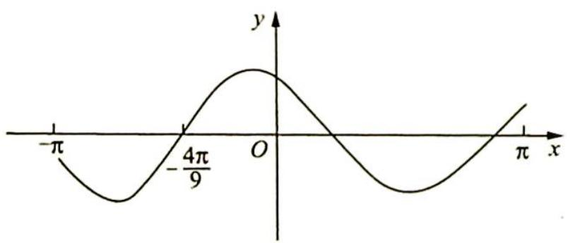

line

| x       | y       |
|---------|---------|
| -π      | -π      |
| -4π/9   | -π/9    |
| 0       | π       |
| π       | π       |

分析 ▶ 思路一(代数法):从函数图像与 x 轴的交点可以看出 $f(x)$ 的周期大于 $\pi$ 小于 $2\pi$ , 所以 $1<|\omega|<2$ ; 再根据特殊点 $\left(-\frac{4\pi}{9},0\right)$ 可得 $-\frac{4\pi}{9}\omega+\frac{\pi}{6}=-\frac{\pi}{2}+2k\pi(k\in\mathbf{Z})$ , 表示出 $\omega$ ; 最后结合范围可求出 $\omega$ 的值, 最小正周期 $T=\frac{2\pi}{\omega}$ .

思路二(几何法): 若 $\omega=1$ , 则图中的点 $\left(-\frac{4\pi}{9},0\right)$ 伸缩前对应点为 $\left(-\frac{2\pi}{3},0\right)$ , 根据 $\omega$ 的几何

意义可得 $\omega = \frac{-\frac{2\pi}{3}}{-\frac{4\pi}{9}}$ ，代入 $T = \frac{2\pi}{\omega}$ .

解析 ▶ 解法一(代数法): 由图像可得 $f(x)$ 的周期大于 $\pi$ 小于 $2\pi$ , 所以 $\pi < \left|\frac{2\pi}{\omega}\right| < 2\pi$ , $1 < |\omega| < 2$ . 函数图像过点 $\left(-\frac{4\pi}{9}, 0\right)$ , 所以 $-\frac{4\pi}{9}\omega + \frac{\pi}{6} = -\frac{\pi}{2} + 2k\pi (k \in \mathbf{Z})$ , $\omega = \frac{3}{2} - \frac{9}{2}k$ , $1 < \frac{3}{2} - \frac{9}{2}k < 2$ , 可得 $-\frac{1}{9} < k < \frac{1}{9}(k \in \mathbf{Z})$ , 则 $k = 0$ , 此时 $\omega = \frac{3}{2}$ , 所以最小正周期 $T = \frac{2\pi}{\frac{3}{2}} = \frac{4\pi}{3}$ , 故选 C.

解法二(几何法): 令 $\omega=1$ , 则 $f(x)=\cos\left(x+\frac{\pi}{6}\right)$ , 如图所示.

因为 $\omega = 1$ ，所以 $\left(-\frac{2\pi}{3}, 0\right)$ 经过伸缩变换以后对应点 $\left(-\frac{4\pi}{9}, 0\right)$ ，根据 $\omega$ 的几何意义知 $\omega = -\frac{2\pi}{3} - \frac{4\pi}{9} = \frac{3}{2}$ ，则 $T = \frac{2\pi}{\frac{3}{2}} = \frac{4\pi}{3}$ ，故选 C.

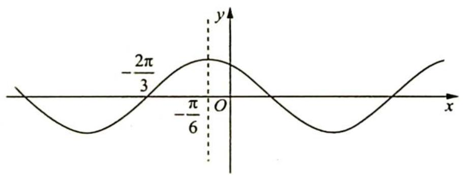

line

| x         | y         |
| --------- | --------- |
| -π/6      | -2π/3     |
| 0         | 0         |

变式 1 (2021 新课标全国甲卷 16) 已知函数 $f(x) = 2\cos (\omega x + \varphi)$ 的部分图像如图所示, 则满足条件 $\left(f(x) - f\left(-\frac{7\pi}{4}\right)\right)\left(f(x) - f\left(\frac{4\pi}{3}\right)\right) > 0$ 的最小正整数 $x$ 为 \_\_\_\_.

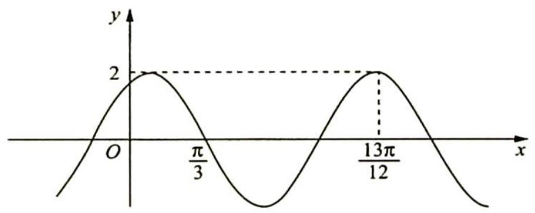

解析 由图可得 $\frac{3T}{4} = \frac{13\pi}{12} - \frac{\pi}{3} = \frac{3\pi}{4}$ , 所以 $T = \pi, \omega = 2, f\left(-\frac{7\pi}{4}\right) = f\left(\frac{\pi}{4}\right) > 0, f\left(\frac{4\pi}{3}\right) = f\left(\frac{\pi}{3}\right) = 0, \left(f(x) - f\left(-\frac{7\pi}{4}\right)\right)\left(f(x) - f\left(\frac{4\pi}{3}\right)\right) > 0$ 等价于 $\left(f(x) - f\left(\frac{\pi}{4}\right)\right)f(x) > 0$ , 显然不等式的解集应为如图所示阴影部分区域.

由 $\frac{\pi}{4} < 1 < \frac{\pi}{3}, \frac{\pi}{3} < 2 < \frac{5\pi}{6}$ 得满足不等式的最小正整数 $x$ 为2.

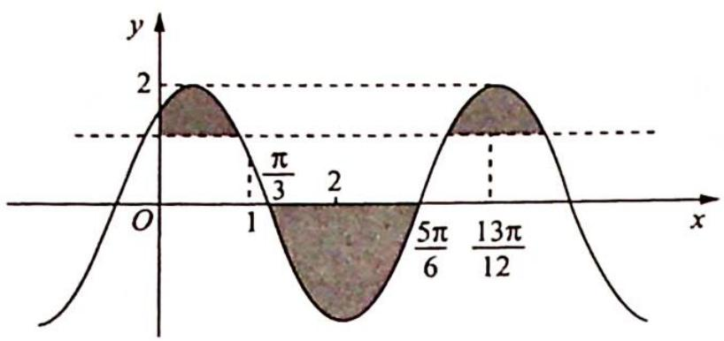

line

| x       | y     |
| ------- | ----- |
| 0       | 0     |
| 1       | π/3   |
| 2       | 2     |
| 5π/6    | 5π/6  |
| 13π/12  | 13π/12|
The chart displays a periodic waveform with labeled x-intervals and shaded regions indicating amplitude ranges.

变式2: 已知 $\omega > 0, |\varphi| < \frac{\pi}{2}$ , 函数 $f(x) = 2 \sin (\omega x + \varphi) + 1$ 的图像如图所示, $A, C, D$ 是 $f(x)$ 的图像与 $y = 1$ 相交后相邻的三个交点, 与 $x$ 轴交于相邻的两个交点 $O, B$ . 若在区间 $(a, b)$ 上, $f(x)$ 有 2024 个零点, 则 $b - a$ 的最大值为 ( ).

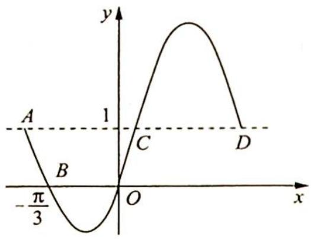

text_image

y
A
1
B
C
D
-π/3
O
x

A. $2020 \pi$

B. $\frac{3034\pi}{3}$

C. $\frac{3038\pi}{3}$

D. $1012\pi$

解析 由题意易知 $y = 1$ 是 $f(x)$ 的中轴线, 则 $|AC|$ 为 $\frac{T}{2} = \frac{\pi}{\omega}$ , 则有 $|OB| = \frac{\pi}{3} < \frac{\pi}{\omega} \Rightarrow 0 < \omega < 3$ , 进而 $f(0) = 2\sin (\omega \cdot 0 + \varphi) + 1 = 0$ , $\sin \varphi = -\frac{1}{2}$ , 且 $|\varphi| < \frac{\pi}{2}$ , 可得 $\varphi = -\frac{\pi}{6}$ .

又由 $2\sin \left(-\frac{\pi}{3}\omega -\frac{\pi}{6}\right) + 1 = 0$ 得 $-\frac{\pi}{3}\omega -\frac{\pi}{6} = -\frac{\pi}{6} +2k\pi (k\in \mathbf{Z})$ 或 $-\frac{\pi}{3}\omega -\frac{\pi}{6} = \frac{7\pi}{6} +2k\pi (k\in$ $\mathbf{Z})$ ，即 $\omega = -6k$ 或 $-6k - 4(k\in \mathbf{Z})$

因为 $0 < \omega < 3$ , 所以 $\omega = 2$ , 则 $T = \pi$ , 相邻 2 个零点的距离有两种 $\frac{\pi}{3}$ 和 $\frac{2\pi}{3}$ , 则当 $b - a$ 为 1012 个 $\frac{\pi}{3}$ 与 1013 个 $\frac{2\pi}{3}$ 的和时最大, 为 $\frac{3038\pi}{3}$ , 故选 C.

# 23.2 $\omega$ 的范围

# 1. 单调性 $\Rightarrow$ 周期性

# 研究密钥

对于 $f(x)=A\sin(\omega x+\varphi)$ ，根据单调性求 $\omega$ ，主要是关注单调区间的端点。

方法一(代数法):根据单调区间的长度初步确定 $\omega$ 的取值范围:

如果函数在单调区间内递增,则 $-\frac{\pi}{2}+2k\pi\leqslant\omega x+\varphi\leqslant\frac{\pi}{2}+2k\pi(k\in\mathbf{Z})$ 。

如果函数在单调区间内递减,则 $\frac{\pi}{2} + 2k\pi \leqslant \omega x + \varphi \leqslant \frac{3\pi}{2} + 2k\pi (k \in \mathbf{Z})$ .

如果函数只是在区间内单调, 则 $k\pi - \frac{\pi}{2} \leqslant \omega x + \varphi \leqslant k\pi + \frac{\pi}{2} (k \in \mathbb{Z})$ , 取交集可得 $\omega$ 的取值范围.

方法二(几何法): 在 $\omega$ 的作用下, 单调区间内的函数图像在伸缩前后单调性不变, 由区间端点伸缩前后的比值可得 $\omega$ 的取值范围: 压缩时取到最大值, 伸长时取到最小值.

例 23.2 已知 $\omega > 0$ ，函数 $f(x) = \sin \left( \omega x + \frac{\pi}{4} \right)$ 在区间 $\left[ \frac{\pi}{2}, \pi \right]$ 上单调递减，则实数 $\omega$ 的取值范围是（ ）.

A. $\left[\frac{1}{2}, \frac{5}{4}\right]$

B. $\left[\frac{1}{2},\frac{3}{4}\right]$

C. $\left(0,\frac{1}{2}\right]$

D. $(0,2]$

分析 ▶ 思路一(代数法):根据单调区间的长度可得 $\pi - \frac{\pi}{2} \leqslant \frac{T}{2}$ ，所以 $0 < \omega \leqslant 2$ 。又 $f(x)$ 在区间 $\left[\frac{\pi}{2}, \pi\right]$ 上单调递减，则 $\frac{\pi}{2} + 2k\pi \leqslant \frac{\pi}{2}\omega + \frac{\pi}{4} < \pi\omega + \frac{\pi}{4} \leqslant \frac{3\pi}{2} + 2k\pi (k \in \mathbb{Z})$ ，取交集可得 $\omega$ 的取值范围。

思路二(几何法): $f(x)=\sin\left(x+\frac{\pi}{4}\right)$ 的单调递减区间 $\frac{\pi}{4}\leqslant x\leqslant\frac{5\pi}{4}$ 经过伸缩以后落到区间 $\left[\frac{\pi}{2},\pi\right]$ 内，根据 $\omega$ 的几何意义可得 $\omega_{\min}=\frac{\frac{\pi}{4}}{\frac{\pi}{2}}=\frac{1}{2},\omega_{\max}=\frac{\frac{5\pi}{4}}{\pi}=\frac{5}{4}.$

解析 ▶ 解法一(代数法): 因为 $f(x)$ 在区间 $\left[\frac{\pi}{2}, \pi\right]$ 上单调, 所以 $\pi - \frac{\pi}{2} \leqslant \frac{T}{2}$ , 可得 $0 < \omega \leqslant 2$ .
当 $x \in \left[\frac{\pi}{2}, \pi\right]$ 时， $\omega x + \frac{\pi}{4} \in \left[\frac{\pi}{2}\omega + \frac{\pi}{4}, \pi\omega + \frac{\pi}{4}\right]$ .

要使得 $f(x)$ 在区间 $\left[\frac{\pi}{2},\pi\right]$ 上单调递减，需要满足 $\frac{\pi}{2} + 2k\pi \leqslant \frac{\pi}{2}\omega + \frac{\pi}{4} < \pi\omega + \frac{\pi}{4} \leqslant \frac{3\pi}{2} + 2k\pi (k \in \mathbf{Z})$ ，解得 $\frac{1}{2} + 4k \leqslant \omega \leqslant \frac{5}{4} + 2k$ ，令 $k = 0$ ，则 $\frac{1}{2} \leqslant \omega \leqslant \frac{5}{4}$ ，故选A.

解法二(几何法): 令 $\omega = 1$ , 则 $f(x) = \sin \left(x + \frac{\pi}{4}\right)$ , 其图像如右图所示.

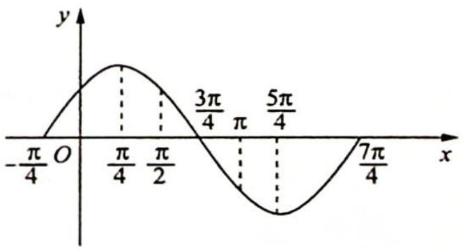

line

| x       | y       |
| ------- | ------- |
| -π/4    | 0       |
| π/4     | π/4     |
| π/2     | 3π/4    |
| π       | π       |
| 5π/4    | 5π/4    |
| 7π/4    | 7π/4    |

若将 $f(x) = \sin \left(x + \frac{\pi}{4}\right)$ 的图像伸长至 $f(x) = \sin \left(\omega x + \frac{\pi}{4}\right)$ ,

使得 $f(x)$ 在区间 $\left[\frac{\pi}{2},\pi\right]$ 上单调递减，则 $\frac{\pi}{4} \xrightarrow{\max} \frac{\pi}{2}$ ，可得 $\omega_{\min} = \frac{\frac{\pi}{4}}{\frac{\pi}{2}} = \frac{1}{2}$ ；若将 $f(x) = \sin \left(x + \frac{\pi}{4}\right)$

的图像缩短至 $f(x) = \sin \left(\omega x + \frac{\pi}{4}\right)$ , 使得 $f(x)$ 在区间 $\left[\frac{\pi}{2}, \pi\right]$ 上单调递减, 则 $\frac{5\pi}{4} \xrightarrow{\min} \pi$ , 可得 $\omega_{\max} = \frac{5}{4}$ . 所以 $\frac{1}{2} \leqslant \omega \leqslant \frac{5}{4}$ , 故选 A.

变式(1) 若函数 $f(x) = \sin \left( \omega x + \frac{\pi}{3} \right) (\omega > 0)$ 在区间 $(\pi, 2\pi)$ 内没有最值, 则 $\omega$ 的取值范围是 ( ).

A. $\left(0, \frac{1}{12}\right] \cup \left[\frac{1}{6}, \frac{7}{12}\right]$

B. $\left(0,\frac{1}{6}\right]\cup\left[\frac{1}{3},\frac{2}{3}\right]$

C. $\left( {0,\frac{7}{12}}\right\rbrack$

D. $\left[\frac{1}{3}, \frac{2}{3}\right]$

解析 ▶ 解法一(代数法): 因为 $f(x)$ 在区间 $(\pi, 2\pi)$ 内没有最值, 所以 $f(x)$ 在 $(\pi, 2\pi)$ 内单调, 即 $\frac{T}{2} \geqslant 2\pi - \pi, \frac{\pi}{\omega} \geqslant \pi$ , 则 $0 < \omega \leqslant 1$ .

当 $x \in (\pi, 2\pi)$ 时， $\omega x + \frac{\pi}{3} \in \left(\pi \omega + \frac{\pi}{3}, 2\pi \omega + \frac{\pi}{3}\right)$ ，所以 $k\pi - \frac{\pi}{2} \leqslant \pi \omega + \frac{\pi}{3} < 2\pi \omega + \frac{\pi}{3} \leqslant k\pi + \frac{\pi}{2}(k \in \mathbf{Z})$ ，即 $k - \frac{5}{6} \leqslant \omega \leqslant \frac{k}{2} + \frac{1}{12}$ .

由 $\left\{\begin{aligned}\frac{k}{2}+\frac{1}{12}&\geqslant k-\frac{5}{6}\\ \frac{k}{2}+\frac{1}{12}&>0\end{aligned}\right.$ 解得 $-\frac{1}{6}<k\leqslant\frac{11}{6}(k\in\mathbf{Z})$ ，所以k=0或k=1。

当 $k = 0$ 时， $-\frac{5}{6} \leqslant \omega \leqslant \frac{1}{12}$ ，又因为 $\omega > 0$ ，所以 $0 < \omega \leqslant \frac{1}{12}$ ；当 $k = 1$ 时， $\frac{1}{6} \leqslant \omega \leqslant \frac{7}{12}$ ，故选A.

解法二(几何法): $f_{1}(x) = \sin \left(x + \frac{\pi}{3}\right)$ 的图像如右图所示, 若 $f(x) = \sin \left(\omega x + \frac{\pi}{3}\right)$ 在 $(\pi, 2\pi)$ 内没有最值, 则 $f(x)$ 在区间 $(\pi, 2\pi)$ 上单调, $\pi \leqslant \frac{T}{2}$ , 即 $T \geqslant 2\pi$ , 可得 $0 < \omega \leqslant 1$ . 显然将

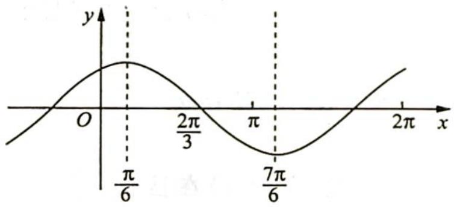

line

| x       | y       |
| ------- | ------- |
| 0       | 0       |
| π/6     | π/6     |
| 2π/3    | 0       |
| π       | -π/6    |
| 7π/6    | 0       |
| 2π      | π/6     |

函数 $f_{1}(x)$ 的图像伸长到 $f(x)$ ，则 $\frac{\pi}{6} \xrightarrow{\min} 2\pi$ ，可得 $0 < \omega \leqslant \frac{1}{12}$ 或 $\frac{\pi}{6} \xrightarrow{\max} \pi, \omega_{\min} = \frac{1}{6}, \frac{7\pi}{6} \xrightarrow{\min} 2\pi$ ，可得 $\omega_{\max} = \frac{7}{12}$ ，则 $\omega$ 的取值范围为 $\left(0, \frac{1}{12}\right] \cup \left[\frac{1}{6}, \frac{7}{12}\right]$ ，故选 A.

# 2. 对称性(对称中心和对称轴)⇒周期性

# 研究密钥

$f(x)=A\sin(\omega x+\varphi)\left(\omega>0,0<\varphi<\frac{\pi}{2}\right)$ 在区间内有几个对称轴、对称中心(零点)，关注区间的端点.

方法一(代数法):根据区间长度可以初步确定 $\omega$ 的范围:

如果函数在区间 $(x_{1},x_{2})$ 内没有最大值点，则 $\frac{\pi}{2}+2n\pi<\omega x_{i}+\varphi<\frac{5\pi}{2}+2n\pi(n\in\mathbb{Z},i=1,2)$ .

如果函数在区间 $(0,\pi]$ 内至少有n个最大值点，则 $\omega\pi+\varphi\geqslant\frac{\pi}{2}+2(n-1)\pi(n\in\mathbf{N}^{*})$ .

如果函数在区间 $(0, \pi]$ 内恰好有 $n$ 个最大值点，则 $\frac{\pi}{2} + 2n\pi > \omega\pi + \varphi \geqslant \frac{\pi}{2} + 2(n-1)\pi (n \in \mathbb{N}^*)$ 。

如果函数在区间 $(0,\pi]$ 内至多有n个最大值点，则 $\omega\pi+\varphi\leqslant\frac{\pi}{2}+2(n-1)\pi(n\in\mathbb{N}^{*})$ .

方法二(几何法): 将 $f(x) = A \sin (x + \varphi)$ 的对称轴或对称中心 (零点) 伸缩变换至区间端点处, 若包含这个点则变换至区间内, 若不包含则变换至区间外, 根据变换前后横坐标的比值确定 $\omega$ .

例23.3 已知函数 $f(x) = \sin^2{\frac{\omega x}{2}} + \frac{1}{2}\sin \omega x - \frac{1}{2} (\omega > 0), x \in \mathbb{R}$ ，若 $f(x)$ 在区间 $(\pi, 2\pi)$ 内没有零点，则 $\omega$ 的取值范围是（ ）.

A. $\left(0, \frac{1}{8}\right]$

B. $\left(0,\frac{1}{4}\right]\cup\left[\frac{5}{8},1\right)$

C. $\left(0, \frac{5}{8}\right]$

D. $\left(0, \frac{1}{8}\right] \cup \left[\frac{1}{4}, \frac{5}{8}\right]$

分析 ▶ 思路一(代数法): 没有零点的区间最多为半个周期, 所以根据区间长度可得 $2 \pi - \pi \leqslant \frac{T}{2}$ , 即 $0 < \omega \leqslant 1$ ; 再考虑到区间端点可得 $k \pi \leqslant \omega x + \varphi \leqslant k \pi + \pi (k \in \mathbf{Z})$ , 表示出 $\omega$ , 求交集即可.

思路二(几何法): 可以将 $f(x)=\frac{\sqrt{2}}{2}\sin\left(x-\frac{\pi}{4}\right)$ 的没有零点的区间 $\left(0,\frac{\pi}{4}\right)$ 或 $\left(\frac{\pi}{4},\frac{5\pi}{4}\right)$ 伸缩变换至区间 $(\pi,2\pi)$ 内, 解得 $\omega_{\min}=\frac{0}{\pi}=0,\omega_{\max}=\frac{\frac{\pi}{4}}{2\pi}=\frac{1}{8}$ 或 $\omega_{\min}=\frac{\frac{\pi}{4}}{\pi}=\frac{1}{4},\omega_{\max}=\frac{\frac{5\pi}{4}}{2\pi}=\frac{5}{8}.$

思路三(几何法):首先根据区间长度可得 $0<\omega\leqslant1$ , 用 $\omega$ 表示出所有零点, 依次将不含零点的区间与 $(\pi,2\pi)$ 对应, 求出 $\omega$ 的范围, 再与 $0<\omega\leqslant1$ 求交集.

解析 ▶ 解法一(代数法): $f(x) = \sin^{2} \frac{\omega x}{2} + \frac{1}{2} \sin \omega x - \frac{1}{2} = \frac{1 - \cos \omega x}{2} + \frac{1}{2} \sin \omega x - \frac{1}{2} = \frac{1}{2} \sin \omega x - \frac{1}{2} \cos \omega x = \frac{\sqrt{2}}{2} \sin \left(\omega x - \frac{\pi}{4}\right), f(x)$ 在区间 $(\pi, 2\pi)$ 内没有零点, 所以 $2\pi - \pi \leqslant \frac{T}{2}$ , 即 $0 < \omega \leqslant 1$ .

$k\pi \leqslant \omega\pi - \frac{\pi}{4} < 2\omega\pi - \frac{\pi}{4} \leqslant k\pi + \pi (k \in \mathbb{Z})$ ，即 $\omega \geqslant k + \frac{1}{4}$ 且 $\omega \leqslant \frac{k}{2} + \frac{5}{8}$ ，由 $\left\{\begin{aligned}\frac{k}{2}+\frac{5}{8} &\geqslant k+\frac{1}{4}\\ \frac{k}{2}+\frac{5}{8} &>0\end{aligned}\right.$ 解得 $-\frac{5}{4}<k\leqslant\frac{3}{4}(k\in\mathbb{Z})$ ，所以 k=-1,0.

令 $k = -1, 0 < \omega \leqslant \frac{1}{8}$ ; 令 $k = 0, \frac{1}{4} \leqslant \omega \leqslant \frac{5}{8}$ , 故选 D.

解法二(几何法): 同解法一, 化简可得 $f(x)=\frac{\sqrt{2}}{2}\sin\left(\omega x-\frac{\pi}{4}\right)$ , $f(x)$ 在区间 $(\pi,2\pi)$ 内没有零点, 所以 $2\pi-\pi\leqslant\frac{T}{2}$ , 即 $0<\omega\leqslant1$ .

令 $\omega = 1$ ，则 $f(x) = \frac{\sqrt{2}}{2}\sin \left(x - \frac{\pi}{4}\right)$ ，若将 $f(x) = \frac{\sqrt{2}}{2}\sin \left(x - \frac{\pi}{4}\right)$ 的图像伸长至 $f(x) = \frac{\sqrt{2}}{2}\sin (\omega x - \frac{\pi}{4})$ ，如图1所示，使得 $f(x)$ 在区间 $(\pi, 2\pi)$ 内没有零点，第一种情形： $\frac{\pi}{4} \xrightarrow{\min} 2\pi$ ，则 $\omega_{\max} = \frac{\frac{\pi}{4}}{2\pi} = \frac{1}{8}$ ，故 $0 < \omega \leqslant \frac{1}{8}$ . 第二种情形： $\frac{\pi}{4} \xrightarrow{\max} \pi, \omega_{\min} = \frac{\frac{\pi}{4}}{\pi} = \frac{1}{4}, \frac{5\pi}{4} \xrightarrow{\min} 2\pi, \omega_{\max} = \frac{\frac{5\pi}{4}}{2\pi} = \frac{5}{8}$ ，则 $\frac{1}{4} \leqslant \omega \leqslant \frac{5}{8}$ .

所以 $0 < \omega \leqslant \frac{1}{8}$ 或 $\frac{1}{4} \leqslant \omega \leqslant \frac{5}{8}$ , 故选 D.

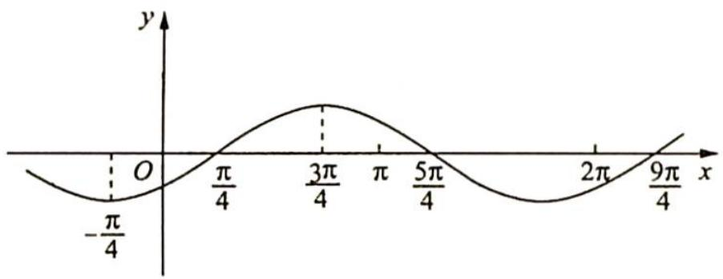

line

| x       | y       |
| ------- | ------- |
| 0       | -π/4    |
| π/4     | π/4     |
| 3π/4    | π/4     |
| π       | 5π/4    |
| 2π      | 0       |
| 9π/4    | π/4     |

图1

解法三(几何法): 同解法一可得 $f(x)=\frac{\sqrt{2}}{2}\sin\left(\omega x-\frac{\pi}{4}\right)$ ，且 $0<\omega\leqslant1$ .

根据图2可得:若 $y=\frac{\sqrt{2}}{2}\sin\left(\omega x-\frac{\pi}{4}\right)$ 在区间 $(\pi,2\pi)$ 内没有零点, 则 $2\pi\leqslant\frac{\pi}{4\omega}$ , 解得 $0<\omega\leqslant\frac{1}{8}$ ; 若 $\frac{\pi}{4\omega}\leqslant\pi<2\pi\leqslant\frac{5\pi}{4\omega}$ , 解得 $\frac{1}{4}\leqslant\omega\leqslant\frac{5}{8}$ ; 若 $\frac{5\pi}{4\omega}\leqslant\pi<2\pi\leqslant\frac{9\pi}{4\omega}$ , 解得 $\omega\geqslant\frac{5}{4}$ 且 $\omega\leqslant\frac{9}{8}$ , 无解.

所以 $0 < \omega \leqslant \frac{1}{8}$ 或 $\frac{1}{4} \leqslant \omega \leqslant \frac{5}{8}$ , 故选 D.

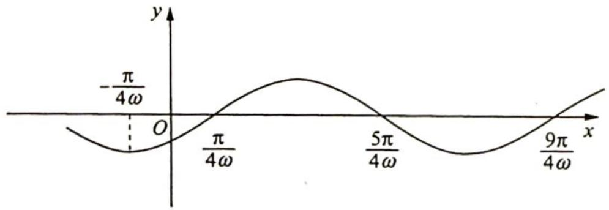

line

| x         | y         |
| --------- | --------- |
| 0         | -π/4ω     |
| π/4ω      | π         |
| 5π/4ω     | 5π/4ω     |
| 9π/4ω     | 9π/4ω     |

图 2

变式(1) (2019 新课标全国Ⅲ卷理 12) 设函数 $y = \sin \left( \omega x + \frac{\pi}{5} \right) (\omega > 0)$ ，已知 $f(x)$ 在 $[0, 2\pi]$ 有且仅有 5 个零点。下述四个结论：

① $f(x)$ 在 $(0,2\pi)$ 有且仅有3个极大值点；② $f(x)$ 在 $(0,2\pi)$ 有且仅有2个极小值点；

③ $f(x)$ 在 $\left(0,\frac{\pi}{10}\right)$ 上单调递增；④ $\omega$ 的取值范围是 $\left[\frac{12}{5},\frac{29}{10}\right)$ .

其中所有正确结论的编号是( ).

A. ①④

B. ②③

C. ①②③

D. ①③④

解析 根据图像可得 $y=\sin\left(x+\frac{\pi}{5}\right)$ 在 y 轴右侧的第 5 个零点为 $\frac{24\pi}{5}$ ，第 6 个零点为 $\frac{29\pi}{5}$ ，要使得 $f(x)$ 在 $[0,2\pi]$ 有且仅有 5 个零点，故 $\frac{24\pi}{5}\xrightarrow{\max}2\pi$ （取得到）， $\omega_{\min}=\frac{12}{5},\frac{29\pi}{5}\xrightarrow{\min}2\pi$ （取不到）， $\omega_{\max}=\frac{29}{10}$ ，因此 $\frac{12}{5}\leqslant\omega<\frac{29}{10}$ ，故④正确。

由图像可得, 当 $y = \sin \left( x + \frac{\pi}{5} \right)$ 取到 5 个零点时, 有且仅有 3 个极大值点, 有 2 个或者 3 个极小值点, 故①正确, ②错误.

因为 $\omega \in \left[\frac{12}{5}, \frac{29}{10}\right)$ , 所以 $\omega < 3$ , 则对称轴 $\frac{3\pi}{10}$ 伸缩变换以后在 $\frac{\pi}{10}$ 的右侧, 所以 $f(x)$ 在 $(0, \frac{\pi}{10})$ 上单调递增, 故③正确.

综上所述,正确结论的编号有①③④,故选D.

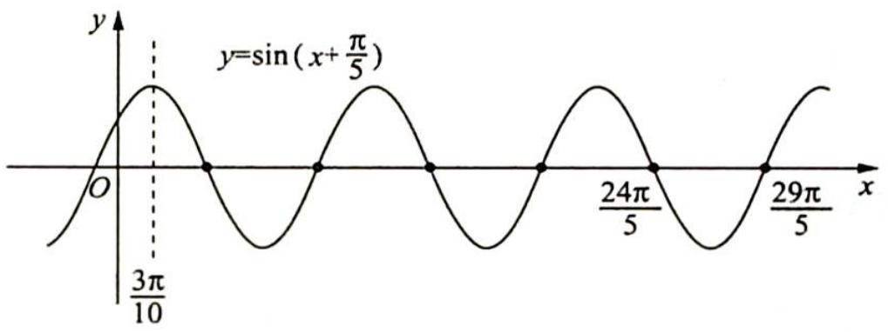

line

| x         | y          |
| --------- | ---------- |
| 0         | sin(x+π/5) |
| 3π/10     | sin(x+π/5) |
| 24π/5     | sin(x+π/5) |
| 29π/5     | sin(x+π/5) |

例 23.4 函数 $f(x)=\sin\left(\omega x+\frac{\pi}{4}\right)(\omega>0)$ 的图像在 $[0,2]$ 上至少有三个最大值点，求 $\omega$ 的取值范围.

分析 ▶ 思路一(代数法): $f(x) = \sin x$ 对应的第三个最大值点的横坐标为 $\frac{9\pi}{2}$ , 只需要保证 $\omega x + \frac{\pi}{4}$ 所在区间包含第三个最大值点即可.

思路二(几何法): 将 $f(x)=\sin\left(x+\frac{\pi}{4}\right)$ 的第 3 个最大值点的横坐标 $\frac{17\pi}{4}$ 压缩至区间 [0,2] 内, 可得 $\omega$ 的取值范围.

解析 ▶ 解法一(代数法):由图1可得 $f(x)=\sin x$ 对应的第三个最大值点的横坐标为 $\frac{9\pi}{2}, f(x)=\sin\left(\omega x+\frac{\pi}{4}\right)(\omega>0)$ 的图像在 $[0,2]$ 上至少有三个最大值点, 则 $2\omega+\frac{\pi}{4}\geqslant\frac{9\pi}{2}$ , 解得 $\omega\geqslant\frac{17\pi}{8}$ , 所以 $\omega$ 的取值范围是 $\left[\frac{17\pi}{8},+\infty\right)$ .

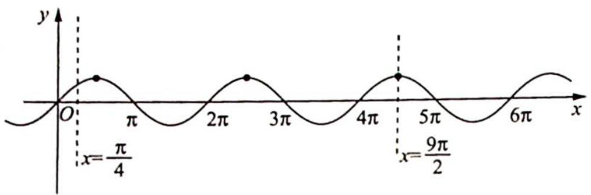

line

| x       | y     |
| ------- | ----- |
| 0       | 0     |
| π/4     | π/4   |
| 3π/4    | 0     |
| 5π/4    | π/2   |
| 7π/4    | 0     |

图 1

解法二(几何法):根据图2可得 $f(x)=\sin\left(x+\frac{\pi}{4}\right)$ 的第3个最大值点的横坐标为 $\frac{17\pi}{4}$ ，根据题意将 $\frac{17\pi}{4}\xrightarrow{max}2$ ，可得 $\omega_{\min}=\frac{\frac{17\pi}{4}}{2}=\frac{17\pi}{8}$ ，所以 $\omega\geqslant\frac{17\pi}{8}$ ，故 $\omega$ 的取值范围是 $\left[\frac{17\pi}{8},+\infty\right)$ .

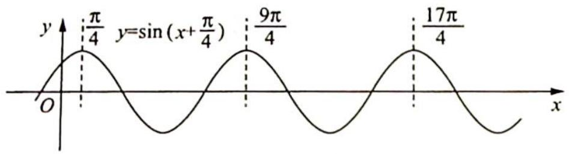

line

| x       | y          |
| ------- | ---------- |
| 0       | 0          |
| π/4     | π/4        |
| 9π/4    | 9π/4       |
| 17π/4   | 17π/4      |

图 2

变式(1) (2022 新课标全国甲卷理 11) 设函数 $f(x) = \sin \left( {\omega x + \frac{\pi}{3}}\right)$ 在区间 $(0, \pi)$ 恰有三个极值点、两个零点, 则 $\omega$ 的取值范围是( ).

A. $\left[\frac{5}{3},\frac{13}{6}\right)$

B. $\left[\frac{5}{3},\frac{19}{6}\right)$

C. $\left(\frac{13}{6},\frac{8}{3}\right]$

D. $\left(\frac{13}{6},\frac{19}{6}\right]$

解析 ▶ 解法一(代数法): 令 $t = \omega x + \frac{\pi}{3}$ , 因为 $x \in (0, \pi), \omega > 0$ , 所以 $t \in \left(\frac{\pi}{3}, \omega \pi + \frac{\pi}{3}\right)$ , 结合 $y = \sin t$ 的图像得 $\frac{5\pi}{2} < \omega \pi + \frac{\pi}{3} \leqslant 3\pi$ , 解得 $\frac{13}{6} < \omega \leqslant \frac{8}{3}$ , 故选 C.

解法二(几何法): 令 $\omega = 1, f_{1}(x) = \sin \left(x + \frac{\pi}{3}\right)$ , 其图像如下图所示.

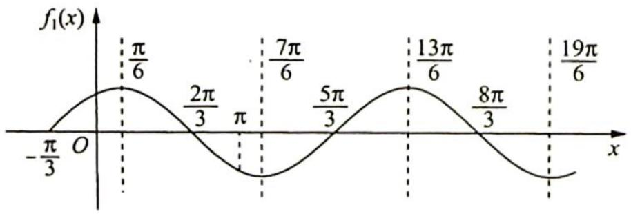

line

| x       | f₁(x)   |
| ------- | ------- |
| -π/3    | 0       |
| π/6     | π/6     |
| 2π/3    | 2π/3    |
| π       | π       |
| 7π/6    | 7π/6    |
| 5π/3    | 5π/3    |
| 13π/6   | 13π/6   |
| 8π/3    | 8π/3    |
| 19π/6   | 19π/6   |

若 $f(x) = \sin \left(\omega x + \frac{\pi}{3}\right)$ 在区间 $(0, \pi)$ 上恰有三个极值点、两个零点，则 $\frac{13\pi}{6} \xrightarrow{\max} \pi$ （取不到），可得 $\omega_{\min} = \frac{13}{6}$ ，取不到； $\frac{8\pi}{3} \xrightarrow{\min} \pi$ （取得到），可得 $\omega_{\max} = \frac{8}{3}$ ，取得到。

因此 $\frac{13}{6} < \omega \leqslant \frac{8}{3}$ , 故选 C.

变式(2) 已知函数 $f(x) = \sqrt{3}\sin \omega x + \cos \omega x (\omega > 0)$ 在区间 $\left[-\frac{\pi}{4}, \frac{\pi}{3}\right]$ 上恰有一个最大值点和一个最小值点,则实数 $\omega$ 的取值范围为().

A. $\left[\frac{8}{3},7\right)$

B. $\left[\frac{8}{3}, 4\right)$

C. $\left[4, \frac{20}{3}\right)$

D. $\left(\frac{20}{3},7\right)$

解析 $f(x) = \sqrt{3}\sin \omega x + \cos \omega x = 2\left(\frac{\sqrt{3}}{2}\sin \omega x + \frac{1}{2}\cos \omega x\right) = 2\sin \left(\omega x + \frac{\pi}{6}\right)$ . 因为 $f(x)$ 在区间 $\left[-\frac{\pi}{4}, \frac{\pi}{3}\right]$ 上恰有一个最大值点和一个最小值点，令 $f_{1}(x) = 2\sin \left(x + \frac{\pi}{6}\right)$ ，若 $f(x) = 2\sin \left(\omega x + \frac{\pi}{6}\right)$ 在区间 $\left[-\frac{\pi}{4}, \frac{\pi}{3}\right]$ 上恰有一个最大值点和一个最小值点，则函数 $f_{1}(x) = 2\sin \left(x + \frac{\pi}{6}\right)$ 到 $f(x) = 2\sin \left(\omega x + \frac{\pi}{6}\right)$ 一定是压缩变换，且 $-\frac{2\pi}{3} \xrightarrow{\max} -\frac{\pi}{4}$ （取得到）， $\omega_{\min} = \frac{8}{3}$ ; $\frac{4\pi}{3} \xrightarrow{\min} \frac{\pi}{3}$ （取不到）， $\omega_{\max} = 4$ ，因此 $\frac{8}{3} \leqslant \omega < 4$ ，故选 B.

变式(3) 已知函数 $f(x) = 2\sin \omega x (\omega > 0)$ 在区间 $\left[-\frac{\pi}{2}, \frac{2\pi}{3}\right]$ 上是增函数, 且在区间 $[0, \pi]$ 上恰好取得一次最大值, 则 $\omega$ 的取值范围是 ( ).

A. $(0,1]$

B. $\left(0,\frac{3}{4}\right]$

C. $[1, +\infty)$

D. $\left[\frac{1}{2}, \frac{3}{4}\right]$

解析 ▶ 令 $f_{1}(x)=2\sin x$ ，如右图所示.

若 $f(x) = 2\sin \omega x$ 在 $\left[-\frac{\pi}{2}, \frac{2\pi}{3}\right]$ 上单调递增，且在 $[0, \pi]$ 上恰好取得一次最大值，则 $\frac{\pi}{2} \xrightarrow{\min} \frac{2\pi}{3}, \omega_{\max} = \frac{3}{4}; \frac{\pi}{2} \xrightarrow{\max} \pi, \omega_{\min} = \frac{1}{2}$ ，因此 $\omega$ 的取值范围是 $\left[\frac{1}{2}, \frac{3}{4}\right]$ ，故选 D.

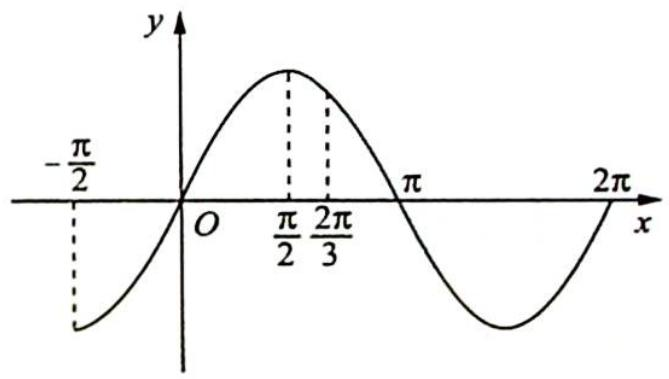

line

| x       | y       |
| ------- | ------- |
| -π/2    | -π/2    |
| π/2     | π/2     |
| 2π/3    | 2π/3    |
| π       | π       |
| 2π      | 2π      |

# 23.3 $\varphi$ 的范围

# 研究密钥

对于函数 $f(x) = \sin \omega x (\omega > 0)$ 经平移变换后得到 $g(x) = \sin (\omega x + \varphi) = \sin \left[\omega \left(x + \frac{\varphi}{\omega}\right)\right] (\omega > 0)$ .

$\frac{\varphi}{\omega}$ 的几何意义:如右图所示,在平移变换前后,对应点横坐标的差值, $\frac{\varphi}{\omega}=x_{A}-x_{A'}$ ,即 $\varphi=\omega(x_{A}-x_{A'})$ .

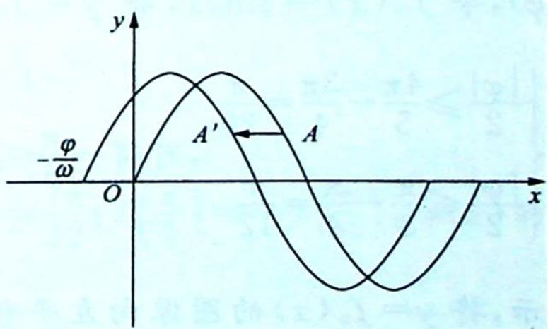

text_image

-φ/ω
O
A'
A
x
y

例23.5 若函数 $f(x) = \cos (2x + \varphi)(0 < \varphi < \pi)$ 在区间 $\left[-\frac{\pi}{6}, \frac{\pi}{6}\right]$ 上单调递减，且在区间 $(0, \frac{\pi}{6})$ 上存在零点，则 $\varphi$ 的取值范围是（ ）.

A. $\left(\frac{\pi}{6}\cdot\frac{\pi}{2}\right]$

B. $\left[\frac{2\pi}{3},\frac{5\pi}{6}\right)$

C. $\left(\frac{\pi}{2},\frac{2\pi}{3}\right]$

D. $\left[\frac{\pi}{3},\frac{\pi}{2}\right)$

分析 ▶ 运用图像平移变换求解 $\varphi$ 的取值范围.

解析 令 $\varphi=0$ ，其图像如图所示.

若 $f(x) = \cos (2x + \varphi)(0 <   \varphi <  \pi)$ 在区间 $\left[-\frac{\pi}{6},\frac{\pi}{6}\right]$ 上单调递减，则 $\frac{\varphi}{2} \geqslant \frac{\pi}{6}$ ，可得 $\varphi \geqslant \frac{\pi}{3}$

又 $f(x)$ 在区间 $\left(0, \frac{\pi}{6}\right)$ 上存在零点， $\frac{\pi}{4} - \frac{\pi}{6} < \frac{\varphi}{2} < \frac{\pi}{4}$ ，可得 $\frac{\pi}{6} < \varphi < \frac{\pi}{2}$ .

综上所述, $\varphi$ 的取值范围为 $\left[\frac{\pi}{3},\frac{\pi}{2}\right)$ ，故选D.

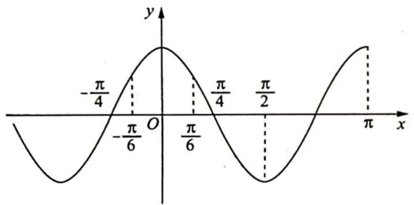

line

| x       | y       |
| ------- | ------- |
| -π/4    | 0       |
| -π/6    | π/6     |
| π/6     | 0       |
| π/4     | -π/4    |
| π/2     | 0       |
| π       | π       |

变式(1) 已知函数 $f(x) = \sin (\omega x + \varphi) \left( \omega > 0, |\varphi| < \frac{\pi}{2} \right)$ 的最小正周期为 $\pi$ , 且 $f(x)$ 是 $\left( \frac{\pi}{3}, \frac{4\pi}{5} \right)$ 上的单调函数, 则 $\varphi$ 的取值范围是 ( ).

A. $\left(-\frac{\pi}{2},-\frac{\pi}{6}\right]$

B. $\left(-\frac{\pi}{2},\frac{\pi}{6}\right]$

C. $\left[-\frac{\pi}{6}, -\frac{\pi}{10}\right]$

D. $\left[-\frac{\pi}{6}, \frac{\pi}{2}\right)$

解析 依题意得 $T = \frac{2\pi}{\omega} = \pi$ ，则 $\omega = 2, f(x) = \sin (2x + \varphi)$ ，令 $f_0(x) = \sin 2x$ ，将 $y = f_0(x)$ 向右平移 $\frac{|\varphi|}{2}$ 个单位，则 $\left\{ \begin{array}{l} \frac{|\varphi|}{2} \geqslant \frac{4\pi}{5} - \frac{3\pi}{4} = \frac{\pi}{20} \\ \frac{|\varphi|}{2} \leqslant \frac{\pi}{3} - \frac{\pi}{4} = \frac{\pi}{12} \end{array} \right.$ ，可得 $-\frac{\pi}{6} \leqslant \varphi \leqslant -\frac{\pi}{10} \left( \frac{\pi}{2} < \varphi < 0 \right)$ . 如右图所

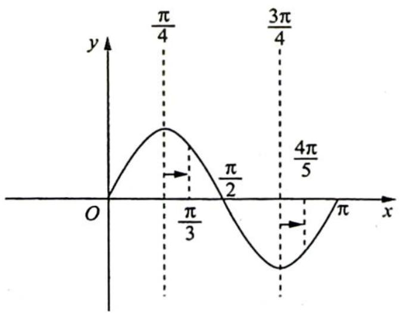

line

| x       | y       |
| ------- | ------- |
| 0       | 0       |
| π/4     | π/4     |
| π/2     | π/2     |
| 3π/4    | 3π/4    |
| 4π/5    | 4π/5    |
| π       | π       |

示, 将 $y = f_{0}(x)$ 的图像向左平移 $\frac{\varphi}{2}$ 个单位长度 $\left(0 < \varphi < \frac{\pi}{2}\right)$ , 显然 $f(x)$ 在区间 $\left(\frac{\pi}{3}, \frac{4\pi}{5}\right)$ 上不单调, 故选 C.

# 23.4 转化中枢——对称性

# 研究密钥

三角函数的性质(对称性、周期性、奇偶性、单调性)有着密切的联系,它们经常交织在一起综合应用.其中,对称性处于一个较核心的位置,由它辐射可挖掘出许多隐含的性质信息.

对称性 $\Rightarrow$ 奇偶性

若函数图像关于坐标原点对称,则函数 $f(x)$ 为奇函数;若函数图像关于 $y$ 轴对称,则函数 $f(x)$ 为偶函数.

对称性 $\Rightarrow$ 周期性

相邻的两条对称轴之间的距离为 $\frac{T}{2}$ ; 相邻的对称中心之间的距离为 $\frac{T}{2}$ ; 相邻的对称轴与对称中心之间的距离为 $\frac{T}{4}$ .

对称性 $\Rightarrow$ 单调性

在相邻的对称轴之间, 函数 $f(x)$ 单调. 特别地, 若 $f(x)=A\sin\omega x, A>0, \omega>0$ , 函数 $f(x)$ 在 $[\theta_1, \theta_2]$ 上单调, 且 $0 \in [\theta_1, \theta_2]$ , 设 $\theta=\max\{|\theta_1|, \theta_2\}$ , 则 $\frac{T}{4} \geqslant \theta$ , 深刻体现了三角函数的单调性与周期性、对称性之间的紧密联系.

例 23.6 设函数 $f(x)=A\sin(\omega x+\varphi)(A>0,\omega>0)$ ，若 $f(x)$ 在区间 $\left[\frac{\pi}{6},\frac{\pi}{2}\right]$ 上具有单调性，且 $f\left(\frac{\pi}{2}\right)=f\left(\frac{2\pi}{3}\right)=-f\left(\frac{\pi}{6}\right)$ ，则 $f(x)$ 的最小正周期为 \_\_\_\_.

分析 ▶ 由单调性可以确定周期的范围,根据 $f\left(\frac{\pi}{2}\right) = f\left(\frac{2\pi}{3}\right) = -f\left(\frac{\pi}{6}\right)$ , 可得 $f(x)$ 的一条对称轴和一个对称中心,再由此可以得到最小正周期.

解析 如图 1、图 2 所示, 因为 $f(x)$ 在区间 $\left[\frac{\pi}{6}, \frac{\pi}{2}\right]$ 上具有单调性, 所以 $\frac{T}{2} \geqslant \frac{\pi}{2} - \frac{\pi}{6}$ , 解得 $T \geqslant \frac{2\pi}{3}$ .

又 $f\left(\frac{\pi}{2}\right) = f\left(\frac{2\pi}{3}\right)$ , 所以 $f(x)$ 的一条对称轴为 $x = \frac{\frac{2\pi}{3} + \frac{\pi}{2}}{2} = \frac{7\pi}{12}; f\left(\frac{\pi}{2}\right) = -f\left(\frac{\pi}{6}\right)$ , $f(x)$ 的一个对称中心的横坐标为 $x = \frac{\frac{\pi}{2} + \frac{\pi}{6}}{2} = \frac{\pi}{3}$ , 故 $\frac{7\pi}{12} - \frac{\pi}{3} = \frac{T}{4}, T = \pi$ .

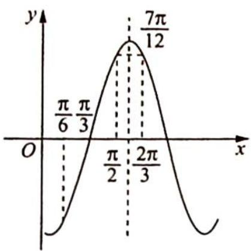

line

| x       | y       |
| ------- | ------- |
| π/6     | 0       |
| π/3     | 0       |
| π/2     | 0       |
| 2π/3    | 0       |
| 7π/12   | 0       |

图 1

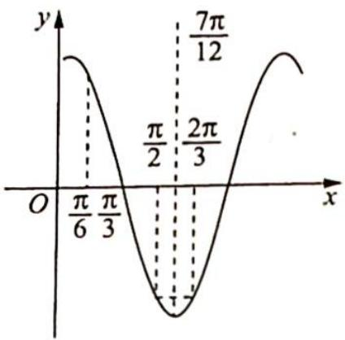

line

| x | y |
|---|---|
| 0 | π/6 |
| π/6 | π/3 |
| π/2 | -π/2 |
| 2π/3 | -π/3 |
| 7π/12 | 7π/12 |

图2

变式 1: 已知函数 $f(x) = \sin (\omega x + \varphi)$ , 其中 $\omega > 0, 0 < \varphi < \pi, f(x) \leqslant f\left(\frac{\pi}{4}\right)$ 恒成立, 且 $f(x)$ 在区间 $\left(0, \frac{\pi}{4}\right)$ 上恰有两个零点, 则 $\omega$ 的取值范围是 ( ).

A. (6,10)

B. $(6,8)$

C. (8,10)

D. $(6,12)$

解析 由题意可得函数图像的一条对称轴为 $x = \frac{\pi}{4}$ , 所以 $\frac{\pi}{4} \omega + \varphi = \frac{\pi}{2} + 2k\pi (k \in \mathbf{Z})$ . 因为 $\varphi \in (0, \pi)$ , 所以 $\omega \in (8k - 2, 8k + 2) (k \in \mathbf{Z})$ ①. 因为 $f(x)$ 在区间 $\left(0, \frac{\pi}{4}\right)$ 上恰有两个零点, 所以 $\omega$ 的取值范围的临界情况如图所示.

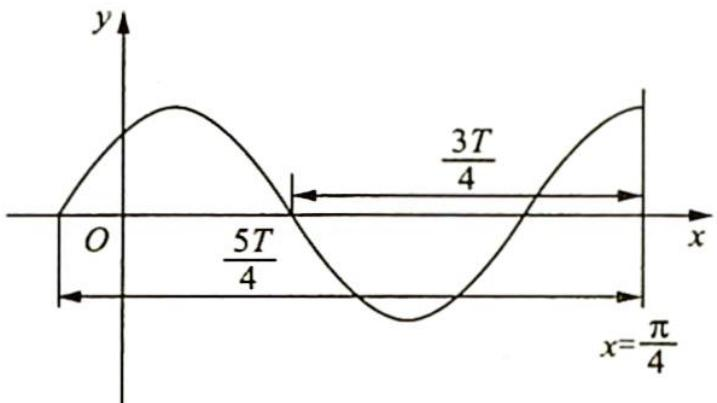

text_image

y
O
5T/4
3T/4
x
x=π/4

则 $\frac{3T}{4} < \frac{\pi}{4} \leqslant \frac{5T}{4}$ , 即 $\frac{\pi}{5} \leqslant T < \frac{\pi}{3}, \frac{\pi}{5} \leqslant \frac{2\pi}{\omega} < \frac{\pi}{3}$ , 解得 $6 < \omega \leqslant 10$ ②.

综合①②可得 $\omega$ 的取值范围为(6,10)，故选 A.

变式2: (多选题)设 $f(x)=a\sin2x+b\cos2x$ ，其中 $a,b\in R,ab\neq0$ 。若 $f(x)\leqslant\left|f\left(\frac{\pi}{6}\right)\right|$ 对一切 $x\in R$ 恒成立，则以下结论正确的是()。

A. $f\left(\frac{11\pi}{12}\right)=0$

B. $\left|f\left(\frac{7\pi}{10}\right)\right|<\left|f\left(\frac{\pi}{5}\right)\right|$

C. $f(x)$ 既不是奇函数也不是偶函数

D. $f(x)$ 的单调递增区间是 $\left[k\pi + \frac{\pi}{6}, k\pi + \frac{2\pi}{3}\right] (k \in \mathbf{Z})$

E. 存在经过点 $(a, b)$ 的直线与函数 $f(x)$ 的图像不相交

解析 $f(x)=a\sin2x+b\cos2x=\sqrt{a^{2}+b^{2}}\sin(2x+\varphi),\tan\varphi=\frac{b}{a}$ ，其最小正周期 $T=\pi$ ，
因为 $f(x)\leqslant\left|f\left(\frac{\pi}{6}\right)\right|$ 对一切 $x\in R$ 恒成立，所以 $f(x)$ 一条对称轴为 $x=\frac{\pi}{6}$ ，则 $f(x)$ 的对称轴可以表示为 $x=\frac{\pi}{6}+k\frac{T}{2}=\frac{\pi}{6}+\frac{k\pi}{2}(k\in\mathbb{Z})$ ，对称中心的横坐标可以表示为 $x=\frac{\pi}{6}+\frac{2k+1}{4}T=\frac{5\pi}{12}+$

$$
\frac {k \pi}{2} (k \in \mathbf {Z}).
$$

A 选项: $\frac{11\pi}{12} = \frac{5\pi}{12} + \frac{\pi}{2}$ , 所以 $\left(\frac{11\pi}{12}, 0\right)$ 是 $f(x)$ 的对称中心, 故 A 正确.

B 选项: $\frac{7\pi}{10}-\frac{\pi}{5}=\frac{\pi}{2}=\frac{T}{2}$ ，所以 $\left|f\left(\frac{7\pi}{10}\right)\right|=\left|f\left(\frac{\pi}{5}\right)\right|$ ，故 B 错误.

C 选项: 因为 $\frac{\pi}{6}$ 既不是 $\frac{T}{4}$ 的奇倍数, 也不是 $\frac{T}{4}$ 的偶倍数, 所以 $f(x)$ 既不是奇函数, 也不是偶函数, 故 C 正确.

D 选项: $x = \frac{\pi}{6}$ 和 $x = \frac{2\pi}{3}$ 是 $f(x)$ 的两条相邻的对称轴, 所以 $f(x)$ 在 $\left(\frac{\pi}{6}, \frac{2\pi}{3}\right)$ 上单调, 但不能确定是单调递减还是单调递增, 故 D 错误.

E 选项: $f(x) = a \sin 2x + b \cos 2x = \sqrt{a^2 + b^2} \sin (2x + \varphi)$ , 所以 $|f(x)| \leqslant \sqrt{a^2 + b^2}$ , 又 $ab \neq 0$ , 所以 $|b| < \sqrt{a^2 + b^2}$ , 则过点 $(a, b)$ 的直线与函数 $f(x)$ 的图像一定相交, 故 E 错误.

综上所述,故选 AC.

例 23.7 已知函数 $f(x) = \sin (\omega x + \varphi) \left( \omega > 0, |\varphi| \leqslant \frac{\pi}{2} \right), x = -\frac{\pi}{4}$ 为 $f(x)$ 的零点， $x = \frac{\pi}{4}$ 为 $y = f(x)$ 图像的对称轴，且 $f(x)$ 在 $\left( \frac{\pi}{18}, \frac{5\pi}{36} \right)$ 上单调，则 $\omega$ 的最大值为（ ）.

A. 11

B. 9

C. 7

D. 5

分析 ▶ 由单调性可以确定 $\omega$ 的范围, 根据对称性可得 $\omega=1+2k$ , 从大到小依次验证.

解析 由题意可得 $\frac{\pi}{4} - \left(-\frac{\pi}{4}\right) = \frac{2k + 1}{4} T (k \in \mathbf{Z})$ ，即 $\frac{\pi}{2} = \frac{2k + 1}{4} \cdot \frac{2\pi}{\omega}$ ，解得 $\omega = 1 + 2k$ 。又 $f(x)$ 在 $\left(\frac{\pi}{18}, \frac{5\pi}{36}\right)$ 上单调，所以 $\frac{5\pi}{36} - \frac{\pi}{18} \leqslant \frac{T}{2}$ ，即 $\frac{\pi}{12} \leqslant \frac{\pi}{\omega}$ ，解得 $\omega \leqslant 12$ ，则 $\omega$ 的取值有 $1, 3, 5, 7, 9, 11$ 。

①当 $\omega = 11$ 时， $T = \frac{2\pi}{11}, x = \frac{\pi}{4}$ 为 $f(x)$ 的一条对称轴，则 $x_{1} = \frac{\pi}{4} - \frac{2\pi}{11} = \frac{3\pi}{44}$ ，也是 $f(x)$ 的对称轴，而 $\frac{3\pi}{44} \in \left(\frac{\pi}{18}, \frac{5\pi}{36}\right)$ ，所以 $f(x)$ 在 $\left(\frac{\pi}{18}, \frac{5\pi}{36}\right)$ 上不单调，故 $\omega = 11$ 不成立。

②当 $\omega = 9$ 时, $T = \frac{2\pi}{9}, x = \frac{\pi}{4}$ 为 $f(x)$ 的一条对称轴, $x_{1} = \frac{\pi}{4} - \frac{\pi}{9} = \frac{5\pi}{36}$ 和 $x_{2} = \frac{\pi}{4} - \frac{2\pi}{9} = \frac{\pi}{36}$ 也是 $f(x)$ 的对称轴, 所以 $f(x)$ 在 $\left(\frac{\pi}{36}, \frac{5\pi}{36}\right)$ 上单调, 又因为 $\frac{\pi}{36} < \frac{\pi}{18}$ , 所以 $f(x)$ 在 $\left(\frac{\pi}{18}, \frac{5\pi}{36}\right)$ 上也单调, 即 $\omega = 9$ 成立.

故选 B.

变式(1) 已知函数 $y = \sqrt{2}\sin (\omega x + \varphi)(\omega > 0)$ 的图像关于直线 $x = \frac{\pi}{2}$ 对称, 且 $f\left(\frac{3\pi}{8}\right) = 1$ , $f(x)$ 在区间 $\left[-\frac{3\pi}{8}, -\frac{\pi}{4}\right]$ 上单调, 则 $\omega$ 可取数值的个数为 ( ).

A. 1

B. 2

C. 3

D. 4

解析 由 $f(x)$ 在区间 $\left[-\frac{3\pi}{8}, -\frac{\pi}{4}\right]$ 上单调，则 $-\frac{\pi}{4} + \frac{3\pi}{8} = \frac{\pi}{8} \leqslant \frac{T}{2}$ ，可得 $T \geqslant \frac{\pi}{4}$ .

又 $\frac{\pi}{2}-\frac{3\pi}{8}=\frac{\pi}{8}$ ，则区间 $\left[\frac{3\pi}{8},\frac{\pi}{2}\right]$ 之间的距离 $\leqslant\frac{T}{2}$ ，则符合题意的 $f(x)$ 的图像如图1、图2所示.

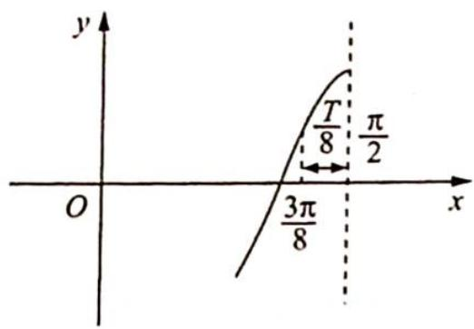

text_image

y
T/8 π/2
3π/8
O x

图1

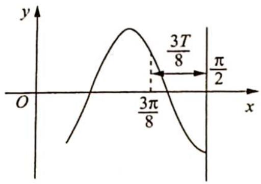

text_image

y
O
3π/8
3T/8
π/2
x

图2

若为图1:由 $\frac{T}{8}=\frac{\pi}{8}$ 可得 $T=\pi$ ，此时 $\omega=\frac{2\pi}{T}=2$ ，再推导在区间 $\left[-\frac{3\pi}{8},-\frac{\pi}{4}\right]$ 是否有对称轴， $x=-\frac{\pi}{2}\xleftarrow{\frac{T}{2}}x=0\xleftarrow{\frac{T}{2}}x=\frac{\pi}{2}.$

不难发现 $-\frac{\pi}{2} < -\frac{3\pi}{8} < -\frac{\pi}{4} < 0$ ，在区间 $\left[-\frac{3\pi}{8}, -\frac{\pi}{4}\right]$ 内没有对称轴，因此 $f(x)$ 在区间 $\left[-\frac{3\pi}{8}, -\frac{\pi}{4}\right]$ 上单调。

若为图2:由 $\frac{3T}{8}=\frac{\pi}{8}$ 可得 $T=\frac{\pi}{3}=\frac{2\pi}{\omega},\omega=6$ ，再推导在区间 $\left[-\frac{3\pi}{8},-\frac{\pi}{4}\right]$ 上是否有对称轴， $x=-\frac{\pi}{3}\xleftarrow{\frac{T}{2}}x=-\frac{\pi}{6}\xleftarrow{T}x=\frac{\pi}{6}\xleftarrow{T}x=\frac{\pi}{2}.$

不难发现 $-\frac{3\pi}{8} < -\frac{\pi}{3} < -\frac{\pi}{4}$ , 因此在区间 $\left[-\frac{3\pi}{8}, -\frac{\pi}{4}\right]$ 上含有对称轴, 所以 $f(x)$ 在区间 $\left[-\frac{3\pi}{8}, -\frac{\pi}{4}\right]$ 上不单调.

综上所述, $\omega$ 的值只能为2,故选A.

# 评注

对于正弦型或余弦型函数,给出在区间 $[a,b]$ 上单调,进而得出其区间长 $b - a \leqslant \frac{T}{2}$ ,这是其必要条件,还需验证充分性.

变式2: 函数 $f(x)=\sin(\omega x+\varphi)\left(\omega>0,|\varphi|\leqslant\frac{\pi}{2}\right)$ ，已知 $\left(-\frac{\pi}{6},0\right)$ 为 $f(x)$ 图像的一个对称中心，直线 $x=\frac{13\pi}{12}$ 为 $f(x)$ 图像的一条对称轴，且 $f(x)$ 在 $\left[\frac{13\pi}{12},\frac{19\pi}{12}\right]$ 上单调递减。记满足条件的所有 $\omega$ 的值的和为 S，则 S 的值为 \_\_\_\_.

解析 ▶ 依题意得 $\frac{13\pi}{12} + \frac{\pi}{6} = \frac{T}{4}(2k - 1)(k \in \mathbb{N}^*)$ ，即 $\frac{5\pi}{4} = \frac{T}{4}(2k - 1)$ ，可得 $T = \frac{5\pi}{2k - 1}$ ( $k \in \mathbb{N}^*$ ).

又 $f(x)$ 在 $\left[\frac{13\pi}{12}, \frac{19\pi}{12}\right]$ 上单调递减，则 $\frac{\pi}{2} \leqslant \frac{T}{2}$ ，即 $T \geqslant \pi$ ，由 $\frac{5\pi}{2k - 1} \geqslant \pi$ 得 $0 < 2k - 1 \leqslant 5 (k \in \mathbf{N}^*)$ ，所以 $k = 1, 2, 3$ .

①若 $k=1, T=5\pi, \omega=\frac{2\pi}{T}=\frac{2}{5}$ ，此时 $f(x)$ 在 $\left[\frac{13\pi}{12}, \frac{19\pi}{12}\right]$ 上单调递减，如图 1 所示，符合题意.  
②若 $k = 2$ ，此时 $T = \frac{5\pi}{3} = \frac{2\pi}{\omega}$ 得 $\omega = \frac{6}{5}$ ，那么 $\frac{13\pi}{12} +\frac{\pi}{6} = \frac{5\pi}{4} = \frac{3T}{4}$ ，如图2所示，易知 $f(x)$ 在区间 $\left[\frac{13\pi}{12},\frac{19\pi}{12}\right]$ 上单调递增，与题意不符，故舍去.  
③若 k=3，此时 $T=\frac{5\pi}{5}=\pi$ ，得 $\omega=2$ ，那么 $\frac{13\pi}{12}+\frac{\pi}{6}=\frac{5T}{4}$ ，如图 3 所示。易知 $f(x)$ 在区间 $\left[\frac{13\pi}{12},\frac{19\pi}{12}\right]$ 上单调递减，满足题意。

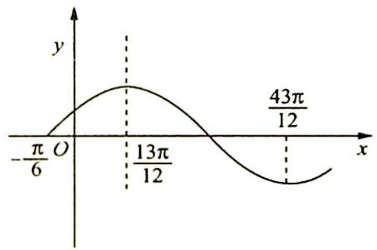

line

| x         | y     |
| --------- | ----- |
| -π/6      | 0     |
| 13π/12    | 13    |
| 43π/12    | 0     |

图 1

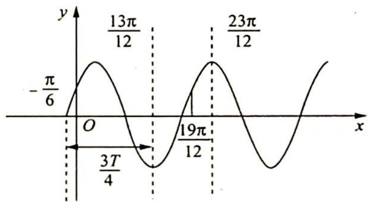

line

| x       | y         |
| ------- | --------- |
| 0       | -π/6      |
| 3π/4    | 0         |
| 19π/12  | 13π/12    |
| 23π/12  | 23π/12    |

图 2

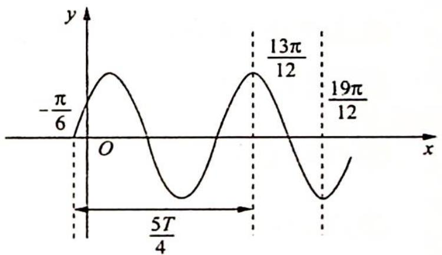

line

| x       | y        |
| ------- | -------- |
| 0       | -π/6     |
| 5T/4    | 0        |
| 13π/12  | 13π/12   |
| 19π/12  | 19π/12   |

图 3

综上所述, $\omega$ 的值为2或 $\frac{2}{5}$ ,S的值为 $\frac{12}{5}$ .

# 含三角函数的复合函数

# 23.5 探究含三角函数的函数性质

# 研究密钥

研究一个含有三角函数的未知函数,我们可以根据所包含已知的三角函数的性质入手,研究未知函数的奇偶性、对称性、周期性.如果具有对称性,则可缩小研究范围.

对于此函数是否具有某些性质,可以运用定义来判断.另外图像也是一个好工具,我们可以通过画图利用数形结合帮助思考.

例23.8 (2020新课标全国Ⅲ卷理16)关于函数 $f(x) = \sin x + \frac{1}{\sin x}$ 有如下四个命题：

① $f(x)$ 的图像关于y轴对称；② $f(x)$ 的图像关于原点对称；

③ $f(x)$ 的图像关于直线 $x=\frac{\pi}{2}$ 对称；④ $f(x)$ 的最小值为2.

其中所有真命题的序号是

分析 判断奇偶性,首先看定义域, $\{x\mid x\neq k\pi,k\in Z\}$ 关于原点对称,再验证 $f(-x)$ 与 $f(x)$ 的关系即可;由 $f(a)=f(b-a)$ 可得对称轴为 $x=\frac{b}{2}$ ;利用基本不等式可得最小值.

解析 因为 $f(x)$ 定义域为 $\{x \mid x \neq k\pi, k \in Z\}$ 且满足 $f(-x) = -f(x)$ ，所以 $f(x)$ 是奇函数，则图像关于原点对称，则①错误，②正确。

因为 $f(\pi-x)=\sin(\pi-x)+\frac{1}{\sin(\pi-x)}=\sin x+\frac{1}{\sin x}=f(x)$ ，所以 $f(x)$ 关于 $x=\frac{\pi}{2}$ 对称，则③正确.

当 $\sin x\in(0,1]$ 时， $f(x)\geqslant2\sqrt{\sin x\cdot\frac{1}{\sin x}}=2$ ; 当 $\sin x\in[-1,0)$ 时， $f(x)<0$ ，则④错误.

综上所述,真命题的序号是②③.

变式 1 关于函数 $f(x) = \sin x\cos 2x$ 有下述四个结论：

① $f(x)$ 是偶函数；② $f(x)$ 的图像关于直线 $x=\frac{\pi}{2}$ 对称；

③ $f(x)$ 在 $[-π,π]$ 上有5个零点；④ $f(x)$ 的最大值为1.

其中所有正确结论的序号是( ).

A. ①②④

B. ②④

C. ①④

D. ②③

分析 利用函数的奇偶性可判断①的正误;利用函数的对称性可判断②的正误;在 $x \in [-\pi, \pi]$ 上解方程 $f(x)=0$ , 可判断③的正误;利用函数最值的定义可判断④的正误.

解析 因为函数 $f(x) = \sin x\cos 2x$ 的定义域为 $\mathbf{R}, f(-x) = \sin (-x)\cos (-2x) = -\sin x\cos 2x = -f(x)$ ，所以函数 $f(x)$ 为奇函数，①错误.

因为 $f(\pi-x)=\sin(\pi-x)\cos[2(\pi-x)]=\sin x\cos2x=f(x)$ ，所以 $f(x)$ 的图像关于直线 $x=\frac{\pi}{2}$ 对称，②正确.

令 $f(x) = \sin x\cos 2x = 0$ ，可得 $\sin x = 0$ 或 $\cos 2x = 0$ ，因为 $x\in [-\pi ,\pi ]$ ，则 $2x\in [-2\pi ,2\pi ]$ 方程 $\sin x = 0$ 在 $[- \pi ,\pi ]$ 上的解分别为 $x = -\pi$ 或 $x = 0$ 或 $x = \pi$ ，由 $\cos 2x = 0$ 可得 $2x = \pm \frac{3\pi}{2}$ 或 $2x = \pm \frac{\pi}{2}$ ，解得 $x = \pm \frac{3\pi}{4}$ 或 $x = \pm \frac{\pi}{4}$ .所以 $f(x)$ 在 $[- \pi ,\pi ]$ 上有7个零点，③错误.

因为 $-1 \leqslant \sin x \leqslant 1, -1 \leqslant \cos 2x \leqslant 1$ ，所以 $f(x) \leqslant 1$ ，又 $f\left(-\frac{\pi}{2}\right) = \sin\left(-\frac{\pi}{2}\right)\cos(-\pi) = 1$ ，则函数 $f(x)$ 的最大值为 1，④ 正确.

综上所述,故选 B.

# 训练 23

1. 函数 $f(x) = \cos \left( \omega x - \frac{\pi}{3} \right) (\omega > 0)$ 在 $[0, \pi]$ 上的值域为 $\left[ \frac{1}{2}, 1 \right]$ , 则 $\omega$ 的取值范围是 ( ).

A. $\left[\frac{1}{3}, \frac{2}{3}\right]$

B. $\left[0, \frac{2}{3}\right]$

C. $\left[\frac{2}{3},1\right]$

D. $\left[\frac{1}{3}, 1\right]$

2. 已知函数 $f(x) = \sin \left( \omega x - \frac{\pi}{4} \right) (\omega > 0)$ 的图像在区间 (1,2) 上不单调，则 $\omega$ 的取值范围为 (   ).

A. $\left(\frac{3\pi}{8},+\infty\right)$

B. $\left(\frac{3\pi}{8},\frac{3\pi}{4}\right)\cup\left(\frac{7\pi}{8},+\infty\right)$

C. $\left(\frac{3\pi}{8},\frac{7\pi}{8}\right)\cup\left(\frac{7\pi}{4},+\infty\right)$

D. $\left(\frac{3\pi}{4},+\infty\right)$

3. 函数 $f(x) = 2\sin \left( \omega x + \frac{\pi}{4} \right) (\omega > 0)$ , 在 $x \in [0,1]$ 上恰好可取得 5 个最大值, 则实数 $\omega$ 的取值范围为 ( ).

A. $\left[\frac{9\pi}{4},\frac{25\pi}{4}\right)$

B. $\left[\frac{19\pi}{2},\frac{27\pi}{2}\right)$

C. $\left[\frac{33\pi}{4},\frac{41\pi}{4}\right)$

D. $\left[\frac{41\pi}{4},\frac{50\pi}{4}\right)$

4. 函数 $f(x)=\sin(\omega x+\frac{\pi}{4})(\omega>0)$ 在 $[0,2\pi]$ 上恰有 2 个极值点，则 $\omega$ 的取值范围是 \_\_\_\_.

5. 已知函数 $f(x) = \sin (\omega x + \varphi)$ ，其中 $\omega > 0, |\varphi| \leqslant \frac{\pi}{2}, -\frac{\pi}{4}$ 为 $f(x)$ 的零点，且 $f(x) \leqslant \left|f\left(\frac{\pi}{4}\right)\right|$ 恒成立， $f(x)$ 在区间 $\left(-\frac{\pi}{12}, \frac{\pi}{24}\right)$ 上有最小值无最大值，则 $\omega$ 的最大值是（ ）.

A. 11

B. 13

C. 15

D. 17

6.(多选题)已知函数 $f(x)=\sin(\omega x+\varphi)$ (其中 $\omega>0,|\varphi|<\frac{\pi}{2}$ ), $f\left(-\frac{\pi}{8}\right)=0$ , $f(x)\leqslant\left|f\left(\frac{3\pi}{8}\right)\right|$ 恒成立, 且 $f(x)$ 在区间 $\left(-\frac{\pi}{12},\frac{\pi}{24}\right)$ 上单调, 则下列说法正确的是().

A. 存在 $\varphi$ , 使得 $f(x)$ 是偶函数

B. $f(0)=f\left(\frac{3\pi}{4}\right)$

C. $\omega$ 是奇数

D. $\omega$ 的最大值是 3

7. 关于函数 $f(x) = \cos |x| + |\cos x|$ ，给出下列结论：

① $f(x)$ 是偶函数；② $f(x)$ 在区间 $\left(-\frac{\pi}{2},0\right)$ 上单调；

③ $f(x)$ 在 $[-π,π]$ 上有4个零点；④ $f(x)$ 的最大值为2.

其中所有正确结论的序号是( ).

A. ①②④

B. ②④

C. ①④

D. ①③

8. 为使得函数 $y = A \sin \omega x (A > 0, \omega > 0)$ 在 $[0, \pi]$ 上至少出现 50 次最小值，则 $\omega$ 的最小值为 \_\_\_\_.

# 第 24 讲

# 三角恒等变换

三角变换涉及的公式很多,变换的方法也很灵活,但无论怎样变换,它们都是围绕着三条主线展开的,即变换角、变换函数、变换式子结构.

在角的变换上, 和角、差角、倍角、半角与单角都是一个相对的概念, 它们的变换, 关键在于深入观察, 分析联系, 从而进行适当的组合、变换.

在函数名的变换上,要根据题目的条件,观察函数的差异与联系,并需熟练掌握常用的变形技巧,如切割化弦、化异为同、降次、“1”的变换等.

在式子结构的变换上, 常需分析、探索等式左、右的关系, 条件与结论可能存在的联系, 通过化归实现“对接”, 解题中需掌握一些常用的技巧, 如和积互化、公式变形等.

另外, 在三角变换中, 若能结合代数、几何的一些方法, 常能使问题得到简化. 如万能代换, 可把三角问题转化为代数问题; 利用复数的方法, 可使三角问题有直观的解释或通过单位根实现与数列问题的对接; 构造几何图形, 并结合正、余弦定理, 可使三角问题简明易求.

# 三角恒等变换求值

# 24.1 三角恒等式的应用

# 研究密钥

求值中常见的问题有: 求已知角的三角函数值; 求已知条件下的三角函数值; 求几个三角函数式的和、差、积的混合式的值; 求角问题通常是先求有关三角函数值, 再由角的范围, 结合单调性求出角; 化简问题的解法与三角求值问题的解法有共通之处, 但要注意必须化到最简, 最后结果能求出值的应求出值.

在求值、求角、化简的解题过程中,熟练掌握恒等变形公式是关键.

(1)和(差)角公式

$$
\begin{array}{l} \boxed {\begin{array}{l}\sin (\alpha + \beta) = \sin \alpha \cos \beta + \cos \alpha \sin \beta\\\cos (\alpha + \beta) = \cos \alpha \cos \beta - \sin \alpha \sin \beta\end{array}} \quad \rightarrow \quad \boxed {\begin{array}{l}\sin (\alpha - \beta) = \sin \alpha \cos \beta - \cos \alpha \sin \beta\\\cos (\alpha - \beta) = \cos \alpha \cos \beta + \sin \alpha \sin \beta\end{array}} \\ \tan (\alpha + \beta) = \frac {\tan \alpha + \tan \beta}{1 - \tan \alpha \tan \beta} \\ \begin{array}{l} \boxed {\sin (\alpha - \beta) = \sin \alpha \cos \beta - \cos \alpha \sin \beta} \\ \cos (\alpha - \beta) = \cos \alpha \cos \beta + \sin \alpha \sin \beta \end{array} \\ \tan (\alpha - \beta) = \frac {\tan \alpha - \tan \beta}{1 + \tan \alpha \tan \beta} \\ \end{array}
$$

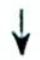

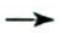

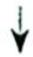

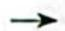

(2)倍角公式与降次(幂)公式

$$
\begin{array}{l} \boxed {\sin 2 \alpha = 2 \sin \alpha \cos \alpha} \rightarrow \boxed {\sin \alpha \cos \alpha = \frac {1}{2} \sin 2 \alpha} \\ \boxed {\begin{array}{l}\cos 2 \alpha = 2 \cos^ {2} \alpha - 1\\\dot {=} 1 - 2 \sin^ {2} \alpha\\= \cos^ {2} \alpha - \sin^ {2} \alpha\end{array}} \rightarrow \boxed {\begin{array}{l}\sin^ {2} \alpha = \frac {1 - \cos 2 \alpha}{2}\\\cos^ {2} \alpha = \frac {1 + \cos 2 \alpha}{2}\end{array}} \\ \tan 2 \alpha = \frac {2 \tan \alpha}{1 - \tan^ {2} \alpha} \\ \end{array}
$$

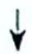

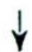

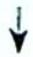

(3)辅助角公式

$a\sin \alpha + b\cos \alpha = \sqrt{a^2 + b^2}\sin (\alpha + \varphi)$ , 其中 $\varphi$ 满足 $\cos \varphi = \frac{a}{\sqrt{a^2 + b^2}}$ , $\sin \varphi = \frac{b}{\sqrt{a^2 + b^2}}$ .

(4)和差化积、积化和差公式

a. 积化和差公式

$$
\sin \alpha \cos \beta = \frac {1}{2} [ \sin (\alpha + \beta) + \sin (\alpha - \beta) ].
$$

$$
\cos \alpha \sin \beta = \frac {1}{2} [ \sin (\alpha + \beta) - \sin (\alpha - \beta) ].
$$

$$
\cos \alpha \cos \beta = \frac {1}{2} [ \cos (\alpha + \beta) + \cos (\alpha - \beta) ].
$$

$$
\sin \alpha \sin \beta = - \frac {1}{2} [ \cos (\alpha + \beta) - \cos (\alpha - \beta) ].
$$

b. 和差化积公式

$$
\sin \alpha + \sin \beta = 2 \sin \frac {\alpha + \beta}{2} \cos \frac {\alpha - \beta}{2}.
$$

$$
\sin \alpha - \sin \beta = 2 \cos \frac {\alpha + \beta}{2} \sin \frac {\alpha - \beta}{2}.
$$

$$
\cos \alpha + \cos \beta = 2 \cos \frac {\alpha + \beta}{2} \cos \frac {\alpha - \beta}{2}.
$$

$$
\cos \alpha - \cos \beta = - 2 \sin \frac {\alpha + \beta}{2} \sin \frac {\alpha - \beta}{2}.
$$

(5)万能公式

$$
\sin 2 \alpha = \frac {2 \tan \alpha}{1 + \tan^ {2} \alpha}, \cos 2 \alpha = \frac {1 - \tan^ {2} \alpha}{1 + \tan^ {2} \alpha}, \tan 2 \alpha = \frac {2 \tan \alpha}{1 - \tan^ {2} \alpha}.
$$

(6)三倍角公式

$$
\sin 3 x = 3 \sin x - 4 \sin^ {3} x = 4 \sin x \sin \left(\frac {\pi}{3} + x\right) \sin \left(\frac {\pi}{3} - x\right).
$$

$$
\cos 3 x = 4 \cos^ {3} x - 3 \cos x = 4 \cos x \cos \left(\frac {\pi}{3} + x\right) \cos \left(\frac {\pi}{3} - x\right).
$$

$$
\tan 3 x = 4 \tan x \tan \left(\frac {\pi}{3} + x\right) \tan \left(\frac {\pi}{3} - x\right).
$$

例 24.1 (2019 江苏卷 13) 已知 $\frac{\tan\alpha}{\tan\left(\alpha+\frac{\pi}{4}\right)}=-\frac{2}{3}$ ，则 $\sin\left(2\alpha+\frac{\pi}{4}\right)$ 的值是 \_\_\_\_.

分析 ▶ 思路一: 关注角的变换和函数名的变换, $2 \alpha + \frac{\pi}{4} = \alpha + \left( \alpha + \frac{\pi}{4} \right)$ 以及 $\left( \alpha + \frac{\pi}{4} \right) - \alpha = \frac{\pi}{4}$ 关于弦的齐次式, 进行弦化切.

思路二: 已知条件使用两角和公式后, 只有一个未知数 $\tan \alpha$ , 可以直接解出; 待求式使用两角和公式后出现 $\sin 2\alpha, \cos 2\alpha$ , 使用万能公式 $\sin 2\alpha = \frac{2\tan \alpha}{1 + \tan^2\alpha}, \cos 2\alpha = \frac{1 - \tan^2\alpha}{1 + \tan^2\alpha}$ 弦化切, 代入 $\tan \alpha$ 即可求值.

解析 ▶ 解法一: 由 $\sin\left(2\alpha+\frac{\pi}{4}\right)=\sin\left[\alpha+\left(\alpha+\frac{\pi}{4}\right)\right]=\sin\alpha\cos\left(\alpha+\frac{\pi}{4}\right)+\cos\alpha\sin\left(\alpha+\frac{\pi}{4}\right)$ , 且 $\sin\frac{\pi}{4}=\sin\left[\left(\alpha+\frac{\pi}{4}\right)-\alpha\right]=\sin\left(\alpha+\frac{\pi}{4}\right)\cos\alpha-\cos\left(\alpha+\frac{\pi}{4}\right)\sin\alpha$ ，可得 $\sqrt{2}\sin\left(2\alpha+\frac{\pi}{4}\right)=$

$$
\frac {\sin \left(2 \alpha + \frac {\pi}{4}\right)}{\sin \frac {\pi}{4}} = \frac {\sin \left[ \left(\alpha + \frac {\pi}{4}\right) + \alpha \right]}{\sin \left[ \left(\alpha + \frac {\pi}{4}\right) - \alpha \right]} = \frac {\sin \left(\alpha + \frac {\pi}{4}\right) \cos \alpha + \cos \left(\alpha + \frac {\pi}{4}\right) \sin \alpha}{\sin \left(\alpha + \frac {\pi}{4}\right) \cos \alpha - \cos \left(\alpha + \frac {\pi}{4}\right) \sin \alpha} = \frac {\tan \left(\alpha + \frac {\pi}{4}\right) + \tan \alpha}{\tan \left(\alpha + \frac {\pi}{4}\right) - \tan \alpha} =
$$

$\frac{1 + \frac{\tan\alpha}{\tan\left(\alpha + \frac{\pi}{4}\right)}}{1 - \frac{\tan\alpha}{\tan\left(\alpha + \frac{\pi}{4}\right)}} = \frac{1 - \frac{2}{3}}{1 + \frac{2}{3}} = \frac{1}{5}$ , 因此 $\sin \left(2\alpha + \frac{\pi}{4}\right) = \frac{1}{5} \times \frac{1}{\sqrt{2}} = \frac{\sqrt{2}}{10}$ .

解法二:由 $\frac{\tan\alpha}{\tan(\alpha+\frac{\pi}{4})}=-\frac{2}{3}$ 得 $\frac{\tan\alpha(1-\tan\alpha)}{1+\tan\alpha}=-\frac{2}{3}$ ，解得 $\tan\alpha=2$ 或 $\tan\alpha=-\frac{1}{3}$ .

$$
\begin{array}{l} \sin (2 \alpha + \frac {\pi}{4}) = \sin 2 \alpha \cos \frac {\pi}{4} + \cos 2 \alpha \sin \frac {\pi}{4} \\ = \frac {\sqrt {2}}{2} (\sin 2 \alpha + \cos 2 \alpha) \\ = \frac {\sqrt {2}}{2} \left(\frac {2 \tan \alpha}{1 + \tan^ {2} \alpha} + \frac {1 - \tan^ {2} \alpha}{1 + \tan^ {2} \alpha}\right) \\ = \frac {\sqrt {2}}{2} \cdot \frac {1 + 2 \tan \alpha - \tan^ {2} \alpha}{1 + \tan^ {2} \alpha}. \\ \end{array}
$$

当 $\tan\alpha=2$ 时，原式 $=\frac{\sqrt{2}}{2}\times\frac{1+2\times2-2^{2}}{1+2^{2}}=\frac{\sqrt{2}}{10}$ ; 当 $\tan\alpha=-\frac{1}{3}$ 时，原式 $=\frac{\sqrt{2}}{2}\times\frac{1+\left(-\frac{2}{3}\right)-\left(\frac{1}{3}\right)^{2}}{1+\left(\frac{1}{3}\right)^{2}}=\frac{\sqrt{2}}{10}.$

综上所述, $\sin(2\alpha+\frac{\pi}{4})$ 的值是 $\frac{\sqrt{2}}{10}$ .

变式(1) 已知 $\left\{\begin{aligned}\sin x+\sin y&=\frac{1}{3}\\\cos x-\cos y&=\frac{1}{5}\end{aligned}\right.$ ，求 $\cos(x+y)$ 与 $\sin(x-y)$ 的值.

解析 由题意得 $\cos (x + y) = \cos x\cos y - \sin x\sin y$ ，将 $\sin x + \sin y = \frac{1}{3}$ 和 $\cos x - \cos y = \frac{1}{5}$ 两式平方相加得 $(\sin x + \sin y)^2 + (\cos x - \cos y)^2 = \frac{1}{9} + \frac{1}{25} = \frac{34}{225}$ ，即 $2 + 2(\sin x\sin y -$

$$
\cos x \cos y) = \frac {3 4}{2 2 5}, \text {得} 2 - 2 \cos (x + y) = \frac {3 4}{2 2 5}, \text {即} \cos (x + y) = 1 - \frac {1 7}{2 2 5} = \frac {2 0 8}{2 2 5}.
$$

$\sin (x - y) = 2 \sin \frac{x - y}{2} \cos \frac{x - y}{2}$ (二倍角公式), 由 $\sin x + \sin y = 2 \sin \frac{x + y}{2} \cos \frac{x - y}{2}$ ①, $\cos x - \cos y = -2 \sin \frac{x + y}{2} \sin \frac{x - y}{2}$ ②, ②得 $-\tan \frac{x - y}{2} = \frac{\cos x - \cos y}{\sin x + \sin y} = \frac{\frac{1}{5}}{\frac{1}{3}} = \frac{3}{5}$ , 即 $\tan \frac{x - y}{2} = -\frac{3}{5}$ , 那么 $\sin (x - y) = 2 \sin \frac{x - y}{2} \cos \frac{x - y}{2} = \frac{2 \sin \frac{x - y}{2} \cos \frac{x - y}{2}}{\sin^2 \frac{x - y}{2} + \cos^2 \frac{x - y}{2}} = \frac{2 \tan \frac{x - y}{2}}{\tan^2 \frac{x - y}{2} + 1} = \frac{-\frac{6}{5}}{\frac{9}{25} + 1} = -\frac{15}{17}$ .

变式(2) 已知 $\tan\frac{\alpha+\beta}{2}=\frac{\sqrt{6}}{2},\tan\alpha\tan\beta=\frac{13}{7}$ ，求 $\cos(\alpha-\beta)$ 的值.

解析 因为 $\tan \frac{\alpha + \beta}{2} = \frac{\sqrt{6}}{2}$ , 由万能公式得 $\cos (\alpha + \beta) = \frac{1 - \tan^2 \frac{\alpha + \beta}{2}}{1 + \tan^2 \frac{\alpha + \beta}{2}} = -\frac{1}{5}$ .

又因为 $\tan \alpha \tan \beta = \frac{\sin \alpha \sin \beta}{\cos \alpha \cos \beta} = \frac{\cos (\alpha - \beta) - \cos (\alpha + \beta)}{\cos (\alpha - \beta) + \cos (\alpha + \beta)} = \frac{13}{7}$ , 所以 $\cos (\alpha - \beta) = -\frac{10}{3} \cos (\alpha + \beta) = -\frac{10}{3} \times (-\frac{1}{5}) = \frac{2}{3}$ .

例 24.2 已知 $\alpha, \beta, \gamma, \delta$ 为锐角，在 $\sin \alpha + \cos \beta, \sin \beta + \cos \gamma, \sin \gamma + \cos \delta, \sin \delta + \cos \alpha$ 四个值中，大于 $\sqrt{2}$ 的个数的最大值记为 $m$ ，小于 $\frac{\sqrt{6}}{2}$ 的个数的最大值记为 $n$ ，则 $m + n =$ \_\_\_\_.

分析 ▶ 4个值为一个轮换对称的形式, 可把4个值相加, 将同角三角函数值转化至便于求和的范围, 由于此和 $\leqslant 4\sqrt{2}$ , 所以大于 $\sqrt{2}$ 的个数不可能是4. 接下来适当赋值, 看 $m = 3$ 是否满足要求. $n$ 的值也可通过赋值确定.

解析 由 $\sin \alpha + \cos \alpha = \sqrt{2} \sin \left( \alpha + \frac{\pi}{4} \right)$ , $\sin \beta + \cos \beta = \sqrt{2} \sin \left( \beta + \frac{\pi}{4} \right)$ , $\sin \gamma + \cos \gamma = \sqrt{2} \sin \left( \gamma + \frac{\pi}{4} \right)$ , $\sin \delta + \cos \delta = \sqrt{2} \sin \left( \delta + \frac{\pi}{4} \right)$ , 可得 $\sin \alpha + \cos \beta + \sin \beta + \cos \gamma + \sin \gamma + \cos \delta + \sin \delta + \cos \alpha = (\sin \alpha + \cos \alpha) + (\sin \beta + \cos \beta) + (\sin \gamma + \cos \gamma) + (\sin \delta + \cos \delta) = \sqrt{2} \sin \left( \alpha + \frac{\pi}{4} \right) + \sqrt{2} \sin \left( \beta + \frac{\pi}{4} \right) + \sqrt{2} \sin \left( \gamma + \frac{\pi}{4} \right) + \sqrt{2} \sin \left( \delta + \frac{\pi}{4} \right)$ .

又 $\alpha, \beta, \gamma, \delta \in (0, \frac{\pi}{2})$ ，则 $\alpha + \frac{\pi}{4}, \beta + \frac{\pi}{4}, \gamma + \frac{\pi}{4}, \delta + \frac{\pi}{4} \in (\frac{\pi}{4}, \frac{3\pi}{4})$ ，因此上式 $\leqslant 4\sqrt{2}$ ，所以在

$\sin \alpha + \cos \beta, \sin \beta + \cos \gamma, \sin \gamma + \cos \delta, \sin \delta + \cos \alpha$ 四个数中大于 $\sqrt{2}$ 的个数至多有 3 个.

不妨取 $\sin \alpha = \frac{\sqrt{3}}{2}, \sin \beta = \frac{\sqrt{2}}{2}, \sin \gamma = \frac{1}{2}, \sin \delta = \frac{12}{13}$ , 此时 $\sin \alpha + \cos \beta = \frac{\sqrt{3} + \sqrt{2}}{2} > \sqrt{2}, \sin \beta + \cos \gamma = \frac{\sqrt{2}}{2} + \frac{\sqrt{3}}{2} > \sqrt{2}, \sin \gamma + \cos \delta = \frac{1}{2} + \frac{5}{13} < \sqrt{2}, \sin \delta + \cos \alpha = \frac{12}{13} + \frac{1}{2} > \sqrt{2}$ .

故在 $\sin \alpha + \cos \beta, \sin \beta + \cos \gamma, \sin \gamma + \cos \delta$ 以及 $\sin \delta + \cos \alpha$ 中大于 $\sqrt{2}$ 的个数的最大值 $m = 3$ , 且在 $\sin \alpha + \cos \beta, \sin \beta + \cos \gamma, \sin \gamma + \cos \delta, \sin \delta + \cos \alpha$ 中. 若 $\alpha = \beta = \gamma = \delta$ , 则 $\sin \alpha + \cos \beta = \sin \alpha + \cos \alpha = \sqrt{2} \sin \left( \alpha + \frac{\pi}{4} \right)$ , $\sin \beta + \cos \gamma = \sin \beta + \cos \beta = \sqrt{2} \sin \left( \beta + \frac{\pi}{4} \right)$ , $\sin \gamma + \cos \delta = \sin \gamma + \cos \gamma = \sqrt{2} \sin \left( \gamma + \frac{\pi}{4} \right)$ , $\sin \delta + \cos \alpha = \sin \delta + \cos \delta = \sqrt{2} \sin \left( \delta + \frac{\pi}{4} \right)$ .

当 $\alpha, \beta, \gamma, \delta \in \left(0, \frac{\pi}{12}\right)$ 时，可得 $\sin \alpha + \cos \beta, \sin \beta + \cos \gamma, \sin \gamma + \cos \delta, \sin \delta + \cos \alpha$ 均小于 $\frac{\sqrt{6}}{2}$ ，则 $n = 4$ ，所以 $m + n = 7$ .

变式(1) 已知 $\alpha, \beta, \gamma$ 是三个互不相等的锐角, 则在 $\sin \alpha \cos \beta$ , $\sin \beta \cos \gamma$ , $\sin \gamma \cos \alpha$ 三个值中, 大于 $\frac{1}{2}$ 的个数的最大值是 ( ).

A. 0 个

B. 1 个

C. 2 个

D. 3 个

解析 ▶ 解法一:由题意得 $\alpha, \beta, \gamma \in \left(0, \frac{\pi}{2}\right)$ 且 $\alpha, \beta, \gamma$ 互不相同, 则 $\sin \alpha \cos \beta \leqslant \frac{\sin^2 \alpha + \cos^2 \beta}{2}$ , $\sin \beta \cos \gamma \leqslant \frac{\sin^2 \beta + \cos^2 \gamma}{2}, \sin \gamma \cos \alpha \leqslant \frac{\sin^2 \gamma + \cos^2 \alpha}{2}$ .

因此 $\sin\alpha\cos\beta+\sin\beta\cos\gamma+\sin\gamma\cos\alpha\leqslant\frac{\sin^{2}\alpha+\cos^{2}\beta}{2}+\frac{\sin^{2}\beta+\cos^{2}\gamma}{2}+\frac{\sin^{2}\gamma+\cos^{2}\alpha}{2}=\frac{3}{2}$ ，当且仅当 $\alpha+\beta=\beta+\gamma=\gamma+\alpha=\frac{\pi}{2}$ 时，即 $\alpha=\beta=\gamma=\frac{\pi}{4}$ 时，取等号.

又 $\alpha, \beta, \gamma$ 是三个互不相等的锐角，则 $\sin \alpha \cos \beta + \sin \beta \cos \gamma + \sin \gamma \cos \alpha < \frac{3}{2}$ ，所以 $\sin \alpha \cos \beta$ ， $\sin \beta \cos \gamma, \sin \gamma \cos \alpha$ 三个值中，大于 $\frac{1}{2}$ 的个数至多有 2 个，

不妨令 $\alpha = \frac{\pi}{3},\beta = \frac{\pi}{4},\gamma = \frac{\pi}{6}$ 时， $\sin \alpha \cos \beta = \sin \beta \cos \gamma >\frac{1}{2}$ ，故选C.

解法二: 由 $\sin \alpha \cos \beta \cdot \sin \beta \cos \gamma \cdot \sin \gamma \cos \alpha = \frac{1}{2} \sin 2\alpha \cdot \frac{1}{2} \sin 2\beta \cdot \frac{1}{2} \sin 2\gamma = \frac{1}{8} \sin 2\alpha \sin 2\beta \sin 2\gamma < \frac{1}{8}$ (因为 $\alpha, \beta, \gamma$ 是三个互不相等的锐角), 因此 $\sin \alpha \cos \beta, \sin \beta \cos \gamma, \sin \gamma \cos \alpha$ 三者中至多有 2 个大于 $\frac{1}{2}$ .

不妨令 $\alpha = \frac{\pi}{3},\beta = \frac{\pi}{4},\gamma = \frac{\pi}{6}$ ，则有 $\sin \alpha \cos \beta = \sin \beta \cos \gamma >\frac{1}{2}$ ，故选C.

变式(2) 已知 $\alpha, \beta, \gamma, \delta$ 为锐角，在 $\sin \alpha \cos \beta, \sin \beta \cos \gamma, \sin \gamma \cos \delta, \sin \delta \cos \alpha$ 四个值中，大于 $\frac{1}{2}$ 的个数的最大值记为 $m$ ，小于 $\frac{1}{4}$ 的个数的最大值记为 $n$ ，则 $m + n$ 等于（ ）.

A. 8

B. 7

C. 6

D. 5

解析 由 $\alpha, \beta, \gamma, \delta \in (0, \frac{\pi}{2})$ 得 $\sin \alpha \cos \beta \leqslant \frac{\sin^2 \alpha + \cos^2 \beta}{2}, \sin \beta \cos \gamma \leqslant \frac{\sin^2 \beta + \cos^2 \gamma}{2}, \sin \gamma \cos \delta \leqslant \frac{\sin^2 \gamma + \cos^2 \delta}{2}, \sin \delta \cos \alpha \leqslant \frac{\sin^2 \delta + \cos^2 \alpha}{2}$ , 即 $\sin \alpha \cos \beta + \sin \beta \cos \gamma + \sin \gamma \cos \delta + \sin \delta \cos \alpha \leqslant \frac{\sin^2 \alpha + \cos^2 \alpha + \sin^2 \beta + \cos^2 \beta + \sin^2 \gamma + \cos^2 \gamma + \sin^2 \delta + \cos^2 \delta}{2} = 2$ , 当且仅当 $\alpha + \beta = \beta + \gamma = \gamma + \delta = \delta + \alpha = \frac{\pi}{2}$ 时, 取等号.

则 $\sin \alpha \cos \beta, \sin \beta \cos \gamma, \sin \gamma \cos \delta, \sin \delta \cos \alpha$ 中至多有 3 个大于 $\frac{1}{2}$ , 取 $\sin \alpha = \frac{3}{5}, \sin \beta = \frac{5}{13}, \sin \gamma = \frac{12}{13}, \sin \delta = \frac{4}{5}$ , 则 $\sin \alpha \cos \beta = \frac{3}{5} \times \frac{12}{13} = \frac{36}{65} > \frac{1}{2}, \sin \beta \cos \gamma = \left(\frac{5}{13}\right)^2 < \frac{1}{2}, \sin \gamma \cos \delta = \frac{12}{13} \times \frac{3}{5} = \frac{36}{65} > \frac{1}{2},$ $\sin \delta \cos \alpha = \frac{4}{5} \times \frac{4}{5} = \frac{16}{25} > \frac{1}{2}$ , 因此 $\sin \alpha \cos \beta, \sin \beta \cos \gamma, \sin \gamma \cos \delta, \sin \delta \cos \alpha$ 中最多有 3 个大于 $\frac{1}{2}, m = 3$ .

令 $\alpha = \beta = \gamma = \delta$ 且 $\sin \alpha = \frac{1}{5}$ , 则 $\sin \alpha \cos \beta = \sin \beta \cos \gamma = \sin \gamma \cos \delta = \sin \delta \cos \alpha = \frac{2\sqrt{6}}{25} < \frac{1}{4}$ .

因此 n=4，所以 $m+n=7$ ，故选 B.

变式(3) 已知 $\alpha, \beta, \gamma$ 是三个互不相同的锐角, 则在 $\sin \alpha + \cos \beta, \sin \beta + \cos \gamma, \sin \gamma + \cos \alpha$ 三个值中, 大于 $\sqrt{2}$ 的个数最多有 ( ) 个.

A. 0

B. 1

C. 2

D. 3

解析 ▶ 由 $\sin \alpha + \cos \beta + \sin \beta + \cos \gamma + \sin \gamma + \cos \alpha = \sqrt{2} \sin \left( \alpha + \frac{\pi}{4} \right) + \sqrt{2} \sin \left( \beta + \frac{\pi}{4} \right) +$ $\sqrt{2} \sin \left( \gamma + \frac{\pi}{4} \right) < 3\sqrt{2}$ , 则 $\sin \alpha + \cos \beta, \sin \beta + \cos \gamma, \sin \gamma + \cos \alpha$ 三个值中, 大于 $\sqrt{2}$ 的个数至多有 2 个.

如取 $\sin\alpha=\frac{\sqrt{2}}{2},\cos\beta=\frac{\sqrt{3}}{2},\sin\alpha+\cos\beta>\sqrt{2};\sin\beta=\frac{1}{2},\cos\gamma=\frac{1}{2},\sin\beta+\cos\gamma<\sqrt{2};\sin\gamma=\frac{\sqrt{3}}{2},$ $\cos\alpha=\frac{\sqrt{2}}{2},\sin\gamma+\cos\alpha>\sqrt{2}.$

综上所述,故选 C.

例 24.3 认识 $\sin18^{\circ}$ 的代数求法与几何求法.

分析 ▶ 思路一(代数法): $\sin(2\times18^{\circ})=\cos(3\times18^{\circ})$ , 使用倍角公式和同角三角函数的基本关系恒等变形, 转化为关于 $\sin18^{\circ}$ 的一元二次方程, 使用求根公式可得 $\sin18^{\circ}$ 的值.

思路二(几何法): 做一个顶角为 $36^{\circ}$ 的等腰三角形, 再做底角的角平分线, 通过相似三角形对应边成比例可得 $\sin 18^{\circ}$ 的值.

解析 ▶ 解法一(代数法): 因为 $\sin 36^{\circ} = \cos 54^{\circ}$ , 即 $\sin (2 \times 18^{\circ}) = \cos (3 \times 18^{\circ})$ , 所以 $2 \sin 18^{\circ} \cos 18^{\circ} = 4 \cos^{3} 18^{\circ} - 3 \cos 18^{\circ}$ .

又 $\cos 18^{\circ} \neq 0$ ，所以 $2\sin 18^{\circ} = 4\cos^{2} 18^{\circ} - 3$ ，故 $4\sin^{2} 18^{\circ} + 2\sin 18^{\circ} - 1 = 0$ .

因为 $\sin 18^{\circ} > 0$ ，所以 $\sin 18^{\circ} = \frac{-1 + \sqrt{5}}{4}$ .

解法二(几何法): 如图所示构造等腰三角形 ABC, 使 AB = AC = 1, $\angle BAC = 36^{\circ}$ . 作 $AD \perp BC$ 交 BC 于 D, 则 $\angle BAD = \angle CAD = 18^{\circ}$ , BD = CD = $\frac{1}{2}BC$ .

又作 $BE$ 平分 $\angle ABC$ 交 $AC$ 于 $E$ , 则 $\angle ABC = \angle C = 72^{\circ}, \angle ABE = \angle EBC = 36^{\circ}$ , 所以 $\angle BEC = \angle C = 72^{\circ}$ .

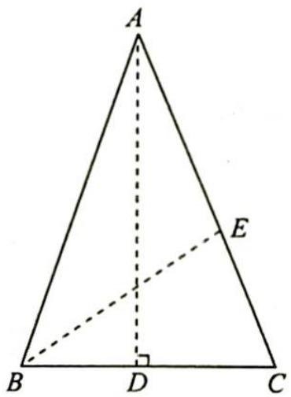

text_image

A
E
B D C

设 $AE = BE = BC = x$ ，则 $EC = 1 - x$ ，所以 $\triangle ABC \sim \triangle BEC$ ， $\frac{AB}{BC} = \frac{BE}{EC}$ ，即 $\frac{1}{x} = \frac{x}{1 - x}$ ，解得 $x = \frac{-1 \pm \sqrt{5}}{2}$ 。又 $x > 0$ ，所以 $x = \frac{-1 + \sqrt{5}}{2}$ 。

在 Rt△ABD 中，sin∠BAD = sin18° = $\frac{BD}{AB}$ = $\frac{x}{2}$ = $\frac{-1 + \sqrt{5}}{4}$ .

变式(1) (2015 新课标全国 I 卷理 16) 在平面四边形 $ABCD$ 中, $A = B = C = 75^{\circ}$ , $BC = 2$ , 则 $AB$ 的取值范围是 \_\_\_\_.

解析 ▶ 解法一(几何法):如图所示,延长 $BA, CD$ 交于点 $E$ ,平移 $AD$ .

①当 A 点, D 点与 E 点重合时, AB 最长, 所以 $\frac{2}{\sin30^{\circ}} = \frac{BE}{\sin75^{\circ}}, BE = \sqrt{6} + \sqrt{2}$ , 则 AB < $\sqrt{6} + \sqrt{2}$ .  
②当 D 点与 C 点重合, A 点与 F 点重合时, AB 最短, 所以 $\frac{BF}{\sin30^{\circ}} = \frac{2}{\sin75^{\circ}}$ , $BF = \sqrt{6} - \sqrt{2}$ , 则 $AB > \sqrt{6} - \sqrt{2}$ .

综上所述，AB 的取值范围为 $(\sqrt{6}-\sqrt{2},\sqrt{6}+\sqrt{2})$ .

解法二(代数法): 由题意得 $AC > AB, AC > 2$ , 因为 $AC^{2} = AB^{2} + 4 - 2AB \times$

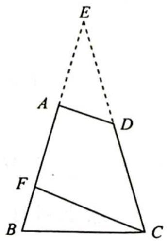

text_image

E
A
D
F
B
C

$2\times\cos75^{\circ}$ ，所以 $AB^{2}+4-2AB\times2\times\cos75^{\circ}>AB^{2}$ ， $AB^{2}+4-2AB\times2\times\cos75^{\circ}>4$ ，因此 $4\cos75^{\circ}<AB<\frac{1}{\cos75^{\circ}}$ ，则 $4\times\frac{\sqrt{6}-\sqrt{2}}{4}<AB<\frac{1}{\frac{\sqrt{6}-\sqrt{2}}{4}}$ ，即 $\sqrt{6}-\sqrt{2}<AB<\sqrt{6}+\sqrt{2}$ 。

故 AB 的取值范围为 $(\sqrt{6}-\sqrt{2},\sqrt{6}+\sqrt{2})$ .

例 24.4 求下列三角函数式的值.

(1) $\cos \frac{2\pi}{7} \cos \frac{4\pi}{7} \cos \frac{6\pi}{7}$ ; (2) $8\cos^2 \frac{\pi}{7} \cos^2 \frac{2\pi}{7} \cos^2 \frac{3\pi}{7}$ ; (3) $\sin 6^\circ \sin 42^\circ \sin 66^\circ \sin 78^\circ$ ; (4) $\cos 6^\circ \cos 42^\circ \cos 66^\circ \cos 78^\circ$ .

分析 ▶ (1) $\sin2\alpha=2\sin\alpha\cos\alpha$ ，这个公式可以实现 $\cos\alpha\rightarrow\sin2\alpha$ 的转变，根据诱导公式 $\cos(\pi-\alpha)=-\cos\alpha$ 可得 $\cos\frac{2\pi}{7}\cos\frac{4\pi}{7}\cos\frac{6\pi}{7}=-\cos\frac{\pi}{7}\cos\frac{2\pi}{7}\cos\frac{4\pi}{7}$ ，使得所有角度呈倍数关系，只需匹配一个 $\sin\frac{\pi}{7}$ ，连续用3次二倍角公式就可以实现函数名统一为 $\sin$ ，角度统一为 $\frac{8\pi}{7}$ ，再使用诱导公式 $\sin\frac{8\pi}{7}=-\sin\frac{\pi}{7}$ ，抵消匹配的 $\sin\frac{\pi}{7}$ 。

(2) 由 $\sin 2\alpha = 2\sin \alpha \cos \alpha$ 可得 $\cos \alpha = \frac{\sin 2\alpha}{2\sin \alpha}$ , 将函数名变换成 $\sin$ , 根据诱导公式 $\sin (\pi - \alpha) = \sin \alpha$ 可得 $\frac{\sin (\pi - \alpha)}{\sin \alpha} = 1$ , 使得不同角的正弦函数可以约分.  
(3)根据同角三角函数的基本关系改变函数名,使得角度呈倍数关系,只需匹配一个 $\cos 6^{\circ}$ ,连续用4次二倍角公式可以实现函数名统一为 $\sin$ ,角度统一为 $96^{\circ}$ ,再使用诱导公式 $\sin 96^{\circ} = \cos 6^{\circ}$ ,抵消匹配的 $\cos 6^{\circ}$ .  
(4)观察式子中的角度可以发现 $\cos66^{\circ}=\cos(60^{\circ}+6^{\circ})$ ，若匹配一个 $\cos(60^{\circ}-6^{\circ})=\cos54^{\circ}$ ，可用三倍角公式 $\cos3\alpha=4\cos\left(\frac{\pi}{3}-\alpha\right)\cos\alpha\cos\left(\frac{\pi}{3}+\alpha\right)$ 化简.

同理, $\cos 42^{\circ} = \cos (60^{\circ} - 18^{\circ}), \cos 78^{\circ} = \cos (60^{\circ} + 18^{\circ})$ , 若匹配一个 $\cos 18^{\circ}$ 可用三倍角公式化简, 原式转化为 $= \frac{\frac{1}{4} \cos (3 \times 6^{\circ}) \cdot \frac{1}{4} \cos (3 \times 18^{\circ})}{\cos 54^{\circ} \cos 18^{\circ}}$ .

解析 (1) $\cos \frac{2\pi}{7}\cos \frac{4\pi}{7}\cos \frac{6\pi}{7} = -\cos \frac{\pi}{7}\cos \frac{2\pi}{7}\cos \frac{4\pi}{7} = -\frac{\sin \frac{\pi}{7}\cos \frac{\pi}{7}\cos \frac{2\pi}{7}\cos \frac{4\pi}{7}}{\sin \frac{\pi}{7}} =$

$$
- \frac {\frac {1}{2} \sin \frac {2 \pi}{7} \cos \frac {2 \pi}{7} \cos \frac {4 \pi}{7}}{\sin \frac {\pi}{7}} = - \frac {\frac {1}{4} \sin \frac {4 \pi}{7} \cos \frac {4 \pi}{7}}{\sin \frac {\pi}{7}} = - \frac {\frac {1}{8} \sin \frac {8 \pi}{7}}{\sin \frac {\pi}{7}} = - \frac {- \frac {1}{8} \sin \frac {\pi}{7}}{\sin \frac {\pi}{7}} = \frac {1}{8}.
$$

(2) $8\cos^{2}\frac{\pi}{7}\cos^{2}\frac{2\pi}{7}\cos^{2}\frac{3\pi}{7}=8\left(\cos\frac{\pi}{7}\cos\frac{2\pi}{7}\cos\frac{3\pi}{7}\right)^{2}=8\left(\frac{\sin\frac{2\pi}{7}}{2\sin\frac{\pi}{7}}\cdot\frac{\sin\frac{4\pi}{7}}{2\sin\frac{2\pi}{7}}\cdot\frac{\sin\frac{6\pi}{7}}{2\sin\frac{3\pi}{7}}\right)^{2}=8\times\frac{1}{8^{2}}=\frac{1}{8}.$   
(3) 原式 $= \sin 6^{\circ} \sin 42^{\circ} \cos 24^{\circ} \cos 12^{\circ} = \frac{2 \sin 6^{\circ} \cos 6^{\circ}}{2 \cos 6^{\circ}} \cos 12^{\circ} \cos 24^{\circ} \cos 48^{\circ} = \frac{2 \sin 12 \cos 12^{\circ}}{4 \cos 6^{\circ}} \cdot$ $\cos 24^{\circ} \cos 48^{\circ} = \frac{2 \sin 24^{\circ} \cos 24^{\circ}}{8 \cos 6^{\circ}} \cos 48^{\circ} = \frac{2 \sin 48^{\circ} \cos 48^{\circ}}{16 \cos 6^{\circ}} = \frac{\sin 96^{\circ}}{16 \cos 6^{\circ}} = \frac{1}{16}$ .  
(4) $\cos 3\alpha = 4\cos \left(\frac{\pi}{3} - \alpha\right)\cos \alpha \cos \left(\frac{\pi}{3} + \alpha\right)$ , 不难发现 $\left(\frac{\pi}{3} - \alpha\right) + \left(\frac{\pi}{3} + \alpha\right) = \frac{2\pi}{3}, \frac{\pi}{3} + \alpha - \alpha = \frac{\pi}{3}$ , $66^{\circ} - 6^{\circ} = 60^{\circ}, 42^{\circ} + 78^{\circ} = 120^{\circ}$ , 因此我们运用三倍角公式的逆变换 $\cos 6^{\circ}\cos 66^{\circ}\cos 42^{\circ}\cos 78^{\circ} = \frac{\cos 54^{\circ}\cos 6^{\circ}\cos 66^{\circ}}{\cos 54^{\circ}} \cdot \frac{\cos 42^{\circ}\cos 18^{\circ}\cos 78^{\circ}}{\cos 18^{\circ}} = \frac{\frac{1}{4}\cos 18^{\circ} \cdot \frac{1}{4}\cos 54^{\circ}}{\cos 54^{\circ}\cos 18^{\circ}} = \frac{1}{16}$ .

# 评注

第(3)题也可通过三倍角公式的逆变换来求解.

$\sin 6^{\circ}\sin 42^{\circ}\sin 66^{\circ}\sin 78^{\circ} = \sin 6^{\circ}\sin 66^{\circ}\sin 42^{\circ}\sin 78^{\circ}$ , 结合 $\sin 3\alpha = -4\sin \left(\alpha - \frac{\pi}{3}\right)\sin \alpha \cdot \sin \left(\alpha + \frac{\pi}{3}\right) = 4\sin \left(\frac{\pi}{3} - \alpha\right)\sin \alpha \sin \left(\alpha + \frac{\pi}{3}\right)$ , 所以 $\sin 6^{\circ}\sin 66^{\circ} = \frac{\sin 54^{\circ}\sin 6^{\circ}\sin 66^{\circ}}{\sin 54^{\circ}}, \sin 42^{\circ}\sin 78^{\circ} = \frac{\sin 42^{\circ}\sin 18^{\circ}\sin 78^{\circ}}{\sin 18^{\circ}}$ , 则 $\sin 6^{\circ}\sin 66^{\circ}\sin 42^{\circ}\sin 78^{\circ} = \frac{\sin 54^{\circ}\sin 6^{\circ}\sin 66^{\circ}}{\sin 54^{\circ}} \cdot \frac{\sin 42^{\circ}\sin 18^{\circ}\sin 78^{\circ}}{\sin 18^{\circ}} =$

$$
\frac {\frac {1}{4} \sin 1 8 ^ {\circ}}{\sin 5 4 ^ {\circ}} \cdot \frac {\frac {1}{4} \sin 5 4 ^ {\circ}}{\sin 1 8 ^ {\circ}} = \frac {1}{1 6}.
$$

变式(1) (2008 清华自主招生) 求 $\sin^{4}10^{\circ} + \sin^{4}50^{\circ} + \sin^{4}70^{\circ}$ .

$$
\begin{array}{l} = \cos^ {4} 8 0 ^ {\circ} + \cos^ {4} 4 0 ^ {\circ} + \cos^ {4} 2 0 ^ {\circ} \\ = \left(\frac {1 + \cos 1 6 0 ^ {\circ}}{2}\right) ^ {2} + \left(\frac {1 + \cos 8 0 ^ {\circ}}{2}\right) ^ {2} + \left(\frac {1 + \cos 4 0 ^ {\circ}}{2}\right) ^ {2} \\ = \frac {3}{4} + \frac {\cos^ {2} 1 6 0 ^ {\circ} + \cos^ {2} 8 0 ^ {\circ} + \cos^ {2} 4 0 ^ {\circ}}{4} + \frac {1}{2} (\cos 1 6 0 ^ {\circ} + \cos 8 0 ^ {\circ} + \cos 4 0 ^ {\circ}) \\ = \frac {3}{4} + \frac {1}{8} (1 + \cos 3 2 0 ^ {\circ} + 1 + \cos 1 6 0 ^ {\circ} + 1 + \cos 8 0 ^ {\circ}) + \frac {1}{2} (\cos 1 6 0 ^ {\circ} + \cos 8 0 ^ {\circ} + \cos 4 0 ^ {\circ}) \\ = \frac {9}{8} + \frac {1}{8} (\cos 3 2 0 ^ {\circ} + \cos 1 6 0 ^ {\circ} + \cos 8 0 ^ {\circ}) + \frac {1}{2} (\cos 1 6 0 ^ {\circ} + \cos 8 0 ^ {\circ} + \cos 4 0 ^ {\circ}) \\ = \frac {9}{8} + \frac {1}{8} (2 \cos 2 4 0 ^ {\circ} \cos 8 0 ^ {\circ} + \cos 8 0 ^ {\circ}) + \frac {1}{2} (2 \cos 1 0 0 ^ {\circ} \cos 6 0 ^ {\circ} + \cos 8 0 ^ {\circ}) \\ \end{array}
$$

解析 $\sin^{4}10^{\circ}+\sin^{4}50^{\circ}+\sin^{4}70^{\circ}$

$$
\begin{array}{l} = \frac {9}{8} + \frac {1}{8} \left[ 2 \times \left(- \frac {1}{2}\right) \cos 8 0 ^ {\circ} + \cos 8 0 ^ {\circ} \right] + \frac {1}{2} \left[ 2 \times (- \cos 8 0 ^ {\circ}) \times \frac {1}{2} + \cos 8 0 ^ {\circ} \right] \\ = \frac {9}{8}. \\ \end{array}
$$

# 三角形中的三角恒等变换

# 24.2 三角形形状的判定

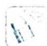

# 研究密钥

判断三角形形状的两种途径：

(1)利用正弦定理、余弦定理,把已知条件转化为边边关系,再分析.  
(2)转化为内角的三角函数之间的关系,通过恒等变换得出内角的关系,再判断.

正弦定理

$\frac{a}{\sin A}=\frac{b}{\sin B}=\frac{c}{\sin C}=2R(2R$ 为 $\triangle ABC$ 的外接圆直径).

余弦定理

$c^{2}=a^{2}+b^{2}-2ab\cos C$ （已知两边a,b及夹角C，求第三边c）.

$\cos C = \frac{a^2 + b^2 - c^2}{2ab}$ （已知三边求角）.

例 24.5 在 $\triangle ABC$ 中， $A$ 和 $B$ 均为锐角，且 $\sin^{2}A+\sin^{2}B=\sin C.$ 证明： $C=90^{\circ}$ .

分析▶ 根据条件可得 $\sin C = \sin(A + B) = \sin A \cos B + \cos A \sin B = \sin^{2} A + \sin^{2} B$ ，即 $\sin A (\cos B - \sin A) + \sin B (\cos A - \sin B) = 0$ ，又因为 A 和 B 均为锐角，所以 $\sin A$ 和 $\sin B$ 都为正数。当 $\cos B < \sin A, \cos A < \sin B$ 时，方程不成立，此时 $A + B > \frac{\pi}{2}, C < 90^{\circ}$ ; 当 $\cos B > \sin A, \cos A > \sin B$ 时，方程也不成立，此时 $A + B < \frac{\pi}{2}, C > 90^{\circ}$ 。所以使用反证法，可以先假设 $C \neq 90^{\circ}$ ，即 $A + B \neq \frac{\pi}{2}$ ，分两种情况讨论，分别推出矛盾。

解析 ▶ 解法一: 依题意可得 A 和 B 均为锐角, 若 $A + B > \frac{\pi}{2}$ , 则 $\sin A > \cos B, \sin B > \cos A$ . 故 $\sin^{2}A + \sin^{2}B > \sin A\cos B + \sin B\cos A = \sin(A + B) = \sin C$ , 矛盾.

同理, 若 $A + B < \frac{\pi}{2}$ , 也推出矛盾.

所以， $A+B=\frac{\pi}{2}$ ，则 $C=90^{\circ}$ .

解法二: 由 $\sin^2 A + \sin^2 B = \sin C$ 得 $\sin^2 A + \sin^2 B = \sin (A + B) = \sin A\cos B + \cos A\sin B$ , 即 $\sin A (\sin A - \cos B) = \sin B (\cos A - \sin B)$ , 可得 $\sin A\left[\sin A - \sin \left(\frac{\pi}{2} - B\right)\right] = \sin B\left[\sin \left(\frac{\pi}{2} - A\right) - \sin B\right]$ , 故 $\sin A \cdot 2\cos \frac{A + \frac{\pi}{2} - B}{2}\sin \frac{A + B - \frac{\pi}{2}}{2} = 2\sin B\cos \frac{\frac{\pi}{2} - A + B}{2}$ . $\sin \frac{\frac{\pi}{2} - A - B}{2}$ , 即 $2\sin \frac{A + B - \frac{\pi}{2}}{2}\left[\sin A\cos \frac{A + \frac{\pi}{2} - B}{2} + \sin B\cos \frac{\frac{\pi}{2} - A + B}{2}\right] = 0.$

又 $0 < A, B < \frac{\pi}{2}$ , 则 $\cos \frac{A - B + \frac{\pi}{2}}{2} > 0$ , $\cos \frac{\frac{\pi}{2} - A + B}{2} > 0$ , 得 $\sin \frac{A + B - \frac{\pi}{2}}{2} = 0$ , 即 $A + B = \frac{\pi}{2}, C = \frac{\pi}{2}$ , 故 $\triangle ABC$ 为直角三角形, $C = 90^\circ$ .

变式(1) 在 $\triangle ABC$ 中, $\cos A\cos B\cos C=\frac{1}{8}$ , 试判断 $\triangle ABC$ 的形状.

解析 ▶ 解法一: 由题意得 $\cos A\cos B\cos C = -\cos A\cos B\cos (A + B) = \frac{1}{8}$ , 且 $\cos A\cos B = \frac{1}{2} [\cos (A + B) + \cos (A - B)]$ , 则 $-\frac{1}{2} [\cos (A + B) + \cos (A - B)] \cdot \cos (A + B) = \frac{1}{8}$ , 即 $\cos^2 (A + B) + \cos (A - B)\cos (A + B) + \frac{1}{4}\cos^2 (A - B) + \frac{1}{4}\sin^2 (A - B) = 0$ , 因此 $\left[\cos (A + B) + \frac{1}{2}\cos (A - B)\right]^2 + \frac{1}{4}\sin^2 (A - B) = 0$ , 故 $\cos (A + B) + \frac{1}{2}\cos (A - B) = 0$ , 且 $\sin (A - B) = 0$ .

又 $A, B \in (0, \pi)$ , 则 $A = B$ , 且 $A + B = \frac{2\pi}{3}$ , 即 $A = B = \frac{\pi}{3}, C = \frac{\pi}{3}$ , 所以 $\triangle ABC$ 为等边三角形.

解法二: 由余弦定理知 $\cos A = \frac{b^2 + c^2 - a^2}{2bc}$ , $\cos B = \frac{a^2 + c^2 - b^2}{2ac}$ , $\cos C = \frac{a^2 + b^2 - c^2}{2ab}$ , 则 $\frac{b^2 + c^2 - a^2}{2bc} \cdot \frac{a^2 + c^2 - b^2}{2ac} \cdot \frac{a^2 + b^2 - c^2}{2ab} = \frac{1}{8}$ , 可得 $(b^2 + c^2 - a^2)(a^2 + c^2 - b^2)(a^2 + b^2 - c^2) = a^2b^2c^2$ (\*), 不宜直接展开, 运用不等式放缩技巧.

由 $\sqrt{b^2 + c^2 - a^2} \cdot \sqrt{a^2 + c^2 - b^2} \leqslant \frac{b^2 + c^2 - a^2 + a^2 + c^2 - b^2}{2} = c^2$ （当且仅当“ $b^2 + c^2 - a^2 = a^2 + c^2 - b^2$ ”，即 $a = b$ 时取等号），同理 $\sqrt{a^2 + c^2 - b^2} \cdot \sqrt{a^2 + b^2 - c^2} \leqslant a^2$ （当且仅当“ $b = c$ ”时，取等号）， $\sqrt{b^2 + c^2 - a^2} \cdot \sqrt{a^2 + b^2 - c^2} \leqslant b^2$ （当且仅当“ $a = c$ ”时，取等号），所以 $(b^2 + c^2 - a^2)(a^2 + c^2 - b^2)(a^2 + b^2 - c^2) \leqslant a^2b^2c^2$ （当且仅当“ $a = b = c$ ”时，取等号）.

则 $(*)$ 式成立时, 也即当且仅当 $a=b=c$ 时, $\triangle ABC$ 为等边三角形.

变式2: 在 $\triangle ABC$ 中, $\sin^{2}A + \sin^{2}B + \sin^{2}C = \frac{9}{4}$ , 试判断 $\triangle ABC$ 的形状.

解析 由 $\sin^2 A + \sin^2 B + \sin^2 C = \frac{1 - \cos 2A}{2} + \frac{1 - \cos 2B}{2} + \frac{1 - \cos 2C}{2} = \frac{3}{2} - \frac{1}{2} (\cos 2A + \cos 2B + \cos 2C) = \frac{9}{4}$ , 可得 $\cos 2A + \cos 2B + \cos 2C = -\frac{3}{2}$ .

又 $\cos 2A + \cos 2B + \cos 2C = 2\cos (A + B)\cos (A - B) + \cos 2(A + B) = 2\cos (A + B)\cos (A -$ $B) + 2\cos^2 (A + B) - 1 = -\frac{3}{2}$ ，即 $\cos^2 (A + B) + \cos (A - B)\cos (A + B) = -\frac{1}{4}.$

$\cos^2 (A + B) + \cos (A - B)\cos (A + B) + \frac{1}{4}\cos^2 (A - B) + \frac{1}{4}\sin^2 (A - B) = 0$ ，得 $\left[\cos (A + B) + \frac{1}{2}\cos (A - B)\right]^2 +\frac{1}{4}\sin^2 (A - B) = 0$ ，因此 $\cos (A + B) + \frac{1}{2}\cos (A - B) = 0$ 且 $\sin (A - B) = 0.$

故 $A = B = \frac{\pi}{3},\triangle ABC$ 为等边三角形.

变式(3) 证明: $\triangle ABC$ 为直角三角形的充分必要条件是 $\sin^{2}A + \sin^{2}B + \sin^{2}C = 2$ .

解析 不妨设 $A = 90^{\circ}, B + C = 90^{\circ}$ , 则 $\sin^{2} A + \sin^{2} B + \sin^{2} C = 1 + \sin^{2} B + \cos^{2} B = 2$ .

证法一: 若 $\sin^{2}A + \sin^{2}B + \sin^{2}C = 2$ ，由正弦定理得 $\frac{\sin A}{a} = \frac{\sin B}{b} = \frac{\sin C}{c} = \frac{1}{2R}$ ，故 $\left(\frac{1}{2R}\right)^{2}(a^{2} + b^{2} + c^{2}) = 2$ ，即 $\left(\frac{1}{2R}\right)^{2} = \frac{2}{a^{2} + b^{2} + c^{2}}$ .

因此， $\sin^2 A = \frac{2a^2}{a^2 + b^2 + c^2}, \cos^2 A = \frac{b^2 + c^2 - a^2}{a^2 + b^2 + c^2} = \frac{2bc\cos A}{a^2 + b^2 + c^2}$ .

同理, $\cos^{2}B=\frac{2ac\cos B}{a^{2}+b^{2}+c^{2}}$ , $\cos^{2}C=\frac{2ab\cos C}{a^{2}+b^{2}+c^{2}}$ .

若 $\cos A, \cos B, \cos C$ 均为非零实数，则 $\cos A = \frac{2bc}{a^2 + b^2 + c^2}$ （\*）， $\cos B = \frac{2ac}{a^2 + b^2 + c^2}$ ， $\cos C = \frac{2ab}{a^2 + b^2 + c^2}$ .

由式（ $\ast$ ）得 $(b^{2} + c^{2} - a^{2})(b^{2} + c^{2} + a^{2}) = (2bc)^{2} \Rightarrow (b^{2} + c^{2})^{2} - a^{4} = 4b^{2}c^{2} \Rightarrow (b^{2} - c^{2})^{2} - a^{4} = 0 \Rightarrow (b^{2} - c^{2} - a^{2})(b^{2} - c^{2} + a^{2}) = 0.$

因此， $\cos B\cos C=0$ ，矛盾。

所以假设 $\cos A, \cos B, \cos C$ 均为非零实数不成立, 故 $\cos A, \cos B, \cos C$ 中有一个为 0 , 即 $\triangle ABC$ 为直角三角形.

$$
\begin{array}{l} = \cos^ {2} A + \cos^ {2} B - \sin^ {2} A \cos^ {2} B - 2 \sin A \cos A \sin B \cos B - \cos^ {2} A \sin^ {2} B \\ = \cos^ {2} A (1 - \sin^ {2} B) + \cos^ {2} B (1 - \sin^ {2} A) - 2 \sin A \cos A \sin B \cos B \\ \end{array}
$$

证法二: $0 = 2 - \sin^{2} A - \sin^{2} B - \sin^{2} C = \cos^{2} A + \cos^{2} B - \sin^{2} (A + B)$

$$
\begin{array}{l} = 2 \cos^ {2} A \cos^ {2} B - 2 \sin A \cos A \sin B \cos B \\ = 2 \cos A \cos B (\cos A \cos B - \sin A \sin B) \\ = - 2 \cos A \cos B \cos C. \\ \end{array}
$$

由 A, B, C 为 $\triangle ABC$ 的三个内角，可知 $\cos A, \cos B, \cos C$ 中有一个为 0，其所对应的角为直角，即 $\triangle ABC$ 为直角三角形.

# 24.3 三角形中恒等式与不等式

# 研究密钥

三角等式分三角恒等式与条件恒等式,证明的关键在于消除等式左、右的差异、消除条件与结论的差异,一般地,根据需要可化繁为简、从左证右、从右证左或左右同时化为另一个式子.

(1) $\sin^{2}A+\sin^{2}B+\sin^{2}C=2(1+\cos A\cos B\cos C)$ .   
(2) $\cos^{2}A+\cos^{2}B+\cos^{2}C=1-2\cos A\cos B\cos C.$   
(3) $\sin 3x = 3\sin x - 4\sin^3 x = 4\sin x\sin \left(\frac{\pi}{3} + x\right)\sin \left(\frac{\pi}{3} - x\right)$ .   
(4) $\tan\frac{A}{2}\tan\frac{B}{2}+\tan\frac{B}{2}\tan\frac{C}{2}+\tan\frac{A}{2}\tan\frac{C}{2}=1.$   
(5) $\tan A + \tan B + \tan C = \tan A \tan B \tan C.$   
(6) $\cot A\cot B + \cot B\cot C + \cot A\cot C = 1.$

三角不等式首先是不等式,要掌握证明不等式的常用方法:配方法、比较法、放缩法、基本不等式、柯西不等式等.另外,要充分利用好三角形内角和为 $180^{\circ}$ 这一结论,如果同时涉及边和角,应尽量使用正、余弦定理实现边角统一.

例 24.6 已知△ABC 的三个内角的正切值均为正整数, 请求出这三个内角的正切值.

分析 已知条件没有体现角度和函数关系,需要充分利用三角形内角和为 $180^{\circ}$ 这一结论及其变形. $A + B + C = \pi$ , 结合条件三个内角的正切值均为正整数, 可得最小的角的正切值为 1, 借助恒等式 $\tan A + \tan B + \tan C = \tan A \tan B \tan C$ 建立起三个正切值之间的关系, 代入转化为两个正切值之间的关系, 求整数解即可证明.

解析 因为 $\triangle ABC$ 的三个内角的正切值均为正整数, 即 $\tan A > 0, \tan B > 0, \tan C > 0$ .

设 $A \leqslant B \leqslant C$ . 所以 $A + B + C = \pi \geqslant 3A, A \leqslant \frac{\pi}{3}$ , 则 $\tan A \leqslant \tan \frac{\pi}{3} = \sqrt{3}$ , 由于 $\tan A$ 为正整数, 所以 $\tan A = 1$ .

又 $\tan C = \tan (\pi - A - B) = -\tan (A + B) = \frac{-\tan A - \tan B}{1 - \tan A\tan B}$ , 所以有 $\tan A + \tan B +$

$$
\tan C = \tan A \tan B \tan C.
$$

将 $\tan A = 1$ 代入上式得 $\tan B\tan C = \tan B + \tan C + 1$ ，即 $(\tan C - 1)(\tan B - 1) = 2.$

又 $\tan B \in \mathbb{N}^*$ ，则 $\tan B \geqslant 2$ ，因为 $\tan B = 1$ 时， $C$ 为直角，不合题意。

因为 $\tan A, \tan B, \tan C$ 为正整数，所以由上式可得 $\left\{ \begin{array}{l} \tan B - 1 = 1 \\ \tan C - 1 = 2 \end{array} \right.$ 或 $\left\{ \begin{array}{l} \tan B - 1 = 2 \\ \tan C - 1 = 1 \end{array} \right.$ ，由假设 $A \leqslant B \leqslant C$ ，则 $\tan B \leqslant \tan C$ ，所以 $\left\{ \begin{array}{l} \tan B = 2 \\ \tan C = 3 \end{array} \right.$ .

综上所述,这三个内角的正切值分别为 1,2,3.

变式(1) 在锐角 $\triangle ABC$ 中, 若 $\sin A=2\sin B\sin C$ , 则 $\tan A\tan B\tan C$ 的最小值是

解析 由题得 $\sin A = \sin (B + C) = 2\sin B\sin C$ ，即 $\sin B\cos C + \cos B\sin C = 2\sin B\sin C.$

两边同除以 $\cos B\cos C$ 得 $\tan B + \tan C = 2\tan B\tan C$ ，则 $\tan A\tan B\tan C = \tan A + \tan B+$ $\tan C = \tan A + 2\tan B\tan C\geqslant 2\sqrt{2\tan A\tan B\tan C}$ ，即 $\tan A\tan B\tan C\geqslant 8$ ，当且仅当 $\tan A=$ $2\tan B\tan C$ 时取等号，即 $\tan A = 4,\tan B\tan C = 2$ 时，取等号.

所以 $\tan A\tan B\tan C$ 的最小值是 8.

变式2 证明:在锐角 $\triangle ABC$ 中,有 $\tan A\tan B\tan C \geqslant 3\sqrt{3}$ .

解析 ▶ 解法一: 由题得 $\tan A + \tan B + \tan C = \tan A\tan B\tan C \geqslant 3\sqrt[3]{\tan A\tan B\tan C}$ , 则 $\tan A\tan B\tan C \geqslant 3\sqrt{3}$ , 当且仅当 $A = B = C = \frac{\pi}{3}$ 时取等号.

解法二: 设 $f(x)=\tan x$ ，易知 $f(x)$ 在 $\left(0,\frac{\pi}{2}\right)$ 上是下凸函数，则对于 $A,B,C\in\left(0,\frac{\pi}{2}\right)$ ，有 $\frac{f(A)+f(B)+f(C)}{3}\geqslant f\left(\frac{A+B+C}{3}\right)=f\left(\frac{\pi}{3}\right)$ ，所以 $\tan A + \tan B + \tan C \geqslant 3\sqrt{3}$ ，即 $\tan A\tan B\tan C\geqslant3\sqrt{3}.$

变式(3) 证明:在锐角 $\triangle ABC$ 中,有 $\tan\frac{A}{2}+\tan\frac{B}{2}+\tan\frac{C}{2}\geqslant\sqrt{3}$ .

解析 ▶ 解法一: 不等式 $\tan\frac{A}{2}+\tan\frac{B}{2}+\tan\frac{C}{2}\geqslant\sqrt{3}\Leftrightarrow\left(\tan\frac{A}{2}+\tan\frac{B}{2}+\tan\frac{C}{2}\right)^{2}\geqslant3$ , 即 $\tan^{2}\frac{A}{2}+\tan^{2}\frac{B}{2}+\tan^{2}\frac{C}{2}+2\tan\frac{A}{2}\tan\frac{B}{2}+2\tan\frac{B}{2}\tan\frac{C}{2}+2\tan\frac{A}{2}\tan\frac{C}{2}\geqslant3.$

又 $\tan^2\frac{A}{2} + \tan^2\frac{B}{2} + \tan^2\frac{C}{2} \geqslant \tan \frac{A}{2}\tan \frac{B}{2} + \tan \frac{B}{2}\tan \frac{C}{2} + \tan \frac{A}{2}\tan \frac{C}{2}$ , 依据 $x, y, z \in \mathbb{R}$ , 有 $x^2 + y^2 + z^2 \geqslant xy + yz + xz$ 恒成立, 因此 $\tan^2\frac{A}{2} + \tan^2\frac{B}{2} + \tan^2\frac{C}{2} + 2\tan \frac{A}{2}\tan \frac{B}{2} + 2\tan \frac{B}{2}\tan \frac{C}{2} + 2\tan \frac{A}{2}\tan \frac{C}{2} \geqslant 3\left(\tan \frac{A}{2}\tan \frac{B}{2} + \tan \frac{B}{2}\tan \frac{C}{2} + \tan \frac{A}{2}\tan \frac{C}{2}\right) = 3$ (其中用到三角形中的恒等式

$$
\tan \frac {A}{2} \tan \frac {B}{2} + \tan \frac {B}{2} \tan \frac {C}{2} + \tan \frac {A}{2} \tan \frac {C}{2} = 1).
$$

综上所述， $\tan \frac{A}{2} +\tan \frac{B}{2} +\tan \frac{C}{2}\geqslant \sqrt{3}$ ，当且仅当 $A = B = C = \frac{\pi}{3}$ 时取等号.

解法二：由 $A + B + C = \pi$ 得 $\tan \frac{A}{2} = \tan \frac{\pi - (B + C)}{2} = \frac{1}{\tan \frac{B + C}{2}} = \frac{1 - \tan \frac{B}{2} \tan \frac{C}{2}}{\tan \frac{B}{2} + \tan \frac{C}{2}}$ ，因此

$$
\tan {\frac {A}{2}} + \tan {\frac {B}{2}} + \tan {\frac {C}{2}} = {\frac {1 - \tan {\frac {B}{2}} \tan {\frac {C}{2}}}{\tan {\frac {B}{2}} + \tan {\frac {C}{2}}}} + \tan {\frac {B}{2}} + \tan {\frac {C}{2}}, \text {且} \tan {\frac {B}{2}}, \tan {\frac {C}{2}} > 0,
$$

$\tan \frac{B}{2} \tan \frac{C}{2} \leqslant \left( \frac{\tan \frac{B}{2} + \tan \frac{C}{2}}{2} \right)^2$ ，因此 $\tan \frac{A}{2} + \tan \frac{B}{2} + \tan \frac{C}{2} \geqslant \frac{1 - \frac{\left(\tan \frac{B}{2} + \tan \frac{C}{2}\right)^2}{4}}{\tan \frac{B}{2} + \tan \frac{C}{2}} + \tan \frac{B}{2} +$

$\tan \frac{C}{2} = \frac{1}{\tan \frac{B}{2} + \tan \frac{C}{2}} + \frac{3}{4} \left( \tan \frac{B}{2} + \tan \frac{C}{2} \right) \geqslant 2 \times \frac{\sqrt{3}}{2} = \sqrt{3}$ , 当且仅当 $B = C = \frac{\pi}{3}$ , 即 $A = B = C = \frac{\pi}{3}$ 时取等号.

例 24.7 在锐角△ABC 中, 证明: $\sin A + \sin B + \sin C > 2$ .

分析 ▶ 为减少变量, 先对要证的式子进行变形 $\sin A + \sin B + \sin C = \sin A + \sin B + \sin (A + B) = \sin A + \sin B + \sin A\cos B + \sin B\cos A > 2 = \sin^2 A + \sin^2 B + \cos^2 B + \cos^2 A$ . 根据正、余弦函数的有界性可得 $\sin A > \sin^2 A, \sin B > \sin^2 B$ , 因为 $A, B, C$ 都是锐角, 所以 $A + B > \frac{\pi}{2} \Leftrightarrow \sin A > \cos B$ , 同理有 $\sin B > \cos A$ , 所以 $\sin A\cos B > \cos^2 B, \sin B\cos A > \cos^2 A$ , 相加即可得证.

解析 因为 $\triangle ABC$ 为锐角三角形, 所以 $A + B > \frac{\pi}{2} \Leftrightarrow A > \frac{\pi}{2} - B \Leftrightarrow \sin A > \sin \left(\frac{\pi}{2} - B\right) \Leftrightarrow \sin A > \cos B$ , 同理有 $\sin B > \cos A$ .

$$
\begin{array}{r l} & {\sin A + \sin B + \sin C > \sin^ {2} A + \sin^ {2} B + \sin (A + B) = \sin^ {2} A + \sin^ {2} B + \sin A \cos B + \sin B \cos A >} \\ & {\sin^ {2} A + \sin^ {2} B + \cos^ {2} B + \cos^ {2} A = 2.} \end{array}
$$

变式(1) 在 $\triangle ABC$ 中,证明: $\frac{1}{1+\cos^{2}A+\cos^{2}B}+\frac{1}{1+\cos^{2}A+\cos^{2}C}+\frac{1}{1+\cos^{2}B+\cos^{2}C}\leqslant2.$

解析 $\sin^{2}C=\sin^{2}(A+B)=(\sin A\cos B+\sin B\cos A)^{2}$ ，由柯西不等式可得 $(\sin A\cos B+\sin B\cos A)^{2}\leqslant(\sin^{2}A+\sin^{2}B)(\cos^{2}A+\cos^{2}B)$ ，所以 $\cos^{2}A+\cos^{2}B\geqslant\frac{\sin^{2}C}{\sin^{2}A+\sin^{2}B}$ ，即 $\cos^{2}A+\cos^{2}B$

$B + 1 \geqslant \frac{\sin^2 C + \sin^2 A + \sin^2 B}{\sin^2 A + \sin^2 B}$ , 则 $\frac{1}{\cos^2 A + \cos^2 B + 1} \leqslant \frac{\sin^2 A + \sin^2 B}{\sin^2 A + \sin^2 B + \sin^2 C}$ . 同理 $\frac{1}{\cos^2 B + \cos^2 C + 1} \leqslant \frac{\sin^2 B + \sin^2 C}{\sin^2 A + \sin^2 B + \sin^2 C}, \frac{1}{\cos^2 C + \cos^2 A + 1} \leqslant \frac{\sin^2 C + \sin^2 A}{\sin^2 A + \sin^2 B + \sin^2 C}$ .

以上三式相加得 $\frac{1}{1 + \cos^2A + \cos^2B} +\frac{1}{1 + \cos^2A + \cos^2C} +\frac{1}{1 + \cos^2B + \cos^2C}\leqslant$ $\frac{2(\sin^2A + \sin^2B + \sin^2C)}{\sin^2A + \sin^2B + \sin^2C} = 2.$

例 24.8 如图所示,任意 $\triangle ABC$ ,作其三个角的三等分线,两两成对相交,证明:三个交点一定构成正三角形.

分析 已知条件是三个内角三等分, 所以考虑将结果向角度方向转换. 边 $A_{1}C_{1}$ 在 $\triangle AA_{1}C_{1}$ 中, 由余弦定理得 $A_{1}C_{1}^{2}=AA_{1}^{2}+AC_{1}^{2}$ $-2AA_{1} \cdot AC_{1}\cos\alpha$ , 使用正弦定理把边 $AA_{1}$ 和 $AC_{1}$ 转换成角度, 根据式子的结构特征构造三角形, 并结合正弦、余弦定理进行化简. 由于 $A_{1}C_{1}, A_{1}B_{1}, B_{1}C_{1}$ 地位对等, 将 $A_{1}B_{1}, B_{1}C_{1}$ 用轮换的原则表示出来, 若相等则命题得证.

解析 如图所示, 设 $A=3\alpha, B=3\beta, C=3\gamma, \triangle ABC$ 的外接圆的直径为 $2R, \alpha + \beta + \gamma = \frac{\pi}{3}$ .

在 $\triangle AA_{1}C_{1}$ 中,由余弦定理得 $A_{1}C_{1}^{2}=AA_{1}^{2}+AC_{1}^{2}-2AA_{1}\cdot B$ $AC_{1}\cos\alpha$ ,且在 $\triangle A_{1}AB$ 中,由正弦定理得 $\frac{AA_{1}}{\sin\beta}=\frac{AB}{\sin(\alpha+\beta)}=\frac{AB}{\sin\left(\frac{\pi}{3}-\gamma\right)}=\frac{2R\sin3\gamma}{\sin\left(\frac{\pi}{3}-\gamma\right)}=$ $8R\sin\gamma\sin\left(\gamma+\frac{\pi}{3}\right)$ (用到正弦的三倍角公式),即 $AA_{1}=8R\sin\beta\sin\gamma\sin\left(\gamma+\frac{\pi}{3}\right)$ .

同理，在 $\triangle ACC_{1}$ 中，由正弦定理得 $\frac{AC_1}{\sin\gamma} = \frac{AC}{\sin(\alpha + \gamma)} = \frac{AC}{\sin\left(\frac{\pi}{3} - \beta\right)} = \frac{2R\sin 3\beta}{\sin\left(\frac{\pi}{3} - \beta\right)} =$ $8R\sin \beta \sin \left(\frac{\pi}{3} + \beta\right)$ ，即 $AC_{1} = 8R\sin \gamma \sin \beta \sin \left(\frac{\pi}{3} + \beta\right)$ ，所以 $A_{1}C_{1}^{2} = AA_{1}^{2} + AC_{1}^{2} - 2AA_{1} \cdot AC_{1}\cos \alpha$ $= (8R\sin \beta \sin \gamma)^{2}\left[\sin^{2}\left(\frac{\pi}{3} + \gamma\right) + \sin^{2}\left(\frac{\pi}{3} + \beta\right) - 2\sin \left(\frac{\pi}{3} + \gamma\right)\sin \left(\frac{\pi}{3} + \beta\right)\cos \alpha\right].$

对于 $\sin^{2}\left(\frac{\pi}{3}+\gamma\right)+\sin^{2}\left(\frac{\pi}{3}+\beta\right)-2\sin\left(\frac{\pi}{3}+\gamma\right)\sin\left(\frac{\pi}{3}+\beta\right)\cos\alpha$ 这个式子，构造三角形，使得三内角分别为 $\frac{\pi}{3}+\gamma,\frac{\pi}{3}+\beta$ 和 $\alpha$ ，且三角形的外接圆直径为 1，则 $\sin^{2}\left(\frac{\pi}{3}+\gamma\right)+\sin^{2}\left(\frac{\pi}{3}+\beta\right)-2\sin\left(\frac{\pi}{3}+\gamma\right)\sin\left(\frac{\pi}{3}+\beta\right)\cos\alpha=\sin^{2}\alpha$ ，因此 $A_{1}C_{1}^{2}=(8R\sin\alpha\sin\beta\sin\gamma)^{2}$ ，即 $A_{1}C_{1}=8R\sin\alpha\sin\beta\sin\gamma$ .

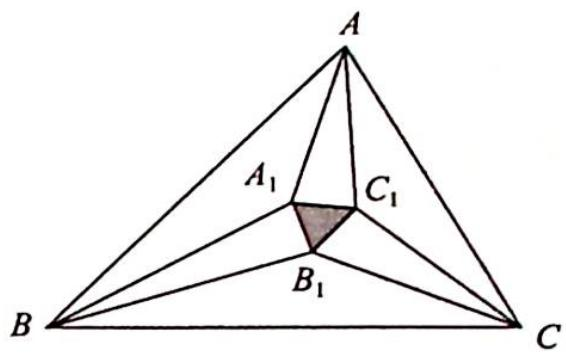

text_image

A
A₁ C₁
B₁ C
B

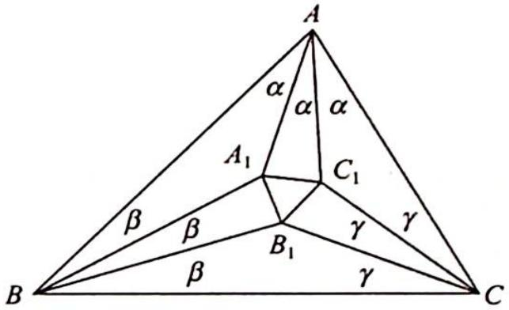

text_image

A
α α α
A₁ C₁
β β B₁ γ γ
β γ
B C

同理 $A_{1}B_{1} = 8R\sin \alpha \sin \beta \sin \gamma, B_{1}C_{1} = 8R\sin \alpha \sin \beta \sin \gamma$ ，所以 $A_{1}B_{1} = A_{1}C_{1} = B_{1}C_{1}$ ，故 $\triangle A_{1}B_{1}C_{1}$ 为等边三角形。得证。

# 训练 24

1. (2022 新高考全国Ⅱ卷理 6) $\alpha, \beta$ 满足 $\sin(\alpha+\beta)+\cos(\alpha+\beta)=2\sqrt{2}\cos\left(\alpha+\frac{\pi}{4}\right)\sin\beta$ , 则( ).

A. $\tan (\alpha +\beta) = 1$

B. $\tan (\alpha +\beta) = -1$

C. $\tan (\alpha -\beta) = 1$

D. $\tan (\alpha -\beta) = -1$

2. 在 $\triangle ABC$ 中, 若 $\sin^{2}A + \sin^{2}B + \sin^{2}C = 2$ , 则 $\cos A + \cos B + 2\cos C$ 的最大值为( ).

A. $\frac{3 \sqrt{2}}{2}$

B. $\sqrt{5}$

C. $\frac{4 \sqrt{3}}{3}$

D. $\sqrt{6}$

3. $\tan15^{\circ}+2\sqrt{2}\sin15^{\circ}=$ \_\_\_\_.

4. 已知 $\alpha, \beta \in \left(\frac{3\pi}{4}, \pi\right), \cos (\alpha + \beta) = \frac{4}{5}, \sin \left(\alpha - \frac{\pi}{4}\right) = \frac{12}{13}$ , 则 $\cos \left(\beta + \frac{\pi}{4}\right) =$ \_\_\_\_.

5. 已知 $\sin\alpha+\sqrt{3}\sin\beta=1,\cos\alpha+\sqrt{3}\cos\beta=\sqrt{3}$ ，则 $\cos(\alpha-\beta)$ 的值为 \_\_\_\_.

6. $\cos\frac{\pi}{11}-\cos\frac{2\pi}{11}+\cos\frac{3\pi}{11}-\cos\frac{4\pi}{11}+\cos\frac{5\pi}{11}=$ \_\_\_\_ (用数字作答).

7. 化简: $\sin 12^{\circ} \sin 48^{\circ} \sin 54^{\circ} =$ \_\_\_\_ (用数字作答).

8. △ABC 的三个内角 A, B, C 满足 A = 3B = 9C，则 cosAcosB + cosBcosC + cosCcosA = \_\_\_\_.

9. 已知在 $\triangle ABC$ 中, 内角 $A, B, C$ 所对的边分别为 $a, b, c$ , 且 $3a^{2} = c^{2} - b^{2}$ , 则 $\tan A \tan B$ 的取值范围是 \_\_\_\_.

# 第 25 讲

# 解三角形

解 三角形往往将代数、几何、三角等知识联系起来,这类试题灵活多变,但无论是三角形解的个数问题、三角形形状的判断问题、三角形中的边角求值或最值问题,还是多边形中的解三角形问题,其本质都是对某三角形中“边角互化”的研究,对正弦、余弦定理的选择也需要一定的技巧.

如果将三角形与平面几何中的性质、定理结合起来,对于快速解题大有裨益,特别是与圆有着密不可分的关系.三角学通常借助圆来研究,三角函数也是通过圆定义的.除了定义以外,三角形中还有很多与圆有关的性质,本讲将介绍三角形中与圆有关的性质.

有关解三角形问题,除了借助平面几何性质处理外,我们更要关注三角恒等变换本身,在 $\triangle ABC$ 中, $A+B+C=\pi$ ,再结合正弦、余弦定理、三角恒等变换公式,可以拓展出很多三角形中的三角恒等式及不等式,如果能够熟练运用这些公式及其变形,也能为解决三角形问题带来巨大的便利.

# 25.1 解的个数

# 研究密钥

三角形解的个数问题是个难点和易错点,类型也比较丰富,针对不同的类型,是选用正弦定理还是余弦定理很好地考查了学生分析问题和解决问题的能力,其主要设问形式是三角形有几个解、形状有几种、已知解的个数求参等,解决方式为正弦定理+有界性,也可以找到临界情况不断进行调整.

如在已知两边及一边对角(即 a, b, A)时, 可利用数形结合法判断解的个数.

我们作图来直观地观察一下. 不妨设已知 $\triangle ABC$ 的两边 $a, b$ 和角 $A$ , 作图步骤如下: ① 先作出已知角 $A$ , 把未知边 $c$ 画为水平的, 角 $A$ 的另一条边为已知边 $b$ ; ② 以边 $b$ 的不是 $A$ 点的另外一个端点为圆心, 以 $a$ 为半径作圆 $C$ ; ③ 观察圆 $C$ 与边 $c$ 交点的个数, 便可得此三角形解的个数.

显然, 当 A 为锐角时, 有如图 1 所示的四种情况.

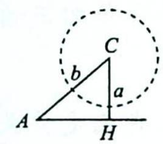  
(a) $a <   CH = b\sin A$ 无解

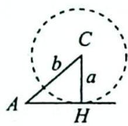  
(b) $a = CH = b\sin A$ 仅有一个解

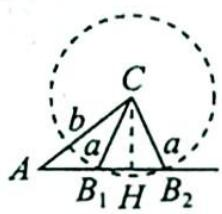  
(c) $CH = b\sin A < a < b$ 有两个解

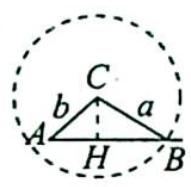  
(d) $a > b$ 仅有一个解   
图 1

当 A 为钝角或直角时,有如图 2 所示的两种情况.

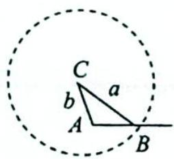

(a) $a > b$ 仅有一解  
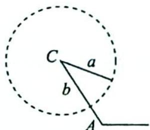  
(b) $a < b$ 无解  
图 2

根据上面的分析可知,由于 a, b 长度关系的不同,导致了问题有不同个数的解,若 A 为锐角,只有当 a 不小于 $b \sin A$ 时才有解,随着 a 的增大得到的解的个数也是不相同的.

当 A 为钝角时, 只有当 a 大于 b 时才有解.

例 25.1 在 $\triangle ABC$ 中, 已知 $b = 2\sqrt{2}, a = 2$ , 如果三角形有解, 则 $A$ 的取值范围是 \_\_\_\_.

分析 ➤ 思路一(代数法): 使用正弦定理把边的关系转化为角度的关系, 再用有界性确定范围.

思路二(几何法): 假设 C 为圆心, B 为圆上的动点, 根据相切的临界情况确定 A 的取值范围.

解析 ▶ 解法一(代数法): 由正弦定理可得 $\frac{2}{\sin A} = \frac{2\sqrt{2}}{\sin B}$ , 即 $\sin B = \sqrt{2} \sin A$ .

因为 $\sin B \in (0,1]$ , 所以 $\sin A \in \left(0, \frac{\sqrt{2}}{2}\right]$ , 则 $A \in \left(0, \frac{\pi}{4}\right]$ .

解法二(几何法):由图像可得当 $A > 45^{\circ}$ 时,不能构成三角形,所以 $A \in \left(0, \frac{\pi}{4}\right]$ .

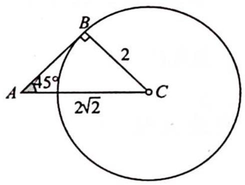

text_image

A
45°
B
2
C
2√2

变式(1) 在 $\triangle ABC$ 中,三个内角 $A,B,C$ 的对边分别为 $a,b,c,A+C=2B,b\sin A=6\sin B$ ,若符合条件的三角形有两解,则 $b$ 的取值范围是\_\_\_\_.

解析 由 $A + C = 2B = \pi - B$ 可得 $B = \frac{\pi}{3}$ , 所以 $\sin B = \frac{\sqrt{3}}{2}$ .

由 $b\sin A=6\sin B$ 可得 $\frac{6}{\sin A}=\frac{b}{\sin B}$ ，所以 a=6。

解法一(代数法):要使得符合条件的三角形有两解,则 $a\sin60^{\circ}<b<a$ , 即 $3\sqrt{3}<b<6$ , 所以 b 的取值范围是 $(3\sqrt{3},6)$ .

解法二(数形结合法): $b=\frac{6\sin B}{\sin A}=\frac{3\sqrt{3}}{\sin A}$ ，因为 $\sin A\in(0,1]$ ，所以 $b\geqslant3\sqrt{3}$ ，由图可得当 $b=3\sqrt{3}$ 时，只有一解，所以 $b>3\sqrt{3}$ ，要使得符合条件的三角形有两解，还需要满足 b<a=6。

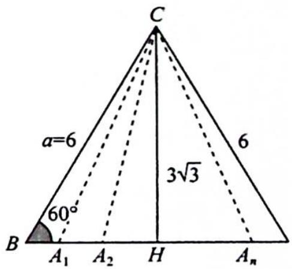

text_image

C
a=6
60°
B A₁ A₂ H Aₙ
3√3
6

所以 b 的取值范围是 $(3\sqrt{3},6)$ .

变式(2) 在锐角 $\triangle ABC$ 中, $BC=1, B=2A$ , 则 $\frac{AC}{\cos A}=$ \_\_\_\_, $AC$ 的取值范围为 \_\_\_\_.

解析 ▶ 解法一: 因为 $\triangle ABC$ 为锐角三角形, 所以 $\left\{\begin{aligned}0&A<\frac{\pi}{2}\\ 0&B<\frac{\pi}{2}\end{aligned}\right.$ ，即 $\left\{\begin{aligned}0&A<\frac{\pi}{2}\\ 0&<2A<\frac{\pi}{2}\end{aligned}\right.$ ，则 $\frac{\pi}{6}<\frac{\pi}{2}<3A<\pi$

$A<\frac{\pi}{4},\frac{AC}{\cos A}=\frac{2R\sin B}{\cos A}=\frac{\frac{a}{\sin A}\sin2A}{\cos A}=\frac{a\cdot2\sin A\cos A}{\sin A\cos A}=2a=2$ ，所以 $AC=2\cos A\in(\sqrt{2},\sqrt{3})$ ，故 AC 的取值范围为 $(\sqrt{2},\sqrt{3})$ .

解法二(几何法):如图所示,根据题意可得点 A 在 $A_{1}, N, A_{2}, M$ 围成的不规则图形内部.

由正弦定理可得 $\frac{BC}{\sin A} = 2R, \sin A = \frac{1}{2R}, 2R = \frac{AC}{\sin B} = \frac{AC}{\sin 2A} = \frac{AC}{2\sin A\cos A} = \frac{2R \cdot AC}{2\cos A}$ , 所以 $\frac{AC}{\cos A} = 2, AC = 2\cos A$ .

在 $A_{1}, N, A_{2}, M$ 围成的不规则图形内部任意一点 $A_{i}$ , 都有 $30^{\circ} < \angle BA_{i}C < 45^{\circ}$ , 所以 $A$ 在 $A_{1}$ 时, $AC$ 有最小值 $\frac{1}{\sin 45^{\circ}} = \sqrt{2}; A$ 在 $A_{2}$ 时, $AC$ 有最大值 $2\cos 30^{\circ} = \sqrt{3}$ , 故 $AC$ 的取值范围为 $(\sqrt{2}, \sqrt{3})$ .

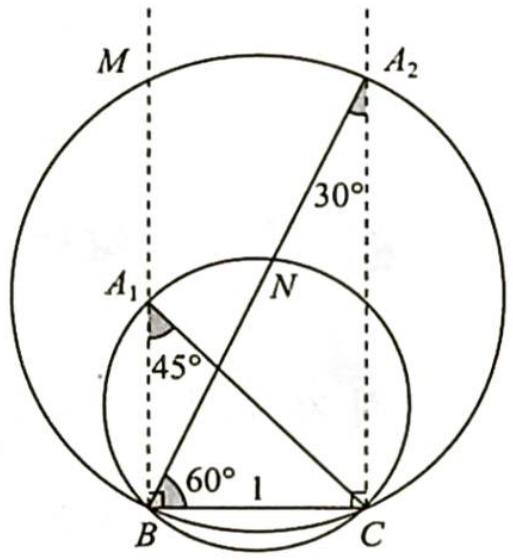

text_image

M
A₂
30°
A₁
N
45°
60° 1
B
C

# 25.2 边角互化判定形状

# 研究密钥

三角形形状的判定有两种典型方法：

统一化为边,再判断;统一化为角,再判断.

不管是哪一种方法都是用正弦、余弦定理实现边角互化.

正弦定理

$\frac{a}{\sin A}=\frac{b}{\sin B}=\frac{c}{\sin C}=2R(2R$ 为 $\triangle ABC$ 的外接圆直径).

余弦定理

$c^{2}=a^{2}+b^{2}-2ab\cos C$ （已知两边a,b及夹角C，求第三边c）.

$\cos C = \frac{a^2 + b^2 - c^2}{2ab}$ （已知三边求角）.

例 25.2 已知△ABC 中, 三个内角 A, B, C 所对应边分别为 a, b, c, 且 $\cos A + \cos B = \frac{a + b}{c}$ . 试判断△ABC 的形状.

分析 思路一: 利用正弦定理 $\frac{a+b}{c}=\frac{\sin A+\sin B}{\sin C}$ ，通过三角恒等变形，寻找角的关系.

思路二: 利用余弦定理 $\cos A + \cos B = \frac{b^{2} + c^{2} - a^{2}}{2bc} + \frac{a^{2} + c^{2} - b^{2}}{2ac}$ ，化简、因式分解，寻找边的关系.

解析 ▶ 解法一:由正弦定理可得 $\cos A + \cos B = \frac{\sin A + \sin B}{\sin C}$ ，所以 $\sin C \cos A + \sin C \cos B = \sin A + \sin B$ .

又 $\sin A = \sin (B + C) = \sin B\cos C + \cos B\sin C, \sin B = \sin (A + C) = \sin A\cos C + \cos A\sin C$ ，即 $\cos A\sin C + \cos B\sin C = \sin A + \sin B = \sin B\cos C + \cos B\sin C + \sin A\cos C + \cos A\sin C$ ，可得 $\sin B\cos C + \sin A\cos C = 0$ ，即 $(\sin A + \sin B)\cos C = 0$ ，又 $A, B, C \in (0, \pi)$ ，则 $\cos C = 0, C = \frac{\pi}{2}$ ，所以 $\triangle ABC$ 是直角三角形。

解法二:由余弦定理可得 $\frac{b^{2}+c^{2}-a^{2}}{2bc}+\frac{a^{2}+c^{2}-b^{2}}{2ac}=\frac{a+b}{c}$ ，去分母、化简得 $(a+b)(c^{2}-a^{2}-b^{2})=0$ ，因为 $a+b>0$ ，所以 $a^{2}+b^{2}=c^{2}$ ，故△ABC是直角三角形.

变式(1) 已知 $\triangle ABC$ 的三条边 $a, b, c$ 和与之对应的三个角 $A, B, C$ 满足等式 $a \cos B + b \cos C + c \cos A = b \cos A + c \cos B + a \cos C$ , 则此三角形的形状是 ( ).

A. 等腰三角形

B. 直角三角形

C. 等腰或直角三角形

D. 等腰直角三角形

分析 ▶ 利用余弦定理将角化为边整理, 即可得三角形的边之间的关系; 或利用正弦定理将边化为角整理, 得三角形中角的关系, 从而可得此三角形的形状.

解析 ▶ 解法一(角化边): 由余弦定理可得 $a \cdot \frac{a^2 + c^2 - b^2}{2ac} + b \cdot \frac{a^2 + b^2 - c^2}{2ab} + c \cdot \frac{b^2 + c^2 - a^2}{2bc} = b \cdot \frac{b^2 + c^2 - a^2}{2bc} + c \cdot \frac{a^2 + c^2 - b^2}{2ac} + a \cdot \frac{a^2 + b^2 - c^2}{2ab}$ , 整理得 $\frac{a^2 - b^2}{c} + \frac{b^2 - c^2}{a} + \frac{c^2 - a^2}{b} = 0$ .

所以 $\frac{a^2 - b^2}{c} + \frac{b^2 - c^2}{a} + \frac{c^2 - b^2 + b^2 - a^2}{b} = 0, (a^2 - b^2) \left( \frac{1}{c} - \frac{1}{b} \right) + (b^2 - c^2) \left( \frac{1}{a} - \frac{1}{b} \right) = 0$ ，即 $(a - b)(b - c) \cdot \frac{a + b}{bc} + (b - a)(b - c) \cdot \frac{b + c}{ab} = 0, (a - b)(b - c) \left( \frac{a + b}{bc} - \frac{b + c}{ab} \right) = 0, (a - b)(b - c) \cdot \frac{a^2 + ab - bc - c^2}{abc} = 0$ ，则 $(a - b)(b - c)(a - c) \cdot \frac{a + c + b}{abc} = 0$ ，所以 $a = b$ 或 $b = c$ 或 $a = c$ ，则三角形为等腰三角形，故选A.

解法二(边化角): 依题意可得 $\sin A \cos B + \sin B \cos C + \sin C \cos A = \sin B \cos A + \sin C \cos B + \sin A \cos C$ , 即 $\sin A \cos B - \cos A \sin B + \sin B \cos C - \cos B \sin C + \sin C \cos A - \cos C \sin A = 0$ , 可得 $\sin (A - B) + \sin (B - C) + \sin (C - A) = 0, 2 \sin \frac{A - C}{2} \cos \frac{A + C - 2B}{2} = \sin (A - C) = 2 \sin \frac{A - C}{2} \cos \frac{A - C}{2}$ , 即 $2 \sin \frac{A - C}{2} (\cos \frac{A + C - 2B}{2} - \cos \frac{A - C}{2}) = 0$ , 得 $\sin \frac{A - C}{2} = 0$ 或 $\cos \frac{A + C - 2B}{2} = \cos \frac{A - C}{2}$ .

故 $A = C$ 或 $\frac{A + C - 2B}{2} = \frac{A - C}{2}$ 或 $\frac{A + C - 2B}{2} +\frac{A - C}{2} = 0$ ，可得 $A = C$ 或 $B = C$ 或 $A = B$ ，则

三角形为等腰三角形,故选 A.

# 25.3 三角形中的最值

# 研究密钥

有关解三角形的问题是高考重点考查的内容, 也是热点问题。其主要分为两种类型: 一类是完全可解的三角形, 可以做到知三求一; 另一类则是不完全可解的三角形, 即通过减少已知条件转变为函数和不等式问题, 其主要题型以求周长 (边) 和面积的最值 (范围) 为主。

解决此类问题有两种方法:代数法:余弦定理+基本不等式. 几何法:当某个角度已知时,可以将顶点看作动点;当某条边已知时,可以将对角的顶点看作动点.

例 25.3 已知 a, b, c 分别为 $\triangle ABC$ 的三个内角 A, B, C 的对边, a = 2, 且 $(2 + b)(\sin A - \sin B) = (c - b)\sin C$ , 则 $\triangle ABC$ 面积的最大值为 \_\_\_\_.

分析

使用正弦定理角化边,再使用余弦定理由三边关系推出 $A=\frac{\pi}{3}$ .

思路一(代数法): $S_{\triangle ABC} = \frac{1}{2} bc \sin A$ , 使用基本不等式可得 $bc$ 的范围.

思路二(数形结合法): 因为同弦对应的圆周角相等, 所以把点 A 看作圆弧上的一点, 角 A 对应的弦长为 2, 以弦为底, 当三角形的高取到最大值时面积可以取得最大值, 此时点 A 位于弦的垂直平分线上.

解析 由题意可得 $(a+b)(\sin A-\sin B)=(c-b)\sin C$ ，由正弦定理可得 $(a+b)(a-b)=(c-b)c$ ，即 $a^{2}-b^{2}=c^{2}-bc$ ，所以 $\cos A=\frac{b^{2}+c^{2}-a^{2}}{2bc}=\frac{1}{2}$ ，则 $A=\frac{\pi}{3}$ .

解法一(代数法): 因为 $a^{2}=b^{2}+c^{2}-bc\geqslant bc$ ，所以 $bc\leqslant4$ ，故 $S_{\triangle ABC}=\frac{1}{2}bc\sin A\leqslant\sqrt{3}$ ，即 $S_{\triangle ABC}$ 的最大值为 $\sqrt{3}$ .

解法二(数形结合法):由题意可得 $a=2, A=\frac{\pi}{3}$ .

如图所示, $BC$ 对应的圆周角为 $\frac{\pi}{3}$ , 点 $A$ 在优弧 $\widehat{BC}$ 上运动, 作 $BC$ 的垂直平分线 $A_{1}H$ .

以 BC 为 $\triangle ABC$ 的底边, 当 A 运动到 $A_{1}$ 时, $\triangle ABC$ 的高 $A_{1}H$ 有最大值, 此时 $\triangle ABC$ 为边长为 2 的等边三角形, 易得 $A_{1}H = \sqrt{3}$ , 所以 $S_{\triangle ABC} = \frac{1}{2} BC \cdot A_{1}H = \sqrt{3}$ .

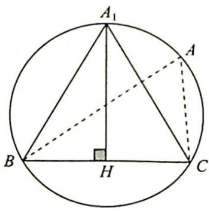

text_image

A₁
A
B
H
C

# 评注

若本题改为求 $\triangle ABC$ 周长的最大值呢？由题意得 $A=\frac{\pi}{3}$ .

用代数法求周长的最大值: 因为 $a^{2}=b^{2}+c^{2}-bc=(b+c)^{2}-3bc=4$ ，又因为 $bc \leqslant \left(\frac{b+c}{2}\right)^{2}$ ，所以 $(b+c)^{2}-3bc \geqslant (b+c)^{2}-\frac{3(b+c)^{2}}{4}=\frac{(b+c)^{2}}{4}$ ，即 $4 \geqslant \frac{(b+c)^{2}}{4}$ ， $b+c \leqslant 4$ ，当且仅当 b=c 时等号成立，所以 $\triangle ABC$ 的周长 $C_{\triangle ABC}=a+b+c \leqslant 6$ ，即 $\triangle ABC$ 周长的最大值为 6.

用几何法求周长的最大值: 如图 1 所示, 延长 BA 到点 P, 使得 AP = AC, 所以 $AB + AC = AB + AP = BP$ , 要使得周长最大, 则需满足 BP 长度最大.

将问题转化为已知一边 a=2，一对角 $\angle P=30^{\circ}$ ，求另一边 BP 的长度的最大值。

由图2可得，当 $BP$ 为该圆直径时， $BP$ 最大，即 $|BP|_{\max} = \frac{a}{\sin P} = \frac{2}{\sin 30^\circ} = 4$ ，所以 $C_{\triangle ABC} = BC + BP \leqslant 2 + 4 = 6$ .

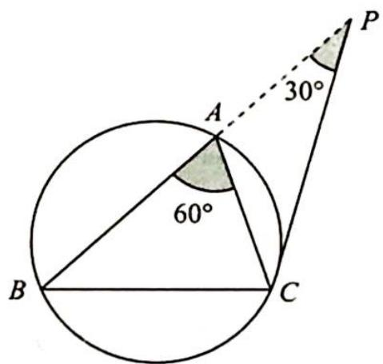

text_image

A
30°
60°
B
C
P

图 1

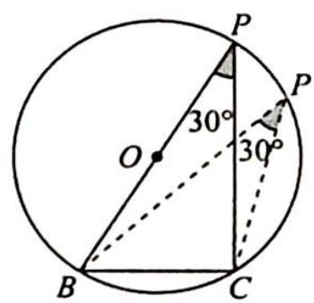

text_image

P
30°
O
30°
B
C
P

图 2

变式(1) 已知 $\triangle ABC$ 的三边长分别为 $a, b, c$ , 面积为 $S$ , 且 $\frac{\sqrt{3}}{12} (a^2 + b^2 - c^2) = S, c = 1$ , 求 $\sqrt{3} b - a$ 的最大值.

解析 ▶ 根据余弦定理 $\frac{\sqrt{3}}{12}\cdot2ab\cos C=\frac{1}{2}ab\sin C$ ，于是 $C=\frac{\pi}{6}$ ，又c=1（定弦定角模型），根据正弦定理 $\sqrt{3}b-a=\sqrt{3}\frac{\sin B}{\sin C}\cdot c-\frac{\sin A}{\sin C}\cdot c=2\sqrt{3}\sin B-2\sin A=2\sqrt{3}\sin B-2\sin\left(\frac{5\pi}{6}-B\right)=\sqrt{3}$ $\sin B-\cos B\leqslant2$ .

当 $B = \frac{2\pi}{3}, A = \frac{\pi}{6}$ 时, 取得等号, 因此所求最大值为 2.

# 评注

对目标式 $\sqrt{3} b - a$ 采用柯西不等式进行放缩, 此路不通, 因为“=”取不到.

变式(2) 在 $\triangle ABC$ 中,外接圆半径 $R=2$ ,且 $4(\sin^{2}A-\sin^{2}B)=(\sqrt{3}a-b)\sin B,S_{\triangle ABC}=\frac{c}{2}(a-b)$ ,则 $\sin\frac{A-B}{2}+\sin\frac{C}{2}=$ \_\_\_\_.

解析 $4(\sin^{2}A-\sin^{2}B)=(\sqrt{3}a-b)\sin B$ 等价于 $2R(\sin^{2}A-\sin^{2}B)=(\sqrt{3}a-b)\sin B$ ,
即 $4R^{2}(\sin^{2}A-\sin^{2}B)=2R\sin B(\sqrt{3}a-b)$ ，可得 $a^{2}-b^{2}=(\sqrt{3}a-b)b$ ，所以 $a^{2}=\sqrt{3}ab$ ，得 $a=\sqrt{3}b$ 。

$$
\begin{array}{l} \sin \frac {A - B}{2} + \sin \frac {C}{2} = \sin \frac {A - B}{2} + \sin \frac {\pi - (A + B)}{2} \\ = \sin \frac {A - B}{2} + \cos \frac {A + B}{2} \\ = \sin \frac {A}{2} \cos \frac {B}{2} - \cos \frac {A}{2} \sin \frac {B}{2} + \cos \frac {A}{2} \cos \frac {B}{2} - \sin \frac {A}{2} \sin \frac {B}{2} \\ = \cos \frac {B}{2} \left(\sin \frac {A}{2} + \cos \frac {A}{2}\right) - \sin \frac {B}{2} \left(\cos \frac {A}{2} + \sin \frac {A}{2}\right) \\ = \left(\sin \frac {A}{2} + \cos \frac {A}{2}\right) \left(\cos \frac {B}{2} - \sin \frac {B}{2}\right). \\ \end{array}
$$

又 $S_{\triangle ABC} = \frac{c}{2} (a - b) = \frac{\sqrt{3} - 1}{2} bc = \frac{1}{2} bc\sin A$ ，所以 $\sin A = \sqrt{3} - 1, \sin B = \frac{\sin A}{\sqrt{3}} = 1 - \frac{\sqrt{3}}{3}$ ，则

又 $\left(\sin \frac{A}{2} +\cos \frac{A}{2}\right)^2 = 1 + \sin A,\left(\cos \frac{B}{2} -\sin \frac{B}{2}\right)^2 = 1 - \sin B,\left(\sin \frac{A}{2} +\cos \frac{A}{2}\right)^2$ · $\left(\cos \frac{B}{2} -\sin \frac{B}{2}\right)^2 = (1 + \sin A)(1 - \sin B) = \sqrt{3}\times \frac{\sqrt{3}}{3} = 1$ ，又已知 $a > b$ ，所以 $A > B$ ， $\sin \frac{A - B}{2}+$ $\sin \frac{C}{2} >0$ ，因此 $\sin \frac{A - B}{2} +\sin \frac{C}{2} = 1.$

# 评注

本题对于题干中“ $4(\sin^{2}A-\sin^{2}B)=(\sqrt{3}a-b)\sin B$ ”的变形,运用R=2来替换为 $2R(\sin^{2}A-\sin^{2}B)=(\sqrt{3}a-b)\sin B$ ，即 $4R^{2}(\sin^{2}A-\sin^{2}B)=(\sqrt{3}a-b)2R\sin B.$

将角化边 $a^2 - b^2 = \sqrt{3}ab - b^2$ ，可得 $a = \sqrt{3}b$ ，与 2014 新课标全国 I 卷理 16 题中将 2 用 $a$ 来替换，具有异曲同工之妙。

例 25.4 (2019 新课标全国Ⅲ卷理 18) △ABC 的内角 A, B, C 的对边分别为 a, b, c, 已知 $a\sin\frac{A+C}{2}=b\sin A.$

(1) 求 B 的值;  
(2) 若 $\triangle ABC$ 为锐角三角形，且 c=1，求 $\triangle ABC$ 面积的取值范围.

分析 (1) 使用正弦定理边化角, 因为有 $\frac{A + C}{2}$ , 所以用三角形内角和为 $180^{\circ}$ 减少角度

的个数, $\frac{B}{2}$ 和 $B$ 同时出现, 使用二倍角公式使角度大小统一, 利用余弦函数的有界性减少三角函数名的个数, 最后可直接求出 $B$ 的大小.

(2)已知角 B 和一个邻边 c，把点 C 看作角 B 的另一邻边上的动点，根据临界情况（角 A 或角 C 为直角）求出另一邻边的取值范围，由 $S=\frac{1}{2}ac\sin B$ 可得面积的取值范围.

解析 (1) 已知 $a \sin \frac{A + C}{2} = b \sin A$ , 边化角可得 $\sin A \sin \frac{A + C}{2} = \sin B \sin A$ , 即 $\sin \frac{A + C}{2} = \sin B$ , 所以 $\sin \frac{\pi - B}{2} = \cos \frac{B}{2} = \sin B = 2 \sin \frac{B}{2} \cos \frac{B}{2}$ , 即 $\cos \frac{B}{2} (2 \sin \frac{B}{2} - 1) = 0$ , 则 $\sin \frac{B}{2} = \frac{1}{2}$ , 又 $\frac{B}{2} \in (0, \frac{\pi}{2})$ , 所以 $\frac{B}{2} = \frac{\pi}{6}, B = \frac{\pi}{3}$ .

(2)如图所示,由题意可得点 C 位于 $C_{1}$ 和 $C_{2}$ 之间的线段上, $S_{\triangle ABC_{1}}<S_{\triangle ABC}<S_{\triangle ABC_{2}}.$

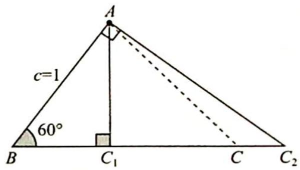

text_image

c=1
60°
B C₁ C C₂

当 $C$ 位于 $C_1$ 时， $BC_1 = 1 \times \cos 60^\circ = \frac{1}{2}, S_{\triangle ABC_1} = \frac{1}{2} \times 1 \times \frac{1}{2} \times$

$\sin 60^{\circ} = \frac{\sqrt{3}}{8}$ ; 当 $C$ 位于 $C_{2}$ 时, $BC_{2} = \frac{1}{\cos 60^{\circ}} = 2$ , $S_{\triangle ABC_{2}} = \frac{1}{2} \times 1 \times 2 \times \sin 60^{\circ} = \frac{\sqrt{3}}{2}$ .

所以 $\frac{\sqrt{3}}{8}<S_{\triangle ABC}<\frac{\sqrt{3}}{2}$ ，即 $\triangle ABC$ 的面积的取值范围为 $(\frac{\sqrt{3}}{8},\frac{\sqrt{3}}{2})$ .

例 25.5 在 $\triangle ABC$ 中, 内角 $A, B, C$ 的对边分别是 $a, b, c$ , 且满足 $2a + c = 2b \cos C$ , 若 $AC$ 边上的高为 $\frac{1}{2}$ . 求 $\triangle ABC$ 面积的最小值.

分析 ▶ 使用正弦定理边化角,用三角形内角和为 $180^{\circ}$ 减少角度的个数,根据正弦函数的有界性减少三角函数名的个数,可直接求出 $B = \frac{2\pi}{3}$ .

思路一(代数法): 已知 $B=\frac{2\pi}{3}$ ，使用余弦定理和基本不等式可得三角形三边的不等关系 $b^{2}\geqslant3ac$ ，三角形面积公式 $S_{\triangle ABC}=\frac{1}{2}ac\sin B=\frac{1}{2}AC\cdot\frac{1}{2}=\frac{1}{4}b$ ，可得三角形三边的等量关系 $b=\sqrt{3}ac$ ，代入可得 ac 的范围，即可求出 $\triangle ABC$ 面积的范围.

思路二(几何法): 把点 B 看作是与底边的距离为 $\frac{1}{2}$ 的直线上的动点, 使用正弦定理将面积问题转化为圆的半径问题, 结合图形, 使用垂径定理和勾股定理可得半径的取值范围.

解析 已知 $2a + c = 2b\cos C$ ，使用正弦定理边化角可得 $2\sin A + \sin C = 2\sin B\cos C$ ，所以 $2\sin (B + C) + \sin C = 2\sin B\cos C$ ，即 $2\sin B\cos C + 2\cos B\sin C + \sin C = 2\sin B\cos C, 2\cos B\sin C +$

$$
\sin C = 0, \sin C (2 \cos B + 1) = 0.
$$

因为 $C \in (0, \pi)$ , 所以 $\sin C \neq 0$ , 则 $2 \cos B + 1 = 0, \cos B = -\frac{1}{2}$ .

又 $B \in (0, \pi)$ , 所以 $B = \frac{2\pi}{3}$ .

解法一(代数法): $b^{2}=a^{2}+c^{2}-2ac\cos B=a^{2}+c^{2}+ac\geqslant3ac.$

因为 $S_{\triangle ABC} = \frac{1}{2} ac\sin \frac{2\pi}{3} = \frac{\sqrt{3}}{4} ac, S_{\triangle ABC} = \frac{1}{2} AC \cdot \frac{1}{2} = \frac{1}{4} b$ ，所以 $b = \sqrt{3} ac, 3a^2c^2 \geqslant 3ac$ ，即 $ac \geqslant 1$ ，则 $S_{\triangle ABC} = \frac{\sqrt{3}}{4} ac \geqslant \frac{\sqrt{3}}{4}$ ，故 $\triangle ABC$ 面积的最小值为 $\frac{\sqrt{3}}{4}$ .

解法二(几何法): 因为 $\frac{b}{\sin B}=2R$ , 所以 $b=2R\sin\frac{2\pi}{3}=\sqrt{3}R$ , $S_{\triangle ABC}=\frac{1}{2}AC\cdot\frac{1}{2}=\frac{1}{4}b=\frac{\sqrt{3}}{4}R.$

如图所示, 设与 $AC$ 平行且相距为 $\frac{1}{2}$ 的直线为 $l, B$ 为直线 $l$ 上的点, 且满足 $\angle ABC = \frac{2\pi}{3}$ , 在这一系列圆中满足 $B = \frac{2\pi}{3}$ 且与 $l$ 相切时的 $S_{\triangle ABC}$ 最小, 设此圆为 $\odot O_1$ , 此时 $\triangle AO_1B_1$ 为等边三角形, $\frac{R}{2} = R - \frac{1}{2}$ , 解得 $R = 1$ , 即 $R_{\min} = 1$ .

text_image

l
B₁
B
Bₙ
A
R
C₁
C
Cₙ
O₁
½

所以 $S_{\triangle ABC}=\frac{\sqrt{3}}{4}R\geqslant\frac{\sqrt{3}}{4}$ ，故 $\triangle ABC$ 面积的最小值为 $\frac{\sqrt{3}}{4}$ .

例 25.6 已知锐角 $\triangle ABC$ 的内角 A, B, C 的对边分别为 a, b, c，其中 a = 2, b = 1，求 $\triangle ABC$ 面积的取值范围.

分析 ▶ 以 C 为圆心, b 为半径作圆 C, 则 A 是圆周上的动点, 构成锐角三角形的临界条件是角 A 或角 C 为直角, 当角 A 为直角时面积有最小值, 当角 C 为直角时面积有最大值.

text_image

A₁
A₂
1
1
B
a=2
C

解析 如图所示,由题意可得点 A 位于 $A_{1}$ 和 $A_{2}$ 之间的劣弧上, $S_{\triangle A_{1}BC}<S_{\triangle ABC}<S_{\triangle A_{2}BC}$ .

当 $A$ 位于 $A_{1}$ 时， $\cos \angle A_{1}CB = \frac{1}{2}, \angle A_{1}CB = \frac{\pi}{3}, S_{\triangle A_{1}BC} = \frac{1}{2} \times 1 \times 2 \times \sin \frac{\pi}{3} = \frac{\sqrt{3}}{2}$ ; 当 $A$ 位于 $A_{2}$ 时， $S_{\triangle A_{2}BC} = \frac{1}{2} \times 1 \times 2 = 1$ .

所以 $\triangle ABC$ 面积的取值范围是 $\left(\frac{\sqrt{3}}{2},1\right)$ .

例 25.7 已知 a, b, c 分别为 $\triangle ABC$ 的三个内角 A, B, C 的对边，且 c = 2, $a + b = 4$ ，求 $\triangle ABC$ 面积的最大值.

分析 ▶ 思路一:运用数形结合思想求解,由 $a + b = 4$ ,即点 $C$ 到点 $A$ 和点 $B$ 的距离之和为定值,把点 $A$ 和点 $B$ 看作定点,则点 $C$ 的轨迹是以 $A, B$ 为焦点的椭圆,结合图像可得,当点 $C$ 位于椭圆上、下顶点时, $\triangle ABC$ 的面积有最大值.

思路二: 可运用函数思想求解最值.

解析 ▶ 解法一(数形结合思想):根据题意可得△ABC为椭圆 $\frac{x^{2}}{4}+\frac{y^{2}}{3}=1$ 的焦点三角形,由图像可得当点C位于椭圆的上顶点 $C_{1}$ 时,△ABC的面积有最大值, $(S_{\triangle ABC})_{\max}=\frac{1}{2}AB\cdot OC_{1}=\frac{1}{2}\times2\times\sqrt{3}=\sqrt{3}$ .

text_image

y
C₁
C
A O B x

解法二（函数思想）：由题意可得 $S_{\triangle ABC} = \frac{1}{2} ab\sin C = \frac{1}{2} ab\sqrt{1 - \cos^2C}$ ，且 $\cos C = \frac{a^2 + b^2 - c^2}{2ab}$ 即 $S_{\triangle ABC} = \frac{1}{2} ab\sqrt{1 - \left(\frac{a^2 + b^2 - c^2}{2ab}\right)^2} = \frac{1}{4}\sqrt{(2ab)^2 - (a^2 + b^2 - c^2)^2}$ $= \frac{1}{4}\sqrt{(2ab + a^2 + b^2 - c^2)(2ab - a^2 - b^2 + c^2)}$ $= \frac{1}{4}\sqrt{[(a + b)^2 - c^2][c^2 - (a - b)^2]}$

又 $a + b = 4$ ，且 $c = 2$ ，当 $a = b$ 时， $S_{\triangle ABC}$ 取最大值为 $\frac{1}{4}\sqrt{(4^2 - 2^2) \times 2^2} = \sqrt{3}$ .

# 评注

解法一体现数形结合思想,解法二体现函数思想,解法具有一般性,若已知 c 和 a,b 之间的数量关系,可尝试使用函数方法.

变式(1) 已知 $a, b, c$ 分别为 $\triangle ABC$ 的三个内角 $A, B, C$ 的对边，且 $c = 2, b = \sqrt{2} a$ ，求 $\triangle ABC$ 面积的最大值.

分析 ➤ 其一运用数形结合思想求解: $b = \sqrt{2}a$ , 即点 $C$ 到点 $B$ 和点 $A$ 的距离之比为定值, 把点 $A$ 和点 $B$ 看作定点, 则点 $C$ 的轨迹是阿波罗尼斯圆, 圆心在直线 $AB$ 上, 把线段 $AB$ 看

作 $\triangle ABC$ 的底边, 则当高为半径时面积有最大值. 其二也可运用函数思想求解最值.

解析 ▶ 解法一(数形结合思想):根据题意,以 AB 的中点为原点,建立如图所示的平面直角坐标系 xOy.

设点 C 的坐标为 $(x, y)$ ， $b = \sqrt{2} a$ ，即 $AC = \sqrt{2} BC, (x + 1)^{2} + y^{2} =$

text_image

C(x, y)
y
A(-1, 0) O B(1, 0) x

$2 \times [(x-1)^{2} + y^{2}], x^{2} + 2x + 1 + y^{2} = 2x^{2} - 4x + 2 + 2y^{2}$ , 即 $(x-3)^{2} + y^{2} = 8$ , 则点 $C$ 的轨迹为以(3,0)为圆心, $2\sqrt{2}$ 为半径的圆.

所以当 $\triangle ABC$ 以 $AB$ 为底边时，高最大为 $2\sqrt{2}$ ，故 $(S_{\triangle ABC})_{\max} = \frac{1}{2} \times 2 \times 2\sqrt{2} = 2\sqrt{2}$ .

解法二（函数思想）： $S_{\triangle ABC} = \frac{1}{2} ab \sin C = \frac{1}{2} ab \sqrt{1 - \cos^2 C}$ ，且 $\cos C = \frac{a^2 + b^2 - c^2}{2ab}$ ，即

$$
\begin{array}{l} S _ {\triangle A B C} = \frac {1}{2} a b \sqrt {1 - \left(\frac {a ^ {2} + b ^ {2} - c ^ {2}}{2 a b}\right) ^ {2}} = \frac {1}{4} \sqrt {(2 a b) ^ {2} - (a ^ {2} + b ^ {2} - c ^ {2}) ^ {2}} \\ = \frac {1}{4} \sqrt {(2 a b + a ^ {2} + b ^ {2} - c ^ {2}) (2 a b - a ^ {2} - b ^ {2} + c ^ {2})} \\ = \frac {1}{4} \sqrt {\left[ (a + b) ^ {2} - c ^ {2} \right] \left[ c ^ {2} - (a - b) ^ {2} \right]}. \\ \end{array}
$$

又 $b = \sqrt{2} a, c = 2$ ，则 $S_{\triangle ABC} = \frac{1}{4}\sqrt{\left[(\sqrt{2} + 1)^2a^2 - 4\right]\left[4 - (\sqrt{2} - 1)^2a^2\right]}$

$$
= \frac {1}{4} \sqrt {4 (\sqrt {2} + 1) ^ {2} a ^ {2} - a ^ {4} - 1 6 + 4 (\sqrt {2} - 1) ^ {2} a ^ {2}} = \frac {1}{4} \sqrt {- a ^ {4} + 2 4 a ^ {2} - 1 6}
$$

$$
= \frac {1}{4} \sqrt {- (a ^ {2} - 1 2) ^ {2} + 1 2 8} \leqslant \frac {1}{4} \times 8 \sqrt {2} = 2 \sqrt {2}.
$$

当且仅当 $a=2\sqrt{3}$ 时, 取等号. 故 $\triangle ABC$ 面积的最大值为 $2\sqrt{2}$ .

变式 2 在 $\triangle ABC$ 中, $AB=AC$ , $D$ 为 $AC$ 的中点, 且 $BD=3$ , 求 $\triangle ABC$ 面积的最大值.

解析 ▶ 根据题意,以 BD 的中点为原点,建立如图所示的平面直角坐标系 xOy.

设点 A 的坐标为 $(x, y)$ ，根据题意可得 AB = AC = 2AD，
所以 $\left(x+\frac{3}{2}\right)^{2}+y^{2}=4\left[\left(x-\frac{3}{2}\right)^{2}+y^{2}\right]$ ，得 $\left(x-\frac{5}{2}\right)^{2}+y^{2}=4$ ，则点 A 的轨迹为以 $\left(\frac{5}{2},0\right)$ 为圆心，以 2 为半径的圆，即当 $\triangle ABD$ 以 AD 为底边时，高最大为 2，所以 $(S_{\triangle ABD})_{\max}=\frac{1}{2}\times3\times2=3,(S_{\triangle ABC})_{\max}=2(S_{\triangle ABD})_{\max}=6$ ，故 $\triangle ABC$ 面积的最大值为 6.

text_image

y
A(x, y)
D(\frac{3}{2}, 0)
O
x
B(-\frac{3}{2}, 0)
C

例 25.8 (2022 新课标全国甲卷理 16) 已知 $\triangle ABC$ 中, 点 $D$ 在边 $BC$ 上, $\angle ADB = 120^\circ$ , $AD = 2, CD = 2BD$ . 当 $\frac{AC}{AB}$ 取得最小值时, $BD = \_$ .

分析 ▶ 设 CD=2BD=2m>0，利用余弦定理表示出 $\frac{AC^{2}}{AB^{2}}$ 后，结合基本不等式即可得解.

解析 ▶ 设 $CD = 2BD = 2m > 0$ , 则在 $\triangle ABD$ 中, $AB^{2} = BD^{2} + AD^{2} - 2BD \cdot AD\cos \angle ADB = m^{2} + 4 + 2m$ , 在 $\triangle ACD$ 中, $AC^{2} = CD^{2} + AD^{2} - 2CD \cdot AD\cos \angle ADC = 4m^{2} +$

4-4m，所以 $\frac{AC^{2}}{AB^{2}}=\frac{4m^{2}+4-4m}{m^{2}+4+2m}=\frac{4(m^{2}+4+2m)-12(1+m)}{m^{2}+4+2m}=4\frac{12}{(m+1)+\frac{3}{m+1}}\geqslant4-$ $\frac{12}{2\sqrt{(m+1)\frac{3}{m+1}}}=4-2\sqrt{3}$ ，当且仅当 $m+1=\frac{3}{m+1}$ ，即 $m=\sqrt{3}-1$ 时，等号成立。

所以当 $\frac{AC}{AB}$ 取最小值时， $m=\sqrt{3}-1$ ，即 $BD=\sqrt{3}-1$ 。

变式(1) (2022 新高考全国Ⅰ卷 18) 记△ABC 的内角 A, B, C 的对边分别为 a, b, c, 已知 $\frac{\cos A}{1+\sin A}=\frac{\sin 2B}{1+\cos 2B}$ .

(1) 若 $C=\frac{2\pi}{3}$ ，求 B;  
(2) 求 $\frac{a^{2}+b^{2}}{c^{2}}$ 的最小值.

分析 ▶ (1) 根据二倍角公式以及两角差的余弦公式可将 $\frac{\cos A}{1+\sin A} = \frac{\sin 2B}{1+\cos 2B}$ 化成 $\cos(A+B) = \sin B$ ，再结合 $0 < B < \frac{\pi}{2}$ ，即可求出.

(2)由(1)知, $C=\frac{\pi}{2}+B$ , $A=\frac{\pi}{2}-2B$ ,再利用正弦定理以及二倍角公式将 $\frac{a^{2}+b^{2}}{c^{2}}$ 化成 $4\cos^{2}B+\frac{2}{\cos^{2}B}-5$ ,然后利用基本不等式即可解出.

解析 (1) 因为 $\frac{\cos A}{1 + \sin A} = \frac{\sin 2B}{1 + \cos 2B} = \frac{2\sin B\cos B}{2\cos^2B} = \frac{\sin B}{\cos B}$ , 即 $\sin B = \cos A\cos B - \sin A\sin B = \cos (A + B) = -\cos C = \frac{1}{2}$ , 而 $0 < B < \frac{\pi}{2}$ , 所以 $B = \frac{\pi}{6}$ .

(2)由(1)知, $\sin B=-\cos C>0$ ,所以 $\frac{\pi}{2}<C<\pi,0<B<\frac{\pi}{2}$ ,而 $\sin B=-\cos C=\sin\left(C-\frac{\pi}{2}\right)$ ,
所以 $C=\frac{\pi}{2}+B$ ，即有 $A=\frac{\pi}{2}-2B$ .

则 $\frac{a^2 + b^2}{c^2} = \frac{\sin^2A + \sin^2B}{\sin^2C} = \frac{\cos^22B + 1 - \cos^2B}{\cos^2B} = \frac{(2\cos^2B - 1)^2 + 1 - \cos^2B}{\cos^2B} = 4\cos^2 B +$ $\frac{2}{\cos^2B} -5\geqslant 2\sqrt{8} -5 = 4\sqrt{2} -5.$

当且仅当 $\cos^{2}B=\frac{\sqrt{2}}{2}$ 时取等号，所以 $\frac{a^{2}+b^{2}}{c^{2}}$ 的最小值为 $4\sqrt{2}-5$ .

变式(2) (2022 北大强基 19) 若 $\triangle ABC$ 三边长为等差数列, 则 $\cos A + \cos B + \cos C$ 的取值范围是 .

解析 由 a, b, c 成等差数列，则 $2b = a + c, 2\sin B = \sin A + \sin C = \sin\left(\frac{A + C}{2} + \frac{A - C}{2}\right) + \sin\left(\frac{A + C}{2} - \frac{A - C}{2}\right) = 2\sin\frac{A + C}{2}\cos\frac{A - C}{2}$ ，即 $\sin B = \sin\frac{\pi - B}{2}\cos\frac{A - C}{2}$ ，可得 $2\sin\frac{B}{2} = \cos\frac{A - C}{2}$ .

且 $\cos A + \cos B + \cos C = 2\cos \frac{A + C}{2}\cos \frac{A - C}{2} +\cos B = 4\sin \frac{B}{2}\cos \frac{A + C}{2} +\cos B = 4\sin^2\frac{B}{2}+$ $\cos B = 2 - \cos B$ ，又 $B\in \left(0,\frac{\pi}{3}\right]$ ，因此 $1 <   2 - \cos B\leqslant \frac{3}{2}$

综上所述, $\cos A+\cos B+\cos C$ 的取值范围是 $\left(1,\frac{3}{2}\right]$ .

# 25.4 四边形问题

# 研究密钥

托勒密定理: 圆内接四边形中, 两条对角线的乘积等于两组对边乘积之和, 即若四边形 ABCD 内接于圆, 如图 1 所示, 则有 $AB \cdot CD + AD \cdot BC = AC \cdot BD$ .

等价叙述: 四边形的两组对边之积的和等于两对角线之积的充要条件是四顶点共圆.

证明: 如图 2 所示, 过点 C 作 $\angle DCE = \angle ACB$ , 即 $\angle3 = \angle4$ , 易证 $\triangle ACB \sim \triangle DCE$ , 则 $\frac{AB}{AC} = \frac{DE}{DC}$ , 即 $AB \cdot CD = AC \cdot DE$ .

同理 $\triangle ADC \sim \triangle BEC$ ，则 $\frac{AD}{AC} = \frac{BE}{BC}$ ，即 $AD \cdot BC = AC \cdot BE$ ，所以 $AB \cdot CD + AD \cdot BC = AC \cdot DE + AC \cdot BE = AC \cdot BD$ .

托勒密定理推广(广义托勒密公式): 在四边形 ABCD 中, 有 AB·CD+AD·BC≥AC·BD.

当且仅当四边形 ABCD 内接于圆时, 等式成立.

证明:如图3所示,在边AB或其延长线上取一点M,在边AD或其延长线上取一点N,使得 $AB\cdot AM=AC^{2}=AD\cdot AN$ .

text_image

D
A
B
C

图1

text_image

D
2
E
3
C
4
A
1
B

图 2

text_image

A
B
C
D
M
N

图 3

连接 MC, NC, MN, 则 $\triangle ABC \sim \triangle ACM$ . 于是 $MC = BC \cdot \frac{AC}{AB}$ . 同理, $NC = CD \cdot \frac{AC}{AD}$ .

又 $\triangle ABD \sim \triangle ANM$ , 则 $MN = BD \cdot \frac{AM}{AD} = \frac{BD}{AD} \cdot \frac{AC^{2}}{AB}$ .

由于 $MN \leqslant CM + CN$ ，结合上面几个式子得 $\frac{BD}{AD} \cdot \frac{AC^{2}}{AB} \leqslant BC \cdot \frac{AC}{AB} + CD \cdot \frac{AC}{AD}$ ，去分母并化简得 $AB \cdot CD + AD \cdot BC \geqslant AC \cdot BD$ ，当且仅当 M, C, N 三点共线时，上式等号成立。

此时, $\angle ABC + \angle ADC = \angle ACM + \angle ACN = 180^{\circ}$ , 即 $A, B, C, D$ 四点共圆.

例 25.9 如图所示, 在平面四边形 $ABCD$ 中, $AB = 1$ , $BC = \sqrt{3}$ , $\triangle ACD$ 是等腰直角三角形, 且 $\angle ACD = 90^\circ$ , 则 $BD$ 长的最大值为 \_\_\_\_.

text_image

A
1
B
√3
C
D

分析 ▶ 思路一:如图所示,BD 在△BCD 中,使用余弦定理可得 $BD^{2}=m^{2}+3+2\sqrt{3}msin\alpha$ , 在△ABC 中使用余弦定理可得 $m^{2}=4-2\sqrt{3}\cos\angle ABC$ , 使用正弦定理可得 $msin\alpha=\sin\angle ABC$ , 最后化为同角同函再求最值.

text_image

A
1
B
m
√2 m
√3
α
C
m
D

思路二: 直接应用托勒密定理 $AB \cdot CD + AD \cdot BC \geqslant AC \cdot BD$ .

解析 ▶ 解法一: 在 $\triangle BCD$ 中, 设 $AC=CD=m$ , $\angle ACB=\alpha$ , $BD^{2}=BC^{2}+CD^{2}-2BC\cdot CD\cdot\cos\left(\frac{\pi}{2}+\alpha\right)=3+m^{2}-2\sqrt{3}m(-\sin\alpha)=m^{2}+3+2\sqrt{3}m\sin\alpha.$

在 $\triangle ABC$ 中， $\frac{1}{\sin\alpha}=\frac{m}{\sin\angle ABC}$ ，即 $\sin\angle ABC=m\sin\alpha$ ，又因为 $m^{2}=1+3-2\times1\times\sqrt{3}\cos\angle ABC=4-2\sqrt{3}\cos\angle ABC$ ，所以 $BD^{2}=7-2\sqrt{3}\cos\angle ABC+2\sqrt{3}\sin\angle ABC=7+2\sqrt{6}\sin\left(\angle ABC-\frac{\pi}{4}\right)$ .

当 $\angle ABC = \frac{3\pi}{4}$ 时， $(BD^2)_{\max} = 7 + 2\sqrt{6} = (\sqrt{6} + 1)^2$ ，故 $BD_{\max} = \sqrt{6} + 1$ .

解法二:根据托勒密定理可得 $AB \cdot CD + AD \cdot BC \geqslant AC \cdot BD$ ，即 $m + \sqrt{6}m \geqslant m \cdot BD$ ，所以 $BD \leqslant 1 + \sqrt{6}$ ，故 BD 长的最大值为 $1 + \sqrt{6}$ .

变式(1) 已知平面四边形 $ABCD$ 是由 $\triangle ABC$ 与等腰直角 $\triangle ACD$ 拼接而成, 其中 $\angle ACD = 90^\circ$ , $AC = CD$ , $AB = \frac{\sqrt{3}}{5} BC = 1$ , 则当点 $B$ 到点 $D$ 的距离最大时, $\angle ABC$ 的大小为 \_\_\_\_.

解析 ▶ 解法一: 如图所示, 设 $\angle ACB = \alpha$ , 由题意可得 AB = 1, $BC = \frac{5}{\sqrt{3}}$ , 设 AC = CD = m, 在 $\triangle BCD$ 中, $BD^{2} = BC^{2} + CD^{2} - 2BC \cdot CD \cdot \cos\left(\frac{\pi}{2} + \alpha\right) = \frac{25}{3} + m^{2} + \frac{10\sqrt{3}}{3}m \sin\alpha.$

text_image

1
B A
5/√3 m √2 m
α
C m D

在 $\triangle ABC$ 中, $\frac{1}{\sin\alpha}=\frac{m}{\sin\angle ABC}$ ;即 $m\sin\alpha=\sin\angle ABC$ ,且 $AC^{2}=AB^{2}+BC^{2}-2AB\cdot BC\cdot\cos\angle ABC$ ,即 $m^{2}=1+\frac{25}{3}-2\times1\times\frac{5}{\sqrt{3}}\times\cos\angle ABC$ ,所以 $BD^{2}=\frac{25}{3}+m^{2}+\frac{10\sqrt{3}}{3}m\sin\alpha=\frac{25}{3}+\left(1+\frac{25}{3}-2\times1\times\frac{5}{\sqrt{3}}\times\cos\angle ABC\right)+\frac{10\sqrt{3}}{3}\sin\angle ABC=\frac{53}{3}+\frac{10\sqrt{3}}{3}\left(\sin\angle ABC-\cos\angle ABC\right)=\frac{53}{3}+\frac{10\sqrt{6}}{3}\sin\left(\angle ABC-\frac{\pi}{4}\right)$ .

当 $\angle ABC = \frac{3\pi}{4}$ 时， $BD$ 有最大值，此时 $(BD^2)_{\max} = \frac{53 + 10\sqrt{6}}{3}$ ，所以 $\angle ABC$ 的大小为 $\frac{3\pi}{4}$ .

解法二:根据托勒密定理可得 $AB \cdot CD + AD \cdot BC \geqslant AC \cdot BD$ ，即 $m + \frac{5}{\sqrt{3}} \cdot \sqrt{2} m \geqslant m \cdot BD$ ， $1+\frac{5\sqrt{6}}{3}\geqslant BD.$

当 A, B, C, D 四点共圆时，取得等号，此时 $\angle ABC + \angle ADC = \pi$ ，又因为 $\angle ADC = \frac{\pi}{4}$ ，所以 $\angle ABC$ 的大小为 $\frac{3\pi}{4}$ .

变式(2) 已知△ABC 是以 AC 为斜边的等腰直角三角形, D 为 △ABC 外一点, 且 CD = 2AD = 2 , 则 △BCD 的面积最大值为 \_\_\_\_.

解析 如图所示,记 $CD, AC$ 的中点分别为 $E, F$ , 设 $AB = BC = m$ .

根据题意可得 $BF=\frac{1}{2}AC=\frac{\sqrt{2}}{2}m, CF=\frac{1}{2}AC=\frac{\sqrt{2}}{2}m, CE=\frac{1}{2}CD=1.$

在四边形 $BCEF$ 中, 根据托勒密定理可得 $FB \cdot EC + FE \cdot BC \geqslant BE \cdot CF$ , 即 $\frac{\sqrt{2}}{2} m + \frac{1}{2} m \geqslant \frac{\sqrt{2}}{2} m \cdot BE, BE \leqslant 1 + \frac{\sqrt{2}}{2}$ , 当 $B, C, E, F$ 四点共圆时, 取得

text_image

A
1
D
m
F \frac{1}{2}
E
B
m
C

等号，所以 $S_{\triangle BCD} \leqslant \frac{1}{2} CD \cdot (BE)_{\max} = \frac{1}{2} \times 2 \times \left(1 + \frac{\sqrt{2}}{2}\right) = 1 + \frac{\sqrt{2}}{2}$ .

例 25.10 圆内接四边形的四条边长为 a, b, c, d，令 $P = \frac{a + b + c + d}{2}$ ，证明：四边形的面积 $S = \sqrt{(P - a)(P - b)(P - c)(P - d)}$ .

分析 如图所示, 做辅助线将四边形分割为两个三角形, 则四边形的面积等于两个三角形面积之和, 在两个三角形中分别使用余弦定理, 可求得 $\cos \theta$ , 将 $\sin \theta = \sqrt{1 - \cos^2 \theta}$ 代入面积公式即可证明.

text_image

a
θ
b
x
c
d
π-θ
c

解析 如图所示, 由余弦定理得 $a^2 + b^2 - 2ab\cos \theta = x^2 = c^2 + d^2 + 2cd\cos \theta \Rightarrow \cos \theta = \frac{a^2 + b^2 - c^2 - d^2}{2(ab + cd)}$ , 所以

$$
\begin{array}{l} S = \frac {1}{2} a b \sin \theta + \frac {1}{2} c d \sin (\pi - \theta) = \frac {a b + c d}{2} \sin \theta \\ = \frac {a b + c d}{2} \sqrt {1 - \cos^ {2} \theta} = \frac {a b + c d}{2} \sqrt {1 - \left(\frac {a ^ {2} + b ^ {2} - c ^ {2} - d ^ {2}}{2 a b + 2 c d}\right) ^ {2}} \\ = \frac {1}{4} \sqrt {(2 a b + 2 c d) ^ {2} - (a ^ {2} + b ^ {2} - c ^ {2} - d ^ {2}) ^ {2}} \\ = \frac {1}{4} \sqrt {\left(2 a b + 2 c d + a ^ {2} + b ^ {2} - c ^ {2} - d ^ {2}\right) \left(2 a b + 2 c d - a ^ {2} - b ^ {2} + c ^ {2} + d ^ {2}\right)} \\ = \frac {1}{4} \sqrt {\left[ (a + b) ^ {2} - (c - d) ^ {2} \right] \left[ (c + d) ^ {2} - (a - b) ^ {2} \right]} \\ = \frac {1}{4} \sqrt {(a + b + c - d) (a + b - c + d) (c + d + a - b) (c + d - a + b)} \\ = \sqrt {(P - d) (P - c) (P - b) (P - a)}. \\ \end{array}
$$

评注

通过圆内接四边形面积公式的证明, 思考如何推导三角形面积的海伦公式: $S = \sqrt{p(p - a)(p - b)(p - c)}$ , 其中 $p = \frac{a + b + c}{2}$ .

变式 1 如图所示, 四边形 $ABCD$ 内接于圆 $O$ , 且 $AB = 2, BC = 6$ , $CD = DA = 4$ .

(1) 求 $A$ ;

(2)求圆 O 的面积 $S_{1}$ 及四边形 ABCD 的面积 $S_{2}$ .

解析 (1) 因为四边形 $ABCD$ 内接于圆 $O$ , 所以 $A + C = \pi$ , 即

text_image

A
B
O
C
D

$\cos A = -\cos C$ , 如图所示, 连接 BD.

在 $\triangle ABD$ 中， $BD^{2} = AB^{2} + AD^{2} - 2AB \cdot AD\cos A = 4 + 16 - 2 \times 2 \times 4\cos A.$

在 $\triangle BCD$ 中， $BD^{2} = BC^{2} + CD^{2} - 2BC \cdot CD\cos C = 36 + 16 + 2 \times 6 \times 4\cos A$ ，所以 $20 - 16\cos A = 52 + 48\cos A$ ，解得 $\cos A = -\frac{1}{2}$ .

text_image

A
B
O
C
D

又 $A \in (0, \pi)$ , 则 $A = \frac{2\pi}{3}$ .

(2)由(1)可得 $A=\frac{2\pi}{3}$ , $C=\frac{\pi}{3}$ ，所以 $S_{2}=S_{\triangle ABD}+S_{\triangle BCD}=\frac{1}{2}AB\cdot AD\sin\angle A+\frac{1}{2}BC\cdot CD\sin C=\frac{1}{2}\times2\times4\times\frac{\sqrt{3}}{2}+\frac{1}{2}\times6\times4\times\frac{\sqrt{3}}{2}=2\sqrt{3}+6\sqrt{3}=8\sqrt{3}.$

在 $\triangle ABD$ 中,根据正弦定理可得 $\frac{BD}{\sin A}=2R$ ,而 $BD=\sqrt{20-16\cos A}=2\sqrt{7}$ ,所以 $2R=\frac{2\sqrt{7}}{\frac{\sqrt{3}}{2}}=$ $\frac{4\sqrt{21}}{3}$ ,则 $R=\frac{2\sqrt{21}}{3},S_{1}=\pi R^{2}=\frac{4\times21}{9}\pi=\frac{28}{3}\pi.$

# 评注

借助圆内接四边形面积公式,对于快速解题大有裨益.

# 训练 25

1. △ABC 的三个内角 A, B, C 所对的边长为 a, b, c，满足 $\sin^{2}A - \sin^{2}B = -\sin B \sin C + \sin^{2}C$ ，a = 2，则 $S_{\triangle ABC}$ 的最大值为（）.

A. $\sqrt{3}$

B. 2

C. $2\sqrt{2}$

D. $\sqrt{5}$

2. 如图所示, 圆内接四边形 $ABCD$ 中, $AB = 136$ , $BC = 80$ , $CD = 150$ , $AD = 102$ , 则它的外接圆直径为 ( ).

A. 170

B. 180

C. $8 \sqrt{605}$

D. 以上答案都不对

3. 如果满足 $\angle ABC = 60^{\circ}, AB = 8, AC = k$ 的 $\triangle ABC$ 只有两个, 那么 $k$ 的取值范围是 \_\_\_\_.

4. 在四边形 ABCD 中, AB = 1, BC = 2, $\triangle ACD$ 为正三角形, 则 $\triangle BCD$ 面积最大值为 \_\_\_\_.

5. 在 $\triangle ABC$ 中, 角 $A, B, C$ 的对边分别为 $a, b, c$ , 若角 $A, B, C$ 的大小成等比数列, 且 $b^{2} - a^{2} = ac$ , 则角 $B$ 的弧度为 $\underline{\quad}$ .

text_image

A
θ
102
136
x
B
80 π-θ
C
150
D

6. 在 $\triangle ABC$ 中, 已知三个角 $A, B, C$ 成等差数列, 假设它们所对的边分别为 $a, b, c$ , 并且 $c-a$ 等于 $AC$ 边上的高 $h$ , 则 $\sin \frac{C-A}{2}=$ \_\_\_\_.

7. 在 $\triangle ABC$ 中, 已知 $A=\alpha, CD, BE$ 分别是 $AB, AC$ 上的高, 则 $\frac{DE}{BC}=$ \_\_\_\_.

8. 在 $\triangle ABC$ 中, 内角 $A, B, C$ 的对边分别为 $a, b, c$ , 已知 $a = b \cos C + c \sin B$ .

(1) 求 B 的大小;

(2) 若 b=2，求 $\triangle ABC$ 面积的最大值.

9. 在 $\triangle ABC$ 中, $\sin^{2}A - \sin^{2}B - \sin^{2}C = \sin B \sin C$ .

(1) 求 A 的大小;

(2) 若 BC=3，求 $\triangle ABC$ 周长的最大值.

10. 已知在 $\triangle ABC$ 中, $\frac{b}{a} + \frac{a}{b} = 4\cos C$ , 且 $\cos (A - B) = \frac{1}{6}$ , 求 $\cos C$ 的值.

# 第 26 讲

# 平面向量等值线模型与常见恒等式

向量具有“几何形式”与“代数形式”的双重身份,既有明确的几何意义,又有像代数那样的运算,是沟通代数与几何的一个桥梁.通过向量法使代数问题几何化、几何问题代数化,将代数问题与几何问题根据各自的优势相互转化,从而体现向量法在解决代数问题和几何问题的一些作用和优点,因此这类题的关键就在于转化思想的运用.

平面向量可以分解与合成,因为根据平面向量基本定理可知向量可以沿任一指定的两个方向分解,也可由任意两向量合成.有时在平面向量基本定理的表达式 $\overrightarrow{OP}=\lambda\overrightarrow{OA}+\mu\overrightarrow{OB}$ 中,会需要研究两系数 $\lambda$ 与 $\mu$ 的和、差、积、商、线性表达式,此时可以用等值线法.解决这类问题时,首先确定等值线为1的线;然后平移(旋转或伸缩)该线,结合动点的可行域,分析何处取得最大值和最小值;最后从长度比或者点的位置两个角度,计算最大值和最小值.解决平面向量基本定理中两系数 $\lambda$ 与 $\mu$ 的和、差、积、商的问题,数形结合起到了很重要的作用,要注意运用.

极化恒等式:已知向量 a, b 是平面上的两个向量, 则有 $ab = \frac{1}{4}[(a + b)^{2} - (a - b)^{2}] = \left(\frac{a + b}{2}\right)^{2} - \left(\frac{a - b}{2}\right)^{2}$ , 表明向量的数量积运算可由向量线性运算的模导出(可认为是向量数量积的另外一种定义), 它是沟通向量数量积运算和线性运算的重要公式.

极化恒等式的优点就是将向量数量积关系转化为两个平面向量的长度关系,使不可度量的向量数量积关系转化为可度量、可计算的数量关系,借助极化恒等式解决向量数量积问题可以起到化繁为简的作用.极化恒等式的精妙之处在于建立起向量与几何长度也即数量之间的桥梁,实现了向量与几何、代数的巧妙结合.

# 等值线模型

设 $\overrightarrow{OA},\overrightarrow{OB}$ 是平面的一组基底,该平面内任一向量 $\overrightarrow{OP}$ ,总存在唯一的一对实数 $\lambda,\mu$ 使 $\overrightarrow{OP}=\lambda\overrightarrow{OA}+\mu\overrightarrow{OB}$ 成立,这就是平面向量基本定理.

平面向量基本定理是平面向量这一讲最基本的内容之一,它是在学生掌握了向量的基本概念、向量的线性运算的基础上学习的,是向量坐标表示的逻辑前提,是用向量法求解几何问题的重要理论基础,从近几年的高考、竞赛试题中明显感觉到对这个基本定理的考查力度,尤其对定理中位于基底前的两个系数的深入考查.本讲将通过两个系数的和、差、积、商的组合,结合近几年的高考、竞赛试题探究由这个基本定理引出的几条“等值线”,供各位考生备考之用.

# 26.1 等和线

# 研究密钥

如图1所示，设 $\{\overrightarrow{OA},\overrightarrow{OB}\}$ 为基底， $P_{0}$ 为 $AB$ 的中点，则 $\overrightarrow{OA} +\overrightarrow{OB} =$ $2\overrightarrow{OP_0},\overrightarrow{OA} -\overrightarrow{OB} = \overrightarrow{BA}.$

$\forall P \in$ 平面 $OAB, \overrightarrow{OP} = x\overrightarrow{OA} + y\overrightarrow{OB}$ .

当 $x + y = k$ (定值)， $\overrightarrow{OP} = (k - y)\overrightarrow{OA} + y\overrightarrow{OB} = k\overrightarrow{OA} + y(\overrightarrow{OB} - \overrightarrow{OA}) = k\overrightarrow{OA} + y\overrightarrow{AB}$ ，所以 $\overrightarrow{OP} - \overrightarrow{OA}_{1} = y\overrightarrow{AB}, \overrightarrow{OA}_{1} = k\overrightarrow{OA}, \overrightarrow{A_{1}P} = y\overrightarrow{AB}$ ，故 $\overrightarrow{A_{1}P} // \overrightarrow{AB}$ .

text_image

B₁
l
B
P₀
P
O
A
A₁

图1

特别地， $x+y=1$ ，A,P,B三点共线.

如图2所示,平面内一组基底 $\overrightarrow{OA},\overrightarrow{OB}$ 及任一向量 $\overrightarrow{OP},\overrightarrow{OP}=\lambda\overrightarrow{OA}+\mu\overrightarrow{OB}(\lambda,\mu\in\mathbb{R})$ ,若点P在直线AB上或在平行于AB的直线上,则 $\lambda+\mu=k$ (定值),反之也成立,我们把直线AB以及与直线AB平行的直线称为等和线.

# 等和线性质

(1) 当等和线恰为直线 AB 时, k=1.  
(2) 当等和线在 O 点和直线 AB 之间时, $k \in (0,1)$ .  
(3) 当直线 $AB$ 在 $O$ 点和等和线之间时, $k \in (1, +\infty)$ .  
(4) 当等和线过 O 点时, k=0.  
(5) 若两等和线关于 O 点对称, 则定值 k 互为相反数.  
(6)定值 k 的变化与等和线到 O 点的距离成正比.

text_image

λ+μ=k
λ+μ=1
B
l
P
O
A

图2

# 等和线解题步骤：

(1) 确定等和线为 1 的线.  
(2)平移该线,结合动点的可行域,分析何处取得最大值和最小值.  
(3)从长度比的位置角度,计算最大值和最小值.

例 26.1 如图所示, $\triangle BCD$ 与 $\triangle ABC$ 的面积之比为 $2:1$ , 点 $P$ 是区域 $ABCD$ 内任意一点 (含边界), 且 $\overrightarrow{AP} = \lambda \overrightarrow{AB} + \mu \overrightarrow{AC} (\lambda, \mu \in \mathbb{R})$ , 则 $\lambda + \mu$ 的取值范围是 ( ).

text_image

C
P
A
B
D

A. $[0,1]$

B. $[0,2]$

C. $[0,3]$

D. $[0,4]$

分析 ▶ 向量 $\overrightarrow{AB}, \overrightarrow{AP}, \overrightarrow{AC}$ 起点相同，过点 P 作 BC 的平行线构成一系列等和线， $\lambda + \mu$ 值的大小与起点 A 到等和线的距离成正比，过点 D 作 $B'C' \parallel BC$ ，求出此时 $\lambda + \mu$ 的值，即最大值；当点 P 位于 A 时， $\lambda + \mu = 0$ ，即最小值。由此得到 $\lambda + \mu$ 的取值范围。

解析 如图所示, 过点 $P$ 作 $GH \parallel BC$ , 交 $AC, AB$ 的延长线于 $G, H$ , 则 $\overrightarrow{AP} = x\overrightarrow{AG} + y\overrightarrow{AH}$ , 且 $x + y = 1$ , 当点 $P$ 位于 $D$ 点时, $G, H$ 分别位于 $C', B'$ .

text_image

C'
G
D
C
P
A
B
H
B'

因为 $\triangle BCD$ 与 $\triangle ABC$ 的面积之比为 $2:1$ , 所以 $AC' = 3AC, AB' = 3AB$ .

则 $\overrightarrow{AP} = x\overrightarrow{AG} +y\overrightarrow{AH} = x\overrightarrow{AC'} +y\overrightarrow{AB'} = x\cdot 3\cdot \overrightarrow{AC} +y\cdot 3\cdot \overrightarrow{AB} = \lambda \overrightarrow{AB} +\mu \overrightarrow{AC}$ ，所以 $\lambda =$ $3y,\mu = 3x\Rightarrow \lambda +\mu = 3x + 3y = 3.$

当点 P 位于 A 点时, 显然有 $\lambda + \mu = 0$ , 所以 $\lambda + \mu$ 的取值范围是 [0, 3], 故选 C.

变式(1) 设长方形 $ABCD$ 边长分别是 $AD = 1, AB = 2$ , 点 $P$ 在 $\triangle BCD$ 内部和边界上运动, 设 $\overrightarrow{AP} = \alpha \overrightarrow{AB} + \beta \overrightarrow{AD}$ , 则 $\alpha + 2\beta$ 的取值范围是 ( ).

A. $[1,2]$

B. $[1,3]$

C. $[2,3]$

D. $[0,2]$

分析 ▶ $\overrightarrow{AP}, \overrightarrow{AB}, \overrightarrow{AD}$ 三个向量的起点相同. 由基底 $\{\overrightarrow{AB}, \overrightarrow{AD}\}$ 可知, $\alpha + 2\beta$ 与等和线相关.

解析 如图所示, 在长方形 $ABCD$ 中, 取线段 $AD$ 的中点为 $E$ , 连接 $BE$ , 取 $BC$ 中点 $Q$ , 连接 $DQ$ , 延长 $AD$ 到 $F$ , 使得 $DF = CQ$ , 连接 $CF$ .

设 ${AP}$ 与 ${BE}$ 交点为 ${P}_{1},\overrightarrow{AP_1} = x\overrightarrow{AB} + y\overrightarrow{AE}$ ,则 $x + y = 1$ .

text_image

k=3
k=2
k=1
F
C
D
Q
E
P
P₁
A
B

令 $\frac{|\overrightarrow{AP}|}{|\overrightarrow{AP_1}|} = k$ ，则 $\overrightarrow{AP} = \alpha \overrightarrow{AB} + \beta \overrightarrow{AD} = \alpha \overrightarrow{AB} + 2\beta \overrightarrow{AE} = kx\overrightarrow{AB} + ky\overrightarrow{AE}$ ，所以 $\alpha + 2\beta = kx + ky = k(x + y) = k.$

考虑等和线结论可知, 当点 $P$ 在 $\triangle BCD$ 内部运动时, $k \in (1,3)$ ; 当 $P$ 与 $B$ 重合时, $k=1$ , 当 $P$ 与 $C$ 重合时, $k=3$ .

则 $k \in [1,3]$ , 故选 B.

变式(2) 如图所示, 在矩形 $ABCD$ 中, $AB=3$ , $AD=4$ , $M$ , $N$ 分别为线段 $BC$ , $CD$ 上的点, 且满足 $\frac{1}{CM^{2}}+\frac{1}{CN^{2}}=1$ , 若 $\overrightarrow{AC}=x\overrightarrow{AM}+y\overrightarrow{AN}$ , 求 $x+y$ 的最小值.

解析 ▶ 解法一:如图1所示,以A为坐标原点,AB为x轴、AD为y轴建立直角坐标系,则C(3,4),设M(3,b),N(a,4),由 $\frac{1}{CM^{2}}+\frac{1}{CN^{2}}=1$ 得 $\frac{1}{(4-b)^{2}}+\frac{1}{(3-a)^{2}}=1$ ①.

text_image

y
D
N
C
M
A
B
x

图1

由 $\overrightarrow{AC} = x\overrightarrow{AM} +y\overrightarrow{AN}$ 得 $\left\{ \begin{array}{l}3x + ay = 3\\ bx + 4y = 4 \end{array} \right.\Rightarrow \left\{ \begin{array}{l}a = \frac{3 - 3x}{y}\\ b = \frac{4 - 4y}{x} \end{array} \right.$ ，把 $a,b$ 代入式①得 $\frac{x^2}{16} +\frac{y^2}{9} =$ $(x + y - 1)^2.$

令 $t = x + y (t > 1)$ , 则有 $9x^{2} + 16(t - x)^{2} = (t - 1)^{2} \times 16 \times 9$ , 整理得 $25x^{2} - 32tx + 16t^{2} - 144(t - 1)^{2} = 0$ , 因为 $\Delta \geqslant 0 \Rightarrow (32t)^{2} - 4 \times 25 \times [16t^{2} - 144(t - 1)^{2}] \geqslant 0$ , 整理得 $24t^{2} - 50t + 25 \geqslant 0$ , 解得 $t \geqslant \frac{5}{4}$ 或 $t \leqslant \frac{5}{6}$ (舍去), 即 $x + y$ 的最小值为 $\frac{5}{4}$ , 当且仅当 $x = \frac{4}{5}, y = \frac{9}{20}$ 时取到等号.

解法二: 过点 C 作 $CQ \perp MN$ ，垂足为 Q，如图 2 所示.

因为 $\frac{1}{CM^2} + \frac{1}{CN^2} = 1$ 所表示的几何意义为在 Rt△CMN 中, 点 C 到斜边 MN 的距离为 1 , 即 $|\overrightarrow{CQ}| = 1$ .

由条件 $\overrightarrow{AC} = x\overrightarrow{AM} +y\overrightarrow{AN}$ 可得 $\frac{1}{x + y}\overrightarrow{AC} = \frac{x}{x + y}\overrightarrow{AM} +\frac{y}{x + y}\overrightarrow{AN}$ ，令 $\overrightarrow{AR} =$ $\frac{1}{x + y}\overrightarrow{AC}$ ，有 $\overrightarrow{AR} = \frac{1}{x + y}\overrightarrow{AC} = \frac{x}{x + y}\overrightarrow{AM} +\frac{y}{x + y}\overrightarrow{AN}$ ，所以 $M,R,N$ 三点共线，得 $AC$ 与 $MN$ 的交点为 $R$ ，且 $|\overrightarrow{AC}| = 5.$

又 $|\overrightarrow{AR}| = \frac{1}{x + y} |\overrightarrow{AC}| = \frac{5}{x + y}$ , 所以要求 $x + y$ 的最小值, 等价于求 $|\overrightarrow{AR}|$ 的最大值, 即求 $|\overrightarrow{RC}|$ 的最小值, 易得 $|\overrightarrow{RC}|_{\min} = |\overrightarrow{QC}| = 1$ , 即当点 $Q, R$ 重合时, $(x + y)_{\min} = \frac{5}{4}$ .

  
图2

# 评注

在解法二中洞察 $\frac{1}{CM^2} +\frac{1}{CN^2} = 1$ 所代表的几何意义是解决本题的关键.

例 26.2 给定两个长度为 1 的平面向量 $\overrightarrow{OA}$ 和 $\overrightarrow{OB}$ ，它们的夹角为 $120^{\circ}$ ，如图所示，点 C 在以 O 为圆心的 $\widehat{AB}$ 上运动，若 $\overrightarrow{OC} = x \overrightarrow{OA} + y \overrightarrow{OB}$ ，其中 $x, y \in R$ ，则 $x + y$ 的最大值是 \_\_\_\_。

分析 ▶ 首先确定等和线为 1 的直线, 向量 $\overrightarrow{OA}$ 和 $\overrightarrow{OB}$ 为基底, 连接 $AB, AB$ 即为等和线为 1 的直线. 平移 $AB$ , 使其与 $\widehat{AB}$ 相切于一点. 此时等和线的定值 $x + y$ 最大.

根据定值的变化与等和线到 O 点的距离成正比求出此定值.

解析 如图所示, 连接 $AB$ 交 $OC$ 于 $D$ 点, 令 $\overrightarrow{OC} = \lambda \overrightarrow{OD}$ , 则 $\overrightarrow{OD} = \frac{x}{\lambda} \overrightarrow{OA} + \frac{y}{\lambda} \overrightarrow{OB}$ , 因为 $A, B, D$ 三点共线, 所以 $\frac{x}{\lambda} + \frac{y}{\lambda} = 1$ , 即 $x + y = \lambda$ . 若点 $C$ 落

text_image

B
M
l
C
N
D
O
A

在直线 $AB$ 上, 则 $x + y = 1$ ; 若 $C$ 落在圆弧的切线 $l$ 上, 此时 $\frac{OM}{ON} = 2$ , 则 $x + y = 2$ . 所以 $\lambda \in [1, 2]$ , 即 $(x + y)_{\max} = 2$ .

变式(1) (2017 新课标全国Ⅲ卷理 12) 在矩形 ABCD 中, AB = 1, AD = 2, 动点 P 在以点 C 为圆心且与 BD 相切的圆上. 若 $\overrightarrow{AP} = \lambda \overrightarrow{AB} + \mu \overrightarrow{AD}$ , 则 $\lambda + \mu$ 的最大值为().

A. 3

B. $2\sqrt{2}$

C. $\sqrt{5}$

D. 2

分析 ▶ 思路一: 等和线角度, 作与 $BD$ 平行且与圆 $C$ 相切的直线, 则圆上动点 $P$ 在 $BD$ 与所作切线之间的一系列等和线上. 与圆相切的等和线对应的定值即为 $\lambda + \mu$ 的最大值.

思路二: 目标函数角度, 求出点 P 的轨迹方程, 并用参数方程的形式表达, 将 $\lambda + \mu$ 表示为关于参数 $\theta$ 的三角函数形式, 将问题转化为求含三角函数形式的函数的最值问题, 利用三角函数有界性求解.

解析 ▶ 解法一(数形结合): 如图 1 所示, 考虑向量线性分解的等和线, 可得 $\lambda + \mu$ 的最大值为 3 , 故选 A.

text_image

A
B
D
C
λ+μ=2
λ+μ=3

图1

解法二(目标函数法):根据题意作出图像,如图2所示.设BD与 $\odot C$ 切于点E,连接CE.

以点 $A$ 为坐标原点, $AD$ 为 $x$ 轴正半轴, $AB$ 为 $y$ 轴正半轴建立直角坐标系, 则点 $C$ 坐标为 (2,1). 因为 $|CD| = 1$ , $|BC| = 2$ , 所以 $BD = \sqrt{1^2 + 2^2} = \sqrt{5}$ .

又 $BD$ 切 $\odot C$ 于点 $E$ , 所以 $CE \perp BD$ , $CE$ 是 Rt $\triangle BCD$ 斜边 $BD$ 上的高. 则 $|EC| = \frac{2S_{\triangle BCD}}{|BD|} = \frac{2 \times \frac{1}{2}|BC||CD|}{|BD|} = \frac{2}{\sqrt{5}} = \frac{2\sqrt{5}}{5}$ , 即 $\odot C$ 的半径为 $\frac{2\sqrt{5}}{5}$ ,

text_image

y
P
B
C
A(O)
E
D
x

图2

因为点 $P$ 在 $\odot C$ 上, 所以点 $P$ 的轨迹方程为 $(x - 2)^{2} + (y - 1)^{2} = \frac{4}{5}$ .

设点 $P$ 的坐标为 $(x_0, y_0)$ ，可以设出点 $P$ 坐标满足的参数方程 $\left\{ \begin{array}{l} x_0 = 2 + \frac{2\sqrt{5}}{5}\cos \theta \\ y_0 = 1 + \frac{2\sqrt{5}}{5}\sin \theta \end{array} \right.$ ，而 $\overrightarrow{AP} = (x_0, y_0), \overrightarrow{AB} = (0, 1), \overrightarrow{AD} = (2, 0)$ .

因为 $\overrightarrow{AP} = \lambda \overrightarrow{AB} +\mu \overrightarrow{AD} = \lambda (0,1) + \mu (2,0) = (2\mu ,\lambda)$ ，所以 $\mu = \frac{1}{2} x_0 = 1 + \frac{\sqrt{5}}{5}\cos \theta ,\lambda = y_0 =$ $1 + \frac{2\sqrt{5}}{5}\sin \theta .$

两式相加得 $\lambda + \mu = 1 + \frac{2\sqrt{5}}{5}\sin \theta + 1 + \frac{\sqrt{5}}{5}\cos \theta = 2 + \sqrt{\left(\frac{2\sqrt{5}}{5}\right)^2 + \left(\frac{\sqrt{5}}{5}\right)^2}\sin (\theta + \varphi) = 2 + \sin (\theta + \varphi) \leqslant 3$ （其中 $\sin \varphi = \frac{\sqrt{5}}{5}, \cos \varphi = \frac{2\sqrt{5}}{5}$ ），当且仅当 $\theta = \frac{\pi}{2} + 2k\pi - \varphi (k \in \mathbb{Z})$ 时， $\lambda + \mu$ 取得最大值为 3，故选 A.

# 评注

若本题将题目改为“在平行四边形ABCD中,动点P在以点C为圆心且与BD相切的圆上.若 $\overrightarrow{AP}=\lambda\overrightarrow{AB}+\mu\overrightarrow{AD}$ ,则 $\lambda+\mu$ 的最大值为\_\_\_\_.”改过之后的题目,更深入地表现了向量基本定理、几何意义和数形结合等基本方法和思想.

变式(2) 如图所示, 在边长为 2 的正六边形 $ABCDEF$ 中, 动圆 $Q$ 半径为 1 , 圆心在线段 $CD$ (含端点)上运动, $P$ 是圆 $Q$ 上及其内部的动点, 设向量 $\overrightarrow{AP} = m\overrightarrow{AB} + n\overrightarrow{AF}$ , 则 $m+n$ 的取值范围为 \_\_\_\_.

解析 如图所示, 圆心 $Q$ 在点 $C$ 处时, 设 $\overrightarrow{AP_1} = m\overrightarrow{AB} + n\overrightarrow{AF}$ , 由等和线的结论得 $m + n = \frac{AG}{AB} = \frac{2AB}{AB} = 2, 2$ 即为 $m + n$ 的最小值.

text_image

E
D
F
P
Q
C
A
B

同理, 圆心 $Q$ 在点 $D$ 处时, 设 $\overrightarrow{AP_2} = m\overrightarrow{AB} + n\overrightarrow{AF}$ , 由等和线的结论得 $m + n = \frac{AH}{AB} = 5, 5$ 即为 $m + n$ 的最大值.

综上所述， $m+n$ 的取值范围为[2,5].

text_image

E
P₂
D
Q
C
F
P₁
A
B
G
H

变式(3) 已知正 $\triangle ABC$ 的边长为2,D是边BC的中点,动点P满足 $|\overrightarrow{PD}|\leqslant1$ ,且 $\overrightarrow{AP}=x\overrightarrow{AB}+y\overrightarrow{AC}$ ,其中 $x+y\geqslant1$ ,则 $2x+y$ 的取值范围是\_\_\_\_.

解析 因为 $\overrightarrow{AP} = x\overrightarrow{AB} +y\overrightarrow{AC},|\overrightarrow{PD} |\leqslant 1$ 且 $x + y\geqslant 1$ ，所以点 $P$ 落在以点 $D$ 为圆心，1为半径的圆上（△ABC的外侧部分，如图1所示）.

因为 $\overrightarrow{AP} = 2x\cdot \frac{\overrightarrow{AB}}{2} +y\overrightarrow{AC} = 2x\overrightarrow{AA'} +y\overrightarrow{AC}$ ，所以当点 $P$ 在 $C$ 点时， $2x + y$ 取到最小值1.

当点 $P$ 在 $K$ 点 (半圆与 $A^{\prime}C$ 平行的切线的切点, 如图 2 所示) 时, $2x + y$ 取到最大值, 由相似三角形知识可知最大值为 $\left|\frac{AM}{AA'}\right| = \frac{5}{2}$ .

故 $2x + y$ 的范围为 $\left[1, \frac{5}{2}\right]$ .

text_image

A
A'
B
P
D
C

图1

text_image

A
A'
N
B
D
C
M
K

图 2

# 26.2 等差线

# 研究密钥

如图1所示, 当 $x - y = k$ (定值), $\overrightarrow{OP} = x\overrightarrow{OA} + y\overrightarrow{OB} = (k + y)\overrightarrow{OA} + y\overrightarrow{OB} = k\overrightarrow{OA} + y(\overrightarrow{OA} + \overrightarrow{OB}) = k\overrightarrow{OA} + 2y\overrightarrow{OP}_0$ .

令 $\overrightarrow{OA_0} = k\overrightarrow{OA},\overrightarrow{OP} -\overrightarrow{OA_0} = 2y\overrightarrow{OP_0}$ ，即 $\overrightarrow{A_0P} = 2y\overrightarrow{OP_0}$ ，因此 $\overrightarrow{A_0P}\parallel \overrightarrow{OP_0}$

$\lambda-\mu=k$ 的几何意义是 $\frac{\overrightarrow{OA_{0}}}{\overrightarrow{OA}}$ .

text_image

x-y=k
O
P
A
P₀
B
l
A₀

图 1

# 等差线的性质

如图2所示,平面内一组基底 $\overrightarrow{OA},\overrightarrow{OB}$ 及任一向量 $\overrightarrow{OP},\overrightarrow{OP}=\lambda\overrightarrow{OA}+\mu\overrightarrow{OB}(\lambda,\mu\in\mathbf{R})$ ,C为线段 $AB$ 的中点, 若点 $P$ 在直线 $OC$ 上或在平行于 $OC$ 的直线上, 则 $\lambda - \mu = k$ (定值), 反之也成立, 我们把直线 $OC$ 以及与直线 $OC$ 平行的直线称为等差线.

(1) 当等差线恰为直线 OC 时, k=0.  
(2) 当等差线过 A 点时, k=1.  
(3) 当等差线在直线 OC 与点 A 之间时, $k \in (0,1)$ .  
(4) 当等差线与 BA 延长线相交时, $k \in (1, +\infty)$ .  
(5) 若等差线关于直线 OC 对称, 则两定值 k 互为相反数.

等差线解题步骤：

(1)画出中线向量 $\overrightarrow{OC}=\frac{\overrightarrow{OA}+\overrightarrow{OB}}{2}$ .  
(2)如图3所示,过点P作与中线向量 $\overrightarrow{OC}$ 所在直线平行的直线l交OA或其延长线于点 $A_{0}$ ，则 $\overrightarrow{OA_{0}}=k\overrightarrow{OA}$ .  
(3) 计算 $k$ 值, 即 $k = \lambda - \mu$ , $|k| = \frac{|\overrightarrow{OA_0}|}{|\overrightarrow{OA}|}$ , 其符号与向量 $\overrightarrow{OA_0}$ 和 $\overrightarrow{OA}$ 的方向相关, 若 $\overrightarrow{OA}$ 与 $\overrightarrow{OA_0}$ 同向, 则 $k > 0$ ; 若 $\overrightarrow{OA}$ 与 $\overrightarrow{OA_0}$ 反向, 则 $k < 0$ .

例 26.3 在 $\triangle ABC$ 中, $AB=2$ , $BC=3\sqrt{3}$ , $\angle ABC=30^{\circ}$ , $AD$ 为 $BC$ 边上的高. 若 $\overrightarrow{AD}=\lambda\overrightarrow{AB}+\mu\overrightarrow{AC}$ , 则 $\lambda-\mu=(\quad)$ .

A. $\frac{1}{2}$

B. $\frac{1}{3}$

C. $\frac{1}{4}$

text_image

B
C
O
A

图2

text_image

O
A₀
P
A
l
C
B

图3

分析 ▶ 思路一: 利用等差线, 作中线向量 $\overrightarrow{AE} = \frac{1}{2} (\overrightarrow{AB} + \overrightarrow{AC})$ , 过点 $D$ 作 $DF \parallel AE$ 交 $AB$ 于点 $F$ , 设 $\lambda - \mu = k, k$ 的几何意义是 $\frac{|\overrightarrow{AF}|}{|\overrightarrow{AB}|}$ , 以下在图形中求出 $\frac{|\overrightarrow{AF}|}{|\overrightarrow{AB}|}$ 即可.

思路二:用基底表示向量,以 $\overrightarrow{AB},\overrightarrow{AC}$ 为基底表示为 $\overrightarrow{AD}=\lambda\overrightarrow{AB}+\mu\overrightarrow{AC}$ 的形式,再求 $\lambda-\mu$ 的值.

解析 ▶ 解法一(向量的等差线)如图所示,设 AE 为 BC 边上的中线,过点 D 作 $DF \parallel AE$ 交 AB 于点 F,则由题意可得 $BD = AB \cos 30^{\circ} = \sqrt{3}$ , $BE = \frac{1}{2} BC = \frac{3\sqrt{3}}{2}$ , 所以 $DE = \frac{\sqrt{3}}{2}$ , 则 $\frac{DE}{BE} = \frac{1}{3}$ , 故此 $\frac{AF}{AB} = \frac{DE}{BE} = \frac{1}{3}$ , 且向量 $\overrightarrow{AF}, \overrightarrow{AB}$ 方向相同, 由向量等差线可知 $\lambda - \mu = \frac{AF}{AB} = \frac{1}{3}$ , 故选 B.

text_image

A
F
30°
B
D
E
C

解法二(用基底表示向量)如解法一中图所示, 设 AE 为 BC 边上的中线, 过点 D 作 $DF \parallel AE$ 交 AB 于点 F, 则由题意可得 $BD = AB \cos 30^{\circ} = \sqrt{3}$ , $BE = \frac{1}{2} BC = \frac{3\sqrt{3}}{2}$ , 所以 $\overrightarrow{AF} = \frac{1}{3} \overrightarrow{AB}$ , 又 $\overrightarrow{AE} = \frac{1}{2} (\overrightarrow{AB} + \overrightarrow{AC})$ , 所以 $\overrightarrow{AD} = \overrightarrow{AF} + \overrightarrow{FD} = \frac{1}{3} \overrightarrow{AB} + k \overrightarrow{AE} = \frac{1}{3} \overrightarrow{AB} + \frac{k}{2} (\overrightarrow{AB} + \overrightarrow{AC}) = \left(\frac{1}{3} + \frac{k}{2}\right) \overrightarrow{AB} + \frac{k}{2} \overrightarrow{AC}.$

则 $\lambda-\mu=\left(\frac{1}{3}+\frac{k}{2}\right)-\frac{k}{2}=\frac{1}{3}$ ，故选 B.

变式 1: 已知 $\overrightarrow{OA} = a, \overrightarrow{OB} = b$ , 过点 $O$ 作直线 $AB$ 的垂线, 垂足为点 $P$ . 若 $|a| = 3$ , $|b| = \sqrt{3}$ , $\angle AOB = 30^{\circ}$ , $\overrightarrow{OP} = xa + yb$ , 则 $x - y =$ \_\_\_\_.

分析 ▶ 由基底 $\{a,b\}$ 及 $\overrightarrow{OP}=xa+yb$ ，求x-y可考虑等差线结论.

解析 ▶ 解法一: 如图 1 所示, 设点 C 为 AB 的中点, 则 $\overrightarrow{OC} = \frac{1}{2} (\overrightarrow{OA} + \overrightarrow{OB}) = \frac{1}{2} (a + b)$ , 过点 P 作 $PD \parallel OC$ 交直线 OB 于点 D, 则 $\overrightarrow{OP} = \overrightarrow{OD} + \overrightarrow{DP} = k \overrightarrow{OB} + l \overrightarrow{OC} = kb + \frac{l}{2} (a + b) = \frac{l}{2} a + \left(k + \frac{l}{2}\right)b$ , 所以 x - y = -k.

text_image

P
D
B
C
O
A

图1

在 $\triangle OAB$ 中,由余弦定理可得 $AB=\sqrt{OA^{2}+OB^{2}-2OA\cdot OB\cos\angle AOB}=\sqrt{3}$ ,所以 $BC=AC=\frac{1}{2}AB=\frac{\sqrt{3}}{2},OB=AB$ ,所以 $\angle AOB=A=30^{\circ}$ ,又 $\angle OPA=90^{\circ}$ ,所以 $\angle AOP=60^{\circ}$ , $\angle BOP=\angle AOP-\angle AOB=30^{\circ}$ ,即 $BP=\frac{1}{2}OB=\frac{\sqrt{3}}{2}$ ,则 $BP=BC,OB=BD,\overrightarrow{OD}=2\overrightarrow{OB}, k=2$ ,故 $x-y=-k=-2$ .

解法二:如图2所示,取AB中点C,连接 $\overrightarrow{OC}$ ,过O作 $OP \perp AB$ 交AB的延长线于点P,过P作 $PD // OC$ ,延长DP与OA的反向延长线相交于点 $A_{0}$ .在 $\triangle OAB$ 中,因为 $|a| = 3$ , $|b| = \sqrt{3}$ ,且 $\angle AOB = 30^{\circ}$ ,易知 $|\overrightarrow{AB}|^{2} = |\overrightarrow{OB} - \overrightarrow{OA}|^{2} = |b - a|^{2} = b^{2} - 2ab + a^{2} = 3 - 2 \times 3 \times \sqrt{3} \times \cos 30^{\circ} + 9 = 3$ ,所以 $|\overrightarrow{AB}| = \sqrt{3} = |\overrightarrow{OB}|$ ,则 $A = 30^{\circ}$ .

在 Rt△OAP 中，∠AOP=60°，|OP|=3/2，|AP|=3√3/2，所以 B 为 PC 中点.

令 $x - y = k$ ，由等差线结论知 $|k| = \frac{|OA_0|}{|OA|} = \frac{|PC|}{|CA|} = 2$ ，又因为 $\overrightarrow{OA_0}$ 与 $\overrightarrow{OA}$ 反向，所以 $P$ 点对应的 $k = -2$ ，即 $x - y = -2$ .

text_image

k=-2
P
D
k=-1
A₀
B
C
O
A
k=0
k=1

图2

# 26.3 等商线

# 研究密钥

如图1所示, $\overrightarrow{OP} = x\overrightarrow{OA} + y\overrightarrow{OB}, \overrightarrow{OP'} \parallel \overrightarrow{OP}$ , 不妨设 $\overrightarrow{AP'} = \lambda \overrightarrow{P'B}$ , 可得 $\overrightarrow{OP'} - \overrightarrow{OA} = \lambda (\overrightarrow{OB} - \overrightarrow{OP'})$ , 即 $(\lambda + 1)\overrightarrow{OP'} = \lambda \overrightarrow{OB} + \overrightarrow{OA}$ , 得 $\overrightarrow{OP'} = \frac{1}{\lambda + 1}\overrightarrow{OA} + \frac{\lambda}{\lambda + 1}\overrightarrow{OB}$ , 所以 $\frac{x}{y} = \frac{1}{\lambda} = \frac{\overrightarrow{P'B}}{\overrightarrow{AP'}}$ .

平面内一组基底 $\overrightarrow{OA},\overrightarrow{OB}$ 及任一向量 $\overrightarrow{OP},\overrightarrow{OP}=\lambda\overrightarrow{OA}+\mu\overrightarrow{OB}(\lambda,\mu\in$ R), 若点 P 在过 O 点(不与 OA 重合)的直线上, 则 $\frac{\lambda}{\mu}=k$ (定值), 反之也成立, 我们把过 O 点的直线(除 OA 外)称为等商线, 如图 2 所示.

text_image

O
P
A
P'
B

图1

等商线结论：

(1) 当等商线过 AB 中点 C 时, k=1.

(2) 当等商线与线段 AC (除端点) 相交时, $k \in (1, +\infty)$ .

(3) 当等商线与线段 BC (除端点) 相交时, $k \in (0,1)$ .

(4) 当等商线为 OB 时, k=0.

(5) 当等商线与线段 BA 延长线相交时, $k \in (-\infty, -1)$ .

(6) 当等商线与线段 AB 延长线相交时, $k \in (-1, 0)$ .

(7) 当等商线与直线 AB 平行时, k = -1.

text_image

B
C
O
A

图 2

等商线解题步骤：

(1)如图3所示,找到三点共线的情形,如 $\overrightarrow{OP}=x\overrightarrow{OA}+y\overrightarrow{OB}$ ,延长OP交AB或其延长线(反向延长线)于点 $P'$ ,则 $A,P',B$ 三点共线.

(2) 计算 $\frac{\overrightarrow{P'B}}{\overrightarrow{AP'}}$ ，则 $\frac{x}{y} = \frac{\overrightarrow{P'B}}{\overrightarrow{AP'}}$ .

text_image

O
P
A P' B

图 3

例 26.4 已知 $\left|\overrightarrow{OA}\right|=1,\left|\overrightarrow{OB}\right|=\sqrt{3},\overrightarrow{OA}\cdot\overrightarrow{OB}=0$ ，点 C 在 $\angle AOB$ 的内部，且 $\angle AOC=30^{\circ}$ ，设 $\overrightarrow{OC}=m\overrightarrow{OA}+n\overrightarrow{OB}$ ，则 $\frac{m}{n}$ 的值为 \_\_\_\_.

分析 ▶ 思路一: 由 $\overrightarrow{OC} = m\overrightarrow{OA} + n\overrightarrow{OB}$ , 求 $\frac{m}{n}$ 的值, 故考虑用等商线结论求解. 设直线 $OC$ 与直线 $AB$ 交于点 $D$ , 则 $\frac{m}{n} = \frac{\overrightarrow{BD}}{\overrightarrow{DA}}$ , 在图中求 $BD, DA$ 即可.

思路二:考虑用基底表示向量,以 $\overrightarrow{OA},\overrightarrow{OB}$ 为基底表示 $\overrightarrow{OC}=m\overrightarrow{OA}+n\overrightarrow{OB}$ 的形式,再求 $\frac{m}{n}$ 的值.

解析 ▶ 解法一(基底表示):如图所示,设直线 OC 与直线 AB 交于点 D,则根据题意易求得 $AD=\frac{1}{2}, AB=2$ ,所以 $\overrightarrow{AD}=\frac{1}{4}\overrightarrow{AB}, \overrightarrow{OD}=\overrightarrow{OA}+\overrightarrow{AD}=$ $\overrightarrow{OA}+\frac{1}{4}\overrightarrow{AB}=\overrightarrow{OA}+\frac{1}{4}(\overrightarrow{OB}-\overrightarrow{OA})=\frac{3}{4}\overrightarrow{OA}+\frac{1}{4}\overrightarrow{OB}$ ，则 $\overrightarrow{OC}=k\overrightarrow{OD}=$ $k\left(\frac{3}{4}\overrightarrow{OA}+\frac{1}{4}\overrightarrow{OB}\right)=\frac{3k}{4}\overrightarrow{OA}+\frac{k}{4}\overrightarrow{OB}$ ，故 $\frac{m}{n}=\frac{3k}{4}\div\frac{k}{4}=3$ .

text_image

A
C
D
O
B

解法二(利用等商线结论):如解法一中的图所示,在 $\angle AOB$ 内,设射线 $OC$ 与线段 $AB$ 交于点 $D$ ,因为 $|\overrightarrow{OA}|=1,|\overrightarrow{OB}|=\sqrt{3},\overrightarrow{OA}\cdot\overrightarrow{OB}=0$ ,所以 $|AB|=2$ ,又 $\angle AOC=30^{\circ}$ ,所以 $|AD|=\frac{1}{2}$ .

由等商线结论可知 $\frac{m}{n} = \frac{|\overrightarrow{BD}|}{|\overrightarrow{DA}|} = 3.$

变式(1) 在 $\triangle ABC$ 中, $AB=BC=2, AC=3$ , 设点 $I$ 是 $\triangle ABC$ 的内心, 若 $\overrightarrow{AI}=p \overrightarrow{AB}+q \overrightarrow{AC}$ , 则 $\frac{p}{q}$ 的值是\_\_\_\_.

解析 如图所示, 延长 $AI$ 交 $BC$ 于点 $P$ , 因为 $I$ 是 $\triangle ABC$ 的内心, 故 $\angle BAP = \angle CAP$ .

由角平分线的性质知 $\frac{PC}{PB} = \frac{AC}{AB} = \frac{3}{2}$ . 又 $\overrightarrow{AI} = p\overrightarrow{AB} + q\overrightarrow{AC}$ , 所以 $\overrightarrow{AP} = k\overrightarrow{AI} = kp\overrightarrow{AB} + kq\overrightarrow{AC}$ .

text_image

A
E
F
I
B
P
C

由等商线结论可知 $\frac{kp}{kq}=\frac{p}{q}=\frac{|\overrightarrow{CP}|}{|\overrightarrow{PB}|}=\frac{3}{2}.$

变式② 已知 $\overrightarrow{AB}$ 与 $\overrightarrow{AC}$ 的夹角为 $\frac{\pi}{3}, |\overrightarrow{AB}| = 2, |\overrightarrow{AC}| = 3, \overrightarrow{AM} = \lambda \overrightarrow{AB} + \mu \overrightarrow{AC} (\lambda, \mu \in \mathbb{R})$ , 且 $\overrightarrow{AM} \perp \overrightarrow{BC}$ , 则 $\frac{\lambda}{\mu} = (\quad)$ .

A. $\frac{1}{6}$

B. 6

C. $\frac{1}{4}$

D. 4

分析 ▶ 由 $\overrightarrow{AM}=\lambda\overrightarrow{AB}+\mu\overrightarrow{AC}$ ，求 $\frac{\lambda}{\mu}$ 的值，故考虑等商线结论.

解析 如图所示, 由等商线结论知 $\frac{\lambda}{\mu} = \frac{|\overrightarrow{CM}|}{|\overrightarrow{MB}|}$ , 故求出 $CM$ 及 $MB$ 的长度即可.

在 $\triangle ABC$ 中,因为 $AB=2,AC=3,\angle BAC=\frac{\pi}{3}$ ,所以 $BC=\sqrt{4+9-2\times2\times3\cos\frac{\pi}{3}}=\sqrt{7}$ .

由等积法知 $S_{\triangle ABC} = \frac{1}{2}\times 2\times 3\sin \frac{\pi}{3} = \frac{1}{2}\times \sqrt{7}\times AM$ ，易知 $AM = \frac{3\sqrt{3}}{\sqrt{7}}.$

在 Rt△ACM 及 Rt△ABM 中, 易知 $CM = \frac{6\sqrt{7}}{7}, BM = \frac{\sqrt{7}}{7}$ , 所以 $\frac{\lambda}{\mu} = \frac{|\overrightarrow{CM}|}{|\overrightarrow{MB}|} = 6$ , 故选 B.

# 平面向量中的常见恒等式

# 26.4 极化恒等式

向量是连接代数与几何的桥梁,虽然向量运算已经深入人心,但与几何的运算联系却略显单薄,而极化恒等式恰恰弥补了这个缺憾.

极化恒等式基本模型: $a \cdot b = \frac{1}{4} [(a + b)^2 - (a - b)^2] = \left(\frac{a + b}{2}\right)^2 - \left(\frac{a - b}{2}\right)^2$ , 其几何意义是向量的数量积可以表示为以这组向量为邻边的平行四边形的“和对角线”与“差对角线”平方差的 $\frac{1}{4}$ .

# 1. 极化恒等式在三角形中的应用

# 研究密钥

在三角形中可进一步得出如下结论: 在 $\triangle ABC$ 中, $O$ 是边 $BC$ 的中点, 则 $\overrightarrow{AB} \cdot \overrightarrow{AC} = \frac{1}{4}((\overrightarrow{AB} + \overrightarrow{AC})^2 - (\overrightarrow{AB} - \overrightarrow{AC})^2) = \frac{1}{4}((2\overrightarrow{AO})^2 - \overrightarrow{CB}^2) = |\overrightarrow{AO}|^2 - \frac{1}{4}|\overrightarrow{BC}|^2$ .

中点向量将共起点数量积转化成对应中线长与对边长的式子,其基本使用条件:

(1)两个共起点的向量作数量积.   
(2)一般两个向量终点连线长度固定(目的转化成单动态问题).

极化恒等式把向量的数量积问题用形象的几何图形展示得淋漓尽致.

例 26.5 在 $\triangle ABC$ 中, $P_{0}$ 是边 $AB$ 上一定点, 满足 $P_{0}B=\frac{1}{4}AB$ . 且对于边 $AB$ 上任一点 $P$ , 恒有 $\overrightarrow{PB} \cdot \overrightarrow{PC} \geqslant \overrightarrow{P_{0}B} \cdot \overrightarrow{P_{0}C}$ , 则( ).

A. $\angle ABC = 90^{\circ}$

B. $\angle BAC = 90^{\circ}$

C. AB = AC

D. AC = BC

分析 ▶ $\overrightarrow{PB} \cdot \overrightarrow{PC} \geqslant \overrightarrow{P_{0}B} \cdot \overrightarrow{P_{0}C}$ 表明 $\overrightarrow{P_{0}B} \cdot \overrightarrow{P_{0}C}$ 是 $\overrightarrow{PB} \cdot \overrightarrow{PC}$ 的最小值, 目标应是探究 $\overrightarrow{PB} \cdot \overrightarrow{PC}$ 的变化情况. 因此尝试极化恒等式处理, 先取 BC 的中点 D, 则 $\overrightarrow{PB} \cdot \overrightarrow{PC}$ 与 $\overrightarrow{P_{0}B} \cdot \overrightarrow{P_{0}C}$ 可同时转化为两组线段 PD 和 BD, $P_{0}D$ 和 BD 的平方差, 再转化为 PD 与 $P_{0}D$ 的关系, 由垂线段最短

得 $P_{0}D \perp AB.$

解析 如图所示,取 BC 的中点 D,连接 PD,P₀D.

在 $\triangle PBC$ 内使用极化恒等式得 $\overrightarrow{PB} \cdot \overrightarrow{PC} = |\overrightarrow{PD}|^{2} - |\overrightarrow{BD}|^{2}$ ; 在 $\triangle P_{0}BC$ 内使用极化恒等式得 $\overrightarrow{P_{0}B} \cdot \overrightarrow{P_{0}C} = |\overrightarrow{P_{0}D}|^{2} - |\overrightarrow{BD}|^{2}$ , 由条件恒有 $|\overrightarrow{PD}|^{2} \geqslant |\overrightarrow{P_{0}D}|^{2}$ , 即 $P_{0}D \perp AB$ .

text_image

A
P
E
P₀
B
D
C

取 $AB$ 的中点 $E$ , 连接 $DE$ , 因为 $P_{0}B = \frac{1}{4} AB$ , 所以 $P_{0}$ 为 $BE$ 的中点, 则 $BD = DE$ , 因此 $AC = BC$ , 故选 D.

# 评注

用极化恒等式的优点就是将向量数量积的关系,转化为两个平面向量的长度关系,即线段的长度,化抽象为具体,使问题变得更直观.

例 26.6 在 $\triangle ABC$ 中, 点 $E, F$ 分别是线段 $AB, AC$ 的中点, 点 $P$ 在直线 $EF$ 上, 若 $\triangle ABC$ 的面积为 2 , 则 $\overrightarrow{PB} \cdot \overrightarrow{PC} + \overrightarrow{BC}^{2}$ 的最小值是 \_\_\_\_.

分析 ▶ 思路一: $\overrightarrow{PB} \cdot \overrightarrow{PC}$ 如何使用公式转化? 从形式上看可使用极化恒等式. 取 BC 的中点 O, $\overrightarrow{PB} \cdot \overrightarrow{PC}$ 使用极化恒等式转化成 $\left|\overrightarrow{PO}\right|^{2} - \frac{1}{4}\left|\overrightarrow{CB}\right|^{2}$ , 则 $\overrightarrow{PB} \cdot \overrightarrow{PC} + \overrightarrow{BC}^{2} = \left|\overrightarrow{PO}\right|^{2} + \frac{3}{4}\left|\overrightarrow{CB}\right|^{2}$ . 另一方面, $\triangle ABC$ 的面积为定值 2, 利用基本不等式积定和最小求出和的最小值.

思路二:建立合适的平面直角坐标系,得出相关点的坐标,对 $\overrightarrow{PB}\cdot\overrightarrow{PC}+\overrightarrow{BC}^{2}$ 进行坐标运算再进一步求最值.

解析 ▶ 解法一(利用极化恒等式): 如图 1 所示, 取 BC 的中点 O, 连接 PO.

$$
\begin{array}{r l} & {\overrightarrow {P B} \cdot \overrightarrow {P C} + \overrightarrow {B C} ^ {2} = | \overrightarrow {P O} | ^ {2} - \frac {1}{4} | \overrightarrow {C B} | ^ {2} + \overrightarrow {B C} ^ {2} = | \overrightarrow {P O} | ^ {2} + \frac {3}{4} | \overrightarrow {C B} | ^ {2} \geqslant} \\ & {2 \sqrt {| \overrightarrow {P O} | ^ {2} \cdot \frac {3}{4} | \overrightarrow {C B} | ^ {2}} = \sqrt {3} | \overrightarrow {P O} | | \overrightarrow {C B} |.} \end{array}
$$

text_image

A
E
P
F
h
B
O
C

图1

因为 $|\overrightarrow{PO}| \geqslant \frac{1}{2} h$ ，所以 $\sqrt{3} |\overrightarrow{PO}| |\overrightarrow{CB}| \geqslant \frac{\sqrt{3}}{2} h |\overrightarrow{CB}| = \sqrt{3} S_{\triangle ABC} = 2\sqrt{3}$ ，故 $\overrightarrow{PB} \cdot \overrightarrow{PC} + \overrightarrow{BC}^2$ 的最小值是 $2\sqrt{3}$ .

解法二(坐标法):由题意可得△PBC的面积为1,以B为原点,BC所在直线为x轴,过点B与直线BC垂直的直线为y轴,建立平面直角坐标系,如图2所示.

text_image

y
A
E P F
h
B O C x

图2

设 $C(a,0), P\left(t, \frac{2}{a}\right) (a > 0)$ , 则 $\overrightarrow{PB} = \left(-t, -\frac{2}{a}\right), \overrightarrow{PC} = \left(a - t, -\frac{2}{a}\right)$ , 所以 $\overrightarrow{PC} \cdot \overrightarrow{PB} + \overrightarrow{BC}^2 = -t(a - t) + \frac{4}{a^2} + a^2 = \left(t - \frac{a}{2}\right)^2 + \frac{4}{a^2} + \frac{3a^2}{4} \geqslant 2\sqrt{3}$ .

当且仅当 $t = \frac{a}{2}, a = \sqrt[4]{\frac{16}{3}}$ 时取等号，所以 $\overrightarrow{PB} \cdot \overrightarrow{PC} + \overrightarrow{BC}^2$ 的最小值是 $2\sqrt{3}$ .

例 26.7 如图所示, 放置边长为 1 的正方形 ABCD, 顶点 A, D 分别在 x 轴、y 轴正半轴(含原点)上滑动, 则 $\overrightarrow{OB} \cdot \overrightarrow{OC}$ 的最大值为 \_\_\_\_.

分析 ▶ 思路一: 利用极化恒等式, 取 BC 的中点 E, 将 $\overrightarrow{OB} \cdot \overrightarrow{OC}$ 转化为 $\left|\overrightarrow{OE}\right|^{2} - \frac{1}{4}\left|\overrightarrow{BC}\right|^{2} = \left|\overrightarrow{OE}\right|^{2} - \frac{1}{4}$ , 这样减少了变量, 只需求 $\left|\overrightarrow{OE}\right|$ 的最大值.

text_image

y
C
D
B
O
A
x

思路二:考虑坐标法.设出一角,求出相关点的坐标表示,进行数量积的坐标运算建立目标函数,利用三角函数有界性求最值.

解析 ▶ 解法一(利用极化恒等式): 如图所示, 取 BC, AD 的中点 E, F, $\overrightarrow{OB} \cdot \overrightarrow{OC} = |\overrightarrow{OE}|^{2} - \frac{1}{4} |\overrightarrow{BC}|^{2} = |\overrightarrow{OE}|^{2} - \frac{1}{4}$ .

因为 $|\overrightarrow{OE}| \leqslant OF + EF = \frac{1}{2} + 1 = \frac{3}{2}$ （当 $O, F, E$ 三点共线时取等号），所以 $\overrightarrow{OB} \cdot \overrightarrow{OC} \leqslant \frac{9}{4} - \frac{1}{4} = 2$ ，即 $\overrightarrow{OB} \cdot \overrightarrow{OC}$ 的最大值为 2.

text_image

y
C
E
D
F
B
O
A
x

解法二(坐标法): 设 $\angle ODA = \theta, \theta \in \left[0, \frac{\pi}{2}\right]$ ，则 $A(\sin\theta, 0), D(0, \cos\theta), B(\sin\theta + \cos\theta, \sin\theta)$ ， $C(\cos\theta, \cos\theta + \sin\theta)$ ，所以 $\overrightarrow{OB} \cdot \overrightarrow{OC} = (\sin\theta + \cos\theta, \sin\theta)(\cos\theta, \cos\theta + \sin\theta) = \sin\theta \cos\theta + \cos^{2}\theta + \sin\theta \cos\theta + \sin^{2}\theta = 1 + \sin2\theta.$

又 $\theta \in \left[0, \frac{\pi}{2}\right]$ , 所以 $\sin 2\theta \in [0,1]$ , 即 $\overrightarrow{OB} \cdot \overrightarrow{OC}$ 的最大值为 2:

变式(1) 在正方形 $ABCD$ 中, $AB = AD = 2, M, N$ 分别为边 $BC, CD$ 上的两个动点, 且 $MN = \sqrt{2}$ , 则 $\overrightarrow{AM} \cdot \overrightarrow{AN}$ 的取值范围为 ( ).

A. $[4,8 - 2\sqrt{2}]$

B. $[4 - 2\sqrt{2},8]$

C. $[4,8 + 2\sqrt{2}]$

D. $[4 - 2\sqrt{2}, 8 - 2\sqrt{2}]$

分析 如何把 $\overrightarrow{AM},\overrightarrow{AN}$ 两个“动”的向量转化为“定”的内容？取MN的中点P，由极化恒等式得 $\overrightarrow{AM}\cdot\overrightarrow{AN}=|\overrightarrow{AP}|^{2}-\frac{1}{4}|\overrightarrow{MN}|^{2}=|\overrightarrow{AP}|^{2}-\frac{1}{2}$ ，只需研究 $|\overrightarrow{AP}|$ 的范围即可。

解析 ▶ 解法一(极化恒等式):如图所示,取MN的中点P,由极化恒等式得 $\overrightarrow{AM} \cdot \overrightarrow{AN}=$ $\left|\overrightarrow{AP}\right|^{2}-\frac{1}{4}\left|\overrightarrow{MN}\right|^{2}=\left|\overrightarrow{AP}\right|^{2}-\frac{1}{2}$ ，又△MNC为直角三角形，所以 $CP=\frac{1}{2}MN=\frac{\sqrt{2}}{2}$ ，所以P在以

C 为圆心, $\frac{\sqrt{2}}{2}$ 为半径的圆弧上运动.

故 $|\overrightarrow{AP}| \in \left[\frac{3\sqrt{2}}{2}, \sqrt{2^2 + \left(2 - \frac{\sqrt{2}}{2}\right)^2}\right]$ , 即 $|\overrightarrow{AP}| \in \left[\frac{3\sqrt{2}}{2}, \sqrt{\frac{17}{2} - 2\sqrt{2}}\right]$ , 从而 $\overrightarrow{AM} \cdot \overrightarrow{AN} = |\overrightarrow{AP}|^2 - \frac{1}{2} \in [4, 8 - 2\sqrt{2}]$ , 故选 A.

text_image

D
N
C
P
M
A
B

解法二(坐标法): 以 C 为坐标原点, CD, CB 所在的直线分别为 x 轴, y 轴, 设 $\angle MNC = \alpha$ , $\alpha \in \left[0, \frac{\pi}{2}\right]$ , 则 $CM = \sqrt{2} \sin \alpha$ , $CN = \sqrt{2} \cos \alpha$ , 故 $M(0, \sqrt{2} \sin \alpha)$ , $N(\sqrt{2} \cos \alpha, 0)$ .

又 $A(2,2)$ , 所以 $\overrightarrow{AM} \cdot \overrightarrow{AN} = (-2, \sqrt{2}\sin\alpha - 2) \cdot (\sqrt{2}\cos\alpha - 2, -2) = 8 - 2\sqrt{2}\sin\alpha - 2\sqrt{2}\cos\alpha = 8 - 4\sin\left(\alpha + \frac{\pi}{4}\right)$ .

因为 $\alpha \in \left[0, \frac{\pi}{2}\right]$ , 所以 $\alpha + \frac{\pi}{4} \in \left[\frac{\pi}{4}, \frac{3\pi}{4}\right]$ , 故 $\sin \left(\alpha + \frac{\pi}{4}\right) \in \left[\frac{\sqrt{2}}{2}, 1\right]$ , 从而 $\overrightarrow{AM} \cdot \overrightarrow{AN} = 8 - 4\sin \left(\alpha + \frac{\pi}{4}\right) \in [4, 8 - 2\sqrt{2}]$ , 故选 A.

# 评注

坐标法为一般性方法,也是这类题目的通法. 本题为了方便研究,最好将坐标原点放在 $C$ 处.

例 26.8 若 AB 是 $\odot O$ 的直径, M 是 $\odot O$ 的弦 CD 上的一个动点, AB = 8, CD = 6, 则 $\overrightarrow{MA} \cdot \overrightarrow{MB}$ 的取值范围是 \_\_\_\_.

分析 ➤ 思路一: 考虑极化恒等式. 由极化恒等式得 $\overrightarrow{MA} \cdot \overrightarrow{MB} = |\overrightarrow{MO}|^{2} - \frac{1}{4} |\overrightarrow{AB}|^{2} = |\overrightarrow{MO}|^{2} - 16$ , 这样减少了变量, 问题转化为求 $|\overrightarrow{MO}|$ 的取值范围. 而 M 是弦 CD 上的一个动点, 故此 $|\overrightarrow{MO}|$ 在 $[OG, OC]$ 上变化.

思路二:以 $\overrightarrow{MO},\overrightarrow{OA}$ 为基底表示出向量 $\overrightarrow{MA},\overrightarrow{MB}$ ，求出其数量积.

思路三:建立坐标系,将相关点的坐标表示出来,对 $\overrightarrow{MA}\cdot\overrightarrow{MB}$ 进行坐标运算表示为一个函数.

解析 ▶ 解法一(极化恒等式): 如图所示, 过 O 作 $OG \perp CD$ , 垂足为 G, 连接 OG, OC.

由极化恒等式得 $\overrightarrow{MA} \cdot \overrightarrow{MB} = |\overrightarrow{MO}|^2 - \frac{1}{4} |\overrightarrow{AB}|^2 = |\overrightarrow{MO}|^2 - 16$ , 因为 $|\overrightarrow{MO}| = MO \in [OG, OC]$ , 即 $|\overrightarrow{MO}| \in [\sqrt{7}, 4]$ , 所以 $\overrightarrow{MA} \cdot \overrightarrow{MB} \in [-9, 0]$ .

text_image

C
M
G
D
A
O
B

解法二(基底法): 因为 $\overrightarrow{MA} \cdot \overrightarrow{MB} = (\overrightarrow{MO} + \overrightarrow{OA}) \cdot (\overrightarrow{MO} + \overrightarrow{OB}) = (\overrightarrow{MO} + \overrightarrow{OA}) \cdot (\overrightarrow{MO} - \overrightarrow{OA}) =$

$\overrightarrow{MO}^{2}-\overrightarrow{OA}^{2}=\overrightarrow{MO}^{2}-16$ ，下同解法一.

解法三(坐标法):以 O 为原点,AB 所在的直线为 x 轴,过点 O 且与 AB 垂直的直线为 y 轴建立直角坐标系,则 A(-4,0),B(4,0).设 M(x,y),则 $\overrightarrow{MA} \cdot \overrightarrow{MB} = x^{2} + y^{2} - 16$ ,因为 OM = $\sqrt{x^{2} + y^{2}} \in [\sqrt{7}, 4]$ ,下同解法一.

# 评注

在三种解法中,极化恒等式最为简洁. 极化恒等式在综合问题的应用中,需要大  
家恰当地运用转化思想,化动为定,特别是要结合题中的隐性特征进行转化处理,如题  
中的圆是“定”这一重要条件,化动为定可使得本题快速突破.

例 26.9 正方体 $ABCD-A_{1}B_{1}C_{1}D_{1}$ 的棱长为 2, MN 是它内切球的一条弦(把球面上任意 2 个点之间的线段称为球的弦), P 为正方体表面上的动点, 当弦 MN 最长时, $\overrightarrow{PM} \cdot \overrightarrow{PN}$ 的最大值为 \_\_\_\_.

分析 ➤ 首先理解“MN 最长”, 弦 MN 最长时, 即为球的直径, 此时 MN 的中点为球心 O. 根据极化恒等式, $\overrightarrow{PM} \cdot \overrightarrow{PN} = |\overrightarrow{PO'}|^{2} - \frac{1}{4} |\overrightarrow{MN}|^{2} = |\overrightarrow{PO'}|^{2} - 1$ , 根据题意 $O'$ 即为 O, 因此问题转化为求在正方体表面上的动点到球心 O 的最大值.

解析 如图所示,设球心为 O, 球半径为 r, 则 r=1, 因为弦 MN 最长, 所以 $\left|\overrightarrow{MN}\right|=2r=2$ .

根据极化恒等式, $\overrightarrow{PM} \cdot \overrightarrow{PN} = |\overrightarrow{PO}|^2 - \frac{1}{4} |\overrightarrow{MN}|^2 = |\overrightarrow{PO}|^2 - 1$ , 因为 $P$ 为正方体表面上的动点, 所以 $|\overrightarrow{PO}|$ 的最大值为正方体体对角线长的一半, 为 $\sqrt{3}$ .

text_image

D
C
A
M
O'
B
N
O
C₁
A₁
P
D₁
B₁

故 $\overrightarrow{PM}\cdot\overrightarrow{PN}$ 的最大值为2.

# 评注

向量是连接代数与几何的桥梁,由于向量的坐标运算的引入,向量与代数的互换运算可以说是深入人心,而与几何(平面几何、空间几何)的运算略显单薄,极化恒等式恰恰就弥补了这一“遗憾”,可以认为极化恒等式将向量的数量积问题用形象化的几何图形展现得淋漓尽致.

例 26.10 已知点 A, B 在椭圆 $\frac{x^{2}}{4} + y^{2} = 1$ 上，且线段 AB 经过原点，M 为直线 3x - 4y - 15 = 0 上的动点，则 $\overrightarrow{MA} \cdot \overrightarrow{MB}$ 的最小值为（）.

A. $-\frac{50\sqrt{13}}{39}-4$

B. $\frac{50\sqrt{13}}{39}-4$

C. 5

D. 8

分析 ▶ 线段 AB 是“动”的, M 是直线上的动点.

思路一:利用极化恒等式将 $\overrightarrow{MA}$ , $\overrightarrow{MB}$ 的数量积转化为线段间的关系, 即 $\overrightarrow{MA} \cdot \overrightarrow{MB} = |\overrightarrow{MO}|^{2}-\frac{1}{4}|\overrightarrow{AB}|^{2}$ . 由于 $|\overrightarrow{MO}|$ 与 $|\overrightarrow{AB}|$ 在变化上无关, 所以下面就分别研究 $|\overrightarrow{MO}|$ 的最小值与 $|\overrightarrow{AB}|$ 的最大值即可.

思路二:坐标法.设出 M, A, B 的坐标, 对 $\overrightarrow{MA}, \overrightarrow{MB}$ 进行数量积的坐标运算, 根据其表达式求最值.

解析 ▶ 解法一(极化恒等式):由极化恒等式得 $\overrightarrow{MA} \cdot \overrightarrow{MB} = |\overrightarrow{MO}|^{2} - \frac{1}{4} |\overrightarrow{AB}|^{2}$ .

因为 $|\overrightarrow{MO}|$ 与 $|\overrightarrow{AB}|$ 之间无关，且 $|\overrightarrow{AB}|_{\max} = 4, |\overrightarrow{MO}|_{\min} = \frac{|-15|}{5} = 3$ ，从而 $(\overrightarrow{MA} \cdot \overrightarrow{MB})_{\min} = |\overrightarrow{MO}|_{\min}^2 - \frac{1}{4} |\overrightarrow{AB}|_{\max}^2 = 5$ ，故选 C.

解法二(坐标法):如图所示,设点 $M(x,y)$ , 点 $A(m,n)$ , 则 $B(-m,-n)$ , 且 3x-4y-15=0, $\frac{m^{2}}{4}+n^{2}=1$ , 则 $\overrightarrow{MA}\cdot\overrightarrow{MB}=(m-x,n-y)\cdot(-m-x,-n-y)=x^{2}+y^{2}-(m^{2}+n^{2})$ , 表示原点 O 到点 M 的距离的平方减去原点 O 到点 A 的距离的平方, 即 $\overrightarrow{MA} \cdot \overrightarrow{MB} = |\overrightarrow{OM}|^{2} - |\overrightarrow{OA}|^{2}$ , 下同解法一.

text_image

y
B
O
x
A
M

2. 极化恒等式在矩形中的应用

# 研究密钥

在矩形中应用极化恒等式可得如下结论：

【极化恒等式——矩形对角线性质】在矩形 ABCD 中, 平面内任意一点到矩形两对角线顶点的距离平方和相等.

【证明】如图所示,ABCD为矩形,AC与BD相交于点P.

因为 AC=BD，所以 $\overrightarrow{OA} \cdot \overrightarrow{OC} = \overrightarrow{OP}^{2} - \frac{1}{4} \overrightarrow{AC}^{2} = \overrightarrow{OP}^{2} - \frac{1}{4} \overrightarrow{BD}^{2} = \overrightarrow{OB} \cdot \overrightarrow{OD}$ ，又 $(\overrightarrow{OA} + \overrightarrow{OC})^{2} = (2\overrightarrow{OP})^{2}, (\overrightarrow{OB} + \overrightarrow{OD})^{2} = (2\overrightarrow{OP})^{2}$ ，故 $\overrightarrow{OA}^{2} + \overrightarrow{OC}^{2} + 2\overrightarrow{OA} \cdot \overrightarrow{OC} = \overrightarrow{OB}^{2} + \overrightarrow{OD}^{2} + 2\overrightarrow{OB} \cdot \overrightarrow{OD}$ .

所以 $OA^{2} + OC^{2} = OB^{2} + OD^{2}$ .

例 26.11 如图所示, 在平面上, $\overrightarrow{AB_1} \perp \overrightarrow{AB_2}$ , $|\overrightarrow{OB_1}| = |\overrightarrow{OB_2}| = 1$ , $\overrightarrow{AP} = \overrightarrow{AB_1} + \overrightarrow{AB_2}$ . 若 $|\overrightarrow{OP}| < \frac{1}{2}$ , 则 $|\overrightarrow{OA}|$ 的取值范围是 ( ).

A. $\left(0,\frac{\sqrt{5}}{2}\right]$

B. $\left(\frac{\sqrt{5}}{2}\cdot\frac{\sqrt{7}}{2}\right]$

C. $\left(\frac{\sqrt{5}}{2},\sqrt{2}\right]$

D. $\left(\frac{\sqrt{7}}{2},\sqrt{2}\right]$

分析 ▶ 矩形 $AB_{1}PB_{2}$ 中应用极化恒等式, 即平面内任意一点到矩形两对角线顶点的距离平方和相等. 在本题中就是 $|\overrightarrow{OP}|^{2} + |\overrightarrow{OA}|^{2} = |\overrightarrow{OB_{1}}|^{2} + |\overrightarrow{OB_{2}}|^{2} = 2$ , $|\overrightarrow{OA}|^{2} = 2 - |\overrightarrow{OP}|^{2}$ , 由 $|\overrightarrow{OP}|$ 的范围确定 $|\overrightarrow{OA}|$ 的范围.

解析 ▶ 设 $B_{1}B_{2} \cap AP = Q, \overrightarrow{OB_{1}} \cdot \overrightarrow{OB_{2}} = \overrightarrow{OQ^{2}} - \overrightarrow{QB_{1}^{2}}, \overrightarrow{OA} \cdot \overrightarrow{OP} = \overrightarrow{OQ^{2}} - \overrightarrow{QA^{2}}.$

所以在矩形 $AB_{1}PB_{2}$ 中， $\overrightarrow{OB_1} \cdot \overrightarrow{OB_2} = \overrightarrow{OP} \cdot \overrightarrow{OA}$ . 又 $(\overrightarrow{OB_1} + \overrightarrow{OB_2})^2 = (\overrightarrow{OP} + \overrightarrow{OA})^2$ ，则 $|\overrightarrow{OP}|^2 + |\overrightarrow{OA}|^2 = |\overrightarrow{OB_1}|^2 + |\overrightarrow{OB_2}|^2 \Rightarrow |\overrightarrow{OA}|^2 = 2 - |\overrightarrow{OP}|^2$ ，而 $|\overrightarrow{OP}| \in \left[0, \frac{1}{2}\right)$ ，所以 $|\overrightarrow{OA}|^2 \in \left(\frac{7}{4}, 2\right)$ ，得 $|\overrightarrow{OA}| \in \left(\frac{\sqrt{7}}{2}, \sqrt{2}\right]$ ，故选 D.

变式(1) 已知向量 $a, b$ 满足 $|a| = 1, |b| = 2$ , 则 $|a + b| + |a - b|$ 的最小值是 $\_ \_ \_ \_ \_ \_ \_ \_ \_ \_ \_ \_ \_ \_ \_ \_ \_ \_ \_ \_ \_ \_ \_ \_ \_ \_ \_ \_ \_ \_ \_ \_ \_ \_ \_ \_ \_ \_ \_ \_ \_$ 最大值是

解析 ▶ 最小值: $|a + b| + |a - b| \geqslant \max \left\{\left|(a + b) + (a - b)\right|, \left|(a + b) - (a - b)\right|\right\} = 4$ , 当且仅当 $a, b$ 共线时等号成立.

最大值: 因为 $\left|a+b\right|^{2}+\left|a-b\right|^{2}=2\left(\left|a\right|^{2}+\left|b\right|^{2}\right)=10$ ，所以 $\left|a+b\right|+\left|a-b\right|\leqslant2\sqrt{\frac{\left|a+b\right|^{2}+\left|a-b\right|^{2}}{2}}=2\sqrt{5}$ .

故 $|a+b|+|a-b|$ 的最小值是4,最大值是 $2\sqrt{5}$ .

变式2: 已知点 M, N 在圆 $O: x^{2} + y^{2} = 16$ 上，点 $P(1, 2)$ ，且 $\overrightarrow{PM} \perp \overrightarrow{PN}, \overrightarrow{PQ} = \overrightarrow{PM} + \overrightarrow{PN}$ ，则 $|\overrightarrow{PQ}|$ 的最小值为 \_\_\_\_.

解析 如图所示, 连接辅助线 $OM, OQ, ON, OP$ , 则有 $OP^{2} + OQ^{2} = OM^{2} + ON^{2}$ , 解得 $OQ = 3\sqrt{3}, PQ \geqslant OQ - OP = 3\sqrt{3} - \sqrt{5}$ , 当且仅当 $Q, O, P$ 三点共线时等号成立.

text_image

y
Q
N
M
P
O
x

所以 $|\overrightarrow{PQ}|$ 的最小值为 $3\sqrt{3} - \sqrt{5}$ .

变式(3) 两个同心圆 O，小圆半径为 2，大圆半径为 $2\sqrt{5}$ ，点 A, B 在大圆上，点 C 在小圆上，满足 $AC \perp BC$ ，则 AB 长度的最大值为 \_\_\_\_.

解析 如图所示,作一个矩形 ACBD,有 $OC^{2}+OD^{2}=OA^{2}+OB^{2}\Rightarrow OD^{2}=36$ .

在 $\triangle ODC$ 中,有 $DC \leqslant OD + OC = 8$ ,当且仅当 $D, O, C$ 三点共线时等号成立.又 $DC = AB$ ,所以 $AB$ 长度的最大值为8.

text_image

Geometric diagram showing two concentric circles with labeled points A, B, C, D and center O, including chords and dashed lines indicating relationships.

变式4: 已知平面向量 $a, b, c, |a| = |b| = 2, |c| = 1, (a - c) \cdot (b - c) = 0$ , 则 $|a - b|$ 的最大值是( ).

A. $2\sqrt{3}-1$

B. $\sqrt{7}-1$

C. $\sqrt{7} + 1$

D. $2\sqrt{3}+1$

解析 ▶ 解法一(构造几何图形):依题意构造如图1所示的几何图形,设 $\overrightarrow{OA}=a,\overrightarrow{OB}=b,a-b=\overrightarrow{BA},|a|=|b|=2$ ,且 $|c|=1$ .

若 $(a - c) \perp (b - c)$ , 则 $\odot O$ 与 $\odot M$ 有公共点, 设圆 $O$ 半径为 $r$ , 圆 $M$ 半径为 $R$ , 则 $R - r \leqslant |OM| \leqslant R + r$ .

因为 $|OM| = \sqrt{4 - R^2}$ ，则 $R - 1 \leqslant \sqrt{4 - R^2} \leqslant R + 1$ ，解得 $\frac{\sqrt{7} - 1}{2} \leqslant R \leqslant \frac{\sqrt{7} + 1}{2}$ ，因此 $|AB| = 2R \in [\sqrt{7} - 1, \sqrt{7} + 1]$ .

text_image

B
b
c
M
O
a
A

图1

所以 $|a-b|$ 的最大值为 $\sqrt{7}+1$ ，故选C.

解法二(利用极化恒等式在矩形中的推广结论):如图2所示,设 $\overrightarrow{OA}=a,\overrightarrow{OB}=b,\overrightarrow{OC}=c$ ,因为 $(a-c)\cdot(b-c)=0$ ,即 $\overrightarrow{CA}\perp\overrightarrow{CB}$ ,又 $\overrightarrow{OC}^{2}+\overrightarrow{OD}^{2}=\overrightarrow{OA}^{2}+\overrightarrow{OB}^{2}$ ,故 $\overrightarrow{OD}^{2}=7$ .

所以 $|\overrightarrow{CD}| \leqslant |\overrightarrow{OC}| + |\overrightarrow{OD}| = \sqrt{7} + 1$ ，故选C.

flowchart

图 2

# 26.5 向量数乘余弦定理

# 研究密钥

向量数乘余弦定理: $\overrightarrow{AB} \cdot \overrightarrow{AC} = \frac{AB^{2} + AC^{2} - BC^{2}}{2}$ .

【证明】根据余弦定理, 易得 $\overrightarrow{AB} \cdot \overrightarrow{AC} = |\overrightarrow{AB}| |\overrightarrow{AC}| \cos \angle BAC = |\overrightarrow{AB}| |\overrightarrow{AC}|$ $\frac{\overrightarrow{AB}^2 + \overrightarrow{AC}^2 - \overrightarrow{BC}^2}{2|\overrightarrow{AB}||\overrightarrow{AC}|} = \frac{\overrightarrow{AB}^2 + \overrightarrow{AC}^2 - \overrightarrow{BC}^2}{2}$ , 即 $\overrightarrow{AB} \cdot \overrightarrow{AC} = \frac{AB^2 + AC^2 - BC^2}{2}$ .

例 26.12 在△ABC 中, 若 $(4\overrightarrow{AB}-\overrightarrow{AC})\perp\overrightarrow{CB}$ , 则 $\sin A$ 的最大值为 \_\_\_\_.

分析 ▶ 将条件转化为数量积的关系式,通过向量数乘余弦定理得出边 a,b,c 之间的关系式,并应用余弦定理、基本不等式得角度范围.

解析 因为 $(4\overrightarrow{AB}-\overrightarrow{AC})\perp\overrightarrow{CB}$ ，所以 $(4\overrightarrow{AB}-\overrightarrow{AC})\cdot\overrightarrow{CB}=0\Rightarrow4\overrightarrow{AB}\cdot\overrightarrow{CB}-\overrightarrow{AC}\cdot\overrightarrow{CB}=0\Rightarrow4\overrightarrow{BA}\cdot\overrightarrow{BC}+\overrightarrow{CA}\cdot\overrightarrow{CB}=0.$

依据向量数乘余弦定理有 $4\frac{a^2 + c^2 - b^2}{2} + \frac{b^2 + a^2 - c^2}{2} = 0$ ，即 $a^2 = \frac{3}{5}(b^2 - c^2)$ ， $\cos A = \frac{b^2 + c^2 - a^2}{2bc} = \frac{b^2 + 4c^2}{5bc} \geqslant \frac{2\sqrt{4b^2c^2}}{5bc} = \frac{4}{5}$ ，故 $\sin A \leqslant \frac{3}{5}$ ，即 $\sin A$ 的最大值为 $\frac{3}{5}$ .

变式(1) 在锐角 $\triangle ABC$ 中, $B=\frac{\pi}{3}$ , $\vert\overrightarrow{CB}\vert=2$ , 则 $\overrightarrow{AB} \cdot \overrightarrow{AC}$ 的取值范围为 \_\_\_\_.

解析 如图所示,根据向量数乘余弦定理有 $\overrightarrow{AB}\cdot\overrightarrow{AC}=\frac{b^{2}+c^{2}-4}{2}$ .

由余弦定理得 $b^{2} = a^{2} + c^{2} - 2ac\cos B = c^{2} - 2c + 4$ ，所以 $\overrightarrow{AB} \cdot \overrightarrow{AC} = c(c - 1) > 0$ $\Rightarrow c > 1, \triangle ABC$ 为锐角三角形 $\Rightarrow A \in \left(\frac{\pi}{6}, \frac{\pi}{2}\right) \Rightarrow \sin A \in \left(\frac{1}{2}, 1\right)$ . 由正弦定理得 $\frac{a}{\sin A} = \frac{b}{\sin B} \Rightarrow b = \frac{\sqrt{3}}{\sin A} \in (\sqrt{3}, 2\sqrt{3})$ ，所以 $b^{2} \in (3, 12), 3 < c^{2} - 2c + 4 < 12 \Rightarrow 1 < c < 4$ .

text_image

C
2
60°
B
D
A

故 $\overrightarrow{AB} \cdot \overrightarrow{AC} = c(c - 1) \in (0, 12)$ .

变式(2) 在 $\triangle ABC$ 中, $\overrightarrow{AB} \cdot \overrightarrow{AC} + 2\overrightarrow{BA} \cdot \overrightarrow{BC} = 3\overrightarrow{CA} \cdot \overrightarrow{CB}$ .求 $\sin C$ 的最大值.

解析 ▶ 由向量数乘余弦定理,化简得 $a^{2}+2b^{2}=3c^{2}$ .

代入 $\cos C = \frac{a^2 + b^2 - c^2}{2ab} = \frac{\frac{2}{3}a^2 + \frac{1}{3}b^2}{2ab} \geqslant \frac{2\sqrt{\frac{2}{3} \times \frac{1}{3} \times a^2b^2}}{2ab} = \frac{\sqrt{2}}{3}$ , 所以 $\sin C = \sqrt{1 - \cos^2 C} \leqslant \frac{\sqrt{7}}{3}$ , 当且仅当 $a:b:c = \sqrt{3}:\sqrt{6}:\sqrt{5}$ 时取得等号.

故 $\sin C$ 的最大值为 $\frac{\sqrt{7}}{3}$ .

# 26.6 对角线向量定理

# 研究密钥

对角线向量定理: $\overrightarrow{AC} \cdot \overrightarrow{BD} = \frac{(\overrightarrow{AD}^{2} + \overrightarrow{BC}^{2}) - (\overrightarrow{AB}^{2} + \overrightarrow{CD}^{2})}{2}$

【证明】如图所示, 在 $\triangle ABC$ 中, 由向量数乘余弦定理有 $\overrightarrow{CA} \cdot \overrightarrow{CB} = \frac{\overrightarrow{CA}^2 + \overrightarrow{CB}^2 - \overrightarrow{AB}^2}{2}$ .

text_image

Geometric diagram of a tetrahedron with labeled vertices A, B, C, D and directional arrows indicating vectors or edges.

在 $\triangle ADC$ 中,同理有 $\overrightarrow{CA}\cdot\overrightarrow{CD}=\frac{\overrightarrow{CA}^{2}+\overrightarrow{CD}^{2}-\overrightarrow{AD}^{2}}{2}$ .

所以在四边形 ABCD 中，有 $\overrightarrow{AC} \cdot \overrightarrow{BD} = \overrightarrow{AC} \cdot (\overrightarrow{CD} - \overrightarrow{CB}) = \frac{(\overrightarrow{AD}^{2} + \overrightarrow{BC}^{2}) - (\overrightarrow{AB}^{2} + \overrightarrow{CD}^{2})}{2}$ .

推论 1: 当 $\overrightarrow{AC} \perp \overrightarrow{BD}$ 时, 有 $\overrightarrow{AD}^{2} + \overrightarrow{BC}^{2} = \overrightarrow{AB}^{2} + \overrightarrow{CD}^{2}$ .

推论 2: $\cos\langle\overrightarrow{AC}\cdot\overrightarrow{BD}\rangle=\frac{(\overrightarrow{AD}^{2}+\overrightarrow{BC}^{2})-(\overrightarrow{AB}^{2}+\overrightarrow{CD}^{2})}{2|\overrightarrow{AC}||\overrightarrow{BD}|}$ .

例26.13 如图所示, 已知平面四边形 $ABCD, AB \perp BC, AB = BC = AD = 2, CD = 3, AC$ 与 $BD$ 交于点 $O$ . 若记 $I_1 = \overrightarrow{OA} \cdot \overrightarrow{OB}, I_2 = \overrightarrow{OB} \cdot \overrightarrow{OC}, I_3 = \overrightarrow{OC} \cdot \overrightarrow{OD}$ , 则 ( ).

A. $I_{1} < I_{2} < I_{3}$

B. $I_{1} < I_{3} < I_{2}$

C. $I_{3}<I_{1}<I_{2}$

D. $I_{2} < I_{1} < I_{3}$

分析 ▶ 作差进行向量的加减、数量积等运算来比较大小. 由于 4 条边长已知, 所以尽量转化为边的向量来表示.

解析 ▶ 由对角线向量定理得 $\overrightarrow{AC} \cdot \overrightarrow{DB} = \frac{(\overrightarrow{AB}^2 + \overrightarrow{CD}^2) - (\overrightarrow{AD}^2 + \overrightarrow{CB}^2)}{2} = \frac{5}{2} > 0$ , 所以 $I_2 - I_1 = \overrightarrow{OB} \cdot \overrightarrow{OC} - \overrightarrow{OA} \cdot \overrightarrow{OB} = \overrightarrow{OB} \cdot \overrightarrow{AC} = t\overrightarrow{DB} \cdot \overrightarrow{AC} > 0 (t > 0)$ .

而 $I_{3} - I_{1} = \overrightarrow{OC}\cdot \overrightarrow{OD} -\overrightarrow{OA}\cdot \overrightarrow{OB} = (|\overrightarrow{OC} ||\overrightarrow{OD} | - |\overrightarrow{OA} ||\overrightarrow{OB}|)\cos \angle AOB <   0$ ，所以 $I_{3}<$ $I_{1} <   I_{2}$ .故选C.

变式(1) 在圆 O 中, 若弦 AB = 3 , 弦 AC = 5 , 则 $\overrightarrow{AO} \cdot \overrightarrow{BC}$ 的值是().

A. -8

B. -1

C. 1

D. 8

解析 如图所示,由对角线向量定理得 $\overrightarrow{AO}\cdot\overrightarrow{BC}=\frac{(\overrightarrow{AC}^{2}+\overrightarrow{OB}^{2})-(\overrightarrow{AB}^{2}+\overrightarrow{OC}^{2})}{2}=8$ ,故选D.

变式2 在四边形 $ABCD$ 中, $AB \perp BC$ , $AD \perp DC$ . 若 $|\overrightarrow{AB}| = a$ , $|\overrightarrow{AD}| = b$ , 则 $\overrightarrow{AC} \cdot \overrightarrow{BD} =$ ( ).

A. ${b}^{2} - {a}^{2}$

B. $a^2 - b^2$

C. $a^{2} + b^{2}$

D. ${ab}$

$$
\frac {(\overrightarrow {A D} ^ {2} + \overrightarrow {B C} ^ {2}) - (\overrightarrow {A B} ^ {2} + \overrightarrow {C D} ^ {2})}{2} = \frac {(b ^ {2} - a ^ {2}) + (\overrightarrow {B C} ^ {2} - \overrightarrow {C D} ^ {2})}{2} =
$$

natural_image

Geometric diagram of a tetrahedron with vertices labeled A, B, C, D (no text or symbols present)

$$
\frac {(b ^ {2} - a ^ {2}) + (\overrightarrow {A C} ^ {2} - \overrightarrow {A B} ^ {2}) - (\overrightarrow {A C} ^ {2} - \overrightarrow {A D} ^ {2})}{2} = b ^ {2} - a ^ {2}, \text {故选A.}
$$

# 训练 26

1. 在 Rt△ABC 中, CA = CB = 3, M, N 是斜边 AB 上的两个动点, 且 $MN = \sqrt{2}$ , 则 $\overrightarrow{CM} \cdot \overrightarrow{CN}$ 的取值范围为().

A. $\left[2, \frac{5}{2}\right]$

B. $[2,4]$

C. $[3,6]$

D. $[4,6]$

2. 已知点 $A, B$ 分别在直线 $x = 1, x = 3$ 上, $| \overrightarrow { O A } - \overrightarrow { O B } | = 4$ , 当 $| \overrightarrow { O A } + \overrightarrow { O B } |$ 取得最小值时, $\overrightarrow { O A} \cdot \overrightarrow { O B}$ 的值为 ( ).

A. 0

B. 2

C. 3

D. 6

3. 在平面直角坐标系中, $O$ 是坐标原点, 两定点 $A, B$ 满足 $|\overrightarrow{OA}| = |\overrightarrow{OB}| = \overrightarrow{OA} \cdot \overrightarrow{OB} = 2$ , 则点集 $\{P \mid \overrightarrow{OP} = \lambda \overrightarrow{OA} + \mu \overrightarrow{OB}, |\lambda| + |\mu| \leqslant 1, \lambda, \mu \in \mathbb{R}\}$ 所表示的区域面积是 ( ).

A. $2\sqrt{2}$

B. $2\sqrt{3}$

C. $4\sqrt{2}$

D. $4\sqrt{3}$

4. 在直角梯形 ABCD 中, $AB \perp AD$ , AD = DC = 1, AB = 3, 动点 P 在以点 C 为圆心, 且与直线 BD 相切的圆内运动, 设 $\overrightarrow{AP} = x\overrightarrow{AB} + y\overrightarrow{AD} (x, y \in \mathbb{R})$ , 则 $x + y$ 的取值范围是 \_\_\_\_.

5.(2017 清华领军·多选题)设 $e_1, e_2$ 是两个单位向量, $x, y$ 是实数. 若 $e_1$ 与 $e_2$ 的夹角是 $\frac{\pi}{3}, |xe_1 + ye_2| = 1$ , 则 ( ).

A. $x$ 的最大值为1.

B. $x$ 的最大值为 $\frac{2\sqrt{3}}{3}$

C. $x + y$ 的最大值为 $\sqrt{3}$

D. $x + y$ 的最大值为 $\frac{2\sqrt{3}}{3}$

6. 如图所示, 在 $\triangle ABC$ 中, $D$ 是 $BC$ 的中点, $E, F$ 是 $AD$ 上两个三等分点, $\overrightarrow{BA} \cdot \overrightarrow{CA} = 4$ , $\overrightarrow{BF} \cdot \overrightarrow{CF} = -1$ , 则 $\overrightarrow{BE} \cdot \overrightarrow{CE}$ 的值是 \_\_\_\_.

text_image

A
E
F
B
D
C

7. 如图所示, 已知 $OM = ON = 1$ , $\overrightarrow{OP} = x\overrightarrow{OM} + y\overrightarrow{ON}$ ( $x, y \in \mathbb{R}$ ), 若 $\triangle PMN$ 为以 $M$ 为直角顶点的直角三角形, 则 $x - y$ 的值为 \_\_\_\_.

text_image

P
M
Q
O
N

8. 已知正三角形 $ABC$ 内接于半径为 2 的圆 $O, E$ 为线段 $BC$ 上一动点, 延长 $AE$ 交圆 $O$ 于点 $F$ , 则 $\overrightarrow{FA} \cdot \overrightarrow{FB}$ 的取值范围是 \_\_\_\_.

9. 设正方形 ABCD 的边长为 4, 动点 P 在以 AB 为直径的圆弧 $\overrightarrow{PAB}$ 上 (如图所示), 则 $\overrightarrow{PD} \cdot \overrightarrow{PC}$ 的取值范围是 \_\_\_\_.

text_image

D
C
P
A
B

10. 已知平面向量 $a, b, c$ , 且满足 $a \cdot b = 0, |c - a| = 3, |c - b| = 1, 1 \leqslant |c| \leqslant \sqrt{5}$ , 则 $|c - a - b|$ 的取值范围为 \_\_\_\_.

11. 已知 $A, B$ 是 $\odot O: x^{2} + y^{2} = 1$ 上的两个点, $P$ 是线段 $AB$ 上的动点, 当 $\triangle AOB$ 的面积最大时, 则 $\overrightarrow{AO} \cdot \overrightarrow{AP} - \overrightarrow{AP}^{2}$ 的最大值是 \_\_\_\_.

12. 如图所示, 圆 $O$ 为 Rt $\triangle ABC$ 的内切圆, 已知 $AC=3, BC=4, \angle C=90^{\circ}$ , 过圆心 $O$ 的直线 $l$ 交圆 $O$ 于 $P, Q$ 两点, 则 $\overrightarrow{BP} \cdot \overrightarrow{CQ}$ 的取值范围是 \_\_\_\_.

text_image

l
P
O
Q
B
C
A

13. 已知平面向量 a, b, c 满足 $a \cdot b = 0$ , $|c| = 1$ , $|a - c| = |b - c| = 5$ , 则 $|a - b|$ 的最大值为 \_\_\_\_.

# 第27讲

# 平面向量运算的不同境界

向量具有“几何形式”与“代数形式”的双重身份,既有明确的几何意义,又有像代数那样的运算,是连接代数与几何的一个桥梁。因此平面向量的运算根据思考问题的角度不同,可在代数与几何不同的背景中解答问题。

从代数方面, 主要是指对向量式进行等价变形, 借助设角、同时平方、作数量积、建系进行坐标转化等方法进行向量运算, 从而理解向量式所反映的向量之间的关系; 在几何方面, 主要从向量式本身所反映的几何事实出发进行构造, 转化为几何问题, 将平面几何的一些性质定理参与到解题中来.

以上方法均属向量法,通过向量法使代数问题几何化、使几何问题代数化,代数问题与几何问题根据各自的优势相互转化,从而体现向量法在解决代数问题和几何问题的作用和优点,因此在何种背景下解答关键就在于转化思想的运用.

本讲中的例题与变式均以不同的视角展开思考与尝试,帮助读者领悟并掌握平面向量运算的不同视角.这些不同的视角是相辅相成的,有时兼收并蓄,有时只可取其一,这一点需要读者通过解决具体问题去品味.

# 27.1 从数与形看向量运算

# 研究密钥

向量既有几何表示的直观性,又有代数运算的灵活性,这意味着它既有自身的灵活性,也有广泛的交互应用功能.因此,向量运算的题型各式各样,要从以下几方面把握历练:①向量的基本运算;②基于几何结构助推向量运算;③以基向量聚焦向量运算;④以坐标使向量运算代数化.

例 27.1 已知向量 $a \neq e, |e| = 1$ ，满足对任意 $t \in \mathbb{R}$ ，恒有 $|a - te| \geqslant |a - e|$ ，则（ ）.

A. $a \perp e$

B. $a \perp (a - e)$

C. $e \perp (a - e)$

D. $(a+e)\perp(a-e)$

分析 ▶ 思路一: 代数角度考虑, 将 $|a - te| \geqslant |a - e|$ 两边平方展开, 整理得一个关于 $t$ 的一元二次不等式恒成立, 再由 $\Delta \leqslant 0$ 得出 $a$ 与 $e$ 的关系式.

思路二:几何角度考虑,利用向量加减的几何意义.已知 $|a-te|\geqslant|a-e|$ ,根据点到直线的距离中垂线段最短,构造符合此不等式的图形,在图形上看 $a,e,a+e,a-e$ 的位置关系.

思路三: 构造辅助函数, 根据函数的性质求解.

解析 ▶ 解法一(代数角度): 因为 $t \in R$ , 恒有 $|a - te| \geqslant |a - e|$ , 等价于 $|a - te|^{2} \geqslant |a - e|^{2}$ 恒成立, 展开整理得 $t^{2} - 2a \cdot et + (2a \cdot e - 1) \geqslant 0$ 对任意 $t \in R$ 均成立.

则需方程的判别式 $\Delta = (-2a \cdot e)^2 - 4(2a \cdot e - 1) \leqslant 0$ ，整理得 $(a \cdot e)^2 - 2a \cdot e + 1 \leqslant 0$ ，即 $(a \cdot e - 1)^2 \leqslant 0$ ，所以 $a \cdot e = 1$ .

对四个选项进行验证, 易得 $e \cdot (a - e) = a \cdot e - e^{2} = 0$ , 故选 C.

解法二(几何角度): 构造图形, 如图所示, 设 $\overrightarrow{OA} = a, \overrightarrow{OB} = e, \overrightarrow{OC} = te$ , 则 $\overrightarrow{BA} = a - e, \overrightarrow{CA} = a - te$ .

因为对任意 t 恒有 $\left|a-te\right|\geqslant\left|a-e\right|$ ，故无论点 C 在直线 OB 上何处恒有 $\left|\overrightarrow{CA}\right|\geqslant\left|\overrightarrow{BA}\right|$ 成立，则只有 $\overrightarrow{BA}\perp\overrightarrow{OB}$ 时满足，即 $e\perp(a-e)$ 成立，故选 C.

text_image

A
a
a-e
a-te
O
e
B
C

解法三(函数角度): 设 $f(t)=|a-te|=\sqrt{t^{2}-2a\cdot et+a^{2}}$ ，由 $f(t)\geqslant f(1)$ 得 $-\frac{-2a\cdot e}{2\times1}=1$ ，
即 $a \cdot e = e^{2}$ ，可得 $e \cdot (a - e) = 0$ 。

因此 $e \perp (a - e)$ ，故选 C.

# 评注

在解法一中我们对其两边平方,这是处理向量模的一般方法,应熟练掌握;解法二利用了向量的几何意义.这两种解法充分体现了向量兼有代数和几何的双重属性.

变式 1 设 $e_1, e_2$ 为单位向量, 非零向量 $b = xe_1 + ye_2, x, y \in \mathbb{R}$ , 若 $e_1, e_2$ 的夹角为 $\frac{\pi}{6}$ , 则 $\frac{|x|}{|b|}$ 的最大值等于 \_\_\_\_.

解析 ▶ 解法一(坐标运算角度):从坐标入手,借助配方法求最值.

设 $e_1 = (1,0), e_2 = \left(\frac{\sqrt{3}}{2}, \frac{1}{2}\right)$ ，则 $b = \left(x + \frac{\sqrt{3}}{2} y, \frac{1}{2} y\right)$ ，当 $x = 0$ 时， $\frac{|x|}{|b|} = 0$ .

当 $x \neq 0$ 时， $\frac{|x|}{|b|} = \sqrt{\frac{x^2}{x^2 + y^2 + \sqrt{3}xy}} = \sqrt{\frac{1}{\left(\frac{y}{x}\right)^2 + \sqrt{3}\left(\frac{y}{x}\right) + 1}} = \sqrt{\frac{1}{t^2 + \sqrt{3}t + 1}} = \sqrt{\frac{1}{t^2 + \sqrt{3}t + 1}} = \sqrt{\frac{1}{\left(t + \frac{\sqrt{3}}{2}\right)^2 + \frac{1}{4}}} \leqslant \sqrt{\frac{1}{\frac{1}{4}}} = 2.$

综上所述， $\frac{|x|}{|b|}$ 的最大值为2.

解法二(方程角度):从方程的角度,运用判别式法.

设 $\frac{|x|}{|b|}=t,|b|=|xe_{1}+ye_{2}|$ ，可得 $|b|^{2}=x^{2}+y^{2}+\sqrt{3}xy,x^{2}=t^{2}(x^{2}+y^{2}+\sqrt{3}xy)$ ；当x=0
时， $\frac{|x|}{|b|}=0$ ; 当 $x\neq0$ 时， $t^{2}\left(\frac{y}{x}\right)^{2}+\sqrt{3}t^{2}\left(\frac{y}{x}\right)+(t^{2}-1)=0$ ，有 $\Delta=(\sqrt{3}t^{2})^{2}-4t^{2}(t^{2}-1)\geqslant0$ ，解得 $t\in(0,2]$ .

综上所述， $t \in [0,2]$ ，即 $\frac{|x|}{|b|}$ 的最大值为 2.

解法三(几何角度):如图1所示,不妨设 $xe_{1}=\overrightarrow{OA},ye_{2}=\overrightarrow{AB}$ ,则 $b=xe_{1}+ye_{2}=\overrightarrow{OB}$ .

在 $\triangle OAB$ 中， $\frac{|x|}{|b|} = \frac{|\overrightarrow{OA}|}{|\overrightarrow{OB}|} = \frac{\sin\angle OBA}{\sin\angle OAB}$ ，又 $\langle e_1, e_1 \rangle = \frac{\pi}{6}$ ，所以 $\angle OAB = \frac{\pi}{6}$ 或 $\frac{5\pi}{6}$ ，即 $\sin\angle OAB = \frac{1}{2}$ .

text_image

A
B
O

图1

所以 $\frac{|x|}{|b|} = 2\sin \angle OBA \leqslant 2$ ，即 $\frac{|x|}{|b|}$ 的最大值为 2.

解法四(从点到直线的距离这一角度入手): 要求 $\frac{|x|}{|b|}$ 的最大值, 只需求 $\frac{|b|}{|x|} = \left| e_{1} + \frac{y}{x} e_{2} \right|$ 的最小值. 构造共起点 O 的两个向量 $e_{1}, \frac{y}{x} e_{2}$ , 如图 2 所示.

设 $e_1$ 的终点为 $A$ , 则 $\frac{y}{x} e_2$ 的终点 $P$ 的轨迹为一条经过点 $O$ 的直线, 记为 $l$ .

由题意知，OA 与 l 的夹角为 $\frac{\pi}{6}$ ，则 A 到 l 的距离为 $1 \cdot \sin \frac{\pi}{6} = \frac{1}{2}$ ，又由向量加法的平行四边

形法则可知 $e_1 + \frac{y}{x} e_2$ 的终点在过 $A$ 且与 $l$ 平行的直线 $m$ 上, 则 $\left|e_1 + \frac{y}{x} e_2\right|$ 就是 $m$ 上的一动点与 $O$ 点的距离, 其最小值为 $O$ 到直线 $m$ 的距离, 也就是点 $A$ 到 $l$ 的距离, 即 $\frac{1}{2}$ . 此即为 $\frac{|b|}{|x|}$ 的最小值, 因此 $\frac{|x|}{|b|}$ 的最大值为 2.

text_image

l
y/x e₂
P
m
O
e₁
A

图2

解法五(直接求解): 因为 $e_{1}, e_{2}$ 为单位向量且 $e_{1}, e_{2}$ 的夹角为 $\frac{\pi}{6}, b = xe_{1} + ye_{2}$ ，则 $|b| = \sqrt{x^{2} + y^{2} + \sqrt{3}xy}$ .

当 $x \neq 0$ 时，有 $\frac{|x|}{|b|} = \sqrt{\frac{x^2}{x^2 + y^2 + \sqrt{3}xy}} = \sqrt{\frac{1}{\left(\frac{y}{x}\right)^2 + \sqrt{3}\left(\frac{y}{x}\right) + 1}} \leqslant 2.$

故 $\frac{|x|}{|b|}$ 的最大值为2.

# 评注

本题表述简洁清晰,灵活考查了平面向量基本定理、平面向量坐标表示、平面向量的数量积、平面向量的几何意义等知识,渗透了多种数学思想方法,因此我们可以从以上多个视角来解决.

例 27.2 O 为 $\triangle ABC$ 的外心, AB = 3, AC = 5, 则 $\overrightarrow{AO} \cdot \overrightarrow{BC} =$ \_\_\_\_.

分析 ▶ 本题可从多个角度入手解答. 思路一: 特殊化思想, 考虑特殊情形; 思路二: 作一般性的向量加减、数量积运算; 思路三: 将 $\overrightarrow{AO} \cdot \overrightarrow{BC}$ 转化求 $\overrightarrow{OA}, \overrightarrow{OB}, \overrightarrow{OC}$ 之间的关系; 思路四: 由于 $O$ 为 $\triangle ABC$ 的外心, 即三边的垂直平分线的交点, 因此构造垂直向量参与运算.

解析 ▶ 解法一(特殊化角度): 如图 1 所示, 考虑特殊情形, 作 Rt△ABC, 使得 B=90°, AB=3, AC=5, 则 $\overrightarrow{AO} \cdot \overrightarrow{BC} = \frac{5}{2} \times 4 \times \cos C = 10 \times \frac{4}{5} = 8$ .

text_image

A
O
B
C

图1

解法二(向量运算:数量积):记△ABC外接圆半径为R,作一般性计算,如图2所示,有 $\overrightarrow{AO}\cdot\overrightarrow{BC}=\overrightarrow{AO}\cdot(\overrightarrow{OC}-\overrightarrow{OB})=\overrightarrow{OA}\cdot\overrightarrow{OB}-\overrightarrow{OA}\cdot\overrightarrow{OC}=R^{2}(\cos\angle AOB-\cos\angle AOC)=R^{2}\left(\frac{2R^{2}-AB^{2}}{2R^{2}}-\frac{2R^{2}-AC^{2}}{2R^{2}}\right)=\frac{1}{2}(AC^{2}-AB^{2})=8.$

text_image

B
O
A
C
⇒
B
O
A
C

图 2

解法三(向量运算:向量平方): 对 $\overrightarrow{AC} = \overrightarrow{OC} - \overrightarrow{OA}$ 向量等式两边平方, 可得 $2R^{2} - 2\overrightarrow{OC} \cdot \overrightarrow{OA} = 25$ ; 对 $\overrightarrow{AB} = \overrightarrow{OB} - \overrightarrow{OA}$ 向量等式两边平方, 得 $2R^{2} - 2\overrightarrow{OA} \cdot \overrightarrow{OB} = 9$ .

所以,两式相减得 $2 \overrightarrow{OA} \cdot \overrightarrow{OB} - 2 \overrightarrow{OA} \cdot \overrightarrow{OC} = 16$ .

故 $\overrightarrow{AO} \cdot \overrightarrow{BC} = \overrightarrow{OA} \cdot \overrightarrow{CB} = \overrightarrow{OA} \cdot (\overrightarrow{OB} - \overrightarrow{OC}) = \frac{2\overrightarrow{OA} \cdot \overrightarrow{OB} - 2\overrightarrow{OA} \cdot \overrightarrow{OC}}{2} = 8.$

解法四(向量运算:构造垂直向量):如图3所示,分别取AC,AB的中点D,E,则

$$
\begin{array}{l} \overrightarrow {A O} \cdot \overrightarrow {B C} = \overrightarrow {A O} \cdot \overrightarrow {A C} - \overrightarrow {A O} \cdot \overrightarrow {A B} \\ = (\overrightarrow {A D} + \overrightarrow {D O}) \cdot \overrightarrow {A C} - (\overrightarrow {A E} + \overrightarrow {E O}) \cdot \overrightarrow {A B} \\ = \overrightarrow {A D} \cdot \overrightarrow {A C} - \overrightarrow {A E} \cdot \overrightarrow {A B} = \frac {A C ^ {2}}{2} - \frac {A B ^ {2}}{2} = 8. \\ \end{array}
$$

text_image

B
E
O
A
D
C

图 3

# 评注

虽然课程不断改革,理念不断更新,题目不断出奇,但是数学探究思维方式是不变的.广泛地经历向量运算与平面图形的几何性质的交汇,就能体会到一个题目可以常做常新——解题无止境,反思出新解.

变式 1: 圆 O 的半径为 3, 一条弦 AB = 4, P 为圆 O 上任意一点, 则 $\overrightarrow{AB} \cdot \overrightarrow{BP}$ 的最大值为 ( ).

A. $\frac{3}{2}$

B. 1

C. 2

D. 4

解析 如图 1 所示, 应用射影处理.

为使 $f = \overrightarrow{AB} \cdot \overrightarrow{BP}$ 最大， $\langle \overrightarrow{BP}, \overrightarrow{AB} \rangle$ 必须为锐角，此时 $f = \overrightarrow{AB} \cdot \overrightarrow{BP} = 4 \cdot \overrightarrow{BP} \cdot \frac{\overrightarrow{AB}}{4} = 4 \cdot |\overrightarrow{BP}| \cos \langle \overrightarrow{BP}, \overrightarrow{AB} \rangle$ ，即 $f$ 为 $4\overrightarrow{BP}$ 在 $\overrightarrow{AB}$ 方向上的投影。

如图2所示，作 $PM \perp AB$ 于 $M$ ，则 $f = 4|\overrightarrow{BM}|, f_{\max} = 4|\overrightarrow{BM}|_{\max}$

如图3所示，作直径 $CD \parallel AB$ ，则当 $P$ 与点 $D$ 重合时，得到最大值 $f_{\max} = 4|\overrightarrow{BM}|_{\max} = 4 \times (3 - 2) = 4$ ，故选D.

text_image

P
O
A
B

图 1

text_image

O
A
B
M
P

图 2

text_image

P
C
O
D
A
B
M

图 3

例 27.3 设向量 a, b, c 满足 $\left|a\right| = \left|b\right| = 1$ , $a \cdot b = -\frac{1}{2}$ , $\langle a - c, b - c \rangle = 60^{\circ}$ . 则 $\left|c\right|$ 的最大值等于().

A. 2

B. $\sqrt{3}$

C. $\sqrt{2}$

D. 1

分析 ▶ 思路一:通过平面向量的运算,借助均值不等式解关于 $|c|$ 的不等式;思路二:构造满足条件的几何图形直观求解.

解析 ▶ 解法一(向量运算): 基于向量自身运算, 构建目标.

因为 $a \cdot b = -\frac{1}{2}$ , 所以 $(c + a - c) \cdot (c + b - c) = -\frac{1}{2}$ , 展开得 $c^2 + (a + b - 2c) \cdot c + (a - c) \cdot (b - c) = -\frac{1}{2}$ , 所以 $2c^2 - 2(a + b) \cdot c - 1 = |a - c||b - c| \leqslant \frac{(a - c)^2 + (b - c)^2}{2} = 1 + c^2 - (a + b) \cdot c$ , $|c|^2 - 2 \leqslant (a + b) \cdot c \leqslant |a + b||c| = \sqrt{(a + b)^2} |c| = |c|$ .

故 $|c|\leqslant2$ ，其中“=”成立的条件是 $\left\{\begin{aligned}c&=\lambda(a+b)(\lambda>0)\\ |a-c|=|b-c|\end{aligned}\right.$

由此可计算得 $|a - b| = |(a - c) - (b - c)| = \sqrt{|a - c|^2 - 2(a - c) \cdot (b - c) + |b - c|^2} = |a - c|$ .

将 $c = \lambda (a + b)$ 代入 $|a - c| = |a - b|$ 得 $\left|(1 - \lambda)a - \lambda b\right| = \sqrt{3},\sqrt{(1 - \lambda)^2 + \lambda^2 + \lambda(1 - \lambda)} = \sqrt{3},$ $\lambda^2 -\lambda -2 = 0\Rightarrow \lambda = 2$ 或 $\lambda = -1$ （舍去）， $c = 2(a + b)$

则 $|c|_{\max} = 2$ ，故选A.

# 评注

很明显,上述解法展示了向量自身运算的灵活性,但缺乏几何的直观性,致使解题过程很烦琐.

解法二(选择恰当的坐标系, 坐标化, 实现运算求解): 由 $|a| = |b| = 1$ 以及 $a \cdot b = -\frac{1}{2}$ 得 $\langle a, b \rangle = 120^{\circ}$ , 如果选择 $a, b$ 作为基向量, 实现运算转化, 其过程将十分烦琐, 通常取正交的单位向量作基底较为简单.

如图所示,建立平面直角坐标系,以坐标原点 O 为起点作向量 $\overrightarrow{OA} = a, \overrightarrow{OB} = b$ 以及 $\overrightarrow{OC} = c$ , 则条件 $\langle a - c, b - c \rangle = 60^{\circ}$ 转化为 $\angle ACB = 60^{\circ}$ , 动

text_image

y
C
C₀
B
D
O
C
A
x

点 C 的轨迹是两段以线段 AB 为公共弦的弧, 圆心分别是原点 O 与 $D\left(\frac{1}{2}, \frac{\sqrt{3}}{2}\right)$ , 作简单几何计算, 即得 $\left|c\right|_{\max} = \left|\overrightarrow{OC_{0}}\right| = 2$ , 此时 $c = 2(a + b)$ , 故选 A.

# 评注

挖掘向量条件的几何性质,探究相应的几何计算,能构建出简洁明快的解法.通过训练,逐步提升探究思维能力.

例27.4 已知平面单位向量 $e_1, e_2$ 满足 $|2e_1 - e_2| \leqslant \sqrt{2}$ , 且 $a = e_1 + e_2, b = 3e_1 + e_2$ . 设 $a, b$ 的夹角为 $\theta$ , 则 $\cos^2\theta$ 的最小值为 \_\_\_\_.

分析 ▶ 本题入手点较多,可设角后进行向量运算或引入参数或坐标来进行向量运算,还可结合向量加减的几何意义得出向量 a 与 b 的关系式,并以此设坐标进行向量运算.

解析 ▶ 解法一(直接设角运算): 设 $\alpha$ 为向量 $e_{1}, e_{2}$ 的夹角.

因为 $a = e_1 + e_2, b = 3e_1 + e_2$ ，所以 $a \cdot b = 4 + 4e_1 \cdot e_2 = 4 + 4\cos \alpha$ .

又 $|2e_1 - e_2| \leqslant \sqrt{2}$ , 所以 $5 - 4e_1 \cdot e_2 \leqslant 2$ , $\cos \alpha \geqslant \frac{3}{4}$ , 因为 $|a|^2 = 2 + 2\cos \alpha$ , $|b|^2 = 10 + 6\cos \alpha$ , 所以 $\cos \theta = \frac{a \cdot b}{|a||b|} = \frac{4 + 4\cos \alpha}{\sqrt{2 + 2\cos \alpha} \cdot \sqrt{10 + 6\cos \alpha}}$ .

故 $\cos^2\theta = \frac{4(1 + \cos\alpha)}{5 + 3\cos\alpha} = \frac{4}{3}\left(1 - \frac{2}{5 + 3\cos\alpha}\right) \geqslant \frac{28}{29}$ , 即 $\cos^2\theta$ 的最小值为 $\frac{28}{29}$ .

解法二(设参数转化运算): 设 $e_{1} \cdot e_{2} = t$ ，因为 $\left|2e_{1} - e_{2}\right| \leqslant \sqrt{2}$ ，两边平方可得 $\frac{3}{4} \leqslant t \leqslant 1$ .

因为 $a = e_1 + e_2, b = 3e_1 + e_2$ ，所以 $e_1 = \frac{b - a}{2}, e_2 = \frac{3a - b}{2}$ ，则 $|b - a| = 2, |b - 3a| = 2$ .

由 $|b - a|^2 = |b - 3a|^2$ ，化简得 $2a^2 = a \cdot b$ ，故 $\cos \theta = \frac{a \cdot b}{|a||b|} = \frac{2|a|^2}{|a||b|} = \frac{2|a|}{|b|}$ ，所以 $\frac{|b|}{|a|} = \sqrt{\frac{5 + 3t}{1 + t}} = \sqrt{3 + \frac{2}{1 + t}} \leqslant \sqrt{\frac{29}{7}}$ ，则 $\frac{|a|}{|b|} \geqslant \sqrt{\frac{7}{29}}$ .

所以 $\cos^2\theta = 4\left(\frac{|a|}{|b|}\right)^2 \geqslant \frac{28}{29}$ , 即 $\cos^2\theta$ 的最小值为 $\frac{28}{29}$ .

解法三(借助坐标运算): 设 $e_{1}=(1,0)$ , $e_{2}=(x,y)$ ，则 $x^{2}+y^{2}=1$ , $a=(x+1,y)$ , $b=(x+3,y)$ .

由 $|2e_1 - e_2| \leqslant \sqrt{2}$ 得 $(x - 2)^2 + y^2 \leqslant 2$ ，将 $y^2 = 1 - x^2$ 代入 $(x - 2)^2 + y^2 \leqslant 2$ ，得 $\frac{3}{4} \leqslant x \leqslant 1$ .

$$
\begin{array}{r l} & {\cos^ {2} \theta = \left(\frac {a \cdot b}{| a | | b |}\right) ^ {2} = \left[ \frac {(x + 1) (x + 3) + y ^ {2}}{\sqrt {(x + 1) ^ {2} + y ^ {2}} \cdot \sqrt {(x + 3) ^ {2} + y ^ {2}}} \right] ^ {2} = \frac {4 (x + 1) ^ {2}}{(x + 1) (3 x + 5)} = \frac {4 (x + 1)}{3 x + 5} =} \\ & {4 \left[ \frac {1}{3} - \frac {2}{3 (3 x + 5)} \right].} \end{array}
$$

所以当 $x=\frac{3}{4}$ 时， $\cos^{2}\theta$ 取最小值 $\frac{28}{29}$ .

解法四(结合几何意义):由解法二知 $|b-a|=|b-3a|$ ，如图所示.

结合向量加减的几何意义, 可知 $(b-2a) \cdot a = 0$ , 又 $b - a = 2e_{1}$ , 所以 $|b - a| = 2$ .

不妨设 $a = (x_0, 0), b = (2x_0, t)$ ，且 $x_0^2 + t^2 = 4$ ，由已知可得 $e_1 = \frac{b - a}{2} =$

text_image

b-3a
a
b
a
a
a

$\left(\frac{x_0}{2}, \frac{t}{2}\right), e_2 = \frac{3a - b}{2} = \left(\frac{x_0}{2}, -\frac{t}{2}\right), 2e_1 - e_2 = \left(\frac{x_0}{2}, \frac{3t}{2}\right)$ ，又 $|2e_1 - e_2| \leqslant \sqrt{2}$ ，可得 $x_0^2 + 9t^2 \leqslant 8$ 。于是 $x_0^2 + 9(4 - x_0^2) \leqslant 8$ ，所以 $x_0^2 \geqslant \frac{7}{2}$ ，故 $\cos \theta = \frac{a \cdot b}{|a||b|} = \frac{2x_0^2}{|x_0|\sqrt{4x_0^2 + t^2}} = \frac{2|x_0|}{\sqrt{4x_0^2 + t^2}}, \cos^2\theta = \frac{4x_0^2}{4x_0^2 + t^2} = \frac{4x_0^2}{4x_0^2 + 4 - x_0^2} = \frac{4}{3 + \frac{4}{x_0^2}} \geqslant \frac{28}{29}$ .

故 $\cos^{2}\theta$ 的最小值为 $\frac{28}{29}$ .

例 27.5 (2016 浙江卷理 16) 已知向量 $a, b, |a| = 1, |b| = 2$ . 若对任意单位向量 $e$ , 均有 $|a \cdot e| + |b \cdot e| \leqslant \sqrt{6}$ , 则 $a \cdot b$ 的最大值是多少?

分析 ▶ 结合条件进行一般的向量运算或设角后进行向量运算,也可构造符合题意的几何图形,通过图形直观求解.

解析 ▶ 解法一: $|(a+b)\cdot e|=|a\cdot e+b\cdot e|\leqslant|a\cdot e|+|b\cdot e|\leqslant\sqrt{6}\Rightarrow|a+b|\leqslant\sqrt{6}\Rightarrow$ $|a|^2+|b|^2+2a\cdot b\leqslant 6 \Rightarrow a\cdot b\leqslant \frac{1}{2}$ , 则 $a\cdot b$ 的最大值为 $\frac{1}{2}$ .

解法二: 设 $\langle a, e \rangle = \alpha, \langle a, b \rangle = \beta$ , 则 $\langle b, e \rangle = \alpha - \beta. (\langle b, e \rangle = \alpha - \beta, \text{或} \langle b, e \rangle = \alpha + \beta \text{ 同理})$

$$
\begin{array}{l} = (2 \cos \beta + 1) \cos \alpha + 2 \sin \beta \sin \alpha \\ = \sqrt {(2 \cos \beta + 1) ^ {2} + (2 \sin \beta) ^ {2}} \sin (\alpha + \varphi) \\ \leqslant \sqrt {(2 \cos \beta + 1) ^ {2} + (2 \sin \beta) ^ {2}} = \sqrt {5 + 4 \cos \beta} \leqslant \sqrt {6}. \\ \end{array}
$$

所以 $|a \cdot e + b \cdot e| = \cos \alpha + 2\cos (\alpha - \beta) = \cos \alpha + 2\cos \alpha \cos \beta + 2\sin \alpha \sin \beta$

则 $\cos \beta \leqslant \frac{1}{4}, a \cdot b = |a||b|\cos \beta = 2\cos \beta \leqslant \frac{1}{2}$ , 故 $a \cdot b$ 的最大值为 $\frac{1}{2}$ .

解法三:如图所示,设 $\overrightarrow{OA}=a,\overrightarrow{AB}=b,\overrightarrow{OA},\overrightarrow{AB}$ 在向量e上投影分别为 $\overrightarrow{OC},\overrightarrow{CD}$ ,则由已知 $|a\cdot e|+|b\cdot e|\leqslant\sqrt{6}$ 得 $|\overrightarrow{OD}|\leqslant\sqrt{6}$ .

text_image

O
a
A
b
B
a+b
e
C
D

因为 $\overrightarrow{OB} = \overrightarrow{OA} +\overrightarrow{AB} = a + b$ ，所以 $a + b$ 在向量 $\pmb{e}$ 上的投影，即 $|\overrightarrow{OD}| = 0\frac{\sqrt{2}}{e - c}$ $|(a + b)\cdot e| = |a + b|\leqslant \sqrt{6}$ ，所以 $a^2 +2a\cdot b + b^2\leqslant 6$ ，则 $a\cdot b\leqslant \frac{1}{2}$ ，故 $a\cdot b$ 的最大值是 $\frac{1}{2}$

# 评注

这个图形的本质其实和绝对值一样就是用到了绝对值的定义 $|a \cdot e| + |b \cdot e| = |(a \pm b) \cdot e|$ . 从这里可以看出正常情况下的多解本质一样, 只是视角不一样.

变式(1) 已知向量 $a, b, |a| = 1, |b| = 2$ , 若对任意单位向量 $e$ , 均有 $|a \cdot e| + |b \cdot e| \geqslant \frac{1}{2}$ , 则 $a \cdot b$ 的取值范围为 \_\_\_\_.

解析 ▶ 解法一: 先建系, 设 $a, b$ 当中有一个的纵坐标为零. 现在有两种选择, 第一种设 $a$ , 第二种设 $b$ . 如果设 $b$ 的纵坐标为零, 为保证所求绝对值最小, 不妨先试一下 $a = (1,0)$ , $b = (x,y)$ , $e = (\cos \theta, \sin \theta)$ , 则 $|a \cdot e| + |b \cdot e| = |\cos \theta| + |x \cos \theta + y \sin \theta| = |(x+1) \cos \theta + y \sin \theta|$ 或 $|(x-1) \cos \theta + y \sin \theta|$ . 这个时候最小值要么是 0 , 要么根据辅助角是 $|x+1|$ , $|x-1|$ 或者 $|y|$ . 要比较这三个需要讨论, 可以换一种设法: $b = (2,0)$ , $a = (x,y)$ , $e = (\cos \theta, \sin \theta)$ , 这样的话就会出现 $|a \cdot e| + |b \cdot e| = |2 \cos \theta| + |x \cos \theta + y \sin \theta| = |(x+2) \cos \theta + y \sin \theta|$ 或 $|(x-2) \cos \theta + y \sin \theta|$ . 这个时候最小值要么是 0 , 要么根据辅助角是 $|x+2|$ , $|x-2|$ 或者 $|y|$ . 因为 $x^2 + y^2 = 1 \Rightarrow \begin{cases} |x+2| \geqslant 1 \geqslant |y| \\ |x-2| \geqslant 1 \geqslant |y| \end{cases}$ , 所以最小值为 $|y| \geqslant \frac{1}{2} \Rightarrow y^2 = 1 - x^2 \geqslant \frac{1}{4} \Rightarrow -\frac{\sqrt{3}}{2} \leqslant x \leqslant \frac{\sqrt{3}}{2} \Rightarrow a \cdot b = 2x \in [-\sqrt{3}, \sqrt{3}]$ .

解法二:如图1所示画出 $a, b, a + b, a - b$ , 向量 $e$ 的起点是 $E$ , 终点在圆 $E$ 上运动, $CD$ 垂直 $b, AB$ 垂直 $a$ .

此时 $|a \cdot e| + |b \cdot e| = \begin{cases} |(a + b) \cdot e|, & e \text{ 在扇形 } ACE \text{ 与扇形 } BED \text{ 内} \\ |(a - b) \cdot e|, & e \text{ 在扇形 } BCE \text{ 与扇形 } AED \text{ 内} \end{cases}$ ，无论在哪个扇形区域运动，投影的绝对值最小，即当 $e$ 与 $CD$ 重合即可，即 $e \perp b$ （原因 $|b| > |a|$ ）。

所以 $(|a \cdot e| + |b \cdot e|)_{\min} = |a \cdot e| = |\cos\langle a, e\rangle| \geqslant \frac{1}{2} \Rightarrow \langle a, e\rangle \in \left[0, \frac{\pi}{3}\right] \cup \left[\frac{2\pi}{3}, \pi\right]$ ，如图2所示， $e \perp b, a$ 的终点在加粗的圆弧上运动，则此时 $\langle a, b \rangle \in \left[\frac{\pi}{6}, \frac{5\pi}{6}\right]$ ，故 $a \cdot b = |a||b| \cos\langle a, b \rangle \in [-\sqrt{3}, \sqrt{3}]$ .

text_image

B
e
C
a+b
a-b
b
E
e
A
D

图1

text_image

e
π/3 a
a+b
a-b
b
E

图2

# 训练 27

1. 已知 $|a| = |b| = 1, (a - c) \cdot (b - c) = 0, |c - d| = 1, a \cdot b = \frac{1}{2}$ , 求 $|d|$ 的最大值.

2. 在正 $\triangle ABC$ 中， $D$ 是 $BC$ 上的点， $AB=3, BD=1$ ，求 $\overrightarrow{AB} \cdot \overrightarrow{AD}$ .

3. 在 $\triangle ABC$ 中, $AB=2$ , $AC=3$ , $D$ 是边 $BC$ 的中点, 求 $\overrightarrow{AD} \cdot \overrightarrow{BC}$ .

4. 如图所示, 已知在四边形 $ABCD$ 中, $AC$ 是 $BD$ 的垂直平分线, 垂足为 $E, O$ 为直线 $BD$ 外一点, 设向量 $|\overrightarrow{OB}| = 5$ , $|\overrightarrow{OD}| = 3$ . 求 $(\overrightarrow{OA} + \overrightarrow{OC}) \cdot (\overrightarrow{OB} - \overrightarrow{OD})$ 的值.

flowchart

5. 点 $P$ 是棱长为 1 的正方体 $ABCD - A_{1}B_{1}C_{1}D_{1}$ 的底面 $A_{1}B_{1}C_{1}D_{1}$ 上一点, 求 $\overrightarrow{PA} \cdot \overrightarrow{PC}$ 的取值范围.

6. 若点 O 和点 F 分别为椭圆 $\frac{x^{2}}{4} + \frac{y^{2}}{3} = 1$ 的中心和左焦点，点 P 为椭圆上的任意一点，求 $\overrightarrow{OP} \cdot \overrightarrow{FP}$ 的最大值.

7. 在平行四边形 $ABCD$ 中, 若 $|AB| = 4$ , 且 $\frac{2\overrightarrow{AB}}{|\overrightarrow{AB}|} + \frac{3\overrightarrow{AD}}{|\overrightarrow{AD}|} = \frac{4\overrightarrow{AC}}{|\overrightarrow{AC}|}$ , 求 $\overrightarrow{AB} \cdot \overrightarrow{AD}$ .

8. 在 $\triangle ABC$ 中, $\overrightarrow{AB} \cdot \overrightarrow{AC} = 7$ , $|\overrightarrow{AB} - \overrightarrow{AC}| = 6$ , 求 $\triangle ABC$ 面积的最大值.

9. 在 $\triangle ABC$ 中, $BC = 2$ , $A = \frac{2\pi}{3}$ , 求 $\overrightarrow{AB} \cdot \overrightarrow{AC}$ 的最小值.

10. 如图所示, 在平面直角坐标系 $xOy$ 中, 圆 $C: x^{2} + y^{2} = 4$ 分别交 $x$ 轴正半轴及 $y$ 轴负半轴于 $M, N$ 两点, 点 $P$ 为圆 $C$ 上任意一点, 求 $\overrightarrow{PM} \cdot \overrightarrow{PN}$ 的最大值.

text_image

y
P
O
M
x
Q
N

# 第28讲

# 三角形的四心

三角形的“四心”虽然具有各自不相同的几何定义,但是从向量的视角审视“四心”,可以发现它们有许多类似的结构特征.因为向量集数、形于一身,既有代数的抽象性,又有几何的直观性,从代数与几何两个角度去审视代数结构,挖掘几何特征,可以更深刻地揭示问题本质.

本讲将剖析上述四个问题及众多定理,在此之前先对三角形的“四心”定义作系统小结,如下表所示.

<table><tr><td>三角形的心</td><td>定义</td><td>性质</td></tr><tr><td>内心</td><td>三角形三条内角平分线的交点,也是三角形内切圆的圆心</td><td>三角形的内心到三边距离相等</td></tr><tr><td>外心</td><td>三角形三条边的中垂线的交点,也是三角形外接圆的圆心</td><td>三角形的外心到三个顶点距离相等</td></tr><tr><td>重心</td><td>三角形三条中线的交点</td><td>三角形的重心是三条中线的三等分点,它到顶点的距离等于它到对边中点距离的2倍</td></tr><tr><td>垂心</td><td>三角形的三条高所在直线的交点</td><td>三角形的垂心分每条高线的两部分乘积相等</td></tr></table>

与三角形的“四心”相关的问题, 是一类极富思考性和挑战性, 又具有相当深度和难度的重要问题, 在近几年的高考题和高考模拟题中频频出现, 下面分类探究几种题型, 帮助大家深刻理解三角形的“四心”.

# 奔驰定理及其应用

# 28.1 “四心”定理及其推论

# 研究密钥

# 1. 三角形的“四心”定理的平面向量表达式

定理 1 点 O 是 $\triangle ABC$ 的重心 $\Leftrightarrow \overrightarrow{OA} + \overrightarrow{OB} + \overrightarrow{OC} = 0$ .

定理 2 点 O 是 $\triangle ABC$ 的垂心 $\Leftrightarrow \overrightarrow{OA} \cdot \overrightarrow{OB} = \overrightarrow{OB} \cdot \overrightarrow{OC} = \overrightarrow{OC} \cdot \overrightarrow{OA}$ .

定理3 点 $O$ 是 $\triangle ABC$ 的外心 $\Leftrightarrow |\overrightarrow{OA}| = |\overrightarrow{OB}| = |\overrightarrow{OC}|$ .

定理4 点 $O$ 是 $\triangle ABC$ 的内心 $\Leftrightarrow a\overrightarrow{OA} + b\overrightarrow{OB} + c\overrightarrow{OC} = 0$ (其中 $a, b, c$ 为三边长).

# 2.奔驰定理

为了系统、深刻地理解三角形“四心”的性质,我们先证明“奔驰定理”.

“奔驰定理”是平面向量中一个非常优美的结论,因为这个定理对应的图形与“奔驰”轿车(Mercedes-Benz)的 logo 很相似(如图 1 与图 2),故形象地称其为“奔驰定理”.

text_image

A
O
B
C

图1

  
图 2

奔驰定理:已知 O 是 $\triangle ABC$ 内的一点, $\triangle BOC, \triangle AOC, \triangle AOB$ 的面积分别为 $S_{A}, S_{B}$ , $S_{C}$ , 则 $S_{A} \cdot \overrightarrow{OA} + S_{B} \cdot \overrightarrow{OB} + S_{C} \cdot \overrightarrow{OC} = 0$ .

从这个定理中我们看到,每个向量和它下面所对应的三角形是一组,每个向量前的系数与所对应的三角形面积相关.奔驰定理是一个二级结论,常用于解答与三角形内任意一点有关的三角形面积问题.在解决相关问题时,利用平面向量运算将已知条件进行变形,然后应用奔驰定理将非常快捷.

例 28.1 已知 O 是 $\triangle ABC$ 内的一点， $\triangle BOC, \triangle AOC, \triangle AOB$ 的面积分别为 $S_{A}, S_{B}, S_{C}$ ，则 $S_{A} \cdot \overrightarrow{OA} + S_{B} \cdot \overrightarrow{OB} + S_{C} \cdot \overrightarrow{OC} = 0$ .

分析 ▶ 分析 $S_{A} \cdot \overrightarrow{OA} + S_{B} \cdot \overrightarrow{OB} + S_{C} \cdot \overrightarrow{OC} = 0$ 这个式子, 出现 $S_{A}, S_{B}, S_{C}$ 预示着需将面积比转化为边长比. 由于是轮换式, 不妨从 $BC$ 边入手, 延长 $AO$ 与 $BC$ 边相交于点 $D$ , 由 $\overrightarrow{BD} = \lambda \overrightarrow{DC}$ , 即 $-(1 + \lambda) \overrightarrow{OD} + \overrightarrow{OB} + \lambda \overrightarrow{OC} = 0$ , 再将 $\overrightarrow{OD}$ 用 $\overrightarrow{OA}$ 表示, 将向量模长比用面积比表示, 最后整理得待求式.

证明 如图所示,延长 AO 与 BC 边相交于点 D.

记 $\frac{|\overrightarrow{BD}|}{|\overrightarrow{DC}|} = \lambda$ ，则 $\overrightarrow{BD} = \lambda \overrightarrow{DC}$ ，所以 $\frac{|\overrightarrow{BD}|}{|\overrightarrow{DC}|} = \frac{S_{\triangle ABD}}{S_{\triangle ACD}} = \frac{S_{\triangle BOD}}{S_{\triangle COD}} = \frac{-S_{\triangle BOD}}{-S_{\triangle COD}} = \frac{S_{\triangle ABD} - S_{\triangle BOD}}{S_{\triangle ACD} - S_{\triangle COD}} = \frac{S_C}{S_B}$ . 因为 $\overrightarrow{OD} - \overrightarrow{OB} = \lambda (\overrightarrow{OC} - \overrightarrow{OD})$ ，即 $-(1 + \lambda)\overrightarrow{OD} + \overrightarrow{OB} + \lambda \overrightarrow{OC} = 0$ .

text_image

A
O
B
D
C

又 $\overrightarrow{OD} = -\frac{|\overrightarrow{OD}|}{|\overrightarrow{OA}|}\cdot \overrightarrow{OA} = -\frac{S_A}{S_B + S_C}\cdot \overrightarrow{OA}$ ，所以 $\frac{S_A}{S_B + S_C}\left(1 + \frac{S_C}{S_B}\right)\overrightarrow{OA} +\overrightarrow{OB} +\frac{S_C}{S_B}\cdot \overrightarrow{OC} = 0$ ，故 $S_{A}\cdot \overrightarrow{OA} +S_{B}\cdot \overrightarrow{OB} +S_{C}\cdot \overrightarrow{OC} = 0.$

解后小结

# 有关三角形四心定理的证明与推论

由奔驰定理可得下列推论.

推论1 若 $O$ 是 $\triangle ABC$ 内的一点, 且 $x\overrightarrow{OA} + y\overrightarrow{OB} + z\overrightarrow{OC} = 0$ , 则 $S_{\triangle BOC}: S_{\triangle COA}: S_{\triangle AOB} = x: y: z$ .

【证明】由奔驰定理知 $S_{\triangle BOC} \cdot \overrightarrow{OA} + S_{\triangle AOC} \cdot \overrightarrow{OB} + S_{\triangle AOB} \cdot \overrightarrow{OC} = 0$ ，又知 $x \overrightarrow{OA} + y \overrightarrow{OB} + z \overrightarrow{OC} = 0$ ，所以可得 $S_{\triangle BOC} : S_{\triangle COA} : S_{\triangle AOB} = x : y : z$ 。

定理 1 点 O 是 $\triangle ABC$ 的重心 $\Leftrightarrow \overrightarrow{OA} + \overrightarrow{OB} + \overrightarrow{OC} = 0$ . 证明如下.

【证明】由奔驰定理可得点 O 是 $\triangle ABC$ 的重心 $\Leftrightarrow S_{\triangle BOC} = S_{\triangle AOC} = S_{\triangle AOB} \Leftrightarrow S_A = S_B = S_C \Leftrightarrow \overrightarrow{OA} + \overrightarrow{OB} + \overrightarrow{OC} = 0.$

【评注】由定理1还可进一步得到推论2.

推论 2 P 是△ABC 所在平面内任意点, $\overrightarrow{PG} = \frac{1}{3}\left( {\overrightarrow{PA} + \overrightarrow{PB} + \overrightarrow{PC}}\right)  \Leftrightarrow  G$ 是△ABC 的重心.

【证明】G 是 $\triangle ABC$ 的重心 $\Leftrightarrow \overrightarrow{GA} + \overrightarrow{GB} + \overrightarrow{GC} = 0 \Leftrightarrow \overrightarrow{PA} - \overrightarrow{PG} + \overrightarrow{PB} - \overrightarrow{PG} + \overrightarrow{PC} - \overrightarrow{PG} = 0 \Leftrightarrow \overrightarrow{PG} = \frac{1}{3} (\overrightarrow{PA} + \overrightarrow{PB} + \overrightarrow{PC})$ .

【评注】在推论2中, 若 $P$ 为坐标原点, $\triangle ABC$ 的三顶点坐标分别为 $A(x_{1}, y_{1}), B(x_{2}, y_{2}), C(x_{3}, y_{3})$ , 则 $\triangle ABC$ 的重心坐标为 $G\left(\frac{x_{1} + x_{2} + x_{3}}{3}, \frac{y_{1} + y_{2} + y_{3}}{3}\right)$ .

定理2 点 $O$ 是 $\triangle ABC$ 的垂心 $\Leftrightarrow \overrightarrow{OA} \cdot \overrightarrow{OB} = \overrightarrow{OB} \cdot \overrightarrow{OC} = \overrightarrow{OC} \cdot \overrightarrow{OA}$ . 证明如下.

【证明】 $\overrightarrow{OA}\cdot\overrightarrow{OB}=\overrightarrow{OB}\cdot\overrightarrow{OC}\Leftrightarrow\overrightarrow{OB}\cdot(\overrightarrow{OA}-\overrightarrow{OC})=0\Leftrightarrow\overrightarrow{OB}\cdot\overrightarrow{CA}=0\Leftrightarrow\overrightarrow{OB}\perp\overrightarrow{CA}.$

同理, 由 $\overrightarrow{OB} \cdot \overrightarrow{OC} = \overrightarrow{OC} \cdot \overrightarrow{OA}$ 可证 $\overrightarrow{OC} \perp \overrightarrow{AB}$ , 故点 $O$ 是 $\triangle ABC$ 的垂心.

反之，亦然（证略）.

推论3 $O$ 是 $\triangle ABC$ (非直角三角形) 的垂心 $\Leftrightarrow \tan A \cdot \overrightarrow{OA} + \tan B \cdot \overrightarrow{OB} + \tan C \cdot \overrightarrow{OC} = 0$ .

【证明】O 是 $\triangle ABC$ (非直角三角形) 的垂心 $\Leftrightarrow \overrightarrow{OA} \cdot \overrightarrow{OB} = \overrightarrow{OB} \cdot \overrightarrow{OC} = \overrightarrow{OC} \cdot \overrightarrow{OA} \Leftrightarrow |\overrightarrow{OA}| |\overrightarrow{OB}| \cos(\pi - C) = |\overrightarrow{OB}| |\overrightarrow{OC}| \cos(\pi - A) = |\overrightarrow{OC}| |\overrightarrow{OA}| \cos(\pi - B) \Leftrightarrow |\overrightarrow{OA}| |\overrightarrow{OB}| (-\cos C) = |\overrightarrow{OB}| |\overrightarrow{OC}| (-\cos A) = |\overrightarrow{OC}| |\overrightarrow{OA}| (-\cos B)$ ，即 $|\overrightarrow{OA}| |\overrightarrow{OB}| \cos C = |\overrightarrow{OB}| |\overrightarrow{OC}| \cos A = |\overrightarrow{OC}| |\overrightarrow{OA}| \cos B$ ，且 $S_{c} = \frac{1}{2} |OA| |OB| \sin \angle AOB = \frac{1}{2} |OA| |OB| \sin (\pi - C) = \frac{1}{2} |OA| |OB| \sin C.$

同理 $S_{B} = \frac{1}{2}|OA||OC|\sin B, S_{A} = \frac{1}{2}|OB||OC|\sin A$ ，则 $S_{A}: S_{B}: S_{C} = \frac{\frac{1}{2}|OB||OC|\sin A}{|\overrightarrow{OB}||\overrightarrow{OC}|\cos A}$ ：

$$
\frac {\frac {1}{2} | O A | | O C | \sin B}{| \overrightarrow {O A} | | \overrightarrow {O C} | \cos B}: \frac {\frac {1}{2} | O A | | O B | \sin C}{| \overrightarrow {O A} | | \overrightarrow {O B} | \cos C} = \tan A: \tan B: \tan C.
$$

再由奔驰定理 $S_{A}\overrightarrow{OA} + S_{B}\overrightarrow{OB} + S_{C}\overrightarrow{OC} = 0$ ，则 $\tan A\overrightarrow{OA} + \tan B\overrightarrow{OB} + \tan C\overrightarrow{OC} = 0$ (O 为 $\triangle ABC$ 的垂心).

【评注】推论3的变式如下(仿推论2可证).

设 $P$ 是 $\bigtriangleup  {ABC}$ (非直角三角形)所在平面上任意一点, $O$ 是 $\bigtriangleup  {ABC}$ (非直角三角形)的垂

$$
\text { 心 } \Leftrightarrow \overrightarrow {P O} = \frac {\tan A \cdot \overrightarrow {P A} + \tan B \cdot \overrightarrow {P B} + \tan C \cdot \overrightarrow {P C}}{\tan A + \tan B + \tan C}.
$$

定理 3 点 O 是 $\triangle ABC$ 的外心 $\Leftrightarrow |\overrightarrow{OA}| = |\overrightarrow{OB}| = |\overrightarrow{OC}|$ .

【证明】此定理由三角形外心的定义直接可得.

由定理 3 和奔驰定理可得推论 4 如下.

推论4 点 $O$ 是锐角 $\triangle ABC$ 的外心 $\Leftrightarrow \sin 2A \cdot \overrightarrow{OA} + \sin 2B \cdot \overrightarrow{OB} + \sin 2C \cdot \overrightarrow{OC} = 0$ .

【证明】由点 O 是锐角 $\triangle ABC$ 的外心知 $\left|\overrightarrow{OA}\right|=\left|\overrightarrow{OB}\right|=\left|\overrightarrow{OC}\right|$ ， $\angle AOB=2\angle C,\angle BOC=2\angle A,\angle COA=2\angle B$ ，于是 $S_{\triangle BOC}:S_{\triangle AOC}:S_{\triangle AOB}=\sin2A:\sin2B:\sin2C$ ，根据奔驰定理得到 $\sin2A\cdot\overrightarrow{OA}+\sin2B\cdot\overrightarrow{OB}+\sin2C\cdot\overrightarrow{OC}=0$ 。

反之，亦然（证略）.

【评注】推论 4 的变式如下: 已知 P 是 $\triangle ABC$ 所在平面内任意一点, $\overrightarrow{PO} = \frac{\sin 2A \cdot \overrightarrow{PA} + \sin 2B \cdot \overrightarrow{PB} + \sin 2C \cdot \overrightarrow{PC}}{\sin 2A + \sin 2B + \sin 2C} \Leftrightarrow O$ 是锐角 $\triangle ABC$ 的外心.

定理4 点 $O$ 是 $\triangle ABC$ 的内心 $\Leftrightarrow a \cdot \overrightarrow{OA} + b\overrightarrow{OB} + c\overrightarrow{OC} = 0$ (其中 $a, b, c$ 为三边长)证明如下.

【证明】点 O 是 $\triangle ABC$ 的内心, 设 $\triangle ABC$ 的内切圆半径为 r, 则 $S_{\triangle BOC}: S_{\triangle AOC}: S_{\triangle AOB} = \frac{ra}{2}: \frac{rb}{2}: \frac{rc}{2} = a:b:c$ .

根据奔驰定理可得点 O 是 $\triangle ABC$ 的内心 $\Leftrightarrow a\overrightarrow{OA} + b\overrightarrow{OB} + c\overrightarrow{OC} = 0$ .

由定理 4 可得推论 5.

推论 5 设 P 是 $\triangle ABC$ 平面内任意一点，O 是 $\triangle ABC$ 的内心 $\Leftrightarrow \overrightarrow{PO} = \frac{a \overrightarrow{PA} + b \overrightarrow{PB} + c \overrightarrow{PC}}{a + b + c}$ . 推论 5 可仿推论 2 证明.

# 28.2 奔驰定理的应用

视角 1 由三个向量 $\overrightarrow{OA},\overrightarrow{OB},\overrightarrow{OC}$ 的系数之比求得相关三角形的面积之比

# 研究密钥

设 O 是 $\triangle ABC$ 内的点, 如果给定 $\lambda \overrightarrow{OA} + \mu \overrightarrow{OB} + \nu \overrightarrow{OC} = 0$ , 则有 $S_{\triangle BOC}: S_{\triangle AOC}: S_{\triangle AOB} = \lambda$ :

$$
\mu : \nu , \frac {S _ {\triangle B O C}}{S _ {\triangle A B C}} = \frac {\lambda}{\lambda + \mu + \nu}, \frac {S _ {\triangle A O C}}{S _ {\triangle A B C}} = \frac {\mu}{\lambda + \mu + \nu}, \frac {S _ {\triangle A O B}}{S _ {\triangle A B C}} = \frac {\nu}{\lambda + \mu + \nu}.
$$

可见可以由三个向量 $\overrightarrow{OA},\overrightarrow{OB},\overrightarrow{OC}$ 的系数之比求得相关三角形的面积之比.

例 28.2 设点 O 在 $\triangle ABC$ 内部，且有 $x\overrightarrow{OA} + y\overrightarrow{OB} + z\overrightarrow{OC} = 0$ ，记 $\triangle AOB, \triangle BOC, \triangle AOC$ 的面积分别为 $S_{\triangle AOB}, S_{\triangle BOC}, S_{\triangle AOC}$ .

(1) 若 $x = y = z = 1$ ，则 $S_{\triangle AOB}: S_{\triangle BOC}: S_{\triangle AOC} = \_$   
(2) 若 $x = 2, y = 3, z = 4$ ，则 $S_{\triangle AOB}: S_{\triangle BOC}: S_{\triangle AOC} =$ \_\_\_\_.

分析 已知 $x \overrightarrow{OA} + y \overrightarrow{OB} + z \overrightarrow{OC} = 0$ ，所以由推论1有 $S_{\triangle BOC}: S_{\triangle COA}: S_{\triangle AOB} = x: y: z$ ，可由此结论直接得解。

解析 因为 $x \overrightarrow{OA} + y \overrightarrow{OB} + z \overrightarrow{OC} = 0$ ，所以由推论1有 $S_{\triangle BOC}: S_{\triangle COA}: S_{\triangle AOB} = x: y: z.$

(1) 若 $x = y = z = 1$ ，则 $S_{\triangle BOC}: S_{\triangle COA}: S_{\triangle AOB} = 1:1:1$ ，故 $S_{\triangle AOB}: S_{\triangle BOC}: S_{\triangle AOC} = 1:1:1$ .  
(2) 若 $x = 2, y = 3, z = 4$ ，则 $S_{\triangle BOC}: S_{\triangle COA}: S_{\triangle AOB} = 2:3:4$ ，故 $S_{\triangle AOB}: S_{\triangle BOC}: S_{\triangle AOC} = 4:2:3$ .

# 评注

本题直接应用了推论 1 的结论, 若稍作变化, 令 $\lambda=1, \mu=2, \nu=2$ , 则有 $\frac{S_{\triangle BOC}}{S_{\triangle ABC}}=\frac{1}{1+2+2}=\frac{1}{5}$ , 据此可编写下面的例题.

例 28.3 已知 O 为 $\triangle ABC$ 内一点，且 $\overrightarrow{OA} + 2\overrightarrow{OB} + 2\overrightarrow{OC} = 0$ ， $\triangle ABC$ 和 $\triangle OBC$ 的面积分别为 $S_{\triangle ABC}$ 和 $S_{\triangle OBC}$ ，则 $\frac{S_{\triangle OBC}}{S_{\triangle ABC}} =$ \_\_\_\_.

分析 已知 $\overrightarrow{OA} + 2\overrightarrow{OB} + 2\overrightarrow{OC} = 0$ ，即 $\lambda = 1, \mu = 2, \nu = 2$ ，所以由推论 1 有 $S_{\triangle BOC}: S_{\triangle COA}: S_{\triangle AOB} = 1: 2: 2$ ，则 $\frac{S_{\triangle OBC}}{S_{\triangle ABC}}$ 易求.

解析 因为 $\overrightarrow{OA} + 2\overrightarrow{OB} + 2\overrightarrow{OC} = 0$ ，所以由推论1有 $S_{\triangle BOC}: S_{\triangle COA}: S_{\triangle AOB} = 1:2:2$ ，即 $\frac{S_{\triangle OBC}}{S_{\triangle ABC}} = \frac{1}{1 + 2 + 2} = \frac{1}{5}$ .

变式(1) 设 O 为 $\triangle ABC$ 内一点，且 $\overrightarrow{AO} = \frac{1}{3}\overrightarrow{AB} + \frac{1}{4}\overrightarrow{AC}$ ，则 $\triangle OAB$ 的面积与 $\triangle OBC$ 的面积的比为 \_\_\_\_.

解析 已知等式 $\overrightarrow{AO} = \frac{1}{3}\overrightarrow{AB} +\frac{1}{4}\overrightarrow{AC}$ 可化为 $\frac{5}{12}\overrightarrow{OA} +\frac{1}{3}\overrightarrow{OB} +\frac{1}{4}\overrightarrow{OC} = 0$ ，由引理可得 $\frac{S_{\triangle BOC}}{\frac{5}{12}} =$ $\frac{S_{\triangle AOC}}{\frac{1}{3}} = \frac{S_{\triangle AOB}}{\frac{1}{4}},\frac{S_{\triangle AOB}}{S_{\triangle BOC}} = \frac{3}{5}.$

变式(2) 已知点 O 为 $\triangle ABC$ 内部一点，且 $3\overrightarrow{AB} + 2\overrightarrow{BC} + \overrightarrow{CA} = 4\overrightarrow{AO}$ ，记 $\triangle ABC$ 的面积为 $S_{1}, \triangle OBC$ 的面积为 $S_{2}$ ，则 $\frac{S_{1}}{S_{2}} =$ \_\_\_\_.

解析 ▶ 由 $3\overrightarrow{AB} + 2\overrightarrow{BC} + \overrightarrow{CA} = 4\overrightarrow{AO}$ 得 $2\overrightarrow{OA} + \overrightarrow{OB} + \overrightarrow{OC} = 0$ ，则 $S_{\triangle BOC}: S_{\triangle AOC}: S_{\triangle AOB} = 2:1:1$ ，从而 $\frac{S_1}{S_2} = \frac{2 + 1 + 1}{2} = 2.$

变式(3) 已知点 $A, B, C, P$ 在同一平面内，且 $\overrightarrow{PQ} = \frac{1}{3}\overrightarrow{PA}, \overrightarrow{QR} = \frac{1}{3}\overrightarrow{QB}, \overrightarrow{RP} = \frac{1}{3}\overrightarrow{RC}$ ，则 $\triangle ABC$ 的面积与 $\triangle PBC$ 的面积的比为（ ）.

A. $14: 3$

B. ${19} : 4$

C. $24: 5$

D. $29: 6$

解析 ▶ 依题意得 $\overrightarrow{QR} = \frac{1}{3}\overrightarrow{QB}$ 可化为 $\overrightarrow{PR} -\overrightarrow{PQ} = \frac{1}{3} (\overrightarrow{PB} -\overrightarrow{PQ})$ ，整理得 $\overrightarrow{PR} = \frac{1}{3}\overrightarrow{PB}+$ $\frac{2}{3}\overrightarrow{PQ}$ .进一步，由 $\overrightarrow{PQ} = \frac{1}{3}\overrightarrow{PA}$ 得 $\overrightarrow{PR} = \frac{1}{3}\overrightarrow{PB} +\frac{2}{9}\overrightarrow{PA}$

又 $\overrightarrow{RP} = \frac{1}{3}\overrightarrow{RC} = \frac{1}{3} (\overrightarrow{PC} -\overrightarrow{PR})$ ，即 $\overrightarrow{PR} = -\frac{1}{2}\overrightarrow{PC}$ ，从而 $-\frac{1}{2}\overrightarrow{PC} = \frac{1}{3}\overrightarrow{PB} +\frac{2}{9}\overrightarrow{PA}$ ，即 $4\overrightarrow{PA}+$ $6\overrightarrow{PB} +9\overrightarrow{PC} = 0.$

则可得 $S_{\triangle ABC}: S_{\triangle PBC} = (4 + 6 + 9): 4 = 19:4$ ，故选B.

视角 2 根据三个三角形的面积之比, 求得三个向量 $\overrightarrow{OA}, \overrightarrow{OB}, \overrightarrow{OC}$ 的系数之比

# 研究密钥

逆向考虑, 如果给定 $O$ 是 $\triangle ABC$ 内的一点, 且 $S_{\triangle BOC}: S_{\triangle AOC}: S_{\triangle AOB} = \lambda: \mu: \nu$ , 则有 $\lambda \overrightarrow{OA} + \mu \overrightarrow{OB} + \nu \overrightarrow{OC} = 0$ . 可见根据三个三角形的面积之比, 可以求得三个向量 $\overrightarrow{OA}, \overrightarrow{OB}, \overrightarrow{OC}$ 的系数之比.

例 28.4 (2016 清华领军第 4 题) 已知 O 为 $\triangle ABC$ 内一点, 满足 $S_{\triangle AOB}: S_{\triangle BOC}: S_{\triangle COA} = 4:3:2$ , 设 $\overrightarrow{AO} = \lambda \overrightarrow{AB} + \mu \overrightarrow{AC}$ . 则实数 $\lambda$ 和 $\mu$ 的值分别为 ( ).

A. $\frac{2}{9} \cdot \frac{4}{9}$

B. $\frac{4}{9}, \frac{2}{9}$

C. $\frac{1}{9}, \frac{2}{9}$

D. $\frac{2}{9}, \frac{1}{9}$

分析 已知 $S_{\triangle AOB}: S_{\triangle BOC}: S_{\triangle COA} = 4:3:2$ ，则有 $3\overrightarrow{OA} + 2\overrightarrow{OB} + 4\overrightarrow{OC} = 0$ ，再将向量 $\overrightarrow{AO}$ 用 $\overrightarrow{AB}$ 及 $\overrightarrow{AC}$ 表示即可.

解析 ▶ 如果给定 $S_{\triangle AOB}: S_{\triangle BOC}: S_{\triangle COA} = 4:3:2$ ，则有 $3\overrightarrow{OA} + 2\overrightarrow{OB} + 4\overrightarrow{OC} = 0$ ，化为 $3\overrightarrow{OA} + 2(\overrightarrow{OA} + \overrightarrow{AB}) + 4(\overrightarrow{OA} + \overrightarrow{AC}) = 0$ ，整理得 $\overrightarrow{AO} = \frac{2}{9}\overrightarrow{AB} + \frac{4}{9}\overrightarrow{AC}$ ，故选 A.

变式(1) 已知点 O 为 $\triangle ABC$ 内一点，记 $\triangle ABC, \triangle BOC, \triangle AOC$ 的面积分别为 $S_{1}, S_{2}$ ， $S_{3}$ ，且 $S_{1}: S_{2}: S_{3} = 6: 1: 2$ ，若 $\overrightarrow{OA} + \lambda \overrightarrow{OB} + \mu \overrightarrow{OC} = 0$ ，则 $\lambda : \mu$ 等于（）.

A. $2 : 3$

B. $3 : 2$

C. $2 : 1$

D. $1 : 3$

解析 因为 $S_{1} = S_{2} + S_{3} + S_{\triangle AOB}$ , 且 $S_{1}: S_{2}: S_{3} = 6: 1: 2$ , 则 $S_{2}: S_{3}: S_{\triangle AOB} = 1: 2: 3$ , 即 $S_{\triangle BOC}: S_{\triangle AOC}: S_{\triangle AOB} = 1: 2: 3$ , 所以 $\overrightarrow{OA} + 2\overrightarrow{OB} + 3\overrightarrow{OC} = 0$ , 可得 $\lambda: \mu = 2: 3$ , 故选 A.

# 三角形四心的判定与性质

# 28.3 外心问题

# 研究密钥

三角形的外心是三角形三条边的中垂线的交点,也是三角形外接圆的圆心,它到三个顶点距离相等.用向量研究三角形的外心,需将外心的几何性质用向量的形式表达,常用以下几种形式:

(1) 点 O 是 $\triangle ABC$ 的外心 $\Leftrightarrow |\overrightarrow{OA}| = |\overrightarrow{OB}| = |\overrightarrow{OC}|$ .  
(2) 点 O 是 $\triangle ABC$ 的外心 $\Leftrightarrow \overrightarrow{OD} \cdot \overrightarrow{BC} = \overrightarrow{OE} \cdot \overrightarrow{AC} = \overrightarrow{OF} \cdot \overrightarrow{AB} = 0 (D, E, F$ 分别为 BC, AC, AB 中点).  
(3)点 O 是锐角 $\triangle ABC$ 的外心 $\Leftrightarrow \sin 2A \cdot \overrightarrow{OA} + \sin 2B \cdot \overrightarrow{OB} + \sin 2C \cdot \overrightarrow{OC} = 0.$

例 28.5 已知 O 是平面上的一定点, A, B, C 是平面上不共线的三个点, 动点 P 满足 $\overrightarrow{OP} = \frac{\overrightarrow{OB} + \overrightarrow{OC}}{2} + \lambda \left( \frac{\overrightarrow{AB}}{|\overrightarrow{AB}| \cos B} + \frac{\overrightarrow{AC}}{|\overrightarrow{AC}| \cos C} \right)$ , $\lambda \in (0, +\infty)$ , 则动点 P 的轨迹一定通过 $\triangle ABC$ 的 ( ).

A. 重心

B. 外心

C. 内心

D. 垂心

分析 从 $\frac{\overrightarrow{OB} + \overrightarrow{OC}}{2}$ 入手, 设线段 $BC$ 的中点为 $D$ , 则 $\frac{\overrightarrow{OB} + \overrightarrow{OC}}{2} = \overrightarrow{OD}$ , 由向量线性运算法则有 $\overrightarrow{DP} = \lambda \left( \frac{\overrightarrow{AB}}{|\overrightarrow{AB}| \cos B} + \frac{\overrightarrow{AC}}{|\overrightarrow{AC}| \cos C} \right)$ , 通过数量积运算看 $\overrightarrow{DP}$ 与 $\overrightarrow{BC}$ 是否有垂直关系.

解析 ▶ 设线段 BC 的中点为 D，则 $\frac{\overrightarrow{OB} + \overrightarrow{OC}}{2} = \overrightarrow{OD}$ ，由已知有 $\overrightarrow{DP} = \lambda \left( \frac{\overrightarrow{AB}}{|\overrightarrow{AB}| \cos B} + \frac{\overrightarrow{AC}}{|\overrightarrow{AC}| \cos C} \right)$ ， $\overrightarrow{DP} \cdot \overrightarrow{BC} = \lambda \left( \frac{\overrightarrow{AB} \cdot \overrightarrow{BC}}{|\overrightarrow{AB}| \cos B} + \frac{\overrightarrow{AC} \cdot \overrightarrow{BC}}{|\overrightarrow{AC}| \cos C} \right) = \lambda \left( \frac{|\overrightarrow{AB}| |\overrightarrow{BC}| \cos(\pi - B)}{|\overrightarrow{AB}| \cos B} + \frac{|\overrightarrow{AC}| |\overrightarrow{BC}| \cos C}{|\overrightarrow{AC}| \cos C} \right) = 0.$

可知 $\overrightarrow{DP}\perp\overrightarrow{BC}$ ，所以点P在线段BC的垂直平分线上，动点P的轨迹一定通过 $\triangle ABC$ 的外心，故选B.

例 28.6 已知△ABC 的外接圆半径为 1，圆心为点 O，且 $3 \overrightarrow{OA} + 4 \overrightarrow{OB} + 5 \overrightarrow{OC} = 0$ ，则 △ABC 的面积为（）.

A. $\frac{8}{5}$

B. $\frac{7}{5}$

C. $\frac{6}{5}$

D. $\frac{4}{5}$

分析 已知条件 $3\overrightarrow{OA} + 4\overrightarrow{OB} + 5\overrightarrow{OC} = 0$ ，由奔驰定理的推论1可得 $S_{\triangle BOC}, S_{\triangle AOC}$ ， $S_{\triangle AOB}$ 的比值关系。又知 $\triangle ABC$ 的外接圆半径为1，即 $|\overrightarrow{OA}| = |\overrightarrow{OB}| = |\overrightarrow{OC}| = 1$ ，可再使用条件 $3\overrightarrow{OA} + 4\overrightarrow{OB} + 5\overrightarrow{OC} = 0$ ，求出 $\triangle AOB$ 或 $\triangle BOC$ 或 $\triangle COA$ 的面积。

解析 ▶ 由 $3\overrightarrow{OA} + 4\overrightarrow{OB} + 5\overrightarrow{OC} = 0$ 变形可得 $3\overrightarrow{OA} + 4\overrightarrow{OB} = -5\overrightarrow{OC}$ , 两边平方, 可得 $9+$ $16 + 24\overrightarrow{OA} \cdot \overrightarrow{OB} = 25$ , 即 $\overrightarrow{OA} \cdot \overrightarrow{OB} = 0$ , 所以 $\angle AOB = 90^\circ$ , 故得 $S_{\triangle AOB} = \frac{1}{2} \cdot OA \cdot OB = \frac{1}{2}$ . 由 $3\overrightarrow{OA} + 4\overrightarrow{OB} + 5\overrightarrow{OC} = 0$ 进一步可得 $S_{\triangle BOC}: S_{\triangle AOC}: S_{\triangle AOB} = 3:4:5$ , 从而 $S_{\triangle ABC} = \frac{3 + 4 + 5}{5}$ .

$S_{\triangle AOB}=\frac{6}{5}$ ，故选 C.

变式(1) 若 $P$ 为 $\triangle ABC$ 的外心, $\overrightarrow{PA} + \overrightarrow{PB} + \lambda \overrightarrow{PC} = 0$ , $\angle C = 120^\circ$ , 则实数 $\lambda =$ \_\_\_\_.

解析 因为 $P$ 为 $\triangle ABC$ 的外心, 所以由推论 4 可得 $\sin 2A \cdot \overrightarrow{PA} + \sin 2B \cdot \overrightarrow{PB} + \sin 2C \cdot \overrightarrow{PC} = 0$ , 而已知 $\overrightarrow{PA} + \overrightarrow{PB} + \lambda \overrightarrow{PC} = 0$ , 故 $\sin 2A = \sin 2B$ , 由 $\angle C = 120^\circ$ 可知 $\angle A = \angle B = \frac{\pi}{6}$ , 所以 $\frac{\sqrt{3}}{2} \overrightarrow{PA} + \frac{\sqrt{3}}{2} \overrightarrow{PB} - \frac{\sqrt{3}}{2} \overrightarrow{PC} = 0$ , 故 $\lambda = -1$ .

变式(2) 设△ABC 的外接圆圆心 P 满足 $\overrightarrow{AP} = \frac{2}{5} (\overrightarrow{AB} + \overrightarrow{AC})$ ，则 $\cos A =$ \_\_\_\_.

解析 $\overrightarrow{AP}=\frac{2}{5}(\overrightarrow{AB}+\overrightarrow{AC})\Leftrightarrow\frac{1}{5}\overrightarrow{PA}+\frac{2}{5}\overrightarrow{PB}+\frac{2}{5}\overrightarrow{PC}=0$ ，由推论4可得 $\sin2A\cdot\overrightarrow{PA}+\sin2B\cdot\overrightarrow{PB}+\sin2C\cdot\overrightarrow{PC}=0$ ，所以 $\sin2B=\sin2C$ ，则 $2B=\pi-2C$ ，即 $B+C=\frac{\pi}{2}$ 或 B=C。

当 $B+C=\frac{\pi}{2}$ 时，BC 为外接圆直径，P 为圆心，此时 $AP=\frac{1}{2}(\overrightarrow{AB}+\overrightarrow{AC})$ 与题意不符，舍去，则 B=C.

故 $\frac{\sin 2A}{\frac{1}{5}} = \frac{\sin 2B}{\frac{2}{5}} \Leftrightarrow \frac{\sin 2A}{\sin (\pi - A)} = \frac{1}{2} \Leftrightarrow \cos A = \frac{1}{4}$ .

变式(3) 设锐角 $\triangle ABC$ 内部一点 $O$ 满足 $|OA| = |OB| = |OC|$ , 且 $A = 30^\circ$ , 若 $\frac{\cos B}{\sin C} \cdot \overrightarrow{AB} + \frac{\cos C}{\sin B} \cdot \overrightarrow{AC} = 2m\overrightarrow{OA}$ , 则实数 $m$ 的值为 ( ).

A. $- \frac{\sqrt{3}}{2}$

B. $\frac{\sqrt{3}}{2}$

C. $-\frac{1}{2}$

D. $\sqrt{3}$

解析 由 $|OA|=|OB|=|OC|$ 可知 $O$ 为 $\triangle ABC$ 的外心, 由奔驰定理推论 4 可得 $\sin 2A \cdot \overrightarrow{OA} + \sin 2B \cdot \overrightarrow{OB} + \sin 2C \cdot \overrightarrow{OC} = 0$ , 即 $\sin 2A \cdot \overrightarrow{OA} + \sin 2B \cdot (\overrightarrow{OA} + \overrightarrow{AB}) + \sin 2C \cdot (\overrightarrow{OA} + \overrightarrow{AC}) = 0$ , $(\sin 2A + \sin 2B + \sin 2C) \overrightarrow{OA} = -\sin 2B \cdot \overrightarrow{AB} - \sin 2C \cdot \overrightarrow{AC}$ .

利用 $\bigtriangleup  {ABC}$ 中的恒等式可知 $\sin {2A} + \sin {2B} + \sin {2C} = {4\sin A}\sin B\sin C.$

可将上式化为 $4 \sin A \sin B \sin C \cdot \overrightarrow{OA} = -\sin 2B \cdot \overrightarrow{AB} - \sin 2C \cdot \overrightarrow{AC}$ , 即 $4 \sin A \sin B \sin C \cdot \overrightarrow{OA} = -2 \sin B \cos B \cdot \overrightarrow{AB} - 2 \sin C \cos C \cdot \overrightarrow{AC}$ .

所以 $-2\sin A \cdot \overrightarrow{OA} = \frac{\cos B}{\sin C} \cdot \overrightarrow{AB} + \frac{\cos C}{\sin B} \cdot \overrightarrow{AC} = 2m\overrightarrow{OA}$ , 可知 $m = -\sin A = -\frac{1}{2}$ , 故选 C.

# 28.4 内心问题

# 研究密钥

三角形的内心是三角形三条内角平分线的交点,也是三角形内切圆的圆心,它到三边距离相等.

用向量研究三角形的内心,需将内心的几何性质用向量的形式表达,常用以下几种形式:

(1) 点 O 是 $\triangle ABC$ 的内心 $\Leftrightarrow a \overrightarrow{OA} + b \overrightarrow{OB} + c \overrightarrow{OC} = 0.$   
(2) 点 O 是 $\triangle ABC$ 的内心 $\Leftrightarrow \overrightarrow{OA} \left( \frac{\overrightarrow{AB}}{|\overrightarrow{AB}|} - \frac{\overrightarrow{AC}}{|\overrightarrow{AC}|} \right) = \overrightarrow{OB} \left( \frac{\overrightarrow{BA}}{|\overrightarrow{BA}|} - \frac{\overrightarrow{BC}}{|\overrightarrow{BC}|} \right) = \overrightarrow{OC} \left( \frac{\overrightarrow{CA}}{|\overrightarrow{CA}|} - \frac{\overrightarrow{BC}}{|\overrightarrow{BC}|} \right) = 0.$

(3)设 $P$ 是 $\triangle ABC$ 平面内任意一点, $O$ 是 $\triangle ABC$ 的内心 $\Leftrightarrow \overrightarrow{PO} = \frac{a\overrightarrow{PA} + b\overrightarrow{PB} + c\overrightarrow{PC}}{a + b + c}$ . (其中 $a, b, c$ 为 $\triangle ABC$ 中的三条边)

例28.7 已知 $O$ 是平面上一定点, $A, B, C$ 是平面上不共线的三点, 动点 $P$ 满足 $\overrightarrow{OP} = \overrightarrow{OA} + \lambda \left( \frac{1}{|\overrightarrow{AB}|} \overrightarrow{AB} + \frac{1}{|\overrightarrow{AC}|} \overrightarrow{AC} \right), \lambda \in [0, +\infty)$ , 则 $P$ 点的轨迹一定经过 $\triangle ABC$ 的 ( ).

A. 内心

B. 外心

C. 重心

D. 垂心

分析 ▶ 由于 $\frac{\overrightarrow{AB}}{|\overrightarrow{AB}|}$ ， $\frac{\overrightarrow{AC}}{|\overrightarrow{AC}|}$ 分别表示向量 $\overrightarrow{AB}$ ， $\overrightarrow{AC}$ 方向上的单位向量，所以 $\frac{\overrightarrow{AB}}{|\overrightarrow{AB}|} + \frac{\overrightarrow{AC}}{|\overrightarrow{AC}|}$ 的方向与 $\angle BAC$ 的角平分线一致，由已知条件可得 $\frac{\overrightarrow{AB}}{|\overrightarrow{AB}|} + \frac{\overrightarrow{AC}}{|\overrightarrow{AC}|}$ 与 $\overrightarrow{AP}$ 共线，由此可得结论.

解析 ▶ 由已知可得 $\overrightarrow{AP} = \lambda \left( \frac{1}{|\overrightarrow{AB}|} \overrightarrow{AB} + \frac{1}{|\overrightarrow{AC}|} \overrightarrow{AC} \right)$ ，由于向量 $\lambda \left( \frac{1}{|\overrightarrow{AB}|} \cdot \overrightarrow{AB} + \frac{1}{|\overrightarrow{AC}|} \cdot \overrightarrow{AC} \right)$ 是与 $\angle BAC$ 的平分线共线的向量，故 P 点在 $\angle BAC$ 的平分线上，从而 P 点的轨迹一定经过 $\triangle ABC$ 的内心，故选 A.

例 28.8 在 $\triangle ABC$ 中, $AB=4$ , $AC=3$ , $BC=2$ . O为 $\triangle ABC$ 的内心, 若 $\overrightarrow{AO}=\lambda \overrightarrow{AB}+\mu \overrightarrow{BC}$ , 则 $3\lambda+6\mu=(\quad)$ .

A. 2

B. 3

C. 4

D. 5

分析 ▶ 由于点 O 是△ABC 的内心 $\Leftrightarrow a\overrightarrow{OA} + b\overrightarrow{OB} + c\overrightarrow{OC} = 0$ ，即 $2\overrightarrow{OA} + 3\overrightarrow{OB} + 4\overrightarrow{OC} = 0$ 。所以将条件 $\overrightarrow{AO} = \lambda \overrightarrow{AB} + \mu \overrightarrow{BC}$ 通过向量线性运算转化为 $\overrightarrow{OA}, \overrightarrow{OB}, \overrightarrow{OC}$ 之间的关系，通过比较系数求出 $\lambda, \mu$ 的值。

解析 由 $\overrightarrow{AO}=\lambda\overrightarrow{AB}+\mu\overrightarrow{BC}$ 可得 $\overrightarrow{AO}=\lambda(\overrightarrow{OB}-\overrightarrow{OA})+\mu(\overrightarrow{OC}-\overrightarrow{OB})$ ，即 $(1-\lambda)\overrightarrow{OA}+(\lambda-\mu)\overrightarrow{OB}+\mu\overrightarrow{OC}=0$ .

根据定理 4 有 $2 \overrightarrow{OA} + 3 \overrightarrow{OB} + 4 \overrightarrow{OC} = 0$ ，可知 $\frac{1 - \lambda}{2} = \frac{\lambda - \mu}{3} = \frac{\mu}{4}$ ，解得 $\lambda = \frac{7}{9}, \mu = \frac{4}{9}$ ，故 $3\lambda + 6\mu = 3 \times \frac{7}{9} + 6 \times \frac{4}{9} = 5$ ，故选 D.

变式(1) 在 $\triangle ABC$ 中, $AB=BC=2, AC=3$ , 设 $O$ 是 $\triangle ABC$ 的内心, 若 $\overrightarrow{AO}=p\overrightarrow{AB}+q\overrightarrow{AC}$ , 则 $\frac{p}{q}=$ \_\_\_\_.

解析 由已知 $\overrightarrow{AO}=p\overrightarrow{AB}+q\overrightarrow{AC}$ 可得 $\overrightarrow{AO}=p(\overrightarrow{OB}-\overrightarrow{OA})+q(\overrightarrow{OC}-\overrightarrow{OA})$ ，即 $(1-p-q)\cdot\overrightarrow{OA}+p\overrightarrow{OB}+q\overrightarrow{OC}=\mathbf{0}$ ①，又 $AB=BC=2,AC=3$ ，由定理4可得 $2\overrightarrow{OA}+3\overrightarrow{OB}+2\overrightarrow{OC}=\mathbf{0}$ ②.

由式①、式②可知 $(1-p-q):p:q=2:3:2$ ，解得 $p=\frac{3}{7},q=\frac{2}{7}$ ，故 $\frac{p}{q}=\frac{3}{2}$ .

变式2 已知椭圆 $\frac{x^{2}}{a^{2}} + \frac{y^{2}}{b^{2}} = 1 (a > b > 0)$ 的离心率为 $\frac{3}{4}, M$ 是椭圆上一点, $F_{1}, F_{2}$ 是椭圆的左、右焦点, $C$ 为 $\triangle MF_{1}F_{2}$ 的内切圆圆心, 若 $m\overrightarrow{CF_1} + 3\overrightarrow{CF_2} + 3\overrightarrow{CM} = 0$ , 则 $m = (\quad)$ .

A. 4

B. 3

C. 2

D. 1

解析 因为 C 为 $\triangle MF_{1}F_{2}$ 的内切圆圆心，且 $m\overrightarrow{CF_{1}}+3\overrightarrow{CF_{2}}+3\overrightarrow{CM}=0$ ，由定理 4 可知 $\frac{|MF_{2}|}{m}=\frac{|MF_{1}|}{3}=\frac{|F_{1}F_{2}|}{3}$ ，故 $\frac{|MF_{2}|+|MF_{1}|}{m+3}=\frac{|F_{1}F_{2}|}{3}\Leftrightarrow\frac{3}{m+3}=\frac{|F_{1}F_{2}|}{|MF_{2}|+|MF_{1}|}=\frac{2c}{2a}=e=$ $\frac{3}{4}$ ，所以 m=1，故选 D.

变式(3) 已知 $F_{1}, F_{2}$ 为椭圆 $C: \frac{x^{2}}{a^{2}} + \frac{y^{2}}{b^{2}} = 1 (a > b > 0)$ 的左、右焦点, $P$ 为椭圆 $C$ 上一点,且 $\triangle F_{1}PF_{2}$ 的内心为 $I$ , 若存在实数 $\lambda$ 满足 $(1 + \lambda)\overrightarrow{PF_{1}} + (1 - \lambda)\overrightarrow{PF_{2}} = 3\overrightarrow{PI}$ , 则椭圆 $C$ 的离心率为 \_\_\_\_.

解析 ▶ 因为 I 为 $\triangle F_{1}PF_{2}$ 的内心, 所以由定理 4 可得 $\left|F_{1}F_{2}\right|\cdot\overrightarrow{IP}+\left|PF_{1}\right|\cdot\overrightarrow{IF_{2}}+\left|PF_{2}\right|\overrightarrow{IF_{1}}=0$ .

由题设等式可得 $\overrightarrow{IP} + (1 - \lambda)\overrightarrow{IF_2} + (1 + \lambda)\overrightarrow{IF_1} = 0$ ，故 $\frac{1}{|F_1F_2|} = \frac{1 - \lambda}{|PF_1|} = \frac{1 + \lambda}{|PF_2|}$ 即 $2|F_1F_2| = |PF_1| + |PF_2|$ ，所以 $2a = 4c$ ，所以 $e = \frac{1}{2}$ .

# 28.5 垂心问题

# 研究密钥

三角形的垂心是三角形的三条高所在直线的交点. 它分每条高线的两部分乘积相等.

用向量研究三角形的垂心,需将垂心的几何性质用向量的形式表达,常用以下几种形式:

(1)点 O 是△ABC 的垂心 $\Leftrightarrow \overrightarrow{OA} \cdot \overrightarrow{OB} = \overrightarrow{OB} \cdot \overrightarrow{OC} = \overrightarrow{OC} \cdot \overrightarrow{OA}$ .  
(2) 点 O 是 $\triangle ABC$ 的垂心 $\Leftrightarrow \overrightarrow{AD} \cdot \overrightarrow{BC} = \overrightarrow{BE} \cdot \overrightarrow{AC} = \overrightarrow{CF} \cdot \overrightarrow{AB} = 0 (D, E, F$ 分别是 BC, AC, AB 边上的垂足).  
(3) $O$ 是 $\triangle ABC$ (非直角三角形) 的垂心 $\Leftrightarrow \tan A \cdot \overrightarrow{OA} + \tan B \cdot \overrightarrow{OB} + \tan C \cdot \overrightarrow{OC} = 0$ .  
(4) $O$ 是 $\triangle ABC$ (非直角三角形) 的垂心 $\Leftrightarrow \overrightarrow{PO} = \frac{\tan A \cdot \overrightarrow{PA} + \tan B \cdot \overrightarrow{PB} + \tan C \cdot \overrightarrow{PC}}{\tan A + \tan B + \tan C}$ .

例 28.9 已知 P 是 $\triangle ABC$ 所在平面上一点，若 $\overrightarrow{PA} \cdot \overrightarrow{PB} = \overrightarrow{PB} \cdot \overrightarrow{PC} = \overrightarrow{PC} \cdot \overrightarrow{PA}$ ，则点 P 是 $\triangle ABC$ 的（）.

A. 外心

B. 内心

C. 重心

D. 垂心

分析 ▶ 用向量加减将 $\overrightarrow{PA} \cdot \overrightarrow{PB} = \overrightarrow{PB} \cdot \overrightarrow{PC}$ 写为 $\overrightarrow{PB} \cdot (\overrightarrow{PA} - \overrightarrow{PC}) = 0$ , 即 $\overrightarrow{PB} \cdot \overrightarrow{CA} = 0$ , 所以 $\overrightarrow{PB} \perp \overrightarrow{CA}$ . 同理得 $\overrightarrow{PC}$ 与 $\overrightarrow{AB}, \overrightarrow{PA}$ 与 $\overrightarrow{BC}$ 的关系, 由此作判断.

解析 由 $\overrightarrow{PA}\cdot\overrightarrow{PB}=\overrightarrow{PB}\cdot\overrightarrow{PC}$ 得 $\overrightarrow{PB}\cdot(\overrightarrow{PA}-\overrightarrow{PC})=0$ ，即 $\overrightarrow{PB}\cdot\overrightarrow{CA}=0$ ，所以 $\overrightarrow{PB}\perp\overrightarrow{CA}$ .

同理 $\overrightarrow{PC}\perp\overrightarrow{AB},\overrightarrow{PA}\perp\overrightarrow{BC}$ ，则点P是△ABC的垂心，故选D.

例 28.10 已知 O 是 $\triangle ABC$ 的垂心，满足 $\overrightarrow{OA} + 2\overrightarrow{OB} + 3\overrightarrow{OC} = 0$ ，则 A = \_\_\_\_.

分析 ▶ O 是△ABC 的垂心, 满足 $\overrightarrow{OA} + 2\overrightarrow{OB} + 3\overrightarrow{OC} = 0$ , 由推论 3 知 $\tan A \cdot \overrightarrow{OA} + \tan B \cdot \overrightarrow{OB} + \tan C \cdot \overrightarrow{OC} = 0$ , 则 $\tan A : \tan B : \tan C = 1 : 2 : 3$ . 结合三角形恒等式 $\tan A + \tan B + \tan C = \tan A \tan B \tan C$ 可求 $\tan A = 1$ .

解析 因为 $\overrightarrow{OA} + 2\overrightarrow{OB} + 3\overrightarrow{OC} = 0$ ，故由推论 3 可知 $\tan A \cdot \overrightarrow{OA} + \tan B \cdot \overrightarrow{OB} + \tan C \cdot \overrightarrow{OC} = 0, \tan A : \tan B : \tan C = 1 : 2 : 3.$

根据三角形中的恒等式 $\tan A + \tan B + \tan C = \tan A \tan B \tan C$ 可得 $\tan A + 2 \tan A + 3 \tan A = \tan A \cdot 2 \tan A \cdot 3 \tan A$ ，即 $6 \tan A = 6 \tan^{3} A$ ，故 $\tan A = 0$ （舍去）， $\tan A = -1$ （A 不可能为钝角，舍去）或 $\tan A = 1$ ，即 $A = \frac{\pi}{4}$ .

变式(1) 设 $H$ 是 $\triangle ABC$ 的垂心, 且 $3\overrightarrow{HA} + 4\overrightarrow{HB} + 5\overrightarrow{HC} = 0$ , 则 $\cos \angle AHB =$ \_\_\_\_.

解析 因为 $3 \overrightarrow{HA} + 4 \overrightarrow{HB} + 5 \overrightarrow{HC} = 0$ ，故由推论 3 可知 $\tan A : \tan B : \tan C = 3 : 4 : 5$ .

设 $\tan A = 3k, \tan B = 4k, \tan C = 5k (k > 0)$ , 由三角形中的恒等式 $\tan A + \tan B + \tan C = \tan A \tan B \tan C$ 可得 $3k + 4k + 5k = 3k \cdot 4k \cdot 5k$ , 解得 $k = \frac{\sqrt{5}}{5}, k = 0$ 与 $k = -\frac{\sqrt{5}}{5}$ (舍去).

故 $\tan C = 5k = \sqrt{5},\cos C = \frac{\sqrt{6}}{6},\cos \angle AHB = \cos (\pi -C) = -\cos C = -\frac{\sqrt{6}}{6}.$

# 28.6 重心问题

# 研究密钥

三角形的重心是三角形三条中线的交点, 它是三条中线的三等分点, 到顶点的距离等于它到对边中点距离的 2 倍. 用向量研究三角形的重心, 需将重心的几何性质用向量的形式表达, 常用以下几种形式:

(1) 点 O 是 $\triangle ABC$ 的重心 $\Leftrightarrow \overrightarrow{OA} + \overrightarrow{OB} + \overrightarrow{OC} = 0$ .  
(2)点 $O$ 是 $\bigtriangleup  {ABC}$ 的重心 $\Leftrightarrow   \overrightarrow{AB} + \overrightarrow{AC} = 3\overrightarrow{AO},\overrightarrow{BA} + \overrightarrow{BC} = 3\overrightarrow{BO},\overrightarrow{CA} + \overrightarrow{CB} = 3\overrightarrow{CO}.$

(3) $P$ 是 $\triangle ABC$ 所在平面内任意点, $\overrightarrow{PG} = \frac{1}{3} (\overrightarrow{PA} + \overrightarrow{PB} + \overrightarrow{PC}) \Leftrightarrow G$ 是 $\triangle ABC$ 的重心. 设 $A(x_{1}, y_{1}), B(x_{2}, y_{2}), C(x_{3}, y_{3})$ , 则 $\triangle ABC$ 的重心坐标为 $G\left(\frac{x_{1} + x_{2} + x_{3}}{3}, \frac{y_{1} + y_{2} + y_{3}}{3}\right)$ .

例 28.11 已知 O 是平面上的一定点, A, B, C 是平面上不共线的三点, 若动点 P 满足 $\overrightarrow{OP} = \overrightarrow{OA} + \lambda \left( \frac{\overrightarrow{AB}}{|\overrightarrow{AB}| \sin B} + \frac{\overrightarrow{AC}}{|\overrightarrow{AC}| \sin C} \right)$ , $\lambda \in (0, +\infty)$ , 则点 P 的轨迹一定经过 $\triangle ABC$ 的 ( ).

A. 内心

B. 外心

C. 重心

D. 垂心

分析 ▶ 由正弦定理可知 $|\overrightarrow{AB}| \sin B = |\overrightarrow{AC}| \sin C$ , 将 $|\overrightarrow{AB}| \sin B, |\overrightarrow{AC}| \sin C$ 提取出来, 转化成 $\frac{\lambda}{k} (\overrightarrow{AB} + \overrightarrow{AC})$ , 它表示与 $\overrightarrow{AP}$ 共线的向量, 而 $\overrightarrow{AB} + \overrightarrow{AC} = 2 \overrightarrow{AD}$ , 则 $\overrightarrow{AD}$ 与 $\overrightarrow{AP}$ 共线, 由此易判断.

解析 在 $\triangle ABC$ 中,由正弦定理得 $\frac{|AB|}{\sin C}=\frac{|AC|}{\sin B}$ ,设 $|\overrightarrow{AB}|\sin B=|\overrightarrow{AC}|\sin C=k,BC$ 边上的中点为 $D$ ,由已知可得 $\overrightarrow{OP}-\overrightarrow{OA}=\lambda\left(\frac{\overrightarrow{AB}}{k}+\frac{\overrightarrow{AC}}{k}\right)=\frac{\lambda}{k}(\overrightarrow{AB}+\overrightarrow{AC})$ ,即 $\overrightarrow{AP}=\frac{\lambda}{k}(\overrightarrow{AB}+\overrightarrow{AC})=\frac{2\lambda}{k}\overrightarrow{AD}$ .

故 P 点的轨迹为三角形的中线所在直线, 则 P 点轨迹一定经过三角形的重心, 故选 C.

例 28.12 在△ABC 中, 已知 G 是重心, 内角 A, B, C 的对边分别为 a, b, c, 且 $56a \overrightarrow{GA} +$

$40b\overrightarrow{GB}+35c\overrightarrow{GC}=0$ ，则 B= \_\_\_\_.

分析 ▶ 由于 G 是△ABC 的重心, 所以 $\overrightarrow{GA} + \overrightarrow{GB} + \overrightarrow{GC} = 0$ , 可知 56a = 40b = 35c, 这样三角形三边 a, b, c 的比可知, 用余弦定理可求 B.

解析 已知 G 是 $\triangle ABC$ 的重心，且 $56a \overrightarrow{GA} + 40b \overrightarrow{GB} + 35c \overrightarrow{GC} = 0$ .

根据定理1可知 $56a = 40b = 35c$ ，从而 $\frac{a}{5} = \frac{b}{7} = \frac{c}{8}$ ，再设 $a = 5k$ ，则 $b = 7k, c = 8k$ ，由余弦定理得 $\cos B = \frac{25k^2 + 64k^2 - 49k^2}{2\times 5k\times 8k} = \frac{1}{2}$ 故 $B = 60^{\circ}$

变式(1) 设 G 是 $\triangle ABC$ 的重心，且 $\sqrt{7}\overrightarrow{GA}\sin A + 3\overrightarrow{GB}\sin B + 3\sqrt{7}\overrightarrow{GC}\sin C = 0$ ，则 B = \_\_\_\_.

解析 因为 G 是 $\triangle ABC$ 的重心，由 $\sqrt{7}\overrightarrow{GA}\sin A + 3\overrightarrow{GB}\sin B + 3\sqrt{7}\overrightarrow{GC}\sin C = 0$ 可得 $\sqrt{7}\sin A = 3\sin B = 3\sqrt{7}\sin C$ . 由正弦定理得 $\sqrt{7}a = 3b = 3\sqrt{7}c$ ，则 $b = \sqrt{7}c, a = 3c$ ，由余弦定理可得 $\cos B = \frac{a^{2} + c^{2} - b^{2}}{2ac} = \frac{9c^{2} + c^{2} - 7c^{2}}{2 \times 3c^{2}} = \frac{1}{2}$ ，所以 $B = \frac{\pi}{3}$ .

例 28.13 在平面直角坐标系 $xOy$ 中, 以原点 $O$ 为圆心, 分别以 $a, b (a > b > 0)$ 为半径作两个圆, 点 $Q$ 是大圆半径 $OP$ 与小圆的交点, 过 $P$ 作 $PN \perp Ox$ , 垂足为 $N$ , 过点 $Q$ 作 $QM \perp PN$ , 垂足为 $M$ . 记当半径 $OP$ 绕点 $O$ 旋转时, 点 $M$ 的轨迹为曲线 $E$ .

(1) 求曲线 E 的方程；

(2)设 $A,B,C$ 为曲线 $E$ 上的三点,且满足 $\overrightarrow{OA} + \overrightarrow{OB} + \overrightarrow{OC} = 0$ ,求 $\triangle ABC$ 的面积.

分析 ▶ (1) 点 $M$ 随着点 $P$ 的运动而运动, 引入参数 $\varphi = \angle xOP$ , 将点 $M$ 的坐标表示出来, 再将参数方程转化为普通方程; (2) 由已知 $\overrightarrow{OA} + \overrightarrow{OB} + \overrightarrow{OC} = 0, O$ 为重心. 要求 $\triangle ABC$ 的面积, 而 $S_{\triangle ABC} = 3S_{\triangle AOB}$ , 所以求出 $S_{\triangle AOB}$ 即可. 又 $\triangle AOB$ 的面积可由 $A, B, C$ 表示, 故此设出 $A$ , $B, C$ 三点坐标, 代入重心坐标公式有 $\left\{ \begin{array}{l} a \cos \alpha + a \cos \beta + a \cos \gamma = 0 \\ b \sin \alpha + b \sin \beta + b \sin \gamma = 0 \end{array} \right.$ , 以下利用三角公式求 $S_{\triangle AOB}$ .

解析 (1) 设 $M(x, y)$ , 取 $\angle xOP$ 为参数 $\varphi$ , 则 $\left\{ \begin{array}{l} x = a \cos \varphi \\ y = b \sin \varphi \end{array} \right.$ , 消去 $\varphi$ 即得曲线 $E$ 的方程 $\frac{x^2}{a^2} + \frac{y^2}{b^2} = 1$ .

(2) 设 $A(x_{1}, y_{1}), B(x_{2}, y_{2}), C(x_{3}, y_{3})$ ，即 $A(a \cos \alpha, b \sin \alpha), B(a \cos \beta, b \sin \beta), C(a \cos \gamma, b \sin \gamma)$ ，其中 $0 \leqslant \alpha, \beta, \gamma < 2\pi$ .

由 $\overrightarrow{OA}+\overrightarrow{OB}+\overrightarrow{OC}=0$ 可知O为 $\triangle ABC$ 的重心,由重心坐标公式得 $\left\{\begin{aligned}&a\cos\alpha+a\cos\beta+a\cos\gamma=0\\&b\sin\alpha+b\sin\beta+b\sin\gamma=0\end{aligned}\right.$ ，即

$$
\left\{ \begin{array}{l} \cos \alpha + \cos \beta + \cos \gamma = 0 \\ \sin \alpha + \sin \beta + \sin \gamma = 0 \end{array} . \right.
$$

消去 $\gamma$ 得 $\cos (\beta -\alpha) = -\frac{1}{2}$ , 从而 $\sin (\beta -\alpha) = \pm \frac{\sqrt{3}}{2}$ , 则 $S_{\triangle AOB} = \frac{1}{2}|x_1y_2 - x_2y_1| = \frac{1}{2}|ab\cos \alpha \sin \beta -ab\sin \alpha \cos \beta | = \frac{ab}{2} |\sin (\alpha -\beta)| = \frac{\sqrt{3}}{4} ab.$

同理， $S_{\triangle BOC} = S_{\triangle COA} = \frac{\sqrt{3}}{4} ab$ ，故 $S_{\triangle ABC} = S_{\triangle AOB} + S_{\triangle BOC} + S_{\triangle COA} = \frac{3\sqrt{3}}{4} ab.$

变式(1) 已知 $A(x_{1},y_{1}), B(x_{2},y_{2}), C(x_{3},y_{3})$ 是单位圆上三点, 若 $x_{1}+x_{2}+x_{3}=0$ , $y_{1}+y_{2}+y_{3}=0$ . 证明: $x_{1}^{2}+x_{2}^{2}+x_{3}^{2}=y_{1}^{2}+y_{2}^{2}+y_{3}^{2}=\frac{3}{2}$ .

解析 可设 $A(\cos \alpha, \sin \alpha), B(\cos \beta, \sin \beta), C(\cos \gamma, \sin \gamma)$ , 其中 $0 \leqslant \alpha < \beta < \gamma < 2\pi$ .

根据上述例题的证法, 可得 $\cos(\beta-\alpha)=-\frac{1}{2},\cos(\gamma-\beta)=-\frac{1}{2}$ ，故 $x_{1}^{2}+x_{2}^{2}+x_{3}^{2}=\cos^{2}\alpha+$ $\cos^{2}\left(\alpha+\frac{2\pi}{3}\right)+\cos^{2}\left(\alpha+\frac{4\pi}{3}\right)=\frac{1}{2}\left[3+\cos2\alpha+\cos\left(2\alpha+\frac{4\pi}{3}\right)+\cos\left(2\alpha+\frac{8\pi}{3}\right)\right]=\frac{3}{2}.$

又 $x_{1}^{2} + x_{2}^{2} + x_{3}^{2} + y_{1}^{2} + y_{2}^{2} + y_{3}^{2} = 3$ ，故 $x_{1}^{2} + x_{2}^{2} + x_{3}^{2} = y_{1}^{2} + y_{2}^{2} + y_{3}^{2} = \frac{3}{2}$

# 欧拉线及其应用

# 28.7 欧拉线定理

# 研究密钥

欧拉线定理是指三角形的外心、垂心和重心在一条直线上, 而且外心和重心的距离是垂心和重心的距离的一半, 这条直线称为欧拉线. 这是一个具有研究意义的平面几何著名问题, 欧拉线定理揭示了三角形的“心”之间的内在联系. 其证明方法有多种, 下面从几何与向量两个方向分别予以证明.

例28.14（欧拉线定理）任意三角形的外心 $O$ ，重心 $G$ ，垂心 $H$ 位于同一直线上，且 $\frac{OG}{GH} = \frac{1}{2}$ ，这条直线被称为该三角形的欧拉线。

分析 ▶ 由外心和重心联想三边的中点,由垂心和外心联想高和垂直,因此添加辅助线寻找边的位置关系和数量关系。思路可分为几何法与向量法。几何法可令 $O, H$ 确定直线，通过同一法证明 $G$ 也在其上；向量法可将寻找到的平行关系和等量关系转化为共线向量来表示，从而通过向量的线性运算加以解决。

解析 ▶ 证法一(几何证法): 如图 1 所示, 连接 BO 并延长交圆 O 于点 N, 而 O 是圆心, 则 O 是直径 BN 的中点. 设 BC 中点为 D, 连接 OD, 便得 NC = 2OD.

再连接 $AN, HC$ . 由 $NA \perp AB, CH \perp AB$ 及 $NC \perp BC, AH \perp BC$ 而形成平行四边形 $ANCH$ , 即有 $NC = AH$ , 于是 $AH = 2OD$ .

连接 $OH$ , 设交中线 $AD$ 于 $G'$ , 因为 $AH \parallel OD$ , 所以 $\triangle AG'H \sim \triangle DG'O$ , $\frac{AG'}{G'D} = \frac{AH}{OD} = 2$ .

text_image

A
H
N
O
G
G'
B
D
C

图1

而 $\frac{AG}{GD}=2$ ，所以重心G与 $G'$ 重合。故O,G,H三点共线，且 $\frac{OG}{GH}=\frac{1}{2}$ 。

证法二(向量证法:利用平面向量基本定理)如图2所示,设D,F分别为BC,AB的中点.

连接 $OD, OF$ , 则 $OD \perp BC$ , 且 $OF \perp AB$ . 连接 $AH, CH$ 并延长,分别交 $BC, AB$ 于 $E, M$ , 则 $AE \perp BC, CM \perp AB$ , 所以 $AH \parallel OD, CH \parallel OF$ .

text_image

Geometric diagram of triangle ABC with internal points, lines, and auxiliary constructions labeled A through H

图2

所以设 $\overrightarrow{AH} = \lambda \overrightarrow{OD},\overrightarrow{CH} = \mu \overrightarrow{OF}$ ，即 $\overrightarrow{AC} +\overrightarrow{CH} = \lambda (\overrightarrow{OF} +\overrightarrow{FD})$ .因为 图2 $D,F$ 为中点，故 $\overrightarrow{AC} = 2\overrightarrow{FD}$ ，则 $2\overrightarrow{FD} +\mu \overrightarrow{OF} = \lambda (\overrightarrow{OF} +\overrightarrow{FD})$ ，即 $(2 - \lambda)\overrightarrow{FD} +(\mu -\lambda)\overrightarrow{OF} = 0.$

又 $\overrightarrow{FD},\overrightarrow{OF}$ 不共线，由平面向量基本定理得 $\left\{\begin{aligned}&2-\lambda=0\\ &\mu-\lambda=0\end{aligned}\right.$ ，所以 $\lambda=\mu=2$ ，即 $\overrightarrow{AH}=2\overrightarrow{OD},\overrightarrow{CH}=2\overrightarrow{OF}.$

因为 G 为重心, 于是 $\overrightarrow{DG} = \frac{1}{2}\overrightarrow{GA}$ , 所以 $\overrightarrow{OG} = \overrightarrow{OD} + \overrightarrow{DG} = \frac{1}{2}\overrightarrow{AH} + \frac{1}{2}\overrightarrow{GA} = \frac{1}{2} (\overrightarrow{GA} + \overrightarrow{AH}) = \frac{1}{2}\overrightarrow{GH}$ .

因为 $\overrightarrow{OG},\overrightarrow{GH}$ 有公共点,所以O,G,H三点共线,且OG:GH=1:2.

证法三(向量证法:利用平面向量线性运算)如图2所示,在 $\triangle ABC$ 中,外心为 $O$ ,重心为 $G$ ,垂心为 $H,BC$ 中点为 $D$ . 因为 $AG=2GD$ ,所以 $AH=2OD$ ,故 $\overrightarrow{AH}=2\overrightarrow{OD}$ .

则 $\overrightarrow{OH} -\overrightarrow{OA} = \overrightarrow{AH} = 2\overrightarrow{OD} = \overrightarrow{OB} +\overrightarrow{OC},\overrightarrow{OH} = \overrightarrow{OA} +\overrightarrow{OB} +\overrightarrow{OC}$ ，所以 $\overrightarrow{OH} = \overrightarrow{OA} +\overrightarrow{OB} +\overrightarrow{OC} =$ $\overrightarrow{OG} +\overrightarrow{GA} +\overrightarrow{OG} +\overrightarrow{GB} +\overrightarrow{OG} +\overrightarrow{GC} = 3\overrightarrow{OG} +(\overrightarrow{GA} +\overrightarrow{GB} +\overrightarrow{GC}).$

因为 G 为重心, 所以 $\overrightarrow{GA} + \overrightarrow{GB} + \overrightarrow{GC} = 0$ , 则 $\overrightarrow{OH} = 3\overrightarrow{OG}$ .

故 O, G, H 三点共线，且 $\frac{OG}{GH} = \frac{1}{2}$ .

# 28.8 欧拉线的应用

# 研究密钥

欧拉线定理与三角形的“心”紧密联系,揭示了三角形外心、垂心、重心间的共线关系,且它们之间的距离关系、涉及三角形的“心”的问题常常可以应用欧拉线定理,并借助向量运算解答.

# 1. 应用欧拉线定理表示向量

例28.15 △ABC 的外接圆的圆心为 O，两条边上的高的交点为 H， $\overrightarrow{OH}=m(\overrightarrow{OA}+\overrightarrow{OB}+\overrightarrow{OC})$ ，则实数 m= \_\_\_\_.

分析 ▶ 由式子 $\overrightarrow{OH} = m (\overrightarrow{OA} + \overrightarrow{OB} + \overrightarrow{OC})$ 联想到奔驰定理推论 2: $\overrightarrow{PG} = \frac{1}{3} (\overrightarrow{PA} + \overrightarrow{PB} + \overrightarrow{PC})$ (其中 G 是 $\triangle ABC$ 的重心, P 是 $\triangle ABC$ 所在平面内任意点), 那么就令 P 为 O, 即有 $\overrightarrow{OG} = \frac{1}{3} (\overrightarrow{OA} + \overrightarrow{OB} + \overrightarrow{OC})$ , 而通过欧拉线定理知 $\overrightarrow{OG} = \frac{1}{3} \overrightarrow{OH}$ , 则 m 可求.

解析 如图所示, 因为 $G$ 为重心, 所以 $\overrightarrow{GA} + \overrightarrow{GB} + \overrightarrow{GC} = 0$ , 即 $\overrightarrow{OA} - \overrightarrow{OG} + \overrightarrow{OB} - \overrightarrow{OG} + \overrightarrow{OC} - \overrightarrow{OG} = 0$ , 整理得 $\overrightarrow{OG} = \frac{1}{3} (\overrightarrow{OA} + \overrightarrow{OB} + \overrightarrow{OC})$ .

根据欧拉线定理有 $\overrightarrow{OG} = \frac{1}{3}\overrightarrow{OH}$ , 所以 $\frac{1}{3}\overrightarrow{OH} = \frac{1}{3} (\overrightarrow{OA} + \overrightarrow{OB} + \overrightarrow{OC})$ , 即 $\overrightarrow{OH} = \overrightarrow{OA} + \overrightarrow{OB} + \overrightarrow{OC}$ , 故 $m = 1$ .

text_image

A
H
G
O
B
C

变式(1) 已知△ABC的外心、垂心、重心分别为O,H,G,且 $\overrightarrow{GH}=\frac{2}{3}\overrightarrow{OA}+\lambda\overrightarrow{OB}+\mu\overrightarrow{OC}$ ,则 $\lambda+\mu=$ \_\_\_\_.

解析 依题意得 $\overrightarrow{GH} = \frac{2}{3}\overrightarrow{OA} +\lambda \overrightarrow{OB} +\mu \overrightarrow{OC}$ ，而根据欧拉线定理 $\overrightarrow{GH} = 2\overrightarrow{OG}$ ，所以 $2\overrightarrow{OG} =$ $\frac{2}{3}\overrightarrow{OA} +\lambda \overrightarrow{OB} +\mu \overrightarrow{OC}\Rightarrow \frac{2}{3} (\overrightarrow{OA} +\overrightarrow{OB} +\overrightarrow{OC}) = \frac{2}{3}\overrightarrow{OA} +\lambda \overrightarrow{OB} +\mu \overrightarrow{OC}$ ，则 $\lambda = \mu = \frac{2}{3},\lambda +\mu = \frac{4}{3}.$

变式(2) 著名数学家欧拉提出了如下定理:三角形的外心、重心、垂心依次位于同一直线上,且重心到外心的距离是重心到垂心距离的一半,此直线被称为三角形的欧拉线,该定理则被称为欧拉线定理.设点 $O, H$ 分别是 $\triangle ABC$ 的外心、垂心,且 $M$ 为 $BC$ 中点,则 ( ).

A. $\overrightarrow{AB} + \overrightarrow{AC} = 3 \overrightarrow{HM} + 3 \overrightarrow{MO}$

B. $\overrightarrow{AB} +\overrightarrow{AC} = 3\overrightarrow{HM} -3\overrightarrow{MO}$

C. $\overrightarrow{AB} + \overrightarrow{AC} = 4 \overrightarrow{HM} + 2 \overrightarrow{MO}$

D. $\overrightarrow{AB} +\overrightarrow{AC} = 2\overrightarrow{HM} -4\overrightarrow{MO}$

解析 如图所示,由欧拉线定理可得 $\overrightarrow{OH}=3\overrightarrow{OG}$ ,将MH三等分,设与M相近的三等

分点为 $D$ .

所以 $\overrightarrow{MG} = \overrightarrow{DG} +\overrightarrow{MD} = \frac{2}{3}\overrightarrow{MO} +\frac{1}{3}\overrightarrow{MH}$ ，即 $\overrightarrow{GM} = \frac{2}{3}\overrightarrow{OM} +\frac{1}{3}\overrightarrow{HM}$ ，则有 $\overrightarrow{AB} +\overrightarrow{AC} = 2\overrightarrow{AM} = 6\overrightarrow{GM} = 6\left(\frac{2}{3}\overrightarrow{OM} +\frac{1}{3}\overrightarrow{HM}\right) = 4\overrightarrow{OM} +2\overrightarrow{HM}.$

text_image

Geometric diagram of a circle with inscribed points and chords, labeled with letters A through M and O.

故选D.

# 2. 应用欧拉线定理求数量积

例 28.16 点 O,G,H 分别为 $\triangle ABC$ 的外心、重心、垂心。若 AC=b, AB=c，求 $\overrightarrow{OG} \cdot \overrightarrow{BC}$ 和 $\overrightarrow{OH} \cdot \overrightarrow{BC}$ 的值。

分析 ▶ 根据欧拉线定理可知 $\overrightarrow{OG}, \overrightarrow{OH}, \overrightarrow{GH}$ 具有线性关系, 可以自如切换. 观察条件 AC=b, AB=c 都涉及点 A, 且 $\overrightarrow{AH} \perp \overrightarrow{BC}, \overrightarrow{AG} = \frac{1}{3} (\overrightarrow{AB} + \overrightarrow{AC})$ , 综合这些信息提示先求 $\overrightarrow{GH} \cdot \overrightarrow{BC}$ , 再求 $\overrightarrow{OG} \cdot \overrightarrow{BC}$ 和 $\overrightarrow{OH} \cdot \overrightarrow{BC}$ 的值.

解析 ▶ 由于 $\overrightarrow{GH} \cdot \overrightarrow{BC} = (\overrightarrow{AH} - \overrightarrow{AG})\overrightarrow{BC} = \overrightarrow{AH} \cdot \overrightarrow{BC} - \overrightarrow{AG} \cdot \overrightarrow{BC} = -\overrightarrow{AG} \cdot \overrightarrow{BC} = -\frac{1}{3}(\overrightarrow{AB} + \overrightarrow{AC})(\overrightarrow{AC} - \overrightarrow{AB}) = \frac{1}{3}(\overrightarrow{AB}^2 - \overrightarrow{AC}^2)$ ，而 $\overrightarrow{OG} = \frac{1}{2}\overrightarrow{GH}, \overrightarrow{OH} = 3\overrightarrow{OG}$ .

所以 $\overrightarrow{OG} \cdot \overrightarrow{BC} = \frac{1}{2}\overrightarrow{GH} \cdot \overrightarrow{BC} = \frac{1}{6} (\overrightarrow{AB}^2 -\overrightarrow{AC}^2) = \frac{1}{6} (c^2 -b^2),\overrightarrow{OH}\cdot \overrightarrow{BC} = 3\overrightarrow{OG}\cdot \overrightarrow{BC} =$ $\frac{1}{2} (c^{2} - b^{2}).$

变式(1) 已知 $\triangle ABC$ 的三边长分别为 $a, b, c$ , 外接圆的半径为 $R$ , 点 $O, G, H$ 分别为 $\triangle ABC$ 的外心、重心、垂心, 求 $OH^{2}$ .

解析 如图所示, 取 BC 的中点 D, AB 的中点 F, 连接 OD, OF, 延长 AH, CH 分别与 BC, AB 交于 E, M.

由 $\overrightarrow{AG} = \frac{2}{3}\overrightarrow{AD} = \frac{1}{3} (\overrightarrow{AB} +\overrightarrow{AC})$ ，可得 $\overrightarrow{AG}^2 = \frac{1}{9} (\overrightarrow{AB} +\overrightarrow{AC})^2 =$ $\frac{1}{9}\left(c^2 +b^2 +2cb\bullet \frac{c^2 + b^2 - a^2}{2bc}\right) = \frac{1}{9} (2c^2 +2b^2 -a^2).$

text_image

A
M
F
G
H
O
B
D
E
C

又 $\overrightarrow{AH}^2 = 4\overrightarrow{OD}^2 = 4\left(R^2 -\frac{1}{4} a^2\right) = 4R^2 -a^2,AE = AB\sin \angle ABC = AB\frac{b}{2R} = \frac{bc}{2R}.$

$$
\begin{array}{l} \overrightarrow {G H} ^ {2} = (\overrightarrow {A H} - \overrightarrow {A G}) ^ {2} = \overrightarrow {A H} ^ {2} + \overrightarrow {A G} ^ {2} - 2 \overrightarrow {A H} \cdot \overrightarrow {A G} = \overrightarrow {A H} ^ {2} + \overrightarrow {A G} ^ {2} - 2 | \overrightarrow {A H} | | \overrightarrow {A G} | \frac {| \overrightarrow {A E} |}{| \overrightarrow {A D} |} \\ = \overrightarrow {A H} ^ {2} + \overrightarrow {A G} ^ {2} - \frac {4}{3} | \overrightarrow {A H} | | \overrightarrow {A E} | = \overrightarrow {A H} ^ {2} + \overrightarrow {A G} ^ {2} - \frac {8}{3} | \overrightarrow {O D} | | \overrightarrow {A E} | \\ = (4 R ^ {2} - a ^ {2}) + \frac {1}{9} (2 c ^ {2} + 2 b ^ {2} - a ^ {2}) - \frac {8}{3} \sqrt {R ^ {2} - \frac {1}{4} a ^ {2}} \cdot \frac {b c}{2 R} \\ \end{array}
$$

$$
= \frac {2}{9} c ^ {2} + \frac {2}{9} b ^ {2} - \frac {1 0}{9} a ^ {2} + 4 R ^ {2} - \frac {2 b c}{3 R} \sqrt {4 R ^ {2} - a ^ {2}}.
$$

所以 $OH^{2}=\frac{9}{4}GH^{2}=\frac{9}{4}\left(\frac{2}{9}c^{2}+\frac{2}{9}b^{2}-\frac{10}{9}a^{2}+4R^{2}-\frac{2bc}{3R}\sqrt{4R^{2}-a^{2}}\right)$

$$
= \frac {1}{2} c ^ {2} + \frac {1}{2} b ^ {2} - \frac {5}{2} a ^ {2} + 9 R ^ {2} - \frac {3 b c}{2 R} \sqrt {4 R ^ {2} - a ^ {2}}.
$$

变式(2) 如图所示, 已知 $a, b, c$ 为 $\triangle ABC$ 三个内角 $A, B, C$ 的对边, 且 $c = 4, b = 5, a = 6$ , 线段 $BC$ 边对应的高为 $AD$ , $\triangle ABC$ 内心、重心、外心、垂心依次为点 $I, G, O, H$ , 则 $\overrightarrow{AH} \cdot \overrightarrow{AI}$ 的值为

解析 如图所示, 连接 $AI$ 并延长交 $BC$ 于点 $E$ , 根据角平分线定理可知 $\frac{AB}{AC} = \frac{BE}{CE} = \frac{4}{5}$ , 即 $\overrightarrow{BE} = \frac{4}{5}\overrightarrow{EC}$ , 则 $\overrightarrow{AE} - \overrightarrow{AB} = \frac{4}{5} (\overrightarrow{AC} - \overrightarrow{AE})$ , 所以 $\overrightarrow{AE} = \frac{5}{9}\overrightarrow{AB} + \frac{4}{9}\overrightarrow{AC}$ .

text_image

A
H
I
G
O
B
D
C

text_image

A
H
I
G
O
B
D E
C

又在 $\triangle ABE$ 中， $BI$ 平分 $B$ ，根据角平分线定理可知 $\frac{BA}{BE}=\frac{AI}{IE}=\frac{4}{6\times\frac{4}{9}}=\frac{3}{2},\overrightarrow{AI}=\frac{3}{5}\overrightarrow{AE}=$ $\frac{3}{5}\left(\frac{5}{9}\overrightarrow{AB}+\frac{4}{9}\overrightarrow{AC}\right)=\frac{1}{3}\overrightarrow{AB}+\frac{4}{15}\overrightarrow{AC}$ ，由欧拉线定理知 $G,O,H$ 三点共线， $|OH|=3|OG|$ ，所以 $\overrightarrow{OH}=3\overrightarrow{OG},\overrightarrow{AG}=\frac{2}{3}\times\frac{1}{2}(\overrightarrow{AB}+\overrightarrow{AC})=\frac{1}{3}(\overrightarrow{AB}+\overrightarrow{AC})$ ，则 $\overrightarrow{AH}=\overrightarrow{AO}+\overrightarrow{OH}=\overrightarrow{AO}+3\overrightarrow{OG}=\overrightarrow{AO}+$ $3(\overrightarrow{OA}+\overrightarrow{AG})=-2\overrightarrow{AO}+3\overrightarrow{AG}=-2\overrightarrow{AO}+\overrightarrow{AB}+\overrightarrow{AC}$ ，故 $\overrightarrow{AH}\cdot\overrightarrow{AI}=[-2\overrightarrow{AO}+(\overrightarrow{AB}+\overrightarrow{AC})]\cdot$ $\overrightarrow{AI}=-2\overrightarrow{AO}\cdot\overrightarrow{AI}+(\overrightarrow{AB}+\overrightarrow{AC})\cdot\overrightarrow{AI}$ .

$$
\text {而} \overrightarrow {A O} \cdot \overrightarrow {A I} = \overrightarrow {A O} \cdot \left(\frac {1}{3} \overrightarrow {A B} + \frac {4}{1 5} \overrightarrow {A C}\right) = \frac {1}{3} \times \frac {1}{2} \overrightarrow {A B} ^ {2} + \frac {4}{1 5} \times \frac {1}{2} \overrightarrow {A C} ^ {2} = \frac {1}{3} \times 8 + \frac {4}{1 5} \times \frac {2 5}{2} = 6, \overrightarrow {A B} \cdot
$$

$$
\overrightarrow {A C} = | \overrightarrow {A B} | | \overrightarrow {A C} | \cos A = 4 \times 5 \times \frac {1}{8} = \frac {5}{2}, (\overrightarrow {A B} + \overrightarrow {A C}) \cdot \overrightarrow {A I} = (\overrightarrow {A B} + \overrightarrow {A C}) \cdot \left(\frac {1}{3} \overrightarrow {A B} + \frac {4}{1 5} \overrightarrow {A C}\right) =
$$

$$
\frac {1}{3} \overrightarrow {A B} ^ {2} + \frac {4}{1 5} \overrightarrow {A C} ^ {2} + \frac {3}{5} \overrightarrow {A B} \cdot \overrightarrow {A C} = \frac {1}{3} \times 1 6 + \frac {4}{1 5} \times 2 5 + \frac {3}{5} \times \frac {5}{2} = \frac {2 7}{2}, \text {   故   } \overrightarrow {A H} \cdot \overrightarrow {A I} = - 2 \times 6 + \frac {2 7}{2} = \frac {3}{2}.
$$

# 3. 欧拉线定理联手解析法解题

例 28.17 (2002 北京卷理 21) 如图所示, 已知 $O(0,0), B(1,0)$ , $C(b,c)$ 是 $\triangle OBC$ 的三个顶点.

(1) 写出 $\triangle OBC$ 的重心 $G$ 、外心 $F$ 、垂心 $H$ 的坐标，并证明 $G, F, H$ 三点共线；

(2) 当直线 FH 与 OB 平行时, 求顶点 C 的轨迹.

分析 ▶ (1) 分别求出 G, F, H 的坐标, 要想证明 G, F, H 三点共

text_image

C(b, c)
O
B(1, 0)
x
y

线，只需证明 $k_{GH} = k_{FG}$ 即可.

(2)已知直线 $FH$ 与 $OB$ 平行, 又由欧拉线定理知 $G, F, H$ 共线, 那么重心 $G$ 的纵坐标就是 $F, H$ 的纵坐标, 它们横坐标易表示. 再由 $FO = FC$ 得出 $b, c$ 满足的等式, 得到 $C$ 的轨迹方程.

解析 ▶ (1)(同欧拉线定理的解析证法的思路)根据题意设 $G\left(\frac{b+1}{3}, \frac{c}{3}\right), F\left(\frac{1}{2}, y_2\right)$ , $H(b, y_3)$ . 由 $|\overrightarrow{FO}| = |\overrightarrow{FC}|$ 可得 $\left(\frac{1}{2}\right)^2 + y_2^2 = \left(b - \frac{1}{2}\right)^2 + (c - y_2)^2$ , 解得 $F\left(\frac{1}{2}, \frac{b^2 + c^2 - b}{2c}\right)$ .

由 $\overrightarrow{BH} \perp \overrightarrow{OC}$ 可得 $\overrightarrow{BH} \cdot \overrightarrow{OC} = (b - 1, y_3)(b, c) = b(b - 1) + cy_3 = 0$ ，解得 $H\left(b, \frac{b - b^2}{c}\right)$ .

当 $b = \frac{1}{2}$ 时， $G, F, H$ 三点的横坐标均为 $\frac{1}{2}$ ，故三点共线；当 $b \neq \frac{1}{2}$ 时，设 $G, H$ 所在直线的斜率为 $k_{GH}, F, G$ 所在直线的斜率为 $k_{FG}$ .

因为 $k_{GH} = \frac{\frac{c}{3} - \frac{b - b^2}{c}}{\frac{b + 1}{3} - b} = \frac{c^2 + 3b^2 - 3b}{c(1 - 2b)}, k_{FG} = \frac{\frac{c}{3} - \frac{b^2 + c^2 - b}{2c}}{\frac{b + 1}{3} - \frac{1}{2}} = \frac{c^2 + 3b^2 - 3b}{c(1 - 2b)}$ ，所以 $k_{GH} = k_{FG}$ ，即 $G, F, H$ 三点共线。

(2)由题可知 $c \neq 0, b \neq \frac{1}{2}$ , 重心 $G$ 的坐标为 $\left(\frac{b+1}{3}, \frac{c}{3}\right)$ , 又 $FH \parallel OB$ , 且由欧拉线定理知 $G$ , $F, H$ 三点共线, 所以外心 $F$ , 垂心 $H$ 的纵坐标必定为 $\frac{c}{3}$ , 即 $F$ 的坐标为 $\left(\frac{1}{2}, \frac{c}{3}\right)$ .

因为 $F$ 是外心, 则 $FO = FC$ , 即 $\frac{1}{4} + \frac{c^2}{9} = \left(b - \frac{1}{2}\right)^2 + \left(c - \frac{c}{3}\right)^2$ , 整理得 $3b^2 - 3b + c^2 = 0, c \neq 0$ , $b \neq \frac{1}{2}$ , 配方得 $3\left(b - \frac{1}{2}\right)^2 + c^2 = \frac{3}{4}$ .

所以顶点 C 的轨迹方程为 $3\left(x-\frac{1}{2}\right)^{2}+y^{2}=\frac{3}{4}$ ， $x\neq\frac{1}{2}$ ， $y\neq0$ ，C 的轨迹为一个椭圆，除去
(0,0)，(1,0)， $\left(\frac{1}{2},\frac{\sqrt{3}}{2}\right),\left(\frac{1}{2},-\frac{\sqrt{3}}{2}\right)$ 这四个点.

变式(1) 在 $\triangle ABC$ 中, 令 $A(-a,0), B(a,0), C(x,y)$ , 证明: $\triangle ABC$ 的欧拉线平行于 $AB$ 边的充要条件是顶点 $C$ 落在椭圆 $\frac{x^{2}}{a^{2}}+\frac{y^{2}}{3a^{2}}=1$ 上(除去四个顶点).

解析 ▶ 证明:如图所示,设 BC 边的中点为 M, $\triangle ABC$ 的外心为 F,重心为 G.则经过 F,G 两点的直线为欧拉线,M 点、G 点坐标分别为 $M\left(\frac{x+a}{2},\frac{y}{2}\right)$ , $G\left(\frac{x}{3},\frac{y}{3}\right)$ , 求得 $F\left(0,\frac{x^{2}+y^{2}-a^{2}}{2y}\right)$ .

text_image

y
C
M
G
F
A
O
B x

因此欧拉线的斜率为 $k_{FG} = -\frac{3x^2 + y^2 - 3a^2}{2xy}$ , 要使欧拉线平行于 $AB$ 边, 即 $k = 0$ 的充要条件是 $3x^2 + y^2 - 3a^2 = 0$ , 且 $xy \neq 0$ , 此即 $\frac{x^2}{a^2} + \frac{y^2}{3a^2} = 1$ , 且 $xy \neq 0$ .

# 评注

由本题证明过程,可继续推导出两个结论:

(1) 当 C 点落在 y 轴上时, 欧拉线与 y 轴重合, 斜率 k 不存在.  
(2) 当 C 点落在上述椭圆外的第 2、第 4 象限或椭圆内的第 1、第 3 象限时, 欧拉线的斜率 k > 0; 当 C 点落在上述椭圆外的第 1、第 3 象限或椭圆内的第 2、第 4 象限时, 欧拉线的斜率 k < 0.

变式2 如图所示, 在 $\triangle ABC$ 中, $AB > AC$ , $AB > BC$ , $M$ 是边 $BC$ 的中点, $AH \perp BC (N$ 是垂足), $O$ 是外心, $G$ 是重心, $H$ 是垂心, $OM = 1$ , 则 $\overrightarrow{OG} \cdot \overrightarrow{HN}$ 的最大值是

解析 ▶ 以 M 为坐标原点, 建立平面直角坐标系, 如图所示.

因为 OM=1，故 O 点的坐标为 $(0,1)$ 。设 A 点坐标为 $(3x,3y)$ ，则 N 点坐标为 $(3x,0)$ ，因为 $\triangle ABC$ 中，AB>AC，故 x>0，y>0。

又 G 为 $\triangle ABC$ 的重心, 故 G 点坐标为 $(x, y)$ , 则 $\overrightarrow{OG} = (x, y - 1)$ .

由欧拉线定理知 $\overrightarrow{OG} = \frac{1}{3}\overrightarrow{OH}$ , 所以 $\overrightarrow{OH} = (3x, 3y - 3)$ , 故 $H$ 点的坐标是 $(3x, 3y - 2)$ , 则 $\overrightarrow{HN} = (0, 2 - 3y)$ , 则 $\overrightarrow{OG} \cdot \overrightarrow{HN} = (x, y - 1) \cdot$

$$
(0, 2 - 3 y) = - 3 y ^ {2} + 5 y - 2 = - 3 \left(y - \frac {5}{6}\right) ^ {2} + \frac {1}{1 2}.
$$

故当 $y=\frac{5}{6}$ 时， $\overrightarrow{OG}\cdot\overrightarrow{HN}$ 取最大值 $\frac{1}{12}$ .

text_image

A
O
G
H
B
M
N
C

text_image

y
A
O
G
H
B
M
N
C
x

# 4. 认识欧拉圆

例 28.18 (欧拉圆定理)已知 $\triangle ABC$ 中, $D,F,S$ 分别为 $BC,AB,CA$ 的中点, $AE\perp BC$ , $CM\perp AB,BT\perp AC,E,M,T$ 分别为垂足. $AE$ 与 $CM$ 交于 $H,O,G$ 分别为三角形的外心和重心, $N,K,P$ 为 $AH,BH,CH$ 的中点.

求证: D, F, S, E, M, T, N, P, K (3个边的中点、3个垂足、3个顶点与垂心间的中点) 九点共圆.

分析 ▶ 证明九点共圆,思路之一便是找到圆心,圆心到九点距离为定值.由于条件中出现三个边的中点、三个垂足、三个顶点与垂足间的中点,它们地位对等,相对应的结论只需证明一个,另两个同理.观察各线段, $OH$ 处于中心地位,各相关线段均以 $OH$ 的中点为中点,猜测此点(设为点 Q)为圆心. 根据中点条件以及 $\overrightarrow{AH}=2\overrightarrow{OD}$ ，以 OH 为对角线，可以获得平行四边形 NODH；以 DN 为边，可以获得平行四边形 AODN. 不妨以 ND 作为代表，求 QN, QD 为定值，其余点同理.

解析 如图所示,由外心和垂心知 $NH \parallel OD$ , $NH = OD$ , 四边形 $NODH$ 为平行四边形, 从而 $DN, OH$ 互相平分.

设 $OH$ 的中点为 $Q$ , 即 $DN$ 经过 $Q$ 且被 $Q$ 平分.

由 $AN \parallel OD, AN = OD$ 得四边形 $AODN$ 为平行四边形，设 $\triangle ABC$ 的外接圆的半径为 $R$ ，所以 $DN = OA = R$ ，则 $QD = QN = \frac{1}{2} R.$

text_image

Geometric diagram of triangle ABC with internal points, lines, and labeled intersections

同理可证, ${QF} = {QP} = {QK} = {QS} = \frac{1}{2}R$ . 在 Rt△NDE 中, ${QE} = \frac{1}{2}{DN} = \frac{1}{2}R,{QM} = {QT} = \frac{1}{2}R.$

综上所述，D,F,S,E,M,T,N,P,K九点共圆.

# 评注

本题结论中的九点共圆的圆叫作欧拉圆或九点圆, 圆心 $Q$ 是 $O H$ 的中点. 欧拉线实际上是外心 $O 、$ 重心 $G 、$ 欧拉圆圆心 $Q 、$ 垂心 $H$ 四点共线. 其中重心 $G$ 是 $O H$ 的三等分点, $Q$ 是 $O H$ 的中点.

# 训练 28

1. 设点 O 在 $\triangle ABC$ 内部，且 $\overrightarrow{OA} + 2\overrightarrow{OB} + 3\overrightarrow{OC} = 0$ ，则 $\triangle ABC$ 的面积与 $\triangle AOC$ 的面积的比为（）.

A. 2

B. $\frac{3}{2}$

C. 3

D. $\frac{5}{3}$

2. 若 M 为 $\triangle ABC$ 内一点，且 $\overrightarrow{AM} = \frac{1}{4}\overrightarrow{AB} + \frac{1}{5}\overrightarrow{AC}$ . 则 $\triangle ABM$ 与 $\triangle ABC$ 的面积之比为（）.

A. $\frac{1}{5}$

B. $\frac{2}{3}$

C. $\frac{2}{5}$

D. $\frac{1}{4}$

3.(多选题)著名数学家欧拉提出了如下定理:三角形的外心、重心、垂心依次位于同一直线上,且重心到外心的距离是重心到垂心距离的一半.此直线被称为三角形的欧拉线,该定理被称为欧拉线定理.已知△ABC的外心为O,垂心为H,重心为G,且AB=2,AC=3,则下列说法正确的是( ).

A. $\overrightarrow{AH} \cdot \overrightarrow{BC} = 0$

B. $\overrightarrow{AG} \cdot \overrightarrow{BC} = -\frac{5}{3}$

C. $\overrightarrow{AO} \cdot \overrightarrow{BC} = \frac{5}{2}$

D. $\overrightarrow{OH} = \overrightarrow{OA} +\overrightarrow{OB} +\overrightarrow{OC}$

4. 已知点 O 是 $\triangle ABC$ 内部的点，且 $\overrightarrow{OA} + 2\overrightarrow{OB} + 3\overrightarrow{OC} = 0$ ，则 $\triangle ABC$ 的面积与 $\triangle OBC$ 的面积之比为 \_\_\_\_.

5. 已知 $P$ 是 $\triangle ABC$ 内一点, 且满足 $2\overrightarrow{PA} + 3\overrightarrow{PB} + 6\overrightarrow{PC} = 0$ , 试确定 $\triangle PAB, \triangle PBC, \triangle PCA$ 的面积之比为 \_\_\_\_.

6. 已知 $P$ 为 $\triangle ABC$ 内一点, 且满足 $3\overrightarrow{PA} + 4\overrightarrow{PB} + 5\overrightarrow{PC} = 0$ , 那么 $\triangle PAB, \triangle PBC, \triangle PCA$ 的面积之比为 \_\_\_\_.

7. 已知 $\triangle ABC$ 满足 $|\overrightarrow{AB}| = 3, |\overrightarrow{AC}| = 4, O$ 是 $\triangle ABC$ 的外心, 且 $\overrightarrow{AO} = \lambda \overrightarrow{AB} + \frac{1 - \lambda}{2} \overrightarrow{AC} (\lambda \in \mathbb{R})$ , 则 $\triangle ABC$ 的面积是 \_\_\_\_.

8. 已知 $P$ 为 $\triangle ABC$ 的外心, 且 $\overrightarrow{PA} + \overrightarrow{PB} = \lambda \overrightarrow{PC}, \tan C = \frac{12}{5}$ , 则实数 $\lambda =$ \_\_\_\_.

9. 已知 O 为 $\triangle ABC$ 所在平面上一定点，动点 P 满足 $\overrightarrow{OP} = \overrightarrow{OA} + \lambda \left( \frac{1}{|\overrightarrow{AB}|} \cdot \overrightarrow{AB} + \frac{1}{|\overrightarrow{AC}|} \cdot \overrightarrow{AC} \right)$ ，其中 $\lambda \in [0, +\infty)$ ，则 P 点的轨迹为 \_\_\_\_.

10. 数学家欧拉在 1765 年提出: 三角形的重心、外心、垂心位于同一直线上, 这条直线被后人称为三角形的欧拉线, 若 $\triangle ABC$ 的顶点 $A(2,0), B(0,4)$ , 且 $\triangle ABC$ 的欧拉线的方程为 $x - y + 2 = 0$ .

注:如果 $\triangle ABC$ 三个顶点坐标分别为 $A(x_{1},y_{1}),B(x_{2},y_{2}),C(x_{3},y_{3})$ ,则 $\triangle ABC$ 重心的坐标是 $G\left(\frac{x_{1}+x_{2}+x_{3}}{3},\frac{y_{1}+y_{2}+y_{3}}{3}\right)$ .

(1)求 $\triangle ABC$ 外心F(外接圆圆心)的坐标；

(2)求顶点 C 的坐标.

11. 设 $A(x_{1}, y_{1}), B(x_{2}, y_{2}), C(x_{3}, y_{3})$ 是圆 $x^{2} + y^{2} = 4$ 上不同的三个点，且满足 $x_{1} + x_{2} + x_{3} = y_{1} + y_{2} + y_{3} = 0$ ，证明： $x_{1}^{2} + x_{2}^{2} + x_{3}^{2} = y_{1}^{2} + y_{2}^{2} + y_{3}^{2} = 6$ .

12. (2019 全国高三竞赛训练题) ⊙O 是△ABC 的内切圆, $A', B', C'$ 依次是边 BC, CA, AB 上的切点, 已知 $\triangle A'B'C'$ 的欧拉线 $l \parallel BC$ . 证明: $l$ 必过△ABC 的外心.

# 第29讲

# 复数的运算与 $n$ 次方根

在传统的观念中,复数在高考数学中所占的比重很小,难度简单且内容单调,随着新高考的深入,复数这部分内容的考查方式越来越灵活,具有常考常新、活而不难的特点.

复数不是一个孤立的内容, 它在三角、几何、代数中的应用非常广泛. 复数具有代数和三角两种形式, 它又与复平面的点之间建立起一一对应的关系, 即复数的实部与虚部是一对实变量, 那么对应的点在复平面上就是动点. 如果变量按某种条件变化, 那么复平面上对应点就构成具有某种特征的点的集合或轨迹, 这使得复数问题与平面向量、解析几何问题可相互转化, 成为数形结合的重要桥梁.

除此之外,复数还可以成为我们强有力的解题工具.根据题目特征,适当构造出一个与题目情景相应的“复数模型”,进而利用复数的性质,常可简捷地解决一些非复数问题.

本讲重点讲述复数的运算、复数三角形式乘除的几何意义、复数最值、 $n$ 次方根等问题, 揭示了复数与三角、向量、解析几何等知识的内在联系. 希望同学们通过本讲的学习, 对复数有全新的认识与领会, 并掌握好复数这一解题工具.

# 复数运算与 $n$ 次方根

# 研究密钥

# 1. 复数的定义和表示形式

(1) 复数代数形式: $z = a + b\mathrm{i}(a, b \in \mathbb{R})$ .

(2)三角形式： $z=r(\cos\theta+\mathrm{i}\sin\theta)$ ，其中 $r\geqslant0$ .

(3) 指数形式: $z = r e ^ { i \theta }$ , 其中 $r \geqslant 0$ ; 欧拉公式 $e ^ { i \theta } = \cos \theta + i \sin \theta$ , 其中 $\theta \in \mathbf{R}$ ; 数学最“美”的公式 $e ^ { i \pi } + 1 = 0$ .

(4)特殊复数：

①周期性： $i^{2}=-1,i^{4}=1,i^{n+4}=i^{n}(n\in\mathbf{Z})$ .

②1 的虚立方根 $\omega: \omega = -\frac{1}{2} \pm \frac{\sqrt{3}}{2} \mathrm{i}, \omega^3 = 1, \omega^2 + \omega + 1 = 0, \omega^2 = \overline{\omega}$ .

③恒等式： $a^{3}+b^{3}+c^{3}-3abc=(a+b+c)(a+\omega b+\omega^{2}c)(a+\omega^{2}b+\omega c)$ .

# 2. 模与共轭的性质

(1) 运算性质: $|z|^2 = \overline{z} z$ , 特别地, $|z| = 1 \Leftrightarrow \overline{z} = \frac{1}{z}$ .

(2)三角形不等式: $||z_1| - |z_2|| \leqslant |z_1 + z_2| \leqslant |z_1| + |z_2|$ , 其中左式取“=”的条件是 $\overrightarrow{OZ_1}$ 与 $\overrightarrow{OZ_2}$ 反向, 即 $|\arg z_1 - \arg z_2| = \pi$ , 亦即 $z_1 = -\lambda z_2 (\lambda > 0)$ ; 右式取“=”的条件是 $\overrightarrow{OZ_1}$ 与 $\overrightarrow{OZ_2}$ 同向, 即 $\arg z_1 = \arg z_2$ , 亦即 $z_1 = \lambda z_2 (\lambda > 0)$ .

(3) 平行四边形恒等式： $\left|z_{1}+z_{2}\right|^{2}+\left|z_{1}-z_{2}\right|^{2}=2\left(\left|z_{1}\right|^{2}+\left|z_{2}\right|^{2}\right)$ .

(4)共轭运算： $\overline{(z)}=z$ （相互性）， $z+\overline{z}=2Rez$ ，或 $Rez=\frac{z+\overline{z}}{2}$ ; $z-\overline{z}=2iImz$ ，或 $Imz=\frac{z-\overline{z}}{2i}$ .

(5)复数属性判别： $z\in\mathbf{R}\Leftrightarrow\overline{z}=z,z$ 是纯虚数 $\Leftrightarrow\overline{z}=-z\neq0.$

(6)运算性质： $\overline{(z)}=z,\overline{z_{1}\pm z_{2}}=\overline{z_{1}}\pm\overline{z_{2}},\overline{z_{1}}\overline{z_{2}}=\overline{z_{1}}\overline{z_{2}},\overline{\left(\frac{z_{1}}{z_{2}}\right)}=\frac{\overline{z_{1}}}{\overline{z_{2}}}$ ；一般地， $f(z)\in\mathbf{R}\Rightarrow\overline{f(z)}=f(z)$ .

(7) 复数不等式： $|z| \geqslant \max\{|\text{Re} z|, |\text{Im} z|\} \geqslant \max\{\text{Re} z, \text{Im} z\}$ .

(8) 对称表示: $\operatorname{Re} z_{1} \overline{z_{2}} = \frac{1}{2} (\overline{z_{1}} z_{2} + z_{1} \overline{z_{2}}), \operatorname{Im}(z_{1} \overline{z_{2}}) = \frac{1}{2 \mathrm{i}} (z_{1} \overline{z_{2}} - \overline{z_{1}} z_{2}).$

# 3. 复数的运算与几何意义

# (1)加法与减法

复数的加减法适合代数形式运算 $(a + bi) \pm (c + di) = (a \pm c) + (b \pm d)i$ ，其几何意义是分别作出复数 $z_1$ 和复数 $z_2$ 对应的向量 $\overrightarrow{OZ_1}$ 与 $\overrightarrow{OZ_2}$ ，则向量 $\overrightarrow{OZ_1} + \overrightarrow{OZ_2}$ 对应复数 $z_1 + z_2$ ，向量 $\overrightarrow{OZ_1} - \overrightarrow{OZ_2}$ 对应复数 $z_1 - z_2$ .

# (2)乘法与除法

复数的乘法与除法也适合用代数形式运算 $(a + bi)(c + di) = (ac - bd) + (ad + bc)i$ ，但用三角形式作复数的乘法非常简洁。

$r_{1}(\cos\theta_{1}+\mathrm{i}\sin\theta_{1})\cdot r_{2}(\cos\theta_{2}+\mathrm{i}\sin\theta_{2})=r_{1}r_{2}[\cos(\theta_{1}+\theta_{2})+\mathrm{i}\sin(\theta_{1}+\theta_{2})]$ ，并有鲜明的几何意义：设 $z_{1}=r_{1}(\cos\theta_{1}+\mathrm{i}\sin\theta_{1}),z_{2}=r_{2}(\cos\theta_{2}+\mathrm{i}\sin\theta_{2})$ ，其中 $r_{1}>0,r_{2}>0$ ，作出复数 $z_{1}$ 对应的向量 $\overrightarrow{OZ_{1}}$ ，先把向量 $\overrightarrow{OZ_{1}}$ 的模“伸长”到 $r_{2}$ 倍，得到一个向量 $\overrightarrow{OZ^{\prime}}$ ，再把向量 $\overrightarrow{OZ^{\prime}}$ 按逆时针 $(\theta_{2}>0)$ 或顺时针 $(\theta_{2}<0)$ 旋转一个角 $|\theta_{2}|$ ，得到的向量 $\overrightarrow{OZ}$ 对应复数 $z_{1}z_{2}$ ；先把向量 $\overrightarrow{OZ_{1}}$ 的模“缩短”到 $\frac{1}{r_{2}}$ 倍，得到一个向量 $\overrightarrow{OZ^{\prime}}$ ，再把向量 $\overrightarrow{OZ^{\prime}}$ 按顺时针 $(\theta_{2}>0)$ 或逆时针 $(\theta_{2}<0)$ 旋转一个角 $|\theta_{2}|$ ，得到的向量 $\overrightarrow{OZ}$ 对应复数 $\frac{z_{1}}{z_{2}}$ 。

# (3)乘方与开方

①复数乘方: $(a+bi)^{n}=\sum_{r=0}^{n}\mathrm{i}^{r}\mathrm{C}_{n}^{r}a^{n-r}b^{r}$ ，当正整数n较大时就不方便；用三角形式就十分简捷，即 $\left[r(\cos\theta+\mathrm{i}\sin\theta)\right]^{n}=r^{n}(\cos n\theta+\mathrm{i}\sin n\theta)$ .

②复数开方:已知复数 z, 求复数 w, 使之满足 $w^{n}=z$ , 这个计算过程叫复数开方; 当开方次数 n 较低时, 用代数形式还是比较方便的, 但次数较高时就应用三角形式 $w^{n}=r(\cos\theta+\mathrm{i}\sin\theta)$ , $w_{k}=\sqrt[n]{r}\left(\cos\frac{\theta+2k\pi}{n}+\mathrm{i}\sin\frac{\theta+2k\pi}{n}\right)$ , $w_{k}=w_{0}\left(\cos\frac{2\pi}{n}+\mathrm{i}\sin\frac{2\pi}{n}\right)^{k}$ .

其中 $k=0,1,2,\cdots,n-1$ . 其几何意义是复数 $w_{0}, w_{1}, \cdots, w_{n-1}$ 在复平面上均匀地分布在圆 $|z|=r$ 上.

# (4)复数系内解方程

①代数基本定理：n 次方程 $a_{0}x^{n} + a_{1}x^{n-1} + \cdots + a_{n-1}x + a_{n} = 0 (a_{0} \neq 0)$ 有 n 个根（重根按重数计算），实系数高次方程虚根按共轭成对出现。

②开方解方程:方程 $(x-a)^{n}=b$ 的解析.

设 $b=r(\cos\theta+\mathrm{i}\sin\theta)(r>0)$ ，则 $x_{k}=a+\sqrt[n]{r}\left(\cos\frac{\theta+2k\pi}{n}+\mathrm{i}\sin\frac{\theta+2k\pi}{n}\right)(k=0,1,2,\cdots,n-1)$ .

几何意义: $n$ 个根 $x_0, x_1, \cdots, x_{n-1}$ 对应的复数均匀地分布在以 $a$ 为圆心, 以 $\sqrt[n]{r}$ 为半径的圆周上, 这些点恰好是一个正 $n$ 边形的顶点. 反之, 一个正 $n$ 边形的 $n$ 个顶点对应的复数可以用 $(x - a)^{n} = b$ (a 为该正多边形的中心) 的根来刻画.

# 29.1 复数的代数运算

# 研究密钥

复数的代数运算类似于多项式的加、减、乘、除、乘方的运算. 主要有两种形式:

(1) 将复数分成实部与虚部, 再与 i 作运算, 即把复数转化为实数计算.  
(2) 整体代入, 将复数 $z$ 或 $z$ 的代数式当成一个基本元素代入计算.

复数代数运算的运算律:加法满足交换律、结合律;乘法满足交换律、结合律和分配律.

例 29.1 已知 $z, \omega$ 为复数， $(1 + 3i)z$ 为纯虚数， $\omega = \frac{z}{2 + i}$ ，且 $|\omega| = 5\sqrt{2}$ ，求 $\omega$ 。

分析 ▶ 设 $z=a+bi(a,b\in\mathbb{R})$ ，运用 $\left|\frac{z_{1}}{z_{2}}\right|=\frac{|z_{1}|}{|z_{2}|}$ 来计算 $\omega$ 的模长，从而得出 a,b 的值.

解析 ▶ 设 $z=a+bi(a,b\in\mathbb{R})$ ，由 $(1+3\mathrm{i})(a+bi)=a+bi+3\mathrm{ai}+3\mathrm{bi}^{2}=(a-3b)+(3a+b)\mathrm{i}$ 是纯虚数，可得 $a=3b\neq0$ 。

又 $\omega = \frac{z}{2 + \mathrm{i}}, |\omega| = \frac{|z|}{\sqrt{5}} = \frac{\sqrt{a^2 + b^2}}{\sqrt{5}} = \frac{\sqrt{10b^2}}{\sqrt{5}} = \sqrt{2b^2} = 5\sqrt{2}$ , 故 $b = \pm 5$ .

所以 $\omega = \frac{15 + 5\mathrm{i}}{2 + \mathrm{i}}$ 或 $\omega = \frac{-15 - 5\mathrm{i}}{2 + \mathrm{i}}$ ，即 $\omega = 7 - \mathrm{i}$ 或 $-7 + \mathrm{i}$

例29.2 已知 $i$ 是虚数单位， $\left(\frac{\sqrt{2}}{1 - i}\right)^{2022} + \left(\frac{1 + i}{1 - i}\right)^6 =$ \_\_\_\_.

分析 ▶ 遇到复数中的“大数”问题要运用 $i^{4}=1$ ，将指数分解为 4 的倍数与余数的和。由于 $\frac{\sqrt{2}}{1-i}$ 较为复杂，所以考虑将其平方后化简。

解析 原式 $= \left[\left(\frac{\sqrt{2}}{1 - \mathrm{i}}\right)^2\right]^{1011} + \left(\frac{1 + \mathrm{i}}{1 - \mathrm{i}}\right)^6 = \left(\frac{2}{-2\mathrm{i}}\right)^{1011} + \mathrm{i}^6 = \mathrm{i}^{4\times 252 + 3} + \mathrm{i}^{4 + 2} = -\mathrm{i} + \mathrm{i}^2 = -\mathrm{i} - 1.$

# 解后小结

# 复数运算中的常用结论

(1) $(1\pm i)^{2}=\pm2i;(1+i)(1-i)=2;\frac{1}{i}=-i;\frac{1}{1+i}=\frac{1-i}{2};\frac{1+i}{1-i}=i;\frac{1-i}{1+i}=-i.$   
(2) $i^{n}+i^{n+1}+i^{n+2}+i^{n+3}=0(n\in\mathbf{N}^{*})$ .

(3) $i^{4n}=1;i^{4n+1}=i;i^{4n+2}=-1;i^{4n+3}=-i(n\in\mathbf{N}^{*})$ .   
(4) $i^{n}+i^{-n}=\begin{cases}0,n\text{为奇数}\\2,n\text{为4的倍数}\\-2,n\text{为偶数,但非4的倍数}\end{cases}$   
(5) 记 $\omega = -\frac{1}{2} + \frac{\sqrt{3}}{2}\mathrm{i}$ , 则 $\omega^2 = -\frac{1}{2} - \frac{\sqrt{3}}{2}\mathrm{i} = \overline{\omega}; \omega = \overline{\omega^2}; |\omega| = |\omega^2| = 1; 1 + \omega + \omega^2 = 0.$

# 29.2 复数三角形式的运算与几何意义

# 研究密钥

# 1. 复数三角形式的乘除运算

两个复数相乘,积的模等于各复数模的积,积的辐角等于各复数的辐角的和;两个复数相除,商的模等于被除数的模与除数的模的商,商的辐角等于被除数的辐角减去除数的辐角的差.

# 2. 复数乘除运算与向量的旋转伸缩

若 $z_{1} = r_{1}(\cos \theta_{1} + \mathrm{i}\sin \theta_{1})$ ，复数乘法 $zz_{1}$ 的几何意义是把 $z$ 的对应向量 $\overrightarrow{OZ}$ 按逆时针方向旋转一个角 $\theta_{1}$ （其中 $\theta_{1} > 0$ ；如果 $\theta_{1} < 0$ ，就要把 $\overrightarrow{OZ}$ 按顺时针方向旋转一个角 $|\theta_1|$ ），再把它的模变为原来的 $r_{1}$ 倍，所得向量 $\overrightarrow{OP}$ 即表示积 $zz_{1}$ .

$\frac{z}{z_1}$ 的几何意义是把 $z$ 的对应向量 $\overrightarrow{OZ}$ 按顺时针方向旋转一个角 $\theta_1$ (其中 $\theta_1 > 0$ ; 如果 $\theta_1 < 0$ , 就要把 $\overrightarrow{OZ}$ 按逆时针方向旋转一个角 $|\theta_1|$ ), 再把它的模变为原来的 $\frac{1}{r_1}$ 倍, 所得的向量 $\overrightarrow{OP'}$ 即表示商 $\frac{z}{z_1}$ .

由此我们可以看出,向量的旋转(伸缩)与两个复数的乘积的关系由复数乘法的几何意义得到,两个复数的乘积可看成是向量的旋转与伸缩,那么复数对应向量的旋转与伸缩也可以转化为复数的乘积.

例 29.3 把复数 $1 + \mathrm{i}$ 对应的向量按顺时针方向旋转 $\frac{2\pi}{3}$ 所得到的向量对应的复数为( ).

A. $\frac{1 - \sqrt{3}}{2} +\frac{-1 + \sqrt{3}}{2}\mathrm{i}$

B. $\frac{-1 + \sqrt{3}}{2} +\frac{-1 - \sqrt{3}}{2}\mathrm{i}$

C. $\frac{-1 + \sqrt{3}}{2} +\frac{1 - \sqrt{3}}{2}\mathrm{i}$

D. $\frac{1 - \sqrt{3}}{2} +\frac{-1 - \sqrt{3}}{2}\mathrm{i}$

分析 ▶ 将复数 1+i 写成三角形式,由于是顺时针旋转 $\frac{2\pi}{3}$ , 所以所得向量终边所在的角为 $\frac{\pi}{4}-\frac{2\pi}{3}$ , 再求此向量对应的复数.

解析 ▶ 复数 1+i 对应的向量为 $\overrightarrow{OA}=(1,1)$ ，顺时针旋转 $\frac{2\pi}{3}$ 后得到向量 $\overrightarrow{OB}$ ，所以以 x 轴为始边，以 $\overrightarrow{OB}$ 所在的射线为终边的 $\angle xOB=\frac{\pi}{4}-\frac{2\pi}{3}=-\frac{5}{12}\pi$ 。则点 B 的横坐标 $x_{B}=\sqrt{2}\cos\left(-\frac{5}{12}\pi\right)=\frac{\sqrt{3}-1}{2}$ ，纵坐标 $y_{B}=\sqrt{2}\sin\left(-\frac{5}{12}\pi\right)=-\frac{\sqrt{3}+1}{2}$ ，可得 $\overrightarrow{OB}=\left(\frac{\sqrt{3}-1}{2},-\frac{1+\sqrt{3}}{2}\right)$ 。

则旋转后所得复数为 $\frac{-1 + \sqrt{3}}{2} +\frac{-1 - \sqrt{3}}{2}\mathrm{i},$ 故选B.

变式(1) (2018 中科大自主招生)点 $P$ 在圆: $(x-2)^{2}+(y-1)^{2}=1$ 上运动, 向量 $\overrightarrow{PO}$ (其中 $O$ 为坐标原点)绕 $P$ 点逆时针旋转 $90^{\circ}$ 得到 $\overrightarrow{PQ}$ , 则 $Q$ 点的轨迹方程为 \_\_\_\_.

解析 ▶ 解法一: 设 $P(2 + \cos\theta, 1 + \sin\theta)$ , $\overrightarrow{PO}$ 对应复数为 $z_{\overrightarrow{PO}} = -(2 + \cos\theta) - (1 + \sin\theta)$ i.

由复数的几何意义可得, $\overrightarrow{PQ}$ 对应的复数为 $[- (2 + \cos \theta) - (1 + \sin \theta)\mathrm{i}] \mathrm{i} = (1 + \sin \theta) - (2 + \cos \theta)\mathrm{i}, Q$ 点对应的复数为 $(3 + \cos \theta + \sin \theta) + (\sin \theta - \cos \theta - 1)\mathrm{i}$ .

令 $\left\{\begin{aligned}x&=3+\cos\theta+\sin\theta\\ y&=\sin\theta-\cos\theta-1\end{aligned}\right.$ ，平方相加后消去 $\theta$ 得 $(x-3)^{2}+(y+1)^{2}=2$ .

# 评注

本题求轨迹的过程是求出点 $Q$ 对应的复数, 得出一个参数方程, 通过消参求出轨迹.

解法二: 瓜豆原理(位似+旋转): 依题意可得△OPQ为等腰直角三角形.

如图所示,由于 $P, Q$ 两动点到原点 $O$ 的距离之比为 $1: \sqrt{2}$ (定值),夹角是定角,根据瓜豆原理可知动点 $Q$ 的轨迹也为一个圆.

设已知圆的圆心为 A，动点 Q 的轨迹圆的圆心为 B， $\triangle OPA \sim \triangle OQB, \angle POA = \angle QOB$ ，所以 $\angle AOB = \angle POQ = \frac{\pi}{4}$ .

text_image

y
P
A
O
x
Q
B

设 $A, B$ 对应的复数分别为 $z_{1}, z_{2}$ , 则 $z_{2} = z_{1} \cdot \sqrt{2} \left[ \cos \left( -\frac{\pi}{4} \right) + \mathrm{i} \sin \left( -\frac{\pi}{4} \right) \right] = (2 + \mathrm{i})(1 - \mathrm{i}) = 3 - \mathrm{i}$ , 所以必有旋转后圆心为 $(3, -1)$ , 半径为 $\sqrt{2}$ .

故 Q 点的轨迹方程为 $(x-3)^{2}+(y+1)^{2}=2$ .

解法三:(等价转化):向量 $\overrightarrow{PO}$ 绕P点逆时针旋转90°,即向量 $\overrightarrow{OP}$ 绕O点顺时针旋转45°再伸长到 $\sqrt{2}$ 倍.

$$
z _ {Q} = \left(x _ {P} + \mathrm{i} y _ {P}\right) \cdot \sqrt {2} [ \cos (- 4 5 ^ {\circ}) + \mathrm{i} \sin (- 4 5 ^ {\circ}) ], x _ {Q} + \mathrm{i} y _ {Q} = \left(x _ {P} + y _ {P}\right) + \mathrm{i} \left(y _ {P} - x _ {P}\right),
$$

$\left\{ \begin{array}{l} x_{Q} = x_{P} + y_{P} \\ y_{Q} = y_{P} - x_{P} \end{array} \right. \Rightarrow \left\{ \begin{array}{l} x_{P} = \frac{x_{Q} - y_{Q}}{2} \\ y_{P} = \frac{x_{Q} + y_{Q}}{2} \end{array} \right.$ ，则 $\left(\frac{x_{Q} - y_{Q}}{2} - 2\right)^2 + \left(\frac{x_{Q} + y_{Q}}{2} - 1\right)^2 = 1$ ，即 $Q$ 点的轨迹方程为

$$
(x _ {Q} - 3) ^ {2} + (y _ {Q} + 1) ^ {2} = 2.
$$

# 解后拓展

# 瓜豆原理

若两动点到某定点的距离比是定值,夹角是定角,则两动点的运动路径形态相同.瓜豆原理是主从联动轨迹问题,主动点叫作瓜,从动点叫作豆,瓜在直线上运动,豆的运动轨迹也是直线;瓜在圆周上运动,豆的运动轨迹也是圆.

种瓜得瓜, 种豆得豆, 这个原理把主动点和从动点的关系很形象地描述出来.

变式(2) (2021 八省联考 16) 若正方形一条对角线所在直线的斜率为 2, 则该正方形的两条邻边所在直线的斜率分别为 \_\_\_\_, \_\_\_\_.

分析 ➤ 本题可以用直线的“到角公式”求出邻边直线的斜率。另外根据题目条件可以联想到复数三角形式乘法的几何意义。因此可建立复平面的直角坐标系，将复数对应向量，然后利用复数三角形式乘法的几何意义求出旋转后的复数所对应的向量，再进一步求得斜率。

解析 在正方形 OABC 中, 对角线 OB 所在直线的斜率为 2, 在复平面上建立如图所示的直角坐标系, 不妨设 B(1,2), 点 B 对应的复数为 $1 + 2i$ , 则点 C 对应的复数为 $(1 + 2i) \cdot \frac{\sqrt{2}}{2} \left( \cos \frac{\pi}{4} + i \sin \frac{\pi}{4} \right) = (1 + 2i) \left( \frac{1}{2} + \frac{1}{2}i \right) = -\frac{1}{2} + \frac{3}{2}i$ , 即 $C \left( -\frac{1}{2}, \frac{3}{2} \right)$ , 所以 $k_{oc} = -3$ .

text_image

y
C
B
A
O
x

则点 A 对应的复数为 $(1+2\mathrm{i})\cdot\frac{\sqrt{2}}{2}\left[\cos\left(-\frac{\pi}{4}\right)+\mathrm{i}\sin\left(-\frac{\pi}{4}\right)\right]=(1+2\mathrm{i})\left(\frac{1}{2}-\frac{1}{2}\mathrm{i}\right)=\frac{3}{2}+\frac{1}{2}\mathrm{i}$ ，即 $A\left(\frac{3}{2},\frac{1}{2}\right)$ ，所以 $k_{OA}=\frac{1}{3}$ .

综上所述,两条邻边所在直线的斜率分别为-3和 $\frac{1}{3}$ .

例29.4 已知复数 $z_{1} = 1 + \sqrt{3}\mathrm{i}, z_{2} = -\sqrt{3} + \sqrt{3}\mathrm{i}$ ，则复数 $z_{1}z_{2}$ 的一个辐角是（ ）.

A. $\frac{13\pi}{12}$

B. $\frac{11\pi}{12}$

C. $-\frac{\pi}{4}$

D. $-\frac{7\pi}{12}$

分析 ▶ 可直接求出 $z_{1}z_{2}$ 的值, 再确定辅角, 也可将 $z_{1}, z_{2}$ 都化为三角形式, 利用复数三

角形式乘法法则来求.

解析 ▶ 解法一: $z_{1} z_{2} = -\sqrt{3} - 3 + \mathrm{i}(\sqrt{3} - 3)$ 在第三象限, 排除 BC, 又 $\frac{\sqrt{3} - 3}{-\sqrt{3} - 3} = 2 - \sqrt{3} =$ $\tan \frac{\pi}{2}$ , 因为对应点在第三象限, 所以辅角为 $\frac{\pi}{12} + \pi = \frac{13\pi}{12}$ , 故选 A.

解法二: 先将它们化为三角形式, 再用三角形式乘法法则.

$z_{1}=2\left(\cos\frac{\pi}{3}+\mathrm{i}\sin\frac{\pi}{3}\right),z_{2}=\sqrt{6}\left(\cos\frac{3\pi}{4}+\mathrm{i}\sin\frac{3\pi}{4}\right),z_{1}z_{2}=2\sqrt{6}\left(\cos\frac{13\pi}{12}+\mathrm{i}\sin\frac{13\pi}{12}\right)$ ，所以 $z_{1}z_{2}$ 的一个辐角是 $\frac{13\pi}{12}$ ，故选A.

# 评注

利用复数乘法的几何意义时,必须先化为三角形式.

变式 1 (2011 复旦) 设有复数 $\omega_{1} = -\frac{1}{2} + \frac{\sqrt{3}}{2}\mathrm{i}, \omega_{2} = \cos \frac{2\pi}{5} + \mathrm{i}\sin \frac{2\pi}{5}$ , 令 $\omega = \omega_{1}\omega_{2}$ , 则复数 $\omega + \omega^{2} + \omega^{3} + \cdots + \omega^{2011} = (\quad)$ .

A. $\omega$

B. $\omega^{2}$

C. $\omega_{1}$

D. $\omega_{2}$

解析 $\omega_{1}=-\frac{1}{2}+\frac{\sqrt{3}}{2}i=\cos\frac{2\pi}{3}+i\sin\frac{2\pi}{3}.$

由复数三角形式乘法法则可得 $\omega = \cos \left(\frac{2\pi}{3} +\frac{2\pi}{5}\right) + \mathrm{i}\sin \left(\frac{2\pi}{3} +\frac{2\pi}{5}\right) = \cos \frac{16\pi}{15} +\mathrm{i}\sin \frac{16\pi}{15}.$

又 $\omega + \omega^{2} + \omega^{3} + \cdots + \omega^{2011} = \frac{\omega(1 - \omega^{2011})}{1 - \omega}, \omega^{2011} = \cos\left(\frac{16\pi}{15} \times 2011\right) + i\sin\left(\frac{16\pi}{15} \times 2011\right) = \cos\frac{16\pi}{15} + i\sin\frac{16\pi}{15} = \omega,$ 可得 $\omega + \omega^{2} + \omega^{3} + \cdots + \omega^{2011} = \omega,$ 故选 A.

# 29.3 复数模的最值问题

# 研究密钥

复数模的最值问题,综合性较强,涉及代数、几何、三角诸方面的知识,常用的方法有利用几何法求最值和表示为函数、三角函数的解析式求最值.

# 1. 几何法

复数的代数形式与复平面上的点一一对应,这样复数就与图形建立起密切的联系,所以我们可以利用这种关系得出点的轨迹,把所给条件转化为图形关系,借助几何知识求出最值.

# 2. 目标函数法

把复数用其三角形式来表示,经运算后得到含三角函数的函数,必要时需借助三角恒等变换化简此解析式,再利用三角函数的有界性求最值.

例 29.5 (2003 复旦) 已知 $|z| = 1$ , 求 $|z^2 + z + 4|$ 的最小值.

分析 ▶ 首先将 $|z^2 + z + 4|$ 利用 $|z| = 1$ 转化为一次式的形式, 再表示出模长的平方, 利用配方法求最小值.

解析 由 $|z| = 1$ 得 $z\overline{z} = 1$ ，所以 $|z^2 + z + 4| = |z^2 + z + 4z\overline{z}| = |z||z + 1 + 4\overline{z}| = |z + 1 + 4\overline{z}|$

设 $z = \cos \theta +\mathrm{i}\sin \theta$ ，则 $\left|z + 1 + 4\overline{z}\right|^2 = \left|(5\cos \theta +1) - \mathrm{i}(3\sin \theta)\right|^2 = (5\cos \theta +1)^2 +(3\sin \theta)^2 =$ $10 + 10\cos \theta +16\cos^2\theta = \left(4\cos \theta +\frac{5}{4}\right)^2 +10 - \frac{25}{16}\geqslant \frac{135}{16}$ ，当且仅当 $\cos \theta = -\frac{5}{16}$ 时等号成立，所以原式最小值 $= \sqrt{\frac{135}{16}} = \frac{3}{4}\sqrt{15}.$

# 评注

本题若直接设 $z = a + b\mathrm{i}(a,b\in \mathbf{R})$ ，运算量较大.

变式 1 已知 $|z|=1$ , 求 $|z^{2}-z+2|$ 的最大值、最小值.

解析 由 $|z| = 1$ 可知 $z\overline{z} = 1$ ，故 $|z^2 - z + 2| = |z^2 - z + 2z\overline{z}| = |z(z - 1 + 2\overline{z})| = |z - 1 + 2\overline{z}|$ .

设 $z = a + bi(a, b \in \mathbb{R})$ ，则 $a^2 + b^2 = 1, |z - 1 + 2\overline{z}| = |(3a - 1) - bi| = \sqrt{(3a - 1)^2 + (-b)^2} = \sqrt{9a^2 - 6a + 1 + 1 - a^2} = \sqrt{8a^2 - 6a + 2} = \sqrt{8\left(a - \frac{3}{8}\right)^2 + \frac{7}{8}}.$

由于 $-1 \leqslant a \leqslant 1, 8a^2 - 6a + 2 \in \left[\frac{7}{8}, 16\right]$ .

当 $a = -1$ 时，有最大值；当 $a = \frac{3}{8}$ 时，有最小值，故 $\left|z^2 - z + 2\right|_{\max} = 4, \left|z^2 - z + 2\right|_{\min} = \frac{\sqrt{14}}{4}$ .

变式2: (2019 中科大)已知 $z \in \mathbf{C}$ , 且 $\frac{z - 1}{z + 1}$ 是纯虚数, 求 $|z^2 + z + 3|$ 的最小值.

解析 $\frac{z - 1}{z + 1}$ 是纯虚数 $\Leftrightarrow \frac{\overline{z - 1}}{z + 1} = -\frac{z - 1}{z + 1}$ 且 $z \neq \pm 1 \Leftrightarrow \frac{\overline{z} - 1}{\overline{z} + 1} = -\frac{z - 1}{z + 1} \Leftrightarrow z\overline{z} = 1$ 且 $z \neq \pm 1$ , 故 $|z^2 + z + 3| = |z^2 + z + 3z\overline{z}| = |z(z + 1 + 3\overline{z})| = |z + 1 + 3\overline{z}|$ .

设 $z = \cos \theta +\mathrm{i}\sin \theta$ ，则 $\vert z + 1 + 3\overline{z}\vert = \vert (\cos \theta +1 + 3\cos \theta) - 2\sin \theta \mathrm{i}\vert = \sqrt{(4\cos\theta + 1)^2 + (2\sin\theta)^2} =$ $\sqrt{12\left(\cos\theta + \frac{1}{3}\right)^2 + \frac{11}{3}}\geqslant \sqrt{\frac{11}{3}} = \frac{\sqrt{33}}{3}.$

当 $\cos\theta=-\frac{1}{3}$ 时取得最小值, 最小值为 $\frac{\sqrt{33}}{3}$ .

# 解后反思

$\frac{z - a}{z + a} (a > 0$ ，为常数)是纯虚数的代数与几何意义

代数意义: $\frac{z-a}{z+a}$ 是纯虚数 $\Rightarrow z-a=k\mathrm{i}(z+a),z=\frac{a(k\mathrm{i}+1)}{1-k\mathrm{i}}=$ $\frac{a(1-k^{2}+2ki)}{1+k^{2}}\Rightarrow|z|=a.$

text_image

A(-a, 0)
O
B(a, 0)

几何意义:如图所示, $\frac{z-a}{z+a}=ki\Leftrightarrow\overrightarrow{AZ}\perp\overrightarrow{BZ}\Leftrightarrow z$ 在复平面对应的点的轨迹是以O为圆心,以a为半径的圆,但要挖掉左右端点.

例 29.6 已知复数 z 满足 $z + \frac{2}{z}$ 是实数，则 $|z + i|$ 的最小值等于（）.

A. $\frac{\sqrt{3}}{3}$

B. $\frac{\sqrt{2}}{2}$

C. 1

D. 前三个答案都不对

分析 ▶ 由 $|z+i|$ 联想到其几何意义是复平面上 $z$ 表示的点与一个定点的距离, 还需知道 $z$ 要满足的条件. 若从条件“ $z+\frac{2}{z}$ 是实数”联想到 $z+\frac{2}{z}$ 的虚部为零, 则需选用代数或三角中的一种形式把它表示出来, 于是会有解法一与解法二, 若想到的是“ $z \in \mathbf{R} \Leftrightarrow z = z$ ”, 则为解法三.

解析 ▶ 解法一: 设 $z = x + yi (x, y \in \mathbb{R})$ , 则 $z + \frac{2}{z} = x + yi + \frac{2}{x + yi} = x + \frac{2x}{x^2 + y^2} + (y - \frac{2y}{x^2 + y^2})i$ .

因为 $z + \frac{2}{z} \in \mathbb{R}$ , 所以 $y - \frac{2y}{x^2 + y^2} = 0$ , 即 $y(x^2 + y^2 - 2) = 0$ , 所以 $y = 0$ 或 $x^2 + y^2 = 2$ , 因此, $z$ 所表示的点在 $x$ 轴上或在圆 $x^2 + y^2 = 2$ 上运动.

又因为 $|z + \mathrm{i}|$ 的几何意义是 $z$ 表示的点 $(x, y)$ 与点 $(0, -1)$ 的距离，所以 $|z + \mathrm{i}|_{\min} = \sqrt{2} - 1.$ 故选D.

解法二：设 $z = r(\cos \theta +\mathrm{i}\sin \theta),r\geqslant 0,\theta \in [0,2\pi)$ ，则 $z + \frac{2}{z} = r(\cos \theta +\mathrm{i}\sin \theta) +$ $\frac{2}{r} [\cos \theta +\mathrm{i}\sin (-\theta)] = (r + \frac{2}{r})\cos \theta +\mathrm{i}\left(r - \frac{2}{r}\right)\sin \theta \in \mathbf{R},$ 得到 $r = \sqrt{2}$ 或 $\theta = 0$ ，以下同解法一.

解法三: $z + \frac{2}{z} \in \mathbf{R} \Leftrightarrow \left(z + \frac{2}{z}\right) - \overline{z + \frac{2}{z}} = 0 \Leftrightarrow \left(z + \frac{2}{z}\right) - \left(\overline{z} + \frac{2}{z}\right) = 0$ , 整理得 $(z - \overline{z})$ · $\left(1 - \frac{2}{z\overline{z}}\right) = 0$ , 即 $(z - \overline{z})\left(\frac{|z|^2 - 2}{|z|^2}\right) = 0$ , 所以 $z \in \mathbf{R}$ 或 $|z|^2 = 2$ , 以下同解法一.

变式(1) (多选题)设复数 z 满足 $2|z| \leqslant |z - 1|$ ，则()。

A. $|z|$ 的最大值为 1

B. $|z|$ 的最小值为 $\frac{1}{3}$

C. $z$ 的虚部的最大值为 $\frac{2}{3}$

D. $z$ 的实部的最大值为 $\frac{1}{3}$

解析 在复平面上设点 $A(1,0)$ , 复数 $z$ 对应的点为 $P$ , 由 $2|z| \leqslant |z - 1|$ 的几何意义知, 复数 $z$ 对应的点满足阿波罗尼斯圆的条件. 则经过计算可得点 $P$ 在以 $\left(\frac{1}{3}, 0\right), (-1,0)$ 为直径端点的圆 $\left(x + \frac{1}{3}\right)^2 + y^2 = \frac{4}{9}$ 内部 (包括圆周), 如图所示.

text_image

y
2/3
P
-1 O 1/3 A x
-2/3

由图可知, ACD 选项中的说法正确, 而 $|z|$ 的最小值为 0, B 错误. 故选 ACD.

变式2 已知 $\triangle ABC$ 的三个顶点分别对应复数 $z_{1}, z_{2}, z_{3}$ , 且 $\frac{z_{2} - z_{1}}{z_{3} - z_{1}} = 1 + 2\mathrm{i}$ , 则 $\triangle ABC$ 的面积与其最大边长的平方的比等于( ).

A. $\frac{1}{5}$

B. $\frac{1}{6}$

C. $\frac{1}{12}$

D. 前三个答案都不对

分析 如何从几何角度分析 $\frac{z_2 - z_1}{z_3 - z_1} = 1 + 2\mathrm{i}$ 是本题解决的关键所在, 其中等式左边为两个复数相除, 联系复数的三角形式的除法, 可从式子中得到边长比值及夹角的信息, 而相减的几何意义可联系向量.

解析 ▶ 设角 A, B, C 所对边分别为 a, b, c，根据复数减法的几何意义知 $z_{2}-z_{1}$ 对应向量 $\overrightarrow{AB}, z_{3}-z_{1}$ 对应向量 $\overrightarrow{AC}$ .

因为 $\frac{z_2 - z_1}{z_3 - z_1} = 1 + 2\mathrm{i}$ , 所以 $\tan A = 2$ 且 $\frac{|\overrightarrow{AB}|}{|\overrightarrow{AC}|} = \frac{c}{b} = \sqrt{5}$ , 则 $\sin A = \frac{2\sqrt{5}}{5}, \cos A = \frac{\sqrt{5}}{5}, c = \sqrt{5}b$ , 即 $\triangle ABC$ 是以 $C$ 为直角顶点的直角三角形, $c$ 为最长边.

又因为 $S_{\triangle ABC} = \frac{1}{2} bc\sin A = b^2, c^2 = 5b^2$ ，所以 $\frac{S_{\triangle ABC}}{c^2} = \frac{1}{5}$ ，故选A.

变式(3) 设 z 是复数, 则 $\left|z-1\right|+\left|z-i\right|+\left|z+1\right|$ 的最小值等于 \_\_\_\_.

解析 在复平面上, 设 $A(-1,0), B(1,0), C(0,1)$ , 则当 $Z$ 为 $\triangle ABC$ 的费马点时, $|z-1|+|z-i|+|z+1|$ 取得最小值, 根据费马点的定义可得费马点的坐标为 $\left(0, \frac{\sqrt{3}}{3}\right)$ , 所以最小值为 $1-\frac{\sqrt{3}}{3}+\frac{2\sqrt{3}}{3}+\frac{2\sqrt{3}}{3}=1+\sqrt{3}$ .

# 解后小结

# 费马(Fermat)点定理

费马提出一个问题：“求一点，使它到三角形三顶点的距离和最小。”

答案: 当三个内角都小于 $120^{\circ}$ , 此点恰为托里拆利点 (三角形的三边各向其外侧作等边三角形, 这三个正三角形外接圆的交点, 称为托里拆利点), 即等角中心; 当有一个内角 $\geqslant 120^{\circ}$ , 此点恰为三角形的钝角顶点.

# 费马(Fermat)点定理

以最大角小于 $120^{\circ}$ 的 $\triangle ABC$ 的三边向外作三个正三角形, 分别为 $\triangle ABD, \triangle BCE, \triangle ACF$ , 连接 $CD, AE, BF$ , 则这三条直线交于一点 $P$ , 这点 $P$ 是三角形中到三顶点距离之和最小的点.

【相关拓展】求一点,使它到三角形三顶点的距离平方和最小.答案:重心.

变式(4) (多选题)设复数 $z, w$ 满足: $|w + z| = 1$ , $|w^2 + z^2| = 4$ , 则 $|wz|$ 的 ( ).

A. 最小值为 $\frac{5}{4}$

B. 最小值为 $\frac{3}{2}$

C. 最大值为 $\frac{5}{2}$

D. 最大值为 $\frac{11}{4}$

解析 ▶ 解法一(复数运算):根据题意可得 $4=|(z+w)^{2}-2zw|\leqslant|z+w|^{2}+2|wz|=1+2|wz|$ ，于是 $|wz|\geqslant\frac{3}{2}$ ，当 z,w 是关于 x 的方程 $x^{2}-x-\frac{3}{2}=0$ 的两根时，有 $z+w=1, z^{2}+w^{2}=4, zw=-\frac{3}{2}$ .

上述不等式可以取得等号, 因此 $|wz|$ 有最小值 $\frac{3}{2}$ .

又 $|wz| = \frac{1}{2} |(z + w)^2 - (z^2 + w^2)| \leqslant \frac{1}{2} |z + w|^2 + \frac{1}{2} |z^2 + w^2| = \frac{5}{2}$ , 当 $z, w$ 是关于 $x$ 的方程 $x^2 - x + \frac{5}{2} = 0$ 的两根时, 有 $z + w = 1, z^2 + w^2 = -4, zw = \frac{5}{2}$ .

上述不等式可以取得等号, 因此 $|wz|$ 有最大值 $\frac{5}{2}$ .

综上所述,故选 BC.

解法二(直观形象): 令 $\left\{\begin{aligned}a&=w+z\\ b&=w^{2}+z^{2}\end{aligned}\right.$ ，得 $\left|a^{2}\right|=1,\left|b\right|=4$ ，则 $2wz=a^{2}-b$ .

text_image

y
b
a²
-4 O 1 4 x

如图所示, 显然 $\left|2wz\right|\in\left[4-1,4+1\right]$ , 所以 $\left|wz\right|\in\left[\frac{3}{2},\frac{5}{2}\right]$ , 故选 BC.

# 评注

双变量变换的启发来源:直角坐标与极坐标之间的互化.(普通换元的升级版)

# 29.4 三次单位根与 $n$ 次单位根

# 研究密钥

n 次单位根是 1 在复数范围内的 n 次方根, 称为 n 次单位根, 即它们的 n 次幂为 1. 由此可知, n 次单位根也是多项式 $x^{n}-1$ 或方程 $x^{n}-1=0$ 在复数域内的根. 它们位于复平面的单位圆上, 构成正 n 边形的顶点, 其中一个顶点坐标是 $(1,0)$ . 单位根有许多重要性质, 特别是三次方根的性质应用比较广泛, 如 $1+\omega+\omega^{2}=0$ , $\omega^{2}=\overline{\omega}=\frac{1}{\omega}$ , $\omega+\overline{\omega}=-1$ (其中 $\omega, \overline{\omega}$ 是方程 $z^{3}=1$ 的三次单位根). 这些性质在解有关的数学问题中, 可以大大简化过程.

例29.7 (2005复旦)复数 $x$ 满足 $x + \frac{1}{x} = -1$ , 则 $x^{300} + \frac{1}{x^{300}} =$ \_\_\_\_.

分析 ▶ 先解方程, 求出 x, 再将 $x^{300} + \frac{1}{x^{300}}$ 化简.

解析 运用求根公式解得 $x = \frac{-1 \pm \sqrt{3} \mathrm{i}}{2}$ , 即 $x = \omega$ 或 $\overline{\omega}$ , 它们都是三次单位根, 所以 $x^{300} + \frac{1}{x^{300}} = (x^3)^{100} + \frac{1}{(x^3)^{100}} = 1 + 1 = 2$ .

# 解后小结

# 三次单位根及其性质

1, $\omega, \overline{\omega}$ 是方程 $z^{3} = 1$ 的三个三次单位根，其中 $\omega = \frac{-1 + \sqrt{3}i}{2}$ . 关于 $\omega, \overline{\omega}$ 的性质主要有：1 + $\omega + \omega^{2} = 0, \omega^{2} = \overline{\omega} = \frac{1}{\omega}, \omega + \overline{\omega} = -1$ .

变式 1 (2005 上海交大) 若 $z^3 = 1$ ，且 $z \in \mathbb{C}$ ，则 $z^3 + 2z^2 + 2z + 20 =$ \_\_\_\_.

解析 ▶ 解法一: 由 $z^{3} = 1$ 知 $(z - 1)(z^{2} + z + 1) = 0$ .

若 $z = 1$ ，则原式 $= 1 + 2 + 2 + 20 = 25$ ；若 $z \neq 1$ ，则 $z^2 + z + 1 = 0$ ，从而原式 $= z^3 + 2(z^2 + z + 1) + 18 = 1 + 18 = 19.$

综上所述,原式=25或19.

解法二: z=1 或 $\omega$ 或 $\omega^{2}$ ，分类讨论即可.

若 z=1，则原式 $=1+2+2+20=25$ .

若 $z = \omega$ ，则原式 $= 1 + 2\omega^2 +2\omega +20 = 1 + 2\overline{\omega} +2\omega +20 = 1 - 2 + 20 = 19.$

若 $z=\omega^{2}$ ，则原式 $=1+2\omega^{4}+2\omega^{2}+20=1+2\omega+2\omega^{2}+20=1+2\omega+2\overline{\omega}+20=1-2+20=19.$

综上所述,原式=25或19.

变式(2) (2016 北大) 设 $a, b, c$ 为实数, $a, c \neq 0$ , 方程 $ax^2 + bx + c = 0$ 的两个虚数根 $x_1$ , $x_2$ , 满足 $\frac{x_1^2}{x_2}$ 为实数, 则 $\sum_{k=0}^{2015} \left(\frac{x_1}{x_2}\right)^k$ 等于 ( ).

A. 1

B. 0

C. $\sqrt{3} \mathrm{i}$

D. 前三个答案都不对

解析 ▶ 解法一(特例法): 取 $x_{1}=\omega, x_{2}=\omega^{2}=\overline{\omega}=\frac{1}{\omega}$ ，则 $\sum_{k=0}^{2015}\left(\frac{x_{1}}{x_{2}}\right)^{k}=\omega^{0}+\omega^{2}+\omega^{4}+\cdots+$ $\omega^{4030}=\frac{\omega^{4032}-1}{\omega^{2}-1}=0$ ，故选 B.

解法二:由于一元二次方程的虚数根必然共轭,因此可设 $x_{1}=r(\cos\theta+\mathrm{i}\sin\theta)$ , $x_{2}=r(\cos\theta-\mathrm{i}\sin\theta)$ , 从而 $\frac{x_{1}^{2}}{x_{2}}=r(\cos3\theta+\mathrm{i}\sin3\theta)$ 为实数,进而可得 $\theta=\frac{k\pi}{3}(k\in\mathbb{Z})$ .

又 $\frac{x_1}{x_2} = \cos \frac{2k\pi}{3} +\mathrm{i}\sin \frac{2k\pi}{3}$ ，进而 $\sum_{k = 0}^{2015}\left(\frac{x_1}{x_2}\right)^k = \frac{1 - \left(\frac{x_1}{x_2}\right)^{2016}}{1 - \frac{x_1}{x_2}} = \frac{1 - \left(\cos\frac{2k\pi\cdot 2016}{3} +\mathrm{i}\sin\frac{2k\pi\cdot 2016}{3}\right)}{1 - \frac{x_1}{x_2}} =$

0,故选 B.

例 29.8 设 $\omega = \cos \frac{2\pi}{5} + \mathrm{i}\sin \frac{2\pi}{5}, P(x) = x^2 + x + 2$ ，则 $P(\omega)P(\omega^2)P(\omega^3)P(\omega^4) = (\quad)$ .

A. 9

B. 10

C. 11

D. 12

分析 ▶ 一方面, 看到“ $\cos \frac{2 \pi}{n} + i \sin \frac{2 \pi}{n} (n \in \mathbb {N}^{*})$ 型”联想到 $x^{n} = 1$ 的单位根, 可构造方程; 另一方面, 由于方程 $P(x) = x^{2} + x + 2 = 0$ 有两个共轭虚数根, 可把 $P(x)$ 用两根式表示, 得到如下解决方法.

解析 由题意知, $\omega$ 是方程 $x^{5}-1=0$ 的单位根,所以 $x^{5}-1=\prod_{k=0}^{4}(x-\omega^{k})$ .

又因为 $x^{5} - 1 = (x - 1)(x^{4} + x^{3} + x^{2} + x + 1)$ ，所以 $\prod_{k=1}^{4}(x - \omega^k) = x^4 + x^3 + x^2 + x + 1.$

另一方面，设 $z$ 与 $\overline{z}$ 为 $P(x)$ 的两零点，则 $P(x) = (x - z)(x - \overline{z})$ ，其中 $z + \overline{z} = -1, z\overline{z} = 2$ 所以 $P(\omega)P(\omega^2)P(\omega^3)P(\omega^4) = \prod_{k=1}^{4} (\omega^k - z)(\omega^k - \overline{z}) = \prod_{k=1}^{4} (z - \omega^k) \prod_{k=1}^{4} (\overline{z} - \omega^k)$

$$
= (z ^ {4} + z ^ {3} + z ^ {2} + z + 1) (\bar {z} ^ {4} + \bar {z} ^ {3} + \bar {z} ^ {2} + \bar {z} + 1)
$$

$$
= \left(z ^ {4} + z ^ {3} + z ^ {2} + z + 1\right) \overline {{\left(z ^ {4} + z ^ {3} + z ^ {2} + z + 1\right)}}
$$

$$
= \left| z ^ {4} + z ^ {3} + z ^ {2} + z + 1 \right| ^ {2}
$$

$$
\begin{array}{l} = \left| z ^ {2} \left(z ^ {2} + z\right) + \left(z ^ {2} + z\right) + 1 \right| ^ {2} \\ = \left| - 2 z ^ {2} - 1 \right| ^ {2} \\ = | 2 z + 3 | ^ {2} \\ = (2 z + 3) (2 \bar {z} + 3) \\ \end{array}
$$

$$
= 4 z \bar {z} + 6 (z + \bar {z}) + 9 = 1 1 \text {, 故选 C.}
$$

# 解后小结

# $n$ 次单位根的常用性质

设 n 个单位根为 $\varepsilon_{0}, \varepsilon_{1}, \cdots, \varepsilon_{n-1}$ ，其中 $\varepsilon_{0}=1, \varepsilon_{k}=\cos\frac{2k\pi}{n}+\mathrm{i}\sin\frac{2k\pi}{n}=\varepsilon_{1}^{k}(k\in\mathbb{N})$ ，则有

(1) $|\varepsilon_k| = 1$ .   
(2) $\varepsilon_{k}\varepsilon_{j}=\varepsilon_{k+j}(k,j\in\mathbf{N}).$   
(3) $(\varepsilon_{k})^{m}=\varepsilon_{km}(k,m\in\mathbf{N}).$   
(4) $\overline{\varepsilon_{k}}=\varepsilon_{n-k}.$   
(5) $1+\varepsilon_{1}+\varepsilon_{2}+\cdots+\varepsilon_{n-1}=0.$   
(6) $1+\varepsilon_{1}^{m}+\varepsilon_{2}^{m}+\cdots+\varepsilon_{n-1}^{m}=\left\{\begin{aligned}&n,n\text{整除}m\\ &0,n\text{不能整除}m\end{aligned}\right.$

变式1 求证: $z^{2m} - 1 = (z^2 - 1) \prod_{k=1}^{m-1} \left(z^2 - 2z \cos \frac{k\pi}{m} + 1\right)$ .

分析 $\rightarrow z^{2m} - 1$ 分解为一次因式的乘积, 将互为共轭的根的一次因式合并.

解析 ▶ 记 $\varepsilon=\cos\frac{2\pi}{n}+\mathrm{i}\sin\frac{2\pi}{n}, n$ 个不同的单位根为 $\varepsilon^{0}=1, \varepsilon, \varepsilon^{2}, \cdots, \varepsilon^{n-1}$ ，则由单位根的性质知 $\varepsilon^{n-k}=\overline{\varepsilon^{k}}, 0 \leqslant k \leqslant n.$

$$
(z - \varepsilon^ {k}) (z - \varepsilon^ {n - k}) = (z - \varepsilon^ {k}) (z - \overline {{\varepsilon^ {k}}}) = z ^ {2} - z (\varepsilon^ {k} + \overline {{\varepsilon^ {k}}}) + \varepsilon^ {k} \overline {{\varepsilon^ {k}}} = z ^ {2} - 2 z \cos \frac {2 k \pi}{n} + 1.
$$

令 $n = 2m$ ，有 $z^{2m} - 1 = (z - 1)(z - \varepsilon)(z - \varepsilon^2)\dots (z - \varepsilon^{m - 1})(z - \varepsilon^m)(z - \varepsilon^{m + 1})\dots (z - \varepsilon^{2m - 1})$

$$
\begin{array}{r l} & {\text {由于} \varepsilon^ {m} = - 1, z ^ {2 m} - 1 = [ (z - 1) (z + 1) ] [ (z - \varepsilon) (z - \varepsilon^ {2 m - 1}) ] [ (z - \varepsilon^ {2}) (z - \varepsilon^ {2 m - 2}) ] \dots} \\ & {[ (z - \varepsilon^ {m - 1}) (z - \varepsilon^ {m + 1}) ] = (z ^ {2} - 1) \left(z ^ {2} - 2 z \cos \frac {2 \pi}{2 m} + 1\right) \dots \left[ z ^ {2} - 2 z \cos \frac {2 (m - 1)}{2 m} \pi + 1 \right] = (z ^ {2} - 1) \left(z ^ {2} - 2 z \cos \frac {2 (m - 1)}{2 m} + 1\right) ]} \end{array}
$$

1) $\prod_{k=1}^{m-1}\left(z^2 - 2z\cos \frac{k\pi}{m} + 1\right)$ .

# 解后小结

# $n$ 次单位根的直观理解

在单位根问题中,经常用到将互为共轭根合并的思想,可以先举一个特例,方便理解,直观形象,如图所示.

$$
\begin{array}{l} z ^ {1 2} - 1 = (z - 1) (z - \varepsilon) (z - \varepsilon^ {2}) (z - \varepsilon^ {3}) \dots (z - \varepsilon^ {1 1}) \\ = [ (z - 1) (z - \varepsilon^ {6}) ] [ (z - \varepsilon) (z - \varepsilon^ {1 1}) ] \cdot \\ \left[ (z - \varepsilon^ {2}) (z - \varepsilon^ {1 0}) \right] \left[ (z - \varepsilon^ {3}) (z - \varepsilon^ {9}) \right] \cdot \\ \left[ (z - \varepsilon^ {4}) (z - \varepsilon^ {8}) \right] \left[ (z - \varepsilon^ {5}) (z - \varepsilon^ {7}) \right] \\ = (z ^ {2} - 1) \prod_ {k = 1} ^ {5} \left(z ^ {2} - 2 z \cos \frac {k \pi}{6} + 1\right). \\ \end{array}
$$

text_image

-1=\u03c0^6
\u03b7^4
\u03b7^3
\u03b7^2
\u03b7^1
\u03b7^12
\u03b7^11
\u03b7^10
\u03b7^9
\u03b7^8
\u03b7^7
y
x

# 训练 29

1. 已知复数 $z = \cos \frac{2\pi}{3} + \mathrm{i}\sin \frac{2\pi}{3}$ ，则 $z^3 + \frac{z^2}{z^2 + z + 2} = (\quad)$ .

A. $-\frac{1}{2} + \frac{\sqrt{3}}{2}\mathrm{i}$

B. $\frac{\sqrt{3}}{2} - \frac{1}{2}\mathrm{i}$

C. $\frac{1}{2} - \frac{\sqrt{3}}{2}\mathrm{i}$

D. $- \frac{\sqrt{3}}{2} + \frac{1}{2}\mathrm{i}$

2. 已知 $z_{1} = \sin \alpha + 2 \mathrm{i}, z_{2} = 1 + \mathrm{i}\cos \alpha$ ，则 $\frac{13 - |z_{1} + \mathrm{i}z_{2}|^{2}}{|z_{1} - \mathrm{i}z_{2}|}$ 的最小值是（ ）.

A. $\frac{1}{2}$

B. 2

C. $\frac{4}{3}$

D. $\frac{3}{2}$

3.(多选题)若复数 z 满足 $\left|z^{2}+1\right|=\left|z\right|$ ，则()。

A. $\frac{\sqrt{5} - 1}{2} \leqslant |z| \leqslant \frac{\sqrt{5} + 1}{2}$

B. $\frac{3 - \sqrt{5}}{2} \leqslant |z| \leqslant \frac{3 + \sqrt{5}}{2}$

C. $\arg (z)\in \left[\frac{\pi}{3},\frac{2\pi}{3}\right]\cup \left[\frac{4\pi}{3},\frac{5\pi}{3}\right]$

D. $\arg (z)\in \left[\frac{\pi}{6},\frac{5\pi}{6}\right]\cup \left[\frac{7\pi}{6},\frac{11\pi}{6}\right]$

4. 设 $\frac{\pi}{4}<\theta<\frac{\pi}{2}$ ，把复数 $z_{1}=2\sin\theta+icos\theta$ 在复平面上对应的向量按顺时针方向旋转 $\frac{3\pi}{4}$ 后得到的复数为 $z_{2}=r(\cos\varphi+i\sin\varphi)$ ，那么 $\tan\varphi$ 等于（）.

A. $\frac{2\tan\theta+1}{2\tan\theta-1}$

B. $\frac{2\tan\theta-1}{2\tan\theta+1}$

C. $\frac{1}{2\tan\theta+1}$

D. $\frac{1}{2\tan\theta-1}$

5. 若复数 $z_{1}, z_{2}$ 满足 $|z_{1} - 3\mathrm{i}| = 2, |z_{2} - 8| = 1$ ，则由复数 $z_{1} - z_{2}$ 对应点所围成的图形的面积是（ ）.

A. $4 \pi$

B. ${8\pi }$

C. ${10\pi }$

D. 以上都不正确

6. 已知 $\Omega = \{z \mid 2z\overline{z} + (1 + \sqrt{3}\mathrm{i})z + (1 - \sqrt{3}\mathrm{i})\overline{z} \leqslant 0, z \in \mathbf{C}\}$ , 则下列命题中正确的有（ ）.

A. $\Omega$ 表示椭圆  
B. $\Omega$ 表示圆周  
C. $\Omega$ 围成的面积是 $\pi$   
D. 当 $z \in \Omega$ 时， $\left| z - 1 + \sqrt{3}i \right|$ 的最大值与最小值之和为 8

7. 设 z 为复数, $\overline{z}$ 表示 z 的共轭复数, 已知 $\left|z - \overline{z}\right| = 2\sqrt{3}$ 且 $\frac{z}{z^{2}}$ 为纯虚数, 则 $\left|z\right| =$ \_\_\_\_.

8. 设 z 是模为 1 的复数, 则函数 $f(z)=z^{2}+\frac{1}{z^{2}}$ 的最小值为 \_\_\_\_.

9. 已知复数 $|z_1| = |z_2| = 1 (z_1 \neq z_2)$ , 满足 $|z_k + 1 + i| + |z_k - 1 - i| = 2\sqrt{3} (k = 1, 2)$ , 求 $z_1z_2$ .

# 第30讲

# 基本不等式

基本不等式,通常指算术-几何平均值不等式.具体内容如下.

已知 $a_{i} \in \mathbb{R}^{*} (i \in 1, 2, \cdots, n)$ ，则 $\frac{1}{n} \sum_{i=1}^{n} a_{i} \geqslant \sqrt[n]{a_{1} a_{2} \cdots a_{n}}$ （当且仅当 $a_{1} = a_{2} = \cdots = a_{n}$ 时，取等号）.

对于这个不等式的证明,我们看到它左右两边都是 $n$ 项,因此对均值不等式的证明可用数学归纳法证明.以下即为证明.

证明:①当 n=2 时, 显然有 $\frac{a_{1}+a_{2}}{2}\geqslant\sqrt{a_{1}a_{2}}$ .

②假设当 $n = k$ 时，有 $\frac{a_1 + a_2 + \cdots + a_k}{k} \geqslant \sqrt[k]{a_1 a_2 \cdots a_k}$ ，证明对于 $n = k + 1$ ，有 $\frac{a_1 + a_2 + \cdots + a_{k+1}}{k+1} \geqslant \sqrt[k+1]{a_1 a_2 \cdots a_{k+1}}$ .

令 $A_{k}=\frac{a_{1}+a_{2}+\cdots+a_{k}}{k}, G_{k}=\sqrt[k]{a_{1}a_{2}\cdots a_{k}}$ ，显然 $(k+1)A_{k+1}=a_{1}+a_{2}+\cdots+a_{k+1}=$ $kA_{k} + a_{k+1} = kA_{k} + a_{k+1} + (k-1)G_{k+1} - (k-1)G_{k+1}.$

$$
\begin{array}{r l} & {\text {又} a _ {k + 1} + (k - 1) G _ {k + 1} \geqslant k \sqrt [ k ]{a _ {k + 1} (G _ {k + 1}) ^ {k - 1}}, \text {因此} (k + 1) A _ {k + 1} = k A _ {k} + a _ {k + 1} + (k - 1) \cdot} \\ & {G _ {k + 1} - (k - 1) G _ {k + 1} \geqslant k A _ {k} + k \sqrt [ k ]{a _ {k + 1} (G _ {k + 1}) ^ {k - 1}} - (k - 1) G _ {k + 1} \geqslant k G _ {k} + k \sqrt [ k ]{a _ {k + 1} G _ {k + 1} ^ {k - 1}} -} \\ & {(k - 1) \bullet G _ {k + 1} \geqslant 2 k \sqrt {G _ {k} \sqrt [ k ]{a _ {k + 1} (G _ {k + 1}) ^ {k - 1}}} - (k - 1) G _ {k + 1} = 2 k \sqrt [ k ]{\sqrt [ k ]{G _ {k} ^ {k} a _ {k + 1} (G _ {k + 1}) ^ {k - 1}}} -} \\ & {(k - 1) G _ {k + 1} = 2 k \sqrt [ k ]{\sqrt [ k ]{(G _ {k + 1}) ^ {2 k}}} - (k - 1) G _ {k + 1} = 2 k G _ {k + 1} - (k - 1) G _ {k + 1} = (k + 1) G _ {k + 1}.} \end{array}
$$

故 $A_{k + 1}\geqslant G_{k + 1}$

综上所述， $\frac{1}{n}(a_{1}+a_{2}+\cdots+a_{n})\geqslant\sqrt[n]{a_{1}a_{2}\cdots a_{n}}$ （当且仅当 $a_{1}=a_{2}=\cdots=a_{n}$ 时，取等号）.

特殊地，当 $n = 3$ 时，有 $\frac{1}{3} (a_1 + a_2 + a_3) \geqslant \sqrt[3]{a_1a_2a_3}$ .

基本不等式是求最值、值域或不等式证明的重要工具, 特别是二元、三元的均值不等式, 无论在高考还是竞赛中都有着广泛的用途. 在应用时, 不仅要会正用、逆用, 还要变形应用、活用, 如将设法配凑、利用常数代换等方法应用于基本不等式中.

# 最值问题

# 30.1 常值(等量)代换

# 研究密钥

有的问题表面上无法应用基本不等式,但通过观察条件和结论,结合二者特征,构造新的式子,然后对待求式通过常值或等量代换进行变形.通过代数式的变形,构造和式或积式为定值,形成使用基本不等式的条件.

此方法常适用于已知式和待求式一个是整式,一个是分式,或已知和式可以化为常数的情形。在构造式子或常值(等量)代换时,注意以结论为导向,条件与结论要互相关照,目的就是将待求式化为可使用基本不等式的形式。

# 1. 常值代换

例 30.1 设 $a > \frac{1}{2}$ , b > 0, 若 $a + b = 2$ , 则 $\frac{1}{2a - 1} + \frac{2}{b}$ 的最小值为().

A. $3 + 2\sqrt{2}$

B. 6

C. 9

D. 3

分析▶ 根据条件中的 $a+b=2$ 进行常值代换, 目标式 $\frac{1}{2a-1}+\frac{2}{b}$ 中分母分别为 2a-1 与 b, 所以进行如下变形: $\frac{1}{2a-1}+\frac{2}{b}=\left(\frac{1}{2a-1}+\frac{2}{b}\right)\left(a-\frac{1}{2}+b\right)\frac{2}{3}$ , 得到常数与两个互为倒数的式子的和的形式, 为应用基本不等式创造条件.

解析 ▶ 依题意得 $a - \frac{1}{2} + b = \frac{3}{2}$ , 根据基本不等式有 $\left(\frac{1}{2a-1} + \frac{2}{b}\right)\left(a - \frac{1}{2} + b\right) \frac{2}{3} = \frac{2}{3}$ . $\left(\frac{5}{2} + \frac{b}{2a-1} + \frac{2a-1}{b}\right) \geqslant \frac{2}{3}\left(\frac{5}{2} + 2\right) = 3$ , 当且仅当 $a = b = 1$ 时, 等号成立, 故选 D.

变式 1 若 $x, y \in \mathbb{R}$ 满足 $x > y > 0$ , 且 $\frac{1}{x - y} + \frac{4}{x + 2y} = 1$ , 则 $x + y$ 的最小值为 ( ).

A. $\frac{4 + 3\sqrt{2}}{3}$

B. $\frac{6 + 5\sqrt{2}}{3}$

C. $\frac{6 + 4\sqrt{2}}{3}$

D. $\frac{9 + 4\sqrt{2}}{3}$

解析 由题得 $x + y = \frac{1}{3}(x - y) + \frac{2}{3}(x + 2y)$ , 则 $x + y = \frac{1}{3}[(x - y) + 2(x + 2y)]$ . $(\frac{1}{x - y} + \frac{4}{x + 2y}) = \frac{1}{3}\left[9 + \frac{2(x + 2y)}{x - y} + \frac{4(x - y)}{x + 2y}\right] \geqslant \frac{1}{3}(9 + 2 \times \sqrt{8}) = \frac{9 + 4\sqrt{2}}{3}$ , 当且仅当 $\frac{2(x + 2y)}{x - y} = \frac{4(x - y)}{x + 2y}$ , 即 $x = \frac{6 + 5\sqrt{2}}{3}, y = \frac{3 - \sqrt{2}}{3}$ 时等号成立, 故选 D.

# 评注

本题是均值不等式的灵活运用问题,解决此类问题,需要观察条件和结论,结合二者构造新的式子,对待求式子进行变形,方能形成使用均值不等式的条件.

变式(2) 已知 $x, y > 0$ , 且 $\frac{2}{x} + \frac{1}{y} = 1$ , 则 $x^{2} + y^{2} - 6x$ 的最小值为 \_\_\_\_.

解析 ▶ 解法一(直接消元): 由 $\frac{2}{x} + \frac{1}{y} = 1$ 得 $y = \frac{x}{x - 2}$ , 则 $x^{2} + y^{2} - 6x = x^{2} + \frac{x^{2}}{(x - 2)^{2}} - 6x = (x - 2)^{2} + \frac{x^{2}}{(x - 2)^{2}} - 2x - 4 \geqslant 2\sqrt{(x - 2)^{2}\frac{x^{2}}{(x - 2)^{2}}} - 2x - 4 = -4$ , 当且仅当 $(x - 2)^{2} = \frac{x^{2}}{(x - 2)^{2}}$ , 即 $(x - 2)^{2} = x$ , 解得 $x = 1$ (舍去) 或 $x = 4$ 时取等号, 此时 $x^{2} + y^{2} - 6x$ 的最小值为 -4.

解法二(齐次化消元): $x^{2}+y^{2}-6x=(x^{2}+y^{2})\left(\frac{2}{x}+\frac{1}{y}\right)^{2}-6x\left(\frac{2}{x}+\frac{1}{y}\right)$

$$
= (x ^ {2} + y ^ {2}) \left(\frac {4}{x ^ {2}} + \frac {1}{y ^ {2}} + \frac {4}{x y}\right) - 1 2 - \frac {6 x}{y}
$$

$$
= \frac {4 y ^ {2}}{x ^ {2}} + \frac {4 y}{x} + \frac {x ^ {2}}{y ^ {2}} - \frac {2 x}{y} - 7.
$$

令 $t = \frac{y}{x}, t > 0$ ，则 $f(t) = 4t^2 + 4t + \frac{1}{t^2} - \frac{2}{t} - 7 = (2t - \frac{1}{t})^2 + 2(2t - \frac{1}{t}) - 3 = (2t - \frac{1}{t} + 1)^2 - 4$ ，当且仅当 $2t - \frac{1}{t} + 1 = 0$ ，即 $t = \frac{1}{2}$ 时取等号，此时 $\frac{y}{x} = \frac{1}{2}$ ，即 $y = 2, x = 4$ 时取最小值为 $-4$ .

# 2. 等量代换

例 30.2 已知 x>0, y>0 满足 $2x^{2}y+xy^{2}-y-8x=0$ ，则 $y+2x$ 的最小值为（）.

A. $2\sqrt{2}$

B. 4

C. $3\sqrt{2}$

D. $\sqrt{2}$

分析 ▶ 整理条件式可得 $xy(2x+y)=y+8x \Rightarrow y+2x=\frac{1}{x}+\frac{8}{y}$ ，而 $\frac{1}{x}+\frac{8}{y}$ 是一个很熟悉的代数式，它与待求式 $y+2x$ 的乘积是常数与两个互为倒数的式子的和的形式，实现了应用基本不等式的条件，因此考虑等量代换。

解析 由 $2x^{2}y + xy^{2} - y - 8x = 0$ 知 $xy(2x + y) = y + 8x$ ，而 $x > 0, y > 0$ ，所以 $y + 2x = \frac{1}{x} + \frac{8}{y}$ ，则 $(y + 2x)^{2} = (y + 2x)\left(\frac{1}{x} + \frac{8}{y}\right) = \frac{y}{x} + \frac{16x}{y} + 10 \geqslant 2\sqrt{\frac{y}{x} \cdot \frac{16x}{y}} + 10 = 18.$

当且仅当 $x=\frac{\sqrt{2}}{2}$ ， $y=2\sqrt{2}$ 时等号成立。又因为 x>0，y>0，所以 $y+2x\geqslant3\sqrt{2}$ ，故选 C.

# 评注

本题考查了利用基本不等式求最值,由已知方程得到目标式的等价形式,应用等价代换构造出基本不等式的形式求最值.

变式(1) 已知 x, y > 0，若 $x + 4y + 6 = \frac{4}{x} + \frac{1}{y}$ ，则 $\frac{4}{x} + \frac{1}{y}$ 的最小值是（）.

A. 6

B. 7

C. 8

D. 9

解析 设 $\frac{4}{x} + \frac{1}{y} = k (k > 0)$ , 则 $x + 4y + 6 = k$ , 所以 $\left(\frac{4}{x} + \frac{1}{y}\right)(x + 4y + 6) = k^2$ , 即 $\left(\frac{4}{x} + \frac{1}{y}\right)(x + 4y) + 6k = k^2$ , 整理得 $k^2 - 6k - 8 = \frac{16y}{x} + \frac{x}{y}$ .

因为 $x, y > 0, k^2 - 6k - 8 = \frac{16y}{x} + \frac{x}{y} \geqslant 2\sqrt{\frac{16y}{x} \cdot \frac{x}{y}} = 8$ ，当且仅当 $x = \frac{8}{k}, y = \frac{2}{k}$ 时取等号，所以 $k^2 - 6k - 16 \geqslant 0$ ，解得 $k \geqslant 8$ 或 $k \leqslant -2$ （舍去）.

所以当 $x = 1, y = \frac{1}{4}$ 时， $\frac{4}{x} + \frac{1}{y}$ 取得最小值8，故选C.

变式2 若正实数 a, b 满足 $\frac{1}{a+1} + \frac{1}{b+2} = \frac{1}{3}$ ，则 $ab + a + b$ 的最小值为 \_\_\_\_.

解析 $\frac{1}{a + 1} +\frac{1}{b + 2} = \frac{1}{3}\Rightarrow ab = 7 + a + 2b\Rightarrow a = 2 + \frac{9}{b - 1} (b > 1)$ ，所以 $ab + a + b = 7+$ $3b + 2a = 14 + 3(b - 1) + \frac{18}{b - 1}\geqslant 14 + 2\sqrt{3(b - 1)\frac{18}{b - 1}} = 14 + 6\sqrt{6}.$

当且仅当 $b - 1 = \sqrt{6}$ 时取等号，即 $ab + a + b$ 的最小值为 $14 + 6\sqrt{6}$ .

# 30.2 配凑变形

# 研究密钥

配凑方法的目的就是为使用基本不等式创设条件、铺平道路, 因此其目标导向就是凑项和凑系数, 从待求式出发, 往和或积为定值的方向靠拢. 可以通过“凑项”使积为定值; “凑系数”使和为定值; “换元”使积为定值等. 待求式变形后再使用基本不等式.

例 30.3 若 a, b, c > 0，且 $a(a + b + c) + bc = 4 - 2\sqrt{3}$ ，求 $2a + b + c$ 的最小值.

分析 ▶ 由于求 $2a + b + c$ 的最小值, 那么考虑它的积 $(a + b)(a + c)$ 应为定值. 因此接下来整理 $a(a + b + c) + bc$ 这个式子, 将它因式分解正好是 $(a + b)(a + c)$ , 所以最小值可求.

解析 由题得 $a(a + b + c) + bc = a(a + b) + c(a + b) = (a + b)(a + c) = 4 - 2\sqrt{3}, 2a + b + c = (a + b) + (a + c) \geqslant 2\sqrt{(a + b)(a + c)} = 2\sqrt{4 - 2\sqrt{3}} = 2(\sqrt{3} - 1) = 2\sqrt{3} - 2$ ，当且仅当 $a + b = a + c = \sqrt{3} - 1$ 时取等号，所以 $2a + b + c$ 的最小值为 $2\sqrt{3} - 2$ .

变式(1) 设 a > b > 0，则 $ab + \frac{4}{b^{2}} + \frac{1}{b(a - b)}$ 的最小值是()。

A. 2

B. 3

C. 4

D. 6

解析 因为 $a > b > 0$ ，所以 $a - b > 0, ab + \frac{4}{b^2} + \frac{1}{b(a - b)} = b(a - b) + b^2 + \frac{1}{b(a - b)} + \frac{4}{b^2} \geqslant 2\sqrt{b(a - b) \times \frac{1}{b(a - b)}} + 2\sqrt{b^2 \times \frac{4}{b^2}} = 2 + 4 = 6.$

当且仅当 $b(a - b) = \frac{1}{b(a - b)}, b^2 = \frac{4}{b^2}$ , 即 $a = \frac{3\sqrt{2}}{2}, b = \sqrt{2}$ 时取等号, 所以 $ab + \frac{4}{b^2} + \frac{1}{b(a - b)}$ 的最小值为 6, 故选 D.

例 30.4 a, b 均为正实数，则 $\frac{ab+b}{a^{2}+b^{2}+1}$ 的最大值为（）.

A. $\frac{2}{3}$

B. $\frac{\sqrt{2}}{2}$

C. $\sqrt{2}$

D. 2

分析 ▶ 变形转化 $\frac{ab + b}{a^2 + b^2 + 1}$ , 为应用基本不等式创造条件, 作如下转化: $\frac{ab + b}{a^2 + b^2 + 1} = \frac{a + 1}{\frac{a^2 + 1}{b} + b} \leqslant \frac{a + 1}{2\sqrt{\frac{a^2 + 1}{b} \times b}} = \frac{a + 1}{2\sqrt{a^2 + 1}}$ , 对 $\frac{a + 1}{2\sqrt{a^2 + 1}}$ 作分离常数的处理.

解析 因为 $a, b$ 均为正实数，则 $\frac{ab + b}{a^2 + b^2 + 1} = \frac{a + 1}{\frac{a^2 + 1}{b} + b} \leqslant \frac{a + 1}{2\sqrt{\frac{a^2 + 1}{b} \times b}} = \frac{a + 1}{2\sqrt{a^2 + 1}} = \frac{1}{2\sqrt{\frac{a^2 + 2a + 1}{a^2 + 1}}} = \frac{1}{2}\sqrt{1 + \frac{2a}{a^2 + 1}} \leqslant \frac{1}{2}\sqrt{1 + \frac{2a}{2\sqrt{a^2 \times 1}}} = \frac{\sqrt{2}}{2}$ ，当且仅当 $\frac{a^2 + 1}{b} = b$ ，且 $a = 1$ 取等号，即当 $a = 1, b = \sqrt{2}$ 时取等号，则 $\frac{ab + b}{a^2 + b^2 + 1}$ 的最大值为 $\frac{\sqrt{2}}{2}$ ，故选 B.

# 评注

本题考查基本不等式求最值,熟练变形是关键,注意多次运用不等式,等号成立条件是否一致.

变式(1) 已知正数 $x, y, z$ 满足 $x^{2} + y^{2} + z^{2} = 1$ , 则 $S = \frac{1 + z}{2xyz}$ 的最小值为 ( ).

A. 3

B. $\frac{3 (\sqrt{3} + 1)}{2}$

C. 4

D. $2\left( {\sqrt{2} + 1}\right)$

解析 ▶ 由题意可得 $0 < z < 1, 0 < 1 - z < 1$ ，所以 $z(1 - z) \leqslant \left(\frac{z + 1 - z}{2}\right)^2 = \frac{1}{4}$ ，当且仅当 $z = 1 - z$ ，即 $z = \frac{1}{2}$ 时取等号.

因为 $x^{2} + y^{2} + z^{2} = 1$ ，所以 $1 - z^{2} = x^{2} + y^{2}\geqslant 2xy$ ，当且仅当 $x = y$ 时取等号，则 $\frac{1 - z^2}{2xy}\geqslant 1$ ，即 $\frac{(1 - z)(1 + z)}{2xy}\geqslant 1.$

又 $1 - z > 0$ ，所以 $\frac{1 + z}{2xy}\geqslant \frac{1}{1 - z},\frac{1 + z}{2xyz}\geqslant \frac{1}{z(1 - z)}\geqslant 4$ ，当且仅当 $x = y = \frac{\sqrt{6}}{4},z = \frac{1}{2}$ 时取等号.

则 $S=\frac{1+z}{2xyz}$ 的最小值为 4, 故选 C.

例 30.5 (2018 北大博雅) 设 $a, b, c$ 为非负实数，满足 $a + b + c = 3$ ，则 $u = a + ab + abc$ 的最大值为（ ）.

A. 3

B. 4

C. $3\sqrt{2}$

D. 以上答案都不对

解析 $\triangleright u = a + ab + abc = a(1 + b + bc)$ , 又 $b + bc = b(1 + c) \leqslant \left(\frac{b + 1 + c}{2}\right)^2 = \left(\frac{4 - a}{2}\right)^2 =$ $(2 - \frac{a}{2})^2$ , 所以 $u \leqslant a\left(1 + 4 - 2a + \frac{a^2}{4}\right) = \frac{a^3}{4} - 2a^2 + 5a = f(a), f'(a) = \frac{3}{4}a^2 - 4a + 5 = \frac{3}{4}(a - 2) \cdot$ $(a - \frac{10}{3})$ , 依题意 $a \leqslant 3$ , 所以 $f(a)_{\max} = f(2) = 4 \Rightarrow u \leqslant 4$ , 当 $a = 2, b = 1, c = 0$ 时取到等号, 故选 B.

变式(1) 已知 $a, b, c, d \geqslant 0, a + b + c + d = 3$ , 则 $a + ab + abc + abcd$ 的最大值为

解析 因为 $d \geqslant 0$ , 所以 $a + ab + abc + abcd = a + ab(1 + c + cd) \leqslant a + ab(1 + c + d + cd)$ .

由三元均值不等式可知 $a + ab(1 + c)(1 + d) \leqslant a + \frac{a(b + c + d + 2)^3}{27}$ , 而 $a + b + c + d = 3$ , 则 $a + \frac{a(b + c + d + 2)^3}{27} = a + \frac{a(5 - a)^3}{27}$ .

令 $f(a) = \frac{-a^4 + 15a^3 - 75a^2 + 152a}{27}$ , 则 $f'(a) = \frac{(a - 2)(-4a^2 + 37a - 76)}{27}$ ; 令 $g(a) = -4a^2 + 37a - 76$ , 又因为 $0 \leqslant a \leqslant 3$ , 所以 $g(a)_{\max} = g(3) = -1 < 0$ , 则当 $a \in (0, 2)$ 时, $f'(a) > 0$ , $f(a)$ 单调递增; 当 $a \in (2, 3)$ 时, $f'(a) < 0$ , $f(a)$ 单调递减.

所以 $f(a)_{\max} = f(2) = 4$ ，当且仅当 $a = 2, b = 1, c = 0, d = 0$ 时等号成立.

故 $a+ab+abc+abcd$ 的最大值为 4.

例 30.6 (2018 清华领军) 设 $x, y, z$ 均为正数, 则 $\frac{xy^2z}{(x^2 + 2xy + 4y^2)(y^2 + 4yz + z^2)}$ 的最大值是 ( ).

A. $\frac{1}{36}$

B. $\frac{1}{32}$

C. $\frac{1}{18}$

D. $\frac{1}{16}$

分析 ▶ 本题没有给出和或积的定值,需自己配凑创造.观察待求式,应是制造倒数和的形式,故分子、分母同时除以 $xy^{2}z$ ,其中 $xy$ 分配给分母第一个因式, $yz$ 分配给第二个因式.

解析 原式 $= \frac{1}{\left(\frac{x}{y} + 2 + \frac{4y}{x}\right)\left(\frac{y}{z} + 4 + \frac{z}{y}\right)} \leqslant \frac{1}{\left(2 + 2\sqrt{\frac{x}{y} \cdot \frac{4y}{x}}\right)\left(4 + 2\sqrt{\frac{y}{z} \cdot \frac{z}{y}}\right)} = \frac{1}{6 \times 6}$ $= \frac{1}{36}$ .

当 $x = 2y = 2z$ 时，取到等号，故选A.

变式(1) 使得 $5x + 12\sqrt{xy} \leqslant a(x + y)$ 对所有正实数 $x, y$ 都成立的实数 $a$ 的最小值为（ ）.

A. 8

B. 9

C. 10

D. 以上答案都不对

解析 ▶ 解法一(函数思想,齐次消元):由 $5x+12\sqrt{xy}\leqslant a(x+y)$ 对 $\forall x,y>0$ 恒成立,
可得 $a \geqslant \frac{5x + 12\sqrt{xy}}{x + y} = \frac{5 + 12\sqrt{\frac{y}{x}}}{1 + \frac{y}{x}}$ .

设 $t = \sqrt{\frac{y}{x}} > 0$ ，则 $a \geqslant \frac{5 + 12t}{t^2 + 1}$ ，令 $u = 5 + 12t > 5$ ，可得 $t = \frac{u - 5}{12}$ ，故 $\frac{t^2 + 1}{5 + 12t} = \frac{\frac{1}{144}(u - 5)^2 + 1}{u} = \frac{1}{144}\left(u + \frac{169}{u} - 10\right) \geqslant \frac{1}{144}\left(2\sqrt{u \cdot \frac{169}{u}} - 10\right) = \frac{1}{9}$ ，当且仅当 $u = 13$ 时，取等号，则 $\frac{5 + 12t}{t^2 + 1} \leqslant 9$ ，所以 $a \geqslant 9$ ，即 $a$ 的最小值为9，故选B.

解法二(基本不等式):依题意得 $a \geqslant \frac{5x + 12\sqrt{xy}}{x + y}$ ，且 $5x + 12\sqrt{xy} = 5x + 2\sqrt{36xy} = 5x + 2\sqrt{4x \cdot 9y} \leqslant 5x + 4x + 9y = 9(x + y)$ ，则 $\frac{5x + 12\sqrt{xy}}{x + y} \leqslant 9$ ，因此 a 的取值范围是 $[9, +\infty)$ ，故选 B.

变式(2) (2019 清华领军) 若正数 a, b 满足 $ab(a+8b)=20$ ，则 $a+3b$ 的最小值为().

A. 4

B. 5

C. $\sqrt[3]{60}$

D. $\frac{4}{3}\sqrt[3]{60}$

解析 引入两个正参数 x, y，依题意有 $20xy = xa \cdot yb (a + 8b) \leqslant \left( \frac{xa + yb + a + 8b}{3} \right)^{3} = \left( \frac{1 + x}{3}a + \frac{y + 8}{3}b \right)^{3}$ ，所以 $\frac{1 + x}{y + 8} = \frac{1}{3}$ ，可得 3x - y = 5 ①.

由等号成立的条件可得 $xa = yb = a + 8b$ ，则 $a = \frac{8b}{x - 1} = \frac{8xa}{y(x - 1)}$ ，则 $\frac{8x}{y(x - 1)} = 1$ ②.

式①、式②联立解得 $x_{1} = 5, x_{2} = \frac{1}{3}$ (舍去)，所以 $x = 5, y = 10$ ，因此 $1000 = 5a \cdot 10b(a + 8b) \leqslant \left(\frac{5a + 10b + a + 8b}{3}\right)^{3} = (2a + 6b)^{3}$ .

所以 $2a + 6b \geqslant 10, a + 3b \geqslant 5$ ，当 $a = 2, b = 1$ 时取到等号，故选 B.

变式(3) 当 $x, y, z$ 为正数时, $\frac{4xz + yz}{x^2 + y^2 + z^2}$ 的最大值为 \_\_\_\_.

分析 ▶ 观察待求式的特征, 分子为 $4xz + yz$ , 分母为 $x^{2} + y^{2} + z^{2}$ , 因此考虑如下变形: $x^{2} + y^{2} + z^{2} = \left(x^{2} + \frac{16}{17}z^{2}\right) + \left(y^{2} + \frac{1}{17}z^{2}\right)$ , 应用基本不等式后会与分子有相同部分, 约分即得常数.

解析 ▶ 由题得 $x^{2} + \frac{16}{17} z^{2} \geqslant 2\sqrt{\frac{16}{17}} xz$ ①, 当且仅当 $x = \frac{4}{\sqrt{17}} z$ 时, 等号成立; $y^{2} + \frac{1}{17} z^{2} \geqslant 2\sqrt{\frac{1}{17}} yz$ ②, 当且仅当 $y = \frac{1}{\sqrt{17}} z$ 时, 等号成立.

由式①、式②得 $x^{2}+y^{2}+z^{2}=\left(x^{2}+\frac{16}{17}z^{2}\right)+\left(y^{2}+\frac{1}{17}z^{2}\right)\geqslant2\sqrt{\frac{16}{17}}xz+2\sqrt{\frac{1}{17}}yz=\frac{2}{\sqrt{17}}(4xz+y)$ $yz)\Rightarrow\frac{4xz+yz}{x^{2}+y^{2}+z^{2}}\leqslant\frac{\sqrt{17}}{2}.$

当且仅当 $x:y: z=4:1: \sqrt{17}$ 时, 上式等号成立, 从而 $\frac{4xz+yz}{x^2+y^2+z^2}$ 的最大值为 $\frac{\sqrt{17}}{2}$ .

例 30.7 设正实数 x, y 满足 $x^{2} + y^{2} + \frac{1}{x} + \frac{1}{y} = \frac{27}{4}$ ，则 $P = \frac{15}{x} - \frac{3}{4y}$ 的最小值为 \_\_\_\_.

分析 从条件式 $x^{2} + y^{2} + \frac{1}{x} +\frac{1}{y} = \frac{27}{4}$ 来看，应该应用三元均值不等式的形式，再结合结论式 $P = \frac{15}{x} -\frac{3}{4y}$ ，所以作如下变形： $x^{2} + \frac{1}{x} = (x^{2} + \frac{8}{x} +\frac{8}{x}) - \frac{15}{x},y^{2} + \frac{1}{y} = (y^{2} + \frac{1}{8y} +\frac{1}{8y})+$ $\frac{3}{4y}$ ，再应用均值不等式得最值.

解析 由三元均值不等式可得 $x^{2} + \frac{1}{x} = (x^{2} + \frac{8}{x} + \frac{8}{x}) - \frac{15}{x} \geqslant 3\sqrt[3]{x^{2} \cdot \frac{8}{x} \cdot \frac{8}{x}} - \frac{15}{x} = 12 - \frac{15}{x}$ ①, $y^{2} + \frac{1}{y} = (y^{2} + \frac{1}{8y} + \frac{1}{8y}) + \frac{3}{4y} \geqslant 3\sqrt[3]{y^{2} \cdot \frac{1}{8y} \cdot \frac{1}{8y}} + \frac{3}{4y} = \frac{3}{4} + \frac{3}{4y}$ ②, 当且仅当 $x = 2$ 时, 式 ① 中等号成立; 当且仅当 $y = \frac{1}{2}$ 时, 式 ② 中等号成立. ① + ② 得 $x^{2} + y^{2} + \frac{1}{x} + \frac{1}{y} \geqslant \frac{51}{4} + (\frac{3}{4y} - \frac{15}{x})$ .

又已知 $x^{2} + y^{2} + \frac{1}{x} +\frac{1}{y} = \frac{27}{4}$ 故 $\frac{51}{4} +\left(\frac{3}{4y} -\frac{15}{x}\right)\leqslant \frac{27}{4}$ 整理得 $\frac{15}{x} -\frac{3}{4y}\geqslant 6.$

当且仅当 $x = 2, y = \frac{1}{2}$ 时等号成立，所以 $P = \frac{15}{x} - \frac{3}{4y}$ 的最小值为6.

例 30.8 设实数 x, y, z, w 满足 $x + y + z + w = 1$ . 则 $M = xw + 2yw + 3xy + 3zw + 4xz + 5yz$ 的最大值为 \_\_\_\_.

分析 ▶ 对 $M = xw + 2yw + 3xy + 3zw + 4xz + 5yz$ 进行整理, $M \Rightarrow x(y + z + w) + 2y(x + z + w) + 3z(x + y + w) \rightarrow x(1 - x) + 2y(1 - y) + 3z(1 - z)$ , 满足和相等, 应用均值不等式.

解析 ▶ 易知对任意的实数 t，有 $t(1-t) \leqslant \frac{1}{4}$ ，当且仅当 $t = \frac{1}{2}$ 时等号成立.

注意到 $M = x(y + z + w) + 2y(x + z + w) + 3z(x + y + w) = x(1 - x) + 2y(1 - y) + 3z(1 - z)\leqslant \frac{1}{4} +2\times \frac{1}{4} +3\times \frac{1}{4} = \frac{3}{2}.$

当且仅当 $x=y=z=\frac{1}{2}, w=-\frac{1}{2}$ 时，上式等号成立。从而 M 的最大值为 $\frac{3}{2}$ 。

例 30.9 已知 $a, b, c \in \mathbb{R}$ , 且 $3a^{2} + 3b^{2} + 4c^{2} = 60$ . 若 $a, b \in (0,4), c \in (0,6)$ , 求 $\frac{a}{4 - a} + \frac{b}{4 - b} + \frac{3c}{6 - c}$ 的最小值.

分析 观察 $\frac{a}{4 - a} + \frac{b}{4 - b} + \frac{3c}{6 - c}$ 发现分子分母和为定值, 将其变形: $\frac{a}{4 - a} + \frac{b}{4 - b} + \frac{3c}{6 - c} \rightarrow \frac{a^2}{a(4 - a)} + \frac{b^2}{b(4 - b)} + \frac{3c^2}{c(6 - c)}$ , 再应用均值不等式.

解析 由 $a, b \in (0,4), c \in (0,6)$ 知 $a, 4 - a, b, 4 - b, c, 6 - c$ 均为正数，所以 $a(4 - a) \leqslant \left(\frac{a + 4 - a}{2}\right)^2 = 4, b(4 - b) \leqslant \left(\frac{b + 4 - b}{2}\right)^2 = 4, c(6 - c) \leqslant \left(\frac{c + 6 - c}{2}\right)^2 = 9.$

则 $\frac{a}{4 - a} +\frac{b}{4 - b} +\frac{3c}{6 - c} = \frac{a^2}{a(4 - a)} +\frac{b^2}{b(4 - b)} +\frac{3c^2}{c(6 - c)}\geqslant \frac{a^2}{4} +\frac{b^2}{4} +\frac{c^2}{3} = \frac{3a^2 + 3b^2 + 4c^2}{12} = \frac{60}{12} = 5.$

又当 $a = b = 2, c = 3$ 时，满足 $a, b \in (0,4), c \in (0,6), 3a^2 + 3b^2 + 4c^2 = 60$ ，且 $\frac{a}{4 - a} + \frac{b}{4 - b} + \frac{3c}{6 - c} = 5$ ，故 $\frac{a}{4 - a} + \frac{b}{4 - b} + \frac{3c}{6 - c}$ 的最小值为 5.

# 30.3 轮换对称法

# 研究密钥

如果把代数式中的字母 $a_1, a_2, \cdots, a_n$ ，按一定顺序依次轮换（如 $a_1$ 换成 $a_2, a_2$ 换成 $a_3, \cdots, a_{n-1}$ 换成 $a_n$ ）后代数式不变，这样的代数式是关于 $a_1, a_2, \cdots, a_n$ 的轮换对称式。轮换对称式取到最值时往往各位置轮换对称的变量取值相等，即轮换对称式中各字母相等时，该代数式取得最大值或最小值. 这样解题虽然不严谨, 但是可以简化问题, 先判断出最值和取到最值的条件, 再转化为不等式证明问题 (此时取等的条件也作为一个解决不等式证明的重要提示).

当然,并不是所有轮换对称式取最值的条件都是上述情况,所以需尽可能用特值等方法验证来舍弃显然不合理的假定,确认判断正确后再转化为证明问题,这样可以减少无用功.值得注意的是,判断各变量相等时取到的是最大还是最小值与题目要求比对是十分必要的.运用此方法需确认对称:“平方和式”与“和式”的系数必须成比例,乘积项的系数不用管,因为可以凑.

例30.10 设 $x, y, z \in \mathbb{R}^*$ , 满足 $x + y + z = xyz$ , 则函数 $f(x, y, z) = x^2(yz - 1) + y^2(zx - 1) + z^2(xy - 1)$ 的最小值是 \_\_\_\_.

分析 ▶ 思路一: 由 $x + y + z = xyz$ 可应用均值不等式进行和积转化求出 $xyz$ 的最小值, 再设法将 $f(x, y, z) = x^{2}(yz - 1) + y^{2}(zx - 1) + z^{2}(xy - 1)$ 转化变形为关于 $xy, yz, zx$ 和的形式.

思路二:条件式与待求式均为轮换式,可用轮换式求最值特有的秒杀方法——轮换对称法来求:令 x=y=z 时,则 $x=y=z=\sqrt{3}$ ,代入 $f(x,y,z)$ 求得的值即为最小值.

解析 ▶ 解法一(均值不等式): 根据条件得 $y + z = x(yz - 1)$ ，因此 $yz - 1 = \frac{y + z}{x}$ ，同理有 $zx - 1 = \frac{z + x}{y}$ ， $xy - 1 = \frac{x + y}{z}$ .

又因为 $xyz = x + y + z \geqslant 3\sqrt[3]{xyz}$ , 则 $xyz \geqslant 3\sqrt{3}$ , 所以 $f(x, y, z) = (x^2yz - x^2) + (y^2zx - y^2) + (z^2xy - z^2) = 2(xy + yz + zx) \geqslant 2 \times 3\sqrt[3]{(xyz)^2} \geqslant 18$ , 当 $x = y = z = \sqrt{3}$ 时取等号.

故 $f(x,y,z)_{\min} = 18.$

解法二(轮换对称法): x, y, z 地位均等, 所以当 x = y = z 时取得最值.

当 $x = y = z$ 时, 可得 $x = y = z = \sqrt{3}$ , 所以将 $x = y = z = \sqrt{3}$ 代入 $f(x, y, z) = x^{2}(yz - 1) + y^{2}(zx - 1) + z^{2}(xy - 1)$ 取得最小值.

$$
f (x, y, z) _ {\min} = 3 \times (\sqrt {3}) ^ {2} (\sqrt {3} \times \sqrt {3} - 1) = 1 8.
$$

例 30.11 已知 a, b, c > 0，则 $\frac{(a+1)^{3}}{b} + \frac{(b+1)^{3}}{c} + \frac{(c+1)^{3}}{a}$ 的最小值为 \_\_\_\_.

分析 ▶ 思路一: 将 $\frac{(a+1)^{3}}{b} + \frac{(b+1)^{3}}{c} + \frac{(c+1)^{3}}{a}$ 经均值不等式放缩, 并配凑为三个轮换倒数和的形式, 再次应用均值不等式.

思路二:待求式为轮换式,用轮换对称法来求:令 a=b=c,则待求式为 $\frac{3(a+1)^{3}}{a}$ , 再由均值不等式求出此式的最小值.

解析 ▶ 解法一(配凑法): 因为 $\frac{a+1}{3}=\frac{a+\frac{1}{2}+\frac{1}{2}}{3}\geqslant\sqrt[3]{\frac{a}{4}}$ ，所以 $(a+1)^{3}\geqslant\frac{27}{4}a$ ，同理 $(b+1)^{3}\geqslant\frac{27}{4}b$ ， $(c+1)^{3}\geqslant\frac{27}{4}c$ .

所以 $\frac{(a + 1)^3}{b} +\frac{(b + 1)^3}{c} +\frac{(c + 1)^3}{a}\geqslant \frac{27}{4} (\frac{a}{b} +\frac{b}{c} +\frac{c}{a})\geqslant \frac{27}{4}\times 3\sqrt[3]{\frac{a}{b}\cdot\frac{b}{c}\cdot\frac{c}{a}} = \frac{81}{4}.$

当且仅当 $a = b = c = \frac{1}{2}$ 时，等号成立，故原式的最小值为 $\frac{81}{4}$ .

解法二(轮换对称法): 令 $\frac{a+1}{3} = \frac{a + \frac{1}{2} + \frac{1}{2}}{3} = \sqrt[3]{\frac{a}{4}}$ , 可以得到 $\frac{(a+1)^3}{a} = \frac{27}{4}$ , 则 $a = \frac{1}{2}$ . 令 $a = b = c$ , 所以原式最小值为 $3 \times \frac{(\frac{1}{2} + 1)^3}{\frac{1}{2}} = \frac{81}{4}$ .

例30.12 对满足 $abc = 1$ 的正实数 $a, b, c$ ，求 $\left(a - 1 + \frac{1}{b}\right)\left(b - 1 + \frac{1}{c}\right)\left(c - 1 + \frac{1}{a}\right)$ 的最大值.

分析 $\left(a-1+\frac{1}{b}\right)\left(b-1+\frac{1}{c}\right)\left(c-1+\frac{1}{a}\right)$ 为一个关于 a, b, c 的轮换对称式，用轮换对称法来求：令 a=b=c=1，求出的值即为最大值.

解析 ▶ 由于表达式关于 a, b, c 是轮换对称的，当 a = b = c = 1 时，可得 $\left(a - 1 + \frac{1}{b}\right)\left(b - 1 + \frac{1}{c}\right)\left(c - 1 + \frac{1}{a}\right) = 1$ 。下面证明最大值为 1，即证明对任意满足 abc = 1 的实数 a, b, c，有 $\left(a - 1 + \frac{1}{b}\right)\left(b - 1 + \frac{1}{c}\right)\left(c - 1 + \frac{1}{a}\right) \leqslant 1$ (\*).

首先, 将非齐次的式子转换为齐次式, 即对正实数 $x, y, z$ , 令 $a = \frac{x}{y}, b = \frac{y}{z}, c = \frac{z}{x}$ (例如 $x = 1, y = \frac{1}{a}, z = \frac{1}{ab}$ ), 则上式等价于证明 $(x - y + z)(y - z + x)(z - x + y) \leqslant xyz$ .

令 $u = x - y + z, v = y - z + x, w = z - x + y$ , 由于 $u, v, w$ 的任意两个之和为正, 所以它们中最多有一个为负.

①当 u, v, w 中只有一个为负数时，有 $uvw \leqslant 0$ ，故 $uvw \leqslant xyz$ .

②当 u, v, w 三个均为非负数时，即 $u \geqslant 0, v \geqslant 0, w \geqslant 0.$

由均值不等式得 $\sqrt{uv} = \sqrt{(x - y + z)(y - z + x)} \leqslant \frac{1}{2}[(x - y + z) + (y - z + x)] = x$ ，同理， $\sqrt{vw}\leqslant y,\sqrt{wu}\leqslant z,$ 故 $uvw\leqxyz.$

综上所述, 当 $uvw \leq xyz$ 时, 不等式 (\*) 成立, 原式最大值为 1.

变式(1) 在 $\triangle ABC$ 中, $\cos A\cos B\cos C=\frac{1}{8}$ ,试判断 $\triangle ABC$ 的形状.

解析 由余弦定理知 $\cos A = \frac{b^2 + c^2 - a^2}{2bc}, \cos B = \frac{a^2 + c^2 - b^2}{2ac}, \cos C = \frac{a^2 + b^2 - c^2}{2ab}$ , 则 $\frac{b^2 + c^2 - a^2}{2bc} \cdot \frac{a^2 + c^2 - b^2}{2ac} \cdot \frac{a^2 + b^2 - c^2}{2ab} = \frac{1}{8}$ , 得 $(b^2 + c^2 - a^2)(a^2 + c^2 - b^2)(a^2 + b^2 - c^2) = a^2b^2c^2$ (\*).

不宜直接展开,运用不等式放缩技巧:

$\sqrt{b^2 + c^2 - a^2} \cdot \sqrt{a^2 + c^2 - b^2} \leqslant \frac{b^2 + c^2 - a^2 + a^2 + c^2 - b^2}{2} = c^2$ ，当且仅当“ $b^2 + c^2 - a^2 = a^2 + c^2 - b^2$ ”时，即 $a = b$ 时取等号。

$\sqrt{a^{2}+c^{2}-b^{2}}\cdot\sqrt{a^{2}+b^{2}-c^{2}}\leqslant a^{2}$ ，当且仅当“ $a^{2}+c^{2}-b^{2}=a^{2}+b^{2}-c^{2}$ ”时，即b=c时取等号.

$\sqrt{b^{2}+c^{2}-a^{2}}\cdot\sqrt{a^{2}+b^{2}-c^{2}}\leqslant b^{2}$ ，当且仅当“ $b^{2}+c^{2}-a^{2}=a^{2}+b^{2}-c^{2}$ ”时，即a=c时取等号.

所以 $(b^{2} + c^{2} - a^{2})(a^{2} + c^{2} - b^{2})(a^{2} + b^{2} - c^{2})\leqslant a^{2}b^{2}c^{2}$ ，当且仅当 $a = b = c$ 时取等号.

故当 $(*)$ 式成立时, 当且仅当 $a=b=c$ 时, 即 $\triangle ABC$ 为等边三角形.

例30.13 对满足 $x^{2} + y^{2} + z^{2} = 1$ 的正数 $x, y, z$ . 求证: $\frac{x}{1 - x^2} + \frac{y}{1 - y^2} + \frac{z}{1 - z^2} \geqslant \frac{3}{2}\sqrt{3}$ .

分析 ▶ 思路一(均值不等式): 将 $\frac{x}{1-x^{2}}$ 变形, 向积为定值方向靠拢. $\frac{x}{1-x^{2}} \Rightarrow \frac{x^{2}}{x(1-x^{2})}$ 分母平方 $\frac{1}{2} \times (2x^{2})(1-x^{2})(1-x^{2})$ , 为应用均值不等式铺平道路.

思路二(轮换对称法): 不等式左侧的代数式为一个关于 x, y, z 的轮换对称式, 利用轮换对称式等式的结构特点设 $\frac{x}{1-x^{2}}-\frac{\sqrt{3}}{2}\geqslant\lambda\left(x^{2}-\frac{1}{3}\right)$ , 其中 $\lambda$ 为待定系数, 利用轮换对称不等式等号成立的条件求出待定系数, 从而使所证不等式得到证明.

解析 ▶ 解法一(均值不等式): 原不等式等价于 $\frac{x^{2}}{x(1-x^{2})} + \frac{y^{2}}{y(1-y^{2})} + \frac{z^{2}}{z(1-z^{2})} \geqslant \frac{3}{2}\sqrt{3}$ .

令 $t = x(1 - x^2)$ ，则 $t^2 = x^2 (1 - x^2)^2 = \frac{1}{2} (2x^2)(1 - x^2)(1 - x^2) \leqslant \frac{1}{2}\left(\frac{2x^2 + 1 - x^2 + 1 - x^2}{3}\right)^3 = \frac{4}{27}$ ，即 $t = x(1 - x^2) \leqslant \frac{2\sqrt{3}}{9}$ .

故 $\frac{x^2}{x(1 - x^2)} +\frac{y^2}{y(1 - y^2)} +\frac{z^2}{z(1 - z^2)}\geqslant \frac{x^2}{\frac{2\sqrt{3}}{9}} +\frac{y^2}{\frac{2\sqrt{3}}{9}} +\frac{z^2}{\frac{2\sqrt{3}}{9}} = \frac{x^2 + y^2 + z^2}{\frac{2\sqrt{3}}{9}} = \frac{3}{2}\sqrt{3}.$

解法二(轮换对称法): 易知 $x = y = z = \frac{\sqrt{3}}{3}$ 时, 等号成立, 待定系数 $\lambda$ , 使得 $\frac{x}{1 - x^2} - \frac{\sqrt{3}}{2} \geqslant \lambda \left(x^2 - \frac{1}{3}\right)$ , 整理得 $\frac{(\sqrt{3}x - 1)(x + \sqrt{3})}{2(1 - x^2)} \geqslant \frac{\lambda}{3}(3x^2 - 1)$ , 两边约去 $\sqrt{3}x - 1$ , 代入 $x = \frac{\sqrt{3}}{3}$ , 等号成立, 解得 $\lambda = \frac{3\sqrt{3}}{2}$ , 所以 $\frac{x}{1 - x^2} - \frac{\sqrt{3}}{2} \geqslant \frac{3\sqrt{3}}{2} \left(x^2 - \frac{1}{3}\right)$ .

事实上， $\frac{x}{1 - x^2} - \frac{\sqrt{3}}{2} \geqslant \frac{3\sqrt{3}}{2}\left(x^2 - \frac{1}{3}\right) \Leftrightarrow \frac{x(\sqrt{3}x - 1)^2(\sqrt{3}x + 2)}{2(1 - x^2)} \geqslant 0$ ，这显然成立。

同理, $\frac{y}{1 - y^2} - \frac{\sqrt{3}}{2} \geqslant \frac{3\sqrt{3}}{2}\left(y^2 - \frac{1}{3}\right), \frac{z}{1 - z^2} - \frac{\sqrt{3}}{2} \geqslant \frac{3\sqrt{3}}{2}\left(z^2 - \frac{1}{3}\right)$ , 三式相加得 $\frac{x}{1 - x^2} + \frac{y}{1 - y^2} + \frac{z}{1 - z^2} \geqslant \frac{3}{2}\sqrt{3}$ .

# 评注

在本题中我们通过先设待定系数求解的方法找到要凑的项,充分利用轮换对称式等式的结构特点以及等号成立的条件为导向,运用待定系数法构造配偶式,然后运用均值不等式等号成立的条件以及所证轮换对称不等式等号成立的条件求出待定系数,从而使所证不等式获得证明.其中设配偶式求配偶因子是该方法的关键一步和核心部分.

# 不等式证明

# 30.4 证明轮换对称不等式

# 研究密钥

若含多个字母的代数式 $f(x_{1}, x_{2}, \cdots, x_{n-1}, x_{n})$ 中字母作一次轮换: $x_{1} \rightarrow x_{2}, x_{2} \rightarrow x_{3}, \cdots, x_{n-1} \rightarrow x_{n}, x_{n} \rightarrow x_{1}$ ，其形式不变（最多某些项的次序变动），则称它为轮换对称式.

证明轮换对称不等式的方法之一就是构造均值不等式法,具体地说,就是先将要证不等式的左边各项加添或拆分适当的项,然后分别对每一个式子运用均值不等式,其结果恰好是要证不等式的右边各项的同类项,最后将各均值不等式相加,经化简便得到所要证的不等式.

例 30.14 已知 $a, b, c \in \mathbb{R}_{+}$ , 求证: $a^{3} + b^{3} + c^{3} \geqslant a^{2}b + b^{2}c + c^{2}a$ .

分析 ▶ 分析不等式左右两边结构, 可转化为利用三元均值不等式证明, 将 $a^2 b$ 变为 $a \cdot ab$ , 再变为 $\sqrt[3]{a^3 a^3 b^3}$ , 所以 $a^3 + a^3 + b^3 \geqslant 3\sqrt[3]{a^3 a^3 b^3} = 3a^2 b$ . 轮换写出另两个, 相加得证.

解析 ▶ 分析原不等式左右两边结构,可以构造下面三个均值不等式:

$$
\begin{array}{r l} & {a ^ {3} + a ^ {3} + b ^ {3} \geqslant 3 \sqrt [ 3 ]{a ^ {3} a ^ {3} b ^ {3}} = 3 a ^ {2} b \quad \textcircled {1}, b ^ {3} + b ^ {3} + c ^ {3} \geqslant 3 \sqrt [ 3 ]{b ^ {3} b ^ {3} c ^ {3}} = 3 b ^ {2} c \quad \textcircled {2}, c ^ {3} + c ^ {3} +} \\ & {a ^ {3} \geqslant 3 \sqrt [ 3 ]{c ^ {3} c ^ {3} a ^ {3}} = 3 c ^ {2} a \quad \textcircled {3}.} \end{array}
$$

①+②+③得 $3(a^{3} + b^{3} + c^{3})\geqslant 3(a^{2}b + b^{2}c + c^{2}a)$ ，所以 $a^3 +b^3 +c^3\geqslant a^2 b + b^2 c + c^2 a.$

显然, 当且仅当 a=b=c 时, 不等式取等号.

变式1: 已知 $a, b, c \in \mathbf{R}_{+}$ , 求证: $a^{4} + b^{4} + c^{4} \geqslant a^{2}bc + ab^{2}c + abc^{2}$ .

解析 $a^{4}+a^{4}+b^{4}+c^{4}\geqslant4\sqrt[4]{a^{4}a^{4}b^{4}c^{4}}=4a^{2}bc$ ，即 $2a^{4}+b^{4}+c^{4}\geqslant4a^{2}bc$ ①，同理可得 $a^{4}+2b^{4}+c^{4}\geqslant4ab^{2}c$ ②， $a^{4}+b^{4}+2c^{4}\geqslant4abc^{2}$ ③.

①+②+③得 $4(a^{4} + b^{4} + c^{4})\geqslant 4(a^{2}bc + ab^{2}c + abc^{2})$ ，所以 $a^4 +b^4 +c^4\geqslant a^2 bc + ab^2 c + abc^2.$

显然,当且仅当 a=b=c 时,不等式取等号.

例30.15 已知 $a, b, c \in \mathbb{R}_{+}$ , 求证: $\frac{a^3}{b^2} + \frac{b^3}{c^2} + \frac{c^3}{a^2} \geqslant a + b + c$ .

分析 ▶ 分析不等式左右两边结构, 易想到利用三元均值不等式证明, 因此设法凑项变形, $\frac{a^3}{b^2} + b + b \geqslant 3\sqrt[3]{\frac{a^3}{b^2} \cdot b \cdot b} = 3a$ . 轮换写出另两个, 相加即得证.

解析 ▶ 分析原不等式左右两边结构,可以构造下面三个均值不等式:

$$
\begin{array}{r l} & {\frac {a ^ {3}}{b ^ {2}} + b + b \geqslant 3 \sqrt [ 3 ]{\frac {a ^ {3}}{b ^ {2}} \cdot b \cdot b} = 3 a \quad \textcircled {1}, \frac {b ^ {3}}{c ^ {2}} + c + c \geqslant 3 \sqrt [ 3 ]{\frac {b ^ {3}}{c ^ {2}} \cdot c \cdot c} = 3 b \quad \textcircled {2}, \frac {c ^ {3}}{a ^ {2}} + a + a \geqslant} \\ & {3 \sqrt [ 3 ]{\frac {c ^ {3}}{a ^ {2}} \cdot a \cdot a} = 3 c \quad \textcircled {3}.} \end{array}
$$

① + ② + ③ 化简得 $\frac{a^3}{b^2} + \frac{b^3}{c^2} + \frac{c^3}{a^2} \geqslant a + b + c$ .

显然, 当且仅当 a=b=c 时, 不等式取等号.

变式(1) 已知 $a, b, c \in \mathbf{R}_{+}$ , 求证: $\frac{a^{3}}{bc} + \frac{b^{3}}{ca} + \frac{c^{3}}{ab} \geqslant a + b + c$ .

解析 因为 $a, b, c \in \mathbb{R}_{+}$ , 所以 $\frac{a^3}{bc} + b + c \geqslant 3\sqrt[3]{\frac{a^3}{bc} \cdot bc} = 3a$ ①, $\frac{b^3}{ca} + c + a \geqslant 3\sqrt[3]{\frac{b^3}{ca} \cdot ca} = 3b$ ②, $\frac{c^3}{ab} + a + b \geqslant 3\sqrt[3]{\frac{c^3}{ab} \cdot ab} = 3c$ ③.

① + ② + ③ 化简得 $\frac{a^3}{bc} + \frac{b^3}{ca} + \frac{c^3}{ab} \geqslant a + b + c$ .

显然, 当且仅当 a=b=c 时, 不等式取等号.

变式2 已知 $a, b, c \in \mathbf{R}_{+}$ , 求证: $\frac{a^3}{b} + \frac{b^3}{c} + \frac{c^3}{a} \geqslant a^2 + b^2 + c^2$ .

解析 因为 $a, b, c \in \mathbf{R}_{+}$ , 所以 $\frac{a^3}{b} + ab \geqslant 2\sqrt{\frac{a^3}{b} \cdot ab} = 2a^2$ ①, $\frac{b^3}{c} + bc \geqslant 2\sqrt{\frac{b^3}{c} \cdot bc} = 2b^2$ ②, $\frac{c^3}{a} + ca \geqslant 2\sqrt{\frac{c^3}{a} \cdot ca} = 2c^2$ ③.

①+②+③并移项得 $\frac{a^{3}}{b}+\frac{b^{3}}{c}+\frac{c^{3}}{a}\geqslant2a^{2}+2b^{2}+2c^{2}-ab-bc-ca.$

又因为 $a^2 + b^2 \geqslant 2ab$ ④, $b^2 + c^2 \geqslant 2bc$ ⑤, $c^2 + a^2 \geqslant 2ca$ ⑥, 所以 ④ + ⑤ + ⑥ 并化简得 $a^2 + b^2 + c^2 \geqslant ab + bc + ca$ , 则 $2a^2 + 2b^2 + 2c^2 - ab - bc - ca \geqslant a^2 + b^2 + c^2$ .

显然, 当且仅当 a=b=c 时, 不等式取等号.

例 30.16 a, b, c 为正数且 $a + b + c = 3$ ，证明： $ab + bc + ca \leqslant \sqrt{a} + \sqrt{b} + \sqrt{c} \leqslant 3$ .

分析 ▶ 证明分为两部分: $ab + bc + ca \leqslant \sqrt{a} + \sqrt{b} + \sqrt{c}$ , 待证式变形为 $(a + b + c)^2 - (a^2 + b^2 + c^2) \leqslant 2\sqrt{a} + 2\sqrt{b} + 2\sqrt{c}$ , 即 $(a + b + c)^2 \leqslant (a^2 + \sqrt{a} + \sqrt{a}) + (b^2 + \sqrt{b} + \sqrt{b}) + (c^2 + \sqrt{c} + \sqrt{c})$ .

右边利用三元均值不等式,并用条件等式转化 $a + b + c$ 的次数,使不等式得证.另一半不等式 $\sqrt{a} +\sqrt{b} +\sqrt{c}\leqslant 3$ ，即 $(\sqrt{a} +\sqrt{b} +\sqrt{c})^{2}\leqslant 9$ ，可利用柯西不等式来证.

解析 因为 $\sqrt{a} +\sqrt{a} +a^2\geqslant 3\sqrt[3]{a^3} = 3a$ ，同理 $\sqrt{b} +\sqrt{b} +b^{2}\geqslant 3\sqrt[3]{b^{3}} = 3b,\sqrt{c} +\sqrt{c} +c^{2}\geqslant$ $3\sqrt[3]{c^3} = 3c.$

三式相加得 $2(\sqrt{a} + \sqrt{b} + \sqrt{c}) + a^2 + b^2 + c^2 \geqslant 3(a + b + c) = 9 = (a + b + c)^2$ ，所以 $2(\sqrt{a} + \sqrt{b} + \sqrt{c}) \geqslant (a + b + c)^2 - a^2 - b^2 - c^2 = 2(ab + bc + ac)$ ，故 $ab + bc + ac \leqslant \sqrt{a} + \sqrt{b} + \sqrt{c}$ .

由柯西不等式得 $(\sqrt{a}+\sqrt{b}+\sqrt{c})^{2}\leqslant(a+b+c)(1+1+1)=9$ ，所以 $\sqrt{a}+\sqrt{b}+\sqrt{c}\leqslant3$ .

综上所述， $ab + bc + ac\leqslant \sqrt{a} +\sqrt{b} +\sqrt{c}\leqslant 3.$

# 30.5 常数配凑证明不等式

# 研究密钥

对于某些条件不等式的证明需要恰当引入等值变量进行代换,如已知式为一个常值,此时可将这个已知数值用字母代换,对待证明的不等式进行整理变形,通过这样的操作,常可使基本不等式的形态显现出来,从而使陌生的问题熟悉化、复杂的问题简单化.

例30.17 设 $a, b, c \in \mathbb{R}$ , 且 $a^2 + b^2 + c^2 = 1$ . 求证: $\frac{1}{a^2} + \frac{1}{b^2} + \frac{1}{c^2} \geqslant \frac{2(a^3 + b^3 + c^3)}{abc} + 3$ .

分析 ▶ 该不等式为非齐次不等式,应设法将其转化为齐次不等式.先将3分配给不等式左边, $\frac{1}{a^{2}}-1=\frac{1-a^{2}}{a^{2}}$ 利用常数1代换 $\frac{(a^{2}+b^{2}+c^{2})-a^{2}}{a^{2}}=\frac{b^{2}+c^{2}}{a^{2}}$ ,转化为齐次不等式后再利用均值不等式使问题获解.

$$
\begin{array}{r l} & {\text {解析} \quad \frac {1}{a ^ {2}} + \frac {1}{b ^ {2}} + \frac {1}{c ^ {2}} \geqslant \frac {2 (a ^ {3} + b ^ {3} + c ^ {3})}{a b c} + 3 \Leftrightarrow \frac {1 - a ^ {2}}{a ^ {2}} + \frac {1 - b ^ {2}}{b ^ {2}} + \frac {1 - c ^ {2}}{c ^ {2}} \geqslant \frac {2 (a ^ {3} + b ^ {3} + c ^ {3})}{a b c} \Leftrightarrow} \\ & {\frac {(a ^ {2} + b ^ {2} + c ^ {2}) - a ^ {2}}{a ^ {2}} + \frac {(a ^ {2} + b ^ {2} + c ^ {2}) - b ^ {2}}{b ^ {2}} + \frac {(a ^ {2} + b ^ {2} + c ^ {2}) - c ^ {2}}{c ^ {2}} \geqslant \frac {2 (a ^ {3} + b ^ {3} + c ^ {3})}{a b c} \Leftrightarrow \frac {b ^ {2} + c ^ {2}}{a ^ {2}} + \frac {a ^ {2} + c ^ {2}}{b ^ {2}} +} \\ & {\frac {a ^ {2} + b ^ {2}}{c ^ {2}} \geqslant \frac {2 (a ^ {3} + b ^ {3} + c ^ {3})}{a b c} (\ast).} \end{array}
$$

由均值不等式得 $b^{4}c^{2} + b^{4}a^{2}\geqslant 2\sqrt{b^{4}c^{2}\cdot b^{4}a^{2}} = 2ab^{1}c;b^{2}c^{4} + a^{2}c^{4}\geqslant 2\sqrt{b^{2}c^{4}\cdot a^{2}c^{4}} = 2abc^{4};$ $a^4 c^2 +a^4 b^2\geqslant 2\sqrt{a^4 c^2\cdot a^4 b^2} = 2a^4 bc.$

将以上三个不等式相加得 $b^{2}c^{2}(b^{2} + c^{2}) + a^{2}c^{2}(a^{2} + c^{2}) + a^{2}b^{2}(a^{2} + b^{2})\geqslant 2abc(a^{3} + b^{3} + c^{3}).$

不等式两边同时除以 $a^2 b^2 c^2$ 即为式 $(\ast)$ . 因此, 所证不等式成立.

# 30.6 均值不等式串及其应用

# 研究密钥

高中阶段涉及的几个平均数: 设 $a_{i}>0(i=1,2,\cdots,n)$ .

(1)调和平均数: $H_{n}=\frac{n}{\frac{1}{a_{1}}+\frac{1}{a_{2}}+\cdots+\frac{1}{a_{n}}}$ .   
(2) 几何平均数: $G_{n}=\sqrt[n]{a_{1}a_{2}\cdots a_{n}}$ .   
(3)算数平均数: $A_{n}=\frac{a_{1}+a_{2}+\cdots+a_{n}}{n}$ .   
(4) 平方平均数: $Q_{n}=\sqrt{\frac{a_{1}^{2}+a_{2}^{2}+\cdots+a_{n}^{2}}{n}}$ .  
(5)均值不等式串: $H_{n} \leqslant G_{n} \leqslant A_{n} \leqslant Q_{n}$ , 等号成立的条件均为 $a_{1} = a_{2} = \cdots = a_{n}$ .

特别地，当 n=2 时， $G_{2}\leqslant A_{2}\Rightarrow\sqrt{ab}\leqslant\frac{a+b}{2}$ .

此不等式串说明了关于几个正数的调和平均数、几何平均数、算术平均数和平方平均数的大小关系,应用于解题中会有很大帮助.

例30.18 设正实数 $x, y, z$ 满足 $x^{2} + y^{2} + z^{2} = 1$ . 求证: $x^{2}yz + y^{2}xz + z^{2}.xy \leqslant \frac{1}{3}$ .

分析 $x^{2}yz + y^{2}xz + z^{2}xy = xyz(x + y + z)$ ，若能分别求出 xyz 与 $x + y + z$ 的范围，看是否满足求证结论。由 xyz 与 $x + y + z$ ，结合条件 $x^{2} + y^{2} + z^{2} = 1$ ，可用不等式串 $\sqrt[3]{xyz} \leqslant \frac{x + y + z}{3} \leqslant \sqrt{\frac{x^{2} + y^{2} + z^{2}}{3}}$ 将它们联立起来，则 xyz 与 $x + y + z$ 的范围可求。

解析 ▶ 解法一: 因为 $\sqrt[3]{xyz} \leqslant \frac{x + y + z}{3} \leqslant \sqrt{\frac{x^{2} + y^{2} + z^{2}}{3}} = \frac{1}{\sqrt{3}}$ ，所以 $xyz \leqslant \frac{1}{3\sqrt{3}}, x + y + z \leqslant \sqrt{3}$ ，则 $xyz(x + y + z) \leqslant \frac{1}{3}$ ，即 $x^{2}yz + y^{2}xz + z^{2}xy \leqslant \frac{1}{3}$ ，当且仅当 $x = y = z = \frac{\sqrt{3}}{3}$ 时等号成立.

解法二: 由 $x^{2}yz \leqslant x^{2} \cdot \frac{y^{2} + z^{2}}{2} = \frac{x^{2}(1 - x^{2})}{2}$ , 可得 $(x^{2}yz)^{2} \leqslant \frac{x^{2}}{4} \cdot x^{2}(1 - x^{2})^{2} = \frac{x^{2}}{8} \cdot 2x^{2}(1 - x^{2})^{2} \leqslant \frac{x^{2}}{8} \left(\frac{2x^{2} + 1 - x^{2} + 1 - x^{2}}{3}\right)^{3} = \frac{x^{2}}{27}$ , 同理 $(y^{2}xz)^{2} \leqslant \frac{y^{2}}{27}, (z^{2}xy)^{2} \leqslant \frac{z^{2}}{27}$ .

因此 $(x^{2}yz)^{2} + (y^{2}xz)^{2} + (z^{2}xy)^{2}\leqslant \frac{x^{2} + y^{2} + z^{2}}{27} = \frac{1}{27}.$

本题等价于 $a^2 + b^2 + c^2 \leqslant \frac{1}{27}, a, b, c \in \mathbf{R}_+$ , 求证: $a + b + c \leqslant \frac{1}{3}$ .

显然 $(a+b+c)^{2}=a^{2}+b^{2}+c^{2}+2ab+2bc+2ac\leqslant3(a^{2}+b^{2}+c^{2})\leqslant\frac{1}{9}$ ，当且仅当a=b=c= $\frac{1}{9}$ ，即 $x=y=z=\frac{\sqrt{3}}{3}$ 时等号成立。故 $a+b+c\leqslant\frac{1}{3}$ ，即 $x^{2}yz+y^{2}xz+z^{2}xy\leqslant\frac{1}{3}$ 。

# 评注

本题消元的方法源于北大强基试题:已知 $x, y, z \in R_{+}, x^{2} + y^{2} + z^{2} = 1$ , 求 $\frac{1}{2xyz}$ 的最小值. $\frac{1 + z}{2xyz} \geqslant \frac{1 + z}{(1 - z^{2})z} = \frac{1}{z(1 - z)} \geqslant 4$ (将 $x, y \to z$ , 消元).

变式(1) 设 a, b, c 是正实数，且满足 $a^{2} + b^{2} + c^{2} = 3$ 。证明： $\frac{1}{1 + 2ab} + \frac{1}{1 + 2bc} + \frac{1}{1 + 2ca} \geqslant 1$ 。

解析 ▶ 由算术平均值大于或等于几何平均值及算术平均值大于或等于调和平均值可得 $\frac{1}{1 + 2ab} + \frac{1}{1 + 2bc} + \frac{1}{1 + 2ca} \geqslant \frac{1}{1 + a^2 + b^2} + \frac{1}{1 + b^2 + c^2} + \frac{1}{1 + c^2 + a^2} \geqslant 3$ · $\frac{3}{(1 + a^2 + b^2) + (1 + b^2 + c^2) + (1 + c^2 + a^2)} = \frac{9}{3 + 2(a^2 + b^2 + c^2)} = 1.$

变式2 已知 $a, b, c \in R_{+}$ ，且满足 $\frac{a^{2}}{1 + a^{2}} + \frac{b^{2}}{1 + b^{2}} + \frac{c^{2}}{1 + c^{2}} = 1$ 。求证： $abc \leqslant \frac{\sqrt{2}}{4}$ 。

解析 令 $x = \frac{a^2}{1 + a^2}, y = \frac{b^2}{1 + b^2}, z = \frac{c^2}{1 + c^2}$ , 则 $0 < x, y, z < 1, x + y + z = 1, a^2 = \frac{x}{1 - x}, b^2 = \frac{y}{1 - y}, c^2 = \frac{z}{1 - z}, a^2 b^2 c^2 = \frac{xyz}{(1 - x)(1 - y)(1 - z)}$ , 于是原问题转化为证明 $\frac{xyz}{(1 - x)(1 - y)(1 - z)} \leqslant \frac{1}{8}$ .

由 $H_{3} \leqslant A_{3}$ , 且 $x + y + z = 1$ , 有 $\frac{1}{x} + \frac{1}{y} + \frac{1}{z} \geqslant 9$ , 则 $9\left(\frac{1}{x} + \frac{1}{y} + \frac{1}{z} - 1\right) \geqslant 8\left(\frac{1}{x} + \frac{1}{y} + \frac{1}{z}\right)$ .

由 $G_{3} \geqslant H_{3}$ 得 $(xyz)^{\frac{1}{3}} \geqslant \frac{3}{\frac{1}{x} + \frac{1}{y} + \frac{1}{z}} \geqslant \frac{3}{\frac{9}{8}\left(\frac{1}{x} + \frac{1}{y} + \frac{1}{z} - 1\right)}$ ，所以 $(xyz)^{-\frac{1}{3}} \leqslant \frac{3}{8}\left(\frac{1}{x} + \frac{1}{y} + \frac{1}{z} - 1\right)$ .

又由题得 $\frac{1}{8} (1 - x)(1 - y)(1 - z) - \frac{1}{3} (xyz)^{\frac{2}{3}} = \frac{1}{8} (xy + yz + zx - xyz) - \frac{1}{3} (xyz)^{\frac{2}{3}} =$ $\frac{1}{8} xyz\left[\frac{1}{x} +\frac{1}{y} +\frac{1}{z} -1 - \frac{8}{3} (xyz)^{-\frac{1}{3}}\right]\geqslant 0$ ，所以 $(1 - x)(1 - y)(1 - z)\geqslant \frac{8}{3} (xyz)^{\frac{2}{3}}.$

由 $A_{3} \geqslant G_{3}$ 得 $(xyz)^{\frac{1}{3}} \leqslant \frac{1}{3} (x + y + z) = \frac{1}{3}$ , 于是 $\frac{xyz}{(1 - x)(1 - y)(1 - z)} \leqslant \frac{xyz}{\frac{8}{3}(xyz)^{\frac{2}{3}}} = \frac{3}{8}(xyz)^{\frac{1}{3}} \leqslant \frac{1}{8}$ .

# 训练 30

1. 已知 $x > 1, y > 0$ ，且 $\frac{1}{x - 1} + \frac{2}{y} = 1$ ，则 $x + 2y - 1$ 的最小值为（ ）.

A. 9

B. 10

C. 11

D. $7 + 2\sqrt{6}$

2. 已知 $x, y, z \in \mathbf{R}_{+}$ , 且 $x + y + z = 1$ , 则 $\sqrt{4x + 1} + \sqrt{4y + 1} + \sqrt{4z + 1}$ 的最大值为 ( ).

A. $\sqrt{21}$

B. $\frac{\sqrt{21}}{3}$

C. $\frac{\sqrt{21}}{7}$

D. $3\sqrt{5}$

3. 已知 $0 < a < 1, 0 < b < 1$ ，且 $4(a + b) = 4ab + 3$ ，则 $a + 2b$ 的最大值为（ ）.

A. 2

B. $2\sqrt{2}$

C. $3 - \sqrt{2}$

D. $3 - 2\sqrt{2}$

4. 已知 $a, b \in R_{+}$ ，且 $(a + b)(a + 2b) + a + b = 9$ ，则 $3a + 4b$ 的最小值等于 \_\_\_\_.  
5. 已知 $a, b, c > 0$ , 且 $a^2 + b^2 + c^2 = 10$ , 则 $ab + ac + bc$ 的最大值是 \_\_\_\_, $ab + ac + 2bc$ 的最大值是 \_\_\_\_.  
6. 设 $x, y, z, w \in \mathbf{R}_{+}$ , 则 $\frac{xy + yz + zw}{x^{2} + y^{2} + z^{2} + w^{2}}$ 的最大值为 \_\_\_\_.  
7. 已知 $a, b, c$ 均为正实数，且满足 $a + b + c = 3$ . 证明：

(1) $\sqrt{ab} + \sqrt{bc} \leqslant \frac{3\sqrt{2}}{2}$ ;   
(2) $\frac{a^2}{b + c} + \frac{b^2}{c + a} + \frac{c^2}{a + b} \geqslant \frac{3}{2}$ .

8. 已知 a, b, c 为正数，且满足 $a + b + c = 3abc$ . 证明：

(1) $ab+bc+ca\geqslant3;$   
(2) $\frac{1}{a^{2}}+\frac{1}{b^{2}}+\frac{1}{c^{2}}\geqslant3.$

9. 设实数 $a, b, c$ 均为正实数，当 $a + b + c = 1$ 时，证明： $\left(\frac{1}{a} - 1\right)\left(\frac{1}{b} - 1\right)\left(\frac{1}{c} - 1\right) \geqslant 8.$

10. 已知 a, b, c 是 $\triangle ABC$ 的三边长.

(1) 求证: $abc \geqslant (b + c - a)(c + a - b)(a + b - c)$ ;

(2)若 $\triangle ABC$ 的周长为3,求证: $\frac{a^{2}}{b}+\frac{b^{2}}{c}+\frac{c^{2}}{a}\geqslant3$ .

11.(1)已知 x>0, y>0, z>0, 证明: $\frac{y}{x^{2}}+\frac{z}{y^{2}}+\frac{x}{z^{2}}\geqslant\frac{1}{x}+\frac{1}{y}+\frac{1}{z}$ ;

(2)已知 $a > 1, b > 1, c > 1$ ，且 $abc = 8$ ，若 $\log_b a \cdot \log_2 a + \log_c b \cdot \log_2 b + \log_a c \cdot \log_2 c \geqslant k$ 恒成立，求实数 $k$ 的最大值.

12. 已知 $a, b, c \in \mathbb{R}, a^2 + b^2 + c^2 = 1$ .

(1) 证明: $-\frac{1}{2} \leqslant ab + bc + ca \leqslant 1$ ;

(2) 证明: $a^2 (b^2 + c^2) + b^2 (c^2 + a^2) + c^2 (a^2 + b^2) \leqslant \frac{2}{3}$ .

# 第31讲

# 柯西不等式

柯西不等式是数学分析和数学物理方程研究中的一个非常重要的不等式.

柯西不等式是高中数学新课程的一个新增内容,也是一个重要知识点.柯西不等式的证明与应用问题,可以说涉及数学研究的方方面面.但是柯西不等式的运用条件十分灵活,且技巧性强,从哪里入手、如何创造条件,常常令人无所适从.

本讲从二维柯西不等式入手,深入研究柯西不等式的证明方法以及与其他数学知识相结合产生的妙用,对于 $n$ 维形式本质上也是一样的. 另外,本讲还从多个角度对柯西不等式的变形进行归纳,希望能够为读者们找准解题的方向提供一些思路.

# 柯西不等式及其变形

# 31.1 二维及 $n$ 维柯西不等式的多角度证明

# 研究密钥

柯西不等式有二维形式、三维形式等,一般形式是 $n$ 维形式,它们分别对应着不同维数的向量不等式,本质上是一致的.

# 1. 二维柯西不等式的理解

二维柯西不等式为 $(ac+bd)^{2}\leqslant(a^{2}+b^{2})(c^{2}+d^{2})$ 或 $ac+bd\leqslant\sqrt{a^{2}+b^{2}}\sqrt{c^{2}+d^{2}}$ 。由于这个不等式与中学数学内容的内在联系非常广泛，深刻揭示了数学表达式的涵义，因此对于这个不等式可以从代数配方、复数运算、向量数量积、余弦定理、点到直线的距离、二次函数判别式、基本不等式、参数变换、面积等多视角多方位地来理解。这说明这些知识都存在内在联系，因此各种形式的柯西不等式都能够成为诸多数学理论的出发点。

# 2. $n$ 维柯西不等式的理解及变形形式

设 $a_{1}, a_{2}, \cdots, a_{n}, b_{1}, b_{2}, \cdots, b_{n}$ 为两组实数，则 $(a_{1}b_{1} + a_{2}b_{2} + \cdots + a_{n}b_{n})^{2} \leqslant (a_{1}^{2} + a_{2}^{2} + \cdots + a_{n}^{2})(b_{1}^{2} + b_{2}^{2} + \cdots + b_{n}^{2})$ ，当且仅当 $\frac{b_{1}}{a_{1}} = \frac{b_{2}}{a_{2}} = \cdots = \frac{b_{n}}{a_{n}}$ （约定 $a_{i} \neq 0, i = 1, 2, \cdots, n$ ）时取等号。

n 维柯西不等式的证明与二维柯西不等式的证明类似(读者可仿照二维柯西不等式的向量视角和方程视角进行证明).

例 31.1 多视角认识二维柯西不等式: $(ac+bd)^{2}\leqslant(a^{2}+b^{2})(c^{2}+d^{2})$ ①或 $|ac+bd|\leqslant\sqrt{a^{2}+b^{2}}\sqrt{c^{2}+d^{2}}$ ②, 当且仅当 a=kc,b=kd 时等号成立 (k 为非零常数), 即 bc-ad=0.

分析 ▶ 式①、式②的证明并不复杂,但其与中学数学内容的内在联系却非常广泛,可以根据其结构进行联想与构造,从诸多视角来认识,发现知识的内在联系.

解析 ▶ 以下从多个视角提供二维柯西不等式的理解与证明. 由于 $(a^{2}+b^{2})(c^{2}+d^{2})=0$ 时不等式显然成立,为了书写不方便,下面的叙述均假定 $(a^{2}+b^{2})(c^{2}+d^{2})\neq0$ .

# (1) 配方视角

设 a, b, c, d 都是实数，且 $m = a^{2} + b^{2}, n = c^{2} + d^{2}$ ，则 m, n 可以表示为两个实数的平方和，即关于 a, b, c, d 的恒等式（由交换律还可以写出一些变形）： $(a^{2} + b^{2})(c^{2} + d^{2}) = (ac + bd)^{2} + (bc - ad)^{2}$ ③，去掉非负项 $(bc - ad)^{2}$ ，可得式①，当且仅当 bc - ad = 0，即 a = kc, b = kd 时等号成立。

由此可见,初中阶段就已提供了认识二维柯西不等式的知识基础:全量大于它的任一部分,配平方提供非负项等.这里的式③可以反过来由式①用作差法得到(其推广就是n维柯西不等式的配方证明), 并且式①、式②、式③可以有广泛的数学理解.

# (2)复数视角

记 $z_{1} = a + bi, z_{2} = c - di$ , 则有 $z_{1}z_{2} = (a + bi)(c - di) = (ac + bd) + (bc - ad)i$ , 由此可见, 式③实质上就是复数运算“模的乘积等于乘积的模”: $|z_{1}| |z_{2}| = |z_{1}z_{2}|$ , 而式③的不等式形式就是复数的模不会小于它的实部: $|z_{1}| |z_{2}| = |z_{1}z_{2}| \geqslant \operatorname{Re}(|z_{1}z_{2}|)$ , 当且仅当 $bc - ad = 0$ , 即 $a = kc, b = kd$ 时等号成立.

“复数的模不会小于它的实部”其实也就是“直角三角形的斜边不会小于直角边”, 考虑到复数有坐标形式、向量形式等, 这就给我们打开了不等式的坐标视角、几何视角.

# (3) 向量视角

记 $\boldsymbol{\alpha}=(a,b),\boldsymbol{\beta}=(c,d)$ ，由数量积的定义有 $\cos\langle\boldsymbol{\alpha},\boldsymbol{\beta}\rangle=\frac{\boldsymbol{\alpha}\cdot\boldsymbol{\beta}}{|\boldsymbol{\alpha}||\boldsymbol{\beta}|}=\frac{ac+bd}{\sqrt{a^{2}+b^{2}}\sqrt{c^{2}+d^{2}}}$ ④，但 $|\cos\langle\boldsymbol{\alpha},\boldsymbol{\beta}\rangle|\leqslant1$ ，故得式②。由此可得二维柯西不等式的向量形式 $|\alpha||\beta|\geqslant|\alpha\cdot\beta|$ ，当且仅当向量共线（线性相关）时等号成立。

由此可见,二维柯西不等式又来源于余弦函数的有界性(利用这一点还可以改写为参数变换的形式),并且这里的式④还可以理解为余弦定理、点与直线的距离等.

# (4)余弦定理视角

在坐标平面上取点 $A(a, b), B(c, d)$ (如图1所示), 在 $\triangle OAB$ 中, 由余弦定理得 $\cos \angle AOB = \frac{OA^2 + OB^2 - AB^2}{2OA \cdot OB} = \frac{(a^2 + b^2) + (c^2 + d^2) - [(a - c)^2 + (b - d)^2]}{2\sqrt{a^2 + b^2}\sqrt{c^2 + d^2}} = \frac{ac + bd}{\sqrt{a^2 + b^2}\sqrt{c^2 + d^2}}$ .

这正是式④, 变形可得式②, 当且仅当 $\cos \angle AOB = \pm 1 \Leftrightarrow A, O, B$ 三点共线时等号成立. 可见余弦定理在坐标系中与向量数量积的定义是相通的.

text_image

A(a, b)
B(c, d)
O
x
y

图1

text_image

A(a, b)
H
B(-d, c)
O
x
y

图2

# (5) 距离视角

在平面直角坐标系上取点 $A(a, b), B(-d, c)$ (如图2所示), 一般地, $OA$ 的直线方程为 $bx = ay$ , 由点 $B$ 到直线 $OA$ 的距离 $BH$ 不大于 $OB$ 可得 $\frac{|ac + bd|}{\sqrt{a^2 + b^2}} = |BH| \leqslant |OB| = \sqrt{c^2 + d^2}$ . 变形可得式②, 当且仅当 $OA \perp OB$ 时等号成立, 由此可见, 二维柯西不等式与“点到直线的垂直距离最短”又是相通的.

# (6)方程视角

不等式 $(a^{2}+b^{2})(c^{2}+d^{2})\geqslant(ac+bd)^{2}$ 的结构使我们联想到二次函数的判别式不大于0.

作开口向上的二次函数 $f(x)=(ax+c)^{2}+(bx+d)^{2}=(a^{2}+b^{2})x^{2}+2(ac+bd)x+(c^{2}+d^{2})$ .

由于 $f(x) \geqslant 0$ 对一切 $x \in \mathbb{R}$ 恒成立, 故有判别式不大于 0 , 即 $4(ac + bd)^2 - 4(a^2 + b^2)(c^2 + d^2) \leqslant 0$ , 即 $(a^2 + b^2)(c^2 + d^2) \geqslant (ac + bd)^2$ , 当且仅当 $ax + c = 0$ 时等号成立, 且 $bx + d = 0$ . 由这个方法推广可得 $n$ 维柯西不等式的简洁证明.

# (7)基本不等式视角

由基本不等式得 $\frac{ac}{\sqrt{a^2 + b^2}\sqrt{c^2 + d^2}} = \frac{a}{\sqrt{a^2 + b^2}}\cdot \frac{c}{\sqrt{c^2 + d^2}}\leqslant \frac{1}{2}\left(\frac{a^2}{a^2 + b^2} +\frac{c^2}{c^2 + d^2}\right),$

$$
\frac {b d}{\sqrt {a ^ {2} + b ^ {2}} \sqrt {c ^ {2} + d ^ {2}}} = \frac {b}{\sqrt {a ^ {2} + b ^ {2}}} \cdot \frac {d}{\sqrt {c ^ {2} + d ^ {2}}} \leqslant \frac {1}{2} \left(\frac {b ^ {2}}{a ^ {2} + b ^ {2}} + \frac {d ^ {2}}{c ^ {2} + d ^ {2}}\right).
$$

以上两式相加, 可得 $\frac{ac + bd}{\sqrt{a^2 + b^2}\sqrt{c^2 + d^2}} \leqslant 1$ , 变形即得式②.

# (8) 参数变换视角

将点 $A(a,b),B(c,d)$ 写成参数式，可得 $\left\{ \begin{array}{l}a = \sqrt{a^2 + b^2}\cos \alpha \\ b = \sqrt{a^2 + b^2}\sin \alpha \end{array} \right.$ ， $\left\{ \begin{array}{l}c = \sqrt{c^2 + d^2}\cos \beta \\ d = \sqrt{c^2 + d^2}\sin \beta \end{array} \right.$

则 $(ac + bd)^2 = (\sqrt{a^2 + b^2} \cdot \sqrt{c^2 + d^2}\cos \alpha \cos \beta + \sqrt{a^2 + b^2} \cdot \sqrt{c^2 + d^2}\sin \alpha \sin \beta)^2$

$$
= \left(a ^ {2} + b ^ {2}\right) \left(c ^ {2} + d ^ {2}\right) \left(\cos \alpha \cos \beta + \sin \alpha \sin \beta\right) ^ {2}
$$

$$
= (a ^ {2} + b ^ {2}) (c ^ {2} + d ^ {2}) \cos^ {2} (\alpha - \beta)
$$

$\leqslant(a^{2}+b^{2})(c^{2}+d^{2})$ ，当且仅当 $\cos^{2}(\alpha-\beta)=1$ 时等号成立.

# (9)面积视角

数学家高斯说过:几何学唯美的直观能够帮助我们了解自然界的基本问题.一位同学受到启发,借助图1、图2两个相同的矩形,按以下步骤给出了不等式 $(ac+bd)^{2}\leqslant(a^{2}+b^{2})\cdot(c^{2}+d^{2})$ 的一种“图形证明”.

text_image

a
d
b
c

图1

text_image

a D d
b C
A b
c
d B a

图2

# 证明思路：

a. 图 1 中白色区域面积等于图 2 中白色区域面积.

b. 图1中阴影区域的面积为 $ac + bd$ , 图2中, 设 $\angle BAD = \theta$ , 图2阴影区域的面积可表示为 (用含 $a, b, c, d, \theta$ 的式子表示).

c. 由图中阴影面积相等, 即可得出不等式 $(ac + bd)^2 \leqslant (a^2 + b^2)(c^2 + d^2)$ , 当且仅当 $a, b, c, d$ 满足条件 \_\_\_\_ 时, 等号成立.

根据勾股定理, $AB = CD = \sqrt{c^2 + d^2}$ , $AD = BC = \sqrt{a^2 + b^2}$ , 所以 $\triangle ABD \cong \triangle CDB$ , $S_{\triangle ABD} = S_{\triangle CDB} = \frac{1}{2}\sqrt{a^2 + b^2} \cdot \sqrt{c^2 + d^2} \cdot \sin \theta$ , 可得图中阴影部分的面积是 $S_{\triangle ABD} + S_{\triangle CDB} = \sqrt{a^2 + b^2} \cdot \sqrt{c^2 + d^2} \cdot \sin \theta$ .

由 $(ac + bd)^2 = (a^2 + b^2)(c^2 + d^2)\sin^2\theta \leqslant (a^2 + b^2)(c^2 + d^2)$ ，可得 $a^2c^2 + 2abcd + b^2d^2 \leqslant a^2c^2 + a^2d^2 + b^2c^2 + b^2d^2, a^2d^2 - 2abcd + b^2d^2 = (ad - bc)^2 \geqslant 0, ad = bc$ ，所以当且仅当 $a, b, c, d$ 满足条件 $ad = bc$ 时，等号成立。

# 评注

二维形式的柯西不等式还可以找出更多的思路, 不过, 已有的认识告诉我们, 二维柯西不等式与代数配方、复数运算、向量数量积、余弦定理、点到直线距离、二次函数判别式、基本不等式、参数变换、矩形面积等很多知识都有内在的联系, 难怪各种形式的柯西不等式 (向量形式、积分形式、概率形式等) 能够成为诸多现代数学理论的出发点.

变式(1) 证明: $(a_{1}+a_{2}+\cdots+a_{n})\left(\frac{1}{a_{1}}+\frac{1}{a_{2}}+\cdots+\frac{1}{a_{n}}\right)\geqslant n^{2}(a_{i}\in\mathbf{R}_{+},i=1,2,\cdots,n)$ , 当且仅当 $a_{1}=a_{2}=\cdots=a_{n}$ 时取等号.

解析 $\left(a_{1}+a_{2}+\cdots+a_{n}\right)\left(\frac{1}{a_{1}}+\frac{1}{a_{2}}+\cdots+\frac{1}{a_{n}}\right)$

$$
\begin{array}{l} = \left[ (\sqrt {a _ {1}}) ^ {2} + (\sqrt {a _ {2}}) ^ {2} + \dots + (\sqrt {a _ {n}}) ^ {2} \right] \left[ \left(\frac {1}{\sqrt {a _ {1}}}\right) ^ {2} + \left(\frac {1}{\sqrt {a _ {2}}}\right) ^ {2} + \dots + \left(\frac {1}{\sqrt {a _ {n}}}\right) ^ {2} \right] \\ \geqslant \left(\sqrt {a _ {1}} \cdot \frac {1}{\sqrt {a _ {1}}} + \sqrt {a _ {2}} \cdot \frac {1}{\sqrt {a _ {2}}} + \dots + \sqrt {a _ {n}} \cdot \frac {1}{\sqrt {a _ {n}}}\right) ^ {2} = n ^ {2}. \\ \end{array}
$$

当且仅当 $\frac{\sqrt{a_1}}{\frac{1}{\sqrt{a_1}}} = \frac{\sqrt{a_2}}{\frac{1}{\sqrt{a_2}}} = \dots = \frac{\sqrt{a_n}}{\frac{1}{\sqrt{a_n}}}$ , 即 $a_1 = a_2 = \dots = a_n$ 时取等号.

变式(2) 证明: $(a_{1} + a_{2} + \cdots + a_{n})\left(\frac{b_{1}^{2}}{a_{1}} + \frac{b_{2}^{2}}{a_{2}} + \cdots + \frac{b_{n}^{2}}{a_{n}}\right) \geqslant (b_{1} + b_{2} + \cdots + b_{n})^{2} (a_{i} \in \mathbf{R}_{+})$ , 当且仅当 $\lambda a_{i} = b_{i}$ 时等号成立.

解析 $\left(a_{1}+a_{2}+\cdots+a_{n}\right)\left(\frac{b_{1}^{2}}{a_{1}}+\frac{b_{2}^{2}}{a_{2}}+\cdots+\frac{b_{n}^{2}}{a_{n}}\right)$

$$
= \left[ (\sqrt {a _ {1}}) ^ {2} + (\sqrt {a _ {2}}) ^ {2} + \dots + (\sqrt {a _ {n}}) ^ {2} \right] \left[ \left(\frac {b _ {1}}{\sqrt {a _ {1}}}\right) ^ {2} + \left(\frac {b _ {2}}{\sqrt {a _ {2}}}\right) ^ {2} + \dots + \left(\frac {b _ {n}}{\sqrt {a _ {n}}}\right) ^ {2} \right]
$$

$$
\begin{array}{l} \geqslant \left(\sqrt {a _ {1}} \cdot \frac {b _ {1}}{\sqrt {a _ {1}}} + \sqrt {a _ {2}} \cdot \frac {b _ {2}}{\sqrt {a _ {2}}} + \dots + \sqrt {a _ {n}} \cdot \frac {b _ {n}}{\sqrt {a _ {n}}}\right) ^ {2} \\ = \left(b _ {1} + b _ {2} + \dots + b _ {n}\right) ^ {2}. \\ \end{array}
$$

当且仅当 $\frac{\sqrt{a_1}}{\frac{b_1}{\sqrt{a_1}}} = \frac{\sqrt{a_2}}{\frac{b_2}{\sqrt{a_2}}} = \cdots = \frac{\sqrt{a_n}}{\frac{b_n}{\sqrt{a_n}}}$ , 即 $\frac{a_1}{b_1} = \frac{a_2}{b_2} = \cdots = \frac{a_n}{b_n}$ 时取等号.

变式(3) 证明: $(a_{1}b_{1}^{2} + a_{2}b_{2}^{2} + \cdots + a_{n}b_{n}^{2})\left(\frac{b_{1}^{2}}{a_{1}} + \frac{b_{2}^{2}}{a_{2}} + \cdots + \frac{b_{n}^{2}}{a_{n}}\right) \geqslant (b_{1}^{2} + b_{2}^{2} + \cdots + b_{n}^{2})^{2}$ ( $a_{i} \in \mathbf{R}_{+}$ ), 当且仅当 $a_{1} = a_{2} = \cdots = a_{n}$ 时取等号.

解析 $\left(a_{1}b_{1}^{2}+a_{2}b_{2}^{2}+\cdots+a_{n}b_{n}^{2}\right)\left(\frac{b_{1}^{2}}{a_{1}}+\frac{b_{2}^{2}}{a_{2}}+\cdots+\frac{b_{n}^{2}}{a_{n}}\right)$

$$
\begin{array}{l} = \left[ \left(\sqrt {a _ {1}} b _ {1}\right) ^ {2} + \left(\sqrt {a _ {2}} b _ {2}\right) ^ {2} + \dots + \left(\sqrt {a _ {n}} b _ {n}\right) ^ {2} \right] \left[ \left(\frac {b _ {1}}{\sqrt {a _ {1}}}\right) ^ {2} + \left(\frac {b _ {2}}{\sqrt {a _ {2}}}\right) ^ {2} + \dots + \left(\frac {b _ {n}}{\sqrt {a _ {n}}}\right) ^ {2} \right] \\ \geqslant \left(\sqrt {a _ {1}} b _ {1} \cdot \frac {b _ {1}}{\sqrt {a _ {1}}} + \sqrt {a _ {2}} b _ {2} \cdot \frac {b _ {2}}{\sqrt {a _ {2}}} + \dots + \sqrt {a _ {n}} b _ {n} \cdot \frac {b _ {n}}{\sqrt {a _ {n}}}\right) ^ {2} \\ = \left(b _ {1} ^ {2} + b _ {2} ^ {2} + \dots + b _ {n} ^ {2}\right) ^ {2}. \\ \end{array}
$$

当且仅当 $\frac{\sqrt{a_1}b_1}{\frac{b_1}{\sqrt{a_1}}} = \frac{\sqrt{a_2}b_2}{\frac{b_2}{\sqrt{a_2}}} = \dots = \frac{\sqrt{a_n}b_n}{\frac{b_n}{\sqrt{a_n}}}$ 即 $a_1 = a_2 = \dots = a_n$ 时取等号.

变式(4) 证明: $n(a_{1}^{2} + a_{2}^{2} + \cdots + a_{n}^{2}) \geqslant (a_{1} + a_{2} + \cdots + a_{n})^{2}$ , 当且仅当 $a_{1} = a_{2} = \cdots = a_{n}$ 时取等号.

解析 $n(a_{1}^{2}+a_{2}^{2}+\cdots+a_{n}^{2})=(1+1+\cdots+1)(a_{1}^{2}+a_{2}^{2}+\cdots+a_{n}^{2})\geqslant(a_{1}+a_{2}+\cdots+a_{n})^{2}.$

当且仅当 $a_{1}=a_{2}=\cdots=a_{n}$ 时取等号.

# 柯西不等式的应用

很多高考数学问题如果仅从基础知识、基本公式的正面入手,很难取得知识性的突破,而对基本公式稍作变形,就会大大降低问题的难度.对于柯西不等式来说,变形的关键在于对柯西不等式结构的掌握,其结构可以概括为平方和的乘积大于等于乘积和的平方.

# 31.2 最值问题

# 1. 处理整式结构

# 研究密钥

对于 $ax + by + cz$ 形式求最值, $ax + by + cz$ 可以理解为不同的乘积之和:

(1) $(ax + by + cz)^2 \leqslant (a^2 + b^2 + c^2)(x^2 + y^2 + z^2)$ .   
(2) $(ax + by + cz)^{2} \leqslant (1^{2} + 1^{2} + 1^{2})[(ax)^{2} + (by)^{2} + (cz)^{2}]$ .   
(3) $(ax + by + cz)^2 \leqslant (\sqrt{a}^2 + \sqrt{b}^2 + \sqrt{c}^2)[(\sqrt{ax})^2 + (\sqrt{by})^2 + (\sqrt{cz})^2]$ .   
(4) $(ax+by+cz)^{2}\leqslant[(a^{2})^{2}+(b^{2})^{2}+(c^{2})^{2}]\left[\left(\frac{x}{a}\right)^{2}+\left(\frac{y}{b}\right)^{2}+\left(\frac{z}{c}\right)^{2}\right].$ ∴

关键在于乘积的分解方法,需要满足不等号右边含未知项的平方和公式为常数.

例 31.2 若 x, y, z 为实数，且 $x + 2y + 2z = 6$ ，求 $x^{2} + y^{2} + z^{2}$ 的最小值.

分析 已知条件为乘积和的形式,待求式为平方和的形式,根据柯西不等式的结构:平方和的乘积大于等于乘积和的平方,只要再匹配一个平方和 $1^{2} + 2^{2} + 2^{2}$ , 就可以直接使用柯西不等式求最小值.

解析 $(x+2y+2z)^{2}\leqslant(1^{2}+2^{2}+2^{2})(x^{2}+y^{2}+z^{2})=9(x^{2}+y^{2}+z^{2})$ ，则 $x^{2}+y^{2}+z^{2}\geqslant$ 4. 当且仅当 $x=\frac{y}{2}=\frac{z}{2}$ ，即 $x=\frac{2}{3}, y=z=\frac{4}{3}$ 时取等号，故 $x^{2}+y^{2}+z^{2}$ 的最小值为 4.

变式(1) 已知实数 $x, y, z$ 满足 $x^{2} + 2y^{2} + 3z^{2} = 24$ , 则 $x + 2y + 3z$ 的最小值为 \_\_\_\_.

解析 $(x+2y+3z)^{2}\leqslant(x^{2}+2y^{2}+3z^{2})(1+2+3)=6(x^{2}+2y^{2}+3z^{2})=6\times24=144$ 即 $-12 \leqslant x + 2y + 3z \leqslant 12$ ，则 $x + 2y + 3z$ 的最小值为 -12。当且仅当 $\frac{x}{1} = \frac{\sqrt{2}y}{\sqrt{2}} = \frac{\sqrt{3}z}{\sqrt{3}}$ ，即 x = y = z = -2 时取等号。

变式(2) 设 $x, y, z \in R, 2x + 2y + z + 8 = 0$ ，则 $(x - 1)^{2} + (y + 2)^{2} + (z - 3)^{2}$ 的最小值为 \_\_\_\_.

解析 由 $2x + 2y + z + 8 = 0$ 得 $2(x - 1) + 2(y + 2) + (z - 3) = -8 - 2 + 4 - 3 = -9$ ，所以 $[(x - 1)^2 + (y + 2)^2 + (z - 3)^2](2^2 + 2^2 + 1^2) \geqslant [2(x - 1) + 2(y + 2) + (z - 3)]^2$ ，因此 $9[(x - 1)^2 + (y + 2)^2 + (z - 3)^2] \geqslant 81$ ，可得 $(x - 1)^2 + (y + 2)^2 + (z - 3)^2 \geqslant 9$ ，当且仅当 $\frac{x - 1}{2} =$

$\frac{y + 2}{2} = \frac{z - 3}{1}$ , 即 $x = -1, y = -4, z = 2$ 时取等号.

故 $(x-1)^{2}+(y+2)^{2}+(z-3)^{2}$ 的最小值为9.

# 2. 处理根式结构

# 研究密钥

对于含有根式的形式求最值：

(1) $\left(\sqrt{f(x)}+\sqrt{g(x)}+\sqrt{h(x)}\right)^{2}\leqslant\left(1^{2}+1^{2}+1^{2}\right)\left(f(x)+g(x)+h(x)\right)$ .   
(2) $(\sqrt{f(x)} + \sqrt{g(x)} + \sqrt{h(x)})^2 \leqslant \left[\left(\frac{1}{\sqrt{a}}\right)^2 + \left(\frac{1}{\sqrt{b}}\right)^2 + \left(\frac{1}{\sqrt{c}}\right)^2\right] \left[\sqrt{af(x)}^2 + \sqrt{bg(x)}^2 + \right.$

$$
\sqrt {c h (x) ^ {2}} ] = \left(\frac {1}{a} + \frac {1}{b} + \frac {1}{c}\right) [ a f (x) + b g (x) + c h (x) ].
$$

(3) $\left[\sqrt{af(x)} + \sqrt{bg(x)} + \sqrt{ch(x)}\right]^2 \leqslant (a + b + c)[f(x) + g(x) + h(x)]$ .

(4) $\left[\sqrt{af(x)} + \sqrt{bg(x)} + \sqrt{ch(x)}\right]^2 \leqslant (1^2 + 1^2 + 1^2)[af(x) + bg(x) + ch(x)]$ .

(5) $\left[\sqrt{f_1(x)f_2(x)} + \sqrt{g_1(x)g_2(x)} + \sqrt{h_1(x)h_2(x)}\right]^2 \leqslant \left[f_1(x) + g_1(x) + h_1(x)\right] \cdot \left[f_2(x) + g_2(x) + h_2(x)\right]$ .

:

关键在于根式的分解方法,需要满足不等号右边含未知项的平方和公式为常数.

例 31.3 函数 $y=3\sqrt{x-1}+\sqrt{8-2x}$ 的最大值是 \_\_\_\_.

分析 ▶ 观察可知函数式的结构为乘积和的形式,根据柯西不等式的结构:平方和的乘积大于等于乘积和的平方,可得 $(3\sqrt{x-1}+\sqrt{8-2x})^{2}\leqslant(9+1)(x-1+8-2x)=10(7-x)$ ,结果中含有x,因为x的系数没有相互抵消,若先从 $\sqrt{8-2x}$ 中提取一个 $\sqrt{2}$ ,再使用柯西不等式,可使得结果为常数.

解析 $y=3\sqrt{x-1}+\sqrt{2}\cdot\sqrt{4-x}$ ，则 $(3\sqrt{x-1}+\sqrt{2}\cdot\sqrt{4-x})^{2}\leqslant(9+2)(x-1+4-x)=33$ ，因此得 $3\sqrt{x-1}+\sqrt{2}\cdot\sqrt{4-x}\leqslant\sqrt{33}$ .

当且仅当 $\frac{3}{\sqrt{2}} = \frac{\sqrt{x - 1}}{\sqrt{4 - x}}$ ，即 $\frac{9}{2} = \frac{x - 1}{4 - x}, x = \frac{38}{11}$ 时取等号.

故 $y = 3\sqrt{x - 1} + \sqrt{8 - 2x}$ 的最大值为 $\sqrt{33}$ .

变式 1: 函数 $y = \sqrt{x^2 - x^4} + \sqrt{2x^2 - x^4}$ 的最大值为 \_\_\_\_.

解析 $y = \sqrt{x^{2}(1 - x^{2})} + \sqrt{x^{2}(2 - x^{2})} = \sqrt{x^{2}} \cdot \sqrt{1 - x^{2}} + \sqrt{2 - x^{2}} \cdot \sqrt{x^{2}} \leqslant \sqrt{(x^{2} + 2 - x^{2})(1 - x^{2} + x^{2})} = \sqrt{2}.$

当且仅当 $\frac{\sqrt{x^2}}{\sqrt{2 - x^2}} = \frac{\sqrt{1 - x^2}}{\sqrt{x^2}}$ ，即 $x^{2} = \frac{2}{3}$ 时取等号，故 $y = \sqrt{x^2 - x^4} + \sqrt{2x^2 - x^4}$ 的最大值为 $\sqrt{2}$ .

变式(2) 函数 $y=\sqrt{16+6x-x^{2}}+\sqrt{36x-68-x^{2}}$ 的最大值为 \_\_\_\_.

解析 $y = \sqrt{(8 - x)(x + 2)} + \sqrt{(34 - x)(x - 2)} = \sqrt{8 - x} \cdot \sqrt{x + 2} + \sqrt{x - 2} \cdot \sqrt{34 - x} \leqslant \sqrt{8 - x + x - 2} \cdot \sqrt{x + 2 + 34 - x} = \sqrt{6 \times 36} = 6\sqrt{6}.$

当且仅当 $\frac{\sqrt{8 - x}}{\sqrt{x - 2}} = \frac{\sqrt{2 + x}}{\sqrt{34 - x}}$ ，即 $x = \frac{46}{7}$ 时取等号，故 $y = \sqrt{16 + 6x - x^2} + \sqrt{36x - 68 - x^2}$ 的最大值为 $6\sqrt{6}$ .

例 31.4 设 $x, y, z \in [0,1]$ . 则 $M = \sqrt{|x - y|} + \sqrt{|y - z|} + \sqrt{|z - x|}$ 的最大值为 \_\_\_\_.

分析 ▶ M 为轮换对称式, 不妨设 $x \leqslant y \leqslant z$ , 则 $\sqrt{|x - y|} + \sqrt{|y - z|} = \sqrt{y - x} + \sqrt{z - y}$ , 使用柯西不等式可以消除 $y$ , 即 $\sqrt{y - x} + \sqrt{z - y} \leqslant \sqrt{(1 + 1)(y - x + z - y)} = \sqrt{2}\sqrt{z - x}$ , 再与第三项 $\sqrt{z - x}$ 合并可得最值.

解析 不妨设 $x \leqslant y \leqslant z$ (因为 $x, y, z$ 轮换后 $M$ 不变), 则 $M = \sqrt{|x - y|} + \sqrt{|y - z|} + \sqrt{|z - x|} = \sqrt{y - x} + \sqrt{z - y} + \sqrt{z - x}$ .

又 $\sqrt{y - x} +\sqrt{z - y}\leqslant \sqrt{(1 + 1)(y - x + z - y)} = \sqrt{2}\cdot \sqrt{z - x}$ ，当且仅当 $y - x = z - y$ ，即 $2y$ $= z + x$ 时取等号.

故 $M = \sqrt{y - x} +\sqrt{z - y} +\sqrt{z - x}\leqslant \sqrt{2}\cdot \sqrt{z - x} +\sqrt{z - x} = (\sqrt{2} +1)\sqrt{z - x}\leqslant \sqrt{2} +1$ ，当且仅当 $z = 1,x = 0$ 时取等号.

综上, 当且仅当 $z = 1, y = \frac{1}{2}, x = 0$ 时, $M$ 取得最大值为 $\sqrt{2} + 1$ .

例 31.5 求函数 $y=\sqrt{x+27}+\sqrt{13-x}+\sqrt{x}$ 的最大值和最小值.

分析 $y=\sqrt{x+27}+\sqrt{13-x}+\sqrt{x}$ 为乘积之和的形式, 要求最小值, 不能用柯西不等式, 否则会改变不等号的方向. 观察 $\sqrt{13-x}$ 和 $\sqrt{x}$ 中 x 的系数, 使用完全平方公式, $(\sqrt{13-x}+\sqrt{x})^{2}=13-x+x+2\sqrt{13-x}\cdot\sqrt{x}=13+2\sqrt{x(13-x)}$ , 再根据函数的性质可求最小值.

要求最大值可以使用柯西不等式, 若将乘积之和分解为 $1 \cdot \sqrt{x + 27} + 1 \cdot \sqrt{13 - x} + 1 \cdot \sqrt{x}$ , 则 $(\sqrt{x + 27} + \sqrt{13 - x} + \sqrt{x})^2 \leqslant (1 + 1 + 1)(x + 27 + 13 - x + x) = 3(x + 40)$ , 含有未知项不能求出最值, 为了使得不等号右边含未知项的平方和公式为常数, 可使用待定系数法找到一种

合适的分解方法.

解析 ▶ 函数 $f(x)$ 的定义域为 $[0,13]$ ， $y=\sqrt{x+27}+\sqrt{13-x}+\sqrt{x}=\sqrt{x+27}+\sqrt{13-x+x+2\sqrt{x(13-x)}}=\sqrt{x+27}+\sqrt{13+2\sqrt{x(13-x)}}=\sqrt{x+27}+\sqrt{13+2\sqrt{-x^{2}+13x}}$ .

当 x=0 时，y 取得最小值，此时最小值为 $\sqrt{13}+3\sqrt{3}$ .

$y^{2}=(\sqrt{x+27}+\sqrt{13-x}+\sqrt{x})^{2}=\left[\frac{1}{\sqrt{\lambda_{1}}}\sqrt{\lambda_{1}(x+27)}+\frac{1}{\sqrt{\lambda_{2}}}\sqrt{\lambda_{2}(13-x)}+\frac{1}{\sqrt{\lambda_{3}}}\sqrt{\lambda_{3}x}\right]^{2}\leqslant$ $\left(\frac{1}{\lambda_{1}}+\frac{1}{\lambda_{2}}+\frac{1}{\lambda_{3}}\right)\left[\lambda_{1}(x+27)+\lambda_{2}(13-x)+\lambda_{3}x\right]$ ，且 $\lambda_{1}+\lambda_{3}=\lambda_{2}$ ①， $\lambda_{1}\sqrt{x+27}=\lambda_{2}\sqrt{13-x}=\lambda_{3}\sqrt{x}$ ②.

不妨设 $\lambda_{2} = 1$ ，则 $\lambda_{1} + \lambda_{3} = 1, \lambda_{1}\sqrt{x + 27} = \sqrt{13 - x} = \lambda_{3}\sqrt{x}$ ，当 $x = 9$ 时， $6\lambda_{1} = 2 = 3\lambda_{3}$ ，可得 $\lambda_{1} = \frac{1}{3}, \lambda_{3} = \frac{2}{3}$ 满足题意，故 $y = \sqrt{x + 27} + \sqrt{13 - x} + \sqrt{x} = \sqrt{3}\sqrt{\frac{1}{3}(x + 27)} + \sqrt{13 - x} + \sqrt{\frac{3}{2}} \cdot \sqrt{\frac{2}{3}x}$ .

又 $\left[\sqrt{3} \cdot \sqrt{\frac{1}{3}(x + 27)} + 1 \cdot \sqrt{\frac{3}{2}} + \sqrt{\frac{2}{3}x}\right]^2 \leqslant \left[\left(\sqrt{3}\right)^2 + 1^2 + \left(\sqrt{\frac{3}{2}}\right)^2\right]\left[\frac{1}{3}(x + 27) + 13 - x + \frac{2}{3}x\right] = \left(3 + 1 + \frac{3}{2}\right) \times 22 = 121$ ，故 $y = \sqrt{x + 27} + \sqrt{13 - x} + \sqrt{x} \leqslant 11$ .

当且仅当 $\frac{1}{3}\sqrt{x + 27} = \sqrt{13 - x} = \frac{2}{3}\sqrt{x}$ ，即 $x = 9$ 时取等号.

因此 $y=\sqrt{x+27}+\sqrt{13-x}+\sqrt{x}$ 的最小值为 $\sqrt{13}+3\sqrt{3}$ ，最大值为 11.

# 31.3 证明不等式

# 研究密钥

利用柯西不等式证明不等式,需要将待证不等式进行变形,积极创造“乘积和”与“平方和”的形式,以具备柯西不等式的运用条件,这种变形往往要认真分析待证不等式的特征,根据题设条件,利用添项、拆项、分解、组合、配方、数形结合等方法找到突破口.

例如对于含 $S = \frac{a_1^2}{\lambda_1} + \frac{a_2^2}{\lambda_2} + \cdots + \frac{a_n^2}{\lambda_n}$ 形式的不等式证明, 可将其每一项看作一个数的平方: $\frac{a_1^2}{\lambda_1} + \frac{a_2^2}{\lambda_2} + \cdots + \frac{a_n^2}{\lambda_n} = \left(\frac{a_1}{\sqrt{\lambda_1}}\right)^2 + \left(\frac{a_2}{\sqrt{\lambda_2}}\right)^2 + \cdots + \left(\frac{a_n}{\sqrt{\lambda_n}}\right)^2$ , 再配上一个平方和公式 $\sqrt{\lambda_1^2} + \sqrt{\lambda_2^2} + \cdots + \sqrt{\lambda_n^2} (\lambda_i > 0)$ , 使用柯西不等式可得 $(\lambda_1 + \lambda_2 + \cdots + \lambda_n) \left(\frac{a_1^2}{\lambda_1} + \frac{a_2^2}{\lambda_2} + \cdots + \frac{a_n^2}{\lambda_n}\right) = (\sqrt{\lambda_1^2} + \sqrt{\lambda_2^2} + \cdots + \sqrt{\lambda_n^2}) \left[\left(\frac{a_1}{\sqrt{\lambda_1}}\right)^2 + \left(\frac{a_2}{\sqrt{\lambda_2}}\right)^2 + \cdots + \left(\frac{a_n}{\sqrt{\lambda_n}}\right)^2\right] \geqslant (a_1 + a_2 + \cdots + a_n)^2$ , 所以 $S = \frac{a_1^2}{\lambda_1} + \frac{a_2^2}{\lambda_2} + \cdots + \frac{a_n^2}{\lambda_n} \geqslant \frac{(a_1 + a_2 + \cdots + a_n)^2}{\lambda_1 + \lambda_2 + \cdots + \lambda_n}$ . 在此基础上进行变形可以演绎出很多题目.

例 31.6 已知 a, b, c > 0，求证： $\frac{a^{2}}{b+c} + \frac{b^{2}}{c+a} + \frac{c^{2}}{a+b} \geqslant \frac{1}{2}(a+b+c)$ .

分析 $\frac{a^2}{b + c} +\frac{b^2}{c + a} +\frac{c^2}{a + b} = \left(\frac{a}{\sqrt{b + c}}\right)^2 +\left(\frac{b}{\sqrt{c + a}}\right)^2 +\left(\frac{c}{\sqrt{a + b}}\right)^2$ ，再匹配一个平方和 $\sqrt{b + c} ^ { 2 } +\sqrt { c + a } ^ { 2 } +\sqrt { a + b } ^ { 2 }$ ，就可以使用柯西不等式，向大于等于方向转化.

解析 $\triangleright (b + c + c + a + a + b)\left(\frac{a^2}{b + c} +\frac{b^2}{c + a} +\frac{c^2}{a + b}\right)$

$$
= (\sqrt {b + c} ^ {2} + \sqrt {c + a} ^ {2} + \sqrt {a + b} ^ {2}) \left[ \left(\frac {a}{\sqrt {b + c}}\right) ^ {2} + \left(\frac {b}{\sqrt {c + a}}\right) ^ {2} + \left(\frac {c}{\sqrt {a + b}}\right) ^ {2} \right]
$$

$$
\geqslant \left(\sqrt {b + c} \cdot \frac {a}{\sqrt {b + c}} + \sqrt {c + a} \cdot \frac {b}{\sqrt {c + a}} + \sqrt {a + b} \cdot \frac {c}{\sqrt {a + b}}\right) ^ {2}
$$

$$
= (a + b + c) ^ {2}.
$$

所以 $\frac{a^2}{b + c} +\frac{b^2}{c + a} +\frac{c^2}{a + b}\geqslant \frac{(a + b + c)^2}{2a + 2b + 2c} = \frac{a + b + c}{2}.$

# 评注

本题也可套用柯西不等式的变式 $\frac{x_{1}^{2}}{y_{1}}+\frac{x_{2}^{2}}{y_{2}}+\cdots+\frac{x_{n}^{2}}{y_{n}}\geqslant\frac{(x_{1}+x_{2}+\cdots+x_{n})^{2}}{y_{1}+y_{2}+\cdots+y_{n}}$ （当且仅当 $\frac{x_{1}}{y_{1}}=\frac{x_{2}}{y_{2}}=\cdots=\frac{x_{n}}{y_{n}}$ 时等号成立）直接得解。据上述不等式可得 $\frac{a^{2}}{b+c}+\frac{b^{2}}{c+a}+\frac{c^{2}}{a+b}\geqslant\frac{(a+b+c)^{2}}{2(a+b+c)}=\frac{a+b+c}{2}$ ，当且仅当 $\frac{a}{b+c}=\frac{b}{c+a}=\frac{c}{a+b}$ ，即a=b=c时等号成立。

# 解后反思

# 对题目多角度的探究与推广

对于上述例题, $\frac{a^2}{b + c} + \frac{b^2}{c + a} + \frac{c^2}{a + b} \geqslant \frac{1}{2} (a + b + c)$ ①, 我们从六个角度进行探究与思考.

探究思路 1 特例考查

考查式①的特例,令 $a+b+c=1$ ,便得反思题1.

反思题1 已知三个正数 $a, b, c$ 的和等于 1. 求证: $\frac{a^2}{b + c} + \frac{b^2}{c + a} + \frac{c^2}{a + b} \geqslant \frac{1}{2}$ .

探究思路 2 推广引申

考查式①的一般情形,将三个正数推广为对 $n$ 个正数: $a_{1}, a_{2}, \cdots, a_{n}$ 的情形,由上述推导过程,不难知道 $\frac{a_{1}^{2}}{a_{1} + a_{2}} + \frac{a_{2}^{2}}{a_{2} + a_{3}} + \cdots + \frac{a_{n}^{2}}{a_{n} + a_{1}} \geqslant \frac{(a_{1} + a_{2} + \cdots + a_{n})^{2}}{2(a_{1} + a_{2} + \cdots + a_{n})} = \frac{a_{1} + a_{2} + \cdots + a_{n}}{2}$ ,若令 $a_{1} + a_{2} + \cdots + a_{n} = 1$ ,则可得反思题 2.

反思题2 设 $a_{i} \in \mathbf{R}_{+}(i=1,2,\cdots,n)$ , 且 $a_{1} + a_{2} + \cdots + a_{n}=1$ , 求证: $\frac{a_{1}^{2}}{a_{1} + a_{2}} + \frac{a_{2}^{2}}{a_{2} + a_{3}} + \cdots + \frac{a_{n}^{2}}{a_{n} + a_{1}} \geqslant \frac{1}{2}$ .

反思题 2 的等价问题是反思题 3.

反思题3 设 $a_{i}, b_{i} \in \mathbf{R}_{+} (i=1,2,\cdots,n)$ , 且 $a_{1} + a_{2} + \cdots + a_{n} = b_{1} + b_{2} + \cdots + b_{n}$ , 求证: $\frac{a_{1}^{2}}{a_{1} + b_{1}} + \frac{a_{2}^{2}}{a_{2} + b_{2}} + \cdots + \frac{a_{n}^{2}}{a_{n} + b_{n}} \geqslant \frac{1}{2}(a_{1} + a_{2} + \cdots + a_{n})$ .

反思题 2 或反思题 3 的一个变式问题是反思题 4.

反思题 4 若 $a_{i}>0, i=1,2,\cdots,n$ ，且 $a_{1}+a_{2}+\cdots+a_{n}=s$ ，求证： $\frac{a_{1}^{2}}{s-a_{1}}+\frac{a_{2}^{2}}{s-a_{2}}+\cdots+\frac{a_{n}^{2}}{s-a_{n}}\geqslant\frac{s}{n-1}(n\geqslant2)$ .

# 探究思路 3 置换分母

根据式①的结构特征,若保持左边的分子不变,置换分母,可以衍生出一批新的不等式.

若将式①左边的三个分母 $b + c, c + a, a + b$ 分别用 $a + b, b + c, c + a$ 替换, 分子不变, 可得式①的一个“孪生”不等式, 即反思题5.

反思题5 若 $a, b, c > 0$ ，则有 $\frac{a^2}{a + b} + \frac{b^2}{b + c} + \frac{c^2}{c + a} \geqslant \frac{1}{2}(a + b + c)$ ②.

式②显然成立(事实上,由式①的推导过程不难知道,其左边三项的分母 $b+c,c+a,a+b$ 可以按照任意次序交换,分子不变,不等式仍然成立).

若将式①左边的三个分母 $b + c, c + a, a + b$ 分别用 $b + c - a, c + a - b, a + b - c$ 替换，分子不变，可得反思题6.

反思题6 设 $a, b, c$ 是 $\triangle ABC$ 的三边长，求证： $\frac{a^2}{b + c - a} + \frac{b^2}{c + a - b} + \frac{c^2}{a + b - c} \geqslant a + b + c.$

若将式①左边的三个分母 $b+c,c+a,a+b$ 分别用b-1,c-1,a-1替换,分子不变,便可得反思题7.

反思题7 已知 $a > 1, b > 1, c > 1$ ，求证： $\frac{a^2}{b - 1} + \frac{b^2}{c - 1} + \frac{c^2}{a - 1} \geqslant 12$ .

反思题 7 的一种退化是反思题 8.

反思题8 证明:对任意的实数a>1,b>1,有不等式 $\frac{a^{2}}{b-1}+\frac{b^{2}}{a-1}\geqslant8.$

反思题 7 和反思题 8 的一般情形是反思题 9.

反思题9 如果 $a_{i} > 1 (i = 1,2,\dots ,n)$ , 则有 $\frac{a_1^2}{a_2 - 1} + \frac{a_2^2}{a_3 - 1} + \dots + \frac{a_n^2}{a_1 - 1} \geqslant 4n$ .

事实上，由柯西不等式的变式得 $\frac{a_1^2}{a_2 - 1} +\frac{a_2^2}{a_3 - 1} +\dots +\frac{a_n^2}{a_1 - 1}\geqslant \frac{(a_1 + a_2 + \cdots + a_n)^2}{a_1 + a_2 + \cdots + a_n - n} =$ $\frac{(a_1 + a_2 + \cdots + a_n)^2 - n^2 + n^2}{a_1 + a_2 + \cdots + a_n - n} = a_1 + a_2 + \dots +a_n + n + \frac{n^2}{a_1 + a_2 + \cdots + a_n - n} = a_1 + a_2 + \dots +a_n -$ $n + \frac{n^2}{a_1 + a_2 + \cdots + a_n - n} +2n\geqslant 2\sqrt{(a_1 + a_2 + \cdots + a_n - n)\cdot\frac{n^2}{a_1 + a_2 + \cdots + a_n - n}} +2n = 2n+$ $2n = 4n.$

若根据式①的推广情形,假定 $a > b > c$ , 则有 $\frac{a^2}{a - b} + \frac{b^2}{b - c} \geqslant \frac{(a + b)^2}{a - c} = \frac{a^2 - c^2 + 2ab - 2bc}{a - c} + \frac{b^2 + 2bc + c^2}{a - c} = a + 2b + c + \frac{(b + c)^2}{a - c} > a + 2b + c$ , 由此可得反思题10.

反思题10 已知 $a > b > c > 0$ ，证明： $\frac{a^2}{a - b} +\frac{b^2}{b - c} >a + 2b + c.$

若将式①左边的三个分母 $b + c, c + a, a + b$ 分别用 $b + 2c, c + 2a, a + 2b$ 替换，则有 $\frac{a^2}{b + 2c} + \frac{b^2}{c + 2a} + \frac{c^2}{a + 2b} \geqslant \frac{(a + b + c)^2}{b + 2c + c + 2a + a + 2b} = \frac{1}{3} (a + b + c) \geqslant \sqrt[3]{abc}$ ，若令 $a + b + c = 1$ 或 $abc \geqslant 1$ ，则可得反思题11、反思题12.

反思题11 已知正数 $x, y, z$ 满足 $x + y + z = 1$ , 求证: $\frac{x^2}{y + 2z} + \frac{y^2}{z + 2x} + \frac{z^2}{x + 2y} \geqslant \frac{1}{3}$ .

反思题12 设正实数 $a, b, c$ 满足 $abc \geqslant 1$ , 求 $\frac{a^2}{a + 2b} + \frac{b^2}{b + 2c} + \frac{c^2}{c + 2a}$ 的最小值.

# 探究思路4 置换分子

根据式①的结构特征,若保持分母不变,适当改变分子的次数,又可以衍生一批新的不等式. 如将式①的分子 $a^{2}, b^{2}, c^{2}$ 分别用 $a, b, c$ 替换,分母不变,注意到

$$
\begin{array}{l} \frac {a}{b + c} + \frac {b}{c + a} + \frac {c}{a + b} + 3 = \frac {a + b + c}{b + c} + \frac {a + b + c}{c + a} + \frac {a + b + c}{a + b} \\ = \frac {(\sqrt {a + b + c}) ^ {2}}{b + c} + \frac {(\sqrt {a + b + c}) ^ {2}}{c + a} + \frac {(\sqrt {a + b + c}) ^ {2}}{a + b} \geqslant \frac {(3 \sqrt {a + b + c}) ^ {2}}{2 (a + b + c)} = \frac {9}{2}. \\ \end{array}
$$

故有 $\frac{a}{b+c}+\frac{b}{c+a}+\frac{c}{a+b}\geqslant\frac{9}{2}-3=\frac{3}{2}$ ，于是可得反思题13.

反思题 13 已知 a, b, c 是正数, 求证: $\frac{a}{b+c} + \frac{b}{c+a} + \frac{c}{a+b} \geqslant \frac{3}{2}$ .

反思题 13 的一般情形是反思题 14.

反思题 14 设 $a_{i} \in \mathbb{R}_{+} (i = 1, 2, \cdots, n)$ ，且 $n \geqslant 2, a_{1} + a_{2} + \cdots + a_{n} = s$ ，求证： $\frac{a_{1}}{s - a_{1}} + \frac{a_{2}}{s - a_{2}} + \cdots + \frac{a_{n}}{s - a_{n}} \geqslant \frac{n}{n - 1}$ .

反思题14的一个变式是反思题15.

反思题 15 设 $a_{i} \in \mathbf{R}_{+} (i=1,2,\cdots,n)$ ，且 $a_{1} + a_{2} + \cdots + a_{n} = 1$ ，求证： $\frac{a_{1}}{2 - a_{1}} + \frac{a_{2}}{2 - a_{2}} + \cdots + \frac{a_{n}}{2 - a_{n}} \geqslant \frac{n}{2n - 1}$ .

反思题 14 和反思题 15 均可仿照反思题 13 加以证明, 此处证略.

如将式①的分子 $a^2, b^2, c^2$ 分别用 $a\sqrt{a}, b\sqrt{b}, c\sqrt{c}$ 替换，分母不变，并注意到 $a\sqrt{a} + 2b\sqrt{b} = a\sqrt{a} + b\sqrt{b} + b\sqrt{b} \geqslant 3\sqrt[3]{a\sqrt{a} \cdot b\sqrt{b} \cdot b\sqrt{b}} = 3b\sqrt{a}$ .

同理, $a\sqrt{a}+2c\sqrt{c}\geqslant3c\sqrt{a}$ .

两式相加, 可得 $2(a \sqrt{a} + b \sqrt{b} + c \sqrt{c}) \geqslant 3 \sqrt{a} (b + c)$ , 所以 $\frac{a \sqrt{a}}{b + c} \geqslant \frac{3 a^2}{2(a \sqrt{a} + b \sqrt{b} + c \sqrt{c})}$ .

同理， $\frac{b\sqrt{b}}{c+a}\geqslant\frac{3b^{2}}{2(a\sqrt{a}+b\sqrt{b}+c\sqrt{c})},\frac{c\sqrt{c}}{a+b}\geqslant\frac{3c^{2}}{2(a\sqrt{a}+b\sqrt{b}+c\sqrt{c})}.$

三式相加, 得到 $\frac{a\sqrt{a}}{b+c}+\frac{b\sqrt{b}}{c+a}+\frac{c\sqrt{c}}{a+b}\geqslant\frac{3(a^{2}+b^{2}+c^{2})}{2(a\sqrt{a}+b\sqrt{b}+c\sqrt{c})}$ .

由柯西不等式知道 $(a\sqrt{a} + b\sqrt{b} + c\sqrt{c})^2 \leqslant (a^2 + b^2 + c^2)(a + b + c), (a^2 + b^2 + c^2)(1^2 + 1^2 + 1^2) \geqslant (a + b + c)^2.$

故 $\frac{a\sqrt{a}}{b + c} +\frac{b\sqrt{b}}{c + a} +\frac{c\sqrt{c}}{a + b}\geqslant \frac{3}{2}\cdot \frac{a^2 + b^2 + c^2}{\sqrt{(a^2 + b^2 + c^2)(a + b + c)}} = \frac{3}{2}\cdot \frac{\sqrt{a^2 + b^2 + c^2}}{\sqrt{a + b + c}}\geqslant \frac{3}{2}\cdot$ $\frac{\sqrt{\frac{(a + b + c)^2}{3}}}{\sqrt{a + b + c}} = \frac{\sqrt{3}}{2}\sqrt{a + b + c}$ ，即 $\frac{a\sqrt{a}}{b + c} +\frac{b\sqrt{b}}{c + a} +\frac{c\sqrt{c}}{a + b}\geqslant \frac{\sqrt{3}}{2}\sqrt{a + b + c}.$

若令 $a+b+c \geqslant 1$ ，可得反思题 16.

反思题 16 设 a, b, c 为正实数，且 $a + b + c \geqslant 1$ ，证明： $\frac{a\sqrt{a}}{b+c} + \frac{b\sqrt{b}}{c+a} + \frac{c\sqrt{c}}{a+b} \geqslant \frac{\sqrt{3}}{2}$ .

在式②中, 将左边分子 $a^2, b^2, c^2$ 分别用 $a^3, b^3, c^3$ 替换, 分母不变, 便有

$$
\begin{array}{l} \frac {a ^ {3}}{a + b} + \frac {b ^ {3}}{b + c} + \frac {c ^ {3}}{c + a} = \frac {a ^ {4}}{a ^ {2} + a b} + \frac {b ^ {4}}{b ^ {2} + b c} + \frac {c ^ {4}}{c ^ {2} + c a} \\ \geqslant \frac {(a ^ {2} + b ^ {2} + c ^ {2}) ^ {2}}{a ^ {2} + b ^ {2} + c ^ {2} + a b + b c + c a} \geqslant \frac {(a ^ {2} + b ^ {2} + c ^ {2}) ^ {2}}{2 (a ^ {2} + b ^ {2} + c ^ {2})} \\ = \frac {1}{2} (a ^ {2} + b ^ {2} + c ^ {2}) \geqslant \frac {1}{2} \cdot \frac {(a + b + c) ^ {2}}{3} = \frac {(a + b + c) ^ {2}}{6}. \\ \end{array}
$$

故 $\frac{a^{3}}{a+b}+\frac{b^{3}}{b+c}+\frac{c^{3}}{c+a}\geqslant\frac{1}{2}(a^{2}+b^{2}+c^{2})\geqslant\frac{(a+b+c)^{2}}{6}$ ③.

将式③与式①相加,便有 $\frac{a^{2}+b^{3}}{b+c}+\frac{b^{2}+c^{3}}{c+a}+\frac{c^{2}+a^{3}}{a+b}\geqslant\frac{1}{2}(a+b+c)+\frac{(a+b+c)^{2}}{6}$ .

若再令 $a+b+c=1$ ，可得反思题 17.

反思题 17 （优美不等式）设 $a, b, c \in R_{+}$ ，且 $a + b + c = 1$ ，求证： $\frac{a^{2} + b^{3}}{b + c} + \frac{b^{2} + c^{3}}{c + a} + \frac{c^{2} + a^{3}}{a + b} \geqslant \frac{2}{3}$ .

反思题 17 的推广形式为反思题 18.

反思题 18 设 $a_{i} \in R_{+}$ 且 $a_{1} + a_{2} + \cdots + a_{n} = 1$ ，求证： $\frac{a_{1}^{2} + a_{2}^{3}}{a_{2} + a_{3}} + \frac{a_{2}^{2} + a_{3}^{3}}{a_{3} + a_{4}} + \cdots + \frac{a_{n-1}^{2} + a_{n}^{3}}{a_{n} + a_{1}} + \frac{a_{n}^{2} + a_{1}^{3}}{a_{1} + a_{2}} \geqslant \frac{n+1}{2n}.$

式③可以拓展为反思题19.

反思题 19 设 $a_i \in \mathbf{R}_+$ ( $i=1,2,\cdots,n$ ), 且 $n \geqslant 2$ , 求证: $\frac{a_1^3}{a_2 + a_3 + \cdots + a_n} + \frac{a_2^3}{a_3 + a_4 + \cdots + a_n + a_1} + \cdots + \frac{a_n^3}{a_1 + a_2 + a_3 + \cdots + a_{n-1}} \geqslant \frac{a_1^2 + a_2^2 + \cdots + a_n^2}{n-1}$ .

$$
\begin{array}{l} = \frac {a _ {1} ^ {4}}{a _ {1} \left(a _ {2} + a _ {3} + \cdots + a _ {n}\right)} + \frac {a _ {2} ^ {4}}{a _ {2} \left(a _ {3} + a _ {4} + \cdots + a _ {n} + a _ {1}\right)} + \dots + \frac {a _ {n} ^ {4}}{a _ {n} \left(a _ {1} + a _ {2} + a _ {3} + \cdots + a _ {n - 1}\right)} \\ \geqslant \frac {(a _ {1} ^ {2} + a _ {2} ^ {2} + \cdots + a _ {n} ^ {2}) ^ {2}}{a _ {1} (a _ {2} + a _ {3} + \cdots + a _ {n}) + a _ {2} (a _ {3} + a _ {4} + \cdots + a _ {n} + a _ {1}) + a _ {n} (a _ {1} + a _ {2} + a _ {3} + \cdots + a _ {n - 1})} (\text {柯西不等式}) \\ \end{array}
$$

事实上， $\frac{a_1^3}{a_2 + a_3 + \cdots + a_n} +\frac{a_2^3}{a_3 + a_4 + \cdots + a_n + a_1} +\dots +\frac{a_n^3}{a_1 + a_2 + a_3 + \cdots + a_{n - 1}}$

$$
= \frac {(a _ {1} ^ {2} + a _ {2} ^ {2} + \cdots + a _ {n} ^ {2}) ^ {2}}{(a _ {1} + a _ {2} + a _ {3} + \cdots + a _ {n}) ^ {2} - (a _ {1} ^ {2} + a _ {2} ^ {2} + \cdots + a _ {n} ^ {2})} \geqslant \frac {(a _ {1} ^ {2} + a _ {2} ^ {2} + \cdots + a _ {n} ^ {2}) ^ {2}}{(n - 1) (a _ {1} ^ {2} + a _ {2} ^ {2} + \cdots + a _ {n} ^ {2})}
$$

$$
= \frac {a _ {1} ^ {2} + a _ {2} ^ {2} + \cdots + a _ {n} ^ {2}}{n - 1}.
$$

在反思题19中，若令 $n = 4$ ，并注意到 $a_1^2 + a_2^2 + a_3^2 + a_4^2 \geqslant a_1a_2 + a_2a_3 + a_3a_4 + a_4a_1$

$$
\begin{array}{r l} & {\text {则} \frac {a _ {1} ^ {3}}{a _ {2} + a _ {3} + a _ {4}} + \frac {a _ {2} ^ {3}}{a _ {3} + a _ {4} + a _ {1}} + \frac {a _ {3} ^ {3}}{a _ {4} + a _ {1} + a _ {2}} + \frac {a _ {4} ^ {3}}{a _ {1} + a _ {2} + a _ {3}} \geqslant \frac {a _ {1} ^ {2} + a _ {2} ^ {2} + a _ {3} ^ {2} + a _ {4} ^ {2}}{3} \geqslant} \\ & {\frac {a _ {1} a _ {2} + a _ {2} a _ {3} + a _ {3} a _ {4} + a _ {4} a _ {1}}{3}.} \end{array}
$$

若再令 $a_1a_2 + a_2a_3 + a_3a_4 + a_4a_1 = 1$ ，可得反思题20.

反思题20 设 $a, b, c, d$ 是满足 $ab + bc + cd + da = 1$ 的正实数，求证： $\frac{a^3}{b + c + d} + \frac{b^3}{c + d + a} + \frac{c^3}{d + a + b} + \frac{d^3}{a + b + c} \geqslant \frac{1}{3}$ .

# 探究思路5 换元改造

同时置换式①中左右两边的字母 $a, b, c$ , 可以衍生一批新的不等式.

若将式①的 $a, b, c$ 分别用 $a^2, b^2, c^2$ 替换，并借助三角形中的外森比克不等式 $a^2 + b^2 + c^2 \geqslant 4\sqrt{3} S$ ，有 $\frac{a^4}{b^2 + c^2} + \frac{b^4}{c^2 + a^2} + \frac{c^4}{a^2 + b^2} \geqslant \frac{1}{2}(a^2 + b^2 + c^2) \geqslant \frac{1}{2} \times 4\sqrt{3} S = 2\sqrt{3} S$ ，可得反思题 21.

反思题 21 设 a, b, c 为 $\triangle ABC$ 的三边长, S 为其面积, 求证: $\frac{a^{4}}{b^{2}+c^{2}}+\frac{b^{4}}{c^{2}+a^{2}}+\frac{c^{4}}{a^{2}+b^{2}}\geqslant 2\sqrt{3}S$ .

若把式①中的 a, b, c 分别用 bc, ca, ab 替换，且令 abc = 1，便有 $\frac{(bc)^{2}}{ab + ac} + \frac{(ca)^{2}}{bc + ba} + \frac{(ab)^{2}}{ca + cb} \geqslant \frac{(bc + ca + ab)^{2}}{2(ab + bc + ca)} = \frac{ab + bc + ca}{2} \geqslant \frac{3\sqrt[3]{ab \cdot bc \cdot ca}}{2} = \frac{3}{2}$ ，即 $\frac{1}{a^{3}(b+c)} + \frac{1}{b^{3}(c+a)} + \frac{1}{c^{3}(a+b)} \geqslant \frac{3}{2}$ ，可得反思题 22.

反思题22 已知 $a, b, c$ 是正实数，且满足 $abc = 1$ . 求证： $\frac{1}{a^3(b + c)} + \frac{1}{b^3(c + a)} + \frac{1}{c^3(a + b)} \geqslant \frac{3}{2}$ .

若将式 ② 中的 $a, b, c$ 分别用 $\frac{a}{c}, \frac{b}{a}, \frac{c}{b}$ 替换，便有 $\frac{\left(\frac{a}{c}\right)^2}{\frac{a}{c} + \frac{b}{a}} + \frac{\left(\frac{b}{a}\right)^2}{\frac{b}{a} + \frac{c}{b}} + \frac{\left(\frac{c}{b}\right)^2}{\frac{c}{b} + \frac{a}{c}} \geqslant \frac{1}{2}\left(\frac{a}{c} + \frac{b}{a} + \frac{c}{b}\right) \geqslant \frac{1}{2} \times 3\sqrt[3]{\frac{a}{c} \cdot \frac{b}{a} \cdot \frac{c}{b}} = \frac{3}{2}$ ，即 $\frac{a^3}{c(a^2 + bc)} + \frac{b^3}{a(b^2 + ac)} + \frac{c^3}{b(c^2 + ab)} \geqslant \frac{3}{2}$ ，可得反思题 23.

反思题23 已知 $a, b, c$ 是正实数，求证： $\frac{a^3}{c(a^2 + bc)} + \frac{b^3}{a(b^2 + ac)} + \frac{c^3}{b(c^2 + ab)} \geqslant \frac{3}{2}$ .

# 探究思路6 拓展演绎

如果将式①左边的三个分母 $b + c, c + a, a + b$ 分别用三个正数 $b, c, a$ 替换，得到 $\frac{a^2}{b} + \frac{b^2}{c} + \frac{c^2}{a} \geqslant \frac{(a + b + c)^2}{a + b + c} = a + b + c$ ，即 $\frac{a^2}{b} + \frac{b^2}{c} + \frac{c^2}{a} \geqslant a + b + c$ ④.

若令 $a+b+c=1$ ，可得反思题 24.

反思题 24 设 a, b, c 均为正数，且 $a + b + c = 1$ ，证明： $\frac{a^{2}}{b} + \frac{b^{2}}{c} + \frac{c^{2}}{a} \geqslant 1$ .

若将式④左边的三个分母 $b, c, a$ 分别用 $c, a, b$ 替换, 分子不变, 可得式④的一个“孪生”不等式: $\frac{a^2}{c} + \frac{b^2}{a} + \frac{c^2}{b} \geqslant a + b + c$ .

若令 $a + b + c = 1$ ，并去分母可得 $a^3 b + b^3 c + c^3 a \geqslant abc$ . 这就是反思题25.

反思题 25 设正数 a, b, c 满足 $a + b + c = 1$ ，求证： $a^{3}b + b^{3}c + c^{3}a \geqslant abc$ .

式④的一般情形是反思题26.

反思题 26 设 $x_{1}, x_{2}, \cdots, x_{n}$ 是正数，求证： $\frac{x_{1}^{2}}{x_{2}} + \frac{x_{2}^{2}}{x_{3}} + \cdots + \frac{x_{n-1}^{2}}{x_{n}} + \frac{x_{n}^{2}}{x_{1}} \geqslant x_{1} + x_{2} + \cdots + x_{n}$ .

由式④还可以作如下变形: $\frac{a^2}{b} + \frac{b^2}{c} + \frac{c^2}{a} \geqslant a + b + c \Leftrightarrow ab^3 + bc^3 + ca^3 - a^2bc - ab^2c - abc^2 \geqslant 0 \Leftrightarrow (b + c)^2 (c + a)(b - a) + (c + a)^2 (a + b)(c - b) + (a + b)^2 (b + c)(a - c) \geqslant 0$ .

再将上式中的 $b + c, c + a, a + b$ 分别用三角形的三边 ${a}^{\prime },{b}^{\prime },{c}^{\prime }$ 替换得(三角形中的切线长代换) ${a}^{\prime 2}{b}^{\prime }\left( {{a}^{\prime } - {b}^{\prime }}\right)  + {b}^{\prime 2}{c}^{\prime }\left( {{b}^{\prime } - {c}^{\prime }}\right)  + {c}^{\prime 2}{a}^{\prime }\left( {{c}^{\prime } - {a}^{\prime }}\right)  \geq  0$ ,可得反思题 27.

反思题27 已知 $a, b, c$ 是一个三角形的三边长，求证： $a^2 b(a - b) + b^2 c(b - c) + c^2 a(c - a) \geqslant 0$ ，并判断等号何时成立。

# 训练 31

1. 给定正实数 $a, b$ , 变量 $x, y$ 满足 $x, y \geqslant 0, x + y = a + b$ , 则函数 $f(x, y) = a \cdot \sqrt{a^2 + x^2} + b \cdot \sqrt{b^2 + y^2}$ 的最小值为 \_\_\_\_.

2. 设 $x_{1}, x_{2}, x_{3}$ 为非负实数，满足 $x_{1} + x_{2} + x_{3} = 1$ ，求 $(x_{1} + 3x_{2} + 5x_{3})\left(x_{1} + \frac{x_{2}}{3} + \frac{x_{3}}{5}\right)$ 的最小值和最大值.

3. $a, b, c \in \mathbf{R}_{+}$ , 求证: $\frac{a}{b + c} + \frac{b}{c + a} + \frac{c}{a + b} \geqslant \frac{3}{2}$ .

4. 设 n 为正整数. 求证: $1 - \frac{1}{2} + \frac{1}{3} - \frac{1}{4} + \cdots + \frac{1}{2n-1} - \frac{1}{2n} < \frac{\sqrt{2}}{2}$ .

5. 设 $a_{1}, a_{2}, \cdots, a_{n}$ 是 $1, 2, \cdots, n$ 的一个排列，求证： $\frac{1}{a_{1}^{2} + a_{2}^{2} + a_{3}^{2}} + \frac{1}{a_{2}^{2} + a_{3}^{2} + a_{4}^{2}} + \cdots + \frac{1}{a_{n-2}^{2} + a_{n-1}^{2} + a_{n}^{2}} > \frac{2(n-2)^{2}}{n(n+1)(2n+1)}$ .

# 第 32 讲

# 由递推数列求通项公式

在很多情形下,各种数列问题就是对数列通项公式的求解,特别是在一些综合性比较强的数列问题中,数列通项公式的求解问题往往是解决数列难题的瓶颈,而求数列通项公式除了用公式法,更多的是利用相邻项之间的关系式,即递推公式进行求解.递推公式常见的变化形式有很多,但其本质上都是概念的理解与转换.比如,从等差数列的定义 $a_{n+1} - a_n = d$ 出发,可以考虑有以下几个角度的变化:

(1)常数 $d$ 若为变量: $d \rightarrow f(n)$ , 如 $f(n)$ 为一次形式、分式形式、指数形式、对数形式.

(2)相邻项之间的“-”号若是其他运算符号:“-”→“+”“×”“÷”.

(3) $a_{n}$ 若是一个关于 $a_{n}$ 的函数: $a_{n}\rightarrow f(a_{n})$ .

(4) $a_{n+1}-a_{n}=d$ 中的等号若是不等号：“=”→“<”“>”“≤”“≥”“≡”.

(5)相邻项的系数若不相等,如 $\lambda a_{n+1}-\mu a_{n}=d(\lambda\neq\mu)$ .

通过以上变换可以看到许多递推关系式都是由等差数列衍生出来的, 这就需要观察并利用好等差数列、等比数列的本质特征, 构造出相关的可求解数列及类似的解决方法.

除此之外, 还有几种常用的递推数列处理方法, 如由 $a_{n} = S_{n} - S_{n-1}$ 这一关系式求出通项公式; 对于常系数齐次线性递推数列, 常用求出递推关系的特征方程的特征根的方法, 求出通项公式; 分式型递推数列用“不动点法”求出通项公式.

# 递推关系 $a_{n + 1} - a_n = d$ 的拓展

# 32.1 角度 1: $d \rightarrow f(n)$

# 研究密钥

(1) 若 $d \to n$ , 如 $a_{n+1} - a_n = n (n \in \mathbb{N}^*)$ , $a_1 = 1$ , 求 $\{a_n\}$ 的通项公式.

由题意得 $\left\{\begin{aligned}a_{n}-a_{n-1}&=n-1\\ a_{n-1}-a_{n-2}&=n-2\\ \vdots\\ a_{2}-a_{1}&=1\end{aligned}\right.$ ，求和可得 $a_{n}-a_{1}=(n-1)+(n-2)+\cdots+1=\frac{n(n-1)}{2}$ ，所以 $a_{n} = \frac{n(n - 1)}{2} +1.$

(2) 若 $d \to \frac{1}{n(n + 1)}$ , 如 $a_{n+1} - a_n = \frac{1}{n(n + 1)} (n \in \mathbb{N}^*)$ , $a_1 = 1$ , 求 $\{a_n\}$ 的通项公式.

由题意得 $\left\{ \begin{array}{l} a_{n} - a_{n-1} = \frac{1}{(n-1)n} = \frac{1}{n-1} - \frac{1}{n} \\ a_{n-1} - a_{n-2} = \frac{1}{(n-2)(n-1)} = \frac{1}{n-2} - \frac{1}{n-1} \\ \vdots \\ a_{2} - a_{1} = 1 - \frac{1}{2} \end{array} \right.$ ，求和可得 $a_{n} - a_{1} = 1 - \frac{1}{n}$ ，所

以 $a_{n}=2-\frac{1}{n}.$

(3) 若 $d \to 2^n$ , 如 $a_{n+1} - a_n = 2^n (n \in \mathbb{N}^*)$ , $a_1 = 1$ , 求 $\{a_n\}$ 的通项公式.

由题意得 $\left\{\begin{aligned}a_{n}-a_{n-1}&=2^{n-1}\\ a_{n-1}-a_{n-2}&=2^{n-2}\\ \vdots\\ a_{2}-a_{1}&=2^{1}\end{aligned}\right.$ ，求和可得 $a_{n}-a_{1}=2^{1}+2^{2}+\cdots+2^{n-1}=\frac{2^{1}-2^{n}}{1-2}=2^{n}-2$ ，所以

$$
a _ {n} = 2 ^ {n} - 1.
$$

(4) 若 $d \to \ln \frac{n+1}{n}$ , 如 $a_{n+1} - a_n = \ln \frac{n+1}{n} (n \in \mathbb{N}^*)$ , $a_1 = 1$ , 求 $\{a_n\}$ 的通项公式.

由题意得 $\left\{ \begin{array}{l} a_{n} - a_{n-1} = \ln \frac{n}{n-1} = \ln n - \ln (n-1) \\ a_{n-1} - a_{n-2} = \ln \frac{n-1}{n-2} = \ln (n-1) - \ln (n-2) \\ \vdots \\ a_{2} - a_{1} = \ln \frac{2}{1} = \ln 2 - \ln 1 \end{array} \right.$ ，求和可得 $a_{n} - a_{1} = \ln n - \ln 1 =$

$\ln n$ , 所以 $a_{n}=\ln n+1$ .

例 32.1 已知在数列 $\{a_{n}\}$ 中, $a_{1} = 1, a_{2} = \frac{1}{4}$ , 且 $a_{n+1} = \frac{(n-1)a_{n}}{n-a_{n}} (n \geqslant 2, n \in \mathbf{N}^{*})$ , 求数列 $\{a_{n}\}$ 的通项公式.

分析 ▶ 整理 $a_{n+1}$ 和 $a_n$ 的关系式, 得到一个角度 1 中所阐述的“等差型”的递推关系式 $\frac{1}{na_{n+1}} - \frac{1}{(n-1)a_n} = -\frac{1}{n(n-1)}$ , 其中“等差 $f(n)$ ”是 $-\frac{1}{n(n-1)}$ , 需裂项求和, 通过累加法抵消中间各项得 $\{a_n\}$ 的通项公式.

解析 由 $a_{n+1} = \frac{(n-1)a_n}{n-a_n}$ 得 $\frac{1}{a_{n+1}} = \frac{n}{(n-1)a_n} - \frac{1}{n-1}$ , 即 $\frac{1}{na_{n+1}} = \frac{1}{(n-1)a_n} - \frac{1}{n(n-1)} (n \geqslant 2, n \in \mathbb{N}^*)$ , 则 $\frac{1}{na_{n+1}} - \frac{1}{(n-1)a_n} = -\frac{1}{n(n-1)} = -\left(\frac{1}{n-1} - \frac{1}{n}\right)$ , 所以 $\frac{1}{(n-1)a_n} - \frac{1}{(n-2)a_{n-1}} = -\left(\frac{1}{n-2} - \frac{1}{n-1}\right), \cdots, \frac{1}{3a_4} - \frac{1}{2a_3} = -\left(\frac{1}{2} - \frac{1}{3}\right)$ .

叠加得 $\frac{1}{(n - 1)a_n} -\frac{1}{2a_3} = -\left(\frac{1}{2} -\frac{1}{n - 1}\right) = \frac{1}{n - 1} -\frac{1}{2}$ 又 $a_3 = \frac{a_2}{2 - a_2} = \frac{1}{7}$ ，可得 $\frac{1}{(n - 1)a_n} = \frac{1}{n - 1} +$ $3 = \frac{3n - 2}{n - 1}$ 所以 $a_{n} = \frac{1}{3n - 2}(n\geqslant 3,n\in \mathbf{N}^{*})$ ，又 $a_1 = 1,a_2 = \frac{1}{4}$ 也满足此式，因此 $a_{n} = \frac{1}{3n - 2} (n\in \mathbf{N}^{*})$

变式1 已知数列 $\{a_{n}\}$ 满足 $\frac{a_{n + 1} + a_n - 1}{a_{n + 1} - a_n + 1} = n (n \in \mathbf{N}^*)$ ，且 $a_{2} = 6$ ，求 $\{a_{n}\}$ 的通项公式.

解析 由 $\frac{a_{n+1} + a_n - 1}{a_{n+1} - a_n + 1} = n (n \in \mathbb{N}^*)$ 得 $a_{n+1} + a_n - 1 = na_{n+1} - na_n + n$ , 即 $(1 - n)a_{n+1} + (n+1)a_n = n+1$ , 故 $-(n-1)a_{n+1} + (n+1)a_n = n+1$ .

两边同除以 $(n - 1)n(n + 1)(n\geqslant 2,n\in \mathbf{N}^{*})$ ，因此 $\frac{a_n}{(n - 1)n} -\frac{a_{n + 1}}{n(n + 1)} = \frac{1}{n(n - 1)}$ 即 $\frac{a_{n + 1}}{n(n + 1)} -$ $\frac{a_n}{(n - 1)n} = -\frac{1}{n(n - 1)} = -\left(\frac{1}{n - 1} -\frac{1}{n}\right)(n\geqslant 2,n\in \mathbf{N}^{*})$ ，递推得 $\frac{a_n}{(n - 1)n} -\frac{a_{n - 1}}{(n - 2)(n - 1)} =$

$-\left(\frac{1}{n-2}-\frac{1}{n-1}\right), \cdots, \frac{a_3}{2 \times 3}-\frac{a_2}{1 \times 2}=-\left(\frac{1}{1}-\frac{1}{2}\right)$ , 叠加得 $\frac{a_n}{(n-1)n}-\frac{a_2}{2}=-\left(\frac{1}{1}-\frac{1}{n-1}\right)=\frac{1}{n-1}-1$ .

又 $a_{2} = 6$ ，故 $\frac{a_n}{(n - 1)n} = \frac{1}{n - 1} +2$ ，即 $a_{n} = (2n - 1)n(n\geqslant 2,n\in \mathbf{N}^{*})$ ，又令 $n = 1$ 时， $\frac{a_2 + a_1 - 1}{a_2 - a_1 + 1} =$ 1，解得 $a_1 = 1$ ，也符合上式，故 $a_{n} = (2n - 1)n(n\in \mathbf{N}^{*})$

# 32.2 角度 2:“-”→“+”“×”“÷”

# 研究密钥

(1) 若 $a_{n+1} + a_n = d, \{a_n\}$ 为周期数列，如 $a_{n+1} + a_n = 3, a_1 = 1$ ，则 $a_n = \begin{cases} 1, n \text{为奇数} \\ 2, n \text{为偶数} \end{cases}$ .  
(2) 若 $a_{n+1}a_n = d, \{a_n\}$ 为周期数列，如 $a_{n+1}a_n = 3, a_1 = 1$ ，则 $a_n = \begin{cases} 1, n \text{为奇数} \\ 3, n \text{为偶数} \end{cases}$ .  
(3) 若 $\frac{a_{n+1}}{a_n} = d, \{a_n\}$ 为等比数列，如 $\frac{a_{n+1}}{a_n} = 3, a_1 = 1$ ，则 $a_n = 3^{n-1}$ .

例 32.2 (2012 新课标全国卷理 16) 数列 $\{a_{n}\}$ 满足 $a_{n+1} + (-1)^{n} a_{n} = 2 n - 1$ , 则 $\{a_{n}\}$ 的前 60 项和为 \_\_\_\_.

分析 ▶ 若 $a_{n+1}$ 与 $a_{n}$ 的关系式含有 $(-1)^{n}$ ，一般需分奇偶项讨论：当 n=2k-1 和 n=2k 时，分别得到“等差型”和“等和型”的递推式，以下分奇数项之和与偶数项之和分别求解。解题时涉及两个角度：角度 $1:d\to2n-1$ ；角度 $2:--\to(-1)^{n}$ 。

解析 当 $n = 2k - 1$ 时, $a_{2k} - a_{2k-1} = 2(2k - 1) - 1 = 4k - 3 (k \in \mathbf{N}^*)$ ; 当 $n = 2k$ 时, $a_{2k+1} + a_{2k} = 4k - 1 (k \in \mathbf{N}^*)$ .

两式相减可得 $a_{2k + 1} + a_{2k - 1} = (4k - 1) - (4k - 3) = 2$ ，即相邻的奇数项之和为2.

前60项中所有奇数项之和为 $(a_{1} + a_{3}) + (a_{5} + a_{7}) + \dots +(a_{57} + a_{59}) = 2\times 15 = 30$ ，又因为 $\left\{ \begin{array}{l}a_2 - a_1 = 1\\ a_4 - a_3 = 5\\ \vdots \\ a_{60} - a_{59} = 4\times 30 - 3 = 117 \end{array} \right.$ ，所以 $(a_{2} - a_{1}) + (a_{4} - a_{3}) + \dots +(a_{60} - a_{59}) = 1\times 30 + \frac{30\times(30 - 1)}{2}\times$

4=1770，则 $S_{60}=(a_{2}-a_{1})+(a_{4}-a_{3})+\cdots+(a_{60}-a_{59})+2\times[(a_{1}+a_{3})+\cdots+(a_{57}+a_{59})]=1770+60=1830.$

故 $\{a_{n}\}$ 的前60项和为1830.

变式(1) (2020 新课标全国 I 卷文 16) 若数列 $\{a_{n}\}$ 满足 $a_{n+2} + (-1)^{n} a_{n} = 3 n - 1, S_{16} = 540$ , 则 $a_{1} =$ \_\_\_\_.

分析 ▶ 角度 1: $d \to 3n - 1$ ; 角度 2: $- \to (-1)^{n}$ .

解析 ▶ 当 n=2k 时， $a_{2k+2} + a_{2k} = 3 \times 2k - 1 = 6k - 1 (k \in \mathbb{N}^*)$ ; 当 n=2k-1 时， $a_{2k+1} - a_{2k-1} = 3 \times (2k - 1) - 1 = 6k - 4 (k \in \mathbb{N}^*)$ .

又 $a_2 + a_4 + \dots + a_{16} = (6 \times 1 - 1) + (6 \times 3 - 1) + (6 \times 5 - 1) + (6 \times 7 - 1) = 6 \times (1 + 3 + 5 +$

7) -4 = 92，则 $\left\{ \begin{array}{l} a_{3} - a_{1} = 6 \times 1 - 4 = 2 \\ a_{5} - a_{3} = 6 \times 2 - 4 = 8 \\ \vdots \\ a_{2k+1} - a_{2k-1} = 6k - 4 \end{array} \right.$ ，求和可得 $a_{2k+1} - a_{1} = \frac{(2 + 6k - 4)k}{2} = 3k^{2} - k$ ，所以 $a_{2k+1} = a_{1} + 3k^{2} - k$ .

则 $a_{1}+a_{3}+\cdots+a_{15}=8a_{1}+3(1^{2}+2^{2}+\cdots+7^{2})-(1+2+\cdots+7)$

$$
= 8 a _ {1} + 3 \times \frac {7 \times (7 + 1) \times (2 \times 7 + 1)}{6} - \frac {(1 + 7) \times 7}{2}
$$

$$
= 8 a _ {1} + 3 9 2.
$$

所以 $S_{16}=92+8a_{1}+392=540$ ，解得 $a_{1}=7$ 。

# 评注

将角度 1 和角度 2 进行综合, 可以出现更多复杂的结构.

例 32.3 设数列 $\{a_{n}\}$ 满足 $a_{1} = 1, a_{2} = 2$ ，且对于其中任意三个连续项 $a_{n-1}, a_{n}, a_{n+1}$ ，都有 $a_{n} = \frac{(n-1)a_{n-1} + (n+1)a_{n+1}}{2n}$ ，则通项 $a_{n} =$ \_\_\_\_.

分析 ▶ 思路一:由已知条件可得 $2na_{n} = (n - 1)a_{n - 1} + (n + 1)a_{n + 1}$ , 观察发现 $a_{n - 1}, a_{n + 1}$ 的系数和与 $a_{n}$ 相等, 所以可将 $2na_{n}$ 拆为 $(n - 1)a_{n}$ 和 $(n + 1)a_{n}$ , 从而与 $a_{n - 1}, a_{n + 1}$ 配对, 将原递推公式转化为 $\frac{a_{n + 1} - a_n}{a_n - a_{n - 1}} = \frac{n - 1}{n + 1}$ , 进而可将 $a_{n + 1} - a_{n}$ 视为一个整体, 设为 $b_{n}$ (角度2的形式), 则符合累乘的特点. 累乘后可得 $a_{n + 1} - a_{n} = \frac{2}{n(n + 1)}$ (角度1的形式), 再进行累加即可得到通项公式.

思路二: 本题还可以从递推公式中的“同构入手”, 构造辅助数列, $a_{n} = \frac{(n - 1)a_{n-1} + (n + 1)a_{n+1}}{2n} \Rightarrow na_{n} = \frac{(n - 1)a_{n-1} + (n + 1)a_{n+1}}{2}$ , 此三项具备同构特点, 故设 $b_{n} = na_{n}$ , 则递推公式变为 $b_{n} = \frac{b_{n+1} + b_{n-1}}{2}$ , 所以 $\{b_{n}\}$ 为等差数列, 其公差可由 $b_{1}, b_{2}$ 计算, 从而得到 $\{b_{n}\}$ 的通项公式以求得 $a_{n}$ .

解析 ▶ 解法一(累乘法与累加法):从结构出发 $2n=(n-1)+(n+1)$ ，因此 $2na_{n}=[(n-1)+(n+1)]a_{n}=(n-1)a_{n-1}+(n+1)a_{n+1}$ ，即 $(n-1)(a_{n}-a_{n-1})=(n+1)(a_{n+1}-a_{n})(n\geqslant2,n\in\mathbb{N}^{*})$ ，即 $\frac{a_{n+1}-a_{n}}{a_{n}-a_{n-1}}=\frac{n-1}{n+1}$ .

从而 $\frac{a_3 - a_2}{a_2 - a_1} = \frac{1}{3}, \frac{a_4 - a_3}{a_3 - a_2} = \frac{2}{4}, \frac{a_5 - a_4}{a_4 - a_3} = \frac{3}{5}, \cdots, \frac{a_n - a_{n-1}}{a_{n-1} - a_{n-2}} = \frac{n-2}{n}$ , 累乘得 $\frac{a_n - a_{n-1}}{a_2 - a_1} = \frac{1}{3} \times \frac{2}{4} \times \frac{3}{5} \times \cdots \times \frac{n-2}{n} = \frac{1 \times 2}{n(n-1)}$ .

又 $a_2 - a_1 = 1$ ，所以 $a_{n} - a_{n - 1} = \frac{2}{n(n - 1)} = 2\left(\frac{1}{n - 1} -\frac{1}{n}\right).$

因此 $a_{n}=(a_{n}-a_{n-1})+(a_{n-1}-a_{n-2})+\cdots+(a_{2}-a_{1})+a_{1}$

$$
= 2 \left(\frac {1}{n - 1} - \frac {1}{n} + \frac {1}{n - 2} - \frac {1}{n - 1} + \dots + \frac {1}{1} - \frac {1}{2}\right) + 1
$$

$$
= 2 \left(1 - \frac {1}{n}\right) + 1 = 3 - \frac {2}{n} (n \in \mathbf {N} ^ {*}).
$$

解法二(同构辅助数列): 由 $a_{n} = \frac{(n - 1)a_{n - 1} + (n + 1)a_{n + 1}}{2n}$ 得 $na_{n} = \frac{(n - 1)a_{n - 1} + (n + 1)a_{n + 1}}{2}$ , 因此数列 $\{na_{n}\}$ 是等差数列, 设公差为 $d$ , 则 $d = 2a_{2} - a_{1} = 3$ , 所以 $na_{n} = 1 \times a_{1} + 3(n - 1) = 3n - 2 (n \in \mathbf{N}^{*})$ , 可得 $a_{n} = 3 - \frac{2}{n} (n \in \mathbf{N}^{*})$ .

# 评注

通过两个解法对比可发现,求数列的通项公式关键在于抓住递推公式的特点,构造出辅助数列,选取角度的不同也会导致运算复杂程度的差异.

变式 1: 已知数列 $\{a_{n}\}$ 满足 $a_{1}=2, (n+1)a_{n+1}=a_{n}+n (n\in\mathbf{N}^{*})$ ，则 $a_{n}=$ \_\_\_\_.

解析 ▶ 解法一: $(n+1)a_{n+1}-(n+1)=a_n+n-(n+1)=a_n-1$ , 即 $(n+1)(a_{n+1}-1)=a_n-1$ , 得 $\frac{a_{n+1}-1}{a_n-1}=\frac{1}{n+1}$ .

故 $\frac{a_{2}-1}{a_{1}-1}=\frac{1}{2},\frac{a_{3}-1}{a_{2}-1}=\frac{1}{3},\cdots,\frac{a_{n-1}-1}{a_{n-2}-1}=\frac{1}{n-1},\frac{a_{n}-1}{a_{n-1}-1}=\frac{1}{n}$ ，各式相乘得 $\frac{a_{n}-1}{a_{1}-1}=\frac{1}{n}\cdot\frac{1}{n-1}\cdot\cdots\cdot\frac{1}{2}=\frac{1}{n!}$ .

又 $a_1 = 2$ ，所以 $a_{n} - 1 = \frac{1}{n!}$ 即 $a_{n} = 1 + \frac{1}{n!} (n\in \mathbf{N}^{*})$

解法二: 由 $(n+1)a_{n+1}=a_{n}+n(n\in\mathbb{N}^{*})$ 得 $n!(n+1)a_{n+1}=n!a_{n}+n\cdot n!=n!a_{n}+(n+1)!-n!$ ，即 $(n+1)!a_{n+1}-n!a_{n}=(n+1)!\quad-n!$ .

以此类推得：

$$
n! a _ {n} - (n - 1)! a _ {n - 1} = n! - (n - 1)!.
$$

...

$$
2! a _ {2} - 1! a _ {1} = 2! - 1!.
$$

以上 $n - 1$ 个等式累加得 $n! a_{n} - a_{1} = n! - 1! = n! - 1$ , 即 $a_{n} = \frac{n! + 1}{n!} = 1 + \frac{1}{n!} (n \in \mathbb{N}^{*})$ .

# 32.3 角度 $3: a_{n} \rightarrow f(a_{n})$

# 研究密钥

(1) $a_{n}^{2}-a_{n-1}^{2}=d$ ，如正项数列 $\{a_{n}\}$ 满足 $a_{n}^{2}-a_{n-1}^{2}=1,a_{1}=1$ ，求 $\{a_{n}\}$ 的通项公式.

因为 $a_{n}^{2} - a_{n - 1}^{2} = 1, a_{1} = 1$ ，所以 $\{a_{n}^{2}\}$ 为等差数列，即 $a_{n}^{2} = a_{1}^{2} + (n - 1) \times 1 = n$ ，则 $a_{n} = \sqrt{n} (n \in \mathbf{N}^{*})$ .

(2) $\sqrt{a_n} - \sqrt{a_{n-1}} = d$ ，如正项数列 $\{a_n\}$ 满足 $\sqrt{a_n} - \sqrt{a_{n-1}} = 1, a_1 = 1$ ，求 $\{a_n\}$ 的通项公式.

因为 $\sqrt{a_n} -\sqrt{a_{n - 1}} = 1,a_1 = 1$ ，所以 $\{\sqrt{a_n}\}$ 为等差数列，即 $\sqrt{a_n} = n$ ，则 $a_{n} = n^{2}(n\in \mathbf{N}^{*})$

(3) $\frac{1}{a_n} - \frac{1}{a_{n-1}} = d$ , 如数列 $\{a_n\}$ 满足 $\frac{1}{a_n} - \frac{1}{a_{n-1}} = 1, a_1 = 1$ , 求 $\{a_n\}$ 的通项公式.

因为 $\frac{1}{a_n} -\frac{1}{a_{n - 1}} = 1,a_1 = 1$ ，所以 $\left\{\frac{1}{a_n}\right\}$ 为等差数列， $\frac{1}{a_n} = \frac{1}{a_1} +(n - 1)\times 1 = n$ ，故 $a_{n} = \frac{1}{n}(n\in$ $\mathbf{N}^{*})$

(4) $\frac{1}{a_{n+1}-c}-\frac{1}{a_{n}-c}=d$ ，如数列 $\{a_{n}\}$ 满足 $\frac{1}{a_{n+1}-2}-\frac{1}{a_{n}-2}=3,a_{1}=1$ ，求 $\{a_{n}\}$ 的通项公式.

因为 $\frac{1}{a_{n+1}-2} -\frac{1}{a_n-2} = 3, a_1 = 1$ ，所以 $\left\{\frac{1}{a_n-2}\right\}$ 是等差数列， $\frac{1}{a_n-2} = \frac{1}{1-2} + 3 (n-1) = 3n-4$ ，则 $a_n = \frac{1}{3n-4} + 2 (n \in \mathbf{N}^*)$ .

若已知数列 $\{a_{n}\}$ 满足 $3a_{n}a_{n + 1} - 7a_{n} - 5a_{n + 1} + 12 = 0$ ，等价于 $\frac{1}{a_{n + 1} - 2} -\frac{1}{a_n - 2} = 3.$

(5) $(a_{n+1}-\lambda a_{n})-(a_{n}-\lambda a_{n-1})=\mu$ ,展开后转化为 $a_{n+1}-(\lambda+1)a_{n}+\lambda a_{n-1}=\mu.$

若已知数列 $\{a_{n}\}$ 满足 $a_{n + 1} - 4a_{n} + 3a_{n - 1} = 2$ ，等价于 $(a_{n + 1} - 3a_n) - (a_n - 3a_{n - 1}) = 2.$

令 $b_{n} = a_{n + 1} - 3a_{n}$ ，则 $\{b_n\}$ 为等差数列.

例 32.4 已知数列 $\{a_{n}\}$ 满足 $a_{1}=0, a_{n-1}=a_{n}+4\sqrt{a_{n}+1}+4(n\in\mathbb{N}^{*})$ ，则 $a_{n}=$ \_\_\_\_.

分析 因为 $a_{n+1}$ 与 $a_n$ 的关系式中含有 $\sqrt{a_n + 1}$ , 所以整理化简递推式, 设法得到

$\sqrt{a_{n + 1} + 1}$ 与 $\sqrt{a_n + 1}$ 的递推关系，则 $\{a_{n}\}$ 的通项公式便可顺理成章求出.

解析 $\triangleright a_{n+1} = a_n + 4\sqrt{a_n + 1} + 4 (n \in \mathbb{N}^*)$ ，可得 $a_{n+1} + 1 = (a_n + 1) + 4\sqrt{a_n + 1} + 4$ ，即 $(\sqrt{a_{n+1} + 1})^2 = (\sqrt{a_n + 1} + 2)^2 (n \in \mathbb{N}^*)$ ，则 $\sqrt{a_{n+1} + 1} = \sqrt{a_n + 1} + 2 (n \in \mathbb{N}^*)$ 。

令 $b_{n} = \sqrt{a_{n} + 1}$ , 则 $b_{n+1} = b_{n} + 2 (n \in \mathbb{N}^{*})$ , 所以数列 $\{b_{n}\}$ 是公差为 2 的等差数列, 因此 $b_{n} = b_{1} + 2 (n - 1) = 2n - 1 (n \in \mathbb{N}^{*})$ , 则 $a_{n} = b_{n}^{2} - 1 = (2n - 1)^{2} - 1 = 4n^{2} - 4n (n \in \mathbb{N}^{*})$ .

变式1: 已知正项数列 $\{a_{n}\}$ 满足 $\sqrt{a_{n} a_{n+1} + a_{n} a_{n+2}} = 4 \sqrt{a_{n} a_{n+1} + a_{n+1}^{2}} + 3 \sqrt{a_{n} a_{n+1}}$ , 且 $a_{1} = 1, a_{2} = 8$ , 求 $\{a_{n}\}$ 的通项公式.

解析 将 $\sqrt{a_{n}a_{n + 1} + a_{n}a_{n + 2}} = 4\sqrt{a_{n}a_{n + 1} + a_{n + 1}^{2}} +3\sqrt{a_{n}a_{n + 1}}$ ，两边同除以 $\sqrt{a_n a_{n + 1}}$ 得 $\sqrt{1 + \frac{a_{n + 2}}{a_{n + 1}}} = 4\sqrt{1 + \frac{a_{n + 1}}{a_n}} +3$ ，故 $\sqrt{1 + \frac{a_{n + 2}}{a_{n + 1}}} +1 = 4\left(\sqrt{1 + \frac{a_{n + 1}}{a_n}} +1\right).$

又 $\sqrt{1 + \frac{a_2}{a_1}} + 1 = 4$ ，故数列 $\left\{\sqrt{1 + \frac{a_{n+1}}{a_n}} + 1\right\}$ 是以 4 为首项，4 为公比的等比数列，所以 $\sqrt{1 + \frac{a_{n+1}}{a_n}} + 1 = 4^n$ ，即 $\frac{a_{n+1}}{a_n} = (4^n - 1)^2 - 1$ 。于是，当 $n \geqslant 2$ 时，有 $\frac{a_2}{a_1} = (4 - 1)^2 - 1; \frac{a_3}{a_2} = (4^2 - 1)^2 - 1, \cdots, \frac{a_n}{a_{n-1}} = (4^{n-1} - 1)^2 - 1$ ，因此 $\frac{a_n}{a_{n-1}} \cdot \frac{a_{n-1}}{a_{n-2}} \cdot \cdots \cdot \frac{a_2}{a_1} = [(4^{n-1} - 1)^2 - 1][(4^{n-2} - 1)^2 - 1] \cdots [(4 - 1)^2 - 1] = \prod_{k=1}^{n-1} [(4^k - 1)^2 - 1]$ ，得 $a_n = \prod_{k=1}^{n-1} [(4^k - 1)^2 - 1], n \geqslant 2, n \in \mathbb{N}^*$ .

又 $a_1 = 1$ ，所以 $a_{n} = \left\{ \begin{array}{l}1,n = 1\\ \prod_{k = 1}^{n - 1}\left[(4^{k} - 1)^{2} - 1\right],n\geqslant 2 \end{array} \right.$

变式(2) (2022 北大强基 T14) 已知数列 $\{a_{n}\}$ 满足 $a_{1}=12, a_{n+1}=\frac{1}{4}(3+a_{n}+3\sqrt{1+2a_{n}})$ ，则 $a_{10}$ 最接近的整数为 \_\_\_\_.

解析 令 $b_{n} = \sqrt{1 + 2a_{n}}$ ，可得 $a_{n} = \frac{b_{n}^{2} - 1}{2}$ ，则 $\frac{b_{n+1}^{2} - 1}{2} = \frac{1}{4}\left(3 + \frac{b_{n}^{2} - 1}{2} + 3b_{n}\right)$ ，即 $b_{n+1}^{2} = \frac{1}{4}(b_{n}^{2} + 6b_{n} + 9)$ 。又 $b_{n} > 0$ ，则 $b_{n+1} = \frac{1}{2}(b_{n} + 3), b_{n+1} - 3 = \frac{1}{2}(b_{n} - 3)$ ，所以 $\{b_{n} - 3\}$ 是公比为 $\frac{1}{2}$ 的等比数列，因此 $b_{n} - 3 = (b_{1} - 3)\left(\frac{1}{2}\right)^{n-1}$ 。

又 $b_{1} = \sqrt{1 + 2a_{1}} = 5$ ，那么 $b_{n} = 3 + 2\times \left(\frac{1}{2}\right)^{n - 1} = 3 + \frac{1}{2^{n - 2}} (n\in \mathbf{N}^{*})$

又 $a_{n} = \frac{b_{n}^{2} - 1}{2}, a_{10} = \frac{b_{10}^{2} - 1}{2} = \frac{\left(3 + \frac{1}{2^{8}}\right)^{2} - 1}{2} > 4$ ，且 $b_{10} = 3 + \frac{1}{256} < \sqrt{10}$ ，故 $a_{10} = \frac{b_{10}^{2} - 1}{2} < 4.5$ .

综上所述， $4 < a_{10} < 4.5$ ，所以 $a_{10}$ 最接近的整数为4.

# 32.4 角度 4: “=”→“<”“>”“≤”“≥”“≡”

# 研究密钥

$a_{n-1}-a_{n}=d$ 中的“=”变为“<”“>”“≤”“≥”“≡”，如① $a_{n-1}-a_{n}<d$ ；② $a_{n-1}-a_{n}>d$ ；③ $a_{n-1}-a_{n}\leqslant d$ ；④ $a_{n-1}-a_{n}\geqslant d$ ；⑤ $a_{n-1}-a_{n}\equiv d$ 。

$a_{n-1}-a_{n}$ 放缩为d，累加这些不等式可求出 $\{a_{n}\}$ 的前n项和 $S_{n}$ 的范围.

例 32.5 (2021 浙江卷 10 改编) 已知数列 $\{a_{n}\}$ 满足 $a_{1} = 1, a_{n+1} = \frac{a_{n}}{1 + \sqrt{a_{n}}} (n \in \mathbb{N}^{*})$ . 记数列 $\{a_{n}\}$ 的前 $n$ 项和为 $S_{n}$ , 求证: $2 < S_{100} < 3$ .

分析 一方面, 首先通过角度 3 和角度 $4, a_{n+1} = \frac{a_n}{1 + \sqrt{a_n}} \rightarrow \frac{1}{a_{n+1}} = \left(\frac{1}{\sqrt{a_n}} + \frac{1}{2}\right)^2 - \frac{1}{4} \rightarrow$ $\frac{1}{\sqrt{a_{n+1}}} - \frac{1}{\sqrt{a_n}} < \frac{1}{2}$ (放缩), 累加可得 $a_n$ 的下限表达式, 再求 $S_n$ 的下限范围; 另一方面, 由角度 1、角度 2、角度 4 得 $a_{n+1} = \frac{a_n}{1 + \sqrt{a_n}} \rightarrow \frac{a_{n+1}}{a_n} < \frac{n+1}{n+3}$ , 由累乘法求出 $a_n < f(n)$ , 数列 $\{a_n\}$ 求和, 经裂项相消证明出另一半结论.

解析 ▶ ①证明 $S_{100} > 2$ .

由 $a_{n+1}=\frac{a_{n}}{1+\sqrt{a_{n}}}$ 可得 $\frac{1}{a_{n+1}}=\frac{1+\sqrt{a_{n}}}{a_{n}}=\left(\frac{1}{\sqrt{a_{n}}}\right)^{2}+\frac{1}{\sqrt{a_{n}}}=\left(\frac{1}{\sqrt{a_{n}}}+\frac{1}{2}\right)^{2}-\frac{1}{4}$ ，则 $\frac{1}{a_{n+1}}<\left(\frac{1}{\sqrt{a_{n}}}+\frac{1}{2}\right)^{2}$ ，所以 $\frac{1}{\sqrt{a_{n+1}}}<\frac{1}{\sqrt{a_{n}}}+\frac{1}{2}$ ，即 $\frac{1}{\sqrt{a_{n+1}}}-\frac{1}{\sqrt{a_{n}}}<\frac{1}{2}$ ，则 $\left(\frac{1}{\sqrt{a_{n}}}-\frac{1}{\sqrt{a_{n-1}}}\right)+\cdots+\left(\frac{1}{\sqrt{a_{2}}}-\frac{1}{\sqrt{a_{1}}}\right)=\frac{1}{\sqrt{a_{n}}}>\frac{1}{\sqrt{a_{1}}}<\frac{n-1}{2}$ .

又因为 $a_1 = 1$ ，所以 $\frac{1}{\sqrt{a_n}} < \frac{n+1}{2}, \sqrt{a_n} > \frac{2}{n+1}$ ，即 $a_n > \frac{4}{(n+1)^2} (n \geqslant 2, n \in \mathbb{N}^*)$ ，则 $a_n > \frac{4}{(n+1)^2} > \frac{4}{(n+1)(n+2)} = 4 \left( \frac{1}{n+1} - \frac{1}{n+2} \right)$ .

故 $S_{100} = a_1 + a_2 + \dots +a_{100} > 1 + 4\left(\frac{1}{3} -\frac{1}{4} +\frac{1}{4} -\frac{1}{5} +\dots +\frac{1}{101} -\frac{1}{102}\right) = 1 + 4\left(\frac{1}{3} -\frac{1}{102}\right) =$ $1 + \frac{22}{17} >2.$

②证明 $S_{100} < 3$ .

解法一: $a_{n+1}=\frac{a_n}{1+\sqrt{a_n}}<\frac{a_n}{1+\frac{2}{n+1}}=\frac{n+1}{n+3}a_n$ , 即 $\frac{a_{n+1}}{a_n}<\frac{n+1}{n+3}$ , 所以 $\frac{a_{n+1}}{a_n}\cdot\frac{a_n}{a_{n-1}}\cdot\cdots\cdot\frac{a_2}{a_1}<$ $\frac{n+1}{n+3}\cdot\frac{n}{n+2}\cdot\cdots\cdot\frac{2}{4}$ , 即 $\frac{a_{n+1}}{a_1}<\frac{6}{(n+3)(n+2)}=6\left(\frac{1}{n+2}-\frac{1}{n+3}\right)$ .

又因为 $a_1 = 1$ ，所以 $a_{n+1} < 6\left(\frac{1}{n+2} - \frac{1}{n+3}\right)$ ， $a_n < 6\left(\frac{1}{n+1} - \frac{1}{n+2}\right)$ ，则 $S_n = 6\left(\frac{1}{2} - \frac{1}{3} + \frac{1}{3} - \frac{1}{4} + \cdots + \frac{1}{101} - \frac{1}{102}\right) = 6\left(\frac{1}{2} - \frac{1}{102}\right) = 3 - \frac{2}{34} < 3.$

综上所述， $2 < S_{100} < 3$

解法二:由 $a_{n+1}=\frac{a_{n}}{1+\sqrt{a_{n}}}$ 得 $\frac{a_{n+1}}{a_{n}}=\frac{1}{1+\sqrt{a_{n}}}<1$ , 则数列 $\{a_{n}\}$ 单调递减，且 $a_{n+1}+\sqrt{a_{n}}a_{n+1}-a_{n}=0$ ，
即 $a_{n+1}=\frac{a_{n}-a_{n+1}}{\sqrt{a_{n}}}=\frac{2(a_{n}-a_{n+1})}{2\sqrt{a_{n}}}<\frac{2(a_{n}-a_{n+1})}{\sqrt{a_{n}}+\sqrt{a_{n+1}}}=2(\sqrt{a_{n}}-\sqrt{a_{n+1}})$ ，则 $a_{n+1}<2(\sqrt{a_{n}}-\sqrt{a_{n+1}})$ ，因此 $S_{100}=a_{1}+a_{2}+\cdots+a_{100}<1+2(\sqrt{a_{1}}-\sqrt{a_{2}}+\sqrt{a_{2}}-\sqrt{a_{3}}+\cdots+\sqrt{a_{99}}-\sqrt{a_{100}})=1+2(\sqrt{a_{1}}-\sqrt{a_{100}})=3-2\sqrt{a_{100}}<3.$

综上所述, $2<S_{100}<3$ .

变式1: 已知数列 $\{a_{n}\}$ 满足 $a_{1} = 1, a_{n+1} = a_{n} - \frac{1}{3} a_{n}^{2} (n \in \mathbb{N}^{*})$ , 则（）

A. $2 <   100a_{100} <   \frac{5}{2}$

B. $\frac{5}{2} < 100a_{100} < 3$

C. $3 < 100a_{100} < \frac{7}{2}$

D. $\frac{7}{2} < 100a_{100} < 4$

分析▶先通过递推关系式确定 $\{a_{n}\}$ ，除 $a_{1}$ 以外，其他项都在(0,1)范围内，再利用递推公式变形得到 $\frac{1}{a_{n+1}}-\frac{1}{a_{n}}=\frac{1}{3-a_{n}}>\frac{1}{3}$ ，累加可求出 $\frac{1}{a_{n}}>\frac{1}{3}(n+2)$ ，得出 $100a_{100}<3$ ；再利用 $\frac{1}{a_{n+1}}-\frac{1}{a_{n}}=\frac{1}{3-a_{n}}<\frac{1}{3-\frac{3}{n+2}}=\frac{1}{3}\left(1+\frac{1}{n+1}\right)$ ，累加可求出 $\frac{1}{a_{n}}-1<\frac{1}{3}(n-1)+\frac{1}{3}\left(\frac{1}{2}+\frac{1}{3}+\cdots+\frac{1}{n}\right)$ ，再次放缩可得出 $100a_{100}>\frac{5}{2}$ .

解析 因为 $a_1 = 1$ ，易得 $a_2 = \frac{2}{3} \in (0,1)$ ，依次类推可得 $a_n \in (0,1)$

由题意可得 $a_{n+1} = a_n\left(1 - \frac{1}{3} a_n\right)$ , 即 $\frac{1}{a_{n+1}} = \frac{3}{a_n(3 - a_n)} = \frac{1}{a_n} + \frac{1}{3 - a_n}$ , 所以 $\frac{1}{a_{n+1}} - \frac{1}{a_n} = \frac{1}{3 - a_n} > \frac{1}{3}$ , 即 $\frac{1}{a_2} - \frac{1}{a_1} > \frac{1}{3}, \frac{1}{a_3} - \frac{1}{a_2} > \frac{1}{3}, \frac{1}{a_4} - \frac{1}{a_3} > \frac{1}{3}, \cdots, \frac{1}{a_n} - \frac{1}{a_{n-1}} > \frac{1}{3} (n \geqslant 2)$ , 累加可得 $\frac{1}{a_n} - 1 > \frac{1}{3}(n -$

1), 即 $\frac{1}{a_n} > \frac{1}{3}(n+2)(n \geqslant 2)$ , 所以 $a_n < \frac{3}{n+2}(n \geqslant 2)$ , 即 $a_{100} < \frac{1}{34}, 100a_{100} < \frac{100}{34} < 3$ .

又 $\frac{1}{a_{n+1}} - \frac{1}{a_n} = \frac{1}{3 - a_n} < \frac{1}{3 - \frac{3}{n+2}} = \frac{1}{3}\left(1 + \frac{1}{n+1}\right) (n \geqslant 2)$ , 则 $\frac{1}{a_2} - \frac{1}{a_1} < \frac{1}{3}\left(1 + \frac{1}{2}\right), \frac{1}{a_3} - \frac{1}{a_2} < \frac{1}{3}\left(1 + \frac{1}{3}\right)$ , $\frac{1}{a_4} - \frac{1}{a_3} < \frac{1}{3}\left(1 + \frac{1}{4}\right), \cdots, \frac{1}{a_n} - \frac{1}{a_{n-1}} < \frac{1}{3}\left(1 + \frac{1}{n}\right) (n \geqslant 2)$ , 累加可得 $\frac{1}{a_n} - 1 < \frac{1}{3}(n-1) + \frac{1}{3}\left(\frac{1}{2} + \frac{1}{3} + \cdots + \frac{1}{n}\right) (n \geqslant 2)$ , 所以 $\frac{1}{a_{100}} - 1 < 33 + \frac{1}{3}\left(\frac{1}{2} + \frac{1}{3} + \cdots + \frac{1}{100}\right) < 33 + \frac{1}{3}\left(\frac{1}{2} \times 4 + \frac{1}{6} \times 95\right) < 39$ , 即 $\frac{1}{a_{100}} < 40$ , 可得 $a_{100} > \frac{1}{40}, 100a_{100} > \frac{5}{2}$ .

综上所述， $\frac{5}{2}<100a_{100}<3$ ，故选B.

# 32.5 角度 5: 变换系数

# 研究密钥

(1) 若数列 $\{a_{n}\}$ 满足 $\lambda a_{n+1}-\mu a_{n}=d(\lambda\neq\mu)$ ，则 $\lambda(\lambda-\mu)a_{n+1}-\mu(\lambda-\mu)a_{n}=(\lambda-\mu)d,\lambda(\lambda-\mu)\cdot a_{n+1}-\lambda d=\mu(\lambda-\mu)a_{n}-\mu d,\lambda\left(a_{n+1}-\frac{d}{\lambda-\mu}\right)=\mu\left(a_{n}-\frac{d}{\lambda-\mu}\right)$ ，即 $\left\{a_{n}-\frac{d}{\lambda-\mu}\right\}$ 是等比数列.

例如，已知数列 $\{a_{n}\}$ 满足 $a_{n + 1} - 3a_{n} = 2, a_{1} = 1$ ，求 $\{a_{n}\}$ 的通项公式.

由 $a_{n+1} - 3a_n = 2$ 可得 $(a_{n+1} + 1) - 3(a_n + 1) = 0$ , 即 $(a_{n+1} + 1) = 3(a_n + 1)$ , 所以 $\{a_n + 1\}$ 为等比数列, 则 $a_n + 1 = 2 \times 3^{n-1}$ , 即 $a_n = 2 \times 3^{n-1} - 1 (n \in \mathbb{N}^*)$ .

若已知数列 $\{a_{n}\}$ 满足 $\frac{a_{n + 1}}{3^{n + 1}} -\frac{a_n}{3^n} = \frac{2}{3^{n + 1}} = \frac{2}{3}\left(\frac{1}{3}\right)^n$ ，等价于 $a_{n + 1} - 3a_{n} = 2$ ，解法同上；或令 $b_{n} = \frac{a_{n}}{3^{n}}$ ，则 $b_{n + 1} - b_n = \frac{2}{3}\left(\frac{1}{3}\right)^n$ ，转化为角度1.

(2) 若数列 $\{a_{n}\}$ 满足 $\lambda a_{n+1}-\mu a_{n}=An+B.$

例如，已知数列 $\{a_{n}\}$ 满足 $a_{n + 1} = 3a_{n} - 4n + 6, a_{1} = 5$ ，求 $\{a_{n}\}$ 的通项公式.

由 $a_{n+1} = 3a_n - 4n + 6$ 可得 $a_{n+1} - 2n = 3[a_n - 2(n-1)]$ , 所以 $a_n - 2(n-1) = 5 \times 3^{n-1}$ , 则 $a_n = 5 \times 3^{n-1} + 2n - 2 (n \in \mathbf{N}^*)$ .

(3) 若数列 $\{a_{n}\}$ 满足 $\lambda a_{n+1}-\mu a_{n}=d^{n}$ .

例如，已知数列 $\{a_{n}\}$ 满足 $a_{n + 1} = \frac{1}{3} a_n + \left(\frac{1}{2}\right)^{n + 1}, a_1 = \frac{5}{6}$ ，求 $\{a_{n}\}$ 的通项公式.

由 $a_{n+1} = \frac{1}{3} a_n + \left(\frac{1}{2}\right)^{n+1}$ 可得 $a_{n+1} - 3 \times \left(\frac{1}{2}\right)^{n+1} = \frac{1}{3} a_n - 2 \times \left(\frac{1}{2}\right)^{n+1} = \frac{1}{3} \times \left[a_n - 3 \times \left(\frac{1}{2}\right)^n\right]$ , 又 $a_1 - 3 \times \left(\frac{1}{2}\right)^1 = \frac{5}{6} - \frac{3}{2} = -\frac{2}{3}$ , 所以 $a_n - 3 \times \left(\frac{1}{2}\right)^n = -\frac{2}{3} \left(\frac{1}{3}\right)^{n-1} = -2\left(\frac{1}{3}\right)^n$ , 所以 $a_n = -2\left(\frac{1}{3}\right)^n + 3 \times \left(\frac{1}{2}\right)^n (n \in \mathbb{N}^*)$ .

以上例子均是通过配凑系数, 将原 $a_{n+1}$ 与 $a_n$ 的关系式构造为 $b_{n+1} = \lambda b_n$ 的形式, 转化为等比数列求通项.

例 32.6 已知数列 $a_0, a_1, a_2, \cdots, a_n$ 满足关系式 $(2 - a_{n+1})(4 + a_n) = 8$ ，且 $a_0 = 2$ ，则 $\sum_{i=0}^{n} \frac{1}{a_i} =$ \_\_\_\_.

分析 ▶ 整理 $a_{n+1}$ 与 $a_n$ 的递推关系式, 得到角度 5 的形式, 即 $a_{n+1}$ 与 $a_n$ 的系数不同. 变换系数构造等比数列, 通过求等比数列的通项公式求得 $\left\{\frac{1}{a_n}\right\}$ 的通项, 再进一步求和.

解析 由 $(2-a_{n+1})(4+a_{n})=8$ 得 $8+2a_{n}-4a_{n+1}-a_{n}a_{n+1}=8$ ，即 $2a_{n}-4a_{n+1}=a_{n}a_{n+1}$ ，
所以 $\frac{2}{a_{n+1}}-\frac{4}{a_{n}}=1$ ，即 $\frac{1}{a_{n+1}}=\frac{2}{a_{n}}+\frac{1}{2}$ .

因此 $\frac{1}{a_{n+1}} + \frac{1}{2} = 2\left(\frac{1}{a_n} + \frac{1}{2}\right)$ , 且 $\frac{1}{a_0} + \frac{1}{2} = 1$ , 则 $\frac{1}{a_n} + \frac{1}{2} = \left(\frac{1}{a_0} + \frac{1}{2}\right) \cdot 2^n = 2^n$ , 所以 $\frac{1}{a_n} = 2^n - \frac{1}{2}$ , 故 $\sum_{i=0}^{n} \frac{1}{a_i} = \frac{2^0 - 2^{n+1}}{1-2} - \frac{n+1}{2} = 2^{n+1} - \frac{n+3}{2} (n \in \mathbb{N})$ .

# 其他的几种递推数列的处理方法

# 32.6 含 $S_{n}$ 和 $a_{n}$ 关系式的递推数列

# 研究密钥

对于给出关于 $a_{n}$ 与 $S_{n}$ 的关系式的问题, 解决方法包括两个转化方向, 在应用时要合理选择. 一个方向是转化 $S_{n}$ 为 $a_{n}$ 的形式, 手段是使用类比作差法, 使 $S_{n} - S_{n-1} = a_{n} (n \geqslant 2, n \in \mathbb{N}^{*})$ , 得到数列 $\{a_{n}\}$ 的相关结论, 这种方法适用于数列前 $n$ 项和的形式相对独立的情形; 另一个方向是将 $a_{n}$ 转化为 $S_{n} - S_{n-1} (n \geqslant 2, n \in \mathbb{N}^{*})$ , 先转化为 $S_{n}$ 与 $S_{n-1}$ 的关系式, 继而得到数列 $\{S_{n}\}$ 的相关结论, 然后使用代入法或其他方法求解 $\{a_{n}\}$ 的问题, 这种情形的解决方法称为转化法,

适用于数列前 n 项和的形式不够独立的情形.

简而言之,求解 $a_{n}$ 与 $S_{n}$ 的关系的问题,方法有二:其一称为类比作差法,实质是转化 $S_{n}$ 的形式为 $a_{n}$ 的形式,适用于 $S_{n}$ 的形式独立的情形,如已知 $S_{n}=4a_{n-1}+2(n \geqslant 2, n \in \mathbb{N}^{*})$ ;其二称为转化法,实质是转化 $a_{n}$ 的形式为 $S_{n}$ 的形式,适用于 $S_{n}$ 的形式不够独立的情形,如已知 $a_{n}=\frac{2S_{n}^{2}}{2S_{n}-1}(n \geqslant 2, n \in \mathbb{N}^{*})$ .

不管使用什么方法,在解题过程中都应注意对 $n$ 的范围加以追踪,一般建议在相关步骤后及时关注 $n$ 的范围.

例 32.7 设数列 $\{a_{n}\}$ 的前 $n$ 项和为 $S_{n}$ , 已知 $a_{1} = 1, \frac{2S_{n}}{n} = a_{n+1} - \frac{1}{3} n^{2} - n - \frac{2}{3} (n \in \mathbb{N}^{*})$ , 求数列 $\{a_{n}\}$ 的通项公式.

分析 ▶ 递推式为 $S_{n}$ 与 $a_{n}$ 的关系式, 利用 $a_{n} = S_{n} - S_{n-1}$ 得出 $a_{n+1}$ 与 $a_{n}$ 的递推关系式 $(n+1)a_{n} = na_{n+1} - n(n+1), a_{n+1}$ 与 $a_{n}$ 的系数不相等, 考虑角度 5 , 变换系数构造一个等比数列,通过求等比数列的通项公式求出 $\{a_{n}\}$ 的通项公式.

解析 由题得 $\frac{2S_n}{n} = a_{n+1} - \frac{1}{3} n^2 - n - \frac{2}{3} = a_{n+1} - \frac{1}{3}(n^2 + 3n + 2) = a_{n+1} - \frac{1}{3}(n + 1)(n + 2)$ , 即 $2S_n = na_{n+1} - \frac{1}{3} n(n + 1)(n + 2)$ , 递推一项得 $2S_{n-1} = (n-1)a_n - \frac{1}{3}(n-1)n(n+1)$ , 所以 $2(S_n - S_{n-1}) = na_{n+1} - (n-1)a_n - \frac{n}{3}(n+1)[(n+2)-(n-1)]$ , 则 $2a_n = na_{n+1} - (n-1)a_n - n(n+1)$ , 故 $(n+1)a_n = na_{n+1} - n(n+1)$ , 因此 $\frac{a_n}{n} = \frac{a_{n+1}}{n+1} - 1 (n \geqslant 2)$ .

令 $n = 1$ , 可得 $2a_{1} = a_{2} - 2$ , 则 $a_{2} = 4$ . 从而 $\frac{a_{2}}{2} - \frac{a_{1}}{1} = 1$ , 故 $\frac{a_{n+1}}{n+1} - \frac{a_{n}}{n} = 1$ 对任意 $n \in \mathbb{N}^{*}$ 都成立.

所以数列 $\left\{\frac{a_n}{n}\right\}$ 是以 1 为首项, 1 为公差的等差数列, 则 $\frac{a_n}{n} = n$ , 即 $a_n = n^2 (n \in \mathbf{N}^*)$ .

变式(7) (2021 新课标全国乙卷理 19) 记 $S_{n}$ 为数列 $\{a_{n}\}$ 的前 $n$ 项和, $b_{n}$ 为数列 $\{S_{n}\}$ 的前 $n$ 项积, 已知 $\frac{2}{S_{n}} + \frac{1}{b_{n}} = 2$ .

(1) 证明: 数列 $\{b_{n}\}$ 是等差数列;  
(2)求数列 $\{a_{n}\}$ 的通项公式.

解析 (1)根据题意可得 $S_{n} = \frac{b_{n}}{b_{n - 1}}$ ，所以 $\frac{2}{S_n} +\frac{1}{b_n} = \frac{2}{\frac{b_n}{b_{n - 1}}} +\frac{1}{b_n} = \frac{2b_{n - 1} + 1}{b_n} = 2.$

则 $b_{n} - b_{n - 1} = \frac{1}{2} (n\geqslant 2,n\in \mathbf{N}^{*})$ ，故数列 $\{b_n\}$ 是等差数列.

(2)令 $n = 1$ ，可得 $\frac{2}{b_1} +\frac{1}{b_1} = 2$ ，解得 $b_{1} = \frac{3}{2}$ 所以 $b_{n} = b_{1} + \frac{1}{2} (n - 1) = \frac{n + 2}{2} (n\in \mathbf{N}^{*}),S_{n} = \frac{b_{n}}{b_{n - 1}} =$ $\frac{\frac{n + 2}{2}}{\frac{n + 1}{2}} = \frac{n + 2}{n + 1}(n\geqslant 2,n\in \mathbf{N}^{*}).$

又 $S_{1} = b_{1} = \frac{3}{2}$ 也满足上式，所以 $S_{n} = \frac{n + 2}{n + 1} (n\in \mathbf{N}^{*})$

由题意可得 $a_{n} = S_{n} - S_{n - 1} = \frac{n + 2}{n + 1} -\frac{n + 1}{n} = \frac{n(n + 2) - (n + 1)^{2}}{n(n + 1)} = \frac{-1}{n(n + 1)} (n\geqslant 2,n\in \mathbf{N}^{*})$ ， $a_1 = S_1 = \frac{3}{2}$ ，不满足上式，所以 $a_{n} = \left\{ \begin{array}{l} \frac{3}{2} (n = 1)\\ \frac{-1}{n(n + 1)} (n\geqslant 2,n\in \mathbf{N}^{*}) \end{array} \right.$

# 32.7 常系数线性递推数列

# 研究密钥

若常系数齐次线性递归数列的递归关系为 $a_{n+k}=c_{1}a_{n+k-1}+c_{2}a_{n+k-2}+\cdots+c_{k}a_{n}$ ，则称方程 $x^{k}=c_{1}x^{k-1}+c_{2}x^{k-2}+\cdots+c_{k}$ 为其特征方程，方程的根称为 $\{a_{n}\}$ 的特征根。

定理: 如果 $x_{1}, x_{2}$ 是递推关系 $a_{n}=c_{1}a_{n-1}+c_{2}a_{n-2}(n=2,3,\cdots)$ 的特征方程 $x^{2}=c_{1}x+c_{2}$ 的两个根，则：

(1) 当 $x_{1} \neq x_{2}$ 时, $a_{n} = A x_{1}^{n} + B x_{2}^{n} (n \in \mathbb{N}^{*})$ , 其中 $A, B$ 可由初始条件算出 (如令 $n = 1, n = 2$ , 待定系数法).  
(2) 当 $x_{1} = x_{2}$ 时, $a_{n} = (An + B)x_{1}^{n}(n \in \mathbb{N}^{*})$ , 其中 $A, B$ 可由初始条件算出.

例 32.8 设数列 $\{a_{n}\}$ 满足 $a_{1}=3, a_{2}=8, a_{n+2}=2a_{n+1}+2a_{n}(n\in\mathbb{N}^{*})$ ，求数列 $\{a_{n}\}$ 的通项公式.

分析 ▶ 写出递推关系式 $a_{n+2} = 2a_{n+1} + 2a_n$ 的特征方程 $x^2 = 2x + 2$ , 求出其特征根, 根据定理写出通项公式为 $a_n = \lambda_1 x_1^n + \lambda_2 x_2^n$ , 将 $a_1 = 3, a_2 = 8$ 代入, 求出待定系数 $\lambda_1$ 和 $\lambda_2$ 就求出了通项公式.

解析 递推式的特征方程为 $x^{2} = 2x + 2$ ，特征根为 $x_{1} = 1 + \sqrt{3}, x_{2} = 1 - \sqrt{3}$ .

于是 $a_{n} = \lambda_{1}(1 + \sqrt{3})^{n} + \lambda_{2}(1 - \sqrt{3})^{n}$ ，将 $a_{1} = 3, a_{2} = 8$ 代入，可得 $\left\{ \begin{array}{l} a_{1} = \lambda_{1}(1 + \sqrt{3}) + \lambda_{2}(1 - \sqrt{3}) = 3 \\ a_{2} = \lambda_{1}(1 + \sqrt{3})^{2} + \lambda_{2}(1 - \sqrt{3})^{2} = 8 \end{array} \right.$ ，解得 $\lambda_{1} = \frac{\sqrt{3} + 2}{2\sqrt{3}}, \lambda_{2} = \frac{\sqrt{3} - 2}{2\sqrt{3}}.$

故数列 $\{a_{n}\}$ 的通项公式为 $a_{n} = \frac{\sqrt{3} + 2}{2\sqrt{3}} (1 + \sqrt{3})^{n} + \frac{\sqrt{3} - 2}{2\sqrt{3}} (1 - \sqrt{3})^{n} (n \in \mathbb{N}^{*})$ .

变式(1) 设递增数列 $\{a_{n}\}$ 满足 $a_{1} = 1,4a_{n + 1} = 5a_{n} + \sqrt{9a_{n}^{2} + 16}(n\geqslant 1,n\in \mathbf{N}^{*})$ ，求数列 $\{a_{n}\}$ 的通项公式.

解析 由 $4a_{n+1} = 5a_n + \sqrt{9a_n^2 + 16}$ ( $n \in \mathbb{N}^*$ ) 得 $(4a_{n+1} - 5a_n)^2 = 9a_n^2 + 16$ , 即 $16a_{n+1}^2 + 25a_n^2 - 40a_n a_{n+1} - 9a_n^2 = 16$ , 得 $16a_{n+1}^2 + 16a_n^2 - 40a_n a_{n+1} = 16$ .

$a_{n+1}^{2}+a_{n}^{2}-\frac{5}{2}a_{n}a_{n+1}=1$ ①,递推一项得 $a_{n+2}^{2}+a_{n+1}^{2}-\frac{5}{2}a_{n+1}a_{n+2}=1$ ②,两式相减可得 $a_{n+2}^{2}-a_{n}^{2}=\frac{5}{2}a_{n+1}(a_{n+2}-a_{n})$ .

所以 $(a_{n + 2} + a_n)(a_{n + 2} - a_n) = \frac{5}{2} a_{n + 1}(a_{n + 2} - a_n)$ ，又 $\{a_{n}\}$ 为递增数列， $a_{n + 2} > a_n$ ，则 $a_{n + 2} + a_n = \frac{5}{2} a_{n + 1}$ ，此递推式的特征方程为 $x^2 - \frac{5}{2} x + 1 = 0$ ，特征根 $x_1 = 2, x_2 = \frac{1}{2}$ ，从而 $a_n = k_1 \cdot 2^n + k_2 \cdot \left(\frac{1}{2}\right)^n$ .

将 $a_1 = 1, a_2 = \frac{5}{2}$ 代入 $\left\{ \begin{array}{l} 2k_1 + \frac{1}{2} k_2 = 1 \\ 4k_1 + \frac{k_2}{4} = \frac{5}{2} \end{array} \right.$ , 解得 $\left\{ \begin{array}{l} k_1 = \frac{2}{3} \\ k_2 = -\frac{2}{3} \end{array} \right.$ .

故数列 $\{a_{n}\}$ 的通项公式为 $a_{n} = \frac{2}{3}\left(2^{n} - \frac{1}{2^{n}}\right)(n\in \mathbf{N}^{*})$

# 32.8 分式型递推数列

# 研究密钥

特征方程定义:一般地,对于递推数列 $\{a_{n}\}$ ,若 $f(x)=\frac{ax+b}{cx+d},a_{n+1}=f(a_{n})$ ,那么把方程 $f(x)=x$ 叫作特征方程, $f(x)=x$ 的根叫作函数的不动点.这种求数列通项公式的方法通常称为不动点法.

了解了什么是“不动点法”后,下面介绍具体的解题原理.

设 $f(x) = \frac{px + q}{rx + s}, a_{n+1} = \frac{pa_n + q}{ra_n + s} (r \neq 0, n \in \mathbb{N}^*)$ ，数列 $\{a_n\}$ 满足分式递推关系 $a_{n+1} = f(a_n) (n \geqslant 1)$ ，设 $f(x)$ 的不动点是 $t_1, t_2$ ，则有：

(1) 若 $t_1 \neq t_2$ ，则数列 $\left\{\frac{a_n - t_1}{a_n - t_2}\right\}$ 是等比数列，且公比 $q = \frac{p - rt_1}{p - rt_2}$ .  
(2) 若 $t_1 = t_2$ ，则数列 $\left\{\frac{1}{a_n - t_1}\right\}$ 是等差数列，且公差 $d = \frac{r}{p - rt_1}$ .

【证明】 $a_{n+1}-t=\frac{pa_{n}+q}{ra_{n}+s}-t=\frac{(p-rt)a_{n}+q-st}{ra_{n}+s}=(p-rt)\cdot\frac{a_{n}+\frac{q-st}{p-rt}}{ra_{n}+s}$ ①，令 -t= $\frac{q-st}{p-rt}$ ，即 $rt^{2}+(s-p)t-q=0$ ②，式①化为 $a_{n+1}-t=(p-rt)\cdot\frac{a_{n}-t}{ra_{n}+s}$ ③，而特征方程为 $x=\frac{px+q}{rx+s}$ ，化简为 $rx^{2}+(s-p)x-q=0$ 。

由题有特征方程的根为 $t_{1}, t_{2}$ ，那么 $t_{1}, t_{2}$ 符合式②，从而符合式③。

(1) 若 $t_1 \neq t_2$ ，将 $t_1, t_2$ 代入式③，可得 $\left\{ \begin{array}{l} a_{n+1} - t_1 = (p - rt_1) \cdot \frac{a_n - t_1}{ra_n + s} \\ a_{n+1} - t_2 = (p - rt_2) \cdot \frac{a_n - t_2}{ra_n + s} \end{array} \right.$ ，两式相除得 $\frac{a_{n+1} - t_1}{a_{n+2} - t_2} = \frac{p - rt_1}{p - rt_2} \cdot \frac{a_n - t_1}{a_n - t_2}$ ，所以 $\left\{\frac{a_n - t_1}{a_n - t_2}\right\}$ 是首项为 $\frac{a_1 - t_1}{a_1 - t_2}$ ，公比为 $\frac{p - rt_1}{p - rt_2}$ 的等比数列， $\frac{a_n - t_1}{a_n - t_2} = \frac{a_1 - t_1}{a_1 - t_2} \left(\frac{p - rt_1}{p - rt_2}\right)^{n-1}$ .

(2) 若 $t_{1}=t_{2}$ ，将 $t_{1}$ 代入式③得 $a_{n+1}-t_{1}=(p-rt_{1})\cdot\frac{a_{n}-t_{1}}{ra_{n}+s}$ ，考虑其结构特点，两边取倒数得 $\frac{1}{a_{n+1}-t_{1}}=\frac{1}{p-rt_{1}}\cdot\frac{r(a_{n}-t_{1})+s+rt_{1}}{a_{n}-t_{1}}$ .

由于 $t_{1}=t_{2}$ ，方程②的两根满足 $t_{1}+t_{2}=\frac{p-s}{r}$ ，所以 $2rt_{1}=-s+p\Rightarrow p-rt_{1}=s+rt_{1}$ ，变形为 $\frac{1}{a_{n+1}-t_{1}}=\frac{r}{p-rt_{1}}+\frac{1}{a_{n}-t_{1}}$ ，那么 $\left\{\frac{1}{a_{n}-t_{1}}\right\}$ 为等差数列，其公差为 $\frac{r}{p-rt_{1}}$ 。

所以 $\frac{1}{a_n - t_1} = \frac{1}{a_1 - t_1} + (n - 1) \cdot \frac{r}{p - rt_1}$ .

例 32.9 已知 $a_{1}=5, a_{n+1}=\frac{a_{n}-4}{a_{n}-3}(n\geqslant1)$ ，求通项公式 $a_{n}$ .

分析 ▶ 数列 $\{a_{n}\}$ 满足分式递推关系, 构造 $a_{n+1}=f(a_{n})=\frac{a_{n}-4}{a_{n}-3}$ , 其中 $f(x)=\frac{x-4}{x-3}$ , 可利用“不动点法”求通项. 函数 $f(x)$ 只有唯一的不动点 $x_{0}=2$ , 因此转化为一个等差数列 $\left\{\frac{1}{a_{n}-2}\right\}$ , 则易求出通项公式.

解析 由 $a_{n+1} = \frac{a_n - 4}{a_n - 3}$ 知可构造 $a_{n+1} = f(a_n) = \frac{a_n - 4}{a_n - 3}$ , 其中 $f(x) = \frac{x - 4}{x - 3}$ .

解方程 $f(x) = x$ ，即 $\frac{x - 4}{x - 3} = x, x^2 - 4x + 4 = 0$ ，由题知 $f(x)$ 只有唯一不动点 $x_0 = 2$ ，于是可采用如下方法求通项： $a_{n+1} - 2 = \frac{a_n - 4}{a_n - 3} - 2 = \frac{-a_n + 2}{a_n - 3}$ .

若 $a_{n} = 2$ ，则 $a_1 = 2 \neq 5$ ，与题设矛盾，所以 $a_{n} - 2 \neq 0, \frac{1}{a_{n+1} - 2} = \frac{-a_{n} + 3}{a_{n} - 2} = \frac{-(a_{n} - 2) + 1}{a_{n} - 2} = -1 + \frac{1}{a_{n} - 2}$ ，则数列 $\left\{\frac{1}{a_n - 2}\right\}$ 为首项为 $\frac{1}{a_1 - 2} = \frac{1}{3}$ ，公差为-1的等差数列， $\frac{1}{a_n - 2} = \frac{1}{3} + (n - 1) \cdot (-1) = \frac{4}{3} - n = \frac{4 - 3n}{3}$ .

故 $a_{n} = 2 + \frac{3}{4 - 3n} = \frac{11 - 6n}{4 - 3n} = \frac{6n - 11}{3n - 4}(n\in \mathbf{N}^{*})$

# 评注

形如 $a_{n+1} = \frac{ba_n + c}{da_n + e} (d \neq 0, be - dc \neq 0)$ 的分式型递推数列，当只有一个不动点时，可转化为等差数列求通项.

变式1 已知 $a_1 = \frac{1}{2}, a_{n+1} = \frac{a_n + 3}{2a_n - 4} (n \geqslant 1)$ , 求通项公式 $a_n$ .

解析 由 $a_{n+1} = \frac{a_n + 3}{2a_n - 4}$ 知, 可构造 $a_{n+1} = f(a_n) = \frac{a_n + 3}{2a_n - 4}$ , 其中 $f(x) = \frac{x + 3}{2x - 4}$ .

解方程 $f(x) = x$ ，即 $\frac{x + 3}{2x - 4} = x, 2x^2 - 5x - 3 = 0$ ，即 $(2x + 1)(x - 3) = 0$ ，又 $f(x)$ 有两个不动点 $x_1 = 3, x_2 = -\frac{1}{2}$ ，于是可采用如下方法求通项：

$$
\begin{array}{r l} & {a _ {n + 1} - \left(- \frac {1}{2}\right) = a _ {n + 1} + \frac {1}{2} = \frac {a _ {n} + 3}{2 a _ {n} - 4} - \left(- \frac {1}{2}\right) = \frac {2 a _ {n} + 1}{2 a _ {n} - 4} = \frac {a _ {n} + \frac {1}{2}}{a _ {n} - 2} ①, a _ {n + 1} - 3 = \frac {a _ {n} + 3}{2 a _ {n} - 4} - 3 =} \\ & {\frac {- 5 (a _ {n} - 3)}{2 a _ {n} - 4} ②.} \end{array}
$$

若 $a_{n} = -\frac{1}{2}$ , 则由式①知 $a_{1} = -\frac{1}{2} \neq \frac{1}{2}$ , 矛盾, 所以 $a_{n} + \frac{1}{2} \neq 0$ ; 若 $a_{n} = 3$ , 则由式②知 $a_{1} = 3 \neq \frac{1}{2}$ 矛盾, 所以 $a_{n} - 3 \neq 0$ . 故由①知 $\frac{a_{n+1} + \frac{1}{2}}{a_{n+1} - 3} = \left(-\frac{2}{5}\right)\frac{a_{n} + \frac{1}{2}}{a_{n} - 3}$ .

因此，数列 $\left\{\frac{a_n + \frac{1}{2}}{a_n - 3}\right\}$ 是首项为 $\frac{a_1 + \frac{1}{2}}{a_1 - 3} = -\frac{2}{5}$ ，公比为 $-\frac{2}{5}$ 的等比数列，所以 $\frac{a_n + \frac{1}{2}}{a_n - 3} =$

$\left(-\frac{2}{5}\right)^n$ ，即 $\frac{2a_n + 1}{2a_n - 6} = \frac{(-2)^n}{5^n} = \frac{(-1)^n 2^n}{5^n}$ ，整理可得 $[2 \cdot 5^n - (-1)^n \cdot 2^{n+1}] a_n = -5^n - (-1)^n \cdot 2^n \cdot 6, [2 \cdot 5^n + (-1)^{n+1} \cdot 2^{n+1}] a_n = -5^n + (-1)^{n+1} \cdot 2^{n+1} \cdot 3.$

故 $a_{n} = \frac{-5^{n} + (-1)^{n + 1}\cdot 3\cdot 2^{n + 1}}{2\cdot 5^{n} + (-1)^{n + 1}\cdot 2^{n + 1}} (n\in \mathbf{N}^{*}).$

# 评注

形如 $a_{n+1} = \frac{ba_n + c}{da_n + e} (d \neq 0, be - dc \neq 0)$ 的分式型递推数列，当只有两个不动点时，可转化为等比数列求通项.

# 训练 32

1. 已知 $a_1 = 1, a_n = n (a_{n+1} - a_n) (n \in \mathbb{N}^*)$ ，数列 $\{a_n\}$ 通项公式为（ ）.

A. $a_{n} = n$

B. ${a}_{n} = {2n} - 1$

C. $a_{n} = n^{2}$

D. $a_{n} = \frac{n^{2} + 1}{2}$

2. 已知数列 $\{a_{n}\}, a_{1}=1, a_{n+1}=\frac{1}{2}a_{n}+\frac{1}{2^{n}}$ ，数列 $\{a_{n}\}$ 通项公式为（）.

A. $a_{n} = \frac{n}{2^{n - 1}}$

B. $a_{n} = \frac{n}{2^{n}}$

C. $a_{n}=\frac{n+1}{2^{n}}$

D. $a_{n} = \frac{n}{2^{2n - 1}}$

3. 已知数列 $\{a_{n}\}$ 的首项为 1，且 $a_{n+1}=\frac{n(a_{n}+1)}{n+1}(n\in\mathbb{N}^{*})$ ，则 $a_{n}$ 的最小值是（）.

A. $\frac{1}{2}$

B. 1

C. 2

D. 3

4. 已知数列 $\{a_{n}\}$ 满足 $a_{1}=1, a_{2n}=a_{2n-1}+(-1)^{n}, a_{2n+1}=a_{2n}+3^{n}(n\in\mathbb{N}^{*})$ ，则数列 $\{a_{n}\}$ 的前 2023 项的和为（）.

A. $3^{1012} - 2025$

B. $3^{1011} - 2023$

C. $3^{1012} - 2024$

D. ${3}^{1011} - {2022}$

5. 已知数列 $\{a_{n}\}$ 中, $a_{1}=1, a_{2}=2$ , 且对一切 $n \in N^{*}$ 都有 $a_{n+2}=\frac{2}{3}a_{n+1}+\frac{1}{3}a_{n}$ , 则 $a_{n}=$ \_\_\_\_.  
6. 已知数列 $\{a_{n}\}$ 满足 $a_{1} = 1, a_{2} = 2, 4a_{n+2} = 4a_{n+1} - a_{n} (n \in \mathbb{N}^{*})$ , 则数列 $\{a_{n}\}$ 的通项 $a_{n}$ 为 \_\_\_\_.  
7. 数列 $\{a_{n}\}$ 中, $a_{1} = 2, a_{n+1} = \frac{a_{n}^{2} + 2}{2a_{n}}$ , 求 $a_{n}$ 的通项公式.

8. 已知数列 $\{a_{n}\}$ 满足 $3a_{1} = 1, n^{2}a_{n+1} - a_{n}^{2} = n^{2}a_{n} (n \in \mathbb{N}^{*})$ . 求证：

(1) $a_{n+1}<\frac{2}{3};$

(2) $a_{2023}>\frac{2023}{4047}.$

9. 已知正项数列 $\{a_{n}\}$ 的前 $n$ 项和为 $S_{n}$ , 且 $a_{1} = 1, a_{n} = \sqrt{S_{n}} + \sqrt{S_{n - 1}}, (n \in \mathbf{N}^{*})$ , 且 $n \geqslant 2$ .

(1)求数列 $\{a_{n}\}$ 的通项公式；

(2)设数列 $\left\{\frac{1}{a_n} + 1\right\}$ 前 $n$ 项积为 $T_{n}$ , 证明: $\sqrt{2n + 1} < T_{n} < 2n + 1, (n \in \mathbf{N}^{*})$ .

# 第 33 讲

# 数列不等式的综合

不等式作为数学中重要的内容,常常与其他知识结合进行考查,例如数列,两者结合考查与数列有关的不等式证明问题.这种问题通常灵活多变,需要学生具有敏锐的观察力和较好的计算能力,根据不同的题目选择合适的方法进行求解.主要方法有:

(1)在证明某些“数列和式的不等式”时,放缩成裂项求和或等比数列求和的形式再化简放缩.   
(2)在证明某些不能直接放缩的“数列和式的不等式”时,可以根据已知条件构造合适的函数,利用函数的单调性证明.  
(3)在证明“数列分式不等式”时,可以用等量替换法,用其中一部分的范围推整体的范围. 除此之外还有证明题通常用的综合法、分析法、数学归纳法等.

在本讲中,我们将通过一些典型的数列不等式的证明来阐述这些方法.

33.1 $\sum_{i=1}^{n} a_i < (>) f(n)$ 及 $\prod_{i=1}^{n} a_i < (>) f(n)$ 型不等式的证明

# 研究密钥

对于不等式两端含 $n$ 且一端是和(积)的形式, 可采用对称的思想, 使其化为两个数列的和(积)的形式, 再通过比较通项的大小, 最后根据不等式“同向可加, 同向同正可乘”的基本性质, 叠加(乘)得以证明.

其解法模型为

(1)对于 $\sum_{i=1}^{n} a_i < f(n)$ , 设 $f(n) = \sum_{i=1}^{n} b_i$ , 证明 $a_i < b_i$ , 同向相加 $\Rightarrow \sum_{i=1}^{n} a_i < \sum_{i=1}^{n} b_i = f(n)$ .

(2) 对于 $\prod_{i=1}^{n} a_i < f(n)$ , 设 $f(n) = \prod_{i=1}^{n} b_i$ , 证明 $0 < a_i < b_i$ , 同向同正相乘 $\Rightarrow \prod_{i=1}^{n} a_i < \prod_{i=1}^{n} b_i = f(n)$ .

例 33.1 求证: $\frac{1}{2} + \frac{1}{3} + \cdots + \frac{1}{n} < \ln n < 1 + \frac{1}{2} + \frac{1}{3} + \cdots + \frac{1}{n-1} (n \geqslant 2, n \in \mathbb{N}^*)$ .

分析 ▶ 求和比较明显不是最优解决办法, 故考虑 $\ln n$ 是否可以拆项. 观察式子结构可以发现, $\ln n$ 左右两边都是累加的形式, 故考虑将 $\ln n$ 拆分成累加的形式, 根据对数函数的运算性质 $\ln a + \ln b = \ln ab$ , 只需要将 $n$ 拆分成累乘的形式, 即 $\ln n = \ln \left( \frac{2}{1} \times \frac{3}{2} \times \frac{4}{3} \times \cdots \times \frac{n}{n-1} \right) = \ln \frac{2}{1} + \ln \frac{3}{2} + \cdots + \ln \frac{n}{n-1}$ , 只要证明通项 $\frac{1}{n} < \ln \frac{n}{n-1} < \frac{1}{n-1} (n \geqslant 2)$ 即可.

解析 ▶ 证法一：设 $\ln n = \sum_{i=1}^{n} b_i$ ，则 $b_n = \ln n - \ln (n-1) = \ln\left(1 + \frac{1}{n-1}\right) (n \geqslant 2, n \in \mathbf{N}^*)$ ，只要证明 $\frac{1}{n} < \ln\left(1 + \frac{1}{n-1}\right) < \frac{1}{n-1} (n \geqslant 2, n \in \mathbf{N}^*)$ 即可.

上式等价于 $\frac{1}{n + 1} < \ln \left(1 + \frac{1}{n}\right) < \frac{1}{n} (n \in \mathbf{N}^*)$ .

令 $\frac{1}{n} = x \in (0,1]$ , 则上式转化为不等式 $\frac{x}{x + 1} < \ln (x + 1) < x$ .

令 $f(x) = \ln (x + 1) - x, x \in (0,1], f'(x) = \frac{1}{x + 1} - 1 = -\frac{x}{x + 1} < 0.$

所以函数 $f(x)$ 在区间 $(0,1]$ 上单调递减，可得 $f(x) < f(0) = 0$ ，即 $\ln (x + 1) < x$

令 $g(x)=\ln(x+1)-\frac{x}{x+1}, x\in(0,1], g'(x)=\frac{1}{x+1}-\frac{x+1-x}{(x+1)^2}=\frac{x+1-1}{(x+1)^2}=\frac{x}{(x+1)^2}>0,$ 所以函数 $g(x)$ 在区间 $(0,1]$ 上单调递增，得 $g(x)>g(0)=0$ ，即 $\ln(x+1)>\frac{x}{x+1}$ .

综上, $\frac{x}{x + 1} < \ln (x + 1) < x, x \in (0,1]$ , 即 $\frac{1}{n + 1} < \ln \left(1 + \frac{1}{n}\right) < \frac{1}{n} (n \in \mathbf{N}^*)$ , 亦即 $\frac{1}{n} < \ln \left(1 + \frac{1}{n - 1}\right) < \frac{1}{n - 1} (n \geqslant 2, n \in \mathbf{N}^*)$ .

因此 $\frac{1}{2} +\frac{1}{3} +\dots +\frac{1}{n} <   \ln \frac{2}{1} +\ln \frac{3}{2} +\dots +\ln \frac{n}{n - 1} <   1 + \frac{1}{2} +\frac{1}{3} +\dots +\frac{1}{n - 1}$ ，即 $\frac{1}{2} +\frac{1}{3} +\dots +$ $\frac{1}{n} <  \ln n <   1 + \frac{1}{2} +\frac{1}{3} +\dots +\frac{1}{n - 1}(n\geqslant 2,n\in \mathbf{N}^{*})$

证法二: 因为 $\ln n = \ln\left(\frac{2}{1} \times \frac{3}{2} \times \frac{4}{3} \times \cdots \times \frac{n}{n-1}\right) = \ln \frac{2}{1} + \ln \frac{3}{2} + \cdots + \ln \frac{n}{n-1}$

$$
= (\ln 2 - \ln 1) + (\ln 3 - \ln 2) + \dots + [ \ln n - \ln (n - 1) ]
$$

$$
= \int_ {1} ^ {2} \frac {1}{x} \mathrm{d} x + \int_ {2} ^ {3} \frac {1}{x} \mathrm{d} x + \dots + \int_ {n - 1} ^ {n} \frac {1}{x} \mathrm{d} x.
$$

如图所示,由定积分的几何意义可知在 $[1,2]$ 上, $\frac{1}{2} < \frac{1}{x} < 1$ , $\int_{1}^{2}\frac{1}{2}\mathrm{d}x < \int_{1}^{2}\frac{1}{x}\mathrm{d}x < \int_{1}^{2}1\mathrm{d}x,\cdots,$ $\int_{n - 1}^{n}\frac{1}{n}\mathrm{d}x < \int_{n - 1}^{n}\frac{1}{x}\mathrm{d}x < \int_{n - 1}^{n}\frac{1}{n - 1}\mathrm{d}x$ 即 $\frac{1}{2} < \int_{1}^{2}\frac{1}{x}\mathrm{d}x < 1,\frac{1}{3} < \int_{2}^{3}\frac{1}{x}\mathrm{d}x < \frac{1}{2},\dots ,\frac{1}{n} < \int_{n - 1}^{n}\frac{1}{x}\mathrm{d}x$ $< \frac{1}{n - 1}(n\geqslant 2,n\in \mathbf{N}^*)$ ，则 $\frac{1}{2} +\frac{1}{3} +\dots +\frac{1}{n} < \int_{1}^{2}\frac{1}{x}\mathrm{d}x + \int_{2}^{3}\frac{1}{x}\mathrm{d}x + \dots +\int_{n - 1}^{n}\frac{1}{x}\mathrm{d}x < 1 + \frac{1}{2}+$ $\frac{1}{3} +\dots +\frac{1}{n - 1}(n\geqslant 2,n\in \mathbf{N}^*)$ ，故 $\frac{1}{2} +\frac{1}{3} +\dots +\frac{1}{n} < \ln n <   1 + \frac{1}{2} +\frac{1}{3} +\dots +$ $\frac{1}{n - 1}(n\geqslant 2,n\in \mathbf{N}^*)$

text_image

y
1
O
1
2
3
4
...
n-1
n
x

# 评注

证法一在本质上体现了代数式在结构上的对称性. 将不等式的两端构造成对称的和式, 比较其通项, 即“同构思想”; 证法二运用了定积分的几何意义, 两种证法都通过拆分, 比较通项的大小来证明.

在本题证明的过程中可以得到一个重要的不等式关系, 即 $\frac{1}{n+1} < \ln\left(1 + \frac{1}{n}\right) < \frac{1}{n}(n \in \mathbf{N}^*)$ , 这是经典不等式 $\frac{x}{x+1} \leqslant \ln(1+x) \leqslant x$ 的数列形式.

变式(1) (2022 新高考全国Ⅱ卷 22)已知 $f(x) = x \mathrm{e}^{ax} - \mathrm{e}^x$ .

(1) 当 a=1 时, 讨论 $f(x)$ 单调性;  
(2) 当 $x > 0$ 时, 若 $f(x) < -1$ , 求 $a$ 的取值范围;  
(3) 设 $n \in \mathbb{N}^*$ , 证明: $\frac{1}{\sqrt{1^2 + 1}} + \frac{1}{\sqrt{2^2 + 2}} + \cdots + \frac{1}{\sqrt{n^2 + n}} > \ln (n + 1)$ .

解析 (1) 当 $a = 1$ 时, $f(x) = x\mathrm{e}^{x} - \mathrm{e}^{x} = (x - 1)\mathrm{e}^{x}, f'(x) = x\mathrm{e}^{x}$ .

当 $x < 0$ 时, $f'(x) < 0$ , $f(x)$ 在 $(- \infty, 0)$ 上单调递减; 当 $x > 0$ 时, $f'(x) > 0$ , $f(x)$ 在 $(0, +\infty)$ 上单调递增.

(2)解法一:当 x>0 时,不等式 $f(x)<-1$ 恒成立,等价于 $xe^{ax}<e^{x}-1$ , 即 $x<\mathrm{e}^{(1-a)x}-\mathrm{e}^{-ax}$ .

构造函数 $g(x) = \mathrm{e}^{(1 - a)x} - \mathrm{e}^{-ax} - x, x > 0, g(0) = 0, g'(x) = \mathrm{e}^{(1 - a)x}(1 - a) + ae^{-ax} - 1.$

①当 $a = \frac{1}{2}$ 时， $g'(x) = \frac{1}{2} \mathrm{e}^{\frac{x}{2}} + \frac{1}{2} \mathrm{e}^{-\frac{x}{2}} - 1 > 0, g(x)$ 在 $(0, +\infty)$ 上单调递增，因此 $g(x) > g(0) = 0$ ，即 $f(x) < -1$ 成立.

②当 $a < \frac{1}{2}$ 时, $x\mathrm{e}^{ax} < x\mathrm{e}^{\frac{x}{2}}$ , $x\mathrm{e}^{\frac{x}{2}} - \mathrm{e}^{x} + 1 = 2\left(\frac{x}{2}\right) \cdot \mathrm{e}^{\frac{x}{2}} - (\mathrm{e}^{\frac{x}{2}})^{2} + 1$ . 令 $t = \frac{x}{2}(t > 0)$ . 设 $h(t) = 2te^{t} - (e^{t})^{2} + 1$ , $h'(t) = 2e^{t} + 2te^{t} - 2(e^{t})^{2} = 2e^{t}(1 + t - e^{t}) < 0$ , 所以 $h(t)$ 在 $(0, +\infty)$ 上单调递减, 则 $h(t) < h(0) = 0$ , 所以 $x\mathrm{e}^{\frac{x}{2}} - \mathrm{e}^{x} < -1$ 成立, 即 $f(x) < -1$ 成立.

③ 当 $a > \frac{1}{2}$ 时, $g''(x) = (1 - a)^2\mathrm{e}^{(1 - a)x} - a^2\mathrm{e}^{-ax} = \mathrm{e}^{-ax}[(1 - a)^2\mathrm{e}^x -a^2]$ .

令 $g''(x) = 0$ ，得 $\mathrm{e}^x = \frac{a^2}{(1 - a)^2}$ ，则 $x = \ln \left(\frac{a}{1 - a}\right)^2 >0.$

因此当 $x \in \left(0, \ln \left(\frac{a}{1 - a}\right)^2\right)$ 时， $g''(x) < 0, g'(x)$ 单调递减；当 $x \in \left(\ln \left(\frac{a}{1 - a}\right)^2, +\infty\right)$ 时， $g''(x) > 0, g'(x)$ 单调递增.

又 $g^{\prime}(0) = 0$ ，则当 $x\in \left(0,\ln \left(\frac{a}{1 - a}\right)^{2}\right)$ 时， $g^{\prime}(x) <   g^{\prime}(0) = 0$ ，即 $g(x)$ 在 $\left(0,\ln \left(\frac{a}{1 - a}\right)^2\right)$ 上单调递减，且 $g(0) = 0$ ，所以 $g(x) <   0$ ，这与题设不符，故舍去.

综上所述， $a$ 的取值范围是 $\left(-\infty, \frac{1}{2}\right]$ .

解法二: 设 $g(x)=xe^{ax}-e^{x}+1$ , $g(0)=0$ , $g'(x)=e^{ax}+axe^{ax}-e^{x}=(ax+1)e^{ax}-e^{x}$ , $g'(0)=0,g''(x)=ae^{ax}+a(ax+1)e^{ax}-e^{x}=ae^{ax}(ax+2)-e^{x},g''(0)=2a-1.$

若 $g''(0) \leqslant 0$ ，即 $a \leqslant \frac{1}{2}$ （这是不等式恒成立的必要条件），且当 $a \leqslant \frac{1}{2}$ 时， $g''(x) \leqslant \frac{1}{2} \mathrm{e}^{\frac{x}{2}}\left(\frac{x}{2} + 2\right) - \mathrm{e}^{x} = \mathrm{e}^{\frac{x}{2}}\left(\frac{x}{4} + 1 - \mathrm{e}^{\frac{x}{2}}\right) < 0$ ，因此 $g'(x)$ 在 $(0, +\infty)$ 上单调递减，则 $g'(x) < g'(0) = 0$ ，所以 $g(x)$ 在 $(0, +\infty)$ 上单调递减， $g(x) < g(0) = 0$ ，故不等式恒成立时 $a$ 的取值范围为 $\left(-\infty, \frac{1}{2}\right]$ .

(3)要证明 $\frac{1}{\sqrt{1^2 + 1}} + \frac{1}{\sqrt{2^2 + 2}} + \cdots + \frac{1}{\sqrt{n^2 + n}} > \ln (n + 1) (n \in \mathbb{N}^*)$ ，只需证明 $\frac{1}{\sqrt{n^2 + n}} > \ln (n + 1) - \ln n = \ln \left(1 + \frac{1}{n}\right) (n \in \mathbb{N}^*)$ ，即 $\frac{1}{\sqrt{n(n + 1)}} > \ln (n + 1) - \ln n \Leftrightarrow \sqrt{\frac{1}{n(n + 1)}} > \ln \left(1 + \frac{1}{n}\right) \Leftrightarrow \frac{1}{n(n + 1)} > \ln^2 \left(1 + \frac{1}{n}\right) (n \in \mathbb{N}^*)$ .

令 $\frac{1}{n} = x \in (0,1]$ , 则 $n = \frac{1}{x}$ , 所以 $\frac{1}{\frac{1}{x}\left(\frac{1}{x} + 1\right)} > \ln^2(1 + x)$ , 即 $\frac{x^2}{x + 1} > \ln^2(1 + x), x \in (0,1] \Leftrightarrow \frac{x}{\sqrt{x + 1}} > \ln(1 + x), x \in (0,1]$ .

构造函数 $G(x) = \frac{x}{\sqrt{x + 1}} - \ln (1 + x), 0 < x \leqslant 1, G(0) = 0, G'(x) = \frac{\sqrt{x + 1} - x \cdot \frac{1}{2} \cdot \frac{1}{\sqrt{x + 1}}}{x + 1} - \frac{1}{x + 1} = \frac{\frac{2(x + 1) - x}{2\sqrt{x + 1}} - 1}{x + 1} = \frac{\frac{x + 2}{2\sqrt{x + 1}} - 1}{x + 1} = \frac{x + 2 - 2\sqrt{x + 1}}{2\sqrt{x + 1}(x + 1)} = \frac{(\sqrt{x + 1} - 1)^2}{2\sqrt{x + 1}(x + 1)} > 0$ ，函数 $G(x)$ 在 $(0,1]$ 上单调递增，因此 $G(x) > G(0) = 0$ .

33.2 $\sum_{i=1}^{n} a_i < (>) C$ 及 $\prod_{i=1}^{n} a_i < (>) C (C$ 为常数) 型不等式的证明

# 研究密钥

将数列 $\{a_{n}\}$ 的通项放缩为可求和(积)的形式, 如放缩到“可裂项相消(叠乘相消)或压缩等比数列”. 常见的放缩形式有如下几种:

(1) $\frac{1}{n(n + 1)} < \frac{1}{n^2} < \frac{1}{n(n - 1)}$ , 其中 $n \geqslant 2, n \in \mathbb{N}$ , 可称 $\frac{1}{n^2}$ 为“进可攻, 退可守”, 可依照所证不等式不等号的方向进行选择.

注:对于 $\frac{1}{n^{2}}$ ,可联想到平方差公式,从而在分母添加一个常数,即可放缩为符合裂项相消特征的数列,例如: $\frac{1}{n^{2}}<\frac{1}{n^{2}-1}=\frac{1}{(n-1)(n+1)}=\frac{1}{2}\left(\frac{1}{n-1}-\frac{1}{n+1}\right)$ ,这种放缩的尺度要小于(1)中的式子.此外还可以构造放缩程度更小的,如 $\frac{1}{n^{2}}<\frac{1}{n^{2}-\frac{1}{4}}=\frac{4}{4n^{2}-1}=\frac{4}{(2n-1)(2n+1)}=$ $2\left(\frac{1}{2n-1}-\frac{1}{2n+1}\right)$ .

(2) $\frac{1}{\sqrt{n}}=\frac{2}{\sqrt{n}+\sqrt{n}}$ ，从而有 $2(\sqrt{n+1}-\sqrt{n})=\frac{2}{\sqrt{n}+\sqrt{n+1}}<\frac{1}{\sqrt{n}}<\frac{2}{\sqrt{n}+\sqrt{n-1}}=2(\sqrt{n}-\sqrt{n-1})$ .

注：对于 $\frac{1}{\sqrt{n}}$ 还可放缩为 $\frac{1}{\sqrt{n}} < \sqrt{n} - \sqrt{n-2} (n \geqslant 2, n \in \mathbf{N}^*)$ .

(3) 分子分母同加常数: $\frac{b}{a} > \frac{b + m}{a + m} (b > a > 0, m > 0), \frac{b}{a} < \frac{b + m}{a + m} (a > b > 0, m > 0)$ .

此结论容易记混,通常在解题时,这种方法作为一种思考的方向,遇到具体问题时不妨先构造出形式再验证不等关系.

(4) $\frac{2^n}{(2^n - 1)^2} = \frac{2^n}{(2^n - 1)(2^n - 1)} < \frac{2^n}{(2^n - 1)(2^n - 2)} = \frac{2^{n-1}}{(2^n - 1)(2^{n-1} - 1)} = \frac{1}{2^{n-1} - 1} - \frac{1}{2^n - 1}$ ( $n \geqslant 2, n \in \mathbf{N}^*$ ).

可推广为 $\frac{k^n}{(k^n - 1)^2} = \frac{k^n}{(k^n - 1)(k^n - 1)} < \frac{k^n}{(k^n - 1)(k^n - k)} = \frac{k^{n-1}}{(k^n - 1)(k^{n-1} - 1)} = \frac{1}{k - 1}\cdot$ $\left(\frac{1}{k^{n-1} - 1} -\frac{1}{k^n - 1}\right)(n\geqslant 2,k\geqslant 2,k,n\in \mathbf{N}^*)$

(5) $e^{x}\geqslant x+1,\ln\left(1+\frac{1}{n}\right)<\frac{1}{n}(n\in\mathbf{N}^{*})$ （可以利用导数知识证明）.

例 33.2 求证： $\sum_{k=2}^{n}\frac{1}{k^{2}}<1.$

分析 ▶ 对于 $\sum_{i=1}^{n}a_{i}<(>)C$ (C 为常数) 型不等式的证明, 应考虑对 $a_{n}$ 进行放缩, 使目标变成可求和的形式, 通常变为可裂项相消 (叠乘相消) 或压缩等比的数列.

思路一: 对于 $\frac{1}{k^{2}}$ ，使分母变小可以出现小于号，因为 $n(n-1)<n^{2}$ ，所以 $\frac{1}{k^{2}}<\frac{1}{k(k-1)}=\frac{1}{k-1}-\frac{1}{k}$ .

思路二:对于 $\frac{1}{k^{2}}$ ,在分母上减去一个常数,可以使用平方差公式: $\frac{1}{k^{2}}<\frac{1}{k^{2}-1}=\frac{1}{(k+1)(k-1)}=\frac{1}{2}\left(\frac{1}{k-1}-\frac{1}{k+1}\right)$ .

思路三: 同思路二, 在分母上减去更小的常数, 则放缩程度更小, $\frac{1}{k^2} < \frac{1}{k^2 - \frac{1}{4}} = \frac{1}{(k + \frac{1}{2})(k - \frac{1}{2})} = \frac{1}{k - \frac{1}{2}} - \frac{1}{k + \frac{1}{2}}$ .

解析 ▶ 证法一: $k \geqslant 2$ 时, 因为 $\frac{1}{k^2} < \frac{1}{k(k-1)} = \frac{1}{k-1} - \frac{1}{k}$ , 所以 $\sum_{k=2}^{n} \frac{1}{k^2} < \left(1 - \frac{1}{2}\right) + \left(\frac{1}{2} - \frac{1}{3}\right) + \cdots + \frac{1}{n-1} - \frac{1}{n} = 1 - \frac{1}{n} < 1$ .

证法二: $k \geqslant 2$ 时, 因为 $\frac{1}{k^2} < \frac{1}{k^2 - 1} = \frac{1}{(k + 1)(k - 1)} = \frac{1}{2}\left(\frac{1}{k - 1} - \frac{1}{k + 1}\right)$ , 所以 $\sum_{k=2}^{n} \frac{1}{k^2} < \frac{1}{2}\left(1 - \frac{1}{3} + \frac{1}{2} - \frac{1}{4} + \frac{1}{3} - \frac{1}{5} + \cdots + \frac{1}{n - 2} - \frac{1}{n} + \frac{1}{n - 1} - \frac{1}{n + 1}\right) = \frac{1}{2}\left(1 + \frac{1}{2} - \frac{1}{n} - \frac{1}{n + 1}\right) < \frac{3}{4} < 1$ .

证法三: $k \geqslant 2$ 时, 因为 $\frac{1}{k^2} < \frac{1}{k^2 - \frac{1}{4}} = \frac{1}{k - \frac{1}{2}} - \frac{1}{k + \frac{1}{2}}$ , 所以 $\sum_{k=2}^{n} \frac{1}{k^2} < \frac{1}{2 - \frac{1}{2}} - \frac{1}{n + \frac{1}{2}} < \frac{2}{3} < 1$ .

# 评注

证明时要注意对照求证的结论,调整与控制放缩的度.不同的证明方法有不同的结论,基本原则是裂项要能相消;放缩程度越小、越精确,效果越好.此外,常用 $n(n-1)<n^{2}<n(n+1)$ 来放缩有关 $n^{2}$ 的问题.

例 33.3 (2017 新课标全国Ⅲ卷理 21) 已知函数 $f(x) = x - 1 - a\ln x$ .

(1) 若 $f(x) \geqslant 0$ ，求 $a$ 的值；

(2) 设 $m$ 为整数, 且对于任意正整数 $n$ , $\left(1 + \frac{1}{2}\right)\left(1 + \frac{1}{2^2}\right) \cdots \left(1 + \frac{1}{2^n}\right) < m$ , 求 $m$ 的最小值.

分析 ▶ (1) 思路一: 对 $f(x)$ 求导可得 $f'(x)=1-\frac{a}{x}=\frac{x-a}{x}$ , 已知 $f(x)$ 的一个零点为 1, 对 $a$ 分类讨论研究 $f(x)$ 的单调性, 且满足 $f(x) \geqslant f(1)=0$ .

思路二:极值点的导数为0,解得 $a=1,f'(x)=\frac{x-1}{x}$ ,对x分区间研究 $f(x)$ 的单调性,验证极小值点的函数值大于等于0.

(2)由(1)知,当 $x \in (1, +\infty)$ 时, $\ln x < x - 1$ , $\left(1 + \frac{1}{2}\right)\left(1 + \frac{1}{2^2}\right) \cdots \left(1 + \frac{1}{2^n}\right)$ 的每个因式都大于 1 ,所以有 $\ln \left(1 + \frac{1}{2}\right) < \frac{1}{2}, \ln \left(1 + \frac{1}{2^2}\right) < \frac{1}{2^2}, \cdots, \ln \left(1 + \frac{1}{2^n}\right) < \frac{1}{2^n}$ , 根据对数函数的运算法则可得 $\ln \left[\left(1 + \frac{1}{2}\right)\left(1 + \frac{1}{2^2}\right) \cdots \left(1 + \frac{1}{2^n}\right)\right] = \ln \left(1 + \frac{1}{2}\right) + \ln \left(1 + \frac{1}{2^2}\right) + \cdots + \ln \left(1 + \frac{1}{2^n}\right) < \frac{1}{2} + \frac{1}{2^2} + \cdots + \frac{1}{2^n}$ , 这样就 放缩为可求和的形式, 因为左边取对数所以再取逆运算可得 $\left(1 + \frac{1}{2}\right)\left(1 + \frac{1}{2^2}\right) \cdots \left(1 + \frac{1}{2^n}\right)$ 的范围.

解析 (1)解法一: $f(x)=x-1-a\ln x, x>0$ , 则 $f'(x)=1-\frac{a}{x}=\frac{x-a}{x}$ , 且 $f(1)=0$ .

(i) 当 $a \leqslant 0$ 时, $f'(x) > 0$ , $f(x)$ 在 $(0, +\infty)$ 上单调递增, 所以当 $0 < x < 1$ 时, $f(x) < f(1) = 0$ , 不满足题意.

(ii) 当 $a > 0$ 时: 当 $0 < x < a$ 时, $f'(x) < 0$ , 则 $f(x)$ 在 $(0, a)$ 上单调递减; 当 $x > a$ 时, $f'(x) > 0$ , 则 $f(x)$ 在 $(a, +\infty)$ 上单调递增.

①若 $a < 1, f(x)$ 在 $(a,1)$ 上单调递增，所以当 $x \in (a,1)$ 时， $f(x) < f(1) = 0$ ，不满足题意。

②若 $a > 1, f(x)$ 在 $(1, a)$ 上单调递减，所以当 $x \in (1, a)$ 时， $f(x) < f(1) = 0$ ，不满足题意。

③若 $a = 1, f(x)$ 在 $(0,1)$ 上单调递减，在 $(1, +\infty)$ 上单调递增，所以 $f(x) \geqslant f(1) = 0$ ，满足题意.

综上所述,a=1.

解法二: 因为 $f(1)=0$ , 要使 $f(x)=x-1-a\ln x \geqslant 0$ 在 $(0,+\infty)$ 上恒成立, 即 $f(x) \geqslant f(1)$ ,
则必要条件为 $f'(1)=1-a=0$ ，得 a=1 。当 a=1 时， $f(x)=x-1-\ln x, f'(x)=\frac{x-1}{x}$

当 $0 < x < 1$ 时, $f'(x) < 0$ , $f(x)$ 单调递减; 当 $x > 1$ 时, $f'(x) > 0$ , $f(x)$ 单调递增.

所以 $x = 1$ 为 $f(x)$ 的极小值点， $f(x) \geqslant f(1) = 0$ ，即 $a = 1$ 满足题意。

(2)由(1)知,当 $x \in (1, +\infty)$ 时, $x - 1 - \ln x > 0$ , 令 $x = 1 + \frac{1}{2^n}$ , 可得 $\ln\left(1 + \frac{1}{2^n}\right) < \frac{1}{2^n}$ , 所以 $\ln\left(1 + \frac{1}{2}\right) + \ln\left(1 + \frac{1}{2^2}\right) + \cdots + \ln\left(1 + \frac{1}{2^n}\right) < \frac{1}{2} + \frac{1}{2^2} + \cdots + \frac{1}{2^n} = 1 - \frac{1}{2^n} < 1$ , 从而 2 <$\left(1 + \frac{1}{2}\right)\left(1 + \frac{1}{2^2}\right)\left(1 + \frac{1}{2^3}\right)\left(1 + \frac{1}{2}\right)\left(1 + \frac{1}{2^2}\right)\dots \left(1 + \frac{1}{2^n}\right) < e.$ 而 $2 < e < 3$ ，所以 $m$ 的最小值为3.

变式(1) 已知函数 $f(x) = \mathrm{e}^{x} - x$ ，其中 $\mathrm{e}$ 为自然对数的底数.

(1) 求 $f(x)$ 的最小值；  
(2) 设 $n \in N^{*}$ ，且 $n \geqslant 2$ ，求证： $\left(\frac{1}{n}\right)^{n} + \left(\frac{2}{n}\right)^{n} + \cdots + \left(\frac{n-1}{n}\right)^{n} < \frac{1}{e-1}$ .

分析 ▶ (1) 求导, 借助单调性求最小值; (2) 由 (1) 的结论 (或记住经典不等式) $\mathrm{e}^{x} \geqslant x + 1$ , 所以可令 $x = -\frac{k}{n} (k = 1, 2, \cdots, n - 1)$ , 则 $\mathrm{e}^{-\frac{k}{n}} \geqslant 1 - \frac{k}{n}$ , 可得 $\frac{1}{\mathrm{e}^k} \geqslant \left(\frac{n-k}{n}\right)^n$ , 即 $\left(\frac{n-k}{n}\right)^n \leqslant \frac{1}{\mathrm{e}^k}$ , 则 $\sum_{k=1}^{n-1} \left(\frac{n-k}{n}\right)^n \leqslant \sum_{k=1}^{n-1} \frac{1}{\mathrm{e}^k}$ .

解析 (1) $f^{\prime}(x) = \mathrm{e}^{x} - 1.$

当 $x \in (-\infty, 0)$ 时, $f'(x) < 0$ , 函数 $f(x)$ 在 $(- \infty, 0)$ 上单调递减; 当 $x \in (0, +\infty)$ 时, $f'(x) > 0$ , 函数 $f(x)$ 在 $(0, +\infty)$ 上单调递增.

故当 x=0 时，函数 $f(x)$ 取得最小值 $f(0)=1$ .

(2)由 $f(x)$ 的最小值为1得 $f(x)\geqslant 1$ ，即 $\mathrm{e}^x -x\geqslant 1,\mathrm{e}^x\geqslant x + 1.$

令 $x = -\frac{k}{n}$ ( $k = 1, 2, \cdots, n - 1$ ), $e^{-\frac{k}{n}} \geqslant 1 - \frac{k}{n}$ ，得 $(\mathrm{e}^{-\frac{k}{n}})^{n} \geqslant \left(\frac{n-k}{n}\right)^{n}$ ，即 $\frac{1}{e^{k}} \geqslant \left(\frac{n-k}{n}\right)^{n}$ ， $\frac{1}{e}\geqslant\left(\frac{n-1}{n}\right)^{n},\frac{1}{e^{2}}\geqslant\left(\frac{n-2}{n}\right)^{n},\cdots,\frac{1}{e^{n-1}}\geqslant\left(\frac{1}{n}\right)^{n}.$

故 $\left(\frac{1}{n}\right)^{n}+\cdots+\left(\frac{n-1}{n}\right)^{n}\leqslant\frac{1}{e}+\frac{1}{e^{2}}+\cdots+\frac{1}{e^{n-1}}<\frac{\frac{1}{e}}{1-\frac{1}{e}}=\frac{1}{e-1}.$

# 评注

由 $\mathrm{e}^x\geqslant x + 1(x\in (-1, + \infty))$ 得 $x\geqslant \ln (x + 1)$ （当且仅当 $x = 0$ 时取等号）.

令 $x = \frac{1}{n} (n \in \mathbf{N}^*)$ ，得 $\ln \left(1 + \frac{1}{n}\right) < \frac{1}{n} (n \in \mathbf{N}^*)$ .

例 33.4 已知数列 $\{a_{n}\}$ 满足: $a_{1} = 2, \ln a_{n+1} = a_{n}^{2} - a_{n}, n \in \mathbb{N}^{*}$ . 证明: 当 $n \in \mathbb{N}^{*}$ 时, (1) $a_{n+1} > a_{n} > 1$ ; (2) $\frac{a_{n}-1}{a_{n}} \leqslant \frac{a_{n+1} - a_{n}}{a_{n+1} - 1}$ ; (3) $\frac{1}{a_{1}} + \frac{1}{a_{2}} + \cdots + \frac{1}{a_{n}} < 1$ ; (4) $a_{n+1} > 2\left(\frac{\mathrm{e}^{2}}{2}\right)^{2^{n-1}}$ .

分析 ▶ (1)构造相应的辅助函数,求导,通过函数单调性来证明;(2)可直接应用经典不等式来证明;(3)(4)寻找 $a_{n+1}$ 与 $a_n$ 递推的不等关系,分别通过裂项相消和累乘法来证明.

解析 (1) $n = 1$ 时, $a_1 = 2 > 1$ .

假设 $n = k \in \mathbb{N}^*$ 时结论成立, 即 $a_k > 1$ , 则当 $n = k + 1$ 时, 由 $\ln a_{k+1} = a_k^2 - a_k$ , $n \in \mathbb{N}^*$ 得 $a_{k+1} = e^{a_k^2 - a_k} > e^0 = 1$ , 即 $n = k + 1$ 时命题也成立, 所以 $a_n > 1$ .

又 $a_{n + 1} - a_n = \mathrm{e}^{a_n^2 -a_n} - a_n$ ，令 $f(x) = \mathrm{e}^{x^2 -x} - x$ ，则 $f^{\prime}(x) = (2x - 1)\mathrm{e}^{x^2 -x} - 1.$

当 $x > 1$ 时, $f'(x) > 0$ 恒成立, 即 $f(x)$ 在 $(1, +\infty)$ 上单调递增, 所以 $a_{n+1} - a_n = e^{a_n^2 - a_n} - a_n = f(a_n) > f(1) = 0$ , 即 $a_{n+1} > a_n > 1$ .

(2) 要证 $\frac{a_{n} - 1}{a_{n}} \leqslant \frac{a_{n+1} - a_{n}}{a_{n+1} - 1}$ , 只需证 $a_{n+1} \geqslant a_{n}^{2} - a_{n} + 1$ , 即证 $\mathrm{e}^{a_{n}^{2} - a_{n}} \geqslant a_{n}^{2} - a_{n} + 1$ .

这由不等式 $e^t \geqslant t + 1$ 可立即得到.

(3)由(2)得 $a_{n+1} \geqslant a_n^2 - a_n + 1$ , 所以 $a_{n+1} - 1 \geqslant a_n(a_n - 1)$ , $\frac{1}{a_{n+1} - 1} \leqslant \frac{1}{a_n(a_n - 1)} = \frac{1}{a_n - 1} - \frac{1}{a_n}$ , 即 $\frac{1}{a_n} \leqslant \frac{1}{a_n - 1} - \frac{1}{a_{n+1} - 1}$ , 则 $\frac{1}{a_1} + \frac{1}{a_2} + \cdots + \frac{1}{a_n} \leqslant \left(\frac{1}{a_1 - 1} - \frac{1}{a_2 - 1}\right) + \left(\frac{1}{a_2 - 1} - \frac{1}{a_3 - 1}\right) + \cdots + \frac{1}{a_n - 1} - \frac{1}{a_{n+1} - 1} = \frac{1}{a_1 - 1} - \frac{1}{a_{n+1} - 1} < \frac{1}{a_1 - 1} = 1$ .

(4) 因为 $a_{n+1} \geqslant a_n^2 - a_n + 1 > a_n^2 - a_n > a_n^2 - a_{n+1}$ , 所以 $a_{n+1} > \frac{a_n^2}{2}$ , $\ln a_{n+1} > 2\ln a_n - \ln 2$ , 即 $\ln a_{n+1} - \ln 2 > 2(\ln a_n - \ln 2)$ .

又 $a_1 = 2, a_2 = \mathrm{e}^2$ ，所以 $\ln a_{n+1} - \ln 2 > 2 (\ln a_n - \ln 2) > 2^2 (\ln a_{n-1} - \ln 2) > \cdots > 2^{n-1} (\ln a_2 - \ln 2) = \ln \left(\frac{\mathrm{e}^2}{2}\right)^{2^{n-1}}$ ，则 $a_{n+1} > 2\left(\frac{\mathrm{e}^2}{2}\right)^{2^{n-1}}$ 。

变式(1) 已知数列 $\{a_{n}\}$ 满足: $a_{1} = \frac{1}{3}, a_{n+1} = \ln (a_{n} - a_{n}^{2}) + 1, n \in \mathbf{N}^{*}$ . 证明: 当 $n \in \mathbf{N}^{*}$ 时,

(1) $a_{1}^{2}+a_{2}^{2}+\cdots+a_{n}^{2}\leqslant\frac{1}{3}$ ;(2) $a_{n}\leqslant\frac{1}{n+2}$ ;(3) $e^{a_{1}+a_{2}+\cdots+a_{n}}\leqslant\frac{n+2}{2}$ .

解析 ▶ (1) 结合已知条件和不等式 $e^{x} \geqslant x + 1$ 可得 $a_{n} - a_{n}^{2} = e^{a_{n+1} - 1} \geqslant 1 + a_{n+1} - 1 = a_{n+1}$ ，
所以 $a_{n}^{2}\leqslant a_{n}-a_{n+1},a_{1}^{2}+a_{2}^{2}+\cdots+a_{n}^{2}\leqslant(a_{1}-a_{2})+(a_{2}-a_{3})+\cdots+(a_{n}-a_{n+1})=a_{1}-a_{n+1}=$ $\frac{1}{3}-a_{n+1}.$

又因为 $a_{n} - a_{n}^{2} = \mathrm{e}^{a_{n + 1} - 1} > 0$ ，所以 $0 < a_{n} < 1$ ，则 $a_1^2 + a_2^2 + \dots + a_n^2 \leqslant \frac{1}{3}$

(2) 由 $a_{n}^{2} \leqslant a_{n} - a_{n+1}$ 得 $a_{n+1} \leqslant a_{n} - a_{n}^{2} = a_{n}(1 - a_{n})$ ，即 $\frac{1}{a_{n+1}} \geqslant \frac{1}{a_{n}(1 - a_{n})} = \frac{1}{a_{n}} + \frac{1}{1 - a_{n}}, \frac{1}{a_{n+1}} - \frac{1}{a_{n}} \geqslant \frac{1}{1 - a_{n}}$ ，所以 $\frac{1}{a_{n}} - \frac{1}{a_{n-1}} + \cdots + \frac{1}{a_{2}} - \frac{1}{a_{1}} \geqslant \frac{1}{1 - a_{n-1}} + \frac{1}{1 - a_{n-2}} + \cdots + \frac{1}{1 - a_{1}} > n-1$ ，则 $\frac{1}{a_{n}} - 3 > n-1, a_{n} < \frac{1}{n+2} (n \geqslant 2, n \in \mathbb{N}^{*})$ .

又 $a_1 = \frac{1}{3} = \frac{1}{1 + 2}$ , 所以 $a_n \leqslant \frac{1}{n + 2} (n \in \mathbb{N}^*)$ .

(3)结合(2)的结论和不等式 $e^{x} \geqslant x + 1$ 可得 $\mathrm{e}^{-(a_{1} + a_{2} + \cdots + a_{n})} = \mathrm{e}^{-a_{1}} \mathrm{e}^{-a_{2}} \cdots \mathrm{e}^{-a_{n}} \geqslant (1 - a_{1})(1 - a_{2}) \cdots (1 - a_{n}) \geqslant \left(1 - \frac{1}{3}\right)\left(1 - \frac{1}{4}\right)\left(1 - \frac{1}{5}\right) \cdots \left(1 - \frac{1}{n+2}\right) = \frac{2}{n+2}$ ，所以 $e^{a_{1} + a_{2} + \cdots + a_{n}} \leqslant \frac{n+2}{2}$ .

变式2 已知数列 $\{a_{n}\}$ 满足: $a_{1} = \frac{1}{3}, a_{n+1} = (1 - a_{n})\sin a_{n}, n \in \mathbf{N}^{*}$ .

求证:(1) $a_{n}\leqslant\frac{1}{n+2}$ ;

(2) $\cos \sqrt{2a_1} \cos \sqrt{2a_2} \cdots \cos \sqrt{2a_n} \geqslant \frac{2}{n + 2}$ .

解析 ▶ (1) 当 n=1 时, $a_{1}=\frac{1}{3}\in(0,1)$ .

假设当 $n = k$ 时， $a_{k} \in (0,1)$ ，则 $a_{k+1} = (1 - a_{k})\sin a_{k}$ .

因为 $a_{k} \in (0,1)$ , 所以 $\sin a_{k} \in (0,1), 1 - a_{k} \in (0,1)$ , 故 $a_{k+1} \in (0,1)$ , 即当 $n = k + 1$ 时, 也有 $a_{n} \in (0,1)$ .

综上所述， $a_{n}\in(0,1)$ ， $n\in N^{*}$

因为 $a_{n} \in (0,1)$ , 所以 $a_{n+1} = (1 - a_{n})\sin a_{n} \leqslant (1 - a_{n})a_{n}$ .

以下解法同变式 1(2) 的解析.

(2)由 $\sin x\leqslant x$ 可得 $\sin \frac{x}{2}\leqslant \frac{x}{2}$ 所以 $\cos x = 1 - 2\sin^2{\frac{x}{2}}\geqslant 1 - {\frac{x^2}{2}}.$

由上式及(1)中的结论可得 $\cos\sqrt{2a_{1}}\cos\sqrt{2a_{2}}\cdots\cos\sqrt{2a_{n}}\geqslant(1-a_{1})(1-a_{2})\cdots(1-a_{n})\geqslant\left(1-\frac{1}{3}\right)\left(1-\frac{1}{4}\right)\left(1-\frac{1}{5}\right)\cdots\left(1-\frac{1}{n+2}\right)=\frac{2}{n+2}.$

变式(3) 已知数列 $\{a_{n}\}$ 满足 $a_{1} = \frac{1}{2}, a_{n} = 1 + \ln a_{n+1} (n \in \mathbb{N}^{*})$ , 记 $T_{n}$ 表示数列 $\{a_{n}\}$ 的前 $n$ 项乘积, 则 ( ).

A. $T_{9} \in \left( \frac{1}{30}, \frac{1}{26} \right)$

B. $T_{9} \in \left(\frac{1}{26}, \frac{1}{22}\right)$

C. $T_{9} \in \left( \frac{1}{22}, \frac{1}{18} \right)$

D. $T_{9} \in \left( \frac{1}{18}, \frac{1}{14} \right)$

解析 $T_{9}=a_{1}a_{2}a_{3}\cdots a_{9}$ ，目标应该是找到 $a_{n}=\frac{f(n+1)}{f(n)}$ 或 $\ln a_{n}=f(n+1)-f(n)$ （裂项），考虑 $a_{n}=1+\ln a_{n+1}\leqslant a_{n+1}$ ，可知 $\{a_{n}\}$ 单调递增且 $0<a_{n}<1$ 恒成立。

由关于 $\ln x$ 的常见放缩不等式 $\ln x \leqslant \frac{2(x - 1)}{x + 1}$ (其中 $0 < x \leqslant 1, x = 1$ 时取等号) 可得, $a_{n} - 1 = \ln a_{n + 1} < \frac{2(a_{n + 1} - 1)}{a_{n + 1} + 1}$ (常用不等式) $\Rightarrow \frac{1 - a_n}{2} > \frac{1 - a_{n + 1}}{1 + a_{n + 1}} \Rightarrow \frac{2}{1 - a_n} < \frac{1 + a_{n + 1}}{1 - a_{n + 1}} = \frac{2}{1 - a_{n + 1}} - 1 \Rightarrow$

$$
\begin{array}{l} \frac {2}{1 - a _ {n + 1}} > 1 + \frac {2}{1 - a _ {n}} > \dots > n + \frac {2}{1 - a _ {1}} = n + 4 \Rightarrow \frac {2}{n + 3} > 1 - a _ {n} \Rightarrow a _ {n} > 1 - \frac {2}{n + 3} = \frac {n + 1}{n + 3}, \text {则} a _ {1} a _ {2} a _ {3} \dots \\ a _ {9} > \frac {2 \times 3 \times 4 \times \cdots \times 1 0}{4 \times 5 \times 6 \times \cdots \times 1 2} = \frac {2 \times 3}{1 1 \times 1 2} = \frac {1}{2 2}. \\ \end{array}
$$

另一边，用 $a_{n} - 1 = \ln a_{n + 1} > \sqrt{a_{n + 1}} -\frac{1}{\sqrt{a_{n + 1}}} ($ 常用不等式），由于 $a_{n} - 1 <   0$ ，则 $a_{n} - 1>$

$$
\sqrt {a _ {n + 1}} - \frac {1}{\sqrt {a _ {n + 1}}} \Rightarrow \sqrt {a _ {n + 1}} <   \frac {a _ {n + 1} - 1}{a _ {n} - 1} \Rightarrow a _ {1} a _ {2} a _ {3} \dots a _ {9} <   \frac {1}{2} \left(\frac {a _ {2} - 1}{a _ {1} - 1} \cdot \dots \cdot \frac {a _ {9} - 1}{a _ {8} - 1}\right) ^ {2} = \frac {1}{2} \left(\frac {a _ {9} - 1}{- \frac {1}{2}}\right) ^ {2} =
$$

$$
2 (1 - a _ {9}) ^ {2}.
$$

由刚才所证 $a_{n} > 1 - \frac{2}{n + 3}$ 知， $a_{9} > 1 - \frac{1}{6}$ ，且 $a_{9} < 1$ 得 $2(1 - a_{9})^{2} < 2 \times \frac{1}{36} = \frac{1}{18}$ ，则 $T_{9} < \frac{1}{18}$ .

综上, $T_{9}\in\left(\frac{1}{22},\frac{1}{18}\right)$ ,故选C.

# 评注

本题考查数列、导数、不等式的综合,运用函数放缩来分析前 n 项乘积.

# 放缩常用不等式

# 1. $\mathbf{e}^x$ 的常见放缩

(1) $e^{x}\geqslant1+x.$   
(2) $e^{x}\geqslant1+x+\frac{1}{2}x^{2}(x\geqslant0).$   
(3) $e^{x}\leqslant1+x+x^{2}(0\leqslant x\leqslant1).$

注：当 $x \geqslant -n$ 时， $\mathrm{e}^{\frac{x}{n}} \geqslant 1 + \frac{x}{n} \geqslant 0 \Rightarrow \mathrm{e}^{x} \geqslant \left(1 + \frac{x}{n}\right)^{n}$ ( $n = 2$ 较常用).

# 2. $\ln x$ 的常见放缩

(1) $1-\frac{1}{x}\leqslant\ln x\leqslant x-1.$   
(2) 当 $x \geqslant 1$ 时, $\frac{2(x-1)}{x+1} \leqslant \ln x \leqslant \frac{1}{2}\left(x - \frac{1}{x}\right)$ ; 当 $0 < x \leqslant 1$ 时, $\frac{1}{2}\left(x - \frac{1}{x}\right) \leqslant \ln x \leqslant \frac{2(x-1)}{x+1}$ .

左边 $\Leftrightarrow \sqrt{x} - \frac{1}{\sqrt{x}} \leqslant \ln x$ .

注：当 $x \geqslant 1$ 时, $\ln x \geqslant \frac{3\left( {{x}^{2} - 1}\right) }{{x}^{2} + {4x} + 1}$ ；当 $0 < x \leq  1$ 时, $\ln x \leq  \frac{3\left( {{x}^{2} - 1}\right) }{{x}^{2} + {4x} + 1}$ .

# 3. $\sin x$ 的常见放缩

(1) $x \geqslant 0$ 时, $x - \frac{x^{3}}{6} \leqslant \sin x \leqslant x.$   
(2) $x \leqslant 0$ 时, $x \leqslant \sin x \leqslant x - \frac{x^{3}}{6}$ .

# 4. $\cos x$ 的放缩

$$
1 - \frac {1}{2} x ^ {2} \leqslant \cos x \leqslant 1 - \frac {1}{2} x ^ {2} + \frac {1}{2 4} x ^ {4}.
$$

# 训练 33

1. 已知函数 $f(x) = \frac{x^2}{2x - 2}$ ，各项都小于零的数列 $\{a_n\}$ 满足 $4S_n \cdot f\left(\frac{1}{a_n}\right) = 1$ .

求证:(1) $\frac{1}{1-a_{n}}<\ln\frac{n+1}{n}<-\frac{1}{a_{n}}(n\in\mathbf{N}^{*})$ ;

(2) $\frac{1}{2}+\frac{1}{3}+\cdots+\frac{1}{2023}<\ln2023<1+\frac{1}{2}+\cdots+\frac{1}{2022}.$

2. 已知各项均为正数的数列 $\{a_{n}\}$ 的前 n 项和满足 $S_{n}>1$ ，且 $6S_{n}=(a_{n}+1)(a_{n}+2)(n\in\mathbb{N}^{*})$ .

(1)求数列 $\{a_{n}\}$ 的通项公式；  
(2)设数列 $\{b_{n}\}$ 满足 $a_{n}(2^{b_{n}} - 1) = 1$ , 并记 $T_{n}$ 为数列 $\{b_{n}\}$ 的前 $n$ 项和. 求证: $3T_{n} + 1 > \log_{2}(a_{n} + 3)(n \in \mathbf{N}^{*})$ .

3. 正项数列 $\{a_{n}\}$ 的前 n 项和 $S_{n}$ 满足: $S_{n}^{2}-(n^{2}+n-1)S_{n}-(n^{2}+n)=0$ .

(1)求数列 $\{a_{n}\}$ 的通项公式 $a_{n}$ ;

(2) 令 $b_n = \frac{n+1}{(n+2)^2 a_n^2}$ ，数列 $\{b_n\}$ 的前 $n$ 项和为 $T_n$ . 求证: 对于任意的 $n \in \mathbb{N}^*$ ，都有 $T_n < \frac{5}{64}$ .

4. 数列 $\{a_{n}\}$ 满足 $a_{1} = 1, a_{n+1} = \left(1 + \frac{1}{n^{2} + n}\right)a_{n} + \frac{1}{2^{n}} (n \in \mathbb{N}^{*})$ .

(1) 求证: $a_{n} \geqslant 2 (n \in \mathbb{N}^{*}, n \geqslant 2)$ ;

(2)已知不等式 $\ln(x+1)<x$ 对 x>0 恒成立,试证明 $a_{n}<e^{2}$ .

5. 已知函数 $f(x)=\mathrm{e}^{x}-x$ ，其中 e 为自然对数的底数.

(1) 求 $f(x)$ 的最小值；

(2) 求证: $\left(\frac{1}{2n}\right)^n + \left(\frac{3}{2n}\right)^n + \left(\frac{5}{2n}\right)^n + \cdots + \left(\frac{2n - 1}{2n}\right)^n < \frac{\sqrt{e}}{e - 1} (n \in \mathbf{N}^*)$ .

6. 已知函数 $f(x)=\sin^{2}x\sin2x$ .

(1) 讨论 $f(x)$ 在区间 $(0, \pi)$ 的单调性；

(2) 证明： $|f(x)| \leqslant \frac{3\sqrt{3}}{8}$ ;

(3)设 $n \in N^{*}$ ，证明： $\sin^{2}x\sin^{2}2x\sin^{2}4x\cdots\sin^{2}2^{n}x \leqslant \frac{3^{n}}{4^{n}}$ .

7.(2017 浙江卷)已知数列 $\{x_{n}\}$ 满足: $x_{1}=1,x_{n}=x_{n+1}+\ln(1+x_{n+1})(n\in\mathbf{N}^{*})$ ，证明：当 $n\in\mathbf{N}^{*}$

时，(1) $0 < x_{n+1} < x_n$ ；(2) $2x_{n+1} - x_n \leqslant \frac{x_n x_{n+1}}{2}$ ; (3) $\frac{1}{2^{n-1}} \leqslant x_n \leqslant \frac{1}{2^{n-2}}$ .

# 参考答案

# 训练 23

1.【解析】解法一: 当 $x \in [0, \pi]$ 时, $\omega x - \frac{\pi}{3} \in \left[-\frac{\pi}{3}, \pi \omega - \frac{\pi}{3}\right]$ .

又 $f(x)$ 值域为 $\left[\frac{1}{2}, 1\right]$ , $f(0) = \cos \left(-\frac{\pi}{3}\right) = \frac{1}{2}$ , 所以 $0 \leqslant \pi \omega - \frac{\pi}{3} \leqslant \frac{\pi}{3}$ , 即 $\frac{1}{3} \leqslant \omega \leqslant \frac{2}{3}$ , 故选 A.

解法二:根据图像可得 $y=\cos\left(x-\frac{\pi}{3}\right)$ 的值域为 $\left[\frac{1}{2},1\right]$ . 若左端点横坐标为 0, 则右端点横坐标位于 $\frac{\pi}{3}$ 和 $\frac{2\pi}{3}$ 之间, 根据题意可得伸缩变换至少将 $\frac{\pi}{3}$ 变换至 $\pi$ , 至多将 $\frac{2\pi}{3}$ 经变换至 $\pi$ , 所以 $\omega\geqslant\frac{\frac{\pi}{3}}{\pi}=\frac{1}{3}, \omega\leqslant\frac{\frac{2\pi}{3}}{\pi}=\frac{2}{3}$ . 则 $\frac{1}{3}\leqslant\omega\leqslant\frac{2}{3}$ , 故选 A.

line

| x       | y          |
| ------- | ---------- |
| π/3     | π/3        |
| 2π/3    | 2π/3       |

2.【解析】设 $f_{1}(x)=\sin\left(x-\frac{\pi}{4}\right)$ ，其图像如图所示.

若函数图像伸长,则 $f(x)$ 在 $(1,2)$ 上单调递增,与题意不符,舍去.

若函数图像缩短,则 $\frac{3\pi}{4}\xrightarrow{\min}1$ (取不到),此时 $\omega_{\max}=\frac{3\pi}{4},\frac{3\pi}{4}\xrightarrow{\max}$ 2(取不到), $\omega_{\min}=\frac{3\pi}{8}$ ,因此 $\frac{3\pi}{8}<\omega<\frac{3\pi}{4}$ .

line

| x       | y        |
| ------- | -------- |
| 0       | 0        |
| 1       | π/4      |
| 2       | 3π/4     |
| 3       | 7π/4     |

或 $\frac{7\pi}{4}\xrightarrow{\min}1$ （取不到）， $\omega_{\mathrm{max}} = \frac{7\pi}{4},\frac{7\pi}{4}\xrightarrow{\max}2$ （取不到）， $\omega_{\mathrm{min}} = \frac{7\pi}{8}$ ，此时 $\frac{7\pi}{8} <  \omega <  \frac{7\pi}{4}$

或 $\frac{11\pi}{4}\xrightarrow{\min}1$ （取不到）， $\omega_{\max}=\frac{11\pi}{4},\frac{11\pi}{4}\xrightarrow{\max}2$ （取不到）， $\omega_{\min}=\frac{11\pi}{8}$ ，则 $\frac{11\pi}{8}<\omega<\frac{11\pi}{4},\cdots$ ，依次类推.

综上所述, $\omega$ 的取值范围为 $\frac{3\pi}{8}<\omega<\frac{3\pi}{4}$ 或 $\omega>\frac{7\pi}{8}$ ，故选B.

3.【解析】解法一(代数法): $x \in [0,1]$ , 则 $\omega x + \frac{\pi}{4} \in \left[\frac{\pi}{4}, \omega + \frac{\pi}{4}\right]$ , 由图 1 可得函数 $f(x)$ 能取得到 5 个最大值点的区间是 $\left[\frac{17\pi}{2}, \frac{21\pi}{2}\right)$ , 所以 $\frac{17\pi}{2} \leqslant \omega + \frac{\pi}{4} < \frac{21\pi}{2}$ , 即 $\frac{33\pi}{4} \leqslant \omega < \frac{41\pi}{4}$ , 故选 C.

line

| x       | y       |
| ------- | ------- |
| 0       | 0       |
| π/4     | π/4     |
| π       | π       |
| 2π      | 2π      |
| 3π      | 3π      |
| 4π      | 4π      |
| 5π      | 5π      |
| 6π      | 6π      |
| 7π      | 7π      |
| 8π      | 8π      |
| 9π      | 9π      |
| 10π     | 10π     |
| 11π     | 11π     |

图1

解法二(几何法):

line

| x       | y       |
| ------- | ------- |
| 0       | -π/4    |
| π/4     | π/4     |
| 9π/4    | 9π/4    |
| 17π/4   | 17π/4   |
| 25π/4   | 25π/4   |
| 33π/4   | 33π/4   |
| 41π/4   | 41π/4   |

图2

根据图2可得 $y = 2\sin \left(x + \frac{\pi}{4}\right)$ 在 $y$ 轴右侧的第5个最大值在 $x = \frac{33\pi}{4}$ 处取得，第6个最大值在 $x = \frac{41\pi}{4}$ 取得，由题意可得经压缩将 $\frac{33\pi}{4}\xrightarrow{\max}1$ （取得到）， $\omega_{\min} = \frac{33\pi}{4}$ ; $\frac{41\pi}{4}\xrightarrow{\min}1$ （取不到）， $\omega_{\max} = \frac{41\pi}{4}$ ，所以 $\frac{33\pi}{4}\leqslant\omega<\frac{41\pi}{4}$ ，故选C.

4.【解析】解法一:令 $t=\omega x+\frac{\pi}{4}$ ，因为 $x\in[0,2\pi]$ ， $\omega>0$ ，所以 $t\in\left[\frac{\pi}{4},2\omega\pi+\frac{\pi}{4}\right]$ ，结合 $y=\sin t$ 的图像得 $\frac{3\pi}{2}<2\omega\pi+\frac{\pi}{4}\leqslant\frac{5\pi}{2}$ ，解得 $\frac{5}{8}<\omega\leqslant\frac{9}{8}$ .

解法二(几何法): 令 $\omega=1$ , 得 $f_{1}(x)=\sin\left(x+\frac{\pi}{4}\right)$ , 其图像如图所示.

若 $f(x) = \sin \left(\omega x + \frac{\pi}{4}\right)$ 在 $[0, 2\pi]$ 上恰有两个极值点，则 $\frac{5\pi}{4} \xrightarrow{\max} 2\pi$ （取不到），且 $\frac{9\pi}{4} \xrightarrow{\min} 2\pi$ （取得到），因此 $\frac{\frac{5\pi}{4}}{2\pi} < \omega \leqslant \frac{\frac{9\pi}{4}}{2\pi}$ ，即 $\frac{5}{8} < \omega \leqslant \frac{9}{8}$ .

line

| x       | y       |
| ------- | ------- |
| -π/4    | 0       |
| π/4     | π/4     |
| 5π/4    | 5π/4    |
| 9π/4    | 9π/4    |

5.【解析】依题意可得 $\frac{\pi}{2} = \frac{T}{4}(2k - 1)(k\in \mathbf{N}^*)$ ，即 $T = \frac{2\pi}{2k - 1} (k\in \mathbf{N}^*)$

又 $f(x)$ 在区间 $\left(-\frac{\pi}{12}, \frac{\pi}{24}\right)$ 上有最小值无最大值，则 $\frac{\pi}{24} - \left(-\frac{\pi}{12}\right) \leqslant T$ ，即 $T \geqslant \frac{\pi}{8}$ ，因此 $\frac{\pi}{2} \leqslant 4T$ ，所以 $\frac{\pi}{2} = \frac{T}{4}$ ， $\frac{3T}{4}, \frac{5T}{4}, \frac{7T}{4}, \frac{9T}{4}, \frac{11T}{4}, \frac{13T}{4}, \frac{15T}{4}$ 等.

若 $\frac{\pi}{2} = \frac{15T}{4}$ 则 $T = \frac{2\pi}{15} = \frac{2\pi}{\omega}$ 可得 $\omega = 15$

$f(x) = \sin (15x + \varphi)$ 且 $f\left(-\frac{\pi}{4}\right) = \sin \left(-\frac{15\pi}{4} +\varphi\right) = 0$ ，得 $\varphi -\frac{15\pi}{4} = k\pi (k\in \mathbf{Z}),\varphi = k\pi +\frac{15\pi}{4}\in \left[-\frac{\pi}{2},\frac{\pi}{2}\right],$ 令 $k = -4,\varphi = -\frac{\pi}{4}$ ，则 $f(x) = \sin \left(15x - \frac{\pi}{4}\right).$

当 $-\frac{\pi}{12} < x < \frac{\pi}{24}$ 时， $-\frac{3\pi}{2} < 15x - \frac{\pi}{4} < \frac{3\pi}{8}$ ，函数 $f(x) = \sin \left(15x - \frac{\pi}{4}\right)$ 在 $\left(-\frac{\pi}{12}, \frac{\pi}{24}\right)$ 上有最小值无最大值，因此 $\omega = 15$ 满足题意，故选 C.

6.【解析】抓住对称性与周期和单调性与周期的关系.

由题意得 $\frac{3\pi}{8} + \frac{\pi}{8} = \frac{\pi}{2} = \frac{T}{4}(2k - 1)(k \in \mathbb{N}^*)$ ，且 $\frac{\pi}{24} + \frac{\pi}{12} = \frac{\pi}{8} \leqslant \frac{T}{2}$ ，可得 $T \geqslant \frac{\pi}{4}$ ，所以零点与对称轴之间的距离小于 $2T$ ，则满足题意的有 $\frac{T}{4}, \frac{3T}{4}, \frac{5T}{4}, \frac{7T}{4}$ .

①若 $\frac{\pi}{2}=\frac{7T}{4}$ ，则 $T=\frac{2\pi}{7}=\frac{2\pi}{\omega}$ ，此时 $\omega=7$ .

验证 $f(x)$ 是否在区间 $\left(-\frac{\pi}{12}, \frac{\pi}{24}\right)$ 上单调，对称轴 $x = \frac{3\pi}{8}$ 向左平移 $\frac{3T}{2}$ 即可得到 $\frac{3\pi}{8} - \frac{3\pi}{7} = -\frac{3\pi}{56} \in$ $\left(-\frac{\pi}{12}, \frac{\pi}{24}\right)$ ，不满足 $f(x)$ 在 $\left(-\frac{\pi}{12}, \frac{\pi}{24}\right)$ 上单调，故舍去.

②若 $\frac{\pi}{2}=\frac{5T}{4}$ ，则 $T=\frac{2\pi}{5}=\frac{2\pi}{\omega}$ ，此时 $\omega=5$ .

验证 $f(x)$ 是否在区间 $\left(-\frac{\pi}{12}, \frac{\pi}{24}\right)$ 上单调，对称轴 $x = \frac{3\pi}{8}$ 向左平移一个周期，则 $\frac{3\pi}{8} - \frac{2\pi}{5} = -\frac{\pi}{40} \in$ $\left(-\frac{\pi}{12}, \frac{\pi}{24}\right)$ ，不满足 $f(x)$ 在 $\left(-\frac{\pi}{12}, \frac{\pi}{24}\right)$ 上单调，故舍去.

③若 $\frac{\pi}{2} = \frac{3T}{4}$ , 则 $T = \frac{2\pi}{3}$ , 此时 $\omega = 3$ , 验证 $f(x)$ 是否在区间 $\left(-\frac{\pi}{12}, \frac{\pi}{24}\right)$ 上单调, 将 $x = \frac{3\pi}{8}$ 向左平移 $\frac{1}{2}$ 个周期, 得 $x = \frac{3\pi}{8} - \frac{\pi}{3} = \frac{\pi}{24}$ ; 将 $x = \frac{3\pi}{8}$ 向左平移一个周期, 得 $x = \frac{3\pi}{8} - \frac{2\pi}{3} = -\frac{7\pi}{24} < -\frac{\pi}{12}$ .

因此， $f(x)$ 在 $\left(-\frac{\pi}{12},\frac{\pi}{24}\right)$ 上单调，所以 $\omega=3$ 符合题意.

④若 $\frac{\pi}{2} = \frac{T}{4}$ , 则 $T = 2\pi$ , 此时 $\omega = 1$ , 验证 $f(x)$ 是否在区间 $\left(-\frac{\pi}{12}, \frac{\pi}{24}\right)$ 上单调, 将 $x = \frac{3\pi}{8}$ 向左平移 $\frac{T}{2}$ , 得 $x = \frac{3\pi}{8} - \pi = -\frac{5\pi}{8} < -\frac{\pi}{12}$ , 所以 $f(x)$ 在 $\left(-\frac{\pi}{12}, \frac{\pi}{24}\right)$ 上单调.

综上, 满足题意的 $\omega$ 的值为 1 或 3.

若 $\omega = 1, f(x) = \sin (x + \varphi), f\left(-\frac{\pi}{8}\right) = \sin \left(\varphi - \frac{\pi}{8}\right) = 0$ ，且 $|\varphi| < \frac{\pi}{2}$ ，可得 $\varphi = \frac{\pi}{8}$ ，所以 $f(x) = \sin \left(x + \frac{\pi}{8}\right)$ ， $f(0) = \sin \frac{\pi}{8}, f\left(\frac{3\pi}{4}\right) = \sin \frac{7\pi}{8} = f(0)$ .

若 $\omega = 3, f(x) = \sin (3x + \varphi), f\left(-\frac{\pi}{8}\right) = \sin \left(\varphi - \frac{3\pi}{8}\right) = 0$ ，且 $|\varphi| < \frac{\pi}{2}$ ，可得 $\varphi = \frac{3\pi}{8}$ ，所以 $f(x) = \sin \left(3x + \frac{3\pi}{8}\right) = \sin \left[3\left(x + \frac{\pi}{8}\right)\right], f(0) = \sin \frac{3\pi}{8}, f\left(\frac{3\pi}{4}\right) = \sin \frac{21\pi}{8} = \sin \frac{5\pi}{8} = f(0)$ . 因此，对于 $\omega = 1$ 或 $\omega = 3$ 而言， $f(0) = f\left(\frac{3\pi}{4}\right), \omega$ 的值只能为 1 或 3，此时 $f(x)$ 均不为偶函数，A 错误.

综上所述,故选 BCD.

7.【解析】 $f(-x)=\cos|-x|+|\cos(-x)|=\cos|x|+|\cos x|=f(x)$ ，所以 $f(x)$ 是偶函数，故①正确；当 $x \in \left(-\frac{\pi}{2},0\right)$ 时， $f(x)=\cos x+\cos x=2\cos x$ ，此时 $f(x)$ 在 $\left(-\frac{\pi}{2},0\right)$ 单调递增，故②正确；当 $x \in \left[\frac{\pi}{2},\pi\right]$ 时， $f(x)=\cos x-\cos x=0$ ，此时有无数个零点，故③错误；当 $x>0$ 时， $f(x)=\cos x+|\cos x|\leqslant|\cos x|+|\cos x|\leqslant2$ ，当 $x=2k\pi(k\geqslant0,k\in\mathbf{Z})$ 时等号成立，又因为 $f(x)$ 是偶函数，所以 $f(x)$ 的最大值为 2，故④正确。综上所述，正确结论的序号有①②④，故选 A.

8.【解析】令 $\omega = 1, f(x) = A\sin x$ ，运用图像伸缩变换， $x = \frac{199\pi}{2} \xrightarrow{\max} \pi$ （取得到），则 $\omega_{\min} = \frac{199}{2}$ ，所以 $\omega$ 的最小值为 $\frac{199}{2}$ .

# 训练 24

1.【解析】解法一:由已知得 $\sin \alpha \cos \beta + \cos \alpha \sin \beta + \cos \alpha \cos \beta - \sin \alpha \sin \beta = 2 (\cos \alpha - \sin \alpha) \sin \beta$ , 即 $\sin \alpha \cos \beta - \cos \alpha \sin \beta + \cos \alpha \cos \beta + \sin \alpha \sin \beta = 0, \sin (\alpha - \beta) + \cos (\alpha - \beta) = 0$ , 所以 $\tan (\alpha - \beta) = -1$ . 故选 D.

解法二（从角的关系入手）： $\sin (\alpha +\beta) + \cos (\alpha +\beta) = 2\sqrt{2}\cos \left(\alpha +\frac{\pi}{4}\right)\sin \beta$ ，得 $\sqrt{2}\sin \left(\alpha +\beta +\frac{\pi}{4}\right) =$ $2\sqrt{2}\cos \left(\alpha +\frac{\pi}{4}\right)\sin \beta$ ，即 $\sin \left[\left(\alpha +\frac{\pi}{4}\right) + \beta \right] = 2\cos \left(\alpha +\frac{\pi}{4}\right)\sin \beta ,\sin \left(\alpha +\frac{\pi}{4}\right)\cos \beta = \cos \left(\alpha +\frac{\pi}{4}\right)\sin \beta$ ，故 $\tan \left(\alpha +\frac{\pi}{4}\right) = \tan \beta$ ，所以 $\alpha +\frac{\pi}{4} = \beta +k\pi (k\in \mathbf{Z})$ ，即 $\alpha -\beta = k\pi -\frac{\pi}{4}(k\in \mathbf{Z})$ ，得 $\tan (\alpha -\beta) = \tan \left(k\pi -\frac{\pi}{4}\right) =$ -1.故选D.

2.【解析】因为 $\sin^{2}A + \sin^{2}B + \sin^{2}C = 2$ ，所以 $\cos^{2}A + \cos^{2}B - \sin^{2}(A + B) = 0$ .

$$
\begin{array}{l} \text { 而 } \cos^ {2} A + \cos^ {2} B - \sin^ {2} (A + B) = \cos^ {2} A + \cos^ {2} B - (\sin^ {2} A \cos^ {2} B + 2 \sin A \cos B \cdot \cos A \sin B + \cos^ {2} A \sin^ {2} B) \\ = \cos^ {2} A (1 - \sin^ {2} B) + \cos^ {2} B (1 - \sin^ {2} A) - 2 \sin A \cos B \cdot \cos A \sin B \\ = 2 \cos^ {2} A \cos^ {2} B - 2 \sin A \cos B \cdot \cos A \sin B \\ = 2 \cos A \cos B (\cos A \cos B - \sin A \sin B) \\ = 2 \cos A \cos B \cos (A + B) = - 2 \cos A \cos B \cos C. \\ \end{array}
$$

故 $-2\cos A\cos B\cos C = 0$ ，则 $\cos A, \cos B, \cos C$ 中必有一个为 $0$ ，即 $A, B, C$ 中必有一个为 $\frac{\pi}{2}$ ，所以 $\triangle ABC$ 为直角三角形。

①若 $A=\frac{\pi}{2}$ ，则 $\cos A+\cos B+2\cos C=\cos B+2\sin B=\sqrt{5}\sin(B+\varphi)$ ，其中 $\tan\varphi=\frac{1}{2}$ ， $\cos A+\cos B+2\cos C$ 的最大值为 $\sqrt{5}$ .  
②若 $B = \frac{\pi}{2}$ , 同理, $\cos A + \cos B + 2\cos C$ 的最大值为 $\sqrt{5}$ .  
③若 $C = \frac{\pi}{2}$ , 则 $\cos A + \cos B + 2\cos C = \cos A + \sin A = \sqrt{2}\cos \left(A - \frac{\pi}{4}\right) \leqslant \sqrt{2}$ .

综上所述, $\cos A+\cos B+2\cos C$ 的最大值为 $\sqrt{5}$ ，故选B.

3.【解析】 $\tan15^{\circ}+2\sqrt{2}\sin15^{\circ}=\frac{\sin15^{\circ}}{\cos15^{\circ}}+2\sqrt{2}\sin15^{\circ}$

$$
= \frac {\sin 1 5 ^ {\circ} + \sqrt {2} \sin 3 0 ^ {\circ}}{\cos 1 5 ^ {\circ}}
$$

$$
= \frac {\sin 1 5 ^ {\circ} + \sqrt {2} \sin (4 5 ^ {\circ} - 1 5 ^ {\circ})}{\cos 1 5 ^ {\circ}}
$$

$$
= \frac {\sin 1 5 ^ {\circ} + \sqrt {2} \left(\frac {\sqrt {2}}{2} \cos 1 5 ^ {\circ} - \frac {\sqrt {2}}{2} \sin 1 5 ^ {\circ}\right)}{\cos 1 5 ^ {\circ}}
$$

$$
= \frac {\cos 1 5 ^ {\circ}}{\cos 1 5 ^ {\circ}}
$$

$$
= 1.
$$

4.【解析】由 $\alpha,\beta\in\left(\frac{3\pi}{4},\pi\right)$ , $\cos(\alpha+\beta)=\frac{4}{5}$ 得 $\sin(\alpha+\beta)=-\frac{3}{5}$ .

因为 $\sin \left(\alpha -\frac{\pi}{4}\right) = \frac{12}{13}$ ，所以 $\cos \left(\alpha -\frac{\pi}{4}\right) = -\frac{5}{13}$ ，则 $\cos \left(\beta +\frac{\pi}{4}\right) = \cos \left[(\alpha +\beta) - \left(\alpha -\frac{\pi}{4}\right)\right] =$

$$
\cos (\alpha + \beta) \cos \left(\alpha - \frac {\pi}{4}\right) + \sin (\alpha + \beta) \sin \left(\alpha - \frac {\pi}{4}\right) = - \frac {5 6}{6 5}.
$$

5.【解析】由 $\sin\alpha+\sqrt{3}\sin\beta=1$ 和 $\cos\alpha+\sqrt{3}\cos\beta=\sqrt{3}$ 得 $\sin^{2}\alpha+3\sin^{2}\beta+2\sqrt{3}\sin\alpha\sin\beta=1,\cos^{2}\alpha+3\cos^{2}\beta+2\sqrt{3}\cos\alpha\cos\beta=3.$

将两式相加得 $4+2\sqrt{3}\cos(\alpha-\beta)=4$ ，所以 $\cos(\alpha-\beta)=0$ 。

6.【解析】原式 $= \cos \frac{\pi}{11} +\cos \frac{3\pi}{11} +\cos \frac{5\pi}{11} +\cos \frac{7\pi}{11} +\cos \frac{9\pi}{11}$

$$
= \frac {2 \sin \frac {\pi}{1 1} \left(\cos \frac {\pi}{1 1} + \cos \frac {3 \pi}{1 1} + \cos \frac {5 \pi}{1 1} + \cos \frac {7 \pi}{1 1} + \cos \frac {9 \pi}{1 1}\right)}{2 \sin \frac {\pi}{1 1}}
$$

$$
= \frac {\left(\sin \frac {2 \pi}{1 1} - \sin 0\right) + \left(\sin \frac {4 \pi}{1 1} - \sin \frac {2 \pi}{1 1}\right) + \cdots + \left(\sin \frac {1 0 \pi}{1 1} - \sin \frac {8 \pi}{1 1}\right)}{2 \sin \frac {\pi}{1 1}} = \frac {\sin \frac {1 0 \pi}{1 1}}{2 \sin \frac {\pi}{1 1}} = \frac {1}{2}.
$$

7.【解析】 $\sin12^{\circ}\sin48^{\circ}\sin54^{\circ}=\frac{1}{2}(\cos36^{\circ}-\cos60^{\circ})\cos36^{\circ}=\frac{1}{2}\left(\cos^{2}36^{\circ}-\frac{1}{2}\cos36^{\circ}\right)$

$$
= \frac {1}{4} (1 + \cos 7 2 ^ {\circ} - \cos 3 6 ^ {\circ}) = \frac {1}{4} (1 - 2 \sin 5 4 ^ {\circ} \sin 1 8 ^ {\circ})
$$

$$
= \frac {1}{4} \left(1 - \frac {2 \sin 5 4 ^ {\circ} \sin 1 8 ^ {\circ} \cos 1 8 ^ {\circ}}{\cos 1 8 ^ {\circ}}\right)
$$

$$
= \frac {1}{4} \left(1 - \frac {\cos 3 6 ^ {\circ} \sin 3 6 ^ {\circ}}{\cos 1 8 ^ {\circ}}\right) = \frac {1}{4} \left(1 - \frac {\sin 7 2 ^ {\circ}}{2 \cos 1 8 ^ {\circ}}\right) = \frac {1}{8}.
$$

8.【解析】设 $C=\theta, B=3\theta, A=9\theta$ ，由 $\theta+3\theta+9\theta=\pi$ 得 $\theta=\frac{\pi}{13}$ .

所以 $S = \cos A\cos B + \cos B\cos C + \cos C\cos A$

$$
\begin{array}{l} = \cos \frac {9 \pi}{1 3} \cos \frac {3 \pi}{1 3} + \cos \frac {3 \pi}{1 3} \cos \frac {\pi}{1 3} + \cos \frac {\pi}{1 3} \cos \frac {9 \pi}{1 3} \\ = \frac {1}{2} \left[ \left(\cos \frac {1 2 \pi}{1 3} + \cos \frac {6 \pi}{1 3}\right) + \left(\cos \frac {4 \pi}{1 3} + \cos \frac {2 \pi}{1 3}\right) + \left(\cos \frac {1 0 \pi}{1 3} + \cos \frac {8 \pi}{1 3}\right) \right]. \\ \end{array}
$$

注意括号中的诸角度构成公差为 $\frac{2\pi}{13}$ 的等差数列，两边同乘 $4\sin \frac{\pi}{13}$ ，得到

$$
\begin{array}{l} 4 S \cdot \sin \frac {\pi}{1 3} = 2 \sin \frac {\pi}{1 3} \left(\cos \frac {2 \pi}{1 3} + \cos \frac {4 \pi}{1 3} + \cos \frac {6 \pi}{1 3} + \cos \frac {8 \pi}{1 3} + \cos \frac {1 0 \pi}{1 3} + \cos \frac {1 2 \pi}{1 3}\right) \\ = \left(\sin \frac {3 \pi}{1 3} - \sin \frac {\pi}{1 3}\right) + \left(\sin \frac {5 \pi}{1 3} - \sin \frac {3 \pi}{1 3}\right) + \left(\sin \frac {7 \pi}{1 3} - \sin \frac {5 \pi}{1 3}\right) + \left(\sin \frac {9 \pi}{1 3} - \sin \frac {7 \pi}{1 3}\right) + \\ \left(\sin \frac {1 1 \pi}{1 3} - \sin \frac {9 \pi}{1 3}\right) + \left(\sin \frac {1 3 \pi}{1 3} - \sin \frac {1 1 \pi}{1 3}\right) \\ = - \sin \frac {\pi}{1 3}. \\ \end{array}
$$

所以 $S = -\frac{1}{4}$ .

9.【分析】思路一:已知条件为三边关系,使用余弦定理可得 $a = -b \cos C$ , 使用正弦定理边化角 $\sin A = -\sin B \cos C$ , 将 $\sin A$ 改写为 $\sin (B + C)$ , 弦化切可得 $-2 \tan B = \tan C$ , 代入三角恒等式 $\tan A + \tan B + \tan C = \tan A \tan B \tan C$ 减少变元, 将 $\tan A \tan B$ 表示为关于一元变量 $\tan B$ 的分式结构, 分子常数化可得取值范围. 思路二:使用正弦定理边化角, 可得 $3 \sin A = \sin (C - B)$ , 将 $\sin A$ 改写为 $\sin (B + C)$ , 弦化切可得 $2 \tan B = -\tan C$ , 以下步骤同思路一.

【解析】解法一:由 $3a^{2}=c^{2}-b^{2}$ 可得 $3a^{2}+b^{2}=c^{2}=a^{2}+b^{2}-2ab\cos C$ ，即 $a=-b\cos C$ ，则 $\sin A=-\sin B\cos C$ ， $\sin(B+C)=-\sin B\cos C.$

又 $\sin C\cos B + \cos C\sin B = -\sin B\cos C$ ，即 $\sin C\cos B = -2\sin B\cos C$ ，得 $-2\tan B = \tan C$ ，由恒等式 $\tan A + \tan B + \tan C = \tan A\tan B\tan C$ ，得 $\tan A = \frac{\tan B}{1 + 2\tan^2B}$ ，即 $\tan A\tan B = \frac{\tan^2B}{1 + 2\tan^2B} = \frac{1}{2 + \frac{1}{\tan^2B}}\in (0,\frac{1}{2})$ 。

解法二: $3 \sin^{2} A = \sin^{2} C - \sin^{2} B = \sin (C + B) \sin (C - B) = \sin A \sin (C - B)$ , 因为 $\sin A > 0$ , 所以 $3 \sin A = \sin (C - B), 3 (\sin B \cos C + \cos B \sin C) = \sin C \cos B - \cos C \sin B, 4 \sin B \cos C = -2 \sin C \cos B, 2 \tan B = -\tan C$ , 代入三角恒等式 $\tan A + \tan B + \tan C = \tan A \tan B \tan C$ 可得 $\tan A + \tan B - 2 \tan B = \tan A \tan B (-2 \tan B)$ , $\tan A = \frac{\tan B}{1 + 2 \tan^{2} B}, \tan A \tan B = \frac{1}{\cot^{2} B + 2} \in (0, \frac{1}{2})$ .

# 训练 25

1.【解析】由正弦定理可得 $a^2 - b^2 = -bc + c^2$

$$
\begin{array}{l} \Rightarrow a ^ {2} = b ^ {2} + c ^ {2} - b c \\ \Rightarrow \cos A = \frac {b ^ {2} + c ^ {2} - a ^ {2}}{2 b c} = \frac {1}{2} \Rightarrow A = 6 0 ^ {\circ}. \\ \end{array}
$$

另一方面， $4 = b^{2} + c^{2} - bc\geqslant bc$ ，故 $S_{\triangle ABC} = \frac{1}{2} bc\sin A = \frac{\sqrt{3}}{4} bc\leqslant \frac{\sqrt{3}}{4}\times 4 = \sqrt{3}.$

等号成立 $\Leftrightarrow b = c = 2$ ，即 $\triangle ABC$ 为等边三角形，故选A.

2.【解析】设 $\angle A=\theta$ ,则 $\angle C=\pi-\theta$ ,由余弦定理可得 $BD^{2}=136^{2}+102^{2}-2\times136\times102\cos\theta,BD^{2}=80^{2}+150^{2}+2\times80\times150\cos\theta$ ,两式相减可得 $\cos\theta=0\Rightarrow\theta=90^{\circ}$ ,BD为直径, $BD^{2}=80^{2}+150^{2}=170^{2}\Rightarrow BD=170$ ,故选A.

3.【解析】如图所示, 当点 $C$ 位于图中点 $C_{1}$ 的位置时, $\triangle ABC$ 只有一个解, 此时 $AC = 4\sqrt{3}$ .

当点 C 位于图中点 $C_{2}$ 的位置时， $\triangle ABC$ 只有一个解，此时 AC = 8.

要使得 $\triangle ABC$ 有2个解，则 $k$ 的取值范围是 $(4\sqrt{3},8)$

4.【解析】如图所示,记 $AC, BC$ 的中点分别为 $E, F$ , 设 $\triangle ACD$ 的边长为 $a$ .

根据题意可得 $DE = \frac{\sqrt{3}}{2} a, CE = \frac{a}{2}, EF = \frac{1}{2} AB = \frac{1}{2}, CF = \frac{1}{2} BC = 1$ ，在四边形 CDEF 中，根据托勒密定理可得 $CF \cdot DE + EF \cdot CD \geq DF \cdot CE$ ，即 $\frac{\sqrt{3}}{2} a + \frac{a}{2} \geq \frac{a}{2} \cdot DF, DF \leq 1 + \sqrt{3}$ ，当 $C, D, E, F$ 四点共圆时取得等号，所以 $S_{\triangle BCD} \leqslant \frac{1}{2} BC \cdot$

$$
(D F) _ {\max} = \frac {1}{2} \times 2 \times (1 + \sqrt {3}) = 1 + \sqrt {3}.
$$

text_image

A
8
60°
4√3
B
C₁
C₂

text_image

B
1
A
F
E
a
1
C
a
D

5.【解析】由余弦定理 $b^{2}-a^{2}=c^{2}-2ac\cos B$ 可得 $ac=c^{2}-2ac\cos B$ ，即 $a=c-2ac\cos B$ ，所以 $\sin A=\sin(A+B)-2\sin A\cos B=\sin(B-A)$ ，则由b>a得B>A，A=B-A，即B=2A，由角A,B,C的大小成等比数列，可得C=4A或 $A+B-A=\pi$ （舍去），所以 $B=\frac{2\pi}{7}$ .

6.【解析】易知 $h = c - a = \frac{h}{\sin A} - \frac{h}{\sin C}$ ， $\sin A \sin C = \sin C - \sin A$ ，已知 $A + C = 120^{\circ}$ ，所以 $\frac{1}{2}[\cos(C - A) - \cos120^{\circ}] = 2 \sin \frac{C - A}{2} \cos 60^{\circ}$ ，即 $\sin^{2} \frac{C - A}{2} + \sin \frac{C - A}{2} - \frac{3}{4} = 0$ ， $\sin \frac{C - A}{2} = -\frac{3}{2}$ （舍去），故 $\sin \frac{C - A}{2} = \frac{1}{2}$ .

7.【解析】依题意可得 D, B, C, E 四点共圆.

由圆的割线定理有 $AD \cdot AB = AE \cdot AC$ ，即 $\frac{AD}{AE} = \frac{AC}{AB}$ ，且 $A$ 为公共角，所以 $\triangle AED \sim \triangle ABC$ ， $\frac{DE}{BC} = \frac{AD}{AC} = |\cos \alpha|$ .

8.【解析】(1)已知 $a=b\cos C+c\sin B$ ，边化角可得 $\sin A=\sin B\cos C+\sin C\sin B$ ，因为 $A+B+C=\pi$ ，所以 $\sin A=\sin(B+C)=\sin B\cos C+\cos B\sin C$ ，则 $\sin B=\cos B$ ，故 $B=\frac{\pi}{4}$ .

(2)已知一边 $b = 2$ 及其对角 $B = \frac{\pi}{4}$ , 如图所示.

当点 B 位于点 $B_{1}$ 的位置时， $\triangle ABC$ 的面积有最大值，此时 a = c，设 a = c = x，因为 $\cos\angle45^{\circ}=\frac{a^{2}+c^{2}-b^{2}}{2ac}$ ，即 $\frac{\sqrt{2}}{2}=\frac{2x^{2}-4}{2x^{2}}=1-\frac{2}{x^{2}}$ ，所以 $x^{2}=4+2\sqrt{2}$ ， $S_{\triangle ABC}=\frac{1}{2}ac\sin B=\frac{1}{2}\cdot x^{2}\cdot\frac{\sqrt{2}}{2}=\frac{\sqrt{2}}{4}(4+2\sqrt{2})=\sqrt{2}+1.$

text_image

B₁
c
a
A
b=2
C
B

9.【解析】(1)已知 $\sin^{2}A - \sin^{2}B - \sin^{2}C = \sin B \sin C$ ，角化边可得 $a^{2} - b^{2} - c^{2} = bc$ ，即 $b^{2} + c^{2} - a^{2} = -bc$ ，所以 $\cos A = \frac{b^{2} + c^{2} - a^{2}}{2bc} = -\frac{1}{2}$ ，又 $A \in (0, \pi)$ ，所以 $A = \frac{2\pi}{3}$ .

(2)如图1所示,延长BA到点P,使得AP=AC,所以AB+AC=AB+AP=BP,要使得△ABC周长最大,则需要满足BP长度最大.

将问题转化为已知一边 a=3 及其对角 $\angle P=60^{\circ}$ ，求另一边 BP 的最大值.

由图2可得,当 $BP$ 为 $\triangle BPC$ 的外接圆的直径时最大,故 $BP_{\max} = \frac{3}{\sin 60^\circ} = 2\sqrt{3}$ , 所以 $\triangle ABC$ 周长的最大值为 $C_{\triangle ABC} = 3 + 2\sqrt{3}$ .

text_image

60°
120°
3
B
C
A
P

图1

text_image

P
60°
B
3
C

图2

10.【解析】由条件及余弦定理可知 $\frac{a}{b} +\frac{b}{a} = 4\cdot \frac{a^2 + b^2 - c^2}{2ab}$ 化简得 $a^2 +b^2 = 2c^2$

由正弦定理可得 $\sin^{2}A + \sin^{2}B = 2\sin^{2}C$ ，而 $\sin^{2}A + \sin^{2}B = \frac{1 - \cos 2A}{2} + \frac{1 - \cos 2B}{2} = 1 - \cos (A + B)$ . $\cos(A - B) = 1 + \frac{1}{6}\cos C$ ，又 $\sin^{2}C = 1 - \cos^{2}C$ ，代入得 $1 + \frac{1}{6}\cos C = 2(1 - \cos^{2}C)$ ，解上式可得 $\cos C = \frac{2}{3}$ 或 $\cos C = -\frac{3}{4}$ . 又由 $\cos C + \cos(A - B) = 2\sin A\sin B > 0$ ，可知 $\cos C = -\frac{3}{4}$ 不符合题意，故 $\cos C = \frac{2}{3}$ .

# 训练 26

1.【解析】解法一(极化恒等式):如图所示,取 $MN$ 的中点为 $P$ ,由极化恒等式得 $\overrightarrow{CM} \cdot \overrightarrow{CN} = |\overrightarrow{CP}|^{2}- \frac{1}{4}|\overrightarrow{MN}|^{2} = |\overrightarrow{CP}|^{2}- \frac{1}{2}$ .

当 $M$ 或 $N$ 点运动到 $AB$ 中间时，即 $P$ 为线段的 $AB$ 中点时， $|\overrightarrow{CP}|_{\min} = |\overrightarrow{CP_2}| = \frac{3}{\sqrt{2}} = \frac{3\sqrt{2}}{2}$ ；当 $M$ 或 $N$ 点运动到 $A$ 或 $B$ 时， $|\overrightarrow{CP}|_{\max} = |\overrightarrow{CP_1}| = \sqrt{CP_2^2 + P_1P_2^2} = \frac{\sqrt{26}}{2}$ ，即 $|\overrightarrow{CP}| \in \left[\frac{3\sqrt{2}}{2}, \frac{\sqrt{26}}{2}\right]$ ，从而 $\overrightarrow{CM} \cdot \overrightarrow{CN} = |\overrightarrow{CP}|^2 - \frac{1}{2} \in [4,6]$ ，故选 D.

text_image

A
M
P
N
P₂
C
B
P₁

解法二(坐标法):以 C 为原点,CB,CA 所在直线为 x 轴,y 轴,建立平面直角坐标系.

设 $M$ 在 $N$ 的左侧， $M(x, y)$ ，则 $x + y = 3$ ，即 $y = 3 - x, M(x, 3 - x)$ .

又 $MN = \sqrt{2}$ , 所以点 $N(x + 1, 3 - x - 1)$ , 即 $N(x + 1, 2 - x), x \in [0, 2]$ , 于是 $\overrightarrow{CM} \cdot \overrightarrow{CN} = x(x + 1) +$ $(3 - x)(2 - x) = 2x^{2} - 4x + 6 = 2(x - 1)^{2} + 4(0 \leqslant x \leqslant 2)$ , 所以当 $x = 1$ 时, $\overrightarrow{CM} \cdot \overrightarrow{CN}$ 取最小值 4; 当 $x = 0$ 或 $x = 2$ 时, $\overrightarrow{CM} \cdot \overrightarrow{CN}$ 取最大值 6, 因此 $\overrightarrow{CM} \cdot \overrightarrow{CN}$ 的取值范围为 [4,6], 故选 D.

2.【解析】如图所示,由题意得 $|\overrightarrow{AB}| = 4$ ,点 $A,B$ 分别在直线 $x = 1,x = 3$ 上,则 ${AB}$ 的中点在 $x = 2$ 上,设 ${AB}$ 的中点 $M$ ,则 $|\overrightarrow{OA} + \overrightarrow{OB}| = 2|\overrightarrow{OM}|$ .

若 $|\overrightarrow{OA} +\overrightarrow{OB} |$ 取得最小值，即 $OM$ 垂直于直线 $x = 2$ 时， $AB$ 的中点 $M$ 在 $\pmb{x}$ 轴上，即 $M(2,0)$

由极化恒等式得 $\overrightarrow{OA} \cdot \overrightarrow{OB} = |\overrightarrow{OM}|^2 - \frac{1}{4} |\overrightarrow{AB}|^2 = 4 - \frac{1}{4} \times 4^2 = 0$ ，故选A.

text_image

y
O
1
M
3
x
A
B

3.【分析】由 $|\lambda| + |\mu| \leqslant 1$ 可分类讨论, 再由等和线及等差线结论可求解.

【解析】因为 $\left|\overrightarrow{OA}\right|=\left|\overrightarrow{OB}\right|=\overrightarrow{OA}\cdot\overrightarrow{OB}=2$ ，所以 $\angle AOB=\frac{\pi}{3}$ 。如图所示， $\overrightarrow{OC}=-\overrightarrow{OA},\overrightarrow{OD}=-\overrightarrow{OB}$ ，令 $\lambda+\mu=m,\lambda-\mu=n$ 。

①当 $\lambda\geqslant0,\mu\geqslant0$ , 则 $\overrightarrow{OP}=\lambda\overrightarrow{OA}+\mu\overrightarrow{OB},\lambda+\mu\leqslant1$ 。由等和线结论知，点集所表示的区域为 $\triangle OAB$ 。  
②当 $\lambda\geqslant0,\mu\leqslant0$ , 则 $\overrightarrow{OP}=\lambda\overrightarrow{OA}+\mu\overrightarrow{OB},\lambda-\mu\leqslant1$ 。由等差线结论知，点集表示的区

域为 $\triangle OAD$ , 同理可知, 点集 $\{P \mid \overrightarrow{OP} = \lambda \overrightarrow{OA} + \mu \overrightarrow{OB}, |\lambda| + |\mu| \leqslant 1, \lambda, \mu \in \mathbb{R}\}$ , 所表示的区域为四边形 $ABCD$ 及其内部, 且为矩形. 易知 $|AB| = 2, |AD| = 2\sqrt{3}$ , 则其面积为 $4\sqrt{3}$ , 故选 D.

text_image

B
n=-1
C
O
A
m=1
D
m=-1

4.【解析】如图所示,作 $CE \perp BD$ 于 E,由 $\triangle CDE \sim \triangle DBA$ 可知 $\frac{CE}{DA} = \frac{CD}{BD}$ ,即 $\frac{CE}{1} = \frac{1}{\sqrt{10}}$ ,所以 $CE = \frac{\sqrt{10}}{10}$ .

text_image

F
H
M
P
C
D
E
A
B
l

设与 BD 平行且与圆 C 相切的直线交 AD 延长线于点 F，作 DH 垂直该线

于点 $H$ ，显然 $DH = 2CE = \frac{\sqrt{10}}{5}$ ，由 $\triangle DFH\sim \triangle BDA$ 得 $\frac{DF}{BD} = \frac{DH}{BA}$ 即 $\frac{DF}{\sqrt{10}} = \frac{\frac{\sqrt{10}}{5}}{3}$ 所以 $DF = \frac{2}{3}$

过点 $P$ 作直线 $l \parallel BD$ , 交 $AD$ 的延长线于点 $M$ , 设 $t = \frac{AM}{AD}$ , 则 $x + y = t$ , 由图形知“等和线” $l$ 可从直线 $BD$ 的位置平移至直线 $FH$ 的位置 (不包括 $BD$ 和 $FH$ ), 由平面几何知识可得 $1 = \frac{AD}{AD} < \frac{AM}{AD} < \frac{AF}{AD} = \frac{5}{3}$ , 即 $1 < t < \frac{5}{3}$ , 故 $x + y$ 的取值范围是 $\left(1, \frac{5}{3}\right)$ .

5.【解析】解法一(向量运算,柯西不等式):根据题意可得条件 $|xe_{1}+ye_{2}|=1$ 等价于 $x^{2}+y^{2}+xy=1$ ,于是 $\left(y+\frac{x}{2}\right)^{2}+\left(\frac{\sqrt{3}}{2}x\right)^{2}=1$ ,则x的最大值为 $\frac{2\sqrt{3}}{3}$ ,选项A错误,选项B正确.

再由柯西不等式可得 $x + y = 1 \times \left(y + \frac{x}{2}\right) + \frac{1}{\sqrt{3}} \times \frac{\sqrt{3}}{2} x \leqslant \sqrt{\left[1^2 + \left(\frac{1}{\sqrt{3}}\right)^2\right]\left[\left(y + \frac{x}{2}\right)^2 + \left(\frac{\sqrt{3}}{2}x\right)^2\right]} = \sqrt{\frac{4}{3}} = \frac{2\sqrt{3}}{3}$ , 当 $x = y = \frac{\sqrt{3}}{3}$ 时取得等号, 选项 C 错误, 选项 D 正确. 故选 BD.

解法二(从几何入手):如图1所示,令 $\overrightarrow{OA}=e_{1},\overrightarrow{OB}=e_{2},\overrightarrow{OP}=xe_{1}+ye_{2}$ ,则 $|\overrightarrow{OP}|=1$ ,即点P是圆O上动点.由等和线平行差向量知,过P作 $l_{1}\parallel AB$ ,交射线OA于点 $A_{1},\overrightarrow{OA_{1}}=k\overrightarrow{OA},x+y$ 的最大值即为k的最大值.由图1可知,当 $l_{1}$ 过劣弧AB的中点 $P_{0}$ ,即与 $\odot O$ 相切时, $k_{\max }=\frac{2}{\sqrt{3}}$ .故选项D正确.

根据向量加法的平行四边形法则, 过 $P$ 作 $l_{2} \parallel OB$ , 交射线 $OA$ 于 $A_{2}$ 点, 过 $P$ 作 $l_{3} \parallel OA$ , 交射线 $BO$ 于 $B_{2}$ 点, 则 $\overrightarrow{OA_{2}} = \lambda \overrightarrow{OA}, x$ 的最大值即为 $\lambda$ 的最大值; 由图 2 可知, 当 $l_{2}$ 与圆 $O$ 相切时, $\lambda_{\max} = \frac{2}{\sqrt{3}}$ , 故选项 B 正确. 综上, 正确答案为 BD.

text_image

x+y=k
x+y=1
B
P₀
O
A₁
A
l₁

图1

text_image

B
O
A
l₂
A₂
B₂
P
l₃

图 2

6.【解析】由极化恒等式 $\overrightarrow{BA}\cdot\overrightarrow{CA}=\overrightarrow{AB}\cdot\overrightarrow{AC}=|\overrightarrow{AD}|^{2}-|\overrightarrow{BD}|^{2}=4,\overrightarrow{BF}\cdot\overrightarrow{CF}=\overrightarrow{FB}\cdot\overrightarrow{FC}=|\overrightarrow{FD}|^{2}-|\overrightarrow{BD}|^{2}=\frac{1}{9}|$ $\overrightarrow{AD}|^{2}-|\overrightarrow{BD}|^{2}=-1$ ,解得 $|\overrightarrow{AD}|^{2}=\frac{45}{8},|\overrightarrow{BD}|^{2}=\frac{13}{8}$

所以 $\overrightarrow{BE} \cdot \overrightarrow{CE} = \overrightarrow{EB} \cdot \overrightarrow{EC} = |\overrightarrow{ED}|^2 - |\overrightarrow{BD}|^2 = \frac{4}{9} |\overrightarrow{AD}|^2 - |\overrightarrow{BD}|^2 = \frac{7}{8}$ .

【评注】本题用坐标法(以 D 为原点, BC 所在的直线为 x 轴, 过点 D 且与 BC 垂直的直线为 y 轴)、基底法(选 $\overrightarrow{FD}, \overrightarrow{BC}$ 为基底)亦可求解, 两种解法具体过程略.

7.【解析】设 $MN$ 的中点为 $Q$ , 连接 $OQ$ , 则 $OQ \perp MN$ , 又因为 $PM \perp MN$ , 所以 $OQ \parallel PM$ , 则直线 $PM$ 是一条等

差线. 由研究密钥的结论知 $|k| = \frac{|\overrightarrow{OM}|}{|\overrightarrow{OM}|} = 1$ 且方向相同, 所以 $k = 1, k = x - y = 1$ .

8.【解析】解法一(极化恒等式):如图1所示,过点C作 $CD \perp AB$ ,垂足为D,则点D是AB的中点,连接FD,所以 $AB = AC = BC = 2\sqrt{3}$ .

由极化恒等式得 $\overrightarrow{FA} \cdot \overrightarrow{FB} = |\overrightarrow{FD}|^2 - \frac{1}{4} |\overrightarrow{BA}|^2 = |\overrightarrow{FD}|^2 - 3$ ，因为点 $F$ 在劣弧 $\widehat{BC}$ 上，所以 $|\overrightarrow{FD}| \in [\sqrt{3}, 3]$ （点 $F$ 在点 $C$ 处达到最大，在点 $B$ 处最小），所以 $\overrightarrow{FA} \cdot \overrightarrow{FB} \in [0, 6]$ .

text_image

C
F
E
O
A
D
B

图1

解法二(坐标法): 建立如图 2 所示的平面直角坐标系, 则 $A(-\sqrt{3}, -1)$ , $B(\sqrt{3}, -1)$ , $C(0, 2)$ .

设 $F(2\cos \alpha, 2\sin \alpha), \alpha \in \left[-\frac{\pi}{6}, \frac{\pi}{2}\right]$ , 所以 $\overrightarrow{FA} \cdot \overrightarrow{FB} = (-\sqrt{3} - 2\cos \alpha, -1 - 2\sin \alpha) \cdot (\sqrt{3} - 2\cos \alpha, -1 - 2\sin \alpha) = -3 + 4\cos^2 \alpha + 1 + 4\sin \alpha + 4\sin^2 \alpha = 2 + 4\sin \alpha$ , 又 $\alpha \in \left[-\frac{\pi}{6}, \frac{\pi}{2}\right]$ , 所以 $\sin \alpha \in \left[-\frac{1}{2}, 1\right], \overrightarrow{FA} \cdot \overrightarrow{FB} \in [0, 6]$ .

text_image

y
C
F
E
O
x
A
D
B

图2

9.【解析】如图所示,取 ${CD}$ 中点 $G$ ,设 ${AB}$ 中点为 $O$ ,由极化恒等式得 $\overrightarrow{PD} \cdot  \overrightarrow{PC} =  \left|  \overrightarrow{PG}\right|  ^{2}$

$$
- \frac {1}{4} | \overrightarrow {C D} | ^ {2} = | \overrightarrow {P G} | ^ {2} - 4.
$$

当 $O, P, G$ 三点共线时， $|\overrightarrow{PG}|$ 最小，此时 $P'G = 2$ ，且 $\left|\overrightarrow{PG}\right|_{\max} = BG = 2\sqrt{5}$ ，所以 $\left|\overrightarrow{PG}\right| \in [2, 2\sqrt{5}], \overrightarrow{PD} \cdot \overrightarrow{PC} = |\overrightarrow{PG}|^2 - 4 \in [0, 16]$ .

text_image

D
G
C
P
P'
A
O
B

【评注】本题还可用坐标法求解,以 O 为坐标原点,OB 为 x 轴,OG 为 y 轴,建立平面直角坐标系,则 $C(2,4)$ , $D(-2,4)$ , $P(2\cos\alpha,2\sin\alpha)$ , $\alpha\in[0,\pi]$ , 由向量坐标运算求出 $\overrightarrow{PD}\cdot\overrightarrow{PC}$ . 这里省略.

10.【解析】设 $\overrightarrow{OA}=a,\overrightarrow{OB}=b$ ，且 $OA\perp OB$ ，根据题目的条件，可知c的终点C应该落在以A为圆心，3为半径的圆和以B为圆心，1为半径的圆的交点上（如图所示），而 $|c-a-b|$ 即为线段CD的长度.

由 $OC^2 + CD^2 = CA^2 + CB^2$ 得到 $CD^2 = 10 - OC^2$ ，因为 $OC = |c| \in [1, \sqrt{5}]$ ，所以 $|c - a - b| = CD \in [\sqrt{5}, 3]$ .

text_image

y
B
C
D
O
A
x

11.【解析】设 $\angle AOB=\alpha$ ，因为 $AO=BO=1$ ，所以 $S_{\triangle AOB}=\frac{1}{2}\sin\alpha.$

因此，当 $\alpha = \frac{\pi}{2}$ ，即 $AO \perp BO$ 时，面积最大。如图所示，取 $AO$ 的中点 $M$ ，所以 $\overrightarrow{AO} \cdot \overrightarrow{AP} - \overrightarrow{AP^2} = \overrightarrow{AP} \cdot \overrightarrow{PO} = -\overrightarrow{PA} \cdot \overrightarrow{PO} = -\left(|\overrightarrow{PM}|^2 - \frac{1}{4} |\overrightarrow{AO}|^2\right) = \frac{1}{4} - |\overrightarrow{PM}|^2$ ，此时 $|\overrightarrow{PM}|$ 的最小值为 $\frac{OA}{2\sqrt{2}} = \frac{\sqrt{2}}{4}$ ，故 $\overrightarrow{AO} \cdot \overrightarrow{AP} - \overrightarrow{AP^2}$ 的最大值是 $\frac{1}{4} - \frac{1}{8} = \frac{1}{8}$ 。

text_image

B
P
O
M
A

12.【解析】由已知得在 Rt△ABC 中, AB=5, 设内切圆半径为 r, 则由△ABC 的周长和面积的关系, 可求得 r= $\frac{3\times4}{3+4+5}$ =1, 即 PQ=2.

$\overrightarrow{BP} \cdot \overrightarrow{CQ} = (\overrightarrow{BC} + \overrightarrow{CP}) \cdot \overrightarrow{CQ} = \overrightarrow{BC} \cdot \overrightarrow{CQ} + \overrightarrow{CP} \cdot \overrightarrow{CQ}$ ，由极化恒等式 $\overrightarrow{CP} \cdot \overrightarrow{CQ} = |\overrightarrow{CO}|^{2} - \frac{1}{4} |\overrightarrow{PQ}|^{2} = 2 - 1 = 1$ ，而 $\overrightarrow{BC} \cdot \overrightarrow{CQ} = -\overrightarrow{CB} \cdot \overrightarrow{CQ} = -|\overrightarrow{CB}| |\overrightarrow{CQ}| \cos \angle QCB = -|\overrightarrow{CB}| |\overrightarrow{CQ'}| = -4 |\overrightarrow{CQ'}| (Q' \text{为 } Q \text{ 在 } \overrightarrow{CB} \text{ 上的投影})$ ，由投影的知识可知 $|\overrightarrow{CQ'}| \in [0, 2]$ ，则 $\overrightarrow{BC} \cdot \overrightarrow{CQ} = -4 |\overrightarrow{CQ'}| \in [-8, 0]$ ， $\overrightarrow{BP} \cdot \overrightarrow{CQ} = \overrightarrow{BC} \cdot \overrightarrow{CQ} + \overrightarrow{CP} \cdot \overrightarrow{CQ} \in [-7, 1]$ .

【评注】此题用极化恒等式处理的是不共起点的向量,需将其转移到共起点后再进一步处理.

13.【解析】先依据条件进行构图, 设 $\overrightarrow{OC} = c$ , 那么根据题意, $a - c$ 和 $b - c$ 的终点 $A, B$ 落在以点 $C$ 为圆心, 5 为半径的一个圆上, 且 $OA \perp OB$ (如图所示).

以 $OA, OB$ 为邻边构造矩形 $OADB$ , 由 $OC^2 + CD^2 = CA^2 + CB^2$ , 计算可得 $CD = 7$ . 由 $|a - b| = |\overrightarrow{BA}| = |\overrightarrow{OD}|$ 可知, 问题的目标即求 $OD$ 长度的最大值.

由图易得 $OD \leqslant OC + CD = 8$ ，即 $|a - b|$ 的最大值为 8.

text_image

O
1
C
5
5
A
B
D

# 训练 27

1.【解析】解法一:设 $a = (1,0)$ , 则由 $ab = \frac{1}{2}$ 和 $|b| = 1$ 得 $b = \left(\frac{1}{2}, \frac{\sqrt{3}}{2}\right)$ , 则 $c = (x,y)$ 符合 $\left(x - \frac{3}{4}\right)^2 + \left(y - \frac{\sqrt{3}}{4}\right)^2 = \left(\frac{1}{2}\right)^2$ , 故 $c$ 的终点的轨迹为一个圆, 其半径为 $r_1 = \frac{1}{2}$ , 设其圆心为 $C$ .

又因 $|c - d| = 1$ ，向量 $\pmb{d}$ 的终端也在一个圆上，其半径 $r_2 = 1$ ，故 $|\pmb {d}|_{\max} = OC + r_1 + r_2 = \frac{\sqrt{3}}{2} +\frac{1}{2} +1 = \frac{\sqrt{3} + 3}{2}.$

解法二:如图所示,设 $\overrightarrow{OA}=a,\overrightarrow{OB}=b,\overrightarrow{OC}=c,\overrightarrow{OD}=d.$

因为 $|a| = |b| = 1, ab = \frac{1}{2}$ , 所以 $\angle AOB = \frac{\pi}{3}$ , 即 $\triangle AOB$ 为等边三角形, 边长为 1.

又 $(a-c)\cdot(b-c)=0$ ，所以 $CA\perp CB$ ，即 $\triangle ACB$ 为直角三角形，斜边长为1，又 $|c-d|=1$ ，所以 $|CD|=1,D$ 在以C为圆心，1为半径的圆上.

text_image

a
O
b
A
c
Q
C
B
d
D

设 $AB$ 中点为 $Q$ , 则 $|\overrightarrow{OC}| \leqslant |\overrightarrow{OQ}| + |\overrightarrow{CQ}| = \frac{\sqrt{3}}{2} + \frac{1}{2}$ .

所以 $|d| = |\overrightarrow{OD}| \leqslant |\overrightarrow{OC}| + |\overrightarrow{CD}| \leqslant \frac{\sqrt{3}}{2} + \frac{1}{2} + 1 = \frac{3 + \sqrt{3}}{2}$ , 即 $|d|$ 的最大值为 $\frac{3 + \sqrt{3}}{2}$ .

2.【解析】如图所示, 设 $BD, BC$ 的中点分别为 $E, O$ , 则由极化恒等式 (三角形模式), 可知 $\overrightarrow{AB} \cdot \overrightarrow{AD} = \overrightarrow{AE}^2 - \frac{1}{4}\overrightarrow{BD}^2 = \overrightarrow{AO}^2 + \overrightarrow{EO}^2 - \frac{1}{4}\overrightarrow{BD}^2 = \left(\frac{3\sqrt{3}}{2}\right)^2 + 1 - \frac{1}{4} = \frac{15}{2}$ . 故 $\overrightarrow{AB} \cdot \overrightarrow{AD}$ 的值为 $\frac{15}{2}$ .

text_image

A
B E D O C

3.【解析】 $\overrightarrow{AD}\cdot\overrightarrow{BC}=\frac{1}{2}\left(\overrightarrow{AB}+\overrightarrow{AC}\right)\cdot\left(\overrightarrow{AC}-\overrightarrow{AB}\right)=\frac{1}{2}\left(\overrightarrow{AC}^{2}-\overrightarrow{AB}^{2}\right)=\frac{1}{2}(9-4)=\frac{5}{2}$ ，即 $\overrightarrow{AD}\cdot\overrightarrow{BC}$ 的值为 $\frac{5}{2}$ .

4.【解析】 $(\overrightarrow{OA}+\overrightarrow{OC})\cdot(\overrightarrow{OB}-\overrightarrow{OD})=(\overrightarrow{OE}+\overrightarrow{EA}+\overrightarrow{OE}+\overrightarrow{EC})\cdot(\overrightarrow{OB}-\overrightarrow{OD})$

$$
= 2 \overrightarrow {O E} \cdot (\overrightarrow {O B} - \overrightarrow {O D}) + (\overrightarrow {E A} + \overrightarrow {E C}) \cdot \overrightarrow {D B}
$$

$$
= (\overrightarrow {O B} + \overrightarrow {O D}) \cdot (\overrightarrow {O B} - \overrightarrow {O D}) + 0 = \overrightarrow {O B} ^ {2} - \overrightarrow {O D} ^ {2} = 1 6.
$$

故 $(\overrightarrow{OA}+\overrightarrow{OC})\cdot(\overrightarrow{OB}-\overrightarrow{OD})$ 的值为16.

5.【解析】可用极化恒等式, 设 $AC$ 中点为 $M$ , 则 $4 \overrightarrow{PA} \cdot \overrightarrow{PC} = 4 |\overrightarrow{PM}|^2 - |\overrightarrow{AC}|^2 = 4 |\overrightarrow{PM}|^2 - 2$ , 注意到 $1 \leqslant |\overrightarrow{PM}|^2 \leqslant \frac{3}{2}$ , 因此, 答案为 $\frac{1}{2} \leqslant \overrightarrow{PA} \cdot \overrightarrow{PC} \leqslant 1$ .

6.【解析】设 $OF$ 的中点为 $M$ , 则由极化恒等式, 有 $\overrightarrow{OP} \cdot \overrightarrow{FP} = |\overrightarrow{PM}|^2 - \frac{1}{4} |\overrightarrow{OF}|^2 = |\overrightarrow{PM}|^2 - \frac{1}{4}$ , 易知 $P$ 点到 $M$ 点的最大值为 $\frac{5}{2}$ , 即 $P$ 点为椭圆右顶点时取得. 因此, 所求最大值为 6.

7.【解析】设 $\overrightarrow{AB},\overrightarrow{AD}$ 的夹角为 $\theta$ ，由余弦定理易得 $\cos\theta=\frac{1}{4}$ .

由 $\frac{2\overrightarrow{AB}}{|\overrightarrow{AB}|}+\frac{3\overrightarrow{AD}}{|\overrightarrow{AD}|}=\frac{4\overrightarrow{AC}}{|\overrightarrow{AC}|}$ 得 $\overrightarrow{AC}=\frac{|\overrightarrow{AC}|}{2|\overrightarrow{AB}|}\overrightarrow{AB}+\frac{3}{4}\frac{|\overrightarrow{AC}|}{|\overrightarrow{AD}|}\overrightarrow{AD}$ ，又由向量加法的平行四边形法则有 $\overrightarrow{AC}=$

$$
\overrightarrow {A B} + \overrightarrow {A D}.
$$

所以由共面向量基本定理得 $\left\{ \begin{array}{l} \frac{|\overrightarrow{AC}|}{2|\overrightarrow{AB}|} = 1 \\ \frac{3}{4}\frac{|\overrightarrow{AC}|}{|\overrightarrow{AD}|} = 1 \end{array} \right.$ ，又 $|\overrightarrow{AB}| = 4$ ，解得 $|\overrightarrow{AD}| = 6$ ，则 $\overrightarrow{AB} \cdot \overrightarrow{AD} = |\overrightarrow{AB}| |\overrightarrow{AD}| \cos \theta = 4 \times 6 \times \frac{1}{4} = 6.$

【评注】也可利用极化恒等式求解: $\overrightarrow{AB} \cdot \overrightarrow{AD} = \overrightarrow{AO}^{2} - \overrightarrow{OB}^{2}$ (O 为 BD 的中点), 故有 $\overrightarrow{AB} \cdot \overrightarrow{AD} = \overrightarrow{AO}^{2} - \overrightarrow{OB}^{2} = 6$ .

8.【解析】 $\overrightarrow{AB} \cdot \overrightarrow{AC} = \overrightarrow{AO}^{2} - \overrightarrow{OB}^{2} = 7$ (O为BC的中点), 因为 $|\overrightarrow{AB} - \overrightarrow{AC}| = 6$ , 即 $|\overrightarrow{OB}| = 3$ , 所以 $|\overrightarrow{AO}| = 4$ , 显然当AO为BC边上的高时, $\triangle ABC$ 的面积达到最大为12.

9.【解析】如图所示,取 $BC$ 的中点 $D$ . 由极化恒等式知 $\overrightarrow{AB} \cdot \overrightarrow{AC} = AD^{2} - DC^{2} = AD^{2}-1$ , 而 $\triangle ABC$ 内接于圆 $O$ , 其中 $\angle BOC = \frac{2\pi}{3}$ , 点 $A$ 在劣弧 $\widehat{BC}$ 上运动, 所以当 $AD \perp BC$ 时, $AD$ 有最小值, 为 $\frac{\sqrt{3}}{3}$ , 故 $\overrightarrow{AB} \cdot \overrightarrow{AC}$ 的最小值为 $-\frac{2}{3}$ .

10.【解析】取 $MN$ 的中点 $Q$ , 由极化恒等式知, $\overrightarrow{PM} \cdot \overrightarrow{PN} = PQ^2 - QM^2 = PQ^2 - 2$ , 而 $PQ \leqslant OQ + 2 = \sqrt{2} + 2$ , 所以 $\overrightarrow{PM} \cdot \overrightarrow{PN}$ 的最大值为 $4 + 4\sqrt{2}$ .

text_image

A
B
D
C
O

# 训练 28

1.【解析】设△BOC 的面积为 x，可知△AOC 和 △BOA 的面积分别为 2x, 3x，从而△ABC 的面积为 6x，故 △ABC 的面积与 △AOC 的面积之比为 3，故选 C.

2.【解析】已知等式 $\overrightarrow{AM}=\frac{1}{4}\overrightarrow{AB}+\frac{1}{5}\overrightarrow{AC}$ 可化为 $\frac{11}{20}\overrightarrow{MA}+\frac{1}{4}\overrightarrow{MB}+\frac{1}{5}\overrightarrow{MC}=0$ ，故 $S_{\triangle BMC}:S_{\triangle AMC}:S_{\triangle AMB}=\frac{11}{20}:\frac{1}{4}$ $\frac{1}{5},\frac{S_{\triangle AMB}}{S_{\triangle ABC}}=\frac{\frac{1}{5}}{\frac{11}{20}+\frac{1}{4}+\frac{1}{5}}=\frac{1}{5}$ ，故选A.

3.【解析】H 为垂心, $AH \perp BC$ ,所以 $\overrightarrow{AH} \cdot \overrightarrow{BC} = 0$ ,A 正确.

设 D 是 BC 中点, 则 A, G, D 共线, $OD \perp BC$ , $\overrightarrow{AG} \cdot \overrightarrow{BC} = \frac{2}{3}\overrightarrow{AD} \cdot \overrightarrow{BC} = \frac{2}{3} \times \frac{1}{2} (\overrightarrow{AB} + \overrightarrow{AC}) \cdot (\overrightarrow{AC} - \overrightarrow{AB}) = \frac{1}{3} (\overrightarrow{AC}^{2} - \overrightarrow{AB}^{2}) = \frac{1}{3} \times (3^{2} - 2^{2}) = \frac{5}{3}$ , B 错误.

由 B 的推导过程得 $\overrightarrow{AO} \cdot \overrightarrow{BC} = (\overrightarrow{AD} + \overrightarrow{DO}) \cdot \overrightarrow{BC} = \overrightarrow{AD} \cdot \overrightarrow{BC} = \frac{1}{2} (\overrightarrow{AB} + \overrightarrow{AC}) \cdot (\overrightarrow{AC} - \overrightarrow{AB}) = \frac{1}{2} (\overrightarrow{AC}^{2} - \overrightarrow{AB}^{2}) = \frac{5}{2}$ ，C 正确.

由 $AH \parallel OD$ 得 $\frac{AH}{OD} = \frac{AG}{GD} = 2$ , 所以 $AH = 2OD, \overrightarrow{OH} - \overrightarrow{OA} = \overrightarrow{AH} = 2\overrightarrow{OD} = \overrightarrow{OB} + \overrightarrow{OC}$ , 即 $\overrightarrow{OH} = \overrightarrow{OA} + \overrightarrow{OB} + \overrightarrow{OC}$ ,

D 正确.

综上所述,故选 ACD.

4.【解析】由 $\overrightarrow{OA}+2\overrightarrow{OB}+3\overrightarrow{OC}=0$ 可得 $S_{\triangle OBC}:S_{\triangle OAC}:S_{\triangle OAB}=1:2:3$ ，又点O在△ABC内部，故 $S_{\triangle ABC}:S_{\triangle OBC}=6:1$ .

5.【解析】已知等式 $2 \overrightarrow{PA} + 3 \overrightarrow{PB} + 6 \overrightarrow{PC} = 0$ ，可得 $\frac{S_{\triangle BPC}}{2} = \frac{S_{\triangle APC}}{3} = \frac{S_{\triangle APB}}{6}$ ，因此 $S_{\triangle APB} : S_{\triangle BPC} : S_{\triangle APC} = 6 : 2 : 3$ .

6.【解析】已知等式 $3 \overrightarrow{PA} + 4 \overrightarrow{PB} + 5 \overrightarrow{PC} = 0$ , 可得 $S_{\triangle PBC}: S_{\triangle PAC}: S_{\triangle PAB} = 3: 4: 5$ . 故 $\triangle PAB, \triangle PBC, \triangle PCA$ 的面积之比为 $5: 3: 4$ .

7.【解析】当 $\lambda=0$ 时， $\overrightarrow{AO}=\frac{1}{2}\overrightarrow{AC}$ ，这说明三角形的外心 O 为边 AC 的中点，所以 $\triangle ABC$ 为直角三角形，且 $\angle ABC=90^{\circ}$ ，此时 $BC=\sqrt{4^{2}-3^{2}}=\sqrt{7}$ ，所以 $S_{\triangle ABC}=\frac{1}{2}AB\cdot BC=\frac{3}{2}\sqrt{7}$ .

当 $\lambda\neq0$ 时，设边 AC 的中点为 D，则 $\overrightarrow{AC}=2\overrightarrow{AD}$ .

由 $\overrightarrow{AO} = \lambda \overrightarrow{AB} + \frac{1 - \lambda}{2}\overrightarrow{AC} \Leftrightarrow \overrightarrow{AO} = \lambda \overrightarrow{AB} + (1 - \lambda)\overrightarrow{AD} \Leftrightarrow B, O, D$ 三点共线，由 $O$ 是 $\triangle ABC$ 的外心即得 $OD \perp AC$ ，故 $BD = \sqrt{AB^2 - AD^2} = \sqrt{3^2 - 2^2} = \sqrt{5}$ ，所以 $S_{\triangle ABC} = \frac{1}{2} AC \cdot BD = 2\sqrt{5}$ .

综上所述， $\triangle ABC$ 的面积为 $2\sqrt{5}$ 或 $\frac{3}{2}\sqrt{7}$ .

【评注】本题需要依据△ABC的外心O是在三角形内( $\lambda\neq0$ )还是在三角形的边上( $\lambda=0$ )分情况讨论.

8.【解析】解法一:由于 P 为 $\triangle ABC$ 的外心,故由推论 4 知 $\sin2A\cdot\overrightarrow{OA}+\sin2B\cdot\overrightarrow{OB}+\sin2C\cdot\overrightarrow{OC}=0$ ,又据题设知 $\overrightarrow{PA}+\overrightarrow{PB}=\lambda\overrightarrow{PC}$ , 即 $\overrightarrow{PA}+\overrightarrow{PB}-\lambda\overrightarrow{PC}=0$ , 比较两式可知 $\sin2A:\sin2B:\sin2C=1:1:(-\lambda)$ , 得到 $\sin2A=\sin2B$ , 所以 $2\angle A=2\angle B$ 或 $2\angle A=\pi-2\angle B$ .

若 $2 \angle A = \pi - 2 \angle B$ ，则 $\angle A + \angle B = \frac{\pi}{2}$ ，此时 $\triangle ABC$ 为直角三角形，点 $P$ 在 $AB$ 的中点处， $\angle C = \frac{\pi}{2}$ ，与 $\tan \angle C = \frac{12}{5}$ 矛盾。

若 $2\angle A = 2\angle B$ ，则 $\angle A = \angle B$ ，由 $\angle A + \angle B + \angle C = \pi$ 知， $2\angle A = \pi -\angle C,\sin 2A = \sin (\pi -\angle C) = \sin C.$

由 $\sin 2A: \sin 2B: \sin 2C = 1:1:(-\lambda)$ 可得 $\lambda = -\frac{\sin 2C}{\sin 2A} = -\frac{\sin 2C}{\sin C} = -2\cos C.$

由 $\tan \angle C = \frac{12}{5}$ 可得 $\cos C = \frac{5}{13}, \lambda = -\frac{10}{13}$ .

解法二:如图所示,设 AB 的中点为 D, 因为 P 为 $\triangle ABC$ 的外心, 故 $\overrightarrow{PA} + \overrightarrow{PB} = 2\overrightarrow{PD}$ .

又 $\overrightarrow{PA} +\overrightarrow{PB} = \lambda \overrightarrow{PC}$ ，故 $2\overrightarrow{PD} = \lambda \overrightarrow{PC},\overrightarrow{PD} = \frac{\lambda}{2}\overrightarrow{PC}$ ，由此知 $P,D,C$ 三点共线，且 $PD\bot AB$

故 $\frac{\lambda}{2}=-\frac{|\overrightarrow{PD}|}{|\overrightarrow{PC}|}=-\frac{|\overrightarrow{PD}|}{|\overrightarrow{PA}|}=-\cos\angle APD=-\cos C.$

由 $\tan \angle C = \frac{12}{5}$ 可得 $\cos C = \frac{5}{13},\lambda = -2\cos C = -\frac{10}{13}.$

text_image

C
P
A
D
B

9.【解析】 $\overrightarrow{OP}=\overrightarrow{OA}+\lambda\left(\frac{\overrightarrow{AB}}{|\overrightarrow{AB}|}+\frac{\overrightarrow{AC}}{|\overrightarrow{AC}|}\right)\Rightarrow\overrightarrow{AP}=\lambda\left(\frac{\overrightarrow{AB}}{|\overrightarrow{AB}|}+\frac{\overrightarrow{AC}}{|\overrightarrow{AC}|}\right)$ ，而 $\left(\frac{\overrightarrow{AB}}{|\overrightarrow{AB}|}+\frac{\overrightarrow{AC}}{|\overrightarrow{AC}|}\right)$ 为棱长为 1 的菱形对角线的向量，且 $\lambda\in[0,+\infty)$ ，所以 $\lambda\left(\frac{\overrightarrow{AB}}{|\overrightarrow{AB}|}+\frac{\overrightarrow{AC}}{|\overrightarrow{AC}|}\right)$ 表示 $\angle BAC$ 的角平分线上的一个向量。因此，P 点的轨迹为 $\angle BAC$ 的角平分线。

10.【解析】(1)三角形外心是三边中垂线的交点,由已知条件知顶点 $A(2,0), B(0,4)$ , 则 $AB$ 中点坐标为 (1, 2), $k_{AB} = \frac{4 - 0}{0 - 2} = -2$ , 所以 $AB$ 边上的中垂线方程为 $y - 2 = \frac{1}{2}(x - 1)$ , 化简得 $x - 2y + 3 = 0$ .

又因为三角形的外心在欧拉线上,联立 $\left\{\begin{aligned}x-2y+3=0\\ x-y+2=0\end{aligned}\right.$ ,解得 $\left\{\begin{aligned}x=-1\\ y=1\end{aligned}\right.$ ，所以 $\triangle ABC$ 外心F的坐标为(-1,1).

(2) 设 $C(m, n)$ , 则 $\triangle ABC$ 的重心坐标为 $\left(\frac{m+2}{3}, \frac{n+4}{3}\right)$ , 由题意可知重心在欧拉线上, 故满足 $\frac{m+2}{3} - \frac{n+4}{3} + 2 = 0$ , 化简得 $m - n + 4 = 0$ .

由(1)得 $\triangle ABC$ 外心 $F$ 的坐标为 $(-1,1)$ ,则 $CF=AF$ ,即 $\sqrt{(m+1)^{2}+(n-1)^{2}}=\sqrt{(2+1)^{2}+(0-1)^{2}}$ ,整理得 $m^{2}+2m+n^{2}-2n=8$ .

联立 $\left\{\begin{aligned}m-n+4=0\\ m^{2}+2m+n^{2}-2n=8\end{aligned}\right.$ ，解得 $\left\{\begin{aligned}m=-4\\ n=0\end{aligned}\right.$ 或 $\left\{\begin{aligned}m=0\\ n=4\end{aligned}\right.$ .

当 m=0, n=4 时，点 C 与点 B 重合，故舍去，所以顶点 C 的坐标为 $(-4,0)$ .

11.【解析】由题意可得 $|\overrightarrow{OA}| = |\overrightarrow{OB}| = |\overrightarrow{OC}| = 2$ ，所以点 $O$ 是 $\triangle ABC$ 的外心，且 $\overrightarrow{OA} + \overrightarrow{OB} + \overrightarrow{OC} = 0$ ，点 $O$ 是 $\triangle ABC$ 的重心，故 $\triangle ABC$ 是等边三角形。

故可设 $A(2\cos \theta ,2\sin \theta),B\left(2\cos \left(\theta +\frac{2\pi}{3}\right),2\sin \left(\theta +\frac{2\pi}{3}\right)\right),C\left(2\cos \left(\theta +\frac{4\pi}{3}\right),2\sin \left(\theta +\frac{4\pi}{3}\right)\right).$

于是 $x_{1}^{2} + x_{2}^{2} + x_{3}^{2} = 4\left[\cos^{2}\theta + \cos^{2}\left(\theta + \frac{2\pi}{3}\right) + \cos^{2}\left(\theta + \frac{4\pi}{3}\right)\right]$

$$
= 2 \left[ 3 + \cos 2 \theta + \cos \left(2 \theta + \frac {4 \pi}{3}\right) + \cos \left(2 \theta + \frac {8 \pi}{3}\right) \right]
$$

$$
= 2 \left(3 + \cos 2 \theta + 2 \cos 2 \theta \cos \frac {2 \pi}{3}\right) = 6.
$$

同理， $y_{1}^{2}+y_{2}^{2}+y_{3}^{2}=6.$

综上所述，有 $x_{1}^{2} + x_{2}^{2} + x_{3}^{2} = y_{1}^{2} + y_{2}^{2} + y_{3}^{2} = 6.$

12.【解析】如图所示,射线 AO 分别交 BC, $B^{\prime}C^{\prime}$ 于 E, F, 连接 $OA^{\prime}, OC^{\prime}, A^{\prime}F, A^{\prime}F$ 交 l 于 G, 作边 BC 的中垂线交 l 于 Q、交 BC 于 D, 连接 QB.

易知 $BD = \frac{1}{2} BC, AO$ 垂直平分 $B'C'$ , $F$ 为 $B'C'$ 的中点. 又 $O$ 是 $\triangle A'B'C'$ 的外心, 则 $O$ 点在欧拉线 $l$ 上.

由于 $A^{\prime}F$ 是 $\triangle A^{\prime}B^{\prime}C^{\prime}$ 的中线, 因此, $A^{\prime}F$ 与 l 的交点 G 必是 $\triangle A^{\prime}B^{\prime}C^{\prime}$ 的

text_image

A
C'
F
Q
G
O
B'
l
B
D
E
A'
C

重心,此时,由 $l \parallel BC$ , 即 $OG \parallel BC$ 知 $\frac{OF}{OE} = \frac{GF}{GA'} = \frac{1}{2}$ .

记 $R, r$ 分别表示 $\triangle ABC$ 的外接圆半径、内切圆半径，由 $OC' \perp AC'$ ， $C'F \perp OA$ 知 $\angle OC'F = \frac{A}{2}$ ，故 $OF = r\sin \frac{A}{2}, OE = 2r\sin \frac{A}{2}$ .

因为 O 为 $\triangle ABC$ 的内心，所以 $\angle BAE = \frac{A}{2}$ ，则 $OE\sin\left(B + \frac{A}{2}\right) = OA' = r \Rightarrow 2\sin\frac{A}{2}\sin\left(B + \frac{A}{2}\right) = 1 \Rightarrow \cos B - \cos(B + A) = 1 \Rightarrow \cos B + \cos C = 1.$

由恒等式 $\cos A + \cos B + \cos C = 1 + 4\sin \frac{A}{2}\sin \frac{B}{2}\sin \frac{C}{2} \Rightarrow \cos A = 4\sin \frac{A}{2}\sin \frac{B}{2}\sin \frac{C}{2} \Rightarrow r = 4R\sin \frac{A}{2}\sin \frac{B}{2} \cdot$ $\sin \frac{C}{2} = R\cos A \Rightarrow DQ = r = R\cos A.$

又点 Q 在边 BC 的中垂线上, 因此, Q 必是 $\triangle ABC$ 的外心, 即 l 通过 $\triangle ABC$ 的外心.

【评注】在求解过程中用到了 $r = 4R\sin \frac{A}{2}\sin \frac{B}{2}\sin \frac{C}{2}$ 这个恒等式. 其证明过程如下:

设 $BC = a$ ，则 $r\cot \frac{B}{2} + r\cot \frac{C}{2} = a, r = \frac{a}{\cot \frac{B}{2} + \cot \frac{C}{2}} = \frac{2R\sin A}{\frac{\cos\frac{B}{2}}{\sin\frac{B}{2}} + \frac{\cos\frac{C}{2}}{\sin\frac{C}{2}}} = \frac{2R\sin A\sin\frac{B}{2}\sin\frac{C}{2}}{\sin\frac{B + C}{2}} =$

$$
\frac {4 R \sin \frac {A}{2} \cos \frac {A}{2} \sin \frac {B}{2} \sin \frac {C}{2}}{\cos \frac {A}{2}} = 4 R \sin \frac {A}{2} \sin \frac {B}{2} \sin \frac {C}{2}.
$$

# 训练 29

1.【解析】由题意知 $z^{3}=1$ 且 $z\neq1$ ，则 $z^{2}+z+1=0, z^{3}+\frac{z^{2}}{z^{2}+z+2}=1+\frac{-z-1}{1}=-z=\frac{1}{2}-\frac{\sqrt{3}}{2}i$ ，故选 C.

2.【解析】 $\frac{13 - |z_1 + \mathrm{i}z_2|^2}{|z_1 - \mathrm{i}z_2|} = \frac{13 - |\sin\alpha - \cos\alpha + 3\mathrm{i}|^2}{|\sin\alpha + \cos\alpha + \mathrm{i}|}$

$$
= \frac {1 3 - (\sin \alpha - \cos \alpha) ^ {2} - 9}{\sqrt {(\sin \alpha + \cos \alpha) ^ {2} + 1}} = \frac {3 + 2 \sin \alpha \cos \alpha}{\sqrt {2 + 2 \sin \alpha \cos \alpha}}
$$

$$
= \frac {3 + \sin 2 \alpha}{\sqrt {2 + \sin 2 \alpha}} = \sqrt {2 + \sin 2 \alpha} + \frac {1}{\sqrt {2 + \sin 2 \alpha}} \geqslant 2.
$$

当且仅当 $\sqrt{2 + \sin 2\alpha} = \frac{1}{\sqrt{2 + \sin 2\alpha}}$ ，即 $\sin 2\alpha = -1$ 时等号成立，故选B.

3.【解析】解法一: 设 $z = r(\cos\theta + \mathrm{i}\sin\theta)$ ，其中 $r \geqslant 0, \theta = \arg(z) \in [0, 2\pi)$ ，由 $|z^{2} + 1| = |z| \Leftrightarrow \left|z + \frac{1}{z}\right| = 1$ 得 $\left|\left(r + \frac{1}{r}\right)\cos\theta + \mathrm{i}\left(r - \frac{1}{r}\right)\sin\theta\right| = 1$ ，所以 $\left(r + \frac{1}{r}\right)^{2}\cos^{2}\theta + \left(r - \frac{1}{r}\right)^{2}\sin^{2}\theta = 1$ ，化简得 $r^{2} + \frac{1}{r^{2}} + 2\cos2\theta = 1$ 。

一方面，由 $r^2 + \frac{1}{r^2} = 1 - 2\cos 2\theta \geqslant 2$ 得 $\cos 2\theta \leqslant -\frac{1}{2}$ ，所以 $\theta \in \left[\frac{\pi}{3}, \frac{2\pi}{3}\right] \cup \left[\frac{4\pi}{3}, \frac{5\pi}{3}\right]$ ；另一方面，由 $2\cos 2\theta = 1 - (r^2 + \frac{1}{r^2}) \geqslant -2$ ，得 $r^2 + \frac{1}{r^2} \leqslant 3$ ，解得 $\frac{3 - \sqrt{5}}{2} \leqslant r^2 \leqslant \frac{3 + \sqrt{5}}{2}$ ，所以 $\frac{\sqrt{5} - 1}{2} \leqslant r \leqslant \frac{\sqrt{5} + 1}{2}$ ，故选AC.

解法二: 因为 $\left| |z| - \frac{1}{|z|} \right| \leqslant \left| z + \frac{1}{z} \right| = 1$ ，所以 $\frac{\sqrt{5} - 1}{2} \leqslant |z| \leqslant \frac{\sqrt{5} + 1}{2}$ ， $\arg(z)$ 的求法同解法一，故选 AC.

4.【解析】由题意知 $z_{1}$ 是由 $z_{2}$ 逆时针旋转 $\frac{3\pi}{4}$ 得到的，所以 $z_{1}=r\left[\cos\left(\varphi+\frac{3\pi}{4}\right)+\mathrm{i}\sin\left(\varphi+\frac{3\pi}{4}\right)\right]$ .

又因为 $z_{1} = 2\sin \theta +\mathrm{i}\cos \theta$ ，所以 $\left\{ \begin{array}{l}r\cos \left(\varphi +\frac{3\pi}{4}\right) = 2\sin \theta \\ r\sin \left(\varphi +\frac{3\pi}{4}\right) = \cos \theta \end{array} \right.$ ，两式相除得 $\tan \left(\varphi +\frac{3\pi}{4}\right) = \frac{1}{2\tan\theta}$ 即 $\frac{\tan\varphi - 1}{\tan\varphi + 1} = \frac{1}{2\tan\theta},$ 化简得 $\tan \varphi = \frac{2\tan\theta + 1}{2\tan\theta - 1}$ 故选A.

5.【解析】设 $z_{1}=x_{1}+y_{1}i, z_{2}=x_{2}+y_{2}i, x=x_{1}-x_{2}, y=y_{1}-y_{2}(x_{1},x_{2},x,y_{1},y_{2},y\in\mathbb{R})$ ，则 $x_{1}^{2}+(y_{1}-3)^{2}=4, (x_{2}-8)^{2}+y_{2}^{2}=1$ .

令 $\left\{\begin{aligned}x_{1}&=2\cos\alpha\\ y_{1}&=3+2\sin\alpha\end{aligned}\right.$ ， $\left\{\begin{aligned}x_{2}&=8+\cos\beta\\ y_{2}&=\sin\beta\end{aligned}\right.$ ，所以 $\left\{\begin{aligned}x&=2\cos\alpha-8-\cos\beta\\ y&=3+2\sin\alpha-\sin\beta\end{aligned}\right.$ ，即 $\left\{\begin{aligned}x&+8=2\cos\alpha-\cos\beta\\ y&-3=2\sin\alpha-\sin\beta\end{aligned}\right.$ ，所以 $(x+8)^{2}+(y-3)^{2}=5-4\cos(\alpha-\beta)$ ，即 $z_{1}-z_{2}$ 对应的点 $(x,y)$ 在以点 $(-8,3)$ 为圆心，半径在1与3之间的圆环内，所以图形的面积为 $9\pi-\pi=8\pi$ ，故选B.

6.【解析】令 $z=x+yi$ ，则 $2z\overline{z}+(1+\sqrt{3}i)z+(1-\sqrt{3}i)\overline{z}\leqslant0$ 可化为 $2x^{2}+2y^{2}+2x-2\sqrt{3}y\leqslant0$ ，即 $\left(x+\frac{1}{2}\right)^{2}+\left(y-\frac{\sqrt{3}}{2}\right)^{2}\leqslant1$ ，因此 $\Omega$ 表示以点 $\left(-\frac{1}{2},\frac{\sqrt{3}}{2}\right)$ 为圆心，1 为半径的圆及其内部，所以面积为 $\pi$ .

又 $|z - 1 + \sqrt{3}\mathrm{i}|$ 表示 $\Omega$ 内的点到点 $(1, - \sqrt{3})$ 的距离，所以最大值为 $3 + 1 = 4$ ，最小值为 $3 - 1 = 2$ ，故选C.

7.【解析】设 $z=r(\cos\theta+\mathrm{i}\sin\theta)$ ，则 $\overline{z}=r(\cos\theta-\mathrm{i}\sin\theta)$ ， $|z-\overline{z}|=2r|\sin\theta|=2\sqrt{3}$ ，可得 $r|\sin\theta|=\sqrt{3}$ ①，且 $\frac{z}{z^{2}}=\frac{r(\cos\theta+\mathrm{i}\sin\theta)}{r^{2}[\cos(-2\theta)+\mathrm{i}\sin(-2\theta)]}=\frac{1}{r}(\cos3\theta+\mathrm{i}\sin3\theta)$ 为纯虚数，则 $\cos3\theta=0$ ，即 $3\theta=k\pi+\frac{\pi}{2}(k\in\mathbf{Z})$ ， $\theta=\frac{k\pi}{3}+\frac{\pi}{6}(k\in\mathbf{Z})$ .

又 $|z| = r = \frac{\sqrt{3}}{|\sin\theta|} = \frac{\sqrt{3}}{\left|\sin\left(\frac{k\pi}{3} + \frac{\pi}{6}\right)\right|}(k \in \mathbf{Z}), \left|\sin\left(\frac{k\pi}{3} + \frac{\pi}{6}\right)\right| = \frac{1}{2}$ 或 1，因此 $|z| = \sqrt{3}$ 或 $2\sqrt{3}$ .

8.【解析】由 $|z|=1$ , 可令 $z=\cos \theta+\mathrm{i}\sin \theta$ , 则 $f(z)=z^{2}+\frac{1}{z^{2}}=z^{2}+\overline{z^{2}}=(\cos 2 \theta+\mathrm{i}\sin 2 \theta)+(\cos 2 \theta-\mathrm{i}\sin 2 \theta)=2 \cos 2 \theta$ . 故当 $\cos 2 \theta=-1$ (或 $z=\pm i$ ) 时, 函数 $f(z)$ 有最小值 -2.

9.【分析】考虑两个复数的模长为 1, 借助三角恒等变换可以简便计算.

【解析】设 $z_{1}=\cos\alpha+i\sin\alpha,z_{2}=\cos\beta+i\sin\beta$ ，则 $\sqrt{(\cos\alpha+1)^{2}+(\sin\alpha+1)^{2}}+\sqrt{(\cos\alpha-1)^{2}+(\sin\alpha-1)^{2}}=$

$2\sqrt{3}$ , 整理可得 $\sqrt{3 + 2(\cos\alpha + \sin\alpha)} + \sqrt{3 - 2(\cos\alpha + \sin\alpha)} = 2\sqrt{3}$ , 解得 $\sin\alpha + \cos\alpha = 0$ .

同理可得 $\sin \beta +\cos \beta = 0$ ，所以 $\alpha = \frac{3\pi}{4} +2k_1\pi ,\beta = \frac{7\pi}{4} +2k_2\pi (k_1,k_2\in \mathbf{Z}).$

故 $z_{1}z_{2} = \cos (\alpha +\beta) + \mathrm{i}\sin (\alpha +\beta) = \mathrm{i}.$

# 训练 30

1.【解析】因为 x>1，所以 x-1>0，又 y>0，且 $\frac{1}{x-1}+\frac{2}{y}=1$ ，所以 $x+2y-1=\left[(x-1)+2y\right]\left(\frac{1}{x-1}+\frac{2}{y}\right)=5+\frac{2y}{x-1}+\frac{2(x-1)}{y}\geqslant5+2\sqrt{\frac{2y}{x-1}\cdot\frac{2(x-1)}{y}}=9$ ，当且仅当 $\frac{2y}{x-1}=\frac{2(x-1)}{y}$ ，即 x=4, y=3 时等号成立。
所以 $x+2y-1$ 的最小值为 9，故选 A.

2.【解析】猜想当 $x=y=z=\frac{1}{3}$ 时取得最大值，此时 $\sqrt{4x+1}=\sqrt{4y+1}=\sqrt{4z+1}=\sqrt{\frac{7}{3}}$ ，最大值为 $\sqrt{21}$ ，故选 A.

【评注】本题可进行以下证明: 因为 $2 \times \sqrt{\frac{7}{3}} \times \sqrt{4x + 1} \leqslant \frac{7}{3} + 4x + 1$ , 所以 $\sqrt{4x + 1} \leqslant \sqrt{\frac{3}{7}} (2x + \frac{5}{3})$ , 同理 $\sqrt{4y + 1} \leqslant \sqrt{\frac{3}{7}} (2y + \frac{5}{3})$ , $\sqrt{4z + 1} \leqslant \sqrt{\frac{3}{7}} (2z + \frac{5}{3})$ , 上述三式相加, 并将 $x + y + z = 1$ 代入化简即得证. 另外, 本题也可以用琴生不等式来证.

3.【解析】因为 $4(a + b) = 4ab + 3$ ，所以 $4ab - 4a - 4b + 3 = 0$ ，配凑得 $4ab - 4a - 4b + 4 = 1$ ，两边同时除以 4 得 $ab - a - b + 1 = \frac{1}{4}$ ，即 $(1 - a)(1 - b) = \frac{1}{4}$ .

令 $x = 1 - a > 0, y = 1 - b > 0$ ，则 $a = 1 - x, b = 1 - y, y = \frac{1}{4x}$ ，所以 $a + 2b = 1 - x + 2(1 - y) = -x - 2y + 3 = -x - \frac{1}{2x} + 3 = -\left(x + \frac{1}{2x}\right) + 3 \leqslant -2\sqrt{x \cdot \frac{1}{2x}} + 3 = 3 - \sqrt{2}$ ，当且仅当 $x = \frac{1}{2x}$ ，即 $x = \frac{\sqrt{2}}{2}$ 时，等号成立，所以 $a + 2b$ 的最大值为 $3 - \sqrt{2}$ ，故选 C.

4.【解析】 $a,b\in\mathbb{R}_{+}$ ，且 $(a+b)(a+2b)+a+b=9$ ，即有 $(a+b)(a+2b+1)=9,(2a+2b)(a+2b+1)=18$ ，可得 $3a+4b+1=(2a+2b)+(a+2b+1)\geqslant2\sqrt{(2a+2b)(a+2b+1)}=6\sqrt{2}$ ，当且仅当 $2a+2b=a+2b+1$ 时，即 $a=1,b=\frac{3\sqrt{2}-2}{2}$ 时取得等号.

故 $3a + 4b$ 的最小值为 $6\sqrt{2} - 1$ .

5.【解析】根据均值不等式: $a^2 + b^2 \geqslant 2ab, a^2 + c^2 \geqslant 2ac, c^2 + b^2 \geqslant 2cb$ , 故 $ab + ac + bc \leqslant \frac{2a^2 + 2b^2 + 2c^2}{2} = 10$ , 当且仅当 $a = b = c$ 时取等号.

又因为 $\frac{1}{2} a^2 +xb^2\geqslant \sqrt{2x} ab(0\leqslant x\leqslant 1),\frac{1}{2} a^2 +yc^2\geqslant \sqrt{2y} ac(0\leqslant y\leqslant 1),(1 - x)b^2 +(1 - y)c^2\geqslant$ $2\sqrt{(1 - x)(1 - y)} bc,$ 令 $\sqrt{2x} = \sqrt{2y} = \sqrt{(1 - x)(1 - y)}$ ，即 $x = y = 2 - \sqrt{3}$ ，将上面的三个不等式左右两边分别相加，故此时有 $a^2 + b^2 + c^2 \geqslant (\sqrt{3} - 1)(ab + ac + 2bc)$ ，即 $ab + ac + 2bc \leqslant 5\sqrt{3} + 5$ ，当且仅当 $\frac{\sqrt{2}}{2} a = (\sqrt{2 - \sqrt{3}})b = (\sqrt{2 - \sqrt{3}})c$ 时取等号.

综上所述， $ab+ac+bc$ 的最大值为 10， $ab+ac+2bc$ 的最大值为 $5\sqrt{3}+5$ .

6.【解析】 $\frac{xy+yz+zw}{x^{2}+y^{2}+z^{2}+w^{2}}=\frac{xy+yz+zw}{x^{2}+\lambda y^{2}+(1-\lambda)y^{2}+(1-\lambda)z^{2}+\lambda z^{2}+w^{2}}\leqslant\frac{xy+yz+zw}{2\sqrt{\lambda}xy+2(1-\lambda)yz+2\sqrt{\lambda}zw}$ ( $\lambda\in(0,1)$ ).

令 $\sqrt{\lambda} = 1 - \lambda \Leftrightarrow \lambda^2 - 3\lambda + 1 = 0 \Rightarrow \lambda = \frac{3 - \sqrt{5}}{2}$ 或 $\lambda = \frac{3 + \sqrt{5}}{2}$ (舍去), 所以 $\frac{xy + yz + zw}{x^2 + y^2 + z^2 + w^2} \leqslant \frac{1}{2\left(1 - \frac{3 - \sqrt{5}}{2}\right)}$

$$
\frac {x y + y z + z w}{x y + y z + z w} = \frac {1}{\sqrt {5} - 1} = \frac {\sqrt {5} + 1}{4}.
$$

7.【解析】(1)由 a, b, c 均为正实数，且满足 $a + b + c = 3$ , $(\sqrt{a} + \sqrt{c})^{2} = a + c + 2\sqrt{ac} \leqslant 2(a + c)$ ，可得 $\sqrt{a} + \sqrt{c} \leqslant \sqrt{2(a + c)} = \sqrt{2(3 - b)}$ ，当且仅当 a = c 时取得等号.

则 $\sqrt{ab} +\sqrt{bc} = \sqrt{b} (\sqrt{a} +\sqrt{c})\leqslant \sqrt{2b(3 - b)}\leqslant \frac{\sqrt{2}}{2} (b + 3 - b) = \frac{3\sqrt{2}}{2}$ ，当且仅当 $b = \frac{3}{2},a = c = \frac{3}{4}$ 时取得等号.

(2)由 a, b, c 均为正实数，且满足 $a + b + c = 3$ , $\frac{a^{2}}{b + c} + \frac{b + c}{4} \geqslant 2\sqrt{\frac{a^{2}}{b + c} \cdot \frac{b + c}{4}} = a$ ，可得当且仅当 $2a = b + c$ 时取得等号.

同理可得 $\frac{b^2}{c + a} +\frac{c + a}{4}\geqslant b$ ，当且仅当 $2b = a + c$ 取得等号； $\frac{c^2}{a + b} +\frac{a + b}{4}\geqslant c$ ，当且仅当 $2c = b + a$ 取得等号.

上面三式相加可得 $\frac{a^2}{b + c} +\frac{b^2}{c + a} +\frac{c^2}{a + b}\geqslant \frac{a + b + c}{2} = \frac{3}{2}$ ，当且仅当 $a = b = c = 1$ 时取得等号.

8.【解析】(1)由题意得 $a+b+c \geqslant 3\sqrt[3]{abc}$ (当且仅当 a=b=c 时取等号)，所以 $3abc \geqslant 3\sqrt[3]{abc}$ ，解得 $abc \geqslant 1$ ，当且仅当 a=b=c=1 时取等号.

又 $ab + bc + ca \geqslant 3\sqrt[3]{(abc)^2}$ 且 $abc \geqslant 1$ ，所以 $ab + bc + ca \geqslant 3$ ，当且仅当 $a = b = c = 1$ 时取等号.

(2)由 $\frac{1}{a^2} +\frac{1}{b^2}\geqslant \frac{2}{ab}$ , 当且仅当 $a = b$ 时取等号; $\frac{1}{b^2} +\frac{1}{c^2}\geqslant \frac{2}{bc}$ , 当且仅当 $b = c$ 时取等号; $\frac{1}{c^2} +\frac{1}{a^2}\geqslant \frac{2}{ca}$ , 当且仅当 $c = a$ 时取等号.

三式相加得 $2\left(\frac{1}{a^2} + \frac{1}{b^2} + \frac{1}{c^2}\right) \geqslant 2\left(\frac{1}{ab} + \frac{1}{bc} + \frac{1}{ca}\right)$ , 所以 $\frac{1}{a^2} + \frac{1}{b^2} + \frac{1}{c^2} \geqslant \frac{1}{ab} + \frac{1}{bc} + \frac{1}{ca}$ , 又 $\frac{1}{ab} + \frac{1}{bc} + \frac{1}{ca} = \frac{a + b + c}{abc} = \frac{3abc}{abc} = 3$ , 所以 $\frac{1}{a^2} + \frac{1}{b^2} + \frac{1}{c^2} \geqslant 3$ , 当且仅当 $a = b = c = 1$ 时取等号.

9.【解析】因为 $a + b + c = 1$ ，所以 $\left(\frac{1}{a} - 1\right)\left(\frac{1}{b} - 1\right)\left(\frac{1}{c} - 1\right) = \left(\frac{a + b + c}{a} - 1\right)\left(\frac{a + b + c}{b} - 1\right)\left(\frac{a + b + c}{c} - 1\right) = \left(\frac{b + c}{a}\right)\left(\frac{a + c}{b}\right)\left(\frac{a + b}{c}\right)$ .

又实数 a, b, c 均为正实数，所以 $b + c \geqslant 2\sqrt{bc}$ ， $a + c \geqslant 2\sqrt{ac}$ ， $a + b \geqslant 2\sqrt{ab}$ ，当且仅当 $a = b = c = \frac{1}{3}$ 时，等号成立。

此时 $\left(\frac{1}{a} - 1\right)\left(\frac{1}{b} - 1\right)\left(\frac{1}{c} - 1\right) = \left(\frac{b + c}{a}\right)\left(\frac{a + c}{b}\right)\left(\frac{a + b}{c}\right) \geqslant \frac{2\sqrt{bc} \cdot 2\sqrt{ac} \cdot 2\sqrt{ab}}{abc} = 8.$ 证毕.

10.【解析】(1)因为 a, b, c 是△ABC 的三边长，所以 $a + b > c, a + c > b, b + c > a$ ，又 $a = \frac{(a + c - b) + (a + b - c)}{2} \geqslant \sqrt{(a + c - b)(a + b - c)}$ .

同理 $b \geqslant \sqrt{(b + c - a)(a + b - c)}, c \geqslant \sqrt{(b + c - a)(a + c - b)}$ ，所以 $abc \geqslant (b + c - a)(c + a - b)(a + b - c)$ ，当且仅当 $a = b = c$ 时取等号。

(2)因为 $\triangle ABC$ 的周长为3,又 $\frac{a^{2}}{b}+b\geqslant2a,\frac{b^{2}}{c}+c\geqslant2b,\frac{c^{2}}{a}+a\geqslant2c$ ,所以 $\frac{a^{2}}{b}+\frac{b^{2}}{c}+\frac{c^{2}}{a}+a+b+c\geqslant2(a+b+c)$ ,即 $\frac{a^{2}}{b}+\frac{b^{2}}{c}+\frac{c^{2}}{a}\geqslant a+b+c=3$ ,当且仅当 $a=b=c$ 时取等号,故 $\frac{a^{2}}{b}+\frac{b^{2}}{c}+\frac{c^{2}}{a}\geqslant3$ .

11.【解析】(1)证明:由 x>0, y>0 得 $\frac{y}{x^{2}}+\frac{1}{y}\geqslant2\sqrt{\frac{y}{x^{2}}\cdot\frac{1}{y}}=\frac{2}{x}$ ，即 $\frac{y}{x^{2}}+\frac{1}{y}\geqslant\frac{2}{x}$ ，同理 $\frac{z}{y^{2}}+\frac{1}{z}\geqslant\frac{2}{y}$ ， $\frac{x}{z^{2}}+\frac{1}{x}\geqslant\frac{2}{z}$ 。
以上三式相加，可得 $\frac{y}{x^{2}} + \frac{z}{y^{2}} + \frac{x}{z^{2}} + \frac{1}{y} + \frac{1}{z} + \frac{1}{x} \geqslant \frac{2}{y} + \frac{2}{z} + \frac{2}{x}$ ，当且仅当 x = y = z 时取等号，故 $\frac{y}{x^{2}} + \frac{z}{y^{2}} + \frac{x}{z^{2}} \geqslant \frac{1}{x} + \frac{1}{y} + \frac{1}{z}$ 成立.

(2) $\log_b a \cdot \log_2 a + \log_c b \cdot \log_2 b + \log_a c \cdot \log_2 c = \frac{\log_2^2 a}{\log_2 b} + \frac{\log_2^2 b}{\log_2 c} + \frac{\log_2^2 c}{\log_2 a} = \frac{\log_b 2}{\log_a^2 2} + \frac{\log_c 2}{\log_b^2 2} + \frac{\log_a 2}{\log_c^2 2}$ .

根据(1)可得 $\frac{\log_b2}{\log_a^22} +\frac{\log_c2}{\log_b^22} +\frac{\log_a2}{\log_c^22}\geqslant \frac{1}{\log_a2} +\frac{1}{\log_b2} +\frac{1}{\log_c2} = \log_2a + \log_2b + \log_2c = \log_2abc = \log_28 = 3$ ，所以 $k\leqslant 3$ ，故实数 $k$ 的最大值为3.

12.【解析】(1)证明: $(a+b+c)^{2}=a^{2}+b^{2}+c^{2}+2ab+2bc+2ca=1+2ab+2bc+2ca\geqslant0$ , 得 $ab+bc+ca\geqslant-\frac{1}{2}$ .
另一方面， $a^{2}+b^{2}\geqslant2ab,b^{2}+c^{2}\geqslant2bc,c^{2}+a^{2}\geqslant2ca$ ，所以 $2a^{2}+2b^{2}+2c^{2}\geqslant2ab+2bc+2ca$ ，即 $ab+bc+ca\leqslant$ 1. 故 $-\frac{1}{2} \leqslant ab + bc + ca \leqslant 1$ .

(2)证明: $a^2 (b^2 + c^2) + b^2 (c^2 + a^2) + c^2 (a^2 + b^2) = a^2 (1 - a^2) + b^2 (1 - b^2) + c^2 (1 - c^2) = 1 - (a^4 + b^4 + c^4)$ . 因为 $a^4 + b^4 + c^4 = (a^2 + b^2 + c^2)^2 - 2a^2b^2 - 2b^2c^2 - 2c^2a^2 \geqslant 1 - (a^4 + b^4 + b^4 + c^4 + c^4 + a^4)$ , 即 $3(a^4 + b^4 + c^4) \geqslant 1$ , 则 $a^4 + b^4 + c^4 \geqslant \frac{1}{3}$ , 所以 $a^2(b^2 + c^2) + b^2(c^2 + a^2) + c^2(a^2 + b^2) \leqslant \frac{2}{3}$ , 当且仅当 $a^2 = b^2 = c^2 = \frac{1}{3}$ 时等号成立. 证毕.

# 训练 31

1.【解析】由柯西不等式得 $\sqrt{a^{2}+x^{2}}\cdot\sqrt{a^{2}+b^{2}}\geqslant a^{2}+bx,\sqrt{b^{2}+y^{2}}\cdot\sqrt{b^{2}+a^{2}}\geqslant b^{2}+ay.$

则 $f(x,y) = a\sqrt{a^2 + x^2} +b\sqrt{b^2 + y^2}\geqslant a\frac{a^2 + bx}{\sqrt{a^2 + b^2}} +b\frac{b^2 + ay}{\sqrt{a^2 + b^2}} = \frac{a^3 + b^3 + ab(x + y)}{\sqrt{a^2 + b^2}} = \frac{a^3 + b^3 + ab(a + b)}{\sqrt{a^2 + b^2}} =$ $(a + b)\sqrt{a^2 + b^2}.$

当且仅当 $x = b, y = a$ 时，等号成立. 故答案为 $(a + b)\sqrt{a^2 + b^2}$ .

2.【解析】由柯西不等式得 $(x_{1} + 3x_{2} + 5x_{3})\left(x_{1} + \frac{x_{2}}{3} +\frac{x_{3}}{5}\right)\geqslant \left(\sqrt{x_1}\sqrt{x_1} +\sqrt{3x_2}\sqrt{\frac{x_2}{3}} +\sqrt{5x_3}\sqrt{\frac{x_3}{5}}\right)^2 = (x_1+$ $x_{2} + x_{3})^{2} = 1$ ，当 $x_{1} = 1,x_{2} = 0,x_{3} = 0$ 时，上式等号成立，故最小值为1.

又 $(x_{1} + 3x_{2} + 5x_{3})\left(x_{1} + \frac{x_{2}}{3} +\frac{x_{3}}{5}\right) = \frac{1}{5}$ （ $x_{1} + 3x_{2} + 5x_{3})$ （ $5x_{1} + \frac{5x_{2}}{3} +x_{3})$ $\leqslant \frac{1}{5}\times$

$\frac{1}{4}\left[(x_1 + 3x_2 + 5x_3) + \left(5x_1 + \frac{5x_2}{3} + x_3\right)\right]^2 = \frac{1}{20}\left(6x_1 + \frac{14}{3} x_2 + 6x_3\right)^2 \leqslant \frac{1}{20}(6x_1 + 6x_2 + 6x_3)^2 = \frac{9}{5}$ , 当 $x_1 = \frac{1}{2}, x_2 = 0, x_3 = \frac{1}{2}$ 时，上式等号成立，故最大值为 $\frac{9}{5}$ .

3.【解析】证法一:因为 $\frac{a}{b+c}+\frac{b}{c+a}+\frac{c}{a+b}+3=\left(\frac{a}{b+c}+1\right)+\left(\frac{b}{c+a}+1\right)+\left(\frac{c}{a+b}+1\right)=(a+b+c)\left(\frac{1}{b+c}+\frac{1}{c+a}+\frac{1}{a+b}\right)=\frac{1}{2}\left[(b+c)+(c+a)+(a+b)\right]\left(\frac{1}{b+c}+\frac{1}{c+a}+\frac{1}{a+b}\right)\geqslant\frac{1}{2}(1+1+1)^{2}=\frac{9}{2}$ .

所以 $\frac{a}{b + c} +\frac{b}{c + a} +\frac{c}{a + b}\geqslant \frac{9}{2} -3 = \frac{3}{2}.$

证法二： $\left(\frac{a}{b + c} +\frac{b}{c + a} +\frac{c}{a + b}\right)\left[a(b + c) + b(a + c) + c(a + b)\right]\geqslant (a + b + c)^2$ ，所以 $\left(\frac{a}{b + c} +\frac{b}{c + a} +\frac{c}{a + b}\right)\geqslant$ $\frac{(a + b + c)^2}{a(b + c) + b(a + c) + c(a + b)} = \frac{a^2 + b^2 + c^2 + 2ab + 2ac + 2bc}{2(ab + ac + bc)}.$

又因为 $a^2 + b^2 + c^2 \geqslant ab + ac + bc$ ，所以 $\frac{a}{b + c} + \frac{b}{c + a} + \frac{c}{a + b} \geqslant \frac{3(ab + ac + bc)}{2(ab + ac + bc)} = \frac{3}{2}$ .

4.【解析】 $1-\frac{1}{2}+\frac{1}{3}-\frac{1}{4}+\cdots+\frac{1}{2n-1}-\frac{1}{2n}=\left(1+\frac{1}{2}+\frac{1}{3}+\cdots+\frac{1}{2n}\right)-2\left(\frac{1}{2}+\frac{1}{4}+\frac{1}{6}+\cdots+\frac{1}{2n}\right)=$ $\left(1+\frac{1}{2}+\frac{1}{3}+\cdots+\frac{1}{2n}\right)-\left(1+\frac{1}{2}+\frac{1}{3}+\cdots+\frac{1}{n}\right)=\frac{1}{n+1}+\frac{1}{n+2}+\cdots+\frac{1}{2n}$ ，等价于证明 $\frac{1}{n+1}+\frac{1}{n+2}+\cdots+\frac{1}{2n}<\frac{\sqrt{2}}{2}$ .

根据柯西不等式，有 $\left(\frac{1}{n + 1} +\frac{1}{n + 2} +\dots +\frac{1}{2n}\right)^2 < (1^2 +1^2 +\dots +1^2)\left[\frac{1}{(n + 1)^2} +\frac{1}{(n + 2)^2} +\dots +\frac{1}{(2n)^2}\right] < n\left[\frac{1}{n(n + 1)} +\frac{1}{(n + 1)(n + 2)} +\dots +\frac{1}{(2n - 1)2n}\right] = n\left[\left(\frac{1}{n} -\frac{1}{n + 1}\right) + \left(\frac{1}{n + 1} -\frac{1}{n + 2}\right) + \dots +\left(\frac{1}{2n - 1} -\frac{1}{2n}\right)\right] =$ $n\left(\frac{1}{n} -\frac{1}{2n}\right) = \frac{1}{2}.$

所以 $\frac{1}{n+1}+\frac{1}{n+2}+\cdots+\frac{1}{2n}<\frac{\sqrt{2}}{2}$ ，故原不等式成立.

5.【解析】证明：由柯西不等式易得 $\left[\sum_{k=1}^{n-2}(a_k^2 + a_{k+1}^2 + a_{k+2}^2)\right]\left[\sum_{k=1}^{n-2}(a_k^2 + a_{k+1}^2 + a_{k+2}^2)^{-1}\right] \geqslant (n-2)^2$ ，则 $\sum_{k=1}^{n-2}(a_k^2 + a_{k+1}^2 + a_{k+2}^2)^{-1} \geqslant \frac{(n-2)^2}{3\sum_{k=1}^{n}a_k^2 - 2(a_1^2 + a_n^2) - (a_2^2 + a_{n-1}^2)} > (n-2)^2 \left(3\sum_{k=1}^{n}a_k^2\right)^{-1} = \frac{2(n-2)^2}{n(n+1)(2n+1)}.$

# 训练 32

1.【解析】因为 $a_{n} = n(a_{n + 1} - a_{n})$ ，所以 $\frac{a_{n + 1}}{a_n} = \frac{n + 1}{n}$

又有 $a_{n} = a_{1}\frac{a_{2}}{a_{1}}\frac{a_{3}}{a_{2}}\dots \frac{a_{n}}{a_{n - 1}} (a_{n}\neq 0,n\geqslant 2) = 1\times \frac{2}{1}\times \frac{3}{2}\times \dots \times \frac{n}{n - 1} = n$ ，当 $n = 1$ 时， $a_1 = 1$ ，满足 $a_{n} = n$ ，所以 $a_{n} = n(n\in \mathbf{N}^{*})$ ，故选A.

2.【解析】因为 $a_{n+1} = \frac{1}{2} a_n + \frac{1}{2^n}$ ，所以 $2^{n+1}a_{n+1} = 2^n a_n + 2$ 。

令 $b_{n+1} = 2^{n+1}a_{n+1}$ , 则 $b_{n+1} = b_n + 2$ , 即 $\{b_n\}$ 是以 2 为公差, $b_1 = 2a_1 = 2$ 为首项的等差数列, 故有 $b_n = 2 + (n - 1) \times 2 = 2n$ , 从而 $a_n = \frac{b_n}{2^n}$ , 即 $a_n = \frac{n}{2^{n-1}} (n \in \mathbb{N}^*)$ , 故选 A.

3.【解析】由 $a_{n+1}=\frac{n(a_{n}+1)}{n+1}$ 得 $(n+1)a_{n+1}-na_{n}=n$ ，所以 $na_{n}=na_{n}-(n-1)a_{n-1}+(n-1)a_{n-1}-(n-2)a_{n-2}+\cdots+2a_{2}-a_{1}+a_{1}$ ，则 $na_{n}=(n-1)+(n-2)+\cdots+1+1=\frac{(1+n-1)(n-1)}{2}+1=\frac{n(n-1)}{2}+1$ ，所以 $a_{n}=\frac{n-1}{2}+\frac{1}{n}=\frac{n}{2}+\frac{1}{n}-\frac{1}{2}\geqslant2\sqrt{\frac{1}{2}}-\frac{1}{2}$ ，当且仅当 $n=\sqrt{2}$ 时等号成立，因为 $n\in N^{*}$ ，故取 $a_{1}$ 或 $a_{2}$ 最小，又 $a_{1}=a_{2}=1$ ，所以 $a_{n}$ 的最小值为 1，故选 B.

4.【解析】 $a_{2n+1}=a_{2n}+3^{n}=a_{2n-1}+(-1)^{n}+3^{n}$ ，即 $a_{2n+1}-a_{2n-1}=(-1)^{n}+3^{n}$ .

$$
\begin{array}{l} a _ {2 n - 1} = (a _ {2 n - 1} - a _ {2 n - 3}) + (a _ {2 n - 3} - a _ {2 n - 5}) + \dots + (a _ {3} - a _ {1}) + a _ {1} \\ = [ (- 1) ^ {n - 1} + 3 ^ {n - 1} ] + [ (- 1) ^ {n - 2} + 3 ^ {n - 2} ] + \dots + [ - 1 + 3 ] + 1 = \frac {3 ^ {n} - 3}{2} - \frac {1 - (- 1) ^ {n - 1}}{2} + 1 \\ = \frac {3 ^ {n} + (- 1) ^ {n - 1}}{2} - 1 = \frac {3 ^ {n}}{2} + \frac {(- 1) ^ {n - 1}}{2} - 1, n \geqslant 2, a _ {1} = 1 \text {也满足上式.} \\ \end{array}
$$

$$
\begin{array}{l} a _ {2 n} = a _ {2 n - 1} + (- 1) ^ {n} = \frac {3 ^ {n}}{2} + \frac {(- 1) ^ {n - 1}}{2} - 1 + (- 1) ^ {n} \\ = \frac {3 ^ {n}}{2} + \frac {1}{2} (- 1) ^ {n} - 1. \\ \end{array}
$$

$$
\begin{array}{l} \text {   故   } S _ {2 0 2 3} = (a _ {1} + a _ {3} + \dots + a _ {2 0 2 3}) + (a _ {2} + a _ {4} + \dots + a _ {2 0 2 2}) \\ = \left(\frac {3 ^ {1}}{2} + \frac {(- 1) ^ {0}}{2} - 1 + \frac {3 ^ {2}}{2} + \frac {(- 1) ^ {1}}{2} - 1 + \dots + \frac {3 ^ {1 0 1 2}}{2} + \frac {(- 1) ^ {1 0 1 1}}{2} - 1\right) + \\ \left(\frac {3}{2} + \frac {1}{2} (- 1) - 1 + \frac {3 ^ {2}}{2} + \frac {1}{2} (- 1) ^ {2} - 1 + \dots + \frac {3 ^ {1 0 1 1}}{2} + \frac {1}{2} (- 1) ^ {1 0 1 1} - 1\right) \\ = 3 \frac {1 - 3 ^ {1 0 1 1}}{1 - 3} + \frac {3 ^ {1 0 1 2}}{2} - \frac {1}{2} - 2 0 2 3 = 3 ^ {1 0 1 2} - 2 0 2 5. \text {   故选   } A. \\ \end{array}
$$

5.【解析】由题可知 $a_{n+2} = \frac{2}{3} a_{n+1} + \frac{1}{3} a_n$ ，两边同减去 $a_{n+1}$ 得 $a_{n+2} - a_{n+1} = -\frac{1}{3}(a_{n+1} - a_n)$ ，所以数列 $\{a_{n+1} - a_n\}$ 是首项为 1，公比为 $-\frac{1}{3}$ 的等比数列，所以 $a_{n+1} - a_n = \left(-\frac{1}{3}\right)^{n-1}$ .

连加得 $a_{n} = (a_{n} - a_{n - 1}) + (a_{n - 1} - a_{n - 2}) + \dots +(a_{2} - a_{1}) + a_{1} = 1 + \frac{3}{4}\Big[1 - (-\frac{1}{3})^{n - 1}\Big](n\in \mathbf{N}^{\bullet}).$

6.【解析】其特征方程为 $4x^{2} = 4x - 1$ ，解得 $x_{1} = x_{2} = \frac{1}{2}$ ，令 $a_{n} = (c_{1} + nc_{2})\left(\frac{1}{2}\right)^{n}$ ，由 $\left\{ \begin{array}{l}a_1 = (c_1 + c_2)\times \frac{1}{2} = 1\\ a_2 = (c_1 + 2c_2)\times \frac{1}{4} = 2 \end{array} \right.$ 得 $\left\{ \begin{array}{l}c_{1} = -4\\ c_{2} = 6 \end{array} \right.$ ，所以 $a_{n} = \frac{3n - 2}{2^{n - 1}} (n\in \mathbf{N}^{*})$

7.【解析】由于递推式为 $a_{n+1} = \frac{a_n^2 + 2}{2a_n}$ , 对应的递推函数是 $f(x) = \frac{x^2 + 2}{2x}$ , 令 $f(x) = x$ , 可得不动点 $x = \pm \sqrt{2}$ , 所以有 $a_{n+1} + \sqrt{2} = \frac{a_n^2 + 2 + 2\sqrt{2}a_n}{2a_n} = \frac{(a_n + \sqrt{2})^2}{2a_n}, a_{n+1} - \sqrt{2} = \frac{a_n^2 + 2 - 2\sqrt{2}a_n}{2a_n} = \frac{(a_n - \sqrt{2})^2}{2a_n}$ .

两式相除得 $\frac{a_{n+1} + \sqrt{2}}{a_{n+1} - \sqrt{2}} = \left(\frac{a_n + \sqrt{2}}{a_n - \sqrt{2}}\right)^2$ ，两边取对数有 $\lg \left(\frac{a_{n+1} + \sqrt{2}}{a_{n+1} - \sqrt{2}}\right) = 2\lg \left(\frac{a_n + \sqrt{2}}{a_n - \sqrt{2}}\right)$ ，所以 $\left\{\lg \left(\frac{a_n + \sqrt{2}}{a_n - \sqrt{2}}\right)\right\}$ 是以 $\lg \left(\frac{a_1 + \sqrt{2}}{a_1 - \sqrt{2}}\right) = 2\lg (\sqrt{2} + 1)$ 为首项，公比为 2 的等比数列.

则 $\lg \left(\frac{a_n + \sqrt{2}}{a_n - \sqrt{2}}\right) = 2^n\lg (\sqrt{2} +1)$ ，从而有 $\frac{a_n + \sqrt{2}}{a_n - \sqrt{2}} = (1 + \sqrt{2})^{2^n}$ ，解得 $a_{n} = \frac{\sqrt{2}\left[\left(\sqrt{2} + 1\right)^{2^{n}} + 1\right]}{\left(\sqrt{2} + 1\right)^{2^{n}} - 1}(n\in \mathbf{N}^{\bullet})$

8.【解析】由 $n^{2}a_{n+1}-a_{n}^{2}=n^{2}a_{n}$ 得 $a_{n+1}=a_{n}+\frac{a_{n}^{2}}{n^{2}}$ ，所以 $\{a_{n}\}$ 为正项递增数列.

等式两边同时除以 $a_{n}a_{n + 1}$ 可得 $\frac{1}{a_n} -\frac{1}{a_{n + 1}} = \frac{a_n}{n^2a_{n + 1}} = \frac{a_n}{n^2(a_n + \frac{a_n^2}{n^2})} = \frac{a_n}{n^2a_n + a_n^2} = \frac{1}{n^2 + a_n} <  \frac{1}{n^2} <  \frac{1}{n^2 - 1} =$ $\frac{1}{2}\left(\frac{1}{n - 1} -\frac{1}{n + 1}\right)$ ，其中 $n\geqslant 2$ 且 $n\in \mathbf{N}^*$

所以 $\frac{1}{a_2} -\frac{1}{a_3} < \frac{1}{2}\left(1 - \frac{1}{3}\right),\frac{1}{a_3} -\frac{1}{a_4} < \frac{1}{2}\left(\frac{1}{2} -\frac{1}{4}\right),\dots ,\frac{1}{a_n} -\frac{1}{a_{n + 1}} < \frac{1}{2}\left(\frac{1}{n - 1} -\frac{1}{n + 1}\right)$ ，累加得 $\frac{1}{a_2} -\frac{1}{a_{n + 1}} <$ $\frac{1}{2}\left(1 + \frac{1}{2} -\frac{1}{n} -\frac{1}{n + 1}\right)$ ，且由已知可得 $a_2 = \frac{4}{9}$ ，所以 $\frac{1}{a_{n + 1}} >\frac{9}{4} -\frac{1}{2}\times \frac{3}{2} +\frac{1}{2n} +\frac{1}{2(n + 1)} >\frac{6}{4} = \frac{3}{2}$ ，则 $\frac{1}{a_{n + 1}}>$ $\frac{3}{2},a_{n + 1} <   \frac{2}{3}.$

对于 $\frac{1}{a_n} -\frac{1}{a_{n + 1}} = \frac{1}{n^2 + a_n} >\frac{1}{n^2 + 1}\geqslant \frac{1}{n(n + 1)} = \frac{1}{n} -\frac{1}{n + 1}$ 所以 $\frac{1}{a_1} -\frac{1}{a_2} >1 - \frac{1}{2},\frac{1}{a_2} -\frac{1}{a_3} >\frac{1}{2} -\frac{1}{3},\dots ,\frac{1}{a_n} -\frac{1}{a_{n + 1}}>$ $\frac{1}{n} -\frac{1}{n + 1}$ ，累加得 $3 - \frac{1}{a_{n + 1}} >1 - \frac{1}{n + 1}$ 可得 $\frac{1}{a_{n + 1}} <  2 + \frac{1}{n + 1} = \frac{2n + 3}{n + 1}$ 则 $a_{n + 1} > \frac{n + 1}{2n + 3}$ 所以 $a_{2023} > \frac{2023}{4047}$

9.【解析】(1) 当 $n \geqslant 2$ 时, $a_{n} = S_{n} - S_{n-1}$ , 因为 $a_{n} = \sqrt{S_{n}} + \sqrt{S_{n-1}}$ , 所以 $S_{n} - S_{n-1} = \sqrt{S_{n}} + \sqrt{S_{n-1}}$ , 即 $(\sqrt{S_{n}} + \sqrt{S_{n-1}})(\sqrt{S_{n}} - \sqrt{S_{n-1}}) = \sqrt{S_{n}} + \sqrt{S_{n-1}}$ .

因为数列 $\{a_{n}\}$ 各项为正，所以 $\sqrt{S_n} +\sqrt{S_{n - 1}} >0$ ，即 $\sqrt{S_n} -\sqrt{S_{n - 1}} = 1$ ，则数列 $\{\sqrt{S_n}\}$ 是以 $\sqrt{S_1} = \sqrt{a_1} = 1$ 为首项，公差 $d$ 为1的等差数列，所以 $\sqrt{S_n} = n$ ，即 $S_{n} = n^{2}$

故当 $n \geqslant 2$ 时, $a_{n} = S_{n} - S_{n-1} = 2n - 1$ , 经检验 $n = 1$ 成立, 所以 $a_{n} = 2n - 1 (n \in \mathbb{N}^{*})$ .

(2) 因为 $\frac{1}{a_n} + 1 = \frac{2n}{2n-1} < \frac{2n+1}{2n-1}$ , 数列 $\left\{\frac{1}{a_n} + 1\right\}$ 前 $n$ 项积为 $T_n$ , 所以 $T_n = \left(\frac{1}{a_1} + 1\right)\left(\frac{1}{a_2} + 1\right)\left(\frac{1}{a_3} + 1\right) \cdots$ $\left(\frac{1}{a_n} + 1\right) < \frac{3}{1} \times \frac{5}{3} \times \frac{7}{5} \times \cdots \times \frac{2n+1}{2n-1} = 2n+1$ .

因为 $\frac{1}{a_{n}}+1=\frac{2n}{2n-1}>\frac{\sqrt{2n+1}}{\sqrt{2n-1}}$ ，所以 $T_{n}=\left(\frac{1}{a_{1}}+1\right)\left(\frac{1}{a_{2}}+1\right)\left(\frac{1}{a_{3}}+1\right)\cdots\left(\frac{1}{a_{n}}+1\right)>\frac{\sqrt{3}}{1}\times\frac{\sqrt{5}}{\sqrt{3}}\times\frac{\sqrt{7}}{\sqrt{5}}\times\cdots\times$ $\frac{\sqrt{2n+1}}{\sqrt{2n-1}}=\sqrt{2n+1}$ ，则 $\sqrt{2n+1}<T_{n}<2n+1(n\in N^{*})$ .

# 训练 33

1.【解析】(1)由 $4S_{n} \cdot f\left(\frac{1}{a_{n}}\right) = 1$ 可得 $4S_{n} \cdot \frac{1}{2a_{n} - 2a_{n}^{2}} = 1$ ，即 $2S_{n} = a_{n} - a_{n}^{2}$ ，且 $a_{n} \neq 0, 1$ ，递推得 $2S_{n-1} = a_{n-1} - a_{n-1}^{2}(n \geqslant 2)$ ，可得 $2a_{n} = 2S_{n} - 2S_{n-1} = (a_{n} - a_{n}^{2}) - (a_{n-1} - a_{n-1}^{2})$ ，化简得 $a_{n}^{2} + a_{n} + a_{n-1} - a_{n-1}^{2} = 0$ ，即 $(a_{n} + a_{n-1})(a_{n} - a_{n-1} + 1) = 0$ ，由数列 $\{a_{n}\}$ 各项都小于零得 $a_{n} + a_{n-1} \neq 0$ ，故 $a_{n} - a_{n-1} + 1 = 0$ ，即 $a_{n} - a_{n-1} = -1$ ， $a_{n} = a_{1} + (n-1)d$ .

在 $2S_{n} = a_{n} - a_{n}^{2}$ 中，令 $n = 1$ ，得 $a_1 = -1, a_n = -n$ . 故所求证的不等式可变形为 $\frac{1}{1 + n} < \ln \left(1 + \frac{1}{n}\right) < \frac{1}{n}$ ，恰好为数列形式的经典不等式，原不等式得证.

(2)利用上述经典不等式得 $\frac{1}{2} < \ln \left(1 + \frac{1}{1}\right), \frac{1}{3} < \ln \left(1 + \frac{1}{2}\right), \cdots, \frac{1}{2023} < \ln \left(1 + \frac{1}{2022}\right)$ , 所以 $\frac{1}{2} + \frac{1}{3} + \cdots + \frac{1}{2023} < \ln \frac{2}{1} + \ln \frac{3}{2} + \cdots + \ln \frac{2023}{2022} = \ln 2023$ .

$\ln \left(1 + \frac{1}{2022}\right) < \frac{1}{2022}, \ln \left(1 + \frac{1}{2021}\right) < \frac{1}{2021}, \cdots, \ln \left(1 + \frac{1}{1}\right) < \frac{1}{1}$ , 故 $\ln \frac{2}{1} + \ln \frac{3}{2} + \cdots + \ln \frac{2023}{2022} < 1 + \frac{1}{2} + \cdots + \frac{1}{2022}$ , 即 $\ln 2023 < 1 + \frac{1}{2} + \cdots + \frac{1}{2022}$ .

因此 $\frac{1}{2} +\frac{1}{3} +\dots +\frac{1}{2023} <  \ln 2023 <   1 + \frac{1}{2} +\dots +\frac{1}{2022}.$

2.【解析】(1)由题意知 $a_1 = S_1 = \frac{1}{6} (a_1 + 1)(a_1 + 2)$ , 解得 $a_1 = 1$ 或 $a_1 = 2$ . 由已知 $a_1 = S_1 > 1$ , 故舍去, 因此 $a_1 = 2$ . 又由 $a_{n+1} = S_{n+1} - S_n$ 得 $a_{n+1} = \frac{1}{6} (a_{n+1} + 1)(a_{n+1} + 2) - \frac{1}{6} (a_n + 1)(a_n + 2)$ , 化简得 $a_{n+1} - a_n = 3$ , 从而数列 $\{a_n\}$ 是公差为 3, 首项为 2 的等差数列, 则数列 $\{a_n\}$ 的通项为 $a_n = 3n - 1 (n \in \mathbb{N}^*)$ .

(2)证法一: 由 $a_{n}(2^{b_{n}} - 1) = 1$ 可解得 $b_{n} = \log_{2}\left(1 + \frac{1}{a_{n}}\right) = \log_{2}\frac{3n}{3n - 1}$ , 从而 $T_{n} = b_{1} + b_{2} + \cdots + b_{n} = \log_{2}\left(\frac{3}{2} \times \frac{6}{5} \times \cdots \times \frac{3n}{3n - 1}\right)$ .

因此 $3T_{n} + 1 - \log_{2}(a_{n} + 3) = \log_{2}\left[\left(\frac{3}{2}\times \frac{6}{5}\times \dots \times \frac{3n}{3n - 1}\right)^{3}\times \frac{2}{3n + 2}\right].$

令 $f(n) = \left(\frac{3}{2} \times \frac{6}{5} \times \dots \times \frac{3n}{3n - 1}\right)^3 \times \frac{2}{3n + 2}$ , 则 $\frac{f(n + 1)}{f(n)} = \frac{3n + 2}{3n + 5}\left(\frac{3n + 3}{3n + 2}\right)^3 = \frac{(3n + 3)^3}{(3n + 5)(3n + 2)^2}$ .

因为 $(3n + 3)^{3} - (3n + 5)(3n + 2)^{2} = 9n + 7 > 0$ ，故 $f(n + 1) > f(n)$

特别地， $f(n)\geqslant f(1)=\frac{27}{20}>1$ 。从而 $3T_{n}+1-\log_{2}(a_{n}+3)=\log_{2}f(n)>0$ ，即 $3T_{n}+1>\log_{2}(a_{n}+3)(n\in\mathbb{N}^{*})$ 。

证法二:同证法一,求得 $b_{n}$ 及 $T_{n}$ .

由二项式定理知当 c>0 时, 不等式 $(1+c)^{3}>1+3c$ 成立.

由此不等式有 $3T_{n} + 1 = \log_{2}\left[2\left(1 + \frac{1}{2}\right)^{3}\left(1 + \frac{1}{5}\right)^{3}\dots \left(1 + \frac{1}{3n - 1}\right)^{3}\right] > \log_{2}\left[2\left(1 + \frac{3}{2}\right)\left(1 + \frac{3}{5}\right)\dots \left(1 + \frac{3}{3n - 1}\right)\right] =$

$$
\log_ {2} \left(2 \times \frac {5}{2} \times \frac {8}{5} \times \dots \times \frac {3 n + 2}{3 n - 1}\right) = \log_ {2} (3 n + 2) = \log_ {2} (a _ {n} + 3).
$$

证法三:同证法一,求得 $b_{n}$ 及 $T_{n}$ . 欲证 $3T_{n}+1>\log_{2}(a_{n}+3)(n\in\mathbf{N}^{*})$ , 即证明 $\log_{2}\left(\frac{3}{2}\times\frac{6}{5}\times\cdots\times\frac{3n}{3n-1}\right)^{3}>\log_{2}\frac{3n+2}{2}$ , 亦即证明 $\left(\frac{3}{2}\times\frac{6}{5}\times\cdots\times\frac{3n}{3n-1}\right)^{3}>\frac{3n+2}{2}$ .

令 $\prod_{i=1}^{n} c_i = \frac{3n+2}{2}$ , 则 $c_n = \frac{3n+2}{3n-1} (n \geqslant 2, n \in \mathbb{N}^*)$ , 又 $c_1 = \frac{5}{2}$ 也满足上式, 则 $c_n = \frac{3n+2}{3n-1} (n \in \mathbb{N}^*)$ , 因此只需证明 $\left(\frac{3n}{3n-1}\right)^3 > \frac{3n+2}{3n-1}$ .

因为 $\left(\frac{3n}{3n - 1}\right)^3 -\frac{3n + 2}{3n - 1} = \frac{9n - 2}{(3n - 1)^3} >0$ ，所以 $\left(\frac{3}{2}\times \frac{6}{5}\times \dots \times \frac{3n}{3n - 1}\right)^3 >\frac{5}{2}\times \frac{8}{5}\times \dots \times \frac{3n + 2}{3n - 1} = \frac{3n + 2}{2}$ 成立.

3.【分析】(1)根据已知条件构造等价的关系式,结合 $S_{n}$ 与 $a_{n}$ 的关系求解;(2)由(1)的结论先求出数列 $\{b_{n}\}$ 的通项公式,根据裂项求和法求出其前n项和,通过放缩法证明不等式.

【解析】(1)由 $S_{n}^{2}-(n^{2}+n-1)S_{n}-(n^{2}+n)=0$ 得 $\left[S_{n}-(n^{2}+n)\right](S_{n}+1)=0.$

由于数列 $\{a_{n}\}$ 是正项数列，所以 $S_{n} > 0, S_{n} = n^{2} + n$ ，于是 $a_{1} = S_{1} = 2$ .

当 $n \geqslant 2$ 时， $a_{n} = S_{n} - S_{n-1} = n^{2} + n - (n-1)^{2} - (n-1) = 2n$ .

综上可知,数列 $\{a_{n}\}$ 的通项公式 $a_{n}=2n(n\in\mathbf{N}^{*})$ .

(2)由于 $a_{n} = 2n, b_{n} = \frac{n + 1}{(n + 2)^{2}a_{n}^{2}}$ ，则 $b_{n} = \frac{n + 1}{4n^{2}(n + 2)^{2}} = \frac{1}{16}\left[\frac{1}{n^{2}} - \frac{1}{(n + 2)^{2}}\right]$ .

$$
\begin{array}{l} T _ {n} = \frac {1}{1 6} \left[ 1 - \frac {1}{3 ^ {2}} + \frac {1}{2 ^ {2}} - \frac {1}{4 ^ {2}} + \frac {1}{3 ^ {2}} - \frac {1}{5 ^ {2}} + \dots + \frac {1}{(n - 1) ^ {2}} - \frac {1}{(n + 1) ^ {2}} + \frac {1}{n ^ {2}} - \frac {1}{(n + 2) ^ {2}} \right] \\ = \frac {1}{1 6} \left[ 1 + \frac {1}{2 ^ {2}} - \frac {1}{(n + 1) ^ {2}} - \frac {1}{(n + 2) ^ {2}} \right] <   \frac {1}{1 6} \left(1 + \frac {1}{2 ^ {2}}\right) = \frac {5}{6 4}. \\ \end{array}
$$

4.【分析】所证不等式 $a_{n} < \mathrm{e}^{2}$ , 右边为 $\mathrm{e}^{2}$ , 显然将不等式两边取自然对数来证明.

【解析】(1)依题意得 $a_{n} > 0 (n \in \mathbb{N}^{*})$ , $\frac{a_{n+1}}{a_{n}} = \left(1 + \frac{1}{n^{2} + n}\right) + \frac{1}{2^{n} a_{n}} > 1$ , 故 $a_{n+1} > a_{n}$ , 数列 $\{a_{n}\}$ 为递增数列. 由 $a_{1} = 1, a_{2} = 2$ , 故 $a_{n} \geqslant a_{2} = 2 (n \geqslant 2, n \in \mathbb{N}^{*})$ .

(2)由已知当 $n = 1$ 时， $a_1 = 1 < \mathrm{e}^2$ ，由递推公式 $a_{n+1} = \left(1 + \frac{1}{n^2 + n}\right)a_n + \frac{1}{2^n}$ 及 $a_n \geqslant 2$ 得 $a_{n+1} = \left(1 + \frac{1}{n^2 + n}\right)a_n +$

$$
\frac {1}{2 ^ {n}} \leqslant \Big (1 + \frac {1}{n ^ {2} + n} + \frac {1}{2 ^ {n}} \Big) a _ {n} (n \geqslant 2, n \in \mathbf {N} ^ {*}).
$$

两边取对数得 $\ln a_{n+1} \leqslant \ln \left[ \left(1 + \frac{1}{n^{2} + n} + \frac{1}{2^{n}}\right) a_{n} \right]$ ，再利用经典不等式 $\ln(1 + x) < x (x > 0)$ ，可得 $\ln a_{n+1} \leqslant \left(\frac{1}{n^{2} + n} + \frac{1}{2^{n}}\right) + \ln a_{n}$ ，所以 $\ln a_{n+1} - \ln a_{n} \leqslant \frac{1}{n^{2} + n} + \frac{1}{2^{n}} = \frac{1}{n(n+1)} + \frac{1}{2^{n}}$ ， $\ln a_{n} - \ln a_{n-1} \leqslant \frac{1}{(n-1)n} + \frac{1}{2^{n-1}}$ ， $\ln a_{n-1} - \ln a_{n-2} \leqslant \frac{1}{(n-2)(n-1)} + \frac{1}{2^{n-2}}$ ， $\cdots, \ln a_{2} - \ln a_{1} \leqslant \frac{1}{1 \times 2} + \frac{1}{2^{1}}.$

将以上 $n - 1$ 个式子相加，可得 $\ln a_{n} - \ln a_{1}\leqslant 1 - \frac{1}{n} +\frac{\frac{1}{2} - \frac{1}{2^{n}}}{1 - \frac{1}{2}},\ln a_{n}\leqslant 1 - \frac{1}{n} +1 - \frac{1}{2^{n - 1}} = 2 - \frac{1}{n} -\frac{1}{2^{n - 1}} < 2$ ，即 $\ln a_n <   2$ ，故 $a_{n} <   \mathrm{e}^{2}(n\geqslant 2,n\in \mathbf{N}^{*})$

综上所述， $a_{n} <   \mathrm{e}^{2}(n\in \mathbf{N}^{*})$

5.【解析】(1) $f'(x)=\mathrm{e}^{x}-1$ ，令 $f'(x)=0$ ，得x=0。

当 $x < 0$ 时, $f'(x) < 0$ , 函数 $f(x)$ 在 $(- \infty, 0)$ 上单调递减; 当 $x > 0$ 时, $f'(x) > 0$ , 函数 $f(x)$ 在 $(0, +\infty)$ 上单调递增.

故函数 $f(x)$ 在 x=0 处取得最小值 $f(0)=1$ .

(2)由(1)知 $e^{x} \geqslant x + 1 (x \in \mathbb{R})$ 恒成立, 所以对任意正整数 n 有 $0 < 1 - \frac{i}{2n} \leqslant e^{-\frac{i}{2n}}$ , 即对任意正整数 n, 有 $0 < \left(1 - \frac{i}{2n}\right)^{n} \leqslant e^{-\frac{i}{2}}$ , 其中 $i = 1, 3, \cdots, 2n - 1$ .

所以 $\left(\frac{1}{2n}\right)^n +\left(\frac{3}{2n}\right)^n +\left(\frac{5}{2n}\right)^n +\cdots +\left(\frac{2n - 1}{2n}\right)^n = \left(1 - \frac{2n - 1}{2n}\right)^n +\left(1 - \frac{2n - 3}{2n}\right)^n +\cdots +\left(1 - \frac{1}{2n}\right)^n <   \mathrm{e}^{-\frac{2n - 1}{2}}+$ $\mathrm{e}^{-\frac{2n - 3}{2}} + \dots +\mathrm{e}^{-\frac{1}{2}} = \frac{\mathrm{e}^{-\frac{1}{2}}(1 - \mathrm{e}^{-n})}{1 - \mathrm{e}^{-1}} <   \frac{\mathrm{e}^{-\frac{1}{2}}}{1 - \mathrm{e}^{-1}} = \frac{\sqrt{\mathrm{e}}}{\mathrm{e} - 1},$ 即 $\left(\frac{1}{2n}\right)^n +\left(\frac{3}{2n}\right)^n +\left(\frac{5}{2n}\right)^n +\dots +\left(\frac{2n - 1}{2n}\right)^n <$ $\frac{\sqrt{\mathrm{e}}}{\mathrm{e} - 1}(n\in \mathbf{N}^*)$

6.【解析】(1) $f(x)=2\sin^{3}x\cos x$ , $f'(x)=2\sin^{2}x(3\cos^{2}x-\sin^{2}x)=-8\sin^{2}x\sin\left(x+\frac{\pi}{3}\right)\sin\left(x-\frac{\pi}{3}\right)$ .

当 $x \in \left(0, \frac{\pi}{3}\right)$ 时， $f'(x) > 0$ ， $f(x)$ 单调递增；当 $x \in \left(\frac{\pi}{3}, \frac{2\pi}{3}\right)$ 时， $f'(x) < 0$ ， $f(x)$ 单调递减；当 $x \in \left(\frac{2\pi}{3}, \pi\right)$ 时， $f'(x) > 0$ ， $f(x)$ 单调递增.

(2)由 $f(x) = 2\sin^3 x\cos x$ ，可得 $f^{2}(x) = 4\sin^{6}x\cos^{2}x = 4(1 - \cos^{2}x)^{3}\cos^{2}x = \frac{4(1 - \cos^{2}x)^{3}\cdot 3\cos^{2}x}{3}\leqslant$ $\frac{4}{3}\left(\frac{3 - 3\cos^2x + 3\cos^2x}{4}\right)^4 = \left(\frac{3}{4}\right)^3$ ，当 $1 - \cos^2 x = 3\cos^2 x$ ，即 $\cos x = \pm \frac{1}{2}$ 时等号成立.所以 $|f(x)|\leqslant \frac{3\sqrt{3}}{8}$

(3)由(2)知 $|\sin^2 x\sin 2x| \leqslant \frac{3\sqrt{3}}{8}$ ，所以 $|\sin^2 2x\sin 4x| \leqslant \frac{3\sqrt{3}}{8}, \dots, |\sin^2 2^{n-1} x\sin 2^n x| \leqslant \frac{3\sqrt{3}}{8}$ ，所以 $|\sin^2 x\sin^3 2x\sin^3 4x \cdots \sin^3 2^{n-1} x\sin 2^n x| \leqslant \left(\frac{\sqrt{3}}{2}\right)^{3n}, |\sin^3 x\sin^3 2x\sin^3 4x \cdots \sin^3 2^n x| \leqslant \left(\frac{\sqrt{3}}{2}\right)^{3n} |\sin x| |\sin^2 2^n x|$ ，

则 $|\sin^2 x\sin^2 2x\cdots \sin^2 2^n x| \leqslant \left(\frac{3}{4}\right)^n |\sin x|^{\frac{2}{3}} |\sin^2 2^n x|^{\frac{2}{3}} \leqslant \left(\frac{3}{4}\right)^n.$

7.【分析】角度 2+角度 3+角度 4, $x_{n}=x_{n+1}+\ln(1+x_{n+1})\rightarrow x_{n+1}>\frac{1}{2}x_{n}$ (放缩), $\frac{x_nx_{n+1}}{2}\geqslant 2x_{n+1}-x_n\rightarrow$ $\frac{\frac{1}{x_{n+1}}-\frac{1}{2}}{\frac{1}{x_n}-\frac{1}{2}}\geqslant 2\rightarrow\left\{\frac{1}{x_n}-\frac{1}{2}\right\}$ 等比数列.

【解析】(1) $x_{n}-x_{n+1}=\ln(1+x_{n+1})<x_{n+1}$ ，即 $x_{n+1}>\frac{1}{2}x_{n}$ ，又因为 $x_{1}=1>0$ ，所以 $x_{n+1}>\frac{1}{2}x_{n}>\left(\frac{1}{2}\right)^{2}x_{n-1}>$ $\left(\frac{1}{2}\right)^{3}x_{n-2}>\cdots>\left(\frac{1}{2}\right)^{n}x_{1}=\left(\frac{1}{2}\right)^{n}$ ，即 $0<x_{n+1}$ .

又 $x_{n} = x_{n + 1} + \ln (1 + x_{n + 1}) > x_{n + 1}$ ，所以 $x_{n + 1} <   x_n$

综上， $0<x_{n+1}<x_{n}$

(2)解法一(将二元不等式问题转化为一元不等式问题):由 $x_{n}=x_{n+1}+\ln(1+x_{n+1})$ ，可得 $x_{n}(x_{n+1}+2)=(x_{n+1}+2)\left[x_{n+1}+\ln(1+x_{n+1})\right]$ ，即 $x_{n}x_{n+1}-4x_{n+1}+2x_{n}=x_{n+1}^{2}-2x_{n+1}+(x_{n+1}+2)\ln(1+x_{n+1})$ .

记函数 $f(x) = x^{2} - 2x + (x + 2)\ln (1 + x)(x > 0)$ ，则 $f^{\prime}(x) = \frac{2x^{2} + x}{x + 1} +\ln (1 + x) > 0$ ，所以函数 $f(x)$ 在 $[0,$ $+\infty)$ 上单调递增， $f(x)\geqslant f(0) = 0$ ，因此 $x_{n + 1}^2 -2x_{n + 1} + (x_{n + 1} + 2)\ln (1 + x_{n + 1}) = f(x_{n + 1})\geqslant 0$ ，故 $x_{n}x_{n + 1}-$ $4x_{n + 1} + 2x_n\geqslant 0,2x_{n + 1} - x_n\leqslant \frac{x_nx_{n + 1}}{2} (n\in \mathbf{N}^*)$ 。

解法二(利用不等式放缩证明):由 $2x_{n+1}-x_{n}=2x_{n+1}-x_{n+1}-\ln(1+x_{n+1})=x_{n+1}-\ln(1+x_{n+1})$ ，所以原不等式证明可转化为 $x_{n+1}-\ln(1+x_{n+1})<\frac{x_{n+1}^{2}}{2}$ ，构造函数 $f(x)=x-\ln(1+x)-\frac{x^{2}}{2}(x>0)$ .

因为 $f'(x)=1-\frac{1}{1+x}-x=\frac{x}{1+x}-x=x\left(\frac{1}{1+x}-1\right)=x\cdot\frac{-x}{1+x}=\frac{-x^{2}}{1+x}<0$ , $f(x)$ 在 $(0,+\infty)$ 上单调递减，
则 $f(x)<f(0)=0$ ，所以 $x_{n+1}-\ln(1+x_{n+1})<\frac{x_{n+1}^{2}}{2}$ . 故 $2x_{n+1}-x_{n}<\frac{x_{n+1}^{2}}{2}<\frac{x_{n}x_{n+1}}{2}$ .

(3) 因为 $x_{n} = x_{n+1} + \ln (1 + x_{n+1}) \leqslant x_{n+1} + x_{n+1} = 2x_{n+1}$ , 即 $\frac{x_{n+1}}{x_n} \geqslant \frac{1}{2}$ , 所以 $x_{n} = \frac{x_{n}}{x_{n-1}} \cdot \frac{x_{n-1}}{x_{n-2}} \cdot \cdots \cdot \frac{x_{2}}{x_1} \cdot x_1 \geqslant \frac{1}{2^{n-1}}$ .

由 $\frac{x_n x_{n+1}}{2} \geqslant 2x_{n+1} - x_n$ 得 $\frac{1}{x_{n+1}} - \frac{1}{2} \geqslant 2\left(\frac{1}{x_n} - \frac{1}{2}\right) > 0$ ，所以 $\frac{\frac{1}{x_{n+1}} - \frac{1}{2}}{\frac{1}{x_n} - \frac{1}{2}} \geqslant 2$ ，则 $\frac{1}{x_n} - \frac{1}{2} \geqslant \frac{1}{2} \cdot 2^{n-1} = 2^{n-2}, \frac{1}{x_n} \geqslant 2^{n-2} + \frac{1}{2} = \frac{2^n + 2}{4}, x_n \leqslant \frac{4}{2^n + 2} = \frac{1}{2^{n-2} + \frac{1}{2}} \leqslant \frac{1}{2^{n-2}}.$

综上所述， $\frac{1}{2^{n - 1}}\leqslant x_n\leqslant \frac{1}{2^{n - 2}} (n\in \mathbf{N}^{\bullet})$

