顾予恒
编著

# 向 量 的 秘 密

适应新课程和新高考的新变化

全面覆盖向量的主干知识和重要方法

“数”情画意的向量展现数与形的完美结合

无处不在的向量统领高中新的课程体系

# 向量的秘密

顾予恒 编著

# 图书在版编目(CIP)数据

向量的秘密 / 顾予恒编著. — 杭州 : 浙江大学出版社, 2021.9(2022.7 重印)

ISBN 978-7-308-21652-4

I. ①向… II. ①顾… III. ①向量—中学—教学参考资料 IV. ①G634.603

中国版本图书馆 CIP 数据核字（2021）第 175649 号

# 向量的秘密

# XIANGLIANG DE MIMI

顾予恒 编著

策划 陈海权(QQ:1010892859)

责任编辑 闫亮

责任校对 陈海权

封面设计 林智广告

出版发行 浙江大学出版社

(杭州市天目山路148号 邮政编码310007)

(网址:http://www.zjupress.com)

排版 杭州朝曦图文设计有限公司

印刷 杭州高腾印务有限公司

开 本 889mm×1194mm 1/16

印 张 13

字 数 375 千

版印次 2021年9月第1版 2022年7月第5次印刷

书号 ISBN 978-7-308-21652-4

定 价 39.80 元

版权所有 翻印必究 印装差错 负责调换

浙江大学出版社市场运营中心联系方式:0571-88925591;http://zjdxcbs.tmall.com

# 序言

向量是高中阶段引入的一个重要的数学研究对象,既构建了线性空间,又形成了代数结构.它是描述直线、曲线、平面、曲面以及高维空间数学问题的基本工具,为我们提供了一个具体深刻的数学模型,也为进一步的数学学习奠定了基础.因其特殊地位、价值和独特魅力,一直以来我对向量这座宝库情有独钟,也做了一些研究.

笛卡尔的坐标系成功搭建了“数”与“形”之间的桥梁,向量概念的建立使我们有了集“数”与“形”于一身的数学研究工具.因此,本书的“上篇”对向量的知识内容一般都是从“数”与“形”两个角度进行剖析,故取“数”情画意之名.

向量是一种代数运算对象,具有丰富的运算律.正因为有了运算,向量才能用来刻画几何对象,否则它就只是一个路标.向量在代数运算中既有简单运用(加、减、数乘、数量积四大基本运算),也有基于运算律的高级变式(如向量三角不等式).

向量也是描述几何图形的基本工具,具有明确的几何表征. 几何图形组成元素的相互关系 (位置关系、大小关系)就是它的基本性质. 当我们能在代数语言与几何图形之间进行自由切换时,才算是真正掌握了数形结合,并能从图中看穿向量问题.

向量还是一种高级语言,用向量语言可以书写新的高中数学体系.新课标中首次设置“几何与代数”这条主线.这样设置的目的,一是为代数(特别是线性代数)的学习建立几何直观感,二是让大家知道如何用代数运算解决几何问题.平面向量正是“几何与代数”主线的开篇内容,起到统领“几何与代数”主线全部内容的作用.向量作为工具能解决函数、不等式、平面几何、立体几何和解析几何中的多种问题,真正体现了向量的工具性,这正是本书的下篇内容.

向量中还蕴含着众多哲理,它与我们的人生有着许多相似之处.首先,向量是一种既有大小,又有方向的量.恰如人生,方向与长度(大小)缺一不可.选择决定了人生的方向,努力决定了人生的长度.努力的方向很重要,如果将人生的每个阶段都视为一小段向量,只有当它们同向时,形成的向量模才最长,如果各个阶段方向各异,人生最终也可能是零向量,徒劳无功.因此,人生的选择要尽可能保持方向的一致性.其次,有方向的努力同样重要,向量的长度与起点无关,它的长度是由起点和终点共同决定.恰如人生,也许你无法选择你的起点,也许你的起点很低,但只要认准目标大步向前,通过不懈的努力,就可以改变你的终点,最终走上人生巅峰.

本书编写时结合新课程、新教材的理念,始终坚持从知识学情和学生学情两方面出发,挖掘学生学习向量内容的困惑点,直击向量学习的难点和痛点.从解题人与命题人的不同角度来梳理向量考查的热点,归纳解决向量问题的一般思路和方法.本书还创设了如“‘基’情四射”“以大换小”“‘剪刀’模型”“‘圆’来如此”等口诀和模型,帮助读者更好地掌握解题技巧.

书中问题的解决除了呈现答案,还尽可能用一种解释的语言来撰写,让读者读起来就像在听作者讲话,娓娓道来.特别地,书中很多章节还包含编题环节,从命题人的角度呈现一类问题的编制过程,让读者不仅会解题,而且能深刻理解题目背后的奥秘和题目的由来,真正做到“知其然知其所以然”.每讲既可以作为讲义供教师直接进行课堂授课,也适合学生进行自我学习.

本书在编写的过程中得到了很多老师的帮助,杭州第二中学钱江学校的众多青年教师和吴应富老师帮助我对全书进行了细心的校对,并提出了许多建议,在此表示感谢!因时间仓促,并限于水平,书中仍难免有不足之处,敬请读者朋友们指正.若对本书有什么修改意见和建议,欢迎加入“冲刺满分·秘密系列”图书交流 QQ 群(群号码:821526438),就书中内容进行研讨!

顾予恒

# 目录

# Contents

# 上篇 “数”情画意的向量

# 第1讲 向量概念与线性运算 …… 1

1.1 平面向量的概念 …… 2  
1.2 绕来绕去的向量 3  
1.3 线性运算与中线模型 4  
思考题 6

# 第 2 讲 向量大厦的基石——平面向量基本定理……8

2.1 正确认识基底 9   
2.2 基底表示向量 9  
2.3 基底系数的意义 …… 11  
2.4 基本定理的应用 …… 13  
2.5 正交基底系下的坐标向量 …… 14  
2.6 斜基底系下的坐标向量 …… 16  
2.7 “基”情四射的向量——从基于基底的代数视角解决向量问题…… 18  
思考题 22

# 第3讲 从向量共线定理到三点共线 24

3.1 从形到数,向量表示 …… 25  
3.2 从数到形,关注系数 …… 27  
3.3 数形结合,无中生有 29  
3.4 寻根溯源, 直线方程 …… 35  
思考题 38

# 第 4 讲 向量“三剑客”——模长、夹角与投影…… 40

4.1 向量的模长 41

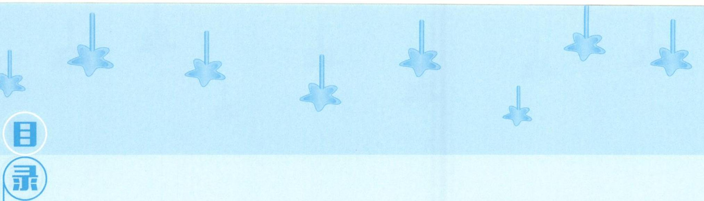

4.2 向量的夹角 44  
4.3 向量的投影 53  
思考题 58

# 第 5 讲 玩转“剪刀手”模型,轻松搞定数量积…… 59

5.1 数量积的定义 …… 60  
5.2 要素“一问三不知”——转基底 61  
5.3 已知单向量模长——转投影 62  
5.4 知道指尖连线长——转极化 64  
5.5 啥都不定可建系——转坐标 66  
5.6 “五 W”法则巩固模型 67  
思考题 69

# 第 6 讲 向量运算的灵魂——运算法则显威力 …… 71

6.1 向量基本不等式 72  
6.2 向量三角不等式 73  
6.3 向量回路恒等式 74  
6.4 向量对角线定理 77  
6.5 互换系数恒等式 79  
6.6 极化恒等式及其对偶形式 81  
6.7 三项完全平方公式 …… 82  
思考题 84

# 第 7 讲 向量的几何表示——向量,如图所示…… 85

7.1 以大换小,代数转入几何 86  
7.2 动笔画图,探寻几何元素 87  
7.3 数形结合,开启编题之旅 98

# B

# 录

7.4 视角各异,画图方式不同 100

思考题 103

# 下篇 无处不在的向量

# 第 8 讲 联想与构造——向量与函数不等式 …… 104

8.1 联想模长 105

8.2 联想数量积 106

8.3 联想投影 107

8.4 联想夹角 107

8.5 联想面积 108

8.6 利用不等式、三角函数等知识解向量题 …… 108

思考题 110

# 第 9 讲 伸缩与旋转——向量与复数 …… 111

思考题 115

# 第 10 讲 程序与转译——向量与平面几何 …… 117

10.1 向量法解决平面几何问题的思路 …… 118

10.2 向量法解决平面几何问题的工具 118

10.3 平面几何图形的定性研究 …… 118

10.4 平面几何图形的定量研究 …… 121

10.5 向量与三角形的四心 …… 124

思考题 136

# 第 11 讲 建系与运算——向量与立体几何 …… 138

11.1 立体几何的建系三类型 …… 139

11.2 立体几何中的空间角问题 …… 142

# 录

11.3 立体几何中的空间距离问题 …… 143  
11.4 建系法在翻折问题中的应用 …… 145  
11.5 建系法在几何命题中的应用 …… 147  
11.6 立体几何中的其他问题 …… 151  
思考题 157

# 第 12 讲 表示与转化——向量与解析几何 …… 159

12.1 向量表示圆锥曲线 …… 160  
12.2 利用向量投影求点到直线的距离 …… 162  
12.3 利用向量投影求线段的长度 …… 164  
12.4 利用向量刻画三点共线 166  
12.5 利用向量数量积判断点与圆的位置关系 …… 168  
12.6 三角形面积公式的向量形式 …… 170

思考题 172

# 思考题解答…… 175

# 上篇 “数”情画意的向量

# 第 1 讲

# 向量概念与线性运算

向量既有大小又有方向,它是刻画现实世界中“既有大小又有方向的量”的数学工具.运算赐予了向量无穷的威力,向量的运算与实数运算有所不同,体现在向量的方向上.而线性运算是向量最基础的运算,它包括向量的加、减与数乘运算,我们从向量的线性运算谈起,逐步揭开向量运算的秘密.

## 1.1 平面向量的概念

我们称既有大小又有方向的量为向量. 向量可以用有向线段AB表示, 有向线段的长度表示向量的大小, 向量AB的大小称为向量的长度(或模), 记作 $| \overrightarrow{AB} |$ .

长度相等且方向相同的向量叫作相等向量. 这表明, 向量完全由它的方向和模确定, 平行移动并不改变向量. 数学中定义的向量是自由的, 自由的向量才拥有无穷的力量.

> [!example]- 例 1 如图 1.1-1, 已知 A, B, C, D, E, F, G, H 是 $\odot O$ 上的八个等分点，在以 A, B, C, D, E, F, G, H 及圆心 O 这九个点中的任意两个点为起点与终点的向量中，问：
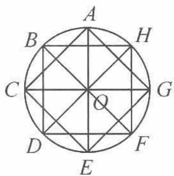

图1.1-1
  
（1）模长等于半径的向量有多少个?  
（2）模长等于半径的 $\sqrt{2}$ 倍的向量有多少个?
分析 观察图形,一个个地数即可.但需注意,向量用有向线段表示,即一条线段对应两个向量.在数的时候,应避免遗漏.
解答 （1）模长等于半径的向量有 $\overrightarrow{OA},\overrightarrow{OB},\overrightarrow{OC},\overrightarrow{OD},\overrightarrow{OE},\overrightarrow{OF},\overrightarrow{OG},\overrightarrow{OH};\overrightarrow{AO},\overrightarrow{BO},\overrightarrow{CO},\overrightarrow{DO}$ , $\overrightarrow{EO},\overrightarrow{FO},\overrightarrow{GO},\overrightarrow{HO}$ . 共 16 个.  
（2）模长等于半径的 $\sqrt{2}$ 倍的向量有 $\overrightarrow{AC},\overrightarrow{CE},\overrightarrow{EG},\overrightarrow{GA},\overrightarrow{BD},\overrightarrow{DF},\overrightarrow{FH},\overrightarrow{HB};\overrightarrow{CA},\overrightarrow{EC},\overrightarrow{GE},\overrightarrow{AG},\overrightarrow{DB},\overrightarrow{FD},\overrightarrow{HF},\overrightarrow{BH}.$ 共16个.

点评 此题考查平面向量的概念,向量不仅有长度,而且有方向.只有深刻理解平面向量的概念,解题时才能做到不遗漏.

> [!example]- 例 2 两个全等的正三角形 ABC 与 PQR 如图 1.1-2 所示, 使得 D, E, F, G, H, K 分别是两个三角形各边的三等分点. 设 $\triangle ABC$ 的边长为 3a, 在所有以 A, B, C, D, E, F, G, H, K, P, Q, R 中任意两个点为端点, 长度为 a 的向量中, 问:
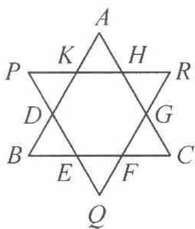

图1.1-2
  
（1）与 $\overrightarrow{BE}$ 相等的向量有哪几个?  
（2）与 $\overrightarrow{BE}$ 的模相等的向量有多少个?
分析 向量相等必须是向量的长度相等与方向相同,两者缺一不可.
解答 （1）与 $\overrightarrow{BE}$ 相等的向量有 $\overrightarrow{EF},\overrightarrow{FC},\overrightarrow{PK},\overrightarrow{KH},\overrightarrow{HR}$ .  
（2）与 $\overrightarrow{BE}$ 的模相等的向量即为模等于 $a$ 的向量.六角星的六个角构成的三角形恰好都是边长为 $a$ 的等边三角形.共有18条边,36个向量,除去 $\overrightarrow{BE}$ 本身,共有35个与 $\overrightarrow{BE}$ 的模相等的向量.

## 1.2 绕来绕去的向量
在初中物理实验课上,我们通过实验知道了力的合成满足平行四边形法则,它是向量加法平行四边形法则的物理模型.但这只告诉了我们结果,并不能帮助我们理解为何向量的加法满足平行四边形法则.更易于帮助我们理解的是位移的合成,即向量加法的三角形法则.
如图 1.2-1, 质点从 A 运动到 B, 再从 B 运动到 C, 其位移的结果等价于质点从 A 直接运动到 C, 即 $a + b = \overrightarrow{AB} + \overrightarrow{BC} = \overrightarrow{AC}$ .
如图 1.2-2, 质点从 A 出发, 经过多次运动最终到达 F. 其位移的结果等价于质点从 A 直接运动到 F, 即 $\overrightarrow{AB} + \overrightarrow{BC} + \overrightarrow{CD} + \overrightarrow{DE} + \overrightarrow{EF} = \overrightarrow{AF}$ .
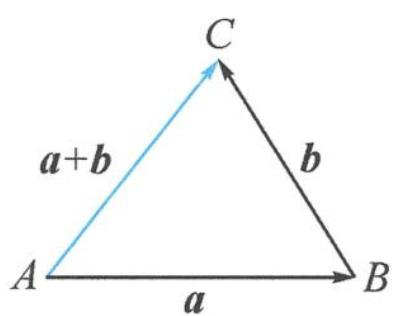

图1.2-1

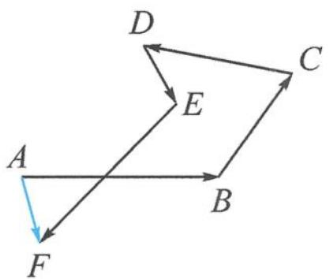

图1.2-2

故我们定义向量的加法满足三角形法则,而平行四边形法则与三角形法则是等价的.类似于图 1.2-2 这样绕来绕去的向量加法在解决向量运算问题时极为常用,我们通常称之为回路法.

> [!example]- 例 1 如图 1.2-3, 在 $\triangle ABC$ 中, 设三边 $AB, BC, CA$ 的中点分别为 $E$ , $F, D$ , 则 $\overrightarrow{EC} + \overrightarrow{FA} = (\quad)$ .
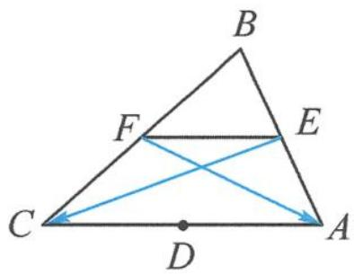

图1.2-3

A. $\overrightarrow{BD}$

B. $\frac{1}{2}\overrightarrow{BD}$

C. $\overrightarrow{AC}$

D. $\frac{1}{2}\overrightarrow{AC}$
分析 将向量 $\overrightarrow{EC}$ 与 $\overrightarrow{FA}$ 用回路法表示,问题便迎刃而解.
解答 $\overrightarrow{EC}+\overrightarrow{FA}=(\overrightarrow{EF}+\overrightarrow{FC})+(\overrightarrow{FE}+\overrightarrow{EA})=\overrightarrow{EA}+\overrightarrow{FC}=\frac{1}{2}(\overrightarrow{BA}+\overrightarrow{BC})=\overrightarrow{BD}$ ，故本题选 A.

点评 回路法表示所选用的向量并不唯一,本题也可选择 $\overrightarrow{EC}=\overrightarrow{EA}+\overrightarrow{AC},\overrightarrow{FA}=\overrightarrow{FC}+\overrightarrow{CA}$ ,条条大路通罗马.

> [!example]- 例 2 如图 1.2-4, 边长为 1 的正方形 ABCD 的中心与半径为 1 的圆 O 的圆心重合, P 是圆 O 上的动点, 判断 $\overrightarrow{PA} \cdot \overrightarrow{PC}$ 是否为定值, 并说明理由.
分析 由于向量 $\overrightarrow{PA},\overrightarrow{PC}$ 的模长与夹角都在变,无法直接求解.若考虑建系,运算量偏大,选择回路法更简洁.
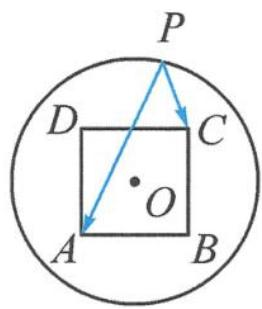

图1.2-4

解答 $\overrightarrow{PA} \cdot \overrightarrow{PC} = (\overrightarrow{PO} + \overrightarrow{OA}) \cdot (\overrightarrow{PO} + \overrightarrow{OC})$
$\begin{array}{l} = | \overrightarrow {P O} | ^ {2} + \overrightarrow {O A} \cdot \overrightarrow {O C} + \overrightarrow {P O} \cdot (\overrightarrow {O A} + \overrightarrow {O C}) \\ = | \overrightarrow {P O} | ^ {2} + \overrightarrow {O A} \cdot \overrightarrow {O C} \\ = 1 - \frac {1}{2} = \frac {1}{2}. \\ \end{array}$
故 $\overrightarrow{PA}\cdot\overrightarrow{PC}$ 为定值 $\frac{1}{2}$ .

> [!example]- 例 3 如图 1.2-5, 在四边形 ABCD 中, E, F 分别是边 AD, BC 的中点, 对角线 $AC = \sqrt{2}$ , $BD = \sqrt{3}$ , 且 EF = 1. 记对角线 AC 与 BD 的夹角为 $\theta$ , 则 $\cos \theta =$ \_\_\_\_.
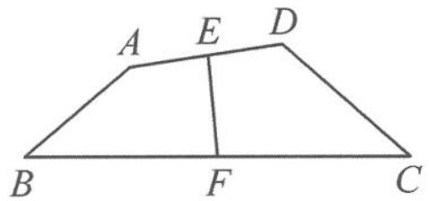

图1.2-5

分析 已知条件中并没有提及向量,看似为一道普通的平面几何问题,若用平面几何的方法求夹角,则难以下手,我们尝试使用向量来解决该问题.
解答 由回路法得
$\overrightarrow {A C} = \overrightarrow {A E} + \overrightarrow {E F} + \overrightarrow {F C}, \overrightarrow {B D} = \overrightarrow {B F} + \overrightarrow {F E} + \overrightarrow {E D}.$

两式相减得
$\overrightarrow {A C} - \overrightarrow {B D} = 2 \overrightarrow {E F}.$
再两边平方得 $2 + 3 - 2\overrightarrow{AC}\cdot \overrightarrow{BD} = 4$ ，故 $\overrightarrow{AC}\cdot \overrightarrow{BD} = \frac{1}{2}$ 即
$| \overrightarrow {A C} | | \overrightarrow {B D} | \cos \theta = \frac {1}{2}.$
所以 $\cos\theta=\frac{\sqrt{6}}{12}.$

点评 回路法表示向量看似绕来绕去,化简为繁,实则方向明确,清晰明了,更有曲径通幽之美.将一个未知的向量表示成几个已知向量之和,这些已知向量具备了成为基底的潜质.

## 1.3 线性运算与中线模型

向量运算成就了向量这一超级工具. 线性运算则是最基础的运算, 它为奠定向量大厦的基石——平面向量基本定理做好了充分的准备. 几何图形能帮助我们对向量的线性运算有更加直观的认识.

向量加法的图形表示(图 1.3-1 和图 1.3-2):

共起点使用平行四边形法则
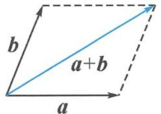

图1.3-1

首尾相接使用三角形法则
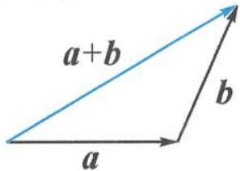

图1.3-2

向量加法的字母表示: $\overrightarrow{AB}+\overrightarrow{BC}=\overrightarrow{AC}.$

向量加法的坐标表示： $(x_{1},y_{1})+(x_{2},y_{2})=(x_{1}+x_{2},y_{1}+y_{2})$

向量减法的图形表示(图 1.3-3 和图 1.3-4):
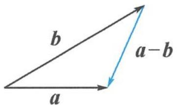

图1.3-3

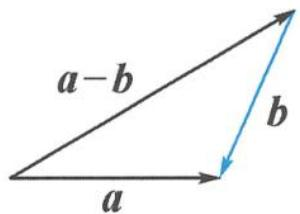

图1.3-4

向量减法的字母表示：
$\overrightarrow{AB}-\overrightarrow{AC}=\overrightarrow{CB}$ （共起点，指被减）； $\overrightarrow{AC}-\overrightarrow{BC}=\overrightarrow{AB}$ （共终点，顺势减）.

向量减法的坐标表示： $(x_{1},y_{1})-(x_{2},y_{2})=(x_{1}-x_{2},y_{1}-y_{2})$

中线模型 1(三角形): 如图 1.3-5, 已知线段 BC 的中点为 D, 则 $\overrightarrow{AB} + \overrightarrow{AC} = 2\overrightarrow{AD}$ .
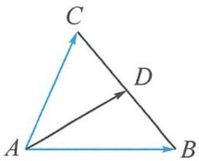

图1.3-5

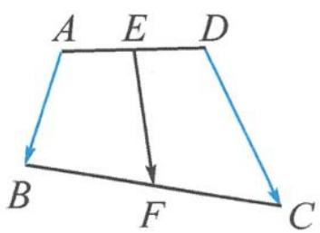

图1.3-6

中线模型 2(四边形): 如图 1.3-6, 已知线段 AD 的中点为 E, BC 的中点为 F, 则 $\overrightarrow{AB} + \overrightarrow{DC} = 2\overrightarrow{EF}$ .
证明 结合图形可知 $\overrightarrow{EF} = \overrightarrow{ED} +\overrightarrow{DC} +\overrightarrow{CF},\overrightarrow{EF} = \overrightarrow{EA} +\overrightarrow{AB} +\overrightarrow{BF}$ ，相加得 $\overrightarrow{AB} +\overrightarrow{DC} = 2\overrightarrow{EF}.$

> [!example]- 例 1 已知 P 为 $\triangle ABC$ 所在平面内的任意一点, 若 $\overrightarrow{PA} + \overrightarrow{PB} + \overrightarrow{PC} = \overrightarrow{AB}$ , 则点 P 与 $\triangle ABC$ 的位置关系是().
A. 点 $P$ 在线段 $AB$ 上

B. 点 $P$ 在线段 $BC$ 上

C. 点 $P$ 在线段 $AC$ 上

D. 点 $P$ 在 $\triangle ABC$ 外部
分析 对于一个复杂的向量和式,需要通过加减运算进行化简.
解答 因为 $\overrightarrow{PA}+\overrightarrow{PB}+\overrightarrow{PC}=\overrightarrow{AB}$ ，所以
$\overrightarrow {P C} = \overrightarrow {A B} - \overrightarrow {P B} - \overrightarrow {P A} = \overrightarrow {A P} - \overrightarrow {P A} = 2 \overrightarrow {A P}.$
故点 P 在线段 AC 上, 选 C.

点评 题目所给的向量等式往往需要化简,当无法直接化简时,可先尝试移项等进行代数变形.

> [!example]- 例 2 已知点 A, B, C 在圆 $x^{2} + y^{2} = 4$ 上运动，且 $AB \perp AC$ ，点 M 在圆 $x^{2} + y^{2} = 1$ 上运动，则 $\left|\overrightarrow{MA} + \overrightarrow{MB} + \overrightarrow{MC}\right|$ 的最大值为 \_\_\_\_.
解答 因为 $AB \perp AC$ ，所以 BC 为直径。记坐标原点为 O，则 $\overrightarrow{MB} + \overrightarrow{MC} = 2 \overrightarrow{MO}$ ，故
$\overrightarrow {M A} + \overrightarrow {M B} + \overrightarrow {M C} = \overrightarrow {M A} + 2 \overrightarrow {M O}.$
当 M 在线段 AO 的延长线上时， $\left|\overrightarrow{MA}+\overrightarrow{MB}+\overrightarrow{MC}\right|$ 取到最大值 5.

点评 三角形中线模型的本质即为向量加法的平行四边形法则. 本题先计算 $\overrightarrow{MB} + \overrightarrow{MC}$ , 消去了动点 $B$ 与 $C$ , 转化为定点 $O$ , 使问题简单化.

> [!example]- 例 3 如图 1.3-7, 在四边形 ABCD 中, E, F 分别是边 AD, BC 的中点, $AB = \sqrt{2}$ , EF = 1, $CD = \sqrt{3}$ , 则 $\overrightarrow{AB} \cdot \overrightarrow{CD} =$ \_\_\_\_.
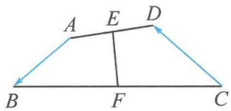

图1.3-7

解答 由“中线模型2(四边形)”得
$\overrightarrow {A B} + \overrightarrow {D C} = 2 \overrightarrow {E F}.$
等号两边平方得 $2 + 3 + 2\overrightarrow{AB}\cdot \overrightarrow{DC} = 4$ ，所以
$\overrightarrow {A B} \cdot \overrightarrow {D C} = - \frac {1}{2}.$
故 $\overrightarrow{AB}\cdot\overrightarrow{CD}=\frac{1}{2}.$

点评 “中线模型 2(四边形)”由回路法证明,本题与 1.2 例 3 类似,也可使用回路法.知道中线模型,解题方向更明确,速度也更快.

# 思考题

1. 下列命题中的假命题是( ).

A. 向量 $\overrightarrow{AB}$ 与 $\overrightarrow{BA}$ 的长度相等

B. 两个相等向量若起点相同, 则终点相同

C. 只有零向量的模等于 0

D. 共线的单位向量都相等

2. 已知四边形 ABCD, O 为任意一点, 若 $\overrightarrow{OA} + \overrightarrow{OC} = \overrightarrow{OB} + \overrightarrow{OD}$ , 那么四边形 ABCD 的形状是 \_\_\_\_.

3. 已知 $P$ 为 $\triangle ABC$ 所在平面内的任意一点, 若 $\overrightarrow{BC} = \lambda \overrightarrow{PA} + \overrightarrow{BP}$ , 其中 $\lambda \in \mathbb{R}$ , 则点 $P$ 一定在 ( ).

A. 边 $AB$ 所在的直线上

B. 边 $AC$ 所在的直线上

C. 边 BC 所在的直线上

D. $\triangle ABC$ 的内部

4. 设向量 a, b 不平行, 向量 $\lambda a + b$ 与 $a + 2b$ 平行, 则实数 $\lambda =$ \_\_\_\_.

5. 设 D, E, F 分别是 $\triangle ABC$ 的三边 BC, CA, AB 上的点，且 $\overrightarrow{DC} = 2\overrightarrow{BD}, \overrightarrow{CE} = 2\overrightarrow{EA}, \overrightarrow{AF} = 2\overrightarrow{FB}$ ，则 $\overrightarrow{AD} + \overrightarrow{BE} + \overrightarrow{CF}$ 与 $\overrightarrow{BC}$ ( ).

A. 反向平行

B. 同向平行

C. 互相垂直

D. 既不平行也不垂直

6. 已知正四面体 A-BCD 的棱长为 2, 半径为 $\sqrt{2}$ 的球 O 过点 D, MN 为球 O 的一条直径, 则 $\overrightarrow{AM} \cdot \overrightarrow{AN}$ 的取值范围是 \_\_\_\_.

7. 设 $M$ 为平行四边形 $ABCD$ 对角线的交点, $O$ 为平行四边形 $ABCD$ 所在平面内任意一点, 则 $\overrightarrow{OA} + \overrightarrow{OB} + \overrightarrow{OC} + \overrightarrow{OD}$ 等于 ( ).

A. $\overrightarrow{OM}$

B. $2 \overrightarrow{OM}$

C. 3 $\overrightarrow{OM}$

D. $4 \overrightarrow{OM}$

8. 如图, 在 $\triangle ABC$ 中, 设 $\overrightarrow{AB} = a$ , $\overrightarrow{AC} = b$ , $AP$ 的中点为 $Q$ , $BQ$ 的中点为 $R$ , $CR$ 的中点恰为 $P$ , 则 $\overrightarrow{AP} =$ \_\_\_\_. (用 $a, b$ 表示)

9. 如图, 在 $\triangle ABC$ 中, 已知 $D, E$ 分别是边 $AB, BC$ 上的点, 且 $CE = 1$ , $AD = 2$ . $M, N$ 分别是线段 $AC, DE$ 的中点, $\angle B = 60^{\circ}$ , 求线段 $MN$ 的长.

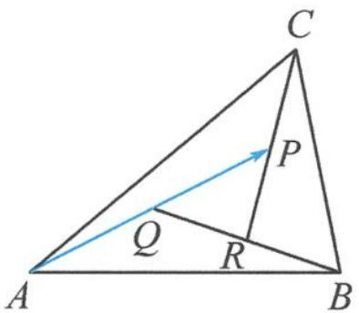

第8题图

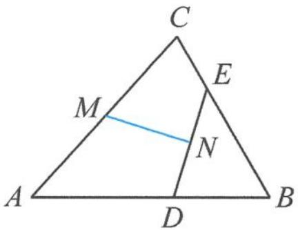

第9题图

10. 如图, 在四边形 $ABCD$ 中, 已知 $E, F, G, H$ 分别是边 $BC, AD, AB, CD$ 的中点. 证明: $|EF| + |GH| \leqslant \frac{1}{2} (|AB| + |BC| + |CD| + |DA|)$ .

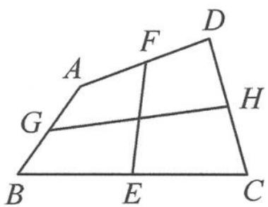

第10题图

# 第 2 讲

# 向量大厦的基石——平面向量基本定理

平面向量基本定理在向量知识体系中占有重要地位,是联系几何和代数的桥梁,也是向量坐标法的基础.它的价值在于用两个确定的基底向量可以表示平面上的任意一个向量,从而使得向量成为“可操纵的对象”,为向量发挥巨大威力奠定基础.平面向量基本定理的相关内容是高考考查的重要内容,在历年的高考真题中屡见不鲜.

## 2.1 正确认识基底

平面向量基本定理之所以含有“基本”二字,就在于用“基底”表示向量.
首先, 基底反映了相应空间的本质. 我们通常说的“直线是一维的”“平面是二维的”“空间是三维的”, 这个“维”的具体表达就是“基底”. 实际上, 平面基本性质中的“两条相交直线确定唯一一个平面”, 用向量语言表示, 就是“两个不共线的向量是平面的一组基底”. 基底的选择不唯一, 两个向量能否成为基底只有一个标准, 就是要求不共线, 如 $\overrightarrow{OC} = \lambda \overrightarrow{OA} + \mu \overrightarrow{OB}$ , 或 $\overrightarrow{OC} = m \overrightarrow{OM} + n \overrightarrow{ON}$ , 只需 $\overrightarrow{OA}, \overrightarrow{OB}$ 不共线, 或 $\overrightarrow{OM}, \overrightarrow{ON}$ 不共线.
其次,用基底可以对平面内的任意向量作唯一表示.若 $\overrightarrow{OC}=\lambda\overrightarrow{OA}+\mu\overrightarrow{OB}=m\overrightarrow{OA}+n\overrightarrow{OB}$ ,则 $\lambda=m,\mu=n$ .基于基底的向量线性表示,建立了向量空间与线性代数之间的联系,这是它的力量所在.于是就建立了一种“基准”,使得原本各自为政的向量有了统一的表示.从而,向量成为“可操纵的对象”,为通过运算、推理解决几何问题奠定了基础,同时也指引了思考方向.

> [!example]- 例 1 下列说法错误的是( ).
A. 基底中的向量不能为零向量  
B. 平面内的任何两个向量都可以作为一组基底  
C. 若 a, b 不共线，且 $\lambda_{1}a + \mu_{1}b = \lambda_{2}a + \mu_{2}b$ ，则 $\lambda_{1} = \lambda_{2}, \mu_{1} = \mu_{2}$

D. 平面向量的基底不唯一, 只要基底确定后, 平面内的任意一个向量都可被这组基底唯一表示
解答 由基底概念可知,显然选项 B 错误,两个不共线向量才能成为基底.故选 B.

## 2.2 基底表示向量

用基底表示向量是平面向量基本定理的重要价值,使得任意的向量都可以被基底唯一表示.

> [!example]- 例 1 已知 $ax^{2}+bx+c=0$ 是关于 x 的一元二次方程, 其中 a, b, c 为非零向量, 且 a 与 b 不共线, 则该方程().
A. 至少有一个根

B. 至多有一个根

C. 有两个不相等的根

D. 根的个数无法确定
解答 由已知 $ax^2 + bx + c = 0$ 得
$\boldsymbol {c} = - x ^ {2} \boldsymbol {a} - x \boldsymbol {b}.$
由平面向量基本定理知,向量 c 可以由不共线的向量 a 与 b 唯一表示,即
$c = \lambda a + \mu b.$
故
$\left\{ \begin{array}{l} - x ^ {2} = \lambda , \\ - x = \mu . \end{array} \right.$
若恰好 $\mu^2 = -\lambda$ ，则这个方程组有唯一根，否则无根。故至多有一个根，选B.

点评 实际上,在向量系统中,等式就意味着表示,表示的唯一性是常考点.

> [!example]- 例 2 如图 2.2-1, 在 $\triangle ABC$ 中, 已知 $\overrightarrow{AD}=3\overrightarrow{DC}$ , $E$ 是 $BD$ 的三等分点. 设 $\overrightarrow{AE}=x\overrightarrow{AB}+y\overrightarrow{AC}$ , 则 $x=$ \_\_\_\_, $y=$ \_\_\_\_.
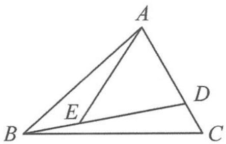

图2.2-1

解答 解法一:代数回路法
$\begin{array}{l} \overrightarrow {A E} = \overrightarrow {A B} + \overrightarrow {B E} = \overrightarrow {A B} + \frac {1}{3} \overrightarrow {B D} = \overrightarrow {A B} + \frac {1}{3} (\overrightarrow {A D} - \overrightarrow {A B}) = \frac {2}{3} \overrightarrow {A B} + \frac {1}{3} \overrightarrow {A D} \\ = \frac {2}{3} \overrightarrow {A B} + \frac {1}{3} \times \frac {3}{4} \overrightarrow {A C} = \frac {2}{3} \overrightarrow {A B} + \frac {1}{4} \overrightarrow {A C}. \\ \end{array}$
故 $x=\frac{2}{3}, y=\frac{1}{4}.$

# 解法二: 几何分解法
如图 2.2-2, 过点 E 作 AC, AB 的平行线交 AB, AC 于点 M, N. 由相似知
$\overrightarrow {A M} = \frac {2}{3} \overrightarrow {A B}, \overrightarrow {A N} = \frac {1}{3} \overrightarrow {A D} = \frac {1}{4} \overrightarrow {A C}.$
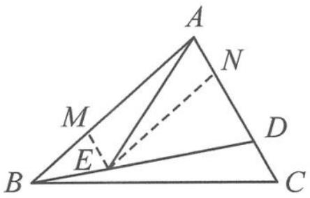

图2.2-2

故 $\overrightarrow{AE}=\overrightarrow{AM}+\overrightarrow{AN}=\frac{2}{3}\overrightarrow{AB}+\frac{1}{4}\overrightarrow{AC}.$

点评 向量是数形结合的产物,因此,用基底表示向量的方法也有代数与几何两种,即一种是通过走回路的代数方法,一种是类似用力的分解原理对向量进行分解的方法.

> [!example]- 例 3 如图 2.2-3, 在平行四边形 ABCD 中, 已知 $\overrightarrow{AE} = \frac{1}{3}\overrightarrow{AB}, \overrightarrow{AF} = \frac{1}{4}\overrightarrow{AD}, CE$ 与 BF 相交于点 G. 记 $\overrightarrow{AB} = a, \overrightarrow{AD} = b$ , 则 $\overrightarrow{AG} = (\quad)$ .
A. $\frac{2}{7} a + \frac{1}{7} b$

B. $\frac{2}{7} a + \frac{3}{7} b$

C. $\frac{3}{7} a + \frac{1}{7} b$

D. $\frac{4}{7} a + \frac{2}{7} b$
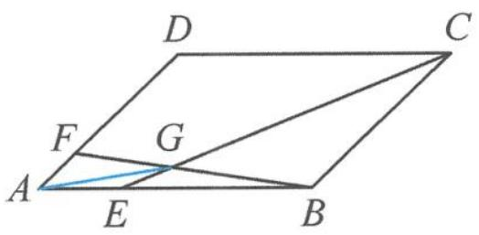

图2.2-3

解答 因为 E, G, C 三点共线, 所以
$\overrightarrow {A G} = x \overrightarrow {A E} + (1 - x) \overrightarrow {A C} = \frac {x}{3} a + (1 - x) (a + b) = \left(1 - \frac {2 x}{3}\right) a + (1 - x) b.$
因为 F, G, B 三点共线, 所以
$\overrightarrow {A G} = y \overrightarrow {A B} + (1 - y) \overrightarrow {A F} = y a + \frac {1 - y}{4} b.$
由平面向量基本定理表示方式的唯一性知 $\left\{ \begin{array}{l} 1 - \frac{2}{3} x = y, \\ 1 - x = \frac{1 - y}{4}, \end{array} \right.$ 解得 $\left\{ \begin{array}{l} x = \frac{6}{7}, \\ y = \frac{3}{7}. \end{array} \right.$
所以 $\overrightarrow{AG}=\frac{3}{7}a+\frac{1}{7}b.$

点评 利用三点共线系数关系对同一个向量表示两遍,根据平面向量基本定理表示方式的唯一性列等量关系,求解方程,这是代数法处理此类问题的基本思路,体现了方程思想.当然,本题也可以借助梅涅劳斯定理等平面几何知识,采用“力的分解”法求解.

## 2.3 基底系数的意义
$\overrightarrow{OC}=\lambda\overrightarrow{OA}+\mu\overrightarrow{OB}$ 中的系数 $\lambda,\mu$ 有着明确的几何意义.

以 $\lambda$ 为例, $\lambda$ 的绝对值就是 $\overrightarrow{OC}$ 在 $\overrightarrow{OA}$ 方向上的分向量 $\overrightarrow{OM}$ 的模长与 $\overrightarrow{OA}$ 的模长之比, 即 $|\lambda| = \frac{|\overrightarrow{OM}|}{|\overrightarrow{OA}|}, \lambda$ 的正负性由 $\overrightarrow{OM}$ 与 $\overrightarrow{OA}$ 同向还是反向决定: 若同向, 则 $\lambda > 0$ ; 若反向, 则 $\lambda < 0$ . 于是研究基底系数, 作出分向量是关键.

> [!example]- 例 1 如图 2.3-1, 已知 $OM \parallel AB$ , 点 $P$ 在由射线 $OM$ 、线段 $OB$ 及 $AB$ 延长线围成的区域内 (不含边界), 且 $\overrightarrow{OP} = x\overrightarrow{OA} + y\overrightarrow{OB}$ , 则 $x$ 的取值范围是 \_\_\_\_ ; 当 $x = -\frac{1}{2}$ 时, $y$ 的取值范围是 \_\_\_\_.
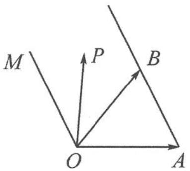

图2.3-1

分析 将 $\overrightarrow{OP}$ 分解为基底 $\overrightarrow{OA},\overrightarrow{OB}$ 上的分向量和,考查基底系数.
解答 如图 2.3-2, 过点 P 作 OA, OB 的平行线, 则
$\overrightarrow {O P} = \overrightarrow {O E} + \overrightarrow {E P} = x   \overrightarrow {O A} + y   \overrightarrow {O B}, \text {且} x = - \frac {| \overrightarrow {O E} |}{| \overrightarrow {O A} |}, y = \frac {| \overrightarrow {E P} |}{| \overrightarrow {O B} |}.$

随着点 P 在区域内运动， $|\overrightarrow{OE}|\in(0,+\infty)$ ，故 x<0。
当 $x=-\frac{1}{2}$ ，即 $\left|\overrightarrow{OE}\right|=\frac{1}{2}\left|\overrightarrow{OA}\right|$ 时，点 P 在线段 CD 上运动.
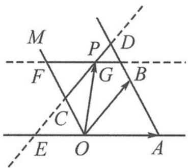

图2.3-2

当点 P 位于点 C 时, 因为 $\triangle OCE \sim \triangle ABO$ , 所以 $y = \frac{|\overrightarrow{EC}|}{|\overrightarrow{OB}|} = \frac{|\overrightarrow{EO}|}{|\overrightarrow{OA}|} = \frac{1}{2}$ ;
当点 P 位于点 D 时, 因为 $\triangle ADE \sim \triangle ABO$ , 所以 $y = \frac{|\overrightarrow{DE}|}{|\overrightarrow{OB}|} = \frac{|\overrightarrow{EA}|}{|\overrightarrow{OA}|} = \frac{3}{2}$ .

综上， $\frac{1}{2}<y<\frac{3}{2}.$

> [!example]- 例 2 在 $\triangle ABC$ 中,已知 $D,E,F$ 分别为 $BC,CA,AB$ 上的点,且 $CD=\frac{3}{5}BC,EC=\frac{1}{2}AC,$ $AF=\frac{1}{3}AB$ .设 $P$ 为四边形 $AEDF$ 内一点(点 $P$ 不在边界上),若 $\overrightarrow{DP}=-\frac{1}{3}\overrightarrow{DC}+x\overrightarrow{DE}$ ,则实数 $x$ 的取值范围是\_\_\_\_.
解答 如图 2.3-3, 取线段 BD 的中点 G, 则
$\overrightarrow {D G} = - \frac {1}{3} \overrightarrow {D C}.$

过点 G 作 $GH \parallel DE$ ，交 AC 于点 H，交 DF 于点 K。因为 $\overrightarrow{DP} = -\frac{1}{3}\overrightarrow{DC} + x\overrightarrow{DE}$ ，所以点 P 在线段 KH（不含端点）上运动，且 $x \in \left(\frac{GK}{DE}, \frac{GH}{DE}\right)$ 。
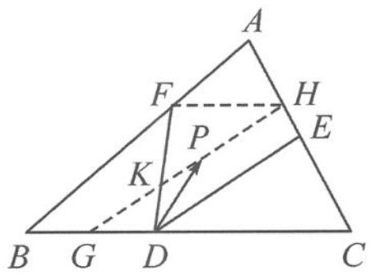

图2.3-3

设 $CE = m$ ，在 $\triangle CGH$ 中，由相似得 $\frac{CE}{HE} = \frac{CD}{DG} = 3$ ，得 $HE = \frac{1}{3} m, AH = \frac{2}{3} m.$
所以 $\frac{AH}{CH} = \frac{1}{2} = \frac{AF}{BF}$ , 得 $FH \parallel BC$ , 所以 $\frac{GK}{KH} = \frac{GD}{FH} = \frac{3}{5}$ .
设 $GK = 3n, KH = 5n$ ，则 $DE = \frac{3}{4} GH = \frac{3}{4} \times 8n = 6n$ .
则 $\frac{GK}{DE} = \frac{1}{2},\frac{GH}{DE} = \frac{HC}{CE} = \frac{\frac{4}{3}m}{m} = \frac{4}{3}$ 所以 $x\in \left(\frac{1}{2},\frac{4}{3}\right)$

点评 本题多次利用平面几何相似的知识求线段长度之比.

> [!example]- 例 3 已知直线 PA, PB 分别与半径为 1 的圆 O 相切于点 A, B, PO = 2, $\overrightarrow{PM} = 2\lambda \overrightarrow{PA} + (1 - \lambda) \overrightarrow{PB}$ . 若点 M 在圆 O 的内部(不包括边界), 则实数 $\lambda$ 的取值范围是 \_\_\_\_.
解答 解法一:延长 PA 到点 C,使 PA=AC.由已知得
$\overrightarrow {P M} = \lambda (2 \overrightarrow {P A}) + (1 - \lambda) \overrightarrow {P B} = \lambda \overrightarrow {P C} + (1 - \lambda) \overrightarrow {P B}.$
故 M, B, C 三点共线. 由图 2.3-4 易知, B, O, C 三点共线, 且 $\triangle PBC$ 是一个内角为 $30^{\circ}, 60^{\circ}, 90^{\circ}$ 的直角三角形. 过点 M 作 PB 的平行线, 交 PC 于点 D, 作 PC 的平行线, 交 PB 于点 E, 则
$\overrightarrow {P M} = \overrightarrow {P D} + \overrightarrow {P E} = \lambda \overrightarrow {P C} + (1 - \lambda) \overrightarrow {P B},$
故 $\lambda=\frac{|\overrightarrow{PD}|}{|\overrightarrow{PC}|}$ . 随着点 M 在线段 $BM_{0}$ (不含端点) 上运动，
$\lambda = \frac {| \overrightarrow {P D} |}{| \overrightarrow {P C} |} = \frac {| \overrightarrow {M B} |}{| \overrightarrow {B C} |} \in \left(0, \frac {2}{3}\right).$
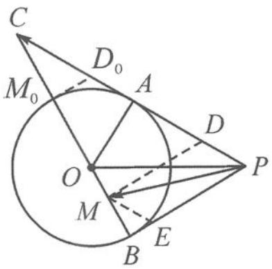

图2.3-4

解法二: 已知 PO=2, 由切线长定理知 $PA=PB=\sqrt{3}$ . 因为
$\overrightarrow {O M} = \overrightarrow {O P} + \overrightarrow {P M} = \overrightarrow {O P} + 2 \lambda \overrightarrow {P A} + (1 - \lambda) \overrightarrow {P B},$
又因为点 M 在圆 O 的内部(不包括边界), 故 $\left|\overrightarrow{OM}\right|<1$ . 所以
$[ \overrightarrow {O P} + 2 \lambda \overrightarrow {P A} + (1 - \lambda) \overrightarrow {P B} ] ^ {2} = 9 \lambda^ {2} - 6 \lambda + 1 <   1.$
解得 $0 < \lambda < \frac{2}{3}$ .

点评 本题解法一利用了系数的几何意义,解法二则将点在圆内的几何特征转化为点与圆心距离小于半径的代数不等式.

## 2.4 基本定理的应用

> [!example]- 例 1 如图 2.4-1, 在 $\triangle ABC$ 中, 已知 $D$ 是 $BC$ 的中点, $E$ 在边 $AB$ 上, $BE=2EA, AD$ 与 $CE$ 交于点 $O$ . 若 $\overrightarrow{AB} \cdot \overrightarrow{AC}=6 \overrightarrow{AO} \cdot \overrightarrow{EC}$ , 则 $\frac{AB}{AC}$ 的值是 \_\_\_\_.
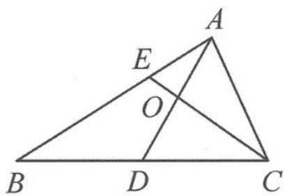

图2.4-1

分析 注意到本题条件涉及数量积,但并没有给出任何长度、夹角已知的向量,但最终求的是 $\frac{AB}{AC}$ 长度之比,故优先选取 $\overrightarrow{AB},\overrightarrow{AC}$ 作为基底来表示题中涉及的其他向量.
解答 设 $\overrightarrow{AO}=\lambda\overrightarrow{AD}=\frac{\lambda}{2}(\overrightarrow{AB}+\overrightarrow{AC})$ ，又
$\overrightarrow {A O} = \overrightarrow {A E} + \overrightarrow {E O} = \overrightarrow {A E} + \mu \overrightarrow {E C} = \overrightarrow {A E} + \mu (\overrightarrow {A C} - \overrightarrow {A E}) = (1 - \mu) \overrightarrow {A E} + \mu \overrightarrow {A C} = \frac {1 - \mu}{3} \overrightarrow {A B} + \mu \overrightarrow {A C},$
所以
$\left\{ \begin{array}{l} \frac {\lambda}{2} = \frac {1 - \mu}{3}, \\ \frac {\lambda}{2} = \mu . \end{array} \right.$
解得 $\left\{\begin{aligned}\lambda&=\frac{1}{2},\\ \mu&=\frac{1}{4}.\end{aligned}\right.$ 所以
$\overrightarrow {A O} = \frac {1}{2} \overrightarrow {A D} = \frac {1}{4} (\overrightarrow {A B} + \overrightarrow {A C}), \overrightarrow {E C} = \overrightarrow {A C} - \overrightarrow {A E} = - \frac {1}{3} \overrightarrow {A B} + \overrightarrow {A C}.$
从而 $6\overrightarrow{AO}\cdot \overrightarrow{EC} = 6\times \frac{1}{4} (\overrightarrow{AB} +\overrightarrow{AC})\cdot \left(-\frac{1}{3}\overrightarrow{AB} +\overrightarrow{AC}\right) = \frac{3}{2}\left(-\frac{1}{3} |\overrightarrow{AB}|^2 +\frac{2}{3}\overrightarrow{AB}\cdot \overrightarrow{AC} +|\overrightarrow{AC}|^2\right)$
$= - \frac {1}{2} | \overrightarrow {A B} | ^ {2} + \overrightarrow {A B} \cdot \overrightarrow {A C} + \frac {3}{2} | \overrightarrow {A C} | ^ {2}.$
所以 $\frac{1}{2} |\overrightarrow{AB}|^2 = \frac{3}{2} |\overrightarrow{AC}|^2$ ，即 $\frac{|\overrightarrow{AB}|^2}{|\overrightarrow{AC}|^2} = 3$ ，得 $\frac{AB}{AC} = \sqrt{3}$ .

点评 平面向量基本定理的一大功用就是可以用基底向量表示任一向量,是求向量模长、数量积,乃至向量应用于其他领域的基础.

> [!example]- 例 2 如图 2.4-2, 在棱长为 1 的正方体 $ABCD-A_{1}B_{1}C_{1}D_{1}$ 中, 已知 $E$ 为侧面的中心, 点 $F$ 在棱 $AD$ 上运动, 正方体表面上有一点 $P$ 满足 $\overrightarrow{D_{1}P}=x\overrightarrow{D_{1}F}+y\overrightarrow{D_{1}E}(x \geqslant 0, y \geqslant 0)$ , 则所有满足条件的点 $P$ 构成图形的面积为 \_\_\_\_.
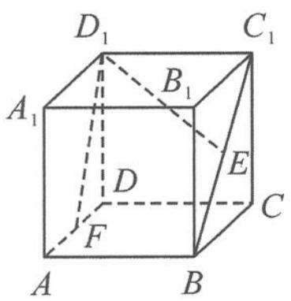

图2.4-2

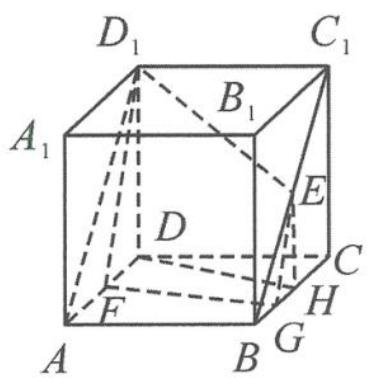

图2.4-3

解答 $\overrightarrow{D_1P} = x\overrightarrow{D_1F} +y\overrightarrow{D_1E}$ 刻画了点 $P$ 在平面 $D_{1}EF$ 上. 由 $x\geqslant 0,y\geqslant 0$ 知, 点 $P$ 在平面 $D_{1}EF$ 中 $\angle ED_{1}F$ (含边界) 内部分. 又点 $P$ 在正方体的表面上, 故用平面 $D_{1}EF$ 去截正方体所获得的边界即为满足条件的区域.
如图 2.4-3, 对每一个确定的点 F, 过点 E 作 $EG \parallel D_{1}F$ , 交 BC 于点 G, 则轨迹为 $D_{1}F$ , FG, GE 三段线段. 记 BC 的中点为 H, 当点 F 在棱 AD 上运动时, 满足条件的区域有 $\triangle ADD_{1}$ , 梯形 ABHD 和 $\triangle BEH$ .
所以所求图形的面积为 $\frac{1}{2} +\frac{1}{2}\times \left(\frac{1}{2} +1\right)\times 1 + \frac{1}{8} = \frac{11}{8}.$

点评 本题充分展示了借助平面向量基本定理, 表达式 $\overrightarrow{D_1P} = x\overrightarrow{D_1F} + y\overrightarrow{D_1E}$ 可以刻画平面, 且改变系数 $x, y$ 的值可以表示出任意向量, 使向量成为“可操纵的对象”.

## 2.5 正交基底系下的坐标向量

进一步地,为了建立向量与实数之间的联系,彻底实现几何直观与实数运算的融合,就要研究“坐标表示”的问题.因为在解决问题的过程中,“标准正交基”是最好用的,于是利用直角坐标系中坐标轴上的单位向量作为基底,将向量用坐标表示,使向量问题转化为坐标问题来处理,就实现了彻底代数化的目的.

坐标法是解决向量问题的一条重要途径,其优点在于思维方式比较固定,容易掌握,关键是合理建立直角坐标系,并准确写出关键点的坐标.

> [!example]- 例 1 已知 O 是 $\triangle ABC$ 内一点， $\angle AOB = 150^{\circ}$ ， $\angle BOC = 90^{\circ}$ ， $|\overrightarrow{OA}| = 2$ ， $|\overrightarrow{OB}| = 1$ ， $|\overrightarrow{OC}| = 3$ 。若 $\overrightarrow{OC} = \lambda \overrightarrow{OA} + \mu \overrightarrow{OB}$ ，则 $\frac{\mu}{\lambda} =$ \_\_\_\_.
解答 如图 2.5-1, 以 O 为原点, OA 所在直线为 x 轴建立坐标系 xOy. 由题意知
$A (2, 0), B \left(- \frac {\sqrt {3}}{2}, \frac {1}{2}\right), C \left(- \frac {3}{2}, - \frac {3 \sqrt {3}}{2}\right).$
若 $\overrightarrow{OC} = \lambda \overrightarrow{OA} +\mu \overrightarrow{OB}$ ，可得
$\left\{ \begin{array}{l} 2 \lambda - \frac {\sqrt {3}}{2} \mu = - \frac {3}{2}, \\ \frac {1}{2} \mu = - \frac {3 \sqrt {3}}{2}. \end{array} \right.$
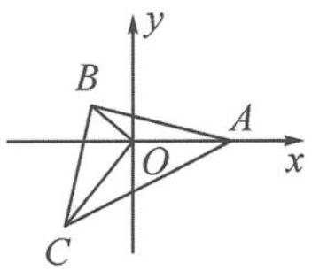

图2.5-1

解得 $\left\{\begin{aligned}\lambda&=-3,\\ \mu&=-3\sqrt{3},\end{aligned}\right.$ 即 $\frac{\mu}{\lambda}=\sqrt{3}.$

点评 在坐标形式下,若一个向量的等式对应两个坐标的方程,则利用代数的方程思想,将系数一一解出.

> [!example]- 例2 在平面内, 已知定点 $O, A, B, C$ 满足 $|\overrightarrow{OA}| = |\overrightarrow{OB}| = |\overrightarrow{OC}|$ , $\overrightarrow{OA} \cdot \overrightarrow{OB} = \overrightarrow{OB} \cdot \overrightarrow{OC} = \overrightarrow{OC} \cdot \overrightarrow{OA} = -2$ , 动点 $P, M$ 满足 $|\overrightarrow{AP}| = 1$ , $\overrightarrow{PM} = \overrightarrow{MC}$ , 则 $|\overrightarrow{BM}|^{2}$ 的最大值为 \_\_\_\_.
解答 由条件易知
$\angle A O C = \angle A O B = \angle B O C = 1 2 0 ^ {\circ}, | \overrightarrow {O A} | = | \overrightarrow {O B} | = | \overrightarrow {O C} | = 2.$
如图2.5-2, 以 $O$ 为原点, $OA$ 所在直线为 $x$ 轴建立坐标系 $xOy$ , 则 $A(2,0), B(-1,-\sqrt{3}), C(-1,\sqrt{3})$ . 设 $P(x,y)$ , 由 $|\overrightarrow{AP}| = 1$ 得
$(x - 2) ^ {2} + y ^ {2} = 1.$
又 $\overrightarrow{PM} = \overrightarrow{MC}$ ，得 $M\left(\frac{x - 1}{2},\frac{y + \sqrt{3}}{2}\right)$ ，故 $\overrightarrow{BM} = \left(\frac{x + 1}{2},\frac{y + 3\sqrt{3}}{2}\right)$ ，从而
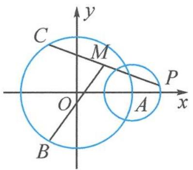

图2.5-2

$\left| \overrightarrow {B M} \right| ^ {2} = \left(\frac {x + 1}{2}\right) ^ {2} + \left(\frac {y + 3 \sqrt {3}}{2}\right) ^ {2} = \frac {1}{4} \left[ (x + 1) ^ {2} + (y + 3 \sqrt {3}) ^ {2} \right].$

问题转化为求圆 $(x-2)^{2}+y^{2}=1$ 上的点与点 $(-1,-3\sqrt{3})$ 距离的平方的四分之一的最大值.所以
$\left| \overrightarrow {B M} \right| _ {\max} ^ {2} = \frac {1}{4} \left[ \sqrt {3 ^ {2} + (- 3 \sqrt {3}) ^ {2}} + 1 \right] ^ {2} = \frac {4 9}{4}.$

点评 通过建立坐标系,我们将复杂的向量问题变为坐标形式下的解析几何问题.

> [!example]- 例 3 已知半径为 1, 圆心角为 $\frac{3 \pi}{2}$ 的圆弧 $A B$ 上有一点 $C$ , 若 $C$ 为圆弧 $A B$ 的中点, 点 $D$ 在线段 $O A$ 上运动, 则 $| \overrightarrow { O C } + \overrightarrow { O D }|$ 的最小值为 ; 若 $D, E$ 分别为线段 $O A, O B$ 的中点, 当点 $C$ 在圆弧 $A B$ 上运动时, $\overrightarrow { C E } \cdot \overrightarrow { C D }$ 的取值范围是 .
解答 如图 2.5-3, 以 O 为原点, OA 所在直线为 x 轴建立坐标系 xOy, 则 A(1,0), B(0,-1), C $\left(-\frac{\sqrt{2}}{2}, \frac{\sqrt{2}}{2}\right)$ . 设 D(t,0) (0≤t≤1), 则
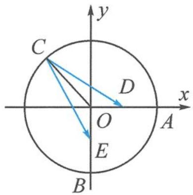

图2.5-3

$\overrightarrow {O C} + \overrightarrow {O D} = \left(t - \frac {\sqrt {2}}{2}, \frac {\sqrt {2}}{2}\right).$
所以 $|\overrightarrow{OC} +\overrightarrow{OD}| = \sqrt{\left(t - \frac{\sqrt{2}}{2}\right)^2 + \left(\frac{\sqrt{2}}{2}\right)^2}$ 当 $t = \frac{\sqrt{2}}{2}$ 时，
$\left| \overrightarrow {O C} + \overrightarrow {O D} \right| _ {\min} = \frac {\sqrt {2}}{2}.$
由题意知 $D\left(\frac{1}{2},0\right),E\left(0, - \frac{1}{2}\right)$ .设 $C(\cos \theta ,\sin \theta)\left(\theta \in \left[0,\frac{3\pi}{2}\right]\right)$ ，则
$\overrightarrow {C E} \cdot \overrightarrow {C D} = (- \cos \theta , - \frac {1}{2} - \sin \theta) \cdot (\frac {1}{2} - \cos \theta , - \sin \theta) = \frac {\sqrt {2}}{2} \sin (\theta - \frac {\pi}{4}) + 1.$
因为 $\theta \in \left[0, \frac{3\pi}{2}\right]$ , 所以 $\overrightarrow{CE} \cdot \overrightarrow{CD} \in \left[\frac{1}{2}, \frac{2 + \sqrt{2}}{2}\right]$ .

点评 几何图形中出现圆形,常以圆心为坐标原点建立坐标系,圆上的点可以用三角换元法设出.本题是正交基底系下,用坐标公式解决模长与数量积的问题.

## 2.6 斜基底系下的坐标向量

我们知道 $\overrightarrow{OP} = x\overrightarrow{OA} +y\overrightarrow{OB}$ 中的系数 $x,y$ 不只是参数,还有着重要的数学意义.类比直角坐标系,我们也可以进一步地建立斜基底系下的坐标体系.

> [!example]- 例 1 如图 2.6-1, 设 Ox, Oy 是平面内相交成 $60^{\circ}$ 的两条数轴, $e_{1}, e_{2}$ 分别是与 x 轴、y 轴正方向同向的单位向量. 若向量 $\overrightarrow{OP} = xe_{1} + ye_{2}$ , 则把有序数对 $(x, y)$ 叫作向量 $\overrightarrow{OP}$ 在坐标系 xOy 中的坐标. 设 $\overrightarrow{OP} = 3e_{1} + 2e_{2}$ .
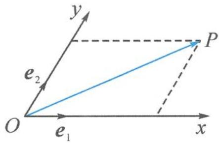

图2.6-1
  
（1） 计算 $\left|\overrightarrow{OP}\right|$ 的大小.  
（2）根据平面向量基本定理,判断本题中对向量坐标的规定是否合理.
解答 （1） $|\overrightarrow{OP}| = \sqrt{(3e_1 + 2e_2)^2} = \sqrt{9 + 4 + 6} = \sqrt{19}$ .  
（2）由平面向量基本定理,以平面内一组不共线的向量 $\overrightarrow{OA}$ , $\overrightarrow{OB}$ 作为基底,对平面内的任一向量 $\overrightarrow{OP}$ 有且仅有唯一的有序实数对 $(x,y)$ 使得 $\overrightarrow{OP}=x\ \overrightarrow{OA}+y\ \overrightarrow{OB}$ 成立.故对应于基底 $\overrightarrow{OA}$ , $\overrightarrow{OB}$ ,向量 $\overrightarrow{OP}$ 就与有序实数对 $(x,y)$ 建立起了一一对应的关系.因此,将这个有序数对 $(x,y)$ 作为向量 $\overrightarrow{OP}$ 在坐标系 $xOy$ 中的坐标是合理的,记作 $\overrightarrow{OP}=(x,y)$ ,其中 $x$ 叫作 $\overrightarrow{OP}$ 在 $x$ 轴上的坐标, $y$ 叫作 $\overrightarrow{OP}$ 在 $y$ 轴上的坐标.
如果这组基底是正交的,那么 $(x,y)$ 就是向量在直角坐标系下的坐标,如果不是正交基底,我们就称其为在斜基底 $(\overrightarrow{OA},\overrightarrow{OB})$ 下的斜坐标.我们熟悉的直角坐标系下的坐标只是其特例.
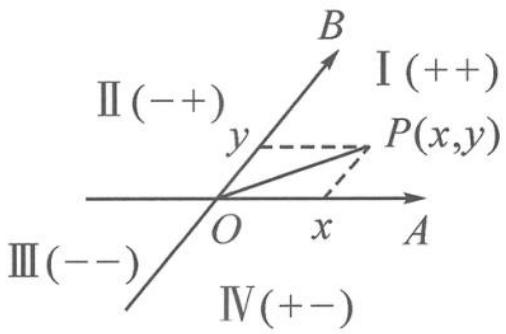

图2.6-2

类比直角坐标系,有以下的一些结论(图 2.6-2).

结论 1 点 A, B 的坐标分别为 $(1,0)$ , $(0,1)$ .

结论 2 向量 $\overrightarrow{OA},\overrightarrow{OB}$ 所在的直线将平面分成四个区域,在四个区域内的点坐标 $(x,y)$ 的符号规律与平面直角坐标系下的符合规律一致.

结论 3 直角坐标系下的坐标运算,大家都非常熟悉,下面将斜坐标系下的坐标运算与之类比.

<table><tr><td>运算方式</td><td>直角坐标系</td><td>斜坐标系</td></tr><tr><td>加、减、数乘运算</td><td> $a = (x_1, y_1), b = (x_2, y_2)$  $a \pm b = (x_1 \pm x_2, y_1 \pm y_2)$  $\lambda a = (\lambda x_1, \lambda y_1)$ </td><td> $a = (x_1, y_1), b = (x_2, y_2)$  $a \pm b = (x_1 \pm x_2, y_1 \pm y_2)$  $\lambda a = (\lambda x_1, \lambda y_1)$ </td></tr><tr><td>数量积运算</td><td> $a \cdot b = x_1 x_2 + y_1 y_2$ </td><td> $a \cdot b = (x_1 \overrightarrow{OA} + y_1 \overrightarrow{OB}) \cdot (x_2 \overrightarrow{OA} + y_2 \overrightarrow{OB})$  $= x_1 x_2 |\overrightarrow{OA}|^2 + y_1 y_2 |\overrightarrow{OB}|^2 + (x_1 y_2 + x_2 y_1) \overrightarrow{OA} \cdot \overrightarrow{OB}$  $= x_1 x_2 + y_1 y_2 + (x_1 y_2 + x_2 y_1) \cos \theta$ </td></tr><tr><td>模长运算</td><td> $|a| = \sqrt{a^2} = \sqrt{x_1^2 + y_1^2}$ </td><td> $|a| = \sqrt{a^2} = \sqrt{(x_1 \overrightarrow{OA} + y_1 \overrightarrow{OB})^2} = \sqrt{x_1^2 + y_1^2 + 2x_1 y_1 \cos \theta}$ </td></tr></table>

我们可以看到,斜坐标系下的向量加、减、数乘运算与直角坐标系下一致.斜坐标系下的向量数量积和模长计算公式与直角坐标系下有差别,多了一项与夹角有关的式子.建议不要死记硬背公式,还是将坐标还原为代数形式下的数量积与模长运算为宜.

> [!example]- 例 2 在平行四边形 ABCD 中, 已知 $\left|\overrightarrow{AB}\right|=6,\left|\overrightarrow{AD}\right|=4$ , 若点 M, N 满足 $\overrightarrow{BM}=3\overrightarrow{MC}$ , $\overrightarrow{DN}=2\overrightarrow{NC}$ , 则 $\overrightarrow{MA}\cdot\overrightarrow{MN}=$ \_\_\_\_.
解答 解法一: 以向量 $\overrightarrow{AB}, \overrightarrow{AD}$ 所在直线分别为 $x$ 轴、 $y$ 轴建立坐标系, 则 $A(0,0)$ , $B(6,0), D(0,4), M(6,3), N(4,4)$ , 于是
$\overrightarrow {M A} = (- 6, - 3), \overrightarrow {M N} = (- 2, 1).$
代入斜坐标系下的数量积公式,得
$\overrightarrow {M A} \cdot \overrightarrow {M N} = 1 2 - 3 + [ (- 6) \times 1 + (- 3) \times (- 2) ] \cos \theta = 9.$
解法二: 转基底
$\overrightarrow {M A} = \overrightarrow {M B} - \overrightarrow {A B} = - \overrightarrow {A B} - \frac {3}{4} \overrightarrow {A D}, \overrightarrow {M N} = \overrightarrow {M C} - \overrightarrow {N C} = \frac {1}{4} \overrightarrow {A D} - \frac {1}{3} \overrightarrow {A B},$
所以
$\overrightarrow {M A} \cdot \overrightarrow {M N} = \left(- \overrightarrow {A B} - \frac {3}{4} \overrightarrow {A D}\right) \cdot \left(\frac {1}{4} \overrightarrow {A D} - \frac {1}{3} \overrightarrow {A B}\right) = \frac {1}{3} | \overrightarrow {A B} | ^ {2} - \frac {3}{1 6} | \overrightarrow {A D} | ^ {2} = 9.$

至此,我们系统地梳理了平面向量基本定理的相关内容.以上梳理表明,基本定理是联系向量概念、运算与向量应用之间的纽带,是沟通几何与代数的桥梁.在用向量法解决问题时,基本定理起着“奠基”作用,这意味着基本定理才是真正筑牢向量大厦的基石.

## 2.7 “基”情四射的向量——从基于基底的代数视角解决向量问题

平面向量基本定理告诉我们,平面中的任一向量都可以由一组基底 $\{e_1, e_2\}$ 唯一表示,即 $a = \lambda_1 e_1 + \lambda_2 e_2$ . 基底就像是构建向量大厦的“砖头”和“水泥”,再用上基本定理和向量运算两样工具,我们就能搭建起整座向量大厦. 本小节是一节专题应用课,我们将一起以基底视角来探究用代数方法解决向量问题的一种思路及其背后的奥秘.

### 2.7.1 引入: 编制开放题

引子 已知 $|a| = 2, |b| = 1$ ，则 \_\_\_\_.

请你在横线上填入相关的内容,编制一道向量问题.

向量研究的核心内容主要是模长与数量积,故通常可以命制出以下两类问题.  
（1） $|a+b|$ 的取值范围是\_\_\_\_。（2） $a\cdot b$ 的取值范围是\_\_\_\_。

问题 1 条件“已知 $|a|=2, |b|=1$ ”有什么含义?

这意味着两个向量 a, b 的模长确定, 但夹角不确定. 将这两个向量视为基底, 如果模长与夹角的三要素都确定, 那么就能构建出确定的向量. 但因为夹角的不确定性, 导致要求的模长与数量积两个目标都是不确定的, 因此需求取值范围.

问题 2 请回顾一下,我们学过 $\left|a\right|$ , $\left|b\right|$ , $\left|a+b\right|$ , $a \cdot b$ 之间有哪些代数关系?
在教材中,我们遇到过两个重要向量不等式:
$① \mid | a | - | b | \mid \leqslant | a \pm b | \leqslant | a | + | b |; ② | a \cdot b | \leqslant | a | | b |.$

两个不等式有升级版：
$③ \mid | \lambda a \mid - | \mu b \mid | \leqslant | \lambda a \pm \mu b \mid \leqslant | \lambda a \mid + | \mu b \mid ; ④ | \lambda a \cdot b | \leqslant | \lambda | | a | | b |.$

用基底向量的模长,就能研究目标向量的模长与数量积的大小关系.

问题 3 用①②这两个重要的向量不等式,我们如何解决上述（1）（2）两题呢?
由 $||a| - |b|| \leqslant |a \pm b| \leqslant |a| + |b|$ 得 $2 - 1 \leqslant |a + b| \leqslant 2 + 1$ ，即 $1 \leqslant |a + b| \leqslant 3$ .
由 $|a \cdot b| \leqslant |a||b|$ 得 $|a \cdot b| \leqslant 1 \times 2$ ，即 $-2 \leqslant a \cdot b \leqslant 2$ .

### 2.7.2 变式:变中寻通性

变式 1 已知 $\left|a\right|=2,\left|2a+b\right|=2$ , 则 $a \cdot b$ 的取值范围是 \_\_\_\_.

(如果将“引子”中的 $|b|=1$ 改为 $|2a+b|=2$ , 问题该如何解决呢?)
此时,有人可能会选择几何做法.那为什么同样是模长,只是改了一个条件,就不用代数方法了呢?究其原因,依然将a,b视为基底,似乎不能直接套用不等式了.
解答 令 $m = 2a + b$ ，则 $|m| = 2$ 。（这一步整体换元，将复杂的向量简单化）
于是 $|a|=2,|m|=2$ ，(构建两个模长确定的新基底)
则 $b = m - 2a, a \cdot b = a \cdot m - 2a^2 = a \cdot m - 8$ . (在新基底下重构向量大厦)
于是问题重新表述为:已知 $|a|=2,|m|=2$ ,则 $a\cdot m-8$ 的取值范围是\_\_\_\_.

是不是豁然开朗,又回到了最初的模样!

应用 $|a \cdot b| \leqslant |a||b|$ ，可得 $a \cdot m \in [-4, 4]$ ，故 $a \cdot b = a \cdot m - 8 \in [-12, -4]$ .

变式 2 已知 $\left|a\right|=2,\left|2a+b\right|=2$ , 则 $\left|3a+2b\right|$ 的取值范围是 \_\_\_\_.

(将“变式1”中的待求目标 $a \cdot b$ 改为 $|3a + 2b|$ )
解答 令 $m = 2a + b$ ，则 $|m| = 2, b = m - 2a$
$\vert 3 a + 2 b \vert = \vert 3 a + 2 (m - 2 a) \vert = \vert 2 m - a \vert .$
于是问题重新表述为:已知 $|a|=2$ , $|m|=2$ , 则 $|2m-a|$ 的取值范围是\_\_\_\_.

应用 $||a| - |b|| \leqslant |a \pm b| \leqslant |a| + |b|$ ，可得
$2 = \left| | 2 m | - | a | \right| \leqslant | 2 m - a | \leqslant | 2 m | + | a | = 6.$

点评 整体换元,用新的模长确定基底,并以新基底重构向量大厦.自从有了新基底,目标求啥都不怕!

变式 3 已知 $\left|2a+b\right|=2, a \cdot b=-4$ ，则 $\left|a\right|$ 的取值范围是 \_\_\_\_.

(将“变式1”中的待求目标 $a \cdot b$ 与条件 $|a|$ 位置互换)
分析 确定三要素需要对应三个条件,现只给了一个模长、一个数量积这两个条件,所以结论依然不确定.那么数量积那个条件能否转化为模长或夹角关系呢?
解答 解法一: 将 $\left|2a+b\right|=2$ 平方得 $4a^{2}+4a\cdot b+b^{2}=4$ ，即 $b^{2}=20-4a^{2}$ .
利用 $\cos\theta=\frac{-4}{|a||b|}\in[-1,1]$ ，可得 $|a|^{2}(5-|a|^{2})\geqslant4$ ，解得 $1\leqslant|a|^{2}\leqslant4$ ，即 $1\leqslant|a|\leqslant2$ 。

点评 解法一是将 a, b 视为基底, 在 $\left|a\right|$ , $\left|b\right|$ , $\cos\theta$ 三要素之间利用三角函数的有界性搭建起不等关系.
解法二: 设 $m=2a+b$ ，即 $|m|=2$ ，则 $b=m-2a, a \cdot b = a \cdot m - 2a^{2} = -4$ .
注意到 $2a^{2} - a \cdot m - 4 = 0$ 是一个关于 $a$ 的二次方程, 故可以用配方法得 $2\left(a - \frac{1}{4}m\right)^{2} = 4 + \frac{1}{8}m^{2} = \frac{9}{2}$ , 即
$\left|a-\frac{1}{4}m\right|=\frac{3}{2}.$ （二次方程配方求模）

至此,新的基向量诞生了.令 $n=a-\frac{1}{4}m$ , 且 $|n|=\frac{3}{2}$ , 则目标式为 $a=n+\frac{1}{4}m$ .

应用 $||a| - |b|| \leqslant |a \pm b| \leqslant |a| + |b|$ ，得
$1 = \left| | n | - \left| \frac {1}{4} m \right| \right| \leqslant | a | = \left| n + \frac {1}{4} m \right| \leqslant | n | + \left| \frac {1}{4} m \right| = 2.$

点评 本解法牢牢抓住了向量基底这个核心量,通过换元配方法,选取了 $\{m,n\} = \left\{2a + b, \frac{2a - b}{4}\right\}$ 为新基底,又可以直接运用不等式解决问题.因此,恰当选取基底是这类方法的关键.

变式 4 已知 $\left|2a+b\right|=2, a \cdot b \in [-4,0]$ ，则 $\left|a\right|$ 的取值范围是 \_\_\_\_.

(将“变式3”中的 $a\cdot b=-4$ 改为 $a\cdot b\in[-4,0]$ )
分析 同“变式 3”的解法一, 由 $4a^{2} + 4a \cdot b + b^{2} = 4$ 可得 $4a \cdot b = 4 - 4a^{2} - b^{2} \in [-16,0]$ , 即
$4 - 4 a ^ {2} \leqslant b ^ {2} \leqslant 2 0 - 4 a ^ {2}.$
再由 $a \cdot b \in [-4, 0]$ 可得 $\frac{-4}{|a||b|} \leqslant \cos \theta \leqslant 0, \cos \theta \in [-1, 1]$ .
再接下去,难以下手! 转而用“变式 3”解法二的视角,能否奏效呢?
解答 设 $m=2a+b$ ，即 $|m|=2$ ，则 $b=m-2a, a \cdot b = a \cdot m - 2a^{2} \in [-4,0]$ .
配方得 $\frac{1}{2} = \frac{1}{8} m^2 \leqslant 2\left(a - \frac{1}{4} m\right)^2 \leqslant 4 + \frac{1}{8} m^2 = \frac{9}{2}$ , 即
$\left|a-\frac{1}{4}m\right|\in\left[\frac{1}{2},\frac{3}{2}\right].$ （新的基向量诞生了）
因为 $a = \left(a - \frac{1}{4} m\right) + \frac{1}{4} m$ ，应用 $||a| - |b|| \leqslant |a \pm b| \leqslant |a| + |b|$ ，得
$0 \leqslant \left| \left| a - \frac {1}{4} m \right| - \left| \frac {1}{4} m \right| \right| \leqslant | a | = \left| \left(a - \frac {1}{4} m\right) + \frac {1}{4} m \right| \leqslant \left| a - \frac {1}{4} m \right| + \left| \frac {1}{4} m \right| \leqslant 2.$

点评 向量二次式与模长一次式(的平方)其实是互通的,是模长的一种表达方式.因此,总可以通过配方得到模长确定的新的基向量,从而用新基底来解决问题.

### 2.7.3 归纳:通法四步骤
利用基底代数法解决向量问题的一般步骤：

第一步:第一向量——取一个模长确定的向量为第一向量;
第二步: 第二向量——通过换元、配方、求模找第二向量;
第三步:重建目标——将目标式表示为新基底之间的运算;
第四步:求解目标——利用两个核心不等式迅速求解目标.

基底包含两个向量,为方便起见,我们将它们称为第一(基)向量和第二(基)向量.

### 2.7.4 拓展:复杂变简单

基底还可以用其他方式来呈现,下面继续看一些拓展问题.

拓展 1 已知 $\left|a\right|=1,\left|2a+b\right|=2\left|a-b\right|$ ，则 $a \cdot b$ 的取值范围是 \_\_\_\_.
解答 已知 $|2a + b| = 2|a - b|$ ,

平方配方: 可得 $(b-2a)^{2}=4a^{2}$ ，即 $|b-2a|=2$ .
换元: m=b-2a, |m|=2.

目标: $a \cdot b = a \cdot (m + 2a) = a \cdot m + 2 \in [0,4]$ .

点评 做题的过程中再次体会二次齐次式可以配方求模.

拓展 2 已知 $\left|a-b\right|=2,\left|a\right|=2\left|b\right|$ ，则 $\left|a+2b\right|$ 的取值范围是 \_\_\_\_.
解答 换元: 令 m=a-b，则 $\left|m\right|=2$ . 条件 $\left|a\right|=2\left|b\right|$ 即 $\left|b+m\right|=2\left|b\right|$ .

平方配方: 可得 $\left(\boldsymbol{b}-\frac{\boldsymbol{m}}{3}\right)^{2}=\frac{4}{9}\boldsymbol{m}^{2}$ ，即 $\left|\boldsymbol{b}-\frac{\boldsymbol{m}}{3}\right|=\frac{4}{3}$ .

目标： $|a+2b|=|m+3b|=\left|3\left(b-\frac{m}{3}\right)+2m\right|\in[0,8]$ .

拓展 3 已知 $\left|a\right|=\left|b\right|=a\cdot b=c\cdot(a+2b-2c)=2$ ，则 $\left|a-c\right|$ 的取值范围是 \_\_\_\_.
解答 由 $c \cdot (a + 2b - 2c) = 2$ 得 $c^2 - \frac{a + 2b}{2} \cdot c + 1 = 0$ .
配方: 可得 $\left(c-\frac{a+2b}{4}\right)^{2}=\frac{(a+2b)^{2}}{16}-1.$
因为 $|a| = |b| = a \cdot b = 2$ ，所以 $(a + 2b)^2 = 4 + 16 + 8 = 28$ ，故 $\left|c - \frac{a + 2b}{4}\right| = \frac{\sqrt{3}}{2}$ .
换元: $m=c-\frac{a+2b}{4},\left|m\right|=\frac{\sqrt{3}}{2}$ (第一(基)向量).

目标： $|a-c|=|a-m-\frac{a+2b}{4}|=|\frac{3a-2b}{4}-m|$ .
因为 $|a| = |b| = a \cdot b = 2$ ，所以 $(3a - 2b)^2 = 36 + 16 - 24 = 28$ ，故 $\left|\frac{3a - 2b}{4}\right| = \frac{\sqrt{7}}{2}$ .
换元: $n=\frac{3a-2b}{4},|n|=\frac{\sqrt{7}}{2}$ (第二(基)向量).
故 $|a-c|=|n-m|\in\left[\frac{\sqrt{7}-\sqrt{3}}{2},\frac{\sqrt{7}+\sqrt{3}}{2}\right]$ .

点评 本题从含有两个向量 a, b 的条件拓展为三个向量 a, b, c 之间的关系, 看似变得复杂, 其实只要认清三要素确定的 a, b 作为基底已经可以表示平面上任何确定向量 (如本题中的 $a + 2b, 3a - 2b$ ), 因此只有 c 是变化的. 所以可以按部就班地再构造 $c - \frac{a + 2b}{4}, \frac{3a - 2b}{4}$ 这两个模长已知的向量作为新基底, 问题就又回到之前的道路上来了.

拓展 4 已知平面向量 a, b 满足 $4a^{2} + a \cdot b + b^{2} = 1$ ，则 $|2a + b|$ 的最大值是 \_\_\_\_.
解答 由 $4a^{2} + a \cdot b + b^{2} = 1$ 得 $\left(2a + \frac{b}{4}\right)^{2} = 1 - \frac{15b^{2}}{16}$ , 即
$\left| 2 \boldsymbol {a} + \frac {\boldsymbol {b}}{4} \right| = \sqrt {1 - \frac {1 5 \boldsymbol {b} ^ {2}}{1 6}}.$

以 $2a + \frac{b}{4}$ 和 $\pmb{b}$ 为新基底，则 $2a + b = (2a + \frac{b}{4}) + \frac{3b}{4}$ . 故
$\vert 2 a + b \vert = \left| (2 a + \frac {b}{4}) + \frac {3 b}{4} \right| \leqslant \left| 2 a + \frac {b}{4} \right| + \left| \frac {3 b}{4} \right| = \sqrt {1 - \frac {1 5 b ^ {2}}{1 6}} + \frac {3}{4} | b |.$
令 $|\pmb{b}| = \frac{4}{\sqrt{15}}\cos \theta, \theta \in \left[0, \frac{\pi}{2}\right]$ ，则
$|2a+b|\leqslant\sqrt{1-\frac{15b^{2}}{16}}+\frac{3}{4}|b|=\sin\theta+\frac{3}{\sqrt{15}}\cos\theta=\sqrt{\frac{8}{5}}\sin(\theta+\varphi)\leqslant\frac{2\sqrt{10}}{5}$ .（其中 $\tan\varphi=\frac{\sqrt{15}}{5}$ ）

点评 本题只有一个条件,故只定下了一个模长(而且还随着 $|b|$ 的变化而变化),再引入一个假设模长 $|b|$ 已知的基底b,于是利用向量三角不等式 $||a|-|b||\leqslant|a+b|\leqslant|a|+|b|$ ,就可以得到最大值,再随着 $|b|$ 的变化,求最大值的最大值.

### 2.7.5 总结: 反思再升华

本节课是多题一解教学,集中注意力关注于同类问题的探究.通过一题多变衍生出多个看似不同实则相似的问题,这些问题的共通之处恰好就是本节课的核心问题.每个问题的解决都牢牢抓住基底这一核心概念,充分发挥向量运算及运算律的威力,利用统一的代数方法来挖掘其中蕴含的数学奥秘,从而让解题有理有据,有章可循.
最后,以一首打油诗来进行小结.请大家认真对每句诗进行解读,从而加深对基底的理解,并巩固本节课的核心方法——基于向量代数运算的“换元配方求模”法的操作步骤.

向量大厦基底建,三要素齐不会变.三缺一时动起来,模长点积求范围.

模长已知真是宝,第一向量自然定.齐次条件可配方,求取模长再换元.

第二向量新构造,目标重塑核心现.理解重要不等式,开创代数新局面.

# 思考题

1. 若 $e_{1}, e_{2}$ 是平面 $\alpha$ 内两个不共线的向量，则下列说法不正确的是()。

A. $\lambda e_{1} + \mu e_{2} (\lambda, \mu \in \mathbf{R})$ 可以表示平面 $\alpha$ 内的所有向量

B. 对于平面 $\alpha$ 内的任一向量 $a$ , 使得 $a = \lambda e_{1} + \mu e_{2}$ 成立的实数 $\lambda, \mu$ 有无数对

C. 若 $\lambda_1, \mu_1, \lambda_2, \mu_2$ 是不全为 0 的实数，且向量 $\lambda_1 e_1 + \mu_1 e_2$ 与 $\lambda_2 e_1 + \mu_2 e_2$ 共线，则有且仅有一个实数 $\lambda$ ，使得 $\lambda_1 e_1 + \mu_1 e_2 = \lambda (\lambda_2 e_1 + \mu_2 e_2)$

D. 若存在实数 $\lambda, \mu$ 满足 $\lambda e_{1} + \mu e_{2} = 0$ , 则 $\lambda = \mu = 0$

2. 如图, 在 Rt△ABC 中, 已知 $\angle ABC = \frac{\pi}{2}, AC = 2AB$ , $\angle BAC$ 的平分线交△ABC 的外接圆于点 D. 设 $\overrightarrow{AB} = a, \overrightarrow{AC} = b$ , 则向量 $\overrightarrow{AD}$ 等于 ( ).

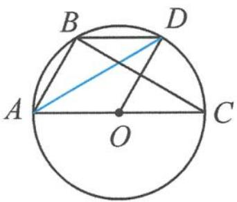

第2题图

A. $a + b$

B. $\frac{1}{2} a + b$

C. $a + \frac{1}{2} b$

D. $a + \frac{2}{3} b$

3. 在 $\triangle ABC$ 中,已知 $\overrightarrow{BD}=\lambda\overrightarrow{BC},\overrightarrow{CE}=\mu\overrightarrow{CB},\lambda,\mu\in\mathbb{R}$ ,若 $\overrightarrow{AD}-x\overrightarrow{AB}=\overrightarrow{EA}-y\overrightarrow{AC},x,y\in\mathbb{R}$ ,则 $x-y=$ \_\_\_\_.

4. 如图, 在直角梯形 $ABCD$ 中, 已知 $AB \parallel CD$ , $\angle DAB = 90^\circ$ , $AD = AB = 4$ , $CD = 1$ , 动点 $P$ 在边 $BC$ 上, 且满足 $\overrightarrow{AP} = m\overrightarrow{AB} + n\overrightarrow{AD}$ ( $m > 0, n > 0$ ), 则 $\frac{1}{m} + \frac{1}{n}$ 的最小值为 \_\_\_\_.

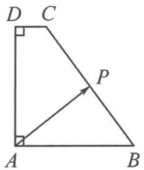

第4题图

5. 已知 $\overrightarrow{OA}, \overrightarrow{OB}$ 是两个单位向量，满足 $\overrightarrow{OA} \cdot \overrightarrow{OB} = 0$ . 若点 C 在 $\angle AOB$ 内，且 $\angle AOC = 30^{\circ}$ ，则 $\overrightarrow{OC} = m\overrightarrow{OA} + n\overrightarrow{OB} (m, n \in \mathbb{R} \text{ 且 } m \neq 0)$ ，则 $\frac{n}{m} =$ \_\_\_\_.

6. 已知向量 $\overrightarrow{OA}, \overrightarrow{OB}$ 的夹角为 $60^{\circ}, |\overrightarrow{OA}| = |\overrightarrow{OB}| = 2, \overrightarrow{OP} = \lambda \overrightarrow{OA} + \mu \overrightarrow{OB}$ ，其中 $\lambda, \mu \in R$ 。若 $|\overrightarrow{OP}| = 1$ ，则 $\lambda$ 的取值范围是 \_\_\_\_.

7. 已知向量 a, b 满足 $\left|a + b\right| = 3, \left|a - b\right| = 2$ ，则 $\frac{\left|a\right|}{a \cdot b}$ 的取值范围是 \_\_\_\_.

8. 已知 $a \perp b, |a - b| = 6, (c - a) \cdot (c - b) = -8$ ，则 $c \cdot (a + b)$ 的取值范围是 \_\_\_\_.

9. 已知向量 a, b 满足 $\left|2a+b\right|=3$ ，且 $a \cdot (a-b)=3$ ，则 $\left|a-b\right|$ 的最小值为 \_\_\_\_.

10. 已知向量 $a, b$ 满足 $|a| = 1, |b| = 2$ , 则 $|2a - b| + |a + 2b|$ 的最大值为 \_\_\_\_, 最小值为 \_\_\_\_.

# 第 3 讲

# 从向量共线定理到三点共线

向量共线定理是刻画三点共线的重要工具,也是沟通代数表示与几何图形的重要桥梁.本讲将带着大家一起学习共线定理的三种主要形式,并掌握一种作三点共线的方法,探寻斜坐标系下的直线方程与等和线的神奇联系.

共线定理有以下三种形式：

共线定理1 对平面内任意的两个向量 $a$ 和 $b (b \neq 0)$ , $a \parallel b$ 的充要条件是存在唯一的实数 $\lambda$ , 使得 $a = \lambda b$ .

共线定理 2 在平面内, A, B, P 三点共线的充要条件是存在唯一的实数 $\lambda$ , 使得 $\overrightarrow{AB} = \lambda \overrightarrow{AP}$ .

共线定理 3 若平面内三点 A, B, P 满足关系 $\overrightarrow{OP} = \lambda \overrightarrow{OA} + \mu \overrightarrow{OB}$ (O 为平面内的任意一点)，则 A, B, P 三点共线的充要条件是 $\lambda + \mu = 1$ .

三个定理之间可以相互推导,本质都是用来刻画三点共线.
特别地,对共线定理 3,为加深记忆,我们构造了一个现实模型.伸出三根手指(图 1),分别对应共起点的三个向量 $\overrightarrow{OP},\overrightarrow{OA},\overrightarrow{OB}$ .由平面向量基本定理知,任意一个向量(如 $\overrightarrow{OP}$ )可以被其他两个不共线的(基底)向量(如 $\overrightarrow{OA},\overrightarrow{OB}$ )表示,即 $\overrightarrow{OP}=x\overrightarrow{OA}+y\overrightarrow{OB}$ .如果指尖 $P,A,B$ 三点共线,则基底系数之和为 1(即 $x+y=1$ ),反之亦然.
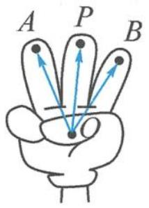

图1

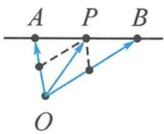

图2

其中 x, y 有其几何意义, 满足 $\frac{|AP|}{|PB|} = \left|\frac{y}{x}\right|$ , 当点 P 在线段 AB 上时, x > 0, y > 0; 当点 P 在线段 AB 外时, xy < 0.

## 3.1 从形到数,向量表示

> [!example]- 例 1 已知 A, B, P 是直线 l 上不同的三点, 点 O 在直线 l 外, 若 $\overrightarrow{OP} = m \overrightarrow{AP} + (2m - 3)\overrightarrow{OB} (m \in \mathbb{R})$ , 则 $\frac{|\overrightarrow{PB}|}{|\overrightarrow{PA}|} =$ \_\_\_\_.
分析 题干中给出了 A, B, P 三点共线, 还有一个向量被另外两个向量表示的形式, 所以考虑使用共线定理 3. 但注意到三个向量 $\overrightarrow{OP}, \overrightarrow{AP}, \overrightarrow{OB}$ 没有共起点, 故需要先将它们整理为共起点 O.
解答 已知 $\overrightarrow{OP} = m\overrightarrow{AP} + (2m - 3)\overrightarrow{OB} = m(\overrightarrow{OP} -\overrightarrow{OA}) + (2m - 3)\overrightarrow{OB}$ ，即
$\overrightarrow {O A} = \frac {m - 1}{m} \overrightarrow {O P} + \frac {2 m - 3}{m} \overrightarrow {O B}.$
因为 A, B, P 三点共线, 所以
$\frac {m - 1}{m} + \frac {2 m - 3}{m} = 1,$
解得 m=2 。所以 $\overrightarrow{OP}=2\overrightarrow{AP}+\overrightarrow{OB}$ ，即 $\overrightarrow{BP}=2\overrightarrow{AP}$ ，得
$\frac {| \overrightarrow {P B} |}{| \overrightarrow {P A} |} = 2.$

点评 三点共线(几何)到系数和为1(代数),从形到数注重向量表示,这里要注意三个向量共起点这个前提条件.

> [!example]- 例 2 如图 3.1-1, 已知 O 是 $\triangle ABC$ 的边 BC 的中点, 过点 O 作直线, 分别交 AB, AC 于点 M, N. 若 $\overrightarrow{AM} = m\overrightarrow{AB}, \overrightarrow{AN} = n\overrightarrow{AC}$ , 则 $\frac{1}{m} + \frac{1}{n} =$ \_\_\_\_.
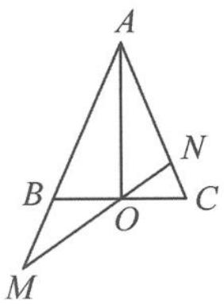

图3.1-1

分析 本题图形中有几组三点共线？分别如何用向量刻画？

①A,B,M三点共线,可用条件 $\overrightarrow{AM}=m\overrightarrow{AB}$ 刻画;

②A,N,C三点共线,可用条件 $\overrightarrow{AN}=n\overrightarrow{AC}$ 刻画;

③B,O,C三点共线,用什么向量式刻画?

④M,O,N三点共线,用什么向量式刻画?
注意到图中 BC 与 MN 相交于点 O，形成了一个“X”形，故对点 O 而言，有两组三点共线与之相关，因此可以“算两次”。
解答 因为 O 是 BC 的中点, 所以
$\overrightarrow {A O} = \frac {1}{2} \overrightarrow {A B} + \frac {1}{2} \overrightarrow {A C}.$
因为 $\overrightarrow{AM}=m\overrightarrow{AB},\overrightarrow{AN}=n\overrightarrow{AC}$ ，所以
$\overrightarrow {A O} = \frac {1}{2 m} \overrightarrow {A M} + \frac {1}{2 n} \overrightarrow {A N}.$
又 $O, M, N$ 三点共线，故 $\frac{1}{2m} + \frac{1}{2n} = 1$ ，即
$\frac {1}{m} + \frac {1}{n} = 2.$

点评 本题的几何图形中蕴含了四组三点共线,尤其是“X”形的两组三点共线,提供 $\overrightarrow{AO}$ 的两种表示方式,将几何的“图形”变成了代数的“表示”,让几何问题变得简洁明了.

> [!example]- 例 3 如图 3.1-2, 在 $\triangle ABC$ 中, 已知 $D$ 为 $BC$ 的中点, $E$ 为 $AD$ 的中点, 过点 $E$ 作一条直线 $MN$ , 分别交 $AB, AC$ 于点 $M, N$ . 若 $\overrightarrow{AM} = x \overrightarrow{AB}$ , $\overrightarrow{AN} = y \overrightarrow{AC}$ , 则 $x + 4y$ 的最小值是 \_\_\_\_.
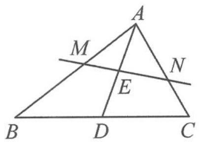

图3.1-2

解答 由题意得 $\overrightarrow{AD}=\frac{\overrightarrow{AB}+\overrightarrow{AC}}{2}$ ，即
$2 \overrightarrow {A E} = \frac {1}{2 x} \overrightarrow {A M} + \frac {1}{2 y} \overrightarrow {A N}.$
由 $M, N, E$ 三点共线知
$\frac {1}{4 x} + \frac {1}{4 y} = 1.$

易知 $x, y > 0$ ，故 $x + 4y = (x + 4y)\left(\frac{1}{4x} + \frac{1}{4y}\right) \geqslant \frac{9}{4}$ ，当 $x = \frac{3}{4}, y = \frac{3}{8}$ 时可取等号.

探究 本题中呈现的是三点共线“X”形图, 如果点 D, E 都是任意变化的, 那么你能推导出什么更一般的结论吗?
如图3.1-3, 在 $\triangle ABC$ 中, $D$ 为 $BC$ 上一点, 且 $\frac{BD}{DC} = \frac{a}{b}, E$ 为 $AD$ 上一点, 过点 $E$ 的直线与线段 $AB, AC$ 分别交于点 $M, N$ . 设 $\overrightarrow{AM} = x\overrightarrow{AB}, \overrightarrow{AN} = y\overrightarrow{AC}, \overrightarrow{AE} = z\overrightarrow{AD}$ , 则 $\frac{b}{x} + \frac{a}{y} = \frac{a + b}{z}$ .
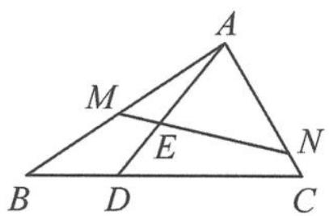

图3.1-3

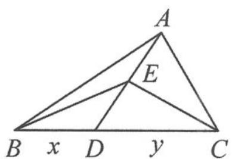

图3.1-4

类似地,在平面几何中,如图 3.1-4,在 $\triangle ABC$ 中, $D$ 为 $BC$ 上一点, $E$ 为 $AD$ 上一点.设 $BD=x,DC=y$ ,则
$\frac {S _ {\triangle A B E}}{S _ {\triangle A E C}} = \frac {S _ {\triangle B E D}}{S _ {\triangle D E C}} = \frac {S _ {\triangle A B D}}{S _ {\triangle A D C}} = \frac {B D}{D C} = \frac {x}{y}.$

用向量可以表示: 若 E 为 $\triangle ABC$ 内一点, $S_{B}, S_{C}, S$ 分别表示 $\triangle AEC, \triangle AEB, \triangle ABC$ 的面积. 因为 $\overrightarrow{AE} = \frac{AE}{AD} \overrightarrow{AD}$ , 且 $\overrightarrow{AD} = \frac{y}{x + y} \overrightarrow{AB} + \frac{x}{x + y} \overrightarrow{AC} = \frac{S_{\triangle ACD}}{S} \overrightarrow{AB} + \frac{S_{\triangle ABD}}{S} \overrightarrow{AC}$ , 所以
$\overrightarrow {A E} = \frac {S _ {B}}{S} \overrightarrow {A B} + \frac {S _ {C}}{S} \overrightarrow {A C}.$

## 3.2 从数到形,关注系数

> [!example]- 例 1 设 $A_{1}, A_{2}, A_{3}, A_{4}$ 是平面直角坐标系中两两不同的四个点，若 $\overrightarrow{A_{1}A_{3}} = \lambda \overrightarrow{A_{1}A_{2}} (\lambda \in \mathbb{R}), \overrightarrow{A_{1}A_{4}} = \mu \overrightarrow{A_{1}A_{2}} (\mu \in \mathbb{R})$ ，且 $\frac{1}{\lambda} + \frac{1}{\mu} = 2$ ，则称 $A_{3}, A_{4}$ 调和分割 $A_{1}, A_{2}$ 。已知平面上的点 C, D 调和分割点 A, B，则下面说法正确的是（）。
A. $C$ 可能是线段 $A B$ 的中点  
B. $D$ 可能是线段 $A B$ 的中点  
C. C, D 可能同时在线段 AB 上  
D. C, D 不可能同时在线段 AB 的延长线上
分析 $\overrightarrow{A_1A_3} = \lambda \overrightarrow{A_1A_2} (\lambda \in \mathbb{R}), \overrightarrow{A_1A_4} = \mu \overrightarrow{A_1A_2} (\mu \in \mathbb{R})$ ，说明 $A_1, A_2, A_3, A_4$ 四点共线，由共线定理知 $\lambda, \mu$ 有明确的几何意义.
解答 若 C 或 D 是线段 AB 的中点, 则 $\lambda = \frac{1}{2}$ 或 $\mu = \frac{1}{2}$ , 与 $\frac{1}{\lambda} + \frac{1}{\mu} = 2$ 不符, 故选项 A, B 错误.
若点 C, D 同时在线段 AB 上，则 $0 < \lambda < 1, 0 < \mu < 1$ ，得 $\frac{1}{\lambda} + \frac{1}{\mu} > 2$ ，矛盾，故选项 C 错误。
若点 C, D 同时在线段 AB 的延长线上，则 $\lambda > 1, \mu > 1$ ，得 $0 < \frac{1}{\lambda} + \frac{1}{\mu} < 2$ ，故点 C, D 不可能同时在线段 AB 的延长线上，选项 D 正确。
故选 D.

> [!example]- 例 2 在 $\triangle ABC$ 中, $AB$ 边上的中线 $CO=2$ , 若动点 $P$ 满足 $\overrightarrow{AP}=\sin^{2}\theta\overrightarrow{AO}+\cos^{2}\theta\overrightarrow{AC}$ ( $\theta\in\mathbb{R}$ ), 则 $(\overrightarrow{PA}+\overrightarrow{PB})\cdot\overrightarrow{PC}$ 的最小值是 \_\_\_\_.
解答 因为 $\overrightarrow{AP} = \sin^2\theta \overrightarrow{AO} +\cos^2\theta \overrightarrow{AC} (\theta \in \mathbb{R})$ ，系数之和为1，故 $C,P,O$ 三点共线，且 $\sin^2\theta ,\cos^2\theta \in [0,1]$ ，所以点 $P$ 在线段 $OC$ 上.
设 $|\overrightarrow{PO}| = t (t \in [0, 2])$ ，则 $|\overrightarrow{PC}| = 2 - t$ ，故
$(\overrightarrow {P A} + \overrightarrow {P B}) \cdot \overrightarrow {P C} = 2 \overrightarrow {P O} \cdot \overrightarrow {P C} = 2 t (2 - t) \times (- 1) = 2 t ^ {2} - 4 t.$
当 t=1 时, 取得最小值 -2.

> [!example]- 例 3 在 $\triangle ABC$ 中,已知 $AB=4$ ,点 $O$ 为三角形外接圆的圆心.若 $\overrightarrow{AO}=x\overrightarrow{AB}+y\overrightarrow{AC}$ $(x,y\in\mathbf{R},x\neq0)$ , $x+2y=1$ ,则 $\triangle ABC$ 面积的最大值为 \_\_\_\_.
分析 题干中给出了 $\overrightarrow{AO}=x\overrightarrow{AB}+y\overrightarrow{AC}(x,y\in\mathbb{R},x\neq0)$ ，这是共起点向量的表示形式，但系数和不是1，因此需要经过合理配凑，才能使用三点共线的结论。
解答 取 AC 的中点为 D, 则
$\overrightarrow {A O} = x \overrightarrow {A B} + 2 y \overrightarrow {A D} (x, y \in \mathbf {R}).$
因为 $x+2y=1$ ，所以 O, B, D 三点共线，如图 3.2-1。又因为 OD 为弦心距，所以 $OD \perp AC$ ，故 AB = BC = 4。所以
$S _ {\triangle A B C} = \frac {1}{2} A B \cdot B C \cdot \sin B = 8 \sin B \leqslant 8,$
当且仅当 $B=\frac{\pi}{2}$ 时， $S_{\triangle ABC}$ 取得最大值 8.

点评 系数和为 1(代数)⇒三点共线(几何),从数到形重配凑.

> [!example]- 例 4 如图 3.2-2, 已知正方形 ABCD 的边长为 4, $\overrightarrow{AB} = 4 \overrightarrow{AE}, \overrightarrow{AF} = \lambda \overrightarrow{AD}, \lambda \in (0,1)$ , 点 A 关于直线 EF 的对称点为 G. 当 $\left|\overrightarrow{GB} + 3 \overrightarrow{GC}\right|$ 取最小值时, $\lambda =$ \_\_\_\_.
分析 本题要求向量的模长,于是得研究 $\overrightarrow{GB}+3\overrightarrow{GC}$ 对应哪个向量.如果
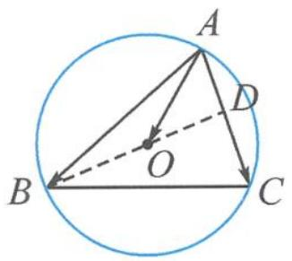

图3.2-1

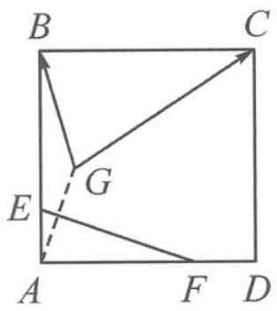

图3.2-2

直接作图, $\overrightarrow{GB}+3\overrightarrow{GC}=\overrightarrow{GM}$ ,显然点G和点M都是动点,不易求 $|\overrightarrow{GM}|$ .
解答 由已知得
$\overrightarrow {G B} + 3 \overrightarrow {G C} = 4 \left(\frac {\overrightarrow {G B}}{4} + \frac {3 \overrightarrow {G C}}{4}\right) = 4 \overrightarrow {G H}.$
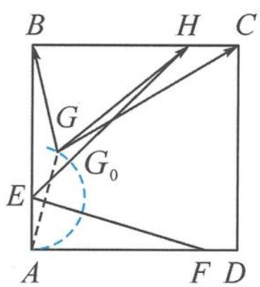

图3.2-3

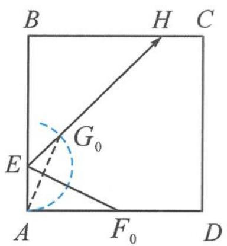

图3.2-4

点 $H$ 为 $BC$ 的四等分点, 为定点, 所以只需研究动点 $G$ 的轨迹. 由对称性知 $|EA| = |EG| = 1$ , 所以点 $G$ 的轨迹是以 $E$ 为圆心, 1 为半径的圆的一部分, 如图3.2-3. 所以
$\left| \overrightarrow {G B} + 3 \overrightarrow {G C} \right| _ {\min} = 4 \left| \overrightarrow {G H} \right| _ {\min} = 4 \left| \overrightarrow {G _ {0} H} \right| = 4 (\left| \overrightarrow {E H} \right| - 1) = 4 (3 \sqrt {2} - 1),$

且 $\angle BEH = \frac{\pi}{4}$ ，如图3.2-4，所以 $\angle G_0EF_0 = \angle AEF_0 = \frac{3\pi}{8}$ ，所以
$\frac {| A F _ {0} |}{| A E |} = \tan \frac {3 \pi}{8} = 1 + \sqrt {2}.$
从而 $|AF_{0}| = 1 + \sqrt{2}$ ，所以 $\lambda = \frac{1 + \sqrt{2}}{4}$ .

点评 本题要充分体会第一步提取系数4的价值,这是逆用共线定理3,作出几何图形,使得原本求“动动距”的问题变为求“定动距”,降低思考难度.一般地, $a\overrightarrow{OA}+b\overrightarrow{OB}=(a+b)\left(\frac{a}{a+b}\overrightarrow{OA}+\frac{b}{a+b}\overrightarrow{OB}\right)=(a+b)\overrightarrow{OM}$ ,其中点M为直线AB上的定点.

## 3.3 数形结合,无中生有

> [!example]- 例 1 已知扇形 AOB 的圆心角为 $120^{\circ}$ ，半径为 1，点 C 在圆弧 $\widehat{AB}$ 上运动。若 $\overrightarrow{OC} = x \overrightarrow{OA} + y \overrightarrow{OB}$ ，其中 $x, y \in R$ ，则 $x + y$ 的最大值是 \_\_\_\_。
分析 题干给出了向量表示式 $\overrightarrow{OC}=x\overrightarrow{OA}+y\overrightarrow{OB}$ ，要求系数和 $x+y$ 的值。如果C,A,B三点共线，那就完美了。但显然这三点不共线，于是要创造出三点共线。
解答 如图 3.3-1, 连接 AB, 记 AB 与 OC 交于点 D, 则形成了一个 “X”形图. 因为 O, D, C 三点共线, 所以 $\overrightarrow{OD} = m \overrightarrow{OC}$ . 又因为 $\overrightarrow{OC} = x \overrightarrow{OA} + y \overrightarrow{OB}$ , 故
$\overrightarrow {O D} = m \overrightarrow {O C} = m x \overrightarrow {O A} + m y \overrightarrow {O B}.$
又因为 A, B, D 三点共线，故 $mx + my = 1$ ，得
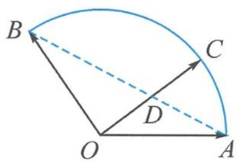

图3.3-1

$x + y = \frac {1}{m}.$

思考: $\frac{1}{m}$ 有什么意义?

m 是我们引入的参数, 刻画的是 $\left|\overrightarrow{OD}\right|$ 与 $\left|\overrightarrow{OC}\right|$ 的比值. 故 $x + y = \frac{1}{m} = \frac{\left|\overrightarrow{OC}\right|}{\left|\overrightarrow{OD}\right|} = \frac{1}{\left|\overrightarrow{OD}\right|}(x + y)$ 的大小仅与 $\left|\overrightarrow{OD}\right|$ 的长度有关了), 当且仅当 $OD \perp AB$ 时, $\left|\overrightarrow{OD}\right|_{\min} = \frac{1}{2}$ , 故 $(x + y)_{\max} = 2$ .

回想我们伸出的三根手指, 假设三个指尖共线(实际上, 正常人的中指最长, 与食指、无名指的指尖是不可能共线的). 如图 3.3-2, 我们不妨连接食指与无名指的指尖, 与中指产生交点, 从而形成“X”形图.

遇到求向量表达式 $\overrightarrow{OP}=\lambda\overrightarrow{OA}+\mu\overrightarrow{OB}$ 的系数和问题,若A,B,P三点不共线,那么我们就无中生有,作出新的三点共线.
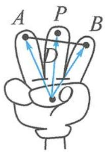

图3.3-2

步骤一:先确保三个向量共起点.

步骤二:作三点共线.取向量 $\overrightarrow{OA},\overrightarrow{OB}$ 的终点A,B的连线AB与OP所在直线的交点D,则A,B,D三点共线.这里的三点共线是作出来的,而不仅仅是由观察得出的,具有一般性.

步骤三:利用两组三点共线,得到系数和的目标式.

> [!example]- 例 2 已知 O 为 $\triangle ABC$ 的外心， $\angle ABC = 60^{\circ}$ ， $\overrightarrow{BO} = \lambda \overrightarrow{BA} + \mu \overrightarrow{BC}$ ，则（）.
A. $\lambda + \mu$ 的最小值为 $\frac{1}{2}$ , 此时 $\triangle ABC$ 为直角三角形  
B. $\lambda + \mu$ 的最大值为 $\frac{1}{2}$ , 此时 $\triangle ABC$ 为直角三角形  
C. $\lambda + \mu$ 的最小值为 $\frac{2}{3}$ , 此时 $\triangle ABC$ 为等边三角形  
D. $\lambda + \mu$ 的最大值为 $\frac{2}{3}$ ，此时 $\triangle ABC$ 为等边三角形
分析 题干给出了向量表示式 $\overrightarrow{BO}=\lambda\overrightarrow{BA}+\mu\overrightarrow{BC}$ ，但没有现成的“X”形图.
解答 如图 3.3-3,作单位圆 O, 点 B 在圆弧上运动,保持圆周角 $\angle ABC = 60^{\circ}$ . 延长 BO, 交边 AC 于点 D. 因为 B, O, D 三点共线,故设 $\overrightarrow{BD} = m \overrightarrow{BO}$ , 则
$\overrightarrow {B D} = m \lambda \overrightarrow {B A} + m \mu \overrightarrow {B C}.$
由 $A, C, D$ 三点共线可知
$m \lambda + m \mu = 1.$
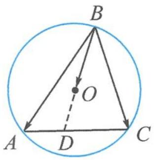

图3.3-3

从而
$\lambda + \mu = \frac {1}{m} = \frac {| \overrightarrow {B O} |}{| \overrightarrow {B D} |} = \frac {| \overrightarrow {B O} |}{| \overrightarrow {B O} | + | \overrightarrow {O D} |} = \frac {1}{1 + | \overrightarrow {O D} |}.$
显然, 当 $OD \perp AC$ 时, $|\overrightarrow{OD}|$ 取得最小值 $\frac{1}{2}$ , 则 $\lambda + \mu$ 取得最大值 $\frac{2}{3}$ , 此时 $\triangle ABC$ 为等边三角形. 故选 D.

点评 本题需要延长 BO, 交 AC 于点 D, 形成一个“T”形图.

> [!example]- 例 3 如图 3.3-4, 在正方形 ABCD 中, 已知 E 为 AB 的中点, P 是以 A 为圆心, AB 为半径的圆弧上的任意一点. 设向量 $\overrightarrow{AC} = \lambda \overrightarrow{DE} + \mu \overrightarrow{AP}$ , 则 $\lambda + \mu$ 的最小值为 \_\_\_\_.
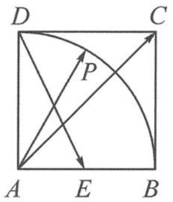

图3.3-4

分析 题干给出了向量表示式 $\overrightarrow{AC}=\lambda\overrightarrow{DE}+\mu\overrightarrow{AP}$ ，但三个向量没有共起点。
解答 如图 3.3-5, 将 $\overrightarrow{DE}$ 平移到 $\overrightarrow{AF}$ , (步骤一: 确保三个向量共起点)

连接 FP, 交 AC 于点 G. (步骤二: 作出三点共线)
由于 A, G, C 三点共线, 故
$\overrightarrow {A G} = m \overrightarrow {A C} = m \lambda \overrightarrow {A F} + m \mu \overrightarrow {A P}.$
由于 P, G, F 三点共线，故 $m\lambda + m\mu = 1$ ，即
$\lambda + \mu = \frac {1}{m} = \frac {| \overrightarrow {A C} |}{| \overrightarrow {A G} |}.$
因为 $|\overrightarrow{AC}|$ 固定, 故求 $\lambda + \mu$ 的最小值, 即求当点 $P$ 在圆弧上运动时, $|\overrightarrow{AG}|$ 取得的最大值.
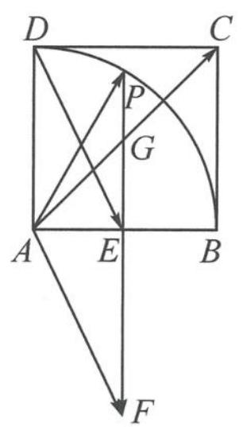

图3.3-5

图3.3-6

如图 3.3-6, 当点 P 运动到点 B 时, $\left|\overrightarrow{AG}\right|$ 取得的最大值为 $2\left|\overrightarrow{AC}\right|$ , 此时 $\lambda + \mu$ 取得的最小值为 $\frac{1}{2}$ .

> [!example]- 例 4 已知单位向量 a, b 的夹角为 $\frac{\pi}{3}$ ，设向量 $c = xa + yb, x, y \in R$ 。若 $|c - a - b| = 1$ ，则 $x + 2y$ 的最大值为 \_\_\_\_.
解答 如图 3.3-7, 作 $a=\overrightarrow{OA}, b=\overrightarrow{OB}, a+b=\overrightarrow{OD}$ . 由 $|c-a-b|=1$ 可知, 点 C 在以 D 为圆心, 1 为半径的圆上.

图3.3-7

$\overrightarrow{OC} = x\overrightarrow{OA} +y\overrightarrow{OB} = x\overrightarrow{OA} +2y\cdot \frac{\overrightarrow{OB}}{2} = x\overrightarrow{OA} +2y\overrightarrow{OE}.$ （其中 $E$ 为 $OB$ 的中点）
因为要求的是系数和 $x + 2y$ ，所以作三点共线.连接 $AE$ ，交 $OC$ 于点 $G$ ，则
$\overrightarrow {O G} = \lambda \overrightarrow {O C} = x \lambda \overrightarrow {O A} + 2 y \lambda \overrightarrow {O E}.$
由于 A, G, E 三点共线，故 $x\lambda + 2y\lambda = 1$ ，即
$x + 2 y = \frac {1}{\lambda} = \frac {| \overrightarrow {O C} |}{| \overrightarrow {O G} |}.$

这里又出现了比值,但随着点 C 的运动,这个比值的分子、分母都在变化,不像前面几道例题中比值仅与一个变量相关.怎么办?自然联想到我们曾经在初中学过的平行线分线段成比例.

过点 C 作 $CF \parallel AE$ ，交直线 OB 于点 F。由相似比可知
$x + 2 y = \frac {| \overrightarrow {O C} |}{| \overrightarrow {O G} |} = \frac {| \overrightarrow {O F} |}{| \overrightarrow {O E} |} = 2 | \overrightarrow {O F} |.$
于是,双变量转为单变量,求 $x+2y$ 的最大值,即求 $\left|\overrightarrow{OF}\right|$ 的最大值.
显然, 当 $HI$ 与圆相切时, $|\overrightarrow{OF}|$ 的最大值为 $|\overrightarrow{OI}| = \frac{5}{2}$ , 所以 $x + 2y$ 的最大值为 5.

点评 在本题的解法中又出现了一条新的辅助线 $CF$ . 有趣的是, 对于直线 $CF$ 上的任意一点 $M$ , 总有 $\overrightarrow{OM} = m\overrightarrow{OA} + n\overrightarrow{OE}$ , 且保持 $m + n = \frac{1}{\lambda} = \frac{|\overrightarrow{OF}|}{|\overrightarrow{OE}|}$ 为定值. 我们一般将这条直线称为等和线. 这是等和线推平行线的由来.

一般地,如图 3.3-8, $O$ 是直线 $A B$ 外一点, 满足 $\overrightarrow { O C } = x \overrightarrow { O A } + y \overrightarrow { O B }, x + y = k$ 为定值的所有点 $C$ 的集合是一条平行于 $A B$ 的直线 $l$ , 称之为等和线, 并满足以下性质:  
（1） 当 k=0 时, 直线 l 过点 O;  
（2） 当 k<0 时, 直线 l 与直线 AB 位于点 O 异侧;  
（3） 当 0 < k < 1 时, 直线 l 位于点 O 与直线 AB 之间;  
（4） 当 k=1 时, 直线 l 即为直线 AB;  
（5） 当 k > 1 时, 直线 AB 位于点 O 与直线 l 之间;  
（6） 点 O 到直线 l 与到直线 AB 的距离之比为 $\left| k \right|$ .

图3.3-8

我们可以看到,等和线是共线定理、三点共线的衍生产物,只有搞懂其原理,才能让那条平行线添得合情合理,顺理成章.

步骤一:先确保三个向量共起点,并按需求配凑系数.

步骤二:确定等值为 1 的直线——基准线;

步骤三:平移直线保证与动点的可行域有交点,分析何处取得最大值和最小值,并利用平面几何知识,计算出最大值或最小值.

这三个步骤与之前作三点共线法的三个步骤异曲同工.

> [!example]- 例 5 已知正三角形 ABC 的边长为 2, D 是边 BC 的中点, 动点 P 满足 $\left|\overrightarrow{PD}\right| \leqslant 1$ , 且 $\overrightarrow{AP} = x\overrightarrow{AB} + y\overrightarrow{AC}$ , 其中 $x + y \geqslant 1$ , 则 $2x + y$ 的取值范围是 \_\_\_\_.
解答 由 $|\overrightarrow{PD}| \leqslant 1$ 可知, 点 $P$ 落在以点 $D$ 为圆心, 1 为半径的圆内. 又 $\overrightarrow{AP} = x\overrightarrow{AB} + y\overrightarrow{AC}$ , 且 $x + y \geqslant 1$ , 根据等和线知识可知, 点 $P$ 落直线 $BC$ 的下方 (含 $BC$ ), 故点 $P$ 落在图3.3-9所示的下半圆内. 又
$\overrightarrow {A P} = 2 x \cdot \frac {\overrightarrow {A B}}{2} + y \overrightarrow {A C} = 2 x \overrightarrow {A A ^ {'}} + y \overrightarrow {A C},$
所以连接 $A'C$ （和为1的基准线），作 $A'C$ 的平行线（和为 $k$ 的等和线）.

图3.3-9

图3.3-10

如图 3.3-10, 显然, 当点 P 位于点 C 处时, $2x + y$ 取到最小值 1;
当点 P 位于点 K（半圆与平行于 $A'C$ 的切线的切点）时， $2x + y$ 取到最大值.
由相似三角形知识可知,最大值等于 $\frac{|AM|}{|AA'|}=\frac{5}{2}$ .
所以 $2x+y$ 的取值范围为 $\left[1,\frac{5}{2}\right]$ .

点评 利用等和线知识,可以快速确定点 P 的位置,类似于线性规划中确定可行域的过程.

> [!example]- 例 6 如图 3.3-11, 在直角梯形 ABCD 中, 已知 $AB \perp AD, AB \parallel DC, AB = 2, AD = DC = 1$ . 以 C 为圆心, $\frac{1}{2}$ 为半径作圆弧, 点 P 在图中扇形区域内 (包含边界) 运动. 若 $\overrightarrow{AP} = x \overrightarrow{AB} + y \overrightarrow{BC}$ , 其中 $x, y \in R$ , 则 4x - y 的取值范围是 \_\_\_\_.

图3.3-11

解答 如图 3.3-12, 易得
$\overrightarrow {A P} = x \overrightarrow {A B} + y \overrightarrow {B C} = 4 x \cdot \frac {\overrightarrow {A B}}{4} - y \overrightarrow {A H} = 4 x \overrightarrow {A I} - y \overrightarrow {A H}.$
其中 $I$ 为 $AB$ 的四等分点, $\overrightarrow{BC} = -\overrightarrow{AH}$ . 作直线 $HI$ , 过点 $P$ 作 $HI$ 的平行线, 交直线 $AD$ 于点 $M$ . 因为
$\overrightarrow {A D} = \overrightarrow {A B} + \overrightarrow {B C} + \overrightarrow {C D} = \frac {1}{2} \overrightarrow {A B} + \overrightarrow {B C} = 2 \overrightarrow {A I} - \overrightarrow {A H},$
又 $2 + (-1) = 1$ ，故 $D, I, H$ 三点共线. 则
$4 x - y = \frac {| \overrightarrow {A P} |}{| \overrightarrow {A K} |} = \frac {| \overrightarrow {A M} |}{| \overrightarrow {A D} |} = | \overrightarrow {A M} |.$
显然, 当点 P 位于点 E 时, $4x - y = |\overrightarrow{AL}| = 2$ 为最小值.

图3.3-12

当点 P 位于点 G（圆弧与平行于 HI 的切线的切点）时， $4x - y = |\overrightarrow{AN}| = 3 + \frac{\sqrt{5}}{2}$ 为最大值.

点评 本题囊括了向量共起点、配系数、基准线、等和线等多个知识点,需要灵活掌握三个步骤,并反思每一步的合理性.要判断直线 $H I$ 与直线 $A D$ 交于何处,可先作图再利用向量知识或解三角形知识给出证明.此外,构建直角坐标系,利用解析几何配合坐标运算来求解向量问题也是常见的方法.

> [!example]- 例 7 如图 3.3-13, 在直角梯形 ABCD 中, 已知 $AB \perp AD, AD \parallel BC$ , AB = BC = 2AD = 2, E, F 分别为 BC, CD 的中点. 以 A 为圆心, AD 为半径的半圆分别交 BA 及其延长线于点 M, N, 点 P 在半圆 MDN 上运动. 若 $\overrightarrow{AP} = \lambda \overrightarrow{AE} + \mu \overrightarrow{BF}$ , 其中 $\lambda, \mu \in R$ , 则 $2\lambda - 5\mu$ 的取值范围是 \_\_\_\_.

图3.3-13

解答 已知 $AB \perp AD$ ，以 A 为原点，AB, AD 所在直线为 x 轴、y 轴建立平面直角坐标系，则 $A(0,0)$ , $B(2,0)$ , $C(2,2)$ , $D(0,1)$ , $E(2,1)$ , $F\left(1,\frac{3}{2}\right)$ .
因为点 P 在半圆 MDN 上运动, 故设 $P(\cos \alpha, \sin \alpha) (\alpha \in [0, \pi])$ , 所以
$\overrightarrow {A P} = (\cos \alpha , \sin \alpha), \overrightarrow {A E} = (2, 1), \overrightarrow {B F} = \left(- 1, \frac {3}{2}\right).$
因为 $\overrightarrow{AP} = \lambda \overrightarrow{AE} + \mu \overrightarrow{BF}$ , 所以 $(\cos \alpha, \sin \alpha) = (2\lambda, \lambda) + (-\mu, \frac{3}{2}\mu) = (2\lambda - \mu, \lambda + \frac{3}{2}\mu)$ , 即 $\left\{\begin{aligned}&\cos \alpha=2\lambda-\mu,\\&\sin \alpha=\lambda+\frac{3}{2}\mu,\end{aligned}\right.$ 解得
$\left\{ \begin{array}{l} \lambda = \frac {1}{4} \sin \alpha + \frac {3}{8} \cos \alpha , \\ \mu = \frac {1}{2} \sin \alpha - \frac {1}{4} \cos \alpha . \end{array} \right.$
所以
$2 \lambda - 5 \mu = 2 \cos \alpha - 2 \sin \alpha = - 2 \sqrt {2} \sin \left(\alpha - \frac {\pi}{4}\right).$
因为 $\alpha\in[0,\pi]$ ，所以 $2\lambda-5\mu\in[-2\sqrt{2},2]$ .

点评 本题题干中用向量表示的三个向量不共起点,系数配凑也很复杂,用等和线等方式能做但未必简单.因此,建立合适的直角坐标系,直接将向量问题用坐标、三角函数来解决,更为简洁且易操作.

## 3.4 寻根溯源, 直线方程

我们知道向量表示式 $\overrightarrow{OP}=x\overrightarrow{OA}+y\overrightarrow{OB}$ 中的系数x,y以及 $x+y$ 不只是一堆参数,还有着重要的数学意义.第2讲我们已经学习了正交基底下的直角坐标系和斜基底下的斜坐标系,在直角坐标系下, $x+y=1$ 表示过(1,0)和(0,1)的直线,那么在斜坐标系下, $x+y=1$ 又表示什么呢?

结论1 如图3.4-1, 在斜坐标系下, 当且仅当 $P(x, y)$ 位于直线 $AB$ 上时, $(x, y)$ 满足方程 $x + y = 1$ , 即直线 $AB$ 的方程为 $x + y = 1$ . 同理, 直线 $BA', A'B', AB'$ 的方程分别为 $-x + y = 1, -x - y = 1, x - y = 1$ .

结论2 如图3.4-2, 在斜坐标系下, $x + y = k (k \in \mathbb{R})$ 为一族平行直线, 即等和线. 将 $x + y = k$ 写成 $\frac{x}{k} + \frac{y}{k} = 1$ 的形式, 我们就可以类比直角坐标系, 称 $k$ 为直线 $x + y = k$ 在向量 $\overrightarrow{OA}, \overrightarrow{OB}$ 上的“截距”. 因此研究等和线的和值其实就是研究斜坐标系下的“截距”.

图3.4-1

图3.4-2

图3.4-3

一般地,如图 3.4-3, $\frac{x}{m}+\frac{y}{n}=1$ 也表示斜坐标系下的直线截距式方程.

结论 3 类比直角坐标系下线性规划中的可行域, 在斜坐标系下, 同样可以画出可行域. 例如 $x + y < k$ 表示直线 $x + y = k$ 的左下部分, $x + y > k$ 表示直线 $x + y = k$ 的右上部分, 依旧遵循“直线定界, 原点定域”的法则.

> [!example]- 例 1 已知 G 是边长为 2 的等边三角形 ABC 的重心, D, E 分别为 AB, AC 上的动点, 满足 $\overrightarrow{AD} = m \overrightarrow{DB}, \overrightarrow{AE} = n \overrightarrow{EC}$ , 且 $\frac{2}{m} + \frac{1}{n} = 3$ . 若 $|\lambda \overrightarrow{DE} + \overrightarrow{DG}|$ 的最小值为 $f(m)$ , 则 $f(m)$ 的最大值
为
解答 解法一:构建基底

取 $\overrightarrow{AB},\overrightarrow{AC}$ 为基底，则 $\overrightarrow{AD} = m\overrightarrow{DB}$ ，即
$\overrightarrow {A D} = \frac {m}{m + 1} \overrightarrow {A B};$
$\overrightarrow{AE}=n\overrightarrow{EC}$ ，即
$\overrightarrow {A E} = \frac {n}{n + 1} \overrightarrow {A C}.$
注意到题干给出的 $\frac{2}{m} +\frac{1}{n} = 3$ ，是否能配成系数和为1？

要出现 $\frac{2}{m}$ 和 $\frac{1}{n}$ 的形式，则有 $\left(1 + \frac{1}{m}\right)\overrightarrow{AD} = \overrightarrow{AB},\left(1 + \frac{1}{n}\right)\overrightarrow{AE} = \overrightarrow{AC}$ ，所以
$\left(2 + \frac {2}{m}\right) \overrightarrow {A D} + \left(1 + \frac {1}{n}\right) \overrightarrow {A E} = 2 \overrightarrow {A B} + \overrightarrow {A C}.$
因为 $2 + \frac{2}{m} + 1 + \frac{1}{n} = 6$ ，所以
$\frac {1}{6} \left[ \left(2 + \frac {2}{m}\right) \overrightarrow {A D} + \left(1 + \frac {1}{n}\right) \overrightarrow {A E} \right] = \frac {1}{3} \overrightarrow {A B} + \frac {1}{6} \overrightarrow {A C}.$

记 $\frac{1}{3}\overrightarrow{AB} +\frac{1}{6}\overrightarrow{AC} = \overrightarrow{AM}$ ，则 $D,M,E$ 三点共线.

(这里是三点共线系数和为1公式的逆用,通过配凑系数得到三点共线)
故 $DE$ 不是随意变化的直线, 而是过定点 $M$ 的直线, 且 $\overrightarrow{AM} = \frac{1}{3}\overrightarrow{AB} + \frac{1}{6}\overrightarrow{AC}$ . $|\lambda \overrightarrow{DE} + \overrightarrow{DG}|$ 的最小值 $f(m)$ 的几何意义是定点 $G$ 到直线 $DE$ 的垂直距离. 直线 $DE$ 过定点 $M$ , 故 $f(m)$ 的最大值为 $|\overrightarrow{GM}|$ .
因为 $\overrightarrow{AG} = \frac{1}{3}\overrightarrow{AB} +\frac{1}{3}\overrightarrow{AC},\overrightarrow{AM} = \frac{1}{3}\overrightarrow{AB} +\frac{1}{6}\overrightarrow{AC}$ ，所以
$| \overrightarrow {G M} | = | \overrightarrow {A M} - \overrightarrow {A G} | = \left| \frac {1}{6} \overrightarrow {A C} \right| = \frac {1}{3}.$
解法二: 斜坐标系下的直线截距式方程

以 $\overrightarrow{AB},\overrightarrow{AC}$ 为基底建立斜坐标系.
$\overrightarrow {A D} = \frac {m}{m + 1} \overrightarrow {A B} = p \overrightarrow {A B}, \overrightarrow {A E} = \frac {n}{n + 1} \overrightarrow {A C} = q \overrightarrow {A C},$
则 $D(p,0),E(0,q)$ ，其中 $p,q$ 就是斜坐标系下的截距.由 $\frac{2}{m} +\frac{1}{n} = 3$ 可知 $\frac{2}{p} +\frac{1}{q} = 6$ ，则
$\frac {\frac {1}{3}}{p} + \frac {\frac {1}{6}}{q} = 1.$

联想直角坐标系下的直线截距式方程 $\frac{x}{a} +\frac{y}{b} = 1$ ，可知直线 $DE$ 过点 $M\left(\frac{1}{3},\frac{1}{6}\right)$ ，即
$\overrightarrow {A M} = \frac {1}{3} \overrightarrow {A B} + \frac {1}{6} \overrightarrow {A C}.$
又因为 $\overrightarrow{AG} = \frac{1}{3}\overrightarrow{AB} +\frac{1}{3}\overrightarrow{AC}$ ，故
$| \overrightarrow {G M} | = | \overrightarrow {A M} - \overrightarrow {A G} | = \left| \frac {1}{6} \overrightarrow {A C} \right| = \frac {1}{3}.$

点评 实际上,出现 $\frac{x_{0}}{m}+\frac{y_{0}}{n}=1$ 这样的形式,就暗示了向量中过定点的截距式方程.

# 解法三: 建立直角坐标系
如图 3.4-4, 建立直角坐标系 $xOy$ , 则 $A(0, \sqrt{3}), B(-1, 0), C(1, 0)$ , 设直线 $l_{DE}: y = kx + b$ .

与 $l_{AB}: y = \sqrt{3}x + \sqrt{3}$ 联立得 $x_{D} = \frac{\sqrt{3} - b}{k - \sqrt{3}}$ ;

与 $l_{AC}: y = -\sqrt{3} x + \sqrt{3}$ 联立得 $x_E = \frac{\sqrt{3} - b}{k + \sqrt{3}}$ .
由 $\overrightarrow{AD} = m\overrightarrow{DB} = \frac{m}{m + 1}\overrightarrow{AB}$ 得 $\frac{\sqrt{3} - b}{k - \sqrt{3}} = -\frac{m}{m + 1}$ ，即 $\frac{-k + \sqrt{3}}{\sqrt{3} - b} = 1 + \frac{1}{m}$ .
由 $\overrightarrow{AE} = n\overrightarrow{EC} = \frac{n}{n + 1}\overrightarrow{AC}$ 得 $\frac{\sqrt{3} - b}{k + \sqrt{3}} = \frac{n}{n + 1}$ ，即 $\frac{k + \sqrt{3}}{\sqrt{3} - b} = 1 + \frac{1}{n}$ .
因为 $\frac{2}{m} +\frac{1}{n} = 3$ ，所以 $\frac{-k + 3\sqrt{3}}{\sqrt{3} - b} = 3 + \frac{2}{m} +\frac{1}{n} = 6$ ，所以 $k = 6b - 3\sqrt{3}$

图3.4-4

所以直线 $l_{DE}: y = kx + b = kx + \frac{k + 3\sqrt{3}}{6} = k\left(x + \frac{1}{6}\right) + \frac{\sqrt{3}}{2}$ ，故过定点 $M\left(-\frac{1}{6}, \frac{\sqrt{3}}{2}\right)$ .

过点 G 作 $GH \perp DE$ ，交 DE 于点 H. $\left|\lambda\overrightarrow{DE}+\overrightarrow{DG}\right|$ 的最小值 $f(m)$ 的几何意义是定点 G 到直线 DE 的距离 $|GH|$ .
由斜边大于直角边知 $|GM| > |GH|$ , 当 $DE \perp GM$ 时, $f(m)$ 取到最大值 $|GM|$ . 又 $G\left(0, \frac{\sqrt{3}}{3}\right)$ , 所以 $f(m)$ 的最大值为 $|GM| = \sqrt{\frac{1}{36} + \frac{3}{36}} = \frac{1}{3}$ .

点评 本题的一大新意点是过定点的直线,用向量如何表示?三点共线的向量表示是一种常见的表示形式,三点中有一个是定点,另外两个点的连线即为过定点的直线.因此,对基底表示向量时的三点共线系数和为1的定理正用、逆用都要熟练掌握.

至此,我们可以将向量共线定理的相关问题系统串联起来了.向量共线定理的三种表现形式各有侧重,尤其是共线定理3使用最为频繁.无论是“X”形图找三点共线“算两次”,还是直接利用等和线技巧,都源自于平面向量基本定理,它体现了从不确定性中寻找确定性的数学思维,利用图形确定变量取值的数学思想,可以将代数和几何进行完美融合,让你遇见一种简洁明快的数学美.

为帮助大家记忆和理解,特作打油诗一首作为小结:

三点共线表图形,基本定理是代数.

数形之间互转化,正向逆向各侧重.

形到数时重表示,数到形时看系数.

等和线与三共线,本质相同实直线.

# 思考题

1. 如图, 已知 $O$ 为 $\triangle ABC$ 所在平面内一点, $\overrightarrow{OC} = \frac{1}{4}\overrightarrow{OA}, \overrightarrow{OD} = \frac{1}{2}\overrightarrow{OB}$ , $AD$ 与 $BC$ 交于点 $M$ , 设 $\overrightarrow{OA} = a, \overrightarrow{OB} = b$ .  
（1）用 a, b 表示 $\overrightarrow{OM}$ .  
（2）过点 M 作 EF，交线段 OA 于点 E，交线段 BD 于点 F。设 $\overrightarrow{OE}=p\overrightarrow{OA},\overrightarrow{OF}=q\overrightarrow{OB}$ ，则 $\frac{1}{p}+\frac{3}{q}$ 是否为定值？如果是定值，求出这个定值。

2. 如图, 在 $\triangle ABC$ 中, 已知 $\overrightarrow{AQ} = \overrightarrow{QC}, \overrightarrow{AR} = \frac{1}{4}\overrightarrow{AB}, BQ$ 与 $CR$ 相交于点 $I, AI$ 的延长线与边 $BC$ 交于点 $P$ . 如果 $\overrightarrow{AI} = \overrightarrow{AB} + \lambda \overrightarrow{BQ} = \overrightarrow{AC} + \mu \overrightarrow{CR}$ , 则 $\lambda + \mu = \_\_\_\_, \overrightarrow{BP} = \_\_\_\_ \overrightarrow{BC}$ .

3. (多选)如图, 在凸四边形 $ABCD$ 中, 已知对边 $BC, AD$ 的延长线交于点 $E$ , 对边 $AB, DC$ 的延长线交于点 $F$ . 若 $\overrightarrow{BC} = \lambda \overrightarrow{CE}, \overrightarrow{ED} = \mu \overrightarrow{DA}$ , $\overrightarrow{AB} = 3 \overrightarrow{BF} (\lambda, \mu > 0)$ , 则 ( ).

A. $\overrightarrow{EB} = \frac{3}{4}\overrightarrow{EF} +\frac{1}{4}\overrightarrow{EA}$

B. $\lambda \mu = \frac{1}{4}$

C. $\frac{1}{\lambda} + \frac{1}{\mu}$ 的最大值为 4

D. $\frac{\overrightarrow{EC} \cdot \overrightarrow{AD}}{\overrightarrow{EB} \cdot \overrightarrow{EA}} \geqslant -\frac{4}{9}$

第1题图

第2题图

第3题图

4. 设 O 为 $\triangle ABC$ 外接圆的圆心, 若存在正实数 k, 使得 $\overrightarrow{AO} = \overrightarrow{AB} + k\overrightarrow{AC}$ , 则 k 的取值范围是 \_\_\_\_.

5. 已知梯形 ABCD 满足 AB = BC = CD， $\angle BAD = \frac{\pi}{3}$ ，平面内一点 P 满足 $\overrightarrow{PA} \cdot \overrightarrow{PD} = 0$ ，且 $\overrightarrow{PA} = x \overrightarrow{PB} + y \overrightarrow{PD}$ ，其中 x > 0，y > 0，则 $x + y$ 的最小值为 \_\_\_\_.

6. 如图, 在平行四边形 $ABCD$ 中, 已知 $AB = 3$ , $AD = 1$ , 在四边形 $ABCD$ 内部 (包含边界) 有一个动点 $M$ , 满足 $|\overrightarrow{CM}| = 1$ . 若 $\overrightarrow{AM} = x\overrightarrow{AB} + y\overrightarrow{AD}$ , 则 $y - x$ 的最大值为 \_\_\_\_.

  
第6题图

7. 已知平面向量 $a, b, c$ 满足 $|b| = 2, |a + b| = 1, c = \lambda a + \mu b$ 且 $\lambda + 2\mu = 1$ , 若对每一个确定的向量 $a$ , 记 $|c|$ 的最小值为 $m$ , 则当 $a$ 变化时, $m$ 的最大值为 \_\_\_\_.

8. 已知正方形 ABCD 的边长为 4, O 是正方形 ABCD 的中心, 过中心 O 的直线 l 与边 AB 交于点 M, 与边 CD 交于点 N, P 为平面上一点, 满足 $2 \overrightarrow{OP} = \lambda \overrightarrow{OB} + (1 - \lambda) \overrightarrow{OC}$ , 则 $\overrightarrow{PM} \cdot \overrightarrow{PN}$ 的最小值是 \_\_\_\_.  
9. 在平面直角坐标系中, 已知 $P(1,1), A, B$ 是单位圆 $x^{2} + y^{2} = 1$ 上的两点, 且 $AB = \sqrt{2}$ , 则 $|2\overrightarrow{PA} - \overrightarrow{PB}|$ 的取值范围是 \_\_\_\_.  
10. 设 O 是 $\triangle ABC$ 的外心, 满足 $\overrightarrow{CO} = t \overrightarrow{CA} + \left( \frac{1}{2} - \frac{3}{4} t \right) \overrightarrow{CB} (t \neq 0)$ , 若 $|\overrightarrow{AB}| = 4$ , 则 $\triangle ABC$ 面积的最大值为().

A. 4

B. $4\sqrt{3}$

C. 8

D. 16

# 第 4 讲

# 向量“三剑客”——模长、夹角与投影

向量的数量积是向量运算中最重要的运算之一. 我们知道 $a \cdot b = |a||b|\cos \theta$ , 即数量积与两个向量的模长及其夹角的余弦值这三大要素相关. 本讲我们介绍向量的模长、夹角与投影这三个重要概念.

## 4.1 向量的模长

向量的模长是向量的一个重要概念, 是刻画向量长度的重要量. 向量的模长既有明显的几何特征, 又与向量的运算有着紧密的联系.

#### 4. 1. 1 代数视角, 公式运算

> [!example]- 例 1 已知平面向量 a, b, |a| = 1, |b| = 2, a ⊥ (a - 2b), 则 |2a + b| = \_\_\_\_.
解答 因为 $a \perp (a - 2b)$ , 所以 $a \cdot (a - 2b) = 0$ , 得 $a \cdot b = \frac{1}{2}$ . 故
$\vert 2 \boldsymbol {a} + \boldsymbol {b} \vert^ {2} = \sqrt {(2 \boldsymbol {a} + \boldsymbol {b}) ^ {2}} = \sqrt {4 \boldsymbol {a} ^ {2} + 4 \boldsymbol {a} \cdot \boldsymbol {b} + \boldsymbol {b} ^ {2}} = \sqrt {4 + 4 \times \frac {1}{2} + 4} = \sqrt {1 0}.$

点评 求向量模长往往可以利用平方法,将模长转换为向量之间的运算(模的平方与数量积).

> [!example]- 例 2 已知向量 a, b 满足 $\left|a\right|=4, a \cdot b=-8$ ，则 $\left|a-3b\right|$ 的最小值是 \_\_\_\_.
解答 由已知得
$\vert \boldsymbol {a} - 3 \boldsymbol {b} \vert^ {2} = 1 6 - 6 \times (- 8) + 9 \vert \boldsymbol {b} \vert^ {2} = 9 \vert \boldsymbol {b} \vert^ {2} + 6 4.$
因为 $a \cdot b = -8 \geqslant -|a||b|$ ，所以 $|b| \geqslant 2$ 。故 $|a - 3b|^2 = 9|b|^2 + 64 \geqslant 100$ ，即
$\vert a - 3 b \vert \geqslant 1 0.$

点评 三大要素不足,故只能求模的取值范围.对模进行平方,可将模长问题转化为函数问题.

> [!example]- 例 3 已知单位向量 a, b, 则 $\left|a-2b\right|$ 的取值范围是 \_\_\_\_.
解答 解法一： $|a-2b|^{2}=a^{2}-4a\cdot b+4b^{2}=5-4\cos\theta\in[1,9]$ ，故 $|a-2b|\in[1,3]$ .
解法二： $1\leqslant ||a| - |2b||\leqslant |a - 2b|\leqslant |a| + |2b| = 3.$

点评 与模长有关的不等式主要有向量三角不等式 $||a| - |b|| \leqslant |a \pm b| \leqslant |a| + |b|$ .

> [!example]- 例 4 已知向量 $a=(\cos 25^{\circ},\sin 25^{\circ})$ , $b=(\sin 20^{\circ},\cos 20^{\circ})$ ，若 $c=a+tb(t\in\mathbb{R})$ ，则 $|c|$ 的最小值为 \_\_\_\_.
解答 由已知得
$\boldsymbol {c} = \boldsymbol {a} + t \boldsymbol {b} = (\cos 2 5 ^ {\circ} + t \sin 2 0 ^ {\circ}, \sin 2 5 ^ {\circ} + t \cos 2 0 ^ {\circ}),$
所以
$| c | = \sqrt {(\cos 2 5 ^ {\circ} + t \sin 2 0 ^ {\circ}) ^ {2} + (\sin 2 5 ^ {\circ} + t \cos 2 0 ^ {\circ}) ^ {2}} = \sqrt {t ^ {2} + \sqrt {2} t + 1} = \sqrt {\left(t + \frac {\sqrt {2}}{2}\right) ^ {2} + \frac {1}{2}} \geqslant \frac {\sqrt {2}}{2}.$

点评 坐标形式下的向量模长公式也要熟练掌握.

#### 4. 1.2 几何背景, 借力向量

> [!example]- 例 5 如图 4.1-1, 在 $\triangle ABC$ 中, 已知 $AC=BC=1, AB=\sqrt{3}, \overrightarrow{CE}=x\overrightarrow{CA}, \overrightarrow{CF}=y\overrightarrow{CB}$ , 其中 $x,y\in(0,1)$ , 且 $x+4y=1$ . 若 $M,N$ 分别是线段 $EF, AB$ 的中点, 当线段 $MN$ 的长度取最小值时, $x+y=$ \_\_\_\_.

图4.1-1

解答 取 $\overrightarrow{CA},\overrightarrow{CB}$ 为基底,由第1讲中的“中线模型”知
$\overrightarrow {M N} = \frac {1}{2} (\overrightarrow {E A} + \overrightarrow {F B}) = \left(\frac {1}{2} - \frac {x}{2}\right) \overrightarrow {C A} + \left(\frac {1}{2} - \frac {y}{2}\right) \overrightarrow {C B},$
所以
$\vert \overrightarrow {M N} \vert^ {2} = \left(\frac {1}{2} - \frac {x}{2}\right) ^ {2} + \left(\frac {1}{2} - \frac {y}{2}\right) ^ {2} - \left(\frac {1}{2} - \frac {x}{2}\right) \left(\frac {1}{2} - \frac {y}{2}\right).$
因为 $x + 4y = 1$ ，所以 $x = 1 - 4y\in (0,1)$ ，得 $y\in \left(0,\frac{1}{4}\right)$ ，代入上式得
$\vert \overrightarrow {M N} \vert^ {2} = \frac {1}{4} (2 1 y ^ {2} - 6 y + 1).$
当 $y=\frac{1}{7}$ 时有最小值, 此时 $x=\frac{3}{7}$ , 故 $x+y=\frac{4}{7}$ .

点评 向量模长概念源自有向线段的长度,因此在几何问题中要求线段长度,可以转化为求对应的向量的模长.

> [!example]- 例 6 已知向量 $a=(-1,\sqrt{3})$ , $\overrightarrow{OA}=a-b$ , $\overrightarrow{OB}=a+b$ , 若 $\triangle AOB$ 是以 O 为直角顶点的等腰直角三角形, 则 $\triangle AOB$ 的面积是 \_\_\_\_.
解答 解法一: 因为 $\triangle AOB$ 是以 $O$ 为直角顶点的等腰直角三角形, 所以 $|\overrightarrow{OA}|=|\overrightarrow{OB}|$ , 且 $\overrightarrow{OA}\cdot\overrightarrow{OB}=0$ , 即
$\vert a - b \vert = \vert a + b \vert , (a - b) \cdot (a + b) = 0.$
解得 $|a| = |b| = 2$ 且 $a \cdot b = 0$ , 故 $|a - b| = |a + b| = \sqrt{4 + 4} = 2\sqrt{2}$ . 所以
$S _ {\triangle A O B} = \frac {1}{2} | \overrightarrow {O A} | | \overrightarrow {O B} | = 4.$
解法二: 因为 $\triangle AOB$ 是以 O 为直角顶点的等腰直角三角形, 所以 $\left|\overrightarrow{AB}\right| = \left|\overrightarrow{OA} + \overrightarrow{OB}\right| = \left|2a\right| = 4$ , $\left|\overrightarrow{OA}\right| = \left|\overrightarrow{OB}\right| = 2\sqrt{2}$ , 从而 $S_{\triangle AOB} = \frac{1}{2} \left|\overrightarrow{OA}\right| \left|\overrightarrow{OB}\right| = 4$ .

点评 在求向量模长的过程中,除了用公式按部就班地进行计算,还可以利用数形结合的思想,往往能事半功倍.

#### 4. 1. 3 深度理解, 助力作图

向量的模长可以如何理解？

视角一:模长是一个向量的长度.

视角二:模长是两点之间的距离.

虽然面对的是相同的对象,但不同的视角却带来了不同的理解.

例如:请画出条件 $|a|=1$ , $|a-b|=1$ 表示的图形.

对 $|a|=1$ ，可以理解为向量a的长度为1，即 $|\overrightarrow{OA}|=1$ （视角一），故可先固定点A.

图4.1-2

对 $|a - b| = 1$ ，可以表示为 $|a - b| = |\overrightarrow{OA} -\overrightarrow{OB}| = |\overrightarrow{BA} |$ ，即点 $B$ 与点 $A$ 之间的距离为1（视角二).于是，点 $B$ 在以 $A$ 为圆心，1为半径的圆上运动，如图4.1-2.
又如:请画出条件 $|a|=1,|a+b|=1$ 表示的图形.

视角一: $|a + b| = 1$ 表示一个向量的长度为 1.

那么,是哪个向量呢? 可令 $a+b=\overrightarrow{OC}$ , 即 $|\overrightarrow{OC}|=1$ , 表示点 C 在以 O 为圆心, 1 为半径的圆上运动, 且 $b=\overrightarrow{OC}-\overrightarrow{OA}=\overrightarrow{AC}$ , 如图 4.1-3.

图4.1-3

图4.1-4

视角二: $|a + b| = |b - (-a)| = |\overrightarrow{OB} - \overrightarrow{OA_1}| = |\overrightarrow{A_1B}|$ , 即点 $B$ 与点 $A_1$ ( $A$ 关于 $O$ 的对称点)之间的距离为 1, 则点 $B$ 在以 $A_1$ 为圆心, 1 为半径的圆上运动, 如图 4.1-4.

对向量模长的理解有助于我们进行几何构图,看到一个向量的模长,不妨从两个视角考虑.

用视角一看待,就回答是哪个向量的模长.

用视角二看待,就回答是哪两个点之间的距离. 常见的有“定定距”“定动距”和“动动距”.

> [!example]- 例 7 若非零向量 a, b 满足 $\left|a + b\right| = \left|b\right|$ ，则（）.
A. $|2a| > |2a + b|$

B. $|2a| < |2a + b|$

C. $|2b| > |a + 2b|$

D. $|2b| < |a + 2b|$
分析 条件 $\left|a+b\right|=\left|b\right|$ ，能画出怎样的图形？

解答 视角一: 记 $b = \overrightarrow{OB}, a + b = \overrightarrow{OC}$ ，于是 $a = \overrightarrow{OC} - \overrightarrow{OB} = \overrightarrow{BC}$ ，能画出图 4.1-5 所示的图形；

图4.1-5

图4.1-6

图4.1-7

视角二： $|a+b|=|a-(-b)|=|\overrightarrow{B_{1}A}|=|\overrightarrow{B_{1}O}|$ ，能画出图4.1-6所示的图形.

以选项 C 为例, 如图 4.1-7 所示. $|a + 2b| = |a - (-2b)| = |\overrightarrow{OA} - \overrightarrow{OB_2}| = |\overrightarrow{B_2A}|$ . 因为 $|\overrightarrow{B_1B_2}| = |\overrightarrow{B_1O}| = |\overrightarrow{B_1A}|$ , 所以 $\triangle OAB_2$ 是直角三角形, 故斜边大于直角边, 即 $|\overrightarrow{B_2O}| > |\overrightarrow{B_2A}|$ , 就是 C 选项.

其他选项各位读者也可以类似地作图判断.

点评 借助模长画图常有两种方法,具体用哪一种因个人喜好而定,一般遵循的基本原则是“单向量,定模长,加变减,想距离”.

> [!example]- 例 8 已知非零向量 a, b 满足 $\left|a\right|=1,\left|b\right|=3$ ，则 $\left|2a+b\right|+\left|2a-b\right|$ 的取值范围是 \_\_\_\_.
解答 对于条件 $|a|=1, |b|=3$ , 按照视角一, 可知点 A 是定点, 且 $|OA|=1$ , 点 B 在以 O 为圆心, 3 为半径的圆上运动.

按照视角二, 目标式 $\left|2a+b\right|+\left|2a-b\right|$ 可以视为两段距离之和. 故
$\vert 2 \boldsymbol {a} + \boldsymbol {b} \vert + \vert 2 \boldsymbol {a} - \boldsymbol {b} \vert = \vert \boldsymbol {b} - (- 2 \boldsymbol {a}) \vert + \vert \boldsymbol {b} - 2 \boldsymbol {a} \vert = \vert \overrightarrow {O B} - \overrightarrow {O A _ {1}} \vert + \vert \overrightarrow {O B} - \overrightarrow {O A _ {2}} \vert = \vert \overrightarrow {A _ {1} B} \vert + \vert \overrightarrow {A _ {2} B} \vert .$
其中 $\overrightarrow{OA_{1}}=-2a,\overrightarrow{OA_{2}}=2a$ ，即动点B到两个定点 $A_{1},A_{2}$ 之间的距离之和。所以点B在以 $A_{1},A_{2}$ 为焦点的椭圆上运动，又在以O为圆心，3为半径的圆上运动，故只能是椭圆与圆的交点。
如图 4.1-8, 显然, 当点 B 位于点 $B_{1}$ 时, 椭圆最大, 圆恰好内切于椭圆, 此时取得最大值 $2\sqrt{2^{2}+3^{2}}=2\sqrt{13}$ ; 当点 B 位于点 $B_{2}$ 时, 椭圆最小, 恰好内切于圆, 此时取得最小值 6. 故

图4.1-8

$\vert 2 \boldsymbol {a} + \boldsymbol {b} \vert + \vert 2 \boldsymbol {a} - \boldsymbol {b} \vert \in [ 6, 2 \sqrt {1 3} ].$

## 4.2 向量的夹角

向量的夹角是向量的一个重要概念, 是刻画两个向量之间相对位置关系的重要量. 向量的夹角既有明显的几何特征, 又与数量积运算有着密切的联系, 因此在求解过程中我们往往可以利用数形结合的思想.

一般地,我们用 $\langle a,b\rangle=\theta$ 表示向量a与b的夹角,可以通过代数和坐标公式 $\cos\theta=$
$\frac{a \cdot b}{|a||b|} = \frac{x_1x_2 + y_1y_2}{\sqrt{x_1^2 + y_1^2}\sqrt{x_2^2 + y_2^2}}$ 来求解向量的夹角，也可以通过平面几何知识来求向量的夹角.

### 4.2.1 代数视角,公式运算

> [!example]- 例 1 已知非零平面向量 a, b 满足 $\left|a\right|=2\left|b\right|$ ，且 $(a-b)\perp b$ ，则 a, b 的夹角为（）.
A. $\frac{\pi}{6}$

B. $\frac{\pi}{3}$

C. $\frac{2\pi}{3}$

D. $\frac{5 \pi}{6}$
解答 由 $(a-b)\perp b$ 得 $(a-b)\cdot b=0$ ，即 $a\cdot b=b^{2}$ ，即
$\vert a \vert \vert b \vert \cos \theta = \vert b \vert^ {2}.$
因为 $|a|=2|b|$ ，故 $\cos\theta=\frac{1}{2}$ ，可得
$\theta = \frac {\pi}{3}.$
故选 B.

点评 向量的数量积运算中包含夹角的余弦值,因此通过向量的代数运算,可以方便地求出夹角.

> [!example]- 例 2 非零向量 a, b 满足 $2a \cdot b = a^{2}b^{2}$ , $|a| + |b| = 2$ , 则 a 与 b 的夹角的最小值是 \_\_\_\_.
解答 由 $(|a| + |b|)^2 = 4$ 得 $|a|^2 + |b|^2 = 4 - 2|a||b| \geqslant 2|a||b|$ ，即 $|a||b| \leqslant 1$ . 于是
$\cos \theta = \frac {\boldsymbol {a} \cdot \boldsymbol {b}}{| \boldsymbol {a} | | \boldsymbol {b} |} = \frac {| \boldsymbol {a} | | \boldsymbol {b} |}{2} \leqslant \frac {1}{2}.$
故 $\frac{\pi}{3}\leqslant\theta\leqslant\pi$ ，则a与b的夹角的最小值是 $\frac{\pi}{3}$ .

> [!example]- 例 3 设向量 $e_{1}, e_{2}$ 满足 $\left|e_{1}\right|=2, \left|e_{2}\right|=1, e_{1}, e_{2}$ 的夹角是 $60^{\circ}$ . 若 $2te_{1}+7e_{2}$ 与 $e_{1}+te_{2}$ 的夹角为钝角, 则 t 的取值范围是 \_\_\_\_.
解答 因为 $2te_{1} + 7e_{2}$ 与 $e_1 + te_2$ 的夹角为钝角，所以 $(2te_{1} + 7e_{2}) \cdot (e_{1} + te_{2}) < 0$ ，且 $2te_{1} + 7e_{2}$ 与 $e_1 + te_2$ 不反向共线，即 $2t^{2} + 15t + 7 < 0$ ，解得
$- 7 <   t <   - \frac {1}{2}.$
若 $2te_{1} + 7e_{2}$ 与 $e_1 + te_2$ 恰好反向共线，则 $2te_{1} + 7e_{2} = \lambda (e_{1} + te_{2}),\lambda < 0.$ 从而 $2t = \lambda ,7 = \lambda t,$ 即 $t = -\frac{\sqrt{14}}{2}$

综上，-7<t<- $\frac{1}{2}$ 且 $t\neq-\frac{\sqrt{14}}{2}$ .

点评 两个向量的夹角是锐角还是钝角,与数量积的正、负有关,但不是充要条件,要注意共线的特例,往往是利用共线条件进行排除.

> [!example]- 例 4 已知 P 是椭圆 $\frac{x^{2}}{4} + \frac{y^{2}}{2} = 1$ 上的任意一点，点 Q 与点 P 关于 x 轴对称， $F_{1}, F_{2}$ 分别是椭圆的左、右焦点，若 $\overrightarrow{F_{1}P} \cdot \overrightarrow{F_{2}P} \leqslant 1$ ，则 $\overrightarrow{F_{1}P}$ 与 $\overrightarrow{F_{2}Q}$ 的夹角余弦值的取值范围是 \_\_\_\_.
解答 设 $P(x,y)$ ，则 $Q(x,-y)$ 。椭圆 $\frac{x^{2}}{4}+\frac{y^{2}}{2}=1$ 的焦点坐标为 $(- \sqrt{2},0)$ ， $(\sqrt{2},0)$ 。因为 $\overrightarrow{F_{1}P} \cdot \overrightarrow{F_{2}P} \leqslant 1$ ，所以
$x ^ {2} - 2 + y ^ {2} \leqslant 1.$

结合 $\frac{x^2}{4} +\frac{y^2}{2} = 1$ ，可得 $y^{2}\in [1,2]$ ，故 $\overrightarrow{F_1P}$ 与 $\overrightarrow{F_2Q}$ 的夹角 $\theta$ 满足
$\cos \theta = \frac {\overrightarrow {F _ {1} P} \cdot \overrightarrow {F _ {2} Q}}{| \overrightarrow {F _ {1} P} | | \overrightarrow {F _ {2} Q} |} = \frac {x ^ {2} - 2 - y ^ {2}}{\sqrt {(x ^ {2} + 2 + y ^ {2}) ^ {2} - 8 x ^ {2}}} = \frac {2 - 3 y ^ {2}}{y ^ {2} + 2} = - 3 + \frac {8}{y ^ {2} + 2} \in [ - 1, - \frac {1}{3} ].$

点评 建系条件下的向量夹角坐标表示形式也是求解夹角的一种有力工具.

> [!example]- 例 5 在 $\triangle ABC$ 中, 证明: $\cos A + \cos B + \cos C \leqslant \frac{3}{2}$ .
分析 本题看似是一道三角函数的问题,但其研究的对象是三角形的三个角,那么如何使用向量方法来刻画三角形三个内角的余弦值呢?
解答 如图 4.2-1, 设 $\overrightarrow{AB}, \overrightarrow{BC}, \overrightarrow{CA}$ 方向上的单位向量分别为 $e_{1}, e_{2}, e_{3}$ , 则有
$\cos A + \cos B + \cos C = - e _ {1} \cdot e _ {3} - e _ {1} \cdot e _ {2} - e _ {3} \cdot e _ {2}.$

图4.2-1

因为
$\begin{array}{l} (e _ {1} + e _ {2} + e _ {3}) ^ {2} = e _ {1} ^ {2} + e _ {2} ^ {2} + e _ {3} ^ {2} + 2 e _ {1} \cdot e _ {3} + 2 e _ {1} \cdot e _ {2} + 2 e _ {3} \cdot e _ {2} = 3 - 2 (\cos A + \cos B + \cos C) \geqslant 0, \\ \text {所以} \end{array}$
$\cos A + \cos B + \cos C \leqslant \frac {3}{2}.$
当且仅当 $e_{1}+e_{2}+e_{3}=0$ ，即 AB=BC=CA 时，取得等号。

点评 本题非常巧妙地利用了两个向量的同向单位向量的数量积来刻画向量夹角的余弦值, 即 $\cos \theta = \frac{a \cdot b}{|a||b|} = a_0 \cdot b_0$ , 这是一个全新的视角. 通过向量的代数运算解决几何问题, 也是向量法的精髓所在.

### 4.2.2 几何视角,图形探究
如果能利用向量的几何表示作出图形,那么用平面几何的知识也能帮助探求夹角.

> [!example]- 例6 已知非零平面向量 $a, b, c$ 满足 $a \cdot b = a^2, 3c = 2a + b$ , 则 $\frac{b \cdot c}{|b||c|}$ 的最小值为 \_\_\_\_.
分析 目标 $\frac{b \cdot c}{|b||c|} = \cos \theta$ , 本题就是研究向量 $b$ 与 $c$ 的夹角.
解答 如图 4.2-2, 记 $a = \overrightarrow{OA}, b = \overrightarrow{OB}, c = \overrightarrow{OC}$ , 由 $a \cdot b = a^2$ 得 $a \cdot (a - b) = 0$ , 即 $OA \perp AB$ , 点 $B$ 在 $OA$ 的垂线 $AB$ 上运动.
由 $3c = 2a + b$ 可得 $c = \frac{2}{3} a + \frac{1}{3} b$ , 故点 $C$ 是 $AB$ 的三等分点. 又 $\frac{b \cdot c}{|b||c|} = \cos \angle BOC$ , 记 $|OA| = 1$ , 设 $|AB| = x$ , 则 $\tan \angle AOB = x, \tan \angle AOC = \frac{x}{3}$ . 所以

图4.2-2

$\tan \angle B O C = \tan (\angle A O B - \angle A O C) = \frac {x - \frac {x}{3}}{1 + \frac {x ^ {2}}{3}} = \frac {2 x}{x ^ {2} + 3} \leqslant \frac {\sqrt {3}}{3}.$
从而 $\angle BOC \leqslant \frac{\pi}{6}$ , 所以
$\frac {\boldsymbol {b} \cdot \boldsymbol {c}}{| \boldsymbol {b} | | \boldsymbol {c} |} = \cos \angle B O C \geqslant \frac {\sqrt {3}}{2}.$

点评 本题用向量刻画了米勒问题(山高模型)中的仰角差,教材中的计算山高、塔高(图4.2-3)的问题就是这类问题的现实模型.在直角三角形中,利用仰角的正切值来研究仰角差比较便利.

图4.2-3

> [!example]- 例 7 已知平面单位向量 a, b 满足 $a \cdot b = 0$ ，记 $f(x) = \tan \langle b + xa, b + (x - 1)a \rangle$ ，则 $f(x)$ 的最大值为 \_\_\_\_.
解答 记 $a=\overrightarrow{OA}, b=\overrightarrow{OB}, b+xa=\overrightarrow{OC}, b+(x-1)a=\overrightarrow{OD}$ ，则点 C 和点 D 在过点 B 且与 OA 平行的直线上， $|CD|=1$ 。同时注意到 $|x|$ 的几何意义就是 $|BC|$ 的长度， $|x-1|$ 就是 $|BD|$ 的长度。

要求的目标就是向量 $\overrightarrow{OC}$ 和 $\overrightarrow{OD}$ 的夹角正切值的最大值.  
（1）如图4.2-4,当点 $C$ 和点 $D$ 在点 $B$ 的同侧时, 设 $BC = x \geqslant 1$ , $BD = x - 1$ , 则 $\tan \angle BOC = x$ , $\tan \angle BOD = x - 1$ . 所以
$\tan \angle D O C = \tan (\angle B O C - \angle B O D) = \frac {x - (x - 1)}{1 + x (x - 1)} = \frac {1}{x ^ {2} - x + 1} \leqslant 1,$
当且仅当 x=1 时取得最大值.

图4.2-4

图4.2-5
  
（2）如图4.2-5,当点 $C$ 和点 $D$ 在点 $B$ 的异侧时, 设 $BC = x \in (0,1)$ , $BD = 1 - x$ , 则 $\tan \angle BOD = 1 - x$ , $\tan \angle BOC = x$ . 所以
$\tan \angle D O C = \tan (\angle B O D + \angle B O C) = \frac {x + 1 - x}{1 - x (1 - x)} = \frac {1}{x ^ {2} - x + 1} = \frac {1}{\left(x - \frac {1}{2}\right) ^ {2} + \frac {3}{4}} \leqslant \frac {4}{3},$
当且仅当 $x=\frac{1}{2}$ 时取得最大值.

综上, $f(x)$ 的最大值为 $\frac{4}{3}$ .

点评 本题是上题的进化版,用向量刻画了平行线上的两个等距离动点,研究向量的夹角.实质还是仰角差模型的应用,但要注意分两种情况讨论.事实上,从相对运动的视角,可以将其想象成点 C 和点 D 是相距为 1 的两个定点,点 O 在定直线上运动,利用平面几何知识可以得到,当点 O 位于 CD 的中垂线上时, $\angle {DOC}$ 最大.

> [!example]- 例 8 已知平面向量 a, b, c 满足 $\left|c\right|=4, a \cdot (c-a)=b \cdot (c-b)=3$ ，当 a 与 b 的夹角最大时， $a \cdot b=$ \_\_\_\_.
分析 注意到题干条件 $a \cdot (c - a) = b \cdot (c - b) = 3$ 是同构式, 刻画的是同一个圆.
解答 由 $a \cdot (c - a) = 3$ 得 $a^2 - c \cdot a + \frac{c^2}{4} = 1$ , 即 $\left|a - \frac{c}{2}\right| = 1$ ;
由 $\boldsymbol{b} \cdot (\boldsymbol{c} - \boldsymbol{b}) = 3$ 得 $b^{2} - c \cdot b + \frac{c^{2}}{4} = 1$ ，即 $\left| b - \frac{c}{2} \right| = 1$ .
如图 4.2-6, 记 $a = \overrightarrow{OA}, b = \overrightarrow{OB}, c = \overrightarrow{OC}, \frac{c}{2} = \overrightarrow{OD}$ , 故点 $A, B$ 都在以 $D$ 为圆心, 1 为半径的圆上运动. 由平面几何知识知, 当 $OA, OB$ 均与圆相切时, $\angle AOB$ 最大. 此时

图4.2-6

$\boldsymbol {a} \cdot \boldsymbol {b} = | \overrightarrow {O A} | | \overrightarrow {O B} | \cos \frac {\pi}{3} = \frac {3}{2}.$

点评 本题用向量刻画了一个几何知识点,即圆外一点与圆上两点连线的夹角最大为切线角,将问题转化求圆外一点与圆心连线距离最短.

> [!example]- 例 9 已知平面向量 a, b, c, e 满足 $\left|a\right|=4,\left|b\right|=\left|c\right|=2,\left|e\right|=1$ ，则 $\tan\langle a+b+e,a+c+e\rangle$ 的最大值是 \_\_\_\_.
分析 注意到要求的角 $\langle a + b + e, a + c + e \rangle$ 中有共同的元素 $a + e$ , 可视其为整体.
解答 记 $a=\overrightarrow{OA}, e=\overrightarrow{AE}$ ，则点 A 在以 O 为圆心，4 为半径的圆上运动，点 E 在以 A 为圆心，1 为半径的圆上运动，如图 4.2-7.

记 $b=\overrightarrow{EB}, c=\overrightarrow{EC}$ ，则点 B 和点 C 都在以 E 为圆心，2 为半径的圆上运动，所以问题变为求向量 $\overrightarrow{OB}$ 与 $\overrightarrow{OC}$ 夹角的最大值。
显然 OB, OC 恰为圆 E 的切线时, $\angle BOC$ 最大为 $2\angle EOB_{0}$ . 又因为 $\sin \angle EOB_{0} = \frac{B_{0}E}{OE} = \frac{2}{OE}$ , 故要使得角最大, 即要 OE 最小.
显然 $|\overrightarrow{OE}|_{\min} = 4 - 1 = 3$ ，所以 $(\sin \angle EOB_0)_{\max} = \frac{2}{3}$ ，即 $(\tan \angle EOB_0)_{\max} = \frac{2}{\sqrt{5}}.$ 所以

图4.2-7

$(\tan \angle C _ {0} O B _ {0}) _ {\max} = \frac {2 \times \frac {2}{\sqrt {5}}}{1 - \frac {4}{5}} = 4 \sqrt {5}.$

点评 本题是例 8 的升级版,考点依然是圆的切线角最大,但对向量的几何作图能力提出了更高的要求.

### 4.2.3 数形结合,比翼齐飞

从代数与几何角度研究夹角问题,有助于培养数形结合的思想方法,提升数学运算和直观想象的核心素养.

> [!example]- 例 10 已知平面单位向量 $e_{1}, e_{2}$ 满足 $\left|2e_{1}-e_{2}\right|\leqslant\sqrt{2}$ ，设 $a=e_{1}+e_{2}, b=3e_{1}+e_{2}$ ，向量 a 与 b 的夹角为 $\theta$ ，则 $\cos^{2}\theta$ 的最小值是 \_\_\_\_.
解答 解法一:代数法
由 $|2e_1 - e_2| \leqslant \sqrt{2}$ 平方得 $e_1 \cdot e_2 \geqslant \frac{3}{4}$ .
$\cos \theta = \frac {\boldsymbol {a} \cdot \boldsymbol {b}}{| \boldsymbol {a} | | \boldsymbol {b} |} = \frac {4 + 4 \boldsymbol {e} _ {1} \cdot \boldsymbol {e} _ {2}}{\sqrt {2 + 2 \boldsymbol {e} _ {1} \cdot \boldsymbol {e} _ {2}} \sqrt {1 0 + 6 \boldsymbol {e} _ {1} \cdot \boldsymbol {e} _ {2}}}.$
设 $e_1 \cdot e_2 = x \in \left[\frac{3}{4}, 1\right]$ , 则
$\cos^ {2} \theta = \frac {(4 + 4 x) ^ {2}}{(2 + 2 x) (1 0 + 6 x)} = \frac {4 x + 4}{5 + 3 x} = \frac {4}{3} - \frac {8}{3 (5 + 3 x)}.$
所以 $\cos^{2}\theta\in\left[\frac{28}{29},1\right]$ ，当 $x=\frac{3}{4}$ 时取最小值 $\frac{28}{29}$ .
解法二: 几何法

记 $e_1 = \overrightarrow{OE_1}, e_2 = \overrightarrow{OE_2}, 2e_1 = \overrightarrow{OE_3}$ . 因为 $|e_2| = 1$ ，所以 $E_2$ 在单位圆上。又
$\mid 2 \pmb {e} _ {1} - \pmb {e} _ {2} \mid = \mid \overrightarrow {O E _ {3}} - \overrightarrow {O E _ {2}} \mid = \mid \overrightarrow {E _ {2} E _ {3}} \mid \leqslant \sqrt {2},$
所以点 $E_{2}$ 在以 $E_{3}$ 为圆心， $\sqrt{2}$ 为半径的圆内，故点 $E_{2}$ 在圆弧 $ME_{1}N$ 上运动。

记 $\overrightarrow{OA}=a=e_{1}+e_{2},\overrightarrow{OB}=b=3e_{1}+e_{2}$ ，如图4.2-8,A,B分别在过点 $E_{2}$ 且与 $OE_{1}$ 平行的直线上， $|\overrightarrow{E_{2}A}|=1,|\overrightarrow{E_{2}B}|=3$ ，则 $\theta=\angle AOB$ .

图4.2-8

记 $E_{2}(x,y)$ ，由山高模型知，
$\begin{array}{l} \tan \theta = \tan \left(\angle A O E _ {1} - \angle B O E _ {1}\right) = \frac {\frac {y}{x + 1} - \frac {y}{x + 3}}{1 + \frac {y}{x + 1} \times \frac {y}{x + 3}} = \frac {2 y}{(x + 1) (x + 3) + y ^ {2}} \\ = \frac {1}{2} \times \frac {y}{x + 1} = \frac {1}{2} \times \frac {y - 0}{x - (- 1)}. \\ \end{array}$

要求 $\cos^2\theta$ 的最小值, 即求 $\tan \theta$ 最大时的 $\theta$ 值. 显然, 当点 $E_2$ 位于点 $M$ 时,
$(\tan \theta) _ {\max} = \frac {1}{2} \times \frac {\frac {\sqrt {7}}{4} - 0}{\frac {3}{4} - (- 1)} = \frac {\sqrt {7}}{1 4}.$
此时 $(\cos^2\theta)_{\mathrm{min}} = \frac{28}{29}$

> [!example]- 例 11 设向量 a, b 为非零向量, 且 $\left|b\right|=2\left|a\right|$ , 则 b 与 b-a 夹角的最大值为 \_\_\_\_.
解答 解法一:代数法
设 a, b 的夹角为 $\theta$ ，则
$\vert \boldsymbol {b} - \boldsymbol {a} \vert = \sqrt {\boldsymbol {b} ^ {2} + \boldsymbol {a} ^ {2} - 2} \vert \boldsymbol {a} \vert \vert \boldsymbol {b} \vert \cos \theta = \vert \boldsymbol {a} \vert \sqrt {5 - 4 \cos \theta},$
$\boldsymbol {b} \cdot (\boldsymbol {b} - \boldsymbol {a}) = \boldsymbol {b} ^ {2} - | \boldsymbol {a} | | \boldsymbol {b} | \cos \theta = 4 | \boldsymbol {a} | ^ {2} - 2 | \boldsymbol {a} | ^ {2} \cos \theta .$
故 $b$ 与 $b - a$ 的夹角 $\alpha$ 的余弦值为
$\cos \alpha = \frac {\boldsymbol {b} \cdot (\boldsymbol {b} - \boldsymbol {a})}{| \boldsymbol {b} | | \boldsymbol {b} - \boldsymbol {a} |} = \frac {2 - \cos \theta}{\sqrt {5 - 4 \cos \theta}}.$
令 $\sqrt{5 - 4\cos\theta} = t\in [1,3]$ ，则 $\cos \theta = \frac{5 - t^2}{4}$ 故
$\cos \alpha = \frac {2 - \frac {5 - t ^ {2}}{4}}{t} = \frac {t ^ {2} + 3}{4 t} \geqslant \frac {\sqrt {3}}{2}.$
当且仅当 $t=\sqrt{3}$ ，即 $\cos\theta=\frac{1}{2}$ 时，取得等号，故 b 与 b-a 夹角的最大值为 $\frac{\pi}{6}$ .
解法二: 几何法
不妨取 $|a|=1$ , 则 $|b|=2$ , 记 $a=\overrightarrow{OA}, b=\overrightarrow{OB}$ , 则点 $B$ 在以 $O$ 为圆心, 2 为半径的圆上运动, 如图 4.2-9. $b$ 与 $b-a$ 的夹角即 $\overrightarrow{OB}$ 与 $\overrightarrow{AB}$ 的夹角 $\angle OBA$ . 在 $\triangle AOB$ 中, 由正弦定理知
$\frac {| \overrightarrow {O B} |}{\sin \angle O A B} = \frac {| \overrightarrow {O A} |}{\sin \angle O B A}.$
故 $\sin \angle OBA = \frac{1}{2}\sin \angle OAB\leqslant \frac{1}{2}$ ，即
$\angle O B A \leqslant \frac {\pi}{6}.$

图4.2-9

> [!example]- 例 12 已知向量 m, n 满足 $\left|m\right|=1$ 且 $\left|m-n\right|=m\cdot n$ ，当向量 m, n 的夹角最大时， $\left|n\right|=$ \_\_\_\_.
解答 解法一: 几何法

以大换小, 令 $m = \overrightarrow{OM}, n = \overrightarrow{ON}$ . 因为 $|m| = 1$ , 所以 $m \cdot n$ 即为向量 $n$ 在 $m$ 上的投影值. (考查投影概念中的一个形式 $n \cdot \frac{m}{|m|} = n \cdot m_0$ )
故 $|m-n|=m\cdot n$ 即为 $|\overrightarrow{MN}|=|\overrightarrow{OH}|$ ，其中 $NH\perp OM$ 于点H，如图4.2-10.设 $|\overrightarrow{MN}|=|\overrightarrow{OH}|=x$ ，则 $|\overrightarrow{MH}|=|1-x|,\left|\overrightarrow{NH}\right|=\sqrt{x^{2}-(1-x)^{2}}=\sqrt{2x-1}$ ，故 $x\geqslant\frac{1}{2}$ .

图4.2-10

$\tan \angle M O N = \frac {N H}{O H} = \frac {\sqrt {2 x - 1}}{x} = \sqrt {- \frac {1}{x ^ {2}} + \frac {2}{x}} = \sqrt {- \left(\frac {1}{x} - 1\right) ^ {2} + 1} \leqslant 1,$
当且仅当 x=1，即 $NM \perp OM$ 时，向量 m, n 的夹角最大，此时 $|n|=\sqrt{2}$ .
解法二： $\tan \langle m,n\rangle = \frac{NH}{OH} = \frac{NH}{MN} = \sin \angle NMH\leqslant 1$ ，故 $\langle m,n\rangle_{\mathrm{max}} = \frac{\pi}{4}$ 此时 $|\pmb {n}| = \sqrt{2}$
解法三:代数法
$|m-n|=m\cdot n$ 两边平方得 $n^{2}-2m\cdot n+1=(m\cdot n)^{2}$ ，即
$\boldsymbol {n} ^ {2} = (\boldsymbol {m} \cdot \boldsymbol {n}) ^ {2} + 2 \boldsymbol {m} \cdot \boldsymbol {n} - 1.$
因为 $\cos \langle m, n \rangle = \frac{m \cdot n}{|m||n|}$ , 所以
$\cos^ {2} \langle m, n \rangle = \frac {(m \cdot n) ^ {2}}{| n | ^ {2}} = \frac {(m \cdot n) ^ {2}}{(m \cdot n) ^ {2} + 2 m \cdot n - 1}.$
令 $m \cdot n = t$ ，则 $\cos^{2}\langle m, n\rangle = \frac{t^{2}}{t^{2} + 2t - 1} = \frac{1}{1 + \frac{2}{t} - \frac{1}{t^{2}}} = \frac{1}{-\left(\frac{1}{t} - 1\right)^{2} + 2} \geqslant \frac{1}{2}$ ，所以
$\cos \langle m, n \rangle \geqslant \frac {\sqrt {2}}{2}.$

向量 m, n 的夹角最大为 $\frac{\pi}{4}$ ，此时 $m \cdot n = 1 \times |n| \times \frac{\sqrt{2}}{2} = 1$ ，故 $|n| = \sqrt{2}$ .
解法四: $\cos\langle m,n\rangle=\cos\theta=\frac{m\cdot n}{|m||n|}=\frac{|m-n|}{|n|}$ ，即
$\cos^ {2} \theta = \frac {\left| m - n \right| ^ {2}}{\left| n \right| ^ {2}} = \frac {\left| n \right| ^ {2} - 2 m \cdot n + 1}{\left| n \right| ^ {2}} = \frac {\left| n \right| ^ {2} - 2 \left| n \right| \cos \theta + 1}{\left| n \right| ^ {2}},$
整理得
$\cos^ {2} \theta + \frac {2}{| \boldsymbol {n} |} \cdot \cos \theta - \left(\frac {1}{| \boldsymbol {n} | ^ {2}} + 1\right) = 0.$
所以 $\cos\theta=-\frac{1}{|n|}+\sqrt{\frac{2}{|n|^{2}}+1}\left(\cos\theta=-\frac{1}{|n|}-\sqrt{\frac{2}{|n|^{2}}+1}<-1\right)$ ，舍去）。令 $\frac{\sqrt{2}}{|n|}=$ tan α, 则
$\cos \theta = - \frac {\sqrt {2}}{2} \tan \alpha + \frac {1}{\cos \alpha} = \frac {- \sqrt {2} \sin \alpha + 2}{2 \cos \alpha} \geqslant \frac {\sqrt {2}}{2}.$

(这个函数也可以用求导的方式求解, 略) 当 $\sin \alpha = \cos \alpha = \frac{\sqrt{2}}{2}$ 时, 取得等号, 此时 $|n| = \sqrt{2}$ .
解法五: 设 $\left|n\right|=t,\langle m,n\rangle=\theta$ , 则 $m\cdot n=t\cos\theta$ 。由题意知 $t^{2}-2t\cos\theta+1=(t\cos\theta)^{2}$ ，即
$t ^ {2} \sin^ {2} \theta - 2 t \cos \theta + 1 = 0.$

这是一个含有 $t, \theta$ 的二元方程, 将其视为关于 $t$ 的一元二次方程, 则方程有解满足
$(2 \cos \theta) ^ {2} - 4 \sin^ {2} \theta \geqslant 0,$
即 $\tan\theta\leqslant1,\theta\leqslant\frac{\pi}{4}$ . 所以, 向量 m,n 的夹角最大为 $\frac{\pi}{4}$ , 此时 $t=|n|=\sqrt{2}$ .
解法六: 解析法
设 $m = (1,0), n = (x,y)$ ，则 $\sqrt{(x - 1)^2 + y^2} = x$ ，化简得
$y ^ {2} = 2 x - 1.$
故 $n=\overrightarrow{ON}$ 的终点 N 落在抛物线 $y^{2}=2x-1$ 上，如图 4.2-11.
显然, 当 ON 恰与抛物线相切时, $\angle MON$ 最大.
设 $l_{ON}: y = kx$ ，与 $y^2 = 2x - 1$ 联立，相切时得 $k = 1$ ，即向量 $\pmb{m}, \pmb{n}$ 的夹角最大为 $\frac{\pi}{4}$ ，此时 $|\pmb{n}| = \sqrt{2}$ .

图4.2-11

当然,也可以结合解法一,根据抛物线到定点的距离等于到定直线距离的定义,得到抛物线方程.

至此,向量的夹角问题得到了很好的解决. 向量作为数形结合的主阵地,处理问题的方法一般也有代数的数量积运算与几何的图形背景两个角度. 在日常的教学和学习中,只有不断加强两方面的研究,才能在数与形之间自由切换,收放自如.

## 4.3 向量的投影

### 4.3.1 投影概念的数形表达

新旧版课标中向量投影的概念虽有所变化,但都不难理解.旧版课标所指的投影是一个数值,新版课标所指的投影是一个变换.由于正处于新旧课标交接之际,本小节所涉及的投影不作特殊说明,以新课标为准,将投影视为变换,将投影的结果称为投影向量,之前的投影是个实数,现在对应于投影的数值.
由于向量兼具代数与几何的特点,故向量投影的研究一般也有数与形两个视角.

数 a 在 b 方向上的投影数值等于 $\left|a\right|\cos\theta=\frac{a\cdot b}{\left|b\right|}=a\cdot b_{0}=\frac{x_{1}x_{2}+y_{1}y_{2}}{\sqrt{x_{2}^{2}+y_{2}^{2}}}$ （其中 $b_{0}$ 是 b 方向上的单位向量， $a=(x_{1},y_{1}),b=(x_{2},y_{2})$ ）.

形

投影数值 线段的长度 线段长度的相反数 零

作投影的关键在于作垂线, 将向量 b 所在直线视为地平线, 想象太阳光垂直于地平线, 于是另一个向量 a 在地平线上留下了投影.

> [!example]- 例 1 已知平面向量 a, b, c (c≠0) 满足 $\left|a\right|=1,\left|b\right|=2,a\cdot b=0,(a-b)\cdot c=0$ . 记平面向量 d 在 a, b 方向上的投影(数值)分别为 x, y, d-a 在 c 方向上的投影(数值)为 z, 则 $x^{2}+y^{2}+z^{2}$ 的最小值是 \_\_\_\_.
分析 本题考查投影的概念,要确定投影数值 x, y, z 分别对应什么,并且明确目标式 $x^{2} + y^{2} + z^{2}$ 的意义.
解答 视角一:代数视角

建系设点, 设 $a=\overrightarrow{OA}=(1,0)$ , $b=\overrightarrow{OB}=(0,2)$ , $c=\overrightarrow{OC}=(2t,t)$ , $d=\overrightarrow{OD}=(x,y)$ , 则
$z = \frac {(d - a) \cdot c}{| c |} = \frac {2 x - 2 + y}{\sqrt {5}}.$
故 $x^{2} + y^{2} + z^{2} = x^{2} + y^{2} + \left(\frac{2x - 2 + y}{\sqrt{5}}\right)^{2}$ .

处理一:二元函数主元配方
$x ^ {2} + y ^ {2} + z ^ {2} = x ^ {2} + y ^ {2} + \left(\frac {2 x - 2 + y}{\sqrt {5}}\right) ^ {2} = \frac {6 y ^ {2} + (4 x - 4) y + 9 x ^ {2} - 8 x + 4}{5}$
$\geqslant \frac {- \frac {2 (x - 1) ^ {2}}{3} + 9 x ^ {2} - 8 x + 4}{5} = \frac {5 x ^ {2} - 4 x + 2}{3} \geqslant \frac {2}{5}.$
当且仅当 $x=\frac{2}{5}$ , $y=\frac{1}{5}$ 时, $x^{2}+y^{2}+z^{2}$ 取到最小值 $\frac{2}{5}$ .

处理二:权方和不等式
$\begin{array}{l} x ^ {2} + y ^ {2} + z ^ {2} = x ^ {2} + y ^ {2} + \left(\frac {2 x - 2 + y}{\sqrt {5}}\right) ^ {2} = \frac {(2 x) ^ {2}}{4} + \frac {y ^ {2}}{1} + \frac {(2 - 2 x - y) ^ {2}}{5} \\ \geqslant \frac {(2 x + y + 2 - 2 x - y) ^ {2}}{4 + 1 + 5} = \frac {2}{5}. \\ \end{array}$
当且仅当 $x=2y=\frac{2}{5}$ 时， $x^{2}+y^{2}+z^{2}$ 取到最小值 $\frac{2}{5}$ .

除了以上两种处理方式,还可以用求偏导法、柯西不等式、参数方程法等多种代数运算手段来求目标式 $x^{2}+y^{2}+z^{2}$ 的最小值.技巧多多,此处从略,关键要紧扣运算化简.

视角二: 几何视角

记 $a = \overrightarrow{OA}, b = \overrightarrow{OB}, c = \overrightarrow{OC}, d = \overrightarrow{OD}$ , 由条件可作出图形, 如图 4.3-1, 满足 $|\overrightarrow{OA}| = 1$ , $|\overrightarrow{OB}| = 2, OA \perp OB, OC \perp AB$ 于点 $E$ , 且 $|\overrightarrow{OE}| = \frac{2\sqrt{5}}{5}$ .
分别作出三个投影向量,则 d 在 a, b 方向上的投影向量的模 $\left|x\right|=\left|\overrightarrow{OM}\right|$ , $\left|y\right|=\left|\overrightarrow{ON}\right|$ , 故
$x ^ {2} + y ^ {2} = | \overrightarrow {O M} | ^ {2} + | \overrightarrow {O N} | ^ {2} = | \overrightarrow {O D} | ^ {2}.$
又 $d - a$ 在 $c$ 方向上的投影向量的模
$| z | = | \overrightarrow {E F} | = | \overrightarrow {G D} |,$
故
$x ^ {2} + y ^ {2} + z ^ {2} = | \overrightarrow {O D} | ^ {2} + | \overrightarrow {G D} | ^ {2}.$

至此,我们发现目标式 $x^{2}+y^{2}+z^{2}$ 的几何意义为两段长度的平方和.

处理一: $x^{2} + y^{2} + z^{2} = |\overrightarrow{OD}|^{2} + |\overrightarrow{GD}|^{2} \geqslant \frac{(|\overrightarrow{OD}| + |\overrightarrow{GD}|)^{2}}{2} \geqslant \frac{|\overrightarrow{OE}|^{2}}{2} = \frac{2}{5}$ .
当 $|\overrightarrow{OD}| = |\overrightarrow{GD}| = \frac{|\overrightarrow{OE}|}{2}$ , 即点 $D$ 位于 $OE$ 中点时, $x^{2} + y^{2} + z^{2}$ 取得最小值 $\frac{2}{5}$ .

处理二:由于两段长度平方和的几何特征不明,故可采用解析几何的办法,用坐标运算算出结果.

以 E 为原点, EC 为 x 轴, EB 为 y 轴建立坐标系 xEy, 则 $O\left(-\frac{2\sqrt{5}}{5},0\right)$ . 设 $D(m,n)$ , 则
$x ^ {2} + y ^ {2} + z ^ {2} = \left(m + \frac {2 \sqrt {5}}{5}\right) ^ {2} + n ^ {2} + m ^ {2} = 2 \left(m + \frac {\sqrt {5}}{5}\right) ^ {2} + n ^ {2} + \frac {2}{5} \geqslant \frac {2}{5}.$
当点 D 位于 OE 中点时, $x^{2}+y^{2}+z^{2}$ 取得最小值 $\frac{2}{5}$ .

处理三:要求 $x^{2}+y^{2}+z^{2}$ 的最小值,显然点 D 要落在 $\triangle ABC$ 内.注意到 $|x|=|\overrightarrow{ND}|$ ,$|y|=|\overrightarrow{MD}|,|z|=|\overrightarrow{DG}|$ ，恰为 $\triangle ABC$ 内一点D到三边的距离，故由面积公式知 $S_{\triangle OAB}=1=$ $\frac{1}{2}\times2\times|x|+\frac{1}{2}\times1\times|y|+\frac{1}{2}\times\sqrt{5}\times|z|$ ，即

图4.3-1

$\vert x \vert + \frac {1}{2} \vert y \vert + \frac {\sqrt {5}}{2} \vert z \vert = 1.$
由柯西不等式知
$(x ^ {2} + y ^ {2} + z ^ {2}) \left(1 + \frac {1}{4} + \frac {5}{4}\right) \geqslant \left(| x | + \frac {1}{2} | y | + \frac {\sqrt {5}}{2} | z |\right) ^ {2} = 1.$
故 $x^{2} + y^{2} + z^{2}\geqslant \frac{2}{5}.$

处理四:其实,用前面的代数视角解决时,遇到的目标式 $x^{2}+y^{2}+\left(\frac{|2x-2+y|}{\sqrt{5}}\right)^{2}$ 也有几何意义,可将其看成点 $D(x,y)$ 到 $O(0,0)$ 的距离平方与到直线 $l:2x+y-2=0$ 的距离平方的和.

①如图 4.3-2, 当直线 l 与以 O 为圆心, $\left|\overrightarrow{OD}\right|$ 为半径的圆相交或相切时, $\left|OD\right| \geqslant \left|OE\right| = \frac{2\sqrt{5}}{5}$ .
$x ^ {2} + y ^ {2} + z ^ {2} = O D ^ {2} + D K ^ {2} \geqslant O D ^ {2} \geqslant \frac {4}{5},$
当且仅当直线 l 与圆 O 相切时取得等号.

图4.3-2

图4.3-3

②如图 4.3-3, 当直线 l 与以 O 为圆心, $\left|\overrightarrow{OD}\right|$ 为半径的圆相离时, 记 $r = \left|\overrightarrow{OD}\right| < \frac{2\sqrt{5}}{5}$ .
$\begin{array}{l} x ^ {2} + y ^ {2} + z ^ {2} = O D ^ {2} + D K ^ {2} \geqslant O D ^ {2} + H E ^ {2} \\ = O D ^ {2} + (O E - O H) ^ {2} = r ^ {2} + \left(\frac {2 \sqrt {5}}{5} - r\right) ^ {2} \\ = 2 r ^ {2} - \frac {4 \sqrt {5}}{5} r + \frac {4}{5} \geqslant \frac {2}{5}. \\ \end{array}$

综上,目标条件 $x^{2}+y^{2}+z^{2}$ 的最小值为 $\frac{2}{5}$ .

点评 解本题的关键在于对向量投影概念的理解.从代数视角,写出坐标形式下的投影值的定义式,将原问题转化为求二元函数的最值问题.从几何视角,作出垂线找到投影,将 $x^{2}+y^{2}+z^{2}$ 转化为两段距离之和.后续化简求解的方式多样,能考查学生处理多变量问题的能力.

> [!example]- 例 2 已知向量 a, e 满足 $a \neq e$ , $|e| = 1$ , 且对任意 $t \in R$ 恒有 $|a - te| \geqslant |a - e|$ , 则().
A. $a \perp e$

B. $a \perp (a - e)$

C. $e \perp (a - e)$

D. $(a + e) \perp (a - e)$
解答 随着参数 t 的变化, 向量 a-te 的模长也发生变化, 且这个模长存在最小值 $\left|a-e\right|$ , 当且仅当 t=1 时取得. 如图 4.3-4, 体现了直线外一定点到直线的垂线段最短的基本事实, 当且仅当 $AE \perp OE$ 时, $\left|\overrightarrow{AB}\right|$ 取得最小值 $\left|\overrightarrow{AE}\right|$ .

图4.3-4

图中呈现的作垂线与向量作投影之间有着千丝万缕的联系. 这个图的另一种表述方法为 $a$ 在 $e$ 上的投影向量为 $e$ , 即 $a \cdot e = 1$ , 即 $a \cdot e - e^2 = e \cdot (a - e) = 0$ , 也就是 C 选项.

### 4.3.2 投影与数量积之间的联系

数量积运算是向量运算的核心,而在数量积几何意义的研究中产生的投影自然也成了向量研究的重要对象.例如平面向量的数量积运算就可以通过投影转换为简单的代数运算与几何图形,而向量的投影与数量积也可以相互表示,相辅相成,有效降低问题难度.

> [!example]- 例 3 已知 $e_{1}, e_{2}$ 是平面单位向量，且 $e_{1} \cdot e_{2} = \frac{1}{2}$ ，若平面向量 b 满足 $b \cdot e_{1} = b \cdot e_{2} = 1$ ，则 $|b| =$ \_\_\_\_.
解答 记 $e_1 = \overrightarrow{OE_1}, e_2 = \overrightarrow{OE_2}, b = \overrightarrow{OB}$ , 则 $\angle E_1OE_2 = 60^\circ$ . 向量 $b$ 在 $e_1, e_2$ 上的投影值均为 1, 即点 $B$ 恰为图 4.3-5 中 $OE_1$ 与 $OE_2$ 的垂线的交点. 因为 $\angle BOE_1 = 30^\circ, OE_1 = 1$ , 所以
$| \pmb {b} | = | \overrightarrow {O B} | = \frac {2 \sqrt {3}}{3}.$

图4.3-5

点评 本题已知条件中隐含着两个投影值“ $b \cdot e_{i}$ ”，作图将投影几何化，有助于简化计算，提高直观想象的数学核心素养。

> [!example]- 例 4 已知 P 是边长为 2 的正六边形 ABCDEF 内的一点, 则 $\overrightarrow{AP} \cdot \overrightarrow{AB}$ 的取值范围是 ( ).
A. $(-2,6)$

B. $(-6,2)$

C. $(-2,4)$

D. $(-4,6)$
解答 $\overrightarrow{AP} \cdot \overrightarrow{AB} = |\overrightarrow{AP}| |\overrightarrow{AB}| \cos \theta = 2 \times |\overrightarrow{AP}| \cos \theta$ , 问题转化为求 $\overrightarrow{AP}$ 在 $\overrightarrow{AB}$ 上的投影值 $|\overrightarrow{AP}| \cos \theta$ 的大小.
如图 4.3-6, 显然, 当点 P 在点 C 时, 最大投影值为 3; 当点 P 在点 F 时, 最小投影值为 -1. 故选 A.

图4.3-6

点评 将本题的静态问题变成了动态问题,求数量积的取值范围.解题过程正好说明,有一个模长固定的数量积问题可以转化为投影问题,作出投影是关键.

### 4.3.3 投影与实数之间的联系

> [!example]- 例 5 已知平面向量 a, b, |a| = 1, |b| = 2, a $\cdot$ b = 1. 若 e 为平面单位向量, 则 |a $\cdot$ e| + |b $\cdot$ e| 的最大值是 \_\_\_\_.
分析 题干中出现的 $|a \cdot e|$ 和 $|b \cdot e|$ ，既可以理解为两个实数，又可以看成两个投影向量的模（投影值的绝对值），于是就有了数与形两种解法。
解答 解法一:由实数恒等式 $|x|+|y|=\max\{|x+y|,|x-y|\},x,y\in\mathbb{R}$ ，知
$\left| \boldsymbol {a} \cdot \boldsymbol {e} \right| + \left| \boldsymbol {b} \cdot \boldsymbol {e} \right| = \max \{\left| (\boldsymbol {a} + \boldsymbol {b}) \cdot \boldsymbol {e} \right|, \left| (\boldsymbol {a} - \boldsymbol {b}) \cdot \boldsymbol {e} \right| \}.$
当 e 与 $a + b$ 或 a - b 中模长更大的向量共线时， $|a \cdot e| + |b \cdot e|$ 取得最大值。由 $|a| = 1$ ， $|b|=2, a \cdot b=1$ 知
$\vert a + b \vert = \sqrt {7}, \vert a - b \vert = \sqrt {3}.$
故 $|a \cdot e| + |b \cdot e|$ 的最大值为 $\sqrt{7}$ .
解法二: 记 $a=\overrightarrow{OA}, b=\overrightarrow{OB}, e=\overrightarrow{OE}$ ，则 $\angle AOB=\frac{\pi}{3}$ .  
（1）如图 4.3-7, 当 $\overrightarrow{OA}, \overrightarrow{OB}$ 在 $\overrightarrow{OE}$ 上的投影向量同向时, 分别作出 $a \cdot e = |\overrightarrow{OM}|$ , $b \cdot e = |\overrightarrow{ON}|$ , 则
$\vert \boldsymbol {a} \cdot \boldsymbol {e} \vert + \vert \boldsymbol {b} \cdot \boldsymbol {e} \vert = \vert \overrightarrow {O M} \vert + \vert \overrightarrow {O N} \vert .$

作 $\overrightarrow{BC} = \overrightarrow{OA}$ ，则 $\overrightarrow{BC},\overrightarrow{OA}$ 在 $\overrightarrow{OE}$ 上的投影值相等，即 $|\overrightarrow{OM}| = |\overrightarrow{NH} |$ ，故
$\vert \boldsymbol {a} \cdot \boldsymbol {e} \vert + \vert \boldsymbol {b} \cdot \boldsymbol {e} \vert = \vert \overrightarrow {O M} \vert + \vert \overrightarrow {O N} \vert = \vert \overrightarrow {N H} \vert + \vert \overrightarrow {O N} \vert = \vert \overrightarrow {O H} \vert \leqslant \vert \overrightarrow {O C} \vert .$
又 $|\overrightarrow{OC}| = \sqrt{7}$ ，故 $(|a\cdot e| + |b\cdot e|)_{\max} = \sqrt{7}$

图4.3-7

图4.3-8
  
（2）如图4.3-8,当 $\overrightarrow{OA},\overrightarrow{OB}$ 在 $\overrightarrow{OE}$ 上的投影向量反向时，
$\vert \boldsymbol {a} \cdot \boldsymbol {e} \vert + \vert \boldsymbol {b} \cdot \boldsymbol {e} \vert = \vert \overrightarrow {O M} \vert + \vert \overrightarrow {O N} \vert = \vert \overrightarrow {M N} \vert \leqslant \vert \overrightarrow {A B} \vert = \sqrt {3}.$

综上， $(|a\cdot e| + |b\cdot e|)_{\max} = \sqrt{7}$

点评 本题实际上是教材中向量数量积分配律证明过程的翻版,核心为平面内两个向量向某一向量分别作投影,那么投影之和等于和之投影.投影向量的模长之和的最大值为这两个向量构成的平行四边形中较长对角线的长度.

# 思考题

1. 已知向量 a, b 的夹角为 $60^{\circ}$ , $|a| = 2$ , $|b| = 1$ , 则 $|a + 2b| =$ \_\_\_\_.

2. 已知向量 $a=(\cos\theta,\sin\theta)$ , $b=(\sqrt{3},-1)$ ，则 $|2a-b|$ 的取值范围是 \_\_\_\_.

3. 已知 a, b 是单位向量，且 $a \cdot b = 0$ ，若 $c = 2a - \sqrt{5}b$ ，则 $\cos\langle a, c \rangle =$ \_\_\_\_.

4. 设非零向量 a, b 的夹角为 $\theta$ ，记 $f(a, b) = a \cos \theta - b \sin \theta$ ，若 $e_{1}, e_{2}$ 均为单位向量， $e_{1} \cdot e_{2} = \frac{\sqrt{3}}{2}$ ，则向量 $f(e_{1}, e_{2})$ 的模为 \_\_\_\_，向量 $f(e_{1}, e_{2})$ 与向量 $f(e_{2}, -e_{1})$ 的夹角为 \_\_\_\_。

5. 若平面向量 $a, b, c$ 满足 $|c| = 2, a \cdot c = 2, b \cdot c = 6, a \cdot b = 2$ , 则 $a$ 与 $b$ 夹角的取值范围是 \_\_\_\_.

6. 已知平面向量 $a, b, a = (2 \cos \alpha, 2 \sin \alpha), b = (\cos \beta, \sin \beta)$ , 若对任意正实数 $\lambda$ , 有 $|a - \lambda b| \geqslant \sqrt{3}$ 恒成立, 则向量 $a, b$ 夹角 $\theta$ 的取值范围是 \_\_\_\_.

7. 已知向量 a, b 满足 $\left|a\right|=2,\left|b\right|=1$ , 若 $\left|ta-(1-t)b\right|\geqslant\left|t_{0}a-(1-t_{0})b\right|$ 恒成立，且 $0<t_{0}<\frac{1}{5}$ ，则向量 a, b 的夹角 $\theta$ 的取值范围是 \_\_\_\_.

8. 已知 a, b 是两个不共线的单位向量, 若向量 c 满足 $c = (3 - \lambda)a + (\lambda - 2)b$ , 且 $|c| = \frac{1}{3}$ , 当 $|a - b|$ 最小时, a 与 b 的夹角的余弦值为 \_\_\_\_.

9. 设 $e_{1}, e_{2}$ 为单位向量, 单位向量 $e = xe_{1} + ye_{2}, x, y \in R^{*}$ , 若 x 的最大值为 $\sqrt{2}$ , 则 $e_{1}, e_{2}$ 的夹角为 \_\_\_\_.

10. 已知 $e_1, e_2$ 是空间单位向量, $e_1 \cdot e_2 = \frac{1}{2}$ , 若空间向量 $b$ 满足 $b \cdot e_1 = 2, b \cdot e_2 = \frac{5}{2}$ , 且对于任意的 $x, y \in \mathbb{R}, |b - (xe_1 + ye_2)| \geqslant |b - (x_0e_1 + y_0e_2)| = 1 (x_0, y_0 \in \mathbb{R})$ , 则 $x_0 = \_$ , $y_0 = \_$ , $|b| = \_$ .

# 第 5 讲

# 玩转“剪刀手”模型,轻松搞定数量积
在向量的代数形式下,向量数量积是一种具有丰富运算律的重要运算.在向量的几何背景下,数量积又有多种多样的处理方法,如转基底、转投影、转极化、转坐标等.那么遇到一个问题时,应该优先选用哪种方法?如何克服方法选择上的困难,建立数量积问题与有效方法之间的对应关系呢?本讲将带着大家学习如何借助“剪刀手”模型搞定数量积.

## 5.1 数量积的定义

数量积的代数形态: $a \cdot b = |a||b|\cos\theta.$

数量积的几何形态: $\overrightarrow{OA} \cdot \overrightarrow{OB} = |\overrightarrow{OA}| |\overrightarrow{OB}| \cos \theta.$

数量积与两个向量的模长( $|\overrightarrow{OA}|,|\overrightarrow{OB}|$ )及夹角的余弦值( $\cos\theta$ )这三大要素有关.为方便讲解和记忆,请大家伸出两根手指头(如图所示),表示两个向量 $\overrightarrow{OA}$ , $\overrightarrow{OB}$ ,形成“剪刀手”模型.

> [!example]- 例 1 给出下列说法：
①若 $a \cdot b > 0$ ，则 a 和 b 的夹角为锐角；若 $a \cdot b < 0$ ，则 a 和 b 的夹角为钝角。  
②若 a 和 b 共线, 则 $a \cdot b = |a||b|$ .  
③若 $a \cdot b = a \cdot c$ ，则 b = c。  
④ $(a \cdot b) \cdot c = a \cdot (b \cdot c)$ .   
⑤若 $a \cdot b = 0$ ，则 a = 0 或 b = 0。  
⑥若 $a^{2}=b^{2}$ ，则 a=b 或 a=-b。
其中说法错误的是\_\_\_\_。
解答 本题考查了简单数量积的相关概念和运算律.

①错误,要注意0°角和平角这两个特殊情况.  
②错误,共线分同向和反向两种,故 $a \cdot b = |a||b|$ 或 $a \cdot b = -|a||b|$ .   
③错误,数量积运算没有约去律.  
④错误,数量积运算没有结合律.  
⑤错误,数量积为0,也可能是两个向量垂直.  
⑥错误,若 $a^{2}=b^{2}$ , 则 $|a|=|b|$ .

> [!example]- 例 2 已知手表表面上整点 1—12 这 12 个数字对应的点等间隔地分布在半径为 1 的圆周上,从整点 i 到整点 $(i+1)$ 的向量记为 $\overrightarrow{T_{i}T_{i+1}}$ , 则 $\overrightarrow{T_{1}T_{2}}\cdot\overrightarrow{T_{2}T_{3}}+\overrightarrow{T_{2}T_{3}}\cdot\overrightarrow{T_{3}T_{4}}+\cdots+\overrightarrow{T_{12}T_{1}}\cdot\overrightarrow{T_{1}T_{2}}=$ \_\_\_\_.
分析 注意到 $\overrightarrow{T_iT_{i + 1}}\cdot \overrightarrow{T_{i + 1}T_{i + 2}} = |\overrightarrow{T_iT_{i + 1}}||\overrightarrow{T_{i + 1}T_{i + 2}}|\cos \theta ,$ 其中的三要素 $|\overrightarrow{T_iT_{i + 1}}|$ ， $|\overrightarrow{T_{i + 1}T_{i + 2}}|,\cos \theta$ 均是已知的.
解答 相邻两个刻度的连线构成半径为 1 的圆内接正十二边形,相邻两个边向量的夹角即为正十二边形的外角,等于 $\frac{\pi}{6}$ ,各边长为 $2 \sin \frac{\pi}{12}$ . 所以
$\overrightarrow {T _ {1} T _ {2}} \cdot \overrightarrow {T _ {2} T _ {3}} + \overrightarrow {T _ {2} T _ {3}} \cdot \overrightarrow {T _ {3} T _ {4}} + \dots + \overrightarrow {T _ {1 2} T _ {1}} \cdot \overrightarrow {T _ {1} T _ {2}} = 1 2 \overrightarrow {T _ {1} T _ {2}} \cdot \overrightarrow {T _ {2} T _ {3}} = 1 2 \times 4 \sin^ {2} \frac {\pi}{1 2} \times \cos \frac {\pi}{6}$
$= 2 4 \times \left(1 - \cos \frac {\pi}{6}\right) \times \cos \frac {\pi}{6} = 1 2 \sqrt {3} - 1 8.$

点评 如果三个要素都齐备,求解数量积就不在话下,但我们往往遇到的是三个要素有缺失的数量积问题.

## 5.2 要素“一问三不知”——转基底

> [!example]- 例 1 在等腰梯形 ABCD 中, 已知 $AB \parallel DC, AB = 2, BC = 1, \angle ABC = 60^{\circ}$ . 点 E 和点 F 分别在线段 BC 和 DC 上, 且 $\overrightarrow{BE} = \frac{2}{3}\overrightarrow{BC}, \overrightarrow{DF} = \frac{1}{6}\overrightarrow{DC}$ , 则 $\overrightarrow{AE} \cdot \overrightarrow{AF}$ 的值为 \_\_\_\_.
分析 本题要求两个向量的数量积,但由于 $|\overrightarrow{AE}|$ , $|\overrightarrow{AF}|$ , $\cos\theta$ 三者都未知(或不易求,称为“一问三不知”),所以考虑选取合适的基底来表示向量 $\overrightarrow{AE},\overrightarrow{AF}$ ,然后利用数量积运算求解.那么哪些向量适合作基底呢?显然题干给出的长度已知、夹角确定的 $\overrightarrow{AB},\overrightarrow{AD}$ 是不二之选.
解答 如图 5.2-1, 取 $\overrightarrow{AB}, \overrightarrow{AD}$ 为一组基底, 在等腰梯形 ABCD 中, CD = AD = BC = 1.
因为 $\overrightarrow{DF} = \frac{1}{6}\overrightarrow{DC},\overrightarrow{DC} = \frac{1}{2}\overrightarrow{AB}$ ，所以 $\overrightarrow{DF} = \frac{1}{12}\overrightarrow{AB}$ .在△ADF中，
$\overrightarrow {A F} = \overrightarrow {A D} + \overrightarrow {D F} = \overrightarrow {A D} + \frac {1}{1 2} \overrightarrow {A B}.$

图5.2-1

在梯形 $ABCD$ 中， $\overrightarrow{BC} = \overrightarrow{BA} + \overrightarrow{AD} + \overrightarrow{DC} = -\overrightarrow{AB} + \overrightarrow{AD} + \frac{1}{2}\overrightarrow{AB} = -\frac{1}{2}\overrightarrow{AB} + \overrightarrow{AD}$ . 在 $\triangle ABE$ 中，
$\overrightarrow {A E} = \overrightarrow {A B} + \overrightarrow {B E} = \overrightarrow {A B} + \frac {2}{3} \overrightarrow {B C} = \overrightarrow {A B} + \frac {2}{3} \left(- \frac {1}{2} \overrightarrow {A B} + \overrightarrow {A D}\right) = \frac {2}{3} \overrightarrow {A B} + \frac {2}{3} \overrightarrow {A D}.$
所以
$\begin{array}{l} \overrightarrow {A E} \cdot \overrightarrow {A F} = \left(\frac {2}{3} \overrightarrow {A B} + \frac {2}{3} \overrightarrow {A D}\right) \cdot \left(\frac {1}{1 2} \overrightarrow {A B} + \overrightarrow {A D}\right) = \frac {1}{1 8} | \overrightarrow {A B} | ^ {2} + \frac {2}{3} | \overrightarrow {A D} | ^ {2} + \frac {1 3}{1 8} \overrightarrow {A B} \cdot \overrightarrow {A D} \\ = \frac {1}{1 8} \times 2 ^ {2} + \frac {2}{3} \times 1 ^ {2} + \frac {1 3}{1 8} \times 2 \times 1 \times \frac {1}{2} = \frac {2 9}{1 8}. \\ \end{array}$

点评 数量积是两个向量之间的一种运算,具有良好的运算律.转基底视角本质在于选择合适的基底,将两个未知向量之间的数量积运算转化为两个模长和夹角确定的基底向量之间的四则运算.

【剪刀手模型1】伸出两根手指分别想象成两个向量,若两根手指的长度和夹角属于“一问三不知”,则可以总结口诀:要素“一问三不知”——转基底.

用基底视角解决数量积问题,一般步骤如下.

①选取适当的基底,选择的基底向量应有利于化未知为已知、化凌乱为有序,从而达到简化问题的目的.   
②借助平面向量基本定理,用基底表示要研究的向量.

③遵循向量数量积的运算律,将原本毫无联系的两个向量之间的运算转化为两个已知模长和夹角的基底向量之间的四则运算.

> [!example]- 例 2 如图 5.2-2, 在梯形 ABCD 中, 已知 AB // CD, AB = 6, AD = DC = 2, 若 $\overrightarrow{AC} \cdot \overrightarrow{BD} = -12$ , 则 $\overrightarrow{AD} \cdot \overrightarrow{BC} =$ \_\_\_\_.

图5.2-2

解答 以 $\overrightarrow{AB},\overrightarrow{AD}$ 为基底，则 $\overrightarrow{AC} = \overrightarrow{AD} +\frac{1}{3}\overrightarrow{AB},\overrightarrow{BD} = \overrightarrow{AD} -\overrightarrow{AB}.$ 于是
$\overrightarrow {A C} \cdot \overrightarrow {B D} = | \overrightarrow {A D} | ^ {2} - \frac {2}{3} \overrightarrow {A B} \cdot \overrightarrow {A D} - \frac {1}{3} | \overrightarrow {A B} | ^ {2} = 4 - 8 \cos \angle B A D - 1 2 = - 1 2.$
所以 $\cos \angle BAD = \frac{1}{2}$ ，则 $\angle BAD = 60^{\circ}$ .于是
$\overrightarrow {A D} \cdot \overrightarrow {B C} = \overrightarrow {A D} \cdot (\overrightarrow {A C} - \overrightarrow {A B}) = \overrightarrow {A D} \cdot \left(\overrightarrow {A D} - \frac {2}{3} \overrightarrow {A B}\right) = | \overrightarrow {A D} | ^ {2} - \frac {2}{3} \overrightarrow {A B} \cdot \overrightarrow {A D} = 4 - 4 = 0.$

> [!example]- 例 3 已知菱形 ABCD 的边长为 2, $\angle BAD = 120^{\circ}$ , 点 E, F 分别在边 BC, CD 所在的直线上, $\overrightarrow{BE} = \lambda \overrightarrow{BC}, \overrightarrow{DF} = \mu \overrightarrow{DC}$ . 若 $2\lambda + \mu = \frac{5}{2}$ , 则 $\overrightarrow{AE} \cdot \overrightarrow{AF}$ 的最小值为 \_\_\_\_.
解答 以 $\overrightarrow{AB},\overrightarrow{AD}$ 为基底,则
$\overrightarrow {A E} \cdot \overrightarrow {A F} = (\overrightarrow {A B} + \overrightarrow {B E}) \cdot (\overrightarrow {A D} + \overrightarrow {D F}) = (\overrightarrow {A B} + \lambda \overrightarrow {B C}) \cdot (\overrightarrow {A D} + _ {\mu} \overrightarrow {D C})$
$= (\overrightarrow {A B} + \lambda \overrightarrow {A D}) \cdot (\overrightarrow {A D} + \mu \overrightarrow {A B}) = (1 + \lambda \mu) \overrightarrow {A B} \cdot \overrightarrow {A D} + \mu | \overrightarrow {A B} | ^ {2} + \lambda | \overrightarrow {A D} | ^ {2}$
$= - 2 (1 + \lambda \mu) + 4 \lambda + 4 \mu = 4 \lambda^ {2} - 9 \lambda + 8 = 4 \left(\lambda - \frac {9}{8}\right) ^ {2} + \frac {4 7}{1 6} \geqslant \frac {4 7}{1 6}.$
当且仅当 $\lambda=\frac{9}{8}$ 时取得最小值.

## 5.3 已知单向量模长——转投影
$\overrightarrow{OA} \cdot \overrightarrow{OB} = |\overrightarrow{OA}| |\overrightarrow{OB}| \cos \theta,$ 其中 $|\overrightarrow{OB}| \cos \theta$ 称为 $\overrightarrow{OB}$ 在 $\overrightarrow{OA}$ 上的投影值, 投影值的正负与夹角 $\theta$ 的大小有关.
当 $\theta \in \left[0, \frac{\pi}{2}\right)$ 时， $|\overrightarrow{OB}| \cos \theta > 0$ ；当 $\theta = \frac{\pi}{2}$ 时， $|\overrightarrow{OB}| \cos \theta = 0$ ；当 $\theta \in \left(\frac{\pi}{2}, \pi\right]$ 时， $|\overrightarrow{OB}| \cos \theta < 0$ 。

那该如何作投影呢？
在现实生活中,太阳光线近似于平行线,照射到地面,形成物体的影子.类似地,在数学中,我们也过一个向量 $\overrightarrow{AB}$ 的起点A与终点B分别作另一个向量 $\overrightarrow{CD}$ 所在直线的垂线,垂足分别为 $A_{1},B_{1}$ ,从而得到向量 $\overrightarrow{AB}$ 在向量 $\overrightarrow{CD}$ 上的投影向量 $\overrightarrow{A_{1}B_{1}}$ ,如图5.3-1.

图5.3-1

图5.3-2

更特殊地,如图 5.3-2,当两个向量 $\overrightarrow{OM},\overrightarrow{ON}$ 共起点时,过点 M 作 $\overrightarrow{ON}$ 所在直线的垂线,垂足为 $M_{1}$ ,则 $\overrightarrow{OM_{1}}$ 就是向量 $\overrightarrow{OM}$ 在向量 $\overrightarrow{ON}$ 上的投影向量.

> [!example]- 例 1 如图 5.3-3, 已知正三角形 $A_{1}A_{2}A_{3}$ 的边长为 $4, A_{4}, A_{5}, A_{6}$ 分别是所在边的中点. 当 $1 \leqslant i \leqslant 6, 1 \leqslant j \leqslant 6$ , 且 $i \neq j$ 时, 数量积 $\overrightarrow{A_{1}A_{2}} \cdot \overrightarrow{A_{i}A_{j}}$ 的不同值有 \_\_\_\_ 个.
分析 我们注意到 $\overrightarrow{A_1A_2} \cdot \overrightarrow{A_iA_j} = |\overrightarrow{A_1A_2}| |\overrightarrow{A_iA_j}|\cos \theta$ , 其中 $|\overrightarrow{A_1A_2}|$ 是已知的, 而 $|\overrightarrow{A_iA_j}|\cos \theta$ 称作 $\overrightarrow{A_iA_j}$ 在 $\overrightarrow{A_1A_2}$ 上的投影值, 因此数量积的转化与投影大小有关.

图5.3-3

解答 从点 $A_{3}, A_{5}, A_{6}$ 分别向 $A_{1}A_{2}$ 作垂线, 于是 $\overrightarrow{A_{i}A_{j}}$ 在 $\overrightarrow{A_{1}A_{2}}$ 上的投影值可以为 $\pm 1$ , $\pm 2, \pm 3, \pm 4, 0$ , 共9种结果, 所以数量积 $\overrightarrow{A_{1}A_{2}} \cdot \overrightarrow{A_{i}A_{j}}$ 就有9个不同的值.

小结 转投影视角本质是选取一个模长已知的向量作基底, 将两个向量之间的数量积运算转化为研究另一个向量在其上的投影值大小. 将模长已知的向量看作“地平线”, 学会作投影是解题的关键.

【剪刀手模型2】伸出两根手指分别想象成两个向量,若其中一根手指的长度已知,则将其看作“地平线”,学会作投影是解题的关键.可以总结口诀:知道一根手指长——转投影.

> [!example]- 例 2 如图 5.3-4, 在 $\triangle ABC$ 中, 已知 $BC = 6$ , $M_{1}$ , $M_{2}$ 分别为边 $BC$ , $AC$ 的中点, $AM_{1}$ , $BM_{2}$ 相交于点 $G$ , $BC$ 的垂直平分线与 $AB$ 交于点 $N$ , 且 $\overrightarrow{NG} \cdot \overrightarrow{NC} - \overrightarrow{NG} \cdot \overrightarrow{NB} = 6$ , 则 $\overrightarrow{BA} \cdot \overrightarrow{BC} =$ \_\_\_\_.
解答 $\overrightarrow{NG} \cdot \overrightarrow{NC} - \overrightarrow{NG} \cdot \overrightarrow{NB} = \overrightarrow{NG} \cdot \overrightarrow{BC}$ . 因为 $| \overrightarrow{BC}| = 6$ 为定值, 所以考虑投影视角, 即 $\overrightarrow{NG}$ 在 $\overrightarrow{BC}$ 上的投影值为 1, 即 $|M_{1}D| = 1$ .

图5.3-4

因为 G 为 $\triangle ABC$ 的重心, 所以 $\frac{|M_{1}G|}{|M_{1}A|} = \frac{1}{3}$ , 所以 $|M_{1}E| = 3$ . 又 $|M_{1}C| = 3$ , 故 E, C 两点重合, 即 $AC \perp BC$ , 所以
$\overrightarrow {B A} \cdot \overrightarrow {B C} = | \overrightarrow {B C} | ^ {2} = 3 6.$

> [!example]- 例 3 已知圆 O 的半径为 2, 弦 AB 的长为 3, P 是圆 O 上的任意一点, 点 Q 满足 $\overrightarrow{BP} = \frac{1}{2}\overrightarrow{PQ}$ , 则 $\overrightarrow{AB} \cdot \overrightarrow{AQ}$ 的最大值为 \_\_\_\_.
解答 $\overrightarrow{AB} \cdot \overrightarrow{AQ} = |\overrightarrow{AB}| |\overrightarrow{AQ}| \cos \langle \overrightarrow{AB}, \overrightarrow{AQ} \rangle = 3 |\overrightarrow{AQ}| \cos \langle \overrightarrow{AB}, \overrightarrow{AQ} \rangle.$
如图 5.3-5, 过点 Q 作 $Q M \perp A B$ 于点 M, 则向量 $\overrightarrow{AQ}$ 在 $\overrightarrow{AB}$ 上的投影值为
$| \overrightarrow {A Q} | \cos \langle \overrightarrow {A B}, \overrightarrow {A Q} \rangle = | A M |.$

(因为要求 $\overrightarrow{AB}\cdot\overrightarrow{AQ}$ 的最大值,所以只需考虑 $\overrightarrow{AB},\overrightarrow{AQ}$ 夹角为锐角的情况,只取正数)

图5.3-5

过点 P 作 $PN \perp AB$ 于点 N，则 $|AM| = 3 + |BM| = 3 + 3 |BN|$ ，故求 $\overrightarrow{AB} \cdot \overrightarrow{AQ}$ 的最大值转变为求 $|BN|$ 的最大值。由于 P 是圆 O 上的任意一点，故当 PN 与圆 O 相切时，取得 $|BN|_{\max} = 2 - 1.5 = 0.5$ 。所以
$(\overrightarrow {A B} \cdot \overrightarrow {A Q}) _ {\max} = 3 \times \left(3 + 3 \times \frac {1}{2}\right) = \frac {2 7}{2}.$

## 5.4 知道指尖连线长——转极化

> [!example]- 例 1 在 $\triangle ABC$ 中,已知 $M$ 是 $BC$ 的中点, $AM=3,BC=10$ ,则 $\overrightarrow{AB} \cdot \overrightarrow{AC}=$ \_\_\_\_.
分析 伸出两根手指,将其想象成两个向量 $\overrightarrow{AB},\overrightarrow{AC}$ ,两根手指的长度和夹角都不确定,于是选取长度确定的 $\overrightarrow{AM},\overrightarrow{BC}$ 作为基底,用转基底视角解决.
解答 $\overrightarrow{AB} \cdot \overrightarrow{AC} = (\overrightarrow{AM} + \overrightarrow{MB}) \cdot (\overrightarrow{AM} - \overrightarrow{MB}) = |\overrightarrow{AM}|^2 - \frac{|\overrightarrow{BC}|^2}{4} = -16.$

小题蕴含大智慧,本题包含了一个重要的恒等式——极化恒等式.

代数形式:先请同学们用 $a+b, a-b$ 表示 $a \cdot b$ .
$a \cdot b = \frac {(a + b) ^ {2} - (a - b) ^ {2}}{4}.$

这个恒等式就称为极化恒等式,这是它的代数形式.

几何形式:再请同学们画出几何图形帮助记忆.
如图 5.4-1, 任意画 $a=\overrightarrow{OA}, b=\overrightarrow{OB}$ , 则可以很容易得到
$\overrightarrow {O A} \cdot \overrightarrow {O B} = | \overrightarrow {O D} | ^ {2} - \frac {| \overrightarrow {A B} | ^ {2}}{4}.$

图5.4-1

这就是极化恒等式的几何形式.

至此可以发现,想象伸出两根手指就自动形成一个三角形.为表述方便,我们还可以得到它的文字形式:

三角形的两腰(向量)点积等于中线平方减去四分之一的底边平方.

小结 转极化视角本质即选取中线向量和底边向量作基底,转化为两者长度之间的关系.

> [!example]- 例 2 在 $\triangle ABC$ 中,已知 $P_{0}$ 是边 $AB$ 上的定点,满足 $P_{0}B=\frac{1}{4}AB$ ,且对于 $AB$ 上的任意一点 $P$ ,恒有 $\overrightarrow{PB}\cdot\overrightarrow{PC}\geqslant\overrightarrow{P_{0}B}\cdot\overrightarrow{P_{0}C}$ ,则( ).
A. $\angle ABC = 90^{\circ}$

B. $\angle BAC = 90^{\circ}$

C. ${AB} = {AC}$

D. ${AC} = {BC}$
分析 首先要读懂题中代数式 $\overrightarrow{PB} \cdot \overrightarrow{PC} \geqslant \overrightarrow{P_{0}B} \cdot \overrightarrow{P_{0}C}$ 的含义.随着点P的运动,数量积 $\overrightarrow{PB} \cdot \overrightarrow{PC}$ 随之变化,并且存在最小值 $\overrightarrow{P_{0}B} \cdot \overrightarrow{P_{0}C}$ ,当点P位于点 $P_{0}$ 时取得.伸出两根手指分别想象成两个向量 $\overrightarrow{PB},\overrightarrow{PC}$ .当点P在边AB上变化时,始终保持指尖连线 $|BC|$ 不变,故选取极化恒等式就合情合理了.
解答 如图 5.4-2, 取 BC 的中点 D, 连接 PD, 则
$| \overrightarrow {P D} | ^ {2} - \frac {| \overrightarrow {B C} | ^ {2}}{4} \geqslant | \overrightarrow {P _ {0} D} | ^ {2} - \frac {| \overrightarrow {B C} | ^ {2}}{4},$

图5.4-2

所以 $|\overrightarrow{PD}|^2 \geqslant |\overrightarrow{P_0D}|^2$ ，即 $|\overrightarrow{PD}| \geqslant |\overrightarrow{P_0D}|$ .
故 $P_{0}D \perp AB$ ，且 $P_{0}$ 是 $AB$ 的四等分点，所以 $AC = BC$ . 故选 D.

点评 本题的难点在于作出那条看似从天而降的中线 $PD$ , 如果对极化恒等式没有深刻的认识, 是难以作出这条辅助线的.

【剪刀手模型3】伸出两根手指分别想象成两个向量 $\overrightarrow{OA},\overrightarrow{OB}$ ，若指尖连线 $|\overrightarrow{AB} |$ 的长度已知，则将其看作三角形的底边，学会作中线是解题的关键.可以总结口诀：知道指尖连线长——转极化.

> [!example]- 例 3 如图 5.4-3, 已知 $\odot M$ 为 Rt $\triangle ABC$ 的外接圆, $A(-2,0)$ , $B(0,-2\sqrt{2})$ , 点 C 在 x 轴上, P 为线段 OA 的中点. 若 DE 是 $\odot M$ 中绕圆心 M 运动的一条直径, 则 $\overrightarrow{PD} \cdot \overrightarrow{PE} =$ \_\_\_\_.
解答 在 Rt△ABC 中, 由 OA=2, OB=2√2 及 OB²=AO·CO, 得 OC=4, 故 ⊙M 的直径为 6, 且 M(1,0), P(-1,0). 由极化恒等式知
$\overrightarrow {P D} \cdot \overrightarrow {P E} = | \overrightarrow {P M} | ^ {2} - \frac {1}{4} | \overrightarrow {D E} | ^ {2} = 4 - \frac {1}{4} \times 3 6 = - 5.$

图5.4-3

> [!example]- 例 4 已知正方形 ABCD 的边长为 6, 点 E, F 分别在边 AD, BC 上, 且 DE = EA, CF = 2FB. 如果对于常数 $\lambda$ , 在正方形 ABCD 的四条边上 (不含顶点) 有且只有 6 个不同的点 P, 使得 $\overrightarrow{PE} \cdot \overrightarrow{PF} = \lambda$ 成立, 那么 $\lambda$ 的取值范围是().
A. $\left(-3,-\frac{1}{4}\right)$

B. $(-3,3)$

C. $\left(-\frac{1}{4},3\right)$

D. $(3,12)$
解答 因为 $EF=\sqrt{37}$ 为定值, 所以优先考虑使用极化恒等式视角. 取 EF 的中点 Q, 则 $\overrightarrow{PE} \cdot \overrightarrow{PF} = |\overrightarrow{PQ}|^{2} - \frac{|\overrightarrow{EF}|^{2}}{4} = \lambda$ , 故
$| \overrightarrow {P Q} | ^ {2} = \frac {3 7}{4} + \lambda .$

以 $Q$ 为圆心， $\sqrt{\frac{37}{4} + \lambda}$ 为半径作圆与正方形四边有6个交点.如图5.4-4，虚线圆与实线圆之间的圆都满足条件，即 $QM < r < QN$ .故
$3 <   \sqrt {\frac {3 7}{4} + \lambda} <   \frac {7}{2},$
解得 $-\frac{1}{4}<\lambda<3$ . 故选 C.

图5.4-4

## 5.5 啥都不定可建系——转坐标

> [!example]- 例 1 在矩形 ABCD 中, 已知 AB=2, AD=1, 边 DC 上 (包含 D, C) 的动点 P 与 CB 的延长线上 (包含点 B) 的动点 Q 满足 $\left|\overrightarrow{DP}\right|=\left|\overrightarrow{BQ}\right|$ , 则 $\overrightarrow{PA} \cdot \overrightarrow{PQ}$ 的最小值为 \_\_\_\_.
分析 本题的背景不符合前面三种情况,考虑到矩形 ABCD,故建系设点进行坐标运算.
解答 如图 5.5-1 所示建立坐标系 $xAy$ ，设 $DP = t (0 \leqslant t \leqslant 2)$ ，则 $A(0,0), P(t,1)$ ， $Q(2,-t)$ ，故
$\overrightarrow {P A} = (- t, - 1), \overrightarrow {P Q} = (2 - t, - t - 1).$
所以
$\overrightarrow {P A} \cdot \overrightarrow {P Q} = t ^ {2} - t + 1 = \left(t - \frac {1}{2}\right) ^ {2} + \frac {3}{4} \geqslant \frac {3}{4}.$
当且仅当 $t=\frac{1}{2}$ 时取等号.

图5.5-1

【剪刀手模型 4】伸出两根手指分别想象成两个向量,因为两根手指长度、夹角、指尖连线都不确定,所以剩下最后一招:建系、设点、转坐标运算.可以总结口诀:啥都不定可建系——转坐标.其实建系就是选取了 x 轴、y 轴上的单位向量作为基底向量,用坐标运算解决问题.

> [!example]- 例 2 如图 5.5-2, 圆 O 为 Rt△ABC 的内切圆, 已知 AC=3, BC=4, AB=5, 过圆心 O 的直线 l 交圆 O 于 P, Q 两点, 则 $\overrightarrow{BP} \cdot \overrightarrow{CQ}$ 的取值范围是 \_\_\_\_.

图5.5-2

图5.5-3

解答 易知 Rt△ABC 的内切圆半径为 1. 如图 5.5-3, 以 O 为坐标原点建立坐标系 xOy,则 $B(-3, -1), C(1, -1), P(\cos \theta, \sin \theta), Q(-\cos \theta, -\sin \theta)$ ，于是
$\overrightarrow {B P} \cdot \overrightarrow {C Q} = (\cos \theta + 3, \sin \theta + 1) \cdot (- \cos \theta - 1, - \sin \theta + 1) = - 3 - 4 \cos \theta \in [ - 7, 1 ].$

点评 建系要有理有据,一般借助已有的垂直关系,如本题中也可以选取 C 为坐标原点.遇到圆的问题,以圆心为坐标原点,从而方便进行三角换元.

> [!example]- 例 3 在平面直角坐标系中, 已知点 A(0, -1), B(0, 3), M, N 是 x 轴上的两个动点, 且 $\left|\overrightarrow{MN}\right|=2$ , 则 $\overrightarrow{AM} \cdot \overrightarrow{BN}$ 的最小值是 \_\_\_\_.
解答 设 $M(x,0)$ ，则 $N(x-2,0)$ （或 $N(x+2,0)$ ），从而 $\overrightarrow{AM}=(x,1),\overrightarrow{BN}=(x-2,-3)$ ，故
$\overrightarrow {A M} \cdot \overrightarrow {B N} = x ^ {2} - 2 x - 3 = (x - 1) ^ {2} - 4 \geqslant - 4.$

或 $\overrightarrow{AM}=(x,1),\overrightarrow{BN}=(x+2,-3)$ ，故
$\overrightarrow {A M} \cdot \overrightarrow {B N} = x ^ {2} + 2 x - 3 = (x + 1) ^ {2} - 4 \geqslant - 4.$

至此,我们可以将数量积问题系统地串联起来了.数量积问题本质就是运用基底进行的一种向量运算.只是由于基底选择的不同,才产生了多种视角.为帮助大家记忆和理解,特作打油诗一首作为小结:

两根手指头,一个三角形.向量数量积,全都在里头.

一问三不知,转基底来求.知道一条边,坚决画投影.

终点连线定,极化恒等式.直角垂直现,建系设点求.

几何与代数,向量兼具有.伸出手指头,数量积不愁.

## 5.6 “五 W”法则巩固模型

建立了模型,我们就可以按照“五 W”法则来巩固模型.“五 W”法则是指:

When, Where: 借指何时、何地, 表示问题的情境.

What: 借指选取的方法.

How: 借指如何操作.

Why: 借指反思背后的原理.

借助以下三道例题,带领同学们一起来实践一下.

> [!example]- 例 1 如图 5.6-1, 在 $\triangle ABC$ 中, 已知 $\angle BAC=120^{\circ}, AB=1, AC=2, D$ 为 $BC$ 边上一点, $\overrightarrow{DC}=2\overrightarrow{BD}$ , 则 $\overrightarrow{AD} \cdot \overrightarrow{BC}=$ \_\_\_\_.
解答 When, Where: 注意到 $\overrightarrow{AD} \cdot \overrightarrow{BC} = |\overrightarrow{AD}| |\overrightarrow{BC}| \cos \theta$ , 其中的三要素 $|\overrightarrow{AD}|, |\overrightarrow{BC}|, \cos \theta$ 均是未知的 (至少是题干没有直接给出, 不易算的).

What: 选用数量积的基底视角解决问题.

图5.6-1

How: ①题干给出了 $\angle BAC=120^{\circ}, AB=1, AC=2$ , 因此选择长度已知, 夹角确定的 $\overrightarrow{AB}$ , $\overrightarrow{AC}$ 作为基底向量.

②用基底向量 $\overrightarrow{AB},\overrightarrow{AC}$ 可以分别将 $\overrightarrow{AD},\overrightarrow{BC}$ 表示为 $\overrightarrow{AD}=\frac{2}{3}\overrightarrow{AB}+\frac{1}{3}\overrightarrow{AC},\overrightarrow{BC}=\overrightarrow{AC}-\overrightarrow{AB}.$
$③ \overrightarrow {A D} \cdot \overrightarrow {B C} = \left(\frac {2}{3} \overrightarrow {A B} + \frac {1}{3} \overrightarrow {A C}\right) \cdot (\overrightarrow {A C} - \overrightarrow {A B}) = \frac {1}{3}.$

Why: 请反思巩固每一个环节.

> [!example]- 例 2 在正方形 ABCD 中, 已知 AB=2, M, N 分别是边 BC, CD 上的两个动点, 且 MN= $\sqrt{2}$ , 则 $\overrightarrow{AM} \cdot \overrightarrow{AN}$ 的取值范围是 \_\_\_\_.
解答 When, Where: 伸出两根手指, 看到指尖连线 $\left|\overrightarrow{MN}\right|=\sqrt{2}$ 为定值.

What: 确定用极化视角解决.

How: 添中线, 写出极化恒等式.

取 $MN$ 的中点 $P$ , 则 $\overrightarrow{AM} \cdot \overrightarrow{AN} = |\overrightarrow{AP}|^2 - \frac{|\overrightarrow{MN}|^2}{4} = |\overrightarrow{AP}|^2 - \frac{1}{2}$ .
因为 $\triangle MNC$ 为直角三角形, $CP$ 是斜边上的中线且等于斜边的一半,即 $|CP|=\frac{|MN|}{2}=\frac{\sqrt{2}}{2}$ ,故点 $P$ 在以 $C$ 为圆心, $\frac{\sqrt{2}}{2}$ 为半径的 $\frac{1}{4}$ 圆弧 $\widehat{FEG}$ 上运动,如图5.6-2.
故 $|\overrightarrow{AE}| \leqslant |\overrightarrow{AP}| \leqslant |\overrightarrow{AG}|$ ，即 $\frac{9}{2} \leqslant |\overrightarrow{AP}|^2 \leqslant \frac{17}{2} - 2\sqrt{2}$ ，所以 $\overrightarrow{AM} \cdot \overrightarrow{AN} \in [4, 8 - 2\sqrt{2}]$ .

图5.6-2

Why: 反思过程中的每一步是否合理, 其实原理在之前的建“模”过程中都已研究.

> [!example]- 例 3 已知正四面体 A-BCD 的棱长为 2, 空间动点 P 满足 $\left|\overrightarrow{PB} + \overrightarrow{PC}\right| = 2$ , 则 $\overrightarrow{AP} \cdot \overrightarrow{AD}$ 的取值范围是 \_\_\_\_.
解答 如图 5.6-3, 不妨先将正四面体放入外接正方体中. 设 BC 的中点为 E, 连接 PE, 由 $\left|\overrightarrow{PB} + \overrightarrow{PC}\right| = 2$ 得 $\left|\overrightarrow{PE}\right| = 1$ , 可知点 P 在以 E 为球心, 1 为半径的球面上运动.

图5.6-3

When, Where: 伸出两根手指, 看到一根手指长 $|\overrightarrow{AD}|$ 为定值.

What: 选用数量积的投影视角解决问题.

How: 确定 AD 为“地平线”, 过点 P 作 AD 的垂线, 视为“太阳光”, 则 $\overrightarrow{AH}$ 就是投影向量. 显然, 当点 P 位于点 $P_{1}, P_{2}$ 时, 投影值分别取得最小值 0, 最大值 2, 故 $\overrightarrow{AP} \cdot \overrightarrow{AD} \in [0,4]$ . Why: 请反思巩固每一个环节.

# 思考题

1. 已知 $\overrightarrow{AB} \perp \overrightarrow{AC}, |\overrightarrow{AB}| = \frac{1}{t}, |\overrightarrow{AC}| = t$ ，若 P 是 $\triangle ABC$ 所在平面内一点，且 $\overrightarrow{AP} = \frac{\overrightarrow{AB}}{|\overrightarrow{AB}|} + \frac{4\overrightarrow{AC}}{|\overrightarrow{AC}|}$ ，则 $\overrightarrow{PB} \cdot \overrightarrow{PC}$ 的最大值等于（）.

A. 13

B. 15

C. 19

D. 21

2. 在 $\triangle ABC$ 中,已知 $M, N$ 分别为 $BC, AC$ 的中点, $AM=2, BN=3, \overrightarrow{AM}$ 与 $\overrightarrow{BN}$ 的夹角为 $150^{\circ}$ , 则 $\overrightarrow{AB} \cdot \overrightarrow{AC}=$ \_\_\_\_.

3. 设点 $P$ 是边长为 2 的正三角形 $ABC$ 的三边上的动点, 则 $\overrightarrow{PA} \cdot (\overrightarrow{PB} + \overrightarrow{PC})$ 的取值范围是 \_\_\_\_.

4. 在边长为 1 的正三角形 $ABC$ 中, 已知 $\overrightarrow{BD} = x\overrightarrow{BA}, \overrightarrow{CE} = y\overrightarrow{CA}, x > 0, y > 0, x + y = 1$ , 则 $\overrightarrow{CD} \cdot \overrightarrow{BE}$ 的最大值为 \_\_\_\_.

5. 如图, 将棱长为 2 的正方体 $ABCD-A_{1}B_{1}C_{1}D_{1}$ 切成 8 个全等的小正方体, $P_{i}(i=1,2,\cdots,19)$ 是八个小正方体的其余 19 个顶点, 则 $\overrightarrow{AP_{i}} \cdot \overrightarrow{AD}$ 的取值集合是 \_\_\_\_.

第5题图

6. 在矩形 ABCD 中, 已知边 AB 和 AD 的长分别为 2 和 1, 若 M, N 分别是边 BC, CD 上的点 (不含顶点), 且满足 $\frac{|\overrightarrow{BM}|}{|\overrightarrow{BC}|} = \frac{|\overrightarrow{CN}|}{|\overrightarrow{CD}|}$ , 则 $\overrightarrow{AM} \cdot \overrightarrow{AN}$ 的取值范围是 \_\_\_\_.

7. 如图, 在半径为 1 的扇形 $AOB$ 中, 已知 $\angle AOB = 60^{\circ}, C$ 为弧 $AB$ 上的动点, $AB$ 与 $OC$ 交于点 $P$ , 则 $\overrightarrow{OP} \cdot \overrightarrow{BP}$ 的最小值为 \_\_\_\_.

第 7 题图

第8题图

8. 如图, 已知 $|AC| = |BC| = 4$ , $\angle ACB = 90^{\circ}$ , $M$ 为 $BC$ 的中点, $D$ 为以 $AC$ 为直径的圆上的动点, 则 $\overrightarrow{AM} \cdot \overrightarrow{DC}$ 的最大值是 \_\_\_\_.

9. 在平面直角坐标系 $xOy$ 中, 已知边长为 1 的正方形 $ABCD$ 的顶点 $A, D$ 分别在 $x$ 轴、 $y$ 轴的正半轴上移动, 则 $\overrightarrow{OB} \cdot \overrightarrow{OC}$ 的最大值为 \_\_\_\_.

10. 如图, 已知圆 $O$ 是边长为 4 的正方形 $ABCD$ 的内切圆, $\triangle PQR$ 是圆 $O$ 的内接正三角形. 若 $\triangle PQR$ 绕着圆心 $O$ 旋转, 则 $\overrightarrow{AQ} \cdot \overrightarrow{QR}$ 的最大值为 \_\_\_\_.

第10题图

# 第6讲

# 向量运算的灵魂——运算法则显威力

向量是具有运算功能的运算对象。有了运算，它不再仅是指明方向的路标；有了运算，才能用它来刻画几何关系；有了运算，向量才成为充满神奇力量的强大工具，并在众多领域中大显身手。类比实数运算，向量的各种运算也有众多的运算律，有相似也有不同。本讲我们将继续研究借助运算律的向量运算，挖掘众多常见的向量相关的等式与不等式，探寻向量运算更多更深层次的秘密。

## 6.1 向量基本不等式
在学习基本不等式时,我们常提到一个重要不等式:

对 $\forall x, y \in \mathbb{R}$ , 有
$x ^ {2} + y ^ {2} \geqslant 2 x y,$
当且仅当 x=y 时, 等号成立.

一个有趣的问题:我们用向量 a, b 去替换上式中的实数 x, y, 不等式 $a^{2} + b^{2} \geqslant 2a \cdot b$ 还成立吗? 答案是肯定的.

一般地,我们容易得到下列两个关于向量的不等式:
$a ^ {2} + b ^ {2} \geqslant 2 a \cdot b, a \cdot b \leqslant \frac {(a + b) ^ {2}}{4}.$
当且仅当向量 $a = b$ 时取等号. 我们称它们为向量基本不等式, 主要用于处理向量“和” “差”“积”之间的不等关系.

我们以不等式 $a^{2}+b^{2}\geqslant2a\cdot b$ 为例,给出证明.
证明 证法一: 因为 $(a-b)^{2}\geqslant0$ ，故 $a^{2}+b^{2}-2a\cdot b\geqslant0$ ，所以 $a^{2}+b^{2}\geqslant2a\cdot b$ ，当且仅当a=b时，等号成立.

证法二:由实数范围内的基本不等式得 $a^{2}+b^{2}\geqslant2|a||b|\geqslant2|a||b|\cos\theta=2a\cdot b.$

> [!example]- 例 1 已知平面向量 a, b 满足 $4a^{2} + a \cdot b + b^{2} = 1$ ，则 $|2a + b|$ 的最大值是 \_\_\_\_.
分析 从代数视角看,遇见模长就平方,再结合向量基本不等式,问题将迎刃而解.
解答 将待求式子平方得
$\vert 2 a + b \vert^ {2} = 4 a ^ {2} + b ^ {2} + 4 a \cdot b = 1 + 3 a \cdot b.$
由向量基本不等式得
$(2 a) ^ {2} + b ^ {2} = 1 - a \cdot b \geqslant 2 \times 2 a \cdot b.$
故 $a \cdot b \leqslant \frac{1}{5}$ ，当且仅当 b = 2a 时取等号。所以
$\vert 2 a + b \vert^ {2} \leqslant 1 + \frac {3}{5} = \frac {8}{5}.$
故 $|2a+b|$ 的最大值是 $\frac{2\sqrt{10}}{5}$ ，当且仅当b=2a时取最大值.

点评 遇见模长就平方,是代数视角下的模长问题常见的处理技巧,平方后将问题转化为求 $a \cdot b$ 的最大值.对已知条件使用向量基本不等式即可快速得到最大值,避开了向量a,b的夹角,使问题变得异常简洁.但值得注意的是,求最值时,与实数形式的基本不等式一样,需验证等号是否能取到.
事实上,该题源于2011年浙江高考数学理科第16题“设x,y为实数,若 $4x^{2}+y^{2}+xy=$ 1,则 $2x+y$ 的最大值是\_\_\_\_.”将实数改为了向量,答案并未发生变化.

> [!example]- 例 2 若平面向量 a, b 满足 $\left|2a - b\right| \leqslant 3$ ，则 $a \cdot b$ 的最小值为 \_\_\_\_.
解答 由向量基本不等式得
$2 a \cdot (- b) \leqslant \frac {(2 a - b) ^ {2}}{4} \leqslant \frac {9}{4}.$
当且仅当 $2a = -b$ 且 $|a| = \frac{3}{4}$ 时取等号. 故 $a \cdot b$ 的最小值为 $-\frac{9}{8}$ .

## 6.2 向量三角不等式
在三角形中,“两边之和大于第三边,两边之差小于第三边”是我们熟知的结论.若我们用向量的语言“翻译”这个结论,会收获怎样的惊喜呢?

图6.2-1

图6.2-2

当向量 a, b 不共线时, 由图 6.2-1, 我们得到
$\mid \mid a \mid - \mid b \mid \mid <   \mid a + b \mid <   \mid a \mid + \mid b \mid ;$
由图 6.2-2, 我们得到
$\mid | a \mid - | b \mid | <   | a - b | <   | a | + | b |.$

综上,我们得到:

# 向量三角不等式
$\left| \left| a \right| - \left| b \right| \right| \leqslant \left| a \pm b \right| \leqslant \left| a \right| + \left| b \right|,$
当向量 a, b 共线时取等号.

主要用于处理向量“和”、“差”的模长问题. 特别地, 我们有一维形式的三角不等式:

推论: 设 $x, y \in R$ , 则
$\mid | x | - | y | \mid \leqslant | x \pm y | \leqslant | x | + | y |.$

更本质的,我们有如下结论:
设 $x, y \in \mathbf{R}$ , 则
$| x | + | y | = \max \{| x + y |, | x - y | \}, | | x | - | y | | = \min \{| x + y |, | x - y | \}.$

> [!example]- 例 1 已知平面向量 a, b 是非零向量，且 $\left|2a-b\right|=1,\left|a-3b\right|=2$ ，则 $\left|a-2b\right|$ 的最大值为 \_\_\_\_.
分析 由平面向量基本定理知,以向量 $2a - b, a - 3b$ 为基底,存在一对实数 $\lambda_1, \lambda_2$ ,使 $a - 2b = \lambda_1(2a - b) + \lambda_2(a - 3b)$ . 使用待定系数法即可找到这对实数 $\lambda_1, \lambda_2$ .
解答 记 $a - 2b = \lambda_1(2a - b) + \lambda_2(a - 3b)$ ，则
$2 \lambda_ {1} + \lambda_ {2} = 1, - \lambda_ {1} - 3 \lambda_ {2} = - 2,$
解得 $\lambda_1 = \frac{1}{5},\lambda_2 = \frac{3}{5}$ .由向量三角不等式得
$\vert \boldsymbol {a} - 2 \boldsymbol {b} \vert = \left| \frac {1}{5} (2 \boldsymbol {a} - \boldsymbol {b}) + \frac {3}{5} (\boldsymbol {a} - 3 \boldsymbol {b}) \right| \leqslant \left| \frac {1}{5} (2 \boldsymbol {a} - \boldsymbol {b}) \right| + \left| \frac {3}{5} (\boldsymbol {a} - 3 \boldsymbol {b}) \right| = \frac {7}{5}.$
当且仅当 $\left\{ \begin{array}{l} 2a - b = \lambda (a - 3b), \lambda > 0, \\ |2a - b| = 1 \end{array} \right.$ 时等号成立，可取向量 $a, b$ 反向，且 $|a| = \frac{1}{5}, |b| = \frac{3}{5}$ ，故 $|a - 2b|$ 的最大值为 $\frac{7}{5}$ .

点评 由平面向量基本定理想到构建新的基底,实现了将未知转化为已知的化归,使三角不等式有了用武之地.不能忽视的是,利用向量三角不等式求最值与向量基本不等式一样,都需要验证等号是否能取到.

> [!example]- 例 2 已知向量 a, b, |a| = 1, |b| = 2, 若对任意单位向量 e, 均有 $|a \cdot e| + |b \cdot e| \leqslant \sqrt{6}$ , 则 $a \cdot b$ 的取值范围是 \_\_\_\_.
解答 由结论 $|x| + |y| = \max \{|x + y|, |x - y|\}$ 知
$\left| \boldsymbol {a} \cdot \boldsymbol {e} \right| + \left| \boldsymbol {b} \cdot \boldsymbol {e} \right| = \max \{\left| (\boldsymbol {a} + \boldsymbol {b}) \cdot \boldsymbol {e} \right|, \left| (\boldsymbol {a} - \boldsymbol {b}) \cdot \boldsymbol {e} \right| \}.$
所以 $|a \cdot e| + |b \cdot e|$ 的最大值为 $\max\{|a + b|, |a - b|\}$ . 只需 $|a + b| \leqslant \sqrt{6}$ 且 $|a - b| \leqslant \sqrt{6}$ . 平方后容易解得
$\boldsymbol {a} \cdot \boldsymbol {b} \in \left[ - \frac {1}{2}, \frac {1}{2} \right].$
当 $|a+b|=\sqrt{6}$ 且向量e与 $a+b$ 共线时,取到最大值 $\frac{1}{2}$ ;当 $|a-b|=\sqrt{6}$ 且向量e与a-b共线时,取到最小值 $-\frac{1}{2}$ .

## 6.3 向量回路恒等式
在第 1 讲,我们以位移的视角理解了向量加法的三角形法则,在向量的密林中绕来绕去,练就了经典的回路法.本小节将继续介绍一个关于回路法的简单恒等式,优化路径选择策略,带你迅速绕出密林,柳暗花明.

回路恒等式 $\overrightarrow{AB}+\overrightarrow{CD}=\overrightarrow{AD}+\overrightarrow{CB}.$
证明 $\overrightarrow{AB}+\overrightarrow{CD}=(\overrightarrow{AD}+\overrightarrow{DB})+\overrightarrow{CD}=\overrightarrow{AD}+(\overrightarrow{CD}+\overrightarrow{DB})=\overrightarrow{AD}+\overrightarrow{CB}$ . 证毕.
又如： $\overrightarrow{AC}+\overrightarrow{BD}=\overrightarrow{AD}+\overrightarrow{BC}.$

向量化简也可以引入一种简便的记法,即尾减首,记作 $\overrightarrow{AB}=B-A$ .则
$\begin{array}{l} \overrightarrow {A B} + \overrightarrow {C D} = (B - A) + (D - C) = (D - A) + (B - C) = \overrightarrow {A D} + \overrightarrow {C B}, \\ \overrightarrow {A C} + \overrightarrow {B D} = (C - A) + (D - B) = (C - B) + (D - A) = \overrightarrow {B C} + \overrightarrow {A D}. \\ \end{array}$

记忆方法:首 $_{1}$ 尾 $_{2}$ +首 $_{3}$ 尾 $_{4}$ =首 $_{1}$ 尾 $_{4}$ +首 $_{3}$ 尾 $_{2}$ .从头跳到尾绕一圈.

这是一个看似很不起眼的恒等式,证明也极其简单,存在感较低,因为在具体解题时,我们一般不会提及它,只提及回路法.事实上,回路恒等式大有用处.

> [!example]- 例 1 在平面凸四边形 ABCD 中, 已知 AB = 2, M, N 分别是边 AD, BC 的中点, 且 MN = $\frac{3}{2}$ . 若 $\overrightarrow{MN} \cdot (\overrightarrow{AD} - \overrightarrow{BC}) = 1$ , 则 $\overrightarrow{AB} \cdot \overrightarrow{CD} =$ \_\_\_\_.
分析 本题涉及的向量较多,可优先选择基底,将已知条件转化为基底之间的关系式.如选择向量 $\overrightarrow{AB}$ 与 $\overrightarrow{CD}$ 为基底,向量 $\overrightarrow{MN}$ 即可用该组基底表示.
解答 由向量回路法知
$\overrightarrow {M N} = \overrightarrow {M A} + \overrightarrow {A B} + \overrightarrow {B N}, \overrightarrow {M N} = \overrightarrow {M D} + \overrightarrow {D C} + \overrightarrow {C N}.$
将两式相加我们得到
$\overrightarrow {M N} = \frac {\overrightarrow {A B} + \overrightarrow {D C}}{2}.$

上式也可由第1讲中的中线模型直接得到.由回路恒等式知
$\overrightarrow {A D} - \overrightarrow {B C} = \overrightarrow {A D} + \overrightarrow {C B} = \overrightarrow {A B} + \overrightarrow {C D}.$
故可由已知条件 $\overrightarrow{MN} \cdot (\overrightarrow{AD} - \overrightarrow{BC}) = 1$ 得
$\frac {\overrightarrow {A B} + \overrightarrow {D C}}{2} \cdot (\overrightarrow {A B} + \overrightarrow {C D}) = 1.$
所以 $AB^{2}-CD^{2}=2$ ，故 $CD=\sqrt{2}$ 。对等式 $\overrightarrow{MN}=\frac{\overrightarrow{AB}+\overrightarrow{DC}}{2}$ 两边平方，我们得到
$| \overrightarrow {M N} | ^ {2} = \frac {| \overrightarrow {A B} | ^ {2} + | \overrightarrow {D C} | ^ {2} + 2 \overrightarrow {A B} \cdot \overrightarrow {D C}}{4} = \frac {9}{4}.$
故 $\overrightarrow{AB}\cdot\overrightarrow{DC}=\frac{3}{2}$ ，即 $\overrightarrow{AB}\cdot\overrightarrow{CD}=-\frac{3}{2}$ .

点评 回路恒等式主要用于处理不共起点的向量的“和”“差”转化基底的问题.

> [!example]- 例 2 如图 6.3-1, 在四边形 ABCD 中, 设 $AC = l_{1}$ , $BD = l_{2}$ , 则 $(\overrightarrow{AB} + \overrightarrow{DC}) \cdot (\overrightarrow{BC} + \overrightarrow{AD}) =$ \_\_\_\_.

图6.3-1

# 解答 解法一: 回路恒等式
由回路恒等式知
$\overrightarrow {A B} + \overrightarrow {D C} = \overrightarrow {A C} + \overrightarrow {D B}, \overrightarrow {B C} + \overrightarrow {A D} = \overrightarrow {B D} + \overrightarrow {A C} = \overrightarrow {A C} - \overrightarrow {D B}.$
所以
$(\overrightarrow {A B} + \overrightarrow {D C}) \cdot (\overrightarrow {B C} + \overrightarrow {A D}) = (\overrightarrow {A C} + \overrightarrow {D B}) \cdot (\overrightarrow {A C} - \overrightarrow {D B}) = | \overrightarrow {A C} | ^ {2} - | \overrightarrow {B D} | ^ {2} = l _ {1} ^ {2} - l _ {2} ^ {2}.$

点评 本题中 $\overrightarrow{AC},\overrightarrow{DB}$ 的模长已知,所以选取它们为基底.利用回路恒等式可以改变向量字母的先后顺序,实现两个向量的基底转化.
解法二:如图 6.3-2, 设 E, F, G, H 分别为 AB, BC, CD, DA 的中点, 因为
$\overrightarrow {E G} = \overrightarrow {E B} + \overrightarrow {B C} + \overrightarrow {C G}, \overrightarrow {E G} = \overrightarrow {E A} + \overrightarrow {A D} + \overrightarrow {D G},$
所以两式相加得
$2 \overrightarrow {E G} = \overrightarrow {B C} + \overrightarrow {A D}.$

同理
$2 \overrightarrow {H F} = \overrightarrow {A B} + \overrightarrow {D C}.$
所以
$(\overrightarrow {A B} + \overrightarrow {D C}) \cdot (\overrightarrow {B C} + \overrightarrow {A D}) = 4 \overrightarrow {E G} \cdot \overrightarrow {H F}.$

(通过中线模型,将原本四个向量之间的运算转化为两个向量之间的运算,出路只有转基底.选谁作基底?显然知道长度的 $\overrightarrow{AC},\overrightarrow{BD}$ 是最佳选择,且 $\overrightarrow{EF}=\frac{\overrightarrow{AC}}{2},\overrightarrow{EH}=\frac{\overrightarrow{BD}}{2}$ .)
因为
$\overrightarrow {E G} = \overrightarrow {E F} + \overrightarrow {E H} = \frac {\overrightarrow {A C} + \overrightarrow {B D}}{2}, \overrightarrow {H F} = \overrightarrow {E F} - \overrightarrow {E H} = \frac {\overrightarrow {A C} - \overrightarrow {B D}}{2},$
所以
$(\overrightarrow {A B} + \overrightarrow {D C}) \cdot (\overrightarrow {B C} + \overrightarrow {A D}) = 4 \overrightarrow {E G} \cdot \overrightarrow {H F} = (\overrightarrow {A C} + \overrightarrow {B D}) \cdot (\overrightarrow {A C} - \overrightarrow {B D}) = \overrightarrow {A C ^ {2}} - \overrightarrow {B D ^ {2}} = l _ {1} ^ {2} - l _ {2} ^ {2}.$
解法三: 向量余弦定理
$\begin{array}{l} (\overrightarrow {A B} + \overrightarrow {D C}) \cdot (\overrightarrow {B C} + \overrightarrow {A D}) = \overrightarrow {A B} \cdot \overrightarrow {A D} + \overrightarrow {A B} \cdot \overrightarrow {B C} + \overrightarrow {D C} \cdot \overrightarrow {A D} + \overrightarrow {D C} \cdot \overrightarrow {B C} \\ = \overrightarrow {A B} \cdot \overrightarrow {A D} - \overrightarrow {B A} \cdot \overrightarrow {B C} - \overrightarrow {D C} \cdot \overrightarrow {D A} + \overrightarrow {C D} \cdot \overrightarrow {C B} \\ = | \overrightarrow {A B} | | \overrightarrow {A D} | \cos \angle B A D - | \overrightarrow {B A} | | \overrightarrow {B C} | \cos \angle A B C - | \overrightarrow {D C} | | \overrightarrow {D A} | \cos \angle A D C + \\ | \overrightarrow {C D} | | \overrightarrow {C B} | \cos \angle D C B \\ = \frac {\left| \overrightarrow {A B} \right| ^ {2} + \left| \overrightarrow {A D} \right| ^ {2} - \left| \overrightarrow {B D} \right| ^ {2}}{2} - \frac {\left| \overrightarrow {B A} \right| ^ {2} + \left| \overrightarrow {B C} \right| ^ {2} - \left| \overrightarrow {A C} \right| ^ {2}}{2} - \frac {\left| \overrightarrow {D C} \right| ^ {2} + \left| \overrightarrow {D A} \right| ^ {2} - \left| \overrightarrow {A C} \right| ^ {2}}{2} + \\ \end{array}$
$\frac {| \overrightarrow {C D} | ^ {2} + | \overrightarrow {C B} | ^ {2} - | \overrightarrow {B D} | ^ {2}}{2}$
$= | \overrightarrow {A C} | ^ {2} - | \overrightarrow {B D} | ^ {2} = l _ {1} ^ {2} - l _ {2} ^ {2}.$
解法四:由于本题是填空题,看似变化的四边形,却得到了恒定的数量积,故可以采用特值法求解.如图 6.3-3,设四边形 ABCD 为菱形,则

图6.3-2

图6.3-3

$\begin{array}{l} (\overrightarrow {A B} + \overrightarrow {D C}) \cdot (\overrightarrow {B C} + \overrightarrow {A D}) = 4 \overrightarrow {A B} \cdot \overrightarrow {A D} = 4 \left(\left| \overrightarrow {A O} \right| ^ {2} - \frac {\left| \overrightarrow {B D} \right| ^ {2}}{4}\right) \\ = | \overrightarrow {A C} | ^ {2} - | \overrightarrow {B D} | ^ {2} = l _ {1} ^ {2} - l _ {2} ^ {2}. \\ \end{array}$

## 6.4 向量对角线定理

数量积运算是向量最核心的运算. 数量积的定义与坐标运算是我们非常熟悉的内容, 或许你还不知道, 数量积运算, 还可以转化为纯粹的模长运算. 本小节将揭秘神奇的向量对角线定理.

对角线定理 记 $A, B, C, D$ 是空间中的任意四点，则
$\overrightarrow {A C} \cdot \overrightarrow {B D} = \frac {1}{2} (A D ^ {2} + B C ^ {2} - A B ^ {2} - C D ^ {2}).$
证明:右边= $\frac{1}{2}(AD^{2}-AB^{2}+BC^{2}-CD^{2})$
$\begin{array}{l} = \frac {1}{2} \left[ (\overrightarrow {A D} + \overrightarrow {A B}) \cdot (\overrightarrow {A D} - \overrightarrow {A B}) + (\overrightarrow {B C} + \overrightarrow {C D}) \cdot (\overrightarrow {B C} - \overrightarrow {C D}) \right] \\ = \frac {1}{2} \left[ (\overrightarrow {A D} + \overrightarrow {A B}) \cdot \overrightarrow {B D} + \overrightarrow {B D} \cdot (\overrightarrow {B C} - \overrightarrow {C D}) \right] \\ = \frac {1}{2} \overrightarrow {B D} \cdot (2 \overrightarrow {A C}) = \overrightarrow {A C} \cdot \overrightarrow {B D} = \text {左边.} \\ \end{array}$

证毕。

该定理一般涉及两个不共起点的向量之间的数量积,其几何背景是在四边形 ABCD(可以是平面四边形,也可以是空间四边形)中,对角线 AC,BD 所构成的向量的数量积可以转化为各边平方的关系.故我们称其为向量对角线定理.

该定理还常用于求空间两条直线的夹角,记直线 AC 与 BD 的夹角为 $\theta$ ,则由对角线定理我们有
$\cos \theta = \frac {\left| \overrightarrow {A D} \right| ^ {2} + \left| \overrightarrow {B C} \right| ^ {2} - \left| \overrightarrow {A B} \right| ^ {2} - \left| \overrightarrow {C D} \right| ^ {2}}{2 \left| \overrightarrow {A C} \right| \left| \overrightarrow {B D} \right|}.$

因其结构酷似余弦定理,也是通过各边长求夹角,故我们称其为空间余弦定理.特别地,当两个向量 $\overrightarrow{AC},\overrightarrow{BD}$ 共起点时(即 $\overrightarrow{AC}\cdot\overrightarrow{AD}$ ),就是余弦定理的向量表示形式
$\cos \angle C A D = \frac {| \overrightarrow {A D} | ^ {2} + | \overrightarrow {A C} | ^ {2} - | \overrightarrow {C D} | ^ {2}}{2 | \overrightarrow {A C} | | \overrightarrow {A D} |}.$
因为 $\overrightarrow{AB} \cdot \overrightarrow{CD} = \frac{1}{2}(AD^2 + BC^2 - AC^2 - BD^2)$ 中的字母 $A, D$ 在外面， $B, C$ 在里面，字母 $A, C$ 在左边， $B, D$ 在右边，所以我们有记忆方法：对角线向量数量积等于里、外平方和减去左、右平方和的一半。

> [!example]- 例 1 如图 6.4-1, 在平面四边形 ABCD 中, 已知 AB = BC = 3, CD = 1, $AD = \sqrt{5}$ , $\angle ADC = 90^{\circ}$ . 沿直线 AC 将 $\triangle ACD$ 翻折成 $\triangle ACD'$ , 直线 AC 与 $BD'$ 所成角的余弦的最大值是 \_\_\_\_.
分析 在本题中, 四边形 $ABCD$ 的各边边长都已知, 对角线 $AC$ 的长也容易求得, 只有 $BD'$ 的长在翻折过程中会发生变化. 非常适合使用向量对角线定理求解.

图6.4-1

解答 由向量对角线定理得
$\overrightarrow {A C} \cdot \overrightarrow {B D ^ {'}} = \frac {1}{2} (A D ^ {' 2} + B C ^ {2} - A B ^ {2} - C D ^ {' 2}) = 2.$
在 $\triangle ACD'$ 中,由勾股定理得 $AC=\sqrt{6}$ .记直线 $AC$ 与 $BD'$ 所成的角为 $\theta$ ,则 $\sqrt{6}\mid BD'\mid\cos\theta=2$ ,所以
$\cos \theta = \frac {2}{\sqrt {6} | B D ^ {'} |}.$
故我们只需求 $|BD'|$ 的最小值. 在 Rt $\triangle ACD$ 中, 求得 $\cos \angle ACD = \frac{\sqrt{6}}{6}$ ; 在等腰三角形 ABC 中, 求得 $\cos \angle ACB = \frac{\sqrt{6}}{6}$ . 故 $\angle ACD = \angle ACB$ .
所以, 当二面角 $D' - AC - B$ 等于 $0^{\circ}$ , 即点 $D'$ 恰好落在线段 $BC$ 上时, $|BD'|$ 最小. 故 $|BD'|$ 的最小值为 $|BC| - |CD| = 2$ . 故直线 $AC$ 与 $BD'$ 所成角的余弦的最大值是 $\frac{\sqrt{6}}{6}$ .

点评 向量对角线定理是通过向量加、减与数量积运算而得到的产物, 将数量积运算转化为模长之间的关系, 常用于解决夹角问题.

> [!example]- 例 2 如图 6.4-2, 在四边形 ABCD 中, 已知 E, F 分别是边 AD, BC 的中点, 设 $\overrightarrow{AD} \cdot \overrightarrow{BC} = m, \overrightarrow{AC} \cdot \overrightarrow{BD} = n, AB = \sqrt{2}, EF = 1, CD = \sqrt{3}$ , 则 m - n = \_\_\_\_.

图6.4-2

解答 注意到题干中出现了两组不共起点的数量积和一系列的长度,所以由向量对角线定理得
$m = \frac {1}{2} (A C ^ {2} + B D ^ {2} - 2 - 3), n = \frac {1}{2} (A D ^ {2} + B C ^ {2} - 2 - 3),$
所以
$m - n = \frac {1}{2} (A C ^ {2} + B D ^ {2} - A D ^ {2} - B C ^ {2}) = \overrightarrow {A B} \cdot \overrightarrow {D C}.$
由回路法得
$\overrightarrow {A B} = \overrightarrow {A E} + \overrightarrow {E F} + \overrightarrow {F B}, \overrightarrow {D C} = \overrightarrow {D E} + \overrightarrow {E F} + \overrightarrow {F C}.$

两式相加得(也可由第1讲中的中线模型直接得到)
$\overrightarrow {A B} + \overrightarrow {D C} = 2 \overrightarrow {E F}.$

平方得 $2 + 3 + 2\overrightarrow{AB}\cdot \overrightarrow{DC} = 4.$ 故 $\overrightarrow{AB}\cdot \overrightarrow{DC} = -\frac{1}{2}$ ，所以
$m - n = - \frac {1}{2}.$

## 6.5 互换系数恒等式
在向量的世界中,有一个关于模长的恒等式,它十分简单,非常低调,鲜有人认识它,但在关键时刻,它在解某类问题中起着重要作用.下面我们来一起认识低调奢华的互换系数恒等式.

互换系数恒等式 若向量 a, b 满足 $\left|a\right| = \left|b\right|$ ，则
$\left| \lambda a + \mu b \right| = \left| \mu a + \lambda b \right|.$
证明: 等式两边平方得
$\lambda^ {2} \boldsymbol {a} ^ {2} + \mu^ {2} \boldsymbol {b} ^ {2} + 2 \lambda \mu \boldsymbol {a} \cdot \boldsymbol {b} = \mu^ {2} \boldsymbol {a} ^ {2} + \lambda^ {2} \boldsymbol {b} ^ {2} + 2 \lambda \mu \boldsymbol {a} \cdot \boldsymbol {b}.$
由于 $|a|=|b|$ ，上式显然成立。证毕。

> [!example]- 例 1 已知 a, b, c 是平面内的三个单位向量，且 $a \perp b$ ，则 $\left|a + 2c\right| + \left|3a + 2b - c\right|$ 的最小值为 \_\_\_\_.
分析 已知条件中 $a, b, c$ 是平面内的三个单位向量, 隐藏着条件: 这三个向量的模长都相等, 故 $|a + 2c| = |2a + c|$ . 如此转换后, 再使用向量三角不等式就得心应手了.
解答 因为 $\left|a\right|=\left|c\right|$ ，由互换系数恒等式知
$\vert a + 2 c \vert = \vert 2 a + c \vert ,$
所以
$\vert a + 2 c \vert + \vert 3 a + 2 b - c \vert = \vert 2 a + c \vert + \vert 3 a + 2 b - c \vert \geqslant \vert 5 a + 2 b \vert = \sqrt {5 ^ {2} + 2 ^ {2}} = \sqrt {2 9}.$
当 $2a + c$ 与 $3a + 2b - c$ 同向时取等号. 记向量 $a = \overrightarrow{OA}, b = \overrightarrow{OB}, c = \overrightarrow{OC}$ . 如图6.5-1, 向量 $2a + c$ 与 $3a + 2b - c$ 同向是可以做到的, 故 $|a + 2c| + |3a + 2b - c|$ 的最小值为 $\sqrt{29}$ .

图6.5-1

反思 为什么会想到转换系数呢？

从代数角度看,遇见双模长之和的问题,我们容易想到向量三角不等式,但是本题若直接使用三角不等式,无法消去向量 c,难以继续.使用互换系数恒等式后,解题思路豁然开朗,收到了意想不到的效果.

从几何角度看, 将双模长之和想象成距离之和或许是个很好的突破口. $|a + 2c| + |3a + 2b - c|$ 是哪两个距离之和呢? 似乎没有很好的几何意义. 其中 $a, b$ 都是确定的向量, 只有 $c$ 在运动, 因此 $|2a + c| = |c - (-2a)|$ , $|3a + 2b - c| = |c - (3a + 2b)|$ , 分别看成圆上的动点 $C$ 到两个定点 $D, E$ 的距离, 问题解决就有了抓手.

> [!example]- 例 2 已知 a, b, c 是平面内的三个单位向量，且 $\langle a, b \rangle = 60^{\circ}$ ，则 $\left|\frac{1}{2}a + c\right| + \left|b - \frac{1}{2}c\right|$ 的最小值为 \_\_\_\_.
解答 因为 $|a| = |c|$ , 由互换系数恒等式知
$\left| \frac {1}{2} a + c \right| = \left| a + \frac {1}{2} c \right|.$
如图 6.5-2, 记 $a=\overrightarrow{OA}, -a=\overrightarrow{OA'}$ , $b=\overrightarrow{OB}, \frac{1}{2}c=\overrightarrow{OC'}$ , 则

图6.5-2

$\left| \boldsymbol {a} + \frac {1}{2} \boldsymbol {c} \right| + \left| \boldsymbol {b} - \frac {1}{2} \boldsymbol {c} \right| = \left| \frac {1}{2} \boldsymbol {c} - (- \boldsymbol {a}) \right| + \left| \frac {1}{2} \boldsymbol {c} - \boldsymbol {b} \right| = | \overrightarrow {A ^ {'} C ^ {'}} | + | \overrightarrow {B C ^ {'}} |.$

(即求动点 $C'$ 到两定点 $A'$ , B 的距离之和)
由于 $A'O=OB=1,\angle A'OB=120^{\circ}$ ，所以 $A'B$ 恰为圆 O 的切线。由“三角形的两边之和大于第三边”知，当点 $C'$ 运动至切点时， $\left|\overrightarrow{A'C'}\right|+\left|\overrightarrow{BC'}\right|$ 达到最小值 $\left|\overrightarrow{A'B}\right|=\sqrt{3}$ 。故 $\left|\frac{1}{2}a+c\right|+\left|b-\frac{1}{2}c\right|$ 的最小值为 $\sqrt{3}$ 。

点评 本题使用互换系数恒等式后,使数形结合变得更加容易.如互换系数后使用向量三角不等式求最小值,常见的有两种情形.

情形 1: $\left|a+\frac{1}{2}c\right|+\left|b-\frac{1}{2}c\right|\geqslant\left|a+b\right|=\sqrt{3}.$

情形 2: $\left|\frac{1}{2}a+c\right|+\left|-\frac{1}{2}b+c\right|\geqslant\left|\frac{1}{2}a+\frac{1}{2}b\right|=\frac{\sqrt{3}}{2}.$

这告诉我们,使用向量三角不等式求最值时,必须验证等号是否能取到.情形1取等号的情况即本题解答过程中数形结合的解法.作图发现,情形2的等号是取不到的.

## 6.6 极化恒等式及其对偶形式

三千多年前的古巴比伦王国,人们在泥板上刻着各类“和差术”.翻译成现代语言,“和差术”主要刻画了实数 $a, b, a + b, a - b, ab$ 之间的关系.

“和差术”成果丰富,其中有一条广义平方差公式: $ab=\frac{1}{4}\left[(a+b)^{2}-(a-b)^{2}\right]$ 在向量代数中应用广泛.这就是“极化恒等式”.第5.4节我们从几何视角研究了极化恒等式,本节我们再以代数视角揭秘极化恒等式.

极化恒等式的代数形式
$\boldsymbol {a} \cdot \boldsymbol {b} = \frac {1}{4} [ (\boldsymbol {a} + \boldsymbol {b}) ^ {2} - (\boldsymbol {a} - \boldsymbol {b}) ^ {2} ].$

极化恒等式告诉我们,向量的数量积可以由其线性运算的模表示,它是沟通向量数量积运算与向量线性运算的重要恒等式.

极化恒等式的名称来源于高等数学的泛函分析. 初中学的广义平方差公式是一维数轴上的极化恒等式, 高中学的向量极化恒等式是二维平面与三维空间内的, 而泛函分析中的极化恒等式则是在更高维度的向量空间中研究内积与范数之间的联系.
若我们将极化恒等式平方之间的减号改为加号,会得到一个类似结构的恒等式.

极化恒等式的对偶形式
$2 \left(\boldsymbol {a} ^ {2} + \boldsymbol {b} ^ {2}\right) = (\boldsymbol {a} + \boldsymbol {b}) ^ {2} + (\boldsymbol {a} - \boldsymbol {b}) ^ {2}.$

这个式子也是我们熟知的,其几何形式即三角形中线定理公式,或者说是平行四边形的一个性质:平行四边形各边的平方和等于对角线的平方和.

> [!example]- 例 1 已知平面向量 a, b，满足 $1 \leqslant |a| \leqslant 3, 1 \leqslant |b| \leqslant 3, 1 \leqslant |a + b| \leqslant 3$ ，则 $|a - b|$ 的取值范围是 \_\_\_\_.
分析 极化恒等式及其对偶形式是连接 $|a|, |b|, |a + b|, |a - b|$ 的桥梁. 利用该恒等式即可轻松解答此题.
解答 显然, 当取 $\left|a\right|=\left|b\right|=1$ , 且 a=b 时, $\left|a-b\right|$ 取到最小值 0.
由 $(a - b)^2 = 2(a^2 + b^2) - (a + b)^2$ 知，当取 $|a| = |b| = 3$ ，且 $|a + b| = 1$ 时， $|a - b|$ 取到最大值 $\sqrt{35}$ .
故 $|a-b|$ 的取值范围是 $[0,\sqrt{35}]$ .

变式 已知平面向量 $a, b$ , 满足 $1 \leqslant |a| \leqslant 3, 1 \leqslant |b| \leqslant 3, 1 \leqslant |a + b| \leqslant 3$ , 则 $a \cdot b$ 的取值范围是 \_\_\_\_.
解答 由向量极化恒等式 $a \cdot b = \frac{1}{4} [(a + b)^2 - (a - b)^2]$ 知, 当取 $|a + b| = 3, |a - b| = 0$ , 即 $a, b$ 同向且 $|a| = |b| = \frac{3}{2}$ 时, $a \cdot b$ 取到最大值 $\frac{9}{4}$ .
由恒等式 $a \cdot b = \frac{1}{2} [(a + b)^2 - a^2 - b^2]$ 知，当取 $|a + b| = 1, |a| = 3, |b| = 3$ 时， $a \cdot b$ 取到最小值 $-\frac{17}{2}$ .
故 $a \cdot b \in \left[-\frac{17}{2}, \frac{9}{4}\right]$ .

点评 本题巧妙地使用极化恒等式及其对偶形式,将几个基本量联系起来,从整体上考虑问题,确保不等式可以取到等号.

## 6.7 三项完全平方公式

向量数量积满足分配律 $(a + b) \cdot c = a \cdot c + b \cdot c$ , 这使得在初中所学的众多实数范围内满足的乘法公式在向量数量积运算中仍然是成立的, 其中就包括经典的三项完全平方公式.

# 三项完全平方公式
$(a + b + c) ^ {2} = a ^ {2} + b ^ {2} + c ^ {2} + 2 a \cdot b + 2 a \cdot c + 2 b \cdot c.$

该公式与实数形式的三项完全平方公式完全一样.

> [!example]- 例 1 已知向量 a, b, c 满足 $\left|a\right|=2,\left|b\right|=3,\left|c\right|=1,a\cdot b-(a+b)\cdot c+3=0$ ，则 $\left|a+b\right|$ 的取值范围是 \_\_\_\_， $a\cdot b$ 的取值范围是 \_\_\_\_。
分析 从代数结构上看, $a \cdot b - (a + b) \cdot c = a \cdot b - a \cdot c - b \cdot c$ 出现了三项乘积轮换结构,因此三项完全平方公式成为解决此题的首选工具.
解答 由已知条件得 $a \cdot b - a \cdot c - b \cdot c = -3$ . 故
$(a + b - c) ^ {2} = a ^ {2} + b ^ {2} + c ^ {2} + 2 a \cdot b - 2 a \cdot c - 2 b \cdot c = 1 4 + 2 \times (- 3) = 8.$
所以
$\vert a + b - c \vert = 2 \sqrt {2}.$
由向量三角不等式得 $|a + b| - |c|\leqslant |a + b - c| = 2\sqrt{2}\leqslant |a + b| + |c|$ ，即
$\vert a + b \vert - 1 \leqslant 2 \sqrt {2} \leqslant \vert a + b \vert + 1.$
所以
$\vert \boldsymbol {a} + \boldsymbol {b} \vert \in [ 2 \sqrt {2} - 1, 2 \sqrt {2} + 1 ].$
当向量 $a+b$ 与 c 反向时， $|a+b|$ 取最小值 $2\sqrt{2}-1$ ;
当向量 $a + b$ 与 $c$ 同向时， $|a + b|$ 取最大值 $2\sqrt{2} + 1$ .
两边平方得
$(a + b) ^ {2} \in [ 9 - 4 \sqrt {2}, 9 + 4 \sqrt {2} ],$
即 $13+2a\cdot b\in[9-4\sqrt{2},9+4\sqrt{2}]$ ，解得
$\boldsymbol {a} \cdot \boldsymbol {b} \in [ - 2 - 2 \sqrt {2}, - 2 + 2 \sqrt {2} ].$

点评 三项完全平方公式具有非常特殊的结构,既有平方特征,又有轮换特质.熟悉其代数结构,三项完全平方公式就能成为你手中的一把称手的工具.

> [!example]- 例 2 已知平面向量 a, b, c 满足 $\left|b\right|=2\left|a\right|=1,\left|c\right|=\sqrt{2}$ ，且 $(c-4a)\cdot(c-4b)=0$ ，则 $\left|2a-b\right|$ 的取值范围是 \_\_\_\_.
解答 $|2a - b|^2 = 4a^2 + b^2 - 4a \cdot b = 2 - 4a \cdot b$ ，所以只需要研究 $a \cdot b$ 的取值范围。
$(c - 4 a) \cdot (c - 4 b) = c ^ {2} + 1 6 a \cdot b - 4 a \cdot c - 4 b \cdot c = 0,$
所以
$8 a \cdot b - 2 a \cdot c - 2 b \cdot c = - 1.$

出现了轮换乘积式,构造
$(\lambda a + \mu b + c) ^ {2} = \lambda^ {2} a ^ {2} + \mu^ {2} b ^ {2} + c ^ {2} + 2 \lambda \mu a \cdot b + 2 \lambda a \cdot c + 2 \mu b \cdot c,$
由待定系数法得
$\frac {8}{2 \lambda \mu} = \frac {- 2}{2 \lambda} = \frac {- 2}{2 \mu},$
解得 $\lambda=\mu=-4.$
$\begin{array}{l} [ - 4 a + (- 4 b) + c ] ^ {2} = 1 6 a ^ {2} + 1 6 b ^ {2} + c ^ {2} + 3 2 a \cdot b - 8 a \cdot c - 8 b \cdot c \\ = 4 + 1 6 + 2 + 4 (8 \boldsymbol {a} \cdot \boldsymbol {b} - 2 \boldsymbol {a} \cdot \boldsymbol {c} - 2 \boldsymbol {b} \cdot \boldsymbol {c}) = 1 8, \\ \end{array}$
故 $|-4a-4b+c|=3\sqrt{2}$ . 因为 $\left|\left|-4a-4b\right|-\left|c\right|\right|\leqslant\left|-4a-4b+c\right|\leqslant\left|-4a-4b\right|+\left|c\right|$ ，即
$\left| \left| 4 a + 4 b \right| - \sqrt {2} \right| \leqslant 3 \sqrt {2} \leqslant \left| 4 a + 4 b \right| + \sqrt {2},$
所以
$2 \sqrt {2} \leqslant | 4 a + 4 b | \leqslant 4 \sqrt {2}.$
当且仅当 $-4a - 4b$ 与 $c$ 同向时取得最小值, 当 $-4a - 4b$ 与 $c$ 反向时取得最大值. 平方后化简可得
$- \frac {3}{8} \leqslant a \cdot b \leqslant \frac {3}{8}.$
又 $|2a - b|^2 = 4a^2 + b^2 - 4a \cdot b = 2 - 4a \cdot b \in \left[\frac{1}{2}, \frac{7}{2}\right]$ , 故
$\vert 2 \boldsymbol {a} - \boldsymbol {b} \vert \in \left[ \frac {\sqrt {2}}{2}, \frac {\sqrt {1 4}}{2} \right].$

点评 三项完全平方公式需要通过待定系数法来配凑系数,获得模长确定的新基底向量.

# 思考题

1. 如图, 在梯形 $ABCD$ 中, 已知 $AD \parallel BC$ , $AD = 2$ , $BC = 3$ , 则 $|\overrightarrow{AB} + \overrightarrow{CD}| =$ \_\_\_\_.

2. 已知向量 a, b 满足 $\left|a + b\right| = 1$ ，则 $a \cdot b$ 的最大值为 \_\_\_\_.

3. 已知平面向量 a, b, c, 下列命题正确的是( ).

A. 若 $|a| < |b|$ , 则 $|a + c| < |b + c|$

B. 若 $|a| < |b|$ , 则 $|a \cdot c| \leqslant |b \cdot c|$

C. 若 $|a| < |b| + |c|$ ，则 $|a| < |b + c|$

D. 若 $|a| < |b + c|$ ，则 $|a| < |b| + |c|$

4. 在四边形 ABCD 中, 若 $\overrightarrow{AB} \cdot \overrightarrow{AD} + \overrightarrow{BA} \cdot \overrightarrow{BC} + \overrightarrow{CB} \cdot \overrightarrow{CD} + \overrightarrow{DC} \cdot \overrightarrow{DA} = 0$ 成立, 则四边形 ABCD 是().

A. 平行四边形

B. 矩形

C. 正方形

D. 梯形

5. 已知平面向量 a, b, c, d 满足 $\left|a - b\right| = 2, \left|b - c\right| = 3, \left|c - d\right| = 4, \left|d - a\right| = 5$ ，则 $(a - c) \cdot (b - d) =$ \_\_\_\_.

6. 已知平面向量 a, b 满足 $\left|a\right| = \left|a - b\right| = 1$ ，则 $\left|3a - 2b\right| + \left|a + b\right|$ 的最大值为 \_\_\_\_.

7. 已知平面向量 a, b 满足 $\left|a\right|=3,\left|a+b\right|+2\left|a-b\right|=15$ ，则 $\left|b\right|$ 的取值范围是 \_\_\_\_.

8. 已知点 $M(1,0)$ ，点 A 在圆 $x^{2} + y^{2} = 4$ 上，点 B 在圆 $x^{2} + y^{2} = 9$ 上，且 $\overrightarrow{MA} \cdot \overrightarrow{MB} = 3$ ，则 $|\overrightarrow{MA} + \overrightarrow{MB}|$ 的取值范围是 \_\_\_\_.

9. 已知圆 $O_{1}$ 与圆 $O_{2}$ 的半径都为 1 , 且外切, 切点为 $P$ . 点 $A, B$ 分别在圆 $O_{1}$ , 圆 $O_{2}$ 上, 则 $\overrightarrow{PA} \cdot \overrightarrow{PB}$ 的取值范围是 \_\_\_\_.

10. 已知平面向量 $a, b$ 满足 $a \cdot b = 0$ , 若向量 $c$ 满足 $|c - a| = 3, |c - b| = 1, 1 \leqslant |c| \leqslant \sqrt{5}$ , 则 $|c - a - b|$ 的取值范围是 \_\_\_\_.

11. 已知平面向量 $a_{1}, a_{2}, a_{3}$ 满足 $|a_{1}| = \frac{|a_{1} + a_{2}|}{2} = \frac{|a_{1} + a_{2} + a_{3}|}{3} = 1$ , 则 $3a_{1} \cdot a_{2} + 2a_{1} \cdot a_{3} + a_{2} \cdot a_{3}$ 的最小值为 \_\_\_\_.

第1题图

# 第7讲

# 向量的几何表示——向量,如图所示

众所周知,向量集数与形于一身,既是一种代数运算对象,又是一种几何研究对象,兼具代数的抽象性与几何的直观性,因此用它来研究问题可以实现形象思维与抽象思维的有机结合.同时,向量又是一种全新的数学语言和工具,能否读懂用向量语言书写的题意,对解决问题有重要影响.

向量问题的思考方式一般有代数和几何两种视角。代数侧重运算，几何侧重图形。“数”理性、抽象、逻辑，“形”直观、具体、形象。向量学习，数形结合是老生常谈。本讲将以向量的几何视角为主题，展现几何的直观性在解决向量问题中的作用。

## 7.1 以大换小,代数转入几何

我们在学习向量的表示时,知道向量有小写字母 a,b,c 和大写字母 $\overrightarrow{OA},\overrightarrow{OB},\overrightarrow{OC}$ 两种表示形式.那么,当看到用 a,b,c 写成的题干,你觉得它是一个代数问题还是几何问题?如果题干中条件全由 $\overrightarrow{OA},\overrightarrow{OB},\overrightarrow{OC}$ 表示,它又是哪一类问题呢?
显然,通常看到 a, b, c 容易想成代数式运算,看到 $\overrightarrow{OA}, \overrightarrow{OB}, \overrightarrow{OC}$ 就可能会先画图.

向量的表示形式: 小写字母(数)VS 大写字母(形). 若将向量的小写字母表示替换为大写字母表示, 如令 $a=\overrightarrow{OA}, b=\overrightarrow{OB}, c=\overrightarrow{OC}$ , 就自然而然地走上几何之路, 我们把这样的技巧称之为以大换小, 这也是向量画图法的基本原则.

> [!example]- 例 1 设向量 a, b, c 满足 $a + b + c = 0$ , $(a - b) \perp c$ , $a \perp b$ . 若 $|a| = 1$ , 则 $|a|^{2} + |b|^{2} + |c|^{2} =$ \_\_\_\_.
思考 你知道题干代数式所表达的几何含义吗？请先用“以大换小”的方法构造满足上述关系的图形。
解答 令 $a = \overrightarrow{OA}, b = \overrightarrow{OB}, c = \overrightarrow{OC}$ , 则代数式 $a + b + c = 0, (a - b) \perp c, a \perp b$ 转化为
$\overrightarrow {O A} + \overrightarrow {O B} + \overrightarrow {O C} = 0, \overrightarrow {B A} \perp \overrightarrow {O C}, \overrightarrow {O A} \perp \overrightarrow {O B}.$

易画出如图 7.1-1 所示的图形, 它刻画的就是正方形.
因为 $|a| = 1$ ，即 $|\overrightarrow{OA}| = 1$ ，由正方形知 $|\overrightarrow{OB}| = 1, |\overrightarrow{OC}| = \sqrt{2}$

图7.1-1

目标式 $|a|^{2}+|b|^{2}+|c|^{2}=|\overrightarrow{OA}|^{2}+|\overrightarrow{OB}|^{2}+|\overrightarrow{OC}|^{2}$ 就是正方形两条边长的平方与对角线平方的和,等于4.

点评 第一步“以大换小”, 将题干所给的向量条件转化为图形, 利用向量加减的几何表示, 画出了正方形这一几何图形, 是定性分析. 第二步有了 $|a| = 1$ , 模长的引入使得问题得以进行定量计算.

> [!example]- 例 2 已知非零平面向量 a, b, c 满足 $a + b + c = 0$ , $|a| = 2$ , $|b - c| = 2$ , 则 $|b| + |c|$ 的最大值为 \_\_\_\_.
思考 你知道题干代数式所表达的几何含义吗？请先用“以大换小”的方法构造满足上述关系的图形。
解答 令 $a = \overrightarrow{OA}, b = \overrightarrow{OB}, c = \overrightarrow{OC}$ , 则
$\boldsymbol {b} + \boldsymbol {c} = - \boldsymbol {a} = \overrightarrow {O A ^ {'}}, \boldsymbol {b} - \boldsymbol {c} = \overrightarrow {O B} - \overrightarrow {O C} = \overrightarrow {C B}.$

可以先画出一个平行四边形 $OBA'C$ , 如图 7.1-2. 因为 $|a|=2, |b-c|=2$ 表示 $|\overrightarrow{OA'}|=|\overrightarrow{CB}|=2$ , 所以平行四边形的对角线相等, 该平行四边形 $OBA'C$ 是矩形. 所以 $|b|^{2}+|c|^{2}=$

4, 得
$| \boldsymbol {b} | + | \boldsymbol {c} | \leqslant 2 \sqrt {2}.$
当且仅当 $|b| = |c| = \sqrt{2}$ 时取到最大值 $2\sqrt{2}$ .

图7.1-2

点评 几何图形能让我们知道抽象的代数式究竟表达何种意思,它是抽象到直观的必经之路,也是处理向量问题的上佳选择.

向量的几何法首要步骤是画图. 向量的加、减符合三角形法则和平行四边形法则, 因此可以像上面的例 1, 例 2 这样刻画出三角形和平行四边形. 其实, 还有其他一系列的基本图形可以被向量刻画. 下面我们就一起来梳理更多的基本图形, 找找那些熟悉或不熟悉的几何元素.

## 7.2 动笔画图,探寻几何元素

### 7.2.1 基本图形一: 向量与圆的“圆”分

圆是常见的几何研究对象之一. 向量的大小和方向天然地可与圆的几何定义和几何性质相结合. 下面就让我们一起来解密它们之间的“圆”分吧!  
（1） 标准圆

圆的几何定义是平面内到定点的距离等于定长的点的轨迹,而距离与向量模长之间有着千丝万缕的联系.

定义 1 若向量 $a \in \alpha (\alpha$ 为平面)，满足 $\left|a - a_{0}\right| = r$ （定向量 $a_{0} \in \alpha, r > 0$ ），则称向量 a 确定平面 $\alpha$ 上的标准圆，其中 $a_{0}$ 指向圆心，r 称为半径。

> [!example]- 例 1 已知向量 a, b 是平面内两个互相垂直的单位向量, 若向量 c 满足 $\left|c - a - b\right| = 1$ , 则 $\left|c\right|$ 的取值范围是 \_\_\_\_.
解答 记 $a=\overrightarrow{OA}, b=\overrightarrow{OB}, c=\overrightarrow{OC}, a+b=\overrightarrow{OD}.$
由 $|c - a - b| = 1$ ，得 $|\overrightarrow{DC}| = 1$ ，即动点 $C$ 的轨迹是以 $D$ 为圆心，1为半径的圆，如图7.2-1.
由图易得， $|c|$ 的取值范围是 $[\sqrt{2}-1,\sqrt{2}+1]$ .

点评 解本题的关键是将模长条件 $|c - a - b| = 1$ 理解为两点间的距离，其中向量 a, b 是平面内两个互相垂直的单位向量, 也就是已知的固定向量. 因此, 可将向量 $a + b$ 看作一个整体, 此时 $\left|c - a - b\right| = \left|c - (a + b)\right|$ . 再结合标准圆的理解即可作图求解问题.

图7.2-1

> [!example]- 例 2 若平面向量 a, b 满足 $\left|a\right| = \left|2a + b\right| = 2$ ，则 $a \cdot b$ 的取值范围是 \_\_\_\_.
解答 记 $a=\overrightarrow{OA}, b=\overrightarrow{OB}, -2a=\overrightarrow{OA_{1}}.$
由 $|2a + b| = |b - (-2a)| = 2$ ，得 $|\overrightarrow{A_1B}| = 2$ ，即动点 $B$ 的轨迹是以 $A_{1}$ 为圆心，2为半径的圆，如图7.2-2.

图7.2-2

由图易得，b 在 a 方向上的投影向量与 a 反向，且模的范围为 $[2,6]$ ，即 $\frac{a \cdot b}{|a|} \in [-6, -2]$ .
故 $a \cdot b \in [-12, -4]$ .

点评 遇见模长为定值,联想标准圆是一种常见的画图视角.关键在于确认以哪一个定点为圆心,哪一个动点为圆上的点.两个向量之差的模长更容易理解为两点间的距离,因此将向量加法变为减法,如本题中的 $|2a + b| = |b - (-2a)|$ ,更有助于作图.  
（2） 直径圆及其推广

平面内,与两个定点连接所成的角为直角的点的轨迹(含两个定点)称为圆,由此定义了直径圆.

定义2 若向量 $a \in \alpha$ ( $\alpha$ 为平面), 满足 $(a - b) \cdot (a - c) = 0$ (定向量 $b, c \in \alpha$ ), 则称向量 $a$ 确定平面 $\alpha$ 上的直径圆, 其直径为 $|b - c|$ .

> [!example]- 例 3 已知 a, b 是两个互相垂直的单位向量, 若向量 c 满足 $(a - c) \cdot (b - c) = 0$ , 则 $|c|$ 的最大值是().
A. 1

B. 2

C. $\sqrt{2}$

D. $\frac{\sqrt{2}}{2}$
解答 记 $a=\overrightarrow{OA}, b=\overrightarrow{OB}, c=\overrightarrow{OC}$ ，其中
$\overrightarrow {O A} \perp \overrightarrow {O B}, | \overrightarrow {O A} | = | \overrightarrow {O B} | = 1, | \boldsymbol {a} - \boldsymbol {b} | = | \overrightarrow {B A} | = \sqrt {2}.$
由 $(a - c)\cdot (b - c) = 0$ 得
$\overrightarrow {C A} \cdot \overrightarrow {C B} = 0.$
从而动点 C 的轨迹是以线段 AB 为直径的圆, 如图 7.2-3. 由图易得, |c| 的最大值是 $\sqrt{2}$ . 故选 C.

图7.2-3

点评 解本题的关键是理解 $(a-c)\cdot(b-c)=0$ ，通过“以大换小”，用有向线段来表示向量,从而实现代数条件的几何化.实际上,本题条件 $a \perp b$ 可以去掉,答案亦然,请读者自行证明.

> [!example]- 例 4 已知平面向量 a, b, c 满足 $\left|a\right| = \left|b\right| = a \cdot b = 2$ ，且 $(a - c) \cdot (b - 2c) = 0$ ，则 $\left|b - c\right|$ 的最小值为（）.
A. $\frac{\sqrt{3} - 1}{2}$

B. $\frac{\sqrt{7}-\sqrt{3}}{2}$

C. $\frac{\sqrt{3}}{2}$

D. $\frac{\sqrt{7}}{2}$
解答 记 $a=\overrightarrow{OA}, b=\overrightarrow{OB}, \frac{b}{2}=\overrightarrow{OB_{1}}, c=\overrightarrow{OC}$ ,
由 $(a - c) \cdot (b - 2c) = 0$ 得 $(a - c) \cdot \left(\frac{b}{2} - c\right) = 0$ ，得 $\overrightarrow{CA} \cdot \overrightarrow{CB_1} = 0.$
其中 $|\overrightarrow{OA}| = |\overrightarrow{OB}| = 2, \angle AOB = \frac{\pi}{3}, |\overrightarrow{B_1A}| = \sqrt{3}$ , 从而动点 $C$ 的轨迹是以 $AB_{1}$ 为直径的圆, 如图7.2-4. $|b - c|$ 表示定点 $B$ 到圆上动点 $C$ 的距离,由图易得最小值为 $\frac{\sqrt{7} - \sqrt{3}}{2}$ .

图7.2-4

点评 遇见数量积为 0 ,联想直径圆是一种常见的画图视角.关键在于确认以哪两个定点为直径端点,哪一个动点为圆上的点.如本题中的代数式 $(a-c)\cdot(b-2c)=0$ 的等号两边要除以 2 ,就是基于点 C 为动点.

实际上,直径圆与标准圆一脉相承.因为数量积代数式(如 $(a-c)\cdot(b-c)=0$ )可以视为关于c的二次式,所以可以通过二次配方的方式,实现相互转化.
$(a - c) \cdot (b - c) = 0 \Leftrightarrow c ^ {2} - (a + b) \cdot c + a \cdot b = 0 \Leftrightarrow \left| c - \left(\frac {a + b}{2}\right) \right| = \left| \frac {a - b}{2} \right|.$

> [!example]- 例 5 已知平面向量 a, b, c 满足 $\left|a + b\right| = \left|a - b\right| = 2, (c - a) \cdot (c - b) = 3$ ，则 $\left|c\right|$ 的取值范围是 \_\_\_\_.
分析 $(c-a)\cdot(c-b)=3$ ，其中的数量积不等于0，这是什么图形呢？

解答 记 $a=\overrightarrow{OA}, b=\overrightarrow{OB}, c=\overrightarrow{OC}$ ，则 $\overrightarrow{OA}\perp\overrightarrow{OB}$ ，且 $|\overrightarrow{AB}|=2, \overrightarrow{CA}\cdot\overrightarrow{CB}=3$ 。如图 7.2-5，记 AB 的中点为 D，由极化恒等式得
$\overrightarrow {C A} \cdot \overrightarrow {C B} = | \overrightarrow {C D} | ^ {2} - \frac {| \overrightarrow {A B} | ^ {2}}{4} = 3,$
即 $|\overrightarrow{CD}| = 2$ . 故点 $C$ 的轨迹是以 $AB$ 的中点 $D$ 为圆心, 2 为半径的圆. 显然, 当 $O, D, C$ 三点共线时, $|c|_{\min} = 1$ , $|c|_{\max} = 3$ . 故 $|c| \in [1,3]$ .

图7.2-5

【直径圆推广——数量积圆】 若向量 $a \in \alpha$ ( $\alpha$ 为平面), 满足 $(a - b) \cdot (a - c) = k$ (定向量 $b, c \in \alpha$ , 实数 $k$ 满足 $4k + |b - c|^2 > 0$ ), 则称向量 $a$ 确定平面 $\alpha$ 上的数量积圆. 其中直径

为 $\sqrt{4k + |b - c|^2}$  
（3） 阿氏圆

平面内,到两个定点的距离的比值等于定值(不为1的正数)的点的轨迹,称为圆,由此定义了阿波罗尼斯圆(简称阿氏圆).

定义 3 若向量 $a \in \alpha$ ( $\alpha$ 为平面)，满足 $|a - c| = \lambda |a - b| (\lambda > 0, \lambda \neq 1)$ ，定向量 $b, c \in \alpha$ ，则称向量 a 确定平面 $\alpha$ 上的阿氏圆，其直径为 $\frac{2\lambda}{|\lambda^{2} - 1|} |b - c|$ .

> [!example]- 例 6 已知平面向量 a, b 满足 $\left|b\right|=3,\left|a\right|=2\left|a-b\right|$ . 若 $\left|a-\lambda b\right|\geqslant4$ 恒成立, 则实数 $\lambda$ 的取值范围是 \_\_\_\_.
解答 记 $a=\overrightarrow{OA}, b=\overrightarrow{OB}$ ，由 $|a|=2|a-b|$ ，即 $|\overrightarrow{OA}|=2|\overrightarrow{BA}|$ 知，点 A 的轨迹是阿氏圆。如图 7.2-6，以 O 为原点，OB 为 x 轴建立坐标系，则 $B(3,0), A(x,y)$ ，于是
$\sqrt {x ^ {2} + y ^ {2}} = 2 \sqrt {(x - 3) ^ {2} + y ^ {2}}.$
化简得
$(x - 4) ^ {2} + y ^ {2} = 4.$

图7.2-6

所以圆心为 $C(4,0)$ , 半径为 2. 记 $\lambda b = \overrightarrow{OD}$ , 则点 $D$ 在直线 $OB$ 上运动,
$\left| \boldsymbol {a} - \lambda \boldsymbol {b} \right| = \left| \overrightarrow {D A} \right|.$
$|a - \lambda b| \geqslant 4$ 即 $|\overrightarrow{DA}|_{\min} \geqslant 4$ ，故 $x_D \leqslant -2$ 或 $x_D \geqslant 10$ . 又 $\lambda b = \overrightarrow{OD}$ ，故
$\lambda = \frac {x _ {D}}{x _ {B}} \in \left(- \infty , - \frac {2}{3} \right] \cup \left[ \frac {1 0}{3}, + \infty\right).$

点评 解本题的关键是理解 $|a| = 2 |a - b|$ , 利用“以大换小”将代数条件几何化, 变为 $|\overrightarrow{OA}| = 2 |\overrightarrow{BA}|$ , 对应平面上一个动点到两个定点距离的比值为不等 1 的定值, 联想到阿氏圆的定义而作图. 用解析几何求轨迹方程的方式确定阿氏圆的方程是常用方法.

> [!example]- 例 7 已知 $\overrightarrow{OA}=a, \overrightarrow{OB}=b, \overrightarrow{OC}=c$ ，若 $|a|=2, a \cdot b=2$ 且 $|c-b|=2|c-a|$ ，记 $\triangle ABC$ 面积的最大值为 S，则 S 的最小值为 \_\_\_\_.
分析 已知条件 $|a|=2, a \cdot b=2$ 确定了点 $A$ 的位置与动点 $B$ 的轨迹, $|c-b|=2|c-a|$ 表示动点 $C$ 的轨迹是对应的阿氏圆, 最后利用几何直观解决 $\triangle ABC$ 面积的最值问题.
解答 由 $|a|=2, a \cdot b=2$ , 结合投影知点 B 在线段 OA 的中垂线上运动, 如图 7.2-7.

图7.2-7

图7.2-8

又 $|c-b|=2|c-a|$ ，即 $|\overrightarrow{BC}|=2|\overrightarrow{AC}|$ ，故点C在以A，B为“焦点”的阿氏圆上（图7.2-8）.
故对于确定的点 B, $\triangle ABC$ 面积的最大值为
$S _ {\max} = \frac {1}{2} | A B | \cdot R.$
另一方面,我们知道 $R=\frac{2}{3}|AB|$ , 故
$S _ {\max} = \frac {1}{3} | A B | ^ {2}.$
再让点 B 按照要求运动起来, 当点 B 在 OA 中点时, $\left|AB\right|_{\min}=1$ , 此时 $(S_{\max})_{\min}=\frac{1}{3}$ .

点评 本题是“两动”问题, 点 $B$ 在 $OA$ 的中垂线上运动, 点 $C$ 在以 $A, B$ 为“焦点”的阿氏圆上. 用分步的方式来处理, 先固定点 $B$ , 结合几何直观得到面积最大的临界状态, 再让点 $B$ 动起来, 观察面积最大值的最小值状态, 进而算出最小值. 此外, 理解阿氏圆的定义与识别其向量表示形式也是解题的关键.

> [!example]- 例 8 已知向量 a, b 是平面内相互垂直的单位向量, 若向量 c 满足 $\left|c-a\right|=\frac{1}{2}$ , 则 $\left|a+b-c\right|+2\left|c-b\right|$ 的最小值是 \_\_\_\_.
解答 记 $a=\overrightarrow{OA}, b=\overrightarrow{OB}, c=\overrightarrow{OC}, a+b=\overrightarrow{OD}$ ，由 $|c-a|=\frac{1}{2}$ 知，点 C 在以 A 为圆心， $\frac{1}{2}$ 为半径的圆上，如图 7.2-9. 显然
$\vert a + b - c \vert + 2 \vert c - b \vert = \vert \overrightarrow {C D} \vert + 2 \vert \overrightarrow {B C} \vert = 2 \left(\frac {\vert \overrightarrow {C D} \vert}{2} + \vert \overrightarrow {B C} \vert\right).$

图7.2-9

取线段 $AD$ 的四等分点 $E$ (想一想为什么取这个点?), 则 $AE = \frac{1}{4}$ . 因为 $\frac{AE}{AC} = \frac{AC}{AD} = \frac{1}{2}$ , $\angle CAE = \angle DAC$ , 所以
$\triangle C A E \sim \triangle D A C.$
所以 $\frac{CE}{CD}=\frac{1}{2}$ ，即 $CE=\frac{1}{2}CD$ 。所以
$\vert a + b - c \vert + 2 \vert c - b \vert = 2 \left(\frac {| \overrightarrow {C D} |}{2} + | \overrightarrow {B C} |\right) = 2 (\vert \overrightarrow {C E} \vert + \vert \overrightarrow {B C} \vert) \geqslant 2 \vert \overrightarrow {B E} \vert = 2 \sqrt {1 ^ {2} + \left(\frac {3}{4}\right) ^ {2}} = \frac {5}{2}.$

点评 解本题的关键在于阿氏圆的逆用.平时正面求阿氏圆比较多,到两定点的距离之比等于定值的点的轨迹是阿氏圆.本题考查了它的逆用,圆上的点到两个定点的距离之比为定值,求定点.要注意,阿氏圆的比值与定点是相关联的,所以不是所有的圆和一个定点明确,就一定能找到另一个定点的,与比值有关.  
（4）外接圆

平面内,与两个定点连接所成的角为定值(或其补角)的点的轨迹(含两个定点)是圆的一部分,由此定义了外接圆.

定义 4 若向量 $a \in \alpha (\alpha$ 是平面)，满足 $\langle a - c, a - b \rangle = \theta_{0}$ ，其中定向量 $b, c \in \alpha, |b - c| = m$ 为定值，则称向量 a 确定平面 $\alpha$ 上的外接圆（弧），其直径为 $\frac{|b - c|}{\sin \theta_{0}}$ .

> [!example]- 例 9 已知向量 a, b, 其中 a 与 a - b 的夹角为 $60^{\circ}$ , 且 $|b| = 1$ , 则 $|a| + |a - b|$ 的取值范围是 \_\_\_\_.
解答 如图 7.2-10, 记 $a=\overrightarrow{OA}, b=\overrightarrow{OB}$ , 则
$\langle \overrightarrow {O A}, \overrightarrow {B A} \rangle = \langle \overrightarrow {A O}, \overrightarrow {A B} \rangle = \frac {\pi}{3}, \text {且} | b | = | \overrightarrow {O B} | = 1.$
从而点 $A$ 在以 $OB$ 为弦, 圆周角为 $\frac{\pi}{3}$ 的圆周优弧上运动. 问题转化为求两条线段之和 $|a| + |a - b| = |\overrightarrow{AO}| + |\overrightarrow{AB}|$ 的取值范围.

图7.2-10

设 $\angle AOB = \theta, \theta \in \left(0, \frac{2\pi}{3}\right)$ , 由正弦定理得
$\frac {| A O |}{\sin \left(\frac {2 \pi}{3} - \theta\right)} = \frac {| A B |}{\sin \theta} = \frac {| O B |}{\sin \frac {\pi}{3}} = \frac {2 \sqrt {3}}{3}.$
从而
$\vert A O \vert + \vert A B \vert = \frac {2 \sqrt {3}}{3} \left[ \sin \left(\frac {2 \pi}{3} - \theta\right) + \sin \theta \right] \in (1, 2 ].$

点评 解本题的关键是识别定边对定角的外接圆模型.

> [!example]- 例 10 已知单位向量 $e_{1}, e_{2}$ 满足 $e_{1} \cdot e_{2} = \frac{1}{2}$ ，若 $e_{1} - p$ 与 $e_{2} - \frac{1}{2}p$ 的夹角为 $\frac{\pi}{3}$ ，则 $|p|$ 的取值范围是 \_\_\_\_.
解答 如图 7.2-11, 记 $e_1 = \overrightarrow{OE_1}, e_2 = \overrightarrow{OE_2}, p = \overrightarrow{OP}$ , 由 $e_1 \cdot e_2 = \frac{1}{2}$ 知, $\triangle OE_1E_2$ 为正三角形. $e_1 - p$ 与 $e_2 - \frac{1}{2}p$ 的夹角为 $\frac{\pi}{3}$ , 即 $e_1 - p$ 与 $2e_2 - p$ 的夹角为 $\frac{\pi}{3}$ .

图7.2-11

记 $2e_{2} = \overrightarrow{OD}$ , 即 $\angle DPE_{1} = \frac{\pi}{3}$ . 因为 $|DE_{1}| = \sqrt{3}$ 为定值, 所以点 $P$ 的轨迹为两段圆弧 (挖掉两点). 故
$\left| O P \right| _ {\max} = \left| O O _ {1} \right| + \left| O _ {1} P ^ {'} \right| = \sqrt {3} + 1.$
所以 $|p|\in [0,\sqrt{3} +1]$

点评 “定弦对定角”的圆模型其实是两段圆弧,常常会误以为只有一段圆弧,因此思考要周全.  
（5）二次圆

> [!example]- 例 11 已知平面向量 a, b 满足 $\left|a\right|=2, b^{2}-3a\cdot b+8=0$ ，则 $\left|a+b\right|+\left|a-b\right|$ 的取值范围是 \_\_\_\_.
解答 对二次式 $b^{2}-3a\cdot b+8=0$ 进行配方得 $\left(b-\frac{3}{2}a\right)^{2}=1$ ，即
$\left| \boldsymbol {b} - \frac {3}{2} \boldsymbol {a} \right| = 1.$
如图 7.2-12, 记 $a=\overrightarrow{OA}, b=\overrightarrow{OB}, -a=\overrightarrow{OA'}$ , 则
$\vert \boldsymbol {b} - (- \boldsymbol {a}) \vert + \vert \boldsymbol {a} - \boldsymbol {b} \vert = \vert \overrightarrow {A ^ {'} B} \vert + \vert \overrightarrow {A B} \vert .$
当点 B 与点 A 重合时, 取值最小, 最小值为 4;
当点 B 与点 C 重合时, 取值最大, 最大值为 8.
故 $|a+b|+|a-b|$ 的取值范围是[4,8].

图7.2-12

> [!example]- 例 12 已知平面向量 a, b, c 满足 $a \cdot b = \frac{7}{4}$ , $|a - b| = 3$ , $(a - c) \cdot (b - c) = -2$ , 则 $|c|$ 的取值范围是 \_\_\_\_.
解答 对二次式进行配方得
$(a - c) \cdot (b - c) = c ^ {2} - (a + b) \cdot c + a \cdot b = \left(c - \frac {a + b}{2}\right) ^ {2} - \left(\frac {a - b}{2}\right) ^ {2} = \left(c - \frac {a + b}{2}\right) ^ {2} - \frac {9}{4} = - 2.$
整理得
$\left| c - \frac {a + b}{2} \right| = \frac {1}{2}.$
如图 7.2-13, 记 $a=\overrightarrow{OA}, b=\overrightarrow{OB}, c=\overrightarrow{OC}$ , 线段 AB 的中点为 D, 则点 C 在以 D 为圆心, $\frac{1}{2}$ 为半径的圆上运动,
$\vert \overrightarrow {O D} \vert^ {2} = \left(\frac {\boldsymbol {a} + \boldsymbol {b}}{2}\right) ^ {2} = \frac {\boldsymbol {a} ^ {2} + \boldsymbol {b} ^ {2} + \frac {7}{2}}{4} = \frac {(\boldsymbol {a} - \boldsymbol {b}) ^ {2} + 7}{4} = 4.$
所以 $|\overrightarrow{OD}| = 2$ 故
$| c | = | \overrightarrow {O C} | \in \left[ 2 - \frac {1}{2}, 2 + \frac {1}{2} \right] = \left[ \frac {3}{2}, \frac {5}{2} \right].$

图7.2-13

以上与大家分享了如何识别圆与画圆,为方便大家记忆和理解,特作打油诗一首作为小结:

同是一个圆,表征各有方.模长即距离,夹角定方向.

定长标准圆,直角直径圆.定比阿氏圆,定角外接圆.

二次有玄机,一般表示圆.定义是源头,理解活水来.

### 7.2.2 基本图形二: 引入参数, 激活图形——向量与直线  
（1） 所在直线

> [!example]- 例 13 设 O 是△ABC 所在平面内一点, 动点 P 满足 $\overrightarrow{OP} = \overrightarrow{OA} + \lambda \left( \frac{\overrightarrow{AB}}{|\overrightarrow{AB}|} + \frac{\overrightarrow{AC}}{|\overrightarrow{AC}|} \right)$ , $\lambda \in [0, +\infty)$ , 则点 P 的轨迹一定经过△ABC 的().
A. 外心

B. 重心

C. 内心

D. 垂心
解答 $\overrightarrow{OP}-\overrightarrow{OA}=\overrightarrow{AP}=\lambda\left(\frac{\overrightarrow{AB}}{|\overrightarrow{AB}|}+\frac{\overrightarrow{AC}}{|\overrightarrow{AC}|}\right)$ .

记 $\frac{\overrightarrow{AB}}{|\overrightarrow{AB}|} +\frac{\overrightarrow{AC}}{|\overrightarrow{AC}|} = \overrightarrow{AD}$ ，则 $AD$ 恰好平分 $\angle BAC$ ，引入了参数 $\lambda$ .由向量共线定理知，点 $P$ 在直线 $AD$ 上，则 $AP$ 可以表示 $\angle BAC$ 的角平分线.故选C.

点评 用 $a = t e$ 这一共线向量可以表示所在直线上的点.  
（2） 平行线

> [!example]- 例 14 设 $\theta$ 为两个非零向量 a, b 的夹角, 已知对任意实数 t, $|b + ta|$ 的最小值为 1, ( ).
A. 若 $\theta$ 确定, 则 $|a|$ 唯一确定

B. 若 $\theta$ 确定, 则 $|b|$ 唯一确定

C. 若 $\left|a\right|$ 确定，则 $\theta$ 唯一确定

D. 若 $|b|$ 确定, 则 $\theta$ 唯一确定
分析 记 $\overrightarrow{OC} = c = b + ta = \overrightarrow{OB} + t\overrightarrow{OA}$ , 那么随着 $t$ 的变化, 向量 $\overrightarrow{OC}$ 发生变化, 终点 $C$ 的轨迹是什么呢?
解答 如图 7.2-14, 记 $a = \overrightarrow{OA}, b = \overrightarrow{OB}, c = \overrightarrow{OC}$ , 则 $\overrightarrow{OC} = c = b + ta = \overrightarrow{OB} + t\overrightarrow{OA}$ , 即
$\overrightarrow {B C} = t \overrightarrow {O A}.$
由共线定理知, 点 $C$ 的轨迹就是过点 $B$ 且与 $OA$ 平行的平行线 $l$ .
由题意知 $|\overrightarrow{OC}|$ 的最小值显然在 $OC_0 \perp l$ 时取得. 当 $\theta$ 确定时, 在 Rt $\triangle OBC_0$ 中, $|b| = \frac{1}{\sin \theta}$ 唯一确定, 故选 B.

图7.2-14

点评 代数式 $c = b + {ta}$ 刻画的几何图形就是平行线.

> [!example]- 例15 已知平面向量 $a, b, c$ 满足 $|a| = |b| = |c| = 1, a \cdot b = 0$ , 若关于 $x$ 的方程 $\left|xa + \frac{b}{2} - c\right| = \frac{1}{4}$ 有解, 记向量 $a$ 与 $c$ 的夹角为 $\theta$ , 则 $\sin \theta$ 的取值范围是 \_\_\_\_.
解答 如图 7.2-15, 记 $a = \overrightarrow{OA}, b = \overrightarrow{OB}, c = \overrightarrow{OC}$ , 线段 $OB$ 的中点为 $D$ , 则 $xa + \frac{b}{2} = \overrightarrow{OM}$ 刻画的就是过点 $D$ 与 $OA$ 平行的直线 $l$ . $\left| x a + \frac{b}{2} - c \right| = \frac{1}{4}$ 有解, 即平行线 $l$ 上存在点 $M$ 与圆 $O$ 上的点 $C$ 的距离 $|MC|$ 恰为 $\frac{1}{4}$ .

图7.2-15

设到直线 l 距离为 $\frac{1}{4}$ 的两条平行线与圆 O 的交点分别为 P, Q, R, S，当点 C 位于圆弧 $\widehat{QS}$ （或 $\widehat{PR}$ ）上时，存在点 M 使得 $|MC| = \frac{1}{4}$ .
又 $\sin \angle AOS = \frac{1}{4},\sin \angle AOQ = \frac{3}{4}$ 故 $\frac{1}{4} \leqslant \sin \theta \leqslant \frac{3}{4}$ .  
（3）垂线

> [!example]- 例 16 已知平面向量 a, b, c, e 满足 $\left|a\right|=4,\left|e\right|=1,\left|a-c\right|=1,\frac{a\cdot e}{\left|a\right|\left|e\right|}=-\frac{\sqrt{3}}{2}$ ，且对任意的实数 t，恒有 $\left|b-te\right|\geqslant\left|b-e\right|$ ，则 $\left|b-c\right|$ 的最小值是 \_\_\_\_.
分析 对任意的实数 $t$ , 恒有 $|b - te| \geqslant |b - e|$ , 该如何解读? 它刻画了什么几何特征?
解答 如图 7.2-16, 记 $a=\overrightarrow{OA}, b=\overrightarrow{OB}, c=\overrightarrow{OC}, e=\overrightarrow{OE}$ .
由 $\frac{a\cdot e}{|a||e|} = -\frac{\sqrt{3}}{2}$ 知， $\angle AOE = 150^{\circ}.$
由 $|a - c| = 1$ 知，点 $C$ 在以 $A$ 为圆心，1为半径的圆上运动.

图7.2-16

$|b-te|\geqslant|b-e|$ 恒成立,即随着t的变化,模长 $|b-te|$ 也发生变化,且存在着最小值 $|b-e|$ ,当且仅当t=1时取得,即点B到直线OE的距离恰为 $|BE|$ ,故 $OE\perp BE$ ,点B的轨迹就是过点E且与OE垂直的垂线.

求 $|b-c|$ 的最小值即求圆上的动点 C 与直线上的动点 B 之间距离的最小值. 过点 A 作 $AB_{0} \_ BE$ , 交 BE 于点 $B_{0}$ , 则
$| \pmb {b} - \pmb {c} | = | B C | = | B C | + | A C | - 1 \geqslant | A B _ {0} | - 1 = 2 \sqrt {3}.$

点评 不等式 $|b - te| \geqslant |b - e|$ 刻画了点到直线垂直距离最短的基本事实, 同时也隐藏了垂线这一基本图形.

> [!example]- 例 17 若向量 a, b 满足 $\left|b\right|=2, b \cdot (2a-b)=0$ ，则 $\left|tb+(1-2t)a\right|$ 的最小值为 \_\_\_\_.
解答 如图 7.2-17, 记 $a = \overrightarrow{OA}, b = \overrightarrow{OB}, 2a = \overrightarrow{OC}$ , 则 $b \cdot (2a - b) = 0$ 即 $\overrightarrow{OB} \perp \overrightarrow{BC}$ . 于是点 $C$ 的轨迹就是过点 $B$ 且与 $OB$ 垂直的垂线. 又
$\left| t \boldsymbol {b} + (1 - 2 t) \boldsymbol {a} \right| = \left| \boldsymbol {a} + t (\boldsymbol {b} - 2 \boldsymbol {a}) \right| = \left| \overrightarrow {O A} + t \overrightarrow {C B} \right| = \left| \overrightarrow {O M} \right|,$
故点 M 的轨迹就是过点 A 且与 BC 平行的平行线.
所以 $|tb + (1 - 2t)a|$ 的最小值为 $\frac{1}{2} |\overrightarrow{OB}| = 1.$

图7.2-17

点评 垂线体现的垂直性质与向量数量积为 0 恰好吻合, 因此数量积为零可以用来刻画垂线. 类似地, 投影也可以刻画垂直, 例如本题条件若改为 $a \cdot b = 1$ , 也能刻画点 $A$ 的轨迹为垂线.  
（4）三点共线

> [!example]- 例 18 已知平面向量 $e_{1}, e_{2}$ 满足 $\left|e_{1}\right|=1, \left|e_{2}\right|=2, e_{1} \cdot e_{2}=1$ ，已知 $a = xe_{1} + e_{2}, x \in R$ ， $b = \lambda e_{1} + (1 - \lambda)e_{2}, \lambda \in R$ 。若有且只有一个 $\lambda$ ，满足 $|b - a|=1$ ，则 x 的值为 \_\_\_\_.
分析 题干中出现了三个主要的向量表达式: $a = x e_{1} + e_{2}, b = \lambda e_{1} + (1 - \lambda) e_{2}, |b - a| = 1$ . 请一一解读.
解答 如图 7.2-18, 令 $a=\overrightarrow{OA}, b=\overrightarrow{OB}, e_{1}=\overrightarrow{OE_{1}}, e_{2}=\overrightarrow{OE_{2}}$ .
$\overrightarrow{OA} = x\overrightarrow{OE_1} +\overrightarrow{OE_2}$ 表示点 $A$ 在过点 $E_{2}$ 作的 $OE_{1}$ 的平行线上；
$\overrightarrow{OB} = \lambda \overrightarrow{OE_1} + (1 - \lambda)\overrightarrow{OE_2}$ 表示 $B,E_{1},E_{2}$ 三点共线；
$|\overrightarrow{AB}|=1$ 表示点 B 在以 A 为圆心,1 为半径的圆上.

图7.2-18

因为有且只有一个 $\lambda$ ，满足 $|\overrightarrow{AB}|=1$ ，即只有一个点 B 符合条件，所以直线 $E_{1}E_{2}$ 恰与圆 A 相切，故 $|\overrightarrow{E_{2}A}|=|x\overrightarrow{OE_{1}}|=1$ ，即 $x=\pm1$ 。

点评 这道题中蕴含了平行线、三点共线和圆等多种图形,几何元素可谓丰富多彩.

我们可以看到, 直线的向量表示中一般都含有参数 (如 $t$ 或 $x$ 或 $\lambda$ ). 平面向量中引入了参数, 才激活了图形, 给整个图形以“动感”. 只要确定随着参数的变化, 图形发生了什么变化, 就能画出相应的图形.

下面是常见的几何元素的“文式图”汇总.

<table><tr><td>几何元素(文)</td><td>向量表示(式)</td><td>图形呈现(图)</td></tr><tr><td>点</td><td>a=OA</td><td>O→a→A</td></tr><tr><td>直径圆</td><td>(c-a)·(c-b)=0</td><td></td></tr><tr><td>半径圆</td><td>|c-a|=r</td><td></td></tr><tr><td>阿氏圆</td><td>|a-b|=r, |a|=k|b|</td><td></td></tr><tr><td>外接圆(弧)</td><td>|a-b|=r0, (a-c,b-c)=θ0</td><td></td></tr><tr><td>直线</td><td>a=te</td><td></td></tr><tr><td>平行线</td><td>a=xe1+e2</td><td></td></tr><tr><td>垂线</td><td>|c-ta|≥|c-a|, a·(c-a)=0</td><td></td></tr><tr><td>三点共线</td><td>b=λe1+(1-λ)e2</td><td></td></tr></table>

有了这组“文式图”,就有了用图形解读向量条件和用向量语言描述图形的“弹药”,实现了代数与几何之间的自由切换.

## 7.3 数形结合,开启编题之旅

有了这些基本几何图形,我们如何构建联系它们的桥梁呢?模长就是非常有效的手段.下面就和大家一起开启一次编题之旅.

母题 设向量 a, b 满足 $\left|a\right|=2,\left|b\right|=3,a\cdot b=3$ ，则 $\left|a-b\right|=$ \_\_\_\_.

这道题刻画的是一个两边长度与夹角确定的三角形(图 7.3-1), 求的是两个定点之间的距离, 所以用余弦定理可以求第三边的长度为 $\sqrt{7}$ .

图7.3-1

那么,能否在这个图的基础上,适当增加几何元素,让图形复杂起来呢?

编题 1 如图 7.3-2, 添加一个单位圆.

请大家思考如何用向量表述以 B 为圆心,1 为半径的圆?
$\vert \boldsymbol {c} - \boldsymbol {b} \vert = 1; \left(\boldsymbol {c} - \frac {2}{3} \boldsymbol {b}\right) \cdot \left(\boldsymbol {c} - \frac {4}{3} \boldsymbol {b}\right) = 0; \boldsymbol {c} ^ {2} - 2 \boldsymbol {b} \cdot \boldsymbol {c} + 8 = 0.$

可以分别用向量圆的标准式、直径式、二次式来表示圆.

增添好了圆,可以设计求“定动距”,如求圆上动点 C 与圆外定点 A 之间的距离,即求 $\left|a-c\right|$ 的取值范围.

图7.3-2

> [!example]- 例 1 已知平面向量 a, b, c 满足 $\left|a\right|=2,\left|b\right|=3,a\cdot b=3,c^{2}-2b\cdot c+8=0$ ，则 $\left|a-c\right|$ 的取值范围是 \_\_\_\_.
答案: $\left[\sqrt{7}-1,\sqrt{7}+1\right]$ .

编题 2 如图 7.3-3, 引入直线 OA.

请大家思考如何表述动直线 $OA$ ?
$\overrightarrow {O M} = t \overrightarrow {O A}, \text {即} m = t a.$

图7.3-3

> [!example]- 例 2 已知 a, b, e 是平面向量, e 是单位向量. 若非零向量 a 与 e 的夹角为 $\frac{\pi}{3}$ , 向量 b 满足 $b^{2}-4e \cdot b+3=0$ , 则 $|a-b|$ 的最小值是().
A. $\sqrt{3} - 1$

B. $\sqrt{3} + 1$

C. 2

D. $2-\sqrt{3}$
解答 如图 7.3-4, 令 $a=\overrightarrow{OA}, b=\overrightarrow{OB}, e=\overrightarrow{OE}, 2e=\overrightarrow{OD}$ . 向量 a 与 e 的夹角为 $\frac{\pi}{3}$ , 刻画了射线 OA; 代数式 $b^{2}-4e \cdot b+3=0$ 变形为 $(b-2e)^{2}=1$ , 即

图7.3-4

$\vert \boldsymbol {b} - 2 \boldsymbol {e} \vert = 1.$

点 $B$ 在以 $D$ 为圆心, 1 为半径的单位圆上, 所以 $|a - b|$ 的最小值即 $AB$ 的最小值. 显然, 当 $DA' \perp OA$ 时, $|\overrightarrow{AB}|_{\min} = |\overrightarrow{A'B'}| = \sqrt{3} - 1$ . 故选 A.

编题 3 如图 7.3-5, 引入 OB 的平行线 AN, $\overrightarrow{ON} = \overrightarrow{OA} + t \overrightarrow{OB}$ , 即 $n = a + tb$ , 求 $|n - c|$ 的最小值.

图7.3-5

> [!example]- 例 3 已知 $e_{1}, e_{2}$ 为不共线的单位向量，设 $|a| = \frac{\sqrt{3}}{4}, b = e_{1} + ke_{2} (k \in \mathbb{R})$ . 若对任意的向量 a, b 均有 $|a - b| \geqslant \frac{\sqrt{3}}{4}$ 成立，则向量 $e_{1}, e_{2}$ 夹角的最大值是（）.
A. $\frac{\pi}{3}$

B. $\frac{2\pi}{3}$

C. $\frac{3\pi}{4}$

D. $\frac{5\pi}{6}$
解答 令 $a = \overrightarrow{OA}, b = \overrightarrow{OB}, e_1 = \overrightarrow{OE_1}, e_2 = \overrightarrow{OE_2}$ , 如图7.3-6.
$b=e_{1}+ke_{2}(k\in\mathbf{R})$ 表示点 B 在 $OE_{2}$ 的平行线 l 上运动；
$|a|=\frac{\sqrt{3}}{4}$ 表示点 A 在以 O 为圆心， $\frac{\sqrt{3}}{4}$ 为半径的圆上运动；
$|a-b|\geqslant\frac{\sqrt{3}}{4}$ 恒成立表示 $|AB|_{\min}\geqslant\frac{\sqrt{3}}{4}$ .

图7.3-6

设 $\theta$ 为 $e_1$ 与 $e_2$ 的夹角, 显然, 当 $OB \perp l$ , 即点 $B$ 在点 $H$ 处时, $|OH| = \sin \theta$ . 故
$\left| A B \right| _ {\min} = \left| D H \right| = \sin \theta - \frac {\sqrt {3}}{4} \geqslant \frac {\sqrt {3}}{4},$
即 $\sin \theta \geqslant \frac{\sqrt{3}}{2}$ , 可得 $\theta \in \left[\frac{\pi}{3}, \frac{2\pi}{3}\right]$ .

编题 4 如图 7.3-7, 如果引入直线 AP, $\overrightarrow{OP} = \lambda \overrightarrow{OA} + (1 - \lambda) \overrightarrow{OQ}$ , 即 $p = \lambda a + (1 - \lambda) \cdot \frac{b}{2}$ ,

求 $|p-c|$ 的最小值.

图7.3-7

> [!example]- 例 4 已知向量 a, b, c 满足 $\left|a\right|=1,\left|b\right|=2,\left|c\right|=3,0<\lambda<1$ . 若 $b \cdot c = 0$ , 则 $\left|a - \lambda b - (1 - \lambda)c\right|$ 所有取不到的值的集合为 \_\_\_\_.
解答 如图 7.3-8, 令 $a=\overrightarrow{OA}, b=\overrightarrow{OB}, c=\overrightarrow{OC}$ , 则点 A 在单位圆上运动.

记 $\overrightarrow{OD}=\lambda\boldsymbol{b}+(1-\lambda)\boldsymbol{c},0<\lambda<1$ ，则点D在线段BC上.
$|a-\lambda b-(1-\lambda)c|=|\overrightarrow{OA}-\overrightarrow{OD}|=|\overrightarrow{DA}|$ 表示单位圆上的点A到线段BC上的点D的距离.
当 $OE \perp BC$ 时，设 $A'$ 为 OE 与圆的交点，则 $\left|AD\right|_{\min} = \frac{6}{\sqrt{13}} - 1$ ;
当 A 取 CO 延长线与圆 O 的交点 $A''$ 时， $|AD|_{\max}=3+1=4$ .
故 $\left|a-\lambda b-(1-\lambda)c\right|\in\left[\frac{6\sqrt{13}}{13}-1,4\right)$ .

图7.3-8

取不到的值的集合为 $\left(-\infty,\frac{6\sqrt{13}}{13}-1\right)\cup[4,+\infty)$ .

至此,相信大家也注意到了,解题时我们要将抽象的向量代数式转化为直观的几何图形,而命题则恰恰相反,要将添加的几何图形包装成向量的代数形式.因此,熟练掌握常见的几何元素的向量表达方式,就可以编出丰富多彩的向量问题.当然,除了模长,数量积也常常作为考查的目标式.

## 7.4 视角各异,画图方式不同

我们掌握了基本图形的向量表征,也知道遇到向量问题可以尝试画图.但有意思的是,遇到同一个条件,经常会出现不同的人画的图不一样的情况.要想画图又快又好,除了“以大换小”的基本原则,一般还有两大方式来助力.

> [!example]- 例 1 定义向量运算“×”满足 $|a \times b| = |a||b|\sin \langle a, b \rangle$ , 已知平面向量 $a, b, c$ , 若 $|a| = |a + b| = |a + b + c| = 1$ , 则 $|b \times c|$ 的最大值为 \_\_\_\_.
解答 首先理解“×”运算的含义, 记 $a = \overrightarrow{OA}, b = \overrightarrow{OB}$ , 则 $|a \times b| = |a||b|\sin \langle a, b \rangle$ 显然就是求 $\triangle OAB$ 面积的两倍.
接下来我们来看条件中所给的向量代数式, $|a|=|a+b|=|a+b+c|=1$ 到底蕴含着怎样的几何图形,可以有以下两种画法.

画法一:如图 7.4-1,首先,画 $a=\overrightarrow{OA},|\overrightarrow{OA}|=1$ .
其次, 记 $b = \overrightarrow{OB}$ , 则 $|a + b| = |b - (-a)| = |\overrightarrow{A'B}| = 1$ , 作出点 $A$ 关于点 $O$ 的对称点 $A'$ , 则点 $B$ 在以点 $A'$ 为圆心, 1 为半径的圆上运动.
最后, 记 $c = \overrightarrow{OC}, -c = \overrightarrow{OE}$ , 则 $|a + b + c| = |a + b - (-c)| = |\overrightarrow{OD} - \overrightarrow{OE}| = |\overrightarrow{ED}| = 1$ , 则点 $E$ 在以 $D$ 为圆心, 1 为半径的圆上运动.
所以 $|\pmb{b} \times \pmb{c}| = |\overrightarrow{OB}| | -\overrightarrow{OE}|\sin (\pi - \angle BOE) = 2S_{\triangle OBE}$ .

这时我们好好地看一下这个图(图 7.4-1),会惊喜地发现,在图中有很多平行四边形(更准确地说是菱形,这是由两个圆的半径相等带来的).
注意到点 B 和点 E 是各自运动, 所以“两动”问题, 采取“一定一动, 先定后动”的原则, 不妨让点 B 先在 $\odot A'$ 上定下来. 记 $\angle BOA' = \theta$ , 则 $|\overrightarrow{OB}| = 2\cos \theta$ . 再让点 E 在 $\odot D$ 上运动, 当点 E 位于点 $E_{0}$ 时 ( $E_{0}$ 为平行于 OB 的切线与圆 D 的切点), $S_{\triangle OBE}$ 达到最大, 最大值为

图7.4-1

$(S _ {\triangle O B E}) _ {\max} = \frac {1}{2} \times 2 \cos \theta \times (\sin \theta + 1) = \frac {1}{2} \sin 2 \theta + \cos \theta .$
再让点 B 动起来, 即改变 $\angle BOA' = \theta$ 的大小, 求 $(S_{\triangle OBE})_{\max} = \frac{1}{2} \sin 2\theta + \cos \theta$ 的最大值.
$S ^ {'} = \cos 2 \theta - \sin \theta = 1 - 2 \sin^ {2} \theta - \sin \theta = - (2 \sin \theta - 1) (\sin \theta + 1).$
故当 $\theta = \frac{\pi}{6}$ 时， $S_{\triangle OBE}$ 取得最大值的最大值 $\frac{3\sqrt{3}}{4}$ ，所以 $|\pmb{b} \times \pmb{c}|$ 的最大值为 $\frac{3\sqrt{3}}{2}$ .

画法二: 注意到 $\left|a\right|=\left|a+b\right|=\left|a+b+c\right|=1$ , 可令 $a=\overrightarrow{OA}, a+b=\overrightarrow{OB}, a+b+c=\overrightarrow{OC}$ ，则点 A, B, C 都在单位圆上运动. 解得 $b=\overrightarrow{OB}-\overrightarrow{OA}=\overrightarrow{AB}, c=\overrightarrow{OC}-\overrightarrow{OB}=\overrightarrow{BC}$ .
如图 7.4-2, 发现 $\left|b \times c\right| = 2S_{\triangle ABC}$ , 问题转化为求单位圆内接三角形面积的最大值.
根据对称性猜想单位圆内接三角形面积的最大值在三角形是正三角形时取得, 故 $S_{\max} = \frac{3 \sqrt{3}}{4}$ , 则 $|b \times c|$ 的最大值为 $\frac{3 \sqrt{3}}{2}$ .

图7.4-2

如果要严格证明,可以设 BC=2t,则 $(S_{\triangle ABC})_{\max}=\frac{1}{2}\times2t(1+\sqrt{1-t^{2}})=t(1+\sqrt{1-t^{2}})$ .
再对 t 进行三角换元或者求导易得, 当 $t=\frac{\sqrt{3}}{2}$ , 即 $\triangle A_{0}BC$ 为正三角形时, 单位圆内接三角形面积取得最大值 $\frac{3\sqrt{3}}{4}$ .

点评 本题是一道典型的几何画图题,我们可以发现两种常见的画法.

第一种是直接“以大换小”采取共起点出发型画法, 设 $a = \overrightarrow{OA}, b = \overrightarrow{OB}, c = \overrightarrow{OC}$ , 然后把题中

给出的代数条件转化为几何图形.从图形上看,画图总是共起点,遵循平行四边形法则.

第二种则是从题干给出的代数条件入手, 整体“以大换小”, 设 $a = \overrightarrow{OA}, a + b = \overrightarrow{OB}, a + b + c = \overrightarrow{OC}$ , 然后解出 $a = \overrightarrow{OA}, b = \overrightarrow{AB}, c = \overrightarrow{BC}$ . 从图形上看, 画图是首尾相接, 遵循三角形法则.

这是对模长的两种理解视角带来的两种画法,在第4讲的模长专题中已有介绍.

> [!example]- 例 2 已知平面向量 a, b, c 满足 $a \cdot (a + c) = 0$ , $|c| = 1$ , $|a + b - 2c| = 2$ , 则 $a \cdot b$ 的最大值为 \_\_\_\_.
画法一: 将 $a \cdot (a + c) = 0$ 看成垂直.

记 $a = \overrightarrow{OA}, a + c = \overrightarrow{OC}$ , 则
$c = \overrightarrow {A C}, \text {且} \overrightarrow {O A} \perp \overrightarrow {O C}.$
由 $|c|=1$ 知 $|AC|=1$ , 故画出一个斜边长为 1 的 Rt△OAC. 于是 $-2c=\overrightarrow{AD}, a-2c=\overrightarrow{OD}$ . 记 $-b=\overrightarrow{OB}$ , 则
$\vert \boldsymbol {a} + \boldsymbol {b} - 2 \boldsymbol {c} \vert = \vert (\boldsymbol {a} - 2 \boldsymbol {c}) - (- \boldsymbol {b}) \vert = \vert \overrightarrow {B D} \vert = 2.$
故点 B 在以 D 为圆心,2 为半径的圆上运动,要求 $a \cdot b$ 的最大值,即求 $\overrightarrow{OA} \cdot \overrightarrow{OB}$ 的最小值的相反数.
如图 7.4-3, 显然, 当点 B 处的切线 BE 恰好垂直于直线 OA 时, $\overrightarrow{OB}$ 在 $\overrightarrow{OA}$ 上的投影数量最小为 $-|OE| = -|GB| = -(2 - 3|a|)$ , 故
$(\overrightarrow {O A} \cdot \overrightarrow {O B}) _ {\min} = - (2 - 3 | \boldsymbol {a} |) \cdot | \boldsymbol {a} | = 3 | \boldsymbol {a} | ^ {2} - 2 | \boldsymbol {a} | = 3 \left(| \boldsymbol {a} | - \frac {1}{3}\right) ^ {2} - \frac {1}{3} \geqslant - \frac {1}{3}.$
所以 $(\pmb{a} \cdot \pmb{b})_{\max} = \frac{1}{3}$ .

图7.4-3

图7.4-4

画法二: 将 $a \cdot (a + c) = 0$ 看成圆.
$a \cdot (a + c) = 0$ 即 $\left| a + \frac{c}{2} \right| = \frac{1}{2}$ .
如图 7.4-4, 记 $a=\overrightarrow{OA}, c=\overrightarrow{OC}, -\frac{c}{2}=\overrightarrow{OC'}$ , 则点 A 在以 $C'$ 为圆心, $\frac{1}{2}$ 为半径的圆上运动.
接着画 $-a = \overrightarrow{OA'}$ , $2c = \overrightarrow{OD}$ , 则 $2c - a = \overrightarrow{OE}$ . 由 $|a + b - 2c| = |b - (2c - a)| = 2$ 得, 点 $B$ 在以 $E$ 为圆心, $2$ 为半径的圆上运动.

后续做法基本同画法一.

点评 本题的两种画法源自对数量积为0的理解,既可以看成垂直,也可以看成是圆.

仿照教材中用向量法解决几何问题的三步曲,我们可以得到借助几何直观解决向量问题的三步曲.

第一步 以大换小,代数转入几何——小字母向量变为大字母向量;
第二步 动笔画图,探寻几何元素——画出各条件表征的几何元素;
第三步 借助运算,定性转向定量——几何元素之间构建联系桥梁.
最后仅以一首打油诗作为本讲的小结.

以大换小重塑向量条件,几何语言描绘图中乾坤.

几何直观辅助代数抽象,数形结合自是妙不可言.

# 思考题

1. 设向量 $a = (\cos \alpha, \sin \alpha), b = (\cos \beta, \sin \beta)$ , 且 $c = b + ka, k \in [-1, 2]$ . 当 $\beta = \alpha + \frac{\pi}{3}$ 时, $|c|$ 的取值范围是 \_\_\_\_.

2. 已知平面向量 $a, b$ 满足 $|a| = 1, \langle 2a - b, 2b - a \rangle = 120^{\circ}$ , 则 $|b|$ 的最大值为 \_\_\_\_.

3. 已知平面向量 $a, b, c$ 满足 $|a| = 2, |b| = \sqrt{3}, a \cdot b = 0$ . 若向量 $c$ 与 $b - c$ 所成的夹角为 $\frac{\pi}{3}$ , 则 $|c - a|$ 的取值范围是 \_\_\_\_.

4. 已知向量 a, b, c 满足 $\left|a\right| = \left|b\right| = 2, \left|c\right| = 1, (a - c) \cdot (b - c) = 0$ ，则 $\left|a - b\right|$ 的取值范围是 \_\_\_\_.

5. 已知向量 a, b 满足 $\left|a\right|=2\left|b\right|$ , $\left|a-b\right|=2$ , 则 $a \cdot b$ 的取值范围是 \_\_\_\_.

6. 已知平面向量 a, b, c 满足 $\left|a\right| = \left|b\right| = 2, a \cdot b = 2, c^{2} - 2a \cdot c - b \cdot c + 4 = 0$ ，则 $(a + c) \cdot b$ 的最大值是 \_\_\_\_.

7. 如图, 记 $\triangle ABC$ 的垂心为 $H$ , 角 $A$ 为钝角, $AH = 2$ , $AC = \frac{2\sqrt{3}}{3}$ , $\overrightarrow{AH} \cdot \overrightarrow{AB} = -2$ . $P$ 是边 $BC$ 上一点, 且对任意的 $x \in \mathbb{R}$ , $|\overrightarrow{CA} - x\overrightarrow{CP}| \geqslant |\overrightarrow{CA} - \overrightarrow{CP}|$ 恒成立, 则 $|\overrightarrow{CP}| =$ \_\_\_\_.

第 7 题图

8. 已知平面向量 a, b 满足 $\left|a\right| = \left|b\right| = a \cdot b = 2$ . 若 $x, y \in R, x + y = 1$ , 则 $\left|(1 - x)a + xb\right| + \left|ya + \left(\frac{1}{2} - y\right)b\right|$ 的最小值为 ( ).

A. 1

B. $\sqrt{3}$

C. $\sqrt{7}$

D. 3

9. 已知非零向量 $a, b$ 满足 $\tan \langle a, b \rangle = \frac{3}{4}$ . 若存在 $m > n > 0$ , 使 $(a - mb) \perp (a - nb)$ , 则 $\frac{m}{n}$ 的取值范围是 \_\_\_\_.

10. 已知平面单位向量 $a, b, c$ 满足 $|a + 2b + 3c| \leqslant 1$ , 则 $a \cdot b$ 的取值范围是 \_\_\_\_.

# 下篇 无处不在的向量

# 第 8 讲

# 联想与构造——向量与函数不等式

向量与函数、不等式看似关系不大,实际上,由于向量也可以用坐标表示,所以向量的各种概念和运算都可以看成是变量和字母运算的结果,这为借助向量解决函数、不等式问题提供了基础.用向量解决函数、不等式问题,需要关注式子结构,充分发挥联想.

构造向量解题时,常见的结构形式有“平方和”与“一次和”,可以联想成对应的模长与数量积:平方和为模,一次和为积.

不等关系主要依靠两个重要不等式，即 $||a| - |b|| \leqslant |a \pm b| \leqslant |a| + |b|$ 和 $|a \cdot b| \leqslant |a||b|$ .

## 8.1 联想模长

遇到形如 $\sqrt{(a - c)^2 + (b - d)^2}$ 的结构，可以联想向量模长.

> [!example]- 例 1 求函数 $f(x)=\sqrt{x^{2}+4}+\sqrt{(3-x)^{2}+9}$ 的最小值.
解答 设 $a = (x,2), b = (3 - x,3)$ ，因为 $|a + b| \leqslant |a| + |b|$ ，所以
$\sqrt {x ^ {2} + 4} + \sqrt {(3 - x) ^ {2} + 9} \geqslant \sqrt {3 4}.$
当且仅当 $a \parallel b$ ，且 $a, b$ 方向相同，即 $x = \frac{6}{5}$ 时，等号成立。

> [!example]- 例 2 设 $x, y \in R$ ，证明： $\sqrt{x^{2} + (1 - y)^{2}} + \sqrt{y^{2} + (1 - x)^{2}} \geqslant \sqrt{2}$ .
解答 设 $a = (x, 1 - y), b = (1 - x, y)$ , 因为 $|a + b| \leqslant |a| + |b|$ , 所以
$\sqrt {x ^ {2} + (1 - y) ^ {2}} + \sqrt {y ^ {2} + (1 - x) ^ {2}} \geqslant \sqrt {2}.$

> [!example]- 例3 设 $x, y, z \in \mathbb{R}$ , 证明: $\sqrt{x^2 + (1 - y)^2} + \sqrt{y^2 + (1 - z)^2} + \sqrt{z^2 + (1 - x)^2} \geqslant \frac{3}{2}\sqrt{2}$ .
解答 设 $a = (x, 1 - y), b = (y, 1 - z), c = (z, 1 - x)$ ，因为 $|a + b + c| \leqslant |a| + |b| + |c|$ ，所以
$\sqrt {x ^ {2} + (1 - y) ^ {2}} + \sqrt {y ^ {2} + (1 - z) ^ {2}} + \sqrt {z ^ {2} + (1 - x) ^ {2}} \geqslant \sqrt {(x + y + z) ^ {2} + (3 - x - y - z) ^ {2}}.$
令 $x + y + z = t$ ，则
$\sqrt {(x + y + z) ^ {2} + (3 - x - y - z) ^ {2}} = \sqrt {t ^ {2} + (3 - t) ^ {2}} = \sqrt {2 t ^ {2} - 6 t + 9} \geqslant \frac {3}{2} \sqrt {2}.$

> [!example]- 例 4 已知平面内的两个向量 $\left|\overrightarrow{OA}\right|=a,\left|\overrightarrow{OB}\right|=b$ ，且 $a^{2}+b^{2}=1,\overrightarrow{OA}\cdot\overrightarrow{OB}=0$ 。若向量 $\overrightarrow{OC}=\lambda\overrightarrow{OA}+\mu\overrightarrow{OB}(\lambda,\mu\in\mathbb{R})$ ，且 $(2\lambda-1)^{2}a^{2}+(2\mu-1)^{2}b^{2}=4$ ，则 $\left|\overrightarrow{OC}\right|$ 的最大值为 \_\_\_\_.
解答 设 $\overrightarrow{OA}=(a,0),\overrightarrow{OB}=(0,b)$ ，则
$\overrightarrow {O C} = \lambda \overrightarrow {O A} + \mu \overrightarrow {O B} = (\lambda a, \mu b).$
由 $a^2 + b^2 = 1$ 构造单位向量 $\overrightarrow{OM} = (a, b)$ ; 由 $(2\lambda - 1)^2 a^2 + (2\mu - 1)^2 b^2 = 4$ 构造模长为 2 的向量
$\overrightarrow {O N} = ((2 \lambda - 1) a, (2 \mu - 1) b) = 2 \overrightarrow {O C} - \overrightarrow {O M}.$
故题目可以改编为“已知 $|\overrightarrow{OM}| = 1, |2\overrightarrow{OC} - \overrightarrow{OM}| = 2$ ，求 $|\overrightarrow{OC}|$ 的最大值”.
显然，用向量不等式可知 $|\overrightarrow{OM}| + |2\overrightarrow{OC} - \overrightarrow{OM}| \geqslant |2\overrightarrow{OC}|$ ，即 $|\overrightarrow{OC}| \leqslant \frac{3}{2}$ .

## 8.2 联想数量积

遇到形如 $a_{1}b_{1}+a_{2}b_{2}$ 的结构, 可以联想向量数量积.

> [!example]- 例1 已知 $a_1^2 + a_2^2 = 1, b_1^2 + b_2^2 = 1$ ，证明： $-1 \leqslant a_1b_1 + a_2b_2 \leqslant 1$ .
解答 设 $a = (a_{1}, a_{2}), b = (b_{1}, b_{2})$ ，因为 $|a \cdot b| \leqslant |a||b|$ ，所以
$\mid a _ {1} b _ {1} + a _ {2} b _ {2} \mid \leqslant 1.$
故 $-1\leqslant a_{1}b_{1}+a_{2}b_{2}\leqslant1.$

> [!example]- 例 2 求函数 $f(x)=5\sqrt{x-1}+\sqrt{10-x}$ 的最大值.
解答 设 $a = (5,1), b = (\sqrt{x - 1}, \sqrt{10 - x})$ ，因为 $|a \cdot b| \leqslant |a||b|$ ，所以
$\left| 5 \sqrt {x - 1} + \sqrt {1 0 - x} \right| \leqslant 3 \sqrt {2 6}.$
故 $5\sqrt{x - 1} + \sqrt{10 - x}\leqslant 3\sqrt{26}.$
当且仅当 $a \parallel b$ ，且 $a, b$ 方向相同，即 $x = \frac{251}{26}$ 时等号成立。所以，函数 $f(x) = 5\sqrt{x - 1} + \sqrt{10 - x}$ 的最大值为 $3\sqrt{26}$ 。

> [!example]- 例 3 若函数 $f(x)=\sqrt{10x-x^{2}-21}+\sqrt{7x-x^{2}-10}-a$ 存在零点, 则实数 a 的取值范围是 \_\_\_\_.
解答 $a = \sqrt{10x - x^2 - 21} +\sqrt{7x - x^2 - 10} = \sqrt{(7 - x)(x - 3)} +\sqrt{(5 - x)(x - 2)}.$
设 $m=(\sqrt{7-x},\sqrt{x-2})$ , $n=(\sqrt{x-3},\sqrt{5-x})$ , $3 \leqslant x \leqslant 5$ , 则
$a = m \cdot n.$
因为 $|\pmb{m}| = |\overrightarrow{OM}| = \sqrt{5}, |\pmb{n}| = |\overrightarrow{ON}| = \sqrt{2}$ , 所以随着 $x$ 的变化, 点 $M$ , $N$ 分别在圆弧 $A_{1}A_{2}, B_{1}B_{2}$ 上同时运动, 且点 $M$ 自点 $A_{2}$ 向点 $A_{1}$ 运动, 点 $N$ 自点 $B_{1}$ 向点 $B_{2}$ 运动, 如图8.2-1. 所以
$a = \boldsymbol {m} \cdot \boldsymbol {n} = \sqrt {5} \times \sqrt {2} \times \cos \angle M O N = \sqrt {1 0} \cos \angle M O N.$
显然, 当 O, M, N 共线时, a 取得最大值 $\sqrt{10}$ . 当 x = 3 时, $\angle MON$ 最大, $\cos \angle MON$ 最小, 故 a 取得最小值 $\sqrt{2}$ .

综上， $\sqrt{2} \leqslant a \leqslant \sqrt{10}$

图8.2-1

## 8.3 联想投影

模长与数量积搭档就会产生投影的结果,所以遇到形如 $\frac{a_{1}b_{1}+a_{2}b_{2}}{\sqrt{a_{1}^{2}+a_{2}^{2}}}$ 的结构,可以联想向量投影.

> [!example]- 例 1 设 x > 0, y > 0, 求 $\frac{x - \sqrt{3}y}{\sqrt{x^{2} + y^{2}}}$ 的取值范围.
解答 设 $a=(x,y)$ , $b=(1,-\sqrt{3})$ , 则
$\frac {x - \sqrt {3} y}{\sqrt {x ^ {2} + y ^ {2}}} = \frac {\boldsymbol {a} \cdot \boldsymbol {b}}{| \boldsymbol {a} |}.$
故 $\frac{x-\sqrt{3}y}{\sqrt{x^{2}+y^{2}}}$ 表示向量b在向量a上的投影.容易计算得投影的取值范围是 $(- \sqrt{3},1)$ .

> [!example]- 例 2 求函数 $f(x)=\frac{2x-1}{\sqrt{x^{2}+1}}(x\in\mathbb{R})$ 的值域.
解答 设 $a = (x,1), b = (2, -1)$ , 则
$\frac {2 x - 1}{\sqrt {x ^ {2} + 1}} = \frac {\boldsymbol {a} \cdot \boldsymbol {b}}{| \boldsymbol {a} |}.$
故 $\frac{2x-1}{\sqrt{x^{2}+1}}$ 表示向量b在向量a上的投影.容易计算得投影的取值范围是 $[-\sqrt{5},2)$ .

## 8.4 联想夹角

> [!example]- 例 1 设 a, b, c, d ∈ [1,2], 求 $y = \frac{ac + bd}{\sqrt{a^{2} + b^{2}}\sqrt{c^{2} + d^{2}}}$ 的取值范围.
解答 设 $m=(a,b)$ , $n=(c,d)$ , 则
$\frac {a c + b d}{\sqrt {a ^ {2} + b ^ {2}} \sqrt {c ^ {2} + d ^ {2}}} = \frac {\boldsymbol {m} \cdot \boldsymbol {n}}{| \boldsymbol {m} | | \boldsymbol {n} |} = \cos \theta .$
由图 8.4-1 可知, 当 $m=(2,1)$ , $n=(1,2)$ 时, m, n 的夹角 $\theta$ 最大, 此时 $\cos\theta=\frac{4}{5}$ ; 当 m=n 时, m, n 的夹角 $\theta$ 最小, 此时 $\cos\theta=1$ .
所以原式的取值范围是 $\left[\frac{4}{5},1\right]$ .

图8.4-1

## 8.5 联想面积

> [!example]- 例1 设 $a_1, a_2, a_3, a_4 \in \mathbb{R}$ , 且 $a_1a_4 - a_2a_3 = 1$ , 记 $f(a_1, a_2, a_3, a_4) = a_1^2 + a_2^2 + a_3^2 + a_4^2 + a_1a_3 + a_2a_4$ , 则 $f(a_1, a_2, a_3, a_4)$ 的最小值为（ ）.
A. 1

B. $\sqrt{3}$

C. 2

D. $2\sqrt{3}$
分析 本题非常特别,需要强大的联想能力.看到目标式 $f(a_{1},a_{2},a_{3},a_{4})=a_{1}^{2}+a_{2}^{2}+a_{3}^{2}+a_{4}^{2}+a_{1}a_{3}+a_{2}a_{4}$ ,你想到了什么?
解答 构造 $\boldsymbol{m}=(a_{1},a_{2}),\boldsymbol{n}=(a_{3},a_{4})$ ，则
$a _ {1} ^ {2} + a _ {2} ^ {2} = | \boldsymbol {m} | ^ {2}, a _ {3} ^ {2} + a _ {4} ^ {2} = | \boldsymbol {n} | ^ {2}, a _ {1} a _ {3} + a _ {2} a _ {4} = \boldsymbol {m} \cdot \boldsymbol {n}.$

那么，由 $a_1a_4 - a_2a_3 = 1$ 又想到什么呢？就是三角形面积坐标表示.
$\begin{array}{l} S _ {\triangle O M N} = \frac {1}{2} | \overrightarrow {O M} | | \overrightarrow {O N} | \sin \theta = \frac {1}{2} | \overrightarrow {O M} | | \overrightarrow {O N} | \sqrt {1 - \cos^ {2} \theta} = \frac {1}{2} | \overrightarrow {O M} | | \overrightarrow {O N} | \sqrt {1 - \left(\frac {\overrightarrow {O M} \cdot \overrightarrow {O N}}{| \overrightarrow {O M} | | \overrightarrow {O N} |}\right) ^ {2}} \\ = \frac {1}{2} \sqrt {\left| \overrightarrow {O M} \right| ^ {2} \left| \overrightarrow {O N} \right| ^ {2} - (\overrightarrow {O M} \cdot \overrightarrow {O N}) ^ {2}} = \frac {1}{2} \sqrt {(a _ {1} ^ {2} + a _ {2} ^ {2}) (a _ {3} ^ {2} + a _ {4} ^ {2}) - (a _ {1} a _ {3} + a _ {2} a _ {4}) ^ {2}} \\ = \frac {1}{2} \left| a _ {1} a _ {4} - a _ {2} a _ {3} \right|. \\ \end{array}$
所以 $S_{\triangle OMN} = \frac{1}{2}|a_1a_4 - a_2a_3| = \frac{1}{2} |m||n|\sin \theta = \frac{1}{2}$ ，得
$| \boldsymbol {m} | | \boldsymbol {n} | \sin \theta = 1.$
$f \left(a _ {1}, a _ {2}, a _ {3}, a _ {4}\right) = | \boldsymbol {m} | ^ {2} + | \boldsymbol {n} | ^ {2} + \boldsymbol {m} \cdot \boldsymbol {n} \geqslant 2 | \boldsymbol {m} | | \boldsymbol {n} | + | \boldsymbol {m} | | \boldsymbol {n} | \cos \theta = \frac {2 + \cos \theta}{\sin \theta} \geqslant \sqrt {3},$
当且仅当 $|m|=|n|$ , $\theta=\frac{2\pi}{3}$ 时取得等号.

点评 本题中用到的三角形面积坐标表示公式 $S_{\triangle OMN} = \frac{1}{2} |x_1y_2 - x_2y_1|$ 是值得记忆一下的, 我们将在 12.6 节详细介绍该公式的应用.

## 8.6 利用不等式、三角函数等知识解向量题

> [!example]- 例1 已知平面向量 $e_1, e_2$ 满足 $|e_1| = |e_2| = 1, e_1 \perp e_2$ . 若对任意的平面向量 $a, b$ 都有 $|a - b|^2 \geqslant (t - 2)a \cdot b + t(a \cdot e_2)(b \cdot e_1)$ , 则实数 $t$ 的最大值为 \_\_\_\_.
解答 设 $a=(x,y)$ , $b=(m,n)$ , $e_{1}=(1,0)$ , $e_{2}=(0,1)$ , 则
$(x - m) ^ {2} + (y - n) ^ {2} \geqslant (t - 2) (x m + y n) + t y m.$
整理得
$x ^ {2} + m ^ {2} + y ^ {2} + n ^ {2} \geqslant t (x m + y n + y m).$
注意到都是平方和与乘积结构,故采用待定系数法.
$(x ^ {2} + k m ^ {2}) + [ (1 - k) m ^ {2} + r y ^ {2} ] + [ (1 - r) y ^ {2} + n ^ {2} ] \geqslant 2 \sqrt {k} x m + 2 \sqrt {(1 - k) r} m y + 2 \sqrt {1 - r} y n.$
故取 $2\sqrt{k} = 2\sqrt{(1 - k)r} = 2\sqrt{1 - r}$ ，解得 $k = \frac{3 - \sqrt{5}}{2}, r = \frac{\sqrt{5} - 1}{2}$ ，即
$x ^ {2} + m ^ {2} + y ^ {2} + n ^ {2} \geqslant (\sqrt {5} - 1) (x m + y n + y m).$
故 t 的最大值为 $\sqrt{5}-1$ .

点评 本题以向量为背景,考查多元均值不等式.

> [!example]- 例 2 已知向量 $a=(m\sin x,\cos x)$ , $b=(\cos x,n\cos x)$ , $f(x)=a\cdot b$ , 且 $f(x)$ 的图象过点 $\left(\frac{\pi}{12},\frac{3+\sqrt{3}}{4}\right)$ 和点 $\left(-\frac{\pi}{8},\frac{1}{2}\right)$ .  
（1） 求 m, n 的值及 $f(x)$ 的最小正周期.  
（2）若将函数 $y=f(x)$ 的图象向左平移 $\frac{\pi}{8}$ 个单位长度, 得到函数 $y=g(x)$ 的图象, 求 $g(x)$ 在 $x\in\left[-\frac{\pi}{6},\frac{\pi}{3}\right]$ 上的值域和单调递减区间.
解答 （1）由已知得
$f (x) = \boldsymbol {a} \cdot \boldsymbol {b} = m \sin x \cos x + n \cos^ {2} x = \frac {m}{2} \sin 2 x + \frac {n}{2} \cos 2 x + \frac {n}{2}.$
将点 $\left(\frac{\pi}{12},\frac{3 + \sqrt{3}}{4}\right)$ 和点 $\left(-\frac{\pi}{8},\frac{1}{2}\right)$ 分别代入上式，得
$\frac {m}{2} \sin \frac {\pi}{6} + \frac {n}{2} \cos \frac {\pi}{6} + \frac {n}{2} = \frac {3 + \sqrt {3}}{4}, \frac {m}{2} \sin \left(- \frac {\pi}{4}\right) + \frac {n}{2} \cos \left(- \frac {\pi}{4}\right) + \frac {n}{2} = \frac {1}{2}.$
解方程组得 m=n=1. 所以
$f (x) = \frac {1}{2} \sin 2 x + \frac {1}{2} \cos 2 x + \frac {1}{2} = \frac {\sqrt {2}}{2} \sin \left(2 x + \frac {\pi}{4}\right) + \frac {1}{2}, T = \frac {2 \pi}{2} = \pi .$  
（2） $f(x)$ 的图象向左平移 $\frac{\pi}{8}$ 个单位长度,得到函数
$g (x) = \frac {\sqrt {2}}{2} \sin \left(2 \left(x + \frac {\pi}{8}\right) + \frac {\pi}{4}\right) + \frac {1}{2} = \frac {\sqrt {2}}{2} \cos 2 x + \frac {1}{2}.$
在 $x \in \left[-\frac{\pi}{6}, \frac{\pi}{3}\right]$ 上， $2x \in \left[-\frac{\pi}{3}, \frac{2\pi}{3}\right]$ ，则 $g(x) \in \left[\frac{2 - \sqrt{2}}{4}, \frac{\sqrt{2} + 1}{2}\right]$ . 因为 $\cos x$ 在 $(0, \pi)$ 上单调递减，所以函数 $\frac{\sqrt{2}}{2} \cos 2x$ 在 $[0, \frac{\pi}{3}]$ 上单调递减.

综上可得, $g(x)$ 的值域为 $\left[\frac{2-\sqrt{2}}{4},\frac{\sqrt{2}+1}{2}\right]$ ，单调递减区间为 $\left[0,\frac{\pi}{3}\right]$ .

点评 本题以向量为载体,考查三角函数的化简与性质.

# 思考题

1. 已知 $2x + 2y + z + 8 = 0$ ，求 $(x - 1)^{2} + (y + 2)^{2} + (z - 3)^{2}$ 的最小值。

2. 已知 $\frac{(x - 1)^2}{16} + \frac{(y + 2)^2}{5} + \frac{(z - 3)^2}{4} = 1$ ，证明： $-3 \leqslant x + y + z \leqslant 7$ .

3. 已知实数 $x, y$ 满足 $2x + y - 4 = 0$ , 求 $x^{2} + y^{2}$ 的最小值.

4. 已知 $a \sqrt{1 - b^{2}} + b \sqrt{1 - a^{2}} = 1$ ，证明： $a^{2} + b^{2} = 1$ .

5. 已知向量 $a = \left(\sin \left(x + \frac{\theta}{2}\right), \cos^2 \left(x + \frac{\theta}{2}\right)\right), b = \left(\cos \left(x + \frac{\theta}{2}\right), \sqrt{3}\right)$ , 函数 $f(x) = 2a \cdot b - \sqrt{3}$ 为偶函数, 且 $\theta \in [0, \pi]$ .  
（1） 求函数 $f(x)$ 的解析式.  
（2） 设 $x \in (0, \pi)$ , $f(x) = 1$ , 求 x 的值.

6. 已知向量 $a=\left(\cos x,-\frac{1}{2}\right)$ , $b=(\sqrt{3}\sin x,\cos 2x)$ , $x\in R$ , 设函数 $f(x)=a\cdot b$ .  
（1） 求 $f(x)$ 的最小正周期.  
（2） 求 $f(x)$ 在 $\left[0, \frac{\pi}{2}\right]$ 上的最大值和最小值.

# 第9讲

# 伸缩与旋转——向量与复数

复数与向量一样,也是具备丰富的运算律的运算对象.复数本质上是一对有序实数,因此复数集C与复平面内所有的点组成的集合一一对应,与复平面内以原点为起点的向量组成的集合也是一一对应的,这就是复数的两种几何意义.复数与向量有着千丝万缕的联系,尤其是复数乘、除运算的三角表示的几何意义就是平面向量的旋转与伸缩,利用它们可以方便地解决很多平面向量和平面几何问题.

坐标形式: 复数 $z=a+b\mathrm{i}$ 与向量 $\overrightarrow{OZ}=(a,b)$ 对应, 复数 z 由向量 $\overrightarrow{OZ}$ 的坐标 $(a,b)$ 唯一确定.

几何形式:向量 $\overrightarrow{OZ}$ 的模叫作复数z=a+bi的模,记作|z|,即|z|=|a+bi|= $\sqrt{a^{2}+b^{2}}=r$ .

以 $x$ 轴的非负半轴为始边, 以向量 $\overrightarrow{OZ}$ 所在射线 (射线 $OZ$ ) 为终边的角 $\theta$ 叫作复数 $z = a + bi$ 的辐角.

三角形式: $z=r(\cos\theta+i\sin\theta)$ 是复数 $z=a+bi$ 的三角形式.

运算法则:复数的线性运算法则与向量的线性运算法则完全相同.

两个复数相乘,积的模等于各复数的模的积,积的辐角等于各复数的辐角之和,即
$z _ {1} \cdot z _ {2} = r _ {1} (\cos \theta_ {1} + \mathrm{i} \sin \theta_ {1}) \cdot r _ {2} (\cos \theta_ {2} + \mathrm{i} \sin \theta_ {2}) = r _ {1} r _ {2} [ \cos (\theta_ {1} + \theta_ {2}) + \mathrm{i} \sin (\theta_ {1} + \theta_ {2}) ].$

两个复数相除,商的模等于被除数的模除以除数的模所得的商,商的辐角等于被除数的辐角减去除数的辐角所得的差,即
$\frac {z _ {1}}{z _ {2}} = \frac {r _ {1} (\cos \theta_ {1} + \mathrm{i} \sin \theta_ {1})}{r _ {2} (\cos \theta_ {2} + \mathrm{i} \sin \theta_ {2})} = \frac {r _ {1}}{r _ {2}} [ \cos (\theta_ {1} - \theta_ {2}) + \mathrm{i} \sin (\theta_ {1} - \theta_ {2}) ].$

向量涉及几何旋转的问题(形)可以借助复数运算(数)来解决.

> [!example]- 例 1 已知复数 z 满足 $\left|z\right|=1$ ，则 $\left|z-2+2i\right|$ 的最大值为 \_\_\_\_.
解答 解法一: 复数 z 所代表的向量是以原点为起点, 圆 $x^{2} + y^{2} = 1$ 上任意一点为终点的向量. 最大值即向量 $(x, y)$ 与向量 $(2, -2)$ 之差的向量模的最大值, 即 $2\sqrt{2} + 1$ .
解法二: 即求一个模长为 1 的向量加上一个模长为 $2 \sqrt{2}$ 的向量后所得向量模长的最大值. 显然向量同向时结果最大, 为 $2 \sqrt{2} + 1$ .

点评 复数的几何表示与向量的几何表示,复数的模长与向量的模长异曲同工.

> [!example]- 例 2 设点 A 的坐标为 $(a, b)$ ，O 是坐标原点，向量 $\overrightarrow{OA}$ 绕着点 O 按顺时针方向旋转 $\theta$ 后得到 $\overrightarrow{OA'}$ ，则点 $A'$ 的坐标为（）.
A. $(a\cos\theta-b\sin\theta,a\sin\theta+b\cos\theta)$

B. $(a\cos\theta+b\sin\theta,b\cos\theta-a\sin\theta)$

C. $(a\sin\theta+b\cos\theta,a\cos\theta-b\sin\theta)$

D. $(b\cos\theta-a\sin\theta,a\cos\theta+b\sin\theta)$
解答 令 $\overrightarrow{OA}=\overrightarrow{OZ}$ ，设 $z=a+bi$ ，记 $\overrightarrow{OA'}=\overrightarrow{OZ'}$ ，因为向量 $\overrightarrow{OA}$ 绕着点O按顺时针方向旋转 $\theta$ 后得到 $\overrightarrow{OA'}$ ，所以
$\begin{array}{l} z ^ {'} = z \cdot [ \cos (- \theta) + \mathrm{i} \sin (- \theta) ] = (a + b \mathrm{i}) \cdot (\cos \theta - \mathrm{i} \sin \theta) \\ = (a \cos \theta + b \sin \theta) + i (b \cos \theta - a \sin \theta). \\ \end{array}$
故点 $A'$ 的坐标为 $(a\cos\theta+b\sin\theta,b\cos\theta-a\sin\theta)$ . 故选 B.

点评 复数三角形式下的乘除运算可以解决向量中的旋转问题,将形(旋转)转化为数(运算),特别注意区分顺时针旋转和逆时针旋转.

> [!example]- 例 3 已知平面向量 a, b, c 满足 $\left|b\right|=2\left|a\right|=2,\left|c\right|=\left|a-b\right|$ , c 与 a-b 的夹角为 $\frac{\pi}{3}$ ，则 $\left|c\right|$ 的取值范围是 \_\_\_\_， $c^{2}-a\cdot c$ 的最大值为 \_\_\_\_。
分析 “ $|c|=|a-b|$ , c 与 a-b 的夹角为 $\frac{\pi}{3}$ ”说明向量 c 是向量 a-b 旋转 $\frac{\pi}{3}$ 后得到的.
解答 记 $a=\overrightarrow{OA}, b=\overrightarrow{OB}$ ，已知 $|b|=2|a|=2$ ，设 $b=(2,0), a=(\cos\theta, \sin\theta)$ ，则
$\boldsymbol {a} - \boldsymbol {b} = \overrightarrow {B A} = (\cos \theta - 2, \sin \theta).$
从而
$| \boldsymbol {c} | = | \boldsymbol {a} - \boldsymbol {b} | = | \overrightarrow {B A} | = \sqrt {(\cos \theta - 2) ^ {2} + \sin^ {2} \theta} = \sqrt {5 - 4 \cos \theta} \in [ 1, 3 ].$

那么,向量 $\overrightarrow{BA}$ 所对应的复数为
$z _ {1} = (\cos \theta - 2) + \mathrm{i} \sin \theta .$
因为向量 c 是向量 a-b 旋转 $\frac{\pi}{3}$ 后得到的, 所以向量 $c=\overrightarrow{OC}$ 所对应的复数为
$\begin{array}{l} z _ {2} = \left[ (\cos \theta - 2) + \mathrm{i} \sin \theta \right] \left(\cos \frac {\pi}{3} + \mathrm{i} \sin \frac {\pi}{3}\right) \\ = \left[ (\cos \theta - 2) \cos \frac {\pi}{3} - \sin \theta \sin \frac {\pi}{3} \right] + i \left[ (\cos \theta - 2) \sin \frac {\pi}{3} + \sin \theta \cos \frac {\pi}{3} \right] \\ = \left(\frac {1}{2} \cos \theta - \frac {\sqrt {3}}{2} \sin \theta - 1\right) + \mathrm{i} \left(\frac {\sqrt {3}}{2} \cos \theta + \frac {1}{2} \sin \theta - \sqrt {3}\right), \\ \end{array}$
所以向量 $c = \overrightarrow{OC} = \left(\frac{1}{2}\cos \theta -\frac{\sqrt{3}}{2}\sin \theta -1,\frac{\sqrt{3}}{2}\cos \theta +\frac{1}{2}\sin \theta -\sqrt{3}\right)$

(这里以逆时针旋转 $\frac{\pi}{3}$ 为例,顺时针类似,读者可以自行尝试)
$\begin{array}{l} \pmb {c} ^ {2} - \pmb {a} \cdot \pmb {c} = (\pmb {a} - \pmb {b}) ^ {2} - \pmb {a} \cdot \pmb {c} \\ = (\cos \theta - 2) ^ {2} + \sin^ {2} \theta - \left(\frac {1}{2} \cos \theta - \frac {\sqrt {3}}{2} \sin \theta - 1\right) \cos \theta - \left(\frac {\sqrt {3}}{2} \cos \theta + \frac {1}{2} \sin \theta - \sqrt {3}\right) \sin \theta \\ = \frac {1}{2} - 4 \cos \theta + 4 + \cos \theta + \sqrt {3} \sin \theta = \frac {9}{2} - 3 \cos \theta + \sqrt {3} \sin \theta \leqslant \frac {9}{2} + 2 \sqrt {3}. \\ \end{array}$

点评 以前向量的夹角都是利用数量积来研究的,有了复数运算,也可以将其理解为向量旋转了.

> [!example]- 例 4 已知平面向量 a 满足 $|a| = 3$ ，设 $A = \{b||b|=2|b-a|\}$ ， $B = \left\{c \mid |c| = \frac{1}{2}|b|, \langle b, c \rangle = \frac{\pi}{2}, b \in A\right\}$ 。若 $m \in A, n \in B$ ，则 $|m - n|$ 的最大值为（）.
A. $\sqrt{5} - \frac{3}{2}$

B. $\sqrt{5} + \frac{3}{2}$

C. $2 \sqrt{5} - 3$

D. $2\sqrt{5}+3$
解答 记 $a = \overrightarrow{OA}, b = \overrightarrow{OB}, c = \overrightarrow{OC}$ , 设 $A(3,0), B(x_0, y_0)$ , 则由 $|b| = 2 |b - a|$ 知 $|\overrightarrow{OB}| = 2 |\overrightarrow{AB}|$ , 即点 $B$ 的轨迹为阿氏圆 (图9-1), 圆心为 $O_1$ , 方程为
$(x _ {0} - 4) ^ {2} + y _ {0} ^ {2} = 4.$

图9-1

又条件 $|c| = \frac{1}{2} |b|$ , $\langle b, c \rangle = \frac{\pi}{2}, b \in A$ 表示 $|\overrightarrow{OC}| = \frac{1}{2} |\overrightarrow{OB}|$ , $\overrightarrow{OC} \perp \overrightarrow{OB}$ , 即 $\overrightarrow{OC}$ 是由 $\overrightarrow{OB}$ 旋转 $\frac{\pi}{2}$ , 且模长减半得到.
不妨记 $b=\overrightarrow{OB}=(4+2\cos\theta,2\sin\theta)$ , $c=\overrightarrow{OC}$ ，向量涉及几何旋转问题，我们可以利用复数运算进行求解.  
（1）逆时针旋转 $\frac{\pi}{2}$ , 且长度变为原来的 $\frac{1}{2}$ , 则向量 $c = \overrightarrow{OC}$ 所对应的复数为
$(4 + 2 \cos \theta + \mathrm{i} \cdot 2 \sin \theta) \times \frac {1}{2} \times \left(\cos \frac {\pi}{2} + \mathrm{i} \sin \frac {\pi}{2}\right) = - \sin \theta + (2 + \cos \theta) \mathrm{i}.$
故向量 $c=\overrightarrow{OC}=(-\sin\theta,2+\cos\theta)$ ，即终点 C 在圆 $x^{2}+(y-2)^{2}=1$ 上，其圆心为 $O_{2}(0,2)$ ，半径为 $r_{2}=1$ 。记 $m=\overrightarrow{OM}, n=\overrightarrow{ON}$ ，因为 $m\in A, n\in B$ ，所以 M 和 N 分别在 $\odot O_{1}$ 和 $\odot O_{2}$ 上，
$| \boldsymbol {m} - \boldsymbol {n} | = | \overrightarrow {N M} | \leqslant | \overrightarrow {O _ {1} O _ {2}} | + r _ {1} + r _ {2} = 2 \sqrt {5} + 3.$  
（2）顺时针旋转 $\frac{\pi}{2}$ ，且长度变为原来的 $\frac{1}{2}$ ，则向量 $c=\overrightarrow{OC}$ 所对应的复数为
$(4 + 2 \cos \theta + \mathrm{i} \cdot 2 \sin \theta) \times \frac {1}{2} \times \left[ \cos \left(- \frac {\pi}{2}\right) + \mathrm{i} \sin \left(- \frac {\pi}{2}\right) \right] = \sin \theta + (- 2 - \cos \theta) \mathrm{i}.$
故向量 $c = \overrightarrow{OC} = (\sin \theta, -2 - \cos \theta)$ ，即终点 $C$ 在圆 $x^{2} + (y + 2)^{2} = 1$ 上，其圆心为 $O_{3}(0, -2)$ ，半径为 $r_{3} = 1$ 。所以
$| \boldsymbol {m} - \boldsymbol {n} | = | \overrightarrow {N M} | \leqslant | \overrightarrow {O _ {1} O _ {3}} | + r _ {1} + r _ {3} = 2 \sqrt {5} + 3.$
故选D.

> [!example]- 例 5 从前,有一个海盗,把他抢来的宝物埋藏在一个海岛上,并在自己的日记本上写了如下的记录:“××年×月×日,我从海岛岸边一棵松树 P 处出发,向左前方走了一段路,遇到一块大石头 A,在这里我朝左转了 $90^{\circ}$ ,再走了同样长的一段路,达到海岛上一点 $A'$ .后来我又从松树 P 处出发,向右前方走了一段路,遇到一块大石头 B,在这里我朝右转了 $90^{\circ}$ ,再走了同样长的一段路,达到一点 $B'$ .我把宝物埋在 $A',B'$ 两点连线的中点上.”若干年之后,他的后人发现了这本日记,来到了这个海岛上.他发现两决石头仍然存在,可是岸旁那棵松树已经不存在了,请问这个海盗的后人有没有办法把埋藏的宝物重新找出来?
解答 我们以 A, B 两点的连线 l 为 x 轴, 以 AB 中点 O 为原点建立直角坐标系, 如图 9-2. 不妨设 A(-1,0), B(1,0), P(a,b), 那么向量 $\overrightarrow{AP} = (1 + a, b)$ , 对应的复数

图9-2

$z _ {1} = (1 + a) + b \mathrm{i}.$

向量 $\overrightarrow{AA'}$ 由 $\overrightarrow{AP}$ 绕着点A按顺时针方向旋转 $\frac{\pi}{2}$ 得到,故 $\overrightarrow{AA'}$ 对应的复数
$z _ {2} = [ (1 + a) + b \mathrm{i} ] \cdot (- \mathrm{i}) = b - (1 + a) \mathrm{i}.$
由 $\overrightarrow{AA'} = (x_{A'} + 1, y_{A'}) = (b, -1 - a)$ ，得 $A'(b - 1, -1 - a)$ 。向量 $\overrightarrow{BP} = (-1 + a, b)$ ，对应的复数
$z _ {3} = (- 1 + a) + b \mathrm{i}.$

向量 $\overrightarrow{BB'}$ 由 $\overrightarrow{BP}$ 绕着点B按逆时针方向旋转 $\frac{\pi}{2}$ 得到,故 $\overrightarrow{BB'}$ 对应的复数
$z _ {4} = [ (- 1 + a) + b \mathrm{i} ] \cdot \mathrm{i} = - b + (- 1 + a) \mathrm{i}.$
由 $\overrightarrow{BB'} = (x_{B'} - 1, y_{B'}) = (-b, -1 + a)$ , 得 $B'(-b + 1, -1 + a)$ . 所以 $A'B'$ 的中点为 $M(0, -1)$ .
这就是说,不论点 P 的坐标如何,宝物埋藏点 M 的坐标总是 $(0,-1)$ , 即以 AB 为底的等腰直角三角形的顶点.
如果点 $P$ 在 $AB$ 的另一侧, 则点 $M$ 的坐标是 $(0,1)$ , 因此后来的人只要以 $AB$ 为对角线作正方形, 那么宝物一定埋在正方形的另外两个顶点上.

点评 用复数的方法解决位置相关的实际问题,充分说明数学的应用价值.

# 思考题

1. 已知复数 z 满足 $\left|z-1\right|=1$ ，则 $\left|z+i\right|$ 的取值范围是 \_\_\_\_.

2. 若复数 $z = x + yi$ 满足 $|x| + |y| \leqslant 1$ ，则 $|z - 1 - i|$ 的取值范围是 \_\_\_\_.

3. 平面向量 $b=\left(\frac{1-\sqrt{3}}{2},\frac{1+\sqrt{3}}{2}\right)$ 是将向量 $a=(1,1)$ ( ).

A. 按顺时针方向旋转 $60^{\circ}$ 得到

B. 按顺时针方向旋转 $120^{\circ}$ 得到

C. 按逆时针方向旋转 $60^{\circ}$ 得到

D. 按逆时针方向旋转 $120^{\circ}$ 得到

4. 设点 $P_{0}(1,0)$ , 向量 $\overrightarrow{OP_{i}}$ 按顺时针方向旋转 $\theta$ 得到向量 $\overrightarrow{OQ_{i}}$ , 点 $Q_{i}$ 关于 $y$ 轴的对称点为点 $P_{i+1}$ , 则点 $P_{2021}$ 的坐标为 \_\_\_\_.

5. 在平面直角坐标系中, 已知点 $B(0, \sqrt{3})$ , $P$ 是 $x$ 轴上的动点, 将向量 $\overrightarrow{PB}$ 绕点 $P$ 按顺时针方向旋转 $\frac{2 \pi}{3}$ 后得到向量 $\overrightarrow{PC}$ , 则 $|\overrightarrow{OC}|$ 的最小值为 \_\_\_\_.

6. 如图, 在平面四边形 $ABCD$ 中, $AB=1, BC=2, \triangle ACD$ 是正三角形, 则 $\triangle BCD$ 面积的最大值为 \_\_\_\_.

第6题图

7. 如图, 已知 $\triangle ABC$ 为正三角形, 以 $A$ 为顶点向外作正三角形 $ADE$ 和正三角形 $AGF$ , 连接 $EF, BD, CG$ , 取 $EF, DB, CG$ 的中点 $M, K, N$ . 证明: $\triangle KNM$ 为正三角形.

第7题图

# 第 10 讲

# 程序与转译——向量与平面几何

向量具有明确的几何背景(即有向线段),如果对平面几何图形中的边赋予方向,这些边就成了向量.几何对象与向量运算之间也有着对应的关系.例如,线段长度对应于向量模长,垂直、平行关系对应于向量数量积、共线.因此,我们可以利用向量来解决一些简单的平面几何问题.

相比于传统的综合几何法,利用向量基本性质和运算律来解决问题的向量法有其独到之处.向量法的优势在于程序化,可以按部就班地通过向量的运算“算出”结果,从而避开从天而降的辅助线.当然,用向量法研究平面几何,也并非百试百灵,一般比较适合解决垂直、平行、共线等定性问题和计算长度、长度之比、角度等定量问题.

## 10.1 向量法解决平面几何问题的思路

用向量法解决几何问题时,一般有以下四个步骤:

第一步:分析.首先要对研究对象的几何特征进行分析,找到其中的基本元素.
第二步:表示.将基本元素作为基底表示其他元素.
第三步:运算.通过运算和推理,得出代数结果.
第四步:翻译.翻译代数结果的几何意义,得到问题的解答.

用向量法解决几何问题时,先分析几何对象的基本元素及其基本关系,再用向量表示和运算,这样才能完整体现向量法思想,实现几何直观与代数运算的有机融合.

## 10.2 向量法解决平面几何问题的工具

用向量法解决平面几何问题主要依托于以下四样工具：

①向量的加减运算,利用首尾相连回路法则(即 $\overrightarrow{AB}+\overrightarrow{BC}=\overrightarrow{AC}$ ),对应刻画出三角形与平行四边形.

②向量数乘的意义和运算律,对应平行和共线的性质.

③向量数量积的意义和运算律,对应夹角.特别地,数量积为零对应垂直.

④平面向量基本定理,可以实现用基底表示任意向量.同时,如果四个向量之间有 $a+b=c+d$ ,且a,c共线,b,d共线,但a,b不共线,则可以推出a=c,b=d.

初中平面几何的基本事实、定理有很多,但用向量法基本只需要这四条,也体现了向量法简洁的特点.正所谓:加减数乘数量积,四大运算显威力,牢牢抓住运算律,角度距离一点通.

## 10.3 平面几何图形的定性研究

> [!example]- 例 1 证明: 四边形 ABCD 对边的平方和相等(即 $\left|AB\right|^{2} + \left|CD\right|^{2} = \left|BC\right|^{2} + \left|DA\right|^{2}$ ) 的充要条件是对角线相互垂直(即 $AC \perp BD$ ).
分析 四点 A, B, C, D 相对位置由向量 $\overrightarrow{AB}, \overrightarrow{AC}, \overrightarrow{AD}$ 来刻画 (第一步: 分析选基底), 则四边形另两条边的向量为 $\overrightarrow{BC} = \overrightarrow{AC} - \overrightarrow{AB}, \overrightarrow{CD} = \overrightarrow{AD} - \overrightarrow{AC}$ (第二步: 表示).
证明 $|AB|^2 + |CD|^2 - |BC|^2 - |DA|^2 = |\overrightarrow{AB}|^2 + (\overrightarrow{AD} - \overrightarrow{AC})^2 - (\overrightarrow{AC} - \overrightarrow{AB})^2 - |\overrightarrow{AD}|^2$
$= -2\overrightarrow{AD}\cdot \overrightarrow{AC} + 2\overrightarrow{AC}\cdot \overrightarrow{AB} = 2\overrightarrow{AC}\cdot (\overrightarrow{AB} -\overrightarrow{AD}) = 2\overrightarrow{AC}\cdot \overrightarrow{DB} = 0$ （第三步：运算），
故 $AC \perp BD$ (第四步: 翻译).
反之亦然，故互为充要条件。

点评 向量证明的四步曲一气呵成,对称统一,给人以美的享受.本结论还可以推广到空

间四边形中,向量法显现了问题的内在本质.

> [!example]- 例 2 （垂直问题）如图 10.3-1, 在正三角形 ABC 中, D, E 分别是 AB, BC 上的一个三等分点, 且 AE, CD 交于点 P, 证明: $BP \perp CD$ .
证明 取 $\overrightarrow{AB},\overrightarrow{AC}$ 为基底, 设正三角形的边长为 3 , 则 $|\overrightarrow{AB}| = |\overrightarrow{AC}| = 3$ , $\overrightarrow{AB} \cdot \overrightarrow{AC} = \frac{9}{2}$ .
$\overrightarrow {A E} = \frac {2}{3} \overrightarrow {A B} + \frac {1}{3} \overrightarrow {A C} = 2 \overrightarrow {A D} + \frac {1}{3} \overrightarrow {A C}.$

而 $\overrightarrow{AP} = \lambda \overrightarrow{AD} + (1 - \lambda)\overrightarrow{AC}$ , 所以
$\overrightarrow {A E} = m \overrightarrow {A P} = m \lambda \overrightarrow {A D} + m (1 - \lambda) \overrightarrow {A C}.$
对比系数得
$m \lambda = 2, m (1 - \lambda) = \frac {1}{3}.$
解得 $m = \frac{7}{3},\lambda = \frac{6}{7}$ 即 $\overrightarrow{AP} = \frac{6}{7}\overrightarrow{AD} +\frac{1}{7}\overrightarrow{AC} = \frac{2}{7}\overrightarrow{AB} +\frac{1}{7}\overrightarrow{AC}.$ 从而
$\overrightarrow {B P} = \overrightarrow {A P} - \overrightarrow {A B} = - \frac {5}{7} \overrightarrow {A B} + \frac {1}{7} \overrightarrow {A C}, \overrightarrow {C D} = \overrightarrow {A D} - \overrightarrow {A C} = \frac {1}{3} \overrightarrow {A B} - \overrightarrow {A C},$
所以
$\overrightarrow {B P} \cdot \overrightarrow {C D} = \left(- \frac {5}{7} \overrightarrow {A B} + \frac {1}{7} \overrightarrow {A C}\right) \cdot \left(\frac {1}{3} \overrightarrow {A B} - \overrightarrow {A C}\right) = - \frac {1 5}{7} - \frac {9}{7} + \frac {1 6}{2 1} \times \frac {9}{2} = 0.$
故 $BP \perp CD$ .

点评 本题解法是典型的向量法四步曲,选择基底并用它将几何图形中的对象表示出来,通过向量运算求解,并对向量结果进行几何翻译.

> [!example]- 例 3 （平行问题）如图 10.3-2, 证明: 梯形 ABCD 的两条对角线 AC 与 BD 的中点的连线 EF 平行于底边且等于两底边差的一半.

图10.3-2

证明 证法一: $\overrightarrow{AB} - \overrightarrow{DC} = (\overrightarrow{AD} + \overrightarrow{DB}) - (\overrightarrow{DA} + \overrightarrow{AC})$
$\begin{array}{l} = 2 \overrightarrow {A D} + \overrightarrow {D B} - \overrightarrow {A C} \\ = 2 \overrightarrow {A D} + 2 \overrightarrow {D F} - 2 \overrightarrow {A E} = 2 \overrightarrow {A F} - 2 \overrightarrow {A E} = 2 \overrightarrow {E F}. \\ \end{array}$
得证.

证法二: 回路恒等式
$\begin{array}{l} \overrightarrow {E F} = \overrightarrow {E A} + \overrightarrow {A B} + \overrightarrow {B F} = \overrightarrow {A B} + \frac {1}{2} (\overrightarrow {C A} + \overrightarrow {B D}) \\ = \overrightarrow {A B} + \frac {1}{2} (\overrightarrow {C O} + \overrightarrow {O A} + \overrightarrow {B O} + \overrightarrow {O D}) = \overrightarrow {A B} + \frac {1}{2} (\overrightarrow {C D} + \overrightarrow {B A}) = \frac {1}{2} (\overrightarrow {A B} - \overrightarrow {D C}). \\ \end{array}$
得证.

点评 在化简的过程中遇到两个不共起点的向量之和时, 常可以使用回路恒等式进行转化. 回路恒等式的记忆方式为 $\overrightarrow{12} + \overrightarrow{34} = \overrightarrow{14} + \overrightarrow{32}$ .

> [!example]- 例 4 （共点、共线问题）如图 10.3-3，已知 O 是平行四边形 ABCD 对角线的交点，点 E, F 分别在边 CD, AB 上，且 $\frac{CE}{ED} = \frac{AF}{FB} = \frac{1}{2}$ . 证明：EF 过点 O.

图10.3-3

分析 要证直线过点, 即证三点共线, 用向量法可令 $\overrightarrow{OE} = \lambda \overrightarrow{FO}$ .
证明 取 $\overrightarrow{AB} = a, \overrightarrow{AD} = b$ 为基底，由 $\frac{CE}{ED} = \frac{AF}{FB} = \frac{1}{2}$ 知， $E, F$ 分别是 $CD, AB$ 的三等分点，所以
$\overrightarrow {F O} = \overrightarrow {F A} + \overrightarrow {A O} = \frac {1}{3} \overrightarrow {B A} + \frac {1}{2} \overrightarrow {A C} = - \frac {1}{3} a + \frac {1}{2} (a + b) = \frac {1}{6} a + \frac {1}{2} b,$
$\overrightarrow {O E} = \overrightarrow {O C} + \overrightarrow {C E} = \frac {1}{2} \overrightarrow {A C} + \frac {1}{3} \overrightarrow {C D} = \frac {1}{2} (a + b) - \frac {1}{3} a = \frac {1}{6} a + \frac {1}{2} b.$
所以 $\overrightarrow{FO}=\overrightarrow{OE}$ . 又O为 $\overrightarrow{FO}$ 和 $\overrightarrow{OE}$ 的公共点, 故E,O,F三点共线.

> [!example]- 例 5 （形状问题）如图 10.3-4，在四边形 ABCD 中，已知 $\cos \angle BAD = \frac{3}{4}$ ， $\angle BAC = \angle CAD, AD < AB, AB = 5, AC = BD = \sqrt{14}$ ，试判断四边形 ABCD 的形状。

图10.3-4

分析 题中的四边形 ABCD 是确定的四边形还是变化的四边形？在 $\triangle ABD$ 中，已知 AB = 5, $BD = \sqrt{14}$ , $\cos \angle BAD = \frac{3}{4}$ 这三个条件，故 $\triangle ABD$ 是确定的三角形。又由 $\angle BAC = \angle CAD$ 知 AC 是 $\angle BAD$ 的角平分线，且 $AC = \sqrt{14}$ ，故点 C 也是确定的，因此四边形 ABCD 是确定的四边形。
解答 在 $\triangle ABD$ 中,由余弦定理得
$B D ^ {2} = A B ^ {2} + A D ^ {2} - 2 A B \cdot A D \cdot \cos \angle B A D,$
所以 $14=25+AD^{2}-2\times5\times AD\times\frac{3}{4}$ ，解得 AD=2 或 $AD=\frac{11}{2}$ （因为 AD<AB，所以舍去 $\frac{11}{2}$ ）.
因为 AC 是 $\angle BAD$ 的角平分线, 所以
$\overrightarrow {A C} = m \left(\frac {\overrightarrow {A B}}{| \overrightarrow {A B} |} + \frac {\overrightarrow {A D}}{| \overrightarrow {A D} |}\right) = m \left(\frac {\overrightarrow {A B}}{5} + \frac {\overrightarrow {A D}}{2}\right).$

平方得 $|\overrightarrow{AC}|^2 = m^2\left(\frac{\overrightarrow{AB}}{5} +\frac{\overrightarrow{AD}}{2}\right)^2 = \frac{7}{2} m^2 = 14$ ，所以
$m = 2.$
故 $\overrightarrow{AC} = \frac{2}{5}\overrightarrow{AB} +\overrightarrow{AD}$ ，即 $\overrightarrow{DC} = \frac{2}{5}\overrightarrow{AB}$ ，所以四边形ABCD是梯形.又
$\overrightarrow {B C} = \overrightarrow {B A} + \overrightarrow {A D} + \overrightarrow {D C} = \frac {3}{5} \overrightarrow {B A} + \overrightarrow {A D},$

平方得
$\vert \overrightarrow {B C} \vert^ {2} = \left(\frac {3}{5} \overrightarrow {B A} + \overrightarrow {A D}\right) ^ {2} = 9 + 4 - \frac {6}{5} \times 5 \times 2 \times \frac {3}{4} = 4,$
即 $\left|\overrightarrow{BC}\right|=2$ . 故四边形 ABCD 是等腰梯形.

点评 平面图形与向量表示之间有着几何的内在联系,因此四步曲的第一步分析是必不可少的.借助平面几何知识与正余弦定理等分析清楚图形,有助于解决问题.

## 10.4 平面几何图形的定量研究

> [!example]- 例 1 （长度问题）如图 10.4-1，已知 AB 为 $\odot O$ 的直径，C 为圆上（除了点 A, B）一点， $\angle ACB$ 的角平分线交 $\odot O$ 于点 D。若 AC = 6, BC = 2，求 CD 的长。
解答 取 $\overrightarrow{CA},\overrightarrow{CB}$ 为基底,则有
$| \overrightarrow {C A} | = 6, | \overrightarrow {C B} | = 2, \overrightarrow {C A} \cdot \overrightarrow {C B} = 0.$

图10.4-1

因为 CD 是 $\angle ACB$ 的角平分线, 设
$\overrightarrow {C D} = \lambda \left(\frac {\overrightarrow {C A}}{| \overrightarrow {C A} |} + \frac {\overrightarrow {C B}}{| \overrightarrow {C B} |}\right) = \lambda \left(\frac {\overrightarrow {C A}}{6} + \frac {\overrightarrow {C B}}{2}\right),$
所以
$\overrightarrow {D B} = \overrightarrow {C B} - \overrightarrow {C D} = \overrightarrow {C B} - \lambda \left(\frac {\overrightarrow {C A}}{6} + \frac {\overrightarrow {C B}}{2}\right) = - \frac {\lambda}{6} \overrightarrow {C A} + \left(1 - \frac {\lambda}{2}\right) \overrightarrow {C B}. (\text {第二步:表示})$
因为
$\overrightarrow {D A} = \overrightarrow {C A} - \overrightarrow {C D} = \overrightarrow {C A} - \lambda \left(\frac {\overrightarrow {C A}}{6} + \frac {\overrightarrow {C B}}{2}\right) = \left(1 - \frac {\lambda}{6}\right) \overrightarrow {C A} - \frac {\lambda}{2} \overrightarrow {C B},$
又 $DA \perp DB$ ，所以 $\overrightarrow{DA} \cdot \overrightarrow{DB} = 0$ ，即
$\left[ \left(1 - \frac {\lambda}{6}\right) \overrightarrow {C A} - \frac {\lambda}{2} \overrightarrow {C B} \right] \cdot \left[ - \frac {\lambda}{6} \overrightarrow {C A} + \left(1 - \frac {\lambda}{2}\right) \overrightarrow {C B} \right] = 0.$
整理得
$\left(\frac {\lambda^ {2}}{3 6} - \frac {\lambda}{6}\right) | \overrightarrow {C A} | ^ {2} + \left(\frac {\lambda^ {2}}{4} - \frac {\lambda}{2}\right) | \overrightarrow {C B} | ^ {2} = 0,$
解得 $\lambda=4$ .
故 $\overrightarrow{CD} = \frac{2\overrightarrow{CA}}{3} + 2\overrightarrow{CB}$ , 则 $|\overrightarrow{CD}| = \left|\frac{2\overrightarrow{CA}}{3} + 2\overrightarrow{CB}\right| = 4\sqrt{2}$ . (第三步: 运算)
所以 CD 的长为 $4\sqrt{2}$ . (第四步: 翻译)

点评 本题解法是典型的向量法四步曲,选择基底并用它将几何图形中的对象表示出来,通过向量运算求解,并对向量结果进行几何翻译.线段长度往往与向量模长的平方有关.

> [!example]- 例 2 如图 10.4-2, 已知扇形 AOB 的半径 OA = 3, $\angle AOB = 90^{\circ}$ , 点 C 是弧 AB 上异于 A, B 的动点. 过点 C 作 $CD \perp OA$ 于点 D, 作 $CE \perp OB$ 于点 E. 连接 DE, 点 G, H 在线段 DE 上, 且 DG = GH = HE, 证明: $CD^{2} + 3CH^{2}$ 是定值.
证明 由题意知四边形 OECD 为矩形,选取 $\overrightarrow{OE},\overrightarrow{OD}$ 为基底表示其他向量,则

图10.4-2

$\overrightarrow {C H} = \frac {2 \overrightarrow {C E}}{3} + \frac {\overrightarrow {C D}}{3} = - \frac {2 \overrightarrow {O D}}{3} - \frac {\overrightarrow {O E}}{3}.$
所以
$\left| \overrightarrow {C D} \right| ^ {2} + 3 \left| \overrightarrow {C H} \right| ^ {2} = \left| \overrightarrow {O E} \right| ^ {2} + 3 \left(\frac {2 \overrightarrow {O D}}{3} + \frac {\overrightarrow {O E}}{3}\right) ^ {2} = \frac {4}{3} \left| \overrightarrow {O E} \right| ^ {2} + \frac {4}{3} \left| \overrightarrow {O D} \right| ^ {2} = \frac {4}{3} \left| \overrightarrow {O C} \right| ^ {2} = 1 2.$

点评 本题选取 $\overrightarrow{OE},\overrightarrow{OD}$ 为基底,利用向量法求解,也可以以OA,OB所在直线为x轴、y轴建立坐标系设点进行研究.

> [!example]- 例 3 （角度问题）如图 10.4-3，在 Rt△OAB 中，已知 ∠AOB = 90°，OA = 3，OB = 2，点 M 在 OB 上，且 OM = 1，点 N 在 OA 上，且 ON = 1，P 为 AM 与 BN 的交点，求 ∠MPN。
分析 $\angle MPN$ 是向量 $\overrightarrow{PM}$ 与 $\overrightarrow{PN}$ 的夹角, 也是向量 $\overrightarrow{AM}$ 与 $\overrightarrow{BN}$ 的夹角. 研究 $\overrightarrow{AM}$ 与 $\overrightarrow{BN}$ , 可以避开研究点 $P$ 产生的烦琐计算, 达到简化运算的目的.

图10.4-3

解答 解法一: 设 $\overrightarrow{OA} = a, \overrightarrow{OB} = b, \overrightarrow{AM}$ 与 $\overrightarrow{BN}$ 的夹角为 $\theta$ , 则 $\overrightarrow{OM} = \frac{1}{2}b, \overrightarrow{ON} = \frac{1}{3}a$ . 因为
$\overrightarrow {A M} = \overrightarrow {O M} - \overrightarrow {O A} = \frac {1}{2} \boldsymbol {b} - \boldsymbol {a}, \overrightarrow {B N} = \overrightarrow {O N} - \overrightarrow {O B} = \frac {1}{3} \boldsymbol {a} - \boldsymbol {b}.$
所以
$\overrightarrow {A M} \cdot \overrightarrow {B N} = \left(\frac {1}{2} \pmb {b} - \pmb {a}\right) \left(\frac {1}{3} \pmb {a} - \pmb {b}\right) = - 5.$
又因为 $|\overrightarrow{AM}| = \sqrt{10}, |\overrightarrow{BN}| = \sqrt{5}$ , 所以
$\cos \theta = \frac {\overrightarrow {A M} \cdot \overrightarrow {B N}}{| \overrightarrow {A M} | | \overrightarrow {B N} |} = \frac {- 5}{\sqrt {5} \times \sqrt {1 0}} = - \frac {\sqrt {2}}{2}.$
因为 $\theta \in [0, \pi]$ , 所以 $\theta = \frac{3\pi}{4}$ . 又因为 $\angle MPN$ 为向量 $\overrightarrow{AM}$ 与 $\overrightarrow{BN}$ 的夹角, 所以 $\angle MPN = \frac{3\pi}{4}$ .
解法二:如图 10.4-4,以 O 为坐标原点、OB 为 x 轴、OA 为 y 轴建立直角坐标系,则 A(0,3),B(2,0),M(1,0),N(0,1),可得
$\overrightarrow {A M} = (1, - 3), \overrightarrow {B N} = (- 2, 1).$
设 $\overrightarrow{AM}$ 与 $\overrightarrow{BN}$ 的夹角为 $\theta$ ，则
$\cos \theta = \frac {\overrightarrow {A M} \cdot \overrightarrow {B N}}{| \overrightarrow {A M} | | \overrightarrow {B N} |} = \frac {1 \times (- 2) + (- 3) \times 1}{\sqrt {5} \times \sqrt {1 0}} = - \frac {\sqrt {2}}{2}.$

图10.4-4

因为 $\theta \in [0, \pi]$ , 所以 $\theta = \frac{3\pi}{4}$ , 即 $\angle MPN = \frac{3\pi}{4}$ .

点评 平面几何问题中的角度问题,可以利用向量夹角公式来求解.坐标法也是向量法的一种形式.

> [!example]- 例 4 （比例问题）如图 10.4-5，在△ABC 中，设 AM 是 BC 边上的中线，任作一直线，使之顺次交 AB, AM, AC 于点 P, N, Q. 证明： $\frac{AB}{AP}, \frac{AM}{AN}$ , $\frac{AC}{AQ}$ 成等差数列.

图10.4-5

分析 因为要证的对象是长度之比,所以考虑用向量共线解决.
证明 设 $\overrightarrow{AB}=x\overrightarrow{AP},\overrightarrow{AM}=y\overrightarrow{AN},\overrightarrow{AC}=z\overrightarrow{AQ},\overrightarrow{AN}=m\overrightarrow{AP}+(1-m)\overrightarrow{AQ}$ . 由 $2\overrightarrow{AM}=\overrightarrow{AB}+\overrightarrow{AC}$ 得
$2 y \overrightarrow {A N} = x \overrightarrow {A P} + z \overrightarrow {A Q}.$
又
$2 y \overrightarrow {A N} = 2 y m \overrightarrow {A P} + 2 y (1 - m) \overrightarrow {A Q},$
故由平面向量基本定理知
$x = 2 y m, z = 2 y (1 - m).$
所以 $x+z=2y$ . 得证.

点评 不添加辅助线, 只进行了向量表示的转化, 向量法处理平面几何问题可以如此简单.

> [!example]- 例 5 如图 10.4-6, 在 $\triangle ABC$ 中, D, E 分别是边 BC 的三等分点 (点 D 在 BE 上), F 是 AC 的中点, G 是 AB 的中点. 设 H 是线段 EG 和 DF 的交点, 求 $\frac{EH}{HG}$ .

图10.4-6

解答 因为 $2 \overrightarrow{FG} = \overrightarrow{CB} = 3 \overrightarrow{ED}$ , 所以
$2 (\overrightarrow {F H} + \overrightarrow {H G}) = 3 (\overrightarrow {E H} + \overrightarrow {H D}).$
由平面向量基本定理, 可得 $3 \overrightarrow{EH} = 2 \overrightarrow{HG}$ , 故 $\frac{EH}{HG} = \frac{2}{3}$ .

点评 利用平面向量基本定理里向量基底表示的唯一性,可以将一个向量分别表示为在两个共线向量上的分量的两种表示,从而求出分比.

> [!example]- 例 6 （向量投影）已知圆 O 过△ABC 的顶点 A，且分别与 AB, AC 及 BC 边上的中线 AD 交于点 $B_{1}, C_{1}, D_{1}$ . 证明： $AB_{1} \cdot AB, AD_{1} \cdot AD, AC_{1} \cdot AC$ 成等差数列.
证明 如图 10.4-7, 记 AE 为圆 O 的直径. 由 $\overrightarrow{AB} + \overrightarrow{AC} = 2\overrightarrow{AD}$ 得
$\overrightarrow {A B} \cdot \overrightarrow {A E} + \overrightarrow {A C} \cdot \overrightarrow {A E} = 2 \overrightarrow {A D} \cdot \overrightarrow {A E}.$
因为 $\angle AB_{1}E = \angle AD_{1}E = \angle AC_{1}E = \frac{\pi}{2}$ ，所以
$A B _ {1} \cdot A B + A C _ {1} \cdot A C = 2 A D _ {1} \cdot A D.$

点评 本解法巧妙地利用了向量数量积中的投影视角, 将两段共线的线段之积转化为数量积运算.

图10.4-7

向量在整个高中代数与几何版块中起着重要作用,在其他知识模块中也有很多的应用,具有工具性的特征.遇到一个平面几何问题,要学会遵循“先几何直观,再向量表示和运算”的顺序,对平面几何图形进行必要的几何分析,深刻领会向量法的关键在于选好“基底”,核心在于基于基本定理的表示,实质就是利用向量运算实现以数解形.最终通过学习,有效提高对向量知识的掌握程度和应用向量工具解决实际问题的能力,提升直观想象、数学建模和数学运算等核心素养.

## 10.5 向量与三角形的四心

三角形——最简单的几何图形之一,令人惊叹的是,其中蕴含着无穷的智慧.三角形的“四心”是平面几何的重要内容,它们与本书的主角——向量可谓是彼此心心相印.下面将带领大家一同解密向量与三角形“四心”之间的秘密.

### 10.5.1 奔驰定理

奔驰是大众所熟知的汽车品牌,而在数学世界中,也隐藏着这样一个定理——奔驰定理.

奔驰定理 1 如图 10.5-1, 设 O 为 $\triangle ABC$ 内的任意一点, $\triangle OBC, \triangle OCA, \triangle OAB$ 的面积分别记为 $S_{A}, S_{B}, S_{C}$ , 则
$S _ {A} \overrightarrow {O A} + S _ {B} \overrightarrow {O B} + S _ {C} \overrightarrow {O C} = 0.$

图10.5-1

这个华丽的定理并没有官方名称,但由于图形酷似奔驰标志,我们称之为奔驰定理.下面给出该定理的一个简洁证明.
证明 如图 10.5-2, 在射线 OA 上取一点 $A'$ , 使 $\overrightarrow{OA'} = S_A \overrightarrow{OA}$ ; 在射线 OB 上取一点 $B'$ , 使 $\overrightarrow{OB'} = S_B \overrightarrow{OB}$ ; 在射线 OC 上取一点 $C'$ , 使 $\overrightarrow{OC'} = S_C \overrightarrow{OC}$ . 则 $\triangle OA'B'$ 的面积
$S _ {\triangle O A ^ {'} B ^ {'}} = \frac {1}{2} | O A ^ {'} | | O B ^ {'} | \sin \angle A O B = S _ {A} S _ {B} S _ {C}.$

同理
$S _ {\triangle O A ^ {'} C ^ {'}} = S _ {A} S _ {B} S _ {C}, S _ {\triangle O B ^ {'} C ^ {'}} = S _ {A} S _ {B} S _ {C}.$
所以
$S _ {\triangle O A ^ {'} B ^ {'}} = S _ {\triangle O A ^ {'} C ^ {'}} = S _ {\triangle O B ^ {'} C ^ {'}}.$
故点 O 是 $\triangle A'B'C'$ 的重心, 所以 $\overrightarrow{OA'} + \overrightarrow{OB'} + \overrightarrow{OC'} = 0$ , 即
$S _ {A} \overrightarrow {O A} + S _ {B} \overrightarrow {O B} + S _ {C} \overrightarrow {O C} = 0.$

图10.5-2

类似地,我们可以证明当点 O 为 $\triangle ABC$ 外的任意一点时,有如下结论:

奔驰定理 2 设 O 为 $\triangle ABC$ 外的任意一点, 若 OA, OB, OC 三条线段中 OA 在中间, $\triangle OBC, \triangle OAC, \triangle OAB$ 的面积分别记为 $S_{A}, S_{B}, S_{C}$ , 则
$- S _ {A} \overrightarrow {O A} + S _ {B} \overrightarrow {O B} + S _ {C} \overrightarrow {O C} = 0.$

(谁在中间谁前面添负号,当两线段重合时,系数非零的向量前面添负号)

> [!example]- 例 1 已知 O 是 $\triangle ABC$ 内的一点，且 $S_{\triangle AOB}: S_{\triangle AOC}: S_{\triangle BOC} = 4:3:2$ . 若 $\overrightarrow{AO} = \lambda \overrightarrow{AB} + \mu \overrightarrow{AC}$ ，则 $\lambda =$ \_\_\_\_ ， $\mu =$ \_\_\_\_ .
解答 化为以 O 为起点的向量表示, 得
$(1 - \lambda - \mu) \overrightarrow {O A} + \lambda \overrightarrow {O B} + \mu \overrightarrow {O C} = 0.$
由“奔驰定理1”知
$2 \overrightarrow {O A} + 3 \overrightarrow {O B} + 4 \overrightarrow {O C} = 0.$
所以 $\frac{1-\lambda-\mu}{2}=\frac{\lambda}{3}=\frac{\mu}{4}$ ，解得 $\lambda=\frac{1}{3},\mu=\frac{4}{9}$ .

> [!example]- 例 2 已知 P 为 $\triangle ABC$ 所在平面上一点, 且满足 $3\overrightarrow{PA} + 4\overrightarrow{PC} = m\overrightarrow{AB} (m > 0)$ . 若 $\triangle ABP$ 的面积为 8, 则 $\triangle ABC$ 的面积为 \_\_\_\_.
解答 由 $3 \overrightarrow{PA} + 4 \overrightarrow{PC} = m (\overrightarrow{PB} - \overrightarrow{PA})$ 得
$(m + 3) \overrightarrow {P A} - m \overrightarrow {P B} + 4 \overrightarrow {P C} = 0.$
由“奔驰定理2”知
$\frac {S _ {\triangle A B P}}{S _ {\triangle A B P} + S _ {\triangle B C P} - S _ {\triangle A C P}} = \frac {4}{7} = \frac {8}{S},$
解得 S=14.

> [!example]- 例 3 设数列 $\{x_{n}\}$ 的各项都为正数且 $x_{1}=1$ 。△ABC 内的点 $P_{n}(n\in\mathbb{N}^{*})$ 均满足△ $P_{n}AB$ 与△ $P_{n}AC$ 的面积比为2:1，若 $\overrightarrow{P_{n}A}+\frac{1}{2}x_{n+1}\cdot\overrightarrow{P_{n}B}+(2x_{n}+1)\overrightarrow{P_{n}C}=0$ ，则数列 $\{x_{n}\}$ 的通项公式为 $x_{n}=$ \_\_\_\_.
解答 由“奔驰定理”得
$\frac {2 x _ {n} + 1}{\frac {1}{2} x _ {n + 1}} = \frac {2}{1} \Rightarrow x _ {n + 1} = 2 x _ {n} + 1.$
所以
$x _ {n + 1} + 1 = 2 (x _ {n} + 1) \Rightarrow x _ {n} + 1 = 2 ^ {n}.$
故 $x_{n} = 2^{n} - 1$

点评 本题若用常规方法解答,将显得非常烦琐,用上“奔驰定理”,解题速度瞬间赶上“大奔”.

### 10.5.2 向量与重心

重心:三角形三条中线的交点.

我们之所以称三条中线的交点为重心,这源于重心的物理学意义.三角形的中线将三角形的面积分为相等的两部分,对于一块质地均匀的三角形薄板而言,三角形的中线将三角形薄板的质量分为相等的两部分.故三条中线的交点即三角形的重心.
当向量邂逅重心,我们常有以下结论.

结论 1 若 O 是 $\triangle ABC$ 的重心，则 $\overrightarrow{OA} + \overrightarrow{OB} + \overrightarrow{OC} = 0$ 且 $\overrightarrow{AO} = \frac{1}{3} (\overrightarrow{AB} + \overrightarrow{AC})$ .
证明 如图 10.5-3, 记 D 为边 BC 的中点, 由重心的性质知 OA = 2OD.
所以
$\overrightarrow {O B} + \overrightarrow {O C} = 2 \overrightarrow {O D} = - \overrightarrow {O A} \Rightarrow \overrightarrow {O A} + \overrightarrow {O B} + \overrightarrow {O C} = 0.$

易得 $\overrightarrow{AO} = \frac{2}{3}\overrightarrow{AD} = \frac{2}{3}\times \frac{1}{2} (\overrightarrow{AB} +\overrightarrow{AC}) = \frac{1}{3} (\overrightarrow{AB} +\overrightarrow{AC}).$

图10.5-3

结论2 已知 $P$ 是 $\triangle ABC$ 所在平面内的任意一点, 若 $\overrightarrow{PO} = \frac{1}{3} (\overrightarrow{PA} + \overrightarrow{PB} + \overrightarrow{PC})$ , 则 $O$ 是 $\triangle ABC$ 的重心.
证明 $\frac{1}{3} (\overrightarrow{PA} +\overrightarrow{PB} +\overrightarrow{PC}) = \frac{1}{3} (\overrightarrow{PO} +\overrightarrow{OA} +\overrightarrow{PO} +\overrightarrow{OB} +\overrightarrow{PO} +\overrightarrow{OC})$
$= \frac {1}{3} (\overrightarrow {O A} + \overrightarrow {O B} + \overrightarrow {O C}) + \overrightarrow {P O} = \overrightarrow {P O}.$
所以 $\overrightarrow{OA} +\overrightarrow{OB} +\overrightarrow{OC} = 0.$ 故 $O$ 是 $\triangle ABC$ 的重心.

结论3 若 $O$ 是 $\triangle ABC$ 的重心, 则 $OA^2 + OB^2 + OC^2 = \frac{AB^2 + AC^2 + BC^2}{3}$ .
证明 $OA^{2}+OB^{2}+OC^{2}=OA^{2}+(\overrightarrow{OA}+\overrightarrow{AB})^{2}+(\overrightarrow{OA}+\overrightarrow{AC})^{2}$
$\begin{array}{l} = 3 O A ^ {2} + A B ^ {2} + A C ^ {2} + 2 \overrightarrow {O A} \cdot (\overrightarrow {A B} + \overrightarrow {A C}) \\ = A B ^ {2} + A C ^ {2} - 3 \left(\frac {\overrightarrow {A B} + \overrightarrow {A C}}{3}\right) ^ {2} \\ = \frac {2 A B ^ {2} + 2 A C ^ {2} - 2 \overrightarrow {A B} \cdot \overrightarrow {A C}}{3} \\ = \frac {A B ^ {2} + A C ^ {2} + (\overrightarrow {A B} - \overrightarrow {A C}) ^ {2}}{3} \\ = \frac {A B ^ {2} + A C ^ {2} + B C ^ {2}}{3}. \\ \end{array}$

结论 4 设点 P 是平面 ABC 内的动点, 当 P 为 $\triangle ABC$ 的重心时, $PA^{2} + PB^{2} + PC^{2}$ 取最小值.
证明 记 O 是 $\triangle ABC$ 的重心, 则 $\overrightarrow{OA} + \overrightarrow{OB} + \overrightarrow{OC} = 0$ . 故
$\begin{array}{l} P A ^ {2} + P B ^ {2} + P C ^ {2} = (\overrightarrow {P O} + \overrightarrow {O A}) ^ {2} + (\overrightarrow {P O} + \overrightarrow {O B}) ^ {2} + (\overrightarrow {P O} + \overrightarrow {O C}) ^ {2} \\ = 3 P O ^ {2} + O A ^ {2} + O B ^ {2} + O C ^ {2} + 2 \overrightarrow {P O} \cdot (\overrightarrow {O A} + \overrightarrow {O B} + \overrightarrow {O C}) \\ = 3 P O ^ {2} + O A ^ {2} + O B ^ {2} + O C ^ {2}. \\ \end{array}$
当点 P 与点 O 重合时, $PA^{2} + PB^{2} + PC^{2}$ 取最小值 $OA^{2} + OB^{2} + OC^{2}$ .

> [!example]- 例 4 已知 A, B, C 是平面上不共线的三点, O 是 $\triangle ABC$ 的重心, 点 P 满足 $\overrightarrow{OP} = \frac{1}{3}\left(\frac{1}{2}\overrightarrow{OA} + \frac{1}{2}\overrightarrow{OB} + 2\overrightarrow{OC}\right)$ , 则 P 一定为 $\triangle ABC$ 的().
A. ${AB}$ 边中线的中点

B. AB 边中线的三等分点(非重心)

C. 重心

D. $AB$ 边的中点
分析 $O$ 是 $\triangle ABC$ 的重心, 故 $\overrightarrow{OA} + \overrightarrow{OB} + \overrightarrow{OC} = 0$ . 括号内的式子可化简, 容易处理.
解答 因为 O 是 $\triangle ABC$ 的重心, 所以 $\overrightarrow{OA} + \overrightarrow{OB} + \overrightarrow{OC} = 0$ . 又因为
$\overrightarrow {O P} = \frac {1}{6} (\overrightarrow {O A} + \overrightarrow {O B} + 4 \overrightarrow {O C}) = \frac {1}{6} \times 3 \overrightarrow {O C} = \frac {\overrightarrow {O C}}{2}.$
所以点 P 一定为 $\triangle ABC$ 的 AB 边中线的三等分点 (非重心). 故选 B.

> [!example]- 例 5 若 G 是△ABC 的重心, 角 A, B, C 的对边分别是 a, b, c, 且 $a \overrightarrow{GA} + b \overrightarrow{GB} + \frac{\sqrt{3}}{3} c \overrightarrow{GC} = 0$ , 则角 A 等于().
A. ${90}^{ \circ  }$

B. ${60}^{ \circ  }$

C. ${45}^{ \circ  }$

D. ${30}^{ \circ  }$
分析 本题涉及向量与重心,最常见的结论即 $\overrightarrow{OA}+\overrightarrow{OB}+\overrightarrow{OC}=0$ . 利用该结论即可得到边

长之间的比值关系,再结合余弦定理即可求得角 A 的大小.
解答 由重心的性质 $\overrightarrow{GA} +\overrightarrow{GB} +\overrightarrow{GC} = 0$ ，知 $a = b = \frac{\sqrt{3}}{3} c.$
再由余弦定理得 $\cos A=\frac{\sqrt{3}}{2}$ . 故 $A=30^{\circ}$ , 选 D.

点评 三角形重心最简单的几何特征是重心到三角形顶点的距离是到对边中点距离的两倍. 用向量可以描述为 $\overrightarrow{GA} + \overrightarrow{GB} + \overrightarrow{GC} = 0$ . 需要注意的是, 乘一个系数 $\lambda, \lambda \overrightarrow{GA} + \lambda \overrightarrow{GB} + \lambda \overrightarrow{GC} = 0$ 仍成立.

> [!example]- 例6 已知 $A_{1}, A_{2}, A_{3}$ 为平面上三个不共线的定点, 平面上的点 $M$ 满足 $\overrightarrow{A_{1}M} = \lambda (\overrightarrow{A_{1}A_{2}} + \overrightarrow{A_{1}A_{3}})(\lambda \in \mathbb{R})$ , 且 $\overrightarrow{MA_{1}} + \overrightarrow{MA_{2}} + \overrightarrow{MA_{3}}$ 为单位向量, 则这样的点 $M$ 有 ( ).
A. 0 个

B. 1 个

C. 2 个

D. 无数个
分析 若 $\left|\overrightarrow{MA_{1}}+\overrightarrow{MA_{2}}+\overrightarrow{MA_{3}}\right|=0$ ，则 M 为重心。本题 $\left|\overrightarrow{MA_{1}}+\overrightarrow{MA_{2}}+\overrightarrow{MA_{3}}\right|=1$ ，虽然点 M 不是重心，但也极有可能与重心有关。
解答 如图 10.5-4, 设 G 为 $\triangle A_{1}A_{2}A_{3}$ 的重心. 由 $\overrightarrow{A_{1}M} = \lambda (\overrightarrow{A_{1}A_{2}} + \overrightarrow{A_{1}A_{3}}) = 3\lambda \overrightarrow{A_{1}G}$ 可得, 点 M 在直线 $A_{1}G$ 上. 又
$\overrightarrow {G A _ {1}} + \overrightarrow {G A _ {2}} + \overrightarrow {G A _ {3}} = 0,$
所以
$\overrightarrow {M A _ {1}} + \overrightarrow {M A _ {2}} + \overrightarrow {M A _ {3}} = 3 \overrightarrow {M G} + \overrightarrow {G A _ {1}} + \overrightarrow {G A _ {2}} + \overrightarrow {G A _ {3}} = 3 \overrightarrow {M G}.$

图10.5-4

而 $\overrightarrow{MA_{1}}+\overrightarrow{MA_{2}}+\overrightarrow{MA_{3}}$ 为单位向量,所以 $|\overrightarrow{MG}|=\frac{1}{3}$ .故点M在重心G的上、下两侧有 $M_{1}$ , $M_{2}$ 符合题意.因此这样的点M有2个,故选C.

> [!example]- 例 7 已知 P 是△ABC 所在平面上的任意一点, AC = 6, AB = 5, BC = 4, 则 $\overrightarrow{PA} \cdot \overrightarrow{PB} + \overrightarrow{PA} \cdot \overrightarrow{PC} + \overrightarrow{PB} \cdot \overrightarrow{PC}$ 的最小值为 \_\_\_\_.
分析 对所求式子的处理是关键,由“知道指尖连线长”知转极化恒等式.
解答 如图 10.5-5, 记边 AB 的中点为 D, 边 AC 的中点为 F, 边 BC 的中点为 E. 由极化恒等式得
$\overrightarrow {P A} \cdot \overrightarrow {P B} = P D ^ {2} - \frac {1}{4} A B ^ {2},$
$\overrightarrow {P A} \cdot \overrightarrow {P C} = P F ^ {2} - \frac {1}{4} A C ^ {2},$
$\overrightarrow {P B} \cdot \overrightarrow {P C} = P E ^ {2} - \frac {1}{4} B C ^ {2}.$

图10.5-5

三式相加得
$\overrightarrow {P A} \cdot \overrightarrow {P B} + \overrightarrow {P A} \cdot \overrightarrow {P C} + \overrightarrow {P B} \cdot \overrightarrow {P C} = P D ^ {2} + P E ^ {2} + P F ^ {2} - \frac {7 7}{4}.$
由“结论4”得, 当点 $P$ 为 $\triangle DEF$ 的重心时, $PD^{2} + PE^{2} + PF^{2}$ 取最小值.
再由“结论 3”得, 最小值等于
$\frac {D E ^ {2} + D F ^ {2} + E F ^ {2}}{3} - \frac {7 7}{4} = \frac {3 ^ {2} + 2 ^ {2} + \left(\frac {5}{2}\right) ^ {2}}{3} - \frac {7 7}{4} = - \frac {7 7}{6}.$

点评 本题是“结论3”与“结论4”这两个漂亮结论的经典应用。当你揭开向量与重心之间的秘密后,再遇这类问题,会有柳暗花明,绝处逢生之感。

### 10.5.3 向量与外心

外心:三角形三条边中垂线的交点.(三角形外接圆的圆心).
当向量邂逅外心,我们常有以下结论.

结论 1 若 O 是 $\triangle ABC$ 的外心，则 $\overrightarrow{AO} \cdot \overrightarrow{AB} = \frac{1}{2} |\overrightarrow{AB}|^{2}$ .
证明 如图 10.5-6, 取 AB 的中点 D, 连接 OD. 由垂径定理得 $OD \perp AB$ . 故
$\overrightarrow {A O} \cdot \overrightarrow {A B} = | \overrightarrow {A O} | | \overrightarrow {A B} | \cos \angle O A D = | \overrightarrow {A B} | | \overrightarrow {A D} | = \frac {1}{2} | \overrightarrow {A B} | ^ {2}.$

图10.5-6

结论 2 若 O 是 $\triangle ABC$ 的外心，则 $\sin 2A \cdot \overrightarrow{OA} + \sin 2B \cdot \overrightarrow{OB} + \sin 2C \cdot \overrightarrow{OC} = 0$ .
证明 如图 10.5-7, 设 OA = OB = OC = R, 由“圆心角是对应圆周角的两倍”知 $\angle BOC = 2\angle BAC$ . 所以
$S _ {\triangle B O C} = \frac {1}{2} R ^ {2} \sin 2 A.$
同理可得
$S _ {\triangle A O C} = \frac {1}{2} R ^ {2} \sin 2 B, S _ {\triangle A O B} = \frac {1}{2} R ^ {2} \sin 2 C.$

图10.5-7

故
$S _ {\triangle B O C}: S _ {\triangle A O C}: S _ {\triangle A O B} = \sin 2 A: \sin 2 B: \sin 2 C.$
由奔驰定理得 $\sin 2A \cdot \overrightarrow{OA} + \sin 2B \cdot \overrightarrow{OB} + \sin 2C \cdot \overrightarrow{OC} = 0.$

结论3 若 $O$ 是 $\triangle ABC$ 的外心，且 $\overrightarrow{OA} +\overrightarrow{OB} +\overrightarrow{OC} = \overrightarrow{OH}$ ，则 $H$ 是 $\triangle ABC$ 的垂心.
证明 由已知得
$\overrightarrow {O A} + \overrightarrow {O B} = \overrightarrow {O H} - \overrightarrow {O C} = \overrightarrow {C H}.$
因为 O 是 $\triangle ABC$ 的外心, 由垂径定理知 $(\overrightarrow{OA} + \overrightarrow{OB}) \perp \overrightarrow{AB}$ , 即 $CH \perp AB$ . 同理 $BH \perp AC$ .
故 H 是 $\triangle ABC$ 的垂心.

> [!example]- 例 8 在 $\triangle ABC$ 中, 已知 AB = 3, $BC = \sqrt{7}$ , 且 O 是 $\triangle ABC$ 的外心, 则 $\overrightarrow{BO} \cdot \overrightarrow{AC} =$ \_\_\_\_.
分析 向量 $\overrightarrow{BO}$ 与 $\overrightarrow{AC}$ 的模长、夹角都未知,难以直接计算其数量积.若选用 $\overrightarrow{BA},\overrightarrow{BC}$ 作为基底表示 $\overrightarrow{AC}$ ,即可简化问题.
解答 如图 10.5-8, 设 E 是边 AB 的中点, F 是边 BC 的中点, 则
$\begin{array}{r l} & {\overrightarrow {B O} \cdot \overrightarrow {A C} = \overrightarrow {B O} \cdot (\overrightarrow {B C} - \overrightarrow {B A}) = \overrightarrow {B O} \cdot \overrightarrow {B C} - \overrightarrow {B O} \cdot \overrightarrow {B A} = | \overrightarrow {B F} | | \overrightarrow {B C} | -} \\ & {| \overrightarrow {B E} | | \overrightarrow {B A} | = \frac {1}{2} B C ^ {2} - \frac {1}{2} B A ^ {2} = - 1.} \end{array}$

图10.5-8

点评 向量与外心结合的问题我们常使用“结论1”，它的本质其实就是数量积中的转投影视角.而由垂径定理知, $\overrightarrow{BO}$ 在 $\overrightarrow{BA}$ 方向和 $\overrightarrow{BC}$ 方向上的投影都是可求的,问题也就迎刃而解.

> [!example]- 例 9 已知 O 是 $\triangle ABC$ 的外心, $\overrightarrow{AO}=x\overrightarrow{AB}+y\overrightarrow{AC}$ , 且 AB=6, AC=10, $\frac{3}{5}x+y=5$ , 则 $\cos\angle BAC=$ \_\_\_\_.
分析 本题涉及外心与向量,容易想到“结论1”,数量积 $\overrightarrow{AO} \cdot \overrightarrow{AB}$ 与 $\overrightarrow{AO} \cdot \overrightarrow{AC}$ 是容易计算的.故我们可分别计算这两个数量积.
解答 $\overrightarrow{AO} \cdot \overrightarrow{AB} = x \left| \overrightarrow{AB} \right|^2 + y \overrightarrow{AC} \cdot \overrightarrow{AB} = 36x + 60y \cos \angle BAC,$
$\overrightarrow {A O} \cdot \overrightarrow {A B} = | \overrightarrow {A O} | | \overrightarrow {A B} | \cos \angle O A B = \frac {A B ^ {2}}{2} = 1 8.$
故 $36x+60y\cos\angle BAC=18$ ，整理得
$6 x + 1 0 y \cos \angle B A C = 3 \quad ①.$
$\overrightarrow {A O} \cdot \overrightarrow {A C} = x \overrightarrow {A B} \cdot \overrightarrow {A C} + y | \overrightarrow {A C} | ^ {2} = 6 0 x \cos \angle B A C + 1 0 0 y,$
$\overrightarrow {A O} \cdot \overrightarrow {A C} = | \overrightarrow {A C} | | \overrightarrow {A O} | \cos \angle O A C = \frac {A C ^ {2}}{2} = 5 0.$
故
$6 x \cos \angle B A C + 1 0 y = 5 \quad ②.$
将 10y=50-6x 分别代入方程①,②得
$6 x + (5 0 - 6 x) \cos \angle B A C = 3 \quad ③,$
$6 x \cos \angle B A C + 4 5 - 6 x = 0 \quad ④.$

③+④得 $\cos\angle BAC=-\frac{21}{25}.$

点评 本题没有 10.5 例 8 那么直接, 它需要我们将 $\overrightarrow{AO}$ 主动与已知模长的 $\overrightarrow{AB}, \overrightarrow{AC}$ 作数量积. 这是向量与外心结合问题的必杀技, 往往能起到事半功倍的效果.

### 10.5.4 向量与内心

内心:三角形三条角平分线的交点(三角形内切圆的圆心).
当向量邂逅内心,我们常有以下结论.

结论 1 若 O 是 $\triangle ABC$ 的内心, 则存在实数 $\lambda$ 使得 $\frac{\overrightarrow{AB}}{|\overrightarrow{AB}|} + \frac{\overrightarrow{AC}}{|\overrightarrow{AC}|} = \lambda \overrightarrow{AO}$ .
证明 $\frac{\overrightarrow{AB}}{|\overrightarrow{AB}|}$ 代表 $\overrightarrow{AB}$ 方向的单位向量, $\frac{\overrightarrow{AC}}{|\overrightarrow{AC}|}$ 代表 $\overrightarrow{AC}$ 方向的单位向量. 记 $\frac{\overrightarrow{AB}}{|\overrightarrow{AB}|} + \frac{\overrightarrow{AC}}{|\overrightarrow{AC}|} = \overrightarrow{AP}$ . 如图10.5-9, 由菱形的对角线平分内角知, 点 $P$ 在 $\angle BAC$ 的角平分线上, 所以存在实数 $\lambda$ 使得 $\frac{\overrightarrow{AB}}{|\overrightarrow{AB}|} + \frac{\overrightarrow{AC}}{|\overrightarrow{AC}|} = \lambda \overrightarrow{AO}$ .

图10.5-9

结论 2 若 O 是△ABC 的内心, 角 A, B, C 的对边分别是 a, b, c, 则 $a \overrightarrow{OA} + b \overrightarrow{OB} + c \overrightarrow{OC} = 0$ .
证明 因为 $O$ 是 $\triangle ABC$ 的内心, 所以点 $O$ 到边 $AB, AC, BC$ 的距离相等, 如图10.5-10. 所以
$a: b: c = S _ {A}: S _ {B}: S _ {C}.$
由奔驰定理得
$a \overrightarrow {O A} + b \overrightarrow {O B} + c \overrightarrow {O C} = 0.$

图10.5-10

结论3 已知 $P$ 是 $\triangle ABC$ 所在平面上的任意一点, 角 $A, B, C$ 的对边分别是 $a, b, c$ . 若 $\overrightarrow{PO} = \frac{a\overrightarrow{PA} + b\overrightarrow{PB} + c\overrightarrow{PC}}{a + b + c}$ , 则 $O$ 是 $\triangle ABC$ 的内心.
证明 $\frac{a\overrightarrow{PA} + b\overrightarrow{PB} + c\overrightarrow{PC}}{a + b + c} = \frac{a(\overrightarrow{PO} + \overrightarrow{OA}) + b(\overrightarrow{PO} + \overrightarrow{OB}) + c(\overrightarrow{PO} + \overrightarrow{OC})}{a + b + c}$
$= \overrightarrow {P O} + \frac {a \overrightarrow {O A} + b \overrightarrow {O B} + c \overrightarrow {O C}}{a + b + c} = \overrightarrow {P O}.$
所以 $\frac{a\overrightarrow{OA} + b\overrightarrow{OB} + c\overrightarrow{OC}}{a + b + c} = 0$ ，即 $a\overrightarrow{OA} +b\overrightarrow{OB} +c\overrightarrow{OC} = 0.$
所以 O 是 $\triangle ABC$ 的内心.

> [!example]- 例 10 在 $\triangle ABC$ 中,已知 $\angle B=45^{\circ}, \angle C=60^{\circ}$ ,若 $\angle A$ 的角平分线 $AD$ 交 $BC$ 于点 $D$ ,设 $\overrightarrow{AD}=\lambda \overrightarrow{AB}+\mu \overrightarrow{AC}$ ,则 $\frac{\lambda}{\mu}=$ \_\_\_\_.
分析 内心是内切圆的圆心, 是角平分线的交点. 与角平分线共线的向量以角的两边为基底进行分解,所得的两个分向量的模长是相等的.这样问题就迎刃而解了.
解答 因为 $AD$ 是 $\angle A$ 的角平分线, 所以 $|\lambda \overrightarrow{AB}| = |\mu \overrightarrow{AC}|$ . 所以
$\frac {\lambda}{\mu} = \frac {| \overrightarrow {A C} |}{| \overrightarrow {A B} |} = \frac {\sin B}{\sin C} = \frac {\sqrt {6}}{3}.$

点评 我们知道菱形的对角线恰好平分内角. 解本题的关键在于得到 $|\lambda \overrightarrow{AB}| = |\mu \overrightarrow{AC}|$ , 事实上, 这与“结论1”是一致的.

> [!example]- 例 11 设 O 是△ABC 所在平面内一点, 动点 P 满足 $\overrightarrow{OP} = \overrightarrow{OA} + \lambda \left( \frac{\overrightarrow{AB}}{|\overrightarrow{AB}|} + \frac{\overrightarrow{AC}}{|\overrightarrow{AC}|} \right)$ , $\lambda \in [0, +\infty)$ , 则点 P 的轨迹一定经过△ABC 的().
A. 外心

B. 重心

C. 内心

D. 垂心
解答 由已知得
$\overrightarrow {O P} - \overrightarrow {O A} = \overrightarrow {A P} = \lambda \left(\frac {\overrightarrow {A B}}{| \overrightarrow {A B} |} + \frac {\overrightarrow {A C}}{| \overrightarrow {A C} |}\right).$
由“结论1”知, 点 $P$ 的轨迹一定经过 $\triangle ABC$ 的内心. 故选 C.

> [!example]- 例 12 已知 O 是△ABC 的内心, 若 $\overrightarrow{AO} = \frac{2}{5}\overrightarrow{AB} + \frac{1}{5}\overrightarrow{AC}$ , 则 $\cos\angle BAC =$ \_\_\_\_.
分析 本题所给的条件较少,由内心我们容易得到 $AC = 2AB$ , 要求 $\cos \angle BAC$ , 还需知道 $AC$ 与 $BC$ 的比例关系. 这就需要充分挖掘内心这一条件.
解答 设 AB=c, AC=b, 如图 10.5-11, 延长线段 AO, 交 BC 于点 D, 则 AD 是 $\angle BAC$ 的角平分线, 故 $\left|\frac{2}{5}\overrightarrow{AB}\right|=\left|\frac{1}{5}\overrightarrow{AC}\right|$ , 得 2c=b.

图10.5-11

因为 $\frac{2}{5} +\frac{1}{5} = \frac{3}{5}$ ，且 $B,C,D$ 三点共线，所以 $\overrightarrow{AD} = \frac{5}{3}\left(\frac{2}{5}\overrightarrow{AB} +\frac{1}{5}\overrightarrow{AC}\right)$ $= \frac{5}{3}\overrightarrow{AO}$ ，即
$\frac {| \overrightarrow {A O} |}{| \overrightarrow {D O} |} = \frac {3}{2}.$
因为 AO 是 $\angle BAC$ 的角平分线，由角平分线性质得 $\frac{|\overrightarrow{BD}|}{|\overrightarrow{DC}|} = \frac{|\overrightarrow{AB}|}{|\overrightarrow{AC}|} = \frac{1}{2}$ .
又因为 $CO$ 是 $\angle ABC$ 的角平分线，由角平分线性质得 $\frac{|\overrightarrow{AC}|}{|\overrightarrow{DC}|} = \frac{|\overrightarrow{AO}|}{|\overrightarrow{DO}|} = \frac{3}{2}$ .
故 $CD = \frac{2}{3} b, BD = \frac{1}{3} b$ ，所以 $BC = b, AC = b, AB = \frac{b}{2}$ . 在等腰三角形 $CAB$ 中，
$\cos \angle B A C = \frac {\frac {1}{2} A B}{A C} = \frac {1}{4}.$

点评 由“结论1”我们容易得到 $b = 2c$ , 但要继续得到 $\triangle ABC$ 各边长的比例关系, 就有点困难了. 三点共线结论与角平分线性质是解题的重要突破口. 这里所说的角平分线的性质如下:

性质 若 $\triangle ABC$ 的角平分线 $AD$ 交边 $BC$ 于点 $D$ , 则 $\frac{AB}{AC} = \frac{BD}{CD}$ .
证明 如图 10.5-12, 设角平分线将三角形面积分为 $S_{1}$ 与 $S_{2}$ 两块, 记 $S_{1} = S_{\triangle ABD}, S_{2} = S_{\triangle ACD}$ . 由角平分线上的点到角两边的距离相等得 $\frac{S_{1}}{S_{2}} = \frac{AB}{AC}$ (高相等). 又显然 $\frac{S_{1}}{S_{2}} = \frac{BD}{CD}$ (高相同), 所以 $\frac{AB}{AC} = \frac{BD}{CD}$ .

图10.5-12

### 10.5.5 向量与垂心

垂心:三角形三条高所在的直线的交点.
当向量邂逅垂心,我们常有以下结论.

结论 1 若 O 是 $\triangle ABC$ 的垂心，则 $\overrightarrow{OA} \cdot \overrightarrow{OB} = \overrightarrow{OA} \cdot \overrightarrow{OC} = \overrightarrow{OB} \cdot \overrightarrow{OC}$ .
证明 移项作差得
$\overrightarrow {O A} \cdot \overrightarrow {O B} - \overrightarrow {O A} \cdot \overrightarrow {O C} = \overrightarrow {O A} \cdot (\overrightarrow {O B} - \overrightarrow {O C}) = \overrightarrow {O A} \cdot \overrightarrow {C B}.$
因为 $OA \perp BC$ ，故 $\overrightarrow{OA} \cdot \overrightarrow{CB} = 0$ ，所以
$\overrightarrow {O A} \cdot \overrightarrow {O B} = \overrightarrow {O A} \cdot \overrightarrow {O C}.$

同理可证明
$\overrightarrow {O A} \cdot \overrightarrow {O C} = \overrightarrow {O B} \cdot \overrightarrow {O C}.$
故 $\overrightarrow{OA}\cdot\overrightarrow{OB}=\overrightarrow{OA}\cdot\overrightarrow{OC}=\overrightarrow{OB}\cdot\overrightarrow{OC}.$

结论 2 若 O 是 $\triangle ABC$ 的垂心, P 是任意一点, 则 $\overrightarrow{OA} \cdot \overrightarrow{PB} = \overrightarrow{OA} \cdot \overrightarrow{PC}$ .
证明 移项作差得
$\overrightarrow {O A} \cdot \overrightarrow {P B} - \overrightarrow {O A} \cdot \overrightarrow {P C} = \overrightarrow {O A} \cdot (\overrightarrow {P B} - \overrightarrow {P C}) = \overrightarrow {O A} \cdot \overrightarrow {C B} = 0.$

结论 3 若 O 是斜三角形 ABC 的垂心, 则 $\tan A \cdot \overrightarrow{OA} + \tan B \cdot \overrightarrow{OB} + \tan C \cdot \overrightarrow{OC} = 0$ .
证明 记 $\triangle OBC, \triangle OAC, \triangle OAB$ 的面积分别记为 $S_A, S_B, S_C$ . 我们先来证明锐角三角形的情形, 如图 10.5-13. 可得 $\frac{S_A}{S_B} = \frac{|BF|}{|AF|}$ (同底不同高). 而 $\tan A = \frac{|CF|}{|AF|}, \tan B = \frac{|CF|}{|BF|}$ , 所以
$\frac {\tan A}{\tan B} = \frac {| B F |}{| A F |} = \frac {S _ {A}}{S _ {B}}.$

同理可证明
$\frac {\tan A}{\tan C} = \frac {S _ {A}}{S _ {C}}.$
故 $\tan A : \tan B : \tan C = S_{A} : S_{B} : S_{C}.$

图10.5-13

我们再来证明钝角三角形的情形,如图 10.5-14.
可得 $\frac{S_A}{S_B} = \frac{|BE|}{|AE|}$ （同底不同高）. 而 $-\tan A = \frac{CE}{AE}, \tan B = \frac{CE}{BE}$ ，所以
$\frac {- \tan A}{\tan B} = \frac {| B E |}{| A E |} = \frac {S _ {A}}{S _ {B}}.$

图10.5-14

同理可证明
$\frac {- \tan A}{\tan C} = \frac {S _ {A}}{S _ {C}}.$
故 $\tan A: \tan B: \tan C = -S_A: S_B: S_C$ .
由“奔驰定理”可知，“结论3”显然成立.

> [!example]- 例 13 在 $\triangle ABC$ 中,已知 $AC=5,BC=7,\cos C=\frac{4}{5}$ ,在 $\triangle ABC$ 所在的平面内取一点 $O$ ,满足 $\overrightarrow{OA} \cdot \overrightarrow{OB}=\overrightarrow{OB} \cdot \overrightarrow{OC}=\overrightarrow{OC} \cdot \overrightarrow{OA}$ ,则 $|\overrightarrow{OA}+\overrightarrow{OB}+\overrightarrow{OC}|$ 等于( ).
A. 8

B. 9

C. $2 \sqrt{5}$

D. $\sqrt{82}$
分析 由“结论1”,容易确定点O就是△ABC的垂心,是高所在直线的交点.需要先确定点O的具体位置,这就需要作高线找到垂心.
解答 $\overrightarrow{OA} \cdot \overrightarrow{OB} = \overrightarrow{OB} \cdot \overrightarrow{OC} \Rightarrow \overrightarrow{OB} \cdot \overrightarrow{AC} = 0.$

同理 $\overrightarrow{OA}\cdot\overrightarrow{BC}=0,\overrightarrow{OC}\cdot\overrightarrow{AB}=0.$
故 O 是 $\triangle ABC$ 的垂心. 过点 A 作 $AD \perp BC$ , 交 BC 于点 D.
由 AC=5, BC=7, $\cos C=\frac{4}{5}$ , 得 CD=4, BD=3, AD=3.

过点 C 作 $CE \perp AB$ ，交线段 BA 的延长线于点 E，交线段 DA 的延长线于点 O.
由 $\angle ABD = 45^{\circ}$ 得 $\angle ECB = 45^{\circ}$ , 故 $CD = OD = 4$ .
如图 10.5-15 所示建立坐标系, 设 $C(4,0)$ , $B(-3,0)$ , $A(0,3)$ , $O(0,4)$ ,

图10.5-15

故 $|\overrightarrow{OA} +\overrightarrow{OB} +\overrightarrow{OC}| = |(1, - 9)| = \sqrt{82}$ .选D.

点评 由“结论1”我们容易得到点O是垂心,作高线确定点O的具体位置后,本题选用了建系法,这是因为已有现成的高作为垂直关系,可以说计算量和思维量都很小,是非常不错的选择.

> [!example]- 例 14 设 O 是 △ABC 所在平面内一点, 动点 P 满足 $\overrightarrow{OP} = \overrightarrow{OA} + \lambda \left( \frac{\overrightarrow{AB}}{|\overrightarrow{AB}| \cos B} + \frac{\overrightarrow{AC}}{|\overrightarrow{AC}| \cos C} \right)$ , $\lambda \in R$ , 则点 P 的轨迹一定经过 △ABC 的 ( ).
A. 外心

B. 重心

C. 内心

D. 垂心
解答 $\overrightarrow{OP}-\overrightarrow{OA}=\overrightarrow{AP}=\lambda\left(\frac{\overrightarrow{AB}}{|\overrightarrow{AB}|\cos B}+\frac{\overrightarrow{AC}}{|\overrightarrow{AC}|\cos C}\right)$ .
$\begin{array}{l} \overrightarrow {A P} \cdot \overrightarrow {B C} = \lambda \left(\frac {\overrightarrow {A B}}{| \overrightarrow {A B} | \cos B} + \frac {\overrightarrow {A C}}{| \overrightarrow {A C} | \cos C}\right) \cdot \overrightarrow {B C} \\ = \lambda \left(\frac {\overrightarrow {A B} \cdot \overrightarrow {B C}}{| \overrightarrow {A B} | \cos B} + \frac {\overrightarrow {A C} \cdot \overrightarrow {B C}}{| \overrightarrow {A C} | \cos C}\right) = \lambda (- | \overrightarrow {B C} | + | \overrightarrow {B C} |) = 0. \\ \end{array}$
所以 $AP \perp BC$ ，点 P 的轨迹为三角形的高所在的直线。故选 D.

> [!example]- 例 15 在 $\triangle ABC$ 中, 已知 $B=\frac{\pi}{3}$ , $H$ 为垂心, $\overrightarrow{BH} \cdot \overrightarrow{BC}=6$ , 求 $\triangle ABC$ 外接圆半径的最小值.
分析 本题的难点在于如何利用 $\overrightarrow{BH}\cdot\overrightarrow{BC}=6$ .由于存在垂直,不妨使用回路法进行转换.
解答 记角 A, B, C 的对边分别是 a, b, c. 由余弦定理得
$\cos \frac {\pi}{3} = \frac {a ^ {2} + c ^ {2} - b ^ {2}}{2 a c} = \frac {1}{2} \Rightarrow b ^ {2} = a ^ {2} + c ^ {2} - a c.$
因为 $AH \perp BC$ ，所以
$\overrightarrow {B H} \cdot \overrightarrow {B C} = (\overrightarrow {B A} + \overrightarrow {A H}) \cdot \overrightarrow {B C} = \overrightarrow {B A} \cdot \overrightarrow {B C} = 6 \Rightarrow a c = 1 2,$
从而
$b ^ {2} = a ^ {2} + c ^ {2} - 1 2 \geqslant 2 a c - 1 2 = 1 2 \Rightarrow b \geqslant 2 \sqrt {3}.$
所以 $\frac{b}{\sin B} = 2R$ 的最小值为4. $\triangle ABC$ 外接圆半径的最小值为2.

点评 解本题的关键在于 $\overrightarrow{BH} \cdot \overrightarrow{BC} = (\overrightarrow{BA} + \overrightarrow{AH}) \cdot \overrightarrow{BC} = \overrightarrow{BA} \cdot \overrightarrow{BC}$ . 当出现垂直时,数量积为0,这样的数量积处理技巧是非常常见的.

至此,向量与三角形“四心”之间的秘密已经公开.三角形的每颗“心”都有自己的小性子,向量遇见不同的“心”要使出不同的技巧,方能俘获三角形的芳心.当向量邂逅重心时,要记得向量和为零向量;当向量邂逅外心时,要记得垂径定理;当向量邂逅内心时,要记得分解后的分向量模长相等;当向量邂逅垂心时,要记得移项转换数量积为0.奔驰定理将三角形的“四心”紧紧地连在一起.

为帮助大家记忆和理解,特作打油诗一首作为小结.

向量遇四心，心心有灵犀。向量遇重心，三项和为零。

向量遇外心,垂径定理勤.向量遇内心,分家最公平.

向量遇垂心,移项积为零. 四心大家庭,大奔畅通行.

# 思考题

1. 证明: 平行四边形对角线互相平分, 反之, 对角线互相平分的四边形是平行四边形.
2. 如图, 已知 AD, BE, CF 是 $\triangle ABC$ 的三条高, 且相交于点 O, DG⊥BE, DH⊥CF, 证明: HG//EF.

第2题图

第3题图

3. 如图, 在 $\triangle ABC$ 中, 已知 $AB = AC$ , $D$ 是 $BC$ 的中点, 过点 $D$ 作 $AC$ 的垂线, 交 $AC$ 于点 $E, F$ 是 $DE$ 的中点. 证明: $AF \perp BE$ .

4. 在等腰直角三角形 $ABC$ 中, 已知 $\angle ACB = 90^{\circ}$ , $CA = CB$ , $D$ 为 $BC$ 的中点, $E$ 是 $AB$ 上一点, 且 $AE = 2EB$ . 证明: $AD \perp CE$ .

5. 如图, 在等边三角形 $ADE$ 中, 已知 $B, C$ 分别是边 $AD, AE$ 上的点, 且满足 $AC = BD$ . 连接 $BC, P$ 是 $BC$ 的中点, 连接 $AP, BE$ . 证明: $BE = 2AP$ .

第 5 题图

第6题图

6. 如图, 已知 $\triangle ABC$ 是等腰直角三角形, $\angle ABC = 90^{\circ}, D$ 是 $BC$ 边的中点, $BE \perp AD$ , 垂足为 $E$ , 延长 $BE$ , 交 $AC$ 于点 $F$ . 证明: $\angle ADB = \angle FDC$ .

7. 如图, 若凸六边形 $ABCDEF$ 的边 $AB, BC, CD, DE, EF, FA$ 的中点分别为 $M, N, P, Q, R, S$ . 问: $\triangle MPR$ 与 $\triangle NQS$ 的重心是否重合? 请说明理由.

第7题图

8. 在凸四边形 $ABCD$ 的对角线 $AC$ 上取点 $K$ , 在对角线 $BD$ 上取点 $T$ , 使得 $AK = \frac{1}{4} AC$ , $TD = \frac{1}{4} BD, AD, BC$ 的中点 $H, G$ . 证明: $HG$ 过 $KT$ 的中点 $E$ .

9. 设 O 是 $\triangle ABC$ 的内心, AB = c, AC = b, 若 $\overrightarrow{AO} = \lambda_{1} \overrightarrow{AB} + \lambda_{2} \overrightarrow{AC}$ , 则().

A. $\frac{\lambda_{1}}{\lambda_{2}}=\frac{b}{c}$

B. $\frac{\lambda_{1}^{2}}{\lambda_{2}^{2}}=\frac{b}{c}$

C. $\frac{\lambda_1}{\lambda_2} = \frac{c^2}{b^2}$

D. $\frac{\lambda_1^2}{\lambda_2^2} = \frac{c}{b}$

10. 已知 O 是 $\triangle ABC$ 内一点，且满足关系式 $\overrightarrow{OA} + 2\overrightarrow{OB} + 3\overrightarrow{OC} = 3\overrightarrow{AB} + 2\overrightarrow{BC} + \overrightarrow{CA}$ ，则 $\frac{S_{\triangle AOB} + 2S_{\triangle BOC} + 3S_{\triangle COA}}{S_{\triangle ABC}} =$ \_\_\_\_.

11. 设 G 为 $\triangle ABC$ 的重心, 且 $\sin A \cdot \overrightarrow{GA} + \sin B \cdot \overrightarrow{GB} + \sin C \cdot \overrightarrow{GC} = 0$ , 则角 B 的大小为 \_\_\_\_.

12. 已知 $\triangle ABC$ 的外心为 $O, \overrightarrow{AO} \cdot \overrightarrow{BC} = 3\overrightarrow{BO} \cdot \overrightarrow{AC} + 4\overrightarrow{CO} \cdot \overrightarrow{BA}$ , 则 $\cos B$ 的取值范围是 \_\_\_\_.

13. 如图, 设正三角形 $BCD$ 的外接圆 $O$ 的半径为 $R\left(\frac{1}{2} < R < \frac{\sqrt{3}}{3}\right)$ , 点 $A$ 在 $BD$ 下方的圆弧上, 则 $\left(\overrightarrow{AO} - \frac{\overrightarrow{AB}}{|\overrightarrow{AB}|} - \frac{\overrightarrow{AD}}{|\overrightarrow{AD}|}\right) \cdot \overrightarrow{AC}$ 的最小值为 \_\_\_\_.

第 13 题图

14. 已知△ABC 所在平面内的两点 H, W 满足 $\overrightarrow{HA} \cdot \overrightarrow{HB} = \overrightarrow{HB} \cdot \overrightarrow{HC} =$ 第 13 题图 $\overrightarrow{HC} \cdot \overrightarrow{HA}, |\overrightarrow{WA}| = |\overrightarrow{WB}| = |\overrightarrow{WC}|$ , D 是边 BC 上的点. 若 AB = 4, AC = 3, AH = 2, WD = 1, 则 $\overrightarrow{AW} \cdot (\overrightarrow{AB} + \overrightarrow{AC}) + \overrightarrow{BC} \cdot (\overrightarrow{AH} + \overrightarrow{WD}) =$ \_\_\_\_.

# 第 11 讲

# 建系与运算——向量与立体几何

立体几何是高中数学的重要组成部分,主要考查学生的空间想象能力.然而,对于一些空间感较弱的同学,纷繁复杂的立体几何图形却是心中永恒的痛.

与用平面向量解决平面几何问题相同,用空间向量解决立体几何问题,也是利用向量的运算来“算”出结果,减少了复杂的思维和推理过程,为空间感较弱的同学提供了“救命稻草”.日常学习时,有的同学会将空间向量法与空间直角坐标系下的坐标法挂钩,误以为两者是同一种方法.其实,空间直角坐标系下的坐标法只是选取正交基底下的一种特殊情况,用得较多而已.
利用空间向量可以解决平行、垂直等定性求证问题,也可以解决夹角、长度等定量求值问题.熟练运用各种公式不是难点,基底的选择才是破解问题的重要环节.

我们还是先从最熟悉的空间直角坐标系下的坐标法开始吧.

## 11.1 立体几何的建系三类型
利用空间向量解决立体几何问题,关键在于第一步——建系、设点.解答的第一步“如图,建系、设点……”真的容易想到吗?对于一些不易建立坐标系的题目,很多同学一时无从下手.可以说,“建系、设点”是向量法解决立体几何问题中蕴含几何味的关键所在,也是运用向量法的难点.

与平面直角坐标系相比,空间直角坐标系是将二维平面推广到三维空间,两者最大的差别是 z 轴.因此,如何建系,z 轴是关键.本小节从“建 z 轴”的角度整理了几种不同类型的建系方法,并以证明平行、垂直定性问题为例介绍.

# 类型一: 线面垂直“定”z轴

这一类型最简单, 其特点是题干给出“线面垂直”这一条件. 在建系时, 一般选择垂直于底面的这条线 (或这条线的平行线) 作为 $z$ 轴, 然后建立合适的 $x$ 轴、 $y$ 轴.

> [!example]- 例 1 如图 11.1-1, 已知直四棱柱 $ABCD-A_{1}B_{1}C_{1}D_{1}$ 的底面是菱形, $AA_{1}=4$ , AB=2, $\angle BAD=60^{\circ}$ , E, M, N 分别是 BC, $BB_{1}$ , $A_{1}D$ 的中点. 证明: MN // 平面 $C_{1}DE$ .
分析 由题中条件“直四棱柱”可知, $DD_{1}$ ⊥平面 ABCD, 因此可以直接选择 $DD_{1}$ 为 z 轴.
解答 由题意得 $DE$ 与 $BC$ 垂直, 所以 $DE$ 与 $AD$ 垂直. 以 $D$ 为原点, $DA, DE, DD_{1}$ 三边所在直线分别为 $x$ 轴、 $y$ 轴、 $z$ 轴, 建立空间坐标系, 则

图11.1-1

$A (2, 0, 0), A _ {1} (2, 0, 4), M (1, \sqrt {3}, 2), N (1, 0, 2), C _ {1} (- 1, \sqrt {3}, 4), E (0, \sqrt {3}, 0).$
设平面 $C_{1}DE$ 的法向量 $\boldsymbol{n}=(x,y,z)$ ，则
$\left\{ \begin{array}{l} \boldsymbol {n} \cdot \overrightarrow {D C _ {1}} = 0, \\ \boldsymbol {n} \cdot \overrightarrow {D E} = 0, \end{array} \right.$
即 $\left\{\begin{aligned}-x+\sqrt{3}y+4z=0,\\ \sqrt{3}y=0,\end{aligned}\right.$ 解得
$\boldsymbol {n} = (4, 0, 1).$
又 $\overrightarrow{MN} = (0, -\sqrt{3}, 0)$ , 可得 $\overrightarrow{MN} \cdot n = 0$ , 即 $\overrightarrow{MN} \perp n$ . 又因为 $MN \not\subset$ 平面 $C_1DE$ , 所以 $MN \parallel$ 平面 $C_1DE$ .

# 类型二: 面面垂直“作”z轴

这一类型的特点是题干给出“面面垂直”这一条件。在建系时，一般根据面面垂直的性质，在垂直于底面的侧面上作一条直线垂直于两个平面的交线，则所作的直线与底面垂直，即这条直线可以作为 $z$ 轴。

> [!example]- 例 2 已知三棱柱 $ABC-A_{1}B_{1}C_{1}$ ，平面 $A_{1}ACC_{1}\perp$ 平面 ABC， $\angle ABC=90^{\circ}$ ， $\angle BAC=30^{\circ}$ ， $A_{1}A=A_{1}C=AC$ ，E，F 分别是 AC， $A_{1}B_{1}$ 的中点。证明：EF⊥BC。
分析 由于题干中出现了现成的“面面垂直”，因此满足“类型二”的建系特征。
解答 连接 $A_{1}E$ . 因为 $A_{1}A = A_{1}C = AC$ , 所以 $A_{1}E \perp AC$ .
又因为平面 $A_{1}ACC_{1} \perp$ 平面 $ABC$ , 平面 $A_{1}ACC_{1} \cap$ 平面 $ABC = AC$ , 所以 $A_{1}E \perp$ 平面 $ABC$ .
如图 11.1-2, 以平面 ABC 内垂直于 EC 的直线为 x 轴、直线 EC 为 y 轴、直线 $EA_{1}$ 为 z 轴建立空间直角坐标系.

图11.1-2

设 AC=2，则 $E(0,0,0)$ ， $C(0,1,0)$ ， $A_{1}(0,0,\sqrt{3})$ ， $B\left(\frac{\sqrt{3}}{2},\frac{1}{2},0\right)$ ， $B_{1}\left(\frac{\sqrt{3}}{2},\frac{3}{2},\sqrt{3}\right)$ ， $F\left(\frac{\sqrt{3}}{4},\frac{3}{4},\sqrt{3}\right)$ ，从而
$\overrightarrow {E F} = \left(\frac {\sqrt {3}}{4}, \frac {3}{4}, \sqrt {3}\right), \overrightarrow {B C} = \left(- \frac {\sqrt {3}}{2}, \frac {1}{2}, 0\right).$
因为 $\overrightarrow{EF}\cdot\overrightarrow{BC}=0$ ，所以 $EF\perp BC.$

# 类型三: 底面垂直“造”z 轴

这一类型的特点是根据题干所给条件,找不到面或线垂直底面.在建系时,一般选择底面上互相垂直的两条直线作 x 轴、y 轴,另外“造”一条底面的垂线作为 z 轴.

> [!example]- 例 3 在四棱锥 P-ABCD 中, 已知底面 ABCD 是平行四边形, $\angle ABC = 120^{\circ}, AB = 1$ , BC = 4, $PA = \sqrt{15}$ . M, N 分别为 BC, CP 的中点, 且 $PD \perp DC, PM \perp MD$ . 证明: $AB \perp PM$ .
分析一 由题干条件可知,底面 ABCD 是平行四边形, $\angle BCD=60^{\circ},CD=AB=1,CM=2$ ,所以 $CD\perp DM$ . 因为没有现成直线与底面 ABCD 垂直. 所以以点 D 为原点,DM,DC 所在直线分别为 x 轴、y 轴,过点 D 作 z 轴垂直底面 ABCD,如图 11.1-3 所示建立坐标系.

图11.1-3

由于 $z$ 轴是单独“造”出来的, 所以几何体中部分点的坐标不能直接“读”出. 如点 $P$ , 我们可以先设坐标, 再通过运算求出.
解答 由题意知 $M(\sqrt{3},0,0),C(0,1,0),A(2\sqrt{3}, - 2,0)$ .设 $P(m,n,t)$ ，由 $PD\bot DC,PM$ $\perp MD$ ，可得
$\left\{ \begin{array}{l} (m, n, t) \cdot (0, 1, 0) = 0, \\ (\sqrt {3} - m, - n, - t) \cdot (\sqrt {3}, 0, 0) = 0, \\ (m - 2 \sqrt {3}) ^ {2} + (n + 2) ^ {2} + t ^ {2} = 1 5, \end{array} \right.$
解得 $m=\sqrt{3}, n=0, t=2\sqrt{2}$ ，所以 $P(\sqrt{3},0,2\sqrt{2})$ 。因为
$\overrightarrow {A B} = (0, 1, 0), \overrightarrow {P M} = (0, 0, - 2 \sqrt {2}), \overrightarrow {A B} \cdot \overrightarrow {P M} = 0,$
所以 $AB \perp PM.$
事实上,除了直接“造”z轴,若对几何体进行进一步分析,可知 $PM \perp$ 平面 ABCD. 原来,证明的结论在善意地提醒考生有线面垂直,可将此题转化为 11.1 小节的类型一,线面垂直定 PM 所在直线为 z 轴.所以,有时题干中不直接出现垂直,但要证明的结论里隐藏垂直.题目结论对解题有很好的启示作用.
分析二 由 $CD \perp DM, CD \perp PD$ 可知, $CD \perp$ 平面 $PMD$ , 所以 $CD \perp PM$ . 又 $PM \perp MD$ , 所以 $PM \perp$ 平面 $ABCD$ . 以点 $M$ 为原点, $DM$ , $MP$ 所在直线分别为 $x$ 轴、 $z$ 轴, 平行于 $DC$ 的直线为 $y$ 轴建系, 如图11.1-4.

可“读”出 $M(0,0,0), A(\sqrt{3}, -2,0), B(\sqrt{3}, -1,0), D(-\sqrt{3}, 0, 0), C(-\sqrt{3}, 1,0)$ .

图11.1-4

设 $P(0,0,z)$ ，由 $PA=\sqrt{15}$ 可知， $z=2\sqrt{2}$ .

以下过程略.

点评 对比上述两种解法,解法一重程序化的运算,若能数形结合,通过几何分析找到垂直和数量关系,采用解法二就可以大幅减低运算量.这恰恰是本题的魅力所在,不偏不倚,无论建系法还是几何法都没有太占便宜.想得多一点就可以算得少一点,想得少一点就要算得多一点.

至此, 我们可以总结建系的口诀: 线面垂直“定”z 轴; 面面垂直“作”z 轴; 底面垂直“造”z 轴. 对于坐标轴上的点, 我们可以轻易读出坐标; 对于不易直接读出坐标的点, 我们可以设点的坐标. 坐标中的这 n 个未知数, 可以通过题干寻找与该点相关的 n 个条件, 对应建立 n 个方程, 从而算出点的坐标.

## 11.2 立体几何中的空间角问题

我们知道,利用空间向量法解决空间角问题的一般步骤是建系、设点、运用公式求解.与证明平行、垂直相似,求解空间角的关键也是建系、设点.

> [!example]- 例 1 如图 11.2-1, 在三棱台 ABC-DEF 中, 已知平面 $ACFD \perp$ 平面 ABC, $\angle ACB = \angle ACD = 45^{\circ}, DC = 2BC$ . 求直线 DF 与平面 DBC 所成角的正弦值.

图11.2-1

分析 由于题干中给出了现成的面面垂直, $AC$ 是平面 $ACFD$ 与平面 $ABC$ 的交线, 根据类型二, 作出交线 $AC$ 的垂线即可.
解答 过点 D 作 $DO \perp AC$ . 因为平面 $ACFD \perp$ 平面 ABC, 平面 $ACFD \cap$ 平面 ABC = AC, 所以 $DO \perp$ 平面 ABC.

以 O 为原点, 分别以射线 OC, OD 为 y 轴、z 轴的正半轴, 过点 O 作 x 轴垂直 AC, 建立如图 11.2-2 所示的空间直角坐标系.
设 $CD = 2\sqrt{2}$ . 由题意知, 各点坐标为 $O(0,0,0), B(1,1,0), C(0,2,0), D(0,0,2)$ , 则
$\overrightarrow {O C} = (0, 2, 0), \overrightarrow {B C} = (- 1, 1, 0), \overrightarrow {C D} = (0, - 2, 2).$
设平面 BCD 的法向量 $\boldsymbol{n}=(x,y,z)$ ，可得
$\left\{ \begin{array}{l} \boldsymbol {n} \cdot \overrightarrow {B C} = 0, \\ \boldsymbol {n} \cdot \overrightarrow {C D} = 0, \end{array} \right.$

图11.2-2

即 $\left\{\begin{aligned}-x+y=0,\\-2y+2z=0,\end{aligned}\right.$ 可取
$\boldsymbol {n} = (1, 1, 1).$
由三棱台 ABC-DEF 得 $DF \parallel CO$ ，所以直线 DF 与平面 DBC 所成的角等于直线 CO 与平面 DBC 所成的角，记为 $\theta$ 。
$\sin \theta = | \cos \langle \overrightarrow {O C}, n \rangle | = \frac {| \overrightarrow {O C} \cdot n |}{| \overrightarrow {O C} | | n |} = \frac {\sqrt {3}}{3}.$
故直线 $DF$ 与平面 $DBC$ 所成角的正弦值为 $\frac{\sqrt{3}}{3}$ .

> [!example]- 例 2 如图 11.2-3, 已知四棱锥 P-ABCD 的底面是矩形, $PD \perp$ 平面 ABCD, PD = DC = 1, M 是 BC 的中点, 且 $PB \perp AM$ .

图11.2-3
  
（1） 求 BC.  
（2）求二面角 A-PM-B 的正弦值.
分析 由于题干中出现了“PD⊥平面 ABCD”这一条件, 因此, 可以直接选择 PD 所在直线为 z 轴. 因为底面是矩形, 所以以点 D 为原点, 分别以 DA, DC, DP 所在直线为 x 轴、y 轴、z 轴建立坐标系.
解答 以点 $D$ 为原点, 分别以 $DA, DC, DP$ 所在直线为 $x$ 轴、 $y$ 轴、 $z$ 轴建立坐标系, 如图11.2-4.  
（1） 设 $BC = t$ , 则 $A(t,0,0), B(t,1,0), M\left(\frac{t}{2}, 1,0\right), P(0,0,1)$ , 从而
$\overrightarrow {P B} = (t, 1, - 1), \overrightarrow {A M} = \left(- \frac {t}{2}, 1, 0\right).$
因为 $PB \perp AM$ , 所以
$\overrightarrow {P B} \cdot \overrightarrow {A M} = - \frac {t ^ {2}}{2} + 1 = 0.$

图11.2-4

解得 $t=\sqrt{2}$ ，即 $BC=\sqrt{2}$ .  
（2）设平面 APM 的一个法向量 $\boldsymbol{n}_{1}=(x_{1},y_{1},z_{1})$ . 由于 $\overrightarrow{AP}=(-\sqrt{2},0,1)$ ，则
$\left\{ \begin{array}{l} - \sqrt {2} x _ {1} + z _ {1} = 0, \\ - \frac {\sqrt {2}}{2} x _ {1} + y _ {1} = 0. \end{array} \right.$
令 $x_{1} = \sqrt{2}$ ，则
$\boldsymbol {n} _ {1} = (\sqrt {2}, 1, 2).$
设平面 PMB 的一个法向量 $\boldsymbol{n}_{2}=(x_{2},y_{2},z_{2})$ ，则
$\left\{ \begin{array}{l} \sqrt {2} x _ {2} = 0, \\ \sqrt {2} x _ {2} + y _ {2} - z _ {2} = 0. \end{array} \right.$
令 $y_{2} = 1$ ，则
$\pmb {n} _ {2} = (0, 1, 1).$
从而
$\left| \cos \langle \pmb {n} _ {1}, \pmb {n} _ {2} \rangle \right| = \frac {3}{\sqrt {7} \times \sqrt {2}} = \frac {3 \sqrt {1 4}}{1 4}.$
故二面角 A-PM-B 的正弦值为 $\frac{\sqrt{70}}{14}$ .

## 11.3 立体几何中的空间距离问题

> [!example]- 例 1 如图 11.3-1, 在直三棱柱 $ABC-A_{1}B_{1}C_{1}$ 中, 已知 $AA_{1}=1, AB=4, BC=3, \angle ABC=90^{\circ}$ , 求点 B 到直线 $A_{1}C_{1}$ 的距离.

图11.3-1

图11.3-2

分析 以 B 为坐标原点, 建立坐标系求解即可.
解答 以 B 为坐标原点, 建立如图 11.3-2 所示的空间直角坐标系, 则 $A_{1}(4,0,1)$ , $C_{1}(0,3,1)$ . 直线 $A_{1}C_{1}$ 的方向向量 $\overrightarrow{A_{1}C_{1}}=(-4,3,0)$ , $\overrightarrow{BC_{1}}=(0,3,1)$ , 所以点 B 到直线 $A_{1}C_{1}$ 的距离
$d = \sqrt {\left| \overrightarrow {B C _ {1}} \right| ^ {2} - \left| \frac {\overrightarrow {B C _ {1}} \cdot \overrightarrow {A _ {1} C _ {1}}}{\left| \overrightarrow {A _ {1} C _ {1}} \right|} \right| ^ {2}} = \sqrt {1 0 - \left(\frac {9}{5}\right) ^ {2}} = \frac {1 3}{5}.$

> [!example]- 例 2 如图 11.3-3, 在直三棱柱 $ABC-A_{1}B_{1}C_{1}$ 中, 已知 $\angle ABC = \frac{\pi}{2}$ , D 是棱 AC 的中点, 且 $AB = BC = BB_{1} = 1$ .

图11.3-3
  
（1） 证明: $AB_{1} \parallel$ 平面 $BC_{1}D$ .  
（2）求直线 $AB_{1}$ 到平面 $BC_{1}D$ 的距离.
分析 以 $B$ 为原点, 分别以 $BC, BA, BB_{1}$ 所在的直线为 $x$ 轴、 $y$ 轴、 $z$ 轴建立空间直角坐标系, 求出平面 $BC_{1}D$ 的法向量, 通过数量积推出 $\overrightarrow{AB_{1}} \perp n$ , 得到 $AB_{1} //$ 平面 $BC_{1}D$ . 通过直线上任一点到平面的距离都相等, 将直线到平面的距离转化为点到平面的距离.
解答 （1）以 $B$ 为原点, 分别以 $BC, BA, BB_{1}$ 所在的直线为 $x$ 轴、 $y$ 轴、 $z$ 轴建立空间直角坐标系, 则有 $B(0,0,0), C_{1}(1,0,1), D\left(\frac{1}{2}, \frac{1}{2}, 0\right), A(0,1,0), B_{1}(0,0,1)$ , 从而
$\overrightarrow {B C _ {1}} = (1, 0, 1), \overrightarrow {B D} = \left(\frac {1}{2}, \frac {1}{2}, 0\right), \overrightarrow {A B _ {1}} = (0, - 1, 1).$
设平面 $BC_{1}D$ 的法向量 $\boldsymbol{n}=(x,y,z)$ ，则
$\left\{ \begin{array}{l} \overrightarrow {B C _ {1}} \cdot \boldsymbol {n} = 0, \\ \overrightarrow {B D} \cdot \boldsymbol {n} = 0, \end{array} \right.$
即 $\left\{\begin{aligned}x+z=0,\\ \frac{1}{2}x+\frac{1}{2}y=0,\end{aligned}\right.$ 解得 $\left\{\begin{aligned}z=-x,\\ y=-x.\end{aligned}\right.$ 令x=1，则
$\boldsymbol {n} = (1, - 1, - 1).$
从而
$\overrightarrow {A B _ {1}} \cdot \boldsymbol {n} = 0 \times 1 + (- 1) \times (- 1) + 1 \times (- 1) = 0.$
所以 $\overrightarrow{AB_1} \perp n$ . 因为 $AB_1 \not\subset$ 平面 $BC_1D$ , 所以 $AB_1 \parallel$ 平面 $BC_1D$ .  
（2） 因为 $AB_{1} \parallel$ 平面 $BC_{1}D$ , 所以直线上任意一点到平面的距离都相等, $\overrightarrow{BA} = (0, 1, 0)$ . 设直线 $AB_{1}$ 到平面 $BC_{1}D$ 的距离为 $d$ , 则
$d = \frac {| \overrightarrow {B A} \cdot \pmb {n} |}{| \pmb {n} |} = \frac {1}{\sqrt {3}} = \frac {\sqrt {3}}{3}.$
所以, 直线 $AB_{1}$ 到平面 $BC_{1}D$ 的距离为 $\frac{\sqrt{3}}{3}$ .

## 11.4 建系法在翻折问题中的应用

立体几何问题首先要依托于几何体, 几何体的构建方式主要有两种: 切割与翻折. 上述讨论的均是在切割体(主要是从长方体中切割而来的多面体)中的应用. 对于翻折问题, 这三种建系方法是否依然适用呢? 答案是肯定的.

下面,就通过一道例题来简单介绍空间向量法在翻折问题中的应用.

> [!example]- 例 1 如图 11.4-1, 已知等边三角形 ABC 的边长为 4, M, N 分别为 AB, AC 的中点, 沿 MN 将 $\triangle AMN$ 折起, 当直线 AB 与平面 BCNM 所成的角最大时, 线段 AB 的长度为().

图11.4-1

A. $\sqrt{6}$

B. $2\sqrt{2}$

C. $\sqrt{10}$

D. $2\sqrt{3}$
分析 翻折是一个动态变化的过程,本题中的点 A 是图形真正变化的元素.由于没有现成的垂直,所以在建系时,采用 11.1 小节的“类型三”,需要另外单独“造”z 轴.在设点时,可以选取翻折角度 $\theta$ 为变量.
解答 因为等边三角形 ABC 是对称图形, 分别取 MN, BC 的中点 E, F, 连接 EF, 则 $MN \perp EF$ .

以 E 为坐标原点, 分别以 EM, EF 所在直线为 x 轴、y 轴, 过点 E 作 z 轴垂直于底面 MBCN, 如图 11.4-2 所示建立空间直角坐标系.

图11.4-2

由题设知 $B(2,\sqrt{3},0)$ ，记 $\angle AEF=\theta$ ，则
$A (0, \sqrt {3} \cos \theta , \sqrt {3} \sin \theta), \overrightarrow {A B} = (2, \sqrt {3} - \sqrt {3} \cos \theta , - \sqrt {3} \sin \theta),$

平面 MBCN 的一个法向量 $\boldsymbol{n}=(0,0,1)$ . 设直线 AB 与平面 BCMN 所成的角为 $\alpha$ , 则
$\sin \alpha = \frac {\left| - \sqrt {3} \sin \theta \right|}{\sqrt {1 0 - 6 \cos \theta}} = \sqrt {\frac {3 - 3 \cos^ {2} \theta}{1 0 - 6 \cos \theta}}.$
令 $10 - 6\cos \theta = t$ ，则 $\cos \theta = \frac{10 - t}{6}$
$\sin \alpha = \sqrt {\frac {3 - 3 \times \frac {(1 0 - t) ^ {2}}{3 6}}{t}} = \sqrt {\frac {- t ^ {2} + 2 0 t - 6 4}{1 2 t}} = \sqrt {\frac {5}{3} - \frac {1}{1 2} \left(t + \frac {6 4}{t}\right)} \leqslant \frac {\sqrt {3}}{3}.$
当且仅当 $t = 8$ 时，取等号，此时 $\cos \theta = \frac{1}{3},\sin \theta = \frac{2\sqrt{2}}{3},\overrightarrow{AB} = (2,\frac{2\sqrt{3}}{3}, - \frac{2\sqrt{6}}{3})$ .故 $|\overrightarrow{AB}| = 2\sqrt{2}$

该例题是将等边三角形沿着中位线进行翻折,如果改为正方形沿着对角线翻折,就变成了下面这道变式题.

变式 如图 11.4-3, 在三棱锥 D-ABC 中, 已知 AB = BC = CD = DA, $\angle ABC = 90^{\circ}$ , E, F, O 分别是棱 BC, DA, AC 的中点. 记直线 EF 与平面 BOD 所成的角为 $\theta$ , 则 $\theta$ 的取值范围是().

图11.4-3

A. $\left(0, \frac{\pi}{4}\right)$

B. $\left(\frac{\pi}{4},\frac{\pi}{3}\right)$

C. $\left(\frac{\pi}{4},\frac{\pi}{2}\right)$

D. $\left(\frac{\pi}{6},\frac{\pi}{2}\right)$
分析 虽然题干条件中并未出现“翻折”二字,但事实上,此题中的点 $D$ 的位置是不确定的.若以动态视角来看,这个几何体可以看作是一个正方形沿着对角线 $A C$ 翻折得到.随着翻折角度的变化, $\theta$ 也跟着变化.由此可见,这是一道经过包装的翻折问题.
解答 因为 $OB \perp OC$ ，故以 O 为原点，分别以 OB, OC 所在直线为 x 轴、y 轴，过点 O 作 z 轴垂直于底面 ABC，如图 11.4-4 所示建立坐标系。

图11.4-4

不妨设 $AB = \sqrt{2},\angle BOD = \alpha ,\alpha \in (0,\pi)$ ，则 $A(0, - 1,0),D(\cos \alpha ,0,\sin \alpha),E\left(\frac{1}{2},\frac{1}{2},0\right),$ $F\left(\frac{\cos\alpha}{2}, - \frac{1}{2},\frac{\sin\alpha}{2}\right)$ ，从而
$\overrightarrow {E F} = \left(\frac {\cos \alpha - 1}{2}, - 1, \frac {\sin \alpha}{2}\right).$
显然 $\overrightarrow{AO}$ 是平面 $BOD$ 的一个法向量， $\overrightarrow{AO} = (0,1,0)$ . 故
$\sin \theta = \frac {1}{\sqrt {\left(\frac {\cos \alpha - 1}{2}\right) ^ {2} + 1 + \left(\frac {\sin \alpha}{2}\right) ^ {2}}} = \frac {\sqrt {2}}{\sqrt {3 - \cos \alpha}}.$
因为 $\cos \alpha \in (-1, 1)$ , 所以 $\sin \theta = \frac{\sqrt{2}}{\sqrt{3 - \cos \alpha}} \in \left(\frac{\sqrt{2}}{2}, 1\right)$ , 即 $\theta \in \left(\frac{\pi}{4}, \frac{\pi}{2}\right)$ . 故选 C.

## 11.5 建系法在几何命题中的应用
由此,我们发现用建系法解决翻折问题,一般都可以“造”z轴建立坐标系,以翻折因素(如角度、长度)为变量设点,实质就是通过运算求出动点的坐标.抓住了这个核心方法,我们还可以利用建系法来构造几何体.

例如,我们对 11.4 例 1 的变式题进行改编,构造新的几何体.为了让几何体更加新颖,可以将变式题中底面 Rt△ABC 改为直角梯形 ABCD.设△PAD 为等腰直角三角形,AP⊥PD,CD⊥AD,AD=2DC=2BC=2.为了加大难度,可以选择△PAD 沿着 AD 翻折 60°时的情况,一旦翻折到位,这个几何体就是一个确定的几何体,此时可以通过建系法确定点 P 的位置.我们还可以通过“包装”,隐去“翻折 60°”这个条件.通过计算可知,当翻折 60°时,棱长 PC 恰好为 2 ,故可以用 PC=2 作为条件来代替.这样,一道立体几何题中的几何体就构造完成了.

变式 如图 11.5-1, 在四棱锥 P-ABCD 中, 已知 $\triangle PAD$ 是以 AD 为斜边的等腰直角三角形, $BC \parallel AD$ , $CD \perp AD$ , PC = AD = 2DC = 2BC = 2.

图11.5-1

# 命题角度一: 建系设点定图形

命题 1 请建立合适的空间直角坐标系,并写出各点坐标?
分析 由题干可知, 此题需要单独“造”z 轴. 注意到底面 ABCD 中 CD⊥AD, 所以取 D 为原点, 直线 DA 为 x 轴, 直线 DC 为 y 轴, 再建立 z 轴.
解答 如图 11.5-2, 可以依次“读”出 $D(0,0,0), A(2,0,0), C(0,1,0), B(1,1,0)$ . 接着点 $P$ 的坐标需要通过条件算出来. 设点 $P(m,n,t)$ , 则满足 $PA = PD = \sqrt{2}, PC = 2$ 三个长度条

件，即
$\left\{ \begin{array}{l} (m - 2) ^ {2} + n ^ {2} + t ^ {2} = 2, \\ m ^ {2} + n ^ {2} + t ^ {2} = 2, \\ m ^ {2} + (n - 1) ^ {2} + t ^ {2} = 4, \end{array} \right.$

图11.5-2

解得 $\left\{\begin{aligned}m&=1,\\ n&=-\frac{1}{2},\\ t&=\frac{\sqrt{3}}{2},\end{aligned}\right.$ 即 $P\left(1,-\frac{1}{2},\frac{\sqrt{3}}{2}\right).$

为了使几何体元素更加丰富,我们可以增加点和直线.如取 PD 的中点 E,连接 CE.基于这一图形,我们就可以从证明平行垂直、求空间角、计算距离等角度编制问题.

# 命题角度二: 平行垂直“算”证明

命题 2 证明: CE // 平面 PAB.
解答 由中点坐标公式可知 $E\left(\frac{1}{2}, - \frac{1}{4},\frac{\sqrt{3}}{4}\right)$ .设平面 $PAB$ 的一个法向量为 $\pmb {n} = (x,y,z)$ $\overrightarrow{AB} = (-1,1,0),\overrightarrow{PB} = \left(0,\frac{3}{2}, - \frac{\sqrt{3}}{2}\right)$ ，则
$\left\{ \begin{array}{l} - x + y = 0, \\ \frac {3}{2} y - \frac {\sqrt {3}}{2} z = 0. \end{array} \right.$
令 $z = \sqrt{3}$ ，则 $y = 1, x = 1$ ，即
$\boldsymbol {n} = (1, 1, \sqrt {3}).$
又 $\overrightarrow{CE} = \left(\frac{1}{2}, -\frac{5}{4}, \frac{\sqrt{3}}{4}\right)$ , 则
$\overrightarrow {C E} \cdot \boldsymbol {n} = \frac {1}{2} - \frac {5}{4} + \frac {3}{4} = 0.$
因为 $CE \not\subset$ 平面 $PAB$ , 所以 $CE \parallel$ 平面 $PAB$ .

# 命题角度三: 公式得出线线角

命题 3 求异面直线 AB 与 PD 所成角的余弦值.
解答 设直线 $AB$ 与 $PD$ 所成角为 $\theta$ , 因为 $\overrightarrow{AB} = (-1, 1, 0), \overrightarrow{PD} = \left(-1, \frac{1}{2}, -\frac{\sqrt{3}}{2}\right)$ , 所以
$\cos \theta = \frac {| \overrightarrow {A B} \cdot \overrightarrow {P D} |}{| \overrightarrow {A B} | | \overrightarrow {P D} |} = \frac {\left| 1 + \frac {1}{2} \right|}{\sqrt {2} \times \sqrt {2}} = \frac {3}{4}.$

# 命题角度四：“线法”求解线面角

命题 4 求直线 CE 与平面 PBC 所成角的正弦值.
解答 由前文可知 $\overrightarrow{CE} = \left(\frac{1}{2}, -\frac{5}{4}, \frac{\sqrt{3}}{4}\right)$ . 可求得平面 $PBC$ 的一个法向量
$\boldsymbol {n} = (0, 1, \sqrt {3}).$
设直线与平面所成的角为 $\theta$ ，则
$\sin \theta = \frac {| \overrightarrow {C E} \cdot \boldsymbol {n} |}{| \overrightarrow {C E} | | \boldsymbol {n} |} = \frac {\left| - \frac {1}{2} \right|}{2 \sqrt {2}} = \frac {\sqrt {2}}{8}.$

# 命题角度五:“法法”计算二面角

命题 5 求二面角 P-AD-B.
解答 因为 $\overrightarrow{DA} = (2,0,0),\overrightarrow{DP} = \left(1, - \frac{1}{2},\frac{\sqrt{3}}{2}\right)$ ，所以，可求得平面PAD的一个法向量
$\boldsymbol {n} _ {1} = (0, \sqrt {3}, 1).$
又平面 ABD 的一个法向量
$\boldsymbol {n} _ {2} = (0, 0, 1).$
设二面角 P-AD-B 为 $\theta$ ，则
$| \cos \theta | = \frac {| \boldsymbol {n} _ {1} \cdot \boldsymbol {n} _ {2} |}{| \boldsymbol {n} _ {1} | | \boldsymbol {n} _ {2} |} = \frac {1}{2}.$
由于二面角是钝角,所以 $\theta=\frac{2}{3}\pi.$

命题 6 求二面角 A-PB-C 的余弦值.
解答 可得平面 $PAB$ 的一个法向量
$\boldsymbol {n} _ {1} = (1, 1, \sqrt {3}),$

平面 $PBC$ 的一个法向量
$\boldsymbol {n} _ {2} = (0, 1, \sqrt {3}).$
设二面角 A-PB-C 为 $\theta$ ，则
$| \cos \theta | = \frac {| n _ {1} \cdot n _ {2} |}{| n _ {1} | | n _ {2} |} = \frac {| 1 + 3 |}{\sqrt {5} \times 2} = \frac {2 \sqrt {5}}{5}.$
又 $\theta$ 为钝角, 所以 $\cos\theta=-\frac{2\sqrt{5}}{5}$ .

# 命题角度六:各有妙招求距离

命题 7 求点 E 到直线 AB 的距离.
解答 因为 $\overrightarrow{AE} = \left(-\frac{3}{2}, -\frac{1}{4}, \frac{\sqrt{3}}{4}\right), \overrightarrow{AB}$ 的单位向量 $n = \left(-\frac{\sqrt{2}}{2}, \frac{\sqrt{2}}{2}, 0\right)$ ，所以
$d = \sqrt {| \overrightarrow {A E} | ^ {2} - \left| \frac {\overrightarrow {A E} \cdot \boldsymbol {n}}{| \boldsymbol {n} |} \right| ^ {2}} = \sqrt {\frac {5}{2} - \left(\frac {5 \sqrt {2}}{8}\right) ^ {2}} = \frac {\sqrt {1 1 0}}{8}.$

命题 8 求点 E 到平面 PBC 的距离.
解答 因为平面 $PBC$ 的一个法向量 $\pmb{n} = (0,1,\sqrt{3}),\overrightarrow{PE} = \left(-\frac{1}{2},\frac{1}{4}, - \frac{\sqrt{3}}{4}\right)$ , 所以
$d = \frac {| \overrightarrow {P E} \cdot \boldsymbol {n} |}{| \boldsymbol {n} |} = \frac {\left| \frac {1}{4} - \frac {3}{4} \right|}{\sqrt {4}} = \frac {1}{4}.$

命题 9 求直线 CE 与平面 PAB 的距离.
解答 因为平面 PAB 的一个法向量 $\boldsymbol{n}=(1,1,\sqrt{3})$ , $\overrightarrow{PE}=(-\frac{1}{2},\frac{1}{4},-\frac{\sqrt{3}}{4})$ , 所以
$d = \frac {| \overrightarrow {P E} \cdot \boldsymbol {n} |}{| \boldsymbol {n} |} = \frac {\left| - \frac {1}{2} + \frac {1}{4} - \frac {3}{4} \right|}{\sqrt {5}} = \frac {\sqrt {5}}{5}.$

命题 10 定义:两条异面直线之间的距离是指其中一条直线上任意一点到另一条直线距离的最小值.请根据这一定义,求直线 AB 与 PD 之间的距离.
解答 因为 $\overrightarrow{AB} = (-1, 1, 0), \overrightarrow{DP} = \left(1, -\frac{1}{2}, \frac{\sqrt{3}}{2}\right)$ , 设向量 $n = (x, y, z)$ 与两异面直线 $AB$ , $PD$ 都垂直, 可解得一个
$\boldsymbol {n} = (- \sqrt {3}, - \sqrt {3}, 1).$

直线 AB 与 PD 之间的距离 d 即为 $\overrightarrow{DA}$ 在向量 n 方向上投影的绝对值, 即
$d = \frac {| \pmb {n} \cdot \overrightarrow {D A} |}{| \pmb {n} |} = \frac {2 \sqrt {3}}{\sqrt {7}} = \frac {2 \sqrt {2 1}}{7}.$

# 命题角度七:空间向量问题

命题 11 设向量 $\overrightarrow{CE}$ 在向量 $\overrightarrow{PA}$ 上的投影向量为 $\lambda \overrightarrow{PA}$ ，求 $\lambda$ 的值.
解答 因为 $\overrightarrow{CE} = \left(\frac{1}{2}, -\frac{5}{4}, \frac{\sqrt{3}}{4}\right), \overrightarrow{PA} = \left(1, \frac{1}{2}, -\frac{\sqrt{3}}{2}\right)$ , 所以
$\lambda = \frac {\overrightarrow {C E} \cdot \overrightarrow {P A}}{| \overrightarrow {P A} | | \overrightarrow {P A} |} = \frac {- \frac {1}{2}}{\sqrt {2} \times \sqrt {2}} = - \frac {1}{4}.$
事实上,这些命题与条件“ $PC = 2$ ”是等价的,只要将其中任何一个命题作为条件,那么这个四棱锥就唯一确定,也就可以推导出其他10个命题.2017年浙江数学高考立体几何解答题就是以本题题干为背景,上述命题2与命题4为高考原题.

## 11.6 立体几何中的其他问题

11.1, 11.2, 11.3 三小节主要介绍如何利用空间向量解决立体几何中的位置关系、角度与距离问题, 一般方法是建立空间直角坐标系. 但是, 用空间向量法解决立体几何问题, 重在基底思想, 未必一定建立空间直角坐标系, 直角坐标系只是选取了三个两两垂直向量作为基底向量. 本小节将介绍空间向量基底法的应用.

# 类型一:共面问题

> [!example]- 例 1 在四面体 ABCD 中, 已知 M 是棱 CD 上一点, O 是 $\triangle ABM$ 内一点, 且满足 $\overrightarrow{OA} + 2\overrightarrow{OB} + 3\overrightarrow{OC} + 5\overrightarrow{OD} = 0$ , 求 $\frac{CM}{MD}$ 的值.
分析 容易发现平面 OAB 与平面 OCD 的交线为 OM, 故 $3 \overrightarrow{OC} + 5 \overrightarrow{OD}$ 与 $\overrightarrow{OM}$ 共线, 进而得到 CM 与 MD 的比例关系.
解答 如图 11.6-1, A, B, C, D, O 五点共面, 平面 OAB 与平面 OCD 的交线为 OM, 而
$\overrightarrow {O A} + 2 \overrightarrow {O B} + 3 \overrightarrow {O C} + 5 \overrightarrow {O D} = \mathbf {0},$
所以
$3 \overrightarrow {O C} + 5 \overrightarrow {O D} = - \overrightarrow {O A} - 2 \overrightarrow {O B}.$
故 $3\overrightarrow{OC} + 5\overrightarrow{OD}$ 与 $\overrightarrow{OM}$ 共线，又 $C, M, D$ 三点共线，故 $\overrightarrow{OM} = \frac{3}{8}\overrightarrow{OC} + \frac{5}{8}\overrightarrow{OD}$ . 所以 $\frac{CM}{MD} = \frac{5}{3}$ .

图11.6-1

点评 利用共面向量定理进行转化即可.

> [!example]- 例 2 已知正三棱锥 P-ABC 的底面正三角形的边长为 1, 其外接球的球心 O 满足 $\overrightarrow{OA} + \overrightarrow{OB} + \overrightarrow{OC} = 0$ , 则这个正三棱锥的体积为 \_\_\_\_.
分析 根据共面向量定理,由 $\overrightarrow{OA}+\overrightarrow{OB}+\overrightarrow{OC}=0$ 确定球心O的位置即可.
解答 因为 $\overrightarrow{OC}=-(\overrightarrow{OA}+\overrightarrow{OB})$ ，所以点 C 在点 O, A, B 所确定的平面上，O, A, B, C 四点共面，即点 O 在底面 ABC 上，且点 O 是 $\triangle ABC$ 的重心.
又因为 $\triangle ABC$ 是正三角形,所以点 $O$ 是 $\triangle ABC$ 的中心.如图11.6-2,连接 $CO,PO$ ,则
$O P = O C = \frac {2}{3} \times \frac {\sqrt {3}}{2} \times 1 = \frac {\sqrt {3}}{3}.$
所以,正三棱锥的体积为
$\frac {1}{3} \times S _ {\triangle A B C} \times P O = \frac {1}{3} \times \frac {\sqrt {3}}{4} \times 1 ^ {2} \times \frac {\sqrt {3}}{3} = \frac {1}{1 2}.$

图11.6-2

# 类型二:轨迹问题

> [!example]- 例 3 在正四面体 ABCD 中, 已知 P, Q 分别为棱 AB, CD 的中点, E, F 分别是直线 AB, CD 上的动点, M 是 EF 的中点, 则能使点 M 的轨迹是圆的条件是( ).
A. $PE + QF = 2$

B. $PE \cdot QF = 2$

C. $PE = 2QF$

D. $PE^{2} + QF^{2} = 2$
分析 如图 11.6-3, 将正四面体放入正方体内, 由对称性, 我们不妨猜测点 M 的轨迹是以 PQ 的中点 O 为圆心的圆, 所以我们只需要研究 |MO| 何时为定值.
解答 在空间四边形 PQEF 中, 注意到 O, M 都是中点, 所以由中位线向量得
$\overrightarrow {M O} = \overrightarrow {M E} + \overrightarrow {E P} + \overrightarrow {P O},$
$\overrightarrow {M O} = \overrightarrow {M F} + \overrightarrow {F Q} + \overrightarrow {Q O}.$

两式相加得 $2 \overrightarrow{MO} = \overrightarrow{EP} + \overrightarrow{FQ}$ ，即
$4 \left| \overrightarrow {M O} \right| ^ {2} = \left| \overrightarrow {E P} \right| ^ {2} + \left| \overrightarrow {F Q} \right| ^ {2} + 2 \overrightarrow {E P} \cdot \overrightarrow {F Q}.$
因为 $\overrightarrow{EP}\perp\overrightarrow{FQ}$ ，所以
$| \overrightarrow {M O} | ^ {2} = \frac {| \overrightarrow {E P} | ^ {2} + | \overrightarrow {F Q} | ^ {2}}{4}.$
故对 D 选项, 知 $\left|\overrightarrow{MO}\right|=\frac{\sqrt{2}}{2}$ 为定长. 故选 D.

> [!example]- 例 4 如图 11.6-4, 在棱长为 2 的正四面体 P-ABC 中, D 为棱 PA 上的动点, E 为棱 BC 上的动点, 且满足 3AD=2BE. 若线段 DE 的中点 Q 的轨迹为 L, 则 |L| 等于( ).
(注: $|L|$ 表示 $L$ 的测度, $L$ 为曲线、平面图形、空间几何体时, $|L|$ 分别对应长度、面积、体积)

图11.6-3

图11.6-4

A. $\frac{\sqrt{13}}{3}$

B. $\frac{\pi}{3}$

C. $\frac{4}{9}$

D. $\frac{4\pi}{9}$
解答 如图 11.6-5, 设 $\left|\overrightarrow{AD}\right|=2m,\left|\overrightarrow{BE}\right|=3m$ , 由 $3m\leqslant2$ 得 $0\leqslant m\leqslant\frac{2}{3}$ .
$\overrightarrow {A Q} = \frac {1}{2} \overrightarrow {A D} + \frac {1}{2} \overrightarrow {A E} = \frac {1}{2} \times \frac {2 m}{2} \overrightarrow {A P} + \frac {1}{2} \times (\overrightarrow {A B} + \frac {3 m}{2} \cdot \overrightarrow {B C})$
$= \frac {m}{2} \overrightarrow {A P} + \frac {1}{2} \overrightarrow {A B} + \frac {3 m}{4} \overrightarrow {B C}$

图11.6-5

$= \frac {m}{2} \overrightarrow {A P} + \frac {\overrightarrow {A B}}{2} + \frac {3 m}{4} (\overrightarrow {A C} - \overrightarrow {A B})$
$= \frac {3 m}{4} \left(\frac {2}{3} \overrightarrow {A P} - \overrightarrow {A B} + \overrightarrow {A C}\right) + \frac {\overrightarrow {A B}}{2}$
$= \frac{3m}{4}\left(\frac{2}{3}\overrightarrow{AP} -\overrightarrow{AB} +\overrightarrow{AC}\right) + \overrightarrow{AG},$ 其中 $G$ 为 $AB$ 的中点，
故 $\overrightarrow{GQ} = \frac{3m}{4}\left(\frac{2}{3}\overrightarrow{AP} -\overrightarrow{AB} +\overrightarrow{AC}\right) = \frac{3m}{4}\overrightarrow{AF}$ ( $F$ 为定点).
故点 $Q$ 的轨迹为与 $AF$ 平行的线段，
$\begin{array}{l} \left| \overrightarrow {G Q} \right| ^ {2} = \frac {9 m ^ {2}}{1 6} \left(\frac {2}{3} \overrightarrow {A P} - \overrightarrow {A B} + \overrightarrow {A C}\right) ^ {2} \\ = \frac {9 m ^ {2}}{1 6} \times \left(\frac {4}{9} \times 4 + 4 + 4 - \frac {4}{3} \overrightarrow {A P} \cdot \overrightarrow {A B} + \frac {4}{3} \overrightarrow {A P} \cdot \overrightarrow {A C} - 2 \overrightarrow {A B} \cdot \overrightarrow {A C}\right) \\ = \frac {9 m ^ {2}}{1 6} \times \frac {5 2}{9} = \frac {1 3}{4} m ^ {2}. \\ \end{array}$
因为 $0 \leqslant m \leqslant \frac{2}{3}$ , 故 $|L| = \frac{\sqrt{13}}{3}$ . 故选 A.

# 类型三: 投影问题

> [!example]- 例 5 已知 $e_{1}, e_{2}, e_{3}$ 是空间单位向量，且满足 $e_{1} \cdot e_{2} = e_{2} \cdot e_{3} = e_{1} \cdot e_{3} = \frac{1}{2}$ ，若向量 $b = 3\lambda e_{1} + (1 - \lambda)e_{2}, \lambda \in R$ ，则 $e_{3}$ 在 b 方向上的投影向量的模的最大值为 \_\_\_\_.
解答 如图 11.6-6, 记 $b=\overrightarrow{OB}, e_{1}=\overrightarrow{OE_{1}}, e_{2}=\overrightarrow{OE_{2}}, e_{3}=\overrightarrow{OE_{3}}, 3e_{1}=\overrightarrow{OF}.$
因为 $b=\lambda(3e_{1})+(1-\lambda)e_{2}$ ，所以点 B 位于直线 $E_{2}F$ 上。过点 $E_{3}$ 作 $E_{3}H \perp$ 平面 $OE_{1}E_{2}$ ，作 $HG \perp OB$ 于点 G，连接 $E_{3}G$ ，
$| \overrightarrow {O G} | = | \overrightarrow {O E _ {3}} | \cos \angle E _ {3} O G.$
由线面角最小定理知， $\angle E_{3}OG$ 最小为 $OE_{3}$ 与平面 $OE_{1}E_{2}$ 所成的线面角 $\theta$ ，且 $\cos \theta = \frac{\sqrt{3}}{3}$ . 故
$\left| \overrightarrow {O G} \right| _ {\max} = \frac {\sqrt {3}}{3}.$

图11.6-6

# 类型四: 歪几何体遇见斜基底系

> [!example]- 例 6 在平行六面体 $ABCD-A_{1}B_{1}C_{1}D_{1}$ 中, 已知底面四边形 ABCD 为矩形, $\angle A_{1}AB = \angle A_{1}AD = \frac{\pi}{3}$ , 其中 $|AB| = a, |AD| = b, |AA_{1}| = c$ , 体对角线 $|A_{1}C| = 1$ , 则 c 的最大值为 \_\_\_\_.
分析 本题的模型是一个平行六面体,没有现成的空间直角坐标系,如果要进行常规的建系、设点,那么就需要几何的推导和辅助证明.而如果选取斜基底,就可以迅速解决问题.
解答 如图 11.6-7, 取 $\overrightarrow{AB}, \overrightarrow{AD}, \overrightarrow{AA_{1}}$ 为基底, 则 $\overrightarrow{A_{1}C} = \overrightarrow{AB} + \overrightarrow{AD} - \overrightarrow{AA_{1}}$ .
$\begin{array}{l} \left| \overrightarrow {A _ {1} C} \right| ^ {2} = (\overrightarrow {A B} + \overrightarrow {A D} - \overrightarrow {A A _ {1}}) ^ {2} \\ = | \overrightarrow {A B} | ^ {2} + | \overrightarrow {A D} | ^ {2} + | \overrightarrow {A A _ {1}} | ^ {2} + 2 \overrightarrow {A B} \cdot \overrightarrow {A D} - 2 \overrightarrow {A B} \cdot \overrightarrow {A A _ {1}} - 2 \overrightarrow {A D} \cdot \overrightarrow {A A _ {1}} \\ = a ^ {2} + b ^ {2} + c ^ {2} - a c - b c = 1. \\ \end{array}$

要求 c 的取值范围, 故想方设法消去 a, b, 配方是比较容易想到的方法.
$\left(a - \frac {c}{2}\right) ^ {2} + \left(b - \frac {c}{2}\right) ^ {2} = 1 - c ^ {2} + \frac {c ^ {2}}{2} \geqslant 0,$

图11.6-7

解得 $c \leqslant \sqrt{2}$ . 故 c 的最大值为 $\sqrt{2}$ .

点评 对于立体几何中不易建立空间直角坐标系的问题,用基底法或许是破解问题的窍门.

> [!example]- 例 7 如图 11.6-8, 在四棱锥 P-ABCD 中, 已知 AB∥CD, ∠ABC=90°, △ADP 是等边三角形, AB=AP=2, BP=3, AD⊥BP.

图11.6-8
  
（1） 求 BC 的长度.  
（2）求直线 BC 与平面 ADP 所成角的正弦值.
分析 本题的难点在于没有现成的空间直角坐标系,对立体几何空间感觉较弱的同学,有一定的难度.
解答 取 $\overrightarrow{AP}=a,\overrightarrow{AD}=b,\overrightarrow{AB}=c$ 为一组基底向量,由条件知 $|a|=|b|=|c|=2$ ,且
$\boldsymbol {a} \cdot \boldsymbol {b} = 2, \boldsymbol {a} \cdot \boldsymbol {c} = - \frac {1}{2}, \boldsymbol {b} \cdot \boldsymbol {c} = 4 \cos \theta .$  
（1） 因为 $\overrightarrow{BP} = \overrightarrow{AP} - \overrightarrow{AB} = a - c$ ，由 $AD \perp BP$ 知 $(a - c) \cdot b = 0$ ，即 $a \cdot b = b \cdot c = 2$ ，所以 $\cos \theta = \frac{1}{2}$ ，即 $\theta = \frac{\pi}{3}$ 。所以，直角梯形 ABCD 的底角 $\angle BAD = \frac{\pi}{3}$ ，故 $|BC| = \sqrt{3}$ 。  
（2）要用向量法求线面角的正弦值,即求线向量与平面法向量夹角的余弦值.用基向量如何表示平面的法向量呢?
解法一:结合立体图形的特点,找出平面的法向量.取 AD 的中点 O,从图 11.6-9 中我们很容易看出平面 BOP⊥平面 APD,故作 ON⊥PO,交 PB 于点 N,则 $\overrightarrow{ON}$ 就是平面 APD 的法向量.在 $\triangle POB$ 中,易得 N 为 PB 的三等分点,则

图11.6-9

$\overrightarrow {O N} = \frac {1}{3} \overrightarrow {O P} + \frac {2}{3} \overrightarrow {O B} = \frac {1}{3} (\overrightarrow {O A} + \overrightarrow {A P}) + \frac {2}{3} (\overrightarrow {O A} + \overrightarrow {A B}) = \frac {1}{3} \left(- \frac {\boldsymbol {b}}{2} + \boldsymbol {a}\right) + \frac {2}{3} \left(- \frac {\boldsymbol {b}}{2} + \boldsymbol {c}\right) = \frac {\boldsymbol {a}}{3} - \frac {\boldsymbol {b}}{2} + \frac {2 \boldsymbol {c}}{3}.$
所以 $(\overrightarrow{ON})^2 = \left(\frac{a}{3} -\frac{b}{2} +\frac{2c}{3}\right)^2 = 1$ ，故 $|\overrightarrow{ON}| = 1.$ 又 $\overrightarrow{BC} = b - \frac{c}{2}$ ，所以
$\overrightarrow {B C} \cdot \overrightarrow {O N} = \left(\boldsymbol {b} - \frac {\boldsymbol {c}}{2}\right) \cdot \left(\frac {\boldsymbol {a}}{3} - \frac {\boldsymbol {b}}{2} + \frac {2 \boldsymbol {c}}{3}\right) = - \frac {3}{4}.$
所以 $\sin \alpha = \frac{|\overrightarrow{BC} \cdot \overrightarrow{ON}|}{|\overrightarrow{BC}| |\overrightarrow{ON}|} = \frac{\frac{3}{4}}{\sqrt{3} \times 1} = \frac{\sqrt{3}}{4}$ .
解法二:通过代数运算,设平面 APD 的法向量 $\overrightarrow{MN}=xa+yb+zc$ , 则需满足
$\left\{ \begin{array}{l} \overrightarrow {A P} \cdot \overrightarrow {M N} = \boldsymbol {a} \cdot (x \boldsymbol {a} + y \boldsymbol {b} + z \boldsymbol {c}) = 0, \\ \overrightarrow {A D} \cdot \overrightarrow {M N} = \boldsymbol {b} \cdot (x \boldsymbol {a} + y \boldsymbol {b} + z \boldsymbol {c}) = 0. \end{array} \right.$

取 $z = 4$ ，则
$\overrightarrow {M N} = 2 \boldsymbol {a} - 3 \boldsymbol {b} + 4 \boldsymbol {c}.$

同解法一得 $\sin \alpha = \frac{|\overrightarrow{BC} \cdot \overrightarrow{MN}|}{|\overrightarrow{BC}| |\overrightarrow{MN}|} = \frac{\sqrt{3}}{4}$ .

点评 我们可以看到,求解没有现成的空间直角坐标系或者不易建立坐标系的立体几何问题,空间基向量法是个不错的选择.我们可以利用向量基本定理将相关的几何要素表示出来,借助向量运算求出需要的量.这种方法不用添辅助线,用代数的运算来弥补几何的缺失.我们常用的空间直角坐标系法其实是基向量法的一种特殊情况.

> [!example]- 例 8 如图 11.6-10, 在三棱柱 $ABC-A_{1}B_{1}C_{1}$ 中, 已知 $AC_{1}=\sqrt{2}AB=\sqrt{2}AC, AB\perp AC, AC_{1}\perp BC, \angle CBB_{1}=120^{\circ}.$  
（1）证明:平面 $ABC \perp$ 平面 $BB_{1}C_{1}C$ .  
（2）求直线 $B_{1} C_{1}$ 与平面 $A B C_{1}$ 所成角的正弦值.
解答 如图 11.6-11, 取 $\overrightarrow{CA} = a, \overrightarrow{CB} = b, \overrightarrow{CC_{1}} = c$ 为三个基底向量, 令 $|a| = 1$ , 则 $|b| = \sqrt{2}, a \cdot b = 1$ .
因为 $\overrightarrow{AC_1} = c - a, \overrightarrow{CB} = b$ ，所以 $(c - a) \cdot b = 0$ ，即 $c \cdot b = a \cdot b = 1$ ，所以 $\angle CBB_1 = 120^\circ$ ，则 $\angle C_1CB = 60^\circ$ ，所以 $c \cdot b = |c||b|\cos \frac{\pi}{3} = \frac{\sqrt{2}}{2}|c| = 1$ ，所以 $|c| = \sqrt{2}$ .
又 $|\overrightarrow{AC_1}| = |c - a| = \sqrt{2 + 1 - 2c\cdot a} = \sqrt{2}$ ，得 $c\cdot a = \frac{1}{2}$

至此,由 a,b,c 三个基底向量构建的斜基底系已经完全确定了.
接下来先证明第（1）问.  
（1）因为要证“面面垂直”,故只要作 $AD \perp BC$ 于点 $D$ ,证明 $AD$ 为平面 $BB_{1}C_{1}C$ 的面垂线即可.
因为 $\overrightarrow{AD}=\frac{1}{2}\boldsymbol{b}-\boldsymbol{a}$ ，且

图11.6-10

图11.6-11

$\overrightarrow {A D} \cdot \overrightarrow {C B} = \left(\frac {1}{2} \boldsymbol {b} - \boldsymbol {a}\right) \cdot \boldsymbol {b} = 1 - 1 = 0,$
$\overrightarrow {A D} \cdot \overrightarrow {C C _ {1}} = \left(\frac {1}{2} \boldsymbol {b} - \boldsymbol {a}\right) \cdot \boldsymbol {c} = \frac {1}{2} - \frac {1}{2} = 0,$
所以 $AD \perp CB, AD \perp CC_{1}$ ，故 $AD \perp$ 平面 $BB_{1}C_{1}C.$ 又 $AD \subset$ 平面 ABC，所以平面 $ABC \perp$ 平面 $BB_{1}C_{1}C.$  
（2）解法一:设平面 $ABC_{1}$ 的法向量 $n=ma+nb+tc$ ，即斜坐标系下的坐标 $\boldsymbol{n}=(m,n,t)$ 。因为 $\overrightarrow{AB}=b-a, \overrightarrow{AC_{1}}=c-a$ ，且 $|\overrightarrow{AB}|=1, |\overrightarrow{AC_{1}}|=\sqrt{2}$ ，所以
$\overrightarrow {A B} \cdot \boldsymbol {n} = (\boldsymbol {b} - \boldsymbol {a}) \cdot (m \boldsymbol {a} + n \boldsymbol {b} + t \boldsymbol {c}) = m + 2 n + t - m - n - \frac {t}{2} = n + \frac {t}{2} = 0,$
$\overrightarrow {A C _ {1}} \cdot \boldsymbol {n} = (\boldsymbol {c} - \boldsymbol {a}) \cdot (m \boldsymbol {a} + n \boldsymbol {b} + t \boldsymbol {c}) = \frac {m}{2} + n + 2 t - m - n - \frac {t}{2} = - \frac {m}{2} + \frac {3 t}{2} = 0.$
故取 t=2，则 n=-1, m=6，故 $n=6a-b+2c$ 。从而 $\left|n\right|=\sqrt{(6a-b+2c)^{2}}=\sqrt{42}$ ， $\overrightarrow{B_{1}C_{1}}=-b$ ，则
$\left| \overrightarrow {B _ {1} C _ {1}} \cdot \boldsymbol {n} \right| = \left| - \boldsymbol {b} \cdot (6 \boldsymbol {a} - \boldsymbol {b} + 2 \boldsymbol {c}) \right| = 6.$
所以 $\sin\theta=\frac{6}{\sqrt{2}\times\sqrt{42}}=\frac{\sqrt{21}}{7}$ .
事实上,这道题也可以用空间直角坐标系来解答.
解法二: 因为 $AB \perp AC$ , 如图 11.6-12, 取 A 为原点、直线 AC 为 x 轴、直线 AB 为 y 轴, 垂直平面 ABC 建立 z 轴. 不妨取 $AC_{1} = \sqrt{2}$ , AB = AC = 1, 则
$A (0, 0, 0), B (0, 1, 0), C (1, 0, 0).$
接下来要确定 $C_{1}$ ，设 $C_{1}(m,n,t)$ ，则
$A C _ {1} ^ {2} = m ^ {2} + n ^ {2} + t ^ {2} = 2 \quad ①.$
因为 $\overrightarrow{AC_{1}}=(m,n,t),\overrightarrow{BC}=(1,-1,0)$ ，又 $AC_{1}\perp BC$ ，所以
$m - n = 0 \quad ②.$
又 $\overrightarrow{CC_{1}}=(m-1,n,t)$ ，所以
$\cos \frac {\pi}{3} = \frac {| m - 1 - n |}{\sqrt {2} \cdot \sqrt {(m - 1) ^ {2} + n ^ {2} + t ^ {2}}} \tag {③.}$

图11.6-12

由①②③解得 $m=\frac{1}{2}, n=\frac{1}{2}, t=\frac{\sqrt{6}}{2}$ . 于是, 我们找到了 $C_{1}$ 的坐标 $\left(\frac{1}{2}, \frac{1}{2}, \frac{\sqrt{6}}{2}\right)$ . 下面就是常规的公式套路了, 过程略.

点评 我们可以看到,用斜坐标系的计算量要比直角坐标系大,因为直角坐标系基底之间的数量积都为0,有效降低了运算量.因此,在解题时,一般建立直角坐标系求解.

# 思考题

1. 如图, 在三棱锥 $A-BCD$ 中, 已知平面 $ABD \perp$ 平面 $BCD$ , $AB=AD$ , $O$ 为 $BD$ 的中点.  
（1） 证明: $OA \perp CD$ .  
（2）若 $\triangle OCD$ 是边长为1的等边三角形,点E在棱AD上,DE=2EA,且二面角E-BC-D的大小为 $45^{\circ}$ ,求三棱锥A-BCD的体积.

2. 在三棱台 $ABC-A_{1}B_{1}C_{1}$ 中, 已知 $\angle ABC = 90^{\circ}, AB = 2BC = 2B_{1}C$ , 平面 $ABC \perp$ 平面 $A_{1}B_{1}C, B_{1}C$ 与平面 ABC 所成的角为 $60^{\circ}$ .  
（1） 证明: $BB_{1} \perp AC$ .  
（2）求 AC 与平面 $ABB_{1}A_{1}$ 所成角的正弦值.

3. 在四棱锥 S-ABCD 中, 已知底面 ABCD 是边长为 2 的菱形, $\triangle SAB$ 是等边三角形, $\angle ABC = 120^{\circ}, SD = 3, M, N$ 分别是 SC, CD 的中点. 证明: $CD \perp$ 平面 BMN.

4. 如图, 在矩形 $ABCD$ 中, 已知 $AB = 2$ , $AD = 1$ , $M$ 是 $AB$ 的中点, 将 $\triangle ADM$ 沿 $DM$ 翻折, 在翻折过程中, 当二面角 $A - BC - D$ 的平面角最大时, 其正切值为 \_\_\_\_.

第4题图

5. 如图, 在三棱台 $ABC-DEF$ 中, 已知平面 $ACFD \perp$ 平面 $ABC$ , $AB=AD=2DE=3$ , $BC=\sqrt{3}$ , $AC=3\sqrt{2}$ , $CF=\frac{\sqrt{6}}{2}$ .

第5题图  
（1） 证明: $CA \perp BD$ .  
（2）求直线 AE 与平面 ABC 所成角的正弦值.

6. 如图, 已知矩形 $ABCD, AB = 1, BC = \sqrt{2}, AE \perp BD$ 于点 $E, CF \perp BD$ 于点 $F$ . 将 $\triangle ABD$ 沿着对角线 $BD$ 翻折, 在翻折的过程中:  
（1）AC 的长为多少时,二面角 A-BD-C 的大小为 $60^{\circ}$ ?  
（2）在（1）的条件下,求AB,CD所成角的大小.

图1

图2  
第6题图

第1题图

第2题图

7. 如图, 设 $P$ 为矩形 $ABCD$ 所在平面外的一点, 直线 $PA \perp$ 平面 $ABCD$ , $AB=3$ , $BC=4$ , $PA=1$ . 求点 $P$ 到直线 $BD$ 的距离.

第7题图

8. 在四棱锥 $P-ABCD$ 中, 已知 $\overrightarrow{AB} = (4, -2, 3), \overrightarrow{AD} = (-4, 1, 0), \overrightarrow{AP} = (-6, 2, -8)$ , 则这个四棱锥的高 $h =$ \_\_\_\_.

9. 如图, 已知正方体 $ABCD-A_{1}B_{1}C_{1}D_{1}$ 的棱长为 1, E, F, G 分别是棱 $AA_{1}, BC, C_{1}D_{1}$ 的中点. 设 $M$ 是该正方体表面上的点, 若 $\overrightarrow{EM}=x\overrightarrow{EF}+y\overrightarrow{EG}$ ( $x, y \in \mathbb{R}$ ), 则点 $M$ 的轨迹长度是 \_\_\_\_.

10. 在空间直角坐标系中, 已知 $\overrightarrow{OA} = (2a, 2b, 0), \overrightarrow{OB} = (c - 1, d, 1)$ , $O$ 为坐标原点, 满足 $a^2 + b^2 = 1, c^2 + d^2 = 4$ , 则下列结论不正确的是 ( ).

第9题图

A. $\overrightarrow{OA} \cdot \overrightarrow{OB}$ 的最小值为-6

B. $\overrightarrow{OA} \cdot \overrightarrow{OB}$ 的最大值为 10

C. $|AB|$ 的最大值为 $\sqrt{26}$

D. $|AB|$ 的最小值为 1

# 第 12 讲

# 表示与转化——向量与解析几何
解析几何与向量是高中数学新课程中两个重要的分支内容,数形结合是它们的共同特征.由于向量既能体现“形”的直观的位置特征,又具有“数”的良好的运算性质,因此,向量是数形结合和转换的桥梁.解析几何中图形的重要位置关系(如平行、垂直、相交、三点共线等)和数量关系(如距离、角等),若能利用向量代数运算进行刻画,解决问题所需的运算量往往能大大减小,令人“恐惧”的解析几何也将是强弩之末,不足为惧.在“秘密系列”图书《圆锥曲线的秘密》中,以圆锥曲线为主角,介绍了向量在解析几何中的应用,而这里,我们将以向量的视角为大家揭秘向量在解析几何中释放的神秘力量.

## 12.1 向量表示圆锥曲线

我们知道,向量是集几何与代数于一身的数学工具.前面我们已经研究了它与平面几何、立体几何的联系,其实它与解析几何也有着千丝万缕的联系.下面我们将介绍利用向量来描述圆锥曲线图形的问题,让圆锥曲线也穿上向量的时尚外衣.

> [!example]- 例 1 已知 $\left|a\right|=1,\left|a+b\right|+\left|a-b\right|=4$ , 求 $\left|b\right|$ 的取值范围.
分析 两个模长之和为定值, 不禁令人想起椭圆的第一定义. 那么, 等式 $|a + b| + |a - b|$ = 4 真的表示椭圆吗? 我们不妨作图一试.
解答 如图 12.1-1, 记 $a=\overrightarrow{OA}, -a=\overrightarrow{OC}, b=\overrightarrow{OB}$ , 则有
$\vert a + b \vert + \vert a - b \vert = \vert - a - b \vert + \vert a - b \vert = \vert \overrightarrow {B C} \vert + \vert \overrightarrow {B A} \vert = 4.$
所以,动点 B 在图中的椭圆上运动. 椭圆的焦距 AC=2c=2, 长轴 2a=|BC|+|BA|=4, 短半轴 $b=\sqrt{3}$ . 从而

图12.1-1

$| \boldsymbol {b} | = | \overrightarrow {O B} | \in [ \sqrt {3}, 2 ].$

点评 两个模长之和为定值,与椭圆的第一定义完美契合.要作出椭圆还需克服 $|\overrightarrow{OA} + \overrightarrow{OB}|$ 的作图困难,巧妙地构造 $\overrightarrow{OA}$ 的相反向量 $\overrightarrow{OC}$ ,使得 $|\overrightarrow{OA} + \overrightarrow{OB}| = |- \overrightarrow{OC} + \overrightarrow{OB}| = |\overrightarrow{CB}|$ .暗藏的椭圆呼之欲出.

> [!example]- 例 2 已知不共线的单位向量 $e_{1}, e_{2}$ 满足 $\left|e_{1} + \lambda e_{2}\right| - \left|e_{1} - \lambda e_{2}\right| = 1$ ，其中 $\lambda \geqslant \frac{\sqrt{6}}{4}$ ，则 $e_{1}$ 与 $e_{2}$ 的夹角的取值范围是 \_\_\_\_.
分析 两个模长之差为定值, 不禁令人想起双曲线的第一定义. 那么, 等式 $|e_1 + \lambda e_2| - |e_1 - \lambda e_2| = 1$ 真的表示双曲线吗? 我们可以类比例 1 进行作图.
解答 如图 12.1-2, 记 $e_{1}=\overrightarrow{OA}, \lambda e_{2}=\overrightarrow{OB}, -e_{1}=\overrightarrow{OC}$ , 则
$\left| e _ {1} + \lambda e _ {2} \right| - \left| e _ {1} - \lambda e _ {2} \right| = \left| - e _ {1} - \lambda e _ {2} \right| - \left| e _ {1} - \lambda e _ {2} \right| = | B C | - | B A | = 1.$
所以, 点 B 在以 A, C 为焦点的双曲线的右支上. 双曲线的实轴 2a = 1, 焦距 2c = 2.

图12.1-2

因为 $\lambda \geqslant \frac{\sqrt{6}}{4}$ , 所以 $|OB| \geqslant \frac{\sqrt{6}}{4}$ .
由图知，当 $|OB| = \frac{\sqrt{6}}{4}$ 时， $\pmb{e}_1$ 与 $\pmb{e}_2$ 的夹角最小；当 $|OB| \to +\infty$ 时， $\pmb{e}_1$ 与 $\pmb{e}_2$ 的夹角最大.

①当 $|OB| = \frac{\sqrt{6}}{4}$ 时，联立圆 $x^{2} + y^{2} = \left(\frac{\sqrt{6}}{4}\right)^{2}$ 与双曲线 $\frac{x^2}{\frac{1}{4}} -\frac{y^2}{\frac{3}{4}} = 1$ ，得 $B\left(\frac{3}{4\sqrt{2}},\pm \frac{\sqrt{3}}{4\sqrt{2}}\right)$ .此时
$\tan\angle AOB=\frac{\sqrt{3}}{3}$ ，即 $\langle e_{1},e_{2}\rangle_{\min}=\frac{\pi}{6}$ .

②当 $|OB|\rightarrow +\infty$ 时， $\pmb{e}_1$ 与 $\pmb{e}_2$ 的夹角趋向于渐近线的倾斜角 $\frac{\pi}{3}$

综上， $\langle e_1,e_2\rangle \in \left[\frac{\pi}{6},\frac{\pi}{3}\right).$

点评 两个模长之差为定值,与双曲线的第一定义相契合,本题与例1如出一辙.

> [!example]- 例 3 已知向量 a, b, c 满足 $\left|a\right|=2, \left|b\right|=1, a \cdot b=0$ . 若对任意 $t \in R$ , 均有 $\left|c+tb\right|$ 的最小值为 $\left|c-a\right|$ , 则 $\left|2a+\frac{b}{2}-c\right|+|c-a|$ 的最小值为 \_\_\_\_.
分析 “以大换小”, 画出向量, 将向量的代数语言翻译成几何语言, 问题随之明朗.
解答 记 $a=\overrightarrow{OA}, b=\overrightarrow{OB}, c=\overrightarrow{OC}$ ，过点 C 作 $CH \perp OB$ ，交直线 OB 于点 H.
$|c+tb|=|c-(-tb)|$ ，对任意 $t\in R,|c+tb|$ 的最小值为 $|CH|$ ，即 $|CH|=|CA|$ .

图12.1-3

故点 C 的轨迹是以 A 为焦点, 直线 OB 为准线的抛物线, 不妨建

立如图 12.1-3 所示的直角坐标系, 设 $O(-1,0)$ , $A(1,0)$ , $B(-1,1)$ , 则准线方程为 x = -1.

记 $2a + \frac{b}{2} = \overrightarrow{OE} = (4, \frac{1}{2})$ ，则 $E(3, \frac{1}{2})$ ，过点 $E$ 作 $EM$ 垂直于直线 $x = -1$ ，垂足为 $M$ ，则
$\left| 2 \boldsymbol {a} + \frac {\boldsymbol {b}}{2} - \boldsymbol {c} \right| + | \boldsymbol {c} - \boldsymbol {a} | = | \overrightarrow {C E} | + | \overrightarrow {A C} | = | \overrightarrow {C E} | + | \overrightarrow {C H} | \geqslant | \overrightarrow {E M} | = 4.$
故 $\left|2a+\frac{b}{2}-c\right|+|c-a|$ 的最小值为4.

点评 将向量的代数语言翻译成几何语言的关键是将向量的小写字母表示改写成有向线段的大写字母表示。翻译完成后，就是一道常见的抛物线载体下的最值问题。实际上，这就是一道披着向量时尚外衣的抛物线问题。

> [!example]- 例 4 已知平面向量 a, b, c 满足 $\left|a\right| = \left|b\right| = 1, a \cdot b = \frac{1}{2}, a \cdot c = 2$ . 若对于任意的向量 d 均有 $\left|d - c\right|$ 的最小值为 $\sqrt{2}\left|d - a\right|$ ，则 $\left|d - a\right| + \left|d - b\right|$ 的取值范围是 \_\_\_\_.
分析 “以大换小”, 画出向量, 关键是翻译“对于任意的向量 $d$ 均有 $|d - c|$ 的最小值为 $\sqrt{2} |d - a|$ ”.
解答 如图 12.1-4, 设 $a=\overrightarrow{OA}, b=\overrightarrow{OB}, c=\overrightarrow{OC}, d=\overrightarrow{OD}$ . 显然, 由 $|a|=|b|=1, a \cdot b=\frac{1}{2}$ 可知
$| \overrightarrow {O A} | = | \overrightarrow {O B} | = 1, \angle B O A = 6 0 ^ {\circ}.$

图12.1-4

由于 $a \cdot c = 2$ ，故 $\overrightarrow{OC}$ 在 $\overrightarrow{OA}$ 上的投影值为 2。过点 C 作 OA 的垂线 l，垂足为 E，则点 E 在射线 OA 上，且 OE = 2。因此，点 C 是直线 l 上的动点。
由于 $|d - c|$ 表示点 $D$ 到直线 $l$ 上的动点 $C$ 的距离, 所以其最小值即为点 $D$ 到直线 $l$ 的距离 $|\overrightarrow{DF}|$ . 从而 $|\overrightarrow{DF}| = \sqrt{2} |\overrightarrow{DA}|$ , 即
$\frac {| \overrightarrow {D A} |}{| \overrightarrow {D F} |} = \frac {\sqrt {2}}{2}.$
根据椭圆的第二定义可知, 点 D 在以 A 为焦点, l 为准线的椭圆上. 由于 $\frac{a^{2}}{c}-c=1,\frac{c}{a}=\frac{\sqrt{2}}{2}$ , 所以
$a = \sqrt {2}, c = 1, b = 1.$

为了表述方便,我们建立以 O 为坐标原点的直角坐标系,则椭圆方程为
$\frac {x ^ {2}}{2} + y ^ {2} = 1.$
设椭圆的另一个焦点为 $A_{1}$ ，则
$| \boldsymbol {d} - \boldsymbol {a} | + | \boldsymbol {d} - \boldsymbol {b} | = | \overrightarrow {D A} | + | \overrightarrow {D B} | = 2 \sqrt {2} - | D A _ {1} | + | D B |.$
由“三角形两边之差小于第三边”知
$\left| D B \right| - \left| D A _ {1} \right| \in \left[ - \left| B A _ {1} \right|, \left| B A _ {1} \right| \right] = \left[ - \sqrt {3}, \sqrt {3} \right].$
因此， $|d - a| + |d - b|$ 的取值范围是 $[2\sqrt{2} -\sqrt{3},2\sqrt{2} +\sqrt{3} ]$

点评 这又是一道披着向量时尚外衣的圆锥曲线问题. 本题的核心是把“对于任意的向量 $d$ , 均有 $|d - c|$ 的最小值为 $\sqrt{2} |d - a|$ ”翻译成椭圆. 这涉及圆锥曲线的第二定义. 若将最小值 $\sqrt{2} |d - a|$ 改为 $\frac{1}{e} |d - a|$ , 则形成的曲线是离心率为 $e$ 的圆锥曲线.

## 12.2 利用向量投影求点到直线的距离
在第 11 讲,我们介绍了在立体几何中利用向量投影变换求点到平面的距离.事实上,在平面解析几何中,这种方法也非常实用.

定义 我们把与直线 l 共线的非零向量 m 称为直线 l 的方向向量, 把与直线 l 方向向量垂直的非零向量 n 称为直线 l 的法向量.

定理 若直线 l 的方程为 $y = kx + b$ ，则向量 $m = (1, k)$ 为其一个方向向量， $n = (k, -1)$ 为其一个法向量。
证明 直线 $y = kx + b$ 的方向与 $b$ 无关, 与直线 $y = kx$ 的方向相同, 取点 (0,0), (1,k) 即可构成一个方向向量 $m = (1,k)$ . 从而 $n = (k,-1)$ 为其法向量. 证毕.

推论 若直线 $l$ 的方程为 $Ax + By + C = 0 (A^2 + B^2 \neq 0)$ , 则向量 $m = (-B, A)$ 为其一个方向向量, $n = (A, B)$ 为其一个法向量.

点到直线的距离 如图 12.2-1, 设 P 为直线 l 上的任意一点, $P_{0}$ 为直线 l 外一点, 过点 $P_{0}$ 作 $P_{0}H \perp l$ , 交直线 l 于点 H. 记直线 l 的单位法向量 $n = \frac{\overrightarrow{P_{0}H}}{|P_{0}H|}$ , 则点 $P_{0}$ 到直线 l 的距离 $|P_{0}H| = |\overrightarrow{PP_{0}} \cdot n|$ . 故点 $P_{0}$ 到直线 l 的距离等于向量 $\overrightarrow{PP_{0}}$ 在直线 l 单位法向量上的投影向量的模长.

图12.2-1

> [!example]- 例 1 证明: 在平面直角坐标系 $xOy$ 中, 点 $P_{0}(x_{0}, y_{0})$ 到直线 $l: Ax + By + C = 0$ 的距离 $d = \frac{|Ax_{0} + By_{0} + C|}{\sqrt{A^{2} + B^{2}}}$ .
证明 取直线 l 上的任意一点 $P(x,y)$ ，则 $\overrightarrow{P_{0}P}=(x-x_{0},y-y_{0})$ 。又直线 l 的一个法向量为 $(A,B)$ ，所以
$d = \frac {\left| A (x - x _ {0}) + B (y - y _ {0}) \right|}{\sqrt {A ^ {2} + B ^ {2}}} = \frac {\left| A x _ {0} + B y _ {0} + C \right|}{\sqrt {A ^ {2} + B ^ {2}}}.$

点评 在平面内,点到直线距离公式的推导方法有很多,常见的有“两点距离公式”或“三角形等面积法”,它们虽然思路自然,但计算量很大.利用向量投影,通过向量运算求出结果,大大简化了计算.该方法在第11讲立体几何中求点到平面的距离已为我们熟知.

> [!example]- 例 2 如图 12.2-2, 已知抛物线 $x^{2}=2py(p>0)$ 的焦点为 $F(0,1)$ . 过点 F 的两条动直线 $l_{1}, l_{2}$ 分别交抛物线于 A, B, C, D 四点. 记直线 AB 的斜率为 $k_{1}$ , 直线 CD 的斜率为 $k_{2}$ , 且 $k_{1}-k_{2}=2$ . 求四边形 ACBD 面积的最小值.

图12.2-2

分析 不规则四边形的面积往往分割为两个三角形的面积之和. 我们可以将四边形 ABCD 分割成两个三角形, 即 $\triangle ACD$ 与 $\triangle BCD$ . 求四边形 ABCD 的面积转化为求 $|CD|$ 以及点 A, B 到直线 CD 的距离之和. 我们可以利用向量投影.
解答 设直线 $AB$ 的方程为
$y = k _ {1} x + 1.$
将直线 AB 与抛物线 $x^{2}=4y$ 的方程联立, 得
$x ^ {2} - 4 k _ {1} x - 4 = 0.$
由弦长公式得
$\vert A B \vert = \sqrt {1 + k _ {1} ^ {2}} \sqrt {1 6 k _ {1} ^ {2} + 1 6} = 4 (k _ {1} ^ {2} + 1).$

同理
$\mid C D \mid = 4 (k _ {2} ^ {2} + 1).$
设 $A\left(x_{1}, \frac{x_{1}^{2}}{4}\right), B\left(x_{2}, \frac{x_{2}^{2}}{4}\right)$ , 则 $\overrightarrow{AB} = \left(x_{2} - x_{1}, \frac{x_{2}^{2} - x_{1}^{2}}{4}\right)$ . $CD$ 的一个方向向量为 $(1, k_{2})$ , 故直线 $CD$ 的法向量 $n = (-k_{2}, 1)$ . 点 $A, B$ 到直线 $CD$ 的距离之和
$d = \left| \overrightarrow {A B} \cdot \frac {\boldsymbol {n}}{| \boldsymbol {n} |} \right| = \frac {\left| x _ {2} - x _ {1} \right| \left| - k _ {2} + \frac {x _ {2} + x _ {1}}{4} \right|}{\sqrt {k _ {2} ^ {2} + 1}}.$
由韦达定理得 $x_{1} + x_{2} = 4k_{1}, x_{1}x_{2} = -4, |x_{2} - x_{1}| = 4\sqrt{k_{1}^{2} + 1}$ . 代入上式得
$d = 8 \sqrt {\frac {k _ {1} ^ {2} + 1}{k _ {2} ^ {2} + 1}}.$
所以
$S = \frac {1}{2} | C D | d = 1 6 \sqrt {(k _ {1} ^ {2} + 1) (k _ {2} ^ {2} + 1)}.$
又 $k_{1}^{2} + k_{2}^{2} = (k_{1} - k_{2})^{2} + 2k_{1}k_{2} = 4 + 2k_{1}k_{2}$ ，所以
$S = 1 6 \sqrt {(k _ {1} k _ {2}) ^ {2} + 2 k _ {1} k _ {2} + 5}.$

取对称轴 $k_{1}k_{2}=-1$ ，得四边形 ACBD 面积的最小值为 32.

点评 不规则四边形 ACBD 面积的计算方法常见的有三种.
方法一: $S = \frac{1}{2} |CD|(d_1 + d_2)$ , 即利用点到直线的距离公式, 求点 $A, B$ 到直线 $CD$ 的距离之和.
方法二:设对角线 AB 与 CD 的夹角为 $\theta$ ，则 $S=\frac{1}{2}|AB||CD|\sin\theta$ ，即用两直线的夹角公式求出 $\tan\theta=\frac{|k_{2}-k_{1}|}{1+k_{1}k_{2}}$ ，再转化为 $\sin\theta$ 。
方法三:用向量投影法求两点到直线的距离之和.

本题也可使用方法一和方法二求解,但运算量较向量法而言要大很多.你不妨可以试试,对比一下向量方法与常规方法,你将感受到向量法的巨大威力.

## 12.3 利用向量投影求线段的长度
在上一小节,我们利用向量投影求得点到直线的距离,本质上就是垂线段的长度.这为我们开辟了用向量投影法求线段长度的新思路. 在解析几何中, 我们常碰到求线段长度的问题, 最常用的方法是使用弦长公式. 但有时候, 弦长公式并不那么好用, 强大的向量再次登场, 势如破竹, 一箭上垛.

> [!example]- 例 1 如图 12.3-1, 已知抛物线 $y = x^{2}$ , 点 $A\left(-\frac{1}{2}, \frac{1}{4}\right)$ , $B\left(\frac{3}{2}, \frac{9}{4}\right)$ , 抛物线上的点 $P(x, y)\left(-\frac{1}{2} < x < \frac{3}{2}\right)$ . 过点 B 作直线 AP 的垂线, 垂足为 Q. 求 $|PA||PQ|$ 的最大值.

图12.3-1

分析 解本题的难点在于求 $|PQ|$ ，可求点 Q 的坐标，但运算量很大。若利用勾股定理，则可避开求点 Q 的坐标，但运算量仍略大。题目中有垂直，我们想到利用向量投影法求 $|PQ|$ 。
解答 |PQ| 就是 $\overrightarrow{PB}$ 在 $\overrightarrow{AP}$ 方向上投影值的绝对值.
$| P A | | P Q | = | \overrightarrow {P A} | \cdot \frac {\overrightarrow {P B} \cdot \overrightarrow {A P}}{| \overrightarrow {A P} |} = \overrightarrow {P B} \cdot \overrightarrow {A P}.$
设 $P(x, x^2)$ , 则
$f (x) = \overrightarrow {P B} \cdot \overrightarrow {A P} = - x ^ {4} + \frac {3}{2} x ^ {2} + x + \frac {3}{1 6}.$

求导得
$f ^ {'} (x) = - 4 x ^ {3} + 3 x + 1 = - (x - 1) (2 x + 1) ^ {2}.$
故 $f(x)_{\mathrm{max}} = f(1) = \frac{27}{16}$ , 即 $|PA||PQ|$ 的最大值为 $\frac{27}{16}$ .

点评 利用向量投影法将长度乘积问题变为数量和问题,问题变得异常简洁.当然,常规方法也能求解,但相比向量投影法而言,运算量太大.在这里,我们再次感受到向量法的巨大威力.

变式 如图 12.3-2, 已知抛物线 $C: x^{2} = 4y$ 的焦点为 $F$ , 过原点 $O$ 且斜率不为 $0$ 的直线 $l$ 与抛物线的另一个交点为 $M$ , 延长线段 $OM$ 至点 $N$ , 使得 $M$ 为线段 $ON$ 的中点. 以 $N$ 为圆心, $MN$ 的长为半径作圆 $N$ . 过点 $F, M$ 的直线 $m$ 与抛物线的另一个交点为 $A$ , 与圆 $N$ 的另一个交点为 $B$ . 当 $|AF|$ , $|MF|$ , $|MB|$ 成等比数列时, 求直线 $l$ 的方程.

图12.3-2

分析 解本题的难点在于求 $|MB|$ , 一般求圆的弦长我们会使用勾股定理, 但运算量较

大. 利用向量投影法将有效优化计算.
解答 $2 \overrightarrow{MN}$ 在 $\overrightarrow{AB}$ 上的投影值为 $\frac{2 \overrightarrow{MN} \cdot \overrightarrow{AF}}{|\overrightarrow{AF}|}$ ，则
$\left| M F \right| ^ {2} = \left| A F \right| \left| M B \right| = \left| A F \right| \cdot \frac {2 \overrightarrow {M N} \cdot \overrightarrow {A F}}{\left| \overrightarrow {A F} \right|} = 2 \overrightarrow {M N} \cdot \overrightarrow {A F} = 2 \overrightarrow {O M} \cdot \overrightarrow {A F}.$
设 $M\left(x_{1}, \frac{x_{1}^{2}}{4}\right), A\left(x_{2}, \frac{x_{2}^{2}}{4}\right), F(0,1)$ . 由抛物线定义得 $|MF|^{2} = \left(\frac{x_{1}^{2}}{4} + 1\right)^{2}$ .
$2 \overrightarrow {O M} \cdot \overrightarrow {A F} = 2 \left(x _ {1}, \frac {x _ {1} {} ^ {2}}{4}\right) \cdot \left(- x _ {2}, 1 - \frac {x _ {2} {} ^ {2}}{4}\right) = - 2 x _ {1} x _ {2} + \frac {x _ {1} {} ^ {2}}{2} - \frac {(x _ {1} x _ {2}) ^ {2}}{8} \quad ①.$
设直线 AB 的方程为 $y = kx + 1$ ，将直线方程与抛物线方程联立，得
$x ^ {2} - 4 k x - 4 = 0.$
由韦达定理得
$x _ {1} x _ {2} = - 4.$
代入①式得
$2 \overrightarrow {O M} \cdot \overrightarrow {A F} = \frac {x _ {1} ^ {2}}{2} + 6.$
故 $\left(\frac{x_1^2}{4} + 1\right)^2 = \frac{x_1^2}{2} + 6$ ，解得 $x_1 = \pm 2\sqrt[4]{5}$ . 故
$k _ {O M} = \frac {x _ {1}}{4} = \pm \frac {\sqrt [ 4 ]{5}}{2}.$
所以直线 l 的方程为 $y=\pm\frac{\sqrt[4]{5}}{2}x$ .

点评 利用向量投影法大大优化了运算,真正实现“做起题来好轻松”.令人惊叹的是,向量投影法在求圆的弦长时竟然也能有如此奇效.

## 12.4 利用向量刻画三点共线

三点共线是解析几何中常见的图形位置关系,我们常用斜率相等或者向量共线来刻画.有些时候,用向量共线刻画三点共线问题,往往能使问题变得更加简洁明了.

> [!example]- 例 1 如图 12.4-1, 设椭圆 $C: \frac{x^{2}}{4} + \frac{y^{2}}{2} = 1$ , 过点 $P(4,1)$ 的直线 $l$ 与椭圆 $C$ 交于 $A, B$ 两点, 在线段 $AB$ 上取点 $Q$ , 满足 $|\overrightarrow{AP}| |\overrightarrow{BQ}| = |\overrightarrow{AQ}| |\overrightarrow{PB}|$ . 证明: 点 $Q$ 总在某条定直线上.

图12.4-1

分析 这里涉及四点共线,若使用斜率相等来刻画,则非常复杂.利用向量工具刻画共线以及线段数量关系,问题将变得易于操作.
解答 根据题意,设 $\frac{|\overrightarrow{AP}|}{|\overrightarrow{PB}|}=\frac{|\overrightarrow{AQ}|}{|\overrightarrow{BQ}|}=\lambda(\lambda\neq1)$ ,则
$\overrightarrow {A P} = - \lambda \overrightarrow {P B}, \overrightarrow {A Q} = \lambda \overrightarrow {Q B}.$
设 $A(x_{1},y_{1}),B(x_{2},y_{2}),Q(x,y)$ .由定比分点公式得 $P\left(\frac{x_1 - \lambda x_2}{1 - \lambda},\frac{y_1 - \lambda y_2}{1 - \lambda}\right),$ $Q\left(\frac{x_1 + \lambda x_2}{1 + \lambda},\frac{y_1 + \lambda y_2}{1 + \lambda}\right).$ 故
$\frac {x _ {1} - \lambda x _ {2}}{1 - \lambda} = 4 \quad ①, \frac {y _ {1} - \lambda y _ {2}}{1 - \lambda} = 1 \quad ②, \frac {x _ {1} + \lambda x _ {2}}{1 + \lambda} = x \quad ③, \frac {y _ {1} + \lambda y _ {2}}{1 + \lambda} = y \quad ④.$
由①③得
$x _ {1} ^ {2} - \lambda^ {2} x _ {2} ^ {2} = 4 x (1 - \lambda^ {2});$
由②④得
$2 y _ {1} ^ {2} - 2 \lambda^ {2} y _ {2} ^ {2} = 2 y (1 - \lambda^ {2}).$

两式相加得
$x _ {1} ^ {2} + 2 y _ {1} ^ {2} - \lambda^ {2} \left(x _ {2} ^ {2} + 2 y _ {2} ^ {2}\right) = (4 x + 2 y) (1 - \lambda^ {2}).$
由于点 $A(x_{1},y_{1}),B(x_{2},y_{2})$ 在椭圆上，故 $x_{1}^{2} + 2y_{1}^{2} = x_{2}^{2} + 2y_{2}^{2} = 4$ ，所以
$4 (1 - \lambda^ {2}) = (4 x + 2 y) (1 - \lambda^ {2}).$
故点 Q 总在定直线 $2x + y = 2$ 上.

点评 本题巧妙地构造了向量,将共线问题以及线段数量关系转化为共线向量之间的数乘关系,将复杂的问题简单化.

> [!example]- 例 2 如图 12.4-2, 过焦点 $F(1,0)$ 的直线与抛物线 $y^{2}=4x$ 交于 $A,B$ 两点, 点 $C$ 在抛物线上, 使得 $\triangle ABC$ 的重心 $G$ 在 $x$ 轴上, 直线 $AC$ 交 $x$ 轴于点 $Q$ (点 $Q$ 在点 $F$ 的右侧). 记 $\triangle AFG$ , $\triangle CQG$ 的面积分别为 $S_{1}, S_{2}$ . 求 $\frac{S_{1}}{S_{2}}$ 的最小值.
分析 本题的常规解题思路为设出直线 $AB$ 的方程, 由韦达定理以及已知条件可用点 $A$ 的坐标表示点 $B, C, G, Q$ 的坐标, 即可用点 $A$ 的坐标表示 $S_{1}, S_{2}$ .

图12.4-2

将 $\frac{S_1}{S_2}$ 转化为一个复杂函数的值域问题, 再利用换元法求解函数的值域. 但这样操作的计算量令人望而却步. 本题隐含着多组三点共线, 我们不妨试试向量法.
解答 连接 BG, 由于重心将三角形面积三等分, 可得
$\frac {S _ {1}}{S _ {2}} = \frac {\frac {A F}{A B} \times \frac {1}{3} \times S _ {\triangle A B C}}{\frac {Q C}{A C} \times \frac {1}{3} \times S _ {\triangle A B C}} = \frac {\frac {A F}{A B}}{\frac {Q C}{A C}}.$
设 $\overrightarrow{AB} = \lambda \overrightarrow{AF},\overrightarrow{AC} = \mu \overrightarrow{AQ}$ ，则
$\overrightarrow {A G} = \frac {1}{3} (\overrightarrow {A B} + \overrightarrow {A C}) = \frac {\lambda}{3} \overrightarrow {A F} + \frac {\mu}{3} \overrightarrow {A Q}.$
因为 $F, Q, G$ 三点共线，所以
$\lambda + \mu = 3.$
故
$\frac {S _ {1}}{S _ {2}} = \frac {\frac {1}{\lambda}}{\frac {\mu - 1}{\mu}} = \frac {\mu}{\lambda (\mu - 1)} = \frac {\mu}{- \mu^ {2} - 3 + 4 \mu} = \frac {1}{- (\mu + \frac {3}{\mu}) + 4}, \mu > 1.$
当 $\mu = \sqrt{3},\lambda = 3 - \sqrt{3}$ ，即 $AB = (3 - \sqrt{3})AF$ 时， $\frac{S_1}{S_2}$ 取到最小值 $1 + \frac{\sqrt{3}}{2}$

点评 本题利用向量,巧妙地表示了重心,共线向量的引入,面积比水到渠成,而 $F, Q, G$ 三点共线的使用,让最值的求解一气呵成.对称、和谐、统一,给人以美的享受.抛物线题还能这样解,令人惊叹.这也告诉我们,本题面积比值与抛物线无关,也就是说把载体改为椭圆或双曲线,结果也是一样的.

## 12.5 利用向量数量积判断点与圆的位置关系

我们知道点与圆的位置关系有三种, 即点在圆内、在圆上、在圆外. 我们通常比较点到圆心的距离 $d$ 与圆的半径 $r$ 的大小关系来判别点与圆的位置关系. 但有时候, $d$ 的计算非常复杂, 若我们能找到圆的一条直径, 问题将迎刃而解.

结论 设 AB 是圆 O 的一条直径, P 是圆 O 所在平面上一点.
若 $\overrightarrow{PA}\cdot\overrightarrow{PB}<0$ ，则点P在圆O内；
若 $\overrightarrow{PA}\cdot\overrightarrow{PB}=0$ ，则点P在圆O上；
若 $\overrightarrow{PA}\cdot\overrightarrow{PB}>0$ ，则点P在圆O外.

这个结论是显然的,利用向量刻画了 $\angle APB$ 与 $90^{\circ}$ 的大小关系.

> [!example]- 例 1 已知 m>1，直线 $l: x - my - \frac{m^{2}}{2} = 0$ ，椭圆 $C: \frac{x^{2}}{m^{2}} + y^{2} = 1, F_{1}, F_{2}$ 分别为椭圆 C 的左、右焦点。设直线 l 与椭圆 C 交于 A, B 两点， $\triangle AF_{1}F_{2}, \triangle BF_{1}F_{2}$ 的重心分别为 G, H。若原点 O 在以线段 GH 为直径的圆内，求实数 m 的取值范围。
分析 已知条件中涉及圆的直径,利用向量数量积判断点与圆的位置关系更加方便.
解答 原点 O 在以线段 GH 为直径的圆内, 说明 $\overrightarrow{OG} \cdot \overrightarrow{OH} < 0$ . 设 $A(x_{1}, y_{1}), B(x_{2}, y_{2})$ , 由重心坐标公式知
$G \left(\frac {x _ {1}}{3}, \frac {y _ {1}}{3}\right), H \left(\frac {x _ {2}}{3}, \frac {y _ {2}}{3}\right).$
联立直线 $l: x = my + \frac{m^2}{2}$ 与椭圆 $C$ 的方程，得
$2 y ^ {2} + m y + \frac {m ^ {2}}{4} - 1 = 0.$
由 $\Delta > 0$ 得 $-2\sqrt{2} < m < 2\sqrt{2}$ . 由韦达定理得
$y _ {1} y _ {2} = \frac {m ^ {2}}{8} - \frac {1}{2}, x _ {1} x _ {2} = \left(m y _ {1} + \frac {m ^ {2}}{2}\right) \left(m y _ {2} + \frac {m ^ {2}}{2}\right) = \frac {m ^ {4}}{8} - \frac {m ^ {2}}{2}.$
由 $\overrightarrow{OG} \cdot \overrightarrow{OH} < 0$ 得 $\frac{x_1x_2 + y_1y_2}{9} < 0$ , 解得 $-2 < m < 2$ . 又 $m > 1$ , 所以 $m \in (1,2)$ .

点评 若使用常规方法判断点与圆的位置关系,需要先求圆心,再求半径以及原点到圆心的距离,运算量较大.本题利用向量数量积,避开了复杂的计算,再次展示了向量的强大威力.

> [!example]- 例 2 已知 m 是非零实数, 抛物线 $C: y^{2} = 2px (p > 0)$ 的焦点在直线 l: x - my - $\frac{m^{2}}{2} = 0$ 上. 如图 12.5-1, 设直线 l 与抛物线 C 交于 A, B 两点, 记抛物线的准线为 $l'$ . 过点 A 作 $AA_{1} \perp l'$ , 交 $l'$ 于点 $A_{1}$ , 过点 B 作 $BB_{1} \perp l'$ , 交 $l'$ 于点 $B_{1}$ . 记 $\triangle AA_{1}F$ , $\triangle BB_{1}F$ 的重心分别为 G, H. 证明: 对任意非零实数 m, $l'$ 与 x 轴的交点 M 恒在以线段 GH 为直径的圆外.

图12.5-1

证明 设 $A\left(\frac{y_1^2}{2p}, y_1\right), A_1\left(-\frac{p}{2}, y_1\right), F\left(\frac{p}{2}, 0\right), B\left(\frac{y_2^2}{2p}, y_2\right), B_1\left(-\frac{p}{2}, y_2\right)$ . 由重心坐标公式得 $G\left(\frac{y_1^2}{6p}, \frac{2y_1}{3}\right), H\left(\frac{y_2^2}{6p}, \frac{2y_2}{3}\right), l'$ 与 $x$ 轴的交点为 $M\left(-\frac{p}{2}, 0\right)$ . 从而
$\overrightarrow {M G} = \left(\frac {y _ {1} {} ^ {2}}{6 p} + \frac {p}{2}, \frac {2}{3} y _ {1}\right), \overrightarrow {M H} = \left(\frac {y _ {2} {} ^ {2}}{6 p} + \frac {p}{2}, \frac {2}{3} y _ {2}\right).$
从而
$\overrightarrow {M G} \cdot \overrightarrow {M H} = \frac {y _ {1} ^ {2} y _ {2} ^ {2}}{3 6 p ^ {2}} + \frac {1}{1 2} (y _ {1} ^ {2} + y _ {2} ^ {2}) + \frac {4}{9} y _ {1} y _ {2} + \frac {p ^ {2}}{4} \quad ①.$
因为点 $F$ 在 $l$ 上, 所以可得到 $p = m^2$ . 联立 $l$ 与抛物线 $C$ 的方程得 $y^2 - 2pmy - pm^2 = 0$ , 即
$y ^ {2} - 2 m ^ {3} y - m ^ {4} = 0.$
由韦达定理得
$y _ {1} y _ {2} = - m ^ {4}, y _ {1} ^ {2} + y _ {2} ^ {2} = 4 m ^ {6} + 2 m ^ {4}.$
代入①式得
$\overrightarrow {M G} \cdot \overrightarrow {M H} = \frac {m ^ {6}}{3} > 0.$
所以,对任意非零实数 m, $l'$ 与 x 轴的交点恒在以线段 GH 为直径的圆外.

## 12.6 三角形面积公式的向量形式

求三角形面积的方法有很多,这一小节我们将介绍与向量有关的三角形面积公式.

定理 在 $\triangle ABC$ 中，设 $\overrightarrow{AB} = (x_1, y_1), \overrightarrow{AC} = (x_2, y_2)$ ，则
$S _ {\triangle A B C} = \frac {1}{2} \left| x _ {1} y _ {2} - x _ {2} y _ {1} \right|.$
证明 $S_{\triangle ABC} = \frac{1}{2}|AB||AC|\sin A = \frac{1}{2}|AB||AC|\sqrt{1 - \cos^2A}$
$\begin{array}{l} = \frac {1}{2} \sqrt {\left| A B \right| ^ {2} \left| A C \right| ^ {2} - (\left| A B \right| \left| A C \right| \cos A) ^ {2}} \\ = \frac {1}{2} \sqrt {\left| A B \right| ^ {2} \left| A C \right| ^ {2} - (\overrightarrow {A B} \cdot \overrightarrow {A C}) ^ {2}} \\ = \frac {1}{2} \sqrt {\left(x _ {1} ^ {2} + y _ {1} ^ {2}\right) \left(x _ {2} ^ {2} + y _ {2} ^ {2}\right) - \left(x _ {1} x _ {2} + y _ {1} y _ {2}\right) ^ {2}} \\ = \frac {1}{2} \left| x _ {1} y _ {2} - x _ {2} y _ {1} \right|. \\ \end{array}$

我们也称该定理为三角形坐标面积公式. 在高等数学中我们将知道, 该公式实际上可由向量的向量积 (外积) 运算的几何意义及其坐标表示直接得到. 对于向量积的知识, 这里不作深入介绍, 感兴趣的读者可查阅相关资料.

> [!example]- 例 1 已知二次函数 $f(x)=x^{2}+x+2021$ 的图象上有三点 $A(m-1,f(m-1))$ ， $B(m,f(m))$ ， $C(m+1,f(m+1))$ ，当 m 在实数范围内逐渐增加时，△ABC 面积的变化情况是（）.
A. 逐渐增加

B. 先减小后增加

C. 先增加后减小

D. 保持不变
分析 题目给出了三角形的三个顶点的坐标,自然优先选择三角形面积的向量形式.
解答 因为
$\overrightarrow {A B} = (1, f (m) - f (m - 1)) = (1, 2 m),$
$\overrightarrow {A C} = (2, f (m + 1) - f (m - 1)) = (2, 4 m + 2),$
所以
$S _ {\triangle A B C} = \frac {1}{2} | x _ {1} y _ {2} - x _ {2} y _ {1} | = \frac {1}{2} | 4 m + 2 - 4 m | = 1.$
故选 D.

点评 三角形面积的向量形式是求三角形面积方法的又一选择,当已知三角形各顶点坐标时,利用这一方法求面积,问题将变得非常简单.

> [!example]- 例 2 如图 12.6-1, 设 $P(0, t)$ , $t \in R$ , 已知 F 是抛物线 $y^{2} = 4x$ 的焦点, 直线 PF 与抛物线交于 A, B 两点 (AF < BF). 过点 P 作抛物线的切线 PC, 与抛物线相切于点 C. 直线 CA, CB 分别与 x 轴交于点 D, E. 记 $\triangle ADF$ , $\triangle BEF$ , $\triangle ABC$ 的面积分别为 $S_{1}$ , $S_{2}$ , S. 求 $\frac{S_{1}S_{2}}{S^{2}}$ 的最大值.

图12.6-1

分析 $S_{1}, S_{2}$ 由三角形面积公式“ $S = \frac{1}{2} \times$ 底 $\times$ 高”容易求得, 本题的难点在于求 $S$ . 若使用同样的方法, 将涉及弦长公式与点到直线距离公式, 运算量较大. 若使用三角形面积公式的向量形式, 求解起来毫不费力.
解答 设 $C(m^{2},2m)$ ，由切线公式知，直线 PC 的方程为
$2 m y = 2 x + 2 m ^ {2}.$
所以，点 $P$ 的坐标为 $(0, m)$ ，故 $t = m$ 。所以，点 $C$ 的坐标为 $(t^2, 2t)$ 。设 $A(x_1^2, 2x_1), B(x_2^2, 2x_2)$ ，由 $k_{AC} = k_{DC}$ 得 $\frac{2}{t + x_1} = \frac{2t}{t^2 - x_D}$ ，故 $D(-tx_1, 0)$ 。同理得 $E(-tx_2, 0)$ 。设直线 $AB$ 的方程为
$x = - \frac {1}{t} y + 1.$
将直线 AB 与抛物线 $y^{2}=4x$ 的方程联立, 得
$y ^ {2} + \frac {4}{t} y - 4 = 0.$
由韦达定理得 $2x_{1} \cdot 2x_{2} = -4, 2x_{1} + 2x_{2} = -\frac{4}{t}$ , 即
$x _ {1} x _ {2} = - 1, x _ {1} + x _ {2} = - \frac {2}{t}.$
由三角形面积公式“ $S_{\triangle}=\frac{1}{2}\times$ 底×高”得
$S _ {1} = \frac {1}{2} | 1 + t x _ {1} | \cdot 2 x _ {1} = \left| t x _ {1} ^ {2} + x _ {1} \right|, S _ {2} = \frac {1}{2} \left| (- t x _ {2} - 1) (- 2 x _ {2}) \right| = \left| t x _ {2} ^ {2} + x _ {2} \right|.$
故
$S _ {1} S _ {2} = \left| x _ {1} x _ {2} \left(t x _ {1} + 1\right) \left(t x _ {2} + 1\right) \right| = t ^ {2} + 1.$

向量
$\overrightarrow {C A} = (x _ {1} ^ {2} - t ^ {2}, 2 x _ {1} - 2 t), \overrightarrow {C B} = (x _ {2} ^ {2} - t ^ {2}, 2 x _ {2} - 2 t).$
由三角形面积公式的向量形式得
$S = \frac {1}{2} \left| \left(x _ {1} ^ {2} - t ^ {2}\right) \left(2 x _ {2} - 2 t\right) - \left(2 x _ {1} - 2 t\right) \left(x _ {2} ^ {2} - t ^ {2}\right) \right| = \left| x _ {1} - x _ {2} \right| \left| x _ {1} x _ {2} - t \left(x _ {1} + x _ {2}\right) + t ^ {2} \right|$
$= 2 \left(t ^ {2} + 1\right) \sqrt {\frac {1}{t ^ {2}} + 1}.$
故
$\frac {S _ {1} S _ {2}}{S ^ {2}} = \frac {1}{4 \times \frac {t ^ {2} + 1}{t ^ {2}} (t ^ {2} + 1)} = \frac {1}{4 \left(t + \frac {1}{t}\right) ^ {2}} \leqslant \frac {1}{1 6}.$
故 $\frac{S_{1}S_{2}}{S^{2}}$ 的最大值为 $\frac{1}{16}$ .

点评 在解析几何问题中,我们经常会碰到已知三个点的坐标求三角形面积的问题,三角形面积公式的向量形式有效地解决了三角形面积求解时的实际困难.

我们知道,数学运算是数学核心素养的重要组成部分.在中学数学中,解析几何则是运算训练的主战场,解析几何试题往往运算量很大,大运算量已经成为很多人解决问题的拦路虎.此时,在解析几何中引入向量这一强大工具,常常能收获意想不到的效果.用向量来解决解析几何问题,关键有以下几点:  
（1） 明确向量能够帮助解决哪些问题；  
（2）厘清解析几何题目中的图形间的关系,将图形特征与向量建立联系;  
（3） 合理地将几何问题转化为向量问题.

# 思考题

1. 如图, 直线 $l: y = x + 1$ 与椭圆 $C: \frac{x^2}{a^2} + \frac{y^2}{b^2} = 1 (a > b > 0)$ 交于 $A, B$ 两点, 记点 $A$ 关于 $x$ 轴的对称点为 $P$ , 且 $\triangle OBP$ 的面积为 2 , 则 $\frac{1}{a^2} + \frac{1}{b^2} =$ \_\_\_\_.

第1题图

第3题图

2. 已知平面向量 $a, b, c$ 满足 $|a| = 1$ , $|b| = \frac{\sqrt{10}}{2}$ , $a \cdot b = \frac{3}{2}$ 且 $a \cdot c = \sqrt{2} |a||c - a|$ , 则 $\sqrt{2}|c - a| + |c - b|$ 的最小值为 \_\_\_\_.

3. 如图, 已知椭圆 $T: \frac{x^{2}}{4} + \frac{y^{2}}{3} = 1$ , 过其左焦点 $F$ 的直线 $l$ 与椭圆相交于点 $A, B$ , 点 $C$ 在椭

圆上,使得 $\triangle ABC$ 的重心 $G$ 在 $x$ 轴上,直线 $AC$ 交 $x$ 轴于点 $Q$ ,且点 $Q$ 在点 $G$ 的右侧,则 $\frac{S_{\triangle AFG}}{S_{\triangle CQG}}$ 的最小值为\_\_\_\_.

4. 如图, 已知椭圆 $C: \frac{x^{2}}{a^{2}} + \frac{y^{2}}{b^{2}} = 1 (a > b > 0)$ , 动直线 $l$ 与椭圆 $C$ 只有一个公共点 $P$ , 且点 $P$ 在第一象限. 过原点 $O$ 的直线 $l_{1}$ 与 $l$ 垂直, 求点 $P$ 到直线 $l_{1}$ 的距离的最大值 (用 $a, b$ 表示).

第4题图

5. 已知 l 是过点 $Q(-1,0)$ 的直线, M 是抛物线 $C: y = \frac{1}{2}(x^{2} + x)$ 上 (不在 l 上) 的动点. 点 A, B 在直线 l 上, $MA \perp l$ , $MB \perp x$ 轴 (如图). 求出直线 l 的方程, 使得 $\frac{|QB|^{2}}{|QA|}$ 为常数.

第5题图

6. 已知抛物线 $C: y^{2} = 4x$ 上的一点 $M(1, -2)$ . 如图, 动点 $Q$ 在抛物线 $C$ 上, 直线 $l$ 过点 $M$ , 点 $A, B$ 在 $l$ 上, 且满足 $QA \perp l, QB \parallel x$ 轴. 若 $\frac{|MB|^{2}}{|MA|}$ 为常数, 求直线 $l$ 的方程.

第6题图

7. 如图, 已知椭圆 $\frac{x^{2}}{4} + y^{2} = 1$ , 若点 $A$ 是椭圆的右顶点, $B$ 是椭圆的上顶点, 点 $P(x_{0}, y_{0}) (y_{0} > 1)$ 在以 $AB$ 为直径的圆上, 延长 $PB$ , 交椭圆 $E$ 于点 $Q$ . 求 $|BP||BQ|$ 的最大值.

第7题图

8. 已知椭圆 $E: \frac{x^{2}}{4} + \frac{y^{2}}{2} = 1$ , 设直线 $l: x = my - 1 (m \in \mathbb{R})$ 交椭圆于 $A, B$ 两点. 判断点 $G(-\frac{9}{4}, 0)$ 与以 $AB$ 为直径的圆的位置关系, 并说明理由.

9. 如图, 已知椭圆 $C: \frac{x^2}{2} + y^2 = 1$ , 若 $O$ 为坐标原点, $P$ 为直线 $l: x = 2$ 上的动点, 过点 $P$ 作直线 $l'$ , 与椭圆相切于点 $A$ . 若 $\triangle POA$ 的面积 $S = \frac{\sqrt{2}}{2}$ , 求直线 $l'$ 的方程.

第9题图

10. 如图, 过点 $P(0,2)$ 的直线 $AB, CD$ 分别交抛物线 $x^{2}=4y$ 于 $A, B, C, D$ 四点. 记直线 $AB$ 的斜率为 $k_{1}$ , 直线 $CD$ 的斜率为 $k_{2}$ , 且 $k_{1}k_{2}=-\frac{3}{4}$ . 求四边形 $ACBD$ 面积的最小值.

第10题图

# 思考题解答

# 第1讲 向量概念与线性运算

1. 解答 共线的单位向量的方向可以相反, 故不一定相等, 选项 D 为假命题. 故选 D.

2. 解答 因为 $\overrightarrow{OA} + \overrightarrow{OC} = \overrightarrow{OB} + \overrightarrow{OD}$ ,
所以 $\overrightarrow{OA} -\overrightarrow{OB} = \overrightarrow{OD} -\overrightarrow{OC}$ ，即 $\overrightarrow{BA} = \overrightarrow{CD}$
故四边形 ABCD 的形状是平行四边形.

3. 解答 因为 $\overrightarrow{BC} = \lambda \overrightarrow{PA} + \overrightarrow{BP}$ ,
所以 $\overrightarrow{BC}-\overrightarrow{BP}=\lambda\overrightarrow{PA}$ ，即 $\overrightarrow{PC}=\lambda\overrightarrow{PA}$ .
故点 P 一定在边 AC 所在的直线上, 选 B.

4. 解答 $\lambda = \frac{1}{2}$ .

5. 解答 $\overrightarrow{AD} + \overrightarrow{BE} + \overrightarrow{CF} = (\overrightarrow{AB} + \frac{1}{3}\overrightarrow{BC}) +$
$\left(\overrightarrow {B A} + \frac {1}{3} \overrightarrow {A C}\right) + \left(\overrightarrow {C B} + \frac {1}{3} \overrightarrow {B A}\right)$
$\begin{array}{l} = \frac {1}{3} \overrightarrow {A C} + \frac {1}{3} \overrightarrow {B A} - \frac {2}{3} \overrightarrow {B C} \\ = \frac {1}{3} \overrightarrow {B C} - \frac {2}{3} \overrightarrow {B C} = - \frac {1}{3} \overrightarrow {B C}. \\ \end{array}$
故选 A.

6. 解答 $\overrightarrow{AM} \cdot \overrightarrow{AN} = (\overrightarrow{AO} + \overrightarrow{OM}) \cdot (\overrightarrow{AO} + \overrightarrow{ON})$
$\begin{array}{l} = | \overrightarrow {A O} | ^ {2} + \overrightarrow {O M} \cdot \overrightarrow {O N} + \overrightarrow {A O} \cdot (\overrightarrow {O M} + \overrightarrow {O N}) \\ = | \overrightarrow {A O} | ^ {2} + \overrightarrow {O M} \cdot \overrightarrow {O N} = | \overrightarrow {A O} | ^ {2} - 2. \\ \end{array}$
故点 O 在以 D 为球心, $\sqrt{2}$ 为半径的球面上运动,所以 $AO\in[2-\sqrt{2},2+\sqrt{2}]$ .
故 $\overrightarrow{AM}\cdot\overrightarrow{AN}$ 的取值范围是 $[4-4\sqrt{2},4+4\sqrt{2}]$ .

7. 解答 $\overrightarrow{OA} + \overrightarrow{OC} = 2\overrightarrow{OM}, \overrightarrow{OB} + \overrightarrow{OD} = 2\overrightarrow{OM},$
故 $\overrightarrow{OA}+\overrightarrow{OB}+\overrightarrow{OC}+\overrightarrow{OD}=4\overrightarrow{OM}$ . 故选 D.

8. 解答 $\overrightarrow{AP}=\frac{1}{2}(\overrightarrow{AC}+\overrightarrow{AR}),\overrightarrow{AR}=\frac{1}{2}(\overrightarrow{AB}+\overrightarrow{AQ})$ .
故 $\overrightarrow{AP} = \frac{1}{2}\overrightarrow{AC} +\frac{1}{4} (\overrightarrow{AB} +\overrightarrow{AQ}) = \frac{1}{2}\overrightarrow{AC} +\frac{1}{4}\overrightarrow{AB}$ $+\frac{1}{8}\overrightarrow{AP},$
故 $\frac{7}{8}\overrightarrow{AP}=\frac{1}{4}a+\frac{1}{2}b$ ，即 $\overrightarrow{AP}=\frac{2}{7}a+\frac{4}{7}b.$

9. 解答 由中线模型(四边形)得 $2 \overrightarrow{MN} = \overrightarrow{AD} + \overrightarrow{CE}$ ,
两边平方得 $4|\overrightarrow{MN}|^2 = 2^2 +1^2 +2\overrightarrow{AD}\cdot \overrightarrow{CE} = 5$ $+2 = 7.$
故线段 MN 的长为 $\frac{\sqrt{7}}{2}$ .

10. 证明 由中线模型(四边形)得
$\overrightarrow {E F} = \frac {1}{2} (\overrightarrow {B A} + \overrightarrow {C D}), \overrightarrow {G H} = \frac {1}{2} (\overrightarrow {A D} + \overrightarrow {B C}).$
由三角不等式得
$| \overrightarrow {E F} | = \frac {1}{2} | \overrightarrow {B A} + \overrightarrow {C D} | \leqslant \frac {1}{2} (| \overrightarrow {B A} | + | \overrightarrow {C D} |),$
$| \overrightarrow {G H} | = \frac {1}{2} | \overrightarrow {A D} + \overrightarrow {B C} | \leqslant \frac {1}{2} (| \overrightarrow {A D} | + | \overrightarrow {B C} |),$

两式相加得 $|EF| + |GH| \leqslant \frac{1}{2} (|AB| + |BC| + |CD| + |DA|)$ .
当且仅当 $AD \parallel BC$ , 且 $AB \parallel CD$ , 即四边形 $ABCD$ 是平行四边形时取等号.

# 第 2 讲 向量大厦的基石

# ——平面向量基本定理

1. 解答 由平面向量基本定理知,用一组基底向量表示任一向量的方法唯一,故选项 B 错误.

2. 解答 通过几何分析易知, 四边形 ABDO 为菱形, 所以 $\overrightarrow{AD} = \overrightarrow{AB} + \overrightarrow{AO} = a + \frac{1}{2}b$ . 故选 C.

3. 解答 因为 $\overrightarrow{BD} = \lambda \overrightarrow{BC}, \overrightarrow{CE} = \mu \overrightarrow{CB}$ ，所以 B, C, D, E 四点共线.
因为 $\overrightarrow{AD} - x\overrightarrow{AB} = \overrightarrow{EA} - y\overrightarrow{AC}$
所以 $x \overrightarrow{AB} - y \overrightarrow{AC} = \overrightarrow{AD} + \overrightarrow{AE} = 2 \overrightarrow{AF}$ (F 为 DE 的中点).
因为 B, C, F 三点共线, 所以 $\frac{x - y}{2} = 1$ , 即 x - y = 2.

4. 解答 根据平面向量基本定理, 将 $\overrightarrow{AP}$ 分解为 $\overrightarrow{AB}, \overrightarrow{AD}$ 分量.
$\begin{array}{l} \overrightarrow {A P} = \lambda \overrightarrow {A B} + (1 - \lambda) \overrightarrow {A C} \\ = \lambda \overrightarrow {A B} + (1 - \lambda) (\overrightarrow {A D} + \frac {\overrightarrow {A B}}{4}) \\ = \left(\frac {1 + 3 \lambda}{4}\right) \overrightarrow {A B} + (1 - \lambda) \overrightarrow {A D}. \\ \end{array}$
故 $m = \frac{1 + 3\lambda}{4}, n = 1 - \lambda$ ，即 $m + \frac{3n}{4} = 1$ .
故 $\frac{1}{m} +\frac{1}{n} = \left(\frac{1}{m} +\frac{1}{n}\right)\left(m + \frac{3n}{4}\right)\geqslant \frac{7}{4} +\sqrt{3}.$
当且仅当 $3n^{2}=4m^{2}$ 时, 等号成立.
$\frac{1}{m}+\frac{1}{n}$ 的最小值为 $\frac{7}{4}+\sqrt{3}$ .

5. 解答 以 O 为原点, 向量 $\overrightarrow{OA}, \overrightarrow{OB}$ 所在直线为 x 轴、y 轴, 建立平面直角坐标系.
因为 $\angle AOC = 30^{\circ}$ ，所以设点 $C\left(x,\frac{\sqrt{3}}{3} x\right)$
由 $\overrightarrow{OC} = m\overrightarrow{OA} +n\overrightarrow{OB}$ （ $m,n\in \mathbb{R})$ ，得 $m = x,n =$ $\frac{\sqrt{3}}{3} x$ ，所以 $\frac{n}{m} = \frac{\sqrt{3}}{3}$

6. 解答 $\left|\overrightarrow{OP}\right|=1$ ，即点 P 在单位圆上运动.

如答图 1, 过点 P 作 OB, OA 的平行线, 分别交 OA, OB 于点 M, N,
则 $\overrightarrow{OP} = \overrightarrow{OM} +\overrightarrow{ON} = \lambda \overrightarrow{OA} +\mu \overrightarrow{OB}$
所以 $\lambda$ 具有明显的几何意义, 即 $\left|\lambda\right|=\frac{\left|\overrightarrow{OM}\right|}{\left|\overrightarrow{OA}\right|}=$ $\frac{\left|\overrightarrow{OM}\right|}{2}$ ， $\lambda$ 的正负由 $\overrightarrow{OM}$ 与 $\overrightarrow{OA}$ 同向还是反向决定.

第6题答图1

第6题答图2

如答图 2, 当 PM 恰为圆的切线时, $\left|\overrightarrow{OM}\right|_{\max} = \frac{2\sqrt{3}}{3}$ .
故 $-\frac{\sqrt{3}}{3}\leqslant\lambda\leqslant\frac{\sqrt{3}}{3}.$

#### 7. 解答 代数法
由 $|a+b|=3,|a-b|=2$ 得
$\left\{ \begin{array}{l} {\pmb {a} ^ {2} + 2 \pmb {a} \cdot \pmb {b} + \pmb {b} ^ {2} = 9,} \\ {\pmb {a} ^ {2} - 2 \pmb {a} \cdot \pmb {b} + \pmb {b} ^ {2} = 4,} \end{array} \right. \text {即} \left\{ \begin{array}{l} {\pmb {a} ^ {2} + \pmb {b} ^ {2} = \frac {1 3}{2},} \\ {\pmb {a} \cdot \pmb {b} = \frac {5}{4}.} \end{array} \right.$
所以 $\frac{|a|}{a\cdot b}=\frac{4|a|}{5}.$
转化为关于 $|a|$ 的函数, 那么 $|a|$ 的取值范围怎么得到呢?
解法一： $(a\cdot b)^2 = |a|^2 |b|^2\cos^2\theta = \frac{25}{16}\leqslant$ $|a|^2 |b|^2 = |a|^2\left(\frac{13}{2} -|a|^2\right),$
解得 $\frac{1}{2} \leqslant |a| \leqslant \frac{5}{2}$ , 故 $\frac{|a|}{a \cdot b} = \frac{4|a|}{5} \in \left[\frac{2}{5}, 2\right]$ .
解法二: 注意到 $(a+b)+(a-b)=2a$ .
由三角不等式知 $||a + b| - |a - b|| \leqslant |2a| \leqslant |a + b| + |a - b|$ ，
得 $1 \leqslant |2a| \leqslant 5$ ，即 $\frac{1}{2} \leqslant |a| \leqslant \frac{5}{2}$ .
故 $\frac{|a|}{a\cdot b}=\frac{4|a|}{5}\in\left[\frac{2}{5},2\right].$

8. 解答 $(c - a) \cdot (c - b) = -8 \Leftrightarrow c^2 - (a + b) \cdot c + 8 = 0.$
配方: 可得 $\left(c-\frac{a+b}{2}\right)^{2}=\frac{(a+b)^{2}}{4}-8.$
因为 $a \perp b, |a - b| = 6$ , 所以 $|a + b| = 6$ , 故 $\left|c - \frac{a + b}{2}\right| = 1$ .
换元: $m=c-\frac{a+b}{2},|m|=1.$

目标: $c \cdot (a+b)=\left(m+\frac{a+b}{2}\right) \cdot (a+b)=m \cdot (a+b)+18 \in [12,24]$ .

9. 解答 解法一: 令 $2a + b = m$ , (构建第一基底), 则 $b = m - 2a$ ,
代入 $a \cdot (a - b) = 3$ 得 $a \cdot (3a - m) = 3$ ,
即 $a^{2}-\frac{1}{3}a\cdot m=1$ ,
即 $a^{2}-\frac{1}{3}a\cdot m+\frac{1}{36}m^{2}=1+\frac{1}{36}m^{2}=\frac{5}{4}$ ,
即 $\left|a-\frac{1}{6}m\right|=\frac{\sqrt{5}}{2}$ . (构建第二基底)
令 $a - \frac{1}{6} m = n$ ，则 $a = \frac{1}{6} m + n.$
故 $a - b = -\frac{1}{2} m + 3n.$

已知 $|m| = 3, |n| = \frac{\sqrt{5}}{2}$ ,
由三角不等式 $||a| - |b|| \leqslant |a \pm b| \leqslant |a| + |b|$ 知
$\left| - \frac {1}{2} m + 3 n \right| \in \left[ \frac {3 \sqrt {5} - 3}{2}, \frac {3 \sqrt {5} + 3}{2} \right].$
即 $|a - b|$ 的最小值为 $\frac{3\sqrt{5} - 3}{2}$ .
解法二: 令 $2a + b = m, a - b = n$ ,
则 $a = \frac{m + n}{3}, b = \frac{m - 2n}{3}, |m| = 3,$
$a \cdot (a - b) = \frac{m + n}{3} \cdot n = 3$ , 即 $n^{2} + m \cdot n = 9$ ,
即 $n^{2}+m\cdot n+\frac{m^{2}}{4}=9+\frac{m^{2}}{4}=\frac{45}{4}$ ,
即 $\left|n + \frac{m}{2}\right| = \frac{3\sqrt{5}}{2}.$
又 $|m| = 3$ ，则 $\frac{3\sqrt{5}}{2} = \left|n + \frac{m}{2}\right|\leqslant |n| + \left|\frac{m}{2}\right| =$ $|n| + \frac{3}{2},$
故 $|n| \geqslant \frac{3\sqrt{5} - 3}{2}$ .
即 $|a - b|$ 的最小值为 $\frac{3\sqrt{5} - 3}{2}$ .

10. 解答 换元, 令 $2a - b = m, a + 2b = n$ , 则 $a = \frac{2m + n}{5}, b = \frac{-m + 2n}{5}$ .

问题转化为已知 $|2m + n| = 5, |m - 2n| = 10$ ，求 $|m| + |n|$ 的取值范围.
$\begin{array}{r l} & {\mid 2 m + n \mid = 5, \mid m - 2 n \mid = 1 0 \Rightarrow 5 m ^ {2} + 5 n ^ {2} = 1 2 5} \\ & {\Rightarrow m ^ {2} + n ^ {2} = 2 5.} \end{array}$
又 $0 = 10 - 10 \leqslant |(4m + 2n) + (m - 2n)| = |5m| \leqslant 10 + 10 = 20$ ，故 $0 \leqslant |m| \leqslant 4$ .
由 $15 = 20 - 5 \leqslant |(2m + n) - (2m - 4n)| = |5n| \leqslant 5 + 20 = 25$ ，故 $3 \leqslant |n| \leqslant 5$ .
令 $|m|=5\cos\theta,|n|=5\sin\theta,\theta\in\left[\arccos\frac{4}{5},\frac{\pi}{2}\right]$ ,
则 $|m| + |n| = 5\cos \theta + 5\sin \theta = 5\sqrt{2}\sin (\theta + \frac{\pi}{4}) \in [5, 5\sqrt{2}]$ .
故 $|2a-b|+|a+2b|$ 的最大值为 $5\sqrt{2}$ ，最小值为5.

# 第3讲 从向量共线定理到三点共线

1. 解答 （1）由题意可知 $A, M, D$ 三点共线，
所以 $\overrightarrow{OM} = \lambda \overrightarrow{OD} + (1 - \lambda)\overrightarrow{OA} = \frac{\lambda}{2}\overrightarrow{OB} + 4(1 - \lambda)\overrightarrow{OC}.$
因为 B, M, C 三点也共线, 故有 $\frac{\lambda}{2} + 4(1 - \lambda) = 1$ , 得 $\lambda = \frac{6}{7}$ , 即 $\overrightarrow{OM} = \frac{1}{7}a + \frac{3}{7}b$ .  
（2） 因为 $\overrightarrow{OM} = \frac{1}{7}a + \frac{3}{7}b = \frac{1}{7p}\overrightarrow{OE} + \frac{3}{7q}\overrightarrow{OF}$ ,
由 E, M, F 三点共线, 可得 $\frac{1}{7p} + \frac{3}{7q} = 1$ ,
即 $\frac{1}{p}+\frac{3}{q}=7.$

2. 解答 $\overrightarrow{BQ} = \overrightarrow{AQ} - \overrightarrow{AB} = \frac{1}{2}\overrightarrow{AC} - \overrightarrow{AB}$ ,
$\overrightarrow {C R} = \overrightarrow {A R} - \overrightarrow {A C} = \frac {1}{4} \overrightarrow {A B} - \overrightarrow {A C},$
$\overrightarrow{AI} = \overrightarrow{AB} + \lambda \left( \frac{1}{2} \overrightarrow{AC} - \overrightarrow{AB} \right) = (1 - \lambda) \overrightarrow{AB} + \frac{\lambda}{2} \overrightarrow{AC},$
$\overrightarrow {A I} = \overrightarrow {A C} + \mu \left(\frac {1}{4} \overrightarrow {A B} - \overrightarrow {A C}\right) = \frac {\mu}{4} \overrightarrow {A B} + (1 - \mu) \overrightarrow {A C},$
所以 $(1-\lambda)\overrightarrow{AB}+\frac{\lambda}{2}\overrightarrow{AC}=\frac{\mu}{4}\overrightarrow{AB}+(1-\mu)\overrightarrow{AC}$
所以 $\left\{\begin{aligned}1-\lambda=\frac{\mu}{4},\\ \frac{\lambda}{2}=1-\mu.\end{aligned}\right.$ 解得 $\left\{\begin{aligned}\lambda=\frac{6}{7},\\ \mu=\frac{4}{7}.\end{aligned}\right.$
故 $\lambda + \mu = \frac{10}{7}$ .
$\overrightarrow {A I} = \frac {1}{7} \overrightarrow {A B} + \frac {3}{7} \overrightarrow {A C},$
设 $\overrightarrow{AP} = m\overrightarrow{AI} = \frac{m}{7}\overrightarrow{AB} +\frac{3m}{7}\overrightarrow{AC},$
因为 P, B, C 三点共线，故 $\frac{m}{7} + \frac{3m}{7} = 1$ ，解得 $m = \frac{7}{4}$ .
故 $\overrightarrow{AP} = \frac{1}{4}\overrightarrow{AB} +\frac{3}{4}\overrightarrow{AC}$ 即 $\overrightarrow{BP} = \frac{3}{4}\overrightarrow{BC}$

3. 解答 因为 $\overrightarrow{AB}=3\overrightarrow{BF}$ ,
所以 $\overrightarrow{EB}-\overrightarrow{EA}=3(\overrightarrow{EF}-\overrightarrow{EB})$ ,
即 $\overrightarrow{EB}=\frac{3}{4}\overrightarrow{EF}+\frac{1}{4}\overrightarrow{EA}$ ，故选项A正确.

我们可以在答图中发现一个“X”形 $(BE\cap FD=C)$ ，故有两组三点共线.

第3题答图
因为 $\overrightarrow{BC} = \lambda \overrightarrow{CE}$ ，所以 $\overrightarrow{AC} -\overrightarrow{AB} = \lambda (\overrightarrow{AE} -\overrightarrow{AC})$
即 $\overrightarrow{AC} = \frac{1}{\lambda + 1}\overrightarrow{AB} + \frac{\lambda}{\lambda + 1}\overrightarrow{AE}$ .
又因为 D, C, F 三点共线, 故将上式继续化简, 用 $\overrightarrow{AF}, \overrightarrow{AD}$ 表示,
即 $\overrightarrow{AC} = \frac{1}{\lambda + 1} \cdot \frac{3}{4}\overrightarrow{AF} + \frac{\lambda}{\lambda + 1} \cdot (1 + \mu)\overrightarrow{AD}$ .
所以 $\frac{1}{\lambda + 1} \cdot \frac{3}{4} + \frac{\lambda}{\lambda + 1} \cdot (1 + \mu) = 1,$
化简得 $\lambda\mu=\frac{1}{4}$ ，故选项 B 正确。
因为 $\frac{1}{\lambda}+\frac{1}{\mu}=\frac{1}{\lambda}+4\lambda$ ，所以有最小值为4，故选项C错误.
因为 $\frac{\overrightarrow{EC} \cdot \overrightarrow{AD}}{\overrightarrow{EB} \cdot \overrightarrow{EA}} = \frac{\overrightarrow{EC} \cdot \overrightarrow{AD}}{-(1 + \lambda)\overrightarrow{EC} \cdot (1 + \mu)\overrightarrow{AD}} = \frac{-1}{(1 + \lambda)(1 + \mu)} = \frac{-1}{1 + \frac{1}{4} + \lambda + \mu} \geqslant \frac{-1}{\frac{5}{4} + 2\sqrt{\lambda\mu}} = -\frac{4}{9},$
当且仅当 $\lambda=\mu$ 时取等号, 故选项 D 正确.
故选 ABD.

4. 解答 $\overrightarrow{AO}=\overrightarrow{AB}+k\overrightarrow{AC}\Rightarrow\overrightarrow{BO}=k\overrightarrow{AC}.$
说明 $\overrightarrow{BO}$ 与 $\overrightarrow{AC}$ 同向共线,即 $BO\parallel AC.$

如答图, 固定 BO, 则 AC 就是 BO 的平行线.

  
第4题答图
设外接圆的半径为 1, 则 $k = \frac{|\overrightarrow{BO}|}{|\overrightarrow{AC}|} = \frac{1}{|\overrightarrow{AC}|}$ $\in \left(\frac{1}{2}, +\infty\right)$ .

5. 解答 如答图, 作梯形 ABCD 的外接圆, 点 P 在圆弧 BCD 上运动.

第5题答图

连接 BD, 交 AP 于点 E, 过点 P 作 PF // BE, 交直线 AB 于点 F.
设 $\overrightarrow{PE}=\lambda\overrightarrow{PA}=\lambda x\overrightarrow{PB}+\lambda y\overrightarrow{PD}$ ,
故 $x + y = \frac{1}{\lambda} = \frac{|\overrightarrow{PA}|}{|\overrightarrow{PE}|} = \frac{|\overrightarrow{AF}|}{|\overrightarrow{BF}|} = \frac{|\overrightarrow{BF}| + |\overrightarrow{AB}|}{|\overrightarrow{BF}|}$ $= 1 + \frac{|\overrightarrow{AB}|}{|\overrightarrow{BF}|}.$

记梯形 ABCD 的外接圆圆心为 O，则 $OC \perp BD$ .

过点 C 作 $CG \parallel BD$ ，交直线 AB 于点 G，CG 为圆的切线.
设 $|AB|=1$ ，则 $|BG|=\frac{1}{2}$ .
故 $x + y = 1 + \frac{1}{|\overrightarrow{BF}|} \geqslant 3$ ，当且仅当点 $P$ 位于点 $C$ 时取到最小值。 $x + y$ 的最小值为 3。

6. 解答 倍长线段 $BA$ 至点 $E$ , 则
$\overrightarrow {A M} = x \overrightarrow {A B} + y \overrightarrow {A D} = - x \overrightarrow {A E} + y \overrightarrow {A D}.$
因为 $\left|\overrightarrow{CM}\right|=1$ ，所以点 M 在以 C 为圆心，1 为半

径的圆弧上运动.
设动直线 l 在四边形 ABCD 所在平面内水平移动, 且 $l \parallel DE, M \in l$ .
容易证明 $AC \parallel DE$ , 故只需直线 $l$ 位于直线 $AC$ 与 $DE$ 之间, 且离 $AC$ 越远, $y - x$ 越大.

如答图,记圆 C 交线段 CD 于点 $M_{0}$ , 则只需 l 经过点 $M_{0}$ , 即点 M 位于点 $M_{0}$ 时, y-x 取最大值.
当点 M 在直线 DE 上时, y - x = 1;
当点 M 在直线 AC 上时, y - x = 0.
故 y-x 的最大值为 $\frac{|M_{0}C|}{|DC|}=\frac{1}{3}$ .

第6题答图

7. 解答 记 $a = \overrightarrow{OA}, b = \overrightarrow{OB}, c = \overrightarrow{OC}, -b = \overrightarrow{OB_1}$ .
由 $|a+b|=|a-(-b)|=1$ 得 $|\overrightarrow{B_{1}A}|=1$ .

点 A 在以 $B_{1}$ 为圆心, 1 为半径的圆上运动, 如答图.

第7题答图
$\overrightarrow {O C} = \lambda \overrightarrow {O A} + \mu \overrightarrow {O B} = \lambda \overrightarrow {O A} + 2 \mu \frac {\overrightarrow {O B}}{2}.$
因为 $\lambda+2\mu=1$ ，故点 C 在直线 AD 上运动。

对每一个确定的向量 a，当 $OC \perp AD$ 时， $|c|$ 最小.

作 $B_{1}E \perp AD$ 于点 $E$ ,
由相似得 $\frac{OC}{B_{1}E}=\frac{OD}{B_{1}D}=\frac{1}{3}.$
当 AD 恰好为圆 $B_{1}$ 的切线时, 点 A 与点 E 重合, 故 $\left|B_{1}E\right|$ 取得最大值 1, 故 $\left|OC\right|$ 也取得最大值 $\frac{1}{3}$ , 即 m 的最大值为 $\frac{1}{3}$ .

8. 解答 记 $\overrightarrow{OG} = 2\overrightarrow{OP} = \lambda \overrightarrow{OB} + (1 - \lambda)\overrightarrow{OC}$ , 故 $G, B, C$ 三点共线.

记点 E 是线段 CD 靠近点 C 的四等分点, 如答图.

第8题答图

点 F 是线段 AB 靠近点 B 的四等分点, 故点 P 在直线 EF 上运动.

过点 O 作 $OP' \perp EF$ ，交 EF 于点 $P'$ .
由极化恒等式得
$\overrightarrow {P M} \cdot \overrightarrow {P N} = | \overrightarrow {P O} | ^ {2} - \frac {| \overrightarrow {M N} | ^ {2}}{4} \geqslant | \overrightarrow {P ^ {'} O} | ^ {2} - | \overrightarrow {C O} | ^ {2}$
$\geqslant1^{2}-(2\sqrt{2})^{2}=-7$ , 即 $\overrightarrow{PM}\cdot\overrightarrow{PN}$ 的最小值是 -7.

9. 解答 解法一: 注意到 A, B 是单位圆 $x^{2} + y^{2} = 1$ 上两点, 且 $AB = \sqrt{2}$ , 故 $\angle AOB = \frac{\pi}{2}$ .
设 $A(\cos \theta, \sin \theta), B\left(\cos \left(\theta + \frac{\pi}{2}\right), \sin \left(\theta + \frac{\pi}{2}\right)\right) = B(-\sin \theta, \cos \theta)$ .
$\begin{array}{l} 2 \overrightarrow {P A} - \overrightarrow {P B} = 2 (\cos \theta - 1, \sin \theta - 1) - (- \sin \theta - 1, \cos \theta - 1) \\ = (2 \cos \theta + \sin \theta - 1, 2 \sin \theta - \cos \theta - 1). \\ \end{array}$
$\left| 2 \overrightarrow {P A} - \overrightarrow {P B} \right|$
$= \sqrt {(2 \cos \theta + \sin \theta - 1) ^ {2} + (2 \sin \theta - \cos \theta - 1) ^ {2}}$
$= \sqrt {7 - 6 \sin \theta - 2 \cos \theta} = \sqrt {7 - 2 \sqrt {1 0} \sin (\theta + \varphi)}$
$\in [ \sqrt {5} - \sqrt {2}, \sqrt {5} + \sqrt {2} ].$
解法二:我们不妨来看看要求的向量 $2 \overrightarrow{PA} - \overrightarrow{PB}$ 到底是怎么样的图?

第9题答图
令 $\overrightarrow{PD} = 2\overrightarrow{PA} -\overrightarrow{PB}$ ，注意到系数和为1，故 $A$ $B,D$ 三点共线，故很容易画出答图中的点 $D,AB =$ $AD = \sqrt{2}$

作弦心距 $OE=\frac{\sqrt{2}}{2}$ ,
则 $OD=\sqrt{OE^{2}+DE^{2}}=\sqrt{\frac{1}{2}+\frac{9}{2}}=\sqrt{5}.$
故点 D 在以 O 为圆心， $\sqrt{5}$ 为半径的圆上运动，
故 $\left|\overrightarrow{PD}\right| \in \left[\sqrt{5}-\sqrt{2}, \sqrt{5}+\sqrt{2}\right]$ .

10. 解答 解法一: 因为 $\overrightarrow{CO} = \frac{3}{4} t \left( \frac{4}{3} \overrightarrow{CA} \right) + \left( \frac{1}{2} - \frac{3}{4} t \right) \overrightarrow{CB}$ ,
所以 $2\overrightarrow{CO}=\frac{3}{2}t\left(\frac{4}{3}\overrightarrow{CA}\right)+\left(1-\frac{3}{2}t\right)\overrightarrow{CB}.$
故 $\overrightarrow{CE}=\frac{3}{2}t\overrightarrow{CD}+\left(1-\frac{3}{2}t\right)\overrightarrow{CB}$ （点A为CD的四等分点），
故 $D, E, B$ 三点共线.

第10题答图1

如答图 1, 因为 CE 是圆 O 的直径, 故 $\angle CBD = \frac{\pi}{2}$ .
在 $\triangle BCD$ 中，设 $AC = 3x, AD = x, BC = y,$ $BD = z$
则 $\left\{\begin{aligned}\cos\angle BAC&=-\cos\angle BAD,\\ BC^{2}+BD^{2}&=CD^{2},\end{aligned}\right.$
即 $\left\{\begin{aligned}&\frac{4^{2}+(3x)^{2}-y^{2}}{2\times4\times3x}&=-\frac{4^{2}+x^{2}-z^{2}}{2\times4\times x},\\&y^{2}+z^{2}=16x^{2},\end{aligned}\right.$
即 $\left\{\begin{aligned}12x^{2}&=y^{2}+3z^{2}-64,\\ y^{2}&+z^{2}=16x^{2},\end{aligned}\right.$
即 $y^{2}+9z^{2}=256\geqslant6yz.$
故 $yz \leqslant \frac{128}{3}$ , 所以 $S_{\triangle BCD} = \frac{yz}{2} \leqslant \frac{64}{3}$ ,
所以 $S_{\triangle ABC}=\frac{3}{4}S_{\triangle BCD}\leqslant\frac{3}{4}\times\frac{64}{3}=16$
当 $y=8\sqrt{2}$ , $z=\frac{8}{3}\sqrt{2}$ 时取到等号, 所以 $\triangle ABC$ 面积的最大值为 16. 故选 D.
解法二: $\overrightarrow{CO}=t\overrightarrow{CA}+\left(\frac{1}{2}-\frac{3}{4}t\right)\overrightarrow{CB}=\frac{3}{2}t\cdot\frac{2\overrightarrow{CA}}{3}+\left(1-\frac{3}{2}t\right)\frac{\overrightarrow{CB}}{2}.$

取 CA 靠近 A 的三等分点 $A'$ ，如答图 2.

第10题答图2

BC 的中点为 $B'$ ，那么 $\overrightarrow{CO} = \frac{3}{2} t \overrightarrow{CA'} + \left(1 - \frac{3}{2} t\right) \overrightarrow{CB'}$ .
因为外心 O 在 $A'B'$ 上, 所以 $A'B' \perp BC$ , 此时过点 A 作 BC 的垂线, 垂足为 H. 由 $A'$ 为三等分点和 $B'$ 为中点, 可以推得 H 为 BC 靠近点 B 的四等分点.
设 BC=4t，可得 $AH=\sqrt{16-t^{2}}$ .

那么 $S_{\triangle ABC} = \frac{1}{2}\cdot BC\cdot AH = 2t\sqrt{16 - t^2} =$ $2\sqrt{t^2(16 - t^2)}\leqslant 2\times \frac{t^2 + (16 - t^2)}{2} = 16,$
当且仅当 $t = 2\sqrt{2}$ 时取到等号，
所以 $\triangle ABC$ 面积的最大值为16.故选D.

第 4 讲 向量“三剑客”——模长、夹角与投影

1. 解答 $|a + 2b| = \sqrt{(a + 2b)^2}$
$= \sqrt {a ^ {2} + 4 a \cdot b + 4 b ^ {2}} = \sqrt {4 + 4 \times 2 \times 1 \times \frac {1}{2} + 4} = 2 \sqrt {3}.$

2. 解答 因为 $2a - b = (2\cos \theta - \sqrt{3}, 2\sin \theta + 1)$ ,
所以 $|2a - b| = \sqrt{(2\cos\theta - \sqrt{3})^2 + (2\sin\theta + 1)^2} = \sqrt{8 + 8\sin\left(\theta - \frac{\pi}{3}\right)} \in [0,4]$ .

3. 解答 解法一: 因为 $a \cdot c = a \cdot (2a - \sqrt{5}b) = 2a^{2} - \sqrt{5}a \cdot b = 2$ ，且 $|c| = |2a - \sqrt{5}b| = \sqrt{4 + 5} = 3$ ，
所以 $\cos\langle a,c\rangle=\frac{a\cdot c}{|a||c|}=\frac{2}{3}.$
解法二: 结合坐标系, 可以作出几何图形, 如图.
显然有点 $A(1,0), B(0,1), C(2, -\sqrt{5})$
所以 $\langle a, c \rangle = \angle AOC$ ，则 $\cos \langle a, c \rangle = \frac{2}{3}$ .

第3题答图

4. 解答 因为 $e_{1}, e_{2}$ 均为单位向量, $e_{1} \cdot e_{2} = \frac{\sqrt{3}}{2}$ , 所以 $\langle e_{1}, e_{2} \rangle = \frac{\pi}{6}$ .
$\boldsymbol {m} = f (\boldsymbol {e} _ {1}, \boldsymbol {e} _ {2}) = \frac {\sqrt {3}}{2} \boldsymbol {e} _ {1} - \frac {1}{2} \boldsymbol {e} _ {2},$
所以 $|m| = \sqrt{\left(\frac{\sqrt{3}}{2} e_1 - \frac{1}{2} e_2\right)^2} = \frac{1}{2}$ .
$n=f(e_{2},-e_{1})=\frac{1}{2}e_{1}-\frac{\sqrt{3}}{2}e_{2}$ ，所以 $|n|=\frac{1}{2}$ .
所以 $\cos\langle m,n\rangle=\frac{m\cdot n}{|m||n|}=$ $\left(\frac{\sqrt{3}}{2}e_{1}-\frac{1}{2}e_{2}\right)\cdot\left(\frac{1}{2}e_{1}-\frac{\sqrt{3}}{2}e_{2}\right)$ $\frac{\left(\frac{\sqrt{3}}{2}e_{1}-\frac{1}{2}e_{2}\right)\cdot\left(\frac{1}{2}e_{1}-\frac{\sqrt{3}}{2}e_{2}\right)}{\frac{1}{2}\times\frac{1}{2}}=0,$
故向量 $f(\pmb{e}_1, \pmb{e}_2)$ 与向量 $f(\pmb{e}_2, -\pmb{e}_1)$ 的夹角为 $\frac{\pi}{2}$ .

5. 解答 已知 $|c| = 2$ 为定值, 设 $\overrightarrow{OA} = a$ , $\overrightarrow{OB} = b$ , $\overrightarrow{OC} = c = (2,0)$ ,

结合 $a \cdot c = 2, b \cdot c = 6$ ，可设 $A(1, m), B(3, n)$ ，
则 $a \cdot b = 3 + mn = 2$ ，得 mn = -1。
$\cos \theta = \frac {2}{\sqrt {1 + m ^ {2}} \sqrt {9 + n ^ {2}}} = \frac {2}{\sqrt {1 + m ^ {2}} \sqrt {9 + \frac {1}{m ^ {2}}}} =$
$\frac {2}{\sqrt {1 0 + 9 m ^ {2} + \frac {1}{m ^ {2}}}} \leqslant \frac {1}{2},$
故 $\theta \in \left[\frac{\pi}{3},\frac{\pi}{2}\right)$

6. 解答 记 $a=\overrightarrow{OA}, b=\overrightarrow{OB}, \lambda b=\overrightarrow{OD}.$
因为点 A, B 为相对运动, 所以固定 OB, 取 $\beta=0$ , 则点 A 在半径为 2 的圆上运动, 点 D 在射线 OB 上运动, 如答图.

第6题答图
$|a-\lambda b|$ 表示圆上一点到射线上的点的距离 $|AD|$ .
显然, 当点 A 位于点 $A_{1}$ 时, $A_{1}B \perp OB$ , 此时点到线的垂直距离最短, 恰为 $\sqrt{3}$ .
当点 A 自点 $A_{1}$ 按逆时针方向旋转时， $|a-\lambda b|>\sqrt{3}$ （当点 A 位于左上方的圆弧上时， $|a-\lambda b|>|AO|=2$ ，这是正实数 $\lambda$ 造成射线的缘故，如果题干改为实数 $\lambda$ ，那么结果就不一样），故向量 a, b 的夹角 $\theta\in\left[\frac{\pi}{3},\pi\right]$ .

7. 解答 $|ta - (1 - t)b|^2 = 4t^2 + (1 - t)^2 - 2t(1 - t) \times 2 \times 1 \times \cos \theta$
$= (5 + 4 \cos \theta) t ^ {2} - (2 + 4 \cos \theta) t + 1.$
当 $t_0 = \frac{1 + 2\cos\theta}{5 + 4\cos\theta}$ 时取得最小值，且 $t_0 = \frac{1 + 2\cos\theta}{5 + 4\cos\theta} \in \left(0, \frac{1}{5}\right)$ .
解得 $\cos\theta\in\left(-\frac{1}{2},0\right)$ ，即 $\theta\in\left(\frac{\pi}{2},\frac{2\pi}{3}\right)$ .

8. 解答 记 $a=\overrightarrow{OA}, b=\overrightarrow{OB}, c=\overrightarrow{OC}.$
由 $c=(3-\lambda)a+(\lambda-2)b$ 知 A, B, C 三点共线.
因为 $|a| = |b| = 1, |c| = \frac{1}{3}$ , 所以问题可转化为过点 $C$ 作单位圆的弦 $AB$ , 如答图.

  
第8题答图
由垂径定理知, 当 $AB \perp OC$ 时, $|AB|$ 取得最小值,
此时 $\cos \angle AOB = 2\cos^2\angle AOC - 1 = 2\times \left(\frac{1}{3}\right)^2$ $-1 = -\frac{7}{9}.$

9. 解答 解法一: 记 $xe_{1}=\overrightarrow{AB}, ye_{2}=\overrightarrow{BC}$ ，则 e= $xe_{1}+ye_{2}=\overrightarrow{AC}$ .

如答图 1, 构成 $\triangle ABC$ , 且 $|\overrightarrow{AB}| = x$ , $|\overrightarrow{BC}| = y$ , $|\overrightarrow{AC}| = 1$ .

  
第9题答图1
注意到 $e_{1}, e_{2}$ 的夹角为 $\pi - B$ ，对于确定的 $\angle B$ ，由“定弦对定角”知，点 B 在圆上运动，如答图 2.

第9题答图2
故 $|\overrightarrow{AB}| = x$ 的最大值恰为外接圆的直径 $2R = \frac{1}{\sin B} = \sqrt{2}$ , 即 $\sin B = \frac{\sqrt{2}}{2}$ , 得 $B = \frac{\pi}{4}$ 或 $B = \frac{3\pi}{4}$ .

但因为题干要求 $x, y \in \mathbb{R}^*$ ，所以当 $B = \frac{3\pi}{4}$ 时，如答图3， $|\overrightarrow{AB}| = x < |\overrightarrow{AC}| = 1$ ，矛盾.

  
第9题答图3
故 $B=\frac{\pi}{4},e_{1},e_{2}$ 的夹角为 $\frac{3\pi}{4}$ .
解法二:如答图 4,也可以理解为长度为 1 的线段 AC,两端点 A,C 分别在 BA,BC 两条射线上运动,且 $\left|\overrightarrow{AB}\right|=x$ 的最大值为 $\sqrt{2}$ .
  
第9题答图4
由正弦定理知 $\frac{x}{\sin C}=\frac{1}{\sin B}.$
所以 $x = \frac{\sin C}{\sin B} \leqslant \frac{1}{\sin B} = \sqrt{2}$ ,
即 $\sin B=\frac{\sqrt{2}}{2}$ ，得 $B=\frac{\pi}{4}$ ，此时 $C=\frac{\pi}{2}$ .
注意到 $e_1, e_2$ 的夹角为 $\pi - B$ , 故 $e_1, e_2$ 的夹角为 $\frac{3\pi}{4}$ .
解法三：记 $e_1 = \overrightarrow{OA}, e_2 = \overrightarrow{OB}, xe_1 = \overrightarrow{OC}, ye_2 = \overrightarrow{OD}$
则 $e = xe_{1} + ye_{2} = \overrightarrow{OE}$ 且 $|e| = |\overrightarrow{OE}| = 1.$
故问题转化为点 E 是单位圆上一点, 由平面向量基本定理, 将向量 $\overrightarrow{OE}$ 分解到 $\overrightarrow{OA}, \overrightarrow{OB}$ 两个方向上, 构成平行四边形 OCED, 如答图 5.

第9题答图5
因为 $\overrightarrow{OE}$ 在 $\overrightarrow{OA}$ 上的分量最大为 $\sqrt{2}\overrightarrow{OA}$ ，即EC恰为单位圆的切线时， $|\overrightarrow{OC}|$ 取得最大值 $\sqrt{2}$ .

如答图 6, 此时 $OE \perp CE, |\overrightarrow{OE}| = 1, |\overrightarrow{OC}| = \sqrt{2}$ ,
所以 $\triangle OEC$ 为等腰直角三角形，
故 $\angle BOC = \frac{3\pi}{4}$ 即 $e_1, e_2$ 的夹角为 $\frac{3\pi}{4}$ .

第9题答图6

10. 解答 如答图, 记 $b=\overrightarrow{OB}$ , 则 $b\cdot e_{1}=2, b\cdot e_{2}=\frac{5}{2}$ 刻画了向量 b 在 $e_{1}$ 和 $e_{2}$ 上的投影值恰为 2 和 $\frac{5}{2}$ ,
即 $BM \perp OM, BN \perp ON$ 且 $|\overrightarrow{OM}| = 2, |\overrightarrow{ON}| = \frac{5}{2}.$

第10题答图

对于任意的 $x, y \in \mathbb{R}, |b - (xe_1 + ye_2)| \geqslant |b - (x_0e_1 + y_0e_2)| = 1$ 表示空间向量 $\pmb{b}$ 的终点 $B$ 到平面上任一点距离的最小值就是连线垂直于平面时，即图中 $|\overrightarrow{BB_0}| = 1$ 且 $BB_0 \perp$ 平面 $MON$ ，其中向量 $\overrightarrow{OB_0} = x_0e_1 + y_0e_2$ 就是空间向量 $\pmb{b}$ 在平面 $\alpha$ 上的投影向量.

易得 $\overrightarrow{OB_0} = e_1 + 2e_2, x_0 = 1, y_0 = 2, |\pmb{b}| = \sqrt{|\overrightarrow{OB_0}|^2 + 1} = 2\sqrt{2}$ .

# 第 5 讲 玩转“剪刀手”模型,轻松搞定数量积

1. 解答 以 A 为坐标原点, 直线 AB 为 x 轴, 直线 AC 为 y 轴建立平面直角坐标系.
则 $B\left(\frac{1}{t},0\right),C(0,t),\overrightarrow{AP} = (1,4)$ ，即 $P(1,4)$
故 $\overrightarrow{PB}=\left(\frac{1}{t}-1,-4\right),\overrightarrow{PC}=(-1,t-4)$ .
所以 $\overrightarrow{PB} \cdot \overrightarrow{PC} = \left(\frac{1}{t} - 1, -4\right) \cdot (-1, t - 4) = 17 - \left(4t + \frac{1}{t}\right) \leqslant 13,$
当且仅当 $t=\frac{1}{2}$ 时取得等号. 故选 A.

2. 解答 以 $\overrightarrow{AM}=m,\overrightarrow{BN}=n$ 为基底.
依题意， $|m| = 2, |n| = 3, m \cdot n = -3\sqrt{3}$ .

第2题答图

如答图， $\triangle MON \sim \triangle AOB$
则 $\overrightarrow{AB}=\overrightarrow{AO}+\overrightarrow{OB}=\frac{2}{3}(m-n)$ ,
$\overrightarrow {A C} = 2 \overrightarrow {A N} = 2 (\overrightarrow {A O} + \overrightarrow {O N}) = \frac {2}{3} (2 m + n),$
$\overrightarrow {A B} \cdot \overrightarrow {A C} = \frac {2}{3} (m - n) \cdot \frac {2}{3} (2 m + n) = \frac {1 2 \sqrt {3} - 4}{9}.$

3. 解答 $\overrightarrow{PA} \cdot (\overrightarrow{PB} + \overrightarrow{PC}) = 2\overrightarrow{PA} \cdot \overrightarrow{PD}.$

第3题答图

如答图,取 AD 的中点为 E,
则 $2\overrightarrow{PA}\cdot \overrightarrow{PD} = 2\left(|\overrightarrow{PE}|^2 -\frac{|\overrightarrow{AD}|^2}{4}\right) = 2|\overrightarrow{PE}|^2$ $-\frac{3}{2}$
因为点 P 是正三角形 ABC 的三边上的动点, 故当 $EP_{1} \perp AB$ 时, PE 取得的最小值 $P_{1}E = \frac{\sqrt{3}}{4}$ ; 当点 P 与点 B 重合时, PE 取得的最大值 $BE = \frac{\sqrt{7}}{2}$ .
故 $2\overrightarrow{PA}\cdot \overrightarrow{PD} = 2|\overrightarrow{PE}|^2 -\frac{3}{2}\in \left[-\frac{9}{8},2\right].$

4. 解答 取 $\overrightarrow{AB}, \overrightarrow{AC}$ 为基底，
则 $\overrightarrow{CD} = \overrightarrow{AD} -\overrightarrow{AC} = \overrightarrow{AB} +\overrightarrow{BD} -\overrightarrow{AC} = (1 - x)\overrightarrow{AB}$ $-\overrightarrow{AC},$
$\begin{array}{r l} & \overrightarrow {B E} = \overrightarrow {A E} - \overrightarrow {A B} = \overrightarrow {A C} + \overrightarrow {C E} - \overrightarrow {A B} = \overrightarrow {A C} - y \overrightarrow {A C} - \\ & \overrightarrow {A B} = - \overrightarrow {A B} + (1 - y) \overrightarrow {A C} = - \overrightarrow {A B} + x \overrightarrow {A C}. \end{array}$
故 $\overrightarrow{CD}\cdot\overrightarrow{BE}=[(1-x)\overrightarrow{AB}-\overrightarrow{AC}]\cdot[-\overrightarrow{AB}+x\overrightarrow{AC}]=x-1-x-\frac{1}{2}(x^{2}-x-1)=-\frac{1}{2}\left(x-\frac{1}{2}\right)^{2}-\frac{3}{8}\leqslant-\frac{3}{8}.$

5. 解答 $\overrightarrow{AP_i} \cdot \overrightarrow{AD} = |\overrightarrow{AD}| |\overrightarrow{AP_i}| \cos \theta_i = 2 |\overrightarrow{AP_i}| \cos \theta_i.$

要找 $\overrightarrow{AP_{i}}$ 在 $\overrightarrow{AD}$ 上的投影,需过点 $P_{i}$ 作AD的垂线.
注意到平面 $AA_{1}B_{1}B$ 、平面 $P_{2}P_{4}P_{18}P_{16}$ 、平面 $DD_{1}C_{1}C$ 都为 $AD$ 的垂面，所以 $\vert \overrightarrow{AP_i}\vert \cos \theta_i\in$ $\{0,1,2\}$ ，所以 $\overrightarrow{AP_i}\cdot \overrightarrow{AD}\in \{0,2,4\}$

6. 解答 以 D 为原点建立平面直角坐标系, 不妨设 $\frac{|\overrightarrow{BM}|}{|\overrightarrow{BC}|} = \frac{|\overrightarrow{CN}|}{|\overrightarrow{CD}|} = \lambda (0 < \lambda < 1)$ ,
再设点 $M(2,1-\lambda)$ , $N(2-2\lambda,0)$ ,
所以 $\overrightarrow{AM}=(2,-\lambda),\overrightarrow{AN}=(2-2\lambda,-1)$ .
所以 $\overrightarrow{AM}\cdot\overrightarrow{AN}=2(2-2\lambda)+\lambda=4-3\lambda\in(1,4)$ .

7. 解答 $\overrightarrow{OP} \cdot \overrightarrow{BP} = \overrightarrow{PO} \cdot \overrightarrow{PB}.$
注意到指尖连线 OB=1 为定值, 故选用极化恒等式视角.

取 $OB$ 的中点 $M$ , 则 $\overrightarrow{OP} \cdot \overrightarrow{BP} = \overrightarrow{PO} \cdot \overrightarrow{PB} = |\overrightarrow{PM}|^2 - \frac{|\overrightarrow{OB}|^2}{4} \geqslant |\overrightarrow{P_0M}|^2 - \frac{1}{4} = -\frac{1}{16}$ .

8. 解答 $\overrightarrow{AM} \cdot \overrightarrow{DC} = |\overrightarrow{AM}| |\overrightarrow{DC}| \cos \theta.$
因为 $|\overrightarrow{AM}| = 2\sqrt{5}$ , 所以求 $\overrightarrow{AM} \cdot \overrightarrow{DC}$ 的最大值只需求 $\overrightarrow{DC}$ 在 $\overrightarrow{AM}$ 上投影值的最大值.

如答图, 当 $DO \parallel AE$ 时, $\overrightarrow{DC}$ 在 $\overrightarrow{AM}$ 上投影的最大值为 $\left|\overrightarrow{HE}\right|$ ,

第8题答图
此时 $|\overrightarrow{HE}| = |\overrightarrow{OD}| + \frac{1}{2} |\overrightarrow{AE}| = 2 + \frac{1}{2}\times 4\times$ $\frac{2\sqrt{5}}{5} = 2 + \frac{4\sqrt{5}}{5}.$
故 $(\overrightarrow{AM} \cdot \overrightarrow{DC})_{\max} = 2\sqrt{5} \times \left(2 + \frac{4\sqrt{5}}{5}\right) = 8 + 4\sqrt{5}$ .

9. 解答 因为 $\left|\overrightarrow{BC}\right|=1$ 为定值, 所以用极化恒等式求解.

如答图,取 BC 的中点 E,
则 $\overrightarrow{OB} \cdot \overrightarrow{OC} = |\overrightarrow{OE}|^2 - \frac{|\overrightarrow{BC}|^2}{4} = |\overrightarrow{OE}|^2 - \frac{1}{4}$ .

取 $AD$ 的中点 $F$ , 则 $|\overrightarrow{OE}| \leqslant |\overrightarrow{OF}| + |\overrightarrow{FE}| = \frac{1}{2} + 1 = \frac{3}{2}$ .
所以 $\overrightarrow{OB} \cdot \overrightarrow{OC} = |\overrightarrow{OE}|^2 - \frac{1}{4} \leqslant 2.$
故所求的最大值为 2.

第9题答图

10. 解答 $\overrightarrow{AQ} \cdot \overrightarrow{QR} = -\overrightarrow{QA} \cdot \overrightarrow{QR}.$
因为 $\left|\overrightarrow{QR}\right|=2\sqrt{3}$ 为定值, 故选用投影视角解决.
将 $\triangle PQR$ 绕着圆心 $O$ 旋转,与 $\triangle PQR$ 不动将正方形 $ABCD$ 绕着圆心 $O$ 旋转是等价的.

如答图, 当正方形 ABCD 绕着圆心 O 旋转时, 点 A 的轨迹是大圆 O. 显然当点 A 位于点 $A_{0}$ 时, $\overrightarrow{QA} \cdot \overrightarrow{QR}$ 取得的最小值为 $-2\sqrt{3} \times (2\sqrt{2} - \sqrt{3}) = 6 - 4\sqrt{6}$ .
故 $\overrightarrow{AQ}\cdot\overrightarrow{QR}$ 的最大值为 $4\sqrt{6}-6$ .

第10题答图

# 第 6 讲 向量运算的灵魂 ——运算法则显威力

1. 解答 由回路恒等式得
$\vert \overrightarrow {A B} + \overrightarrow {C D} \vert = \vert \overrightarrow {A D} + \overrightarrow {C B} \vert = 1.$

2. 解答 由向量基本不等式得
$a \cdot b \leqslant \frac {(a + b) ^ {2}}{4} = \frac {1}{4}.$
当 a=b 时取等号, 故 $a \cdot b$ 的最大值为 $\frac{1}{4}$ .

3. 解答 由向量三角不等式得 $|b + c| \leqslant |b| + |c|$ .
故选项 C 错误,选项 D 正确.

对于选项 A, 取向量 a, b 同向, 向量 c 与它们反向, 且 $\left|a\right|=1,\left|b\right|=2,\left|c\right|=2$ ,
此时 $|a+c|>|b+c|$ .

对于选项 B, 取 $\left|a\right|=1,\left|b\right|=2$ , 且向量 c 垂直于 b, 但不垂直 a, 此时 $\left|a\cdot c\right|>\left|b\cdot c\right|$ .
故选D.

4. 解答 $\overrightarrow{AB} \cdot (\overrightarrow{AD} + \overrightarrow{CB}) + \overrightarrow{CD} \cdot (\overrightarrow{CB} + \overrightarrow{AD}) = 0.$
由回路恒等式得 $\overrightarrow{AB} \cdot (\overrightarrow{AB} + \overrightarrow{CD}) + \overrightarrow{CD} \cdot (\overrightarrow{CD} + \overrightarrow{AB}) = 0$ .
故 $(\overrightarrow{AB} +\overrightarrow{CD})^2 = 0$ ，即 $\overrightarrow{AB} +\overrightarrow{CD} = 0$
所以四边形 ABCD 是平行四边形. 故选 A.

5. 解答 设 $a = \overrightarrow{OA}, b = \overrightarrow{OB}, c = \overrightarrow{OC}, d = \overrightarrow{OD}$ ,
则 $|AB|=2,|BC|=3,|CD|=4,|AD|=5,$
$(a - c) \cdot (b - d) = \overrightarrow {C A} \cdot \overrightarrow {D B}.$
由向量对角线定理得
$\overrightarrow {C A} \cdot \overrightarrow {D B} = \frac {1}{2} (A D ^ {2} + B C ^ {2} - A B ^ {2} - C D ^ {2}) = 7.$
故 $(a-c)\cdot(b-d)=7.$

6. 解答 因为 $|a| = |a - b| = 1$ ，所以选取 $a, a - b$ 作为一组基底。
由互换系数恒等式得
$\left| 3 a - 2 b \right| = \left| a + 2 (a - b) \right| = \left| 2 a + (a - b) \right|,$

而 $|a+b|=|2a-(a-b)|$ .
由于向量 2a 与 a-b 的夹角是任意的， $\left|3a-2b\right|+\left|a+b\right|$ 可看作以边长为 $\left|2a\right|=2$ 与 $\left|a-b\right|=1$ 的平行四边形两条对角线长度之和.
由平行四边形的性质知,当该平行四边形为矩形时,两条对角线长度之和最大.
由勾股定理得,此时两条对角线长度之和为 $2\sqrt{5}$ .
故 $|3a-2b|+|a+b|$ 的最大值为 $2\sqrt{5}$ .

7. 解答 由极化恒等式的对偶形式得 $2(a^{2} + b^{2}) = (a + b)^{2} + (a - b)^{2} = 18 + 2b^{2}$ .
设 $x = |a + b|, y = |a - b|$ ，则 $x + 2y = 15$ .
故 $x^{2} + y^{2} = (15 - 2y)^{2} + y^{2} = 5y^{2} - 60y + 225.$
由向量三角不等式得 $|(a + b) + (a - b)| \geqslant ||a + b| - |a - b|| = |x - y|$ ，
即 $6 \geqslant |x - y| = |15 - 3y|$ ，所以 $|y - 5| \leqslant 2$ .
解得 $y \in [3,7]$ .
验证: 当 a, b 同向, 且 $\left|b\right|=2\left|a\right|=6$ 时, y=3;
当 a, b 反向，且 $\left|a\right|=3,\left|b\right|=4$ 时，y=7.
故 $x^{2} + y^{2} = 5y^{2} - 60y + 225\in [45,90]$
即 $18 + 2b^{2}\in [45,90]$ .故 $\pmb{b}^2\in \left[\frac{27}{2},36\right].$
所以 $|b|$ 的取值范围是 $\left[\frac{3\sqrt{6}}{2}, 6\right]$ .

8. 解答 如答图, 记 O 为坐标原点,

第8题答图
$\overrightarrow {M A} \cdot \overrightarrow {M B} = (\overrightarrow {O A} - \overrightarrow {O M}) \cdot (\overrightarrow {O B} - \overrightarrow {O M})$
$= \overrightarrow {O A} \cdot \overrightarrow {O B} - \overrightarrow {O A} \cdot \overrightarrow {O M} - \overrightarrow {O B} \cdot \overrightarrow {O M} + 1,$
所以 $\overrightarrow{OA} \cdot \overrightarrow{OB} - \overrightarrow{OA} \cdot \overrightarrow{OM} - \overrightarrow{OB} \cdot \overrightarrow{OM} = \overrightarrow{MA} \cdot \overrightarrow{MB} - 1.$
由三项完全平方公式得
$\begin{array}{r l} & (\overrightarrow {O A} + \overrightarrow {O B} - \overrightarrow {O M}) ^ {2} = 4 + 9 + 1 + 2 (\overrightarrow {M A} \cdot \overrightarrow {M B} - \\ & 1) = 1 8. \end{array}$
故 $|\overrightarrow{OA} +\overrightarrow{OB} -\overrightarrow{OM}| = 3\sqrt{2}$
即 $|\overrightarrow{OA} +\overrightarrow{MB}| = 3\sqrt{2}.$

记 $\overrightarrow{MA} +\overrightarrow{MB} = \overrightarrow{MN}$ ，则 $\overrightarrow{MB} = \overrightarrow{AN}$
即 $|\overrightarrow{OA} +\overrightarrow{AN}| = |\overrightarrow{ON}| = 3\sqrt{2}.$
故点 N 在圆 $x^{2} + y^{2} = 18$ 上.
由定点到圆上任意一点距离范围得
$M N \in [ 3 \sqrt {2} - 1, 3 \sqrt {2} + 1 ].$
故 $|\overrightarrow{MA} +\overrightarrow{MB} |$ 的取值范围是 $[3\sqrt{2} -1,3\sqrt{2} +1]$

点评 本题也可以从纯几何的视角,使用所谓的“平行四边形大法”.该方法将使用平行四边形的另一个性质,但更一般的方法仍然是三项完全平方公式.

9. 解答 如答图, 延长线段 BP, 交圆 $O_{1}$ 于点 $B_{1}$ ,

第9题答图
则 $\overrightarrow{PA} \cdot \overrightarrow{PB} = \overrightarrow{PA} \cdot \overrightarrow{B_1P}$
$\begin{array}{l} = (\overrightarrow {O _ {1} A} - \overrightarrow {O _ {1} P}) \cdot (\overrightarrow {O _ {1} P} - \overrightarrow {O _ {1} B _ {1}}) \\ = \overrightarrow {O _ {1} A} \cdot \overrightarrow {O _ {1} P} - \overrightarrow {O _ {1} A} \cdot \overrightarrow {O _ {1} B _ {1}} - 1 + \overrightarrow {O _ {1} B _ {1}} \cdot \overrightarrow {O _ {1} P}. \\ \end{array}$
所以 $\overrightarrow{O_1A} \cdot \overrightarrow{O_1P} - \overrightarrow{O_1A} \cdot \overrightarrow{O_1B_1} + \overrightarrow{O_1B_1} \cdot \overrightarrow{O_1P} = \overrightarrow{PA} \cdot \overrightarrow{PB} + 1.$
由三项完全平方公式得
$(\overrightarrow {O _ {1} A} + \overrightarrow {O _ {1} B _ {1}} - \overrightarrow {O _ {1} P}) ^ {2} = 3 - 2 (\overrightarrow {P A} \cdot \overrightarrow {P B} + 1).$
由点 $A, B_{1}$ 的任意性知
$\left| \overrightarrow {O _ {1} A} + \overrightarrow {O _ {1} B _ {1}} - \overrightarrow {O _ {1} P} \right| \in [ 0, 3 ].$
所以 $3-2(\overrightarrow{PA}\cdot\overrightarrow{PB}+1)\in[0,9]$ .
解得 $\overrightarrow{PA}\cdot\overrightarrow{PB}\in\left[-4,\frac{1}{2}\right]$ .
所以 $\overrightarrow{PA}\cdot\overrightarrow{PB}$ 的取值范围是 $\left[-4,\frac{1}{2}\right]$ .

10. 解答 从代数视角考虑, 遇见模长就平方.
$\boldsymbol {a} ^ {2} + \boldsymbol {c} ^ {2} - 2 \boldsymbol {a} \cdot \boldsymbol {c} = 9, \boldsymbol {b} ^ {2} + \boldsymbol {c} ^ {2} - 2 \boldsymbol {b} \cdot \boldsymbol {c} = 1, 1 \leqslant \boldsymbol {c} ^ {2} \leqslant 5.$

前两个式子相加得
$\boldsymbol {a} ^ {2} + \boldsymbol {b} ^ {2} + \boldsymbol {c} ^ {2} + \boldsymbol {c} ^ {2} - 2 \boldsymbol {a} \cdot \boldsymbol {c} - 2 \boldsymbol {b} \cdot \boldsymbol {c} = 1 0.$
由三项完全平方公式以及 $a \cdot b = 0$ 得
$\vert \boldsymbol {c} - \boldsymbol {a} - \boldsymbol {b} \vert^ {2} = 1 0 - \boldsymbol {c} ^ {2} \in [ 5, 9 ].$
故 $|c-a-b|$ 的取值范围是 $[\sqrt{5},3]$ .

11. 解答 换元, 令 $a_1 = m, a_1 + a_2 = n, a_1 + a_2 + a_3 = t$ ,
则 $|m| = 1, |n| = 2, |t| = 3,$

反解得 $a_{1}=m, a_{2}=n-m, a_{3}=t-n.$
所以 $3a_{1} \cdot a_{2} + 2a_{1} \cdot a_{3} + a_{2} \cdot a_{3}$
$\begin{array}{l} = 3 m \cdot (n - m) + 2 m \cdot (t - n) + (n - m) \cdot (t - n) \\ = 2 m \cdot n + m \cdot t + n \cdot t - 3 m ^ {2} - n ^ {2} \\ = 2 m \cdot n + m \cdot t + n \cdot t - 7. \\ \end{array}$

这显然具备三数和平方展开式的代数结构特征.
故配方为 $2m \cdot n + m \cdot t + n \cdot t$
$\begin{array}{l} = \left(\boldsymbol {m} + \boldsymbol {n} + \frac {\boldsymbol {t}}{2}\right) ^ {2} - \boldsymbol {m} ^ {2} - \boldsymbol {n} ^ {2} - \frac {\boldsymbol {t} ^ {2}}{4} \\ = \left(m + n + \frac {t}{2}\right) ^ {2} - \frac {2 9}{4} \geqslant - \frac {2 9}{4}. \\ \end{array}$
所以 $3a_{1} \cdot a_{2} + 2a_{1} \cdot a_{3} + a_{2} \cdot a_{3} \geqslant -\frac{57}{4}$ .
当且仅当 $m+n+\frac{t}{2}=0$ 时, 取得最小值 $-\frac{57}{4}$ .

第 7 讲 向量的几何表示——向量,如图所示

1. 解答 由相对运动知, 不妨设 $\alpha=0, \beta=\frac{\pi}{3}$ .

如答图, $a=(1,0)$ , $b=\left(\frac{1}{2},\frac{\sqrt{3}}{2}\right)$ .
$|c|=|b+ka|$ 表示点 O 到平行于 OA 的线段 MN 上的点 C 的距离 $|OC|$ .
显然 $|c|\in [|\overrightarrow{OD}|,|\overrightarrow{ON} |] = \left[\frac{\sqrt{3}}{2},\sqrt{7}\right].$

第1题答图

2. 解答 记 $a=\overrightarrow{OA}, b=\overrightarrow{OB}$ .
因为 $\langle2a-b,2b-a\rangle=120^{\circ}$ ，注意夹角必须共起点.
故调整系数为 $\langle 2a - b, \frac{a}{2} - b \rangle = \langle \overrightarrow{BD}, \overrightarrow{BC} \rangle = 60^{\circ}$ .
其中 $2a=\overrightarrow{OD},\frac{a}{2}=\overrightarrow{OC}.$
又因为 $\overrightarrow{CD} = \overrightarrow{OD} -\overrightarrow{OC} = \frac{3a}{2}$ ，故 $|\overrightarrow{CD}| = \frac{3}{2}$ 为定值.
故由“定弦对定角”模型知, 点 B 位于答图中的圆 M 的上半优弧, 且圆的半径为 $\frac{\frac{3}{2}}{2\sin60^{\circ}}=\frac{\sqrt{3}}{2}$ .
所以 $|\pmb{b}| \leqslant |OM| + |MB| = \sqrt{\frac{25}{16} + \frac{3}{16}} + \frac{\sqrt{3}}{2}$ $= \frac{\sqrt{7} + \sqrt{3}}{2}$ .

第2题答图

3. 解答 记 $a = \overrightarrow{OA}, b = \overrightarrow{OB}, c = \overrightarrow{OC}$ . 由向量 $c$ 与 $b - c$ 所成的夹角为 $\frac{\pi}{3}$ 知, $\angle OCB = \frac{2\pi}{3}$ .
由 $|OB| = \sqrt{3}$ 为定值知，点 $C$ 的轨迹为两段圆弧（挖掉两点），两段圆弧分别以 $O_{1}, O_{2}$ 为圆心，由 $2R = \frac{|OB|}{\sin \frac{2\pi}{3}} = 2$ 得 $R = 1$ .

第3题答图

如答图, 当 $A, O_{1}, C_{1}$ 三点共线时, $|AC|$ 取得最大值.
此时，由 $\angle OBD = 30^{\circ}$ 知 $\angle ODB = 60^{\circ}, |OD| = 1, |AD| = 1, |DO_{1}| = 1$ ，故 $|AO_{1}| = \sqrt{3}$ .
所以 $|AC|_{\max} = |AC_1| = \sqrt{3} + 1.$
当 $A, O_{2}, C_{2}$ 三点共线时， $|AC|$ 取得最小值.
此时，由 $\angle O_2OA = 120^\circ, |OO_2| = 1, |OA| = 2$ 知 $|AO_2| = \sqrt{7}$ ，
所以 $|AC|_{\min} = |AC_2| = \sqrt{7} - 1$ .
故 $|c-a|\in\left[\sqrt{7}-1,\sqrt{3}+1\right]$ .

4. 解答 记 $a=\overrightarrow{OA}, b=\overrightarrow{OB}, c=\overrightarrow{OC}.$
由 $(a-c)\cdot(b-c)=0$ 知,向量c表示以AB为直径的圆.
又有 $|c| = 1$ ，故向量 $\pmb{c}$ 表示以 $AB$ 的中点 $O$ 为圆心的单位圆.
由题可知,两圆有交点,即圆心距小于或等于两半径之和,大于或等于两半径之差的绝对值.

圆心距为 $\sqrt{2^2 - \left(\frac{|a - b|}{2}\right)^2}$ , 故 $\left|1 - \frac{|a - b|}{2}\right| \leqslant$ $\sqrt{2^2 - \left(\frac{|a - b|}{2}\right)^2} \leqslant 1 + \frac{|a - b|}{2}$ .
解得 $|a-b| \in [\sqrt{7}-1, \sqrt{7}+1]$ .

5. 解答 “以大换小”画图, 如答图.

第 5 题答图

取 $a=\overrightarrow{OA}, b=\overrightarrow{OB}$ ，则 $a-b=\overrightarrow{BA}$ .

题干变为 $\left|\overrightarrow{OA}\right|=2\left|\overrightarrow{OB}\right|$ ， $\left|\overrightarrow{BA}\right|=2$ ，求 $\overrightarrow{OA} \cdot \overrightarrow{OB}$ 的取值范围.
由 $|\overrightarrow{OA}| = 2|\overrightarrow{OB}|$ 知，点 $O$ 在阿氏圆上.
设 $A(-1,0), B(1,0), O(x,y)$ ,
则 $\sqrt{(x + 1)^2 + y^2} = 2\sqrt{(x - 1)^2 + y^2}$
化简得 $\left(x-\frac{5}{3}\right)^{2}+y^{2}=\frac{16}{9}.$
因为 $|\overrightarrow{BA}| = 2$ 为定值，所以由“剪刀手”模型知转极化.

取 $AB$ 的中点 $M$ , 则 $\overrightarrow{OA} \cdot \overrightarrow{OB} = |\overrightarrow{OM}|^2 - \frac{|\overrightarrow{AB}|^2}{4} = |\overrightarrow{OM}|^2 - 1$ .
因为 $|\overrightarrow{OM}| \in \left[\frac{1}{3}, 3\right]$ , 所以 $\overrightarrow{OA} \cdot \overrightarrow{OB} \in \left[-\frac{8}{9}, 8\right]$ .

6. 解答 $c^2 - 2a \cdot c - b \cdot c + 4 = 0 \Rightarrow c^2 - (2a + b) \cdot c + \left(\frac{2a + b}{2}\right)^2 = \left(\frac{2a + b}{2}\right)^2 - 4.$
$\left| c - \left(\frac {2 a + b}{2}\right) \right| = \sqrt {\left(\frac {2 a + b}{2}\right) ^ {2} - 4} = \sqrt {3}.$

记 $a=\overrightarrow{OA}, b=\overrightarrow{OB}, c=\overrightarrow{OC}, \frac{1}{2}b=\overrightarrow{OD}, a+\frac{1}{2}b=\overrightarrow{OE}.$

第6题答图

如答图, 点 C 在以 E 为圆心, 以 $\sqrt{3}$ 为半径的圆上运动.
$(a + c) \cdot b = 2 + \overrightarrow {O B} \cdot \overrightarrow {O C}.$
因为 $\left|\overrightarrow{OB}\right|=2$ 为定值, 所以考虑转投影.
显然，当 $EC_0 \parallel OB$ 时， $\overrightarrow{OB} \cdot \overrightarrow{OC}$ 取得最大值 $2 \times (2 + \sqrt{3}) = 4 + 2\sqrt{3}$ .
故 $(a+c)\cdot b$ 的最大值为 $6+2\sqrt{3}$ .

7. 解答 记向量 $\overrightarrow{AH}$ 与 $\overrightarrow{AB}$ 的夹角为 $\theta$ .
因为 $\overrightarrow{AH}\cdot\overrightarrow{AB}=-2$ ，所以 $|\overrightarrow{AB}|\cos\theta=-1$ ，
即向量 $\overrightarrow{AB}$ 在 $\overrightarrow{AH}$ 上的投影为-1，
故点 A 到边 BC 的距离为 1.
因为 $|\overrightarrow{CA} - x\overrightarrow{CP}| \geqslant |\overrightarrow{CA} - \overrightarrow{CP}|$ 恒成立，所以点 $P$ 满足 $AP \perp BC$ .
由勾股定理得 $|\overrightarrow{CP}| = \frac{\sqrt{3}}{3}$ .

8. 解答 如答图, 记 $a=\overrightarrow{OA}, b=\overrightarrow{OB}$ , 线段 OB 的中点为 E.

第8题答图
设 $x \overrightarrow{BA} = \overrightarrow{CA}, y \overrightarrow{BA} = \overrightarrow{BC},$
则 $|(1 - x)a + xb| = |a - x(a - b)|$
$= | \overrightarrow {O A} - x \overrightarrow {B A} | = | \overrightarrow {O A} - \overrightarrow {C A} | = | \overrightarrow {O C} |.$
$\begin{array}{l} \left| y \boldsymbol {a} + \left(\frac {1}{2} - y\right) \boldsymbol {b} \right| = \left| \frac {\boldsymbol {b}}{2} + y (\boldsymbol {a} - \boldsymbol {b}) \right| \\ = | \overrightarrow {E B} + y \overrightarrow {B A} | = | \overrightarrow {E B} + \overrightarrow {B C} | = | \overrightarrow {E C} |. \\ \end{array}$

记点 E 关于直线 AB 的对称点为 $E'$ .
$\begin{array}{r l} & {| \overrightarrow {O C} | + | \overrightarrow {E C} | = | \overrightarrow {O C} | + | \overrightarrow {E ^ {'} C} | \geqslant | \overrightarrow {O E ^ {'}} | =} \\ & {\sqrt {1 ^ {2} + 2 ^ {2} - 2 \times 1 \times 2 \times \left(- \frac {1}{2}\right)} = \sqrt {7}.} \end{array}$
故选C.

9. 解答 解法一: 记 $\langle a, b \rangle = \theta, a = \overrightarrow{OA}, b = \overrightarrow{OB}, mb = \overrightarrow{OM}, nb = \overrightarrow{ON}.$

看到向量减法想连线,如答图1.

第9题答图1
由 $(a-mb)\perp(a-nb)$ 得 $\overrightarrow{MA}\perp\overrightarrow{NA}.$
故点 A 在以 MN 为直径的圆上. 又点 A 在射线 OA 上, 问题转化为直线与圆 C 有公共点.

圆 C 的半径 $r=\frac{|MN|}{2}=\frac{(m-n)|b|}{2}$ ，圆心 C 到射线 OA 的距离 $d=|OC|\sin\theta=\frac{3}{10}(m+n)|b|$ .
由题意知,要满足 $d \leqslant r$ ,
即 $\frac{3}{10} (m + n) |b| \leqslant \frac{(m - n) |b|}{2}$ , 解得 $\frac{m}{n} \geqslant 4$ .
解法二:看到向量 $a + tb$ 的形式想到作平行线.

记 $a-mb=\overrightarrow{OM},a-nb=\overrightarrow{ON}$ ，则点 M, N 在过点 A 与 OB 平行的射线上，如答图 2.

第9题答图2
由 $(a-mb)\perp(a-nb)$ 知 $\overrightarrow{OM}\perp\overrightarrow{ON}$ .
通过分析图形不难发现,对每一个给定的点 N,都可以作 $OM \perp ON$ , 得到唯一的点 M 与之对应,从而产生一个 $\frac{m}{n}$ 的值.
显然, 当点 N 无限接近于点 A 时, $n \to 0$ . 此时 $\frac{m}{n} \to +\infty$ .
当点 $N$ 无限接近于点 $H$ 时， $m \to +\infty$ 。此时 $\frac{m}{n} \to +\infty$ 。
所以, 点 N 位于点 A, H 之间时, 势必存在最小值. 那这个最小值在哪里取呢?
不妨设 $|\pmb{b}| = 1$ ，则 $|\overrightarrow{AM}| = m, |\overrightarrow{AN}| = n,$ $|\overrightarrow{MN}| = m - n.$
因为 $\tan\angle AOB=\frac{3}{4}$ ，又因为是求比值 $\frac{m}{n}$ ，
所以不妨设 $OH = 3, AH = 4$
则 $|HN| = 4 - n, |HM| = m - 4.$
由射影定理知 $3^{2} = (4 - n)(m - 4)$
即 $mn - 4(m + n) + 25 = 0$ .
设 $\frac{m}{n}=k$ ，则 $kn^{2}-4(k+1)n+25=0$ ，
$\Delta = 1 6 (k + 1) ^ {2} - 1 0 0 k \geqslant 0,$
解得 $\frac{m}{n}=k\geqslant4.$

10. 解答 画法一: “以大换小”.

记 $a + 2b = \overrightarrow{OD}, -3c = \overrightarrow{OE}$ ，则 $|\overrightarrow{ED}| \leqslant 1$
即点 D 在圆 E 内(含圆), 如答图 1.

第10题答图1
所以 $|\overrightarrow{OD}| \in [2,4]$ , 即 $2 \leqslant |a + 2b| \leqslant 4$ .
又 $1 = ||a| - |2b|| \leqslant |a + 2b| \leqslant |a| + |2b| = 3,$
所以 $2 \leqslant |a + 2b| \leqslant 3$

平方得 $4 \leqslant 1 + 4 + 4a \cdot b \leqslant 9$
所以 $-\frac{1}{4} \leqslant a \cdot b \leqslant 1$ .

画法二：“以大换小”.

记 $a + 2b = \overrightarrow{OD}, a + 2b + 3c = \overrightarrow{OE}$ , 则 $3c = \overrightarrow{DE}$ .
因为 $|a + 2b + 3c| = |\overrightarrow{OE}| \leqslant 1$ ，故点 $E$ 在单位圆O 内, 如答图 2.

第10题答图2
又 $|\overrightarrow{DE}| = |3c| = 3$ ，所以点 $D$ 在以 $E$ 为圆心，3为半径的圆上.
所以 $2 \leqslant | |\overrightarrow{DE}| - |\overrightarrow{OE}| | \leqslant |\overrightarrow{OD}| \leqslant |\overrightarrow{DE}| + |\overrightarrow{OE}| \leqslant 4.$
又 $1 = ||a| - |2b|| \leqslant |\overrightarrow{OD}| = |a + 2b| \leqslant |a| + |2b| = 3,$
所以 $2 \leqslant |a + 2b| \leqslant 3$ ，故 $-\frac{1}{4} \leqslant a \cdot b \leqslant 1$ .

第8讲 联想与构造——向量与函数不等式

1. 解答 令 $a = (x - 1, y + 2, z - 3), b = (2, 2, 1)$ ,
则 $|a| = \sqrt{(x - 1)^2 + (y + 2)^2 + (z - 3)^2}, |b| = 3.$
$\boldsymbol {a} \cdot \boldsymbol {b} = 2 x + 2 y + z - 1 = - 9.$
由 $|a \cdot b| \leqslant |a||b|$ 得 $|a| \geqslant \frac{|a \cdot b|}{|b|} = 3$ .
所以 $(x-1)^{2}+(y+2)^{2}+(z-3)^{2}=|a|^{2}\geqslant9.$
故所求的最小值为 9.

2. 证明 令 $a = \left(\frac{x - 1}{4}, \frac{y + 2}{\sqrt{5}}, \frac{z - 3}{2}\right), b = (4, \sqrt{5}, 2)$ ,
则 $|a|=1,|b|=5.$
所以 $a \cdot b = x + y + z - 2.$
由 $|a \cdot b| \leqslant |a||b|$ 得 $|x + y + z - 2| \leqslant 5$ .
所以 $-3 \leqslant x + y + z \leqslant 7$ .

3. 解答 设 $a = (2,1), b = (x,y)$ ,
则 $a \cdot b = 2x + y = 4.$
因为 $|a \cdot b| \leqslant |a||b|$ ，所以 $4 \leqslant \sqrt{5}\sqrt{x^2 + y^2}$ ，
解得 $x^{2} + y^{2}\geqslant \frac{16}{5}.$
当且仅当 $a \parallel b$ ，且 $a, b$ 方向相同，即 $x = \frac{8}{5}, y = \frac{4}{5}$ 时等号成立.
所以 $x^{2}+y^{2}$ 的最小值为 $\frac{16}{5}$ .

4. 证明 设 $m = (a, \sqrt{1 - a^2})$ , $n = (\sqrt{1 - b^2}, b)$ ,
则 $|m| = |n| = 1, m \cdot n = 1$ .
所以 $m \cdot n = |m| |n|$ ，所以 m, n 同向。
所以 $ab = \sqrt{1 - a^2}\sqrt{1 - b^2}$

平方得 $a^{2}+b^{2}=1$ . 得证.

5. 解答 （1） $f(x) = 2\sin \left( x + \frac{\theta}{2} \right) \cos \left( x + \frac{\theta}{2} \right) + 2\sqrt{3}\cos^2 \left( x + \frac{\theta}{2} \right) - \sqrt{3}$
$\begin{array}{l} = \sin (2 x + \theta) + \sqrt {3} \cos (2 x + \theta) \\ = 2 \sin \left(2 x + \theta + \frac {\pi}{3}\right). \\ \end{array}$
由 $f(x)$ 为偶函数得 $\theta +\frac{\pi}{3} = k\pi +\frac{\pi}{2},k\in \mathbf{Z}.$
所以 $\theta=k\pi+\frac{\pi}{6}, k\in Z.$
又 $\theta \in [0, \pi]$ , 所以 $\theta = \frac{\pi}{6}$ .
故函数 $f(x)$ 的解析式为 $f(x) = 2\sin \left(2x + \frac{\pi}{2}\right)$ $= 2\cos 2x.$  
（2）由 $f(x)=1$ 得 $\cos 2x=\frac{1}{2}$ .
因为 $x \in (0, \pi)$ ，所以 $2x \in (0, 2\pi)$ .
所以 $2x=\frac{\pi}{3}$ 或 $2x=\frac{5\pi}{3}$ ,
即 $x=\frac{\pi}{6}$ 或 $\frac{5\pi}{6}$ .

6. 解答 $f(x) = \left( \cos x, -\frac{1}{2} \right) \cdot (\sqrt{3} \sin x, \cos 2x)$
$\begin{array}{l} = \sqrt {3} \cos x \sin x - \frac {1}{2} \cos 2 x \\ = \frac {\sqrt {3}}{2} \sin 2 x - \frac {1}{2} \cos 2 x \\ = \cos \frac {\pi}{6} \sin 2 x - \sin \frac {\pi}{6} \cos 2 x \\ = \sin \left(2 x - \frac {\pi}{6}\right). \\ \end{array}$  
（1） $f(x)$ 的最小正周期 $T=\frac{2\pi}{\omega}=\frac{2\pi}{2}=\pi,$
即函数 $f(x)$ 的最小正周期为 $\pi$ .  
（2） 因为 $0 \leqslant x \leqslant \frac{\pi}{2}$ , 所以 $-\frac{\pi}{6} \leqslant 2x - \frac{\pi}{6} \leqslant \frac{5\pi}{6}$ .
由正弦函数的性质知, 当 $2x - \frac{\pi}{6} = \frac{\pi}{2}$ , 即 $x = \frac{\pi}{3}$ 时， $f(x)$ 取得最大值 1.
当 $2x - \frac{\pi}{6} = -\frac{\pi}{6}$ 即 $x = 0$ 时， $f(0) = -\frac{1}{2}$
当 $2x - \frac{\pi}{6} = \frac{5\pi}{6}$ , 即 $x = \frac{\pi}{2}$ 时, $f\left(\frac{\pi}{2}\right) = \frac{1}{2}$ .
所以 $f(x)$ 的最小值为 $-\frac{1}{2}$ .
因此， $f(x)$ 在 $\left[0, \frac{\pi}{2}\right]$ 上的最大值是 1，最小值是 $-\frac{1}{2}$ .

# 第 9 讲 伸缩与旋转——向量与复数

1. 解答 将 $|z + \mathrm{i}| = |z - (-\mathrm{i})|$ 看作两个向量之差即可, 得 $[\sqrt{2} - 1, \sqrt{2} + 1]$ .  
2. 解答 由复数的几何意义知, 复数 z 所对应的点 $P(x, y)$ 满足的可行域如答图所示.

第2题答图
$|z-1-i|$ 的几何意义为可行域内的点 $P(x,y)$ 到定点 A(1,1) 的距离，从而当点 P 取 $(-1,0)$ 或 $(0,-1)$ 时， $|AP|$ 取得最大值 $\sqrt{5}$ .
当点 P 取 $\left(\frac{1}{2}, \frac{1}{2}\right)$ 时， $|AP|$ 取得最小值 $\frac{\sqrt{2}}{2}$ .
故 $|z - 1 - \mathrm{i}|$ 的取值范围是 $\left[\frac{\sqrt{2}}{2},\sqrt{5}\right]$ .

3. 解答 向量 $a=(1,1)$ 对应的复数是 $z_{1}=1+i$ ,

b 对应的复数是 $z_{2}=\frac{1-\sqrt{3}}{2}+\frac{1+\sqrt{3}}{2}i$ .
设 $z_{1} = 1 + \mathrm{i}$ 按逆时针方向旋转了 $\theta$ 角得到 $z_{2} = \frac{1 - \sqrt{3}}{2} +\frac{1 + \sqrt{3}}{2}\mathrm{i},$
则 $(1 + \mathrm{i})(\cos \theta +\mathrm{i}\sin \theta) = \frac{1 - \sqrt{3}}{2} +\frac{1 + \sqrt{3}}{2}\mathrm{i},$
即 $\left\{\begin{aligned}\cos\theta-\sin\theta&=\frac{1-\sqrt{3}}{2},\\ \cos\theta+\sin\theta&=\frac{1+\sqrt{3}}{2},\end{aligned}\right.$ 解得 $\left\{\begin{aligned}\sin\theta&=\frac{\sqrt{3}}{2},\\ \cos\theta&=\frac{1}{2}.\end{aligned}\right.$
故 $\theta=60^{\circ}$ ，选 C.

4. 解答 设 $\overrightarrow{OP_{0}}$ 对应的复数为 $z_{0}=1+0\cdot i$ ,
则 $\overrightarrow{OQ_0}$ 对应的复数为 $z_0\cdot [\cos (-\theta) +$ $\mathrm{isin}(-\theta)] = \cos (-\theta) + \mathrm{isin}(-\theta),$
故 $Q_{0}(\cos\theta,-\sin\theta)$ .
因为点 $Q_{0}$ 关于 y 轴的对称点为点 $P_{1}$ ,
所以 $P_{1}(-\cos\theta,-\sin\theta)$ .
从而 $\overrightarrow{OP_{1}}$ 对应的复数为 $-\cos\theta-$ i $\sin\theta$ ,
$\overrightarrow{OQ_1}$ 对应的复数为 $(- \cos \theta - \mathrm{i} \sin \theta)\cdot$ $[\cos (-\theta) + \mathrm{i} \sin (-\theta)] = -(\cos^2 \theta + \sin^2 \theta) = -1,$
故 $Q_{1}(-1,0)$ ，所以 $P_{2}(1,0)$ .
由此可知点 $P_{0}$ 与点 $P_{2}$ 重合，故所有操作以2为周期，从而 $P_{2021} = P_{1} = (-\cos \theta, -\sin \theta)$ .

5. 解答 记 $P(x_{0},0)$ ，向量 $\overrightarrow{PB}=(-x_{0},\sqrt{3})$ 对应的复数为 $z_{1}=-x_{0}+\sqrt{3}i$ .
将向量 $\overrightarrow{PB}$ 绕点P按顺时针方向旋转 $\frac{2\pi}{3}$ 后得到向量 $\overrightarrow{PC}$ ,
对应的复数为
$\begin{array}{r l} (- x _ {0} + \sqrt {3} \mathrm{i}) & \cdot \left[ \cos \left(- \frac {2 \pi}{3}\right) + \mathrm{i} \sin \left(- \frac {2 \pi}{3}\right) \right] = \\ (- x _ {0} + \sqrt {3} \mathrm{i}) & \cdot \left(- \frac {1}{2} - \frac {\sqrt {3}}{2} \mathrm{i}\right) = \frac {x _ {0} + 3}{2} + \frac {\sqrt {3} (x _ {0} - 1)}{2} \mathrm{i}, \end{array}$
所以 $\overrightarrow{PC} = \left(\frac{x_0 + 3}{2},\frac{\sqrt{3}(x_0 - 1)}{2}\right)$ ，则点 $C\left(\frac{3x_0 + 3}{2},\frac{\sqrt{3}(x_0 - 1)}{2}\right),$
所以 $|\overrightarrow{OC}| = \sqrt{\left(\frac{3x_0 + 3}{2}\right)^2 + \left[\frac{\sqrt{3}(x_0 - 1)}{2}\right]^2} =$ $\sqrt{3(x_0^2 + x_0 + 1)}\geqslant \frac{3}{2}$ ，即 $|\overrightarrow{OC} |$ 的最小值为 $\frac{3}{2}$

6. 解答 如答图, 以 B 为坐标原点建系.

第6题答图
设 $A(\cos \theta, \sin \theta), C(-2, 0)$ ,
则 $\overrightarrow{CA} = (2 + \cos \theta, \sin \theta)$ 对应的复数为 $(2 + \cos \theta) + \mathrm{i}\sin \theta.$
因为 $\overrightarrow{CD}$ 是 $\overrightarrow{CA}$ 按逆时针方向旋转 $60^{\circ}$ 得到的,所以 $\overrightarrow{CD}$ 对应的复数为
$\begin{array}{r l} & {\left[ (2 + \cos \theta) + \mathrm{i} \sin \theta \right] \cdot \left(\cos \frac {\pi}{3} + \mathrm{i} \sin \frac {\pi}{3}\right) =} \\ & {\left(1 + \frac {\cos \theta}{2} - \frac {\sqrt {3} \sin \theta}{2}\right) + \left(\sqrt {3} + \frac {\sqrt {3} \cos \theta}{2} + \frac {\sin \theta}{2}\right) \mathrm{i},} \end{array}$
即 $y_{D}=\sqrt{3}+\frac{\sqrt{3}\cos\theta}{2}+\frac{\sin\theta}{2}.$
所以 $S_{\triangle BCD} = \frac{1}{2}\times 2\times \left(\sqrt{3} +\frac{\sqrt{3}\cos\theta}{2} +\frac{\sin\theta}{2}\right) =$ $\sqrt{3} +\sin \left(\theta +\frac{\pi}{3}\right)\leqslant \sqrt{3} +1$ ，即 $\triangle BCD$ 面积最大值为 $\sqrt{3} +1.$

7. 证明 正三角形的各边实际是绕着各自定点旋转 $\frac{\pi}{3}$ 得到.

记向量 $\overrightarrow{AB}$ 对应的复数为 $z_{1}$ , 则 $\overrightarrow{AC}$ 对应的复数为 $z_{1}\left(\frac{1}{2} + \frac{\sqrt{3}}{2}\mathrm{i}\right)$ ;

向量 $\overrightarrow{AG}$ 对应的复数为 $z_{2}$ , 则 $\overrightarrow{AF}$ 对应的复数为 $z_{2}\left(\frac{1}{2} + \frac{\sqrt{3}}{2}\mathrm{i}\right)$ ;

向量 $\overrightarrow{AE}$ 对应的复数为 $z_{3}$ , 则 $\overrightarrow{AD}$ 对应的复数为 $z_{3} \left( \frac{1}{2} + \frac{\sqrt{3}}{2} \mathrm{i} \right)$ .
于是 $\overrightarrow{AK} = \frac{\overrightarrow{AB} + \overrightarrow{AD}}{2}$ 对应的复数为 $\frac{z_1 + z_3\left(\frac{1}{2} + \frac{\sqrt{3}}{2}\mathrm{i}\right)}{2},$
$\overrightarrow{AM} = \frac{\overrightarrow{AE} + \overrightarrow{AF}}{2}$ 对应的复数为 $\frac{z_3 + z_2\left(\frac{1}{2} + \frac{\sqrt{3}}{2}\mathrm{i}\right)}{2},$
$\overrightarrow{AN} = \frac{\overrightarrow{AG} + \overrightarrow{AC}}{2}$ 对应的复数为 $\frac{z_2 + z_1\left(\frac{1}{2} + \frac{\sqrt{3}}{2}\mathrm{i}\right)}{2},$
故 $\overrightarrow{KN} = \overrightarrow{AN} -\overrightarrow{AK}$ 对应的复数为
$\frac {z _ {2} + z _ {1} \left(\frac {1}{2} + \frac {\sqrt {3}}{2} \mathrm{i}\right)}{2} - \frac {z _ {1} + z _ {3} \left(\frac {1}{2} + \frac {\sqrt {3}}{2} \mathrm{i}\right)}{2}$
$= \frac {z _ {1} \left(- \frac {1}{2} + \frac {\sqrt {3}}{2} \mathrm{i}\right) + z _ {2} - z _ {3} \left(\frac {1}{2} + \frac {\sqrt {3}}{2} \mathrm{i}\right)}{2}.$
$\overrightarrow{KM}=\overrightarrow{AM}-\overrightarrow{AK}$ 对应的复数为
$\begin{array}{l} \frac {z _ {3} + z _ {2} \left(\frac {1}{2} + \frac {\sqrt {3}}{2} \mathrm{i}\right)}{2} - \frac {z _ {1} + z _ {3} \left(\frac {1}{2} + \frac {\sqrt {3}}{2} \mathrm{i}\right)}{2} \\ = \frac {- z _ {1} + z _ {2} \left(\frac {1}{2} + \frac {\sqrt {3}}{2} \mathrm{i}\right) + z _ {3} \left(\frac {1}{2} - \frac {\sqrt {3}}{2} \mathrm{i}\right)}{2}. \\ \end{array}$
因为 $\frac{z_1\left(-\frac{1}{2} + \frac{\sqrt{3}}{2}\mathrm{i}\right) + z_2 - z_3\left(\frac{1}{2} + \frac{\sqrt{3}}{2}\mathrm{i}\right)}{2}$
$\left(\frac {1}{2} + \frac {\sqrt {3}}{2} \mathrm{i}\right) = \frac {- z _ {1} + z _ {2} \left(\frac {1}{2} + \frac {\sqrt {3}}{2} \mathrm{i}\right) + z _ {3} \left(\frac {1}{2} - \frac {\sqrt {3}}{2} \mathrm{i}\right)}{2},$
所以 $|\overrightarrow{KN}| = |\overrightarrow{KM}|$ ，且 $\langle \overrightarrow{KM},\overrightarrow{KN}\rangle = \frac{\pi}{3}$ . 得证.

第 10 讲 程序与转译——向量与平面几何

1. 证明 如答图, 若四边形 ABCD 是平行四边形, 则 $\overrightarrow{AB} = \overrightarrow{DC}$ , 即 $\overrightarrow{AO} + \overrightarrow{OB} = \overrightarrow{DO} + \overrightarrow{OC}$ .

第1题答图
因为 $\overrightarrow{AO},\overrightarrow{CO}$ 共线， $\overrightarrow{OB},\overrightarrow{DO}$ 共线，
所以,由平面向量基本定理知 $\overrightarrow{AO}=\overrightarrow{OC},\overrightarrow{OB}=\overrightarrow{DO}$ ,即对角线互相平分.
反之， $\overrightarrow{AO}=\overrightarrow{OC},\overrightarrow{OB}=\overrightarrow{DO},$
则 $\overrightarrow{AO} +\overrightarrow{OB} = \overrightarrow{DO} +\overrightarrow{OC}$ ，即 $\overrightarrow{AB} = \overrightarrow{DC}$
所以四边形 ABCD 是平行四边形.

2. 证明 因为 $DG \perp BE, AC \perp BE$ , 所以 $DG \parallel AC$ .
设 $\overrightarrow{OA}=\lambda\overrightarrow{OD}(\lambda\neq0)$ ，则 $\overrightarrow{AE}=\lambda\overrightarrow{DG}$ .

同理, $\overrightarrow{AF}=\lambda\overrightarrow{DH}.$
于是 $\overrightarrow{FE} = \overrightarrow{AE} -\overrightarrow{AF} = \lambda (\overrightarrow{DG} -\overrightarrow{DH}) = \lambda \overrightarrow{HG},$
所以 $\overrightarrow{HG}\parallel\overrightarrow{FE}$ ，即 $HG\parallel EF$ 。

3. 证明 $\overrightarrow{AF} \cdot \overrightarrow{BE} = \left(\frac{1}{2}\overrightarrow{AD} + \frac{1}{2}\overrightarrow{AE}\right) \cdot (\overrightarrow{BD} +$
$\overrightarrow {D E}) = \frac {1}{2} (\overrightarrow {A D} \cdot \overrightarrow {D E} + \overrightarrow {A E} \cdot \overrightarrow {B D}).$
因为 $AE \perp DE$ ，所以 $\overrightarrow{AD} \cdot \overrightarrow{DE} = -\left|\overrightarrow{DE}\right|^{2}$ .
因为 $DE \perp AC$ ，所以 $\overrightarrow{AE} \cdot \overrightarrow{BD} = \overrightarrow{AE} \cdot \overrightarrow{DC} = |\overrightarrow{AE}| |\overrightarrow{EC}|$ .
故 $\overrightarrow{AF} \cdot \overrightarrow{BE} = \frac{1}{2} (-|\overrightarrow{DE}|^2 + |\overrightarrow{AE}||\overrightarrow{CE}|) = 0,$
得 $AF \perp BE$ .

4. 证明 证法一: 以 $\overrightarrow{CA}, \overrightarrow{CB}$ 为基向量,
则 $\overrightarrow{AD}\cdot\overrightarrow{CE}=(\overrightarrow{AC}+\overrightarrow{CD})\cdot(\overrightarrow{CB}+\overrightarrow{BE})$
$= \left(- \overrightarrow {C A} + \frac {1}{2} \overrightarrow {C B}\right) \cdot \left(\overrightarrow {C B} + \frac {1}{3} \overrightarrow {B A}\right)$
$= \left(- \overrightarrow {C A} + \frac {1}{2} \overrightarrow {C B}\right) \cdot \left[ \overrightarrow {C B} + \frac {1}{3} (\overrightarrow {C A} - \overrightarrow {C B}) \right]$
$= \left(- \overrightarrow {C A} + \frac {1}{2} \overrightarrow {C B}\right) \cdot \left(\frac {1}{3} \overrightarrow {C A} + \frac {2}{3} \overrightarrow {C B}\right)$
$= - \frac {1}{3} | \overrightarrow {C A} | ^ {2} - \frac {2}{3} \overrightarrow {C A} \cdot \overrightarrow {C B} + \frac {1}{6} \overrightarrow {C B} \cdot \overrightarrow {C A} +$
$\frac {1}{3} \left| \overrightarrow {C B} \right| ^ {2}.$
因为 CA=CB, $CA \perp CB$ ,
所以 $\overrightarrow{CB} \cdot \overrightarrow{CA} = 0, -\frac{1}{3} |\overrightarrow{CA}|^2 + \frac{1}{3} |\overrightarrow{CB}|^2 = 0.$
所以 $\overrightarrow{CE}\cdot\overrightarrow{AD}=0$ ，就是 $\overrightarrow{CE}\perp\overrightarrow{AD}$ ，故 $AD\perp CE$ .

证法二:建立如答图所示的直角坐标系,设 CA = CB = 6.

第4题答图
由题意可知 $A(6,0)$ , $E(2,4)$ , $D(0,3)$ .
从而可得 $\overrightarrow{AD}=(-6,3),\overrightarrow{CE}=(2,4)$ ,
可得 $\overrightarrow{AD}\cdot\overrightarrow{CE}=(-6)\times2+3\times4=0,$
可见 $\overrightarrow{CE}\perp\overrightarrow{AD}$ ，故 $AD\perp CE$ .

5. 证明 设 AC=BD=1, AB=t.
因为 P 是 BC 的中点, 所以 $\overrightarrow{AP} = \frac{\overrightarrow{AB} + \overrightarrow{AC}}{2}$ .
所以 $4\left|\overrightarrow{AP}\right|^2 = (\overrightarrow{AB} +\overrightarrow{AC})^2 = t^2 +t + 1.$
因为 $\overrightarrow{BE}=\overrightarrow{BD}+\overrightarrow{DE}$ ,
所以 $|\overrightarrow{BE}|^2 = |\overrightarrow{BD}|^2 + 2\overrightarrow{BD} \cdot \overrightarrow{DE} + |\overrightarrow{DE}|^2 = t^2 + t + 1.$
所以 $|\overrightarrow{BE}|^2 = 4|\overrightarrow{AP}|^2, |\overrightarrow{BE}| = 2|\overrightarrow{AP}|$ ，即 $BE = 2AP$ .

6. 解答 建立如答图所示的直角坐标系.

第6题答图
设 $A(2,0), C(0,2)$ ，则 $D(0,1), \overrightarrow{AC} = (-2,2)$ .
设 $\overrightarrow{AF}=\lambda\overrightarrow{AC}$ ，则 $\overrightarrow{BF}=\overrightarrow{BA}+\overrightarrow{AF}=(2-2\lambda,2\lambda)$ .
又 $\overrightarrow{AD}=(-2,1)$ ，由 $BE\perp AD$ 可得
$(- 2) \times (2 - 2 \lambda) + 1 \times (2 \lambda) = 0,$
解得 $\lambda=\frac{2}{3}$ . 所以 $\overrightarrow{BF}=\left(\frac{2}{3},\frac{4}{3}\right)$ ,
所以 $\overrightarrow{DF} = \overrightarrow{BF} -\overrightarrow{BD} = \left(\frac{2}{3},\frac{1}{3}\right).$
又 $\overrightarrow{DC}=(0,1)$ ，所以 $\cos\angle ADB=\frac{\overrightarrow{DA}\cdot\overrightarrow{DB}}{|\overrightarrow{DA}||\overrightarrow{DB}|}=\frac{\sqrt{5}}{5}$ ,
$\cos \angle F D C = \frac {\overrightarrow {D F} \cdot \overrightarrow {D C}}{| \overrightarrow {D F} | | \overrightarrow {D C} |} = \frac {\sqrt {5}}{5}.$

而 $\cos\angle ADB,\cos\angle FDC$ 都是 $(0,\pi)$ 内的角，故 $\angle ADB=\angle FDC.$

7. 解答 $\triangle MPR$ 与 $\triangle NQS$ 的重心重合, 证明如下.
设 $\triangle MPR$ 的重心为G, $\triangle NQS$ 的重心为O,则
$\overrightarrow {O G} = \overrightarrow {O P} + \overrightarrow {P G} = \overrightarrow {O P} + \frac {1}{3} (\overrightarrow {P M} + \overrightarrow {P R}).$
同理可得, $\overrightarrow{OG}=\overrightarrow{OM}+\frac{1}{3}(\overrightarrow{MP}+\overrightarrow{MR})$ ,
$\overrightarrow {O G} = \overrightarrow {O R} + \frac {1}{3} (\overrightarrow {R M} + \overrightarrow {R P}).$

相加得, $\overrightarrow{OG}=\frac{1}{3}(\overrightarrow{OM}+\overrightarrow{OP}+\overrightarrow{OR})$ .

而 $\overrightarrow{OM} = \frac{1}{2} (\overrightarrow{OA} +\overrightarrow{OB}),\overrightarrow{OP} = \frac{1}{2} (\overrightarrow{OC} +\overrightarrow{OD})$
$\overrightarrow {O R} = \frac {1}{2} (\overrightarrow {O E} + \overrightarrow {O F}),$
所以 $\overrightarrow{OG} = \frac{1}{6} (\overrightarrow{OA} +\overrightarrow{OB} +\overrightarrow{OC} +\overrightarrow{OD} +\overrightarrow{OE} +\overrightarrow{OF})$
从而 $\overrightarrow{OG} = \frac{1}{3}\left[\frac{1}{2} (\overrightarrow{OB} +\overrightarrow{OC}) + \frac{1}{2} (\overrightarrow{OD} +\overrightarrow{OE}) + \right.$
$\left. \frac {1}{2} (\overrightarrow {O F} + \overrightarrow {O A}) \right],$
即 $\overrightarrow{OG} = \frac{1}{3} (\overrightarrow{ON} +\overrightarrow{OQ} +\overrightarrow{OS}) = 0.$
故 $\triangle MPR$ 与 $\triangle NQS$ 的重心重合.

8. 证明 选取 $\overrightarrow{BD},\overrightarrow{AC}$ 为基底,则
$\overrightarrow {K T} = \overrightarrow {K A} + \overrightarrow {A D} + \overrightarrow {D T} = - \frac {1}{4} \overrightarrow {A C} + \overrightarrow {A D} - \frac {1}{4} \overrightarrow {B D},$
$\begin{array}{r l} & \overrightarrow {E H} = \overrightarrow {E T} + \overrightarrow {T D} + \overrightarrow {D H} = \frac {1}{2} \overrightarrow {K T} + \frac {1}{4} \overrightarrow {B D} - \frac {1}{2} \overrightarrow {A D} \\ & = \frac {1}{8} (\overrightarrow {B D} - \overrightarrow {A C}), \end{array}$
$\overrightarrow {G H} = \overrightarrow {G C} + \overrightarrow {C D} + \overrightarrow {D H} = \frac {1}{2} \overrightarrow {B C} + \overrightarrow {C D} - \frac {1}{2} \overrightarrow {A D}$
$= \frac {1}{2} (\overrightarrow {B C} + \overrightarrow {D A}) + \overrightarrow {C D}$
$= \frac {1}{2} (\overrightarrow {B A} + \overrightarrow {D C}) + \overrightarrow {C D} = \frac {1}{2} (\overrightarrow {B A} + \overrightarrow {C D})$
$= \frac {1}{2} (\overrightarrow {B D} + \overrightarrow {C A}) = \frac {1}{2} (\overrightarrow {B D} - \overrightarrow {A C}).$
所以 $\overrightarrow{GH} = 4\overrightarrow{EH}$ ，所以 $H,G,E$ 三点共线，即 $HG$ 过点 $E$ ，且 $E$ 还是 $HG$ 的四等分点.

9. 解答 由于 AO 是 $\angle BAC$ 的角平分线, 故以 $\overrightarrow{AB}, \overrightarrow{AC}$ 为基底对 $\overrightarrow{AO}$ 进行分解, 所得分向量的模长是相等的, 即 $\left|\lambda_{1}\overrightarrow{AB}\right| = \left|\lambda_{2}\overrightarrow{AC}\right| \Rightarrow \lambda_{1}c = \lambda_{2}b$ . 故选 A.

10. 解答 $\overrightarrow{OA} + 2\overrightarrow{OB} + 3\overrightarrow{OC} = 3(\overrightarrow{OB} - \overrightarrow{OA}) +$
$2 (\overrightarrow {O C} - \overrightarrow {O B}) + (\overrightarrow {O A} - \overrightarrow {O C}),$
所以 $3 \overrightarrow{OA} + \overrightarrow{OB} + 2 \overrightarrow{OC} = 0.$
由奔驰定理得 $S_{\triangle AOB}:S_{\triangle BOC}:S_{\triangle COA}=2:3:1.$
故 $\frac{S_{\triangle AOB}+2S_{\triangle BOC}+3S_{\triangle COA}}{S_{\triangle ABC}}=\frac{11}{6}.$

11. 解答 由重心的性质 $\overrightarrow{GA} + \overrightarrow{GB} + \overrightarrow{GC} = 0$ 得 $\sin A = \sin B = \sin C$ .
所以 a=b=c. 故 $\triangle ABC$ 是等边三角形. 所以 B=60°.

12. 解答 设角 A, B, C 的对边分别为 a, b, c.
则 $\overrightarrow{AO}\cdot\overrightarrow{BC}=3\overrightarrow{BO}\cdot\overrightarrow{AC}+4\overrightarrow{CO}\cdot\overrightarrow{BA}$
$\Rightarrow \overrightarrow {A O} \cdot (\overrightarrow {A C} - \overrightarrow {A B}) = 3 \overrightarrow {B O} \cdot (\overrightarrow {B C} - \overrightarrow {B A}) + 4 \overrightarrow {C O}$
$\cdot (\overrightarrow {C A} - \overrightarrow {C B})$
$\Rightarrow \frac {1}{2} b ^ {2} - \frac {1}{2} c ^ {2} = \frac {3}{2} a ^ {2} - \frac {3}{2} c ^ {2} + 2 b ^ {2} - 2 a ^ {2}$
$\Rightarrow \frac {3}{2} b ^ {2} = \frac {1}{2} a ^ {2} + c ^ {2}.$
由余弦定理得 $\cos B=\frac{a^{2}+c^{2}-b^{2}}{2ac}=\frac{c}{6a}+\frac{a}{3c}\geqslant\frac{\sqrt{2}}{3}$ (基本不等式).
所以 $\cos B\in\left[\frac{\sqrt{2}}{3},1\right)$ .

13. 解答 $\overrightarrow{AO} \cdot \overrightarrow{AC} = \frac{|\overrightarrow{AC}|^{2}}{2}$ ,
在正三角形 BCD 中, CB = CD, $\angle BAD = 120^{\circ}$ ,
所以 $\angle BAC=\angle DAC=60^{\circ}$ .
设 $\overrightarrow{AE}=\frac{\overrightarrow{AB}}{|\overrightarrow{AB}|}+\frac{\overrightarrow{AD}}{|\overrightarrow{AD}|}$ ，则E是 $\angle BAD$ 的角平分线AC上的点，且AE=1（即构造一个边长为1的菱形的对角线）.
所以 $\overrightarrow{AE}\cdot\overrightarrow{AC}=|\overrightarrow{AC}|$ .
故 $\left(\overrightarrow{AO} -\frac{\overrightarrow{AB}}{|\overrightarrow{AB}|} -\frac{\overrightarrow{AD}}{|\overrightarrow{AD}|}\right)\cdot \overrightarrow{AC} = \frac{|\overrightarrow{AC}|^2}{2} -|\overrightarrow{AC} |.$

而 $|\overrightarrow{AC}| \in (\sqrt{3} R, 2R] \subseteq \left(\frac{\sqrt{3}}{2}, \frac{2\sqrt{3}}{3}\right)$ ,
故当 $|\overrightarrow{AC}|=1$ 时,取最小值 $-\frac{1}{2}$ .

14. 解答 由 $\overrightarrow{HA} \cdot \overrightarrow{HB} = \overrightarrow{HB} \cdot \overrightarrow{HC} = \overrightarrow{HC} \cdot \overrightarrow{HA}$ 知, $H$ 为 $\triangle ABC$ 的垂心.
由 $\left|\overrightarrow{WA}\right|=\left|\overrightarrow{WB}\right|=\left|\overrightarrow{WC}\right|$ 知，W 为 $\triangle ABC$ 的外心.

如答图,作圆的直径 BG(难点),连接 AG,CG.

第 14 题答图
因为 $AG \perp AB, CH \perp AB,$ 所以 $CH \parallel AG.$
因为 $CG \perp BC, AH \perp BC,$ 所以 $AH \parallel CG.$
所以四边形 AHCG 是平行四边形, CG = AH = 2.
又 W 是 BG 的中点, WD = 1, 所以 D 为 BC 的中点, 且 $WD \perp BC$ .
$\overrightarrow {A H} + \overrightarrow {W D} = 3 \overrightarrow {W D}, \text {所以} \overrightarrow {B C} \cdot (\overrightarrow {A H} + \overrightarrow {W D}) = 0.$
$\begin{array}{r l} & \overrightarrow {A W} \cdot (\overrightarrow {A B} + \overrightarrow {A C}) = \overrightarrow {A W} \cdot \overrightarrow {A B} + \overrightarrow {A W} \cdot \overrightarrow {A C} = \\ & \frac {1}{2} | \overrightarrow {A B} | ^ {2} + \frac {1}{2} | \overrightarrow {A C} | ^ {2} = \frac {2 5}{2}. \end{array}$

第 11 讲 建系与运算——向量与立体几何

1. 解答 （1） 因为 $AB = AD, O$ 为 $BD$ 的中点, 所以 $AO \mid BD$ .
因为平面 $ABD \perp$ 平面 BCD, 平面 $ABD \cap$ 平面 $BCD = BD, AO \perp BD$ , 所以 $AO \perp$ 平面 BCD.
又 $CD \subset$ 平面 BCD, 所以 $AO \perp CD$ .  
（2）如答图,以 O 为原点,过点 O 在平面 BCD 内作 OD 的垂线,以此垂线为 x 轴、直线 OD 为 y 轴、直线 OA 为 z 轴作空间直角坐标系,则 $B(0,-1,0)$ , $C\left(\frac{\sqrt{3}}{2},\frac{1}{2},0\right)$ .

第 1 题答图
设 $A(0,0,h)$ ，则 $E\left(0,\frac{1}{3},\frac{2h}{3}\right)$ .
设平面 EBC 的一个法向量 $\boldsymbol{n}_{1}=(x,y,z)$ ,
$\overrightarrow {B E} = \left(0, \frac {4}{3}, \frac {2 h}{3}\right), \overrightarrow {B C} = \left(\frac {\sqrt {3}}{2}, \frac {3}{2}, 0\right), \left\{ \begin{array}{l} \frac {4}{3} y + \frac {2 h}{3} z = 0, \\ \frac {\sqrt {3}}{2} x + \frac {3}{2} y = 0. \end{array} \right.$
令 z=1，则 $y=-\frac{1}{2}h, x=\frac{\sqrt{3}}{2}h.$
所以 $n_{1}=\left(\frac{\sqrt{3}}{2}h,-\frac{1}{2}h,1\right)$ .
又平面 BCD 的一个法向量 $\boldsymbol{n}_{2}=(0,0,1)$ ,
所以 $\frac{1}{\sqrt{\frac{3}{4}h^2 + \frac{1}{4}h^2 + 1}} = \frac{\sqrt{2}}{2}$ , 解得 $h = 1$ .
所以 $V_{A-BCD}=\frac{1}{3}\times\frac{1}{2}\times2\times\frac{\sqrt{3}}{2}\times1=\frac{\sqrt{3}}{6}.$

2. 分析 此题为切割体, 题干中也给出了“面面垂直”的条件. 不同的是, 此题图中未画出这两个平面的交线, 这就大大提高了本题的难度. 因此, 在建立坐标系之前, 应先作出平面 $ABC$ 与平面 $A_{1}B_{1}C$ 的交线.
解答 （1） 因为 $AB \perp BC$ , 所以以点 $C$ 为原点, 过点 $C$ 分别作 $AB$ 的平行线, 平面 $ABC$ 的垂线, 如答图所示建立空间直角坐标系.

第2题答图

过点 $B_{1}$ 作 x 轴的垂线, 垂足为 D.
因为 $AB \parallel A_{1}B_{1}, CD \parallel AB,$
所以 $CD \parallel A_{1}B_{1}$ ，即 C, D, $A_{1}$ , $B_{1}$ 四点共面.
因为平面 $ABC \perp$ 平面 $A_{1}B_{1}CD$ ,

平面 $ABC \cap$ 平面 $A_{1}B_{1}CD = CD, B_{1}D \perp CD,$
所以 $B_{1}D \perp$ 平面 ABCD.
不妨设 $BC=B_{1}C=1$ ，则 $A(2,1,0)$ ， $B(0,1,0)$ ， $B_{1}\left(\frac{1}{2},0,\frac{\sqrt{3}}{2}\right)$ .
从而 $\overrightarrow{BB_1} = \left(\frac{1}{2}, - 1,\frac{\sqrt{3}}{2}\right),\overrightarrow{AC} = (-2, - 1,0)$
$\overrightarrow {B B _ {1}} \cdot \overrightarrow {A C} = - 1 + 1 = 0,$
所以 $BB_{1} \perp AC$ .  
（2） $\overrightarrow{BA} = (2,0,0),\overrightarrow{BB_1} = \left(\frac{1}{2}, - 1,\frac{\sqrt{3}}{2}\right).$
设平面 $ABB_{1}A_{1}$ 的一个法向量 $\boldsymbol{n}=(x,y,z)$ ,
则 $\left\{\begin{aligned}\overrightarrow{BA}\cdot n&=0,\\\overrightarrow{BB_{1}}\cdot n&=0\end{aligned}\right.\Rightarrow\left\{\begin{aligned}2x&=0,\\\frac{1}{2}x-y+\frac{\sqrt{3}}{2}z&=0.\end{aligned}\right.$
令 z=2，则 $y=\sqrt{3}$ ，即 $n=(0,\sqrt{3},2)$ .
又因为 $\overrightarrow{AC} = (-2, -1, 0)$ ，设 $AC$ 与平面 $ABB_{1}A_{1}$ 所成的角为 $\theta$ ，则 $\sin \theta = \left|\frac{-\sqrt{3}}{\sqrt{5} \times \sqrt{7}}\right| = \frac{\sqrt{105}}{35}$ .
故 AC 与平面 $ABB_{1}A_{1}$ 所成角的正弦值为 $\frac{\sqrt{105}}{35}$ .

3. 解答 以点 E 为原点, 直线 EA, ED 分别为 x 轴、y 轴, 过点 E 作 z 轴垂直底面 ABCD, 如答图所示建立空间直角坐标系.

第3题答图
由题意知 $A(1,0,0)$ , $B(-1,0,0)$ , $C(-2,\sqrt{3},0)$ , $D(0,\sqrt{3},0)$ , $N(-1,\sqrt{3},0)$ .
设 $S(x,y,z)$ ，由 SA=SB=2,SD=3 可知
$\left\{ \begin{array}{l} (x - 1)^2 + y^2 + z^2 = 4, \\ (x + 1)^2 + y^2 + z^2 = 4, \\ x^2 + (y - \sqrt{3})^2 + z^2 = 9, \end{array} \right.$ 解得 $x = 0, y = -\frac{\sqrt{3}}{2}, z = \frac{3}{2}$ .
所以 $S\left(0,-\frac{\sqrt{3}}{2},\frac{3}{2}\right)$ , $M\left(-1,\frac{\sqrt{3}}{4},\frac{3}{4}\right)$ .
由 $\overrightarrow{CD} = (2,0,0),\overrightarrow{BM} = (0,\frac{\sqrt{3}}{4},\frac{3}{4}),\overrightarrow{BN} =$ $(0,\sqrt{3},0)$
可知 $\left\{ \begin{array}{l} \overrightarrow{CD} \cdot \overrightarrow{BM} = 0, \\ \overrightarrow{CD} \cdot \overrightarrow{BN} = 0 \end{array} \right. \Rightarrow \left\{ \begin{array}{l} \overrightarrow{CD} \perp \overrightarrow{BM}, \\ \overrightarrow{CD} \perp \overrightarrow{BN} \end{array} \right. \Rightarrow CD \perp$ 平

面 BMN.

4. 解答 如答图, 取 DM 的中点 O, 过点 O 作 DM 的垂线, 交 DC 于点 N, 以点 O 为原点, 直线 OM, ON 分别为 x 轴、y 轴, 垂直于平面 BCM 的直线为 z 轴, 如答图所示建立坐标系.

第4题答图
设 $\angle AON = \theta$ ，则 $B\left(\sqrt{2},\frac{\sqrt{2}}{2},0\right),C\left(\frac{\sqrt{2}}{2},\sqrt{2},0\right),$ $A\left(0,\frac{\sqrt{2}}{2}\cos \theta ,\frac{\sqrt{2}}{2}\sin \theta\right),$
从而 $\overrightarrow{AB} = \left(\sqrt{2},\frac{\sqrt{2}}{2} -\frac{\sqrt{2}}{2}\cos \theta , - \frac{\sqrt{2}}{2}\sin \theta\right),$ $\overrightarrow{BC} = \left(-\frac{\sqrt{2}}{2},\frac{\sqrt{2}}{2},0\right).$
设平面 ABC 的一个法向量 $\boldsymbol{n}_{1}=(x,y,z)$ ,
则 $\left\{\begin{aligned}\sqrt{2}x+\frac{\sqrt{2}}{2}y(1-\cos\theta)-\frac{\sqrt{2}}{2}z\sin\theta=0,\\ -\frac{\sqrt{2}}{2}x+\frac{\sqrt{2}}{2}y=0.\end{aligned}\right.$
令 x=y=1，则 $z=\frac{3-\cos\theta}{\sin\theta}$ ,
所以 $n_{1}=\left(1,1,\frac{3-\cos\theta}{\sin\theta}\right)$ .
又平面 BCD 的一个法向量 $\boldsymbol{n}_{2}=(0,0,1)$ .
设二面角 A-BC-D 的平面角为 $\alpha$ ，
$\cos \alpha = \frac {\frac {3 - \cos \theta}{\sin \theta}}{\sqrt {2 + \left(\frac {3 - \cos \theta}{\sin \theta}\right) ^ {2}}} = \frac {3 - \cos \theta}{\sqrt {1 1 - \cos^ {2} \theta - 6 \cos \theta}}.$
令 $t=3-\cos\theta,t\in[2,4]$ ,
$\begin{array}{l} \cos \alpha = \frac {t}{\sqrt {1 1 - (3 - t) ^ {2} - 6 (3 - t)}} \\ = \frac {t}{\sqrt {- t ^ {2} + 1 2 t - 1 6}} = \frac {1}{\sqrt {- 1 + 1 2 \frac {1}{t} - 1 6 \frac {1}{t ^ {2}}}}. \\ \end{array}$
当 $\frac{1}{t}=\frac{3}{8}$ ，即 $t=\frac{8}{3}$ 时， $\cos\alpha$ 有最小值，此时
$\cos\alpha=\frac{2\sqrt{5}}{5}$ ，所以 $\tan\alpha=\frac{1}{2}$ .

5. 解答 （1） 记 $\overrightarrow{AB} = a, \overrightarrow{AC} = b, \overrightarrow{AD} = c$ ,
则 $|a|=3,|b|=3\sqrt{2},|c|=3.$
由 $\sqrt{3} = |\overrightarrow{BC}| = |a - b| = \sqrt{9 + 18 - 2a\cdot b}$ ，得 $a\cdot b = 12.$
$\text { 又 } \overrightarrow {C F} = \overrightarrow {C A} + \overrightarrow {A D} + \overrightarrow {D F} = - \frac {1}{2} b + c,$
故 $\frac{\sqrt{6}}{2}=|\overrightarrow{CF}|=\sqrt{\frac{9}{2}+9-b\cdot c}$ ，得 $b\cdot c=12$ ，
$\overrightarrow {B D} = \overrightarrow {B A} + \overrightarrow {A D} = - a + c.$
所以 $\overrightarrow{CA}\cdot\overrightarrow{BD}=\boldsymbol{b}\cdot(-a+c)=\boldsymbol{b}\cdot\boldsymbol{c}-\boldsymbol{a}\cdot\boldsymbol{b}=0$ ，故 $CA\perp BD$ .  
（2）设平面 ABC 的法向量为 n，由 $ACFD \perp$ 平面 ABC 可知， $n \parallel$ 平面 ACDF，所以 $n = xb + yc$ .
由 $n \perp a, n \perp b$ ，可得
$\boldsymbol {n} \cdot \boldsymbol {a} = x \boldsymbol {a} \cdot \boldsymbol {b} + y \boldsymbol {a} \cdot \boldsymbol {c} = 1 2 x + y \boldsymbol {a} \cdot \boldsymbol {c} = 0,$
$\boldsymbol {n} \cdot \boldsymbol {b} = x \boldsymbol {b} ^ {2} + y \boldsymbol {b} \cdot \boldsymbol {c} = 1 8 x + 1 2 y = 0.$

取 x=2，则 y=-3, n=2b-3c, $a \cdot c=8$ ,
$| \boldsymbol {n} | = \sqrt {(2 \boldsymbol {b} - 3 \boldsymbol {c}) ^ {2}} = 3.$
另一方面， $\overrightarrow{AE}=\overrightarrow{AD}+\overrightarrow{DE}=\frac{1}{2}a+c,$
所以 $|\overrightarrow{AE}| = \left|\frac{1}{2} a + c\right| = \frac{\sqrt{77}}{2}$ .
设直线 AE 与平面 ABC 所成的角为 $\theta$ ，
$\begin{array}{l} = \frac {| n \cdot c |}{| n | \left| \frac {1}{2} a + c \right|} = \frac {| (2 b - 3 c) \cdot c |}{| n | \left| \frac {1}{2} a + c \right|} = \frac {| 2 4 - 2 7 |}{3 \times \frac {\sqrt {7 7}}{2}} \\ = \frac {2 \sqrt {7 7}}{7 7}. \\ \end{array}$
则 $\sin\theta=\frac{|n\cdot\overrightarrow{AE}|}{|n||\overrightarrow{AE}|}=\frac{\left|n\cdot\left(\frac{1}{2}a+c\right)\right|}{|n|\left|\frac{1}{2}a+c\right|}$

6. 解答 （1） 取 $\overrightarrow{DA} = a, \overrightarrow{DB} = b, \overrightarrow{DC} = c$ 为一组基底.
由条件知 $|a| = \sqrt{2}, |b| = \sqrt{3}, |c| = 1, a \cdot b = 2, b \cdot c = 1$ ，且 $E, F$ 恰为 $BD$ 的三等分点， $\langle \overrightarrow{EA}, \overrightarrow{FC} \rangle = \frac{\pi}{3}$ .
则 $\overrightarrow{EA} = \overrightarrow{ED} +\overrightarrow{DA} = -\frac{2}{3}\pmb {b} + \pmb{a},$
$\overrightarrow {F C} = \overrightarrow {F D} + \overrightarrow {D C} = - \frac {1}{3} b + c.$
$\begin{array}{l} \overrightarrow {E A} \cdot \overrightarrow {F C} = \left(- \frac {2}{3} \boldsymbol {b} + \boldsymbol {a}\right) \cdot \left(- \frac {1}{3} \boldsymbol {b} + \boldsymbol {c}\right) \\ = \frac {2}{9} b ^ {2} - \frac {1}{3} a \cdot b - \frac {2}{3} b \cdot c + a \cdot c = a \cdot c - \frac {2}{3}. \\ \end{array}$
又因为 $\overrightarrow{EA} \cdot \overrightarrow{FC} = \frac{\sqrt{6}}{3} \times \frac{\sqrt{6}}{3} \times \cos 60^{\circ} = \frac{1}{3}$ , 所以 $a \cdot c = 1$ .
又 $\overrightarrow{AC} = \overrightarrow{AD} +\overrightarrow{DC} = c - a$ ，所以 $|\overrightarrow{AC}|^2 = (c - a)^2$ $= 1 + 2 - 2 = 1$ ，故 $|\overrightarrow{AC}| = 1$ ，即 $AC$ 的长为1.  
（2） $\overrightarrow{AB}=b-a,\overrightarrow{DC}=c,$
所以 $\cos\langle\overrightarrow{AB},\overrightarrow{CD}\rangle=\frac{\boldsymbol{c}\cdot(\boldsymbol{b}-\boldsymbol{a})}{|\overrightarrow{AB}||\overrightarrow{CD}|}=\frac{1-1}{1\times1}=0.$
故 AB, CD 所成的角为 $90^{\circ}$ .

7. 解答 解法一: 因为 $PA \perp$ 平面, 所以 $PA \perp AB$ .
所以 $BP=\sqrt{PA^{2}+AB^{2}}=\sqrt{1+9}=\sqrt{10}$ .
因为四边形 ABCD 为矩形, 所以 $\angle BAD = 90^{\circ}$ ,
AD=BC=4,
所以 $BD=\sqrt{AB^{2}+AD^{2}}=\sqrt{3^{2}+4^{2}}=5.$
因为 $|\overrightarrow{BP} \cdot \overrightarrow{BD}| = (\overrightarrow{BA} + \overrightarrow{AP}) \cdot (\overrightarrow{BC} + \overrightarrow{BA}) = |\overrightarrow{AB}|^2 = 9, |\overrightarrow{BD}| = 5,$
所以 $\overrightarrow{BP}$ 在 $\overrightarrow{BD}$ 上的投影向量的模长为 $\frac{9}{5}$ .
又 $|\overrightarrow{BP}| = \sqrt{10}$ ，所以点 $P$ 到直线 $BD$ 的距离 $d = \sqrt{10 - \left(\frac{9}{5}\right)^2} = \frac{13}{5}.$
解法二: 因为 $PA \perp$ 平面 ABCD, ABCD 是矩形, 所以以直线 AB, AD, AP 为坐标轴建立空间直角坐标系, 则 $A(0,0,0)$ , $B(3,0,0)$ , $D(0,4,0)$ , $P(0,0,1)$ .
从而 $\overrightarrow{BP} = (-3,0,1),\overrightarrow{BD}$ 的单位方向向量 $n = \left(-\frac{3}{5},\frac{4}{5},0\right)$ ，所以 $\overrightarrow{BP}$ 在 $\overrightarrow{BD}$ 上的投影长为 $\frac{9}{5}$
所以点 $P$ 到直线 $BD$ 的距离 $d = \sqrt{10 - \left(\frac{9}{5}\right)^2} = \frac{13}{5}$ .

8. 解答 设四棱锥的高为 $PH, \overrightarrow{PH} = (x, y, z)$ ，则 $\overrightarrow{PH} \cdot \overrightarrow{AB} = 4x - 2y + 3z = 0$ ，
$\overrightarrow {P H} \cdot \overrightarrow {A D} = - 4 x + y = 0,$
解得 $y=4x, z=\frac{4}{3}x.$ 因此 $\overrightarrow{PH}=(x,4x,\frac{4}{3}x).$
于是还需要一个方程求 x，故选取 $\overrightarrow{PH} \cdot \overrightarrow{AH} = 0$ ，
即 $\overrightarrow{PH}\cdot(\overrightarrow{AP}+\overrightarrow{PH})=\overrightarrow{PH}\cdot\overrightarrow{AP}+\left|\overrightarrow{PH}\right|^{2}=0,$
即 $-6x + 8x - \frac{32}{3}x + \left(x^{2} + 16x^{2} + \frac{16}{9}x^{2}\right) =$ $-\frac{26}{3}x+\frac{169}{9}x^{2}=0,$
解得 $x=0$ (舍去), $x=\frac{6}{13}$ .
故 $h = |\overrightarrow{PH}| = \frac{13}{3} |x| = 2.$

9. 解答 因为 $\overrightarrow{EM}=x\overrightarrow{EF}+y\overrightarrow{EG}(x,y\in\mathbb{R})$ ，所以点 M 在平面 EFG 上.

如答图, 取 $A_{1}D_{1}, AB, CC_{1}$ 的中点 N, H, P, 则点 M 的轨迹是正六边形 EHFPGN.

轨迹的长度即为正六边形的周长, $l=6EN=3\sqrt{2}$ .

第9题答图

10. 解答 由 $\overrightarrow{OA} = (2a, 2b, 0), a^2 + b^2 = 1$ 知，点 $A$ 的轨迹是平面 $z = 0$ 上的圆心为原点、半径为 2 的圆.
由 $\overrightarrow{OB} = (c - 1, d, 1), c^2 + d^2 = 4$ 知，点 $B$ 的轨迹是平面 $z = 1$ 上的圆心为 $(-1, 0, 1)$ 、半径为 2 的圆.

第10题答图

如答图,从投影角度知:
当点 B 在点 $B_{1}$ ，点 A 在点 $A_{1}$ 处时， $\overrightarrow{OA} \cdot \overrightarrow{OB}$ 的最大值为 6；
当点 B 在点 $B_{1}$ ，点 A 在点 $A_{2}$ 处时， $\overrightarrow{OA} \cdot \overrightarrow{OB}$ 的最小值为 -6.
$\vert A B \vert_ {\max} = \vert A _ {2} B _ {1} \vert = \sqrt {1 ^ {2} + 5 ^ {2}} = \sqrt {2 6}.$
由于上面的圆投影到下面,与下面的圆有交点,故 $|AB|$ 的最小值即为平面z=0与z=1的距离,故 $|AB|_{\min}=1$ .故选B.

# 第 12 讲 表示与转化——向量与解析几何

1. 解答 设椭圆 $C: mx^{2} + ny^{2} = 1$ ,
将直线 l 与椭圆 C 的方程联立得
$(m + n) x ^ {2} + 2 n x + n - 1 = 0.$
设 $A(x_{1},y_{1}),B(x_{2},y_{2}),P(x_{1},-y_{1})$
则 $\triangle OBP$ 的面积 $S = \frac{1}{2} | - x_2y_1 - x_1y_2| = \frac{1}{2}|2x_1x_2 + x_1 + x_2|$ .
由韦达定理得 $x_{1}+x_{2}=-\frac{2n}{m+n},x_{1}x_{2}=\frac{n-1}{m+n}.$
代入上式得 $S = \left|\frac{1}{m + n}\right| = 2$ ，故 $m + n = \frac{1}{2}$
所以 $\frac{1}{a^{2}}+\frac{1}{b^{2}}=\frac{1}{2}.$

2. 解答 设 $a=\overrightarrow{KA}, b=\overrightarrow{KB}, c=\overrightarrow{KC}.$
根据题目的条件 $\left|a\right|=1,\left|b\right|=\frac{\sqrt{10}}{2},a\cdot b=\frac{3}{2}$

点 A, B 的相对位置是确定的.

现在的关键是分析点 C 的运动.
设 $\langle a,c\rangle=\theta$ ,由 $a\cdot c=\sqrt{2}\left|a\right|\left|c-a\right|$ 得
$|\overrightarrow{KA}||\overrightarrow{KC}|\cos \theta = \sqrt{2} |\overrightarrow{KA}||\overrightarrow{AC}|$
故 $|\overrightarrow{KC}|\cos \theta = \sqrt{2} |\overrightarrow{AC}|$

第2题答图

如答图,若过点 K 作 KA 的垂线 l, 过点 C 作 l的垂线,垂足为 H,
则 $\left|\overrightarrow{KC}\right|\cos\theta=\left|\overrightarrow{CH}\right|=\sqrt{2}\left|\overrightarrow{AC}\right|$
即 $\frac{|\overrightarrow{AC}|}{|\overrightarrow{CH}|}=\frac{\sqrt{2}}{2}.$
故点 C 到点 A 的距离与点 C 到直线 l 的距离之比为 $\frac{\sqrt{2}}{2}$ .
因此, 点 C 的轨迹是以 A 为焦点, l 为准线的椭圆. 设椭圆的长轴长为 2a, 焦距为 2c,
则 $\frac{a^{2}}{c}-c=1,\frac{c}{a}=\frac{\sqrt{2}}{2}.$
解得 $a=\sqrt{2}, c=1$ .

我们建立以 $2 \overrightarrow{KA} = \overrightarrow{KO}$ 的点 O 为原点的坐标系，则椭圆的方程为 $\frac{x^{2}}{2} + y^{2} = 1$ .
由 $|a| = 1, |b| = \frac{\sqrt{10}}{2}, a \cdot b = \frac{3}{2}$ 得点 $B\left(-\frac{1}{2}, \frac{1}{2}\right)$ .
因此 $\sqrt{2} |c - a| + |c - b| = \sqrt{2} |\overrightarrow{CA}| + |\overrightarrow{CB}| = |\overrightarrow{CH}| + |\overrightarrow{CB}|$ 的最小值即为点 $B$ 到直线 $l$ 的距离.
故 $\sqrt{2}|c-a|+|c-b|$ 的最小值为 $\frac{3}{2}$ .

3. 解答 设 $\overrightarrow{AB} = \lambda \overrightarrow{AF}, \overrightarrow{AC} = \mu \overrightarrow{AQ}$ .
因为 $\frac{S_{\triangle AFG}}{S_{\triangle ABG}}=\frac{1}{\lambda},\frac{S_{\triangle CQG}}{S_{\triangle ACG}}=\frac{S_{\triangle CQG}}{S_{\triangle ABG}}=\frac{\mu-1}{\mu},$
所以 $\frac{S_{\triangle AFG}}{S_{\triangle CQG}}=\frac{\mu}{\lambda(\mu-1)}.$
$\overrightarrow {A G} = \frac {\overrightarrow {A B} + \overrightarrow {A C}}{3} = \frac {\lambda \overrightarrow {A F} + \mu \overrightarrow {A Q}}{3}.$
因为 G, F, Q 三点共线, 所以 $\frac{\lambda + \mu}{3} = 1$ .
所以 $\frac{S_{\triangle AFG}}{S_{\triangle CQG}} = \frac{\mu}{\lambda (\mu - 1)} = \frac{\mu}{(3 - \mu)(\mu - 1)} = \frac{1}{4 - \left(\mu + \frac{3}{\mu}\right)} \geqslant 1 + \frac{\sqrt{3}}{2}.$
当且仅当 $\mu=\sqrt{3}$ 时取得最小值 $1+\frac{\sqrt{3}}{2}$ .

4. 解答 设 $P(x_0, y_0)$ , 由切线公式得直线 $l$ 的

方程为 $\frac{x_{0}x}{a^{2}}+\frac{y_{0}y}{b^{2}}=1$ ，
故直线 l 的斜率为 $-\frac{b^{2}x_{0}}{a^{2}y_{0}}$ .

直线 $l_{1}$ 的一个法向量为 $\left(1, -\frac{b^{2}x_{0}}{a^{2}y_{0}}\right)$ .

选取直线 $l_{1}$ 的一个法向量 $\boldsymbol{n}=(a^{2}y_{0},-b^{2}x_{0})$ ,
故点 $P$ 到直线 $l_{1}$ 的距离
$\begin{array}{l} d = \left| \overrightarrow {O P} \cdot \frac {\boldsymbol {n}}{| \boldsymbol {n} |} \right| = \frac {| a ^ {2} x _ {0} y _ {0} - b ^ {2} x _ {0} y _ {0} |}{\sqrt {a ^ {4} y _ {0} ^ {2} + b ^ {4} x _ {0} ^ {2}}} \\ = \frac {a ^ {2} - b ^ {2}}{\sqrt {\frac {a ^ {4}}{x _ {0} {} ^ {2}} + \frac {b ^ {4}}{y _ {0} {} ^ {2}}}} = \frac {a ^ {2} - b ^ {2}}{\sqrt {\left(\frac {a ^ {4}}{x _ {0} {} ^ {2}} + \frac {b ^ {4}}{y _ {0} {} ^ {2}}\right) \left(\frac {x _ {0} {} ^ {2}}{a ^ {2}} + \frac {y _ {0} {} ^ {2}}{b ^ {2}}\right)}}. \\ \end{array}$
由柯西不等式知 $\left(\frac{a^4}{x_0^2} +\frac{b^4}{y_0^2}\right)\left(\frac{x_0^2}{a^2} +\frac{y_0^2}{b^2}\right)\geqslant$
$\left(\frac {a ^ {2}}{x _ {0}} \frac {x _ {0}}{a} + \frac {b ^ {2}}{y _ {0}} \frac {y _ {0}}{b}\right) ^ {2} = (a + b) ^ {2}.$
故 $d \leqslant \frac{a^2 - b^2}{a + b} = a - b.$
当且仅当 $\frac{a^2}{x_0} \cdot \frac{y_0}{b} = \frac{x_0}{a} \cdot \frac{b^2}{y_0}$ , 即 $\frac{x_0}{y_0} = \sqrt{\frac{a^3}{b^3}}$ 时取等号,
故当直线 l 的斜率为 $-\sqrt{\frac{b}{a}}$ 时，点 P 到直线 $l_{1}$ 的距离取到最大值 a-b.

5. 解答 $|\overrightarrow{QA}|$ 就是 $\overrightarrow{QM}$ 在直线 $l$ 方向上的投影值的绝对值.
设 $M\left(x,\frac{x^{2}+x}{2}\right)$ ，直线 l 的斜率为 k，方向向量为 $(1,k)$ ，
则 $|QA| = \left|\overrightarrow{QM} \cdot \frac{(1,k)}{\sqrt{1 + k^2}}\right| = |x + 1|$ · $\frac{\left|1 + \frac{1}{2}kx\right|}{\sqrt{1 + k^2}}.$
由弦长公式得 $|QB| = \sqrt{1 + k^2} |x + 1|$ .
故 $\frac{|QB|^2}{|QA|} = \frac{|x + 1|(k^2 + 1)^{\frac{3}{2}}}{\left|\frac{1}{2} kx + 1\right|}$ 为定值，所以 $k = 2$
故直线 l 的方程为 $2x - y + 2 = 0$ .

6. 解答 设 $Q\left(\frac{y_{0}^{2}}{4}, y_{0}\right)$ ，直线 l 的方程为 x-1 = t(y+2)，则 $y_{B}=y_{0}$ .
由弦长公式得 $|MB| = \sqrt{1 + t^2} |y_0 + 2|$ .

取直线 l 的一个方向向量 $e=(t,1)$ ,
$\overrightarrow {M Q} = \left(\frac {y _ {0} {} ^ {2}}{4} - 1, y _ {0} + 2\right),$
则 $|MA| = \frac{|\overrightarrow{MQ} \cdot e|}{|e|} = \frac{\left|\left(\frac{y_0^2}{4} - 1\right)t + y_0 + 2\right|}{\sqrt{t^2 + 1}}.$
故 $\frac{|\overrightarrow{MB}|^2}{|MA|} = \frac{(t^2 + 1)\sqrt{1 + t^2}(y_0 + 2)^2}{\left|\left(\frac{y_0^2}{4} - 1\right)t + y_0 + 2\right|}$
$= \frac {(t ^ {2} + 1) \sqrt {1 + t ^ {2}} | y _ {0} + 2 |}{\left| \frac {y _ {0} t - 2 t + 4}{4} \right|}.$
则 4-2t=2t，故 t=1。

定值为 $8\sqrt{2}$ ，此时直线 l 的方程为 y = x - 3。

7. 解答 由 AB 是直径, 得到 $\angle APB = \frac{\pi}{2}$ .
$\begin{array}{r l} & {| B P | | B Q | = \overrightarrow {B P} \cdot \overrightarrow {Q B} = (\overrightarrow {B A} + \overrightarrow {A P}) \cdot \overrightarrow {Q B} =} \\ & {\overrightarrow {B A} \cdot \overrightarrow {Q B}.} \end{array}$
根据椭圆的参数方程,设 $Q(2\cos\theta,\sin\theta)$ ,
则 $\overrightarrow{BA} = (2, -1) \cdot \overrightarrow{QB} = (-2\cos \theta, 1 - \sin \theta)$ .
故 $|BP||BQ|=\overrightarrow{BA}\cdot\overrightarrow{QB}=-4\cos\theta+\sin\theta-1$ $=\sqrt{17}\sin(\theta+\varphi)-1$ , 其中 $\tan\varphi=-4$ ,
可得( $|BP||BQ|$ ) $_{max}=\sqrt{17}-1$ .

8. 解答 设 $A(x_{1}, y_{1})$ , $B(x_{2}, y_{2})$ .
将直线 l 与椭圆 E 的方程联立，
得 $(m^{2}+2)y^{2}-2my-3=0.$
由韦达定理得 $y_{1} + y_{2} = \frac{2m}{m^{2} + 2}, y_{1}y_{2} = -\frac{3}{m^{2} + 2}.$
$\overrightarrow {G A} \cdot \overrightarrow {G B} = \left(x _ {1} + \frac {9}{4}\right) \left(x _ {2} + \frac {9}{4}\right) + y _ {1} y _ {2}$
$= \left(m y _ {1} + \frac {5}{4}\right) \left(m y _ {2} + \frac {5}{4}\right) + y _ {1} y _ {2}$
$= (m ^ {2} + 1) y _ {1} y _ {2} + \frac {5}{4} m \left(y _ {1} + y _ {2}\right) + \frac {2 5}{1 6}.$
将韦达定理代入并化简得
$\overrightarrow {G A} \cdot \overrightarrow {G B} = \frac {1 7 m ^ {2} + 2}{1 6 (m ^ {2} + 2)} > 0.$
所以点 $G\left(-\frac{9}{4},0\right)$ 在以 AB 为直径的圆外.

9. 解答 设 $A(x_0, y_0)$ , 直线 $l'$ 的方程为 $\frac{x_0x}{2} + y_0y = 1$ , 则 $P\left(2, \frac{1 - x_0}{y_0}\right)$ .
由三角形面积公式的向量形式得, $\triangle POA$ 的面积 $S=\frac{1}{2}\left|x_{0}\cdot\frac{1-x_{0}}{y_{0}}-2y_{0}\right|=\frac{\sqrt{2}}{2}$ .
故 $\left|\frac{x_0 - x_0^2 - 2y_0^2}{y_0}\right| = \sqrt{2}.$
因为 $x_0^2 + 2y_0^2 = 2$ ①，
所以 $\left|\frac{x_{0}-2}{y_{0}}\right|=\sqrt{2}$ ②.
由①②得 $x_0 = 1, y_0 = \pm \frac{\sqrt{2}}{2}$ .
故直线 $l'$ 的方程为 $x \pm \sqrt{2}y - 2 = 0$ .

10. 解答 设直线 AB 的方程为 $y = k_{1}x + 2$ ,
将直线 AB 与抛物线的方程联立，
得 $x^{2}-4k_{1}x-8=0.$
由弦长公式得 $|AB| = \sqrt{1 + k_1^2} \sqrt{16k_1^2 + 32}$ .
设 $C(x_{1},y_{1}), D(x_{2},y_{2})$ ，直线 AB 的一个法向量 $\boldsymbol{n}=(k_{1},-1)$ .
将直线 CD 与抛物线的方程联立，
得 $x^{2}-4k_{2}x-8=0.$
由韦达定理得 $x_{1} + x_{2} = 4k_{2}, |x_{2} - x_{1}| = \sqrt{16k_{2}^{2} + 32}$ .
$\overrightarrow {C D} = \left(x _ {2} - x _ {1}, \frac {x _ {2} ^ {2} - x _ {1} ^ {2}}{4}\right).$
故点 C, D 到直线的距离之和
$d = \left| \overrightarrow {C D} \cdot \frac {\boldsymbol {n}}{| \boldsymbol {n} |} \right| = | x _ {2} - x _ {1} | \frac {\left| k _ {1} - \frac {x _ {1} + x _ {2}}{4} \right|}{\sqrt {k _ {1} ^ {2} + 1}}.$
将韦达定理代入得 $d=\sqrt{16k_{2}^{2}+32}\frac{\left|k_{1}-k_{2}\right|}{\sqrt{k_{1}^{2}+1}}$ .
故四边形 ACBD 的面积
$S = \frac {1}{2} | A B | d = 8 \sqrt {k _ {1} ^ {2} + 2} \sqrt {k _ {2} ^ {2} + 2} | k _ {1} - k _ {2} |$
$= 8 \left| k _ {1} - k _ {2} \right| \sqrt {2 (k _ {1} ^ {2} + k _ {2} ^ {2}) + \frac {9}{1 6} + 4}.$
设 $t = |k_{1} - k_{2}|$ ，则 $k_{1}^{2} + k_{2}^{2} + \frac{3}{2} = t^{2}\geqslant -2k_{1}k_{2}$ $+\frac{3}{2} = 3.$
所以 $S=8t\sqrt{2t^{2}+\frac{25}{16}}=8\sqrt{t^{2}\left(2t^{2}+\frac{25}{16}\right)}$ ,
当 $t^{2}=3$ ，即 $k_{1}=-k_{2}=\frac{\sqrt{3}}{2}$ 时，取到最小值。
故 $S_{\mathrm{min}} = 22\sqrt{3}$

