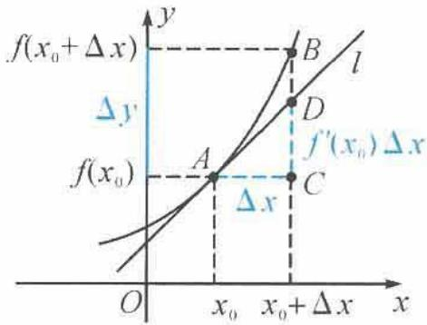
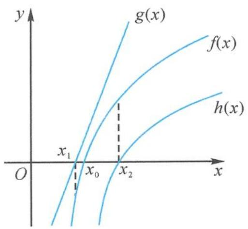
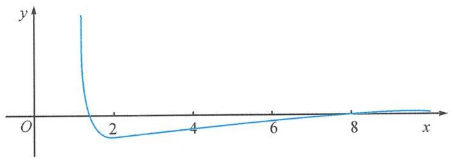

# 导 秘 数 密 的

编写

陈宇轩（2018年4月3日）

王海剛一詩小學

一条卡线贯穿全书

一 用原式组合管理的各式工具形式及工具结构进行

243道例题精讲

一、目前由于战争导致某城路上的战争期间问题的上

81道思考题精练

紧扣命题重点

\- 2017 - 2018

# 高中数学新体系

# 导数的秘密

主编 数学小丸子

编写 王海刚 陈宇轩

本书不只是学习一些数学知识,而且是对数学知识进行重构,打通知识的“任督二脉”,使知识成为鲜活的知识.

从系统的高度帮助学生深度学习,激活数学思维,强调独立思考与数学探究,学生遇到有难度、有思维深度的题目就不再慌张.

# 图书在版编目(CIP)数据

高中数学新体系. 导数的秘密 / 数学小丸子主编. — 杭州 : 浙江大学出版社, 2022.3(2022.7 重印)

ISBN 978-7-308-22406-2

I. ①高… II. ①数… III. ①中学数学课—高中一教学参考资料 IV. ①G634.603

中国版本图书馆 CIP 数据核字（2022）第 040536 号

# 高中数学新体系(导数的秘密)

# GAOZHONG SHUXUE XINTIXI(DAOSHU DE MIMI)

主编 数学小丸子

策划 陈海权(QQ:1010892859)

责任编辑 闫亮

责任校对 陈海权

封面设计 林智广告

出版发行 浙江大学出版社

(杭州市天目山路148号 邮政编码310007)

(网址:http://www.zjupress.com)

排版 杭州朝曦图文设计有限公司

印刷 杭州高腾印务有限公司

开 本 889mm×1194mm 1/16

印 张 20

字 数 498 千

版印次 2022年3月第1版 2022年7月第2次印刷

书号 ISBN 978-7-308-22406-2

定 价 59.80 元

# 序言

导数在高考数学中经常以压轴题的身份呈现,在高考数学中具有举足轻重的地位,且具有一定的难度.一直以来,有人认为考虑到考场时间分配,考生可以放弃难度过大的导数压轴题的第二或第三小问,转而保证获取基础分数.客观地讲,这一观点在某种程度上不无道理,但是有可商榷之处.试想,如果考生形成舍弃导数压轴题第二或第三小问的思维定式,那么在考试时一旦题目难度降低,就将遗憾错失很多分数,这样“总分最大化”的策略一定程度上就失效了.

目前来看,高考导数压轴题的难度正在趋向中等,并不像一些模拟题那样难以驾驭.以近几年高考全国卷中的导数压轴题为例,可以发现全国卷导数试题依然以函数不等式为主线,重点考查取点问题、恒成立问题、函数性质问题等.考生通过学校课程学习、教辅材料强化、课外习题巩固,基本上可以掌握较为系统的命题重点,因此“放弃压轴题”之论,实则不足为训.本书旨在拓展考生的数学思维,帮助考生多见题型,努力克服畏难情绪,挖掘潜力,树立信心,在考试时主动尝试解决问题,达到自己数学水平的巅峰.

### 一、本书的介绍

#### 1. 本书的基础架构

第一章主要讲解选择性必修教材中导数的基础知识,并对课后习题进行深入研究及延伸;阐述导数知识从课本到高考的演变,展示了不同年份高考真题之间千丝万缕的联系;给出了部分导数题型及解题方法的术语;初步汇总了一些较为重要的函数不等式,并对函数不等式进行了多角度的证明.

第二章重点处理了不等式证明问题,介绍了一些不等式的证明手段,比如构造函数、分拆函数、放缩、隐零点代换、局部求值……,侧重点为函数不等式的简单应用.

第三章为恒成立问题,其中包含一类(并非所有)端点值为0型的恒成立问题、区间内零点问题、双参数最值问题和整数类最值问题.书中均利用必要性探路处理上述问题,即先从特殊情况入手,得出必要条件,再证明该条件的充分性.必要性探路属于先猜后证,需要读者有一定胆识和经验.

第四章为取点手段的应用,侧重于对函数零点问题及极限类恒成立问题的处理.本章的难点是如何对函数进行恰当放缩,寻找到优美且符合题意的点.我们给出了一些取点常用的函数不等式,结合例题的分析及解答,展示了函数放缩的多角度处理方式.

第五章为极值点偏移问题及拐点偏移问题. 极值点偏移问题在高考中出现过. 书中总结了该类经典问题的解题策略, 例题中所使用的方法是读者需要掌握的. 拐点偏移问题在高考中涉及不多, 读者需要细细琢磨书中给出的拐点偏移问题的一些解法, 定会有别样收获.

第六章为三角函数与导数问题,以三角函数为载体、以导数为工具是本章的特点,其中包含的题型与前面几章并没有太多的不同,但三角函数有其自身的特点,其中周期性与有界性是三角函数与指数函数、对数函数、幂函数较为不同的地方,因此我们单独设置一章,重点突出三角函数与导数综合题的特点.

第七章为估值问题. 高考中体现较为明显的题型的就是比较数字的大小. 函数单调性、局部区间最值法、函数不等式放缩法是本章重点突出的解题手段. 本章题目较难, 需要同学们认真研究.

第八章是导数客观题专题。我们知道主观题的解答是需要呈现解答过程的，但客观题就不同了，在一定程度上，学生们答题时，可以省略一些既定结论的论证过程，但在本章问题的处理过程中，我们为了严谨性，为读者们呈现的解答过程基本按照了大题的答题方式。

第九章主要是解决一些复杂的高中导数问题,在高中阶段,建立函数不等式的方法、极值点偏移问题的深入研究、指数函数与对数函数交点个数的非极限论证,这些问题都需要读者深入思考并研究,提炼出命题的素材.
在最后的附录中,我们根据本书前面章节的内容,汇总了一些函数不等式,供读者查询.

#### 2. 试题的来源方面

高考导数试题的常见来源为高考命题人的原创题、国内外与导数相关的考试题的改编以及高等数学问题研究的副产品。针对这种情况，本书选题来源为高考真题、优质的模拟题、国内外竞赛题、数学杂志试题、部分大学数学学科的选拔试题。

#### 3. 试题的解法方面

本书中的例题及思考题的解答多为编者原创,至于高考真题、联赛真题、模拟试题的答案,考生可以查询网络,因此本书不再赘述.每个人处理导数试题的方法都有自己的特色,在特色中寻找亮点,并内化为自己的方法,这是学习导数的一种科学而有效的方法.

#### 4. 命题素材方面

本书中含有大量的命题素材与原创试题,为命题教师提供思路来源,为学生提供新鲜的训练题.

### 二、本书的使用建议

本书并不是高中导数的入门书,主要是为了解决高考导数题的“最后一公里”问题,因此需要考生对高中导数专题知识有一定的基础.但需要说明的是,本书并不用超越高中数学水平的手段解题,立足点就是思路及思维超前,而非知识超前.读者在使用本书时,要抓住函数不等式这条主线,熟识第一章的不等式,这样在处理函数不等式证明、恒成立问题、取点问题、偏移问题时,不会迷茫,而有明确的方向.阅读例题时,要自己先对题目进行分析,尝试求解,经过一番独立的思考,再与作者对话,这样才是思维交流,否则就成了单向的灌输,不利于开阔思路、提升能力.导数的一种学习方式是内化外界的工具,化为己有后解决问题;导数的另一种学习方式是与外界碰撞,即与本书作者的解题思路、方法“竞争”,不断地超越作者,而不是被动地阅读.本书中的素材,读者也需要认真研究,努力挖掘其可能具备的命题背景.本书并不押题,但并不代表不会与高考题不期而遇.

### 三、对高中生学习导数的建议

1. 要对函数基本知识有较为扎实的把控与理解. 函数是导数知识的基石, 函数的基本概念也是学习导数的必备知识. 如果对于函数的基本知识不了解、不明晰, 那么导数知识就成了无源之水、无本之木，同学们在学习时自然达不到理想的效果。

2. 要仔细地理解导数的基本概念,适当接触高观点. 与函数基本知识相比,导数知识具有更强的思辨性. 但由于其本身与高等数学的相关知识联系密切,同学们想以高中知识完全透彻理解导数,实际上有一定的困难,也会出现理解不全面、不细致的情况. 因此,在细致掌握导数基本知识的基础上,选取有效的参考资料,自主或在老师指导下研究一些高观点下的知识,这样对于提升对导数的理解大有裨益.

3. 要进行扎实的训练, 多见题型多反思. 由于导数知识的考查方式灵活多变, 对考生综合能力的要求也越来越高. 同学们要有意识地进行导数习题的科学练习, 遵循由易到难、细致全面的原则, 尽量多见题型, 多反思新题、错题, 提高解题的熟练度与对导数知识的理解度.
若读者想对高中导数专题有更深入的了解,请关注 B 站账号“浙大数学优辅”及“导数的秘密”.由于各种原因,书中难免会出现一些问题,请读者朋友不吝指正,欢迎加入“高中数学新体系”图书交流 QQ 群(群号码 821526438).

很荣幸,本书的前身《导数的秘密(第二版)》获得“浙江大学出版社2021年度最佳图书奖”.经过我们长时间精心打磨,推陈出新,《高中数学新体系(导数的秘密)》如期与读者见面!感谢读者们的支持,你们的陪伴是我们前进的动力!

(王海刚、陈宇轩)

# 日

# 录

# Contents

# 第一章 本书开始,我们需要了解的 …… 1

1.1 高中导数基础 …… 1  
1.2 数学术语及相关知识…… 23  
1.3 不等式汇总 25

# 第二章 妙话函数不等式 53

2.1 构造函数 53  
2.2 分拆函数 56  
2.3 常见不等式放缩 58  
2.4 隐零点代换 72   
2.5 局部求值 74   
2.6 整体代换……77   
2.7 除以单项式变形……81   
2.8 加强不等式 83  
2.9 主元转换 87  
2.10 函数拟合法 89  
2.11 数列型不等式 92

# 第三章 必要性探路巧解恒成立 96

3.1 普通恒成立问题……96  
3.2 端点值为 0 型的恒成立问题 …… 103

# B

# 录

3.3 区间内部存在零点的恒成立问题 …… 105  
3.4 求双参数最值问题 107  
3.5 求整数最值问题 110

# 第四章 取点手段的多彩应用 …… 116

4.1 极限问题与零点问题 116  
4.2 恒成立问题 140  
4.3 切线问题 150

# 第五章 偏移问题对策多 155

5.1 常见极值点偏移问题通法例解 155  
5.2 解法实际选择应用 160  
5.3 变形后的极值点偏移 165   
5.4 脱胎于极值点偏移的双变量问题 168  
5.5 极值点偏移的“孪生兄弟”——拐点偏移 177

# 第六章 三角函数在导数问题中的身影 …… 184

6.1 恒成立问题 184  
6.2 函数不等式证明 187  
6.3 极值点偏移问题 195  
6.4 零点问题 197  
6.5 递推关系不等式与数列不等式 …… 204

# 目录

# Contents

6.6 极值与最值 207

# 第七章 计算与估值联袂登场 …… 214

7.1 数字不等式 214  
7.2 三角函数中的估值问题 …… 220  
7.3 数列中的估值问题 222  
7.4 方程中的估值问题 223

# 第八章 函数与导数客观题选讲 …… 229

8.1 简单数论 229  
8.2 恒成立 230  
8.3 极限问题 235  
8.4 三次函数 …… 237  
8.5 函数零点 238  
8.6 函数奇偶性与单调性 …… 240  
8.7 函数对称性 242  
8.8 函数有界性 242  
8.9 引入参数 243  
8.10 构造函数 245  
8.11 抽象函数单调性 …… 247  
8.12 切线问题…… 248

# 目录

8.13 极值与最值 249   
8.14 整数问题…… 252  
8.15 嵌套函数 253

# 第九章 本书最后,我们需要探究的 …… 254

9.1 利用著名不等式建立函数不等式 254  
9.2 利用待定系数法建立函数不等式 …… 261  
9.3 极值点偏移问题解题策略的再讨论 …… 263  
9.4 指数函数与对数函数图象的交点问题 …… 277  
9.5 原创试题及命题素材 280

# 附录 函数不等式集锦 285

# 思考题解答 288

# 参考文献 309

# 第一章 本书开始,我们需要了解的

## 1.1 高中导数基础

### 1.1.1 导数基础  
（1） 切线问题
由于 $f'(x_{0})$ 就是曲线 $y=f(x)$ 在点 $(x_{0},f(x_{0}))$ 处（也称在 $x_{0}$ 处）的切线的斜率，从而由直线的点斜式方程可知，切线的方程是 $y-f(x_{0})=f'(x_{0})(x-x_{0})$ .  
（2） 近似估计

借助曲线的切线,我们还可以从几何角度来理解瞬时变化率的实际意义,并可以利用某一点的导数来估计这一点附近的函数值,具体过程如下.
设函数 $f(x)$ 在 $x_0$ 处的导数为 $f'(x_0)$ ，且在 $x_0$ 处自变量的改变量为 $\Delta x$ ，对应函数值的改变量 $\Delta y = f(x_0 + \Delta x) - f(x_0)$ ，则
$f (x _ {0} + \Delta x) = f (x _ {0}) + \Delta y.$

如图所示, 曲线 $y = f(x)$ 在 $x_0$ 处的切线 $l$ 的斜率为 $f'(x_0)$ , 因此 $\overrightarrow{O} \mid x_0 \quad x_0 + \Delta x \quad x$ $AC = \Delta x, BC = \Delta y, CD = f'(x_0) \Delta x$ . 可以看出, 当 $\Delta x$ 很小时, $\Delta y$ 可用 $f'(x_0) \Delta x$ 来近似表示, 即
$\Delta y \approx f ^ {'} (x _ {0}) \Delta x.$
因此 $f(x_0 + \Delta x) \approx f(x_0) + f'(x_0) \Delta x.$  
（3） 求导法则

一般地,如果 $f(x)$ , $g(x)$ 都可导,则有
$\begin{array}{l} [ f (x) + g (x) ] ^ {'} = f ^ {'} (x) + g ^ {'} (x), \quad [ f (x) - g (x) ] ^ {'} = f ^ {'} (x) - g ^ {'} (x); \\ \left[ f (x) g (x) \right] ^ {'} = f ^ {'} (x) g (x) + f (x) g ^ {'} (x), \left[ \frac {f (x)}{g (x)} \right] ^ {'} = \frac {f ^ {'} (x) g (x) - g ^ {'} (x) f (x)}{\left[ g (x) \right] ^ {2}} (g (x) \neq 0). \\ \end{array}$  
（4）导数与函数单调性
设函数 $f(x)$ 的导数为 $f'(x)$ ，有如下结论.

①如果对区间 $(a,b)$ 上的任意一点x，有 $f'(x)>0$ ，则曲线 $y=f(x)$ 在区间 $(a,b)$ 上每一点处切线的斜率都大于0，曲线呈上升状态，因此 $f(x)$ 在区间 $(a,b)$ 上是增函数；
②如果对区间 $(a,b)$ 上的任意一点 $x,f'(x)<0$ ，则曲线 $y=f(x)$ 在区间 $(a,b)$ 上每一点处切线的斜率都小于0，曲线呈下降状态，因此 $f(x)$ 在区间 $(a,b)$ 上是减函数。  
（5）导数与函数的极值、最值

一般地, 设函数 $y = f(x)$ 的定义域为 $D$ , 取 $x_0 \in D$ , 如果对于 $x_0$ 附近的任意不同于 $x_0$ 的 $x$ (是指存在区间 $(a, b) \subseteq D$ , 使得 $x_0 \in (a, b), x \in (a, b)$ 且 $x \neq x_0$ ) 都有:

① $f(x) < f(x_0)$ ，则称 $x_0$ 为函数 $f(x)$ 的一个极大值点，且 $f(x)$ 在 $x_0$ 处取得极大值；  
② $f(x) > f(x_0)$ ，则称 $x_0$ 为函数 $f(x)$ 的一个极小值点，且 $f(x)$ 在 $x_0$ 处取得极小值.

取得极大值与极小值的点统称为极值点,极大值与极小值统称为极值.

一般地, 如果 $x_0$ 是 $f(x)$ 的极值点, 且 $f(x)$ 在 $x_0$ 处可导, 则必有 $f'(x_0) = 0$ . 若 $f'(x_0)$ 存在, 则“ $f'(x_0) = 0$ ”是“ $x_0$ 是 $f(x)$ 的极值点”的必要不充分条件.

### 1.1.2 从课本到高考  
（1） 切线问题

例题 1 已知函数 $f(x)=x^{2}$ ，而 l 是曲线 $y=f(x)$ 的切线，且直线 l 经过点 $(3,5)$ .  
（1） 判断 $(3,5)$ 是否是曲线 $y=f(x)$ 上的点.  
（2）求直线 l 的方程.
解答 （1） 因为 $f(3) = 9 \neq 5$ , 所以 (3,5) 不是曲线 $y = f(x)$ 上的点.  
（2）由于(3,5)不是曲线 $y=f(x)$ 上的点, 因此(3,5)不是切点. 设切点为 $(x_{0}, x_{0}^{2})$ , 由 $f'(x)=2x$ 知, 切线的斜率 $k=2x_{0}$ , 切线方程为
$y - x _ {0} ^ {2} = 2 x _ {0} (x - x _ {0}).$
由于点(3,5)在切线上,因此有 $5-x_{0}^{2}=2x_{0}(3-x_{0})$ , 整理得
$x _ {0} ^ {2} - 6 x _ {0} + 5 = 0,$
解得 $x_{0}=1$ 或 $x_{0}=5$ . 故切点为 $(1,1)$ 或 $(5,25)$ ，切线方程为 $y-25=10(x-5)$ 或 $y-1=2(x-1)$ ，即直线 l 的方程为
$1 0 x - y - 2 5 = 0 \text {或} 2 x - y - 1 = 0.$

注1 由于题目中的点(3,5)并不在曲线上,因此(3,5)不会是切点,故可以设出切点 $(x_{0},x_{0}^{2})$ ,写出切线方程,然后利用切线经过点(3,5),求出切点坐标,进而得出切线方程.切线问题要注意“过”与“在”的字眼.一般说来,如果求曲线在该点处的切线方程,那么该点是切点;
如果求曲线过某点的切线方程,可以分为两种情况:该点在曲线上与该点不在曲线上.

例如: 已知函数 $f(x) = x^{3}$ , 求曲线 $y = f(x)$ 在点(1,1)处的切线方程. 对本题直接求导求出切线斜率即可, 斜率与切点都明确了, 则切线方程便解决了. 如果求曲线 $y = f(x)$ 过点(2,3)的切线方程, 易知点(2,3)不在曲线 $y = f(x)$ 上, 因此(2,3)不是切点, 故设出切点为 $(x_{0}, x_{0}^{3})$ , 仿照例题1的解答过程便可解决. 如果求曲线 $y = f(x)$ 过点(2,8)的切线方程, 由于点(2,8)在曲线 $y = f(x)$ 上, 此时可以分为两种情况. 一种是(2,8)为切点, 此时切线的斜率为 $f'（2） = 12$ , 则切线的方程为 $y - 8 = 12(x - 2)$ , 整理有 $y = 12x - 16$ . 有时利用均值不等式也可以得出幂函数的切线方程. 比如利用 $x = 2$ 作为取等条件, $x^{3} + 8 + 8 \geqslant 3\sqrt[3]{x^{3} \times 8 \times 8} = 12x$ , 则有 $x^{3} \geqslant 12x - 16$ , 其中 $y = 12x - 16$ 为切线方程. 另一种是(2,8)不是切点, 此时设切点为 $(x_{0}, x_{0}^{3})$ , 切线方程为 $y - x_{0}^{3} = 3x_{0}^{2}(x - x_{0})$ , 而点(2,8)在切线上, 因此有 $8 - x_{0}^{3} = 3x_{0}^{2}(2 - x_{0})$ , 解得 $x_{0} = -1$ 或 $x_{0} = 2$ (舍去), 故切线方程为 $y + 1 = 3(x + 1)$ .

注 2 与切线相关的全国高考题有:

1.(2007年全国卷Ⅱ(理)22)已知函数 $f(x)=x^{3}-x$ .  
（1） 求曲线 $y = f(x)$ 在点 $M(t, f(t))$ 处的切线方程.  
（2） 设 a > 0，如果过点 $(a, b)$ 可作曲线 $y = f(x)$ 的三条切线，证明：-a < b < f(a).

2.(2009年全国卷Ⅰ(文)21)已知函数 $f(x)=x^{4}-3x^{2}+6$ .  
（1） 讨论 $f(x)$ 的单调性.  
（2）设点 P 在曲线 $y=f(x)$ 上, 若该曲线在点 P 处的切线通过坐标原点, 求 l 的方程.

3.(2013年课标全国卷Ⅱ(文)21)已知函数 $f(x)=x^{2}e^{-x}$ .  
（1） 求 $f(x)$ 的极小值与极大值.  
（2） 当曲线 $y = f(x)$ 的切线 l 的斜率为负数时, 求 l 在 x 轴上截距的取值范围.

4.(2021年全国卷乙卷(文)21)已知函数 $f(x)=x^{3}-x^{2}+ax+1$ .  
（1） 讨论 $f(x)$ 的单调性.  
（2） 求曲线 $y = f(x)$ 过坐标原点的切线与曲线 $y = f(x)$ 的公共点的坐标.

例题 2 分别求出曲线 $y=\sqrt{x}$ 在点 $(1,1)$ 和点 $(2,\sqrt{2})$ 处的切线方程.
解答 对函数 $y$ 求导得
$y ^ {'} = \frac {1}{2 \sqrt {x}}.$
因为 $y'\big|_{x=1}=\frac{1}{2}$ ，所以曲线 $y=\sqrt{x}$ 在点(1,1)处的切线方程为 $y-1=\frac{1}{2}(x-1)$ ，整理有
$x - 2 y + 1 = 0.$
因为 $y'\mid_{x=2}=\frac{\sqrt{2}}{4}$ ，所以曲线 $y=\sqrt{x}$ 在点 $(2,\sqrt{2})$ 处的切线方程为 $y-\sqrt{2}=\frac{\sqrt{2}}{4}(x-2)$ ，整

理有
$x - 2 \sqrt {2} y + 2 = 0.$

注 曲线 $y = \sqrt{x}$ 的切线方程的求法,除了利用导数,还可以利用均值进行配凑出切线方程.若求曲线 $y = \sqrt{x}$ 在点(1,1)处的切线方程,利用 $x = 1$ 取等条件进行配凑有 $\sqrt{x} \cdot 1 \leqslant \frac{x + 1}{2}$ , 则切线方程为 $y = \frac{x + 1}{2}$ .

例题 3 分别求满足下列条件的直线 l 的方程.  
（1） 过原点且与曲线 $y = \ln x$ 相切.  
（2）斜率为 $e^{①}$ 且与曲线 $y=e^{x}$ 相切.
解答 （1） 设切点为 $(x_0, \ln x_0)$ , 求导得
$y ^ {'} = \frac {1}{x}.$

切线的斜率为 $\frac{\ln x_{0}-0}{x_{0}-0}=\frac{1}{x_{0}}$ ，则
$x _ {0} = \mathrm{e}.$
故切点为 $(e,1)$ ，切线方程为
$y = \frac {1}{\mathrm{e}} x.$  
（2）设切点为 $(x_{0},\mathrm{e}^{x_{0}})$ ，求导得
$y ^ {'} = \mathrm{e} ^ {x _ {0}} = \mathrm{e},$
解得
$x _ {0} = 1.$
故切点为(1,e)，切线方程为 $y-e=e(x-1)$ ，即
$y = \mathrm{e} x.$

注 第（1）问设出切点,以切线斜率为纽带建立方程,求出切点坐标,进而求出切线方程.由于函数 $y = \ln x$ 是上凸函数,因此可以得出不等式 $\ln x \leqslant \frac{x}{e}$ . 由函数图象的凹凸性可以建立一些不等式,函数 $y = \ln x$ 常见的切线不等式有斜率为 1 的切线,即切点为 (1,0);斜率为 $\frac{1}{e}$ 的切线,即切点为 (e,1). 在后面章节我们会提出曲线 $y = \ln x$ 在点 $(x_0, \ln x_0)$ 处的切线方程的通式为 $y - \ln x_0 = \frac{1}{x_0}(x - x_0)$ , 即 $y = \frac{1}{x_0}x + \ln x_0 - 1$ . 通过对 $x_0$ 的赋值,我们可以得出一些切线方程,进而建立不等式,但并不需要读者掌握过多,仅仅提供一种建立简单函数不等式的方法.

例题 4 已知抛物线 $C_{1}: y = x^{2} + 2x$ 和 $C_{2}: y = -x^{2} + a$ ，若直线 l 同时是抛物线 $C_{1}$ 和 $C_{2}$ 的切线，则称直线 l 是抛物线 $C_{1}$ 和 $C_{2}$ 的公切线。问：当 a 取什么值时，抛物线 $C_{1}$ 和 $C_{2}$ 有且仅有一条公切线？写出此公切线方程。
解答 设直线 l 与抛物线 $C_{1}$ 相切于点 $A(x_{1}, x_{1}^{2} + 2x_{1})$ ，对抛物线 $C_{1}$ 的方程求导得
$y ^ {'} = 2 x + 2,$
则抛物线 $C_1$ 在点 $A$ 处的切线方程为 $y - (x_1^2 + 2x_1) = (2x_1 + 2)(x - x_1)$ , 整理有
$y = (2 x _ {1} + 2) x - x _ {1} ^ {2} \quad ①.$
设直线 $l$ 与抛物线 $C_2$ 相切于点 $B(x_2, -x_2^2 + a)$ , 对抛物线 $C_2$ 的方程求导得
$y ^ {'} = - 2 x,$
则抛物线 $C_2$ 在点 $B$ 处的切线方程为 $y - (-x_2^2 + a) = -2x_2(x - x_2)$ ，整理有
$y = - 2 x _ {2} x + x _ {2} ^ {2} + a \quad ②.$
其中①②都是切线 l 的方程, 则有
$\left\{ \begin{array}{l} 2 x _ {1} + 2 = - 2 x _ {2}, \\ - x _ {1} ^ {2} = x _ {2} ^ {2} + a. \end{array} \right.$
消去 $x_{2}$ 并整理得
$2 x _ {1} ^ {2} + 2 x _ {1} + a + 1 = 0.$
令 $\Delta = 4 - 8(a + 1) = 0$ ，得 $a = -\frac{1}{2}$ .从而 $x_{1} = -\frac{1}{2}$ ，此时公切线方程为
$y = x - \frac {1}{4}.$

注1 本题求出两条抛物线各自的切线方程,在斜率存在的情况下,由点斜式到斜截式,而后通过斜率与截距相等建立方程.解决公切线相关问题,可以采取此方法.

注 2 (2019 年全国卷 II(理)20) 已知函数 $f(x) = \ln x - \frac{x + 1}{x - 1}$ .  
（1） 讨论函数 $f(x)$ 的单调性, 并证明函数 $f(x)$ 有且仅有两个零点.  
（2） 设 $x_{0}$ 是 $f(x)$ 的一个零点, 证明: 曲线 $y = \ln x$ 在点 $(x_{0}, \ln x_{0})$ 处的切线也是曲线 $y = e^{x}$ 的切线.  
（2） 近似计算——以直代曲思想

例题 5 已知 $f(x)=\sqrt{x}$ ，求 $f(9.05)$ 的近似值.
解答 我们要计算 $f(9.05)=\sqrt{9.05}$ 的近似值, 可以借助 $f(9)=3, f'（9）=\frac{1}{6}$ 和 $\Delta x=0.05$ 来实现, 即
$f (9. 0 5) = f (9 + 0. 0 5) \approx f （9） + f ^ {'} （9） \times 0. 0 5 = 3 + \frac {0 . 0 5}{6} \approx 3. 0 0 8.$

注1 利用以直代曲的思想, 在 9.05 附近对 9 进行简单的逼近. 实际上, 由均值不等式 $\sqrt{x} \cdot 3 \leqslant \frac{x + 9}{2}$ 知 $\sqrt{x} \leqslant \frac{x + 9}{6}$ , 所以 $f(9.05)$ 的真实值小于 $3.008\dot{3}$ . 函数图象与相关切线的位置关系与函数的凹凸性有关, 对此后面的章节有相应的介绍.

注 2 与估值问题相关的全国卷高考题有:

(2014 新课标卷Ⅱ(理)21)已知函数 $f(x)=\mathrm{e}^{x}-\mathrm{e}^{-x}-2x$ .  
（1） 讨论 $f(x)$ 的单调性.  
（2） 设 $g(x)=f(2x)-4bf(x)$ ，当 x>0 时， $g(x)>0$ ，求 b 的最大值.  
（3） 已知 $1.4142 < \sqrt{2} < 1.4143$ ，求 $\ln 2$ 的近似值（精确到 0.001）.  
（3） 抽象函数

例题6 已知函数 $f(x)$ 的导数为 $f'(x)$ ，而且 $f(x) = x^2 + 3xf'（2） + \ln x$ ，求 $f'（2）$ .
解答 对 $f(x)$ 求导得
$f ^ {'} (x) = 2 x + 3 f ^ {'} （2） + \frac {1}{x}.$
令 $x = 2$ ，则有
$f ^ {'} （2） = 4 + 3 f ^ {'} （2） + \frac {1}{2},$
解得 $f'（2）=-\frac{9}{4}$ .

注1 本题求 $f'（2）$ 的值, 求导得 $f'(x)=2x+3f'（2）+\frac{1}{x}$ . 接下来赋值, 令 $x=2$ , 建立关于 $f'（2）$ 的方程, 容易解得 $f'（2）=-\frac{9}{4}$ , 同时可以求出 $f(x)=x^{2}-\frac{27}{4}x+\ln x$ .

注2 (2012课标全国卷(理)21)已知函数 $f(x)$ 满足 $f(x) = f'（1）e^{x - 1} - f(0)x + \frac{1}{2} x^2$ .  
（1） 求 $f(x)$ 的解析式及其单调区间.  
（2） 若 $f(x) \geqslant \frac{1}{2} x^2 + ax + b$ ，求 $(a + 1)b$ 的最大值.

例题 7 若函数 $f(x)$ 在 R 上可导, 且满足 $f(x)-xf'(x)>0$ , 判断 3f(1) 与 f(3) 的大小.
解答 当 x>0 时, 由 $f(x)-xf'(x)>0$ 知
$\frac {x f ^ {'} (x) - f (x)}{x ^ {2}} <   0,$
即
$\left[ \frac {f (x)}{x} \right] ^ {'} <   0.$
令 $g(x) = \frac{f(x)}{x} + C$ (C为常数)，则 $g(x)$ 在 $(0, +\infty)$ 上单调递减，故 $g(3) < g(1)$ ，即有
$\frac {f （3）}{3} <   \frac {f （1）}{1}, f （3） <   3 f （1）.$

注1 本题中的 $f(x) - xf'(x) > 0$ 代表着函数 $g(x) = \frac{f(x)}{x} + C$ 在区间 $(0, +\infty)$ 上单调递减，其中 $C$ 为常数，常数 $C$ 对函数的单调性无影响。一般令 $g(x) = \frac{f(x)}{x}$ 即可。

注 2 若 $f(x)+xf'(x)>0$ ，则可以构造函数 $g(x)=xf(x)$ ;
若 $f(x)+f'(x)>0$ ，则可以构造 $g(x)=\mathrm{e}^{x}f(x)$ ;
若 $f(x) < f'(x)$ ，则可以构造函数 $g(x) = \frac{f(x)}{\mathrm{e}^{x}}$ ;
若 $f(x) < 2f'(x)$ ，则可以构造函数 $g(x) = \frac{f(x)}{\mathrm{e}^{\frac{x}{2}}}$ ；
若 $f(x) < f'(x)\tan x\left(0 < x < \frac{\pi}{2}\right)$ ，则可以构造函数 $g(x) = \frac{f(x)}{\sin x}$

● ● ● ● ● ●

抽象函数题目的形式有很多,有些问题的解决方法需要具体问题具体分析.

下面我们说明由 $f(x) < f'(x) \tan x \left(0 < x < \frac{\pi}{2}\right)$ 构造函数 $g(x) = \frac{f(x)}{\sin x}$ 的原因.
由 $f(x) < f'(x) \tan x$ 知 $f'(x) \sin x - f(x) \cos x > 0$ ，对比求导运算法则，相减的运算可能是 $[f(x) - g(x)]'$ ，也可能是 $\left[\frac{f(x)}{g(x)}\right]'$ ，通过对比知原不等式符合“上导下不导”，即有 $\left[\frac{f(x)}{\sin x}\right]' = \frac{f'(x) \sin x - f(x) \cos x}{\sin^{2} x} > 0$ ，因此可以构造函数 $g(x) = \frac{f(x)}{\sin x}$ .  
（4） 具体函数  
（1） $y=\frac{\sin x}{x};$  
（2） $y=\frac{e^{x}}{x^{2}};$  
（3） $y=\frac{\ln x}{x};$  
（4） $y=\frac{\cos x}{1+\sin x};$  
（5） $y=\frac{x}{e^{x}};$  
（6） $y=\ln\frac{1+x}{1-x};$  
（7） $y = x e^{x}$ ;  
（8） $y = x \ln x;$  
（9） $y=x^{2}e^{x};$  
（10） $f(x)=\ln x-x;$  
（11） $f(x)=\mathrm{e}^{x}-x-1.$

读者可以探究上述函数的性质,包括单调性、奇偶性、对称性、凹凸性和有界性,求出函数极值、最值、拐点,并作出函数的图象.比如函数 $y=x\ln x$ 的最小值为 $-\frac{1}{e}$ ,取等条件为 $x=\frac{1}{e}$ ; 函数 $y=\frac{x}{e^{x}}$ 的最大值为 $\frac{1}{e}$ ,取等条件为 x=1.通过比较这两个函数的最值,我们得到不等式 $x\ln x>\frac{x}{e^{x}}-\frac{2}{e}$ .此不等式出现在2014年新课标卷I(理)21:
设函数 $f(x)=ae^{x}\ln x+\frac{be^{x-1}}{x}$ ，曲线 $y=f(x)$ 在点 $(1,f(1))$ 处的切线方程为 $y=e(x-1)+2$ .  
（1） 求 $a, b$ .  
（2） 证明: $f(x) > 1$ .  
（5） 函数单调性

例题 8 讨论函数 $f(x)=a\ln x+x$ 的单调性, 其中 a 为实常数.
解答 对 $f(x)$ 求导得
$f ^ {'} (x) = \frac {x + a}{x} (x > 0).$
当 $a \geqslant 0$ 时， $f'(x) > 0, f(x)$ 单调递增；
当 $a < 0$ 时，
若 0 < x < -a，则 $f'(x) < 0$ ， $f(x)$ 单调递减；若 x > -a，则 $f'(x) > 0$ ， $f(x)$ 单调递增。

注 令 $f'(x) = \frac{x + a}{x} = 0$ , 则 $x = -a$ . 函数 $y = x + a$ 在 $(0, +\infty)$ 上单调递增, 函数 $f(x)$ 的定义域为 $(0, +\infty), x = -a$ 并不一定在定义域中, 因此可以根据 $-a$ 是否在定义域中做一个分类.

例题9 讨论 $f(x) = \frac{1}{2} x^2 + a\ln x - (a + 1)x, a \neq 0$ 的单调性.
解答 对 $f(x)$ 求导得
$f ^ {'} (x) = \frac {(x - 1) (x - a)}{x} (x > 0).$

①当 $a < 0$ 时，
若 0 < x < 1，则 $f'(x) < 0$ ， $f(x)$ 单调递减；若 x > 1，则 $f'(x) > 0$ ， $f(x)$ 单调递增。

②当 0 < a < 1 时，
若 $0 < x < a$ ，则 $f'(x) > 0, f(x)$ 单调递增；若 $a < x < 1$ ，则 $f'(x) < 0, f(x)$ 单调递减；若 $x > 1$ ，则 $f'(x) > 0, f(x)$ 单调递增。

③当 $a = 1$ 时，
$f ^ {'} (x) = \frac {(x - 1) ^ {2}}{x} \geqslant 0,$
$f(x)$ 单调递增.

④当 a > 1 时，
若 0 < x < 1，则 $f'(x) > 0$ ， $f(x)$ 单调递增；若 1 < x < a，则 $f'(x) < 0$ ， $f(x)$ 单调递减；若 x > a，则 $f'(x) > 0$ ， $f(x)$ 单调递增。

注 对原函数求导,通分后可以得出 $(x-1)(x-a)=0$ 的根为1和a.其中1为定义域内的点,a为参数.根据a是否在定义域内可以分为两大类:一类为a<0,另一类为a>0.在a>0的情况中,需要讨论a与1的大小关系.分类讨论,要做到不重不漏.

例题 10 证明函数 $y=2x+\sin x$ 是 R 上的增函数.
证明 对 $y$ 求导得
$y ^ {'} = 2 + \cos x > 0,$
则函数 $y=2x+\sin x$ 是 R 上的增函数.

注 由余弦函数的有界性知 $-1 \leqslant \cos x \leqslant 1$ ，因此有 $2 + \cos x \geqslant 1 > 0$ . 在处理三角函数与导数的问题中，要注意利用三角函数自身的有界性.

例题11 已知定义在区间 $(-\pi, \pi)$ 上的函数 $f(x) = x \sin x + \cos x$ ，求 $f(x)$ 的单调递增区间。
解答 对 $f(x)$ 求导得
$f ^ {'} (x) = x \cos x.$
令 $f'(x)>0$ ，则有
$- \pi <   x <   - \frac {\pi}{2}, 0 <   x <   \frac {\pi}{2}.$
所以 $f(x)$ 的单调递增区间为 $\left(-\pi, -\frac{\pi}{2}\right), \left(0, \frac{\pi}{2}\right)$ .

例题 12 已知函数 $f(x)$ 的导函数为 $f'(x)$ ，且 $f'(x) > 0$ 在区间 $(-1, 2)$ 上恒成立，判断 $f(0)$ 与 $f(1)$ 的大小.
解答 若 $f'(x)>0$ 在区间 $(-1,2)$ 上恒成立，则 $f(x)$ 在区间 $(-1,2)$ 上单调递增。而 1>0，因此
$f （1） > f （0）.$

例题 13 已知关于 x 的函数 $y = x^{3} - t^{2}x - tx^{2} + t^{3}$ 在区间 $(-1, 3)$ 上单调递减，求 t 的取值范围.
解答 令 $f(x) = x^{3} - t^{2}x - tx^{2} + t^{3}$ , 求导得
$f ^ {'} (x) = 3 x ^ {2} - t ^ {2} - 2 t x.$
由题意知 $f'(x) \leqslant 0$ 在 $(-1,3)$ 上恒成立，只需 $\left\{\begin{aligned} f'（3） &\leqslant 0, \\ f'(-1) &\leqslant 0, \end{aligned}\right.$ 即
$\left\{ \begin{array}{l} 2 7 - t ^ {2} - 6 t \leqslant 0, \\ 3 - t ^ {2} + 2 t \leqslant 0, \end{array} \right.$
解得 $t \leqslant -9$ 或 $t \geqslant 3$ .

注 本题是三次函数含参数的单调性问题.三次函数求导可得二次函数.若二次项系数为正的二次函数 $f'(x)$ 在区间 $(a,b)$ 上小于等于零,只需区间端点满足 $f(a) \leqslant 0, f(b) \leqslant 0$ 同时成立.

例题 14 设函数 $f(x)=\sqrt{x^{2}+1}-ax$ ，其中 a>0，若函数 $f(x)$ 在区间 $[0,+\infty)$ 上是减函数，试求实数 a 的取值范围.
解答 由题意知 $f'(x) = \frac{x}{\sqrt{x^2 + 1}} - a \leqslant 0$ 在区间 $[0, +\infty)$ 上恒成立.
当 x=0 时， $\frac{x}{\sqrt{x^{2}+1}}=0;$
当 $x > 0$ 时， $y = \frac{x}{\sqrt{x^2 + 1}} = \frac{1}{\sqrt{1 + \frac{1}{x^2}}}$ 在区间 $(0, +\infty)$ 上单调递增，且 $y \in (0, 1)$ .

综上: $a\in[1,+\infty)$ .  
（6） 极值

例题 15 若函数 $f(x)=x^{2}-\frac{1}{2}\ln x+1$ 在其定义域内的一个子区间 $(a-1,a+1)$ 上存在极值, 求实数 a 的取值范围.
解答 对 $f(x)$ 求导得
$f ^ {'} (x) = \frac {(2 x + 1) (2 x - 1)}{2 x}.$
当 $0 < x < \frac{1}{2}$ 时， $f'(x) < 0, f(x)$ 单调递减；当 $x > \frac{1}{2}$ 时， $f'(x) > 0, f(x)$ 单调递增.
故 $\frac{1}{2}$ 为 $f(x)$ 的极小值点.若 $f(x)$ 在定义域内的一个子区间 $(a-1,a+1)$ 上存在极值,则有 $0\leqslant a-1<\frac{1}{2}<a+1$ ,解得
$1 \leqslant a <   \frac {3}{2}.$  
（7）最值

例题 16 求函数 $y=x^{4}-2x^{2}+5$ 在区间 $[-2,2]$ 上的最大值与最小值.
解答 解法一: 记 $f(x)=x^{4}-2x^{2}+5$ , 则
$f ^ {'} (x) = 4 x (x + 1) (x - 1).$
当 $-2 < x < -1$ 时， $f'(x) < 0, f(x)$ 单调递减；当 $-1 < x < 0$ 时， $f'(x) > 0, f(x)$ 单调递增；当 $0 < x < 1$ 时， $f'(x) < 0, f(x)$ 单调递减；当 $1 < x < 2$ 时， $f'(x) > 0, f(x)$ 单调递增。
其中 $f(-2)=f(2)=13$ , $f(-1)=f(1)=4$ , $f(0)=5$ , 则 $f(x)$ 的最大值为 13, 最小值为 4.
解法二: 记 $f(x)=x^{4}-2x^{2}+5$ ，则 $f(-x)=f(x)$ ， $f(x)$ 为偶函数，故只需要研究 $x\in[0,2]$ 的情况。对 $f(x)$ 求导得
$f ^ {'} (x) = 4 x (x + 1) (x - 1).$
当 0 < x < 1 时， $f'(x) < 0$ ， $f(x)$ 单调递减；当 1 < x < 2 时， $f'(x) > 0$ ， $f(x)$ 单调递增。
因为 $f(0)=5, f(1)=4, f(2)=13$ ，所以 $f(x)$ 的最大值为 13，最小值为 4.
解法三: 令 $t = x^{2}$ ，则 $t \in [0, 4]$ ，记 $g(t) = t^{2} - 2t + 5$ .
当 0 < t < 1 时， $g(t)$ 单调递减；当 1 < t < 4 时， $g(t)$ 单调递增.
因为 $g(0)=5$ , $g(1)=4$ , $g(4)=13$ , 所以 $g(t)$ 的最大值为 13, 最小值为 4.

注 解法一纵观整个定义域,直接利用导数研究原函数的单调性,为直接法.解法二对函数奇偶性的判断,减少了讨论的区间.本题较为容易,并未突出解法二的简捷.解法三避免了使用导数,而是通过换元法将四次函数的最值问题转化为二次函数的最值问题.

例题17 设函数 $f(x) = \begin{cases} x^3 - 3x, & x \leqslant a, \\ -2x, & x > a. \end{cases}$  
（1） 若 a=0，求 $f(x)$ 的最大值.  
（2） 若 $f(x)$ 无最大值, 求实数 a 的取值范围.
解答 （1） 当 $a = 0$ 时,
$f (x) = \left\{ \begin{array}{l} x ^ {3} - 3 x, x \leqslant 0, \\ - 2 x, x > 0. \end{array} \right.$
当 x>0 时, 若 -2x<0, 则 $f(x)$ 无最大值.
当 $x \leqslant 0$ 时，令 $g(x) = x^3 - 3x$ ，则
$g ^ {'} (x) = 3 (x + 1) (x - 1).$
当 $x < -1$ 时， $g'(x) > 0, g(x)$ 单调递增；当 $-1 < x < 0$ 时， $g'(x) < 0, g(x)$ 单调递减。故
$g (x) _ {\max} = g (- 1) = 2.$

综上: $f(x)$ 的最大值为2.  
（2）由（1）知, $g(x)$ 在区间 $(-∞,-1)$ 上单调递增,在区间 $(-1,1)$ 上单调递减,在区间 $(1,+∞)$ 上单调递增.
当 $a \geqslant 2$ 时， $g(-1) = g(2) = 2, -2x < 2$ ，此时
$f (x) _ {\max} = f (a),$
$f(x)$ 存在最大值.
当 $-1 \leqslant a < 2$ 时， $g(x)_{\max} = g(-1) = 2, -2x < 2$ ，此时
$f (x) _ {\max} = f (- 1),$
$f(x)$ 存在最大值.
当 a<-1 时， $g(x)_{\max}=g(a)=a^{3}-3a$ ，此时
$a ^ {3} - 3 a - (- 2 a) = a (a + 1) (a - 1) <   0,$
$f(x)$ 不存在最大值.

综上: $a\in(-\infty,-1)$ .

注 求 $g(x) = x^3 - 3x$ 在区间 $(- \infty, 0]$ 上的最大值，也可以利用三元均值不等式。求最大值只需要关注 $-\sqrt{3} \leqslant x \leqslant 0$ 的情况， $g(x) = \sqrt{x^2(x^2 - 3)^2} = \frac{\sqrt{2}}{2} \sqrt{2x^2(x^2 - 3)^2} \leqslant \frac{\sqrt{2}}{2} \cdot \sqrt{\left(\frac{2x^2 + 3 - x^2 + 3 - x^2}{3}\right)^3} = 2$ ，当 $x = -1$ 时取等号。利用三角函数也可以求 $g(x) = x^3 - 3x$ 在区间 $(- \infty, 0]$ 上的最大值。当 $x < -2$ 时， $g(x) < 0$ ，我们关注 $-2 \leqslant x \leqslant 0$ 的情况。令 $x = 2\cos \alpha$ ，其中 $\alpha \in \left[\frac{\pi}{2}, \pi\right]$ ，利用三倍角公式有 $x^3 - 3x = 8\cos^3 \alpha - 6\cos \alpha = 2\cos 3\alpha \leqslant 2$ ，当 $\alpha = \frac{2}{3}\pi$ 时取等号。  
（8）不等式

例题 18 证明: 当 $x \leqslant 2$ 时, $x^{3} - 6x^{2} + 12x - 1 \leqslant 7$ .
证明 证法一:构造函数
$f (x) = x ^ {3} - 6 x ^ {2} + 1 2 x - 1,$
则
$f ^ {'} (x) = 3 (x - 2) ^ {2} \geqslant 0.$
当 $x \leqslant 2$ 时， $f(x)$ 单调递增，所以 $f(x) \leqslant f(2) = 7$ ，即有
$x ^ {3} - 6 x ^ {2} + 1 2 x - 1 \leqslant 7.$

证法二: 因为
$x ^ {3} - 6 x ^ {2} + 1 2 x - 8 = (x - 2) ^ {3} \leqslant 0,$
所以
$x ^ {3} - 6 x ^ {2} + 1 2 x - 1 \leqslant 7.$

注 本题是一个与三次函数相关的不等式证明问题,无法直接看出函数的单调性.有些不等式可以直接看出单调性,便容易得证,比如在证明某不等式的过程中,在 $x \leqslant 2$ 的前提下,需要证明 $x^{3} + 1 \leqslant 9$ ,那么这是显然的.本题无法直接看出单调性,可以利用导数研究函数 $f(x) = x^{3} - 6x^{2} + 12x - 1$ 的单调性.求导得 $f'(x) = 3(x - 2)^{2} \geqslant 0$ ,则 $f(x)$ 单调递增.从而 $f(x) \leqslant f(2) = 7$ ,当 $x = 2$ 时取最大值.在处理过程中,我们没有将“7”移到不等式左侧,而是直接对不等号左侧的函数进行处理,讨论其单调性,右侧常数对左侧函数单调性无影响.我们换一个方式,将“7”移到不等号左侧,证 $x^{3} - 6x^{2} + 12x - 8 \leqslant 0$ .令 $f(x) = x^{3} - 6x^{2} + 12x - 8$ ,可以发现 $f(2) = 0$ ,进行因式分解,其中一个因式是 $(x - 2)$ ,因此 $x^{3} - 6x^{2} + 12x - 8 = (x - 2)^{3}$ ,不等式显然成立.在处理与三次函数相关的不等式过程中,有的可以利用导数研究函数的单调性,有的则可以利用因式分解.

例题19 求曲线 $y = \ln \frac{1 + x}{1 - x}$ 在 $x = 0$ 处的切线方程.
解答 对 $y$ 求导得
$y ^ {'} = \frac {2}{1 - x ^ {2}},$
则
$y ^ {'} \mid_ {x = 0} = 2.$

而 $y|_{x = 0} = 0$ ，则曲线 $y = \ln \frac{1 + x}{1 - x}$ 在 $x = 0$ 处的切线方程为
$y = 2 x.$

注 本题是求切线方程问题,我们从原函数与切线方程的位置关系可以得出比较重要的不等式.

构造函数 $f(x)=\ln\frac{1+x}{1-x}-2x(-1<x<1)$ ，则 $f'(x)=\frac{2x^{2}}{1-x^{2}}\geqslant0$ ， $f(x)$ 单调递增，且 $f(0)=0$ 。当 -1<x<0 时， $f(x)<0$ ，即 $\ln\frac{1+x}{1-x}<2x$ ；当 0<x<1 时， $f(x)>0$ ，即 $\ln\frac{1+x}{1-x}>2x$ 。
令 $t=\frac{1+x}{1-x}$ ，则 $x=\frac{t-1}{t+1}$ 。因此，当 0<t<1 时， $\ln t<\frac{2(t-1)}{t+1}$ ；当 t>1 时， $\ln t>\frac{2(t-1)}{t+1}$ 。

以这两个不等式为背景的高考试题有：

1.(2016年新课标卷Ⅱ(文)21)已知函数 $f(x)=(x+1)\ln x-a(x-1)$ .  
（1） 当 a=4 时, 求曲线 $y=f(x)$ 在点 $(1,f(1))$ 处的切线方程.  
（2） 若当 $x \in (1, +\infty)$ 时， $f(x) > 0$ ，求 a 的取值范围.

2.(2011年大纲卷(理)22)（1）设函数 $f(x)=\ln(x+1)-\frac{2x}{x+2}$ ，证明：当 x>0 时， $f(x)>0$ .  
（2）从编号1到100的100张卡片中每次随机抽取1张,然后放回,用这种方式连续抽取20次.设抽得的20个号码互不相同的概率为p,证明: $p<\left(\frac{9}{10}\right)^{19}<\frac{1}{e^{2}}$ .

3.(2014年大纲卷(理)22)函数 $f(x)=\ln(x+1)-\frac{ax}{x+a}(a>1)$ .  
（1） 讨论 $f(x)$ 的单调性.  
（2） 设 $a_1 = 1, a_{n+1} = \ln (a_n + 1)$ , 证明: $\frac{2}{n+2} < a_n \leqslant \frac{3}{n+2}$ .
令 $t = \frac{b}{a}$ ，且 $b > a$ ，则由 $\ln t > \frac{2(t - 1)}{t + 1} (t > 1)$ 知 $\ln \frac{b}{a} >\frac{2\left(\frac{b}{a} - 1\right)}{\frac{b}{a} + 1}$ 整理有
$\frac {a - b}{\ln a - \ln b} <   \frac {a + b}{2}.$

这便是对数-算术平均值不等式. 令 $t = \mathrm{e}^{x}$ , 且 $x > 0$ , 则由 $\ln t > \frac{2(t - 1)}{t + 1} (t > 1)$ 知 $\ln \mathrm{e}^{x} > \frac{2(\mathrm{e}^{x} - 1)}{\mathrm{e}^{x} + 1}$ , 整理有
$(x - 2) \mathrm{e} ^ {x} + x + 2 > 0.$

以此不等式为背景的高考试题有：

(2016年新课标卷Ⅱ(理)21)（1）讨论函数 $f(x)=\frac{x-2}{x+2}\mathrm{e}^{x}$ 的单调性,并证明:当 x>0 时, $(x-2)\mathrm{e}^{x}+x+2>0.$  
（2） 证明: 当 $a \in [0,1)$ 时, 函数 $g(x) = \frac{\mathrm{e}^{x} - ax - a}{x^{2}} (x > 0)$ 有最小值. 设 $g(x)$ 的最小值为 $h(a)$ , 求函数 $h(a)$ 的值域.
将 $\frac{a - b}{\ln a - \ln b} < \frac{a + b}{2}$ 中的 $a$ 替换为 $\mathrm{e}^x, b$ 替换为 $\mathrm{e}^y$ ，则有
$\frac {\mathrm{e} ^ {x} - \mathrm{e} ^ {y}}{x - y} <   \frac {\mathrm{e} ^ {x} + \mathrm{e} ^ {y}}{2}.$

这便是对数-算术平均值不等式的指数形式. 以此不等式为背景的高考试题有:

1.(2013年陕西卷(理)21)已知函数 $f(x)=\mathrm{e}^{x}, x \in \mathbb{R}$ .  
（1） 若直线 $y=kx+1$ 与 $f(x)$ 的反函数的图象相切, 求实数 k 的值.  
（2） 设 $x > 0$ , 讨论曲线 $y = f(x)$ 与曲线 $y = mx^2 (m > 0)$ 公共点的个数.  
（3） 设 $a < b$ , 比较 $\frac{f(a) + f(b)}{2}$ 和 $\frac{f(b) - f(a)}{b - a}$ 的大小, 并说明理由.

2.(2013年陕西卷(文)21)已知函数 $f(x)=\mathrm{e}^{x},x\in\mathbb{R}$ .  
（1） 求 $f(x)$ 的反函数的图象上点 $(1,0)$ 处的切线方程.  
（2） 证明: 曲线 $y = f(x)$ 与曲线 $y = \frac{1}{2} x^2 + x + 1$ 有唯一公共点.  
（3） 设 $a < b$ , 比较 $\frac{f(a) + f(b)}{2}$ 和 $\frac{f(b) - f(a)}{b - a}$ 的大小, 并说明理由.

3.(2010年天津卷(理)21)已知函数 $f(x)=xe^{-x}(x\in\mathbb{R})$ .  
（1） 求函数 $f(x)$ 的单调区间与极值.  
（2）已知函数 $y=g(x)$ 的图象与函数 $y=f(x)$ 的图象关于直线 x=1 对称,证明:当 x>1 时, $f(x)>g(x)$ .  
（3） 如果 $x_{1} \neq x_{2}$ ，且 $f(x_{1}) = f(x_{2})$ ，证明： $x_{1} + x_{2} > 2$ .

有对数-算数平均值不等式,那么是否有对数-几何平均值不等式呢?答案是肯定的.
对数-几何平均值不等式为 $\frac{a-b}{\ln a-\ln b}>\sqrt{ab}$ . 不妨设 $x=\frac{b}{a}$ ，且 b>a，则有不等式
$\ln x <   \sqrt {x} - \frac {1}{\sqrt {x}};$
设 $x = \sqrt{\frac{b}{a}}$ ，且 $b > a$ ，则有不等式
$\ln x <   \frac {1}{2} \left(x - \frac {1}{x}\right).$

以 $\ln x < \frac{1}{2}\left(x - \frac{1}{x}\right)(x > 1)$ 为背景的高考试题有：

1.(2011年课标全国卷(理)21)已知函数 $f(x)=\frac{a\ln x}{x+1}+\frac{b}{x}$ ，曲线 $y=f(x)$ 在点 $(1,f(1))$ 处的切线方程为 $x+2y-3=0$ .  
（1） 求 a, b 的值.  
（2）如果当 $x > 0$ ，且 $x \neq 1$ 时， $f(x) > \frac{\ln x}{x - 1} + \frac{k}{x}$ ，求 $k$ 的取值范围。

2. (2011年课标全国卷(文)21)已知函数 $f(x) = \frac{a\ln x}{x + 1} + \frac{b}{x}$ ，曲线 $y = f(x)$ 在点(1, $f(1)$ )处的切线方程为 $x + 2y - 3 = 0$ .  
（1） 求 a, b 的值.  
（2） 证明: 当 x > 0, 且 $x \neq 1$ 时, $f(x) > \frac{\ln x}{x - 1}$ .

3.(2014年天津卷(理)20)设 $f(x)=x-a\mathrm{e}^{x}(a\in\mathbb{R},x\in\mathbb{R})$ ，已知函数 $y=f(x)$ 有两个零点 $x_{1},x_{2}$ ，且 $x_{1}<x_{2}$ .  
（1） 求 a 的取值范围.  
（2） 证明: $\frac{x_{2}}{x_{1}}$ 随着 $a$ 的减小而增大.  
（3） 证明: $x_{1} + x_{2}$ 随着 $a$ 的减小而增大.

4.(2011年湖南卷(文)22)设函数 $f(x)=x-\frac{1}{x}-a\ln x(a\in\mathbb{R})$ .  
（1） 讨论 $f(x)$ 的单调性.  
（2） 若 $f(x)$ 有两个极值点 $x_{1}$ 和 $x_{2}$ ，记过点 $A(x_{1}, f(x_{1}))$ ， $B(x_{2}, f(x_{2}))$ 的直线的斜率为 k。问：是否存在 a，使得 k = 2 - a？若存在，求出 a 的值；若不存在，请说明理由。

5.(2018年全国卷Ⅰ(理)21)已知函数 $f(x)=\frac{1}{x}-x+a\ln x$ .  
（1） 讨论 $f(x)$ 的单调性.  
（2） 若 $f(x)$ 存在两个极值点 $x_1, x_2$ ，证明： $\frac{f(x_1) - f(x_2)}{x_1 - x_2} < a - 2$ .

6.(2010年湖北卷(理)21)已知函数 $f(x)=ax+\frac{b}{x}+c(a>0)$ 的图象在点 $(1,f(1))$ 处的

切线方程为 y = x - 1.  
（1）用 a 表示出 b, c.  
（2） 若 $f(x) \geqslant \ln x$ 在 $[1, +\infty)$ 上恒成立，求 a 的取值范围.  
（3） 证明: $1 + \frac{1}{2} + \frac{1}{3} + \cdots + \frac{1}{n} > \ln (n + 1) + \frac{n}{2(n + 1)} (n \geqslant 1)$ .
若将 $\ln x < \frac{1}{2}\left(x - \frac{1}{x}\right)(x > 1)$ 中的 $x$ 替换为 $t + 1$ ，且 $t > 0$ ，则有
$\ln (t + 1) <   \frac {1}{2} \left(t + 1 - \frac {1}{t + 1}\right) = \frac {t \left(\frac {1}{2} t + 1\right)}{t + 1}.$

以此不等式为背景的高考试题有：

(2013年大纲全国卷(理)22)已知函数 $f(x) = \ln (x + 1) - \frac{x(1 + \lambda x)}{x + 1}$ .  
（1） 若当 $x \geqslant 0$ 时， $f(x) \leqslant 0$ ，求 $\lambda$ 的最小值.  
（2）设数列 $\{a_{n}\}$ 的通项 $a_{n}=1+\frac{1}{2}+\frac{1}{3}+\cdots+\frac{1}{n}$ ，证明： $a_{2n}-a_{n}+\frac{1}{4n}>\ln2.$
若将 $\ln x < \sqrt{x} - \frac{1}{\sqrt{x}} (x > 1)$ 中的 $x$ 替换为 $t + 1$ ，且 $t > 0$ ，则有 $\ln (t + 1) < \sqrt{t + 1} - \frac{1}{\sqrt{t + 1}} = \frac{t}{\sqrt{t + 1}}$ ，平方有
$\ln^ {2} (t + 1) <   \frac {t ^ {2}}{t + 1}.$

以此不等式为背景的高考试题有：

(2008年湖南卷(理)21)已知函数 $f(x)=\ln^{2}(x+1)-\frac{x^{2}}{1+x}$ .  
（2） 若不等式 $\left(- + \frac{1}{n}\right)^{n + a} \leqslant e$ 对任意的 $n \in \mathbb{N}^*$ 都成立 (其中 $e$ 是自然对数的底数), 求 $a$ 的最大值.

例题 20 证明: 当 x > 0 时, $\ln(x + 1) < x$ .
证明 令
$f (x) = \ln (x + 1) - x,$
则 $f'(x)=-\frac{x}{x+1}<0$ , $f(x)$ 单调递减. 因此有 $\ln(x+1)<x$ .

注 题目设置的定义域为 $x > 0$ ，我们将定义域变为 $x > -1$ 。当 $-1 < x < 0$ 时， $f'(x) > 0$ ， $f(x)$ 单调递增；当 $x > 0$ 时， $f'(x) < 0$ ， $f(x)$ 单调递减。故 $f(x) \leqslant f(0) = 0$ ，因此有 $\ln (x + 1) \leqslant$ x, 当且仅当 x=0 时取等号. 不等式 $\ln(x+1)\leqslant x$ 是较为重要的不等式, 由 $\ln(x+1)\leqslant x$ 可以得出 $\ln(x+1)\geqslant\frac{x}{x+1}$ . 因此有不等式链 $\frac{x}{x+1}\leqslant\ln(x+1)\leqslant x$ . 其变形形式为 $1-\frac{1}{x}\leqslant\ln x\leqslant x-1$ .

以上述不等式为背景的高考试题有：

1.(2016年新课标卷Ⅲ(文)21)设函数 $f(x)=\ln x-x+1$ .  
（1） 讨论 $f(x)$ 的单调性.  
（2） 证明: 当 $x \in (1, +\infty)$ 时, $1 < \frac{x - 1}{\ln x} < x$ .  
（3） 设 c > 1，证明：当 $x \in (0,1)$ 时， $1 + (c-1)x > c^{x}$ .

2.(2011年湖北卷(理)21)（1）已知函数 $f(x)=\ln x-x+1, x\in(0,+\infty)$ ，求函数 $f(x)$ 的最大值.  
（2） 设 $a_{k}, b_{k} (k=1,2,\cdots,n)$ 均为正数，证明：

(i) 若 $a_{1}b_{1} + a_{2}b_{2} + \cdots + a_{n}b_{n} \leqslant b_{1} + b_{2} + \cdots + b_{n}$ ，则 $a_{1}^{b_{1}}a_{2}^{b_{2}}\cdots a_{n}^{b_{n}} \leqslant 1$ .

(ii) 若 $b_{1} + b_{2} + \cdots + b_{n} = 1$ ，则 $\frac{1}{n} \leqslant b_{1}^{b_{1}} b_{2}^{b_{2}} \cdots b_{n}^{b_{n}} \leqslant b_{1}^{2} + b_{2}^{2} + \cdots + b_{n}^{2}$ .

3.(2014年陕西卷(理)20)设函数 $f(x)=\ln(x+1)$ , $g(x)=xf'(x)$ , $x\geqslant0$ , 其中 $f'(x)$ 是 $f(x)$ 的导函数.  
（1） 令 $g_{1}(x) = g(x), g_{n+1}(x) = g(g_{n}(x)), n \in \mathbb{N}^{*}$ , 求 $g_{n}(x)$ 的表达式.  
（2） 若 $f(x) \geqslant ag(x)$ 恒成立, 求实数 a 的取值范围.  
（3） 设 $n \in N^{*}$ ，比较 $g(1) + g(2) + \cdots + g(n)$ 与 $n - f(n)$ 的大小，并加以证明.

4.(2016年山东卷(理)20)已知 $f(x)=a(x-\ln x)+\frac{2x-1}{x^{2}}, a\in\mathbb{R}.$  
（1） 讨论 $f(x)$ 的单调性.  
（2） 当 $a = 1$ 时, 证明: $f(x) > f'(x) + \frac{3}{2}$ 对于任意的 $x \in [1, 2]$ 成立.

例题 21 证明: $e^{x} \geqslant x + 1$ .
证明 令 $f(x) = \mathrm{e}^{x} - x - 1$ ，则
$f ^ {'} (x) = \mathrm{e} ^ {x} - 1.$
当 x<0 时， $f'(x)<0$ ， $f(x)$ 单调递减；当 x>0 时， $f'(x)>0$ ， $f(x)$ 单调递增。
则 $f(x) \geqslant f(0) = 0$ ，即 $e^{x} \geqslant x + 1$ 。

注 $y = x + 1$ 为曲线 $y = \mathrm{e}^{x}$ 在 $x = 0$ 处的切线方程. 不等式 $\mathrm{e}^{x} \geqslant x + 1$ 为比较重要的切线不等式. 以此不等式为背景的高考试题有:

(2015年广东卷(理)19)设 a>1，函数 $f(x)=(1+x^{2})\mathrm{e}^{x}-a$ .  
（1） 求 $f(x)$ 的单调区间.  
（2） 证明: $f(x)$ 在 $(- \infty, + \infty)$ 上仅有一个零点.  
（3） 若曲线 $y = f(x)$ 在点 P 处的切线与 x 轴平行，且在点 $M(m, n)$ 处的切线与直线 OP 平行（O 是坐标原点），证明： $m \leqslant \sqrt[3]{a - \frac{2}{e}} - 1$ .

例题 22 证明: 当 $x \geqslant 0$ 时, 有 $xe^{-x} \leqslant \ln(1 + x)$ .
证明 构造函数
$f (x) = x \mathrm{e} ^ {- x} - \ln (1 + x),$
则 $f'(x) = \frac{1 - x^{2} - \mathrm{e}^{x}}{\mathrm{e}^{x}(x + 1)}\leqslant \frac{1 - \mathrm{e}^{x}}{\mathrm{e}^{x}(x + 1)}\leqslant 0,f(x)$ 单调递减.从而 $f(x)\leqslant f(0) = 0$ ，即
$x \mathrm{e} ^ {- x} \leqslant \ln (1 + x).$

注1 本题利用导数研究函数 $f(x) = x\mathrm{e}^{-x} - \ln (1 + x)$ 的单调性, 其导数的正负在 $[0, +\infty)$ 上是显然的. 实际上, 利用放缩可以证明不等式 $x\mathrm{e}^{-x} - \ln (1 + x) \leqslant 0$ . 选取的放缩不等式为 $\mathrm{e}^x \geqslant x + 1$ , 即 $\frac{x}{\mathrm{e}^x} - \ln (x + 1) \leqslant \frac{x}{x + 1} - \ln (x + 1)$ , 而 $\ln (x + 1) \geqslant \frac{x}{x + 1}$ 是显然的. 如果在证明不等式的过程中, 待处理的问题比较容易, 就可以不必利用不等式放缩, 只需要对原函数直接求导研究函数单调性即可.

放缩利用的不等式也需要求导证明. 放缩的优势就是可以将复杂结构转化为简单结构, 解题者自行权衡即可. 实际上, $x \mathrm{e}^{-x} \leqslant \ln (1 + x)$ 成立的范围可以改变, 利用计算机可以得出其成立的近似范围是 $x > -0.8802$ . 假如我们在 $x \geqslant -\frac{1}{2}$ 的前提下证明不等式 $x \mathrm{e}^{-x} \leqslant \ln (1 + x)$ , 在 $x \geqslant 0$ 的前提下, 不等式已经成立, 因此我们只需要研究 $-\frac{1}{2} \leqslant x < 0$ 的情况. 此时前面用到的方法就失效了, 因为 $\frac{x}{\mathrm{e}^x} \leqslant \frac{x}{x + 1}$ 不成立了, 应该是 $\frac{x}{\mathrm{e}^x} \geqslant \frac{x}{x + 1}$ , 此时需要改变不等号的方向, 可以尝试选取不等式 $\mathrm{e}^{-x} \geqslant 1 - x$ , 则有 $x \mathrm{e}^{-x} - \ln (1 + x) \leqslant x (1 - x) - \ln (x + 1)$ . 令 $f(x) = x (1 - x) - \ln (x + 1)$ , 则 $f'(x) = -\frac{(2x + 1)x}{x + 1}$ , 然后讨论原函数的单调性即可. 那么 $-\frac{1}{2}$ 这个分界点是哪来的呢? 实际上, 我们利用了不等式 $\ln (x + 1) > \frac{1}{2} \left( x + 1 - \frac{1}{x + 1} \right)$ 进行放缩, 在 $-1 < x \leqslant 0$ 的前提下, 尝试放缩 $x \mathrm{e}^{-x} - \ln (1 + x) \leqslant x (1 - x) - \frac{1}{2} \left( x + 1 - \frac{1}{x + 1} \right) = -\frac{x^2(2x + 1)}{2(x + 1)}$ . 若限制 $-\frac{1}{2} \leqslant x \leqslant 0$ , 则有 $x \mathrm{e}^{-x} - \ln (1 + x) \leqslant 0$ . 利用不同的不等式放缩, 有时候会得到不同的不等式. 解决问题的方法与命制问题的手段是可以不一致的, 比如前面我们在处理 $-\frac{1}{2} \leqslant x \leqslant 0$ , $x \mathrm{e}^{-x} - \ln (1 + x) \leqslant 0$ 的过程中, 就没有利用放缩, 而是直接求导.

注2 我们改变 $x \mathrm{e}^{-x} \leqslant \ln (1 + x)$ 的结构, 设置函数 $f(x) = x \mathrm{e}^{x} - \ln x - x (x > 0)$ , 问题为求 $f(x)$ 的最小值. 求导有 $f'(x) = (x + 1) \left( \mathrm{e}^{x} - \frac{1}{x} \right)$ , 其中 $y = x + 1$ 无零点. 令 $g(x) = \mathrm{e}^{x} - \frac{1}{x}$ , 可以看出 $g(x)$ 单调递增, 利用零点存在定理寻找零点区间, $g(1) = \mathrm{e} - 1 > 0$ , $g\left(\frac{1}{2}\right) = \sqrt{\mathrm{e}} - 2 < 0$ . 至于点的选取, 就是零点问题中的取点问题, 后面章节有介绍. 本题比较容易, 因为问题中的函数不含参数, 因此可以比较容易地取出有效点. $\exists x_0 \in \left(\frac{1}{2}, 1\right)$ 使得 $g(x_0) = \mathrm{e}^{x_0} - \frac{1}{x_0} = 0$ . 我们并不知道这个 $x_0$ 具体是多少, 只能证明其存在, 就是方程 $\mathrm{e}^{x} - \frac{1}{x} = 0$ 的实数根, 我们称其为隐零点. 当 $0 < x < x_0$ 时, $f(x)$ 单调递减; 当 $x > x_0$ 时, $f(x)$ 单调递增. 故 $f(x)_{\min} = f(x_0) = x_0 e^{x_0} - \ln x_0 - x_0$ . 接下来利用 $\mathrm{e}^{x_0} - \frac{1}{x_0} = 0$ , 即 $x_0 e^{x_0} = 1$ 进行替换, 则有 $x_0 e^{x_0} - \ln x_0 - x_0 = x_0 e^{x_0} - \ln x_0 e^{x_0} = 1$ . 因此 $f(x) = x e^{x} - \ln x - x$ 的最小值为 1, 取等条件就是满足方程 $\mathrm{e}^{x} - \frac{1}{x} = 0$ 的实数根. 利用不等式放缩也可以解决问题, 即 $f(x) = \mathrm{e}^{x + \ln x} - (x + \ln x) \geqslant x + \ln x + 1 - (x + \ln x) = 1$ , 取等条件为 $x + \ln x = 0$ , 此方程是有实数根的, 故可以取到等号. 因此在求一些函数最值时, 可以利用放缩法, 但需要能够取等, 交代取等条件.  
（9） 恒成立

例题 23 已知 $e^{x} \geqslant kx + 1$ 恒成立, 求 k 的取值范围.
解答 解法一: 令 $f(x)=\mathrm{e}^{x}-kx-1$ , 则
$f ^ {'} (x) = \mathrm{e} ^ {x} - k.$
当 $k \leqslant 0$ 时， $f(x)$ 单调递增，且 $f(0) = 0$ ，故当 $x < 0$ 时， $f(x) < 0$ ，不符合题意。
当 $k > 0$ 时，
若 $x < \ln k$ ，则 $f'(x) < 0, f(x)$ 单调递减；若 $x > \ln k$ ，则 $f'(x) > 0, f(x)$ 单调递增。故
$f (x) _ {\min} = f (\ln k) = k - k \ln k - 1.$
由题意知 $k - k\ln k - 1 \geqslant 0$ 恒成立.
令 $g(k) = k - k\ln k - 1$ ，则
$g ^ {'} (k) = - \ln k.$
当 $0 < k < 1$ 时， $g'(k) > 0, g(k)$ 单调递增；当 $k > 1$ 时， $g'(k) < 0, g(k)$ 单调递减。故
$g (k) _ {\max} = g （1） = 0.$
因此有
$k = 1.$
解法二: 令 $f(x)=\mathrm{e}^{x}-kx-1$ , 则
$f ^ {'} (x) = \mathrm{e} ^ {x} - k.$

易知 $f(0) = 0$ . 又 $f(x) \geqslant 0$ 恒成立, 所以 0 为 $f(x)$ 的极值点, 因此 $f'（0） = 1 - k = 0$ , 即
$k = 1.$
当 $k = 1$ 时，
$f ^ {'} (x) = \mathrm{e} ^ {x} - 1.$
当 $x < 0$ 时， $f'(x) < 0, f(x)$ 单调递减；当 $x > 0$ 时， $f'(x) > 0, f(x)$ 单调递增。故
$f (x) _ {\min} = f （0） = 0,$
符合题意.

综上: k=1.
解法三:由前文知 $e^{x} \geqslant x + 1$ ，故 $e^{-x} \geqslant 1 - x$ 。若 x < 1，则
$\mathrm{e} ^ {x} <   \frac {1}{1 - x}.$
令 $f(x)=\mathrm{e}^{x}-kx-1$ .
若 k=1，则 e>2，符合题意。
若 $k \leqslant 0$ ，当 x < 0 时， $f(x) = e^{x} - kx - 1 \leqslant e^{x} - 1 < 0$ ，不符合题意。
若 $0 < k < 1$ ，取 $x \in \left(1 - \frac{1}{k}, 0\right)$ ，利用 $\mathrm{e}^x < \frac{1}{1 - x}$ ，则有
$f (x) = \mathrm{e} ^ {x} - k x - 1 <   \frac {1}{1 - x} - k x - 1 = x \left(\frac {1}{1 - x} - k\right) <   0,$

不符合题意.
若 $k > 1$ ，取 $x\in \left(0,1 - \frac{1}{k}\right)$ ，利用 $\mathrm{e}^x < \frac{1}{1 - x}$ ，则有
$f (x) = \mathrm{e} ^ {x} - k x - 1 <   \frac {1}{1 - x} - k x - 1 = x \left(\frac {1}{1 - x} - k\right) <   0,$

不符合题意.

综上: k=1.

注1 2012年湖南高考试卷中导数解答题第（1）问(改编):已知函数 $f(x)=\mathrm{e}^{ax}-x-1$ , 其中 $a\neq0$ , 若对一切 $x\in\mathbb{R},f(x)\geq0$ 恒成立, 求 $a$ 的取值集合.

注 2 我们利用了三种解法解答此题,实际上还可以利用分离参数法求解,只不过分离参数法需要利用洛必达法则,这里并没有呈现,读者可自行解决.解法一是直接讨论法,解法二利用必要条件探路,解法三利用不等式进行放缩.由于本题较为简单,因此解法三并没有优势.不过,解法三的处理思路在高考试题的官方参考答案中有所体现,希望读者掌握并运用.

注3 通过改变定义域,我们可以命制题目:已知 $e^{x} \geqslant kx + 1$ 在区间 $[0, +\infty)$ 上恒成立,求 $k$ 的取值范围.

注4 通过改变定义域,我们可以命制题目:已知 $e^x \geqslant kx + 1$ 在区间 $[1, +\infty)$ 上恒成立,求 $k$ 的取值范围.

注5 通过积分可以设置题目:已知 $e^{x} \geqslant kx^{2} + x + 1$ 在区间 $[0, +\infty)$ 上恒成立,求 $k$ 的取值范围.

注6 通过积分可以设置题目:已知 $e^{x} \geqslant k x^{3} + \frac{1}{2} x^{2} + x + 1$ 在区间 $[0, +\infty)$ 上恒成立,求 $k$ 的取值范围.

注7 通过改变注5中参数的位置,我们可以设置题目:已知 $e^{x} \geqslant x^{2} + kx + 1$ 在区间[0,+∞)上恒成立,求k的取值范围.

例题24 已知 $a > 0$ 且 $f(x) = ax + \frac{a - 2}{x} + 2 - 2a$ , 若 $f(x) \geqslant 2\ln x$ 在区间 $[1, +\infty)$ 上恒成立, 求实数 $a$ 的取值范围.
解答 令 $g(x) = ax + \frac{a - 2}{x} + 2 - 2a - 2\ln x$ ，则
$g ^ {'} (x) = \frac {(x - 1) (a x + a - 2)}{x ^ {2}}.$
当 $a \geqslant 1$ 时，
$g ^ {'} (x) = \frac {(x - 1) (a x + a - 2)}{x ^ {2}} \geqslant \frac {(x - 1) (x - 1)}{x ^ {2}} \geqslant 0,$
故 $g(x)$ 单调递增，则 $g(x) \geqslant g(1) = 0$ ，符合题意。
当 0 < a < 1 时, 取 $1 < x < \frac{2}{a} - 1$ ,
$g ^ {'} (x) = \frac {(x - 1) (a x + a - 2)}{x ^ {2}} <   0,$
故 $g(x)$ 单调递减, 则 $g(x) < g(1) = 0$ , 不符合题意.

综上: $a\in[1,+\infty)$ .  
（10）零点、交点、方程的根

例题 25 已知函数 $f(x)=x^{3}-x^{2}-x-1$ 的图象与直线 y=c 有 3 个不同的交点, 求实数 c 的取值范围.
解答 对 $f(x)$ 求导得
$f ^ {'} (x) = (3 x + 1) (x - 1).$
当 $x < -\frac{1}{3}$ 时， $f'(x) > 0, f(x)$ 单调递增；当 $-\frac{1}{3} < x < 1$ 时， $f'(x) < 0, f(x)$ 单调递减；当 $x > 1$ 时， $f'(x) > 0, f(x)$ 单调递增。其中 $f\left(-\frac{1}{3}\right) = -\frac{22}{27}, f(1) = -2$ 。
若 $f(x)$ 的图象与直线 $y = c$ 有3个不同的交点，则有 $f(1) < c < f\left(-\frac{1}{3}\right)$ ，即
$- 2 <   c <   - \frac {2 2}{2 7}.$

下面证明 $-2 < c < -\frac{22}{27}$ 符合题意.
此时 $f(-2) = -11 < c, f\left(-\frac{1}{3}\right) > c, f(1) < c, f(2) = 1 > c.$
$\exists x_{1} \in \left(-2, -\frac{1}{3}\right)$ 使得 $f(x_{1}) = c$ ; $\exists x_{2} \in \left(-\frac{1}{3}, 1\right)$ 使得 $f(x_{2}) = c$ ; $\exists x_{3} \in (1, 2)$ 使得 $f(x_{3}) = c$ .

综上: $c\in\left(-2,-\frac{22}{27}\right)$ .

注 本题中 $f(x) = x^{3} - x^{2} - x - 1$ 并不含参数, 因此其图象是固定的, 通过数形结合不难知道: 若函数 $f(x) = x^{3} - x^{2} - x - 1$ 的图象与直线 $y = c$ 有 3 个不同的交点, 则必有 $f(1) < c < f\left(-\frac{1}{3}\right)$ , 即 $-2 < c < -\frac{22}{27}$ . 然后通过取点证明当 $-2 < c < -\frac{22}{27}$ 时符合题意.

例题 26 已知函数 $y=k(x-1)$ 与 $y=\ln x$ 的图象有且只有一个公共点, 求 k 的取值范围.
解答 令
$f (x) = \ln x - k (x - 1).$
由题意知,只需 $f(x)$ 有唯一零点,对 $f(x)$ 求导得
$f ^ {'} (x) = \frac {1}{x} - k.$  
（1） 当 $k \leqslant 0$ 时, $f'(x) > 0$ , $f(x)$ 单调递增, 且 $f(1) = 0$ , 符合题意.  
（2） 当 k > 0 时，
若 $0 < x < \frac{1}{k}$ , 则 $f'(x) > 0, f(x)$ 单调递增; 若 $x > \frac{1}{k}$ , 则 $f'(x) < 0, f(x)$ 单调递减.

①当 k=1 时， $f(x)_{\max}=f(1)=0$ ，此时 $f(x)$ 有唯一零点，符合题意。

②当 0<k<1 时, 利用 $\ln x<\sqrt{x}(x>0)$ .

取 $m = \frac{\mathrm{e}^k}{k^2}$ ，则有
$f (m) = \ln m - k (m - 1) = \ln \left(m e ^ {k}\right) - k m <   \sqrt {m e ^ {k}} - k m = 0.$
因为 $f(1)=0, f\left(\frac{1}{k}\right)>0,$
所以 $\exists x_{1} = 1$ 使得 $f(x_{1}) = 0;\exists x_{2}\in \left(\frac{1}{k},\frac{\mathrm{e}^{k}}{k^{2}}\right)$ 使得 $f(x_{2}) = 0$ ，不符合题意.

③当 k>1 时， $f(e^{-k})=-ke^{-k}<0,f(1)=0,f\left(\frac{1}{k}\right)>0.$
则 $\exists x_{3} \in \left(\mathrm{e}^{-k}, \frac{1}{k}\right)$ 使得 $f(x_{3}) = 0$ ; $\exists x_{4} = 1$ 使得 $f(x_{4}) = 0$ , 不符合题意.

综上: $k\in(-\infty,0]\cup\{1\}$ .

注 如果本题为客观题,那么利用数形结合法很容易得出结果.我们的解答过程是利用零点存在定理取点说明零点的个数,这是高考试题答案的处理方式.教材中还有如下一些优秀的零点问题.

1. 设函数 $f(x)=x^{3}+ax^{2}+bx+c$ .  
（1） 求曲线 $y = f(x)$ 在点 $(0, f(0))$ 处的切线方程.  
（2） 设 a=b=4，若函数 $f(x)$ 有 3 个不同零点，求实数 c 的取值范围.  
（3） 证明: $a^{2} - 3b > 0$ 是 $f(x)$ 有 3 个不同零点的必要不充分条件.

2. 已知函数 $f(x)=ax^{3}-3x^{2}+1$ ，若 $f(x)$ 存在唯一的零点 $x_{0}$ ，且 $x_{0}>0$ ，求 a 的取值范围。

3. 已知函数 $f(x)=\mathrm{e}^{x}(2x-1)-ax+a$ ，其中 a<1，若存在唯一的整数 $x_{0}$ 使得 $f(x_{0})<0$ ，求实数 a 的取值范围。

## 1.2 数学术语及相关知识

本节将对本书中出现的一些名词以及一些数学术语进行解释,以便读者更深入地了解本书内容.

### 1.2.1 数学术语类  
（1） 趋近

描述变量变化方式的词语. 趋近指某一变量从不同方向无限接近某一常值(或无穷), 但不能与该常值相等. 在数学语言上, 我们用符号“→”表示趋近. 例如“x 趋近于 1”写作“x→1”.

需要读者注意的是,本书部分章节“→”也表示替换的意思,例如“将 x 替换为 $\sqrt{x}$ ”写作 “ $x \rightarrow \sqrt{x}$ ”.  
（2）零点存在定理
若函数 $y = f(x)$ 的图象在区间 $[a, b]$ 上连续，且 $f(a)f(b) < 0$ ，则函数 $y = f(x)$ 在区间 $(a, b)$ 上有零点。  
（3） 隐零点

对于一些由超越函数(指数、对数、三角函数等)与代数函数混合而成的函数,如果其零点无法由人工解出,往往利用零点存在性定理论证其在某个区间上存在零点.在书写过程中,一般把这个理论上的零点设为一个参数,称为隐零点.  
（4） 函数的凹凸性

凹凸性是函数的一种性质. 下面采用数学术语加以说明:
设函数 $y = f(x)$ 在区间 $I$ 上有定义, 若对 $\forall x_1, x_2 \in I$ 且 $x_1 \neq x_2$ , 都有 $f\left(\frac{x_1 + x_2}{2}\right) > \frac{f(x_1) + f(x_2)}{2}$ , 则称 $f(x)$ 在区间 $I$ 上为上凸函数; 若对 $\forall x_1, x_2 \in I$ 且 $x_1 \neq x_2$ , 都有 $f\left(\frac{x_1 + x_2}{2}\right) < \frac{f(x_1) + f(x_2)}{2}$ , 则称 $f(x)$ 在区间 $I$ 上为下凸函数. 上凸函数的典型例证为 $f(x) = \ln x$ ; 下凸函数的典型例证为 $f(x) = e^x$ .

函数的凹凸性可以由下面的定理来判定.

定理 若 $f(x)$ 在区间 $[a, b]$ 上连续，在区间 $(a, b)$ 上具有一阶导数和二阶导数，则：

①当 $f''(x)>0$ 时， $f(x)$ 在区间 $[a,b]$ 上为下凸函数；
②当 $f''(x)<0$ 时， $f(x)$ 在区间 $[a,b]$ 上为上凸函数.  
（5） 拐点

函数凹凸性发生改变的点称为拐点.一般来说,设函数 $f(x)$ 在点 $x=x_{0}$ 处及其左右的一段区间内具有二阶连续导数,若 $x=x_{0}$ 两侧的 $f''(x)$ 异号,则 $(x_{0},f(x_{0}))$ 是曲线 $y=f(x)$ 的一个拐点.另外,二阶导数不存在的点也有可能是函数的拐点.

### 1.2.2 题型及解题方法术语类  
（1） 必要性探路法

这是一种解题方法,可应用于一类带参数的恒成立问题.求参数范围时,从满足题意的自变量范围内选择一个数,代入求得一个参数范围,此时这个范围是题意的必要条件.之后再设法证明该必要条件也是题意的充分条件,或者讨论别的点.若充分性也成立,则该范围是题意的充要条件,即为所求的范围.这种方法需从逻辑条件上进行理解,因为先得到的是必要条件,故称为必要性探路法.  
（2）极值点偏移
当某一函数在其定义域上存在极值时,若极值点左右增减速度相同,则该函数图象为对称图形.若极值点左右增减速度不同,则会出现对称性消失,函数图象偏移,这种情况称为极值点偏移.  
（3） 放缩

一种解题方法,常见于不等式证明之中.放缩是指根据题意,对待证不等式进行有意识地放大或缩小,以获得符合题意结果的方法(具体见书中相关解题过程).  
（4） 加强

这种解题方法是放缩法的一种. 加强是指将一个不等式通过增减项, 放大为更符合题意或更一般的不等式, 用来辅助证明.  
（5）换元

一种解题方法. 换元是指将式子中形式相同的部分进行整体代换, 转化为一个新的变量, 整个式子即变为关于新变量的式子.  
（6）主元转换

主元指一个式子中的主要变量,例如在一般的代数式里,自变量 x 即为主元.换主元是指将式子中其他的变量(如参数、常数等)视为主要变量,转换思考角度的解题方法.  
（7） 取点

一种解题方法. 为了证明函数有零点, 需要找到合适的区间 $[a, b]$ , 并证明 $f(a)f(b) < 0$ . 取点指的是找到该合适区间的上下界点或区间上符合题意的点. 所取的点可以是常数, 也可以是一个关于参数的代数式.

## 1.3 不等式汇总

函数不等式在解导数题中有着巨大的作用,例如,用放缩法解题时经常会用到一些常用的函数不等式.有一些题目给出的条件也暗含着各种不等式的影子.因此,掌握这些不等式,能够让解题变得事半功倍.本节将以函数类型为分类标准,对常见不等式进行列举及证明.建议熟记本节中出现的所有不等式(引理可以选择性记忆).

请读者注意:在本节出现过的所有不等式,在后续再次出现时一般省略其证明过程,并且在证明不等式过程中可能会出现二阶导数符号 $f''(x)$ 以及三阶导数符号 $f'''(x)$ ,为了不占用过多篇幅,本书将采用这种方式简化证明过程,但读者在考试时,多次求导需要使用构造新函数的形式进行书写,不能出现二阶导数及三阶导数符号.

引理(泰勒公式) 泰勒公式应用于一个在 $x = x_0$ 处具有 $n$ 阶导数的函数 $f(x)$ , 利用关于 $x - x_0$ 的 $n$ 次多项式进行逼近. 若函数 $f(x)$ 在包含 $x_0$ 的某个闭区间 $[a, b]$ 上具有 $n$ 阶导数, 且在开区间 $(a, b)$ 上具有 $n + 1$ 阶导数, 则对于闭区间 $[a, b]$ 上的任意一点 $x = x_0$ , 有
$f (x) = f \left(x _ {0}\right) + \frac {f ^ {'} \left(x _ {0}\right)}{1 !} \left(x - x _ {0}\right) + \frac {f ^ {' '} \left(x _ {0}\right)}{2 !} \left(x - x _ {0}\right) ^ {2} + \frac {f ^ {' ' '} \left(x _ {0}\right)}{3 !} \left(x - x _ {0}\right) ^ {3} + \dots + \frac {f ^ {n} \left(x _ {0}\right)}{n !} \left(x - x _ {0}\right) ^ {n} + R _ {n} (x).$
其中, $f^{n}(x_{0})$ 表示函数 $f(x)$ 在 $x_{0}$ 处的 $n$ 阶导数. 上式称为函数 $f(x)$ 在 $x = x_{0}$ 处的泰勒公式, $R_{n}(x)$ 称为泰勒公式的余项. 特别地, 当 $x_{0} = 0$ 时, 若 $f(x)$ 在 $x = 0$ 处 $n$ 阶连续可导, 则称
$f (x) = f （0） + \frac {f ^ {'} （0）}{1 !} x + \frac {f ^ {' '} （0）}{2 !} x ^ {2} + \frac {f ^ {' ' '} （0）}{3 !} x ^ {3} + \dots + \frac {f ^ {n} （0）}{n !} x ^ {n} + R _ {n} (x)$

为函数 $f(x)$ 的麦克劳林公式.

### 1.3.1 指数函数类
由麦克劳林公式,我们有
$\mathrm{e} ^ {x} = 1 + x + \frac {x ^ {2}}{2} + \frac {x ^ {3}}{6} + \dots + \frac {x ^ {n}}{n !} + R _ {n} (x).$

可以得到重要不等式：

1. 当 $x \geqslant 0$ 时, $\mathrm{e}^{x} \geqslant \frac{1}{2} x^{2} + x + 1$ .

下面对不等式 $\mathrm{e}^x\geqslant \frac{1}{2} x^2 +x + 1(x\geqslant 0)$ 给出证明.
证明 证法一:构造函数
$f (x) = \mathrm{e} ^ {x} - \left(\frac {1}{2} x ^ {2} + x + 1\right),$

求导得
$f ^ {'} (x) = \mathrm{e} ^ {x} - x - 1, f ^ {' '} (x) = \mathrm{e} ^ {x} - 1 \geqslant 0.$
于是 $f'(x)$ 单调递增， $f'(x) \geqslant f'（0） = 0$ ，所以 $f(x)$ 单调递增， $f(x) \geqslant f(0) = 0$ 。

原不等式得证。

证法二:构造函数
$g (x) = \frac {\frac {1}{2} x ^ {2} + x + 1}{\mathrm{e} ^ {x}},$

求导得
$g ^ {'} (x) = - \frac {x ^ {2}}{2 \mathrm{e} ^ {x}} \leqslant 0.$
于是 $g(x)$ 单调递减, $g(x) \leqslant g(0) = 1$ , 因此有
$\mathrm{e} ^ {x} \geqslant \frac {1}{2} x ^ {2} + x + 1 (x \geqslant 0).$

原不等式得证。

注1 由证法一可知,对任意 $x \in \mathbb{R}$ , 不等式 $\mathrm{e}^x \geqslant x + 1$ 均成立, 其中 $y = x + 1$ 为 $y = \mathrm{e}^x$ 的图象在点(0,1)处的切线方程, 由此可以衍生许多不等式. 例如: 由这个不等式, 我们可以写出一个衍生其余不等式的“元”不等式 $\mathrm{e}^{f(x)} \geqslant f(x) + 1$ . 若 $f(x) = x - 1$ , 则有 $\mathrm{e}^x \geqslant \mathrm{e}x$ , 其中 $y = \mathrm{e}^x$ 的图象在点(1,e)处的切线方程 (有的题目描述为 $y = \mathrm{e}x$ 是 $y = \mathrm{e}^x$ 的图象过原点的切线方程); 若 $f(x) = -x$ , 则有 $\mathrm{e}^x \leqslant \frac{1}{1 - x} (x < 1)$ ; 若 $f(x) = x - \frac{1}{2}$ , 则有 $\mathrm{e}^x \geqslant \sqrt{\mathrm{e}} \left( x + \frac{1}{2} \right)$ ; 若 $f(x) = x + \ln x$ , 则有 $x \mathrm{e}^x \geqslant x + \ln x + 1$ , 这也是模拟题中比较热门的考查形式.

注2 记 $f(x) = \mathrm{e}^{x}$ 的图象在点 $(x_0, f(x_0))$ 处的切线方程为 $y - \mathrm{e}^{x_0} = \mathrm{e}^{x_0}(x - x_0)$ ，由 $f(x)$
$= \mathrm{e}^{x}$ 图象的凹凸性可知 $\mathrm{e}^{x} \geqslant \mathrm{e}^{x_{0}}(x - x_{0}) + \mathrm{e}^{x_{0}}$ （这是切线不等式），两侧同除以 $\mathrm{e}^{x_{0}}$ ，即有 $\mathrm{e}^{x - x_{0}} \geqslant x - x_{0} + 1$ ，此时即为注1中， $f(x) = x - x_{0}$ 的情况。从复杂程度看， $\mathrm{e}^{x} \geqslant x + 1$ 最为简单，也最为常见，因此希望读者深刻理解并熟练运用此不等式。

注 3 在函数 $f(x) = \mathrm{e}^{x}$ 的麦克劳林公式中, 截取片段, 可得如下结论:
若 n 为奇数, 则不等式
$\mathrm{e} ^ {x} \geqslant 1 + x + \frac {x ^ {2}}{2} + \frac {x ^ {3}}{6} + \dots + \frac {x ^ {n}}{n !}$

对任意 $x \in R$ 恒成立.
若 n 为偶数，当 $x \geqslant 0$ 时， $e^{x} \geqslant 1 + x + \frac{x^{2}}{2} + \frac{x^{3}}{6} + \cdots + \frac{x^{n}}{n!}$ ;
当 x<0 时， $e^{x}<1+x+\frac{x^{2}}{2}+\frac{x^{3}}{6}+\cdots+\frac{x^{n}}{n!}$

例题 27 已知函数 $f(x)=\mathrm{e}^{x}+ax^{2}-x$ .  
（1） 当 a=1 时, 讨论 $f(x)$ 的单调性.  
（2） 若 $x \geqslant 0, f(x) \geqslant \frac{1}{2}x^{3} + 1$ 恒成立，求 a 的取值范围.
解答 （1） 当 $a = 1$ 时, $f(x) = \mathrm{e}^{x} + x^{2} - x$ , 则
$f ^ {'} (x) = \mathrm{e} ^ {x} + 2 x - 1.$
显然 $f'(x)$ 在 R 上单调递增.
当 x<0 时， $f'(x)<0$ ， $f(x)$ 单调递减；当 x>0 时， $f'(x)>0$ ， $f(x)$ 单调递增。  
（2） 当 $x = 0$ 时, $a \in \mathbb{R}$ ; 当 $x > 0$ 时,
$f (x) \geqslant \frac {1}{2} x ^ {3} + 1 \Rightarrow - a \leqslant \frac {\mathrm{e} ^ {x} - x - \frac {1}{2} x ^ {3} - 1}{x ^ {2}}.$
令 $g(x) = \frac{\mathrm{e}^x - x - \frac{1}{2} x^3 - 1}{x^2}$ , 则
$g ^ {'} (x) = \frac {(x - 2) \left(\mathrm{e} ^ {x} - \frac {1}{2} x ^ {2} - x - 1\right)}{x ^ {3}}.$

构造函数
$h (x) = \frac {\frac {1}{2} x ^ {2} + x + 1}{\mathrm{e} ^ {x}} (x > 0),$
则 $h'(x) = -\frac{x^{2}}{2\mathrm{e}^{x}} < 0,h(x)$ 单调递减，故 $h(x) < h(0) = 1$ ，因此有
$\mathrm{e} ^ {x} > \frac {1}{2} x ^ {2} + x + 1.$
当 $0 < x < 2$ 时， $g'(x) < 0, g(x)$ 单调递减；当 $x > 2$ 时， $g'(x) > 0, g(x)$ 单调递增。故
$g (x) _ {\min} = g （2） = \frac {\mathrm{e} ^ {2} - 7}{4}.$
因此 $a \in \left[\frac{7 - \mathrm{e}^2}{4}, +\infty\right)$ .

注 本题选自2020年普通高等学校招生全国统一考试全国卷I（理）.

例题 28 已知函数 $f(x)=\mathrm{e}^{2x}+\ln(x+a)$ , a>0.  
（1） 当 $a=1, x \geqslant 0$ 时，证明： $f(x) \geqslant (x+1)^{2} + x.$   
（2） 若存在 $x_{0} \geqslant 0$ ，使得 $f(x_{0}) < 2\ln(x_{0} + a) + x_{0}^{2}$ 成立，求实数 a 的取值范围.
证明 （1） 当 $a = 1$ 时, $f(x) = \mathrm{e}^{2x} + \ln (x + 1)$ , 即证
$\mathrm{e} ^ {2 x} + \ln (x + 1) \geqslant (x + 1) ^ {2} + x.$

构造函数
$g (x) = \mathrm{e} ^ {x} - x - 1.$

对其求导得 $g'(x) = \mathrm{e}^{x} - 1\geqslant 0$ ，故 $g(x)$ 在 $[0, + \infty)$ 上单调递增，则 $g(x)\geqslant g(0) = 0$ ，即 $\mathrm{e}^x\geqslant x + 1.$ 对其取对数得
$x \geqslant \ln (x + 1).$
从而 $g(x)\geqslant g(\ln (x + 1))$ ，即
$\mathrm{e} ^ {x} - x - 1 \geqslant x - \ln (x + 1).$
又因为
$\mathrm{e} ^ {2 x} - (x + 1) ^ {2} \geqslant \mathrm{e} ^ {x} - (x + 1),$
所以 $\mathrm{e}^{2x} + \ln (x + 1)\geqslant (x + 1)^2 +x.$ 命题得证.  
（2）由题意知 $a > e^{e^{2x} - x^{2}} - x$ 能成立,令
$h (x) = \mathrm{e} ^ {\mathrm{e} ^ {2 x} - x ^ {2}} - x.$
由（1）知 $e^{x} \geqslant x + 1$ (当 x = 0 时取等号)，
$h (x) \geqslant \mathrm{e} ^ {(x + 1) ^ {2} - x ^ {2}} - x = \mathrm{e} \cdot \mathrm{e} ^ {2 x} - x \geqslant \mathrm{e} (2 x + 1) - x = (2 \mathrm{e} - 1) x + \mathrm{e} \geqslant \mathrm{e},$
当 $x = 0$ 时取等号，即 $h(x)_{\min} = h(0) = \mathrm{e}$ . 因此 $a \in (\mathrm{e}, +\infty)$ .

2. 当 $x \geqslant 0$ 时, $e^{x} \geqslant x^{2} + 1$ (当 x = 0 时取等号).
证明 证法一:构造函数
$f (x) = \mathrm{e} ^ {x} - x ^ {2} - 1,$

求导得
$f ^ {'} (x) = \mathrm{e} ^ {x} - 2 x, f ^ {' '} (x) = \mathrm{e} ^ {x} - 2.$
当 $0 < x < \ln 2$ 时， $f''(x) < 0, f'(x)$ 单调递减；当 $x > \ln 2$ 时， $f''(x) > 0, f'(x)$ 单调递增。故
$f ^ {'} (x) _ {\min} = f ^ {'} (\ln 2) = 2 (1 - \ln 2) > 0,$
所以 $f(x)$ 单调递增, $f(x)_{\min}=f(0)=0$ .

原不等式得证.

证法二:构造函数
$g (x) = \frac {x ^ {2} + 1}{\mathrm{e} ^ {x}},$

求导得
$g ^ {'} (x) = - \frac {(x - 1) ^ {2}}{\mathrm{e} ^ {x}} \leqslant 0,$
故 $g(x)$ 单调递减, $g(x) \leqslant g(0) = 1$ .

原不等式得证.

3. 当 $x \geqslant 0$ 时, $\mathrm{e}^{x} \geqslant \mathrm{e}x + (x - 1)^{2} = x^{2} + (\mathrm{e} - 2)x + 1$ (当 x = 0 或 x = 1 时取等号).
证明 证法一:构造函数
$f (x) = \mathrm{e} ^ {x} - \mathrm{e} x - (x - 1) ^ {2},$

求导得
$f ^ {'} (x) = \mathrm{e} ^ {x} - \mathrm{e} - 2 (x - 1), f ^ {' '} (x) = \mathrm{e} ^ {x} - 2.$
当 $0 < x < \ln 2$ 时， $f''(x) < 0, f'(x)$ 单调递减；当 $x > \ln 2$ 时， $f''(x) > 0, f'(x)$ 单调递增.
因为 $f'（0） = 3 - \mathrm{e} > 0, f'(\ln 2) = 4 - \mathrm{e} - 2\ln 2 < 0, f'（1） = 0$ ，所以 $\exists x_0 \in (0, \ln 2)$ 使得 $f'(x_0) = 0$ .
当 $0 < x < x_0$ 时， $f'(x) > 0, f(x)$ 单调递增；当 $x_0 < x < 1$ 时， $f'(x) < 0, f(x)$ 单调递减；当 $x > 1$ 时， $f'(x) > 0, f(x)$ 单调递增.
又 $f(0)=f(1)=0$ ，因此当 $x \geqslant 0$ 时，有
$\mathrm{e} ^ {x} \geqslant \mathrm{e} x + (x - 1) ^ {2}.$

原不等式得证.

证法二: 当 x=0 时, $\mathrm{e}^{x}\geqslant\mathrm{e}x+(x-1)^{2}$ 成立. 当 x>0 时, 构造函数
$g (x) = \frac {\mathrm{e} ^ {x}}{x} - x - \frac {1}{x} - \mathrm{e} + 2,$

求导得
$g ^ {'} (x) = \frac {(x - 1) (\mathrm{e} ^ {x} - x - 1)}{x ^ {2}},$
其中 $e^{x}>x+1$ .
若 0 < x < 1，则 $g'(x) < 0$ ， $g(x)$ 单调递减；若 x > 1，则 $g'(x) > 0$ ， $g(x)$ 单调递增，从而
$g (x) _ {\min} = g （1） = 0.$

原不等式成立.

注 1 当 $x \geqslant 0$ 时, $\mathrm{e}^{x} \geqslant \mathrm{e}x + (x - 1)^{2}$ 是不等式 $e^{x} \geqslant e x$ 的简单加强式.

注 2 一个简单的反向不等式 $\mathrm{e}^{x}\leqslant\mathrm{e}x+2(x-1)^{2}(x\in[0,2])$ .

例题 29 已知函数 $f(x)=ae^{x}+2x-1$ ，证明：对任意的 $a \geqslant 1$ ，当 x > 0 时， $f(x) \geqslant (x + ae)x$ 。
证明 要证明 $f(x) \geqslant (x + ae)x$ ，即证明
$a \mathrm{e} ^ {x} + 2 x - 1 \geqslant (x + a \mathrm{e}) x.$

考虑进行主元转换,即证明
$a \left(\mathrm{e} ^ {x} - \mathrm{e} x\right) \geqslant x ^ {2} - 2 x + 1.$

我们接下来判断其中 $\mathrm{e}^x -\mathrm{e}x$ 的正负，求导可知
$\mathrm{e} ^ {x} \geqslant \mathrm{e} x.$
由于 $a \geqslant 1$ ，可以尝试证明 $\mathrm{e}^x - \mathrm{e}x \geqslant x^2 - 2x + 1$ ，即
$\mathrm{e} ^ {x} \geqslant \mathrm{e} x + (x - 1) ^ {2}.$

这是显然成立的.命题得证.

4. 当 $x \geqslant -\frac{3}{2}$ 时, $\mathrm{e}^x \geqslant \frac{\mathrm{e}}{4}(x + 1)^2$ .
证明 构造函数
$f (x) = \frac {(x + 1) ^ {2}}{\mathrm{e} ^ {x}},$

求导得
$f ^ {'} (x) = \frac {(1 - x) (x + 1)}{\mathrm{e} ^ {x}}.$
当 $-\frac{3}{2} < x < -1$ 时， $f'(x) < 0, f(x)$ 单调递减；当 $-1 < x < 1$ 时， $f'(x) > 0, f(x)$ 单调递增；当 $x > 1$ 时， $f'(x) < 0, f(x)$ 单调递减。又
$f \left(- \frac {3}{2}\right) = \frac {\mathrm{e} ^ {\frac {3}{2}}}{4} <   \frac {4}{\mathrm{e}}, f （1） = \frac {4}{\mathrm{e}},$
因此 $f(x)\leqslant \frac{4}{\mathrm{e}}$ ，即当 $x\geqslant -\frac{3}{2}$ 时，有
$\mathrm{e} ^ {x} \geqslant \frac {\mathrm{e}}{4} (x + 1) ^ {2}.$

注1 如果 $x \geqslant -1$ , 则可以利用 $\mathrm{e}^{x} \geqslant x + 1$ 的衍变不等式来证明 $\mathrm{e}^{x} \geqslant \frac{\mathrm{e}}{4}(x + 1)^{2}$ . 易知有 $\mathrm{e}^{\frac{x - 1}{2}} \geqslant \frac{x + 1}{2}$ , 即有 $\mathrm{e}^{\frac{x}{2}} \geqslant \frac{\sqrt{\mathrm{e}}}{2}(x + 1)$ , 两边平方即有 $\mathrm{e}^{x} \geqslant \frac{\mathrm{e}}{4}(x + 1)^{2}$ .

注2 函数 $f(x) = \frac{\mathrm{e}^x}{x + 1}$ 在区间 $(-1, +\infty)$ 上为下凸函数， $g(x) = \frac{\mathrm{e}}{4}(x + 1)$ 为 $f(x)$ 的图象在 $x = 1$ 处的切线方程。

5. 当 $x \in \mathbb{R}$ 时, $\mathrm{e}^x + \mathrm{e}^{-x} \geqslant x^2 + 2$ .
证明 构造函数
$f (x) = \mathrm{e} ^ {x} + \mathrm{e} ^ {- x} - x ^ {2} - 2,$
显然 $f(x)=f(-x)$ ，故只研究 $x\geqslant0$ 时的情况。易得
$f ^ {'} (x) = \mathrm{e} ^ {x} - \mathrm{e} ^ {- x} - 2 x, f ^ {' '} (x) = \mathrm{e} ^ {x} + \mathrm{e} ^ {- x} - 2 \geqslant 2 \sqrt {\mathrm{e} ^ {x} \cdot \mathrm{e} ^ {- x}} - 2 = 0,$
所以 $f'(x)$ 单调递增. 于是 $f'(x) \geqslant f'（0） = 0$ , $f(x)$ 单调递增, 所以 $f(x) \geqslant f(0) = 0$ . 故有
$\mathrm{e} ^ {x} + \mathrm{e} ^ {- x} \geqslant x ^ {2} + 2.$

注1 由证明过程可以衍生出不等式: $e^x + e^{-x} \geqslant 2, e^x - e^{-x} \geqslant 2x (x \geqslant 0), e^x - e^{-x} < 2x (x < 0)$ .

注2 函数 $f(x) = \frac{\mathrm{e}^x - \mathrm{e}^{-x}}{2}$ 与函数 $f(x) = \ln (x + \sqrt{x^2 + 1})$ 互为反函数.
当 $x \geqslant 0$ 时，有不等式链 $\frac{\mathrm{e}^x - \mathrm{e}^{-x}}{2} \geqslant x \geqslant \ln (x + \sqrt{x^2 + 1})$ ，此时 $\mathrm{e}^x \geqslant x + \sqrt{x^2 + 1} \geqslant x + 1$ 则 $\mathrm{e}^x \geqslant x + \sqrt{x^2 + 1}$ 为 $\mathrm{e}^x \geqslant x + 1$ 的简单加强式；
当 $x < 0$ 时，有 $\frac{\mathrm{e}^x - \mathrm{e}^{-x}}{2} < x < \ln (x + \sqrt{x^2 + 1})$

例题 30 已知函数 $f(x)=\mathrm{e}^{x}-k\sin x$ 在区间 $\left(0,\frac{\pi}{2}\right)$ 上存在极值点 $\alpha$ .  
（1） 求实数 k 的取值范围.  
（2）证明:在区间 $(0,\pi)$ 上存在唯一的 $\beta$ ,使 $f(\beta)=1$ ,并比较 $\beta$ 与 $2\alpha$ 的大小.
解答 （1） 对 $f(x)$ 求导得
$f ^ {'} (x) = \mathrm{e} ^ {x} - k \cos x, f ^ {' '} (x) = \mathrm{e} ^ {x} + k \sin x.$
当 $k \leqslant 1$ 时，
$f ^ {'} (x) = \mathrm{e} ^ {x} - k \cos x \geqslant \mathrm{e} ^ {x} - \cos x \geqslant 1 - \cos x \geqslant 0,$
此时 $f(x)$ 在区间 $\left(0, \frac{\pi}{2}\right)$ 上无极值点，不符合题意.
当 $k > 1$ 时，
$f ^ {' '} (x) = \mathrm{e} ^ {x} + k \sin x > 0,$
此时 $f'(x)$ 单调递增,且
$f ^ {'} （0） = 1 - k <   0, f ^ {'} \left(\frac {\pi}{2}\right) = \mathrm{e} ^ {\frac {\pi}{2}} > 0,$
故 $\exists \alpha \in \left(0, \frac{\pi}{2}\right)$ 使得 $f'(\alpha) = \mathrm{e}^{\alpha} - k\cos \alpha = 0$ .
当 $0 < x < \alpha$ 时， $f'(x) < 0, f(x)$ 单调递减；当 $\alpha < x < \frac{\pi}{2}$ 时， $f'(x) > 0, f(x)$ 单调递增。符合

题意,故
$k \in (1, + \infty).$  
（2） 当 $x \in \left[\frac{\pi}{2}, \pi\right)$ 时，
$f ^ {'} (x) = \mathrm{e} ^ {x} - k \cos x > 0.$
由（1）知: 当 $0 < x < \alpha$ 时, $f(x)$ 单调递减, $f(x) < f(0) = 1$ ; 当 $\alpha < x < \frac{\pi}{2}$ 时, $f(x)$ 单调递增, $f(\pi) = e^{\pi} > 1$ .
故存在唯一实数 $\beta\in(\alpha,\pi)$ ，使 $f(\beta)=1$ 。
当 $\alpha < x < \pi$ 时, $f(x)$ 单调递增, 而 $\beta > \alpha, 2\alpha > \alpha$ , 故比较 $\beta$ 与 $2\alpha$ 的大小, 只需比较 $f(\beta)$ 与 $f(2\alpha)$ 的大小. 其中
$f (2 \alpha) = \mathrm{e} ^ {2 \alpha} - k \sin 2 \alpha = \mathrm{e} ^ {2 \alpha} - \frac {\mathrm{e} ^ {\alpha}}{\cos \alpha} \sin 2 \alpha = \mathrm{e} ^ {2 \alpha} - 2 \mathrm{e} ^ {\alpha} \sin \alpha , f (\beta) = 1.$

构造函数
$g (\alpha) = \mathrm{e} ^ {\alpha} - 2 \sin \alpha - \mathrm{e} ^ {- \alpha}, \alpha \in \left(0, \frac {\pi}{2}\right),$

对其求导得
$g ^ {'} (\alpha) = \mathrm{e} ^ {\alpha} + \mathrm{e} ^ {- \alpha} - 2 \cos \alpha \geqslant 2 \sqrt {\mathrm{e} ^ {\alpha} \cdot \mathrm{e} ^ {- \alpha}} - 2 \cos \alpha = 2 - 2 \cos \alpha \geqslant 0.$
故 $g(\alpha)$ 单调递增，所以 $g(\alpha) > g(0) = 0$ ，则有 $f(2\alpha) > f(\beta)$ ，故
$2 \alpha > \beta .$

6. 当 $0 \leqslant x < 2$ 时, $e^{x} \leqslant \frac{2 + x}{2 - x}$ .
证明 当 $0 \leqslant x < 2$ 时, 构造函数
$f (x) = (2 - x) \mathrm{e} ^ {x} - x - 2,$

求导得
$f ^ {'} (x) = (1 - x) \mathrm{e} ^ {x} - 1, f ^ {' '} (x) = - x \mathrm{e} ^ {x} \leqslant 0,$
于是 $f'(x)$ 单调递减， $f'(x)\leqslant f'（0） = 0$ ，故 $f(x)$ 单调递减， $f(x)\leqslant f(0) = 0$ ，因此
$\mathrm{e} ^ {x} \leqslant \frac {2 + x}{2 - x}.$

注1 当 $0 \leqslant x < 2$ 时, 要证明 $\mathrm{e}^{x} \leqslant \frac{2 + x}{2 - x}$ , 即证明 $\frac{2(\mathrm{e}^{x} - 1)}{\mathrm{e}^{x} + 1} \leqslant x$ . 令 $\mathrm{e}^{x} = t$ , 即证明 $\ln t \geqslant \frac{2(t - 1)}{t + 1}$ , 此时通过一次求导即可证明. 注意变换前后函数定义域的变化. 也可证明 $\frac{\mathrm{e}^{x}(2 - x)}{2 + x} \leqslant 1$ .

注 2 当 x<0 时,有反向不等式 $e^{x}>\frac{2+x}{2-x}$ .

### 1.3.2 对数函数类
由于函数 $f(x) = \ln x$ 在 $x = 0$ 处无定义, 因此我们转为研究函数 $f(x) = \ln (x + 1)$ 的性质, 然后通过函数变换得到 $f(x) = \ln x$ 的性质.
由麦克劳林公式,我们有
$\ln (x + 1) = x - \frac {x ^ {2}}{2} + \frac {x ^ {3}}{3} - \frac {x ^ {4}}{4} + \dots + (- 1) ^ {n - 1} \frac {x ^ {n}}{n} + R _ {n} (x).$
由上式可以得到以下重要不等式：

1. 当 $x \geqslant 0$ 时, $x - \frac{1}{2} x^2 \leqslant \ln (x + 1) \leqslant x$ .

下面给出证明.
当 $x \geqslant 0$ 时，构造函数
$f (x) = \ln (x + 1) - x + \frac {1}{2} x ^ {2},$

求导得
$f ^ {'} (x) = \frac {x ^ {2}}{x + 1} \geqslant 0,$
所以 $f(x)$ 单调递增, $f(x) \geqslant f(0) = 0$ , 则有
$x - \frac {1}{2} x ^ {2} \leqslant \ln (x + 1).$
当 $x \geqslant 0$ 时, 构造函数
$g (x) = \ln (x + 1) - x,$

求导得
$g ^ {'} (x) = - \frac {x}{x + 1} \leqslant 0,$
所以 $g(x)$ 单调递减, $g(x) \leqslant g(0) = 0$ , 则有
$\ln (x + 1) \leqslant x.$
从而有
$x - \frac {1}{2} x ^ {2} \leqslant \ln (x + 1) \leqslant x.$

注 1 在函数 $y = \ln (x + 1)$ 的麦克劳林展开式中，
当 $n$ 为奇数时，
$\ln (x + 1) \leqslant x - \frac {x ^ {2}}{2} + \frac {x ^ {3}}{3} - \frac {x ^ {4}}{4} + \dots + (- 1) ^ {n - 1} \frac {x ^ {n}}{n}$

对任意 $x \geqslant 0$ 成立；
当 $n$ 为偶数时，
$\ln (x + 1) \geqslant x - \frac {x ^ {2}}{2} + \frac {x ^ {3}}{3} - \frac {x ^ {4}}{4} + \dots + (- 1) ^ {n - 1} \frac {x ^ {n}}{n}$

对任意 $x \geqslant 0$ 成立.

注2 对不等式 $\ln(x+1)\leqslant x$ 的两边取以 e 为底的指数，即 $\mathrm{e}^{\ln(x+1)}\leqslant\mathrm{e}^{x}$ ，可得 $\mathrm{e}^{x}\geqslant x+1$ .

注 3 y=x 为曲线 $y=\ln(x+1)$ 在点 $(0,0)$ 处的切线方程.

注4 在上面的不等式 $\ln (x + 1) \leqslant x$ 中, 用 $x - 1$ 替换 $x$ , 可得到一个更常用的不等式 $\ln x \leqslant x - 1$ . 设 $f(x) > 0$ , 则 $\ln f(x) \leqslant f(x) - 1$ , 若 $f(x) = x$ , 则 $\ln x \leqslant x - 1$ ; 若 $f(x) = \frac{1}{x}$ , 则 $\ln \frac{1}{x} \leqslant \frac{1}{x} - 1$ , 整理为 $\ln x \geqslant 1 - \frac{1}{x}$ , 此时有一个经常使用的双边不等式: $1 - \frac{1}{x} \leqslant \ln x \leqslant x - 1$ .

注 5 记 $f(x)=\ln x$ 在点 $(x_{0},f(x_{0}))$ 处的切线方程为 $y-\ln x_{0}=\frac{1}{x_{0}}(x-x_{0})$ ，由 $f(x)=\ln x$ 图象的凹凸性可知 $\ln x\leqslant\ln x_{0}+\frac{1}{x_{0}}(x-x_{0})$ ，这是切线不等式，整理有 $\ln\frac{x}{x_{0}}\leqslant\frac{x}{x_{0}}-1$ ，此即为注 4 中， $f(x)=\frac{x}{x_{0}}$ 时的情况。

例题 31 已知函数 $f(x)=a^{x}+e^{-x}(a>1)$ .  
（1） 证明: $f(x)$ 有极值点.  
（2） 设 $f(x)$ 的极值点为 $x_{0}$ ，若对任意正整数 a 都有 $x_{0} \in (m, n)$ ，其中 $m, n \in Z$ ，求 n - m 的最小值.
证明 （1） 对 $f(x)$ 求导得
$f ^ {'} (x) = a ^ {x} \ln a - \mathrm{e} ^ {- x}.$
因为 $f''(x)=a^{x}\ln^{2}a+\mathrm{e}^{-x}>0$ ，所以 $f'(x)$ 单调递增。令 $f'(x)=0$ ，解得
$x = \frac {- \ln (\ln a)}{\ln a + 1}.$
当 $x < \frac{-\ln(\ln a)}{\ln a + 1}$ 时， $f'(x) < 0, f(x)$ 单调递减；当 $x > \frac{-\ln(\ln a)}{\ln a + 1}$ 时， $f'(x) > 0, f(x)$ 单调递增。故 $f(x)$ 有极值点。  
（2）由（1）知 $x_0 = \frac{-\ln(\ln a)}{\ln a + 1}$ . 当 $a = 2$ 时, 易知 $\ln 2 > \frac{1}{2}$ ,
$x _ {0} = \frac {- \ln (\ln 2)}{\ln 2 + 1} > \frac {- \ln (\ln e)}{\ln 2 + 1} = 0, x _ {0} = \frac {- \ln (\ln 2)}{\ln 2 + 1} <   \frac {- \ln \frac {1}{e}}{\ln 2 + 1} = \frac {1}{\ln 2 + 1} <   \frac {1}{\frac {1}{2} + 1} = \frac {2}{3},$
此时 $x_{0} \in (0,1)$ .
当 $a \geqslant 3$ 时, 利用 $\ln x \leqslant x - 1$ 得
$x _ {0} = \frac {- \ln (\ln a)}{\ln a + 1} \geqslant - \frac {\ln a - 1}{\ln a + 1} = \frac {2}{\ln a + 1} - 1 > - 1, x _ {0} = \frac {- \ln (\ln a)}{\ln a + 1} \leqslant \frac {- \ln (\ln 3)}{\ln a + 1} <   0,$
此时 $x_{0} \in (-1,0)$ .

综上,对任意正整数 a 都有 $x_{0} \in (-1,1)$ , n - m 的最小值为 2.

例题 32 设函数 $f(x)=\ln(a-x)$ ，已知 x=0 是函数 $y=xf(x)$ 的极值点.  
（1） 求 a 的值.  
（2） 证明: $\frac{x + f(x)}{xf(x)} < 1$ .
解答 （1）令 $g(x) = xf(x)$ , 则
$g ^ {'} (x) = \ln (a - x) - \frac {x}{a - x}.$
由题意知 $g'（0）=\ln a=0$ ，则
$a = 1.$
此时 $g'(x)=\ln(1-x)-\frac{x}{1-x}$ . 因为 $g''(x)=-\frac{1}{1-x}-\frac{1}{(1-x)^{2}}<0$ , 所以 $g'(x)$ 单调递减.
当 $x < 0$ 时， $g'(x) > 0, g(x)$ 单调递增；当 $x > 0$ 时， $g'(x) < 0, g(x)$ 单调递减。故 $x = 0$ 是函数 $y = xf(x)$ 的极值点。  
（2）由（1）知 $g(x)=xf(x)<g(0)=0, a=1$ ，要证明 $\frac{x+f(x)}{xf(x)}<1$ ，即证明 $x+f(x)-xf(x)>0$ ，即
$\frac {x}{1 - x} + f (x) > 0.$
令 $h(x) = \frac{x}{1 - x} + f(x) = \ln (1 - x) + \frac{x}{1 - x}$ , 则
$h ^ {'} (x) = \frac {x}{(1 - x) ^ {2}}.$
当 $x < 0$ 时, $h'(x) < 0$ , $h(x)$ 单调递减; 当 $0 < x < 1$ 时, $h'(x) > 0$ , $h(x)$ 单调递增. 故 $h(x) > h(0) = 0$ , 命题得证.

例题 33 已知函数 $f(x)=2\ln x+1$ .  
（1） 若 $f(x) \leqslant 2x + c$ ，求 c 的取值范围.  
（2） 设 a > 0，讨论函数 $g(x) = \frac{f(x) - f(a)}{x - a}$ 的单调性.
解答 （1）由 $f(x)\leqslant 2x + c$ 知
$c \geqslant 2 \ln x - 2 x + 1.$
令 $h(x)=2\ln x-2x+1$ ，则
$h ^ {'} (x) = \frac {2 - 2 x}{x}.$
当 0 < x < 1 时， $h'(x) > 0$ ， $h(x)$ 单调递增；当 x > 1 时， $h'(x) < 0$ ， $h(x)$ 单调递减。故
$h (x) _ {\max} = h （1） = - 1.$
因此 $c \in [-1, +\infty)$ .  
（2）由（1）知 $2\ln x-2x+1 \leqslant -1$ ，整理有
$\ln x \leqslant x - 1,$
当且仅当 x=1 时取等号，
$g ^ {'} (x) = \frac {\frac {2}{x} (x - a) + 2 \ln \frac {a}{x}}{(x - a) ^ {2}} <   \frac {\frac {2}{x} (x - a) + 2 \left(\frac {a}{x} - 1\right)}{(x - a) ^ {2}} = 0.$
当 0 < x < a 时， $g'(x) < 0$ ， $g(x)$ 单调递减；当 x > a 时， $g'(x) < 0$ ， $g(x)$ 也单调递减。

注 本题选自2020年普通高等学校招生全国统一考试全国卷Ⅱ(文).

2. 当 $x > 0$ 时, $\ln x \leqslant \frac{x}{\mathrm{e}}$ (当 $x = \mathrm{e}$ 时取等号).
证明 证法一:构造函数
$f (x) = \ln x - \frac {x}{\mathrm{e}},$

求导得
$f ^ {'} (x) = \frac {\mathrm{e} - x}{\mathrm{e} x}.$
当 $0 < x < \mathrm{e}$ 时， $f'(x) > 0, f(x)$ 单调递增；当 $x > \mathrm{e}$ 时， $f'(x) < 0, f(x)$ 单调递减。于是当 $x > 0$ 时，
$f (x) _ {\max} = f (\mathrm{e}) = 0,$
因此有
$\ln x \leqslant \frac {x}{\mathrm{e}} (x > 0).$

证法二:构造函数
$g (x) = \frac {\ln x}{x},$

求导得
$g ^ {'} (x) = \frac {1 - \ln x}{x ^ {2}}.$
当 $0 < x < \mathrm{e}$ 时， $g'(x) > 0, g(x)$ 单调递增；当 $x > \mathrm{e}$ 时， $g'(x) < 0, g(x)$ 单调递减。于是当 $x > 0$ 时，
$g (x) _ {\max} = g (\mathrm{e}) = \frac {1}{\mathrm{e}},$
因此有
$\ln x \leqslant \frac {x}{\mathrm{e}} (x > 0).$

注 $y = \frac{x}{\mathrm{e}}$ 为曲线 $y = \ln x$ 在 $x = \mathrm{e}$ 处的切线方程,也是曲线 $y = \ln x$ 过原点的切线方程;曲线 $y = \ln x$ 在 $x = \sqrt{\mathrm{e}}$ 处的切线方程为 $y = \frac{1}{\sqrt{\mathrm{e}}} x - \frac{1}{2}$ ; 曲线 $y = \ln x$ 在 $x = \frac{1}{\mathrm{e}}$ 处的切线方程为 $y = \mathrm{e}x - 2$ .

3. 当 $x > 0$ 时, $\ln x \leqslant x^2 - x$ (当 $x = 1$ 时取等号).
证明 证法一:构造函数
$f (x) = \ln x - x ^ {2} + x,$

求导得
$f ^ {'} (x) = \frac {(1 + 2 x) (1 - x)}{x}.$
当 $0 < x < 1$ 时， $f'(x) > 0, f(x)$ 单调递增；当 $x > 1$ 时， $f'(x) < 0, f(x)$ 单调递减。于是当 $x > 0$ 时，有
$f (x) _ {\max} = f （1） = 0,$
故有
$\ln x \leqslant x ^ {2} - x.$

证法二:由均值不等式 $x^{2}+1 \geqslant 2x$ 得
$x ^ {2} - x \geqslant 2 x - 1 - x = x - 1 \geqslant \ln x.$

注 从证明过程中的 $\ln x \leqslant x - 1 \leqslant x^2 - x$ 可以看出, $\ln x \leqslant x - 1$ 是 $\ln x \leqslant x^2 - x$ 的简单加强式, 其中 $y = x - 1$ 是曲线 $y = \ln x$ 与曲线 $y = x^2 - x$ 的公切线.

例题34 已知函数 $f(x) = \ln x - ax^2 + \frac{1}{a} x (a > 0)$ 在 $x_0 (0 < x_0 < \sqrt{e})$ 处取得极值，且 $f(x_0) > 0$ ，求 $a$ 的取值范围.
解答 对 $f(x)$ 求导得
$f ^ {'} (x) = \frac {1}{x} - 2 a x + \frac {1}{a},$

易知 $f'(x)$ 在区间 $(0, +\infty)$ 上单调递减. 由题意知 $f'(x_0) = 0$ , 且 $0 < x_0 < \sqrt{e}$ , 则 $f'(\sqrt{e}) < 0$ ,
解得
$a > \frac {1 + \sqrt {1 + 8 \mathrm{e} \sqrt {\mathrm{e}}}}{4 \mathrm{e}}.$
若 $a \geqslant 1$ ，则
$f (x) = \ln x - a x ^ {2} + \frac {1}{a} x \leqslant \ln x - x ^ {2} + x \leqslant 0,$

不符合题意.
若 $\frac{1 + \sqrt{1 + 8\mathrm{e}\sqrt{\mathrm{e}}}}{4\mathrm{e}} < a < 1$ ，当 $0 < x < x_0$ 时， $f'(x) > 0, f(x)$ 单调递增；当 $x > x_0$ 时， $f'(x) < 0, f(x)$ 单调递减。因此 $f(x_0) \geqslant f(1) = \frac{1 - a^2}{a} > 0$ ，符合题意。

综上， $a\in \left(\frac{1 + \sqrt{1 + 8e\sqrt{e}}}{4e},1\right).$

4. 当 0 < x < 1 时， $\ln x > \frac{1}{2}\left(x - \frac{1}{x}\right)$ ; 当 $x \geqslant 1$ 时， $\ln x \leqslant \frac{1}{2}\left(x - \frac{1}{x}\right)$ .
证明 证法一:构造函数
$f (x) = \ln x - \frac {1}{2} \left(x - \frac {1}{x}\right).$
当 x>0 时,有
$f ^ {'} (x) = \frac {1}{x} - \frac {1}{2} \left(1 + \frac {1}{x ^ {2}}\right) \leqslant \frac {1}{x} - \frac {1}{2} \cdot \frac {2}{x} = 0,$
所以 $f(x)$ 在区间 $(0, +\infty)$ 上单调递减. 又 $f(1)=0$ , 因此:
当 $0 < x < 1$ 时， $\ln x > \frac{1}{2} \left(x - \frac{1}{x}\right)$ ；当 $x \geqslant 1$ 时， $\ln x \leqslant \frac{1}{2} \left(x - \frac{1}{x}\right)$ .

证法二:构造函数
$g (x) = \ln x - \frac {1}{2} \left(x - \frac {1}{x}\right),$
当 $x > 0$ 时，有
$g ^ {'} (x) = - \frac {(x - 1) ^ {2}}{2 x ^ {2}} \leqslant 0,$
故 $g(x)$ 在区间 $(0, +\infty)$ 上单调递减. 又 $g(1) = 0$ , 因此:
当 $0 < x < 1$ 时， $\ln x > \frac{1}{2} \left(x - \frac{1}{x}\right)$ ；当 $x \geqslant 1$ 时， $\ln x \leqslant \frac{1}{2} \left(x - \frac{1}{x}\right)$ .

证法三:构造函数
$h (x) = x \ln x - \frac {1}{2} (x ^ {2} - 1),$

求导得
$h ^ {'} (x) = 1 + \ln x - x, h ^ {' '} (x) = \frac {1 - x}{x}.$
当 0 < x < 1 时， $h''(x) > 0$ ， $h'(x)$ 单调递增；当 x > 1 时， $h''(x) < 0$ ， $h'(x)$ 单调递减。于是当 x > 0 时，有
$h ^ {'} (x) \leqslant h ^ {'} （1） = 0,$
故 $h(x)$ 单调递减. 又 $h(1) = 0$ , 因此:
当 $0 < x < 1$ 时， $\ln x > \frac{1}{2} \left(x - \frac{1}{x}\right)$ ；当 $x \geqslant 1$ 时， $\ln x \leqslant \frac{1}{2} \left(x - \frac{1}{x}\right)$ .

注1 在证法一中,对导数的处理利用了均值不等式 $1 + \frac{1}{x^2} \geqslant \frac{2}{x} (x > 0)$ ;在证法二中,对导数的处理方式是等式变形.

注2 证法三比较烦琐,需要两次求导,因此,如果考查的不等式形式是 $x \ln x \sim \frac{1}{2} (x^2 - 1)$ , 则转化为 $\ln x \sim \frac{1}{2} (x - \frac{1}{x})$ 是比较巧妙的办法.

注3 将 $x$ 替换成 $\mathrm{e}^x$ , 便可判断 $y = \mathrm{e}^x - \mathrm{e}^{-x}$ 与 $y = 2x$ 的大小关系.

注4 将 $x$ 替换为 $\sqrt{x}$ , 当 $0 < x < 1$ 时, $\ln x > \sqrt{x} - \frac{1}{\sqrt{x}}$ ; 当 $x \geqslant 1$ 时, $\ln x \leqslant \sqrt{x} - \frac{1}{\sqrt{x}}$ . 替换过程相当于把原不等式压缩了, 得到了更强的不等式: 当 $0 < x < 1$ 时, $\ln x > \sqrt{x} - \frac{1}{\sqrt{x}} > \frac{1}{2} \left( x - \frac{1}{x} \right)$ ; 当 $x \geqslant 1$ 时, $\ln x \leqslant \sqrt{x} - \frac{1}{\sqrt{x}} \leqslant \frac{1}{2} \left( x - \frac{1}{x} \right)$ .

注5 将 $x$ 替换成 $x + 1$ , 当 $x > 0$ 时, $\ln (x + 1) < \frac{x^2 + 2x}{2(x + 1)}$ ; 当 $-1 < x \leqslant 0$ 时, $\ln (x + 1) \geqslant \frac{x^2 + 2x}{2(x + 1)}$ .

5. 当 0 < x < 1 时, $\ln x < \frac{2(x - 1)}{x + 1}$ ; 当 $x \geqslant 1$ 时, $\ln x \geqslant \frac{2(x - 1)}{x + 1}$ .
证明 证法一:构造函数
$f (x) = \ln x - \frac {2 (x - 1)}{x + 1}.$
当 $x > 0$ 时，有
$f ^ {'} (x) = \frac {1}{x} - \frac {4}{(x + 1) ^ {2}} \geqslant \frac {1}{x} - \frac {4}{(2 \sqrt {x}) ^ {2}} = 0,$
故 $f(x)$ 在区间 $(0, +\infty)$ 上单调递增. 又 $f(1)=0$ , 因此:
当 $0 < x < 1$ 时， $\ln x < \frac{2(x - 1)}{x + 1}$ ；当 $x \geqslant 1$ 时， $\ln x \geqslant \frac{2(x - 1)}{x + 1}$ .

证法二:构造函数
$g (x) = \ln x - \frac {2 (x - 1)}{x + 1}.$
当 $x > 0$ 时，有
$g ^ {'} (x) = \frac {(x - 1) ^ {2}}{x (x + 1) ^ {2}} \geqslant 0,$
故 $g(x)$ 在区间 $(0, +\infty)$ 上单调递增. 又 $g(1)=0$ , 因此:
当 $0 < x < 1$ 时， $\ln x < \frac{2(x - 1)}{x + 1}$ ；当 $x \geqslant 1$ 时， $\ln x \geqslant \frac{2(x - 1)}{x + 1}$ .

证法三:构造函数
$h (x) = (x + 1) \ln x - 2 (x - 1),$

求导得
$h ^ {'} (x) = \ln x + \frac {1}{x} - 1, h ^ {' '} (x) = \frac {x - 1}{x ^ {2}}.$
当 $0 < x < 1$ 时, $h''(x) < 0$ , $h'(x)$ 单调递减; 当 $x > 1$ 时, $h''(x) > 0$ , $h'(x)$ 单调递增. 于是当 $x > 0$ 时, 有
$h ^ {'} (x) \geqslant h ^ {'} （1） = 0,$
故 $h(x)$ 单调递增. 又 $h(1) = 0$ , 因此:
当 $0 < x < 1$ 时， $\ln x < \frac{2(x - 1)}{x + 1}$ ；当 $x \geqslant 1$ 时， $\ln x \geqslant \frac{2(x - 1)}{x + 1}$ .

注1 将 $x$ 替换为 $\mathrm{e}^x$ , 便可判断 $y = \mathrm{e}^x$ 与 $y = \frac{2 + x}{2 - x}$ 的大小关系.

注2 将 $x$ 替换为 $\sqrt{x}$ , 当 $0 < x < 1$ 时, $\ln x < \frac{4(\sqrt{x} - 1)}{\sqrt{x} + 1}$ ; 当 $x \geqslant 1$ 时, $\ln x \geqslant \frac{4(\sqrt{x} - 1)}{\sqrt{x} + 1}$ . 替换过程相当于把原不等式压缩了, 得到了更强的不等式: 当 $0 < x < 1$ 时, $\ln x < \frac{4(\sqrt{x} - 1)}{\sqrt{x} + 1} < \frac{2(x - 1)}{x + 1}$ ; 当 $x \geqslant 1$ 时, $\ln x \geqslant \frac{4(\sqrt{x} - 1)}{\sqrt{x} + 1} \geqslant \frac{2(x - 1)}{x + 1}$ .

注3 将 $x$ 替换为 $x + 1$ , 当 $x > 0$ 时, $\ln (x + 1) > \frac{2x}{x + 2}$ ; 当 $-1 < x \leqslant 0$ 时, $\ln (x + 1) \leqslant \frac{2x}{x + 2}$ .

例题35 证明： $\frac{\frac{\ln x_2}{x_2} - \frac{\ln x_1}{x_1}}{x_2 - x_1} >\frac{1 - \ln\sqrt{x_1x_2}}{x_1x_2}.$
证明 不妨设 $x_{2} > x_{1}$ , 令 $\lambda = \frac{x_{2}}{x_{1}}$ , 则 $\lambda > 1$ , 要证明 $\frac{\ln x_{2}}{x_{2}} - \frac{\ln x_{1}}{x_{1}} > \frac{1 - \ln \sqrt{x_{1} x_{2}}}{x_{1} x_{2}}$ , 即证明
$\frac {\frac {\ln \lambda x _ {1}}{\lambda x _ {1}} - \frac {\ln x _ {1}}{x _ {1}}}{\lambda x _ {1} - x _ {1}} > \frac {1 - \ln \sqrt {x _ {1} \lambda x _ {1}}}{x _ {1} \lambda x _ {1}},$
即
$\ln \lambda x _ {1} - \lambda \ln x _ {1} > (\lambda - 1) \left(1 - \frac {1}{2} \ln \lambda - \ln x _ {1}\right),$

整理有
$\ln \lambda > \frac {2 (\lambda - 1)}{\lambda + 1}.$

原不等式得证.

例题 36 证明: 当整数 n>0 时, 满足 $\frac{e}{\left(1+\frac{1}{n}\right)^{n}}<1+\frac{1}{2n}$ .
证明 考虑证明: 当 x > 0 时, $\left(1 + \frac{1}{x}\right)^{x} > \frac{2ex}{2x + 1}$ .
要证 $\left(1 + \frac{1}{x}\right)^x >\frac{2ex}{2x + 1}$ ，即证
$x \ln \left(\frac {1}{x} + 1\right) - 1 + \ln \frac {2 x + 1}{2 x} > 0.$
利用 $\ln x > \frac{2(x-1)}{x+1}(x>1)$ 得
$x \ln \left(\frac {1}{x} + 1\right) - 1 + \ln \frac {2 x + 1}{2 x} > x \cdot \frac {2 \left(\frac {1}{x} + 1 - 1\right)}{\frac {1}{x} + 1 + 1} - 1 + \frac {2 \left(\frac {2 x + 1}{2 x} - 1\right)}{\frac {2 x + 1}{2 x} + 1} = \frac {1}{8 x ^ {2} + 6 x + 1} > 0.$

原不等式得证.

注 本题为 1976 年莫斯科电信技术学院试题.

6. 当 x > 1 时, $\ln x > \frac{6(x - 1)}{2x + 5}$ .
证明 先证明 $\ln x > \frac{3(x^{2}-1)}{x^{2}+4x+1}(x>1)$ . 令
$f (x) = \ln x - \frac {3 (x ^ {2} - 1)}{x ^ {2} + 4 x + 1},$
当 $x > 1$ 时，有
$f ^ {'} (x) = \frac {(x - 1) ^ {4}}{x (x ^ {2} + 4 x + 1) ^ {2}} > 0,$
故 $f(x)$ 单调递增, $f(x) > f(1) = 0$ , 即
$\ln x > \frac {3 (x ^ {2} - 1)}{x ^ {2} + 4 x + 1}.$
再将上式中的 x 替换为 $\sqrt{x}$ ，整理得
$\ln x > \frac {6 (x - 1)}{x + 4 \sqrt {x} + 1}.$
因此 $\ln x - \frac{6(x - 1)}{2x + 5} >\frac{6(x - 1)}{x + 4\sqrt{x} + 1} -\frac{6(x - 1)}{2x + 5}\geqslant \frac{6(x - 1)}{x + 1 + x + 4} -\frac{6(x - 1)}{2x + 5} = 0.$

例题 37 已知函数 $f(x)=(\mathrm{e}^{x}-\mathrm{e}^{-x})\left(ax-\frac{1}{x}\right)$ .  
（1） 证明: 当 $a \geqslant \frac{1}{6}$ 时, $f(x) > -2$ .  
（2） 证明: 当 $a \in \left(0, \frac{1}{6}\right)$ 时, 对于任意的 $x \in \left(0, \sqrt{\frac{1}{a} - 6}\right]$ , $f(x) < -2$ .
证明 （1）由于 $f(x) = f(-x)$ , 故只需要考虑 $x > 0$ .

结合不等式 $\ln x > \frac{3(x^2 - 1)}{x^2 + 4x + 1} (x > 1)$ , 若 $x \to \mathrm{e}^x$ , 则
$x > \frac {3 (\mathrm{e} ^ {x} - \mathrm{e} ^ {- x})}{\mathrm{e} ^ {x} + \mathrm{e} ^ {- x} + 4}.$
当 $a \geqslant \frac{1}{6}$ 时，
$\begin{array}{l} f (x) + 2 \geqslant (\mathrm{e} ^ {x} - \mathrm{e} ^ {- x}) \left(\frac {1}{6} x - \frac {1}{x}\right) + 2 \\ > \left(\mathrm{e} ^ {x} - \mathrm{e} ^ {- x}\right) \left[ \frac {1}{6} \cdot \frac {3 \left(\mathrm{e} ^ {x} - \mathrm{e} ^ {- x}\right)}{\mathrm{e} ^ {x} + \mathrm{e} ^ {- x} + 4} - \frac {\mathrm{e} ^ {x} + \mathrm{e} ^ {- x} + 4}{3 \left(\mathrm{e} ^ {x} - \mathrm{e} ^ {- x}\right)} \right] + 2 \\ = \frac {\left(\mathrm{e} ^ {x} + \mathrm{e} ^ {- x} - 2\right) ^ {2}}{6 \left(\mathrm{e} ^ {x} + \mathrm{e} ^ {- x} + 4\right)} > 0. \\ \end{array}$  
（2） 结合不等式 $e^{x}-e^{-x}>\frac{1}{3}x^{3}+2x(x>0)$ .
当 $x \in (0, \sqrt{\frac{1}{a} - 6}]$ 时，
$a x - \frac {1}{x} <   0.$
故
$f (x) + 2 = \left(\mathrm{e} ^ {x} - \mathrm{e} ^ {- x}\right) \left(a x - \frac {1}{x}\right) + 2 <   \left(\frac {1}{3} x ^ {3} + 2 x\right) \left(a x - \frac {1}{x}\right) + 2 = \frac {1}{3} x ^ {2} \left(a x ^ {2} + 6 a - 1\right) \leqslant 0.$

### 1.3.3 三角函数类
由麦克劳林公式,我们有:
$\begin{array}{l} \sin x = x - \frac {x ^ {3}}{3 !} + \frac {x ^ {5}}{5 !} - \frac {x ^ {7}}{7 !} + \dots + (- 1) ^ {n - 1} \frac {x ^ {2 n - 1}}{(2 n - 1) !} + R _ {n} (x), \\ \cos x = 1 - \frac {x ^ {2}}{2 !} + \frac {x ^ {4}}{4 !} - \frac {x ^ {6}}{6 !} + \dots + (- 1) ^ {n} \frac {x ^ {2 n}}{(2 n) !} + R _ {n} (x). \\ \end{array}$
由此可以得到以下重要不等式：

1. 当 $x \geqslant 0$ 时, $x - \frac{1}{6} x^3 \leqslant \sin x \leqslant x$ ; $1 - \frac{1}{2} x^2 \leqslant \cos x \leqslant 1 - \frac{1}{2} x^2 + \frac{1}{24} x^4$ .

下面给出证明.

构造函数
$f (x) = \sin x - \left(x - \frac {1}{6} x ^ {3}\right),$

求导得
$f ^ {'} (x) = \cos x - \left(1 - \frac {1}{2} x ^ {2}\right), f ^ {' '} (x) = x - \sin x.$
又 $f'''(x) = 1 - \cos x \geqslant 0$ ，则 $f''(x)$ 单调递增，从而 $f''(x) \geqslant f''（0） = 0$ ，因此 $f'(x)$ 单调递增，从而 $f'(x) \geqslant f'（0） = 0$ ，因此 $f(x)$ 单调递增，从而 $f(x) \geqslant f(0) = 0$ ，于是有
$x - \frac {1}{6} x ^ {3} \leqslant \sin x \leqslant x, \cos x \geqslant 1 - \frac {1}{2} x ^ {2}.$
再构造函数
$g (x) = \cos x - \left(1 - \frac {1}{2} x ^ {2} + \frac {1}{2 4} x ^ {4}\right),$
则有
$g ^ {'} (x) = x - \frac {1}{6} x ^ {3} - \sin x \leqslant 0,$
因此 $g(x)$ 单调递减，从而 $g(x) \leqslant g(0) = 0$ ，故有
$\cos x \leqslant 1 - \frac {1}{2} x ^ {2} + \frac {1}{2 4} x ^ {4}.$

注 当 $x \in \left[-\frac{3}{4}\pi, \frac{3}{4}\pi\right]$ 时， $\cos x \leqslant 1 - \frac{1}{4}x^2$ .

例题38 已知函数 $f(x) = \frac{\sin x}{x}$ .  
（1） 求曲线 $y = f(x)$ 在点 $\left(\frac{\pi}{2}, f\left(\frac{\pi}{2}\right)\right)$ 处的切线方程.  
（2） 证明: $f(x) > 1 - \frac{1}{6} x^2$ .   
（3） 证明: 当 $0 < x \leqslant 1.1$ 时, $f(x) > \frac{\ln(x + 1)}{x}$ .
解答 （1） 对 $f(x)$ 求导得
$f ^ {'} (x) = \frac {x \cos x - \sin x}{x ^ {2}},$
则 $f'\left(\frac{\pi}{2}\right) = -\frac{4}{\pi^{2}}, f\left(\frac{\pi}{2}\right) = \frac{2}{\pi}$ . 故所求的切线方程为 $y - \frac{2}{\pi} = -\frac{4}{\pi^{2}}\left(x - \frac{\pi}{2}\right)$ , 整理得
$4 x + \pi^ {2} y - 4 \pi = 0.$  
（2）由题意知,只需要证明:当x>0时,
$\sin x - x + \frac {1}{6} x ^ {3} > 0.$

构造函数 $g(x)=\sin x-x+\frac{1}{6}x^{3}(x>0)$ ，则
$g ^ {'} (x) = \cos x - 1 + \frac {1}{2} x ^ {2}, g ^ {' '} (x) = x - \sin x.$
因为 $g'''(x)=1-\cos x\geqslant0$ ，所以 $g''(x)$ 单调递增，则 $g''(x)>g''（0）=0$ ，因此 $g'(x)$ 单调递增，则 $g'(x)>g'（0）=0$ ，因此 $g(x)$ 单调递增，则 $g(x)>g(0)=0$ 。因此有
$\sin x > x - \frac {1}{6} x ^ {3}.$

命题得证.  
（3）构造函数
$h (x) = \ln (x + 1) - \frac {1}{2} \left(x + 1 - \frac {1}{x + 1}\right) (0 <   x \leqslant 1. 1),$
则 $h'(x) = -\frac{x^{2}}{2(x + 1)^{2}} < 0, h(x)$ 单调递减，则 $h(x) < h(0) = 0$ ，即
$\ln (x + 1) <   \frac {1}{2} \left(x + 1 - \frac {1}{x + 1}\right).$
由（2）知, 当 x > 0 时, $\frac{\sin x}{x} > 1 - \frac{1}{6} x^{2}$ , 因此
$f (x) - \frac {\ln (x + 1)}{x} > 1 - \frac {x ^ {2}}{6} - \frac {\frac {1}{2} \left(x + 1 - \frac {1}{x + 1}\right)}{x} = \frac {x}{2} \left(\frac {1}{x + 1} - \frac {x}{3}\right) \geqslant \frac {x}{2} \left(\frac {1}{2 . 1} - \frac {1 . 1}{3}\right) > 0.$

例题 39 （2004 年波斯尼亚和黑塞哥维那选拔测试题）已知 $x \in \left(0, \frac{\pi}{2}\right)$ , $a, b \in R$ , 证明：
$a ^ {2} \tan x \cdot (\cos x) ^ {\frac {1}{3}} + b ^ {2} \sin x \geqslant 2 x a b.$
证明 因为
$a ^ {2} (\tan x) \cdot (\cos x) ^ {\frac {1}{3}} + b ^ {2} \sin x \geqslant 2 \sqrt {a ^ {2} (\tan x) \cdot (\cos x) ^ {\frac {1}{3}} \cdot b ^ {2} \sin x} = 2 | a b | \frac {\sin x}{\sqrt [ 3 ]{\cos x}},$
所以只需证明
$\frac {\sin x}{\sqrt [ 3 ]{\cos x}} \geqslant x.$

证法一: 利用 $\sin x \geqslant x - \frac{1}{6}x^{3}, \cos x \leqslant 1 - \frac{1}{2}x^{2} + \frac{1}{24}x^{4}.$
$\frac {\sin x}{\sqrt [ 3 ]{\cos x}} \geqslant \frac {x - \frac {1}{6} x ^ {3}}{\sqrt [ 3 ]{1 - \frac {1}{2} x ^ {2} + \frac {1}{2 4} x ^ {4}}}.$

尝试证明 $\frac{x - \frac{1}{6}x^3}{\sqrt[3]{1 - \frac{1}{2}x^2 + \frac{1}{24}x^4}} \geqslant x$ ，即证明
$\left(1 - \frac {1}{6} x ^ {2}\right) ^ {3} \geqslant 1 - \frac {1}{2} x ^ {2} + \frac {1}{2 4} x ^ {4},$
即证明 $x^{2} \leqslant 9$ ，显然成立。原不等式得证。

证法二: 令 $f(x)=\frac{\sin x}{\sqrt[3]{\cos x}}-x$ ，则
$f ^ {'} (x) = \cos^ {\frac {2}{3}} x + \frac {1}{3} \sin^ {2} x \cos^ {- \frac {4}{3}} x - 1.$
令 $h(x) = f'(x) = \cos^{\frac{2}{3}}x + \frac{1}{3}\sin^2 x\cos^{-\frac{4}{3}}x - 1$ ，则
$h ^ {'} (x) = \frac {4}{9} \sin^ {3} x \cos^ {- \frac {7}{3}} x > 0.$
$h(x)$ 在区间 $\left(0, \frac{\pi}{2}\right)$ 上单调递增， $f'(x) = h(x) > h(0) = 0$ ，则 $f(x)$ 在区间 $\left(0, \frac{\pi}{2}\right)$ 上单调递增， $f(x) > f(0) = 0$ ，即 $\frac{\sin x}{\sqrt[3]{\cos x}} > x$ 。原不等式得证。

2. 当 $0 \leqslant x < \frac{\pi}{2}$ 时, $\tan x \geqslant x$ .
证明 构造函数
$f (x) = \tan x - x,$
则有
$f ^ {'} (x) = \tan^ {2} x \geqslant 0.$
因此 $f(x)$ 单调递增，从而 $f(x) \geqslant f(0) = 0$ . 故
$\tan x \geqslant x \left(0 \leqslant x <   \frac {\pi}{2}\right).$

注 由 $\tan x \geqslant x$ 可得 $\sin x \geqslant x \cos x$ .

例题 40 已知 $x \in \left(0, \frac{\pi}{2}\right)$ ，证明： $x \sin x + 2 \cos x < 2$ .
证明 利用 $x \in \left(0, \frac{\pi}{2}\right), \tan \frac{x}{2} > \frac{x}{2}$ , 则有
$\begin{array}{l} x \sin x + 2 \cos x <   2 \tan \frac {x}{2} \sin x + 2 \cos x = 4 \tan \frac {x}{2} \sin \frac {x}{2} \cos \frac {x}{2} + 2 \cos x \\ = 4 \sin^ {2} \frac {x}{2} + 2 \left(1 - 2 \sin^ {2} \frac {x}{2}\right) = 2. \\ \end{array}$

命题得证.

3. 当 $0 \leqslant x \leqslant \frac{\pi}{2}$ 时, $\sin x \geqslant \frac{2}{\pi} x$ .
证明 证法一:构造函数
$f (x) = \sin x - \frac {2}{\pi} x,$

求导得
$f ^ {'} (x) = \cos x - \frac {2}{\pi}.$
当 $0 < x < \arccos \frac{2}{\pi}$ 时， $f'(x) > 0, f(x)$ 单调递增；当 $\arccos \frac{2}{\pi} < x < \frac{\pi}{2}$ 时， $f'(x) < 0, f(x)$ 单调递减。又 $f(0) = f\left(\frac{\pi}{2}\right) = 0$ ，所以
$\sin x \geqslant \frac {2}{\pi} x \left(0 \leqslant x \leqslant \frac {\pi}{2}\right).$

证法二: 当 x=0 时, 不等式显然成立. 当 $x \in \left(0, \frac{\pi}{2}\right]$ 时, 构造函数
$g (x) = \frac {\sin x}{x},$
则有
$g ^ {'} (x) = \frac {x \cos x - \sin x}{x ^ {2}} <   0.$
因此 $g(x)$ 单调递减，从而 $g(x) \geqslant g\left(\frac{\pi}{2}\right) = \frac{2}{\pi}$ ，即
$\sin x \geqslant \frac {2}{\pi} x \left(0 \leqslant x \leqslant \frac {\pi}{2}\right).$

注1 $y = \sin x$ 在区间 $\left[0, \frac{\pi}{2}\right]$ 上为上凸函数， $y = \frac{2}{\pi} x$ 为曲线 $y = \sin x$ 的割线方程.

注2 Jordan 不等式: 设 $0 < x \leqslant \frac{\pi}{2}$ ，则 $\frac{2}{\pi} \leqslant \frac{\sin x}{x} < 1$ .

4. 当 $x \geqslant 0$ 时， $\frac{\sin x}{2 + \cos x} \leqslant \frac{x}{3}$ .
证明 构造函数
$f (x) = \frac {\sin x}{2 + \cos x} - \frac {x}{3},$
则有
$f ^ {'} (x) = - \frac {(\cos x - 1) ^ {2}}{3 (2 + \cos x) ^ {2}} \leqslant 0.$
因此 $f(x)$ 单调递减，从而 $f(x) \leqslant f(0) = 0$ ，即
$\frac {\sin x}{2 + \cos x} \leqslant \frac {x}{3} (x \geqslant 0).$

注 类似地, 当 $x \geqslant 0$ 时, $\frac{\sin x}{3 + \cos x} \leqslant \frac{x}{4}$ .

5. 当 $0 \leqslant x < \frac{\pi}{2}$ 时, $\sin x + \tan x \geqslant 2x$ .
证明 构造函数
$f (x) = \sin x + \tan x - 2 x,$
则有
$f ^ {'} (x) = \cos x + \frac {1}{\cos^ {2} x} - 2 \geqslant \cos^ {2} x + \frac {1}{\cos^ {2} x} - 2 \geqslant 2 \sqrt {\cos^ {2} x \cdot \frac {1}{\cos^ {2} x}} - 2 = 0.$
因此 $f(x)$ 单调递增, 从而 $f(x) \geqslant f(0) = 0$ , 即
$\sin x + \tan x \geqslant 2 x \left(0 \leqslant x <   \frac {\pi}{2}\right).$

注 (2019年清华大学暑期测试题)已知 $0 < x < \frac{\pi}{2}$ .  
（1） 证明: $\tan x + \sin x > 2x.$   
（2） 若 $\tan x - x > n (x - \sin x)$ 恒成立，求正整数 n 的最大值.

6. 当 $0 \leqslant x < \frac{\pi}{2}$ 时， $2\sin x + \tan x \geqslant 3x$ .
证明 构造函数
$f (x) = 2 \sin x + \tan x - 3 x,$
则有
$f ^ {'} (x) = \frac {(2 \cos x + 1) (\cos x - 1) ^ {2}}{\cos^ {2} x} \geqslant 0.$
因此 $f(x)$ 单调递增, 从而 $f(x) \geqslant f(0) = 0$ , 即
$2 \sin x + \tan x \geqslant 3 x \left(0 \leqslant x <   \frac {\pi}{2}\right).$

### 1.3.4 著名不等式  
（1）算数-几何平均值不等式
设 $x_{1}, x_{2}, x_{3}, \cdots, x_{n}$ 是非负实数，则有
$\sqrt [ n ]{x _ {1} x _ {2} x _ {3} \cdots x _ {n}} \leqslant \frac {x _ {1} + x _ {2} + \cdots + x _ {n}}{n},$
当 $x_{1}=x_{2}=\cdots=x_{n}$ 时取等号.
证明 若 $x_{1}, x_{2}, x_{3}, \cdots, x_{n}$ 中至少有一个是 0，则不等式显然成立。因此只需要考虑 $x_{1}, x_{2}, x_{3}, \cdots, x_{n}$ 均大于 0 的情形。令
$A = \frac {x _ {1} + x _ {2} + \cdots + x _ {n}}{n},$
由不等式 $\mathrm{e}^x\geqslant x + 1$ ，得
$\mathrm{e} ^ {\frac {x _ {1}}{A} - 1} \geqslant \frac {x _ {1}}{A}, \mathrm{e} ^ {\frac {x _ {2}}{A} - 1} \geqslant \frac {x _ {2}}{A}, \dots , \mathrm{e} ^ {\frac {x _ {n}}{A} - 1} \geqslant \frac {x _ {n}}{A}.$

上述各不等式相乘,得
$\mathrm{e} ^ {\frac {x _ {1}}{A} - 1 + \frac {x _ {2}}{A} - 1 + \dots + \frac {x _ {n}}{A} - 1} \geqslant \frac {x _ {1} x _ {2} \cdots x _ {n}}{A ^ {n}},$
整理得
$\sqrt [ n ]{x _ {1} x _ {2} \cdots x _ {n}} \leqslant \frac {x _ {1} + x _ {2} + \cdots + x _ {n}}{n},$
当 $x_{1}=x_{2}=\cdots=x_{n}$ 时取等号.  
（2） 加权平均值不等式
设 $x_{1}, x_{2}, x_{3}, \cdots, x_{n} > 0, \lambda_{1}, \lambda_{2}, \lambda_{3}, \cdots, \lambda_{n} > 0$ ，其中 $\lambda_{1} + \lambda_{2} + \lambda_{3} + \cdots + \lambda_{n} = 1$ ，则有
$x _ {1} ^ {\lambda_ {1}} x _ {2} ^ {\lambda_ {2}} x _ {3} ^ {\lambda_ {3}} \dots x _ {n} ^ {\lambda_ {n}} \leqslant \lambda_ {1} x _ {1} + \lambda_ {2} x _ {2} + \dots + \lambda_ {n} x _ {n}.$
证明 令
$A = \lambda_ {1} x _ {1} + \lambda_ {2} x _ {2} + \dots + \lambda_ {n} x _ {n},$
要证 $x_{1}^{\lambda_{1}}x_{2}^{\lambda_{2}}x_{3}^{\lambda_{3}}\dots x_{n}^{\lambda_{n}}\leqslant \lambda_{1}x_{1} + \lambda_{2}x_{2} + \dots +\lambda_{n}x_{n}$ ，即证
$\lambda_ {1} \ln x _ {1} + \lambda_ {2} \ln x _ {2} + \dots + \lambda_ {n} \ln x _ {n} \leqslant \ln A = (\lambda_ {1} + \lambda_ {2} + \lambda_ {3} + \dots + \lambda_ {n}) \ln A,$
即证
$\lambda_ {1} \ln \frac {x _ {1}}{A} + \lambda_ {2} \ln \frac {x _ {2}}{A} + \dots + \lambda_ {n} \ln \frac {x _ {n}}{A} \leqslant 0.$
又当 $x > 0$ 时，有不等式 $\ln x \leqslant x - 1$ ，故
$\lambda_ {1} \ln \frac {x _ {1}}{A} + \lambda_ {2} \ln \frac {x _ {2}}{A} + \dots + \lambda_ {n} \ln \frac {x _ {n}}{A} \leqslant \lambda_ {1} \left(\frac {x _ {1}}{A} - 1\right) + \lambda_ {2} \left(\frac {x _ {2}}{A} - 1\right) + \dots + \lambda_ {n} \left(\frac {x _ {n}}{A} - 1\right) = 0.$

命题得证.

例题 41 已知正实数 a, b, c 满足 $a + b + c = 3$ ，证明： $a^{b}b^{c}c^{a} \leqslant 1$ .
证明 由均值不等式知
$a ^ {2} + b ^ {2} \geqslant 2 a b, b ^ {2} + c ^ {2} \geqslant 2 b c, c ^ {2} + a ^ {2} \geqslant 2 a c,$

相加得
$a ^ {2} + b ^ {2} + c ^ {2} \geqslant a b + b c + c a,$
则有
$9 = (a + b + c) ^ {2} = a ^ {2} + b ^ {2} + c ^ {2} + 2 (a b + b c + c a) \geqslant a b + b c + c a + 2 (a b + b c + c a).$
因此
$a b + b c + c a \leqslant 3,$
由加权平均值不等式知
$a ^ {b} b ^ {c} c ^ {a} = (a ^ {\frac {b}{3}} b ^ {\frac {c}{3}} c ^ {\frac {a}{3}}) ^ {3} \leqslant \left(\frac {a b}{3} + \frac {b c}{3} + \frac {c a}{3}\right) ^ {3} \leqslant 1.$

例题 42 已知正实数 a, b, c 满足 $a + b + c = 1$ ，证明： $a^{a}b^{b}c^{c} + a^{b}b^{c}c^{a} + a^{c}b^{a}c^{b} \leqslant 1$ .
证明 由加权平均值不等式知
$a ^ {a} b ^ {b} c ^ {c} + a ^ {b} b ^ {c} c ^ {a} + a ^ {c} b ^ {a} c ^ {b} \leqslant a ^ {2} + b ^ {2} + c ^ {2} + a b + b c + c a + a c + b a + b c = (a + b + c) ^ {2} = 1.$

例题 43 （1995 年白俄罗斯奥林匹克选拔试题）已知 0 < a, b < 1, p, q ≥ 0，且 $p + q = 1$ ，证明：
$a ^ {p} b ^ {q} + (1 - a) ^ {p} (1 - b) ^ {q} \leqslant 1.$
证明 由加权平均值不等式有
$a ^ {p} b ^ {q} + (1 - a) ^ {p} (1 - b) ^ {q} \leqslant a p + b q + (1 - a) p + (1 - b) q = p + q = 1.$  
（3）伯努力不等式
若 $x > -1, a > 1$ ，则 $(1 + x)^{a} \geqslant 1 + ax$ ；若 $x > -1, 0 < a < 1$ ，则 $(1 + x)^{a} \leqslant 1 + ax$ .
证明 我们只证明 $x > -1, 0 < a < 1$ 时的情况. 令
$f (x) = (1 + x) ^ {a} - 1 - a x,$

求导得
$f ^ {'} (x) = a [ (1 + x) ^ {a - 1} - 1 ].$
当-1<x<0时， $f'(x)>0$ ， $f(x)$ 单调递增；当x>0时， $f'(x)<0$ ， $f(x)$ 单调递减。于是
$f (x) _ {\max} = f （0） = 0,$
从而
$(1 + x) ^ {a} \leqslant 1 + a x (x > - 1, 0 <   a <   1).$

命题得证.

注1 设 a, b > 0，且 $a + b = 2$ ，证明： $a^{\frac{2}{a}} + b^{\frac{2}{b}} \leqslant 2$ .

注 2 若 a, b > 0，证明： $a^{b} + b^{a} > 1$ .

注3 若 $a, b \in (0,1)$ , 证明: $a^a + b^b > a^b + b^a$ .

注4 设 $a, b > 0$ ，且 $(a - 1)(b - 1) > 0$ ，证明： $a^b + b^a \geqslant 1 + ab + (a - 1)(b - 1) \cdot \min\{ab, 1\}$ .

注5 设 $a, b > 0$ ，且 $a + b = 2$ ，证明： $a^{2b} + b^{2a} + \left(\frac{a - b}{2}\right)^2 \leqslant 2$ .  
（4）伯努力不等式的推广
若 $x_{1}, x_{2}, \cdots, x_{n} \geqslant -1$ ，且 $x_{1}, x_{2}, \cdots, x_{n}$ 同号，则
$(1 + x _ {1}) (1 + x _ {2}) \dots (1 + x _ {n}) \geqslant 1 + x _ {1} + x _ {2} + \dots + x _ {n}.$
证明 我们只证明 $1 + x_{1} + x_{2} + \cdots + x_{n} > 0$ 时的情况.
当 n=1 时, 不等式显然成立. 当 $n \geqslant 2$ 时, 令
$A _ {n} = \frac {(1 + x _ {1}) (1 + x _ {2}) \cdots (1 + x _ {n})}{1 + x _ {1} + x _ {2} + \cdots + x _ {n}}, A _ {n - 1} = \frac {(1 + x _ {1}) (1 + x _ {2}) \cdots (1 + x _ {n - 1})}{1 + x _ {1} + x _ {2} + \cdots + x _ {n - 1}},$
则有
$\frac {A _ {n}}{A _ {n - 1}} = 1 + \frac {x _ {n} (x _ {1} + x _ {2} + \cdots + x _ {n - 1})}{1 + x _ {1} + x _ {2} + \cdots + x _ {n}} \geqslant 1,$
即有
$A _ {n} \geqslant A _ {2} = \frac {(1 + x _ {1}) (1 + x _ {2})}{1 + x _ {1} + x _ {2}} \geqslant 1.$
因此有
$(1 + x _ {1}) (1 + x _ {2}) \dots (1 + x _ {n}) \geqslant 1 + x _ {1} + x _ {2} + \dots + x _ {n}.$

命题得证.  
（5）权方和不等式
设 $a_{1}, a_{2}, \cdots, a_{n} > 0, b_{1}, b_{2}, \cdots, b_{n} > 0, r \in R$ ，则

①当 r>0，或 r<-1 时，有 $\frac{a_{1}^{r+1}}{b_{1}^{r}}+\frac{a_{2}^{r+1}}{b_{2}^{r}}+\cdots+\frac{a_{n}^{r+1}}{b_{n}^{r}}\geqslant\frac{(a_{1}+a_{2}+\cdots+a_{n})^{r+1}}{(b_{1}+b_{2}+\cdots+b_{n})^{r}}$ .

②当-1<r<0时，有 $\frac{a_{1}^{r+1}}{b_{1}^{r}}+\frac{a_{2}^{r+1}}{b_{2}^{r}}+\cdots+\frac{a_{n}^{r+1}}{b_{n}^{r}}\leqslant\frac{(a_{1}+a_{2}+\cdots+a_{n})^{r+1}}{(b_{1}+b_{2}+\cdots+b_{n})^{r}}.$
证明 此处我们只证 r>0 时的情况, 即证明: 当 r>0 时, $\frac{a_{1}^{r+1}}{b_{1}^{r}}+\frac{a_{2}^{r+1}}{b_{2}^{r}}+\cdots+\frac{a_{n}^{r+1}}{b_{n}^{r}}\geqslant\frac{(a_{1}+a_{2}+\cdots+a_{n})^{r+1}}{(b_{1}+b_{2}+\cdots+b_{n})^{r}}$ . 令
$A = a _ {1} + a _ {2} + \dots + a _ {n}, B = b _ {1} + b _ {2} + \dots + b _ {n},$
即证
$\frac {\left(\frac {a _ {1}}{A}\right) ^ {r + 1}}{\left(\frac {b _ {1}}{B}\right) ^ {r}} + \frac {\left(\frac {a _ {2}}{A}\right) ^ {r + 1}}{\left(\frac {b _ {2}}{B}\right) ^ {r}} + \dots + \frac {\left(\frac {a _ {n}}{A}\right) ^ {r + 1}}{\left(\frac {b _ {n}}{B}\right) ^ {r}} \geqslant 1.$
令 $a_{i} > 0$ ，由伯努力不等式 $(1 + x)^{a}\geqslant 1 + ax(x > - 1,a > 1)$ ，知
$\frac {\left(\frac {a _ {i}}{A}\right) ^ {r + 1}}{\left(\frac {b _ {i}}{B}\right) ^ {r}} = \left(1 + \frac {a _ {i} B - b _ {i} A}{b _ {i} A}\right) ^ {r + 1} \cdot \frac {b _ {i}}{B} \geqslant \left[ 1 + \frac {a _ {i} B - b _ {i} A}{b _ {i} A} (r + 1) \right] \cdot \frac {b _ {i}}{B} = \frac {a _ {i}}{A} (r + 1) - \frac {b _ {i}}{B} r.$
令 $i=1,2,\cdots,n$ ，则有
$\begin{array}{l} \frac {\left(\frac {a _ {1}}{A}\right) ^ {r + 1}}{\left(\frac {b _ {1}}{B}\right) ^ {r}} + \frac {\left(\frac {a _ {2}}{A}\right) ^ {r + 1}}{\left(\frac {b _ {2}}{B}\right) ^ {r}} + \dots + \frac {\left(\frac {a _ {n}}{A}\right) ^ {r + 1}}{\left(\frac {b _ {n}}{B}\right) ^ {r}} \geqslant \frac {a _ {1}}{A} (r + 1) - \frac {b _ {1}}{B} r + \frac {a _ {2}}{A} (r + 1) - \frac {b _ {2}}{B} r + \dots + \frac {a _ {n}}{A} (r + 1) - \frac {b _ {n}}{B} r \\ = \frac {r + 1}{A} \left(a _ {1} + a _ {2} + \dots + a _ {n}\right) - \frac {r}{B} \left(b _ {1} + b _ {2} + \dots + b _ {n}\right) = 1. \\ \end{array}$

命题得证.

例题 44 （2017 白俄罗斯奥林匹克选拔试题）设正实数 a, b, c 满足 $a + b + c = 2$ ，证明：
$\frac {(a - 1) ^ {2}}{b} + \frac {(b - 1) ^ {2}}{c} + \frac {(c - 1) ^ {2}}{a} \geqslant \frac {1}{4} \left(\frac {a ^ {2} + b ^ {2}}{a + b} + \frac {b ^ {2} + c ^ {2}}{b + c} + \frac {c ^ {2} + a ^ {2}}{c + a}\right).$
证明 由柯西不等式知
$\frac {(a - 1) ^ {2}}{b} + \frac {(b - 1) ^ {2}}{c} \geqslant \frac {(a + b - 2) ^ {2}}{b + c} = \frac {c ^ {2}}{b + c}.$

同理有
$\frac {(b - 1) ^ {2}}{c} + \frac {(c - 1) ^ {2}}{a} \geqslant \frac {a ^ {2}}{c + a}, \frac {(c - 1) ^ {2}}{a} + \frac {(a - 1) ^ {2}}{b} \geqslant \frac {b ^ {2}}{a + b}.$

相加得
$\frac {(a - 1) ^ {2}}{b} + \frac {(b - 1) ^ {2}}{c} + \frac {(c - 1) ^ {2}}{a} \geqslant \frac {1}{2} \left(\frac {c ^ {2}}{b + c} + \frac {a ^ {2}}{c + a} + \frac {b ^ {2}}{a + b}\right) = \frac {1}{4} \left(\frac {a ^ {2} + b ^ {2}}{a + b} + \frac {b ^ {2} + c ^ {2}}{b + c} + \frac {c ^ {2} + a ^ {2}}{c + a}\right).$  
（6） 杨格不等式
若 $a, b > 0, p > 1, \frac{1}{p} + \frac{1}{q} = 1$ ，则有 $ab \leqslant \frac{1}{p} a^p + \frac{1}{q} b^q$ .
证明 由伯努力不等式 $(1 + x)^{a} \leqslant 1 + ax (x > -1, 0 < a < 1)$ , 得
$\left(\frac {a ^ {p}}{b ^ {q}}\right) ^ {\frac {1}{p}} = \left(1 + \frac {a ^ {p} - b ^ {q}}{b ^ {q}}\right) ^ {\frac {1}{p}} \leqslant 1 + \frac {1}{p} \cdot \frac {a ^ {p} - b ^ {q}}{b ^ {q}},$
即
$\frac {a}{b ^ {\frac {q}{p}}} \leqslant \frac {1}{p} \cdot \frac {a ^ {p}}{b ^ {q}} + 1 - \frac {1}{p} = \frac {1}{p} \cdot \frac {a ^ {p}}{b ^ {q}} + \frac {1}{q}.$
又因为 $\frac{1}{p}+\frac{1}{q}=1$ ，整理即得
$a b \leqslant \frac {1}{p} a ^ {p} + \frac {1}{q} b ^ {q}.$

命题得证.

注 也可以构造函数 $f(x) = ax - \frac{1}{p} a^p - \frac{1}{q} x^q$ ，求导证明.

# 思考题

【思考题1】若 $0 < a < b < 1$ ，或 $1 < a < b$ ，证明： $\frac{b}{a} >\frac{b^a}{a^b}$

【思考题2】若 $a > 0, b > 0$ ，证明： $2ab \leqslant e^{a - 1} + e^{b - 1} + a\ln a + b\ln b.$

【思考题 3】证明: 当 $0 < x \leqslant 1$ 时, $x^{x} - 1 \leqslant x e^{x - 1}(x - 1)$ .

【思考题 4】 当 0 < x < 1 时, 证明: $xe^{-x} > \frac{1}{x}e^{-\frac{1}{x}}$ .

【思考题5】当 $0 < x < 1$ 时，证明： $\frac{1}{\ln 2} - 1 < \frac{1}{\ln (x + 1)} - \frac{1}{x} < \frac{1}{2}$

【思考题 6】证明: $1 + x \ln (x + \sqrt{x^2 + 1}) \geqslant \sqrt{x^2 + 1}$ .

【思考题7】当-1<x<1时,证明: $x\ln\frac{1+x}{1-x}+\cos x\geqslant1+\frac{x^{2}}{2}.$

【思考题8】已知 $F(x) = x^{x}(1 - x)^{1 - x}(0 <   x <   1).$  
（1） 求 $F(x)$ 的最小值.  
（2） 设 $p, q, r$ 为正数，且 $2p = q + r$ ，其中 $q \neq r$ ，证明： $p^{q + r} < q^q \cdot r^r$ .

【思考题 9】已知函数 $f(x)=x-(x+1)\ln(x+1)(x>-1)$ .  
（1） 求 $f(x)$ 的最大值.  
（2） 证明: 当 n > m > 0 时, $(1 + n)^{m} < (1 + m)^{n}$ .

【思考题10】已知 $f(x) = x\ln x, g(x) = \frac{1}{2} x^2 + \frac{1}{2}$ .  
（1） 证明: $\mathrm{e}^{f(x)} \geqslant g(x)$ 对任意 $x \in (0, +\infty)$ 恒成立.  
（2） 若 $a, b, c > 0$ ，且 $a^2 + b^2 + c^2 = 3$ ，证明： $\frac{(a + b)^2}{c^c + 1} + \frac{(b + c)^2}{a^a + 1} + \frac{(c + a)^2}{b^b + 1} \leqslant 6.$

【思考题11】当 $a > 0, x > 0$ 时，证明： $\frac{x}{a^3x^2 + a^2} + \frac{a}{a^2x^3 + x^2} + \frac{a^3x^3}{a + x} \geqslant \frac{3}{2}$ .

【思考题12】已知 $f(x, y) = x^{3} + y^{3} + x^{2}y + xy^{2} - 3(x^{2} + y^{2} + xy) + 3(x + y)$ ，且 $x, y \geqslant \frac{1}{2}$ ，求 $f(x, y)$ 的最小值。

# 第二章 妙话函数不等式

纵观导数压轴题,常考常新的一种题型就是函数不等式的证明.其“常新”体现在这种题型是对函数知识的综合考查,包括单调性、对称性、极值与最值等多个方面的重点内容.因此,这是值得我们深入研究的一种题型.下面通过一些例题,分别叙述针对常见不同类型不等式的一些解题方法,分享面对题目时如何对其进行分析并找到适当解决途径的一些心得,希望能从多元化的角度使读者对于这种题目的解法有更多的感悟.

## 2.1 构造函数
若待证的函数不等式整理后在结构上拥有明显相似的部分,且直接求导可能非常烦琐,或者可以利用题中已知函数来解题时,可以使用构造函数这种方法.

例题 45 已知函数 $f(x)=\frac{\ln(x+1)}{x}, x>0.$  
（1） 讨论函数 $f(x)$ 的单调性.  
（2） 证明: $(e^{x}-1)\ln(x+1)>x^{2}$ .
解答 （1）对已知函数求导,得
$f ^ {'} (x) = \frac {\frac {x}{x + 1} - \ln (x + 1)}{x ^ {2}}, x > 0.$
令
$g (x) = \frac {x}{x + 1} - \ln (x + 1),$

求导得
$g ^ {'} (x) = - \frac {x}{(x + 1) ^ {2}} <   0.$
因此 $g(x)$ 单调递减, 从而 $g(x) < g(0) = 0$ , 故函数 $f(x)$ 单调递减.  
（2）要证明 $(\mathrm{e}^x - 1)\ln (x + 1) > x^2$ ，即证明
$\frac {\ln (x + 1)}{x} > \frac {x}{\mathrm{e} ^ {x} - 1} = \frac {\ln (\mathrm{e} ^ {x} - 1 + 1)}{\mathrm{e} ^ {x} - 1}.$
由（1）知， $f(x)=\frac{\ln(x+1)}{x}$ 在区间 $(0,+\infty)$ 上单调递减，又因为 $e^{x}>x+1$ ，因此有
$f (x) > f \left(\mathrm{e} ^ {x} - 1\right),$
整理得
$(\mathrm{e} ^ {x} - 1) \ln (x + 1) > x ^ {2}.$

注 本题第（2）问的解法由第（1）问的函数得来,对于读者来说,需要有较强的代数变形能力.第（2）问还可以采用常见不等式放缩的方法,如果利用不等式放缩,可以利用不等式 $e^{x}>\frac{1}{2}x^{2}+x+1,\ln(x+1)>\frac{2x}{x+2}$ .有兴趣的读者不妨尝试一下.

例题 46 已知函数 $f(x)=(ax-x^{2})\mathrm{e}^{x}(a\geqslant0)$ .  
（1） 若函数 $f(x)$ 在区间 $[2, +\infty)$ 上单调递减，求实数 a 的取值范围.  
（2） 设 $f(x)$ 的两个极值点为 $x_{1}, x_{2} (x_{1} < x_{2})$ ，证明：当 $a \geqslant \frac{2\sqrt{11}}{5}$ 时， $f(x_{1}) + f(x_{2}) > 0$ .

(注: $\ln 11<\frac{12}{5}$ )
解答 （1）由题意知 $f'(x) = (ax - x^2 + a - 2x)e^x \leqslant 0$ 在区间 $[2, +\infty)$ 上恒成立，即
$a \leqslant x + 1 - \frac {1}{x + 1}.$
令 $g(x) = x + 1 - \frac{1}{x + 1}$ ，则 $g(x)$ 在区间 $[2, +\infty)$ 上单调递增， $g(x)_{\min} = g(2) = \frac{8}{3}$ ，故
$a \in \left[ 0, \frac {8}{3} \right].$  
（2）由题意知 $f'(x)=(ax-x^{2}+a-2x)\mathrm{e}^{x}=0$ ，即
$x ^ {2} - (a - 2) x - a = 0$

的两个零点为 $x_{1}, x_{2}$ . 由韦达定理知
$x _ {1} + x _ {2} = a - 2, x _ {1} x _ {2} = - a.$
所以 $f(x_{1}) + f(x_{2}) = (ax_{1} - x_{1}^{2})\mathrm{e}^{x_{1}} + (ax_{2} - x_{2}^{2})\mathrm{e}^{x_{2}} = (2x_{1} - a)\mathrm{e}^{x_{1}} + (2x_{2} - a)\mathrm{e}^{x_{2}}$
$= \left[ 2 x _ {1} - \left(x _ {1} + x _ {2} + 2\right) \right] \mathrm{e} ^ {x _ {1}} + \left[ 2 x _ {2} - \left(x _ {1} + x _ {2} + 2\right) \right] \mathrm{e} ^ {x _ {2}}$
$= \mathrm{e} ^ {x _ {2}} \left[ \left(x _ {1} - x _ {2} - 2\right) \mathrm{e} ^ {x _ {1} - x _ {2}} + x _ {2} - x _ {1} - 2 \right].$
令 $t = x_{1} - x_{2}(t < 0)$ ，则
$(x _ {1} - x _ {2} - 2) \mathrm{e} ^ {x _ {1} - x _ {2}} + x _ {2} - x _ {1} - 2 = (t - 2) \mathrm{e} ^ {t} - t - 2,$

且 $t = -\sqrt{(x_1 + x_2)^2 - 4x_1x_2} = -\sqrt{(a - 2)^2 - 4(-a)} = -\sqrt{a^2 + 4}\leqslant -\sqrt{\left(\frac{2\sqrt{11}}{5}\right)^2 + 4} = -\frac{12}{5},$
则 $t \in \left(-\infty, -\frac{12}{5}\right]$ .

构造函数
$g (t) = (t - 2) \mathrm{e} ^ {t} - t - 2,$
则 $g'(t) = (t - 1)\mathrm{e}^{t} - 1 <   0$ ，所以 $g(t)$ 单调递减，
$g (t) \geqslant g \left(- \frac {1 2}{5}\right) = \frac {2}{5} \times (1 - 1 1 \mathrm{e} ^ {- \frac {1 2}{5}}) > \frac {2}{5} \times (1 - \mathrm{e} ^ {\frac {1 2}{5}} \times \mathrm{e} ^ {- \frac {1 2}{5}}) = 0,$
即 $f(x_{1}) + f(x_{2}) > 0$

例题 47 设函数 $f(x)=\frac{k}{3}x^{3}-\frac{1}{2}x^{2}-x, k \in \mathbb{R}.$  
（1） 设 $g(x) = (x + 1)\ln (x + 1) + f(x)$ , 若 $g(x)$ 在区间 $[0, +\infty)$ 上单调递增, 求实数 $k$ 的取值范围.  
（2） 证明: 当 $p > 0, q > 0$ 及 $m < n (m, n \in \mathbb{N}^*)$ 时, $\left[\frac{p + q}{p^{2m-1}} \sum_{i=1}^{2m-1} (-1)^{i-1} p^{2m-1-i} q^{i-1}\right]^{2n-1} > \left[\frac{p + q}{p^{2n-1}} \sum_{i=1}^{2n-1} (-1)^{i-1} p^{2n-1-i} q^{i-1}\right]^{2m-1}$ .
解答 （1）由题意知 $g'(x) = \ln (x + 1) + kx^{2} - x\geqslant 0$ 在区间 $[0, + \infty)$ 上恒成立，令 $h(x) =$ $\ln (x + 1) + kx^{2} - x$ ，则
$h ^ {'} (x) = x \left(2 k - \frac {1}{x + 1}\right).$
当 $k \geqslant \frac{1}{2}$ 时， $h'(x) \geqslant 0, h(x)$ 单调递增， $h(x) \geqslant h(0) = 0$ ，符合题意；
当 $0 < k < \frac{1}{2}$ 时，取 $0 < x < \frac{1 - 2k}{2k}$ ，则 $h'(x) < 0, h(x)$ 单调递减， $h(x) < h(0) = 0$ ，不符合题意；
当 $k \leqslant 0$ 时， $h'(x) \leqslant 0, h(x)$ 单调递减， $h(x) \leqslant h(0) = 0$ ，不符合题意。

综上， $k\in\left[\frac{1}{2},+\infty\right)$ .
$\begin{array}{l} \left[ \frac {p + q}{p ^ {2 m - 1}} \sum_ {i = 1} ^ {2 m - 1} (- 1) ^ {i - 1} p ^ {2 m - 1 - i} q ^ {i - 1} \right] ^ {2 n - 1} = \left[ \frac {p + q}{p \cdot p ^ {i - 1} \cdot p ^ {2 m - 1 - i}} \sum_ {i = 1} ^ {2 m - 1} (- 1) ^ {i - 1} p ^ {2 m - 1 - i} q ^ {i - 1} \right] ^ {2 n - 1} \\ = \left[ \frac {p + q}{p} \sum_ {i = 1} ^ {2 m - 1} \left(- \frac {q}{p}\right) ^ {i - 1} \right] ^ {2 n - 1} = \left[ \frac {p + q}{p} \cdot \frac {1 - \left(- \frac {q}{p}\right) ^ {2 m - 1}}{1 - \left(- \frac {q}{p}\right)} \right] ^ {2 n - 1} = \left[ 1 + \left(\frac {q}{p}\right) ^ {2 m - 1} \right] ^ {2 n - 1}. \\ \end{array}$

同理
$\left[ \frac {p + q}{p ^ {2 n - 1}} \sum_ {i = 1} ^ {2 n - 1} (- 1) ^ {i - 1} p ^ {2 n - 1 - i} q ^ {i - 1} \right] ^ {2 m - 1} = \left[ 1 + \left(\frac {q}{p}\right) ^ {2 n - 1} \right] ^ {2 m - 1}.$
要证明原不等式,可证明 $\left[1+\left(\frac{q}{p}\right)^{2m-1}\right]^{2n-1}>\left[1+\left(\frac{q}{p}\right)^{2n-1}\right]^{2m-1}$ ，即证明
$\frac {\ln \left[ 1 + \left(\frac {q}{p}\right) ^ {2 m - 1} \right]}{2 m - 1} > \frac {\ln \left[ 1 + \left(\frac {q}{p}\right) ^ {2 n - 1} \right]}{2 n - 1}.$

构造函数 $f(x) = \frac{\ln\left[1 + \left(\frac{q}{p}\right)^x\right]}{x}, x \geqslant 1$ ，则
$f ^ {'} (x) = \frac {\left(\frac {q}{p}\right) ^ {x} \ln \frac {q ^ {x}}{p ^ {x} + q ^ {x}} - \ln \left[ 1 + \left(\frac {q}{p}\right) ^ {x} \right]}{x ^ {2} \left[ 1 + \left(\frac {q}{p}\right) ^ {x} \right]} <   \frac {- \ln \left[ 1 + \left(\frac {q}{p}\right) ^ {x} \right]}{x ^ {2} \left[ 1 + \left(\frac {q}{p}\right) ^ {x} \right]} <   0,$
故 $f(x)$ 单调递减. 因为 $2n - 1 > 2m - 1$ , 所以 $f(2n - 1) < f(2m - 1)$ , 故
$\frac {\ln \left[ 1 + \left(\frac {q}{p}\right) ^ {2 m - 1} \right]}{2 m - 1} > \frac {\ln \left[ 1 + \left(\frac {q}{p}\right) ^ {2 n - 1} \right]}{2 n - 1}.$

命题得证.

## 2.2 分拆函数
若待证的不等式整体比较烦琐,则可以运用学过的知识将复杂的函数分拆或归类为位于不等号两边且易于研究性质的两个函数,分别研究这两个函数的性质,就有可能简单证明.

例题 48 已知函数 $f(x)=x\ln x$ .  
（1） 求函数 $f(x)$ 在区间 $[t, t+2]$ (t>0) 上的最小值.  
（2）证明:对一切 x>0,有 $\ln x>\frac{1}{e^{x}}-\frac{2}{ex}$ .
解答 （1） 对 $f(x)$ 求导, 得
$f ^ {'} (x) = 1 + \ln x.$
当 $0 < x < \frac{1}{\mathrm{e}}$ 时， $f'(x) < 0, f(x)$ 单调递减；当 $x > \frac{1}{\mathrm{e}}$ 时， $f'(x) > 0, f(x)$ 单调递增.

①当 $t \geqslant \frac{1}{e}$ 时， $f(x)$ 在区间 $[t, t+2]$ 上单调递增，于是
$f (x) _ {\min} = f (t) = t \ln t.$

②当 $t < \frac{1}{\mathrm{e}} < t + 2$ ，即 $0 < t < \frac{1}{\mathrm{e}}$ 时， $f(x)$ 在区间 $\left(t, \frac{1}{\mathrm{e}}\right)$ 上单调递减，在区间 $\left(\frac{1}{\mathrm{e}}, t + 2\right)$ 上单调递增，于是
$f (x) _ {\min} = f \left(\frac {1}{\mathrm{e}}\right) = - \frac {1}{\mathrm{e}}.$  
（2）要证明 $\ln x > \frac{1}{e^{x}} - \frac{2}{ex}$ ，可证明
$x \ln x > \frac {x}{\mathrm{e} ^ {x}} - \frac {2}{\mathrm{e}}.$
由（1）知，
$f (x) = x \ln x \geqslant f \left(\frac {1}{\mathrm{e}}\right) = - \frac {1}{\mathrm{e}}.$
又因为 $\mathrm{e}^x\geqslant \mathrm{e}x$ ，则有
$\frac {x}{\mathrm{e} ^ {x}} - \frac {2}{\mathrm{e}} \leqslant \frac {x}{\mathrm{e} x} - \frac {2}{\mathrm{e}} = - \frac {1}{\mathrm{e}},$
当 $x = 1$ 时取等号. 因此有
$x \ln x > \frac {x}{\mathrm{e} ^ {x}} - \frac {2}{\mathrm{e}} (x > 0).$

注 在处理第（2）问的不等式时,我们采取的这种变形方式是基于第（1）问的提示,即函数 $y = x \ln x$ 的最小值为 $-\frac{1}{e}$ , 故构造第（1）问中的函数形式,两边同时乘 $x$ , 此时左侧函数 $y = x \ln x$ 的最值可求,且另一侧函数 $y = \frac{x}{e^x} - \frac{1}{e}$ 的最值也可以很容易得出.

例题 49 已知函数 $f(x)=(x-a)\mathrm{e}^{x}-x+b$ ，曲线 $f(x)$ 在 x=0 处的切线方程为 y=-x.  
（1） 求 a, b 的值.  
（2）证明:当 x > -2 且 $x \neq 1$ 时, $\frac{(2 + \cos x)f(x)}{x - 1} \geqslant 3\sin x.$
解答 （1） 对 $f(x)$ 求导, 得
$f ^ {'} (x) = (x - a + 1) \mathrm{e} ^ {x} - 1.$
由题意知
$f ^ {'} （0） = - 1, f （0） = 0,$
解得
$a = b = 1.$  
（2）由（1）知
$f (x) = (x - 1) \left(\mathrm{e} ^ {x} - 1\right).$
证明原不等式可转化为证明
$\mathrm{e} ^ {x} - 1 \geqslant \frac {3 \sin x}{2 + \cos x}.$
当 $x \geqslant 0$ 时，易证明 $\frac{\sin x}{2 + \cos x} \leqslant \frac{1}{3} x, e^x \geqslant x + 1$ ，则
$\mathrm{e} ^ {x} - 1 - \frac {3 \sin x}{2 + \cos x} \geqslant \mathrm{e} ^ {x} - x - 1 \geqslant 0.$
当 $-2 < x < 0$ 时，易证明 $\mathrm{e}^x > \frac{2 + x}{2 - x}, \sin x < x - \frac{1}{6} x^3, \cos x < 1 - \frac{1}{4} x^2$ ，则
$\mathrm{e} ^ {x} - 1 - \frac {3 \sin x}{2 + \cos x} > \frac {2 + x}{2 - x} - 1 - \frac {3 \left(x - \frac {1}{6} x ^ {3}\right)}{3 - \frac {1}{4} x ^ {2}} = \frac {2 x ^ {2} (x + 2) (x - 3)}{(x - 2) (1 2 - x ^ {2})} > 0.$

注 本题利用了常见不等式“当 $x \geqslant 0$ 时, $\frac{\sin x}{2 + \cos x} \leqslant \frac{1}{3} x, e^x \geqslant x + 1$ ; 当 $-2 < x < 0$ 时, $e^x > \frac{2 + x}{2 - x}, \sin x < x - \frac{1}{6} x^3, \cos x < 1 - \frac{1}{4} x^2$ ”简化了分析过程。当然, 如果是在试卷上书写, 证明的过程有些多。上面的不等式都是高考题曾经出现过的, 因此对于这些不等式的证明过程应该熟记于心。

## 2.3 常见不等式放缩
当直接证明某个不等式比较困难时,我们可以利用一些常见的不等式将待证不等式进行放缩,放缩后的不等式可以作为中介参与证明,或者能直接得出待证结果.

例题50 已知函数 $f(x) = \ln x + ax^2 + (2a + 1)x$ .  
（1） 讨论 $f(x)$ 的单调性.  
（2） 当 a<0 时, 证明: $f(x)\leqslant-\frac{3}{4a}-2$ .
解答 （1）对已知函数求导,得
$f ^ {'} (x) = \frac {1}{x} + 2 a x + (2 a + 1) = \frac {(x + 1) (2 a x + 1)}{x}.$

①当 $a \geqslant 0$ 时， $f'(x) > 0$ ， $f(x)$ 单调递增.  
②当 a<0 时，令 $f'(x)=0$ ，得
$x = - \frac {1}{2 a}.$
当 $0 < x < -\frac{1}{2a}$ 时， $f'(x) > 0, f(x)$ 单调递增；当 $x > -\frac{1}{2a}$ 时， $f'(x) < 0, f(x)$ 单调递减.  
（2）证法一:由（1）知,当a<0时,
$f (x) _ {\max} = f \left(- \frac {1}{2 a}\right) = \ln \left(- \frac {1}{2 a}\right) - \frac {1}{4 a} - 1.$
令
$g (x) = x - 1 - \ln x,$

求导得
$g ^ {'} (x) = \frac {x - 1}{x}.$
当 0 < x < 1 时， $g'(x) < 0$ ， $g(x)$ 单调递减；当 x > 1 时， $g'(x) > 0$ ， $g(x)$ 单调递增。又 x > 0，从而 $g(x) \geqslant g(1) = 0$ ，即
$\ln x \leqslant x - 1.$
于是
$f (x) _ {\max} = \ln \left(- \frac {1}{2 a}\right) - \frac {1}{4 a} - 1 \leqslant - \frac {1}{2 a} - 1 - \frac {1}{4 a} - 1 = - \frac {3}{4 a} - 2.$

命题得证.

注 第（1）问为含参数的函数单调性问题,对已知函数式求导后因式分解即可,比较简单.第（2）问为含参数的不等式证明问题,由第（1）问的讨论情况可知,当a<0时,f(x)有极大值 $f\left(-\frac{1}{2a}\right)$ , $f\left(-\frac{1}{2a}\right)$ 也是最大值,因此只需要证明 $f\left(-\frac{1}{2a}\right)\leqslant-\frac{3}{4a}-2$ .整理化简知,证明原不等式即证明 $\ln\left(-\frac{1}{2a}\right)+\frac{1}{2a}+1\leqslant0$ ,这显然就是考查重要不等式 $\ln x\leqslant x-1$ ,即为证法一.

证法二:要证明 $f(x) \leqslant -\frac{3}{4a} - 2$ , 即证明
$\ln x + (x + 2) x a + \frac {3}{4 a} + x + 2 \leqslant 0.$
令
$g (x) = x - 1 - \ln x,$

求导得
$g ^ {'} (x) = \frac {x - 1}{x}.$
当 0 < x < 1 时， $g'(x) < 0$ ， $g(x)$ 单调递减；当 x > 1 时， $g'(x) > 0$ ， $g(x)$ 单调递增。又 x > 0，从而 $g(x) \geqslant g(1) = 0$ ，即有
$\ln x \leqslant x - 1.$

用 $\sqrt{x}$ 替换 $x$ ，则有
$\ln x \leqslant 2 (\sqrt {x} - 1).$
因此有
$\begin{array}{l} \ln x + (x + 2) x a + \frac {3}{4 a} + x + 2 \leqslant \ln x - \sqrt {3 (x + 2) x} + x + 2 \\ \leqslant 2 (\sqrt {x} - 1) - \sqrt {3 (x + 2) x} + x + 2 \\ = \sqrt {x} [ 2 + \sqrt {x} - \sqrt {3 (x + 2)} ] \leqslant 0. \\ \end{array}$

命题得证.

注 第（2）问中的不等式 $\ln x + ax^2 + (2a + 1)x + \frac{3}{4a} + 2$ 含有参数, 可以尝试用主元转换的办法, 将其视为关于 $a$ 的不等式问题, 利用均值不等式将其转化为一元不等式问题.

证法三:要证明 $f(x) \leqslant -\frac{3}{4a} - 2$ , 即证明
$\ln x + x + 2 \leqslant - x ^ {2} a - 2 x a - \frac {3}{4 a}.$
又 $-x^{2}a - 2xa - \frac{3}{4a} = (-ax^{2} + \frac{1}{-4a}) + 2\left(-ax + \frac{1}{-4a}\right) \geqslant x + 2\sqrt{x}$ , 只需证明
$\ln x + x + 2 \leqslant x + 2 \sqrt {x},$
即证明
$\ln x \leqslant 2 \sqrt {x} - 2,$

只需证明
$\ln x \leqslant x - 1.$
显然成立. 命题得证.

注 将待证明的不等式 $f(x) \leqslant -\frac{3}{4a} - 2$ 变形为 $\ln x + x + 2 \leqslant -x^2 a - 2xa - \frac{3}{4a}$ , 突出不等式的结构特点, 即将右侧视为关于 $a$ 的函数, 利用分拆手段将右侧转化为 $\left(-ax^2 + \frac{1}{-4a}\right) + 2\left(-ax + \frac{1}{-4a}\right)$ , 然后利用均值不等式, 得到 $-x^2 a - 2xa - \frac{3}{4a} = \left(-ax^2 + \frac{1}{-4a}\right) + 2\left(-ax + \frac{1}{-4a}\right) \geqslant x + 2\sqrt{x}$ .

例题51 已知函数 $f(x) = a(x - \ln x) + \frac{2x - 1}{x^2}, a \in \mathbb{R}$ .  
（1） 讨论 $f(x)$ 的单调性.  
（2） 当 $a = 1$ 时, 证明: $f(x) > f'(x) + \frac{3}{2}$ 对于任意的 $x \in [1, 2]$ 成立.
解答 （1）对已知函数求导,得
$f ^ {'} (x) = a \left(1 - \frac {1}{x}\right) - \frac {2}{x ^ {2}} + \frac {2}{x ^ {3}} = \frac {(a x ^ {2} - 2) (x - 1)}{x ^ {3}}.$

①若 $a \leqslant 0$ 当 $0 < x < 1$ 时， $f'(x) > 0, f(x)$ 单调递增；当 $x > 1$ 时， $f'(x) < 0, f(x)$ 单调递减.

②若 0 < a < 2，
当 0 < x < 1 时， $f'(x) > 0$ ， $f(x)$ 单调递增；当 $1 < x < \sqrt{\frac{2}{a}}$ 时， $f'(x) < 0$ ， $f(x)$ 单调递减；
当 $x > \sqrt{\frac{2}{a}}$ 时， $f'(x) > 0, f(x)$ 单调递增.

③若 $a = 2$ ，则 $f'(x) = \frac{2(x + 1)(x - 1)^{2}}{x^{3}}\geqslant 0$ ，此时 $f(x)$ 单调递增.

④若 a > 2，
当 $0 < x < \sqrt{\frac{2}{a}}$ 时， $f'(x) > 0, f(x)$ 单调递增；当 $\sqrt{\frac{2}{a}} < x < 1$ 时， $f'(x) < 0, f(x)$ 单调递减；当 $x > 1$ 时， $f'(x) > 0, f(x)$ 单调递增.  
（2）证法一:当a=1时,
$f (x) = x - \ln x + \frac {2 x - 1}{x ^ {2}},$

求导得
$f ^ {'} (x) = \frac {(x ^ {2} - 2) (x - 1)}{x ^ {3}}.$
要证明 $f(x) > f'(x) + \frac{3}{2}$ ，即证明
$h (x) = x - \ln x + \frac {2 x - 1}{x ^ {2}} - \frac {(x ^ {2} - 2) (x - 1)}{x ^ {3}} - \frac {3}{2} > 0.$
由不等式 $\ln x \leqslant x - 1 (x > 0)$ 得
$h (x) \geqslant x - (x - 1) + \frac {2 x - 1}{x ^ {2}} - \frac {(x ^ {2} - 2) (x - 1)}{x ^ {3}} - \frac {3}{2} = \frac {(2 - 3 x ^ {2}) (x - 2)}{2 x ^ {3}} \geqslant 0.$
其中局部不等式取等条件不一致,因此有 $h(x)>0$ .

注 本解法能避免直接求导,采取了 $\ln x \leqslant x - 1 (x > 0)$ 进行放缩. 发现当 $x = 2$ 时,有等式 $\frac{1}{x^2} + \frac{3}{x} - \frac{2}{x^3} - \frac{3}{2} = 0$ , 因此可以进行因式分解, 没有必要对放缩之后的式子再进行求导处理了, 这样就简化了证明过程. 因式分解在求最值的时候也会发挥一定作用, 比如求函数 $f(x) = 5 + 8 \cos x + 4 \cos 2x + \cos 3x (x \in \mathbb{R})$ 的最小值, 恒等变形得 $f(x) = (2 \cos x + 1)^2 (\cos x + 1)$ , 显然 $f(x)_{\min} = 0$ .

证法二:令
$F (x) = f (x) - f ^ {'} (x) = x - \ln x + \frac {1}{x ^ {2}} + \frac {3}{x} - \frac {2}{x ^ {3}} - 1.$
再令
$g (x) = x - \ln x, h (x) = \frac {3}{x} + \frac {1}{x ^ {2}} - \frac {2}{x ^ {3}} - 1,$
则
$F (x) = g (x) + h (x).$
由 $g'(x)=\frac{x-1}{x}\geqslant0$ , 可得 $g(x)\geqslant g(1)=1$ , 当且仅当 x=1 时取等号. 又
$h ^ {'} (x) = \frac {- 3 x ^ {2} - 2 x + 6}{x ^ {4}},$
设
$\varphi (x) = - 3 x ^ {2} - 2 x + 6,$
则 $\varphi(x)$ 在区间 $[1,2]$ 上单调递减.
因为 $\varphi(1) = 1, \varphi(2) = -10$ ，所以 $\exists x_0 \in [1, 2]$ ，使得当 $x \in (1, x_0)$ 时， $\varphi(x) > 0$ ，当 $x \in (x_0, 2)$ 时， $\varphi(x) < 0$ 。
故 $h(x)$ 在区间 $(1, x_0)$ 上单调递增，在区间 $(x_0, 2)$ 上单调递减。由 $h(1) = 1, h(2) = \frac{1}{2}$ 可得
$h (x) \geqslant h （2） = \frac {1}{2},$
当且仅当 x=2 时取等号, 故
$f (x) - f ^ {'} (x) > g （1） + h （2） = \frac {3}{2}.$

命题得证.

注 证法二将待证不等式分为 $g(x) = x - \ln x, h(x) = \frac{3}{x} + \frac{1}{x^2} - \frac{2}{x^3} - 1$ 两个函数，分别求得最值，最后两个函数不在同一个自变量处取最值。将不等式分组处理的方式也是一种重要的简化证明过程的手段。在证明 $h(x) \geqslant \frac{1}{2}$ 时，解答过程中并没有将导函数的零点解出来。因为 $\varphi(x) = -3x^2 - 2x + 6$ 的正零点为 $\frac{\sqrt{19} - 1}{3}$ ，数据不美观，而且不求函数的零点对解题过程并没有过多影响。

证法三:令
$F (x) = f (x) - f ^ {'} (x) = x - \ln x + \frac {1}{x ^ {2}} + \frac {3}{x} - \frac {2}{x ^ {3}} - 1 \geqslant x - (x - 1) + \frac {1}{x ^ {2}} + \frac {3}{x} - \frac {2}{x ^ {3}} - 1 = \frac {3 x ^ {2} + x - 2}{x ^ {3}},$

下面证明： $\frac{3x^{2}+x-2}{x^{3}}\geqslant\frac{3}{2}.$
令 $t = \frac{1}{x}$ ，则 $t\in \left[\frac{1}{2},1\right]$ ，即证明
$3 t + t ^ {2} - 2 t ^ {3} \geqslant \frac {3}{2}.$

先证明
$3 t + t ^ {2} - 2 t ^ {3} \geqslant t + 1.$
因为 $2t^{3} - t^{2} - 2t + 1 \leqslant 0 \Leftrightarrow (t^{2} - 1)(2t - 1) \leqslant 0$ ，所以不等式显然成立。于是
$3 t + t ^ {2} - 2 t ^ {3} \geqslant t + 1 \geqslant \frac {3}{2}.$
故 $F(x) > \frac{3}{2}$ (不等式取等条件不同). 命题得证.

注 利用割线放缩的思路证明不等式,从图象可以看出 $y=x+1$ 为曲线 $y=3x+x^{2}-2x^{3}$ 在区间 $\left[\frac{1}{2},1\right]$ 上的割线. 割线放缩有时候较为有用,比如: 当 $x\in(1,2)$ 时,证明 $\frac{e^{x}}{x^{2}-x+1}>x$ . 可以利用 $x^{2}-x+1<\frac{3}{2}x(x\in(1,2))$ (由二次函数图象的凹凸性知,该式显然成立),得到 $\frac{e^{x}}{x^{2}-x+1}-x>\frac{\frac{e}{2}x\cdot\frac{e}{2}x}{\frac{3}{2}x}-x=\left(\frac{e^{2}}{6}-1\right)x>0$ , 这样只需要写出不等式 $e^{x}\geqslant\frac{e^{2}x^{2}}{4}$ 的证明过程.

例题52 设函数 $f(x) = \frac{\ln x}{(x - 1)^2}$ 在区间(0,1)上的极值点为 $x_0$ ，证明： $f(x_0) < -2$ .
证明 证法一:对已知函数求导,得
$f ^ {'} (x) = \frac {2 \ln x + \frac {1}{x} - 1}{(1 - x) ^ {3}}.$
令
$g (x) = 2 \ln x + \frac {1}{x} - 1,$

求导得
$g ^ {'} (x) = \frac {2 x - 1}{x ^ {2}}.$
当 $0 < x < \frac{1}{2}$ 时， $g'(x) < 0, g(x)$ 单调递减；当 $\frac{1}{2} < x < 1$ 时， $g'(x) > 0, g(x)$ 单调递增，从而
$g (x) <   g （1） = 0.$
又 $g\left(\frac{1}{\mathrm{e}^2}\right) = \mathrm{e}^2 - 5 > 0, g\left(\frac{1}{\mathrm{e}}\right) = \mathrm{e} - 3 < 0$ ，所以 $\exists x_1 \in \left(\frac{1}{\mathrm{e}^2}, \frac{1}{\mathrm{e}}\right)$ 使得
$g (x _ {1}) = 2 \ln x _ {1} + \frac {1}{x _ {1}} - 1 = 0.$
当 $0 < x < x_{1}$ 时， $g(x) > 0$ ，则 $f'(x) > 0, f(x)$ 单调递增；当 $x_{1} < x < 1$ 时， $g(x) < 0$ ，则 $f'(x) < 0, f(x)$ 单调递减。
从而 $x_{1} = x_{0}$ ，且 $x_0$ 为 $f(x)$ 的极大值点， $x_0\in (0,1)$ ，故
$f (x _ {0}) = \frac {\ln x _ {0}}{(x _ {0} - 1) ^ {2}} = \frac {\frac {1}{2} \left(1 - \frac {1}{x _ {0}}\right)}{(x _ {0} - 1) ^ {2}} = \frac {1}{2 \left(x _ {0} - \frac {1}{2}\right) ^ {2} - \frac {1}{2}} <   - 2.$

注 对原函数求导, 得 $f'(x) = \frac{2\ln x + \frac{1}{x} - 1}{(1 - x)^3}$ , 此时并不能直接看出极值点为多少, 也不知

道导函数分子的单调性如何,因此需要构造函数 $g(x)=2 \ln x+\frac{1}{x}-1$ , 进一步研究导函数分子的性态. 对 $g(x)$ 求导可知 $g(x)$ 在区间 $(0,1)$ 上的单调性以及是否有零点, 然后得出 $\exists x_1 \in \left(\frac{1}{e^2}, \frac{1}{e}\right)$ 使得 $g(x_1)=2 \ln x_1+\frac{1}{x_1}-1=0$ , 即得出原函数存在极大值点 $x_0$ , 也是最大值点, 最后通过极值点的等式代换得证.

证法二:构造函数
$g (x) = \ln x + 2 (x - 1) ^ {2},$
其中 $0 < x < 1$ ，则
$g ^ {'} (x) = \frac {1}{x} + 4 x - 4 \geqslant 2 \sqrt {\frac {1}{x} \cdot 4 x} - 4 = 0,$
因此 $g(x)$ 单调递增, 从而 $g(x) < g(1) = 0$ .
因此有 $g(x) < 0$ ，即有 $\frac{\ln x}{(x - 1)^2} < -2$ ，故 $f(x_0) < -2$ .

注 证法二并未关注极值点是否存在或者极值点存在的范围,而是直接从函数的上界出发,因为一旦有不等式 $f(x) = \frac{\ln x}{(x - 1)^2} < -2 (0 < x < 1)$ 成立,那么一定有 $f(x_0) < -2$ .

证法三:由于
$\ln x <   \frac {2 (x - 1)}{x + 1} (0 <   x <   1),$
则有
$f (x) = \frac {\ln x}{(x - 1) ^ {2}} <   \frac {\frac {2 (x - 1)}{x + 1}}{(x - 1) ^ {2}} = \frac {2}{x ^ {2} - 1} <   - 2.$
因此有 $f(x_{0})<-2$ .

注 证法三利用不等式 $\ln x < \frac{2(x - 1)}{x + 1} (0 < x < 1)$ 放缩证明了原不等式, 放缩时选取的不等式并不是唯一的, 只不过从原函数结构的角度来说, 与所选取的不等式较为相似, 且 $\ln x < \frac{2(x - 1)}{x + 1} (0 < x < 1)$ 是较为常见的不等式.

例题53 已知函数 $f(x) = (x + 1)\ln x - a(x - 1)$ .  
（1） 若函数 $f(x)$ 的图象与直线 y = x - 1 相切, 求 a 的值.  
（2） 当 1 < x < 2 时, 证明: $\frac{1}{\ln x} - \frac{1}{\ln(x-1)} < \frac{1}{(x-1)(2-x)}$ .
解答 （1） 对 $f(x)$ 求导得
$f ^ {'} (x) = \ln x + \frac {x + 1}{x} - a.$
设切点为 $(x_0, y_0)$ ，则切线为 $y - y_0 = f'(x_0)(x - x_0)$ ，即
$y = \left(\ln x _ {0} + \frac {x _ {0} + 1}{x _ {0}} - a\right) x - x _ {0} + \ln x _ {0} + a - 1.$
因为切线方程为 y=x-1，所以 $\left\{\begin{aligned}\ln x_{0}+\frac{x_{0}+1}{x_{0}}-a=1,\\ -x_{0}+\ln x_{0}+a=0,\end{aligned}\right.$ 整理得
$2 \ln x _ {0} - x _ {0} + \frac {1}{x _ {0}} = 0.$
设 $g(x)=2\ln x-x+\frac{1}{x}$ ，求导可知 $g(x)$ 为减函数，且 $g(1)=0$ ，所以
$x _ {0} = 1, a = 1.$  
（2） 令 $g(x) = f'(x) = \ln x + \frac{1}{x} + 1 - a (x > 0)$ ，则
$g ^ {'} (x) = \frac {x - 1}{x ^ {2}}.$
当 x>1 时， $g'(x)>0$ ， $g(x)$ 单调递增；当 0<x<1 时， $g'(x)<0$ ， $g(x)$ 单调递减。所以
$g (x) _ {\min} = g （1） = 2 - a.$
当 $a \leqslant 2$ ，即 $2 - a \geqslant 0$ 时， $g(x) \geqslant g(1) \geqslant 0$ ，即 $f'(x) \geqslant 0$ ，故当 $a = 2$ 时， $f(x)$ 在区间 $(0, +\infty)$ 上单调递增。
所以当 $x \in (1,2)$ 时， $f(x) > f(1) = 0$ ，即 $(x + 1) \ln x > 2(x - 1)$ ，所以
$\frac {1}{\ln x} <   \frac {x + 1}{2 (x - 1)} \quad ①.$
因为 $1 < x < 2$ ，所以 $0 < x - 1 < 1, \frac{1}{x - 1} > 1$ ，所以 $\left(\frac{1}{x - 1} + 1\right) \ln \frac{1}{x - 1} > 2\left(\frac{1}{x - 1} - 1\right)$ ，即
$- \frac {1}{\ln (x - 1)} <   \frac {x}{2 (2 - x)} \quad ②.$
由①+②得
$\frac {1}{\ln x} - \frac {1}{\ln (x - 1)} <   \frac {x + 1}{2 (x - 1)} + \frac {x}{2 (2 - x)} = \frac {1}{(x - 1) (2 - x)}.$
故当 $1 < x < 2$ 时， $\frac{1}{\ln x} - \frac{1}{\ln(x - 1)} < \frac{1}{(x - 1)(2 - x)}$ .

例题 54 设 $a, b \in R$ ，已知函数 $f(x) = e^{-ax} + \frac{1}{\sqrt{x+1}} + b$ 在点 $(0, f(0))$ 处的切线方程为 $y = -\frac{3}{2}x$ .  
（1） 求 a, b 的值.  
（2） 证明: 当 $x \in (0,6)$ 时, $f(x) < \frac{-3x}{x + 6}$ .
解答 （1） 对 $f(x)$ 求导得
$f ^ {'} (x) = - a \mathrm{e} ^ {- a x} - \frac {1}{2} (x + 1) ^ {- \frac {3}{2}}.$
由题意知
$f （0） = 2 + b = 0, f ^ {'} （0） = - a - \frac {1}{2} = - \frac {3}{2},$
解得 a=1, b=-2.  
（2） 令 $g(x) = f(x) + \frac{3x}{x + 6} = \mathrm{e}^{-x} + \frac{1}{\sqrt{x + 1}} - 2 + \frac{3x}{x + 6}$ .

证法一: 当 $0 < x \leqslant 4$ 时, 结合不等式 $e^{x} > x + 1$ , $\frac{1}{\sqrt{x+1}} < \frac{6}{x+6}$ , 可得
$g (x) <   \frac {1}{x + 1} + \frac {6}{x + 6} - 2 + \frac {3 x}{x + 6} = \frac {x (x - 4)}{(x + 1) (x + 6)} \leqslant 0;$
当 $4 < x < 6$ 时，
$g (x) = \mathrm{e} ^ {- x} + \frac {1}{\sqrt {x + 1}} + 1 - \frac {1 8}{x + 6} <   \mathrm{e} ^ {- 4} + \frac {1}{\sqrt {4 + 1}} + 1 - \frac {1 8}{1 2} <   \frac {1}{2 4} + \frac {1}{\sqrt {5}} + 1 - \frac {1 8}{1 2} = \frac {1}{\sqrt {5}} - \frac {1 1}{2 4} <   0.$

命题得证.

证法二: 结合不等式 $\mathrm{e}^{x} > \left(\frac{x}{2} + 1\right)^{2}$ , $\frac{1}{\sqrt{x+1}} < \frac{14}{3x+14}$ , 可得
$g (x) <   \frac {1}{\left(\frac {x}{2} + 1\right) ^ {2}} + \frac {1 4}{3 x + 1 4} - 2 + \frac {3 x}{x + 6} = \frac {x (x + 4) (3 x + 1 0) (x - 6)}{(x + 2) ^ {2} (3 x + 1 4) (x + 6)} <   0.$

命题得证.

证法三: 当 $0 < x \leqslant 4$ 时, 结合 $e^{x} > x + 1$ 得 $\frac{1}{\sqrt{x + 1}} < \frac{x + 2}{2(x + 1)} \Leftarrow x + 2 > 2\sqrt{x + 1} \Leftrightarrow \frac{x + 2}{2} > \frac{x + 1}{\sqrt{x + 1}}$ , 则有
$g (x) <   \frac {1}{x + 1} + \frac {x + 2}{2 (x + 1)} - 2 + \frac {3 x}{x + 6} = \frac {3 x (x - 4)}{2 (x + 1) (x + 6)} \leqslant 0;$
当 $4 < x < 6$ 时，
$g (x) = \mathrm{e} ^ {- x} + \frac {1}{\sqrt {x + 1}} + 1 - \frac {1 8}{x + 6} <   \mathrm{e} ^ {- 4} + \frac {1}{\sqrt {4 + 1}} + 1 - \frac {1 8}{1 2} <   \frac {1}{2 4} + \frac {1}{\sqrt {5}} + 1 - \frac {1 8}{1 2} = \frac {1}{\sqrt {5}} - \frac {1 1}{2 4} <   0.$

命题得证.

例题55 已知函数 $f(x) = |x + 1| \mathrm{e}^{-\frac{1}{x}} - a$ .  
（1） 若 $f(x)=0$ 恰有三个根, 求实数 a 的取值范围.  
（2）在（1）的情形下,设 $f(x)$ 的三个根为 $x_{1}, x_{2}, x_{3}$ ,且 $x_{1}<x_{2}<x_{3}$ ,证明: $x_{2}-x_{1}<a$ .
解答 （1） 当 $x < -1$ 时,
$f (x) = - (x + 1) \mathrm{e} ^ {- \frac {1}{x}} - a,$

对其求导得
$f ^ {'} (x) = - \left(\frac {x ^ {2} + x + 1}{x ^ {2}}\right) \mathrm{e} ^ {- \frac {1}{x}} <   0,$
则 $f(x)$ 单调递减，且 $f(x)>-a$ .
当 $-1 \leqslant x < 0$ ，或x > 0时，
$f (x) = (x + 1) \mathrm{e} ^ {- \frac {1}{x}} - a,$

对其求导得
$f ^ {'} (x) = \left(\frac {x ^ {2} + x + 1}{x ^ {2}}\right) \mathrm{e} ^ {- \frac {1}{x}} > 0,$
则 $f(x)$ 在 $-1 \leqslant x < 0$ 上单调递增，在 x > 0 上单调递增，且 $f(x)_{\min} = -a$ ，当且仅当 x = -1 时取等号。
若 $f(x)=0$ 恰有三个根, 则必有 a>0.
当 $a > 0$ 时，
$f (- a - 1) > 0, f (- 1) <   0.$
利用 $e^{x}>x+1>x(x>0)$ ，则有
$f \left(- \frac {1}{a + 1}\right) > 0, f (a) <   0, f (2 a + 3) > 0.$
$\exists x_{1} \in (-a - 1, -1)$ 使得 $f(x_{1}) = 0; \exists x_{2} \in \left(-1, -\frac{1}{a + 1}\right)$ 使得 $f(x_{2}) = 0; \exists x_{3} \in (a, 2a + 3)$ 使得 $f(x_{3}) = 0$ .

综上: $a\in(0,+\infty)$ .  
（2）由（1）知 $x_{1}<-1<x_{2}<0$ . 由不等式 $e^{x}>x+1(x\neq0)$ 知
$0 = f \left(x _ {1}\right) = \left| x _ {1} + 1 \right| \mathrm{e} ^ {- \frac {1}{x _ {1}}} - a > \left| x _ {1} + 1 \right| \left(1 - \frac {1}{x _ {1}}\right) - a,$

整理有
$x _ {1} ^ {2} + a x _ {1} - 1 <   0.$

同理有
$x _ {2} ^ {2} - a x _ {2} - 1 > 0,$
因此有
$x _ {2} ^ {2} - a x _ {2} - 1 > x _ {1} ^ {2} + a x _ {1} - 1,$

整理有
$x _ {2} - x _ {1} <   a.$

注 本题为 2020 年全国高中数学联赛(浙江初赛)导数题.

例题 56 已知函数 $f(x)=ae^{x}-x^{2}(a\in\mathbb{R})$ ，若 $f(x)$ 有两个不同的极值点 $x_{1}, x_{2} (x_{1}<x_{2})$ .  
（1）求实数 a 的取值范围.  
（2） 证明: $x_{2} < \frac{2}{a}$ .   
（3） 证明: $\frac{1}{x_1} - \frac{1}{x_2} < \frac{2}{a} - 1$ .
解答 （1） 对 $f(x)$ 求导得
$f ^ {'} (x) = \mathrm{e} ^ {x} \left(a - \frac {2 x}{\mathrm{e} ^ {x}}\right).$
令 $g(x)=a-\frac{2x}{\mathrm{e}^{x}}$ ，则
$g ^ {'} (x) = \frac {2 (x - 1)}{\mathrm{e} ^ {x}}.$
当 x<1 时， $g'(x)<0$ ， $g(x)$ 单调递减；当 x>1 时， $g'(x)>0$ ， $g(x)$ 单调递增。
若 $g(x)$ 有两个不同的零点，则必有 $g(1)=a-\frac{2}{e}<0$ ，即 $a<\frac{2}{e}$ .

①当 $a \leqslant 0$ 时, 若 x > 1, 则 $g(x) < 0$ , 此时 $g(x)$ 至多有一个零点, 不符合题意.

②当 $0 < a < \frac{2}{e}$ 时, 构造函数
$h (x) = \frac {\mathrm{e} ^ {x}}{x ^ {2}} (x > 0),$

求导得
$h ^ {'} (x) = \frac {\mathrm{e} ^ {x} (x - 2)}{x ^ {3}}.$
若 0 < x < 2，则 $h'(x) < 0$ ， $h(x)$ 单调递减；若 x > 2，则 $h'(x) > 0$ ， $h(x)$ 单调递增。
故 $h(x)\geqslant h(2) = \frac{\mathrm{e}^2}{4} >1$ ，即
$\mathrm{e} ^ {x} > x ^ {2}.$
因此 $g\left(\frac{2}{a}\right) = a - \frac{4}{ae^{\frac{2}{a}}} > a - \frac{4}{a\left(\frac{2}{a}\right)^2} = 0.$ 因为 $g(0) = a > 0, g(1) = a - \frac{2}{e} < 0$ ，其中 $0 < 1 < \frac{2}{a}$ ，则 $\exists x_1 \in (0,1)$ 使得 $g(x_1) = 0; \exists x_2 \in \left(1, \frac{2}{a}\right)$ 使得 $g(x_2) = 0.$

综上: $a\in\left(0,\frac{2}{e}\right)$ .  
（2）由（1）知 $x_{2}<\frac{2}{a}$ 成立.  
（3）构造函数
$\varphi (x) = \mathrm{e} ^ {x} - x - 1 (x > 0).$
由于 $\varphi'(x)=\mathrm{e}^{x}-1>0$ ，所以 $\varphi(x)$ 单调递增， $\varphi(x)>\varphi(0)=0$ ，即有
$\mathrm{e} ^ {x} > x + 1.$
故 $a = \frac{2x_1}{\mathrm{e}^{x_1}} < \frac{2x_1}{x_1 + 1}$ , 整理有
$\frac {1}{x _ {1}} <   \frac {2}{a} - 1,$
因此
$\frac {1}{x _ {1}} - \frac {1}{x _ {2}} <   \frac {1}{x _ {1}} <   \frac {2}{a} - 1.$

注 本题为 Z20 名校联盟 2021 届第一次联考数学导数压轴题.

例题 57 设函数 $f(x)=(x-a)^{2}\ln x, a \in \mathbb{R}$ .  
（1） 若 x=e 为 y=f(x) 的极值点, 求实数 a.  
（2）求实数 a 的取值范围,使得对任意的 $x \in (0, 3e]$ , $f(x) \leqslant 4e^{2}$ 恒成立.
解答 （1） 对 $f(x)$ 求导得
$f ^ {'} (x) = (x - a) \left(2 \ln x + 1 - \frac {a}{x}\right).$
由题意知 $f'(e)=0$ ，解得
$a = \mathrm{e} \text {   或   } a = 3 \mathrm{e.}$
经检验 a=e 或 a=3e 均符合题意.  
（2） 当 $x \in (0,1]$ 时， $f(x) \leqslant 0 \leqslant 4e^{2}$ ，符合题意.
当 $x \in (1, 3e]$ 时，由 $(x - a)^{2} \ln x \leqslant 4e^{2}$ 有
$x - \frac {2 \mathrm{e}}{\sqrt {\ln x}} \leqslant a \leqslant x + \frac {2 \mathrm{e}}{\sqrt {\ln x}}.$
令 $g(x) = x - \frac{2\mathrm{e}}{\sqrt{\ln x}}$ 显然 $g(x)$ 在区间 $(1,3\mathrm{e}]$ 上单调递增，则
$g (x) _ {\max} = g (3 \mathrm{e}) = 3 \mathrm{e} - \frac {2 \mathrm{e}}{\sqrt {\ln 3 \mathrm{e}}}.$
令 $h(x) = x + \frac{2\mathrm{e}}{\sqrt{\ln x}}$ ，由不等式 $\ln x\leqslant \frac{x}{\mathrm{e}}$ （当 $x = \mathrm{e}$ 时取等号）知：
$h (x) = x + \frac {2 \mathrm{e}}{\sqrt {\ln x}} \geqslant x + \frac {2 \mathrm{e}}{\sqrt {\frac {x}{\mathrm{e}}}} = x + \mathrm{e} \sqrt {\frac {\mathrm{e}}{x}} + \mathrm{e} \sqrt {\frac {\mathrm{e}}{x}} \geqslant 3 \sqrt [ 3 ]{x \cdot \mathrm{e} \sqrt {\frac {\mathrm{e}}{x}} \cdot \mathrm{e} \sqrt {\frac {\mathrm{e}}{x}}} = 3 \mathrm{e},$
当且仅当 x=e 时取等号, 即
$h (x) _ {\min} = h (\mathrm{e}) = 3 \mathrm{e}.$

综上: $a\in\left[3e-\frac{2e}{\sqrt{\ln 3e}},3e\right]$ .

注 本题为 2011 年普通高等学校招生全国统一考试(浙江卷)试题.

例题58 已知 $1 < a \leqslant 2$ ，函数 $f(x) = \mathrm{e}^{x} - x - a$ .  
（1） 证明: 函数 $y = f(x)$ 在区间 $(0, +\infty)$ 上有唯一零点.  
（2） 设 $x_{0}$ 为函数 $y = f(x)$ 在区间 $(0, +\infty)$ 上的零点，证明：

(i) $\sqrt{a - 1} \leqslant x_0 \leqslant \sqrt{2(a - 1)}$ ;

(ii) $x_0f(\mathrm{e}^{x_0})\geqslant (\mathrm{e} - 1)(a - 1)a.$
证明 （1）略.  
（2）(i)利用不等式
$\mathrm{e} ^ {x} <   \frac {2 + x}{2 - x} (0 <   x <   2), \mathrm{e} ^ {x} > \frac {1}{2} x ^ {2} + x + 1 (x > 0), \mathrm{e} ^ {x} > \mathrm{e} x (x > 1).$
当 x>0 时， $f'(x)=\mathrm{e}^{x}-1>0$ ， $f(x)$ 单调递增。取
$x _ {2} = \sqrt {2 (a - 1)},$
利用 $e^{x} > \frac{1}{2}x^{2} + x + 1 (x > 0)$ ，则有
$f (x _ {2}) = \mathrm{e} ^ {x _ {2}} - x _ {2} - a > \frac {1}{2} x _ {2} ^ {2} + 1 - a = 0.$

取
$x _ {1} = \sqrt {a - 1},$
利用 $e^{x}<\frac{2+x}{2-x}(0<x<2)$ ，则有
$f (x _ {1}) = \mathrm{e} ^ {x _ {1}} - x _ {1} - a <   \frac {2 + x _ {1}}{2 - x _ {1}} - x _ {1} - a = \frac {(a - 1) (\sqrt {a - 1} - 1)}{2 - \sqrt {a - 1}} \leqslant 0.$
因此 $\exists x_0\in (\sqrt{a - 1},\sqrt{2(a - 1)})$ 使得 $f(x_0) = \mathrm{e}^{x_0} - x_0 - a = 0.$

(ii) 要证明 $x_0 f(\mathrm{e}^{x_0}) \geqslant (\mathrm{e} - 1)(a - 1)a$ ，即证明
$x _ {0} f \left(\mathrm{e} ^ {x _ {0}}\right) = x _ {0} f \left(x _ {0} + a\right) = x _ {0} \left(\mathrm{e} ^ {x _ {0} + a} - x _ {0} - 2 a\right) = x _ {0} \left[ \mathrm{e} ^ {a} \left(x _ {0} + a\right) - x _ {0} - 2 a \right] \geqslant (\mathrm{e} - 1) (a - 1) a.$

而 $x_0 > \sqrt{a - 1}$ , 只需证明
$\mathrm{e} ^ {a} (x _ {0} + a) - x _ {0} - 2 a \geqslant (\mathrm{e} - 1) x _ {0} a,$

整理即证明
$(\mathrm{e} ^ {a} - 1 - a \mathrm{e} + a) x _ {0} + a (\mathrm{e} ^ {a} - 2) > 0.$

而 $e^{a} > ea (a > 1)$ ，显然成立。

注 本题为 2020 普通高等学校招生全国统一考试(浙江卷)试题.

例题59 已知函数 $f(x) = \frac{\ln x}{x}$ ，直线 $l$ 为曲线 $y = f(x)$ 在点 $(t, f(t))$ 处的切线，直线 $l$ 与曲线 $y = f(x)$ 相交于点 $(s, f(s))$ 且 $s < t$ .  
（1） 求 t 的取值范围.  
（2） 证明: (i) $\ln x \leqslant 1 + \frac{1}{e} (x - e) - \frac{1}{2e^2} (x - e)^2 + \frac{1}{3e^3} (x - e)^3$ ;

(ii) $s > \frac{11}{2} t - 3t\ln t.$
解答 （1） 对 $f(x)$ 求导得 $f'(x)=\frac{1-\ln x}{x^2}$ , 则
$f ^ {'} (t) = \frac {1 - \ln t}{t ^ {2}}.$

曲线 $y=f(x)$ 在点 $(t,f(t))$ 处的切线方程为 $y-\frac{\ln t}{t}=\frac{1-\ln t}{t^{2}}(x-t)$ ，即
$y = \frac {1 - \ln t}{t ^ {2}} x - \frac {1}{t} + \frac {2 \ln t}{t}.$
令 $g(x)=\frac{\ln x}{x}-\left(\frac{1-\ln t}{t^{2}}x-\frac{1}{t}+\frac{2\ln t}{t}\right)$ ，则
$g ^ {'} (x) = \frac {1 - \ln x}{x ^ {2}} - \frac {1 - \ln t}{t ^ {2}}, g ^ {' '} (x) = \frac {2 \ln x - 3}{x ^ {3}}.$
当 $0 < x < e^{\frac{3}{2}}$ 时， $g''(x) < 0, g'(x)$ 单调递减；当 $x > e^{\frac{3}{2}}$ 时， $g''(x) > 0, g'(x)$ 单调递增.
若 $t \leqslant e^{\frac{3}{2}}$ ，则当 0 < x < t 时， $g'(x) > g'(t) = 0$ ， $g(x)$ 单调递增，此时 $g(x) < g(t) = 0$ ， $g(x)$ 无零点。接下来考虑 $t > e^{\frac{3}{2}}$ 的情况。
令 $h(x)=\ln x-\left(\frac{1-\ln t}{t^{2}}x+\frac{2\ln t-1}{t}\right)x$ ，则
$h ^ {'} (x) = \frac {(x - t) [ 2 (\ln t - 1) x - t ]}{x t ^ {2}}.$
当 $0 < x < \frac{t}{2(\ln t - 1)}$ 时， $h'(x) > 0, h(x)$ 单调递增；当 $\frac{t}{2(\ln t - 1)} < x < t$ 时， $h'(x) < 0$ ， $h(x)$ 单调递减；当 $x > t$ 时， $h'(x) > 0, h(x)$ 单调递增.
其中 $h(t) = 0$ ，因为 $g(1) < 0$ ，所以 $\exists s \in \left(1, \frac{t}{2(\ln t - 1)}\right)$ 使得 $h(s) = 0$ ，符合题意，故
$t \in \left(\mathrm{e} ^ {\frac {3}{2}}, + \infty\right).$  
（2）(i)令 $\varphi(x)=\ln x-1-\frac{1}{e}(x-e)+\frac{1}{2e^{2}}(x-e)^{2}-\frac{1}{3e^{3}}(x-e)^{3}$ ，则
$\varphi^ {'} (x) = \frac {(\mathrm{e} - x) ^ {3}}{\mathrm{e} ^ {3} x}.$
当 0 < x < e 时， $\varphi'(x) > 0, \varphi(x)$ 单调递增；当 x > e 时， $\varphi'(x) < 0, \varphi(x)$ 单调递减。所以 $\varphi(x) \leqslant \varphi(e) = 0$ ，即
$\ln x \leqslant 1 + \frac {1}{\mathrm{e}} (x - \mathrm{e}) - \frac {1}{2 \mathrm{e} ^ {2}} (x - \mathrm{e}) ^ {2} + \frac {1}{3 \mathrm{e} ^ {3}} (x - \mathrm{e}) ^ {3}.$

(ii) 由 (i) 知 $\ln x \leqslant 1 + \frac{1}{\mathrm{e}}(x - \mathrm{e}) - \frac{1}{2\mathrm{e}^2}(x - \mathrm{e})^2 + \frac{1}{3\mathrm{e}^3}(x - \mathrm{e})^3$ ，令 $x = \frac{\mathrm{e}s}{t}$ ，则
$\ln \frac {\mathrm{e} s}{t} <   1 + \frac {1}{\mathrm{e}} \left(\frac {\mathrm{e} s}{t} - \mathrm{e}\right) - \frac {1}{2 \mathrm{e} ^ {2}} \left(\frac {\mathrm{e} s}{t} - \mathrm{e}\right) ^ {2} + \frac {1}{3 \mathrm{e} ^ {3}} \left(\frac {\mathrm{e} s}{t} - \mathrm{e}\right) ^ {3},$
即 $\ln s \leqslant \ln t + \left(\frac{s}{t} - 1\right) - \frac{1}{2}\left(\frac{s}{t} - 1\right)^2 + \frac{1}{3}\left(\frac{s}{t} - 1\right)^3$ ，则
$\frac {\ln s}{s} = \frac {1 - \ln t}{t ^ {2}} (s - t) + \frac {\ln t}{t} <   \frac {\ln t + \left(\frac {s}{t} - 1\right) - \frac {1}{2} \left(\frac {s}{t} - 1\right) ^ {2} + \frac {1}{3} \left(\frac {s}{t} - 1\right) ^ {3}}{s},$
即
$\frac {s}{t} \left(\frac {s}{t} - 1\right) (1 - \ln t) + \left(\frac {s}{t} - 1\right) \ln t <   \left(\frac {s}{t} - 1\right) - \frac {1}{2} \left(\frac {s}{t} - 1\right) ^ {2} + \frac {1}{3} \left(\frac {s}{t} - 1\right) ^ {3}.$

不等号两边同除以 $\left(\frac{s}{t} - 1\right)$ , 得
$\frac {s}{t} (1 - \ln t) + \ln t > 1 - \frac {1}{2} \left(\frac {s}{t} - 1\right) + \frac {1}{3} \left(\frac {s}{t} - 1\right) ^ {2},$
整理得
$\frac {s}{t} - 1 - \left(\frac {s}{t} - 1\right) \ln t > - \frac {1}{2} \left(\frac {s}{t} - 1\right) + \frac {1}{3} \left(\frac {s}{t} - 1\right) ^ {2}.$

不等号两边同除以 $\left(\frac{s}{t} - 1\right)$ , 得
$1 - \ln t <   - \frac {1}{2} + \frac {1}{3} \left(\frac {s}{t} - 1\right),$
即 $s > \frac{11}{2} t - 3t\ln t.$

## 2.4 隐零点代换
当函数本身存在零点,但是该零点无法通过代数方式解出时,一般将这个理论上的零点称为隐零点.将一些与隐零点相关的式子进行变形与代换,也可以证明一些不等式.

例题 60 已知函数 $f(x)=\ln x+(1-a)x^{3}+bx$ , $g(x)=xe^{x}-b$ , 其中 $a, b \in R$ , 曲线 $f(x)$ 在点 $(e, f(e))$ 处的切线方程为 $y=\left(\frac{1}{e}+1\right)x$ .  
（1） 求 a, b 的值.  
（2） 证明: $f(x) \leqslant g(x)$ .
解答 （1）对已知函数求导,得
$f ^ {'} (x) = \frac {1}{x} + 3 (1 - a) x ^ {2} + b.$
由题意知
$f ^ {'} (\mathrm{e}) = 1 + \frac {1}{\mathrm{e}}, f (\mathrm{e}) = 1 + \mathrm{e},$
解得
$a = 1, b = 1.$  
（2）由（1）知
$f (x) = x + \ln x, g (x) = x \mathrm{e} ^ {x} - 1.$
令
$h (x) = \ln x + x - x \mathrm{e} ^ {x} + 1,$
则有
$h ^ {'} (x) = (x + 1) \left(\frac {1}{x} - \mathrm{e} ^ {x}\right).$
再令
$\varphi (x) = \frac {1}{x} - \mathrm{e} ^ {x},$

易知 $\varphi (x)$ 单调递减. 又
$\varphi \Big (\frac {1}{2} \Big) = 2 - \sqrt {\mathrm{e}} > 0, \varphi （1） = 1 - \mathrm{e} <   0,$
所以 $\exists x_0\in \left(\frac{1}{2},1\right)$ 使得 $\varphi (x_0) = \frac{1}{x_0} -\mathrm{e}^{x_0} = 0$ ，即有
$\ln x _ {0} + x _ {0} = 0.$
当 $0 < x < x_0$ 时， $\varphi(x) > 0, h(x)$ 单调递增；当 $x > x_0$ 时， $\varphi(x) < 0, h(x)$ 单调递减。从而
$h (x) _ {\max} = h \left(x _ {0}\right) = \ln x _ {0} + x _ {0} - x _ {0} \mathrm{e} ^ {x _ {0}} + 1 = 0.$

注 本题第（2）问实质上是通过隐零点来讨论函数单调性的,之后通过整体代换求得函数的最大值.另外,本题也可以利用代数式的恒等变形式 $x\mathrm{e}^{x} = \mathrm{e}^{x + \ln x}$ 来求解,简要过程为: $x\mathrm{e}^{x} = \mathrm{e}^{x + \ln x} \geqslant x + \ln x + 1$ .

例题 61 已知函数 $f(x)=\mathrm{e}^{x+a}-\ln x$ .  
（1） 当 a=0 时, 求曲线 $f(x)$ 在 x=1 处的切线方程.  
（2） 证明: 当 $a > 1 - \frac{1}{e}$ 时, $f(x) > e + 1$ .
解答 （1）对已知函数求导,得
$f ^ {'} (x) = \mathrm{e} ^ {x + a} - \frac {1}{x},$
当 $a = 0$ 时，
$f ^ {'} (x) = \mathrm{e} ^ {x} - \frac {1}{x}.$
又 $f'（1） = \mathrm{e} - 1, f(1) = \mathrm{e}$ ，则曲线 $f(x)$ 在 $x = 1$ 处的切线方程为
$y = (\mathrm{e} - 1) x + 1.$  
（2） 因为 $f'(x) = \mathrm{e}^{x + a} - \frac{1}{x}$ ，显然 $f'(x)$ 单调递增。又
$f ^ {'} （1） = \mathrm{e} ^ {a + 1} - 1 > 0, f ^ {'} \left(\frac {1}{\mathrm{e} ^ {a + 1}}\right) = \mathrm{e} ^ {\frac {1}{\mathrm{e} ^ {a + 1}} + a} - \mathrm{e} ^ {a + 1} <   \mathrm{e} ^ {a + 1} - \mathrm{e} ^ {a + 1} = 0,$
所以 $\exists x_0\in \left(\frac{1}{\mathrm{e}^{a + 1}},1\right)$ 使得
$f ^ {'} (x _ {0}) = \mathrm{e} ^ {x _ {0} + a} - \frac {1}{x _ {0}} = 0,$
即有
$a = - \ln x _ {0} - x _ {0} > 1 - \frac {1}{\mathrm{e}},$
解得 $0 < x_{0} < \frac{1}{e}$ .
当 $0 < x < x_0$ 时， $f'(x) < 0, f(x)$ 单调递减；当 $x > x_0$ 时， $f'(x) > 0, f(x)$ 单调递增。从而
$f (x) _ {\min} = f (x _ {0}) = \frac {1}{x _ {0}} - \ln x _ {0} > \mathrm{e} + 1.$

注 本题在证明隐零点时,采取了取点的解法,避免了直接使用极限,但分析过程并没有脱离对极限的定性分析.不难知道 $f'（1） > 0$ ,又因为 $f'(x) = e^{x+a} - \frac{1}{x}$ 单调递增,因此若其有零点,必然小于1.接下来限定 $0 < x < 1$ ,则有 $f'(x) = e^{x+a} - \frac{1}{x} < e^{1+a} - \frac{1}{x}$ .令 $e^{1+a} - \frac{1}{x} = 0$ ,解出 $x$ 即可.

## 2.5 局部求值
当证明函数最值大于(小于)某一个数时,可以将函数分拆成易于求最值的几个部分,分别求出范围之后作整体运算,即可证出结果.注意:与分拆函数类型法相比,本法所处理的函数并不一定具有某一种明显的分类特征.

例题62 已知函数 $f(x) = \frac{\mathrm{e}^x}{x} - \frac{a\ln\frac{x}{2}}{x^2} + x$ ，曲线 $y = f(x)$ 在点(2, $f(2)$ )处切线的斜率为 $\frac{\mathrm{e}^2}{4}$ .  
（1） 求 a 的值.  
（2） 证明: $f(x) > e + 2$ .
解答 （1）对已知函数求导,得
$f ^ {'} (x) = \frac {\mathrm{e} ^ {x} (x - 1)}{x ^ {2}} - \frac {a - 2 a \ln \frac {x}{2}}{x ^ {3}} + 1.$
由 $f'（2）=\frac{e^{2}}{4}$ ，解得
$a = 8.$  
（2）由（1）知
$f (x) = \frac {\mathrm{e} ^ {x}}{x} - \frac {8 \ln \frac {x}{2}}{x ^ {2}} + x.$
令 $g(x) = \frac{\mathrm{e}^x}{x}$ , 则
$g ^ {'} (x) = \frac {\mathrm{e} ^ {x} (x - 1)}{x ^ {2}}.$
当 0 < x < 1 时， $g'(x) < 0$ ， $g(x)$ 单调递减；当 x > 1 时， $g'(x) > 0$ ， $g(x)$ 单调递增。从而
$g (x) \geqslant g （1） = \mathrm{e}.$
令
$h (x) = x - \frac {8 \ln \frac {x}{2}}{x ^ {2}},$
则 $h'(x)=\frac{x^{3}+16\ln\frac{x}{2}-8}{x^{3}}$ . 令
$\varphi (x) = x ^ {3} + 1 6 \ln \frac {x}{2} - 8,$

易知 $\varphi(x)$ 单调递增.
又 $\varphi(2) = 0$ ，当 $0 < x < 2$ 时， $\varphi(x) < 0, h(x)$ 单调递减；当 $x > 2$ 时， $\varphi(x) > 0, h(x)$ 单调递增。从而
$h (x) \geqslant h （2） = 2.$
因此
$f(x)=\frac{\mathrm{e}^{x}}{x}-\frac{8\ln\frac{x}{2}}{x^{2}}+x>\mathrm{e}+2$ （不取等号是因为局部不等式不同时取等）.

注 本题第（1）问考查函数的基本性质,求导并代入相应值即可.在证明第（2）问不等式时,如果直接求导,相对比较烦琐,因此考虑其局部函数的极值和最值,进行合理的分拆,单独研究 $y = \frac{\mathrm{e}^{x}}{x}$ 及 $y = -\frac{8\ln \frac{x}{2}}{x^{2}} + x$ ,然后分别求出最值.但是两者取最值的条件是不一样的,因此无法

取等. 如果整体函数研究起来比较复杂, 那么从熟悉的函数模型进行突破, 层层递进, 则会达到事半功倍的效果.

例题63 已知函数 $f(x) = 4x + \frac{1}{x} + a\ln x$ .  
（1） 求 $f(x)$ 的单调区间.  
（2） 当 -3 < a < 0 时, 证明: $f(x) > 4$ .
解答 （1）对已知函数求导,得
$f ^ {'} (x) = \frac {4 x ^ {2} + a x - 1}{x ^ {2}}.$
令 $f'(x)=0$ , 解得
$x _ {1} = \frac {- a - \sqrt {a ^ {2} + 1 6}}{8} (\text {舍去}), x _ {2} = \frac {\sqrt {a ^ {2} + 1 6} - a}{8}.$
当 $0 < x < x_{2}$ 时， $f'(x) < 0, f(x)$ 单调递减；当 $x > x_{2}$ 时， $f'(x) > 0, f(x)$ 单调递增.
因此 $f(x)$ 的单调递减区间为 $\left(0, \frac{\sqrt{a^{2}+16}-a}{8}\right)$ ，单调递增区间为 $\left(\frac{\sqrt{a^{2}+16}-a}{8}, +\infty\right)$ .  
（2）证法一:由（1）知
$f (x) _ {\min} = f \left(x _ {2}\right) = 4 x _ {2} + \frac {1}{x _ {2}} + a \ln x _ {2}.$
因为-3<a<0，所以
$x _ {2} \in \left(\frac {1}{2}, 1\right).$
又 $f'(x_{2}) = \frac{4x_{2}^{2} + ax_{2} - 1}{x_{2}^{2}} = 0$ ，则
$a = \frac {1}{x _ {2}} - 4 x _ {2}.$
$f(x_{2}) = 4x_{2} + \frac{1}{x_{2}} +\left(\frac{1}{x_{2}} -4x_{2}\right)\ln x_{2} > 4x_{2} + \frac{1}{x_{2}}\geqslant 2\sqrt{4x_{2}\cdot\frac{1}{x_{2}}} = 4.$ 故
$f (x) > 4.$

证法二: 当 0 < x < 1 时,
$f (x) = 4 x + \frac {1}{x} + a \ln x > 4 x + \frac {1}{x} \geqslant 2 \sqrt {4 x \cdot \frac {1}{x}} = 4;$
当 $x \geqslant 1$ 时，
$f (x) = 4 x + \frac {1}{x} + a \ln x \geqslant 4 x + \frac {1}{x} - 3 \ln x \geqslant 4 x + \frac {1}{x} - 3 (x - 1) = \frac {(x - 1) ^ {2}}{x} + 5 > 4.$

综上: $f(x)>4$ .

注1 证法一用含有 $x_{2}$ 的式子表示 $f(x)_{\min}$ , 通过极值点的条件得出 $x_{2}$ 的范围, 并把$f(x)_{\min}$ 中的参数 a 用 $x_{2}$ 表示, 将其整体代换, 转化为一个求自变量为 $x_{2}$ 的函数值域问题, 在给定 $x_{2}$ 的范围内进行合理的局部放缩即可.

注 2 证法二利用 $\ln x \leqslant x - 1 (x > 0)$ 过渡, 以 1 作为分界点讨论, 避开了题目的提示.

## 2.6 整体代换
当待证的不等式十分烦琐,以至于仅通过求导不太可能得证的时候,可以观察式子结构进行恒等变形,通过整体代换转化为熟悉的不等式.

例题 64 已知函数 $f(x)=ax-\ln(x+1)$ .  
（1） 当 a=1 时, 求 $f(x)$ 的最小值.  
（2） 证明: $\frac{\mathrm{e}^{x}}{x^{2}} - x \geqslant 1 - 2\ln x$ .
解答 （1） 当 $a = 1$ 时,
$f (x) = x - \ln (x + 1),$

求导得
$f ^ {'} (x) = \frac {x}{x + 1}.$
当-1<x<0时， $f'(x)<0$ ， $f(x)$ 单调递减；当x>0时， $f'(x)>0$ ， $f(x)$ 单调递增。从而
$f (x) _ {\min} = f （0） = 0.$  
（2）由（1）知
$x \geqslant \ln (x + 1),$
即有
$x - 1 \geqslant \ln x.$
要证明 $\frac{\mathrm{e}^x}{x^2} - x \geqslant 1 - 2\ln x$ ，即证明
$\frac {\mathrm{e} ^ {x}}{x ^ {2}} - 1 \geqslant \ln \frac {\mathrm{e} ^ {x}}{x ^ {2}},$
显然成立. 命题得证.

注 本题第（2）问利用了由第（1）问得到的常见函数不等式 $x \geqslant \ln (x + 1)$ , 观察待证的不等式, 通过对数性质的运算, 我们可以将 $\frac{\mathrm{e}^x}{x^2} - x \geqslant 1 - 2\ln x$ 转化为 $\frac{\mathrm{e}^x}{x^2} - 1 \geqslant \ln \frac{\mathrm{e}^x}{x^2}$ , 也即 $x - 1 \geqslant \ln x$ , 结构就变得清晰了. 这与第（1）问的不等式是可以相互转化的. 解决此题需要熟悉指数式、一次式与对数式的互相变形. 除了解答中的处理方式, 还可以进行如下转化: $\frac{\mathrm{e}^x}{x^2} - x = \mathrm{e}^{x - 2\ln x} - x \geqslant 1 - 2\ln x$ , 即 $\mathrm{e}^{x - 2\ln x} \geqslant x - 2\ln x + 1$ , 这便是 $\mathrm{e}^x \geqslant x + 1$ .

例题65 已知函数 $f(x) = (\ln x)^2 - \frac{2\mathrm{e}^{x - 1}}{x}$ .  
（1） 讨论 $f(x)$ 在区间 $\left[\frac{1}{\mathrm{e}}, +\infty\right)$ 上的单调性.  
（2） 证明: $f(x) \leqslant x^{2} - 2x - 1$ .
解答 （1） 对 $f(x)$ 求导得
$f ^ {'} (x) = \frac {2 [ \ln x \cdot \mathrm{e} ^ {\ln x} - (x - 1) \mathrm{e} ^ {x - 1} ]}{x ^ {2}}.$

构造函数
$g (x) = x \mathrm{e} ^ {x} (x > - 1),$
则 $g'(x)=(x+1)\mathrm{e}^{x}>0$ ，故 $g(x)$ 单调递增。由于
$- 1 \leqslant \ln x \leqslant x - 1,$
因此有 $g(x-1) \geqslant g(\ln x)$ ，故 $f'(x) \leqslant 0$ 且不恒为零。故 $f(x)$ 在区间 $\left[\frac{1}{e}, +\infty\right)$ 上单调递减。  
（2）由于 $\mathrm{e}^t\geqslant \frac{1}{2} t^2 +t + 1(t\geqslant 0),\ln x\leqslant x - 1(x > 0)$ ，所以
$f (x) - \left(x ^ {2} - 2 x - 1\right) = (\ln x) ^ {2} - 2 \mathrm{e} ^ {x - 1 - \ln x} - \left(x ^ {2} - 2 x - 1\right)$
$\leqslant (\ln x) ^ {2} - 2 \left[ \frac {1}{2} (x - 1 - \ln x) ^ {2} + x - 1 - \ln x + 1 \right] - (x ^ {2} - 2 x - 1) = 2 x (\ln x - x + 1) \leqslant 0.$
故 $f(x) \leqslant x^{2} - 2x - 1$ .

注 设函数 $f(x)=\ln x-ax+1$ .  
（1） 若 $f(x) \leqslant 0$ 恒成立, 求 a 的取值范围.  
（2） 证明: $\left(\frac{\ln x}{x} + 1\right)(e^{-x} + 1) < \frac{2}{e} + 1$ .

例题 66 已知正实数 x, y 满足方程 $(x+1)\left(\ln\frac{y}{x}+x+1\right)=2ye^{x}$ .  
（1） 若 x=y，证明：方程有且仅有一个实数根.  
（2） 当 y > 1 时, 证明: $x < \frac{1}{2}$ .   
（3） 证明: $x \leqslant 1$ .

参考数据: $\ln 2 < 0.694, \sqrt{e} > 1.648.$
证明 （1） 若 $x = y$ , 则
$(x + 1) ^ {2} = 2 x \mathrm{e} ^ {x}.$
令 $f(x)=(x+1)^{2}-2xe^{x}$ ，则
$f ^ {'} (x) = 2 (x + 1) \left(1 - \mathrm{e} ^ {x}\right) <   0,$
故 $f(x)$ 单调递减. 因为 $f(0)=1>0, f(1)=4-2e<0$ , 所以存在唯一实数 $x_{0}$ 使得 $f(x_{0})=0$ .  
（2）构造函数
$h (x) = \mathrm{e} ^ {x} - x (x > 0),$
则 $h'(x) = \mathrm{e}^{x} - 1 > 0,h(x)$ 单调递增，故 $h(x) > h(0) = 1$ ，因此
$\mathrm{e} ^ {x} > x + 1.$

构造函数 $\varphi (x) = \ln x + \frac{1}{x} (x > 0)$ ，则
$\varphi^ {'} (x) = \frac {x - 1}{x ^ {2}}.$
当 $0 < x < 1$ 时， $\varphi'(x) < 0, \varphi(x)$ 单调递减；当 $x > 1$ 时， $\varphi'(x) > 0, \varphi(x)$ 单调递增。故
$\varphi (x) _ {\min} = \varphi （1） = 1.$
由题意知
$(x + 1) (\ln y - \ln x + x + 1) - 2 y e ^ {x} = 0.$
令 $g(y)=(x+1)(\ln y-\ln x+x+1)-2ye^{x}$ ，则
$g ^ {'} (y) = \frac {x + 1}{y} - 2 \mathrm{e} ^ {x} <   x + 1 - 2 \mathrm{e} ^ {x} <   - \mathrm{e} ^ {x} <   0,$
故 $g(y)$ 单调递减, 则
$0 = g (y) <   g （1） = (x + 1) (x + 1 - \ln x) - 2 \mathrm{e} ^ {x}.$
令 $h(x)=(x+1)(x+1-\ln x)-2\mathrm{e}^{x}$ ，则
$h ^ {'} (x) = 2 x + 1 - \ln x - \frac {1}{x} - 2 \mathrm{e} ^ {x} <   2 x + 1 - 1 - 2 (x + 1) = - 2 <   0,$
故 $h(x)$ 单调递减. 而
$h \left(\frac {1}{2}\right) = \frac {3}{2} \times \left(\frac {3}{2} + \ln 2\right) - 2 \sqrt {\mathrm{e}} <   \frac {3}{2} \times \left(\frac {3}{2} + 0. 6 9 4\right) - 2 \times 1. 6 4 8 = - 0. 0 0 5 <   0,$
因此，当 $y > 1$ 时， $x < \frac{1}{2}$ .  
（3）由 $(x+1)(\ln y-\ln x+x+1)-2ye^{x}=0$ 知
$x + \ln y - \ln x + 1 = \frac {2 y \mathrm{e} ^ {x}}{x + 1} = \mathrm{e} ^ {x + \ln y - \ln (x + 1) + \ln 2},$
其中 $x + \ln y - \ln x + 1 \leqslant e^{x + \ln y - \ln x}$ ，因此有
$\mathrm{e} ^ {x + \ln y - \ln (x + 1) + \ln 2} \leqslant \mathrm{e} ^ {x + \ln y - \ln x},$
整理得 $x \leqslant 1$ .

注 本题解法来自辽宁东北育才高中学生苏鹏翰.

例题 67 当 $x \in (0,1) \cup (1,+\infty)$ 时，证明： $\frac{2}{e} < \frac{1}{x^{\frac{1}{x-1}}} + \frac{1}{x^{\frac{x}{x-1}}} < 1.$
证明 因为 $\frac{1}{x^{\frac{1}{x - 1}}} +\frac{1}{x^{\frac{x}{x - 1}}} = \frac{x + 1}{x^{\frac{x}{x - 1}}} = \mathrm{e}^{\ln (x + 1) - \frac{x}{x - 1}\ln x}$ ，所以只需证明
$\ln 2 - 1 <   \ln (x + 1) - \frac {x}{x - 1} \ln x <   0.$
令
$f (x) = \ln (x + 1) - \frac {x}{x - 1} \ln x,$
因为 $f(x) = f\left(\frac{1}{x}\right)$ ，故只需研究 $x \in (0,1)$ 时的情况.

①利用不等式 $\ln x < x - 1$ ，则有 $f(x) = \ln(x + 1) - \frac{x}{x - 1} \ln x < x - \frac{x}{x - 1}(x - 1) = 0$ ，故
$\ln (x + 1) - \frac {x}{x - 1} \ln x <   0.$

②构造函数
$g (x) = \ln (x + 1) - \sqrt {x},$
则 $g'(x) = \frac{1}{x + 1} -\frac{1}{2\sqrt{x}} <  \frac{1}{2\sqrt{x}} -\frac{1}{2\sqrt{x}} = 0$ ，因此 $g(x)$ 单调递减，从而
$g (x) > g （1） = \ln 2 - 1.$
利用不等式 $\ln x > \sqrt{x} - \frac{1}{\sqrt{x}}$ ，则有
$f (x) = \ln (x + 1) - \frac {x}{x - 1} \ln x > \ln (x + 1) - \frac {x}{x - 1} \left(\sqrt {x} - \frac {1}{\sqrt {x}}\right) = \ln (x + 1) - \sqrt {x} > \ln 2 - 1.$

综上可知 $\ln 2 - 1 < f(x) < 0$ ，即有
$\frac {2}{\mathrm{e}} <   \frac {1}{x ^ {\frac {1}{x - 1}}} + \frac {1}{x ^ {\frac {x}{x - 1}}} <   1.$

注 本题原待证不等式 $\frac{2}{\mathrm{e}} < \frac{1}{x^{\frac{1}{x - 1}}} + \frac{1}{x^{\frac{x}{x - 1}}} < 1$ 比较复杂，且在 $x \to 1$ 时的极限不是很好求，故我们尝试转化函数的结构，利用代数变形，将 $\frac{1}{x^{\frac{1}{x - 1}}} + \frac{1}{x^{\frac{x}{x - 1}}}$ 转化为 $\mathrm{e}^{\ln (x + 1) - \frac{x}{x - 1}\ln x}$ . 要证明 $\frac{2}{\mathrm{e}} < \frac{1}{x^{\frac{1}{x - 1}}} + \frac{1}{x^{\frac{x}{x - 1}}} < 1$ ，便转化为证明 $\mathrm{e}^{\ln 2 - 1} < \mathrm{e}^{\ln (x + 1) - \frac{x}{x - 1}\ln x} < \mathrm{e}^{0}$ ，即证明 $\ln 2 - 1 < \ln (x + 1) - \frac{x}{x - 1}\ln x < 0$ ，这个不等式的结构相对比较简单。

考虑证明右边的不等式 $\ln (x + 1) - \frac{x}{x - 1}\ln x < 0$ ，我们利用不等式 $\ln x < x - 1$ 进行过渡，即有 $\ln (x + 1) - \frac{x}{x - 1}\ln x < x - \frac{x}{x - 1}(x - 1) = 0$ 。通过这样的处理方式，我们就比较顺利地完成了右边的证明。证明左边的不等式 $\ln (x + 1) - \frac{x}{x - 1}\ln x > \ln 2 - 1$ ，我们考虑利用求导得出单调性。令 $f(x) = \ln (x + 1) - \frac{x}{x - 1}\ln x$ ，则 $f'(x) = \frac{1}{x - 1}\left(\frac{\ln x}{x - 1} - \frac{2}{x + 1}\right)$ ，显然 $f'(x) < 0$ ，这是因为
当 $0 < x < 1$ 时, 我们有常见的函数不等式 $\ln x < \frac{2(x - 1)}{x + 1}$ , 则 $f(x)$ 单调递减. 但此时我们并“不知道” $f(1)$ 是多少, 要想知道就需要求极限, 因此我们考虑改变策略, 利用不等式放缩进行过渡. 我们先利用 $\ln x > \sqrt{x} - \frac{1}{\sqrt{x}}$ , 求得 $f(x) > \ln (x + 1) - \frac{x}{x - 1} (\sqrt{x} - \frac{1}{\sqrt{x}}) = \ln (x + 1) - \sqrt{x}$ , 再利用求导证明 $\ln (x + 1) - \sqrt{x} > \ln 2 - 1$ 即可.

## 2.7 除以单项式变形
在证明一类由指数、对数与一次式复合构成的不等式时,可能会出现通过直接求导或简单移项变形无法证出结果的情况.此时我们考虑通过不等式两边同时除以单项式 $x^{n}$ 进行变形,然后通过简单的组合证得结论.

例题68 已知函数 $f(x) = ax^{2} - x\ln x$ .  
（1） 若 $f(x)$ 在区间 $(0, +\infty)$ 上单调递增，求 a 的取值范围.  
（2） 若 $a = \mathrm{e}$ , 证明: $f(x) < x\mathrm{e}^{x} + \frac{1}{\mathrm{e}}$ .
解答 （1）由题意知, $f'(x)=2ax-\ln x-1\geqslant0$ 在区间 $(0,+\infty)$ 上恒成立,分离参数有
$a \geqslant \frac {\ln x + 1}{2 x}.$
令 $g(x) = \frac{\ln x + 1}{2x}$ , 则
$g ^ {'} (x) = - \frac {\ln x}{2 x ^ {2}}.$
当 0 < x < 1 时， $g'(x) > 0$ ， $g(x)$ 单调递增；当 x > 1 时， $g'(x) < 0$ ， $g(x)$ 单调递减。从而当 x > 0 时，
$g (x) _ {\max} = g （1） = \frac {1}{2},$
则 $a \in \left[\frac{1}{2}, +\infty\right)$ .  
（2）由题意知,要证明
$\mathrm{e} x ^ {2} - x \ln x <   x \mathrm{e} ^ {x} + \frac {1}{\mathrm{e}}.$

下面尝试证明 $ex - e^{x} < \ln x + \frac{1}{ex}$ . 构造函数
$h (x) = \mathrm{e} x - \mathrm{e} ^ {x},$
则 $h'(x)=\mathrm{e}-\mathrm{e}^{x}$ .
当 $0 < x < 1$ 时， $h'(x) > 0, h(x)$ 单调递增；当 $x > 1$ 时， $h'(x) < 0, h(x)$ 单调递减。从而当 $x > 0$ 时，
$h (x) _ {\max} = h （1） = 0.$

构造函数
$\varphi (x) = \ln x + \frac {1}{\mathrm{e} x},$

求导得
$\varphi^ {'} (x) = \frac {\mathrm{e} x - 1}{\mathrm{e} x ^ {2}}.$
当 $0 < x < \frac{1}{\mathrm{e}}$ 时， $\varphi'(x) < 0, \varphi(x)$ 单调递减；当 $x > \frac{1}{\mathrm{e}}$ 时， $\varphi'(x) > 0, \varphi(x)$ 单调递增。从而当 $x > 0$ 时，
$\varphi (x) _ {\mathrm{min}} = \varphi \left(\frac {1}{\mathrm{e}}\right) = 0.$
由于上述等号不同时成立,因此有
$\mathrm{e} x ^ {2} - x \ln x <   x \mathrm{e} ^ {x} + \frac {1}{\mathrm{e}}.$

命题得证.

注 本题第（2）问待证的不等式为 $ex^{2} - x\ln x < xe^{x} + \frac{1}{e}$ , 若直接构造差函数, 则求导比较烦琐, 极值点不易解出, 需要利用隐零点进行替换, 计算过程也比较复杂. 因为两边函数均有下确界, 无上界, 所以无法通过比较最值的办法处理. 因此, 我们需要调整函数的结构, 尝试采取在不等号两侧除以单项式 $x$ 的办法 (这个单项式的选取不唯一, 也可以是其他单项式, 不过要尽量考虑到常见函数的单调性、最值), 变形后可以得到新的不等式 $ex - \ln x < e^{x} + \frac{1}{ex}$ . 若此时再次直接求导, 也会出现类似上面的情况, 故接着尝试改变函数结构, 进行移项处理, 分别求导得出最值, 然后比较即可.

例题69 已知函数 $f(x) = \frac{\mathrm{e}^x - a}{x}$ ，其中 $x > 0$ .  
（1） 若函数 $f(x)$ 在区间 $(0, +\infty)$ 上单调递增，求 a 的取值范围.  
（2） 当 a=1 时, 证明: 对任意 $m \leqslant 1$ , $f(x) > x \ln x + m$ .
解答 （1）由题意知, $f'(x)=\frac{(x-1)e^{x}+a}{x^{2}}\geqslant0$ 在区间 $(0,+\infty)$ 上恒成立,即
$a \geqslant (1 - x) \mathrm{e} ^ {x}.$
令
$g (x) = (1 - x) \mathrm{e} ^ {x},$
则有
$g ^ {'} (x) = - x \mathrm{e} ^ {x} <   0.$
因此 $g(x)$ 单调递减, 从而 $g(x) < g(0) = 1$ , 故
$a \geqslant 1.$  
（2） 当 a=1 时, $f(x)=\frac{\mathrm{e}^{x}-1}{x}$ , 即证明
$\frac {\mathrm{e} ^ {x} - 1}{x} > x \ln x + m.$

只需证明
$\frac {\mathrm{e} ^ {x} - 1}{x} > x \ln x + 1,$
也即证明
$\frac {\mathrm{e} ^ {x} - 1}{x ^ {2}} - \ln x - \frac {1}{x} > 0.$

构造函数
$h (x) = \frac {\mathrm{e} ^ {x} - 1}{x ^ {2}} - \ln x - \frac {1}{x},$

求导得
$h ^ {'} (x) = \frac {(x - 2) (\mathrm{e} ^ {x} - x - 1)}{x ^ {3}},$
其中 $e^{x}>x+1$ .
当 0 < x < 2 时， $h'(x) < 0$ ， $h(x)$ 单调递减；当 x > 2 时， $h'(x) > 0$ ， $h(x)$ 单调递增。从而当 x > 0 时，
$h (x) _ {\min} = h （2） = \frac {\mathrm{e} ^ {2} - 3}{4} - \ln 2 > 1 - \ln 2 > 0.$

注 第（2）问的函数形式比较复杂,若直接求导,则指数和对数同时存在于导函数之中,不好做后续处理,故尝试两边同时除以 $x$ . 对变形后的函数求导时,对数函数变为了幂函数,方便处理.

## 2.8 加强不等式
当待证不等式不容易直接变形证出时,我们可以将待证不等式加强,使加强后的不等式能够根据题意变形或便于求出最值.加强不等式的方法是添(减)项,故它也属于放缩法的一种.变得更“紧”的不等式,可以起到桥梁的作用,方便我们证明.不等式加强时要根据题意,不一定要完全按照常见不等式进行添项.

例题 70 已知函数 $f(x)=x+\sin x$ .  
（1） 判断函数 $g(x)=\frac{f(x)}{x}$ 在区间 $(0,\pi)$ 上有无极值，并说明理由.  
（2） 设 $0 \leqslant x \leqslant \pi, 0 \leqslant a \leqslant 1$ ，证明： $(2a - 1)\sin x + (1 - a)\sin[(1 - a)x] \geqslant 0.$
解答 （1） $g(x)$ 在区间 $(0, \pi)$ 上无极值. 下面进行证明:
由已知得
$g (x) = \frac {x + \sin x}{x},$
则 $g'(x) = \frac{x\cos x - \sin x}{x^{2}}$ 令
$h (x) = x \cos x - \sin x,$
则有
$h ^ {'} (x) = - x \sin x <   0.$
因此 $h(x)$ 单调递减, 从而 $h(x) < h(0) = 0$ , 故 $g(x)$ 单调递减. 因此 $g(x)$ 在区间 $(0, \pi)$ 上无极值.  
（2） 经检验, 当 $x=0, \pi, a=0, 1$ 时, 不等式成立.

下面证明: 当 $0 < x < \pi, 0 < a < 1$ 时, 不等式成立.
证明原不等式即证明
$(1 - 2 a) \sin x \leqslant (1 - a) \sin [ (1 - a) x ],$
其中 $(1 - 2a)\sin x < (1 - 2a + a^2)\sin x = (1 - a)^2\sin x.$ 尝试证明
$(1 - a) ^ {2} \sin x <   (1 - a) \sin [ (1 - a) x ],$
即证明
$(1 - a) \sin x <   \sin [ (1 - a) x ].$
两边同除以 $(1-a)x$ ，即证明
$\frac {\sin x}{x} <   \frac {\sin [ (1 - a) x ]}{(1 - a) x},$
其中 $0 < (1 - a)x < x < \pi$ . 由（1）知, $g(x) = \frac{x + \sin x}{x} = 1 + \frac{\sin x}{x}$ 在区间 $(0, \pi)$ 上单调递减, 因此
$g (x) <   g ((1 - a) x).$

不等式得证.

注 处理第（2）问的方式即为加强不等式,本题采取添加 $a^2$ 的方式对不等式进行加强,是为了凑出 $(1 - a)^2$ 的形式,使不等式两边有公因式 $(1 - a)$ ,可以被约去,之后在证明的过程中,我们发现 $(1 - a)$ 与 $\sin[(1 - a)x]$ 的形式相同,接着不等号两侧同除以 $(1 - a)x$ ,便出现了与 $g(x)$ 相契合的结构,这样借助（1）的结论便可顺利证明.

例题 71 已知函数 $f(x)=xe^{x}-\ln x$ . ( $\ln 2 \approx 0.693, \sqrt{e} \approx 1.648$ , 均为不足近似值)  
（1） 当 $x \geqslant 1$ 时, 试判断函数 $f(x)$ 的单调性.  
（2） 证明: 当 x > 0 时, 不等式 $f(x) > \frac{27}{20}$ 恒成立.
解答 （1）对已知函数求导,得
$f ^ {'} (x) = (x + 1) \mathrm{e} ^ {x} - \frac {1}{x} \geqslant 2 \mathrm{e} - 1 > 0,$
因此 $f(x)$ 单调递增.  
（2） 考虑证明不等式: $x \mathrm{e}^{x} - \ln x > \frac{3}{2}$ . 要证明 $x \mathrm{e}^{x} - \ln x > \frac{3}{2}$ , 即证明
$\frac {\mathrm{e} ^ {x}}{\sqrt {x}} > \frac {\ln x + \frac {3}{2}}{x ^ {\frac {3}{2}}}.$

①令 $g(x)=\frac{\mathrm{e}^{x}}{\sqrt{x}}$ ，则
$g ^ {'} (x) = \frac {\mathrm{e} ^ {x} (2 x - 1)}{2 x ^ {\frac {3}{2}}}.$
当 $0 < x < \frac{1}{2}$ 时， $g'(x) < 0, g(x)$ 单调递减；当 $x > \frac{1}{2}$ 时， $g'(x) > 0, g(x)$ 单调递增。从而当 $x > 0$ 时，
$g (x) _ {\min} = g \left(\frac {1}{2}\right) = \sqrt {2 \mathrm{e}}.$

②令 $h(x)=\frac{\ln x+\frac{3}{2}}{x^{\frac{3}{2}}}$ ，则
$h ^ {'} (x) = \frac {- \frac {5}{4} - \frac {3}{2} \ln x}{x ^ {\frac {5}{2}}}.$
当 $0 < x < \mathrm{e}^{-\frac{5}{6}}$ 时， $h'(x) > 0, h(x)$ 单调递增；当 $x > \mathrm{e}^{-\frac{5}{6}}$ 时， $h'(x) < 0, h(x)$ 单调递减。从而当 $x > 0$ 时，
$h (x) _ {\max} = h \left(\mathrm{e} ^ {- \frac {5}{6}}\right) = \frac {2}{3} \mathrm{e} ^ {\frac {5}{4}}.$
又 $g(x)_{\min} = \sqrt{2\mathrm{e}} >h(x)_{\max} = \frac{2}{3}\mathrm{e}^{\frac{5}{4}}$ ，所以不等式 $x\mathrm{e}^{x} - \ln x > \frac{3}{2}$ 成立，因此
$x \mathrm{e} ^ {x} - \ln x > \frac {3}{2} > \frac {2 7}{2 0}.$

命题得证.

注 第（2）问可以用隐零点的办法证明 $f(x) > \frac{27}{20}$ , 并不需要证明加强不等式, 过程如下. 易知 $f'(x)$ 单调递增, 且 $f'\left(\frac{1}{4}\right) < 0$ , $f'\left(\frac{1}{2}\right) > 0$ , 因此 $\exists x_0 \in \left(\frac{1}{4}, \frac{1}{2}\right)$ 使得 $f'(x_0) = (x_0 + 1)e^{x_0} - \frac{1}{x_0} = 0$ , 此时 $x_0$ 为极小值点, 也是最小值点, 因此 $f(x) \geqslant f(x_0) = x_0e^{x_0} - \ln x_0 = \frac{1}{x_0 + 1} - \ln x_0 > \ln 2 + \frac{2}{3} > \frac{27}{20}$ .

例题 72 已知函数 $f(x)=\mathrm{e}^{x}-ax^{2}-x$ .  
（1） 讨论 $f(x)$ 的导函数 $f'(x)$ 的单调性.  
（2） 若 a=1，证明：当 x>0 时， $f(x)>0$ .
解答 （1）对已知函数求导,得
$f ^ {'} (x) = \mathrm{e} ^ {x} - 2 a x - 1.$
令 $g(x)=f'(x)=\mathrm{e}^{x}-2ax-1$ ，则
$g ^ {'} (x) = \mathrm{e} ^ {x} - 2 a.$

①若 $a \leqslant 0$ ，则 $g'(x) > 0, g(x)$ 单调递增.

②若 $a > 0$ ，则当 $x < \ln 2a$ 时， $g'(x) < 0, g(x)$ 单调递减；当 $x > \ln 2a$ 时， $g'(x) > 0, g(x)$ 单调递增.  
（2）根据题意,所证不等式为 $e^{x}-x^{2}-x>0$ , 即
$\frac {x ^ {2} + x}{\mathrm{e} ^ {x}} <   1.$

构造函数 $h(x) = \mathrm{e}^{\frac{x}{2}} - x - \frac{1}{2}$ ，则
$h ^ {'} (x) = \frac {1}{2} \mathrm{e} ^ {\frac {x}{2}} - 1.$
当 $0 < x < 2\ln 2$ 时， $h'(x) < 0, h(x)$ 单调递减；当 $x > 2\ln 2$ 时， $h'(x) > 0, h(x)$ 单调递增。从而当 $x > 0$ 时，
$h (x) \geqslant h (2 \ln 2) = \frac {3}{2} - 2 \ln 2 > 0.$
因此有 $\mathrm{e}^{\frac{x}{2}} > x + \frac{1}{2}$ , 即有
$\mathrm{e} ^ {x} > \left(x + \frac {1}{2}\right) ^ {2}.$
从而
$\frac {x ^ {2} + x}{\mathrm{e} ^ {x}} <   \frac {x ^ {2} + x + \frac {1}{4}}{\mathrm{e} ^ {x}} = \frac {\left(x + \frac {1}{2}\right) ^ {2}}{\mathrm{e} ^ {x}} <   1.$

命题得证.

注1 本题第（1）问是含参数的函数单调性问题,可以进行二次求导讨论,比较常规.第（2）问,若直接对 $y=e^{x}-x^{2}-x$ 求导,则需要利用隐零点,估值过程比较烦琐,尝试将原不等式变形为分式与1比较的形式,即 $\frac{x^{2}+x}{e^{x}}<1$ .如果直接计算, $\frac{x^{2}+x}{e^{x}}$ 的极大值点为 $\frac{\sqrt{5}+1}{2}$ ,数据并不美观,我们可以估算出 $\frac{\sqrt{5}+1}{2}\approx1.618$ ,与 $\frac{3}{2}$ 接近,故尝试构造函数 $h(x)=\frac{x^{2}+x+m}{e^{x}}(m>0)$ .令 $h'\left(\frac{3}{2}\right)=0$ ,解得 $m=\frac{1}{4}$ ,此时 $x^{2}+x+m$ 为完全平方式,结构变得简单了.题中的解答通过 $e^{\frac{x}{2}}>x+\frac{1}{2}$ 来证明 $\frac{(x+\frac{1}{2})^{2}}{e^{x}}<1$ ,我们也可以先对 $\frac{(x+\frac{1}{2})^{2}}{e^{x}}$ 直接求导处理,读者可以尝试.

注2 （类似题）2012年第10期《数学通讯》第112题：已知 $a \geqslant -\frac{5}{16}$ ，且 $x > 0$ ，证明 $\mathrm{e}^x > x^2 - 2ax + 1$ .

## 2.9 主元转换
当解题思维受阻时,我们可以从变量本身入手,视参变元为主变元,有时能够大幅缩减证明步骤,巧妙地解决问题.

例题73 已知函数 $f(x) = (x - 1)\mathrm{e}^{x - a} - \ln x$ .  
（1） 当 a=1 时, 求 $f(x)$ 的最小值.  
（2） 证明: 当 $0 < a \leqslant 1$ 时, $f(x) \geqslant \ln a$ 恒成立.
解答 （1） 因为 $\ln x \leqslant x - 1 (x > 0)$ , 所以当 $a = 1$ 时,
$f (x) = (x - 1) \mathrm{e} ^ {x - 1} - \ln x \geqslant (x - 1) \mathrm{e} ^ {x - 1} - (x - 1) = (x - 1) (\mathrm{e} ^ {x - 1} - 1) \geqslant 0,$
当 x=1 时取等号. 故 $f(x)$ 的最小值为 0.  
（2） 令 $g(a) = \mathrm{e}^{a} (\ln a + x - 1)$ ，其中 $0 < a \leqslant 1$ ，则
$g ^ {'} (a) = \mathrm{e} ^ {a} \left(\frac {1}{a} - 1 - \ln \frac {1}{a} + x\right) \geqslant \mathrm{e} ^ {a} x > 0,$
故 $g(a)$ 单调递增，则 $g(a) \leqslant g(1) = \mathrm{e}(x - 1)$ . 因此
$\begin{array}{l} f (x) - \ln a \geqslant (x - 1) \mathrm{e} ^ {x - a} - (x - 1) - \ln a = \mathrm{e} ^ {- a} [ (x - 1) \mathrm{e} ^ {x} - \mathrm{e} ^ {a} (\ln a + x - 1) ] \\ \geqslant \mathrm{e} ^ {- a} [ (x - 1) \mathrm{e} ^ {x} - \mathrm{e} (x - 1) ] = \mathrm{e} ^ {1 - a} (x - 1) (\mathrm{e} ^ {x - 1} - 1) \geqslant 0, \\ \end{array}$
故 $f(x)\geqslant \ln a.$

例题 74 已知函数 $f(x)=\mathrm{e}^{x}(\sin x-ax^{2}+2a-\mathrm{e})$ .  
（1） 当 a=0 时, 讨论函数 $f(x)$ 的单调性.  
（2） 当 $\frac{1}{2} \leqslant a \leqslant 1$ 时, 证明: 对任意 $x \geqslant 0, f(x) < 0$ .
解答 （1） 当 $a = 0$ 时,
$f (x) = \mathrm{e} ^ {x} (\sin x - \mathrm{e}),$

求导得
$f ^ {'} (x) = \mathrm{e} ^ {x} (\sin x + \cos x - \mathrm{e}).$
因为 $\sin x + \cos x\in [-\sqrt{2},\sqrt{2} ]$ ，所以
$f ^ {'} (x) = \mathrm{e} ^ {x} (\sin x + \cos x - \mathrm{e}) \leqslant \mathrm{e} ^ {x} (\sqrt {2} - \mathrm{e}) <   0,$
因此 $f(x)$ 单调递减.  
（2）根据题意,要证明 $\mathrm{e}^{x}(\sin x - ax^{2} + 2a - \mathrm{e}) < 0$ , 即证明
$\sin x - a x ^ {2} + 2 a - \mathrm{e} = (2 - x ^ {2}) a + \sin x - \mathrm{e} <   0.$
令 $h(a)=(2-x^{2})a+\sin x-e.$

①当 $x=\sqrt{2}$ 时， $\sin\sqrt{2}-e<0$ 显然成立.

②当 $x \neq \sqrt{2}$ 时, $h(a)$ 是关于 $a$ 的一次函数, 只需证明 $\left\{ \begin{array}{l} h(1) < 0, \\ h\left(\frac{1}{2}\right) < 0, \end{array} \right.$ 即证明
$\left\{ \begin{array}{l} \sin x - \frac {1}{2} x ^ {2} + 1 - \mathrm{e} <   0, \\ \sin x - x ^ {2} + 2 - \mathrm{e} <   0, \end{array} \right.$
其中 $\sin x - \frac{1}{2} x^2 + 1 - \mathrm{e} < 1 + 1 - \mathrm{e} - \frac{1}{2} x^2 < 0$ 恒成立，故只需证
$\sin x - x ^ {2} + 2 - \mathrm{e} <   0.$

易证明当 $x \geqslant 0$ 时, $x \geqslant \sin x$ , 因此
$\sin x - x ^ {2} + 2 - \mathrm{e} \leqslant x - x ^ {2} + 2 - \mathrm{e} \leqslant \frac {1}{4} + 2 - \mathrm{e} = \frac {9}{4} - \mathrm{e} <   0.$
故原不等式成立.

注 第（2）问先使用常见不等式放缩来简化函数结构,再使用主元转换法,问题得证.此外,本题也可以使用隐零点法进行解决,读者不妨一试.

例题 75 已知函数 $f(x)=\mathrm{e}^{2x}-a\ln x$ .  
（1） 讨论 $f(x)$ 的导函数 $f'(x)$ 的零点个数.  
（2） 证明: 当 a > 0 时, $f(x) \geqslant 2a + a \ln \frac{2}{a}$ .
解答 （1）对已知函数求导,得
$f ^ {'} (x) = 2 \mathrm{e} ^ {2 x} - \frac {a}{x} (x > 0).$
当 $a \leqslant 0$ 时， $f'(x) > 0$ ，此时 $f'(x)$ 没有零点。
当 a > 0 时， $y = e^{2x}$ 单调递增， $y = -\frac{a}{x}$ 单调递增，所以 $f'(x)$ 在区间 $(0, +\infty)$ 上单调递增。
又 $f'(a) > 0, f'\left(\frac{a}{2(a+1)}\right) < 0$ ，故 $f'(x)$ 存在唯一零点.  
（2）证法一:令
$g (a) = \mathrm{e} ^ {2 x} - a \ln x - 2 a - a \ln \frac {2}{a},$
则
$g ^ {'} (a) = \ln \frac {a}{2 x} - 1.$
当 $a \in (0, 2ex)$ 时， $g'(a) < 0, g(a)$ 单调递减；当 $a \in (2ex, +\infty)$ 时， $g'(a) > 0, g(a)$ 单调递增。从而当 $a > 0$ 时，
$g (a) \geqslant g (2 \mathrm{e} x) = \mathrm{e} ^ {2 x} - 2 \mathrm{e} x \ln x - 4 \mathrm{e} x + 2 \mathrm{e} x \ln \mathrm{e} x = \mathrm{e} ^ {2 x} - 2 \mathrm{e} x \geqslant 0.$

命题得证.

证法二:要证明 $f(x) \geqslant 2a + a \ln \frac{2}{a}$ ，即证明
$\mathrm{e} ^ {2 x - \ln a} - \ln 2 x \geqslant 2 - \ln a.$

结合不等式
$\mathrm{e} ^ {2 x - \ln a} \geqslant 2 x - \ln a + 1 \text {及} \ln 2 x \leqslant 2 x - 1,$
则有
$\mathrm{e} ^ {2 x - \ln a} - \ln 2 x \geqslant 2 x - \ln a + 1 - (2 x - 1) = 2 - \ln a.$

命题得证.

注1 本题第（2）问的证法一在处理过程中,运用主元转换法,将原函数视为关于a的函数,求导得出 $g(a)\geqslant e^{2x}-2ex$ ,而 $e^{t}\geqslant et$ 是常见的函数不等式,因此可以比较容易地解决此问题.

注2 本题第（2）问的证法二通过对数的性质进行转化,然后放缩,转化后的不等式与2013年高考全国Ⅱ卷(理)导数题如出一辙:已知函数 $f(x)=\mathrm{e}^{x}-\ln(x+m)$ ,当 $m\leqslant2$ 时,证明 $f(x)>0$ .

## 2.10 函数拟合法

函数拟合法的原理在第一章已有介绍. 本方法与分拆函数法有相似之处, 但需要注意的是, 函数拟合法处理的是题干提供的函数本身, 而不像分拆函数法那样处理不等式两边的式子.

例题 76 已知函数 $f(x)=\ln x+\frac{1}{2}x^{2}+ax(a\in\mathbb{R}), g(x)=\mathrm{e}^{x}+\frac{3}{2}x^{2}$ .  
（1） 讨论 $f(x)$ 的极值点的个数.  
（2） 若对于 $\forall x > 0$ ，总有 $f(x) \leqslant g(x)$ .

(i) 求实数 a 的范围；
(ii) 证明: 对于 $\forall x > 0$ , 不等式 $e^x + x^2 - (e + 1)x + \frac{e}{x} > 2$ 成立.
解答 （1） 对 $f(x)$ 求导, 得
$f ^ {'} (x) = x + \frac {1}{x} + a.$
当 $a \geqslant -2$ 时， $f'(x) \geqslant 0$ 对 $\forall x > 0$ 恒成立，因此 $f(x)$ 没有极值点.
当 $a < -2$ 时，方程 $x^{2} + ax + 1 = 0$ 有两个不相等的正数解 $x_{1}, x_{2}$ ，不妨设 $0 < x_{1} < x_{2}$ ，则
$f ^ {'} (x) = x + \frac {1}{x} + a = \frac {x ^ {2} + a x + 1}{x} = \frac {(x - x _ {1}) (x - x _ {2})}{x} (x > 0).$
当 $x \in (0, x_{1})$ 时， $f'(x) > 0, f(x)$ 单调递增；当 $x \in (x_{1}, x_{2})$ 时， $f'(x) < 0, f(x)$ 单调递减；当 $x \in (x_{2}, +\infty)$ 时， $f'(x) > 0, f(x)$ 单调递增.
因此 $x_{1}, x_{2}$ 分别为 $f(x)$ 的极大值点、极小值点，故 $f(x)$ 有两个极值点.
综上所述, 当 $a \in [-2, +\infty)$ 时, $f(x)$ 没有极值点; 当 $a \in (-\infty, -2)$ 时, $f(x)$ 有两个极值点.  
（2）(j) $f(x)\leqslant g(x)\Leftrightarrow\mathrm{e}^{x}-\ln x+x^{2}\geqslant ax$ ，即
$a \leqslant \frac {\mathrm{e} ^ {x} + x ^ {2} - \ln x}{x}$

对于 $\forall x>0$ 恒成立. 设
$\varphi (x) = \frac {\mathrm{e} ^ {x} + x ^ {2} - \ln x}{x} (x > 0),$

求导得
$\varphi^ {'} (x) = \frac {\mathrm{e} ^ {x} (x - 1) + \ln x + (x + 1) (x - 1)}{x ^ {2}}.$
当 $x \in (0,1)$ 时， $\varphi'(x) < 0, \varphi(x)$ 单调递减；当 $x \in (1, +\infty)$ 时， $\varphi'(x) > 0, \varphi(x)$ 单调递增。从而当 $x > 0$ 时，
$\varphi (x) \geqslant \varphi （1） = \mathrm{e} + 1.$

综上可知 $a \in (-\infty, e+1]$ .  
（2）(ii)易证明 $e^{x} \geqslant ex + (x - 1)^{2}$ .
因此 $e^{x} + x^{2} - (e+1)x + \frac{e}{x} \geqslant (x-1)^{2} + x^{2} - x + \frac{e}{x} = 2x^{2} - 5x + 1 + 2x + \frac{e}{x} > 2\sqrt{2e} - \frac{17}{8} > \frac{5}{2} > 2.$

注1 我们利用常用不等式 $\mathrm{e}^{x}\geqslant\mathrm{e}x+(x-1)^{2}$ ，将原函数 $\mathrm{e}^{x}+x^{2}-(\mathrm{e}+1)x+\frac{\mathrm{e}}{x}$ 放缩为 $y=2x^{2}-3x+1+\frac{\mathrm{e}}{x}$ ，此时通过求极值的方式求解有些困难，因为此时的极值点不容易求得（可以尝试隐零点办法）。不妨考虑函数的性态，即开口向上的二次函数为下凸函数，而对勾函数 $y=x+\frac{k}{x}(k>0,x>0)$ 同为下凸函数，因此可以将这两类函数在原函数极值点附近拟合，得到两个可以求极值的函数来证明原不等式，即将 $2x^{2}-3x+1+\frac{\mathrm{e}}{x}$ 分拆为 $2x^{2}-5x+1$ 和 $2x+\frac{\mathrm{e}}{x}$ ，很容易求得其中的二次函数以及对勾函数的最小值。实际上，通过不同形式的分拆，我们可以得到不同的最值，因此不等式就会有“松”有“紧”，读者可以尝试别的拟合办法。从笔者拟合的结果来看，原不等式较“松”，笔者的处理相当于证明不等式： $\mathrm{e}^{x}+x^{2}-(\mathrm{e}+1)x+\frac{\mathrm{e}}{x}>\frac{5}{2}$ 。

注2 如果是在考场上,不建议用第（2）(ii)解答中的处理方式,从答题的逻辑角度看,可以从前面所得的提示中得到一个不等式,而此不等式是一个证明原不等式的工具,过程如下.
由（i）知，当 $a = \mathrm{e} + 1$ 时， $f(x) \leqslant g(x)$ ，
即 $\mathrm{e}^x +\frac{3}{2} x^2\geqslant \ln x + \frac{1}{2} x^2 +(\mathrm{e} + 1)x\Leftrightarrow \mathrm{e}^x +x^2 -(e + 1)x\geqslant \ln x.$

以下证明: $\ln x+\frac{e}{x}\geqslant2.$
设 $h(x)=\ln x+\frac{e}{x}$ ，则 $h'(x)=\frac{1}{x}-\frac{e}{x^{2}}=\frac{x-e}{x^{2}}$ .
当 $x \in (0, e)$ 时， $h'(x) < 0, h(x)$ 单调递减；当 $x \in (\mathrm{e}, +\infty)$ 时， $h'(x) > 0, h(x)$ 单调递增.
从而当 $x > 0$ 时， $h(x) \geqslant h(\mathrm{e}) = 2$ ，即 $\ln x + \frac{\mathrm{e}}{x} \geqslant 2$ ，故有 $\mathrm{e}^x + x^2 - (\mathrm{e} + 1)x + \frac{\mathrm{e}}{x} > 2$ .

注3 也可以利用不等式 $\mathrm{e}^x\geqslant \mathrm{e}x$ 和 $x^{2}\geqslant 2x - 1$ 来证明原不等式. 过程如下.
$\mathrm{e} ^ {x} + x ^ {2} - (\mathrm{e} + 1) x + \frac {\mathrm{e}}{x} \geqslant x ^ {2} - x + \frac {\mathrm{e}}{x} \geqslant 2 x - 1 - x + \frac {\mathrm{e}}{x} \geqslant 2 \sqrt {\mathrm{e}} - 1 > 2.$

例题 77 已知函数 $f(x)=\frac{1}{2}\mathrm{e}^{2x}+(1-a)\mathrm{e}^{x}-ax+\mathrm{e}$ .  
（1） 讨论函数 $f(x)$ 的单调性.  
（2） 证明: $\frac{1}{2} x e^{2x} + (1 - e) e^x x + e x > (e - 1) x^2 - 2 - x \ln x$ .
解答 （1）对已知函数求导,得
$f ^ {'} (x) = \mathrm{e} ^ {2 x} + (1 - a) \mathrm{e} ^ {x} - a = (\mathrm{e} ^ {x} - a) (\mathrm{e} ^ {x} + 1) (x \in \mathbf {R}).$
若 $a \leqslant 0$ ，则 $f'(x) > 0, f(x)$ 单调递增.
若 a>0，当 $x<\ln a$ 时， $f'(x)<0$ ， $f(x)$ 单调递减；当 $x>\ln a$ 时， $f'(x)>0$ ， $f(x)$ 单调

递增.  
（2）要证明 $\frac{1}{2} x\mathrm{e}^{2x} + (1 - \mathrm{e})\mathrm{e}^x x + \mathrm{e}x > (\mathrm{e} - 1)x^2 - 2 - x\ln x$ ，只需证明
$\left[ \frac {1}{2} \mathrm{e} ^ {2 x} + (1 - \mathrm{e}) \mathrm{e} ^ {x} - \mathrm{e} x + \mathrm{e} \right] + \left(x + \frac {2}{x} + \ln x\right) > 0.$
由（1）知, 当 a=e 时,
$f (x) \geqslant f （1） = \mathrm{e} - \frac {1}{2} \mathrm{e} ^ {2}.$

求导分析可得
$x + \frac {2}{x} + \ln x \geqslant 3.$
因此有 $\left[\frac{1}{2}\mathrm{e}^{2x} + (1 - \mathrm{e})\mathrm{e}^x -\mathrm{e}x + \mathrm{e}\right] + \left(x + \frac{2}{x} +\ln x\right)\geqslant 3 + \mathrm{e} - \frac{1}{2}\mathrm{e}^2 >0.$

注 之所以这样分组,比较简单的原因是为了将待证明的不等式尽量变成与第（1）问结构类似的形式,这不仅是做出题目的要求,也是降低思考成本的过程,比如不需要再次证明 $\frac{1}{2}\mathrm{e}^{2x} + (1 - \mathrm{e})\mathrm{e}^x - \mathrm{e}x + \mathrm{e} \geqslant \mathrm{e} - \frac{1}{2}\mathrm{e}^2$ ,顺着题目的要求一步步向成功迈进,只需要求出 $y = x + \frac{2}{x} + \ln x$ 的最小值,这是不难得出的.如果其最小值能够大于 $\frac{1}{2}\mathrm{e}^2 - \mathrm{e}$ ,那么此题就证明成功了,令人欣喜的是 $x + \frac{2}{x} + \ln x \geqslant 3 > \frac{1}{2}\mathrm{e}^2 - \mathrm{e}$ ,可见原不等式比较“松”,容易得到结论.

## 2.11 数列型不等式

以数列为背景的不等式证明题在各地模拟题中频频露面,证明时常会用到放缩法,而不同的数列型不等式放缩的“法”也有所不同.导数与数列型不等式的交汇问题,体现了导数的工具性,凸显了知识之间的纵横联系.这类高考试题构思精巧、新颖,注重对考生能力的考查,逐渐成为高考的新亮点.本节选取了导数与数列交汇的不等式证明问题.

例题 78 已知数列 $\{x_{n}\}(n\in\mathbb{N}^{*})$ 满足 $x_{n}>1$ ，记 $A=x_{1}x_{2}\cdots x_{n}, B=x_{1}+x_{2}+\cdots+x_{n}$ ， $C=\frac{1}{x_{1}}+\frac{1}{x_{2}}+\cdots+\frac{1}{x_{n}}$ ，证明： $A^{2}<e^{B-C}$ .
证明 构造函数
$f (x) = 2 \ln x - \left(x - \frac {1}{x}\right), x > 1,$
则 $f'(x) = -\frac{(x - 1)^{2}}{x^{2}} < 0, f(x)$ 单调递减，故 $f(x) < f(1) = 0$ ，即有
$2 \ln x <   x - \frac {1}{x}.$
令 $x = x_{i}$ ，则 $\sum_{i = 1}^{n}2\ln x_{i} <   \sum_{i = 1}^{n}\left(x_{i} - \frac{1}{x_{i}}\right)$ ，即
$2 \ln (x _ {1} x _ {2} \dots x _ {n}) <   (x _ {1} + x _ {2} + \dots + x _ {n}) - \left(\frac {1}{x _ {1}} + \frac {1}{x _ {2}} + \dots + \frac {1}{x _ {n}}\right).$
故 $A^{2}<e^{B-C}$ .

注 要证明 $A^2 < \mathrm{e}^{B - C}$ , 即证明 $2\ln A < B - C$ , 即 $2\ln (x_1x_2\dots x_n) < (x_1 + x_2 + \dots +x_n) -$ $\left(\frac{1}{x_1} +\frac{1}{x_2} +\dots +\frac{1}{x_n}\right)$ , 其中 $2\ln (x_1x_2\dots x_n)$ 是 $2\ln x_{n}$ 的前 $n$ 项和, $(x_{1} + x_{2} + \dots +x_{n}) -$ $\left(\frac{1}{x_1} +\frac{1}{x_2} +\dots +\frac{1}{x_n}\right)$ 是 $x_{n} - \frac{1}{x_{n}}$ 的前 $n$ 项和, 故可以尝试证明 $2\ln x_{n} < x_{n} - \frac{1}{x_{n}}.$

例题 79 已知定义在 R 上的函数 $f(x)=x^{2}+a\cos x+(a-2)e^{-x}$ .  
（1） 当 a=2 时, 求 $f(x)$ 的极值.  
（2）(j)若 $f(x)$ 在区间 $[0,\pi]$ 上单调递增, 求实数 a 的取值范围;

(ii) 当 $n \in \mathbb{N}^*$ 时, 证明: $\sum_{k=1}^{n} \frac{1}{(n+k)\tan\frac{1}{n+k}} > n - \frac{1}{4n+2}$ .
解答 （1） 当 $a = 2$ 时,
$f (x) = x ^ {2} + 2 \cos x.$

对 $f(x)$ 求导, 得
$f ^ {'} (x) = 2 (x - \sin x),$
又 $f''(x)=2(1-\cos x)\geqslant0$ 且不恒等于 0，所以 $f'(x)$ 单调递增，且 $f'（0）=0$ .
当 x<0 时， $f'(x)<0$ ， $f(x)$ 单调递减；当 x>0 时， $f'(x)>0$ ， $f(x)$ 单调递增。
故 $f(x)$ 的极小值为 $f(0)=2$ ，无极大值。  
（2）(i)对 $f(x)$ 求导, 得
$f ^ {'} (x) = 2 x - a \sin x - (a - 2) \mathrm{e} ^ {- x}.$
由题意知 $f'(x) \geqslant 0$ 在区间 $[0, \pi]$ 上恒成立，则必有
$f ^ {'} （0） = 2 - a \geqslant 0,$
解得 $a \leqslant 2$ . 当 $a \leqslant 2$ 时, 由（1）知 $x \in [0, \pi]$ , $x \geqslant \sin x$ , 则
$f ^ {'} (x) = 2 x - a \sin x - (a - 2) \mathrm{e} ^ {- x} \geqslant 2 x - 2 \sin x = 2 (x - \sin x) \geqslant 0.$
符合题意,所以 $a \leqslant 2$ .

(ii) 由（1）知, 取 $x \in \left(0, \frac{1}{2}\right]$ , 则有 $\frac{\sin x}{\cos x} < \frac{x}{1 - \frac{1}{2} x^2}$ , 即
$\frac {x}{\tan x} > 1 - \frac {1}{2} x ^ {2}.$
令 $x = \frac{1}{n + k}$ ，则
$\frac {1}{(n + k) \tan \frac {1}{n + k}} > 1 - \frac {1}{2} \left(\frac {1}{n + k}\right) ^ {2},$
故
$\begin{array}{l} \sum_ {k = 1} ^ {n} \frac {1}{(n + k) \tan \frac {1}{n + k}} > \sum_ {k = 1} ^ {n} \left[ 1 - \frac {1}{2} \left(\frac {1}{n + k}\right) ^ {2} \right] > \sum_ {k = 1} ^ {n} \left[ 1 - \frac {1}{2} \left(\frac {1}{n + k - \frac {1}{2}} - \frac {1}{n + k + \frac {1}{2}}\right) \right] \\ = n - \frac {1}{2} \left(\frac {2}{2 n + 1} - \frac {1}{2 n + \frac {1}{2}}\right) > n - \frac {1}{2} \left(\frac {2}{2 n + 1} - \frac {1}{2 n + 1}\right) = n - \frac {1}{4 n + 2}. \\ \end{array}$

# 思考题

【思考题13】已知函数 $f(x) = a^{x} - \mathrm{e}\log_{a}x - \mathrm{e}$ ，当 $\mathrm{e} \leqslant a \leqslant \mathrm{e}^2$ 时，证明： $f(x) \geqslant 0$ .

【思考题14】已知函数 $f(x) = x\ln x + \frac{1}{\mathrm{e}}$  
（1） 求函数 $f(x)$ 的最小值.  
（2） 设 $g(x) = f(x) + \frac{1}{x}$ ，证明： $e^{x+1}g(x) > (e+1)(x+1)$ .

【思考题 15】已知单调递减的正数列 $\{a_{n}\}$ 满足 $a_{1}=\frac{1}{2}$ ，当 $n\geqslant2$ 时， $a_{n}^{2}(a_{n-1}+1)+a_{n-1}^{2}(a_{n}+1)-2a_{n}a_{n-1}(a_{n}a_{n-1}+a_{n}+1)=0.$  
（1）求数列 $\{a_{n}\}$ 的通项公式.  
（2） 记 $S_{n}$ 为数列 $\{a_{n}\}$ 的前 n 项和，证明： $\ln\left(\frac{n}{2}+1\right)<S_{n}<\ln(n+1)$ .

【思考题 16】已知函数 $f(x)=ax-\ln x$ .  
（1） 当 a > 0 时, 讨论函数 $f(x)$ 的单调区间.  
（2） 当 $a = 2$ 时, 令 $g(x) = f(x) - \frac{\mathrm{e}^{2x}}{x} + 1$ , 求 $g(x)$ 的最大值.

【思考题17】对于每一个正整数 $n$ ，令 $p_n = \left(1 + \frac{1}{n}\right)^n, P_n = \left(1 + \frac{1}{n}\right)^{n+1}, h_n = \frac{2p_nP_n}{p_n + P_n}$ ，证明： $h_1 < h_2 < \cdots < h_n < h_{n+1}$ .

【思考题 18】已知函数 $f(x)=\frac{\ln x}{x^{2}+x}$ .  
（1） 求函数 $f(x)$ 的导函数 $f'(x)$ .  
（2） 证明: $f(x) < \frac{1}{2\mathrm{e} + \sqrt{\mathrm{e}}}$ .

【思考题 19】已知函数 $f(x)=ax-\frac{1}{x}-\ln x$ .  
（1） 当 a=0 时, 求曲线 $f(x)$ 在点 $(1, f(1))$ 处的切线方程.  
（2） 当 $0 < a < \frac{1}{4}$ 时，证明： $f(x)_{\text{极大值}} f(x)_{\text{极小值}} > 0$ .

【思考题 20】已知函数 $f(x)=\frac{\ln x+k}{\mathrm{e}^{x}}$ (k 为常数)，曲线 $y=f(x)$ 在点 $(1,f(1))$ 处的切线与 x 轴平行.  
（1） 求 k 的值.  
（2） 求 $f(x)$ 的单调区间.  
（3） 设 $g(x)=(x^{2}+x)f'(x)$ ，其中 $f'(x)$ 为 $f(x)$ 的导函数，证明：对任意 x>0, $g(x)<1+e^{-2}$ .

【思考题 21】设 m 为实数, 函数 $f(x) = -\mathrm{e}^{2x} + 2x + m, x \in \mathbb{R}$ .  
（1） 求 $f(x)$ 的单调区间与极值.  
（2） 证明: 当 $m \leqslant 1$ 且 $x > 0$ 时, $\mathrm{e}^{2x} > 2x^2 + 2mx + 1$ .

【思考题 22】已知函数 $f(x)=\mathrm{e}^{x}-ax^{2}$ ，曲线 $y=f(x)$ 在点 $(1,f(1))$ 处的切线方程为 $y=(\mathrm{e}-2)x+b$ .  
（1） 求 a, b 的值.  
（2） 设 $x \geqslant 0$ ，证明： $f(x) > x^{2} + 4x - 14$ .

【思考题 23】设函数 $f(x)$ , $g(x)$ 的定义域均为 R, 且 $f(x)$ 是奇函数, $g(x)$ 是偶函数, $f(x) + g(x) = e^{x}$ .  
（1） 求 $f(x)$ , $g(x)$ 的解析式, 并证明: 当 x > 0 时, $f(x) > 0$ , $g(x) > 1$ .  
（2） 设 $a \leqslant 0, b \geqslant 1$ , 证明: 当 $x > 0$ 时, $ag(x) + (1 - a) < \frac{f(x)}{x} < bg(x) + (1 - b)$ .

# 第三章 必要性探路巧解恒成立

与传统的恒成立问题解法(如求导讨论、分离参数、构造函数等)相比,必要探路法具有过程简捷、逻辑严谨、技巧性强等特点.高考题、各地模拟题仍将恒成立问题作为考查的重点之一,必要性探路法也作为一种正式的解法成为“标准答案”的一员.因此,了解并掌握这种方法并熟练应用,对我们解题大有裨益.

必要性探路法的基本原理前面已有介绍. 在解题时, 大致可分为两个步骤: 找必要条件、证充分条件. 一般来说, 必要性探路法可以解决以下五类问题 (但不仅仅是以下五类问题), 下面分类进行解读.

## 3.1 普通恒成立问题
在解决普通恒成立问题时,若使用必要性探路法,则尤其要注意第一步,即寻找必要条件,因为其具有较强的技巧性.常见的选取技巧包括选取端点值、极值点、不等式公共取等条件、常见常数(如 0,1,e,e² 等).下面结合例题对寻找必要条件的一些思路进行讲解.

例题 80 已知函数 $f(x)=\mathrm{e}^{x}+3ax^{2}-2\mathrm{e}x-a+1,a>0.$  
（1） 若 $f(x)$ 在区间 $(0,1)$ 上单调递减，求 a 的取值范围.  
（2） 若 $\left|f(x)\right|\leqslant1$ 对任意的 $x\in\lceil0,1\rceil$ 恒成立，求 a 的取值范围.
解答 （1） 对 $f(x)$ 求导得
$f ^ {'} (x) = \mathrm{e} ^ {x} + 6 a x - 2 \mathrm{e},$

对 $f'(x)$ 求导得
$f ^ {' '} (x) = \mathrm{e} ^ {x} + 6 a > 0,$
则 $f'(x)$ 单调递增.
由题意知 $f'(x) \leqslant 0$ ，只需 $f'（1） \leqslant 0$ ，则
$a \leqslant \frac {e}{6}.$  
（2）由 $\left\{\begin{aligned}|f(0)|&\leqslant1,\\ |f(1)|&\leqslant1\end{aligned}\right.$ 知 $\left\{\begin{aligned}1&\leqslant a\leqslant3,\\ \frac{e-2}{2}&\leqslant a\leqslant\frac{e}{2}. \end{aligned}\right.$ 因此有
$1 \leqslant a \leqslant \frac {e}{2}.$

下面证明 $1 \leqslant a \leqslant \frac{e}{2}$ 符合题意.
由（1）知 $f'(x)=\mathrm{e}^{x}+6ax-2\mathrm{e},f'(x)$ 单调递增，而 $f'（0）=1-2\mathrm{e}<0,f'（1）=6a-\mathrm{e}>0$ ，故 $\exists x_{0}\in(0,1)$ 使得 $f'(x_{0})=0$ 。
当 $0 < x < x_0$ 时， $f'(x) < 0, f(x)$ 单调递减；当 $x_0 < x < 1$ 时， $f'(x) > 0, f(x)$ 单调递增。其中 $f(0) \leqslant 1, f(1) \leqslant 1$ ，
利用 $\mathrm{e}^x\geqslant \sqrt{\mathrm{e}}\left(x + \frac{1}{2}\right) > \frac{3}{2}\left(x + \frac{1}{2}\right)$ ，则有
$f (x) + 1 \geqslant \mathrm{e} ^ {x} + 3 x ^ {2} - 2 \mathrm{e} x + 2 - \frac {\mathrm{e}}{2} \geqslant \frac {3}{2} \left(x + \frac {1}{2}\right) + 3 x ^ {2} - \frac {1 1}{2} x + 2 - \frac {\mathrm{e}}{2} \geqslant \frac {1 7}{1 2} - \frac {\mathrm{e}}{2} > 0,$
故 $f(x_0) > -1$ . 因此有 $-1 < f(x) \leqslant 1$ , 则
$a \in \left[ 1, \frac {\mathrm{e}}{2} \right].$

例题81 已知函数 $f(x) = x^{3} + ax - 2\ln x$ .  
（1） 当 a = -1 时, 求函数 $f(x)$ 的单调区间.  
（2） 若 $f(x) \geqslant 0$ 在定义域内恒成立, 求 a 的取值范围.
解答 （1） 当 $a = -1$ 时，
$f (x) = x ^ {3} - x - 2 \ln x,$

求导得
$f ^ {'} (x) = 3 x ^ {2} - 1 - \frac {2}{x} = \frac {(x - 1) (3 x ^ {2} + 3 x + 2)}{x}.$
当 0 < x < 1 时， $f'(x) < 0$ ， $f(x)$ 单调递减；当 x > 1 时， $f'(x) > 0$ ， $f(x)$ 单调递增。
故 $f(x)$ 的单调递减区间为 $(0,1)$ ，单调递增区间为 $(1,+\infty)$ .  
（2）由题意知,“ $f(1)\geqslant0$ ”是“ $f(x)\geqslant0$ ”的必要条件.由 $f(1)\geqslant0$ 可得
$a \geqslant - 1.$

下面证明：“ $a \geqslant -1$ ”是“ $f(x) \geqslant 0$ ”的充分条件.
由（1）知,若 a = -1 ,则有不等式
$x ^ {3} - x - 2 \ln x \geqslant 0,$
因此充分性成立,故有
$f (x) = x ^ {3} + a x - 2 \ln x \geqslant x ^ {3} - x - 2 \ln x \geqslant 0.$

综上可知 $a \in [-1, +\infty)$ .

注 本题第（2）问选择必要条件“ $f(1) \geqslant 0$ ”的思路主要是来自第（1）问的提示, 1 是当 $a = -1$ 时函数 $f(x)$ 的极小值点. 若 $f(1) \geqslant 0$ , 则 $f(x) \geqslant 0$ . 之后检验发现当 $a = -1, x = 1$ 时, 确有 $f(1) = 0$ , 从而证充分条件的过程可以顺利进行, 因此我们选取的必要条件是合理且正确的. 本题启示我们在寻找必要条件时, 可以关注函数本身的性质, 选取满足题意的点.

例题82 已知函数 $f(x) = a(x - \sin x) (a \in \mathbb{R}$ 且 $a \neq 0$ .  
（1） 讨论 $f(x)$ 的单调性.  
（2） 设 $g(x) = \mathrm{e}^{x}\left(\frac{1}{4} x^{2} + 2x - 1\right) - ax + a$ ，若对任意的 $x \geqslant 0$ ，都有 $f(x) + g(x) \geqslant 0$ ，求 $a$ 的取值范围.
解答 （1）对已知函数求导,得
$f ^ {'} (x) = a (1 - \cos x),$
其中 $1 - \cos x \geqslant 0$ .
当 a>0 时， $f'(x)\geqslant0,f(x)$ 单调递增；当 a<0 时， $f'(x)\leqslant0,f(x)$ 单调递减.  
（2）令 $h(x) = f(x) + g(x)$ , 由题意知“ $h(0) \geqslant 0$ ”是“ $h(x) \geqslant 0$ ”的必要条件. 由 $h(0) \geqslant 0$ 得
$a \geqslant 1.$

下面证明：“ $a \geqslant 1$ ”是“ $h(x) \geqslant 0$ ”的充分条件.

构造函数
$\varphi (x) = \mathrm{e} ^ {x} \left(\frac {1}{4} x ^ {2} + 2 x - 1\right) + (1 - \sin x),$

求导得
$\varphi^ {'} (x) = \mathrm{e} ^ {x} \left(\frac {1}{4} x ^ {2} + \frac {5}{2} x + 1\right) - \cos x \geqslant \mathrm{e} ^ {x} - 1 \geqslant 0.$
因此 $\varphi (x)$ 单调递增，从而
$\varphi (x) \geqslant \varphi （0） = 0.$
故当 $a \geqslant 1$ 时，
$h (x) \geqslant \varphi (x) \geqslant 0.$

充分性成立.

综上可知 $a \in [1, +\infty)$ .

注1 本题第（2）问待处理的函数本身为指数、幂函数和三角函数的四则运算形式,比较复杂,在处理这种函数时,一般采取直接求导或者放缩的方法.本题构造函数 $\varphi(x)=\mathrm{e}^{x}\left(\frac{1}{4}x^{2}+2x-1\right)+(1-\sin x)$ , 求导得 $\varphi'(x)=\mathrm{e}^{x}\left(\frac{1}{4}x^{2}+\frac{5}{2}x+1\right)-\cos x$ , 其中 $\cos x \leqslant 1$ , 可知 $\varphi(x)$ 单调递增,即可轻松解决.

注2 实际上,第（1）问暗示了不等式 $x \geqslant \sin x$ , 它在 $x = 0$ 处取等时, 因此可以通过 $x = 0$ 得出必要条件, 而后证明. 具体过程如下.

构造函数 $\varphi(x) = \mathrm{e}^{x}(2x - 1) + (1 - x)$ , 则 $\varphi'(x) = (2x + 1)\mathrm{e}^{x} - 1 \geqslant \mathrm{e}^{x} - 1 \geqslant 0$ , 因此 $\varphi(x)$ 单调递增, 从而 $\varphi(x) \geqslant \varphi(0) = 0$ .
由（1）知, 若 a=1, 且 $x \geqslant 0$ , 则 $f(x) \geqslant f(0) = 0$ , 即 $x \geqslant \sin x$ .
因此 $a \geqslant 1$ ，有 $h(x) \geqslant e^{x}(2x-1) + 1 - x \geqslant 0$ .

例题 83 已知实数 $a \neq 0$ ，设函数 $f(x) = a \ln x + \sqrt{x + 1}$ ，其中 x > 0。  
（1） 当 $a = -\frac{3}{4}$ 时, 求函数 $f(x)$ 的单调区间.  
（2）对任意 $x \in \left[\frac{1}{\mathrm{e}^2}, +\infty\right)$ 均有 $f(x) \leqslant \frac{\sqrt{x}}{2a}$ , 求 $a$ 的取值范围.
解答 解法一:（1）当 $a=-\frac{3}{4}$ 时,
$f (x) = - \frac {3}{4} \ln x + \sqrt {x + 1},$

求导得
$f ^ {'} (x) = \frac {(2 \sqrt {x + 1} + 1) (\sqrt {x + 1} - 2)}{4 x \sqrt {x + 1}}.$
当 0 < x < 3 时， $f'(x) < 0$ ， $f(x)$ 单调递减；当 x > 3 时， $f'(x) > 0$ ， $f(x)$ 单调递增。
故 $f(x)$ 的单调递减区间为 $(0,3)$ ，单调递增区间为 $(3,+\infty)$ .  
（2）由题意知,“ $f(1)\leqslant\frac{1}{2a}$ ”是“ $f(x)\leqslant\frac{\sqrt{x}}{2a}$ ”的必要条件.由 $f(1)\leqslant\frac{1}{2a}$ ,解得
$0 <   a \leqslant \frac {\sqrt {2}}{4}.$

下面证明：“ $0<a\leqslant\frac{\sqrt{2}}{4}$ ”是“ $f(x)\leqslant\frac{\sqrt{x}}{2a}$ ”的充分条件，即当 $0<a\leqslant\frac{\sqrt{2}}{4}$ 时， $a\ln x+\sqrt{x+1}-\frac{\sqrt{x}}{2a}\leqslant0$ .
令 $t = \frac{1}{a}\geqslant 2\sqrt{2}$ ，设
$m (t) = \sqrt {x} t ^ {2} - 2 t \sqrt {x + 1} - 2 \ln x,$

求导得
$m ^ {'} (t) = 2 \sqrt {x} t - 2 \sqrt {x + 1}.$

①当 $\sqrt{\frac{x + 1}{x}} > 2\sqrt{2}$ , 即 $x \in \left[\frac{1}{\mathrm{e}^2}, \frac{1}{7}\right)$ 时, $m(t)$ 在区间 $(2\sqrt{2}, \sqrt{\frac{x + 1}{x}})$ 上单调递减, 在区间
$(\sqrt{\frac{x + 1}{x}}, + \infty)$ 上单调递增，因此
$m (t) \geqslant m \cdot \sqrt {\frac {x + 1}{x}} = - \sqrt {x} - \frac {1}{\sqrt {x}} - 2 \ln x.$
令 $z = \sqrt{x}\in \left[\frac{1}{\mathrm{e}},\frac{\sqrt{7}}{7}\right)$ ，则有
$p (z) = - z - \frac {1}{z} - 4 \ln z,$

求导得
$p ^ {'} (z) = \frac {- z ^ {2} - 4 z + 1}{z ^ {2}},$
其中 $y = -z^2 - 4z + 1$ 在区间 $\left[\frac{1}{\mathrm{e}}, \frac{\sqrt{7}}{7}\right)$ 上单调递减，则
$y = - z ^ {2} - 4 z + 1 \leqslant - \frac {1}{\mathrm{e} ^ {2}} - \frac {4}{\mathrm{e}} + 1 = \frac {\mathrm{e} ^ {2} - 4 \mathrm{e} - 1}{\mathrm{e} ^ {2}} <   0.$
因此 $p(z)$ 单调递减, 从而
$p (z) \geqslant p \left(\frac {\sqrt {7}}{7}\right) > 0.$

②当 $\sqrt{\frac{x + 1}{x}}\leqslant 2\sqrt{2}$ ，即 $x\in \left[\frac{1}{7}, + \infty\right)$ 时， $m(t)$ 在区间 $[2\sqrt{2}, + \infty)$ 上单调递增，从而
$m (t) \geqslant m (2 \sqrt {2}) = 8 \sqrt {x} - 4 \sqrt {2} \sqrt {x + 1} - 2 \ln x.$

(i) 当 $x \in \left[\frac{1}{7}, 1\right]$ 时, 由均值不等式得
$\sqrt {x + 1} \leqslant \frac {\sqrt {2}}{4} (x + 3),$
当 x=1 时取等号,从而
$8 \sqrt {x} - 4 \sqrt {2} \sqrt {x + 1} - 2 \ln x \geqslant 8 \sqrt {x} - 4 \sqrt {2} \cdot \frac {\sqrt {2}}{4} (x + 3) - 2 \ln x = 8 \sqrt {x} - 2 \ln x - 2 x - 6.$
令 $\varphi (x) = 8\sqrt{x} -2\ln x - 2x - 6$ ，则
$\varphi^ {'} (x) = - \frac {2 (\sqrt {x} - 1) ^ {2}}{x} \leqslant 0,$
因此 $\varphi(x)$ 单调递减, 从而
$\varphi (x) \geqslant \varphi （1） = 0.$

(ii) 当 $x \in [1, +\infty)$ 时，由不等式得 $\ln x \leqslant \sqrt{x} - \frac{1}{\sqrt{x}}$ （当 $x = 1$ 时取等号），从而
$8 \sqrt {x} - 4 \sqrt {2} \sqrt {x + 1} - 2 \ln x \geqslant 8 \sqrt {x} - 4 \sqrt {2} \sqrt {x + 1} - 2 (\sqrt {x} - \frac {1}{\sqrt {x}}) = 6 \sqrt {x} - 4 \sqrt {2} \sqrt {x + 1} + \frac {2}{\sqrt {x}}.$
令 $u(x) = 6\sqrt{x} - 4\sqrt{2}\sqrt{x + 1} + \frac{2}{\sqrt{x}}$ ，则
$u ^ {'} (x) = \frac {3 \sqrt {x + 1} - 2 \sqrt {2 x} - \frac {\sqrt {x + 1}}{x}}{\sqrt {x} \sqrt {x + 1}}.$

下面证明 $3\sqrt{x + 1} -2\sqrt{2x}\geqslant \frac{\sqrt{x + 1}}{x}$ 即证明 $2\sqrt{\frac{2x}{x + 1}}\leqslant \frac{3x - 1}{x}$ 即
$\frac {8 x}{x + 1} \leqslant \frac {9 x ^ {2} - 6 x + 1}{x ^ {2}}.$
整理得
$x ^ {3} + 3 x ^ {2} - 5 x + 1 \geqslant 0.$
又 $x^{3} + 3x^{2} - 5x + 1 = (x - 1)(x^{2} + 4x - 1)\geqslant 0$ ，因此 $u'(x) > 0,u(x)$ 单调递增，从而 $u(x)$ $>u(1) = 0.$

综上可知 $a \in \left(0, \frac{\sqrt{2}}{4}\right]$ .
解法二:（1）当 $a=-\frac{3}{4}$ 时,
$f (x) = - \frac {3}{4} \ln x + \sqrt {x + 1},$

求导并整理得
$f ^ {'} (x) = \frac {(4 x + 3) (x - 3)}{4 x \sqrt {x + 1} (2 x + 3 \sqrt {x + 1})}.$
当 0 < x < 3 时， $f'(x) < 0$ ， $f(x)$ 单调递减；当 x > 3 时， $f'(x) > 0$ ， $f(x)$ 单调递增。故 $f(x)$ 的单调递减区间为 $(0, 3)$ ，单调递增区间为 $(3, +\infty)$ 。  
（2）由题意得 $f(1)=\sqrt{2}\leqslant\frac{1}{2a}$ ，解得 $0<a\leqslant\frac{\sqrt{2}}{4}$ 。下面证明 $0<a\leqslant\frac{\sqrt{2}}{4}$ 符合题意。
$f(x)\leqslant \frac{\sqrt{x}}{2a}$ 即为
$\frac {\sqrt {x}}{2 a ^ {2}} - \frac {\sqrt {x + 1}}{a} - \ln x \geqslant 0.$
令 $g(a) = \frac{\sqrt{x}}{2a^2} -\frac{\sqrt{x + 1}}{a} -\ln x = \frac{\sqrt{x}}{2}\left(\frac{1}{a} -\sqrt{\frac{x + 1}{x}}\right)^2 -\ln x - \frac{x + 1}{2\sqrt{x}}.$

①当 $x \geqslant 1$ 时，有不等式 $\ln x \leqslant \sqrt{x} - \frac{1}{\sqrt{x}}$ ，则
$g (a) \geqslant g \left(\frac {\sqrt {2}}{4}\right) = 4 \sqrt {x} - 2 \sqrt {2 (x + 1)} - \ln x \geqslant 4 \sqrt {x} - 2 \sqrt {2 (x + 1)} - \left(\sqrt {x} - \frac {1}{\sqrt {x}}\right) \geqslant 0.$

②当 $\frac{1}{7} \leqslant x \leqslant 1$ 时，有不等式 $\ln x \leqslant \frac{4(\sqrt{x} - 1)}{\sqrt{x} + 1}$ ，则
$g (a) \geqslant g \left(\frac {\sqrt {2}}{4}\right) = 4 \sqrt {x} - 2 \sqrt {2 (x + 1)} - \ln x \geqslant 4 \sqrt {x} - 2 \sqrt {2 (x + 1)} - \frac {4 (\sqrt {x} - 1)}{\sqrt {x} + 1} \geqslant 0.$

③当 $\frac{1}{e^{2}}\leqslant x<\frac{1}{7}$ 时，有
$g (a) \geqslant - \ln x - \frac {x + 1}{2 \sqrt {x}} \geqslant \ln 7 - \frac {4 \sqrt {7}}{7} > \frac {\ln \frac {7 ^ {5}}{3 ^ {8}}}{7} > 0.$

综上可知 $a \in \left(0, \frac{\sqrt{2}}{4}\right]$ .
解法三:（1）解答过程同前.（2）由题意有 $f(1)=\sqrt{2}\leqslant\frac{1}{2a}$ ，解得
$0 <   a \leqslant \frac {\sqrt {2}}{4}.$

下面证明 $0 < a \leqslant \frac{\sqrt{2}}{4}$ 符合题意. 可证明
$\frac {\sqrt {x}}{2 a ^ {2}} - \frac {\sqrt {x + 1}}{a} - \ln x \geqslant 0.$
令 $g(a) = \frac{\sqrt{x}}{2a^2} -\frac{\sqrt{x + 1}}{a} -\ln x = \frac{\sqrt{x}}{2}\left(\frac{1}{a} -\sqrt{\frac{x + 1}{x}}\right)^2 -\ln x - \frac{x + 1}{2\sqrt{x}}.$

①当 $x \geqslant \frac{1}{7}$ 时，利用不等式 $\ln x \leqslant \frac{x + 4\sqrt{x} - 5}{2\sqrt{x} + 1}$ ，则
$g (a) \geqslant g \left(\frac {\sqrt {2}}{4}\right) = 4 \sqrt {x} - 2 \sqrt {2 (x + 1)} - \ln x$
$\geqslant 4 \sqrt {x} - 2 \sqrt {2 (x + 1)} - \frac {x + 4 \sqrt {x} - 5}{2 \sqrt {x} + 1}$
$= \frac {7 x + 5}{2 \sqrt {x} + 1} - 2 \sqrt {2 (x + 1)} \geqslant 0;$

②当 $\frac{1}{e^{2}}\leqslant x<\frac{1}{7}$ 时,则有
$g (a) \geqslant - \ln x - \frac {x + 1}{2 \sqrt {x}} \geqslant \ln 7 - \frac {4 \sqrt {7}}{7} > \frac {\ln \frac {7 ^ {5}}{3 ^ {8}}}{7} > 0.$

综上: $a\in\left(0,\frac{\sqrt{2}}{4}\right]$ .

注1 本题为2019年高考浙江卷导数题,对考生来说具有一定难度,解法一为本书作者陈宇轩的解法.第（1）问是求单调区间问题,我们可以将 $\sqrt{x+1}$ 与 $x$ 联系起来,把 $x$ 变形为 $(\sqrt{x+1})^{2}-1$ ,之后进行因式分解.第（2）问在寻找必要条件时选取了常数1,重点是下面的充分条件的证明过程.在证明充分条件时,没有采取惯用的直接处理办法,而是调整思路,观察到本题中 $a$ 与 $x$ 均为含有范围的变量.直接处理比较烦琐,故采取主元转换的办法,以 $a$ 为函数自变量,最终转换到以 $t$ 为自变量的函数上,对这一函数可以直接求导处理,之后讨论极值点的相对位置.在讨论后一段范围时,使用了切线放缩、常见函数不等式放缩以及变形证明不等式的办法.题中的 $y=\frac{\sqrt{2}}{4}(x+3)$ 为曲线 $y=\sqrt{x+1}$ 在 $x=1$ 处的切线.

注2 解法二为本书作者王海刚的解法,利用对数平均不等式进行放缩.其中用到比较常见的不等式 $\ln x \leqslant \sqrt{x} - \frac{1}{\sqrt{x}} (x \geqslant 1)$ , 当 $0 < x \leqslant 1$ 时,有常见的函数不等式 $\ln x \leqslant \frac{2(x - 1)}{x + 1}$ , 但是此处做了一个替换 $\ln \sqrt{x} < \frac{2(\sqrt{x} - 1)}{\sqrt{x} + 1}$ , 即有 $\ln x \leqslant \frac{4(\sqrt{x} - 1)}{\sqrt{x} + 1}$ , 这个不等式较之前的更强.

注3 解法三中， $\frac{7x+5}{2\sqrt{x}+1}\geqslant 2\sqrt{2(x+1)}\Leftrightarrow \frac{(7x+5)^2}{4x+1+4\sqrt{x}}\geqslant 8(x+1)\Leftarrow \frac{(7x+5)^2}{3(2x+1)}\geqslant 8(x+1)$ $\Leftarrow (x-1)^2\geqslant 0.$

## 3.2 端点值为 0 型的恒成立问题

有一类恒成立问题具有这样的特征:函数在给定的区间端点处的取值为0,且题干设问有时可以转化为 $f(x)$ 与0比较的形式.此时可以将不等号一侧的值看作函数在端点处的取值,利用单调性将原问题转化为研究导函数的性质.下面通过例题进行讲解.

例题84 已知函数 $f(x) = ax - a + \ln x$ .  
（1） 讨论函数 $f(x)$ 的单调性.  
（2） 当 $x \in (1, +\infty)$ 时，曲线 $y = f(x)$ 总在曲线 $y = a(x^{2} - 1)$ 的下方，求 a 的取值范围.
解答 （1） 对已知函数求导, 得
$f ^ {'} (x) = \frac {1}{x} + a.$
若 $a \geqslant 0$ ，则 $f'(x) > 0, f(x)$ 单调递增.
若 $a < 0$ ，则当 $0 < x < -\frac{1}{a}$ 时， $f'(x) > 0, f(x)$ 单调递增；当 $x > -\frac{1}{a}$ 时， $f'(x) < 0, f(x)$ 单调递减。  
（2）由题意得 $a(x - 1) + \ln x < a(x^2 - 1)$ , 整理得
$\ln x <   a \left(x ^ {2} - x\right).$
令 $g(x) = \ln x - a(x^2 -x)$ ，则
$g ^ {'} (x) = \frac {1}{x} - a (2 x - 1).$
由题意知“ $g'（1） \leqslant 0$ ”是“ $g(x) < 0$ ”的必要条件。由 $g'（1） \leqslant 0$ ，解得
$a \geqslant 1.$

下面证明：“ $a \geqslant 1$ ”是“ $g(x) < 0$ ”的充分条件.
由不等式 $\ln x < x - 1 (x > 1)$ 知，当 $a \geqslant 1$ 时，
$g (x) = \ln x - a \left(x ^ {2} - x\right) <   x - 1 - \left(x ^ {2} - x\right) = - (x - 1) ^ {2} <   0.$

充分性成立.

综上可知 $a \in [1, +\infty)$ .

注 在构造函数 $g(x) = \ln x - a(x^2 - x)$ 后, 我们发现其在端点处的取值为 0 , 因此可以把题干条件转化为 $g(x) < g(1)$ . 就本题来说, 因为在该函数整个定义域上的走势如何、是否有极值点都无法直接判断, 不妨寻找一个必要条件, 保证该函数在某一区间上的函数值确实小于零. $g(x) < 0 = g(1)$ 的必要条件, 就是函数 $g(x)$ 在端点及右侧刚开头的一小段区间内的走势应该是非增的. 换言之, 这一函数应在区间 $(1, 1 + \varepsilon)$ 上非增 (其中 $\varepsilon$ 是可以任意小的正数), 也即在刚才所述的这一段很小的区间上有 $g'(x) \leqslant 0$ , 这样保证在开头一段上的函数值小于零, 因此这是我们寻找的必要条件. 由于 $\varepsilon$ 的值趋近于 0 , 区间跨度极小, 在计算时, 我们取 $g'（1） \leqslant 0$ , 但要注意这并非充要条件. 之后需要进行充分条件的验证, 否则有时候会得出错误的结果.

例题85 已知函数 $f(x) = \frac{1}{3} (x - 1)^3 - ax (\ln x - 1)$ .  
（1） 当 a=2 时, 求曲线 $y=f(x)$ 在点 $(1,f(1))$ 处的切线方程.  
（2） 若函数 $f(x)$ 在区间 $[1, +\infty)$ 上单调递增，求 a 的取值范围.
解答 （1） 当 $a = 2$ 时,
$f (x) = \frac {1}{3} (x - 1) ^ {3} - 2 x (\ln x - 1),$

求导得
$f ^ {'} (x) = (x - 1) ^ {2} - 2 \ln x.$
因为 $f'（1）=0, f(1)=2$ ，所以所求的切线方程为
$y = 2.$  
（2） 对原函数求导, 得
$f ^ {'} (x) = (x - 1) ^ {2} - a \ln x.$
由题意知 $f'(x) \geqslant 0$ 在区间 $[1, +\infty)$ 上恒成立，注意到 $f'（1） = 0$ ，即 $f'(x) \geqslant f'（1）$ .
令 $g(x)=f'(x)$ ，则
$g ^ {'} (x) = 2 (x - 1) - \frac {a}{x}.$
由题意知“ $g'（1） \geqslant 0$ ”是“ $g(x) \geqslant 0$ ”的必要条件.由 $g'（1） \geqslant 0$ ,解得
$a \leqslant 0.$

下面证明：“ $a \leqslant 0$ ”是“ $f'(x) \geqslant f'（1）$ ”的充分条件.
若 $a \leqslant 0$ ，在区间 $[1, +\infty)$ 上，有
$f ^ {'} (x) \geqslant (x - 1) ^ {2} \geqslant 0.$

充分性成立.

综上可知 $a \in (-\infty, 0]$ .

注 本题第（2）问从导函数的性质出发进行必要性探路,在寻找必要条件时,考虑导函数在其端点及右侧一小段区间内的走势是非减的.

## 3.3 区间内部存在零点的恒成立问题
在包含 $x_0$ 的某一小段区间 $(x_0 - \delta, x_0 + \delta) (\delta > 0)$ 上, 如果在 $x = x_0$ 处, $f(x_0)$ 为最大 (小) 值, 我们就称该点为局部最大 (小) 值 (或相对最大 (小) 值). 若函数 $f(x)$ 定义在开区间 $(a, b)$ 上, 且 $x_0 \in (a, b)$ , 如果 $x_0$ 为函数的局部最大值 (或局部最小值), 那么一定有 $f'(x_0) = 0$ 或 $f'(x_0)$ 不存在, 此为极值定理. 在高中阶段的试题中, 考查的多为可导函数, 因此, 若 $x_0$ 不在所给区间的端点, 那么便可以尝试利用 $f'(x_0) = 0$ 这个关键的必要性结论来解题. 此处我们利用下面选取的各种试题来展示局部最值法处理恒成立问题的具体操作流程.

例题86 已知函数 $f(x) = x(\ln x + 3ax + 2) - 3ax + 4$ .  
（1） 若 $f(x)$ 在区间 $[1, +\infty)$ 上是减函数, 求实数 a 的取值范围.  
（2） 若 $f(x)$ 的最大值为 6, 求实数 a 的值.
解答 （1）由题意知 $f'(x) = \ln x + 6ax + 3 - 3a \leqslant 0$ 在区间 $[1, +\infty)$ 上恒成立，因此必有
$f ^ {'} （1） = 3 a + 3 \leqslant 0,$
即 $a \leqslant -1$ .
当 $a \leqslant -1$ 时，由不等式 $\ln x \leqslant x - 1$ （当且仅当 $x = 1$ 时取等号），有
$f ^ {'} (x) = \ln x + 3 a (2 x - 1) + 3 \leqslant x - 1 - 3 (2 x - 1) + 3 = 5 (1 - x) \leqslant 0,$
此时符合题意.

综上可知 $a \in (-\infty, -1]$ .  
（2）由题意得
$f （1） = 6.$
因为 $f(x) \leqslant 6$ ，所以1为 $f(x)$ 的一个极大值点。又
$f ^ {'} (x) = \ln x + 6 a x + 3 - 3 a,$
因此必有 $f'（1）=0$ ，解得
$a = - 1.$
当 $a = -1$ 时，由不等式 $\ln x \leqslant x - 1$ （当且仅当 $x = 1$ 时取等号），有
$f (x) = x (\ln x - 3 x + 2) + 3 x + 4 \leqslant x (x - 1 - 3 x + 2) + 3 x + 4 = 6 - 2 (x - 1) ^ {2} \leqslant 6,$
符合题意.

综上可知 $a = -1$ .

注 观察可知 $f(1) = 6$ ，则 1 为 $f(x)$ 的一个极大值点，得出必要条件 $a = -1$ ，再证明该条件的充分性即可。

例题87 已知 $a > 0$ ，函数 $f(x) = ax^2 - x, g(x) = \ln x$ .  
（1） 若 $a = \frac{1}{2}$ , 求函数 $y = f(x) - 2g(x)$ 的极值.  
（2）是否存在实数 $a$ , 使 $f(x) \geqslant g(ax)$ 恒成立? 若存在, 求出实数 $a$ 的取值集合; 若不存在, 请说明理由.
解答 （1） 令 $h(x) = f(x) - 2g(x) = \frac{1}{2} x^2 - x - 2\ln x$ ，求导得
$h ^ {'} (x) = x - 1 - \frac {2}{x} = \frac {(x + 1) (x - 2)}{x}.$
当 0 < x < 2 时， $h'(x) < 0$ ， $h(x)$ 单调递减；当 x > 2 时， $h'(x) > 0$ ， $h(x)$ 单调递增。
因此 $h(x)$ 的极小值为 $h(2) = -2\ln 2$ ，无极大值。  
（2） 令 $\varphi(x) = f(x) - g(ax) = ax^2 - x - \ln ax$ ，求导得
$\varphi^ {'} (x) = 2 a x - 1 - \frac {1}{x}.$
因为 $\varphi\left(\frac{1}{a}\right)=0$ ，又 $\varphi(x)\geqslant 0$ ，则 $\frac{1}{a}$ 是 $\varphi(x)$ 的一个极小值点，则 $\varphi'\left(\frac{1}{a}\right)=0$ ，解得 $a=1$ 。此时
$\varphi^ {'} (x) = 2 x - 1 - \frac {1}{x} = \frac {(2 x + 1) (x - 1)}{x}.$
当 0 < x < 1 时， $\varphi'(x) < 0, \varphi(x)$ 单调递减；当 x > 1 时， $\varphi'(x) > 0, \varphi(x)$ 单调递增。从而
$\varphi (x) \geqslant \varphi （1） = 0,$
符合题意.

综上可知 a=1.

例题88 若不等式 $(1 + t)^{k}(1 - t)^{1 - k} \leqslant 1$ 对 $t \in (-1,1)$ 恒成立，求实数 $k$ 的值.
解答 由题意知
$k \ln (1 + t) + (1 - k) \ln (1 - t) \leqslant 0$
在 $t \in (-1,1)$ 时恒成立，令
$f (t) = k \ln (1 + t) + (1 - k) \ln (1 - t),$
则
$f ^ {'} (t) = \frac {2 k - 1 - t}{1 - t ^ {2}}.$
当 $k \geqslant 1$ 时，
$f ^ {'} (t) = \frac {2 k - 1 - t}{1 - t ^ {2}} > 0,$
$f(t)$ 单调递增. 若 $t \in (0,1)$ ，则 $f(t) > f(0) = 0$ . 不符合题意.
当 $k \leqslant 0$ 时，
$f ^ {'} (t) = \frac {2 k - 1 - t}{1 - t ^ {2}} <   0,$
$f(t)$ 单调递减. 若 $t \in (-1,0)$ ，则 $f(t) > f(0) = 0$ . 不符合题意.
当 $0 < k < 1$ 时，若 $-1 < t < 2k - 1$ ，则 $f'(t) > 0, f(t)$ 单调递增；若 $2k - 1 < t < 1$ ，则 $f'(t) < 0, f(t)$ 单调递减. 故
$f (t) _ {\max} = f (2 k - 1) = k \ln 2 k + (1 - k) \ln (2 - 2 k) \leqslant 0.$
令
$g (k) = k \ln 2 k + (1 - k) \ln (2 - 2 k), 0 <   k <   1,$
则
$g ^ {'} (k) = \ln \frac {k}{1 - k}.$
当 $0 < k < \frac{1}{2}$ 时， $g'(k) < 0, g(k)$ 单调递减；当 $\frac{1}{2} < k < 1$ 时， $g'(k) > 0, g(k)$ 单调递增。故
$g (k) _ {\min} = g \left(\frac {1}{2}\right) = 0,$
因此 $k=\frac{1}{2}$ .

注1 本题节选自第九届索佐波尔国际青年数学节试题.

注2 本题也可以先利用 $f'（0） = 0$ , 解出 $k$ 的值, 再验证其成立.

## 3.4 求双参数最值问题

这类恒成立问题的特征是题干函数中含有两个参数,要求通过恒成立求出含有这两个参数的代数式的最值.解决此类问题的通法是将含双参数的代数式化为只含单一参数的代数式,构造函数解决.此外,通过必要性探路,根据待求式子的结构选点,证明取等条件成立,亦是解决这类问题的一种好方法.下面通过例题进行讲解.

例题89 已知 $a, b \in \mathbb{R}$ , 设函数 $f(x) = \mathrm{e}^{x} - ax - b\sqrt{x^{2} + 1}$ .  
（1） 若 b=0，求 $f(x)$ 的单调区间.  
（2） 当 $x \in [0, +\infty)$ 时， $f(x)$ 的最小值为 0，求 $a + \sqrt{5}b$ 的最大值.
解答 （1） 当 $b = 0$ 时, $f(x) = \mathrm{e}^{x} - ax$ , 则
$f ^ {'} (x) = \mathrm{e} ^ {x} - a.$
若 $a \leqslant 0$ ，则 $f'(x) = \mathrm{e}^{x} - a > 0$ ， $f(x)$ 在 R 上单调递增.
若 $a > 0$ ，当 $x < \ln a$ 时， $f'(x) < 0, f(x)$ 单调递减；当 $x > \ln a$ 时， $f'(x) > 0, f(x)$ 单调递增.

综上: 当 $a \leqslant 0$ 时, $f(x)$ 的单调递增区间为 $(-∞, +∞)$ , 无单调递减区间;
当 a>0 时， $f(x)$ 的单调递增区间为 $(\ln a,+\infty)$ ，单调递减区间为 $(-∞,\ln a)$ .  
（2）由题意知 $f\left(\frac{1}{2}\right) = \sqrt{\mathrm{e}} -\frac{1}{2} a - \frac{\sqrt{5}}{2} b\geqslant 0$ ，整理得
$a + \sqrt {5} b \leqslant 2 \sqrt {\mathrm{e}}.$

取 $a = \frac{3\sqrt{\mathrm{e}}}{4}, b = \frac{\sqrt{5\mathrm{e}}}{4}$ ，下面证明 $f(x) = \mathrm{e}^{x} - \frac{3\sqrt{\mathrm{e}}}{4} x - \frac{\sqrt{\mathrm{e}}}{2}\sqrt{\frac{5}{4}(x^2 + 1)}$ 的最小值是0.
$f (x) \geqslant \mathrm{e} ^ {x} - \frac {3 \sqrt {\mathrm{e}}}{4} x - \frac {\sqrt {\mathrm{e}}}{2} \cdot \frac {\frac {5}{4} + (x ^ {2} + 1)}{2} = \sqrt {\mathrm{e}} \left(\mathrm{e} ^ {x - \frac {1}{2}} - \frac {3}{4} x - \frac {1}{4} x ^ {2} - \frac {9}{1 6}\right)$
$= \sqrt {\mathrm{e}} \left[ \mathrm{e} ^ {\frac {2 x - 1}{4}} + \frac {1}{4} (2 x + 3) \right] \left[ \mathrm{e} ^ {\frac {2 x - 1}{4}} - \frac {1}{4} (2 x + 3) \right]$
$\geqslant \sqrt {\mathrm{e}} \left[ \mathrm{e} ^ {\frac {2 x - 1}{4}} + \frac {1}{4} (2 x + 3) \right] \left[ \frac {2 x - 1}{4} + 1 - \frac {1}{4} (2 x + 3) \right] = 0,$
当 $x=\frac{1}{2}$ 时取等号.

注 由题意知,存在 $x_0$ 满足 $f(x_0) = 0$ , 且 $f'(x_0) = 0$ . 对比结构, 可以令 $\frac{\sqrt{x_0^2 + 1}}{x_0} = \sqrt{5}$ , 解得 $x_0 = \frac{1}{2}$ . 由 $\left\{ \begin{array}{l} f\left(\frac{1}{2}\right) = 0, \\ f'\left(\frac{1}{2}\right) = 0 \end{array} \right.$ 解得 $\left\{ \begin{array}{l} a = \frac{3\sqrt{e}}{4}, \\ b = \frac{\sqrt{5e}}{4}, \end{array} \right.$ 这是必要条件,接下来证明当 $\left\{ \begin{array}{l} a = \frac{3\sqrt{e}}{4}, \\ b = \frac{\sqrt{5e}}{4} \end{array} \right.$ 时, $f(x)$ 的最小值是 0 即可.

例题90 已知函数 $f(x) = x - \ln x, g(x) = \frac{\ln x}{x}$ .  
（1） 证明: $f(x) > g(x)$ .   
（2） 若 $f(x)+ax+b \geqslant 0$ 恒成立, 求 $\frac{b+1}{a+1}$ 的最小值.
证明 （1）要证明 $f(x) > g(x)$ , 即证明
$x - \ln x > \frac {\ln x}{x}.$
由不等式 $\ln x\leqslant x - 1$ 可知
$x - \ln x \geqslant 1 > \frac {\ln x}{x}.$  
（2） 令 $h(x) = \ln x - (a + 1)x - b$ ，则
$h ^ {'} (x) = \frac {1}{x} - (a + 1).$
若 $a + 1 \leqslant 0$ ，则 $h'(x) > 0, h(x)$ 单调递增，此时 $h(\mathrm{e}^{b + 1}) > 0$ ，不符合题意，因此
$a + 1 > 0.$
由题意知“ $h\left(\frac{1}{e}\right) \leqslant 0$ ”是“ $h(x) \leqslant 0$ ”的必要条件. 由 $h\left(\frac{1}{e}\right) \leqslant 0$ , 得
$\frac {b + 1}{a + 1} \geqslant - \frac {1}{\mathrm{e}}.$

下面证明 $a=e-1, b=-2$ 符合题意.
此时
$h (x) = \ln x - \mathrm{e} x + 2,$

求导得
$h ^ {'} (x) = \frac {1}{x} - \mathrm{e}.$
当 $0 < x < \frac{1}{\mathrm{e}}$ 时， $h'(x) > 0, h(x)$ 单调递增；当 $x > \frac{1}{\mathrm{e}}$ 时， $h'(x) < 0, h(x)$ 单调递减。从而当 $x > 0$ 时，
$h (x) \leqslant h \left(\frac {1}{\mathrm{e}}\right) = 0,$
符合题意.

综上可知, $\frac{b+1}{a+1}$ 的最小值为 $-\frac{1}{e}$ .

注 观察待求式子 $\frac{b + 1}{a + 1}$ 的结构可知, $a + 1$ 的正负未知, 这对题目的处理有一定的影响, 因此我们先判断 $a + 1$ 的正负情况, 而后知 $a + 1$ 必须为正, 则原题干可以转化为 $\frac{b + 1}{a + 1} \geqslant \frac{\ln x + 1}{a + 1} - x$ . 令 $\ln x + 1 = 0$ , 即 $x = \frac{1}{e}$ , 则 $\frac{b + 1}{a + 1} \geqslant -\frac{1}{e}$ . 取一组 $a, b$ 满足 $\frac{b + 1}{a + 1} = -\frac{1}{e}$ , 且 $h'(\frac{1}{e}) = 0$ , 解得 $a = e - 1, b = -2$ , 最后证明 $a = e - 1, b = -2$ 符合题意.

## 3.5 求整数最值问题

有一类恒成立问题常常规定函数中某一参数为整数,求该参数的最值.通常的做法是运用隐零点,估计出隐零点大致的区间,之后整体代换进行估值,或者就参数范围进行直接讨论.这种做法虽然中规中矩,但略显烦琐.实际上,解决这一类问题亦可以通过必要性探路法,合理赋值寻找必要条件,由必要条件可以求出参数的大致范围,进而确定参数的整数最值,然后证明这一最值是正确的.这种做法相比隐零点的做法过程更简捷,但需要我们对常见的函数不等式比较熟悉,这样处理起来才比较灵活.下面通过例题加以说明.

例题91 已知函数 $f(x) = \sin x - m\ln (x + 1)$ ，且 $f(x)$ 在 $x = 0$ 处的切线垂直于 $y$ 轴.  
（1） 求 m 的值.  
（2） 求函数 $f(x)$ 在区间 $[0,1]$ 上的最小值.  
（3） 若 $x^{2}-ax-\ln x+e^{\sin x}-1>0$ 恒成立, 求满足条件的整数 a 的最大值.

(参考数据: $\sin 1>\frac{4}{5},\ln 2<\frac{3}{4}$ )
解答 （1） 对 $f(x)$ 求导得
$f ^ {'} (x) = \cos x - \frac {m}{x + 1}.$
由题意知 $f'（0）=1-m=0$ ，则 m=1。  
（2）由（1）知
$f (x) = \sin x - \ln (x + 1),$

求导得
$f ^ {'} (x) = \cos x - \frac {1}{x + 1}, f ^ {' '} (x) = \frac {1}{(x + 1) ^ {2}} - \sin x,$
其中 $y=\frac{1}{(x+1)^{2}}$ , $y=-\sin x$ 均在区间 $[0,1]$ 上单调递减，所以 $f'(x)$ 在区间 $[0,1]$ 上单调递减，而
$f ^ {'} （0） = 1 > 0, f ^ {'} （1） = \frac {1}{4} - \sin 1 <   \frac {1}{4} - \sin \frac {\pi}{6} <   0,$
所以 $\exists x_{0}\in(0,1)$ 使得 $f'(x_{0})=0$ .
当 $0 < x < x_0$ 时， $f'(x) > 0, f(x)$ 单调递增；当 $x_0 < x < 1$ 时， $f'(x) < 0, f(x)$ 单调递减。故
$f (x) _ {\min} = \min \{f （0）, f （1） \} = 0.$  
（3）令 $x = 1$ ，有 $a < \mathrm{e}^{\sin 1}$ ，而 $\mathrm{e}^{\sin 1} < 3$ ，因此整数 $a$ 的最大值可能为2.

下面尝试证明当 a=2 时， $x^{2}-2x-\ln x+\mathrm{e}^{\sin x}-1>0$ 。令
$g (x) = x ^ {2} - 2 x - \ln x + \mathrm{e} ^ {\sin x} - 1.$
当 $x \in (0,1]$ 时，由（2）知， $\sin x > \ln (x + 1)$ ，因此有
$g (x) = x ^ {2} - 2 x - \ln x + \mathrm{e} ^ {\ln (x + 1)} - 1 > x ^ {2} - x - \ln x \geqslant 0.$
当 $x \in (1, +\infty)$ 时，由 $\mathrm{e}^x \geqslant x + 1$ 得 $\mathrm{e}^{\sin x - \ln 2} \geqslant \sin x - \ln 2 + 1$ ，即
$\mathrm{e} ^ {\sin x} \geqslant 2 \sin x - 2 \ln 2 + 2,$
从而
$g (x) > x ^ {2} - 2 x - \ln x + 2 \sin x - 2 \ln 2 + 2 - 1 = x ^ {2} - 2 x - \ln x + 2 \sin x - 2 \ln 2 + 1.$
令 $h(x)=x^{2}-2x-\ln x+2\sin x-2\ln 2+1$ ，则
$h ^ {'} (x) = 2 x - 2 - \frac {1}{x} + 2 \cos x.$
由 $h''(x)=2+\frac{1}{x^{2}}-2\sin x>0$ 知 $h'(x)$ 单调递增，所以 $h'(x)>h'（1）=2\cos1-1>0$ ，故 $h(x)$ 单调递增，则
$h (x) > h （1） = 2 (\sin 1 - \ln 2) > 0.$

综上,整数 a 的最大值是 2.

例题92 已知函数 $f(x) = x \ln x - \frac{a}{2} x^2 + a - x$ .  
（1） 当 a=0 时, 求 $f(x)$ 的最小值.  
（2） 当 $a = 2, k \in \mathbb{N}$ 时, $g(x) = 2 - 2x - x^2$ , 且当 $x > 2$ 时, 不等式 $k(x - 2) + g(x) < f(x)$ 恒成立, 试求 $k$ 的最大值.
解答 （1） 当 $a = 0$ 时，
$f (x) = x \ln x - x,$

求导得
$f ^ {'} (x) = \ln x.$
当 0 < x < 1 时， $f'(x) < 0$ ， $f(x)$ 单调递减；当 x > 1 时， $f'(x) > 0$ ， $f(x)$ 单调递增。从而
$f (x) _ {\min} = f （1） = - 1.$  
（2）由题意知 $k(x-2)+g(x)<f(x)$ ，整理得
$k <   \frac {x \ln x + x}{x - 2}.$
令 $h(x)=\frac{x\ln x+x}{x-2}$ ，由题意有
$k <   h (\mathrm{e} ^ {2}) = \frac {3 \mathrm{e} ^ {2}}{\mathrm{e} ^ {2} - 2}.$
又 $\frac{3\mathrm{e}^2}{\mathrm{e}^2 - 2}\in (4,5)$ ，因此整数 $k$ 的最大值可能为4.

下面证明 k=4 符合题意.
由（1）知 $\ln x \geqslant 1 - \frac{1}{x}$ , 因此 $\ln \frac{x}{\mathrm{e}^2} \geqslant 1 - \frac{\mathrm{e}^2}{x}$ , 整理得
$\ln x \geqslant 3 - \frac {\mathrm{e} ^ {2}}{x}.$
因此 $h(x) = \frac{x\ln x + x}{x - 2}\geqslant \frac{x\left(3 - \frac{\mathrm{e}^2}{x}\right) + x}{x - 2} = 4 + \frac{8 - \mathrm{e}^2}{x - 2} >4.$

综上:整数 k 的最大值为 4.

注 本题通过分离参数,转化为研究 $y = \frac{x\ln x + x}{x - 2}$ . 观察函数结构,可以从与 $e, e^2$ 相关的数值入手. 当 $x = e$ 时, $k < \frac{2e}{e-2} \in (7,8)$ ; 当 $x = e^2$ 时, $k < \frac{3e^2}{e^2 - 2} \in (4,5)$ . 可以看出 $e^2$ 相对于 $e$ 压缩得更加“精确”. 然后利用不等式替换,由熟悉的函数不等式 $\ln x \geqslant 1 - \frac{1}{x}$ 得到了在 $x = e^2$ 处取等的函数不等式 $\ln x \geqslant 3 - \frac{e^2}{x}$ .

例题 93 是否存在整数 t，使得关于 x 的不等式 $t \geqslant x (x + \ln x)$ 有解？若存在，请求出 t 的最小值；若不存在，请说明理由。
解答 令 $f(x) = x(x + \ln x)$ .
当 $t = 0$ 时，
$f \left(\frac {1}{\mathrm{e}}\right) = \frac {1}{\mathrm{e}} \left(\frac {1}{\mathrm{e}} - 1\right) <   0,$
符合题意. 当 $t \leqslant -1$ 时,
$f (x) = x (x + \ln x) \geqslant x \left(x + 1 - \frac {1}{x}\right) = x ^ {2} + x - 1 > - 1 \geqslant t,$

不符合题意.

综上:整数 t 的最小值为 0.

注 利用 $\ln x \geqslant 1 - \frac{1}{x}$ 估计 $f(x) = x(x + \ln x) \geqslant x\left(x + 1 - \frac{1}{x}\right) = x^2 + x - 1 > -1$ ，也就是 $f(x)_{\min} > -1$ ，因此 $t \geqslant 0$ 。接下来尝试取 $t = 0$ ，看是否存在 $x$ 满足 $x(x + \ln x) \leqslant 0$ ，取 $x = \frac{1}{e}$ 即可。

例题 94 已知函数 $f(x)=\ln x-ax+2(x>0)$ .  
（1） 若 $f(x) \leqslant 0$ 恒成立, 求实数 a 的取值范围.  
（2）关于 x 的不等式 $e^{x+1}-\frac{e}{2}x^{2}-\ln x>m(x>0,m\in\mathbb{Z})$ 恒成立，求 m 的最大值。（其中 $e \approx 2.72, \sqrt{e} \approx 1.65, \ln 2 \approx 0.7$ ）.
解答 （1）由题意知 $f(x) = \ln x - ax + 2\leqslant 0$ ，分离参数有
$a \geqslant \frac {\ln x + 2}{x}.$
由不等式 $\ln x \leqslant x - 1$ (当 $x = 1$ 时取等号) 可知
$\ln \mathrm{e} x \leqslant \mathrm{e} x - 1,$
因此有
$\frac {\ln x + 2}{x} = \frac {\ln \mathrm{e} x + 1}{x} \leqslant \frac {\mathrm{e} x - 1 + 1}{x} = \mathrm{e},$
当 $x = \frac{1}{\mathrm{e}}$ 时取等号，所以
$a \in [ e, + \infty).$  
（2）令
$g (x) = \mathrm{e} ^ {x + 1} - \frac {\mathrm{e}}{2} x ^ {2} - \ln x,$
则 $g\left(\frac{1}{2}\right) = \mathrm{e}^{\frac{3}{2}} - \frac{\mathrm{e}}{8} + \ln 2 <   \frac{5}{3}\mathrm{e} - \frac{\mathrm{e}}{8} +\frac{3}{4} <  5$ ，因此必有
$m \leqslant 4.$

下面证明 m=4 符合题意.
由（1）知 $\ln x \leqslant ex - 2$ ，又有
$\mathrm{e} ^ {x} > \frac {1}{2} x ^ {2} + x + 1,$
因此有
$g (x) = \mathrm{e} ^ {x + 1} - \frac {\mathrm{e}}{2} x ^ {2} - \ln x = \mathrm{e} \left(\mathrm{e} ^ {x} - \frac {1}{2} x ^ {2}\right) - \ln x \geqslant \mathrm{e} (x + 1) - (\mathrm{e} x - 2) = 2 + \mathrm{e} > 4,$
符合题意. 故
$m _ {\max} = 4.$

注 第（1）问对不等式 $\ln x \leqslant x - 1$ 作一个变量替换, 得到 $\ln e x \leqslant e x - 1$ , 可以知道 $\frac{\ln x + 2}{x}$ 的最大值为 e. 此过程是常见不等式的简单应用, 也可以直接讨论函数 $f(x) = \ln x - a x + 2 (x > 0)$ 的单调性, 或者对函数 $y = \frac{\ln x + 2}{x}$ 求导得出极值、最值. 第（2）问分析题目提供的 $\ln 2$ 的近似值, 尝试赋值 $x = 2, x = \frac{1}{2}$ 压缩范围. 两者比较得 $x = \frac{1}{2}$ 压缩得更加“精确”, 进而得出 $g\left(\frac{1}{2}\right) < 5$ , 那么 $m \leqslant 4$ . 接下来尝试证明 $m = 4$ 符合题意, 借助第（1）问提供的不等式 $\ln x \leqslant e x - 2$ 及常见不等式 $e^x > \frac{1}{2} x^2 + x + 1 (x > 0)$ 可以得证.

# 思考题

【思考题 24】已知函数 $f(x)=-2a\ln x+2(a+1)x-x^{2}(a>0)$ .  
（1） 若函数 $f(x)$ 的图象在点 $(2, f(2))$ 处的切线与直线 $x - y + 1 = 0$ 平行，求实数 a 的值.  
（2） 若在函数 $f(x)$ 的定义域内, 总有 $f(x) \geqslant -x^{2} + 2ax + b$ 成立, 试求 $a + b$ 的最大值.

【思考题25】设实数 $a, b$ ，对任意的 $x \in [0,1]$ ，不等式 $\left|ax - \sqrt{1 - x^2} + b\right| \leqslant \frac{\sqrt{2} - 1}{2}$ 恒成立，求 $a$ 和 $b$ 的值。

【思考题 26】已知函数 $f(x)=\frac{ax}{\mathrm{e}^{x}}(a\neq0)$ .  
（1） 讨论 $f(x)$ 的单调区间.  
（2） 若 $f(\ln 2) = \ln 2\sqrt{2}$ ，设 $g(x) = 2 + \ln x$ ，当不等式 $xf(x) + g(x) \leqslant mx + 1$ 在区间 (0, +∞) 上恒成立时，求 $m$ 的取值范围.

【思考题 27】已知函数 $f(x)=(x-1)\mathrm{e}^{x}-a(x^{2}+1), x\in[1,+\infty)$ .  
（1） 讨论函数 $f(x)$ 的单调性.  
（2） 若 $f(x) \geqslant \ln x - 2a$ ，求实数 a 的取值范围.

【思考题28】已知函数 $f(x) = \frac{ax^2 + x + a}{\mathrm{e}^x}$ .  
（1） 若 $a \geqslant 0$ ，讨论函数 $f(x)$ 的单调性.  
（2） 对任意的 $a \leqslant 0, f(x) \leqslant b \ln (x + 1)$ 在区间 $[0, +\infty)$ 上恒成立，求实数 $b$ 的取值范围.

【思考题 29】已知函数 $f(x)=(x^{2}-2x)\mathrm{e}^{x}$ .  
（1） 求函数 $f(x)$ 的单调区间.  
（2）已知 $m \leqslant 0$ ，若不等式 $mf(x) + 1 \geqslant e^{x}$ 在区间 $(-∞, 0]$ 上恒成立，求 m 的取值范围.

【思考题30】已知函数 $f(x) = \ln (1 + x) - \frac{ax}{1 + x}$ .  
（1） 若 a=2，求曲线 $f(x)$ 在 x=1 处的切线方程.  
（2） 若 $f(x) \geqslant 0$ 对 $x \in (-1, +\infty)$ 恒成立，求实数 a 的取值范围.

【思考题 31】已知函数 $f(x)=xe^{x}+mx^{2}-nx.$  
（1） 当 $m = -\frac{1}{2}$ , n = 2 时, 求函数 $g(x) = f(x) + e^{x}$ 的单调区间.  
（2） 若函数 $f(x)$ 的导函数为 $f'(x)$ , 且 $f'(x) \leqslant (x + 2)e^x$ 在 $\mathbf{R}$ 上恒成立, 求 $m - \frac{n}{2}$ 的最大值.

【思考题32】已知函数 $f(x) = \mathrm{e}^{x} - \frac{1}{2} ax^{2}(x > 0), f'(x)$ 是 $f(x)$ 的导函数.  
（1） 当 a=2 时, 证明: $f(x)>1$ .  
（2）是否存在正整数 a，使得 $f'(x) \geqslant x^{2} \ln x$ 对一切 x > 0 恒成立？若存在，求出 a 的最大值；若不存在，请说明理由。

【思考题33】已知函数 $f(x) = (x + a)(\mathrm{e}^x - 1) + x + 1.$  
（1） 当 a=1 时, 求函数 $f(x)$ 的极小值.  
（2） 若对任意 x > 0，不等式 $f(x) > 0$ 恒成立，求整数 a 的最小值.

【思考题 34】设 a, b, c 为一个三角形的三边长，若 $a^{3} + b^{3} + c^{3} < k(a + b + c)(ab + bc + ca)$ ，求使得该不等式恒成立的最小常数 k.

【思考题35】若方程 $\sqrt{2} \ln x - kx + \sin x + \cos x = 0$ 有实数根, 求整数 $k$ 的最大值.

# 第四章 取点手段的多彩应用

## 4.1 极限问题与零点问题
利用零点存在定理证明函数的零点个数是导数压轴题中的热点命题形式,同时也是考生不易掌握的难点部分.当使用零点存在定理证明时,我们需要找到零点所在区间的界,需要取合适的区间界点,而取点的手段具有一定的难度与技巧性.在考场上遇见时,短时间内难以想到合适的答案.其实,虽然这一问题求解有困难,但并不是毫无规律.本章将从取点的原理及手段入手,举例讲解破解零点问题的有效手段.需要注意的是,取点问题是以极限为背景进行命题的,因此本章不仅仅包含零点的取点问题,还包含恒成立中的取点问题、极限存在性问题等.

### 4.1.1 准备工作  
（1） 原理

下面叙述取点的原理.
设函数 $f(x)$ 在定义域上单调递增, 且存在一个零点 $x = x_0$ , 已知该零点无法通过代数方法解出, 则为了证明该函数在定义域上有零点, 我们需要找到合适的上下界, 证明函数值在两个界点处异号.

为了寻找一个点 $x = x_{1}$ 作为区间左端点，使 $f(x_{1}) < 0$ ，我们需要找到一个函数 $g(x)$ ，设置如下要求： $g(x) > f(x)$ ，且 $g(x)$ 的零点 $x = x_{1}$ 可以通过代数方法解出。那么，当 $x = x_{1}$ 时，必有 $x_{1} < x_{0}$ ，且 $f(x_{1}) < 0$ 。

同理,为了寻找一个点 $x=x_{2}$ 作为区间右端点,使 $f(x_{2})>0$ ,我们也需要找到一个函数 $h(x)$ ,其中 $h(x)<f(x)$ ,且 $h(x)$ 有代数零点 $x=x_{2}$ .那么,当 $x=x_{2}$ 时,必有 $x_{2}>x_{0}$ ,且 $f(x_{2})>0$ .

函数 $f(x)$ 在定义域上单调递减的情况同理.

我们可以通过如下示意图来直观地理解这个原理。(仅绘出 $f(x)$ 单调递增的示意图, 图象表示的是原函数零点附近的大致走势, 并非全局的单调性)

  
（2）手段
在真正解题时,我们需要通过一些手段找到自己想要的区间界点.下面对取点常用的手段进行介绍.

# (i) 放缩
根据上面的原理,我们在寻找函数时,可以使用放缩的方法构造我们想要的函数.具体来说,放缩大概有以下几种方法.

①添项或减项放缩. 在处理一些复杂的函数式时, 可以将其中的一些项“忽略”, 达到放大或缩小式子的目的. 这种方法需要考虑整个函数的取值趋势, 尽量将无关紧要的项去掉.

②常见不等式放缩. 处理函数时可以选取一些常见的不等式, 对函数进行放缩以达到目的. 选用的不等式应当使变形后的函数容易求得零点.

③常数放缩.题中给出的定义域条件可以帮助我们将一些代数式转变为常数,达到放大或缩小的目的.例如当x>0时, $e^{x}>1$ .

④预设条件放缩.为了构造证明的条件,我们可以在定义域内设定一段小的区间,从而在小区间内应用相应不等式得到合适的函数,找到放缩后的函数的零点.

⑤绝对值放缩. 当处理某些参数时, 由于部分参数正负情况未定, 我们可以利用绝对值进行放缩, 将其正负固定, 方便找到其上界或下界.

# (ii)直观猜想

遇到类似的试题时,可能会由于放缩不当导致找点出现困难,这时我们也可以考虑直观猜想.这种思路具有很强的技巧性,当然也具有不确定性,需要配合函数的走势进行分析.建议读者在了解放缩法的应用,并拥有一定经验之后,再使用直观猜想,这样可以节省思考的时间.也可将直观猜想与放缩法配合使用,可能会收到意料之外的效果.

# (iii)局部估值调整

找点时亦可以观察函数本身的组成方式,对函数“分而治之”,将函数分为带参数与不带参数的几个部分,定出其中不带参数的一部分或几部分的符号,再根据函数整体的符号考虑含有参数部分的符号,也可以找到相应的点.  
（3） 变形技巧
在进行放缩时,我们可以通过一些变形技巧构造出更符合题意的式子.下面对一些变形技巧进行介绍.

# (i) 对数化

对数化是利用对数性质,将函数式中的对数与常数合并,再使用相关不等式进行放缩.例如:
$\ln x + a = \ln (x \mathrm{e} ^ {a}).$

# (ii) 指数化

指数化是利用指数性质,将式子或者参数转移到指数位置上,以方便放缩.例如:
$x \mathrm{e} ^ {x} = \mathrm{e} ^ {x + \ln x} (x > 0), a ^ {x} = \mathrm{e} ^ {\ln a ^ {x}} = \mathrm{e} ^ {x \ln a}.$  
（4）高观点背景

# (i) 函数极限运算
若 $\lim_{x\to a}f(x) = A,\lim_{x\to a}g(x) = B$ ，则 $\lim_{x\to a}[f(x)\pm g(x)] = A\pm B,\lim_{x\to a}[f(x)g(x)] = AB.$
若 $\lim_{x\to a}f(x) = A,\lim_{x\to a}g(x) = B\neq 0$ ，则 $\lim_{x\to a}\frac{f(x)}{g(x)} = \frac{A}{B}.$

# (ii) 函数极限
设 $\lambda > 0, a > 1$ ，则 $\lim_{x \to +\infty} \frac{\ln x}{x^{\lambda}} = 0^{+}$ ， $\lim_{x \to +\infty} \frac{x^{\lambda}}{a^{x}} = 0^{+}$ ， $\lim_{x \to +\infty} \frac{\ln x}{a^{x}} = 0^{+}$ .
设 $\lambda > 0, a > 1, \mu \in \mathbb{R}$ , 则 $\lim_{x \to +\infty} (x^{\lambda} - \mu \ln x) = +\infty$ , $\lim_{x \to +\infty} (a^x - \mu x^{\lambda}) = +\infty$ , $\lim_{x \to +\infty} (a^x - \mu \ln x) = +\infty$ .
设 $\lambda > 0, \mu > 0$ ，则 $\lim_{x \to 0^{+}} x^{\lambda} \ln x = 0^{-}$ ， $\lim_{x \to 0^{+}} \left( \lambda \ln x + \frac{1}{x^{\mu}} \right) = +\infty$ .

# (iii) 函数增长速度
$\ln x < x^{\lambda} < a^{x} < x^{x}$ ，其中 $\lambda > 0, a > 1$ .（排序中，后一个比前一个高阶无穷大）  
（5）零点取点中的“三、二、一”

# (i)三看

看正负、看无穷、看类别。

# (ii)二放

① $e^{x}\geqslant ex.$
令 $x \to \frac{x}{n} (x, n > 0)$ , 则 $\mathrm{e}^{\frac{x}{n}} \geqslant \mathrm{e} \cdot \frac{x}{n} \Rightarrow \mathrm{e}^{x} \geqslant \left(\frac{\mathrm{e}}{n}\right)^{n} \cdot x^{n}$ .
当 $x \to +\infty$ 时， $\mathrm{e}^x, \left(\frac{\mathrm{e}}{n}\right)^n \cdot x^n$ 均趋向正无穷.
当 x>0 时，特殊化： $e^{x}>x,e^{x}>x^{2},e^{x}>\frac{1}{6}x^{3},\cdots(x\rightarrow+\infty)$
当 x<0，即 -x>0 时， $e^{x}<-\frac{1}{x}$ ， $e^{x}<\frac{1}{x^{2}}$ ， $e^{x}<-\frac{6}{x^{3}}$ ， $\cdots(x\to-\infty)$ 。

② $\ln x\leqslant\frac{1}{e}x.$
令 $x \to x^n (x, n > 0)$ ，则 $\ln x^n \leqslant \frac{1}{\mathrm{e}} x^n \Rightarrow \ln x \leqslant \frac{1}{ne} x^n$ 。
当 $x \to +\infty$ 时, $\ln x, \frac{1}{ne} x^n$ 均趋向正无穷.

特殊化: $\ln x < \sqrt{x} (x \to +\infty)$ , $\ln x > -\frac{1}{\sqrt{x}} (x \to 0)$ , $\cdots$ .

(iii)一变

美是追求.

### 4.1.2 经典问题  
（1） 极限问题

# (i) 幂函数与对数函数

例题 95 设 $m > 0, \lambda \in R$ ，证明：存在 $x_{0} > 0$ ，使得当 $x > x_{0}$ 时，恒有 $x^{m} - \lambda \ln x > 0$ 。
证明 证法一: 当 $\lambda \leqslant 0$ 时, 取 $x_{0} = 1$ 即可.
当 $\lambda > 0$ 时，取 $x_0 = \left(\frac{\lambda}{m}\right)^{\frac{2}{m}}$ ，当 $x > x_0$ 时，利用不等式 $\ln x < \sqrt{x}$ ，则有
$x ^ {m} - \lambda \ln x = x ^ {m} - \frac {\lambda}{m} \ln x ^ {m} > x ^ {m} - \frac {\lambda}{m} \sqrt {x ^ {m}} = \sqrt {x ^ {m}} \left(\sqrt {x ^ {m}} - \frac {\lambda}{m}\right) > \sqrt {x ^ {m}} \left(\sqrt {x _ {0} ^ {m}} - \frac {\lambda}{m}\right) = 0.$

证法二: 取 $x_{0}=2+\left(\frac{|\lambda|}{m}\right)^{\frac{2}{m}}$ ，当 $x>x_{0}$ 时，利用不等式 $\ln x<\sqrt{x}$ ，则有
$x ^ {m} - \lambda \ln x \geqslant x ^ {m} - \frac {| \lambda |}{m} \ln x ^ {m} \geqslant x ^ {m} - \frac {| \lambda |}{m} \sqrt {x ^ {m}} = \sqrt {x ^ {m}} \left(\sqrt {x ^ {m}} - \frac {| \lambda |}{m}\right) > \sqrt {x ^ {m}} \left(\sqrt {x _ {0} ^ {m}} - \frac {| \lambda |}{m}\right) > 0.$

注1 在证法一中, $y = x^{m}$ 是单调递增的函数, $y = -\lambda \ln x$ 的单调性未定,可以做一个初步的分类:

①当 $\lambda \leqslant 0$ 时， $f(x) = x^{m} - \lambda \ln x$ 单调递增，而 $f(x) = x^{m} - \lambda \ln x > -\lambda \ln x$ ，因此只需要 $-\lambda \ln x \geqslant 0$ 即可，此时 $x_{0}$ 取任何大于等于1的数均可。  
②当 $\lambda > 0$ 时, $\ln x$ 可以将 $x$ 降次, 但此时 $y = x^{m}$ 的次数 $m$ 是变动的, 需要将 $y = -\lambda \ln x$ 中 $x$ 的次数与 $m$ 挂钩, $x^{m} - \lambda \ln x = x^{m} - \frac{\lambda}{m} \ln x^{m}$ , 将 $x^{m}$ 看作一个整体, 利用 $\ln x < \sqrt{x}$ 放缩即可.

注2 证法一对 $\lambda$ 的正负情况作了一个分类, 证法二利用绝对值不等式调整, 预设 $x > 1$ , 则 $\ln x > 0$ .
因为 $-\lambda \geqslant -|\lambda|$ ，所以 $x^{m} - \lambda \ln x \geqslant x^{m} - \frac{|\lambda|}{m} \ln x^{m} \geqslant x^{m} - \frac{|\lambda|}{m} \sqrt{x^{m}} = \sqrt{x^{m}}\left(\sqrt{x^{m}} - \frac{|\lambda|}{m}\right)$ ，只需要 $\sqrt{x^{m}} \geqslant \frac{|\lambda|}{m}$ ，即 $x \geqslant \left(\frac{|\lambda|}{m}\right)^{\frac{2}{m}}$ ，但此时 $\left(\frac{|\lambda|}{m}\right)^{\frac{2}{m}}$ 并不一定大于 1，因此可以令 $x_{0} = 2 + \left(\frac{|\lambda|}{m}\right)^{\frac{2}{m}}$ 。

注3 （类似题）证明: 不论 m 取何正值, 总存在正数 $x_{0}$ , 使得当 $x \in (x_{0}, +\infty)$ 时, 恒有 $\frac{\ln x}{mx} < \frac{1}{2}$ .

注 4 （类似题）证明: 对任意给定的 m > 0, 总存在正数 $x_{0}$ , 使得当 $x > x_{0}$ 时, 恒有 $\sqrt{x} > m \ln x$ .

(ii)幂函数与指数函数

例题 96 设 m>0, a>1, $\lambda>0$ , 证明: 存在 $x_{0}>0$ 使得当 $x>x_{0}$ 时, 恒有 $a^{x}-\lambda x^{m}>0$ .
证明 取 $x_0 = \lambda^{\frac{1}{m}}\cdot \left(\frac{m}{\ln a}\right)^2$ ，利用不等式 $\mathrm{e}^x >x^2 (x > x_0)$ ，则
$\begin{array}{l} a ^ {x} - \lambda x ^ {m} = \mathrm{e} ^ {x \ln a} - \lambda x ^ {m} = \left(\mathrm{e} ^ {\frac {x \ln a}{m}}\right) ^ {m} - \lambda x ^ {m} > \left(\frac {x \ln a}{m}\right) ^ {2 m} - \lambda x ^ {m} = x ^ {m} \left[ \left(\frac {\ln a}{m}\right) ^ {2 m} x ^ {m} - \lambda \right] \\ > x ^ {m} \left[ \left(\frac {\ln a}{m}\right) ^ {2 m} x _ {0} ^ {m} - \lambda \right] = 0. \\ \end{array}$

注 考虑到不等式 $e^{x}>x^{2}$ 可以将 x 升次, 不妨利用此不等式解决此题, 但是题中 $x^{m}$ 的次数是未定的, 因此考虑将 $a^{x}$ 转化为与 m 有关系的结构, 即 $a^{x}-\lambda x^{m}=e^{x\ln a}-\lambda x^{m}=(e^{\frac{x\ln a}{m}})^{m}-\lambda x^{m}$ . 接下来将 $\frac{x\ln a}{m}$ 看作一个整体, 利用不等式 $e^{x}>x^{2}$ 放缩即可.

(iii) 多项式函数

例题 97 证明: 存在 $x_{0}$ ，使得当 $x > x_{0}$ 时，有 $e^{x} > a_{0} + a_{1}x + a_{2}x^{2} + \cdots + a_{n}x^{n}$ ，其中 $n \in N^{*}$ .
证明 令
$f (x) = \mathrm{e} ^ {x} - \left(a _ {0} + a _ {1} x + a _ {2} x ^ {2} + \dots + a _ {n} x ^ {n}\right),$
利用不等式 $e^{x}>x^{2}$ 求解. 设 $m=\max\left\{\left|a_{0}\right|,\left|a_{1}\right|,\cdots,\left|a_{n}\right|\right\}$ ，取
$x _ {0} = 2 + n ^ {2} \sqrt [ n ]{m (n + 1)}.$
当 $x > x_0$ 时，
$\begin{array}{l} f (x) \geqslant \mathrm{e} ^ {x} - m (n + 1) x ^ {n} = (\mathrm{e} ^ {\frac {x}{n}}) ^ {n} - m (n + 1) x ^ {n} > \left(\frac {x}{n}\right) ^ {2 n} - m (n + 1) x ^ {n} \\ = x ^ {n} \left[ \frac {x ^ {n}}{n ^ {2 n}} - m (n + 1) \right] > x ^ {n} \left[ \frac {x _ {0} ^ {n}}{n ^ {2 n}} - m (n + 1) \right] > 0. \\ \end{array}$

注 由上面的“(ii)幂函数与指数函数”可以知道,存在 $x_0 > 0$ 使得当 $x > x_0$ 时,恒有 $\mathrm{e}^x - \lambda x^m > 0$ , 因此可以将 $y = a_0 + a_1x + a_2x^2 + \cdots + a_nx^n$ 放缩成 $y = tx^n$ , 其中 $a_0, a_1, \cdots, a_n, x$ 的正负均未定. 因为 $x > x_0$ , 不妨限制 $x > 1$ , 此时有 $x^n > x^{n-1} > \cdots > x > 1$ . 设 $|a_0|$ , $|a_1|$ , $\cdots$ , $|a_n|$ 中的最大值为 $m$ , 因此有 $a_0 + a_1x + a_2x^2 + \cdots + a_nx^n \leqslant m + mx + mx^2 + \cdots + mx^n < mx^n + mx^n + \cdots + mx^n = m(n+1)x^n$ , 而后利用“(ii)幂函数与指数函数”中的处理手段证明.  
（2）零点问题

例题 98 讨论函数 $f(x)=\ln x-ax+b(a,b\in\mathbb{R})$ 零点的个数.
解答 对已知函数求导, 得
$f ^ {'} (x) = \frac {1}{x} - a.$

①若 a=0，则 $f(x)=\ln x+b$ ， $f(x)$ 有唯一零点 $e^{-b}$ .  
②若 $a < 0$ ，则 $f'(x) > 0, f(x)$ 单调递增。又 $f(\mathrm{e}^{-b}) > 0, f(\mathrm{e}^{-|a - b| - 1}) < 0$ ，故 $\exists x_1 \in (\mathrm{e}^{-|a - b| - 1}, \mathrm{e}^{-b})$ 使得 $f(x_1) = 0$ ，此时 $f(x)$ 有唯一零点。

③若 $a > 0$ ，则当 $0 < x < \frac{1}{a}$ 时， $f'(x) > 0, f(x)$ 单调递增；当 $x > \frac{1}{a}$ 时， $f'(x) < 0, f(x)$ 单调递减。从而
$f (x) _ {\max} = f \left(\frac {1}{a}\right) = b - 1 - \ln a.$

(i) 当 $a = e^{b-1}$ 时, $f(x)$ 有唯一零点 $\frac{1}{a}$ ;

(ii) 当 $a > e^{b-1}$ 时, $f(x)$ 无零点;

（iii）当 $0 < a < \mathrm{e}^{b - 1}$ 时， $f(x)_{\max} > 0$ ，且 $f(\mathrm{e}^{-b}) < 0, f\left(\frac{\mathrm{e}^b}{a^2}\right) < 0$ ，故 $\exists x_2 \in \left(\mathrm{e}^{-b}, \frac{1}{a}\right)$ 使得 $f(x_2) = 0$ ， $\exists x_3 \in \left(\frac{1}{a}, \frac{\mathrm{e}^b}{a^2}\right)$ 使得 $f(x_3) = 0$ ，故 $f(x)$ 有两个零点.

综上: 当 $a > e^{b-1}$ 时, $f(x)$ 无零点; 当 $a \leqslant 0$ 或 $a = e^{b-1}$ 时, $f(x)$ 有唯一零点; 当 $0 < a < e^{b-1}$ 时, $f(x)$ 有两个零点.

注1 当 $a < 0$ 时的分析: 当 $x \to +\infty$ 时, $\ln x, -ax$ 均趋向正无穷, 且 $-ax > 0$ 恒成立, 因此有 $f(x) = \ln x - ax + b > \ln x + b$ , 故取 $x = e^{-b}$ 即可; 当 $x \to 0$ 时, $\ln x \to -\infty, -ax \to 0$ , 因此可以将 $-ax$ 放缩成一个常数, 故限制 $x < 1$ , 则有 $f(x) = \ln x - ax + b < \ln x - a + b$ ; 当 $x < e^{a - b}$ 时, $\ln x - a + b < 0$ . 因为 $e^{a - b}$ 与 1 的大小关系并不确定, 因此可以取 $x_0 = \min \{1, e^{a - b}\}$ , 或者利用绝对值函数调整, 即 $e^{-|a - b|} \leqslant 1, e^{-|a - b| - 1} < 1$ .

注2 当 $0 < a < \mathrm{e}^{b - 1}$ 时的分析: 当 $x \to 0$ 时, $\ln x \to -\infty$ , $f(x) = \ln x - ax + b < \ln x + b$ , 因此取 $x = \mathrm{e}^{-b}$ 即可; 当 $x \to +\infty$ 时, $\ln x \to +\infty$ , $ax \to +\infty$ , 利用 $\ln x < \sqrt{x}$ 有 $f(x) = \ln x - ax + b < \sqrt{x} - ax + b$ , 此时将原函数放缩成一个开口向下的类二次函数, 因此当 $x \to +\infty$ 时, $\ln x - ax + b \to -\infty$ . 此时直接取点, 比较不美观, 尝试将函数变形 $f(x) = \ln x - ax + b = \ln \mathrm{e}^bx - ax < \sqrt{\mathrm{e}^bx} - ax$ , 故取 $x = \frac{\mathrm{e}^b}{a^2}$ 即可.

例题 99 讨论函数 $f(x)=x\ln x-ax+b(a,b\in\mathbb{R})$ 的零点个数.
解答 对已知函数求导, 得
$f ^ {'} (x) = \ln x + 1 - a.$
当 $0 < x < \mathrm{e}^{a - 1}$ 时， $f'(x) < 0, f(x)$ 单调递减；当 $x > \mathrm{e}^{a - 1}$ 时， $f'(x) > 0, f(x)$ 单调递增。从而
$f (x) _ {\min} = f (\mathrm{e} ^ {a - 1}) = b - \mathrm{e} ^ {a - 1}.$

①若 $b > e^{a-1}$ ，则 $f(x)$ 无零点.  
②若 $b=e^{a-1}$ ，则 $f(x)$ 有唯一零点 $e^{a-1}$ .  
③若 $b < e^{a-1}$ ，进行二次分类：

(i) 若 $b = 0$ ，则 $f(x) = x \ln x - ax$ ，此时 $f(x)$ 有唯一零点 $e^a$ .  
（ii）若 $0 < b < \mathrm{e}^{a - 1}$ ，则 $f(x)_{\min} = b - \mathrm{e}^{a - 1} < 0, f(\mathrm{e}^a) > 0, f\left(\frac{b^2}{\mathrm{e}^a}\right) > 0$ ，故 $\exists x_{1} \in \left(\frac{b^{2}}{\mathrm{e}^{a}}, \mathrm{e}^{a - 1}\right)$ 使得 $f(x_{1}) = 0, \exists x_{2} \in (\mathrm{e}^{a - 1}, \mathrm{e}^{a})$ 使得 $f(x_{2}) = 0$ ，此时 $f(x)$ 有两个零点.  
（iii）若 $b < 0$ ，当 $x < \mathrm{e}^{a - 1}$ 时， $f(x) < 0, f(\mathrm{e}^{a + 1} - b) > 0$ ，故 $\exists x_3 \in (\mathrm{e}^{a - 1}, \mathrm{e}^{a + 1} - b)$ 使得 $f(x_3) = 0$ ，此时 $f(x)$ 有唯一零点.

综上: 当 $b > e^{a-1}$ 时, $f(x)$ 无零点; 当 $b = e^{a-1}$ 或 $b \leqslant 0$ 时, $f(x)$ 有唯一零点; 当 $0 < b < e^{a-1}$ 时, $f(x)$ 有两个零点.

注1 当 $b > 0$ 时的分析: 当 $x \to +\infty$ 时, $f(x) = x \ln x - ax + b > x \ln x - ax = x (\ln x - a)$ , 取 $x = e^{a}$ .
当 $x \to 0$ 时，利用不等式 $\ln x > -\frac{1}{\sqrt{x}}$ ，则有 $f(x) = x \ln x - ax + b = x \ln \frac{x}{e^a} + b > x \cdot (-\sqrt{\frac{e^a}{x}}) + b = b - \sqrt{e^a x}$ .
令 $b - \sqrt{\mathrm{e}^a x} = 0$ ，解得 $x = \frac{b^2}{\mathrm{e}^a}$ ，取 $x = \frac{b^2}{\mathrm{e}^a}$ 即可。

注2 当 $b < 0$ 时的分析: $f(x) = x \ln x - ax + b = x (\ln x - a) + b$ , 设 $x > \mathrm{e}^{a + 1}$ , 则 $f(x) > x + b$ , 令 $x + b = 0$ , 解得 $x = -b$ , 因此可以取 $x = \mathrm{e}^{a + 1} - b$ .

注3 实际上, $f(x)=x\left(-\ln\frac{1}{x}+\frac{b}{x}-a\right)$ ,这便转化为例题98的问题了.

例题100 已知 $f(x) = x \ln x + \mathrm{e}^{1 - x} - a$ 有两个不相等的零点 $x_{1}, x_{2}$ ，求 $a$ 的取值范围.
解答 对 $f(x)$ 求导得
$f ^ {'} (x) = 1 + \ln x - \mathrm{e} ^ {1 - x}.$

易知 $f'(x)$ 单调递增, 且 $f'（1）=0$ .
当 0 < x < 1 时， $f'(x) < 0$ ， $f(x)$ 单调递减；当 x > 1 时， $f'(x) > 0$ ， $f(x)$ 单调递增。
若 $f(x)$ 有两个不相等的零点, 则必有 $f(1) < 0$ , 即
$a > 1.$

①当 $a \geqslant e$ 时，
若 $0 < x < 1$ ，则 $f(x) < \mathrm{e}^{1 - x} - a < \mathrm{e} - a \leqslant 0$ ，此时 $f(x)$ 在区间 $(0, +\infty)$ 上最多有一个零点，不符合题意。

②当 $1 < a < e$ 时，
若 $0 < x < 1$ ，取 $m = \frac{(a - e)^2}{\mathrm{e}^{\mathrm{e}}}$ ，利用 $\mathrm{e}^x\geqslant \mathrm{e}x,\ln x > - \frac{1}{\sqrt{x}}$ ，则
$f (m) = m \ln m + \mathrm{e} ^ {1 - m} - a > m \ln m + \mathrm{e} (1 - m) - a = m \ln \frac {m}{\mathrm{e} ^ {\mathrm{e}}} + \mathrm{e} - a > - \sqrt {m \mathrm{e} ^ {\mathrm{e}}} + \mathrm{e} - a = 0.$

取 $n = \mathrm{e}^{a}$ ，则
$f (n) = n \ln n + \mathrm{e} ^ {1 - n} - a > n \ln n - a = a \mathrm{e} ^ {a} - a > 0.$
不妨设 $x_{1} < x_{2}$ ，则 $\exists x_{1} \in (m, 1)$ 使得 $f(x_{1}) = 0$ ； $\exists x_{2} \in (1, n)$ 使得 $f(x_{2}) = 0$ 。

综上: $a\in(1,e)$ .

注 1 $f(x) = x \ln x + \mathrm{e}^{1 - x} - a > x \ln x + \mathrm{e}(1 - x) - a = x \ln \frac{x}{\mathrm{e}^{\mathrm{e}}} + \mathrm{e} - a > -\sqrt{x \mathrm{e}^{\mathrm{e}}} + \mathrm{e} - a.$

注 2 取 x>1，则 $f(x)=x\ln x+\mathrm{e}^{1-x}-a>x\ln x-a>\ln x-a.$

### 4.1.3 高考真题讲解

例题 101 设函数 $f(x)=x-\ln(x+m)$ ，其中常数 m 为整数.  
（1） 当 m 为何值时, $f(x) \geqslant 0$ ?  
（2）定理:若函数 $g(x)$ 在区间 $[a,b]$ 上连续,且 $g(a)$ 与 $g(b)$ 异号,则至少存在一点 $x_{0}\in(a,b)$ ,使 $g(x_{0})=0$ .

试利用上述定理证明: 当整数 m>1 时, 方程 $f(x)=0$ 在区间 $[e^{-m}-m, e^{2m}-m]$ 上有两个实数根.
解答 （1） 对 $f(x)$ 求导得
$f ^ {'} (x) = \frac {x + m - 1}{x + m}.$
当 $-m < x < 1 - m$ 时, $f'(x) < 0$ , $f(x)$ 单调递减; 当 $x > 1 - m$ 时, $f'(x) > 0$ , $f(x)$ 单调递增.
因此有
$f (x) _ {\min} = f (1 - m) = 1 - m \geqslant 0,$
解得
$m \leqslant 1.$  
（2）由（1）知:当m>1时, $f(1-m)<0$ .又
$\begin{array}{l} f \left(\mathrm{e} ^ {- m} - m\right) = \mathrm{e} ^ {- m} > 0, f \left(\mathrm{e} ^ {2 m} - m\right) = \mathrm{e} ^ {2 m} - 3 m > (1 + 1) ^ {2 m} - 3 m > \mathrm{C} _ {2 m} ^ {0} + \mathrm{C} _ {2 m} ^ {1} + \mathrm{C} _ {2 m} ^ {2} - 3 m \\ = \frac {(2 m - 1) ^ {2} + 1}{2} > 0, \text {且} \mathrm{e} ^ {- m} - m <   1 - m <   \mathrm{e} ^ {2 m} - m, \\ \end{array}$
因此 $\exists x_{1} \in (\mathrm{e}^{-m} - m, 1 - m)$ 使得 $f(x_{1}) = 0$ ; $\exists x_{2} \in (1 - m, \mathrm{e}^{2m} - m)$ 使得 $f(x_{2}) = 0$ .

注 本题为 2004 年普通高等学校招生全国统一考试(广东卷)试题.

例题102 已知函数 $f(x) = \ln x - ax, g(x) = \mathrm{e}^x - ax$ ，其中 $a$ 为实数.  
（1） 若 $f(x)$ 在区间 $(1, +\infty)$ 上是单调减函数, 且 $g(x)$ 在区间 $(1, +\infty)$ 上有最小值, 求 $a$ 的取值范围.  
（2） 若 $g(x)$ 在区间 $(-1, +\infty)$ 上是单调增函数, 试求 $f(x)$ 的零点个数, 并证明你的结论.
解答 （1）由题意知, $f'(x)=\frac{1}{x}-a\leqslant0$ 对 $x\in(1,+\infty)$ 恒成立,即 $a\geqslant\frac{1}{x}$ ,易知 $a\geqslant1$ .

对 $g(x)$ 求导，得
$g ^ {'} (x) = \mathrm{e} ^ {x} - a.$
当 $0 < x < \ln a$ 时， $g'(x) < 0, g(x)$ 单调递减；当 $x > \ln a$ 时， $g'(x) > 0, g(x)$ 单调递增。从而 $\ln a > 1$ ，解得 $a > e$ 。

综上： $a\in (\mathrm{e}, + \infty)$  
（2）由题意知 $g'(x) = \mathrm{e}^{x} - a\geqslant 0$ ，即 $a\leqslant \mathrm{e}^x$ 对 $x\in (-1, + \infty)$ 恒成立，即 $a\leqslant \frac{1}{\mathrm{e}}.$

对 $f(x)$ 求导，得
$f ^ {'} (x) = \frac {1}{x} - a.$

①若 a=0，则 $f(x)=\ln x$ ，此时 $f(x)$ 存在唯一零点.

②若 $0 < a \leqslant \frac{1}{\mathrm{e}}$ ，当 $0 < x < \frac{1}{a}$ 时， $f'(x) > 0, f(x)$ 单调递增；当 $x > \frac{1}{a}$ 时， $f'(x) < 0, f(x)$ 单调递减。从而
$f (x) _ {\max} = f \left(\frac {1}{a}\right) = \ln \frac {1}{a} - 1.$

(i) 当 $a = \frac{1}{\mathrm{e}}$ 时, $f(x)_{\max} = 0$ , 因此 $f(x)$ 仅有一个零点 $\mathbf{e}$ .

(ii) 当 $0 < a < \frac{1}{\mathrm{e}}$ 时, $f(x)_{\max} = f\left(\frac{1}{a}\right) > 0$ . 此时 $f\left(\frac{1}{\mathrm{e}}\right) = -1 - \frac{a}{\mathrm{e}} < 0$ , 故 $\exists x_1 \in \left(\frac{1}{\mathrm{e}}, \frac{1}{a}\right)$ 使得 $f(x_1) = 0$ . 由不等式 $\ln x < \sqrt{x}$ 知 $f\left(\frac{1}{a^2}\right) < 0$ , 故 $\exists x_2 \in \left(\frac{1}{a}, \frac{1}{a^2}\right)$ 使得 $f(x_2) = 0$ , 此时 $f(x)$ 存在两个零点.

③若 $a < 0$ ，则 $f'(x) > 0, f(x)$ 单调递增，又 $f(\mathrm{e}^a) = a(1 - \mathrm{e}^a) < 0, f(1) = -a > 0$ ，故 $\exists x_3 \in (\mathrm{e}^a, 1)$ 使得 $f(x_3) = 0$ ，此时 $f(x)$ 存在唯一零点。

综上: 当 $a \in \left(0, \frac{1}{\mathrm{e}}\right)$ 时, $f(x)$ 有两个零点; 当 $a \in (-\infty, 0] \cup \left\{\frac{1}{\mathrm{e}}\right\}$ 时, $f(x)$ 有一个零点.

注1 本题为2013年普通高等学校招生全国统一考试(江苏卷)试题.

注2 在第（1）问中, 由 $f(x)$ 在区间 $(1, +\infty)$ 上是单调减函数, 可转化为 $f'(x) \leqslant 0$ 在区间 $(1, +\infty)$ 上恒成立, 此时容易求得 $a \geqslant 1$ . 而后对 $g(x)$ 求导可知, 当 $x = \ln a$ 时, $g(x)$ 取得最小值. 由题意不难得出 $\ln a > 1$ , 即有 $a > e$ .

第（2）问前半部分起点很低,类似第（1）问前半部分,转化为 $g'(x)\leqslant0$ 在区间 $(-1,+\infty)$ 上恒成立,不难得出 $a\leqslant\frac{1}{e}$ .而后在 $a\leqslant\frac{1}{e}$ 的条件下,讨论 $f(x)$ 的零点个数,此时深入讨论,情况就比较复杂了.

下面我们就重点解决复杂情况带来的一些问题,并在解决问题的过程中逐步优化自己的思维.

现在,我们把目光放在第（2）问后半部分上,即在 $a \leqslant \frac{1}{\mathrm{e}}$ 的条件下,讨论 $f(x) = \ln x - ax$ 的零点个数.首先按照 $a = 0$ 与 $a \neq 0$ 分类(一次分类).
当 $a = 0$ 时， $f(x) = \ln x$ 无参数，容易知道 $f(x)$ 有唯一零点1.
当 $a \neq 0$ 时, $f'(x) = \frac{1}{x} - a$ , 此时将 $a$ 分为 $a < 0, 0 < a \leqslant \frac{1}{e}$ (二次分类), 其中当 $a < 0$ 时, 由 $f'(x) = \frac{1}{x} - a > 0$ 可知 $f(x) = \ln x - ax$ 在区间 $(0, +\infty)$ 上单调递增, 那么 $f(x)$ 最多有一个零点. 是否一定有零点呢? 这不是凭直觉可以得出结论的, 需要通过严谨的论证得出结果, 这便是第一个需要解决的问题.
当 $0 < a \leqslant \frac{1}{\mathrm{e}}$ 时，由 $f'(x) = \frac{1}{x} - a = 0$ 得 $x = \frac{1}{a}$ . 当 $0 < x < \frac{1}{a}$ 时， $f'(x) > 0, f(x)$ 单调递增；当 $x > \frac{1}{a}$ 时， $f'(x) < 0, f(x)$ 单调递减. 因此 $\frac{1}{a}$ 为极大值点，也是最大值点，则 $f(x)_{\max} = f\left(\frac{1}{a}\right) = -\ln a - 1$ . 而由前面的讨论知 $a \leqslant \frac{1}{\mathrm{e}}$ ，因此必有 $f(x)_{\max} \geqslant 0$ .
接下来我们需要按照 $f\left(\frac{1}{a}\right) = 0, f\left(\frac{1}{a}\right) > 0$ (三次分类)两种情况分类讨论, 其中当 $f\left(\frac{1}{a}\right) = -\ln a - 1 = 0$ , 即 $a = \frac{1}{e}$ 时, 容易知道 $f(x)$ 有唯一零点 $e$ ; 当 $f\left(\frac{1}{a}\right) > 0$ , 即 $0 < a < \frac{1}{e}$ 时, 情况就变得复杂了, 因为函数 $f(x)$ 先增后减, 且最大值大于零, 则 $f(x)$ 最多存在两个零点, 那么究竟有两个零点, 还是一个零点, 或是没有零点, 依然不是凭直觉可以知道的, 需要经过严谨的论证. 这便是第二个需要解决的问题.
通过上面的分析,我们最终提取两个需要重点关注的问题:①当 a<0 时,函数 $f(x)$ 的零点情况;②当 $0<a<\frac{1}{e}$ 时,函数 $f(x)$ 的零点情况.
利用局部放缩解决重点问题①. 当 $a < 0$ 时, $f(x) = \ln x - ax$ 在区间 $(0, +\infty)$ 上单调递增, 我们首先尝试寻找 $x_{1}$ , 使得 $f(x_{1}) > 0$ . 通过观察不难知道可以取 $x_{1} = 1$ . 实际上, 任何一个大于等于1的 $x_{1}$ 均符合题意，这是因为当 $a < 0$ 时， $f(x_{1}) = \ln x_{1} - ax_{1} > \ln x_{1}$ ，因此只需要 $\ln x_{1} \geqslant 0$ 。不妨取 $x_{1} = 1$ ，紧接着，我们尝试寻找 $x_{2}$ 使得 $f(x_{2}) < 0$ 。由前面的讨论知 $f(1) = -a > 0$ ，因此有 $x_{2} < 1$ ，此时通过简单放缩有 $f(x_{2}) = \ln x_{2} - ax_{2} < \ln x_{2} - a$ 。不妨令 $\ln x_{2} - a = 0$ ，即得到 $x_{2} = e^{a}$ 。

实际上,我们也可以通过常用不等式 $\ln x < x - 1 (0 < x < 1)$ 放缩来寻找 $x_{2}, f(x_{2}) = \ln x_{2} - ax_{2} < x_{2} - 1 - ax_{2}$ . 令 $x_{2} - 1 - ax_{2} = 0$ , 可得 $x_{2} = \frac{1}{1 - a}$ , 此时 $x_{2} < 1$ , 符合题意. 因此, 当 $a < 0$ 时, $\exists x_{0} \in (\mathrm{e}^{a}, 1)$ 使得 $f(x_{0}) = 0$ .

借助不等式放缩解决重点问题②. 当 $0 < a < \frac{1}{\mathrm{e}}$ 时, 若 $0 < x < \frac{1}{a}$ , 则 $f(x)$ 单调递增; 若 $x > \frac{1}{a}$ , 则 $f(x)$ 单调递减, 且有 $f\left(\frac{1}{a}\right) > 0$ , 其中 $\frac{1}{a} > \mathrm{e}$ .

我们尝试寻找 $x_{3} < \mathrm{e}$ 使得 $f(x_{3}) < 0$ ，通过简单放缩可以知道 $f(x_{3}) = \ln x_{3} - ax_{3} < \ln x_{3}$ . 不妨令 $\ln x_{3} = 0$ ，即 $x_{3} = 1$ .
接下来,我们尝试取 $x_{4}\left(x_{4} > \frac{1}{a}\right)$ , 使得 $f(x_{4}) = \ln x_{4} - ax_{4} < 0$ . 不妨利用 $\ln x < x - 1 (x > 1)$ , 此时 $f(x_{4}) < x_{4} - 1 - ax_{4}$ . 令 $x_{4} - 1 - ax_{4} = 0$ , 解得 $x_{4} = \frac{1}{1 - a}$ . 但此时存在一个问题, 因为 $x_{4} = \frac{1}{1 - a} < \frac{1}{a}$ , 与 $x_{4} > \frac{1}{a}$ 相矛盾, 因此需要另寻他路. 改变放缩策略, 利用不等式 $\ln x < \sqrt{x}$ 进行降阶放缩, 此时 $f(x_{4}) = \ln x_{4} - ax_{4} < \sqrt{x_{4}} - ax_{4}$ . 不妨令 $\sqrt{x_4} - ax_4 = 0$ , 解得 $x_{4} = \frac{1}{a^2}$ , 此时 $x_{4} > \frac{1}{a}$ , 符合题意.

实际上,可以利用换元法以及不等式 $e^x > x^2$ 寻找 $x_4$ . 设 $x_4 = e^m$ , 此时 $f(e^m) = m - ae^m < m - am^2$ . 令 $m - am^2 = 0$ , 得 $m = \frac{1}{a}$ , 因此 $x_4 = e^{\frac{1}{a}}$ , 此时 $x_4 > \frac{1}{a}$ , 符合题意. 不等式 $\ln x < \sqrt{x}$ 与 $e^x > x^2$ 有一定的联系, 其中 $\ln x < \sqrt{x} \Leftarrow e^{\sqrt{x}} > x \Leftarrow e^x > x^2$ . 对于 $e^x > x^2$ 的证明, 也不复杂, 可以构造函数 $\varphi(x) = \frac{x^2}{e^x} (x > 0)$ , 则 $\varphi'(x) = \frac{2x - x^2}{e^x}$ . 当 $0 < x < 2$ 时, $\varphi'(x) > 0$ , $\varphi(x)$ 单调递增; 当 $x > 2$ 时, $\varphi'(x) < 0$ , $\varphi(x)$ 单调递减. 从而 $\varphi(x) \leqslant \varphi(2) = \frac{4}{e^2} < 1$ , 因此 $e^x > x^2$ . 故当 $0 < a < \frac{1}{e}$ 时, $\exists x_0' \in \left(1, \frac{1}{a}\right)$ 使得 $f(x_0') = 0$ , $\exists x_0'' \in \left(\frac{1}{a}, \frac{1}{a^2}\right)$ 使得 $f(x_0'') = 0$ .

例题 103 已知函数 $f(x)=\sqrt{x}-\ln x$ .  
（1） 若 $f(x)$ 在 $x = x_{1}, x_{2} (x_{1} \neq x_{2})$ 处的导数相等，证明： $f(x_{1}) + f(x_{2}) > 8 - 8\ln 2.$  
（2） 若 $a \leqslant 3 - 4 \ln 2$ ，证明：对于任意 k > 0，直线 $y = kx + a$ 与曲线 $y = f(x)$ 有唯一公共点。
解答 （1）对已知函数求导,得
$f ^ {'} (x) = \frac {1}{2 \sqrt {x}} - \frac {1}{x}.$
由题意知 $f'(x_{1})=f'(x_{2})$ ，即
$\frac {1}{2 \sqrt {x _ {1}}} - \frac {1}{x _ {1}} = \frac {1}{2 \sqrt {x _ {2}}} - \frac {1}{x _ {2}},$
整理得
$\sqrt {x _ {1} x _ {2}} = 2 (\sqrt {x _ {1}} + \sqrt {x _ {2}}).$
由均值不等式有 $\sqrt{x_1x_2} = 2(\sqrt{x_1} +\sqrt{x_2}) > 4\sqrt{\sqrt{x_1x_2}}$ ，即 $x_{1}x_{2} > 256.$
$f \left(x _ {1}\right) + f \left(x _ {2}\right) = \sqrt {x _ {1}} + \sqrt {x _ {2}} - \ln \left(x _ {1} x _ {2}\right) = \frac {1}{2} \sqrt {x _ {1} x _ {2}} - \ln \left(x _ {1} x _ {2}\right).$

构造函数 $g(x) = \ln x - \frac{\sqrt{x}}{2}$ ，则
$g ^ {'} (x) = \frac {1}{4 x} (4 - \sqrt {x}).$
当 $0 < x < 16$ 时， $g'(x) > 0, g(x)$ 单调递增；当 $x > 16$ 时， $g'(x) < 0, g(x)$ 单调递减。因此，若 $x_{1}x_{2} > 256$ ，则有
$g (x _ {1} x _ {2}) <   g (2 5 6) = 8 \ln 2 - 8,$
即有
$f (x _ {1}) + f (x _ {2}) > 8 - 8 \ln 2.$  
（2）由题意知 $f(x)=kx+a$ ，则有
$\frac {\sqrt {x} - \ln x - a}{x} - k = 0.$
令 $h(x) = \frac{\sqrt{x} - \ln x - a}{x} - k$ ，则
$h ^ {'} (x) = \frac {\ln x - \frac {\sqrt {x}}{2} + a - 1}{x ^ {2}}.$
由（1）知 $g(x) = \ln x - \frac{\sqrt{x}}{2} \leqslant g(16) = 4\ln 2 - 2$ ，则有
$h ^ {'} (x) \leqslant \frac {4 \ln 2 - 2 + a - 1}{x ^ {2}} \leqslant 0,$
因此 $h(x)$ 单调递减.
又 $h(\mathrm{e}^{-|a| - k}) > 0, h\left(\left(\frac{1 + |a|}{k}\right)^2 + 1\right) < 0$ ，故存在唯一的 $x_0 \in \left(\mathrm{e}^{-|a| - k}, \left(\frac{1 + |a|}{k}\right)^2 + 1\right)$ 使得 $h(x_0) = 0$ .
因此对任意 k>0，直线 $y=kx+a$ 与曲线 $y=f(x)$ 有唯一公共点.

注 1 本题为 2018 年普通高等学校招生全国统一考试(浙江卷)试题.

注2 当 $x \to 0$ 时, $\sqrt{x} \to 0$ , $-\ln x \to +\infty$ , 因此可以将 $\sqrt{x}$ 去掉, 而后限定 $x \leqslant e^{-|a|}$ , 则 $\sqrt{x} - \ln x - a > 0$ . 因此 $g(x) = \frac{\sqrt{x} - \ln x - a}{x} - k > \frac{-\ln x - a}{x} - k \geqslant -\ln x - |a| - k$ . 令 $-\ln x - |a| - k = 0$ , 则 $x = e^{-|a| - k}$ .

注3 当 $x \to +\infty$ 时, $\sqrt{x} \to +\infty$ , $-\ln x \to -\infty$ , 将 $\ln x$ 去掉, 而后限定 $x > 1$ , 则 $\frac{1}{x} < \frac{1}{\sqrt{x}}$ . 因此 $\frac{\sqrt{x} - \ln x - a}{x} - k < \frac{\sqrt{x} - a}{x} - k \leqslant \frac{\sqrt{x} + |a|}{x} - k \leqslant \frac{1}{\sqrt{x}} + \frac{|a|}{\sqrt{x}} - k = \frac{1 + |a|}{\sqrt{x}} - k$ . 令 $\frac{1 + |a|}{\sqrt{x}} - k = 0$ , 则 $x = \left(\frac{1 + |a|}{k}\right)^2$ . 但是此时并不能保证 $x = \left(\frac{1 + |a|}{k}\right)^2$ 恒大于 1, 因此把 $x$ 限定为 $x = \left(\frac{1 + |a|}{k}\right)^2 + 1$ .

例题 104 设函数 $f(x)=\ln x-a(x-1)\mathrm{e}^{x}$ ，其中 $a\in R$ .  
（1） 若 $a \leqslant 0$ ，讨论 $f(x)$ 的单调性.  
（2） 若 $0 < a < \frac{1}{e}$ ,

(i) 证明: $f(x)$ 恰有两个零点;

(ii) 设 $x_{0}$ 为 $f(x)$ 的极值点, $x_{1}$ 为 $f(x)$ 的零点, 且 $x_{1} > x_{0}$ , 证明: $3x_{0} - x_{1} > 2$ .
解答 （1）对已知函数求导,得
$f ^ {'} (x) = \frac {1}{x} - a x \mathrm{e} ^ {x}.$
因为 $x > 0$ ，故当 $a \leqslant 0$ 时， $f'(x) = \frac{1}{x} - axe^x > 0$ ，因此 $f(x)$ 单调递增.  
（2）(i)由（1）知 $f'(x)=\frac{1}{x}-axe^{x}$ ，则
$f ^ {' '} (x) = - \frac {1}{x ^ {2}} - a (x + 1) \mathrm{e} ^ {x} <   0,$
故 $f'(x)$ 单调递减.
又 $f'（1） > 0, f'\left(\ln \frac{1}{a}\right) < 0$ ，故 $\exists x_0 \in \left(1, \ln \frac{1}{a}\right)$ 使得 $f'(x_0) = \frac{1}{x_0} - ax_0 e^{x_0} = 0$ .
当 $0 < x < x_{0}$ 时， $f'(x) > 0, f(x)$ 单调递增；当 $x > x_{0}$ 时， $f'(x) < 0, f(x)$ 单调递减.
又 $f(1) = 0, f(x_0) > 0, f\left(\ln \frac{1}{a}\right) = \ln \left(\ln \frac{1}{a}\right) - \left(\ln \frac{1}{a} - 1\right) < 0$ （利用 $\ln x < x - 1 (x > 1)$ ），故 $\exists x_1 \in \left(x_0, \ln \frac{1}{a}\right)$ 使得 $f(x_1) = 0$ ，因此 $f(x)$ 恰有两个零点 $1, x_1$ .

(ii) 证法一: 由 (i) 知 $1 < x_0 < x_1$ , 考虑证明 $x_1 + 1 < 2x_0$ , 即证明
$x _ {1} <   2 x _ {0} - 1.$

尝试证 $f(2x_0 - 1) = \ln (2x_0 - 1) - \frac{1}{x_0^2\mathrm{e}^{x_0}} (2x_0 - 2)\mathrm{e}^{2x_0 - 1} = \ln (2x_0 - 1) - \frac{2\mathrm{e}^{x_0 - 1}}{x_0^2} (x_0 - 1) <   0.$
当 $x > 1$ 时，由不等式 $\ln x < \sqrt{x} - \frac{1}{\sqrt{x}}$ 及 $\mathrm{e}^{x - 1} > \frac{1}{2} (x - 1)^2 + (x - 1) + 1 = \frac{1}{2} (x^2 + 1)$ ，知
$\begin{array}{l} \ln (2 x _ {0} - 1) - \frac {2 \mathrm{e} ^ {x _ {0} - 1}}{x _ {0} ^ {2}} (x _ {0} - 1) <   \sqrt {2 x _ {0} - 1} - \frac {1}{\sqrt {2 x _ {0} - 1}} - \frac {x _ {0} ^ {2} + 1}{x _ {0} ^ {2}} (x _ {0} - 1) \\ = \frac {(x _ {0} - 1) (1 - \sqrt {2 x _ {0} - 1}) ^ {3} (2 x _ {0} + 1 + \sqrt {2 x _ {0} - 1})}{4 x _ {0} ^ {2} \sqrt {2 x _ {0} - 1}} <   0, \\ \end{array}$
故 $x_{1} < 2x_{0} - 1$ ，得证.因此
$3 x _ {0} - x _ {1} > 3 x _ {0} - (2 x _ {0} - 1) = x _ {0} + 1 > 2.$

证法二:由(i)知 $1 < x_{0} < x_{1}, \frac{1}{x_{0}} - ax_{0} e^{x_{0}} = 0$ ，因此
$a = \frac {1}{x _ {0} ^ {2} \mathrm{e} ^ {x _ {0}}},$
故 $f(x_{1}) = \ln x_{1} - a(x_{1} - 1)\mathrm{e}^{x_{1}} = \ln x_{1} - (x_{1} - 1)\mathrm{e}^{x_{1} - x_{0} - 2\ln x_{0}} = 0.$ 利用 $\ln x <   x - 1(x > 1)$ ，有
$\ln x _ {1} - \left(x _ {1} - 1\right) \mathrm{e} ^ {x _ {1} - x _ {0} - 2 \ln x _ {0}} = 0 <   \left(x _ {1} - 1\right) - \left(x _ {1} - 1\right) \mathrm{e} ^ {x _ {1} - x _ {0} - 2 \left(x _ {0} - 1\right)},$
整理得
$3 x _ {0} - x _ {1} > 2.$

注 1 本题为 2019 年普通高等学校招生全国统一考试(天津卷)试题.

注2 （2）(i)中 $f'(x)$ 的零点取点过程: 因为 $f'(x)=\frac{1}{x}-axe^{x}$ 是单调递减的, 通过赋值 x=1, 得 $f'（1）=1-ae>0$ . 因此, 若 $f'(x)$ 有零点, 则其必须大于 1, 故限定 x>1, 则 $f'(x)=\frac{1}{x}-axe^{x}<1-ae^{x}$ .
令 $1 - ae^x = 0$ ，解得 $x = \ln \frac{1}{a}$ ，则有 $f'\left(\ln \frac{1}{a}\right) < 0.$ 此过程将 $axe^{x}$ 中的 $x$ 放缩成常数1，也可以将 $axe^{x}$ 中的 $\mathrm{e}^x$ 放缩成常数 $1, f'(x) = \frac{1}{x} - axe^x < 1 - ax.$ 令 $1 - ax = 0$ ，解得 $x = \frac{1}{a}$ . 这个点的选取还是比较简单的.

注3 （2）(i)中 $f(x)$ 的零点的取点过程: 观察可知 $f(1)=0$ , 接下来考虑 $x>1$ 时, $f(x)=\ln x-a(x-1)e^{x}$ 的零点问题. 由本章的“4.1.2 经典问题（1）极限问题”的“(i)”和“(ii)”知, $f(x)$ 一定存在 $x>1$ 的零点. $f(x)$ 的解析式中出现了 $\ln x$ 与 $x-1$ , 利用 $\ln x<x-1$ , 则有 $f(x)=\ln x-a(x-1)e^{x}<x-1-a(x-1)e^{x}=(x-1)(1-ae^{x})$ , 其中 $y=1-ae^{x}$ 单调递减. 令 $1-ae^{x}=0$ , 解得 $x=\ln \frac{1}{a}$ .

注4 第（2）(ii)证法一利用的是极值点偏移的处理策略,要证明 $\frac{x_{1}+1}{2}<x_{0}$ ,只需证明 $x_{1}<2x_{0}-1$ .
当 $x > x_0$ 时， $f(x)$ 是单调递减的，只需证明 $f(x_1) > f(2x_0 - 1)$ ，即证明 $f(2x_0 - 1) < 0$ 。在证明 $f(2x_0 - 1) = \ln (2x_0 - 1) - \frac{2\mathrm{e}^{x_0 - 1}}{x_0^2} (x_0 - 1) < 0$ 的过程中，我们利用不等式 $\ln (2x_0 - 1) < \sqrt{2x_0 - 1} - \frac{1}{\sqrt{2x_0 - 1}}$ 及 $\mathrm{e}^{x_0 - 1} > \frac{1}{2} (x_0 - 1)^2 + (x_0 - 1) + 1 = \frac{1}{2} (x_0^2 + 1)$ 进行放缩，而后进行因式分解。实际上，可以构造函数，求导后再放缩比较简便，过程如下：
令 $g(x) = \ln (2x - 1) - \frac{2\mathrm{e}^{x - 1}}{x^2} (x - 1)$ ，则 $g'(x) = \frac{2}{2x - 1} - \frac{2(x^2 - 2x + 2)\mathrm{e}^{x - 1}}{x^3}$ . 利用 $\mathrm{e}^{x - 1} > x$ ，则有 $g'(x) = \frac{2}{2x - 1} - \frac{2(x^2 - 2x + 2)\mathrm{e}^{x - 1}}{x^3} < \frac{2}{2x - 1} - \frac{2(x^2 - 2x + 2)x}{x^3} = \frac{4(1 - x)^3}{(2x - 1)x^2} < 0$ ，因此 $g(x)$ 单调递减，从而 $g(x) < g(1) = 0$ .

例题 105 已知 a>1, $f(x)=a^{x}-bx+e^{2}$ .  
（1） 求 $f(x)$ 的单调区间.  
（2）对任意的 $b>2e^{2}$ , $f(x)$ 有两个零点, 求 a 的取值范围.  
（3） 若 $a = \mathrm{e}$ , 对任意的 $b > \mathrm{e}^{4}$ , 记 $f(x)$ 的两个零点为 $x_{1}, x_{2}$ , 且 $x_{1} < x_{2}$ , 证明: $x_{2} > \frac{b \ln b}{2 \mathrm{e}^{2}} x_{1} + \frac{\mathrm{e}^{2}}{b}$ .
解答 （1） 对 $f(x)$ 求导得
$f ^ {'} (x) = a ^ {x} \ln a - b.$
若 $b \leqslant 0$ ，则 $f'(x) > 0, f(x)$ 在 $\mathbf{R}$ 上单调递增.
若 $b > 0$ ，当 $x < \frac{\ln\frac{b}{\ln a}}{\ln a}$ 时， $f'(x) < 0, f(x)$ 单调递减；当 $x > \frac{\ln\frac{b}{\ln a}}{\ln a}$ 时， $f'(x) > 0, f(x)$ 单调递增.

综上: 当 $b \leqslant 0$ 时, $f(x)$ 的单调递增区间为 $(-∞, +∞)$ , 无单调递减区间;
当 $b > 0$ 时， $f(x)$ 的单调递减区间为 $\left(-\infty, \frac{\ln \frac{b}{\ln a}}{\ln a}\right)$ ，单调递增区间为 $\left(\frac{\ln \frac{b}{\ln a}}{\ln a}, +\infty\right)$ .  
（2） 令 $f(x) = a^{x} - bx + \mathrm{e}^{2} = 0$ ，若 $x \leqslant 0$ ，则 $f(x)$ 无零点，故
$x > 0.$
令 $bx - \mathrm{e}^2 = t(t > 1)$ ，则 $f(x) = 0$ 转化为 $\frac{\ln t}{t + \mathrm{e}^2} -\frac{\ln a}{b} = 0$ 有两个不同的实数根.令 $\varphi (t) =$ $\frac{\ln t}{t + \mathrm{e}^2} -\frac{\ln a}{b}$ ，则
$\varphi^ {'} (t) = \frac {1 + \frac {\mathrm{e} ^ {2}}{t} - \ln t}{(t + \mathrm{e} ^ {2}) ^ {2}}.$
当 $1 < t < \mathrm{e}^2$ 时， $\varphi'(t) > 0, \varphi(t)$ 单调递增；当 $t > \mathrm{e}^2$ 时， $\varphi'(t) < 0, \varphi(t)$ 单调递减.
若 $\varphi(t)$ 有两个零点, 则必有
$\varphi (\mathrm{e} ^ {2}) = \frac {1}{\mathrm{e} ^ {2}} - \frac {\ln a}{b} > 0,$
即 $\ln a < \frac{b}{\mathrm{e}^2}$ 恒成立，即有 $\ln a \leqslant 2$ ，解得 $1 < a \leqslant \mathrm{e}^2$ 。构造函数
$\omega (x) = \ln x - \sqrt {x} (x > 4),$
则 $\omega'(x) = \frac{2 - \sqrt{x}}{2x} < 0, \omega(x)$ 单调递减，故 $\omega(x) < \omega(4) < 0$ ，即 $\ln x < \sqrt{x}$ .
当 $1 < a \leqslant e^{2}$ 时，取 $t_{0} = \frac{b^{2}}{\ln^{2}a}$ ，则
$t _ {0} > \mathrm{e} ^ {2} \text {且} \varphi (t _ {0}) = \frac {\ln t _ {0}}{t _ {0} + \mathrm{e} ^ {2}} - \frac {\ln a}{b} <   \frac {\sqrt {t _ {0}}}{t _ {0}} - \frac {\ln a}{b} = 0.$
因为 $\varphi(1) = -\frac{\ln a}{b} < 0, \varphi(e^2) > 0$ ，所以 $\exists t_1 \in (1, e^2)$ 使得 $\varphi(t_1) = 0; \exists t_2 \in (e^2, t_0)$ 使得 $\varphi(t_2) = 0.$ 故
$a \in (1, e ^ {2} ].$  
（3） 当 $x \leqslant 0$ 时, $f(x) > 0$ , $f(x)$ 无零点, 故只需考虑 $x > 0$ 时的情况. 令
$g (x) = \frac {\mathrm{e} ^ {x} + \mathrm{e} ^ {2}}{x} - b,$
则 $g'(x)=\frac{(x-1)\mathrm{e}^{x}-\mathrm{e}^{2}}{x^{2}}$ . 令
$h (x) = (x - 1) \mathrm{e} ^ {x} - \mathrm{e} ^ {2},$
则 $h'(x)=xe^{x}>0$ , $h(x)$ 单调递增, 且 $h(2)=0$ .
当 0 < x < 2 时, h(x) < 0, 即 $g'(x) < 0$ , g(x) 单调递减; 当 x > 2 时, h(x) > 0, 即 $g'(x) > 0$ , g(x) 单调递增.
若 $g(x)$ 有两个实数根，则必有 $0 < x_{1} < 2 < x_{2}, g(x_{1}) = \frac{\mathrm{e}^{x_{1}} + \mathrm{e}^{2}}{x_{1}} - b = 0 < \frac{\mathrm{e}^{2} + \mathrm{e}^{2}}{x_{1}} - b$ ，整理有
$\frac {b x _ {1}}{2 \mathrm{e} ^ {2}} <   1.$
要证明 $x_{2} > \frac{bx_{1}\ln b}{2\mathrm{e}^{2}} +\frac{\mathrm{e}^{2}}{b}$ ，尝试证明
$x _ {2} > \ln b + \frac {\mathrm{e} ^ {2}}{b}.$
$g\left(\ln b+\frac{e^{2}}{b}\right)=\frac{b(e^{\frac{e^{2}}{b}}-\ln b)}{\ln b+\frac{e^{2}}{b}}<\frac{b(e^{\frac{e^{2}}{4}}-4)}{\ln b+\frac{e^{2}}{b}}<0=g(x_{2})$ ，由于 $g(x)$ 在区间 $(2,+\infty)$ 上单调递增，则 $x_{2}>\ln b+\frac{e^{2}}{b}$ .命题得证.

注 本题为 2021 年普通高等学校招生全国统一考试(浙江卷)试题.

### 4.1.4 模拟试题讲解

例题 106 设常数 $\lambda > 0, a > 0, f(x) = \frac{x^{2}}{\lambda + x} - a \ln x$ ，对于任意给定的正实数 $\lambda, a$ ，证明：存在实数 $x_{0}$ ，使得当 $x > x_{0}$ 时， $f(x) > 0$ 。
证明 证法一: 取 $x_{0}=a^{2}e^{\frac{\lambda}{a}}$ ，当 $x>x_{0}$ 时，结合不等式 $\ln x<\sqrt{x}$ ，可得
$\begin{array}{l} f (x) = \frac {x ^ {2}}{\lambda + x} - a \ln x > \frac {x ^ {2} - \lambda^ {2}}{\lambda + x} - a \ln x = x - a \ln \left(x \mathrm{e} ^ {\frac {\lambda}{a}}\right) > x - a \sqrt {x \mathrm{e} ^ {\frac {\lambda}{a}}} \\ = \sqrt {x} (\sqrt {x} - a \sqrt {\mathrm{e} ^ {\frac {\lambda}{a}}}) > \sqrt {x} (\sqrt {x _ {0}} - a \sqrt {\mathrm{e} ^ {\frac {\lambda}{a}}}) = 0. \\ \end{array}$

证法二: 取 $x_{0}=\lambda+4a^{2}$ ，当 $x>x_{0}$ 时，结合不等式 $\ln x<\sqrt{x}$ ，可得
$f (x) = \frac {x ^ {2}}{\lambda + x} - a \ln x > \frac {x ^ {2}}{2 x} - a \ln x > \frac {x ^ {2}}{2 x} - a \sqrt {x} = \sqrt {x} \left(\frac {\sqrt {x}}{2} - a\right) > 0.$

注 1 本题为 2016 年广东佛山高考数学一模(理)试题.

注2 证法一的分析: 观察函数结构可知, $y = \frac{x^2}{\lambda + x}$ 为“二次”比“一次”的形式, 因此可以利用平方差公式将其放缩成整式, 而后转化为 $y = x - \lambda - a \ln x$ . 利用不等式 $\ln x < \sqrt{x}$ 降次, $y = x - \lambda - a \ln x > x - \lambda - a \sqrt{x}$ , 这样就将原函数转化成了一个类二次函数的形式, 但是此时寻找的点不是很美观, 不妨将放缩后的函数中的常数项 $\lambda$ 与 $a \ln x$ 捆在一起, 即 $x - a \ln (x e^{\frac{\lambda}{a}}) > x - a \sqrt{x e^{\frac{\lambda}{a}}} = \sqrt{x} (\sqrt{x} - a \sqrt{e^{\frac{\lambda}{a}}}) > 0$ , 这样取的点就变得美观了.

注3 证法二的分析: 观察函数结构可知, $y = \frac{x^2}{\lambda + x}$ 为分式函数. 通过预设条件 $x > \lambda$ , 我们可以将 $y = \frac{x^2}{\lambda + x}$ 放缩成整式, 则有 $\frac{x^2}{\lambda + x} - a \ln x > \frac{x^2}{x + x} - a \ln x = \frac{x}{2} - a \ln x$ . 然后利用 $\ln x < \sqrt{x}$ 降次, 则有 $\frac{x}{2} - a \ln x > \frac{x}{2} - a\sqrt{x} = \sqrt{x}\left(\frac{\sqrt{x}}{2} - a\right)$ , 故只需 $x > 4a^2$ . 又因为前面有预设的条件 $x > \lambda$ , 因此可以表示为 $x_0 = \max\{\lambda, 4a^2\}$ , 或者取 $x_0 = \lambda + 4a^2$ .

例题 107 讨论函数 $f(x)=(x+1)\ln(x+1)-x\ln x-a(x+1)(a\in\mathbb{R})$ 的零点个数.
解答 原函数转化为
$g (x) = \frac {(x + 1) \ln (x + 1) - x \ln x}{x + 1} - a,$

求导得
$g ^ {'} (x) = - \frac {\ln x}{(x + 1) ^ {2}}.$
当 $0 < x < 1$ 时， $g'(x) > 0, g(x)$ 单调递增；当 $x > 1$ 时， $g'(x) < 0, g(x)$ 单调递减。从而当 $x > 0$ 时，
$g (x) _ {\max} = g （1） = \ln 2 - a.$
当 $a > \ln 2$ 时， $g(x)_{\max} = g(1) = \ln 2 - a < 0, g(x)$ 无零点.
当 $a = \ln 2$ 时， $g(x)_{\max} = g(1) = 0, g(x)$ 有唯一零点.
当 $a \leqslant 0$ 时， $g(x) \geqslant \frac{(x + 1)\ln(x + 1) - x\ln x}{x + 1} = \frac{x\ln\frac{x + 1}{x} + \ln(x + 1)}{x + 1} > 0, g(x)$ 无零点.
当 $0 < a < \ln 2$ 时， $g(x)_{\max} = g(1) = \ln 2 - a > 0, g\left(\frac{a^2}{4}\right) = g\left(\frac{4}{a^2}\right) < 0$ ，其中 $\frac{a^2}{4} < 1 < \frac{4}{a^2}$ ，故 $\exists x_1 \in \left(\frac{a^2}{4}, 1\right)$ 使得 $g(x_1) = 0, \exists x_2 \in \left(1, \frac{4}{a^2}\right)$ 使得 $g(x_2) = 0$ .

综上: 当 $a \leqslant 0$ , 或 $a > \ln 2$ 时, $f(x)$ 无零点; 当 $a = \ln 2$ 时, $f(x)$ 有唯一零点; 当 $0 < a < \ln 2$ 时, $f(x)$ 有两个零点.

注 将原函数转化为 $g(x) = \frac{(x + 1)\ln(x + 1) - x\ln x}{x + 1} - a$ ，求导可以知道 $g(x)$ 的单调性。当 $0 < x < 1$ 时， $g(x)$ 单调递增；当 $x > 1$ 时， $g(x)$ 单调递减。故 $g(x)_{\max} = g(1) = \ln 2 - a$ 。又 $g(x) = \frac{x\ln\frac{x + 1}{x} + \ln(x + 1)}{x + 1} - a$ ，则当 $a \leqslant 0$ ，或 $a \geqslant \ln 2$ 时， $g(x)$ 的零点情况比较简单，我们主要关注 $0 < a < \ln 2$ 时的情况。应用 $\ln \frac{x + 1}{x} < \frac{x + 1}{x} - 1, \ln (x + 1) < \sqrt{x + 1}, 1 < \sqrt{x + 1}$ ，可得 $g(x) = \frac{x\ln\frac{x + 1}{x} + \ln(x + 1)}{x + 1} - a < \frac{x\left(\frac{x + 1}{x} - 1\right) + \ln(x + 1)}{x + 1} - a = \frac{1 + \ln(x + 1)}{x + 1} - a < \frac{1 + \sqrt{x + 1}}{x + 1} - a < \frac{2\sqrt{x + 1}}{x + 1} - a < \frac{2}{\sqrt{x}} - a$ 。令 $\frac{2}{\sqrt{x}} - a = 0$ ，则 $x = \frac{4}{a^2}$ 。于是必有 $g\left(\frac{4}{a^2}\right) < 0$ ，其中 $\frac{4}{a^2} > 1$ ，因此 $\frac{4}{a^2}$ 在极值点的右侧。观察发现 $g(x) = g\left(\frac{1}{x}\right)$ ，故有 $g\left(\frac{4}{a^2}\right) = g\left(\frac{a^2}{4}\right) < 0$ 。

例题108 已知函数 $f(x) = \frac{m\ln x}{x} + n, g(x) = x^2\left[f(x) - \frac{1}{x} - \frac{a}{2}\right]$ （其中 $m, n, a \in \mathbb{R}$ ），且曲线 $y = f(x)$ 在点(1, $f(1)$ )处的切线方程为 $y = x - 1$ .  
（1）求实数 m, n 的值及函数 $f(x)$ 的最大值.  
（2） 当 $a \in \left(-\mathrm{e}, \frac{1}{\mathrm{e}}\right)$ 时, 记函数 $g(x)$ 的最小值为 $b$ , 求 $b$ 的取值范围.
解答 （1） 对 $f(x)$ 求导, 得
$f ^ {'} (x) = \frac {m (1 - \ln x)}{x ^ {2}}.$
由题意知 $\left\{\begin{aligned}f(1)=0,\\ f'（1）=1,\end{aligned}\right.$ 则有 $\left\{\begin{aligned}n=0,\\ m=1.\end{aligned}\right.$ 因此
$f (x) = \frac {\ln x}{x}.$
当 $0 < x < \mathrm{e}$ 时， $f'(x) > 0, f(x)$ 单调递增；当 $x > \mathrm{e}$ 时， $f'(x) < 0, f(x)$ 单调递减。从而当 $x > 0$ 时，
$f (x) _ {\max} = f (\mathrm{e}) = \frac {1}{\mathrm{e}}.$  
（2）结合（1）知，
$g (x) = x \ln x - \frac {a x ^ {2}}{2} - x,$

求导得
$g ^ {'} (x) = x \left(\frac {\ln x}{x} - a\right).$
若 $0 < a < \frac{1}{\mathrm{e}}$ ，则当 $x > \frac{16}{a^2}$ 时， $g(x) = x\left(\ln x - \frac{ax}{2} - 1\right) < x\left(\ln x - \frac{ax}{2}\right) < \frac{x\sqrt{x}}{2}(2 - a\sqrt{x}) < -x\sqrt{x} < -2x$ ，此时 $g(x)$ 无最小值。
因此 $a \in (-\mathrm{e}, 0]$ .
由（1）知， $f(1)-a=-a\geqslant0,f\left(\frac{1}{e}\right)-a=-a-e<0$ ，故 $\exists x_{0}\in\left(\frac{1}{e},1\right]$ 使得 $g(x_{0})=x_{0}\left(\frac{\ln x_{0}}{x_{0}}-a\right)=0.$
当 $0 < x < x_0$ 时， $g'(x) < 0, g(x)$ 单调递减；当 $x > x_0$ 时， $g'(x) > 0, g(x)$ 单调递增。从而
$b = g (x) _ {\min} = g \left(x _ {0}\right) = x _ {0} \ln x _ {0} - \frac {a x _ {0} ^ {2}}{2} - x _ {0} = \frac {x _ {0} \ln x _ {0}}{2} - x _ {0}.$
令
$h (x) = \frac {x \ln x}{2} - x, x \in \left(\frac {1}{\mathrm{e}}, 1 \right],$

求导得
$h ^ {'} (x) = \frac {\ln x - 1}{2} <   0.$
从而 $h(x) = \frac{x\ln x}{2} -x$ 单调递减，因此 $h(x)\geqslant h(1) = -1,h(x) <   h\left(\frac{1}{\mathrm{e}}\right) = -\frac{3}{2\mathrm{e}}.$

对任意 $m \in \left[-1, -\frac{3}{2e}\right)$ , 存在唯一的 $x_0 \in \left(\frac{1}{e}, 1\right], a = f(x_0) \in (-e, 0]$ , 使得 $h(a) = m$ .综上: $b\in\left[-1,-\frac{3}{2e}\right)$ .

注 本题为河南省洛阳市 2018 届高三第一次统一考试(理)数学题.

例题 109 已知函数 $f(x)=x^{2}+x-x\ln x$ .  
（1） 设 $h(x)=f'(x)$ (其中 $f'(x)$ 是 $f(x)$ 的导函数), 求 $h(x)$ 的最小值.  
（2） 设 $g(x)=\mathrm{e}^{x-a}+x-af(x)$ ，若 $g(x)$ 有零点，求 a 的取值范围.
解答 （1） 分别对 $f(x), h(x)$ 求导得
$f ^ {'} (x) = 2 x - \ln x, h ^ {'} (x) = 2 - \frac {1}{x},$
当 $0 < x < \frac{1}{2}$ 时， $h'(x) < 0, h(x)$ 单调递减；当 $x > \frac{1}{2}$ 时， $h'(x) > 0, h(x)$ 单调递增。故
$h (x) _ {\min} = h \left(\frac {1}{2}\right) = 1 + \ln 2.$  
（2）由（1）知 $2x-\ln x \geqslant \ln 2+1$ ，则 $\ln x \leqslant x-1$ ，进一步有
$\mathrm{e} ^ {x} \geqslant x + 1.$
由已知得 $g(x) = x[\mathrm{e}^{x - a - \ln x} + 1 - a(x + 1 - \ln x)]$ ，令
$\varphi (x) = \mathrm{e} ^ {x - a - \ln x} + 1 - a (x + 1 - \ln x).$
当 $a < 1$ 时，
$\varphi (x) \geqslant x - a - \ln x + 1 + 1 - a (x + 1 - \ln x) = (x - \ln x + 2) (1 - a) \geqslant 3 (1 - a) > 0,$

无零点.
当 $a \geqslant 1$ 时，取 $x_0 = 48a$ ，利用 $\mathrm{e}^x > \frac{1}{3} x^3$ 得
$\varphi \left(x _ {0}\right) > \mathrm{e} ^ {x _ {0} - a - \ln x _ {0}} - a \left(x _ {0} + 1\right) > \frac {\mathrm{e} ^ {x _ {0} - a}}{x _ {0}} - 2 a x _ {0} > \frac {\mathrm{e} ^ {\frac {x _ {0}}{2}}}{x _ {0}} - 2 a x _ {0} > \frac {\frac {1}{3} \cdot \left(\frac {x _ {0}}{2}\right) ^ {3}}{x _ {0}} - 2 a x _ {0} = 0.$

而 $\varphi(1) = \mathrm{e}^{1 - a} + 1 - 2a \leqslant 0$ ，因此 $\exists x_1 \in [1, 48a)$ 使得 $\varphi(x_1) = 0$ ，符合题意。

综上: $a\in[1,+\infty)$ .

注 本题选自2019-2020学年重庆一中高三(上)期末数学(理)卷.

例题 110 已知函数 $f(x)=ax^{2}+bx-c\ln x$ ，其中 $a,b,c\in R$ .  
（1） 当 $a \geqslant 0, c = 1$ 时，讨论函数 $f(x)$ 的单调性.  
（2）已知 a>0, b=-2, c=2，且函数 $f(x)$ 有两个零点 $x_{1}, x_{2} (x_{1}<x_{2})$ ，证明：对任意的正实数 M，都存在满足条件的实数 a，使得 $x_{2}-x_{1}>M$ 恒成立。
解答 （1）由题意知 $f(x) = ax^{2} + bx - \ln x$ ，则
$f ^ {'} (x) = 2 a x - \frac {1}{x} + b.$

①当 a=0 时， $f'(x)=b-\frac{1}{x}$ .

(i) 若 $b \leqslant 0$ ，则 $f'(x) < 0, f(x)$ 在区间 $(0, +\infty)$ 上单调递减.

(ii) 若 b > 0，当 $0 < x < \frac{1}{b}$ 时， $f'(x) < 0, f(x)$ 单调递减；当 $x > \frac{1}{b}$ 时， $f'(x) > 0, f(x)$ 单调递增.

②当 a>0 时， $f'(x)$ 在区间 $(0,+\infty)$ 上单调递增.
令 $f'(x)=0$ , 解得 $x_{1}=\frac{\sqrt{b^{2}+8a}-b}{4a}$ , $x_{2}=\frac{-\sqrt{b^{2}+8a}-b}{4a}$ (舍去).
当 $0 < x < x_{1}$ 时， $f'(x) < 0, f(x)$ 单调递减；当 $x > x_{1}$ 时， $f'(x) > 0, f(x)$ 单调递增.

综上: 当 a=0 时, 若 $b \leqslant 0$ , 则单调递减区间为 $(0, +\infty)$ , 无单调递增区间;
若 b>0，则单调递减区间为 $\left(0,\frac{1}{b}\right)$ ，单调递增区间为 $\left(\frac{1}{b},+\infty\right)$ .
当 $a > 0$ 时，单调递减区间为 $\left(0, \frac{\sqrt{b^2 + 8a} - b}{4a}\right)$ ，单调递增区间为 $\left(\frac{\sqrt{b^2 + 8a} - b}{4a}, +\infty\right)$ .  
（2） 当 $a > 0, b = -2, c = 2$ 时，由 $f(x) = ax^2 - 2x - 2\ln x = 0$ 有两个零点知 $\frac{2(x + \ln x)}{x^2} - a = 0$ 有两个零点. 令
$g (x) = \frac {2 (x + \ln x)}{x ^ {2}} - a,$
则 $g'(x) = \frac{2(1 - x - 2\ln x)}{x^{3}}$ 。令
$h (x) = 2 (1 - x - 2 \ln x),$

易知 $h(x)$ 单调递减, 且 $h(1)=0$ .
当 0 < x < 1 时， $g'(x) > 0$ ， $g(x)$ 单调递增；当 x > 1 时， $g'(x) < 0$ ， $g(x)$ 单调递减。
若 $g(x)$ 有两个零点，则必有 $g(1)>0$ ，即 a<2。结合题目知 0<a<2，且 $0<x_{1}<1<x_{2}$ 。由
$0 = g (x _ {2}) = \frac {2 (x _ {2} + \ln x _ {2})}{x _ {2} ^ {2}} - a > \frac {2 x _ {2}}{x _ {2} ^ {2}} - a$

知 $x_{2} > \frac{2}{a}$ . 对任意的正实数 $M$ , 取 $a = \frac{2}{M + 1}$ , 则有
$x _ {2} - x _ {1} > \frac {2}{a} - 1 = M.$

注 本题为山东新高考质量测评联盟10月联考数学卷导数题.

例题111 已知 $f(x) = \mathrm{e}^{x - 1} - x.$  
（1） 证明: 对于 $\forall x \in R, f(x) \geqslant 0$ 恒成立.  
（2） 若对于 $\forall x \in (0, +\infty), f(x) \geqslant a (x^2 - x - x \ln x)$ 恒成立，求实数 $a$ 的取值范围.
解答 （1） 对 $f(x)$ 求导得
$f ^ {'} (x) = \mathrm{e} ^ {x - 1} - 1.$
当 $x < 1$ 时， $f'(x) < 0, f(x)$ 单调递减；当 $x > 1$ 时， $f'(x) > 0, f(x)$ 单调递增。所以 $f(x) \geqslant f(1) = 0$ ，故 $f(x) \geqslant 0$ 。  
（2）由 $f(x)\geqslant a(x^{2} - x - x\ln x)$ 得 $\mathrm{e}^{x - 1} - x\geqslant a(x^2 -x - x\ln x)$ ，即
$\mathrm{e} ^ {\ln \frac {\mathrm{e} ^ {x - 1}}{x}} - 1 - a \ln \frac {\mathrm{e} ^ {x - 1}}{x} \geqslant 0.$
令 $t = \ln \frac{\mathrm{e}^{x - 1}}{x}$ ，由（1）知，当 $x > 0$ 时， $\frac{\mathrm{e}^{x - 1}}{x}\geqslant 1$ （当且仅当 $x = 1$ 时取等号).下面证明 $\frac{\mathrm{e}^{x - 1}}{x}\in [1, + \infty)$
由 $\mathrm{e}^x\geqslant \mathrm{e}x$ 知
$\frac {\mathrm{e} ^ {x - 1}}{x} = \frac {\mathrm{e} ^ {\frac {x}{2}} \cdot \mathrm{e} ^ {\frac {x}{2}}}{\mathrm{e} x} \geqslant \frac {\frac {\mathrm{e} ^ {2} x ^ {2}}{4}}{\mathrm{e} x} = \frac {\mathrm{e} x}{4}.$
$\forall p > 0$ ，当 $x > \frac{4p}{e}$ 时，均有 $\frac{\mathrm{e}^{x - 1}}{x} \geqslant \frac{\mathrm{e}x}{4} > p$ ，故 $t \in [0, +\infty)$ . 原题转化为：已知 $t \in [0, +\infty)$ ， $\mathrm{e}^t - 1 - at \geqslant 0$ 恒成立，求 $t$ 的取值范围.
令 $g(t)=\mathrm{e}^{t}-1-at$ ，求导得
$g ^ {'} (t) = \mathrm{e} ^ {t} - a.$
当 $a \leqslant 1$ 时, $g'(t) = \mathrm{e}^t - a \geqslant 0$ , $g(t)$ 单调递增, 故 $g(t) \geqslant g(0) = 0$ , 符合题意;
当 a>1 时, 若 $0<t<\ln a$ , 则 $g'(t)<0$ , $g(t)$ 单调递减, 故 $g(t)<g(0)=0$ , 不符合题意.

综上: $a\in(-\infty,1]$ .

例题112 已知函数 $f(x) = ae^{x} - \ln (x + 2) + \ln a - 2$ .  
（1） 若 $f(x)$ 在 x=0 处取得极值, 求 a 的值及函数的单调区间.  
（2）请在下列两问中选择一问作答,答题前请标好题号.如果多写,按第一问计分.

①若 $f(x) \geqslant 0$ 恒成立, 求 a 的取值范围;  
②若 $f(x)$ 仅有两个零点, 求 a 的取值范围.
解答 （1）略.（2）①解法一:由题意知 $ae^{x}-\ln(x+2)+\ln a-2\geqslant0$ , 即
$\mathrm{e} ^ {x + \ln a} + x + \ln a \geqslant \mathrm{e} ^ {\ln (x + 2)} + \ln (x + 2).$
令 $g(t) = \mathrm{e}^t + t$ ，则上式化为
$g (x + \ln a) \geqslant g (\ln (x + 2)).$

而 $g'(t) = \mathrm{e}^{t} + 1 > 0, g(t)$ 在 $\mathbb{R}$ 上单调递增，则 $x + \ln a \geqslant \ln (x + 2)$ ，即
$\ln a \geqslant \ln (x + 2) - x.$
令 $h(x) = \ln (x + 2) - x$ ，则
$h ^ {'} (x) = \frac {1}{x + 2} - 1.$
当 $-2 < x < -1$ 时， $h'(x) > 0, h(x)$ 单调递增；当 $x > -1$ 时， $h'(x) < 0, h(x)$ 单调递减。故
$h (x) _ {\max} = h (- 1) = 1,$
即 $\ln a \geqslant 1, a \geqslant e.$
解法二: $f(-1) = \frac{a}{e} + \ln a - 2 \geqslant 0$ , 由于函数 $g(a) = \frac{a}{e} + \ln a - 2$ 单调递增, 且 $g(e) = 0$ , 则 $a \geqslant e$ .
当 $a \geqslant e$ 时，
$f (x) \geqslant \mathrm{e} ^ {x + 1} - \ln (x + 2) - 1.$
令 $h(x) = \mathrm{e}^{x + 1} - \ln (x + 2) - 1$ ，则
$h ^ {'} (x) = \mathrm{e} ^ {x + 1} - \frac {1}{x + 2},$
显然 $h'(x)$ 单调递增，且 $h'(-1)=0$ .
当-2<x<-1时， $h'(x)<0$ ， $h(x)$ 单调递减；当x>-1时， $h'(x)>0$ ， $h(x)$ 单调递增.故
$h (x) _ {\min} = h (- 1) = 0,$
故 $a \geqslant e$ 符合题意.

②由 $f(x)=0$ 知
$\mathrm{e} ^ {x + \ln a} + x + \ln a = \mathrm{e} ^ {\ln (x + 2)} + \ln (x + 2).$
令 $g(t) = \mathrm{e}^{t} + t$ ，则上式化为
$g (x + \ln a) = g (\ln (x + 2)).$

而 $g'(t)=\mathrm{e}^{t}+1>0$ , $g(t)$ 在 R 上单调递增, 则有
$x - \ln (x + 2) + \ln a = 0.$
令 $g(x)=x-\ln(x+2)+\ln a$ ，则
$g ^ {'} (x) = \frac {x + 1}{x + 2}.$
当-2<x<-1时, $g'(x)<0$ ,g(x)单调递减;当x>-1时, $g'(x)>0$ ,g(x)单调递增.
若 $g(x)$ 有两个零点，则 $g(x)_{\min} = g(-1) = -1 + \ln a < 0$ ，即 $0 < a < e$ .
当 $0 < a < \mathrm{e}$ 时， $g(\mathrm{e}^{\ln a - 2} - 2) > 0, g(-1) < 0, g(2(1 - \ln a)) > 0$ ，故 $\exists x_1 \in (\mathrm{e}^{\ln a - 2} - 2, -1)$ 使得 $g(x_1) = 0, \exists x_2 \in (-1, 2(1 - \ln a))$ 使得 $g(x_2) = 0$ ，符合题意。

综上， $a \in (0, e)$ .

注 1 本题为辽宁省实验中学 2021—2022 学年度上学期期中阶段测试卷(高三)导数题.

注2 取 $2(1 - \ln a)$ 的过程为: 利用 $g(x) = x - \ln (x + 2) + \ln a > x - \frac{x + 2}{2} + \ln a = \frac{x}{2} - 1 + \ln a$ , 令 $\frac{x}{2} - 1 + \ln a = 0$ , 则 $x = 2(\ln a - 1)$ .

例题 113 设 a 为正实数, 函数 $f(x)=ae^{ax}-\sqrt{x}$ 存在零点 $x_{1}, x_{2} (x_{1}<x_{2})$ , 且存在极值点 $x_{0}$ .  
（1） 当 a=1 时, 求曲线 $f(x)$ 在点 $(1, f(1))$ 处的切线方程.  
（2） 求 a 的取值范围, 并证明: $2x_{1} + 3x_{0} > 3$ .
解答 （1） 当 $a = 1$ 时, $f(x) = \mathrm{e}^{x} - \sqrt{x}$ , 则
$f ^ {'} (x) = \mathrm{e} ^ {x} - \frac {1}{2 \sqrt {x}}.$

曲线 $f(x)$ 在点 $(1, f(1))$ 处的切线方程为 $y - f(1) = f'（1）(x - 1)$ ，整理得
$(2 \mathrm{e} - 1) x - 2 y - 1 = 0.$  
（2） 对 $f(x)$ 求导得
$f ^ {'} (x) = a ^ {2} \mathrm{e} ^ {a x} - \frac {1}{2 \sqrt {x}}.$

易知 $f'(x)$ 单调递增, 由题意知 $f(x)$ 存在极值点 $x_{0}$ , 则
$f ^ {'} (x _ {0}) = a ^ {2} \mathrm{e} ^ {a x _ {0}} - \frac {1}{2 \sqrt {x _ {0}}} = 0.$
当 $0 < x < x_0$ 时, $f'(x) < 0$ , $f(x)$ 单调递减; 当 $x > x_0$ 时, $f'(x) > 0$ , $f(x)$ 单调递增. 若 $f(x)$ 存在两个不同的零点, 则必有
$f (x _ {0}) = a \mathrm{e} ^ {a x _ {0}} - \sqrt {x _ {0}} <   0.$
由 $\left\{\begin{aligned}a^{2}\mathrm{e}^{ax_{0}}-\frac{1}{2\sqrt{x_{0}}}&=0,\\ a\mathrm{e}^{ax_{0}}-\sqrt{x_{0}}&<0\end{aligned}\right.$ 得 $x_{0}>\frac{1}{2a}$ .进一步有 $0=a^{2}\mathrm{e}^{ax_{0}}-\frac{1}{2\sqrt{x_{0}}}>a^{2}\mathrm{e}^{\frac{1}{2}}-\frac{1}{2\sqrt{\frac{1}{2a}}}$ ,解得
$0 <   a <   \frac {1}{\sqrt [ 3 ]{2 e}}.$
当 $0 < a < \frac{1}{\sqrt[3]{2e}}$ 时， $f(a^2) = a(e^{a^3} - 1) > 0, f(x_0) < 0, f\left(\frac{1}{a^4}\right) = ae^{\frac{1}{a^3}} - \frac{1}{a^2} > 0$ （利用 $e^x > x$ ），其中 $a^2 < \frac{1}{2a} < x_0 < \frac{1}{a^4}$ ，故 $\exists x_1 \in (a^2, x_0)$ 使得 $f(x_1) = 0, \exists x_2 \in \left(x_0, \frac{1}{a^4}\right)$ 使得 $f(x_2) = 0$ ，因此 $a \in (0, \frac{1}{\sqrt[3]{2e}})$ . 故 $2x_1 + 3x_0 > 2a^2 + \frac{3}{2a} \geqslant 3\sqrt[3]{2a^2 \cdot \frac{3}{4a} \cdot \frac{3}{4a}} = 3\sqrt[3]{\frac{9}{8}} > 3$ .

## 4.2 恒成立问题

例题 114 已知当 x>0 时， $\ln x\geqslant a(x^{2}-1)$ 恒成立，求 a 的取值范围.
解答 令 $f(x) = \ln x - a(x^2 - 1)$ .
当 $a \leqslant 0$ 时，存在 0 < x < 1，使得 $f(x) < 0$ ，不符合题意。
当 a>0 时, 存在 $f(e^{-a})<0$ , 不符合题意.

综上: $a \in \varnothing$ .

注 观察可知, 若 $a \leqslant 0$ , 则 $f(x) = \ln x - a (x^2 - 1)$ 在区间 $(0, +\infty)$ 上单调递增. 又因为 $f(1) = 0$ , 所以存在 $0 < x < 1$ , 使得 $f(x) < 0$ , 不符合题意. 当 $a > 0$ 时, $f(x) = \ln x - a (x^2 - 1) = \ln x - ax^2 + a < \ln x + a$ , 此时取 $x = e^{-a}$ , 即有 $f(e^{-a}) < 0$ , 这样放缩的原因是当 $x \to 0$ 时, $\ln x \to -\infty, ax^2 \to 0$ , 因此可以把 $-ax^2$ 去掉, 留下主要的部分 $\ln x$ .

例题 115 已知当 $x \geqslant 1$ 时, $\ln x \geqslant a(x^{2}-1)$ 恒成立, 求 a 的取值范围.
解答 解法一:构造函数
$f (x) = \ln x - a \left(x ^ {2} - 1\right).$
当 $a \leqslant 0$ 时， $f(x) \geqslant 0$ ，符合题意。当 $a > 0$ 时，由不等式 $\ln x < x$ 得 $\frac{\mathrm{e}^x}{x} > 1$ ，从而
$\frac {\mathrm{e} ^ {a}}{a} > 1.$

取 $x_0 = \frac{\mathrm{e}^a}{a}$ ，则有
$f \left(x _ {0}\right) = \ln x _ {0} - a \left(x _ {0} ^ {2} - 1\right) = \ln \left(\mathrm{e} ^ {a} x _ {0}\right) - a x _ {0} ^ {2} <   \mathrm{e} ^ {a} x _ {0} - a x _ {0} ^ {2} = 0,$

不符合题意.

综上: $a\in(-\infty,0]$ .

注 观察可知 $a \leqslant 0$ 是符合题意的, 当 $a > 0$ 时, 将 $\ln x$ 放缩为 $x$ , 即 $\ln x < x$ , 主要侧重点就是将 $\ln x$ 放缩成一个最高次数大于 0 小于 2 且关于 $x$ 的多项式函数, 故转化为 $\ln x - a(x^2 - 1) < x - ax^2 + a$ . 此时不等号右侧为一个开口向下的抛物线, 因此必然能找到一个区间, 使得右侧函数小于零. 令 $x - ax^2 + a = 0$ , 解得较大的实根为 $x = \frac{1 + \sqrt{1 + 4a^2}}{2a}$ , 且 $\frac{1 + \sqrt{1 + 4a^2}}{2a} > 1$ , 那么当 $x > \frac{1 + \sqrt{1 + 4a^2}}{2a}$ 时, 必有 $\ln x - a(x^2 - 1) < x - ax^2 + a < 0$ , 不符合题意. 这样求出的根不是很美观, 我们做一个变形: $\ln x - a(x^2 - 1) = \ln (e^ax) - ax^2$ , 这样把常数项 $a$ 与 $\ln x$ 捆在一起了, 然后利用 $\ln x < x$ 放缩, 即 $\ln (e^ax) - ax^2 < e^ax - ax^2 = 0$ , 解得 $x = \frac{e^a}{a}$ , 因此有 $f\left(\frac{e^a}{a}\right) < 0$ , 不符合题意.
解法二:构造函数
$f (x) = \ln x - a (x ^ {2} - 1).$
当 $a \leqslant 0$ 时， $f(x) \geqslant 0$ ，符合题意。当 $a > 0$ 时，已知不等式 $\ln x \leqslant x - 1$ ，取
$x _ {0} > \max \left\{1, \frac {1}{a} - 1 \right\},$
则有
$f (x _ {0}) = \ln x _ {0} - a (x _ {0} ^ {2} - 1) \leqslant (x _ {0} - 1) - a (x _ {0} ^ {2} - 1) = a (x _ {0} - 1) \left(\frac {1}{a} - 1 - x _ {0}\right) <   0,$

不符合题意.

综上: $a\in(-\infty,0]$ .

注 当 $a > 0$ 时, 解法二利用不等式 $\ln x \leqslant x - 1 (x > 0)$ , 将原函数放缩为 $f(x) = \ln x - a (x^2 - 1) \leqslant (x - 1) - a (x^2 - 1)$ , 此时 $y = (x - 1) - a (x^2 - 1)$ 为一个开口向下的抛物线. 进行因式分解, 得到 $y = a (x - 1) \left( \frac{1}{a} - 1 - x \right)$ , 两个零点为 $x_1 = 1, x_2 = \frac{1}{a} - 1$ . 因此一定可以找到一个区间, 使得 $y = a (x - 1) \left( \frac{1}{a} - 1 - x \right) < 0$ . 正好函数的定义域为 $[1, +\infty)$ , 所以只需要保证 $x > \max \left\{ 1, \frac{1}{a} - 1 \right\}$ 即可, 这样避免讨论 $x = \frac{1}{a} - 1$ 与 $x = 1$ 的大小.

本题的其他解法: 当 x=1 时, $a \in R$ . 当 x>1 时, 分离参数得 $a < \frac{\ln x}{x^{2}-1}$ , 此处有下面两种处理手段.

一种是直接利用洛必达法则, 计算两个极限 $\lim_{x\to1}\frac{\ln x}{x^{2}-1}=\frac{1}{2}$ , $\lim_{x\to+\infty}\frac{\ln x}{x^{2}-1}=0$ , 则必然有 $a\leqslant0$ , 这是必要性. 此时 $a\leqslant0<\frac{\ln x}{x^{2}-1}$ , 因此有 $a\leqslant0$ .

另一种是先研究函数 $y=\frac{\ln x}{x^{2}-1}$ 的单调性，因为 $y'=\frac{\ln x}{x^{2}-1}=\frac{x-\frac{1}{x}-2x\ln x}{(x^{2}-1)^{2}}<$ $\frac{x-\frac{1}{x}-2x\left(1-\frac{1}{x}\right)}{(x^{2}-1)^{2}}=-\frac{1}{x(x+1)^{2}}<0$ ，所以函数 $y=\frac{\ln x}{x^{2}-1}$ 在区间 $(1,+\infty)$ 上单调递减，再利用洛必达法则计算 $\lim_{x\to+\infty}\frac{\ln x}{x^{2}-1}=0$ ，则有 $a\leqslant0$ 。
在判断函数 $y = x - \frac{1}{x} - 2x\ln x$ 的正负情况时，利用了不等式 $\ln x > 1 - \frac{1}{x} (x > 1)$ .

例题116 已知当 $x \geqslant 1$ 时, $a(x - 1)^2 + \ln x \leqslant x - 1$ 恒成立, 求 $a$ 的取值范围.
解答 令 $f(x) = a(x - 1)^2 + \ln x - (x - 1)$ .
当 $a \leqslant 0$ 时, 结合不等式 $\ln x \leqslant x - 1$ , 得
$f (x) \leqslant \ln x - (x - 1) \leqslant 0,$
符合题意.
当 $a > 0$ 时，取 $x_0 = 1 + \frac{1}{a}$ ，结合不等式 $\ln x \geqslant 1 - \frac{1}{x}$ ，得
$\begin{array}{r l} & {f (x _ {0}) \geqslant a (x _ {0} - 1) ^ {2} + \left(1 - \frac {1}{x _ {0}}\right) - (x _ {0} - 1) = (x _ {0} - 1) ^ {2} \cdot \frac {a x _ {0} - 1}{x _ {0}} = (x _ {0} - 1) ^ {2} \cdot \frac {a \cdot \left(1 + \frac {1}{a}\right) - 1}{x _ {0}} > 0,} \\ & {\text {不符合题意}.} \end{array}$

综上: $a\in(-\infty,0]$ .

注 由不等式 $\ln x \leqslant x - 1$ 可知, 若 $a \leqslant 0$ , 则原命题成立. 接下来考虑 $a > 0$ 时的情况, 利用 $\ln x \geqslant 1 - \frac{1}{x}$ 放缩, 有 $f(x) \geqslant a(x - 1)^2 + 1 - \frac{1}{x} - (x - 1) = (x - 1)^2 \left(a - \frac{1}{x}\right)$ , 其中 $(x - 1)^2 \geqslant 0$ , $y = a - \frac{1}{x}$ 在区间 $[1, +\infty)$ 上单调递增. 若保证 $a - \frac{1}{x} > 0$ , 则需要 $x > \frac{1}{a}$ , 但 $\frac{1}{a}$ 并不一定在区间 $[1, +\infty)$ 上, 故可以取 $x = m + \frac{1}{a}$ (这仅仅是一种取点的方式), 只需要 $m \geqslant 1$ . 从前面可以看出, 还可以对 $a$ 进行以 1 为分界标准的分类, 于是就有了下面的解法.
当 $a \geqslant 1$ 时， $g(x) \geqslant a(x - 1)^2 + \frac{x - 1}{x} - (x - 1) = (x - 1)^2 \left(a - \frac{1}{x}\right) \geqslant 0$ ，此时不符合题意。
当 $0 < a < 1$ 时，取 $x \in \left(\frac{1}{a}, +\infty\right)$ ，则 $g(x) \geqslant a(x - 1)^2 + \frac{x - 1}{x} - (x - 1) = (x - 1)^2 \left(a - \frac{1}{x}\right) \geqslant 0$ ，此时不符合题意。

例题 117 若函数 $f(x)=(x-2)\mathrm{e}^{x}+a(\ln x-x+1)$ 的最小值为 -e，求 a 的取值范围.
解答 对已知函数求导, 得
$f ^ {'} (x) = (x - 1) \left(\mathrm{e} ^ {x} - \frac {a}{x}\right).$
若 $a \leqslant 0$ ，当 $0 < x < 1$ 时， $f'(x) < 0, f(x)$ 单调递减；当 $x > 1$ 时， $f'(x) > 0, f(x)$ 单调递增。从而
$f (x) _ {\min} = f （1） = - \mathrm{e},$
符合题意.
若 $a > 0$ ，取 $x_0 = \mathrm{e}^{-\frac{\mathrm{e}}{a} -1}$ ，则
$f \left(x _ {0}\right) = \left(x _ {0} - 2\right) \mathrm{e} ^ {x _ {0}} + a (\ln x _ {0} - x _ {0} + 1) <   a (\ln x _ {0} - x _ {0} + 1) <   a (\ln x _ {0} + 1) = - \mathrm{e},$

不符合题意.

综上: $a\in(-\infty,0]$ .

注 求导可知, 当 $a \leqslant 0$ 时, $f(x)$ 的单调性, 得出 $f(x)_{\min} = f(1) = -e$ 是符合题意的. 实际上, 通过求导研究函数 $y = (x - 2)e^{x}$ 的最值, 我们可以得出 $(x - 2)e^{x} \geqslant -e$ , 当 $x = 1$ 时取等号.
又 $\ln x \leqslant x - 1$ ，也是当 $x = 1$ 时取等号，因此若 $a \leqslant 0$ ，则 $f(x) = (x - 2)e^x + a(\ln x - x + 1) \geqslant -e$ ，当 $x = 1$ 时取等号，符合题意。若 $a > 0$ ，则当 $x \to 0$ 时， $\ln x \to -\infty$ 。沿着这个分析思路将原函数进行局部放缩。关注 $x \to 0$ 时函数 $f(x)$ 的取值情况，不妨限定 $0 < x < 1$ ，此时 $(x - 2)e^x < 0, -ax < 0$ ，则有 $f(x) = (x - 2)e^x + a\ln x - ax + a < a\ln x + a$ 。接下来令 $a\ln x + a = -e$ 即可，解得 $x = e^{-\frac{e}{a} - 1}$ 。所以只需要取 $x = e^{-\frac{e}{a} - 1}$ 就可以得出 $f(e^{-\frac{e}{a} - 1}) < -e$ ，不必管原函数是否存在最小值，因为已经存在一个小于 $-e$ 的函数值了，即使有最小值，也一定不是 $-e$ 。

例题 118 已知函数 $f(x)=\mathrm{e}^{x-a}-\ln(x+a)(a>0)$ 在区间 $(0,+\infty)$ 上的最小值为 1，求 a 的值.
解答 由题意得 $f(a) \geqslant 1$ ，解得
$0 <   a \leqslant \frac {1}{2}.$
当 $a = \frac{1}{2}$ 时， $f(x) = \mathrm{e}^{x - \frac{1}{2}} - \ln \left(x + \frac{1}{2}\right) \geqslant \left(x - \frac{1}{2} + 1\right) - \left(x + \frac{1}{2} - 1\right) = 1$ ，当 $x = \frac{1}{2}$ 时取等号，符合题意.
当 $0 < a < \frac{1}{2}$ 时， $f(x) = \mathrm{e}^{x - a} - \ln (x + a) \geqslant (x - a + 1) - (x + a - 1) = 2 - 2a > 1$ ，不符合题意。

综上: $a=\frac{1}{2}$ .

注 因为 $e^{x-a} \geqslant x - a + 1$ ，当 x = a 时取等号， $\ln(x + a) \leqslant x + a - 1$ ，当 x = 1 - a 时取等号，因此有不等式 $f(x) = e^{x - a} - \ln(x + a) \geqslant (x - a + 1) - (x + a - 1) = 2 - 2a$ 。若 2 - 2a = 1，则可以得出 $a = \frac{1}{2}$ 。

前面两个不等式的取等条件分别为 a, 1-a，因为取等条件一致，因此 $a=\frac{1}{2}$ 是符合题意的。下面想通过取特殊点，得出 a 的大致范围。因为 1-a 的符号是未定的，而 a>0，因此可以将 x=a 代入方程求解，即 $f(a)\geqslant1$ ，得出 $0<a\leqslant\frac{1}{2}$ 。由前面的分析知 $a=\frac{1}{2}$ 。若 $0<a<\frac{1}{2}$ ，则 $f(x)>2-2a>1$ 。此时 $f(x)$ 恒大于 1，并不满足 $f(x)$ 的最小值为 1。

例题119 若对任意 $x > 0$ ，恒有 $a(\mathrm{e}^{ax} + 1)\geqslant 2\left(x + \frac{1}{x}\right)\ln x$ ，求实数 $a$ 的取值范围.
解答 解法一:令
$f (x) = a \left(\mathrm{e} ^ {a x} + 1\right) - 2 \left(x + \frac {1}{x}\right) \ln x,$
则 $f(\mathrm{e}) = a(\mathrm{e}^{ae} + 1) - 2\left(\mathrm{e} + \frac{1}{\mathrm{e}}\right)\geqslant 0.$ 令
$g (a) = a \left(\mathrm{e} ^ {a \mathrm{e}} + 1\right) - 2 \left(\mathrm{e} + \frac {1}{\mathrm{e}}\right),$

求导得
$g ^ {'} (a) = \mathrm{e} ^ {a \mathrm{e}} + 1 + a ^ {2} \mathrm{e} ^ {\mathrm{e} a} > 0,$
因此 $g(a)$ 单调递增. 又 $g\left(\frac{2}{\mathrm{e}}\right)=0$ ，则有
$a \geqslant \frac {2}{\mathrm{e}}.$

下面证明: 当 $a \geqslant \frac{2}{e}$ 时, $f(x) \geqslant 0$ . 此时
$f (x) \geqslant \frac {2}{\mathrm{e}} (\mathrm{e} ^ {\frac {2}{\mathrm{e}} x} + 1) - 2 \left(x + \frac {1}{x}\right) \ln x \geqslant \frac {2}{\mathrm{e}} (x ^ {2} + 1) - 2 \left(x + \frac {1}{x}\right) \cdot \frac {x}{\mathrm{e}} = 0.$

命题得证.

注 解法一主要利用了不等式 $\ln x \leqslant \frac{x}{\mathrm{e}}$ 及 $\mathrm{e}^x \geqslant \mathrm{e}x$ (实际上, 虽然这两个不等式形式不同, 但是可以互推, 比如由 $\ln x \leqslant \frac{x}{\mathrm{e}}$ 可知 $\mathrm{e}^{\frac{x}{\mathrm{e}}} \geqslant x, x \to \mathrm{e}x$ , 即 $\mathrm{e}^x \geqslant \mathrm{e}x$ ; 反之, 同理). 原不等式取 $x = 1$ , 可以初步得出 $a \geqslant 0$ . 然后进行放缩 $f(x) \geqslant a\left(\frac{a \mathrm{e}x}{2} \cdot \frac{a \mathrm{e}x}{2} + 1\right) - 2\left(x + \frac{1}{x}\right) \frac{x}{\mathrm{e}} = \frac{\mathrm{e}^2}{4} x^2\left(a^3 - \frac{8}{\mathrm{e}^3}\right) + \left(a - \frac{2}{\mathrm{e}}\right)$ , 此时发现 $a \geqslant \frac{2}{\mathrm{e}}$ 是符合题意的. 放缩过程中 $\ln x \leqslant \frac{x}{\mathrm{e}}$ 的取等条件是 $x = \mathrm{e}$ , 所以可以尝试利用 $f(\mathrm{e}) \geqslant 0$ 得出 $a$ 的大致范围, 结果是 $a \geqslant \frac{2}{\mathrm{e}}$ .

从上述分析过程可知,先取 x=e 得出 $a \geqslant \frac{2}{e}$ , 再证明当 $a \geqslant \frac{2}{e}$ 时, $f(x) \geqslant 0$ , 这样必要性与充分性都保证了, 题中解法的放缩利用了不等式 $e^{\frac{2}{e}x} = e^{\frac{1}{e}x} \cdot e^{\frac{1}{e}x} \geqslant x^{2}$ .
解法二:由 $a(\mathrm{e}^{ax}+1)\geqslant2\left(x+\frac{1}{x}\right)\ln x$ 可知
$(\mathrm{e} ^ {a x} + 1) \ln \mathrm{e} ^ {a x} \geqslant (x ^ {2} + 1) \ln x ^ {2}.$
若 $a \leqslant 0$ ，取 $x > 1$ ，则原不等式不成立，故只需研究 $a > 0$ 时的情况。构造函数
$f (x) = (x + 1) \ln x,$

求导得
$f ^ {'} (x) = \ln x + \frac {x + 1}{x} > 1 - \frac {1}{x} + \frac {x + 1}{x} = 2,$
因此 $f(x)$ 在区间 $(0, +\infty)$ 上单调递增. 构造函数
$g (x) = a x - 2 \ln x,$

求导得
$g ^ {'} (x) = a - \frac {2}{x}.$
当 $0 < x < \frac{2}{a}$ 时， $g'(x) < 0, g(x)$ 单调递减；当 $x > \frac{2}{a}$ 时， $g'(x) > 0, g(x)$ 单调递增。从而
$g (x) _ {\min} = g \left(\frac {2}{a}\right) = 2 - 2 \ln \frac {2}{a}.$
当 $a \geqslant \frac{2}{\mathrm{e}}$ 时， $g(x)_{\min} \geqslant 0$ ，即 $ax \geqslant 2\ln x$ ，即 $\mathrm{e}^{ax} \geqslant x^2, f(\mathrm{e}^{ax}) \geqslant f(x^2)$ ，符合题意。
当 $0 < a < \frac{2}{\mathrm{e}}$ 时， $g(1) = a > 0, g\left(\frac{2}{a}\right) < 0, g\left(\frac{4}{a^2}\right) > 0$ ，故 $\exists x_1 \in \left(1, \frac{2}{a}\right)$ ，使得 $g(x_1) = 0$ ， $\exists x_2 \in \left(\frac{2}{a}, \frac{4}{a^2}\right)$ ，使得 $g(x_2) = 0$ 。
当 $x_{1}<x<x_{2}$ 时， $g(x)<0$ ，即 $ax<2\ln x, e^{ax}<x^{2}, f(e^{ax})<f(x^{2})$ ，不符合题意.

综上: $a\in\left[\frac{2}{e},+\infty\right)$ .

注 将原不等式两侧同时乘 $x$ ，使不等号两侧变成结构相似的两个函数，便可以构造函数 $f(x) = (x + 1)\ln x$ . 通过求导发现 $f(x)$ 是单调递增的，因此如果 $\mathrm{e}^{ax} \geqslant x^2$ 恒成立，则一定满足题意；如果存在 $a$ 使得 $\mathrm{e}^{ax} < x^2$ ，则是不符合题意的。由对 $g(x) = ax - 2\ln x$ 的分析可知，当 $a \geqslant \frac{2}{\mathrm{e}}$ 时，符合题意；当 $0 < a < \frac{2}{\mathrm{e}}$ 时，可以知道 $g(1) = a > 0, g\left(\frac{2}{a}\right) < 0, g\left(\frac{4}{a^2}\right) > 0$ （利用 $\ln x < \sqrt{x}$ ， $g(x) = ax - 2\ln x > ax - 2\sqrt{x} = 0, x = \frac{4}{a^2}$ ），此时便找到了一个区间 $(x_1, x_2)$ 使得 $ax < 2\ln x$ ，即有 $f(\mathrm{e}^{ax}) < f(x^2)$ ，这是不符合题意的。

例题120 已知函数 $f(x) = \begin{cases} \frac{x}{2\mathrm{e}}, & x \geqslant s, \\ \ln x, & 0 < x < s, \end{cases}$ 若对任意的实数 $k$ ，总存在实数 $x_0$ ，使得 $f(x_0) = k$ 成立，求正实数 $s$ 的集合.
解答 由题意知 $f(x)$ 的值域为 $\mathbf{R}$ . 设
$g (x) = \frac {x}{2 \mathrm{e}},$
当 $x \geqslant s$ 时, $g(x)$ 的值域为 $\left[\frac{s}{2\mathrm{e}}, +\infty\right)$ . 设
$h (x) = \frac {\ln x}{x}, 0 <   x <   s,$

求导得
$h ^ {'} (x) = \frac {1 - \ln x}{x ^ {2}}.$

①若 s>e，当 0<x<e 时， $h'(x)>0$ ， $h(x)$ 单调递增；当 e<x<s 时， $h'(x)<0$ ， $h(x)$ 单调递减。从而
$h (x) _ {\max} = h (\mathrm{e}) = \frac {1}{\mathrm{e}},$
此时 $\frac{1}{e}<\frac{s}{2e}$ ，不符合题意。

②若 $0 < s \leqslant e$ ，当 0 < x < s 时， $h'(x) > 0$ ， $h(x)$ 单调递增，从而
$h (x) _ {\max} = h (s) = \frac {\ln s}{s},$

必有 $\frac{\ln s}{s} \geqslant \frac{s}{2\mathrm{e}}$ ，即 $\frac{\ln s^2}{s^2} \geqslant \frac{1}{\mathrm{e}}$ 。又因为 $\frac{\ln s^2}{s^2} \leqslant \frac{1}{\mathrm{e}}$ ，则有
$\frac {\ln s ^ {2}}{s ^ {2}} = \frac {1}{\mathrm{e}},$
故
$s = \sqrt {\mathrm{e}}.$
$\forall t < \frac{1}{2\sqrt{\mathrm{e}}}$ , 取 $0 < x < \min \{\mathrm{e}^t, s\}$ , 则
$h (x) = \frac {\ln x}{x} \leqslant \ln x <   t,$
因此 $h(x)$ 的值域为 $\left(-\infty, \frac{1}{2\sqrt{\mathrm{e}}}\right)$ .
又 $g(x)$ 的值域为 $\left[\frac{1}{2\sqrt{e}}, +\infty\right)$ ，故 $f(x)$ 的值域为 R，符合题意.

综上: $s\in\{\sqrt{e}\}$ .

注 由题意知 $f(x)$ 的值域为 $\mathbf{R}$ , 其中 $g(x) = \frac{x}{2\mathrm{e}} (x \geqslant s)$ 的值域为 $\left[\frac{s}{2\mathrm{e}}, +\infty\right)$ . 接下来分析 $h(x) = \frac{\ln x}{x}$ 在区间 $(0, s)$ 上的值域.
当 $s > \mathrm{e}$ 时，求得 $h(x)$ 的最大值为 $\frac{1}{\mathrm{e}}$ ，不过 $\frac{1}{\mathrm{e}} < \frac{1}{2} < \frac{s}{2\mathrm{e}}$ ，故无法保证 $f(x)$ 的值域为 $\mathbf{R}$ ，不符合题意；当 $0 < s \leqslant \mathrm{e}$ 时，必有 $h(x)_{\max} = \frac{\ln s}{s} \geqslant \frac{s}{2\mathrm{e}}$ ，得出 $s = \sqrt{\mathrm{e}}$ 。最后再验证 $s = \sqrt{\mathrm{e}}$ 时符合题意即可。

例题121 已知函数 $f(x) = x - a\ln x + a - 1 (a \in \mathbb{R})$ ，若 $x \in [\mathrm{e}^a, +\infty)$ ，则 $f(x) \geqslant 0$ 恒成立，求实数 $a$ 的取值范围.
解答 解法一: 若 a<0, 则 $e^{a}<1$ . 由题意知 $f(1)\geqslant0$ , 解得 $a\geqslant0$ , 矛盾. 因此
$a \geqslant 0.$

构造函数
$g (a) = \frac {a ^ {2} - a + 1}{\mathrm{e} ^ {a}},$

求导得
$g ^ {'} (a) = \frac {(1 - a) (a - 2)}{\mathrm{e} ^ {a}}.$
当 0 < a < 1 时， $g'(a) < 0$ ， $g(a)$ 单调递减；当 1 < a < 2 时， $g'(a) > 0$ ， $g(a)$ 单调递增；当 a > 2 时， $g'(a) < 0$ ， $g(a)$ 单调递减。
又 $g(0) = 1, g(2) = \frac{3}{\mathrm{e}^2} < 1, g(a) = \frac{a^2 - a + 1}{\mathrm{e}^a} \leqslant 1$ ，所以
$f ^ {'} (x) = \frac {x - a}{x} \geqslant \frac {\mathrm{e} ^ {a} - a}{x} \geqslant \frac {a ^ {2} - a + 1 - a}{x} = \frac {(a - 1) ^ {2}}{x} \geqslant 0,$
因此 $f(x)$ 在区间 $[e^{a}, +\infty)$ 上单调递增.
又 $f(\mathrm{e}^a) = \mathrm{e}^a - a^2 + a - 1 \geqslant 0$ ，即 $a \geqslant 0$ ，符合题意。

综上: $a\in[0,+\infty)$ .

注 因为 $f'(x)=\frac{x-a}{x}\geqslant\frac{e^{a}-a}{x}\geqslant\frac{a+1-a}{x}>0$ ，所以 $f(x)$ 在区间 $[e^{a},+\infty)$ 上单调递增，因此只需要证明 $f(e^{a})=e^{a}-a^{2}+a-1\geqslant0$ 。接下来解不等式 $e^{a}-a^{2}+a-1\geqslant0$ ，即解不等式 $\frac{a^{2}-a+1}{e^{a}}\leqslant1$ 。构造函数 $g(a)=\frac{a^{2}-a+1}{e^{a}}$ ，通过求导得出其单调性，进而知道 $\frac{a^{2}-a+1}{e^{a}}\leqslant1$ 的解是 $a\geqslant0$ ，故有不等式 $e^{a}\geqslant a^{2}-a+1(a\geqslant0)$ 。若 a<0，则通过 $f(1)\geqslant0$ 得出 $a\geqslant0$ ，这是矛盾的，因此必须有 $a\geqslant0$ 。将此分析过程反过来，即为题目的解答过程。
解法二: 若 a<0, 则 $e^{a}<1$ . 由题意知 $f(1)\geqslant0$ , 解得 $a\geqslant0$ , 与 a<0 矛盾. 下面证明 $a\geqslant0$ 符合题意.

对已知函数求导,得
$f ^ {'} (x) = \frac {x - a}{x}.$

先证明 $\mathrm{e}^a -\mathrm{e}a\geqslant 0$ ，令
$g (a) = \mathrm{e} ^ {a} - \mathrm{e} a,$

求导得
$g ^ {'} (a) = \mathrm{e} ^ {a} - \mathrm{e}.$
当 $0 < a < 1$ 时, $g'(a) < 0$ , $g(a)$ 单调递减; 当 $a > 1$ 时, $g'(a) > 0$ , $g(a)$ 单调递增. 从而 $g(a) \geqslant g(1) = 0$ , 因此有
$\mathrm{e} ^ {a} \geqslant \mathrm{e} a.$
进而
$f ^ {'} (x) = \frac {x - a}{x} \geqslant \frac {\mathrm{e} ^ {a} - a}{x} \geqslant \frac {\mathrm{e} a - a}{x} \geqslant 0,$

只需
$f (x) _ {\min} = f (\mathrm{e} ^ {a}) = \mathrm{e} ^ {a} - a ^ {2} + a - 1 \geqslant 0.$
令 $h(a) = \mathrm{e}^{a} - a^{2} + a - 1$ ，则
$h ^ {'} (a) = \mathrm{e} ^ {a} - 2 a + 1 \geqslant \mathrm{e} a - 2 a + 1 > 0,$
因此 $h(a) \geqslant h(0) = 0.$

综上: $a\in[0,+\infty)$ .

例题 122 已知函数 $f(x)=\mathrm{e}^{x+1}-a\ln(ax)+a(a>0)$ .  
（1） 当 a=1 时, 求曲线 $y=f(x)$ 在点 $(1,f(1))$ 处的切线方程.  
（2）若关于 x 的不等式 $f(x)>0$ 恒成立,求实数 a 的取值范围.
解答 （1） 当 $a = 1$ 时,
$f (x) = \mathrm{e} ^ {x + 1} - \ln x + 1.$

求导得
$f ^ {'} (x) = \mathrm{e} ^ {x + 1} - \frac {1}{x},$
于是切线的斜率 $k = f'（1） = \mathrm{e}^2 - 1$ . 又 $f(1) = \mathrm{e}^2 + 1$ , 故切线方程为
$y - (e ^ {2} + 1) = (e ^ {2} - 1) (x - 1).$
整理得 $(e^{2}-1)x-y+2=0.$  
（2） 对 $f(x)$ 求导, 得
$f ^ {'} (x) = \mathrm{e} ^ {x + 1} - \frac {a}{x},$

易得 $f'(x)$ 单调递增.
又 $f'(a) = \mathrm{e}^{a + 1} - 1 > 0, f'\left(\frac{a}{\mathrm{e}^{a + 1}}\right) <   0$ ，所以 $\exists x_0\in \left(\frac{a}{\mathrm{e}^{a + 1}},a\right)$ 使得 $f'(x_0) = \mathrm{e}^{x_0 + 1} - \frac{a}{x_0} = 0,$ 即有
$x _ {0} + 1 + \ln x _ {0} = \ln a.$
当 $0 < x < x_0$ 时， $f'(x) < 0, f(x)$ 单调递减；当 $x > x_0$ 时， $f'(x) > 0, f(x)$ 单调递增。从而
$f (x) _ {\min} = f \left(x _ {0}\right) = \mathrm{e} ^ {x _ {0} + 1} - a \ln x _ {0} - a \ln a + a = \frac {a}{x _ {0}} - a \ln x _ {0} - a \ln a + a = a \left(\frac {1}{x _ {0}} - x _ {0} - 2 \ln x _ {0}\right) > 0.$

构造函数
$g (x) = \frac {1}{x} - x - 2 \ln x,$

易知 $g(x)$ 单调递减. 因为 $g(1)=0$ , 所以
$0 <   x _ {0} <   1.$
又因为 $x_0 + 1 + \ln x_0 = \ln a$ ，所以
$0 <   a <   \mathrm{e} ^ {2}.$

注 1 本题为 2019 年武汉二调文科导数题.

注2 如果本题为客观题,则我们可以利用反函数求解:由 $f(x)=\mathrm{e}^{x+1}-a\ln ax+a>0$ , 得 $\frac{\mathrm{e}^{x+1}}{a}>\ln\frac{ax}{\mathrm{e}}$ , 其中 $y=\frac{\mathrm{e}^{x+1}}{a}$ 与 $y=\ln\frac{ax}{\mathrm{e}}$ 互为反函数, 且均单调递增, 因此只需要 $\frac{\mathrm{e}^{x+1}}{a}>x$ , 易得 $0<a<\mathrm{e}^{2}$ .

例题 123 已知函数 $f(x)=\mathrm{e}^{a-x}\cdot\ln x(a\in\mathbb{R})$ .  
（1） 设 $g(x)=\frac{\mathrm{e}^{x}}{x}$ ，当 a=1 时，试求函数 $F(x)=f(x)g(x)$ 的极值与单调区间.  
（2）若不等式 $f(x)\leqslant 1 - \frac{a}{x}$ 恒成立，试求 $a$ 的取值范围.
解答 （1） 当 $a = 1$ 时,
$F (x) = \mathrm{e} ^ {1 - x} \cdot \ln x \cdot \frac {\mathrm{e} ^ {x}}{x} = \frac {\mathrm{e} \ln x}{x},$

求导得
$F ^ {'} (x) = \frac {\mathrm{e} (1 - \ln x)}{x ^ {2}}.$
当 0 < x < e 时， $F'(x) > 0$ ， $F(x)$ 单调递增；当 x > e 时， $F'(x) < 0$ ， $F(x)$ 单调递减。
故 $F(x)$ 的单调递增区间为 $(0, e)$ ，单调递减区间为 $(e, +\infty)$ ，从而 $F(x)$ 的极大值为 $F(e)=1$ ，无极小值。  
（2）由（1）知 $F(x) \leqslant F(e) = 1$ ，则有 $\ln x \leqslant \frac{x}{e} < x$ ，进一步有
$\mathrm{e} ^ {x} > x > \ln x > - \frac {1}{\sqrt {x}}.$
由 $f(x)\leqslant 1 - \frac{a}{x}$ 知
$x \ln x - \mathrm{e} ^ {x - a} (x - a) \leqslant 0.$

构造函数
$\varphi (x) = x \ln x - \mathrm{e} ^ {x - a} (x - a),$
则有 $\varphi(1)\leqslant0$ , 解得
$a \leqslant 1.$
当 $a \leqslant 0$ 时，
$\varphi (x) = x \ln x - \mathrm{e} ^ {x - a} (x - a) \leqslant x \ln x - \mathrm{e} ^ {x} x = x (\ln x - \mathrm{e} ^ {x}) <   0,$
符合题意.
当 $0 < a \leqslant 1$ 时，取 $x_0 = \frac{a^2}{\mathrm{e}^{2a + \mathrm{e}^{-a}}}$ ，则 $x_0 = \frac{a^2}{\mathrm{e}^{2a + \mathrm{e}^{-a}}} < \frac{a^2}{2a + \mathrm{e}^{-a}} < \frac{a^2}{2a - a} = a$
$\varphi (x _ {0}) > x _ {0} \ln x _ {0} - \mathrm{e} ^ {- a} (x _ {0} - a) = x _ {0} \ln \frac {x _ {0}}{\mathrm{e} ^ {\mathrm{e} ^ {- a}}} + a \mathrm{e} ^ {- a} > x _ {0} \left(- \sqrt {\frac {\mathrm{e} ^ {\mathrm{e} ^ {- a}}}{x _ {0}}}\right) + a \mathrm{e} ^ {- a} = 0,$

不符合题意.

综上: $a\in(-\infty,0]$ .

## 4.3 切线问题

例题 124 已知函数 $f(x)=a^{x}$ , $g(x)=\log_{a}x$ , 其中 a>1.  
（1） 求函数 $h(x)=f(x)-x\ln a$ 的单调区间.  
（2） 若曲线 $y = f(x)$ 在点 $(x_{1}, f(x_{1}))$ 处的切线与曲线 $y = g(x)$ 在点 $(x_{2}, g(x_{2}))$ 处的切线平行, 证明: $x_{1} + g(x_{2}) = -\frac{2\ln(\ln a)}{\ln a}$ .  
（3）证明:当 $a \geqslant e^{\frac{1}{e}}$ 时,存在直线 l,使 l 是曲线 $y = f(x)$ 的切线,也是曲线 $y = g(x)$ 的切线.
解答 （1）由已知得
$h (x) = f (x) - x \ln a = a ^ {x} - x \ln a,$

求导得
$h ^ {'} (x) = \left(a ^ {x} - 1\right) \ln a.$
当 x<0 时， $h'(x)<0$ ， $h(x)$ 单调递减；当 x>0 时， $h'(x)>0$ ， $h(x)$ 单调递增。因此 $h(x)$ 的单调递减区间为 $(-∞,0)$ ，单调递增区间为 $(0,+∞)$ 。  
（2）对已知函数求导,得
$f ^ {'} (x) = a ^ {x} \ln a, g ^ {'} (x) = \frac {1}{x \ln a}.$
由题意知 $f'(x_{1}) = g'(x_{2})$ ，即 $a^{x_1}\ln a = \frac{1}{x_2\ln a}$ ，则有
$x _ {1} = \frac {\ln \frac {1}{x _ {2} \ln^ {2} a}}{\ln a}.$
因此 $x_{1} + g(x_{2}) = x_{1} + \log_{a}x_{2} = \frac{\ln\frac{1}{x_{2}\ln^{2}a}}{\ln a} +\frac{\ln x_{2}}{\ln a} = -\frac{2\ln(\ln a)}{\ln a}.$  
（3）曲线 $y=f(x)$ 在点 $(x_{1},a^{x_{1}})$ 处的切线方程 $l_{1}$ 为
$y - a ^ {x _ {1}} = a ^ {x _ {1}} \ln a \cdot (x - x _ {1}),$

曲线 $y = g(x)$ 在点 $(x_{2},\log_{a}x_{2})$ 处的切线方程 $l_{2}$ 为
$y - \log_ {a} x _ {2} = \frac {1}{x _ {2} \ln a} (x - x _ {2}).$
当 $a \geqslant \mathrm{e}^{\frac{1}{\mathrm{e}}}$ 时，存在直线 $l$ ，使 $l$ 是曲线 $y = f(x)$ 的切线，也是曲线 $y = g(x)$ 的切线，即 $\exists x_{1} \in$

R, $x_{2}>0$ 使得 $l_{1}$ 与 $l_{2}$ 重合，因此
$\left\{ \begin{array}{l} a ^ {x _ {1}} \ln a = \frac {1}{x _ {2} \ln a}, \\ a ^ {x _ {1}} - x _ {1} a ^ {x _ {1}} \ln a = \log_ {a} x _ {2} - \frac {1}{\ln a}. \end{array} \right.$
消去 $x_{2}$ ，得
$\left(a ^ {x _ {1}} - a ^ {x _ {1}} \ln a ^ {x _ {1}}\right) \ln a + \ln a ^ {x _ {1}} + 2 \ln (\ln a) + 1 = 0.$
令 $t=a^{x_{1}}>0$ ，则转化为证明函数
$g (t) = (t - t \ln t) \ln a + \ln t + 2 \ln (\ln a) + 1$

存在大于 0 的实数根. 对 $g(t)$ 求导得
$g ^ {'} (t) = \frac {1}{t} - \ln a \cdot \ln t,$

易知 $g'(t)$ 单调递减.
又 $g'（1） = 1 > 0, g'(\mathrm{e}) = \frac{1}{\mathrm{e}} - \ln a \leqslant 0$ ，所以 $\exists t_0 \in (1, \mathrm{e}]$ 使得
$g ^ {'} (t _ {0}) = \frac {1}{t _ {0}} - \ln a \cdot \ln t _ {0} = 0.$
当 $0 < t < t_0$ 时， $g'(t) > 0, g(t)$ 单调递增；当 $t > t_0$ 时， $g'(t) < 0, g(t)$ 单调递减。从而
$\begin{array}{l} g (t) _ {\max} = g \left(t _ {0}\right) = \left(t _ {0} - t _ {0} \ln t _ {0}\right) \ln a + \ln t _ {0} + 2 \ln (\ln a) + 1 \\ = \frac {1}{\ln t _ {0}} + \ln t _ {0} + 2 \ln (\ln a) \geqslant 2 + 2 \ln (\ln a) \geqslant 0. \\ \end{array}$
又因为 $g(\mathrm{e}^{-[\mathrm{e}^2\ln a + 2\ln (\ln a) + 1]}) < 0$ ，且 $\mathrm{e}^{-[\mathrm{e}^2\ln a + 2\ln (\ln a) + 1]} < 1 < t_0$ ，所以 $\exists t_0' \in (\mathrm{e}^{-[\mathrm{e}^2\ln a + 2\ln (\ln a) + 1]}, t_0]$ 使得 $g(t_0') = 0$ .

原命题得证.

注 本题为 2018 年普通高等学校招生全国统一考试(天津卷)试题.

例题 125 已知函数 $f(x)=\mathrm{e}^{x}+ax^{2}-\mathrm{e}x(a\in\mathbb{R})$ ，试确定 a 的取值范围，使得曲线 $y=f(x)$ 上存在唯一的点 P，曲线在该点处的切线与曲线只有一个公共点 P.
解答 设 $P(x_0, f(x_0))$ ，曲线 $y = f(x)$ 在点 $P$ 处的切线方程为
$y = f ^ {'} (x) \left(x - x _ {0}\right) + f \left(x _ {0}\right).$
令 $g(x)=f(x)-f'(x_{0})(x-x_{0})-f(x_{0})$ ，条件转化为函数
$g (x) = f (x) - f ^ {'} \left(x _ {0}\right) \left(x - x _ {0}\right) - f \left(x _ {0}\right)$

有唯一零点. 求导得
$g ^ {'} (x) = f ^ {'} (x) - f ^ {'} \left(x _ {0}\right) = \mathrm{e} ^ {x} + 2 a x - \mathrm{e} ^ {x _ {0}} - 2 a x _ {0}, g ^ {' '} (x) = \mathrm{e} ^ {x} + 2 a.$

①若 $a \geqslant 0$ ，则 $g''(x) > 0, g'(x)$ 单调递增.
又 $g'(x_{0})=0$ ，故当 $x<x_{0}$ 时， $g'(x)<0$ ， $g(x)$ 单调递减；当 $x>x_{0}$ 时， $g'(x)>0$ ， $g(x)$ 单调

递增. 从而
$g (x) \geqslant g (x _ {0}) = 0,$
此时点 P 并不唯一, 不符合题意.

②若 $a < 0$ ，则当 $x < \ln (-2a)$ 时， $g''(x) < 0, g'(x)$ 单调递减；当 $x > \ln (-2a)$ 时， $g''(x) > 0$ ， $g'(x)$ 单调递增。

(i) 若 $x_0 = \ln (-2a)$ , 则 $g'(x) \geqslant g'(x_0) = 0$ , 因此 $g(x)$ 单调递增, 此时 $g(x)$ 有唯一零点 $\ln (-2a)$ , 符合题意.

(ii) 若 $x_0 > \ln (-2a)$ , 则当 $x > \ln (-2a)$ 时, $g''(x) > 0$ , $g'(x)$ 单调递增, 且 $g'(x_0) = 0$ ; 当 $\ln (-2a) < x < x_0$ 时, $g'(x) < 0$ , $g(x)$ 单调递减, 且 $g(x_0) = 0$ , 则 $g(\ln (-2a)) > 0$ .

【分析】当 $x < 0$ 时， $g(x) < ax^2 - [\mathrm{e} + f'(x_0)]x + f'(x_0)x_0 - f(x_0) + 1$ .

记 $m = \max \{e + f'(x_0), f'(x_0)x_0 - f(x_0) + 1, 0\}$ ，预设 $x < -m$ ，则 $g(x) \leqslant ax^2 - mx + m \leqslant ax^2 - mx - x$ .
令 $ax^2 - mx - x = 0$ ，解得 $x = \frac{m + 1}{a}$ .
当 $x < \min \left\{-m, \frac{m + 1}{a}\right\}$ 时， $g(x) < 0$ ，故 $\exists x_1 \in (-\infty, \ln(-2a))$ 使得 $g(x_1) = 0$ .
又因为 $g(x_{0})=0$ ，所以 $g(x)$ 至少存在两个零点，不符合题意。

(iii) 若 $x_0 < \ln(-2a)$ , 则
$g (x) = \mathrm{e} ^ {x} + a x ^ {2} - [ \mathrm{e} + f ^ {'} (x _ {0}) ] x + f ^ {'} (x _ {0}) x _ {0} - f (x _ {0}).$
当 $x < x_{0}$ 时， $g'(x) > 0, g(x)$ 单调递增；当 $x_{0} < x < \ln(-2a)$ 时， $g'(x) < 0, g(x)$ 单调递减.
从而
$g (\ln (- 2 a)) <   g (x _ {0}) = 0.$

【分析】 $g(x)=\mathrm{e}^{x}+ax^{2}-[\mathrm{e}+f'(x_{0})]x+f'(x_{0})x_{0}-f(x_{0})$
令 $n=\min\left\{-\mathrm{e}-f'(x_{0}),f'(x_{0})x_{0}-f(x_{0}),a\right\}$ .
当 $x > 1$ 时， $g(x) \geqslant \mathrm{e}^x + ax^2 + nx + n \geqslant \mathrm{e}^x + nx^2 + nx^2 + nx^2 > \frac{1}{6} x^3 + 3nx^2$ .
令 $\frac{1}{6}x^{3}+3nx^{2}=0$ ，解得x=-18n。
若 $x > \max \{1, -18n\}$ ，则 $g(x) > 0$ ，此时 $\exists x_2 \in (\ln(-2a), +\infty)$ 使得 $g(x_2) = 0$ 。
又因为 $g(x_{0})=0$ ，所以 $g(x)$ 至少存在两个零点，不符合题意。

综上: 当 a<0 时, 存在点 $P(\ln(-2a), f(\ln(-2a)))$ 满足题意.

注 1 本题节选自 2012 年普通高等学校招生全国统一考试福建卷.

注2 本题利用的零点存在定理,详细地论述了零点的情况.实际上,本题背景为函数 $f(x)=\mathrm{e}^{x}+ax^{2}-\mathrm{e}x$ 的拐点问题.我们已经将取点的过程嵌入在解题过程中的【分析】处,使用了限定条件及不等式放缩的办法,相对比较烦琐.不过,这也是为了严谨,读者可以自行查询官

方参考答案.

注3（类似题）已知函数 $f(x) = \frac{\ln x}{x}$ ，其图象上点 $P(x_0, f(x_0))$ 处的切线与 $f(x)$ 的图象有且仅有一个公共点，求点 $P$ 横坐标 $x_0$ 的取值范围。

# 思考题

【思考题36】已知函数 $f(x) = \ln x + \frac{1}{x} - 1, g(x) = \left[f(x) - \frac{1}{x} - \sqrt{x - 1}\right] \mathrm{e}^x - x - m.$  
（1） 求 $f(x)$ 的单调区间.  
（2） 当 $x \in [1, e]$ 时，判断函数 $g(x)$ 的零点个数.

【思考题 37】已知函数 $f(x)=\mathrm{e}^{x}-ax$ (a 为常数) 的图象与 y 轴交于点 A，曲线 $y=f(x)$ 在点 A 处切线的斜率为 -1。  
（1） 求 a 的值及函数 $f(x)$ 的极值.  
（2） 证明: 当 x > 0 时, $x^{2} < e^{x}$ .  
（3）证明:对任意给定的正数 c, 总存在 $x_{0}$ , 使得当 $x \in (x_{0}, +\infty)$ 时, 恒有 $x^{2} < ce^{x}$ .

【思考题38】已知函数 $f(x) = ae^{2x} + (a - 2)e^x - x$ .  
（1） 讨论 $f(x)$ 的单调性.  
（2） 若 $f(x)$ 有两个零点, 求 a 的取值范围.

【思考题 39】设 $k \in R$ ，函数 $f(x) = \ln x + x^{2} - kx - 1$ ，求函数 $f(x)$ 在定义域内的零点个数。

【思考题40】设函数 $f(x) = \mathrm{e}^{ax} + \lambda \ln x$ ，其中 $a < 0, 0 < \lambda < \frac{1}{\mathrm{e}}.$  
（1） 证明: 函数 $f(x)$ 有两个极值点.  
（2） 若 $-e \leqslant a < 0$ ，证明：函数 $f(x)$ 有唯一零点。

【思考题 41】是否存在实数 $a \in R$ ，使得函数 $f(x) = \frac{\mathrm{e}^{x}}{\mathrm{e}^{x} - \ln(x + 1) - a}$ 在区间 $(0, +\infty)$ 上单调？若存在，求出 a 的取值范围；若不存在，请说明理由。

【思考题 42】已知当 x>0 时， $\ln x\leqslant a(x^{2}-1)$ 恒成立，求 a 的取值范围.

【思考题 43】已知当 x>0 时， $a(e^{2x}-2e^{x})<e^{x}-x$ 恒成立，求 a 的取值范围.

【思考题 44】设函数 $f(x)=\frac{\ln x}{1+x}-\ln x+\ln(x+1)$ .  
（1） 求 $f(x)$ 的单调区间和极值.  
（2）是否存在实数 $a$ , 使得关于 $x$ 的不等式 $f(x) \geqslant a$ 的解为 $(0, +\infty)$ ? 若存在, 求 $a$ 的取值范围; 若不存在, 试说明理由.

【思考题 45】已知函数 $f_{a}(x)=a(x-1)+\ln x(a\in\mathbb{R})$ .  
（1） 若函数 $f_{a}(x)$ 的最大值为 0，求 a 的值.  
（2）已知直线 $l: y = kx + 1 (k > -1)$ , 证明:有且仅有两个不同的实数 $a_1, a_2$ 使得直线 $l$ 与曲线 $y = f_{a_1}(x), y = f_{a_2}(x)$ 都相切.

【思考题 46】设函数 $f(x)=\ln(x+1)+a(x^{2}-x)$ ，其中 $a\in R$ ，若 $\forall x>0$ ，使得 $f(x)\geqslant0$ 成立，求 a 的取值范围。

# 第五章 偏移问题对策多

极值点偏移的定义已经在第一章介绍了. 这种题型的命题特点在于, 一般要证明形如 “ $x_{1} + x_{2} \sim m$ ” 或 “ $x_{1}x_{2} \sim n$ ” 形式的式子成立, 其中 $m, n$ 可以为任意常数或者参数. 若 $m$ 为函数极值点的 2 倍, 则为简单的极值点偏移问题. 当然, 偶尔有变形的形式出现, 但是经过转化, 一般都可以化归为上述情况, 本章会专门讲述. 这种题型的处理方式一般有两个: 构造新形式通过单调性解决问题, 或者通过换元构造新函数解决问题. 其中换元又可以分成两种方法: 将不等号左边的两个变量替换为同一个新变量, 或是将不等号右边的常数 (或参数) 变成左边两变量的形式, 找到变量间的关系, 而后换元处理.

极值点偏移问题还衍生出一类形式相似的双变量问题,本章将举例说明.另外,有一类与极值点偏移相关的题型,称为拐点偏移,这将在本章的最后部分加以介绍.

## 5.1 常见极值点偏移问题通法例解

例题 126 已知函数 $f(x)=\mathrm{e}^{x}-ax(a\neq0)$ .  
（1） 讨论 $f(x)$ 的零点个数.  
（2） 若 $f(x)$ 有两个零点 $x_{1}, x_{2}$ ，且 $x_{1} < x_{2}$ ，证明： $x_{1} + x_{2} > 2$ .
解答 （1）对已知函数求导,得
$f ^ {'} (x) = \mathrm{e} ^ {x} - a.$

①若 $a < 0$ ，则 $f'(x) > 0, f(x)$ 单调递增。又 $f(0) = 1 > 0, f\left(\frac{1}{a}\right) = \mathrm{e}^{\frac{1}{a}} - 1 < 0$ ，此时 $f(x)$ 有一个零点。  
②若 a > 0 ，当 $x < \ln a$ 时， $f'(x) < 0$ ， $f(x)$ 单调递减；当 $x > \ln a$ 时， $f'(x) > 0$ ， $f(x)$ 单调递增。从而
$f (x) _ {\min} = f (\ln a) = a (1 - \ln a).$

(i) 当 0 < a < e 时, $f(x) > 0$ , 故 $f(x)$ 无零点;  
(ii) 当 $a = \mathrm{e}$ 时, $f(x)_{\min} = 0$ , 故 $f(x)$ 有唯一零点;  
(iii) 当 $a > \mathrm{e}$ 时, $f(0) = 1 > 0$ , $f(\ln a) < 0$ , $f(a) = \mathrm{e}^{a} - a^{2} > 0$ , 故 $f(x)$ 有两个零点.  
（2）证法一(构造函数后利用单调性):

我们在证明形如“ $x_{1} + x_{2} > m$ ”或“ $x_{1}x_{2} > m$ ”的式子成立时, 可以尝试将待证的不等式在形式上进行转化, 转而证明转化后的不等式“ $x_{1} > m - x_{2}$ ”或“ $x_{1} > \frac{m}{x_{2}}$ ”成立, 然后利用函数的单调性, 转化为函数值之间的关系, 即 $f(x_{1})$ 与 $f(m - x_{2})$ 或 $f\left(\frac{m}{x_{2}}\right)$ 进行比较.
由 $f(x) = 0$ ，得
$\frac {x}{\mathrm{e} ^ {x}} = \frac {1}{a}.$
令 $g(x) = \frac{x}{\mathrm{e}^x}$ , 则
$g ^ {'} (x) = \frac {1 - x}{\mathrm{e} ^ {x}}.$
当 $x < 1$ 时， $g'(x) > 0, g(x)$ 单调递增；当 $x > 1$ 时， $g'(x) < 0, g(x)$ 单调递减。由（1）知
$0 <   \frac {1}{a} <   \frac {1}{\mathrm{e}},$

而 $g(0) = 0$ ，因此有
$0 <   x _ {1} <   1 <   x _ {2}, 2 - x _ {2} <   1.$
要证明 $x_{1} + x_{2} > 2$ ，可证明 $x_{1} > 2 - x_{2}$ .只需证明 $g(x_{1}) > g(2 - x_{2})$ ，即证明
$g (x _ {2}) > g (2 - x _ {2}).$

构造函数
$h (x) = g (x) - g (2 - x), x > 1,$

求导得
$h ^ {'} (x) = (x - 1) \left(\mathrm{e} ^ {x - 2} - \mathrm{e} ^ {- x}\right) > 0,$
因此 $h(x) > h(1) = 0$ . 命题得证.

注 使用构造类对称法解此题时, 首先要注意变量的取值范围, 我们需要保证构造后不等号两边的变量取值在同一区间内, 然后才能使用单调性进行证明. 就本题而言, 我们显然不能利用函数 $f(x)$ 进行证明, 因为它的极值点不是 1 (且与待证明不等式的不等号反向, 即 $x_{1} + x_{2} < 2 \ln a$ . $\left\{ \begin{array}{l} x_{1} = \ln a + \ln x_{1}, \\ x_{2} = \ln a + \ln x_{2}, \end{array} \right.$ 即有 $1 = \frac{x_{1} - x_{2}}{\ln x_{1} - \ln x_{2}} > \sqrt{x_{1} x_{2}}$ , 则 $x_{1} x_{2} < 1$ , $\left\{ \begin{array}{l} e^{x_{1}} = ax_{1}, \\ e^{x_{2}} = ax_{2}, \end{array} \right.$ 则 $e^{x_{1} + x_{2}} = a^{2} x_{1} x_{2} < a^{2}$ , 即 $x_{1} + x_{2} < 2 \ln a$ ). 因此, 我们构造了一个极值点为 1 的函数, 对其变形便可以确保 $x_{1}$ 与 $2 - x_{2}$ 均在同一个区间 $(- \infty, 1)$ 上. 接下来重要的一步是用 $g(x_{1}) = g(x_{2})$ 进行代换, 将双变量不等式转化为关于一个单变量 $x_{2}$ 的不等式进行证明, 注意在构造新函数时, 因为使用的是变量 $x_{2}$ , 所以新函数 $h(x)$ 的定义域是 $(1, +\infty)$ , 最后通过求导即可证明结论.

证法二(变双变量为新变量):

零点的相关性质使不等号左边的两个变量与一个新的变量建立了联系,我们构造与新变量相关的函数,寻求解题的办法.
由于 $f(x) = 0$ 有两个不相等的实数根，则有 $\left\{ \begin{array}{l} \mathrm{e}^{x_1} = ax_1, \\ \mathrm{e}^{x_2} = ax_2, \end{array} \right.$ 即
$x _ {2} - x _ {1} = \ln \frac {x _ {2}}{x _ {1}} (\ast).$
令 $t = \frac{x_2}{x_1} > 1$ ，由（ $*$ ）式有 $\left\{ \begin{array}{l} x_1 = \frac{\ln t}{t - 1}, \\ x_2 = \frac{t \ln t}{t - 1}, \end{array} \right.$ 即证明 $\frac{(t + 1)\ln t}{t - 1} > 2$ ，即
$\ln t > \frac {2 (t - 1)}{t + 1},$
显然成立. 得证.

注1 证法二的做法是将原本的零点双变量所构成的一个整体替换为一个新的变量,通过换元构造了新函数,进而研究新函数的性质.我们也可以熟记一个重要的不等式: $\ln x>\frac{2(x-1)}{x+1}$ (其中x>1).

注2 另一种处理方式: 令 $z = x_{2} - x_{1} > 0$ ，因此 $e^{z} = 1 + \frac{z}{x_{1}}$ ，则有 $\left\{\begin{aligned} x_{1} &= \frac{z}{e^{z} - 1}, \\ x_{2} &= z + \frac{z}{e^{z} - 1}, \end{aligned}\right.$
即证明 $\frac{z}{\mathrm{e}^z - 1} + z + \frac{z}{\mathrm{e}^z - 1} > 2$ ，整理有 $2 + z > (2 - z)\mathrm{e}^z$ ，构造函数求导即可。

证法三(变常数或参数为双变量):

处理极值点偏移问题时,我们还可以将不等号右侧的常数或参数通过零点的相关性质变为双变量的形式,将其与不等号左侧的双变量形式一同处理,找到结构的共性后换元处理.
由 $f(x) = 0$ 有两个不相等的实数根，得 $\left\{ \begin{array}{l} \mathrm{e}^{x_1} = ax_1, \\ \mathrm{e}^{x_2} = ax_2, \end{array} \right.$ 从而 $x_{2} - x_{1} = \ln \frac{x_{2}}{x_{1}}$ ，即
$\frac {x _ {2} - x _ {1}}{\ln \frac {x _ {2}}{x _ {1}}} = 1.$
要证明 $x_{1} + x_{2} > 2$ ，即证明 $x_{1} + x_{2} > \frac{2(x_{2} - x_{1})}{\ln\frac{x_{2}}{x_{1}}}$ 即
$\ln \frac {x _ {2}}{x _ {1}} > \frac {2 (x _ {2} - x _ {1})}{x _ {2} + x _ {1}} = \frac {2 \left(\frac {x _ {2}}{x _ {1}} - 1\right)}{\frac {x _ {2}}{x _ {1}} + 1}.$
令 $t = \frac{x_2}{x_1} > 1$ ，即证明
$\ln t > \frac {2 (t - 1)}{t + 1},$
显然成立.

注 证法三由零点得到了 $x_{2} - x_{1} = \ln \frac{x_{2}}{x_{1}}$ ，然后得到 $\frac{x_2 - x_1}{\ln \frac{x_2}{x_1}} = 1$ 。将原不等号右侧的常数 2 替换为 $\frac{2(x_2 - x_1)}{\ln \frac{x_2}{x_1}}$ ，通过变形，将整个双变量不等式转化为含有相同式子 $\frac{x_2}{x_1}$ 的不等式，换元得到新函数。

例题 127 已知函数 $f(x)=\frac{1}{2}x+m+\frac{3}{2x}-\ln x(m\in\mathbb{R})$ .  
（1） 当 $m=\frac{1}{2}$ 时, 求函数 $f(x)$ 在区间 [1,4] 上的最值.  
（2） 若 $x_{1}, x_{2}$ 是函数 $g(x) = xf(x)$ 的两个极值点，且 $x_{1} < x_{2}$ ，证明： $x_{1}x_{2} < 1$ .
解答 （1） 当 $m = \frac{1}{2}$ 时，
$f (x) = \frac {1}{2} x + \frac {1}{2} + \frac {3}{2 x} - \ln x,$

求导得
$f ^ {'} (x) = \frac {(x - 3) (x + 1)}{2 x ^ {2}}.$
当 1 < x < 3 时， $f'(x) < 0$ ， $f(x)$ 单调递减；当 3 < x < 4 时， $f'(x) > 0$ ， $f(x)$ 单调递增。从而
$f (x) _ {\min} = f （3） = \frac {5}{2} - \ln 3, f (x) _ {\max} = \max \{f （1）, f （4） \} = \frac {5}{2}.$  
（2）由题意知 $g(x)=mx-x\ln x+\frac{1}{2}x^{2}+\frac{3}{2}$ ，求导得
$g ^ {'} (x) = x - \ln x + m - 1.$

证法一: 令 $h(x)=g'(x)$ ，则
$h ^ {'} (x) = \frac {x - 1}{x}.$
当 $0 < x < 1$ 时， $h'(x) < 0, h(x)$ 单调递减；当 $x > 1$ 时， $h'(x) > 0, h(x)$ 单调递增。因此 $0 < x_1 < 1 < x_2$ ，要证明 $x_1 x_2 < 1$ ，即证明
$x _ {2} <   \frac {1}{x _ {1}}.$
又 $0 < x_{1} < 1$ ，所以 $\frac{1}{x_1} > 1.$ 因为 $h(x)$ 在区间 $(1, +\infty)$ 上单调递增，所以尝试证明
$h (x _ {2}) <   h \left(\frac {1}{x _ {1}}\right).$
又 $h(x_{1})=h(x_{2})$ ，即证明
$h \left(x _ {1}\right) <   h \left(\frac {1}{x _ {1}}\right).$

构造函数
$\varphi (x) = h (x) - h \left(\frac {1}{x}\right) = x - \frac {1}{x} - 2 \ln x (0 <   x <   1),$

求导得
$\varphi^ {'} (x) = \frac {(x - 1) ^ {2}}{x ^ {2}} > 0.$
因此 $\varphi(x)$ 单调递增, 从而 $\varphi(x)<\varphi(1)=0$ . 命题得证.

证法二:由 $g'(x)=0$ 有两个不同实数根, 得 $\left\{\begin{aligned}\ln x_{1}&=x_{1}+m-1,\\ \ln x_{2}&=x_{2}+m-1,\end{aligned}\right.$ 即有
$\ln \frac {x _ {2}}{x _ {1}} = x _ {2} - x _ {1} \quad (\ast).$
令 $t = \frac{x_2}{x_1} > 1$ ，由（ $*$ ）式有 $\left\{ \begin{array}{l} x_1 = \frac{\ln t}{t - 1}, \\ x_2 = \frac{t \ln t}{t - 1}. \end{array} \right.$ 要证明 $x_1 x_2 < 1$ ，即证明 $\frac{t \ln^2 t}{(t - 1)^2} < 1$ ，只需证明
$\ln t <   \sqrt {t} - \frac {1}{\sqrt {t}}.$

构造函数
$h (t) = \ln t - \left(\sqrt {t} - \frac {1}{\sqrt {t}}\right),$

求导得
$h ^ {'} (t) = - \frac {(\sqrt {t} - 1) ^ {2}}{2 t \sqrt {t}} <   0.$
因此 $h(t)$ 单调递减, 从而 $h(t) < h(1) = 0$ . 命题得证.

证法三:由 $g'(x)=0$ 有两个不同实数根, 得 $\left\{\begin{aligned}\ln x_{1}&=x_{1}+m-1,\\ \ln x_{2}&=x_{2}+m-1,\end{aligned}\right.$ 即有
$\ln \frac {x _ {2}}{x _ {1}} = x _ {2} - x _ {1},$
其中 $\ln\frac{x_{2}}{x_{1}}>0, x_{2}-x_{1}>0$ , 因此
$\frac {(x _ {2} - x _ {1}) ^ {2}}{\ln^ {2} \frac {x _ {2}}{x _ {1}}} = 1.$
要证明 $x_{1}x_{2} < 1$ ，即证明 $x_{1}x_{2} < \frac{(x_{2} - x_{1})^{2}}{\ln^{2}\frac{x_{2}}{x_{1}}}$ 即
$\ln^ {2} \frac {x _ {2}}{x _ {1}} <   \frac {x _ {2}}{x _ {1}} + \frac {x _ {1}}{x _ {2}} - 2.$
令 $t=\frac{x_{2}}{x_{1}}>1$ ，即证明
$\ln t <   \sqrt {t} - \frac {1}{\sqrt {t}},$
由证法二知此式成立.

注 证法一使用的是函数的单调性,注意解答过程的书写.证法二是变量换元,注意在处理时要将分式形式转化为适合求导的形式,并观察到不等号左右两边都是平方的形式,借此可以简化证明.证法三是常数转化,注意此处将由零点性质得到的等式两边平方的原因是配合待证的 $x_{1}x_{2}$ 的形式,平方后化为齐次,方便进一步处理.

## 5.2 解法实际选择应用

上面两道例题提供的三种证法,旨在概括解极值点偏移题型的三种通法,为读者解题提供知识储备.在实际应用中,这三种证法并不适用于所有的极值点偏移类型的题目.在遇到具体题目时,需要根据题意,选取合适且简捷的解题方法.下面简单举一些应用的例子.

例题 128 已知函数 $f(x)=ax-x\ln x$ 在 $x=\frac{1}{e^{2}}$ 处取得极值.  
（1）求实数 a 的值.  
（2） 设 $F(x) = x^{2} + (x - 1)\ln x + f(x) + a$ ，若 $F(x)$ 存在两个不同的零点 $x_{1}, x_{2}$ ，证明： $x_{1} + x_{2} > 2$ .
解答 （1） 对已知函数求导, 得
$f ^ {'} (x) = a - \ln x - 1.$
由题意知 $f'\left(\frac{1}{\mathrm{e}^{2}}\right)=a+1=0$ ，解得
$a = - 1.$
经检验 a = -1 符合题意.  
（2）根据题意得
$F (x) = x ^ {2} - x - \ln x - 1,$

求导得
$F ^ {'} (x) = \frac {(2 x + 1) (x - 1)}{x}.$
当 $0 < x < 1$ 时， $F'(x) < 0, F(x)$ 单调递减；当 $x > 1$ 时， $F'(x) > 0, F(x)$ 单调递增。因为 $F(1) = -1 < 0$ ，不妨设 $0 < x_1 < 1 < x_2$ 。要证明 $x_1 + x_2 > 2$ ，可证明
$x _ {2} > 2 - x _ {1},$
其中 $1 < 2 - x_{1} < 2$ .
又 $F(x)$ 在区间 $(1, +\infty)$ 上单调递增, 可证明
$F (x _ {2}) > F (2 - x _ {1}).$
又 $F(x_{1}) = F(x_{2})$ ，即证明
$F (x _ {1}) > F (2 - x _ {1}).$

构造函数
$g (x) = F (x) - F (2 - x), 0 <   x <   1,$

求导得
$g ^ {'} (x) = - \frac {2 (x - 1) ^ {2}}{x (2 - x)} <   0.$
因此 $g(x)$ 单调递减, 从而 $g(x) > g(1) = 0$ . 得证.

注 我们证明第（2）问使用的是单调性法,如果换元则会出现高次代数式和低次代数式混杂的结果,不方便进一步处理,因此直接使用构造法.

例题 129 已知函数 $f(x)=\ln x-ax+b$ .  
（1） 讨论 $f(x)$ 的单调性.  
（2） 若 $f(x)$ 有两个不同的零点 $x_{1}, x_{2}$ ，证明： $x_{1}x_{2}<\frac{1}{a^{2}}$ .
解答 （1） 对已知函数求导, 得
$f ^ {'} (x) = \frac {1 - a x}{x}.$
若 $a \leqslant 0$ ，则 $f'(x) > 0, f(x)$ 单调递增.
若 $a > 0$ ，则当 $0 < x < \frac{1}{a}$ 时， $f'(x) > 0, f(x)$ 单调递增；当 $x > \frac{1}{a}$ 时， $f'(x) < 0, f(x)$ 单调递减.  
（2）由 $f(x)=0$ 有两个不相等的实数根, 得
$\left\{ \begin{array}{l} \ln x _ {1} = a x _ {1} - b, \\ \ln x _ {2} = a x _ {2} - b. \end{array} \right.$
不妨设 $x_{1} < x_{2}$ ，则 $\ln \frac{x_2}{x_1} = a(x_2 - x_1)$ ，即
$\frac {1}{a} = \frac {x _ {2} - x _ {1}}{\ln \frac {x _ {2}}{x _ {1}}}.$
要证明 $x_{1}x_{2} < \frac{1}{a^{2}}$ ，即证明
$\sqrt {x _ {1} x _ {2}} <   \frac {x _ {2} - x _ {1}}{\ln \frac {x _ {2}}{x _ {1}}}.$
令 $t = \frac{x_2}{x_1} > 1$ ，则
$\ln t <   \sqrt {t} - \frac {1}{\sqrt {t}},$
由例题 126 知此式成立.

注 我们证明第（2）问使用了参数转化法,不使用单调性法的原因是不等号右边参数的形式过于复杂.若使用双变量换元法,则会造成式子中出现两个参数,虽然也能证出,但是书写略显烦琐.

例题 130 已知函数 $f(x)=\frac{1}{2}x^{2}+(1-a)x-a\ln x(a\in\mathbb{R})$ .  
（1） 若 $f(x)$ 存在极值点 x=1，求 a 的值.  
（2） 若 $f(x)$ 存在两个零点 $x_{1}, x_{2}$ ，证明： $x_{1} + x_{2} > 2$ .
解答 （1）对已知函数求导,得
$f ^ {'} (x) = x + 1 - a - \frac {a}{x}.$
由题意知 $f'（1）=0$ ，解得
$a = 1.$
经检验 a=1 符合题意.  
（2） $f'(x)=(x+1)\left(1-\frac{a}{x}\right).$
若 $a \leqslant 0$ ，则 $f'(x) > 0, f(x)$ 单调递增，不符合题意。
若 $a > 0$ ，则当 $0 < x < a$ 时， $f'(x) < 0, f(x)$ 单调递减；当 $x > a$ 时， $f'(x) > 0, f(x)$ 单调递增。若 $f(x)$ 有两个零点，则必有
$f (a) = \frac {1}{2} a ^ {2} + (1 - a) a - a \ln a <   0,$

整理有
$\ln a + \frac {a}{2} - 1 > 0.$
令 $g(a)=\ln a+\frac{a}{2}-1$ ，则
$g ^ {'} (a) = \frac {1}{a} + \frac {1}{2} > 0,$
因此 $g(a)$ 单调递增. 又 $g(1) = -\frac{1}{2} < 0$ , 故有 a > 1.

下面尝试证明: $x_{1}+x_{2}>2a.$
不妨设 $0 < x_{1} < a < x_{2}$ , 则有
$a <   2 a - x _ {1} <   2 a,$
即证明 $x_{2} > 2a - x_{1}$ 又 $f(x)$ 在区间 $(a, +\infty)$ 上单调递增，因此只需证明
$f (x _ {2}) > f (2 a - x _ {1}).$
因为 $f(x_{1})=f(x_{2})$ ，所以证明
$f (x _ {1}) > f (2 a - x _ {1}).$

构造函数
$h (x) = f (x) - f (2 a - x), 0 <   x <   a,$

求导得
$h ^ {'} (x) = 2 - \frac {2 a ^ {2}}{(2 a - x) x} \leqslant 2 - \frac {2 a ^ {2}}{\left(\frac {2 a - x + x}{2}\right) ^ {2}} = 0.$
因此 $h(x)$ 单调递减, 从而 $h(x) > h(a) = 0$ . 命题得证.

注 本题的不同之处在于需要通过不等式关系来确定参数 a 的大致范围, 从而将证明 $x_{1} + x_{2} > 2$ 转化为证明 $x_{1} + x_{2} > 2a$ . 就本题而言, 因为函数中包含参数, 且极值点为参数形式, 所以直接证明待证结果 $x_{1} + x_{2} > 2$ 可能会出现困难, 因此想到利用函数有两个零点的条件, 得出关于参数的不等式, 间接估计参数的范围.

例题 131 已知函数 $f(x)=(x-1)^{2}e^{x}-ax$ ，若曲线 $f(x)$ 在点 $(0,f(0))$ 处的切线方程为 $y=-2x+b$ .  
（1）求实数 a, b 的值, 并证明函数 $f(x)$ 有两个零点.  
（2）记 $f'(x)$ 是函数 $f(x)$ 的导函数, $x_{1}, x_{2}$ 为 $f(x)$ 的两个零点, 证明: $f'\left(\frac{x_{1}+x_{2}}{2}\right)>-a$ .
解答 （1） 对 $f(x)$ 求导得
$f ^ {'} (x) = (x ^ {2} - 1) \mathrm{e} ^ {x} - a.$
由题意知 $\left\{\begin{aligned}f'（0）&=-2,\\ f(0)&=b,\end{aligned}\right.$ 解得
$\left\{ \begin{array}{l} a = 1, \\ b = 1. \end{array} \right.$
令 $g(x) = (x - 1)^2 -\frac{x}{\mathrm{e}^x}$ ，则
$g ^ {'} (x) = (x - 1) \left(2 + \frac {1}{\mathrm{e} ^ {x}}\right).$
当 x<1 时， $g'(x)<0$ ， $g(x)$ 单调递减；当 x>1 时， $g'(x)>0$ ， $g(x)$ 单调递增。
又 $g(0) > 0, g(1) < 0, g(2) > 0$ ，故 $\exists x_1 \in (0,1)$ 使得 $g(x_1) = 0, \exists x_2 \in (1,2)$ 使得 $g(x_2) =$

0, $g(x)$ 与 $f(x)$ 同零点.

命题得证.  
（2）证法一(偏对称):
由（1）知
$f (x) = (x - 1) ^ {2} \mathrm{e} ^ {x} - x, f ^ {'} (x) = (x ^ {2} - 1) \mathrm{e} ^ {x} - 1,$

且 $0 < x_{1} < 1 < x_{2} < 2$ . 要证明 $f'\left(\frac{x_{1} + x_{2}}{2}\right) > -a$ ，即证明
$\left[ \left(\frac {x _ {1} + x _ {2}}{2}\right) ^ {2} - 1 \right] \mathrm{e} ^ {\frac {x _ {1} + x _ {2}}{2}} - 1 > - 1.$

下面尝试证明 $x_{1}+x_{2}>2$ .
令 $h(x) = g(x) - g(2 - x)(0 <   x <   1)$ ，则
$h ^ {'} (x) = \frac {(1 - x) (\mathrm{e} ^ {x} - \mathrm{e} ^ {2 - x})}{\mathrm{e} ^ {2}} <   0,$
$h(x)$ 单调递减，则 $h(x) > h(1) = 0$ 。因此有 $g(x_{1}) > g(2 - x_{1})$ ，即 $g(x_{2}) > g(2 - x_{1}), x_{2} > 2 - x_{1}$ ，即
$x _ {1} + x _ {2} > 2.$

命题得证.

证法二(泰勒二次拟合法):
由（1）知
$f (x) = (x - 1) ^ {2} \mathrm{e} ^ {x} - x, f ^ {'} (x) = (x ^ {2} - 1) \mathrm{e} ^ {x} - 1,$

且 $0 < x_{1} < 1 < x_{2} < 2$ . 要证明 $f'\left(\frac{x_{1} + x_{2}}{2}\right) > -a$ ，即证明
$\left[ \left(\frac {x _ {1} + x _ {2}}{2}\right) ^ {2} - 1 \right] \mathrm{e} ^ {\frac {x _ {1} + x _ {2}}{2}} - 1 > - 1.$

下面尝试证明 $x_{1}+x_{2}>2$ .
令 $h(x) = g(x) - \left(1 + \frac{1}{2\mathrm{e}}\right)(x - 1)^2 +\frac{1}{\mathrm{e}}$ ，则
$h ^ {'} (x) = (x - 1) \left(\frac {1}{\mathrm{e} ^ {x}} - \frac {1}{\mathrm{e}}\right) \leqslant 0,$
$g(x)$ 单调递减. 因此: 当 0 < x < 1 时; $g(x) > 0$ ; 当 x > 1, $g(x) < 0$ . 故
$\left(1 + \frac {1}{2 \mathrm{e}}\right) (x _ {1} - 1) ^ {2} - \frac {1}{\mathrm{e}} <   g (x _ {1}) = g (x _ {2}) <   \left(1 + \frac {1}{2 \mathrm{e}}\right) (x _ {2} - 1) ^ {2} - \frac {1}{\mathrm{e}},$

整理有
$x _ {1} + x _ {2} > 2.$

命题得证.

## 5.3 变形后的极值点偏移

有些极值点偏移问题往往不具有上面所体现的简明的形式,而是变形后以另一种形式出现在读者的面前.但这些问题经过转化后,往往都能够化归到极值点偏移的常见形式.下面举例阐述.

例题132 已知函数 $f(x) = x(1 - \ln x)$ .  
（1） 讨论 $f(x)$ 的单调性.  
（2）设 a, b 为两个不相等的正数，且 $b \ln a - a \ln b = a - b$ ，证明： $2 < \frac{1}{a} + \frac{1}{b} < e$ .
解答 （1） 对 $f(x)$ 求导得
$f ^ {'} (x) = - \ln x.$
当 0 < x < 1 时， $f'(x) > 0$ ， $f(x)$ 单调递增；当 x > 1 时， $f'(x) < 0$ ， $f(x)$ 单调递减。  
（2）令 $x_{1} = \frac{1}{a}, x_{2} = \frac{1}{b}$ , 则问题转化为: 设 $x_{1}, x_{2}$ 为两个不相等的正数, 且 $x_{1}(1 - \ln x_{1}) = x_{2}(1 - \ln x_{2})$ , 证明 $2 < x_{1} + x_{2} < e$ .
不妨设 $x_{1}<x_{2}$ ，易知 $0<x_{1}<1<x_{2}<e$ 。

①要证明 $2 < x_{1} + x_{2}$ , 即证明 $2 - x_{2} < x_{1}$ , 其中 $2 - x_{2} \in (0,1), x_{1} \in (0,1)$ . 而 $f(x)$ 在区间 $(0,1)$ 上单调递增, 只需证明 $f(2 - x_{2}) < f(x_{1})$ . 而 $f(x_{1}) = f(x_{2})$ , 可证明
$f (2 - x _ {2}) <   f (x _ {2}).$

构造函数
$g (x) = f (2 - x) - f (x), 1 <   x <   \mathrm{e},$
则 $g'(x)=\ln(2-x)x<0$ , $g(x)$ 单调递减, 故 $g(x)<g(1)=0$ . 命题得证.

②由前面的内容知 $0 < x_{1} < 1$ ，则 $x_{2}(1 - \ln x_{2}) = x_{1}(1 - \ln x_{1}) > x_{1}$ ，只需证明
$x _ {2} (1 - \ln x _ {2}) + x _ {2} <   \mathrm{e}.$

构造函数
$h (x) = x (1 - \ln x) + x, 1 <   x <   \mathrm{e},$
则 $h'(x)=1-\ln x>0$ , $h(x)$ 单调递增, 故 $h(x)<h(e)=e$ . 命题得证.

注 本题为 2021 年新高考 I 卷数学第 22 题.

例题133 已知函数 $f(x) = \mathrm{e}^{x} - ax - a$ .  
（1） 当 a > 0 时, 求 $f(x)$ 的极值.  
（2） 令 $g(x) = \frac{f(x) + a(x + 1)}{x}$ ，若直线 $y = m (m > 0)$ 与函数 $y = g(x)$ 的图象交于不同的两点 $A(x_1, m), B(x_2, m)$ ，试证明： $x_1 + x_2 > 2x_1x_2$ .
解答 （1）对已知函数求导,得
$f ^ {'} (x) = \mathrm{e} ^ {x} - a.$
当 $x < \ln a$ 时， $f'(x) < 0, f(x)$ 单调递减；当 $x > \ln a$ 时， $f'(x) > 0, f(x)$ 单调递增。故 $f(x)$ 的极小值为 $f(\ln a) = -a\ln a$ ，无极大值。  
（2）由题意知 $g(x)=\frac{\mathrm{e}^{x}}{x}$ ，则
$g ^ {'} (x) = \frac {\mathrm{e} ^ {x} (x - 1)}{x ^ {2}}.$
当 $x < 0$ 时， $g(x) < 0$ ；当 $0 < x < 1$ 时， $g'(x) < 0, g(x)$ 单调递减；当 $x > 1$ 时， $g'(x) > 0, g(x)$ 单调递增。
因为 $m > 0$ ，不妨设 $x_{1} > 1 > x_{2} > 0.$ 由 $g(x_{1}) = g(x_{2})$ ，得 $\left\{ \begin{array}{l} \mathrm{e}^{x_1} = mx_1, \\ \mathrm{e}^{x_2} = mx_2, \end{array} \right.$ 则有
$\left\{ \begin{array}{l l} { \frac {1}{x _ {1}} =  \frac {m}{\mathrm{e} ^ {x _ {1}}},} \\ { \frac {1}{x _ {2}} =  \frac {m}{\mathrm{e} ^ {x _ {2}}},} \end{array} \right. \text {且} m =  \frac {\mathrm{e} ^ {x _ {1}} - \mathrm{e} ^ {x _ {2}}}{x _ {1} - x _ {2}}.$
要证明 $x_{1} + x_{2} > 2x_{1}x_{2}$ ，即证明 $\frac{1}{x_1} +\frac{1}{x_2} = \frac{\mathrm{e}^{x_1} - \mathrm{e}^{x_2}}{x_1 - x_2}\left(\frac{1}{\mathrm{e}^{x_1}} +\frac{1}{\mathrm{e}^{x_2}}\right) > 2$ ，即证明
$\frac {1}{x _ {1} - x _ {2}} (\mathrm{e} ^ {x _ {1} - x _ {2}} - \mathrm{e} ^ {x _ {2} - x _ {1}}) > 2.$
令 $t=x_{1}-x_{2}>0$ ，即证明
$\mathrm{e} ^ {t} - \mathrm{e} ^ {- t} > 2 t.$
令 $h(t)=\mathrm{e}^{t}-\mathrm{e}^{-t}-2t$ ，则
$h ^ {'} (t) = \mathrm{e} ^ {t} + \mathrm{e} ^ {- t} - 2 > 2 \sqrt {\mathrm{e} ^ {t} \cdot \mathrm{e} ^ {- t}} - 2 = 0.$
因此 $h(t)$ 单调递增, 从而 $h(t) > h(0) = 0$ . 命题得证.

注 本题第（2）问的形式和往常不同,但是经过变形,便可以转化为我们熟悉的形式.然后根据待证式子的结构选择了双变量换元法,最后归结到常见不等式 $e^x - e^{-x} > 2x (x > 0)$ .

例题134 已知函数 $f(x) = a \ln x + x^2 - (a + 2)x (a \in \mathbb{R})$ .  
（1） 当 a=1 时, 求 $f(x)$ 的极值.  
（2） 设 $g(x) = (a - 1)\ln x + (1 + a)x^2 - 4x$ , $h(x) = f(x) - g(x)$ ，若方程 $h(x) = m$ 有两个不同的实数根 $x_1, x_2$ ，证明： $h'\left(\frac{x_1 + x_2}{2}\right) < 0$ .
解答 （1）由题意知 $f(x) = \ln x + x^{2} - 3x$ ，求导得
$f ^ {'} (x) = \frac {(2 x - 1) (x - 1)}{x}.$
当 $0 < x < \frac{1}{2}$ 时， $f'(x) > 0, f(x)$ 单调递增；当 $\frac{1}{2} < x < 1$ 时， $f'(x) < 0, f(x)$ 单调递减；当 $x > 1$ 时， $f'(x) > 0, f(x)$ 单调递增.
故 $f(x)$ 的极大值为 $f\left(\frac{1}{2}\right)=-\frac{5}{4}-\ln2$ ，极小值为 $f(1)=-2$ 。  
（2）证法一: $h(x)=\ln x+(2-a)x-ax^{2}$ ，求导得
$h ^ {'} (x) = \frac {(2 x + 1) (1 - a x)}{x}.$
若 $a \leqslant 0$ ，则 $h'(x) > 0, h(x)$ 单调递增，不符合题意.
若 a > 0，则当 $0 < x < \frac{1}{a}$ 时， $h'(x) > 0, h(x)$ 单调递增；当 $x > \frac{1}{a}$ 时， $h'(x) < 0, h(x)$ 单调递减。
不妨设 $0 < x_{1} < \frac{1}{a} < x_{2}$ , 由 $h(x) = m$ 有两个不同的实数根, 得
$\left\{ \begin{array}{l} \ln x _ {1} + (2 - a) x _ {1} - a x _ {1} ^ {2} = m, \\ \ln x _ {2} + (2 - a) x _ {2} - a x _ {2} ^ {2} = m. \end{array} \right.$
因此有
$\ln \frac {x _ {2}}{x _ {1}} + (2 - a) (x _ {2} - x _ {1}) - a (x _ {2} - x _ {1}) (x _ {2} + x _ {1}) = 0.$
整理得
$2 - a - a (x _ {2} + x _ {1}) = - \frac {\ln \frac {x _ {2}}{x _ {1}}}{x _ {2} - x _ {1}}.$
$\begin{array}{l} h ^ {'} \left(\frac {x _ {1} + x _ {2}}{2}\right) = \frac {2}{x _ {1} + x _ {2}} - a \left(x _ {1} + x _ {2}\right) + 2 - a = \frac {2}{x _ {1} + x _ {2}} - \frac {\ln \frac {x _ {2}}{x _ {1}}}{x _ {2} - x _ {1}} = \\ \frac {1}{x _ {2} - x _ {1}} \left[ \frac {2 \left(\frac {x _ {2}}{x _ {1}} - 1\right)}{\frac {x _ {2}}{x _ {1}} + 1} - \ln \frac {x _ {2}}{x _ {1}} \right]. \\ \end{array}$
令 $t=\frac{x_{2}}{x_{1}}>1,\frac{2(t-1)}{t+1}<\ln t$ ，则
$h ^ {'} \left(\frac {x _ {1} + x _ {2}}{2}\right) <   0.$

命题得证.

证法二: 对 $h(x)$ 求导, 得
$h ^ {'} (x) = \frac {1}{x} + (2 - a) - 2 a x.$
若 $a \leqslant 0$ , 则 $h'(x) > 0, h(x)$ 单调递增, 不符合题意. 因此必有 $a > 0$ , 此时 $h'(x)$ 单调递减,

且 $h'\left(\frac{1}{a}\right)=0.$
要证明 $h'\left(\frac{x_{1} + x_{2}}{2}\right) < 0$ ，可证明 $h'\left(\frac{x_{1} + x_{2}}{2}\right) < h'\left(\frac{1}{a}\right)$ ，即证明
$x _ {1} + x _ {2} > \frac {2}{a}.$
不妨设 $0 < x_{1} < \frac{1}{a} < x_{2}$ , 即证明
$x _ {2} > \frac {2}{a} - x _ {1},$
其中 $\frac{1}{a} < \frac{2}{a} - x_1 < \frac{2}{a}$ ，只需证明 $h(x_2) < h\left(\frac{2}{a} - x_1\right)$ . 又 $h(x_1) = h(x_2)$ ，即证明
$h (x _ {1}) <   h \left(\frac {2}{a} - x _ {1}\right).$

构造函数
$\varphi (x) = h (x) - h \left(\frac {2}{a} - x\right),$
其中 $0 < x < \frac{1}{a}$ ，求导得
$\varphi^ {'} (x) = \frac {2 (a x - 1) ^ {2}}{x (2 - a x)} > 0,$
因此 $\varphi(x)$ 单调递增, 从而 $\varphi(x)<\varphi\left(\frac{1}{a}\right)=0$ . 命题得证.

注 1 本题第（2）问的问法其实体现了极值点偏移的本质,因为不等号右侧的0可以视作极值点处的导数值,所以这种问法体现了极值点“偏移”的含义.第（2）问给出了两种解法,前者是根据题意直接进行比较,有一定的技巧性,需要对函数结构熟悉才能使用;后者是利用导函数单调性将问题转化为常见的极值点偏移问题,因为参数不便直接分离,故采取单调性法求解.

注2 $\varphi'(x) = \frac{1}{x} +\frac{1}{\frac{2}{a} - x} -2a\geqslant \frac{(1 + 1)^{2}}{x + \frac{2}{a} - x} -2a = 0.$

## 5.4 脱胎于极值点偏移的双变量问题

有一类双变量问题,其命题条件通常与极值点偏移类题目相似,但是待证形式略有不同.这种问题与极值点偏移既有区别,又紧密联系.下面试举数例.

例题135 已知函数 $f(x) = x \ln x - ax^2 + x (a \in \mathbb{R})$ .  
（1）证明:曲线 $y=f(x)$ 在点 $(1,f(1))$ 处的切线恒过定点.  
（2） 若 $f(x)$ 有两个零点 $x_{1}, x_{2}$ ，且 $x_{2} > 2x_{1}$ ，证明： $\sqrt{x_{1}^{2} + x_{2}^{2}} > \frac{4}{e}$ .
证明 （1） 对 $f(x)$ 求导得
$f ^ {'} (x) = \ln x - 2 a x + 2.$
所以 $f'（1）=2-2a, f(1)=1-a$ ，曲线 $y=f(x)$ 在点 $(1, f(1))$ 处的切线为 $y-(1-a)=2(1-a)(x-1)$ ，即
$y = (1 - a) (2 x - 1).$

其恒过定点 $\left(\frac{1}{2},0\right)$ .  
（2）证法一:由题意知 $\left\{\begin{aligned}f(x_{1})&=0,\\ f(x_{2})&=0,\end{aligned}\right.$ 则
$\frac {\ln x _ {1} + 1}{x _ {1}} = \frac {\ln x _ {2} + 1}{x _ {2}} = \frac {\ln (x _ {1} x _ {2}) + 2}{x _ {1} + x _ {2}} = \frac {\ln x _ {2} - \ln x _ {1}}{x _ {2} - x _ {1}}.$
令 $t=\frac{x_{2}}{x_{1}}, t>2$ ，则
$\ln (x _ {1} x _ {2}) + 2 = \frac {(t + 1) \ln t}{t - 1}.$

构造函数 $g(t) = \frac{(t + 1)\ln t}{t - 1}$ ，则
$g ^ {'} (t) = \frac {t - \frac {1}{t} - 2 \ln t}{(t - 1) ^ {2}}.$
令 $h(t) = t - \frac{1}{t} - 2\ln t$ ，则
$h ^ {'} (t) = \frac {(t - 1) ^ {2}}{t ^ {2}} > 0,$
所以 $h(t)$ 单调递增, 故 $h(t) > h(2) > 0$ , 即 $g'(t) > 0$ , 所以 $g(t)$ 单调递增. 因此
$\ln (x _ {1} x _ {2}) + 2 = \frac {(t + 1) \ln t}{t - 1} > 3 \ln 2,$
即 $x_{1}x_{2} > \frac{8}{\mathrm{e}^{2}}$ ，故 $\sqrt{x_1^2 + x_2^2} >\sqrt{2x_1x_2} >\frac{4}{\mathrm{e}}.$

证法二:由证法一知 $\frac{\ln x_{1}+1}{x_{1}}=\frac{\ln x_{2}+1}{x_{2}}=\frac{\ln(x_{1}x_{2})+2}{x_{1}+x_{2}}=\frac{\ln x_{2}-\ln x_{1}}{x_{2}-x_{1}}>\frac{2}{x_{2}+x_{1}}$ ，则 $x_{1}x_{2}>1$ ，故
$\sqrt {x _ {1} ^ {2} + x _ {2} ^ {2}} - \frac {4}{\mathrm{e}} > \sqrt {\frac {x _ {1} ^ {2} + x _ {2} ^ {2}}{x _ {1} x _ {2}}} - \frac {4}{\mathrm{e}} = \sqrt {\frac {(2 x _ {2} - x _ {1}) (x _ {2} - 2 x _ {1})}{2 x _ {1} x _ {2}} + \frac {5}{2}} - \frac {4}{\mathrm{e}} > \sqrt {\frac {5}{2}} - \frac {4}{\mathrm{e}} > 0.$

例题136 已知函数 $f(x) = \frac{x}{\mathrm{e}^x}$ .  
（1） 讨论 $f(x)$ 的单调性.  
（2） 设 m 为实数, $f(x)=m$ 有两个实数根 $x_{1}, x_{2}$ , 且 $x_{1}<x_{2}$ , 证明: $2x_{1}+x_{2}>e$ .
解答 （1）对已知函数求导,得
$f ^ {'} (x) = \frac {1 - x}{\mathrm{e} ^ {x}}.$
当 $x < 1$ 时， $f'(x) > 0, f(x)$ 单调递增；当 $x > 1$ 时， $f'(x) < 0, f(x)$ 单调递减.  
（2）由（1）知 $x_{1}<1<x_{2}$ .
因为当 x>1 时， $f(x)>0$ ，且 $f(0)=0$ ，所以
$0 <   x _ {1} <   1 <   x _ {2},$

有 $f(x_{1}) = f(x_{2})$ ，则有 $\frac{x_1}{\mathrm{e}^{x_1}} = \frac{x_2}{\mathrm{e}^{x_2}}$ ，即有
$\ln \frac {x _ {1}}{x _ {2}} = x _ {1} - x _ {2} \quad (\ast).$
令 $t = \frac{x_1}{x_2} \in (0,1)$ ，则有 $\left\{ \begin{array}{l} x_2 = \frac{\ln t}{t - 1}, \\ x_1 = \frac{t \ln t}{t - 1}. \end{array} \right.$ 要证明 $2x_{1} + x_{2} > e$ ，即证明
$\frac {(2 t + 1) \ln t}{t - 1} > \mathrm{e}.$

构造函数
$g (t) = (2 t + 1) \ln t - \mathrm{e} (t - 1),$
其中 $0 < t < 1$ ，则
$g ^ {'} (t) = 2 \ln t + 2 + \frac {1}{t} - \mathrm{e}.$
令 $h(t)=g'(t)$ ，则
$h ^ {'} (t) = \frac {2 t - 1}{t ^ {2}}.$
当 $0 < t < \frac{1}{2}$ 时， $h'(t) < 0, h(t)$ 单调递减；当 $\frac{1}{2} < t < 1$ 时， $h'(t) > 0, h(t)$ 单调递增.
又 $h\left(\frac{1}{e}\right) = 0, h\left(\frac{1}{2}\right) = 4 - 2 \ln 2 - e < 0, h(1) = 3 - e > 0$ ，故 $\exists t_0 \in \left(\frac{1}{2}, 1\right)$ 使得 $h(t_0) = 0$ .
当 $0 < t < \frac{1}{\mathrm{e}}$ 时， $g'(t) > 0, g(t)$ 单调递增；当 $\frac{1}{\mathrm{e}} < t < t_0$ 时， $g'(t) < 0, g(t)$ 单调递减；当 $t_0 < t < 1$ 时， $g'(t) > 0, g(t)$ 单调递增.
又 $g\left(\frac{1}{e}\right) = e - 2 - \frac{2}{e} < 0, g(1) = 0$ ，因此有 $g(t) = (2t + 1)\ln t - e(t - 1) < 0$ ，即有
$\frac {(2 t + 1) \ln t}{t - 1} > \mathrm{e}.$

命题得证.

注 本题实际上是以极值点偏移为载体,考查不等式证明.本题在证明不等式时,先用换元法统一变量,再通过构造函数的形式,转化成求函数最值问题,其中还使用了隐零点,综合性较强.

例题 137 若方程 $\ln x - x - m = 0 (m < -2)$ 有两个相异实数根 $x_{1}, x_{2}$ ，且 $x_{1} < x_{2}$ ，证明： $x_{1}x_{2}^{2} < 2$ .
证明 证法一: 令 $f(x)=\ln x-x-m$ , 则
$f ^ {'} (x) = \frac {1 - x}{x}.$
当 0 < x < 1 时， $f'(x) > 0$ ， $f(x)$ 单调递增；当 x > 1 时， $f'(x) < 0$ ， $f(x)$ 单调递减。又 $f(2) = \ln 2 - 2 - m > 0$ ，因此
$0 <   x _ {1} <   1, x _ {2} > 2, 0 <   \frac {2}{x _ {2} ^ {2}} <   1.$

构造函数
$g (x) = f (x) - f \left(\frac {2}{x ^ {2}}\right) = 3 \ln x - x + \frac {2}{x ^ {2}} - \ln 2 (x > 2),$

求导得
$g ^ {'} (x) = - \frac {(x - 2) ^ {2} (x + 1)}{x ^ {3}} <   0.$
因此 $g(x)$ 单调递减，从而
$g (x) <   g （2） = 2 \ln 2 - \frac {3}{2} <   0.$
因此有 $f(x) < f\left(\frac{2}{x^2}\right), f(x_1) = f(x_2) < f\left(\frac{2}{x_2^2}\right), x_1 < \frac{2}{x_2^2}$ ，即
$x _ {1} x _ {2} ^ {2} <   2.$

注 考虑改变待证不等式 $x_{1}x_{2}^{2} < 2$ 的结构, 即尝试证明 $x_{1} < \frac{2}{x_{2}^{2}}$ , 但此时并不知道 $x_{1}$ 和 $\frac{2}{x_{2}^{2}}$ 的分布情况. 由函数 $f(x) = \ln x - x - m$ 的单调性知 $0 < x_{1} < 1 < 2 < x_{2}$ , 这样 $x_{1}$ 和 $\frac{2}{x_{2}^{2}}$ 都在区间 (0,1) 上了. 又 $f(x)$ 在区间 (0,1) 上单调递增, 故尝试证明 $f(x_{1}) < f\left(\frac{2}{x_{2}^{2}}\right)$ . 利用 $f(x_{1}) = f(x_{2})$ , 即证明 $f(x_{2}) < f\left(\frac{2}{x_{2}^{2}}\right)$ . 接下来在 $x > 2$ 的前提下, 证明 $f(x) - f\left(\frac{2}{x^{2}}\right) = 3\ln x - x + \frac{2}{x^{2}} - \ln 2 < 0$ 即可 (通过求导可以证明).

证法二:由题意知 $\ln x_{1}-x_{1}=\ln x_{2}-x_{2}$ ，即有
$\ln \frac {x _ {2}}{x _ {1}} = x _ {2} - x _ {1}.$
令 $t = \frac{x_2}{x_1} (t > 1)$ ，则
$\ln t = t x _ {1} - x _ {1},$
故 $x_{1} = \frac{\ln t}{t - 1}, x_{2} = \frac{t\ln t}{t - 1}$ .
要证明 $x_{1}x_{2}^{2} < 2$ ，即证明
$\ln^ {3} t - \frac {2 (t - 1) ^ {3}}{t ^ {2}} <   0.$
令 $f(t) = \ln^3 t - \frac{2(t - 1)^3}{t^2}$ ，则
$f ^ {'} (t) = \frac {3 \ln^ {2} t - 2 \left(t + \frac {2}{t ^ {2}} - \frac {3}{t}\right)}{t}.$
令 $h(t) = 3\ln^2 t - 2\left(t + \frac{2}{t^2} -\frac{3}{t}\right)$ ，则
$h ^ {'} (t) = \frac {2}{t} \left(3 \ln t - t - \frac {3}{t} + \frac {4}{t ^ {2}}\right) <   \frac {2}{t} \left[ 3 (\sqrt {t} - \frac {1}{\sqrt {t}}) - t - \frac {3}{t} + \frac {4}{t ^ {2}} \right] = \frac {2 (1 - t) (t + \sqrt {t} + 1) (\sqrt {t} - 2) ^ {2}}{t ^ {3}} \leqslant 0.$
因此 $h(t)$ 单调递减, 从而 $h(t) < h(1) = 0$ , $f(t)$ 单调递减, 即
$f (t) <   f （1） = 0.$

命题得证.

注 由已知得 $\ln x_{1} - x_{1} = \ln x_{2} - x_{2}$ , 整理变形为 $\ln \frac{x_2}{x_1} = x_2 - x_1$ . 接下来进行比值换元, 将 $\frac{x_2}{x_1}$ 设为 $t$ , 这样就把 $x_{1}, x_{2}$ 统一成单变量 $t$ 了, 因此只需要证明 $\frac{\ln t}{t - 1} \cdot \left(\frac{t \ln t}{t - 1}\right)^2 < 2$ , 即证明 $\ln^3 t - \frac{2(t - 1)^3}{t^2} < 0$ , 接下来通过求导证明其成立. 最后利用不等式 $\ln t < \sqrt{t} - \frac{1}{\sqrt{t}}$ 放缩进行过渡, 得出 $\frac{2}{t} \left(3 \ln t - t - \frac{3}{t} + \frac{4}{t^2}\right) < \frac{2}{t} \left[3\left(\sqrt{t} - \frac{1}{\sqrt{t}}\right) - t - \frac{3}{t} + \frac{4}{t^2}\right]$ . 观察可得, 当 $t = 1$ , 或 $t = 4$ 时, $3\left(\sqrt{t} - \frac{1}{\sqrt{t}}\right) - t - \frac{3}{t} + \frac{4}{t^2} = 0$ , 因此可以将所得结果通分, 而后进行因式分解.

证法三:同证法二,证明原不等式即证明 $\frac{\ln t}{t-1}\cdot\left(\frac{t\ln t}{t-1}\right)^{2}<2$ ,即证明
$t ^ {\frac {2}{3}} \ln t - 2 ^ {\frac {1}{3}} (t - 1) <   0.$
令 $h(t) = t^{\frac{2}{3}}\ln t - 2^{\frac{1}{3}}(t - 1)$ ，则
$\begin{array}{l} h ^ {'} (t) = t ^ {- \frac {1}{3}} \left[ 2 \ln \left(\frac {1}{4} t\right) ^ {\frac {1}{3}} + 1 - (2 t) ^ {\frac {1}{3}} + 2 \ln 4 ^ {\frac {1}{3}} \right] \leqslant t ^ {- \frac {1}{3}} \left[ 2 \left(\frac {1}{4} t\right) ^ {\frac {1}{3}} - 2 + 1 - (2 t) ^ {\frac {1}{3}} + 2 \ln 4 ^ {\frac {1}{3}} \right] \\ = \left(\frac {2}{3} \ln 4 - 1\right) t ^ {- \frac {1}{3}} <   0. \\ \end{array}$
因此 $h(t)$ 在区间 $(1, +\infty)$ 上单调递减，从而 $h(t) < h(1) = 0$ 。原不等式得证。

注 证法三与证法二不同的地方是对不等式 $\frac{\ln t}{t - 1} \cdot \left(\frac{t\ln t}{t - 1}\right)^2 < 2$ 证明的方式, 证法三转化为证明不等式 $t^{\frac{2}{3}}\ln t - 2^{\frac{1}{3}}(t - 1) < 0$ , 对其直接求导, 对导函数利用整体的方法直接放缩得 $\ln \left(\frac{1}{4} t\right)^{\frac{1}{3}} \leqslant \left(\frac{1}{4} t\right)^{\frac{1}{3}} - 1$ , 而后得证.

例题 138 已知函数 $f(x)=(x+1)\mathrm{e}^{x}-ax^{2}(x>0)$ .  
（1） 若函数 $f(x)$ 在区间 $(0, +\infty)$ 上单调递增，求实数 a 的取值范围.  
（2）设函数 $f(x)$ 有两个不同的零点 $x_{1}, x_{2}$ .

(i) 求实数 a 的取值范围；
(ii) 证明: $\frac{1}{x_1} + \frac{1}{x_2} - \frac{1}{t_0 + 1} > 1$ (其中 $t_0$ 为 $f(x)$ 的极小值点).
解答 （1） 对 $f(x)$ 求导得
$f ^ {'} (x) = (x + 2) \mathrm{e} ^ {x} - 2 a x = x \left[ \frac {(x + 2) \mathrm{e} ^ {x}}{x} - 2 a \right].$
令 $h(x)=\frac{(x+2)\mathrm{e}^{x}}{x}-2a$ ，则
$h ^ {'} (x) = \frac {(x ^ {2} + 2 x - 2) \mathrm{e} ^ {x}}{x ^ {2}}.$
当 $0 < x < \sqrt{3} - 1$ 时， $h'(x) < 0, h(x)$ 单调递减；当 $x > \sqrt{3} - 1$ 时， $h'(x) > 0, h(x)$ 单调递增.由题意知 $h(\sqrt{3} - 1) \geqslant 0$ ，解得 $a \leqslant \frac{2 + \sqrt{3}}{2} \mathrm{e}^{\sqrt{3} - 1}$ . 故
$a \in \left(- \infty , \frac {2 + \sqrt {3}}{2} \mathrm{e} ^ {\sqrt {3} - 1} \right].$  
（2）(i)对 $f(x)$ 变形得 $f(x) = (x + 1)\mathrm{e}^x -ax^2 = x^2\left[\frac{(x + 1)\mathrm{e}^x}{x^2} -a\right].$
令 $g(x)=\frac{(x+1)\mathrm{e}^{x}}{x^{2}}-a$ ，则
$g ^ {'} (x) = \frac {(x ^ {2} - 2) \mathrm{e} ^ {x}}{x ^ {3}}.$
当 $0 < x < \sqrt{2}$ 时， $g'(x) < 0, g(x)$ 单调递减；当 $x > \sqrt{2}$ 时， $g'(x) > 0, g(x)$ 单调递增.
若 $g(x)$ 有两个零点，必有 $g(\sqrt{2}) < 0$ ，解得
$a > \frac {(\sqrt {2} + 1) \mathrm{e} ^ {\sqrt {2}}}{2}.$
当 $a > \frac{(\sqrt{2} + 1)\mathrm{e}^{\sqrt{2}}}{2}$ 时， $g\left(\frac{2}{a}\right) > 0, g(\sqrt{2}) < 0, g(3a) > 0$ （利用 $\mathrm{e}^x > \frac{1}{3} x^3$ ）。不妨设 $x_1 < x_2$ ，则 $\exists x_1 \in \left(\frac{2}{a}, \sqrt{2}\right)$ 使得 $g(x_1) = 0, \exists x_2 \in (\sqrt{2}, 3a)$ 使得 $g(x_2) = 0, f(x)$ 与 $g(x)$ 同零点。

综上: $a\in\left(\frac{(\sqrt{2}+1)\mathrm{e}^{\sqrt{2}}}{2},+\infty\right)$ .

(ii) 由（1）知 $x > \sqrt{3} - 1, h(x)$ 单调递增，而 $h(\sqrt{2}) = (\sqrt{2} + 1)\mathrm{e}^{\sqrt{2}} - 2a < 0$ ，因此有
$t _ {0} > \sqrt {2}.$

下面证明 $g(x) > g\left(\frac{2}{x}\right)(x > \sqrt{2})$ ，整理即证明
$\frac {(x ^ {2} + 2 x) x ^ {2}}{(x + 1) \mathrm{e} ^ {x - \frac {2}{x}}} <   4.$

构造函数 $\varphi (x) = \frac{(x^2 + 2x)x^2}{(x + 1)\mathrm{e}^{x - \frac{2}{x}}}$ , 则
$\varphi^ {'} (x) = - \frac {x (x ^ {2} - 2) ^ {2}}{(x + 1) ^ {2} \mathrm{e} ^ {x - \frac {2}{x}}} <   0.$
因此有
$\varphi (x) <   \varphi (\sqrt {2}) = 4.$
由（2）(i)知 $0 < x_{1} < \sqrt{2} < x_{2}$ , $g(x_{1}) = g(x_{2})$ , 因此有
$g (x _ {1}) = g (x _ {2}) > g \left(\frac {2}{x _ {2}}\right).$

而 $g(x)$ 在区间 $(0, \sqrt{2})$ 上单调递减，故 $0 < x_{1}x_{2} < 2$ ，
$\frac {1}{x _ {1}} + \frac {1}{x _ {2}} - \frac {1}{t _ {0} + 1} > 2 \sqrt {\frac {1}{x _ {1} x _ {2}}} - \frac {1}{t _ {0} + 1} > 2 \sqrt {\frac {1}{2}} - \frac {1}{\sqrt {2} + 1} = 1.$

注 本题为浙江省绍兴市高考适应性考试导数题.

例题139 已知函数 $f(x) = \ln x - ax$ .  
（1） 讨论 $f(x)$ 的单调性.  
（2） 若 $x_{1}, x_{2} (x_{1} < x_{2})$ 是 $f(x)$ 的两个零点, 证明:

(i) $x_{1} + x_{2} > \frac{2}{a}$ ;

(ii) $x_{2} - x_{1} > \frac{2\sqrt{1 - \mathrm{e}a}}{a}$ .
解答 （1）对 $f(x)$ 求导得
$f ^ {'} (x) = \frac {1}{x} - a.$
若 $a \leqslant 0$ ，则 $f'(x) > 0, f(x)$ 单调递增.
若 $a > 0$ ，当 $0 < x < \frac{1}{a}$ 时， $f'(x) > 0, f(x)$ 单调递增；当 $x > \frac{1}{a}$ 时， $f'(x) < 0, f(x)$ 单调递减.  
（2）(i)由题意知 $\ln x_{1}-ax_{1}=\ln x_{2}-ax_{2}$ ，即
$\frac {x _ {1} - x _ {2}}{\ln x _ {1} - \ln x _ {2}} = \frac {1}{a}.$

结合对数平均不等式 $\frac{x_1 + x_2}{2} >\frac{x_1 - x_2}{\ln x_1 - \ln x_2}$ ，可得 $x_{1} + x_{2} > \frac{2}{a}$

(ii) 由（1）知, 若 $f(x)$ 有两个零点 $x_{1}, x_{2} (x_{1} < x_{2})$ , 则有 $a > 0$ ,
$x _ {1} <   \frac {1}{a} <   x _ {2}.$
由(i)知 $x_{2} > \frac{2}{a} - x_{1}$ , 要证明 $x_{2} - x_{1} > \frac{2\sqrt{1 - e a}}{a}$ , 考虑证明 $\frac{2}{a} - x_{1} - x_{1} \geqslant \frac{2\sqrt{1 - e a}}{a}$ , 即证明
$1 - a x _ {1} \geqslant \sqrt {1 - \mathrm{e} a},$

平方得 $1^{2} + a^{2}x_{1}^{2} - 2ax_{1}\geqslant 1 - \mathrm{e}a$ ，整理得
$a x _ {1} ^ {2} - 2 x _ {1} + \mathrm{e} \geqslant 0.$
因为 $\ln x_{1} = ax_{1}$ ，所以只需证明
$x _ {1} \ln x _ {1} - 2 x _ {1} + \mathrm{e} \geqslant 0.$

构造函数 $g(x) = x\ln x - 2x + \mathrm{e}$ ，则
$g ^ {'} (x) = \ln x - 1.$
当 0 < x < e 时， $g'(x) < 0$ ， $g(x)$ 单调递减；当 x > e 时， $g'(x) > 0$ ， $g(x)$ 单调递增。
因此 $g(x) \geqslant g(e) = 0$ ，命题得证。

注 笔者在处理第（2）(ii)问的过程中用到了不等式 $\frac{2}{a} - x_1 - x_1 \geqslant \frac{2\sqrt{1 - e a}}{a}$ . 实际上, 该不等式可以加强为 $\frac{2}{a} - x_1 - x_1 > \frac{2\sqrt{1 - e a}}{a}$ . 之所以考虑用带等号的不等式, 主要是因为这样可以避免研究 $a$ 的精确范围. 若依然采取上面证明的办法, 转而用加强的不等式 $\frac{2}{a} - x_1 - x_1 > \frac{2\sqrt{1 - e a}}{a}$ , 通过后面的过程可以看出, 需要证明单变量不等式 $x_1 \ln x_1 - 2x_1 + e > 0$ , 此时需要说明 $0 < x_1 < e$ , 这样就增加了计算的过程.

例题 140 已知 $m \in R$ ，函数 $f(x) = \frac{x}{\mathrm{e}^{x}} - m$ 有两个不同的零点 $x_{1}, x_{2}$ . 证明：  
（1） $0 < m < \frac{1}{\mathrm{e}}.$  
（2） $\left|x_{1}-x_{2}\right|>2\sqrt{1-\mathrm{e}m}.$
证明 （1） 对 $f(x)$ 求导得
$f ^ {'} (x) = \frac {1 - x}{\mathrm{e} ^ {x}}.$
当 x<1 时， $f'(x)>0$ ， $f(x)$ 单调递增；当 x>1 时， $f'(x)<0$ ， $f(x)$ 单调递减。
若 $m \geqslant \frac{1}{\mathrm{e}}$ ，则 $f(x)$ 最多有一个零点；
若 $m \leqslant 0$ ，当 $x > 1$ 时， $f(x) > 0, f(x)$ 最多有一个零点，因此必有 $0 < m < \frac{1}{\mathrm{e}}$  
（2）证法一:先证明 $x_{1}+x_{2}>2$ .
设 $x_{1} < x_{2}$ ，由（1）知
$0 <   x _ {1} <   1 <   x _ {2}.$

构造函数 $F(x) = f(x) - f(2 - x) = \frac{x}{\mathrm{e}^x} -\frac{2 - x}{\mathrm{e}^{2 - x}}$ ，则
$F ^ {'} (x) = \frac {(x - 1) (\mathrm{e} ^ {2 x} - \mathrm{e} ^ {2})}{\mathrm{e} ^ {x + 2}}.$
当 0 < x < 1 时， $F'(x) > 0$ ， $F(x)$ 单调递增，因此 $F(x) < F(1) = 0$ ，即
$f (x) <   f (2 - x).$
从而 $f(x_{2}) = f(x_{1}) < f(2 - x_{1})$ ，其中 $x_{2}, 2 - x_{1} > 1.$ 而 $f(x)$ 在区间 $(1, +\infty)$ 上单调递减，因此 $x_{2} > 2 - x_{1}$ ，即
$x _ {1} + x _ {2} > 2.$
因为 $|x_{2} - x_{1}| = x_{2} - x_{1} > 2 - 2x_{1}$ ，所以接下来证明 $1 - x_{1} > \sqrt{1 - em}$ ，即证明
$x _ {1} ^ {2} - 2 x _ {1} + \mathrm{e} m > 0.$

而 $\frac{x_1}{\mathrm{e}^{x_1}} = m$ ，即证明 $x_{1}^{2} - 2x_{1} + \mathrm{e}\cdot \frac{x_{1}}{\mathrm{e}^{x_{1}}} >0$ ，即 $x_{1} - 2 + \mathrm{e}^{1 - x_{1}} > 0$ ，显然成立.命题得证

证法二: 设 $x_{1}<x_{2}$ ，由（1）知 $0<x_{1}<1<x_{2}$ 。要证明 $\left|x_{1}-x_{2}\right|>2\sqrt{1-\mathrm{e}m}$ ，其中 $\frac{x_{1}}{\mathrm{e}^{x_{1}}}=m$ ，即证明
$x _ {2} > x _ {1} + 2 \sqrt {1 - x _ {1} \mathrm{e} ^ {1 - x _ {1}}}.$
当 $x_{1} + 2\sqrt{1 - x_{1}\mathrm{e}^{1 - x_{1}}} \leqslant 1$ 时，显然成立；当 $x_{1} + 2\sqrt{1 - x_{1}\mathrm{e}^{1 - x_{1}}} > 1$ 时，只需证明
$f (x _ {2}) <   f (x _ {1} + 2 \sqrt {1 - x _ {1} \mathrm{e} ^ {1 - x _ {1}}}),$
即证明 $f(x_{1}) < f(x_{1} + 2\sqrt{1 - x_{1}\mathrm{e}^{1 - x_{1}}})$ ，即证明 $\frac{x_1}{\mathrm{e}^{x_1}} < \frac{x_1 + 2\sqrt{1 - x_1\mathrm{e}^{1 - x_1}}}{\mathrm{e}^{x_1 + 2\sqrt{1 - x_1\mathrm{e}^{1 - x_1}}}}$ ，整理得
$\mathrm{e} ^ {2 \sqrt {1 - x _ {1} \mathrm{e} ^ {1 - x _ {1}}}} <   \frac {2 \sqrt {1 - x _ {1} \mathrm{e} ^ {1 - x _ {1}}}}{x _ {1}} + 1.$
利用 $e^{x}<\frac{2+x}{2-x}$ ，则有
$\mathrm{e} ^ {2 \sqrt {1 - x _ {1} \mathrm{e} ^ {1 - x _ {1}}}} - \frac {2 \sqrt {1 - x _ {1} \mathrm{e} ^ {1 - x _ {1}}}}{x _ {1}} - 1 <   \frac {2 + 2 \sqrt {1 - x _ {1} \mathrm{e} ^ {1 - x _ {1}}}}{2 - 2 \sqrt {1 - x _ {1} \mathrm{e} ^ {1 - x _ {1}}}} - \frac {2 \sqrt {1 - x _ {1} \mathrm{e} ^ {1 - x _ {1}}}}{x _ {1}} - 1$
$= 2 \sqrt {1 - x _ {1} \mathrm{e} ^ {1 - x _ {1}}} \left(\frac {1}{1 - \sqrt {1 - x _ {1} \mathrm{e} ^ {1 - x _ {1}}}} - \frac {1}{x _ {1}}\right) <   2 \sqrt {1 - x _ {1} \mathrm{e} ^ {1 - x _ {1}}} \left[ \frac {1}{1 - \sqrt {1 - x _ {1} (2 - x _ {1})}} - \frac {1}{x _ {1}} \right] = 0.$

命题得证.

证法三:由证法二知,可证明
$x _ {2} > x _ {1} + 2 \sqrt {1 - x _ {1} \mathrm{e} ^ {1 - x _ {1}}}.$
由于 $e^{x}>x+1$ ，所以
$2 \sqrt {1 - x _ {1} \mathrm{e} ^ {1 - x _ {1}}} <   2 \sqrt {1 - x _ {1} (2 - x _ {1})} = 2 (1 - x _ {1}).$
所以只需证明 $x_{1} + x_{2} > 2$ ，由对数平均不等式得
$\frac {x _ {1}}{\mathrm{e} ^ {x _ {1}}} = \frac {x _ {2}}{\mathrm{e} ^ {x _ {2}}} = \frac {x _ {1} + x _ {2}}{\mathrm{e} ^ {x _ {1}} + \mathrm{e} ^ {x _ {2}}} = \frac {x _ {1} - x _ {2}}{\mathrm{e} ^ {x _ {1}} - \mathrm{e} ^ {x _ {2}}} > \frac {2}{\mathrm{e} ^ {x _ {1}} + \mathrm{e} ^ {x _ {2}}}.$

命题得证.

## 5.5 极值点偏移的“孪生兄弟”——拐点偏移

函数图象的拐点是函数性质中的一个重要知识. 拐点指函数图象凹凸性改变的点, 若函数的二阶导数在某一点左右异号, 那么该点即为函数图象的拐点. 若函数图象在拐点两侧的变化速度相同, 那么函数图象关于拐点中心对称; 若变化速度不同, 则图象会出现“偏移”. 我们把这种现象称为拐点偏移. 以此为背景命制的试题近年来也是频频出现, 一般方法是构造函数后利用单调性得出待证结论, 或者通过代数式整体代换求范围的方法得出结论. 下面通过例题简单讲解.

例题 141 已知函数 $f(x)=2\ln x+x^{2}-1$ .  
（1） 求 $f'(x)$ 的最小值.  
（2） 若 $x_{1}, x_{2}$ 是两个不相等的正数，且 $f(x_{1}) + f(x_{2}) = 0$ ，证明： $x_{1} + x_{2} > 2$ .
解答 （1）对已知函数求导,得
$f ^ {'} (x) = \frac {2}{x} + 2 x \geqslant 2 \sqrt {\frac {2}{x} \cdot 2 x} = 4 (\text {当} x = 1 \text {时取等号}).$  
（2）证法一:由（1）知 $f'(x)>0$ ，则 $f(x)$ 单调递增，且 $f(1)=0$ ，不妨设
$0 <   x _ {1} <   1 <   x _ {2},$
要证明 $x_{1} + x_{2} > 2$ ，只需要考虑 $1 < x_{2} < 2$ 时情况，即证明
$x _ {2} > 2 - x _ {1}, f (x _ {2}) > f (2 - x _ {1}).$
因为 $f(x_{1})+f(x_{2})=0$ ，因此证明
$- f (x _ {1}) > f (2 - x _ {1}).$

构造函数
$g (x) = f (x) + f (2 - x) = 2 \left[ \ln \left(2 x - x ^ {2}\right) - \left(2 x - x ^ {2}\right) + 1 \right],$
其中 $x \in (0,1)$ , 令
$t = 2 x - x ^ {2} \in (0, 1),$
由不等式 $\ln t < t - 1$ 知 $g(x) < 0$ . 命题得证.

证法二:已知 $f(x_{1})+f(x_{2})=0$ ，则有
$2 \ln x _ {1} + x _ {1} ^ {2} - 1 + 2 \ln x _ {2} + x _ {2} ^ {2} - 1 = 0,$

整理有
$(x _ {1} + x _ {2}) ^ {2} = 2 x _ {1} x _ {2} - 2 \ln (x _ {1} x _ {2}) + 2 \geqslant 2 x _ {1} x _ {2} - 2 (x _ {1} x _ {2} - 1) + 2 = 4.$
当 $x_{1}x_{2} = 1$ 时， $x_{1} + x_{2} = 2$ ，此时 $x_{1} = x_{2} = 1$ ，故无法取等，因此有
$x _ {1} + x _ {2} > 2.$

注 根据第一章提到的拐点知识,我们可以检验出点(1,0)是函数 $f(x)$ 图象的拐点,针对条件 $f(x_{1})+f(x_{2})=0$ , 可以得出结论 $0<x_{1}<1<x_{2}$ . 证法一通过构造函数利用单调性加以解决,这是比较常用的方法;证法二通过常见不等式整体放缩得到待证结果,技巧性相对较强,其要点是构造出待证的形式 $x_{1}+x_{2}$ , 不要忘记无法取等的证明.

例题 142 已知函数 $f(x)=\mathrm{e}^{x}\left(x-\frac{a}{x}-2\right)$ ，其定义域为 $(0,+\infty)$ .  
（1） 求函数 $f(x)$ 的递增区间.  
（2） 若函数 $f(x)$ 为定义域上的增函数，且 $f(x_{1}) + f(x_{2}) = -4e$ ，证明： $x_{1} + x_{2} \geqslant 2$ .
解答 （1）对已知函数求导,得
$f ^ {'} (x) = \frac {\mathrm{e} ^ {x} (x - 1) (x ^ {2} - a)}{x ^ {2}}.$
若 $a \leqslant 0$ ，令 $f'(x) > 0$ ，则 $x > 1$ ，故 $f(x)$ 的递增区间为 $(1, +\infty)$ ；
若 0 < a < 1，令 $f'(x) > 0$ ，解得 $0 < x < \sqrt{a}, x > 1$ ，故 $f(x)$ 的递增区间为 $(0, \sqrt{a})$ ， $(1, +\infty)$ ;若 $a = 1$ ，则 $f'(x) = \frac{\mathrm{e}^{x}(x - 1)(x^{2} - 1)}{x^{2}}\geqslant 0$ ，故 $f(x)$ 的递增区间为 $(0, + \infty)$
若 a>1，令 $f'(x)>0$ ，解得 $0<x<1, x>\sqrt{a}$ ，故 $f(x)$ 的递增区间为 $(0,1), (\sqrt{a},+\infty)$ .
综上所述: 当 $a \leqslant 0$ 时, $f(x)$ 的递增区间为 $(1, +\infty)$ ; 当 0 < a < 1 时, $f(x)$ 的递增区间为$(0, \sqrt{a}), (1, +\infty)$ ; 当 $a = 1$ 时, $f(x)$ 的递增区间为 $(0, +\infty)$ ; 当 $a > 1$ 时, $f(x)$ 的递增区间为 $(0, 1), (\sqrt{a}, +\infty)$ .  
（2）证法一:由（1）知,f(x)是定义域上的增函数,则a=1,
$f (x) = \mathrm{e} ^ {x} \left(x - \frac {1}{x} - 2\right),$
其中 $f(1) = -2e$ . 由题意知
$f (x _ {1}) + f (x _ {2}) = 2 f （1） = - 4 \mathrm{e}.$
不妨设 $0 < x_{1} \leqslant 1 \leqslant x_{2}$ , 要证明 $x_{1} + x_{2} \geqslant 2$ , 只需证明 $x_{2} \geqslant 2 - x_{1}$ , 即证明
$f (x _ {2}) \geqslant f (2 - x _ {1}), - 4 \mathrm{e} - f (x _ {1}) \geqslant f (2 - x _ {1}), f (2 - x _ {1}) + f (x _ {1}) \leqslant - 4 \mathrm{e}.$
令 $g(x) = f(2 - x) + f(x), x \in (0,1]$ ，则
$\begin{array}{l} g ^ {'} (x) = \mathrm{e} ^ {2 - x} (x - 1) ^ {2} \left[ \left(\frac {\mathrm{e} ^ {x - 1}}{x}\right) ^ {2} (x + 1) - \frac {3 - x}{(x - 2) ^ {2}} \right] \\ \geqslant \mathrm{e} ^ {2 - x} (x - 1) ^ {2} \left[ (x + 1) - \frac {3 - x}{(x - 2) ^ {2}} \right] \\ = \frac {\mathrm{e} ^ {2 - x} (x - 1) ^ {3} (x ^ {2} - 2 x - 1)}{(x - 2) ^ {2}} \geqslant 0, \\ \end{array}$
利用了 $e^{x-1} \geqslant x$ ，因此 $g(x)$ 单调递增，从而 $g(x) \leqslant g(1) = -4e$ 。命题得证。

证法二:由（1）知, $f(x)$ 为定义域上的增函数,则a=1,
$f (x) = \mathrm{e} ^ {x} \left(x - \frac {1}{x} - 2\right),$
其中 $f(1) = -2e$ . 由题意知
$f (x _ {1}) + f (x _ {2}) = 2 f （1） = - 4 \mathrm{e}.$
不妨设 $0 < x_{1} \leqslant 1 \leqslant x_{2}$ , 要证明 $x_{1} + x_{2} \geqslant 2$ , 只需证明 $x_{2} \geqslant 2 - x_{1}$ , 即证明
$\begin{array}{l} f (x _ {2}) \geqslant f (2 - x _ {1}), - 4 \mathrm{e} - f (x _ {1}) \geqslant f (2 - x _ {1}), \\ \mathrm{e} ^ {2 - x _ {1}} \left(2 - x _ {1} - \frac {1}{2 - x _ {1}} - 2\right) + \mathrm{e} ^ {x _ {1}} \left(x _ {1} - \frac {1}{x _ {1}} - 2\right) \leqslant - 4 \mathrm{e}, \\ \end{array}$
整理得
$\mathrm{e} ^ {2 - x _ {1}} \left(x _ {1} + \frac {1}{2 - x _ {1}}\right) + \mathrm{e} ^ {x _ {1}} \left(\frac {1}{x _ {1}} - x _ {1} + 2\right) \geqslant 4 \mathrm{e}.$
由均值不等式知
$\begin{array}{l} \mathrm{e} ^ {2 - x _ {1}} \left(x _ {1} + \frac {1}{2 - x _ {1}}\right) + \mathrm{e} ^ {x _ {1}} \left(\frac {1}{x _ {1}} - x _ {1} + 2\right) \geqslant 2 \sqrt {\mathrm{e} ^ {2 - x _ {1}} \left(x _ {1} + \frac {1}{2 - x _ {1}}\right) \cdot \mathrm{e} ^ {x _ {1}} \left(\frac {1}{x _ {1}} - x _ {1} + 2\right)} \\ = 2 \mathrm{e} \sqrt {2 + (2 - x _ {1}) x _ {1} + \frac {1}{(2 - x _ {1}) x _ {1}}} \geqslant 2 \mathrm{e} \sqrt {2 + 2 \sqrt {(2 - x _ {1}) x _ {1} \cdot \frac {1}{(2 - x _ {1}) x _ {1}}}} = 4 \mathrm{e}. \\ \end{array}$

命题得证.

注 本题为深圳市 2019 届高三第一次调研试题.

例题 143 已知函数 $f(x)=x^{2}e^{x}$ .  
（1）若关于 $x$ 的方程 $f(x) = t$ 有三个不同的实数根,求实数 $t$ 的取值范围.  
（2）若实数 $m, n$ 满足 $m + n = f(-2)$ , 其中 $m > n$ , 分别记关于 $x$ 的方程 $f(x) = m$ 在区间 $(- \infty, 0)$ 上两个不同的根为 $x_1, x_2$ ; 记关于 $x$ 的方程 $f(x) = n$ 在区间 $(-2, +\infty)$ 上两个不同的根为 $x_3, x_4$ , 证明: $|x_1 - x_2| > |x_3 - x_4|$ .
解答 （1）对已知函数求导,得
$f ^ {'} (x) = (x ^ {2} + 2 x) \mathrm{e} ^ {x}.$
当 x<-2 时， $f'(x)>0$ ， $f(x)$ 单调递增；当 -2<x<0 时， $f'(x)<0$ ， $f(x)$ 单调递减；当 x>0 时， $f'(x)>0$ ， $f(x)$ 单调递增。
若 $f(x)=t$ 有三个不同的实数根, 则必有
$\left\{ \begin{array}{l} f （0） <   t, \\ f (- 2) > t, \end{array} \right.$
解得
$0 <   t <   \frac {4}{\mathrm{e} ^ {2}}.$
当 $0 < t < \frac{4}{\mathrm{e}^2}$ 时， $\mathrm{e}^{-x} > -\frac{1}{3} x^3$ ，则有
$f \left(- \frac {3}{t}\right) <   t.$
又 $f(-2) > t, f(0) < t, f(\sqrt{t}) > t$ ，故 $\exists t_1 \in \left(-\frac{3}{t}, -2\right)$ 使得 $f(t_1) = t, \exists t_2 \in (-2,0)$ 使得 $f(t_2) = t, \exists t_3 \in (0,\sqrt{t})$ 使得 $f(t_3) = t.$

综上: $t\in\left(0,\frac{4}{e^{2}}\right)$ .  
（2）证法一:不妨设 $x_{1}<x_{2}, x_{3}<x_{4}$ ，由（1）知 $x_{1}<-2<x_{2}<x_{3}<0<x_{4}$ ，即证明
$x _ {2} - x _ {1} > x _ {4} - x _ {3}.$

构造函数
$g (x) = \frac {1}{\mathrm{e} ^ {2}} x ^ {3} + \frac {3}{\mathrm{e} ^ {2}} x ^ {2},$

求导得
$g ^ {'} (x) = \frac {3 x (x + 2)}{\mathrm{e} ^ {2}}.$
当 $x < -2$ 时， $g'(x) > 0, g(x)$ 单调递增；当 $-2 < x < 0$ 时， $g'(x) < 0, g(x)$ 单调递减；当 $x > 0$ 时， $g'(x) > 0, g(x)$ 单调递增.
$f (x) - g (x) = \frac {x ^ {2}}{\mathrm{e} ^ {2}} (\mathrm{e} ^ {x + 2} - x - 3) \geqslant \frac {x ^ {2}}{\mathrm{e} ^ {2}} (x + 2 + 1 - x - 3) = 0,$
当 x=0, x=-2 时取等号，因此有 $f(x)\geqslant g(x)$ .
设 $g(x)=m$ 的根为 a, b (a<b)，则有
$a <   - 2 <   b <   0.$
$f(a)>g(a)=f(x_{1})=f(x_{2})=g(b)<f(b)$ ，因此有 $x_{1}<a,x_{2}>b$ 。设 $g(x)=n$ 的根为c，d(c<d)，则有
$- 2 <   c <   0 <   d.$
$f(c) > g(c) = f(x_3) = f(x_4) = g(d) <   f(d)$ ，因此有 $c <   x_{3},d > x_{4}$ .从而有
$x _ {2} - x _ {1} > b - a, x _ {4} - x _ {3} <   d - c.$
又
$m + n = g (a) + g (d) = 2 g (- 1) = g (a) + g (- 2 - a),$
因此 $g(d)=g(-2-a)$ ，其中 -2-a>0, d>0.
又 $g(x)$ 在区间 $(0, +\infty)$ 上单调递增，因此有
$a + d = - 2.$

同理 $b + c = -2$ 故
$x _ {2} - x _ {1} > b - a = d - c > x _ {4} - x _ {3}.$

命题得证.

证法二:构造函数
$g (x) = f (x) + f (- 2 - x) - f (- 2),$

求导得
$g ^ {'} (x) = \frac {x (x + 2)}{\mathrm{e} ^ {x + 2}} (\mathrm{e} ^ {2 x + 2} - 1).$
当 $x < -2$ 时， $g'(x) < 0, g(x)$ 单调递减；当 $-2 < x < -1$ 时， $g'(x) > 0, g(x)$ 单调递增；当 $-1 < x < 0$ 时， $g'(x) < 0, g(x)$ 单调递减；当 $x > 0$ 时， $g'(x) > 0, g(x)$ 单调递增.
其中 $g(-2)=g(0)=0$ ，当 $x\neq-2$ 且 $x\neq0$ 时， $g(x)=f(-2-x)+f(x)-f(-2)>0$ .
不妨设 $x_{1}<x_{2}, x_{3}<x_{4}$ ，由（1）知
$x _ {1} <   - 2 <   x _ {2} <   x _ {3} <   0 <   x _ {4},$
故有 $f(-2-x_{1})+f(x_{1})-f(-2)>0$ ，即有
$f (- 2 - x _ {1}) > f (- 2) - f (x _ {1}) = f (- 2) - m = n = f (x _ {4}),$
其中 $-2-x_{1}>0,x_{4}>0.$
又 $f(x)$ 在区间 $(0, +\infty)$ 上单调递增，因此有 $-2 - x_{1} > x_{4}$ ，即
$x _ {1} + x _ {4} <   - 2.$

同理 $x_{2} + x_{3} > - 2$ .因此
$x _ {2} - x _ {1} > x _ {4} - x _ {3}.$

命题得证.

注 1 本题改编自浙江省台州市 2019 届高三 4 月调研数学试题。

注2 证法一的分析:本题第（2）问的证法中,我们采取的方式是利用函数进行拟合.函数 $f(x)=x^{2}e^{x}$ 的增减趋势为增—减—增,考虑三次函数可以具有这种趋势,利用待定系数法拟合出三次函数.不妨设 $g(x)=Ax^{3}+Bx^{2}+Cx+D$ ,令 $f(0)=g(0),f'（0）=g'（0）,f(-2)=g(-2),f'(-2)=g'(-2)$ ,解得 $C=D=0,A=\frac{1}{\mathrm{e}^{2}},B=\frac{3}{\mathrm{e}^{2}}$ ,因此有 $g(x)=\frac{1}{\mathrm{e}^{2}}x^{3}+\frac{3}{\mathrm{e}^{2}}x^{2}$ .此函数的增减性与原函数相同,极值和最值也与原函数相同,利用数形结合,可知 $x_{1}<a,x_{2}>b,c<x_{3},d>x_{4}$ ,然后利用正文证明过程进行严谨的论证,得出 $x_{2}-x_{1}>b-a,x_{4}-x_{3}<d-c$ .而要证明的是 $x_{2}-x_{1}>x_{4}-x_{3}$ ,因此我们考虑证明 $b-a\geqslant d-c$ .考虑到三次函数图象有对称中心,因此有 $g(a)+g(-2-a)=2g(-1)=\frac{4}{\mathrm{e}^{2}}$ .又 $g(a)+g(d)=m+n=f(-2)=\frac{4}{\mathrm{e}^{2}}$ ,因此有 $g(-2-a)=g(d)$ ,其中 a<-2,故有-2-a>0.因为 d>0,又 $g(x)$ 在区间 $(0,+\infty)$ 上单调递增,故有-2-a=d.同理可证明-2-b=c,因此 b-a=d-c.

注 3 证法二为官方参考答案的思路, 比较简洁.

# 思考题

【思考题 47】设 0 < a < b，证明： $\frac{\ln b - \ln a}{b - a} < \frac{1}{\sqrt{ab}}$ .

【思考题 48】已知 a, b > 0，且 $a \neq b$ .  
（1） 证明: $\sqrt{ab} < \frac{a - b}{\ln a - \ln b} < \frac{a + b}{2}$ .  
（2） 如果 a, b 是 $f(x)=\ln x-\frac{1}{2017}x$ 的两个零点，证明： $ab > e^{2}$ .

【思考题 49】已知函数 $f(x)=xe^{-x}(x\in\mathbb{R})$ .  
（1） 求函数 $f(x)$ 的单调区间与极值.  
（2）已知函数 $y=g(x)$ 的图象与函数 $y=f(x)$ 的图象关于直线 x=1 对称,证明: 当 x>1 时, $f(x)>g(x)$ .  
（3） 如果 $x_{1} \neq x_{2}$ ，且 $f(x_{1}) = f(x_{2})$ ，证明： $x_{1} + x_{2} > 2$ .

【思考题 50】已知函数 $f(x)=x\ln x-\frac{a}{2}x^{2}(a\in\mathbb{R})$ .  
（1） 若 x > 0，恒有 $f(x) \leqslant x$ 成立，求实数 a 的取值范围.  
（2） 若函数 $g(x) = f(x) - x$ 有两个极值点 $x_{1}, x_{2} (x_{1} \neq x_{2})$ ，证明： $\frac{1}{\ln x_{1}} + \frac{1}{\ln x_{2}} > 2ae$ .

【思考题 51】已知函数 $f(x)=\ln x-ax^{2}+(2-a)x$ .  
（1） 讨论 $f(x)$ 的单调性.  
（2） 设 a > 0，证明：当 $0 < x < \frac{1}{a}$ 时， $f\left(\frac{1}{a} + x\right) > f\left(\frac{1}{a} - x\right)$ .  
（3） 若函数 $y = f(x)$ 的图象与 x 轴交于 A, B 两点，线段 AB 中点的横坐标为 $x_{0}$ ，证明： $f'(x_{0}) < 0$ .

【思考题 52】已知函数 $f(x)=2\ln x-x^{2}-mx$ .  
（1） 当 m=0 时, 求 $f(x)$ 的最大值.  
（2） 若 $f(x)$ 有两个零点 $x_{1}, x_{2}$ ，且 $0 < x_{1} < x_{2}$ ，证明： $f'\left(\frac{x_{1} + 2x_{2}}{3}\right) < 0$ .

【思考题 53】已知函数 $f(x)=\mathrm{e}^{x}-ax+a$ .  
（1） 讨论 $f(x)$ 的单调性.  
（2） 若 $f(x)=0$ 有两个不同的实数根 $x_{1}, x_{2}$ ，证明： $x_{1}x_{2}<x_{1}+x_{2}$ .

【思考题 54】已知函数 $f(x)=\ln x-\frac{1}{2}ax^{2}+x$ .  
（1） 若关于 $x$ 的不等式 $f(x) \leqslant ax - 1$ 恒成立, 求整数 $a$ 的最小值.  
（2） 若 $a = -2$ ，正实数 $x_{1}, x_{2}$ 满足 $f(x_{1}) + f(x_{2}) + x_{1}x_{2} = 0$ ，证明： $x_{1} + x_{2} \geqslant \frac{\sqrt{5} - 1}{2}$ .

【思考题55】已知 $f(x) = \frac{x^2 + 2x}{2} + \ln (x + 1)$ ，设 $g(x) = bx + \frac{c}{x}$ ，其中 $b \leqslant 2, c > 0, f(x) = g(x)$ 的两个根为 $x_1, x_2 (x_1 < x_2)$ ，证明： $x_2 f(x_1) < x_1 f(x_2) < 0$ .

【思考题 56】已知函数 $f(x)=\mathrm{e}^{x}-\frac{1}{2}x^{2}-ax$ 有两个极值点 $x_{1}, x_{2}$ .  
（1） 求实数 a 的取值范围.  
（2） 证明: $f(x_{1}) + f(x_{2}) > 2.$

【思考题 57】已知函数 $h(x)=(x^{2}-2x)\ln x-a(x^{2}+2x)(a\in\mathbb{R})$ .  
（1） 若 a 为整数, 且 $h(x) \geqslant 0$ 在区间 $(0, +\infty)$ 上恒成立, 求 a 的最大值.  
（2） 若函数 $H(x)=h(x)+2x-\frac{1}{2}x^{2}$ 的两个极值点分别为 $x_{1}, x_{2}$ ，且 $x_{1}<x_{2}$ ，证明： $x_{2}>(2a+1)x_{1}$ .

# 第六章 三角函数在导数问题中的身影

三角函数除了作为一道单独的解答题在高考试卷中出现,在导数解答题中也常常占有一席之地.由于三角函数自身的性质,例如其在求导时会出现周期性的变化,以及其作为超越函数所带来的求解困难性,导致以三角函数作为命题元素的导数试题常常成为学生解题的“拦路虎”.本章我们从多个角度来谈谈导数与三角函数综合题的破解策略,希望能为读者解决这类问题提供有效的办法.

## 6.1 恒成立问题

与三角函数有关的恒成立问题一般可以通过必要性探路、分离参数或直接求导解决.

例题144 已知函数 $f(x) = a\sin x + \sin 2x, a \in \mathbb{R}$ .  
（1） 若 a=2，求函数 $f(x)$ 在区间 $(0,\pi)$ 上的单调区间.  
（2） 若 a=1，不等式 $f(x) \geqslant bx \cos x$ 对任意 $x \in \left(0, \frac{2}{3} \pi\right)$ 恒成立，求满足条件的最大整数 b.
解答 （1） 当 a = 2 时，
$f ^ {'} (x) = 2 \cos x + 2 \cos 2 x = 2 (\cos x + 1) (2 \cos x - 1).$
当 $0 < x < \frac{\pi}{3}$ 时， $f'(x) > 0, f(x)$ 单调递增；当 $\frac{\pi}{3} < x < \pi$ 时， $f'(x) < 0, f(x)$ 单调递减.
故函数 $f(x)$ 在区间 $(0, \pi)$ 上的单调递增区间为 $\left(0, \frac{\pi}{3}\right)$ ，单调递减区间为 $\left(\frac{\pi}{3}, \pi\right)$ .  
（2）由题意知必有
$f \left(\frac {\pi}{3}\right) - b \cdot \frac {\pi}{3} \cdot \cos \frac {\pi}{3} = \sqrt {3} - \frac {\pi}{6} b \geqslant 0,$
解得
$b \leqslant \frac {6 \sqrt {3}}{\pi} <   \frac {1 2}{3} = 4.$

下面证明 b=3 符合题意, 即证明
$\sin x + \sin 2 x - 3 x \cos x \geqslant 0.$
当 $x = \frac{\pi}{2}$ 时，不等式显然成立，故只需要考虑 $x \in \left(0, \frac{\pi}{2}\right), \left(\frac{\pi}{2}, \frac{2\pi}{3}\right)$ ，只需证明
$\cos x (\tan x + 2 \sin x - 3 x) \geqslant 0.$
令 $g(x)=\tan x+2\sin x-3x$ ，则
$g ^ {'} (x) = \frac {(\cos x - 1) ^ {2} (2 \cos x + 1)}{\cos^ {2} x} > 0.$
当 $g(x)$ 在区间 $\left(0, \frac{\pi}{2}\right)$ 上单调递增时， $\cos x > 0, g(x) > g(0) = 0$ ，不等式成立；
当 $g(x)$ 在区间 $\left(\frac{\pi}{2},\frac{2\pi}{3}\right)$ 上单调递增时， $\cos x < 0, g(x) < g\left(\frac{2\pi}{3}\right) = -2\pi < 0$ ，不等式成立.

综上:整数 b 的最大值为 3.

注 本题为 2020 年 10 月浙江五校联盟数学卷导数题.

例题 145 已知函数 $f(x)=2\sin x-x\cos x-x$ , $f'(x)$ 为 $f(x)$ 的导函数.  
（1） 证明: $f'(x)$ 在区间 $(0, \pi)$ 上存在唯一零点.  
（2） 当 $x \in [0, \pi]$ 时， $f(x) \geqslant ax$ ，求 a 的取值范围.
证明 （1）对已知函数求导,得
$f ^ {'} (x) = \cos x + x \sin x - 1.$
令 $g(x)=f'(x)$ ，则
$g ^ {'} (x) = x \cos x.$
当 $0 < x < \frac{\pi}{2}$ 时， $g'(x) > 0, g(x)$ 单调递增；当 $\frac{\pi}{2} < x < \pi$ 时， $g'(x) < 0, g(x)$ 单调递减。又
$g （0） = 0, g \left(\frac {\pi}{2}\right) = \frac {\pi}{2} - 1 > 0, g (\pi) = - 2 <   0,$
所以 $f'(x)$ 在区间 $(0, \pi)$ 上存在唯一零点.  
（2）由题意知“ $f(\pi)\geqslant a\pi$ ”是“ $f(x)\geqslant ax$ ”的必要条件.
由 $f(\pi) \geqslant a\pi$ ，解得
$a \leqslant 0.$

下面证明：“ $a \leqslant 0$ ”是“ $f(x) \geqslant ax$ ”的充分条件.
由（1）知， $\exists x_0 \in \left(\frac{\pi}{2}, \pi\right)$ ，使 $f'(x_0) = 0$ 。
当 $0 < x < x_0$ 时， $f'(x) > 0, f(x)$ 单调递增；当 $x_0 < x < \pi$ 时， $f'(x) < 0, f(x)$ 单调递减。又 $f(0) = f(\pi) = 0$ ，因此
$f (x) \geqslant 0 \geqslant a x.$

综上: $a\in(-\infty,0]$ .

注 1 本题为 2019 年普通高等学校招生全国统一考试(全国卷 I)试题.

注 2 本题第（2）问使用了必要性探路法,其中选取的必要条件是区间的右端点 $x=\pi$ ,之后在证明充分性的时候利用了第（1）问的结论.

例题 146 已知函数 $f(x)=\mathrm{e}^{x}+a\cos x$ .  
（1） 若函数 $f(x)$ 在区间 $(0, \pi)$ 上单调递增，求实数 a 的取值范围.  
（2） 当 $x \in \left[0, \frac{\pi}{2}\right]$ 时, $f(x) \geqslant ax$ 恒成立, 求实数 $a$ 的取值范围.
解答 （1）由题意知 $f'(x) = \mathrm{e}^x - a\sin x \geqslant 0$ ，即
$a \leqslant \frac {\mathrm{e} ^ {x}}{\sin x}.$
令 $g(x) = \frac{\mathrm{e}^x}{\sin x}$ , 则
$g ^ {'} (x) = \frac {\sqrt {2} \mathrm{e} ^ {x} \sin \left(x - \frac {\pi}{4}\right)}{\sin^ {2} x}.$
当 $0 < x < \frac{\pi}{4}$ 时， $g'(x) < 0, g(x)$ 单调递减；当 $\frac{\pi}{4} < x < \pi$ 时， $g'(x) > 0, g(x)$ 单调递增。从而
$g (x) _ {\min} = g \left(\frac {\pi}{4}\right) = \sqrt {2} \mathrm{e} ^ {\frac {\pi}{4}},$
故 $a \in (-\infty, \sqrt{2} \mathrm{e}^{\frac{\pi}{4}}]$ .  
（2）由题意知 $f(x) \geqslant ax.$
当 $a = 0$ 时，显然成立；当 $a < 0$ 时， $\frac{1}{a} \leqslant \frac{x - \cos x}{\mathrm{e}^x}$ ；当 $a > 0$ 时， $\frac{1}{a} \geqslant \frac{x - \cos x}{\mathrm{e}^x}$ .
令 $h(x)=\frac{x-\cos x}{e^{x}}$ ，则
$h ^ {'} (x) = \frac {\sin x + \cos x - x + 1}{\mathrm{e} ^ {x}}.$
再令 $\varphi(x)=\sin x+\cos x-x+1$ ，则
$\varphi^ {'} (x) = \sqrt {2} \cos \left(x + \frac {\pi}{4}\right) - 1.$
因为 $x \in \left[0, \frac{\pi}{2}\right]$ , 所以 $x + \frac{\pi}{4} \in \left[\frac{\pi}{4}, \frac{3\pi}{4}\right]$ , 故 $\varphi'(x) \leqslant 0$ , 因此 $\varphi(x)$ 单调递减, 从而
$\varphi (x) \geqslant \varphi \left(\frac {\pi}{2}\right) = 2 - \frac {\pi}{2} > 0.$
因此 $h(x)$ 单调递增, 从而
$h (x) _ {\min} = h （0） = - 1, h (x) _ {\max} = h \left(\frac {\pi}{2}\right) = \frac {\pi}{2 \mathrm{e} ^ {\frac {\pi}{2}}}.$
由 $\frac{1}{a} \leqslant -1$ ，解得 $-1 \leqslant a < 0$ ；由 $\frac{1}{a} \geqslant \frac{\pi}{2\mathrm{e}^{\frac{\pi}{2}}}$ ，解得 $0 < a \leqslant \frac{2\mathrm{e}^{\frac{\pi}{2}}}{\pi}$ .

综上: $a\in\left[-1,\frac{2e^{\frac{\pi}{2}}}{\pi}\right]$ .

注 本题第（2）问通过分离参数法,求得参数范围.为了防止讨论分母是否为零,故将 $e^{x}$ 放在分母位置,x-cos x 放在分子位置,对 a 的正负进行分类讨论.

例题 147 若 $\sin(ax) \geqslant a \sin x (a \geqslant -1)$ 对 $x \in (0, \pi]$ 恒成立，求实数 a 的取值范围.
解答 ①当 a = -1, 0, 1 时, 不等式显然成立.

②当 a>1 时，取 $x_{0}=\frac{\pi}{a}\in(0,\pi]$ ，则有 $\sin(ax_{0})=0<a\sin x_{0}$ ，不符合题意。

③当 0 < a < 1 时，0 < ax < x ≤ π.

构造函数
$f (x) = \frac {\sin x}{x} (0 <   x <   \pi),$

求导得
$f ^ {'} (x) = \frac {x \cos x - \sin x}{x ^ {2}}.$
令 $g(x) = x\cos x - \sin x$ ，则
$g ^ {'} (x) = - x \sin x <   0,$
因此 $g(x)$ 单调递减, 从而
$g (x) <   g （0） = 0.$
因此 $f'(x) < 0$ ，所以 $f(x)$ 在区间 $(0,\pi)$ 上单调递减，故 $f(x) < f(ax)$ ，即 $\frac{\sin x}{x} < \frac{\sin(ax)}{ax}$
$\sin (a x) > a \sin x$

成立,符合题意.

④当-1<a<0时，
当 $x \in (0, \pi)$ 时， $0 < -ax < x \leqslant \pi$ ，由③知 $\frac{\sin x}{x} < \frac{\sin(-ax)}{-ax} = \frac{\sin(ax)}{ax}$ ，
$\sin (a x) <   a \sin x$

不成立。

综上: $a\in[0,1]\cup\{-1\}$ .

## 6.2 函数不等式证明
当三角函数出现在函数不等式证明问题中时,通常可以通过常见不等式放缩、对函数进行恒等变形、分离函数等来解决.

例题 148 已知 $\alpha, \beta \in \left(0, \frac{\pi}{2}\right)$ , $\alpha + \beta + \gamma = \pi$ , 且满足 $\sin \alpha = \alpha \sin \beta$ , 则 $\beta$ 与 $\gamma$ 的大小关系为 \_\_\_\_.
解答 根据题意, 若 $\alpha = \beta$ , 则 $\alpha = \beta = 1, \gamma = \pi - 2$ , 所以 $\beta - \gamma = 1 - (\pi - 2) < 0$ , 则
$\beta <   \gamma .$

下面利用反证法证明对于任意情况均有 $\beta<\gamma$ .
假设 $\beta \geqslant \gamma$ ，由题意知 $\sin (\pi -\beta -\gamma) = (\pi -\beta -\gamma)\sin \beta$ ，即
$\sin (\beta + \gamma) - (\pi - \beta - \gamma) \sin \beta = 0.$
令 $f(\gamma) = \sin (\beta +\gamma) - (\pi -\beta -\gamma)\sin \beta$ ，则
$f ^ {'} (\gamma) = \cos (\beta + \gamma) + \sin \beta .$
因为 $f''(\gamma) = -\sin(\beta + \gamma) < 0$ ，所以 $f'(\gamma)$ 单调递减，则
$f ^ {'} (\gamma) \geqslant f ^ {'} (\beta) = \cos 2 \beta + \sin \beta = 1 - 2 \sin^ {2} \beta + \sin \beta = (1 - \sin \beta) (2 \sin \beta + 1) > 0,$
所以 $f(\gamma)$ 单调递增，则
$f (\gamma) \leqslant f (\beta) = \sin 2 \beta - (\pi - 2 \beta) \sin \beta = 2 \sin \beta \left[ \sin \left(\frac {\pi}{2} - \beta\right) + \beta - \frac {\pi}{2} \right] <   0,$

与题目矛盾,故 $\beta<\gamma$ .

例题149 已知函数 $f(x) = \sqrt{x - a} - \sin x (x > 0)$ .  
（1） 当 a=0 时, 证明: $f(x) \geqslant 0$ .  
（2） 若 $a < -\frac{1}{4}$ , 证明: $f(x)$ 在区间 $\left(0, \frac{\pi}{2}\right)$ 上有唯一的极值点 $x_0$ , 且 $f(x_0) > \frac{1}{\pi - 2x_0} - x_0$ .
证明 （1） 当 $a = 0$ 时,
$f (x) = \sqrt {x} - \sin x.$
当 $x \geqslant 1$ 时， $f(x) = \sqrt{x} - \sin x \geqslant 1 - \sin x \geqslant 0$ .
当 0 < x < 1 时, 构造函数
$g (x) = x - \sin x (x > 0),$
则 $g'(x) = 1 - \cos x > 0, g(x)$ 单调递增，所以 $g(x) > g(0) = 0$ ，即 $x > \sin x.$ 因此
$f (x) = \sqrt {x} - \sin x > x - \sin x > 0.$

命题得证。  
（2） 对 $f(x)$ 求导得
$f ^ {'} (x) = \frac {1}{2 \sqrt {x - a}} - \cos x, f ^ {' '} (x) = \sin x - \frac {1}{4 (x - a) ^ {\frac {3}{2}}}.$
因为 $a<-\frac{1}{4}$ ，所以 $f''(x)$ 在区间 $\left(0,\frac{\pi}{2}\right)$ 上单调递增。又
$f ^ {' '} （0） = - \frac {1}{4 (- a) ^ {\frac {3}{2}}} <   0, f ^ {' '} \left(\frac {\pi}{2}\right) = 1 - \frac {1}{4 \left(\frac {\pi}{2} - a\right) ^ {\frac {3}{2}}} > 0,$
所以 $\exists m\in \left(0,\frac{\pi}{2}\right)$ 使得 $f^{' '}(m) = 0$
当 0 < x < m 时， $f''(x) < 0$ ， $f'(x)$ 单调递减；当 $m < x < \frac{\pi}{2}$ 时， $f''(x) > 0$ ， $f'(x)$ 单调递增。
因为
$f ^ {'} （0） = \frac {1}{2 \sqrt {- a}} - 1 <   0, f ^ {'} \left(\frac {\pi}{2}\right) = \frac {1}{2 \sqrt {\frac {\pi}{2} - a}} > 0,$
所以 $\exists x_0 \in \left(0, \frac{\pi}{2}\right)$ 使得 $f'(x_0) = \frac{1}{2\sqrt{x_0 - a}} - \cos x_0 = 0$ .
当 $0 < x < x_0$ 时， $f'(x) < 0, f(x)$ 单调递减；当 $x_0 < x < \frac{\pi}{2}$ 时， $f'(x) > 0, f(x)$ 单调递增。故 $f(x)$ 在区间 $\left(0, \frac{\pi}{2}\right)$ 上有唯一的极值点 $x_0$ ，且 $x_0$ 为极小值点，也是最小值点，
$\begin{array}{l} f \left(x _ {0}\right) - \left(\frac {1}{\pi - 2 x _ {0}} - x _ {0}\right) = \sqrt {x _ {0} - a} - \sin x _ {0} - \left(\frac {1}{\pi - 2 x _ {0}} - x _ {0}\right) = \frac {1}{2 \cos x _ {0}} - \sin x _ {0} - \left(\frac {1}{\pi - 2 x _ {0}} - x _ {0}\right) \\ = \frac {1}{2 \sin \left(\frac {\pi}{2} - x _ {0}\right)} - \frac {1}{\pi - 2 x _ {0}} + x _ {0} - \sin x _ {0} > \frac {1}{2 \left(\frac {\pi}{2} - x _ {0}\right)} - \frac {1}{\pi - 2 x _ {0}} = 0. \\ \end{array}$

命题得证.

例题 150 已知函数 $f(x)=\cos x$ .  
（1） 证明: 当 $x \geqslant 0$ 时, $f(x) \geqslant 1 - \frac{1}{2} x^2$ .  
（2） 证明: 当 $a \geqslant 1, x \geqslant 0$ 时, $x \mathrm{e}^{ax} + x \cos x + 1 \geqslant (1 + \sin x)^2$ .
证明 （1）构造函数 $g(x) = \cos x - \left(1 - \frac{1}{2} x^2\right)$ , 则
$g ^ {'} (x) = x - \sin x.$
因为 $g''(x)=1-\cos x\geqslant0$ ，所以 $g'(x)$ 单调递增，从而 $g'(x)\geqslant g'（0）=0$ ，因此 $g(x)$ 单调递增，从而 $g(x)\geqslant g(0)=0$ 。命题得证。  
（2）构造函数
$\varphi (x) = \frac {\frac {1}{2} x ^ {2} + x + 1}{\mathrm{e} ^ {x}},$

求导得
$\varphi^ {'} (x) = - \frac {x ^ {2}}{2 \mathrm{e} ^ {x}} \leqslant 0.$
因此 $\varphi(x)$ 单调递减，从而 $\varphi(x) \leqslant \varphi(0) = 1$ ，故
$\mathrm{e} ^ {x} \geqslant \frac {1}{2} x ^ {2} + x + 1.$
当 $a \geqslant 1$ 时， $x\mathrm{e}^{ax} + x\cos x + 1 - (1 + \sin x)^2 \geqslant x\mathrm{e}^x + x\cos x + 1 - (1 + \sin x)^2$
$\geqslant x \mathrm{e} ^ {x} + x \left(1 - \frac {1}{2} x ^ {2}\right) + 1 - (1 + x) ^ {2}$
$= x \mathrm{e} ^ {x} + x \left(1 - \frac {1}{2} x ^ {2}\right) - 2 x - x ^ {2}$
$= x \left(\mathrm{e} ^ {x} - \frac {1}{2} x ^ {2} - 1 - x\right) \geqslant 0.$

命题得证.

注 本题由第（1）问得到一个不等式,并结合常见不等式放缩,简化函数的结构,最后提取公因式 x,化为常见的不等式证明问题.

例题 151 已知函数 $f(x)=\mathrm{e}^{x}\sin x-\cos x$ , $g(x)=x\cos x-\sqrt{2}\mathrm{e}^{x}$ .  
（1） 判断 $f(x)$ 在区间 $\left(0, \frac{\pi}{2}\right)$ 上的零点个数.  
（2） 若 x > -1，证明： $f(x) - g(x) > 0$ .
解答 （1） 因为 $f'(x) = \mathrm{e}^{x} (\sin x + \cos x) + \sin x > 0$ ，所以 $f(x)$ 单调递增，又
$f （0） = - 1 <   0, f \left(\frac {\pi}{2}\right) = \mathrm{e} ^ {\frac {\pi}{2}} > 0,$
所以 $f(x)$ 在区间 $\left(0, \frac{\pi}{2}\right)$ 上有唯一零点.  
（2）由题意知,所证即为 $e^{x}\sin x - \cos x > x\cos x - \sqrt{2}e^{x}$ , 即
$\mathrm{e} ^ {x} (\sin x + \sqrt {2}) > (x + 1) \cos x,$
其中 $\sin x + \sqrt{2} > 0.$
若 $\cos x \leqslant 0$ ，显然有
$\mathrm{e} ^ {x} (\sin x + \sqrt {2}) > 0 \geqslant (x + 1) \cos x.$
若 $\cos x > 0$ ，则由不等式 $e^{x} \geqslant x + 1$ （当且仅当 x = 0 时取等号），有
$\mathrm{e} ^ {x} (\sin x + \sqrt {2}) \geqslant (x + 1) (\sin x + \sqrt {2}).$
又 $\sin x - \cos x + \sqrt{2} = \sqrt{2}\sin \left(x - \frac{\pi}{4}\right) + \sqrt{2}\geqslant 0$ ，故有
$\sin x + \sqrt {2} \geqslant \cos x,$

与 $e^{x} \geqslant x + 1$ 的取等条件不一致, 因此
$\mathrm{e} ^ {x} \sin x - \cos x > x \cos x - \sqrt {2} \mathrm{e} ^ {x}.$

命题得证.

注 处理本题的要点是将不同的函数类型分开,指数与一次式归为一类,三角函数归为另一类,方便研究.注意本题中辅助角公式的运用,可以简化解题步骤.

例题152 已知函数 $f(x) = \ln x - \sin x + ax (a > 0)$ .  
（1） 若 a=1，证明：当 $x \in \left(1, \frac{\pi}{2}\right)$ 时， $f(x) < 2x - 1$ .  
（2） 若 $f(x)$ 在区间 $(0,2\pi)$ 上有且仅有 1 个极值点，求 a 的取值范围.
证明 （1） 令 $g(x) = f(x) - 2x + 1 = \ln x - \sin x - x + 1, x \in \left(1, \frac{\pi}{2}\right)$ , 则
$g ^ {'} (x) = \frac {1}{x} - \cos x - 1 <   \frac {1 - x}{x} <   0,$
$g(x)$ 单调递减, 故 $g(x) < g(1) = -\sin 1 < 0$ .

命题得证.  
（2） 对 $f(x)$ 求导得
$f ^ {'} (x) = \frac {1}{x} - \cos x + a.$

①当 $0 < x \leqslant \pi$ 时，构造函数 $\varphi(x) = \cos x + \frac{1}{2} x$ ，则
$\varphi^ {'} (x) = \frac {1}{2} - \sin x.$
当 $0 < x < \frac{\pi}{6}$ 时， $\varphi'(x) > 0, \varphi(x)$ 单调递增；当 $\frac{\pi}{6} < x < \frac{5\pi}{6}$ 时， $\varphi'(x) < 0, \varphi(x)$ 单调递减；当 $\frac{5\pi}{6} < x < \pi$ 时， $\varphi'(x) > 0, \varphi(x)$ 单调递增。其中 $\varphi\left(\frac{\pi}{6}\right) = \frac{\pi}{12} + \frac{\sqrt{3}}{2}, \varphi(\pi) = \frac{\pi}{2} - 1$ ，且 $\varphi\left(\frac{\pi}{6}\right) > 1 > \varphi(\pi)$ ，则有
$\cos x + \frac {1}{2} x \leqslant \frac {\pi}{1 2} + \frac {\sqrt {3}}{2}.$
$f'(x)\geqslant \frac{1}{x} +\frac{1}{2} x - \frac{\pi}{12} -\frac{\sqrt{3}}{2} +a\geqslant 2\sqrt{\frac{1}{x}\cdot\frac{1}{2}x} -\frac{\pi}{12} -\frac{\sqrt{3}}{2} >\frac{4}{3} -\frac{4}{12} -\frac{\sqrt{3}}{2} >0,f(x)$ 在 $(0,\pi ]$ 上无极值点.

②当 $\pi < x < 2\pi$ 时， $f'(x)$ 单调递减，而 $f'(\pi) = 1 + \frac{1}{\pi} + a > 0, f'(2\pi) < 0$ ，解得
$a <   1 - \frac {1}{2 \pi}.$

综上: $a\in\left(0,1-\frac{1}{2\pi}\right)$ .

注 本题为 2020 年广州市高三二模理科数学导数题.

例题 153 （1） 证明: 函数 $y = e^{x} - 2\sin x - 2x\cos x$ 在区间 $\left(-\pi, -\frac{\pi}{2}\right)$ 上单调递增.  
（2）证明:函数 $f(x)=\frac{\mathrm{e}^{x}}{x}-2\sin x$ 在区间 $(-π,0)$ 上有且仅有一个极大值点 $x_{0}$ ，且 $0<f(x_{0})<2$ .
证明 （1） 令 $g(x) = \mathrm{e}^{x} - 2\sin x - 2x\cos x$ ，则
$g ^ {'} (x) = \mathrm{e} ^ {x} - 4 \cos x + 2 x \sin x,$
其中 $-4\cos x>0,2x\sin x>0$ ，因此 $g'(x)>0$ 。

命题得证.  
（2） 对 $f(x)$ 求导得
$f ^ {'} (x) = \frac {\mathrm{e} ^ {x} (x - 1) - 2 x ^ {2} \cos x}{x ^ {2}}.$
令
$h (x) = \mathrm{e} ^ {x} (x - 1) - 2 x ^ {2} \cos x.$
当 $x \in \left[-\frac{\pi}{2}, 0\right)$ 时， $h(x) < 0, f(x)$ 单调递减。
当 $x \in \left(-\pi, -\frac{\pi}{2}\right)$ 时， $h'(x) = xg'(x) < 0, h(x)$ 单调递减。而 $h(-\pi) > 0, h\left(-\frac{\pi}{2}\right) < 0$ ，故存在唯一 $x_0 \in \left(-\pi, -\frac{\pi}{2}\right)$ 使得 $h(x_0) = 0$ 。
当 $x \in (-\pi, x_0)$ 时， $h(x) > 0$ ，故 $f'(x) > 0, f(x)$ 单调递增；当 $x \in (x_0, 0)$ 时， $h(x) < 0$ ，故 $f'(x) < 0, f(x)$ 单调递减。
故 $f(x) = \frac{\mathrm{e}^x}{x} - 2\sin x$ 在区间 $(- \pi, 0)$ 上有且仅有一个极大值点 $x_0$ ，且为最大值点，则
$0 <   f \left(- \frac {\pi}{2}\right) <   f (x _ {0}) <   - 2 \sin x _ {0} <   2.$

注 1 本题为湖北省武汉市 2020 届高中毕业生学习质量检测理科数学导数题.

注2 也可以得 $f''(x) = \frac{\mathrm{e}^x(x^2 - 2x + 2)}{x^3} + 2\sin x < 0$ ，则 $f'(x)$ 单调递减， $f'(-\pi) > 0$ ， $f'(-\frac{\pi}{2}) < 0$ .

例题 154 已知 x, y > 1，且 $0 < x^{2} + y^{2} \leqslant \pi$ ，证明： $1 + \cos(xy) \geqslant \cos x + \cos y.$
证明 由于 $1 < xy \leqslant \frac{x^2 + y^2}{2} \leqslant \frac{\pi}{2}, 1 < \left(\frac{x + y}{2}\right)^2 = \frac{x^2 + y^2 + 2xy}{4} \leqslant \frac{\pi}{2}$ , 因此有
$\cos (x y) \geqslant \cos \left(\frac {x + y}{2}\right) ^ {2}.$
又 $\cos x + \cos y = 2\cos \frac{x - y}{2}\cos \frac{x + y}{2} \leqslant 2\cos \frac{x + y}{2}$ , 下面证明:
$1 + \cos \left(\frac {x + y}{2}\right) ^ {2} \geqslant 2 \cos \frac {x + y}{2}.$
令 $t = \frac{x + y}{2}, t \in \left(1, \sqrt{\frac{\pi}{2}}\right]$ , 即证明
$1 + \cos t ^ {2} \geqslant 2 \cos t.$
令 $f(t)=1+\cos t^{2}-2\cos t$ ，则
$f ^ {'} (t) = 2 \sin t - 2 t \sin t ^ {2} <   2 \sin t ^ {2} - 2 t \sin t ^ {2} = 2 (1 - t) \sin t ^ {2} <   0,$
因此 $f(t)$ 单调递减, 从而
$f (t) \geqslant f \left(\sqrt {\frac {\pi}{2}}\right) = 1 - 2 \cos \sqrt {\frac {\pi}{2}} > 1 - 2 \cos \frac {\pi}{3} = 0.$

命题得证.

例题 155 设实数 a, b 满足 $0 \leqslant a \leqslant \frac{1}{2} \leqslant b \leqslant 1$ ，证明： $2(b - a) \leqslant \cos \pi a - \cos \pi b.$
证明 令 $f(x) = 2x + \cos \pi x$ ，则
$f ^ {'} (x) = 2 - \pi \sin \pi x.$
令 $g(x) = 2 - \pi \sin \pi x$ ，则
$g ^ {'} (x) = - \pi^ {2} \cos \pi x.$
当 $0 < x < \frac{1}{2}$ 时， $g'(x) < 0, g(x)$ 单调递减；当 $\frac{1}{2} < x < 1$ 时， $g'(x) > 0, g(x)$ 单调递增。又
$g （0） = 2 > 0, g \left(\frac {1}{2}\right) = 2 - \pi <   0, g （1） = 2 > 0,$
所以 $\exists x_{1} \in \left(0, \frac{1}{2}\right)$ 使得 $g(x_{1}) = 0$ , $\exists x_{2} \in \left(\frac{1}{2}, 1\right)$ 使得 $g(x_{2}) = 0$ .
当 $0 < x < x_{1}$ 时， $f(x)$ 单调递增；当 $x_{1} < x < x_{2}$ 时， $f(x)$ 单调递减；当 $x_{2} < x < 1$ 时， $f(x)$ 单调递增.
又 $f(0) = f\left(\frac{1}{2}\right) = f(1) = 1$ ，故对于 $x \in \left[0, \frac{1}{2}\right]$ ，有 $f(x) \geqslant 1$ ，对于 $x \in \left[\frac{1}{2}, 1\right]$ ，有 $f(x) \leqslant 1$ 。
故 $f(b)\leqslant 1\leqslant f(a)$ ，即
$2 (b - a) \leqslant \cos \pi a - \cos \pi b.$

例题 156 （多选题）已知 $0 < x, y < \frac{\pi}{2}$ ，且 $\sin y = x \cos x$ ，则对于满足条件的 x, y，下列选项中一定不成立的两个选项是（）.

A. $0 <   y <   x <   \frac{\pi}{4}$

B. $\frac{\pi}{4} < y < x < \frac{\pi}{3}$

C. $\frac{\pi}{3} < y < x < \frac{\pi}{2}$

D. $0 < y < \frac{\pi}{4}, \frac{\pi}{3} < x < \frac{\pi}{2}$
解答 构造函数
$f (x) = \cos x + x - \frac {8}{5}.$
因为 $f'(x)=1-\sin x>0$ ，所以 $f(x)$ 在区间 $\left(0,\frac{\pi}{2}\right)$ 上单调递增，从而 $f(x)<f\left(\frac{\pi}{2}\right)<0$ ，故有不等式
$\cos x <   \frac {8}{5} - x.$
于是
$\sin y = x \cos x <   x \left(\frac {8}{5} - x\right) <   \left(\frac {x + \frac {8}{5} - x}{2}\right) ^ {2} = \frac {1 6}{2 5} <   \frac {\sqrt {2}}{2},$
因此必有 $0 < y < \frac{\pi}{4}$ , 故选项 B, C 一定不成立.

注 本题主要利用不等式 $x \cos x < \frac{\sqrt{2}}{2}$ 放缩得出结果, 而不等式 $x \cos x < \frac{\sqrt{2}}{2}$ 可以利用隐零点来证明, 具体过程如下.
令 $g(x) = x\cos x$ ，则 $g'(x) = \cos x - x\sin x, g''(x) = -2\sin x - x\cos x < 0$ ，因此 $g'(x)$ 单调递减，且 $g'\left(\frac{\pi}{4}\right) \cdot g'\left(\frac{\pi}{2}\right) < 0$ ，故 $\exists x_0 \in \left(\frac{\pi}{4}, \frac{\pi}{2}\right)$ 使得 $g'(x_0) = 0$ ，从而 $g(x) \leqslant g(x_0) = \frac{\cos^2 x_0}{\sin x_0} < \frac{\sqrt{2}}{2}$ .

例题 157 已知 $0 < x < \frac{\pi}{4}$ ，设函数 $f(x) = \frac{2x}{x^{2} + 1}$ ， $g(x) = \sin 2x$ ，下列说法正确的是（）.

A. 对任意的 $x \in \left(0, \frac{\pi}{4}\right)$ ，都有 $f(x) < g(x)$   
B. 存在 $x_0 \in \left(0, \frac{\pi}{4}\right)$ , 满足 $f(x_0) = g(x_0)$   
C. 对任意的 $x \in \left(0, \frac{\pi}{4}\right)$ ，都有 $f(x) > g(x)$   
D. 上述说法都不正确
解答 解法一: 因为
$f ^ {'} (x) = \frac {2 (1 - x ^ {2})}{(x ^ {2} + 1) ^ {2}} > 0,$
所以 $f(x)$ 单调递增. 又 $0 < x < \tan x < 1$ , 所以
$f (x) <   f (\tan x) = \frac {2 \tan x}{\tan^ {2} x + 1} = \frac {2 \sin x \cos x}{\sin^ {2} x + \cos^ {2} x} = g (x).$
故选 A.
解法二: 因为 $f(x)-g(x)=\frac{2x}{x^{2}+1}-\sin 2x=\frac{2x}{x^{2}+1}-2\sin x\cos x$
$<   \frac {2 x}{x ^ {2} + 1} - 2 \left(x - \frac {x ^ {3}}{6}\right) \left(1 - \frac {x ^ {2}}{2}\right) = \frac {x ^ {3} \left(x ^ {2} - \frac {7 - \sqrt {3 3}}{2}\right) \left(\frac {7 + \sqrt {3 3}}{2} - x ^ {2}\right)}{6 (x ^ {2} + 1)} <   0,$
又 $\frac{7 + \sqrt{33}}{2} - x^2 >\frac{7 + \sqrt{33}}{2} -\left(\frac{\pi}{4}\right)^2 >\frac{7 + \sqrt{33}}{2} -4 > 0,$
$x ^ {2} - \frac {7 - \sqrt {3 3}}{2} <   \left(\frac {\pi}{4}\right) ^ {2} - \frac {7 - \sqrt {3 3}}{2} <   \frac {5}{8} - \frac {7 - \sqrt {3 3}}{2} <   0,$
所以对任意的 $x \in \left(0, \frac{\pi}{4}\right)$ , 都有 $f(x) < g(x)$ . 故选 A.

注 1 本题为中学生标准学术能力基础性测试 2019 年 9 月数学测试题（8）.

注 2 东汉时期, 张衡得出 $\frac{\pi^{2}}{16} \approx \frac{5}{8}$ , 实际上 $\frac{\pi^{2}}{16} < \frac{5}{8}$ .

## 6.3 极值点偏移问题

三角函数在极值点偏移类题型中出现时,往往需要配合常见不等式放缩或根据题干提供的不等式放缩解决问题.

例题 158 已知函数 $f(x)=\mathrm{e}^{x}+\cos x-ax$ .  
（1） 当 a=1 时, 判断 $f(x)$ 在区间 $(0,+\infty)$ 上的单调性.  
（2） 当 $a = \mathrm{e}$ 时, 若 $x_{1}, x_{2} \in (0, \pi) (x_{1} \neq x_{2}), f(x_{1}) = f(x_{2}), f(x)$ 的极值在 $x = x_{0}$ 处取得, 证明: $x_{1} + x_{2} < 2x_{0}$ .
解答 （1） 当 $a = 1$ 时, $f(x) = \mathrm{e}^{x} + \cos x - x$ , 则
$f ^ {'} (x) = \mathrm{e} ^ {x} - \sin x - 1.$
又因为
$f ^ {' '} (x) = \mathrm{e} ^ {x} - \cos x \geqslant 1 - \cos x \geqslant 0,$
所以 $f'(x)$ 单调递增, 从而 $f'(x) \geqslant f'（0） = 0$ , 故 $f(x)$ 单调递增.  
（2） 当 a=e 时, $f(x)=\mathrm{e}^{x}+\cos x-\mathrm{e}x$ , 则
$f ^ {'} (x) = \mathrm{e} ^ {x} - \sin x - \mathrm{e}.$
令 $g(x)=f'(x)$ ，则
$g ^ {'} (x) = \mathrm{e} ^ {x} - \cos x.$
显然 $g'(x)$ 在区间 $(0,\pi)$ 上单调递增，所以 $g'(x)>g'（0）=0$ ，因此 $g(x)$ 单调递增。又 $g(0)=1-e<0, g(\pi)=\mathrm{e}^{\pi}-\mathrm{e}>0$ ，所以 $\exists x_{0}\in(0,\pi)$ ，使得 $g(x_{0})=0$ ，即
$\mathrm{e} ^ {x _ {0}} - \sin x _ {0} - \mathrm{e} = 0.$
当 $0 < x < x_0$ 时， $f'(x) < 0, f(x)$ 单调递减；当 $x_0 < x < \pi$ 时， $f'(x) > 0, f(x)$ 单调递增。因此 $f(x)$ 在 $x = x_0$ 处取得极值，又
$f ^ {'} \left(\frac {\pi}{2}\right) = \mathrm{e} ^ {\frac {\pi}{2}} - 1 - \mathrm{e} > 0,$
所以 $x_0 < \frac{\pi}{2}$ . 不妨设 $x_1 < x_2$ , 则有
$0 <   x _ {1} <   x _ {0} <   x _ {2} <   \pi .$
要证明 $x_{1} + x_{2} < 2x_{0}$ ，即证明
$x _ {2} <   2 x _ {0} - x _ {1}.$
因为 $0 < x_{1} < x_{0}$ , 所以
$x _ {0} <   2 x _ {0} - x _ {1} <   2 x _ {0} <   \pi .$
又 $f(x)$ 在区间 $(x_0, \pi)$ 上单调递增，试证明 $f(x_2) < f(2x_0 - x_1)$ ，即证明
$f (x _ {1}) <   f (2 x _ {0} - x _ {1}),$
其中 $0 < x_{1} < x_{0}$ . 构造函数
$h (x) = f (x) - f \left(2 x _ {0} - x\right), 0 <   x <   x _ {0},$

求导得
$h ^ {'} (x) = \mathrm{e} ^ {x} + \mathrm{e} ^ {2 x _ {0} - x} - 2 \sin x _ {0} \cos (x - x _ {0}) - 2 \mathrm{e}.$
令 $\varphi(x)=h'(x)$ ，则
$\varphi^ {'} (x) = \mathrm{e} ^ {x} - \mathrm{e} ^ {2 x _ {0} - x} + 2 \sin x _ {0} \sin (x - x _ {0}).$
又 $\varphi'(x) < \varphi'(x_0) = 0$ ，因此 $h'(x)$ 单调递减，从而
$h ^ {'} (x) > h ^ {'} \left(x _ {0}\right) = 0,$
因此 $h(x)$ 单调递增，从而 $h(x) < h(x_0) = 0$ ，即
$f (x) <   f \left(2 x _ {0} - x\right).$

命题得证.

注 本题是传统的极值点偏移类题目,解答过程采用了单调性法.题中给出的函数形式略显复杂,求导时要注意不要出错,而且还要注意导函数为0这一条件的应用.

例题159 已知函数 $f(x) = x - a\cos x + b\ln x$ .  
（1） 若 b=0，且 $f(x)$ 在区间 $(0,+\infty)$ 上是增函数，求 a 的取值范围.  
（2） 设 0 < a < 1，若存在 $x_{1}, x_{2} > 0$ ，使 $f(x_{1}) = f(x_{2}) (x_{1} \neq x_{2})$ ，证明：b < 0 且 $\sqrt{x_{1}x_{2}} < \frac{b}{a - 1}$ .
解答 （1） 若 $b = 0$ , 则
$f (x) = x - a \cos x.$
由题意知 $f'(x)=1+a\sin x \geqslant 0$ 恒成立, 因此有
$\left\{ \begin{array}{l} a + 1 \geqslant 0, \\ 1 - a \geqslant 0, \end{array} \right.$
解得 $-1 \leqslant a \leqslant 1$ .  
（2）对已知函数求导,得
$f ^ {'} (x) = 1 + a \sin x + \frac {b}{x}.$
由（1）知, 当 0 < a < 1 时,
$1 + a \sin x \geqslant 0.$
若 $b \geqslant 0$ ，则 $f'(x) \geqslant 0, f(x)$ 单调递增，不符合题意，故必有
$b <   0.$
由 $f(x_{1}) = f(x_{2})$ ，得 $x_{1} - a\cos x_{1} + b\ln x_{1} = x_{2} - a\cos x_{2} + b\ln x_{2}$ ，即
$- b \left(\ln x _ {2} - \ln x _ {1}\right) = x _ {2} - x _ {1} - a \left(\cos x _ {2} - \cos x _ {1}\right).$
由（1）知 $y = x - \cos x$ 在区间 $(0, +\infty)$ 上单调递增，不妨设 $x_{1} < x_{2}$ ，则 $x_{2} - \cos x_{2} > x_{1} - \cos x_{1}$ ，即
$\cos x _ {2} - \cos x _ {1} <   x _ {2} - x _ {1},$
因此
$- b (\ln x _ {2} - \ln x _ {1}) = x _ {2} - x _ {1} - a (\cos x _ {2} - \cos x _ {1}) > x _ {2} - x _ {1} - a (x _ {2} - x _ {1}) = (1 - a) (x _ {2} - x _ {1}).$
又因为 0 < a < 1, 所以
$\frac {b}{a - 1} > \frac {x _ {2} - x _ {1}}{\ln x _ {2} - \ln x _ {1}}.$
由对数平均不等式有 $\frac{x_2 - x_1}{\ln x_2 - \ln x_1} >\sqrt{x_1x_2}$ ，则
$\sqrt {x _ {1} x _ {2}} <   \frac {b}{a - 1}.$

命题得证.

注 本题的突破点是构造出待证的形式,使用的不等式是从第（1）问中得来的,通过单调性进行比较,得到放缩的依据.

## 6.4 零点问题

与三角函数有关的零点问题在取点时有一定的难度,需要配合求导或放缩来完成.

例题160 已知函数 $f(x) = \mathrm{e}^{x} - mx - 2, g(x) = \mathrm{e}^{x} - \sin x - x\cos x - 1$ .  
（1） 当 $x \geqslant \frac{\pi}{2}$ 时, 若不等式 $f(x) > 0$ 恒成立, 求正整数 m 的值.  
（2） 当 $x \geqslant 0$ 时, 判断函数 $g(x)$ 的零点个数, 并证明你的结论.

参考数据: $e^{\frac{\pi}{2}}\approx4.8.$
解答 （1）由 $f\left(\frac{\pi}{2}\right) > 0$ 得
$m <   \frac {2}{\pi} (\mathrm{e} ^ {\frac {\pi}{2}} - 2).$
因为 $\frac{2}{\pi} (\mathrm{e}^{\frac{\pi}{2}} - 2) < \frac{6}{\pi} < 2$ ，又因为 $m$ 为正整数，所以 $m$ 可能为1. 接下来证明 $m = 1$ 符合题意. 当 $m = 1$ 时，对 $f(x)$ 求导得
$f ^ {'} (x) = \mathrm{e} ^ {x} - 1 > 0,$
所以 $f(x)$ 在区间 $\left[\frac{\pi}{2}, +\infty\right)$ 上单调递增，故 $f(x) \geqslant f\left(\frac{\pi}{2}\right) > 0$ ，则
$m = 1.$  
（2） 当 $x \geqslant 0$ 时, 函数 $g(x)$ 有两个零点, 理由如下.
当 $x > \frac{\pi}{2}$ 时，由（1）知 $\mathrm{e}^x - x - 2 > 0$ ，则
$g (x) > x + 2 - \sin x - x \cos x - 1 = x (1 - \cos x) + 1 - \sin x > 0,$
$g(x)$ 无零点.
当 $0 \leqslant x \leqslant \frac{\pi}{2}$ 时，
$g ^ {'} (x) = \mathrm{e} ^ {x} - 2 \cos x + x \sin x.$
因为 $g''(x)=\mathrm{e}^{x}+3\sin x+x\cos x>0$ ，所以 $g'(x)$ 单调递增。又 $g'（0）<0, g'\left(\frac{\pi}{2}\right)>0$ ，所以 $\exists x_{0}\in\left(0,\frac{\pi}{2}\right)$ 使得 $g'(x_{0})=0$ 。
当 $0 < x < x_0$ 时， $g'(x) < 0, g(x)$ 单调递减；当 $x_0 < x < \frac{\pi}{2}$ 时， $g'(x) > 0, g(x)$ 单调递增.
因为 $g(0) = 0, g(x_0) < 0, g\left(\frac{\pi}{2}\right) > 0$ ，所以 $\exists x_1 = 0$ 使得 $g(x_1) = 0, \exists x_2 \in \left(x_0, \frac{\pi}{2}\right)$ 使得 $g(x_2) = 0$ .

综上,函数 $g(x)$ 有两个零点.

例题 161 已知函数 $f(x)=\mathrm{e}^{-x}-a\cos x$ ，其中 $a\in R$ .  
（1） 若 $f(x) \geqslant 0$ 在区间 $\left(0, \frac{\pi}{2}\right)$ 上恒成立，求实数 a 的取值范围.  
（2） 当 $a=1, x \in (0, \pi)$ 时，

(i) 证明: 函数 $f(x)$ 恰有一个零点;

(ii) 设 $x_{0}$ 为 $f(x)$ 的极值点, $x_{1}$ 为 $f(x)$ 的零点, 证明: $x_{1}-x_{0}<\frac{\pi-1}{2}$ .
解答 （1）由 $f(x)\geqslant 0$ 得 $a\leqslant \frac{\mathrm{e}^{-x}}{\cos x}$ 恒成立.令 $g(x) = \frac{\mathrm{e}^{-x}}{\cos x}$ ，则
$g ^ {'} (x) = \frac {\mathrm{e} ^ {- x} (\sin x - \cos x)}{\cos^ {2} x}.$
当 $0 < x < \frac{\pi}{4}$ 时， $g'(x) < 0, g(x)$ 单调递减；当 $\frac{\pi}{4} < x < \frac{\pi}{2}$ 时， $g'(x) > 0, g(x)$ 单调递增. 故 $g(x)_{\min} = g\left(\frac{\pi}{4}\right) = \sqrt{2} e^{-\frac{\pi}{4}}$ ，则
$a \in (- \infty , \sqrt {2} \mathrm{e} ^ {- \frac {\pi}{4}} ].$  
（2）(i) 当 a=1 时, $f(x)=\mathrm{e}^{-x}-\cos x$ , 则
$f ^ {'} (x) = - \mathrm{e} ^ {- x} + \sin x, f ^ {' '} (x) = \mathrm{e} ^ {- x} + \cos x.$
当 $x \in \left(0, \frac{\pi}{2}\right]$ 时， $f''(x) = \mathrm{e}^{-x} + \cos x > 0$ ，所以 $f'(x)$ 单调递增。因为
$f ^ {'} \left(\frac {1}{2}\right) = \sin \frac {1}{2} - \mathrm{e} ^ {- \frac {1}{2}} <   \sin \frac {\pi}{6} - \mathrm{e} ^ {- \frac {1}{2}} = \frac {1}{2} - \frac {1}{\sqrt {\mathrm{e}}} <   0, f ^ {'} \left(\frac {\pi}{2}\right) = 1 - \mathrm{e} ^ {- \frac {\pi}{2}} > 0,$
所以 $\exists m\in \left(\frac{1}{2},\frac{\pi}{2}\right)$ 使得 $f'(m) = 0$
当 0 < x < m 时， $f'(x) < 0$ ， $f(x)$ 单调递减，故 $f(m) < f(0) = 0$ ；当 $m < x < \frac{\pi}{2}$ 时， $f'(x) > 0$ ， $f(x)$ 单调递增。因为 $f\left(\frac{\pi}{2}\right) = e^{-\frac{\pi}{2}} > 0$ ，所以 $\exists n \in \left(m, \frac{\pi}{2}\right)$ 使得 $f(n) = 0$ 。
当 $x \in \left(\frac{\pi}{2}, \pi\right)$ 时， $f(x) = \mathrm{e}^{-x} - \cos x > 0, f(x)$ 无零点，故函数 $f(x)$ 恰有一个零点 $n$ .

(ii) 由 (i) 知 $x_{1} < \frac{\pi}{2}, x_{0} > \frac{1}{2}$ , 则
$x _ {1} - x _ {0} = n - x _ {0} <   \frac {\pi - 1}{2}.$

例题 162 设 a > 0 且 $a \neq 1$ ，已知函数 $f(x) = \sin(ax) - a \sin x$ .  
（1） 若 $f(x)$ 在区间 $(0,2\pi)$ 上有唯一的极值点 $x_{0}$ ，证明： $f(x_{0})<\min\{2\pi a,(1-a)\pi\}$ .  
（2） 若 $f(x)$ 在区间 $(0,2\pi)$ 上没有零点，求 a 的取值范围.
证明 （1） 对 $f(x)$ 求导得
$f ^ {'} (x) = a [ \cos (a x) - \cos x ] = 2 a \sin \left(\frac {a + 1}{2} x\right) \sin \left(\frac {1 - a}{2} x\right).$
设 $y = \sin \left( \frac{a + 1}{2} x \right)$ 的零点为 $m_i = \frac{2\pi i}{a + 1}$ (只需考虑 $i \in \mathbb{N}^*$ ), $y = \sin \left( \frac{1 - a}{2} x \right)$ 的零点为 $n_j = \frac{2\pi j}{1 - a} (j \in \mathbb{Z})$ .
当 $a > 1$ 时，
$m _ {1} = \frac {2 \pi}{a + 1} \in (0, 2 \pi), m _ {2} = \frac {4 \pi}{a + 1} \in (0, 2 \pi),$

且 $m_{1}, m_{2}$ 均为 $f'(x)$ 的变号零点, 不符合题意.
当 $0 < a < 1$ 时，
$m _ {1} = \frac {2 \pi}{a + 1} \in (0, 2 \pi), m _ {i} = \frac {2 \pi i}{a + 1} > \pi i \geqslant 2 \pi (i \geqslant 2), n _ {j} = \frac {2 \pi j}{1 - a} \notin (0, 2 \pi),$
故 $x_0 = \frac{2\pi}{a + 1}$ . 当 $0 < x < x_0$ 时, $f'(x) > 0$ , $f(x)$ 单调递增; 当 $x_0 < x < 2\pi$ 时, $f'(x) < 0$ , $f(x)$ 单调递减. 构造函数
$g (x) = x - \sin x, 0 <   x <   2 \pi ,$
则 $g'(x) = 1 - \cos x\geqslant 0,g(x)$ 单调递增，因此 $0 = g(0) <   g(x) <   g(2\pi) = 2\pi$ ，即 $0 <   x - \sin x<$ $2\pi$ ，则有
$f \left(x _ {0}\right) = \sin \left(a x _ {0}\right) - a \sin x _ {0} <   a x _ {0} - a \sin x _ {0} <   2 a \pi ,$
$f \left(x _ {0}\right) = \sin \left(a x _ {0}\right) - a \sin x _ {0} = \sin \left(x _ {0} - \pi\right) + a \sin \left(x _ {0} - \pi\right) <   x _ {0} - \pi + a \left(x _ {0} - \pi\right) = (1 - a) \pi .$
故 $f(x_{0})<\min\{2\pi a,(1-a)\pi\}$ .  
（2）由（1）知,当0<a<1时,f(x)在区间 $(0,x_{0})$ 上单调递增,在区间 $(x_{0},2\pi)$ 上单调递减,则
$f (x _ {0}) > f （0） = 0.$
若 $f(x)$ 在区间 $(0,2\pi)$ 上无零点，只需要 $f(2\pi) = \sin (2a\pi)\geqslant 0$ ，解得
$0 <   a \leqslant \frac {1}{2}.$
当 $a > 1$ 时，
$f \left(\frac {\pi}{2}\right) = \sin \frac {\pi a}{2} - a \leqslant 1 - a <   0, f \left(\frac {3 \pi}{2}\right) = a + \sin \left(\frac {3}{2} \pi a\right) \geqslant a - 1 > 0,$
所以 $\exists x_{1}\in \left(\frac{\pi}{2},\frac{3\pi}{2}\right)$ 使得 $f(x_{1}) = 0$ ，不符合题意.

综上, $a\in\left(0,\frac{1}{2}\right]$ .

例题 163 已知函数 $f(x)=\sin x-\ln(x+1)$ ， $f'(x)$ 为 $f(x)$ 的导函数.  
（1） 证明: $f'(x)$ 在区间 $\left(-1, \frac{\pi}{2}\right)$ 上存在唯一极大值点.  
（2） 证明: $f(x)$ 有且仅有两个零点.
证明 （1）对已知函数求导,得
$f ^ {'} (x) = \cos x - \frac {1}{x + 1}.$
令 $g(x) = f'(x)$ ，则
$g ^ {'} (x) = \frac {1}{(x + 1) ^ {2}} - \sin x.$
当 $x \in \left(-1, \frac{\pi}{2}\right)$ 时， $g'(x)$ 单调递减，又 $g'（0） = 1 > 0, g'\left(\frac{\pi}{2}\right) = \frac{4}{(2 + \pi)^2} - 1 < 0$ ，所以 $\exists x_1 \in \left(0, \frac{\pi}{2}\right)$ ，使 $g'(x_1) = 0$ .
当 $-1 < x < x_{1}$ 时， $g'(x) > 0, g(x)$ 单调递增；当 $x_{1} < x < \frac{\pi}{2}$ 时， $g'(x) < 0, g(x)$ 单调递减.
故 $f'(x)$ 在区间 $\left(-1, \frac{\pi}{2}\right)$ 上存在唯一极大值点.  
（2）①当 $x \in \left(-1, \frac{\pi}{2}\right)$ 时，
由（1）知 $f'(x)$ 在区间 $(-1, x_{1})$ 上单调递增，在区间 $\left(x_{1}, \frac{\pi}{2}\right)$ 上单调递减，又 $f'（0） = 0$ ， $f'\left(\frac{\pi}{2}\right)<0$ ，所以 $\exists x_{2}\in\left(x_{1},\frac{\pi}{2}\right)$ ，使得 $f'(x_{2})=0$ 。
因此 $f(x)$ 在区间 $(-1,0)$ 上单调递减，在区间 $(0,x_2)$ 上单调递增，在区间 $\left(x_{2},\frac{\pi}{2}\right)$ 上单调递减，又
$f （0） = 0, f \left(\frac {\pi}{2}\right) = 1 - \ln \left(\frac {\pi}{2} + 1\right) > 0,$
故 $f(x)$ 有唯一零点0.

②当 $x \in \left[\frac{\pi}{2}, \pi\right)$ 时，显然有 $f'(x) < 0, f(x)$ 单调递减，所以
$f (\pi) = - \ln (\pi + 1) <   0,$
故 $\exists x_{3} \in \left(\frac{\pi}{2}, \pi\right)$ , 使 $f(x_{3}) = 0$ , 此时 $f(x)$ 有唯一零点 $x_{3}$ .

③当 $x \in [\pi, +\infty)$ 时，
$\sin x - \ln (x + 1) \leqslant 1 - \ln (\pi + 1) <   0,$
故 $f(x)$ 无零点.

综上: $f(x)$ 有且仅有两个零点.

注 1 本题为 2019 年普通高等学校招生全国统一考试(全国卷 I)试题.

注 2 本题采取了分段研究的方式,目的是方便整体处理及分散问题难度.处理时需要耐心求导,细致研究函数在各段区间上的性质,做到不重不漏.

例题 164 已知函数 $f(x)=x^{2}+x\sin x+\cos x$ .  
（1） 若曲线 $y = f(x)$ 在点 $(a, f(a))$ 处与直线 y = b 相切，求 a, b 的值.  
（2） 若曲线 $y = f(x)$ 与直线 y = b 有两个不同交点，求 b 的取值范围.
解答 （1） 因为 $f'(x) = x (2 + \cos x)$ ，由题意知
$f ^ {'} (a) = a (2 + \cos a) = 0, f (a) = b,$
解得
$a = 0, b = 1.$  
（2） 设 $g(x)=f(x)-b=x^{2}+x\sin x+\cos x-b$ ，则
$g (x) = g (- x).$

只需考虑 $x \geqslant 0$ 时的情况, 因为
$g ^ {'} (x) = x (2 + \cos x) \geqslant 0,$
所以 $g(x)$ 单调递增.

“ $g(0) < 0$ ”是“ $g(x)$ 有两个零点”的必要条件.由 $g(0) < 0$ 解得
$b > 1.$

下面证明: 当 b>1 时, $g(x)$ 有两个零点.
此时 $g(b + 1) > (b + 1)^2 -(b + 1) - 1 - b = b^2 -1 > 0$ ，故 $\exists x_1\in (0,b + 1)$ 使得 $g(x_{1}) = 0$ ，则
$g (x _ {1}) = g (- x _ {1}) = 0.$

综上: $b\in(1,+\infty)$ .

注 1 本题为 2013 年普通高等学校招生全国统一考试(北京卷)试题.

注2 本题是以零点为背景的求参数范围类型题,需要注意的是所求的参数范围是题意的充要条件,不要将最后证明充分性的步骤落下.证明充分性时,利用函数图象本身的对称性质,采用对称取点的方式证明.

例题 165 解方程: $4\sin x + 2\sin 2x = 3\sqrt{3} (x \in \mathbb{R})$ .
解答 令
$f (x) = 4 \sin x + 2 \sin 2 x - 3 \sqrt {3}.$
因为
$f (x) = f (x + 2 \pi),$
故先考虑 $x \in [0, 2\pi]$ .
若 $x \in [\pi, 2\pi]$ , 则
$f (x) \leqslant 2 \sin 2 x - 3 \sqrt {3} \leqslant 2 - 3 \sqrt {3} <   0,$
此时 $f(x)$ 无零点.
若 $x \in [0, \pi)$ , 则
$f ^ {'} (x) = 8 \cos \frac {3 x}{2} \cos \frac {x}{2}.$
当 $0 < x < \frac{\pi}{3}$ 时， $f'(x) > 0, f(x)$ 单调递增；当 $\frac{\pi}{3} < x < \pi$ 时， $f'(x) < 0, f(x)$ 单调递减.
又 $f\left(\frac{\pi}{3}\right) = 0$ ，则
$x = \frac {\pi}{3} + 2 k \pi , k \in \mathbf {Z}.$

注 本题为 2013 年第 4 期《数学通讯》第 132 题.

例题 166 在 $\triangle ABC$ 中,角 $A,B,C$ 的对边长分别为 $a,b,c$ ,角 $A,B,C$ 成等比数列,边长 $a,b,c$ 成等差数列,证明: $\triangle ABC$ 为等边三角形.
在证明本题之前先给出如下引理并证明.

引理 $2\sin \frac{x}{2} \geqslant \frac{3}{\pi} x \geqslant \cos \frac{\sqrt{(\pi - 3x)(\pi + x)}}{2}$ , 其中 $x \in \left(0, \frac{\pi}{3}\right]$ , 当且仅当 $x = \frac{\pi}{3}$ 时取等号.

①先证明： $\frac{3}{\pi}x\geqslant\cos\frac{\sqrt{(\pi-3x)(\pi+x)}}{2}.$
令 $t=\frac{\sqrt{(\pi-3x)(\pi+x)}}{2}$ ，即证明
$\sqrt {4 \pi^ {2} - 1 2 t ^ {2}} - \pi \geqslant \pi \cos t \Leftarrow \sqrt {4 \pi^ {2} - 1 2 t ^ {2}} - \pi \geqslant - \frac {4}{\pi} \left(t ^ {2} - \frac {\pi^ {2}}{4}\right) \geqslant \pi \cos t, t \in \left[ 0, \frac {\pi}{2}\right),$
当 $t = 0$ 时取等号，其中 $\sqrt{4\pi^2 - 12t^2} - \pi \geqslant -\frac{4}{\pi}\left(t^2 - \frac{\pi^2}{4}\right) \Leftarrow t^2\left(1 - \frac{4t^2}{\pi^2}\right) \geqslant 0$ ，显然成立，
$- \frac {4}{\pi} \left(t ^ {2} - \frac {\pi^ {2}}{4}\right) \geqslant \pi \cos t \Leftrightarrow - \frac {4}{\pi} \left(t ^ {2} - \frac {\pi^ {2}}{4}\right) \geqslant \pi \left(1 - 2 \sin^ {2} \frac {t}{2}\right) \Leftarrow \sin \frac {t}{2} \geqslant \frac {\sqrt {2} t}{\pi}.$

构造函数 $f(t)=\sin\frac{t}{2}-\frac{\sqrt{2}t}{\pi}$ ，则
$f ^ {'} (t) = \frac {1}{2} \cos \frac {t}{2} - \frac {\sqrt {2}}{\pi}.$
当 $0 < t < 2\arccos \frac{2\sqrt{2}}{\pi}$ 时， $f'(t) > 0, f(t)$ 单调递增；当 $2\arccos \frac{2\sqrt{2}}{\pi} < t < \frac{\pi}{2}$ 时， $f'(t) < 0$ ， $f(t)$ 单调递减。故
$f (t) _ {\min} = \min \left\{f （0）, f \left(\frac {\pi}{2}\right) \right\} = 0,$
因此有
$\sin \frac {t}{2} \geqslant \frac {\sqrt {2} t}{\pi}.$

②再证明： $2\sin\frac{x}{2}\geqslant\frac{3}{\pi}x$ ，其中 $x\in\left(0,\frac{\pi}{3}\right]$ .

构造函数 $g(x) = 2\sin \frac{x}{2} -\frac{3x}{\pi}$ ，则
$g ^ {'} (x) = \cos \frac {x}{2} - \frac {3}{\pi}.$
当 $0 < x < 2\arccos \frac{3}{\pi}$ 时， $g'(x) > 0, g(x)$ 单调递增；当 $2\arccos \frac{3}{\pi} < x < \frac{\pi}{3}$ 时， $g'(x) < 0$ ， $g(x)$ 单调递减。故
$g (x) _ {\min} = \min \left\{g （0）, g \left(\frac {\pi}{3}\right) \right\} = 0,$
因此有
$2 \sin {\frac {x}{2}} \geqslant {\frac {3}{\pi}} x,$
当且仅当 $x=\frac{\pi}{3}$ 时取等号.

下面对例题进行证明.
证明 根据对称性,不妨设 $A \geqslant B \geqslant C$ . 由题意知
$2 \sin B = \sin A + \sin C \Rightarrow 4 \sin \frac {B}{2} \cos \frac {B}{2} = 2 \sin \frac {A + C}{2} \cos \frac {A - C}{2} \Rightarrow 2 \sin \frac {B}{2} = \cos \frac {A - C}{2} \leqslant 1 \Rightarrow B \in \left(0, \frac {\pi}{3} \right].$
又
$2 \sin \frac {B}{2} = \cos \frac {A - C}{2} = \cos \frac {\sqrt {(A + C) ^ {2} - 4 A C}}{2} = \cos \frac {\sqrt {(\pi + B) (\pi - 3 B)}}{2},$
由引理知
$2 \sin {\frac {B}{2}} - \cos {\frac {\sqrt {(\pi + B) (\pi - 3 B)}}{2}} \geqslant 0,$
当且仅当 $B=\frac{\pi}{3}$ 时取等号, 此时
$\cos \frac {A - C}{2} = 2 \sin \frac {\pi}{6} = 1,$
故 $A = B = C = \frac{\pi}{3},\triangle ABC$ 为等边三角形.

## 6.5 递推关系不等式与数列不等式
当三角函数在递推关系不等式中出现时,一般无须求出具体的数列通项,而是通过构造使式子结构由三角函数形式变为整式形式,获得题干提供的形式,使解题思路明朗.在处理与三角函数有关的数列不等式问题时,则是通过第（1）问提供的不等式合理赋值或利用常见不等式、裂项放缩等,使式子达到待证的理想效果.

例题167 已知数列 $\{a_{n}\}$ 满足 $a_1 = \frac{3\pi}{4}, 2a_{n+1} + \cos a_n - \pi = 0$ ，证明： $\left|a_n - \frac{\pi}{2}\right| \leqslant \frac{\pi}{2^{n+1}}$ .
证明 由 $2a_{n + 1} + \cos a_n - \pi = 0$ ，知
$a _ {n + 1} - \frac {\pi}{2} = - \frac {1}{2} \cos a _ {n} = \frac {1}{2} \sin \left(a _ {n} - \frac {\pi}{2}\right).$
因为有不等式 $|\sin x| \leqslant |x|$ ，所以
$\left| a _ {n + 1} - \frac {\pi}{2} \right| = \frac {1}{2} \left| \sin \left(a _ {n} - \frac {\pi}{2}\right) \right| \leqslant \frac {1}{2} \left| a _ {n} - \frac {\pi}{2} \right|.$
当 n=1 时， $\left|a_{1}-\frac{\pi}{2}\right|=\frac{\pi}{4}$ ，成立；
当 $n \geqslant 2$ 时，
$\left| a _ {2} - \frac {\pi}{2} \right| \leqslant \frac {1}{2} \left| a _ {1} - \frac {\pi}{2} \right|, \left| a _ {3} - \frac {\pi}{2} \right| \leqslant \frac {1}{2} \left| a _ {2} - \frac {\pi}{2} \right|, \dots , \left| a _ {n} - \frac {\pi}{2} \right| \leqslant \frac {1}{2} \left| a _ {n - 1} - \frac {\pi}{2} \right|,$

累乘有
$\left| a _ {n} - \frac {\pi}{2} \right| \leqslant \frac {1}{2 ^ {n - 1}} \left| a _ {1} - \frac {\pi}{2} \right| = \frac {\pi}{2 ^ {n + 1}}.$

综上： $\left|a_{n} - \frac{\pi}{2}\right|\leqslant \frac{\pi}{2^{n + 1}}.$

注 解答本题时,我们先使用诱导公式将递推关系式转化为题目所提供的形式,即构造出 $a_{n}-\frac{\pi}{2}$ 的形式,然后利用不等式 $|\sin x|\leqslant|x|$ 放缩解决问题.

例题 168 已知数列 $\{a_{n}\}$ 的通项公式为 $a_{n}=n+1(n\in\mathbb{N}^{*})$ .  
（1） 证明: $\sin \frac{\pi}{a_n} \geqslant \frac{2}{a_n}$ .  
（2）设数列 $\left\{\sin \frac{\pi}{a_n a_{n+1}}\right\}$ 的前 $n$ 项和为 $S_{n}$ , 证明: $\frac{1}{3} < S_{n} < \frac{\pi}{2}$ .
证明 （1）由题意知 $a_{n} \geqslant 2$ , 因此
$\frac {\pi}{a _ {n}} \in \left(0, \frac {\pi}{2} \right].$
因为 $\sin x \geqslant \frac{2}{\pi} x \left(0 \leqslant x \leqslant \frac{\pi}{2}\right)$ , 当 $x = \frac{\pi}{2}$ 时取等号, 所以
$\sin \frac {\pi}{a _ {n}} \geqslant \frac {2}{a _ {n}}.$  
（2） $\frac{1}{a_n a_{n+1}} = \frac{1}{(n+1)(n+2)} = \frac{1}{n+1} - \frac{1}{n+2}$ .
由（1）知 $\sin\frac{\pi}{a_{n}a_{n+1}}>\frac{2}{a_{n}a_{n+1}}$ ，因此
$S _ {n} > 2 \left[ \frac {1}{2 \times 3} + \frac {1}{3 \times 4} + \dots + \frac {1}{(n + 1) (n + 2)} \right] = 2 \left(\frac {1}{2} - \frac {1}{n + 2}\right) \geqslant \frac {1}{3}.$
由不等式 $\sin x < x (x > 0)$ 知
$\sin \frac {\pi}{a _ {n} a _ {n + 1}} <   \frac {\pi}{a _ {n} a _ {n + 1}},$
故 $S_{n} < \pi \left[\frac{1}{2 \times 3} + \frac{1}{3 \times 4} + \dots + \frac{1}{(n + 1)(n + 2)}\right] = \pi \left(\frac{1}{2} - \frac{1}{n + 2}\right) < \frac{\pi}{2}$ .

综上: $\frac{1}{3}<S_{n}<\frac{\pi}{2}.$

注 解本题第（2）问,我们采用第（1）问提示的不等式与常见的不等式 $\sin x < x (x > 0)$ ，从 $S_{n}$ 的两侧放缩，得到数列的上下界，形式上是简单的裂项相消，需要熟练掌握.

例题 169 已知函数 $f(x)=\sin^{2}x\sin2x$ .  
（1） 讨论 $f(x)$ 在区间 $(0, \pi)$ 上的单调性.  
（2） 证明: $|f(x)| \leqslant \frac{3\sqrt{3}}{8}$ .   
（3）设 $n \in N^{*}$ ，证明： $\sin^{2}x \cdot \sin^{2}2x \cdot \sin^{2}4x \cdot \cdots \cdot \sin^{2}2^{n}x \leqslant \frac{3^{n}}{4^{n}}$ .
解答 （1） 对 $f(x)$ 求导得
$f ^ {'} (x) = (2 \cos 2 x + 1) (1 - \cos 2 x).$
当 $0 < x < \frac{\pi}{3}$ 时， $f'(x) > 0, f(x)$ 单调递增；当 $\frac{\pi}{3} < x < \frac{2\pi}{3}$ . $f'(x) < 0, f(x)$ 单调递减；当 $\frac{2\pi}{3} < x < \pi$ 时， $f'(x) > 0, f(x)$ 单调递增.  
（2） $f(x)=f(x+\pi)$ ，因此考虑 $x\in[0,\pi]$ 。由（1）知
$f (x) _ {\max} = f \left(\frac {\pi}{3}\right) = \frac {3 \sqrt {3}}{8}, f (x) _ {\min} = f \left(\frac {2 \pi}{3}\right) = - \frac {3 \sqrt {3}}{8}.$
因此 $|f(x)| \leqslant \frac{3\sqrt{3}}{8}$ .  
（3）由（2）知
$\mid \sin^ {2} x \sin 2 x \mid \leqslant \frac {3 \sqrt {3}}{8} = \left(\frac {\sqrt {3}}{2}\right) ^ {3}.$
因此
$\left| \sin^ {2} 2 x \sin 4 x \right| \leqslant \left(\frac {\sqrt {3}}{2}\right) ^ {3}, \left| \sin^ {2} 4 x \sin 8 x \right| \leqslant \left(\frac {\sqrt {3}}{2}\right) ^ {3}, \dots , \left| \sin^ {2} 2 ^ {n - 1} x \sin 2 ^ {n} x \right| \leqslant \left(\frac {\sqrt {3}}{2}\right) ^ {3},$

累乘得
$\left| \sin^ {2} x \cdot \sin^ {3} 2 x \cdot \sin^ {3} 4 x \cdot \sin^ {3} 8 x \cdot \dots \cdot \sin^ {3} 2 ^ {n - 1} x \cdot \sin 2 ^ {n} x \right| \leqslant \left(\frac {\sqrt {3}}{2}\right) ^ {3 n}.$
因为 $|\sin x \cdot \sin^2 2^n x| \leqslant 1$ ，所以
$\left| \sin^ {3} x \cdot \sin^ {3} 2 x \cdot \sin^ {3} 4 x \cdot \sin^ {3} 8 x \cdot \dots \cdot \sin^ {3} 2 ^ {n - 1} x \cdot \sin^ {3} 2 ^ {n} x \right| \leqslant \left(\frac {\sqrt {3}}{2}\right) ^ {3 n},$
故 $\sin^{2}x\cdot\sin^{2}2x\cdot\sin^{2}4x\cdot\cdots\cdot\sin^{2}2^{n}x\leqslant\frac{3^{n}}{4^{n}}.$

注 本题为 2020 年普通高等学校招生全国统一考试全国卷Ⅱ(理)试题,源自 1973 年第三十四届普特南数学竞赛试题:在区间 $[0,2\pi]$ 上.  
（1） 证明: $\sin^2\theta \cdot \sin 2\theta$ 在 $\theta = \frac{\pi}{3}$ 与 $\theta = \frac{4\pi}{3}$ 处有极大值 (因而在 $\frac{2\pi}{3}$ 与 $\frac{5\pi}{3}$ 处有极小值).  
（2） 证明: $|\sin^2\theta \cdot (\sin^3 2\theta \cdot \sin^3 4\theta \cdot \cdots \cdot \sin^3 2^{n-1}\theta) \cdot \sin 2^n\theta|$ 在 $\theta = \frac{\pi}{3}$ 处有极大值.  
（3） 证明: $\sin^2\theta \cdot \sin^2 2\theta \cdot \sin^2 4\theta \cdot \cdots \cdot \sin^2 2^n\theta \leqslant \left(\frac{3}{4}\right)^n$ .

## 6.6 极值与最值

三角函数是高中数学的重要内容,而函数的性质既是高考命题的重点,又是高考命题的热点之一.利用导数方法研究三角函数的单调性、极值与最值问题有时比传统的方法要简捷得多,因此在求极值与最值问题时,应利用好导数这个工具.本节主要是利用导数来解决一些三角函数极值与最值的问题.

例题 170 已知 A, B, C 是锐角 $\triangle ABC$ 的三个内角，求 $\tan A + \tan B + \tan C$ 的最小值.
解答 解法一: 令 $f(x)=\tan x-4x\left(0<x<\frac{\pi}{2}\right)$ ，则
$f ^ {'} (x) = \frac {(1 - 2 \cos x) (1 + 2 \cos x)}{\cos^ {2} x}.$
当 $0 < x < \frac{\pi}{3}$ 时， $f'(x) < 0, f(x)$ 单调递减；当 $\frac{\pi}{3} < x < \frac{\pi}{2}$ 时， $f'(x) > 0, f(x)$ 单调递增。故
$f (x) _ {\min} = f \left(\frac {\pi}{3}\right) = \sqrt {3} - \frac {4}{3} \pi .$
因此有
$\tan A + \tan B + \tan C \geqslant 3 \left(\sqrt {3} - \frac {4}{3} \pi\right) + 4 (A + B + C) = 3 \sqrt {3},$
当 $A=B=C=\frac{\pi}{3}$ 时取等号.
解法二: 在非直角 $\triangle ABC$ 中有恒等式:
$\tan A + \tan B + \tan C = \tan A \tan B \tan C.$
由三元均值不等式有
$\tan A + \tan B + \tan C = \tan A \tan B \tan C \leqslant \left(\frac {\tan A + \tan B + \tan C}{3}\right) ^ {3},$
即有
$\tan A + \tan B + \tan C \geqslant 3 \sqrt {3},$
当 $A = B = C = \frac{\pi}{3}$ 时取等号.

注 1 本题为 2010 年北京科技大学自主招生试题.

注 2 解法一利用“以直代曲”的办法,巧妙利用切线过渡,解法二利用三角恒等式及均值不等式解答.

例题 171 求函数 $f(x)=\sqrt{x^{2}+1}+\sqrt{2+2\cos x}$ 的最小值.
解答 已知 $f(x) = f(-x)$ ，故 $f(x)$ 为偶函数，因此只需要求 $x \geqslant 0$ 时 $f(x)$ 的最小值即可.
当 $x \in (2\sqrt{2}, +\infty)$ 时，
$f (x) = \sqrt {x ^ {2} + 1} + \sqrt {2 + 2 \cos x} > 3 + \sqrt {2 + 2 \cos x} \geqslant 3.$
当 $x \in [0, 2\sqrt{2}]$ 时，可证明
$\sqrt {x ^ {2} + 1} \geqslant \frac {1}{4} x ^ {2} + 1 \Rightarrow x ^ {2} (8 - x ^ {2}) \geqslant 0,$
又可证明
$\cos x \geqslant 1 - \frac {1}{2} x ^ {2},$
所以
$f (x) = \sqrt {x ^ {2} + 1} + \sqrt {2 + 2 \cos x} = \sqrt {x ^ {2} + 1} + 2 \cos \frac {x}{2} \geqslant \frac {1}{4} x ^ {2} + 1 + 2 \left(1 - \frac {1}{8} x ^ {2}\right) = 3.$
因此
$f (x) _ {\min} = f （0） = 3.$

注1 因为 $y = \cos x$ 是一个有界函数, 所以 $y = \sqrt{2 + 2\cos x}$ 也是一个有界函数, 但是 $y = \sqrt{x^2 + 1}$ 在区间 $[0, +\infty)$ 上单调递增, 因此可以限定 $x$ 的范围, 先将函数整体缩小到区间 $[0, x_0]$ 上, 再去研究其最小值.

注2 $y = \sqrt{x + 1}$ 是一个上凸函数, 显然 $\sqrt{x + 1} \geqslant \frac{1}{4} x + 1 (0 \leqslant x \leqslant 8)$ , $y = \frac{1}{4} x + 1$ 为点 (0,1)与点(8,3)连线组成的线段, 那么就不难得出不等式: $\sqrt{x^2 + 1} \geqslant \frac{1}{4} x^2 + 1 (0 \leqslant x \leqslant 2\sqrt{2})$ .

注3 $\cos x \geqslant 1 - \frac{1}{2} x^2 (x \geqslant 0)$ 也是一个比较常见的不等式, 在求一些函数最值的时候, 可以尝试将三角函数放缩为多项式函数, 进而可以简化求导.

注4 在处理 $x \in [0, 2\sqrt{2}]$ 的情形时，还可以利用不等式 $\sqrt{x} \geqslant \frac{x^2 + 12x + 3}{6x + 10} (1 \leqslant x \leqslant 9)$ 与 $\cos x \geqslant 1 - \frac{1}{2} x^2$ ，从而有 $f(x) \geqslant \frac{(x^2 + 1)^2 + 12(x^2 + 1) + 3}{6(x^2 + 1) + 10} + 2\left(1 - \frac{x^2}{8}\right) = -\frac{1}{72} \cdot (6x^2 + 16 + \frac{1024}{6x^2 + 16}) + \frac{37}{9} \geqslant 3.$

注5 在处理 $x \in [0, 2\sqrt{2}]$ 的情形时, 我们还可以利用不等式 $\cos \frac{x}{2} \geqslant \frac{48 - 5x^2}{48 + 3x^2}$ , 从而有 $f(x) = \sqrt{x^2 + 1} + \sqrt{2 + 2\cos x} = \sqrt{x^2 + 1} + 2\cos \frac{x}{2} \geqslant \sqrt{x^2 + 1} + 2 \cdot \frac{48 - 5x^2}{48 + 3x^2} \geqslant 3.$

那么,不等式 $\cos\frac{x}{2}\geqslant\frac{48-5x^{2}}{48+3x^{2}}$ 是怎么得来的呢? 下面我们从熟悉的题型入手,尝试说明其来源.比如有一道恒成立问题:

“若 $x \in \left[0, \frac{\pi}{2}\right]$ , 不等式 $\sin x \leqslant \frac{x}{\sqrt{1 + ax^2}}$ 恒成立, 求 $a$ 的取值范围.”
此处仅关注 $a$ 的取值范围, 那么笔者就采取分离参数的方法, 之后利用洛必达法则进行处理.
当 $x = 0$ 时， $a \in \mathbb{R}$ ；当 $0 < x \leqslant \frac{\pi}{2}$ 时，分离参数得 $a \leqslant \frac{1}{\sin^2 x} - \frac{1}{x^2}$ ，可知 $f(x) = \frac{1}{\sin^2 x} - \frac{1}{x^2}$ 在区间 $\left(0, \frac{\pi}{2}\right)$ 上单调递增。因为 $\lim_{x \to 0} \left(\frac{1}{\sin^2 x} - \frac{1}{x^2}\right) = \frac{1}{3}$ ，所以 $a \leqslant \frac{1}{3}$ 。若取 $a = \frac{1}{3}$ ，可以得到不等式 $\sin x \leqslant \frac{x}{\sqrt{1 + \frac{1}{3} x^2}}$ ，即 $\sin x \leqslant \frac{\sqrt{3} x}{\sqrt{3 + x^2}}$ ，那么就有 $\cos 2x = 1 - 2\sin^2 x \geqslant 1 - \frac{6x^2}{x^2 + 3} = \frac{3 - 5x^2}{x^2 + 3}$ 。将 $x \to \frac{x}{4}$ ，可以得出 $\cos \frac{x}{2} \geqslant \frac{48 - 5x^2}{48 + 3x^2}$ 。

这就是 $\cos \frac{x}{2} \geqslant \frac{48 - 5x^2}{48 + 3x^2}$ 放缩的来源之一, 也说明了一些常见的恒成立求参数范围问题的用处.

例题 172 在 $\triangle ABC$ 中,求 $P=\sin A+\sin B+\sqrt{6}\sin C$ 的最大值.
解答 构造函数 $f(x) = 2\cos \frac{x}{2} + \sqrt{6}\sin x$ ，则
$f ^ {'} (x) = \sqrt {6} \cos x - \sin \frac {x}{2} = \left(3 - 2 \sqrt {6} \sin \frac {x}{2}\right) \left(\sin \frac {x}{2} + \frac {\sqrt {6}}{3}\right).$
当 $0 < x < 2\arcsin \frac{\sqrt{6}}{4}$ 时， $f'(x) > 0$ ， $f(x)$ 单调递增；当 $2\arcsin \frac{\sqrt{6}}{4} < x < \pi$ 时， $f'(x) < 0$ ， $f(x)$ 单调递减。从而
$f (x) _ {\max} = f \left(2 \arcsin \frac {\sqrt {6}}{4}\right) = \frac {5 \sqrt {1 0}}{4}.$
因此
$P = \sin A + \sin B + \sqrt {6} \sin C = 2 \cos \frac {C}{2} \cos \frac {A - B}{2} + \sqrt {6} \sin C \leqslant 2 \cos \frac {C}{2} + \sqrt {6} \sin C \leqslant \frac {5 \sqrt {1 0}}{4},$
当 $C=2\arcsin\frac{\sqrt{6}}{4}$ 时取等号. 故所求的最大值为 $\frac{5\sqrt{10}}{4}$ .

注 本题为 2019 年第 7 期《数学通讯》第 407 题.

例题 173 在 $\triangle ABC$ 中,内角 $A,B,C$ (角的大小用弧度制表示)的对边长分别为 $a,b,c$ ,若 $a+b+c=l$ 为定值,试求 $P=\frac{a}{A}+\frac{b}{B}+\frac{c}{C}$ 的最小值.
解答 不妨设 $A \leqslant B \leqslant C$ , 则
$a \leqslant b \leqslant c.$

构造函数 $f(x)=\frac{\sin x}{x}(x\in(0,\pi))$ ，则
$f ^ {'} (x) = \frac {x \cos x - \sin x}{x ^ {2}}.$
令 $g(x)=x\cos x-\sin x$ ，则
$g ^ {'} (x) = - x \sin x <   0,$
因此 $g(x)$ 单调递减, 从而
$g (x) <   g （0） = 0,$
因此 $f(x)$ 单调递减，则有 $f(A) \geqslant f(B) \geqslant f(C)$ ，即
$\frac {\sin A}{A} \geqslant \frac {\sin B}{B} \geqslant \frac {\sin C}{C},$
从而
$\frac {a}{A} \geqslant \frac {b}{B} \geqslant \frac {c}{C}.$
故有 $(A - B)\left(\frac{a}{A} -\frac{b}{B}\right) + (B - C)\left(\frac{b}{B} -\frac{c}{C}\right) + (C - A)\left(\frac{c}{C} -\frac{a}{A}\right)\leqslant 0$ ，即
$\frac {a (B + C)}{A} + \frac {b (A + C)}{B} + \frac {c (A + B)}{C} \geqslant 2 (a + b + c),$
即
$\frac {a (\pi - A)}{A} + \frac {b (\pi - B)}{B} + \frac {c (\pi - C)}{C} \geqslant 2 l.$
整理得
$\frac {a}{A} + \frac {b}{B} + \frac {c}{C} \geqslant \frac {3 l}{\pi},$
当 A=B=C 时取等号. 故所求的最小值为 $\frac{3l}{\pi}$ .

注 1 本题为 2017 年第 9 期《数学通讯》第 318 题.

注2 （类似题）在 $\triangle ABC$ 中，证明： $\frac{\pi}{3} \leqslant \frac{Aa + Bb + Cc}{a + b + c} < \frac{\pi}{2}$ ，其中 $a, b, c$ 分别为内角 $A, B, C$ （弧度制）的对边长。

例题174 记 $a, b, c$ 分别为 $\triangle ABC$ 的三个内角 $A, B, C$ 的对边长，已知 $C \neq \frac{\pi}{2}$ ，且 $2\sin \frac{B}{2}\cos \left(C + \frac{\pi}{6}\right) + \sin \frac{C - A}{2} = 0.$ 若 $b = \sqrt{3}$ ，求 $3a + 2c$ 的最大值.
解答 由 $2\sin \frac{B}{2}\cos \left(C + \frac{\pi}{6}\right) + \sin \frac{C - A}{2} = 0$ ，知
$2 \sin \frac {B}{2} \cos \left(C + \frac {\pi}{6}\right) + \sin \frac {2 C + B - \pi}{2} = 0.$
令 $f(x) = 2\sin \frac{x}{2}\cos \left(C + \frac{\pi}{6}\right) + \sin \frac{2C + x - \pi}{2}$ ，则
$f ^ {'} (x) = \cos C \cdot \sin \left(\frac {x}{2} + \frac {\pi}{3}\right),$
其中 $\sin\left(\frac{x}{2}+\frac{\pi}{3}\right)>0,0<x<\pi.$
因为 $\cos C \neq 0$ ，所以 $f(x)$ 为单调函数。又
$f \left(\frac {\pi}{3}\right) = \cos \left(C + \frac {\pi}{6}\right) + \sin \left(C - \frac {\pi}{3}\right) = 0,$
因此有 $B=\frac{\pi}{3}$ . 故
$3 a + 2 c = \frac {b (3 \sin A + 2 \sin C)}{\sin B} = 8 \sin A + 2 \sqrt {3} \cos A \leqslant \sqrt {8 ^ {2} + (2 \sqrt {3}) ^ {2}} = 2 \sqrt {1 9},$
当 $A=\arcsin\frac{4\sqrt{19}}{19}$ 时取等号.

例题 175 设 $f(x)=\frac{\sin \pi x}{x^{2}}(x \in (0,1))$ ，则 $g(x)=f(x)+f(1-x)$ 的最小值为 \_\_\_\_.
解答 对 $f(x)$ 求导得
$f ^ {'} (x) = \frac {\pi x \cos \pi x - 2 \sin \pi x}{x ^ {3}}, f ^ {' '} (x) = \frac {(6 - \pi^ {2} x ^ {2}) \sin \pi x - 4 \pi x \cos \pi x}{x ^ {4}}.$
令 $t=\pi x\in(0,\pi)$ ，则
$\varphi (t) = (6 - t ^ {2}) \sin t - 4 t \cos t,$

求导得
$\varphi^ {'} (t) = 2 t \sin t + (2 - t ^ {2}) \cos t.$
因为 $\varphi''(t) = t^2\sin t > 0$ ，所以 $\varphi'(t)$ 单调递增，从而 $\varphi'(t) > \varphi'（0） > 0$ ，因此 $\varphi(t)$ 单调递增，从而
$\varphi (t) > \varphi （0） = 0,$
即有 $f''(x)>0, f'(x)$ 单调递增. 构造函数
$h (x) = f \left(\frac {x + x _ {2}}{2}\right) - \frac {f (x) + f (x _ {2})}{2}, x _ {2} \in (0, 1), x \in (0, 1),$
其中 $f'(x)$ 单调递增, 则
$h ^ {'} (x) = \frac {1}{2} \left[ f ^ {'} \left(\frac {x + x _ {2}}{2}\right) - f ^ {'} (x) \right].$
当 $0 < x < x_{2}$ 时， $h'(x) > 0, h(x)$ 单调递增，当 $x > x_{2}$ 时， $h'(x) < 0, h(x)$ 单调递减，从而
$h (x) \leqslant h (x _ {2}) = 0.$
令 $x_{2} = 1 - x$ ，则有
$g (x) = f (x) + f (1 - x) \geqslant 2 f \left(\frac {x + 1 - x}{2}\right) = 8,$
当 $x=\frac{1}{2}$ 时取等号.

注 1 本题为 2015 全国高中数学联赛(河南)预赛题（7）.

注 2 实际上,在解决本题的过程中应用了琴生不等式.

# 思考题

【思考题 58】已知 $0 < x < \frac{\pi}{2}$ ，证明： $\sin x > \frac{4x}{x^{2} + 4}$ .

【思考题59】已知函数 $f(x) = ae^{-x} + \sin x - x$ .  
（1） 若 $f(x)$ 在区间 $(0,2\pi)$ 上单调递减，求实数 a 的取值范围.  
（2） 证明: 对任意的整数 $a, f(x)$ 在区间 $(0, +\infty)$ 上最多有一个零点.

【思考题60】已知 $\triangle ABC$ 的三个锐角 $A, B, C$ , 证明: $\sin A + \sin B + \sin C + \tan A + \tan B + \tan C > 2\pi$ .

【思考题61】证明：当 $0 \leqslant x \leqslant \frac{\pi}{2}$ 时， $x \cos x \leqslant \frac{\pi^2}{16}$ .

【思考题 62】 若 $n \in N^{*}$ ，证明： $\sin \frac{\pi}{4n} \geqslant \frac{\sqrt{2}}{2n}$ .

【思考题 63】 当 $x \geqslant 0$ 时, $\sin x + \ln(x + 1) \leqslant ax$ 恒成立, 求 a 的取值范围.

【思考题64】已知函数 $f(x) = \mathrm{e}^{x} - x - 1, g(x) = \mathrm{e}^{x} (ax + x\cos x + 1)$ .  
（1） 证明: 当 x > 0 时, $f(x) > 0$ .  
（2） 若 a > -1，证明：当 $x \in (0,1)$ 时， $g(x) > 1$ .

【思考题 65】已知函数 $f(x)=2x+ax^{2}+b\cos x$ 的图象在点 $\left(\frac{\pi}{2},f\left(\frac{\pi}{2}\right)\right)$ 处的切线方程为 $y=\frac{3\pi}{4}$ .  
（1） 求 a, b 的值.  
（2） 若 $f(x_{1})=f(x_{2})$ ，且 $0<x_{1}<x_{2}<\pi$ ，证明： $f'\left(\frac{x_{1}+x_{2}}{2}\right)<0.$

【思考题66】在数列 $\{a_{n}\}$ 中，已知 $a_1 = \frac{1}{2}, a_{n+1} = \sin\left(\frac{\pi}{2}a_n\right)$ ，其中 $n \in \mathbf{N}^*$ ，证明：  
（1） $0 < a_{n} < a_{n + 1} < 1$ ;   
（2） $\frac{1-a_{n+1}}{1-a_{n}}<\frac{\pi}{4}.$

【思考题 67】已知函数 $f(x)=x\cos x-\sin x(x>0)$ .  
（1） 求曲线 $f(x)$ 在 $x=\frac{\pi}{2}$ 处的切线方程.  
（2） 设 $x_{n}(n \in \mathbb{N}^{*})$ 为 $f(x)$ 从小到大的第 n 个极值点，证明： $\frac{1}{x_{1}^{2}} + \frac{1}{x_{2}^{2}} + \cdots + \frac{1}{x_{n}^{2}} < \frac{7}{4\pi^{2}}$ .

【思考题68】已知 $x, y \in (0,1)$ ，求 $P = x\sqrt{1 - y^2} + y\sqrt{1 - x^2} + \frac{\sqrt{3}}{3}(x + y)$ 的最大值.

【思考题 69】求函数 $f(x)=5\cos2x+18\sin x+8\cos x$ 的最大值.

# 第七章 计算与估值联袂登场

1981年清华大学考过一道题目:“证明: $e^{\pi} > \pi^{e}$ ”; 1984年北京师范大学考过一道题目:“试证: $\sqrt{2} < \sqrt[3]{3} < \sqrt[6]{e}$ ”; 1999年复旦大学考过一道题目:“比较 $\pi^{e}, e^{\pi}$ 的大小,并说明理由”; 2013年湖北高考考过一道题目:“若 $S = \sqrt[3]{81} + \sqrt[3]{82} + \sqrt[3]{83} + \cdots + \sqrt[3]{125}$ , 求[S]的值”; 2014年湖北高考考过一道题目:“将 $e^{3}, 3^{e}, e^{\pi}, \pi^{e}, 3^{\pi}, \pi^{3}$ 这6个数按照从小到大的顺序排列”; 2014年高考全国卷Ⅱ考过一道题目:“估计ln2的近似值(精确到0.001)”; 2015年河北联赛预赛考过一道题目:“证明: $\left(\frac{2015}{2016}\right)^{1008} < e^{-\frac{1}{2}}$ ”.

这些题目都是比较数值的大小,我们想要解决它们,就不得不利用不等式,因此,这些题目并没有脱离不等式知识的范畴.在前面的几章,我们已经积累了一些不等式的知识,如泰勒展开式、对数平均不等式、均值不等式、三角函数不等式等,在本章,我们就利用这些不等式解决一些要求估值的题目.

## 7.1 数字不等式

例题 176 已知 $\pi$ 为圆周率, e=2.71828…为自然对数的底数.  
（1） 求函数 $f(x)=\frac{\ln x}{x}$ 的单调区间.  
（2） 求 $e^{3}, 3^{e}, e^{\pi}, \pi^{e}, 3^{\pi}, \pi^{3}$ 这 6 个数中最大数和最小数.  
（3） 将 $e^{3}, 3^{e}, e^{\pi}, \pi^{e}, 3^{\pi}, \pi^{3}$ 这 6 个数按照从小到大的顺序排列，并证明你的结论.
解答 （1） 对 $f(x)$ 求导, 得
$f ^ {'} (x) = \frac {1 - \ln x}{x ^ {2}}.$
当 0 < x < e 时， $f'(x) > 0$ ， $f(x)$ 单调递增；当 x > e 时， $f'(x) < 0$ ， $f(x)$ 单调递减。故函数 $f(x)$ 的单调递增区间为 $(0, e)$ ，单调递减区间为 $(e, +\infty)$ 。  
（2）由（1）知
$\frac {\ln \pi}{\pi} <   \frac {\ln 3}{3} <   \frac {\ln e}{e},$

可以得到三组不等式
$\pi^ {3} <   3 ^ {\pi}, \pi^ {\mathrm{e}} <   \mathrm{e} ^ {\pi}, 3 ^ {\mathrm{e}} <   \mathrm{e} ^ {3}.$
将 $\mathrm{e}^3, 3^{\mathrm{e}}, \mathrm{e}^{\pi}, \pi^{\mathrm{e}}, 3^{\pi}, \pi^3$ 分成三组：
$\mathrm{e} ^ {\pi}, 3 ^ {\pi}; \mathrm{e} ^ {3}, \pi^ {3}; 3 ^ {\mathrm{e}}, \pi^ {\mathrm{e}}.$
容易得出三组不等式
$\mathrm{e} ^ {\pi} <   3 ^ {\pi}; \mathrm{e} ^ {3} <   \pi^ {3}; 3 ^ {\mathrm{e}} <   \pi^ {\mathrm{e}}.$

整合之后可得不等式
$3 ^ {\mathrm{e}} <   \mathrm{e} ^ {3} <   \pi^ {3} <   3 ^ {\pi}; 3 ^ {\mathrm{e}} <   \pi^ {\mathrm{e}} <   \mathrm{e} ^ {\pi} <   3 ^ {\pi}.$
不难看出最大数为 $3^{\pi}$ ，最小数为 $3^{\mathrm{e}}$  
（3）证法一:由（2）知,只需要比较两组数的大小,即 $e^{3},\pi^{e};e^{\pi},\pi^{3}$ . 当 x>0 且 $x\neq1$ 时,有不等式
$\ln x > 1 - \frac {1}{x},$
从而：
$\pi - 3 \ln \pi = \pi - 3 \ln \frac {\pi}{\mathrm{e}} - 3 <   \pi - 3 \left(1 - \frac {\mathrm{e}}{\pi}\right) - 3 = \frac {\pi^ {2} - 6 \pi + 3 \mathrm{e}}{\pi} <   0, \text {即} \mathrm{e} ^ {\pi} <   \pi^ {3};$
$3 - \mathrm{e} \ln \pi = 3 - \mathrm{e} \ln \frac {\pi}{\mathrm{e}} - \mathrm{e} <   3 - \mathrm{e} \left(1 - \frac {\mathrm{e}}{\pi}\right) - \mathrm{e} = \frac {3 \pi - 2 \mathrm{e} \pi + \mathrm{e} ^ {2}}{\pi} <   0, \text {即} \mathrm{e} ^ {3} <   \pi^ {\mathrm{e}}.$

综上可得,6个数从小到大的顺序为:
$3 ^ {e}, e ^ {3}, \pi^ {e}, e ^ {\pi}, \pi^ {3}, 3 ^ {\pi}.$

证法二:由（2）知,只需要比较两组数的大小,即 $e^{3}, \pi^{e}; e^{\pi}, \pi^{3}$ . 由（1）知,当 0 < x < e 时,有不等式
$\ln x <   \frac {x}{\mathrm{e}},$
从而：
$\pi - 3 \ln \pi = \pi + 3 \ln {\frac {e ^ {2}}{\pi}} - 6 <   \pi + {\frac {3 e}{\pi}} - 6 = {\frac {\pi^ {2} + 3 e - 6 \pi}{\pi}} <   0, \text {即} e ^ {\pi} <   \pi^ {3};$
$3 - \mathrm{e} \ln \pi = 3 + \mathrm{e} \ln \frac {\mathrm{e} ^ {2}}{\pi} - 2 \mathrm{e} <   3 + \frac {\mathrm{e} ^ {2}}{\pi} - 2 \mathrm{e} = \frac {3 \pi - 2 \mathrm{e} \pi + \mathrm{e} ^ {2}}{\pi} <   0, \text {即} \mathrm{e} ^ {3} <   \pi^ {\mathrm{e}}.$

综上可得,6个数从小到大的顺序为:
$3 ^ {\mathrm{e}}, \mathrm{e} ^ {3}, \pi^ {\mathrm{e}}, \mathrm{e} ^ {\pi}, \pi^ {3}, 3 ^ {\pi}.$

证法三:由（2）知,只需要比较两组数的大小,即 $e^{3},\pi^{e};e^{\pi},\pi^{3}$ . 易证明
$\ln x > \frac {2 (x - 1)}{x + 1} (x > 1),$
从而：
$\pi-3\ln\pi=\pi-3\ln\frac{\pi}{e}-3<\pi-\frac{6\left(\frac{\pi}{e}-1\right)}{\frac{\pi}{e}+1}-3<\frac{\pi(\pi+e-6)}{\pi+e}<0$ , 即 $e^{\pi}<\pi^{3}$ ;
$3 - \mathrm{e}\ln \pi = 3 - \mathrm{e}\ln \frac{\pi}{\mathrm{e}} -\mathrm{e} <   3 - \frac{2\mathrm{e}\left(\frac{\pi}{\mathrm{e}} - 1\right)}{\frac{\pi}{\mathrm{e}} + 1} -\mathrm{e} = \frac{3\pi + 3\mathrm{e} + \mathrm{e}^2 - 3\pi\mathrm{e}}{\pi + \mathrm{e}} <  0$ ，即 $\mathrm{e}^3 <  \pi^{\mathrm{e}}$

综上可得,6个数从小到大的顺序为:
$3 ^ {\mathrm{e}}, \mathrm{e} ^ {3}, \pi^ {\mathrm{e}}, \mathrm{e} ^ {\pi}, \pi^ {3}, 3 ^ {\pi}.$

证法四:由（2）知,只需要比较两组数的大小,即 $e^{3},\pi^{e};e^{\pi},\pi^{3}$ . 易证明:
当 $x > 1$ 时， $\ln x > \frac{3(x^2 - 1)}{x^2 + 4x + 1}$ ；当 $2 < x < 4$ 时， $x^3 - 5x^2 + x + 9 < x(x - 2)(x - 4)$ .
从而：
$3 - \mathrm{e}\ln \pi < \frac{3\pi^2 + 12\pi + 3 - 3\mathrm{e}\pi^2 + 3\mathrm{e}}{\pi^2 + 4\pi + 1} < \frac{(3 - 3\mathrm{e}) \times 3.1^2 + 12 \times 3.1 + 3 + 3\mathrm{e}}{\pi^2 + 4\pi + 1} = \frac{69.03 - 25.83\mathrm{e}}{\pi^2 + 4\pi + 1}$ $< 0$ ，因此 $\mathrm{e}^{3} < \pi^{\mathrm{e}}$
$\pi - 3 \ln \pi < \pi - \frac{9 (\pi^2 - 1)}{\pi^2 + 4 \pi + 1} = \frac{\pi^3 - 5 \pi^2 + \pi + 9}{\pi^2 + 4 \pi + 1} < \frac{\pi (\pi - 2) (\pi - 4)}{\pi^2 + 4 \pi + 1} < 0$ ，因此 $e^\pi < \pi^3$ .

综上可得,6个数从小到大的顺序为:
$3 ^ {e}, e ^ {3}, \pi^ {e}, e ^ {\pi}, \pi^ {3}, 3 ^ {\pi}.$

注 1 本题为 2014 年普通高等学校招生全国统一考试(湖北卷)试题.

注2 证法一将数值 $\ln \pi$ 转为 $\ln \frac{\pi}{\mathrm{e}} + 1$ , 这是因为在利用不等式 $\ln x > 1 - \frac{1}{x} (x \neq 1)$ 放缩的过程中, 在取等条件 1 附近的精度相对高一些, 而 $|\pi - 1| > \left| \frac{\pi}{\mathrm{e}} - 1 \right|$ , 故将 $\pi$ 转化为 $\frac{\pi}{\mathrm{e}}$ , 当然这并非是唯一的转化办法.

注3 证法三利用不等式 $\ln x > \frac{2(x - 1)}{x + 1} (x > 1)$ 放缩, 将 $\pi$ 转化为 $\frac{\pi}{\mathrm{e}}$ , 靠近放缩取等的点.

注 4 证法四中的不等式相对较强,因此不利用数值分拆的办法也能很好地处理此题.

例题 177 已知函数 $f(x)=\mathrm{e}^{x}-\mathrm{e}^{-x}-2x$ .  
（1） 讨论 $f(x)$ 的单调性.  
（2） 设 $g(x)=f(2x)-4bf(x)$ ，当 x>0 时， $g(x)>0$ 恒成立，求 b 的最大值.  
（3）已知 $1.4142 < \sqrt{2} < 1.4143$ ，估计 $\ln 2$ 的近似值。（精确到 0.001）
解答 （1）对已知函数求导,得
$f ^ {'} (x) = \mathrm{e} ^ {x} + \mathrm{e} ^ {- x} - 2 \geqslant 2 \sqrt {\mathrm{e} ^ {x} \cdot \mathrm{e} ^ {- x}} - 2 = 0,$
故 $f(x)$ 在 R 上单调递增.  
（2） 根据题意
$g (x) = f (2 x) - 4 b f (x) = \mathrm{e} ^ {2 x} - \mathrm{e} ^ {- 2 x} - 4 x - 4 b (\mathrm{e} ^ {x} - \mathrm{e} ^ {- x} - 2 x),$

求导得
$g ^ {'} (x) = 2 \mathrm{e} ^ {2 x} + 2 \mathrm{e} ^ {- 2 x} - 4 - 4 b \left(\mathrm{e} ^ {x} + \mathrm{e} ^ {- x} - 2\right) = 2 \left(\mathrm{e} ^ {x} + \mathrm{e} ^ {- x} - 2\right) \left(\mathrm{e} ^ {x} + \mathrm{e} ^ {- x} + 2 - 2 b\right).$
当 $b \leqslant 2$ 时，
$g ^ {'} (x) = 2 \left(\mathrm{e} ^ {x} + \mathrm{e} ^ {- x} - 2\right) \left(\mathrm{e} ^ {x} + \mathrm{e} ^ {- x} + 2 - 2 b\right) \geqslant 2 \left(\mathrm{e} ^ {x} + \mathrm{e} ^ {- x} - 2\right) (4 - 2 b) \geqslant 0,$
因此 $g(x)$ 在区间 $(0, +\infty)$ 上单调递增，故 $g(x) > g(0) = 0$ 恒成立，符合题意.
当 b>2 时, 取
$0 <   x <   \ln (b - 1 + \sqrt {b ^ {2} - 2 b}),$
则 $g'(x)<0$ ，因此 $g(x)$ 单调递减，故 $g(x)<g(0)=0$ ，不符合题意。故
$b _ {\max} = 2.$  
（3）由（2）知,当b=2时,有不等式
$\mathrm{e} ^ {2 x} - \mathrm{e} ^ {- 2 x} - 4 x - 8 (\mathrm{e} ^ {x} - \mathrm{e} ^ {- x} - 2 x) \geqslant 0.$
令 $x = \ln \sqrt{2}$ ，可得 $\frac{3}{2} - 4\sqrt{2} + 6\ln 2 > 0$ ，即
$\ln 2 > \frac {8 \sqrt {2} - 3}{1 2} > 0. 6 9 2 8.$
令 $\ln(b-1+\sqrt{b^{2}-2b})=\ln\sqrt{2}$ ，解得
$b = \frac {3}{4} \sqrt {2} + 1.$
故当 $0 < x \leqslant \ln \sqrt{2}$ 时，
$\mathrm{e} ^ {2 x} - \mathrm{e} ^ {- 2 x} - 4 x - 4 \left(\frac {3}{4} \sqrt {2} + 1\right) (\mathrm{e} ^ {x} - \mathrm{e} ^ {- x} - 2 x) <   0.$
令 $x = \ln \sqrt{2}$ ，可得 $-\frac{3}{2} - 2\sqrt{2} + (3\sqrt{2} + 2)\ln 2 < 0$ ，即
$\ln 2 <   \frac {1 8 + \sqrt {2}}{2 8} <   0. 6 9 3 4.$
故 $\ln 2$ 的近似值为0.693.

注1 本题为2014年普通高等学校招生全国统一考试(课标全国卷Ⅱ)试题.

注2 第（2）问中,我们对 $g'(x)$ 的处理,运用了配方法和平方差公式,当然也可以心算.此处给出普通运算过程: $g'(x)=2[(e^{x}+e^{-x})^{2}-4]-4b(e^{x}+e^{-x}-2)=2(e^{x}+e^{-x}+2)(e^{x}+e^{-x}-2)-4b(e^{x}+e^{-x}-2)$ .

注3 当 $b > 2$ 时, 令 $\mathrm{e}^{x} + \mathrm{e}^{-x} + 2 - 2b = 0$ , 可以解得 $\mathrm{e}^{x} = b - 1 + \sqrt{b^{2} - 2b}$ , 或 $\mathrm{e}^{x} = b - 1 - \sqrt{b^{2} - 2b}$ . 因为 $x > 0, \mathrm{e}^{x} > 1$ , 所以 $\mathrm{e}^{x} = b - 1 - \sqrt{b^{2} - 2b}$ 不成立, 其中 $0 < b - 1 - \sqrt{b^{2} - 2b} < 1$ .

注4 第（3）问中, 令 $\ln (b - 1 + \sqrt{b^2 - 2b}) = \ln \sqrt{2}$ , 是因为需要得到 $\ln 2$ 小于一个数的不等式, 题干只有 $\ln 2$ 大于一个数的不等式, 因此可以从第（2）问的论证中, 抓住一个反向不等式.

注5 对于 $\ln 2$ 的估计, 我们可以先运用双边不等式 $\frac{3(x^2 - 1)}{x^2 + 4x + 1} < \ln x < \frac{x^2 + 4x - 5}{4x + 2}$ (其中 $x > 1$ ), 再将 $\ln 2$ 拆分为 $\ln \frac{4}{3} + \ln \frac{5}{4} + \ln \frac{6}{5}$ , 亦可以得到 $\ln 2$ 的近似值为 0.693, 读者不妨尝试一下. 因为估计类问题处理的方法较多, 故此处不展开讨论.

例题178 设 $n$ 是正整数, $r$ 为正有理数.  
（1） 求函数 $f(x)=(1+x)^{r+1}-(r+1)x-1(x>-1)$ 的最小值.  
（2） 证明: $\frac{n^{r+1} - (n-1)^{r+1}}{r+1} < n^r < \frac{(n+1)^{r+1} - n^{r+1}}{r+1}$ .  
（3） 设 $x \in R$ ，记 [x] 为不小于 x 的最小整数，例如 [2] = 2, $[\pi] = 4$ , $\left[-\frac{3}{2}\right] = -1$ 。令 $S = \sqrt[3]{81} + \sqrt[3]{82} + \sqrt[3]{83} + \cdots + \sqrt[3]{125}$ ，求 [S] 的值。

(参考数据: $80^{\frac{4}{3}}\approx344.7,81^{\frac{4}{3}}\approx350.5,124^{\frac{4}{3}}\approx618.3,126^{\frac{4}{3}}\approx631.7$ )
解答 （1） 对 $f(x)$ 求导, 得
$f ^ {'} (x) = (r + 1) \left[ (1 + x) ^ {r} - 1 \right].$
当-1<x<0时， $f'(x)<0$ ， $f(x)$ 单调递减；当x>0时， $f'(x)>0$ ， $f(x)$ 单调递增。从而
$f (x) _ {\min} = f （0） = 0.$  
（2）由（1）知,若 x > -1, $x \neq 0$ , 则 $f(x) > 0$ , 即有不等式
$(1 + x) ^ {r + 1} > 1 + (r + 1) x.$

先证明: $n^{r}<\frac{(n+1)^{r+1}-n^{r+1}}{r+1}$ .
令 $x = \frac{1}{n}$ ，则 $\left(1 + \frac{1}{n}\right)^{r + 1} > 1 + \frac{r + 1}{n}$ 即
$(n + 1) ^ {r + 1} > n ^ {r + 1} \left(1 + \frac {r + 1}{n}\right) = n ^ {r + 1} + n ^ {r} (r + 1),$
整理得
$n ^ {r} <   \frac {(n + 1) ^ {r + 1} - n ^ {r + 1}}{r + 1}.$
再证明: $n^{r}>\frac{n^{r+1}-(n-1)^{r+1}}{r+1}$ .
当 $n = 1$ 时， $1 > \frac{1}{r + 1}$ 成立；
当 $n \neq 1$ 时，令 $x = -\frac{1}{n}$ ，则 $\left(1 - \frac{1}{n}\right)^{r + 1} > 1 - \frac{r + 1}{n}$ ，即 $(n - 1)^{r + 1} > n^{r + 1}\left(1 - \frac{r + 1}{n}\right) = n^{r + 1} -$
$n^r (r + 1)$ ，即
$n ^ {r} > \frac {n ^ {r + 1} - (n - 1) ^ {r + 1}}{r + 1}.$

综上可得: $\frac{n^{r+1}-(n-1)^{r+1}}{r+1}<n^{r}<\frac{(n+1)^{r+1}-n^{r+1}}{r+1}.$  
（3）由（2）知,若 $r=\frac{1}{3}$ ,则有
$\frac {3}{4} \left[ n ^ {\frac {4}{3}} - (n - 1) ^ {\frac {4}{3}} \right] <   \sqrt [ 3 ]{n} <   \frac {3}{4} \left[ (n + 1) ^ {\frac {4}{3}} - n ^ {\frac {4}{3}} \right].$
因此 $\frac{3}{4}\sum_{i = 81}^{125}[i^{\frac{4}{3}} - (i - 1)^{\frac{4}{3}}] <   \sum_{i = 81}^{125}\sqrt[3]{i} <  \frac{3}{4}\sum_{i = 81}^{125}[(i + 1)^{\frac{4}{3}} - i^{\frac{4}{3}}],$ 即
$\frac {3}{4} (1 2 5 ^ {\frac {4}{3}} - 8 0 ^ {\frac {4}{3}}) <   \sum_ {i = 8 1} ^ {1 2 5} \sqrt [ 3 ]{i} <   \frac {3}{4} (1 2 6 ^ {\frac {4}{3}} - 8 1 ^ {\frac {4}{3}}).$
其中 $\frac{3}{4} (126^{\frac{4}{3}} - 81^{\frac{4}{3}}) < \frac{3}{4} (631.7 - 350.4) = 210.975, \frac{3}{4} (125^{\frac{4}{3}} - 80^{\frac{4}{3}}) > \frac{3}{4} (625 - 345) =$ 210.因此
$[ S ] = 2 1 1.$

注 本题为 2013 年普通高等学校招生全国统一考试(湖北卷)试题.

例题 179 比较 $\frac{\pi^{2}}{18}$ 与 cos 1 的大小.
解答 构造函数
$f (x) = x ^ {2} \cos x,$
其中 $x \in \left(0, \frac{\pi}{3}\right]$ , 求导得
$f ^ {'} (x) = x (2 \cos x - x \sin x) \geqslant x (1 - x \sin x) \geqslant x \left(1 - \frac {\sqrt {3}}{2} x\right) \geqslant x \left(1 - \frac {\sqrt {3}}{2} \times \frac {\pi}{3}\right) > 0,$
所以 $f(x)$ 单调递增. 又 $\frac{\pi}{3} > 1$ , 则 $f\left(\frac{\pi}{3}\right) > f(1)$ , 即
$\frac {\pi^ {2}}{1 8} > \cos 1.$

注 观察发现, 比较 $\frac{\pi^{2}}{18}$ 与 $\cos 1$ 的大小即比较 $\left(\frac{\pi}{3}\right)^{2} \cos \frac{\pi}{3}$ 与 $1^{2} \cos 1$ 的大小, 考虑函数 $f(x) = x^{2} \cos x$ 在区间 $\left(0, \frac{\pi}{3}\right]$ 上的单调性, 通过求导即可解决.

例题 180 证明: $\left(\frac{6}{5}\right)^{\sqrt{3}}>\left(\frac{5}{4}\right)^{\sqrt{2}}$ .
证明 证法一:构造函数
$f (x) = \frac {\sqrt {x} \ln x}{x - 1}, x > 1,$
则 $f'(x) = \frac{x + 1}{2\sqrt{x} (x - 1)^{2}}\cdot \left[\frac{2(x - 1)}{x + 1} -\ln x\right] <   0$ ，故 $f(x)$ 单调递减.
因此 $f\left(\frac{6}{5}\right) > f\left(\frac{5}{4}\right)$ ，即 $5\sqrt{\frac{6}{5}} \ln \frac{6}{5} > 4\sqrt{\frac{5}{4}} \ln \frac{5}{4}$ ，整理得
$\left(\frac {6}{5}\right) ^ {\sqrt {3}} > \left(\frac {5}{4}\right) ^ {\sqrt {2}}.$

证法二:不等号两边取对数,转化为证明 $\sqrt{3}\ln\frac{6}{5}>\sqrt{2}\ln\frac{5}{4}=\sqrt{2}\left(\ln\frac{6}{5}+\ln\frac{25}{24}\right)$ ,即
$\frac {\ln \frac {6}{5}}{\ln \frac {2 5}{2 4}} > 2 + \sqrt {6}.$
当 x>1 时,有不等式
$\frac {2 (x - 1)}{x + 1} <   \ln x <   \sqrt {x} - \frac {1}{\sqrt {x}}.$
因此
$\frac {\ln \frac {6}{5}}{\ln \frac {2 5}{2 4}} > \frac {\frac {2 \left(\frac {6}{5} - 1\right)}{\frac {6}{5} + 1}}{\sqrt {\frac {2 5}{2 4}} - \sqrt {\frac {2 4}{2 5}}} = \frac {2 0 \sqrt {6}}{1 1} > 2 + \sqrt {6}.$

命题得证.

注 本题节选自 2018 年保加利亚国家奥林匹克数学卷.

## 7.2 三角函数中的估值问题

例题 181 用[x]表示不超过 x 的最大整数, 求 $\left[\frac{1}{\sin^{2}\frac{1}{\sqrt{2014}}}\right]$ .
解答 易证
$\sin x <   x <   \tan x,$
其中 $0 < x < \frac{\pi}{2}$ , 因此 $0 < \sin^2 \frac{1}{\sqrt{2014}} < \left(\frac{1}{\sqrt{2014}}\right)^2 \Rightarrow \frac{1}{\sin^2 \frac{1}{\sqrt{2014}}} > 2014$ ,
$\tan^ {2} \frac {1}{\sqrt {2 0 1 4}} > \left(\frac {1}{\sqrt {2 0 1 4}}\right) ^ {2} \Rightarrow \frac {1}{\sin^ {2} \frac {1}{\sqrt {2 0 1 4}}} = 1 + \frac {1}{\tan^ {2} \frac {1}{\sqrt {2 0 1 4}}} <   2 0 1 5.$

综上： $\left[\frac{1}{\sin^2{\frac{1}{\sqrt{2014}}}}\right] = 2014.$

例题 182 求使得 $n \sin 1 > 1 + 5 \cos 1$ 成立的最小自然数 n.
解答 $5\cos\frac{\pi}{3}+1<5\cos1+1<n\sin1<n\sin\frac{\pi}{3}=\frac{\sqrt{3}}{2}n\Rightarrow n>\frac{7}{3}\sqrt{3}.$

下面证明: 当 n=5 时, $5\sin1>5\cos1+1$ , 即
$\sin \left(1 - \frac {\pi}{4}\right) > \frac {\sqrt {2}}{1 0}.$
当 $0 < x < \frac{\pi}{6}$ 时，易证明 $\sin x > \frac{3}{\pi} x$ ，因此
$\sin \left(1 - \frac {\pi}{4}\right) - \frac {\sqrt {2}}{1 0} > \frac {3}{\pi} \times \left(1 - \frac {\pi}{4}\right) - \frac {\sqrt {2}}{1 0} > 0.$
故所求的最小自然数 n 为 5.

注 利用了不等式 $\sin x > \frac{3}{\pi}x \left(0 < x < \frac{\pi}{6}\right)$ .

例题 183 已知 $f(x)=x\sin x+\cos x$ ，参考数据： $\sin\frac{11}{4}\approx0.38$ .  
（1） 证明: $f(x)$ 在区间 $(0, \pi)$ 上存在唯一零点 $\alpha$ .  
（2） 证明: $\alpha \cos \alpha + \sin \alpha < -2$ .
证明 （1） 当 $0 < x \leqslant \frac{\pi}{2}, f(x) > 0$ , 此时 $f(x)$ 无零点.
当 $\frac{\pi}{2}<x<\pi$ 时, $f'(x)=x\cos x<0,f(x)$ 单调递减.
$f \left(\frac {7 \pi}{8}\right) = \cos \frac {7 \pi}{8} \left(1 - \frac {7 \pi}{8} \tan \frac {\pi}{8}\right) > \cos \frac {7 \pi}{8} \left(1 - \frac {7 \pi}{8} \times \frac {\pi}{8}\right) > 0,$
$f(\pi) = -1 < 0$ ，故存在唯一 $\alpha \in \left(\frac{7\pi}{8},\pi\right)$ 使得 $f(\alpha) = 0$  
（2）由（1）知 $\alpha\in\left(\frac{7\pi}{8},\pi\right)$ ，要证明 $\alpha\cos\alpha+\sin\alpha<-2$ ，即证明
$\alpha + \tan \alpha + \frac {2}{\cos \alpha} > 0.$
令
$g (x) = x + \tan x + \frac {2}{\cos x},$

易知 $g(x)$ 在区间 $\left(\frac{7\pi}{8},\pi\right)$ 上单调递增. 从而
$g \left(\frac {7 \pi}{8}\right) = \frac {7 \pi}{8} - \frac {\sin \frac {\pi}{8} + 2}{\cos \frac {\pi}{8}} > \frac {7 \pi}{8} - \frac {\frac {1}{2} + 2}{\cos \frac {\pi}{8}} = \frac {1}{2} \left(\frac {7 \pi}{4} - \frac {1 0}{\sqrt {2 + \sqrt {2}}}\right) > \frac {1}{2} \left(\frac {7 \pi}{4} - \frac {1 0}{\sqrt {2 + \frac {4}{3}}}\right) > 0.$

证毕.

注 第（1）问利用了不等式 $\tan x > x\left(0 < x < \frac{\pi}{2}\right)$ ，实际上可以直接求 $\tan \frac{\pi}{8}$ .

## 7.3 数列中的估值问题

例题184 已知 $P_{n} = \sqrt{\prod_{i = 1}^{n}\left(1 + \frac{1}{i} +\frac{1}{2i^{2}}\right)}$ ，求不超过 $P_{100}$ 的最大整数.
解答 不难证明
$\frac {3 i + 2}{3 i - 1} \leqslant \frac {2 i ^ {2} + 2 i + 1}{2 i ^ {2}} <   \frac {2 i + 1}{2 i - 1} (i \geqslant 1),$
则有
$f (i) = \prod_ {i = 1} ^ {1 0 0} \left(1 + \frac {1}{i} + \frac {1}{2 i ^ {2}}\right) = \frac {5}{2} \prod_ {i = 2} ^ {1 0 0} \left(1 + \frac {1}{i} + \frac {1}{2 i ^ {2}}\right) <   \frac {5}{2} \prod_ {i = 2} ^ {1 0 0} \frac {2 i + 1}{2 i - 1} = \frac {3 3 5}{2},$
$f (i) = \prod_ {i = 1} ^ {1 0 0} \left(1 + \frac {1}{i} + \frac {1}{2 i ^ {2}}\right) \geqslant \prod_ {i = 1} ^ {1 0 0} \frac {3 i + 2}{3 i - 1} = 1 5 1.$
因为
$1 2 <   \sqrt {1 5 1} <   f (i) <   \sqrt {\frac {3 3 5}{2}} <   1 3,$
所以不超过 $P_{100}$ 的最大整数为12.

注 本题为 2018 年第 10 期《数学通讯》第 367 题.

例题 185 对正整数 n，求 $a_{n}=\frac{1}{n+1}+\frac{1}{n+2}+\cdots+\frac{1}{2n}$ 的小数点后第一位数字.
解答 $a_1 = 0.5, a_2 = \frac{7}{12} \in (0.5, 0.6), a_3 = \frac{37}{60} \in (0, 6, 0.7), a_4 = \frac{533}{840} \in (0.6, 0.7)$ .

猜测: 当 $n \geqslant 3$ 时, $a_{n}$ 的小数点后第一位数字为 6.

下面证明: 当 $n \geqslant 3$ 时, 0.6 < $a_{n} < 0.7$ .
因为
$a _ {n + 1} - a _ {n} = \frac {1}{2 n + 1} + \frac {1}{2 n + 2} - \frac {1}{n + 1} = \frac {1}{2 n + 1} - \frac {1}{2 n + 2} > 0,$
所以数列 $\{a_{n}\}$ 单调递增,因此有
$a _ {n} \geqslant a _ {3} > 0. 6.$
又 $\ln x > \frac{2(x - 1)}{x + 1} (x > 1)$ , 令
$\frac {2 (x - 1)}{x + 1} = \frac {1}{k},$
解得 $x=\frac{2k+1}{2k-1}$ ，则有
$\frac {1}{k} <   \ln \frac {2 k + 1}{2 k - 1}.$
令 $k=n+1, n+2, \cdots, 2n$ ，则
$\frac {1}{n + 1} + \frac {1}{n + 2} + \dots + \frac {1}{2 n} <   \ln \frac {2 n + 3}{2 n + 1} + \ln \frac {2 n + 5}{2 n + 3} + \dots + \ln \frac {4 n + 1}{4 n - 1} = \ln \frac {4 n + 1}{2 n + 1},$
即
$\frac {1}{n + 1} + \frac {1}{n + 2} + \dots + \frac {1}{2 n} <   \ln \frac {4 n + 1}{2 n + 1} <   \ln 2 <   0. 7.$

综上: 当 n=1 或 2 时, $a_{n}$ 的小数点后第一位数字为 5; 当 $n \geqslant 3$ 时, $a_{n}$ 的小数点后第一位数字为 6.

注1 (2007年全国高中数学联赛江苏复赛)已知正整数 $n(n > 1)$ , 证明: $\frac{1}{n + 1} + \frac{1}{n + 2} + \cdots + \frac{1}{2n} < \frac{25}{36}$ .

注2 (2017年香港尖沙咀高中数学奥林匹克试题)求 $\frac{1}{1009} + \frac{1}{1010} + \cdots + \frac{1}{2016}$ 小数点后的第一个数字.

## 7.4 方程中的估值问题

例题 186 已知 $x, y \geqslant 0, x^{2019} + y = 1$ ，证明： $x + y^{2019} > 1 - \frac{1}{300}$ .

(可直接应用结论: $\ln x\leqslant x-1,\ln2019\approx7.610$ )
证明 构造函数 $f(x) = x + (1 - x^{2019})^{2019} - \left(1 - \frac{1}{300}\right)$ ，则
$f ^ {'} (x) = 1 - 2 0 1 9 ^ {2} (1 - x ^ {2 0 1 9}) ^ {2 0 1 8} x ^ {2 0 1 8}.$

而
$f （0） = f （1） = \frac {1}{3 0 0} > 0,$
则 $f(x)$ 在区间 $[0,1]$ 上不单调，故存在 $x_0 \in (0,1)$ 使得
$f ^ {'} (x _ {0}) = 1 - 2 0 1 9 ^ {2} (1 - x _ {0} ^ {2 0 1 9}) ^ {2 0 1 8} x _ {0} ^ {2 0 1 8} = 0.$
因此 $f(x_0) = x_0 + (1 - x_0^{2019})^{2019} - \left(1 - \frac{1}{300}\right) = x_0 + \frac{1 - x_0^{2019}}{2019^2x_0^{2018}} -\left(1 - \frac{1}{300}\right)$
$\begin{array}{l} = \frac {1}{2 0 1 9 ^ {2}} \left[ \underbrace {\frac {(2 0 1 9 ^ {2} - 1) x _ {0}}{2 0 1 8} + \cdots + \frac {(2 0 1 9 ^ {2} - 1) x _ {0}}{2 0 1 8}} _ {2 0 1 8 \text {个}} + \frac {1}{x _ {0} ^ {2 0 1 8}} \right] - \left(1 - \frac {1}{3 0 0}\right) \\ \geqslant \frac {2 0 2 0 ^ {\frac {2 0 1 8}{2 0 1 9}} - 2 0 1 9 \times \left(1 - \frac {1}{3 0 0}\right)}{2 0 1 9} > 0. \\ \end{array}$

这是因为 $\frac{2018}{2019} \times \ln 2020 - \ln 2019 - \ln \left(1 - \frac{1}{300}\right)$
$\begin{array}{l} = - \frac {2 0 1 8}{2 0 1 9} \times \ln \frac {2 0 1 9}{2 0 2 0} - \ln \left(1 - \frac {1}{3 0 0}\right) - \frac {1}{2 0 1 9} \times \ln 2 0 1 9 \\ > - \frac {2 0 1 8}{2 0 1 9} \times \left(\frac {2 0 1 9}{2 0 2 0} - 1\right) - \left(1 - \frac {1}{3 0 0} - 1\right) - \frac {1}{2 0 1 9} \times 7. 7 = \frac {2 9 3}{2 0 3 9 1 9 0 0} > 0. \\ \end{array}$

注 本题为全国高中数学联赛(重庆)预赛题.

例题 187 设 $x_{0}$ 是方程 $x^{2019}-x-1=0$ 的正实数根, $y_{0}$ 是方程 $y^{4038}-y-3x_{0}=0$ 的正实数根.  
（1）试比较 $x_{0}$ 与 $y_{0}$ 的大小.  
（2）试求 $\left|x_{0}-y_{0}\right|$ 小数点后面的第10位数字.
解答 （1）由题意知 $x_0^{2019} - 1 = x_0 > 0$ ，则 $x_0 > 1; y_0^{4038} - y_0 = 3x_0 > 0$ ，则 $y_0 > 1$ . 故
$(x ^ {4 0 3 8} - x _ {0}) - (y _ {0} ^ {4 0 3 8} - y _ {0}) = (x _ {0} - 1) ^ {2} > 0,$
则有
$x _ {0} ^ {4 0 3 8} - x _ {0} > y _ {0} ^ {4 0 3 8} - y _ {0}.$

构造函数 $f(x)=x^{4038}-x(x>1)$ ，则
$f ^ {'} (x) = 4 0 3 8 x ^ {4 0 3 7} - 1 > 0,$
因此 $f(x)$ 单调递增, 从而
$x _ {0} > y _ {0}.$  
（2） 令 $g(x)=x^{2019}-x-1(x>1)$ ，则
$g ^ {'} (x) = 2 0 1 9 x ^ {2 0 1 8} - 1 > 0,$
因此 $g(x)$ 单调递增. 利用不等式
$(1 + x) ^ {n} > 1 + n x + \frac {n (n - 1)}{2} x ^ {2} (x > 0, n = 2 0 1 9),$
可得 $g\left(\frac{2020}{2019}\right)>0$ ，则 $1<x_{0}<\frac{2020}{2019}$ ，
$(x _ {0} ^ {4 0 3 8} - x _ {0}) - (y _ {0} ^ {4 0 3 8} - y _ {0}) = (x _ {0} - 1) ^ {2} <   \frac {1}{2 0 1 9 ^ {2}}.$

构造函数 $h(x)=x^{4038}-4038x(x>1)$ ，则
$h ^ {'} (x) = 4 0 3 8 x ^ {4 0 3 7} - 4 0 3 8 > 0,$
因此 $h(x)$ 单调递增, 所以
$\frac {1}{2 0 1 9 ^ {2}} > (x _ {0} ^ {4 0 3 8} - x _ {0}) - (y _ {0} ^ {4 0 3 8} - y _ {0}) > (4 0 3 8 x _ {0} - 4 0 3 8 y _ {0}) - (x _ {0} - y _ {0}) = 4 0 3 7 (x _ {0} - y _ {0}).$
故 $0 < |x_0 - y_0| < \frac{1}{4037 \times 2019^2} < \frac{1}{10^{10}}$ , $|x_0 - y_0|$ 小数点后面的第 10 位数字为 0.

例题 188 设 a 与 b 分别是方程 $x^{4}-x^{3}-1=0$ 实数根的和与积, 证明: $b<-\frac{11}{10}, a>\frac{6}{11}$ .证明 令 $f(x) = x^{4} - x^{3} - 1$ ，则
$f ^ {'} (x) = x ^ {2} (4 x - 3).$
当 $x < \frac{3}{4}$ 时， $f'(x) < 0, f(x)$ 单调递减；当 $x > \frac{3}{4}$ 时， $f'(x) > 0, f(x)$ 单调递增。又
$f (- 1) = 1 > 0, f （0） = - 1 <   0, f （1） = - 1 <   0, f \left(\frac {3}{2}\right) = \frac {1 1}{1 6} > 0,$
所以 $\exists x_{1} \in (-1,0)$ , 使得 $f(x_{1}) = 0$ ; $\exists x_{2} \in \left(1, \frac{3}{2}\right)$ , 使得 $f(x_{2}) = 0$ . 故 $x^{4} - x^{3} - 1 = 0$ 有两个不相等的实数根. 设
$x ^ {4} - x ^ {3} - 1 = \left(x ^ {2} - a x + b\right) \left(x ^ {2} + m x - \frac {1}{b}\right)$
$= x ^ {4} + (m - a) x ^ {3} + \left(b - \frac {1}{b} - a m\right) x ^ {2} + \left(\frac {a}{b} + b m\right) x - 1,$
其中 $x^{2}+mx-\frac{1}{b}=0$ 无实数根, 则必有
$b <   0.$
对比系数有：
$\begin{array}{l} a - m = 1 \quad ①, \\ b - \frac {1}{b} - a m = 0 \quad ②, \\ \frac {a}{b} + b m = 0 \quad ③. \\ \end{array}$
由②③两式得
$a ^ {2} = b - b ^ {3},$
因此 $b - b^{3} > 0$ ，解得
$b <   - 1.$
由①③两式得
$a = 1 - \frac {1}{b ^ {2} + 1},$

结合 $b < -1$ ，则有
$a = 1 - \frac {1}{b ^ {2} + 1} > \frac {1}{2}, a ^ {2} = b - b ^ {3} > \frac {1}{4}.$
令
$g (x) = x - x ^ {3} - \frac {1}{4} (x <   - 1),$
则 $g'(x) = 1 - 3x^{2} < 0, g(x)$ 单调递减，又 $g(-1.1) = -0.019 < 0$ ，因此 $b < -\frac{11}{10}$ ，则
$a = 1 - \frac {1}{b ^ {2} + 1} > 1 - \frac {1}{1 . 1 ^ {2} + 1} = \frac {1 2 1}{2 2 1} > \frac {6}{1 1}.$

注 本题为 2007 年第 57 届白俄罗斯数学奥林匹克决赛试题.

例题 189 已知函数 $f(x)=x\ln x$ 的图象上有 A, B 两点，其横坐标分别为 $x_{1}, x_{2} (0 < x_{1} < x_{2} < 1)$ 且满足 $f(x_{1})=f(x_{2})$ . 若 $k=5\left(\frac{x_{1}^{2}+x_{2}^{2}}{2}+x_{1}x_{2}\right)$ ，且 k 为整数，则 k 的值为（）。（参考数据： $e \approx 2.72$ ）

A. 1

B. 2

C. 3

D. 4
解答 对已知函数求导, 得
$f ^ {'} (x) = 1 + \ln x.$
当 $0 < x < \frac{1}{\mathrm{e}}$ 时， $f'(x) < 0, f(x)$ 单调递减；当 $x > \frac{1}{\mathrm{e}}$ 时， $f'(x) > 0, f(x)$ 单调递增。又 $f(1) = 0$ ，则有
$0 <   x _ {1} <   \frac {1}{\mathrm{e}} <   x _ {2} <   1, \mathrm{e} x _ {1} <   1 <   \mathrm{e} x _ {2}.$
利用不等式 $\ln x > \frac{1}{2}\left(x - \frac{1}{x}\right)(0 < x < 1)$ ，有：
$x _ {1} \ln x _ {1} = x _ {1} \ln (\mathrm{e} x _ {1}) - x _ {1} > x _ {1} \cdot \frac {1}{2} \left(\mathrm{e} x _ {1} - \frac {1}{\mathrm{e} x _ {1}}\right) - x _ {1},$
$x _ {2} \ln x _ {2} = - x _ {2} \ln \frac {1}{\mathrm{e} x _ {2}} - x _ {2} <   x _ {2} \cdot \frac {1}{2} \left(\mathrm{e} x _ {2} - \frac {1}{\mathrm{e} x _ {2}}\right) - x _ {2}.$
因此 $x_{1} \cdot \frac{1}{2}\left(\mathrm{e}x_{1} - \frac{1}{\mathrm{e}x_{1}}\right) - x_{1} < x_{2} \cdot \frac{1}{2}\left(\mathrm{e}x_{2} - \frac{1}{\mathrm{e}x_{2}}\right) - x_{2}$ ，整理得
$x _ {1} + x _ {2} > \frac {2}{\mathrm{e}}.$

构造函数 $g(x) = \frac{\ln x}{x - 1} (0 < x < 1)$ ，则
$g ^ {'} (x) = \frac {1 - \frac {1}{x} - \ln x}{(x - 1) ^ {2}} <   0$

(易证: 当 0 < x < 1 时, $\ln x > 1 - \frac{1}{x}$ ), 因此 $g(x)$ 单调递减. 故 $g(x_{1}) > g(x_{2})$ , 即
$\frac {\ln x _ {1}}{x _ {1} - 1} > \frac {\ln x _ {2}}{x _ {2} - 1},$
因此 $\frac{x_1\ln x_1}{x_1(x_1 - 1)} >\frac{x_2\ln x_2}{x_2(x_2 - 1)}$ ，整理得
$x _ {1} + x _ {2} <   1.$
因此 $\frac{2}{\mathrm{e}} < x_{1} + x_{2} < 1, k = 5\left(\frac{x_{1}^{2} + x_{2}^{2}}{2} + x_{1}x_{2}\right) \in \left(\frac{10}{\mathrm{e}^{2}}, \frac{5}{2}\right)$ , 若 $k$ 为整数, 则
$k = 2.$
故选B.

# 思考题

【思考题 70】设 $a=2\ln1.01, b=\ln1.02, c=\sqrt{1.04}-1$ ，则（）.

A. $a < b < c$

B. $b < c < a$

C. $b < a < c$

D. $c < a < b$

【思考题 71】已知函数 $f(x)=(x^{2}+ax-2a-3)\mathrm{e}^{x}$ ，设 a<0，当 $x\in[1,2]$ 时， $f(x)\leqslant\mathrm{e}^{2}$ ，实数 a 的取值范围是 \_\_\_\_.

【思考题72】试比较 $\pi$ 与 $24\sqrt{2 - \sqrt{2 + \sqrt{2 + \sqrt{3}}}}$ 的大小关系.

【思考题 73】已知 a > 1，函数 $f(x) = \mathrm{e}^{x} - \frac{1}{2} x^{2} - ax - 1$ ，证明：函数 $f(x)$ 在区间 $(0, +\infty)$ 上有唯一零点；将零点记为 $x_{0}$ ，再证明 $x_{0} < a$ 。

【思考题74】比较 $\log_{\frac{1}{4}}\frac{8}{7}$ 与 $\log_{\frac{1}{5}}\frac{5}{4}$ 的大小.

【思考题 75】 比较 ln 2 与 lg 5 的大小.

【思考题 76】 满足 $\frac{1}{4}<\sin\frac{\pi}{n}<\frac{1}{3}$ 的所有正整数 n 的和是 \_\_\_\_.

【思考题 77】 比较 $\log_{2}9$ 与 $\log_{3}33$ 的大小.

【思考题78】已知 $x, y$ 都是满足 $x + y^{2016} \geqslant 1$ 的正数，证明： $x^{2016} + y > 1 - \frac{1}{100}$ .

【思考题 79】设 $f(x)=\mathrm{e}^{x}-ax-a$ .  
（1） 若 $f(x) \geqslant 0$ 对一切 $x \geqslant -1$ 恒成立，求 a 的取值范围.  
（2） 证明: $\left(\frac{2015}{2016}\right)^{1008} < e^{-\frac{1}{2}}$ .

【思考题80】（1）设函数 $f(x) = \ln (x + 1) - \frac{2x}{x + 2}$ ，证明：当 $x > 0$ 时， $f(x) > 0$ .  
（2）从编号1到100的100张卡片中每次随机抽取1张,然后放回,用这种方式连续抽取20次,设抽得的20个号码互不相同的概率为p,证明: $p<\left(\frac{9}{10}\right)^{19}<\frac{1}{e^{2}}$ .

【思考题81】已知函数 $f(x) = \mathrm{e}^{-x} - ax(x\in \mathbf{R})$  
（1） 当 a = -1 时, 求函数 $f(x)$ 的最小值.  
（2） 证明: $e^{2-\sqrt{e}}<\frac{3}{2}$ .

# 第八章 函数与导数客观题选讲
在本章,我们将处理一些函数与导数客观题(单选题、多选题、填空题),利用导数这个工具研究函数的单调性、奇偶性、有界性、对称性等.解题过程所涉及的数学思想有数形结合思想、分类讨论思想、转化与化归思想等,涉及的解题方法有换元、引入参数、必要性探路、放缩等.

## 8.1 简单数论

例题 190 已知正整数 a, b 满足 a > b 且 $(a - b)^{ab} = a^{b}b^{a}$ ，则 a = \_\_\_\_，b = \_\_\_\_.
解答 构造函数 $f(x)=\frac{\ln x}{x}(x>0)$ ，求导得
$f ^ {'} (x) = \frac {1 - \ln x}{x ^ {2}}.$
当 $0 < x < \mathrm{e}$ 时， $f'(x) > 0, f(x)$ 单调递增；当 $x > \mathrm{e}$ 时， $f'(x) < 0, f(x)$ 单调递减。故
$f (x) _ {\max} = f (\mathrm{e}) = \frac {1}{\mathrm{e}}.$
若 $a - b = 1$ ，则
$a ^ {b} b ^ {a} = 1,$

不符合题意,因此
$a - b \geqslant 2.$
由已知 $(a - b)^{ab} = a^b b^a$ 及 $\frac{\ln x}{x}\leqslant \frac{1}{\mathrm{e}}$ 得 $\ln (a - b) = \frac{\ln a}{a} +\frac{\ln b}{b} <  \frac{1}{2} +\frac{1}{2} = 1$ ，即
$a - b <   \mathrm{e}.$
因为 $a - b \geqslant 2$ ，所以
$a - b = 2.$
当 b=1 时, a=3, 此时 $(a-b)^{ab} \neq a^{b}b^{a}$ , 不符合题意;
当 b=2 时, a=4, 此时 $(a-b)^{ab}=a^{b}b^{a}$ , 符合题意;
当 b=3 时, a=5, 此时 $(a-b)^{ab} \neq a^{b}b^{a}$ , 不符合题意;
当 $b \geqslant 4$ 时， $\ln 2 = \ln (a - b) = \frac{\ln a}{a} + \frac{\ln b}{b} \leqslant \frac{\ln 6}{6} + \frac{\ln 4}{4} < \ln 2$ ，矛盾，不符合题意。

综上: a=4, b=2.

注 本题为 2005 年白俄罗斯数学奥林匹克试题.

## 8.2 恒成立

例题191 已知函数 $f(x) = x^2 + x + \sqrt{3}$ ，如果对于一切正实数 $a, b, c$ ，不等式 $f\left(\frac{a + b + c}{3} - \sqrt[3]{abc}\right) \geqslant f\left(\lambda\left(\frac{a + b}{2} - \sqrt{ab}\right)\right)$ 恒成立，求正数 $\lambda$ 的最大值.
解答 当 $x \geqslant 0$ 时, $f(x)$ 单调递增. 又
$\frac {a + b + c}{3} - \sqrt [ 3 ]{a b c} \geqslant 0, \frac {a + b}{2} - \sqrt {a b} \geqslant 0,$
因此
$\frac {a + b + c}{3} - \sqrt [ 3 ]{a b c} - \lambda \left(\frac {a + b}{2} - \sqrt {a b}\right) \geqslant 0.$
令 $g(x) = \frac{a + b + x}{3} -\sqrt[3]{abx} -\lambda \left(\frac{a + b}{2} -\sqrt{ab}\right)$ ，其中 $x > 0$ ，则
$g ^ {'} (x) = \frac {1}{3} - \frac {1}{3} (a b) ^ {\frac {1}{3}} \cdot x ^ {- \frac {2}{3}} = 0,$
解得
$x = \sqrt {a b}.$
当 $0 < x < \sqrt{ab}$ 时， $g'(x) < 0, g(x)$ 单调递减；当 $x > \sqrt{ab}$ 时， $g'(x) > 0, g(x)$ 单调递增。从而当 $x > 0$ 时，
$g (x) _ {\min} = g (\sqrt {a b}) = (a + b - 2 \sqrt {a b}) \left(\frac {1}{3} - \frac {\lambda}{2}\right) \geqslant 0,$
因此 $\lambda \leqslant \frac{2}{3}$ , 即
$\lambda_ {\max} = \frac {2}{3}.$

注1 本题为2008年全国高中数学联赛(河南)预赛题（14）.

注2 由均值不等式可知 $\frac{a + b + c}{3} \geqslant \sqrt[3]{abc}, \frac{a + b}{2} \geqslant \sqrt{ab}$ . 函数 $f(x) = x^2 + x + \sqrt{3}$ 在 $x \geqslant 0$ 时单调递增, 因此有 $\frac{a + b + c}{3} - \sqrt[3]{abc} - \lambda\left(\frac{a + b}{2} - \sqrt{ab}\right) \geqslant 0$ . 接下来, 将 $c$ 作为变量 $x$ , 构造函数 $g(x) = \frac{a + b + x}{3} - \sqrt[3]{abx} - \lambda\left(\frac{a + b}{2} - \sqrt{ab}\right)$ , 通过求导得出 $g(x)$ 的最小值 $(a + b - 2\sqrt{ab})$ ·
$\left(\frac{1}{3} - \frac{\lambda}{2}\right)$ , 其中 $a + b - 2\sqrt{ab} \geqslant 0$ , 因此只需要 $\frac{1}{3} - \frac{\lambda}{2} \geqslant 0$ , 解得 $\lambda \leqslant \frac{2}{3}$ .

注3 已知 $a, b > 0$ ，若 $\frac{a + b}{2} \geqslant \lambda \sqrt{ab} + (1 - \lambda) \sqrt{\frac{a^2 + b^2}{2}}$ 恒成立，求非负数 $\lambda$ 的最小值.

例题192 已知函数 $f(x) = 2\cos x + x\sin x - x$ ，当 $x \in \left[\frac{\pi}{2}, \frac{3}{2}\pi\right]$ 时， $f(x) \leqslant ax$ 恒成立，则实数 $a$ 的取值范围是 \_\_\_\_.
解答 由题意知必有
$f \left(\frac {\pi}{2}\right) \leqslant \frac {\pi}{2} a,$
则 $a \geqslant 0$ . 此时，
$2 \cos x + x \sin x - x \leqslant x \sin x - x = x (\sin x - 1) \leqslant 0 \leqslant a.$
故 $a \in [0, +\infty)$ .

注 本题节选自河南省名校联盟 2020 届高三下学期 6 月联考数学(理科)卷.

例题 193 已知函数 $f(x)=\frac{x^{4}-x^{3}(\cos\theta+1)-x(\sin\theta+1)+1}{x^{2}}$ , x>0, 若 $f(x)\geqslant m$ 恒成立, 则 m 的取值范围是 \_\_\_\_.
解答 $f(x)=\frac{x^{4}-x^{3}(\cos\theta+1)-x(\sin\theta+1)+1}{x^{2}}$
$= x ^ {2} + \frac {1}{x ^ {2}} - \left(x + \frac {1}{x}\right) - \left(x \cos \theta + \frac {1}{x} \sin \theta\right)$
$\geqslant x ^ {2} + \frac {1}{x ^ {2}} - \left(x + \frac {1}{x}\right) - \sqrt {x ^ {2} + \frac {1}{x ^ {2}}}$
$= x ^ {2} + \frac {1}{x ^ {2}} - \sqrt {x ^ {2} + \frac {1}{x ^ {2}} + 2} - \sqrt {x ^ {2} + \frac {1}{x ^ {2}}}.$
令 $t = \sqrt{x^2 + \frac{1}{x^2}}$ ，则 $t \geqslant \sqrt{2}$ . 设
$g (t) = t ^ {2} - \sqrt {t ^ {2} + 2} - t,$
则 $g'(t) = 2t - 1 - \frac{t}{\sqrt{t^{2} + 2}} >2t - 1 - 1 > 0$ ，故 $g(t)$ 单调递增，
$g (t) _ {\min} = g (\sqrt {2}) = - \sqrt {2}.$

上述不等式均可取等号,故 $m \in (-\infty, -\sqrt{2}]$ .

注 本题节选自 2018—2019 学年浙江省温州九校联考高二(上)期中数学卷.

例题 194 若不等式 $\left(\frac{a}{\mathrm{e}^{a}}-b\right)^{2}\geqslant m-(a-b+3)^{2}$ 对任意实数 a, b 都成立，则 m 的最大值为 \_\_\_\_.
解答 $\left(\frac{a}{e^{a}}-b\right)^{2}+(a-b+3)^{2}\geqslant\frac{\left[a(1-e^{-a})+3)\right]^{2}}{2}\geqslant\frac{9}{2}$ ，当 a=0, $b=\frac{3}{2}$ 时取等号，则 m 的最大值为 $\frac{9}{2}$ .

例题 195 已知函数 $f(x)=x+x\cos x-a\sin x$ ，若 $x\in(0,\pi)$ ， $f(x)<0$ 恒成立，则实数 a 的取值范围为 \_\_\_\_.
解答 若 $a \leqslant 0$ ，则
$f (x) \geqslant x (1 + \cos x) > 0,$

不符合题意. 只需研究 a > 0.
$f (x) = x (1 + \cos x) - a \sin x = 2 x \cos^ {2} \frac {x}{2} - 2 a \sin \frac {x}{2} \cos \frac {x}{2} = 2 \cos^ {2} \frac {x}{2} \left(x - a \tan \frac {x}{2}\right).$
令 $g(x) = x - a\tan \frac{x}{2}$ ，则
$g ^ {'} (x) = \frac {2 \cos^ {2} \frac {x}{2} - a}{2 \cos^ {2} \frac {x}{2}}.$
当 $a \geqslant 2$ 时， $g'(x) < 0, g(x)$ 单调递减， $g(x) < g(0) = 0$ ，符合题意；
当 0 < a < 2 时，取 $0 < x < 2 \arccos \sqrt{\frac{a}{2}}$ ，则 $g'(x) > 0, g(x)$ 单调递增，故 $g(x) > g(0) = 0$ ，不符合题意。

综上: $a\in[2,+\infty)$ .

注 本题节选自2016—2017学年江西省南昌三中高三(上)第五次月考数学卷.

例题 196 已知 $x \ln x \geqslant ax^{2} + \frac{2}{a} (a \neq 0)$ 在区间 $(0, +\infty)$ 上恒成立，则 a 的最小值为 \_\_\_\_.
解答 由题意知
$\ln x \geqslant a x + \frac {2}{a x}.$

考虑 a<0 时的情况,有
$\ln (- a x) - a x - \frac {2}{a x} \geqslant \ln (- a).$
利用 $\ln x \geqslant 1 - \frac{1}{x}$ , 当且仅当 $x = 1$ 时取等号,
$\ln (- a x) - a x - \frac {2}{a x} \geqslant 1 - \frac {1}{- a x} - a x - \frac {2}{a x} = 1 + \left(- a x + \frac {1}{- a x}\right) \geqslant 1 + 2 \sqrt {(- a x) \cdot \frac {1}{- a x}} = 3,$
当 $ax = -1$ 时取等号，因此 $\ln (-a)\leqslant 3$ ，则
$a \geqslant - \mathrm{e} ^ {3},$
即 a 的最小值为 $-e^{3}$ .

注 本题节选自 2016 年北京市丰台区高考数学一模(理)试卷.

例题 197 当 $x \geqslant 0$ 时, $\mathrm{e}^{x} \geqslant ax \ln(x+1) + x + 1$ 恒成立, a 的取值范围是 \_\_\_\_.
解答 令 $f(x) = \mathrm{e}^{x} - ax\ln (x + 1) - x - 1$ ，则
$f ^ {'} (x) = \mathrm{e} ^ {x} - a \left[ \ln (x + 1) + \frac {x}{x + 1} \right] - 1.$
令 $g(x)=f'(x)$ ，则
$g ^ {'} (x) = \mathrm{e} ^ {x} - a \left[ \frac {1}{x + 1} + \frac {1}{(x + 1) ^ {2}} \right].$
当 $a \leqslant \frac{1}{2}$ 时，
$g ^ {'} (x) \geqslant \mathrm{e} ^ {x} - \frac {1}{2} \left[ \frac {1}{x + 1} + \frac {1}{(x + 1) ^ {2}} \right] \geqslant 1 - \frac {1}{2} \left[ \frac {1}{x + 1} + \frac {1}{(x + 1) ^ {2}} \right] \geqslant 1 - \frac {1}{2} \left(\frac {1}{x + 1} + \frac {1}{x + 1}\right) = \frac {x}{x + 1} \geqslant 0,$
所以 $g(x)$ 单调递增，则 $g(x) \geqslant g(0) = 0$ ，即 $f'(x) \geqslant 0$ ，所以 $f(x)$ 单调递增，则 $f(x) \geqslant f(0) = 0$ ，符合题意。
当 $a > \frac{1}{2}$ 时， $g'(x)$ 单调递增，且 $g'（0） = 1 - 2a < 0, g'(\ln 2a) > 0$ ，所以 $\exists x_0 \in (0, \ln 2a)$ 使得 $g'(x_0) = 0$ .
当 $0 < x < x_0$ 时， $g'(x) < 0, g(x)$ 单调递减，则 $g(x) < g(0) = 0$ ，即 $f'(x) < 0, f(x)$ 单调递减，则 $f(x) < f(0) = 0$ ，不符合题意。

综上, $a\in\left(-\infty,\frac{1}{2}\right]$ .

注 计算可知 $g'（0） = 1 - 2a$ ，那么 $\frac{1}{2}$ 可以作为 $a$ 的分界点。若 $a \leqslant \frac{1}{2}$ ，则有不等式 $g'(x) = e^x - a\left[\frac{1}{x+1} + \frac{1}{(x+1)^2}\right] \geqslant e^x - \frac{1}{2}\left[\frac{1}{x+1} + \frac{1}{(x+1)^2}\right] \geqslant 1 - \frac{1}{2}\left[\frac{1}{x+1} + \frac{1}{(x+1)^2}\right] \geqslant 1 - \frac{1}{2}\left(\frac{1}{x+1} + \frac{1}{x+1}\right) = \frac{x}{x+1} \geqslant 0$ ，其中利用放缩公式 $e^x \geqslant 1, \frac{1}{(x+1)^2} \leqslant \frac{1}{x+1}$ 简化了结构，此时得出 $f'(x)$ 是单调递增的。而 $f'（0） = 0$ ，则 $f'(x) \geqslant 0, f(x)$ 单调递增，符合题意。
若 $a > \frac{1}{2}$ , 则 $g'（0） = 1 - 2a < 0$ . 因为 $g'(x) = \mathrm{e}^x - a\left[\frac{1}{x + 1} + \frac{1}{(x + 1)^2}\right]$ 中 $y = \mathrm{e}^x$ 是单调递增的, $y = \frac{1}{x + 1} + \frac{1}{(x + 1)^2} (x \geqslant 0)$ 是单调递减的, 所以 $g'(x)$ 是单调递增的.
接下来寻找一个 $x$ 使得 $g'(x) > 0$ . 当 $x \to +\infty$ 时, $\mathrm{e}^x \to +\infty$ . 又 $\frac{1}{x+1} + \frac{1}{(x+1)^2} \leqslant 2$ , 所以可以作放缩 $g'(x) = \mathrm{e}^x - a\left[\frac{1}{x+1} + \frac{1}{(x+1)^2}\right] \geqslant \mathrm{e}^x - 2a = 0$ , 解得 $x = \ln 2a$ . 因此取 $x_0 = \ln 2a$ 即可, 此时就会存在 $x_0 \in (0, \ln 2a)$ 使得 $g'(x_0) = 0$ . 当 $0 < x < x_0$ 时, 有 $g'(x) < 0$ , $g(x)$ 单调递减, 即 $f'(x) < 0$ , $f(x)$ 单调递减, $f(x) < f(0) = 0$ , 不符合题意.

例题 198 已知函数 $f(x)=px-\frac{p}{x}-2\ln x$ , $g(x)=\frac{2e}{x}$ , 若在区间 $[1,e]$ 上至少存在一点 $x_{0}$ , 使得 $f(x_{0})>g(x_{0})$ 成立, 则实数 p 的取值范围是 \_\_\_\_.
解答 由题意知
$p x - \frac {p}{x} - 2 \ln x \geqslant \frac {2 e}{x}.$
当 $x = 1$ 时，不存在满足题意的实数 $p$ . 当 $x \in (1, e]$ 时，分离参数有
$\frac {p}{2} > \frac {\frac {\mathrm{e}}{x} + \ln x}{x - \frac {1}{x}}.$

构造函数 $h(x) = \frac{\mathrm{e}}{x} +\ln x,1 <   x\leqslant \mathrm{e},$ 则
$h ^ {'} (x) = \frac {x - \mathrm{e}}{x ^ {2}} \leqslant 0.$
因此 $h(x)$ 单调递减，所以 $h(x)_{\min} = h(\mathrm{e}) = 2$ ，故 $\frac{\frac{\mathrm{e}}{x} + \ln x}{x - \frac{1}{x}}\geqslant \frac{2}{\mathrm{e} - \frac{1}{\mathrm{e}}} = \frac{2\mathrm{e}}{\mathrm{e}^2 - 1}$ ，则 $\frac{p}{2} >\frac{2\mathrm{e}}{\mathrm{e}^2 - 1}$ ，故
$p > \frac {4 \mathrm{e}}{\mathrm{e} ^ {2} - 1}.$

综上， $p\in \left(\frac{4\mathrm{e}}{\mathrm{e}^2 - 1}, + \infty\right).$

注 分离参数并转化为 $\frac{p}{2} > \frac{\frac{\mathrm{e}}{x} + \ln x}{x - \frac{1}{x}} (1 < x \leqslant \mathrm{e})$ ，只需 $\frac{p}{2}$ 大于 $\frac{\frac{\mathrm{e}}{x} + \ln x}{x - \frac{1}{x}} (1 < x \leqslant \mathrm{e})$ 的最小值即可，容易知道 $y = x - \frac{1}{x}$ 在区间(1,e]上单调递增，且 $y = x - \frac{1}{x} > 0$ 。接下来研究 $y = \frac{\mathrm{e}}{x} + \ln x$ 在区间(1,e]上的单调性。求导可知 $y = \frac{\mathrm{e}}{x} + \ln x$ 在区间(1,e]上单调递减，因此 $\frac{\frac{\mathrm{e}}{x} + \ln x}{x - \frac{1}{x}} \geqslant \frac{2}{\mathrm{e} - \frac{1}{\mathrm{e}}} = \frac{2\mathrm{e}}{\mathrm{e}^2 - 1}$ ，当 $x = \mathrm{e}$ 时取等号。

## 8.3 极限问题

例题 199 （多选题）关于函数 $f(x)=\frac{2}{x}+\ln x$ ，下列判断正确的是（）.

A. $x = 2$ 是 $f(x)$ 的最大值点

B. 函数 $y = f(x) - x$ 有且只有 1 个零点

C. 存在正实数 $k$ , 使得 $f(x) > kx$ 恒成立

D. 对任意两个不相等的正实数 $x_{1}, x_{2}$ , 若 $f(x_{1}) = f(x_{2})$ , 则 $x_{1} + x_{2} > 4$
解答 对于选项 A, $f'(x)=\frac{x-2}{x^{2}}$ .
当 0 < x < 2 时， $f'(x) < 0$ ， $f(x)$ 单调递减；当 x > 2 时， $f'(x) > 0$ ， $f(x)$ 单调递增。
故 2 是 $f(x)$ 的极小值点,也是最小值点,选项 A 错误.

对于选项 B, 令 $g(x) = f(x) - x = \frac{2}{x} + \ln x - x$ , 则 $g'(x) = \frac{-\frac{7}{4} - \left(x - \frac{1}{2}\right)^2}{x^2} < 0$ , $g(x)$ 单调递减.
又 $g(1) > 0, g(2) < 0$ ，故 $y = f(x) - x$ 有且仅有一个零点，选项 B 正确.

对于选项 C, 令 $h(x)=\frac{2}{x}+\ln x-kx$ , 对任意 k>0, 取 $m=\frac{e}{k^{2}}+2$ , 利用 $\ln x<\sqrt{x}$ , 则 $h(m)=\frac{2}{m}+\ln m-km<1+\ln m-km=\ln em-km<\sqrt{em}-km<0$ , 故选项 C 错误.

对于选项 D, 若 $f(x_{1})=f(x_{2})$ , 即 $\frac{2}{x_{1}}+\ln x_{1}=\frac{2}{x_{2}}+\ln x_{2}$ , 整理有 $\frac{x_{1}x_{2}}{2}=\frac{x_{2}-x_{1}}{\ln x_{2}-\ln x_{1}}$ .
利用对数平均不等式 $\frac{x_2 - x_1}{\ln x_2 - \ln x_1} >\sqrt{x_1x_2}$ ，则有 $\frac{x_1x_2}{2} >\sqrt{x_1x_2}$ ，因此 $x_{1}x_{2} > 4$ ，则 $x_{1} + x_{2}$ $>2\sqrt{x_{1}x_{2}} >4$ ，故选项D正确.

本题选 BD.

注 本题为江苏省南通市四校2020-2021学年高三上学期第二次联考数学试题（11）.

例题 200 （多选题）若存在 m，使得 $f(x) \geqslant m$ 对任意的 $x \in D$ 恒成立，则称函数 $f(x)$ 在 D 上有下界，其中 m 为函数 $f(x)$ 的一个下界；若存在 M，使得 $f(x) \leqslant M$ 对任意的 $x \in D$ 恒成立，则函数 $f(x)$ 在 D 上有上界，其中 M 为函数 $f(x)$ 的一个上界。如果一个函数既有上界又有下界，那么称该函数有界。下列说法正确的是（）。

A. 2 是函数 $f(x) = x + \frac{1}{x} (x > 0)$ 的一个下界

B. 函数 $f(x)=x\ln x$ 有下界, 无上界

C. 函数 $f(x)=\frac{\mathrm{e}^{x}}{x^{2}}$ 有上界, 无下界

D. 函数 $f(x)=\frac{\sin x}{x^{2}+1}$ 有界
解答 对于选项 A，
$f (x) = x + \frac {1}{x} \geqslant 2 \sqrt {x \cdot \frac {1}{x}} = 2,$
当且仅当 $x = 1$ 时取等号，则 $f(x) \geqslant 2$ 恒成立，因此2是函数 $f(x) = x + \frac{1}{x} (x > 0)$ 的一个下界.故选项A正确.

对于选项 B, 对 $f(x)$ 求导得 $f'(x)=1+\ln x$ . 当 $0<x<\frac{1}{e}$ 时, $f'(x)<0$ , $f(x)$ 单调递减; 当 $x>\frac{1}{e}$ 时, $f'(x)>0$ , $f(x)$ 单调递增. 故
$f (x) _ {\min} = f \left(\frac {1}{\mathrm{e}}\right) = - \frac {1}{\mathrm{e}}.$
于是 $f(x) \geqslant -\frac{1}{\mathrm{e}}$ 恒成立，则 $f(x) = x \ln x$ 有下界。对任意正数 $p$ ，当 $x > p + 1$ 时，利用 $\ln x > 1 - \frac{1}{x} (x > 1)$ ，有
$f (x) = x \ln x > x \left(1 - \frac {1}{x}\right) = x - 1 > p.$
因此 $f(x)=x\ln x$ 无上界. 故选项 B 正确.

对于选项 C，
$f (x) = \frac {\mathrm{e} ^ {x}}{x ^ {2}} > 0,$
因此 $f(x)>0$ 恒成立,有下界.故选项 C 错误.

对于选项 D, 因为
$f (x) = \frac {\sin x}{x ^ {2} + 1} \leqslant \frac {1}{x ^ {2} + 1} \leqslant 1,$
所以 $f(x) \leqslant 1$ 恒成立, $f(x)$ 有上界. 又因为
$f (x) = \frac {\sin x}{x ^ {2} + 1} \geqslant - \frac {1}{x ^ {2} + 1} \geqslant - 1,$
所以 $f(x) \geqslant -1$ 恒成立, $f(x)$ 有下界. 故选项 D 正确.

本题选 ABD.

注 本题为海南省海口市第四中学2021届高三上学期第一次月考数学试题（12）.

## 8.4 三次函数

例题 201 已知三次函数 $f(x)=ax^{3}-3ax^{2}+2+4a$ ，当 a>0 时，若 $x_{1}+x_{2}>2$ ，则 $f(x_{1})+f(x_{2})$ 的取值范围是 \_\_\_\_.
解答 对 $f(x)$ 求导得
$f ^ {'} (x) = 3 a x (x - 2), a > 0.$
当 $x < 0$ 时， $f'(x) > 0, f(x)$ 单调递增；当 $0 < x < 2$ 时， $f'(x) < 0, f(x)$ 单调递减；当 $x > 2$ 时， $f'(x) > 0, f(x)$ 单调递增.
不妨设 $x_{1} \leqslant x_{2}$ . 若 $x_{1} \leqslant 0$ , 则 $x_{2} > 2 - x_{1} \geqslant 2$ ,
$f \left(x _ {1}\right) + f \left(x _ {2}\right) > f \left(x _ {1}\right) + f \left(2 - x _ {1}\right) = 4 a + 4 > 4.$
若 $x_{1} > 0$ ，则
$\begin{array}{l} f \left(x _ {1}\right) + f \left(x _ {2}\right) = a \left(x _ {1} ^ {3} - 3 x _ {1} ^ {2} + 4\right) + a \left(x _ {2} ^ {3} - 3 x _ {2} ^ {2} + 4\right) + 4 \\ = a \left(x _ {1} - 2\right) ^ {2} \left(x _ {1} + 1\right) + a \left(x _ {2} - 2\right) ^ {2} \left(x _ {2} + 1\right) + 4 \geqslant 4, \\ \end{array}$
当 $x_{1} = x_{2} = 2$ 时取等号，满足 $x_{1} + x_{2} > 2.\forall t > 4$ ，取 $x_{1} = 2,x_{2} > 2 + \sqrt{\frac{t - 4}{3a}}$ ，则
$f \left(x _ {1}\right) + f \left(x _ {2}\right) = a \left(x _ {2} - 2\right) ^ {2} \left(x _ {2} + 1\right) + 4 > 3 a \left(x _ {2} - 2\right) ^ {2} + 4 > t.$

综上， $f(x_{1})+f(x_{2})\in[4,+\infty)$ .

例题 202 已知三次函数 $f(x)$ 有三个零点 $x_{1}, x_{2}, x_{3}$ ，且图象在点 $(x_{i}, f(x_{i}))$ 处切线的斜率为 $k_{i} (i=1,2,3)$ ，则 $\frac{1}{k_{1}} + \frac{1}{k_{2}} + \frac{1}{k_{3}} =$ \_\_\_\_.
解答 令 $f(x) = a(x - x_{1})(x - x_{2})(x - x_{3})$ ，其中 $a \neq 0, x_{1}, x_{2}, x_{3}$ 互不相等，则
$f ^ {'} (x) = a \left[ \left(x - x _ {2}\right) \left(x - x _ {3}\right) + \left(x - x _ {1}\right) \left(x - x _ {3}\right) + \left(x - x _ {1}\right) \left(x - x _ {2}\right) \right].$
$\begin{array}{l} \frac {1}{k _ {1}} + \frac {1}{k _ {2}} + \frac {1}{k _ {3}} = \frac {1}{a} \left[ \frac {1}{\left(x _ {1} - x _ {2}\right) \left(x _ {1} - x _ {3}\right)} + \frac {1}{\left(x _ {2} - x _ {1}\right) \left(x _ {2} - x _ {3}\right)} + \frac {1}{\left(x _ {3} - x _ {1}\right) \left(x _ {3} - x _ {2}\right)} \right] \\ = \frac {x _ {2} - x _ {3} + x _ {3} - x _ {1} + x _ {1} - x _ {2}}{a \left(x _ {1} - x _ {2}\right) \left(x _ {1} - x _ {3}\right) \left(x _ {2} - x _ {3}\right)} = 0. \\ \end{array}$

注 如果方程 $x^{3} + ax^{2} + bx + c = 0$ 有三个成等差数列的实数根, 实数 $a, b, c$ 应满足什么样的充要条件?

例题 203 已知函数 $f(x)=x^{3}+ax^{2}+bx(a,b\in\mathbb{R})$ 的图象与 x 轴相切于点 $(m,0)(m\neq0)$ ，且 $f(x)$ 的极大值为 $\frac{1}{2}$ ，则 m 的值为 \_\_\_\_.
解答 由题意可设 $f(x) = (x - m)^2 x$ ，则
$f ^ {'} (x) = (x - m) (3 x - m).$
由 $f\left(\frac{m}{3}\right) = \frac{1}{2}$ 解得
$m = \frac {3}{2}.$
经检验 $m=\frac{3}{2}$ 符合题意.

注 本题选自 2016 年河北石家庄市高考数学一模数学试卷(理).

## 8.5 函数零点

例题 204 已知函数 $f(x)=(x+1)\ln x+t(x-1)(t\in\mathbb{R}$ 且 $t\neq0)$ 有 3 个零点 $x_{1}, x_{2}, x_{3}$ ，则 $x_{1}+x_{2}+x_{3}$ 的取值范围是（）.

A. $[2, +\infty)$

B. $[3,+\infty)$

C. $(3,+\infty)$

D. $(0,3)$
解答 不难知道 1 是函数 $f(x)$ 的零点, 此外还有两个零点, 不妨设其中一个零点为 $x_0(x_0 \neq 1)$ , 则
$f (x _ {0}) = (x _ {0} + 1) \ln x _ {0} + t (x _ {0} - 1) = 0,$
进而
$f \left(\frac {1}{x _ {0}}\right) = - \frac {(x _ {0} + 1) \ln x _ {0} + t (x _ {0} - 1)}{x _ {0}} = 0.$
因此
$x _ {1} + x _ {2} + x _ {3} = x _ {0} + \frac {1}{x _ {0}} + 1 \in (3, + \infty).$
故选 C.

注 本题节选自广东省肇庆市 2020 届高中毕业班第一次统一检测试题

例题 205 已知方程 $x^{4}-ax^{3}+bx^{2}-ax+d=0$ 存在四个实数根 $x_{1}, x_{2}, x_{3}, x_{4}$ ，且 $\frac{1}{2} \leqslant x_{1}$ ， $x_{2}, x_{3}, x_{4} \leqslant 2$ ，则 $\frac{(x_{1} + x_{2})(x_{1} + x_{3})x_{4}}{(x_{4} + x_{2})(x_{4} + x_{3})x_{1}}$ 的最大值为 \_\_\_\_.
解答 设 $f(x)=x^{4}-ax^{3}+bx^{2}-ax+d=(x-x_{1})(x-x_{2})(x-x_{3})(x-x_{4})$ ，则
$f (x _ {1}) = x _ {1} ^ {4} - a x _ {1} ^ {3} + b x _ {1} ^ {2} - a x _ {1} + d = 0,$
故
$f (- x _ {1}) = x _ {1} ^ {4} + a x _ {1} ^ {3} + b x _ {1} ^ {2} + a x _ {1} + d = 2 a \left(x _ {1} ^ {3} + x _ {1}\right).$

同理
$f (- x _ {4}) = 2 a (x _ {4} ^ {3} + x _ {4}).$
因此
$\frac {(x _ {1} + x _ {2}) (x _ {1} + x _ {3}) x _ {4}}{(x _ {4} + x _ {2}) (x _ {4} + x _ {3}) x _ {1}} = \frac {\frac {f (- x _ {1})}{x _ {1} ^ {2}}}{\frac {f (- x _ {4})}{x _ {4} ^ {2}}} = \frac {x _ {1} + \frac {1}{x _ {1}}}{x _ {4} + \frac {1}{x _ {4}}} \leqslant \frac {x _ {1} + \frac {1}{x _ {1}}}{2} \leqslant \frac {5}{4}.$
故最大值为 $\frac{5}{4}$ .

注 本题为 2018 年哈佛-麻省理工学院数学竞赛代数第 9 题.

例题 206 已知函数 $f(x)=ax^{2}-ax\ln(ax)-\mathrm{e}^{x-1}(a>0)$ 在区间 $(0,+\infty)$ 上存在零点，则实数 a 的取值范围为（）.

A. $(0, e]$

B. $(0,1]$

C. $[e, +\infty)$

D. $\left[1,+\infty\right)$
解答 令 $f(x) = ax^{2} - ax\ln (ax) - \mathrm{e}^{x - 1} = 0$ ，则
$x - \ln (a x) - 1 - \mathrm{e} ^ {x - 1 - \ln (a x)} + 1 = 0.$
令 $t=x-\ln(ax)-1$ ，则
$g (t) = t - \mathrm{e} ^ {t} + 1,$
$g ^ {'} (t) = 1 - \mathrm{e} ^ {t}.$
若 t<0，则 $g'(t)>0$ , $g(t)$ 单调递增；若 t>0，则 $g'(t)<0$ , $g(t)$ 单调递减.
故 $g(t)_{\max}=g(0)=0$ . 题目转化为求当 $x-\ln(ax)-1=0$ 有零点时, a 的取值范围.
令 $h(x)=x-\ln(ax)-1$ ，则
$h ^ {'} (x) = \frac {x - 1}{x}.$
当 0 < x < 1 时， $h'(x) < 0$ ， $h(x)$ 单调递减；当 x > 1 时， $h'(x) > 0$ ， $h(x)$ 单调递增。
若 $h(x)$ 有零点，则必有 $h(1) = -\ln a \leqslant 0$ ，则
$a \geqslant 1.$
当 $a \geqslant 1$ 时， $h\left(\frac{1}{ae}\right) > 0, h(1) \leqslant 0$ ，则 $\exists x_0 \in \left(\frac{1}{ae}, 1\right]$ 使得 $h(x_0) = 0$ 。故 $a \in [1, +\infty)$ 。
故选D.

注 本题为 2020 年浙江山水联盟高考数学模拟试题(6 月).

例题 207 已知函数 $f(x)=(ax+\ln x)(x-\ln x)-x^{2}$ 恰有三个不同的零点，则 a 的取值范围是 \_\_\_\_.
解答 由不等式 $\ln x \leqslant x - 1 (x > 0)$ 知
$x - \ln x > 0.$
由 $f(x) = 0$ 知
$\frac {\frac {\ln^ {2} x}{x} - \ln x + x}{x - \ln x} = a.$
令 $g(x) = \frac{\frac{\ln^2x}{x} - \ln x + x}{x - \ln x} - a$ ，则
$g ^ {'} (x) = \frac {\ln x (\ln x - 1) (\ln x - 2 x)}{x ^ {2} (x - \ln x) ^ {2}},$
其中 $\ln x-2x\leqslant x-1-2x<0.$
当 0 < x < 1 时， $g'(x) < 0$ ， $g(x)$ 单调递减；当 1 < x < e 时， $g'(x) > 0$ ， $g(x)$ 单调递增；当 x > e 时， $g'(x) < 0$ ， $g(x)$ 单调递减。
若 $g(x)$ 有三个不同的实数根，则必有 $\left\{ \begin{array}{l} g(1) = 1 - a < 0, \\ g(e) = \frac{1 - e + e^2}{e^2 - e} - a > 0, \end{array} \right.$ 即
$1 <   a <   \frac {1 - \mathrm{e} + \mathrm{e} ^ {2}}{\mathrm{e} ^ {2} - \mathrm{e}}.$
当 $1 < a < \frac{1 - e + e^2}{e^2 - e}$ 时，利用取点手段知其符合题意.

注 1 本题为 2019 年江苏省镇江中学高三期中测试题.

注2 由 $f(x) = 0$ 知 $\left(\frac{\ln x}{x}\right)^2 + (a - 1)\frac{\ln x}{x} + 1 - a = 0$ , 令 $t = \frac{\ln x}{x}$ , 然后分析函数 $t^2 + (a - 1)t + 1 - a = 0$ 的根的分布情况.

例题 208 已知直线 y=kx 与曲线 $f(x)=\sqrt{2}\ln x+\sin x+\cos x$ 有公共点，则整数 k 的最大值是 \_\_\_\_.
解答 令 $g(x) = \sqrt{2}\ln x + \sin x + \cos x - kx$ . 若 $k \geqslant 2$ , 则由不等式 $\ln x \leqslant x - 1 (x > 0)$ 知
$g (x) \leqslant \sqrt {2} (x - 1) + \sqrt {2} - k x = x (\sqrt {2} - k) <   0,$

不符合题意；
若 $k = 1$ ，则有
$g （1） > 0, g \left(\frac {1}{\mathrm{e} ^ {2}}\right) <   0,$
符合题意.

综上:整数 k 的最大值为 1.

注 本题节选自 2019 年湖南师大附中高三一模数学试卷(理).

## 8.6 函数奇偶性与单调性

例题 209 已知 $x + \sin x \cos x - 1 = 0, 2 \cos y - 2y + \pi + 4 = 0$ ，则 $\sin(2x - y)$ 的值是 \_\_\_\_.
解答 构造函数
$f (t) = t + \frac {1}{2} \sin 2 t - 1,$
则 $f'(t)=1+\cos2t\geqslant0$ ，则 $f(t)$ 在 R 上单调递增。由 $x+\sin x\cos x-1=0$ 知
$x + \frac {1}{2} \sin 2 x - 1 = 0.$
由 $2\cos y - 2y + \pi +4 = 0$ 知
$\frac {2 y - \pi}{4} + \frac {1}{2} \sin \left(2 \cdot \frac {2 y - \pi}{4}\right) - 1 = 0.$
故 $f(x) = f\left(\frac{2y - \pi}{4}\right)$ . 因为 $f(t)$ 在 $\mathbf{R}$ 上单调递增, 因此 $x = \frac{2y - \pi}{4}$ ,
$\sin (2 x - y) = - 1.$

注 1 本题为 2015 年全国高中数学联赛四川预赛第 10 题.

注2（类似题，2018年全国高中数学联赛河北高三预赛第2题）若 $x, y \in \left[-\frac{\pi}{6}, \frac{\pi}{6}\right], a \in$ R，且满足 $\left\{ \begin{array}{l} x^3 + \sin x - 3a = 0, \\ 9y^3 + \frac{1}{3}\sin 3y + a = 0, \end{array} \right.$ 则 $\cos (x + 3y) =$ \_\_\_\_.

例题 210 已知 $\alpha, \beta \in (0, \pi), \alpha \neq \beta$ , 若 $e^{\alpha} - e^{\beta} = \cos \alpha - 2 \cos \beta$ , 则下列结论一定成立的是 ( ).

A. $\cos \alpha >\cos \beta$

B. $\cos \alpha < \cos \beta$

C. $\sin \alpha >\sin \beta$

D. $\sin \alpha < \sin \beta$
解答 当 $\beta\in\left(0,\frac{\pi}{2}\right)$ 时， $e^{\alpha}-e^{\beta}=\cos\alpha-2\cos\beta<\cos\alpha-\cos\beta$ ，即
$\mathrm{e} ^ {\alpha} - \cos \alpha <   \mathrm{e} ^ {\beta} - \cos \beta .$

构造函数 $f(x)=\mathrm{e}^{x}-\cos x$ ，则
$f ^ {'} (x) = \mathrm{e} ^ {x} + \sin x > 0,$
故 $f(x)$ 单调递增, 则有 $0 < \alpha < \beta < \frac{\pi}{2}$ , 即
$\sin \alpha <   \sin \beta .$
当 $\beta=\frac{\pi}{2}$ 时， $e^{\alpha}-e^{\beta}=\cos\alpha-\cos\beta$ ，则有 $\alpha=\beta=\frac{\pi}{2}$ ，不符合题意。
当 $\beta \in \left(\frac{\pi}{2},\pi\right)$ 时， $\mathrm{e}^{\alpha}-\mathrm{e}^{\beta}=\cos \alpha-2\cos \beta>\cos \alpha-\cos \beta$ ，即 $\mathrm{e}^{\alpha}-\cos \alpha>\mathrm{e}^{\beta}-\cos \beta$ ，则 $\frac{\pi}{2}<\beta<\alpha<\pi, \sin \alpha<\sin \beta.$

综上, $\sin\alpha<\sin\beta$ ,故选D.

## 8.7 函数对称性

例题211 已知函数 $f(x) = \sin (\pi x + \varphi) - 2\cos (\pi x + \varphi) (0 < \varphi < \pi)$ 的图象关于直线 $x = 1$ 对称，则 $\sin 2\varphi = (\quad)$ .

A. $- \frac{4}{5}$

B. $-\frac{3}{5}$

C. $\frac{3}{5}$

D. $\frac{4}{5}$
解答 已知函数 $f(x)$ 的图象关于直线 x=1 对称，则
$f ^ {'} （1） = \pi \cos (\pi + \varphi) + 2 \pi \sin (\pi + \varphi) = 0,$
即 $-\cos \varphi - 2\sin \varphi = 0, \tan \varphi = -\frac{1}{2},$
$\sin 2 \varphi = \frac {2 \tan \varphi}{1 + \tan^ {2} \varphi} = - \frac {4}{5}.$

注 2017 年福建省三明市高考数学二模(理).

例题 212 若函数 $f(x)=x^{4}+2x^{3}+4x^{2}+cx$ 的图象关于直线 x=m 对称，则 $f(x)$ 的最小值为 \_\_\_\_.
解答 对 $f(x)$ 求导得
$f ^ {'} (x) = 4 x ^ {3} + 6 x ^ {2} + 8 x + c.$
若 $m = 0$ ，则 $f'（0） = c = 0$ ，此时
$f ^ {'} (x) = 4 x ^ {3} + 6 x ^ {2} + 8 x.$
显然,其图象不关于直线 x=0 对称,故 $m\neq0$ . 因此有 $\left\{\begin{aligned}f(2m)=f(0),\\ f'(m)=0,\end{aligned}\right.$ 即
$\left\{ \begin{array}{l} 8 m ^ {3} + 8 m ^ {2} + 8 m + c = 0, \\ 4 m ^ {3} + 6 m ^ {2} + 8 m + c = 0, \end{array} \right.$
解得
$\left\{ \begin{array}{l} {m = - \frac {1}{2},} \\ {c = 3} \end{array} \text {或} \left\{ \begin{array}{l} m = 0, \\ c = 0 \end{array} \right. (\text {舍去}). \right.$
故 $f(x) = \left(x^{2} + x + \frac{3}{2}\right)^{2} - \frac{9}{4} \geqslant \frac{25}{16} - \frac{9}{4} \geqslant -\frac{11}{16}$ ，当 $x = -\frac{1}{2}$ 时取等号。所以 $f(x)$ 的最小值为 $-\frac{11}{16}$ 。

## 8.8 函数有界性

例题 213 若实数 x, y 满足 $e^{x+y-1} + e^{x-y-1} = 2x$ ，则 $e^{xy} =$ \_\_\_\_ .
解答 利用不等式 $e^{x} \geqslant x + 1$ (当且仅当 x = 0 时取等号)，则
$\mathrm{e} ^ {x + y - 1} + \mathrm{e} ^ {x - y - 1} \geqslant (x + y - 1 + 1) + (x - y - 1 + 1) = 2 x,$
当 $\left\{\begin{aligned}x+y-1=0,\\ x-y-1=0\end{aligned}\right.$ 时取等号，解得
$\left\{ \begin{array}{l} x = 1, \\ y = 0. \end{array} \right.$
故 $e^{xy}=1$ .

注 本题选自 2015 年黑龙江省大庆市高考数学二模试卷(理).

例题 214 已知 $f(x)=x+\mathrm{e}^{x-a}$ , $g(x)=\ln(x+2)-4\mathrm{e}^{a-x}$ ，若实数 $x_{0}$ 使 $f(x_{0})-g(x_{0})=3$ 成立，则 a 的值为 \_\_\_\_.
解答 由 $f(x_0) - g(x_0) = 3$ 知
$4 \mathrm{e} ^ {a - x _ {0}} + \mathrm{e} ^ {x _ {0} - a} - 3 = \ln (x _ {0} + 2) - x _ {0},$
其中
$4 \mathrm{e} ^ {a - x _ {0}} + \mathrm{e} ^ {x _ {0} - a} - 3 \geqslant 2 \sqrt {4 \mathrm{e} ^ {a - x _ {0}} \cdot \mathrm{e} ^ {x _ {0} - a}} - 3 = 1,$
当且仅当 $4\mathrm{e}^{a - x_0} = \mathrm{e}^{x_0 - a}$ 时取等号，
$\ln (x _ {0} + 2) - x _ {0} \leqslant 1,$
当且仅当 $x_0 = -1$ 时取等号，则由 $\left\{ \begin{array}{l} x_0 = -1, \\ 4e^{a - x_0} = e^{x_0 - a}, \end{array} \right.$ 解得
$a = - 1 - \ln 2.$

注 本题选自 2020 年四川省南充市高考数学二诊试卷(理).

## 8.9 引入参数

例题 215 设函数 $f(x)=\mathrm{e}^{x-1}$ , $g(x)=2+\ln 2+\ln x$ , 若 $f(m)=g(n)$ , 则 n-m 的最小值为 \_\_\_\_.
解答 设 $f(m)=g(n)=t$ ，即 $e^{m-1}=2+\ln 2n=t$ ，则 $m=\ln t+1, n=\frac{e^{t-2}}{2}$ ，故
$n - m = \frac {\mathrm{e} ^ {t - 2}}{2} - \ln t - 1.$
令 $\varphi(t)=\frac{\mathrm{e}^{t-2}}{2}-\ln t-1$ , 则
$\varphi^ {'} (t) = \frac {\mathrm{e} ^ {t - 2}}{2} - \frac {1}{t}.$

易知 $\varphi'(t)$ 单调递增，且 $\varphi'（2）=0$ .
当 0 < t < 2 时， $\varphi'(t) < 0, \varphi(t)$ 单调递减；当 t > 2 时， $\varphi'(t) > 0, \varphi(t)$ 单调递增。故
$\varphi (t) _ {\mathrm{min}} = \varphi （2） = - \ln 2 - \frac {1}{2}.$

综上: n-m 的最小值为 $-\ln 2 - \frac{1}{2}$ .

例题 216 设 a > 0，函数 $f(x) = \mathrm{e}^{x} - ax - 2$ 有两个不同的零点 $x_{1}, x_{2} (x_{1} < x_{2})$ ，当 $x_{2} - x_{1}$ 取最小值时，a 的值为 \_\_\_\_.
解答 由题意知
$\mathrm{e} ^ {x _ {1}} - a x _ {1} - 2 = \mathrm{e} ^ {x _ {2}} - a x _ {2} - 2 = 0,$
显然 $x_{1}, x_{2} \neq 0$ ，则有
$\frac {\mathrm{e} ^ {x _ {1}} - 2}{x _ {1}} = \frac {\mathrm{e} ^ {x _ {2}} - 2}{x _ {2}} = \frac {\mathrm{e} ^ {x _ {1}} - \mathrm{e} ^ {x _ {2}}}{x _ {1} - x _ {2}} = \frac {\mathrm{e} ^ {x _ {1}} (\mathrm{e} ^ {x _ {2} - x _ {1}} - 1)}{x _ {2} - x _ {1}} = a.$
令 $x_{2} - x_{1} = t, t > 0$ ，则有
$\frac {\mathrm{e} ^ {x _ {1}} (\mathrm{e} ^ {t} - 1)}{t} = a, x _ {1} = \ln \frac {a t}{\mathrm{e} ^ {t} - 1}.$

结合 $\frac{\mathrm{e}^{x_1} - 2}{x_1} = a$ ，有 $\frac{\frac{at}{\mathrm{e}^t - 1} - 2}{\ln\frac{at}{\mathrm{e}^t - 1}} = a$ ，整理有
$\frac {t}{\mathrm{e} ^ {t} - 1} - \ln \frac {t}{\mathrm{e} ^ {t} - 1} = \frac {2}{a} + \ln a.$
令 $g(a) = \frac{2}{a} +\ln a$ ，则
$g ^ {'} (a) = \frac {a - 2}{a ^ {2}}.$
当 $0 < a < 2$ 时， $g'(a) < 0, g(a)$ 单调递减；当 $a > 2$ 时， $g'(a) > 0, g(a)$ 单调递增。故
$g (a) _ {\min} = g （2） = \ln 2 + 1.$
令 $h(t) = \frac{t}{\mathrm{e}^t - 1}$ , 利用 $\mathrm{e}^x > x + 1 (x \neq 0)$ 知
$h ^ {'} (t) = \frac {\mathrm{e} ^ {t} (1 - \mathrm{e} ^ {- t} - t)}{(\mathrm{e} ^ {t} - 1) ^ {2}} <   0 \text {且} h (t) = \frac {t}{\mathrm{e} ^ {t} - 1} \in (0, 1).$
令 $\varphi(t) = h(t) - \ln h(t)$ , 则
$\varphi^ {'} (t) = \frac {h ^ {'} (t) [ h (t) - 1 ]}{h (t)} > 0,$
则 $\varphi(t)$ 单调递增, 当 $x_{2} - x_{1}$ 取最小值, 即 $g(a) = \frac{2}{a} + \ln a$ 取最小值时, $a = 2$ . 经检验 $a = 2$ 符合题意.

## 8.10 构造函数

例题 217 已知函数 $f(x)=x+\ln(x-1)$ , $g(x)=x\ln x$ , 若 $f(x_{1})=1+2\ln t$ , $g(x_{2})=t^{2}$ , 则 $(x_{1}x_{2}-x_{2})\ln t$ 的最小值为 \_\_\_\_.
解答 由题意知 $f(x_{1}) = x_{1} + \ln (x_{1} - 1) = 1 + 2\ln t, g(x_{2}) = x_{2}\ln x_{2} = t^{2}$ ，即有
$\left\{ \begin{array}{l} x _ {1} - 1 + \ln (x _ {1} - 1) = 2 \ln t, \\ \ln x _ {2} + \ln (\ln x _ {2}) = 2 \ln t. \end{array} \right.$

易知函数 $h(x) = x + \ln x$ 在区间 $(0, +\infty)$ 上单调递增，又 $h(x_{1} - 1) = h(\ln x_{2})$ ，则 $x_{1} - 1 = \ln x_{2}$
$\left(x _ {1} x _ {2} - x _ {2}\right) \ln t = \left(x _ {1} - 1\right) x _ {2} \ln t = x _ {2} \ln x _ {2} \ln t = t ^ {2} \ln t.$
令 $\varphi(t) = t^2\ln t$ ，则
$\varphi^ {'} (t) = t (2 \ln t + 1).$
当 $0 < t < \mathrm{e}^{-\frac{1}{2}}$ 时， $\varphi'(t) < 0, \varphi(t)$ 单调递减；当 $t > \mathrm{e}^{-\frac{1}{2}}$ 时， $\varphi'(t) > 0, \varphi(t)$ 单调递增。所以
$\varphi (t) _ {\mathrm{min}} = \varphi (\mathrm{e} ^ {- \frac {1}{2}}) = - \frac {1}{2 \mathrm{e}}.$
故 $(x_{1}x_{2}-x_{2})\ln t$ 的最小值为 $-\frac{1}{2e}$ .

例题 218 若 $0 < x \leqslant 1$ ，已知 $a = \left(\frac{\sin x}{x}\right)^{2}$ ， $b = \frac{\sin x}{x}$ ， $c = \frac{\sin x^{2}}{x^{2}}$ ，则 a, b, c 的大小关系为 \_\_\_\_.
解答 ①令 $f(x) = \frac{\sin x}{x}$ , 则
$f ^ {'} (x) = \frac {x \cos x - \sin x}{x ^ {2}}.$
令 $h(x)=x\cos x-\sin x$ ，则
$h ^ {'} (x) = - x \sin x <   0 (0 <   x \leqslant 1).$
因此 $h(x)$ 在区间 $(0,1]$ 上单调递减，故 $h(x) < h(0) = 0$ ，即 $f'(x) < 0$ ，因此 $f(x)$ 在区间 $(0,1]$ 上单调递减.当 $0 < x \leqslant 1$ 时， $0 < x^2 \leqslant x \leqslant 1$ ，从而 $f(x) \leqslant f(x^2)$ ，即
$\frac {\sin x}{x} \leqslant \frac {\sin x ^ {2}}{x ^ {2}}.$

②令 $g(x)=\sin x-x$ ，则
$g ^ {'} (x) = \cos x - 1 <   0.$
因此 $g(x)$ 在区间 $(0,1)$ 上单调递减，有 $g(x) < g(0) = 0$ ，即
$0 <   \frac {\sin x}{x} <   1.$
从而
$\left(\frac {\sin x}{x}\right) ^ {2} \leqslant \frac {\sin x}{x}.$
综合①②可知 $\left(\frac{\sin x}{x}\right)^2 \leqslant \frac{\sin x}{x} \leqslant \frac{\sin x^2}{x^2}$ , 故 $a \leqslant b \leqslant c$ .

注 1 本题为 2009 年全国高中数学联赛吉林预赛第 10 题.

注 2 （类似题,2019 年清华大学暑期学校测试）已知 $0 < a < b < \frac{\pi}{2}$ , 比较 $b - a$ , $\sin b - \sin a$ , $\tan b - \tan a$ 的大小.

例题 219 （多选题）下列不等式正确的有（ ）.

A. $\ln 3 < \sqrt{3} \ln 2$

B. $\ln \pi < \sqrt{\frac{\pi}{\mathrm{e}}}$

C. $2^{\sqrt{15}} < 15$

D. $3 \ln 2 < 4\sqrt{2}$
解答 构造函数 $f(x)=\frac{\ln x}{x}(x>0)$ ，则
$f ^ {'} (x) = \frac {1 - \ln x}{x ^ {2}}.$
当 0 < x < e 时， $f'(x) > 0$ ， $f(x)$ 单调递增；当 x > e 时， $f'(x) < 0$ ， $f(x)$ 单调递减。故
$f (x) _ {\max} = f (\mathrm{e}) = \frac {1}{\mathrm{e}}.$

对于选项 A, 由于 $f(x)$ 在区间 $(0, e)$ 上单调递增, 因此有 $f(\sqrt{3}) < f(2)$ 及 $\frac{\ln \sqrt{3}}{\sqrt{3}} < \frac{\ln 2}{2}$ , 整理有
$\ln 3 <   \sqrt {3} \ln 2.$
故选项 A 正确.

对于选项 B, 由于 $f(x)$ 在区间 $(0, e)$ 上单调递增, 因此有 $f(\sqrt{e}) < f(\sqrt{\pi})$ 及 $\frac{\ln \sqrt{e}}{\sqrt{e}} < \frac{\ln \sqrt{\pi}}{\sqrt{\pi}}$ , 整理有
$\ln \pi > \sqrt {\frac {\pi}{\mathrm{e}}}.$
故选项 B 错误.

对于选项 C, 由于 $f(x)$ 在区间 $(e, +\infty)$ 上单调递减, 因此有 $f(\sqrt{15}) > f(\sqrt{16})$ 及 $\frac{\ln \sqrt{15}}{\sqrt{15}} > \frac{\ln \sqrt{16}}{\sqrt{16}}$ , 整理有
$2 ^ {\sqrt {1 5}} <   1 5.$
故选项 C 正确.

对于选项 D, 由于 $f(x)$ 在区间 $(0, e)$ 上单调递增, 因此有 $f(\sqrt{8}) < f(e)$ 及 $\frac{\ln \sqrt{8}}{\sqrt{8}} < \frac{\ln e}{e} = \frac{1}{e}$ , 整理有
$3 \mathrm{eln} 2 <   4 \sqrt {2}.$
故选项 D 正确.

本题选 ACD.

## 8.11 抽象函数单调性

例题 220 （多选题）已知定义在区间 $(0, +\infty)$ 上的函数 $f(x)$ 的导函数为 $f'(x)$ ，且 $(x + 1)f'(x) - f(x) < x^{2} + 2x$ 对 $x \in (0, +\infty)$ 恒成立。下列结论正确的是（）.

A. $2f(x) - 3f(1) > 5$   
B. 若 $f(1) = 2, x > 1$ ，则 $f(x) > x^2 + \frac{1}{2} x + \frac{1}{2}$   
C. $f(3)-2f(1)<7$   
D. 若 $f(1)=2,0<x<1$ ，则 $f(x)>x^{2}+\frac{1}{2}x+\frac{1}{2}$
解答 构造函数 $g(x)=\frac{f(x)-x^{2}}{x+1}$ ，则
$g ^ {'} (x) = \frac {(x + 1) f ^ {'} (x) - f (x) - x ^ {2} - 2 x}{(x + 1) ^ {2}}.$
由已知 $(x+1)f'(x)-f(x)<x^{2}+2x$ 得 $g'(x)<0$ ，因此 $g(x)$ 在区间 $(0,+\infty)$ 上单调递减.

对于选项 A, 因为 $g(2) < g(1)$ , 所以 $\frac{f(2)-4}{3} < \frac{f(1)-1}{2}$ , 整理有 $2f(2)-3f(1) < 5$ , 所以选项 A 错误.

对于选项 B, 若 x > 1, 则 $g(x) < g(1) = \frac{f(1) - 1}{2} = \frac{1}{2}$ , 整理有 $f(x) < x^{2} + \frac{1}{2}x + \frac{1}{2}$ , 故选项 B 错误.

对于选项 C, 因为 $g(3) < g(1)$ , 所以 $\frac{f(3)-9}{4} < \frac{f(1)-1}{2}$ , 整理有 $f(3)-2f(1)<7$ , 所以选项 C 正确.

对于选项 D, 若 0 < x < 1 , 则 $g(x) > g(1) = \frac{f(1) - 1}{2} = \frac{1}{2}$ , 整理有 $f(x) > x^{2} + \frac{1}{2}x + \frac{1}{2}$ , 故选项 D 正确.

本题选 CD.

注 本题为江苏省南通市四校2020-2021学年高三上学期第二次联考数学试题（12）.

## 8.12 切线问题

例题 221 已知恰有两条不同的直线与曲线 $y=e^{x-2}$ 和抛物线 $x^{2}=2py$ 都相切, 则实数 p 的取值范围是 \_\_\_\_.
解答 设曲线 $y=e^{x-2}$ 的切点坐标为 $(x_{1},e^{x_{1}-2})$ ，对 y 求导得
$y ^ {'} = \mathrm{e} ^ {x - 2}.$
故切线斜率为 $k_{1} = \mathrm{e}^{x_{1} - 2}$ ，切线方程为
$y - \mathrm{e} ^ {x _ {1} - 2} = \mathrm{e} ^ {x _ {1} - 2} (x - x _ {1}).$
设抛物线 $x^{2}=2py$ 的切点坐标为 $\left(x_{2},\frac{x_{2}^{2}}{2p}\right)$ ，对 y 求导得 $y'=\frac{x}{p}$ 。故切线斜率为
$k _ {2} = \frac {x _ {2}}{p}.$

切线方程为
$y - \frac {x _ {2} ^ {2}}{2 p} = \frac {x _ {2}}{p} (x - x _ {2}).$
由题意知 $\left\{\begin{aligned}e^{x_{1}-2}&=\frac{x_{2}}{p},\\ &\frac{x_{2}^{2}}{2p}=e^{x_{1}-2}(x_{1}-1),\end{aligned}\right.$ 整理有 $x_{1}=\frac{1}{2}x_{2}+1$ ，即有
$\frac {1}{p} = \frac {\mathrm{e} ^ {\frac {x _ {2}}{2} - 1}}{x _ {2}}.$

而 $e^{x_{1}-2}=\frac{x_{2}}{p}>0$ ，因此有 $x_{2}>0$ 。题目转化为 $\frac{e^{\frac{x}{2}-1}}{x}-\frac{1}{p}=0$ 在区间 $(0,+\infty)$ 上有两个不同的正实数根。令 $f(x)=\frac{e^{\frac{x}{2}-1}}{x}-\frac{1}{p}$ ，则
$f ^ {'} (x) = \frac {\mathrm{e} ^ {\frac {x}{2} - 1} (x - 2)}{2 x ^ {2}}.$
当 0 < x < 2 时， $f'(x) < 0$ ， $f(x)$ 单调递减；当 x > 2 时， $f'(x) > 0$ ， $f(x)$ 单调递增。
若 $f(x)$ 有两个不同的正零点, 则必有 $f(2) < 0$ , 则有 $0 < p < 2$ . 当 $0 < p < 2$ 时, 利用取点手段知其符合题意.

注 本题节选自 2019 年四川省绵阳南山中学高三月考试卷(理).

例题222 设函数 $f(x) = ax^3 + bx^2 + cx + d$ 有两个极值点 $x_1, x_2$ ，若点 $P(x_1, f(x_1))$ 为坐标原点，点 $Q(x_2, f(x_2))$ 在圆 $C: (x - 2)^2 + (y - 3)^2 = 1$ 上运动，则函数 $f(x)$ 图象的切线斜率的最大值为 \_\_\_\_.
解答 对 $f(x)$ 求导得
$f ^ {'} (x) = 3 a x ^ {2} + 2 b x + c.$
由题意知 $\left\{\begin{aligned}f(0)=0,\\ f'（0）=0,\end{aligned}\right.$ 解得 $\left\{\begin{aligned}c=0,\\ d=0,\end{aligned}\right.$ 故
$f ^ {'} (x) = 3 a x ^ {2} + 2 b x.$
令 $f'(x)=0$ , 解得
$x _ {1} = 0, x _ {2} = - \frac {2 b}{3 a}.$
$f(x_{2}) = \frac{4b^{3}}{27a^{2}}$ ，而 $x_{2},f(x_{2}) > 0$ ，因此有 $a <   0 <   b$
$f ^ {'} (x) _ {\max} = f ^ {'} \left(- \frac {a}{3}\right) = - \frac {b ^ {2}}{3 a} = \frac {3 f (x _ {2})}{2 x _ {2}}.$
设 $kx - y = 0$ ，则点(2,3)到直线 $kx - y = 0$ 的距离 $d = \frac{|2k - 3|}{\sqrt{k^2 + 1}} \leqslant 1$ ，解得 $2 - \frac{2\sqrt{3}}{3} \leqslant d \leqslant 2+$ $\frac{2\sqrt{3}}{3}$ 即
$\frac {f (x _ {2})}{x _ {2}} \leqslant 2 + \frac {2 \sqrt {3}}{3}.$
故函数 $f(x)$ 图象的切线斜率的最大值为 $3 + \sqrt{3}$ .

注 本题为 2016 年重庆—中高考数学模拟试题(理).

## 8.13 极值与最值

例题 223 设 $a, b \in [0,1]$ , $P = \frac{a}{1 + b} + \frac{b}{1 + a} + (1 - a)(1 - b)$ ，求 P 的最大值和最小值.
解答 $P=\frac{a(1+a)+b(1+b)+(1-a^{2})(1-b^{2})}{(1+b)(1+a)}=\frac{a+b+1+a^{2}b^{2}}{(1+b)(1+a)}=1-\frac{ab(1-ab)}{(1+b)(1+a)}.$
由题意知 $ab \in [0,1]$ , 则
$P = 1 - \frac {a b (1 - a b)}{(1 + b) (1 + a)} \leqslant 1,$
当 ab=1 或 ab=0 时取等号, 因此
$P _ {\max} = 1.$
$P = 1 - \frac {a b (1 - a b)}{(1 + b) (1 + a)} \geqslant 1 - \frac {a b (1 - a b)}{(\sqrt {a b} + 1) ^ {2}} = 1 - \frac {a b (1 - \sqrt {a b})}{\sqrt {a b} + 1}.$
令 $x = \sqrt{ab} (x\in [0,1]),f(x) = 1 - \frac{x^2(1 - x)}{x + 1}$ ，则
$f ^ {'} (x) = \frac {2 x (x ^ {2} + x - 1)}{(x + 1) ^ {2}}.$
令 $f'(x)=0$ , 解得
$x _ {1} = 0, x _ {2} = \frac {\sqrt {5} - 1}{2}.$
当 $0 < x < \frac{\sqrt{5} - 1}{2}$ 时， $f'(x) < 0, f(x)$ 单调递减；当 $\frac{\sqrt{5} - 1}{2} < x < 1$ 时， $f'(x) > 0, f(x)$ 单调递增。从而
$P _ {\mathrm{min}} = f \bigl (\frac {\sqrt {5} - 1}{2} \bigr) = \frac {1 3 - 5 \sqrt {5}}{2},$
当 $a = b = \frac{\sqrt{5} - 1}{2}$ 时取等号.

综上: P 的最大值为 1, 最小值为 $\frac{13-5\sqrt{5}}{2}$ .

注 1 本题为 2012 年第 10 期《数学通讯》第 115 题.

注2 类似题: 设 $x \geqslant 1, y \geqslant 1$ , 对实数 k 恒有 $\frac{x^{2}}{1 + x} + \frac{y^{2}}{1 + y} + (x - 1)(y - 1) \geqslant kxy$ , 求 k 的最大值.

例题 224 已知 $0 < \theta < \frac{\pi}{2}$ , $f(\theta) = 1 + m + m \cdot \frac{\cos \theta - 1}{\sin \theta} + \frac{\sin \theta - 1}{\cos \theta} (m > 0)$ ，若 $f(\theta)$ 有最大值，则 m 的取值范围是 \_\_\_\_.
解答 $f(\theta) = 1 + m + m \cdot \frac{\cos \theta - 1}{\sin \theta} + \frac{\sin \theta - 1}{\cos \theta} = 1 + m - m \tan \frac{\theta}{2} - \frac{1 - \tan \frac{\theta}{2}}{1 + \tan \frac{\theta}{2}}.$
令 $\tan\frac{\theta}{2}=t(0<t<1)$ ，则
$g (t) = 1 + m - m t - \frac {1 - t}{1 + t} = 2 + 2 m - \left[ m (t + 1) + \frac {2}{t + 1} \right],$
其中 $0 < t < 1$ ，则
$g ^ {'} (t) = \frac {2}{(t + 1) ^ {2}} - m.$
若 $0 < m \leqslant \frac{1}{2}$ , 则 $g'(t) = \frac{2}{(t + 1)^2} - m > 0, g(t)$ 在区间 $(0,1)$ 上单调递增, $g(t)$ 无最大值.
若 $m \geqslant 2$ ，则 $g'(t) = \frac{2}{(t + 1)^2} - m < 0, g(t)$ 在区间 $(0,1)$ 上单调递减， $g(t)$ 无最大值.
若 $\frac{1}{2} < m < 2$ ，当 $0 < t < \sqrt{\frac{2}{m}} - 1$ 时， $g'(t) > 0, g(t)$ 单调递增；当 $\sqrt{\frac{2}{m}} - 1 < t < 1$ 时， $g'(t) < 0, g(t)$ 单调递减。所以 $g(t)_{\max} = g\left(\sqrt{\frac{2}{m}} - 1\right)$ ，符合题意。

综上, $m\in\left(\frac{1}{2},2\right)$ .

例题 225 已知函数 $f(x)=\frac{a}{2}\ln x+\frac{1-\sqrt{x}}{1+\sqrt{x}}$ ，其中 a>0。若 $f(x)$ 有极值，则它的所有极值之和为 \_\_\_\_.
解答 对 $f(x)$ 求导得
$f ^ {'} (x) = \frac {a (\sqrt {x} + 1) ^ {2} - 2 \sqrt {x}}{2 x (\sqrt {x} + 1) ^ {2}}.$
令 $f'(x)=0$ ，则
$a (\sqrt {x} + 1) ^ {2} - 2 \sqrt {x} = 0.$
令 $t=\sqrt{x}$ ，则 t>0，考虑 $g(t)=at^{2}+(2a-2)t+a$ 。由题意知 a>0。
因为函数 $g(t)$ 与 y 轴的交点坐标为 $(0, a)$ ，若 $f(x)$ 有极值，则 $g(t)=0$ 有两个不同的正实数根，所以 $\left\{\begin{aligned}\Delta&>0,\\ t_{1}&+t_{2}>0,\\ t_{1}&t_{2}=1,\end{aligned}\right.$ 解得
$0 <   a <   \frac {1}{2}.$
故 $f'(x)=0$ 有两个正实数根 $x_{1},x_{2}$ ，且 $\sqrt{x_{1}x_{2}}=1,f(x)$ 有两个极值点 $x_{1},x_{2}$ ，
$f \left(x _ {1}\right) + f \left(x _ {2}\right) = \frac {a}{2} \ln x _ {1} + \frac {1 - \sqrt {x _ {1}}}{1 + \sqrt {x _ {1}}} + \frac {a}{2} \ln x _ {2} + \frac {1 - \sqrt {x _ {2}}}{1 + \sqrt {x _ {2}}} = \frac {a}{2} \ln \left(x _ {1} x _ {2}\right) + \frac {1 - \sqrt {x _ {1}}}{1 + \sqrt {x _ {1}}} + \frac {1 - \frac {1}{\sqrt {x _ {1}}}}{1 + \sqrt {\frac {1}{x _ {1}}}} = 0.$

注 本题节选自 2018 年嘉兴一中高二数学期中测试卷.

例题 226 已知函数 $f(x)=ae^{x}-\frac{1}{2}x^{2}(a\in\mathbb{R})$ ，若函数 $f(x)$ 有两个极值点 $x_{1}, x_{2}$ ，且 $\frac{x_{2}}{x_{1}}\geqslant2$ ，则实数 a 的最大值为 \_\_\_\_.
解答 解法一: 对 $f(x)$ 求导得
$f ^ {'} (x) = a \mathrm{e} ^ {x} - x.$
由题意知
$\left\{ \begin{array}{l} a \mathrm{e} ^ {x _ {1}} - x _ {1} = 0, \\ a \mathrm{e} ^ {x _ {2}} - x _ {2} = 0, \end{array} \right.$
因此
$\mathrm{e} ^ {x _ {2} - x _ {1}} = \frac {x _ {2}}{x _ {1}}.$
令 $t = \frac{x_2}{x_1}$ 则 $t\geqslant 2,\mathrm{e}^{tx_1 - x_1} = t$ ，则
$x _ {1} = \frac {\ln t}{t - 1}.$
令 $g(t) = \frac{\ln t}{t - 1} (t\geqslant 2)$ ，则
$g ^ {'} (t) = \frac {1 - \frac {1}{t} - \ln t}{(t - 1) ^ {2}} <   0.$
故 $g(t)_{\max} = g(2) = \ln 2$ ，即 $0 < x_{1} \leqslant \ln 2.$

而 $a = \frac{x_1}{\mathrm{e}^{x_1}}$ ，令 $h(x) = \frac{x}{\mathrm{e}^x} (0 < x \leqslant \ln 2)$ ，则 $h'(x) = \frac{1 - x}{\mathrm{e}^x} > 0$ ，则 $h(x)$ 单调递增.
故 $h(x)_{\max} = h(\ln 2) = \frac{\ln 2}{2}$ , 则实数 $a$ 的最大值为 $\frac{\ln 2}{2}$ .
解法二:数形结合,由题意知 $a=\frac{x}{e^{x}}$ 有两个零点,作出 $y=\frac{x}{e^{x}}$ 的图象,当交点的横坐标分别为 $\ln 2,2\ln 2$ 时, $a=\frac{\ln 2}{2}$ .由图象知 a 的最大值为 $\frac{\ln 2}{2}$ .

注 本题改编自 2019 年江苏省天一中学高二期末数学题.

## 8.14 整数问题

例题 227 已知函数 $f(x)=(kx+4)\ln x-x(x>1)$ ，若 $f(x)>0$ 的解为 $(s,t)$ 且 $(s,t)$ 中只有一个整数，则实数 k 的取值范围为 \_\_\_\_.
解答 由已知得
$k > \frac {1}{\ln x} - \frac {4}{x}.$
令 $g(x) = \frac{1}{\ln x} -\frac{4}{x}$ ，则
$g ^ {'} (x) = \frac {1}{x \ln (x \sqrt {x})} \left(\frac {2}{\sqrt {x}} + \frac {1}{\ln x}\right) (2 \ln x - \sqrt {x}).$
令 $h(x) = 2\ln x - \sqrt{x}$ ，则
$h ^ {'} (x) = \frac {4 \sqrt {x} - x}{2 x \sqrt {x}}, 1 <   x <   1 6.$
故 $h'(x) > 0, h(x)$ 单调递增，且 $h(2)h(3) < 0$ 。故 $\exists x_0 \in (2,3)$ 使得 $h(x_0) = 0$ 。
当 $x \in (1, x_0)$ 时， $h(x) < 0, g(x)$ 单调递减；当 $x \in (x_0, 16)$ 时， $h(x) > 0, g(x)$ 单调递增.
因为 $g\left(\frac{6}{5}\right) > 0, g(2) = \frac{1}{\ln 2} - 2 < 0, g(16) = \frac{1}{4\ln 2} - \frac{1}{4} > 0$ ，所以必存在 $x_1 \in \left(\frac{6}{5}, 2\right)$ 使
$g(x_{1})=0$ , 存在 $x_{2}\in(2,16)$ 使 $g(x_{2})=0$ .
当 $x \geqslant 16$ 时, $g(x) = \frac{1}{\ln x} - \frac{4}{x} > \frac{1}{\sqrt{x}} - \frac{4}{x} \geqslant 0$ . 如图所示, 只需要 $\left\{ \begin{array}{l} k > g(2), \\ k \leqslant g(3), \end{array} \right.$ 则有

$k \in \left(\frac {1}{\ln 2} - 2, \frac {1}{\ln 3} - \frac {4}{3} \right].$

## 8.15 嵌套函数

例题 228 已知 $f(x)=ax+\ln x-\frac{x^{2}}{x-\ln x}$ 有 3 个不同零点 $x_{1}, x_{2}, x_{3} (x_{1}<x_{2}<x_{3})$ ，则 $\left(1-\frac{\ln x_{1}}{x_{1}}\right)^{2}\left(1-\frac{\ln x_{2}}{x_{2}}\right)\left(1-\frac{\ln x_{3}}{x_{3}}\right)=$ \_\_\_\_.
解答 由 $f(x) = ax + \ln x - \frac{x^2}{x - \ln x} = 0$ 知
$\left(1 - \frac {\ln x}{x}\right) a + \frac {\ln x}{x} \left(1 - \frac {\ln x}{x}\right) - 1 = 0.$
设 $\frac{\ln x}{x}=t$ ，当0<x<e时， $y=\frac{\ln x}{x}$ 单调递增；当x>e时， $y=\frac{\ln x}{x}$ 单调递减。则 $t\in(-\infty,\frac{1}{e}]$ 。原方程转化为
$t ^ {2} + (a - 1) t - (a - 1) = 0.$
则 $\Delta>0$ , 解得 a>1 或 a<-3. 由韦达定理知
$\left\{ \begin{array}{l} t _ {1} + t _ {2} = 1 - a, \\ t _ {1} t _ {2} = 1 - a. \end{array} \right.$
不妨设 $t_1 < t_2$ ，其中 $t_1 t_2$ 与 $t_1 + t_2$ 同号，当 $t_1, t_2 > 0$ 时，必有一根为 $t_2 = \frac{1}{\mathrm{e}}$ ，则 $\frac{1}{\mathrm{e}} + t_1 = \frac{1}{\mathrm{e}} t_1$ ，解得 $t_1 = \frac{\frac{1}{\mathrm{e}}}{\frac{1}{\mathrm{e}} - 1} < 0$ ，不符合题意。
当 $t_{1}, t_{2} < 0$ 时，原式无法保证有三个零点，因此 $t_{1} < 0, \frac{1}{e} > t_{2} > 0$ ，
$\left(1 - \frac {\ln x _ {1}}{x _ {1}}\right) ^ {2} \left(1 - \frac {\ln x _ {2}}{x _ {2}}\right) \left(1 - \frac {\ln x _ {3}}{x _ {3}}\right) = (1 - t _ {1}) ^ {2} (1 - t _ {2}) ^ {2} = [ 1 + t _ {1} t _ {2} - (t _ {1} + t _ {2}) ] ^ {2} = 1.$

注 本题为 2016 年山东省潍坊市高考数学一模试题(理).

# 第九章 本书最后,我们需要探究的

## 9.1 利用著名不等式建立函数不等式
在前面的一些章节中,我们介绍过高中导数专题的一些不等式的来源,比如常见的泰勒展开式、对数平均不等式,还有通过连分式得出的一些不等式.但是这些都需要有一定的高等数学知识,对多数高中学生而言,不容易操控,且有的知识比较陌生.因此,我们尝试将目光收回到高中知识范围内,不过度利用超纲的知识,简单谈一下高中生如何建立函数不等式.需要说明的是,我们的立足点是开拓高中学生的眼界,因此说不会涉及过于晦涩的高等数学知识.至于真正的学术研究,就等待学生进入大学后,再进行深入探索.本节中,我们用符号“～”表示“比较”,如“ $f(x) \sim g(x)$ ”表示“ $f(x)$ 与 $g(x)$ 比较”;我们用符号“→”表示“替换”,如“ $x \to \sqrt{x}$ ”表示“将 $x$ 替换为 $\sqrt{x}$ ”.

### 9.1.1 积分制造不等式  
（1） $\ln x\leqslant x-1$ ,取等条件是x=1.

①取 $\ln x \sim x - 1$ .
其中 $\ln x$ 的一个原函数是 $(\ln x - 1)x, x - 1$ 的一个原函数是 $\frac{1}{2} x^2 - x$ . 考虑
$(\ln x - 1) x \sim \frac {1}{2} x ^ {2} - x,$
令 $x = 1$ ，即
$- 1 \sim - \frac {1}{2}.$

调整函数的结构,保持取等条件为 1, 改为
$(\ln x - 1) x \sim \frac {1}{2} x ^ {2} - x - \frac {1}{2},$
移项变形有
$\ln x \sim \frac {1}{2} \left(x - \frac {1}{x}\right).$

我们通过求导可以证明: 当 $0 < x \leqslant 1$ 时, $\ln x \geqslant \frac{1}{2}\left(x - \frac{1}{x}\right)$ ; 当 x > 1 时, $\ln x < \frac{1}{2}\left(x - \frac{1}{x}\right)$ .
故得到：
$\left\{ \begin{array}{l l} {\text {当} 0 <   x \leqslant 1 \text {时}, \ln x \geqslant \frac {1}{2} \Big (x - \frac {1}{x} \Big);} \\ {\text {当} x > 1 \text {时}, \ln x <   \frac {1}{2} \Big (x - \frac {1}{x} \Big).} \end{array} \right.$

②取 $\ln x \sim \frac{1}{2} \left( x - \frac{1}{x} \right)$ .
其中 $\ln x$ 的一个原函数是 $(\ln x - 1)x, \frac{1}{2}\left(x - \frac{1}{x}\right)$ 的一个原函数是 $\frac{1}{2}\left(\frac{1}{2} x^2 - \ln x\right)$ . 考虑
$(\ln x - 1) x \sim \frac {1}{2} \left(\frac {1}{2} x ^ {2} - \ln x\right),$
令 $x = 1$ ，有
$- 1 \sim \frac {1}{4}.$

调整函数结构,保持取等条件为 1, 改为
$(\ln x - 1) x \sim \frac {1}{2} \left(\frac {1}{2} x ^ {2} - \ln x\right) - \frac {5}{4},$
移项变形有
$\ln x \sim \frac {(x + 5) (x - 1)}{4 x + 2}.$

我们通过求导可以证明 $\ln x \leqslant \frac{(x + 5)(x - 1)}{4x + 2}$ . 故得到一个不等式:
$\ln x \leqslant \frac {(x + 5) (x - 1)}{4 x + 2}.$

③取 $(4x+2)\ln x\sim(x+5)(x-1)$ .
其中 $(4x + 2)\ln x$ 的一个原函数是 $2x^{2}\ln x - x^{2} + 2(\ln x - 1)x, (x + 5)(x - 1)$ 的一个原函数是 $\frac{1}{3} x^3 + 2x^2 - 5x$ . 考虑
$2 x ^ {2} \ln x - x ^ {2} + 2 (\ln x - 1) x \sim \frac {1}{3} x ^ {3} + 2 x ^ {2} - 5 x,$
令 $x = 1$ ，有
$- 3 \sim - \frac {8}{3}.$

调整函数结构,保持取等条件为 1, 改为
$2 x ^ {2} \ln x - x ^ {2} + 2 (\ln x - 1) x \sim \frac {1}{3} x ^ {3} + 2 x ^ {2} - 5 x - \frac {1}{3},$
移项变形有
$\ln x \sim \frac {(x - 1) (x ^ {2} + 1 0 x + 1)}{6 x (x + 1)}.$

我们通过求导可以证明: 当 $0 < x \leqslant 1$ 时, $\ln x \geqslant \frac{(x-1)(x^{2}+10x+1)}{6x(x+1)}$ ; 当 x > 1 时, $\ln x < \frac{(x-1)(x^{2}+10x+1)}{6x(x+1)}$ . 故得到:
$\left\{ \begin{array}{l l} {\text {当} 0 <   x \leqslant 1 \text {时}, \ln x \geqslant \frac {(x - 1) (x ^ {2} + 1 0 x + 1)}{6 x (x + 1)}}; \\ {\text {当} x > 1 \text {时}, \ln x <   \frac {(x - 1) (x ^ {2} + 1 0 x + 1)}{6 x (x + 1)}.} \end{array} \right.$

可以看出不等式结构变得比较复杂了,因此我们停留于此.  
（2） $\ln x\geqslant1-\frac{1}{x}$ ，取等条件是x=1。

取 $\ln x \sim 1 - \frac{1}{x}$ .
其中 $\ln x$ 的一个原函数是 $(\ln x - 1)x, 1 - \frac{1}{x}$ 的一个原函数是 $x - \ln x$ . 考虑
$(\ln x - 1) x \sim x - \ln x,$
令 x=1，有
$- 1 \sim 1.$

调整函数的结构,保持取等条件为 1, 改为
$(\ln x - 1) x \sim x - \ln x - 2,$
移项变形有
$\ln x \sim \frac {2 (x - 1)}{x + 1}.$

我们通过求导可以证明: 当 $0 < x \leqslant 1$ 时, $\ln x \leqslant \frac{2(x-1)}{x+1}$ ; 当 x > 1 时, $\ln x > \frac{2(x-1)}{x+1}$ . 故得到:
$\left\{ \begin{array}{l l} {\text {当} 0 <   x \leqslant 1 \text {时}, \ln x \leqslant \frac {2 (x - 1)}{x + 1};} \\ {\text {当} x > 1 \text {时}, \ln x > \frac {2 (x - 1)}{x + 1}.} \end{array} \right.$

思考:请读者思考,仿照（2）,（3）可得什么不等式.

### 9.1.2 替换变形及压缩  
（1） 已知 $\left\{\begin{aligned}& 当 0 < x \leqslant 1 时, \ln x \geqslant \frac{1}{2}\left(x - \frac{1}{x}\right);\\ & 当 x > 1 时, \ln x < \frac{1}{2}\left(x - \frac{1}{x}\right).\end{aligned}\right.$

①将 $x \to \sqrt{x}$ , 则有
$\left\{ \begin{array}{l l} {\text {当} 0 <   x \leqslant 1 \text {时}, \ln x \geqslant \sqrt {x} - \frac {1}{\sqrt {x}};} \\ {\text {当} x > 1 \text {时}, \ln x <   \sqrt {x} - \frac {1}{\sqrt {x}}.} \end{array} \right.$
此时有
$\left\{ \begin{array}{l l} {\text {当} 0 <   x \leqslant 1 \text {时}, \ln x \geqslant \sqrt {x} - \frac {1}{\sqrt {x}} \geqslant \frac {1}{2} \Big (x - \frac {1}{x} \Big);} \\ {\text {当} x > 1 \text {时}, \ln x <   \sqrt {x} - \frac {1}{\sqrt {x}} <   \frac {1}{2} \Big (x - \frac {1}{x} \Big).} \end{array} \right.$

可以看出得到了更强的不等式.

②将 $x \rightarrow e^{x}$ ，则有
$\left\{ \begin{array}{l l} {\text {当} x \leqslant 0 \text {时}, \mathrm{e} ^ {x} - \mathrm{e} ^ {- x} \leqslant 2 x;} \\ {\text {当} x > 0 \text {时}, \mathrm{e} ^ {x} - \mathrm{e} ^ {- x}. > 2 x.} \end{array} \right.$  
（2）已知 $\left\{\begin{aligned}& 当 0<x\leqslant1 时, \ln x\leqslant\frac{2(x-1)}{x+1};\\& 当 x>1 时, \ln x>\frac{2(x-1)}{x+1}.\end{aligned}\right.$

①将 $x \to \sqrt{x}$ ，则有
$\left\{ \begin{array}{l l} {\text {当} 0 <   x \leqslant 1 \text {时}, \ln x \leqslant \frac {4 (\sqrt {x} - 1)}{\sqrt {x} + 1};} \\ {\text {当} x > 1 \text {时}, \ln x > \frac {4 (\sqrt {x} - 1)}{\sqrt {x} + 1}.} \end{array} \right.$
此时有
$\left\{ \begin{array}{l l} {\text {当} 0 <   x \leqslant 1 \text {时}, \ln x \leqslant \frac {4 (\sqrt {x} - 1)}{\sqrt {x} + 1} \leqslant \frac {2 (x - 1)}{x + 1};} \\ {\text {当} x > 1 \text {时}, \ln x > \frac {4 (\sqrt {x} - 1)}{\sqrt {x} + 1} > \frac {2 (x - 1)}{x + 1}.} \end{array} \right.$

可以看出得到了更强的不等式.

②将 $x \rightarrow e^{x}$ ，则有
$\left\{ \begin{array}{l l} {\text {当} x \leqslant 0 \text {时}, (2 - x) \mathrm{e} ^ {x} \geqslant 2 + x;} \\ {\text {当} x > 0 \text {时}, (2 - x) \mathrm{e} ^ {x} <   2 + x.} \end{array} \right.$

### 9.1.3 系数加权待定

前面我们讨论过 $\ln x \sim \frac{2(x - 1)}{x + 1}$ 及 $\ln x \sim \frac{1}{2} \left( x - \frac{1}{x} \right)$ , 接下来我们讨论:
$\ln x \sim \lambda \cdot \frac {2 (x - 1)}{x + 1} + (1 - \lambda) \cdot \frac {1}{2} \left(x - \frac {1}{x}\right).$
令
$f (x) = \ln x - \left[ \lambda \cdot \frac {2 (x - 1)}{x + 1} + (1 - \lambda) \cdot \frac {1}{2} \left(x - \frac {1}{x}\right) \right],$

求导得
$f ^ {'} (x) = \frac {(x - 1) ^ {2} (x ^ {2} + 4 x + 1)}{2 x ^ {2} (x + 1) ^ {2}} \left(\lambda - 1 + \frac {2}{x + \frac {1}{x} + 4}\right).$

①当 $\lambda\geqslant1$ 时， $f'(x)\geqslant0$ ，所以 $f(x)$ 单调递增， $f(1)=0$ 。
当 $x \geqslant 1$ 时，
$\ln x \geqslant \lambda \cdot \frac {2 (x - 1)}{x + 1} + (1 - \lambda) \cdot \frac {1}{2} \left(x - \frac {1}{x}\right);$
当 $0 < x < 1$ 时，
$\ln x <   \lambda \cdot \frac {2 (x - 1)}{x + 1} + (1 - \lambda) \cdot \frac {1}{2} \left(x - \frac {1}{x}\right).$

特例: 取 $\lambda=1$ , 则有 $\ln x \sim \frac{2(x-1)}{x+1}$ .

②当 $\lambda\leqslant\frac{2}{3}$ 时， $f'(x)\leqslant0,f(x)$ 单调递减，而 $f(1)=0$ .
当 $x \geqslant 1$ 时，
$\ln x \leqslant \lambda \cdot \frac {2 (x - 1)}{x + 1} + (1 - \lambda) \cdot \frac {1}{2} \left(x - \frac {1}{x}\right);$
当 $0 < x < 1$ 时，
$\ln x > \lambda \cdot \frac {2 (x - 1)}{x + 1} + (1 - \lambda) \cdot \frac {1}{2} \left(x - \frac {1}{x}\right).$

特例: 取 $\lambda=\frac{2}{3}$ ，则有 $\ln x\sim\frac{4(x-1)}{3(x+1)}+\frac{1}{6}\left(x-\frac{1}{x}\right)$ .

仿造上述讨论可以得出：  
（1） 取 $\ln x \sim \lambda \cdot \frac{2(x - 1)}{x + 1} + (1 - \lambda) \cdot \left(\sqrt{x} - \frac{1}{\sqrt{x}}\right)$ .

①若 $\lambda \geqslant 1$ ，当 $x\geqslant 1$ 时，
$\ln x \geqslant \lambda \cdot \frac {2 (x - 1)}{x + 1} + (1 - \lambda) \cdot \left(\sqrt {x} - \frac {1}{\sqrt {x}}\right);$
当 $0 < x < 1$ 时，
$\ln x <   \lambda \cdot \frac {2 (x - 1)}{x + 1} + (1 - \lambda) \cdot \left(\sqrt {x} - \frac {1}{\sqrt {x}}\right).$

②若 $\lambda \leqslant \frac{1}{3}$ , 当 $x \geqslant 1$ 时,
$\ln x \leqslant \lambda \cdot \frac {2 (x - 1)}{x + 1} + (1 - \lambda) \cdot \left(\sqrt {x} - \frac {1}{\sqrt {x}}\right);$
当 0 < x < 1 时，
$\ln x > \lambda \cdot \frac {2 (x - 1)}{x + 1} + (1 - \lambda) \cdot \left(\sqrt {x} - \frac {1}{\sqrt {x}}\right).$

特例: 取 $\lambda=\frac{1}{3}$ ，则有 $\ln x\sim\frac{2(x-1)}{3(x+1)}+\frac{2}{3}\left(\sqrt{x}-\frac{1}{\sqrt{x}}\right)$ .  
（2） 取 $\ln x \sim \lambda \cdot \left(\sqrt{x} - \frac{1}{\sqrt{x}}\right) + (1 - \lambda) \cdot \frac{1}{2}\left(x - \frac{1}{x}\right)$ .

①若 $\lambda\leqslant1$ ，当 $x\geqslant1$ 时，
$\ln x \leqslant \lambda \cdot \left(\sqrt {x} - \frac {1}{\sqrt {x}}\right) + (1 - \lambda) \cdot \frac {1}{2} \left(x - \frac {1}{x}\right);$
当 $0 < x < 1$ 时，
$\ln x > \lambda \cdot \left(\sqrt {x} - \frac {1}{\sqrt {x}}\right) + (1 - \lambda) \cdot \frac {1}{2} \left(x - \frac {1}{x}\right).$

②若 $\lambda\geqslant\frac{4}{3}$ ，当 $x\geqslant1$ 时，
$\ln x \geqslant \lambda \cdot \left(\sqrt {x} - \frac {1}{\sqrt {x}}\right) + (1 - \lambda) \cdot \frac {1}{2} \left(x - \frac {1}{x}\right);$
当 $0 < x < 1$ 时，
$\ln x <   \lambda \cdot \left(\sqrt {x} - \frac {1}{\sqrt {x}}\right) + (1 - \lambda) \cdot \frac {1}{2} \left(x - \frac {1}{x}\right).$

特例: 取 $\lambda=\frac{4}{3}$ ，当 $x\geqslant1$ 时， $\ln x\geqslant\frac{4}{3}\left(\sqrt{x}-\frac{1}{\sqrt{x}}\right)-\frac{1}{6}\left(x-\frac{1}{x}\right)$ .
将 $x \to \mathrm{e}^{2x}$ , 当 $x > 0$ 时, $\ln \mathrm{e}^{2x} > \frac{4}{3} \left( \sqrt{\mathrm{e}^{2x}} - \frac{1}{\sqrt{\mathrm{e}^{2x}}} \right) - \frac{1}{6} \left( \mathrm{e}^{2x} - \frac{1}{\mathrm{e}^{2x}} \right)$ .
整理得：
当 $x > 0$ 时， $\mathrm{e}^{2x} - \mathrm{e}^{-2x} - 4x - 8(\mathrm{e}^x -\mathrm{e}^{-x} - 2x) > 0.$

这便是 2014 年全国卷Ⅱ的导数题考查的不等式.

### 9.1.4 平均不等式
令实数 $a, b > 0$ ，高中阶段常见的“平均”有算术平均 $\frac{a + b}{2}$ ，几何平均 $\sqrt{ab}$ ，调和平均 $\frac{2}{\frac{1}{a} + \frac{1}{b}} = \frac{2ab}{a + b}$ ，平方根平均 $\sqrt{\frac{a^2 + b^2}{2}}$ ，对数平均 $\left\{ \begin{array}{ll} \frac{b - a}{\ln b - \ln a}, & a \neq b, \\ b, & a = b. \end{array} \right.$ 还有高中阶段不常见的形心平均 $\frac{2}{3} \cdot \frac{a^2 + b^2}{a + b} + \frac{1}{3} \cdot \frac{2ab}{a + b}$ ，Heron 平均 $\frac{2}{3} \cdot \frac{a + b}{2} + \frac{1}{3} \cdot \sqrt{ab}$ ，对偶 Heron 平均 $\frac{1}{3} \cdot \frac{a + b}{2} + \frac{2}{3}\sqrt{ab}$ ，等等。高中阶段常见的平均不等式链为 $\frac{a^2 + b^2}{a + b} > \sqrt{\frac{a^2 + b^2}{2}} > \frac{a + b}{2} > \frac{a - b}{\ln a - \ln b} > \sqrt{ab} > \frac{2ab}{a + b} (a \neq b)$ 。

我们尝试利用加权的办法得出一些不等式,在高中阶段,我们将目光聚集于不等式链
$\frac {a + b}{2} > \frac {a - b}{\ln a - \ln b} > \sqrt {a b}.$

取 $\frac{a-b}{\ln a-\ln b}\sim\lambda\frac{a+b}{2}+(1-\lambda)\sqrt{ab}$ ，即
$\frac {\frac {a}{b} - 1}{\ln \frac {a}{b}} \sim \lambda \frac {\frac {a}{b} + 1}{2} + (1 - \lambda) \sqrt {\frac {a}{b}}.$
经计算可以得出：

①当 $\lambda \leqslant 0$ 时， $\frac{\frac{a}{b} - 1}{\ln \frac{a}{b}} > \lambda \frac{\frac{a}{b} + 1}{2} + (1 - \lambda) \sqrt{\frac{a}{b}}$ ，即
$\frac {a - b}{\ln a - \ln b} > \lambda \frac {a + b}{2} + (1 - \lambda) \sqrt {a b}.$

②当 $\lambda \geqslant \frac{1}{3}$ 时， $\frac{\frac{a}{b} - 1}{\ln \frac{a}{b}} < \lambda \frac{\frac{a}{b} + 1}{2} + (1 - \lambda) \sqrt{\frac{a}{b}}$ ，即
$\frac {a - b}{\ln a - \ln b} <   \lambda \frac {a + b}{2} + (1 - \lambda) \sqrt {a b}.$

特例: 取 $\lambda=\frac{1}{3}$ ，则有 $\frac{a-b}{\ln a-\ln b}<\frac{1}{3}\cdot\frac{a+b}{2}+\frac{2}{3}\sqrt{ab}$ .

我们来证明这个不等式：
不妨设 $a > b, x = \sqrt{\frac{a}{b}} > 1$ ，即证明
$\ln x > \frac {3 (x ^ {2} - 1)}{x ^ {2} + 4 x + 1}.$
令 $f(x) = \ln x - \frac{3(x^2 - 1)}{x^2 + 4x + 1}$ , 则
$f ^ {'} (x) = \frac {(x - 1) ^ {4}}{x (x ^ {2} + 4 x + 1) ^ {2}} > 0.$
因此
$\ln x > \frac {3 (x ^ {2} - 1)}{x ^ {2} + 4 x + 1}.$

命题得证. 若将 $x \to \sqrt{x}$ ，便有
$\ln x > \frac {6 (x - 1)}{x + 4 \sqrt {x} + 1}.$

## 9.2 利用待定系数法建立函数不等式

本节我们通过一个例题说明如何利用待定系数法建立无背景的函数不等式. 无背景的函数不等式是指其来源不是著名的不等式, 比如: 有些不等式可以转化到伯努利不等式、柯西不等式、对数平均不等式……本节选取的不等式是 $e^x > 2x + \ln (x + 1)$ , 证明的目的并不在于探究如何证明此不等式, 因为不等式本身并不难证. 我们的目的是说明如何建立函数不等式. 仅供学有余力及感兴趣的读者研究.

已知 x > -1，证明： $e^{x} > 2x + \ln(x + 1)$ .
解答 先证明 $\mathrm{e}^x > \frac{3}{5} x^2 + \frac{13}{10} x + \frac{4}{5}, x \in (-1, +\infty)$ . 构造函数
$f (x) = \frac {\frac {3}{5} x ^ {2} + \frac {1 3}{1 0} x + \frac {4}{5}}{\mathrm{e} ^ {x}},$

求导得
$f ^ {'} (x) = \frac {(5 - 6 x) (x + 1)}{1 0 \mathrm{e} ^ {x}}.$
当 $-1 < x < \frac{5}{6}$ 时， $f'(x) > 0, f(x)$ 单调递增；当 $x > \frac{5}{6}$ 时， $f'(x) < 0, f(x)$ 单调递减。故
$f (x) _ {\max} = f \left(\frac {5}{6}\right) = \frac {\frac {2 3}{1 0}}{\mathrm{e} ^ {\frac {5}{6}}}.$
再证明 $\frac{3}{5} x^2 +\frac{13}{10} x + \frac{4}{5} >2x + \ln (x + 1)$ .构造函数
$g (x) = \frac {3}{5} x ^ {2} + \frac {1 3}{1 0} x + \frac {4}{5} - 2 x - \ln (x + 1),$

求导得
$g ^ {'} (x) = \frac {6}{5} x - \frac {7}{1 0} - \frac {1}{x + 1}.$

易知 $g'(x)$ 单调递增，且 $g'（1）=0$ ，则
$g (x) _ {\min} = g （1） = \frac {7}{1 0} - \ln 2.$
接下来证明 $\mathrm{e}^{\frac{5}{6}} > \frac{23}{10}, \ln 2 < \frac{7}{10}$ . 易证明不等式
$\mathrm{e} ^ {x} > \frac {x ^ {2} + 6 x + 1 2}{x ^ {2} - 6 x + 1 2}, x > 0,$
因此
$\mathrm{e} ^ {\frac {5}{6}} = \mathrm{e} ^ {\frac {1}{2}} \cdot \mathrm{e} ^ {\frac {1}{3}} > \frac {1 2 7}{9 1} \cdot \frac {6 1}{3 7} > \frac {2 3}{1 0}, \mathrm{e} ^ {\frac {7}{1 0}} > \frac {1 6 6 9}{8 2 9} > 2.$

注1 或者利用不等式 $\ln x \leqslant \frac{(x + 5)(x - 1)}{4x + 2}$ , 可知 $\ln 2 < \frac{7}{10}$ .

注2 下面说明作为过渡函数的二次函数 $y = \frac{3}{5} x^2 + \frac{13}{10} x + \frac{4}{5}$ 的来源. 待证不等式 $e^x > 2x + \ln (x + 1)$ 中的 $y = e^x$ 是下凸函数, $y = 2x + \ln (x + 1)$ 是上凸函数, 可以尝试在 $y = e^x$ 与 $y = 2x + \ln (x + 1)$ 之间插入一个二次函数 $y = ax^2 + bx + c (a > 0)$ , 即证 $e^x \geqslant ax^2 + bx + c \geqslant 2x + \ln (x + 1)$ .
因为 $y=e^{x}-2x-\ln(x+1)$ 的极值点约为 0.924，所以可令 x=1，则有 $e\geqslant a+b+c\geqslant2+\ln2$ ，其中 $\ln2\approx0.693$ 。因此有 $e\geqslant a+b+c\geqslant2.693$ ，不妨取 $a+b+c=2.7$ ①。

构造函数 $f(x)=ax^{2}+bx+c-2x-\ln(x+1)$ ，令 $f'（1）=0$ （即将 1 设为 $f(x)$ 的极值点），此时 $2a+b=2.5$ ②.
由①②知 $\left\{\begin{aligned}b&=\frac{5}{2}-2a,\\ c&=\frac{1}{5}+a,\end{aligned}\right.$ 只需证明 $e^{x}\geqslant ax^{2}+\left(\frac{5}{2}-2a\right)x+\left(a+\frac{1}{5}\right).$

下面研究参数 a 的取值.

分离参数得 $a \leqslant \frac{\mathrm{e}^x - \frac{5}{2} x - \frac{1}{5}}{(x - 1)^2} (x \neq 1)$ , 函数 $y = \frac{\mathrm{e}^x - \frac{5}{2} x - \frac{1}{5}}{(x - 1)^2}$ 的最小值约为0.637, 不妨取 $a = \frac{3}{5}$ .

下面尝试说明 $a=\frac{3}{5}$ 的来源.
在证明形如 $\mathrm{e}^x\geqslant ax^2 +bx + c$ 的不等式时，可尝试证明 $f(x) = \frac{ax^2 + bx + c}{\mathrm{e}^x}\leqslant 1$ ，求导得到 $f'(x) = \frac{-ax^{2} + (2a - b)x + b - c}{\mathrm{e}^{x}}.$ 令 $f'(x) = 0$ ，则 $x_{1,2} = \frac{2a - b\pm\sqrt{(2a - b)^2 + 4a(b - c)}}{2a}.$

为了计算方便,需要保证 $\sqrt{(2a-b)^{2}+4a(b-c)}=\sqrt{4a^{2}-\frac{54}{5}a+\frac{25}{4}}=M,M\in\mathbb{R}$ , 不妨取 $a=\frac{3}{5}, M=\frac{11}{10}$ , 因此只需要证明 $e^{x}>\frac{3}{5}x^{2}+\frac{13}{10}x+\frac{4}{5}>2x+\ln(x+1)$ . 过程同上.

注3 由上述办法易知 $\mathrm{e}^{x} > \frac{1}{4} x^{2} + 2x + \frac{9}{20} > 2x + \ln (x + 1), \mathrm{e}^{x} > \frac{1}{2} x^{2} + \frac{3}{2} x + \frac{7}{10} > 2x + \ln (x + 1)$ .

## 9.3 极值点偏移问题解题策略的再讨论
在前面的章节,陈宇轩同学向我们展示了极值点偏移问题的常规题型及处理手段,接下来我再讨论解决极值点偏移问题的一些技巧,以便读者能够比较优美、灵活地处理此类问题.
在解决极值点偏移或者类极值点偏移的题目中,经常用到以下两个单变量的不等式链:
$\frac {x - 1}{x} <   \frac {2 (x - 1)}{x + 1} <   \frac {3 \left(x ^ {2} - 1\right)}{x ^ {2} + 4 x + 1} <   \ln x <   \sqrt {x} - \frac {1}{\sqrt {x}} <   \frac {1}{2} \left(x - \frac {1}{x}\right) <   x - 1, x \in (1, + \infty);$
$\frac {x - 1}{x} <   \frac {1}{2} \left(x - \frac {1}{x}\right) <   \sqrt {x} - \frac {1}{\sqrt {x}} <   \ln x <   \frac {3 (x ^ {2} - 1)}{x ^ {2} + 4 x + 1} <   \frac {2 (x - 1)}{x + 1} <   x - 1, x \in (0, 1).$
将 $x \to \mathrm{e}^{x}$ , 就可以得到部分常见的指数函数、多项式函数和分式函数的不等式. 比如 $\ln x \sim \frac{2(x - 1)}{x + 1}$ , 将 $x \to \mathrm{e}^{x}$ , 便有 $\mathrm{e}^{x} \sim \frac{2 + x}{2 - x}$ . 可以看出我们给出的这两个不等式链, 都是单变量的. 实际上, 我们可以将其转换为双变量, 比如 $\sqrt{ab} < \frac{a - b}{\ln a - \ln b} < \frac{a + b}{2}, \mathrm{e}^{\frac{x + y}{2}} < \frac{\mathrm{e}^{x} - \mathrm{e}^{y}}{x - y} < \frac{\mathrm{e}^{x} + \mathrm{e}^{y}}{2}$ , 这样更能体现出“平均”之间的关系. 但是接下来我们在解决题目的过程中, 仍然使用单变量不等式, 因为按照解题的习惯, 在处理极值点偏移或者类极值点偏移问题时, 我们需要证明对数平均不等式, 往往将其转化为单变量不等式 (当然, 双变量不等式, 也可以固定主元, 进行证明), 因此我们仍然保留单变量不等式链的形式.

### 9.3.1 利用不等式放缩  
（1） 利用 $\ln x \leqslant x - 1 (x > 0)$ ，当且仅当 x = 1 时取等号.

例题229 已知函数 $f(x) = \frac{(x - 1)\ln x}{x}$ ，当 $x_{1} \neq x_{2}$ ，且 $f(x_{1}) = f(x_{2})$ 时，证明： $x_{1} + x_{2} > 2$ .
证明 已知 $f(x) = \frac{(x - 1)\ln x}{x}$ , 则
$f ^ {'} (x) = \frac {x - 1 + \ln x}{x ^ {2}}.$
当 0 < x < 1 时， $f'(x) < 0$ ， $f(x)$ 单调递减；当 x > 1 时， $f'(x) > 0$ ， $f(x)$ 单调递增。
不妨设 $x_{2}>x_{1}$ ，则有
$0 <   x _ {1} <   1 <   x _ {2}.$
由不等式 $\ln x < x - 1 (x > 0, x \neq 1)$ ，有
$\frac {(x _ {1} - 1) (x _ {1} - 1)}{x _ {1}} <   \frac {(x _ {1} - 1) \ln x _ {1}}{x _ {1}} = \frac {(x _ {2} - 1) \ln x _ {2}}{x _ {2}} <   \frac {(x _ {2} - 1) (x _ {2} - 1)}{x _ {2}}.$
整理得 $x_{1}x_{2}>1$ ，因此
$x _ {1} + x _ {2} > 2 \sqrt {x _ {1} x _ {2}} > 2.$

注 1 本题改编自 2016 年四川省成都市高考数学(理科)摸底卷试题.

注2 在处理本题的过程中,我们发现函数 $f(x) = \frac{(x-1)\ln x}{x}$ 的极值点是 1 ,而 $\ln x \leqslant x - 1 (x > 0)$ 的取等条件也是 1 ,如果利用 $\ln x \leqslant x - 1 (x > 0)$ 这个不等式进行放缩,就会得到两个双向不等式,即当 $x > 1$ 时, $\frac{(x-1)\ln x}{x} < \frac{(x-1)(x-1)}{x}$ , 当 $0 < x < 1$ 时, $\frac{(x-1)\ln x}{x} > \frac{(x-1)(x-1)}{x}$ . 不妨设 $0 < x_1 < 1 < x_2$ , 因此 $\frac{(x_2-1)(x_2-1)}{x_2} > \frac{(x_2-1)\ln x_2}{x_2} = f(x_2) = f(x_1) = \frac{(x_1-1)\ln x_1}{x_1} > \frac{(x_1-1)(x_1-1)}{x_1}$ , 整理得 $x_1x_2 > 1$ , 因此 $x_1 + x_2 > 2\sqrt{x_1x_2} > 2$ . 我们没有利用偏对称的构造方式,巧妙地利用了熟悉的不等式 $\ln x \leqslant x - 1 (x > 0)$ 进行放缩.  
（2） 利用 $\ln x \sim \frac{1}{2} \left( x - \frac{1}{x} \right)$ .

例题 230 已知函数 $f(x)=\ln(x+m)-mx(m\in\mathbb{R})$ .  
（1） 求 $f(x)$ 的单调区间.  
（2） 设 $m > 1, x_{1}, x_{2}$ 为函数 $f(x)$ 的两个零点，证明： $x_{1} + x_{2} < 0$ .
解答 （1）对已知函数求导,得
$f ^ {'} (x) = \frac {1}{x + m} - m (x > - m).$
若 $m \leqslant 0$ ，则 $f'(x) > 0, f(x)$ 单调递增.
若 $m > 0$ ，当 $-m < x < \frac{1}{m} - m$ 时， $f'(x) > 0, f(x)$ 单调递增；当 $x > \frac{1}{m} - m$ 时， $f'(x) < 0$ ， $f(x)$ 单调递减.

综上: 当 $m \leqslant 0$ 时, $f(x)$ 的单调递增区间为 $(-m, +\infty)$ , 无单调递减区间; 当 m > 0 时,
$f(x)$ 的单调递增区间为 $\left(-m, \frac{1}{m} - m\right)$ , 单调递减区间为 $\left(\frac{1}{m} - m, +\infty\right)$ .  
（2）由（1）知，
当 $m > 0$ 时， $f(x)$ 的单调递增区间为 $\left(-m, \frac{1}{m} - m\right)$ ，单调递减区间为 $\left(\frac{1}{m} - m, +\infty\right)$ .
又 $f(1 - m) = -m(1 - m) > 0$ ，且 $\frac{1}{m} - m < 1 - m$ ，不妨设 $x_{1} < x_{2}$ ，则有
$- m <   x _ {1} <   \frac {1}{m} - m <   1 - m <   x _ {2},$
故有
$0 <   x _ {1} + m <   1 <   x _ {2} + m.$
由不等式 $\ln x < \frac{1}{2}\left(x - \frac{1}{x}\right)(x > 1)$ 及 $\ln x > \frac{1}{2}\left(x - \frac{1}{x}\right)(0 < x < 1)$ ，可知
$\left\{ \begin{array}{l} \ln (x _ {1} + m) = m x _ {1} > \frac {1}{2} \left(x _ {1} + m - \frac {1}{x _ {1} + m}\right), \\ \ln (x _ {2} + m) = m x _ {2} <   \frac {1}{2} \left(x _ {2} + m - \frac {1}{x _ {2} + m}\right). \end{array} \right.$
整理得
$2 m (m - 1) \left(x _ {1} - x _ {2}\right) > (1 - 2 m) \left(x _ {1} ^ {2} - x _ {2} ^ {2}\right),$
即
$x _ {1} + x _ {2} <   \frac {2 m (1 - m)}{2 m - 1} <   0.$

注 1 本题为山东省青州市 2018 届高三第三次高考数学(理科)模拟考试题.

注2 在处理第（2）问时,我们利用 $\ln x \sim \frac{1}{2} \left( x - \frac{1}{x} \right)$ 对原函数进行拟合,由于此时 1 为分界点,因此我们需要比较 $f(x) = \ln (x + m) - mx (m \in \mathbb{R})$ 中的 $x_{1} + m, x_{2} + m$ 与 1 的大小关系,即比较 $x_{1}, x_{2}$ 与 $1 - m$ . 计算得 $f(1 - m) = -m (1 - m) > 0$ , 而 $\frac{1}{m} - m < 1 - m$ , 说明 $1 - m$ 在极值点 $\frac{1}{m} - m$ 的右侧. 又因为 $f(x)$ 在区间 $\left( \frac{1}{m} - m, +\infty \right)$ 上单调递减, 因此有 $x_{1} < 1 - m < x_{2}$ , 故 $x_{1} + m < 1 < x_{2} + m$ , 便可以利用 $\ln x \sim \frac{1}{2} \left( x - \frac{1}{x} \right)$ 了.

例题 231 已知函数 $f(x)=x\ln x$ 的图象与直线 y=m 交于 $A(x_{1},y_{1}), B(x_{2},y_{2})$ 两点，证明： $x_{1}+x_{2}>\frac{2}{e}$ .
证明 对已知函数求导, 得
$f ^ {'} (x) = 1 + \ln x.$
当 $0 < x < \frac{1}{\mathrm{e}}$ 时， $f'(x) < 0, f(x)$ 单调递减；当 $x > \frac{1}{\mathrm{e}}$ 时， $f'(x) > 0, f(x)$ 单调递增。又 $f(1) = 0$ ，不妨设 $x_1 < x_2$ ，则有
$0 <   x _ {1} <   \frac {1}{\mathrm{e}} <   x _ {2} <   1, \mathrm{e} x _ {1} <   1 <   \mathrm{e} x _ {2}.$
利用不等式 $\ln x > \frac{1}{2}\left(x - \frac{1}{x}\right)(0 < x < 1)$ ，则有
$x _ {1} \ln x _ {1} = x _ {1} \ln \left(\mathrm{e} x _ {1}\right) - x _ {1} > x _ {1} \cdot \frac {1}{2} \left(\mathrm{e} x _ {1} - \frac {1}{\mathrm{e} x _ {1}}\right) - x _ {1},$
$x _ {2} \ln x _ {2} = - x _ {2} \ln \left(\frac {1}{\mathrm{e} x _ {2}}\right) - x _ {2} <   x _ {2} \cdot \frac {1}{2} \left(\mathrm{e} x _ {2} - \frac {1}{\mathrm{e} x _ {2}}\right) - x _ {2}.$
因此
$x _ {1} \cdot \frac {1}{2} \left(\mathrm{e} x _ {1} - \frac {1}{\mathrm{e} x _ {1}}\right) - x _ {1} <   x _ {2} \cdot \frac {1}{2} \left(\mathrm{e} x _ {2} - \frac {1}{\mathrm{e} x _ {2}}\right) - x _ {2},$
整理得
$x _ {1} + x _ {2} > \frac {2}{\mathrm{e}}.$  
（3） 利用 $\ln x \sim \frac{2(x - 1)}{x + 1}$ .

例题232 设方程 $x - \ln x = a$ 的两个实数根是 $x_{1}, x_{2} (x_{1} < x_{2})$ .  
（1） 求 a 的取值范围.  
（2） 证明: $x_{1} + x_{2} > 1 + a$ .
解答 （1）令 $f(x) = x - \ln x - a$ ，则
$f ^ {'} (x) = \frac {x - 1}{x}.$
当 0 < x < 1 时， $f'(x) < 0$ ， $f(x)$ 单调递减；当 x > 1 时， $f'(x) > 0$ ， $f(x)$ 单调递增。因此有 $f(1) < 0$ ，解得 a > 1。
当 $a > 1$ 时，
$f (\mathrm{e} ^ {- a}) > 0, f （1） <   0, f (\mathrm{e} ^ {a}) = \mathrm{e} ^ {a} - 2 a > 0,$
所以 $\exists x_{1} \in (\mathrm{e}^{-a}, 1)$ 使得 $f(x_{1}) = 0, \exists x_{2} \in (1, \mathrm{e}^{a})$ 使得 $f(x_{2}) = 0$ .

综上: $a\in(1,+\infty)$ .  
（2）由（1）知
$0 <   x _ {1} <   1 <   x _ {2}.$
由不等式 $\ln x > \frac{2(x - 1)}{x + 1} (x > 1)$ 及 $\ln x < \frac{2(x - 1)}{x + 1} (0 < x < 1)$ ，可知
$\left\{ \begin{array}{l} \ln x _ {1} = x _ {1} - a <   \frac {2 (x _ {1} - 1)}{x _ {1} + 1}, \\ \ln x _ {2} = x _ {2} - a > \frac {2 (x _ {2} - 1)}{x _ {2} + 1}, \end{array} \right.$
整理得
$\left\{ \begin{array}{l} x _ {2} ^ {2} - (a + 1) x _ {2} > a - 2, \\ - x _ {1} ^ {2} + (a + 1) x _ {1} > 2 - a, \end{array} \right.$

相加得
$x _ {1} + x _ {2} > a + 1.$

注1 本题为浙江省“9+1”高中联盟2019届高三上学期期中考试数学导数题.

注2 由 $\ln x_{2} = x_{2} - a > \frac{2(x_{2} - 1)}{x_{2} + 1}$ 知 $(x_{2} - a)(x_{2} + 1) > 2(x_{2} - 1)$ , 整理有 $x_{2}^{2} - (a + 1)x_{2} > a - 2$ , 因此 $\ln x_{1} = x_{1} - a < \frac{2(x_{1} - 1)}{x_{1} + 1}$ , 化简得 $-x_{1}^{2} + (a + 1)x_{1} > 2 - a$ , 相加得 $(x_{2}^{2} - x_{1}^{2}) - [(a + 1)x_{2} - (a + 1)x_{1}] > 0$ , 整理得 $x_{1} + x_{2} > a + 1$ .

注3 第（2）问的另一种证法: $x_{1} + x_{2} > 1 + x_{2} - \ln x_{2}, x_{1} + \ln x_{2} > 1, x_{2} \mathrm{e}^{x_{1}} > \mathrm{e}, x_{2} > \mathrm{e}^{1 - x_{1}}$ , 其中 $x_{2}, \mathrm{e}^{1 - x_{1}} > 1$ . 由 $f(x) = x - \ln x - a$ 在区间 $(1, +\infty)$ 上单调递增, 证明 $f(x) > f(\mathrm{e}^{1 - x})$ 即可.

例题 233 已知函数 $f(x)=\left(\frac{1}{2}x^{2}-ax\right)\ln x+2ax-\frac{3}{4}x^{2}$ ，其中 0<a<e.  
（1） 求函数 $f(x)$ 的单调区间.  
（2） 若 $f(x)$ 存在两个不同的零点 $x_{1}, x_{2}$ ，证明： $x_{1}x_{2}<e^{2}$ .
解答 （1） 对 $f(x)$ 求导得
$f ^ {'} (x) = (x - a) (\ln x - 1).$
当 $0 < x < a$ 时， $f'(x) > 0, f(x)$ 单调递增；当 $a < x < e$ 时， $f'(x) < 0, f(x)$ 单调递减；当 $x > e$ 时， $f'(x) > 0, f(x)$ 单调递增.  
（2） 当 $0 < x \leqslant a$ 时，
$f (x) = x \left[ \left(\frac {1}{2} x - a\right) \left(\ln \frac {x}{\mathrm{e}} - 1\right) + \frac {1}{4} x \right] > 0,$

无零点.
若 $f(x)$ 存在两个不同的零点 $x_{1}, x_{2}$ , 则必有 $f(\mathrm{e}) = \mathrm{e}\left(a - \frac{\mathrm{e}}{4}\right) < 0$ , 即
$0 <   a <   \frac {\mathrm{e}}{4}.$
又 $f(2a) > 0$ ，则 $2a < x_{1} < \mathrm{e} < x_{2}, 0 < \frac{x_{1}}{\mathrm{e}} < 1 < \frac{x_{2}}{\mathrm{e}}.$ 利用 $\ln t < \frac{2(t - 1)}{t + 1} (0 < t < 1)$ ，令 $t = \frac{x_1}{\mathrm{e}}$
则有
$0 <   x _ {1} \left[ \left(\frac {1}{2} x _ {1} - a\right) \left(\ln \frac {x _ {1}}{\mathrm{e}} - 1\right) + \frac {1}{4} x _ {1} \right] <   x _ {1} \left\{\left(\frac {1}{2} x _ {1} - a\right) \left[ \frac {2 (x _ {1} - \mathrm{e})}{x _ {1} + \mathrm{e}} - 1 \right] + \frac {1}{4} x _ {1} \right\},$
整理得
$3 x _ {1} ^ {2} - (4 a + 5 \mathrm{e}) x _ {1} + 1 2 a \mathrm{e} > 0 \quad ①.$

同理得
$3 x _ {2} ^ {2} - (4 a + 5 \mathrm{e}) x _ {2} + 1 2 a \mathrm{e} <   0 \quad ②.$
由①②整理得 $x_{1} + x_{2} < \frac{4a + 5\mathrm{e}}{3}$ ，即
$x _ {1} x _ {2} \leqslant \left(\frac {x _ {1} + x _ {2}}{2}\right) ^ {2} \leqslant \left(\frac {\frac {4 a + 5 e}{3}}{2}\right) ^ {2} <   \left(\frac {\frac {e + 5 e}{3}}{2}\right) ^ {2} = e ^ {2}.$

例题 234 已知函数 $f(x)=a-\frac{1}{x}-\ln x(a\in\mathbb{R})$ ，若 $f(x)$ 有两个零点 $(x_{1}<x_{2})$ ，证明： $x_{1}+x_{2}<3e^{a-1}-1.$
证明 由已知得
$f (x) = \frac {1}{x} (a x - 1 - x \ln x).$
令 $g(x)=ax-1-x\ln x$ ，则
$g ^ {'} (x) = a - \ln x - 1.$
当 $0 < x < \mathrm{e}^{a - 1}$ 时， $g'(x) > 0, g(x)$ 单调递增；当 $x > \mathrm{e}^{a - 1}$ 时， $g'(x) < 0, g(x)$ 单调递减。故有 $x_{1} < \mathrm{e}^{a - 1} < x_{2}$ ，即
$\frac {\mathrm{e} ^ {a - 1}}{x _ {1}} > 1 > \frac {\mathrm{e} ^ {a - 1}}{x _ {2}}.$
由不等式 $\ln x > \frac{2(x - 1)}{x + 1} (x > 1)$ ，有 $\ln \frac{\mathrm{e}^{a - 1}}{x_1} = a - 1 - \ln x_1 > \frac{2\left(\frac{\mathrm{e}^{a - 1}}{x_1} - 1\right)}{\frac{\mathrm{e}^{a - 1}}{x_1} + 1}$ ，即
$a x _ {1} - 1 = x _ {1} \ln x _ {1} <   x _ {1} \left[ a - 1 - \frac {2 \left(\mathrm{e} ^ {a - 1} - x _ {1}\right)}{\mathrm{e} ^ {a - 1} + x _ {1}} \right],$
整理得
$x _ {1} ^ {2} - 3 x _ {1} \mathrm{e} ^ {a - 1} + x _ {1} + \mathrm{e} ^ {a - 1} > 0.$

同理得
$- x _ {2} ^ {2} + 3 x _ {2} \mathrm{e} ^ {a - 1} - x _ {2} - \mathrm{e} ^ {a - 1} > 0.$

相加并整理得
$x _ {1} + x _ {2} <   3 \mathrm{e} ^ {a - 1} - 1.$

注 本题节选自 2015 年江苏省苏中五市高考数学三模导数题.  
（4） 利用 $\ln x \sim \frac{3(x^2 - 1)}{x^2 + 4x + 1}$ .

例题 235 已知函数 $f(x)=\ln x$ .  
（1）设函数 $g(x) = x^{2}f(x) - m$ 有两个相异零点 $x_{1},x_{2}(x_{1} <   x_{2})$ ，求实数 $m$ 的取值范围.  
（2）在（1）的条件下,证明: $x_{1}x_{2}^{2}<e^{-\frac{e}{2}}$ .
解答 （1）由题意得 $g(x) = x^{2}\ln x - m$ ，则
$g ^ {'} (x) = x (1 + 2 \ln x).$
当 $x \in (0, e^{-\frac{1}{2}})$ 时， $g'(x) < 0, g(x)$ 单调递减；当 $x \in (e^{-\frac{1}{2}}, +\infty)$ 时， $g'(x) > 0, g(x)$ 单调递增.
若 $g(x)$ 有两个零点，则必有 $g(\mathrm{e}^{-\frac{1}{2}}) < 0$ ，解得 $m > -\frac{1}{2\mathrm{e}}$ ，若不然 $g(x)$ 至多有一个零点。

①若 $m \geqslant 0$ ，当 $0 < x < e^{-\frac{1}{2}}$ 时，
$g (x) = x ^ {2} \ln x - m \leqslant x ^ {2} \ln x <   0,$

无法保证 $g(x)$ 有两个零点.

②若 $-\frac{1}{2e}<m<0$ ，又
$g \left(\mathrm{e} ^ {\frac {1}{m}}\right) > 0, g \left(\mathrm{e} ^ {- \frac {1}{2}}\right) <   0, g （1） = - m > 0,$
故 $\exists x_{1}\in (\mathrm{e}^{\frac{1}{m}},\mathrm{e}^{-\frac{1}{2}})$ 使得 $g(x_{1}) = 0$ ， $\exists x_2\in (\mathrm{e}^{-\frac{1}{2}},1)$ 使得 $g(x_{2}) = 0.$

综上: $m\in\left(-\frac{1}{2e},0\right)$ .  
（2）由（1）可得
$x _ {1} \in (0, \mathrm{e} ^ {- \frac {1}{2}}), x _ {2} \in (\mathrm{e} ^ {- \frac {1}{2}}, + \infty),$

且 $x_{1}^{2}\ln x_{1}=x_{2}^{2}\ln x_{2}$ . 设
$\frac {x _ {2}}{x _ {1}} = t,$
则 $t \in (1, +\infty)$ . 将 $\frac{x_2}{x_1} = t$ 代入 $x_1^2 \ln x_1 = x_2^2 \ln x_2$ , 可得
$\ln x _ {1} = \frac {t ^ {2} \ln t}{1 - t ^ {2}}, \ln x _ {2} = \frac {\ln t}{1 - t ^ {2}}.$
欲证明 $x_{1}x_{2}^{2}<\mathrm{e}^{-\frac{\mathrm{e}}{2}}$ ，只需证明 $\ln x_{1}+2\ln x_{2}<-\frac{\mathrm{e}}{2}$ ，即证明
$\frac {(t ^ {2} + 2) \ln t}{1 - t ^ {2}} <   - \frac {\mathrm{e}}{2},$
则只需证明 $\frac{(x + 2)\ln x}{1 - x} < -\mathrm{e}(x > 1)$ ，即证明
$\ln x - \frac {\mathrm{e} (x - 1)}{x + 2} > 0.$

构造函数 $h(x) = \ln x - \frac{3(x^2 - 1)}{x^2 + 4x + 1} (x > 1)$ ，则
$h ^ {'} (x) = \frac {(x - 1) ^ {4}}{x (x ^ {2} + 4 x + 1) ^ {2}} > 0.$
因此 $h(x) > h(1) = 0$ ，则
$\ln x > \frac {3 (x ^ {2} - 1)}{x ^ {2} + 4 x + 1},$
于是
$\ln x - \frac {\mathrm{e} (x - 1)}{x + 2} > \frac {3 \left(x ^ {2} - 1\right)}{x ^ {2} + 4 x + 1} - \frac {\mathrm{e} (x - 1)}{x + 2} = \frac {(x - 1) [ (3 - \mathrm{e}) x ^ {2} + (9 - 4 \mathrm{e}) x + 6 - \mathrm{e} ]}{(x ^ {2} + 4 x + 1) (x + 2)} > 0.$

命题得证.

注 1 本题为 2017 年辽宁省大连市高考二模数学导数题.

注2 在证明不等式 $\ln x - \frac{\mathrm{e}(x - 1)}{x + 2} > 0 (x > 1)$ 时, 也可以利用《数学小丸子的导数题典 (全2册)》中极值点显化的办法, 过程如下.

构造函数 $\varphi(x) = \frac{x - 1}{\ln x} - \frac{x}{e}$ , 则 $\varphi'(x) = \frac{\ln x - \frac{x - 1}{x}}{\ln^2 x} - \frac{1}{e}, \varphi''(x) = \frac{(x + 1)\left[\frac{2(x - 1)}{x + 1} - \ln x\right]}{x^2 \ln^3 x} < 0$ , 因此 $\varphi'(x)$ 单调递减. 又 $\varphi'(e) = 0$ , 当 $1 < x < e$ 时, $\varphi'(x) > 0$ , $\varphi(x)$ 单调递增; 当 $x > e$ 时, $\varphi'(x) < 0$ , $\varphi(x)$ 单调递减. 因此 $\varphi(x) = \frac{x - 1}{\ln x} - \frac{x}{e} \leqslant \varphi(e) = e - 2$ , 故 $\frac{x - 1}{\ln x} - \frac{x}{e} \leqslant e - 2$ , 即 $\ln x \geqslant \frac{e(x - 1)}{x + e^2 - 2e}(x > 1)$ .

可以看出 $\ln x \geqslant \frac{\mathrm{e}(x - 1)}{x + \mathrm{e}^2 - 2\mathrm{e}} (x > 1)$ 比 $\ln x > \frac{\mathrm{e}(x - 1)}{x + 2} (x > 1)$ 更强.  
（5） 利用 $\ln x \sim \frac{(x - 1)(x + 5)}{4x + 2}$ .

例题 236 （原创题）已知函数 $f(x)=x-\ln x-a$ 有两个相异的零点 $x_{1}, x_{2} (x_{1}<x_{2})$ ，证明： $x_{1} + x_{2} < \frac{4a+2}{3}$ .
证明 由前面的问题知
$0 <   x _ {1} <   1 <   x _ {2}.$
要证明 $x_{1} + x_{2} < \frac{4a + 2}{3}$ ，即证明
$x _ {2} <   \frac {4 a + 2}{3} - x _ {1} = \frac {4 (x _ {1} - \ln x _ {1}) + 2}{3} - x _ {1} = \frac {x _ {1} - 4 \ln x _ {1} + 2}{3}.$

构造函数 $g(x) = \frac{x - 4\ln x + 2}{3} (0 < x < 1)$ ，则
$g ^ {'} (x) = \frac {x - 4}{3 x} <   0,$
因此 $g(x)$ 单调递减, 从而 $g(x) > g(1) = 1$ , 故有
$x _ {2}, \frac {x _ {1} - 4 \ln x _ {1} + 2}{3} > 1.$

考虑证明 $f(x_{2}) < f\left(\frac{x_{1} - 4\ln x_{1} + 2}{3}\right)$ ，即证明
$f (x _ {1}) <   f \left(\frac {x _ {1} - 4 \ln x _ {1} + 2}{3}\right).$

构造函数 $h(x) = f(x) - f\left(\frac{x - 4\ln x + 2}{3}\right)(0 <   x <   1)$ ，则
$h ^ {'} (x) = \frac {2 x + 1}{3 x} + \frac {1}{x - 4 \ln x + 2} \cdot \frac {x - 4}{x}.$

下面证明 $h'(x)>0$ ，整理即证明
$\ln x - \frac {(x + 5) (x - 1)}{4 x + 2} <   0.$

构造函数 $\varphi (x) = \ln x - \frac{(x + 5)(x - 1)}{4x + 2} (0 <   x <   1)$ ，则
$\varphi^ {'} (x) = \frac {(1 - x) ^ {3}}{(2 x + 1) ^ {2} x} > 0,$
因此 $\varphi(x)$ 单调递增, 从而 $\varphi(x)<\varphi(1)=0$ , 因此 $h(x)$ 单调递增, 从而
$h (x) <   h （1） = 0.$

命题得证.

例题 237 已知函数 $f(x)=x-\ln x-m$ 有两个不同的零点 $x_{1}, x_{2} (x_{1}<x_{2})$ ，证明： $x_{1}x_{2}<\frac{\ln m}{m-1}$ .
证明 对 $f(x)$ 求导得
$f ^ {'} (x) = \frac {x - 1}{x}.$
当 0 < x < 1 时， $f'(x) < 0$ ， $f(x)$ 单调递减；当 x > 1 时， $f'(x) > 0$ ， $f(x)$ 单调递增。因此 $f(1) < 0$ ，解得 m > 1。

先证明 $x_{1}+x_{2}<\frac{4m+2}{3}$ ，即证明
$x _ {2} <   \frac {4 m + 2}{3} - x _ {1} = \frac {x _ {1} - 4 \ln x _ {1} + 2}{3}.$

构造函数
$g (x) = \frac {x - 4 \ln x + 2}{3} (0 <   x <   1),$
则 $g'(x) = \frac{x - 4}{3x} < 0, g(x)$ 单调递减，所以 $g(x) > g(1) = 1$ ，因此有
$x _ {2}, \frac {x _ {1} - 4 \ln x _ {1} + 2}{3} > 1.$

考虑证明 $f(x_{2}) < f\left(\frac{x_{1} - 4\ln x_{1} + 2}{3}\right)$ ，即证明
$f (x _ {1}) <   f \Big (\frac {x _ {1} - 4 \ln x _ {1} + 2}{3} \Big).$

构造函数 $h(x) = f(x) - f\left(\frac{x - 4\ln x + 2}{3}\right)(0 <   x <   1)$ ，则
$h ^ {'} (x) = \frac {2 x + 1}{3 x} + \frac {1}{x - 4 \ln x + 2} \cdot \frac {x - 4}{x}.$
接下来证明 $h'(x)>0$ ，即证明
$\ln x - \frac {(x + 5) (x - 1)}{4 x + 2} <   0.$

构造函数
$\varphi (x) = \ln x - \frac {(x + 5) (x - 1)}{4 x + 2} (0 <   x <   1),$
则 $\varphi'(x) = \frac{(1 - x)^3}{(2x + 1)^2x} > 0, \varphi(x)$ 单调递增，所以 $\varphi(x) < \varphi(1) = 0$ ，因此 $h(x)$ 单调递增，所以 $h(x) < h(1) = 0$ .
由 $\left\{\begin{aligned}x_{1}-m&=\ln x_{1},\\ x_{2}-m&=\ln x_{2}\end{aligned}\right.$ 知，要证明 $x_{1}x_{2}<\frac{\ln m}{m-1}$ ，可证明
$x _ {1} + x _ {2} - 2 m <   \ln \frac {\ln m}{m - 1}.$
接下来证明
$\frac {4 m + 2}{3} - 2 m <   \ln \frac {\ln m}{m - 1}.$
利用 $\ln x > 1 - \frac{1}{x},\ln x > \frac{2(x - 1)}{x + 1} (x > 1)$ ，则有
$\frac {4 m + 2}{3} - 2 m - \ln \frac {\ln m}{m - 1} <   \frac {2 - 2 m}{3} - \left(1 - \frac {m - 1}{\ln m}\right) <   \frac {2 - 2 m}{3} - \left[ 1 - \frac {m - 1}{\frac {2 (m - 1)}{m + 1}} \right] = \frac {1 - m}{6} <   0.$

命题得证.

### 9.3.2 利用单调性

例题238 已知 $\mathrm{e}^{x_1 - 1}\left(1 + \frac{1}{x_1^2}\right) = \mathrm{e}^{x_2 - 1}\left(1 + \frac{1}{x_2^2}\right) = 2a$ ，其中 $x_2 > x_1 > 0$ ，证明： $x_1 + x_2 < a + 1$ .
证明 证明加强式
$x _ {1} + x _ {2} <   2 + \ln a.$

构造函数
$f (x) = x ^ {2} - \left[ 2 + \ln \frac {\mathrm{e} ^ {x - 1} \left(1 + \frac {1}{x ^ {2}}\right)}{2} \right] x,$
则 $f'(x) = \ln \frac{2x^{2}}{x^{2} + 1} -\frac{2x^{2}}{x^{2} + 1} +1\leqslant 0$ ，因此 $f(x)$ 单调递减.从而 $f(x_{2}) <   f(x_{1})$ ，即
$x _ {2} ^ {2} - \left[ 2 + \ln \frac {\mathrm{e} ^ {x _ {2} - 1} \left(1 + \frac {1}{x _ {2} ^ {2}}\right)}{2} \right] x _ {2} <   x _ {1} ^ {2} - \left[ 2 + \ln \frac {\mathrm{e} ^ {x _ {1} - 1} \left(1 + \frac {1}{x _ {1} ^ {2}}\right)}{2} \right] x _ {1},$
整理得
$x _ {2} ^ {2} - (2 + \ln a) x _ {2} <   x _ {1} ^ {2} - (2 + \ln a) x _ {1}.$
故有 $x_{1}+x_{2}<2+\ln a\leqslant a+1.$

注 将 $x_{1} + x_{2} < a + 1$ 两侧乘 $x_{2} - x_{1}$ , 转化为证明 $x_{2}^{2} - (a + 1)x_{2} < x_{1}^{2} - (a + 1)x_{1}$ . 将其中的 $a$ 换掉, 又转化为证明 $x_{2}^{2} - \left[\frac{\mathrm{e}^{x_{2} - 1}\left(1 + \frac{1}{x_{2}^{2}}\right)}{2} + 1\right]x_{2} < x_{1}^{2} - \left[\frac{\mathrm{e}^{x_{1} - 1}\left(1 + \frac{1}{x_{1}^{2}}\right)}{2} + 1\right]x_{1}$ . 考虑构造函数 $f(x) = x^{2} - \left[1 + \frac{\mathrm{e}^{x - 1}\left(1 + \frac{1}{x^{2}}\right)}{2}\right]x$ , 如果 $f(x)$ 单调递减, 那么原命题就成立了, 可惜 $f(x)$ 并不是单调递减的, 失败了. 我们想到不等式 $\ln x \leqslant x - 1$ , 因此有 $2 + \ln a \leqslant a + 1$ (此处未考虑 $a$ 是否能为 1). 仿造前面的思路, 证明 $x_{2}^{2} - (\ln a + 2)x_{2} < x_{1}^{2} - (\ln a + 2)x_{1}$ , 考虑构造函数 $f(x) = x^{2} - \left[2 + \ln \frac{\mathrm{e}^{x - 1}\left(1 + \frac{1}{x^{2}}\right)}{2}\right]x$ , 此函数是单调递减的, 得证.

例题239 已知函数 $f(x) = x \ln x$ 的图象与直线 $y = m$ 交于 $A(x_{1},y_{1}), B(x_{2},y_{2})$ 两点，证明： $x_{1} + x_{2} < 1$ .
证明 对已知函数求导, 得
$f ^ {'} (x) = 1 + \ln x.$
当 $0 < x < \frac{1}{\mathrm{e}}$ 时， $f'(x) < 0, f(x)$ 单调递减；当 $x > \frac{1}{\mathrm{e}}$ 时， $f'(x) > 0, f(x)$ 单调递增。又 $f(1) = 0$ ，不妨设 $x_1 < x_2$ ，则有
$0 <   x _ {1} <   \frac {1}{\mathrm{e}} <   x _ {2} <   1.$

构造函数
$g (x) = \frac {\ln x}{x - 1} (0 <   x <   1),$

求导得
$g ^ {'} (x) = \frac {1 - \frac {1}{x} - \ln x}{(x - 1) ^ {2}} <   0$

(易证明 $\ln x > 1 - \frac{1}{x} (0 < x < 1)$ )，因此 $g(x)$ 单调递减。故 $g(x_{1}) > g(x_{2})$ ，即
$\frac {\ln x _ {1}}{x _ {1} - 1} > \frac {\ln x _ {2}}{x _ {2} - 1},$
因此有
$\frac {x _ {1} \ln x _ {1}}{x _ {1} (x _ {1} - 1)} > \frac {x _ {2} \ln x _ {2}}{x _ {2} (x _ {2} - 1)},$
整理得 $x_{1} + x_{2} < 1$

注1 不妨设 $x_{2} > x_{1}$ , 要证明 $x_{1} + x_{2} < 1$ , 即证明 $x_{2}^{2} - x_{2} < x_{1}^{2} - x_{1}$ , 而 $x_{1} \ln x_{1} = x_{2} \ln x_{2}$ , 考虑证明 $\frac{x_{1} \ln x_{1}}{x_{1}(x_{1}-1)} > \frac{x_{2} \ln x_{2}}{x_{2}(x_{2}-1)}$ , 接下来构造函数 $g(x) = \frac{\ln x}{x-1} (0 < x < 1)$ 证明即可.

注2 采取类似办法可以证明:已知函数 $f(x)=x^{2}\ln x+x^{3}+x^{2}-2x,f(x_{1})=f(x_{2}),0<x_{1}<x_{2}$ ,则有 $x_{1}+x_{2}>1$ .

例题240 已知函数 $f(x) = x^{2}\ln x + a(x^{2} - x)(a > 0)$ ，方程 $f(x) = m$ 有两个不相等的实数根 $x_{1}, x_{2}$ ，证明： $x_{1} + x_{2} > 1$ .
证明 对已知函数求导, 得
$f ^ {'} (x) = 2 x \ln x + x + a (2 x - 1).$
令 $g(x) = f'(x)$ ，则
$g ^ {'} (x) = 2 \ln x + 3 + 2 a.$
当 $0 < x \leqslant \mathrm{e}^{-\frac{3 + 2a}{2}}$ 时， $g'(x) \leqslant 0, g(x)$ 单调递减，此时
$f ^ {'} (x) <   x (2 \ln \mathrm{e} ^ {- \frac {3 + 2 a}{2}} + 1 + 2 a) <   0;$
当 $x > \mathrm{e}^{-\frac{3 + 2a}{2}}$ 时， $g'(x) > 0, g(x)$ 单调递增，此时
$g （1） = f ^ {'} （1） = a + 1 > 0.$
因此 $\exists x_0\in (\mathrm{e}^{-\frac{3 + 2a}{2}},1)$ 使得 $f'(x_0) = 0$
当 $0 < x < x_0$ 时， $f'(x) < 0, f(x)$ 单调递减， $f(x) < 0$ ；当 $x > x_0$ 时， $f'(x) > 0, f(x)$ 单调递增，且 $f(1) = 0$ .
因此，若 $f(x) = m$ 有两个不相等的实数根 $x_{1}, x_{2}$ （不妨设 $x_{1} < x_{2}$ ），则必有
$0 <   x _ {1} <   x _ {2} <   1, m <   0.$
由题意知 $f(x_{1}) = f(x_{2}) = m$ ，即
$\left(x _ {1} ^ {2} - x _ {1}\right) \left(\frac {x _ {1} \ln x _ {1}}{x _ {1} - 1} + a\right) = \left(x _ {2} ^ {2} - x _ {2}\right) \left(\frac {x _ {2} \ln x _ {2}}{x _ {2} - 1} + a\right) = m.$

构造函数
$g (x) = \frac {x \ln x}{x - 1} (0 <   x <   1),$
则 $g'(x) = \frac{x - 1 - \ln x}{(x - 1)^{2}} >0$ ，因此 $g(x)$ 单调递增，故
$\frac {x _ {1} \ln x _ {1}}{x _ {1} - 1} + a <   \frac {x _ {2} \ln x _ {2}}{x _ {2} - 1} + a,$
因此
$\left(x _ {1} ^ {2} - x _ {1}\right) \left(\frac {x _ {1} \ln x _ {1}}{x _ {1} - 1} + a\right) = \left(x _ {2} ^ {2} - x _ {2}\right) \left(\frac {x _ {2} \ln x _ {2}}{x _ {2} - 1} + a\right) > \left(x _ {1} ^ {2} - x _ {1}\right) \left(\frac {x _ {2} \ln x _ {2}}{x _ {2} - 1} + a\right).$

整理即得
$x _ {1} + x _ {2} > 1.$

### 9.3.3 泰勒展开式——二次拟合

例题 241 已知函数 $f(x)=x\ln x$ 的图象与直线 y=m 交于 $A(x_{1},y_{1}), B(x_{2},y_{2})$ 两点，证明： $x_{1}+x_{2}>\frac{2}{e}$ .
证明 对已知函数求导, 得
$f ^ {'} (x) = 1 + \ln x.$
当 $0 < x < \frac{1}{\mathrm{e}}$ 时， $f'(x) < 0, f(x)$ 单调递减；当 $x > \frac{1}{\mathrm{e}}$ 时， $f'(x) > 0, f(x)$ 单调递增。又 $f(1) = 0$ ，不妨设 $x_1 < x_2$ ，则有
$0 <   x _ {1} <   \frac {1}{\mathrm{e}} <   x _ {2} <   1.$
令 $h(x) = x\ln x - \frac{\mathrm{e}}{2}\left(x - \frac{1}{\mathrm{e}}\right)^2 +\frac{1}{\mathrm{e}}$ ，则
$h ^ {'} (x) = \ln x - \mathrm{e} x + 2, h ^ {' '} (x) = \frac {1}{x} - \mathrm{e}.$
当 $0 < x < \frac{1}{\mathrm{e}}$ 时， $h''(x) > 0, h'(x)$ 单调递增， $h'(x) < h'\left(\frac{1}{\mathrm{e}}\right) = 0$ ，因此 $h(x)$ 单调递减，从而
$h (x) > h \left(\frac {1}{\mathrm{e}}\right) = 0;$
当 $\frac{1}{\mathrm{e}} < x < 1$ 时， $h''(x) < 0, h'(x)$ 单调递减， $h'(x) < h'\left(\frac{1}{\mathrm{e}}\right) = 0$ ，因此 $h(x)$ 单调递减，从而
$h (x) <   h \left(\frac {1}{\mathrm{e}}\right) = 0.$
即当 $0 < x < \frac{1}{\mathrm{e}}$ 时， $x \ln x > \frac{\mathrm{e}}{2} \left(x - \frac{1}{\mathrm{e}}\right)^2 - \frac{1}{\mathrm{e}}$ ；当 $\frac{1}{\mathrm{e}} < x < 1$ 时， $x \ln x < \frac{\mathrm{e}}{2} \left(x - \frac{1}{\mathrm{e}}\right)^2 - \frac{1}{\mathrm{e}}$ 。因

此有
$\frac {\mathrm{e}}{2} \left(x _ {1} - \frac {1}{\mathrm{e}}\right) ^ {2} - \frac {1}{\mathrm{e}} <   x _ {1} \ln x _ {1} = x _ {2} \ln x _ {2} <   \frac {\mathrm{e}}{2} \left(x _ {2} - \frac {1}{\mathrm{e}}\right) ^ {2} - \frac {1}{\mathrm{e}},$

整理即得
$x _ {1} + x _ {2} > \frac {2}{\mathrm{e}}.$

注1 二次函数图象具有对称性,我们考虑利用二次函数对 $f(x)=x \ln x$ 在极值点处进行拟合. 令 $g(x)=a\left(x-\frac{1}{e}\right)^{2}-\frac{1}{e}$ , 需要保证在极值点处它们图象的凹凸性一致, 因此有 $g''\left(\frac{1}{e}\right)=f''\left(\frac{1}{e}\right)$ , 解得 $a=\frac{e}{2}$ , 接下来研究 $h(x)=x \ln x-\frac{e}{2}\left(x-\frac{1}{e}\right)^{2}+\frac{1}{e}$ 的正负情况.

注2 一般地, $y = f(x)$ 在极值点处拟合的二次函数通式为 $g(x) = f(x_0) + \frac{f''(x_0)}{2} (x - x_0)^2$ , 其中 $x_0$ 为 $f(x)$ 的极值点, 此拟合办法适合 $x_1 + x_2 \sim 2x_0$ 的题型.

### 9.3.4 绝对值函数——线性拟合

例题242 已知函数 $f(x) = x \ln x$ 的图象与直线 $y = m$ 交于 $A(x_{1},y_{1}), B(x_{2},y_{2})$ 两点，证明： $x_{1} + x_{2} < 1$ .
证明 对已知函数求导, 得
$f ^ {'} (x) = 1 + \ln x.$
当 $0 < x < \frac{1}{\mathrm{e}}$ 时， $f'(x) < 0, f(x)$ 单调递减；当 $x > \frac{1}{\mathrm{e}}$ 时， $f'(x) > 0, f(x)$ 单调递增。又 $f(1) = 0$ ，不妨设 $x_1 < x_2$ ，则有
$0 <   x _ {1} <   \frac {1}{\mathrm{e}} <   x _ {2} <   1.$

构造函数 $g(x) = x\ln x - \left(\left|x - \frac{1}{2}\right| - \frac{1}{2}\right)$ ，当 $\frac{1}{2} < x < 1$ 时，
$g (x) = x \ln x - x + 1 > x \left(1 - \frac {1}{x}\right) - x + 1 = 0.$
当 $0 < x \leqslant \frac{1}{2}$ 时，
$g (x) = x (\ln x + 1).$
若 $0 < x < \frac{1}{\mathrm{e}}$ ，则 $g(x) < 0$ ；若 $\frac{1}{\mathrm{e}} \leqslant x \leqslant \frac{1}{2}$ ，则 $g(x) \geqslant 0$ 。因此有
当 $0 < x < \frac{1}{\mathrm{e}}$ 时， $x \ln x < \left|x - \frac{1}{2}\right| - \frac{1}{2}$ ; 当 $\frac{1}{\mathrm{e}} \leqslant x < 1$ 时， $x \ln x \geqslant \left|x - \frac{1}{2}\right| - \frac{1}{2}$ .
故 $\left|x_{2}-\frac{1}{2}\right|-\frac{1}{2}<x_{2}\ln x_{2}=x_{1}\ln x_{1}<\left|x_{1}-\frac{1}{2}\right|-\frac{1}{2}$ ，整理得
$x _ {1} + x _ {2} <   1.$

## 9.4 指数函数与对数函数图象的交点问题

例题 243 讨论函数 $y=a^{x}$ 与 $y=\log_{a}x$ 图象的交点个数, 其中 a>0 且 $a\neq1$ .
解答 (一)先研究 $a > 1$ 时的情况.
首先讨论函数 $f(x)=\ln x-px$ 的零点个数. 求导得
$f ^ {'} (x) = \frac {1}{x} - p.$  
（1） 当 p=0 时, $f(x)=\ln x$ 有唯一零点 1.  
（2） 当 $p < 0$ 时, $f'(x) = \frac{1}{x} - p > 0$ , $f(x)$ 单调递增. 又 $f(1) = -p > 0$ , $f(\mathrm{e}^p) = p(1 - \mathrm{e}^p) < 0$ , 故 $\exists x_1 \in (\mathrm{e}^p, 1)$ 使得 $f(x_1) = 0$ .  
（3） 当 $p > 0$ 时, 若 $0 < x < \frac{1}{p}$ , 则 $f'(x) > 0$ , $f(x)$ 单调递增; 若 $x > \frac{1}{p}$ , 则 $f'(x) < 0$ , $f(x)$ 单调递减. 故
$f (x) _ {\max} = f \left(\frac {1}{p}\right) = - \ln p - 1.$

①当 $p=\frac{1}{e}$ 时，
$f (x) _ {\max} = f (\mathrm{e}) = 0,$
$f(x)=\ln x-\frac{1}{e}x$ 有唯一零点 e.

②当 $p > \frac{1}{e}$ 时，
$f (x) _ {\max} = f \left(\frac {1}{p}\right) = - \ln p - 1 <   0,$
$f(x)$ 无零点.

③当 $0 < p < \frac{1}{e}$ 时，由①知
$\ln x \leqslant \frac {1}{\mathrm{e}} x <   \frac {1}{2} x \Rightarrow \ln x <   \sqrt {x}.$
又 $f(1) = -p < 0, f\left(\frac{1}{p}\right) = -\ln p - 1 > 0, f\left(\frac{1}{p^2}\right) = \ln \frac{1}{p^2} - \frac{1}{p} < 0$ ，故 $\exists x_2 \in \left(1, \frac{1}{p}\right)$ 使得 $f(x_2) = 0, \exists x_3 \in \left(\frac{1}{p}, \frac{1}{p^2}\right)$ 使得 $f(x_3) = 0$ .

综上: 当 $p > \frac{1}{e}$ 时, $f(x)$ 无零点; 当 $p \leqslant 0$ 或 $p = \frac{1}{e}$ 时, $f(x)$ 有唯一零点; 当 $0 < p < \frac{1}{e}$ 时, $f(x)$ 有两个不同零点.
若 $a^x = \log_a x = m$ ，则有
$a ^ {m} = x.$

进一步有
$a ^ {x} + x = a ^ {m} + m,$
则 x=m，因此只需要考虑 $a^{x}=x$ ，即方程
$\ln x - x \ln a = 0$

的根的情况. 令
$F (x) = \ln x - x \ln a (a > 1).$
由以上讨论可得: 当 $\ln a > \frac{1}{e}$ ，即 $a > e^{\frac{1}{e}}$ 时， $F(x)$ 无零点；当 $\ln a = \frac{1}{e}$ ，即 $a = e^{\frac{1}{e}}$ 时， $F(x)$ 有唯一零点；当 $0 < \ln a < \frac{1}{e}$ ，即 $1 < a < e^{\frac{1}{e}}$ 时， $F(x)$ 有两个不同零点。

# (二)接下来研究 0 < a < 1 时的情况. 此时只需要考虑 0 < x < 1.
首先讨论函数 $g(x)=x\ln x-q$ 的零点个数. 求导得
$g ^ {'} (x) = 1 + \ln x.$
当 $0 < x < \frac{1}{\mathrm{e}}$ 时， $g'(x) < 0, g(x)$ 单调递减；当 $x > \frac{1}{\mathrm{e}}$ 时， $g'(x) > 0, g(x)$ 单调递增。故
$g (x) _ {\min} = g \left(\frac {1}{\mathrm{e}}\right) = - \frac {1}{\mathrm{e}} - q.$  
（1） 当 $q < -\frac{1}{e}$ 时，
$g (x) _ {\min} = g \left(\frac {1}{\mathrm{e}}\right) = - \frac {1}{\mathrm{e}} - q > 0,$
$g(x)$ 无零点.  
（2） 当 $q = -\frac{1}{e}$ 时，
$g (x) _ {\min} = g \left(\frac {1}{\mathrm{e}}\right) = 0,$
$g(x)$ 有唯一零点.  
（3） 当 $q \geqslant 0$ 时, $0 < x \leqslant \frac{1}{\mathrm{e}}, g(x) < -q \leqslant 0, g(1) = -p \geqslant 0$ , 故 $\exists x_4 \in \left(\frac{1}{\mathrm{e}}, 1\right]$ 使得 $g(x_4) = 0, g(x)$ 有唯一零点.  
（4） 当 $-\frac{1}{e}<q<0$ 时，因为 $g(1)=-q>0, g\left(\frac{1}{e}\right)<0, g(q^{2})=q^{2}\ln q^{2}-q>0$ ，所以 $\exists x_{5}\in$
$\left(q^{2}, \frac{1}{\mathrm{e}}\right)$ 使得 $g(x_{5}) = 0, \exists x_{6} \in \left(\frac{1}{\mathrm{e}}, 1\right)$ 使得 $g(x_{6}) = 0$ .

综上: 当 $q < -\frac{1}{e}$ 时, $g(x)$ 无零点; 当 $q = -\frac{1}{e}$ 或 $q \geqslant 0$ 时, $g(x)$ 有唯一零点; 当 $-\frac{1}{e} < q < 0$ 时, $g(x)$ 有两个不同零点.
若 $a^{x}=\log_{a}x$ ，等号两边取自然对数得
$x \ln a = \ln \frac {\ln x}{\ln a}.$

构造函数 $G(x) = x\ln a - \ln \frac{\ln x}{\ln a} (0 < a < 1, 0 < x < 1)$ ，则
$G ^ {'} (x) = \frac {\ln a}{x \ln x} \left(x \ln x - \frac {1}{\ln a}\right).$
由以上讨论可得：  
（1） 当 $\frac{1}{\ln a} \leqslant -\frac{1}{e}$ , 即 $\frac{1}{e^e} \leqslant a < 1$ 时, $G'(x) \geqslant 0$ , 因此 $G(x)$ 单调递增. 又 $G(a) = a \ln a < 0$ , $G(a^a) = a^a \ln a - \ln a > 0$ , 故 $\exists x_7 \in (a, a^a)$ 使得 $G(x_7) = 0$ , 此时 $G(x)$ 有唯一零点.  
（2） 当 $0 > \frac{1}{\ln a} > -\frac{1}{e}$ , 即 $0 < a < \frac{1}{e^e}$ 时, $\exists x_8 \in \left(0, \frac{1}{e}\right)$ 使得 $G'(x_8) = x_8 \ln x_8 - \frac{1}{\ln a} = 0$ , $\exists x_9 \in \left(\frac{1}{e}, 1\right)$ 使得 $G'(x_9) = x_9 \ln x_9 - \frac{1}{\ln a} = 0$ .
当 $0 < x < x_{8}$ 时， $G'(x) > 0, G(x)$ 单调递增；当 $x_{8} < x < x_{9}$ 时， $G'(x) < 0, G(x)$ 单调递减；当 $x_{9} < x < 1$ 时， $G'(x) > 0, G(x)$ 单调递增.

构造函数 $h(t)=t-\frac{1}{t}-2\ln t(t>0)$ ，则
$h ^ {'} (t) = 1 + \frac {1}{t ^ {2}} - \frac {2}{t} \geqslant 2 \sqrt {1 \cdot \frac {1}{t ^ {2}}} - \frac {2}{t} = 0,$
因此 $h(t)$ 单调递增, 且 $h(1)=0$ .
当 0 < t < 1 时, $h(t) < 0$ ; 当 t > 1 时, $h(t) > 0$ .
令 $t = -\ln x_{8} (-\ln x_{8} > 1)$ ，则有
$G (x _ {8}) = x _ {8} \ln a - \ln \frac {\ln x _ {8}}{\ln a} = \frac {1}{\ln x _ {8}} - \ln (x _ {8} \ln^ {2} x _ {8}) > 0.$
令 $t = -\ln x_{9}(0 < -\ln x_{9} < 1)$ ，则有
$G (x _ {9}) = x _ {9} \ln a - \ln \frac {\ln x _ {9}}{\ln a} = \frac {1}{\ln x _ {9}} - \ln (x _ {9} \ln^ {2} x _ {9}) <   0.$
因为
$G \left(\frac {1}{\mathrm{e}}\right) = \ln a \cdot \left[ - \frac {1}{\ln a} \ln \left(- \frac {1}{\ln a}\right) + \frac {1}{\mathrm{e}} \right] <   0, G (a) = a \ln a <   0, G (a ^ {a}) = (a ^ {a} - 1) \ln a > 0,$
由前面的分析知 $G'(x) = \frac{\ln a}{x\ln x}\Big(x\ln x - \frac{1}{\ln a}\Big)$ ，所以
$G ^ {'} (a) = \frac {\ln^ {2} a - \frac {1}{a}}{\ln a} > 0.$
又因为 $a \ln a \geqslant -\frac{1}{e} > -1$ ，所以
$a ^ {a} > \frac {1}{\mathrm{e}}.$
因此 $0 < a < x_{8} < \frac{1}{\mathrm{e}} < x_{9} < a^{a} < 1$ ， $\exists x_{10}\in (a,x_8)$ 使得 $G(x_{10}) = 0$ ， $\exists x_{11}\in (x_8,x_9)$ 使得 $G(x_{11}) = 0,\exists x_{12}\in (x_9,a^a)$ 使得 $G(x_{12}) = 0.$
故当 $0 > \frac{1}{\ln a} > -\frac{1}{e}$ , 即 $0 < a < \frac{1}{e^e}$ 时, $G(x)$ 有三个不同零点.
故当 $\frac{1}{\ln a} \leqslant -\frac{1}{e}$ , 即 $\frac{1}{e^e} \leqslant a < 1$ 时, $G(x)$ 有唯一零点; 当 $0 > \frac{1}{\ln a} > -\frac{1}{e}$ , 即 $0 < a < \frac{1}{e^e}$ 时, $G(x)$ 有三个不同零点.

综上可知: 当 $a > e^{\frac{1}{e}}$ 时, 函数 $y = a^{x}$ 与 $y = \log_{a} x$ 的图象无交点;
当 $\frac{1}{\mathrm{e}^{\mathrm{e}}}\leqslant a < 1$ 或 $a = \mathrm{e}^{\frac{1}{\mathrm{e}}}$ 时，函数 $y = a^{x}$ 与 $y = \log_a x$ 的图象有唯一交点；
当 $1 < a < e^{\frac{1}{e}}$ 时，函数 $y = a^{x}$ 与 $y = \log_{a} x$ 的图象有两个不同交点；
当 $0 < a < \frac{1}{\mathrm{e}^{\mathrm{e}}}$ 时，函数 $y = a^{x}$ 与 $y = \log_{a} x$ 的图象有三个不同交点.

## 9.5 原创试题及命题素材

### 9.5.1 原创试题

【原创 1】已知函数 $f(x)=\mathrm{e}^{x}$ .  
（1） 若对一切 $x \in \mathbb{R}, f(x) \geqslant ax + 1$ 恒成立, 求 $a$ 的取值集合.  
（2）在函数 $f(x)$ 的图象上取两点 $A(m,f(m))$ , $B(n,f(n))(m<n)$ , 证明: $\exists x_{0}\in(m,n)$ , 使 $f'(x_{0})=\frac{f(m)-\hat{f}(n)}{m-n}$ .

【原创 2】（1）证明： $e^{x} \geqslant x + 1$ .  
（2） 若 $xe^{x}-\ln(x+1)\geqslant ax^{2}$ 在区间 $[0,+\infty)$ 上恒成立，求 a 的取值范围.

【原创 3】设函数 $f(x)=\mathrm{e}^{x}-1-x-ax^{2}$ .  
（1） 若 a=0，求 $f(x)$ 的最小值.  
（2） 若 $f(x) = 0$ 有唯一实数根, 求 $a$ 的取值集合.

【原创 4】已知函数 $f(x)=x-\ln x-a$ 有两个相异零点 $x_{1}, x_{2}$ .  
（1）求实数 a 的取值范围.  
（2） 证明: $a + 1 < x_{1} + x_{2} < \frac{4a + 2}{3}$ .

【原创 5】（1）叙述并证明正弦定理.  
（2）在 $\triangle ABC$ 中,设角 $A,B,C$ 的对边长分别为 $\sqrt{A},\sqrt{B},\sqrt{C}$ ,其中 $A,B,C$ 为弧度制,求角 $A,B,C$ .

【原创 6】已知函数 $f(x)=(x-1)\ln x-x-1$ , $g(x)=\ln x-e^{x}$ .  
（1） 求 $f(x)$ 在区间 $[1, e]$ 上的最大值.  
（2） 记 $f(x)$ 的最小值为 M, $g(x)$ 的最大值为 N, 试判断 M 与 N 的大小关系, 并说明理由.

【原创 7】已知函数 $f(x)=\mathrm{e}^{x}, g(x)=x^{n}(x-1)(n\in\mathbb{N}^{*})$ .  
（1） 当 $n = 1$ 时, $xf(x) \geqslant ag(x + 1)$ 在区间 $[0, +\infty)$ 上恒成立, 求 $a$ 的取值范围.  
（2）证明方程 $g(x)=1(n\geqslant2,n\in\mathbb{N}^{*})$ 在区间 $[1,+\infty)$ 上有唯一实数根 $x_{n}$ ，令 $y_{n}=1+\frac{\ln n-\ln(\ln n)}{n}$ ，试比较 $x_{n}$ 与 $y_{n}$ 的大小，并说明理由.

【原创 8】已知函数 $f(x)=\frac{x}{\mathrm{e}^{x}}$ .  
（1） 解方程: $f(x)=\frac{\mathrm{e}x}{x+2}(x \neq -2)$ .  
（2） 设 $y = g(x)$ 为曲线 $y = f(x)$ 在点 $(x_0, f(x_0))(x_0 \in \mathbb{R})$ 处的切线方程，问：是否存在 $x_0$ ，使得当 $x \geqslant x_0$ 时， $f(x) \geqslant g(x)$ 恒成立？若存在，请求出 $x_0$ 的最小值；若不存在，请说明理由。

【原创 9】已知函数 $f(x)=\mathrm{e}^{x}-ax\ln x-x^{2}$ .  
（1） 当 a=2 时, 证明: $f(x)>0$ .  
（2）是否存在正数 $x_0$ ，使得 $f(x)$ 在区间 $(x_0, +\infty)$ 上单调递增？若存在，请写出一个 $x_0$ ，并证明结论；若不存在，请说明理由。

【原创 10】 若不等式 $\mathrm{e}^{x-a}(x-a)-x\ln x\geqslant\frac{2}{\pi}\sin\pi x$ 在区间 $(0,+\infty)$ 上恒成立，求 a 的取值范围.

【原创 11】已知函数 $f(x)=\mathrm{e}^{x}-x\ln x$ , $g(x)=\sqrt{x}\ln x$ .  
（1） 求 $g(x)$ 的最小值.  
（2） 若 $\exists x_0 > 0$ ，使得当 $x \in (0, x_0)$ 时， $f(x) < a$ 成立，求 $a$ 的取值范围.

### 9.5.2 素材试题

【素材 1】证明: （1） 当 $\alpha \geqslant \frac{1}{2}$ 时, $\ln\left(1 + \frac{1}{x}\right) < \frac{x + \alpha}{x^{2} + x} (\forall x > 0)$ ;  
（2） 当 $\alpha \geqslant \frac{1}{2}$ 时, 函数 $f(x) = \left(1 + \frac{1}{x}\right)^{x + \alpha}$ 在区间 $(0, +\infty)$ 上严格单调递减.

【素材 2】求出使得下列不等式对所有自然数 n 都成立的最大的数 $\alpha$ 及最小的数 $\beta$ : $\left(1+\frac{1}{n}\right)^{n+\alpha} \leqslant e \leqslant \left(1+\frac{1}{n}\right)^{n+\beta}$ .

【素材 3】当 $a, b \geqslant 1$ 时，证明： $ab \leqslant e^{a-1} + b \ln b$ .

【素材 4】证明: $x^{2} = x \sin x + \cos x$ 仅有两个实数根.

【素材 5】证明: 方程 $x + p + q \cos x = 0$ 恰有一个实数根, 其中 p, q 为常数, 且 0 < q < 1.

【素材 6】设 0 < a < b，证明：存在 $\xi \in (a, b)$ 使 $b \ln a - a \ln b = (b - a) (\ln \xi - 1)$ .

【素材 7】设 e<a<b<e²，证明： $\ln^{2}b-\ln^{2}a>\frac{4}{\mathrm{e}^{2}}(b-a)$ .

【素材 8】设整数 n>1，证明： $\frac{1}{2ne}<\frac{1}{e}-\left(1-\frac{1}{n}\right)^{n}<\frac{1}{ne}$

【素材9】若 $x > 0, y > 0$ ，证明： $\frac{1 - \mathrm{e}^{-x - y}}{(x + y)(1 - \mathrm{e}^{-x})(1 - \mathrm{e}^{-y})} - \frac{1}{xy} \leqslant \frac{1}{12}$ .

【素材 10】证明: 若 $x_{1}, x_{2}, \cdots, x_{n}$ 都是 $0^{\circ}$ 到 $180^{\circ}$ 间的角, n 是大于 1 的任意自然数, 则有 $\sin(x_{1} + x_{2} + \cdots + x_{n}) < \sin x_{1} + \sin x_{2} + \cdots + \sin x_{n}$ .

【素材 11】证明: 如果 n 是大于 4 的整数, 那么 $2^{n} > n^{2}$ .
证明: 如果 n 是大于 2 的自然数, 那么 $\sqrt[n+1]{n+1}<\sqrt[n]{n}$ .

【素材 12】求最小的实数 A，使对每个满足条件 $\left|f(x)\right|\leqslant1$ （当 $0\leqslant x\leqslant1$ ）的二次三项式 $f(x)$ 适合不等式 $f'（0）\leqslant A$ .

【素材 13】已知实系数多项式 $p(x) = ax^2 + bx + c (a \geqslant 0, b \geqslant 0)$ ，当 $|x| \leqslant 1$ 时， $|p(x)| \leqslant 1$ ，令 $q(x) = cx^2 + bx + a$ ，证明：当 $|x| \leqslant 1$ 时， $|q(x)| \leqslant 2$ .

【素材 14】证明: 当 $x \geqslant 0$ 时, $\mathrm{e}^{x} \geqslant 1 + (x + 1) \ln(x + 1)$ .

【素材 15】试问:方程 $e^{x}=ax^{2}$ 有多少个依参数 a 而定的实数根?

【素材 16】 求方程 $xe^{-x} + e^{-x} + \frac{1}{2}x^{2} - 1 = 0$ 的实数根.

【素材 17】 当 $0 \leqslant x \leqslant \frac{\pi}{2}$ 时, 证明: $\sin x \geqslant \frac{2}{\pi}x$ .

【素材 18】证明: $x > \ln (x + 1)$ , 其中 $x > 0$ .

【素材 19】证明: $1 + 2 \ln x \leqslant x^{2} (x > 0)$ .

【素材 20】证明: $e^{x} \geqslant 1 + \ln(x+1)$ .

【素材 21】当 x>0, $x\neq1$ 时，证明： $\frac{\ln x}{x-1}\leqslant\frac{1}{\sqrt{x}}$ .

【素材 22】证明: $\frac{m-n}{m}<\ln\frac{m}{n}<\frac{m-n}{n}$ ，其中0<n<m.

【素材 23】证明: $\frac{e^{a}-e^{b}}{a-b}<\frac{e^{a}+e^{b}}{2}(a\neq b)$ .

【素材 24】证明: $e^{px_1 + px_2} \leqslant pe^{x_1} + qe^{x_2}$ 对于任意 $x_1, x_2$ 成立, 其中 $p, q \geqslant 0$ 且 $p + q = 1$ .

【素材 25】 当 $0 < |x| < \frac{\pi}{2}$ 时, 证明: $\left(\frac{\sin x}{x}\right)^{3} \geqslant \cos x.$

【素材 26】求所有实数 a 的集合,使得对任意正数 x 和 y 均满足不等式: $x \leqslant \frac{a - 1}{a} y + \frac{1}{a} \cdot \frac{x^a}{y^{a - 1}}$ .

【素材 27】证明: 当 a > b > 1 时, $a^{b^{a}} > b^{a^{a}}$ .

【素材 28】试比较 $\prod_{n=1}^{25}\left(1-\frac{n}{365}\right)$ 与 $\frac{1}{2}$ 的大小.

【素材 29】证明:对于所有 $x \in \left(0, \frac{\pi}{2}\right]$ ，有不等式 $(\sin x)^{-2} \leqslant x^{-2} + 1 - \frac{4}{\pi^{2}}$ .

【素材 30】设 a, b, c 都是正数, 证明: $2\left(\frac{a+b}{2}-\sqrt{ab}\right) \leqslant 3\left(\frac{a+b+c}{3}-\sqrt[3]{abc}\right)$ .

【素材 31】设四次函数 $f(x)=\frac{1}{4}x^{4}+\frac{1}{3}ax^{3}+\frac{1}{2}bx^{2}+2x$ 在 x=-2 处有极值，除了 x=-2，在 x=c 处 $f'(x)=0$ ，但是在 x=c 处 $f(x)$ 没有极值，求 a 和 b 的值。

【素材 32】证明: 当 $n \geqslant 3$ 时, $n^{n+1} > (n+1)^{n}$ .

【素材 33】证明: $\frac{a}{b+c+1}+\frac{b}{c+a+1}+\frac{c}{a+b+1}+(1-a)(1-b)(1-c)\leqslant1.$

【素材 34】设 $0 \leqslant a \leqslant 1, 0 \leqslant x \leqslant \pi$ ，证明： $(2a - 1)\sin x + (1 - a)\sin[(1 - a)x] \geqslant 0$ .

【素材 35】在曲线 $y=x^{3}$ 上取一点 P，在点 P 处的切线与曲线交于点 Q，证明：曲线在点 Q 处切线的斜率是在点 P 处切线斜率的四倍.

【素材 36】比较 $(\sqrt{n})^{\sqrt{n+1}}$ 与 $(\sqrt{n+1})^{\sqrt{n}}$ 的大小,其中n>8.

【素材 37】设 a, b, c 为实常数，函数 $f(x) = ax^{2} + bx + c$ 。当 $|x| \leqslant 1$ 时，满足条件 $|f(x)| \leqslant 1$ 。试证：当 $|x| \leqslant 1$ 时， $|f'(x)| \leqslant 4$ 。

【素材 38】对每一个正整数 n，令 $p_{n}=\left(1+\frac{1}{n}\right)^{n}, P_{n}=\left(1+\frac{1}{n}\right)^{n+1}, h_{n}=\frac{2p_{n}P_{n}}{p_{n}+P_{n}}$ ，证明： $h_{1}<h_{2}<\cdots<h_{n}<\cdots.$

【素材 39】证明: 若 x 为正数, 则 $\ln\left(1+\frac{1}{x}\right)>\frac{1}{x+1}$ .

【素材 40】证明: 当 $0 \leqslant x \leqslant \frac{\pi}{2}$ 时, $x \cos x \leqslant \frac{\pi^{2}}{16}$ .

【素材 41】设 a, b, c 为正数，且 $a + b + c = \frac{\pi}{2}$ ，证明： $\cos a + \cos b + \cos c > \sin a + \sin b + \sin c.$

【素材 42】证明: 若 A, B, C 是三角形的三个内角, 均以弧度制表示, 则 $\sin A \cos B + \sin A \cos C > 0$ .

【素材 43】设 n 为大于 1 的整数,证明: $\frac{3n+1}{2n+2}<\left(\frac{1}{n}\right)^{n}+\left(\frac{2}{n}\right)^{n}+\cdots+\left(\frac{n}{n}\right)^{n}<2.$

【素材 44】已知在区间 $[0,2\pi]$ 上.  
（1）证明: $\sin^{2}\theta\cdot\sin2\theta$ 在 $\frac{\pi}{3}$ 与 $\frac{4\pi}{3}$ 处有极大值(因而在 $\frac{2\pi}{3}$ 与 $\frac{5\pi}{3}$ 处有极小值).  
（2） 证明： $\left|\sin^{2}\theta\cdot(\sin^{3}2\theta\cdot\sin^{3}4\theta\cdot\cdots\cdot\sin^{3}2^{n-1}\theta)\cdot\sin2^{n}\theta\right|$ 在 $\theta=\frac{\pi}{3}$ 处有极大值；  
（3）证明: $\sin^{2}\theta\cdot\sin^{2}2\theta\cdot\sin^{2}4\theta\cdot\cdots\cdot\sin^{2}2^{n}\theta\leqslant\left(\frac{3}{4}\right)^{n}.$

【素材 45】令 $S_{n}=1+\frac{1}{2}+\frac{1}{3}+\cdots+\frac{1}{n}$ ，证明：  
（1） 当 n > 1 时, $n(n + 1)^{\frac{1}{n}} < n + S_{n}$ ;  
（2） $(n-1)n^{-\frac{1}{n-1}}<n-S_{n}.$

【素材 46】对于哪一些实数 c，不等式 $\frac{e^{x} + e^{-x}}{2} \leqslant e^{cx^{2}}$ 对所有实数 x 都成立.

【素材 47】证明: 对任何实数 a, b, 都有不等式 $a^{2} + ab + b^{2} \geqslant 3 (a + b - 1)$ .

【素材 48】证明: （1） $\sin 20^{\circ}<\frac{7}{20}$ ; （2） $\sin 20^{\circ}>\frac{1}{3}$ .

【素材 49】证明: 对一切 $x \in \left(0, \frac{\pi}{3}\right)$ ，不等式 $\sin 2x + \cos x > 1$ 成立.

【素材 50】证明: 当 $0 < x < \frac{\pi}{2}$ 时, $\sin \sqrt{x} < \sqrt{\sin x}$ .

# 附录 函数不等式集锦

# (一)与函数不等式证明有关的不等式

#### 1. 与对数函数有关的不等式

<table><tr><td>当 $x\in(0,+\infty)$ 时, $1-\frac{1}{x}\leqslant\ln x\leqslant x-1\leqslant x^{2}-x$ </td><td>当 $x\in(0,+\infty)$ 时, $\ln x\leqslant\frac{x}{e}$ </td></tr><tr><td>当 $x\in(0,1]$ 时, $\ln x\geqslant\sqrt{x}-\frac{1}{\sqrt{x}}\geqslant\frac{1}{2}\left(x-\frac{1}{x}\right)$ </td><td>当 $x\in[1,+\infty)$ 时, $\ln x\leqslant\sqrt{x}-\frac{1}{\sqrt{x}}\leqslant\frac{1}{2}\left(x-\frac{1}{x}\right)$ </td></tr><tr><td>当 $x\in(0,1]$ 时, $\ln x\leqslant\frac{4(\sqrt{x}-1)}{\sqrt{x}+1}\leqslant\frac{2(x-1)}{x+1}$ </td><td>当 $x\in[1,+\infty)$ 时, $\ln x\geqslant\frac{4(\sqrt{x}-1)}{\sqrt{x}+1}\geqslant\frac{2(x-1)}{x+1}$ </td></tr><tr><td>当 $x\in(-1,0]$ 时, $\ln(x+1)\leqslant x-\frac{1}{2}x^{2}$ </td><td>当 $x\in[0,+\infty)$ 时, $\ln(x+1)\geqslant x-\frac{1}{2}x^{2}$ </td></tr><tr><td>当 $x\in(0,1]$ 时, $\ln x\leqslant\frac{3(x^{2}-1)}{x^{2}+4x+1}$ </td><td>当 $x\in[1,+\infty)$ 时, $\ln x\geqslant\frac{3(x^{2}-1)}{x^{2}+4x+1}$ </td></tr><tr><td>当 $x\in(0,1]$ 时, $\ln x\geqslant\frac{(x-1)(x^{2}+10x+1)}{6x(x+1)}$ </td><td>当 $x\in[1,+\infty)$ 时, $\ln x\leqslant\frac{(x-1)(x^{2}+10x+1)}{6x(x+1)}$ </td></tr><tr><td>当 $x\in(0,1]$ 时, $\ln x\geqslant\frac{4(x-1)}{3(x+1)}+\frac{1}{6}\left(x-\frac{1}{x}\right)$ </td><td>当 $x\in[1,+\infty)$ 时, $\ln x\leqslant\frac{4(x-1)}{3(x+1)}+\frac{1}{6}\left(x-\frac{1}{x}\right)$ </td></tr><tr><td>当 $x\in(0,1]$ 时, $\ln x\geqslant\frac{2(x-1)}{3(x+1)}+\frac{2}{3}\left(\sqrt{x}-\frac{1}{\sqrt{x}}\right)$ </td><td>当 $x\in[1,+\infty)$ 时, $\ln x\leqslant\frac{2(x-1)}{3(x+1)}+\frac{2}{3}\left(\sqrt{x}-\frac{1}{\sqrt{x}}\right)$ </td></tr><tr><td>当 $x\in(0,1]$ 时, $\ln x\leqslant\frac{4}{3}\left(\sqrt{x}-\frac{1}{\sqrt{x}}\right)-\frac{1}{6}\left(x-\frac{1}{x}\right)$ </td><td>当 $x\in[1,+\infty)$ 时, $\ln x\geqslant\frac{4}{3}\left(\sqrt{x}-\frac{1}{\sqrt{x}}\right)-\frac{1}{6}\left(x-\frac{1}{x}\right)$ </td></tr><tr><td>当 $x\in(0,+\infty)$ 时, $\ln x\leqslant\frac{x^{2}+4x-5}{4x+2}$ </td><td>当 $x\in(0,1]$ 时, $\frac{1}{\ln 2}-1\leqslant\frac{1}{\ln(x+1)}-\frac{1}{x}<\frac{1}{2}$ </td></tr></table>

#### 2. 与指数函数有关的不等式

<table><tr><td> $e^x \geqslant x + 1$ </td><td> $e^x \geqslant \sqrt{e} \left( x + \frac{1}{2} \right)$ </td></tr><tr><td> $e^x \geqslant ex$ </td><td>当  $x \in (-\infty, 1)$ 时, $e^x \leqslant \frac{1}{1 - x}$ </td></tr><tr><td>当  $x \in [0, +\infty)$ 时, $e^x \geqslant x^2 + 1$ </td><td>当  $x \in [0, +\infty)$ 时, $e^x \geqslant \frac{1}{2} x^2 + x + 1$ </td></tr></table>

续 表

<table><tr><td>当 $x\in\left(-\frac{3}{2},+\infty\right)$ 时, $e^{x}\geqslant\frac{e}{4}(x+1)^{2}$ </td><td>当 $x\in[0,+\infty)$ 时, $e^{x}\geqslant ex+(x-1)^{2}$ </td></tr><tr><td>当 $x\in(-\infty,0]$ 时, $e^{x}-e^{-x}\leqslant2x$ </td><td>当 $x\in[0,+\infty)$ 时, $e^{x}-e^{-x}\geqslant2x$ </td></tr><tr><td>当 $x\in(-\infty,0]$ 时, $(2-x)e^{x}\geqslant2+x$ </td><td>当 $x\in[0,+\infty)$ 时, $(2-x)e^{x}\leqslant2+x$ </td></tr><tr><td>当 $x\in[0,+\infty)$ 时, $e^{x}-e^{-x}\geqslant2x+\frac{1}{3}x^{3}$ </td><td>当 $x\in(0,\sqrt{6})$ 时, $e^{x}-e^{-x}<\frac{12x}{6-x^{2}}$ </td></tr><tr><td>当 $x\in(-\sqrt{2},\sqrt{2})$ 时, $e^{x}+e^{-x}\leqslant\frac{4}{2-x^{2}}$ </td><td> $e^{x}+e^{-x}\geqslant x^{2}+2$ </td></tr></table>

#### 3. 指对混合类不等式

<table><tr><td> $x\ln x>\frac{x}{e^{x}}-\frac{2}{e}$ </td><td> $xe^{x}\geqslant x+\ln x+1$ </td><td> $e^{x}-\ln x>2.33$ </td><td> $(e^{x}-1)\ln(x+1)\geqslant x^{2}$ </td></tr></table>

#### 4. 双变量不等式
当 $x > 0, y > 0$ 时， $\frac{1 - \mathrm{e}^{-x - y}}{(x + y)(1 - \mathrm{e}^{-x})(1 - \mathrm{e}^{-y})} - \frac{1}{xy} \leqslant \frac{1}{12}$ ;
$\frac {a ^ {2} + b ^ {2}}{a + b} > \sqrt {\frac {a ^ {2} + b ^ {2}}{2}} > \frac {a + b}{2} > \frac {a - b}{\ln a - \ln b} > \sqrt {a b} > \frac {2 a b}{a + b}.$

#### 5. 三角函数类不等式

<table><tr><td>当 $x\in(0,\frac{\pi}{2})$ 时, $\frac{2}{\pi}<\frac{\sin x}{x}<1$ </td><td>当 $x\in[0,+\infty)$ 时, $\cos x\geqslant x-\frac{2x^{2}}{\pi}$ </td></tr><tr><td>当 $x\in[0,+\infty)$ 时, $\frac{\sin x}{2+\cos x}\leqslant\frac{1}{3}x$ </td><td>当 $x\in[0,+\infty)$ 时, $\sin x\geqslant x-\frac{1}{6}x^{3}$ </td></tr><tr><td>当 $x\in[0,\pi]$ 时, $\frac{2}{\pi}x+\cos x-\sin x-1\leqslant0$ </td><td>当 $x\in[0,+\infty)$ 时, $\cos x\geqslant1-\frac{1}{2}x^{2}$ </td></tr><tr><td>当 $x\in\left[0,\frac{\pi}{2}\right)$ 时, $\tan x+2\sin x\geqslant3x$ </td><td>当 $x\in\left(0,\frac{\pi}{2}\right)$ 时, $\left(\frac{\sin x}{x}\right)^{2}+\frac{\tan x}{x}>2$ </td></tr><tr><td>当 $x\in\left[0,\frac{\pi}{2}\right)$ 时, $\tan x+\sin x\geqslant2x$ </td><td>当 $x\in\left[0,\frac{\pi}{2}\right)$ 时, $\sin^{3}x\geqslant x^{3}\cos x$ </td></tr><tr><td>当 $x\in\left(0,\frac{\pi}{2}\right]$ 时, $\frac{1}{3}<\frac{1}{\sin^{2}x}-\frac{1}{x^{2}}\leqslant1-\frac{4}{\pi^{2}}$ </td><td>当 $x\in\left[0,\frac{\pi}{2}\right)$ 时, $\sin x\leqslant\frac{6x}{x^{2}+6}$ </td></tr><tr><td colspan="2">当 $x\geqslant2$ 时, $(x+1)\cos\frac{\pi}{x+1}-x\cos\frac{\pi}{x}>1$ </td></tr><tr><td colspan="2">当 $x\in\left(0,\frac{\pi}{2}\right)$ 时, $\frac{4}{3}\sin x-\frac{1}{6}\sin 2x<x<\frac{8}{3}\sin x-\sin 2x+\frac{1}{12}\sin 4x$ </td></tr></table>

#### 6. 幂函数类不等式
当 $x \in [0,1]$ 时， $\sqrt{1 + x} + \sqrt{1 - x} \leqslant 2 - \frac{1}{4} x^2$ ；
当 $x \in [0, +\infty)$ 时， $\sqrt{x+1} \geqslant 1 + \frac{1}{2} x - \frac{1}{8} x^2$ .

# (二)与取点问题有关的不等式

#### 1. 与对数函数有关的不等式

<table><tr><td>当x∈(0,+∞)时,当lnx当x∈(0,+∞)时,-1/√x&lt;lnx&lt;√x</td><td>当x∈(0,+∞)时,-1/√x&lt;lnx&lt;√x</td></tr></table>

#### 2. 与指数函数有关的不等式

<table><tr><td> $e^x > x$ </td><td>当  $x \in (0, +\infty)$  时, $e^x > x^2$ </td></tr><tr><td>当  $x \in (0, +\infty)$  时, $e^x > \frac{1}{6} x^3$ </td><td>当  $x \in (-\infty, 0)$  时, $e^x < -\frac{1}{x}$ </td></tr><tr><td>当  $x \in (-\infty, 0)$  时, $e^x < \frac{1}{x^2}$ </td><td>当  $x \in (-\infty, 0)$  时, $e^x < -\frac{6}{x^3}$ </td></tr></table>

# 思考题解答

【思考题1】解答 要证明 $\frac{b}{a} > \frac{b^a}{a^b}$ ,
即证明 $a^{b-1}>b^{a-1}$ ，取对数整理得 $\frac{b-1}{\ln b}>\frac{a-1}{\ln a}$ .

构造函数 $f(x) = \frac{x - 1}{\ln x}$ , 其中 $x > 0$ 且 $x \neq 1$ ,
则 $f'(x) = \frac{\ln x - \left(1 - \frac{1}{x}\right)}{\ln^{2}x} >0.$
故 $f(x)$ 在区间 $(0,1)$ 上单调递增，在区间 $(1, +\infty)$ 上单调递增，因此有 $f(b) > f(a)$ .

注 本题为 2003 年中国科学院考试题.

【思考题2】解答 令 $f(x) = \frac{\mathrm{e}^{x - 1}}{x} +\ln x - x(x>$ 0),
则 $f'(x) = \frac{(x - 1)\mathrm{e}^{x - 1}}{x^{2}} +\frac{1}{x} -1$
$= \frac{(\mathrm{e}^{x - 1} - x)(x - 1)}{x^2}$ ，其中 $\mathrm{e}^{x - 1}\geqslant x.$
当 0 < x < 1 时， $f'(x) < 0$ ， $f(x)$ 单调递减；
当 x>1 时， $f'(x)>0$ ， $f(x)$ 单调递增。
故 $f(x)\geqslant f(1) = 0$ ，即有 $\mathrm{e}^{x - 1} + x\ln x\geqslant x^2.$
令 $x = a, b$ ，则有
$\mathrm{e} ^ {a - 1} + a \ln a \geqslant a ^ {2}, \mathrm{e} ^ {b - 1} + b \ln b \geqslant b ^ {2},$

相加得
$\mathrm{e} ^ {a - 1} + a \ln a + \mathrm{e} ^ {b - 1} + b \ln b \geqslant a ^ {2} + b ^ {2} \geqslant 2 a b.$

【思考题 3】解答 当 x=1 时, 原不等式成立.
当 $0 < x < 1$ 时，由于 $\mathrm{e}^x < \frac{1}{1 - x}, \ln x < x - 1,$
则有 $x\ln x <   x(x - 1)$
即 $x^{x} < \mathrm{e}^{x(x - 1)} < \frac{1}{1 - x(x - 1)}$
所以 $x^{x}-1-x\mathrm{e}^{x-1}(x-1)<\frac{1}{1-x(x-1)}-1-$ $\frac{x(x-1)}{2-x}=\frac{x(x-1)^{3}}{(2-x)(1+x-x^{2})}<0.$

【思考题 4】解答 不等式两边取对数得
$\ln(xe^{-x})>\ln\left(\frac{1}{x}e^{-\frac{1}{x}}\right),$
整理得 $\ln x > \frac{1}{2}\left(x - \frac{1}{x}\right)$ ，故原不等式成立.

【思考题5】解答 令 $f(x) = \frac{1}{\ln (x + 1)} - \frac{1}{x}$ ,
则 $f'(x)=\frac{(x+1)\ln^{2}(x+1)-x^{2}}{x^{2}(x+1)\ln^{2}(x+1)}$
$<   \frac {(x + 1) \left(\sqrt {x + 1} - \frac {1}{\sqrt {x + 1}}\right) ^ {2} - x ^ {2}}{x ^ {2} (x + 1) \ln^ {2} (x + 1)} = 0.$
因此 $f(x)$ 单调递减，
从而 $f(x) > f(1) = \frac{1}{\ln 2} - 1.$
又因为 $\ln(x+1)>\frac{2x}{x+2}$ ,
所以 $\frac{1}{\ln(x+1)}-\frac{1}{x}<\frac{1}{\frac{2x}{x+2}}-\frac{1}{x}=\frac{1}{2}.$

【思考题6】解答 令 $f(x) = 1 + x\ln (x + \sqrt{x^2 + 1}) - \sqrt{x^2 + 1}$ , 则 $f(x) = f(-x)$ , 故只需要考虑 $x \geqslant 0$ 时的情况.

求导得 $f'(x)=\ln(x+\sqrt{x^{2}+1})\geqslant0$
因此 $f(x)$ 单调递增, 从而 $f(x) \geqslant f(0) = 0$ .

【思考题7】解答 当 $0 \leqslant x < 1$ 时，
$\ln \frac{1 + x}{1 - x} \geqslant \frac{2\left(\frac{1 + x}{1 - x} - 1\right)}{\frac{1 + x}{1 - x} + 1} = 2x$ 及 $\cos x \geqslant 1 - \frac{x^2}{2}$ .
令 $f(x) = x\ln \frac{1 + x}{1 - x} +\cos x - 1 - \frac{x^2}{2}$ ，则 $f(x) =$ $f(-x)$ ，因此只需要考虑 $0\leqslant x <   1$ 时的情况.
此时 $f(x) = x\ln \frac{1 + x}{1 - x} +\cos x - 1 - \frac{x^2}{2}$
$\geqslant 2 x ^ {2} + \left(1 - \frac {1}{2} x ^ {2}\right) - 1 - \frac {x ^ {2}}{2} = x ^ {2} \geqslant 0.$

【思考题8】解答 （1） $f(x)=x\ln x+(1-x)\cdot$ $\ln(1-x),0<x<1$ , 显然 $f(x)=f(1-x)$ ，故只需研究 $x\in\left(0,\frac{1}{2}\right]$ 时的情况，
$f'(x)=\ln\frac{x}{1-x}\leqslant0,f(x)$ 单调递减，
因此 $f(x)_{\min} = f\left(\frac{1}{2}\right) = -\ln 2,$
则 $x\ln x + (1 - x)\ln (1 - x)\geqslant -\ln 2,$
即 $x^{x}\cdot (1 - x)^{1 - x}\geqslant \frac{1}{2}$ ，当 $x = \frac{1}{2}$ 取等，
$F(x)$ 的最小值为 $\frac{1}{2}$ ;  
（2）要证明 $p^{q + r} < q^q\cdot r^r$
即证明 $\left(\frac{q+r}{2}\right)^{q+r}<q^{q}\cdot r^{r}$ ,
即证明 $\left(\frac{1}{2}\right)^{q + r} < \left(\frac{q}{q + r}\right)^q \cdot \left(\frac{r}{q + r}\right)^r,$
即证明 $\left(\frac{q}{q + r}\right)^{\frac{q}{q + r}}\cdot \left(\frac{r}{q + r}\right)^{\frac{r}{q + r}} > \frac{1}{2}$ , 由 （1） 知 $0 < x < \frac{1}{2}, \frac{1}{2} < x < 1, x^x \cdot (1 - x)^{1 - x} > \frac{1}{2}$ ,
故命题成立.

【思考题 9】解答 （1）求导得
$f ^ {'} (x) = 1 - \ln (x + 1) - 1 = - \ln (x + 1).$
当-1<x<0时, $f'(x)>0$ , $f(x)$ 单调递增;
当 x>0 时， $f'(x)<0$ ， $f(x)$ 单调递减。
故 $f(x)_{\max}=f(0)=0.$  
（2）要证明 $(1 + n)^{m} < (1 + m)^{n}$ ,

只需证明 $m\ln(1+n)<n\ln(1+m)$ ,
即证明 $\frac{\ln(n+1)}{n}<\frac{\ln(m+1)}{m}.$

构造函数 $g(x)=\frac{\ln(x+1)}{x}$ ,
则 $g'(x) = \frac{\frac{x}{x + 1} - \ln(x + 1)}{x^{2}} < 0,$
故 $g(x)$ 在区间 $(0, +\infty)$ 上单调递减.
所以 $g(n)<g(m)$ ，即 $\frac{\ln(n+1)}{n}<\frac{\ln(m+1)}{m}$ ，
故原不等式成立.

【思考题 10】解答 （1）要证明 $\mathrm{e}^{f(x)} \geqslant g(x)$ ,
即证明 $\mathrm{e}^{x\ln x}\geqslant \frac{1}{2} x^2 +\frac{1}{2}.$
令 $h(x)=\mathrm{e}^{x\ln x}-\frac{1}{2}x^{2}-\frac{1}{2}$ ,
则 $h'(x)=(1+\ln x)\mathrm{e}^{x\ln x}-x$ , 其中 $h'（1）=0$ .
又 $h''(x) = \frac{\mathrm{e}^{\ln x}(\mathrm{e}^{x\ln x - \ln x} - 1)}{x} + (1 + \ln x)^2\mathrm{e}^{x\ln x}$

>0, 则当 0<x<1 时, $h'(x)<0$ , $h(x)$ 单调递减;
当 x>1 时, $h'(x)>0$ , $h(x)$ 单调递增.
于是 $h(x) \geqslant h(1) = 0$ ，原不等式成立。  
（2） 由（1）知 $\mathrm{e}^{x\ln x} \geqslant \frac{1}{2} x^2 + \frac{1}{2}$ ,
即 $x^{x}\geqslant \frac{1}{2} x^{2} + \frac{1}{2},$

易证 $\frac{m^2}{p} +\frac{n^2}{q}\geqslant \frac{(m + n)^2}{p + q}$ ，其中 $m,n,p,q > 0$
故 $\frac{(a+b)^{2}}{c^{c}+1}+\frac{(b+c)^{2}}{a^{a}+1}+\frac{(c+a)^{2}}{b^{b}+1}$
$\begin{array}{l} \leqslant \frac {(a + b) ^ {2}}{\frac {1}{2} c ^ {2} + \frac {3}{2}} + \frac {(b + c) ^ {2}}{\frac {1}{2} a ^ {2} + \frac {3}{2}} + \frac {(c + a) ^ {2}}{\frac {1}{2} b ^ {2} + \frac {3}{2}} \\ = 2 \left[ \frac {(a + b) ^ {2}}{c ^ {2} + 3} + \frac {(b + c) ^ {2}}{a ^ {2} + 3} + \frac {(c + a) ^ {2}}{b ^ {2} + 3} \right]. \\ = 2 \left[ \frac {(a + b) ^ {2}}{b ^ {2} + c ^ {2} + c ^ {2} + a ^ {2}} + \frac {(b + c) ^ {2}}{a ^ {2} + b ^ {2} + a ^ {2} + c ^ {2}} + \right. \\ \frac {(c + a) ^ {2}}{b ^ {2} + a ^ {2} + b ^ {2} + c ^ {2}} ] \\ \leqslant 2 \left[ \frac {b ^ {2}}{b ^ {2} + c ^ {2}} + \frac {a ^ {2}}{c ^ {2} + a ^ {2}} + \frac {a ^ {2}}{a ^ {2} + b ^ {2}} + \frac {c ^ {2}}{a ^ {2} + c ^ {2}} + \right. \\ \left. \frac {b ^ {2}}{b ^ {2} + a ^ {2}} + \frac {c ^ {2}}{b ^ {2} + c ^ {2}} \right] = 6. \\ \end{array}$

【思考题 11】解答 $\frac{x}{a^{3}x^{2}+a^{2}}+\frac{a}{a^{2}x^{3}+x^{2}}+$
$\frac {a ^ {3} x ^ {3}}{a + x} = \frac {x ^ {2}}{a ^ {3} x ^ {3} + a ^ {2} x} + \frac {a ^ {2}}{a ^ {3} x ^ {3} + a x ^ {2}} + \frac {a ^ {4} x ^ {4}}{a x (a + x)}$
$\geqslant \frac {(x + a + a ^ {2} x ^ {2}) ^ {2}}{a ^ {3} x ^ {3} + a ^ {2} x + a ^ {3} x ^ {3} + a x ^ {2} + a x (a + x)}$
$= \frac {(x + a + a ^ {2} x ^ {2}) ^ {2}}{2 a x (x + a + a ^ {2} x ^ {2})} = \frac {x + a + a ^ {2} x ^ {2}}{2 a x}$
$= \frac {1}{2} \left(\frac {1}{x} + \frac {1}{a} + a x\right)$
$\geqslant \frac {1}{2} \times 3 \sqrt [ 3 ]{\frac {1}{x} \times \frac {1}{a} \times a x} = \frac {3}{2}.$

【思考题 12】解答 当 x=y 时, $f(x,x)=4x^{3}-9x^{2}+6x=(4x-1)(x-1)^{2}+1 \geqslant 1$ , 当 x=1 时取等号.

下面证明：当 $x \neq y$ 时， $f(x, y) = \frac{x^4 - y^4 - 3(x^3 - y^3) + 3(x^2 - y^2)}{x - y} > 1.$
不妨设 $x > y$ ，即证明
$x ^ {4} - 3 x ^ {3} + 3 x ^ {2} - x > y ^ {4} - 3 y ^ {3} + 3 y ^ {2} - y.$

构造函数 $g(x) = x^{4} - 3x^{3} + 3x^{2} - x$
则 $g'(x) = 4x^{3} - 9x^{2} + 6x - 1 = (4x - 1)(x - 1)^{2}\geqslant 0$ ，且 $g'(x)$ 不恒为零，因此 $g(x)$ 单调递增.
故 $f(x,y) = \frac{x^4 - y^4 - 3(x^3 - y^3) + 3(x^2 - y^2)}{x - y}$ $= \frac{g(x) - g(y)}{x - y} + 1 > 1.$

综上： $f(x,y)_{\min}=1$ .

【思考题13】解答 由已知函数得
$\begin{array}{l} f (x) = a ^ {x} - \mathrm{e} \log_ {a} x - \mathrm{e} = \mathrm{e} ^ {x \ln a} - \mathrm{e} \log_ {a} x - \mathrm{e} \\ \geqslant \mathrm{e} x \ln a - \frac {\mathrm{e} \ln x}{\ln a} - \mathrm{e} \\ = \frac {\mathrm{e}}{\ln a} [ x \ln^ {2} a - \ln (x \ln^ {2} a) + 2 \ln (\ln a) - \ln a ] \\ \geqslant \frac {\mathrm{e}}{\ln a} [ x \ln^ {2} a - (x \ln^ {2} a - 1) + 2 (1 - \frac {1}{\ln a}) - \\ \ln a ] \\ = \frac {\mathrm{e} (2 - \ln a) (\ln a - 1)}{\ln^ {2} a} \geqslant 0. \\ \end{array}$

【思考题 14】解答 （1）对 $f(x)$ 求导得
$f ^ {'} (x) = 1 + \ln x.$
当 $0 < x < \frac{1}{e}$ 时， $f'(x) < 0, f(x)$ 单调递减；
当 $x > \frac{1}{e}$ 时， $f'(x) > 0, f(x)$ 单调递增.
故 $f(x)_{\min} = f\left(\frac{1}{\mathrm{e}}\right) = 0.$  
（2）由题意知 $g(x)=\frac{1}{x}+x\ln x+\frac{1}{e}$ ,
即证明 $e^{x+1}\left(\frac{1}{x}+x\ln x+\frac{1}{e}\right)>(e+1)(x+1)$ .
可得 $g'(x)=\ln x+1-\frac{1}{x^{2}}.$
由函数性质知 $g'(x)$ 单调递增，且 $g'（1）=0$ 。
当 0 < x < 1 时， $g'(x) < 0$ ， $g(x)$ 单调递减；
当 x>1 时， $g'(x)>0$ ， $g(x)$ 单调递增。
从而 $g(x)\geqslant g(1) = \frac{\mathrm{e} + 1}{\mathrm{e}}$ ，有 $\mathrm{e}^{x + 1}\geqslant \mathrm{e}(x + 1).$

命题得证.

【思考题 15】解答 （1） 已知 $a_{1}=\frac{1}{2}$ ，当 $n \geqslant 2$ 时，
由 $a_{n}^{2}(a_{n - 1} + 1) + a_{n - 1}^{2}(a_{n} + 1) - 2a_{n}a_{n - 1}(a_{n}a_{n - 1}$ $+a_{n} + 1) = 0$ 得 $\left(\frac{1}{a_n} -\frac{1}{a_{n - 1}}\right)^2 +\left(\frac{1}{a_n} -\frac{1}{a_{n - 1}}\right) - 2 = 0,$
即 $\left(\frac{1}{a_n} -\frac{1}{a_{n - 1}} +2\right)\left(\frac{1}{a_n} -\frac{1}{a_{n - 1}} -1\right) = 0.$

而 $a_{n - 1} > a_n > 0$ ，则 $\frac{1}{a_n} -\frac{1}{a_{n - 1}} +2 > 0$
故 $\frac{1}{a_n} -\frac{1}{a_{n - 1}} -1 = 0,\frac{1}{a_n} = 2 + n - 1,$
即 $a_{n} = \frac{1}{n + 1}$

综上, $a_{n}=\frac{1}{n+1}$ .  
（2） 考虑证明 $\ln\frac{i+2}{i+1}<\frac{1}{i+1}<-\ln\frac{i}{i+1}$ .

构造函数 $f(x) = \ln x - x + 1$
则 $f'(x)=\frac{1-x}{x}$ .
当 0 < x < 1 时， $f'(x) > 0$ ， $f(x)$ 单调递增；
当 x>1 时， $f'(x)<0$ ， $f(x)$ 单调递减。
故 $f(x)_{\max} = f(1) = 0$ ，即有 $\ln x\leqslant x - 1$ ，当且仅当 $x = 1$ 取等号.
令 $x = \frac{i + 2}{i + 1}$ ，则 $\ln \frac{i + 2}{i + 1} < \frac{i + 2}{i + 1} - 1 = \frac{1}{i + 1}$
令 $x=\frac{i}{i+1}$ ,
则 $-\ln \frac{i}{i + 1} > -\left(\frac{i}{i + 1} - 1\right) = \frac{1}{i + 1}$ .
由于 $\sum_{i=1}^{n} \frac{1}{i+1} > \sum_{i=1}^{n} \ln \frac{i+2}{i+1} = \ln \frac{n+2}{2}$ ,
所以 $\ln \left(\frac{n}{2} + 1\right) < S_n$
由于 $\sum_{i=1}^{n} \frac{1}{i+1} < \sum_{i=1}^{n} - \ln \frac{i}{i+1} = \ln (n+1)$ ,
所以 $S_{n} < \ln (n + 1)$ . 命题得证.

注 本题为第十八届中国东南地区数学奥林匹克竞赛(高一)第一题.

【思考题 16】解答 （1） 对 $f(x)$ 求导, 得 $f'(x) = \frac{ax - 1}{x}$ .
当 $0 < x < \frac{1}{a}$ 时， $f'(x) < 0, f(x)$ 单调递减；
当 $x > \frac{1}{a}$ 时， $f'(x) > 0, f(x)$ 单调递增.
故 $f(x)$ 的单调递减区间为 $\left(0, \frac{1}{a}\right)$ ，单调递增区间为 $\left(\frac{1}{a}, +\infty\right)$ .  
（2）由题意知
$g (x) = 2 x - \ln x - \frac {\mathrm{e} ^ {2 x}}{x} + 1 = \ln \frac {\mathrm{e} ^ {2 x}}{x} - \frac {\mathrm{e} ^ {2 x}}{x} + 1.$
令 $h(x)=\frac{\mathrm{e}^{2x}}{x}$ ，则 $h'(x)=\frac{\mathrm{e}^{2x}(2x-1)}{x^{2}}$ .
当 $0 < x < \frac{1}{2}$ 时， $h'(x) < 0, h(x)$ 单调递减；
当 $x > \frac{1}{2}$ 时， $h'(x) > 0, h(x)$ 单调递增.
故 $h(x)_{\min} = h\left(\frac{1}{2}\right) = 2\mathrm{e}.$
由（1）知, 若 a=1, 则 $f(x)=x-\ln x$ 在区间 $[2e,+\infty)$ 上单调递增.
因此 $g(x)_{\max} = g\left(\frac{1}{2}\right) = \ln 2\mathrm{e} - 2\mathrm{e} + 1.$

【思考题17】解答 $h_n = \frac{2p_nP_n}{p_n + P_n} = \frac{2(n + 1)^{n + 1}}{n^n(2n + 1)}$ $= \mathrm{e}^{\ln 2 + (n + 1)\ln (n + 1) - n\ln n - \ln (2n + 1)}.$

构造函数 $f(x) = (x + 1)\ln (x + 1) - x\ln x - \ln (2x + 1) + \ln 2,$
则 $f'(x)=\ln\frac{x+1}{x}-\frac{2}{2x+1}.$

构造函数 $g(x)=\ln x-\frac{2(x-1)}{x+1}(x>1)$ ,
则 $g'(x)=\frac{1}{x}-\frac{4}{(x+1)^{2}}>0,$
从而 $g(x) > g(1) = 0$ ,
因此 $\ln x - \frac{2(x - 1)}{x + 1} >0.$
故 $f'(x)=\ln\frac{x+1}{x}-\frac{2}{2x+1}$
$> \frac {2 \left(\frac {x + 1}{x} - 1\right)}{\frac {x + 1}{x} + 1} - \frac {2}{2 x + 1} = 0.$
当 n 是正整数时, $f(n)$ 是一个单调递增数列, 因此 $h_{n} = e^{f(n)}$ 也是单调递增数列, 则 $h_{1} < h_{2} < \cdots < h_{n} < h_{n+1}$ .

注 本题为第6届美国普特南数学竞赛题.

【思考题 18】解答 （1） 对 $f(x)$ 求导, 得
$f ^ {'} (x) = \frac {x + 1 - (2 x + 1) \ln x}{(x ^ {2} + x) ^ {2}}.$  
（2） 当 $0 < x \leqslant 1$ 时, 显然 $f(x) \leqslant 0 < \frac{1}{2e + \sqrt{e}}$ .
当 $x > 1$ 时， $f(x) < \frac{\frac{1}{2}\left(x - \frac{1}{x}\right)}{x^2 + x} = \frac{x - 1}{2x^2} \leqslant \frac{x - 1}{2(4x - 4)} = \frac{1}{8} < \frac{1}{2\mathrm{e} + \sqrt{\mathrm{e}}}$ .

【思考题 19】解答 对 $f(x)$ 求导得
$f ^ {'} (x) = \frac {a x ^ {2} - x + 1}{x ^ {2}}.$  
（1） 当 $a = 0$ 时, $f(x) = -\frac{1}{x} - \ln x$ ,
则 $f'(x)=\frac{1-x}{x^{2}}$ ，此时 $f'（1）=0, f(1)=-1$ .
故曲线 $f(x)$ 在点 $(1, f(1))$ 处的切线方程为 $y + 1 = 0$ ，即 y = -1。  
（2） 当 $0 < a < \frac{1}{4}$ 时，令 $f'(x) = 0$ ，
解得 $x_{1} = \frac{1 - \sqrt{1 - 4a}}{2a}, x_{2} = \frac{1 + \sqrt{1 - 4a}}{2a}$ .
当 $0 < x < x_{1}$ 时， $f'(x) > 0, f(x)$ 单调递增；
当 $x_{1}<x<x_{2}$ 时， $f'(x)<0,f(x)$ 单调递减；
当 $x > x_{2}$ 时， $f'(x) > 0, f(x)$ 单调递增.
故 $f(x)_{\text{极大值}} = f(x_1), f(x)_{\text{极小值}} = f(x_2).$
当 $0 < a < \frac{1}{4}$ 时，
$x _ {1} = \frac {1 - \sqrt {1 - 4 a}}{2 a} = \frac {2}{1 + \sqrt {1 - 4 a}} \in (1, 2),$
$f (x _ {1}) = a x _ {1} - \frac {1}{x _ {1}} - \ln x _ {1} <   \frac {1}{4} x _ {1} - \frac {1}{x _ {1}} <   0.$
因此 $f(x_{2}) < f(x_{1}) < 0$
$f (x) _ {\text { 极   大   值 }} f (x) _ {\text { 极   小   值 }} > 0.$

【思考题 20】解答 （1） 对 $f(x)$ 求导得
$f ^ {'} (x) = \frac {1 - x \ln x - k x}{x \mathrm{e} ^ {x}}.$
由题意知 $f'（1）=0$ ，解得 k=1。  
（2）由（1）知 $f'(x)=\frac{1-x-x\ln x}{xe^{x}}$ .
当 0 < x < 1 时， $f'(x) = \frac{1 - x - x \ln x}{x e^x} > 0$ ;
当 $x > 1$ 时， $f'(x) = \frac{1 - x - x\ln x}{xe^x} < 0.$
故 $f(x)$ 的单调递增区间为 $(0,1)$ ，单调递减区间为 $(1,+\infty)$ .  
（3）由题意知 $g(x) = (x^{2} + x)\frac{1 - x\ln x - x}{xe^{x}}$
$= \frac {x + 1}{\mathrm{e} ^ {x}} \cdot (1 - x \ln x - x).$
令 $h(x)=\mathrm{e}^{x}-x-1$ ，则 $h'(x)=\mathrm{e}^{x}-1>0$ ，因此 $h(x)=\mathrm{e}^{x}-x-1>h(0)=0$ ，即 $0<\frac{x+1}{e^{x}}<1$ .
令 $\varphi(x)=1-x\ln x-x$ ，则 $\varphi'(x)=-\ln x-2$ 。
当 $0 < x < e^{-2}$ 时， $\varphi'(x) > 0, \varphi(x)$ 单调递增；
当 $x > e^{-2}$ 时， $\varphi'(x) < 0, \varphi(x)$ 单调递减.
故 $\varphi (x)\leqslant \varphi (\mathrm{e}^{-2}) = 1 + \mathrm{e}^{-2}$
则 $\frac{x + 1}{\mathrm{e}^x} (1 - x\ln x - x) < 1 + \mathrm{e}^{-2}$ .

注 本题为 2012 年普通高等学校招生全国统一考试(山东卷)数学题(理 22).

【思考题 21】解答 （1） 对 $f(x)$ 求导得
$f ^ {'} (x) = 2 \left(1 - \mathrm{e} ^ {2 x}\right).$
当 x<0 时， $f'(x)>0$ ， $f(x)$ 单调递增；
当 x>0 时， $f'(x)<0$ ， $f(x)$ 单调递减。
故 $f(x)$ 的单调递增区间为 $(-∞,0)$ ，单调递减区间为 $(0,+∞)$ .
所以 $f(x)$ 的极大值为 $f(0)=m-1$ ，无极小值.  
（2） 令 $g(x) = \mathrm{e}^{2x} - 2x^2 - 2mx - 1$ ,
则 $g'(x)=2(e^{2x}-2x-m)=-2f(x)$ .
当 $m \leqslant 1$ 时，由（1）知 $f(x) \leqslant m - 1 \leqslant 0$ .
因此 $g'(x) = -2f(x) \geqslant 0, g(x)$ 单调递增，从而 $g(x) > g(0) = 0$ ，即 $e^{2x} > 2x^{2} + 2mx + 1$ .

【思考题 22】解答 （1） 对 $f(x)$ 求导, 得
$f ^ {'} (x) = \mathrm{e} ^ {x} - 2 a x.$
由题意知 $\left\{\begin{aligned}f'（1）&=e-2,\\ f(1)&=e-2+b,\end{aligned}\right.$ 即 $\left\{\begin{aligned}e-2a&=e-2,\\ e-a&=e-2+b,\end{aligned}\right.$
解得 $\left\{\begin{aligned}a=1,\\ b=1.\end{aligned}\right.$  
（2）由（1）知 $f(x)=\mathrm{e}^{x}-x^{2}$ ,
即证明 $e^{x}>2x^{2}+4x-14.$

构造函数 $g(x)=\frac{2x^{2}+4x-14}{e^{x}}$ ,
则 $g'(x)=\frac{2(3+x)(3-x)}{\mathrm{e}^{x}}$ .
当 0 < x < 3 时， $g'(x) > 0$ ， $g(x)$ 单调递增；
当 x>3 时， $g'(x)<0$ ， $g(x)$ 单调递减。
故 $g(x)\leqslant g(3) = \frac{16}{\mathrm{e}^3} < 1$
则有 $\mathrm{e}^x > 2x^2 + 4x - 14$ .

【思考题 23】解答 （1）由 $f(x)$ , $g(x)$ 的奇偶性及 $f(x)+g(x)=\mathrm{e}^{x}$ ①,
得 $f(-x) + g(-x) = \mathrm{e}^{-x}$
即 $-f(x)+g(x)=\mathrm{e}^{-x}$ ②.
联立①②两式得
$f (x) = \frac {\mathrm{e} ^ {x} - \mathrm{e} ^ {- x}}{2}, g (x) = \frac {\mathrm{e} ^ {x} + \mathrm{e} ^ {- x}}{2}.$
$f (x) = \frac {\mathrm{e} ^ {x} - \mathrm{e} ^ {- x}}{2} > \frac {1 - \mathrm{e} ^ {- x}}{2} > \frac {1 - 1}{2} = 0,$
$g (x) = \frac {\mathrm{e} ^ {x} + \mathrm{e} ^ {- x}}{2} > \frac {2 \sqrt {\mathrm{e} ^ {x} \cdot \mathrm{e} ^ {- x}}}{2} = 1.$  
（2）由（1）知 $f'(x)=\frac{\mathrm{e}^{x}+\mathrm{e}^{-x}}{2}=g(x)$ ,
$g ^ {'} (x) = \frac {\mathrm{e} ^ {x} - \mathrm{e} ^ {- x}}{2} = f (x).$
当 $x > 0$ 时，要证明 $ag(x) + (1 - a) < \frac{f(x)}{x}$ ，
即证明 $f(x) > axg(x) + (1 - a)x.$
要证明 $\frac{f(x)}{x} < bg(x) + (1 - b)$ ,
即证明 $f(x) < bxg(x) + (1 - b)x.$

构造函数 $h(x) = f(x) - txg(x) - (1 - t)x$
则 $h'(x)=(1-t)[g(x)-1]-txf(x)$ .
当 $t \leqslant 0$ 时, $h'(x) > 0$ , $h(x)$ 单调递增, 则 $h(x) > h(0) = 0$ , 因此有 $f(x) > axg(x) + (1 - a)x$ .
当 $t \geqslant 1$ 时, $h'(x) < 0$ , $h(x)$ 单调递减, 则 $h(x) < h(0) = 0$ , 因此有 $f(x) < bxg(x) + (1 - b)x$ .

综上: 若 $a \leqslant 0, b \geqslant 1$ ，当 x > 0 时， $ag(x) + (1 - a) < \frac{f(x)}{x} < bg(x) + (1 - b)$ 成立.

注 本题为 2015 年普通高等学校招生全国统一考试(湖北)数学题(文 21).

【思考题 24】解答 （1）对已知函数求导，得 $f'(x)=-\frac{2a}{x}+2a+2-2x.$
由题意知 $f'（2）=1$ ，解得 a=3。  
（2） $f(x)\geqslant-x^{2}+2ax+b,$
即 $2a\ln x-2x+b\leqslant0.$
令 $g(x)=2a\ln x-2x+b$ ,
由题意知“ $g(\sqrt{\mathrm{e}})\leqslant0$ ”是“ $g(x)\leqslant0$ ”的必要条件，即 $a+b\leqslant2\sqrt{\mathrm{e}}$ ，
则 $a+b$ 的最大值可能为 $2\sqrt{e}$ .

取 $a = b = \sqrt{\mathrm{e}}$ ，则 $g(x) = 2\sqrt{\mathrm{e}}\ln x - 2x + \sqrt{\mathrm{e}}$
从而 $g'(x)=2\cdot\frac{\sqrt{e}-x}{x}.$
当 $0 < x < \sqrt{e}$ 时， $g'(x) > 0, g(x)$ 单调递增；
当 $x > \sqrt{e}$ 时， $g'(x) < 0, g(x)$ 单调递减.
从而当 x>0 时， $g(x)\leqslant g(\sqrt{e})=0$ ，符合题意。

综上可知， $a + b$ 的最大值为 $2\sqrt{\mathrm{e}}$

【思考题 25】解答 令 $f(x)=\left|ax-\sqrt{1-x^{2}}+b\right|$ ，则
$f(0) = |b - 1|\leqslant \frac{\sqrt{2} - 1}{2}$ ①，
$f(1) = |a - b|\leqslant \frac{\sqrt{2} - 1}{2}$ ②
$f\left(\frac{\sqrt{2}}{2}\right) = \left|\frac{\sqrt{2}}{2} a - \frac{\sqrt{2}}{2} +b\right|\leqslant \frac{\sqrt{2} - 1}{2}$ ③.
由①+③知 $\sqrt{2}-1\geqslant\left|\frac{\sqrt{2}}{2}a-\frac{\sqrt{2}}{2}+b\right|+|b-1|$ $\geqslant\left|\frac{\sqrt{2}}{2}a-\frac{\sqrt{2}}{2}+1\right|$ ,
解得 $-1 \leqslant a \leqslant 3 - 2\sqrt{2}$ ;
由②+③知 $\sqrt{2}-1\geqslant\left|\frac{\sqrt{2}}{2}a-\frac{\sqrt{2}}{2}+b\right|+|a-b|$ $\geqslant\left|a-\frac{\sqrt{2}}{2}a+\frac{\sqrt{2}}{2}\right|$ ,
解得 $-1-2\sqrt{2}\leqslant a\leqslant-1.$
因此 $a = -1, b = \frac{\sqrt{2} + 1}{2}$ , 当 $a = -1, b = \frac{\sqrt{2} + 1}{2}$ 时，
$\frac{1 - \sqrt{2}}{2} = 1 - \frac{\sqrt{2} + 1}{2} \leqslant \sqrt{1 + 2\sqrt{x^2(1 - x^2)}} - \frac{\sqrt{2} + 1}{2} \leqslant \sqrt{1 + 2\times\frac{x^2 + 1 - x^2}{2}} - \frac{\sqrt{2} + 1}{2} = \frac{\sqrt{2} - 1}{2},$
则 $f(x) = \left|\sqrt{1 - x^2} + x - \frac{\sqrt{2} + 1}{2}\right| =$ $\left|\sqrt{1 + 2\sqrt{x^2(1 - x^2)}} -\frac{\sqrt{2} + 1}{2}\right|\leqslant \frac{\sqrt{2} - 1}{2}.$

综上: a = -1, $b = \frac{\sqrt{2} + 1}{2}$ .

注 2019 年山东女子奥林匹克代表队选拔试题第 11 题.

【思考题 26】解答 （1） 对 $f(x)$ 求导得
$f'(x) = \frac{a(1 - x)}{\mathrm{e}^{x}}.$
若 a<0，当 x<1 时， $f'(x)<0$ ， $f(x)$ 单调递减；
当 x>1 时， $f'(x)>0$ ， $f(x)$ 单调递增.
若 a>0，当 x<1 时， $f'(x)>0$ ， $f(x)$ 单调递增；
当 x>1 时， $f'(x)<0$ ， $f(x)$ 单调递减。  
（2）由 $f(\ln 2)=\ln 2\sqrt{2}$ 解得 a=3，
即 $\frac{3x^{2}}{e^{x}}+\ln x-mx+1\leqslant0.$
令 $h(x)=\frac{3x^{2}}{\mathrm{e}^{x}}+\ln x-mx+1$ ,
由题意知“ $h(1)\leqslant0$ ”是“ $h(x)\leqslant0$ ”的必要条件.
由 $h(1) \leqslant 0$ 解得 $m \geqslant 1 + \frac{3}{\mathrm{e}}$ .

下面证明：“ $m \geqslant 1 + \frac{3}{e}$ ”是“ $h(x) \leqslant 0$ ”的充分条件.
此时 $h(x)=\frac{3x^{2}}{\mathrm{e}^{x}}+\ln x-mx+1$
$\begin{array}{l} \leqslant \frac {3 x ^ {2}}{\mathrm{e} ^ {x}} + \ln x - \left(1 + \frac {3}{\mathrm{e}}\right) x + 1 \\ = 3 x \left(\frac {x}{\mathrm{e} ^ {x}} - \frac {1}{\mathrm{e}}\right) + (\ln x - x + 1) \leqslant 0. \\ \end{array}$

综上: $m \in \left[1 + \frac{3}{e}, +\infty\right)$ .

注 本题中选取的 $x = 1$ 是不等式 $\mathrm{e}^x\geqslant \mathrm{e}x$ 与 $\ln x\leqslant x - 1$ 的公共取等条件.

【思考题 27】解答 （1） 对 $f(x)$ 求导, 得
$f ^ {'} (x) = x \left(\mathrm{e} ^ {x} - 2 a\right).$
若 $a \leqslant \frac{\mathrm{e}}{2}$ , 则 $f'(x) \geqslant 0, f(x)$ 单调递增.
若 $a > \frac{e}{2}$ ,
当 $1 < x < \ln 2a$ 时， $f'(x) < 0, f(x)$ 单调递减；
当 $x > \ln 2a$ 时， $f'(x) > 0, f(x)$ 单调递增.  
（2） $f(x)\geqslant\ln x-2a,$
即 $(x-1)\mathrm{e}^{x}-\ln x-a(x^{2}-1)\geqslant0.$

构造函数 $g(x)=(x-1)\mathrm{e}^{x}-\ln x-a(x^{2}-1)$ ，其中 $g(1)=0$ 。
由题意知“ $g'（1） \geqslant 0$ ”是“ $g(x) \geqslant 0$ ”的必要条件.
由 $g'（1） \geqslant 0$ 解得 $a \leqslant \frac{e-1}{2}$ .

下面证明：“ $a \leqslant \frac{e-1}{2}$ ”是“ $g(x) \geqslant 0$ ”的充分条件.
利用不等式 $e^{x} \geqslant ex, \ln x \leqslant x - 1 (x > 0)$ ,
则 $g(x)\geqslant (x - 1)\mathrm{e}x - (x - 1) - a(x^2 -1)$
$\geqslant \frac {\mathrm{e} + 1}{2} (x - 1) ^ {2} \geqslant 0.$

综上: $a\in\left(-\infty,\frac{e-1}{2}\right]$ .

注 本题在放缩过程中使用的不等式是以1为取等条件的,要紧扣必要性的取等条件.

【思考题 28】解答 （1） 对 $f(x)$ 求导, 得
$f ^ {'} (x) = \frac {(1 - x) (a x + 1 - a)}{\mathrm{e} ^ {x}}.$
若 $a = 0$
当 x<1 时， $f'(x)>0$ ， $f(x)$ 单调递增；
当 x>1 时， $f'(x)<0$ ， $f(x)$ 单调递减。
若 $a > 0$
当 $x<1-\frac{1}{a}$ 时， $f'(x)<0$ ， $f(x)$ 单调递减；
当 $1 - \frac{1}{a} < x < 1$ 时， $f'(x) > 0, f(x)$ 单调递增；
当 x>1 时， $f'(x)<0$ ， $f(x)$ 单调递减。  
（2） 当 $a \leqslant 0$ 时，由题意知 $\frac{x}{\mathrm{e}^{x}} \leqslant b \ln(x + 1)$ .

构造函数 $g(x)=\frac{x}{\mathrm{e}^{x}}-b\ln(x+1)$ ，其中 $g(0)=0$ ，则“ $g'（0）\leqslant0$ ”是“ $g(x)\leqslant0$ ”的必要条件。
由 $g'（0） \leqslant 0$ ，解得 $b \geqslant 1$ 。

下面证明：“ $b \geqslant 1$ ”是“ $g(x) \leqslant 0$ ”的充分条件.
当 $b \geqslant 1$ 时，
利用不等式 $\mathrm{e}^x\geqslant x + 1,\ln (1 + x)\geqslant \frac{x}{x + 1},$
则有 $g(x)\leqslant \frac{x}{\mathrm{e}^x} -\ln (x + 1)\leqslant \frac{x}{x + 1} -\ln (x + 1)$
$\leqslant \frac {x}{x + 1} - \frac {x}{x + 1} = 0.$

命题得证.

【思考题 29】解答 （1） 对 $f(x)$ 求导, 得
$f ^ {'} (x) = \left(x ^ {2} - 2\right) \mathrm{e} ^ {x}.$
当 $x<-\sqrt{2}$ 时， $f'(x)>0$ ， $f(x)$ 单调递增；
当 $-\sqrt{2}<x<\sqrt{2}$ 时， $f'(x)<0,f(x)$ 单调递减；
当 $x > \sqrt{2}$ 时， $f'(x) > 0, f(x)$ 单调递增.  
（2）由 $mf(x)+1\geqslant e^{x}$ ,
整理得 $(mx^{2}-2mx-1)\mathrm{e}^{x}+1\geqslant0.$
令 $g(x)=(mx^{2}-2mx-1)e^{x}+1$ ,
其中 $g(0)=0$ ，则 $g'(x)=(mx^{2}-1-2m)\mathrm{e}^{x}$ ，

“ $g'（0） \leqslant 0$ ”是“ $g(x) \geqslant 0$ ”的必要条件.
由 $g'（0）\leqslant 0$ ，解得 $m\geqslant -\frac{1}{2}$
因此有 $-\frac{1}{2}\leqslant m\leqslant0.$

下面证明：“ $-\frac{1}{2}\leqslant m\leqslant0$ ”是“ $g(x)\geqslant0$ ”的充分条件.
$g ^ {'} (x) = \left(m x ^ {2} - 1 - 2 m\right) \mathrm{e} ^ {x} \leqslant - (1 + 2 m) \mathrm{e} ^ {x} \leqslant 0,$
则 $g(x)$ 单调递减, 因此 $g(x) \geqslant g(0) = 0$ .

综上: $m\in\left[-\frac{1}{2},0\right]$ .

【思考题 30】解答 （1） 若 a=2，则 $f(x)=\ln(1+x)-\frac{2x}{1+x}, f'(x)=\frac{1}{x+1}-\frac{2}{(x+1)^{2}}.$
又 $f(1) = \ln 2 - 1, f'（1） = 0$ ，所以曲线 $f(x)$ 在 $x = 1$ 处的切线方程为 $y = \ln 2 - 1$ .  
（2） $f'(x)=\frac{1}{x+1}-\frac{a}{(1+x)^{2}}$ ,
由题意知 x > -1 且有 $f(0) = 0$ .
又因为 $f(x) \geqslant 0$ 恒成立，则 0 为 $f(x)$ 的一个极小值点，则有 $f'（0） = 1 - a = 0$ ，解得 a = 1，此时 $f'(x) = \frac{x}{(1 + x)^2}$ .
当-1<x<0时， $f'(x)<0$ ， $f(x)$ 单调递减；
当 x>0 时， $f'(x)>0$ ， $f(x)$ 单调递增。
故 $f(x) \geqslant f(0) = 0$ , 符合题意.

综上:a=1.

【思考题31】解答 （1）当 $m = -\frac{1}{2}, n = 2$ 时，
$g (x) = (x + 1) \mathrm{e} ^ {x} - \frac {1}{2} x ^ {2} - 2 x,$
则 $g'(x)=(x+2)(e^{x}-1)$ .
当 x<-2 时， $g'(x)>0$ ， $g(x)$ 单调递增；
当-2<x<0时, $g'(x)<0$ , $g(x)$ 单调递减;
当 x>0 时， $g'(x)>0$ ， $g(x)$ 单调递增。
故 $g(x)$ 的单调递增区间为 $(-∞, -2)$ ， $(0, +∞)$ ，单调递减区间为 $(-2, 0)$ .  
（2） $f'(x)=(x+1)\mathrm{e}^{x}+2mx-n\leqslant(x+2)\mathrm{e}^{x}$
整理得 $e^{x}-2mx+n\geqslant0.$
令 $h(x)=\mathrm{e}^{x}-2mx+n$ ,
由题意知“ $h(1)\geqslant0$ ”是“ $h(x)\geqslant0$ ”的必要条件.
由 $h(1)\geqslant 0$ ，有 $2m - n\leqslant \mathrm{e}$

取 $m = \frac{\mathrm{e}}{2}, n = 0$ ，此时 $h(x) = \mathrm{e}^x - \mathrm{e}x$
则 $h'(x)=\mathrm{e}^{x}-\mathrm{e}.$
当 0 < x < 1 时， $h'(x) < 0$ ， $h(x)$ 单调递减；
当 x>1 时， $h'(x)>0$ ， $h(x)$ 单调递增。
因此 $h(x) \geqslant h(1) = 0$ ，符合题意。
所以 $m-\frac{n}{2}$ 的最大值为 $\frac{e}{2}$ .

【思考题 32】解答 （1） 当 a=2 时，
$f (x) = \mathrm{e} ^ {x} - x ^ {2}.$
由题意知可证 $e^{x}>x^{2}+1$ ，只需证 $\frac{x^{2}+1}{e^{x}}<1$ 。

构造函数 $g(x)=\frac{x^{2}+1}{\mathrm{e}^{x}}(x>0)$ ,
则 $g'(x) = -\frac{(x-1)^{2}}{\mathrm{e}^{x}} \leqslant 0$ ，故 $g(x)$ 在区间 $(0, +\infty)$ 上单调递减，
因此 $g(x) < g(0) = 1$ ，原不等式成立。  
（2） $f'(x)=\mathrm{e}^{x}-ax,f'(x)\geqslant x^{2}\ln x,$
即 $e^{x}-ax\geqslant x^{2}\ln x$ 对一切 x>0 恒成立.

取 x=1，则有 $a \leqslant e$ ，整数 a 的最大值可能为 2.

下面证明: 当 a=2 时, 符合题意,
即证明 $\frac{e^{x}-2x-x^{2}\ln x}{x^{2}}\geqslant0.$
令 $h(x) = \frac{\mathrm{e}^x - 2x - x^2\ln x}{x^2}$ ，则 $h'(x) = \frac{(e^x - 2)x - 2(e^x - 2x) - x^2}{x^3} = \frac{(x - 2)(e^x - x)}{x^3}$ .
由（1）知 $e^{x}>x^{2}+1>2x>x$ ，则 $e^{x}>x$ 。
因此当 $x \in (0,2)$ 时， $h'(x) < 0, h(x)$ 单调递减；
当 $x \in (2, +\infty)$ 时， $h'(x) > 0, h(x)$ 单调递增.
因此 $h(x)\geqslant h(2) = \frac{1}{4}\mathrm{e}^2 -1 - \ln 2 > \frac{7}{4} -1-$ $\ln 2 > 0.$

综上: 正整数 a 的最大值为 2.

【思考题 33】解答 （1） 当 a=1 时，
$f (x) = (x + 1) \left(\mathrm{e} ^ {x} - 1\right) + x + 1,$
则 $f'(x)=(x+2)\mathrm{e}^{x}$ .
当 x<-2 时， $f'(x)<0$ ， $f(x)$ 单调递减；
当 x > -2 时， $f'(x) > 0$ ， $f(x)$ 单调递增。
故 $f(x)$ 的极小值为 $f(-2) = -\frac{1}{\mathrm{e}^2}$ .  
（2）由题意知“ $f(1)>0$ ”是“ $f(x)>0$ ”的必要条件.
由 $f(1)>0$ , 解得 $a>\frac{e+1}{1-e}$

而 $\frac{e+1}{1-e}\in(-3,-2)$ ，整数a的最小值可能为-2.

下面证明: 当 a = -2 时, 符合题意.
此时 $f(x)=(x-2)(\mathrm{e}^{x}-1)+x+1$ ,
则 $f'(x)=(x-1)\mathrm{e}^{x}$ .
当 0 < x < 1 时， $f'(x) < 0$ ， $f(x)$ 单调递减；
当 x>1 时， $f'(x)>0$ ， $f(x)$ 单调递增。
从而 $f(x) \geqslant f(1) = 3 - e > 0$ ，则整数 a 的最小值为 -2。

【思考题 34】解答 根据齐次性,不妨取 a=b=1,此时 $c\in(0,2)$ ,则 $k>\frac{2+c^{3}}{(2+c)(2c+1)}$ .
令 $f(c)=\frac{2+c^{3}}{(2+c)(2c+1)}$ ,
则 $f'(c)=\frac{2(c-1)(c^{3}+6c^{2}+9c+5)}{(2+c)^{2}(2c+1)^{2}}$ .
当 0<c<1 时， $f'(c)<0$ ， $f(c)$ 单调递减；
当 1<c<2 时， $f'(c)>0$ ， $f(c)$ 单调递增。
因此 $f(c)<\max\{f(0),f(2)\}=1$ ，则 $k\geqslant1$ 。

下面证明: $k=1,a^{3}+b^{3}+c^{3}<(a+b+c)(ab+bc+ca)$ 成立.
$(a + b + c)(ab + bc + ca) > a^{2}(b + c) + b^{2}(c + a) + c^{2}(a + b) > a^{3} + b^{3} + c^{3}$ , 则 $k$ 的最小值为 1.

注 本题为 2010 阿尔巴尼亚数学奥林匹克试题.

【思考题 35】解答 令 $g(x)=\sqrt{2}\ln x+\sin x+\cos x-kx$ .
若 $k \geqslant 2$ ，则由不等式 $\ln x \leqslant x - 1$ 知 $g(x) \leqslant \sqrt{2}(x - 1) + \sqrt{2} - kx = x(\sqrt{2} - k) < 0$ ，不符合题意。
若 k=1，则有 $g(1)>0$ , $g\left(\frac{1}{\mathrm{e}^{2}}\right)<0$ ，符合题意.

综上:整数 k 的最大值为 1.

【思考题 36】解答 （1） 对 $f(x)$ 求导得 $f'(x) = \frac{x - 1}{x^{2}}$ .
当 0 < x < 1 时， $f'(x) < 0$ ， $f(x)$ 单调递减；
当 x>1 时， $f'(x)>0$ ， $f(x)$ 单调递增。
故 $f(x)$ 的单调递减区间为 $(0,1)$ ，单调递增区间为 $(1,+\infty)$ .  
（2） $g(x)=(\ln x-1-\sqrt{x-1})e^{x}-x-m,$
由（1）知 $f(x)$ 在区间 $[1, e]$ 上单调递增，故
$\begin{array}{l} g ^ {'} (x) = \left[ f (x) - \sqrt {x - 1} - \frac {1}{2 \sqrt {x - 1}} \right] \mathrm{e} ^ {x} - 1 \\ \leqslant \left[ f (\mathrm{e}) - 2 \sqrt {\sqrt {x - 1} \cdot \frac {1}{2 \sqrt {x - 1}}} \right] \mathrm{e} ^ {x} - 1 \\ = \left(\frac {1}{\mathrm{e}} - \sqrt {2}\right) \mathrm{e} ^ {x} - 1 <   0, \\ \end{array}$
所以 $g(x)$ 在区间 $[1, e]$ 上单调递减，
$g (x) _ {\max} = g （1） = - \mathrm{e} - 1 - m,$
$g (x) _ {\min} = g (\mathrm{e}) = (- \sqrt {\mathrm{e} - 1}) \mathrm{e} ^ {\mathrm{e}} - \mathrm{e} - m.$
当 $m > -e-1$ 时， $g(x)_{\max} < 0, g(x)$ 无零点；
当 $m<(-\sqrt{e-1})e^{e}-e$ 时， $g(x)_{\min}>0, g(x)$ 无零点；
当 $m = -\mathrm{e} - 1$ 时， $g(x)_{\max} = g(1) = 0, g(x)$ 有唯一零点1；
当 $m=(-\sqrt{e-1})e^{e}-e$ 时， $g(x)_{\min}=g(e)=0, g(x)$ 有唯一零点 e；
当 $(- \sqrt{\mathrm{e} - 1})\mathrm{e}^{\mathrm{e}} - \mathrm{e} < m < -\mathrm{e} - 1$ 时， $g(x)_{\max} = g(1) > 0, g(x)_{\min} = g(\mathrm{e}) < 0$ ，存在唯一 $x_0 \in (1, \mathrm{e})$ 使得 $g(x_0) = 0$ .

综上: 当 $m > -e - 1$ 或 $m < (-\sqrt{e-1})e^{e} - e$ 时, 函数 $g(x)$ 在区间 $[1, e]$ 上无零点;
当 $(- \sqrt{e-1})e^{e}-e \leqslant m \leqslant -e-1$ 时，函数 $g(x)$ 在区间 $[1,e]$ 上有唯一零点.

注 本题为辽宁省实验中学期中阶段高三数学测试卷导数题.

【思考题 37】解答 （1） $f'(x)=\mathrm{e}^{x}-a$ ,
由题意得 $f'（0）=1-a=-1$ ，则 a=2。
故 $f(x) = \mathrm{e}^{x} - 2x$ ，则 $f'(x) = \mathrm{e}^{x} - 2.$
当 $x<\ln2$ 时， $f'(x)<0$ ， $f(x)$ 单调递减；
当 $x > \ln 2$ 时， $f'(x) > 0, f(x)$ 单调递增.
故 $f(x)$ 的极小值为 $f(\ln 2) = 2 - 2\ln 2$ ，无极大值.  
（2）构造函数 $g(x)=\frac{x^{2}}{\mathrm{e}^{x}}(x>0)$ ,
则 $g'(x)=\frac{2x-x^{2}}{\mathrm{e}^{x}}$ .
当 0 < x < 2 时， $g'(x) > 0$ ， $g(x)$ 单调递增；
当 x>2 时， $g'(x)<0$ ， $g(x)$ 单调递减。
故 $g(x)\leqslant \frac{4}{\mathrm{e}^2} < 1$ ，则有不等式 $\mathrm{e}^x >x^2$  
（3）构造函数 $h(x)=\mathrm{e}^{x}-\frac{1}{3}x^{3}(x>0)$ .
由（2）知, 当 x>0 时, $x^{2}<e^{x}$ , 因此 $h'(x)=\mathrm{e}^{x}-x^{2}>0$ , $h(x)$ 单调递增, 从而 $h(x)>h(0)=1>0$ , 则有不等式 $e^{x}>\frac{1}{3}x^{3}$ .

取 $x_0 = \frac{3}{c}$ ，当 $x > x_0$ 时， $c\mathrm{e}^x - x^2 > c \cdot \frac{1}{3} x^3 - x^2 = x^2\left(\frac{cx}{3} - 1\right) > x^2\left(\frac{cx_0}{3} - 1\right) = 0.$

综上:对任意正数 c, 总存在 $x_{0}$ , 使得当 $x \in (x_{0}, +\infty)$ 时, 恒有 $x^{2} < ce^{x}$ .

注 本题为 2014 年普通高等学校招生全国统一考试(福建)数学题.

【思考题 38】解答 （1） $f'(x)=2ae^{2x}+(a-2)e^{x}-1=(2e^{x}+1)(ae^{x}-1)$ .

①当 $a \leqslant 0$ 时， $f'(x) < 0, f(x)$ 单调递减.  
②当 a>0 时，令 $f'(x)=0$ ，解得 $x=-\ln a$ .
当 $x<-\ln a$ 时， $f'(x)<0$ ， $f(x)$ 单调递减；
当 $x > -\ln a$ 时， $f'(x) > 0, f(x)$ 单调递增.  
（2）由（1）知 $a \leqslant 0, f(x)$ 单调递减, 此时 $f(x)$ 最多有一个零点, 不符合题意.
当 $a > 0$ 时，若保证 $f(x)$ 有两个零点，则必有 $f(x)_{\min} = f(-\ln a) = 1 + \ln a - \frac{1}{a} < 0.$
令 $g(a)=1+\ln a-\frac{1}{a}$ ，易知 $g(1)=0, g(a)$ 单调递增，因此 0<a<1.

下面证明: 当 0 < a < 1 时, $f(x)$ 有两个零点.
此时有 $f(a - 2) > 0, f(-\ln a) < 0,$ $f\left(\ln \left(\frac{3}{a} -1\right)\right) > 0$ ，故 $\exists x_{1}\in (a - 2, - \ln a)$ 使得 $f(x_{1}) = 0,\exists x_{2}\in \left(-\ln a,\ln \left(\frac{3}{a} -1\right)\right)$ 使得 $f(x_{2})$ $= 0.$

综上: $a\in(0,1)$ .

注 本题为 2017 年普通高等学校招生全国统一考试(课标全国卷Ⅰ)数学题.

【思考题 39】解答 $f(x)=\ln x+x^{2}-kx-1$ $=x\left(\frac{\ln x+x^{2}-1}{x}-k\right)$ .
令 $g(x)=\frac{\ln x+x^{2}-1}{x}-k,$
则 $g'(x) = \frac{x^{2} - \ln x + 2}{x^{2}}\geqslant \frac{x^{2} - (x - 1) + 2}{x^{2}}$
$= \frac {\left(x - \frac {1}{2}\right) ^ {2} + \frac {1 1}{4}}{x ^ {2}} > 0,$
故 $g(x)$ 在区间 $(0, +\infty)$ 上单调递增.
又因为 $g(2\mathrm{e} + |k|) > 0, g(\mathrm{e}^{-|k| - 1}) < 0$ ，所以存在唯一 $x_0 \in (\mathrm{e}^{-|k| - 1}, 2\mathrm{e} + |k|)$ 使得 $g(x_0) = 0$ .

综上: 函数 $f(x)$ 在定义域内的零点个数为 1.

【思考题 40】解答 （1） 对 $f(x)$ 求导, 得
$f ^ {'} (x) = \frac {a x \mathrm{e} ^ {a x} + \lambda}{x}.$
令 $g(x)=ax\mathrm{e}^{ax}+\lambda$ ，则 $g'(x)=ae^{ax}(1+ax)$ .
当 $0 < x < -\frac{1}{a}$ 时， $g'(x) < 0, g(x)$ 单调递减；
当 $x > -\frac{1}{a}$ 时， $g'(x) > 0, g(x)$ 单调递增.
又 $g(0) > 0, g\left(-\frac{1}{a}\right) < 0, g\left(-\frac{1}{a\lambda}\right) > 0$ ，所以 $\exists x_1 \in \left(0, -\frac{1}{a}\right)$ ，使得 $f'(x_1) = 0$ ， $\exists x_2 \in \left(-\frac{1}{a}, -\frac{1}{a\lambda}\right)$ ，使得 $f'(x_2) = 0$ ，因此函数 $f(x)$ 有两个极值点。  
（2）由（1）知,当 $0 < x < x_{1}$ 时, $f(x)$ 单调递增;
当 $x_{1}<x<x_{2}$ 时， $f(x)$ 单调递减；
当 $x > x_{2}$ 时， $f(x)$ 单调递增.
$a x _ {2} \mathrm{e} ^ {a x _ {2}} + \lambda = 0 \text {且} x _ {2} > \frac {1}{\mathrm{e}}.$

下面验证 $f(x_{2})>0$ ,
$f \left(x _ {2}\right) = \mathrm{e} ^ {a x _ {2}} + \lambda \ln x _ {2} = \mathrm{e} ^ {a x _ {2}} \left(1 - a x _ {2} \ln x _ {2}\right).$
若 $x_{2} \geqslant 1$ ，则 $f(x_{2}) > 0$ ;
若 $\frac{1}{\mathrm{e}} < x_2 < 1$ ，则 $f(x_2) \geqslant \mathrm{e}^{ax_2}(1 + \mathrm{e}x_2 \ln x_2) > 0.$
又 $f(\mathrm{e}^{-\frac{1}{\lambda}})<0$ ，所以函数 $f(x)$ 在区间 $(\mathrm{e}^{-\frac{1}{\lambda}},x_{2})$ 上有且仅有一个零点.

注 本题为 2017 年广东省佛山市二模数学题（理）.

【思考题 41】解答 对 $f(x)$ 求导, 得 $f'(x)=\frac{\mathrm{e}^{x}}{[\mathrm{e}^{x}-\ln(x+1)-a]^{2}}\left[\frac{1}{x+1}-\ln(x+1)-a\right]$ .
令 $g(x)=\frac{1}{x+1}-\ln(x+1)-a,$
因为 $g(e^{|a-1|+1}-1)<0$ ，故有 $g(x)\leqslant0$ 恒成立， $f(x)$ 在区间 $(0,+\infty)$ 上单调递减.
又 $g(x)$ 在区间 $(0, +\infty)$ 上单调递减，
因此 $g(0) \leqslant 0$ ，解得 $a \geqslant 1$ 。
当 $a = 1$ 时， $f(x) = \frac{\mathrm{e}^x}{\mathrm{e}^x - \ln(x + 1) - 1} > 0$
其中 $\mathrm{e}^{x}-\ln(x+1)-1>x+1-x-1=0,$

且 $f'(x)<0$ , 符合题意.
当 a>1 时， $f(0)<0<f(2a)$ ，不符合题意。

综上:a=1.

【思考题 42】 解答 令 $f(x)=\ln x-a(x^{2}-1)$ ,
则 $f'(x)=\frac{1}{x}-2ax.$
因为 $f(1)=0$ ，所以 1 为 $f(x)$ 的一个极值点.
由 $f'（1）=0$ , 解得 $a=\frac{1}{2}$ .
当 $a=\frac{1}{2}$ 时， $f'(x)=\frac{1}{x}-x.$
当 0 < x < 1 时， $f'(x) > 0$ ， $f(x)$ 单调递增；
当 x>1 时， $f'(x)<0$ ， $f(x)$ 单调递减。
从而 $f(x) \leqslant f(1) = 0$ ，符合题意。

综上: $a\in\left\{\frac{1}{2}\right\}$ .

【思考题 43】解答 令 $f(x)=a(e^{2x}-2e^{x})-e^{x}+x$ .
若 $a > 0$ ，取 $x > \ln \frac{2a + 1}{a}$ 则 $f(x) > a(\mathrm{e}^{2x} - 2\mathrm{e}^x) - \mathrm{e}^x = \mathrm{e}^x (a\mathrm{e}^x -2a - 1) > 0$ ，不符合题意.
因此必有 $a \leqslant 0$ ，此时 $f'(x) = (2ae^x - 1)(e^x - 1) < 0, g(x)$ 单调递减，只需 $f(0) \leqslant 0$ ，即 $a \geqslant -1$ .

综上: $a\in[-1,0]$ .

【思考题 44】解答 （1） 对 $f(x)$ 求导, 得
$f ^ {'} (x) = - \frac {\ln x}{(x + 1) ^ {2}}.$
当 0 < x < 1 时， $f'(x) > 0$ ， $f(x)$ 单调递增；
当 x>1 时， $f'(x)<0$ ， $f(x)$ 单调递减。
故 $f(x)$ 的单调递增区间为 $(0,1)$ ，单调递减区间为 $(1, +\infty)$ .
因此 $f(x)$ 的极大值为 $f(1)=\ln2$ ，无极小值.  
（2） $f(x)=\frac{\ln x}{1+x}-\ln x+\ln(x+1)$
$= \frac {x \ln \frac {x + 1}{x} + \ln (x + 1)}{x + 1} > a.$
若 $a \leqslant 0$ ，则 $x > 0$ 一定满足 $f(x) \geqslant a$ ，此时符合题意。
若 a>0，取 $x>\frac{4}{a^{2}}+1$ .
利用 $\ln x < \sqrt{x}$ 及 $\ln \left(\frac{1}{x} + 1\right) < \frac{1}{x}$ , 则有 $f(x) = \frac{\ln x}{x + 1} + \ln \left(1 + \frac{1}{x}\right) < \frac{\ln x}{x + 1} + \frac{1}{x} < \frac{\sqrt{x}}{x + 1} + \frac{1}{x} < \frac{\sqrt{x}}{x} + \frac{1}{\sqrt{x}} = \frac{2}{\sqrt{x}} < a$ , 不符合题意.

综上: $a\in(-\infty,0]$ .

注 本题为 2008 年普通高等学校招生全国统一考试(辽宁)数学题.

【思考题 45】解答 （1） 对 $f_{a}(x)$ 求导, 得
$f _ {a} ^ {'} (x) = a + \frac {1}{x}.$
由题意知 $f_{a}(x)\leqslant 0$ ，且有 $f_{a}（1） = 0$
因此必有 $f_{a}'（1）=0$ ，解得 a=-1。
当 a = -1 时， $f_{a}'(x) = \frac{1}{x} - 1$ .
当 0 < x < 1 时， $f_{a}'(x) > 0$ ， $f_{a}(x)$ 单调递增；
当 x>1 时， $f_{a}'(x)<0$ ， $f_{a}(x)$ 单调递减。
故 $f_{a}(x)$ 的最大值 $f_{a}（1）=0$ ，解得 a=-1。  
（2）设直线 l 与曲线 $y=f_{a}(x)$ 相切于点 $P(x_{0},y_{0})$ ，则有 $\left\{\begin{aligned}k&=a+\frac{1}{x_{0}},\\ ax_{0}&-a+\ln x_{0}=kx_{0}+1.\end{aligned}\right.$ (\*)
消去 a，整理得 $\ln x_{0}+\frac{1}{x_{0}}-k-2=0.$
令 $g(x)=\ln x+\frac{1}{x}-k-2$ ，则 $g'(x)=\frac{x-1}{x^{2}}$ .
当 0 < x < 1 时， $g'(x) < 0$ ， $g(x)$ 单调递减；
当 x>1 时， $g'(x)>0$ ， $g(x)$ 单调递增。
又 $g(\mathrm{e}^{-k - 2}) > 0, g(1) = -k - 1 < 0, g(\mathrm{e}^{k + 2}) > 0$ ，故 $\exists x_{1} \in (\mathrm{e}^{-k - 2}, 1)$ 使得 $g(x_{1}) = 0, \exists x_{2} \in (1, \mathrm{e}^{k + 2})$ 使得 $g(x_{2}) = 0$ .
因此，对于给定的实数 $k > -1$ ，当且仅当 $x_{1}\in$ $(0,1),x_{2}\in (1, + \infty)$ 时，有 $k = \ln x_1 + \frac{1}{x_1} -2 = \ln x_2$
$+\frac{1}{x_{2}}-2$ , 其中 $x_{1}, x_{2}$ 分别对应的 $a_{1}, a_{2}$ 是不同的.

注 本题节选自 2019 年浙江省绍兴市柯桥区三模数学卷.

【思考题 46】解答 利用不等式 $\ln(x+1)<x$ ，则有 $f(x)<x+a(x^{2}-x)=x(ax+1-a)$ .
若 $a > 1$ 或 $a < 0$ , 则有 $f\left(\frac{a - 1}{a}\right) < 0$ , 不符合题意.

考虑 $0 \leqslant a \leqslant 1$ ，利用不等式 $\ln (x + 1) > \frac{x}{x + 1}$ ，则有 $f(x) > \frac{x}{x + 1} + a(x^2 - x) = \frac{x(1 - a + ax^2)}{x + 1} > 0$ ，符合题意。

综上: $a\in[0,1]$ .

注 本题节选自 2015 年普通高等学校招生全国统一考试(山东)数学卷(理).

【思考题 47】解答 构造函数 $f(x)=\ln x-\frac{x-1}{\sqrt{x}}(x>1)$ .
因为 $f'(x)=-\frac{(\sqrt{x}-1)^{2}}{2x\sqrt{x}}<0$ ，所以 $f(x)$ 单调递减，从而 $f(x)<f(1)=0$ ，因此有 $\ln x<\frac{x-1}{\sqrt{x}}$
令 $x = \frac{b}{a}$ ，则有 $\ln \frac{b}{a} < \frac{\frac{b}{a} - 1}{\sqrt{\frac{b}{a}}}$
整理得 $\frac{\ln b-\ln a}{b-a}<\frac{1}{\sqrt{ab}}.$

注 本题为 2014 年全国高中数学联赛(山东)预赛题（11）.

【思考题 48】解答 （1）不妨设 b > a，

构造函数 $h(x)=\ln x-\frac{x-1}{\sqrt{x}},x>1.$
因为 $h'(x)=-\frac{(\sqrt{x}-1)^{2}}{2x\sqrt{x}}<0$ ，所以 $h(x)$ 单调递减，从而 $h(x)<h(1)=0$ ，因此有 $\ln x<\frac{x-1}{\sqrt{x}}$
令 $x = \frac{b}{a}$ ，则有 $\ln \frac{b}{a} < \frac{\frac{b}{a} - 1}{\sqrt{\frac{b}{a}}}$
整理得 $\sqrt{ab} < \frac{a - b}{\ln a - \ln b}$ .

构造函数 $g(x)=\ln x-\frac{2(x-1)}{x+1}$ ，其中 x>1，
则 $g'(x)=\frac{1}{x}-\frac{4}{(x+1)^{2}}>\frac{1}{x}-\frac{4}{(2\sqrt{x})^{2}}=0,$
因此 $g(x)$ 单调递增, 从而 $g(x) > g(1) = 0$ ,
即有 $\ln x > \frac{2(x-1)}{x+1}$ .
令 $x = \frac{b}{a}$ , 即有不等式 $\ln \frac{b}{a} > \frac{2\left(\frac{b}{a} - 1\right)}{\frac{b}{a} + 1}$ .
整理得 $\frac{a-b}{\ln a-\ln b}<\frac{a+b}{2}$ .命题得证.  
（2） 对 $f(x)$ 求导, 得 $f'(x)=\frac{1}{x}-\frac{1}{2017}$ .
当 0 < x < 2017 时， $f'(x) > 0$ ， $f(x)$ 单调递增；
当 x>2017 时， $f'(x)<0$ ， $f(x)$ 单调递减。
又 $f(1)=-\frac{1}{2017}<0,f(2017)>0,$
因此必有 1<a<2017<b，故 ab>2017>e².

注 本题为 2017 年全国高中数学联赛(湖南)预赛题（10）.

【思考题 49】解答 （1） 对 $f(x)$ 求导, 得
$f ^ {'} (x) = (1 - x) \mathrm{e} ^ {- x}.$
当 x<1 时， $f'(x)>0$ ， $f(x)$ 单调递增；
当 x>1 时， $f'(x)<0$ ， $f(x)$ 单调递减。  
（2）由题意知 $g(x)=f(2-x)=(2-x)\mathrm{e}^{x-2}$ .
令 $h(x)=f(x)-g(x)=xe^{-x}+(x-2)e^{x-2}$ ，则 $h'(x)=(x-1)e^{-x}(e^{2x-2}-1)>0$ ，因此 $h(x)$ 单调递增，从而 $h(x)>h(1)=0$ ，故有 $f(x)>g(x)$ 。  
（3）不妨设 $x_{1}<x_{2}$ ，由（1）知 $0<x_{1}<1<x_{2}$ .
由题意得 $x_{1}e^{-x_{1}}=x_{2}e^{-x_{2}}$
即 $\ln x_{2} - \ln x_{1} = x_{2} - x_{1}$
由对数平均不等式有
$\ln x _ {2} - \ln x _ {1} = x _ {2} - x _ {1} > \frac {2 (x _ {2} - x _ {1})}{x _ {2} + x _ {1}},$
即 $x_{1} + x_{2} > 2$

注 本题为 2010 年普通高等学校招生全国统一考试(天津)数学题(理 21).

【思考题 50】解答 （1）由题意知 $f(x) \leqslant x$ ，可得 $a \geqslant \frac{2(\ln x - 1)}{x}$ .
令 $g(x) = \frac{2(\ln x - 1)}{x}$ , 则 $g'(x) = \frac{2(2 - \ln x)}{x^2}$ .
当 $0 < x < e^{2}$ 时， $g'(x) > 0, g(x)$ 单调递增；
当 $x > e^{2}$ 时， $g'(x) < 0, g(x)$ 单调递减.
故 $g(x)_{\max} = g(\mathrm{e}^2) = \frac{2}{\mathrm{e}^2}, a \in \left[\frac{2}{\mathrm{e}^2}, +\infty\right)$ .  
（2）由题意知 $g'(x)=f'(x)-1=\ln x-ax$ 有两个零点, 故有 $0<a<\frac{1}{e}$ ,
则 $\ln x_{1} - ax_{1} = \ln x_{2} - ax_{2}$
则 $\ln\frac{x_{1}}{x_{2}}=a(x_{1}-x_{2})$ .
不妨设 $x_{1} > x_{2}$ ，由不等式 $\ln x <   \sqrt{x} -\frac{1}{\sqrt{x}} (x>$ 1)，有 $\ln \frac{x_1}{x_2} = a(x_1 - x_2) <   \sqrt{\frac{x_1}{x_2}} -\sqrt{\frac{x_2}{x_1}},$
整理得 $x_{1}x_{2} < \frac{1}{a^{2}}$
$\begin{array}{l} \frac {1}{\ln x _ {1}} + \frac {1}{\ln x _ {2}} = \frac {1}{a} \left(\frac {1}{x _ {1}} + \frac {1}{x _ {2}}\right) > \frac {1}{a} \frac {2}{\sqrt {x _ {1} x _ {2}}} > 2 \\ > 2 a e. \end{array}$

注 本题为湖北省黄冈市 2017 届高三质量检测数学题(理).

【思考题 51】解答 （1） 对 $f(x)$ 求导, 得
$f ^ {'} (x) = \frac {1}{x} - 2 a x + 2 - a = \frac {(2 x + 1) (1 - a x)}{x}.$
若 $a \leqslant 0$ ，则 $f'(x) > 0, f(x)$ 单调递增.
若 a>0，当 $0<x<\frac{1}{a}$ 时， $f'(x)>0,f(x)$ 单调递增；当 $x>\frac{1}{a}$ 时， $f'(x)<0,f(x)$ 单调递减.  
（2）构造函数 $g(x)=f\left(\frac{1}{a}+x\right)-f\left(\frac{1}{a}-x\right)$ ,
其中 $0 < x < \frac{1}{a}$ .
因为 $g'(x)=\frac{2a^{3}x^{2}}{1-a^{2}x^{2}}>0$ ,
所以 $g(x)$ 单调递增, 从而 $g(x) > g(0) = 0$ ,
因此有 $f\left(\frac{1}{a}+x\right)>f\left(\frac{1}{a}-x\right)$ .  
（3） 解法一: 由（1）知, 若函数 $y = f(x)$ 的图象与 x 轴交于 A, B 两点, 则必有 a > 0, 若不然至多有一个交点.
不妨设 $A(x_{1},0)$ , $B(x_{2},0)$ ，则 $0 < x_{1} < \frac{1}{a} < x_{2}$ .
由（2）知 $f\left(\frac{2}{a} - x_1\right) = f\left(\frac{1}{a} + \frac{1}{a} - x_1\right)$
$> f \left(\frac {1}{a} - \left(\frac {1}{a} - x _ {1}\right)\right) = f (x _ {1}) = f (x _ {2}).$
因此有 $\frac{2}{a} - x_1 < x_2$ ，则 $x_0 = \frac{x_1 + x_2}{2} > \frac{1}{a}$ ， $f'(x_0) < 0$ .
解法二:不妨设 $x_{1}<x_{2}$ ，由题意知
$\begin{array}{r l} & \ln x _ {1} - a x _ {1} ^ {2} + (2 - a) x _ {1} = \ln x _ {2} - a x _ {2} ^ {2} + (2 - \\ & a) x _ {2}. \end{array}$
即有 $\ln \frac{x_2}{x_1} = ax_2^2 -(2 - a)x_2 - ax_1^2 +(2 - a)x_1$
$> \frac {2 \left(\frac {x _ {2}}{x _ {1}} - 1\right)}{\frac {x _ {2}}{x _ {1}} + 1}.$
整理得 $a(x_{1}+x_{2})^{2}+(a-2)(x_{1}+x_{2})-2>0$ ,
$x _ {1} + x _ {2} > \frac {2}{a}.$

下同解法一.

注 本题为 2011 年普通高等学校招生全国统一考试(辽宁)数学题(理 21).

【思考题 52】解答 （1） 对 $f(x)$ 求导, 得
$f ^ {'} (x) = \frac {2 (1 - x ^ {2})}{x}.$
当 0 < x < 1 时， $f'(x) > 0$ ， $f(x)$ 单调递增；
当 x>1 时， $f'(x)<0$ ， $f(x)$ 单调递减。
故 $f(x)_{\max}=f(1)=-1$ .  
（2） $f'(x)=\frac{2}{x}-2x-m$ ,显然 $f'(x)$ 单调递减.
$\frac {x _ {1} + 2 x _ {2}}{3} - \frac {x _ {1} + x _ {2}}{2} = \frac {x _ {2} - x _ {1}}{6} > 0,$
因此 $f'\left(\frac{x_{1}+2x_{2}}{3}\right)<f'\left(\frac{x_{1}+x_{2}}{2}\right)$ .

下面尝试证明: $f'\left(\frac{x_1+x_2}{2}\right)<0.$
由于 $f(x)=0$ 有两个不同的实数根，
则有 $\left\{\begin{aligned}&2\ln x_{1}-x_{1}^{2}-mx_{1}=0,\\ &2\ln x_{2}-x_{2}^{2}-mx_{2}=0.\end{aligned}\right.$
因此有 $2\ln\frac{x_{2}}{x_{1}}-m(x_{2}-x_{1})-(x_{2}-x_{1})(x_{2}+$
$x_{1}) = 0$ ，整理得 $m + x_{1} + x_{2} = \frac{2\ln\frac{x_{2}}{x_{1}}}{x_{2} - x_{1}}.$
$f ^ {'} \left(\frac {x _ {1} + x _ {2}}{2}\right) = \frac {4}{x _ {1} + x _ {2}} - (x _ {1} + x _ {2} + m) =$
$\frac {4}{x _ {1} + x _ {2}} - \frac {2 \ln \frac {x _ {2}}{x _ {1}}}{x _ {2} - x _ {1}} = \frac {2}{x _ {2} - x _ {1}} \left[ \frac {2 \left(\frac {x _ {2}}{x _ {1}} - 1\right)}{\frac {x _ {2}}{x _ {1}} + 1} - \ln \frac {x _ {2}}{x _ {1}} \right].$
令 $t = \frac{x_2}{x_1} > 1$ ，则 $\frac{2(t - 1)}{t + 1} < \ln t$
故 $f'\left(\frac{x_{1}+x_{2}}{2}\right)<0.$

命题得证.

【思考题 53】解答 （1） 对 $f(x)$ 求导, 得
$f ^ {'} (x) = \mathrm{e} ^ {x} - a.$
若 $a \leqslant 0$ ，则 $f'(x) > 0, f(x)$ 单调递增.
若 a>0，当 $x<\ln a$ 时， $f'(x)<0$ ， $f(x)$ 单调递减；当 $x>\ln a$ 时， $f'(x)>0$ ， $f(x)$ 单调递增。  
（2）要证明 $x_{1}x_{2}<x_{1}+x_{2}$ ,
即证明 $(x_{1} - 1)(x_{2} - 1) < 1$
不妨设 $x_{1}>x_{2}$ ，由（1）知 a>0，
又 $f(\ln a) < 0$ ，解得 $a > \mathrm{e}^2$
由于 $f(x) = 0$ 有两个不同的实数根，
则有 $\left\{\begin{aligned}\mathrm{e}^{x_{1}}&=a(x_{1}-1),\\ \mathrm{e}^{x_{2}}&=a(x_{2}-1),\end{aligned}\right.$ 故 $e^{x_{1}-x_{2}}=\frac{x_{1}-1}{x_{2}-1},$
即有 $x_{1}-x_{2}=\ln\frac{x_{1}-1}{x_{2}-1}.$
令 $t = \frac{x_1 - 1}{x_2 - 1} > 1$ ，则有 $\left\{ \begin{array}{l} x_2 - 1 = \frac{\ln t}{t - 1}, \\ x_1 - 1 = \frac{t \ln t}{t - 1}. \end{array} \right.$

所证即为证 $\frac{t\ln^2 t}{(t - 1)^2} < 1$ ，转化为证 $\ln t < \sqrt{t} - \frac{1}{\sqrt{t}}$ ( $t > 1$ )，显然成立。命题得证。

【思考题 54】解答 （1）由题意知“ $f(1)\leqslant a-1$ ”是“ $f(x)\leqslant ax-1$ ”的必要条件.
由 $f(1) \leqslant a - 1$ ，解得 $a \geqslant \frac{4}{3}$ ，则整数 $a$ 的最小值可能是2.
当 $a = 2$ 时， $f(x) - (2x - 1) = \ln x - x^2 - x + 1 \leqslant x - 1 - x^2 - x + 1 = -x^2 \leqslant 0$ ，符合题意。
故整数 $a$ 的最小值为2.  
（2） $f(x)=\ln x+x^{2}+x,$
则 $f(x_{1}) + f(x_{2}) + x_{1}x_{2}$
$\begin{array}{l} = \ln \left(x _ {1} x _ {2}\right) + x _ {1} ^ {2} + x _ {2} ^ {2} + x _ {1} + x _ {2} + x _ {1} x _ {2} \\ = (x _ {1} + x _ {2}) ^ {2} + x _ {1} + x _ {2} + \ln (x _ {1} x _ {2}) - x _ {1} x _ {2} = 0. \\ \end{array}$
由不等式 $\ln x \leqslant x - 1$ ，知 $(x_{1} + x_{2})^{2} + x_{1} + x_{2} = x_{1}x_{2} - \ln (x_{1}x_{2}) \geqslant x_{1}x_{2} - (x_{1}x_{2} - 1) = 1$
则有 $x_{1} + x_{2}\geqslant \frac{\sqrt{5} - 1}{2}.$

【思考题55】解答 构造函数 $h(x) = f(x) - g(x)$ ，
则 $h'(x)=x+1+\frac{1}{x+1}-b+\frac{c}{x^{2}}>x+1+\frac{1}{x+1}$ $-b\geqslant2-b\geqslant0.$
因此 $h(x)$ 在区间 $(-1,0)$ 上单调递增，在区间 $(0, +\infty)$ 上也单调递增.
从而 $-1 < x_{1} < 0 < x_{2}$ , 所以 $f'(x) = x + 1 + \frac{1}{x + 1} > 0$ , 则 $f(x)$ 在区间 $(-1, +\infty)$ 上单调递增.
因此 $f(x_{1}) < f(0) = 0 < f(x_{2}), x_{2}f(x_{1}) < 0, x_{1}f(x_{2}) < 0.$
证明 $x_{2}f(x_{1}) <   x_{1}f(x_{2})\Leftarrow \frac{f(x_{1})}{x_{1}} = \frac{g(x_{1})}{x_{1}}>$ $\frac{g(x_2)}{x_2} = \frac{f(x_2)}{x_2}\Leftrightarrow b + \frac{c}{x_1^2} >b + \frac{c}{x_2^2}\Leftarrow x_2 > - x_1\Leftarrow h(x_1)$
$\begin{array}{l} = h \left(x _ {2}\right) > h \left(- x _ {1}\right) \Leftrightarrow f \left(x _ {1}\right) - g \left(x _ {1}\right) > f \left(- x _ {1}\right) - \\ g (- x _ {1}) \Leftrightarrow f (x _ {1}) + f (- x _ {1}) <   0, \\ \end{array}$

只需证明 $x_{1}^{2} + \ln (1 - x_{1}^{2}) < 0$
由不等式 $\ln x < x - 1 (0 < x < 1)$ 知其显然成立.

注 本题节选自浙江省 2019 年杭州二中高考数学模拟试卷.

【思考题 56】解答 （1） 对 $f(x)$ 求导, 得
$f ^ {'} (x) = \mathrm{e} ^ {x} - x - a.$
令 $g(x)=\mathrm{e}^{x}-x-a$ ，由题意知 $g(x)$ 有两个不同的零点. $g'(x)=\mathrm{e}^{x}-1$ .
当 x<0 时， $g'(x)<0$ ， $g(x)$ 单调递减；
当 x>0 时， $g'(x)>0$ ， $g(x)$ 单调递增。
因此必有 $g(0)<0$ ，即 a>1，
此时 $g(-a)>0, g(a)>0.$
不妨设 $x_{1} < x_{2}$ , 故 $\exists x_{1} \in (-a, 0)$ 使得 $g(x_{1}) = 0$ , $\exists x_{2} \in (0, a)$ 使得 $g(x_{2}) = 0$ , 符合题意.

综上： $a\in (1, + \infty)$  
（2）由（1）知,当 $x<x_{1}$ 时, $f'(x)>0,f(x)$ 单调递增;当 $x_{1}<x<0$ 时, $f'(x)<0,f(x)$ 单调递减.
故 $f(x_{1})\geqslant f(-x_{2})$ ，要证 $f(x_{1}) + f(x_{2}) > 2$ 可证 $f(-x_2) + f(x_2) > 2$ ，即证 $\mathrm{e}^{x_2} + \mathrm{e}^{-x_2} - x_2^2 >2.$

构造函数 $h(x)=\mathrm{e}^{x}+\mathrm{e}^{-x}-x^{2}(x>0)$ ,
则 $h'(x)=\mathrm{e}^{x}-\mathrm{e}^{-x}-2x.$
令 $\varphi(x)=h'(x)=\mathrm{e}^{x}-\mathrm{e}^{-x}-2x,$
则 $\varphi'(x) = \mathrm{e}^{x} + \mathrm{e}^{-x} - 2 > 2\sqrt{\mathrm{e}^{x}\cdot\mathrm{e}^{-x}} -2 = 0,$
因此 $\varphi(x)$ 单调递增, 从而 $\varphi(x) > \varphi(0) = 0$ ,
即 $h'(x)>0$ ，因此 $h(x)$ 单调递增，
从而 $h(x) > h(0) = 2$ ，原不等式成立。

注 本题为安徽省合肥市 2018 届高三第三次 (5 月) 教学质量检测数学题(理).

【思考题 57】解答 （1） 若 $a \geqslant 0$ ，取 1 < x < 2，
则 $h(x)\leqslant (x^{2} - 2x)\ln x <   0$

不符合题意.
当 $a = -1$ 时，
$h (x) = x [ (x - 2) \ln x + (x + 2) ].$
令 $\varphi(x)=(x-2)\ln x+(x+2)$ ,
则 $\varphi'(x)=\ln x-\frac{2}{x}+2.$
当 0 < x < 1 时， $\varphi'(x) < 0, \varphi(x)$ 单调递减；
当 x>1 时， $\varphi'(x)>0,\varphi(x)$ 单调递增.
故 $\varphi(x)\geqslant\varphi(1)=3$ , 符合题意.
故 a 的最大值为 -1.  
（2）对函数 $H(x)$ 求导得
$H ^ {'} (x) = h ^ {'} (x) + 2 - x = 2 [ (x - 1) \ln x - (x + 1) a ].$
令 $f(x)=(x-1)\ln x-(x+1)a$ ,
由题意知 $f(x_{1})=(x_{1}-1)\ln x_{1}-(x_{1}+1)a=0,$
故 $f\left(\frac{1}{x_1}\right) = \left(\frac{1}{x_1} - 1\right)\ln \frac{1}{x_1} - \left(\frac{1}{x_1} + 1\right)a = 0.$

而 $f(1) \neq 0$ ，因此 $x_{2} = \frac{1}{x_{1}}$ .
因为 $x_{1}<x_{2}$ ，所有 $0<x_{1}<1<x_{2}$ .

构造函数 $g(x)=\ln x-\frac{1}{2}\left(x-\frac{1}{x}\right)$ ,
则 $g'(x)=-\frac{(x-1)^{2}}{2x^{2}}\leqslant0$ , $g(x)$ 单调递减，
故当 0 < x < 1 时， $\ln x > \frac{1}{2}\left(x - \frac{1}{x}\right)$ ，因此有
$0 = (x _ {1} - 1) \ln x _ {1} - (x _ {1} + 1) a$
$<   \frac {1}{2} (x _ {1} - 1) \left(x _ {1} - \frac {1}{x _ {1}}\right) - (x _ {1} + 1) a,$
整理得 $x_{1}^{2}-2(a+1)x_{1}+1<0.$

同理得 $x_{2}^{2}-2(a+1)x_{2}+1>0.$
从而有 $x_{2}^{2} - 2(a + 1)x_{2} + 1 > x_{1}^{2} - 2(a + 1)x_{1} + 1,$
整理得 $x_{1}+x_{2}>2(a+1)$ ,
故 $x_{2}>2(a+1)-x_{1}>(2a+1)x_{1}$

【思考题 58】证明 令 $x = 2 \tan p, 0 < p < \arctan \frac{\pi}{4}$ ,
要证明 $\sin x > \frac{4x}{x^{2} + 4}$ ,
即证明 $\sin(2\tan p)>\frac{4(2\tan p)}{(2\tan p)^{2}+4}$ ,
即证明 $\sin(2\tan p)>\sin 2p.$
其中 $0<2\tan p<\frac{\pi}{2},0<2p<\frac{\pi}{2}.$
利用 $\tan p > p$ ，得 $\sin(2\tan p) > \sin 2p$ .

原不等式得证.

【思考题 59】解答 （1）由题意知 $f'(x) = -ae^{-x} + \cos x - 1 \leqslant 0$ 在区间 $(0, 2\pi)$ 上恒成立，即 $a \geqslant e^{x} (\cos x - 1)$ .
令 $g(x)=\mathrm{e}^{x}(\cos x-1)$ ，则 $g'(x)=\mathrm{e}^{x}(\cos x-1-\sin x)=\mathrm{e}^{x}\left[\sqrt{2}\sin\left(\frac{\pi}{4}-x\right)-1\right]$ .
当 $0 < x < \frac{3\pi}{2}$ 时， $g'(x) < 0, g(x)$ 单调递减；
当 $\frac{3\pi}{2}<x<2\pi$ 时, $g'(x)>0$ , $g(x)$ 单调递增.
其中 $g(0)=g(2\pi)=0$ ，则 $a\in[0,+\infty)$ .  
（2） 对 $f(x)$ 求导得 $f'(x) = -ae^{-x} + \cos x - 1$ .
当 $a \geqslant 0$ 时, $f'(x) \leqslant \cos x - 1 \leqslant 0$ , 且 $f'(x)$ 不恒等于零, $f(x)$ 在 $\mathbb{R}$ 上单调递减, 则 $f'(x)$ 最多有一个零点.
当 $a \leqslant -1$ 时， $f(x) = ae^{-x} + \sin x - x \leqslant -e^{-x} + \sin x - x < \sin x - x < 0$ ，此时 $f(x)$ 无零点。

综上,对任意的整数 a, $f(x)$ 最多有一个零点.

【思考题 60】解答 构造函数 $f(x)=\sin x+\tan x-2x$ ，其中 $0<x<\frac{\pi}{2}$ ，
则 $f'(x) = \cos x + \frac{1}{\cos^{2}x} - 2 > \cos^{2}x + \frac{1}{\cos^{2}x} - 2 > 2\sqrt{\cos^{2}x \cdot \frac{1}{\cos^{2}x}} - 2 = 0,$
所以 $f(x)$ 单调递增, 从而 $f(x) > f(0) = 0$ .
$\sin A + \sin B + \sin C + \tan A + \tan B + \tan C > 2(A + B + C) = 2\pi.$

【思考题 61】解答 构造函数 $f(x)=x+$ cos x, 其中 $0 \leqslant x \leqslant \frac{\pi}{2}$ .
因为 $f'(x)=1-\sin x\geqslant0$ ，所以 $f(x)$ 单调递增，因此有 $f(x)_{\max} = f\left(\frac{\pi}{2}\right) = \frac{\pi}{2}$
则 $x\cos x \leqslant \left(\frac{x + \cos x}{2}\right)^2 \leqslant \frac{\pi^2}{16}$ .

注 本题为第 24 届立陶宛国家队选拔考试题.

【思考题62】解答 令 $x = \frac{\pi}{4n} \in \left(0, \frac{\pi}{4}\right]$ ,
即证明 $\sin x \geqslant \frac{2\sqrt{2}x}{\pi}$ .
令 $f(x) = \sin x - \frac{2\sqrt{2}x}{\pi},$
则 $f'(x) = \cos x - \frac{2\sqrt{2}}{\pi}.$
当 $0 < x < \arccos \frac{2\sqrt{2}}{\pi}$ 时， $f'(x) > 0, f(x)$ 单调递增；当 $\arccos \frac{2\sqrt{2}}{\pi} < x < \frac{\pi}{4}$ 时， $f'(x) < 0, f(x)$ 单调递减.
故 $f(x)\geqslant \min \left\{f(0),f\left(\frac{\pi}{4}\right)\right\} = 0.$

注 1 本题为 2017 年罗马尼亚奥林匹克不等式题.

注2 原不等式等价于 $\frac{\sin x}{x} \geqslant \frac{\sin \frac{\pi}{4}}{\frac{\pi}{4}}$ , 可以证明 $f(x) = \frac{\sin x}{x}$ 单调递减.

【思考题 63】解答 令 $f(x)=\sin x+\ln(x+1)-ax$ ，则 $f'(x)=\cos x+\frac{1}{x+1}-a.$
当 $a \geqslant 2$ 时, $f'(x) = \cos x + \frac{1}{x + 1} - a \leqslant 2 - a \leqslant 0$ , 因此 $f(x)$ 单调递减, 从而 $f(x) \leqslant f(0) = 0$ , 符合题意.
当 $a \leqslant 0$ 时, $f(\pi) > \ln (\pi + 1) - a\pi > 0$ , 不符合题意.
当 0 < a < 2 时, 易知 $f'(x) = \cos x + \frac{1}{x+1} - a$ 在区间 $(0,\pi)$ 上单调递减.
又 $f'（0）=2-a>0, f'(\pi)<0,$
所以 $\exists x_{0}\in(0,\pi)$ 使得 $f'(x_{0})=0$ .
当 $0 < x < x_0$ 时， $f'(x) > 0$ ，因此 $f(x)$ 单调递增，从而 $f(x) > f(0) = 0$ ，不符合题意。

综上: $a\in[2,+\infty)$ .

注 本题也可以令 $f'（0） \leqslant 0$ ，利用必要性探路法解决。

【思考题 64】解答 （1）因为 $f'(x)=\mathrm{e}^{x}-1>0$ ，所以 $f(x)$ 单调递增，从而 $f(x)>f(0)=0$ ，即有 $e^{x}>x+1$ 。  
（2）由题意知,可证明 $\mathrm{e}^{x}(ax+x\cos x+1)>1$ ,
$a x + x \cos x + 1 - \frac {1}{\mathrm{e} ^ {x}} > 0.$
由（1）知 $e^{x}>x+1$ , 且有 $\cos x>1-\frac{1}{2}x^{2}$
因此有 $ax + x\cos x + 1 - \frac{1}{\mathrm{e}^x}$
$\begin{array}{l} > - x + x \left(1 - \frac {1}{2} x ^ {2}\right) + 1 - \frac {1}{x + 1} \\ = \frac {(1 - x) (x ^ {2} + 2 x + 2) x}{2 (x + 1)} > 0. \\ \end{array}$

【思考题 65】解答 （1） 对 $f(x)$ 求导, 得
$f ^ {'} (x) = 2 + 2 a x - b \sin x.$
由题意知 $f'\left(\frac{\pi}{2}\right)=0, f\left(\frac{\pi}{2}\right)=\frac{3\pi}{4}$ ,
解得 $a=-\frac{1}{\pi}, b=1.$  
（2）由（1）知 $f(x) = 2x - \frac{x^2}{\pi} +\cos x,$
则 $f'(x) = 2 - \frac{2x}{\pi} -\sin x.$
由 $f(x_{1}) = f(x_{2})$ 得
$2 x _ {1} - \frac {x _ {1} ^ {2}}{\pi} + \cos x _ {1} = 2 x _ {2} - \frac {x _ {2} ^ {2}}{\pi} + \cos x _ {2},$
整理得 $\frac{\cos x_1 - \cos x_2}{x_1 - x_2} = \frac{1}{\pi} (x_1 + x_2) - 2.$
由于 $x > \sin x (x > 0)$
故 $f'\left(\frac{x_{1} + x_{2}}{2}\right) = 2 - \frac{1}{\pi} (x_{1} + x_{2}) - \sin \frac{x_{1} + x_{2}}{2}$
$= - \frac {\cos x _ {1} - \cos x _ {2}}{x _ {1} - x _ {2}} - \sin \frac {x _ {1} + x _ {2}}{2}$
$\begin{array}{l} = \sin \frac {x _ {1} + x _ {2}}{2} \left(\frac {2 \sin \frac {x _ {2} - x _ {1}}{2}}{x _ {2} - x _ {1}} - 1\right) \\ <   \sin \frac {x _ {1} + x _ {2}}{2} \left(\frac {2 \cdot \frac {x _ {2} - x _ {1}}{2}}{x _ {2} - x _ {1}} - 1\right) = 0. \\ \end{array}$

【思考题 66】解答 （1） 先证明 $a_{n} \in (0,1)$ .
当 n=1 时， $a_{1}=\frac{1}{2}\in(0,1)$ .
假设当 n=k 时，有 $a_{k}\in(0,1)$ ， $k\in N^{*}$ ，
此时 $\frac{\pi}{2}a_{k}\in\left(0,\frac{\pi}{2}\right)$ ,
因此 $a_{k + 1} = \sin \left(\frac{\pi}{2} a_k\right)\in (0,1),$
即当 $n=k+1$ 时，有 $a_{k+1}\in(0,1)$ .

综上: $a_{n}\in(0,1)$ 对一切 $n\in N^{*}$ 恒成立.

易知 $\sin t > \frac{2}{\pi} t \left(0 < t < \frac{\pi}{2}\right)$ ,
则有 $a_{n + 1} - a_n = \sin \left(\frac{\pi}{2} a_n\right) - a_n > 0.$  
（2） $1 - a_{n + 1} = 1 - \sin \left(\frac{\pi}{2} a_n\right)$
$= 1 - \cos \left(\frac {\pi}{2} - \frac {\pi}{2} a _ {n}\right) = 2 \sin^ {2} \left[ \frac {\pi}{4} (1 - a _ {n}) \right],$
由 $a_{n + 1} > a_n$ 得 $\{a_n\}$ 单调递增，
因此 $a_{1}=\frac{1}{2}\leqslant a_{n}<1$
故 $0 < 1 - a_{n} \leqslant \frac{1}{2}, 0 < \frac{\pi}{4}(1 - a_{n}) \leqslant \frac{\pi}{8} < \frac{\pi}{6}$ ,
则 $\sin\frac{\pi}{4}(1-a_{n})\in\left(0,\frac{1}{2}\right)$ .
又因为 $\sin x < x$ ,
所以 $1-a_{n+1}=2\sin^{2}\left[\frac{\pi}{4}(1-a_{n})\right]$
$<   2 \times \frac {1}{2} \times \frac {\pi}{4} (1 - a _ {n}) = \frac {\pi}{4} (1 - a _ {n}),$
即 $\frac{1-a_{n+1}}{1-a_{n}}<\frac{\pi}{4}.$

【思考题 67】解答 （1）对 $f(x)$ 求导，得 $f'(x) = -x \sin x$ ，则 $f'\left(\frac{\pi}{2}\right) = -\frac{\pi}{2}$ ，而 $f\left(\frac{\pi}{2}\right) = -1$ 。

切线方程为 $y+1=-\frac{\pi}{2}\left(x-\frac{\pi}{2}\right)$ ,
整理得 $\frac{\pi}{2}x+y+1-\frac{\pi^{2}}{4}=0.$  
（2） 令 $f'(x) = -x \sin x = 0$ , 其中 $x > 0$ ,
解得 $x=n\pi(n\in\mathbb{N}^{*})$ .
当 n=1 时， $\frac{1}{x_{1}^{2}}=\frac{1}{\pi^{2}}<\frac{7}{4\pi^{2}}.$
当 $n \geqslant 2$ 时， $\frac{1}{x_n^2} = \frac{1}{n^2\pi^2} < \frac{1}{\pi^2} \cdot \frac{1}{n^2 - 1}$
$= \frac {1}{2 \pi^ {2}} \left(\frac {1}{n - 1} - \frac {1}{n + 1}\right),$
则 $\frac{1}{x_{1}^{2}}+\frac{1}{x_{2}^{2}}+\cdots+\frac{1}{x_{n}^{2}}<\frac{1}{\pi^{2}}+\frac{1}{2\pi^{2}}\left(1-\frac{1}{3}+\frac{1}{2}-\frac{1}{4}+\cdots+\frac{1}{n-2}-\frac{1}{n}+\frac{1}{n-1}-\frac{1}{n+1}\right)$
$= \frac {1}{\pi^ {2}} + \frac {1}{2 \pi^ {2}} \left(1 + \frac {1}{2} - \frac {1}{n} - \frac {1}{n + 1}\right)$
$<   \frac {1}{\pi^ {2}} + \frac {3}{4 \pi^ {2}} = \frac {7}{4 \pi^ {2}}.$

综上： $\frac{1}{x_{1}^{2}}+\frac{1}{x_{2}^{2}}+\cdots+\frac{1}{x_{n}^{2}}<\frac{7}{4\pi^{2}}.$

【思考题 68】解答 构造函数 $f(x)=\sin x+\frac{2\sqrt{3}}{3}\sin\frac{x}{2}$ ，其中 $0<x<\frac{\pi}{2}$ ，
则 $f'(x)=2\cos^{2}\frac{x}{2}+\frac{\sqrt{3}}{3}\cos\frac{x}{2}-1.$
当 $0 < x < 2 \arccos \frac{\sqrt{3}}{3}$ 时， $f'(x) > 0, f(x)$ 单调递增；当 $2 \arccos \frac{\sqrt{3}}{3} < x < \frac{\pi}{2}$ 时， $f'(x) < 0, f(x)$ 单调递减.
故 $f(x)_{\max} = f\left(2\arccos \frac{\sqrt{3}}{3}\right) = \frac{4\sqrt{2}}{3}.$
令 $x = \sin \alpha, y = \sin \beta$ , 其中 $\alpha, \beta \in \left(0, \frac{\pi}{2}\right)$ ,
则 $P=\sin\alpha\cos\beta+\sin\beta\cos\alpha+\frac{\sqrt{3}}{3}(\sin\alpha+\sin\beta)$
$= \sin (\alpha + \beta) + \frac {2 \sqrt {3}}{3} \sin \frac {\alpha + \beta}{2} \cos \frac {\alpha - \beta}{2}$
$\leqslant \sin (\alpha + \beta) + \frac {2 \sqrt {3}}{3} \sin \frac {\alpha + \beta}{2} \leqslant \frac {4 \sqrt {2}}{3},$
当 $\alpha=\beta=\arccos\frac{\sqrt{3}}{3}$ 时取等号.

【思考题 69】解答 $f(x)=5\cos2x+18\sin x$ $+8\cos x$
$= \frac {4 3}{5} - 1 0 \left(\sin x - \frac {3}{5}\right) ^ {2} + 6 \sin x + 8 \cos x$
$\leqslant \frac {4 3}{5} + \sqrt {6 ^ {2} + 8 ^ {2}} \sin (x + \alpha) \leqslant \frac {9 3}{5}.$

注 本题为 2019 年第 7 期《数学通讯》第 406 题.

【思考题 70】解答 解法一: 可以看出 a 与 b 容易比较, $a - b = \ln 1.0201 - \ln 1.02 > 0$ , 则 a > b.
因此只能选 B,C 中的一个,接下来只需要比较 a,c 的大小.
利用 $\ln x > \frac{2(x - 1)}{x + 1} (x > 1)$ , 可得 $a - c = 2\ln 1.01 - \sqrt{1.04} + 1 > \frac{4 \times 0.01}{2.01} + 1 - \sqrt{1.04} > \sqrt{1.0401} - \sqrt{1.04} > 0$ , 则 $a > c$ .

结合选项知选项 B 正确.
若本题改为填空题,则可以采取下面的解法二.
解法二: 令 x=0.01, 则 $a=2\ln(1+x)$ , $b=\ln(1+2x)$ , $c=\sqrt{1+4x}-1$ .
令 $f(x)=2\ln(1+x)-\sqrt{1+4x}+1,0<x<2,$
则 $f'(x)=\frac{2}{x+1}-\frac{2}{\sqrt{4x+1}}=\frac{2}{x+1}-$ $\frac{2}{\sqrt{2x+2x+1}}>\frac{2}{x+1}-\frac{2}{\sqrt{x^{2}+2x+1}}=0.$
故 $f(x)$ 单调递增, 所以 $f(x) > f(0) = 0, a > c.$
令 $g(x)=\ln(1+2x)-\sqrt{1+4x}+1$ ,
则 $g'(x) = \frac{2}{2x + 1} -\frac{2}{\sqrt{4x + 1}} <  \frac{2}{2x + 1} -$ $\frac{2}{\sqrt{4x^2 + 4x + 1}} = 0.$
故 $g(x)$ 单调递减, $g(x) < g(0) = 0, b < c.$
因为 $a-b=\ln1.0201-\ln1.02>0$ ，所以 a>b.

综上: b<c<a.

【思考题 71】解答 当 x=2 时, $f(x) \leqslant e^{2}$ 恒成立;
当 $x \in [1,2)$ 时，
由 $f(x)\leqslant \mathrm{e}^2$ 得 $a\geqslant \frac{\mathrm{e}^{2 - x} - x^2 + 3}{x - 2}$

先证明 $\frac{t^{2}-(2-\mathrm{e})t+1}{\mathrm{e}^{t}}\leqslant1(0<t\leqslant1)$ .

构造函数 $g(t)=\frac{t^{2}-(2-\mathrm{e})t+1}{\mathrm{e}^{t}}$ ,
则 $g'(t)=\frac{(3-\mathrm{e}-t)(t-1)}{\mathrm{e}^{t}}$ .
当 0 < t < 3 - e 时， $g'(t) < 0$ ， $g(t)$ 单调递减；
当 $3 - e < t < 1$ 时， $g'(t) > 0, g(t)$ 单调递增.
其中 $g(0)=g(1)=1$ ,
因此 $\frac{t^2 - (2 - \mathrm{e})t + 1}{\mathrm{e}^t}\leqslant 1(0 <   t\leqslant 1).$
令 $t = 2 - x$ ，则 $\frac{\mathrm{e}^{2 - x} - x^2 + 3}{x - 2} \geqslant \frac{(2 - x)^2 - (2 - \mathrm{e})(2 - x) + 1 - x^2 + 3}{x - 2} = -\mathrm{e} - 2,$
当 x=1 时取等号. 故 $a \in [-e-2,0)$ .

【思考题72】解答 $24 \sqrt{2 - \sqrt{2 + \sqrt{2 + \sqrt{3}}}}$
$= 2 4 \sqrt {2 - \sqrt {2 + \sqrt {2 \left(1 + \cos \frac {\pi}{6}\right)}}}$
$= 2 4 \sqrt {2 - \sqrt {2 + 2 \cos \frac {\pi}{1 2}}} = 2 4 \sqrt {2 - 2 \cos \frac {\pi}{2 4}}$
$= 4 8 \sin \frac {\pi}{4 8},$
由不等式 $\sin x < x (x > 0)$ , 知 $48\sin \frac{\pi}{48} < \pi$ .

【思考题 73】解答 ①先证明 $e^{x} > \frac{3}{2}x^{2} + \frac{28}{27}(x > 1)$ .

构造函数 $g(x) = \frac{\frac{3}{2}x^2 + \frac{28}{27}}{\mathrm{e}^x}$ ,
则 $g'(x) = \frac{(9x - 4)(13 - 9x)}{51\mathrm{e}^{x}}.$
当 $1 < x < \frac{13}{9}$ 时， $g'(x) > 0, g(x)$ 单调递增；
当 $x > \frac{13}{9}$ 时， $g'(x) < 0, g(x)$ 单调递减.
故 $g(x)_{\mathrm{max}} = g\left(\frac{13}{9}\right) = \frac{14}{3\mathrm{e}^{\frac{14}{9}}}.$

②再证明 $\frac{14}{3} < \mathrm{e}^{\frac{14}{9}} \Leftrightarrow 2\ln 2 + \ln \frac{7}{6} < \frac{14}{9}$ .
利用 $\ln x \leqslant \frac{(x + 5)(x - 1)}{4x + 2}$ .
令 $x = 2, x = \frac{7}{6}$ , 分别得到 $\ln 2 < \frac{7}{10}, \ln \frac{7}{6} < \frac{37}{240}$ , 则 $2\ln 2 + \ln \frac{7}{6} - \frac{14}{9} < \frac{7}{5} + \frac{37}{240} - \frac{14}{9} = -\frac{1}{720} < 0$ , 因此 $\mathrm{e}^x > \frac{3}{2} x^2 + \frac{28}{27}$ .
由题意知 $f'(x)=\mathrm{e}^{x}-x-a$ , $f''(x)=\mathrm{e}^{x}-1>0$ , 则 $f'(x)$ 单调递增.

而 $f'（0）=1-a<0, f'(a)=\mathrm{e}^{a}-2a>\frac{3}{2}a^{2}+\frac{1}{2}-2a>0,$
故 $\exists x_{1}\in (1,a)$ 使得 $f'(x_1) = 0$
当 $0 < x < x_{1}$ 时， $f'(x) < 0, f(x)$ 单调递减；
当 $x > x_{1}$ 时， $f'(x) > 0, f(x)$ 单调递增.
又 $f(0)=0$ ，所以 $f(x_{1})<0$ 。

而 $f(a) = \mathrm{e}^{a} - \frac{3}{2} a^{2} - 1 > \frac{3}{2} a^{2} + \frac{28}{27} -\frac{3}{2} a^{2} - 1>$ 0，
则 $\exists x_{0}\in(x_{1},a)$ 使得 $f(x_{0})=0$ .

综上: 函数 $f(x)$ 在区间 $(0, +\infty)$ 上有唯一零点 $x_{0}$ ，且 $x_{0} < a$ .

【思考题 74】解答 利用不等式
$1 - \frac {1}{x} <   \ln x <   x - 1 (x > 0, x \neq 1),$
可得 $\ln 5\cdot \ln \frac{7}{8} -\ln \frac{4}{5}\cdot \ln 4$
$> \ln 5 \cdot \left(1 - \frac {8}{7}\right) - \left(\frac {4}{5} - 1\right) \cdot \ln 4$
$= \frac {\ln 4}{5} - \frac {\ln 5}{7} = \frac {\ln \frac {4 ^ {7}}{5 ^ {5}}}{3 5} > 0,$
即 $\ln 5 \cdot \ln \frac{7}{8} > \ln \frac{4}{5} \cdot \ln 4$ ,
故 $\log_{\frac{1}{4}}\frac{8}{7}>\log_{\frac{1}{5}}\frac{5}{4}.$

【思考题75】解答 利用不等式 $\ln x < \frac{(x - 1)(x^2 + 10x + 1)}{6x(x + 1)} (x > 1)$ , 则有 $\ln 2 < \frac{25}{36}$ .
利用不等式 $\ln x > \frac{2(x-1)}{x+1}(x>1)$ ,
则有 $\ln\frac{5}{4}>\frac{2\left(\frac{5}{4}-1\right)}{\frac{5}{4}+1}=\frac{2}{9}.$
因此 $\ln 2 - \lg 5 = \ln 2 - \frac{2\ln 2 + \ln \frac{5}{4}}{3\ln 2 + \ln \frac{5}{4}} = \ln 2 +$
$\frac {1}{3 + \frac {\ln \frac {5}{4}}{\ln 2}} - 1 <   \frac {2 5}{3 6} + \frac {1}{3 + \frac {\frac {2}{9}}{\frac {2 5}{3 6}}} - 1 = - \frac {1 3}{2 9 8 8} <   0.$
故 $\ln 2 < \lg 5$ .

注 利用 $\ln 2 = \ln \frac{4}{3} + \ln \frac{5}{4} + \ln \frac{6}{5} < \left(\sqrt{\frac{4}{3}} - \sqrt{\frac{3}{4}}\right) + \left(\sqrt{\frac{5}{4}} - \sqrt{\frac{4}{5}}\right) + \left(\sqrt{\frac{6}{5}} - \sqrt{\frac{5}{6}}\right)$ , 也可得证.

【思考题 76】解答 当 $0 < x < \frac{\pi}{6}$ 时，
$\frac {3}{\pi} x <   \sin x <   x.$
当 n=1 时, 不符合题意;
当 $2 \leqslant n \leqslant 9$ 时, $\sin \frac{\pi}{n} \geqslant \sin \frac{\pi}{9} > \frac{3}{\pi} \cdot \frac{\pi}{9} = \frac{1}{3}$ , 不符合题意;
当 $n \geqslant 13$ 时, $\sin \frac{\pi}{n} < \sin \frac{\pi}{13} < \frac{\pi}{13} < \frac{1}{4}$ , 不符合题意.
又 $\frac{1}{4} < \sin \frac{\pi}{12} < \sin \frac{\pi}{11} < \sin \frac{\pi}{10} < \frac{\pi}{10} < \frac{1}{3}$ , 因此正整数 $n = 10, 11, 12$ , 和为 33.

注 本题为 2012 年全国高中数学联赛题（7）.

【思考题 77】解答 应用不等式链：
$\frac {1}{2} \left(x - \frac {1}{x}\right) > \ln x > \frac {2 (x - 1)}{x + 1} (x > 1).$
$\log_ {2} 9 - \log_ {3} 3 3 = \frac {\ln 9}{\ln 2} - \frac {\ln 3 3}{\ln 3}$
$= \frac {\ln \frac {9}{8}}{\ln 2} - \frac {\ln \frac {1 1}{9}}{\ln \frac {4}{3} + \ln \frac {3}{2} + \ln \frac {3}{2}}$
$<   \frac {\frac {1}{2} \left(\frac {9}{8} - \frac {8}{9}\right)}{\frac {2 (2 - 1)}{2 + 1}} - \frac {\frac {2 \left(\frac {1 1}{9} - 1\right)}{\frac {1 1}{9} + 1}}{\frac {1}{2} \left(\frac {4}{3} - \frac {3}{4}\right) + 2 \times \frac {1}{2} \times \left(\frac {3}{2} - \frac {2}{3}\right)}$
$= - \frac {1}{1 4 4 0} <   0, \text { 因   此 } \log_ {2} 9 <   \log_ {3} 3 3.$

【思考题 78】解答 当 $y \geqslant \frac{99}{100}$ 时, 不等式显然成立.
当 $0<y<\frac{99}{100}$ 时，
$x ^ {2 0 1 6} + y > (1 - y ^ {2 0 1 6}) ^ {2 0 1 6} > \left[ 1 - \left(\frac {9 9}{1 0 0}\right) ^ {2 0 1 6} \right] ^ {2 0 1 6}.$

下面证明： $\left[1 - \left(\frac{99}{100}\right)^{2016}\right]^{2016} \geqslant \frac{99}{100} \Leftrightarrow$
$\left(\frac {9 9}{1 0 0}\right) ^ {\frac {1}{2 0 1 6}} + \left(\frac {9 9}{1 0 0}\right) ^ {2 0 1 6} \leqslant 1.$
由伯努力不等式知
$\left(\frac {9 9}{1 0 0}\right) ^ {\frac {1}{2 0 1 6}} = \left(1 - \frac {1}{1 0 0}\right) ^ {\frac {1}{2 0 1 6}} <   1 - \frac {1}{2 0 1 6 0 0},$

考虑证明 $\left(\frac{99}{100}\right)^{2016} \leqslant \frac{1}{201600} \Leftarrow 2016\ln \frac{99}{100} + \ln 201600 \leqslant 0 \Leftarrow \ln 201600 \leqslant \frac{2016}{100},$

而 $\ln 201600 = \ln 2.016 + 10\ln 2 + 5\ln 2.5$
$<   1. 0 1 6 + 1 0 (2 - 1) + 5 (2. 5 - 1) <   \frac {2 0 1 6}{1 0 0},$
因此原不等式成立.

注 本题为 2016 年罗马尼亚大师杯数学邀请赛不等式题.

【思考题 79】解答 （1）由题意有 $f(0) \geqslant 0$ ，解得 $a \leqslant 1$ 。

构造函数 $g(x)=\mathrm{e}^{x}-x-1$ ，则 $g'(x)=\mathrm{e}^{x}-1$ 。
当-1<x<0时, $g'(x)<0$ , $g(x)$ 单调递减;
当 x>0 时， $g'(x)>0$ ， $g(x)$ 单调递增。
故有 $g(x)\geqslant g(0) = 0$ ，即 $\mathrm{e}^x\geqslant x + 1.$
当 $a \leqslant 1$ 时, $f(x) = \mathrm{e}^{x} - a(x + 1) \geqslant \mathrm{e}^{x} - (x + 1) \geqslant 0$ , 因此 $a \in [1, +\infty)$ .  
（2）由（1）知 $\mathrm{e}^x\geqslant x + 1$ ，当且仅当 $x = 0$ 时取等号，因此有 $\mathrm{e}^{-\frac{1}{2016}} > 1 - \frac{1}{2016} = \frac{2015}{2016},$
即 $\left(\frac{2015}{2016}\right)^{1008} < e^{-\frac{1}{2}}$ .

注 本题为 2015 年全国高中数学联赛(河北)预赛题（11）

【思考题 80】 解答 （1） $f'(x)=\frac{x^{2}}{(x+1)(x+2)^{2}}>0$ ，因此 $f(x)$ 单调递增，从而 $f(x)>f(0)=0$ 。  
（2） $p=\frac{100\times99\times98\times\cdots\times81}{100^{20}}.$

而 $99 \times 81 < 90^{2}$ , $98 \times 82 < 90^{2}$ , $\cdots$ , $91 \times 89 < 90^{2}$ , 因此 $p < \left(\frac{9}{10}\right)^{19}$ .
由（1）知 $\ln(x+1)>\frac{2x}{x+2}$ ,
令 $x=\frac{1}{9}$ ，则有 $\ln\frac{10}{9}>\frac{2}{19}$ ，即有 $\left(\frac{10}{9}\right)^{19}>e^{2}$ .

综上: $p<\left(\frac{9}{10}\right)^{19}<\frac{1}{\mathrm{e}^{2}}.$

注 本题为 2011 年普通高等学校招生全国统一考试(全国大纲卷)数学题(理 22).

【思考题81】解答 （1） 当 $a = -1$ 时, $f(x) = \mathrm{e}^{-x} + x$ , 则 $f'(x) = 1 - \mathrm{e}^{-x}$ .
当 x<0 时， $f'(x)<0$ ， $f(x)$ 单调递减；
当 x>0 时， $f'(x)>0$ ， $f(x)$ 单调递增。
故 $f(x)_{\min}=f(0)=1$ .  
（2）由（1）知 $e^{-x}>1-x(x<0)$ ,
即有 $e^{x}<\frac{1}{1-x}$ .
因此 $\mathrm{e}^{2 - \sqrt{\mathrm{e}}} - \frac{3}{2} = \sqrt{\mathrm{e}}\cdot \mathrm{e}^{\frac{3}{2} -\sqrt{\mathrm{e}}} - \frac{3}{2}$
$<   \sqrt {e} \cdot \frac {1}{1 - \left(\frac {3}{2} - \sqrt {e}\right)} - \frac {3}{2} = \frac {3 - 2 \sqrt {e}}{4 \sqrt {e} - 2} <   0.$

# 参考文献

[1]中学数学课程教材研究开发中心. 普通高中课程标准试验教科书 B 版(选择性必修三)[M]. 北京: 人民教育出版社, 2019.  
[2]裴礼文.数学分析中的典型问题与方法[M].北京:高等教育出版社,2006.  
[3]钱吉林.数学分析题解精粹[M].陕西:西北工业大学出版社,2019.  
[4]刘裔宏,许康等.普特南数学竞赛(1938-1980)[M].湖南:湖南科学技术出版社,1983.  
[5]H. D. 霍恩舒赫. 国际数学竞赛题解[M]. 吉林: 吉林人民出版社, 1979.  
[6]王连笑. 最新国外数学竞赛分类题解[M]. 天津: 天津教育出版社, 1990.  
[7]常庚哲,史济怀.数学分析教程(上)[M].安徽:中国科学技术大学,2012.  
[8]菲赫金哥尔茨. 微积分学教程(第一卷)(第8版)[M]. 北京: 高等教育出版社, 2005.  
[9]林源渠.数学分析精选习题解析(上册)[M].北京:北京大学出版社,2016.  
[10]王海刚.数学小丸子的解题笔记[M].浙江:浙江大学出版社,2017.  
[11] 王海刚. 数学小丸子的导数题典 [M]. 浙江: 浙江大学出版社, 2018.  
[12]匡继昌. 常用不等式[M]. 山东: 山东科学技术出版社, 2010.  
[13]G. H. Hardy, J. E. Littlewood 等. 不等式(第 2 版)[M]. 北京: 人民邮电出版社, 2008.  
[14]史济怀.平均[M].北京:人民教育出版社,1964.  
[15]沈文选,杨清桃.高中数学竞赛解题策略代数分册[M].浙江:浙江大学出版社,2012.  
[16]徐兵.高等数学证明题500例解析[M].北京:高等教育出版社,2007.

# 高中数学新体系“秘密”系列图书

“秘密”系列图书不只是学习一些数学知识,而且是对数学知识进行重构,打通知识的“任督二脉”,使知识成为鲜活的知识;从系统的高度帮助学生深度学习,激活数学思维,强调独立思考与数学探究,学生遇到有难度、有思维深度的题目就不再慌张.

<table><tr><td>导数的秘密</td><td>王海刚、陈宇轩</td><td>全书分为九章,共243道精讲例题及81道精练思考题,主要讲解导数的基础知识及函数不等式、恒成立问题、取点问题、偏移问题、三角函数与导数问题、估值问题等高考热点.</td></tr><tr><td>圆锥曲线的秘密</td><td>苏立标</td><td>本书以圆锥曲线可以怎样得来、怎样运算、怎样考查、怎样研究为思路进行编写,从一线教师的独到视角入手,从数学学科的特点出发,从学生学习圆锥曲线的困惑层面切入,从高考命题者的命题情节要求与研究等不同角度全方位呈现圆锥曲线内在的美与特征.</td></tr><tr><td>数列的秘密</td><td>苏卫军</td><td>本书注重回归基础知识、基本概念和基本方法,每节内容的论述均采用由浅入深、层层推进的方式行文.题型和方法既兼顾现有教材和当前高考,又体现新教材和新高考的变化,突出问题探究的背景.</td></tr><tr><td>立体几何的秘密</td><td>苏立标</td><td>本书从立体几何学科的特点出发,重点讨论立体几何的基本量问题;从学生的学习立体几何的困惑点切入,重点突破立体几何学习中的“转化”与“借用”两大技巧,以弥补学生空间想象能力的不足;从“破”与“立”入手,对知识进行脱胎换骨式地重构,打通知识内在的“任督二脉”,对方法进行深度架构.本书不求面面俱到,但求点点独到,触及问题的本源,化解立体几何学习的痛点.</td></tr><tr><td>向量的秘密</td><td>顾予恒</td><td>书中问题的解决除了呈现“标准答案”外,尽可能用一种解释的语言来撰写,让读者们读起来就像在听作者娓娓道来,引人入胜.特别地,书中很多章节还包含编题环节,从命题人的角度呈现一类问题的编制过程,让读者在会解题的同时深刻理解题目背后的奥秘和题目的由来,真正做到“知其然知其所以然”.每讲可以作为讲义供教师直接进行课堂授课,也适合学生进行自我学习.</td></tr><tr><td>概率统计的秘密</td><td>彭海燕、张珅瑞</td><td>作者结合十多年的比较接近全国卷的命题理念,围绕命题趋势,揭示高考中概率统计的命题手法、材料选择规律、模型建构特征等编写本书,力图厘清概率统计中的概念盲区,把握概率统计问题解决的一般规律和思维方式.</td></tr></table>

“秘密”系列图书的番外篇，俗称“秘密”的秘密

<table><tr><td>如何学好高中数学</td><td>苏立标</td><td>本书试图从大处着眼,从小处着手,从学习的“痛点”处着力,以案例的形式还原数学本来的面目,努力把高中数学学习的点点滴滴的方法与策略进行完整地呈现,从宏观到微观,纵横交错,全景式地进行梳理.作者站在系统的高度进行深度思考,对知识点进行整合与重构,将知识与方法条理化、有序化、结构化,这样的知识既不失“高大上”又能接地气,实现知识从厚到薄的华丽转身,所以在本书中你将会看到不一样的数学学习方式.</td></tr></table>

