# 概率统计的秘密

彭海燕 张珅瑞 编著

结合近十年全国卷的命题理念

揭示高考中概率统计的命题手法

厘清概率统计中的一些概念盲区

把握问题解决的一般规律和思维方式

# 概率统计的秘密

彭海燕 张珅瑞 编著

# 图书在版编目(CIP)数据

概率统计的秘密 / 彭海燕, 张珅瑞编著. — 杭州 : 浙江大学出版社, 2021.11(2022.1 重印)

ISBN 978-7-308-21868-9

I. ①概… II. ①彭… ②张… III. ①概率统计—高中—升学参考资料 IV. ①G634.603

中国版本图书馆 CIP 数据核字（2021）第 215362 号

# 概率统计的秘密

# GAILÜ TONGJI DE MIMI

彭海燕 张珅瑞 编著

策划 陈海权(QQ:1010892859)

责任编辑 闫亮

责任校对 陈海权

封面设计 林智广告

出版发行 浙江大学出版社

(杭州市天目山路148号 邮政编码310007)

(网址:http://www.zjupress.com)

排版 杭州朝曦图文设计有限公司

印刷 杭州高腾印务有限公司

开 本 889mm×1194mm 1/16

印 张 13.25

字 数 313 千

版印次 2021年11月第1版 2022年1月第2次印刷

书号 ISBN 978-7-308-21868-9

定 价 39.80 元

版权所有 翻印必究 印装差错 负责调换

浙江大学出版社市场运营中心联系方式:0571-88925591;http://zjdxcbs.tmall.com

# 序言

现代社会是信息化的社会,人们常常需要收集数据,并提取数据中有价值的信息,以此做出合理的决策.统计学是研究如何合理收集、整理、分析数据的学科,它可以为人们制定决策提供依据;概率论是研究随机现象规律的学科,它为统计学的发展提供了理论基础.随着经济社会的发展,概率与统计的基础知识成为未来公民的必备常识,概率与统计蕴含的独特的数学思想方法以及数据处理能力越来越影响大家的生活.从高考的历史来看,1997年概率统计才开始进入高中教学大纲;2000年前的高考主要是在选择题或填空题中考查计数问题;2000年的高考首次考查概率统计内容;2004年开始的新课程改革中概率统计的知识结构发生了变化,特别体现在统计的内容大幅度增加;2007年的高考对概率统计的考查进入了一个新的阶段,考查方式、方法不断变化发展,考查内容、设问方式、答案设置等方面有了较大的变化;特别地,自2016年以来,伴随课程改革的深入和高考评价体系的实施,素养导向下的高考命题对统计与概率的考查出现了新的趋势:更加注重基本概念的理解与应用,试题情境更加真实和复杂,素材来源更加丰富和多元,模型更加精细和完善,数学建模与概率统计深度融合.

现实的情况是,中学概率统计的教学和研究并没能与高考内容改革同向相伴前行,导致概率统计的考题成为难题,大多数年份的概率统计解答题得分显著偏低.从考生的角度来看,试题得分率不高的原因可以总结为试题与实际生活紧密相连、呈现形式陌生、建模要求高、分类讨论层次丰富、运算量比较大等,但最重要的原因是学生读不懂试题,对概率统计的相关概念理解不透,不能理解题意,所以没有解题的基础.从上一版课标和教材来看,在概率统计的相关内容中,大量基础性的概念不加定义导致学生理解不透,内容螺旋上升缺乏系统性,没能构建起前后一致逻辑连贯的学习过程.从教师的角度来看,则主要表现为大多数教师对这部分最晚进入高中的内容学习不足、把握不准、研究不够(这从一线教师概率统计方面论文发表数量少可以看出),建模意识和阅读理解能力也存在部分欠缺,更重要的是课堂中教学(复习)方式没能及时调整到以学科素养和关键能力为导向,没能真正聚焦提升问题解决能力,大多数时候仍然是就题论题.

为了更好地促进考生对概率统计内容的理解与把握,增强问题解决的能力,我们对近十年的高考全国卷(教育部考试中心命制的)试题进行了梳理分析与研究,聚焦2016年以来的评价体系下的概率统计考题,围绕着概念运用、情境特点、模型特征、建模方式等方面进行探索,试图揭示素养导向下高考概率统计的命题手法、厘清概率统计中的一些概念盲区,把握概率统计的基本研究路径,培养学生数学阅读理解能力和信息整理能力.

虽然我们从 2011 年开始在模拟考中深化探索概率统计的命题,也命制了大量丰富且与高考命题理念、命题手法、命题内容基本一致的考题,并且我们也有着十年的相对丰富的命题经验和近二十年的高考命题研究经验,但由于这部分内容概念丰富、情境真实、联系广泛等特点,写作时难免有错漏不足之处,还望读者朋友批评指正.更期待我们共同努力,与新高考内容改革同频共振同向前行,做好概率统计教考衔接.本书写作要特别感谢佛山一中程生根和华附南海实验高中李志刚老师,他们为本书提供了大量的选题素材.欢迎读者朋友加入“新教材新高考新设计”读者交流 QQ 群(群号:78176716),就书中的问题进行研讨!

彭海燕(特级教师)

# 目录

# Contents

# 第一章 计数原理 …… 1

1.1 计数问题 2  
1.2 二项式定理 9  
1.3 经典计数模型 …… 15

# 第二章 概率 …… 19

2.1 基本研究路径下的“概率”解题…… 20  
2.2 随机事件…… 22

2.2.1 概率模型 22  
2.2.2 关系运算 32  
2.2.3 概率公式 42

2.3 随机变量 46

2.3.1 随机变量与数字特征 46   
2.3.2 重要的概率分布模型 …… 60

2.4 概率中的“歪打正着”……77

# 第三章 统计 80

3.1 基本研究路径下的“统计”解题 81  
3.2 获取数据的基本途径和随机抽样 83  
3.3 统计图表 91

# 目录

3.4 统计推断 101

3.4.1 样本估计总体 101  
3.4.2 相关分析与回归分析 …… 111  
3.4.3 独立性检验 124

第四章 模型视角下的概率统计 …… 134

4.1 函数模型 135  
4.2 数列模型 153

参考答案 163

# 第一章 计数原理

就像加法与乘法是所有运算的基础一样,分类加法计数原理与分步乘法计数原理是解决计数问题的基础.排列组合是两个特殊的计数问题,是在研究基本计数原理一般性后的特例考查;二项式定理是有着广泛应用的代数公式,也是两个基本计数原理的直接应用.

## 1.1 计数问题

# 基本概念解读

# 问题 1 解决计数问题的基本方法是什么？

计数问题在现实生活、生产中普遍存在。对于比较简单(总体个数少)的计数问题,可以采取列举,使用列表和树状图两种方式,形象且不易遗漏;对于相对复杂(总体个数多)的计数问题,则需使用计数原理和排列组合的相关知识。计数原理和排列组合知识属于组合数学中最基础的部分,是解决计数问题的基本方法。值得注意的是,20世纪90年代末和21世纪初,由于高考“考应用,考思想,考能力”,计数原理和排列组合问题作为具有应用背景的内容难点进入高考,引起了技巧策略的广泛探索,但随着高考内容改革以及概率统计逐步深入考查,当前高考的计数考题更加注重计数原理的本质理解和应用。

问题 2 如何理解两个计数原理？

<table><tr><td>分类加法计数原理</td><td>完成一件事有n类不同的方案,完成第i类方案有mi种不同的方法,那么完成这件事共有m1+m2+···+mn种不同的方法.</td></tr><tr><td>分步乘法计数原理</td><td>完成一件事有n个步骤,完成第i步有mi种不同的方法,那么完成这件事共有m1×m2×···×mn种不同的方法.</td></tr></table>

两个计数原理实际上是我们小学学习的加法运算与乘法运算的推广,它们是解决计数问题的理论基础.不同的是,分类加法计数原理要求把一件复杂的事情分解成若干个类别,而分步乘法计数原理要求把一件复杂的事情分解成若干个步骤.因此在使用这两个计数原理前,需要我们理解透所要研究和完成的这件事:

①有没有需要我们特殊关注的元素？有的话，需要优先处理它们，本质上就是进行分类，我们常称之为“特殊优先”法。  
②完成这件事的流程是什么？很多事情不是一次性就能完成的，这就需要我们在头脑中制定出完成整件事的流程，本质上就是进行分步。

另外,不少事情完成的流程可以是多样的,这样就会带来不一样的计数方案,即不同的计数方法.

# 问题 3 如何理解完成一件事的流程？

不同的人做同一件事的具体操作流程经常会不一样,有些体现在先后顺序上,更多的则体现在统筹方法上,很多复杂的事情既可以一点一点地做,也可以先做好规划再统筹进行,正所谓磨刀不误砍柴工.具体到计数问题,基于统筹方法设计一件事的流程,往往会给计数带来方便.

问题 4 如何理解排列与组合?

<table><tr><td>排列</td><td>从n个不同元素中取出m个元素,并按照一定的顺序排成一列,叫作排列.其中,所有不同排列的个数叫作排列数,记为 $A_{n}^{m}=\frac{n!}{(n-m)!}=n(n-1)(n-2)\cdots(n-m+1)$ .</td></tr><tr><td>组合</td><td>从n个不同元素中取出m个元素作为一组,叫作组合.其中,所有不同组合的个数叫作组合数,记为 $C_{n}^{m}=\frac{A_{n}^{m}}{m!}=\frac{n!}{(n-m)!m!}=\frac{n(n-1)(n-2)\cdots(n-m+1)}{m!}$ .</td></tr></table>

排列与组合是两类特殊的计数问题,是我们基于简化运算的角度提出的两个概念,而它们的推导证明就要用到两个计数原理.我们先学习计数原理后学习排列组合,体现了数学中由一般到特殊的研究思路.

# 典型考题探讨

例题1 从 $1,3,5,7,9$ 中任取 2 个数字,从 $0,2,4,6$ 中任取 2 个数字,一共可以组成 \_\_\_\_个没有重复数字的四位数。(用数字作答)

【分析】题目要求从5个奇数中取2个数字,从4个偶数中取2个数字,那么取出的4个数字自然不会重复且有序.4个数字组成四位数就是排列问题了,注意0不能放在首位(特殊元素需要关注),这是分类的缘起(分类计数),考虑先选后排(分步计数).

【解析】从 1,3,5,7,9 中任取 2 个数字,有 $C_{5}^{2}$ 种方法;从 0,2,4,6 中任取 2 个数字,则需要考虑是否取到 0.

第一类,从 0,2,4,6 中任取 2 个数字没有取到 0 , 即从 2,4,6 中任取 2 个数字,有 $C_3^2$ 种方法,这样取出的 4 个数字组成四位数的个数为 $C_5^2 C_3^2 A_4^4 = 720$ .

第二类,从 0,2,4,6 中任取 2 个数字取到了 0 , 即从 2,4,6 中还需取 1 个数字,有 $C_3^1$ 种方法; 当含有 0 的 4 个数排成四位数时, 先在个位、十位、百位三个位置排数字 0 , 有 $C_3^1$ 种方法,其余 3 个数字则全排列. 这样可以组成的四位数的个数为 $C_5^2 C_3^1 C_3^1 A_3^3 = 540$ .

综上,一共可以组成的没有重复数字的四位数的个数为 $720+540=1260$ .
答案为 1260.

【探讨】对于比较复杂的计数问题,关键是理解要干什么,明晰完成事件的流程,设计出相应的步骤,这里体现了数学化的过程.一般来说,基于特殊元素或特殊流程,以下计算方法应该掌握.

<table><tr><td>特殊优先法</td><td>对特殊元素、事件的特殊位置应优先分类考虑,其实就是分类原理.</td></tr><tr><td>捆绑法</td><td>当求某些元素相邻问题时,把需要相邻的元素捆绑,视为一组,再与其余元素排列组合,其中捆绑分为组合式捆绑(组内无顺序)和排列式捆绑(组内有顺序).</td></tr><tr><td>插空法</td><td>当求某些元素不相邻的问题时,先将其余元素排好,再将指定不相邻的元素插入已排好元素的间隙或两端位置.</td></tr><tr><td>正难则反法</td><td>对于有限制条件的计数问题,除了直接计算,也可以先不考虑限制条件计算出所有种数,再减去不符合条件的种数.</td></tr><tr><td>缩倍法</td><td>对于某几个元素定序的排列问题,可以先计算不考虑限制条件的所有种数,再将结果除以这几个元素的排列数,事实上,这就是分步计数原理和正难则反法的体现.</td></tr></table>

基于以上认识,例题1解析的第二类中含有0的四位数个数的计算过程就用到了特殊优先法,因为数字0是一个特殊元素,它不能在千位这个特殊的位置上.除了这种流程,还可以采取其他的计算方式.

正难则反法: $C_{5}^{2} C_{3}^{1} (A_{4}^{4} - A_{3}^{3}) = 540$ . 先直接把 4 个数字全排列, 再减去 0 在千位上其余 3 个数字的全排列, 即 $A_{4}^{4} - A_{3}^{3}$ .

另外,对比原解析中的式子 $\mathrm{C}_5^2\mathrm{C}_3^1\mathrm{C}_3^1\mathrm{A}_3^3 = 540$ ，我们发现 $\mathrm{A}_4^4 -\mathrm{A}_3^3 = \mathrm{C}_3^1\mathrm{A}_3^3.$ 事实上，这是排列数恒等式 $\mathrm{A}_{n + 1}^{n + 1} - \mathrm{A}_n^n = n\mathrm{A}_n^n = n^2\mathrm{A}_{n - 1}^{n - 1}$ 的体现.

插空法: $C_{5}^{2}C_{3}^{1}A_{3}^{3}C_{3}^{1}=540$ . 先把 3 个非零数字全排列, 3 个数字内有 2 个间隙, 再将 0 插入 2 个空隙或右端这三个位置中的一个位置, 即 $A_{3}^{3}C_{3}^{1}$ .

# 拓展探讨题

题 1-1 用数字 1,2,3,4,5,6,7,8,9 组成没有重复数字,且至多有一个数字是偶数的四位数,这样的四位数一共有 \_\_\_\_ 个.(用数字作答)

题 1-2 A, B, C, D, E, F 六名同学进行劳动技术比赛, 决出第 1 名到第 6 名的名次. A, B, C 去询问成绩, 回答者说: “很遗憾, 你们三个都没有得到冠军.” 对 B 说: “你的名次在 C 之前.” 对 C 说: “你不是最后一名.” 从以上的回答分析, 这六名同学的名次排列情况共有( ).

A. 108 种

B. 120 种

C. 144 种

D. 156 种

题 1-3 将 A, B, C, D, E, F 六个字母排成一排, 且 A, B 均在 C 的同侧, 则不同的排法共有 \_\_\_\_ 种. (用数字作答)

题 1-4 《周髀算经》是中国最古老的天文学、数学著作,公元3世纪初中国数学家赵爽创制了“勾股圆方图”(如图),用以证明其中记载的勾股定理.现提供4种不同颜色将图中的5个区域涂色,规定每个区域只涂1种颜色,相邻区域颜色不同,则不同涂色的方法有().

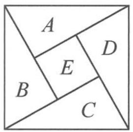

A. 36 种

B. 48 种

C. 72 种

D. 96 种

题 1-5 回文数是指从左向右读与从右向左读都一样的正整数. 如 22,121,3443,94249 等. 显然, 两位数中的回文数有 9 个, 即 11,22,33, $\cdots$ , 99; 三位数中的回文数有 90 个, 即 101, 111,121, $\cdots$ , 191,202, $\cdots$ , 999. 则

(Ⅰ)四位数中的回文数有 个.

(Ⅱ) $2n+1(n\in\mathbb{N}^{*})$ 位数中的回文数有个.

题 1-6 在大课间风采展示中,某班级准备了 2 个舞蹈、2 个独唱、1 个小品,共 5 个节目.要求相同类型的节目不能相邻,那么节目的不同演出顺序共有\_\_\_\_种.

例题 2 将 5 名北京冬奥会志愿者分配到花样滑冰、短道速滑、冰球和冰壶 4 个项目进行培训, 每名志愿者只分配到 1 个项目, 每个项目至少分配 1 名志愿者, 则不同的分配方案共有 ( ).

A. 60 种

B. 120 种

C. 240 种

D. 480 种

【分析】按照题目的要求,有2名志愿者分配到同一个项目,那么完成这件事的流程应该是这样子的:遵循特殊优先的原则,我们先将这2名同项目的志愿者选出(组合问题),将其视为1组,剩下的3名志愿者则视为1人1组,最后将4组志愿者分配到4个项目,这就是排列.

【解析】解法一:先组合、后排列.先将5名北京冬奥会志愿者分成4组,有 $C_{5}^{2}=10$ 种,再将4组志愿者分配到4个项目,有 $A_{4}^{4}=24$ 种.
由分步乘法原理知,不同的分配方案为 $10 \times 24 = 240$ 种.

综上,答案选 C.

【探讨】试题以体育运动为背景设计问题,引导考生关注学习与生活中的数学,这是现今计数问题常见的命题情境.我们在解题过程中,需要认真阅读素材,在增强民族荣誉感的同时将文字叙述转化为数学问题.事实上,本题是一个简单的分组分配问题,核心就是5个人分配到4个项目,统筹的思考是先将5个人分成4个组,再分配到4个项目,而志愿者人数恰好比项目数多1是问题的关键.全国卷高考经常沿着这样的思路设计考题,比如下面这道高考题.

(2020年全国Ⅱ卷理科第14题)4名同学到3个小区参加垃圾分类宣传活动,每名同学只去1个小区,每个小区至少安排1名同学,则不同的安排方法共有\_\_\_\_种.

同学数比小区数多1,根据题意,有2名同学去了同一个小区,与例题2有相同的解决思路,答案为 $C_{4}^{2}A_{3}^{3}=36$ 种.
再回到例题 2, 对于它的解答, 初学者经常会用下面的解法.
解法二: 将分配方案分成 4 类.

①花样滑冰项目分配了2个人,即花样滑冰项目从5个人中挑选2个人,有 $C_{5}^{2}=10$ 种方法;短道速滑项目从剩下的3个人中挑选1个人,有 $C_{3}^{1}=3$ 种方法;冰球项目从剩下的2个人中挑选1个人,有 $C_{2}^{1}=2$ 种方法;最后1个人直接去冰壶项目.

这一类有 $10 \times 3 \times 2 = 60$ 种方法.

②短道速滑项目分配了2个人,即花样滑冰项目从5个人中挑选1个人,有 $C_{5}^{1}=5$ 种方法;短道速滑项目从剩下的4个人中挑选2个人,有 $C_{4}^{2}=6$ 种方法;冰球项目从剩下的2个人中挑选1个人,有 $C_{2}^{1}=2$ 种方法;最后1个人直接去冰壶项目.

这一类有 $5 \times 6 \times 2 = 60$ 种方法.

③冰球项目分配了2个人,即花样滑冰项目从5个人中挑选1个人,有 $C_{5}^{1}=5$ 种方法;短道速滑项目从剩下的4个人中挑选1个人,有 $C_{4}^{1}=4$ 种方法;冰球项目从剩下的3个人中挑选2个人,有 $C_{3}^{2}=3$ 种方法;最后1个人直接去冰壶项目.

这一类有 $5 \times 4 \times 3 = 60$ 种方法.

④冰壶项目分配了2个人,即花样滑冰项目从5个人中挑选1个人,有 $C_{5}^{1}=5$ 种方法;短道速滑项目从剩下的4个人中挑选1个人,有 $C_{4}^{1}=4$ 种方法;冰球项目从剩下的3个人中挑选1个人,有 $C_{3}^{1}=3$ 种方法;最后2个人直接去冰壶项目.

这一类有 $5 \times 4 \times 3 = 60$ 种方法.

结合分类加法计数原理,不同的分配方案为 $60+60+60+60=240$ 种.答案选 C.

【探讨】解法二表面上比原分组分配解法复杂很多,但事实上,这样的想法更自然,更能接近问题的本质,因为解法二是先将问题进行分类,再逐一计算各类的方法数,每一个步骤用到的都是最基本的方法.当然,如果能意识到这4类的方法数是一样的(因为四个项目是等同的),我们还是可以简化计算的,算出第①类方法数为60,那么总的方法数为 $60\times4=240$ 种.
如果将例题2中的数字做一点改动,将“5名北京冬奥会志愿者”改成“6名北京冬奥会志愿者”,其余信息不变,“人数比项目数多1”这个问题的关键就发生改变了.如果沿用原分组分配的解法,就需要额外补充学习均匀分组的相关知识,算式为 $\left(C_{6}^{3}+\frac{C_{6}^{2}C_{4}^{2}}{A_{2}^{2}}\right)A_{4}^{4}=1560$ 种,均匀分组的方法这里就不叙述了.而用解法二就不存在这样的问题,分成两大类,列表如下.

<table><tr><td>条件</td><td>花样滑冰</td><td>短道速滑</td><td>冰球</td><td>冰壶</td></tr><tr><td rowspan="4">有1个项目有3名志愿者</td><td>3人</td><td>1人</td><td>1人</td><td>1人</td></tr><tr><td>1人</td><td>3人</td><td>1人</td><td>1人</td></tr><tr><td>1人</td><td>1人</td><td>3人</td><td>1人</td></tr><tr><td>1人</td><td>1人</td><td>1人</td><td>3人</td></tr><tr><td rowspan="6">有2个项目有2名志愿者</td><td>2人</td><td>2人</td><td>1人</td><td>1人</td></tr><tr><td>2人</td><td>1人</td><td>2人</td><td>1人</td></tr><tr><td>2人</td><td>1人</td><td>1人</td><td>2人</td></tr><tr><td>1人</td><td>2人</td><td>2人</td><td>1人</td></tr><tr><td>1人</td><td>2人</td><td>1人</td><td>2人</td></tr><tr><td>1人</td><td>1人</td><td>2人</td><td>2人</td></tr></table>

算式为 $C_{6}^{3}C_{3}^{1}C_{2}^{1} + C_{6}^{1}C_{5}^{3}C_{2}^{1} + C_{6}^{1}C_{5}^{1}C_{4}^{3} + C_{6}^{1}C_{5}^{1}C_{4}^{1} + C_{6}^{2}C_{4}^{2}C_{2}^{1} + C_{6}^{2}C_{4}^{1}C_{3}^{2} + C_{6}^{2}C_{4}^{1}C_{3}^{1} + C_{6}^{1}C_{5}^{2}C_{3}^{2} + C_{6}^{1}C_{5}^{2}C_{3}^{1} + C_{6}^{1}C_{5}^{1}C_{4}^{2} = 1560$ 种，简化的算式为 $C_{6}^{3}C_{3}^{1}C_{2}^{1}\times4+C_{6}^{2}C_{4}^{2}C_{2}^{1}\times6=1560$ 种，简化算式中的 4 可以用 $C_{4}^{1}$ 刻画，6 可以用 $C_{4}^{2}$ 刻画.

进一步,我们可以得到如下常见分组分配表,将 n 个人分配到 $m(n \geqslant m)$ 个地方,每个人只去 1 个地方,每个地方至少安排 1 个人,则不同的分配方案有

常见分组分配表

<table><tr><td rowspan="2">m</td><td colspan="4">n</td></tr><tr><td>3人</td><td>4人</td><td>5人</td><td>6人</td></tr><tr><td>2个地方</td><td> $C_{3}^{1} + C_{3}^{2} = 6$ </td><td> $C_{4}^{1} + C_{4}^{2} + C_{4}^{3} = 14$ </td><td> $C_{5}^{1} + C_{5}^{2} + \cdots + C_{5}^{4} = 30$ </td><td> $C_{6}^{1} + C_{6}^{2} + \cdots + C_{6}^{5} = 62$ </td></tr><tr><td>3个地方</td><td> $A_{3}^{3} = 6$ </td><td> $C_{4}^{2}C_{2}^{1}C_{3}^{1} = 36$ </td><td> $C_{5}^{3}C_{2}^{1}C_{3}^{1} + C_{5}^{2}C_{3}^{2}C_{3}^{2} = 150$ </td><td> $C_{6}^{4}C_{2}^{1}C_{3}^{1} + C_{6}^{3}C_{3}^{2}C_{3}^{1}C_{2}^{1} + C_{6}^{2}C_{4}^{2} = 540$ </td></tr><tr><td>4个地方</td><td>—</td><td> $A_{4}^{4} = 24$ </td><td> $C_{5}^{2}C_{3}^{1}C_{2}^{1}C_{4}^{1} = 240$ </td><td> $C_{6}^{3}C_{3}^{1}C_{2}^{1}C_{4}^{1} + C_{6}^{2}C_{4}^{2}C_{2}^{1}C_{4}^{2} = 1560$ </td></tr></table>

# 拓展探讨题

题 2-1 6 名同学到甲、乙、丙三个场馆做志愿者, 每名同学只去 1 个场馆, 甲场馆安排 1 名, 乙场馆安排 2 名, 丙场馆安排 3 名, 则不同的安排方法共有( ).

A. 120 种

B. 90 种

C. 60 种

D. 30 种

题 2-2 从 6 个人中挑选 4 个人去值班,每人值班一天,第一天安排 1 个人,第二天安排 1 个人,第三天安排 2 个人,则共有\_\_\_\_种安排情况.

题 2-3 2020 年 11 月 24 日, 全国劳动模范和先进工作者表彰大会在北京人民大会堂举行, 受表彰的是民族的精英、人民的楷模, 是共和国的功臣, 同时他们也是亿万中国工人阶级和广大劳动群众中的一分子. 某市有全国劳动模范和先进工作者 10 名进京受表彰, 其中机关事业单位 3 人, 企业单位 5 人, 农民 2 人. 表彰会后, 该市为了弘扬劳模精神、劳动精神、工匠精神, 准备进行劳动模范和先进工作者巡回演讲, 将这 10 名劳动模范和先进工作者平均分成 2 个巡回演讲团, 每个巡回演讲团 5 人. 要求第一巡回演讲团中机关事业单位、企业单位、农民代表都至少有 1 人参加, 则第一巡回演讲团人员的组成方法有( ).

A. 120 种

B. 175 种

C. 350 种

D. 630 种

题 2-4 阳春三月,春暖花开,某学校开展“学雷锋践初心向建党百年献礼”志愿活动.现有6名男同学和4名女同学,分配到4个“学雷锋志愿服务站”参加志愿活动.若每个志愿服务站至少有男、女同学各1名,则不同的分配方案有( ).

A. 65 种

B. 1560 种

C. 25920 种

D. 37440 种

题 2-5 某市从 8 名优秀教师中选派 4 名同时去 4 个灾区支教(每个灾区选派 1 人). 其中, 甲和乙不同去, 甲和丙只能同去或同不去, 则不同的选派方案有( ).

A. 1680 种

B. 960 种

C. 600 种

D. 480 种

题 2-6 已知有 5 男、5 女共 10 名记者参加 2021 年的两会新闻报道, 现从中选取 8 人分配到 A, B 两个组, 每个组 4 人. 其中, A 组的 4 人中, 要求女性的人数多于男性; B 组的 4 人中, 要求至少有 1 名女性. 则不同的分配方法有\_\_\_\_种.

题 2-7 两个三口之家(父母+小孩)共6人去旅游,有红旗和吉利两辆车,每辆车至少乘坐2人,但2个小孩不能单独乘坐一辆车,则不同的乘车方式有().

A. 48 种

B. 50 种

C. 98 种

D. 68 种

题 2-8 已知有 5 个不同的小球, 现将这 5 个球全部放入到标有编号 1, 2, 3, 4, 5 的五个盒子中. 若装有小球的盒子的编号之和恰为 11, 则不同的放球方法有( ).

A. 150 种

B. 240 种

C. 390 种

D. 1440 种

# 研究路径探索
由上述例题的分析与解,我们可以得到计数问题的基本研究路径,如图所示.

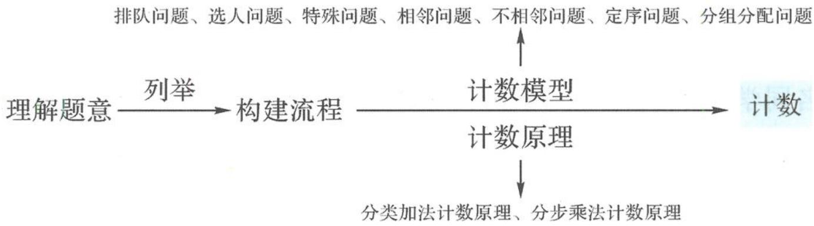
首先,要分析题意,理解清楚“这件事”是什么(很多时候列举法依然是帮助我们明晰思路的好办法,要学会使用“树状图”和“流程图”分析问题).
其次,构建出完成“这件事”的流程,识别“这件事”是否是我们熟悉的计数模型.我们已经解决过、熟悉的计数模型有很多,像排队问题(排列)、选人问题(组合)、特殊问题(分类,特殊优先,正难则反)、相邻问题(捆绑法)、不相邻问题(插空法)、定序问题(缩倍法)、分组分配问题(先分组后分配)等.
如果“这件事”并不是我们熟悉的模型,那么我们还可以回到计数原理上来,按照事件的流程做出计算.
当然,很多比较复杂试题的解决过程中既要用到基本的计数原理进行分解,又在其中某一类型或某一步骤当中包含着计数模型.

## 1.2 二项式定理

# 基本概念解读

# 问题 1 如何理解二项式定理？

二项式定理是两个计数原理的直接应用,是我们解决二项展开式问题的工具,也为数学家解决有关微积分、概率问题奠定了基础.

<table><tr><td>二项式定理</td><td> $(a+b)^{n}=C_{n}^{0}a^{n}+C_{n}^{1}a^{n-1}b+\cdots+C_{n}^{k}a^{n-k}b^{k}+\cdots+C_{n}^{n}b^{n},n\in\mathbb{N}^{*}$ ,特别地, $(1+x)^{n}=C_{n}^{0}+C_{n}^{1}x+\cdots+C_{n}^{k}x^{k}+\cdots+C_{n}^{n}x^{n},k\in\mathbb{N}$ .</td></tr><tr><td>二项式系数</td><td> $C_{n}^{k}$ .</td></tr><tr><td>通项</td><td>展开式的第 $k+1$ 项 $T_{k+1}=C_{n}^{k}a^{n-k}b^{k}$ .</td></tr></table>

从形式上看,二项式定理是一个公式,它能将两个数之和的“任意实数次幂”展开成“和”的形式(高中只研究正整数幂).

问题 2 二项式系数(组合数)有哪些性质? 你能说出它们的证明或直观解释吗? 你能从杨辉三角中找到它们吗?

<table><tr><td>常用性质</td><td>证明或直观说明</td></tr><tr><td> $C_{n}^{m}=C_{n}^{n-m}$ (其中  $n\geqslant m$ )</td><td>从  $n$  个元素中抽取  $m$  个元素等价于从  $n$  个元素中“淘汰”掉  $n-m$  个元素,它们的方法数相等,即等式  $C_{n}^{m}=C_{n}^{n-m}$  成立.杨辉三角中每一行的数左右对称.</td></tr><tr><td> $C_{n}^{m}+C_{n}^{m-1}=C_{n+1}^{m}$ </td><td>从  $n+1$  个元素中抽取  $m$  个元素,有  $C_{n+1}^{m}$  种方法,但也可分为两类计算:第一类:抽取其中某一特殊元素,此时还需从其他  $n$  个元素中再抽取  $m-1$  个元素,有  $C_{n}^{m-1}$  种方法;第二类:不抽取该特殊元素,此时则需从其他  $n$  个元素中抽取  $m$  个元素,有  $C_{n}^{m}$  种方法.结合分类加法计数原理,有等式  $C_{n}^{m}+C_{n}^{m-1}=C_{n+1}^{m}$  成立.杨辉三角中除 1 外的数都等于“肩上”两数的和.</td></tr><tr><td>当  $n$  为偶数时, $C_{n}^{\frac{n}{2}}$  最大;当  $n$  为奇数时, $C_{n}^{\frac{n-1}{2}}$ , $C_{n}^{\frac{n+1}{2}}$  最大</td><td>设  $f(k)=C_{n}^{k}$ ,对于  $\frac{C_{n}^{k}}{C_{n}^{k-1}}=\frac{\frac{n!}{(n-k)!k!}}{\frac{n!}{(n-k+1)!(k-1)!}}=\frac{(n-k+1)!(k-1)!}{(n-k)!k!}=\frac{n-k+1}{k}$ ,令 $\frac{C_{n}^{k}}{C_{n}^{k-1}}\geqslant1$ ,可以得到  $k\leqslant\frac{n+1}{2}$ ,即当  $k\leqslant\frac{n+1}{2}$  时, $f(k)=C_{n}^{k}$  单调递增;由对称性知,当  $k\geqslant\frac{n+1}{2}$  时, $f(k)=C_{n}^{k}$  单调递减.</td></tr><tr><td>所有二项式系数的和 $C_{n}^{0} + C_{n}^{1} + \cdots + C_{n}^{n} = 2^{n}$ </td><td>对于二项展开式 $(1+x)^{n} = C_{n}^{0} + C_{n}^{1}x + \cdots + C_{n}^{n}x^{n}$ ,取 $x=1$ ,则有等式 $C_{n}^{0} + C_{n}^{1} + \cdots + C_{n}^{n} = 2^{n}$ 成立.该等式同时说明了一个含有 $n$ 个元素的集合共有 $2^{n}$ 个子集.再取 $x=-1$ ,得到 $C_{n}^{0} - C_{n}^{1} + C_{n}^{2} - C_{n}^{3} + \cdots + (-1)^{n}C_{n}^{n} = 0$ ,进而 $C_{n}^{0} + C_{n}^{2} + \cdots = C_{n}^{1} + C_{n}^{3} + \cdots = 2^{n-1}$ ,即奇数项的二项式系数的和等于偶数项的二项式系数的和.</td></tr></table>

# 问题 3 高考中如何考查二项式定理？

对二项式定理的考查主要有三个方面：

一是研究二项展开式的项的特征(如常数项, 项、特定项的系数等, 着眼于概念与原理的考查);

二是研究展开式的系数的问题(这类问题主要考查考生的观察能力以及赋值法的思想), 其实解决这两类问题的关键就是模式识别, 更具体地说就是分配与赋;

三是利用二项式定理开展数值估计,这也是二项式定理的常见应用.

# 典型考题探讨

例题 1 在二项式 $(\sqrt{2}+x)^{9}$ 的展开式中, 常数项是 \_\_\_\_, 系数为有理数的项的个数是 \_\_\_\_.

【分析】本题考查二项展开式,二项式是已知的,要研究的是特殊的项,即常数项和系数为有理数的项,因此从二项展开式的通项入手是最直接的.

【解析】二项式 $(\sqrt{2} + x)^9$ 的展开式的通项为
$T _ {k + 1} = \mathrm{C} _ {9} ^ {k} (\sqrt {2}) ^ {9 - k} x ^ {k} = 2 ^ {\frac {9 - k}{2}} \mathrm{C} _ {9} ^ {k} x ^ {k}.$
令 $k = 0$ ，得常数项是
$T _ {1} = 2 ^ {\frac {9}{2}} = 2 ^ {4} \times 2 ^ {\frac {1}{2}} = 1 6 \sqrt {2}.$

系数要为有理数,则 $\frac{9-k}{2}$ 为整数,即9-k为偶数,也就是k为奇数,这样的k有1,3,5,7,9共5个数,因此系数为有理数的项的个数是5.

综上,答案为 $16\sqrt{2}$ ,5.

【探讨】本题设计的是与二项式定理、二项式系数相关的问题,简单明了,直接考查对通项的掌握情况.在这类考题中,命题者在二项式中设计出分数指数幂或负指数幂形式的数据,进一步考查指数幂的运算性质,强调运算求解能力,体现数学的综合性.

# 拓展探讨题

题 1-1 $\left(x^{3}-\frac{1}{x}\right)^{4}$ 的展开式中的常数项为 \_\_\_\_.

题 1-2 如果 $\left(\sqrt{x}+\frac{3}{\sqrt[3]{x}}\right)^{n}$ 的展开式中含有非零常数项,则正整数 n 的最小值为 \_\_\_\_.

题 1-3 在 $x\left(x-\frac{2}{x}\right)^{7}$ 的展开式中, $x^{4}$ 的系数是 \_\_\_\_ (用数字作答).

题 1-4 在二项式 $\left(x-\frac{a}{\sqrt{x}}\right)^{6}(a>0)$ 的展开式中, 设 $x^{3}$ 的系数为 A, 常数项为 B. 若 B=4A, 则 a 的值是 \_\_\_\_.

题 1-5 若 $\left(a^{2}+\frac{1}{a}\right)^{n}$ 的展开式中含 $a^{3}$ 项, 则最小自然数 n 是 \_\_\_\_, 此时 $a^{3}$ 的系数为 \_\_\_\_.

题 1-6 在 $\left(\sqrt{x}+\frac{2}{x^{2}}\right)^{n}$ 的展开式中, 若只有第 6 项的二项式系数最大, 则展开式的常数项是().

A. 360

B. 180

C. 90

D. 45

题 1-7 在 $\left(x+\frac{y^{2}}{x}\right)(x+y)^{5}$ 的展开式中， $x^{3}y^{3}$ 的系数为（）.

A. 5

B. 10

C. 15

D. 20

题 1-8 若 $\left(\frac{2}{x}-x\right)^{n}$ 的展开式中的各二项式系数之和为 1024, 则 $x^{4}$ 的系数是().

A. -210

B. -960

C. 960

D. 210

例题 2 在 $(a+x)(1+x)^{4}$ 的展开式中, 若 x 的奇数次幂项的系数之和为 32, 则 a = \_\_\_\_.

【分析】试题着重考查学生应用二项式定理解决展开式系数有关问题的能力,从设问方式上看,属于逆向思维的考查类型,通过奇数次幂项系数之和为定值构建方程,进而求出未知量a的值.

【解析】解法一:易得
$(a + x) (1 + x) ^ {4} = a (1 + x) ^ {4} + x (1 + x) ^ {4}.$
因为 $(1 + x)^{4}$ 展开式的通项为 $T_{r + 1} = \mathrm{C}_4^r x^r$ ，所以展开式中 $x$ 的奇数次幂项的系数之和为
$a \left(\mathrm{C} _ {4} ^ {1} + \mathrm{C} _ {4} ^ {3}\right) + \mathrm{C} _ {4} ^ {0} + \mathrm{C} _ {4} ^ {2} + \mathrm{C} _ {4} ^ {4} = 3 2,$
即 $8a+8=32$ ，解得 a=3。答案为 3。

【探讨】高考试题常有这种以两个二项式乘积作为背景的试题, 强调逻辑思维, 考查考生分析问题的能力. 第一个二项式中 $a$ 是常数项, $x$ 是一次项, 那么最终展开式中的奇数次幂项是由两个部分组成的, 一个部分是 $a$ 与 $(1 + x)^4$ 展开式中奇数次幂项的乘积, 另一部分则是 $x$ 与 $(1 + x)^4$ 展开式中偶数次幂项 (包括常数项) 的乘积. 如果考生对二项式系数有更深的认识, 除了上面按部就班的解法, 还能有以下更快的解法.
解法二:利用奇数项的二项式系数的和等于偶数项的二项式系数的和计算
$\mathrm{C} _ {4} ^ {1} + \mathrm{C} _ {4} ^ {3} = \mathrm{C} _ {4} ^ {0} + \mathrm{C} _ {4} ^ {2} + \mathrm{C} _ {4} ^ {4} = 2 ^ {3} = 8 \Rightarrow 8 a + 8 = 3 2 \Rightarrow a = 3.$
解法三:无须逐一计算奇数次幂项,直接整体计算奇数次幂项的系数.设
$(a + x) (1 + x) ^ {4} = a _ {0} + a _ {1} x + a _ {2} x ^ {2} + a _ {3} x ^ {3} + a _ {4} x ^ {4} + a _ {5} x ^ {5}.$

取 $x = 1$ ，可得
$a _ {0} + a _ {1} + a _ {2} + a _ {3} + a _ {4} + a _ {5} = 1 6 (1 + a);$

取 $x = -1$ ，可得
$a _ {0} - a _ {1} + a _ {2} - a _ {3} + a _ {4} - a _ {5} = 0.$
所以奇数次幂项的系数之和为 $a_1 + a_3 + a_5 = 8(1 + a)$ ，解方程 $8(1 + a) = 32$ ，可得 $a = 3$ .
事实上,从函数的视角来看,设 $f(x)=(a+x)(1+x)^{4}$ , 则奇数次幂项的系数为 $\frac{f(1)-f(-1)}{2}$ , 偶数次幂项的系数为 $\frac{f(1)+f(-1)}{2}$ .

# 拓展探讨题

题 2-1 若 $(1-2x)^{2021}=a_{0}+a_{1}x+\cdots+a_{2021}x^{2021}(x\in\mathbb{R})$ ，则 $\frac{a_{1}}{2}+\frac{a_{2}}{2^{2}}+\cdots+\frac{a_{2021}}{2^{2021}}$ 的值为（）.

A. 2

B. 0

C. -1

D.-2

题 2-2 已知多项式 $(x-1)^{3}+(x+1)^{4}=x^{4}+a_{1}x^{3}+a_{2}x^{2}+a_{3}x+a_{4}$ ，则 $a_{1}=$ \_\_\_\_； $a_{2}+a_{3}+a_{4}=$ \_\_\_\_.

题 2-3 已知 $(2x^{2}+1)\left(\frac{a}{x^{2}}-1\right)^{5}$ 的展开式中各项系数之和为 0，则该展开式的常数项是（）.

A. -10

B. -7

C. 9

D. 10

题 2-4 已知 $(x^{2}+1)(2x-1)^{7}=a_{0}+a_{1}(x-1)+a_{2}(x-1)^{2}+\cdots+a_{9}(x-1)^{9}$ ，则 $a_{2}+a_{4}+a_{6}+a_{8}=()$ .

A. 10935

B. 5546

C. 5468

D. 5465

题 2-5 （多选题）已知 $\left(2x-\frac{a}{x}\right)^{7}$ 的展开式中各项系数的和为 1，则下列结论正确的有（）.

A. $a = 1$

B. 展开式中二项式系数之和为 256

C. 展开式中常数项为 -560

D. 展开式系数的绝对值的和为 $3^{7}$

题2-6 已知 $\left(\frac{m}{x^2} - 4 + x^2\right)^5$ 的展开式中所有项的系数和为1, 则 $x^4$ 的系数为 \_\_\_\_.

题 2-7 若 $(\sqrt{2}-x)^{2020}=a_{0}+a_{1}x+\cdots+a_{2020}x^{2020}$ ，则 $(a_{0}+a_{2}+a_{4}+\cdots+a_{2020})^{2}-(a_{1}+a_{3}+a_{5}+\cdots+a_{2019})^{2}$ 的值为（）.

A. 0

B.-1

C. 1

D. $(\sqrt{2} - 1)^{2012}$

题2-8 已知 $(2 - \sqrt{x})^n (n\geqslant 2,n\in \mathbf{N})$ 的展开式中 $x$ 的系数为 $f(n)$ ，则 $\frac{2}{f(2)} +\frac{2^2}{f(3)} +\frac{2^3}{f(4)}$ $+\dots +\frac{2^{2019}}{f(2020)}$ 等于（ ）.

A. $\frac{2019}{110}$

B. $\frac{2019}{505}$

C. $\frac{1009}{1010}$

D. $\frac{1009}{505}$

例题 3 科技创新离不开科研经费的支撑,在一定程度上,研发投入被视为衡量“创新力”的重要指标.“十三五”时期我国科技实力和创新能力大幅提升,2020年我国全社会研发经费投入达到了24426亿元,总量稳居世界第二,其中基础研究经费投入占研发经费投入的比重是6.16%。“十四五”规划纲要草案提出,全社会研发经费投入年均增长要大于7%,到2025年基础研究经费占比要达到8%以上.估计2025年我国基础研究经费为().

A. 1500 亿元左右

B. 1800 亿元左右

C. 2200 亿元左右

D. 2800 亿元左右

【分析】试题着重考查学生的阅读能力和分析问题的能力,阅读时需找到全社会研究经费和基础研究经费之间的关系,以及全社会研发经费的增长特点.

【解析】由题意知,2025年的全社会研发经费投入要大于 $24426\times(1+7\%)^{5}$ ,则2025年我国基础研究经费大于 $24426\times(1+7\%)^{5}\times8\%$ ,其中
$(1 + 7 \%) ^ {5} > 1 + C _ {5} ^ {1} \times 7 \% = 1. 3 5,$

那么
$24426 \times (1 + 7\%) ^{5} \times 8 \% > 24000 \times 1.35 \times 8 \% = 2592.$

参照四个选项,故选 D.

【探讨】我们命制这道考题时参考的是“十四五”规划中对全社会研发经费的提议,数据全部都是真实的,所以题目中出现了24426和6.16%这样看起来有点复杂的数据,表面来看本题的知识点可以说是指数函数模型或者说是等比数列,只要考生能耐心审题得出 $24426 \times (1 + 7\%)^{5} \times 8\%$ 这个算式应该是不难的,难点就在于式子数值的计算了.其实,仅计算24426×8%就已经超过1900了,因此解题时首先应该排除AB选项.而(1+7%)⁵就是一个二项式,这一点很多考生没有意识到,(1+7%)⁵=1+C₁₅×7%+C₂₅×(7%)²+C₃₅×(7%)³+C₄₅×(7%)⁴+(7%)⁵,直接计算固然很复杂,我们只需取展开式中的几项就能对它进行估计和近似计算,相比较而言前两项的值最大,因此取前两项估算是最快的也是最有效的,取前三项还能得到(1+7%)⁵>1+C₁₅×7%+C₂₅×(7%)²=1.399,这样24426×(1+7%)⁵×8%＞2733,和2800这个答案更接近.从本题中我们可以看出二项式定理在生产生活中的广泛应用性.

# 拓展探讨题

题 3-1 设 $n \in N$ 且 n < 5，若 $6^{2021} + n$ 能被 5 整除，则 n 等于 \_\_\_\_.

题 3-2 今天是星期三,那么经过 $8^{2021}$ 天后是().

A. 星期二

B. 星期三

C. 星期四

D. 星期五

题 3-3 $1.02^{6}$ 的近似值(精确到 0.01)为().

A. 1.12

B. 1.13

C. 1.14

D. 1.20

题 3-4 定义:两个正整数 a, b, 若它们除以正整数 m 所得的余数相等, 则称 a, b 对模 m 同余, 记作 $a \equiv b (\bmod m)$ , 比如: $26 \equiv 16 (\bmod 10)$ . 已知 $n = C_{10}^{0} + C_{10}^{1} \times 8 + C_{10}^{2} \times 8^{2} + \cdots + C_{10}^{10} \times 8^{10}$ , 满足 $n \equiv p (\bmod 10)$ , 则 p 可以是().

A. 23

B. 21

C. 19

D. 17

题 3-5 农民收入由工资性收入和其他收入两部分构成. 2003 年某地区农民人均收入为 3150 元(其中工资性收入为 1800 元,其他收入为 1350 元),预计该地区自 2004 年起的 5 年内,农民的工资性收入将以每年 6% 的年增长率增长,其他收入每年增加 160 元。根据以上数据,2008 年该地区农民人均收入介于( ).

A. 4200 元～4400 元

B. 4400 元～4600 元

C. 4600 元～4800 元

D. 4800 元～5000 元

# 研究路径解密
由上述例题的分析与解,我们可以得到“二项式定理”问题的基本研究路径,如图所示.

二项式 $\longrightarrow$ 通项 $\longrightarrow$ 展开式 $\longrightarrow$ 应用

本节的研究思路是数学中最常见的思维方式,即从概念(公式)出发到性质和应用.以两个计数原理为底层逻辑起点,从研究通项代数结构入手,在具体到指数幂的运算时,要关注一些容易混淆的概念,如二项式系数与系数,项数与k的关系等.此外,在对通项结构特征的分析计算时,还可以拓展探索系数的一些常用性质以便更深入把握二项式定理的本质内涵.对于二项式定理的应用,例题3和拓展探讨题谈到了常见的一些应用,我们在看到形如 $a^{n},(a+b)^{n},(a+b+c)^{n}$ 这样的算式时都要自然地联想到二项式定理.

## 1.3 经典计数模型

# 经典模型 1

# 问题的提出
将 $n$ 个相同元素分装到 $m$ 个不同的盒子中,有多少种装法?

# 模型的构建

问题 1: (要求每个盒子非空) 将 10 个小球分别装入 3 个不同的盒子中且每个盒子非空 (或每个盒子至少装 1 个小球). 问: 有多少种不同的装法?

【解析】将 10 个小球排成一排,在两两之间的 9 个间隙中任取两个划上竖线,这样就将 10 个小球分成了 3 组,如图所示.

○ ○ | ○ ○ ○ ○ | ○ ○ ○ ○
将每组小球按顺序装入 3 个盒子中, 则划竖线的方法数就等于题中所求的装法数, 共有 $C_{9}^{2}=36$ 种装法.

问题 2: (要求每个盒子至少有 n 个) 将 20 本书分给 4 名学生, 要求每名学生至少得 3 本, 有多少种不同分法?

【解析】先给每人分 2 本, 然后将剩下的 12 本书按上述划竖线的方法分给 4 名学生, 于是每人至少能得 3 本, 共有 $C_{11}^{3}=165$ 种分法.

问题 3: (要求每个盒子分别有 $n_{1}, n_{2}, \cdots, n_{m}$ 个) 将 20 个相同的小球全部放入编号为 3,4,5 的 3 个盒子中, 要求每个盒子内的球数不小于它的编号数, 求不同的放法种数.

【解析】先在 3 个盒子中依次放入 2,3,4 个球,再将剩余的 11 个球按上述划竖线的方法分到 3 个盒子中,这样就能满足“每个盒子内的球数不小于它的编号数”的要求.于是共有 $C_{10}^{2}$ =45 种方法.

问题 4: (要求每个盒子可空) 将 8 个相同的小球分别放入 4 个不同的盒子中, 每个盒子可空, 有多少种不同的放法?

【解析】设想在每个盒子中放入-1个小球,共用去-4个小球再将剩余的 $8 - (-4) = 12$ 个小球用上述划竖线的方法分到4个盒子中,则能满足题目要求.所以装法种数为 $C_{11}^{3} = 165$ .

实际上,本题等价于“将12个相同的小球分装到4个盒子中,每个盒子至少1个小球”的问题.

# 模型的应用

例题1 试求不定方程 $x_{1} + x_{2} + x_{3} + \dots +x_{m} = n(n\geqslant m > 2)$ 的非负整数解的组数.

【解析】由于 $x_{i} \geqslant 0$ ，所以令 $x_{i} = y_{i} - 1$ ，则 $y_{i} \geqslant 1$ ，则原不定方程解的组数与方程 $y_{1} + y_{2} + \cdots + y_{m} = n + m$ 解的组数相同。
设想有 $m+n$ 个 1，将它们排成一排，每两个之间有 1 个间隙，共有 $m+n-1$ 个间隙。用划竖线的方法，这些竖线将这 $m+n$ 个 1 分成 m 段，每段内 1 的个数即为一组 $y_{1}, y_{2}, \cdots, y_{m}$ ，它是方程 $y_{1} + y_{2} + \cdots + y_{m} = n + m$ 的一组正整数解，由于划竖线的方法数为 $C_{m+n-1}^{m-1}$ ，故原不定方程非负整数解的组数为 $C_{m+n-1}^{m-1}$ 。

例题 2 试讨论 $(a_{1}+a_{2}+\cdots+a_{m})^{n}$ 的展开式的项数.

【解析】由于 $(a_{1}+a_{2}+\cdots+a_{m})^{n}$ 的展开式的通项为 $\frac{n!}{x_{1}!x_{2}!\cdots x_{m}!}a_{1}^{x_{1}}a_{2}^{x_{2}}\cdots a_{m}^{x_{m}}$ ，其中 $x_{1}+x_{2}+x_{3}+\cdots+x_{m}=n(x_{i}\geqslant0)$ ，所以展开式的项数与不定方程 $x_{1}+x_{2}+x_{3}+\cdots+x_{m}=n$ 的非负整数解的组数相等，从而问题转化为讨论不定方程 $x_{1}+x_{2}+x_{3}+\cdots+x_{m}=n$ 的非负整数解的组数.

同上可得 $(a_{1}+a_{2}+\cdots+a_{m})^{n}$ 的展开式的项数为 $C_{m+n-1}^{m-1}$ .

# 经典模型 2

模型题 按一次电视机遥控器上的电源开关,电视机可能出现以下三种情况:①由原来的关机状态转为开机状态;②由原来的开机状态转为关机状态;③电视机保持原来的状态不变.由于电视机从关机状态转为开机状态要等待一段时间,一台电视机处于关机状态时,某人连续按了4次电源开关,结果使电视转为开机,则他所按的4次中可以发生的所有的情况数有( ).

A. 8 种

B. 12 种

C. 16 种

D. 20 种

【分析】我们将上述条件简记为①关机→开机；②开机→关机；③状态不变。要使最终转为开机，不难看出①必须比②多一次，其次，在关机前须先开机，则②必须在①之后，从而得到①②之间的相对顺序。

【解析】对于 4 种情况, （1） 若①出现 1 次, 则其余 3 次皆为③, 此时发生的情况共有 $N_{1} = C_{4}^{3}$ 种;  
（2）若①出现 2 次,则其中必出现 1 次②和 1 次③,此时发生的情况共有 $N_{2} = \mathrm{C}_{4}^{1}$ 种,所以总的可能情况为 $N_{1} + N_{2} = \mathrm{C}_{4}^{3} + \mathrm{C}_{4}^{1} = 8$ 种.
故选A.

拓展探讨 若他所按的次数为 5, 其余条件不变, 则所有发生的情况有多少种呢?

【解析】按上述分析,若①出现1次,则其余4次皆为③,此时发生的情况共有 $N_{1}=C_{5}^{4}$ 种;
若①出现2次,则其中必出现1次②和2次③,此时发生的情况共有 $N_{2}=C_{5}^{2}$ 种;
若①出现3次,则其中必出现2次②和0次③,此时发生的情况共有 $N_{3}=C_{5}^{0}$ 种.
从而共有 $N_{1}+N_{2}+N_{3}=C_{5}^{4}+C_{5}^{2}+C_{5}^{0}=16$ 种可能情况.

仔细回顾上述两种情况,我们将其推广到按 n 次可能出现的情况的情形.  
（1） 当 $n=2k, k \in N^{*}$ 时，各类情况中③出现的次数依次为 $n-1, n-3, n-5, \cdots, 5, 3, 1$ ，于是总的情况共有 $N = C_{n}^{n-1} + C_{n}^{n-3} + \cdots + C_{n}^{3} + C_{n}^{1} = 2^{n-1}$ 种.  
（2） 当 $n=2k+1, k \in N$ 时, 各类情况中③出现的次数依次为 $n-1, n-3, n-5, \cdots, 4, 2, 0$ , 于是总的情况共有 $N = C_{n}^{n-1} + C_{n}^{n-3} + \cdots + C_{n}^{2} + C_{n}^{0} = 2^{n-1}$ 种.
因此,连续按 n 次可能出现的情况为 $N=2^{n-1}$ 种.

# 经典模型 3

模型题 如图,人从格子外只能进入第1个格子,人在格子中每次可向前跳1格或2格,那么人从格子外跳到第8个格子有多少种不同的方法?

<table><tr><td>1</td><td>2</td><td>3</td><td>4</td><td>5</td><td>6</td><td>7</td><td>8</td></tr></table>

【解析】第1个格子与第8个格子必选,故能省的格子为2,3,4,5,6,7,当然省的格子数不超过3,也不能连省2个格子.于是我们有以下解法.

从 2,3,4,5,6,7 中，将要省的格子插入不能省的格子留下的空，则有：

①省 0 个格子, 意味着有 7 个空, 从而有 $C_{7}^{0}$ 种;

②省 1 个格子, 则有 6 个空, 从而有 $C_{6}^{1}$ 种;

③省 2 个格子, 则有 5 个空, 从而有 $\mathrm{C}_{5}^{2}$ 种;

④省 3 个格子, 则有 4 个空, 从而有 $C_{4}^{3}$ 种.
故方法总数为 $N=C_{7}^{0}+C_{6}^{1}+C_{5}^{2}+C_{4}^{3}=21$ 种.

拓展探讨 1 如果格子变成了 9 个呢?

【解析】如果格子变成了9个,则:

①省 0 个格子,意味着有 8 个空,从而有 $C_{8}^{0}$ 种;

②省 1 个格子, 则有 7 个空, 从而有 $C_{7}^{1}$ 种;

③省 2 个格子, 则有 6 个空, 从而有 $C_{6}^{2}$ 种;

④省 3 个格子, 则有 5 个空, 从而有 $C_{5}^{3}$ 种;

⑤省 4 个格子, 则有 4 个空, 从而有 $\mathrm{C}_{4}^{4}$ 种.
故方法总数为 $N = \mathrm{C}_8^0 +\mathrm{C}_7^1 +\mathrm{C}_6^2 +\mathrm{C}_5^3 +\mathrm{C}_4^4 = 34$ 种.

拓展探讨 2 如果格子数变成了 n 个呢？

【解析】由上述解法我们不难得到：  
（1） 当 $n=2k, k \in N^{*}$ 时，跳法总数
$N = \mathrm{C} _ {n - 1} ^ {0} + \mathrm{C} _ {n - 2} ^ {1} + \mathrm{C} _ {n - 3} ^ {2} + \mathrm{C} _ {n - 4} ^ {3} + \dots + \mathrm{C} _ {k} ^ {k - 1}.$  
（2） 当 $n=2k+1, k \in N$ 时，跳法总数
$N = \mathrm{C} _ {n - 1} ^ {0} + \mathrm{C} _ {n - 2} ^ {1} + \mathrm{C} _ {n - 3} ^ {2} + \mathrm{C} _ {n - 4} ^ {3} + \dots + \mathrm{C} _ {k} ^ {k}.$

我们看到当格子数较大时,计算是有困难的,于是想是否有其他的方法.考虑到数列和计数有着天然的联系,抱着试试的心理由递推数列考虑.
设方法总数为 $a_{n}$ , 当 $n \geqslant 3$ 时, 到最后一格, 只能是①从第 $n - 2$ 个格子跳入; ②从第 $n - 1$ 个格子跳入. 由分类计数原理得到 $a_{n} = a_{n - 1} + a_{n - 2}$ , 不难得出, 当 $n = 1$ 时, 方法数 $a_{1} = 1$ ; 当 $n = 2$ 时, 方法数 $a_{2} = 1$ . 这恰好是斐波那契数列. 这可是很重要的发现, 一个跳格子问题居然跟大名鼎鼎的斐波那契数列联系在了一起. 我们知道斐波那契数列中 $a_{8} = 21, a_{9} = 34$ , 刚好与上述解法结果一致. 更为重要的是我们得到了下面这个重要的结果.  
（3） 当 $n=2k, k \in N^{*}$ 时，跳法总数
$a _ {n} = \mathrm{C} _ {n - 1} ^ {0} + \mathrm{C} _ {n - 2} ^ {1} + \mathrm{C} _ {n - 3} ^ {2} + \mathrm{C} _ {n - 4} ^ {3} + \dots + \mathrm{C} _ {k} ^ {k - 1} = \frac {1}{\sqrt {5}} \left[ \left(\frac {1 + \sqrt {5}}{2}\right) ^ {n} - \left(\frac {1 - \sqrt {5}}{2}\right) ^ {n} \right].$  
（4） 当 $n=2k+1, k \in N$ 时，跳法总数
$a _ {n} = \mathrm{C} _ {n - 1} ^ {0} + \mathrm{C} _ {n - 2} ^ {1} + \mathrm{C} _ {n - 3} ^ {2} + \mathrm{C} _ {n - 4} ^ {3} + \dots + \mathrm{C} _ {k} ^ {k} = \frac {1}{\sqrt {5}} \left[ \left(\frac {1 + \sqrt {5}}{2}\right) ^ {n} - \left(\frac {1 - \sqrt {5}}{2}\right) ^ {n} \right].$

# 第二章 概率

概率论是研究随机现象数量规律的数学分支. 类比函数的“研究路径”, 在具体情境中我们通过数学抽象在集合论基础上首先建立了概率的基本概念, 随后研究了概率的基本性质, 最后应用这些知识研究各种概率分布模型, 这就是我们研究的基本思路.

## 2.1 基本研究路径下的“概率”解题

概率论的研究对象就是随机现象,概率论为我们从不确定性的角度认识现实世界中的随机现象提供了思想与方法,而随机事件发生的可能性大小的数值就被称为概率.法国著名数学家拉普拉斯也曾说过:“生活中最重要的问题,绝大部分其实只是概率问题.”可见概率的重要性.

与统计相比,概率侧重于推理,概率是统计的基础.在本章中,随机事件和随机变量是两个重要的研究对象,本章的基本研究路径如图所示.

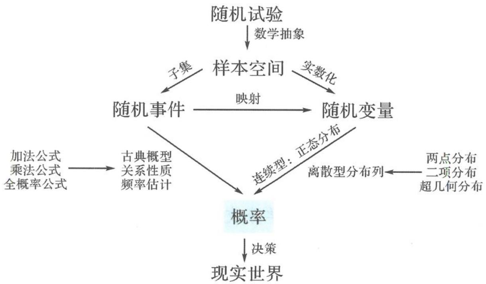

①要充分理解随机试验,并在此基础上建立样本空间,这样就能够利用集合语言比较方便地刻画随机事件.  
②进一步明确复杂随机事件的关系或引入随机变量,常见的关系有相互独立关系和互斥关系,及由此带来的概率加法公式、乘法公式和全概率公式等计算工具.  
③建立概率模型计算随机事件或随机变量的概率,高中阶段的概率模型有古典概率模型、频率估计概率模型、离散型分布模型(两点分布模型、超几何分布模型、二项分布模型)、正态分布模型等.  
④在概率计算的基础上,做出数据特征的计算、推断和决策,进一步认识现实世界.

另外，在本章的学习过程中，要善于类比函数研究的一般路径来构建对随机现象和概率体系的研究，即通过对随机现象的分析，积极构建随机现象的研究路径、抽象概率的研究对象、建立概率的基本概念、发现和提出概率的性质、探索和形成研究随机现象的思路和方法，强化随机思想和随机方法，发展认识不确定现象的思维模式。

下面举一道例题说明随机问题研究的视角并开始我们对概率问题的研究之旅.

新人教版必修二 P241 例 12 为了推广一种新饮料,某饮料生产企业开展了有奖促销活动:将 6 罐这种饮料装一箱,每箱中都放置 2 罐能够中奖的饮料.若从一箱中随机抽取 2 罐,能中奖的概率为多少?

# 视角 1 古典概型
将 2 罐能够中奖的饮料记为 1,2,其余 4 罐饮料记为 3,4,5,6. 随机抽取 2 罐,则该试验的样本空间为 $\Omega = \{(m,n) | m, n \in \{1,2,3,4,5,6\}, m \neq n\}$ , 其中共有 30 个样本点且各个样本点出现的可能性相等.
设事件 $A =$ “中奖”，则 $A = \{(1,2),(1,3),(1,4),(1,5),(1,6),(2,1),(2,3),(2,4),$ $(2,5),(2,6),(3,1),(3,2),(4,1),(4,2),(5,1),(5,2),(6,1),(6,2)\}$ ，故 $n(A) = 18$ ，从而
$P (A) = \frac {n (A)}{n (\Omega)} = \frac {1 8}{3 0} = \frac {3}{5}.$

# 视角 2 事件关系与运算
设事件 A=“中奖”，事件 $A_{1}=$ “第一罐中奖”，事件 $A_{2}=$ “第二罐中奖”，则
$P (A) = 1 - P (\overline {{{{A _ {1}}}}} \overline {{{{A _ {2}}}}}) = 1 - \frac {1 2}{3 0} = \frac {3}{5}.$

或
$P (A) = P (A _ {1}) + P (\overline {{{{A _ {1}}}}} A _ {2}) = \frac {2}{6} + P (\overline {{{{A _ {1}}}}}) P (A _ {2} | \overline {{{{A _ {1}}}}}) = \frac {2}{6} + \frac {4}{6} \times \frac {2}{5} = \frac {3}{5}.$

# 视角 3 随机变量
设事件 A=“中奖”，抽取 2 罐中奖的罐数为 X，则
$P (A) = P (X \geqslant 1) = P (X = 1) + P (X = 2) = \frac {\mathrm{C} _ {2} ^ {1} \mathrm{C} _ {4} ^ {1}}{\mathrm{C} _ {6} ^ {2}} + \frac {\mathrm{C} _ {2} ^ {2}}{\mathrm{C} _ {6} ^ {2}} = \frac {8}{1 5} + \frac {1}{1 5} = \frac {3}{5}.$

或
$P (A) = 1 - P (X = 0) = 1 - \frac {\mathrm{C} _ {4} ^ {2}}{\mathrm{C} _ {6} ^ {2}} = 1 - \frac {6}{1 5} = \frac {3}{5}.$

# 视角 4 随机模拟频率估计概率
设事件 A=“中奖”，用计算机产生 1～6 的随机数，当出现随机数 1,2 时，表示抽到中奖的饮料，每 2 个随机数为一组。例如，产生 20 组随机数：
$6 3 5 6 2 5 1 1 2 1 5 3 6 5 4 5 5 5 5 4 4 1 2 3 3 5 4 5 2 3 3 2 6 2 2 5 3 5 1 2.$
其中,出现重复数字的无效数组有2组,对应数组分别为11,55;事件A发生了9次,对应数组分别为25,21,41,23,23,32,62,25,12.用频率估计事件A的概率近似为 $\frac{9}{18}=\frac{1}{2}$ .

## 2.2 随机事件

随机事件是样本空间的子集,类比集合的关系与运算,我们也研究随机事件的关系、性质和运算.

### 2.2.1 概率模型

# 基本概念解读

# 问题 1 如何理解样本点和样本空间？

我们把随机试验 $E$ 的每个可能的基本结果称为样本点(不可能再细分), 全体样本点的集合称为试验 $E$ 的样本空间 $\Omega$ . 样本点和样本空间事实上就是把现实事件转化为数学表达的结果, 是数学集合语言的应用. 有了样本点和样本空间的定义, 我们就能够表示各种随机事件, 并基于集合语言得出概率概念体系中的重要概念以及从定义出发推导出相关的性质. 对于随机试验, 要善于用适当的符号 (特别是有意义的数字) 表示试验的样本点、列举样本空间. 相同结构的样本空间要关注样本点是否等可能, 这也是古典概型计算的必要条件. 要明确两点: ① 不同随机试验的样本空间可以是相同的, 即样本空间的不确定性; ② 同一个随机试验的样本空间可以是多样的. 事实上, 重复掷硬币、掷骰子、生日问题、放球入盒问题、两人比赛问题都可以转化为有放回摸球问题; 抽签问题、随机抽样问题都可以转化为不放回摸球问题.

# 问题 2 如何理解古典概型？如何判断等可能性？

样本空间 $\Omega$ 包含 $n$ 个发生的可能性相等的样本点, 其中事件 $A$ 包含其中 $k$ 个样本点, 则事件 $A$ 发生的概率 $P(A) = \frac{k}{n} = \frac{n(A)}{n(\Omega)}$ . 古典概型是一种最特殊、最简单的概率模型, 现在我们把式子 $P(A) = \frac{k}{n}$ 称为概率的古典定义. 对于 $n, k$ 的计算除了列举计数, 还可以基于计数原理和排列组合知识进行计数.

而判断试验是否为古典概型试验最大的难点就在于对“每个样本点发生的可能性相等”的判断上。一方面，我们可以利用条件中的信息进行主观判断，如质地均匀的骰子、大小质地完全相同的小球等；另一方面，我们可以用列表、画树状图等列举法直观表示基本事件以及判断发生的可能性是否相等。

# 问题 3 如何理解频率估计概率？

现实生活中大量随机事件的概率是用频率来估计的,它的理论基础就是“频率的稳定性”,它说明了事件发生的可能性大小是客观存在的,是可以度量的.在其他相关内容中,如样本均值与随机变量的期望,建立正态分布模型的过程,独立性检验中都用到了频率的稳定性.频率估计概率是统计意义下对概率的定义,摆脱了古典概型中对“等可能性”的束缚,适用的范围更为广泛.

随着 $n$ 的增大, 事件“ $|f_n(A) - P(A)| \geqslant \varepsilon$ ”发生的概率趋向于 0 , 不能认为是“随着 $n$ 的增大, 频率就越接近概率”。在现代, 通过随机模拟, 使大量重复试验成为可能。

值得指出的是,不是所有事件的概率都能用频率估计.比如两支实力相当的足球队比赛胜负的概率,即便这两支队伍之前有过很多次比赛,但这些都不能算是“重复试验”,因为队伍成员的组成与状态,教练的安排,甚至天气等,这些因素都是在改变的,此时需要判断某支队伍胜负的概率,除了利用之前的比赛结果,还要结合当前队伍的实际情况综合分析判断才行.再比如某种大规模杀伤性武器(像原子弹)的合格率也不大可能根据频率来估算,因为试验的次数肯定不会很多,只能是通过有限次的试验结果再加上工程师对武器的主观估计才行.这些都反映了人们对一种情况的主观估计,故称为主观概率.

# 典型考题探讨

例题 1 将 4 个 1 和 2 个 0 随机排成一行, 则 2 个 0 不相邻的概率为( ).

A. $\frac{1}{3}$

B. $\frac{2}{5}$

C. $\frac{2}{3}$

D. $\frac{4}{5}$

【分析】很明显该试验可以看成是古典概型试验,因此关键是算出样本空间和所求事件包含的样本点个数.

【解析】解法一: 将 4 个 1 和 2 个 0 随机排成一行, 共有 $C_{6}^{2}$ 种方法 (流程是在 6 个空位置中选出 2 个位置排数字 0, 其余位置排数字 1). 其中 2 个 0 不相邻, 可采用插空法, 共有 $C_{5}^{2}$ 种方法 (元素相同不用排序). 故 2 个 0 不相邻的概率为
$P = \frac {\mathrm{C} _ {5} ^ {2}}{\mathrm{C} _ {6} ^ {2}} = \frac {1 0}{1 5} = \frac {2}{3}.$
故选 C.

【探讨】对于本题的解决,将每一个样本点用数串的形式表示出来也不失为一种好办法.
解法二:该试验的样本空间
$\Omega = \{0 0 1 1 1 1, 0 1 0 1 1 1, 0 1 1 0 1 1, 0 1 1 1 0 1, 0 1 1 1 1 0, 1 0 0 1 1 1, 1 0 1 0 1 1, 1 0 1 1 0 1,$
$1 0 1 1 1 0, 1 1 0 0 1 1, 1 1 0 1 0 1, 1 1 0 1 1 0, 1 1 1 0 0 1, 1 1 1 0 1 0, 1 1 1 1 0 0 \}.$

记 A=事件“2 个 0 不相邻”，则
$A = \{0 1 0 1 1 1, 0 1 1 0 1 1, 0 1 1 1 0 1, 0 1 1 1 1 0, 1 0 1 0 1 1, 1 0 1 1 0 1, 1 0 1 1 1 0, 1 1 0 1 0 1, 1 1 0 1 1 0, 1 1 1 0 1 0 \}.$
所以 $n(A)=10$ ，则
$P (A) = \frac {n (A)}{n (\Omega)} = \frac {1 0}{1 5} = \frac {2}{3}.$
故选C.
当然了,这两种方法的背景都是古典概型,只不过是计数的方式不一样罢了,既可以逐一列举出样本点计数,也可以利用计数原理和排列组合的知识直接计数.对于比较陌生的复杂问题,先列举几个样本点观察出规律,再利用计数知识来计数也是常用的解决方法.

2016 年以后的高考命题,由于评价体系下内容改革的需要,概率问题在背景上呈现出情境化,突出课程学习情境和生活实践情境两类,其中课程学习情境即如本题的情境,比较简洁.由于排列组合要求的降低,题目整体难度不大.另一类生活实践情境则主要从概率与文化、体育项目以及生产生活的结合点来设计考题.  
（1）传统文化类

例题 1-1 我国古代典籍《周易》用“卦”描述万物的变化. 每一“重卦”由从下到上排列的 6 个爻组成, 爻分为阳爻“——”和阴爻“——”, 图中所示的就是一重卦. 在所有重卦中随机取一重卦, 则该重卦恰有 3 个阳爻的概率是( ).

A. $\frac{5}{16}$

B. $\frac{11}{32}$

C. $\frac{21}{32}$

D. $\frac{11}{16}$

【解析】解法一：“重卦”的个数为 $2^{6}$ , 恰有 3 个阳爻的“重卦”个数为 $\mathrm{C}_{6}^{3}=20$ , 故所求概率为 $\frac{20}{2^{6}}=\frac{5}{16}$ .
故选A.
解法二:由于每一爻相互独立,则“重卦”中阳爻的个数 $X \sim B\left(6, \frac{1}{2}\right)$ , 故所求概率为
$P (X = 3) = \mathrm{C} _ {6} ^ {3} \times \left(\frac {1}{2}\right) ^ {6} = \frac {5}{1 6}.$
故选A.

【探讨】在解法一中,一个“重卦”由6个爻组成,而每个爻要么是阳爻要么是阴爻,因而有 $2^{6}=64$ 个“重卦”(相当于6个位置,每个位置可以有两种坐法),恰有3个阳爻的“重卦”有 $C_{6}^{3}=20$ 个.在解法二中,随机地取一个“重卦”,可以视作是做一个6重独立重复试验,每次试验成功(取到阳爻)的概率为 $\frac{1}{2}$ ,由二项分布概率公式可得恰好成功3次的概率.  
（2） 数学文化类

例题 1-2 我国数学家陈景润在哥德巴赫猜想的研究中取得了世界领先的成果. 哥德巴赫猜想是“每个大于 2 的偶数可以表示为两个素数的和”, 如 $30 = 7 + 23$ . 在不超过 30 的素数中, 随机选取 2 个不同的数, 其和等于 30 的概率是( ).

A. $\frac{1}{12}$

B. $\frac{1}{14}$

C. $\frac{1}{15}$

D. $\frac{1}{18}$

【解析】不超过30的素数有2,3,5,7,11,13,17,19,23,29共10个，随机选取2个不同的

数,共有 $C_{10}^{2}=45$ 种方法.
因为 $7+23=11+19=13+17=30$ ，所以随机选取 2 个不同的数，其和等于 30 的有 3 种方法。
故概率为 $\frac{3}{45}=\frac{1}{15}$ ，答案选C.

【探讨】试题考查古典概型的计算,背景取自哥德巴赫猜想,除了解题,同学们可进一步学习陈景润的奋斗精神.40年前徐迟的报告文学《哥德巴赫猜想》中陈景润的故事感动了无数人.  
（3）经济生活类

例题 1-3 我国高铁发展迅速,技术先进.经统计,在经停某站的高铁列车中,有10个车次的正点率为0.97,有20个车次的正点率为0.98,有10个车次的正点率为0.99,则经停该站高铁列车所有车次的平均正点率的估计值为\_\_\_\_.

【解析】由题意得,经停该高铁站的列车正点数约为 $10 \times 0.97 + 20 \times 0.98 + 10 \times 0.99 =$ 39.2,其中高铁个数为 $10+20+10=40$ ,所以该站所有高铁平均正点率约为 $\frac{39.2}{40}=0.98$ .

【探讨】本解答中经停正点数是从加权平均的角度来估计的,当然正点率还可以从数据的对称性来研究,也可以得到一样的答案,即有10个车次的正点率为0.97,有10个车次的正点率为0.99,因而可以是20个0.98,综合可得平均正点率的估计值为0.98.  
（4）学科综合类

例题 1-4 生物实验室有 5 只兔子, 其中只有 3 只测量过某项指标. 若从这 5 只兔子中随机取出 3 只, 则恰有 2 只测量过该指标的概率为( ).

A. $\frac{2}{3}$

B. $\frac{3}{5}$

C. $\frac{2}{5}$

D. $\frac{1}{5}$

【解析】从这 5 只中任取 3 只的所有取法有 $C_{5}^{3}$ 种.

恰有 2 只测量过该指标的取法是从 3 只测量过指标的兔子中取 2 只, 剩下 1 只从没测量的 2 只中取, 共 $C_{3}^{2}C_{2}^{1}$ 种.
所以恰有 2 只做过测试的概率为 $\frac{C_{3}^{2}C_{2}^{1}}{C_{5}^{3}}=\frac{3}{5}$ . 故选 B.

【探讨】本题是从超几何分布的角度来看待,用摸球模型来思考.当然也可以采取如下列举的方法.
设其中做过测试的 3 只兔子为 a, b, c，剩余的 2 只为 A, B.

从这5只中任取3只的所有取法有 $\{a, b, c\}, \{a, b, A\}, \{a, b, B\}, \{a, c, A\}, \{a, c, B\}$ , $\{a, A, B\}, \{b, c, A\}, \{b, c, B\}, \{b, A, B\}, \{c, A, B\}$ , 共10种.
其中恰有 2 只做过测试的取法有 $\{a,b,A\},\{a,b,B\},\{a,c,A\},\{a,c,B\},\{b,c,A\},\{b,c,B\}$ ，共 6 种。
所以恰有 2 只做过测试的概率为 $\frac{6}{10} = \frac{3}{5}$ .

概率的情景化改造是近几年最突出的命题改革,体现了概率知识应用的广泛性,是高考内容改革中落实核心价值实现“五育并举”的需要,但难度一般不大,着眼于概率的基本概念、基本的公式计算以及简单的排列组合知识.

# 拓展探讨题

题 1-1 甲、乙两人在花博会的 4 个不同展馆 A, B, C, D 中各选 2 个去参观, 则两人选择的展馆中恰有 1 个相同的概率为 \_\_\_\_.

题 1-2 某密码锁的密码是三位数,每位数字在 0\~9 中选取,其中恰有两位数字相同的概率是 \_\_\_\_.

题 1-3 现有甲、乙、丙、丁四名义工到 A, B, C 三个不同的社区参加公益活动. 若每个社区至少分一名义工, 则甲单独被分到 A 社区的概率为( ).

A. $\frac{1}{6}$

B. $\frac{1}{2}$

C. $\frac{1}{3}$

D. $\frac{3}{4}$

题 1-4 从 1, 4, 9, 16, 25 中任取两个数, 它们均小于这五个数的平均数的概率是 \_\_\_\_.

题 1-5 三人制足球(也称为笼式足球)以其独特的魅力,吸引着中国众多的业余足球爱好者.在某次三人制足球传球训练中,A 队有甲、乙、丙三名队员参加.甲、乙、丙三人都等可能地将球传给另外两个队友中的一个.若由甲开始发球(记为第一次传球),则第四次传球后,球仍回到甲的概率等于\_\_\_\_.

题 1-6 新冠疫情期间,网上购物成为主流. 因保管不善,五个快递 A,B,C,D,E 上的送货地址模糊不清,但快递小哥记得这五个快递应分别送去甲、乙、丙、丁、戊五个地方,则其全部送错的概率是( ).

A. $\frac{3}{10}$

B. $\frac{1}{3}$

C. $\frac{11}{30}$

D. $\frac{2}{5}$

题 1-7 为迎接第 24 届冬季奥林匹克运动会, 某校安排甲、乙、丙、丁、戊共五名学生担任冰球、冰壶和短道速滑三个项目的志愿者, 每个比赛项目至少安排 1 人. 则学生甲不会被安排到冰球比赛项目做志愿者的概率为( ).

A. $\frac{3}{4}$

B. $\frac{2}{3}$

C. $\frac{5}{6}$

D. $\frac{1}{2}$

题 1-8 某学校为了提高学生的安全意识,防止安全事故的发生,学校拟从未来的连续 7 天中随机选择 3 天进行紧急疏散演练,则选择的 3 天中恰好仅有 2 天连续的概率为 \_\_\_\_.

题 1-9 算盘是中国传统的计算工具, 其形长方, 周为木框, 内贯直柱, 俗称“档”, 档中横以梁, 梁上两珠, 每珠作数五, 梁下五珠, 每珠作数一. 算珠梁上部分叫上珠, 梁下部分叫下珠. 例如: 在十位档拨上一颗上珠和一颗下珠,

个位档拨上一颗上珠,则表示数字 65. 若在个、十、百、千位档中随机选择一档拨一颗上珠,再随机选择两个档位各拨一颗下珠,则所拨数字大于 200 的概率为( ).

A. $\frac{3}{8}$

B. $\frac{1}{2}$

C. $\frac{2}{3}$

D. $\frac{3}{4}$

题 1-10 （多选题）如图，在某城市的 M, N 两地之间有整齐的方格形道路网，其中 $A_{1}$ ， $A_{2}$ ， $A_{3}$ ， $A_{4}$ 是道路网中位于一条对角线上的 4 个交汇处。今在道路网 M, N 处的甲、乙两人分别要到 N, M 处，他们分别随机地选择一条沿街的最短路径，以相同的速度同时出发，直至到达 N, M 处。则下列说法正确的是（）。

A. 甲从 $M$ 到达 $N$ 处的方法有 120 种

B. 甲从 M 必须经过 $A_{2}$ 到达 N 处的方法有 9 种

C. 甲、乙两人在 $A_{2}$ 处相遇的概率为 $\frac{81}{400}$

D. 甲、乙两人相遇的概率为 $\frac{41}{100}$

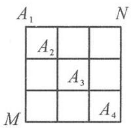

例题 2 某超市随机选取 1000 位顾客, 记录了他们购买甲、乙、丙、丁四种商品的情况, 整理成如下统计表, 其中“√”表示购买, “×”表示未购买.

<table><tr><td rowspan="2">顾客人数/人</td><td colspan="4">商品</td></tr><tr><td>甲</td><td>乙</td><td>丙</td><td>丁</td></tr><tr><td>100</td><td>√</td><td>×</td><td>√</td><td>√</td></tr><tr><td>217</td><td>×</td><td>√</td><td>×</td><td>√</td></tr><tr><td>200</td><td>√</td><td>√</td><td>√</td><td>×</td></tr><tr><td>300</td><td>√</td><td>×</td><td>√</td><td>×</td></tr><tr><td>85</td><td>√</td><td>×</td><td>×</td><td>×</td></tr><tr><td>98</td><td>×</td><td>√</td><td>×</td><td>×</td></tr></table>

(Ⅰ)估计顾客同时购买乙和丙的概率.

(Ⅱ)估计顾客在甲、乙、丙、丁中同时购买三种商品的概率.

(Ⅲ)若某顾客购买了甲,则该顾客同时购买乙、丙、丁中那种商品的可能性最大?

【分析】本题的背景是一家沃尔玛超市做过的一项调查研究。如果店主事先知道“当卖出某个商品时，向顾客推荐哪个商品会提高销售业绩”的话，就会在这些商品的旁边陈列搭配商品或向选中该商品放进购物车的顾客推荐另外一个搭配商品，以提高销售业绩，他们收集了顾客手中看似无用的收银条，从中获得信息。本题的第(Ⅲ)问主要是考查统计推断的基本思想，就是在购买商品时,如果一位顾客购买了一种商品,那么他购买其他哪种搭配商品的可能性比较大呢? 这个问题的结论有着很强的现实意义,它可以帮助指导营销活动,制定最优的营销策略,从而使利益最大化. 只要考生能正确计算同时购买甲和乙、甲和丙、甲和丁两种不同商品的概率,比较大小就能得到结论. 这个试题的目的是使学生体会统计不仅仅是简单的数据的运算,而是通过计算有实际意义的统计量,提炼信息,从而为决策者提供科学依据.

【解析】(Ⅰ)从统计表可以看出,在这1000位顾客中,有200位顾客同时购买了乙和丙,所以顾客同时购买乙和丙的概率可以估计为 $\frac{200}{1000}=0.2$ .

(Ⅱ)从统计表可以看出,在这1000位顾客中,有100位顾客同时购买了甲、丙、丁,另有200位顾客同时购买了甲、乙、丙,其他顾客最多购买了两种商品.所以顾客在甲、乙、丙、丁中同时购买三种商品的概率估计为 $\frac{100+200}{1000}=0.3$ .

(Ⅲ)设“顾客购买了甲”为事件 A, “顾客购买了乙”为事件 B, “顾客购买了丙”为事件 C, “顾客购买了丁”为事件 D.

顾客同时购买甲和乙的概率 $P(AB)=\frac{200}{1000}=0.2$ ,

顾客同时购买甲和丙的概率 $P(AC)=\frac{100+200+300}{1000}=0.6$ ,

顾客同时购买甲和丁的概率 $P(AD)=\frac{100}{1000}=0.1$ ,
所以如果顾客购买了甲,则该顾客同时购买丙的可能性最大.

【探讨】本题第(Ⅲ)问的描述方式很容易被误认为是考查条件概率.事实上,在统计学中,对同一组数据的分析可以有多种不同的方法,本题当然可以用条件概率的方法来解决,得到的结论是完全一样的,具体如下.
设“顾客购买了甲”为事件 A, “顾客购买了乙”为事件 B, “顾客购买了丙”为事件 C, “顾客购买了丁”为事件 D.

顾客购买甲的概率 $P(A)=\frac{685}{1000}=0.685$ ，则

①顾客在购买了甲的条件下,购买乙的概率 $P(B|A)=\frac{P(AB)}{P(A)}=\frac{0.2}{0.685}\approx0.29$ ;

②顾客在购买了甲的条件下,购买丙的概率 $P(C|A)=\frac{P(AC)}{P(A)}=\frac{0.6}{0.685}\approx0.88$ ;

③顾客在购买了甲的条件下,购买丁的概率 $P(D|A)=\frac{P(AD)}{P(A)}=\frac{0.1}{0.685}\approx0.15$ .
所以,若某顾客购买了甲,则该顾客同时购买丙的可能性最大.
在上面的三个条件概率的表达式中,分母都是顾客购买甲的概率 $P(A)$ , 比较三个条件概率的大小也就是比较 $P(AB)$ , $P(AC)$ 和 $P(AD)$ 的大小.

# 拓展探讨题

题 2-1 某校为举办甲、乙两项不同活动,分别设计了相应的活动方案:方案一和方案二.为了解该校学生对活动方案是否支持,对学生进行简单随机抽样,获得数据如表所示.

<table><tr><td rowspan="2">方案</td><td colspan="2">男生</td><td colspan="2">女生</td></tr><tr><td>支持</td><td>不支持</td><td>支持</td><td>不支持</td></tr><tr><td>一</td><td>200人</td><td>400人</td><td>300人</td><td>100人</td></tr><tr><td>二</td><td>350人</td><td>250人</td><td>150人</td><td>250人</td></tr></table>
假设所有学生对活动方案是否支持相互独立.

(Ⅰ)分别估计该校男生支持方案一的概率、该校女生支持方案一的概率.

(Ⅱ)将该校学生支持方案二的概率估计值记为 $p_0$ ，假设该校一年级有500名男生和300名女生，除了一年级，其他年级学生支持方案二的概率估计值记为 $p_1$ ，试比较 $p_0$ 与 $p_1$ 的大小。（结论不要求证明）

题 2-2 某险种的基本保费为 a(单位:元), 继续购买该险种的投保人称为续保人, 续保人本年度的保费与其上年度出险次数的关联如下.

<table><tr><td>上年度出险次数</td><td>0</td><td>1</td><td>2</td><td>3</td><td>4</td><td>≥5</td></tr><tr><td>保费</td><td>0.85a</td><td>a</td><td>1.25a</td><td>1.5a</td><td>1.75a</td><td>2a</td></tr></table>

随机调查了该险种的 200 名续保人在一年内的出险情况,得到如下统计表.

<table><tr><td>出险次数</td><td>0</td><td>1</td><td>2</td><td>3</td><td>4</td><td>≥5</td></tr><tr><td>频数</td><td>60</td><td>50</td><td>30</td><td>30</td><td>20</td><td>10</td></tr></table>

(Ⅰ)记 A 为事件“一续保人本年度的保费不高于基本保费”，求 $P(A)$ 的估计值.

(Ⅱ)记 B 为事件“一续保人本年度的保费高于基本保费但不高于基本保费的 160%”，求 $P(B)$ 的估计值.

(Ⅲ)求续保人本年度的平均保费估计值.

题 2-3 在一次全运会男子羽毛球单打比赛中,运动员甲和乙进入了决赛.羽毛球的比赛规则是“3 局 2 胜”制.假设每局比赛甲获胜的概率为 0.6,乙获胜的概率为 0.4,利用计算机模拟试验,估计甲获得冠军的概率.为此,用计算机产生 1\~5 的随机数,当出现随机数 1,2 或 3 时,表示一局比赛甲获胜,其概率为 0.6.由于要比赛 3 局,所以每 3 个随机数为一组.例如,产生了 20 组随机数:

<table><tr><td>423</td><td>231</td><td>423</td><td>344</td><td>114</td><td>453</td><td>525</td><td>323</td><td>152</td><td>342</td></tr><tr><td>345</td><td>443</td><td>512</td><td>541</td><td>125</td><td>342</td><td>334</td><td>252</td><td>324</td><td>254</td></tr></table>

相当于做了20次重复试验,用频率估计甲获得冠军的概率的近似值为\_\_\_\_.

题 2-4 国家放开计划生育政策,鼓励一对夫妇生育 2 个孩子(注:本题为 2020 年的题目,而目前已开放三胎).在某地区的 100000 对已经生育了一胎的夫妇中,进行大数据统计得,有 100 对第一胎生育的是双胞胎或多胞胎,其余的均为单胞胎.在这 99900 对恰好生育一孩的夫妇中,男方、女方都愿意生育二孩的有 50000 对,男方愿意生育二孩但女方不愿意生育二孩的有 $x_{1}$ 对,男方不愿意生育二孩但女方愿意生育二孩的有 $x_{2}$ 对,其余情形有 $x_{3}$ 对,且 $x_{1}:x_{2}:x_{3}=300:100:99$ .现用样本的频率来估计总体的概率.

(I)说明“其余情形”指何种具体情形,并求出 $x_{1},x_{2},x_{3}$ 的值.

(Ⅱ)该地区为进一步鼓励生育二孩,实行贴补政策:凡第一胎生育了一孩的夫妇一次性贴补5000元,第一胎生育了双胞胎或多胞胎的夫妇只有一次性贴补15000元,第一胎已经生育了一孩再生育了二孩的夫妇一次性再贴补20000元.这种补贴政策直接提高了夫妇生育二孩的积极性,原先男方或女方中只有一方愿意生育二孩的夫妇现在都愿意生育二孩,但原先男方、女方都不愿意生育二孩的夫妇仍然不愿意生育二孩.设ξ为该地区的一对夫妇享受的生育贴补,求 $E(\xi)$ .

### 2.2.2 关系运算

# 基本概念解读

# 问题 1 如何理解基本事件、随机事件和互斥事件？

我们将样本空间 $\Omega$ 的子集称为随机事件, 把只包含一个样本点的事件称为基本事件. 两个随机事件不能同时发生, 则称这两个事件互斥. 我们能根据定义进一步得到基本事件间是互斥的, 任何一个随机事件都能表示为若干个基本事件的和, 要善于运用简单事件的运算表示复杂事件, 要加强与集合运算的联系. 对于有限的样本空间, 如果知道了基本事件的概率, 那么所有随机事件的概率也就确定了.

# 问题 2 如何理解互斥与独立？

独立性是概率论中一个非常重要的概念,概率论中很多内容都是在独立的前提下讨论的.独立性可以使一些实际问题的概率模型和具体的计算得到简化,便于问题的解决.

生活中也有“相互独立”的概念, 其含义对数学“相互独立”概念的学习会产生负迁移. 这里说的不是“事件 A(或 B) 对事件 B(或 A) 的发生没有影响”, 而是“事件 A(或 B) 对事件 B(或 A) 发生的概率没有影响”, 也许不少同学对“概率”一词没有引起注意, 可能会把两个事件 A 与 B 相互独立简单理解为 A 与 B 相互不影响或相互没有关系. 特别地, 当对两个具体事件独立进行判断时, 往往只会用直观的方法, 导致对“概率”一词的忽略. 事实上, 独立性不只是由两个事件的内在性质决定的, 还与这两个事件发生的概率有关. 因此, 我们需要研究事件独立性的判别方法, 提高解决实际问题的能力.

一是凭直觉判断事件的独立性. 在实际应用中, 人们往往以已经获得的知识和所积累的经验为依据, 定性地对两个事件的独立性作出判断. 例如, 在可靠性理论中, 我们总是假定系统的各个元件之间是相互独立的; 还有在彩票问题中, 总是认为多次摇奖的过程是相互独立的. 这种独立性是凭直觉定性地做出判断.

二是利用定义判断事件的独立性. 若概率等式 $P(AB) = P(A)P(B)$ 成立, 则事件 $A$ 与 $B$ 相互独立; 否则, 事件 $A$ 与 $B$ 不相互独立. 因此一定要强化“事件之间没有影响”并不是“事件相互独立”的本质特征.

定义 $P(AB) = P(A)P(B)$ 在概率空间中从更广泛的范围给出了事件的独立性, 从概率的角度刻画了独立性的内涵, 其外延比条件概率的定义 (老教材) 更广泛. 事实上, 若 $P(A) = 0$ , 由定义可知, $A$ 与任何一个事件都是相互独立的, 即不可能事件与任何一个事件独立, 还有必然事件与任何一个事件也是相互独立的.
通过研究事件相互独立的定义 $P(AB)=P(A)P(B)$ ，我们可以发现：事件 A 与 B 各自的内在性质固然会影响着事件之间的独立性,样本空间和概率分布也影响着事件的独立性.两个随机事件,在不同的概率分布下,其相互独立性的表现也可能不一样.

初学者容易混淆“两个事件相互独立”与“两个事件互斥”这两个概念,勤于思考的同学可能会问:“什么情况才称为没有影响?”“没有影响是否就是互斥呢?”互斥是说两个事件在任何一次试验中不会同时发生,即它们没有公共的样本点,只是说明事件的关系并不涉及概率测度,而“相互独立”是描述事件之间概率情况的概念.因此,两者是概率空间中事件的两种不同层面上的关系.

问题 3 你能用表格形式区分事件的包含、和事件与积事件的关系或运算吗？

<table><tr><td>事件的关系</td><td>含义与符号表示</td><td>概率的性质运算</td></tr><tr><td>包含</td><td>若事件A发生,则事件B一定发生,用 $A \subseteq B$ 表示.</td><td> $P(A) \leqslant P(B)$ , $P(\Omega) = 1, P(\varnothing) = 0$ .</td></tr><tr><td>和事件(并事件)</td><td>事件A与事件B至少有一个发生,用 $A \cup B$ 表示.</td><td>概率加法公式 $P(A \cup B) = P(A) + P(B) - P(AB)$ .特别地,若事件A,B互为互斥事件,则 $P(A \cup B) = P(A) + P(B)$ ;若事件A,B互为对立事件,则 $P(A \cup B) = 1$ .</td></tr><tr><td>积事件(交事件)</td><td>事件A与事件B同时发生,用AB表示.</td><td>概率乘法公式 $P(AB) = P(A)P(B|A) = P(B)P(A|B)$ .特别地,若事件A,B互为互斥事件,则 $P(AB) = 0$ ;若事件A,B互为独立事件,则 $P(AB) = P(A)P(B)$ .</td></tr></table>

# 典型考题探讨

例题 1 某个班级共有男生 26 人、女生 16 人, 其中男团员 8 人、女团员 6 人. 任意指出一名学生, 设事件 A 为“该学生为男生”, 事件 B 为“该学生为团员”. 问: 事件 A 与 B 是否相互独立?

【解析】由题意得
$P (A) = \frac {2 6}{4 2} = \frac {1 3}{2 1}, P (B) = \frac {1 4}{4 2} = \frac {1}{3}, P (A B) = \frac {8}{4 2} = \frac {4}{2 1}.$
则 $P(AB) \neq P(A)P(B) \Rightarrow A$ 与 B 不相互独立.

拓展探讨 某个班级共有男生 $a$ 人、女生 $b$ 人, 其中男团员 $c$ 人、女团员 $d$ 人. 任意指出一名学生, 设事件 $A$ 为“该学生为男生”, 事件 $B$ 为“该学生为团员”. 问: 事件 $A$ 与 $B$ 何时会相互独立?

【解析】由题意得
$P (A) = \frac {a}{a + b}, P (B) = \frac {c + d}{a + b}, P (A B) = \frac {c}{a + b},$
则
$P (A B) = P (A) P (B) \Leftrightarrow \frac {c}{a + b} = \frac {a}{a + b} \times \frac {c + d}{a + b} \Leftrightarrow c = \frac {a (c + d)}{a + b} \Leftrightarrow \frac {c}{c + d} = \frac {a}{a + b}.$

上述式子的直观解释是事件 A 在 $\Omega$ 中所占的比例与 A 在 B 中所占的比例相等.
由此题可进一步知道,独立性不只是由两个事件的内在性质决定的,样本空间和概率分布也影响着事件的独立性,即独立性还与这两个事件发生的概率有关.

# 拓展探讨题

题 1-1 有 6 个相同的球,分别标有数字 1,2,3,4,5,6,从中有放回地随机取两次,每次取 1 个球.甲表示事件“第一次取出的球的数字是 1”,乙表示事件“第二次取出的球的数字是 2”,丙表示事件“两次取出的球的数字之和是 8”,丁表示事件“两次取出的球的数字之和是 7”,则( ).

A. 甲与丙相互独立

B. 甲与丁相互独立

C. 乙与丙相互独立

D. 丙与丁相互独立

题 1-2 （多选题）人民日报智慧媒体研究院在 2020 智慧媒体高峰论坛上发布重磅智能产品——人民日报创作大脑。在 AI 算法的驱动下，无论是图文编辑、视频编辑，还是素材制作，所有的优质内容创作都变得更加容易。已知某数据库有 a 个视频、b 张图片（其中 $a, b \in N^{*}, a > b > 1$ ），从中随机选出一个视频和一张图片，记“视频甲和图片乙入选”为事件 A，“视频甲入选”为事件 B，“图片乙入选”为事件 C，则下列判断中正确的是（）。

A. $P(A)=P(B)+P(C)$

B. $P(A) = P(B)P(C)$

C. $P(\overline{A}) > P(\overline{B}C) + P(B\overline{C})$

D. $P(\overline{B} C) <   P(B\overline{C})$

题 1-3 孔子曰“三人行,必有我师焉。”从数学角度来看,这句话有深刻的哲理,古语说“三百六十行,行行出状元”,假设有甲、乙、丙三人,其中每一人在每一个行业中胜过孔圣人的概率为 $1\%$ ,那么甲、乙、丙三人中至少有一人在至少一个行业中胜过孔圣人的概率为( ).

(参考数据: $0.99^{360}\approx0.03,0.01^{360}\approx0,0.97^{3}\approx0.912673$ )

A. 0.0027%

B. 99.9973%

C. 0

D. 91.2673%

例题 2 甲、乙、丙三名同学进行羽毛球比赛,约定赛制如下:累计负两场者被淘汰;比赛前抽签决定首先比赛的两人,另一人轮空;每场比赛的胜者与轮空者进行下一场比赛,负者下一场轮空,直至有一人被淘汰;当一人被淘汰后,剩余的两人继续比赛,直至其中一人被淘汰,另一人最终获胜,比赛结束.

经抽签,甲、乙首先比赛,丙轮空.设每场比赛双方获胜的概率都为 $\frac{1}{2}$ .

(Ⅰ)求甲连胜四场的概率.

(Ⅱ)求需要进行第五场比赛的概率.

(Ⅲ)求丙最终获胜的概率.

【分析】试题给我们呈现了一种三人比赛的方式,很多同学也许会觉得比较新颖,因此需要我们逐字阅读题目文字,弄懂比赛规则,并沿着这样的规则预演几次.

预演①:第一场甲和乙比赛,甲获胜;第二场甲和丙比赛,甲获胜;第三场甲和乙比赛,甲获胜、乙被淘汰;第四场甲和丙比赛,甲获胜、丙被淘汰.最终甲获胜.

预演②: 第一场甲和乙比赛, 甲获胜; 第二场甲和丙比赛, 丙获胜; 第三场丙和乙比赛, 乙获胜; 第四场甲和乙比赛, 乙获胜、甲被淘汰; 第五场乙和丙比赛, 丙获胜、乙被淘汰. 最终丙获胜.

我们可以看到,预演①比较简洁,预演②相对复杂.当然,如果能把所有的预演情况都列举出来,即确定出样本空间,问题就相对容易.那么是否需要写出样本空间呢?或者说如何表示样本空间更方便简洁呢?(纯文字书写的确比较耗时)

“累计负两场者被淘汰”这个规则容易被遗忘,但这个规则对场次的确定有决定性作用,即最少四场、最多五场就能确定出胜者了.

【解析】设 A=“甲和乙比赛,甲获胜”,B=“甲和丙比赛,甲获胜”,C=“乙和丙比赛,乙获胜”.由题意知,
$P (A) = P (B) = P (C) = P (\overline {{{A}}}) = P (\overline {{{B}}}) = P (\overline {{{C}}}) = \frac {1}{2},$

各场次比赛相互独立.

(Ⅰ)设 M=“甲连胜四场”，则
$P (M) = P (A B A B) = P (A) P (B) P (A) P (B) = \left(\frac {1}{2}\right) ^ {4} = \frac {1}{1 6}.$

(Ⅱ)根据赛制,至少需要进行四场比赛,至多需要进行五场比赛.

比赛四场结束,共有三种情况,甲连胜四场比赛的概率为 $\frac{1}{16}$ ,乙连胜四场比赛的概率为 $\frac{1}{16}$ ,
丙上场后连胜三场比赛的概率为 $\frac{1}{8}$ ，所以需要进行五场比赛的概率
$P = 1 - \frac {1}{1 6} - \frac {1}{1 6} - \frac {1}{8} = \frac {3}{4}.$

(Ⅲ)丙最终获胜,有两种情况,比赛四场结束且丙最终获胜的概率为 $\frac{1}{8}$ ,比赛五场结束且丙最终获胜,则从第二场开始的四场比赛按丙的胜、负、轮空结果有三种情况:胜胜负胜、胜负空胜、负空胜胜.相应概率分别为 $\frac{1}{16},\frac{1}{8},\frac{1}{8}$ ,所以丙最终获胜的概率
$P = \frac {1}{8} + \frac {1}{1 6} + \frac {1}{8} + \frac {1}{8} = \frac {7}{1 6}.$

【探讨】本题重在考查学生的逻辑思维能力,对事件进行分析、分解和转化的能力,以及对概率的基础知识特别是古典概率模型、事件的关系和运算、事件独立性的掌握情况.学生很容易列出四场比赛的对阵双方共8种情况,四场比赛的结果,共有16种情况.解决第(Ⅱ)问,可以列出所有的16种情况,再逐一分析,很容易解决问题.但是如果要解决第(Ⅲ)问,全部列出所有的32种情况,就会显得比较复杂.因而就必须仔细分类:按照前面三场比赛结果分类.前面三场比赛结束,共有8种情况,再根据前面三场比赛的结果,分析第四场和第五场的比赛结果,来确保丙淘汰甲、乙,最终获胜.树形图常常有助于更好理解分类.

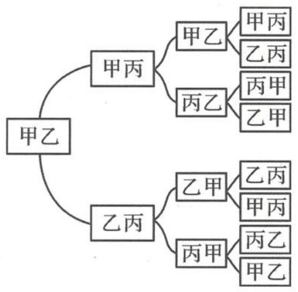
由于“五育并举”的需求,高考中体育这部分是最容易与概率结合在一起的,其中特别是各种球类运动,比赛规则常常是研究的切入点,是高考的热点问题.要特别重视规则以及规则下的分类讨论.  
（1）球类体育运动

例题 2-1 甲、乙两队进行篮球比赛,采用“七场四胜制”(当一队首先赢得四场胜利时,该队获胜,比赛结束).根据前期比赛成绩,甲队的主客场安排依次为“主主客客主客主”.设甲队主场取胜的概率为0.6,客场取胜的概率为0.5,且各场比赛结果相互独立,则甲队以4:1获胜的概率是\_\_\_\_。

【解析】甲队以 4:1 获胜,说明进行了五场比赛,在前四场中甲获胜了三场,输了一场,且在第五场比赛中获得了胜利.按输的一场进行分类,可得所求的概率
$\begin{array}{l} P = 0. 4 \times 0. 6 \times 0. 5 ^ {2} \times 0. 6 + 0. 6 \times 0. 4 \times 0. 5 ^ {2} \times 0. 6 + 0. 6 \times 0. 6 \times 0. 5 ^ {2} \times 0. 6 + 0. 6 \times 0. 6 \\ \times 0. 5 ^ {2} \times 0. 6 \\ = 0. 0 3 6 + 0. 0 3 6 + 0. 0 5 4 + 0. 0 5 4 = 0. 1 8. \\ \end{array}$

【探讨】解本题的关键是理解篮球比赛规则,并分析“甲队以 4:1 获胜”的事件特征,明确从输的一场进行分类.我们可以看到,第一、二场甲队均为主场,设甲队获胜的场数为 X;第三、四场甲队均为客场,设甲队获胜的场数为 Y.我们还能从随机变量的角度提供另一种解法: $X \sim B\left(2,\frac{3}{5}\right),Y \sim B\left(2,\frac{1}{2}\right)$ ,事件“前四场,甲队 3:1”=“X=2,Y=1”∪“X=1,Y=2”,则
$P=\left(\frac{3}{5}\right)^{2}\times C_{2}^{1}\times\frac{1}{2}\times\frac{1}{2}\times\frac{3}{5}+C_{2}^{1}\times\frac{3}{5}\times\frac{2}{5}\times\left(\frac{1}{2}\right)^{2}\times\frac{3}{5}=\frac{9}{50}$ . 对于体育比赛情境的概率问题, 我们应明确比赛规则, 获取各场次各队伍获胜的概率. 能想出样本空间, 能写出要研究的随机事件所包含的样本点, 最后利用加法公式和乘法公式计算概率. 如果研究的场次较多且仅关注获胜场数方面, 可以借助二项分布简化运算.  
（2）体育项目类

例题 2-2 某中学的学生积极参加体育锻炼,其中有 96% 的学生喜欢足球或游泳,60% 的学生喜欢足球,82% 的学生喜欢游泳,则该中学既喜欢足球又喜欢游泳的学生人数占该校学生总人数的比例是( ).

A. $62\%$

B. 56%

C. $46\%$

D. $42\%$

【解析】记“该中学学生喜欢足球”为事件 A, “该中学学生喜欢游泳”为事件 B, 则 $P(A)=0.6, P(B)=0.82, P(A \cup B)=0.96$ , 从而
$P (A \cap B) = P (A) + P (B) - P (A \cup B) = 0. 6 + 0. 8 2 - 0. 9 6 = 0. 4 6.$
所以,该中学既喜欢足球又喜欢游泳的学生人数占该校学生总人数的比例为 46%.
故选 C.

【探讨】本题考查随机事件运算关系以及概率的性质,选取的是学生熟悉的情境,贴近学生生活实际.本题实则是例题2-3换了个情境,研究的都是同一个问题,体现了题库命题的特点.近年来,也越加重视传统文化和经济社会生活中概率应用的广泛性.  
（3）传统文化类

例题 2-3 《西游记》《三国演义》《水浒传》和《红楼梦》是中国古典文学瑰宝,并称为中国古典小说四大名著.某中学为了解本校学生阅读四大名著的情况,随机调查了100名学生,其中阅读过《西游记》或《红楼梦》的学生共有90名,阅读过《红楼梦》的学生共有80名,阅读过《西游记》且阅读过《红楼梦》的学生共有60名,则该校阅读过《西游记》的学生人数与该校学生总数比值的估计值为( ).

A. 0.5

B. 0.6

C. 0.7

D. 0.8

【解析】设事件 A 表示从这 100 名被调查的学生中随机选择 1 名学生,该学生阅读过《红楼梦》;事件 B 表示从这 100 名被调查的学生中随机选择 1 名学生,该学生阅读过《西游记》.由题意知,
$P (A \bigcup B) = 0. 9, P (A) = 0. 8, P (A \cap B) = 0. 6,$
所以
$P (B) = P (A \bigcup B) - P (A) + P (A \cap B) = 0. 7.$
从而阅读过《西游记》的学生人数与该校学生总数比值的估计值为 0.7.
故选 C.

【探讨】本题也还可以从集合关系运算的角度算出阅读《西游记》的学生人数,然后用频率估计概率的方法进行处理.从中也可以看到新教材加强集合与事件之间联系的重要性,强化了样本空间与集合及其运算的关联.  
（4） 经济社会类

例题 2-4 若某群体中的成员只用现金支付的概率为 0.45, 既用现金支付也用非现金支付的概率为 0.15, 则不用现金支付的概率为( ).

A. 0.3

B. 0.4

C. 0.6

D. 0.7

【解析】记 A 为事件“群体中的成员使用现金支付”，B 为事件“群体中的成员使用非现金支付”，由题意知，要求 $P(\overline{A})$ . 不难得到
$P (A \overline {{{B}}}) = 0. 4 5, P (A B) = 0. 1 5.$

而 $A = A\overline{B} + AB$ ，故
$P (A) = P (A \overline {{B}} + A B) = P (A \overline {{B}}) + P (A B) = 0. 4 5 + 0. 1 5 = 0. 6,$
所以
$P (\overline {{{A}}}) = 1 - P (A) = 1 - 0. 6 = 0. 4.$
故选 B.

【探讨】本题的背景具有时代气息,情境真实,引导学生关注社会生产生活.上述解析是从关系运算和概率性质的角度比较规范的切入.当然,如果能明确不用现金支付是使用现金支付的对立事件,则对事件分析就容易多了.

# 拓展探讨题

题 2-1 已知甲、乙两个球落入盒子的概率分别为 $\frac{1}{2},\frac{1}{3}$ . 假定两个球是否落入盒子互不影响,则甲、乙两个球都落入盒子的概率为\_\_\_\_;甲、乙两个球至少有一个落入盒子的概率为\_\_\_\_.

题 2-2 （多选题）甲、乙两个质地均匀且完全一样的四面体，每个面都是正三角形。甲的四个面上分别标有数字 1,2,3,4；乙的四个面上分别标有数字 5,6,7,8。同时抛掷这两个四面体一次，记事件 A 为“两个四面体朝下一面的数字之和为奇数”，事件 B 为“甲四面体朝下一面的数字为奇数”，事件 C 为“乙四面体朝下一面的数字为偶数”，则下列结论正确的是（）。

A. $P(A) = P(B) = P(C)$

B. $P(BC) = P(AC) = P(AB)$

C. $P(ABC)=\frac{1}{8}$

D. $P(A)P(B)P(C) = \frac{1}{8}$

题 2-3 某大学进行“羽毛球”“美术”“音乐”三个社团选拔. 某同学经过考核被该校的“羽毛球”“美术”“音乐”三个社团选拔通过的概率依次为 $a, b, \frac{1}{2}$ , 已知三个社团中该同学恰好能进入两个的概率为 $\frac{1}{5}$ . 假设该同学经过考核通过这三个社团选拔成功与否相互独立, 则该同学一个社团都不能进入的概率为( ).

A. $\frac{1}{2}$

B. $\frac{3}{5}$

C. $\frac{3}{4}$

D. $\frac{3}{10}$

题 2-4 甲、乙两人组队参加猜谜语大赛, 比赛共两轮, 每轮比赛甲、乙两人各猜一个谜语. 已知甲猜对每个谜语的概率为 $\frac{3}{4}$ , 乙猜对每个谜语的概率为 $\frac{2}{3}$ , 甲、乙在猜谜语这件事上互不影响. 当比赛结束时, 甲、乙两人合起来共猜对三个谜语的概率为 \_\_\_\_.

题 2-5 受新冠肺炎疫情的影响,2020 年一些企业改变了针对应届毕业生的校园招聘方式,将线下招聘改为线上招聘.某世界五百强企业 M 的线上招聘方式分为资料初审、笔试、面试这三个环节进行,资料初审通过后才能进行笔试,笔试合格后才能参加面试,面试合格后便正式录取,且这几个环节能否通过相互独立.现有甲、乙、丙三名大学生报名参加了企业 M 的线上招聘,并均已通过了资料初审环节.假设甲通过笔试、面试的概率分别为 $\frac{1}{2}, \frac{1}{3}$ ; 乙通过笔试、面试的概率分别为 $\frac{2}{3}, \frac{1}{2}$ ; 丙通过笔试、面试的概率与乙相同.

(Ⅰ)求甲、乙、丙三人中恰有一人被企业 M 正式录取的概率.

(Ⅱ)求甲、乙、丙三人中至少有一人被企业 M 正式录取的概率.

题 2-6 电影公司随机收集了电影的有关数据,经分类整理得到下表.

<table><tr><td>电影类型</td><td>第一类</td><td>第二类</td><td>第三类</td><td>第四类</td><td>第五类</td><td>第六类</td></tr><tr><td>电影部数</td><td>140</td><td>50</td><td>300</td><td>200</td><td>800</td><td>510</td></tr><tr><td>好评率</td><td>0.4</td><td>0.2</td><td>0.15</td><td>0.25</td><td>0.2</td><td>0.1</td></tr></table>

好评率是指一类电影中获得好评的部数与该类电影的总部数的比值.
假设所有电影是否获得好评相互独立.

(Ⅰ)从电影公司收集的电影中随机选取1部,求这部电影是获得好评的第四类电影的概率.  
(Ⅱ)从第四类电影和第五类电影中各随机选取1部,估计恰有1部获得好评的概率.

题 2-7 一台设备由三个部件构成,假设在一天的运转中,部件 1,2,3 需要调整的概率分别为 0.1,0.2,0.3,各部件的状态相互独立.

(I)求设备在一天的运转中,部件1,2中至少有1个需要调整的概率.  
(Ⅱ)求设备在一天的运转中,需要调整的部件个数为2概率.

题 2-8 某生物小组通过抽样检测植物高度的方法来监测培育的某种植物的生长情况. 现分别从 A, B, C 三块试验田中各随机抽取 7 株植物测量高度, 数据如下表. (单位: 厘米)

<table><tr><td>A组</td><td>10</td><td>11</td><td>12</td><td>13</td><td>14</td><td>15</td><td>16</td></tr><tr><td>B组</td><td>12</td><td>13</td><td>14</td><td>15</td><td>16</td><td>17</td><td>18</td></tr><tr><td>C组</td><td>13</td><td>14</td><td>15</td><td>16</td><td>17</td><td>18</td><td>19</td></tr></table>
假设所有植株的生长情况相互独立. 从 $A, B, C$ 三组各随机选1株, $A$ 组选出的植株记为甲, $B$ 组选出的植株记为乙, $C$ 组选出的植株记为丙.

(I)求丙的高度小于15厘米的概率.   
(Ⅱ)求甲的高度大于乙的高度的概率.

题 2-9 设 n 是给定的正整数 (n > 2)，现有 n 个外表相同的袋子，里面均装有 n 个除了颜色其他无区别的小球，第 $k(k=1,2,3,\cdots,n)$ 个袋子中有 k 个红球和 n - k 个白球。现将这些袋子混合后，任选其中一个袋子，并且从中连续取出 3 个小球（每个取后不放回）。

(Ⅰ)若 n=4 ，假设已知选中的恰为第 2 个袋子，求第三次取出白球的概率.  
(Ⅱ)若 n=4 ，求第三次取出白球的概率.  
(Ⅲ)对于任意的正整数 $n(n > 2)$ , 求第三次取出白球的概率.

### 2.2.3 概率公式

# 基本概念解读

# 问题 1 如何理解条件概率？

条件概率顾名思义是指在一个事件 $A$ 已经发生的条件下另一个事件 $B$ 发生的概率, 也就是说它是以 $A$ 为样本空间 (缩小的样本空间), 看事件 $B$ 发生的概率, 即条件概率 $P(B|A)$ 本质上是在缩小的样本空间 $A$ 上事件 $AB$ 的概率. 事实上, 从概念体系上看, 无条件概率 $P(B)$ 可以看成特殊的条件概率 $P(B|\Omega)$ . 在古典概型中, 条件概率很容易通过缩减样本空间得到, 因此可以拓展为条件概率及其相关公式对于求一般随机事件的概率都适用. 用简单事件的运算表示复杂事件, 利用概率的运算法则简化概率的计算, 这种思想方法具有普遍性. 对于条件概率, 其求法有:

①定义法,先求得 $P(A)$ 和 $P(AB)$ ,再利用公式 $P(B|A)=\frac{P(AB)}{P(A)}$ 进行求解;

②基本事件法,借助古典概型的概率计算公式,先求事件 A 包含的基本事件数 $n(A)$ , 再求事件 AB 所包含的基本事件数 $n(AB)$ , 利用 $P(B|A)=\frac{n(AB)}{n(A)}$ ;

③缩样法,即缩小样本空间的方法,就是去掉第一次抽到的情况,只研究剩下的情况,利用古典概型的概率计算公式求解.

# 问题 2 如何理解全概率公式和贝叶斯公式？

全概率公式 $P(B)=\sum_{i=1}^{n}P(A_{i})P(B|A_{i}), i=1,2,\cdots,n.$ 蕴含的数学思想是: 如果某个事件 B 的概率不易直接计算, 那么可以用与事件 B 有联系的 n 个两两互斥事件 $A_{1}, A_{2}, \cdots, A_{n}$ $(A_{1} \cup A_{2} \cup \cdots \cup A_{n} = \Omega)$ 分割事件 B, 然后利用加法公式和乘法公式求得事件 B 的概率, 体现了化难为易的数学转化思想.

贝叶斯公式 $P(A_{i} \mid B)=\frac{P(A_{i})P(B \mid A_{i})}{P(B)}=\frac{P(A_{i})P(B \mid A_{i})}{\sum_{k=1}^{n}P(A_{k})P(B \mid A_{k})}\quad(i=1,2,\cdots,n;k=1,2,\cdots,n)$

本质上是求条件概率,蕴含着深刻的思想. 假定 $A_{1}, A_{2}, \cdots, A_{n}$ 是导致试验结果的原因, $P(A_{i})$ 称为先验概率, 它反映了各种原因发生的可能性的大小, 它们在试验之前是已知的. 现在试验的结果是事件 $B$ 发生了, 这个信息将有助于探究事件发生的原因. 条件概率 $P(A_{i} \mid B)$ 称为后验概率, 它反映了试验之后对各种原因发生的可能性大小的新的认识.

# 典型考题探讨

例题 1 甲、乙两队进行篮球冠军争夺赛, 比赛采取“三局两胜”制, 甲队每局取胜的概率为 $\frac{1}{2}$ . 甲队有一名核心球员, 如果核心球员在比赛中受伤, 将不能参加后续比赛, 此时甲队每局取胜的概率降为 $\frac{1}{4}$ . 若核心球员在每局比赛中受伤的概率为 $\frac{1}{2}$ , 则甲队获得冠军的概率为 \_\_\_\_.

【分析】本题的情境具有现实意义,是围绕着“五育并举”的要求来命制的.我们都知道一个球星对提升一个球队战斗力的作用是巨大的,因此如果球星受伤了可能会大幅降低球队获胜概率.试题在常规的比赛“三局两胜”制的背景下,加入了球星受伤对取胜概率的影响因素,无疑加大了问题的难度,考生需要冷静分析,细心地列出所有的基本事件(样本空间)并用恰当的概率公式(条件概率公式、全概率公式、贝叶斯公式)求解.

【解析】设 A=“甲队获得冠军”，设 M=“甲队第一局胜，第二局胜，获得冠军”，N=“甲队第一局胜，第二局负，第三局胜，获得冠军”，S=“甲队第一局负，第二局胜，第三局胜，获得冠军”，则
$P (A) = P (M \cup N \cup S) = P (M) + P (N) + P (S).$
设 $B_{i} =$ “核心球员第 $i(i = 1,2,3)$ 局开始受伤”， $B_{0} =$ “核心成员一直没受伤”，其中 $P(B_{1}) = \frac{1}{2}, P(B_{2}) = \frac{1}{4}$ ，那么
$\begin{array}{l} P (M) = P \left(B _ {1}\right) P \left(M \mid B _ {1}\right) + P \left(B _ {2}\right) P \left(M \mid B _ {2}\right) + P \left(B _ {0}\right) P \left(M \mid B _ {0}\right) \\ = \frac {1}{2} \times \left(\frac {1}{4} \times \frac {1}{4}\right) + \frac {1}{4} \times \left(\frac {1}{2} \times \frac {1}{4}\right) + \frac {1}{4} \times \left(\frac {1}{2} \times \frac {1}{2}\right) = \frac {1}{8}, \\ P (N) = P \left(B _ {1}\right) P \left(N \mid B _ {1}\right) + P \left(B _ {2}\right) P \left(N \mid B _ {2}\right) + P \left(B _ {3}\right) P \left(N \mid B _ {3}\right) + P \left(B _ {0}\right) P \left(N \mid B _ {0}\right) \\ = \frac {1}{2} \times \left(\frac {1}{4} \times \frac {3}{4} \times \frac {1}{4}\right) + \frac {1}{4} \times \left(\frac {1}{2} \times \frac {3}{4} \times \frac {1}{4}\right) + \frac {1}{8} \times \left(\frac {1}{2} \times \frac {1}{2} \times \frac {1}{4}\right) + \frac {1}{8} \times \left(\frac {1}{2} \times \frac {1}{2} \times \frac {1}{2}\right) = \frac {9}{1 2 8}, \\ P (S) = P \left(B _ {1}\right) P \left(S \mid B _ {1}\right) + P \left(B _ {2}\right) P \left(S \mid B _ {2}\right) + P \left(B _ {3}\right) P \left(S \mid B _ {3}\right) + P \left(B _ {0}\right) P \left(S \mid B _ {0}\right) \\ = \frac {1}{2} \times \left(\frac {3}{4} \times \frac {1}{4} \times \frac {1}{4}\right) + \frac {1}{4} \times \left(\frac {1}{2} \times \frac {1}{4} \times \frac {1}{4}\right) + \frac {1}{8} \times \left(\frac {1}{2} \times \frac {1}{2} \times \frac {1}{4}\right) + \frac {1}{8} \times \left(\frac {1}{2} \times \frac {1}{2} \times \frac {1}{2}\right) = \frac {7}{1 2 8}, \\ \end{array}$
所以
$P (A) = \frac {1}{8} + \frac {9}{1 2 8} + \frac {7}{1 2 8} = \frac {1}{4},$
即甲队获得冠军的概率为 $\frac{1}{4}$ .

【探讨】本题甲队获得冠军由三种情况组成,这三种情况是互斥的,在每一种情况下,都要考虑核心球员是否受伤以及在第几局受伤,这就为全概率公式的使用创造了条件,因此使用全概率公式本质是将复杂的事件进行分解进而求得问题的解.

# 拓展探讨题

题 1-1 在一次年级数学竞赛中,高二（20）班有 10% 的同学成绩优秀.已知高二（20）班人数占该年级人数的 5%,二年级数学优秀率为 2%.现从该年级任意选取一名同学,如果此人成绩优秀,则他来自高二（20）班的概率为( ).

A. $10\%$

B. $15\%$

C. $20\%$

D. $25\%$

题 1-2 （多选题）甲罐中有 4 个红球、3 个白球和 3 个黑球；乙罐中有 5 个红球、3 个白球和 2 个黑球。先从甲罐中随机取出 1 个球放入乙罐，分别以 $A_{1}, A_{2}$ 和 $A_{3}$ 表示从甲罐中取出的球是红球、白球和黑球的事件；再从乙罐中随机取出 1 个球，以 $M$ 表示从乙罐取出的球是红球的事件。下列结论中正确的是（ ）。

A. $P(M)=\frac{1}{2}$

B. $P(M|A_1) = \frac{6}{11}$

C. 事件 $M$ 与事件 $A_{1}$ 不相互独立

D. $A_{1}, A_{2}, A_{3}$ 是两两互斥的事件

题 1-3 某种机器需要同时装配两个部件 S 才能正常运行,且两个部件互不影响,部件 S 有两个等级:一等品的使用寿命为 5 个月或 6 个月(概率均为 0.5);二等品的使用寿命为 2 个月或 3 个月(概率均为 0.5).若从 4 个一等品和 2 个二等品共 6 个部件 S 中任取 2 个装入机器,求机器可运行时间不少于 3 个月的概率.

题 1-4 （多选题）有三台车床加工同一型号的零件。第 1 台加工的次品率为 6%，第 2,3 台加工的次品率均为 5%，加工出来的零件混放在一起。已知第 1,2,3 台车床加工的零件数分别占总数的 25%,30%,45%，则下列选项正确的有（）。

A. 任取一个零件是第 1 台生产出来的次品概率为 0.06

B. 任取一个零件是次品的概率为 0.0525

C. 取到的零件是次品且是第 2 台车床加工的概率为 $\frac{2}{7}$

D. 取到的零件是次品且是第 3 台车床加工的概率为 $\frac{2}{7}$

题 1-5 甲、乙、丙、丁四支球队进行单循环小组赛(每两支球队比赛一场), 比赛分三轮, 每轮两场比赛. 第一轮, 第一场甲乙比赛, 第二场丙丁比赛; 第二轮, 第一场甲丙比赛, 第二场乙丁比赛; 第三轮, 甲丁和乙丙两场比赛同一时间开赛. 规定: 比赛获胜的球队记 3 分、输的球队记 0 分、打平时两队各记 1 分. 三轮比赛结束后以积分高低进行排名, 积分相同的队伍由抽签决定排名, 排名前两名的队伍小组出线. 假设四支球队水平相当, 即每场比赛双方获胜、负、平的概率都为 $\frac{1}{3}$ .

(Ⅰ)若三轮比赛结束后甲的积分为 X, 求 $P(X=3)$ .   
(Ⅱ)若前二轮比赛结束后,甲、乙、丙、丁四支球队的积分分别为3,3,0,6,求甲球队能出线的概率.

题 1-6 某医院 2020 年准备招聘若干名医学硕士进行医学检验. 在招聘的最后阶段, 只有 A, B, C 三名医学硕士进入实验检测环节的考核, 医院给 A, B, C 三名医学硕士各准备了 7 管血样, 且均有 2 管含有某种病毒, 其中含病毒的血样的检测结果呈阳性, 不含病毒的血样的检测结果呈阴性. 现要求这三人分别对 7 管血样逐一检测, 1 次只能检测 1 管, 直至检测出含有某种病毒的 2 管血样.

(I) 若 A 将 7 管血样随机编号为 1,2,3,4,5,6,7,且按编号从小到大的顺序对血样进行检测,求其在第 1 管血样检测结果呈阳性的条件下,总共进行了 4 次检测的概率.  
(Ⅱ)求 B 检测了 6 次的概率.  
(Ⅲ)已知 A, B, C 均通过了实验检测环节的考核, 医院又加试一个环节, 让 A, B, C 三人进行血样中病毒的识别检验. 若 A 识别病毒的正确率为 0.6, B 与 C 识别病毒的正确率均为 a (0 < a < 1), 每人只有 1 次识别病毒的机会, 且识别结果互不影响, 试比较在这次加试中, A, B, C 三名医学硕士中有一人成功识别病毒的概率与有两人成功识别病毒的概率的大小.

## 2.3 随机变量

概率论研究随机现象的数量规律,包含两层意思:一是用数值刻画随机事件发生的可能性大小,二是研究某个数量指标(随机变量)取值的概率规律及这个变量的数字特征.随机变量是对随机试验可能结果的量化表示,本质上是样本空间到实数集上的映射.随机变量及其分布可以类比函数的研究方法和路径进行研究.

### 2.3.1 随机变量与数字特征

# 基本概念解读

# 问题 1 什么是随机变量？

随机变量本质上是样本空间到实数集的一个映射, 即给每一个样本点一个实数值, 那么随机事件就能通过随机变量的取值范围来确定了. 通俗来说, 随机变量是事实与数学间的一座桥梁, 如果随机试验的结果可以用一个变量来表示, 那么这样的变量叫作随机变量, 其中取值可以一一列举的随机变量称为离散型随机变量. 要注意“常数”“变量”“随机变量”的区别.

# 问题 2 随机变量的意义何在?

随机变量的引入正是为了建立分布函数,通过分布函数来描述随机现象的概率分布.引入随机变量,能够简化各种随机事件的表示,能够全面系统地刻画随机现象的规律性,进而把握统计推断的本质.

现实中的随机现象非常丰富,但正如函数我们只选择那些具有研究价值的有限几类.重要的是可以按照随机现象的本质特征,将随机变量进行分类(如离散型、连续型),选择不同的数学工具表示随机变量的概率分布,从而建立各种概率分布模型(二项分布、超几何分布、正态分布).

# 问题 3 离散型随机变量均值和方差的意义是什么？

随机变量的概率分布完整地描述了随机变量的规律性,但在实际中我们往往需要更深入了解刻画随机变量特征的数量,比如均值(期望)和离散程度(方差),具体可以类比一组数据的样本均值和样本方差.利用随机变量的期望和方差往往针对大量试验的场所进行决策.如保险公司面对大量的保险客户,估计平均理赔金额,设计合理的费率是有意义的.

# 典型考题探讨

例题 1 某学校组织“一带一路”知识竞赛,有 A, B 两类问题.每位参加比赛的同学先在两类问题中选择一类并从中随机抽取一个问题回答.若回答错误,则该同学的比赛结束;若回答正确,则从另一类问题中再随机抽取一个问题回答,无论回答正确与否,该同学的比赛结束. A 类问题中的每个问题回答正确得 20 分,否则得 0 分; B 类问题中的每个问题回答正确得 80 分,否则得 0 分.已知小明能正确回答 A 类问题的概率为 0.8,能正确回答 B 类问题的概率为 0.6,且能正确回答问题的概率与回答次序无关.

(Ⅰ)若小明先回答 A 类问题,记 X 为小明的累计得分,求 X 的分布列.  
(Ⅱ)为使累计得分的期望最大,小明应选择先回答哪类问题?说明理由.

【分析】本题以经济社会热点“一带一路”为背景,设计了一个知识问答类随机变量分布列及其数字特征的问题,聚焦的是随机变量最基本的知识,突出随机变量期望的实际意义.题目通过文字定义了问题回答的规则,考查考生的阅读理解能力和信息整理能力等关键能力.事实上,根据规则,小明先回答A类问题有两种情况:第一种是回答错误,累计得分为0.另一种是回答正确,得20分.此时又有两种情况发生,即回答B类问题.若回答错误,则只有20分,活动结束;若回答正确,则有 $20+80=100$ 分,活动也结束.因此随机变量X的取值可能为0,20,100.又由于能正确回答问题的概率与回答次序无关,因此概率计算是相互独立事件的概率计算.要决策回答次序下的累计得分最大,可以考虑利用期望进行决策,即先分别计算回答A类问题和先回答B类问题,再比较大小,选择大的即可.事实上,很容易判断先回答B类问题累计得分期望值最大,因为回答B正确的话会得80分,而得100分的概率是一样的.

【解析】(I)由题设知,X的取值可能为0,20,100,则
$P (X = 0) = 0. 2, P (X = 2 0) = 0. 8 \times 0. 4 = 0. 3 2, P (X = 1 0 0) = 0. 8 \times 0. 6 = 0. 4 8.$
故 $X$ 的分布列为

<table><tr><td>X</td><td>0</td><td>20</td><td>100</td></tr><tr><td>P</td><td>0.2</td><td>0.32</td><td>0.48</td></tr></table>

(Ⅱ)小明应选择先回答 B 类问题,下面说明理由.
由（Ⅰ）知，
$E (X) = 0 \times 0. 2 + 2 0 \times 0. 3 2 + 1 0 0 \times 0. 4 8 = 5 4. 4.$
若小明先回答 B 类问题, 记 Y 为小明的累计得分, 则 Y 的取值可能为 0, 80, 100, 则
$P (Y = 0) = 0. 4, P (Y = 8 0) = 0. 6 \times 0. 2 = 0. 1 2, P (Y = 1 0 0) = 0. 6 \times 0. 8 = 0. 4 8.$
故 $Y$ 的分布列为

<table><tr><td>Y</td><td>0</td><td>80</td><td>100</td></tr><tr><td>P</td><td>0.4</td><td>0.12</td><td>0.48</td></tr></table>
从而
$E (Y) = 0 \times 0. 4 + 8 0 \times 0. 1 2 + 1 0 0 \times 0. 4 8 = 5 7. 6.$
因为 $E(X) < E(Y)$ ，所以小明应选择先回答 B 类问题。

【探求】本题难度不大,关键是读懂题意,把握得分规则,明确随机变量期望的实际意义.概率计算也比较简单,独立性题设中也已明确.要特别重视和加强对这类离散型随机变量及数字特征期望决策问题的阅读理解.根据高考命题打破固有模式的特点,这类问题将会是常见的.

例题 2 某保险公司针对企业职工推出一款意外险产品,每年每人只要交少量保费,发生意外后可一次性获赔 50 万元.保险公司把职工从事的所有岗位共分为 A, B, C 三类工种,根据历史数据统计出三类工种的年赔付频率(并以此估计赔付概率)如下表.

<table><tr><td>工种类别</td><td>A</td><td>B</td><td>C</td></tr><tr><td>赔付频率</td><td> $\frac{1}{10^5}$ </td><td> $\frac{2}{10^5}$ </td><td> $\frac{1}{10^4}$ </td></tr></table>

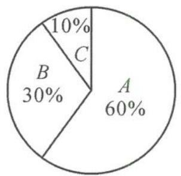

（Ⅰ）根据规定，该产品各工种保单的期望利润都不得超过保费的 20%，试分别确定各类工种每张保单保费的上限。

(Ⅱ)某企业共有职工 20000 人,从事三类工种的人数分布比例如图所示,企业准备为全体职工每人购买一份此种保险,并以(Ⅰ)中计算的各类保费上限购买,试估计保险公司在这宗交易中的期望利润.

【分析】本题是我们命制的试题,在数据呈现上进行了创新,采取表格与饼图相结合的方式,强化图表阅读和信息整理.在数据提取时应注意两种图表中的关联数据,分别建立三个不同工种的保单利润的分布列,再依据期望利润不超过保费的20%,决定最高的定价.根据这个定价再计算保费,计算企业总保费后,根据最高保费与利润的关系可得总利润为保费的20%.在计算总保费时可有两种解题方式:一是直接计算总利润;二是先计算单份保单的利润,再用叠加思想计算总利润.具体来说,即建立概率分布列—计算最高保费—分析期望利润.

【解析】(I)设工种 A 的每份保单保费为 a 元, 设保险公司每单的收益为随机变量 X, 则 X 的分布列为

<table><tr><td>X</td><td>a</td><td> $a - 50 \times 10^{4}$ </td></tr><tr><td>P</td><td> $1 - \frac{1}{10^{5}}$ </td><td> $\frac{1}{10^{5}}$ </td></tr></table>

保险公司期望收益为
$E (X) = a \left(1 - \frac {1}{1 0 ^ {5}}\right) + (a - 5 0 \times 1 0 ^ {4}) \times \frac {1}{1 0 ^ {5}} = a - 5.$
根据规则， $a-5\leqslant0.2a$ ，解得 $a\leqslant6.25$ 。
当然,也可以直接研究赔付金期望值,即 $\frac{50\times10^{4}}{10^{5}}=5$ ,此时保险公司期望利润为a-5.
设工种 B 的每份保单保费为 b 元, 赔付金期望值为 $\frac{50 \times 10^{4} \times 2}{10^{5}} = 10$ , 则保险公司期望利润为 b - 10. 根据规则, $b - 10 \leqslant 0.2b$ , 解得 $b \leqslant 12.5$ .
设工种 C 的每份保单保费为 c 元, 赔付金期望值为 $\frac{50 \times 10^{4}}{10^{4}} = 50$ , 则保险公司期望利润为 c - 50. 根据规则, $c - 50 \leqslant 0.2c$ , 解得 $c \leqslant 62.5$ .

(Ⅱ)解法一:购买 A 类产品的份数为 $20000 \times 60\% = 12000$ (份),

购买 B 类产品的份数为 $20000 \times 30\% = 6000$ (份),

购买 C 类产品的份数为 $20000 \times 10\% = 2000$ (份)，

企业支付的总保费为 $12000 \times 6.25 + 6000 \times 12.5 + 2000 \times 62.5 = 275000$ （元），

保险公司在这宗交易中的期望利润为 $275000 \times 20\% = 55000$ (元).
解法二: 计算每张保单的利润.

每份 A 类保单的利润为 $6.25 \times 20\% = 1.25$ (元)，每份 B 类保单的利润为 $12.5 \times 20\% = 2.5$ (元)，每份 C 类保单的利润为： $62.5 \times 20\% = 12.5$ (元).

保险公司在这宗交易中的期望利润为 $12000 \times 1.25 + 6000 \times 2.5 + 2000 \times 12.5 = 55000$ （元）.

【探讨】本题的背景是与劳动保护相关的意外险种设置与定价,杜绝行业暴利,体现公平竞争,具有重要的现实意义.本题采用表格与饼图相结合的方式呈现数据,考查学生综合识图的能力.设置的问题是计算各工种保费上限及保险公司利润.要重视关联图表数据抽取以及与此相关的离散型随机变量的概率分布列及期望.

例题 3 某单位计划组织 55 名职工进行一种疾病的筛查,先到本单位医务室进行血检,血检呈阳性者再到医院进一步检测.已知随机一人血检呈阳性的概率为 1%,且每个人血检是否呈阳性相互独立.

(Ⅰ)根据经验,采用分组检测法可有效减少工作量,具体操作如下.
将待检人员随机等分成若干组, 将每组的血样混在一起化验. 若结果呈阴性, 则可断定本组血样全部为阴性, 不必再逐一化验; 若结果呈阳性, 则本组中至少有一人的血检会呈阳性, 须逐个化验.

现有两个分组方案：

方案一: 将 55 人分成 11 组, 每组 5 人;

方案二: 将 55 人分成 5 组, 每组 11 人.

试分析哪一个方案工作量更少？

(Ⅱ)若该疾病的患病率为0.4%，且患该疾病者血检呈阳性的概率为99%，该单位有一职工血检呈阳性，求该职工确实患该疾病的概率。（参考数据： $0.99^{5}\approx0.951,0.99^{11}\approx0.895$ ）

【分析】本题设置的问题有两个方面:一是静态分组的对比分析,尝试揭示此类优化决策问题的优化方向与做法.二是通过贝叶斯公式,科学解释某些疾病检验结果为阳性也不必恐慌,以正视听.第(Ⅰ)问的解决应当明确两种方案下工作量的具体计算表达方式,根据规则,分别建立两种方案下检验次数的概率分布列,并通过计算期望进行对比,当具体计算时,比较的可以是55人的期望检测次数,也可以是每个人的期望检测次数.第(Ⅱ)问,聚焦的是贝叶斯公式的运用.

【解析】（I）解法一：设方案一中每组的化验次数为 $X$ ，则 $X$ 的取值为1,6，则
$P (X = 1) = 0. 9 9 ^ {5} = 0. 9 5 1, P (X = 6) = 1 - 0. 9 9 ^ {5} = 0. 0 4 9.$
所以 $X$ 的分布列为

<table><tr><td>X</td><td>1</td><td>6</td></tr><tr><td>P</td><td>0.951</td><td>0.049</td></tr></table>
所以
$E (X) = 1 \times 0. 9 5 1 + 6 \times 0. 0 4 9 = 1. 2 4 5.$
故方案一的化验总次数的期望为 $11 \times E(X) = 11 \times 1.245 = 13.695$ (次).
设方案二中每组的化验次数为 $Y$ ，则 $Y$ 的取值为1,12，则
$P (Y = 1) = 0. 9 9 ^ {1 1} = 0. 8 9 5, P (Y = 1 2) = 1 - 0. 9 9 ^ {1 1} = 0. 1 0 5.$
所以 $Y$ 的分布列为

<table><tr><td>Y</td><td>1</td><td>12</td></tr><tr><td>P</td><td>0.895</td><td>0.105</td></tr></table>
所以
$E (Y) = 1 \times 0. 8 9 5 + 1 2 \times 0. 1 0 5 = 2. 1 5 5.$
故方案二的化验总次数的期望为 $5 \times E(X) = 5 \times 2.155 = 10.775$ (次).
因为 13.695 > 10.775，所以方案二的工作量更少。
解法二:也可设方案一中每个人的化验次数为 X, 则 X 的取值为 $\frac{1}{5}$ , $\frac{6}{5}$ .

方案二中每个人的化验次数为 Y，则 Y 的取值为 $\frac{1}{11}, \frac{12}{11}$ .

同解法一可计算得
$E (X) = 0. 2 4 9, E (Y) = 0. 1 9 6.$
因为 $E(X) > E(Y)$ ，所以方案二工作量更少。

(Ⅱ)设事件 A 为血检呈阳性,事件 B 为患疾病.由题意有
$P (A) = 0. 0 1, P (B) = 0. 0 0 4, P (A \mid B) = 0. 9 9.$
由贝叶斯公式得
$P (B \mid A) = \frac {P (B) P (A \mid B)}{P (A)} = \frac {0 . 0 0 4 \times 0 . 9 9}{0 . 0 1} = 0. 3 9 6.$
所以血检呈阳性的人确实患病的概率为 39.6%.

【探讨】本题的背景是医学化验优化策略问题,也是概率论中的经典优化问题,在新冠肺炎实际的核酸检验中得到了极大的验证.事实上,大规模人群开展核酸检验都是采取分组的方式来节约成本.本题的第(Ⅱ)问也具有现实意义,即使检验出阳性也不一定代表就是得病,同理当下的新冠病毒变种毒株遇到过很多次核酸都呈阴性,最终却仍然是阳性的情形也很普遍.

例题 4 某电子设备工厂生产一种电子元件,质量控制工程师要在产品出厂前将次品检出.估计这个厂生产的电子元件的次品率为 0.2%,且电子元件是否为次品相互独立.一般的检测流程是先把 n(n>1)个电子元件串联起来成组进行检验.若检测通过,则全部为正品;若检测不通过,则至少有一个次品,再逐一检测,直到把所有的次品找出.若检验一个电子元件的花费为 5 分钱,检验一组的 n 个电子元件的花费为 4+n 分钱.

(Ⅰ)当 n=4 时,估算一组待检元件中有次品的概率.  
(Ⅱ)设每个电子元件检测费用的期望为 $A(n)$ ，求 $A(n)$ 的表达式.  
(Ⅲ)试估计 n 的值,使每个电子元件检测费用的期望最小.

(提示:用 $(1-p)^{n}\approx1-np$ 进行估算)

【分析】本题是对优化问题更深入的理论研究,即动态(变量)分组优化策略问题,尝试回答了为什么有最值,什么时候取得最值的问题.理论上要求 $A(n)=6+\frac{4}{n}-5\times0.998^{n}$ 的最小值,要用求导,计算难度太大,不便在考试时展开,所以命题时,为了便于处理,大胆采用近似估计的办法将式子转化成基本不等式的结构,既降低了求解的难度,又体现了优化的思想.第(I)问的估算先要熟悉近似公式 $(1-p)^{n}\approx1-np$ ,为第(III)问的转化准备方法,第(II)问建立检测费用分布列,有两种方式:一是先建立n个电子元件的总检测费用,计算总期望后再除以n,二是直接建立每个电子元件的检测费用分布列.在第(III)问的求解过程中,要有利用公式进行近似转化的意识,在结构识别的基础上运用基本不等式求解.

【解析】(Ⅰ)设事件 A 为一组(4 件)中有次品,则事件 $\overline{A}$ 为一组(4 件)中无次品,即 4 件产品均正品.因为 4 件产品是否为次品相互独立,所以
$P (\overline {{{A}}}) = (1 - 0. 0 0 2) ^ {4}.$
所以
$P (A) = 1 - P (\overline {{{A}}}) = 1 - (1 - 0. 0 0 2) ^ {4} \approx 1 - (1 - 4 \times 0. 0 0 2) = 0. 0 0 8.$

(Ⅱ)解法一:设每组的 n 个电子元件的检测费用为 X, 则 X 的所有可能取值为 $n+4, 6n+4$ ,
$P (X = n + 4) = 0. 9 9 8 ^ {n}, P (X = 6 n + 4) = 1 - 0. 9 9 8 ^ {n}.$
所以 $X$ 的分布列为

<table><tr><td>X</td><td>n+4</td><td>6n+4</td></tr><tr><td>P</td><td>0.998n</td><td>1-0.998n</td></tr></table>
所以
$E (X) = (n + 4) \times 0. 9 9 8 ^ {n} + (6 n + 4) \times (1 - 0. 9 9 8 ^ {n}) = 6 n + 4 - 5 n \times 0. 9 9 8 ^ {n}.$
故
$A (n) = \frac {E (X)}{n} = 6 + \frac {4}{n} - 5 \times 0. 9 9 8 ^ {n} (n > 1).$
解法二:设每个电子元件的检测费用为 Y, 则 Y 的取值为 $1 + \frac{4}{n}$ , $6 + \frac{4}{n}$ ,
$P \left(Y = 1 + \frac {4}{n}\right) = 0. 9 9 8 ^ {n}, P \left(Y = 6 + \frac {4}{n}\right) = 1 - 0. 9 9 8 ^ {n}.$
所以 $Y$ 的分布列为

<table><tr><td>Y</td><td> $1+\frac{4}{n}$ </td><td> $6+\frac{4}{n}$ </td></tr><tr><td>P</td><td> $0.998^{n}$ </td><td> $1-0.998^{n}$ </td></tr></table>
所以
$A (n) = E (Y) = \left(1 + \frac {4}{n}\right) \times 0. 9 9 8 ^ {n} + \left(6 + \frac {4}{n}\right) \times (1 - 0. 9 9 8 ^ {n}) = 6 + \frac {4}{n} - 5 \times 0. 9 9 8 ^ {n} (n > 1).$
$\begin{array}{r l} & (\text {   III   }) A (n) = 6 + \frac {4}{n} - 5 \times 0. 9 9 8 ^ {n} = 6 + \frac {4}{n} - 5 \times (1 - 0. 0 0 2) ^ {n} \approx 6 + \frac {4}{n} - 5 \times (1 - 0. 0 0 2 n) = \\ & 1 + 0. 0 1 n + \frac {4}{n} \geqslant 1 + 2 \sqrt {0 . 0 1 n \times \frac {4}{n}} = 1. 4, \end{array}$
当且仅当 $0.01n=\frac{4}{n}$ 时取等号, 此时 n=20.
所以,估计当 n=20 时,每个电子元件的平均检测费用最低,约为 1.4 分钱.

【探讨】本题现实背景是电子元件检测优化策略问题,数学背景与例题3相似,都是概率论中的经典优化问题,在生产中应用极为广泛.本题规则明确,构建随机变量分布列难度不大,难点在于期望最值的结构识别和二项展开式估算以及基本不等式的应用等,综合性较强,有普遍的现实意义.

例题 5 我们国家正处于老龄化社会中,老有所依也是政府的民生工程.某市共有户籍人口400万,其中老人(年龄60岁及以上)人数约有66万,为了解老人们的健康状况,政府从老人中随机抽取600人并委托医疗机构免费为他们进行健康评估,健康状况共分为不能自理、不健康但尚能自理、基本健康、健康四个等级,并以80岁为界限分成两个群体进行统计,样本分布如下图.

老人健康状况统计图  
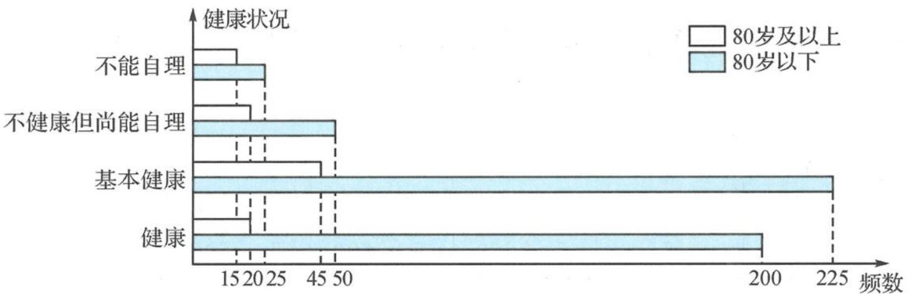

(Ⅰ)若采用分层抽样的方法再从样本中的不能自理的老人中抽取8人进一步了解他们的生活状况,则两个群体中各应抽取多少人?

(Ⅱ)估算该市80岁及以上长者占全市户籍人口的百分比.

(Ⅲ)据统计该市大约有五分之一的户籍老人无固定收入,政府计划为这部分老人每月发放生活补贴,标准如下.

①80 岁及以上老人每人每月发放生活补贴 200 元；
②80岁以下老人每人每月发放生活补贴120元；
③不能自理的老人每人每月额外发放生活补贴 100 元.

试估计政府执行此计划的年度预算.

【分析】本题的数据呈现方式是考生不熟悉的横条状图,数据的提取学生不习惯,考查信息整理能力.在具体操作时,应及时整理成熟悉的式样(比如表格),为后面的问题提供精准的数据支撑.第(Ⅲ)问的概率分布列的建立,难点是寻找随机变量,因此要先确立随机变量为“月生活补贴”,再根据规则,明确取值情况及相应的概率,特别注意有交叉类别的取值,再用频率估计概率,为概率分布列准备条件,为期望计算奠定基础.解题路径为:确立随机变量—分析概率来源—计算数学期望.

【解析】(I)数据整理如下表所示.

<table><tr><td>健康状况</td><td>健康</td><td>基本健康</td><td>不健康但尚能自理</td><td>不能自理</td></tr><tr><td>80岁及以上</td><td>20</td><td>45</td><td>20</td><td>15</td></tr><tr><td>80岁以下</td><td>200</td><td>225</td><td>50</td><td>25</td></tr></table>

从表中可知,不能自理的80岁及以上老人占比为 $\frac{15}{15+25}=\frac{3}{8}$ ,故抽取 8 人中不能自理的 80 岁及以上老人的人数为 $8 \times \frac{3}{8} = 3,80$ 岁以下的人数为 5.

(Ⅱ)在 600 人中,80 岁及以上老人在全部老人中的占比为 $\frac{15+20+45+20}{600}=\frac{1}{6}$ .

用样本估计总体,80岁及以上老人共有 $66\times\frac{1}{6}=11$ 万人.

80岁及以上老人占户籍人口的百分比为 $\frac{11}{400}\times100\%=2.75\%$ .

(Ⅲ)解法一:用样本估计总体,设任一户籍老人每月享受的生活补贴为 X 元,则随机变量 X 的分布列为

<table><tr><td>X</td><td>0</td><td>120</td><td>200</td><td>220</td><td>300</td></tr><tr><td>P</td><td>4/5</td><td>1/5×475/600</td><td>1/5×85/600</td><td>1/5×25/600</td><td>1/5×15/600</td></tr></table>
即

<table><tr><td>X</td><td>0</td><td>120</td><td>200</td><td>220</td><td>300</td></tr><tr><td>P</td><td>4/5</td><td>95/600</td><td>17/600</td><td>5/600</td><td>3/600</td></tr></table>
则 $X$ 的数学期望
$E (X) = \frac {0 + 1 2 0 \times 9 5 + 2 0 0 \times 1 7 + 2 2 0 \times 5 + 3 0 0 \times 3}{6 0 0} = 2 8 (\text {元}).$

全市老人的总预算为 $28 \times 12 \times 66 \times 10^{4} = 2.2176 \times 10^{8}$ (元).

政府执行此计划的年度预算约为 2.2176 亿元.
解法二:先计算抽样的 600 人的预算,其中享受补贴 120 元/月的人数为 $\frac{1}{5} \times (500 - 25) = 95$ (人),

享受补贴 200 元/月的人数为 $\frac{1}{5} \times (20 + 45 + 20) = 17$ (人),

享受补贴 220 元/月的人数为 $\frac{1}{5} \times 25 = 5$ (人)，享受补贴 300 元/月的人数为 $\frac{1}{5} \times 15 = 3$ (人).

600 人的月预算为 $95 \times 120 + 17 \times 200 + 5 \times 220 + 3 \times 300 = 16800$ (元).

用样本估计总体,全市老人的总预算为 $16800 \times 12 \times \frac{66 \times 10^{4}}{600} = 2.2176 \times 10^{8}$ (元).

政府执行此计划的年度预算约为 2.2176 亿元.

【探讨】本题聚焦的是老龄化问题,直击社会民生,体现概率统计应用的广泛性.在实际的测试中,学生解本题的困难首先是不能将条形图反映的数据表格化并快速获取数据,其次是不能明确随机变量为“任一户籍老人每月享受的生活补贴”,也不能利用样本估计总体获得相关的概率.这提醒我们,要加强对图表转化能力的培养,强化阅读理解和信息整理能力.

# 拓展探讨题

题1 11分制乒乓球比赛,每赢一球得1分,当某局打成 $10:10$ 平后,每球交换发球权,先多得2分的一方获胜,该局比赛结束.甲、乙两名同学进行单打比赛,假设甲发球时甲得分的概率为0.5,乙发球时甲得分的概率为0.4,各球的结果相互独立.在某局双方 $10:10$ 平后,甲先发球,两人又打了 $X$ 个球该局比赛结束.

(Ⅰ)求 $P(X=2)$ .   
(Ⅱ)求事件“X=4 且甲获胜”的概率.

题2 探月工程“嫦娥四号”探测器于2018年12月8日成功发射,实现了人类首次月球背面软着陆.以“嫦娥四号”的任务圆满成功为标志,我国探月工程四期和深空探测工程全面拉开序幕.根据部署,我国探月工程到2020年前将实现“绕、落、回”三步走目标.为了实现目标,各科研团队进行积极的备战工作.某科研团队现正准备攻克甲、乙、丙三项新技术,甲、乙、丙三项新技术独立被攻克的概率分别为 $\frac{3}{5}, \frac{2}{3}, \frac{1}{2}$ .若甲、乙、丙三项新技术被攻克,则科研团队分别可获得科研经费60万元、40万元、20万元.若其中某项新技术未被攻克,则该项新技术没有对应的科研经费.

(Ⅰ)求该科研团队获得60万元科研经费的概率.   
(Ⅱ)记该科研团队获得的科研经费为随机变量 X, 求 X 的分布列与数学期望.

题 3 从甲地到乙地要经过 3 个十字路口, 设各路口信号灯工作相互独立, 且在各路口遇到红灯的概率分别为 $\frac{1}{2}, \frac{1}{3}, \frac{1}{4}$ .

(I) 设 X 表示一辆车从甲地到乙地遇到红灯的个数, 求随机变量 X 的分布列和数学期望.  
(Ⅱ)若有两辆车独立地从甲地到乙地,求这两辆车共遇到1个红灯的概率.

题 4 为加快新冠肺炎检测效率,某检测机构采取“k 合 1 检测法”,即将 k 个人的拭子样本合并检测.若为阴性,则可以确定所有样本都是阴性的;若为阳性,则还需要对本组的每个人再做检测.现有 100 人,已知其中 2 人感染病毒.

(I)(i)若采用“10合1检测法”，且2名患者在同一组，求总检测次数.  
(ii)已知10人分成一组,分10组,2名感染患者在同一组的概率为 $\frac{1}{11}$ ,定义随机变量X为总检测次数,求检测次数X的分布列和数学期望 $E(X)$ .  
(Ⅱ)若采用“5 合 1 检测法”,检测次数 Y 的数学期望为 E(Y),试比较 E(X)和 E(Y)的大小.(直接写出结果)

题 5 某蛋糕厂商在两个社区分别开了连锁店 A 和 B, 通过一段时间的经营统计, 店 A 和店 B 每日销售的蛋糕数 X 和 Y 的分布列如下.

<table><tr><td>X</td><td>3</td><td>4</td><td>5</td><td>6</td></tr><tr><td>P</td><td> $\frac{1}{4}$ </td><td> $\frac{1}{4}$ </td><td> $\frac{1}{4}$ </td><td> $\frac{1}{4}$ </td></tr></table>

<table><tr><td>Y</td><td>2</td><td>4</td><td>6</td></tr><tr><td>P</td><td> $\frac{1}{6}$ </td><td> $\frac{1}{3}$ </td><td> $\frac{1}{2}$ </td></tr></table>

(Ⅰ)求店 A 在 3 天共卖出 15 个蛋糕的概率.

(Ⅱ)为了防止食品浪费,保障国家粮食安全,《中华人民共和国反食品浪费法》自2021年4月29日起施行.蛋糕保质期短,当日没销售出去只能作垃圾处理.该蛋糕厂商积极响应国家要求,决定今后每日仅生产10个蛋糕给两家连锁店,那么在市场需求不变的情况下,如何分配这10个蛋糕最优?请说明理由.

题 6 改革开放以来,人们的支付方式发生了巨大转变. 近年来,移动支付已成为主要支付方式之一. 为了解某校学生上个月 A, B 两种移动支付方式的使用情况,从全校学生中随机抽取了 100 人,发现样本中 A, B 两种支付方式都不使用的有 5 人,样本中仅使用 A 和仅使用 B 的学生的支付金额分布情况如下.

<table><tr><td rowspan="2">支付方式</td><td colspan="3">支付金额/元</td></tr><tr><td>(0,1000]</td><td>(1000,2000]</td><td>大于2000</td></tr><tr><td>仅使用A</td><td>18人</td><td>9人</td><td>3人</td></tr><tr><td>仅使用B</td><td>10人</td><td>14人</td><td>1人</td></tr></table>

(Ⅰ)从全校学生中随机抽取1人,估计该学生上个月A,B两种支付方式都使用的概率.

(Ⅱ)从样本仅使用 A 和仅使用 B 的学生中各随机抽取 1 人,以 X 表示这 2 人中上个月支付金额大于 1000 元的人数,求 X 的分布列和数学期望.

(Ⅲ)已知样本中学生上个月的支付方式在本月没有变化. 现从样本仅使用 A 的学生中, 随机抽查 3 人, 发现他们本月的支付金额都大于 2000 元. 根据抽查结果, 能否认为样本仅使用 A 的学生中本月支付金额大于 2000 元的人数有变化? 说明理由.

题 7 某科技公司组织技术人员进行某新项目研发,技术人员将独立地进行项目中不同类型的试验甲、乙、丙,已知试验甲、乙、丙成功的概率分别为 $\frac{3}{4},\frac{2}{3},\frac{1}{2}$ .

(Ⅰ)对试验甲、乙、丙各进行一次,求至少有一次成功的概率.

(Ⅱ)该项目研发流程如下:试验甲做一次,若成功,则奖励技术人员1万元并进行试验乙,否则技术人员不获得奖励且该项目终止;试验乙做两次,若两次都成功,则追加技术人员3万元奖励并进行试验丙,否则技术人员不追加奖励且该项目终止;试验丙做三次,若至少两次成功,则项目研发成功,再追加技术员4万元奖励,否则不追加奖励且该项目终止.每次试验相互独立,用X(单位:万元)表示技术人员所获得奖励的数值,写出X的分布列及数学期望.

题 8 为了贯彻落实“扎实做好碳达峰,碳中和各项工作,制定2030年前碳排放达峰行动方案,优化产业结构和能源结构”,某环保机器制造商为响应号召,对一次购买2台机器的客户推出了两种超过机器保修期后5年内的延保维修方案.

方案一:交纳延保金 5000 元,在延保的 5 年内可免费维修 2 次,超过 2 次每次收取维修费 1000 元;

方案二:交纳延保金 6230 元,在延保的 5 年内可免费维修 4 次,超过 4 次每次收取维修费 t 元.

该制造商为了制定收取标准,搜集并整理了 200 台这种机器超过保修期后 5 年内维修的次数,统计得到下表.

<table><tr><td>维修次数/次</td><td>0</td><td>1</td><td>2</td><td>3</td></tr><tr><td>机器台数/台</td><td>20</td><td>40</td><td>80</td><td>60</td></tr></table>

以这 200 台机器维修次数的频率代替 1 台机器维修次数发生的概率, 记 X 表示 2 台机器超过保修期后 5 年内共需维修的次数.

(I) 求 X 的分布列.

(Ⅱ)以所需延保金与维修费用之和的均值为决策依据,为使选择方案二对客户更合算,应把 t 定在什么范围?

题 9 在迎来中国共产党成立 100 周年的重要时刻,我国脱贫攻坚战取得全面胜利,创造了又一个彪炳史册的人间奇迹.为了解脱贫家庭人均年纯收入情况,某扶贫工作组对 A,B 两个地区 2019 年脱贫家庭进行简单随机抽样,共抽取 600 户家庭作为样本,获得数据如下表所示.

<table><tr><td>2019年人均年纯收入</td><td>A地区</td><td>B地区</td></tr><tr><td>超过10000元</td><td>120户</td><td>200户</td></tr><tr><td>未超过10000元</td><td>180户</td><td>100户</td></tr></table>
假设所有脱贫家庭的人均年纯收入是否超过 10000 元相互独立.

(I)分别从 $A$ 地区和 $B$ 地区 2019 年脱贫家庭中各随机抽取 1 户, 记 $X$ 为这 2 户家庭中 2019 年人均年纯收入超过 10000 元的户数, 且把频率视作概率. 求 $X$ 的分布列和数学期望.

(Ⅱ)从样本中 A 地区的 300 户脱贫家庭中随机抽取 4 户, 发现这 4 户家庭 2020 年人均年纯收入都超过 10000 元. 根据这个结果, 能否认为样本中 A 地区 2020 年人均年纯收入超过 10000 元的户数相比 2019 年有变化? 请说明理由.

参考数据: $\frac{C_{120}^{4}}{C_{300}^{4}}\approx0.025,\frac{C_{180}^{4}}{C_{300}^{4}}\approx0.128.$

### 2.3.2 重要的概率分布模型

# 基本概念解读

问题 1 如何理解二项分布？

二项分布是最常见的一种离散型分布, 是现实生活中应用最为广泛的一种概率分布模型, 二项分布是 $n$ 重伯努利试验中随机变量的概率分布. 其中伯努利试验是只有两个可能结果的最为简单的试验. 对于 $n$ 重伯努利试验, 要特别关注“重复”和“独立”这两个关键词的含义. “重复”是指每次试验的条件完全相同, 且事件 $A$ 的概率保持不变; “独立”指的是各次试验的结果互不受影响. 可以类比二项式定理的推导过程, 推导二项分布.
设每次试验，“成功”用1表示，“失败”用0表示，则 $n$ 重伯努利试验的样本空间为
$\Omega = \{x _ {1} x _ {2} \dots x _ {n}   |   x _ {i} = 0   \text {或}   1; i = 1, 2, \dots , n, n \in \mathbb {N} ^ {*}   \}.$

可以得到

<table><tr><td>求 $(a+b)^n$ 的展开式</td><td>求P(x=k),k=0,1, $\cdots$ ,n</td></tr><tr><td>根据多项式乘法,展开式共有n+1项,每一项都是一些a与b的乘积,次数为n.</td><td>样本空间包含n+1个样本点(基本事件),每个样本点都是长度为n的由1和0构成的数组.</td></tr><tr><td>根据组合计数原理,包含k个a、n-k个b的项 $a^kb^{n-k}$ 共 $C_n^k$ 项,合并同类项的展开式的一般项为 $C_n^ka^kb^{n-k}$ .</td><td>事件{X=k}包含所有的有k个1、n-k个0的样本点,共有 $C_n^k$ 个,由独立性条件,每个样本点的概率均为 $p^k(1-p)^{n-k}$ ,由概率的加法公式得P(X=k)= $C_n^kp^k(1-p)^{n-k}$ .</td></tr><tr><td> $(a+b)^n = \sum_{k=0}^n C_n^ka^kb^{n-k}$ .</td><td> $\sum_{k=0}^n C_n^kp^k(1-p)^{n-k} = [p+(1-p)]^n = 1$ .</td></tr></table>

问题 2 如何理解超几何分布？

可以用具体的摸球试验来描述超几何分布模型. 袋中有大小相同的 $N$ 个球, 其中 $M$ 个红球, $N - M$ 个白球, 不放回随机摸出 $n$ 个球. 设 $X$ 表示摸出的 $n$ 个球中红球的个数, 则称随机变量 $X$ 的概率分布为超几何分布.
$P (X = k) = \frac {\mathrm{C} _ {M} ^ {k} \mathrm{C} _ {N - M} ^ {n - k}}{\mathrm{C} _ {N} ^ {n}}.$
其中 $k_{\min} = \max \{0, n - N + M\}, k_{\max} = \min \{n, M\}$ .

采用的无论是有放回抽样还是不放回抽样,每次抽取一个个体,都是一个伯努利试验,区别是有放回抽样的各次试验结果相互独立,而不放回抽样的各次试验结果不独立.对于超几何分布的判定可以始终回到摸球模型上面来对标思考.

# 问题 3 超几何分布和二项分布的异同是什么？

超几何分布和二项分布一个典型的区别是:超几何分布需要知道总体的容量,而二项分布不需要.其他区别如下.  
（1）对应同一个摸球模型,两个分布的均值相同(都是 np, 其中 $p=\frac{M}{N}$ ),但超几何分布的方差较小(二项分布的方差为 $np(1-p)$ , 超几何分布的方差为 $np(1-p)\frac{N-n}{N-1}$ ), 反映超几何分布的概率更集中于均值附近.  
（2）当 $N$ 充分大, 且 $n$ 远远小于 $N$ 时, 各次抽样结果彼此影响很小, 可近似认为抽样是独立的, 所以超几何分布可以用二项分布近似. 从方差的角度看, 由于 $\frac{N - n}{N - 1} \approx 1$ , 两个分布的方差近似相等.  
（3）计算超几何分布必须同时知道 N 和 M, 而计算二项分布只需知道 $p=\frac{M}{N}$ .

# 问题 4 如何理解正态分布？

正态分布是自然界最常见的一种分布,如测量误差、射击时弹落点的分布、人的生理特征的量(身高、体重)、自动流水线生产的各种产品的质量指标(零件的尺寸)、大规模考试学生成绩分布等,都近似服从正态分布.一般来说,若影响某一数量指标的因素很多,而每个单一因素影响非常微小时,这个指标近似服从正态分布.正态分布是连续型随机变量的分布模型.对于正态分布,重点是理解标准正态分布和 $3\sigma$ 原则及其应用价值,在应用中体会正态分布应用的广泛性.

# 典型考题探讨

例题1 设甲、乙两名同学上学期间, 每天 7:30 之前到校的概率均为 $\frac{2}{3}$ . 假定甲、乙两名同学到校情况互不影响, 且任一同学每天到校情况相互独立.

(I)用 X 表示甲同学上学期间的三天中 7:30 之前到校的天数,求随机变量 X 的分布列和数学期望.

(Ⅱ)设 M 为事件“上学期间的三天中,甲同学在 7:30 之前到校的天数比乙同学在 7:30 之前到校的天数恰好多两天”,求事件 M 发生的概率.

【分析】本题中学生 7:30 之前只有到校和未到校两种情形,根据题目假定,每天到校情况互不影响,因此这是一个二项分布概率模型.第(Ⅰ)问直接按照二项分布模型处理即可,第(Ⅱ)问中的事件 M 实则是比较两位同学的到校情况,三天内甲比乙恰好多两天,则有两种情形,即“甲 3、乙 1”或“甲 2、乙 0”,而这两种情形是互斥事件.

【解析】(I)依题意, $X$ 的所有可能取值为 0,1,2,3,且 $X \sim B\left(3, \frac{2}{3}\right)$ , 故
$P (X = k) = \mathrm{C} _ {3} ^ {k} \left(\frac {2}{3}\right) ^ {k} \left(\frac {1}{3}\right) ^ {3 - k},$
其中 $k = 0,1,2,3.$ 所以 $X$ 的分布列为

<table><tr><td>X</td><td>0</td><td>1</td><td>2</td><td>3</td></tr><tr><td>P</td><td> $\frac{1}{27}$ </td><td> $\frac{2}{9}$ </td><td> $\frac{4}{9}$ </td><td> $\frac{8}{27}$ </td></tr></table>
所以 $X$ 的数学期望
$E (X) = 3 \times \frac {2}{3} = 2.$

(Ⅱ)设乙同学上学期间的三天中7:30之前到校的天数为Y,则
$Y \sim B \left(3, \frac {2}{3}\right),$

且 $M = \{X = 3, Y = 1\} \cup \{X = 2, Y = 0\}$ , 所以
$\begin{array}{l} P (M) = P (\{X = 3, Y = 1 \} \cup \{X = 2, Y = 0 \}) = P (X = 3, Y = 1) + P (X = 2, Y = 0) \\ = P (X = 3) P (Y = 1) + P (X = 2) P (Y = 0) = \frac {8}{2 7} \times \frac {2}{9} + \frac {4}{9} \times \frac {1}{2 7} = \frac {2 0}{2 4 3}. \\ \end{array}$
故事件 M 发生的概率为 $\frac{20}{243}$ .

【探讨】本题中的情境是学生在生活中熟悉的实际问题,具有现实意义,理解难度也较小.二项分布的问题一定要熟知其分布特征,即独立重复的伯努利试验,强化试验的识别.要特别重视分析复杂事件,先将复杂事件分解为“和事件”与“积事件”并确定事件之间的关系,再进行计算.

例题 2 已知某单位甲、乙、丙三个部门的员工人数分别为 24,16,16. 现采用分层抽样的方法从中抽取 7 人, 进行睡眠时间的调查.

(Ⅰ)应从甲、乙、丙三个部门的员工中分别抽取多少人?

(Ⅱ)若抽出的7人中有4人睡眠不足、3人睡眠充足,现从这7人中随机抽取3人做进一步的身体检查.

(i) 用 X 表示抽取的 3 人中睡眠不足的员工人数, 求随机变量 X 的分布列与数学期望;

(ii) 设 A 为事件“抽取的 3 人中, 既有睡眠充足的员工, 也有睡眠不足的员工”, 求事件 A 发生的概率.

【分析】分层抽样是比例抽样,第(Ⅰ)问难度较小.第(Ⅱ)问构建了一个不放回的摸球模型,这是一个超几何分布问题.第(ii)问的设计依然是强调对事件A的理解,将其分解成两个互斥事件“1人睡眠充足、2人睡眠不足”和“2人睡眠充足、1人睡眠不足”,然后分别计算概率后求和.

【解析】(I)由已知,甲、乙、丙三个部门的员工人数之比为 $3:2:2$ ,由于采用分层抽样的方法从中抽取 7 人,因此应从甲、乙、丙三个部门的员工中分别抽取 3 人、2 人、2 人.

(Ⅱ)(i)随机变量 X 的所有可能取值为 0,1,2,3,则
$P (X = k) = \frac {\mathrm{C} _ {4} ^ {k} \mathrm{C} _ {3} ^ {3 - k}}{\mathrm{C} _ {7} ^ {3}} (k = 0, 1, 2, 3).$
所以， $X$ 的分布列为

<table><tr><td>X</td><td>0</td><td>1</td><td>2</td><td>3</td></tr><tr><td>P</td><td> $\frac{1}{35}$ </td><td> $\frac{12}{35}$ </td><td> $\frac{18}{35}$ </td><td> $\frac{4}{35}$ </td></tr></table>

随机变量 $X$ 的数学期望
$E (X) = 0 \times \frac {1}{3 5} + 1 \times \frac {1 2}{3 5} + 2 \times \frac {1 8}{3 5} + 3 \times \frac {4}{3 5} = \frac {1 2}{7}.$

(ii)设事件 $B$ 为“抽取的3人中,睡眠充足的员工有1人、睡眠不足的员工有2人”,事件 $C$ 为“抽取的3人中,睡眠充足的员工有2人、睡眠不足的员工有1人”,则 $A = B \cup C$ ,且 $B$ 与 $C$ 互斥.由(i)知,
$P (B) = P (X = 2), P (C) = P (X = 1).$
所以
$P (A) = P (B \cup C) = P (X = 2) + P (X = 1) = \frac {6}{7}.$
故事件 A 发生的概率为 $\frac{6}{7}$ .

【探讨】现代生活节奏比较快,快节奏的生活,睡眠不足是一个现实问题.7人中3人睡眠不足这是一个比较严重的问题,研究这个问题具有现实意义.本题中第(Ⅱ)问与例题1中的第(Ⅱ)问一样都需要将复杂事件进行分解然后研究关系和计算概率,这也是高考命题中常见的一些手法,重视事件分析和概念的考查.

例题 3 未来制造业对零件的精度要求会越来越高. 3D 打印通常是采用数字技术材料打印机来实现的, 常在模具制造、工业设计等领域被用于制造模型, 后逐渐用于一些产品的直接制造. 目前已有使用这种技术打印而成的零部件.

9 7 7 8
10 2 5 7 8 9
11 3 4

该技术应用十分广泛,预计在未来会有广阔的发展空间.某制造企业向 A 高校 3D 打印实验团队租用一台 3D 打印设备,用于打印一批对内径有较高精度要求的零件.该团队在实验室打印出了一批这样的零件,从中随机抽取 10 个零件,测量得到其内径尺寸(单位: $\mu m$ )的茎叶图如图所示.

(I)计算内径尺寸的平均值 $\mu$ 与标准差 $\sigma$ .

(Ⅱ)假设这台3D打印设备打印出品的零件内径Z服从正态分布 $N(\mu,\sigma^{2})$ ，该团队到工厂安装调试后,试打了5个零件,测量得到其内径尺寸(单位: $\mu m$ )分别为86,95,103,109,118,试问此打印设备是否需要进一步调试?为什么?

参考数据： $P(\mu -2\sigma <  Z <   \mu +2\sigma)\approx 0.9545,P(\mu -3\sigma <  Z <   \mu +3\sigma)\approx 0.9973,0.9545^3\approx$ $0.87,0.9973^{4}\approx 0.99,0.0455^{2}\approx 0.002.$

【分析】正态分布要特别关注两个参变量的实际含义. 本题第(Ⅰ)问中茎叶图的理解, 熟练准确求解样本数据的平均值 $\mu$ 与标准差 $\sigma$ , 为正态分布准备相应参数. 第(Ⅱ)问实则是生产实践中质量控制的 $3\sigma$ 原则的认识和理解, 利用最大似然法进行科学决策. 解题思路: 数据呈现—数据处理—科学决策.

【解析】(I)根据题意，
$\mu = \frac {9 7 + 9 7 + 9 8 + 1 0 2 + 1 0 5 + 1 0 7 + 1 0 8 + 1 0 9 + 1 1 3 + 1 1 4}{1 0} = 1 0 5 (\mu \mathrm{m}),$
从而
$\sigma^ {2} = \frac {(- 8) ^ {2} + (- 8) ^ {2} + (- 7) ^ {2} + (- 3) ^ {2} + 0 ^ {2} + 2 ^ {2} + 3 ^ {2} + 4 ^ {2} + 8 ^ {2} + 9 ^ {2}}{1 0} = 3 6,$
所以 $\sigma=6.$

(Ⅱ)结论:需要进一步调试,理由如下.
解法一:如果机器正常工作,则 Z 服从正态分布 $N(105,6^{2})$ ,从而
$P (\mu - 3 \sigma <   Z <   \mu + 3 \sigma) = P (8 7 <   Z <   1 2 3) \approx 0. 9 9 7 3.$
因此,零件内径尺寸在(87,123)之外的概率只有约0.0027.而 $86\notin(87,123)$ ，根据 $3\sigma$ 原则,机器异常,需要进一步调试.
解法二:如果机器正常工作,则 Z 服从正态分布 $N(105,6^{2})$ ,从而
$P (\mu - 3 \sigma <   Z <   \mu + 3 \sigma) = P (8 7 <   Z <   1 2 3) \approx 0. 9 9 7 3.$
在正常情况下,5个零件中恰有1个内径尺寸在(87,123)外的概率为
$P = \mathrm{C} _ {5} ^ {1} \times 0. 0 0 2 7 \times 0. 9 9 7 3 ^ {4} \approx 5 \times 0. 0 0 2 7 \times 0. 9 9 = 0. 0 1 3 3 6 5.$

此为小概率事件,而 $86 \notin (87, 123)$ , 小概率事件发生,说明机器异常,需要进一步调试.
解法三:如果机器正常工作,则 Z 服从正态分布 $N(105,6^{2})$ ,从而
$P (\mu - 2 \sigma <   Z <   \mu + 2 \sigma) = P (9 3 <   Z <   1 1 7) = 0. 9 5 4 5.$
在正常情况下,5个零件中恰有2个内径尺寸在(93,117)外的概率为
$P = \mathrm{C} _ {5} ^ {2} \times 0. 0 4 5 5 ^ {2} \times 0. 9 5 4 5 ^ {3} \approx 1 0 \times 0. 0 0 2 \times 0. 8 7 = 0. 0 1 7 4.$

此为小概率事件,而 $86 \notin (93,117), 118 \notin (93,117)$ , 小概率事件发生,说明机器异常,需要进一步调试.

【探讨】本题的背景是产业从制造向智造升级转型,产品的质量是产品的生命.本题以3D打印机质量检测为载体,引导学生关注劳动实践中的质量监控技术与方法.本题设计意图是让学生经历数据分析的全过程,并达成下列的目标:基础知识(数据呈现方式:茎叶图)、基本技能(数据处理技术:数字特征公式)、关键能力(科学决策问题).让学生学会用数据说话,体现统计的作用与意义.本题涉及的重要概念茎叶图、平均值、标准差、3σ原则、最大似然法等,对概念考查极为深入,这提醒我们在概率统计的学习中要特别重视概念的运用.

例题 4 为了监控某种零件的一条生产线的生产过程,检验员每天从该生产线上随机抽取16个零件,并测量其尺寸(单位:cm).根据长期生产经验,可以认为这条生产线正常状态下生产的零件的尺寸服从正态分布 $N(\mu,\sigma^{2})$ .

(I)假设生产状态正常,记 X 表示一天内抽取的 16 个零件中其尺寸在 $(\mu-3\sigma,\mu+3\sigma)$ 之外的零件数,求 $P(X\geqslant1)$ 及 X 的数学期望.

(Ⅱ)在一天内抽检的零件中,如果出现了尺寸在 $(\mu-3\sigma,\mu+3\sigma)$ 之外的零件,就认为这条生产线在这一天的生产过程可能出现了异常情况,需对当天的生产过程进行检查.

(i)试说明上述监控生产过程方法的合理性;

(ii)下面是检验员在一天内抽取的16个零件的尺寸.

<table><tr><td>9.95</td><td>10.12</td><td>9.96</td><td>9.96</td><td>10.01</td><td>9.92</td><td>9.98</td><td>10.04</td></tr><tr><td>10.26</td><td>9.91</td><td>10.13</td><td>10.02</td><td>9.22</td><td>10.04</td><td>10.05</td><td>9.95</td></tr></table>
经计算得 $\overline{x}=\frac{1}{16}\sum_{i=1}^{16}x_{i}=9.97,s=\sqrt{\frac{1}{16}\sum_{i=1}^{16}(x_{i}-\overline{x})^{2}}=\sqrt{\frac{1}{16}\left(\sum_{i=1}^{16}x_{i}^{2}-16\overline{x}^{2}\right)}\approx0.212,$ 其中 $x_{i}$ 为抽取的第 i 个零件的尺寸， $i=1,2,\cdots,16.$

用样本平均数 $\bar{x}$ 作为 $\mu$ 的估计值 $\hat{\mu}$ ，用样本标准差 s 作为 $\sigma$ 的估计值 $\hat{\sigma}$ ，利用估计值判断是否需对当天的生产过程进行检查？剔除 $(\hat{\mu}-3\hat{\sigma},\hat{\mu}+3\hat{\sigma})$ 之外的数据，用剩下的数据估计 $\mu$ 和 $\sigma$ （精确到 0.01）。

附:若随机变量 Z 服从正态分布 $N(\mu,\sigma^{2})$ ，则 $P(\mu-3\sigma<Z<\mu+3\sigma)\approx0.9973,0.9973^{16}\approx0.9576,\sqrt{0.008}\approx0.09.$

【分析】本题是生产中质量控制的问题,题目只是围绕着参变量的实际意义进行了设计和研究.第(Ⅰ)问中零件尺寸只有在 $(\mu-3\sigma,\mu+3\sigma)$ 之内和不在之内两种情况,一天内抽取的16个零件实则是做了16次伯努利试验,因此这是一个二项分布问题.

【解析】(I)抽取的一个零件的尺寸在 $(\mu - 3\sigma, \mu + 3\sigma)$ 之内的概率为 0.9973, 从而零件的尺寸在 $(\mu - 3\sigma, \mu + 3\sigma)$ 之外的概率为 0.0027, 故
$X \sim B (1 6, 0. 0 0 2 7).$
因此
$P (X \geqslant 1) = 1 - P (X = 0) = 1 - 0. 9 9 7 3 ^ {1 6} \approx 0. 0 4 2 4.$

随机变量 $X$ 的数学期望
$E (X) = 1 6 \times 0. 0 0 2 7 = 0. 0 4 3 2.$

(Ⅱ)(i)如果生产状态正常,一个零件尺寸在 $(\mu-3\sigma,\mu+3\sigma)$ 之外的概率只有约0.0027,一天内抽取的16个零件中,出现尺寸在 $(\mu-3\sigma,\mu+3\sigma)$ 之外的零件的概率只有约0.0424,发生的概率很小.因此一旦发生这种情况,就有理由认为这条生产线在这一天的生产过程可能出现了异常情况,需对当天的生产过程进行检查,可见上述监控生产过程的方法是合理的.

(ii) 由 $\bar{x} = 9.97, s \approx 0.212$ 得， $\mu$ 的估计值为 $\hat{\mu} = 9.97, \sigma$ 的估计值为 $\hat{\sigma} = 0.212$ . 由样本数据可以看出有一个零件的尺寸在 $(\hat{\mu} - 3\hat{\sigma}, \hat{\mu} + 3\hat{\sigma})$ 之外，因此需对当天的生产过程进行检查.

剔除 $(\hat{\mu}-3\hat{\sigma},\hat{\mu}+3\hat{\sigma})$ 之外的数据9.22，剩下数据的平均数为
$\frac {1}{1 5} (1 6 \times 9. 9 7 - 9. 2 2) = 1 0. 0 2.$
因此 $\mu$ 的估计值为 10.02.
$\sum_ {i = 1} ^ {1 6} x _ {i} ^ {2} = 1 6 \times 0. 2 1 2 ^ {2} + 1 6 \times 9. 9 7 ^ {2} \approx 1 5 9 1. 1 3 4.$

剔除 $(\hat{\mu}-3\hat{\sigma},\hat{\mu}+3\hat{\sigma})$ 之外的数据9.22，剩下数据的样本方差为
$\frac {1}{1 5} (1 5 9 1. 1 3 4 - 9. 2 2 ^ {2} - 1 5 \times 1 0. 0 2 ^ {2}) \approx 0. 0 0 8.$
因此 $\sigma$ 的估计值为 $\sqrt{0.008} \approx 0.09$ .

【探讨】本题是2017年全国Ⅰ卷理科第19题. 本题与上述例题3基本上一致, 都是强调正态分布参数的含义以及 $3 \sigma$ 原则在实际生产生活中的应用. 因此当年高考结束后省内不少地方的老师纷纷表示我们精准地把握了高考的命题方向. 这其实是我们深入研究高考内容改革方向, 明确概率统计更加突出情境真实, 强调概念, 深入生产生活实际的联系得来的.

# 拓展探讨题

题 1 在心理学研究中,常采用对比试验的方法评价不同心理暗示对人的影响,具体方法如下:将参加试验的志愿者随机分成两组,一组接受甲种心理暗示,另一组接受乙种心理暗示,通过对比这两组志愿者接受心理暗示后的结果来评价两种心理暗示的作用.现有 6 名男志愿者 $A_{1}, A_{2}, A_{3}, A_{4}, A_{5}, A_{6}$ 和 4 名女志愿者 $B_{1}, B_{2}, B_{3}, B_{4}$ ,从中随机抽取 5 人接受甲种心理暗示,另外 5 人接受乙种心理暗示.

(I)求接受甲种心理暗示的志愿者中包含 $A_{1}$ 但不包含 $B_{3}$ 的概率.

(Ⅱ)用 X 表示接受乙种心理暗示的女志愿者人数,求 X 的分布列与数学期望 $E(X)$ .

题 2 某超市采购了一批袋装的进口牛肉干进行销售,共 1000 袋,每袋成本为 30 元,销售价格为 50 元.经过科学测定,每袋牛肉干变质的概率为 $p\left(0 < p < \frac{1}{10}\right)$ ,且各袋牛肉干是否变质相互独立.依据消费者权益保护法的规定:超市出售变质食品的,消费者可以要求超市退一赔三.为了保护消费者权益,针对购买到变质牛肉干的消费者,超市除退款外,并对每袋牛肉干以销售价格的三倍现金赔付,且把变质牛肉干做废物处理,不再进行销售.

(I)若销售完这批牛肉干后得到的利润为 X，且 $7500 < E(X) < 10000$ ，求 p 的取值范围.

(Ⅱ)已知 $p=\frac{1}{20}$ ，若超市聘请兼职员工来检查这批牛肉干是否变质，超市需要支付兼职员工工资5000元，这样检查到的变质牛肉干直接当废物处理，就不会流入到消费者手中。请以超市获取的利润为决策依据，判断超市是否需要聘请兼职员工来检验这批牛肉干是否变质。

题 3 某中学的一个高二学生社团打算在开学初组织部分同学参加打扫校园志愿活动.该社团通知高二同学自愿报名,由于报名的人数多达50人,于是该社团采用了在报名同学中用抽签的方式来确定打扫校园的人员名单.抽签方式如下:将50名同学进行编号,通过计算机从这50个编号中随机抽取30个编号,然后再次通过计算机从这50个编号中随机抽取30个编号,两次都被抽取到的同学可参加活动.

(I)设该校高二年级报名参加活动的甲同学的编号被抽取到的次数为 $Y$ , 求 $Y$ 的分布列和数学期望.

(Ⅱ)设两次都被抽取到的人数为变量 X, 则 X 的可能取值是哪些? 其中 X 取到哪一个值的可能性最大? 请说明理由.

题 4 某商场准备在今年的五一劳动节期间对顾客举行抽奖活动,举办方设置了 A,B 两种抽奖方案.方案 A 的中奖率为 $\frac{2}{3}$ , 中奖可以获得 2 分;方案 B 的中奖率为 $P_{0}(0 < P_{0} < 1)$ , 中奖可以获得 3 分;未中奖则不得分.每人有且只有一次抽奖机会,抽奖中奖与否互不影响,并凭分数兑换奖品.

(I)若顾客甲选择方案 A 抽奖,顾客乙选择方案 B 抽奖,记他们的累计得分为 X,若 $X \leqslant 3$ 的概率为 $\frac{7}{9}$ ,求 $P_{0}$ .

(Ⅱ)若顾客甲、顾客乙两人都选择方案 A 或都选择方案 B 进行抽奖,问:他们选择何种方案抽奖,累计得分的均值较大?

题 5 自新冠肺炎疫情暴发以来,中国科研团队一直在积极地研发新冠疫苗,在科研人员的不懈努力下,我国公民率先在 2020 年年末开始可以使用安全的新冠疫苗,使我国的防疫工作获得更大的主动权,研发疫苗之初,为了测试疫苗的效果,科研人员以小白兔为实验对象,进行了一些实验.

(I)实验一:选取10只健康小白兔,编号1至10号,注射一次新冠疫苗后,再让它们暴露在含有新冠病毒的环境中,实验结果发现,除2号、3号和7号小白兔仍然感染了新冠病毒,其他小白兔未被感染,现从这10只小白兔中随机抽取4只进行研究,将仍被感染的小白兔只数记作X,求X的分布列和数学期望.

(Ⅱ)科研人员在另一个实验中发现,疫苗可多次连续注射,小白兔多次注射疫苗后,每次注射的疫苗对小白兔是否有效互相不影响,相互独立.问:若将实验一中未被感染新冠病毒的小白兔的频率当作疫苗的有效率,那么一只小白兔注射两次疫苗能否保证有效率达到96%?若可以,请说明理由;若不可以,请问每支疫苗的有效率至少要达到多少才能满足以上要求?

题 6 近年来,随着全球石油资源紧张、大气污染日益严重和电池技术的提高,电动汽车已被世界公认为 21 世纪汽车工业改造和发展的主要方向.为了降低对大气的污染和能源的消耗,某品牌汽车制造商研发了两款电动汽车车型 A 和 B,并在十一黄金周期间同时投放市场.为了了解这两款车型在黄金周的销售情况,制造商随机调查了 5 家汽车 4S 店的销量(单位:台),得到下表.

<table><tr><td>4S店</td><td>甲</td><td>乙</td><td>丙</td><td>丁</td><td>戊</td></tr><tr><td>车型A</td><td>6</td><td>6</td><td>13</td><td>8</td><td>11</td></tr><tr><td>车型B</td><td>12</td><td>9</td><td>13</td><td>6</td><td>4</td></tr></table>

(I)若从甲、乙两家 4S 店销售出的电动汽车中分别各自随机抽取 1 台电动汽车做满意度调查,求抽取的 2 台电动汽车中至少有 1 台是车型 A 的概率.

(Ⅱ)现从这5家汽车4S店中任选3家举行促销活动,用X表示其中车型A销量超过车型B销量的4S店的个数,求随机变量X的分布列和数学期望.

题 7 某种芯片的良品率 X 服从正态分布 $N(0.95,0.01^{2})$ ，公司对科技改造团队的奖励方案如下：若芯片的良品率不超过 95%，不予奖励；若芯片的良品率超过 95% 但不超过 96%，每张芯片奖励 100 元；若芯片的良品率超过 96%，每张芯片奖励 200 元。则每张芯片获得奖励的数学期望为（）.

附:随机变量 $\xi$ 服从正态分布 $N(\mu,\sigma^{2})$ ，则 $P(\mu-\sigma<\xi<\mu+\sigma)\approx0.6827, P(\mu-2\sigma<\xi<\mu+2\sigma)\approx0.9545, P(\mu-3\sigma<\xi<\mu+3\sigma)\approx0.9973.$

A. 52.28 元

B. 65.87 元

C. 50.13 元

D. 131.74 元

题 8 某工厂为了调查一批产品的质量情况,随机抽取了其中的 10 件进行检测,质量指标 $x_{i}(i=1,2,\cdots,10)$ 的分值为 38,70,50,43,48,53,49,57,60, $x_{10}$ ,计算出样本质量指标的平均数为 53.7,标准差为 9.9.生产合同中规定:质量指标在 63 分以上的产品为优质品,一批产品中优质品的占比不得低于 15%.

(I)从这10件样品中任意抽取2件,求恰有1件优质品的概率.

(Ⅱ)根据生产经验,可以认为这种产品的质量指标服从正态分布 $N(\mu,\sigma^{2})$ , 其中 $\mu$ 近似为样品的平均数, $\sigma^{2}$ 近似为样品的方差, 那么这批产品中优质品的占比是否满足生产合同的要求? 请说明理由.

附: 若 $X \sim N(\mu, \sigma^{2})$ ，则 $P(\mu - 2\sigma < X < \mu + 2\sigma) \approx 0.9545, P(\mu - \sigma < X < \mu + \sigma) \approx 0.6827.$

题 9 国家发展改革委、住房城乡建设部于 2017 年发布了《生活垃圾分类制度实施方案》，规定 46 个城市在 2020 年底实施生活垃圾强制分类，垃圾回收、利用率要达 35% 以上。某市在实施垃圾分类之前，从本市人口数量在两万人左右的 240 个社区中随机抽取 50 个社区，对这 50 个社区某天产生的垃圾量 x（单位：吨）进行了调查，得到如下频数分布表，并将人口数量在两万人左右的社区垃圾数量超过 28 吨/天的确定为“超标”社区。

<table><tr><td>垃圾量</td><td>[12.5,15.5)</td><td>[15.5,18.5)</td><td>[18.5,21.5)</td><td>[21.5,24.5)</td><td>[24.5,27.5)</td><td>[27.5,30.5)</td><td>[30.5,33.5)</td></tr><tr><td>频数</td><td>5</td><td>6</td><td>9</td><td>12</td><td>8</td><td>6</td><td>4</td></tr></table>
通过频数分布表估算出这 50 个社区这一天垃圾量的平均值 $\bar{x} =$ \_\_\_\_（精确到 0.1）. 假设该市人口数量在两万人左右的社区这一天的垃圾量大致服从正态分布 $N(\mu, \sigma^2)$ ，其中 $\mu$ 近似为样本平均值 $\bar{x}, \sigma^2$ 近似为样本方差 $s^2$ ，经计算得 $s = 5.2$ . 请利用正态分布知识估计这 240 个社区中“超标”社区的个数为 \_\_\_\_.

参考数据: $P(\mu - \sigma < X < \mu + \sigma) \approx 0.6827; P(\mu - 2\sigma < X < \mu + 2\sigma) \approx 0.9545; P(\mu - 3\sigma < X < \mu + 3\sigma) \approx 0.9973.$

题 10 某社区为丰富居民的业余文化生活,打算在周一到周五连续为该社区居民举行“社区音乐会”,每晚举行一场.若遇到风雨天气,则暂停举行.从气象部门的天气预报得知,在周一到周五这五天的晚上,前三天每天出现风雨天气的概率均为 $p_{1}$ ,后两天每天出现风雨天气的概率均为 $p_{2}$ ,每天晚上是否出现风雨天气相互独立.已知前两天的晚上均出现风雨天气的概率为 $\frac{1}{4}$ ,且这五天至少有一天晚上出现风雨天气的概率为 $\frac{199}{200}$ .

(Ⅰ)求该社区能举行4场音乐会的概率.

(Ⅱ)求该社区举行音乐会场数 X 的数学期望.

题 11 2020 年,某地在全国志愿服务信息系统注册登记志愿者 8 万多人.2019 年 7 月份以来,共完成 1931 个志愿服务项目,8900 多名志愿者开展志愿服务活动累计超过 150 万小时.为了了解此地志愿者对志愿服务的认知和参与度,随机调查了 500 名志愿者每月的志愿服务时长(单位:小时),并绘制如图所示的频率分布直方图.

志愿服务时长频率分布直方图  
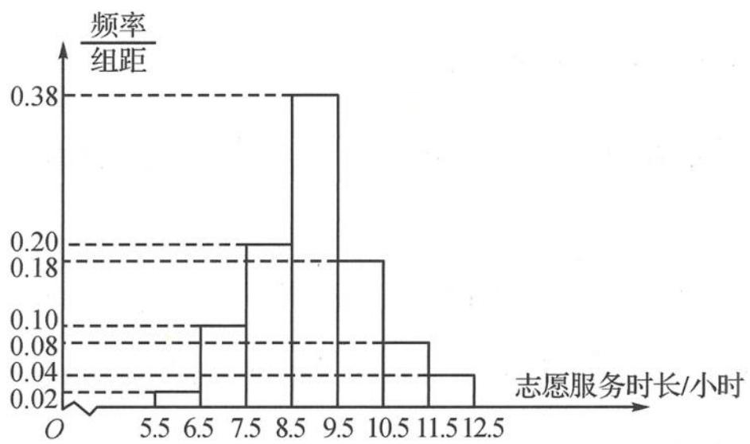

(I)求这500名志愿者每月志愿服务时长的样本平均数 $\bar{x}$ 和样本方差 $s^2$ . (同一组中的数据用该组区间的中间值代表)

(II)由直方图可以认为,目前该地志愿者每月服务时长 X 服从正态分布 $N(\mu,\sigma^{2})$ , 其中 $\mu$ 近似为样本平均数 $\bar{x}, \sigma^{2}$ 近似为样本方差 $s^{2}$ . 一般正态分布的概率都可以转化为标准正态分布的概率进行计算. 若 $X \sim N(\mu, \sigma^{2})$ , 令 $Y = \frac{X - \mu}{\sigma}$ , 则 $Y \sim N(0,1)$ , 且 $P(X \leqslant a) = P\left(Y \leqslant \frac{a - \mu}{\sigma}\right)$ .

(i) 利用直方图得到的正态分布, 求 $P(X \leqslant 10)$ ;

(ii)从该地随机抽取20名志愿者,记Z表示这20名志愿者中每月志愿服务时长超过10小时的人数,求 $P(Z \geqslant 1)$ (结果精确到0.001)以及Z的数学期望.

参考数据： $\sqrt{1.64} \approx 1.28, 0.7734^{20} \approx 0.0059$ . 若 $Y \sim N(0,1)$ ，则 $P(Y \leqslant 0.78) \approx 0.7734$ .

题 12 某企业对生产设备进行优化升级, 升级后的设备控制系统由 $2k-1(k \in \mathbb{N}^{*})$ 个相同的元件组成, 每个元件正常工作的概率均为 $p(0 < p < 1)$ , 各元件之间相互独立. 当控制系统有不少于 k 个元件正常工作时, 设备正常运行, 否则设备停止运行. 记设备正常运行的概率为 $p_{k}$ (例如: $p_{2}$ 表示控制系统由 3 个元件组成时设备正常运行的概率; $p_{3}$ 表示控制系统由 5 个元件组成时设备正常运行的概率).

(I)若每个元件正常工作的概率 $p=\frac{2}{3}$ .

(j)当 $k = 2$ 时,求控制系统中正常工作的元件个数 $X$ 的分布列和数学期望;

(ii) 计算 $p_{3}$ .

(II)已知设备升级前,单位时间的产量为 a 件,每件产品的利润为 1 元,设备升级后,在正常运行状态下,单位时间的产量是原来的 4 倍,且出现了高端产品,每件产品成为高端产品的概率为 $\frac{1}{4}$ ,每件高端产品的利润是 2 元.请用 $p_{k}$ 表示出设备升级后单位时间内的利润 y (单位:元),在确保控制系统中元件总数为奇数的前提下,分析该设备能否通过增加控制系统中元件的个数来提高利润.

题 13 2020 年 12 月 16 日至 18 日, 中央经济工作会议在北京召开, 会议确定, 2021 年要抓好八个重点任务, 其中第五点就是保障粮食安全, 关键在于落实藏粮于地、藏粮于技战略. 要加强种子资源保护和利用, 加强种子库建设. 要尊重科学、严格监管, 有序推进生物育种产业化应用. 某“种子银行”对某种珍稀名贵植物种子采取“活态保存”方法进行保存, 即对种子实行定期更换和种植. 以往的相关数据表明, 该植物种子的出芽率为 $p (0 < p < 1)$ , 每颗种子是否发芽相互独立. 现任取该植物种子 $2n - 1$ 颗进行种植, 若种子的出芽数 $X$ 超过半数, 则可认为种植成功 ( $n \geqslant 2$ ).

(I) 当 $n = 3, p = \frac{1}{2}$ 时, 求种植成功的概率及 $X$ 的数学期望.  
(Ⅱ)现拟加种两颗该植物种子,试分析能否提高种植成功率?

题 14 单板滑雪 U 型池比赛是冬奥会比赛中的一个项目. 在某次冬奥会中, 进入决赛阶段的 12 名运动员按照预赛成绩由低到高的出场顺序轮流进行三次滑行, 裁判员根据运动员的腾空高度、完成的动作难度和效果进行评分, 最终取单次最高分作为比赛成绩. 现有运动员甲、乙两人在 2021 赛季单板滑雪 U 型池世界杯分站比赛成绩如下表.

<table><tr><td rowspan="2">分站</td><td colspan="3">运动员甲的三次滑行成绩</td><td colspan="3">运动员乙的三次滑行成绩</td></tr><tr><td>第1次</td><td>第2次</td><td>第3次</td><td>第1次</td><td>第2次</td><td>第3次</td></tr><tr><td>第1站</td><td>80.20</td><td>86.20</td><td>84.03</td><td>80.11</td><td>88.40</td><td>0</td></tr><tr><td>第2站</td><td>92.80</td><td>82.13</td><td>86.31</td><td>79.32</td><td>81.22</td><td>88.60</td></tr><tr><td>第3站</td><td>79.10</td><td>0</td><td>87.50</td><td>89.10</td><td>75.36</td><td>87.10</td></tr><tr><td>第4站</td><td>84.02</td><td>89.50</td><td>86.71</td><td>75.13</td><td>88.20</td><td>81.01</td></tr><tr><td>第5站</td><td>80.02</td><td>79.36</td><td>86.00</td><td>85.40</td><td>87.04</td><td>87.70</td></tr></table>
假设甲、乙两人每次比赛成绩相互独立.

(Ⅰ)从上表的5站中随机选取1站,求在该站运动员甲的成绩高于运动员乙的成绩的概率.  
(Ⅱ)从上表的5站中任意选取2站,用X表示这2站中甲的成绩高于乙的成绩的站数,求X的分布列和数学期望.  
(Ⅲ)假如从甲、乙两人中推荐一人参加2022年北京冬奥会单板滑雪U型池比赛,根据以上数据信息,你推荐谁参加?请说明理由.

## 2.4 概率中的“歪打正着”
在概率统计的学习中,经常会遇到“歪打正着”的事情,这一方面说明了知识是相互联系的,但同时也应该看到这些错误往往是概念不清、规则不明造成的.

例题 1 某校高三年级与高二年级进行篮球比赛, 若高三年级获胜的概率为 0.6, 高二年级获胜的概率为 0.4.

(Ⅰ)若采用“五场三胜”制,求高三年级获胜的概率;

(Ⅱ)若采用“七场四胜”制,求高三年级获胜的概率.

【研析】这类比赛问题是高考和各类考试中的热点,因此对于这个问题的研究就显得十分必要.
在实际的测试中,学生往往会将其看作是 n 次独立重复试验中某事件恰好发生 k 次的问题来处理,或者也可以说是用二项分布来做,并且结果也是正确的.

对于（Ⅰ），设“高三年级获胜”为事件 B，则
$\begin{array}{l} P (B) = P _ {5} （3） + P _ {5} （4） + P _ {5} （5） \\ = \mathrm{C} _ {5} ^ {3} \times 0. 6 ^ {3} \times 0. 4 ^ {2} + \mathrm{C} _ {5} ^ {4} \times 0. 6 ^ {4} \times 0. 4 + \mathrm{C} _ {5} ^ {5} \times 0. 6 ^ {5} \approx 0. 6 8 2 6; \\ \end{array}$

对于（2），设“高三年级获胜”为事件C，则
$\begin{array}{l} P (C) = P _ {7} （4） + P _ {7} （5） + P _ {7} （6） + P _ {7} （7） \\ = \mathrm{C} _ {7} ^ {4} \times 0. 6 ^ {4} \times 0. 4 ^ {3} + \mathrm{C} _ {7} ^ {5} \times 0. 6 ^ {5} \times 0. 4 ^ {2} + \mathrm{C} _ {7} ^ {6} \times 0. 6 ^ {6} \times 0. 4 + \mathrm{C} _ {7} ^ {7} \times 0. 6 ^ {7} \approx 0. 7 1 0 2. \\ \end{array}$

但实际情况是,上述理解明显是体育比赛规则的错误,因为“五场三胜”制中不一定非要比赛五场.同样地,“七场四胜”制也不一定非要比赛七场,“五场三胜”制连胜三场、“七场四胜”制连胜四场,后面就不用再比赛了,即比赛也就停止了.从而上述的计算公式是错的.
事实上,对于(I),应该是 $P(B) = P$ (连胜三场) $+P$ (前三场负一场第四场胜) $+P$ (前四场负两场第五场胜) $= 0.6^{3} + \mathrm{C}_{3}^{2}\times 0.6^{2}\times 0.4\times 0.6 + \mathrm{C}_{4}^{2}\times 0.6^{2}\times 0.4^{2}\times 0.6\approx 0.6826;$

对于(Ⅱ)，应该是 $P(C)=P$ (连胜四场) + P (前四场负一场第五场胜) + P (前五场负两场第六场胜) + P (前六场负三场第七场胜) = $0.6^{4} + C_{4}^{3} \times 0.6^{3} \times 0.4 \times 0.6 + C_{5}^{3} \times 0.6^{3} \times 0.4^{2} \times 0.6 + C_{6}^{3} \times 0.6^{3} \times 0.4^{3} \times 0.6 \approx 0.7102$ .

我们发现上述结果是一样的,这是什么原因呢?
不妨设 $A_{k} =$ “高三年级第 $k$ 场获胜”，则 $\overline{A_k} =$ “高二年级第 $k$ 场获胜”，则事件
$\begin{array}{l} B = A _ {1} A _ {2} A _ {3} + \left(\overline {{A _ {1}}} A _ {2} A _ {3} + A _ {1} \overline {{A _ {2}}} A _ {3} + A _ {1} A _ {2} \overline {{A _ {3}}}\right) A _ {4} + \left(\overline {{A _ {1}}} \overline {{A _ {2}}} A _ {3} A _ {4} + \overline {{A _ {1}}} A _ {2} \overline {{A _ {3}}} A _ {4} + \overline {{A _ {1}}} A _ {2} A _ {3} \overline {{A _ {4}}}\right) \\ + A _ {1} \overline {{A _ {2}}} \overline {{A _ {3}}} A _ {4} + A _ {1} \overline {{A _ {2}}} A _ {3} \overline {{A _ {4}}} + A _ {1} A _ {2} \overline {{A _ {3}}} \overline {{A _ {4}}}) A _ {5}, \\ \end{array}$
所以
$P (B) = 0. 6 ^ {3} + \mathrm{C} _ {3} ^ {2} \times 0. 6 ^ {2} \times 0. 4 \times 0. 6 + \mathrm{C} _ {4} ^ {2} \times 0. 6 ^ {2} \times 0. 4 ^ {2} \times 0. 6 \approx 0. 6 8 2 6.$

用二项分布来做,显然不应有 $P_{5}（5）$ 这种情况,我们还是用事件来分析.注意到
$\begin{array}{l} A _ {1} A _ {2} A _ {3} = A _ {1} A _ {2} A _ {3} \left(A _ {4} + \overline {{{{A _ {4}}}}}\right) \left(A _ {5} + \overline {{{{A _ {5}}}}}\right) \\ = A _ {1} A _ {2} A _ {3} A _ {4} A _ {5} + A _ {1} A _ {2} A _ {3} A _ {4} \overline {{{A _ {5}}}} + A _ {1} A _ {2} A _ {3} \overline {{{A _ {4}}}} A _ {5} + A _ {1} A _ {2} A _ {3} \overline {{{A _ {4}}}} \overline {{{A _ {5}}}}, \\ \end{array}$
$\left(\overline {{A _ {1}}} A _ {2} A _ {3} + A _ {1} \overline {{A _ {2}}} A _ {3} + A _ {1} A _ {2} \overline {{A _ {3}}}\right) A _ {4} = \left(\overline {{A _ {1}}} A _ {2} A _ {3} + A _ {1} \overline {{A _ {2}}} A _ {3} + A _ {1} A _ {2} \overline {{A _ {3}}}\right) A _ {4} \left(A _ {5} + \overline {{A _ {5}}}\right)$
$= \left(\overline {{A _ {1}}} A _ {2} A _ {3} + A _ {1} \overline {{A _ {2}}} A _ {3} + A _ {1} A _ {2} \overline {{A _ {3}}}\right) \left(A _ {4} A _ {5} + A _ {4} \overline {{A _ {5}}}\right)$
$= \overline {{{A _ {1}}}} A _ {2} A _ {3} A _ {4} A _ {5} + A _ {1} \overline {{{A _ {2}}}} A _ {3} A _ {4} A _ {5} + A _ {1} A _ {2} \overline {{{A _ {3}}}} A _ {4} A _ {5} + \overline {{{A _ {1}}}} A _ {2} A _ {3} A _ {4} \overline {{{A _ {5}}}} + A _ {1} \overline {{{A _ {2}}}} A _ {3} A _ {4} \overline {{{A _ {5}}}} + A _ {1} A _ {2} \overline {{{A _ {3}}}} A _ {4} \overline {{{A _ {5}}}},$
从而
$\begin{array}{l} B = A _ {1} A _ {2} A _ {3} A _ {4} A _ {5} + A _ {1} A _ {2} A _ {3} A _ {4} \overline {{A _ {5}}} + A _ {1} A _ {2} A _ {3} \overline {{A _ {4}}} A _ {5} + A _ {1} A _ {2} A _ {3} \overline {{A _ {4}}} \overline {{A _ {5}}} \\ + \overline {{{A _ {1}}}} A _ {2} A _ {3} A _ {4} A _ {5} + A _ {1} \overline {{{A _ {2}}}} A _ {3} A _ {4} A _ {5} + A _ {1} A _ {2} \overline {{{A _ {3}}}} A _ {4} A _ {5} + \overline {{{A _ {1}}}} A _ {2} A _ {3} A _ {4} \overline {{{A _ {5}}}} + A _ {1} \overline {{{A _ {2}}}} A _ {3} A _ {4} \overline {{{A _ {5}}}} + A _ {1} A _ {2} \overline {{{A _ {3}}}} A _ {4} \overline {{{A _ {5}}}} \\ + \overline {{A _ {1}}} \overline {{A _ {2}}} A _ {3} A _ {4} A _ {5} + \overline {{A _ {1}}} A _ {2} \overline {{A _ {3}}} A _ {4} A _ {5} + \overline {{A _ {1}}} A _ {2} A _ {3} \overline {{A _ {4}}} A _ {5} + A _ {1} \overline {{A _ {2}}} \overline {{A _ {3}}} A _ {4} A _ {5} + A _ {1} \overline {{A _ {2}}} A _ {3} \overline {{A _ {4}}} A _ {5} + A _ {1} A _ {2} \overline {{A _ {3}}} \overline {{A _ {4}}} A _ {5}. \\ \end{array}$
于是便有 $P(B)=P_{5}（3）+P_{5}（4）+P_{5}（5）$ . 这就是“歪打正着”的原因所在. 也即是, 虽然不合实际情况, 但从运算的角度来说确是合理的.

一般地,若进行“2n-1场 n 胜”制的篮球比赛,且甲、乙双方在每一场比赛的获胜概率分别为 $p, q (p + q = 1)$ , 则由上述推理可得,甲胜出的概率为
$P = p ^ {n} + \mathrm{C} _ {n} ^ {1} q p ^ {n} + \mathrm{C} _ {n + 1} ^ {2} q ^ {2} p ^ {n} + \mathrm{C} _ {n + 2} ^ {3} q ^ {3} p ^ {n} + \dots + \mathrm{C} _ {2 n - 2} ^ {n - 1} q ^ {n - 1} p ^ {n}.$

另外,由二项分布的计算公式得
$P = \sum_ {k = n} ^ {2 n - 1} C _ {2 n - 1} ^ {k} p ^ {k} q ^ {(2 n - 1) - k}.$
于是我们得到一个恒等式
$\sum_ {k = n} ^ {2 n - 1} \mathrm{C} _ {2 n - 1} ^ {k} p ^ {k} q ^ {(2 n - 1) - k} = p ^ {n} + \mathrm{C} _ {n} ^ {1} q p ^ {n} + \mathrm{C} _ {n + 1} ^ {2} q ^ {2} p ^ {n} + \mathrm{C} _ {n + 2} ^ {3} q ^ {3} p ^ {n} + \dots + \mathrm{C} _ {2 n - 2} ^ {n - 1} q ^ {n - 1} p ^ {n}.$

这也算是意外收获吧.

例题 2 一个袋子中装有大小相同的 3 个红球和 2 个黄球,从中同时取出 2 个,试求含红球个数的数学期望.

【研析】不少同学采用二项分布来解决它, 易知红球的概率 $P=\frac{3}{5}=0.6$ , 则红球的个数 $\xi\sim B(2,0.6)$ , 从而它的期望 $E(\xi)=2\times0.6=1.2$ , 并且得到一个结论, 认为这是一个二项分布问题.
若记红球个数为 $\xi$ ，不难得到其分布列为

<table><tr><td>ξ</td><td>0</td><td>1</td><td>2</td></tr><tr><td>P</td><td> $\frac{{\mathrm{C}}_{3}^{0}{\mathrm{C}}_{2}^{2}}{{\mathrm{C}}_{5}^{2}}$ </td><td> $\frac{{\mathrm{C}}_{3}^{1}{\mathrm{C}}_{2}^{1}}{{\mathrm{C}}_{5}^{2}}$ </td><td> $\frac{{\mathrm{C}}_{3}^{2}{\mathrm{C}}_{2}^{0}}{{\mathrm{C}}_{5}^{2}}$ </td></tr></table>
所以 $\xi$ 的数学期望
$E (\xi) = 0 \times \frac {1}{1 0} + 1 \times \frac {6}{1 0} + 2 \times \frac {3}{1 0} = 1. 2.$

确实与二项分布求期望的结果是一致的. 这是什么原因呢?

我们知道这肯定不是二项分布问题,若是二项分布问题,则需同时满足以下两个条件:  
（1）在一次试验中,试验结果只有A与 $\overline{A}$ 这两种情况,而且事件A发生的概率为p,事件 $\overline{A}$ 发生的概率为1-p;  
（2）试验可以独立重复地进行,即每次重复做一次试验,事件A发生的概率都是同一常数p,事件 $\overline{A}$ 发生的概率为1-p.
显然,对于上述摸球问题,第一次是从5个球中任取1个,第二次从剩下的4个球中任取1个,第二次摸球的结果依赖第一次的摸球结果,因此每一次试验并非独立,即不满足条件（2）,因此它不是二项分布.

实际上,这是一个超几何分布问题,其分布列为

<table><tr><td> $\xi$ </td><td>0</td><td>1</td><td>...</td><td>k</td><td>...</td><td>l</td></tr><tr><td>P</td><td> $\frac{C_{M}^{0}C_{N-M}^{n}}{C_{N}^{n}}$ </td><td> $\frac{C_{M}^{1}C_{N-M}^{n-1}}{C_{N}^{n}}$ </td><td>...</td><td> $\frac{C_{M}^{k}C_{N-M}^{n-k}}{C_{N}^{n}}$ </td><td>...</td><td> $\frac{C_{M}^{l}C_{N-M}^{n-l}}{C_{N}^{n}}$ </td></tr></table>
其中 $0 \leqslant n \leqslant N, 0 \leqslant M \leqslant N, l = \min\{M, N\}$ , 其数学期望
$E (\xi) = \sum_ {k = 0} ^ {l} \frac {k C _ {M} ^ {k} C _ {N - M} ^ {n - k}}{C _ {N} ^ {n}} = \frac {n M}{N}.$

对于上述摸球问题,则 $E(\xi)=2\times\frac{3}{3+2}=1.2$ , 这也就是“歪打正着”的原因所在. 知道了这个原因也就不会误认为上述超几何分布为二项分布了. 值得一提的是超几何分布的极限分布可以用二项分布来刻画.
通过以上两例我们看到对于一些问题不能仅凭表面现象就下结论,而应从更深层次来思考问题,只有这样才能不会被“歪打正着”所迷惑.

# 第三章 统计

统计学以概率论为基础,根据试验或观察得到的数据来研究随机现象.统计学就是研究如何有效地收集数据、整理数据、分析数据,并对研究的问题作出预测和推断的一门学科,我们的学习也正是沿着这样的脉络进行的.

## 3.1 基本研究路径下的“统计”解题

统计是通过收集、整理和分析带有随机性影响的数据来认识未知现象的一门学科,它可以为人们制定决策提供依据.针对研究对象获取数据,运用数学方法对数据进行整理、分析和推断,最终形成关于研究对象知识是统计的基本流程.统计推断思想是一种根据样本信息来估计总体信息的思想方法,是一种由局部到整体的归纳思想,与概率相比,统计偏重于归纳.对这部分思想方法的考查,重点放在用样本的数字特征去估计总体的相应的数字特征,即用样本的平均数、方差和标准差等统计量去估计总体的平均数、方差和标准差等;用样本的频率分布去估计总体的频率分布;通过对样本数据的分析做出推断.

#### 1. 统计推断的基本研究路径

“未知现象→确定任务→收集数据→处理数据(描述性统计)→分析数据(统计模型)→应用数据(统计推断)”

具体而言,即

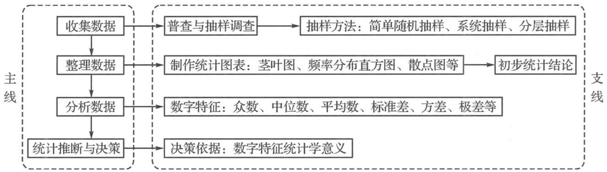

此外,对于依据数字特征的决策,在问题解决中要思考:①常用的数字特征有哪些;②各数字特征产生的背景(产生在统计活动中的哪个环节);③利用哪一个(或几个)数字特征做决策;④如何根据数值大小合理决策.在统计活动的思维过程中,要主动思考明确平均数、中位数、众数代言平均水平,极差、方差、标准差代言稳定程度.

#### 2. 回归分析的研究路径

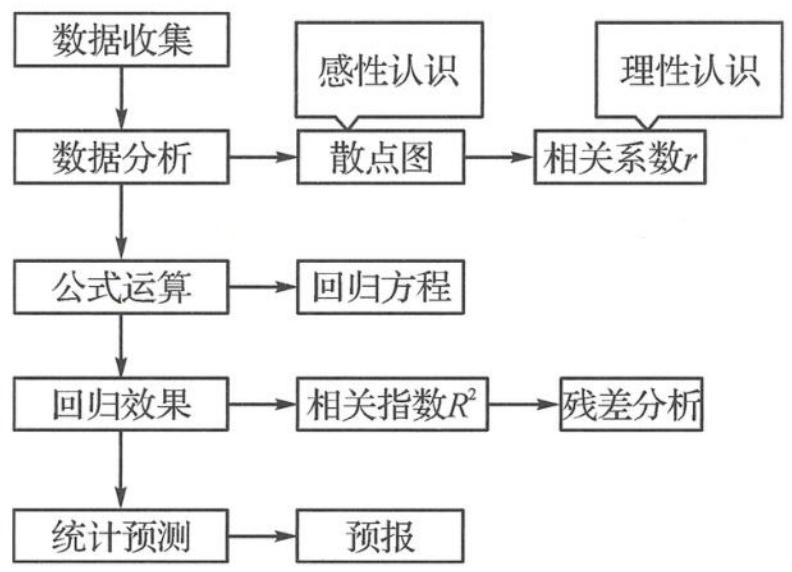

#### 3. 独立性检验的研究路径

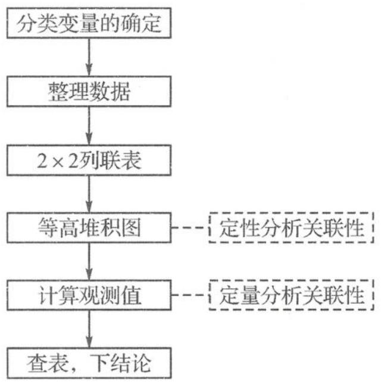

建立了分类变量 X 与 Y 的 $2 \times 2$ 列联表后,有些同学并不能理解查表的含义,只是套公式,所以容易遗忘出错,因而必须准确理解其依据,其决策思路为

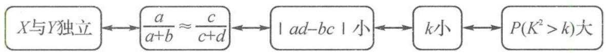

结论: k 越大, $P(K^{2}>k)$ 越小, “X 与 Y 有关系”犯错率越小, 更有把握认为“X 与 Y 有关系”. 先把思路想通, 再通过查表量化犯错率.

## 3.2 获取数据的基本途径和随机抽样

# 基本概念解读

问题 1 概率中的样本空间与统计中的总体是什么关系？样本空间中的样本点与总体中的样本是什么关系？
在概率论的观点下,个体相当于概率空间中的样本点,是特征指标的载体;个体指标相当于随机变量.但是产生这些术语的背景稍有不同:样本点源于随机现象的研究,不能事先预知一个样本点是否出现,而个体则没有这方面的要求;随机变量源于随机现象的研究,不能事先预知随机变量的值,而个体指标没有这方面的要求.总体是所有个体组成的集合.总体是统计学中最基本的概念,在实际问题中它必须被小心的定义.从总体中按照等概率原则抽取的部分个体称为样本.

问题 2 随机抽样都是等概率抽样吗？

统计中的随机抽样,本质上就是对某种随机变量进行的多次观测.其中简单随机抽样是等概率抽样,分层随机抽样在每一层中的抽样是简单随机抽样,因此在每一层中也是等概率抽样,但分层随机抽样各层之间被抽中的概率可以相等,也可以不等,其中各层之间概率相等的分层随机抽样被称作比例分配分层随机抽样.比例分配分层随机抽样的目的在于在每一层中用相同的抽样分数来保证层的比例的代表性.但在现实生活中,除了要考虑样本与总体的结构一致性,还需考虑总体不同层次方差的差异等其他因素,这就带来了不成比例分配分层随机抽样.在高中阶段,鉴于我们的认知基础,我们一般认为比例分配分层随机抽样比不成比例分配分层随机抽样会更为合理.

问题 3 获取收据的途径有哪些?

应用统计学的方法解决问题的第一步是设法得到“好”数据,因为最终的解题答案是建立在数据分析的基础上的.获取数据的途径可以是各种统计报表和年鉴,还可以是社会调查、试验设计、普查和抽样、互联网上的数据等.

问题 4 抽签法和随机数法的异同有哪些?

<table><tr><td>异同</td><td>抽签法</td><td>随机数法</td></tr><tr><td>相同点</td><td colspan="2">两种方法的基本步骤相同:都要先将总体编号,再从中随机产生n个编号,最后将n个编号所对应的个体作为样本</td></tr><tr><td>不同点</td><td>利用签为工具,抽签作为产生随机数的工具</td><td>利用信息技术为工具,直接产生随机数</td></tr></table>

抽签法和随机数法本质相同,只是产生随机数的工具不同而已,随着科学技术的发展,随机数法越来越多在现实生活中应用.如下面某地区某学校入学摇号的操作流程.

摇号录取现场,公证员启封事先封存的新生报名数据和电脑、摇号程序及 U 盘设备.公证员现场启封封存文件.电脑随机摇号过程分别在两台电脑进行.首先用 A 电脑为每个报名参加摇号的学生随机生成一个“摇号码”.如图.

<table><tr><td>姓名</td><td>身份证号码</td><td>性别</td><td>摇号码</td></tr><tr><td>何</td><td>360727</td><td>女</td><td>101101248</td></tr><tr><td>陈</td><td>360902</td><td>女</td><td>101100394</td></tr><tr><td>何</td><td>440513</td><td>女</td><td>101103474</td></tr><tr><td>郭</td><td>441823</td><td>男</td><td>101109075</td></tr><tr><td>凡</td><td>441881</td><td>女</td><td>101103522</td></tr><tr><td>李</td><td>441881</td><td>男</td><td>101103795</td></tr><tr><td>黄</td><td>445322</td><td>女</td><td>101103566</td></tr><tr><td>陈</td><td>445381</td><td>女</td><td>101102121</td></tr><tr><td>江</td><td>450881</td><td>女</td><td>101100001</td></tr><tr><td>赖</td><td>452126</td><td>男</td><td>101103473</td></tr><tr><td>何</td><td>511325</td><td>男</td><td>101102127</td></tr><tr><td>...</td><td>...</td><td>...</td><td>...</td></tr></table>
再将 A 电脑生成的“摇号码”数据复制到 U 盘, 在 B 电脑导入摇号码数据, 随机摇出“中签码”, 如图.

<table><tr><td>101108338</td><td>101103280</td><td>101108888</td><td>101105270</td><td>101105541</td><td>101109263</td></tr><tr><td>101102222</td><td>101100428</td><td>101107287</td><td>101101443</td><td>101101817</td><td>101108520</td></tr><tr><td>101102563</td><td>101109054</td><td>101101993</td><td>101103767</td><td>101101532</td><td>101104555</td></tr><tr><td>101109668</td><td>101107182</td><td>101106433</td><td>101104762</td><td>101101974</td><td>101106237</td></tr><tr><td>101101760</td><td>101100429</td><td>101108873</td><td>101101721</td><td>101101190</td><td>101104802</td></tr><tr><td>101100552</td><td>101104842</td><td>101109880</td><td>101100128</td><td>101100425</td><td>101103939</td></tr><tr><td>101101228</td><td>101101002</td><td>101109348</td><td>101106304</td><td>101101714</td><td>101102530</td></tr><tr><td>101103855</td><td>101108659</td><td>101109759</td><td>101102723</td><td>101108381</td><td>101103566</td></tr><tr><td>...</td><td>...</td><td>...</td><td>...</td><td>...</td><td>...</td></tr></table>

最终,把 B 电脑生成的“中签码”数据导入 A 电脑,A 电脑程序根据中签数据自动匹配判别中签情况,合成最终摇号结果.

电脑随机派位采取公平、公正、公开的摇号方式,全程录像,并邀请公证机关人员、纪检人员、人大代表、政协委员、新闻媒体代表和家长代表、教师代表全程监督.

# 问题 5 样本均值和方差公式是什么？

从总体中抽取容量为 n 的样本, 它们的值分别记为 $y_{1}, y_{2}, \cdots, y_{n}$ , 则

样本均值 $\bar{y}=\frac{y_{1}+y_{2}+\cdots+y_{n}}{n}=\frac{1}{n}\sum_{i=1}^{n}y_{i}$ ，样本方差 $s^{2}=\frac{1}{n}\sum_{i=1}^{n}(y_{i}-\bar{y})^{2}$ .
如果在这 n 个值中, 不同的值有 k 个, 不妨记为 $y_{1}, y_{2}, \cdots, y_{k}$ , 其中 $y_{i}$ 的频数为 $f_{i}$ , 则均值和方差还可写成加权的形式:

样本均值 $\bar{y} = \frac{1}{n}\sum_{i = 1}^{k}y_{i}f_{i}$ ，样本方差 $s^2 = \frac{1}{n}\sum_{i = 1}^{k}(y_i - \bar{y})^2 f_i.$
事实上, 取 $y_{i}$ 的频率为 $\frac{f_{i}}{n}$ , 均值公式还可以写为 $\sum_{i=1}^{k} y_{i} \frac{f_{i}}{n}$ , 方差公式还可以写为 $s^{2} = \sum_{i=1}^{k} (y_{i} - \bar{y})^{2} \frac{f_{i}}{n}$ . 如果我们把抽取到的值看成一个随机变量, 那么这个随机变量的均值就是样本的均值, 这个随机变量的方差就是样本的方差, 我们可以看到统计中样本均值和方差的定义与概率中随机变量期望和方差的定义本质上是一致的.

问题 6 分层随机抽样中样本的均值、方差与每一层样本的均值、方差有什么关系？

以总体划分为 2 层为例,通过分层随机抽样,各层抽取的样本量、样本平均数和样本方差分别为 $m,\overline{x},s_{1}^{2},n,\overline{y},s_{2}^{2}$ ,则总的样本平均数
$\overline {{{w}}} = \frac {m}{m + n} \overline {{{x}}} + \frac {n}{m + n} \overline {{{y}}},$

总的样本方差
$s ^ {2} = \frac {m}{m + n} [ s _ {1} ^ {2} + (\bar {x} - \bar {w}) ^ {2} ] + \frac {n}{m + n} [ s _ {2} ^ {2} + (\bar {y} - \bar {w}) ^ {2} ].$
证明: 易知
$\overline {{{w}}} = \frac {\sum_ {i = 1} ^ {m} x _ {i} + \sum_ {i = 1} ^ {n} y _ {i}}{m + n} = \frac {m \bar {x} + n \bar {y}}{m + n} = \frac {m}{m + n} \bar {x} + \frac {n}{m + n} \bar {y},$

总的方差
$s ^ {2} = \frac {1}{m + n} \left[ \sum_ {i = 1} ^ {m} (x _ {i} - \bar {w}) ^ {2} + \sum_ {i = 1} ^ {n} (y _ {i} - \bar {w}) ^ {2} \right].$
其中
$\sum_ {i = 1} ^ {m} \left(x _ {i} - \bar {w}\right) ^ {2} = \sum_ {i = 1} ^ {m} \left[ \left(x _ {i} - \bar {x}\right) + (\bar {x} - \bar {w}) \right] ^ {2} = \sum_ {i = 1} ^ {m} \left[ \left(x _ {i} - \bar {x}\right) ^ {2} + (\bar {x} - \bar {w}) ^ {2} + 2 \left(x _ {i} - \bar {x}\right) (\bar {x} - \bar {w}) \right],$
其中
$\sum_ {i = 1} ^ {m} 2 (x _ {i} - \bar {x}) (\bar {x} - \bar {w}) = 2 (\bar {x} - \bar {w}) \sum_ {i = 1} ^ {m} (x _ {i} - \bar {x}) = 2 (\bar {x} - \bar {w}) (\sum_ {i = 1} ^ {m} x _ {i} - m \bar {x}) = 0.$
因此
$\sum_ {i = 1} ^ {m} (x _ {i} - \overline {{{{w}}}}) ^ {2} = m s _ {1} ^ {2} + m (\overline {{{{x}}}} - \overline {{{{w}}}}) ^ {2}.$

同理
$\sum_ {i = 1} ^ {n} (y _ {i} - \overline {{{w}}}) ^ {2} = n s _ {2} ^ {2} + n (\overline {{{y}}} - \overline {{{w}}}) ^ {2}.$

综上，
$s ^ {2} = \frac {1}{m + n} [ m s _ {1} ^ {2} + m (\bar {x} - \bar {w}) ^ {2} + n s _ {2} ^ {2} + n (\bar {y} - \bar {w}) ^ {2} ] = \frac {m}{m + n} [ s _ {1} ^ {2} + (\bar {x} - \bar {w}) ^ {2} ] + \frac {n}{m + n} [ s _ {2} ^ {2} + (\bar {y} - \bar {w}) ^ {2} ].$

# 典型考题探讨

例题 1 2019 年,我国施行个人所得税专项附加扣除办法,涉及子女教育、继续教育、大病医疗、住房贷款利息、住房租金、赡养老人等六项专项附加扣除.某单位老年、中年、青年员工分别有 72 人、108 人、120 人,现采用分层抽样的方法,从该单位上述员工中抽取 25 人调查专项附加扣除的享受情况.

(Ⅰ)应从老年、中年、青年员工中分别抽取多少人?

(II)抽取的25人中,享受至少两项专项附加扣除的员工有6人,分别记为A,B,C,D,E,F.享受情况如下表所示,其中“○”表示享受,“×”表示不享受.现从这6人中随机抽取2人接受采访.

<table><tr><td rowspan="2">项目</td><td colspan="6">员工</td></tr><tr><td>A</td><td>B</td><td>C</td><td>D</td><td>E</td><td>F</td></tr><tr><td>子女教育</td><td>○</td><td>○</td><td>×</td><td>○</td><td>×</td><td>○</td></tr><tr><td>继续教育</td><td>×</td><td>×</td><td>○</td><td>×</td><td>○</td><td>○</td></tr><tr><td>大病医疗</td><td>×</td><td>×</td><td>×</td><td>○</td><td>×</td><td>×</td></tr><tr><td>住房贷款利息</td><td>○</td><td>○</td><td>×</td><td>×</td><td>○</td><td>○</td></tr><tr><td>住房租金</td><td>×</td><td>×</td><td>○</td><td>×</td><td>×</td><td>×</td></tr><tr><td>赡养老人</td><td>○</td><td>○</td><td>×</td><td>×</td><td>×</td><td>○</td></tr></table>

(i)试用所给字母列举出所有可能的抽取结果;

(ii) 设 $M$ 为事件“抽取的 2 人享受的专项附加扣除至少有一项相同”, 求事件 $M$ 发生的概率.

【分析】比例分层抽样层次很清晰,根据比例处理即可,难度不大.

【解析】(I)已知老年、中年、青年员工人数之比为 $6:9:10$ , 由于采取分层抽样的方法从中抽取 25 位员工, 因此应从老年、中年、青年员工中分别抽取 6 人、9 人、10 人.

(Ⅱ)(i)从已知的6人中随机抽取2人的所有可能结果为
$\{A, B \}, \{A, C \}, \{A, D \}, \{A, E \}, \{A, F \}, \{B, C \}, \{B, D \}, \{B, E \}, \{B, F \},$
$\{C, D \}, \{C, E \}, \{C, F \}, \{D, E \}, \{D, F \}, \{E, F \},$

共 15 种.

(ii)由表格知,符合题意的所有可能结果为
$\{A, B\}, \{A, D\}, \{A, E\}, \{A, F\}, \{B, D\}, \{B, E\}, \{B, F\}, \{C, E\}, \{C, F\}, \{D, F\}, \{E, F\}$ , 共 11 种. 所以, 事件 $M$ 发生的概率
$P (M) = \frac {1 1}{1 5}.$

【探讨】涉及数据抽样本身的问题难度不大,概率问题属于古典概型,基本列举即可.值得关注的是题目情境的时代特征显著,聚焦经济社会的发展,突出了生活实践情境,充分体现了统计知识在生产生活中的应用.

例题 2 在一次高三年级统一考试中,数学试卷有一道满分 10 分的选做题,学生可以从 A,B 两道题目中任选一题作答.某校有 900 名高三学生参加了本次考试,为了了解该校学生解答该选做题的得分情况,计划从 900 名考生的选做题成绩中随机抽取一个容量为 10 的样本,为此将 900 名考生选做题的成绩按照随机顺序依次编号为 001\~900.

(I)若采用随机数法抽样,并按照以下随机数表,以方框内的数字5为起点,从左向右依次读取数据,每次读取三位随机数,一行读数用完之后接下一行左端.写出样本编号的中位数.

<table><tr><td>05 26 93 70 60</td><td>22 35 85 15 13</td><td>92 03 51 59 77</td><td>59 56 78 06 83</td><td>52 91 05 70 74</td></tr><tr><td>07 97 10 88 23</td><td>09 98 42 99 64</td><td>61 71 62 99 15</td><td>06 [5]1 29 16 93</td><td>58 05 77 09 51</td></tr><tr><td>51 26 87 85 85</td><td>54 87 66 47 54</td><td>73 32 08 11 12</td><td>44 95 92 63 16</td><td>29 56 24 29 48</td></tr><tr><td>26 99 61 65 53</td><td>58 37 78 80 70</td><td>42 10 50 67 42</td><td>32 17 55 85 74</td><td>94 44 67 16 94</td></tr><tr><td>14 65 52 68 75</td><td>87 59 36 22 41</td><td>26 78 63 06 55</td><td>13 08 27 01 50</td><td>15 29 39 39 43</td></tr></table>

(Ⅱ)若采用分层抽样,按照学生选择 A 题目或 B 题目,将成绩分为两层,且样本中 A 题目的成绩有 8 个,平均数为 7 ,方差为 4 ;样本中 B 题目的成绩有 2 个,平均数为 8 ,方差为 1 .用样本估计 900 名考生选做题得分的平均数与方差.

【分析】一般地,不在编号范围内的随机数和重复的随机数需要删除.

【解析】（1）根据题意,读出的编号依次是

512,916(超界),935(超界),805,770,951(超界),

512(重复),687,858,554,876,647,547,332.
将有效的编号从小到大排列,得
$3 3 2, 5 1 2, 5 4 7, 5 5 4, 6 4 7, 6 8 7, 7 7 0, 8 0 5, 8 5 8, 8 7 6,$
所以中位数为 $\frac{647+687}{2}=667.$  
（2）记样本中8个A题目成绩分别为 $x_{1},x_{2},\cdots,x_{8}$ ，2个B题目成绩分别为 $y_{1},y_{2}$ .由题意可知
$\begin{array}{l} \sum_ {i = 1} ^ {8} x _ {i} = 8 \times 7 = 5 6, \sum_ {i = 1} ^ {8} (x _ {i} - 7) ^ {2} = 8 \times 4 = 3 2, \\ \sum_ {i = 1} ^ {2} y _ {i} = 1 6, \sum_ {i = 1} ^ {2} (y _ {i} - 8) ^ {2} = 2 \times 1 = 2. \\ \end{array}$
故样本平均数为
$\frac {\sum_ {i = 1} ^ {8} x _ {i} + \sum_ {i = 1} ^ {2} y _ {i}}{8 + 2} = \frac {5 6 + 1 6}{8 + 2} = 7. 2.$

样本方差为
$\begin{array}{l} \frac {\sum_ {i = 1} ^ {8} (x _ {i} - 7 . 2) ^ {2} + \sum_ {i = 1} ^ {2} (y _ {i} - 7 . 2) ^ {2}}{8 + 2} = \frac {\sum_ {i = 1} ^ {8} [ (x _ {i} - 7) - 0 . 2 ] ^ {2} + \sum_ {i = 1} ^ {2} [ (y _ {i} - 8) + 0 . 8 ] ^ {2}}{8 + 2} \\ = \frac {\sum_ {i = 1} ^ {8} (x _ {i} - 7) ^ {2} - 0 . 4 \times \sum_ {i = 1} ^ {8} (x _ {i} - 7) + 8 \times 0 . 2 ^ {2} + \sum_ {i = 1} ^ {2} (y _ {i} - 8) ^ {2} + 1 . 6 \times \sum_ {i = 1} ^ {2} (y _ {i} - 8) + 2 \times 0 . 8 ^ {2}}{8 + 2} \\ = \frac {3 2 - 0 + 0 . 3 2 + 2 + 0 + 1 . 2 8}{1 0} = \frac {3 5 . 6}{1 0} = 3. 5 6. \\ \end{array}$
故估计该校 900 名考生的选做题得分的平均数为 7.2, 方差为 3.56.

【探讨】也可以直接套用概念解读中的公式
$\begin{array}{l} \overline {{w}} = \frac {m}{m + n} \overline {{x}} + \frac {n}{m + n} \overline {{y}} = \frac {8}{8 + 2} \times 7 + \frac {2}{8 + 2} \times 8 = 7. 2, \\ s ^ {2} = \frac {8}{1 0} \times [ 4 + (7 - 7. 2) ^ {2} ] + \frac {2}{1 0} \times [ 1 + (8 - 7. 2) ^ {2} ] = 3. 5 6. \\ \end{array}$

# 拓展探讨题

题 1 某工厂利用随机数法对生产的 700 个零件进行抽样测试, 先将 700 个零件进行编号, 001, 002, …, 699, 700. 从中抽取 70 个样本. 下表是计算机生成随机数的第 4 行到第 6 行, 若从表中第 5 行第 6 列开始向右读取数据, 则得到的第 6 个样本编号是( ).
$\begin{array}{l} \begin{array}{l} 3 2 \quad 2 1 \quad 1 8 \quad 3 4 \quad 2 9 \quad 7 8 \quad 6 4 \quad 5 4 \quad 0 7 \quad 3 2 \quad 5 2 \quad 4 2 \quad 0 6 \quad 4 4 \quad 3 8 \quad 1 2 \quad 2 3 \quad 4 3 \quad 5 6 \quad 7 7 \quad 3 5 \quad 7 8 \quad 9 0 \quad 5 6 \quad 4 2 \end{array} \\ \begin{array}{l} 8 4 \quad 4 2 \quad 1 2 \quad 5 3 \quad 3 1 \quad 3 4 \quad 5 7 \quad 8 6 \quad 0 7 \quad 3 6 \quad 2 5 \quad 3 0 \quad 0 7 \quad 3 2 \quad 8 6 \quad 2 3 \quad 4 5 \quad 7 8 \quad 8 9 \quad 0 7 \quad 2 3 \quad 6 8 \quad 9 6 \quad 0 8 \quad 0 4 \end{array} \\ 3 2 5 6 7 8 0 8 4 3 \quad 6 7 8 9 5 3 5 5 7 7 \quad 3 4 8 9 9 4 8 3 7 5 \quad 2 2 5 3 5 5 7 8 3 2 \quad 4 5 7 7 8 9 2 3 4 5 \\ \end{array}$

A. 623

B. 328

C. 253

D. 007

题 2 某校老年、中年和青年教师的人数见下表,采用分层抽样的方法调查教师的身体状况.在抽取的样本中,若青年教师有320人,则该样本的老年教师有( ).

<table><tr><td>类别</td><td>人数/人</td></tr><tr><td>老年教师</td><td>900</td></tr><tr><td>中年教师</td><td>1800</td></tr><tr><td>青年教师</td><td>1600</td></tr><tr><td>合计</td><td>4300</td></tr></table>

A. 90 人

B. 100 人

C. 180 人

D. 300 人

题 3 某校有高一、高二、高三三个年级, 其人数之比为 $2: 2: 1$ , 现用等比例分层抽样的方法从总体中抽取一个容量为 10 的样本, 现从所抽取的样本中选两人做问卷调查, 则至少有一人是高一学生的概率为( ).

A. $\frac{1}{3}$

B. $\frac{1}{2}$

C. $\frac{2}{3}$

D. $\frac{3}{4}$

题 4 某工厂生产甲、乙、丙、丁四种不同型号的产品,产量分别为 200,400,300,100 件.为检验产品的质量,现用分层抽样的方法从以上所有的产品中抽取 60 件进行检验,则应从丙种型号的产品中抽取\_\_\_\_件.

题 5 某新学校高一、高二、高三共有学生 1900 名,为了了解同学们对学校关于对手机管理的意见,计划采用分层抽样的方法,从这 1900 名学生中抽取一个样本容量为 38 的样本,若从高一、高二、高三抽取的人数恰好组成一个以 $\frac{2}{3}$ 为公比的等比数列,则此学校高一年级的学生人数为 \_\_\_\_ 人.

题 6 我国古代数学算经十书之一的《九章算术》有一衰分问题(即等比例分层抽样问题):今有北乡八千一百人,西乡七千四百八十八人,南乡六千九百一十二人,凡三乡,发役三百人,则北乡应发役 \_\_\_\_ 人.

题 7 已知某校甲、乙、丙三个年级的学生志愿者人数分别为 240 人、160 人、160 人. 现采用分层抽样的方法从中抽取 7 名学生去某敬老院参加献爱心活动.

(Ⅰ)应从甲、乙、丙三个年级的学生志愿者中分别抽取多少人?

(Ⅱ)设抽出的7名同学分别用A,B,C,D,E,F,G表示,现从中随机抽取2名同学承担敬老院的卫生工作.设M为事件“抽取的2名同学来自同一年级”,求事件M发生的概率.

题 8 某企业有甲、乙、丙三个部门, 其员工人数分别为 24 人、16 人、8 人. 现在医务室通过血检进行一种流行疾病的检查.

(Ⅰ)现采用分层抽样的方法从中抽取6人进行前期调查,求甲、乙、丙三个部门的员工中分别抽取的人数和每一位员工被抽到的概率?

(II)将该企业所有员工随机平均分成4组, 先将每组的血样混在一起化验. 若结果呈阴性, 则可断定本组血样全部为阴性, 不必再化验; 若结果呈阳性, 则本组中至少有一人血检呈阳性, 再逐个化验. 已知每组化验结果呈阴性的概率都为 $\frac{1}{2}$ , 记 $B_{i} (i = 1, 2, 3, 4)$ 为“第 $i$ 组化验结果呈阴性”, $\overline{B}_{i} (i = 1, 2, 3, 4)$ 为“第 $i$ 组化验结果呈阳性”, 请计算恰有两个组需要进一步逐个化验的概率.

## 3.3 统计图表

# 基本概念解读

# 问题 1 什么是统计图表？怎么画统计图表？

统计图表代表了一张图形化的数据,通常用来方便人们理解大量数据,以及数据之间的关系,让人们透过视觉化的符号,更快速地读取原始数据.所谓数据可视化就是通过图形,呈现出数据大小、占比、分布等特点,从而传递信息给大家.统计图表已经被广泛用于各种领域,过去是在坐标纸或方格纸上手绘,现代则多用电脑软件产生,如 Excel, FineBI 等.

# 问题 2 如何获得统计图表?
在网络上,有很多专门提供统计图表的公司或部门,它们提供政府部分允许公开的各类数据,并用可视化的方式呈现出来,如中国统计政府网站以及微信公众号“谷雨数据”“网易数读”“澎湃美数课”等,我们在命制地方性试题时常从其中选取素材.当然,我们也常利用电脑软件主动绘制统计图表.

# 问题 3 我们已经学习了哪些统计图表？它们的功能分别是什么？

我们学习过扇形图、条形图、折线图、频数分布直方图、频率分布直方图等. 不同的统计图在表示数据上有不同的特点.

<table><tr><td>扇形图、饼图</td><td>主要用于直观描述各类数据占总数的比例.</td></tr><tr><td>柱状图、条形图、频数分布直方图、频率分布直方图</td><td>主要用于直观描述不同类型或分组数据的频数和频率,条形图适用于描述离散型数据,直方图适用描述连续型数据.</td></tr><tr><td>折线图、散点图</td><td>主要用于描述数据随时间的变化趋势.</td></tr><tr><td>雷达图</td><td>雷达图是以从同一点开始的轴上表示的多变量数据的图形方法.</td></tr><tr><td>茎叶图</td><td>茎叶图的思路是将数组中的数按位数进行比较,将数的大小基本不变或变化不大的位作为一个茎,将变化大的位的数作为叶,列在茎的后面.将茎叶图的茎和叶按逆时针方向旋转,实际上就是一个直方图,可以从中统计出次数,计算出各数据段的频率.</td></tr><tr><td>频数分布表</td><td>将一组计量资料按观察值大小分为不同组段,然后将各观察值归纳到各组段中,最后清点各组段的频数,以表格的形式进行表示.</td></tr><tr><td>列联表</td><td>列联表是将观测数据按两个或更多属性(定性变量)分类时所列出的频数分布表,高中常见的是2×2列联表.</td></tr></table>

问题 4 从考生的角度,统计图表类问题如何进行解答?

统计图表类问题多数作为选择题的形式出现,尤其是多项选择题,命题人会从多个角度对统计图表做出表达.考生需要重点关注统计图表的类型,尤其是统计图表中数据表达的含义和单位.从统计表中刻画的基本概念出发,对四个选项逐个做出判断,把握住这一点,即便某种统计图表从未在教材或试卷中出现过,考生也能够轻松识别它并解决相关问题.

问题 5 统计图表的意义何在?

整理和显示统计数据是统计学的重要内容. 利用统计图显示数据既简单又直观, 是数据处理的重要技术手段. 对数据整理, 选取合适的统计图显示数据, 解读统计图, 并从中提取信息是统计学的核心素养之一.

# 典型考题探讨

例题 1 某地区经过一年的新农村建设,农村的经济收入增加了一倍,实现翻番.为更好地了解该地区农村的经济收入变化情况,统计了该地区新农村建设前后农村的经济收入构成比例,得到如下饼图.

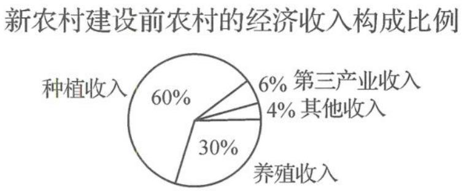

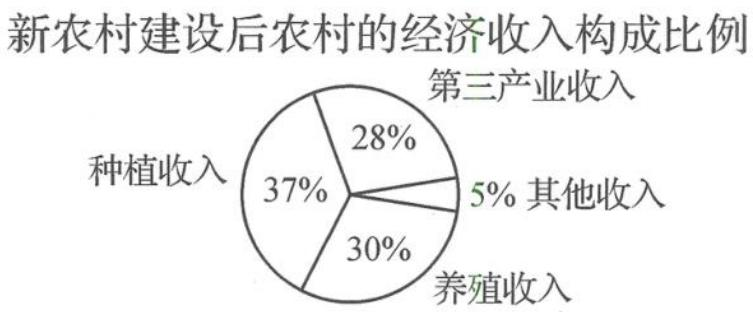

下面结论中不正确的是( ).

A. 新农村建设后,种植收入减少  
B. 新农村建设后, 其他收入增加了一倍以上  
C. 新农村建设后, 养殖收入增加了一倍

D. 新农村建设后, 养殖收入与第三产业收入的总和超过了经济收入的一半

【分析】两幅饼图的含义从题干“该地区新农村建设前后农村的经济收入构成比例”中可以得到。前三个选项都是要求我们比较前后各类型经济收入值大小，因此我们还需要知道前后经济收入的总量，这一点从题干“农村的经济收入增加了一倍，实现翻番”中可以得出。虽然题干没有提供具体的收入总数值，但我们可以将其设为参数，再利用不等式知识做出比较。

【解析】设新农村建设前的经济收入为 $M(M > 0$ ，单位：元），则新农村建设后的经济收入为 $2M$ ，建设前种植收入为 $0.6M$ ，而建设后的种植收入为 $2M \times 37\% = 0.74M$ ，所以种植收入增加了，选项 A 不正确；
建设前,其他收入为 0.04M,建设后其他收入为 0.1M,故增加了一倍以上,选项 B 正确;

建设前,养殖收入为 0.3M,建设后为 0.6M,增加了一倍,选项 C 项正确;

建设后,养殖收入与第三产业收入的总和占经济收入的 $30\% + 28\% = 58\% > 50\%$ , 超过了经济收入的一半,所以 D 正确.

综上,答案选 A.

【探讨】本题是2018年全国I卷理(文)科第3题.在显示总体中各种组成成分所占比例方面,饼图具有简单、直观的优势.该考题从构成经济收入的四种收入类型入手构建了四个选项.新农村建设后,虽然种植收入的比例缩小了,但由于总收入扩大了,通过计算还是可以发现种植收入其实是扩大了.选项A的设计体现了命题人对统计图表中“数据定义和单位”的考查,本题饼图中数据的定义是比例,单位是百分比,如果考生没有考虑到这一点,仅就前后收入的比例进行比较就会得出错误的判断;选项B,C的设计意图同样如此,不考虑数据的定义和单位,单纯的比较数据值的大小,是命题人设置错误选项支的常用方法;选项D的判断最简单,因为经济收入的一半体现的就是比例,所以将养殖收入与第三产业收入的比例相加与50%比较大小即可.

# 拓展探讨题

题 1-1 （多选题）空气质量的指数 AQI 是反映空气质量状况的指数, AQI 指数的值越小, 表明空气质量越好. AQI 指数不超过 50, 空气质量为优; AQI 指数大于 50 且不超过 100, 空气质量为良; AQI 指数大于 100, 空气质量为污染. 下图是某市 2020 年空气质量指数 AQI 的月折线图. 下列关于该市 2020 年空气质量的叙述中一定正确的是( ).

某市 2020 年空气质量指数 AQI 月折线图  
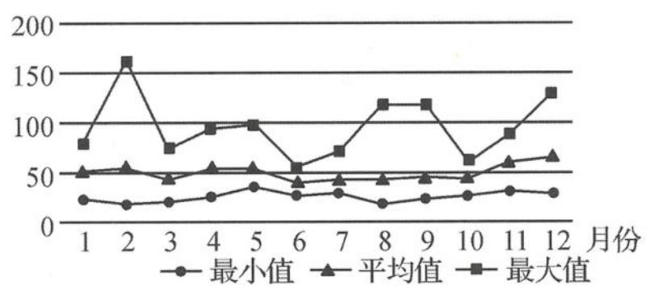

A. 全年的平均 AQI 指数对应的空气质量等级为优或良  
B. 每月都至少有一天空气质量为优  
C. 2月份、8月份、9月份和12月份均出现污染天气  
D. 空气质量为污染的天数最多的月份是 2 月份

题 1-2 （多选题）产能利用率是指实际产出与生产能力的比率,工业产能利用率是衡量工业生产经营状况的重要指标.下页图为国家统计局发布的 2015 年至 2018 年第二季度我国工业产能利用率的折线图.

2015年至2018年第二季度我国工业产能利用率的折线图

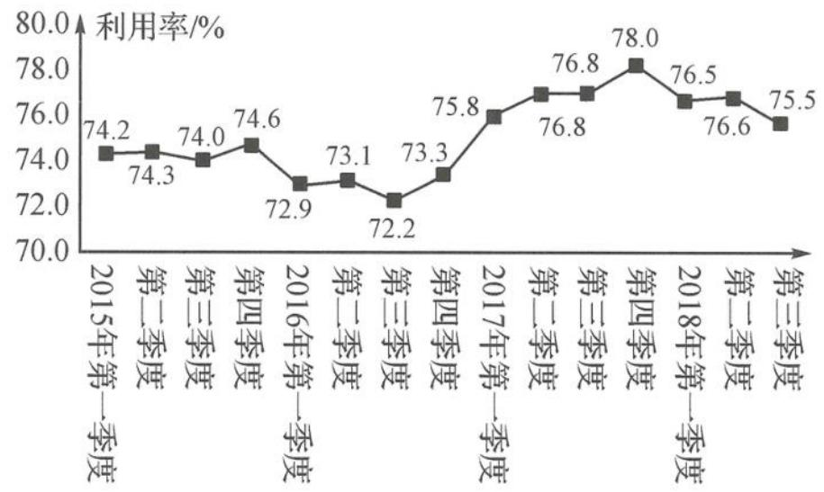
在统计学中, 同比是指本期统计数据与上一年同期统计数据相比较, 例如 2016 年第二季度与 2015 年第二季度相比较; 环比是指本期统计数据与上期统计数据相比较, 例如 2015 年第二季度与 2015 年第一季度相比较. 据上述信息, 下列结论中正确的是( ).

A. 2015 年第三季度环比有所降低

B. 2016 年第一季度同比有所降低

C. 2017 年第三季度同比有所提高

D. 2018 年第一季度环比有所提高

题 1-3 （多选题）某网络销售平台,实施对口扶贫,销售某县扶贫农产品.根据2020年全年该县扶贫农产品的销售额(单位:万元)和扶贫农产品销售额占总销售额的百分比,绘制了如图所示的双层饼图.根据双层饼图(季度和月份后面标注的是销售额或销售额占总销售额的百分比),下列说法正确的是().

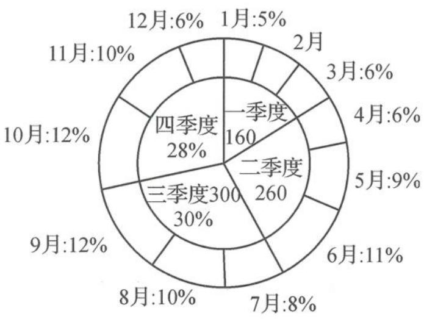

A. 2020 年的总销售额为 1000 万元

B. 2月份的销售额为8万元

C. 第四季度销售额为 280 万元

D. 12 个月的销售额的中位数为 90 万元

题 1-4 （多选题）如图为某省高考数学卷近三年难易程度的对比图（图中数据为分值）。根据对比图，其中正确的为（ ）.

某省高考数学卷近三年难易程度对比图

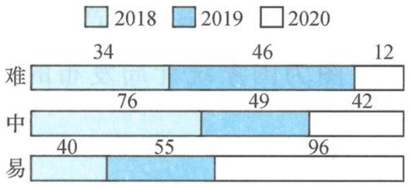

A. 近三年容易题分值逐年增加

B. 近三年中档题分值所占比例最高的年份是 2019 年

C. 2020 年的容易题与中档题的分值之和占总分的 90% 以上  
D. 近三年难题分值逐年减少

题 1-5 （多选题）空气质量指数大小分为五级，指数越大说明污染的情况越严重，对人体危害越大，指数范围在[0,50],[51,100],[101,200],[201,300],[301,500]对应“优”“良”“轻度污染”“中度污染”“重度污染”五个等级。下面是某市连续14天的空气质量指数变化趋势图，下列说法中正确的是( )。

某市连续 14 天的空气质量指数变化趋势图  
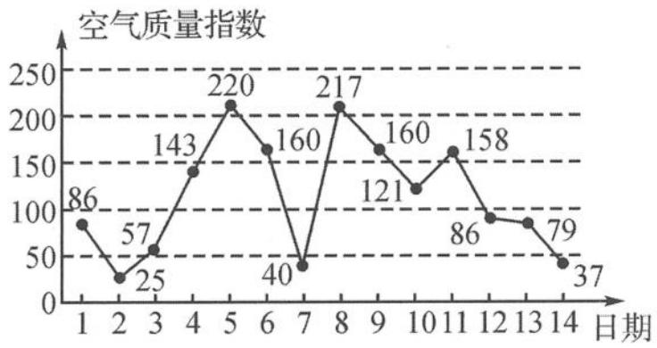

A. 从 2 日到 5 日空气质量越来越好  
B. 这 14 天的空气质量指数的极差为 195  
C. 这 14 天的空气质量指数的中位数是 103.5  
D. 这 14 天中空气质量指数为“良”的频率为 $\frac{3}{14}$

例题 2 2019 年,全国各地区坚持稳中求进的工作总基调,经济运行总体平稳,发展水平迈上新台阶,发展质量稳步上升,人民生活福祉持续增进,全年最终消费支出对国内生产总值增长的贡献率为 57.8%. 下图为 2019 年居民消费价格月度涨跌幅度.(其中同比= $\frac{本期数-去年同期数}{去年同期数}\times100\%$ ,环比= $\frac{本期数-上期数}{上期数}\times100\%$ )

2019年居民消费价格月度涨跌幅度图  
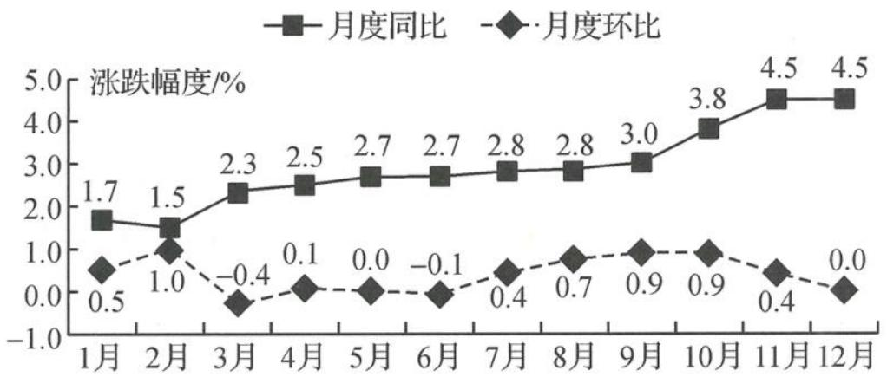

下列结论中不正确的是( ).

A. 2019 年第三季度的居民消费价格一直都在增长  
B. 2018 年 7 月份的居民消费价格比同年 8 月份要低一些  
C. 2019 年全年居民消费价格比 2018 年涨了 2.5% 以上  
D. 2019 年 3 月份的居民消费价格全年最低

【分析】本题中的涨跌幅度图相当于两幅折线图,描述了每一个月度的同比、环比数据情况.从题干中我们可以得出同比和环比的概念,同比是本期相较于去年同期数的涨跌幅度,环比是本期相较于上期数的涨跌幅度,也就是说同比是两年同一月度间的对比,环比是前后两个月度间的对比,所以表达式上还会有“本期数=去年同期数×(1+同比)”,“本期数=上期数×(1+环比)”,概念及其关系是我们首先要弄清楚的.

【解析】由折线图知,2019年7,8,9月份的月度环比都是正数,因此第三季度的居民消费价格一直都在增长,选项A正确;
设2018年7月份、8月份的居民消费价格分别为 $m, n$ ，则2019年7月份、8月份的居民消费价格分别为 $m(1 + 2.8\%)$ ， $n(1 + 2.8\%)$ ，因为2019年第三季度的居民消费价格一直都在增长，所以 $m(1 + 2.8\%) < n(1 + 2.8\%)$ ，则 $m < n$ ，选项B正确；
各月居民消费价格大致相同,计算12个月同比的平均值约为 $\frac{1}{12}\times(1.7+1.5+2.3+2.5+2.7+2.7+2.8+2.8+3.0+3.8+4.5+4.5)=2.9$ ,选项C正确;
不妨设2019年1月份消费价格为 $a$ ，则2月份消费价格为 $a(1 + 1\%) = 1.01a$ ，3月份消费价格为 $1.01a(1 - 0.4\%) = 1.00596a$ ，所以2019年3月份消费价格大于1月份消费价格，选项D错误.

综上,答案选 D.

【探讨】折线图可以显示随时间而变化的连续数据,因此非常适用于显示在相等时间间隔下数据的趋势.很明显,选项D就是命题人基于“数据定义和单位”设置的陷阱,因为从图中可以看出2019年3月份的环比值最低,但这只是表示3月份相较于2月份下降幅度比较大,并不代表着3月份的消费价格就最低.从环比折线图可以看出,2019年上半年呈“增减增”的趋势,因此需要将3月份消费价格和1月份、6月份的进行大小比较才能确定哪个月最低.事实上,设3月份消费价格为b,则6月份消费价格为 $b(1+1\%)(1-1\%)=\frac{9999}{10000}b<b$ .因此,判断6月份消费价格比3月份小更容易些,这也是不等式 $(1+x\%)(1-x\%) \leqslant 1$ 的应用.在选项B中,利用2019年7,8月份消费价格的大小关系,再结合同比值相同得出2018年7,8月份消费价格的大小关系,这个过程综合了两幅折线图的信息,体现了它们的关联,代数上也体现了不等式性质“若a<b,c>0,则ac<bc”.挑选统计图表素材时,选取两幅相关联的素材,并设置选项支体现出这种关联性,这也是常见的命题方向之一.另外,选项C的判断可以无须精确的计算,一方面, $\frac{1}{12}\times(1.7+1.5+2.3+2.5+2.7+2.7+2.8+2.8+3.0+3.8+4.5+4.5)>\frac{1}{12}\times(1.5\times2+2+2.5\times5+3.0+3.5+4.5\times2)=\frac{11}{4}>2.5$ ,将数据适当放缩能够简化计算的过程(注意有时也有可能放缩过度得不出判断,如 $\frac{1}{12}\times(1.7+1.5+2.3+2.5+2.7+2.7+2.8+2.8+3.0+3.8+4.5+4.5)>\frac{1}{12}\times(1\times2+2\times6+3\times4)=\frac{13}{6}$ ,而 $\frac{13}{6}<2.5$ );另一方面,由图

可以看出,一年中有9个月的同比不低于2.5%,且后4个月明显大于2.5%,只有3个月的同比小于2.5%,因此可以估计出全年增长了2.5%以上.

综上,选项 A 直接由环比概念、环比折线图的数据就能得出判断;选项 C 的判断既可以直接计算,也可以放缩估算,还可以从图形中直观观察得出;选项 B,D 的判断则需要精确的计算,可以是具体的计算,本题还能利用不等式的相关知识简化运算过程.

# 拓展探讨题

题 2-1 为了解某地农村经济情况,对该地农户家庭年收入进行抽样调查,将农户家庭的调查数据整理得到如下频率分布直方图.

农户家庭收入频率分布直方图  
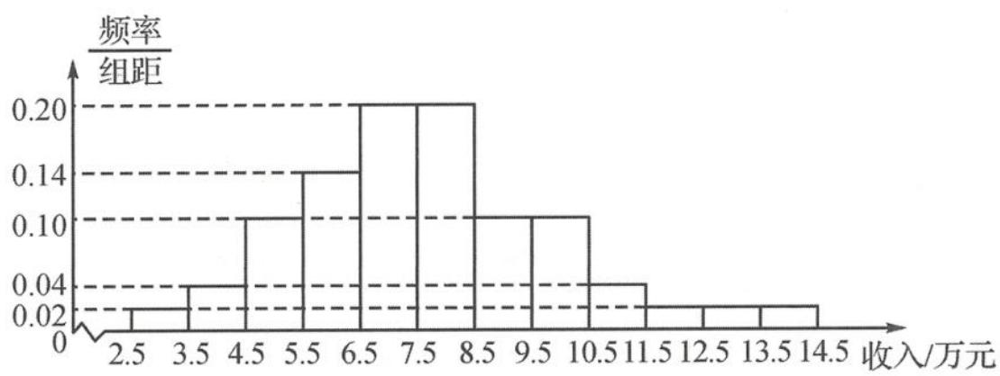
根据此频率分布直方图,下面结论中不正确的是().

A. 该地农户家庭年收入低于 4.5 万元的农户比率估计为 6%  
B. 该地农户家庭年收入不低于 10.5 万元的农户比率估计为 $10 \%$   
C. 估计该地农户家庭年收入的平均值不超过 6.5 万元  
D. 估计该地有一半以上的农户, 其家庭年收入在 4.5 万元至 8.5 万元

题 2-2 （多选题）某校研究性学习小组根据某市居民人均消费支出的统计数据,制作了2018年人均消费支出(单位:元)条形图和2019年人均消费支出饼图(如图).已知2019年居民人均消费总支出比2018年居民人均消费总支出提高8.5%,则下列结论正确的是().

2018年人均消费支出条形图  
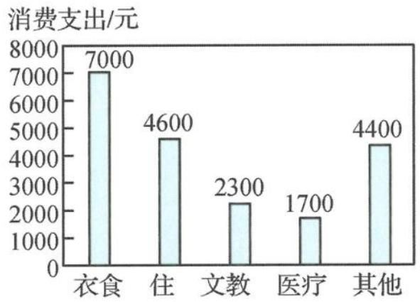

2019年人均消费支出饼图  
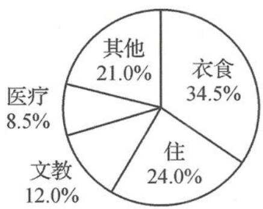

A. 2019 年的人均衣食支出金额比 2018 年的人均衣食支出金额高  
B.2019年除医疗以外的人均消费支出金额等于2018年的人均消费总支出金额  
C. 2019 年的人均文教支出比例比 2018 年的人均文教支出比例有所提高  
D. 2019年人均各项消费支出中，“其他”消费支出的年增长率最低

题 2-3 为了解户籍性别对生育二胎选择倾向的影响,某地从育龄人群中随机抽取了容量为 100 的调查样本,其中城镇户籍与农村户籍各 50 人;男性 60 人,女性 40 人,绘制不同群体中倾向选择生育二胎与选择不生育二胎的人数比例图(如图),其中阴影部分表示倾向选择生育二胎的对应比例,则下列叙述中错误的是().

不同群体生育二胎情况比例图  
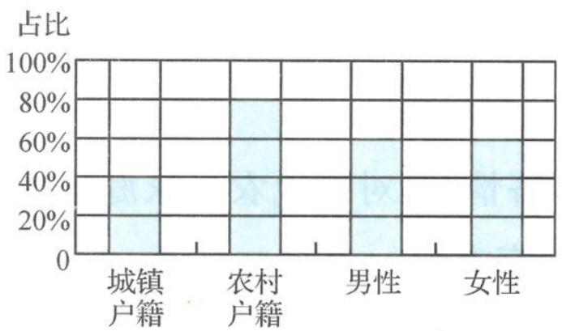

A. 是否倾向选择生育二胎与户籍有关  
B. 是否倾向选择生育二胎与性别无关  
C. 倾向选择生育二胎的人员中, 男性人数与女性人数相同  
D. 倾向选择不生育二胎的人员中, 农村户籍人数少于城镇户籍人数

题 2-4 （多选题）2015 年以来,我国脱贫攻坚成效明显. 下图是 2015～2019 年年末全国农村贫困人口和贫困发生率(贫困人口占目标调查人口的比重)变化情况(数据来源:国家统计局 2019 年统计年报),根据这个发展趋势,2020 年底全面脱贫的任务必将完成. 根据图表中可得出的正确统计结论有( ).

2015～2019年年末全国农村贫困人口和贫困发生率统计图  
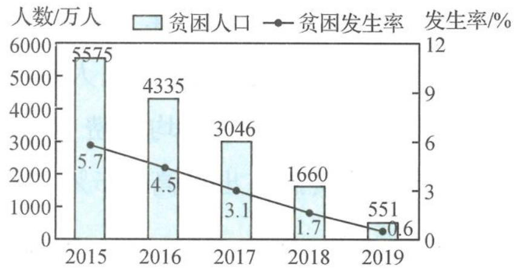

A. 五年来贫困发生率下降了 5.1 个百分点  
B. 五年来农村贫困人口减少超过九成  
C. 五年来农村贫困人口减少得越来越快  
D. 五年来目标调查人口逐年减少

题 2-5 地球上的风能取之不尽,用之不竭. 风能是清洁能源,也是可再生能源. 世界各国致力于发展风力发电,近 10 年来,全球风力发电累计装机容量连年攀升,中国更是发展迅猛,在 2014 年累计装机容量就突破了 100GW,达到 114.6GW,中国的风力发电技术也日臻成熟,在全球范围的能源升级换代行动中体现出大国的担当与决心. 以下是近 10 年全球风力发电累计装机容量与中国新增装机容量图.

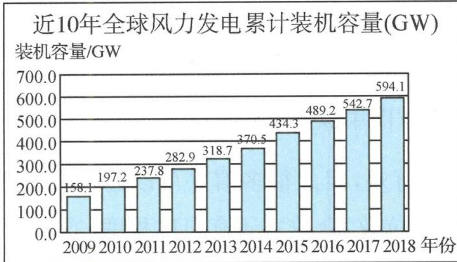

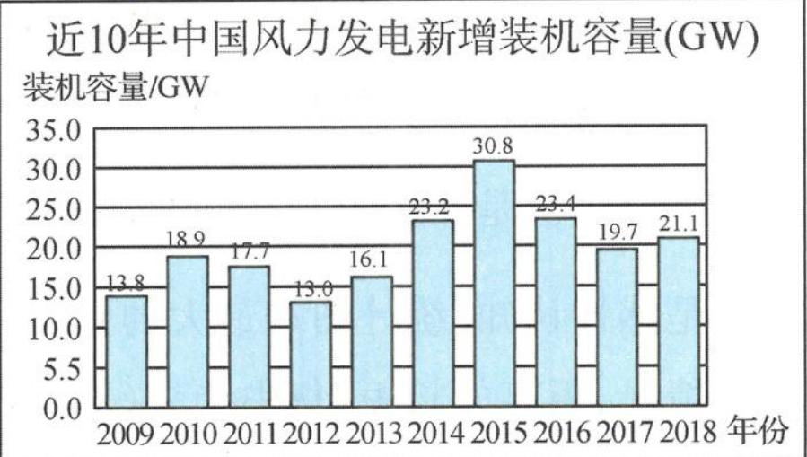
根据以上信息,正确的统计结论是( ).

A. 截至 2015 年中国累计装机容量达到峰值  
B. 10 年来全球新增装机容量连年攀升  
C. 10 年来中国新增装机容量平均超过 20GW

D. 截至 2015 年中国累计装机容量在全球累计装机容量中占比超过 $\frac{1}{3}$

题 2-6 （多选题）2021 年 5 月 11 日, 国家统计局公布了第七次人口普查统计数据, 全国总人口数为 141178 万. 全部七次人口普查的人口增长率、性别比及城镇化进程变化情况如下图.

全国人口与年增长率统计图

男、女人数及性别比统计图

城镇人口、乡村人口及城镇人口比重统计图

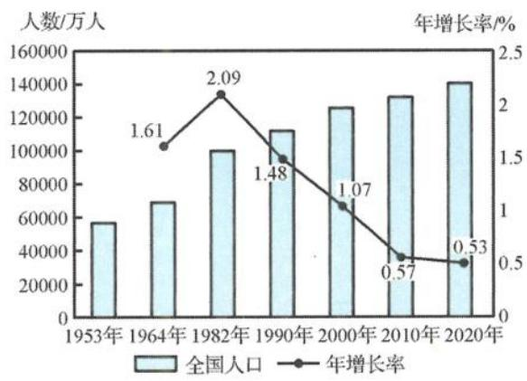

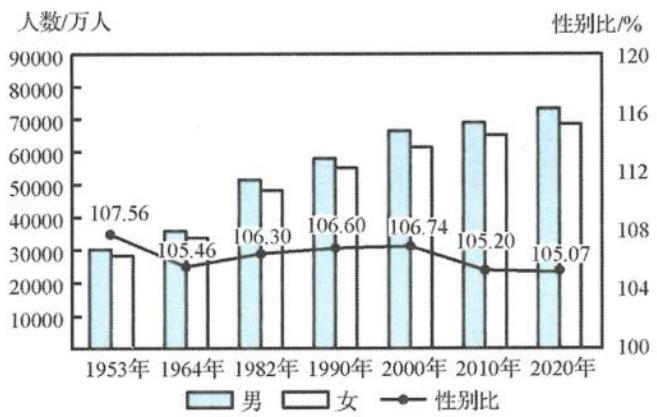

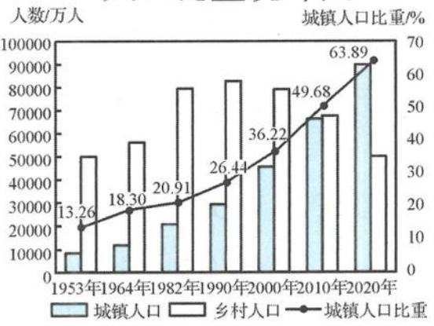
根据以上信息,下列统计结论正确的是().

A. 七次人口普查的人口增长率逐次减少  
B. 七次人口普查的性别比趋于稳定,重男轻女的传统观念有所转变  
C. 七次人口普查的城镇人口比重逐次提高  
D. 第七次人口普查城镇人口数与乡村人口数相差超过 4 亿

# 研究路径探索
由上述例题的分析与解,我们可以得到统计图表问题的基本研究路径,如图所示.

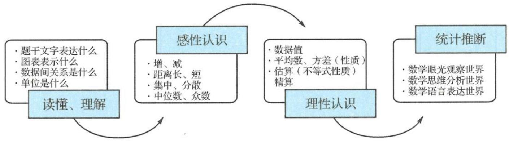

具体而言,第一步是读懂、理解.仔细阅读试题题干呈现出的背景情境,提炼出表达的信息;分析统计图表的类型;关键是明确数据间的关系是什么(尤其是有多个图表,多类数据的时候),数据本身的单位是什么(如常考的频率分布直方图中纵坐标表示 $\frac{频率}{组距}$ ).
第二步是感性认知. 统计图表最大的意义就是直观, 因此很多信息可以通过观察来估计, 通常有增减情况、距离的长短、集中趋势(平均数, 中位数, 众数), 还有离散程度(方差)等.
第三步是理性认识. 统计图表问题在语文、政治等其他学科中也都有出现, 数学学科中的统计图表问题最大的不同点就体现在计算上, 数学学科的统计图表问题是需要计算的. 如计算具体数据值、样本的平均数、方差等. 在计算的方法上, 可以是精确计算, 也可以利用相关不等式知识做出估算, 这就要结合题目的精度要求做出选择了.

常用不等式性质有：

①若 a > b, c > d，则 $a + c > b + d$ .

常用此性质作小数求和的估算,如
$\begin{array}{l} \frac {1 . 7 + 1 . 5 + 2 . 3 + 2 . 5 + 2 . 7 + 2 . 7 + 2 . 8 + 2 . 8 + 3 . 0 + 3 . 8 + 4 . 5 + 4 . 5}{1 2} \\ > \frac {1 . 5 \times 2 + 2 + 2 . 5 \times 5 + 3 . 0 + 3 . 5 + 4 . 5 \times 2}{1 2} = \frac {1 1}{4} > 2. 5. \\ \end{array}$

②若 a > b > 0, c > d > 0，则 $\frac{a}{c} > \frac{b}{c}, \frac{a}{d} > \frac{b}{c}$ .

常用此性质作分数值的估算,如
$\frac {5 5 7 5 - 5 5 1}{5 5 7 5} > \frac {5 5 7 5 - 5 5 7 . 5}{5 5 7 5} > 90 \%, \frac {1 4 5 . 4}{4 3 4 . 3} > \frac {1 4 5}{4 3 4 . 3} > \frac {1 4 5}{4 3 5} = \frac {1}{3}.$
最后就是统计推断了. 能读懂统计图表是现代公民的基本素养, 我们要从统计图表中得出统计推断, 可以是多种的, 也可以是多维度的. 当然了, 从应试的角度来看, 如果考题是选择题, 则我们只需根据选项来判断就可以了.

## 3.4 统计推断

统计推断的典型特征是根据样本数据以及问题的条件和假定,以概率的形式对总体做出的推断.下面三小节都是基于样本数据进行估计或推断.

### 3.4.1 样本估计总体

# 基本概念解读

# 问题 1 “频率估计概率”与“样本估计总体”是一回事吗？
在重复试验中,试验次数越多,频率接近概率的可能性就越大.与此类似,用随机抽样在总体中抽取样本,样本量越大,样本特征接近总体特征的可能性也就越大.

# 问题 2 有哪些样本数字特征？它们的意义何在？有哪些优缺点？
利用样本所提供的信息对总体分布中未知的量进行推断是统计中最重要的思想. 统计估计和假设检验是两种基本的推断方法, 估计内容包括用样本数字特征估计总体特征. 总体的数字特征主要刻画如下三个方面的特征: 分布的中心位置、分布的离散程度和分布的形状. 我们把描述一组数据统计特征的量称为统计量, 按其作用可以分为以下几类.  
（1） 描述数据集中趋势的量: 平均数、中位数、众数、百分位数;  
（2） 描述数据离散程度的量: 方差、标准差、极差等;  
（3） 描述两组数据关系密切程度的量: 相关系数.
其中,平均数、百分位数和方差是最重要的统计量.

各种统计量的意义、优缺点及适用范围

<table><tr><td>特征</td><td>平均数</td><td>百分位数/中位数</td><td>方差/标准差</td></tr><tr><td>意义</td><td>数据的代表值</td><td>描述数据百分位置的量</td><td>描述数据相对于平均数的离散程度的量</td></tr><tr><td>优点</td><td>计算方便,性质优良,应用广泛</td><td>受极端值影响小</td><td>计算方便,性质优良,应用广泛</td></tr><tr><td>缺点</td><td>数据中有极端值时,平均数的代表性差</td><td>没有利用数据的全部信息,不需要计算</td><td>方差受数据单位或量纲的影响</td></tr><tr><td>适用范围</td><td>反映变量的一般水平,常用于比较</td><td>确定定额,制定标准</td><td>评价数据的稳定性,加工零件的精度等</td></tr></table>

问题 3 百分位数的内涵是什么？与中位数有什么联系？

中位数是一个反映数据集中趋势的量,也就是50百分位数,它是一个描述数据中间位置的量.但在实际中仅用中位数反映数据特征的信息量还不够,需要将中位数推广到任意百分位数.在实际应用中四分位数是仅次于中位数价值的数据,往往用来判断一个数据是否是离群数据.离群数据可能是由错误的观测数据引起的,离群数据可能表明样本数据不是来自同一个总体的重复观测,离群数据也可能导致新的发现.在实际应用中,应该分析离群数据产生的原因,并对症加以处理,以改进统计分析的结果,即那些可能由错误的观测混进样本中的数据.

# 典型考题探讨

例题 1 （多选题）有一组样本数据 $x_{1}, x_{2}, \cdots, x_{n}$ ，由这组数据得到新样本数据 $y_{1}, y_{2}, \cdots, y_{n}$ ，其中 $y_{i} = x_{i} + c (i = 1, 2, \cdots, n)$ ，c 为非零常数，则（）.

A. 两组样本数据的样本平均数相同

B. 两组样本数据的样本中位数相同

C. 两组样本数据的样本标准差相同

D. 两组样本数据的样本极差相同

【分析】本题主要研究数据的影响因素,其中样本平均数和中位数,它们是描述中心位置的量,显然平移 c 后发生变化了,而标准差和极差是描述离散程度的量,这个是没有变化的.

【解析】由平均数、中位数、标准差、极差的计算公式,容易得出新样本数据的平均数和中位数均改变了 c,而标准差和极差保持不变.

综上,答案选 CD.

【探求】不仅要会运用数字特征的计算公式计算其值,更重要的是对其含义或者说实际意义要真正理解.

例题 2 某厂研制了一种生产高精产品的设备,为检验新设备生产产品的某项指标有无提高,用一台旧设备和一台新设备各生产了10件产品,得到各件产品该项指标数据如下.

<table><tr><td>旧设备</td><td>9.8</td><td>10.3</td><td>10.0</td><td>10.2</td><td>9.9</td><td>9.8</td><td>10.0</td><td>10.1</td><td>10.2</td><td>9.7</td></tr><tr><td>新设备</td><td>10.1</td><td>10.4</td><td>10.1</td><td>10.0</td><td>10.1</td><td>10.3</td><td>10.6</td><td>10.5</td><td>10.4</td><td>10.5</td></tr></table>

旧设备和新设备生产产品的该项指标的样本平均数分别记为 $\bar{x}$ 和 $\bar{y}$ ，样本方差分别记为 $s_1^2$ 和 $s_2^2$ 。

(I) 求 $\overline{x}, \overline{y}, s_{1}^{2}, s_{2}^{2}$ ;

(Ⅱ)判断新设备生产产品的该项指标的均值较旧设备是否有显著提高。(如果 $\bar{y}-\bar{x}\geqslant2\sqrt{\frac{s_{1}^{2}+s_{2}^{2}}{10}}$ ，则认为新设备生产产品的该项指标的均值较旧设备有显著提高，否则不认为有显著提高)

【解析】(I)由已知数据得
$\bar {x} = \frac {1}{1 0} (9. 8 + 1 0. 3 + 1 0. 0 + 1 0. 2 + 9. 9 + 9. 8 + 1 0. 0 + 1 0. 1 + 1 0. 2 + 9. 7) = 1 0. 0,$
$\bar {y} = \frac {1}{1 0} (1 0. 1 + 1 0. 4 + 1 0. 1 + 1 0. 0 + 1 0. 1 + 1 0. 3 + 1 0. 6 + 1 0. 5 + 1 0. 4 + 1 0. 5) = 1 0. 3,$
$s _ {1} ^ {2} = \frac {1}{1 0} [ (9. 8 - 1 0. 0) ^ {2} + (1 0. 3 - 1 0. 0) ^ {2} + \dots + (9. 7 - 1 0. 0) ^ {2} ] = 0. 0 3 6,$
$s _ {2} ^ {2} = \frac {1}{1 0} [ (1 0. 1 - 1 0. 3) ^ {2} + (1 0. 4 - 1 0. 3) ^ {2} + \dots + (1 0. 5 - 1 0. 3) ^ {2} ] = 0. 0 4.$

(Ⅱ)由(Ⅰ)得
$\bar {y} - \bar {x} = 1 0. 3 - 1 0. 0 = 0. 3, \quad 2 \times \sqrt {\frac {s _ {1} ^ {2} + s _ {2} ^ {2}}{1 0}} = 2 \times \sqrt {\frac {0 . 0 3 6 + 0 . 0 4}{1 0}} = 2 \sqrt {0 . 0 0 7 6}.$

而
$0. 3 = \sqrt {0 . 0 9} > 2 \sqrt {0 . 0 0 7 6} = \sqrt {0 . 0 3 0 4},$
故认为新设备生产产品的该项指标的均值较旧设备有显著提高.

【探讨】本题的背景是双总体 t 检验。在实际应用中，经常会遇到比较两个总体均值的问题，例如我们想要比较两个班级学生的知识掌握水平是否相同，两种安眠药的平均治疗效果是否相同，一种新的炼钢方法是否比老的炼钢方法好，本题中新设备和老设备生产产品的指标是否提高的问题。当然，本题不用了解这些，只需根据题设计算相关统计量，并根据给出的统计量比较公式 $\bar{y}-\bar{x}\geqslant2\sqrt{\frac{s_{1}^{2}+s_{2}^{2}}{10}}$ ，代入数据比较结果即可，不必知道也不必构造相应的统计量，这也是当下命题的一个突出的特点，背景很新颖，但研究问题的方法确是考生熟知的。

例题 3 从某企业生产的某种产品中抽取 100 件, 测量这些产品的一项质量指标值, 由测量表得如下频数分布表.

<table><tr><td>质量指标值分组</td><td>[75,85)</td><td>[85,95)</td><td>[95,105)</td><td>[105,115)</td><td>[115,125)</td></tr><tr><td>频数</td><td>6</td><td>26</td><td>38</td><td>22</td><td>8</td></tr></table>

(Ⅰ)在下图中作出这些数据的频率分布直方图.

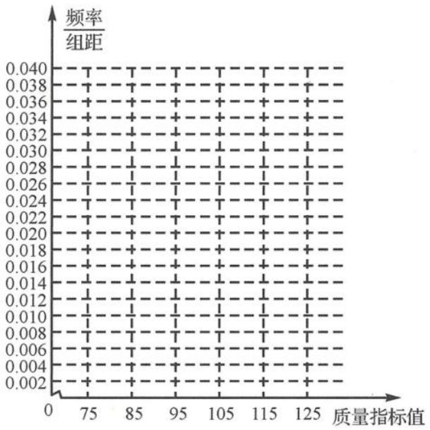

(Ⅱ)估计这种产品质量指标值的平均数及方差。(同一组中的数据用该组区间的中点值代表)

(Ⅲ)根据以上抽样调查数据,能否认为该企业生产的这种产品符合“质量指标值不低于95的产品至少要占全部产品的80%”的规定?

【分析】本题强调频数表与频率分布直方图的转化,以及由统计直方图估计数据的方法.

【解析】(Ⅰ)频率分布直方图如下.

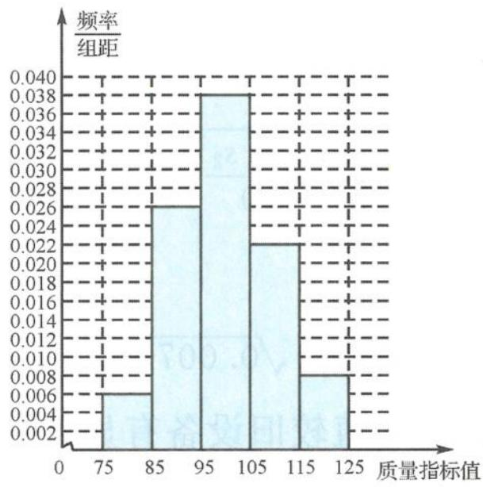

(Ⅱ)质量指标值的样本平均数为
$\overline {{x}} = 8 0 \times 0. 0 6 + 9 0 \times 0. 2 6 + 1 0 0 \times 0. 3 8 + 1 1 0 \times 0. 2 2 + 1 2 0 \times 0. 0 8 = 1 0 0.$

质量指标值的样本方差为
$s ^ {2} = (- 2 0) ^ {2} \times 0. 0 6 + (- 1 0) ^ {2} \times 0. 2 6 + 0 \times 0. 3 8 + 1 0 ^ {2} \times 0. 2 2 + 2 0 ^ {2} \times 0. 0 8 = 1 0 4.$
所以,这种产品质量指标值的平均数的估计值为 100,方差的估计值为 104.

(Ⅲ)质量指标值不低于95的产品所占比例的估计值为
$0. 3 8 + 0. 2 2 + 0. 0 8 = 0. 6 8.$
由于该估计值小于 0.8, 故不能认为该企业生产的这种产品符合“质量指标值不低于 95 的产品至少要占全部产品 80%”的规定.

【探讨】能够根据抽样获取的数据按照数据处理的方法作频率分布表和频率分布直方图是数据处理的必备能力,本题提供了频数分布表,因此只需在此基础上作成频率分布表和频率分布直方图即可.我们在本题的基础上,进一步提高了要求,给出了原始数据,让考生自行整理,经历频数计数的过程,得到下列考题.

例题 4 地区“腾笼换鸟”的政策促进了区内环境改善和产业转型,空气质量也有所改观,现从当地天气网站上收集该地区 2013 年和 2014 年 11 月份(30 天)的空气质量指数(AQI)(单位: $\mu g/m^{3}$ )资料如下.

2013 年 11 月份 AQI 数据频率分布直方图

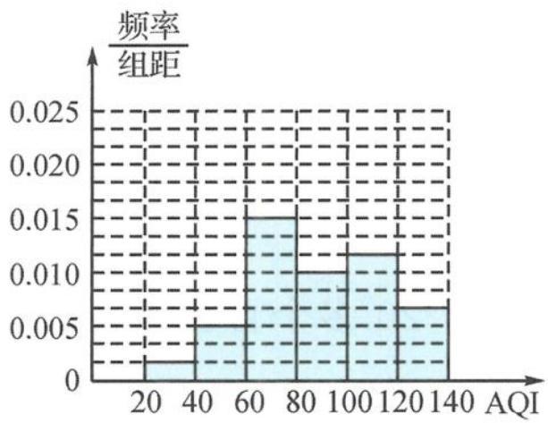

2014年11月份AQI数据

<table><tr><td>日期</td><td>1</td><td>2</td><td>3</td><td>4</td><td>5</td><td>6</td><td>7</td><td>8</td><td>9</td><td>10</td></tr><tr><td>AQI</td><td>89</td><td>55</td><td>52</td><td>87</td><td>124</td><td>72</td><td>65</td><td>26</td><td>46</td><td>48</td></tr><tr><td>日期</td><td>11</td><td>12</td><td>13</td><td>14</td><td>15</td><td>16</td><td>17</td><td>18</td><td>19</td><td>20</td></tr><tr><td>AQI</td><td>58</td><td>36</td><td>63</td><td>78</td><td>89</td><td>97</td><td>74</td><td>78</td><td>90</td><td>117</td></tr><tr><td>日期</td><td>21</td><td>22</td><td>23</td><td>24</td><td>25</td><td>26</td><td>27</td><td>28</td><td>29</td><td>30</td></tr><tr><td>AQI</td><td>137</td><td>139</td><td>72</td><td>63</td><td>63</td><td>77</td><td>64</td><td>65</td><td>55</td><td>45</td></tr></table>

(Ⅰ)请填好 2014 年 11 月份 AQI 数据的频率分布表并完成频率分布直方图;

2014年11月份AQI数据频率分布表

<table><tr><td>分组</td><td>频数</td><td>频率</td></tr><tr><td>[20,40)</td><td></td><td></td></tr><tr><td>[40,60)</td><td></td><td></td></tr><tr><td>[60,80)</td><td></td><td></td></tr><tr><td>[80,100)</td><td></td><td></td></tr><tr><td>[100,120)</td><td></td><td></td></tr><tr><td>[120,140]</td><td></td><td></td></tr></table>

频率分布直方图  
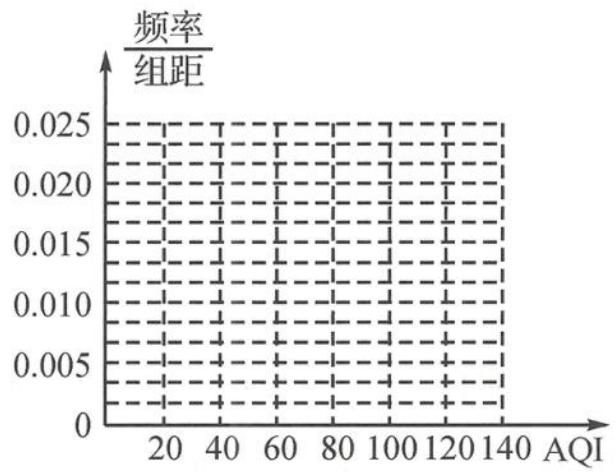

(Ⅱ)该地区环保部门2014年12月1日发布的11月份环境评估报告中声称该地区“比去年同期空气质量的优良率提高了20多个百分点”（当AQI<100时,空气质量为优良）.试问题中收集到的资料信息是否支持该观点?

【解析】(I)频率分布表和频率分布直方图如下.

2014年11月份AQI数据频率分布表

<table><tr><td>分组</td><td>频数</td><td>频率</td></tr><tr><td>[20,40)</td><td>2</td><td> $\frac{1}{15}$ </td></tr><tr><td>[40,60)</td><td>7</td><td> $\frac{7}{30}$ </td></tr><tr><td>[60,80)</td><td>12</td><td> $\frac{2}{5}$ </td></tr><tr><td>[80,100)</td><td>5</td><td> $\frac{1}{6}$ </td></tr><tr><td>[100,120)</td><td>1</td><td> $\frac{1}{30}$ </td></tr><tr><td>[120,140]</td><td>3</td><td> $\frac{1}{10}$ </td></tr></table>

频率分布直方图  
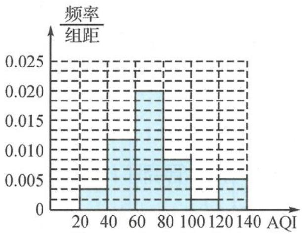

(Ⅱ)支持,理由如下.

2013年11月份的优良率为
$2 0 \times \left(\frac {1}{3} \times 0. 0 0 5 + 0. 0 0 5 + 0. 0 1 5 + 0. 0 1 0\right) = \frac {1 9}{3 0},$

2014年11月份的优良率为 $\frac{26}{30}$ , 因此
$\frac {2 6}{3 0} - \frac {1 9}{3 0} = \frac {7}{3 0} \approx 2 3. 3 \% > 20 \%.$
所以,题中数据信息可支持“比去年同期空气质量的优良率提高了20多个百分点”.

【探讨】本题数据来源是佛山本地真实的气象资料,展现环境治理的成果,引导学生关注当地环境.本题设计的问题让学生经历相对完整的数据处理过程,学会用数据说话,体现统计的作用与意义.考查的基础知识有频率分布直方图的识用与制作,频率的计算与频率分布表的制作,强化统计基本技能的考查.强调学会观察给出的频率分布直方图,制作新的频率分布直方图,会直观或量化比较不同的频率分布直方图,学会用比例关系处理不能整除的数据.解题思路:观察样例—分析制图—量化对比.

# 拓展探讨题

题 1 已知有四个数 1,2,a,b,这四个数的中位数是 3 ,平均数是 4 ,则 ab= \_\_\_\_.

题 2 （多选题）在发生某公共卫生事件期间，有专业机构认为该事件在一段时间内没有发生大规模群体感染的标志为“连续 10 天，每天新增疑似病例不超过 7 人”。过去 10 日，A, B, C, D 四地新增疑似病例数据信息如下，一定符合没有发生大规模群体感染标志的是（ ）.

A. A 地: 中位数为 2, 极差为 5

B. B 地: 总体平均数为 2, 众数为 2

C. C 地: 总体平均数为 1, 总体方差大于 0

D. D 地: 总体平均数为 2, 总体方差为 3

题 3 一组数据由 10 个数组成, 将其中一个数由 6 改为 3 , 另一个数由 2 改为 5 , 其余的数不变, 得到新的 10 个数, 则新的这组数的方差相比原先一组数的方差的减小值为( ).

A. 0.4

B. 0.5

C. 0.6

D. 0.7

题 4 演讲比赛共有 9 位评委分别给出某选手的原始评分,评定该选手的成绩时,从 9 个原始评分中去掉 1 个最高分、1 个最低分,得到 7 个有效评分.7 个有效评分与 9 个原始评分相比,不变的数字特征是( ).

A. 中位数

B. 平均数

C. 方差

D. 极差

题 5 某行业主管部门为了解本行业中小企业的生产情况,随机调查了 100 个企业,得到这些企业第一季度相对于前一年第一季度产值增长率 y 的频数分布表.

<table><tr><td>y的分组</td><td>[-0.20,0)</td><td>[0,0.20)</td><td>[0.20,0.40)</td><td>[0.40,0.60)</td><td>[0.60,0.80)</td></tr><tr><td>企业数</td><td>2</td><td>24</td><td>53</td><td>14</td><td>7</td></tr></table>

(Ⅰ)分别估计这类企业中产值增长率不低于40%的企业比例、产值负增长的企业比例；
(Ⅱ)求这类企业产值增长率的平均数与标准差的估计值。(同一组中的数据用该组区间的

中点值代表,精确到 0.01)

附： $\sqrt{74}\approx 8.602.$

题 6 为推进中小学体育评价体系改革,某调研员从一中学 4000 名学生中按照男女学生比例采用分层抽样的方法,从中随机抽取了 400 名学生进行某项体育测试(满分 100 分),记录他们的成绩,将记录的数据分成 7 组:(30,40], (40,50], (50,60], (60,70], (70,80], (80,90], (90,100],并整理得到如图所示的频率分布直方图.

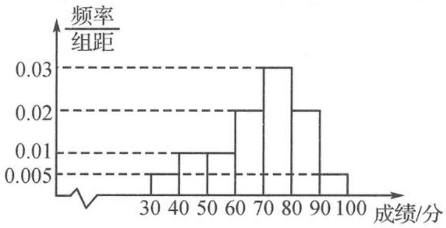

(Ⅰ)根据该频率分布直方图,估计样本数据的中位数及4000名学生的平均成绩。(同一组中的数据用该组区间的中点值代表,精确到0.01)

(Ⅱ)已知样本中有三分之二的男生分数高于60分,且分数高于60分的男女人数相等,试估计该校男生和女生人数的比例.

(Ⅲ)若测试成绩 $x < \bar{x} - 2s$ (其中 $\bar{x}$ 是成绩的平均值, s 是标准差), 则认为该生测试成绩不达标, 试估计该中学测试成绩不达标人数.

参考数据: $\sqrt{2}\approx1.4,\sqrt{117}\approx10.8.$

题 7 为了解甲、乙两种离子在小鼠体内的残留程度,进行如下试验:将 200 只小鼠随机分成 A, B 两组, 每组 100 只, 其中给 A 组小鼠服甲离子溶液, 给 B 组小鼠服乙离子溶液. 给每只小鼠服的溶液体积相同、摩尔浓度相同. 经过一段时间后用某种科学方法测算出残留在小鼠体内离子的百分比. 根据试验数据分别得到如下直方图.

甲离子残留百分比直方图  
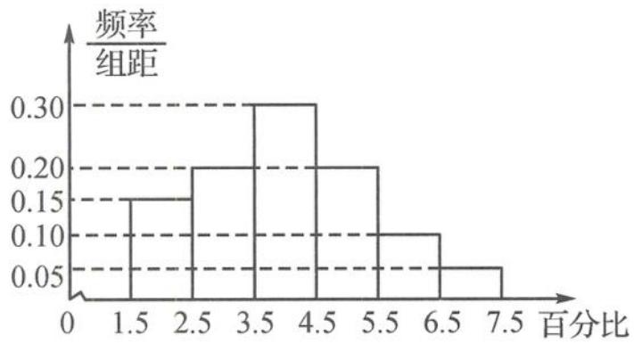

乙离子残留百分比直方图  
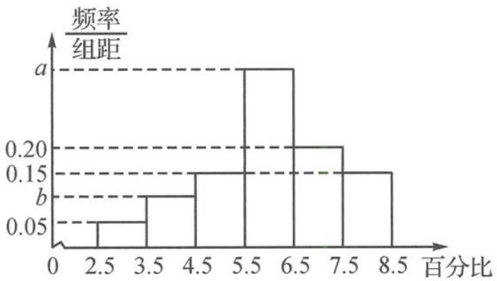

记 C 为事件“乙离子残留在体内的百分比不低于 5.5”，根据直方图得到 $P(C)$ 的估计值为 0.70。

(Ⅰ)求乙离子残留百分比直方图中 a, b 的值.

(Ⅱ)分别估计甲、乙离子残留百分比的平均值。(同一组中的数据用该组区间的中点值代表)

题 8 某家庭记录了未使用节水龙头 50 天的日用水量数据(单位: $m^{3}$ )和使用了节水龙头 50 天的日用水量数据,得到频数分布表如下.

未使用节水龙头 50 天的日用水量频数分布表

<table><tr><td>日用水量</td><td>[0,0.1)</td><td>[0.1,0.2)</td><td>[0.2,0.3)</td><td>[0.3,0.4)</td><td>[0.4,0.5)</td><td>[0.5,0.6)</td><td>[0.6,0.7)</td></tr><tr><td>频数</td><td>1</td><td>3</td><td>2</td><td>4</td><td>9</td><td>26</td><td>5</td></tr></table>

使用了节水龙头50天的日用水量频数分布表

<table><tr><td>日用水量</td><td>[0,0.1)</td><td>[0.1,0.2)</td><td>[0.2,0.3)</td><td>[0.3,0.4)</td><td>[0.4,0.5)</td><td>[0.5,0.6)</td></tr><tr><td>频数</td><td>1</td><td>5</td><td>13</td><td>10</td><td>16</td><td>5</td></tr></table>

(Ⅰ)在下图中作出使用了节水龙头50天的日用水量数据的频率分布直方图.

(Ⅱ)估计该家庭使用节水龙头后,日用水量小于 $0.35 \, m^{3}$ 的概率.

(Ⅲ)估计该家庭使用节水龙头后,一年能节省多少水?(一年按365天计算,同一组中的数据用这组数据所在区间中点的值代表.)

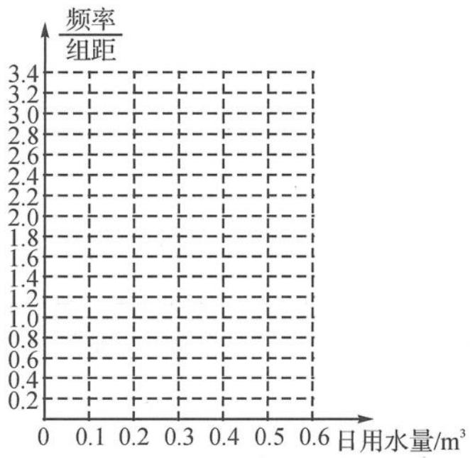

题 9 在测试中, 客观题难度的计算公式为 $P_{i} = \frac{R_{i}}{N}$ , 其中 $P_{i}$ 为第 $i$ 题的难度, $R_{i}$ 为答对该题的人数, $N$ 为参加测试的总人数. 现对某校高三年级 120 名学生进行一次测试, 共 5 道客观题. 测试前根据对学生的了解, 预估了每道题的难度, 如下表所示.

<table><tr><td>题号</td><td>1</td><td>2</td><td>3</td><td>4</td><td>5</td></tr><tr><td>考前预估难度  $P_i$ </td><td>0.9</td><td>0.8</td><td>0.7</td><td>0.6</td><td>0.4</td></tr></table>

测试后,从中随机抽取了10名学生,将他们编号后统计各题的作答情况,如下表所示.
(“√”表示答对,“×”表示答错)

<table><tr><td rowspan="2">学生编号</td><td colspan="5">题号</td></tr><tr><td>1</td><td>2</td><td>3</td><td>4</td><td>5</td></tr><tr><td>1</td><td>×</td><td>√</td><td>√</td><td>√</td><td>√</td></tr><tr><td>2</td><td>√</td><td>√</td><td>√</td><td>√</td><td>×</td></tr><tr><td>3</td><td>√</td><td>√</td><td>√</td><td>√</td><td>×</td></tr><tr><td>4</td><td>√</td><td>√</td><td>√</td><td>×</td><td>×</td></tr><tr><td>5</td><td>√</td><td>√</td><td>√</td><td>√</td><td>√</td></tr><tr><td>6</td><td>√</td><td>×</td><td>×</td><td>√</td><td>×</td></tr><tr><td>7</td><td>×</td><td>√</td><td>√</td><td>√</td><td>×</td></tr><tr><td>8</td><td>√</td><td>×</td><td>×</td><td>×</td><td>×</td></tr><tr><td>9</td><td>√</td><td>√</td><td>×</td><td>×</td><td>×</td></tr><tr><td>10</td><td>√</td><td>√</td><td>√</td><td>√</td><td>×</td></tr></table>

(Ⅰ)根据题中数据,将抽样的10名学生每道题实测的答对人数及相应的实测难度填入下表,并估计这120名学生中第5题的实测答对的人数.

<table><tr><td>题号</td><td>1</td><td>2</td><td>3</td><td>4</td><td>5</td></tr><tr><td>实测答对的人数</td><td></td><td></td><td></td><td></td><td></td></tr><tr><td>实测难度</td><td></td><td></td><td></td><td></td><td></td></tr></table>

(Ⅱ)定义统计量 $S=\frac{1}{n}\left[(P_{1}'-P_{1})^{2}+(P_{2}'-P_{2})^{2}+\cdots+(P_{n}'-P_{n})^{2}\right]$ ，其中 $P_{i}'$ 为第 i 题的实测难度， $P_{i}$ 为第 i 题的预估难度 $(i=1,2,\cdots,n)$ 。规定：若 S<0.05，则称该次测试的难度预估合理，否则为不合理。判断本次测试的难度预估是否合理。

题 10 寒假期间,很多同学都喜欢参加“迎春花市摆档口”的社会实践活动,下表是今年某个档口某种精品的销售数据.

<table><tr><td rowspan="2">日期</td><td colspan="2">销售量/件</td></tr><tr><td>白天</td><td>晚上</td></tr><tr><td>2月14日</td><td>35</td><td>46</td></tr><tr><td>2月15日</td><td>32</td><td>42</td></tr><tr><td>2月16日</td><td>43</td><td>50</td></tr><tr><td>2月17日</td><td>39</td><td>52</td></tr><tr><td>2月18日</td><td>51</td><td>60</td></tr></table>

已知摊位租金 900 元/档,售余的精品可以进货价退回厂家.

(Ⅰ)求表中 10 个销售数据的中位数和平均数.

(Ⅱ)明年花市期间甲、乙两名同学想合租一个摊位销售同样的精品,其中甲、乙分别承包白天、晚上的精品销售,承包时间段内销售所获利润归承包者所有.如果其他条件不变,以今年的数据为依据,甲、乙两名同学应如何分担租金才较为合理?

### 3.4.2 相关分析与回归分析

# 基本概念解读

问题 1 什么是相关分析与回归分析？它们的区别和联系是什么？

变量间的相关关系,在定性分析的基础上,需要定量分析.定量分析有相关分析和回归分析两种方法.相关分析是用一个指标(称为相关系数)来反映变量间相关关系的密切程度.回归分析就是根据相关关系的具体形态,选择一个合适的数学模型,来近似表达变量间的平均变化关系.

相关分析研究变量间的相关方向和相关程度,它不提供相互关系的具体形式,也无法从一个变量的变化情况来推测另一个变量的变化情况.相关分析不必确定哪个变量是自变量,哪个变量是因变量,所涉及的两个变量可以都是随机变量.根据观测的数据,回归分析确定一个数学方程式(回归方程),可以根据这个方程式由已知量推测未知量,为估算和预测提供一个重要方法.

# 问题 2 相关系数与相关指数的区别和联系是什么？

相关系数 r 主要是描述成对数据线性相关的密切程度， $|r|$ 越接近 1，线性相关关系越密切（或越强）；相关指数（也称之为决定系数、可决系数） $R^{2}$ （它是线性相关系数的平方）主要用来刻画回归方程的拟合效果，相关指数越大，回归模型拟合效果越好。

# 典型考题探讨

例题 1 从 2016 年 1 月 1 日起, 广东、湖北等 18 个保监局所辖地区将纳入商业车险改革试点范围. 其中最大的变化是上一年的出险次数决定了下一年的保费倍率, 具体关系如下表.

<table><tr><td>上一年出险次数</td><td>0次</td><td>1次</td><td>2次</td><td>3次</td><td>4次</td><td>5次以上(含5次)</td></tr><tr><td>下一年保费倍率</td><td>85%</td><td>100%</td><td>125%</td><td>150%</td><td>175%</td><td>200%</td></tr><tr><td colspan="7">连续两年没出险打7折,连续三年没出险打6折</td></tr></table>

经验表明,新车商业车险保费与购车价格也有较强的线性相关关系,下面是随机采集的8组数据(x,y):(8,2150),(11,2400),(18,3140),(25,3750),(25,4000),(31,4560),(37,5500),(45,6500).其中x(万元)表示购车价格,y(元)表示商业车险保费.设由这8组数据得到的回归直线方程为 $\hat{y}=\hat{b}x+1055$ .

(Ⅰ)求 b.

(Ⅱ)有评估机构从以往购买了车险的车辆中随机抽取1000辆调查,得到一年中出险次数的频数分布如下,并用相应频率估计车辆2016年度出险次数的概率.

<table><tr><td>一年中出险次数</td><td>0次</td><td>1次</td><td>2次</td><td>3次</td><td>4次</td><td>5次以上(含5次)</td></tr><tr><td>频数</td><td>500</td><td>380</td><td>100</td><td>15</td><td>4</td><td>1</td></tr></table>

广东李先生 2016 年 1 月购买一辆价值 20 万元的新车. 根据以上信息, 试估计该车辆在 2017 年 1 月续保时应缴的保费(精确到元), 并分析车险新政是否总体上减轻了车主负担. (假设车辆下一年与上一年都购买相同的商业车险产品进行续保)

【分析】本题设置了两个有关联的问题,一是线性回归分析(车险保费与车价相关关系),问题设置时给出了回归方程的常数项,利用样本中心点知识求解一次系数,避免了烦琐运算,同时突出了对回归思想及样本中心点的理解与运算;另一个是概率分布列的建立与计算,先依据统计数据的频率估计概率,再建立保费倍率的概率分布列,利用期望对比新政与旧政,体现了新政的优势,彰显了国家政策制订“以人为本,让利于民”的思想.

【解析】(I)由题中数据可得
$\overline {{x}} = \frac {1}{8} (8 + 1 1 + 1 8 + 2 5 + 2 5 + 3 1 + 3 7 + 4 5) = \frac {2 0 0}{8} = 2 5 (\text {万元}),$
$\bar {y} = \frac {1}{8} (2 1 5 0 + 2 4 0 0 + 3 1 4 0 + 3 7 5 0 + 4 0 0 0 + 4 5 6 0 + 5 5 0 0 + 6 5 0 0) = \frac {3 2 0 0 0}{8} = 4 0 0 0 (\text {元}),$

直线 $\hat{y}=\hat{b}x+1055$ 经过样本中心点 $(\bar{x},\bar{y})$ ，即 $(25,4000)$ ，解得
$b = \frac {\overline {{y}} - 1 0 5 5}{\overline {{x}}} = \frac {4 0 0 0 - 1 0 5 5}{2 5} = 1 1 7. 8.$

(Ⅱ)设该车辆2017年的保费倍率为 $X$ ，则 $X$ 为随机变量， $X$ 的取值为0.85,1,1.25,1.5,1.75,2，则 $X$ 的分布列为

<table><tr><td>X</td><td>0.85</td><td>1</td><td>1.25</td><td>1.5</td><td>1.75</td><td>2</td></tr><tr><td>P</td><td>0.5</td><td>0.38</td><td>0.10</td><td>0.015</td><td>0.004</td><td>0.001</td></tr></table>

计算得下一年保费的期望倍率为
$E (X) = 0. 8 5 \times 0. 5 + 1 \times 0. 3 8 + 1. 2 5 \times 0. 1 0 + 1. 5 \times 0. 0 1 5 + 1. 7 5 \times 0. 0 0 4 + 2 \times 0. 0 0 1 = 0. 9 6 1 5.$

2017 年该车辆估计应缴保费为
$(1 1 7. 8 \times 2 0 + 1 0 5 5) \times 0. 9 6 1 5 = 3 2 7 9. 6 7 7 \approx 3 2 8 0 (\text {元}).$
又 0.96 < 1 (或 3280 < 3411), 基于以上数据可知, 车险新政总体上减轻了车主负担.

【探讨】本题的背景是2016年1月1日实施的商业车险改革(试点),背景具有很强的时政性,体现时代特征,这也是应用型问题的命题应当追求的.本题涉及的重要概念有线性回归分析、样本中心点、样本估计总体、频率估计概率、概率分布列及期望等.本题的难点是第(Ⅱ)问的概率分布列的建立,审题时要注意观察两个表格数据的关联性,确立“保费倍率”为随机变量,并明确其取值情况,用频率估计概率,为概率分布列准备条件,为对比决策奠定基础.解题思路:确立随机变量—分析概率来源—计算决策指标.

例题 2 下表中的数据是一次阶段性考试某班的数学、物理原始成绩(单位:分).

<table><tr><td>学号</td><td>1</td><td>2</td><td>3</td><td>4</td><td>5</td><td>6</td><td>7</td><td>8</td><td>9</td><td>10</td><td>11</td><td>12</td><td>13</td><td>14</td><td>15</td><td>16</td><td>17</td><td>18</td><td>19</td><td>20</td><td>21</td><td>22</td></tr><tr><td>数学</td><td>117</td><td>128</td><td>96</td><td>113</td><td>136</td><td>139</td><td>124</td><td>124</td><td>121</td><td>115</td><td>115</td><td>123</td><td>125</td><td>117</td><td>123</td><td>122</td><td>132</td><td>129</td><td>96</td><td>105</td><td>106</td><td>120</td></tr><tr><td>物理</td><td>80</td><td>84</td><td>83</td><td>85</td><td>89</td><td>81</td><td>91</td><td>78</td><td>85</td><td>91</td><td>72</td><td>76</td><td>87</td><td>82</td><td>79</td><td>82</td><td>84</td><td>89</td><td>63</td><td>73</td><td>77</td><td>45</td></tr><tr><td>学号</td><td>23</td><td>24</td><td>25</td><td>26</td><td>27</td><td>28</td><td>29</td><td>30</td><td>31</td><td>32</td><td>33</td><td>34</td><td>35</td><td>36</td><td>37</td><td>38</td><td>39</td><td>40</td><td>41</td><td>42</td><td>43</td><td>44</td></tr><tr><td>数学</td><td>108</td><td>137</td><td>87</td><td>95</td><td>108</td><td>117</td><td>104</td><td>128</td><td>125</td><td>74</td><td>81</td><td>135</td><td>101</td><td>97</td><td>116</td><td>102</td><td>76</td><td>100</td><td>62</td><td>86</td><td>120</td><td>101</td></tr><tr><td>物理</td><td>76</td><td>80</td><td>71</td><td>57</td><td>72</td><td>65</td><td>69</td><td>79</td><td>0</td><td>55</td><td>56</td><td>77</td><td>3</td><td>70</td><td>75</td><td>63</td><td>59</td><td>64</td><td>42</td><td>62</td><td>77</td><td>65</td></tr></table>

用这 44 人的两科成绩制作如下散点图.

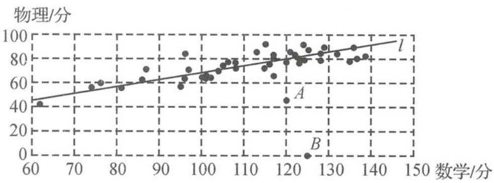

学号为 22 号的同学由于严重感冒导致物理考试发挥失常, 学号为 31 号的同学因故未能参加物理学科的考试, 为了使分析结果更客观准确, 老师将 A, B 两名同学的成绩 (对应于图中 A, B 两点) 剔除后, 用剩下的 42 个同学的数据作分析, 计算得到下列统计指标.

数学学科平均分为 110.5, 标准差为 18.36; 物理学科的平均分为 74, 标准差为 11.18. 数学成绩 (x) 与物理成绩 (y) 的相关系数 r = 0.8222, 回归直线 l (如图所示) 的方程为 $\hat{y} = 0.5006x + 18.68$ .

(I)若不剔除 A, B 两名同学的数据,用全部 44 人的成绩作回归分析,设数学成绩(x)与物理成绩(y)的相关系数为 $r_{0}$ , 回归直线为 $l_{0}$ , 试分析 $r_{0}$ 与 r 的大小关系,并在图中画出回归直线 $l_{0}$ 的大致位置.

(Ⅱ)如果 B 同学参加了这次物理考试,估计 B 同学的物理分数.(精确到个位)

(Ⅲ)就这次考试而言,学号为16号的C同学数学与物理哪个学科的成绩要好一些? (通常为了比较某个学生不同学科的成绩水平,可按公式 $Z_{i}=\frac{X_{i}-\overline{X}}{s}$ 统一化成标准分再进行比较,其中 $X_{i}$ 为学科原始分, $\overline{X}$ 为学科平均分,s为学科标准差).

【分析】第(Ⅰ)问重在对相关系数与回归直线的感性理解,与回归分析相关数据已准备充分,重在对数据的理解,在审题时,要注意从众多的信息(44人的数据)中找到关键信息(22号、31号、16号);第(Ⅱ)问直接用回归方程预报即可.第(Ⅲ)问先要理解公式中的各参数的意义,找到对应的数据,再进行计算比较,实质上是对考生学习能力的考查.

【解析】(Ⅰ) $r_{0}<r$ ，理由如下.

①离群点 A, B 会降低变量间的线性关联程度;  
②44个数据点与回归直线 $l_{0}$ 的总偏差更大,回归效果更差,所以相关系数更小;  
③42 个数据点与回归直线 l 的总偏差更小, 回归效果更好, 所以相关系数更大;  
④42 个数据点更加贴近回归直线 l;  
⑤44 个数据点与回归直线 $l_{0}$ 更离散；
其他言之有理的理由均可.

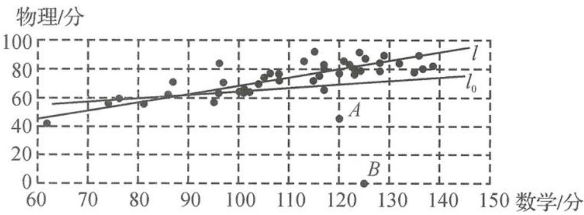

要点: 直线 $l_{0}$ 的斜率须大于 0 且小于 l 的斜率, 具体位置稍有出入没关系, 无须说明理由.
(Ⅱ)令 x=125, 代入
$y = 0. 5 0 0 6 x + 1 8. 6 8 = 0. 5 0 0 6 \times 1 2 5 + 1 8. 6 8,$
得
$y = 6 2. 5 7 5 + 1 8. 6 8 \approx 8 1.$
所以,估计 B 同学的物理分数大约为 81 分.

(Ⅲ)由表可知 C 同学的数学原始分为 122, 物理原始分为 82, 数学标准分为
$Z _ {1 6} = \frac {x _ {1 6} - \overline {{{x}}}}{s _ {1}} = \frac {1 2 2 - 1 1 0 . 5}{1 8 . 3 6} = \frac {1 1 . 5}{1 8 . 3 6} \approx 0. 6 3,$

物理标准分为
$Z _ {1 6} = \frac {y _ {1 6} - \overline {{{{y}}}}}{s _ {2}} = \frac {8 2 - 7 4}{1 1 . 1 8} = \frac {8}{1 1 . 1 8} \approx 0. 7 2.$
因为 0.72 > 0.63，所以 C 同学物理成绩比数学成绩要好一些。

【探讨】本题的现实背景是考生耳熟能详的经典的相关关系示例,在背景描述时尽量生活化,增加考生答题的适应性.数学背景之一是统计中的线性回归分析.考查相关系数与回归直线的感性理解,也渗透了对残差分析的思想.数学背景之二是不同学科成绩的比较问题,先按规则统一化成标准分,再进行比较.尝试做个统计学科普,既解决考生对不同学科成绩比较的疑惑,也考查了考生的学习能力.本题中涉及的重要概念有相关系数、回归直线与方程、残差分析、变量预报、标准化.

例题 3 下图是某地区 2000 年至 2016 年环境基础设施投资额 y(单位:亿元)的折线图.

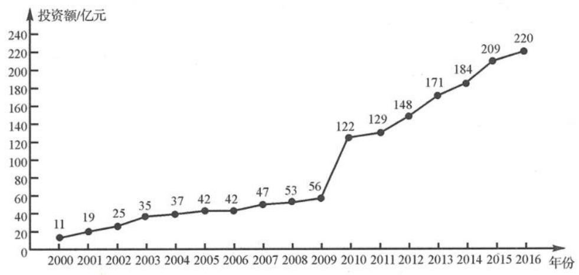

为了预测该地区 2018 年的环境基础设施投资额,建立了 y 与时间变量 t 的两个线性回归模型.根据 2000 年至 2016 年的数据(时间变量 t 的值依次为 1,2,…,17),建立模型①: $\hat{y}=-30.4+13.5t$ ;根据 2010 年至 2016 年的数据(时间变量 t 的值依次为 1,2,…,7),建立模型②: $\hat{y}=99+17.5t$ .

(Ⅰ)分别利用这两个模型,求该地区2018年的环境基础设施投资额的预测值.

(Ⅱ)你认为用哪个模型得到的预测值更可靠？请说明理由.

【分析】本题命题导向很明确,不再是让学生计算回归分析中的参量,而是直接给出回归方程,聚焦回归解释.第(Ⅰ)问的设计为利用已建立的回归模型对环境基础设计投资额做预测,第(Ⅱ)问的设计为结合模型应用目的对模型的优劣进行简单讨论以及模型的选择.

【解析】(I)利用模型①,该地区2018年的环境基础设施投资额的预测值
$\hat {y} = - 3 0. 4 + 1 3. 5 \times 1 9 = 2 2 6. 1 (\text {亿元}).$
利用模型②,该地区2018年的环境基础设施投资额的预测值
$\hat {y} = 9 9 + 1 7. 5 \times 9 = 2 5 6. 5 (\text {   亿元   }).$

(Ⅱ)利用模型②得到的预测值更可靠.理由如下.

(i)从折线图可以看出,2000年至2016年的数据对应的点没有随机散布在直线 $\hat{y} = -30.4 + 13.5t$ 上下,这说明利用2000年至2016年的数据建立的线性模型①不能很好地描述环境基础设施投资额的变化趋势.2010年相对2009年的环境基础设施投资额有明显增加,2010年至2016年的数据对应的点位于一条直线的附近,这说明从2010年开始环境基础设施投资额的变化规律呈线性增长趋势,利用2010年至2016年的数据建立的线性模型 $\hat{y} = 99 + 17.5t$ 可以较好地描述2010年以后的环境基础设施投资额的变化趋势,因此利用模型②得到的预测值更可靠.

(ii)从计算结果看,相对于2016年的环境基础设施投资额220亿元,由模型①得到的预测值226.1亿元的增幅明显偏低,而利用模型②得到的预测值的增幅比较合理,说明利用模型②得到的预测值更可靠.

以上给出了两种理由,考生答出其中任意一种或其他合理理由均可得分.

【探讨】本题是2018年全国Ⅱ卷文(理)科第18题,采用真实数据,增强了试题情境的真实性和可靠性.在命题中,首次将概率统计考查的重心后移,即更加注重对统计推断和统计结论的考查,更加注重统计思想的把握和掌握.试题将数据的收集、整理直接通过折线图的形式呈现出来,目的是让考生对数据有一个直观的理解以及对数据背后的规律有一个直观的认识.对于以往需要求解的回归方程,也直接给了出来,避免了烦琐运算,聚焦于利用回归方程做预测以及对预测结果进行解释和评估,减少了烦琐整理数据的步骤,增加了对数据解释的开放性.

例题 4 2020 年是我国全面建成小康社会和“十三五”规划收官之年,也是佛山在经济总量超万亿元新起点上开启发展新征程的重要历史节点.作为制造业城市,佛山一直坚持把创新摆在制造业发展全局的前置位置和核心位置,聚焦打造成为面向全球的国家制造业创新中心,走“世界科技+佛山智造+全球市场”的创新发展之路.在推动制造业高质量发展的大环境下,佛山市某工厂统筹各类资源,进行了积极的改革探索.下表是该工厂每月生产的一种核心产品的产量 $x(5 \leqslant x \leqslant 20)$ (件)与相应的生产总成本 y(万元)的四组对照数据.

<table><tr><td>x</td><td>5</td><td>7</td><td>9</td><td>11</td></tr><tr><td>y</td><td>200</td><td>298</td><td>431</td><td>609</td></tr></table>

工厂研究人员建立了 y 与 x 的两种回归模型, 利用计算机算得近似结果如下.

模型①: $\hat{y}=\frac{x^{3}}{3}+173;$

模型②: $\hat{y}=68x-160.$
其中模型①的残差(实际值-预报值)图如图1所示.
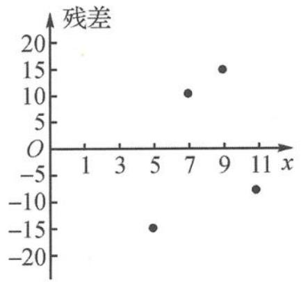

图1

(I)根据残差分析,哪一个更适宜作为 y 关于 x 的回归方程?请说明理由.

(Ⅱ)市场前景风云变幻,研究人员统计历年的销售数据得到每件产品的销售价格 q(万元)是一个与产量 x 相关的随机变量,分布列为

<table><tr><td>q</td><td>140-x/2</td><td>130-x/2</td><td>100-x/2</td></tr><tr><td>P</td><td>1/2</td><td>2/5</td><td>1/10</td></tr></table>

结合你对(Ⅰ)的判断,当产量 x 为何值时,月利润的预报期望值最大? 最大值是多少(精确到0.1)?

【分析】本题主要考查残差分析及其实际含义以及利用回归分析的函数特征结合期望构建函数进行决策.

【解析】(I)模型②的残差数据如下表.

<table><tr><td>x</td><td>5</td><td>7</td><td>9</td><td>11</td></tr><tr><td>y</td><td>200</td><td>298</td><td>431</td><td>609</td></tr><tr><td> $\hat{e}$ </td><td>20</td><td>-18</td><td>-21</td><td>21</td></tr></table>

模型②的残差图如图2所示.

模型①更适宜作为 y 关于 x 的回归方程.

理由 1: 模型①这 4 个样本点的残差的绝对值都比模型②的小.

理由 2: 模型①这 4 个样本的残差点落在的带状区域比模型②的带状区域更窄.

理由 3: 模型①这 4 个样本的残差点比模型②的残差点更贴近 x 轴.
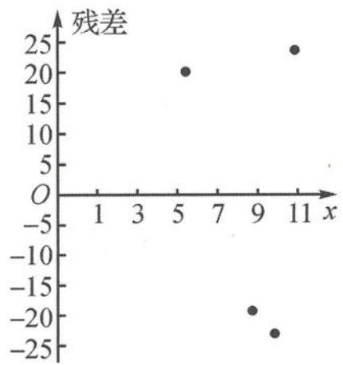

图2

(Ⅱ)设月利润为 Y, 由题意知 Y = qx - y, 则 Y 的分布列为

<table><tr><td>Y</td><td> $140x - \frac{x^2}{2} - \left( \frac{x^3}{3} + 173 \right)$ </td><td> $130x - \frac{x^2}{2} - \left( \frac{x^3}{3} + 173 \right)$ </td><td> $100x - \frac{x^2}{2} - \left( \frac{x^3}{3} + 173 \right)$ </td></tr><tr><td>P</td><td> $\frac{1}{2}$ </td><td> $\frac{2}{5}$ </td><td> $\frac{1}{10}$ </td></tr></table>
$\begin{array}{l} E (Y) = \left(1 4 0 x - \frac {x ^ {2}}{2} - \frac {x ^ {3}}{3} - 1 7 3\right) \times \frac {1}{2} + \left(1 3 0 x - \frac {x ^ {2}}{2} - \frac {x ^ {3}}{3} - 1 7 3\right) \times \frac {2}{5} + \left(1 0 0 x - \frac {x ^ {2}}{2} - \frac {x ^ {3}}{3} - 1 7 3\right) \times \frac {1}{1 0} \\ = - \frac {x ^ {3}}{3} - \frac {x ^ {2}}{2} + 1 3 2 x - 1 7 3. \\ \end{array}$
设函数
$f (x) = - \frac {x ^ {3}}{3} - \frac {x ^ {2}}{2} + 1 3 2 x - 1 7 3, x \in (0, + \infty),$

求导得
$f ^ {'} (x) = - x ^ {2} - x + 1 3 2.$
令 $f'(x)=0$ ，解得 x=11 或 x=-12（舍去）.
当 $x \in (0,11)$ 时， $f'(x) > 0$ ，则 $f(x)$ 单调递增；当 $x \in (11, +\infty)$ 时， $f'(x) < 0$ ，则 $f(x)$ 单调递减。
故函数 $f(x)$ 的最大值为 $f(11)=\frac{4649}{6}$ ，即产量为 11 件时，月利润的预报期望值最大，最大值是 774.8 万元。

【探讨】本题的背景是制造业大市的佛山市的工厂智能制造转型升级. 问题(Ⅰ)突出对残差的正确理解. 可以通过计算和图形描述来进行.

# 拓展探讨题

题 1 对两个变量 x, y 进行回归分析, 得到一组样本数据 $(x_{1}, y_{1}), (x_{2}, y_{2}), \cdots, (x_{n}, y_{n})$ , 则下列说法不正确的是().

A. 由样本数据得到的回归直线 $\hat{y} = \hat{b}x + \hat{a}$ 必经过样本中心点 $(\bar{x}, \bar{y})$

B. 相关指数 $R^{2}$ 越大, 残差的平方和越小, 其模型的拟合效果越好

C. 若线性回归方程为 $\hat{y}=0.6x+10$ ，当解释变量 x 每增加 1 个单位时，预报变量 y 平均增加 0.6 个单位

D. 相关系数 r 越接近 1, 变量 x, y 相关性越强

题 2 （多选题）某种产品的价格 x（单位：元/千克）与需求量 y（单位：千克）之间的对应数据如下表所示.

<table><tr><td>x</td><td>10</td><td>15</td><td>20</td><td>25</td><td>30</td></tr><tr><td>y</td><td>11</td><td>10</td><td>8</td><td>6</td><td>5</td></tr></table>
根据表中的数据可得回归直线方程 $\hat{y}=\hat{b}x+14.4$ ，则以下正确的是（）.

A. 相关系数 $r > 0$

B. $\hat{b} = -0.32$

C. 若该产品价格为 35 元/千克, 则日需求量大约为 3.2 千克

D. 第四个样本点对应的残差为 -0.4

题 3 （多选题）2021 年 5 月 18 日，《佛山市第七次全国人口普查公报》发布。公报显示，佛山市常住人口为 9498863 人。为了进一步分析数据特征，某数学兴趣小组先将近五次人口普查数据作出散点图(横坐标为人口普查的序号,第三次普查记为1,……,第七次普查记为5,纵坐标为当次人口普查佛山市的人口数),再利用不同的函数模型作出回归分析,如下图,以下说法正确的是().

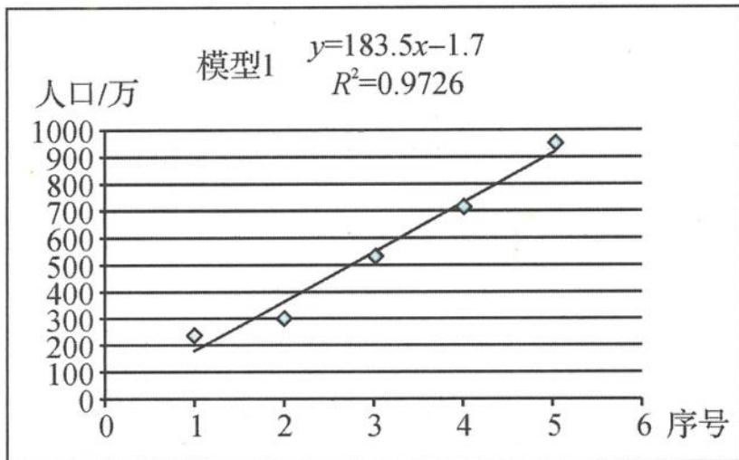

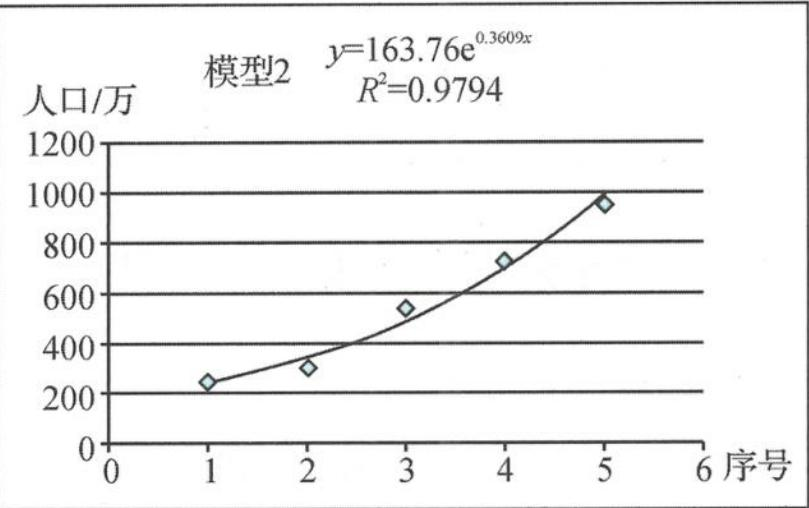

A. 佛山市人口数与普查序号呈正相关关系  
B. 散点的分布呈现出很弱的线性相关特征  
C. 回归方程 2 的拟合效果更好  
D. 应用回归方程 1 可以预测第八次人口普查时佛山市人口会超过 1400 万

题 4 2020 年初,从非洲蔓延到东南亚的蝗虫灾害严重威胁了国际农业生产,影响了人民生活.世界性与区域性温度的异常、旱涝频繁发生给蝗灾发生创造了机会.已知蝗虫的产卵量 y 与温度 x 的关系可以用模型 $y=c_{1}e^{c_{2}x}$ 拟合.设 $z=\ln y$ ,其变换后得到一组数据:

<table><tr><td>x</td><td>20</td><td>23</td><td>25</td><td>27</td><td>30</td></tr><tr><td>z</td><td>2</td><td>2.4</td><td>3</td><td>3</td><td>4.6</td></tr></table>
由上表可得线性回归方程 $z = 0.2x + a$ ，则 $c_{1}$ 等于（ ）.

A.-2

B. $\mathrm{e}^{-2}$

C. 3

D. $\mathrm{e}^{3}$

题 5 A, B 两个物理兴趣小组在实验室研究某粒子的运动轨迹. 共同记录到粒子的 13 个位置的坐标信息如下表.

<table><tr><td>x</td><td>-0.93</td><td>-0.82</td><td>-0.77</td><td>-0.61</td><td>-0.55</td><td>-0.33</td><td>-0.27</td><td>0.10</td><td>0.42</td><td>0.58</td><td>0.64</td><td>0.67</td><td>0.76</td></tr><tr><td>y</td><td>-0.26</td><td>-0.41</td><td>-0.45</td><td>0.45</td><td>-0.60</td><td>-0.67</td><td>-0.68</td><td>-0.71</td><td>0.64</td><td>0.55</td><td>0.55</td><td>0.53</td><td>0.46</td></tr></table>

A 小组根据表中数据, 直接对 y, x 作线性回归分析, 得到: 回归方程为 $\hat{y}=0.5993x+0.005$ , 相关指数 $R^{2}=0.4472$ . B 小组先将数据依变换 $u=x^{2}$ , $v=y^{2}$ 进行整理, 再对 v, u 作线性回归分析, 得到: 回归方程为 $\hat{v}=-0.5006u+0.4922$ , 相关指数 $R^{2}=0.9375$ . 根据统计学知识, 下列方程中, 最有可能是该粒子运动轨迹方程的是().

A. 0.5993x - y + 0.005 = 0

B. $0.5006x + y - 0.4922 = 0$

C. $\frac{0.5006x^2}{0.4922} +\frac{y^2}{0.4922} = 1$

D. $\frac{x^{2}}{0.4922}+\frac{0.5006y^{2}}{0.4922}=1$

题 6 为弘扬劳动精神,树立学生“劳动最美,劳动最光荣”的观念,某校持续开展“家庭劳动大比拼”活动.某班统计了本班同学1\~7月份的人均月劳动时间(单位:小时),并建立了人均月劳动时间y关于月份x的线性回归方程 $\hat{y}=\hat{b}x+4$ ,y与x的原始数据如下表所示.

<table><tr><td>月份x</td><td>1</td><td>2</td><td>3</td><td>4</td><td>5</td><td>6</td><td>7</td></tr><tr><td>人均月劳动时间y</td><td>8</td><td>9</td><td>m</td><td>12</td><td>n</td><td>19</td><td>22</td></tr></table>
由于某些原因导致部分数据丢失,但已知 $\sum_{i=1}^{7}x_{i}y_{i}=452$ .

(Ⅰ)求 m, n 的值.  
(Ⅱ)求该班6月份人均月劳动时间数据的残差值.(残差即样本数据与预测值之差)

参考公式: 在线性回归方程 $\hat{y} = \hat{b}x + \hat{a}$ 中, $\hat{b} = \frac{\sum\limits_{i=1}^{n} x_i y_i - n\overline{x}\overline{y}}{\sum\limits_{i=1}^{n} x_i^2 - n\overline{x}^2}, \hat{a} = \overline{y} - \hat{b}\overline{x}.$

题 7 研究表明,子女的平均身高 $y_{i}$ (cm) 与父母的平均身高 $x_{i}$ (cm) 有较强的线性相关性. 某数学小组收集到 8 个家庭的相关数据,下面是小组制作的统计图(散点图、回归直线 l 及回归方程)与原始数据表(局部缺失).

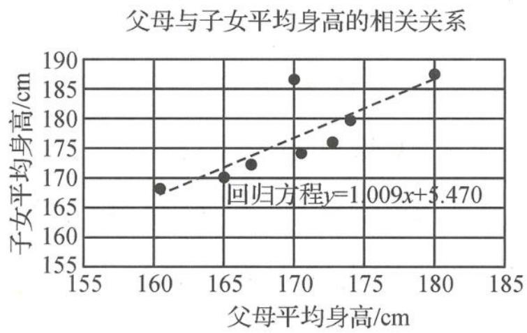

<table><tr><td>家庭编号</td><td>1</td><td>2</td><td>3</td><td>4</td><td>5</td><td>6</td><td>7</td><td>8</td></tr><tr><td>父母平均身高/cm</td><td>160.5</td><td>165</td><td>167</td><td>170</td><td>170.5</td><td>173</td><td>174</td><td>180</td></tr><tr><td>子女平均身高/cm</td><td>168</td><td>170</td><td>172.5</td><td>187</td><td>174.5</td><td>176</td><td>180</td><td>*</td></tr></table>

(Ⅰ)表中8号家庭的子女平均身高数据缺失,试根据统计学知识找回该数据.

(Ⅱ)由图中观察到4号家庭的数据点明显偏离回归直线 $l$ , 试计算其残差 (残差 = 观测值 - 预报值). 若剔除4号家庭数据点后, 用余下的7个散点作线性回归分析, 得到新的回归直线 $l'$ , 判断并证明 $l$ 与 $l'$ 的位置关系.

附:对于一组数据 $(x_{1},y_{1}),(x_{2},y_{2}),\cdots,(x_{n},y_{n})$ ，其回归直线 $\hat{y}=\hat{b}x+\hat{a}$ 的斜率和截距的最小二乘估计分别为： $\hat{b}=\frac{\sum\limits_{i=1}^{n}(x_{i}-\bar{x})(y_{i}-\bar{y})}{\sum\limits_{i=1}^{n}(x_{i}-\bar{x})^{2}}=\frac{\sum\limits_{i=1}^{n}x_{i}y_{i}-n\bar{x}\bar{y}}{\sum\limits_{i=1}^{n}x_{i}^{2}-n\bar{x}^{2}},\hat{a}=\bar{y}-\hat{b}\bar{x}.$

题 8 某厂生产不同规格的一种产品,根据检测标准,其合格产品的质量 $y(\mathrm{g})$ 与尺寸 $x(\mathrm{mm})$ 之间近似满足关系式 $y=c\cdot x^{b}(b,c$ 为大于 0 的常数).按照某项指标测定,当产品质量与尺寸的比在区间 $\left(\frac{\mathrm{e}}{9},\frac{\mathrm{e}}{7}\right)\approx(0.302,0.388)$ 内时为优等品.现随机抽取 6 件合格产品,测得数据如下.

<table><tr><td>尺寸x/mm</td><td>38</td><td>48</td><td>58</td><td>68</td><td>78</td><td>88</td></tr><tr><td>质量y/g</td><td>16.8</td><td>18.8</td><td>20.7</td><td>22.4</td><td>24</td><td>25.5</td></tr><tr><td>质量与尺寸的比 $\frac{y}{x}$ </td><td>0.442</td><td>0.392</td><td>0.357</td><td>0.329</td><td>0.308</td><td>0.290</td></tr></table>

（Ⅰ）现从抽取的6件合格产品中再任选3件，记 $\xi$ 为取到优等品的件数，试求随机变量 $\xi$ 的期望.

(Ⅱ)根据测得数据作了初步处理,得相关统计量的值如下表.

<table><tr><td> $\mathop{\sum }\limits_{{i = 1}}^{{6}}\left( {{\ln }{x}_{i} \cdot {\ln }{y}_{i}}\right)$ </td><td> $\mathop{\sum }\limits_{{i = 1}}^{{6}}\left( {{\ln }{x}_{i}}\right)$ </td><td> $\mathop{\sum }\limits_{{i = 1}}^{{6}}\left( {{\ln }{y}_{i}}\right)$ </td><td> $\mathop{\sum }\limits_{{i = 1}}^{{6}}{\left( {\ln }{x}_{i}\right) }^{2}$ </td></tr><tr><td>75.3</td><td>24.6</td><td>18.3</td><td>101.4</td></tr></table>

(i)根据所给统计量,求 y 关于 x 的回归方程;

(ii)已知优等品的收益 $z$ (单位:千元)与 $x, y$ 的关系为 $z = 2y - 0.32x$ , 当优等品的尺寸 $x$ 为何值时, 收益 $z$ 的预报值最大? (精确到 $1 \mathrm{~mm}$ )

附:对于样本 $(v_{i},u_{i})(i=1,2,\cdots,n)$ ，其回归直线 $u=bv+a$ 的斜率和截距的最小二乘估计公式分别为 $\hat{b}=\frac{\sum\limits_{i=1}^{n}(v_{i}-\overline{v})(u_{i}-\overline{u})}{\sum\limits_{i=1}^{n}(v_{i}-\overline{v})^{2}}=\frac{\sum\limits_{i=1}^{n}v_{i}u_{i}-n\overline{v}\overline{u}}{\sum\limits_{i=1}^{n}v_{i}^{2}-n\overline{v}^{2}},\hat{a}=\bar{u}-\hat{b}v,e\approx2.7182.$

题 9 每年的 4 月 23 日是联合国教科文组织确定的“世界读书日”,又称“世界图书和版权日”.从进入大数据时代以来,人们阅读方式发生了改变,数字媒体阅读方式因为便携、容量大等优点越来越被大众接受,下表是国际数据公司(IDC)研究的全球近 6 年每年数字媒体阅读产生的数据量(单位:ZB)及相关统计量的值.

<table><tr><td>年份</td><td>2015</td><td>2016</td><td>2017</td><td>2018</td><td>2019</td><td>2020</td></tr><tr><td>序号x</td><td>1</td><td>2</td><td>3</td><td>4</td><td>5</td><td>6</td></tr><tr><td>年数据量y</td><td>7</td><td>9</td><td>17</td><td>22</td><td>34</td><td>43</td></tr></table>

<table><tr><td> $\overline{x}$ </td><td> $\overline{y}$ </td><td> $\overline{z}$ </td><td> $\sum_{i=1}^{6}(x_i - \overline{x})^2$ </td><td> $\sum_{i=1}^{6}(z_i - z)^2$ </td><td> $\sum_{i=1}^{6}(x_i - \overline{x})(y_i - \overline{y})$ </td><td> $\sum_{i=1}^{6}(x_i - \overline{x})(z_i - \overline{z})$ </td></tr><tr><td>3.5</td><td>22</td><td>2</td><td>18</td><td>14</td><td>124</td><td>9</td></tr></table>

表中 $z_{i} = \ln y_{i},\bar{z} = \frac{1}{6}\sum_{i = 1}^{6}z_{i}.$

(I)根据上表数据信息判断,方程 $y=c_{1}\cdot e^{c_{2}x}$ (e 是自然对数的底数)更适宜作为该公司统计的年数据量 y 关于年份序号 x 的回归方程类型,试求此回归方程.

(Ⅱ)根据(Ⅰ)中的回归方程,预计2024年全世界数字媒体阅读产生的数据量是2021年的多少倍?请说明理由.(参考数据:e≈2.718,√e≈1.648,结果精确到0.1)

参考数据:在回归方程 $\hat{y} = \hat{a} + \hat{b}x$ 中, 斜率最小二乘法公式为 $\hat{b} = \frac{\sum_{i=1}^{n}(x_i - \bar{x})(y_i - \bar{y})}{\sum_{j=1}^{n}(x_i - \bar{x})^2} =$
$\frac {\sum_ {i = 1} ^ {n} x _ {i} y _ {i} - n \overline {{x}} \overline {{y}}}{\sum_ {i = 1} ^ {n} x _ {i} ^ {2} - n \overline {{x}} ^ {2}}, \hat {a} = \overline {{y}} - \hat {b} \overline {{x}}.$

题 10 随着经济社会发展,国内越来越多的科技巨头加大了科技研发投入的力量.为了不受制于人,某新能源产业公司拟对智能制造行业的“工业机器人”进行科技改造和升级,根据市场调研与模拟,得到科技升级投入 x(亿元)与科技升级直接受益 y(亿元)的数据如下表.

<table><tr><td>序号</td><td>1</td><td>2</td><td>3</td><td>4</td><td>5</td><td>6</td><td>7</td><td>8</td><td>9</td><td>10</td><td>11</td><td>12</td></tr><tr><td>x/亿元</td><td>2</td><td>3</td><td>4</td><td>6</td><td>8</td><td>10</td><td>13</td><td>21</td><td>22</td><td>23</td><td>24</td><td>25</td></tr><tr><td>y/亿元</td><td>13</td><td>22</td><td>31</td><td>42</td><td>50</td><td>56</td><td>58</td><td>68.5</td><td>68</td><td>67.5</td><td>66</td><td>66</td></tr></table>
当 $0 < x \leqslant 17$ 时, 建立了 $y$ 与 $x$ 的两个回归模型.

模型①: $\hat{y}=4.1x+11.8$ ; 模型②: $\hat{y}=21.3\sqrt{x}-14.4$ .
当 x>17 时, 确定 y 与 x 满足的线性回归方程为 $\hat{y}=-0.7x+\hat{a}$ .

(I)根据下表中的数据,当 $0 < x \leqslant 17$ 时,比较模型①,②的相关指数 $R^{2}$ 的大小,并选择拟合精度更高、更可靠的模型,预测对“工业机器人”科技升级的投入为 17 亿元时的直接收益.

<table><tr><td>回归模型</td><td>模型1</td><td>模型2</td></tr><tr><td>回归方程</td><td> $\hat{y} = 4.1x + 11.8$ </td><td> $\hat{y} = 21.3\sqrt{x} - 14.4$ </td></tr><tr><td> $\sum_{i=1}^{7}(y_i - \hat{y}_i)^2$ </td><td>182.4</td><td>79.2</td></tr></table>

(附:刻画回归效果的相关指数 $R^{2}=1-\frac{\sum_{i=1}^{n}(y_{i}-\hat{y}_{i})^{2}}{\sum_{i=1}^{n}(y_{i}-\bar{y})^{2}},\sqrt{17}\approx4.1)$

(Ⅱ)为鼓励科技创新,当科技升级的投入不少于20亿元时,根据我国的智能制造专项政策,国家科技、工信等部门给予公司补贴5亿元,以回归方程为预测依据,比较科技升级投入17亿元与20亿元时公司实际收益的大小.

### 3.4.3 独立性检验

# 基本概念解读

# 问题 独立性检验及其步骤是什么？

估计和检验假设是两种基本的统计推断方法. 检验假设的基本原理类似于反证法. 先对研究的总体提出某种假设 $H$ , 根据样本数据构造一个统计量 $T$ , 直观上可根据统计量的取值范围作出拒绝或接受假设 $H$ 的判断. 独立性检验是非参数假设检验 $\chi^{2}$ 分布拟合试验的一个特例,所研究的问题是如何根据成对的样本数据判断两个 $2 \times 2$ 分类 (属性) 变量是否独立. 假设检验的一般步骤为: 建立假设—构造统计量—确定检验规则—做出判断并解释.

# 典型考题探讨

例题 1 有甲、乙两家公司都愿意聘用某求职者,这两家公司的具体聘用信息如下.

甲公司

<table><tr><td>职位</td><td>A</td><td>B</td><td>C</td><td>D</td></tr><tr><td>月薪/元</td><td>6000</td><td>7000</td><td>8000</td><td>9000</td></tr><tr><td>获得相应职位的概率</td><td>0.4</td><td>0.3</td><td>0.2</td><td>0.1</td></tr></table>

乙公司

<table><tr><td>职位</td><td>A</td><td>B</td><td>C</td><td>D</td></tr><tr><td>月薪/元</td><td>5000</td><td>7000</td><td>9000</td><td>11000</td></tr><tr><td>获得相应职位的概率</td><td>0.4</td><td>0.3</td><td>0.2</td><td>0.1</td></tr></table>

(Ⅰ)根据以上信息,如果你是该求职者,你会选择哪一家公司?请说明理由.

(Ⅱ)某课外实习作业小组调查了1000名职场人士,就选择这两家公司的意愿做了统计,得到如下数据分布情况.

<table><tr><td rowspan="2">选择意愿</td><td colspan="4">人员结构</td></tr><tr><td>40岁以上(含40岁)男性</td><td>40岁以上(含40岁)女性</td><td>40岁以下男性</td><td>40岁以下女性</td></tr><tr><td>选择甲公司</td><td>110</td><td>120</td><td>140</td><td>80</td></tr><tr><td>选择乙公司</td><td>150</td><td>90</td><td>200</td><td>110</td></tr></table>
若分析选择意愿与年龄这两个变量,计算得到的 $K^{2}$ 的观测值 $k_{1} \approx 5.5513$ . 请用统计学知识分析:选择意愿与年龄变量和性别变量中哪一个关联性更大?

附: $K^{2}=\frac{n(ad-bc)^{2}}{(a+b)(c+d)(a+c)(b+d)}$ , $P(K^{2}\geqslant k)$ 0.050 0.025 0.010 0.005
k 3.841 5.024 6.635 7.879

【分析】本题第(Ⅰ)问设置了开放性的答案,但选择依据后不能随意作答,在平均水平相同的情形下,根据方差的大小决策,应围绕方差的统计学意义作答.第(Ⅱ)问量化分析选择意愿与年龄变量或性别变量的关联性时,应克服数据干扰,按性别提取相关数据建立2×2列联表,计算出卡方观测值6.7后,最好指出相应的犯错率0.01,与年龄变量的卡方观测值5.5513对应的犯错率0.025,再比较犯错率的大小,以体现出差异的显著性.

【解析】(I)设求职者在甲、乙公司的聘用月薪分别为 $X, Y$ , 则
$E (X) = 6 0 0 0 \times 0. 4 + 7 0 0 0 \times 0. 3 + 8 0 0 0 \times 0. 2 + 9 0 0 0 \times 0. 1 = 7 0 0 0,$
$E (Y) = 5 0 0 0 \times 0. 4 + 7 0 0 0 \times 0. 3 + 9 0 0 0 \times 0. 2 + 1 1 0 0 0 \times 0. 1 = 7 0 0 0.$
$\begin{array}{r l} D (X) & = (6 0 0 0 - 7 0 0 0) ^ {2} \times 0. 4 + (7 0 0 0 - 7 0 0 0) ^ {2} \times 0. 3 + (8 0 0 0 - 7 0 0 0) ^ {2} \times 0. 2 + \\ & (9 0 0 0 - 7 0 0 0) ^ {2} \times 0. 1 = 1 0 ^ {6}, \end{array}$
$\begin{array}{r l} D (Y) & = (5 0 0 0 - 7 0 0 0) ^ {2} \times 0. 4 + (7 0 0 0 - 7 0 0 0) ^ {2} \times 0. 3 + (9 0 0 0 - 7 0 0 0) ^ {2} \times 0. 2 + \\ & (1 1 0 0 0 - 7 0 0 0) ^ {2} \times 0. 1 = 4 \times 1 0 ^ {6}. \end{array}$
因为 $E(X) = E(Y), D(X) < D(Y)$ , 所以甲、乙两公司的平均待遇相同, 但受聘于甲公司后待遇会比较稳定, 如果我是求职者的话, 会选择甲公司.

(Ⅱ)列出关于选择意愿与性别变量的 $2 \times 2$ 列联表如下.

<table><tr><td>选择的公司</td><td>男</td><td>女</td><td>总计</td></tr><tr><td>甲公司</td><td>250</td><td>200</td><td>450</td></tr><tr><td>乙公司</td><td>350</td><td>200</td><td>550</td></tr><tr><td>总计</td><td>600</td><td>400</td><td>1000</td></tr></table>
所以 $K^{2}=\frac{1000(250\times200-200\times350)^{2}}{450\times550\times600\times400}\approx6.7$ ，即选择意愿与性别变量的 $K^{2}$ 的观测值为 $k_{1}\approx5.5513,k_{2}\approx6.7$ 。它们相应的犯错率 0.01<0.025，故选择意愿与年龄变量相比，选择意愿与性别变量的关联性更大。（或由于 $k_{1}<k_{2}$ ，故选择意愿与年龄变量相比，选择意愿与性别变量的关联性更大）。

【探讨】本题的背景是求职意愿的选择及意愿关联变量的关系分析. 第(Ⅰ)问设计了面对月薪平均水平相同, 方差不同的两家公司, 求职者的抉择问题, 并尝试设置了开放性的答案, 即不同的人可有不同的选择, 但要说明选择的理由, 知识上考查了概率分布列的期望与方差的计算. 第(Ⅱ)问设计的问题是量化分析选择意愿与年龄变量或性别变量的关联性, 尝试分析做出不同选择的可能原因, 考查独立性检验. 为了减少计算量, 给出了选择意愿与年龄变量的卡方观测值, 只需建立选择意愿与性别变量的 $2 \times 2$ 列联表与卡方观测值, 再做比较. 本题涉及的重要概念有概率分布列的期望与方差、 $2 \times 2$ 列联表、独立性检验、比较决策.

例题 2 某工厂为提高生产效率,开展了技术创新活动,提出了完成某项生产任务的两种新的生产方式.为比较两种生产方式的效率,选取40名工人,将他们随机分成两组,每组20人.第一组工人用第一种生产方式,第二组工人用第二种生产方式.根据工人完成生产任务的工作时间(单位:min)绘制了如下茎叶图.

<table><tr><td colspan="9">第一种生产方式</td><td></td><td colspan="11">第二种生产方式</td><td></td></tr><tr><td></td><td></td><td></td><td></td><td></td><td></td><td></td><td></td><td></td><td>8</td><td>6</td><td>5</td><td>5</td><td>6</td><td>8</td><td>9</td><td></td><td></td><td></td><td></td><td></td><td></td></tr><tr><td></td><td></td><td></td><td></td><td></td><td></td><td></td><td>9</td><td>7</td><td>6</td><td>2</td><td>7</td><td>0</td><td>1</td><td>2</td><td>2</td><td>3</td><td>4</td><td>5</td><td>6</td><td>6</td><td>8</td></tr><tr><td>9</td><td>8</td><td>7</td><td>7</td><td>6</td><td>5</td><td>4</td><td>3</td><td>3</td><td>2</td><td>8</td><td>1</td><td>4</td><td>4</td><td>5</td><td></td><td></td><td></td><td></td><td></td><td></td><td></td></tr><tr><td></td><td></td><td></td><td></td><td></td><td>2</td><td>1</td><td>1</td><td>0</td><td>0</td><td>9</td><td>0</td><td></td><td></td><td></td><td></td><td></td><td></td><td></td><td></td><td></td><td></td></tr></table>

(Ⅰ)根据茎叶图判断哪种生产方式的效率更高？请说明理由.

(Ⅱ)求 40 名工人完成生产任务所需时间的中位数 m, 并将完成生产任务所需时间超过 m 和不超过 m 的工人数填入下面的列联表.

<table><tr><td>生产方式</td><td>超过m</td><td>不超过m</td></tr><tr><td>第一种生产方式</td><td></td><td></td></tr><tr><td>第二种生产方式</td><td></td><td></td></tr></table>

(Ⅲ)根据(Ⅱ)中的列联表,能否有99%的把握认为两种生产方式的效率有差异?

附： $K^{2}=\frac{n(ad-bc)^{2}}{(a+b)(c+d)(a+c)(b+d)}$ ， $P(K^{2}\geqslant k)$ 0.050 0.010 0.001
k 3.841 6.635 10.828

【分析】本题以新时代技术革新为背景设计的一个生产方式创新问题,要求根据茎叶图进行统计推断.第(Ⅰ)问可以根据茎叶图从概率平均数、中位数、分布特征等不同角度进行思考,强调的是对数字特征的实际意义理解;第(Ⅱ)问根据茎叶图,不难得到两组数据综合排序中位于第20,21位的数据,求其平均值即得中位数以及列联表;第(Ⅲ)问根据假设检验的操作程序即可作答.

【解析】(I)第二种生产方式的效率更高.理由如下.

(i)由茎叶图可知:用第一种生产方式的工人中,有75%的工人完成生产任务所需的时间至少为80分钟,用第二种生产方式的工人中,有75%的工人完成生产任务所需的时间至多为79分钟.因此,第二种生产方式的效率更高.

(ii)由茎叶图可知:用第一种生产方式的工人完成生产任务所需的时间的中位数为85.5分钟,用第二种生产方式的工人完成生产任务所需的时间的中位数为73.5分钟.因此,第二种生产方式的效率更高.

(iii)由茎叶图可知:用第一种生产方式的工人完成生产任务所需的平均时间高于80分钟,用第二种生产方式的工人完成生产任务所需的平均时间低于80分钟.因此,第二种生产方式的效率更高.

(iv)由茎叶图可知:用第一种生产方式的工人完成生产任务所需的时间分布在茎8上的最多,关于茎8大致呈对称分布;用第二种生产方式的工人完成生产任务所需时间分布在茎7上的最多,关于茎7大致呈对称分布.又用两种生产方式的工人完成生产任务所需时间分布的区间相同,故可以认为用第二种生产方式完成生产任务所需的时间比用第一种生产方式完成生产任务所需的时间更少.因此,第二种生产方式的效率更高.

以上给出了 4 种理由,考生答出其中任意一种或其他合理理由均可得分.

(Ⅱ)由茎叶图知 $m=\frac{79+81}{2}=80$ ，列联表如下.

<table><tr><td>生产方式</td><td>超过m</td><td>不超过m</td></tr><tr><td>第一种生产方式</td><td>15</td><td>5</td></tr><tr><td>第二种生产方式</td><td>5</td><td>15</td></tr></table>

（Ⅲ）由于 $K^{2}=\frac{40(15\times15-5\times5)^{2}}{20\times20\times20\times20}=10>6.635$ ，所以有 99% 的把握认为两种生产方式的效率有差异。

【探讨】本题选自2018年全国Ⅲ卷文(理)科第18题.高考中的应用题逐步向减少繁杂运算、考查重心转移到统计思想的理解和应用上.本题原型是逐个给出了两种生产方式完成各种任务的时间,如:

第一种生产方式:68,72,76,…

第二种生产方式:65,65,66,….

给出了空白的茎叶图,要求考生自己填写茎叶图.虽然茎叶图填写的难度不大,但需要仔细阅读、记忆每个数据,比较耗费时间,而且容易书写错误.因此,在打磨试题的时候,直接提供了用茎叶图整理好的数据,将考查的重心转移到了对于两种生产方式效率的比较和判断上,并且由于要解释,说明理由,结论更加开放,考查的重点也更加突出、明确,难度也适当降低了.本题综合了对茎叶图整理数据的优点的把握,同时需要根据数据本身运用所学的统计方法从不同角度进行直观地描述和回答,也可以通过独立性检验的定量计算,运用严谨的统计方法进行分析得出结论.对于独立性检验,高考命题时一样注重其流程,考生要真实准确理解检验的含义.

# 拓展探讨题

题 1 为了丰富教职工业余文化生活,某校计划在假期组织 70 名老师外出旅游,并给出了两种方案(方案一和方案二),每名老师均选择且只选择一种方案,其中有 50% 的男老师选择方案一,有 75% 的女老师选择方案二,且选择方案一的老师中女老师占 40%,则参照附表,得到的正确结论是().

<table><tr><td>P(K2≥k0)</td><td>0.10</td><td>0.05</td><td>0.025</td></tr><tr><td>k0</td><td>2.706</td><td>3.841</td><td>5.024</td></tr></table>
$K ^ {2} = \frac {n (a d - b c) ^ {2}}{(a + b) (c + d) (a + c) (b + d)}, n = a + b + c + d.$

A. 在犯错误的概率不超过 2.5% 的前提下, 认为“选择方案与性别有关”  
B. 在犯错误的概率不超过 2.5% 的前提下, 认为“选择方案与性别无关”  
C. 有 95% 以上的把握认为“选择方案与性别有关”  
D. 有 95% 以上的把握认为“选择方案与性别无关”

题 2 在研究某高中高三年级学生的性别与是否喜欢某学科的关系时,总共调查了 N 个学生( $N=100m,m\in N^{*}$ ),其中男、女学生各半.男生中的 60% 表示喜欢该学科,其余表示不喜欢;女生中的 40% 表示喜欢该学科,其余表示不喜欢.若有 99.9% 把握认为性别与是否喜欢该

学科有关,则可以推测 N 的最小值为().

附： $K^2 = \frac{n(ad - bc)^2}{(a + b)(c + d)(a + c)(b + d)}$

<table><tr><td> $P(K^{2} \geqslant k)$ </td><td>0.050</td><td>0.010</td><td>0.001</td></tr><tr><td>k</td><td>3.841</td><td>6.635</td><td>10.828</td></tr></table>

A. 400

B. 300

C. 200

D. 100

题 3 （多选题）为了增强学生的身体素质，提高适应自然环境、克服困难的能力，某校在课外活动中新增了一项登山活动，并对“学生喜欢登山和性别是否有关”做了一次调查，其中被调查的男、女学生人数相同，得到如图所示的等高条形统计图。下列说法中正确的有（ ）.

喜欢登山和性别情况条形统计图  
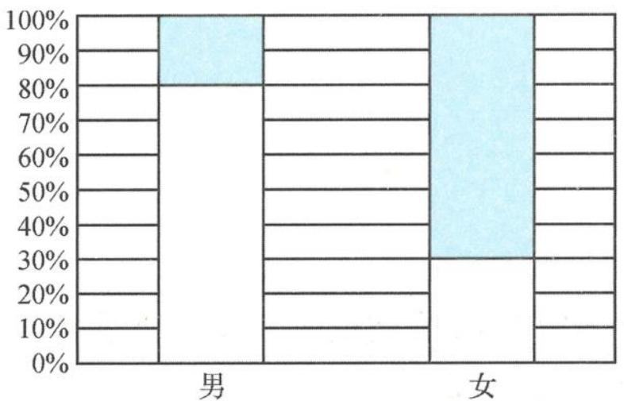

  
不喜欢

  
喜欢

附： $K^2 = \frac{n(ad - bc)^2}{(a + b)(c + d)(a + c)(b + d)}$ ，其中 $n = a + b + c + d$

<table><tr><td>k</td><td>3.841</td><td>6.635</td></tr><tr><td>P(K2≥k)</td><td>0.050</td><td>0.010</td></tr></table>

A. 被调查的学生中喜欢登山的男生人数比喜欢登山的女生人数多  
B. 被调查的女学生中喜欢登山的人数比不喜欢登山的人数多  
C. 若被调查的男、女学生均为 100 人, 则有 $99 \%$ 的把握认为喜欢登山和性别有关  
D. 无论被调查的男、女学生人数为多少,都有 $99 \%$ 的把握认为喜欢登山和性别有关

题 4 甲、乙两台机床生产同种产品,产品按质量分为一级品和二级品,为了比较两台机床产品的质量,分别用两台机床各生产了200件产品,产品的质量情况统计如下.

<table><tr><td>机床</td><td>一级品</td><td>二级品</td><td>合计</td></tr><tr><td>甲机床</td><td>150</td><td>50</td><td>200</td></tr><tr><td>乙机床</td><td>120</td><td>80</td><td>200</td></tr><tr><td>合计</td><td>270</td><td>130</td><td>400</td></tr></table>

(Ⅰ)甲机床、乙机床生产的产品中一级品的频率分别是多少?  
(Ⅱ)能否有 99% 的把握认为甲机床的产品质量与乙机床的产品质量有差异?

附： $K^{2}=\frac{n(ac-bd)^{2}}{(a+b)(c+d)(a+c)(b+d)}$ ，
P( $K^{2}\geqslant k$ ) 0.050 0.010 0.001
k 3.841 6.635 10.828

题 5 某贫困县为了响应国家精准扶贫的号召, 特地承包了一块土地, 已知土地的使用面积以及相应的管理时间的关系数据如下.

<table><tr><td>土地使用面积x/亩</td><td>1</td><td>2</td><td>3</td><td>4</td><td>5</td></tr><tr><td>管理时间y/月</td><td>9</td><td>11</td><td>14</td><td>26</td><td>20</td></tr></table>

并调查了某村 300 名村民参与管理的意愿,得到的部分数据如下.

<table><tr><td>村民性别</td><td>愿意参与管理</td><td>不愿意参与管理</td></tr><tr><td>男</td><td>140</td><td>60</td></tr><tr><td>女</td><td>40</td><td></td></tr></table>

(I)求相关系数 r 的大小(精确到 0.01),并判断管理时间 y 与土地使用面积 x 的线性相关程度.

(Ⅱ)是否有 99.9% 的把握认为村民的性别与参与管理的意愿具有相关性?

(Ⅲ)若以该村的村民的性别与参与管理意愿的情况估计贫困县的情况,则从该贫困县中任取3人,记取到不愿意参与管理的男性村民的人数为X,求X的分布列及数学期望.

参考公式: $r = \frac{\sum_{i=1}^{n}(x_i - \bar{x})(y_i - \bar{y})}{\sqrt{\sum_{i=1}^{n}(x_i - \bar{x})^2\sum_{i=1}^{n}(y_i - \bar{y})^2}}, K^2 = \frac{n(ad - bc)^2}{(a + b)(c + d)(a + c)(b + d)}$ , 其中 $n = a + b + c + d.$

临界值数据如下表.

<table><tr><td> $P(K^{2} \geqslant k_{0})$ </td><td>0.100</td><td>0.050</td><td>0.025</td><td>0.010</td><td>0.001</td></tr><tr><td> $k_{0}$ </td><td>2.706</td><td>3.841</td><td>5.024</td><td>6.635</td><td>10.828</td></tr></table>

参考数据： $\sqrt{485}\approx 22.02$

题 6 《中国居民营养与慢性病状况报告（2020）年》报告显示,中国成人平均身高继续增长,居民超重肥胖问题不断凸显.各年龄组居民超重肥胖率继续上升,18\~44岁居民超重率和肥胖率分别为34%和16%.不健康的生活方式对超重和肥胖产生的影响是巨大的,超重和肥胖的控制必须坚持预防为主.

(Ⅰ)根据以上数据,从18\~44岁居民中任选2人,求肥胖人数的分布列.

(Ⅱ)研究人员在某小区随机调查了男性居民45人,女性居民55人,其中男性超重人数有25人,女性超重人数为15人.请列出 $2\times2$ 列联表,并判断是否有99.5%的把握认为超重与性别有关.

参考公式与数据: $K^{2}=\frac{n(ad-bc)^{2}}{(a+b)(c+d)(a+c)(b+d)}$ ,其中 $n=a+b+c+d$ .

<table><tr><td> $P(K^{2} \geqslant k_{0})$ </td><td>0.150</td><td>0.100</td><td>0.050</td><td>0.025</td><td>0.010</td><td>0.005</td><td>0.001</td></tr><tr><td> $k_{0}$ </td><td>2.072</td><td>2.706</td><td>3.841</td><td>5.024</td><td>6.635</td><td>7.879</td><td>10.828</td></tr></table>

题 7 为了解空气质量指数(AQI)与参加户外健身运动的人数之间的关系,某校环保小组在暑假期间(60 天)进行了一项统计活动.每天记录到体育公园参加户外健身运动的人数,并与当天的 AQI 值(从气象部门获取)构成 60 组成对数据 $(x_{i}, y_{i}) (i=1,2,\cdots,60)$ ,其中 $x_{i}$ 为当天参加户外健身运动的人数, $y_{i}$ 为当天的 AQI 值,并制作了如下散点图.

连续 60 天参加健身运动人数与 AQI 散点图  
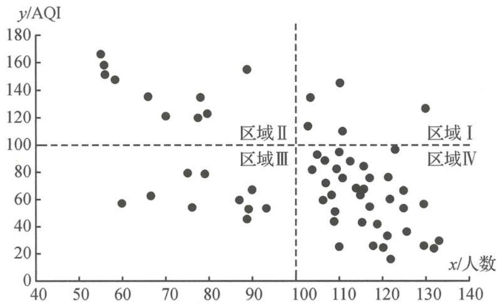

(I)环保小组准备做 $y$ 与 $x$ 的线性回归分析, 算得 $y$ 与 $x$ 的相关系数 $r \approx -0.58$ , 试分析 $y$ 与 $x$ 的线性相关关系?

(Ⅱ)环保小组还发现散点有分区聚集的特点,尝试作聚类分析.用直线 x=100 与 y=100 将散点图分成 I, II, III, IV 四个区域(如图),统计得到各区域的点数分别为 5,10,10,35,并初步认定“参加户外健身运动的人数不少于 100 与 AQI 值不大于 100 有关联”.问:该初步认定的犯错率是否小于 1%?

附: $K^{2}=\frac{n(ad-bc)^{2}}{(a+b)(c+d)(a+c)(b+d)}$ , $P(K^{2}\geqslant k)$ 0.050 0.010 0.001
k 3.841 6.635 10.828

题 8 2019 年, 古浪县八步沙林场“六老汉”三代人治沙群体作为优秀代表, 被中宣部授予 “时代楷模”称号. 在治沙过程中, 为检测某种固沙方法的效果, 治沙人在某一试验沙丘的坡顶和坡腰各布设了 50 个风蚀插钎, 以测量风蚀值 (风蚀值是测量固沙效果的指标之一, 数值越小表示该插钎处被风吹走的沙层厚度越小, 说明固沙效果越好, 数值为 0 表示该插钎处没有被风蚀) 通过一段时间的观测, 治沙人记录了坡顶和坡腰全部插钎测得的风蚀值 (所测数据均不为整数), 并绘制了相应的频率分布直方图.

坡腰风蚀值直方图  
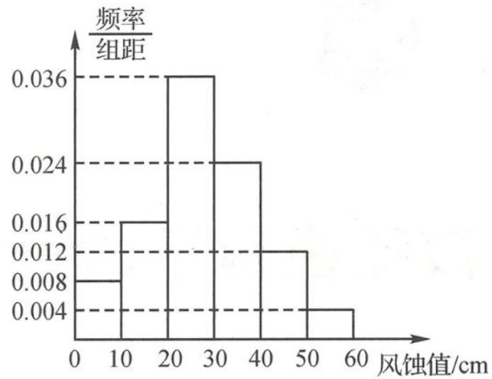

坡顶风蚀值直方图  
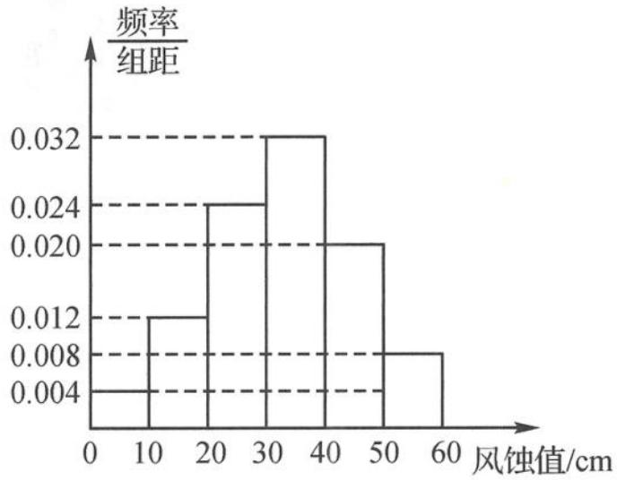

(Ⅰ)根据直方图估计“坡腰处一个插钎风蚀值小于30”的概率.

(Ⅱ)若一个插钎的风蚀值小于30,则该数据要标记“\*”,否则不标记.根据以上直方图,完成下面的列联表.

<table><tr><td>插钎位置</td><td>标记</td><td>不标记</td><td>合计</td></tr><tr><td>坡腰</td><td></td><td></td><td></td></tr><tr><td>坡顶</td><td></td><td></td><td></td></tr><tr><td>合计</td><td></td><td></td><td></td></tr></table>

问:是否有 95% 的把握认为数据标记“\*”与沙丘上插钎所布设的位置有关?

(Ⅲ)坡顶和坡腰的平均风蚀值分别为 $x_{1}$ 和 $x_{2}$ , 若 $\left|x_{1}-x_{2}\right|>20\mathrm{cm}$ , 则可认为此固沙方法在坡顶和坡腰的固沙效果存在差异. 试根据直方图计算 $\overline{x}_{1}$ 和 $\overline{x}_{2}$ (同一组中的数据用该组区间的中点值代表), 问: 该固沙方法在坡顶和坡腰的固沙效果是否存在差异?

附: $K^{2}=\frac{n(ad-bc)^{2}}{(a+b)(c+d)(a+c)(b+d)}$ , $P(K^{2}\geqslant k)$ 0.050 0.010 0.001
k 3.841 6.635 10.828

# 第四章 模型视角下的概率统计

数学模型是数学与外部世界连接的纽带,体现了数学应用的广泛性.数学建模也是高中数学学科核心素养之一.随着新课程、新教材以及高考评价体系的实施,概率统计的命题在模型更广泛的同时也更加精细和完善,素养导向下的高考命题中数学建模与概率统计相关内容深度融合.

## 4.1 函数模型

# 基本概念解读

# 问题 1 什么是数学建模？

数学建模就是运用数学化的手段从实际问题中提炼、抽象出一个数学模型,求出模型的解,检验模型的合理性,从而使这一实际问题得以解决的过程.

数学模型就是用数学语言、符号来描述客观事物的特征及其内在联系的数学结构表达式. 数学建模流程如下.

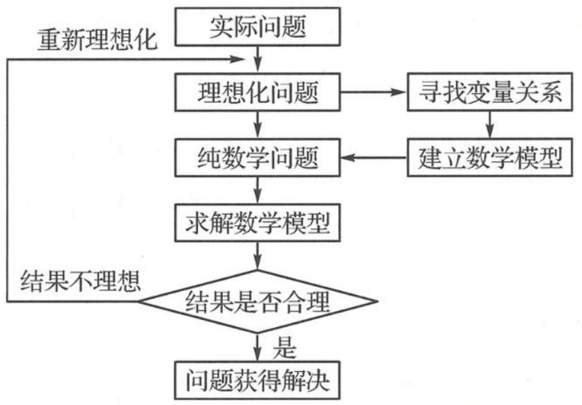

# 问题 2 概率统计中的数学建模有什么特点？

试题命制需要经历“素材的选取”“情境的构造”“问题的提出”等环节,概率统计建模类问题的命制在素材选取上尽可能围绕着学生熟悉的身边的生产生活等具有随机现象特征的实际问题.在情境构造上尽可能讲清楚基础随机变量产生的来源以及需要做出决策研究的目标随机变量,随机分布列可以采用统计数据产生的频率替代,也可以是具体的概率分布模型.在设问上,可以采取递进式设问,即先研究基础随机变量的分布列,再研究目标变量分布列以及期望决策.

# 典型考题探讨

例题 1 某花店每天以每枝 5 元的价格从农场购进若干枝玫瑰花,然后以每枝 10 元的价格出售.如果当天卖不完,剩下的玫瑰花作垃圾处理.

(Ⅰ)若花店一天购进 16 枝玫瑰花,求当天的利润(单位:元)关于当天需求量 $n(n \in \mathbb{N}$ , 单位: 枝)的函数解析式.

(Ⅱ)花店记录了100天玫瑰花的日需求量(单位:枝),整理的数据如下表所示.

<table><tr><td>日需求量n/枝</td><td>14</td><td>15</td><td>16</td><td>17</td><td>18</td><td>19</td><td>20</td></tr><tr><td>频数</td><td>10</td><td>20</td><td>16</td><td>16</td><td>15</td><td>13</td><td>10</td></tr></table>

以 100 天记录的各需求量的频率作为各需求量发生的概率.

(i) 若花店一天购进 16 枝玫瑰花, X 表示当天的利润 (单位: 元), 求 X 的分布列、数学期望及方差;  
(ii) 若花店计划一天购进 16 枝或 17 枝玫瑰花, 你认为应购进 16 枝还是 17 枝? 请说明理由.

【分析】本题中的玫瑰花或其他花类进货量对于一个花店来说是常常要决策的事情,因为你不知道当天有多少人来买,卖多少出去,这个日需求量是随机变量(我们可以将其视作基础随机变量),这就需要了解过去一段时间每天的需求量的统计数据(题中提供了100天的日需求量数据).若进货多了,则日需求量不足会浪费,导致成本亏损;若进货少了,则赚的利润又少了.因此,进货量是影响利润的因素,利润则是基于日需求量的一个目标随机变量.本题就是需要构建利润随机变量与日需求随机变量和影响因素进货量之间的函数关系,从两个变量关系来看,是一个简单的一次函数.由于涉及随机变量及其分布列,因而成为一个概率与统计背景下的数学建模问题.

【解析】①通过阅读弄清楚题意.

这个在上述的分析中已然完成,这是非常重要的一步,需要我们在阅读时将自身放进具体的情境中,弄清楚题目到底需要我们干什么.

②确定基础随机变量及其分布列.
根据上述分析,本题中的基础随机变量为日需求量 $n(n \in \mathbb{N}$ , 单位: 枝), 题目中给出了过去 100 天日需求量的统计数据, 并明确将频率视作概率, 因此可以得到日需求量的分布列为

<table><tr><td>n</td><td>14</td><td>15</td><td>16</td><td>17</td><td>18</td><td>19</td><td>20</td></tr><tr><td>P</td><td>0.1</td><td>0.2</td><td>0.16</td><td>0.16</td><td>0.15</td><td>0.13</td><td>0.1</td></tr></table>

③构建基础随机变量与目标随机变量之间的函数模型.

题目中明确了利润随机变量为 $X$ , 由“花店每天以每枝 5 元的价格从农场购进若干枝玫瑰花, 然后以每枝 10 元的价格出售. 如果当天卖不完, 剩下的玫瑰花作垃圾处理”可知, 利润随机变量 $X$ 与日需求量 $n$ 以及进货量 (不妨设为 $m$ ) 之间构成一个分段函数情形, 即
$X = \left\{ \begin{array}{l l} 1 0 n - 5 m, n \leqslant m, \\ 5 m, n > m. \end{array} \right.$

④确定目标随机变量的分布列.

题目给了进货量 $m = 16$ 和17两种情形，并探索比较如何决策，因此需要研究这两种情形下的分布列和期望利润.
当 $m = 16$ 时，
$X = \left\{ \begin{array}{l l} 1 0 n - 8 0, n \leqslant 1 6, \\ 8 0, n > 1 6. \end{array} \right.$
此时,由于 $n \in N$ , 根据 n 的分布列, 则有 X = 60, 70, 80. 因此 X 的分布列为
$P (X = 6 0) = \frac {1 0}{1 0 0} = 0. 1, P (X = 7 0) = \frac {2 0}{1 0 0} = 0. 2, P (X = 8 0) = 1 - 0. 1 - 0. 2 = 0. 7,$
即

<table><tr><td>X</td><td>60</td><td>70</td><td>80</td></tr><tr><td>P</td><td>0.1</td><td>0.2</td><td>0.7</td></tr></table>

类似地，当 $m = 17$ 时，
$X = \left\{ \begin{array}{l l} 1 0 n - 8 5, n \leqslant 1 7, \\ 8 5, n > 1 7. \end{array} \right.$
此时， $X$ 的分布列为

<table><tr><td>X</td><td>55</td><td>65</td><td>75</td><td>85</td></tr><tr><td>P</td><td>0.1</td><td>0.2</td><td>0.16</td><td>0.54</td></tr></table>

⑤利用期望决策.

期望是高考中常见的数字特征决策,应用非常广泛,本题显然也是如此.
当 $m = 16$ 时，
$E (X) = 6 0 \times 0. 1 + 7 0 \times 0. 2 + 8 0 \times 0. 7 = 7 6;$
当 $m = 17$ 时，
$E (X) = 5 5 \times 0. 1 + 6 5 \times 0. 2 + 7 5 \times 0. 1 6 + 8 5 \times 0. 5 4 = 7 6. 4.$
由于 76.4 > 76，因此花店一天应购进 17 枝。

【探讨】本题是2012年全国课标卷理科第18题.本题以生活中十分常见的带有产品保质(鲜)期的事物进货卖货(卖不出当垃圾处理或降价处理),寻求利润最大决策这样一个随机现象为情境.这样的应用场景是非常丰富和鲜活的,比如超市或市场中的牛奶、冰激凌以及各种生鲜蔬菜等,非常有生活气息.本题提供了概率统计与函数建模的一般思路和研究路径.

例题 2 某公司计划购买 2 台机器,该种机器使用三年后即被淘汰.机器有一易损零件,在购进机器时,可以额外购买这种零件作为备件,每个 200 元,在机器使用期间,如果备件不足再购买,则每个 500 元.现需决策在购买机器时应同时购买几个易损零件,为此搜集并整理了 100 台这种机器在三年使用期内更换的易损零件数,得到下面的柱状图.

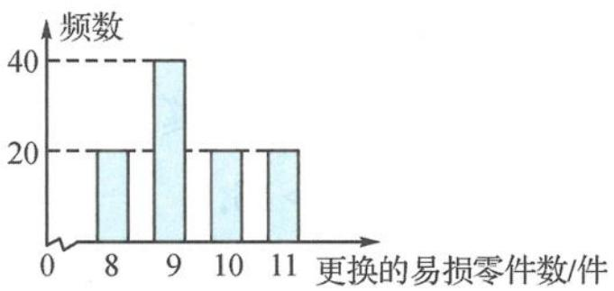

以这 100 台机器更换的易损零件数的频率代替一台机器更换的易损零件数发生的概率,记 X 表示 2 台机器三年内共需更换的易损零件数,n 表示购买 2 台机器的同时购买的易损零件数.

(I)求 X 的分布列.

(Ⅱ)若要求 $P(X \leqslant n) \geqslant 0.5$ ，确定 n 的最小值.

(Ⅲ)以购买易损零件所需费用的期望值为决策依据,在 n=19 与 n=20 之中选其一,应选用哪个?

【分析】本题以企业的成本控制为背景,着眼于“最优化零部件采购量”的决策问题设计和设问.
由于更换的易损零件数具有不确定性(对应例题1的“日需求量”), 因此需要建立随机模型并应用统计与概率的知识确定最优的备件购买量(例题1的“进货量”). 为解决这个问题, 需要把握易损零件数的不确定性, 即确定或近似确定易损零件数的分布列. 整理过去100台机器更换的易损零件数柱状图, 利用频率估计概率的思想获得需要更换的易损零件数的分布列, 然后计算所需费用的期望值, 该期望值与备件n有关. 以期望值的最小化为决策依据确定最优购买量. 本题要求在n=19和n=20中选择其一是为了控制运算量, 与例题1中要求进货量m=16和17的思路一致. 原则上讲, 应该计算全部备件(进货量)的费用, 然后比较才恰当. 命题时显然出于减少运算量的目的, 选择了一个最优值和次最优值进行比较确定. 当然, 本题在例题1的基础上增加了问题的复杂度, 研究两台机器需要更换易损零件数, 主要表现在强化了独立事件分解的概率计算要求.

【解析】①通过阅读弄清楚题意.上述对比分析的过程就是弄清题意的过程.不同的是,本题创设的是一个生产情境.

②确定基础随机变量及其分布列.

实际上,本题给出了三个随机变量之间的关系,其中最底层的是一台机器易损零件数 $X'$ 这个底层基础随机变量,而聚焦的两台机器易损零件数X这个基础随机变量与购买易损零件所需费用Y这个随机变量之间的数量关系,这是一个包含三个随机变量之间关系的问题,层层关联.因此应先研究一台机器易损零件数 $X'$ 的分布列.

题目中给出了 100 台这种机器在三年使用期内更换的易损零件数的统计数据(柱状图),并明确将频率视作概率,因此可以得到 $X'$ 的分布列为

<table><tr><td>X&#x27;</td><td>8</td><td>9</td><td>10</td><td>11</td></tr><tr><td>P</td><td>0.2</td><td>0.4</td><td>0.2</td><td>0.2</td></tr></table>
由于两台机器相互独立,根据事件分解,将复杂事件分解为独立事件的积与互斥事件的和.因此可以得到 X 的分布列为

<table><tr><td>X</td><td>16</td><td>17</td><td>18</td><td>19</td><td>20</td><td>21</td><td>22</td></tr><tr><td>P</td><td>0.04</td><td>0.16</td><td>0.24</td><td>0.24</td><td>0.2</td><td>0.08</td><td>0.04</td></tr></table>

具体计算过程如下.
$P (X = 1 6) = 0. 2 \times 0. 2 = 0. 0 4,$
$P (X = 1 7) = 2 \times 0. 2 \times 0. 4 = 0. 1 6,$
$P (X = 1 8) = 2 \times 0. 2 \times 0. 2 + 0. 4 \times 0. 4 = 0. 2 4,$
$P (X = 1 9) = 2 \times 0. 2 \times 0. 2 + 2 \times 0. 4 \times 0. 2 = 0. 2 4,$
$P (X = 2 0) = 2 \times 0. 2 \times 0. 4 + 0. 2 \times 0. 2 = 0. 2,$
$P (X = 2 1) = 2 \times 0. 2 \times 0. 2 = 0. 0 8,$
$P (X = 2 2) = 0. 2 \times 0. 2 = 0. 0 4.$
注意到
$P (X \leqslant 1 8) = 0. 0 4 + 0. 1 6 + 0. 2 4 = 0. 4 4,$
$P (X \leqslant 1 9) = 0. 4 4 + 0. 2 4 = 0. 6 8,$
故 n 的最小值为 19. 这个是题目中第(Ⅱ)问的解答.

③构建基础随机变量与目标随机变量之间的函数模型.

题设中给出“在购进机器时,可以额外购买这种零件作为备件,每个200元;在机器使用期间,如果备件不足再购买,则每个500元”以及“表示购买两台机器同时购买的零件数”这两部分语言描述,实际上这等于给出了构建易损件X与购买易损零件数所需费用Y之间的函数关系:
$Y = \left\{ \begin{array}{l} 2 0 0 n, X \leqslant n, \\ 2 0 0 n + (X - n) \times 5 0 0, X > n. \end{array} \right.$

④确定目标随机变量的分布列.

题目给了备件为 $n = 19$ 与 $n = 20$ 两种情形，并探索比较进行分析决策，因此需要研究这两种情形下的分布列和期望费用.
当 $n = 19$ 时，
$Y = \left\{ \begin{array}{l} 3 8 0 0, X \leqslant 1 9, \\ 5 0 0 X - 5 7 0 0, X > 1 9. \end{array} \right.$
此时,费用 Y 的分布列为

<table><tr><td>Y</td><td>3800</td><td>4300</td><td>4800</td><td>5300</td></tr><tr><td>P</td><td>0.68</td><td>0.2</td><td>0.08</td><td>0.04</td></tr></table>

类似地，当 $n = 20$ 时，
$Y = \left\{ \begin{array}{l} 4 0 0 0, X \leqslant 2 0, \\ 5 0 0 X - 6 0 0 0, X > 2 0. \end{array} \right.$
此时,费用 Y 的分布列为

<table><tr><td>Y</td><td>4000</td><td>4500</td><td>5000</td></tr><tr><td>P</td><td>0.88</td><td>0.08</td><td>0.04</td></tr></table>

⑤利用期望决策.
当 $n = 19$ 时，
$E (Y) = 3 8 0 0 \times 0. 6 8 + 4 3 0 0 \times 0. 2 + 4 8 0 0 \times 0. 0 8 + 5 3 0 0 \times 0. 0 4 = 4 0 4 0 (\text {元});$
当 $n = 20$ 时，
$E (Y) = 4 0 0 0 \times 0. 8 8 + 4 5 0 0 \times 0. 0 8 + 5 0 0 0 \times 0. 0 4 = 4 0 8 0 (\text {元}).$
可知, 当 n=19 时所需费用的期望值小于当 n=20 时所需费用的期望值, 故应选 n=19.

【探讨】本题是2016年全国Ⅰ卷理科第19题.相比于例题1,本题将建模要求隐藏在文字描述中(其实这部分阅读要求没有太大变化),频率呈现从表变成了柱形图,同时将基础随机变量设计成了两层,增加了事件分解和概率计算的要求,其他没有任何变化.在文字陈述的段落分布和设问上没有变化,在问题解决上保持了一致.

例题 3 某超市计划按月订购一种酸奶,每天进货量相同,进货成本为每瓶 4 元,售价为每瓶 6 元.未售出的酸奶降价处理,以每瓶 2 元的价格当天全部处理完.根据往年销售经验,每天需求量与当天最高气温(单位:℃)有关.如果最高气温不低于 25℃,需求量为 500 瓶;如果最高气温位于区间[20,25),需求量为 300 瓶;如果最高气温低于 20℃,需求量为 200 瓶.为了确定六月份的订购计划,统计了前三年六月份各天的最高气温数据,得到下面的频数分布表.

<table><tr><td>最高气温/°C</td><td>[10,15)</td><td>[15,20)</td><td>[20,25)</td><td>[25,30)</td><td>[30,35)</td><td>[35,40)</td></tr><tr><td>天数/天</td><td>2</td><td>16</td><td>36</td><td>25</td><td>7</td><td>4</td></tr></table>

以最高气温位于各区间的频率估计最高气温位于该区间的概率.

(Ⅰ)求六月份这种酸奶一天的需求量 X(单位:瓶)的分布列.

(Ⅱ)设六月份一天销售这种酸奶的利润为 $Y$ (单位:元),当六月份这种酸奶一天的进货量 $n$ (单位:瓶)为多少时, $Y$ 的数学期望达到最大值?

【解析】①通过阅读弄清楚题意.

超市中含有保质(鲜)期的相关食品问题进货量、需求量以及利润都是随机变量.本题中的需求量是基础随机变量,进货量是参变量,利润是目标变量.由于酸奶需求量与气温变量有关,气温变量提供了三个月统计数据,其中需求量与三段气温变量相关,进货量与需求量相关,利润与进货量以及需求量相关,这样就构成了四个变量之间的联系.因此可以一层层递进处理.

②确定基础随机变量及其分布列.

(i)六月份气温变量 $X'$ 的分布列.
由表中数据,可得气温变量 $X'$ 的分布列为

<table><tr><td>X&#x27;</td><td>[10,15)</td><td>[15,20)</td><td>[20,25)</td><td>[25,30)</td><td>[30,35)</td><td>[35,40)</td></tr><tr><td>P</td><td> $\frac{2}{90}$ </td><td> $\frac{16}{90}$ </td><td> $\frac{36}{90}$ </td><td> $\frac{25}{90}$ </td><td> $\frac{7}{90}$ </td><td> $\frac{4}{90}$ </td></tr></table>

(ii) 求一天酸奶需求量 X 的分布列.
根据题目描述, X 所有可能的取值为 200, 300, 500. 由 $X'$ 的分布列和互斥事件的概率计算, 可得
$P (X = 2 0 0) = \frac {2 + 1 6}{9 0} = 0. 2,$
$P (X = 3 0 0) = \frac {3 6}{9 0} = 0. 4,$
$P (X = 5 0 0) = \frac {2 5 + 7 + 4}{9 0} = \frac {3 6}{9 0} = 0. 4.$
因此需求量 $X$ 的分布列为

<table><tr><td>X</td><td>200</td><td>300</td><td>500</td></tr><tr><td>P</td><td>0.2</td><td>0.4</td><td>0.4</td></tr></table>

③构建基础随机变量与目标随机变量之间的函数模型.
注意到“每天进货量相同,进货成本为每瓶4元,售价为每瓶6元.未售出的酸奶降价处理,以每瓶2元的价格当天全部处理完”,类比例题1的函数建模,利润变量与需求量X及进货量n之间的函数关系为
$Y = \left\{ \begin{array}{l} 6 X + (n - X) \times 2 - 4 n, X \leqslant n, \\ 2 n, X > n. \end{array} \right.$

④确定目标随机变量的分布列.
由前述可知,一天的酸奶需求量 X 至少为 200 瓶,至多为 500 瓶,因此酸奶的进货量 n 满足 $200 \leqslant n \leqslant 500$ .
当 $200 \leqslant n < 300$ 时, 利润 Y 的分布列为

<table><tr><td>Y</td><td>800-2n</td><td>2n</td></tr><tr><td>P</td><td>0.2</td><td>0.8</td></tr></table>
当 $300 \leqslant n \leqslant 500$ 时, 利润 Y 的分布列为

<table><tr><td>Y</td><td>800-2n</td><td>1200-2n</td><td>2n</td></tr><tr><td>P</td><td>0.2</td><td>0.4</td><td>0.4</td></tr></table>

⑤研究期望(决策).
当 $200 \leqslant n < 300$ 时，
$E (Y) = 2 n \times (0. 4 + 0. 4) + (- 2 n + 8 0 0) \times 0. 2 = 1. 2 n + 1 6 0.$

关于 n 的一次函数 $E(Y)$ 单调递增, 此时
$E (Y) <   1. 2 \times 3 0 0 + 1 6 0 = 5 2 0;$
当 $300 \leqslant n \leqslant 500$ 时，
$E (Y) = (8 0 0 - 2 0 n) \times 0. 2 + (1 2 0 0 - 2 n) \times 0. 4 + 2 n \times 0. 4 = - 0. 4 n + 6 4 0.$

关于 n 的一次函数 $E(Y)$ 单调递减. 当 n=300 时, $E(Y)$ 取得最大值为 $-0.4 \times 300 + 640 = 520$ .
综上所述, 当 n=300 时, Y 的数学期望达到最大值 520.

【探讨】本题是2017年全国Ⅲ卷理科第18题。本题在情境创设上保持了与例题1的一致性，聚焦生活中非常丰富的具有产品保质期且与气温相关联的酸奶（还可以是冰激凌或其他冷饮）的进货、销售、需求等随机问题。与例题1不同的是，本题增加了问题的复杂程度，提供了一个新的底层随机变量，同时研究利润最大与进货量的问题。随着中学对这部分内容认识的深入，命题上不再妥协，更深入探索利润最大化而非仅仅选取两个变量进行比较决策。在实际生产生活中，本题提供的情境和研究方式才是正常与合理的。因此，我们有理由相信，这样的考题将会是今后统计概率建模考题的常态，才符合“试题情境更加真实和复杂”这一命题趋势。

例题 4 某工厂生产的某种产品成箱包装,每箱 200 件,每箱产品在交付用户之前要对产品做检验,如检验出不合格品,则更换为合格品.检验时,先从这箱产品中任取 20 件做检验,再根据检验结果决定是否对余下的所有产品做检验,设每件产品为不合格的概率为 $p(0 < p < 1)$ ,且各件产品是否不合格互相独立.

(Ⅰ)记20件产品中恰有2件不合格品的概率为 $f(p)$ ，求 $f(p)$ 的最大值点 $p_{0}$ .

(Ⅱ)现对一箱产品检验了20件,结果恰有2件不合格品,以(Ⅰ)中确定的 $p_{0}$ 作为p的值.已知每件产品的检验费用为2元,若有不合格品进入用户手中,则工厂要对每件不合格品支付25元的赔偿费用.

(i) 若不对该箱余下的产品做检验, 这一箱产品的检验费用与赔偿费用之和记为 $X$ , 求 $E(X)$ ;

(ii)以检验费用与赔偿费用之和的期望为决策依据,问:是否该对这箱余下的所有产品做检验?

【解析】①通过阅读弄清楚题意.
在工农业生产与经济生活中,如何降低生产和经营成本是经常要面对并需解决的问题,这些问题中普遍存在着随机因素或受不确定性变量的影响,自然地需要构建随机模型,用概率统计的知识和方法解决问题.在本题中,每箱产品中不合格品件数Y是基础随机变量,检验费用与赔偿费用之和X是目标随机变量.根据题目描述,不难知道不合格品件数Y服从二项分布,而X与Y之间的关系是线性模型.

任取 20 件产品相当于做 20 次独立重复试验,由独立重复试验的概率模型知,20 件产品中不合格品件数服从二项分布,从而恰有 2 件不合格品的概率为
$f (p) = \mathrm{C} _ {2 0} ^ {2} p ^ {2} (1 - p) ^ {1 8} = 1 9 0 p ^ {2} (1 - p) ^ {1 8}.$

对函数 $f(p)$ 求导得
$\begin{array}{l} f ^ {'} (p) = \mathrm{C} _ {2 0} ^ {2} [ 2 p (1 - p) ^ {1 8} - p ^ {2} \times 1 8 \times (1 - p) ^ {1 7} ] = 1 9 0 \times 2 p (1 - p) ^ {1 7} (1 - p - 9 p) \\ = 3 8 0 p (1 - p) ^ {1 7} (1 - 1 0 p). \\ \end{array}$
令 $f'(p)=0$ , 解得 p=1 (舍去) 或 $p=\frac{1}{10}$ .
当 $p \in \left(0, \frac{1}{10}\right)$ 时， $f'(p) > 0$ ；当 $p \in \left(\frac{1}{10}, 1\right), f'(p) < 0$ .
故 $f(p)$ 在 $\left(0, \frac{1}{10}\right)$ 上为增函数，在 $\left(\frac{1}{10}, 1\right)$ 上为减函数，故 $p = \frac{1}{10}$ 为 $f(p)$ 的极大值点，并且为最大值点。故最大值点 $p_0 = \frac{1}{10}$ 。

②确定基础随机变量及其分布列.
由题意及①可知， $Y$ 表示余下的 180 件产品中的不合格品的数量，则 $Y$ 服从二项分布，即
$Y \sim B (1 8 0, 0. 1).$

③构建基础随机变量与目标随机变量之间的函数模型.
注意到“已知每件产品的检验费用为 2 元, 若有不合格品进入用户手中, 则工厂要对每件不合格品支付 25 元的赔偿费用”以及“这一箱产品的检验费用与赔偿费用的和记为 X”, 可知目标随机变量 X 及不合格品基础随机变量 Y 之间的函数关系为 $X = 20 \times 2 + 25Y$ , 即
$X = 4 0 + 2 5 Y.$

④确定目标随机变量的分布列.
依题意,目标变量与基础随机变量之间是线性关系,因此它们具有一致的分布,也满足二项分布.

⑤研究期望(决策).

易得
$E (Y) = 1 8 0 p _ {0} = 1 8,$
从而
$E (X) = E (4 0 + 2 5 Y) = 4 0 + 2 5 E (Y) = 4 0 + 2 5 \times 1 8 = 4 9 0.$
若对于余下的产品做检验,则此时一箱产品所需要的检验费用为 $2 \times 200 = 400$ (元). 注意到 $E(X) = 490 > 400$ , 故应该对余下的产品做检验.

【探讨】本题是2018年全国Ⅰ卷理科第20题,关注工农业生产和经济生活中的生产经营成本控制问题,由于生产经营成本受到各种随机因素影响,因此成为概率统计中常用情境设计的素材.相对于前面两题,本题的基础随机变量的分布是明确的二项分布,二项分布的模型特征明显,概率数据的获取没有采取统计数据的频率,而是通过概率计算获得.剩下两个变量之间的函数建模也是常见的一次函数模型.在决策上一如既往地采用期望值大小来比较决策.一方面是期望值计算比较简单,另一方面是在实际生产过程中,工厂出厂的成箱产品数是很大的,因此采用期望决策是合理的,也符合高考这样一个只有两小时的场景.总体来看,本题延续了前面的命题风格.

例题 5 某小微企业生产一种如图所示的电路子模块：

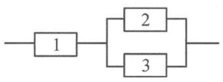

要求三个不同位置 1,2,3 接入三种不同类型的电子元件,且备选电子元件为 A,B,C 型,它们正常工作的概率分别为 0.9,0.8,0.7. 假设接入三个位置的元件能否正常工作相互独立. 当且仅当 1 号位元件正常工作,同时 2 号位与 3 号位元件中至少有一件正常工作时,电路子模块才能正常工作.

(Ⅰ)共可组装出多少种不同的电路子模块?

(Ⅱ)求电路子模块能正常工作的概率的最大值.

(III)若以每件 5 元、3 元、2 元的价格分别购进 A, B, C 型元件各 1000 件, 组装成 1000 套电路子模块出售, 设每套子模块组装费为 20 元. 每套子模块的售价为 150 元, 但每售出 1 套不能正常工作的子模块, 除了退还购买款, 还将支付购买款的 3 倍作为赔偿金. 求生产销售 1000 套电路子模块的最大期望利润.

【分析】本题在审题时以下三个方面是要能审出来的:①模块通过率高则利润高,实为求静态最值;②着力审清利润构成,引入随机变量,利润变量与正常工作件数的关系;③特殊分布(二项分布)的提取与加工.事实上,第(Ⅰ)问是考简单的排列组合.第(Ⅱ)问实则是考查分类讨论,要从1号位这个关键位切入研究三种元器件的排列,此时需要比较三种情形,分别计算概率,选择最大概率的排列即可.第(Ⅲ)问可以从研究每套模块(模块选择即是一次伯努利试验)的期望利润着手,再放大1000倍即是最大期望利润;也可以将正常工作的模块选择视作1000次的伯努利试验,即研究1000套子模块中能正常工作的套数,将其视为随机变量X,这是一个二项分布模型,再构建利润随机变量Y与X的函数关系.

【解析】(I)不同的电路子模块共有 $A_{3}^{3}=6$ 种.

(Ⅱ)6 种子模块正常工作的概率只有下面三种.

用 A, B, C 分别表示事件“1 号位接入 A, B, C 型元件时，子模块能正常工作”，则
$P (A) = 0. 9 \times [ 1 - (1 - 0. 7) \times (1 - 0. 8) ] = 0. 9 \times 0. 9 4 = 0. 8 4 6,$
$P (B) = 0. 8 \times [ 1 - (1 - 0. 7) \times (1 - 0. 9) ] = 0. 8 \times 0. 9 7 = 0. 7 7 6,$
$P (C) = 0. 7 \times [ 1 - (1 - 0. 8) \times (1 - 0. 9) ] = 0. 7 \times 0. 9 8 = 0. 6 8 6.$
因为
$P (A) > P (B) > P (C),$
所以,当1号位接入A型元件时,子模块正常工作的概率最大,为0.846.

(Ⅲ)子模块正常工作的概率越大,期望利润会越高,应把 A 型元件接入 1 号位.
解法一:设每套子模块的利润为 X, 若能正常工作, 则
$X = 1 5 0 - 2 0 - 1 0 = 1 2 0 (\text {   元   });$
若不能正常工作,则
$X = - 2 0 - 1 0 - 4 5 0 = - 4 8 0 (\text {   元   }).$
所以 $X$ 的分布列为

<table><tr><td>X</td><td>120</td><td>-480</td></tr><tr><td>P</td><td>0.846</td><td>0.154</td></tr></table>
所以
$E (X) = 1 2 0 \times 0. 8 4 6 - 4 8 0 \times 0. 1 5 4 = 2 7. 6 (\text {元}).$
故生产 1000 套子模块的最大期望利润为 $1000 \times 27.6 = 27600$ 元.
解法二: 设 1000 套子模块中能正常工作的套数为 X, 利润为 Y, 则
$X \sim B (1 0 0 0, 0. 8 4 6),$

且
$Y = 1 5 0 X - 4 5 0 \times (1 0 0 0 - X) - 2 0 \times 1 0 0 0 - (5 + 3 + 2) \times 1 0 0 0 = 6 0 0 X - 4 8 0 0 0 0,$
所以
$E (X) = 1 0 0 0 \times 0. 8 4 6 = 8 4 6, E (Y) = 6 0 0 \times E (X) - 4 8 0 0 0 0 = 2 7 6 0 0.$
故生产 1000 套子模块的最大期望利润为 $1000 \times 27.6 = 27600$ 元.

【探讨】本题聚焦的是小微企业生产电路子模块的种类与利润,与当前鼓励科技创新的社会现实紧密结合.通过本题可以感受到数学在指导生产生活实践,优化资源配置中的重要作用,体现数学来源于生活,服务于生活.解题过程也体现了特殊与一般、全局与个体的辩证统一.

# 拓展探讨题

题 1 近年来, 祖国各地依托本地自然资源, 打造旅游产业, 旅游业正蓬勃发展. 景区与游客都应树立尊重自然、顺应自然、保护自然的生态文明理念, 合力使旅游市场走上规范有序且可持续的发展轨道. 某景区有一个自愿消费的项目, 在某特色景点的入口处, 景区工作人员会为每位游客拍一张与景点的合影, 参观后, 在景点出口处会将刚拍下的照片打印出来, 游客可自由选择是否带走照片. 若带走照片, 则需支付 20 元. 没有被带走的照片会收集起来统一销毁. 该项目运营一段时间后, 统计出平均只有三成的游客会选择带走照片. 为改善运营状况, 该项目组就照片收费与游客消费意愿关系作了市场调研, 发现收费与消费意愿有较强的线性相关性, 并统计出在原有的基础上, 价格每下调 1 元, 游客选择带走照片的可能性平均增加 0.05. 假设平均每天约有 5000 人参观该特色景点, 每张照片的综合成本为 5 元, 假设每个游客是否购买照片相互独立.

(Ⅰ)若调整为支付10元就可以带走照片,该项目每天的平均利润比调整前多还是少?  
(Ⅱ)要使每天的平均利润达到最大值,应如何定价?

题 2 一种微生物群体可以经过自身繁殖不断生存下来. 设 1 个这种微生物为第 0 代, 经过一次繁殖后为第 1 代, 再经过一次繁殖后为第 2 代……该微生物每代繁殖的个数相互独立且有相同的分布列. 设 X 表示 1 个微生物个体繁殖下一代的个数, $P(X=i)=p_{i}(i=0,1,2,3)$ .

(I)已知 $p_0 = 0.4, p_1 = 0.3, p_2 = 0.2, p_3 = 0.1$ ，求 $E(X)$ .

(Ⅱ)设 p 表示该种微生物经过多代繁殖后临近灭绝的概率, p 是关于 x 的方程 $p_{0} + p_{1}x + p_{2}x^{2} + p_{3}x^{3} = x$ 的一个最小正实数根, 求证: 当 $E(X) \leqslant 1$ 时, p = 1; 当 $E(X) > 1$ 时, p < 1.

(Ⅲ)根据你的理解,说明第(Ⅱ)问结论的实际含义.

题 3 随着现代电子技术的迅猛发展,关于元件和系统可靠性的研究已发展成为一门新的学科——可靠性理论.在可靠性理论中,一个元件正常工作的概率称为该元件的可靠性.元件组成系统,系统正常工作的概率称为该系统的可靠性.现有 $n(n \in \mathbb{N}^{*}, n \geqslant 2)$ 种电子元件,每种 2 个,每个元件的可靠性均为 $p(0 < p < 1)$ .当某元件不能正常工作时,该元件在电路中将形成断路.现要用这 2n 个元件组成一个电路系统,有如下两种连接方案可供选择,当且仅当从 A 到 B 的电路为通路状态时,系统正常工作.

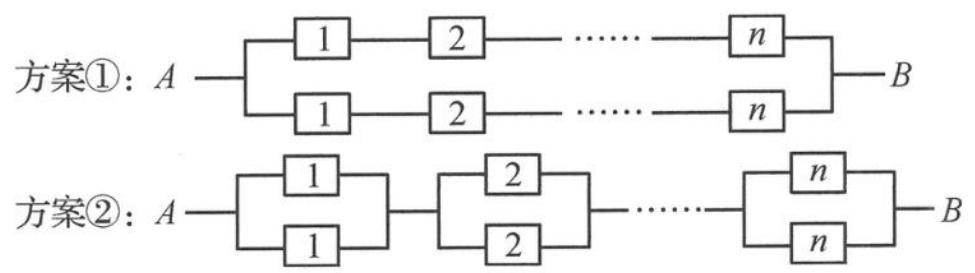

(I)(i)分别写出按方案①和方案②建立的电路系统的可靠性 $P_{1}, P_{2}$ (用 $n$ 和 $p$ 表示);

(ii) 比较 $P_{1}$ 与 $P_{2}$ 的大小, 说明哪种连接方案更稳定可靠.

(Ⅱ)设 $n=4, p=\frac{4}{5}$ ，已知按方案②建立的电路系统可以正常工作，记此时系统中损坏的元件个数为 X，求随机变量 X 的分布列和数学期望.

题 4 某企业拟对某条生产线进行技术升级,现有两种方案可供选择.方案 A 是报废原有生产线,重建一条新的生产线;方案 B 是对原有生产线进行技术改造.由于受诸多不可控因素的影响,市场销售状态可能会发生变化.该企业管理者对历年产品销售市场行情及回报率进行了调研,编制出下表.

<table><tr><td rowspan="2">市场销售状态</td><td rowspan="2">市场销售状态概率(0&lt; p&lt;1)</td><td colspan="2">预期平均年利润/万元</td></tr><tr><td>方案A</td><td>方案B</td></tr><tr><td>畅销</td><td>2p</td><td>700</td><td>600</td></tr><tr><td>平销</td><td>1-3p</td><td>400</td><td>300</td></tr><tr><td>滞销</td><td>p</td><td>-400</td><td>-100</td></tr></table>

(Ⅰ)以预期平均年利润的期望值为决策依据,问:该企业应选择哪种方案?

(Ⅱ)记该生产线升级后的产品(以下简称“新产品”)的年产量为 $x$ (万件), 通过核算, 实行方案 $A$ 时新产品的年度总成本 $y_{1}$ (万元) 为 $y_{1} = \frac{2}{3} x^{3} - 8x^{2} + 10x + 160$ , 实行方案 $B$ 时新产品的年度总成本 $y_{2}$ (万元) 为 $y_{2} = \frac{1}{3} x^{3} - 3x^{2} + 20x + 100$ . 已知 $p = 0.2, x \leqslant 20$ . 若按 (I) 的标准选择方案, 则市场行情为畅销、平销和滞销时, 新产品的单价 $t$ (元) 分别为 $60, 60 - \frac{3}{4} x, 60 - x$ , 且生产的新产品当年都能卖出去. 问: 当 $x$ 取何值时, 新产品年利润 $\xi$ 的期望取得最大值? 判断这一年利润能否达到预期目标.

题 5 某奶茶店推出一款新品奶茶,每杯成本为 4 元,售价为 6 元.如果当天卖不完,剩下的奶茶只能倒掉,奶茶店记录了 60 天这款新品奶茶的日需求量,整理得下表.

<table><tr><td>日需求量杯数/杯</td><td>20</td><td>25</td><td>30</td><td>35</td><td>40</td><td>45</td><td>50</td></tr><tr><td>天数/天</td><td>5</td><td>5</td><td>10</td><td>15</td><td>10</td><td>10</td><td>5</td></tr></table>

以这 60 天记录中各需求量的频率作为各需求量发生的概率.

(Ⅰ)若奶茶店一天准备了 35 杯这款新品奶茶,用 $\xi$ 表示当天销售这款新品奶茶的利润 (单位:元),求 $\xi$ 的分布列和数学期望.  
(Ⅱ)假设奶茶店每天准备的这款新品奶茶杯数都是5的倍数,有顾客建议店主每天准备40杯这款新品奶茶,你认为店主应该接受这个建议吗?请说明理由.

题 6 某药物研究所为筛查某冠状病毒,需要检验血液是否为阳性,现有 $n(n \in \mathbb{N}^{*})$ 份血液样本,每份样本取到的可能性均等,有以下两种检验方式:①逐份检验,则需要检验 n 次;②混合检验,将其中 $k(k \in \mathbb{N}^{*}, k \geqslant 2)$ 份血液样本分别取样混合在一起检验.若检验结果为阴性,则这 k 份血液全为阴性,因此这 k 份血液样本检验一次就够了,如果检验结果为阳性,为了明确这 k 份血液究竟哪几份为阳性,就要对这 k 份血液再逐份检验.此时,这 k 份血液的检验次数总共为 $k + 1$ 次.假设在接受检验的血液样本中,每份样本的检验结果是阴性还是阳性都是独立的,且每份样本是阳性结果的概率为 $p(0 < p < 1)$ .

(Ⅰ)假设有5份血液样本,其中只有2份为阳性,若采取逐份检验方式,求恰好经过2次检验就能把阳性样本全部检验出来的概率.  
(Ⅱ)现取其中 $k(k \in \mathbb{N}^{*}, k \geqslant 2)$ 份血液样本, 记采用逐份检验方式, 样本需要检验的次数为 $\xi_{1}$ , 采用混合检验方式, 样本需要检验的总次数为 $\xi_{2}$ .  
(i)试运用概率统计知识,当 $E(\xi_{1})=E(\xi_{2})$ 时,试求p关于k的函数解析式 $p=f(k)$ ;

(ii) 若 $p = 1 - \frac{1}{\sqrt[3]{e}}$ ，采用混合检验方式可以使得这 $k$ 份血液样本需要检验的总次数的期望值比逐份检验的总次数期望值更少，求 $k$ 的最大值.

参考数据: $\ln 2 \approx 0.6931, \ln 3 \approx 1.0986, \ln 4 \approx 1.3863, \ln 5 \approx 1.6094, \ln 6 \approx 1.7918.$

题 7 垃圾分类是指按一定规定或标准将垃圾分类储存、分类投放和分类搬运,从而转变成公共资源的一系列活动的总称. 分类的目的是提高垃圾的资源价值和经济价值, 力争物尽其用. 2019 年 6 月 25 日, 生活垃圾分类制度入法. 到 2020 年底, 先行先试的 46 个重点城市, 要基本建成垃圾分类处理系统. 其他地级城市实现公共机构生活垃圾分类全覆盖. 某机构欲组建一个有关“垃圾分类”相关事宜的项目组, 对各个地区垃圾分类处理模式进行相关报道. 该机构从 600 位员工中进行筛选, 筛选方法: 每位员工测试 $A, B, C$ 三项工作, 三项测试中至少两项测试 “不合格”的员工, 将被认定为“暂定”, 有且只有一项测试“不合格”的员工, 将再测试 $A, B$ 两项, 如果这两项中有一项以上 (含一项) 测试“不合格”, 也被认定为“暂定”. 每位员工测试 $A, B, C$ 三项工作相互独立, 每一项测试“不合格”的概率均为 $p (0 < p < 1)$ .

(Ⅰ)记某位员工被认定为“暂定”的概率为 $f(p)$ ，求 $f(p)$ .

(Ⅱ)每位员工不需要重新测试的费用为 90 元,需要重新测试的总费用为 150 元,除测试费用外,其他费用总计为 1 万元.若该机构的预算为 8 万元,且该 600 名员工全部参与测试,问:上述方案是否会超过预算?请说明理由.

题 8 某网络购物平台每年 11 月 11 日举行“双十一”购物节,当天有多项优惠活动,深受广大消费者喜爱.

(Ⅰ)已知该网络购物平台近5年“双十一”购物节当天成交额如下表.

<table><tr><td>年份</td><td>2015</td><td>2016</td><td>2017</td><td>2018</td><td>2019</td></tr><tr><td>成交额/百亿元</td><td>9</td><td>12</td><td>17</td><td>21</td><td>27</td></tr></table>

求成交额(百亿元)与时间变量 x(记 2015 年为 x=1,2016 年为 x=2,……以此类推)的线性回归方程,并预测 2020 年该平台“双十一”购物节当天的成交额.

(II)在 2020 年“双十一”购物节前,某同学的爸爸、妈妈计划在该网络购物平台上分别参加 $A,B$ 两个店各一个订单的“秒杀”抢购.若该同学的爸爸、妈妈在 $A,B$ 两个店订单“秒杀”成功的概率分别为 $p,q$ ,记该同学的爸爸和妈妈抢购到的订单总数量为 $X$ .

(i) 求 $X$ 的分布列及 $E(X)$ ;

(ii)已知每个订单由 $k(k \geqslant 2, k \in \mathbb{N}^{*})$ 件商品 $W$ 构成, 记该同学的爸爸和妈妈抢购到的商品 $W$ 的数量为 $Y$ , 假设 $p = \frac{7 \sin \frac{\pi}{k}}{4k} - \frac{\pi}{k^{2}}, q = \frac{\sin \frac{\pi}{k}}{4k}$ , 求 $E(Y)$ 取最大值时正整数 $k$ 的值.

附: 回归方程 $\hat{y} = \hat{b}x + a$ 中斜率和截距的最小二乘估计公式分别为 $\hat{b} = \frac{\sum_{i=1}^{n}(x_i - \bar{x})(y_i - \bar{y})}{\sum_{i=1}^{n}(x_i - \bar{x})^2} = \frac{\sum_{i=1}^{n} x_i y_i - n\bar{x}\bar{y}}{\sum_{i=1}^{n} x_i^2 - n\bar{x}^2}, a = \bar{y} - \hat{b}\bar{x}.$

# 研究路径探索
由上述例题的分析与解,我们可以得到概率统计建模问题解决的基本研究路径:

弄清楚问题情境,明确要解决问题的含义→明确基础随机变量及其分布列→明确目标随机变量→构建两个随机变量之间的函数模型→确定目标随机变量的分布列→利用期望(方差)决策.

## 4.2 数列模型

前面我们研究了与函数相关的概率统计建模和函数模型问题,鉴于数列是特殊的函数,因此数列模型基本上延续了函数模型的特征和研究方案,所不同的是数列模型类问题往往更加突出数列特别是递推数列问题的研究方法,概率的味道则很淡,聚焦的往往是关系运算下的概率关系.

# 典型考题探讨

例题 1 为了治疗某种疾病,研制甲、乙两种新药,某机构希望知道哪种新药更有效,为此进行动物试验,试验方案如下:每一轮选取两只小白鼠对药效进行对比试验.对于两只小白鼠,随机选一只施以甲药,另一只施以乙药.一轮的治疗结果得出后,再安排下一轮试验.当其中一种药治愈的小白鼠比另一种药治愈的小白鼠多4只时,就停止试验,并认为治愈只数多的药更有效.为了方便描述问题,约定:对于每轮试验,若施以甲药的小白鼠治愈且施以乙药的小白鼠未治愈则甲药得1分,乙药得-1分;若施以乙药的小白鼠治愈且施以甲药的小白鼠未治愈则乙药得1分,甲药得-1分;若都治愈或都未治愈则两种药均得0分.甲、乙两种药的治愈率分别记为α,β,一轮试验中甲药的得分记为X.

(I) 求 X 的分布列.

(Ⅱ)若甲药、乙药在试验开始时都赋予4分, $p_{i}(i=0,1,\cdots,8)$ 表示“甲药的累计得分为i时,最终认为甲药比乙药更有效”的概率,则 $p_{0}=0,p_{8}=1,p_{i}=ap_{i-1}+bp_{i}+cp_{i+1}(i=1,2,\cdots,7)$ ,其中 $a=P(X=-1),b=P(X=0),c=P(X=1)$ ,假设 $\alpha=0.5,\beta=0.8$ .

(i) 证明： $\{p_{i+1}-p_{i}\}(i=0,1,2,\cdots,7)$ 为等比数列；
(ii) 求 $p_4$ , 并根据 $p_4$ 的值解释这种试验方案的合理性.

【分析】新药的研制是一个漫长的过程。对药物疗效的试验,疗效的比较和检验是其中的重要环节。本题创设了一个药物疗效验证的试验方案,着眼于试验方案效能的评估。事实上,设甲、乙两种药的治愈率分别记为 $\alpha, \beta$ , 我们希望知道真实情况是 $\alpha < \beta$ 而做出 $\alpha > \beta$ 的结论的概率,或真实情况是 $\alpha > \beta$ 而做出 $\alpha < \beta$ 的结论的概率。自然地,这个概率越小,表明这个试验方案的效能越佳。从题设给出的条件来看,甲药的治愈率明显低于乙药,但经过多轮试验,事件 $A =$ “甲药比乙药多治愈 4 个”是有可能发生的。如果 $A$ 的概率很小,则说明试验方案合理;如果 $A$ 的概率较大,则说明试验方案不合理。概率决策不可能做到百分之百正确,只要可控制发生错误的概率在一个较小的范围内,就认为决策是合理的。本题中前面描述的是试验方案,但解决问题只需从“约定”开始,根据约定,分布列很容易得到。第(Ⅱ)问的等式实则是全概率的结果,但题目直接给出了,这时就是一个纯粹的二阶递推数列问题,很容易转化为一个等比数列来研究。

【解析】(I)根据题意, $X$ 所有可能的取值为 $-1,0,1$ , 则
$P (X = - 1) = (1 - \alpha) \beta ,$
$P (X = 0) = \alpha \beta + (1 - \alpha) (1 - \beta),$
$P (X = 1) = \alpha (1 - \beta).$
所以 $X$ 的分布列为

<table><tr><td>X</td><td>-1</td><td>0</td><td>1</td></tr><tr><td>P</td><td>(1-α)β</td><td>αβ+(1-α)(1-β)</td><td>α(1-β)</td></tr></table>

(Ⅱ)(i)由(I)得
$a = 0. 4, b = 0. 5, c = 0. 1,$
所以
$p _ {i} = 0. 4 p _ {i - 1} + 0. 5 p _ {i} + 0. 1 p _ {i + 1},$
即 $0.1(p_{i + 1} - p_i) = 0.4(p_i - p_{i - 1})$ ，即
$p _ {i + 1} - p _ {i} = 4 (p _ {i} - p _ {i - 1}).$
又 $p_{1}-p_{0}=p_{1}\neq0$ ，所以 $\{p_{i+1}-p_{i}\}(i=0,1,2,\cdots,7)$ 是首项为 $p_{1}$ 、公比为 4 的等比数列.

(ii)由(i)得
$p _ {i + 1} - p _ {i} = 4 ^ {i} p _ {1} (i = 0, 1, 2, \dots , 7).$
所以
$p _ {8} = (p _ {8} - p _ {7}) + (p _ {7} - p _ {6}) + \dots + (p _ {1} - p _ {0}) + p _ {0} = \frac {4 ^ {8} - 1}{3} p _ {1} = 1,$
即
$p _ {1} = \frac {3}{4 ^ {8} - 1}.$
所以
$p _ {4} = (1 + 4 + 4 ^ {2} + 4 ^ {3}) p _ {1} = \frac {4 ^ {4} - 1}{3} p _ {1} = \frac {1}{2 5 7}.$
$p_{4}$ 表示最终认为甲药比乙药更有效的概率,由计算结果可以看出,在甲药治愈率为 0.5,乙药治愈率为 0.8 时,认为甲药更有效的概率 $p_{4}=\frac{1}{257}\approx0.0039$ ,此时得出错误结论的概率非常小,说明这种试验方案合理.

【探讨】本题是2019年全国Ⅰ卷理科第21题。本题的背景很容易在概率论相关的书籍中找到，即“赌徒输光问题”“酒鬼失足问题”和“一维随机游走问题”。感兴趣的同学可以查阅相关的书籍。就概率建模而言，本题第(Ⅱ)问就是高考命题人考虑到考试的实际以及中学知识实际（新教材中的全概率公式还没有全面使用），而采取的直接给出式子的办法。事实上，我们运用全概率公式完全可以得到上述递推式。
令事件 W 为“甲药的累计得分为 i 时, 甲药比乙药更有效”, 由全概率公式以及一轮试验的结果可得:
$p_{i}=P(W|$ 甲的累计得分为i时,这一轮甲得1分 $)\cdot P(X=1)$
$+P(W|$ 甲的累计得分为i时,这一轮甲得0分 $)\cdot P(X=0)$
$+P(W|$ 甲的累计得分为i时,这一轮甲得-1分 $)\cdot P(X=-1)$
$= P(W|$ 甲的累计得分为 $i + 1$ 时） $\cdot P(X = 1)$
$+P(W|$ 甲的累计得分为i时 $)\cdot P(X=0)$
$+P(W|$ 甲的累计得分为i-1时 $)\cdot P(X=-1)$
$= p _ {i + 1} \cdot P (X = 1) + p _ {i} \cdot P (X = 0) + p _ {i - 1} \cdot P (X = - 1)$
$= 0. 1 p _ {i + 1} + 0. 5 p _ {i} + 0. 4 p _ {i - 1}.$

这就是原题中所给的关系式. 运用全概率公式是给出数列递推式常见的方法. 类似地, 如下题.

例题 2 甲口袋中装有 2 个黑球和 1 个白球, 乙口袋中装有 3 个白球. 现从甲、乙两个口袋中各任取 1 个球交换并放入另一个口袋. 重复 n 次这样的操作, 记甲口袋中黑球个数为 $X_{n}$ , 恰有 2 个黑球的概率为 $p_{n}$ , 恰有 1 个黑球的概率为 $q_{n}$ .

(I) 求 $p_{1}, q_{1}$ 和 $p_{2}, q_{2}$ .

(Ⅱ)求 $2p_{n} + q_{n}$ 与 $2p_{n - 1} + q_{n - 1}$ 的递推关系式和 $X_{n}$ 的数学期望 $E(X_{n})$ （用 $n$ 表示）.

【分析】本题也是一个典型的全概率公式应用下构造概率递推式的考题,是概率论中的常见模型.第(Ⅰ)问是研究初始值并计算第二次操作下的值,也是命题中常见的分步给分的原则(其实从整体解答的角度来看,第(Ⅰ)问直接利用全概率公式求出递推关系式有助于更好地理解整道题).第(Ⅱ)问的题设给出了解题方向,又变成了一个纯的数列问题.

【解析】(I)由题意可知
$p _ {1} = \frac {1}{3}, q _ {1} = \frac {2}{3}.$
从而
$p _ {2} = \frac {1}{3} p _ {1} + \frac {2}{3} \times \frac {1}{3} q _ {1} = \frac {7}{2 7},$
$q _ {2} = \frac {2}{3} p _ {1} + \left(\frac {2}{3} \times \frac {2}{3} + \frac {1}{3} \times \frac {1}{3}\right) q _ {1} = \frac {1 6}{2 7}.$

(Ⅱ)由题意,根据全概率公式可知
$\left\{ \begin{array}{l} p _ {n + 1} = \frac {1}{3} p _ {n} + \frac {2}{3} \times \frac {1}{3} q _ {n} + (1 - p _ {n} - q _ {n}) \times 0, \\ q _ {n + 1} = \frac {2}{3} p _ {n} + q _ {n} \left(\frac {1}{3} \times \frac {1}{3} + \frac {2}{3} \times \frac {2}{3}\right) + \frac {2}{3} (1 - p _ {n} - q _ {n}), \end{array} \right.$

整理可得
$\left\{ \begin{array}{l} p _ {n + 1} = \frac {1}{3} p _ {n} + \frac {2}{9} q _ {n}, \\ q _ {n + 1} = \frac {2}{3} - \frac {1}{9} q _ {n}. \end{array} \right.$
根据题设式子结构,在第一个式子的等号两边同乘以 2 并相加可得
$2 p _ {n + 1} + q _ {n + 1} = \frac {2}{3} p _ {n} + \frac {1}{3} q _ {n} + \frac {2}{3} = \frac {1}{3} (2 p _ {n} + q _ {n}) + \frac {2}{3},$
则
$2 p _ {n} + q _ {n} = \frac {1}{3} (2 p _ {n - 1} + q _ {n - 1}) + \frac {2}{3},$
其中 $n \geqslant 2$ 且 $n \in \mathbb{N}^*$ , 所以
$2 p _ {n} + q _ {n} - 1 = \frac {1}{3} (2 p _ {n - 1} + q _ {n - 1} - 1).$
因为 $2p_{1} + q_{1} - 1 = \frac{1}{3}$ ，数列 $\{2p_n + q_n - 1\}$ 是首项为 $\frac{1}{3}$ 、公比为 $\frac{1}{3}$ 的等比数列，所以 $2p_{n} + q_{n} - 1 = \left(\frac{1}{3}\right)^{n}$ ，即
$2 p _ {n} + q _ {n} = \left(\frac {1}{3}\right) ^ {n} + 1.$
依题意, $X_{n}$ 的取值为0,1,2,其分布列为

<table><tr><td> $X_n$ </td><td>0</td><td>1</td><td>2</td></tr><tr><td>P</td><td> $1 - p_n - q_n$ </td><td> $q_n$ </td><td> $p_n$ </td></tr></table>
所以
$E (X _ {n}) = 0 \times (1 - p _ {n} - q _ {n}) + q _ {n} + 2 p _ {n} = 2 p _ {n} + q _ {n} = \left(\frac {1}{3}\right) ^ {n} + 1.$

【探讨】本题是2020年江苏卷第25题,应该是受了上述例题1全国卷考题的影响,纠正了概率统计情境以及应用在构造递推式方面的不足,不是直接给出递推关系式,而是让考生运用全概率公式来求递推式,在递推式的处理上也借鉴了全国卷,给出了研究递推式的方向,为期望问题的解决奠定了基础.事实上,利用递推式求通项,可得
$k p _ {n + 1} + q _ {n + 1} + m = \frac {k}{3} p _ {n} + \frac {2 k - 1}{9} q _ {n} + \frac {2}{3} + m.$
令
$k: 1: m = \frac {k}{3}: \frac {2 k - 1}{9}: \left(\frac {2}{3} + m\right),$
则有 $\left\{\begin{aligned}k&=0,\\ m&=-\frac{3}{5}\end{aligned}\right.$ 或 $\left\{\begin{aligned}k&=2,\\ m&=-1,\end{aligned}\right.$ 于是
$\left\{ \begin{array}{l} 2 p _ {n} + q _ {n} - 1 = \frac {1}{3} (2 p _ {n - 1} + q _ {n - 1} - 1), \\ q _ {n} - \frac {3}{5} = - \frac {1}{9} \left(q _ {n - 1} - \frac {3}{5}\right), \end{array} \right.$
整理得
$\left\{ \begin{array}{l} 2 p _ {n} + q _ {n} - 1 = \left(\frac {1}{3}\right) ^ {n}, \\ q _ {n} - \frac {3}{5} = - \frac {3}{5} \times \left(- \frac {1}{9}\right) ^ {n}. \end{array} \right.$
不难得到数列的通项为
$\left\{ \begin{array}{l} p _ {n} = \frac {3}{1 0} \times \left(- \frac {1}{9}\right) ^ {n} + \frac {1}{2} \times \left(\frac {1}{3}\right) ^ {n} + \frac {1}{5}, \\ q _ {n} = \frac {1}{1 5} \times \left(- \frac {1}{9}\right) ^ {n - 1} + \frac {3}{5}. \end{array} \right.$

例题 3 一个掷骰子走跳棋的游戏: 棋盘上标有第 0 站、第 1 站、第 2 站……第 100 站, 共 101 站. 设棋子跳到第 n 站的概率为 $P_{n}$ , 一枚棋子开始在第 0 站, 棋手每掷一次骰子, 棋子向前跳动一次. 若掷出奇数点, 棋子向前跳 1 站; 若掷出偶数点, 棋子向前跳 2 站, 直到棋子跳到第 99 站 (获胜) 或第 100 站 (失败) 时, 游戏结束. (骰子是一种均匀材料做成的立方体形状的游戏玩具, 它的六个面分别标有点数 1, 2, 3, 4, 5, 6)

(I)求 $P_{0}, P_{1}, P_{2}$ , 并根据棋子跳到第 $n$ 站的情况, 试用 $P_{n-2}$ 和 $P_{n-1}$ 表示 $P_{n}$ .

(Ⅱ)证明： $\{P_{n}-P_{n-1}\}(n=1,2,\cdots,100)$ 为等比数列.

(Ⅲ)求玩该游戏获胜的概率.

【分析】解本题的关键是理解跳棋的规则,并将规则中的事件分解为互斥事件和独立事件.事实上,要么跳1站,要么跳2站,当棋子跳到第 $n(2 \leqslant n \leqslant 99)$ 站时,包括两种情形:①棋子跳到第n-2站,又掷骰子出现偶数点,其概率为 $\frac{1}{2}P_{n-2}$ ;②棋子跳到第n-1站,又掷骰子出现奇数点,其概率为 $\frac{1}{2}P_{n-1}$ ,然后计算概率的和即可.当然,也可以一开始就直接研究递推式,题目中先给出初始项探求实则是搭脚手架.

【解析】(I)棋子开始在第0站是必然事件,所以
$P _ {0} = 1.$

棋子跳到第1站,只有一种情形,第一次掷骰子出现奇数点,其概率为 $\frac{1}{2}$ ,所以
$P _ {1} = \frac {1}{2}.$

棋子跳到第 2 站, 包括两种情形:

①第一次掷骰子出现偶数点,其概率为 $\frac{1}{2}$ ;②前两次掷骰子出现奇数点,其概率为 $\frac{1}{4}$ .所以
$P _ {2} = \frac {1}{2} + \frac {1}{4} = \frac {3}{4}.$

棋子跳到第 $n(2 \leqslant n \leqslant 99)$ 站，包括两种情形：

①棋子跳到第 $n - 2$ 站，又掷骰子出现偶数点，其概率为 $\frac{1}{2} P_{n - 2}$ ；②棋子跳到第 $n - 1$ 站，又掷骰子出现奇数点，其概率为 $\frac{1}{2} P_{n - 1}$ . 所以
$P _ {n} = \frac {1}{2} P _ {n - 2} + \frac {1}{2} P _ {n - 1}.$

(Ⅱ)由(Ⅰ)知 $P_{n}=\frac{1}{2}P_{n-2}+\frac{1}{2}P_{n-1}$ ，所以
$P _ {n} - P _ {n - 1} = - \frac {1}{2} (P _ {n - 1} - P _ {n - 2}).$
因为
$P _ {1} - P _ {0} = - \frac {1}{2},$
所以 $\left\{P_{n}-P_{n-1}\right\}(n=1,2,3,\cdots,100)$ 是首项为 $-\frac{1}{2}$ 、公比为 $-\frac{1}{2}$ 的等比数列.

(Ⅲ)由(Ⅱ)知
$P _ {n} - P _ {n - 1} = - \frac {1}{2} \times \left(- \frac {1}{2}\right) ^ {n - 1} = \left(- \frac {1}{2}\right) ^ {n}.$
所以
$\begin{array}{l} P _ {9 9} = (P _ {9 9} - P _ {9 8}) + (P _ {9 8} - P _ {9 7}) + \dots + (P _ {1} - P _ {0}) + P _ {0} \\ = \left(- \frac {1}{2}\right) ^ {9 9} + \left(- \frac {1}{2}\right) ^ {9 8} + \left(- \frac {1}{2}\right) ^ {9 7} + \dots + \left(- \frac {1}{2}\right) + 1 \\ = \frac {1 \times \left[ 1 - \left(- \frac {1}{2}\right) ^ {1 0 0} \right]}{1 - \left(- \frac {1}{2}\right)} = \frac {2}{3} \left(1 - \frac {1}{2 ^ {1 0 0}}\right). \\ \end{array}$
所以玩该游戏获胜的概率为 $\frac{2}{3}\times\left(1-\frac{1}{2^{100}}\right)$ .

【探讨】本题是前两道例题的一个拓展探讨,分别吸收了前两道题命题的方式方法,难度相对较小,概率的味道稍浓,但数列的运用要求不减.根据相互独立事件和互斥事件很容易得到递推式,数列求和也是最简单的等比数列求和.

# 拓展探讨题

题 1 已知一个正三棱柱 ABC-DEF 的每条棱长都相等, 一只蚂蚁从上底面 ABC 的某顶点出发, 每次只沿着棱爬行并爬到另一个顶点, 这样算一次爬行. 设它选择三个方向爬行的概率相等, 若蚂蚁爬行 10 次, 仍然在上底面的概率为 $P_{10}$ , 则 $P_{10}$ 为().

A. $\frac{1}{4}\times\left(\frac{1}{3}\right)^{10}+\frac{1}{2}$

B. $\left(\frac{1}{3}\right)^{11}+\frac{1}{2}$

C. $\left(\frac{1}{3}\right)^{11}-\frac{1}{2}$

D. $\frac{1}{2} \times \left(\frac{1}{3}\right)^{10} + \frac{1}{2}$

题2 为响应国家政策,老张自力更生开了一间小型杂货店.据长期统计分析,老张的杂货店中某货物每天的需求量 $m(m \in \mathbb{N}^{*})$ 在17与26之间,日需求量 $m(\text{件})$ 的频率 $P(m)$ 分布情况如下表所示.

<table><tr><td>需求量m/件</td><td>17</td><td>18</td><td>19</td><td>20</td><td>21</td><td>22</td><td>23</td><td>24</td><td>25</td><td>26</td></tr><tr><td>频率P(m)</td><td>0.12</td><td>0.18</td><td>0.23</td><td>0.13</td><td>0.10</td><td>0.08</td><td>0.05</td><td>0.04</td><td>0.04</td><td>0.03</td></tr></table>

已知其成本为每件 5 元, 售价为每件 10 元. 若供大于求, 则每件需降价处理, 处理价为每件 2 元.

(I)设每天的进货量为 $X_{n}(X_{n}=16+n, n=1,2,\cdots,10)$ ，视日需求量 $Y_{i}(Y_{i}=16+i, i=1,2,\cdots,10)$ 的频率为概率 $P_{i}(i=1,2,\cdots,10)$ ，求在每天进货量为 $X_{n}$ 的条件下，日销售量 $Z_{n}$ 的期望值 $E(Z_{n})$ （用 $P_{i}$ 表示）；
(Ⅱ)在(Ⅰ)的条件下,写出 $E(Z_{n})$ 和 $E(Z_{n+1})$ 的关系式,并判断 X 为何值时,日利润的均值最大.

题 3 已知正三角形 ABC, 某同学从 A 点开始, 用掷骰子的方法移动棋子. 规定:

①每掷一次骰子,把一枚棋子从三角形的一个顶点移动到另一个顶点.

②棋子移动的方向由掷骰子决定. 若掷出骰子的点数大于 3, 则按逆时针方向移动; 若掷出骰子的点数不大于 3, 则按顺时针方向移动.
设掷骰子 n 次时, 棋子移动到 A, B, C 处的概率分别为 $P_{n}(A)$ , $P_{n}(B)$ , $P_{n}(C)$ , 例如: 掷骰子一次时, 棋子移动到 A, B, C 处的概率分别为 $P_{1}(A)=0$ , $P_{1}(B)=\frac{1}{2}$ , $P_{1}(C)=\frac{1}{2}$ .

(Ⅰ)当掷骰子三次时,求棋子分别移动到A,B,C处的概率 $P_{3}(A)$ , $P_{3}(B)$ , $P_{3}(C)$ ;

(Ⅱ) 记 $P_{n}(A)=a_{n}, P_{n}(B)=b_{n}, P_{n}(C)=c_{n}$ ，其中 $a_{n}+b_{n}+c_{n}=1$ ，求 $a_{8}$ .

题 4 为推广足球运动,某学校成立了足球社团,由于报名人数较多,需对报名者进行“点球测试”来决定是否录取,规则如下.

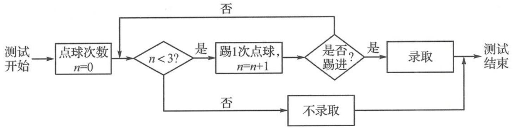

(I)下表是某同学6次的训练数据,以这150个点球中的进球频率代表其单次点球踢进的概率.为加入足球社团,该同学进行了“点球测试”,每次点球是否踢进相互独立,将他在测试中所踢的点球次数记为 $\xi$ ,求 $E(\xi)$ .

<table><tr><td>点球数</td><td>20</td><td>30</td><td>30</td><td>25</td><td>20</td><td>25</td></tr><tr><td>进球数</td><td>10</td><td>17</td><td>20</td><td>16</td><td>13</td><td>14</td></tr></table>

(Ⅱ)社团中的甲、乙、丙三名成员将进行传球训练,从甲开始随机地将球传给其他两人中的任意一人,接球者再随机地将球传给其他两人中的任意一人,如此不停地传下去,且假定每次传球都能被接到.记开始传球的人为第1次触球者,接到第 $n(n \in \mathbb{N}^{*})$ 次传球的人即为第 $n+1$ 次触球者,第n次触球者是甲的概率记为 $P_{n}$ .

(i) 求 $P_{1}, P_{2}, P_{3}$ ; (直接写出结果即可)

(ii) 证明: 数列 $\left\{P_{n}-\frac{1}{3}\right\}$ 为等比数列.

题 5 在某次校园科技节游园活动中,数学兴趣小组的摊位开展了一个特别的投骰子游戏. 如果玩家投中 1 或 6 可得 1 分,并且可以继续下一次投骰子;如果结果为 2 到 5 ,则游戏结束,但投骰子的次数最多不超过 $n(n > 2)$ 次.以 $X$ 表示游戏结束时玩家累计获得的分数.

(Ⅰ)求玩家至少获得2分的概率.

(Ⅱ)求 X 的分布列.

(Ⅲ)求 X 的数学期望.

# 研究路径探索
由上述例题的分析与解,我们可以得到数列模型问题解决的基本研究路径:

弄清楚问题情境,明确要解决问题的含义→基于情境分析事件关系→构建概率关系下的数列模型→研究递推数列并转化为等比数列→数列求和或求某一项明确其概率含义.

# 参考答案

# 第一章 计数原理 1.1 计数问题

题 1-1 【解析】“至多有一个数字是偶数”的含义是“有一个数字是偶数或不含偶数数字”，因此分成两类。其中，只有一个数字为偶数的四位数有 $C_{4}^{1}C_{5}^{3}A_{4}^{4}$ 个，没有偶数的四位数有 $A_{5}^{4}$ 个，所以共有 $C_{4}^{1}C_{5}^{3}A_{4}^{4} + A_{5}^{4} = 960 + 120 = 1080$ 个。
故答案为 1080.

【探讨】“至多有一个”的数学语言是“≤1”.

题 1-2 【解析】因为 A, B, C 都没有得到冠军，所以从 D, E, F 中选一个为冠军，有 $C_{3}^{1}$ 种情况.
因为 C 不是最后一名, B 的名次又在 C 之前, 所以最后一名有 $C_{3}^{1}$ 种情况.

剩下 4 人 4 个位置, 因为 B, C 定序, 所以有 $\frac{A_{4}^{4}}{A_{2}^{2}} = 12$ 种情况, 所以 6 人的名次排列有 $3 \times 3 \times 12 = 108$ 种不同情况.
答案选A.

题 1-3 【解析】根据字母 C 的位置分成六类, 又根据对称性, 最终可以分成三大类.

第一大类, 字母 C 排在左边第一个位置, 有 $A_{5}^{5}$ 种;

第二大类, 字母 C 排在左边第二个位置, 有 $A_{4}^{2}A_{3}^{3}$ 种;

第三大类, 字母 C 排在左边第三个位置, 有 $A_{2}^{2}A_{3}^{3} + A_{3}^{2}A_{3}^{3}$ 种.
由对称性可知, 共有 $2 \times (A_{5}^{5} + A_{4}^{2}A_{3}^{3} + A_{2}^{2}A_{3}^{3} + A_{3}^{2}A_{3}^{3}) = 480$ 种.
故答案选 A.

题 1-4 【解析】根据题意,分两步,先分析区域 A,B,E,再分析区域 C,D.

对于区域 A, B, E, 因为这三个区域两两相邻, 所以有 $A_{4}^{3}=24$ 种涂色的方法.

对于区域 C, D, 若区域 C 与区域 A 的颜色相同, 则区域 D 有 2 种涂法; 若区域 C 与区域 A 的颜色不同, 则区域 C 有 1 种涂法, 此时区域 D 也只有 1 种选法. 从而区域 C, D 有 $2 + 1 \times 1 = 3$ 种涂色的方法.
根据分步乘法原理,不同涂色的方法有 $24 \times 3 = 72$ 种.
答案选C.

题 1-5 【解析】(Ⅰ)四位数中的回文数只需排列前面的两位数字,后面的数字直接可以确定,但是第一位不能为0,有9(1\~9)种情况,第二位有10(0\~9)种情况,所以四位数中的回文数有 $9 \times 10 = 90$ 个.

(Ⅱ) $2n+1$ 位数中的回文数只需排列前面的 $n+1$ 位数字,后面的n个数字直接可以确定.同样第一位不能为0,有9种情况.接下来n项的每项有10种情况,根据分步乘法原理可知,个数为 $9\times10^{n}$ .

我们可以继续得到 $2n + 2$ 位数中的回文数也有 $9\times 10^{n}$ 个.
答案为(Ⅰ)90,(Ⅱ) $9\times10^{n}$ .

题 1-6 【解析】5 个节目的出场顺序共有 $A_{5}^{5}=120$ 种, 其中舞蹈节目相邻出场的有 $A_{2}^{2}A_{4}^{4}=48$ 种, 独唱节目相邻出场的有 $A_{2}^{2}A_{4}^{4}=48$ 种, 舞蹈节目相邻出场且独唱节目也相邻出场的有 $A_{2}^{2}A_{2}^{2}A_{3}^{3}=24$ 种.
所以相同类型的节目不能相邻出场的顺序有

120-48-48+24=48种.
答案为48.

【探讨】这里用到了集合元素数量的计算,记card(A)为集合A中元素的个数,则card(A∪B)=card(A)+card(B)-card(A∩B).

题 2-1 【解析】因为每名同学只去 1 个场馆，甲场馆从 6 个人中选 1 个人，有 $C_{6}^{1}$ 种结果；乙场馆从余下的 5 个人中选 2 个人，有 $C_{5}^{2}$ 种结果；余下的 3 个人去丙场馆.
因此，不同的安排方法共有 $C_{6}^{1}C_{5}^{2}=60$ 种.
答案选C.

题 2-2 【解析】根据题意, 可得排法共有 $C_{6}^{1}C_{5}^{1}C_{4}^{2}=180$ 种.
答案为180.

题 2-3 【解析】选 5 人的选法有 5 类, 分别为:

第一类,机关事业单位3人,企业单位1人,农民1人,有 $C_{3}^{3}C_{5}^{1}C_{2}^{1}$ 种;

第二类,机关事业单位1人,企业单位3人,农民1人,有 $C_{3}^{1}C_{5}^{3}C_{2}^{1}$ 种;

第三类,机关事业单位2人,企业单位2人,农民1人,有 $C_{3}^{2}C_{5}^{2}C_{2}^{1}$ 种;

第四类,机关事业单位2人,企业单位1人,农民2人,有 $C_{3}^{2}C_{5}^{1}C_{2}^{2}$ 种;

第五类,机关事业单位1人,企业单位2人,农民2人,有 $C_{3}^{1}C_{5}^{2}C_{2}^{2}$ 种.
$\begin{array}{r l} & {\text {由分类加法计数原理得} \mathrm{C} _ {3} ^ {3} \mathrm{C} _ {5} ^ {1} \mathrm{C} _ {2} ^ {1} + \mathrm{C} _ {3} ^ {1} \mathrm{C} _ {5} ^ {3} \mathrm{C} _ {2} ^ {1} +} \\ & {\mathrm{C} _ {3} ^ {2} \mathrm{C} _ {5} ^ {2} \mathrm{C} _ {2} ^ {1} + \mathrm{C} _ {3} ^ {2} \mathrm{C} _ {5} ^ {1} \mathrm{C} _ {2} ^ {2} + \mathrm{C} _ {3} ^ {1} \mathrm{C} _ {5} ^ {2} \mathrm{C} _ {2} ^ {2} = 1 0 + 6 0 + 6 0 + 1 5 + 3 0} \\ & {= 1 7 5.} \end{array}$
故第一巡回演讲团有 175 种组成方法.
答案选B.

题 2-4 【解析】先把 4 名女同学分到 4 个学雷锋志愿服务站, 分配方案有 A $_{4}^{4}$ 种; 再把 6 名男同学分到 4 个学雷锋志愿服务站, 每站至少 1 名, 由例题 1 的探讨知有 1560 种.
因此，共有 $\mathrm{A}_4^4\times 1560 = 37440$ 种分配方案.
答案选D.

题 2-5 【解析】若甲去, 则乙不去、丙去, 此时不同的选派方法数为 $C_{5}^{2}A_{4}^{4}=240$ 种;
若甲不去,则乙可能去也可能不去、丙不去,此时不同的选派方法数为 $C_{6}^{4}A_{4}^{4}=360$ 种.
综上所述, 不同的选派方案有 $360 + 240 = 600$ 种.
答案选C.

题2-6 【解析】把分配情况分为三类：

第一类， $A$ 组有3女1男， $B$ 组有1女3男，此时分配方法有 $\mathrm{C}_5^3\mathrm{C}_5^1\mathrm{C}_2^1\mathrm{C}_4^3 = 400$ 种；
第二类: A 组有 3 女 1 男, B 组有 2 女 2 男, 此时分配方法有 $C_{5}^{3}C_{5}^{1}C_{2}^{2}C_{4}^{2}=300$ 种;

第三类: A 组有 4 女 0 男, B 组有 1 女 3 男, 此时分配方法有 $C_{5}^{4}C_{1}^{1}C_{5}^{3}=50$ 种.

综上，分配方法共有 $400 + 300 + 50 = 750$ 种.
答案为750.

题2-7 【解析】因为6人乘坐的所有情况有 $\mathrm{C}_{6}^{2}\mathrm{A}_{2}^{2}+\mathrm{C}_{6}^{3}=15\times2+20=50$ 种，两个小孩单独乘坐一辆车的情况有 $\mathrm{C}_{2}^{1}=2$ 种，所以两个小孩不单独乘坐一辆车的不同乘车方式有 $50-2=48$ 种.
答案选A.

题 2-8 【解析】因为 $2+4+5=11$ 或 $1+2+3+5=11$ ，所以 5 个球放到编号为 2,4,5 的三个盒子中或放到编号为 1,2,3,5 的四个盒子中.

5个球放到编号为2,4,5的三个盒子中，有150种方法；
5 个球放到编号为 1,2,3,5 的四个盒子中,有 240 种方法.

综上,总的放球方法有 $150+240=390$ 种.
答案选C.

【探讨】先明确符合要求的数 11 的组成方式,试题就成了常规的分组分配问题了,150 和 240 直接取自例题中探讨的“常见分组分配表”.

## 1.2 二项式定理

题1-1 【解析】 $\left(x^{3} - \frac{1}{x}\right)^{4}$ 的展开式的通项为
$T _ {r + 1} = \mathrm{C} _ {4} ^ {r} (x ^ {3}) ^ {4 - r} \left(- \frac {1}{x}\right) ^ {r} = (- 1) ^ {r} \mathrm{C} _ {4} ^ {r} x ^ {1 2 - 4 r}.$
令 r=3，得常数项为 $T_{4}=(-1)^{3}C_{4}^{3}=-4$ 。
故答案为-4.

【探讨】展开式的常数项出现在第4项,也即r=3时出现,或者说此时 $4=1+3$ ,说明 $x^{3}$ 的指数在4中分到了1,而 $\frac{1}{x}$ 的指数在4中分到了3,从而出现了 $3\times1+(-1)\times3=0$ .也就是说幂指数4按照比例1:3分配了.

结论: 判断一个二项式 $(a+b)^{n}$ 的展开式是否存在常数项, 关键是看指数 n 是否可以将 a, b 的指数按比例分配.

题 1-2 【解析】如上分析, 若存在常数项, 则指数 n 必须按比例 $\frac{1}{2} : \frac{1}{3}$ , 即 3:2 的比例分配.
此时， $n = (3 + 2)k = 5k(k\in \mathbf{N}^{*})$
故最小的正整数 n 为 5.

题 1-3 【解析】要求 $x^{4}$ 的系数, 只需求 $\left(x-\frac{2}{x}\right)^{7}$ 的展开式中 $x^{3}$ 的系数.
注意到幂指数比为 1:1, 从而有 $7=5+2$ ,
于是 $x^{3}$ 的系数 $C_{7}^{2}(-2)^{2}=84$ ，
故 $x^4$ 的系数是84.

题 1-4 【解析】二项式中 x 的幂指数比为 2:1, 因此当 $6=2+4$ 时出现常数项, 从而常数项 $B=C_{6}^{4}a^{4}$ ;

出现 $x^{3}$ 项的系数比为 $6 = 4 + 2$ ，从而其系数 $A = \mathrm{C}_6^2 a^2$
注意到 $B = 4A$ ，即 $\mathrm{C}_6^4 a^4 = 4\mathrm{C}_6^2 a^2$ ，从而 $a^2 = 4$ ，又 $a > 0$
故 $a = 2$

题 1-5 【解析】 $\left(a^{2}+\frac{1}{a}\right)^{n}$ 的展开式的通项为 $T_{r+1}=C_{n}^{r}(a^{2})^{n-r}\left(\frac{1}{a}\right)^{r}=C_{n}^{r}a^{2n-3r}.$
令 2n-3r=3，即 $n=\frac{3r+3}{2}$ ，则当 r=1 时，n 取得最小值 3.
此时, 含 $a^{3}$ 的项为 $C_{3}^{1}a^{3}=3a^{3}$ , 所以 $a^{3}$ 的系数为 3.
故答案为3.

【探讨】当然,也可以采取上述分配的方案研究含 $a^{3}$ 项,注意到a的指数幂是2:1,所以要出现 $a^{3}$ 项,即2:1的比例分配.此时 $n=(2+1)k=3k(k\in\mathbf{N}^{*})$ ,因此最小的正整数n为3.

题 1-6 【解析】展开式中只有第 6 项的二项式系数最大,则展开式中第 6 项为中间项,所以总共有 11 项,n=10.

通项公式为 $T_{r + 1} = \mathrm{C}_{10}^{r}\left(\sqrt{x}\right)^{10 - r}\left(\frac{2}{x^2}\right)^r =$ $2^{r}\mathrm{C}_{10}^{r}x^{5 - \frac{5r}{2}}.$
令 $5 - \frac{5r}{2} = 0$ ，即 r = 2, $T_{3} = 2^{2}C_{10}^{2} = 180$ ，则展开式的常数项是 180.
故选B.

【探讨】对于常数项的处理,也可以采取比例分配的方式.若存在常数项,则指数10必须按4:1的比例分配.此时, $10=8+2$ ,因此 $T_{3}=2^{2}C_{10}^{2}=180$ .

题 1-7 【解析】 $\left(x+\frac{y^{2}}{x}\right)(x+y)^{5}=x(x+y)^{5}+\frac{y^{2}}{x}(x+y)^{5}$
其中 $x(x+y)^{5}$ 的展开式中 $x^{3}y^{3}$ 的系数为 $C_{5}^{3}=10$ ,
$\frac{y^{2}}{x}(x+y)^{5}$ 的展开式中 $x^{3}y^{3}$ 的系数为 $C_{5}^{1}=5$ ,
所以 $\left(x+\frac{y^{2}}{x}\right)(x+y)^{5}$ 的展开式中 $x^{3}y^{3}$ 的系数为 $10+5=15$ .
故答案选 C.

题 1-8 【解析】易知二项式系数之和为 $2^{n}=1024$ ，则 n=10。

展开式的通项为 $T_{k + 1} = \mathrm{C}_{10}^{k}\left(\frac{2}{x}\right)^{10 - k}(-x)^{k} =$ $\mathrm{C}_{10}^{k}(-1)^{k}2^{10 - k}x^{2k - 10}$
令 $2k - 10 = 4, k = 7$ ，则 $x^4$ 的系数为 $\mathrm{C}_{10}^{7}(-1)^{7}2^{10-7} = -960$ .
故选B.

题 2-1 【解析】观察结论与条件之间的关系， $\frac{a_{1}}{2}+\frac{a_{2}}{2^{2}}+\cdots+\frac{a_{2021}}{2^{2021}}$ 中出现了 $\frac{1}{2},\frac{1}{2^{2}},\cdots,\frac{1}{2^{2021}}$ ，这个系数显然取决于 x 的值。进行差异分析，当取 $x=\frac{1}{2}$ 时，等式右边与所求相同。
依题意,令 $x=\frac{1}{2}$ , 则由 $(1-2x)^{2021}=a_{0}+a_{1}x+\cdots+a_{2021}x^{2021}$ 得
$\left(1 - 2 \times \frac {1}{2}\right) ^ {2 0 2 1} = a _ {0} + \frac {a _ {1}}{2} + \frac {a _ {2}}{2 ^ {2}} + \dots + \frac {a _ {2 0 2 1}}{2 ^ {2 0 2 1}} = 0.$
令 x=0，得 $a_{0}=1$ 。所以 $\frac{a_{1}}{2}+\frac{a_{2}}{2^{2}}+\cdots+\frac{a_{2021}}{2^{2021}}=-1$ 。
故选C.

【探讨】回顾上述解题过程,我们看到,问题得以顺利解决的关键在于进行了差异分析,也即在于发现了条件与结论在结构上的异同.可见,在差异分析的观点下,取 $x=\frac{1}{2}$ 就不是一个妙手偶得的特殊技巧了,而是一个策略思想的具体实施,并且这一经验的积累,又与“特殊化”“整体处理赋值”的策略相通.在这个基础上形成了模式识别以及相关的解题经验.

结论: 在寻找结构一致性的过程中, 恰当地给 x 赋值是解决这类问题的关键.

题 2-2 【解析】 $a_{1}$ 为展开式中 $x^{3}$ 的系数, 所以 $a_{1}=C_{3}^{0}+C_{4}^{1}=5$ . 在多项式中, 令 x=1, 得
$1 + a _ {1} + a _ {2} + a _ {3} + a _ {4} = (1 - 1) ^ {3} + (1 + 1) ^ {4} = 1 6,$
所以 $a_{2}+a_{3}+a_{4}=16-5-1=10.$
故答案为 5;10.

【探讨】试题的两问分别聚焦某一项和某些项的系数问题,将两个多项式 $(x-1)^{3}$ , $(x+1)^{4}$ 逐一展开也不难得出问题的答案.

题 2-3 【解析】 $(2x^{2}+1)\left(\frac{a}{x^{2}}-1\right)^{5}$ 的展开式中各项系数之和为 0，令 x=1，得 $3(a-1)^{5}=0$ ，解得 a=1。

那么 $(2x^{2} + 1)\left(\frac{a}{x^{2}} -1\right)^{5} = (2x^{2} + 1)\left(\frac{1}{x^{2}} -1\right)^{5}$ $= 2x^{2}\left(\frac{1}{x^{2}} -1\right)^{5} + \left(\frac{1}{x^{2}} -1\right)^{5}.$
因为 $\left(\frac{1}{x^2} - 1\right)^5$ 的展开式的通项公式为 $T_{r+1} = C_5^r\left(\frac{1}{x^2}\right)^{5-r}(-1)^r = (-1)^r C_5^r x^{2r-10}$ , 所以展开式的常数项为 $2x^2 \times (-1)^4 C_5^4 x^{-2} + (-1)^5 C_5^5 x^0 = 10-1 = 9$ .
故选C.

题 2-4 【解析】令 x-1=t，则 $x=t+1$ .

原展开式可转化为 $(t^{2}+2t+2)(1+2t)^{7}=a_{0}+a_{1}t+a_{2}t^{2}+\cdots+a_{9}t^{9}$ .
令 t=0 ，得 $a_{0}=2$ ;
令 t=1，得 $a_{0}+a_{1}+a_{2}+\cdots+a_{9}=10935$ ;
令 t = -1，得 $a_{0} - a_{1} + a_{2} + \cdots - a_{9} = -1$ 。
所以 $a_{0}+a_{2}+a_{4}+a_{6}+a_{8}=\frac{10935-1}{2}=5467$ ,
则 $a_2 + a_4 + a_6 + a_8 = 5467 - a_0 = 5467 - 2 = 5465.$
故选D.

【探讨】已知的多项式并不是对 x 进行展开, 而是对 x-1 进行展开, 为了方便大家从整体上观察, 解析中进行了换元. 事实上, 在差异分析的观点下, 直接令 x=2, x=0, 则问题解决指向更清晰.

题 2-5 【解析】令 x=1，得到二项展开式的各项系数之和为 $(2-a)^{7}=1$ ，则 a=1，所以选项 A 正确；
展开式中二项式系数之和为 $2^{7}=128$ ，选项 B 错误；
展开式的通项为 $T_{r + 1} = (-1)^{r}2^{7 - r}\mathrm{C}_{7}^{r}x^{7 - 2r}$ ，令 $7 - 2r = 0$ ，得 $r = \frac{7}{2}\notin \mathbf{N}$ ，所以展开式中无常数项，选项C错误；
$\left(2x - \frac{1}{x}\right)^7$ 的展开式系数的绝对值之和为 $\left(2x + \frac{1}{x}\right)^7$ 的展开式各项系数之和，令 $x = 1$ ，得$(2+1)^{7}=3^{7}$ ，选项 D 正确.

综上，选 AD.

【探讨】基于某一个问题的多个角度进行设问是多项选择题的命制方向之一,本题要求学生对二项式定理掌握全面.

题 2-6 【解析】令 x=1，得 $(m-3)^{5}=1$ ，解得 m=4，
则 $\left(\frac{m}{x^2} - 4 + x^2\right)^5 = \left(\frac{4}{x^2} - 4 + x^2\right)^5 = \left[\left(\frac{4}{x^2} + x^2\right) - 4\right]^5,$

展开式的通项为 $\mathrm{C}_{5}^{r}\left(\frac{4}{x^{2}}+x^{2}\right)^{5-r}(-4)^{r}$ .
因为 $\left(\frac{4}{x^2} + x^2\right)^{5 - r}$ 的展开式的通项为 $C_{5 - r}^{k}\left(\frac{4}{x^2}\right)^{5 - r - k}(x^2)^k,$
所以 $\left(\frac{m}{x^2} - 4 + x^2\right)^5$ 的展开式为 $C_5^r C_{5-r}^k \left(\frac{4}{x^2}\right)^{5-r-k}$ （-4） $^r(x^2)^k = C_5^r C_{5-r}^k 4^{5-k}(-1)^r x^{4k+2r-10}$ .
令 $4k + 2r - 10 = 4$ ，得 $2k + r = 7$ （其中 $r \leqslant 5, k \leqslant 5 - r$ ）.
其中，当 k=2, r=3 时，对应的项为 $-640x^{4}$ ;
当 k=3, r=1 时，对应的项为 $-320x^{4}$ .
所以 $x^{4}$ 的系数为 -320 - 640 = -960.
故答案为-960.
$\begin{array}{l} \left. + a _ {2} + a _ {4} + \dots + a _ {2 0 2 0}\right) ^ {2} - \left(a _ {1} + a _ {3} + a _ {5} + \dots + a _ {2 0 1 9}\right) ^ {2} \\ = f （1） f (- 1) = 1. \\ \end{array}$

题 2-7 【解析】令 $f(x)=\left(\sqrt{2}-x\right)^{2020}$ ，则 $(a_{0})$
故选C.

【探讨】用到了平方差公式,你看出来了吗?

题 2-8 【解析】已知 $(2-\sqrt{x})^{n}$ 的展开式中 x 的系数为 $f(n)=C_{n}^{2}\times2^{n-2}$ ，则
$\begin{array}{l} \frac {2}{f （2）} + \frac {2 ^ {2}}{f （3）} + \frac {2 ^ {3}}{f （4）} + \dots + \frac {2 ^ {2 0 1 9}}{f (2 0 2 0)} \\ = \frac {2}{\mathrm{C} _ {2} ^ {2}} + \frac {2 ^ {2}}{\mathrm{C} _ {3} ^ {2} \times 2} + \frac {2 ^ {3}}{\mathrm{C} _ {4} ^ {2} \times 2 ^ {2}} + \dots + \frac {2 ^ {2 0 1 9}}{\mathrm{C} _ {2 0 2 0} ^ {2} \times 2 ^ {2 0 1 8}} \\ = \frac {2}{\mathrm{C} _ {2} ^ {2}} + \frac {2}{\mathrm{C} _ {3} ^ {2}} + \frac {2}{\mathrm{C} _ {4} ^ {2}} + \dots + \frac {2}{\mathrm{C} _ {2 0 2 0} ^ {2}} \\ \end{array}$
$\begin{array}{l} = \frac {2}{\frac {2 \times 1}{2}} + \frac {2}{\frac {3 \times 2}{2}} + \frac {2}{\frac {4 \times 3}{2}} + \dots + \frac {2}{\frac {2 0 0 0 \times 2 0 1 9}{2}} \\ = \frac {4}{2 \times 1} + \frac {4}{3 \times 2} + \frac {4}{4 \times 3} + \dots + \frac {4}{2 0 2 0 \times 2 0 1 9} \\ = 4 \times \left(\frac {1}{1} - \frac {1}{2} + \frac {1}{2} - \frac {1}{3} + \frac {1}{3} - \frac {1}{4} + \dots + \frac {1}{2 0 1 9} - \frac {1}{2 0 2 0}\right) \\ = 4 \times \left(1 - \frac {1}{2 0 2 0}\right) = \frac {2 0 1 9}{5 0 5}. \\ \end{array}$
故选B.

【探讨】先对通项进行研究方便我们判断下一步的解决方法， $\frac{2^{n-1}}{f(n)}=\frac{2^{n-1}}{C_{n}^{2}\times2^{n-2}}=\frac{2}{C_{n}^{2}}=\frac{4}{n(n-1)}=4\times\left(\frac{1}{n-1}-\frac{1}{n}\right)$ .

题 3-1 【解析】由 $6^{2021} + n = (5 + 1)^{2021} + n = 5^{2021} + C_{2021}^{1}5^{2020} + \cdots + C_{2021}^{2020}5 + 1 + n,$
其中 $C_{2021}^{0}5^{2021} + C_{2021}^{1}5^{2020} + \cdots + C_{2021}^{2020}5$ 能被 5 整除，

要满足 $6^{2021} + n$ 能被 5 整除, 只需 $1 + n$ 能被 5 整除, 所以 n = 4.
故答案为 4.

题 3-2 【解析】 $8^{2021}=(1+7)^{2021}=C_{2021}^{0}+C_{2021}^{1}7+C_{2021}^{2}7^{2}+\cdots+C_{2021}^{2021}7^{2021}$ ,
所以 $8^{2021}$ 被 7 除得余数为 1, 经过 $8^{2021}$ 天后是星期四.
故选C.

【探讨】一周的周期是7天,将 $8^{2021}$ 对7进行展开,只需计算常数项(不含7的项)就行了.

题 3-3 【解析】 $1.02^{6}=(1+0.02)^{6}=1+C_{6}^{1}\times0.02+C_{6}^{2}\times0.02^{2}+C_{6}^{3}\times0.02^{3}+\cdots+0.02^{6}\approx1+0.12+0.006\approx1.13.$
故选 B.

题 3-4 【解析】由二项式定理可得 $n = (1 + 8)^{10} = 9^{10} = (10 - 1)^{10} = (1 - 10)^{10}$
$= 1 - \mathrm{C} _ {1 0} ^ {1} 1 0 + \mathrm{C} _ {1 0} ^ {2} 1 0 ^ {2} - \dots + \mathrm{C} _ {1 0} ^ {1 0} 1 0 ^ {1 0}.$

等号右边除了第一项 1, 其余各项都是 10 的倍数. 所以 n 被 10 除所得余数为 1.
在选项中, 只有 21 被 10 除所得余数为 1.
故选B.

题 3-5 【解析】由题意知,2008 年该地区农民工资收入为
$\begin{array}{l} 1800\times (1 + 6\%) ^{5} = 1800\times (\mathrm{C}_{5}^{0} + \mathrm{C}_{5}^{1}\times 0.06 + \\ \mathrm{C} _ {5} ^ {2} \times 0. 0 6 ^ {2} + \mathrm{C} _ {5} ^ {3} \times 0. 0 6 ^ {3} + \dots) \\ = 1 8 0 0 \times (1 + 0. 3 + 0. 0 3 6 + \dots) > 2 4 0 4. 8. \\ \end{array}$

其他收入为 $1350+5\times160=2150$ .
所以 2008 年该地区农民人均收入约为 2404.8 + 2150 = 4554.8 元.
故选B.

【探讨】2004年全国有多个省市降低和免去了农业中各种税费,切实提高了农民的收入,各地各级政府也把农民工的清欠工作作为重大事情来抓.本题便是在这样的背景下产生的.本题考查数列综合应用能力及估算能力,也就是二项式定理的应用了.

# 第二章 概率 2.2 随机事件

### 2.2.1 概率模型

题 1-1 【解析】每人从 4 个不同的场馆中选择 2 个参观的方法有 $C_{4}^{2}$ 种, 则甲、乙两人每人选 2 个场馆的参观方法有 $C_{4}^{2}C_{4}^{2}$ 种.

甲、乙两人恰好参观同一个场馆的参观方法有 $\mathrm{C}_{4}^{1}\mathrm{C}_{3}^{1}\mathrm{C}_{2}^{1}$ 种.
所以甲、乙两人恰好参观同一个场馆的概率 $P = \frac{\mathrm{C}_4^1\mathrm{C}_3^1\mathrm{C}_2^1}{\mathrm{C}_4^2\mathrm{C}_4^2} = \frac{24}{36} = \frac{2}{3}.$
故答案为 $\frac{2}{3}$ .

【探讨】 $C_{4}^{1}C_{3}^{1}C_{2}^{1}$ 的含义是“选相同展馆×甲选第二个展馆×乙选第二个展馆”.

题 1-2 【解析】解法一: $P=\frac{C_{10}^{1}C_{3}^{2}C_{9}^{1}}{10^{3}}=\frac{27}{100}$ .
解法二: $P=1-\frac{C_{10}^{1}+A_{10}^{3}}{10^{3}}=\frac{27}{100}.$
故答案为 $\frac{27}{100}$ .

【探讨】解法一中分子的含义是“选相同数字×选位置×选第三个数字”; 解法二中分子的含义是“三位数字都相同+三位数字都不同”.

题 1-3 【解析】依题意得,甲、乙、丙、丁到三个不同的社区参加公益活动,每个社区至少分一名义工的方法数是 $C_{4}^{2}A_{3}^{3}$ , 其中甲被分到 A 社区的方法数是 $C_{3}^{2}A_{2}^{2}$ .
因此甲被分到 A 社区的概率 $P=\frac{C_{3}^{2}A_{2}^{2}}{C_{4}^{2}A_{3}^{3}}=\frac{1}{6}$ .
故选A.

【探讨】甲单独分到 A 社区表明乙、丙、丁三名义工分配到了 B, C 两个不同的社区, 每个社区至少分一名义工, 即 $C_{3}^{2}A_{2}^{2}$ .

题 1-4 【解析】1, 4, 9, 16, 25 的平均数为 $\frac{1}{5}(1+4+9+16+25)=11$ ，从 1, 4, 9, 16, 25 中任取两个数，基本事件总数为 $C_{5}^{2}=10$ ，小于 11 的数有 3 个，那么任取两个数包含的基本事件个数为 $C_{3}^{2}=3$ ，则它们均小于这五个数的平均数的概率为 $\frac{3}{10}$ .
故答案为 $\frac{3}{10}$ .

题 1-5 【解析】解本题合适的方法是画出树状图表示出传球事件.

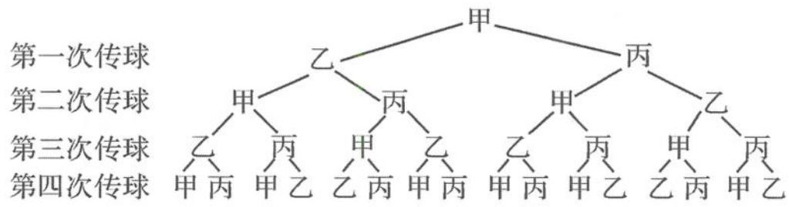
由树状图知,第四次传回甲的概率 $P=\frac{6}{16}=\frac{3}{8}$ .
故答案为 $\frac{3}{8}$ .

【探讨】因为甲、乙、丙三人都等可能地将球传给另外两个队友中的一个,所以由上述树状图得到的16个样本点发生的可能性是相等的,这是一个古典概率模型.

题 1-6 【解析】5 个快递送到 5 个地方有 $A_{5}^{5}=$ 120 种方法.
不妨假设快递 $A, B, C, D, E$ 对应的正确地方依次为甲、乙、丙、丁、戊，对于事件“全部送错”的方法数，可先分步：

第一步,快递 A 送错有 4 种可能情况.
第二步,考虑 A 所送位置对应的快递,不妨假设 A 送到了丙地.
第三步,考虑快递 C,对 C 分类:

第一类, C 送到甲地, 则剩下 B, D, E 要均送错有 2 种可能(丁、戊、乙, 戊、乙、丁).

第二类，C送到乙、丁、戊中的一个地方，有3种可能，如送到丁地，剩下的B,D,E只有甲、乙、戊三个地方可送，全送错有3种可能（甲、戊、乙；戊、甲、乙；戊、乙、甲）.
所以总的方法数为 $4 \times (1 \times 2 + 3 \times 3) = 44$ ，所求概率 $P = \frac{44}{120} = \frac{11}{30}$ .
故选C.

【探讨】需要注意“送错”和“全部送错”的区别，在计数原理的加持下，可以逐一列举出全送错的样本点.

题 1-7 【解析】所有的安排方法数为 $C_{5}^{3}A_{3}^{3} + C_{5}^{1} \times \frac{C_{4}^{2}C_{2}^{2}}{A_{2}^{2}} \times A_{3}^{3} = 10 \times 6 + 5 \times 3 \times 6 = 150$ (种).
若只有 1 人去冰球项目做志愿者, 有 $C_{4}^{1}\times\left(C_{4}^{1}+\frac{C_{4}^{2}C_{2}^{2}}{A_{2}^{2}}\right)\times A_{2}^{2}=4\times(4+3)\times2=56$ （种）;
若恰有 2 人去冰球项目做志愿者, 有 $C_{4}^{2}C_{3}^{1}A_{2}^{2}=6\times3\times2=36$ (种);
若有 3 人去冰球项目做志愿者,有 $C_{4}^{3}A_{2}^{2}=4\times2=8$ (种).
所以共有 $56+36+8=100$ 种安排法.
所以学生甲不会被安排到冰球比赛项目做志愿者的概率为 $\frac{100}{150}=\frac{2}{3}$ .
故选B.

【探讨】从冰球项目志愿者的人数进行分类这样来规划事情会比较自然.

题 1-8 【解析】从连续 7 天中随机选择 3 天, 有 $C_{7}^{3}=35$ 种选择. 其中恰好仅有 2 天连续, 把连续

的 2 天看成一个元素, 另外一天看成一个元素, 则这两个元素不相邻, 由插空法知有 $A_{5}^{2}=20$ 种选择.
所以所求的概率 $P=\frac{20}{35}=\frac{4}{7}$ .
故答案为 $\frac{4}{7}$ .

题 1-9 【解析】依题意得所拨数字共有 $C_{4}^{1}C_{4}^{2}=$ 24 种可能,要求所拨数字大于 200.
若上珠拨的是千位档或百位档,则所拨数字一定大于200,有 $C_{2}^{1}C_{4}^{2}=12$ 种;
若上珠拨的是个位档或十位档,则下珠一定要拨千位,再从个、十、百里选一个下珠,有 $C_{2}^{1}C_{3}^{1}=6$ 种.
则所拨数字大于 200 的概率为 $\frac{12+6}{24}=\frac{3}{4}$ ,
故选D.

题 1-10 【解析】对于选项 A, 甲从 M 到达 N, 需要走 6 步, 其中有 3 步向上走, 3 步向右走, 则甲从 M 到达 N 的方法有 $C_{6}^{3}=20$ 种, 选项 A 错误.

对于选项 B, 甲经过 $A_{2}$ 到达 N, 可分为两步:

第一步,甲从 M 经过 $A_{2}$ 需要走 3 步,其中 1 步向右走、2 步向上走,方法数为 $C_{3}^{1}$ 种;
第二步,甲从 $A_{2}$ 到 N 需要走 3 步,其中 1 步向上走、2 步向右走,方法数为 $C_{3}^{1}$ 种.
所以甲经过 $A_{2}$ 到达 N 的方法数为 $C_{3}^{1}C_{3}^{1}=9$ 种, 选项 B 正确.

对于选项 C, 甲经过 $A_{2}$ 的方法数为 $C_{3}^{1}C_{3}^{1}=9$ 种, 乙经过 $A_{2}$ 的方法数也为 $C_{3}^{1}C_{3}^{1}=9$ 种, 所以甲、乙两人在 $A_{2}$ 处相遇的方法数为 $C_{3}^{1}C_{3}^{1}C_{3}^{1}C_{3}^{1}=81$ , 甲、乙两人在 $A_{2}$ 处相遇的概率为 $\frac{81}{C_{6}^{3}C_{6}^{3}}=\frac{81}{400}$ , 选项 C 正确.

对于选项 D, 甲、乙两人沿最短路径行走, 只可能在 $A_{1}, A_{2}, A_{3}, A_{4}$ 处相遇.
若甲、乙两人在 $A_{1}$ 处相遇，甲经过 $A_{1}$ 处，则甲的前 3 步必须向上走，乙经过 $A_{1}$ 处，则乙的前 3 步必须向左走，两人在 $A_{1}$ 处相遇的走法种数为 1 种；
若甲、乙两人在 $A_{2}$ 处相遇，由选项 C 可知，走

法种数为 81 种；
若甲、乙两人在 $A_{3}$ 处相遇，甲到 $A_{3}$ 处，前3步有2步向右走，只有1步向右走，乙到 $A_{3}$ 处，前3步有2步向下走，只有1步向下走，所以，两人在 $A_{3}$ 处相遇的走法种数为 $\mathrm{C}_3^2\mathrm{C}_3^1\mathrm{C}_3^2\mathrm{C}_3^1 = 81$ 种；
若甲、乙两人在 $A_{4}$ 处相遇，甲经过 $A_{4}$ 处，则甲的前3步必须向右走，乙经过 $A_{4}$ 处，则乙的前3步必须向下走，两人在 $A_{4}$ 处相遇的走法种数为1种.
故甲、乙两人相遇的概率为 $\frac{1 + 81 + 81 + 1}{400} = \frac{41}{100}$ , 选项 D 正确.
故选 BCD.

题 2-1 【解析】(I)设“该校男生支持方案一”为事件 A, “该校女生支持方案一”为事件 B,
则 $P(A)=\frac{200}{200+400}=\frac{1}{3}, P(B)=\frac{300}{300+100}=\frac{3}{4}.$

(Ⅱ) $p_{0}>p_{1}$

【探讨】大家可能对本题的第(Ⅱ)问有疑问,为何不要求写证明过程?这跟命题意图有关,即概率统计不是四则运算,而是自觉地运用数据,提取相关信息,做出合理推断或决策.对概率统计的考查不是对复杂运算的考查,而是对概率统计思想的考查,这一点尤为要引起注意.第(Ⅱ)问, $P_{0}=\frac{350+150}{350+250+150+250}=\frac{1}{2},P_{2}=$ “该校一年级支持方案二的学生的概率”, $P_{2}=\frac{500\times\frac{350}{350+250}+300\times\frac{150}{150+250}}{500+300}=\frac{97}{192}$ ,则 $P_{1}=1-\frac{97}{192}=\frac{95}{192}<\frac{1}{2}=P_{0}$ .

题 2-2 【解析】(I)事件 A 的频数为 $60+50=110$ ，则 $P(A)$ 的估计值为 $\frac{110}{200}=\frac{11}{20}$ .

(Ⅱ)事件 B 的频数为 $30+30=60$ ，则 $P(B)$ 的估计值为 $\frac{60}{200}=\frac{3}{10}$ .

(Ⅲ)续保人本年度的平均保费估计值为
$\begin{array}{r l} & \overline {{x}} = \frac {1}{2 0 0} \times (0. 8 5 a \times 6 0 + a \times 5 0 + 1. 2 5 a \times 3 0 + \\ & 1. 5 a \times 3 0 + 1. 7 5 a \times 2 0 + 2 a \times 1 0) = 1. 1 9 2 5 a. \end{array}$

【探讨】本题的三问均是用频率估计概率,大家需要清晰频率与概率的区别与联系,因此作答时一定要强调“估计值”.在标准化考试时,没有强调“估计”,每问都会扣去1分.

题 2-3 【解析】由题意知,模拟打 3 局比赛甲恰好获胜 2 局的结果,经随机模拟产生了 20 组随机数,在 20 组随机数中表示打 3 局比赛甲恰好获胜 2 局的有 432,231,423,114,323,152,342,512,125,342,334,252,324,共 13 组随机数,所以所求概率的近似值为 $\frac{13}{20}=0.65$ .
故答案为0.65.

【探讨】随机模拟是新时代常见的概率计算方式,这个答案与直接运用甲、乙获胜概率和二项分布知识计算甲获得冠军的概率会略有不同.

题 2-4 【解析】(I)“其余情形”指一对夫妇中的男方、女方都不愿意生育二孩.
由 $x_{1}: x_{2}: x_{3} = 300: 100: 99$ ，可设 $x_{1} = 300n, x_{2} = 100n, x_{3} = 99n (n \in \mathbb{N}^{*})$ .
由已知得 $x_{1} + x_{2} + x_{3} = 49900$
所以 $300n+100n+99n=49900$ ，解得 n=100。
所以 $x_{1}=30000, x_{2}=10000, x_{3}=9900.$

(Ⅱ)一对夫妇中,原先的生育情况有以下5种.

第一胎生育的是双胞胎或多胞胎的有 100 对，
频率 $f_{1}=\frac{100}{100000}=\frac{1}{1000}$ ;

男方、女方都愿意生育二孩的有 50000 对, 频率 $f_{2}=\frac{50000}{100000}=\frac{1}{2}$ ;

男方愿意生育二孩但女方不愿意生育二孩的有30000对，频率 $f_{3}=\frac{30000}{100000}=\frac{3}{10}$ ;

男方不愿意生育二孩但女方愿意生育二孩的有10000对，频率 $f_{4}=\frac{10000}{100000}=\frac{1}{10}$ ;

其余情形即男方、女方都不愿意生育二孩的有9900对，频率 $f_{5}=\frac{9900}{100000}=\frac{99}{1000}$ .
由题意可知随机变量的可能取值为 15000, 25000, 5000,
对应概率的估计值 $P(\xi = 15000) = f_{1} = \frac{1}{1000}$
$P (\xi = 2 5 0 0 0) = f _ {2} + f _ {3} + f _ {4} = \frac {9}{1 0},$
$P (\xi = 5 0 0 0) = f _ {5} = \frac {9 9}{1 0 0 0}.$
所以随机变量 $\xi$ 的分布列为

<table><tr><td>ξ</td><td>15000</td><td>25000</td><td>5000</td></tr><tr><td>P</td><td> $\frac{1}{1000}$ </td><td> $\frac{9}{10}$ </td><td> $\frac{99}{1000}$ </td></tr></table>
$E(\xi)=15000\times\frac{1}{1000}+25000\times\frac{9}{10}+5000\times$ $\frac{99}{1000}=23010$ （元）.

### 2.2.2 关系运算

题 1-1 【解析】由题设知, $P(\text{甲})=P(\text{乙})=\frac{1}{6},P(\text{丙})=\frac{5}{36},P(\text{丁})=\frac{6}{36}=\frac{1}{6},P(\text{甲丙})=0,$ $P(\text{甲丁})=\frac{1}{36},P(\text{乙丙})=\frac{1}{36},P(\text{丙丁})=0.$
根据独立性的定义, 因为 $P(\text{甲丁}) = P(\text{甲}) \cdot P(\text{丁})$ , 则甲与丁相互独立, 选项 B 正确.

而 $P(\text{甲丙}) \neq P(\text{甲})P(\text{丙}), P(\text{乙丙}) \neq P(\text{乙})P(\text{丙}), P(\text{丙丁}) \neq P(\text{丙})P(\text{丁})$ ，所以其余选项错误.
故选B.

【探讨】本题考查独立性的判断,这个知识点也是全国卷高考第一次考查,教师反映试题简单,但不少学生反映试题较难,根本原因便是很多同学对判断事件独立性仅停留在直观感知这个层面上,对独立性的定义不理解自然看不出四个选项的区别.

题 1-2 【解析】由相互独立事件的概率的乘法计算公式, 可得选项 A 错误, 选项 B 正确;

事件 $\overline{A}$ 包含“视频甲未入选、图片乙入选”“视频甲入选、图片乙未入选”“视频甲、图片乙都未入选”三种情况，所以 $P(\overline{A}) = P(\overline{B}C) + P(B\overline{C}) + P(\overline{B}\overline{C})$ ，则 $P(\overline{A}) > P(\overline{B}C) + P(B\overline{C})$ ，所以选项C正确；
$P(\overline{B}C)=P(\overline{B})P(C)=\left(1-\frac{1}{a}\right)\cdot\frac{1}{b}=\frac{a-1}{ab},$ $P(B\overline{C})=P(B)P(\overline{C})=\frac{1}{a}\cdot\left(1-\frac{1}{b}\right)=\frac{b-1}{ab}$ ，因为 $a, b \in N^{*}, a > b > 1$ ，所以 $\frac{a-1}{ab} > \frac{b-1}{ab}$ ，即 $P(\overline{B}C) > P(B\overline{C})$ ，故选项 D 错误.

综上，选BC.

【探讨】因为 A=BC，那么 $\overline{A}=\overline{B}\overline{C}=\overline{B}\cup\overline{C}=\overline{B}C$ $\cup B\overline{C}\cup\overline{B}\overline{C}$ ，需要大家对并事件的定义有深刻的理解，另外还有 $\overline{B\cup C}=\overline{B}\overline{C}$ .

题 1-3 【解析】一个人三百六十行全都不如孔圣人的概率为 $0.99^{360} \approx 0.03$ ，三个人三百六十行都不如孔圣人的概率为 $0.03^{3} = 0.000027$ ，所以至少有一人在至少一个行业中胜过孔圣人的概率为 $1 - 0.000027 = 0.999973 = 99.9973\%$ .
故选B.

【探讨】事件“甲、乙、丙三人中至少有一人在至少一个行业中胜过孔圣人”的对立事件为“甲、乙、丙三人在三百六十行中全都不如孔圣人”，考虑复杂事件的对立事件计算概率一般会事半功倍。

题 2-1 【解析】甲、乙两个球落入盒子的概率分别为 $\frac{1}{2},\frac{1}{3}$ ,
则甲、乙两个球都落入盒子的概率为 $\frac{1}{2} \times \frac{1}{3} = \frac{1}{6}$ ,

甲、乙两个球至少有一个落入盒子的概率为 $1 - \left(1 - \frac{1}{2}\right)\left(1 - \frac{1}{3}\right) = 1 - \frac{1}{3} = \frac{2}{3}$ .
故答案为 $\frac{1}{6}, \frac{2}{3}$ .

【探讨】设甲球落入盒子为事件 A, 乙球落入盒子为事件 B，则 A, B 相互独立，事件“甲、乙两个球都落入盒子”=AB，事件“甲、乙两个球至少有一个落入盒子”=A∪B。一方面 $P(A \cup B)=P(A)+P(B)-P(AB)$ ，另一方面 $P(A \cup B)=P(A\overline{B})+P(\overline{A}B)+P(AB)$ ，还有 $P(A \cup B)=1-P(\overline{A \cup B})=1-P(\overline{A}\overline{B})$ 。我们可以看到运用不同视角下的关系运算都可以得出最后的答案。

题2-2 【解析】由题意得 $P(A) = \frac{C_2^1C_2^1 + C_2^1C_2^1}{4\times 4}$ $= \frac{1}{2}, P(B) = \frac{2}{4} = \frac{1}{2}, P(C) = \frac{2}{4} = \frac{1}{2}$ , 所以 $P(A)$ $= P(B) = P(C)$ , 故选项A正确;
$\begin{array}{r l} & {P (B C) = P (B) P (C) = \frac {1}{2} \times \frac {1}{2} = \frac {1}{4}, P (A C)} \\ & {= \frac {\mathrm{C} _ {2} ^ {1} \mathrm{C} _ {2} ^ {1}}{4 \times 4} = \frac {1}{4}, P (A B) = \frac {\mathrm{C} _ {2} ^ {1} \mathrm{C} _ {2} ^ {1}}{4 \times 4} = \frac {1}{4}, \text {所以} P (B C) =} \\ & {P (A C) = P (A B), \text {故选项B正确};} \end{array}$
所以 $P(ABC)=\frac{C_{2}^{1}C_{2}^{1}}{4\times4}=\frac{1}{4}$ ，故选项 C 错误；
$P(A)P(B)P(C)=\frac{1}{2}\times\frac{1}{2}\times\frac{1}{2}=\frac{1}{8}$ ，故选项D正确.
故选 ABD.

【探讨】值得注意的是,试题条件中并未告知事件 A,B,C 是两两独立还是相互独立,且我们不能直观感知(只有 B,C 相互独立可以).因此有同学可能会想当然地直接运用独立公式求解,进而误认为选项 C 也是正确的.只记公式表达式不知道公式适用的前提条件是我们的大忌.

题 2-3 【解析】由题意知,三个社团中该同学恰好能进入两个的概率为 $\frac{1}{5}$ ,则
$a b \left(1 - \frac {1}{2}\right) + \frac {1}{2} a (1 - b) + \frac {1}{2} b (1 - a) = \frac {1}{5},$
所以 $\frac{1}{2} (a + b) - \frac{1}{2} ab = \frac{1}{5}$ , 即 $a + b - ab = \frac{2}{5}$ .
所以该同学一个社团都不进入的概率
$\begin{array}{l} P = (1 - a) (1 - b) \left(1 - \frac {1}{2}\right) \\ = \frac {1}{2} [ 1 - (a + b) + a b ] = \frac {1}{2} \{1 - [ (a + b) - a b ] \} \\ \end{array}$
$= \frac {1}{2} \times \left(1 - \frac {2}{5}\right) = \frac {3}{1 0}.$
故选D.

【探讨】从上面的推导过程来看，a,b具体的值对最后的答案没有影响，这是为什么呢？事实上，设同学经过考核选拔通过该校的“羽毛球”“美术”“音乐”三个社团分别为事件A,B,C，则P(ABC)+P(ABC)= $\frac{1}{5}$ ，一个机遇数字是P(C)=P(ABC)+P(ABC)= $\frac{1}{5}$ ，则P(AB)=P(AB)=P(AB)=P(AB)= $\frac{1}{5}$ ，也即P(A∪B)= $\frac{2}{5}$ ，进而P(AB)=P(AB)=P(AB)= $\frac{3}{5}$ ，可以看到，P(AB) = P(AB) = P(AB) = $\frac{3}{5}$ ，可以看到，P(AB) = P(AB) = P(AB) = $\frac{3}{5}$ 。

题 2-4 【解析】甲、乙两人合起来共猜对三个谜语的所有情况包括:甲猜对 2 个且乙猜对 1 个、甲猜对 1 个且乙猜对 2 个.
若甲猜对2个且乙猜对1个，则概率为 $\frac{3}{4} \times \frac{3}{4} \times C_2^1 \times \frac{2}{3} \times \frac{1}{3} = \frac{1}{4}$ ;
若甲猜对 1 个且乙猜对 2 个, 则概率为 $C_{2}^{1} \times \frac{3}{4} \times \frac{1}{4} \times \frac{2}{3} \times \frac{2}{3} = \frac{1}{6}$ .
当比赛结束时,甲、乙两人合起来共猜对三个谜语的概率为 $\frac{1}{4}+\frac{1}{6}=\frac{5}{12}$ .
故答案为 $\frac{5}{12}$ .

【探讨】我们从随机变量的视角(二项分布)给出了上面的解析,也可以从随机事件关系运算的角度进行思考.设事件A=“甲猜对谜语”,B=“乙猜对谜语”,经过两轮比赛,设事件M=“甲、乙两人合起来共猜对三个谜语”,则 $M=\overline{A}ABB\cup A\overline{A}BB\cup AA\overline{B}B\cup AAB\overline{B}$ ,那么 $P(M)=2P(\overline{A}ABB)+2P(AA\overline{B}B)$ .

题 2-5 【解析】(I) 设事件 A 表示“甲被企业 M 正式录取”，事件 B 表示“乙被企业 M 正式录取”，事件 C 表示“丙被企业 M 正式录取”，则
$P (A) = \frac {1}{2} \times \frac {1}{3} = \frac {1}{6}, P (B) = P (C) = \frac {2}{3} \times \frac {1}{2} = \frac {1}{3}.$
所以甲、乙、丙三人中恰有一人被企业 $M$ 正式录取的概率
$\begin{array}{l} P _ {1} = P (A \bar {B} \bar {C} + \bar {A} B \bar {C} + \bar {A} \bar {B} C) = P (A) P (\bar {B}) P (\bar {C}) \\ + P (\bar {A}) P (B) P (\bar {C}) + P (\bar {A}) P (\bar {B}) P (C) \\ = \frac {1}{6} \times \left(1 - \frac {1}{3}\right) \times \left(1 - \frac {1}{3}\right) + 2 \times \left(1 - \frac {1}{6}\right) \times \\ \left(1 - \frac {1}{3}\right) \times \frac {1}{3} = \frac {4}{9}. \\ \end{array}$

（Ⅱ）设事件 D 表示“甲、乙、丙三人都没有被企业 M 正式录取”，则
$\begin{array}{r l} & P (D) = P (\overline {{A}} \overline {{B}} \overline {{C}}) = P (\overline {{A}}) P (\overline {{B}}) P (\overline {{C}}) = \\ & \left(1 - \frac {1}{6}\right) \times \left(1 - \frac {1}{3}\right) \times \left(1 - \frac {1}{3}\right) = \frac {1 0}{2 7}. \end{array}$
所以甲、乙、丙三人中至少有一人被企业 M 正式录取的概率 $P_{2}=1-P(D)=1-\frac{10}{27}=\frac{17}{27}$ .

题 2-6 【解析】(I)由题意知,样本中电影的总部数是 $140 + 50 + 300 + 200 + 800 + 510 = 2000$ ,

第四类电影中获得好评的电影部数是 $200 \times 0.25 = 50$ ，
故所求的概率为 $\frac{50}{2000}=0.025.$

(Ⅱ)设事件 A 为“从第四类电影中随机选出的电影获得好评”，事件 B 为“从第五类电影中随机选出的电影获得好评”.
故所求的概率为 $P(A\overline{B} + \overline{A} B) = P(A\overline{B}) + P(\overline{A} B) = P(A)[1 - P(B)] + [1 - P(A)]P(B).$
由题意知， $P(A)$ 估计为0.25， $P(B)$ 估计为0.2.
故所求的概率估计为 $0.25 \times 0.8 + 0.75 \times 0.2 = 0.35$ .

题 2-7 【解析】(I) 设部件 1 需要调整为事件 A, 部件 2 需要调整为事件 B, 部件 3 需要调整为事件 C，
由题意可知 $P(A)=0.1, P(B)=0.2, P(C)=0.3.$

部件 1,2 中至少有 1 个需要调整的概率为
$\begin{array}{r l} & 1 - [ 1 - P (A) ] [ 1 - P (B) ] = 1 - 0. 9 \times 0. 8 = \\ & 1 - 0. 7 2 = 0. 2 8. \end{array}$

(Ⅱ)根据题意,不妨设调整部件个数为2的事件为E,则 $E=\overline{A}BC+A\overline{B}C+AB\overline{C}$ .从而
$\begin{array}{l} P (E) = [ 1 - P (A) ] P (B) P (C) + P (A) [ 1 - \\ P (B) ] P (C) + P (A) P (B) [ 1 - P (C) ] \\ = 0. 9 \times 0. 2 \times 0. 3 + 0. 1 \times 0. 8 \times 0. 3 + 0. 1 \times \\ 0. 2 \times 0. 7 = 0. 0 9 2. \\ \end{array}$

题 2-8 【解析】设 $A_{i}$ = “甲是 A 组的第 i 株植物”， $B_{i}$ = “乙是 B 组的第 i 株植物”，事件 $C_{i}$ = “丙是 C 组的第 i 株植物”，i = 1, 2, 3, 4, 5, 6, 7.
由题意可知 $P(A_{i})=P(B_{i})=P(C_{i})=\frac{1}{7}$ .  
（1） 设 $D =$ “丙的高度小于 15 厘米”，则 $D = C_{1} \cup C_{2}$ .
又 $C_1$ 与 $C_2$ 互斥，所以 $P(D) = P(C_1 \cup C_2) = P(C_1) + P(C_2) = \frac{2}{7}$ .
故丙的高度小于 15 厘米的概率为 $\frac{2}{7}$ .  
（2）设 E=“甲的高度大于乙的高度”.
由题意知 $E = A_{4}B_{1}\cup A_{5}B_{1}\cup A_{6}B_{1}\cup A_{7}B_{1}\cup$ $A_{5}B_{2}\cup A_{6}B_{2}\cup A_{7}B_{2}\cup A_{6}B_{3}\cup A_{7}B_{3}\cup A_{7}B_{4},$
$\begin{array}{l} P (E) = P \left(A _ {4} B _ {1}\right) + P \left(A _ {5} B _ {1}\right) + P \left(A _ {6} B _ {1}\right) + \\ P \left(A _ {7} B _ {1}\right) + P \left(A _ {5} B _ {2}\right) + P \left(A _ {6} B _ {2}\right) + P \left(A _ {7} B _ {2}\right) + \\ P \left(A _ {6} B _ {3}\right) + P \left(A _ {7} B _ {3}\right) + P \left(A _ {7} B _ {4}\right) \\ = 1 0 P \left(A _ {4} B _ {1}\right) = 1 0 P \left(A _ {4}\right) P \left(B _ {1}\right) = \frac {1 0}{4 9}. \\ \end{array}$
故甲的高度大于乙的高度的概率为 $\frac{10}{49}$ .

【探讨】上面的解析我们是从随机事件关系运算的视角展开的,本题也可以从古典概型的角度进行思考.

题 2-9 【解析】(Ⅰ) 当 n=4 时, 第二个袋子中

有 2 白、2 红, 共 4 个球, 从中连续取出 3 个球 (每个取后不放回).

第三次取出白球的情况有: 红、红、白; 红、白、白; 白、红、白.
所以第三次取出白球的概率 $P = \frac{2}{4} \times \frac{1}{3} \times \frac{2}{2} + \frac{2}{4} \times \frac{2}{3} \times \frac{1}{2} + \frac{2}{4} \times \frac{2}{3} \times \frac{1}{2} = \frac{1}{2}$ .

（Ⅱ）设选出的是第 $k(k = 1,2,3,4)$ 个袋子，连续三次取球的方法数为 $4\times 3\times 2 = 24$

第三次取出的是白球的三次取球颜色有如下四种情形.

(白、白、白)，取法数为 $(4-k)(3-k)(2-k)$ ;

(白、红、白)，取法数为 $k(4-k)(3-k)$ ;

(红、白、白)，取法数为 $k(4-k)(3-k)$ ;

(红、红、白)，取法数为 $k(k-1)(4-k)$ .
从而第三次取出的是白球的种数为
$\begin{array}{r l} & (4 - k) (3 - k) (2 - k) + k (4 - k) (3 - k) + \\ & k (4 - k) (3 - k) + k (k - 1) (4 - k) = 3 \times 2 (4 - k), \end{array}$
在第 k 个袋子中,第三次取出的是白球的概率 $p_{k}=\frac{4-k}{4}.$

而选到第 $k$ 个袋子的概率为 $\frac{1}{4}$ , 故所求的概率
$\begin{array}{l} P = \sum_ {k = 1} ^ {4} p _ {k} \times \frac {1}{4} = \sum_ {k = 1} ^ {4} \frac {4 - k}{4} \times \frac {1}{4} \\ = \frac {1}{1 6} \sum_ {k = 1} ^ {4} (4 - k) = \frac {1}{1 6} \sum_ {i = 0} ^ {3} i = \frac {3}{8}. \\ \end{array}$

(Ⅲ)设选出的是第 k 个袋子, 连续三次取球的方法数为 $n(n-1)(n-2)$ .

第三次取出的是白球的三次取球颜色有如下四种情形.

（白、白、白），取法数为 $(n - k)(n - k - 1)(n - k - 2)$ ；
(白、红、白)，取法数为 $k(n-k)(n-k-1)$ ;

(红、白、白)，取法数为 $k(n-k)(n-k-1)$ ;

(红、红、白)，取法数为 $k(k-1)(n-k)$ .
从而第三次取出的是白球的种数为
$\begin{array}{l} \begin{array}{r l} & (n - k) (n - k - 1) (n - k - 2) + k (n - k) (n - k \\ & - 1) + k (n - k) (n - k - 1) + k (k - 1) (n - k) \end{array} \\ = (n - 1) (n - 2) (n - k). \\ \end{array}$
在第 $k$ 个袋子中，第三次取出的是白球的概率 $p_k = \frac{n - k}{n}$

而选到第 $k$ 个袋子的概率为 $\frac{1}{n}$ , 故所求的概率
$\begin{array}{l} P = \sum_ {k = 1} ^ {n} p _ {k} \cdot \frac {1}{n} = \sum_ {k = 1} ^ {n} \frac {n - k}{n} \cdot \frac {1}{n} = \frac {1}{n ^ {2}} \sum_ {k = 1} ^ {n} (n - k) \\ = \frac {1}{n ^ {2}} \sum_ {i = 0} ^ {n - 1} i = \frac {n - 1}{2 n}. \\ \end{array}$

### 2.2.3 概率公式

题 1-1 【解析】设同学成绩优秀为事件 A, 来自高二（20）班为事件 B,
由题意知 $P(A \mid B)=10\%$ , $P(B)=5\%$ , $P(A)=2\%$ .
因为 $P(A \mid B) = \frac{P(AB)}{P(B)} = \frac{P(AB)}{5\%}$ ，所以 $P(AB) = 0.005$ ，
则 $P(B|A)=\frac{P(AB)}{P(A)}=\frac{0.005}{2\%}=25\%$ .
故选D.

【探讨】从该年级任意选取一名同学,可以定义两个随机事件,A=“同学成绩优秀”,B=“同学来自高二（20）班”,再利用条件概率来刻画“高二（20）班有10%的同学成绩优秀”和“如果此人成绩优秀,则他来自高二（20）班”就顺理成章了,后面就只是纯粹的代数运算了.

题 1-2 【解析】对于选项 A, $P(M)=\frac{4}{10}\times\frac{6}{11}+\frac{3}{10}\times\frac{5}{11}+\frac{3}{10}\times\frac{5}{11}=\frac{54}{110}\neq\frac{1}{2}$ ，故选项 A 错误；
对于选项 B, $P(M \mid A_{1}) = \frac{P(MA_{1})}{P(A_{1})} = \frac{\frac{4 \times 6}{10 \times 11}}{\frac{4}{10}} = \frac{6}{11}$ ，故选项 B 正确；
对于选项 C, 因为 $P(M) \neq P(M \mid A_{1})$ , 或
$P(MA_{1})=\frac{4\times6}{10\times11}\neq P(M)P(A_{1})$ ，故选项C正确；
对于选项 D, $A_{1}$ , $A_{2}$ , $A_{3}$ 不可能同时发生, 故是两两互斥的事件, 故选项 D 正确.

综上,选 BCD.

【探讨】事实上,事件 $A_{1}, A_{2}, A_{3}$ 的提出降低了试题的难度,根据全概率公式有 $P(M) = P(A_{1})(M|A_{1}) + P(A_{2})P(M|A_{2}) + P(A_{3})(M|A_{3})$ , 而 $P(A_{1}), P(M|A_{1}), P(A_{2}), P(M|A_{2}), P(A_{3}), P(M|A_{3})$ 均很容易直接看出.

题 1-3 【解析】设事件 A=“机器可运行时间不少于 3 个月”，从 6 个部件 S 中任取 2 个，设事件 $B_{1}=$ “取到 2 个一等品”， $B_{2}=$ “取到 1 个一等品和 1 个二等品”， $B_{3}=$ “取到 2 个二等品”，
$\begin{array}{r l} & P (A) = P (B _ {1} A + B _ {2} A + B _ {3} A) = P (B _ {1} A) + \\ & P (B _ {2} A) + P (B _ {3} A) = P (A \mid B _ {1}) P (B _ {1}) + P (A \mid B _ {2}) \cdot \\ & P (B _ {2}) + P (A \mid B _ {3}) P (B _ {3}). \end{array}$
$\begin{array}{r l} & {\text {其中} P (B _ {1}) = \frac {\mathrm{C} _ {4} ^ {2}}{\mathrm{C} _ {6} ^ {2}} = \frac {2}{5}, P (B _ {2}) = \frac {\mathrm{C} _ {4} ^ {1} \mathrm{C} _ {2} ^ {1}}{\mathrm{C} _ {6} ^ {2}} = \frac {8}{1 5},} \\ & {P (B _ {3}) = \frac {\mathrm{C} _ {2} ^ {2}}{\mathrm{C} _ {6} ^ {2}} = \frac {1}{1 5}, P (A | B _ {1}) = 1, P (A | B _ {2}) = \frac {1}{2},} \\ & {P (A | B _ {3}) = \frac {1}{2} \times \frac {1}{2} = \frac {1}{4},} \end{array}$
则 $P(A)=\frac{2}{5}+\frac{8}{15}\times\frac{1}{2}+\frac{1}{15}\times\frac{1}{4}=\frac{41}{60}.$

【探讨】整个试验可分为两个环节,首先是从6个部件中选取2个,会有三种情况,“取到2个一等品”“取到1个一等品和1个二等品”“取到2个二等品”;其次是求不同的随机事件下部件的使用寿命了,全概率公式的运用顺理成章.

题 1-4 【解析】记 $A_{i}$ 为事件“零件为第 $i(i=1,2,3)$ 台车床加工”，B 为事件“任取一个零件为次品”，
则 $P(A_{1}) = 0.25, P(A_{2}) = 0.3, P(A_{3}) = 0.45.$

对于选项 A, 即 $P(A_{1}B)=P(A_{1})P(B|A_{1})=0.25\times0.06=0.015$ , 故选项 A 错误;

对于选项 B, $P(B) = P(A_{1})P(B|A_{1}) + P(A_{2})P(B|A_{2}) + P(A_{3})P(B|A_{3})$
$= 0. 2 5 \times 0. 0 6 + 0. 3 \times 0. 0 5 + 0. 4 5 \times 0. 0 5 = 0. 0 5 2 5, \text { 故选项   B   正确 };$

对于选项 C, $P(A_{2} \mid B)=\frac{P(A_{2})P(B \mid A_{2})}{P(B)}=$ $\frac{0.3\times0.05}{0.0525}=\frac{2}{7}$ ，故选项 C 正确；
对于选项 D, $P(A_{3} \mid B)=\frac{P(A_{3})P(B \mid A_{3})}{P(B)}=$ $\frac{0.45\times0.05}{0.0525}=\frac{3}{7}$ ，故选项D错误.
故选BC.

【探求】本题四个选项都是围绕着概率公式来进行设计的,具有典型性.其中选项A聚焦的是条件概率公式,选项B聚焦的是全概率公式,选项C,D聚焦贝叶斯公式.在使用公式的时候一定要明确事件的含义.选项A设计成诱误项,是因为学生容易漏看“加工出来的零件混放在一起”而将“任取一个零件是第1台生产出来的次品”等价于“第1台加工的次品率为6%”.选项B中全概率公式应该不难理解,因为“任取一个零件是次品”可以是这三台车床加工的,因此采取全概率公式处理.

题 1-5 【解析】(Ⅰ) 设 $A_{i}$ = “第 i 场比赛甲获胜”, $B_{i}$ = “第 i 场比赛甲获平”, $C_{i}$ = “第 i 场比赛甲获负”, 其中 i = 1, 2, 3, 事件“三轮比赛结束后甲的积分为 3 分” = $(B_{1}B_{2}B_{3})\cup(A_{1}C_{2}C_{3})\cup(C_{1}A_{2}C_{3})\cup(C_{1}C_{2}A_{3})$ ,
$\begin{array}{r l} & {\text {所以} P (X = 3) = P (B _ {1} B _ {2} B _ {3}) + P (A _ {1} C _ {2} C _ {3}) +} \\ & {P (C _ {1} A _ {2} C _ {3}) + P (C _ {1} C _ {2} A _ {3}) = 4 \times \left(\frac {1}{3}\right) ^ {3} = \frac {4}{2 7}.} \end{array}$

（Ⅱ）将第3场比赛中甲胜、平、负分别记为 $M_{1}$ ， $M_{2}, M_{3}$ ，将第3场比赛乙胜、平、负分别记为 $N_{1}$ ， $N_{2}, N_{3}$ ，
则样本空间 $\Omega = (M_1N_1)\cup (M_1N_2)\cup$ $(M_{1}N_{3})\cup (M_{2}N_{1})\cup (M_{2}N_{2})\cup (M_{2}N_{3})\cup$ $(M_3N_1)\cup (M_3N_2)\cup (M_3N_3),$

且 $P(M_{i}N_{i}) = \frac{1}{3}\times \frac{1}{3} = \frac{1}{9}.$

各基本事件对应甲、乙、丙、丁四支球队的积分

如下表.

<table><tr><td>基本事件</td><td> $M_{1}N_{1}$ </td><td> $M_{1}N_{2}$ </td><td> $M_{1}N_{3}$ </td><td> $M_{2}N_{1}$ </td><td> $M_{2}N_{2}$ </td></tr><tr><td>积分</td><td>6,6,0,6</td><td>6,4,1,6</td><td>6,3,3,6</td><td>4,6,0,7</td><td>4,4,1,7</td></tr><tr><td>结果</td><td>3队抽签</td><td>甲出线</td><td>甲出线</td><td>甲淘汰</td><td>2队抽签</td></tr><tr><td>基本事件</td><td> $M_{2}N_{3}$ </td><td> $M_{3}N_{1}$ </td><td> $M_{3}N_{2}$ </td><td> $M_{3}N_{3}$ </td><td></td></tr><tr><td>积分</td><td>4,3,3,7</td><td>3,6,0,9</td><td>3,4,1,9</td><td>3,3,3,9</td><td></td></tr><tr><td>结果</td><td>甲出线</td><td>甲淘汰</td><td>甲淘汰</td><td>3队抽签</td><td></td></tr></table>
设 S=“积分相同队伍抽签抽到甲队”，则 $P(S|M_{1}N_{1})=\frac{2}{3},P(S|M_{2}N_{2})=\frac{1}{2},P(S|M_{3}N_{3})=\frac{1}{3}.$
设 $W =$ “甲球队能出线”，则 $W = (M_{1}N_{1}S)\cup (M_{1}N_{2})\cup (M_{1}N_{3})\cup (M_{2}N_{2}S)\cup (M_{2}N_{3})\cup (M_{3}N_{3}S),$
$\begin{array}{l} = P \left(S \mid M _ {1} N _ {1}\right) P \left(M _ {1} N _ {1}\right) + P \left(M _ {1} N _ {2}\right) + \\ \begin{array}{l} P (M _ {1} N _ {3}) + P (S | M _ {2} N _ {2}) P (M _ {2} N _ {2}) + P (M _ {2} N _ {3}) + \\ P (S | M _ {3} N _ {3}) P (M _ {3} N _ {3}) \end{array} \\ = \frac {2}{3} \times \frac {1}{9} + \frac {1}{9} + \frac {1}{9} + \frac {1}{2} \times \frac {1}{9} + \frac {1}{9} + \frac {1}{3} \times \frac {1}{9} \\ = \frac {1}{2}. \\ \end{array}$
故 $P(W) = P(M_{1}N_{1}S) + P(M_{1}N_{2}) +$ $P(M_{1}N_{3}) + P(M_{2}N_{2}S) + P(M_{2}N_{3}) + P(M_{3}N_{3}S)$
故甲球队能出线的概率为 $\frac{1}{2}$ .

【探求】本题的求解充分展示了样本空间的意义,利用表格的形式将所有的样本点列出,这样就能算出相应的积分,以及判断甲球队出线的情况(直接出线、直接淘汰或抽签决定),在此过程中,关系运算(互斥事件)和条件概率都得到了运用.

题 1-6 【解析】(Ⅰ)记事件 M 为第 1 管血样检测结果呈阳性,事件 N 为总共进行 4 次检测,
则 $P(M)=\frac{A_{2}^{1}}{A_{7}^{1}}=\frac{2}{7}, P(MN)=\frac{A_{2}^{2}A_{5}^{2}}{A_{7}^{4}}=\frac{1}{21}.$
从而所求的概率 $P(N|M)=\frac{P(MN)}{P(M)}=\frac{\frac{1}{21}}{\frac{2}{7}}$
$= \frac {1}{6}.$
所以医学硕士 A 在第 1 管血样检测结果呈阳性的条件下, 总共进行了 4 次检测的概率为 $\frac{1}{6}$ .

(Ⅱ)检测进行了6次,说明前5次只检测出一管阳性,不管第六次检测的结果是阳性还是阴性,都能找到两管阳性血样,从而所求的概率 $P=\frac{C_{2}^{1}A_{5}^{1}A_{5}^{4}}{A_{7}^{5}}=\frac{10}{21}$ .   
(Ⅲ)由已知可得 A, B, C 三名医学硕士有一人识别成功的概率
$\begin{array}{r l} & P _ {1} = 0. 6 (1 - a) ^ {2} + (1 - 0. 6) \times C _ {2} ^ {1} a (1 - a) = \\ & 0. 2 (1 - a) (3 + a); \end{array}$

有两人识别成功的概率 $P_{2}=0.6\times C_{2}^{1}a(1-a)+(1-0.6)a^{2}=0.4a(3-2a)$ .
$\begin{array}{r l} & P _ {1} - P _ {2} = 0. 2 (1 - a) (3 + a) - 0. 4 a (3 - 2 a) = \\ & 0. 2 (3 a ^ {2} - 8 a + 3). \end{array}$
由 $3a^{2} - 8a + 3 > 0$ 且 $0 < a < 1$ ，得 $0 < a < \frac{4 - \sqrt{7}}{3}$
由 $3a^{2} - 8a + 3 < 0$ 且 $0 < a < 1$ ，得 $\frac{4 - \sqrt{7}}{3} < a < 1$
由 $3a^{2}-8a+3=0$ 且 0<a<1，得 $a=\frac{4-\sqrt{7}}{3}$ .
所以, 当 $\frac{4-\sqrt{7}}{3}<a<1$ 时, $P_{2}>P_{1}$ , 即 A, B, C
三名医学硕士中有一人识别病毒成功的概率小于有两人识别病毒成功的概率；
当 $0 < a < \frac{4 - \sqrt{7}}{3}$ 时， $P_{1} > P_{2}$ ，即 A, B, C 三名医学硕士中有一人识别病毒成功的概率大于有两人识别病毒成功的概率；
当 $a=\frac{4-\sqrt{7}}{3}$ 时， $P_{1}=P_{2}$ ，即 A, B, C 三名医学硕士中有一人识别病毒成功的概率等于有两人识别病毒成功的概率.

【探求】本题的前两问的概率模型事实上就是古典概型,其样本数的计算则是排列问题,我们可以运用排列的知识快速解决. 第(Ⅲ)问的探究性较强, 计算出相应的概率后, 再运用不等式的知识进行大小比较.

## 2.3 随机变量

### 2.3.1 随机变量与数字特征

题 1 【解析】(Ⅰ)依题意知, $P(X=2)$ 所包含的事件为“甲连赢两球或乙连赢两球”,
所以 $P(X = 2) = 0.5 \times 0.4 + 0.5 \times 0.6 = 0.5$ .

(Ⅱ)依题意知,设“X=4 且甲获胜”为事件 A, 则 A 为“前两球甲、乙各得 1 分, 后两球均为甲得分”,
所以 $P(A)=0.5\times0.6\times0.5\times0.4+0.5\times0.4$ $\times0.5\times0.4=0.1.$
所以事件“X=4 且甲获胜”的概率为 0.1.

题 2 【解析】(I) 记“该甲、乙、丙三项新技术被攻克”分别为事件 A, B, C,
则 $P(A)=\frac{3}{5}, P(B)=\frac{2}{3}, P(C)=\frac{1}{2}.$
$\begin{array}{r l} & {\text {该科研团队获得60万元科研经费的概率为}} \\ & {P (A \overline {{{B}}} \overline {{{C}}}) + P (\overline {{{A}}} B C) = \frac {3}{5} \times \frac {1}{3} \times \frac {1}{2} + \frac {2}{5} \times \frac {2}{3} \times \frac {1}{2} =} \\ & {\frac {1}{1 0} + \frac {2}{1 5} = \frac {7}{3 0}.} \end{array}$

(Ⅱ) X 所有可能的取值为 0, 20, 40, 60, 80, 100, 120, 则
$P (X = 0) = P (\overline {{A}} \overline {{B}} \overline {{C}}) = \frac {2}{5} \times \frac {1}{3} \times \frac {1}{2} = \frac {1}{1 5},$
$P (X = 2 0) = P (\bar {A} \bar {B} C) = \frac {2}{5} \times \frac {1}{3} \times \frac {1}{2} = \frac {1}{1 5},$
$P (X = 4 0) = P (\bar {A} B \bar {C}) = \frac {2}{5} \times \frac {2}{3} \times \frac {1}{2} = \frac {2}{1 5},$
$P (X = 6 0) = \frac {7}{3 0},$
$P (X = 8 0) = P (A \bar {B} C) = \frac {3}{5} \times \frac {1}{3} \times \frac {1}{2} = \frac {1}{1 0},$
$P (X = 1 0 0) = P (A B \bar {C}) = \frac {3}{5} \times \frac {2}{3} \times \frac {1}{2} = \frac {1}{5},$
$P (X = 1 2 0) = P (A B C) = \frac {3}{5} \times \frac {2}{3} \times \frac {1}{2} = \frac {1}{5}.$
所以 $X$ 的分布列为

<table><tr><td>X</td><td>0</td><td>20</td><td>40</td><td>60</td><td>80</td><td>100</td><td>120</td></tr><tr><td>P</td><td> $\frac{1}{15}$ </td><td> $\frac{1}{15}$ </td><td> $\frac{2}{15}$ </td><td> $\frac{7}{30}$ </td><td> $\frac{1}{10}$ </td><td> $\frac{1}{5}$ </td><td> $\frac{1}{5}$ </td></tr></table>
所以 $E(X)=0\times\frac{1}{15}+20\times\frac{1}{15}+40\times\frac{2}{15}+60\times$ $\frac{7}{30}+80\times\frac{1}{10}+100\times\frac{1}{5}+120\times\frac{1}{5}=\frac{218}{3}$ （万元）.

题 3 【解析】(Ⅰ)X 的所有可能取值为 0,1,2,3,则
$P (X = 0) = \frac {1}{2} \times \frac {2}{3} \times \frac {3}{4} = \frac {1}{4},$
$P (X = 1) = \frac {1}{2} \times \frac {2}{3} \times \frac {3}{4} + \frac {1}{2} \times \frac {1}{3} \times \frac {3}{4} + \frac {1}{2} \times$
$\frac {2}{3} \times \frac {1}{4} = \frac {1 1}{2 4},$
$P (X = 2) = \frac {1}{2} \times \frac {1}{3} \times \frac {1}{4} + \frac {1}{2} \times \frac {2}{3} \times \frac {1}{4} + \frac {1}{2} \times$
$\frac {1}{3} \times \frac {3}{4} = \frac {1}{4},$
$P (X = 3) = \frac {1}{2} \times \frac {1}{3} \times \frac {1}{4} = \frac {1}{2 4}.$
所以 $X$ 的分布列为

<table><tr><td>X</td><td>0</td><td>1</td><td>2</td><td>3</td></tr><tr><td>P</td><td> $\frac{1}{4}$ </td><td> $\frac{11}{24}$ </td><td> $\frac{1}{4}$ </td><td> $\frac{1}{24}$ </td></tr></table>
所以 X 的数学期望 $E(X)=0\times\frac{1}{4}+1\times\frac{11}{24}+$ $2 \times \frac{1}{4} + 3 \times \frac{1}{24} = \frac{13}{12}.$

(Ⅱ)设 Y 表示第一辆车遇到红灯的个数, Z 表示第二辆车遇到红灯的个数, 则所求事件的概率为
$P (Y + Z = 1) = P (Y = 0, Z = 1) + P (Y = 1,$
$Z = 0) = P (Y = 0) P (Z = 1) + P (Y = 1) P (Z = 0)$
$= \frac {1}{4} \times \frac {1 1}{2 4} + \frac {1 1}{2 4} \times \frac {1}{4} = \frac {1 1}{4 8}.$
所以,这两辆车共遇到1个红灯的概率为 $\frac{11}{48}$ .

题 4 【解析】(Ⅰ)(i)对每组进行检测,需要

10 次; 再对结果为阳性的组每个人进行检测, 需要 10 次. 所以总检测次数为 20 次.

(ii)由题意,2名患者在同一组需检测20次,不在同一组需检测30次,所以X可以取20,30,则
$P (X = 2 0) = \frac {1}{1 1}, P (X = 3 0) = 1 - \frac {1}{1 1} = \frac {1 0}{1 1}.$
所以 $X$ 的分布列为

<table><tr><td>X</td><td>20</td><td>30</td></tr><tr><td>P</td><td> $\frac{1}{11}$ </td><td> $\frac{10}{11}$ </td></tr></table>
所以 $E(X) = 20 \times \frac{1}{11} + 30 \times \frac{10}{11} = \frac{320}{11}$ .

（Ⅱ）由题意，2名患者在同一组需检测25次，不在同一组需检测30次，Y可以取25,30，则2名感染者在同一组的概率 $P_{1}=\frac{C_{20}^{1}C_{2}^{2}C_{98}^{3}}{C_{100}^{5}}=\frac{4}{99}$ ，不在同一组的概率 $P_{2}=\frac{95}{99}$ ，
则 $E(Y) = 25 \times \frac{4}{99} + 30 \times \frac{95}{99} = \frac{2950}{99} > E(X)$ .

题 5 【解析】(I)3 天共卖出 15 个蛋糕可分成 3 类:

①每天都卖出5个蛋糕的概率为 $\left(\frac{1}{4}\right)^{3}=\frac{1}{64}$ ;  
②3 天分别卖出 4,5,6 个蛋糕的概率为 $A_{3}^{3}\left(\frac{1}{4}\right)^{3}=\frac{6}{64};$   
③有 2 天卖出 6 个, 有 1 天卖出 3 个蛋糕的概率为 $C_{3}^{1}\left(\frac{1}{4}\right)^{3}=\frac{3}{64}$ .
因此，店 A 在 3 天共卖出 15 个蛋糕的概率为 $\frac{1}{64} + \frac{6}{64} + \frac{3}{64} = \frac{5}{32}$ .

(Ⅱ)由题意知,因为店 A 和店 B 均最多卖 6 个蛋糕,所以要么给店 A 分配 4 个蛋糕,店 B 分配 6 个蛋糕;要么给店 A 分配 5 个蛋糕,店 B 分配 5 个蛋糕;要么给店 A 分配 6 个蛋糕,店 B 分配 4 个蛋糕.

①若给店 A 分配 4 个蛋糕, 店 B 分配 6 个蛋糕, 则

<table><tr><td>X</td><td>3</td><td>4</td></tr><tr><td>P</td><td> $\frac{1}{4}$ </td><td> $\frac{3}{4}$ </td></tr></table>

<table><tr><td>Y</td><td>2</td><td>4</td><td>6</td></tr><tr><td>P</td><td> $\frac{1}{6}$ </td><td> $\frac{1}{3}$ </td><td> $\frac{1}{2}$ </td></tr></table>
$\begin{array}{l} E (X) + E (Y) = \left(3 \times \frac {1}{4} + 4 \times \frac {3}{4}\right) + \left(2 \times \frac {1}{6} + \right. \\ \left. 4 \times \frac {1}{3} + 6 \times \frac {1}{2}\right) = \frac {1 0 1}{1 2} \approx 8. 4 2. \\ \end{array}$

②若给店 A 分配 5 个蛋糕, 店 B 分配 5 个蛋糕, 则

<table><tr><td>X</td><td>3</td><td>4</td><td>5</td></tr><tr><td>P</td><td> $\frac{1}{4}$ </td><td> $\frac{1}{4}$ </td><td> $\frac{1}{2}$ </td></tr></table>

<table><tr><td>Y</td><td>2</td><td>4</td><td>5</td></tr><tr><td>P</td><td> $\frac{1}{6}$ </td><td> $\frac{1}{3}$ </td><td> $\frac{1}{2}$ </td></tr></table>
$E (X) + E (Y) = \left(3 \times \frac {1}{4} + 4 \times \frac {1}{4} + 5 \times \frac {1}{2}\right) +$
$\left(2 \times \frac {1}{6} + 4 \times \frac {1}{3} + 5 \times \frac {1}{2}\right) = \frac {1 0 1}{1 2} \approx 8. 4 2.$

③若给店 A 分配 6 个蛋糕, 店 B 分配 4 个蛋糕, 则

<table><tr><td>X</td><td>3</td><td>4</td><td>5</td><td>6</td></tr><tr><td>P</td><td> $\frac{1}{4}$ </td><td> $\frac{1}{4}$ </td><td> $\frac{1}{4}$ </td><td> $\frac{1}{4}$ </td></tr></table>

<table><tr><td>Y</td><td>2</td><td>4</td></tr><tr><td>P</td><td> $\frac{1}{6}$ </td><td> $\frac{5}{6}$ </td></tr></table>
$\begin{array}{l} E (X) + E (Y) = \left(3 \times \frac {1}{4} + 4 \times \frac {1}{4} + 5 \times \frac {1}{4} + 6 \times \right. \\ \left. \frac {1}{4}\right) + \left(2 \times \frac {1}{6} + 4 \times \frac {5}{6}\right) = \frac {4 9}{6} \approx 8. 1 7. \\ \end{array}$
综上所述,给店 A 分配 4 个蛋糕,店 B 分配 6 个蛋糕或给店 A 分配 5 个蛋糕,店 B 分配 5 个蛋糕最优.

题 6 【解析】(I)由题意可知,两种支付方式都使用的人数为 100-30-25-5=40(人),
则该学生上个月 A, B 两种支付方式都使用的概率 $P = \frac{40}{100} = \frac{2}{5}$ .

(Ⅱ)由题意可知,在仅使用 A 支付方式的学生中,支付金额不大于 1000 元的人数占 $\frac{3}{5}$ ,支付金额大于 1000 元的人数占 $\frac{2}{5}$ ; 在仅使用 B 支付方式的学生中,支付金额不大于 1000 元的人数占 $\frac{2}{5}$ ,支付金额大于 1000 元的人数占 $\frac{3}{5}$ .

X 所有可能的取值为 0,1,2,则
$P (X = 0) = \frac {3}{5} \times \frac {2}{5} = \frac {6}{2 5}, P (X = 1) = \left(\frac {3}{5}\right) ^ {2} +$
$\left(\frac {2}{5}\right) ^ {2} = \frac {1 3}{2 5}, P (X = 2) = \frac {3}{5} \times \frac {2}{5} = \frac {6}{2 5}.$
所以 $X$ 的分布列为

<table><tr><td>X</td><td>0</td><td>1</td><td>2</td></tr><tr><td>P</td><td>6/25</td><td>13/25</td><td>6/25</td></tr></table>
所以 X 的数学期望 $E(X)=0\times\frac{6}{25}+1\times\frac{13}{25}+$ $2 \times \frac{6}{25} = 1.$

(Ⅲ)我们不认为样本仅使用 A 的学生中本月支付金额大于 2000 元的人数有变化. 理由: 随机事件在一次随机试验中是否发生是随机的, 是不能预知的, 随着试验次数的增多, 频率越来越稳定于概率. 学校是一个消费相对稳定的地方, 每个学生根据自己的实际情况每个月的消费金额应该相对固定, 出现题中这种现象可能是发生了“小概率事件”.

题 7 【解析】(Ⅰ) 记试验甲、乙、丙成功分别为事件 A, B, C，且相互独立，

记事件 D 为“对试验甲、乙、丙各进行一次，至少成功一次”，
则 $P(D)=1-P(\overline{A}\overline{B}\overline{C})=1-\frac{1}{4}\times\frac{1}{3}\times\frac{1}{2}$ $=\frac{23}{24}.$

(Ⅱ)由题意可知,随机变量 X 的可能取值有 0,

1,4,8,
则 $P(X=0)=1-\frac{3}{4}=\frac{1}{4}$ ,
$P (X = 1) = \frac {3}{4} \times \left[ 1 - \left(\frac {2}{3}\right) ^ {2} \right] = \frac {5}{1 2},$
$\begin{array}{r l} & P (X = 4) = \frac {3}{4} \times \left(\frac {2}{3}\right) ^ {2} \times \left[ C _ {3} ^ {1} \left(\frac {1}{2}\right) ^ {3} + \left(\frac {1}{2}\right) ^ {3} \right] \\ & = \frac {1}{6}, \end{array}$
$\begin{array}{r l} & P (X = 8) = \frac {3}{4} \times \left(\frac {2}{3}\right) ^ {2} \times \left[ C _ {3} ^ {2} \left(\frac {1}{2}\right) ^ {3} + \left(\frac {1}{2}\right) ^ {3} \right] \\ & = \frac {1}{6}. \end{array}$
所以 $X$ 的分布列为

<table><tr><td>X</td><td>0</td><td>1</td><td>4</td><td>8</td></tr><tr><td>P</td><td> $\frac{1}{4}$ </td><td> $\frac{5}{12}$ </td><td> $\frac{1}{6}$ </td><td> $\frac{1}{6}$ </td></tr></table>
所以,随机变量 X 的数学期望
$E (X) = 1 \times \frac {5}{1 2} + 4 \times \frac {1}{6} + 8 \times \frac {1}{6} = \frac {2 9}{1 2} (\text {万元}).$

题 8 【解析】(Ⅰ)由题意得, X=0,1,2,3,4,5,6,则
$P (X = 0) = \frac {1}{1 0} \times \frac {1}{1 0} = \frac {1}{1 0 0},$
$P (X = 1) = \frac {1}{1 0} \times \frac {1}{5} \times 2 = \frac {1}{2 5},$
$P (X = 2) = \frac {1}{1 0} \times \frac {2}{5} \times 2 + \frac {1}{5} \times \frac {1}{5} = \frac {3}{2 5},$
$P (X = 3) = \frac {1}{1 0} \times \frac {3}{1 0} \times 2 + \frac {1}{5} \times \frac {2}{5} \times 2 = \frac {1 1}{5 0},$
$P (X = 4) = \frac {3}{1 0} \times \frac {1}{5} \times 2 + \frac {2}{5} \times \frac {2}{5} = \frac {7}{2 5},$
$P (X = 5) = \frac {3}{1 0} \times \frac {2}{5} \times 2 = \frac {6}{2 5},$
$P (X = 6) = \frac {3}{1 0} \times \frac {3}{1 0} = \frac {9}{1 0 0}.$
所以 $X$ 的分布列为

<table><tr><td>X</td><td>0</td><td>1</td><td>2</td><td>3</td><td>4</td><td>5</td><td>6</td></tr><tr><td>P</td><td> $\frac{1}{100}$ </td><td> $\frac{1}{25}$ </td><td> $\frac{3}{25}$ </td><td> $\frac{11}{50}$ </td><td> $\frac{7}{25}$ </td><td> $\frac{6}{25}$ </td><td> $\frac{9}{100}$ </td></tr></table>

(Ⅱ)选择方案一:所需费用为 $Y_{1}$ 元,
当 $X \leqslant 2$ 时, $Y_{1} = 5000$ ;
当 X=3 时, $Y_{1}=6000$ ;
当 X=4 时, $Y_{1}=7000$ ;
当 X=5 时, $Y_{1}=8000$ ;
当 X=6 时, $Y_{1}=9000$ .
所以 $Y_{1}$ 的分布列为

<table><tr><td> $Y_1$ </td><td>5000</td><td>6000</td><td>7000</td><td>8000</td><td>9000</td></tr><tr><td>P</td><td> $\frac{17}{100}$ </td><td> $\frac{11}{50}$ </td><td> $\frac{7}{25}$ </td><td> $\frac{6}{25}$ </td><td> $\frac{9}{100}$ </td></tr></table>
$\begin{array}{r l} & E (Y _ {1}) = 5 0 0 0 \times \frac {1 7}{1 0 0} + 6 0 0 0 \times \frac {1 1}{5 0} + 7 0 0 0 \times \frac {7}{2 5} + \\ & 8 0 0 0 \times \frac {6}{2 5} + 9 0 0 0 \times \frac {9}{1 0 0} = 6 8 6 0. \end{array}$

选择方案二:所需费用为 $Y_{2}$ 元,
当 $X \leqslant 4$ 时, $Y_{2} = 6230$ ;
当 X=5 时， $Y_{2}=6230+t$ ;
当 X=6 时， $Y_{2}=6230+2t$ .
所以 $Y_{2}$ 的分布列为

<table><tr><td> $Y_2$ </td><td>6230</td><td>6230+t</td><td>6230+2t</td></tr><tr><td>P</td><td> $\frac{67}{100}$ </td><td> $\frac{6}{25}$ </td><td> $\frac{9}{100}$ </td></tr></table>
$E \left(Y _ {2}\right) = 6 2 3 0 \times \frac {6 7}{1 0 0} + (6 2 3 0 + t) \times \frac {6}{2 5} +$
$(6 2 3 0 + 2 t) \times \frac {9}{1 0 0} = 6 2 3 0 + \frac {2 1 t}{5 0}.$

要使选择方案二对客户更合算, 则 $E(Y_{2}) < E(Y_{1})$ ,
所以 $6230 + \frac{21t}{50} < 6860$ ，解得 t < 1500。
故 t 的取值范围为 $[0,1500)$ .

题 9 【解析】(I)设事件 A 为“从 A 地区 2019 年脱贫家庭中随机抽取 1 户,该家庭 2019 年人均纯收入超过 10000 元”,则 $P(A)$ 可以估计为 $\frac{120}{300} = \frac{2}{5}$ .
设事件 B 为“从样本中 B 地区 2019 年脱贫家庭中随机抽取 1 户，该家庭 2019 年人均纯收入超过 10000 元”，则 $P(B)$ 可以估计为 $\frac{200}{300} = \frac{2}{3}$ .
由题意知，X 的可能取值为 0,1,2，则
$P (X = 0) = P (\bar {A}) P (\bar {B}) = \left(1 - \frac {2}{5}\right) \times$
$\left(1 - \frac {2}{3}\right) = \frac {1}{5},$
$P (X = 1) = P (\bar {A}) P (B) + P (A) P (\bar {B}) =$
$\left(1 - \frac {2}{5}\right) \times \frac {2}{3} + \frac {2}{5} \times \left(1 - \frac {2}{3}\right) = \frac {8}{1 5},$
$P (X = 2) = P (A) P (B) = \frac {2}{5} \times \frac {2}{3} = \frac {4}{1 5}.$
所以 $X$ 的分布列为

<table><tr><td>X</td><td>0</td><td>1</td><td>2</td></tr><tr><td>P</td><td> $\frac{1}{5}$ </td><td> $\frac{8}{15}$ </td><td> $\frac{4}{15}$ </td></tr></table>
所以 X 的数学期望 $E(X)=0\times\frac{1}{5}+1\times\frac{8}{15}+2\times\frac{4}{15}=\frac{16}{15}.$

(Ⅱ)设事件 C 为“从样本中 A 地区的 300 户脱贫家庭中随机抽取 4 户,这 4 户家庭 2020 年人均年纯收入都超过 10000 元”.
假设样本中 A 地区 2020 年人均年纯收入超过 10000 元的户数相比 2019 年没有变化, 则由 2019 年的样本数据可得 $P(C)=\frac{C_{120}^{4}}{C_{300}^{4}}\approx0.025$ .
答案示例 1: 可以认为有变化, 理由如下.
$P(C)$ 比较小,概率比较小的事件一般不容易发生,一旦发生,就有理由认为样本中 A 地区 2020 年人均年纯收入超过 10000 元的户数相比 2019 年发生了变化,所以可以认为有变化.
答案示例 2: 无法确定有没有变化, 理由如下.

事件 C 是随机事件, $P(C)$ 比较小, 一般不容易发生, 但还是有可能发生的, 所以无法确定有没有变化.

### 2.3.2 重要的概率分布模型

题 1 【解析】(I) 记接受甲种心理暗示的志愿者中包含 $A_{1}$ 但不包含 $B_{3}$ 的事件为 M，则 $P(M)=\frac{C_{8}^{4}}{C_{10}^{5}}=\frac{5}{18}$ .
所以, 接受甲种心理暗示的志愿者中包含 $A_{1}$ 但不包含 $B_{3}$ 的概率为 $\frac{5}{18}$ .

（Ⅱ）由题意知， $X$ 的所有可能的取值为0,1,2，3,4，则
$P (X = 0) = \frac {\mathrm{C} _ {6} ^ {5}}{\mathrm{C} _ {1 0} ^ {5}} = \frac {1}{4 2},$
$P (X = 1) = \frac {\mathrm{C} _ {6} ^ {4} \mathrm{C} _ {4} ^ {1}}{\mathrm{C} _ {1 0} ^ {5}} = \frac {5}{2 1},$
$P (X = 2) = \frac {\mathrm{C} _ {6} ^ {3} \mathrm{C} _ {4} ^ {2}}{\mathrm{C} _ {1 0} ^ {5}} = \frac {1 0}{2 1},$
$P (X = 3) = \frac {\mathrm{C} _ {6} ^ {2} \mathrm{C} _ {4} ^ {3}}{\mathrm{C} _ {1 0} ^ {5}} = \frac {5}{2 1},$
$P (X = 4) = \frac {\mathrm{C} _ {6} ^ {1} \mathrm{C} _ {4} ^ {4}}{\mathrm{C} _ {1 0} ^ {5}} = \frac {1}{4 2}.$
因此 $X$ 的分布列为

<table><tr><td>X</td><td>0</td><td>1</td><td>2</td><td>3</td><td>4</td></tr><tr><td>P</td><td> $\frac{1}{42}$ </td><td> $\frac{5}{21}$ </td><td> $\frac{10}{21}$ </td><td> $\frac{5}{21}$ </td><td> $\frac{1}{42}$ </td></tr></table>
所以 $X$ 的数学期望是 $E(X) = 0 \times \frac{1}{42} + 1 \times \frac{5}{21}$ $+2 \times \frac{10}{21} + 3 \times \frac{5}{21} + 4 \times \frac{1}{42} = 2.$

【探讨】试题本质上就是不放回的摸球模型,也就是超几何分布模型,第(Ⅰ)问侧重于随机事件的概率,第(Ⅱ)问侧重于随机变量.

题 2 【解析】(I)令 Y 表示这 1000 袋牛肉干中变质牛肉干的数量.
由题意得 $Y \sim B(1000, p)$ ，则 $E(Y) = 1000p$ .
故 $E(X) = (1000 - 1000p)(50 - 30) - 1000p \times (30 + 50 \times 3) = 20000 - 200000p.$
由 $7500 < E(X) < 10000$ 得 $7500 < 20000 - 200000p < 10000$ ，解得 $\frac{1}{20} < p < \frac{1}{16}$
故当 $7500 < E(X) < 10000$ 时，p 的取值范围为 $\frac{1}{20} < p < \frac{1}{16}$ .

(Ⅱ) 当 $p=\frac{1}{20}$ 时，由 (Ⅰ) 知， $E(Y)=1000\times\frac{1}{20}=50.$
设需要赔付给消费者的费用为 Z 元, 有 Z=50×3×50=7500.
又 7500 > 5000，以超市获取的利润为决策依据,故超市需要聘请兼职员工来检验这批牛肉干是否变质.

【探讨】两问都是探求随机变量的期望,每袋牛肉干变质的概率为定值,且各袋牛肉干是否变质相互独立,则变质牛肉干的数量服从二项分布,二项分布的期望公式和期望性质得到了充分运用.

题 3 【解析】(Ⅰ)因为甲同学在第一次被抽到的概率是 $\frac{30}{50}=\frac{3}{5}$ ,

第二次被抽到的概率也是 $\frac{3}{5}$ ，且两次相互独立，
所以 $Y \sim B\left(2, \frac{3}{5}\right)$ ,
所以 $P(Y=k)=\mathrm{C}_{2}^{k}\left(\frac{3}{5}\right)^{k}\left(\frac{2}{5}\right)^{2-k}$ ，其中 $0 \leqslant k \leqslant 2, k \in N.$

Y 的分布列为

<table><tr><td>Y</td><td>0</td><td>1</td><td>2</td></tr><tr><td>P</td><td> $\frac{4}{25}$ </td><td> $\frac{12}{25}$ </td><td> $\frac{9}{25}$ </td></tr></table>
所以 $E(Y)=2\times\frac{3}{5}=\frac{6}{5}.$

(Ⅱ)两次抽中的人数 $X \in \{10, 11, \cdots, 30\}$ ,
则 $P(X) = C_{50}^{X}\left(\frac{9}{25}\right)^{X}\cdot C_{50 - X}^{60 - 2X}\left(\frac{12}{25}\right)^{60 - 2X}$ $\cdot \left(\frac{4}{25}\right)^{X - 10}.$
设 $G(x)=\mathrm{C}_{50}^{x}\left(\frac{9}{25}\right)^{x}\cdot\mathrm{C}_{50-x}^{60-2x}\left(\frac{12}{25}\right)^{60-2x}\cdot\left(\frac{4}{25}\right)^{x-10},10\leqslant x\leqslant30,$

那么 $\frac{G(x+1)}{G(x)}=\frac{1}{4}\times\frac{(60-2x)(59-2x)}{(x+1)(x-9)}>1,$
解得 $x < \frac{1788}{103}$ . 又 $x \in N^{*}$ , 则 x < 18.
所以 $G(19) < G(18) > G(17)$ .
当 x=18 时, 可能性最大.

【探讨】虽说两种抽签方式不同,但每位同学被抽到的概率相同且独立,因此每位同学被抽到的次数就服从二项分布.在第(Ⅱ)问中,X的最小值为
$30 + 30 - 50 = 10$ ，而 $X$ 的最大值为30，结合集合中韦恩图思考，我们可以得到一次抽中的人数为 $(30 - X) + (30 - X) = 60 - 2X$ ，一次都没有抽中的人数为 $50 - X - (60 - 2X) = X - 10$ ，最后就是函数单调性的判断了.

题 4 【解析】(Ⅰ)由已知得,甲中奖的概率为 $\frac{2}{3}$ ,乙中奖的概率为 $P_{0}$ ,且两人中奖与否互不影响.

记“这两个人的累计得分 $X \leqslant 3$ ”的事件为 C，则事件 C 的对立事件为“X = 5”。
因为 $P(X=5)=\frac{2}{3}P_{0}$ ，则 $P(C)=1-P(X=5)$ $=1-\frac{2}{3}P_{0}=\frac{7}{9}$ ，所以 $P_{0}=\frac{1}{3}$ .

（Ⅱ）设甲、乙都选择 A 方案抽奖的中奖次数为 $X_{1}$ ，都选择 B 方案抽奖的中奖次数为 $X_{2}$ ，则这两人选择 A 方案抽奖累计得分的均值为 $E(2X_{1})$ ，选择 B 方案抽奖累计得分的均值为 $E(3X_{2})$ 。
由已知可得 $X_{1} \sim B\left(2, \frac{2}{3}\right)$ , $X_{2} \sim B(2, P_{0})$ .
所以 $E(X_{1})=2\times\frac{2}{3}=\frac{4}{3},E(X_{2})=2P_{0}$
从而 $E(2X_{1}) = 2E(X_{1}) = \frac{8}{3}, E(3X_{2}) = 3E(X_{2}) = 6P_{0}$ .
若 $E(2X_{1}) > E(3X_{2})$ ，则 $\frac{8}{3} > 6P_0$ ，所以 $0 < P_0 < \frac{4}{9}$ .
若 $E(2X_{1}) < E(3X_{2})$ ，则 $\frac{8}{3} < 6P_0$ ，所以 $\frac{4}{9} < P_0 < 1.$
若 $E(2X_{1}) = E(3X_{2})$ ，则 $\frac{8}{3} = 6P_0$ ，所以 $P_0 = \frac{4}{9}$
综上所述, 当 $0 < P_{0} < \frac{4}{9}$ 时, 他们都选择 A 方案进行抽奖, 累计得分的均值较大;
当 $\frac{4}{9} < P_0 < 1$ 时，他们都选择 $B$ 方案进行抽奖，累计得分的均值较大；
当 $P_0 = \frac{4}{9}$ 时，他们都选择 $A$ 方案或都选择 $B$ 方案进行抽奖，累计得分的均值相等.

题 5 【解析】(Ⅰ) 因为 X 可取 0,1,2,3,
所以 $P(X=k)=\frac{C_{3}^{k}C_{7}^{4-k}}{C_{10}^{4}}, k=0,1,2,3,$
所以 $P(x=0)=\frac{C_{3}^{0}C_{7}^{4}}{C_{10}^{4}}=\frac{1}{6}$ ,
$P (x = 1) = \frac {\mathrm{C} _ {3} ^ {1} \mathrm{C} _ {7} ^ {3}}{\mathrm{C} _ {1 0} ^ {4}} = \frac {1}{2}$
$P (x = 2) = \frac {\mathrm{C} _ {3} ^ {2} \mathrm{C} _ {7} ^ {2}}{\mathrm{C} _ {1 0} ^ {4}} = \frac {3}{1 0},$
$P (x = 3) = \frac {\mathrm{C} _ {3} ^ {3} \mathrm{C} _ {7} ^ {1}}{\mathrm{C} _ {1 0} ^ {4}} = \frac {1}{3 0}.$
所以 $X$ 的分布列为

<table><tr><td>X</td><td>0</td><td>1</td><td>2</td><td>3</td></tr><tr><td>P</td><td> $\frac{1}{6}$ </td><td> $\frac{1}{2}$ </td><td> $\frac{3}{10}$ </td><td> $\frac{1}{30}$ </td></tr></table>
$E (X) = 0 \times \frac {1}{6} + 1 \times \frac {1}{2} + 2 \times \frac {3}{1 0} + 3 \times \frac {1}{3 0} = 1. 2.$

(Ⅱ)因为实验一中未被感染新冠病毒的小白兔的频率为0.7,
所以注射一次疫苗的有效率为0.7.
又因为每次注射的疫苗对小白兔是否有效相互独立,所以一只小白兔注射两次疫苗的有效率为 $1-(1-0.7)^{2}=91\%<96\%$ ,所以无法保证.
设每支疫苗有效率至少达到 $t$ 才能满足要求，
则 $1 - (1 - t)^{2} = 96\%$ ，解得 $t = 80\%$
所以,每支疫苗的有效率至少要达到 80% 才能满足以上要求.

【探讨】命题者的意图就是在一个大的情境中同时设计超几何分布和二项分布,它们的一个区别就是进行的是一次试验还是多次试验.

题 6 【解析】(I)设事件 $M_{1}$ = “从甲 4S 店随机抽取的 1 台电动汽车的车型是 B”， $M_{2}$ = “从乙 4S 店，随机抽取的 1 台电动汽车的车型是 B”.
依题意得 $P(M_{1}) = \frac{12}{6 + 12} = \frac{2}{3}, P(M_{2}) = \frac{9}{6 + 9} = \frac{3}{5}$ , 且事件 $M_{1}, M_{2}$ 相互独立.
设事件 M=“抽取的 2 台电动汽车中至少有 1 台是车型 A”，
则 $P(M) = 1 - P(M_1M_2) = 1 - \frac{2}{3}\times \frac{3}{5} = \frac{3}{5}.$

(Ⅱ)由表可知,车型 A 销量超过车型 B 销量的 4S 店有 2 家,故 X 的所有可能取值为 0,1,2,
则 $P(X=0)=\frac{C_{2}^{0}C_{3}^{3}}{C_{5}^{3}}=\frac{1}{10}$ ,
$P (X = 1) = \frac {\mathrm{C} _ {2} ^ {1} \mathrm{C} _ {3} ^ {2}}{\mathrm{C} _ {5} ^ {3}} = \frac {3}{5},$
$P (X = 2) = \frac {\mathrm{C} _ {2} ^ {2} \mathrm{C} _ {3} ^ {1}}{\mathrm{C} _ {5} ^ {3}} = \frac {3}{1 0}.$
所以 $X$ 的分布列为

<table><tr><td>X</td><td>0</td><td>1</td><td>2</td></tr><tr><td>P</td><td> $\frac{1}{10}$ </td><td> $\frac{3}{5}$ </td><td> $\frac{3}{10}$ </td></tr></table>
所以 $E(X)=0\times\frac{1}{10}+1\times\frac{3}{5}+2\times\frac{3}{10}=\frac{6}{5}.$

【探讨】试题中的数据信息主要是通过表格的形式呈现出来,需要考生仔细阅读题意寻找相应的数据;两问的考查点分别指向随机事件概率的关系运算和超几何分布.

题 7 【解析】因为 $X \sim N(0.95, 0.01^{2})$ ，得出 $\mu = 0.95, \mu + \sigma = 0.96$ ，
所以 $P(X \leqslant 0.95) = P(X \leqslant \mu) = 0.5$ ,
$\begin{array}{l} P (0. 9 5 <   X \leqslant 0. 9 6) = P (\mu <   X \leqslant \mu + \sigma) \\ = \frac {1}{2} P (\mu - \sigma <   X \leqslant \mu + \sigma) \approx \frac {1}{2} \times 0. 6 8 2 6 = 0. 3 4 1 3, \\ \end{array}$
$P (X > 0. 9 6) = \frac {1}{2} \left[ 1 - P (\mu - \sigma <   X \leqslant \mu + \sigma) \right]$
$\approx \frac {1}{2} \times (1 - 0. 6 8 2 6) = 0. 1 5 8 7,$
所以 $E(X)=0+100\times0.3413+200\times0.1587=65.87$ (元).
故选B.

【探讨】命题者将分布列与正态分布进行了结合,利用正态分布的概率公式逐个计算各个随机变量对应的概率值,得出分布列后再计算期望.

题 8 【解析】(Ⅰ)由题意得 $\sum_{i=1}^{10}x_{i}=468+x_{10}$ ,
则 $\frac{468+x_{10}}{10}=53.7$ , 解得 $x_{10}=69$ .
由题意知,10件样品中共有2件是优质品,则任意抽取2件恰有1件优质品的概率为 $\frac{C_{8}^{1}C_{2}^{1}}{C_{10}^{2}}=\frac{16}{45}$ .

(Ⅱ)记这种产品的质量指标为 X，
由题意知 $X \sim N(53.7, 9.9^{2})$ ,
则 $P(43.8 < X < 63.6) = P(\mu - \sigma < X < \mu + \sigma)$ $\approx 0.6827$ .
因为 $P(X>63.6)\approx\frac{1-0.6827}{2}=0.15865$ ,
$P (X > 6 3) \geqslant P (X > 6 3. 6) > 0. 1 5,$
所以有足够的理由判断这批产品中优质品的占比满足生产合同的要求.

【探讨】第（Ⅱ）问的解析过程中包含着不等式（放缩）的意识，第一个不等关系体现在 $P(X>63) \geqslant P(X>63.6)$ ，因为正态分布概率公式的局限性，我们求不出 $P(X>63)$ ；第二个不等关系则体现在 0.15865>0.15。因此本题的数据是命题者精心设计的，考查考生从已知条件出发来探究未知问题的能力。

题 9 【解析】(Ⅰ) $\overline{x}=$
$\frac {5 \times 1 4 + 6 \times 1 7 + 9 \times 2 0 + 1 2 \times 2 3 + 8 \times 2 6 + 6 \times 2 9 + 4 \times 3 2}{5 0}$
$= 2 2. 7 6 \approx 2 2. 8,$
故这 50 个社区这一天垃圾量的平均值约为 22.8 吨.

（Ⅱ）因为 $\mu$ 近似为样本平均值 $\bar{x}, \sigma^{2}$ 近似为样本方差 $s^{2}, s=5.2$ ,
所以一天的垃圾量大致服从正态分布 $N(22.8,5.2^{2})$ .
设社区一天的垃圾量为 x，
则 $P(x>28)=P(x>22.8+5.2)\approx\frac{1-0.6827}{2}=0.15865,$
$0. 1 5 8 6 5 \times 2 4 0 = 3 8. 0 7 6 \approx 3 8,$
故这 240 个社区中“超标”社区的个数大约为

38个.
故答案为22.8,38.

题10 【解析】(I)依题意 $(p_{1})^{2} = \frac{1}{4}\Rightarrow p_{1} =$ $\frac{1}{2},1 - \left(\frac{1}{2}\right)^3\times (1 - p_2)^2 = \frac{199}{200}\Rightarrow p_2 = \frac{4}{5}.$
所以该社区能举行 4 场音乐会的概率为
$\begin{array}{l} \left[ \mathrm{C} _ {3} ^ {2} \times \left(1 - \frac {1}{2}\right) ^ {2} \times \frac {1}{2} \right] \times \left[ \mathrm{C} _ {2} ^ {2} \times \left(1 - \frac {4}{5}\right) ^ {2} \right] + \\ \left[ \mathrm{C} _ {3} ^ {3} \times \left(1 - \frac {1}{2}\right) ^ {3} \right] \times \left[ \mathrm{C} _ {2} ^ {1} \times \left(1 - \frac {4}{5}\right) ^ {1} \times \frac {4}{5} \right] = \frac {1 1}{2 0 0}. \\ \end{array}$

(Ⅱ)X 的可能取值为 0,1,2,3,4,5,则
$\begin{array}{l} P (X = 0) = \left[ C _ {3} ^ {0} \times \left(1 - \frac {1}{2}\right) ^ {0} \times \left(\frac {1}{2}\right) ^ {3} \right] \times \left[ C _ {2} ^ {0} \times \right. \\ \left(1 - \frac {4}{5}\right) ^ {0} \times \left(\frac {4}{5}\right) ^ {2} ] = \frac {2}{2 5}, \\ \end{array}$
$P (X = 1) = \left[ \mathrm{C} _ {3} ^ {1} \times \left(1 - \frac {1}{2}\right) ^ {1} \times \left(\frac {1}{2}\right) ^ {2} \right] \times \left[ \mathrm{C} _ {2} ^ {0} \times \right.$
$\left(1 - \frac {4}{5}\right) ^ {0} \times \left(\frac {4}{5}\right) ^ {2} ] + \left[ C _ {3} ^ {0} \times \left(1 - \frac {1}{2}\right) ^ {0} \times \left(\frac {1}{2}\right) ^ {3} \right] \times$
$\left[ \mathrm{C} _ {2} ^ {1} \times \left(1 - \frac {4}{5}\right) ^ {1} \times \left(\frac {4}{5}\right) ^ {1} \right] = \frac {7}{2 5},$
$P (X = 2) = \left[ C _ {3} ^ {2} \times \left(1 - \frac {1}{2}\right) ^ {2} \times \left(\frac {1}{2}\right) ^ {1} \right] \times \left[ C _ {2} ^ {0} \times \right.$
$\left(1 - \frac {4}{5}\right) ^ {0} \times \left(\frac {4}{5}\right) ^ {2} ] + \left[ C _ {3} ^ {0} \times \left(1 - \frac {1}{2}\right) ^ {0} \times \left(\frac {1}{2}\right) ^ {3} \right] \times$
$\left[ \mathrm{C} _ {2} ^ {2} \times \left(1 - \frac {4}{5}\right) ^ {2} \times \left(\frac {4}{5}\right) ^ {0} \right] + \left[ \mathrm{C} _ {3} ^ {1} \times \left(1 - \frac {1}{2}\right) ^ {1} \times \right.$
$\left(\frac {1}{2}\right) ^ {2} \biggr ] \times \left[ \mathrm{C} _ {2} ^ {1} \times \left(1 - \frac {4}{5}\right) ^ {1} \times \left(\frac {4}{5}\right) ^ {1} \right] = \frac {7 3}{2 0 0},$
$P (X = 3) = \left[ \mathrm{C} _ {3} ^ {3} \times \left(1 - \frac {1}{2}\right) ^ {3} \times \left(\frac {1}{2}\right) ^ {0} \right] \times \left[ \mathrm{C} _ {2} ^ {0} \times \right.$
$\left(1 - \frac {4}{5}\right) ^ {0} \times \left(\frac {4}{5}\right) ^ {2} ] + \left[ C _ {3} ^ {2} \times \left(1 - \frac {1}{2}\right) ^ {2} \times \left(\frac {1}{2}\right) ^ {1} \right] \times$
$\left[ \mathrm{C} _ {2} ^ {1} \times \left(1 - \frac {4}{5}\right) ^ {1} \times \left(\frac {4}{5}\right) ^ {1} \right] + \left[ \mathrm{C} _ {3} ^ {1} \times \left(1 - \frac {1}{2}\right) ^ {1} \times \right.$
$\left(\frac {1}{2}\right) ^ {2} \big ] \times \left[ C _ {2} ^ {2} \times \left(1 - \frac {4}{5}\right) ^ {2} \times \left(\frac {4}{5}\right) ^ {0} \right] = \frac {4 3}{2 0 0},$
$P (X = 4) = \frac {1 1}{2 0 0},$
$P (X = 5) = \left(1 - \frac {1}{2}\right) ^ {3} \times \left(1 - \frac {4}{5}\right) ^ {2} = \frac {1}{2 0 0}.$
所以 $X$ 的分布列为

<table><tr><td>X</td><td>0</td><td>1</td><td>2</td><td>3</td><td>4</td><td>5</td></tr><tr><td>P</td><td> $\frac{2}{25}$ </td><td> $\frac{7}{25}$ </td><td> $\frac{73}{200}$ </td><td> $\frac{43}{200}$ </td><td> $\frac{11}{200}$ </td><td> $\frac{1}{200}$ </td></tr></table>
$\begin{array}{l} E (X) = 0 \times \frac {2}{2 5} + 1 \times \frac {7}{2 5} + 2 \times \frac {7 3}{2 0 0} + 3 \times \frac {4 3}{2 0 0} + \\ 4 \times \frac {1 1}{2 0 0} + 5 \times \frac {1}{2 0 0} = 1. 9. \\ \end{array}$

【探讨】设前三天没有出现风雨天气的天数为Y，设后两天没有出现风雨天气的天数为Z，则 $X=Y+Z,Y\sim B\left(3,\frac{1}{2}\right),Z\sim B\left(2,\frac{1}{5}\right)$ .

题 11 【解析】(Ⅰ) $\bar{x}=6\times0.02+7\times0.1+8\times0.2+9\times0.38+10\times0.18+11\times0.08+12\times0.04=9.$
$\begin{array}{l} s ^ {2} = (6 - 9) ^ {2} \times 0. 0 2 + (7 - 9) ^ {2} \times 0. 1 + \\ (8 - 9) ^ {2} \times 0. 2 + (9 - 9) ^ {2} \times 0. 3 8 + (1 0 - 9) ^ {2} \times 0. 1 8 \\ + (1 1 - 9) ^ {2} \times 0. 0 8 + (1 2 - 9) ^ {2} \times 0. 0 4 = 1. 6 4. \\ \end{array}$

(Ⅱ)(i)由题知 $\mu=9,\sigma^{2}=1.64$ ,
所以 $X \sim N(9, 1.64)$ , $\sigma = \sqrt{1.64} \approx 1.28$ .
所以 $P(X \leqslant 10) = P\left(Y \leqslant \frac{10 - 9}{1.28}\right) = P(Y \leqslant 0.78) \approx 0.7734.$

（ii）由（i）知 $P(X > 10) = 1 - P(X\leqslant 10)$ $\approx 0.2266$
可得 $Z \sim B(20, 0.2266)$ .
$\begin{array}{l} P (Z \geqslant 1) = 1 - P (Z = 0) = 1 - 0. 7 7 3 4 ^ {2 0} \approx 1 - \\ 0. 0 0 5 9 = 0. 9 9 4 1 \approx 0. 9 9 4. \\ \end{array}$
故 Z 的数学期望 $E(Z)=20\times0.2266=4.532$ .

【探讨】对标准正态分布的叙述是本题的亮点,给我们耳目一新的感觉,条件中给出了 X 与 Y 之间的转化关系,不变的是正态分布和求概率的方法.

题 12 【解析】(Ⅰ)(i) 因为 k=2，所以控制系统中正常工作的元件个数 X 的可能取值为 0,1,2,3.
因为每个元件的工作相互独立,且正常工作的概率均为 $p=\frac{2}{3}$ , 所以 $X\sim B\left(3,\frac{2}{3}\right)$ .
从而 $P(X=0)=C_{3}^{0}\times\left(\frac{2}{3}\right)^{0}\times\left(\frac{1}{3}\right)^{3}=\frac{1}{27}$ ,
$P (X = 1) = \mathrm{C} _ {3} ^ {1} \times \left(\frac {2}{3}\right) ^ {1} \times \left(\frac {1}{3}\right) ^ {2} = \frac {2}{9},$
$P (X = 2) = \mathrm{C} _ {3} ^ {2} \times \left(\frac {2}{3}\right) ^ {2} \times \left(\frac {1}{3}\right) ^ {1} = \frac {4}{9},$
$P (X = 3) = \mathrm{C} _ {3} ^ {3} \times \left(\frac {2}{3}\right) ^ {3} \times \left(\frac {1}{3}\right) ^ {0} = \frac {8}{2 7},$
所以,控制系统中正常工作的元件个数 X 的分布列为

<table><tr><td>X</td><td>0</td><td>1</td><td>2</td><td>3</td></tr><tr><td>P</td><td> $\frac{1}{27}$ </td><td> $\frac{2}{9}$ </td><td> $\frac{4}{9}$ </td><td> $\frac{8}{27}$ </td></tr></table>

控制系统中正常工作的元件个数 X 的数学期望 $E(X)=3\times\frac{2}{3}=2$ .

(ii) 由题意知
$\begin{array}{l} P _ {3} = \mathrm{C} _ {5} ^ {3} \times \left(\frac {2}{3}\right) ^ {3} \times \left(\frac {1}{3}\right) ^ {2} + \mathrm{C} _ {5} ^ {4} \times \left(\frac {2}{3}\right) ^ {4} \times \left(\frac {1}{3}\right) ^ {1} \\ + \mathrm{C} _ {5} ^ {5} \times \left(\frac {2}{3}\right) ^ {5} \times \left(\frac {1}{3}\right) ^ {0} \\ = \frac {8 0}{2 4 3} + \frac {8 0}{2 4 3} + \frac {3 2}{2 4 3} = \frac {1 9 2}{2 4 3} = \frac {6 4}{8 1}. \\ \end{array}$

(Ⅱ)升级改造后单位时间内产量的分布列为

<table><tr><td>产量</td><td>4a</td><td>0</td></tr><tr><td>设备运行概率</td><td> $p_k$ </td><td> $1-p_k$ </td></tr></table>
所以升级改造后单位时间内产量的期望为 $4ap_{k}$

<table><tr><td>产品类型</td><td>产量/件</td><td>利润/元</td></tr><tr><td>高端产品</td><td> $ap_{k}$ </td><td>2</td></tr><tr><td>一般产品</td><td> $3ap_{k}$ </td><td>1</td></tr></table>
设备升级后单位时间内的利润 $y=2ap_{k}+3ap_{k}=5ap_{k}$ ，即 $y=5ap_{k}$ .
因为控制系统中元件总数为奇数,若增加 2 个元件,则有下面几类.

第一类:原系统中至少有 $k+1$ 个元件正常工作,其概率 $p(1)=p_{k}-C_{2k-1}^{k}p^{k}(1-p)^{k-1}$ ;

第二类:原系统中恰好有 k 个元件正常工作,新增 2 个元件中至少有 1 个正常工作，

其概率 $p(2) = \mathrm{C}_{2k - 2}^{k} p^{k}(1 - p)^{k - 1}$ [1-(1-p) $^2$ ]=C $_{2k-1}^k p^{k+1}(1-p)^{k-1}(2-p);$

第三类: 原系统中有 k-1 个元件正常工作, 新增 2 个元件全部正常工作,

其概率 $p(3) = \mathrm{C}_{2k - 1}^{k - 1}p^{k - 1}(1 - p)^{k}p^{2} = \mathrm{C}_{2k - 1}^{k - 1}\cdot$ $p^{k + 1}(1 - p)^{k}$
$\begin{array}{l} (1 - p) ^ {k - 1} (2 - p) + \mathrm{C} _ {2 k - 1} ^ {k - 1} p ^ {k + 1} (1 - p) ^ {k} \\ = p _ {k} + \mathrm{C} _ {2 k - 1} ^ {k} p ^ {k} (1 - p) ^ {k} (2 p - 1), \\ \end{array}$
所以 $p_{k + 1} = p_k - \mathrm{C}_{2k - 1}^k p^k (1 - p)^{k - 1} + \mathrm{C}_{2k - 1}^k p^{k + 1}$
即 $p_{k + 1} - p_k = \mathrm{C}_{2k - 1}^k p^k (1 - p)^k (2p - 1).$
当 $p > \frac{1}{2}$ 时， $p_{k+1} - p_k > 0, p_k$ 单调递增，即增加元件个数，设备正常工作的概率变大；
当 $p \leqslant \frac{1}{2}$ 时， $p_{k+1} - p_k \leqslant 0$ ，即增加元件个数，设备正常工作的概率没有变大。
又因为 $y = 5ap_{k}$ ，所以：
当 $p > \frac{1}{2}$ 时, 设备可以通过增加控制系统中元件的个数来提高利润;
当 $p \leqslant \frac{1}{2}$ 时, 设备不可以通过增加控制系统中元件的个数来提高利润.

【探讨】利润的期望值为 $5ap_{k}$ ，我们可以看到利润的期望值是以 $p_{k}$ 为自变量的一次函数， $p_{k}$ 表示 2k-1 个元件中至少有 k 个元件正常工作的概率。增加 2 个元件（保证奇数）后 $p_{k+1}$ 表示 $2k+1$ 个元件中至少有 $k+1$ 个元件正常工作的概率。随后我们就需要探究 $p_{k+1}$ 与 $p_{k}$ 之间的关系了。设增加的 2 个元件中正常工作的个数为 Y，则 Y=0,1,2，那么
$\begin{array}{r l} & p _ {k} = P (X = k) + P (X = k + 1) + \dots + P (X = 2 k \\ & - 1), \end{array}$
$\begin{array}{l} p _ {k + 1} = P (X = k + 1) + \dots + P (X = 2 k - 1) + \\ P (X = k) P (Y \geqslant 1) + P (X = k - 1) P (Y = 2) \\ = p _ {k} - P (X = k) + P (X = k) P (Y \geqslant 1) + P (X = \\ k - 1) P (Y = 2). \\ \end{array}$

题 13 【解析】(I)由题意可知,X 服从二项分

布 $B\left(5,\frac{1}{2}\right)$ ,
故 $P(X = k) = \mathrm{C}_5^k\left(\frac{1}{2}\right)^5 (k = 0,1,2,3,4,5)$ .

种植成功的概率为 $\left(\mathrm{C}_{5}^{3}+\mathrm{C}_{5}^{4}+\mathrm{C}_{5}^{5}\right)\times\left(\frac{1}{2}\right)^{5}=\frac{1}{2}$
$E (X) = 5 \times \frac {1}{2} = \frac {5}{2}.$

（Ⅱ）设种植 2n-1 颗种子时，种植成功的概率为 $P_{1}$ ，拟加种两颗该植物种子时，种植成功的概率为 $P_{2}$ .
当种植 $2n + 1$ 颗种子时，考虑前 $2n - 1$ 颗种子的出芽数.

为了种植成功,前 2n-1 颗种子中至少要有 n-1 颗种子出芽.

①前 2n-1 颗种子中恰有 n-1 颗出芽, 它的概率为 $C_{2n-1}^{n-1} p^{n-1}(1-p)^{n}$ .
此时,后两颗种子必须都要出芽,所以这种情况下种植成功的概率为 $C_{2n-1}^{n-1}p^{n-1}(1-p)^{n}p^{2}$ .

②前 2n-1 颗种子恰有 n 颗出芽, 它的概率为 $C_{2n-1}^{n} p^{n}(1-p)^{n-1}$ .
此时,后两颗种子至少有1颗出芽即可,所以这种情况下种植成功的概率为 $C_{2n-1}^{n} p^{n}(1-p)^{n-1}[1-(1-p)^{2}]$ .

③前 $2n - 1$ 颗种子至少有 $n + 1$ 颗出芽，它的概率为 $P_{1} - \mathrm{C}_{2n - 1}^{n}p^{n}(1 - p)^{n - 1}$ .此时，种植一定成功.
所以 $P_{2} = \mathrm{C}_{2n - 1}^{n - 1}p^{n - 1}(1 - p)^{n}p^{2} + \mathrm{C}_{2n - 1}^{n}p^{n}$ （ $1 - p)^{n - 1}[1 - (1 - p)^{2}] + P_{1} - \mathrm{C}_{2n - 1}^{n}p^{n}(1 - p)^{n - 1}$ .
$\begin{array}{l} (1 - p) ^ {n - 1} \left[ 1 - (1 - p) ^ {2} \right] - \mathrm{C} _ {2 n - 1} ^ {n} p ^ {n} (1 - p) ^ {n - 1} \\ = \mathrm{C} _ {2 n - 1} ^ {n - 1} p ^ {n + 1} (1 - p) ^ {n} - \mathrm{C} _ {2 n - 1} ^ {n} p ^ {n} (1 - p) ^ {n + 1}. \\ \end{array}$
故 $P_{2} - P_{1} = \mathrm{C}_{2n - 1}^{n - 1}p^{n - 1}(1 - p)^{n}p^{2} + \mathrm{C}_{2n - 1}^{n}p^{n}$
因为 $C_{2n-1}^{n-1}=C_{2n-1}^{n}$ ,
所以 $P_{2} - P_{1} = \mathrm{C}_{2n - 1}^{n}p^{n}(1 - p)^{n}[p - (1 - p)]$ $= \mathrm{C}_{2n - 1}^{n}p^{n}(1 - p)^{n}(2p - 1).$
当 $0 < p < \frac{1}{2}$ 时， $P_{2} < P_{1}$ ，种植成功率会降低；
当 $p=\frac{1}{2}$ 时， $P_{2}=P_{1}$ ，种植成功率不变；
当 $\frac{1}{2}<p<1$ 时, $P_{2}>P_{1}$ ,种植成功率会提高.

【探讨】题 13 与题 12 如出一辙, 概率分布模型完全一致.

题 14 【解析】(I)设“该站运动员甲的成绩高于该站运动员乙的成绩”为事件 A,

运动员甲的第1站、第2站、第3站、第4站、第5站的成绩分别为

86.20,92.80,87.50,89.50,86.00;

运动员乙的第1站、第2站、第3站、第4站、第5站的成绩分别为

88.40,88.60,89.10,88.20,87.70.
其中,第2站和第4站甲的成绩高于乙的成绩,
则 $P(A)=\frac{2}{5}$ .

(Ⅱ)X 可能的取值为 0,1,2,
则 $P(X=0)=\frac{C_{2}^{0}C_{3}^{2}}{C_{5}^{2}}=\frac{3}{10}$ ,
$P (X = 1) = \frac {\mathrm{C} _ {2} ^ {1} \mathrm{C} _ {3} ^ {1}}{\mathrm{C} _ {5} ^ {2}} = \frac {6}{1 0} = \frac {3}{5},$
$P (X = 2) = \frac {\mathrm{C} _ {2} ^ {2} \mathrm{C} _ {3} ^ {0}}{\mathrm{C} _ {5} ^ {2}} = \frac {1}{1 0}.$
所以 $X$ 的分布列为

<table><tr><td>X</td><td>0</td><td>1</td><td>2</td></tr><tr><td>P</td><td>3/10</td><td>3/5</td><td>1/10</td></tr></table>
$E (X) = 0 \times \frac {3}{1 0} + 1 \times \frac {3}{5} + 2 \times \frac {1}{1 0} = \frac {4}{5}.$

(Ⅲ)答案一:推荐乙.

理由:从2021年赛季前5站的成绩可以看出,任意1站运动员甲的成绩高于该站运动员乙的成绩的概率为 $\frac{2}{5}$ ,乙的成绩高于该站运动员甲的成绩的概率为 $\frac{3}{5}$ .因为 $\frac{3}{5}>\frac{2}{5}$ ,所以乙的成绩好于甲的成绩的可能性大.
答案二: 推荐乙.

用“ $\xi = 1$ ”表示任意1站运动员甲的成绩高于乙的成绩，

用“ $\xi = 0$ ”表示任意1站运动员甲的成绩低于乙的成绩，
则 $P(\xi=1)=\frac{2}{5}, P(\xi=0)=\frac{3}{5}$ ,
$E (\xi) = 1 \times \frac {2}{5} + 0 \times \frac {3}{5} = 0. 4,$
$D (\xi) = \frac {2}{5} \times \frac {3}{5} = 0. 2 4.$

用“ $\eta = 1$ ”表示运动员乙的成绩高于甲的成绩，用“ $\eta = 0$ ”表示运动员乙的成绩低于甲的成绩，
则 $P(\eta=1)=\frac{3}{5}, P(\eta=0)=\frac{2}{5}$ ,
$E (\eta) = 1 \times \frac {3}{5} + 0 \times \frac {2}{5} = 0. 6,$
$D (\eta) = \frac {3}{5} \times \frac {2}{5} = 0. 2 4.$
因为 $E(\xi)=0.4<E(\eta)=0.6$ ，所以乙的成绩好于甲的成绩。
答案三: 推荐乙.

甲的5站的平均成绩 $\overline{x}_{\text{甲}} = \frac{1}{5} (86.20 + 92.80 + 87.50 + 89.50 + 86.00) = 88.40$

乙的5站的平均成绩 $\overline{x}_{\text{乙}} = \frac{1}{5} (88.40 + 88.60 + 89.10 + 88.20 + 87.70) = 88.40,$

甲的5站成绩的方差
$\begin{array}{l} s _ {\mathrm{甲}} ^ {2} = \frac {1}{5} \big [ (8 8. 4 0 - 8 6. 2 0) ^ {2} + (8 8. 4 0 - 9 2. 8 0) ^ {2} \\ + (8 8. 4 0 - 8 7. 5 0) ^ {2} + (8 8. 4 0 - 8 9. 5 0) ^ {2} + (8 8. 4 0 \\ - 8 6. 0 0) ^ {2} ] = 6. 3 9 6, \\ \end{array}$

乙的 5 站成绩的方差
$\begin{array}{l} s _ {\mathrm{乙}} ^ {2} = \frac {1}{5} \big [ (8 8. 4 0 - 8 8. 4 0) ^ {2} + (8 8. 4 0 - 8 8. 6 0) ^ {2} \\ + (8 8. 4 0 - 8 9. 1 0) ^ {2} + (8 8. 4 0 - 8 8. 2 0) ^ {2} + (8 8. 4 0 \\ - 8 7. 7 0) ^ {2} ] = 0. 2 1 2. \\ \end{array}$
$\overline{x}_{甲}=\overline{x}_{乙}$ 说明甲、乙两人水平相当， $s_{甲}^{2}>s_{乙}^{2}$ 表明乙的发挥比甲的更稳定.
所以预测乙的成绩会更好.
答案四: 推荐甲.

甲的 5 站的平均成绩 $\bar{x}_{甲}=\frac{1}{5}(86.20+92.80+87.50+89.50+86.00)=88.40$ ,

乙的5站的平均成绩 $\overline{x}_{\text{乙}} = \frac{1}{5} (88.40 + 88.60 + 89.10 + 88.20 + 87.70) = 88.40$

甲、乙的 5 站的平均成绩虽然相同,但是甲成绩的极大值为 92.80,乙成绩的极大值为 89.10,

甲成绩的极大值高于乙成绩的极大值,所以甲的成绩会比乙的更好.

【探讨】我们可以从不同的角度做出判断,概率的视角或统计的视角都可以,只要有充分的理由都能够作为判断的依据.

# 第三章 统计 3.2 获取数据的基本途径和随机抽样

题 1 【解析】从第 5 行第 6 列开始向右读取数据, 第一个数是 253, 第二个数是 313, 第三个数是 457, 下一个数是 860, 不符合要求;

下一个数是 736, 不符合要求;

下一个数是 253, 重复了;

第四个数是 007, 第五个数是 328, 第六个数是 623.
故选A.

题 2 【解析】由题意,总体中青年教师与老年教师的比例为 $\frac{1600}{900}=\frac{16}{9}$ ;
设样本中老年教师的人数为 x，由分层抽样的性质可得总体与样本中青年教师与老年教师的比例相等，即 $\frac{320}{x} = \frac{16}{9}$ ，解得 x = 180。
故选 C.

题 3 【解析】由题可得抽取的 10 人中, 高一有 4 人、高二有 4 人、高三有 2 人, 所以从所抽取的样本中选两人做问卷调查, 基本事件总数为 $C_{10}^{2}=45$ .

所抽取的两人中,至少有一人是高一学生的基本事件个数为 $C_{4}^{1}C_{6}^{1}+C_{4}^{2}=30$ , 所以从所抽取的样本中选两人做问卷调查,至少有一人是高一学生的概率为 $\frac{30}{45}=\frac{2}{3}$ .
故选C.

题 4 【解析】抽样比为 $\frac{60}{200+400+300+100}$ $=\frac{3}{50}$ ,
故从丙种型号的产品中抽取的件数为 $300 \times \frac{3}{50} = 18$ .
故答案为18.

题 5 【解析】因为高一、高二、高三抽取的人数恰好组成一个以 $\frac{2}{3}$ 为公比的等比数列.
设从高二年级抽取的学生人数为 $x$ 人，
则从高一、高三年级抽取的人数分别为 $\frac{3}{2} x$ ， $\frac{2}{3} x$ .
由题意可得 $\frac{3}{2}x+x+\frac{2}{3}x=38$ ，
所以 x=12，即样本中高一有 $12 \times \frac{3}{2}=18$ 人.
设高一年级的学生人数为 N，
则 $\frac{38}{1900}=\frac{18}{N}$ ，求得N=900。
故答案为 900.

题 6 【解析】根据等比例分层抽样原理，

抽样比例为 $\frac{300}{8100+7488+6912}=\frac{300}{22500}=\frac{1}{75}$ ,
所以北乡应发役 $8100 \times \frac{1}{75} = 108$ (人).
故答案为 108.

题 7 【解析】(Ⅰ)由已知,甲、乙、丙三个年级的学生志愿者人数之比为 3:2:2,由于采用分层抽样的方法从中抽取 7 名同学.因此应从甲、乙、丙三个年级的学生志愿者中分别抽取 3 人、2 人、2 人.

(Ⅱ)从抽出的7名同学中随机抽取2名同学的所有可能结果为 $C_{7}^{2}=21$ 种,7名同学中随机抽取的2名同学来自同一年级的所有可能结果为 $C_{3}^{2}+C_{2}^{2}$
$+C_{2}^{2}=5$ , 共 5 种.
所以,事件 M 发生的概率 $P(M)=\frac{5}{21}$ .

题 8 【解析】(I)由已知,甲、乙、丙三个部门的员工人数之比为 3:2:1,
由于采用分层抽样的方法从中抽取6人，
因此应从甲、乙、丙三个部门的员工中分别抽取3人、2人、1人.

该企业总共有 $24+16+8=48$ 名员工，

记事件 A 为“任意一位被抽到”，由于每位员工被抽到的概率相等.
所以每一位被抽到的概率 $P(A)=\frac{6}{48}=\frac{1}{8}$ .

（Ⅱ）记“恰有两个组需要进一步逐个化验”为事件 B，

所有分组的化验结果有 $2^{4}=16$ 种, 其中恰有两个组化验结果呈阳性, 即需要进一步逐个化验的情况有 $C_{4}^{2}=6$ 种.

每组化验结果呈阴性与阳性互为对立,所以每组化验结果呈阳性的概率都为 $\frac{1}{2}$ .
则上述每个结果出现的可能性都相等,所以恰好有两个组需要进一步逐个化验的概率 $P(B)=\frac{6}{16}=\frac{3}{8}$ .

## 3.3 统计图表

题 1-1 【解析】每月的 AQI 指数平均值都不超过 100, 故全年的平均 AQI 指数也不超过 100, 对应的空气质量为优或良, 选项 A 正确;

每月的 AQI 指数最小值均不超过 50, 故每月都至少有一天空气质量为优, 选项 B 正确;

2月、8月、9月和12月的AQI指数最大值均大于100，故至少有一天出现了污染天气，选项C正确；
2月、8月、9月、12月中空气质量为污染的天数不确定，选项D不一定正确.

综上,答案选 ABC.

【探讨】2月份的空气质量指数最大值在一年中最大,并不意味着污染的天数最多,可见依然是属于不考虑数据的定义和单位,单纯的比较数据值的大小的命题方法.

题1-2 【解析】根据表格中的数据,可得:

2015 年第二季度利用率为 74.3%，第三季度利用率为 74.0%，故 2015 年第三季度环比有所下降，选项 A 正确；
2015 年第一季度利用率为 74.2%, 2016 年第一季度利用率为 72.9%, 2016 年第一季度同比有所下降, 选项 B 正确;

2016 年第三季度利用率为 72.2%, 2017 年第三季度利用率为 76.8%, 故 2017 年第三季度同比有所提高, 选项 C 正确;

2017 年第四季度利用率为 78%, 2018 年第一季度利用率 76.5%, 故 2018 年第一季度环比有所下降, 选项 D 错误.

综上,答案选 ABC.

【探讨】图象中相当于有 4 组数据, 提取出来后进行对比即可.

题 1-3 【解析】根据双层饼图得第三季度的销售额之和为 300 万元,三季度的销售额占总销售额的百分比为 30%,所以 2020 年的总销售额为 $\frac{300}{30\%}=1000$ 万元,选项 A 正确;

2月份销售额为 $1000 \times \left(\frac{160}{1000} \times 100\% - 5\% - 6\%\right) = 50$ 万元，选项B错误；
第四季度的销售额为 $1000 \times 28\% = 280$ 万元，选项C正确；
根据双层饼图得 12 个月的销售额从小到大(单位:万元)依次为 50,50,60,60,60,80,90,100,100,110,120,120,所以 12 个月的销售额的中位数为 $\frac{1}{2} \times (80 + 90) = 85$ (万元),选项 D 错误.

综上,答案选 AC.

【探讨】中位数的计算需要提取出所有的数据并进行大小排序.

题 1-4 【解析】由图可知, 近三年容易题分值逐年增加, 选项 A 正确;

近三年中档题分值所占比例最高的年份是2018年,选项B错误;

2020年的容易题与中档题的分值之和为 $96+$ $42 = 138$ ，所占比例为 $\frac{138}{150} > 90\%$ ，选项C正确；
近三年难题分值先增后减,选项 D 错误.

综上,答案选 AC.

【探讨】图形相当于是一个三行三列的表格,既有横向的对比,也有纵向的对比.

题 1-5 【解析】从 2 日到 5 日空气质量指数越来越高, 故空气质量越来越差, 选项 A 错误;

这 14 天中空气质量指数的极差为 220 - 25 = 195, 选项 B 正确;

14 天空气质量指数由小到大排列, 中间为 86,
121, 中位数为 $\frac{86+121}{2}=103.5$ , 选项 C 正确;

14 天中有 1 日、3 日、12 日、13 日空气质量指数为“良”，共 4 天，所以空气质量指数为“良”的频率为 $\frac{4}{14} = \frac{2}{7}$ ，选项 D 错误.

综上,答案选 BC.

【探讨】既有从图形中直接观察得出的信息,也有提取数据后需要简单计算的信息.

题 2-1 【解析】组距为 1, 各个组的频率依次为 0.02, 0.04, 0.1, 0.14, 0.2, 0.2, 0.1, 0.1, 0.04, 0.02, 0.02, 0.02, 累计频率依次为 0.02, 0.06, 0.16, 0.3, 0.5, 0.7, 0.8, 0.9, 0.94, 0.96, 0.98, 1.由样本估计总体, 该地农户家庭年收入低于 4.5 万元的农户比率估计为 $0.06 = 6\%$ , 选项 A 正确.

该地农户家庭年收入不低于 10.5 万元的农户比率估计为 $0.04 + 0.02 \times 3 = 0.1 = 10\%$ , 选项 B 正确.

平均值估计为 $3 \times 0.02 + 4 \times 0.04 + 5 \times 0.1 + 6$ ×0.14+7×0.2+8×0.2+9×0.1+10×0.1+11
×0.04+12×0.02+13×0.02+14×0.02=7.68，
选项 C 错误；另外，不超过 6.5 万元的频率为 30%，超过 6.5 万元的频率为 70%，且（6.5,10.5）之间的占了一半以上，由图形的特征可以估计该地农户家庭年收入的平均值超过 6.5 万元，也能说明选项 C 错误。

家庭年收入在 4.5 万元至 8.5 万元的估计为 0.7 - 0.06 = 0.64 = 64%，因此选项 D 正确。

综上,答案选 C.

【探讨】本题是2021年全国甲卷理(文)科第2题.我们可以看到选项C,D仅要求一个大致范围,除了精确计算,还可以粗略估计,即不超过6.5万元的频率为30%,超过6.5万元的频率为70%,且(6.5,10.5)之间的占了一半以上,由图形的特征可以估计该地农户家庭年收入的平均值超过6.5万元,这样也能说明选项C错误.

题 2-2 【解析】因为 2019 年居民人均消费总支出比 2018 年居民人均消费总支出提高 8.5%，所以 2019 年居民人均消费总支出为 $(7000 + 4600 + 2300 + 1700 + 4400) \times 1.085 = 20000 \times 1.085 = 21700$ 元，2019 年的人均衣食支出金额为 $21700 \times 34.5\% = 7486.5$ 元，所以 2019 年的人均衣食支出金额比 2018 年的人均衣食支出金额高，选项 A 正确；
2019年除医疗以外的人均消费支出金额为 $21700 \times (1 - 8.5\%) = 19855.5$ 元, 2018年的人均消费总支出金额为20000元, 2019年除医疗以外的人均消费支出金额不等于2018年的人均消费总支出金额, 选项B错误;

2019 年的人均文教支出比例为 12.0%, 2018 年的人均文教支出比例为 $\frac{2300}{20000} \times 100\% = 11.5\%$ , 2019 年的人均文教支出比例比 2018 年的人均文教支出比例有所提高, 选项 C 正确;

2018 其他支出 4400 元, 2019 年其他支出 $21700 \times 21.0\% = 4557$ 元, “其他”消费支出的年增

长率为 $\frac{4557 - 4400}{4400} \times 100\% \approx 3.6\%$ ，衣食支出的年增长率为 $\frac{21700 \times 34.5\% - 7000}{7000} \times 100\% = 6.95\%$ ，“住”支出的年增长率为 $\frac{21700 \times 24.0\% - 4600}{4600} \times 100\% \approx 13.22\%$ ，文教支出的年增长率为 $\frac{21700 \times 12.0\% - 2300}{2300} \times 100\% \approx 13.22\%$ ，医疗支出的年增长率为 $\frac{21700 \times 8.5\% - 1700}{1700} \times 100\% = 8.5\%$ ，则“其他”消费支出的年增长率最低，选项D正确。

综上,答案选 ACD.

【探讨】本题主要围绕着计算展开,比较的式子较多,需要考生耐心准确计算.考查的是运算求解能力和批判性思维.

题 2-3 【解析】由不同群体中倾向选择生育二胎与倾向选择不生育二胎的人数比例图知,城镇户籍倾向选择生育二胎的比例为 40%,农村户籍倾向选择生育二胎的比例为 80%,所以是否倾向选择生育二胎与户籍有关,选项 A 正确;

男性倾向选择生育二胎的比例为 60%, 女性倾向选择生育二胎的比例为 60%, 所以是否倾向选择生育二胎与性别无关, 选项 B 正确;

男性倾向选择生育二胎的比例为 60%, 人数为 $60 \times 60\% = 36$ 人, 女性倾向选择生育二胎的比例为 60%, 人数为 $40 \times 60\% = 24$ 人, 所以倾向选择生育二胎的人员中, 男性人数比女性人数多, 选项 C 错误;

倾向选择不生育二胎的人员中,农村户籍人数为 $50 \times (1 - 80\%) = 10$ 人,城镇户籍人数为 $50 \times (1 - 40\%) = 30$ 人,所以倾向选择不生育二胎的人员中,农村户籍人数少于城镇户籍人数,选项 D 正确.

综上,答案选 C.

【探讨】本题中男女倾向选择生育二胎的比例相同,但由于男女样本人数不同,因此倾向选择生育二胎的人数自然也不同.

题 2-4 【解析】2015 年贫困发生率为 5.7%，2019 年为 0.6%，下降了 5.1 个百分点，选项 A 正确；
五年来农村贫困人口减少 $\frac{5575 - 551}{5575} = \frac{5024}{5575}\approx$ 0.901，超过九成，选项B正确；
2016 年减少了 1240 万人,2019 年减少 1109 万人,选项 C 错误;

2015 年目标调查人口 $\frac{5575}{5.7\%} \approx 97807$ 万人，
2016 年目标调查人口 $\frac{4335}{4.5\%} \approx 96333$ 万人，2017 年
目标调查人口 $\frac{3046}{3.1\%}\approx98258$ 万人，选项D错误.

综上,答案选 AB.

【探讨】对于选项 B, 利用 $\frac{5575-551}{5575}>\frac{5575-557.5}{5575}>90\%$ 放缩比较也可以.

题 2-5 【解析】由题图知中国新增装机容量均为正数, 则中国累计装机容量逐年递增, 选项 A 错误;

全球新增装机容量 2015 年新增了 434.3—370.5=63.8(GW)，2016 年新增了 489.2—434.3=54.9(GW)，选项 B 错误；(从直方图的长短差别也能看出)
经计算,10年来中国新增装机容量平均每年为 $\frac{1}{10}\times(13.8+18.9+17.7+13+16.1+23.2+30.8+23.4+19.7+21.1)=\frac{197.7}{10}=19.77(GW)$ ，选项C错误；
截至 2015 年中国累计装机容量为 114.6 + 30.8 = 145.4 (GW)，在全球累计装机容量中占比为 $\frac{145.4}{434.3} \approx 0.335$ ，选项 D 正确。

综上,答案选 D.

【探讨】对于选项 C, 因为只有 4 年超过了 20GW, 则平均值超过 20GW 的可能性比较低, 可以

大致作一个预估,对于选项 D, 利用 $\frac{145.4}{434.3} > \frac{145}{434.3} > \frac{145}{435} = \frac{1}{3}$ 放缩也可以.

题 2-6 【解析】由题图易知选项 A 错误、选项 B 正确、选项 C 正确；
由题干信息得城镇乡村人口差为 $14.1178 \times (0.6389 - 0.3611) < 14.2 \times (0.64 - 0.36) = 3.976$ ，选项 D 错误。
故选 BC.

【探讨】试题的信息量很多,需要仔细阅读表中各个数据所代表的含义以及相互间的联系.

## 3.4 统计推断

### 3.4.1 样本估计总体

题 1 【解析】因为四个数的平均数为 4, 所以 a + b = 4 × 4 - 1 - 2 = 13. 不妨假设 a < b,
因为中位数是3,所以 $\frac{2+a}{2}=3$ ,解得a=4.
代入上式得 b=13-4=9，所以 ab=36。
答案为36.

【探讨】本题考查中位数与平均数的联系与差异.由于不知道四个数的大小关系,因此从平均数入手会更加直接.

题 2 【解析】对于选项 A, 因为 A 地中位数为 2、极差为 5, 故最大值不会大于 $2+5=7$ , 故选项 A 正确;

对于选项 B, 若 B 地过去 10 日分别为 0, 0, 0, 2, 2, 2, 2, 2, 2, 8, 则满足总体平均数为 2、众数为 2, 但不满足每天新增疑似病例不超过 7 人, 故选项 B 错误;

对于选项 C, 若丙地过去 10 日分别为 0, 0, 0, 0, 0, 0, 0, 0, 1, 9, 则满足总体平均数为 1, 总体方差大于 0, 但不满足每天新增疑似病例不超过 7 人, 故选项 C 错误;

对于选项 D, 利用反证法, 若至少有一天疑似病例超过7人，则方差大于 $\frac{1}{10} \times (8 - 2)^2 = 3.6 > 3$ 与题设矛盾，故连续10天，每天新增疑似病例不超过7人，故选项D正确.

综上,答案选 AD.

【探讨】要清楚“一定符合没有发生大规模群体感染标志”的含义是什么,既可以是中心位置没变,也可以是没有极端值影响,也即离散程度小.因此本题考查数字特征的实际意义以及内涵.具体可以列举一些极端值(离群数据)更容易发现反例.

题 3 【解析】一个数由 6 改为 3, 另一个数由 2 改为 5, 所以该数据的平均数 $\overline{x}$ 不变.
设没有改变的8个数分别为 $x_{1}, x_{2}, x_{3}, x_{4}, x_{5}, x_{6}, x_{7}, x_{8}$ ,

原来一组数的方差 $s^{2}=\frac{1}{10}\left[(x_{1}-\overline{x})^{2}+\cdots+(x_{8}-\overline{x})^{2}+(6-\overline{x})^{2}+(2-\overline{x})^{2}\right]$ ,

改变后一组数的方差 $s^{'2}=\frac{1}{10}\left[(x_{1}-\bar{x})^{2}+\cdots+(x_{8}-\bar{x})^{2}+(3-\bar{x})^{2}+(5-\bar{x})^{2}\right]$ ，
所以 $s^{' 2} - s^{2} = \frac{1}{10}\left[(3 - \overline{x})^{2} + (5 - \overline{x})^{2} - \right.$ $(6 - \overline{x})^{2} - (2 - \overline{x})^{2}] = -0.6,$
所以新的数据的方差比原来一组数据的方差减少值为0.6.

综上,答案选 C.

【探讨】列出方差的公式才更容易看出前后变的量有哪些,不变的量有哪些.

题 4 【解析】设 9 位评委评分按从小到大排列为 $x_{1}<x_{2}<x_{3}<x_{4}\cdots<x_{8}<x_{9}$ .

①原始中位数为 $x_{5}$ ，去掉最低分 $x_{1}$ ，最高分 $x_{9}$ 后剩余 $x_{2}<x_{3}<x_{4}\cdots<x_{8}$ ，中位数仍为 $x_{5}$ ，选项 A 正确；
②原始平均数 $\bar{x}=\frac{1}{9}(x_{1}+x_{2}+x_{3}+x_{4}+\cdots+x_{8}+x_{9})$ ，新的平均数 $\overline{x'}=\frac{1}{7}(x_{2}+x_{3}+x_{4}+\cdots+x_{8})$ ，平均数受极端值影响较大，故 $\bar{x}$ 与 $\overline{x'}$ 不一定相

同,选项 B 不正确;

③ $S^{2} = \frac{1}{9} \left[ (x_{1} - \bar{x})^{2} + (x_{2} - \bar{x})^{2} + \cdots + \right.$
$\left(x _ {9} - \overline {{x}}\right) ^ {2} ], s ^ {' 2} = \frac {1}{7} \left[ \left(x _ {2} - \overline {{x ^ {'}}}\right) ^ {2} + \left(x _ {3} - \overline {{x ^ {'}}}\right) ^ {2} + \dots + \right.$
$(x_{8}-\overline{x'})^{2}]$ ，由②易知，选项C不正确；
④原极差 $=x_{9}-x_{1}$ ，新的极差 $=x_{8}-x_{2}$ ，显然极差变小，选项D不正确.

综上,答案选 A.

【探讨】百分位数和中位数是位置变量,受极端值影响小.去掉一个最高分一个最低分,本身就是为了去掉极端值的影响,因此中位数是不变的数字特征.平均分容易受极端值影响,去掉最高分和最低分就是为了抵消极端数值的影响.方差和极差是刻画离散程度的量,都会都受到极端值影响.因此本题可以不用公式计算,直接得出结论.

题 5 【解析】(Ⅰ)由题意可知,随机调查的100个企业中增长率超过40%的企业有 $14+7=21$ 个,产值负增长的企业有2个,所以估计增长率不低于40%的企业的比例为 $\frac{21}{100}$ ,估计产值负增长的企业的比例为 $\frac{2}{100}=\frac{1}{50}$ .

（Ⅱ）由题意可知，平均值 $\bar{y}=$ $2\times(-0.1)+24\times0.1+53\times0.3+14\times0.5+7\times0.7=100=0.3,$

方差
$s ^ {2} = \frac {1}{1 0 0} [ 2 \times (- 0. 1 - 0. 3) ^ {2} + 2 4 \times (0. 1 -$
$0. 3) ^ {2} + 5 3 \times (0. 3 - 0. 3) ^ {2} + 1 4 \times (0. 5 - 0. 3) ^ {2} + 7$
$\times (0. 7 - 0. 3) ^ {2} ]$
$= \frac {1}{1 0 0} (0. 3 2 + 0. 9 6 + 0. 5 6 + 1. 1 2) = 0. 0 2 9 6,$
所以标准差 $s = \sqrt{0.0296} = \sqrt{0.0004 \times 74} \approx 0.02 \times 8.602 \approx 0.17$ .
所以,这类企业产值增长率的平均数与标准差的估计值分别为 0.3,0.17.

题 6 【解析】(I)前 4 组的频率和为 0.05+
$0.1 + 0.1 + 0.2 = 0.45$ ，故中位数为 $70 + \frac{0.05}{0.03} = 70 + \frac{5}{3}\approx 71.67.$

4000 名学生的平均成绩为 $0.05 \times 35 + 0.1 \times 45 + 0.1 \times 55 + 0.2 \times 65 + 0.3 \times 75 + 0.2 \times 85 + 0.05 \times 95 = 69$ .

估计样本数据的中位数为 71.67, 估计 4000 名学生的平均成绩为 69 分.

（Ⅱ）由频率分布直方图得样本中高于60分的人数占总人数的0.75.
因为分数高于 60 分的男生、女生数相等, 故高于 60 分的男生、女生人数均为 $400 \times 0.75 \times 0.5 = 150$ (人).
因为样本中有三分之二的男生分数高于60分，所以样本中共有男生 $150 \div \frac{2}{3} = 225$ （人），女生175人.
又因为样本是按照男女学生比例采用分层抽样的方法得到,故该校男生和女生人数的比例估计为 225:175=9:7.

(Ⅲ) $s^{2}=\sum_{i=1}^{n}(x_{i}-\bar{x})^{2}p_{i}=(35-69)^{2}\times0.05+(45-69)^{2}\times0.1+(55-69)^{2}\times0.1+(65-69)^{2}\times0.2+(75-69)^{2}\times0.3+(85-69)^{2}\times0.2+(95-69)^{2}\times0.05=234,$
所以 $s=\sqrt{234}=\sqrt{2}\times\sqrt{117}\approx15.12,\bar{x}-2s=$ 69-15.12×2=38.76.
故测试成绩 $x < \bar{x} - 2s$ ，占比为 $0.05 \times 0.876 = 0.0438$ .

估计该中学测试成绩不达标的人数约为 $0.0438 \times 4000 \approx 175$ （人）.

题 7 【解析】(Ⅰ)由题意得 $a+0.20+0.15=0.70$ ，解得 a=0.35。
由 $0.05 + b + 0.15 = 1 - P(C) = 1 - 0.70$ ，解得 $b = 0.10$

(Ⅱ)由甲离子的直方图可得,估计甲离子残留百分比的平均值为
$0.15 \times 2 + 0.20 \times 3 + 0.30 \times 4 + 0.20 \times 5 + 0.10 \times 6 + 0.05 \times 7 = 4.05.$

估计乙离子残留百分比的平均值为 $0.05 \times 3 + 0.10 \times 4 + 0.15 \times 5 + 0.35 \times 6 + 0.20 \times 7 + 0.15 \times 8 = 6$ .

【探讨】本题是2019年全国Ⅲ卷理(文)科第17题,试题编制了一个分析和处理数据的问题.

题 8 【解析】(Ⅰ)作出直方图,如图所示.

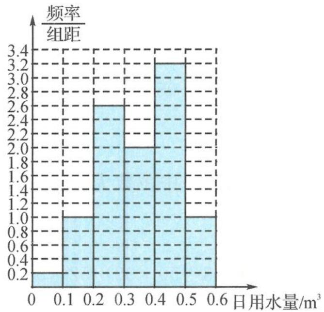

（Ⅱ）根据以上数据，该家庭使用节水龙头后50天日用水量小于 $0.35m^{3}$ 的频率为 $0.2\times0.1+1\times0.1+2.6\times0.1+2\times0.05=0.48$ ，
因此该家庭使用节水龙头后日用水量小于 $0.35\mathrm{m}^3$ 的概率的估计值为0.48.

（Ⅲ）该家庭未使用节水龙头50天日用水量的平均数为 $\overline{x_1} = \frac{1}{50}(0.05\times 1 + 0.15\times 3 + 0.25\times 2+$ $0.35\times 4 + 0.45\times 9 + 0.55\times 26 + 0.65\times 5) = 0.48.$

该家庭使用了节水龙头后 50 天日用水量的平均数为
$\overline{x}_2 = \frac{1}{50} (0.05\times 1 + 0.15\times 5 + 0.25\times 13 + 0.35$ $\times 10 + 0.45\times 16 + 0.55\times 5) = 0.35.$

估计使用节水龙头后，一年可节省水 $(0.48 - 0.35)\times 365 = 47.45(\mathrm{m}^3)$

【探讨】本题是2018年全国I卷文科第19题，题目贴近生活，具有现实意义，凸显了对统计方法应用的考查.

题 9 【解析】(I) 每道题实测的答对人数及相应的实测难度如下表.

<table><tr><td>题号</td><td>1</td><td>2</td><td>3</td><td>4</td><td>5</td></tr><tr><td>实测答对人数</td><td>8</td><td>8</td><td>7</td><td>7</td><td>2</td></tr><tr><td>实测难度</td><td>0.8</td><td>0.8</td><td>0.7</td><td>0.7</td><td>0.2</td></tr></table>
所以,估计 120 人中有 $120 \times 0.2 = 24$ 人答对第 5 题.

(Ⅱ) $P_{i}'$ 为抽样的10名学生中第i题的实测难度,用 $P_{i}'$ 作为这120名学生第i题的实测难度.
$S = \frac {1}{5} [ (0. 8 - 0. 9) ^ {2} + (0. 8 - 0. 8) ^ {2} + (0. 7 - 0. 7) ^ {2} + (0. 7 - 0. 6) ^ {2} + (0. 2 - 0. 4) ^ {2} ] = 0. 0 1 2.$
因为 $S = 0.012 < 0.05$ ，所以本次测试的难度预估是合理的.

题 10 【解析】(I) 中位数为 $\frac{43+46}{2}=44.5$ .

平均数为
$\frac {3 5 + 4 6 + 3 2 + 4 2 + 4 3 + 5 0 + 3 9 + 5 2 + 5 1 + 6 0}{1 0} = 4 5.$

(Ⅱ)由题意知,今年花市期间该摊位所售精品的销售量与时间段有关,明年合租摊位的租金较为合理的分摊方法是根据今年的平均销售量按比例分担.
因为今年白天的平均销售量为 $\frac{35+32+43+39+51}{5}=40$ （件/天），

今年晚上的平均销售量为 $\frac{46+42+50+52+60}{5}=50$ （件/天），
所以甲同学应分担的租金为 $900 \times \frac{40}{40 + 50} = 400$ (元),

乙同学应分担的租金为 $900 \times \frac{50}{40 + 50} = 500$ (元).

【探讨】本小题也可直接用白天、晚上的总销售量按比例分摊租金。

### 3.4.2 相关分析与回归分析

题 1 【解析】由定义知回归直线 $\hat{y}=\hat{b}x+\hat{a}$ 必经过样本中心点 $(\overline{x},\overline{y})$ ，故选项 A 正确；
由相关指数 $R^2$ 的定义知， $R^2$ 越大模型拟合效果越好，由残差的平方和定义知，残差的平方和越小模型的拟合效果越好，故选项B正确；
选项 C 是回归直线方程的应用, 故选项 C 正确;

相关系数 r 的范围为 $-1 \leqslant r \leqslant 1$ ，由定义知 $|r|$ 越接近 1，变量 x, y 相关性越强，故选项 D 错误.

综上,答案选 D.

题 2 【解析】对选项 A, B, 由表中的数据得, $\bar{x} = \frac{10 + 15 + 20 + 25 + 30}{5} = 20$ , $\bar{y} = \frac{11 + 10 + 8 + 6 + 5}{5} = 8$ , 将 $\bar{x}, \bar{y}$ 代入 $\hat{y} = \hat{b}x + 14.4$ 得 $\hat{b} = -0.32$ , 所以选项 A 错误, 选项 B 正确;

对选项 C, 由题意, 将 x=35 代入 $\hat{y}=-0.32x+14.4$ 得 $\hat{y}=3.2$ , 所以日需求量大约为 3.2 千克, 所以选项 C 正确;

对选项 D, 第四个样本点对应的残差为 $y_{4}-\hat{y}_{4}=6-(-0.32\times25+14.4)=-0.4$ , 所以选项 D 正确.

综上,答案选 BCD.

题 3 【解析】由图可知,佛山市人口数与普查序号呈正相关关系,且呈较强的线性相关特征,则选项 A 正确,选项 B 错误;

模型 2 的 $R^{2}$ 值更大, 则回归方程 2 的拟合效果更好, 选项 C 正确;

第八次人口普查对应 x=6，代入 y=183.5x-1.7 得 y=1099.3<1400，选项 D 错误.

综上,答案选 AC.

【探讨】试题几乎给出了所有需要的数据,符合高考“多考一点想的,少考一点算的”新趋势,考查考生对相关概念的正确理解.

题 4 【解析】由表格数据知
$\overline {{x}} = \frac {1}{5} (2 0 + 2 3 + 2 5 + 2 7 + 3 0) = 2 5,$
$\bar {z} = \frac {1}{5} (2 + 2. 4 + 3 + 3 + 4. 6) = 3,$
代入 $z=0.2x+a$ 得 $a=3-0.2\times25=-2$ .
所以 z=0.2x-2，即 $\ln y=0.2x-2$ .
所以 $y = \mathrm{e}^{0.2x - 2} = \mathrm{e}^{-2} \times \mathrm{e}^{0.2x}, c_1 = \mathrm{e}^{-2}$ .
故选B.

题 5 【解析】因为 $R^{2}$ 越大, 拟合效果越好. 又 A 小组的相关指数 $R^{2}=0.4472$ , B 小组的相关指数 $R^{2}=0.9375$ ,
所以 B 小组的拟合效果好, 拟合效果越好越能反映该粒子的运动轨迹, 其回归方程为 $\hat{v} = -0.5006u + 0.4922$ .
又 $u = x^{2}, v = y^{2}$ , 则 $y^{2} = -0.5006x^{2} + 0.4922$ , 即 $\frac{0.5006x^{2}}{0.4922} + \frac{y^{2}}{0.4922} = 1$ .
故答案选 C.

【探讨】试题比较新颖,但知识点不外乎两个,一个是相关指数的比较,另一个是变量间的转换.

题6 【解析】(I)由表知 $\bar{x}=\frac{1}{7}\times(1+2+3+4+5+6+7)=4,\bar{y}=\frac{1}{7}\times(8+9+m+12+n+19+22)=\frac{70+m+n}{7}$ ,
所以 $\sum_{i=1}^{7}(x_i - \overline{x})^2 = (-3)^2 + (-2)^2 + (-1)^2 + 0^2 + 1^2 + 2^2 + 3^2 = 28,$
所以 $\hat{b} = \frac{\sum_{i=1}^{7}x_iy_i - 7\overline{x}\overline{y}}{\sum_{i=1}^{7}(x_i - \overline{x})^2}$
$\frac {4 5 \dot {2} - 7 \times 4 \times \frac {7 0 + m + n}{7}}{2 8},$
即 $m + n = 43 - 7\hat{b}$ ①.
因为回归直线恒过样本中心点 $(\bar{x},\bar{y})$ ,
所以 $\frac{70+m+n}{7}=4\hat{b}+4$ ，
即 $m+n=28\hat{b}-42$ ②.
由①②得 $\hat{b}=\frac{17}{7}, m+n=26$ ③.
因为 $\sum_{i=1}^{7} x_i y_i = 8 + 18 + 3m + 48 + 5n + 114+$
$1 5 4 = 4 5 2,$
所以 $3m+5n=110$ ④.
由③④得 m=10, n=16.

(Ⅱ)由(Ⅰ)知,线性回归方程为 $\hat{y}=\frac{17}{7}x+4$ .
当 $x = 6$ 时，预测值 $\hat{y} = \frac{17}{7}\times 6 + 4 = \frac{130}{7}$ ，此时残差为 $19 - \frac{130}{7} = \frac{3}{7}$

【探讨】方程的思想在第（Ⅰ）问中有应用，根据试题条件列出方程组即可得到 m, n 的值.

题 7 【解析】(Ⅰ) $\overline{x}=$
$\frac {1 6 0 . 5 + 1 6 5 + 1 6 7 + 1 7 0 + 1 7 0 . 5 + 1 7 3 + 1 7 4 + 1 8 0}{8}$
$= 1 7 0,$
代入 $\bar{y}=1.009\times170+5.470=177$ ,
$\begin{array}{l} y _ {8} = 1 7 7 \times 8 - (1 6 8 + 1 7 0 + 1 7 2. 5 + 1 8 7 + 1 7 4. 5 \\ + 1 7 6 + 1 8 0) = 1 8 8. \\ \end{array}$

（Ⅱ）因为 $x_{4}=170=\bar{x}$ ，所以 $x_{4}$ 的预报值恰为 $\bar{y}$ .
故残差 $y_{4}-\bar{y}=187-177=10$ ，

回归直线 l 与 $l'$ 平行.

理由如下.
设回归直线 l 的斜率为 $\hat{b}$ ，截距为 $\hat{a}$ ，样本中心点为 $(\bar{x}, \bar{y})$ ;

回归直线 $l'$ 的斜率为 $\hat{b}'$ ，截距为 $\hat{a}'$ ，样本中心点为 $(\overline{x}',\overline{y}')$ .
因为 $x_{4}-\bar{x}=0,\bar{x}=\bar{x}'$ ，所以
$\hat {b} ^ {'} = \frac {\sum_ {i \neq 4} ^ {8} (x _ {i} - \overline {{x ^ {'}}}) (y _ {i} - \overline {{y ^ {'}}})}{\sum_ {i \neq 4} ^ {8} (x _ {i} - \overline {{x ^ {'}}}) ^ {2}}$
$= \frac {\sum_ {i = 1} ^ {8} (x _ {i} - \bar {x}) (y _ {i} - \overline {{y ^ {'}}})}{\sum_ {i = 1} ^ {8} (x _ {i} - \bar {x}) ^ {2}} = \frac {\sum_ {i = 1} ^ {8} x _ {i} y _ {i} - 8 \bar {x} \bar {y}}{\sum_ {i = 1} ^ {8} (x _ {i} - \bar {x}) ^ {2}} = \hat {b}.$
因为 $y_{4} \neq \bar{y}$ ，所以 $\hat{a}' = \overline{y'} - \hat{b}' \overline{x'} = \overline{y'} - \hat{b} \overline{x} = \overline{y'} - (\bar{y} - \hat{a}) = \hat{a} + (\overline{y'} - \bar{y}) \neq \hat{a}$ .
故回归直线 l 与 $l'$ 平行.

【探讨】本题延续了命题的一贯风格. 只有真正理解了求和运算才更能看出前后的 $\hat{b}$ 值保持不变, 因为 $x_{4} - \overline{x} = 0$ .

题 8 【解析】(I)由表可知,抽取的6件合格产品中有3件优等品,所以 $\xi$ 的所有可能取值为0,1,2,3,
$P (\xi = 0) = \frac {\mathrm{C} _ {3} ^ {3}}{\mathrm{C} _ {6} ^ {3}} = \frac {1}{2 0},$
$P (\xi = 1) = \frac {\mathrm{C} _ {3} ^ {1} \mathrm{C} _ {3} ^ {2}}{\mathrm{C} _ {6} ^ {3}} = \frac {9}{2 0},$
$P (\xi = 2) = \frac {\mathrm{C} _ {3} ^ {2} \mathrm{C} _ {3} ^ {1}}{\mathrm{C} _ {6} ^ {3}} = \frac {9}{2 0},$
$P (\xi = 3) = \frac {\mathrm{C} _ {3} ^ {3}}{\mathrm{C} _ {6} ^ {3}} = \frac {1}{2 0}.$

随机变量 $\xi$ 的期望 $E(\xi) = 0 \times \frac{1}{20} + 1 \times \frac{9}{20} + 2 \times \frac{9}{20} + 3 \times \frac{1}{20} = \frac{3}{2}$ .

(Ⅱ)(i)因为 $y=c\cdot x^{b}$ ，所以 $\ln y=\ln c+bln x$ .
因为 $\sum_{i=1}^{6} (\ln x_i) = 24.6, \sum_{i=1}^{6} (\ln y_i) = 18.3,$
所以 $\overline{\ln x} = \frac{1}{6}\sum_{i=1}^{6}(\ln x_i) = 4.1, \overline{\ln y} = \frac{1}{6}\sum_{i=1}^{6}(\ln y_i) = 3.05,$
$\begin{array}{r l} & {\text {所以} \hat {b} = \frac { \sum_ {i = 1} ^ {6} (\ln x _ {i} \bullet \ln y _ {i}) - 6 \times \overline {{{{\ln x}}}} \times \overline {{{{\ln y}}}}}{ \sum_ {i = 1} ^ {6} (\ln x _ {i}) ^ {2} - 6 \times (\overline {{{{\ln x}}}}) ^ {2}}} \\ & {= \frac {7 5 . 3 - 6 \times 4 . 1 \times 3 . 0 5}{1 0 1 . 4 - 6 \times 4 . 1 ^ {2}} = 0. 5,} \end{array}$
$\hat {a} = \overline {{\ln y}} - \hat {b} \overline {{\ln x}} = 3. 0 5 - 0. 5 \times 4. 1 = 1,$
所以 $\ln y=1+0.5\ln x,c=e.$
故 y 关于 x 的回归方程为 $\hat{y} = ex^{0.5}$ .

(ii) 由 (i) 知 $\hat{y} = \mathrm{e}x^{0.5}$ ,
所以 $\hat{z} = 2\hat{y} - 0.32x = 2\mathrm{e}x^{0.5} - 0.32x =$ $-0.32\left(\sqrt{x} -\frac{\mathrm{e}}{0.32}\right)^2 +\frac{\mathrm{e}^2}{0.32}$ ，当 $\sqrt{x} = \frac{\mathrm{e}}{0.32}$ ，即 $x =$ $\left(\frac{\mathrm{e}}{0.32}\right)^2\approx 72$ 时， $\hat{z}$ 取得最大值，故当优等品的尺寸

x=72mm 时, 收益 z 的预报值最大.

题 9 【解析】(Ⅰ)由 $y=c_{1}\cdot e^{c_{2}x}$ 的等号两边同时取自然对数得 $\ln y=\ln(c_{1}\cdot e^{c_{2}x})=\ln c_{1}+c_{2}x.$
设 $z = \ln y$ ，则 $z = \ln c_{1} + c_{2}x.$
因为 $\bar{x}=3.5,\bar{z}=2,\sum_{i=1}^{6}(x_{i}-\bar{x})^{2}=18,$ $\sum_{i=1}^{6}(x_{i}-\bar{x})(z_{i}-\bar{z})=9,$
所以 $\hat{c}_2 = \frac{\sum_{i=1}^{n}(x_i - \bar{x})(z_i - \bar{z})}{\sum_{i=1}^{n}(x_i - \bar{x})^2} = \frac{9}{18} = \frac{1}{2},$
$\ln \hat {c} _ {1} = \bar {z} - \hat {c} _ {2} \bar {x} = 2 - 0. 5 \times 3. 5 = 0. 2 5.$
所以 $z=0.25+0.5x=\ln y$ ，所以 $y=e^{0.25+0.5x}$ .

(Ⅱ)令 x=7，得 $\hat{y}_{1}=e^{0.25+0.5\times7}=e^{3.75}$
令 $x = 10$ ，得 $\hat{y}_2 = \mathrm{e}^{5.25},\frac{\hat{y}_2}{\hat{y}_1} = \mathrm{e}^{1.5} = \mathrm{e}\sqrt{\mathrm{e}}\approx 4.5.$

预计 2024 年全世界产生的数据规模是 2021 年的 4.5 倍.

题 10 【解析】(I)由表格中的数据知,182.4>79.2,
所以 $\frac{182.4}{\sum_{i=1}^{7}(y_i - \bar{y})^2} > \frac{79.2}{\sum_{i=1}^{7}(y_i - \bar{y})^2}$ .
故 $1 - \frac{182.4}{\sum_{i=1}^{7}(y_i - \bar{y})^2} < 1 - \frac{79.2}{\sum_{i=1}^{7}(y_i - \bar{y})^2}$ , 可见模型①的相关指数 $R_1^2$ 小于模型②的相关指数 $R_2^2$ , 所以回归模型②的拟合效果更好.
当 x=17 时, 科技升级直接收益的预测值 $\hat{y}=21.3\times\sqrt{17}-14.4\approx21.3\times4.1-14.4=72.93$ (亿元).

(Ⅱ) 当 x > 18 时, 由已知可得
$\overline {{{x}}} = \frac {1}{5} \times (2 1 + 2 2 + 2 3 + 2 4 + 2 5) = 2 3,$
$\bar {y} = \frac {1}{5} \times (6 8. 5 + 6 8 + 6 7. 5 + 6 6 + 6 6) = 6 7. 2.$
所以 $\hat{a}=\bar{y}+0.7\bar{x}=67.2+0.7\times23=83.3.$
当 $x > 17$ 时， $y$ 与 $x$ 的线性回归方程为 $\hat{y} = -0.7x + 83.3$ .
当 x=20 时, 科技升级直接收益的预测值 $\hat{y}=-0.7\times20+83.3=69.3$ (亿元).
当 x=20 时, 实际收益的预测值为 $69.3+5=74.3$ (亿元) >72.93 (亿元), 所以技术升级投入 20 亿元时, 公司的实际收益更大.

【探讨】两个模型 $R^{2}$ 大小关系的比较取决于分子 $\sum_{i=1}^{n}(y_{i}-\hat{y}_{i})^{2}$ 的大小关系.

### 3.4.3 独立性检验

题 1 【解析】设该校男老师的人数为 x，女老师的人数为 y，可得如下数据.

<table><tr><td>老师的性别</td><td>方案一</td><td>方案二</td><td>合计</td></tr><tr><td>男</td><td>0.5x</td><td>0.5x</td><td>x</td></tr><tr><td>女</td><td>0.25y</td><td>0.75y</td><td>y</td></tr><tr><td>合计</td><td>0.5x+0.25y</td><td>0.5x+0.75y</td><td>x+y</td></tr></table>
由题意 $\frac{0.25y}{0.5x + 0.25y} = 0.4$ ，整理 $\frac{y}{x} = \frac{4}{3}$
解得 x=30, y=40.
则 $K^{2}=\frac{70(15\times30-15\times10)^{2}}{25\times45\times30\times40}\approx4.667>$ 3.841, 但 4.667 < 5.024, 所以有 95% 以上的把握认为“选择方案与性别有关”.
答案选C.

【探讨】需要考生写清列联表,理解正确的作答判断方式是本题的亮点.

题 2 【解析】由题可知,男女各 50m 人,列联表如下.

<table><tr><td>学生的性别</td><td>喜欢</td><td>不喜欢</td><td>总计</td></tr><tr><td>男</td><td>30m</td><td>20m</td><td>50m</td></tr><tr><td>女</td><td>20m</td><td>30m</td><td>50m</td></tr><tr><td>总计</td><td>50m</td><td>50m</td><td>100m</td></tr></table>
$K ^ {2} = \frac {1 0 0 m (9 0 0 m ^ {2} - 4 0 0 m ^ {2}) ^ {2}}{5 0 \times 5 0 \times 5 0 \times 5 0 m ^ {4}} = 4 m,$
因为有 99.9% 把握认为性别与是否喜欢该学科有关, 所以 4m > 10.828, 解得 m > 2.707.
因为 $m \in \mathbb{N}^*$ ，所以 $m \geqslant 3$ ，即 $N_{\min} = 300$ .
答案选B.

【探讨】从这道题我们可以看出 $K^2$ 的值不仅与

各个数据的比例有关,而且与样本总数有关.

题 3 【解析】因为被调查的男、女生人数相同，由等高条形统计图可知，喜欢登山的男生占 80%，喜欢登山的女生占 30%，所以选项 A 正确，选项 B 错误.
设被调查的男、女生人数均为 n，则由等高条形统计图可得 $2 \times 2$ 列联表如下.

<table><tr><td>喜欢情况</td><td>男</td><td>女</td><td>合计</td></tr><tr><td>喜欢</td><td>0.8n</td><td>0.3n</td><td>1.1n</td></tr><tr><td>不喜欢</td><td>0.2n</td><td>0.7n</td><td>0.9n</td></tr><tr><td>合计</td><td>n</td><td>n</td><td>2n</td></tr></table>
由公式可得 $K^{2}=\frac{2n\times(0.8n\times0.7n-0.3n\times0.2n)^{2}}{1.1n\times0.9n\times n\times n}$ $=\frac{50n}{99}.$
当 $n = 100$ 时， $K^2 = \frac{5000}{99} > 6.635$ ，所以有 $99\%$ 的把握认为喜欢登山和性别有关；
当 n=10 时, $K^{2}=\frac{500}{99}<6.635$ , 所以没有 99% 的把握认为喜欢登山和性别有关, 显然 $K^{2}$ 的值与 n 的取值有关, 所以选项 C 正确, 选项 D 错误.

综上,答案选 AC.

题 4 【解析】(Ⅰ)甲机床生产的产品中一级品的频率 $P=\frac{150}{200}=0.75$ ;

乙机床生产的产品中一级品的频率 $P=\frac{120}{200}=0.60$ .

(Ⅱ) 因为 $K^{2}=\frac{n(ad-bc)^{2}}{(a+b)(c+d)(a+c)(b+d)}=$ $\frac{400\times(150\times80-50\times120)^{2}}{200\times200\times270\times130}=\frac{400}{39}\approx10.256,$
$P(K^{2} \geqslant 6.635) \approx 0.010$ ，且 $10.256 > 6.635$
所以,有 99% 的把握认为“甲机床的产品质量与乙机床的产品质量有差异”.

综上,答案选 A.

【探究】本题选自 2021 年全国甲卷文(理)科第 17 题. 从列联表中要求学生得出频率(估计概率)的信息,联通统计与概率是常见的命题手法之一.

题 5 【解析】(I)由题意可得 $\bar{x}=\frac{1+2+3+4+5}{5}=3,$
$\overline {{y}} = \frac {9 + 1 1 + 1 4 + 2 6 + 2 0}{5} = 1 6,$
所以 $\sum_{i=1}^{5}(x_i - \bar{x})(y_i - \bar{y}) = (-2) \times (-7) + (-1) \times (-5) + 0 \times (-2) + 1 \times 10 + 2 \times 4 = 37,$
$\sum_ {i = 1} ^ {5} (x _ {i} - \bar {x}) ^ {2} \sum_ {i = 1} ^ {5} (y _ {i} - \bar {y}) ^ {2} = [ (- 2) ^ {2} + (- 1) ^ {2} + 0 + 1 + 2 ^ {2} ] \times [ (- 7) ^ {2} + (- 5) ^ {2} + (- 2) ^ {2} + 1 0 ^ {2} + 4 ^ {2} ] = 1 9 4 0,$
所以 $r=\frac{37}{\sqrt{1940}}\approx0.84.$
故管理时间 $y$ 与土地使用面积 $x$ 具有较强的正相关性.

(Ⅱ)由题意可知：

<table><tr><td>村民性别</td><td>愿意参与管理</td><td>不愿意参与管理</td><td>总计</td></tr><tr><td>男</td><td>140</td><td>60</td><td>200</td></tr><tr><td>女</td><td>40</td><td>60</td><td>100</td></tr><tr><td>总计</td><td>180</td><td>120</td><td>300</td></tr></table>
设 $H_{0}$ : 村民的性别与参与管理的意愿无关,
则 $K^{2}=\frac{300\times(140\times60-40\times60)^{2}}{200\times100\times180\times120}=25>10.828.$
所以 $H_0$ 不成立.
故有 $99.9\%$ 的把握认为村民的性别与参与管理的意愿具有相关性.

（Ⅲ）由题意可知， $X$ 可能的取值为0,1,2,3， $X \sim B\left(3, \frac{1}{5}\right)$ ，则
$P (X = 0) = \left(\frac {4}{5}\right) ^ {3} = \frac {6 4}{1 2 5},$
$P (X = 1) = \mathrm{C} _ {3} ^ {1} \times \left(\frac {4}{5}\right) ^ {2} \times \frac {1}{5} = \frac {4 8}{1 2 5},$
$P (X = 2) = \mathbb {C} _ {3} ^ {2} \times \frac {4}{5} \times \left(\frac {1}{5}\right) ^ {2} = \frac {1 2}{1 2 5},$
$P (X = 3) = \left(\frac {1}{5}\right) ^ {3} = \frac {1}{1 2 5}.$
所以 $X$ 的分布列为

<table><tr><td>X</td><td>0</td><td>1</td><td>2</td><td>3</td></tr><tr><td>P</td><td>64/125</td><td>48/125</td><td>12/125</td><td>1/125</td></tr></table>
所以 $E(X)=0\times\frac{64}{125}+1\times\frac{48}{125}+2\times\frac{12}{125}+3\times$ $\frac{1}{125}=\frac{3}{5}$ 或 $E(X)=3\times\frac{1}{5}=\frac{3}{5}.$

【探究】依然是要求学生从列联表中得出频率（估计概率）的信息.

题 6 【解析】(I) 记肥胖人数为 Y, 由题意知 $Y \sim B\left(2, \frac{4}{25}\right)$ ,
则 $P(Y = k) = \mathrm{C}_2^k\left(\frac{4}{25}\right)^k\left(\frac{21}{25}\right)^{2 - k}, k = 0,1,2.$
故 $P(Y = 0) = \frac{441}{625}, P(Y = 1) = \frac{168}{625}, P(Y = 2) = \frac{16}{625}.$
因此,优质品数 Y 的分布列为

<table><tr><td>Y</td><td>0</td><td>1</td><td>2</td></tr><tr><td>P</td><td>441/625</td><td>168/625</td><td>16/625</td></tr></table>

(Ⅱ)由题意,可列出如下 $2 \times 2$ 列联表.

<table><tr><td>性别</td><td>超重</td><td>不超重</td><td>合计</td></tr><tr><td>女</td><td>15</td><td>40</td><td>55</td></tr><tr><td>男</td><td>25</td><td>20</td><td>45</td></tr><tr><td>合计</td><td>40</td><td>60</td><td>100</td></tr></table>
$\begin{array}{r l} & K ^ {2} = \frac {1 0 0 \times (1 5 \times 2 0 - 2 5 \times 4 0) ^ {2}}{6 0 \times 4 0 \times 5 5 \times 4 5} = \frac {2 4 5 0}{2 9 7} \approx 8. 2 4 9 \\ & > 7. 8 7 9. \end{array}$
所以,有 99.5% 的把握认为超重与性别有关.

题 7 【解析】（1） $r \approx -0.58, y$ 与 x 的相关关系为负相关，且 $|r| < 0.75$ ，故线性相关性不强，所以不建议继续做线性回归分析，即使得到回归方程，拟合效果也会不理想。（相关指数 $R^{2} \approx 0.3364$ ）  
（2） 建立 $2 \times 2$ 列联表如下.

<table><tr><td>AQI数值</td><td>人数&lt;100</td><td>人数≥100</td><td>合计</td></tr><tr><td>AQI&gt;100</td><td>10</td><td>5</td><td>15</td></tr><tr><td>AQI≤100</td><td>10</td><td>35</td><td>45</td></tr><tr><td>合计</td><td>20</td><td>40</td><td>60</td></tr></table>
代入公式计算得 $K^{2}=\frac{60\times(350-50)^{2}}{15\times45\times20\times40}=10.$

查表知 6.635<10<10.828, 故犯错率在 0.001 与 0.01 之间.
所以该初步认定的犯错率小于 1%.

【探讨】本题的列联表中各个数据需要学生从散点图中获取,散点图被分成了四个区域正好对应表中的四个数据.

题 8 【解析】(Ⅰ)设“坡腰处一个插钎风蚀值小于30”为事件C,则
$P (C) = 0. 0 8 + 0. 1 6 + 0. 3 6 = 0. 6.$

(Ⅱ) 完成列联表如下.

<table><tr><td>插钎位置</td><td>标记</td><td>不标记</td><td>合计</td></tr><tr><td>坡腰</td><td>30</td><td>20</td><td>50</td></tr><tr><td>坡顶</td><td>20</td><td>30</td><td>50</td></tr><tr><td>合计</td><td>50</td><td>50</td><td>100</td></tr></table>
根据列联表,计算得:
$K ^ {2} = \frac {1 0 0 \times (3 0 \times 3 0 - 2 0 \times 2 0) ^ {2}}{5 0 \times 5 0 \times 5 0 \times 5 0} = 4 > 3. 8 4 1.$
所以,有 95% 的把握认为数据标记“\*”与沙丘上插钎所布设的位置有关.

(Ⅲ) 因为 $\overline{x}_{1}=0.08\times5+0.16\times15+0.36\times25+0.24\times35+0.12\times45+0.04\times55=27.8\left(\mathrm{cm}\right)$ ,
$\begin{array}{r l} & \overline {{x}} _ {2} = 0. 0 4 \times 5 + 0. 1 2 \times 1 5 + 0. 2 4 \times 2 5 + 0. 3 2 \times \\ & 3 5 + 0. 2 0 \times 4 5 + 0. 0 8 \times 5 5 = 3 2. 6 (\mathrm{cm}), \end{array}$
又 $|\overline{x}_1 - \overline{x}_2| < 20$
所以,该固沙方法在坡顶和坡腰的固沙效果没有差异.

# 第四章 模型视角下的概率统计 4.1 函数模型

题 1 【解析】(Ⅰ) 当收费为 20 元时, 照片被带走的可能性为 0.3, 不被带走的可能性为 0.7. 设每个游客的利润为 $Y_{1}$ (元), 则 $Y_{1}$ 是随机变量, 其分布列为

<table><tr><td>Y1</td><td>15</td><td>-5</td></tr><tr><td>P</td><td>0.3</td><td>0.7</td></tr></table>
$E (Y _ {1}) = 1 5 \times 0. 3 - 5 \times 0. 7 = 1 (\text {元}).$
故 5000 个游客的平均利润为 5000 元.
当收费为 10 元时, 照片被带走的可能性为 0.3 + 0.05 × 10 = 0.8, 不被带走的可能性为 0.2. 设每个游客的利润为 $Y_{2}$ (元), 则 $Y_{2}$ 是随机变量, 其分布列为

<table><tr><td> $Y_2$ </td><td>5</td><td>-5</td></tr><tr><td>P</td><td>0.8</td><td>0.2</td></tr></table>
$E (Y _ {2}) = 5 \times 0. 8 - 5 \times 0. 2 = 3 (\text {元}).$
故 5000 个游客的平均利润为 15000 元.

该项目每天的平均利润比调整前多 10000 元.

(Ⅱ)设降价 x 元, 则 $0 \leqslant x < 15$ .

照片被带走的可能性为 $0.3 + 0.05x$ ,

不被带走的可能性为 0.7-0.05x.
设每个游客的利润为 Y(元), 则 Y 是随机变量, 其分布列为

<table><tr><td>Y</td><td>15-x</td><td>-5</td></tr><tr><td>P</td><td>0.3+0.05x</td><td>0.7-0.05x</td></tr></table>
$\begin{array}{r l} & E (Y) = (1 5 - x) \times (0. 3 + 0. 0 5 x) - 5 \times (0. 7 - \\ & 0. 0 5 x) = 0. 0 5 \times [ 6 9 - (x - 7) ^ {2} ]. \end{array}$
当 x=7 时, $E(Y)$ 有最大值 3.45 元.
故当定价为 13 元时, 日平均利润为 17250 元.

【探讨】试题情境取自现实生活中的真实情况，笔者很多时候也因为景区照片定价太贵而拒绝购买它们。利润是一个随机变量，每天的平均利润就是随机变量的期望值。

题 2 【解析】(Ⅰ)根据题意, $E(X)=0\times0.4+1\times0.3+2\times0.2+3\times0.1=1$ .

(Ⅱ)根据题意 $E(X)=0\times p_{0}+1\times p_{1}+2\times p_{2}$ $+3\times p_{3}=p_{1}+2p_{2}+3p_{3}.$
设函数 $f(x) = p_{3}x^{3} + p_{2}x^{2} + (p_{1} - 1)x + p_{0}$
可得 $f(0)=p_{0}>0$ ,
$f （1） = p _ {3} + p _ {2} + p _ {1} - 1 + p _ {0} = 0.$
$f'(x)=3p_{3}x^{2}+2p_{2}x+(p_{1}-1),y=f'(x)$ 在 $(0,+\infty)$ 上单调递增，
$f ^ {'} （1） = 3 p _ {3} + 2 p _ {2} + p _ {1} - 1 = E (X) - 1.$  
（1） 若 $E(X) \leqslant 1$ ，可得 $f'（1） \leqslant 0$ .
当 $x \in (0,1)$ 时， $f'(x) < 0$ ，即 $f(x)$ 在 $(0,1)$ 上单调递减。故 $x = 1$ 为 $f(x)$ 的最小正零点，即 $p = 1$ 。  
（2） 若 $E(X)>1$ , 可得 $f'（1）>0$ .
因为 $f'（0）=p_{1}-1<0$ ，所以在 $(0,1)$ 上， $f'(x)$ 存在唯一零点，设为 $x_{0}$ .
当 $x \in (0, x_0)$ 时， $f'(x) < 0, f(x)$ 在 $(0, x_0)$ 上单调递减；
当 $x \in (x_0, 1)$ 时， $f'(x) > 0, f(x)$ 在 $(x_0, 1)$ 上单调递增.
故 $f(x)$ 的最小正零点在 $(0, x_{0})$ 上，即 p < 1.

综上，当 $E(X)\leqslant 1$ 时， $p = 1$
当 $E(X)>1$ 时, p<1.

(Ⅲ)实际含义:当1个微生物个体繁殖下一代的个数的期望值小于或等于1时,该种微生物经过多代繁殖后必然灭绝;当1个微生物个体繁殖下一代的个数的期望值大于1时,该种微生物经过多代繁殖后也不会灭绝.

【探讨】试题第（Ⅰ）问是随机变量期望的直接计算，第（Ⅱ）问是从函数的视角解决零点（方程的根）问题，第（Ⅲ）问则利用数据结果说明概率问题。这三问层层递进，梯度合理。

题 3 【解析】(Ⅰ)(i) 按方案①建立的电路系统的可靠性 $P_{1}=1-(1-p^{n})^{2}=p^{n}(2-p^{n})$ ;

按方案 ② 建立的电路系统的可靠性 $P_{2} = [1 - (1 - p)^{2}]^{n} = p^{n}(2 - p)^{n}$ .

(ii) $P_{1} - P_{2} = p^{n}[2 - p^{n} - (2 - p)^{n}]$ .
令 $f(x) = 2 - x^{n} - (2 - x)^{n}, n \in \mathbb{N}^{*}$ 且 $n \geqslant 2$ ，则 $f'(x) = n[(2 - x)^{n-1} - x^{n-1}]$ .
当 $x \in (0,1)$ 时， $(2 - x)^{n-1} > 1 > x^{n-1}$ ，从而 $f'(x) > 0$ ，所以 $f(x)$ 在 $(0,1)$ 上单调递增；
当 $p \in (0,1)$ 时， $f(p) < f(1) = 0$ ，即 $2 - p^n - (2 - p)^n < 0$ .
所以, $P_{1}<P_{2}$ ,按方案②建立的电路系统更稳定可靠.

(Ⅱ)在方案②电路系统可以正常工作的条件下,编号相同的2个并联元件中至多有1个损坏,且有1个损坏的条件概率为 $\frac{C_{2}^{1}p(1-p)}{1-(1-p)^{2}}=\frac{1}{3}$ .
由此可知， $X \sim B\left(4, \frac{1}{3}\right)$ .
$P (X = 0) = \left(\frac {2}{3}\right) ^ {4} = \frac {1 6}{8 1},$
$P (X = 1) = \mathrm{C} _ {4} ^ {1} \times \frac {1}{3} \times \left(\frac {2}{3}\right) ^ {3} = \frac {3 2}{8 1},$
$P (X = 2) = \mathrm{C} _ {4} ^ {2} \times \left(\frac {1}{3}\right) ^ {2} \times \left(\frac {2}{3}\right) ^ {2} = \frac {8}{2 7},$
$P (X = 3) = \mathrm{C} _ {4} ^ {3} \times \left(\frac {1}{3}\right) ^ {3} \times \frac {2}{3} = \frac {8}{8 1},$
$P (X = 4) = \frac {1}{3 ^ {4}} = \frac {1}{8 1}.$
所以 $X$ 的分布列为

<table><tr><td>X</td><td>0</td><td>1</td><td>2</td><td>3</td><td>4</td></tr><tr><td>P</td><td> $\frac{16}{81}$ </td><td> $\frac{32}{81}$ </td><td> $\frac{8}{27}$ </td><td> $\frac{8}{81}$ </td><td> $\frac{1}{81}$ </td></tr></table>
$E (X) = 4 \times \frac {1}{3} = \frac {4}{3}.$

【探讨】试题的综合性较强,背景是物理中电路的串联和并联问题,基于事件的关系运算就容易算出相应的概率.在比较大小的过程中,需要利用函数的工具,结合单调性做出判断.

题 4 【解析】(I)由已知得 $\left\{\begin{aligned}0&<p<1,\\ 0&<2p\leqslant1,\\ 0&\leqslant1-3p<1,\end{aligned}\right.$ 解得 $0<p\leqslant\frac{1}{3}$ .
$\begin{array}{r l} & E (A) = 1 4 0 0 p + 4 0 0 - 1 2 0 0 p - 4 0 0 p = 4 0 0 \\ & - 2 0 0 p, \end{array}$
$\begin{array}{r l} & E (B) = 1 2 0 0 p + 3 0 0 - 9 0 0 p - 1 0 0 p = 3 0 0 \\ & + 2 0 0 p. \end{array}$
$E (A) > E (B) \Rightarrow 0 <   p <   \frac {1}{4};$
$E (A) = E (B) \Rightarrow p = \frac {1}{4};$
$E (A) <   E (B) \Rightarrow \frac {1}{4} <   p \leqslant \frac {1}{3}.$
所以当 $0 < p < \frac{1}{4}$ 时, 应选择方案 A;
当 $\frac{1}{4}<p\leqslant\frac{1}{3}$ 时,应选择方案B;
当 $p=\frac{1}{4}$ 时, 可以选择方案 A, 也可以选择方案 B.

（Ⅱ）设市场行情为畅销、平销和滞销时，新产品的年利润分别为 $\xi_{1}, \xi_{2}$ 和 $\xi_{3}$ ，
则 $\xi_{1} = 60x - y_{1}$
$\xi_ {2} = \left(6 0 - \frac {3}{4} x\right) x - y _ {1},$
$\xi_ {3} = (6 0 - x) x - y _ {1},$
所以 $\xi$ 的分布列为

<table><tr><td>ξ</td><td>60x-y1</td><td>(60-3/4x)x-y1</td><td>(60-x)x-y1</td></tr><tr><td>p</td><td>0.4</td><td>0.4</td><td>0.2</td></tr></table>
$\begin{array}{l} E (\xi) = 0. 4 \times (6 0 x - y _ {1}) + 0. 4 \times \left[ \left(6 0 - \frac {3}{4} x\right) x \right. \\ \left. - y _ {1} \right] + 0. 2 \times [ (6 0 - x) x - y _ {1} ] \\ = - \frac {2}{3} x ^ {3} + \frac {1 5}{2} x ^ {2} + 5 0 x - 1 6 0. \\ \end{array}$
设 $f(x) = E(\xi) = -\frac{2}{3} x^3 + \frac{15}{2} x^2 + 50x - 160$ ， $0 < x \leqslant 20$
所以 $f'(x) = -2x^{2} + 15x + 50.$
$f'(x) > 0 \Rightarrow 0 < x < 10,$
$f ^ {'} (x) <   0 \Rightarrow 1 0 <   x \leqslant 2 0.$
所以 $f(x)$ 在 $(0,10)$ 上单调递增，在 $(10,20]$ 上单调递减.
当 x=10 时, $f(x)$ 取得最大值, 即年产量为 10 万件时, $E(\xi)$ 取得最大值.
此时 $f(x)_{\max}=f(10)\approx423.3$ (万元).
由(I)知,预期平均年利润的期望 $E(A)=400-200p=360$ (万元).
因为 423.3 > 360, 所以在年产量为 10 万件的情况下, 可以达到甚至超过预期的平均年利润.

【探讨】除了直接写出利润的分布列再求期望，我们还可以先求出收入的期望再减去成本。

题 5 【解析】(Ⅰ)由题意可得,若当天只卖出20杯,则利润 $\xi=20\times2-15\times4=-20$ (元);
若当天只卖出 25 杯, 则利润 $\xi=25\times2-10\times4=10$ (元);
若当天只卖出 30 杯, 则利润 $\xi=30\times2-5\times4=40$ (元);
若当天卖出 35 杯, 则利润 $\xi=35\times2=70$ (元).
所以 $\xi$ 的分布列为

<table><tr><td>ξ</td><td>-20</td><td>10</td><td>40</td><td>70</td></tr><tr><td>P</td><td> $\frac{1}{12}$ </td><td> $\frac{1}{12}$ </td><td> $\frac{1}{6}$ </td><td> $\frac{2}{3}$ </td></tr></table>
所以 $E(\xi) = -20 \times \frac{1}{12} + 10 \times \frac{1}{12} + 40 \times \frac{1}{6} + 70 \times \frac{2}{3} = \frac{105}{2}$ (元).

(Ⅱ)若店主每天准备40杯这款新品奶茶，
若当天需求 20 杯, 则利润 $\eta=20\times2-20\times4=-40$ (元), $P(\eta=-40)=\frac{1}{12}$ ;
若当天需求 25 杯, 则利润 $\eta=25\times2-15\times4=-10$ (元), $P(\eta=-10)=\frac{1}{12}$ ;
若当天需求 30 杯, 则利润 $\eta=30\times2-10\times4=$ 20(元), $P(\eta=20)=\frac{1}{6}$ ;
若当天需求 35 杯, 则利润 $\eta=35\times2-5\times4=$ 50(元), $P(\eta=50)=\frac{1}{4}$ ;
若当天需求大于或等于40杯，则利润 $\eta = 40\times$ $2 = 80$ （元）， $P(\eta = 80) = \frac{5}{12}$
所以 $\eta$ 的分布列为

<table><tr><td>η</td><td>-40</td><td>-10</td><td>20</td><td>50</td><td>80</td></tr><tr><td>P</td><td> $\frac{1}{12}$ </td><td> $\frac{1}{12}$ </td><td> $\frac{1}{6}$ </td><td> $\frac{1}{4}$ </td><td> $\frac{5}{12}$ </td></tr></table>
所以 $E(\eta) = -40 \times \frac{1}{12} - 10 \times \frac{1}{12} + 20 \times \frac{1}{6} + 50 \times \frac{1}{4} + 80 \times \frac{5}{12} = 45$ (元).
因为 $E(\eta) < E(\xi)$ ，所以不接受这个建议。

【探讨】本题相当于例题1的变式,问法也如出一辙.

题 6 【解析】(I) 设恰好经过 2 次检验能把阳性样本全部检验出来的事件为 A，
则 $P(A)=\frac{A_{2}^{2}A_{3}^{3}}{A_{5}^{5}}=\frac{1}{10}.$
故恰好经过 2 次检验能把阳性样本全部检验出来的概率为 $\frac{1}{10}$ .

(Ⅱ)(i)由已知可得 $E(\xi_{1})=k,\xi_{2}$ 所有可能的取值为 $1,k+1$ .
所以 $P(\xi_2 = 1) = (1 - p)^k, P(\xi_2 = k + 1) = 1 - (1 - p)^k,$
所以 $E(\xi_2) = (1 - p)^k + (k + 1)[1 - (1 - p)^k] = k + 1 - k(1 - p)^k.$
若 $E(\xi_1) = E(\xi_2)$ ，则 $k = k + 1 - k(1 - p)^k$ ，所以 $k(1 - p)^k = 1$ .
故 $(1-p)^{k}=\frac{1}{k}\Rightarrow p=1-\left(\frac{1}{k}\right)^{\frac{1}{k}}$ .
所以 $p$ 关于 $k$ 的函数解析式为 $p = 1 - \left(\frac{1}{k}\right)^{\frac{1}{k}}$ , $k \in \mathbb{N}^*$ , $k \geqslant 2$ .

(ii)由题意可知 $E(\xi_{1})>E(\xi_{2})$ ,
即 $k > k + 1 - k(1 - p)^{k}$ ,
化简得 $\frac{1}{k}<(1-p)^{k}$ .
因为 $p=1-\frac{1}{\sqrt[3]{e}}$ ,
所以 $\frac{1}{k}<\left(\frac{1}{\sqrt[3]{e}}\right)^{k}$ ，即 $\ln k>\frac{1}{3}k$ .
设函数 $f(x)=\ln x-\frac{1}{3}x(x>0)$ .
又 $f'(x)=\frac{1}{x}-\frac{1}{3}$ ，故当x>3时， $f'(x)<0$ ，
即 $f(x)$ 在 $(3, +\infty)$ 上单调递减.
又 $f(4) = \ln 4 - \frac{4}{3} >0,f(5) = \ln 5 - \frac{5}{3} < 0,$
故 $k$ 的最大值为4.

【探讨】混检在提高检验效率中起到了很大的作用,从期望的计算过程我们看得更加清楚.

题 7 【解析】(Ⅰ)由题意知,每位员工首轮测试被认定为“暂定”的概率为 $C_{3}^{2}p^{2}(1-p)+C_{3}^{3}p^{3}$ ,

每位员工再次测试被认定为“暂定”的概率为 $C_{3}^{1}p(1-p)^{2}[1-(1-p)^{2}]$ .

综上,每位员工被认定为“暂定”的概率
$\begin{array}{r} {f (p) = \mathrm{C} _ {3} ^ {2} p ^ {2} (1 - p) + \mathrm{C} _ {3} ^ {3} p ^ {3} + \mathrm{C} _ {3} ^ {1} p (1 - p) ^ {2} [ 1 -} \\ {(1 - p) ^ {2} ] = - 3 p ^ {5} + 1 2 p ^ {4} - 1 7 p ^ {3} + 9 p ^ {2}.} \end{array}$

(Ⅱ)设每位员工测试的费用为 X 元,则 X 的可能取值为 90,150.
由题意知， $P(X = 150) = \mathrm{C}_3^1 p(1 - p)^2$ ， $P(X = 90) = 1 - \mathrm{C}_3^1 p(1 - p)^2$
所以 $E(X) = 90 \times [1 - \mathrm{C}_3^1 p(1 - p)^2] + 150 \times \mathrm{C}_3^1 p(1 - p)^2 = 90 + 180p(1 - p)^2, p \in (0,1)$ .
令 $g(x)=90+180x(1-x)^{2}, x\in(0,1)$ ,
则 $g'(x)=180[(1-x)^{2}-2x(1-x)]=180(3x-1)(x-1)$ .
当 $x \in \left(0, \frac{1}{3}\right)$ 时， $g'(x) > 0, g(x)$ 单调递增；
当 $x \in \left(\frac{1}{3}, 1\right)$ 时， $g'(x) < 0, g(x)$ 单调递减.
所以 $g(x)_{\max} = g\left(\frac{1}{3}\right) = 90 + 180 \times \frac{1}{3} \times$ $\left(1 - \frac{1}{3}\right)^2 = \frac{350}{3},$
即 $E(X)_{\max}=\frac{350}{3}.$
所以此方案的最高费用为 $1 + 600 \times \frac{350}{3} \times 10^{-4} = 8$ （万元）.

综上,若以此方案实施,不会超过预算.

【探讨】费用的预算在现实生活中很常见,试题充分体现了概率在现实生活中的应用.具体到计算上则用到了函数与导数的知识.

题 8 【解析】(I)由已知可得
$\overline {{x}} = \frac {1 + 2 + 3 + 4 + 5}{5} = 3,$
$\bar {y} = \frac {9 + 1 2 + 1 7 + 2 1 + 2 7}{5} = 1 7. 2,$
$\sum_ {i = 1} ^ {5} x _ {i} y _ {i} = 1 \times 9 + 2 \times 1 2 + 3 \times 1 7 + 4 \times 2 1 +   5 \times 2 7 = 3 0 3,$
$\sum_ {i = 1} ^ {5} x _ {i} ^ {2} = 1 ^ {2} + 2 ^ {2} + 3 ^ {2} + 4 ^ {2} + 5 ^ {2} = 5 5.$
所以 $\hat{b} = \frac{\sum_{i=1}^{5} x_i y_i - 5\overline{x}\overline{y}}{\sum_{i=1}^{5} x_i^2 - 5\overline{x}^2} = \frac{303 - 5 \times 3 \times 17.2}{55 - 5 \times 3^2}$ $= \frac{45}{10} = 4.5,$
$a = \bar {y} - \hat {b} \bar {x} = 1 7. 2 - 4. 5 \times 3 = 3. 7,$
所以 $\hat{y}=\hat{b}x+a=4.5x+3.7.$
当 x=6 时， $y=4.5\times6+3.7=30.7$ （百亿元）.

估计 2020 年该平台“双十一”购物节当天的成交额为 3070 亿元.

(Ⅱ)(i)由题意知,X的可能取值为0,1,2,则
$P (X = 0) = (1 - p) (1 - q),$
$P (X = 1) = (1 - p) q + (1 - q) p,$
$P (X = 2) = p q.$
所以 $X$ 的分布列为

<table><tr><td>X</td><td>0</td><td>1</td><td>2</td></tr><tr><td>P</td><td> $1 - p - q + pq$ </td><td> $p + q - 2pq$ </td><td>pq</td></tr></table>
因此 $E(X) = 0 \times (1 - p - q + pq) + (p + q - 2pq) + 2pq = p + q.$

(ii) 因为 Y=kX,
所以 $E(Y)=kE(X)=k(p+q)$
$= k \left(\frac {7 \sin \frac {\pi}{k}}{4 k} - \frac {\pi}{k ^ {2}} + \frac {\sin \frac {\pi}{k}}{4 k}\right) = 2 \sin \frac {\pi}{k} - \frac {\pi}{k}.$
令 $t = \frac{1}{k}\in \left(0,\frac{1}{2}\right]$ ，设 $f(t) = 2\sin \pi t - \pi t$ ，则 $E(Y) = f(t).$
因为 $f'(t)=2\pi\cos\pi t-\pi=2\pi\left(\cos\pi t-\frac{1}{2}\right)$ ,
且 $\pi t \in \left(0, \frac{\pi}{2}\right]$ ,
所以，当 $t \in \left(0, \frac{1}{3}\right)$ 时， $f'(t) > 0$ ，所以 $f(t)$ 在区间 $\left(0, \frac{1}{3}\right)$ 上单调递增；
当 $t \in \left(\frac{1}{3}, \frac{1}{2}\right)$ 时， $f'(t) < 0$ ，所以 $f(t)$ 在区间 $\left(\frac{1}{3}, \frac{1}{2}\right)$ 上单调递减.
所以，当 $t = \frac{1}{3}$ ，即 $k = 3$ 时， $f(t) \leqslant f\left(\frac{1}{3}\right) = \sqrt{3} - \frac{\pi}{3}$ （百亿元）.
故当 $E(Y)$ 取最大值时, k 的值为 3.

【探讨】三角函数加入了进来,函数思想在最后求最值的过程中得到运用.

## 4.2 数列模型

题 1 【解析】由题意,设第 n 次爬行后仍然在上底面的概率为 $P_{n}$ .

①若上一步在上面,再走一步要想不掉下去,
只有两条路,其概率为 $\frac{2}{3}P_{n-1}(n\geqslant2)$ ;

②若上一步在下面,则第 n-1 步不在上面的概率是 $1-P_{n-1}(n \geqslant 2)$ .
如果爬上来,其概率是 $\frac{1}{3}(1-P_{n-1})(n\geqslant2)$ ,
又两个事件是互斥的，
所以 $P_{n}=\frac{2}{3}P_{n-1}+\frac{1}{3}(1-P_{n-1})$ ,
即 $P_{n}=\frac{1}{3}P_{n-1}+\frac{1}{3}$ ,
所以 $P_{n}-\frac{1}{2}=\frac{1}{3}\times\left(P_{n-1}-\frac{1}{2}\right)$ .
故数列 $\left\{P_{n} - \frac{1}{2}\right\}$ 是以 $\frac{1}{3}$ 为公比的等比数列.
因为 $P_{1}=\frac{2}{3}$ ，所以 $P_{n}=\frac{1}{2}\times\left(\frac{1}{3}\right)^{n}+\frac{1}{2}$ .
故当 n=10 时， $P_{10}=\frac{1}{2}\times\left(\frac{1}{3}\right)^{10}+\frac{1}{2}$ .
故选D.

【探讨】利用概率的加法公式容易得出两个概率间的关系,接下来也是从数列的递推式 $a_{n}=pa_{n-1}$ +q 的视角研究两项间的关系.

题 2 【解析】(Ⅰ) 当日需求量 $m \leqslant X_{n}$ 时, 日销售量 $Z_{n} = m$ ;
当日需求量 $m > X_{n}$ 时，日销售量 $Z_{n} = X_{n}$ .
故日销售量 $Z_{n}$ 的期望 $E(Z_{n})$ 满足：
当 $1 \leqslant n \leqslant 9$ 时, $E(Z_{n}) = \sum_{i=1}^{n}(16 + i)P_{i} + \sum_{i=n+1}^{10}(16+n)P_{i}$ ;
当 $n = 10$ 时， $E(Z_{10}) = \sum_{i=1}^{10}(16 + i)P_i$ .
$\begin{array}{l} (\text {   I   }) E (Z _ {n + 1}) = \sum_ {i = 1} ^ {n + 1} (1 6 + i) P _ {i} + \sum_ {i = n + 2} ^ {1 0} (1 6 + n + 1) P _ {i} \\ = \sum_ {i = 1} ^ {n} (1 6 + i) P _ {i} + \sum_ {i = n + 1} ^ {1 0} (1 6 + n + 1) P _ {i} \\ = \sum_ {i = 1} ^ {n} (1 6 + i) P _ {i} + \sum_ {i = n + 1} ^ {1 0} (1 6 + n) P _ {i} + \sum_ {i = n + 1} ^ {1 0} P _ {i} \\ = E (Z _ {n}) + \sum_ {i = n + 1} ^ {1 0} P _ {i}. \\ \end{array}$
设每天的进货量为 $X_{n}$ ，日利润为 $\xi_{n}$
则 $E(\xi_n) = 5E(Z_n) - 3[(16 + n) - E(Z_n)] = 8E(Z_n) - 3(16 + n)$ ，
$\begin{array}{r l} & E (\xi_ {n + 1}) - E (\xi_ {n}) = 8 [ E (Z _ {n + 1}) - E (Z _ {n}) ] - 3 \\ & = 8 (P _ {n + 1} + P _ {n + 2} + \dots + P _ {1 0}) - 3. \end{array}$
由 $E(\xi_{n+1}) - E(\xi_n) \geqslant 0$ 得 $P_1 + P_2 + \cdots + P_n \leqslant \frac{5}{8}$ .
因为 $P_{1} + P_{2} + P_{3} + P_{4} = 0.66 > \frac{5}{8}, P_{1} + P_{2} +$ $P_{3} = 0.53 <   \frac{5}{8},$
所以 $E(\xi_{4})$ 最大.
当进货 20 件时, 日利润均值最大.

题 3 【解析】(Ⅰ)因为 $A \rightarrow B \rightarrow C \rightarrow A, A \rightarrow C \rightarrow B \rightarrow A,$
所以 $P_{3}(A)=\frac{1}{2}\times\frac{1}{2}\times\frac{1}{2}+\frac{1}{2}\times\frac{1}{2}\times\frac{1}{2}=\frac{1}{4}.$
因为 $A \rightarrow B \rightarrow A \rightarrow B, A \rightarrow C \rightarrow A \rightarrow B, A \rightarrow B \rightarrow C \rightarrow B,$
所以 $P_{3}(B) = \frac{1}{2}\times \frac{1}{2}\times \frac{1}{2} +\frac{1}{2}\times \frac{1}{2}\times \frac{1}{2} +$
$\frac {1}{2} \times \frac {1}{2} \times \frac {1}{2} = \frac {3}{8}.$
因为 $A \rightarrow B \rightarrow A \rightarrow C, A \rightarrow C \rightarrow A \rightarrow C, A \rightarrow C \rightarrow B \rightarrow C,$
所以 $P_{3}(C)=\frac{1}{2}\times\frac{1}{2}\times\frac{1}{2}+\frac{1}{2}\times\frac{1}{2}\times\frac{1}{2}+\frac{1}{2}\times\frac{1}{2}\times\frac{1}{2}=\frac{3}{8}.$

（Ⅱ）因为 $a_{n} + b_{n} + c_{n} = 1$ ，所以 $a_{n} = \frac{1}{2} b_{n - 1}+$ $\frac{1}{2} c_{n - 1} = \frac{1}{2} (1 - a_{n - 1})$
从而 $a_{n} - \frac{1}{3} = -\frac{1}{2}\left(a_{n - 1} - \frac{1}{3}\right).$
因此，数列 $\left\{a_{n} - \frac{1}{3}\right\}$ 是首项为 $a_1 - \frac{1}{3} = -\frac{1}{3}$ 公比为 $-\frac{1}{2}$ 的等比数列，
故 $a_{n} - \frac{1}{3} = -\frac{1}{3}\times \left(-\frac{1}{2}\right)^{n - 1},$
即 $a_{n} = \frac{1}{3}\times \left[1 - \left(-\frac{1}{2}\right)^{n - 1}\right].$
因此 $a_{8} = \frac{1}{3}\times \left[1 - \left(-\frac{1}{2}\right)^{7}\right] = \frac{43}{128}.$

【探讨】 $b_{n}=\frac{1}{2}(a_{n-1}+c_{n-1})$ 是一个重要的隐藏条件,基于消元的思想并结合条件所给的表达式才能得到 $2b_{n}+b_{n-1}=1$ .

题 4 【解析】(Ⅰ)这 150 个点球中的进球频率为 $\frac{10+17+20+16+13+14}{150}=0.6$ ,
则该同学踢一次点球命中的概率 P=0.6.
由题意, $\xi$ 可能取1,2,3,
则 $P(\xi=1)=0.6$ ,
$P (\xi = 2) = 0. 4 \times 0. 6 = 0. 2 4,$
$P (\xi = 3) = 0. 4 ^ {2} = 0. 1 6.$
故 $\xi$ 的期望 $E(\xi) = 1 \times 0.6 + 2 \times 0.24 + 3 \times 0.16 = 1.56$ .

(Ⅱ)(i)因为从甲开始随机地将球传给其他两人中的任意一人,所以第1次触球者是甲的概率 $P_{1}=1$ ,显然第2次触球者是甲的概率 $P_{2}=0$ ,第2次传球有两种可能,所以第3次触球者是甲的概率
$P _ {3} = \frac {1}{2}.$

(ii) 因为第 $n$ 次触球者是甲的概率为 $P_{n}$ ,
所以, 当 $n \geqslant 2$ 时, 第 n-1 次触球者是甲的概率为 $P_{n-1}$ , 第 n-1 次触球者不是甲的概率为 $1 - P_{n-1}$ ,
则 $P_{n} = P_{n - 1}\times 0 + (1 - P_{n - 1})\times \frac{1}{2} =$ $(1 - P_{n - 1})\times \frac{1}{2}.$
从而 $P_{n} - \frac{1}{3} = -\frac{1}{2}\times \left(P_{n - 1} - \frac{1}{3}\right).$
又 $P_{1} - \frac{1}{3} = \frac{2}{3}$ 所以 $\left\{P_n - \frac{1}{3}\right\}$ 是以 $\frac{2}{3}$ 为首项、 $-\frac{1}{2}$ 为公比的等比数列.

【探讨】题3和题4的本质是一致的,都是在三个点间传递,在全概率公式的基础上得到 $P_{n},P_{n-1}$ 之间的关系.

题 5 【解析】(Ⅰ)在单次投骰子中,投中1或6的概率为 $\frac{1}{3}$ ,投中2到5的概率为 $\frac{2}{3}$ ,
所以 $P(X=0)=\frac{2}{3}, P(X=1)=\frac{1}{3} \times \frac{2}{3} = \frac{2}{9}$ ,
从而 $P(X \geqslant 2) = 1 - P(X = 0) - P(X = 1) =$ $1 - \frac{2}{3} - \frac{2}{9} = \frac{1}{9}$ .

(Ⅱ)X 可能的取值为 0,1,2,…,n.
依题意得 $P(X=k)=\left(\frac{1}{3}\right)^{k}\times\frac{2}{3}(k=0,1,2,$
$\dots , n - 1),$
$P (X = n) = \left(\frac {1}{3}\right) ^ {n}.$
所以 $X$ 的分布列为

<table><tr><td>X</td><td>0</td><td>1</td><td>2</td><td>...</td><td>n-1</td><td>n</td></tr><tr><td>P</td><td> $\frac{2}{3}$ </td><td> $\frac{1}{3} \times \frac{2}{3}$ </td><td> $\left( \frac{1}{3} \right)^{2} \times \frac{2}{3}$ </td><td>...</td><td> $\left( \frac{1}{3} \right)^{n-1} \times \frac{2}{3}$ </td><td> $\left( \frac{1}{3} \right)^{n}$ </td></tr></table>
$(\text {   III   }) E (X) = 1 \times \frac {1}{3} \times \frac {2}{3} + 2 \times \left(\frac {1}{3}\right) ^ {2} \times \frac {2}{3} + \dots$
$+ (n - 1) \times \left(\frac {1}{3}\right) ^ {n - 1} \times \frac {2}{3} + n \times \left(\frac {1}{3}\right) ^ {n}$
$= 1 \times \frac {1}{3} \times \frac {2}{3} + 2 \times \left(\frac {1}{3}\right) ^ {2} \times \frac {2}{3} + \dots + (n - 1) \times$
$\left(\frac {1}{3}\right) ^ {n - 1} \times \frac {2}{3} + n \times \left(\frac {1}{3}\right) ^ {n} \times \frac {2}{3} + \frac {n}{3} \times \left(\frac {1}{3}\right) ^ {n} \quad ①,$
$\frac {1}{3} E (X) = 1 \times \left(\frac {1}{3}\right) ^ {2} \times \frac {2}{3} + 2 \times \left(\frac {1}{3}\right) ^ {3} \times \frac {2}{3} + \dots$
$+ (n - 1) \times \left(\frac {1}{3}\right) ^ {n} \times \frac {2}{3} + n \times \left(\frac {1}{3}\right) ^ {n + 1} \quad ②,$
$① - ② \text {得} \frac {2}{3} E (X) = \frac {2}{3} \times \left[ \frac {1}{3} + \left(\frac {1}{3}\right) ^ {2} + \left(\frac {1}{3}\right) ^ {3} \right.$
$+ \dots + \left(\frac {1}{3}\right) ^ {n} ] = \frac {2}{3} \times \frac {\frac {1}{3} \times \left[ 1 - \left(\frac {1}{3}\right) ^ {n} \right]}{1 - \frac {1}{3}}.$
整理得 $E(X)=\frac{1}{2}\times\left[1-\left(\frac{1}{3}\right)^{n}\right]$ .

【探讨】本题数列知识的运用是非常明显的,考查数列中错位相减法求和.

# 秋松

# 瓷

# 系列

不只是学习一些数学知识

而是对数学知识进行重构

打通知识的“任督二脉”

使知识成为鲜活的知识

从系统的高度帮助学生深度学习

激活数学思维

强调独立思考与数学探究

遇到有难度、有思维深度的题目就不再慌张

<table><tr><td>书名</td><td>作者</td><td>适用阶段</td></tr><tr><td>圆锥曲线的秘密</td><td>苏立标</td><td>高二高三</td></tr><tr><td>立体几何的秘密</td><td>苏立标</td><td>高二高三</td></tr><tr><td>导数的秘密</td><td>王海刚 陈宇轩</td><td>高二高三</td></tr><tr><td>数列的秘密</td><td>苏卫军</td><td>高二高三</td></tr><tr><td>向量的秘密</td><td>顾予恒</td><td>高二高三</td></tr><tr><td>概率统计的秘密</td><td>彭海燕 张珅瑞</td><td>高二高三</td></tr></table>

高中数学新体系

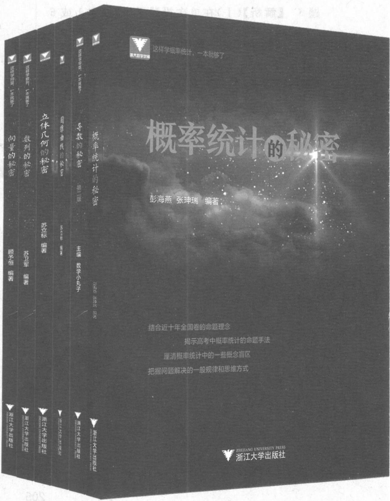

