# 立体几何的秘密

# LITI JIHE DE MIMI

苏立标（特级教师） 编著

深度学习“立几”的基本量问题

触及本源，化解“立几”学习的痛点

让“立几”问题不再淹没在茫茫的运算之中

突破“立几”学习的两大重要技巧：转化与借用

从“破”与“立”入手，重构知识，重现其独有的脉络感

# 立体几何的秘密

苏立标 编著

# 图书在版编目(CIP)数据

立体几何的秘密 / 苏立标编著. — 杭州 : 浙江大学出版社, 2021.5(2021.12 重印)

ISBN 978-7-308-21265-6

I. ①立… II. ①苏… III. ①立体几何课—高中—教学参考资料 IV. ①G634.633

中国版本图书馆 CIP 数据核字(2021)第 065783 号

# 立体几何的秘密

苏立标 编著

策划 陈海权(QQ:1010892859)

责任编辑 闫亮

责任校对 陈海权

封面设计 林智广告

出版发行 浙江大学出版社

(杭州市天目山路148号 邮政编码310007)

(网址:http://www.zjupress.com)

排版 杭州朝曦图文设计有限公司

印刷 杭州高腾印务有限公司

开 本 889mm×1194mm 1/16

印 张 11.25

字 数 370 千

版印次 2021年5月第1版 2021年12月第4次印刷

书号 ISBN 978-7-308-21265-6

定 价 36.00 元

版权所有 翻印必究 印装差错 负责调换

浙江大学出版社市场运营中心联系方式:0571-88925591;http://zjdxcbs.tmall.com

# 落霞与孤鹜齐飞 秋水共长天一色

——“立几”印象,只为欣赏空间图形的魅力

“前不见古人,后不见来者,念天地之悠悠,独怆然而涕下。”这是唐代文学家陈子昂对时间与空间的认识。时间的模型是一条两端无限延伸的直线,诗人处在原点,天与地各为两个平面,悠悠地、无限地延展着……几何就是在这样的空间中缓缓地拉开了序幕,这里的诗人、时间、天与地构成了点、线、面,而点、线、面则是构成空间几何图形的基本元素。立体几何是研究现实世界中物体的形状、大小与位置关系的数学学科,是认识空间图形,培养和发展空间想象能力、推理论证能力、运用图形语言进行交流能力以及几何直观能力的一门学科。

初识“立几”, 惊鸿一瞥. 大到浩瀚星空, 小到微观粒子, 都是立体几何所研究的范畴.

正如李尚志老师所描绘的:“锥顶柱身立海天,高低大小也浑然;平行垂直皆风景,有角有棱足壮观。”该诗生动、形象地描述了立体几何研究的对象是空间几何体.就像是海边一张建筑照片似的,建筑顶部是锥体,底部是柱体,墙的边缘、屋顶的边缘形成多面体的棱和角,棱与棱之间有的平行,有的垂直,这些既是大自然的风景,也是立体几何研究的主角.诗中还体现了一个生活哲理:壮丽的风景不能只要大的不要小的,只要高的不要低的,有大也有小,有高也有矮,有平行也要有垂直,多姿多彩,浑然一体,才是风景,才有壮观.从这个角度来看立体几何问题,其研究范围包罗万象,丰富多彩,无处不在,无时不有.可以说,立体几何的问题就是“顶天立地”的问题.

再识“立几”,惊叹于其无比严密的推理过程.竟把推理玩弄于股掌之间而游刃有余.曾经有一道大学生竞赛题目:

一个正三棱锥与一个正四棱锥,它们的所有棱长都相等,把这个正三棱锥的一个侧面重合在正四棱锥的一个侧面上,这个组合体的面有几个?

给出的参考答案是 7 个面. 其实, 如图所示, 当正三棱锥 $P-BCE$ 的一个侧面与正四棱锥 $P-ABCD$ 的一个侧面重合时, 得到的是一个三棱柱, 共 5 个面, 因为正四棱锥 $P-ABCD$ 的两个侧面所成的角与正三棱锥 $P-BCE$ 的两个侧面所成的角正好互补, 所以 $P, E, C, D$ 四点共面, 因此这个组合体共有 5 个面.

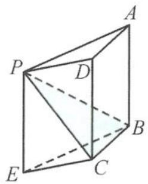

在学习立体几何的过程中,我们需要具备几何直观想象能力,几何直观想象是揭示现代数学本质的有力工具,是认识几何图形的基础.借助于几何直观、几何解释,启迪思路,这可以帮助我们理解和接受立体几何抽象的内容.但如果只有直观想象而没有严密推理的数学是非常可怕的.

正如章建跃博士所说：“如果说数学运算是数学的童子功，那么数学推理则是数学的命根子。”推理是立体几何问题解答的重要思维载体，在推理过程中渗透公理化思想，养成言必有据的理性思维精神。所以立体几何问题解答的推理过程要步步有据，条条有理，一步一骤总关“理”。从这个角度来看，立体几何是最讲“道理”的数学学科，是推理的天堂。在这里，大有“不懂推理者请勿入内”之范。

回眸“立几”时,大有蓦然回首之感. 立体几何是代数与几何的完美结合. 古人云:“风马牛不相及.”但空间、平面与向量却集一体,而且是“举杯邀明月,对影成三人”的和谐景象. 事实上,很多同学在学习立体几何问题时,有很多的无奈和苦衷,很多时候是错把几何问题当作代数来学,让美妙的几何问题淹没在茫茫的运算之中. 从这个角度来看,重振立体几何的“几何雄风”迫在眉睫,这是本书成册的一个美好的初衷,也是探索立体几何秘密的重要通道.

本书从立体几何学科的特点出发,重点讨论立体几何的基本量问题的深度学习,从学生学习立体几何的困惑点切入,重点突破立体几何学习中的转化与借用两大技巧,以弥补空间想象能力的不足.试图从“破”与“立”入手,对知识进行脱胎换骨式的重构,打通知识内在的“任督二脉”,盘活知识,使之变成鲜活的知识,使之变得更加丰满,重现其独有的脉络感.对方法进行深度架构,使得方法呈现立体骨感,凸显其系统性,达到一种境界:信手拈来,谈笑间樯橹灰飞烟灭.对于知识方法不求面面俱到,但求点点独到,触及问题的本源,化解立体几何学习的痛点.

让我们走进立体几何,欣赏立体几何的秘密!

因时间仓促,不足之处在所难免.读者对本书有什么修改意见和建议,欢迎加入“冲刺满分·秘密系列”图书交流 QQ 群(群号码:821526438),就书中的内容进行研讨!

如果你喜欢这种写作风格,欢迎阅读我写的另外一本书《圆锥曲线的秘密》.

苏立标(特级教师)

# 目录

# Contents

# 第一章 立体几何问题中的基本量

——又见炊烟袅袅升起 …… 1

1.1 基本量——表面积与体积 …… 2  
1.2 基本量——两大位置关系 8

1.2.1 平行关系 8  
1.2.2 垂直关系 12

1.3 基本量——三大空间角 …… 14

1.3.1 线线角 14  
1.3.2 线面角 19   
1.3.3 二面角 27

思考题 37

# 第二章 立体几何问题中的转化

——山不转水转 41

2.1 转化为法向量 42  
2.2 转化为平面 47

2.2.1 截面 47  
2.2.2 展开 48   
2.2.3 投影 52

2.3 转化为几何体 57

2.3.1 补成正方体 57  
2.3.2 补成长方体 58  
2.3.3 补成正四面体 61  
2.3.4 补成直三棱柱 62

思考题 63

# 目

# 录

# 第三章 立体几何问题中的借用

——春风又绿江南岸 65

3.1 借用符号 66  
3.2 借用图形 66

3.2.1 正方体或长方体 66  
3.2.2 正四面体 69  
3.2.3 球 69  
3.2.4 圆锥 70

3.3 借用运算 74

3.3.1 向量三项和的平方公式 74  
3.3.2 向量的对角线定理 75

3.4 借用结论 81

3.4.1 三余弦定理 81  
3.4.2 三正弦定理 83  
3.4.3 最大角与最小角定理 84

思考题 96

# 第四章 立体几何问题中的向量

——小荷才露尖尖角 99

4.1 空间向量的线性运算 …… 100  
4.2 空间向量的数量积 …… 102  
4.3 空间向量的综合问题 …… 107

思考题 …… 112

# 第五章 立体几何问题中的探究

——天光云影共徘徊 …… 114

5.1 以数学文化为情境的空间图形问题赏析 …… 115

5.1.1 与世界文化遗产有关 …… 115

# 目

# 录

5.1.2 与中国古代文化遗产有关 116  
5.1.3 与现代文化有关 124

# 5.2 活跃在动态空间图形中的轨迹问题综述 …… 125

5.2.1 判断动点轨迹类型的方法 125  
5.2.2 求动点轨迹的几何量(长度、周长、面积与体积等) 131   
5.2.3 求动点轨迹与最值 134

# 5.3 图形的翻折、旋转问题剖析 142

5.3.1 翻折、旋转问题中的基本量 142  
5.3.2 翻折、旋转问题中的轨迹 145  
5.3.3 翻折、旋转问题中的最值 147  
5.3.4 与其他知识的交汇问题 156

思考题 157

# 思考题解答 160

# 后记——你若盛开清风自来……172

text_image

微信公众号
教辅资料站

# 第一章

# 立体几何问题中的基本量

—— 又见炊烟袅袅升起

我们从一则案例说起. 古代有一次作画比赛, 画题是《深山藏古寺》, 许多考生都按题意作了画. 有的画的是崇山峻岭, 在松柏深处有座寺庙; 有的画的是山峦之间只露出寺庙一角; 有的只在山峦之间画出一幅高高飘着的幡. 可是这些画都没有被考官选中. 另有一名考生所作的画面上只有起伏的山峦, 密密的松林, 唯独没有寺庙, 也没有任何寺庙的标志, 只有一个和尚正从山脚沿着一条小道挑水上山. 最后, 这幅画被评为第一名.

你知道创作这幅画用了什么样的手法吗?推理:如果有和尚挑水上山,那么山里就有庙……

这也从某种意义上道出了推理的重要性,推理是打开立体几何大门的一把钥匙,推理是立体几何课程学习的基本技能.欧几里得公理体系把几何与逻辑结合起来,几何就与演绎推理从此结下了不解之缘,几何学成为训练逻辑推理的天然素材.研究立体几何问题,我们就从关键问题,即从立体几何的基本量开始,立体几何中的基本量是构成立体几何问题的核心内容,是立体几何中最璀璨的篇章,也是高考、学考、竞赛重点考查的内容,深刻理解概念与原理是高考等考试成功的必要条件.

# 1.1 基本量——表面积与体积

求几何体的体积要充分利用多面体的截面和旋转体的轴截面,将空间问题转化为平面问题,把不规则的几何体化为规则的几何体.

<table><tr><td>几何体</td><td>侧面展开图</td><td>侧面积公式</td></tr><tr><td>圆柱</td><td>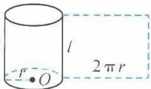</td><td> $S_{\text{圆柱侧}} = 2\pi rl$ </td></tr><tr><td>圆锥</td><td>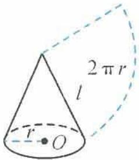</td><td> $S_{\text{圆锥侧}} = \pi rl$ </td></tr><tr><td>圆台</td><td>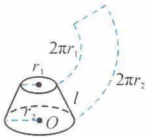</td><td> $S_{\text{圆台侧}} = \pi (r_1 + r_2)l$ </td></tr></table>

注：求棱柱、棱锥、棱台的表面积需要先求各个面的面积（不外乎三角形面积，平行四边形面积）.

<table><tr><td>几何体</td><td>表面积</td><td>体积</td></tr><tr><td>棱柱、圆柱</td><td> $S_{\text{表}} = S_{\text{侧}} + 2S_{\text{底}}$ </td><td> $V = Sh$ </td></tr><tr><td>棱锥、圆锥</td><td> $S_{\text{表}} = S_{\text{侧}} + S_{\text{底}}$ </td><td> $V = \frac{1}{3}Sh$ </td></tr><tr><td>棱台、圆台</td><td> $S_{\text{表}} = S_{\text{侧}} + S_{\text{上}} + S_{\text{下}}$ </td><td> $V = \frac{1}{3}(S_{\text{上}} + S_{\text{下}} + \sqrt{S_{\text{上}} \cdot S_{\text{下}}})h$ </td></tr><tr><td>球</td><td> $S = 4\pi R^{2}$ </td><td> $V = \frac{4}{3}\pi R^{3}$ </td></tr></table>

例 1 已知三棱柱 $ABC-A_{1}B_{1}C_{1}$ 的侧棱与底面垂直, 底面是边长为 $\sqrt{3}$ 的正三角形, 设 P 为底面 $A_{1}B_{1}C_{1}$ 的中心, 若 PA 与平面 ABC 所成角的大小为 $\frac{\pi}{3}$ , 则三棱柱 $ABC-A_{1}B_{1}C_{1}$ 的体积为().

A. $\frac{3}{4}$

B. $\frac{9}{4}$

C. $\frac{1}{4}$

D. $\frac{9}{2}$

解答 如图 1.1-1, 设点 Q 为底面 ABC 的中心, 连接 PQ, 则 $PQ \perp$ 平面 ABC. 所以 $\angle PAQ$ 为 PA 与平面 ABC 所成的角, 即

$$
\angle P A Q = \frac {\pi}{3}.
$$

又 $AQ = 1$ ，所以

$$
P Q = \sqrt {3}.
$$

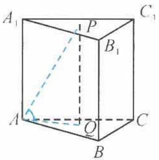

text_image

A₁
P
C₁
B₁
A
Q
C
B

图1.1-1

从而

$$
V _ {A B C - A _ {1} B _ {1} C _ {1}} = S _ {\triangle A B C} \cdot P Q = \frac {\sqrt {3}}{4} \times (\sqrt {3}) ^ {2} \times \sqrt {3} = \frac {9}{4}.
$$

故选B.

引申 在三棱锥 $P - ABC$ 中, 已知 $AB = BC = CA = AP = 3, PB = 4, PC = 5$ , 求三棱锥 $P - ABC$ 的体积.

解答 因为 AB = AC = AP = 3, 所以顶点 A 在平面 PBC 上的射影 O 为 $\triangle PBC$ 的外心. 而 $\triangle PBC$ 为直角三角形, 所以 O 为 Rt $\triangle PBC$ 的斜边 PC 的中点, 得

$$
A O = \frac {\sqrt {1 1}}{2}.
$$

从而

$$
V _ {P - A B C} = V _ {A - P B C} = \frac {1}{3} S _ {\triangle P B C} \cdot A O = \sqrt {1 1}.
$$

点评 例1就是最基本的体积计算问题,但更多的体积计算可能需要关注等底、等高,进行置换运算.另外,还要注意求几何体体积的一些重要的方法与技巧,如分割法、补形法、等体积法等的应用.

例 2 如图 1.1-2, 在三棱柱 $ABC-A_{1}B_{1}C_{1}$ 中, 侧棱 $AA_{1}=1, AA_{1}\perp$ 平面 $AB_{1}C_{1}$ , 底面 $\triangle ABC$ 是边长为 2 的正三角形, 求此三棱柱的体积.

解答 设此三棱柱的体积为 $V_{三棱柱}$ ，则

$$
V _ {\mathrm{三棱柱}} = 3 V _ {A - A _ {1} B _ {1} C _ {1}}.
$$

因为

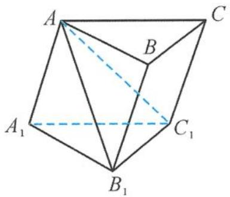

text_image

A
B
C
A₁
C₁
B₁

图1.1-2

$$
\begin{array}{l} V _ {A - A _ {1} B _ {1} C _ {1}} = V _ {A _ {1} - A B _ {1} C _ {1}} = \frac {1}{3} A A _ {1} \cdot S _ {\triangle A B _ {1} C _ {1}} \\ = \frac {1}{3} \times 1 \times \left(\frac {1}{2} \times 2 \times \sqrt {2}\right) = \frac {\sqrt {2}}{3}, \\ \end{array}
$$

所以

$$
V _ {\mathrm{三棱柱}} = 3 V _ {A _ {1} - A B _ {1} C _ {1}} = \sqrt {2}.
$$

引申 如图 1.1-3, 在三棱柱 $A_{1}B_{1}C_{1}-ABC$ 中, 已知 $D, E, F$ 分别为 $AB$ , $AC, AA_{1}$ 的中点, 设三棱锥 $F-ADE$ 的体积为 $V_{1}$ , 三棱柱 $A_{1}B_{1}C_{1}-ABC$ 的体积为 $V_{2}$ , 则 $V_{1}: V_{2}=$ \_\_\_\_.

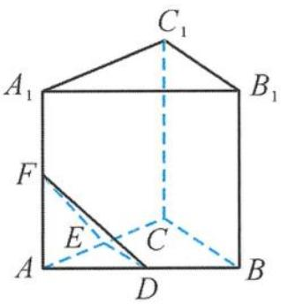

text_image

C₁
A₁
B₁
F
E
C
A
D
B

图1.1-3

解答 因为 D, E 分别是 AB, AC 的中点, 所以

$$
S _ {\triangle A D E}: S _ {\triangle A B C} = 1: 4.
$$

又 $F$ 是 $AA_{1}$ 的中点, 所以点 $A_{1}$ 到底面 $ABC$ 的距离为点 $F$ 到底面 $ABC$ 的距离的 2 倍, 即三棱柱 $A_{1}B_{1}C_{1}-ABC$ 的高是三棱锥 $F-ADE$ 高的 2 倍. 所以

$$
V _ {1}: V _ {2} = \frac {1}{2 4}.
$$

例 3 如图 1.1-4, 在多面体 ABCDE 中, 若 AE ⊥ 平面 ABC, BD // AE, 且 AC = AB = BC = BD = 2, AE = 1, 则多面体 ABCDE 的体积为 \_\_\_\_.

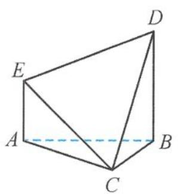

natural_image

Geometric diagram of a polyhedron with labeled vertices A, B, C, D, E (no text or symbols beyond labels)

图1.1-4

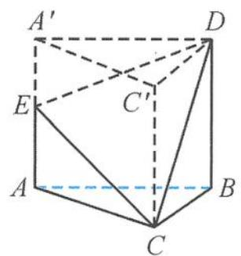

text_image

A'
D
E
C'
A
B
C

图1.1-5

解答 如图 1.1-5, 把多面体 ABCDE 补成直三棱柱 $ABC-A'C'D$ , 则

$$
V _ {\mathrm{三棱柱}} = V _ {C - A B D E} + V _ {D - C E A ^ {\prime} C ^ {\prime}},
$$

且

$V_{C-ABDE} = V_{D-CEA'C'}$ (等底等高).

易知

$$
V _ {\mathrm{多面体} A B C D E} = \frac {1}{2} V _ {\mathrm{三棱柱}} = \frac {1}{2} \times \frac {\sqrt {3}}{4} \times 2 ^ {2} \times 2 = \sqrt {3}.
$$

点评 “补”一下,则海阔天空.“割”与“补”是求空间几何体体积的重要方法,“割”与“补”把不规则的图形转化成规则图形(易于求体积的几何体),使问题得以解决.

例 4 如图 1.1-6, 在 $\triangle ABC$ 中, 已知 $\angle C = 90^{\circ}, PA \perp$ 平面 $ABC, AE \perp PB$ 于点 $E, AF \perp PC$ 于点 $F, AP = AB = 2, \angle EAF = \alpha$ . 当 $\alpha$ 变化时, 三棱锥 $P-AEF$ 体积的最大值是 ( ).

A. $\frac{\sqrt{2}}{2}$

B. $\frac{\sqrt{2}}{4}$

C. $\frac{\sqrt{2}}{6}$

D. $\frac{\sqrt{2}}{8}$

解答 在 Rt△PAB 中, 因为 PA = AB = 2, 所以

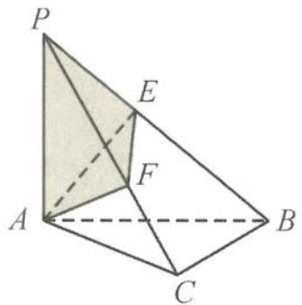

text_image

P
E
F
A
B
C

图1.1-6

$$
P B = 2 \sqrt {2}.
$$

因为 $AE \perp PB$ ，所以 $AE = \frac{1}{2}PB = \sqrt{2}$ ，所以

$$
P E = B E = \sqrt {2}.
$$

因为 PA ⊥ 底面 ABC, 得

$$
P A \perp B C, A C \perp B C, P A \cap A C = A,
$$

所以 $BC \perp$ 平面 $PAC$ , 可得

$$
A F \perp B C.
$$

因为 $AF \perp PC, BC \cap PC = C$ ，所以 $AF \perp$ 平面 PBC。又 $PB \subset$ 平面 PBC，所以

$$
A F \perp P B.
$$

因为 $AE \perp PB$ 且 $AE \cap AF = A$ , 所以 $PB \perp$ 平面 $AEF$ , 三棱锥 $P-AEF$ 的高 $PE = \sqrt{2}$ 为定值.

因为 $AF \perp$ 平面 $PBC, EF \subset$ 平面 $PBC$ , 所以

$$
A F \perp E F.
$$

在 Rt△AEF 中，

$$
A F = \sqrt {2} \cos \alpha , E F = \sqrt {2} \sin \alpha ,
$$

所以

$$
S _ {\triangle A E F} = \frac {1}{2} A F \cdot E F = \frac {1}{2} \times \sqrt {2} \sin \alpha \times \sqrt {2} \cos \alpha = \frac {1}{2} \sin 2 \alpha .
$$

当 $\sin 2\alpha = 1$ ，即 $\alpha = 45^{\circ}$ 时， $S_{\triangle AEF}$ 有最大值 $\frac{1}{2}$

此时,三棱锥 P-AEF 的体积的最大值为 $\frac{1}{3} \times \frac{1}{2} \times \sqrt{2} = \frac{\sqrt{2}}{6}$ . 故选 C.

引申 如图 1.1-7, 在 $\triangle ABC$ 中, $AB = BC = 2$ , $\angle ABC = 120^{\circ}$ . 若平面 $ABC$ 外的点 $P$ 和线段 $AC$ 上的点 $D$ , 满足 $PD = DA$ , $PB = BA$ , 则四面体 $PBCD$ 的体积的最大值是 \_\_\_\_.

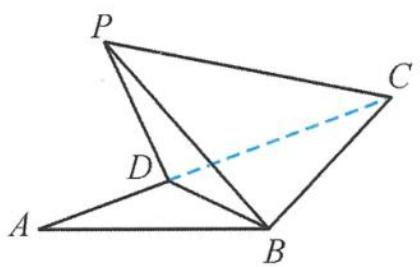

text_image

P
C
D
A
B

图 1.1-7

解答 设 $CD = x (0 < x < 2\sqrt{3})$ ，点 $P$ 到平面 $ABC$ 的距离为 $h$ ，则

$$
A D = P D = 2 \sqrt {3} - x.
$$

所以

$$
\begin{array}{l} V _ {P - B C D} = \frac {1}{3} S _ {\triangle B C D} \cdot h \leqslant \frac {1}{3} S _ {\triangle B C D} \cdot P D = \frac {1}{3} \times \frac {1}{2} x (2 \sqrt {3} - x) = \frac {1}{6} x (2 \sqrt {3} - x) \\ \leqslant \frac {1}{6} \left[ \frac {x + (2 \sqrt {3} - x)}{2} \right] ^ {2} = \frac {1}{2}. \\ \end{array}
$$

当 $x = \sqrt{3}$ 且 $PD \perp$ 平面 $ABC$ 时，四面体 $PBCD$ 的体积的最大值是 $\frac{1}{2}$ .

例 5 如图 1.1-8, 设正三棱柱 $ABC-A_{1}B_{1}C_{1}$ 的高为 4, 底面边长为 $4\sqrt{3}$ , D 是 $B_{1}C_{1}$ 的中点, P 是线段 $A_{1}D$ 上的动点, 过 BC 作截面 $\alpha \perp AP$ 于点 E, 则三棱锥 P-BCE 体积的最小值为().

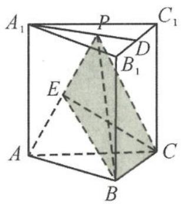

text_image

A₁
P
C₁
D
B₁
E
A
B
C

图1.1-8

A. 3

B. $2\sqrt{3}$

C. $4\sqrt{3}$

D. 12

解答 因为三棱锥 P-ABC 体积为定值, 即

$$
V _ {P - A B C} = \frac {1}{3} \times 4 \times \frac {\sqrt {3}}{4} \times (4 \sqrt {3}) ^ {2} = 1 6 \sqrt {3},
$$

所以问题转化为求三棱锥 E-ABC 体积的最大值. 而底面 $\triangle ABC$ 的面积是定值 $12\sqrt{3}$ ，故只需要求三棱锥 E-ABC 的高 h 的最大值.

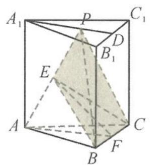

text_image

A₁
P
C₁
D
B₁
E
A
B
F
C

(a)

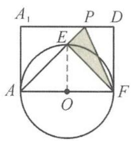  
(b)   
图1.1-9

如图 1.1-9(a), 取 BC 的中点 F, 得 $BC \perp$ 平面 AEF, 所以点 E 在平面 ABC 上射影落在 AF 上. 因为点 E 在以 AF 为直径的圆 O 上运动 (图 1.1-9(b)), 所以

$$
h _ {\mathrm{max}} = \frac {1}{2} A F = 3.
$$

从而

$$
(V _ {E - A B C}) _ {\max} = \frac {1}{3} \times 1 2 \sqrt {3} h _ {\max} = 1 2 \sqrt {3},
$$

故

$$
(V _ {P - B C E}) _ {\min} = V _ {P - A B C} - (V _ {E - A B C}) _ {\max} = 4 \sqrt {3}.
$$

因此选C.

点评 这是有关几何体体积的最值问题,关键在于转化,对于求高的最值要先确定动点的轨迹,再根据条件求体积的最值.

例 6 如图 1.1-10, 已知线段 AB 是圆的直径, 圆内的一条动弦 CD 与 AB 交于点 M, 且 MB = 2AM = 2, 现将半圆 ACB 沿直径 AB 翻折, 则三棱锥 C-ABD 体积的最大值是( ).

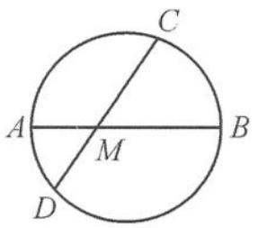  
图1.1-10

A. $\frac{2}{3}$

B. $\frac{1}{3}$

C. 3

D. 1

解答 因为 $MB = 2AM = 2$ ，所以 $AB = 3$

$$
D M \cdot C M = A M \cdot B M = 2.
$$

设翻折后 CM 与平面 ABD 所成的角为 $\alpha$ ，则三棱锥 C-ABD 的高为 $CM\sin\alpha$ ，所以

$$
V _ {C - A B D} = \frac {1}{3} \left(\frac {1}{2} A B \cdot D M \cdot \sin \angle D M A\right) \cdot C M \sin \alpha
$$

$$
= \frac {1}{6} A B \cdot D M \cdot C M \cdot \sin \angle D M A \cdot \sin \alpha
$$

$$
= \sin \angle D M A \cdot \sin \alpha \leqslant 1,
$$

当 $\angle DMA = \alpha = \frac{\pi}{2}$ 时, 取到最大值, 所以体积的最大值为 1. 故选 D.

例 7 如图 1.1-11, 在平面四边形 ABCD 中, 已知 AB = AD = 1, $BD = \sqrt{2}$ , $CD = \sqrt{3}$ , $BD \perp CD$ , 将其沿对角线 BD 折成四面体 $A' - BCD$ , 使平面 $A'BD \perp$ 平面 BCD, 则四面体 $A' - BCD$ 的外接球的球心到平面 $A'CD$ 的距离等于 \_\_\_\_.

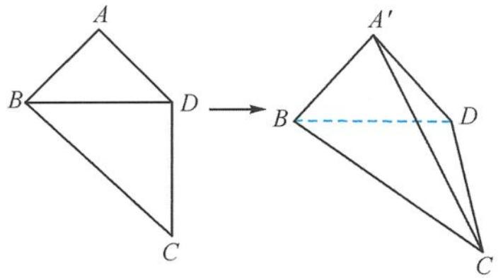

text_image

A
B D
C
A'
B D
C

图1.1-11

解答 解题的关键在于确定球心的位置,可以利用外接球的球心的特点:到四面体 $A^{\prime}-BCD$ 的各个顶点的距离都相等.所以,先确定到底面 $Rt\triangle BCD$ 的三个顶点距离相等的点的位置,恰好在斜边 BC 的中点 O 处,且 $OB = OC = OD = \frac{\sqrt{5}}{2}$ .取 BD 的中点 M,则 $A^{\prime}M \perp BD$ .因为平面 $A^{\prime}BD \perp$ 平面 BCD,所以 $A^{\prime}M \perp$ 平面 BCD,得 $A^{\prime}M \perp MO$ .

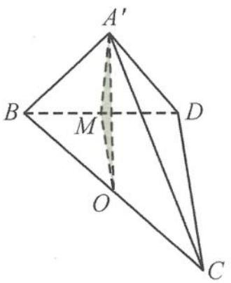

text_image

A'
B
M
D
O
C

图1.1-12

如图 1.1-12, 在 Rt△A'MO 中,

$$
A ^ {\prime} O = \sqrt {A ^ {\prime} M ^ {2} + M O ^ {2}} = \frac {\sqrt {5}}{2},
$$

所以点 O 为球心. 点 O 到平面 $A^{\prime}CD$ 的距离 d 是点 B 到平面 $A^{\prime}CD$ 距离的一半, 而 $A^{\prime}B \perp$ 平面 $A^{\prime}CD$ , 所以

$$
d = \frac {1}{2} A B = \frac {1}{2}.
$$

点评 这是球的“接与切”问题,困难在于确定球心的位置,由平面到空间,先由三角形的外心确定到平面三个点的距离相等,再在空间中确定到另外一点的距离相等即可.

引申 1 在《九章算术》中, 将底面为长方形且有一条侧棱与底面垂直的四棱锥称之为阳马. 若四棱锥 $P-ABCD$ 为阳马, 底面 $ABCD$ 为矩形, $PA \perp$ 平面 $ABCD$ , $AB = 2$ , $AD = 4$ , 二面角 $P-BC-A$ 为 $60^\circ$ , 则四棱锥 $P-ABCD$ 的外接球的表面积为 ( ).

A. $16 \pi$

B. ${20\pi }$

C. $\frac{64}{3} \pi$

D. $32 \pi$

解答 因为 $PA \perp$ 平面ABCD，底面ABCD为矩形，所以

$$
P A \perp B C, A B \perp B C.
$$

从而 BC ⊥ 平面 PAB, 所以

$$
B C \perp P B.
$$

故 $\angle PBA$ 即为二面角 $P - BC - A$ 的平面角，即 $\angle PBA = 60^{\circ}$ ，所以

$$
P A = A B \cdot \tan 6 0 ^ {\circ} = 2 \sqrt {3}.
$$

将该四棱锥补成一个长、宽、高分别为 $4,2,2\sqrt{3}$ 的长方体，如图1.1-13.该长方体外接球的半径为 $r$ ，则

$$
(2 r) ^ {2} = 4 ^ {2} + 2 ^ {2} + (2 \sqrt {3}) ^ {2},
$$

解得

$$
r = 2 \sqrt {2}.
$$

所以该球的表面积

$$
S = 4 \pi r ^ {2} = 4 \pi \times (2 \sqrt {2}) ^ {2} = 3 2 \pi ,
$$

所以四棱锥 $P - ABCD$ 的外接球的表面积为 $32 \pi$ . 故选 D.

点评 求外接球的表面积和体积,关键是求出球的半径,求外接球半径的常见方法:①若三条棱两两垂直,则用 $4R^{2}=a^{2}+b^{2}+c^{2}(a,b,c$ 为三条棱的长);②若SA⊥平面ABC(SA=a),则 $4R^{2}=4r^{2}+a^{2}(r$ 为△ABC外接圆的半径);③转化为长方体的外接球;④特殊几何体可以直接找出球心和半径.

引申 2 一个棱长为 6 的正四面体纸盒内放一个正方体, 若正方体可以在纸盒内任意转动, 则正方体棱长的最大值为 \_\_\_\_.

解答 设正方体的棱长为 a，因为正方体可以在纸盒内任意转动，所以正方体在正四面体的内切球内，此时的球具有“双重身份”，对正四面体来说是内切球，对正方体来说是外接球。

而内切球的半径 $r = \frac{\sqrt{6}}{2}$ ，所以

$$
\sqrt {3} a _ {\max} = 2 r = \sqrt {6},
$$

解得

$$
a _ {\max} = \sqrt {2}.
$$

# 1.2 基本量——两大位置关系

在位置关系中,核心问题的解决涉及平行的传递与垂直的转换,善于转化是解决立体几何中的平行与垂直问题的关键所在.

# 1.2.1 平行关系

考虑“线线平行”时,可将其转化为“线面平行”或“面面平行”;考虑“线面平行”时,可将其转化为“线线平行”或“面面平行”;考虑“面面平行”时,可将其转化为“线线平行”或“线面平行”.平行关系是各种度量关系和计算公式的基础.

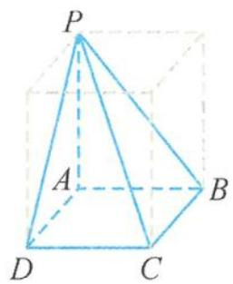  
图1.1-13

例 1 如图 1.2-1, 在三棱柱 $ABC-A_{1}B_{1}C_{1}$ 中, 已知 M, N 分别为 $AC, B_{1}C_{1}$ 的中点, E, F 分别为 BC, $B_{1}B$ 的中点, 则直线 MN 与直线 EF、平面 $ABB_{1}A_{1}$ 的位置关系为().

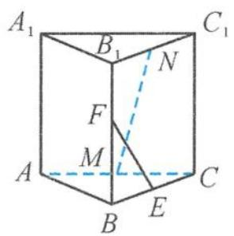  
图1.2-1

A. 平行、平行

B. 异面、平行

C. 平行、相交

D. 异面、相交

解答 易判断直线 $MN$ 与直线 $EF$ 是异面直线, 连接 $ME, NE$ , 如图1.2-2.由三角形的中位线性质得

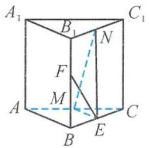  
图1.2-2

$$
M E \parallel A B, N E \parallel B B _ {1},
$$

得平面 $MNE \parallel$ 平面 $ABB_{1}A_{1}$ , 所以

$$
M N \parallel \text { 平面 } A B B _ {1} A _ {1}.
$$

故选 B.

引申 如图 1.2-3, 已知 $ABCD-A_{1}B_{1}C_{1}D_{1}$ 是正方体, $E$ 为棱 $BB_{1}$ 上的动点 (不含端点), 平面 $A_{1}C_{1}E$ 与底面 $ABCD$ 的交线为 $l$ , 则 $l$ 与 $AC$ 的位置关系是 ( ).

A. 异面

B. 平行

C. 相交

D. 与 $E$ 点位置有关

解答 由于 $A_{1}C_{1} \parallel$ 平面ABCD，平面 $A_{1}C_{1}E \cap$ 平面 $ABCD = l$ ，根据“线面平行”的性质定理可知

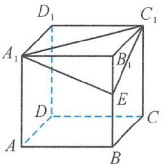

text_image

D₁
C₁
A₁
B₁
E
D
C
A
B

图1.2-3

$$
A _ {1} C _ {1} \parallel l.
$$

由于 $A_{1}C_{1} \parallel AC$ ，所以

$$
l \parallel A C.
$$

故选 B.

点评 常见的线面平行的证明方法有:①通过“面面平行”得“线面平行”;②通过“线线平行”得“线面平行”,再证明“线线平行”中,经常用到中位线定理或平行四边形性质.另外,解决该引申问题的困难就在于确定平面 $A_{1}C_{1}E$ 与底面ABCD的交线 $l$ ,交线 $l$ 是“隐交线”,只知道有却不知道在哪里.我们可以画出交线,也可以不画出.正如贾岛的《寻隐者不遇》所描绘:“松下问童子,言师采药去;只在此山中,云深不知处.”诗的意境,简直是为“隐交线”而作的.

例 2 如图 1.2-4, 在棱长为 1 的正方体 $ABCD-A_{1}B_{1}C_{1}D_{1}$ 中, 已知 $AP = BQ = x (0 < x < 1)$ , 截面 $PQEF \parallel A_{1}D$ , 截面 $PQGH \parallel AD_{1}$ , 则截面 $PQEF$ 和截面 $PQGH$ 的面积之和为 \_\_\_\_.

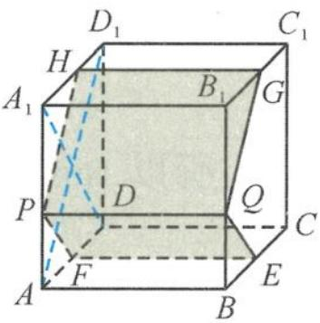

text_image

D₁
H
C₁
A₁
B₁
G
P
D
Q
C
A
F
E
B

图1.2-4

解答 因为平面 $PQEF \parallel A_{1}D$ ，平面 $PQEF \cap$ 平面 $AA_{1}D_{1}D = PF$ ，所以 $PF \parallel A_{1}D$ .

同理可得

$$
P H \parallel A D _ {1}.
$$

因为 $AP \parallel BQ, AP = BQ$ , 所以 $APQB$ 是平行四边形, 所以 $PQ \parallel AB$ . 在正方体中, 因为 $AD_{1} \perp A_{1}D, AD_{1} \perp AB$ , 所以

$$
P H \perp P F, P H \perp P Q.
$$

截面 PQEF 和截面 PQGH 都是矩形, 且

$$
P Q = 1, P F = \sqrt {2} A P, P H = \sqrt {2} P A _ {1},
$$

所以截面 PQEF 和截面 PQGH 的面积之和是

$$
(\sqrt {2} A P + \sqrt {2} P A _ {1}) \cdot P Q = \sqrt {2}.
$$

故答案为 $\sqrt{2}$ .

例 3 如图 1.2-5, 在正方体 $ABCD-A_{1}B_{1}C_{1}D_{1}$ 中, 已知 E 是 AB 的中点, 点 F 在 $CC_{1}$ 上, 且 $CF = 2FC_{1}$ , 点 P 是侧面 $AA_{1}D_{1}D$ (包括边界) 上的动点, 且 $PB_{1} \parallel$ 平面 DEF, 则 $\tan\angle ABP$ 的取值范围是 \_\_\_\_.

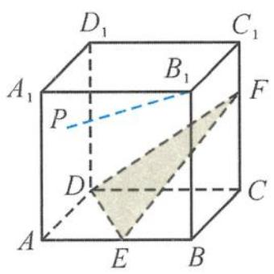

text_image

D₁
C₁
A₁
B₁
P
F
D
C
A
E
B

图1.2-5

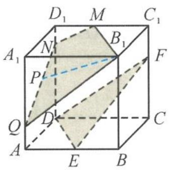

text_image

D₁ M C₁
A₁ N B₁ F
P
Q D C
A E B

图1.2-6

解答 如图 1.2-6, 作出平面 $MNQB_{1} \parallel$ 平面 DEF, 则

$$
A _ {1} Q = 2 A Q, D N = 2 D _ {1} N, M \text {   为   } D _ {1} C _ {1} \text {   的中点.   }
$$

因为 $PB_{1} \parallel$ 平面 DEF, 所以点 P 的轨迹是线段 QN, 因此:

当点 P 运动到点 Q 处时, $\tan\angle ABP$ 取得最小值, 此时

$$
\tan \angle A B P = \frac {A Q}{A B} = \frac {1}{3};
$$

当点 P 运动到点 N 处时, $\tan\angle ABP$ 取得最大值, 此时

$$
\tan \angle A B P = \frac {A N}{A B} = \frac {\sqrt {1 3}}{3}.
$$

所以 $\tan\angle ABP$ 的取值范围是 $\left[\frac{1}{3},\frac{\sqrt{13}}{3}\right]$ .

例 4 已知 E, F 是四面体的棱 AB, CD 的中点, 过 EF 的平面与棱 AD, BC 分别相交于点 G, H, 则( ).

A. GH 平分 EF, $\frac{BH}{HC} = \frac{AG}{GD}$

B. EF 平分 GH, $\frac{BH}{HC} = \frac{GD}{AG}$

C. EF 平分 GH, $\frac{BH}{HC} = \frac{AG}{GD}$

D. GH 平分 EF, $\frac{BH}{HC} = \frac{GD}{AG}$

解答 如图 1.2-7, 设 AC, BD 的中点分别为 M, N, 则四边形 EMFN 为平行四边形, 且 AD // 平面 EMFN, BC // 平面 EMFN.

设 $GH \cap EF = O$ , 连接 $OK$ (K 为 $DH$ 的中点), 则 $OK \parallel DG$ . 由于 $K$ 为 $DH$ 的中点, 故 $O$ 为 $GH$ 的中点, 即 $EF$ 平分 $GH$ .

TEH 为 $\triangle ABC$ 的一条截线, 由梅涅劳斯定理可得 $\frac{BH}{HC} \cdot \frac{CT}{TA} \cdot \frac{AE}{EB}$ = 1, 故

$$
\frac {B H}{H C} = \frac {T A}{C T};
$$

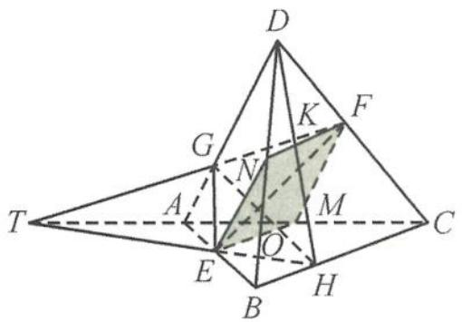

text_image

Geometric diagram of a tetrahedron with labeled vertices and internal points, including a shaded triangular region.

图1.2-7

TGF 为 $\triangle ADC$ 的一条截线, 由梅涅劳斯定理可得 $\frac{DF}{FC} \cdot \frac{CT}{TA} \cdot \frac{AG}{GD} = 1$ , 故

$$
\frac {A G}{G D} = \frac {T A}{C T}.
$$

从而 $\frac{BH}{HC}=\frac{AG}{GD}.$

当截面 EHFG 为平行四边形时, 显然成立, 故选 C.

知识储备 梅涅劳斯定理: 若直线 l 不经过 $\triangle ABC$ 的顶点, 并且与 $\triangle ABC$ 的三条边 BC, CA, AB 或它们的延长线分别交于 P, Q, R, 如图 1.2-8, 则

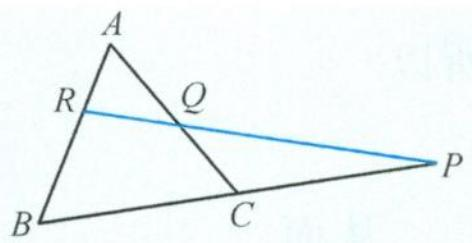

text_image

A
R
Q
B
C
P

图1.2-8

$$
\frac {B P}{P C} \cdot \frac {C Q}{Q A} \cdot \frac {A R}{R B} = 1.
$$

简单应用 如图1.2-9, 在四面体ABCD中, 已知G是BC的中点, E, F满足 $\overrightarrow{AE} = \frac{1}{3} \overrightarrow{AB}, \overrightarrow{DF} = \frac{1}{3} \overrightarrow{DC}$ , 设平面EGF交AD于点H, 则 $\left|\frac{AH}{HD}\right| =$ \_\_\_\_.

解答 如图1.2-10, 延长 $BD$ , 与 $GF$ 的延长线交于点 $M$ ; 延长 $BD$ , 与 $EH$ 的延长线交于点 $N$ . 由平面的基本性质的基本事实3可得点 $M, N$ 重合.

GFM 为 $\triangle BCD$ 的一条截线,由梅涅劳斯定理可得

$$
\frac {B G}{G C} \cdot \frac {C F}{F D} \cdot \frac {D M}{M B} = 1,
$$

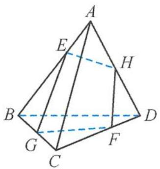

text_image

A
E
H
B
G
C
F
D

图1.2-9

即为 $1 \cdot 2 \cdot \frac{DM}{MB} = 1$ ，即 $\frac{DM}{MB} = \frac{1}{2}$ ，

同理, EHM 为 $\triangle BAD$ 的一条截线, 由梅涅劳斯定理可得

$$
\frac {A E}{E B} \cdot \frac {B M}{M D} \cdot \frac {D H}{H A} = 1,
$$

即为 $\frac{1}{2}\cdot2\cdot\frac{DH}{HA}=1$ ,可得 $\frac{DH}{HA}=1$ .

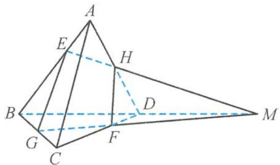

text_image

Geometric diagram of a pyramid with labeled vertices and internal points, including dashed lines indicating hidden edges.

图1.2-10

故答案为 1.

# 1.2.2 垂直关系

垂直是众多空间位置关系的枢纽,是各种垂直关系与平行关系相互转化,也是空间角转化为平面角的重要支撑.

例 5 在正三棱锥 A-BCD 中, 已知点 P, Q, R 分别在棱 BC, BD, AB 上, $CP = \frac{1}{2}CB$ , $BQ = \frac{1}{4}BD$ , $AR = \frac{1}{2}AB$ . 证明: 平面 $RPQ \perp$ 平面 BCD.

证明 如图 1.2-11, 取 BD 的中点为 O, 连接 AO, OC, PQ, RQ, PR. 因为三棱锥 A-BCD 为正三棱锥, 所以

$$
A B = A D = A C, B C = C D = B D.
$$

因此 $AO \perp BD, CO \perp BD$ ，又因为 $CP = \frac{1}{2} CB, BQ = \frac{1}{4} BD, AR = \frac{1}{2} AB$ ，所以

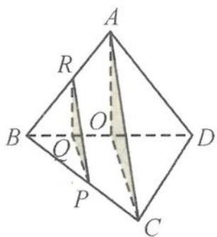

text_image

A
R
O
B
Q
P
C
D

图1.2-11

$$
R Q \parallel A O, P Q \parallel C O.
$$

从而

$$
B D \perp P Q, B D \perp Q R.
$$

又 $RQ \cap PQ = Q$ ，故 $BD \perp$ 平面 $PQR$ . 又 $BD \subset$ 平面 $BCD$ ，所以平面 $RPQ \perp$ 平面 $BCD$ .

例 6 如图 1.2-12, 在四棱锥 P-ABCD 中, 已知 PA = PB = AD = CD = $\frac{1}{2}BC = 2$ , AD // BC, AD ⊥ CD, E 是 PA 上的动点, 平面 PAB ⊥ 平面 ABCD. 证明: PB ⊥ CE.

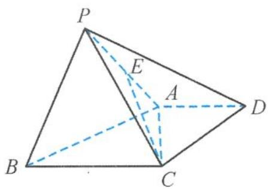

text_image

P
E
A
D
B
C

图1.2-12

解答 由已知可得,在直角梯形 ABCD 中, $AD = CD = \frac{1}{2}BC = 2$ ,
所以

$$
B C = 4, A C = \sqrt {A D ^ {2} + C D ^ {2}} = 2 \sqrt {2}, A B = \sqrt {C D ^ {2} + (B C - A D) ^ {2}} = 2 \sqrt {2},
$$

从而

$$
A B ^ {2} + A C ^ {2} = B C ^ {2}.
$$

故 $AC \perp AB$ .

又因为平面 $PAB \perp$ 平面 $ABCD$ , 平面 $PAB \cap$ 平面 $ABCD = AB$ , 所以 $AC \perp$ 平面 $PAB$ . 因为 $PB \subset$ 平面 $PAB$ , 所以

$$
A C \perp P B.
$$

又 $PA = PB = 2, AB = 2\sqrt{2}$ , 所以

$$
P A ^ {2} + P B ^ {2} = A B ^ {2},
$$

所以 $PB \perp PA$ .

因为 $PA \cap AC = A$ ，且 $PA \subset$ 平面 $PAC, AC \subset$ 平面 $PAC$ ，所以 $PB \perp$ 平面 $PAC$ . 又 $CE \subset$ 平面 $PAC$ ，所以

$$
P B \perp C E.
$$

点评 先通过数据计算得到位置关系(垂直),再通过“面面垂直”与“线面垂直”进行转化,从而使问题得到解决.有人总结到“信息藏在数据里,沿着垂面作垂线,垂线藏在垂面里.”

引申 如图1.2-13, 在三棱柱 $ABC - A_{1}B_{1}C_{1}$ 中, 已知 $CC_{1} \perp$ 平面 $ABC, AB = 5, AC = 3$ , $BC = CC_{1} = 4, M$ 是 $CC_{1}$ 的中点.

(Ⅰ) 证明: $BC \perp AM$ .   
(Ⅱ) 若 N 是 AB 上的点, 且 CN // 平面 $AB_{1}M$ , 求 BN 的长.

证明 （Ⅰ）因为 $CC_{1} \perp$ 平面 ABC，所以

$$
C C _ {1} \perp B C.
$$

因为 $AB = 5, AC = 3, BC = 4$ ，所以 $AC^2 + BC^2 = AB^2$ ，即

$$
B C \perp A C.
$$

又 $AC \cap CC_{1} = C$ ，所以 $BC \perp$ 平面 $AA_{1}C_{1}C$ . 又 $AM \subset$ 平面 $AA_{1}C_{1}C$ ，所以

$$
B C \perp A M.
$$

(II) 如图 1.2-14, 过点 N 作 $NE \parallel BB_{1}$ , 交 $AB_{1}$ 于点 E, 连接 ME.

因为 $BB_{1} \parallel CC_{1}$ ，所以 $NE \parallel CC_{1}$ ，即四边形 NEMC 为平面图形。

又 $CN \parallel$ 平面 $AB_{1}M, CN \subset$ 平面 NEMC，且平面 $NEMC \cap$ 平面 $AB_{1}M = ME$ ，所以

$$
C N \parallel M E.
$$

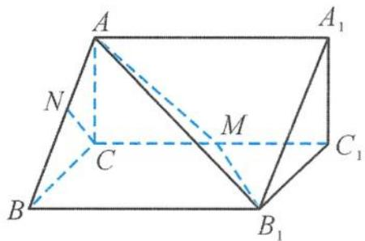

text_image

A
N
C
M
B
B₁
A₁
C₁

图1.2-13

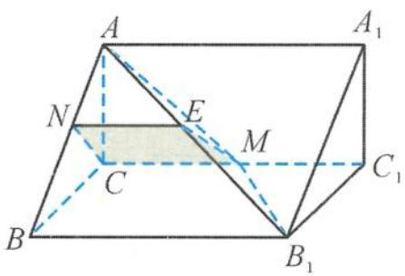

text_image

A
N
E
M
C
B
C₁
B₁
A₁

图1.2-14

所以四边形 NEMC 为平行四边形, NE = CM, 且 $NE \parallel CM$ . 又 M 为 $CC_{1}$ 的中点, 所以 $CM = \frac{1}{2}BB_{1}$ , 且 $CM \parallel BB_{1}$ , 所以 $NE = \frac{1}{2}BB_{1}$ , 且 $NE \parallel BB_{1}$ , 故

$$
B N = \frac {1}{2} A B = \frac {5}{2}.
$$

例 7 如图 1.2-15, 在四面体 ABCD 中, 已知 AB = CD = 2, AD = BD = 3, AC = BC = 4, 点 E, F, G, H 分别在棱 AD, BD, BC, AC 上. 若直线 AB, CD 都平行于平面 EFGH, 则四边形 EFGH 面积的最大值是( ).

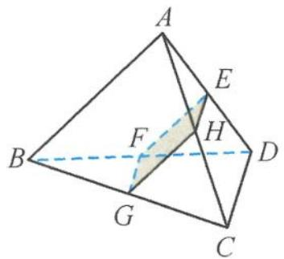

text_image

Geometric diagram of a tetrahedron with labeled vertices and internal points, including a shaded triangular section.

图1.2-15

A. $\frac{1}{2}$

B. $\frac{\sqrt{2}}{2}$

C. 1

D. 2

解答 若 AB, CD 都平行于平面 EFGH, 则四边形 EFGH 为平行四边形. 取 AB 的中点 M, 因为 AD = BD = 3, AC = BC = 4, 所以 AB ⊥ DM, AB ⊥ CM, 故

$AB \perp$ 平面 $CDM$ .

因此 $AB \perp CD$ ，即四边形 EFGH 为矩形，所以

$$
S _ {\mathrm{四边形} E F G H} = E F \cdot F G.
$$

又 $EF + FG = 2$ ，由基本不等式得

$$
S _ {\max} = 1.
$$

故选C.

# 1.3 基本量——三大空间角

三大空间角问题是立体几何中最活跃的内容之一,学习三大空间角要经历将“空间角”转化为“平面角”的过程.高考对三大空间角的考查同样是重点内容重点考查,绝不手软.

# 1.3.1 线线角

已知两条异面直线 a, b，经过空间中的任意一点 O 分别作直线 $a'$ ， $b'$ ，满足 $a' \parallel a$ ， $b' \parallel b$ ，我们把直线 $a'$ ， $b'$ 所成的锐角或直角叫作两条异面直线 a, b 所成的角或夹角。

例 1 如图 1.3-1, 在四棱锥 P-ABCD 中, 已知底面 ABCD 是矩形, AB = 3, AD = 2, $\triangle PAD$ 是以 $\angle A$ 为直角的等腰直角三角形. 若 $\angle PAB = 60^{\circ}$ , 则异面直线 PC 与 AD 所成角的余弦值是( ).

A. $\frac{\sqrt{22}}{11}$

B. $-\frac{\sqrt{22}}{11}$

C. $\frac{2\sqrt{7}}{7}$

D. $\frac{2\sqrt{11}}{11}$

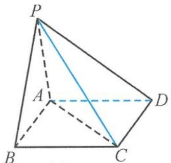

text_image

P
A
B
C
D

图1.3-1

解答 因为 $AD \parallel BC$ , 所以 $\angle PCB$ 是异面直线 $PC$ 与 $AD$ 所成的角 (或补角). 又 $PA \perp AD$ , 所以

$$
P A \perp B C.
$$

因为 $AB \perp BC, AB \cap PA = A, AB, PA \subset$ 平面 PAB，所以 $BC \perp$ 平面 PAB。又 $PB \subset$ 平

面 PAB, 所以

$$
P B \perp B C.
$$

由已知 $PA = AD = 2$ ，所以

$$
P B = \sqrt {P A ^ {2} + A B ^ {2} - 2 P A \cdot A B \cos \angle P A B} = \sqrt {2 ^ {2} + 3 ^ {2} - 2 \times 2 \times 3 \cos 6 0 ^ {\circ}} = \sqrt {7},
$$

从而

$$
\cos \angle P C B = \frac {B C}{P C} = \frac {2}{\sqrt {(\sqrt {7}) ^ {2} + 2 ^ {2}}} = \frac {2 \sqrt {1 1}}{1 1},
$$

所以异面直线 $PC$ 与 $AD$ 所成角的余弦值为 $\frac{2\sqrt{11}}{11}$ . 故选 D.

点评 平移法是求异面直线所成角的常用方法,其基本思路是通过平移直线,把异面直线的问题化归为共面直线问题来解决.具体步骤如下.

(1) 平移: 平移异面直线中的一条或两条, 作出异面直线所成的角或补角;

(2) 认定: 证明作出的角就是所求异面直线所成的角或补角;

(3) 计算: 求该角的值, 常利用解三角形;

(4) 取舍: 由于异面直线所成的角的取值范围是 $\left(0, \frac{\pi}{2}\right]$ ，当所作的角为钝角时，应取它的补角作为两条异面直线所成的角。

例 2 如图 1.3-2, 在正方体 $ABCD-A_{1}B_{1}C_{1}D_{1}$ 中, 已知 E, F 分别为棱 $C_{1}D_{1}, A_{1}D_{1}$ 的中点, 则异面直线 DE 与 AF 所成角的余弦值是().

A. $\frac{4}{5}$

B. $\frac{3}{5}$

C. $\frac{3\sqrt{10}}{10}$

D. $\frac{\sqrt{10}}{10}$

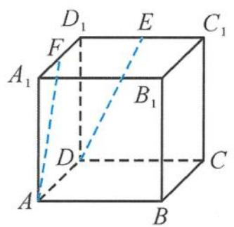

text_image

D₁ E C₁
F
A₁ B₁
D C
A B

图1.3-2

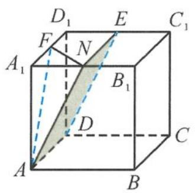

text_image

D₁
E
C₁
F
N
A₁
B₁
D
C
A
B

图1.3-3

解答 如图 1.3-3, 取 $A_{1}B_{1}$ 的中点 N, 连接 EN, FN, AN. 由于 E, N 分别为 $C_{1}D_{1}, A_{1}B_{1}$ 的中点, 则

$$
E N \parallel A _ {1} D _ {1} \text {且} E N = A _ {1} D _ {1}.
$$

在正方体中， $AD \parallel A_{1}D_{1}$ 且 $AD = A_{1}D_{1}$ ，所以

$$
E N \parallel A D \text {且} E N = A D.
$$

所以四边形 ANED 为平行四边形, $AN \parallel DE$ , 则 $\angle FAN$ (或其补角) 为异面直线 $DE$ 与 $AF$ 所成的角. 设正方体的棱长为 2 , 则在 $\triangle ANF$ 中,

$$
N F = \frac {1}{2} D _ {1} B _ {1} = \sqrt {2}, A N = A F = \sqrt {4 + 1} = \sqrt {5},
$$

所以

$$
\cos \angle F A N = \frac {A F ^ {2} + A N ^ {2} - F N ^ {2}}{2 A F \cdot A N} = \frac {5 + 5 - 2}{2 \times \sqrt {5} \times \sqrt {5}} = \frac {4}{5}.
$$

故选A.

例 3 如图 1.3-4, 在四棱柱 $ABCD-A_{1}B_{1}C_{1}D_{1}$ 中, 已知底面 ABCD 是正方形, $AA_{1} \perp$ 平面 ABCD, 且 AB = BC = 2, $AA_{1} = 3$ , 经过顶点 A 作一个平面 $\alpha$ , 使得 $\alpha \parallel$ 平面 $CB_{1}D_{1}$ . 若 $\alpha \cap$ 平面 ABCD = $l_{1}, \alpha \cap$ 平面 $ABB_{1}A_{1} = l_{2}$ , 则异面直线 $l_{1}$ 与 $l_{2}$ 所成角的余弦值为 \_\_\_\_.

解答 设平面 $ABCD \cap$ 平面 $CB_{1}D_{1} = m$ , 因为 $\alpha \parallel$ 平面 $CB_{1}D_{1}$ , 且 $\alpha \cap$ 平面 $ABCD = l_{1}$ , 所以由“面面平行”的性质定理得

$$
l _ {1} \parallel m.
$$

又因为平面 $ABCD \parallel$ 平面 $A_{1}B_{1}C_{1}D_{1}$ , 所以 $m \parallel B_{1}D_{1}$ , 由此得

$$
l _ {1} \mathbin {/ /} B _ {1} D _ {1}.
$$

另外, 设平面 $A_{1}B_{1}BA \cap$ 平面 $CB_{1}D_{1}=n$ , 因为 $\alpha \parallel$ 平面 $CB_{1}D_{1}$ , 所以由“面面平行”的性质定理得

$$
l _ {2} \parallel n.
$$

因为平面 $A_{1}B_{1}BA \parallel$ 平面 $C_{1}D_{1}DC$ ，所以 $n \parallel CD_{1}$ ，由此得

$$
l _ {2} \parallel C D _ {1}.
$$

由异面直线的定义得 $\angle CD_{1}B_{1}$ 为异面直线 $l_{1}$ 与 $l_{2}$ 所成的角或补角. 在 $\triangle CD_{1}B_{1}$ 中, 由余弦定理得

$$
\cos \angle C D _ {1} B _ {1} = \frac {\sqrt {2 6}}{1 3}.
$$

点评 利用“面面平行”的性质定理得到交线平行,但困难的地方就在于两平面的交线是只见交点不见交线.这是典型的“隐交线”问题,所以可以让“隐交线”显性化,把交线设出来,问题便迎刃而解.

引申1 如图1.3-5, 已知直四棱柱 $ABCD - A_{1}B_{1}C_{1}D_{1}$ 中的所有棱长都相等, $\angle BAD = 60^{\circ}, E$ 是棱 $AB$ 的中点, 设平面 $\alpha$ 经过直线 $A_{1}E$ . 若 $\alpha \cap$ 平面 $B_{1}BCC_{1} = l_{1}, \alpha \cap$ 平面 $C_{1}CDD_{1} = l_{2}$ , 且 $\alpha \perp$ 平面 $A_{1}ACC_{1}$ , 则异面直线 $l_{1}$ 与 $l_{2}$ 所成角的余弦值为 \_\_\_\_.

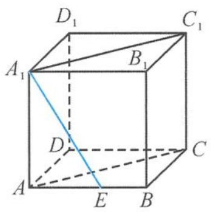

text_image

D₁
C₁
A₁
B₁
D
C
A
E
B

图1.3-5

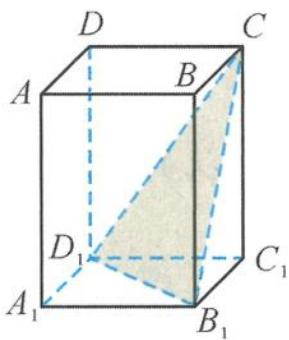

text_image

D
A
B
C
D₁
C₁
A₁
B₁

图1.3-4

解答 如图 1.3-6, 取 AD 的中点 F, 则 $EF \parallel BD$ . 而 $BD \perp$ 平面 $A_{1}ACC_{1}$ , 所以

$EF \perp$ 平面 $A_{1}ACC_{1}$ .

因此,平面 $A_{1}EF \perp$ 平面 $A_{1}ACC_{1}$ , 即平面 $A_{1}EF$ 为平面 $\alpha$ .

因为平面 $AA_{1}D_{1}D \parallel$ 平面 $BB_{1}C_{1}C$ , 平面 $\alpha \cap$ 平面 $AA_{1}D_{1}D = A_{1}F$ , 且平面 $\alpha \cap$ 平面 $BB_{1}C_{1}C = l_{1}$ , 所以由“面面平行”的性质定理得

$$
l _ {1} \mathbin {/ /} A _ {1} F.
$$

同理, 因为平面 $AA_{1}B_{1}B \parallel$ 平面 $DD_{1}C_{1}C$ , 平面 $\alpha \cap$ 平面 $CC_{1}D_{1}D = l_{2}$ ,
且平面 $\alpha\cap$ 平面 $AA_{1}B_{1}B=A_{1}E$ ，所以由“面面平行”的性质定理得

$$
l _ {2} \parallel A _ {1} E.
$$

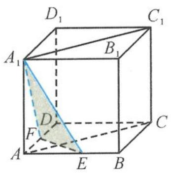

text_image

D₁
C₁
A₁
B₁
D
F
A
E
B
C

图1.3-6

因此 $\angle EA_{1}F$ 为异面直线 $l_{1}$ 与 $l_{2}$ 所成的角或补角，在 $\triangle A_{1}EF$ 中，由余弦定理得

$$
\cos \angle E A _ {1} F = \frac {9}{1 0}.
$$

引申 2 设四面体 ABCD 的各条棱长都相等, E 为棱 AD 的中点, 过点 A 作与平面 BCE 平行的平面 $\alpha$ . 若平面 $\alpha$ 与平面 ABC、平面 ACD 的交线分别为 $l_{1}, l_{2}$ , 则 $l_{1}, l_{2}$ 所成角的余弦值为().

A. $\frac{\sqrt{6}}{3}$

B. $\frac{\sqrt{3}}{3}$

C. $\frac{1}{3}$

D. $\frac{\sqrt{2}}{2}$

解答 把正四面体 ABCD 放在正方体中, 如图 1.3-7. 平面 $\alpha \parallel$ 平面 BCE, 且平面 $ABC \cap$ 平面 $\alpha = l_{1}$ , 平面 $ABC \cap$ 平面 BCE = BC, 由“面面平行”的性质定理得

$$
l _ {1} \parallel B C.
$$

同理, 平面 $\alpha \parallel$ 平面 BCE, 且平面 $ACD \cap$ 平面 $\alpha = l_{2}$ , 平面 $ACD \cap$ 平面 BCE = EC, 由“面面平行”的性质定理得

$$
l _ {2} \parallel E C.
$$

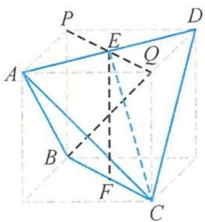

text_image

Geometric diagram of a tetrahedron with labeled vertices and internal points, used in spatial geometry problems.

图1.3-7

所以 $\angle BCE$ 为 $l_{1}, l_{2}$ 所成的角或补角，在 $\triangle BCE$ 中，求得

$$
\cos \angle B C E = \frac {\sqrt {3}}{3}.
$$

故选B.

例 4 如图 1.3-8, 在底面为正方形的四棱锥 P-ABCD 中, 侧面 PAD ⊥ 底面 ABCD, PA ⊥ AD, PA = AD, 则异面直线 PB 与 AC 所成的角为( ).

A. ${30}^{ \circ  }$

B. ${45}^{ \circ  }$

C. ${60}^{ \circ  }$

D. ${90}^{ \circ  }$

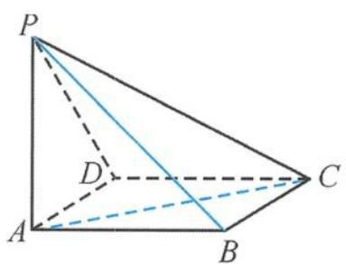

text_image

P
D
A
B
C

图1.3-8

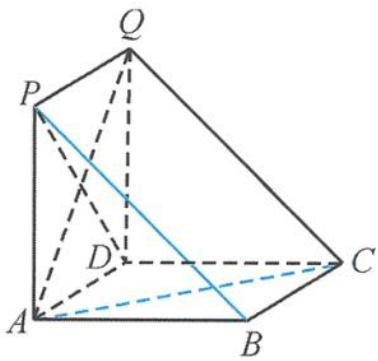

text_image

Q
P
D
A
B
C

图1.3-9

解答 因为平面 $PAD \perp$ 底面 $ABCD$ , 且 $PA \perp AD$ , 所以 $PA \perp$ 底面 $ABCD$ , 从而得 $AP$ , $AB, AD$ 两两相互垂直. 将该四棱锥补成一个直三棱柱 $PAB-QDC$ , 如图 1.3-9, 则 $\angle ACQ$ 为异面直线 $PB$ 与 $AC$ 所成的角或补角, 易得 $\triangle ACQ$ 为正三角形, $\angle ACQ = 60^\circ$ .

故选 C.

例 5 如图 1.3-10, 已知四边形 ABCD 是矩形, 且有 $AB = \sqrt{2} BC$ , 沿 AC 将 $\triangle ADC$ 翻折成 $\triangle AD'C$ , 当二面角 $D'-AC-B$ 的大小为 $\frac{\pi}{3}$ 时, 异面直线 $D'C$ 与 AB 所成角的余弦值是 \_\_\_\_.

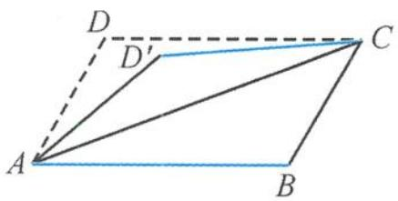

text_image

D
D'
C
A
B

图1.3-10

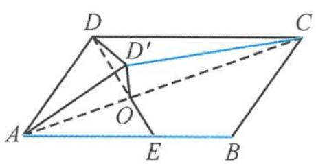

text_image

D
D'
C
A
O
E
B

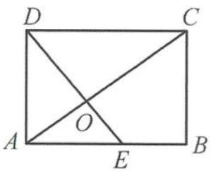  
图1.3-11

解答 在矩形 ABCD 中, 设 $BC = \sqrt{2}$ , 则

$$
A B = 2.
$$

如图1.3-11, 过点 $D$ 作 $AC$ 的垂线 $DE$ , 垂足为 $O$ , 则 $\angle D'OE$ 为二面角 $D'-AC-B$ 的平面角, 即

$$
\angle D ^ {\prime} O E = \frac {\pi}{3}.
$$

在等腰三角形 $D^{\prime}OD$ 中， $DO = D^{\prime}O = \frac{2\sqrt{3}}{3}$ ，

$$
\angle D ^ {\prime} O D = \frac {2 \pi}{3}.
$$

由余弦定理得到

$$
D ^ {\prime} D = 2.
$$

所以 $\triangle D^{\prime}CD$ 为正三角形, 而 $\angle D^{\prime}CD$ 为异面直线 $D^{\prime}C$ 与 $AB$ 所成的角或补角, 故其余弦值为 $\frac{1}{2}$ .

# 1.3.2 线面角

线面角是指平面的斜线和它在平面上的射影所成的角, 线面角是斜线与该平面内所有直线所成角中的最小角(这个性质下一章重点突破).

(1) 定义法

例 6 如图 1.3-12, 在正方体 $ABCD-A_{1}B_{1}C_{1}D_{1}$ 中, 设 BD 与平面 $A_{1}BCD_{1}$ 所成的角为 $\alpha$ , 求 $\tan \alpha$ .

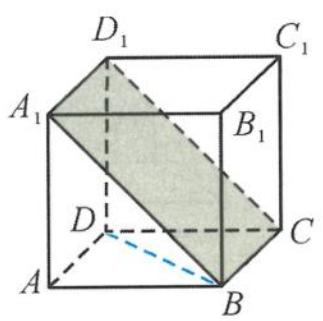

text_image

D₁
C₁
A₁
B₁
D
C
A
B

图1.3-12

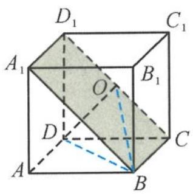

text_image

D₁
C₁
A₁
O
B₁
D
C
A
B

图1.3-13

解答 如图 1.3-13, 设 $D_{1} C$ 的中点为 $O$ , 连接 $O D, O B$ , 易证 $O D \perp$ 平面 $A_{1} B C D_{1}$ , 所以 $\angle D B O$ 为 $B D$ 与平面 $A_{1} B C D_{1}$ 所成的角, 求得

$$
\tan \alpha = \frac {\sqrt {3}}{3}.
$$

例 7 如图 1.3-14, 已知三棱锥 P-ABC 的底面是边长为 3 的等边三角形, 侧棱 PA = 3, PB = 4, PC = 5, 设 M, N 分别为 PC, BC 的中点.

(Ⅰ) 证明: BC ⊥ 平面 AMN.  
(Ⅱ) 求直线 AP 与平面 AMN 所成的角.

解答 （Ⅰ）因为 BC = 3, PB = 4, PC = 5, 所以 $\triangle PBC$ 为直角三角形. 由勾股定理的逆定理可知 $PB \perp BC$ , 所以

$$
M N \perp B C.
$$

在等边三角形 $ABC$ 中, $N$ 为 $BC$ 的中点, 所以

$$
A N \perp B C.
$$

又 $MN \cap AN = N$ , 所以 $BC \perp$ 平面 $AMN$ .

(II) 如图 1.3-15, 延长 NM 到点 Q, 使 NM = MQ, 连接 PQ, AQ, 于是四边形 PQNB 为平行四边形, 所以

$$
P Q \parallel B N.
$$

根据前一问的结论可知 $PQ \perp$ 平面 $AMN$ , 所以 $\angle PAQ$ 为直线 $AP$ 与平面 $AMN$ 所成的角.

在直角三角形 $PAQ$ 中， $\sin \angle PAQ = \frac{PQ}{AP} = \frac{1}{2}$ ，所以

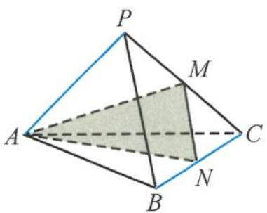

text_image

P
M
A
C
N
B

图1.3-14

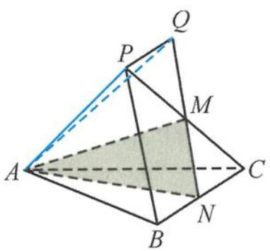

text_image

Geometric diagram of a pyramid with labeled vertices and shaded triangular area

图1.3-15

$$
\angle P A Q = 3 0 ^ {\circ}.
$$

例 8 如图 1.3-16, 在四棱柱 $ABCD-A_{1}B_{1}C_{1}D_{1}$ 中, 已知平面 $A_{1}B_{1}CD \perp$ 平面 $ABCD$ , 且四边形 $ABCD$ 和四边形 $A_{1}B_{1}CD$ 都是正方形, 则直线 $BD_{1}$ 与平面 $A_{1}B_{1}CD$ 所成角的正切值是 ( ).

A. $\frac{\sqrt{2}}{2}$

B. $\frac{\sqrt{3}}{2}$

C. $\sqrt{2}$

D. $\sqrt{3}$

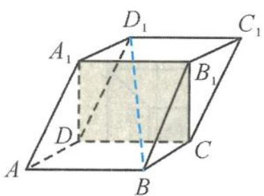

text_image

D₁
A₁
C₁
B₁
D
A
B
C

图1.3-16

text_image

D₁
A₁
C₁
O
B₁
D
A
B
C

图1.3-17

解答 如图 1.3-17, 连接 $A_{1} C$ , 交 $B D_{1}$ 于点 $O$ , 由对称性可知

$$
O C = \frac {1}{2} A _ {1} C.
$$

因为 ABCD 是正方形, 所以

$$
B C \perp C D.
$$

又因为平面 $A_{1}B_{1}CD \perp$ 平面ABCD，平面 $A_{1}B_{1}CD \cap$ 平面ABCD = CD，所以 $BC \perp$ 平面 $A_{1}B_{1}CD$ ，所以 $\angle BOC$ 即为直线 $BD_{1}$ 与平面 $A_{1}B_{1}CD$ 的夹角.不妨设 $AD = a$ ，则

$$
\tan \angle B O C = \frac {B C}{O C} = \sqrt {2}.
$$

故选C.

引申 1 如图 1.3-18, 已知菱形 ABCD 和矩形 ACEF 所在的平面相互垂直, $\angle DAB = 60^{\circ}$ , AC 和 BD 交于点 O, AB = AF, P 为线段 CE 上的任意一点, 直线 OP 与平面 FBD 所成的角为 $\alpha$ , 则 $\sin \alpha$ 的取值范围是 \_\_\_\_.

text_image

Geometric diagram of a triangular prism with labeled vertices and internal points, including shaded region D.

图1.3-18

解答 因为 ABCD 为菱形, 所以

$$
B D \perp A C.
$$

由于平面 ABCD 和平面 ACEF 相互垂直, 因此 BD ⊥ 平面 ACEF, 得平面 FBD ⊥ 平面 ACEF, 所以点 P 在平面 FBD 上的射影都在 OF 上, 故 $\angle FOP$ 为直线 OP 与平面 FBD 所成的角或补角.

如图 1.3-19, 当点 P 在点 Q 时, 所成的角为 $\frac{\pi}{2}$ , $\sin \alpha$ 取到最大值 1.

当点 $P$ 在点 $Q$ 的两边移动时, 线面角变小, 所以只要比较 $\angle EOF$ 与 $\angle AOF$ 的大小.

text_image

F
E
P
Q
A
O
C

图1.3-19

又 $\angle AOF < \frac{\pi}{3}$ , 得 $\angle EOF = \pi - 2\angle AOF > \frac{\pi}{3}$ , 可求得 $\sin \angle AOF = \frac{2\sqrt{7}}{7}$ , 所以

$$
\sin \alpha \in \left[ \frac {2 \sqrt {7}}{7}, 1 \right].
$$

引申 2 如图 1.3-20, 已知正方形 $ABCD$ , $E$ 是边 $AB$ 的中点, 将 $\triangle ADE$ 沿 $DE$ 折起至 $A'DE$ , 若 $\triangle A'DC$ 为正三角形, 则 $ED$ 与平面 $A'DC$ 所成角的余弦值是 \_\_\_\_.

text_image

B C
E
A D
→
A'
B
C
E
D

图1.3-20

text_image

A'
B
C
E
F
D

图1.3-21

解答 如图 1.3-21, 取 CD 的中点 F, 连接 EF, $A'F$ . 因为 $\triangle A'DC$ 为正三角形, 所以 CD $\perp$ 平面 $A'EF$ , 所以

平面 $A^{\prime}CD \perp$ 平面 $A^{\prime}EF$ .

又 $A^{\prime}F^{2} + A^{\prime}E^{2} = EF^{2}$ ，得

$$
A ^ {\prime} F \perp A ^ {\prime} E.
$$

因此 $A^{\prime}E \perp$ 平面 $A^{\prime}CD$ ，所以 $\angle A^{\prime}DE$ 为 ED 与平面 $A^{\prime}DC$ 所成的角，其余弦值为 $\frac{2\sqrt{5}}{5}$ .

点评 本题考查“线面垂直”的判定定理和线面角的求法,考查线面角的定义,熟练掌握线面角的定义是解题的关键.波利亚在《怎样解题》中认为:“回到定义上来是一项重要的思维活动,并将这一重要思维活动列在解题表的显著位置加以阐述.”数学知识的根基是数学定义,定义揭示了数学概念的本质,界定了概念的范畴,在看似模糊的边缘判断是与非.定义本身蕴涵着方法,因此利用定义解题,往往使我们在解题艰难之处峰回路转.

例 9 如图 1.3-22, 已知四面体 ABCD 的所有棱长都相等, E, F 分别是棱 AC, AD 上的点, 满足 $\frac{AE}{AC} = \frac{DF}{DA} = \lambda \left( \lambda < \frac{1}{2} \right)$ . 若 EF 与平面 BCD 所成的角为 $\frac{\pi}{4}$ , 求 $\lambda$ 的值.

text_image

A
E
B
F
C
D

图1.3-22

解答 设四面体 ABCD 的所有棱长的棱长为 1, 因为 $\frac{AE}{AC} = \frac{DF}{DA} = \lambda \left( \lambda < \frac{1}{2} \right)$ , 所以

$$
A E = D F = \lambda .
$$

在 $AC$ 上取点 $G$ , 使得 $EF \parallel DG$ , 则 $\frac{AE}{AG} = \frac{AF}{AD}$ , 故

$$
A G = \frac {\lambda}{1 - \lambda}, C G = 1 - \frac {\lambda}{1 - \lambda} = \frac {1 - 2 \lambda}{1 - \lambda}.
$$

如图 1.3-23, 过点 A 作 $AO \perp$ 平面 BCD 于点 O, 连接 CO. 过点 G 作 $GH \perp CO$ 于点 H, 则 $GH \perp$ 平面 BCD, 所以 $\angle GDH$ 为 DG 与平面 BCD 所成的角, 即 $\angle GDH = \frac{\pi}{4}$ , 所以 $\triangle GDH$ 为等腰直角三角形.

因为 $AO = \frac{\sqrt{6}}{3}$ ，所以

$$
G H = \frac {\sqrt {6}}{3} \cdot \frac {1 - 2 \lambda}{1 - \lambda};
$$

在 $\triangle AGD$ 中, 由余弦定理得

$$
G D ^ {2} = \frac {3 \lambda^ {2} - 3 \lambda + 1}{(1 - \lambda) ^ {2}}.
$$

text_image

Geometric diagram of a pyramid with labeled vertices and internal points, including shaded triangular section

图1.3-23

在 $\triangle GDH$ 中， $GD^2 = 2GH^2$ ，即 $\frac{3\lambda^2 - 3\lambda + 1}{(1 - \lambda)^2} = 2\left(\frac{\sqrt{6}}{3} \cdot \frac{1 - 2\lambda}{1 - \lambda}\right)^2$ ，解得

$$
\lambda = \frac {7 - \sqrt {2 1}}{1 4}.
$$

例 10 如图 1.3-24, 已知四棱锥 P-ABCD, △PAD 是以 AD 为斜边的等腰直角三角形, BC // AD, CD ⊥ AD, PC = AD = 2DC = 2CB, E 为 PD 的中点. 求直线 CE 与平面 PBC 所成角的正弦值.

text_image

P
E
A
D
B
C

图1.3-24

text_image

P
F
Q
E
H
A
M
B
N
C
D

图1.3-25

解答 如图 1.3-25, 设 PA 的中点为 F, 分别取 AD, BC 的中点 M, N, 连接 PM, 交 EF 于点 Q, 连接 NQ.

因为 E, F, N 分别是 PD, PA, BC 的中点, 所以 Q 为 EF 的中点.

在平行四边形 NCEQ 中, $NQ \parallel CE$ . 由 $\triangle PAD$ 为等腰直角三角形得

$$
P M \perp A D.
$$

由 $DC \perp AD, M$ 是 $AD$ 的中点得 $BM \perp AD$ , 所以 $AD \perp$ 平面 $PBM$ . 由 $BC \parallel AD$ 得 $BC \perp$ 平面 $PBM$ , 则

平面 $PBC \perp$ 平面 $PBM$ .

过点 $Q$ 作 $PB$ 的垂线, 垂足为 $H$ , 连接 $NH$ . $NH$ 是 $NQ$ 在平面 $PBC$ 上的射影, 所以 $\angle QNH$ 是直线 $CE$ 与平面 $PBC$ 所成的角.

设 $CD = 1$ ，在 $\triangle PCD$ 中，由 $PC = 2, CD = 1, PD = \sqrt{2}$ 得

$$
C E = \sqrt {2}.
$$

在 $\triangle PBM$ 中，由 $PM = BM = 1, PB = \sqrt{3}$ 得

$$
Q H = \frac {1}{4}.
$$

在 Rt△NQH 中，

$$
\sin \angle Q N H = \frac {\sqrt {2}}{8},
$$

所以直线 CE 与平面 PBC 所成角的正弦值是 $\frac{\sqrt{2}}{8}$ .

# (2) 等体积法

例 11 如图 1.3-26, 在长方体 $ABCD-A_{1}B_{1}C_{1}D_{1}$ 中, 已知 $AA_{1}=\frac{1}{2}$ , AB=1, $AD=\sqrt{3}$ , 则直线 $AA_{1}$ 与平面 $A_{1}BD$ 所成的角为 \_\_\_\_.

解答 设点 A 到平面 $A_{1}BD$ 的距离为 h，在长方体 $ABCD-A_{1}B_{1}C_{1}D_{1}$ 中， $AA_{1}=\frac{1}{2},AB=1,AD=\sqrt{3}$ ，则

text_image

D₁
C₁
A₁
B₁
D
C
A
B

图1.3-26

$$
A _ {1} D = \frac {\sqrt {1 3}}{2}, B D = 2, A _ {1} B = \frac {\sqrt {5}}{2}.
$$

在 $\triangle A_{1}BD$ 中, 由余弦定理得

$$
\cos \angle B A _ {1} D = \frac {1}{\sqrt {6 5}},
$$

所以

$$
\sin \angle B A _ {1} D = \frac {8}{\sqrt {6 5}},
$$

从而

$$
S _ {\triangle A _ {1} B D} = \frac {1}{2} \cdot \frac {\sqrt {5}}{2} \cdot \frac {\sqrt {1 3}}{2} \cdot \sin \angle B A _ {1} D = 1.
$$

因为 $V_{A_{1}-ABD} = V_{A-A_{1}BD}$ ，即

$$
\frac {1}{3} \cdot S _ {\triangle A B D} \cdot A A _ {1} = \frac {1}{3} \cdot S _ {\triangle A _ {1} B D} \cdot h,
$$

解得 $h = \frac{\sqrt{3}}{4}$ . 设直线 $AA_{1}$ 与平面 $A_{1}BD$ 所成的角为 $\theta$ , 则

$$
\sin \theta = \frac {h}{A A _ {1}} = \frac {\sqrt {3}}{2},
$$

所以 $\theta = 60^{\circ}$ . 故答案为 $60^{\circ}$ .

引申 如图 1.3-27, 在边长为 4 的菱形 $ABCD$ 中, 已知 $AC \cap BD = O$ , $\angle ABC = 60^{\circ}$ . 将菱形 $ABCD$ 沿对角线 $AC$ 折起, 得到三棱锥 $D-ABC$ , 二面角 $D-AC-B$ 的大小为 $60^{\circ}$ , 则直线 $BC$ 与平面 $DAB$ 所成角的正弦值为 ( ).

text_image

D
A O C → A D
B O C

图1.3-27

A. $\frac{3}{13}\sqrt{13}$

B. $\frac{\sqrt{2}}{3}$

C. $\frac{2}{13}\sqrt{13}$

D. $\frac{12}{13}\sqrt{13}$

解答 由题意 $\angle DOB$ 为二面角 $D - AC - B$ 的平面角, 所以 $\angle DOB = 60^{\circ}$ , 且 $AC \perp$ 平面 $DOB$ , $\triangle DOB$ 为等边三角形. 取 $OB$ 的中点 $H$ , 则有 $DH \perp$ 平面 $ABC$ , 且 $DH = 3$ .

因为 $V_{D-ABC} = V_{C-ABD}$ ，即 $\frac{1}{3} \cdot S_{\triangle ABC} \cdot DH = \frac{1}{3} \cdot S_{\triangle ABD} \cdot d$ （其中 d 为点 C 到平面 ABD 的距离），所以 $d = \frac{12}{13}\sqrt{13}$ ，即直线 BC 与平面 DAB 所成角的正弦值为 $\frac{3}{13}\sqrt{13}$ .

故选 A.

例 12 如图 1.3-28, 在四棱锥 P-ABCD 中, $\triangle PAB$ 是等边三角形, CB ⊥ 平面 PAB, AD // BC 且 PB = BC = 2AD = 2, F 为 PC 的中点.

(I) 证明: $DF \parallel$ 平面 $PAB$ .

(Ⅱ) 求直线 AB 与平面 PDC 所成角的正弦值.

解答 (I) 如图 1.3-29, 设 $BP$ 的中点为 $E$ , 连接 $AE, EF$ . 因为 $AD \parallel BC$ 且 $2AD = BC, EF \parallel BC$ 且 $2EF = BC$ , 所以

$$
A D \parallel E F \text {且} A D = E F.
$$

故四边形 ADFE 是平行四边形, 因此

$$
D F \parallel A E.
$$

又 $AE \subset$ 平面 $PAB, DF \not\subset$ 平面 $PAB$ , 故 $DF \parallel$ 平面 $PAB$ .

(II) 解法一 取 $BC$ 的中点 $G$ , 则 $DG \parallel AB, DG$ 与平面 $PDC$ 所成的角就是直线 $AB$ 与平面 $PDC$ 所成的角. 利用 $V_{P-CDG} = V_{G-PCD}$ , 即

$$
\frac {1}{3} \times \sqrt {3} \times \frac {1 \times 2}{2} = \frac {1}{3} \times \left(\frac {1}{2} \times 2 \sqrt {2} \times \sqrt {3}\right) \times d _ {G \rightarrow P C D},
$$

解得

$$
d _ {G \rightarrow P C D} = \frac {\sqrt {2}}{2}.
$$

text_image

Geometric diagram of a triangular pyramid with labeled vertices and internal points, including dashed lines for hidden edges.

图1.3-28

text_image

Geometric diagram of a triangular pyramid with labeled vertices and internal points, including shaded triangular section

图1.3-29

所以 DG 与平面 PDC 所成角的正弦值为 $\frac{\sqrt{2}}{4}$ ，即直线 AB 与平面 PDC 所成角的正弦值为 $\frac{\sqrt{2}}{4}$ .

解法二 （建系）如图1.3-30所示建立坐标系，则点 $E(0,0,0),A(\sqrt{3},0,0),B(0,1,0)$ ， $C(0,1,2),P(0,-1,0),D(\sqrt{3},0,1)$ ，于是

$$
\overrightarrow {P C} = (0, 2, 2),
$$

$$
\overrightarrow {P D} = (\sqrt {3}, 1, 1),
$$

$$
\overrightarrow {A B} = (- \sqrt {3}, 1, 0).
$$

设平面 PCD 的法向量 $\boldsymbol{n} = (x, y, z)$ ，则

$$
y + z = 0, \sqrt {3} x + y + z = 0,
$$

可取

$$
\boldsymbol {n} = (0, 1, - 1).
$$

直线 $AB$ 与平面 $PDC$ 所成角的正弦值为

$$
\frac {| \overrightarrow {A B} \cdot \boldsymbol {n} |}{| \overrightarrow {A B} | | \boldsymbol {n} |} = \frac {1}{2 \sqrt {2}} = \frac {\sqrt {2}}{4}.
$$

解法三 （补形）如图 1.3-31, 补全三棱柱 PAB-HTC, 易证得平面 PCD ⊥ 平面 PBCH, 所以点 G 到平面 PCD 的距离就是点 Q 到平面 PCD 的距离, 其中 Q 是 HP 的中点, 易得

$$
Q K = \frac {\sqrt {2}}{2}.
$$

直线 AB 与平面 PDC 所成角的正弦值为 $\frac{\frac{\sqrt{2}}{2}}{DG} = \frac{\sqrt{2}}{4}$ .

例 13 已知三棱锥 A-BCD, $\triangle ABD$ 和 $\triangle BCD$ 都是边长为 2 的等边三角形, 平面 $ABD \perp$ 平面 BCD.

(Ⅰ) 证明: $AC \perp BD$ .

(II) 如图 1.3-32, 设 $G$ 为 $BD$ 的中点, $H$ 为 $\triangle ACD$ 内的动点 (包含边界), 且 $GH \parallel$ 平面 $ABC$ , 求直线 $GH$ 与平面 $ACD$ 所成角的正弦值的取值范围.

text_image

z
C
F
D
P
E
B
y
A
x

图1.3-30

text_image

Geometric diagram of a triangular pyramid with labeled vertices and auxiliary lines, used for spatial geometry problems.

图1.3-31

text_image

A
B
G
H
D
C

图 1.3-32

解答 解法一 （Ⅰ）连接 AG, CG. 因为 $\triangle ABD$ 和 $\triangle BCD$ 都是等边三角形，所以 $\left\{\begin{aligned}AG\perp BD,\\ CG\perp BD,\\ AG\cap GC=G,\end{aligned}\right.$ 于是 $BD\perp$ 平面 ACG, AC ⊂ 平面 ACG, 故 AC ⊥ BD.

(II) 以 $G$ 为原点、 $GC$ 所在直线为 $x$ 轴、 $GD$ 所在直线为 $y$ 轴、 $GA$ 所在直线为 $z$ 轴建立空间直角坐标系, 如图 1.3-33.

取 $AD$ 的中点 $E, CD$ 的中点 $F$ , 连接 $GE, GF, EF$ , 则平面 $GEF \parallel$ 平面 $ABC$ , 所以 $H$ 在线段 $EF$ 上运动. 易知

$$
G (0, 0, 0), B (0, - 1, 0), C (\sqrt {3}, 0, 0), D (0, 1, 0), A (0, 0, \sqrt {3}),
$$

$$
E \left(0, \frac {1}{2}, \frac {\sqrt {3}}{2}\right), F \left(\frac {\sqrt {3}}{2}, \frac {1}{2}, 0\right).
$$

设 $\overrightarrow{EH}=\lambda\overrightarrow{EF}(0\leqslant\lambda\leqslant1)$ ，则

$$
\overrightarrow {G H} = \left(\frac {\sqrt {3}}{2} \lambda , \frac {1}{2}, \frac {\sqrt {3}}{2} - \frac {\sqrt {3}}{2} \lambda\right).
$$

设平面 ACD 的一个法向量 $\boldsymbol{n} = (x, y, z)$ ，则

$$
\left\{ \begin{array}{l} \overrightarrow {A C} \cdot \boldsymbol {n} = 0, \\ \overrightarrow {C D} \cdot \boldsymbol {n} = 0, \end{array} \right.
$$

即 $\left\{\begin{aligned}\sqrt{3}x-\sqrt{3}z=0,\\ -\sqrt{3}x+y=0,\end{aligned}\right.$ 所以法向量

$$
\boldsymbol {n} = (1, \sqrt {3}, 1).
$$

设直线 $GH$ 与平面 $ACD$ 所成角的为 $\theta$ , 则

$$
\sin \theta = \frac {| \overrightarrow {G H} \cdot \boldsymbol {n} |}{| \overrightarrow {G H} | | \boldsymbol {n} |} = \frac {\sqrt {3}}{\sqrt {5} \cdot \sqrt {\frac {3}{2} \lambda^ {2} - \frac {3}{2} \lambda + 1}} \in \left[ \frac {\sqrt {1 5}}{5}, \frac {2 \sqrt {6}}{5} \right].
$$

所以直线 GH 与平面 ACD 所成角的正弦值的取值范围为 $\left[\frac{\sqrt{15}}{5}, \frac{2\sqrt{6}}{5}\right]$ .

解法二 （Ⅰ）因为

$$
\overrightarrow {A C} \cdot \overrightarrow {B D} = \frac {| \overrightarrow {A D} | ^ {2} + | \overrightarrow {B C} | ^ {2} - | \overrightarrow {A B} | ^ {2} - | \overrightarrow {C D} | ^ {2}}{2} = \frac {4 + 4 - 4 - 4}{2} = 0,
$$

所以 $AC \perp BD.$

(II) 设直线 $GH$ 与平面 $ACD$ 所成的角为 $\theta$ , 由解法 1 知点 $H$ 在线段 $EF$ 上运动, 易得 $GH \in \left[\frac{\sqrt{10}}{4}, 1\right]$ . 设点 $G$ 到平面 $ACD$ 的距离为 $h$ , 由等体积法知 $V_{G-ACD} = V_{A-GCD}$ , 得到

$$
\frac {1}{3} h \left(\frac {1}{2} \sqrt {6} \cdot \frac {\sqrt {1 0}}{2}\right) = \frac {1}{3} \cdot \sqrt {3} \cdot \frac {\sqrt {3}}{2},
$$

所以 $h = \frac{3}{\sqrt{15}}$ ，因此

$$
\sin \theta = \frac {h}{| G H |} \in \left[ \frac {\sqrt {1 5}}{5}, \frac {2 \sqrt {6}}{5} \right].
$$

点评 解法一是通法,解法二换了一种思维,从向量与等体积法的角度对问题进行思考.

text_image

z
A
E
H
B
G
D
y
F
C
x

图1.3-33

# 1.3.3 二面角

# (1) 定义法

利用二面角的平面角的定义,在二面角的棱上取一点(特殊点),过该点在两个半平面内作垂直于棱的射线,两射线所成的角就是二面角的平面角.这是一种求二面角的平面角的最基本方法,要注意用二面角的平面角定义的三个主要特征来找出平面角.

例 14 如图 1.3-34, 已知三棱台 $ABC-A_{1}B_{1}C_{1}$ 的下底面是正三角形, $AB \perp BB_{1}, B_{1}C_{1} \perp BB_{1}$ , 则二面角 $A-BB_{1}-C$ 的大小是().

text_image

A₁
C₁
B₁
A
C
B

图1.3-34

A. ${30}^{ \circ  }$

B. ${45}^{ \circ  }$

C. ${60}^{ \circ  }$

D. ${90}^{ \circ  }$

解答 根据棱台的几何性质可知

$$
A _ {1} B _ {1} \parallel A B, B _ {1} C _ {1} \parallel B C.
$$

因为 $B_{1}C_{1}\perp BB_{1}$ ，又因为 $BB_{1}\perp AB$ ，所以

$$
B B _ {1} \perp B C.
$$

故 $\angle ABC$ 即为二面角 $A - BB_{1} - C$ 的平面角. 因为 $\triangle ABC$ 为等边三角形, 所以

$$
\angle A B C = 6 0 ^ {\circ}.
$$

故选 C.

例 15 如图 1.3-35, 在矩形 ABCD 中, 已知 AB = 2, AD = 4, 点 E 在线段 AD 上且 AE = 3, 现分别沿 BE, CE 将 △ABE, △DCE 翻折, 使得点 D 落在线段 AE 上, 则此时二面角 D-EC-B 的余弦值为( ).

text_image

A E D
B C
→
A D E
B C

图1.3-35

A. $\frac{4}{5}$

B. $\frac{5}{6}$

C. $\frac{6}{7}$

D. $\frac{7}{8}$

解答 在矩形 ABCD 中, 连接 BD, 交 EC 于 O 点, 易证

$$
B D \perp E C.
$$

在翻折后,由二面角的定义可知 $\angle BOD$ 为二面角 $D - EC - B$ 的平面角. 在 $\triangle BOD$ 中,

$$
O D = \frac {2}{\sqrt {5}}, O B = \frac {8}{\sqrt {5}}, B D = 2 \sqrt {2}.
$$

由余弦定理得到二面角 D-EC-B 的余弦值为 $\frac{7}{8}$ ，故选 D.

引申 如图1.3-36, 已知 $\triangle ABC, D$ 是 $AB$ 的中点, 沿直线 $CD$ 将 $\triangle ACD$ 翻折成 $\triangle A'CD$ , 所成二面角 $A'-CD-B$ 的平面角为 $\alpha$ , 则( ).

A. $\angle A^{\prime}DB\leqslant \alpha$

B. $\angle A^{\prime}DB\geqslant \alpha$

C. $\angle A^{\prime}CB\leqslant \alpha$

D. $\angle A^{\prime}CB\geqslant \alpha$

解答 如图 1.3-37, 作 $AE \perp DC$ 于点 $E$ , 连接 $A'E$ , 由二面角的定义知 $\angle A'EA$ 为二面角 $A'-CD-B$ 的平面角的补角, 即

$$
\angle A ^ {\prime} E A = 1 8 0 ^ {\circ} - \alpha .
$$

连接 $AA'$ , 则 $\triangle DAA'$ 与 $\triangle EAA'$ 皆为等腰三角形, 因为 $AD \geqslant AE$ , 所以 $\angle ADA' \leqslant \angle AEA'$ , 即

$$
1 8 0 ^ {\circ} - \angle A ^ {\prime} D B \leqslant 1 8 0 ^ {\circ} - \alpha ,
$$

所以

$$
\angle A ^ {\prime} D B \geqslant \alpha .
$$

故选 B.

# (2) 垂面法

过二面角内一点作两个面的垂线, 过两垂线作平面与两个半平面的交线所成的角即为平面角. 由此可知, 二面角的平面角所在的平面与棱垂直.

例 16 在正方体 $ABCD-A_{1}B_{1}C_{1}D_{1}$ 中, E 是 BC 的中点, 在平面 $A_{1}B_{1}C_{1}D_{1}$ 内, 直线 $l \parallel B_{1}D_{1}$ . 设二面角 A-l-E 的平面角为 $\alpha$ , 当 $\alpha$ 最大时, $\cos \alpha =$ \_\_\_\_.

解答 如图 1.3-38(a), 连接 $A_{1}C_{1}$ , 交 $l$ (即 $GH$ ) 于点 $N$ , 取 $CD$ 的中点 $F$ . 连接 $EF$ , 交 $AC$ 于点 $M$ , 则 $l \parallel EF$ , 所以 $l$ 与 $EF$ 共面. 易证 $B_{1}D_{1} \perp$ 平面 $A_{1}C_{1}CA$ , 得 $l \perp$ 平面 $A_{1}C_{1}CA$ , 所以 $l \perp NA, l \perp NM$ .

因此 $\angle MNA$ 为二面角 $A - l - E$ 的平面角.

问题转化为:在线段 $A_{1}C_{1}$ 上找一点 N 使 $\angle MNA$ 的值最大.

text_image

D₁
G
N
H
A₁
B₁
C₁
D
F
M
E
A
B

(a)

  
(b)   
图1.3-38

设正方体的棱长为 4, 则 $AM = 3\sqrt{2}$ , 过点 $N$ 作 $NP \perp AC$ 于点 $P$ , 如图 1.3-38(b). 设 $AP = x$ , 则 $PM = 3\sqrt{2} - x$ , 所以

text_image

A'
A
D
C
B

图1.3-36

text_image

A'
A
D
E
C
B

图1.3-37

$$
\tan \angle M N A = \tan (\angle A N P + \angle P N M)
$$

$$
= \frac {\frac {x}{4} + \frac {3 \sqrt {2} - x}{4}}{1 - \frac {x}{4} \cdot \frac {3 \sqrt {2} - x}{4}} = \frac {1 2 \sqrt {2}}{1 6 - x (3 \sqrt {2} - x)} \leqslant \frac {1 2 \sqrt {2}}{1 6 - \left[ \frac {x + (3 \sqrt {2} - x)}{2} \right] ^ {2}} = \frac {2 4 \sqrt {2}}{2 3},
$$

所以

$$
\cos \alpha = \frac {2 3}{4 1}.
$$

引申 如图1.3-39, 在三棱锥 $P - ABC$ 中, 顶点 $P$ 在底面的射影为 $\triangle ABC$ 的垂心 $O$ , 且 $PO$ 的中点为 $M$ , 过 $AM$ 作平行于 $BC$ 的截面 $\alpha$ . 记 $\angle PAM = \theta_{1}, \alpha$ 与底面 $ABC$ 所成的锐二面角为 $\theta_{2}$ , 当 $\theta_{1}$ 取到最大时, $\tan \theta_{2} =$ \_\_\_\_.

text_image

P
M
E
A
D
C
O
N
B

图1.3-39

text_image

P
θ₁
M
A
θ₂
O

图1.3-40

解答 因为 $BC \parallel \alpha$ , 所以 $BC$ 平行于底面 $ABC$ 与平面 $\alpha$ 的交线 $l$ . 因为顶点 $P$ 在底面的射影为 $\triangle ABC$ 的垂心 $O$ , 所以 $BC \perp$ 平面 $PAO$ (如图1.3-40), 得到

$l \perp$ 平面 PAO,

得 $l \perp AM, l \perp AO$ ，即 $\angle MAO$ 为平面 $\alpha$ 与底面 ABC 所成的锐二面角的平面角，所以

$$
\angle M A O = \theta_ {2}.
$$

在 Rt△PAO 中，

$$
\tan (\theta_ {1} + \theta_ {2}) = 2 \tan \theta_ {2},
$$

展开得到

$$
\tan \theta_ {1} = \frac {\tan \theta_ {2}}{1 + 2 \tan^ {2} \theta_ {2}} = \frac {1}{\frac {1}{\tan \theta_ {2}} + 2 \tan \theta_ {2}} \leqslant \frac {1}{2 \sqrt {\frac {1}{\tan \theta_ {2}} \cdot 2 \tan \theta_ {2}}} = \frac {\sqrt {2}}{4},
$$

此时 $\tan \theta_{2} = \frac{\sqrt{2}}{2}$ .

# (3) 三垂线法

利用三垂线定理或其逆定理作出二面角 $\alpha - l - \beta$ 的平面角的方法叫三垂线法. 一般的步骤为: 过二面角的一个平面 $\alpha$ 内一点 $P$ 作另一个平面 $\beta$ 的垂线, 垂足为 $O$ , 过垂足 $O$ 作二面角的棱 $l$ 的垂线, 垂足为 $H$ , 连接 $PH$ , 由三垂线定理得 $PH \perp l$ , 所以 $\angle PHO$ 为二面角的平面角.

例 17 在正方体 $ABCD-A_{1}B_{1}C_{1}D_{1}$ 中, 在 $\triangle A_{1}B_{1}D_{1}$ 内部(不包含边界) 存在点 P, 满足点 P 到平面 $ACC_{1}A_{1}$ 的距离等于点 P 到棱 $BB_{1}$ 的距离, 分别记二面角 P-AD-B 为 $\alpha$ , P-AC-B 为 $\beta$ , P-BC-A 为 $\gamma$ , 则下列说法正确的是().

A. $\alpha >\beta >\gamma$

B. $\alpha < \gamma < \beta$

C. $\alpha < \beta < \gamma$

D. 以上说法均不对

解答 如图 1.3-41, 作 $PQ \perp$ 平面 $ABCD$ 于点 $Q$ , 作 $QE \perp AD$ 于点 $E$ , 作 $QF \perp BC$ 于点 $F$ , 作 $QG \perp AC$ 于点 $G$ , 连接 $PE, PF, PG$ . 由三垂线定理可知 $PE \perp AD, PF \perp BC, PG \perp AC$ , 则

$$
\alpha = \angle P E Q, \beta = \angle P G Q, \gamma = \angle P F Q.
$$

因此

$$
\tan \alpha = \frac {P Q}{Q E}, \tan \beta = \frac {P Q}{Q G}, \tan \gamma = \frac {P Q}{Q F}.
$$

text_image

D₁
C₁
A₁
P
B₁
D
E G Q C
A B F

图1.3-41

作 $PE_{1} \perp A_{1}D_{1}$ 于点 $E_{1}$ , 作 $PF_{1} \perp B_{1}C_{1}$ 于点 $F_{1}$ , 作 $PG_{1} \perp A_{1}C_{1}$ 于点 $G_{1}, PG_{1}$ 即为点 $P$ 到平面 $ACC_{1}A_{1}$ 的距离, $PB_{1}$ 即为点 $P$ 到棱 $BB_{1}$ 的距离, 因此

$$
P B _ {1} = P G _ {1}.
$$

因为 $QF = PF_{1} < PB_{1} = PG_{1} = QG$ ，所以

$$
\tan \beta <   \tan \gamma .
$$

因为 $QG = PG_{1} < PE_{1} = QE$ ，所以

$$
\tan \alpha <   \tan \beta .
$$

综上有

$$
\tan \alpha <   \tan \beta <   \tan \gamma ,
$$

即 $\alpha < \beta < \gamma$ , 故选 C. (或者: 利用抛物线的定义, 得到点 $P$ 在以 $B_{1}$ 为焦点, $A_{1}C_{1}$ 为准线的抛物线上, 从而得到 $PE_{1} > PG_{1} > PF_{1} \Rightarrow QE > QG > QF$ .)

例 18 如图 1.3-42, 在侧棱垂直底面的三棱柱 $ABC-A_{1}B_{1}C_{1}$ 中, $\angle BAC = 90^{\circ}$ , $AB = AC = \frac{\sqrt{2}}{2}AA_{1}$ , D, E 分别是棱 AB, $B_{1}C_{1}$ 的中点, F 是棱 $CC_{1}$ 上的动点. 记二面角 D-EF-B 的平面角为 $\alpha$ , 在点 F 从点 $C_{1}$ 运动到点 C 的过程中, $\alpha$ 的变化情况为().

text_image

A
D
B
C
F
A₁
B₁
E
C₁

图1.3-42

A. 增大

B. 减小

C. 先增大, 再减小

D. 先减小, 再增大

解答 过点 D 在平面 $\triangle ABC$ 内作 BC 的垂线, 垂足为 O. 因为平面 $ABC \perp$ 平面 $BB_{1}C_{1}C$ , 所以

$$
D O \perp \text { 平面 } B B _ {1} C _ {1} C, \text { 且 } O B = \frac {1}{4} B C.
$$

过点 O 在平面 $BB_{1}C_{1}C$ 内作 $OH \perp EF$ ，垂足为 H，则由三垂线定理可知

$$
D H \perp E F.
$$

所以 $\angle OHD$ 为二面角 D-EF-B 的平面角, 即

$$
\tan \alpha = \frac {O D}{O H}.
$$

而 $OD$ 为定值, $OH$ 在点 $F$ 从点 $C_{1}$ 运动到点 $C$ 的过程中, 先增大, 再减小, 故 $\alpha$ 的变化情况为先减小, 再增大. 所以选 D.

引申 （多选）如图1.3-43, 已知直三棱柱 $ABC - A_{1}B_{1}C_{1}$ 的底面是边长为6的等边三角形, 侧棱长为2, E是棱BC上的动点, F是棱 $B_{1}C_{1}$ 上靠近 $C_{1}$ 点的三分点, M是棱 $CC_{1}$ 上的动点, 则二面角A-FM-E的正切值不可能是( ).

A. $\frac{3\sqrt{15}}{5}$

B. $\frac{2\sqrt{15}}{5}$

C. $\sqrt{6}$

D. $\sqrt{5}$

text_image

C₁
F
B₁
A₁
M
E
B
C
A

图1.3-43

text_image

C₁
F
B₁
M
C
O
B

图1.3-44

解答 如图 1.3-44, 取 BC 的中点 O, 连接 OA, 由等边三角形的性质可知 $OA \perp BC$ . 由直三棱柱的性质知 $OA \perp$ 平面 MFE, 过点 O 作棱 MF 的垂线, 垂足为 H. 由三垂线定理得

$$
A H \perp M F,
$$

所以 $\angle AHO$ 为二面角的平面角,且

$$
\tan \angle A H O = \frac {O A}{O H} = \frac {3 \sqrt {3}}{O H}.
$$

易得 $2 \leqslant OH \leqslant \sqrt{5}$ , 所以二面角 $A - FM - E$ 的正切值的取值范围是 $\left[\frac{3\sqrt{15}}{5}, \frac{3\sqrt{3}}{2}\right]$ . 因此选项中不可能的数值是 $\frac{2\sqrt{15}}{5}$ 与 $\sqrt{5}$ , 故选 BD.

例 19 如图 1.3-45, 在正三棱柱 $ABC - A_{1}B_{1}C_{1}$ 中, 各棱长均等于 2, M 为线段 $BB_{1}$ 上动点, 则平面 $ABC$ 与平面 $AMC_{1}$ 所成的锐二面角余弦值的最大值为 \_\_\_\_.

text_image

C₁
A₁ B₁
M
C
A B

图1.3-45

text_image

C₁
A₁ B₁
M
C
B
A N

图1.3-46

解答 如图 1.3-46, 延长 $C_{1} M$ , 与 $C B$ 交于点 $N$ , 连接 $A N$ , 则 $A N$ 为平面 $A B C$ 与平面 $A M C_{1}$ 所成的二面角的棱. 过点 $C$ 作棱 $A N$ 的垂线, 垂足为 $H$ , 连接 $C_{1} H$ .

由三垂线定理可知 $C_{1}H \perp AN$ . 所以 $\angle C_{1}HC$ 为二面角的平面角. 要使得二面角最小, 则需要 CH 最大. 当点 H 与点 A 重合时, CH 最大. 此时二面角的平面角为 $\angle C_{1}AC$ , 而 $\angle C_{1}AC = 45^{\circ}$ , 其余弦值的最大值为 $\frac{\sqrt{2}}{2}$ .

点评 这是一类“隐棱”的二面角问题,解决问题的关键在于化隐为显.根据基本事实3(如果两个不重合的平面有一个公共点,那么它们有且只有一条过该点的公共直线),找到二面角的棱.

引申 在长方体 $ABCD-A_{1}B_{1}C_{1}D_{1}$ 中, $AB = AA_{1} = 2AD = 2$ , E 为棱 $CC_{1}$ 上一点, 记平面 $BD_{1}E$ 与底面 ABCD 所成的锐二面角为 $\alpha$ , 当 $\alpha$ 取得最小值时, CE 的长度为 \_\_\_\_.

解答 如图 1.3-47(a), 延长 $D_{1} E$ , 与 $D C$ 交于点 $P$ , 连接 $B P$ , 则 $B P$ 为平面 $A B C D$ 与平面 $B D_{1} E$ 所成的二面角的棱. 过点 $D$ 作棱 $B P$ 的垂线, 垂足为 $H$ , 连接 $D_{1} H$ .

text_image

D₁
C₁
A₁
B₁
E
D
C
P
A
B

(a)

text_image

D
C
P
A
B

(b)   
图1.3-47

由三垂线定理可知 $D_{1}H \perp BP$ , 所以 $\angle D_{1}HD$ 为二面角的平面角. 要使得二面角最小, 则需要 $DH$ 最大. 当点 $H$ 与点 $B$ 重合时, $DH$ 最大. 此时二面角的平面角为 $\angle D_{1}BD$ .

设 CP = t，如图 1.3-47(b)，在 Rt△BDP 中，

$$
(\sqrt {5}) ^ {2} + (\sqrt {t ^ {2} + 1}) ^ {2} = (t + 2) ^ {2},
$$

解得 $t = \frac{1}{2}$ ，此时 $CE = \frac{2}{5}$ .

例 20 如图 1.3-48, 已知斜线 OA 与平面 $\alpha$ 成 $15^{\circ}$ 角, 斜足为 O, $A'$ 为 A 在 $\alpha$ 内的射影, B 为 OA 的中点, l 是 $\alpha$ 内过点 O 的动直线, 若 l 上存在点 $P_{1}, P_{2}$ 使得 $\angle AP_{1}B = \angle AP_{2}B = 30^{\circ}$ , 则 $\frac{|P_{1}P_{2}|}{|AB|}$ 的最大值是 \_\_\_\_, 此时二面角 $A-P_{1}P_{2}-A'$ 平面角的正弦值是 \_\_\_\_.

text_image

A
B
O
P₁
α
P₂
A′

图1.3-48

解答 由 $\angle AP_{1}B = \angle AP_{2}B = 30^{\circ}$ 得 $A, P_{1}, B, P_{2}$ 四点共圆，即 $AB$ 所对的圆心角为 $60^{\circ}$ ，圆心为 $M$ ，半径为 $r$ ，则 $|AB| = r, |P_{1}P_{2}|_{\max} = 2r$ ，所以

$$
\left(\frac {\left| P _ {1} P _ {2} \right|}{\left| A B \right|}\right) _ {\max} = \frac {2 r}{r} = 2.
$$

因为 B 为 OA 的中点, 所以 $\left|BM\right|=\frac{1}{2}\left|OA\right|$ . 所以此时 $\triangle OAM$ 为直角三角形, 如图 1.3-49(a) 所示.

text_image

O
P₁
B
A
M
P₂

(a)

text_image

A
B
O
P₁
H
P₂
α
A′

(b)   
图1.3-49

如图1.3-49(b)，过点 $A^{\prime}$ 作 $l$ 的垂线，垂足为 $H$ 。由三垂线定理知 $AH \perp l$ ，所以 $\angle AHA^{\prime}$ 为二面角 $A - P_{1}P_{2} - A^{\prime}$ 的平面角，易得 $\angle AOM = 30^{\circ}$ ，

$$
A A ^ {\prime} = O A \sin 1 5 ^ {\circ} = \frac {\sqrt {6} - \sqrt {2}}{2} r,
$$

$$
A H = O A \sin 3 0 ^ {\circ} = r.
$$

从而

$$
\sin \angle A H A ^ {\prime} = \frac {A A ^ {\prime}}{A H} = \frac {\sqrt {6} - \sqrt {2}}{2}.
$$

所以答案为 $2, \frac{\sqrt{6}-\sqrt{2}}{2}$ .

# (4) 面积射影

对于一些二面角问题,利用几何法难以找到二面角的平面角,可以考虑利用面积射影公式 $\cos\theta=\frac{S_{射影}}{S_{原来}}$ ,其中 $\theta$ 为平面角的大小.此方法不必在图形中画出二面角的平面角,从而回避了找二面角的困难.

例 21 如图 1.3-50, 已知正方体 $ABCD-A_{1}B_{1}C_{1}D_{1}$ 的棱长为 4, E 为棱 AB 的中点, 点 P 在侧面 $CC_{1}D_{1}D$ 上运动, 当平面 $B_{1}EP$ 与平面 ABCD、平面 $CC_{1}D_{1}D$ 所成的角相等时, $D_{1}P$ 的最小值为 \_\_\_\_.

text_image

B₁
C₁
A₁
D₁
P
E
B
C
A
D

图1.3-50

text_image

B₁
C₁
A₁
D₁
P
E
B
C
A
D
F

图1.3-51

解答 如图 1.3-51, 取棱 CD 的中点 F, 因为平面 $B_{1}EP$ 与平面 ABCD、平面 $CC_{1}D_{1}D$ 所成的角相等, 所以由面积射影定理得 $\triangle B_{1}EP$ 在平面 ABCD 上的射影面积与 $\triangle B_{1}EP$ 在平面 $CC_{1}D_{1}D$ 上的射影面积相等.

而 $\triangle B_{1}EP$ 在平面 $ABCD$ 上的射影面积恒为 4 , 因此 $\triangle B_{1}EP$ 在平面 $CC_{1}D_{1}D$ 上的射影 $\triangle PC_{1}F$ 的面积也为 4 .

而 $|C_{1}F| = 2\sqrt{5}$ , 所以点 $P$ 的轨迹为与 $C_{1}F$ 的距离为 $\frac{4\sqrt{5}}{5}$ 的平行线 (在正方形 $CC_{1}D_{1}D$ 内的部分). 又点 $D_{1}$ 到 $C_{1}F$ 的距离为 $\frac{8\sqrt{5}}{5}$ , 故 $D_{1}P$ 的最小值为

$$
\frac {8 \sqrt {5}}{5} - \frac {4 \sqrt {5}}{5} = \frac {4 \sqrt {5}}{5}.
$$

引申 如图1.3-52,在正四面体ABCD中, $\overrightarrow{BE}=\overrightarrow{EC},\overrightarrow{CF}=\overrightarrow{FD},\overrightarrow{DG}=2\overrightarrow{GA}$ ,记平面EFG与平面BCD、平面ACD、平面ABD所成的锐二面角分别为α,β,γ,则( ).

A. $\alpha >\beta >\gamma$   
B. $\alpha >\gamma >\beta$   
C. $\beta > \alpha > \gamma$   
D. $\gamma >\alpha >\beta$

解答 设 $S_{\triangle ABC} = S$ ，作出平面 $EFG$ 在平面 $BCD$ 、平面 $ACD$ 、平面 $ABD$ 上的投影三角形，分别为 $\triangle EFG'$ ， $\triangle E'FG$ ， $\triangle E'F'G$ 。易求得

$$
S _ {\triangle E F G ^ {\prime}} = \frac {5}{3 6} S, S _ {\triangle E ^ {\prime} F G} = \frac {7}{3 6} S, S _ {\triangle E ^ {\prime} F ^ {\prime} G} = \frac {9}{3 6} S.
$$

由 $\cos\theta=\frac{S_{射影}}{S_{原来}}$ 可得

$$
\cos \alpha <   \cos \beta <   \cos \gamma ,
$$

所以 $\alpha > \beta > \gamma$ ，故选 A.

text_image

A
G
B
D
E
C
F

图1.3-52

# (5) 向量法

把二面角的大小转化为求在两个半平面内与棱垂直的两个向量的夹角问题,这样就避免作二面角的平面角,从而使问题的解答变得简单.

例 22 如图 1.3-53, 在二面角 $\alpha - l - \beta$ 中, $A \in l, B \in l, AC \subset \alpha, BD \subset \beta$ , 且 $AC \perp l, BD \perp l$ . 若 $AB = 1, AC = BD = 2$ , 二面角 $\alpha - l - \beta$ 的余弦值为 $\frac{3}{4}$ , 则 $CD =$ \_\_\_\_ ; 直线 $CD$ 与平面 $\beta$ 所成角的正弦值为 \_\_\_\_.

  
图1.3-53

解答 由题意知

$$
\cos \langle \overrightarrow {A C}, \overrightarrow {B D} \rangle = \frac {3}{4}.
$$

而 $\overrightarrow{CD} = \overrightarrow{CA} +\overrightarrow{AB} +\overrightarrow{BD}$ ，所以

$$
\left| \overrightarrow {C D} \right| ^ {2} = (\overrightarrow {C A} + \overrightarrow {A B} + \overrightarrow {B D}) ^ {2} = | \overrightarrow {C A} | ^ {2} + | \overrightarrow {A B} | ^ {2} + | \overrightarrow {B D} | ^ {2} + 2 (\overrightarrow {C A} \cdot \overrightarrow {A B} + \overrightarrow {A B} \cdot \overrightarrow {B D} + \overrightarrow {C A} \cdot \overrightarrow {B D})
$$

$$
= 4 + 1 + 4 + 2 \left(0 + 0 - 2 \times 2 \times \frac {3}{4}\right) = 3,
$$

故

$$
| \overrightarrow {C D} | = \sqrt {3}.
$$

过点 A 在平面 $\beta$ 内作 $AE \parallel BD$ ，取 AE = BD，则 $AB \perp$ 平面 ACE，且 $\angle CAE$ 为 $\alpha - l - \beta$ 的平面角，即

$$
\cos \angle C A E = \frac {3}{4}.
$$

设点 C 到平面 $\beta$ 的距离为 h，则

$$
h = C A \cdot \sin \angle C A E = \frac {\sqrt {7}}{2}.
$$

所以直线 $CD$ 与平面 $\beta$ 所成角的正弦值为

$$
\frac {h}{C D} = \frac {\sqrt {2 1}}{6}.
$$

引申 如图1.3-54, 在菱形ABCD中, 已知 $\angle ABC = \frac{2\pi}{3}$ , 线段AD, BD的中点分别为E, F. 现将 $\triangle ABD$ 沿对角线BD翻折, 当二面角A-BD-C的余弦值为 $\frac{1}{3}$ 时, 异面直线BE与CF所成角的正弦值是( ).

A. $\frac{\sqrt{35}}{6}$

B. $\frac{1}{6}$

C. $\frac{2\sqrt{6}}{5}$

D. $\frac{1}{5}$

text_image

A
E
D
F
C
B

图1.3-54

解答 设菱形 ABCD 的棱长为 2, 过点 E 作 BD 的垂线, 垂足为 H. 设 BE 与 CF 所成的角为 $\theta$ , 二面角 A-BD-C 的平面角为 $\alpha$ , 则 $\alpha = \langle \overrightarrow{FC}, \overrightarrow{HE} \rangle$ , 所以

$$
\overrightarrow {C F} \cdot \overrightarrow {B E} = \overrightarrow {C F} \cdot (\overrightarrow {B H} + \overrightarrow {H E}) = \overrightarrow {C F} \cdot \overrightarrow {H E},
$$

即

$$
\overrightarrow {C F} \cdot \overrightarrow {B E} = | \overrightarrow {C F} | | \overrightarrow {H E} | \cos (\pi - \alpha) = - \frac {1}{2}.
$$

故 $\cos \langle \overrightarrow{CF},\overrightarrow{BE}\rangle = \frac{\overrightarrow{CF} \cdot \overrightarrow{BE}}{|\overrightarrow{CF}| |\overrightarrow{BE}|} = \frac{-\frac{1}{2}}{\sqrt{3} \times \sqrt{3}} = -\frac{1}{6}$ , 从而

$$
\sin \theta = \frac {\sqrt {3 5}}{6}.
$$

故选A.

例 23 如图 1.3-55, 平面 $\alpha \cap$ 平面 $\beta = l$ , 二面角 $\alpha - l - \beta \in \left[\frac{\pi}{4}, \frac{\pi}{3}\right]$ , 已知 $A \in \alpha, B \in \beta$ , 直线 $AB$ 与平面 $\alpha$ 和平面 $\beta$ 所成角均为 $\theta$ , 与 $l$ 所成角为 $\gamma$ . 若 $\sin (\gamma + \theta) = 1$ , 则 $\sin (\gamma - \theta)$ 的最大值是 ( ).

A. $\frac{1}{14}$

B. $\frac{1}{7}$

C. $\frac{3}{14}$

D. $\frac{2}{7}$

  
图1.3-55

text_image

α
F
A
G
D
C
l
B
E
H
β

图1.3-56

解答 如图1.3-56,作直三棱柱ACE-FDB,则 $\angle ACE$ 为二面角 $\alpha-l-\beta$ 的平面角.过点A作 $AH \perp EC$ 于点H,则 $AH \perp \beta$ ,所以

$$
\angle A B H = \theta .
$$

同理, 过点 B 作 $BG \perp FD$ 于点 G, 连接 AG, 则 $BG \perp \alpha$ . 所以 $\angle BAG = \theta$ , 从而 $\sin \theta = \frac{AH}{AB} = \frac{BG}{AB}$ , 得 AH = BG, 所以

$$
C A = C E.
$$

设 $CA = CE = 1, \angle ACE = 2x$ ，则 $AH = \sin 2x$

$$
A E = \sqrt {1 + 1 - 2 \times 1 \times 1 \times \cos 2 x} = 2 \sin x.
$$

因为 $\sin (\gamma +\theta) = 1$ ，所以 $\gamma +\theta = \frac{\pi}{2}$ 得

$$
\sin \theta = \cos \gamma ,
$$

所以 $\frac{AH}{AB} = \frac{AF}{AB}$ ，即

$$
A H = A F.
$$

又 $\tan \gamma = \frac{AE}{BE} = \frac{AE}{AH} = \frac{1}{\cos x}$ , 所以

$$
\tan \theta = \cos x.
$$

故 $\tan (\gamma -\theta) = \frac{1}{2}\Bigl (\frac{1}{\cos x} -\cos x\Bigr)$ 在 $x\in \left[\frac{\pi}{8},\frac{\pi}{6}\right]$ 上单调递增，得 $\tan (\gamma -\theta)\leqslant \frac{\sqrt{3}}{12}$ ，即

$$
\sin (\gamma - \theta) \leqslant \frac {1}{7}.
$$

故选 B.

点评 这是一道经典的立体几何问题,集三大空间角于一题,具有浓浓的几何味,是一道不可多得的好题.

立体几何中的基本量是高考的“兵家必争之地”，基本是轮番上阵，你方唱罢我登场。重点考查内容，需要我们重点突破，那么立体几何的学习，路在何方？请看下章分解！

# 思考题

1. 如图, 某沙漏由上、下两个圆锥组成, 每个圆锥的底面直径和高均为 $12 \mathrm{~cm}$ , 现有体积为 $72 \pi \mathrm{~cm}^{3}$ 的细沙全部漏入下圆锥后, 恰好堆成一个盖住沙漏底部的圆锥形沙堆, 则此锥形沙堆的高度为( ).

A. $3 \mathrm{~cm}$

C. $8 \mathrm{~cm}$

  
第1题图

B. $6 \mathrm{~cm}$

D. $9\mathrm{\;{cm}}$

text_image

D₁
C₁
E
B₁
A₁
F
D
C
A
B

第2题图

2. 如图, 在正方体 $ABCD-A_{1}B_{1}C_{1}D_{1}$ 中, 已知 $E, F$ 分别为 $B_{1}C_{1}, CC_{1}$ 的中点, 平面 $BD_{1}E$ 与平面 $AA_{1}D_{1}D$ 的交线为 $l$ , 则 ( ).

A. $l \perp A_{1}D$

C. $l \parallel D_{1}C$

B. $l \parallel BC_{1}$

D. $l \perp B_{1} F$

3. 如图, 已知三棱锥 $P - ABC$ 的各棱长都相等, $D, E, F$ 分别是 $AB, BC, CA$ 的中点, 下列四个结论中不成立的是 ( ).

A. $BC \parallel$ 平面 PDF

B. $DF \perp$ 平面 $PAE$

C. 平面 $PDE \perp$ 平面 $ABC$

D. 平面 $PAE \perp$ 平面 $ABC$

text_image

P
A
F
D
B
E
C

第3题图

text_image

A
E
H
B
F
C
G
D

第4题图

4. 如图, 已知四边形 $ABCD$ 是空间四边形, $E, F, G, H$ 分别是四条边上的点, 它们共面, 并且 $AC \parallel$ 平面 $EFGH, BD \parallel$ 平面 $EFGH, AC = a, BD = b$ . 当四边形 $EFGH$ 是菱形时, $AE: EB = (\quad)$ .

A. $\frac{b}{a}$

B. $\frac{b + 1}{a + 1}$

C. $\frac{a}{b}$

D. $\frac{a^2}{b^2}$

5. (多选) 如图, 在正四棱柱 $ABCD-A_{1}B_{1}C_{1}D_{1}$ 中, $AA_{1}=2AB=2$ , 点 $P$ 为线段 $AD_{1}$ 上的动点, 则下列说法正确的是( ).

A. 直线 $PB_{1} \parallel$ 平面 $BC_{1}D$

B. 三棱锥 $P - BC_{1}D$ 的体积为 $\frac{1}{3}$

C. 三棱锥 $D_{1} - BC_{1}D$ 外接球的表面积为 $\frac{3\pi}{2}$

D. 直线 $PB_{1}$ 与平面 $BCC_{1}B_{1}$ 所成角的正弦值的最大值为 $\frac{\sqrt{5}}{3}$

text_image

D₁
C₁
A₁
B₁
P
D
A
B
C

第5题图

6. 已知二面角 $\alpha - l - \beta$ 的大小为 $60^{\circ}$ , 点 $P$ 在平面 $\alpha$ 内, 设 $P$ 在平面 $\beta$ 上的射影为 $Q$ , 且 $PQ = \sqrt{3}$ , 则点 $Q$ 到平面 $\alpha$ 的距离为 ( ).

A. 1

B. $\frac{\sqrt{3}}{2}$

C. $\frac{3}{2}$

D. 3

7. (多选) 如图, $P$ 是正方体 $ABCD - A_{1}B_{1}C_{1}D_{1}$ 的棱 $BB_{1}$ 上的动点 (不包括端点), 下列判断正确的是 ( ).

A. 不论点 P 在什么位置, 过点 P 有且只有一个平面与直线 CD, $A_{1}D_{1}$ 都平行  
B. 不论点 P 在什么位置, 过点 P 有且只有一个平面与直线 CD, $A_{1}D_{1}$ 所成的角均为 $45^{\circ}$   
C. 不论点 $P$ 在什么位置, 过点 $P$ 有且只有一条直线与直线 $CD, A_{1}D_{1}$ 都垂直  
D. 不论点 P 在什么位置, 过点 P 有且只有一条直线与直线 CD, $A_{1}D_{1}$ 都相交

text_image

A₁
B₁
D₁
C₁
P
A
B
D
C

第 7 题图

text_image

A
B
E
D
C
F

第8题图

text_image

Geometric diagram of a polyhedron with labeled vertices A, B, C, D, E and center O, showing solid and dashed edges.

第9题图

8. 如图, 在正四面体 $ABCD$ 中, 已知 $E$ 是 $AC$ 的中点, $F$ 是 $CD$ 边上的动点, 记二面角 $B-EF-D$ 的平面角为 $\alpha$ , 则点 $F$ 从点 $C$ 运动到点 $D$ 的过程中 (不含端点 $D$ ) ( ).

A. $\alpha$ 增大

B. $\alpha$ 减小

C. $\alpha$ 先增大, 后减小

D. $\alpha$ 先减小, 后增大

9. 如图, 矩形 $ABCD$ 的中心为 $O, BC > AB$ , 现将 $\triangle DAC$ 沿着对角线 $AC$ 翻折成 $\triangle EAC$ . 记 $\angle BOE = \alpha$ , 二面角 $B-AC-E$ 的平面角为 $\beta$ , 直线 $DE$ 和 $BC$ 所成的角为 $\gamma$ , 则 ( ).

A. $\beta > \alpha, \beta > 2\gamma$

B. $\beta > \alpha, \beta < 2\gamma$

C. $\beta < \alpha, \beta > 2\gamma$

D. $\beta < \alpha, \beta < 2\gamma$

10. 如图, 在棱长都相等的正三棱柱 $ABC - A_{1}B_{1}C_{1}$ 中, 已知 $P$ 是侧棱 $AA_{1}$ 上的点 (不含端点). 记直线 $PB$ 与直线 $AC$ 所成的角为 $\alpha$ , 直线 $PB$ 与底面 $ABC$ 所成的角为 $\beta$ , 二面角 $P - BB_{1} - C$ 的平面角为 $\gamma$ , 则 ( ).

A. $\gamma < \beta < \alpha$

B. $\gamma < \alpha < \beta$

C. $\beta < \gamma < \alpha$

D. $\alpha < \beta < \gamma$

text_image

A₁
B₁
C₁
P
A
C
B

第10题图

text_image

A₁
C₁
B₁
A
α
γ
β
C
B

第11题图

11. 如图, 在底面为正三角形的棱台 $ABC - A_{1}B_{1}C_{1}$ 中, 已知二面角 $A_{1} - AB - C$ 、二面角 $B_{1} - BC - A$ 、二面角 $C_{1} - AC - B$ 的平面角都是锐角, 分别是 $\alpha, \beta, \gamma$ , 侧棱 $AA_{1}, BB_{1}, CC_{1}$ 与底面所成的角分别是 $\theta_{1}, \theta_{2}, \theta_{3}$ . 若 $\theta_{1} > \theta_{2} > \theta_{3}$ , 则 ( ).

A. $AA_{1} < BB_{1} < CC_{1},\alpha >\beta >\gamma$

B. $AA_{1} > BB_{1} > CC_{1},\alpha >\beta >\gamma$

C. $AA_{1} < BB_{1} < CC_{1}, \alpha < \beta < \gamma$

D. $AA_{1} > BB_{1} > CC_{1},\alpha <  \beta <  \gamma$

12. 如图, 在三棱锥 $P-ABC$ 中, 已知 $PB = BC = a$ , $PA = AC = b (a < b)$ , 设二面角 $P-AB-C$ 的平面角为 $\alpha$ , 则( ).

A. $\alpha +\angle PCA + \angle PCB > \pi ,2\alpha <  \angle PAC + \angle PBC$

B. $\alpha +\angle PCA + \angle PCB <   \pi ,2\alpha <  \angle PAC + \angle PBC$

C. $\alpha +\angle PCA + \angle PCB > \pi ,2\alpha >\angle PAC + \angle PBC$

D. $\alpha +\angle PCA + \angle PCB <   \pi ,2\alpha >\angle PAC + \angle PBC$

text_image

P
A
C
B

第 12 题图

text_image

P
D
A
B
C

第13题图

13. 如图, 在四棱锥 $P-ABCD$ 中, 已知底面 $ABCD$ 是底边为 1 的菱形, $\angle BAD = 60^{\circ}$ , $PB = 2$ , $PA = PD$ , 当直线 $PB$ 与底面 $ABCD$ 所成的角为 $30^{\circ}$ 时, 二面角 $P-CD-A$ 的正弦值为 \_\_\_\_.

14. 如图, 在四棱锥 $P-ABCD$ 中, 已知底面 $ABCD$ 为平行四边形, $\angle BAD = 60^{\circ}$ , $PA = AD = PD = 2$ , 侧面 $PAD \perp$ 底面 $ABCD$ , $E$ , $F$ 分别为 $PC$ , $AB$ 的中点.

(Ⅰ) 证明: EF // 平面 PAD.

(II) 当 $AP \perp BD$ 时, 求直线 PC 与平面 PAD 所成角的正弦值.

text_image

P
E
D
A
F
B
C

第14题图

15. 如图, 已知四棱锥 $P-ABCD$ 的底面为正方形, $PD \perp$ 底面 $ABCD$ . 设平面 $PAD$ 与平面 $PBC$ 的交线为 $l$ .

(1) 证明: $l \perp$ 平面 $PDC$ .

(2) 已知 $PD = AD = 1, Q$ 为 $l$ 上的点, 求 $PB$ 与平面 $QCD$ 所成角的正弦值的最大值.

  
第15题图

# 第二章

# 立体几何问题中的转化

—— 山不转水转

工欲善其事，必先利其器。

——《论语·卫灵公》

要做好一件事,准备工具非常重要.同样地,学习立体几何也需要强有力的工具.那么,学习立体几何需要准备什么样的工具呢?其实,转化能力是立体几何学习的主旋律,转化既有空间图形之间的转化,也有位置关系之间的转化.例如,“线线平行”转化为“线面平行”,“线面平行”转化为“面面平行”,这是平行之间的一种转化.也可以是垂直与平行的转化.例如,同垂直于一个平面的两条直线平行等.可以说几何的转化是非常美妙的.

# 2.1 转化为法向量

将立体几何问题转化为法向量问题的本质是降维的思想,把平面问题降维成直线问题,对于一类问题的解答很有效.

例 1 如图 2.1-1, 棱长为 3 的正方体的顶点 A 在平面 $\alpha$ 上, 三条棱 AB, AC, AD 都在平面 $\alpha$ 的同侧. 若顶点 B, C 到平面 $\alpha$ 的距离分别为 1, $\sqrt{2}$ , 则顶点 D 到平面 $\alpha$ 的距离为 \_\_\_\_.

解答 以 A 为坐标原点、AB 为 x 轴、AC 为 y 轴、AD 为 z 轴，建立空间直角坐标系。设平面 $\alpha$ 的法向量 $\boldsymbol{n} = (x, y, z)$ ，点 B, C, D 到平面 $\alpha$ 的距离分别为 $d_{1}, d_{2}, d_{3}$ ，则

text_image

C
D
B
A
α

图2.1-1

$$
d _ {1} = 1 = \frac {| \overrightarrow {A B} \cdot \boldsymbol {n} |}{| \boldsymbol {n} |} = \frac {3 | x |}{\sqrt {x ^ {2} + y ^ {2} + z ^ {2}}},
$$

$$
d _ {2} = \sqrt {2} = \frac {| \overrightarrow {A C} \cdot \boldsymbol {n} |}{| \boldsymbol {n} |} = \frac {3 | y |}{\sqrt {x ^ {2} + y ^ {2} + z ^ {2}}},
$$

$$
d _ {3} = \frac {| \overrightarrow {A D} \cdot \boldsymbol {n} |}{| \boldsymbol {n} |} = \frac {3 | z |}{\sqrt {x ^ {2} + y ^ {2} + z ^ {2}}}.
$$

将以上三式平方相加,可得

$$
d _ {1} ^ {2} + d _ {2} ^ {2} + d _ {3} ^ {2} = 9,
$$

所以 $d_{3}=\sqrt{6}$ ，即顶点 D 到平面 $\alpha$ 的距离为 $\sqrt{6}$ .

点评 采用“设而不求”“整体代入”的方法,借助于平面的法向量,对于一类立体几何问题的解决就会有一种洒脱不羁的感觉,不再拘泥于空间图形,整个解题的过程大有酣畅淋漓之感.

引申1 如图2.1-2, 已知棱长为3的正方体的顶点A在平面α内, 三条棱AB, AC, AD都在平面α的同侧. 若顶点B, C到平面α的距离分别为 $\sqrt{2}$ , $\sqrt{3}$ , 则平面ABC与平面α所成锐二面角的余弦值为\_\_\_\_.

解答 以 A 为坐标原点、AB 为 x 轴、AC 为 y 轴、AD 为 z 轴，建立空间直角坐标系，则平面 ABC 的法向量

text_image

C
D
B
A
α

图2.1-2

$$
\boldsymbol {m} = (0, 0, 1).
$$

设平面 $\alpha$ 的法向量 $n = (x, y, z)$ , 点 $B, C, D$ 到平面 $\alpha$ 的距离分别为 $d_{1}, d_{2}, d_{3}$ , 则

$$
d _ {1} = \sqrt {2} = \frac {| \overrightarrow {A B} \cdot \boldsymbol {n} |}{| \boldsymbol {n} |} = \frac {3 | x |}{\sqrt {x ^ {2} + y ^ {2} + z ^ {2}}},
$$

$$
d _ {2} = \sqrt {3} = \frac {| \overrightarrow {A C} \cdot \boldsymbol {n} |}{| \boldsymbol {n} |} = \frac {3 | y |}{\sqrt {x ^ {2} + y ^ {2} + z ^ {2}}},
$$

$$
d _ {3} = \frac {| \overrightarrow {A D} \cdot \boldsymbol {n} |}{| \boldsymbol {n} |} = \frac {3 | z |}{\sqrt {x ^ {2} + y ^ {2} + z ^ {2}}},
$$

将以上三式平方相加,可得

$$
d _ {1} ^ {2} + d _ {2} ^ {2} + d _ {3} ^ {2} = 9,
$$

所以 $d_{3} = 2$ ，即 $\frac{3|z|}{\sqrt{x^2 + y^2 + z^2}} = 2.$ 从而

$$
\cos \langle m, n \rangle = \frac {| m \cdot n |}{| m | | n |} = \frac {| z |}{\sqrt {x ^ {2} + y ^ {2} + z ^ {2}}} = \frac {2}{3}.
$$

故平面 ABC 与平面 $\alpha$ 所成锐二面角的余弦值为 $\frac{2}{3}$ .

引申 2 已知棱长为 4 的正四面体 ABCD 的四个顶点均在平面 $\alpha$ 的同侧, 且分别记 A, B, C, D 到平面 $\alpha$ 的距离为 $d_{A}, d_{B}, d_{C}, d_{D}$ . 若 $d_{A} = 1, d_{B} = 2, d_{C} = 3$ , 则 $d_{D} = (\quad)$ .

A. $2 + 2\sqrt{2}$

B. $2 + 2\sqrt{3}$

C. $2 + \frac{3}{4}\sqrt{6}$

D. $2 + \sqrt{6}$

解答 先把棱长为 4 的正四面体 ABCD 嵌入棱长为 $2\sqrt{2}$ 的正方体中, 建立如图 2.1-3 所示的空间直角坐标系. 把平面 $\alpha$ 平行移动, 使得点 A 放在平面 $\alpha$ 内, 则此时点 A, B, C, D 到平面 $\alpha$ 的距离分别为 $d_{A}'$ , $d_{B}'$ , $d_{C}'$ , $d_{D}'$ , 且

text_image

C
B
A
x
y
z
D

图2.1-3

$$
d _ {A} ^ {\prime} = 0, d _ {B} ^ {\prime} = 1, d _ {C} ^ {\prime} = 2, d _ {D} ^ {\prime} = t.
$$

则有

$$
\overrightarrow {A B} = (2 \sqrt {2}, 2 \sqrt {2}, 0), \overrightarrow {A C} = (0, 2 \sqrt {2}, 2 \sqrt {2}), \overrightarrow {A D} = (2 \sqrt {2}, 0, 2 \sqrt {2}).
$$

设平面 $\alpha$ 的法向量 $n = (x, y, z)$ , 则

$$
d _ {B} ^ {\prime} = 1 = \frac {| \overrightarrow {A B} \cdot \boldsymbol {n} |}{| \boldsymbol {n} |} = \frac {2 \sqrt {2} (x + y)}{\sqrt {x ^ {2} + y ^ {2} + z ^ {2}}},
$$

$$
d _ {c} ^ {\prime} = 2 = \frac {| \overrightarrow {A C} \cdot \boldsymbol {n} |}{| \boldsymbol {n} |} = \frac {2 \sqrt {2} (y + z)}{\sqrt {x ^ {2} + y ^ {2} + z ^ {2}}},
$$

$$
d _ {D} ^ {\prime} = t = \frac {| \overrightarrow {A D} \cdot \boldsymbol {n} |}{| \boldsymbol {n} |} = \frac {2 \sqrt {2} (x + z)}{\sqrt {x ^ {2} + y ^ {2} + z ^ {2}}},
$$

解得

$$
\frac {y}{\sqrt {x ^ {2} + y ^ {2} + z ^ {2}}} = \frac {\sqrt {2} (3 - t)}{8},
$$

$$
\frac {x}{\sqrt {x ^ {2} + y ^ {2} + z ^ {2}}} = \frac {\sqrt {2} (t - 1)}{8},
$$

$$
\frac {z}{\sqrt {x ^ {2} + y ^ {2} + z ^ {2}}} = \frac {\sqrt {2} (t + 1)}{8}.
$$

将以上三式平方相加,可得

$$
1 = \frac {2 (3 - t) ^ {2} + 2 (t - 1) ^ {2} + 2 (t + 1) ^ {2}}{6 4},
$$

所以 $t = 1 + 2\sqrt{2}$ ，顶点 D 到平面 $\alpha$ 的距离为 $2 + 2\sqrt{2}$ 。故选 A.

例 2 如图 2.1-4, 已知正方体 $ABCD-A_{1}B_{1}C_{1}D_{1}$ 在平面 $\alpha$ 的上方, $O$ 是线段 $A_{1}C_{1}$ 的中点, 直线 $OA$ 与平面 $\alpha$ 所成的角为 $60^{\circ}$ , 当正方体 $ABCD-A_{1}B_{1}C_{1}D_{1}$ 绕着 $OA$ 旋转一周时, 平面 $C_{1}D_{1}DC$ 与平面 $\alpha$ 所成角的正弦值的最小值为 \_\_\_\_.

text_image

C₁
D₁ O B₁
A₁
C
D A B
α

图2.1-4

解答 易知平面 $C_{1}D_{1}DC$ 的法向量为 $\overrightarrow{AD}$ ，设平面 $\alpha$ 的法向量为 n，因为直线 OA 与平面 $\alpha$ 所成的角为 $60^{\circ}$ ，则 n 与 OA 成 $30^{\circ}$ 角，所以 n 在以 OA 为轴，半顶角为 $30^{\circ}$ 的圆锥曲面上运动，如图 2.1-5 所示.

设 AO 与 AD 所成的角为 $\theta$ ，则

$$
\cos \theta = \frac {1}{\sqrt {6}}, \sin \theta = \sqrt {\frac {5}{6}}.
$$

text_image

A
30°
O
D

图2.1-5

所以

$$
(\sin \alpha) _ {\min} = \sin (\theta - 3 0 ^ {\circ}) = \frac {3 \sqrt {1 0} - \sqrt {6}}{1 2}.
$$

点评 这是一道动态的空间图形问题,解题的困难就在于正方体在旋转,似乎没有规律可循.若利用法向量来解答,则该问题就变成了动直线绕着定直线旋转的问题了.这样的问题就只有旋转,而没有“眩晕”感.另外,借助于圆锥来解答,更是把问题的解决变得更接地气.

引申 已知正四面体 $ABCD$ , 若 $AB$ 与平面 $\alpha$ 所成的角为 $60^{\circ}$ , 求平面 $ACD$ 与平面 $\alpha$ 所成角的正弦值的最值.

解答 把正四面体 ABCD 补成正方体(图 2.1-6(a)), 设平面 $\alpha$ 的法向量为 n, 由已知得直线 AB 与 n 所成的角为 $30^{\circ}$ , 所以 n 在以 BA 为轴, 半顶角为 $30^{\circ}$ 的圆锥曲面上运动, 如图 2.1-6(b) 所示.

text_image

A
B
C
D
E

(a)

text_image

B
30°
A
E

(b)   
图2.1-6

易知 $\overrightarrow{BE}$ 为平面 $ACD$ 的法向量. 设 $BA$ 与 $BE$ 所成的角为 $\theta$ , 则

$$
\sin \theta = \frac {\sqrt {3}}{3}, \cos \theta = \frac {\sqrt {6}}{3}.
$$

所以

$$
(\sin \alpha) _ {\max} = \sin (\theta + 3 0 ^ {\circ}) = \frac {3 + \sqrt {6}}{6},
$$

$$
(\sin \alpha) _ {\min} = \sin (\theta - 3 0 ^ {\circ}) = \frac {3 - \sqrt {6}}{6}.
$$

点评 这个问题解答的困难就在于不知道平面 $\alpha$ 在哪里, 所以解答无从下手, 但转化为平面 $\alpha$ 的法向量, 就不再纠结于平面 $\alpha$ 在哪里了, 这使问题的解答变得“柳暗花明又一村”.

例 3 如图 2.1-7, 在三棱锥 D-ABC 中, 已知 AB = BC = CD = DA, $\angle ABC = 90^{\circ}$ , E, F, O 分别为 BC, DA, AC 的中点, 记直线 EF 与平面 BOD 所成的角为 $\theta$ , 则 $\theta$ 的取值范围是 ( ).

A. $\left(0, \frac{\pi}{4}\right)$

B. $\left(\frac{\pi}{4},\frac{\pi}{3}\right)$

C. $\left(\frac{\pi}{4},\frac{\pi}{2}\right)$

D. $\left(\frac{\pi}{6},\frac{\pi}{2}\right)$

text_image

Geometric diagram of a tetrahedron with labeled vertices and internal points, including a shaded triangular cross-section.

图2.1-7

解答 因为 $\left\{ \begin{array}{l} AO \perp OD, \\ AO \perp OB, \\ OB \cap OD = O \end{array} \right. \Rightarrow AO \perp$ 平面 $BOD$ , 所以 $\overrightarrow{OA}$ 是平面

BOD 的一个法向量. 设 AB = BC = CD = DA = 2, 则

$$
\overrightarrow {E F} \cdot \overrightarrow {A O} = \frac {| \overrightarrow {E O} | ^ {2} + | \overrightarrow {F A} | ^ {2} - | \overrightarrow {E A} | ^ {2} - | \overrightarrow {F O} | ^ {2}}{2} = 2.
$$

因此

$$
\cos \langle \overrightarrow {E F}, \overrightarrow {A O} \rangle = \frac {\overrightarrow {E F} \cdot \overrightarrow {A O}}{| \overrightarrow {E F} | | \overrightarrow {A O} |} = \frac {\sqrt {2}}{| \overrightarrow {E F} |},
$$

易求得

$$
\sqrt {2} <   | \overrightarrow {E F} | <   2.
$$

所以 $\cos \langle \overrightarrow{EF},\overrightarrow{AO}\rangle \in \left(\frac{\sqrt{2}}{2},1\right)$ ，即

$$
\sin \theta \in \left(\frac {\sqrt {2}}{2}, 1\right).
$$

故 $\theta$ 的取值范围是 $\left(\frac{\pi}{4}, \frac{\pi}{2}\right)$ ，选 C.

【备注】本题用到向量对角线定理:如图2.1-8,在空间四边形A-BCD中,有

$$
\overrightarrow {A C} \cdot \overrightarrow {B D} = \frac {| \overrightarrow {A D} | ^ {2} + | \overrightarrow {B C} | ^ {2} - | \overrightarrow {A B} | ^ {2} - | \overrightarrow {C D} | ^ {2}}{2}.
$$

这是一个非常有用的公式,在下一章中我们将要重点来研究其应用.

text_image

D
A
C
B

图2.1-8

引申 如图 2.1-9, 在三棱锥 A-BCD 中, $\triangle BCD$ 为等腰直角三角形, E 是

线段 BD 的中点, 点 F 在线段 AB 上, 且 BF = 2FA. 若 AD = 1, $AB = \sqrt{3}$ , $CB = CD = \sqrt{2}$ , 求直线 AD 与平面 CEF 所成的角.

解答 因为 $BF = \frac{2\sqrt{3}}{3}, BE = 1, \angle ABD = 30^{\circ}$ , 所以

$$
E F ^ {2} = B F ^ {2} + B E ^ {2} - 2 B E \cdot B F \cdot \cos \angle A B D = \frac {1}{3},
$$

text_image

Geometric diagram of a tetrahedron with labeled vertices A, B, C, D and internal points E, F, showing shaded triangular faces.

图2.1-9

所以

$$
B F ^ {2} = E F ^ {2} + B E ^ {2},
$$

故 $EF \perp BD$ , 且 $CE \perp BD$ . 从而 $BD \perp$ 平面 $CEF$ , 即 $\overrightarrow{DB}$ 为平面 $CEF$ 的法向量, 因此

$$
\overrightarrow {D A} \cdot \overrightarrow {D B} = \frac {\left| \overrightarrow {D A} \right| ^ {2} + \left| \overrightarrow {D B} \right| ^ {2} - \left| \overrightarrow {A B} \right| ^ {2}}{2} = 1.
$$

设直线 AD 与平面 CEF 所成的角为 $\theta$ ，则

$$
\sin \theta = | \cos \langle \overrightarrow {D A}, \overrightarrow {D B} \rangle | = \frac {1}{2},
$$

故 $\theta = \frac{\pi}{6}$ , 即直线 $AD$ 与平面 $CEF$ 所成的角为 $\frac{\pi}{6}$ .

例 4 如图 2.1-10, 已知正四面体 ABCD 的棱 CD 在平面 $\alpha$ 内, E 为棱 BC 的中点, 当正四面体 ABCD 绕 CD 旋转时, 直线 AE 与平面 $\alpha$ 所成最大角的正弦值为 \_\_\_\_.

分析 由于运动的相对性,可以将正四面体的旋转转化为平面 $\alpha$ 的旋转,再把平面 $\alpha$ 的旋转转化为平面 $\alpha$ 的法向量的旋转.这也是一种降维的思想在立体几何解题中的应用.

解答 直线 AE 与平面 $\alpha$ 所成的角化为直线 AE 与平面 $\alpha$ 的法向量所成的角. 取 CD 的中点 F (图 2.1-11), 则 $CD \perp$ 平面 ABF. 从而问题转化为直线 AE 与平面 ABF 内过点 A 的直线所成的角 $\theta$ , 而 $\theta$ 的最小值就是直线 AE 与平面 ABF 所成的角, 其正弦值为 $\frac{\sqrt{3}}{6}$ . 故直线 AE 与平面 $\alpha$ 所成最大角的正弦值为 $\frac{\sqrt{33}}{6}$ .

text_image

A
B
E
C
D
α

图2.1-10

text_image

A
B
D
E
F
C

图2.1-11

引申 (多选) 如图 2.1-12, 已知正四面体 $ABCD$ 的棱 $CD$ 在平面 $\alpha$ 上, $E$ 是线段 $AC$ 的中点, 在该四面体绕 $CD$ 旋转的过程中, 直线 $BE$ 与平面 $\alpha$ 所成的角可能是(   ).

A. 0

B. $\frac{\pi}{6}$

C. $\frac{\pi}{3}$

D. $\frac{\pi}{2}$

text_image

A
E
D
B
C
α

图2.1-12

解答 由例 4 知: 直线 AE 与平面 $\alpha$ 所成最大角的正弦值为 $\frac{\sqrt{33}}{6}$ .

故选 ABC.

点评 解决问题的关键就在于把线面角通过法向量转化为线线角.这里用到最大角与最小角的定理,下一章将会进一步地重点铺开讨论.

由此看来,法向量的“法力无边”果然名不虚传,法向量在立体几何解题中的作用功不可没,特别是对于动态的空间图形问题解答有着非常重要的作用.

# 2.2 转化为平面

对于一些空间图形问题,如果能把空间问题化到平面问题,回到平面,这将使问题的解答更接地气.而把空间问题化为平面问题,通常可以通过截面、展开等手段来实现.

# 2.2.1 截面

例 1 如图 2.2-1, 在棱长为 1 的正方体 $ABCD-A_{1}B_{1}C_{1}D_{1}$ 中, 已知 E 为线段 $B_{1}C$ 的中点, F 是棱 $C_{1}D_{1}$ 上的动点, 若点 P 为线段 $BD_{1}$ 上的动点, 则 $PE + PF$ 的最小值为().

A. $\frac{5 \sqrt{2}}{6}$

B. $\frac{1+\sqrt{2}}{2}$

C. $\frac{\sqrt{6}}{2}$

D. $\frac{3\sqrt{2}}{2}$

text_image

D₁ F C₁
A₁ B₁
P E
A D C
B

图2.2-1

text_image

D₁
F
C₁
P
E
E₁
θ
A
H
B

图2.2-2

解答 把问题转化为在平面 $ABC_{1}D_{1}$ 内求点 P 使得 $PE + PF$ 的最小值问题. 如图 2.2-2, 作点 E 关于 $BD_{1}$ 的对称点 $E_{1}$ , 过点 $E_{1}$ 作 $C_{1}D_{1}$ , AB 的垂线, 垂足分别为 F, H, 则

$$
P E + P F = P E _ {1} + P F \geqslant E _ {1} F.
$$

又

$$
\sin \theta = \sin (\angle A B D _ {1} - \angle C _ {1} B D _ {1}) = \frac {\sqrt {6}}{3} \times \frac {\sqrt {6}}{3} - \frac {\sqrt {3}}{3} \times \frac {\sqrt {3}}{3} = \frac {1}{3},
$$

所以 $E_{1}H = BE_{1}\sin \theta = \frac{\sqrt{2}}{2}\times \frac{1}{3} = \frac{\sqrt{2}}{6}$ ，即

$$
E _ {1} F = H F - H E _ {1} = \frac {5 \sqrt {2}}{6}.
$$

则 $PE + PF$ 的最小值为 $\frac{5\sqrt{2}}{6}$ ，故选 A.

引申 如图2.2-3, 在棱长为2的正方形 $ABCD - A_{1}B_{1}C_{1}D_{1}$ 中, 已知 $\pmb{E}$ 为棱 $CC_{1}$ 的中点, 点 $P$ 和点 $Q$ 分别为平面 $A_{1}B_{1}C_{1}D_{1}$ 和线段 $B_{1}C$ 上的动点, 则 $\triangle PEQ$ 周长的最小值为( ).

A. $2\sqrt{2}$

B. $\sqrt{10}$

C. $\sqrt{11}$

D. $2\sqrt{3}$

text_image

D₁
C₁
A₁
P
B₁
E
Q
D
C
A
B

图2.2-3

text_image

B₁
P
E₂
C₁
Q
E
B
E₁
C

图2.2-4

解答 要使 $\triangle PEQ$ 的周长最小, 点 $P$ 必在边 $B_{1}C_{1}$ 上. 此时, 问题就回到了平面 $BCC_{1}B_{1}$ , 如图2.2-4, 作点 $E$ 关于 $B_{1}C$ 的对称点 $E_{1}$ , 则点 $E_{1}$ 在边 $BC$ 上. 作点 $E$ 关于 $B_{1}C_{1}$ 的对称点 $E_{2}$ , 则 $\triangle PEQ$ 周长等于

$$
P Q + P E _ {2} + Q E _ {1} \geqslant E _ {1} E _ {2} = \sqrt {1 ^ {2} + 3 ^ {2}} = \sqrt {1 0}.
$$

故选B.

# 2.2.2 展开

例 2 如图 2.2-5, 在长方体 $ABCD-A_{1}B_{1}C_{1}D_{1}$ 中, 已知 P 是对角线 $AC_{1}$ 上的点, Q 是底面 ABCD 上的点. 若 $AB = \sqrt{2}$ , $BC = AA_{1} = 1$ , 则 $PB_{1} + PQ$ 的最小值为().

A. $\frac{3}{2}$

B. $\frac{\sqrt{3} + 1}{2}$

C. $\sqrt{3}$

D. 2

text_image

D₁
C₁
A₁
P
B₁
D
Q
C
A
B

图2.2-5

解答 要使 $PQ$ 最小, 必须满足 $PQ \perp$ 平面 $ABCD$ , 即点 $Q$ 在直线 $AC$ 上. 把平面 $ACC_{1}$ 与平面 $AB_{1}C_{1}$ 展开摊平, 如图 2.2-6. 在 Rt $\triangle ACC_{1}$ 与 Rt $\triangle AB_{1}C_{1}$ 中, 求得

$$
\angle C A C _ {1} = \angle B _ {1} A C _ {1} = 3 0 ^ {\circ},
$$

所以

text_image

B₁
30°
P
C₁
A
30°
Q
C

图2.2-6

$$
(P B _ {1} + P Q) _ {\mathrm{min}} = A B _ {1} \sin (3 0 ^ {\circ} + 3 0 ^ {\circ}) = \frac {3}{2}.
$$

故选 A.

引申1 如图2.2-7,在棱长为1的正方体 $ABCD - A_{1}B_{1}C_{1}D_{1}$ 中,已知 $P,M$ 分别为线段 $BD_{1},BB_{1}$ 上的动点， $N$ 为 $B_{1}C$ 的中点，则 $\triangle PMN$ 的周长的最小值为（ ）.

A. $1 + \frac{\sqrt{2}}{2}$

B. $\frac{\sqrt{4+2\sqrt{2}}}{2}$

C. $1 + \frac{\sqrt{3}}{2}$

D. $\frac{\sqrt{4 + \sqrt{3}}}{2}$

text_image

D₁
C₁
A₁
B₁
P
N
D
M
C
A
B

图2.2-7

text_image

D₁ B₁ C₁
P M N
D O B

图2.2-8

解答 设 $BD$ 的中点为 $O$ , 则 $|PN| = |PO|$ , 把平面 $BDD_{1}B_{1}$ 与平面 $BC_{1}B_{1}$ 展开并摊平, 图2.2-8所示. 利用余弦定理, $\triangle PMN$ 的周长的最小值为

$$
| O N | = \sqrt {\left(\frac {\sqrt {2}}{2}\right) ^ {2} + \left(\frac {\sqrt {2}}{2}\right) ^ {2} - 2 \times \frac {\sqrt {2}}{2} \times \frac {\sqrt {2}}{2} \cos (9 0 ^ {\circ} + 4 5 ^ {\circ})} = \frac {\sqrt {4 + 2 \sqrt {2}}}{2}.
$$

故选 B.

引申 2 如图 2.2-9, 在边长为 2 的正方体 $ABCD-A_{1}B_{1}C_{1}D_{1}$ 中, 已知 $P$ 是 $BC_{1}$ 的中点, $Q$ , $R$ 分别在 $BC, BD$ 上, 则 $\triangle PQR$ 周长的最小值为 \_\_\_\_.

text_image

D₁
A₁
B₁
C₁
P
D
C
R
A
Q
B

图2.2-9

text_image

D
C
R
Q
P₁(P)
P₂(P)
B

图2.2-10

解答 把 $\triangle PBD$ 沿 $BD$ 展开到与平面 $BCD$ 共面, 把 $\triangle PBC$ 沿 $BC$ 展开到与平面 $BCD$ 共面, 如图 2.2-10, 其中的点 $P_{1}, P_{2}$ 就是原来的点 $P$ , 则 $\triangle PQR$ 的周长为

$$
P _ {1} Q + Q R + R P _ {2} \geqslant P _ {1} P _ {2}.
$$

而

$$
P _ {1} P _ {2} ^ {2} = (\sqrt {2}) ^ {2} + (\sqrt {2}) ^ {2} - 2 (\sqrt {2} \times \sqrt {2}) \cos (6 0 ^ {\circ} + 4 5 ^ {\circ} + 4 5 ^ {\circ}) = 4 + 2 \sqrt {3},
$$

则 $\triangle PQR$ 周长的最小值为 $\sqrt{3} + 1$ .

例 3 如图2.2-11, 在棱长均为 $2 \sqrt{3}$ 的正四面体ABCD中, 已知M为AC的中点, E为AB的中点, P是DM上的动点, Q是平面ECD上的动点, 则AP+PQ的最小值是( ).

A. $\frac{\sqrt{3} + \sqrt{11}}{2}$

B. $\sqrt{3} + \sqrt{2}$

C. $\frac{5}{4}\sqrt{3}$

D. $2\sqrt{3}$

text_image

Geometric diagram of a pyramid with labeled vertices and internal points, used for spatial geometry problems.

图2.2-11

text_image

Geometric diagram of a triangle with internal points and lines labeled A, D, G, M, P, Q

图2.2-12

解答 在正四面体 $ABCD$ 中, $E$ 为 $AB$ 的中点, 所以 $AB \perp DE$ , $AB \perp CE$ , 故 $AB \perp$ 平面 $CDE$ .

设 CE 的中点为 G，连接 MG。因为 M 为 AC 的中点，所以 $MG \parallel AE$ ，且 $MG = \frac{1}{2}AE = \frac{\sqrt{3}}{2}$ ，从而 $MG \perp$ 平面 CDE，则 DG 即为 DM 在平面 CDE 上的射影。

沿 DM 展开平面 ADM, 使之与平面 GDM 重合, 如图 2.2-12. 此时 AP + PQ 的最小值即为点 A 到 DG 的距离. 故过点 A 作 AQ ⊥ DG 于点 Q, 又

$$
D M = \sqrt {A D ^ {2} - A M ^ {2}} = 3,
$$

所以

$$
\sin \angle M D G = \frac {M G}{M D} = \frac {\sqrt {3}}{6}, \cos \angle M D G = \frac {\sqrt {3 3}}{6}.
$$

因为 $\angle ADM = 30^{\circ}$ ，所以

$$
\sin \angle A D Q = \sin (\angle A D M + \angle M D G) = \frac {\sqrt {3}}{6} \times \frac {\sqrt {3}}{2} + \frac {\sqrt {3 3}}{6} \times \frac {1}{2} = \frac {3 + \sqrt {3 3}}{1 2},
$$

从而

$$
A Q = A D \cdot \sin \angle A D Q = 2 \sqrt {3} \times \frac {3 + \sqrt {3 3}}{1 2} = \frac {\sqrt {3} + \sqrt {1 1}}{2}.
$$

故选 A.

引申 如图2.2-13,在各棱长均为1的四面体ABCD中,已知E是AD的中点,P∈直线CE,则|BP|+|DP|的最小值为().

A. $1 + \frac{\sqrt{6}}{3}$

B. $\sqrt{1+\frac{\sqrt{6}}{3}}$

C. $\frac{1+\sqrt{3}}{2}$

D. $\sqrt{\frac{1 + \sqrt{3}}{2}}$

text_image

A
E
P
B
C
D

图2.2-13

  
图2.2-14

解答 将 $\triangle CDE$ 沿 $EC$ 旋转至与 $\triangle BCE$ 共面, 如图2.2-14, 连接 $BD$ , 则它与 $CE$ 的交点 $P$ 即为使 $|BP| + |DP|$ 取最小值的点. 在等腰三角形 $BCE$ 中,

$$
\cos \theta = \frac {\sqrt {3}}{3}, \sin \theta = \frac {\sqrt {6}}{3},
$$

所以

$$
\cos (\theta + 3 0 ^ {\circ}) = \cos \theta \cos 3 0 ^ {\circ} - \sin \theta \sin 3 0 ^ {\circ} = \frac {3 - \sqrt {6}}{6}.
$$

在 $\triangle BDE$ 中,由余弦定理得

$$
B D ^ {2} = 1 + \frac {\sqrt {6}}{3}.
$$

故选 B.

点评 展开空间图形,回归到平面,这是解决立体几何问题最常见的思路,把空间问题降维成平面问题,常常把问题中的重要元素都归到同一个平面,平面才是空间图形最后的归宿.

例 4 如图 2.2-15, 已知四棱锥 P-ABCD, △PAD 是以 AD 为斜边的等腰直角三角形, BC // AD, CD ⊥ AD, PC = AD = 2DC = 2CB, E 为 PD 的中点. 求直线 CE 与平面 PBC 所成角的正弦值.

text_image

P
E
A
D
B
C

图2.2-15

text_image

P
A
M
D
B
C

图2.2-16

解答 比较典型的错误是按照平面 $PAD \perp$ 平面 $ABCD$ 来做题. 如图 2.2-16, 我们把问题带到平面来看, 可以清楚地看到四棱锥 $P-ABCD$ 其实就是由图 2.2-16 所示的平面图形翻折而来的, 即把等腰直角三角形 $PAD$ 沿斜边 $AD$ 翻折, 使得二面角 $P-AD-B$ 的平面角为 $120^{\circ}$ , 所以 $P$ 在平面 $ABCD$ 上的射影 $O$ 为 $MP$ 的中点.

以 O 为原点、OB 为 x 轴、OP 为 z 轴建立空间直角坐标系，设 BC = 4，得到

$$
B (6, 0, 0), C (6, 4, 0), D (2, 4, 0), P (0, 0, 2 \sqrt {3}), E (1, 2, \sqrt {3}),
$$

从而

$$
\overrightarrow {C E} = (- 5, - 2, \sqrt {3}).
$$

易求平面 PBC 的法向量 $\boldsymbol{n} = (1, 0, \sqrt{3})$ ，所以

$$
| \cos \langle \overrightarrow {C E}, n \rangle | = \frac {| \overrightarrow {C E} \cdot n |}{| \overrightarrow {C E} | | n |} = \frac {\sqrt {2}}{8}.
$$

直线 $CE$ 与平面 $PBC$ 所成角的正弦值为 $\frac{\sqrt{2}}{8}$ .

# 2.2.3 投影

在把空间图形的问题转化为平面问题时,投影是一种重要降维转化的手段,只要把一些重要的几何量都集中投影在同一个平面上,就能较好地实现问题的转化.

例 5 如图 2.2-17, 在棱长为 2 的正四面体 A-BCD 中, 已知 E, F 分别为直线 AB, CD 上的动点, 且 $\left|EF\right| = \sqrt{3}$ . 若记 EF 的中点 P 的轨迹为 L, 则 $\left|L\right|$ 等于 \_\_\_\_. (注: $\left|L\right|$ 表示 L 的测度, 在本题中, L 为曲线、平面图形、空间几何体时, $\left|L\right|$ 分别对应长度、面积、体积.)

text_image

A
E
P
B
D
C
F

图2.2-17

解答 把正四面体 ABCD 补成正方体, 如图 2.2-18(a) 所示, 点 P 在正方体的中垂面上.

作出 E, F 在中垂面上的投影, 分别为 $E'$ , $F'$ , 如图 2.2-18(b) 所示, 则

$$
\mid E ^ {\prime} F ^ {\prime} \mid = 1.
$$

所以

$$
\mid O P \mid = \frac {1}{2} \mid E ^ {\prime} F ^ {\prime} \mid = \frac {1}{2}.
$$

即点 P 的轨迹是一个半径为 $\frac{1}{2}$ 的圆, 因此其周长为 $2\pi \cdot \frac{1}{2} = \pi$ .

text_image

Geometric diagram of a cube with labeled vertices and internal points, showing solid and dashed edges.

(a)

  
(b)   
图2.2-18

引申 如图2.2-19,在正四面体ABCD中,P,Q分别是棱AB,CD的中点,E,F分别是直线AB,CD上的动点,且 $|PE|+|QF|=a,M$ 是EF的中点,则点M的轨迹围成的区域的面积是().

text_image

Geometric diagram of a tetrahedron with labeled vertices and internal points, used for spatial geometry problems.

图2.2-19

A. $\frac{a^{2}}{4}$

B. $\frac{a^{2}}{2}$

C. $\frac{\pi a^{2}}{4}$

D. $\frac{\pi a^{2}}{2}$

解答 把正四面体 ABCD 补成正方体, 如图 2.2-20(a) 所示. EF 的中点 M 在 PQ 的中垂面上, 作出 E, F 在中垂面上的投影, 分别为 $E', F'$ , 则

$$
\mid O E ^ {\prime} \mid + \mid O F ^ {\prime} \mid = a.
$$

text_image

Geometric diagram of a triangular prism with labeled vertices and internal points, including dashed lines indicating hidden edges.

(a)

  
(b)   
图2.2-20

建立如图2.2-20(b)所示的平面直角坐标轴,由于图形的对称性,不妨设 $M(x,y)$ ,x>0,y>0,则 $2x+2y=a$ ,即

$$
x + y = \frac {a}{2}.
$$

所以点 M 的轨迹是一个边长为 $\frac{\sqrt{2}}{2}a$ 的正方形，因此其面积为 $\left(\frac{\sqrt{2}}{2}a\right)^{2} = \frac{1}{2}a^{2}$ . 故选 B.

例 6 如图 2.2-21, 在圆锥 SO 中, A, B 是圆 O 上的动点, $BB'$ 是圆 O 的直径, M, N 是 SB 的两个三等分点, $\angle AOB = \theta (0 < \theta < \pi)$ . 记二面角 N-OA-B, $M-AB'-B$ 的平面角分别为 $\alpha, \beta$ . 若 $\alpha \leqslant \beta$ , 则 $\theta$ 的最大值是().

A. $\frac{5 \pi}{6}$

B. $\frac{2\pi}{3}$

C. $\frac{\pi}{2}$

D. $\frac{\pi}{4}$

  
图2.2-21

  
图2.2-22

解答 作出点 M, N 在平面 AOB 上的投影, 分别为 $M'$ , $N'$ , 如图 2.2-22, 易知 $M'$ , $N'$ 是 OB 的三等分点. 过点 $N'$ 作 OA 的垂线, 垂足为 C, 则由三垂线定理知 $NC \perp OA$ , 所以 $\angle NCN'$ 为 N-OA-B 的平面角, 即

$$
\angle N C N ^ {\prime} = \alpha .
$$

同理, 过点 $M'$ 作 $AB'$ 的垂线, 垂足为 $D$ , 则由三垂线定理知 $MD \perp AB'$ , 所以 $\angle MDM'$ 为 $M-AB'-B$ 的平面角, 即

$$
\angle M D M ^ {\prime} = \beta .
$$

设 $NN' = h$ ，则 $MM' = 2h$ ，所以

$$
\tan \alpha = \frac {N N ^ {\prime}}{N ^ {\prime} C} = \frac {h}{N ^ {\prime} C}, \tan \beta = \frac {M ^ {\prime} M}{M ^ {\prime} D} = \frac {2 h}{M ^ {\prime} D}.
$$

因为 $\alpha \leqslant \beta$ ，所以 $\tan \alpha \leqslant \tan \beta$ ，得

$$
M ^ {\prime} D \leqslant 2 N ^ {\prime} C.
$$

设圆 O 的半径为 R，即

$$
\frac {4}{3} R \sin \frac {\theta}{2} \leqslant 2 \times \frac {2}{3} R \sin \theta , \cos \frac {\theta}{2} \geqslant \frac {1}{2}.
$$

因此 $0 < \theta \leqslant \frac{2}{3}\pi$ ，故选B.

例 7 如图 2.2-23, 已知正四面体 D-ABC, P, Q, R 分别为 AB, BC, CA 上的点, AP = PB, $\frac{BQ}{QC} = \frac{CR}{RA} = 2$ , 分别记二面角 D-PR-Q, D-PQ-R, D-QR-P 的平面角为 $\alpha, \beta, \gamma$ , 则().

A. $\gamma < \alpha < \beta$

B. $\alpha < \gamma < \beta$

C. $\alpha < \beta < \gamma$

D. $\beta < \gamma < \alpha$

text_image

D
A
R
C
P
B
Q

图2.2-23

text_image

C
Q
R
d₁
d₂ O
d₃
A
P
P₁
B

图2.2-24

解答 设点 D 在平面 $\triangle ABC$ 上的射影为 O，则 O 为 $\triangle ABC$ 的中心，易得二面角 D-PR-Q，D-PQ-R，D-QR-P 的平面角，而且每个二面角的平面角所在的直角三角形都有相同的直角边 DO，所以二面角的大小问题等价转化为点 O 到二面角棱的距离 $d_{1}, d_{2}, d_{3}$ 的大小问题。

如图 2.2-24, 在边 AB 上取点 $P_{1}$ , 使得 $\frac{AP_{1}}{P_{1}B}=2$ , 则 $\triangle QRP_{1}$ 为正三角形, 所以点 O 到 $\triangle QRP_{1}$ 三边的距离都为 $d_{1}$ . 当点 $P_{1}$ 移动到点 P 时, 易得

$$
d _ {3} <   d _ {1} <   d _ {2}.
$$

故选B.

引申1 如图2.2-25, 在长方体 $ABCD - A_{1}B_{1}C_{1}D_{1}$ 中, 已知 $AB = BC = \sqrt{2}, AA_{1} = 2, E$ , $O$ 分别是线段 $D_{1}D, DB$ 的中点, $\overrightarrow{A_{1}F} = \lambda \overrightarrow{A_{1}A}\left(0 < \lambda < \frac{1}{2}\right)$ . 分别记二面角 $F - OB_{1} - E$ , $F - OE - B_{1}, F - EB_{1} - O$ 的平面角为 $\alpha, \beta, \gamma$ , 则下列结论正确的是 ( ).

A. $\alpha >\beta >\gamma$

B. $\alpha > \gamma > \beta$

C. $\gamma >\alpha >\beta$

D. $\gamma > \beta > \alpha$

text_image

D₁
A₁
B₁
C₁
F
E
D
A
O
B
C

图2.2-25

text_image

D₁ O₁ B₁
E H
d₃ d₂ d₁
D O B

图2.2-26

解答 本题中所涉及的二面角都跟三棱锥 $F-OEB_{1}$ 有关, 设点 $F$ 在平面 $OEB_{1}$ 上的投影为 $H$ , 易证点 $H$ 在 $BD$ 的中垂线 $OO_{1}$ 上, 如图2.2-26.

易得二面角 $F - OB_{1} - E, F - OE - B_{1}, F - EB_{1} - O$ 的平面角，而这三个二面角的平面角所在的直角三角形的直角边 $FH$ 相同，所以二面角的大小问题等价转化为点 $H$ 到二面角 $F - OB_{1} - E, F - OE - B_{1}, F - EB_{1} - O$ 的棱的距离 $d_{1}, d_{2}, d_{3}$ 的大小问题.

当点 H 位于正方形 $BDD_{1}B_{1}$ 的中心时，

$$
d _ {2} > d _ {1} = d _ {3}.
$$

因为 $\overrightarrow{A_1F} = \lambda \overrightarrow{A_1A}\left(0 < \lambda < \frac{1}{2}\right)$ , 所以当点 $H$ 逐步往点 $O_1$ 接近时,

$$
d _ {2} > d _ {1} > d _ {3},
$$

从而

$$
\gamma > \alpha > \beta .
$$

故选 C.

引申 2 如图 2.2-27, 在矩形 $ABCD$ 中, 已知 $AB = 4$ , $AD = 3$ , $E$ 为边 $AD$ 上一点, $DE = 1$ . 现将 $\triangle ABE$ 沿直线 $BE$ 折成 $\triangle A'BE$ , 使得点 $A'$ 在平面 $BCDE$ 上的射影在四边形 $BCDE$ 内 (不包含边界). 设二面角 $A'-BE-C$ 的大小为 $\theta$ , 直线 $A'B$ , $A'C$ 与平面 $BCDE$ 所成的角分别为 $\alpha$ , $\beta$ , 则 ( ).

A. $\beta < \alpha < \theta$

B. $\beta < \theta < \alpha$

C. $\alpha < \theta < \beta$

D. $\alpha < \beta < \theta$

  
图2.2-27

text_image

A
B
E
F
O
D
G
C

图2.2-28

解答 如图 2.2-28, 作 $AF \perp BE$ , 分别交 $BE, CD$ 于点 $F, G$ , 则点 $A'$ 在平面 $BCDE$ 上的射影 $O$ 在线段 $FG$ 上, 易得角 $\theta, \alpha, \beta$ , 而且这三个角所在的直角三角形都有相同的直角边 $A'O$ , 所以三个角的大小问题等价转化为 $OF, OB, OC$ 的大小问题.

因为线段 FG 在线段 BC 的中垂线下方, 所以

$$
O F <   O C <   O B,
$$

因此

$$
\alpha <   \beta <   \theta .
$$

故选D.

引申 3 如图 2.2-29, 在矩形 $ABCD$ 中, 已知 $AB = 1$ , $BC = 2$ , $E$ 为 $AD$ 的中点, 将 $\triangle ABE$ 沿 $BE$ 折起到 $\triangle A'DE$ 的位置, 在翻折过程中, 记二面角 $A' - DC - B$ 的平面角大小为 $\alpha$ , 则当 $\alpha$ 最大时, $\tan \alpha = (\quad)$ .

A. $\frac{\sqrt{2}}{2}$

B. $\frac{\sqrt{2}}{3}$

C. $\frac{1}{3}$

D. $\frac{1}{2}$

text_image

A'
A
E
D
B
C

图2.2-29

text_image

A
E
D
O
H
N
M
B
F
C

图2.2-30

解答 如图 2.2-30, 在矩形 $ABCD$ 中, 取 $BC$ 的中点 $F$ , 则 $ABFE$ 为正方形. 设 $BE \cap OF = O$ , 在翻折过程中, 点 $A'$ 在平面 $BCDE$ 上的射影 $H$ 落在 $OF$ 上. 过点 $H$ 作 $HM \perp CD$ 于点 $M$ , 则由三垂线定理得到 $A'M \perp CD$ , 所以 $\angle HMA'$ 为二面角 $A'-CD-B$ 的平面角, 即 $\angle HMA' = \alpha$ .

设 $NF = t\left(0 \leqslant t \leqslant \frac{1}{2}\right)$ , 则

$$
O H = \frac {\sqrt {2}}{2} - \sqrt {2} t.
$$

从而

$$
\tan^ {2} \alpha = \frac {\left(\frac {\sqrt {2}}{2}\right) ^ {2} - \left(\frac {\sqrt {2}}{2} - \sqrt {2} t\right) ^ {2}}{(1 + t) ^ {2}} = \frac {2 t (1 - t)}{(1 + t) ^ {2}} \leqslant \frac {\left[ \frac {2 t + (1 - t)}{2} \right] ^ {2}}{(1 + t) ^ {2}} = \frac {1}{4}.
$$

故选D.

例 8 如图 2.2-31, 已知正四面体 ABCD 的顶点 C 在平面 $\alpha$ 内, 且直线 BC 与平面 $\alpha$ 所成的角为 $45^{\circ}$ , 顶点 B 在平面 $\alpha$ 上的射影为点 O. 当顶点 A 与点 O 的距离最大时, 求 CD 与平面 $\alpha$ 所成角的正弦值.

text_image

A
B
D
C
O
α

图2.2-31

text_image

A
B
H
45°
O C

图2.2-32

解答 设正四面体 ABCD 的棱长为 a，易知，当点 O, B, A, C 共面时，点 A 与点 O 的距离最大，此时平面 ABOC ⊥ 平面 $\alpha$ ，如图 2.2-32 所示。过点 D 作平面 ABC 的垂线，垂足为 H，则 H 为 $\triangle ABC$ 的中心，且 $DH \parallel \alpha$ ，所以点 D 到平面 $\alpha$ 的距离等于点 H 到平面 $\alpha$ 的距离，故点 D 到平面 $\alpha$ 的距离

$$
d = C H \sin (4 5 ^ {\circ} + 3 0 ^ {\circ}) = \frac {\sqrt {3}}{3} a \sin 7 5 ^ {\circ} = \frac {\sqrt {6} + 3 \sqrt {2}}{1 2} a.
$$

因此 $CD$ 与平面 $\alpha$ 所成角的正弦值为

$$
\frac {d}{C D} = \frac {\sqrt {6} + 3 \sqrt {2}}{1 2}.
$$

引申 如图2.2-33, 直线 $l \perp$ 平面 $\alpha$ , 垂足为 $O$ , 正四面体ABCD的棱长为2, 点 $C$ 在平面 $\alpha$ 内, 点 $B$ 是直线 $l$ 上的动点. 当点 $O$ 到 $AD$ 的距离最大时, 正四面体在平面 $\alpha$ 上的射影面积为 \_\_\_\_.

text_image

l
A
B
D
O
C
α

图2.2-33

text_image

B
O N M
C

图2.2-34

解答 如图 2.3-34, 设棱 AD, BC 的中点分别为 M, N, 易证

$$
M N \perp A D, M N \perp B C, \text {且} M N = \sqrt {2}.
$$

所以, 当 O, M, N 三点共线时, 点 O 到 AD 的距离最大, 此时点 O, C, M, B 共面, 正四面体在平面 $\alpha$ 上的射影面积为 $1 + \frac{\sqrt{2}}{2}$ .

# 2.3 转化为几何体

补形是化成几何体的重要途径,可以把一个不规则的图形转化为规则的图形,甚至转化成为一个完美无瑕的图形,这样的解题过程将是轻松且愉悦的体验.

# 2.3.1 补成正方体

例 1 在四面体 S-ABC 中, 已知 $AB \perp BC, AB = BC = \sqrt{2}, SA = SC = 2$ , 二面角 S-AC-B 的余弦值是 $-\frac{\sqrt{3}}{3}$ , 则该四面体外接球的表面积是().

A. $8 \sqrt{6} \pi$

B. $24 \pi$

C. $6 \pi$

D. $\sqrt{6}\pi$

解答 题目集中很多重要的特征,如正三角形 SAC、等腰直角三角形 ABC,还有一些特

殊的数字 $\sqrt{2}, \frac{\sqrt{3}}{3}$ , 这些特征都把问题指向正方体, 所以把四面体 $S-ABC$ 补成棱长为 $\sqrt{2}$ 的正方体 (图 2.3-1), 则该四面体 $S-ABC$ 与该正方体的外接球是相同的, 因此外接球的直径 $2R = \sqrt{3} \times \sqrt{2}$ , 故该四面体外接球的表面积 $S_{\text{表}} = 6\pi$ . 故选 C.

text_image

S
D
O
A
B
C

图2.3-1

引申 1 在直三棱柱 $ABC-A_{1}B_{1}C_{1}$ (三条侧棱和底面均垂直的三棱柱叫作直三棱柱) 中, 若 $\angle BAC = 90^{\circ}, AB = AC = AA_{1}$ , 则异面直线 $BA_{1}$ 与 $AC_{1}$ 所成的角等于().

A. ${30}^{ \circ  }$

B. ${45}^{ \circ  }$

C. ${60}^{ \circ  }$

D. ${90}^{ \circ  }$

解答 把直三棱柱补成正方体 $ABDC-A_{1}B_{1}D_{1}C_{1}$ (图 2.3-2)，连接 $DC_{1}$ ，则 $A_{1}B \parallel DC_{1}$ 。所以 $\angle AC_{1}D$ 为异面直线 $BA_{1}$ 与 $AC_{1}$ 所成的角， $\angle AC_{1}D = 60^{\circ}$ 。故选 C。

text_image

C₁
D₁
A₁
B₁
C
D
A
B

图2.3-2

引申 2 已知正四面体 ABCD 的棱长为 1, M 为棱 CD 的中点, 则二面角 M-AB-D 的余弦值为 \_\_\_\_ ; 平面 MAB 截此正四面体的外接球所得截面的面积为 \_\_\_\_.

解答 把正四面体ABCD放到正方体中,设N为正方体的上底面中心,如图2.3-3,易得AB⊥平面MND,所以∠MND为二面角M-AB-D的平面角,求得其余弦值为 $\frac{\sqrt{6}}{3}$ .

而平面 MAB 就是对角面 ABQP, 正四面体外接球的球心是矩形 ABQP 的中心, 半径为 $\frac{\sqrt{6}}{4}$ , 所以平面 MAB 截此正四面体的外接球所得截面是外接球的大圆, 其面积

text_image

Geometric diagram of a tetrahedron with labeled vertices and internal points, used in spatial geometry problems.

图2.3-3

$$
S = \pi \left(\frac {\sqrt {6}}{4}\right) ^ {2} = \frac {3}{8} \pi .
$$

# 2.3.2 补成长方体

对于对棱相等的四面体,我们常常把它补成一个长方体,长方体有很多重要的性质,这将给我们的解题带来很多意想不到的惊喜.

例 2 （多选）在四面体 ABCD 中，AB = CD, AC = BD, AD = BC，以下判断正确的是（ ）.

A.该四面体的三组对棱的中点连线两两垂直

B.该四面体的外接球球心和内切球球心重合

C. 该四面体的各个面是全等的锐角三角形  
D. 该四面体中任意三个面两两所成二面角的正弦值之和为 1

解答 把四面体 ABCD 补成一个长方体(图 2.3-4), 由长方体的性质知, 只有选项 D 是错的, 所以选 ABC.

natural_image

Geometric diagram of a tetrahedron with vertices labeled A, B, C, D (no text or symbols present)

图2.3-4

点评 在立体几何的线面关系中,对于一些特殊的多面体中的位置关系,我们常常可以把它们通过补形法补成一个正方体或长方体,然后在正方体或长方体中研究相应的线面位置关系就非常方便,也显而易见,不需要进行复杂的推导证明.这种方法在解填空题或选择题时非常适用.

例 3 如图 2.3-5, 在三棱锥 A-BCD 中, 已知 AB = AC = BD = CD = 3, AD = BC = 2, M, N 分别为 AD, BC 的中点, 则异面直线 AN, CM 所成角的余弦值是 \_\_\_\_.

text_image

A
M
B
N
C
D

图2.3-5

解答 因为三棱锥的三组对棱分别相等,故可以将其嵌入长方体内,构造长方体模型来解决,有了长方体,用几何法也就易如反掌了.

如图2.3-6,根据题中条件 $AB = AC = BD = CD = 3,AD = BC = 2$ ，可构造长、宽、高分别为 $\sqrt{7},\sqrt{2},\sqrt{2}$ 的长方体.连接ME，显然 $ME / / AN$ ，故所求角即为 $\angle CME$

因为

$$
M E = M C = \sqrt {M D ^ {2} + D E ^ {2}} = \sqrt {1 + 7} = 2 \sqrt {2}, E C = \sqrt {2},
$$

所以

$$
\cos \angle C M E = \frac {8 + 8 - 2}{2 \times \sqrt {8} \times \sqrt {8}} = \frac {7}{8}.
$$

text_image

Geometric diagram of a cube with labeled vertices and internal lines, including shaded triangular regions.

图2.3-6

因此,异面直线 AN, CM 所成角的余弦值是 $\frac{7}{8}$ .

例 4 如图 2.3-7, 在四面体 ABCD 中, AB = CD = 2, AC = BD = $\sqrt{3}$ , $AD = BC = \sqrt{5}$ , E, F 分别是 AD, BC 的中点. 若用一个与直线 EF 垂直, 且与四面体的每个面都相交的平面 $\alpha$ 去截该四面体, 由此得到一个多边形截面, 则该多边形截面面积的最大值为 \_\_\_\_.

text_image

A
E
B
F
C
D

图2.3-7

text_image

Geometric diagram of a polyhedron with labeled vertices and internal points, including dashed lines and shaded regions.

图2.3-8

解答 将四面体补成长、宽、高分别为 $\sqrt{3}, \sqrt{2}, 1$ 的长方体（图2.3-8). 由于 $EF \perp$ 平面 $\alpha$ , 故截面为平行四边形MNKL. 由平面几何的平行线段成比例可得

$$
K L + N K = \sqrt {5}.
$$

设异面直线 BC 与 AD 所成的角为 $\theta$ ，则 $\sin \theta = \sin \angle NKL$ ，通过长方体底面矩形两条对角线的夹角，我们求得

$$
\sin \theta = \frac {2 \sqrt {6}}{5},
$$

所以平行四边形 MNKL 的面积

$$
S = N K \cdot K L \cdot \sin \theta \leqslant \frac {2 \sqrt {6}}{5} \left(\frac {N K + K L}{2}\right) ^ {2} = \frac {\sqrt {6}}{2},
$$

当且仅当 KL = NK 时取等号. 故答案为 $\frac{\sqrt{6}}{2}$ .

例 5 在四面体 ABCD 中, 已知 AD = BC = 4, AB = CD = 2, AC = BD = x (x > 0), 当 $x^{2} =$ \_\_\_\_ 时, 四面体 ABCD 的体积最大.

解答 将四面体 ABCD 放在长方体中(补成一个长方体,使得四面体的 6 条棱是长方体 6 个面的对角线,如图 2.3-9).设长方体的长、宽、高分别为 a,b,c,则

$$
\left\{ \begin{array}{l} a ^ {2} + b ^ {2} = x ^ {2}, \\ a ^ {2} + c ^ {2} = 4, \\ b ^ {2} + c ^ {2} = 1 6, \end{array} \right.
$$

natural_image

Geometric diagram of a tetrahedron with vertices labeled A, B, C, D (no text or symbols present)

图2.3-9

解得 $\left\{\begin{aligned}a^{2}&=\frac{x^{2}}{2}-6>0,\\ b^{2}&=6+\frac{x^{2}}{2},\end{aligned}\right.$ 得 $c^{2}=10-\frac{x^{2}}{2}>0,$

$$
1 2 <   x ^ {2} <   2 0.
$$

易得四面体 ABCD 的体积 V 为长方体体积的 $\frac{1}{3}$ (长方体体积减去 4 个等体积的三棱锥的体积), 所以

$$
V ^ {2} = \left(\frac {1}{3} a b c\right) ^ {2} = \frac {1}{9} a ^ {2} b ^ {2} c ^ {2} = \frac {1}{9} \left(\frac {x ^ {2}}{2} - 6\right) \left(6 + \frac {x ^ {2}}{2}\right) \left(1 0 - \frac {x ^ {2}}{2}\right).
$$

令 $t = \frac{x^2}{2} (6 < t < 10)$ ，则

$$
9 V ^ {2} = (t - 6) (t + 6) (1 0 - t) = - t ^ {3} + 1 0 t ^ {2} + 3 6 t - 3 6 0.
$$

令 $f(t)=-t^{3}+10t^{2}+36t-360$ ，则

$$
f ^ {\prime} (t) = - 3 t ^ {2} + 2 0 t + 3 6.
$$

令 $f'(t)=0$ , 得

$$
t = \frac {1 0 + 4 \sqrt {1 3}}{3} \in (6, 1 0).
$$

由导数知识可得, 当 $t = \frac{10 + 4\sqrt{13}}{3}$ 时, $f(t)$ 取得最大值, 此时 V 也最大. 当 $x^{2} = 2t = \frac{20 + 8\sqrt{13}}{3}$ 时, 四面体的体积 V 最大.

# 2.3.3 补成正四面体

例 6 如图 2.3-10, 在正三棱台 $ABC-A_{1}B_{1}C_{1}$ 中, $AB = 3AA_{1} = \frac{3}{2}A_{1}B_{1} = 3$ , 记侧面 $ABB_{1}A_{1}$ 与底面 ABC, 侧面 $ABB_{1}A_{1}$ 与侧面 $BCC_{1}B_{1}$ , 以及侧面 $ABB_{1}A_{1}$ 与截面 $A_{1}BC$ 所成的锐二面角的平面角分别为 $\alpha, \beta, \gamma$ , 则().

A. $\gamma < \beta = \alpha$

B. $\beta = \alpha < \gamma$

C. $\beta < \alpha < \gamma$

D. $\alpha < \beta < \gamma$

text_image

A₁
C₁
B₁
A
C
B

图2.3-10

text_image

C
P
O
B
A₁
A

(a)

  
(b)   
图2.3-11

解答 把正三棱台 $ABC-A_{1}B_{1}C_{1}$ 的所有侧棱延长后交于同一点 P，还原后得到正三棱锥 P-ABC（图 2.3-11(a)），易得正三棱锥 P-ABC 为正四面体。

如图 2.3-11(b), 设点 C 在平面 PAB 上的投影为 O, 过点 O 分别作 AB, PB, $A_{1}B$ 的垂线, 垂足分别为 E, F, G. 由三垂线定理知

$$
C E \perp A B, C F \perp P B, C G \perp A _ {1} B.
$$

得到三个二面角的平面角,即

$$
\angle C E O = \alpha , \angle C F O = \beta , \angle C G O = \gamma .
$$

所以, 要比较 $\alpha, \beta, \gamma$ 的大小, 只要比较 OE, OF, OG 大小即可, 而

$$
O E = O F > O G,
$$

所以 $\beta = \alpha < \gamma$ ，选B.

引申 如图2.3-12, 在正三棱台 $ABC - A_{1}B_{1}C_{1}$ 中, 已知 $A_{1}B_{1} = 2AB = 2AA_{1} = 2, BC$ 的中点为 $E, A_{1}F = \frac{1}{4} A_{1}C_{1}$ .

(Ⅰ) 证明: EF // 平面 $AA_{1}B_{1}B$ .  
(Ⅱ) 求 $AB_{1}$ 与平面 $ACC_{1}A_{1}$ 所成角的正弦值.

text_image

C
A
E
B
C₁
F
A₁
B₁

图2.3-12

text_image

Geometric diagram of a polyhedron with labeled vertices and internal points, including dashed lines indicating hidden edges.

图2.3-13

解答 （Ⅰ）如图 2.3-13，取 $A_{1}B_{1}$ 上的点 G，使得 $A_{1}G = \frac{1}{4}A_{1}B_{1}$ ，连接 FG。因为 $A_{1}F = \frac{1}{4}A_{1}C_{1}$ ，所以

$$
F G \parallel \frac {1}{4} B _ {1} C _ {1}, F G = \frac {1}{4} B _ {1} C _ {1}, B E \parallel \frac {1}{4} B _ {1} C _ {1}, B E = \frac {1}{4} B _ {1} C _ {1},
$$

则 $FG \parallel BE, FG = BE$ ，所以四边形 $FGBE$ 是平行四边形，

$$
E F \parallel B G.
$$

因为 $BG \subset$ 平面 $ABB_{1}A_{1}, EF \not\subset$ 平面 $ABB_{1}A_{1}$ , 所以 $EF \parallel$ 平面 $ABB_{1}A_{1}$ .

(II) 把正三棱台 $ABC - A_{1}B_{1}C_{1}$ 的所有侧棱延长后交于同一点 $P$ , 还原后得到正三棱锥 $P - A_{1}B_{1}C_{1}$ , 易得正三棱锥 $P - A_{1}B_{1}C_{1}$ 为正四面体, 且 $AB_{1} = \sqrt{3}$ . 点 $B_{1}$ 到平面 $ACC_{1}A_{1}$ 的距离等于正四面体的高 $h = \frac{2\sqrt{6}}{3}$ , 所以 $AB_{1}$ 与平面 $ACC_{1}A_{1}$ 所成角的正弦值为

$$
\frac {h}{A _ {1} B} = \frac {2 \sqrt {2}}{3}.
$$

# 2.3.4 补成直三棱柱

例 7 在四面体 ABCD 中, $AB \perp BC$ , $CD \perp BC$ , BC = 2, 且异面直线 AB 与 CD 所成的角为 $60^{\circ}$ . 若四面体 ABCD 的外接球半径为 $\sqrt{5}$ , 则四面体 ABCD 的体积的最大值为().

A. $2 \sqrt{3}$

B. $4\sqrt{3}$

C. $\frac{\sqrt{3}}{3}$

D. $\frac{\sqrt{3}}{6}$

解答 构建直三棱柱 $ABE-FCD$ (图2.3-14), 设 $G, H$ 分别为 $\triangle ABE, \triangle CDF$ 的外心, 连接 $GH$ , 取其中点 $O$ , 则 $O$ 为直三棱柱 $ABE-FCD$ 的外接球的球心, 也为四面体 $ABCD$ 的外接球的球心.

因为异面直线 AB 与 CD 所成的角为 $60^{\circ}$ ，所以

$$
\angle A B E = 6 0 ^ {\circ} \text {或} \angle A B E = 1 2 0 ^ {\circ}.
$$

① 当 $\angle ABE = 60^{\circ}$ 时, 设三棱柱底面三角形 $ABE$ 的外接圆半径为 $r$ , 则

$$
r = \sqrt {5 - 1} = 2, A E = 2 r \sin 6 0 ^ {\circ} = 2 \sqrt {3}.
$$

再由余弦定理,得

$$
A E ^ {2} = A B ^ {2} + B E ^ {2} - 2 A B \cdot B E \cdot \cos 6 0 ^ {\circ} = A B ^ {2} + B E ^ {2} - A B \cdot B E = 1 2,
$$

  
图2.3-14

所以

$$
1 2 = A B ^ {2} + B E ^ {2} - A B \cdot B E \geqslant 2 A B \cdot B E - A B \cdot B E = A B \cdot B E.
$$

从而

$$
V _ {A - B C D} = \frac {1}{3} V _ {A B E - F C D} = \frac {1}{3} \cdot \frac {1}{2} \cdot A B \cdot B E \cdot \sin 6 0 ^ {\circ} \cdot B C = \frac {\sqrt {3}}{6} A B \cdot B E \leqslant 2 \sqrt {3}.
$$

② 当 $\angle ABE = 120^{\circ}$ 时, 同理可得 $V_{A-BCD}$ 的最大值为 $\frac{2\sqrt{3}}{3}$ .

故四面体 ABCE 的体积的最大值为 $2\sqrt{3}$ . 故选 A.

化为法向量、化为平面、化为几何体是立体几何中的三种转化问题的重要策略与途径, 即化线、化面与化体. 转化能力是学习立体几何问题的“定海神针”, 可以说“立体几何会转化, 无论多难都不怕”. 让转化飞入寻常百姓家, 立体几何问题是不是就这样被征服了? 欲知更多的方法技巧, 请看下章分解!

# 思考题

1. (多选) 如图, 在多面体 $OABCD$ 中, 已知 $AB = CD = \sqrt{2}, AD = BC = AC = BD = 2$ , 且 $OA, OB, OC$ 两两垂直. 给出下列四个命题中真命题的是 ( ).

A. 三棱锥 $O - ABC$ 的体积为定值  
B. 经过 A, B, C, D 四点的球的直径为 $\sqrt{5}$   
C. 直线 OB // 平面 ACD  
D. 直线 AD 与直线 OB 所成的角为 $60^{\circ}$

2. 在三棱锥 $D-ABC$ 中, 已知 $AB = BC = CD = DA$ , $\angle ABC = 90^{\circ}$ , $E, F, O$ 分别为 $BC$ , $DA, AC$ 的中点, 记直线 $EF$ 与平面 $BOD$ 所成的角为 $\theta$ , 则 $\theta$ 的取值范围是 ( ).

natural_image

Geometric diagram of a polyhedron with labeled vertices A, B, C, D and center O, showing solid and dashed edges (no text or symbols)

第1题图

A. $\left(0, \frac{\pi}{4}\right)$

B. $\left(\frac{\pi}{4},\frac{\pi}{3}\right)$

C. $\left(\frac{\pi}{4},\frac{\pi}{2}\right)$

D. $\left(\frac{\pi}{6},\frac{\pi}{2}\right)$

3. 如图, 在四棱锥 $P-ABCD$ 中, 已知 $PA \perp$ 平面 $ABCD$ , $AB \parallel CD$ , $\angle BAD = 90^{\circ}$ , $AB = 6$ , $PA = 3$ , $AD = \sqrt{3}$ , $E$ 是直线 $PB$ 上的一个动点, 则 $AE$ 与平面 $PDC$ 所成角的最大值为 \_\_\_\_.

  
第3题图

text_image

A₁
B₁ C₁ D₁
A
B C D
α

第4题图

4. 如图, 已知正方体 $ABCD-A_{1}B_{1}C_{1}D_{1}$ 的顶点 $C$ 在平面 $\alpha$ 内, 若 $A_{1}B$ 和 $A_{1}D$ 与平面 $\alpha$ 都成 $60^{\circ}$ 角, 则 $A_{1}C$ 与平面 $\alpha$ 所成角的正弦值为 \_\_\_\_.

5. 已知平面 $\alpha$ 与正方体 $ABCD-A_{1}B_{1}C_{1}D_{1}$ 的 12 条棱所成的角均相等, 设所成的角为 $\theta$ , 则 $\sin \theta =$ \_\_\_\_.

6. 如图, 在 $\triangle ABC$ 中, $\overrightarrow{BM} = \frac{1}{2}\overrightarrow{MC}, AB = AC = 1, BM = \frac{\sqrt{2}}{3}$ , 点 $D$ 在线段 $BM$ 上运动. 沿 $AD$ 将 $\triangle ADB$ 折到 $\triangle ADB'$ , 使二面角 $B'-AD-C$ 的度数为 $60^\circ$ . 若点 $B'$ 在平面 $ABC$ 内的射影为 $O$ , 则 $OC$ 的最小值为 \_\_\_\_.

text_image

A
B D M C
→
A
B'
D C

第6题图

7. 如图, 已知三棱柱 $ABC - A_{1}B_{1}C_{1}$ 的所有棱长均为 2 , 侧棱 $AA_{1} \perp$ 底面 $ABC$ . 若 $E, F$ 分别是线段 $BB_{1}, A_{1}C_{1}$ 的中点, 则异面直线 $AE$ 与 $CF$ 所成角的余弦值是

  
第7题图

  
第8题图

8. 在如图所示的几何体中, 四边形 $ABCD$ 是矩形, 平面 $ABCD \perp$ 平面 $ABE$ , 已知 $AB = 4$ , $AE = BE = 2\sqrt{3}$ , 当规定正视方向垂直平面 $ABCD$ 时, 该几何体的侧视图的面积为 $2\sqrt{2}$ . 若 $M$ , $N$ 分别是线段 $DE, CE$ 上的动点, 则 $AM + MN + NB$ 的最小值为 \_\_\_\_.

9. 如图, 在三棱台 $ABC - A_{1}B_{1}C_{1}$ 中, 平面 $AA_{1}C_{1}C \perp$ 平面 $ABC, \angle ABC = 90^{\circ}, AA_{1} = A_{1}C_{1} = C_{1}C = 2, AC = 4, BC = 2, O$ 是 $AC$ 的中点.

text_image

A₁
C₁
B₁
A
O
C
B

第9题图

（Ⅰ）证明： $OC_{1}$ // 平面 $ABB_{1}A_{1}$ .

(II) 求直线 $BC_{1}$ 与平面 $ABB_{1}A_{1}$ 所成角的正弦值.

10. 如图, 在三棱锥 $A-BCD$ 中, 已知 $\angle BCD = 90^{\circ}, BC = CD = 1$ , $\angle ACB = \angle ACD = \theta$ .

(1) 证明: $AC \perp BD$ .

(2) 请你从下列三个条件中选择一个, 求直线 BC 与平面 ACD 所成的角 $\alpha$ 的正弦值.

① $\theta=60^{\circ}$ ;

② 直线 AC 与平面 BCD 所成的角为 $45^{\circ}$ ;

③ 二面角 A-CD-B 的余弦值为 $\frac{\sqrt{3}}{3}$ .

natural_image

Geometric diagram of a tetrahedron with vertices labeled A, B, C, D and a dashed line from B to C (no text or symbols beyond labels)

第10题图

# 第三章

# 立体几何问题中的借用

—— 春风又绿江南岸

登高而招，臂非加长也，而见者远；顺风而呼，声非加疾也，而闻者彰。假舆马者，非利足也，而致千里；假舟楫者，非能水也，而绝江河。君子生非异也，善假于物也。

——荀子《劝学》

古人的“善假于物也”, 是一种手段, 更是一种大智慧. 像诸葛亮的草船借箭, 更是借出精彩, 借出一片新天地. 同样地, 在空间图形问题的解答中, 借用也是一种不可或缺的技巧, 需要我们认真地加以总结、梳理, 并熟练地运用于解题中去, 这样解决立体几何问题才能得心应手, 左右逢源.

# 3.1 借用符号

数学需要借助于符号语言进行运算与推理的表达,立体几何并不例外,例如:点、直线、平面之间的位置关系的表达常有文字语言、图形语言和符号语言,具体见表3.1-1.

表 3.1-1

<table><tr><td>文字语言</td><td>图形语言</td><td>符号语言</td><td>文字语言</td><td>图形语言</td><td>符号语言</td></tr><tr><td>点A在直线a上</td><td></td><td>A∈a</td><td>直线a在平面α内</td><td></td><td>A⊂α</td></tr><tr><td>点A在直线a外</td><td></td><td>A∉a</td><td>直线a不在平面α内</td><td></td><td>A∉α</td></tr><tr><td>点A在平面α内</td><td></td><td>A∈α</td><td>直线l与平面α相交于点A</td><td></td><td>l∩α=A</td></tr><tr><td>点A在平面α外</td><td></td><td>A∉α</td><td>直线l与直线m相交于点B</td><td></td><td>l∩m=B</td></tr><tr><td></td><td></td><td></td><td>平面α与平面β相交于直线a</td><td></td><td>α∩β=a</td></tr></table>

在立体几何中我们用到的符号都是被大家所熟悉的集合中的符号,但是立体几何只是借其形而没有用其意,所以这里的符号不按集合的语言来读,也不按集合的意义来理解,只是借用而已.若单纯地从集合语言的角度来解释立体几何中符号的意义,就会出现知识之间的互相矛盾.数学证明过程就是用符号表示推理,所以我们需要正确地认识符号,理解符号,从而正确地使用符号,切勿随心所欲地使用符号.

# 3.2 借用图形

对于空间图形问题的解答,往往需要一定的空间想象能力,如果缺乏空间想象能力,可以说是寸步难行.如果能巧妙地借助于一些重要而熟悉的空间几何图形,不仅能帮助我们增强空间想象能力,而且这样往往能使得问题的解答变得轻轻松松.

# 3.2.1 正方体或长方体

正方体(或长方体)由于图形的对称性,具有其他一些图形不具备的性质.如果能挖掘题设中隐含的条件,展开联想,构造出相应的正方体,其特性即可得到充分利用,使解题过程简捷明快,生动有趣.正方体是很多空间几何图形的天然的“栖息港湾”,像正四面体可以嵌入其中,正八面体也可以在正方体中“安居乐业”,找到属于自己的一席之地(正方体的六个面的中心构成了正八面体的顶点),曾经的一道江苏省高考试题就以此为背景进行考查.

例 1 若一个二面角的两个半平面分别垂直于另一个二面角的两个半平面, 则这两个二面角的平面角( ).

A. 相等

B.互补

C. 相等或互补

D. 不能确定

解答 这个问题虽然无关乎正方体,但是如果把问题放在正方体中来解决,就会变得驾轻就熟.

如图 3.2-1, 在正方体 $ABCD-A_{1}B_{1}C_{1}D_{1}$ 中, E, F 分别是棱 $D_{1}C_{1}$ 与 DC 上的任一点 (不包括端点), 则二面角 $D-AA_{1}-F$ 与二面角 $D_{1}-DC-A$ 满足条件, 但这两个二面角的平面角既不相等, 也不互补.

text_image

D₁ E C₁
A₁ B₁
D F C
A B

图3.2-1

故选D.

例 2 若一条线段夹在一个直二面角的两个半平面内, 它与两个半平面所成的角都是 $30^{\circ}$ , 则这条线段所在直线与这个二面角的棱所成的角为( ).

A. ${30}^{ \circ  }$

B. ${45}^{ \circ  }$

C. ${60}^{ \circ  }$

D. ${90}^{ \circ  }$

解答 如图 3.2-2, 得直二面角 $\alpha - CD - \beta$ , 线段 $AB$ 的两个端点满足 $A \in \beta, B \in \alpha, AC \perp \alpha$ , $BD \perp \beta$ , 则

$$
\angle A B C = 3 0 ^ {\circ}, \angle D A B = 3 0 ^ {\circ},
$$

且 $\angle ABE$ 为直线 AB 与这个二面角的棱所成角或补角.

在 Rt△ABE 中, 易求

$$
\angle A B E = 4 5 ^ {\circ}.
$$

text_image

A
β
D
α
B
C
E

图3.2-2

故选 B.

点评 借助于长方体,我们将三个空间角一起敲定,这是两全其美的事情.当题目没有给出具体的图形,只是给出了点、线、面的位置关系(如平行、垂直等),要判断某些元素的位置关系或求角等,通常可考虑借用正方体或长方体模型,把这些线、面变成正方体中的线段或某一个面,进而将问题快速而准确地解决.

例 3 如图 3.2-3, 将一个水平放置的正方形 ABCD 先绕直线 AB 向上旋转 $45^{\circ}$ , 得到正方形 $ABC_{1}D_{1}$ , 再将所得的正方形绕 $BC_{1}$ 向上旋转 $45^{\circ}$ , 得到正方形 $A_{2}BC_{1}D_{2}$ , 求平面 $A_{2}BC_{1}D_{2}$ 与平面 ABCD 所成二面角的正弦值.

text_image

D₂
D₁
C₁
A₂
D
C
A
B

图3.2-3

分析 本题解答的困难之处就在于需要比较高的空间想象能力,而

且二面角是“隐棱”的类型, 又给解题雪上加霜. 但题目中隐含着重要信息 —— 重复出现的正方形与角 $45^{\circ}$ . 这给我们一个明确而有用的解题暗示 —— 正方体. 借用正方体, 旋转起来就不再会“晕图”了. 借一个“形”, 轻松搞定二面角; 借一个“形”, 使得原图形“舒展”开来, 不再是 “螺蛳壳里做道场”; 借一个“形”, 一切都变得豁然开朗, 问题也迎刃而解.

解答 如图3.2-4, 把图形放入全等的正方体 $ABC_{1}D_{1}-O_{1}OCD$ 与正方体 $ABC_{1}D_{1}-A_{2}EFD_{2}$ ，这不仅是眼前一亮的视觉冲击，而且更多的解题趣味是“一切尽在不言中”。

问题就悄然地转化为求平面 $A_{2}BC_{1}D_{2}$ 的法向量与平面ABCD的法向量所成的角.而平面ABCD的法向量为 $\overrightarrow{OC_1}$ , 平面 $A_{2}BC_{1}D_{2}$ 的法向量为 $\overrightarrow{AE}$ .

另外, $OC_{1} \parallel AD_{2}$ , 所以只要求向量 $\overrightarrow{AE}$ 与向量 $\overrightarrow{AD_{2}}$ 的夹角, 而 $\triangle AED_{2}$ 为正三角形, 所以向量 $\overrightarrow{AE}$ 与向量 $\overrightarrow{AD_{2}}$ 的夹角为 $60^{\circ}$ .

因此, 平面 $A_{2}BC_{1}D_{2}$ 与平面 ABCD 所成的二面角为 $60^{\circ}$ , 其正弦值为 $\frac{\sqrt{3}}{2}$ .

text_image

D₂
A₂
E
F
C₁
D₁
A
B
C
D
O₁
O

图3.2-4

引申 如图 3.2-5, 正方形 $ABCD$ 、 $ADEF$ 、 $AFGH$ 平铺在水平面上, 先将矩形 $EDHG$ 沿直线 $AD$ 折起, 使二面角 $E'-AD-B$ 为 $30^\circ$ , 再将正方形 $AF'G'H$ 沿 $AF'$ 折起, 使二面角 $H'-AF'-D$ 为 $30^\circ$ , 则平面 $AF'G''H'$ 与平面 $ABCD$ 所成的锐二面角的正切值为 \_\_\_\_.

text_image

Three geometric diagrams showing parallelograms and triangles with labeled vertices and dashed lines indicating projections or transformations.

图3.2-5

解答 把图形放入两个全等的长方体(底面是边长为 $\sqrt{3}$ 的正方形, 高为 1 , 如图 3.2-6) 中.

过点 $F'$ 作AB的垂线 $PF'$ ，则 $PF' \perp$ 平面ABCD，所以 $\overrightarrow{PF'}$ 为平面ABCD的一个法向量.

同理得 $\overrightarrow{DQ}$ 为平面 $AF^{\prime}G^{\prime\prime}H^{\prime}$ 的一个法向量.

平移 $PF'$ 到 $DR$ , 则 $\angle RDQ$ 为两个法向量的夹角. 在 $\triangle DRQ$ 中, 易求 $\cos \angle RDQ = \frac{3}{4}$ , 即

text_image

G''
R
H'
Q
E'
D
A
F'
C
B
P

图3.2-6

$$
\tan \angle R D Q = \frac {\sqrt {7}}{3}.
$$

故平面 $AF'G''H'$ 与平面 ABCD 所成的锐二面角的正切值为 $\frac{\sqrt{7}}{3}$ .

例 4 已知正四棱锥 O-ABCD 的底面 ABCD 是边长为 2 的正方形, 各侧棱长均为 $\sqrt{3}$ , 求以 O 为球心, 1 为半径的球与该正四棱锥重叠部分的体积.

解答 6个这样全等的正四棱锥可以拼成一个大的正方体(四棱锥的底面分别为正方体的面, 四棱锥顶点是正方体的中心 O, 如图 3.2-7), 以 O 为球心、1 为半径作一个球, 这个球是大正方体的内切球.

text_image

D₁
C₁
A₁
B₁
O
D
A
B
C

图3.2-7

所以球与一个正四棱锥的公共部分的体积为球体积的 $\frac{1}{6}$ , 故重叠部分的体积为

$$
\frac {1}{6} \times \left(\frac {4}{3} \pi \times 1 ^ {3}\right) = \frac {2}{9} \pi .
$$

点评 我们解题的困难在于判断重叠部分几何体是什么样的图形,如何求其体积.这样的问题对我们来讲有点茫然,甚至是让人一筹莫展,无从下手,很难找到解题的突破口.其实,题目中隐藏着一些重要的数据1和 $\sqrt{3}$ ,这给我们指明了“借形”的方向,利用“借形”往往能助我们一臂之力也.

# 3.2.2 正四面体

例 5 如图 3.2-8, 已知三棱柱 $ABC-A_{1}B_{1}C_{1}$ 的所有棱长都相等, 若 $\angle AA_{1}B_{1} = \angle AA_{1}C_{1} = 60^{\circ}$ , 则异面直线 $A_{1}C$ 与 $AB_{1}$ 所成角的余弦值为 \_\_\_\_.

text_image

A
C
B
C₁
A₁
B₁

图3.2-8

text_image

A
M
C₁
N
A₁
B₁

图3.2-9

解答 如图 3.2-9, 由题意易知 $A-A_{1}B_{1}C_{1}$ 为正四面体, 分别取 $AC_{1}, B_{1}C_{1}$ 的中点 M, N, 则

$$
\overrightarrow {A _ {1} M} = \frac {1}{2} \overrightarrow {A _ {1} C}.
$$

连接 $MN$ , 则 $MN \parallel AB_{1}$ , 所以 $\angle A_{1}MN$ 为异面直线 $A_{1}C$ 与 $AB_{1}$ 所成的角或补角. 在 $\triangle A_{1}MN$ 中, 求得

$$
\cos \angle A _ {1} M N = \frac {\sqrt {3}}{6}.
$$

# 3.2.3 球

例 6 如图 3.2-10, 在棱长为 1 的正方体 $ABCD-A_{1}B_{1}C_{1}D_{1}$ 中, 点 M 在正方体内切球的球面上运动, 点 N 在 $\triangle A_{1}BD$ 的外接圆上运动, 则线段 MN 长度的最小值是().

A. $\frac{\sqrt{3} - \sqrt{2}}{2}$

B. $\frac{2\sqrt{6}-3\sqrt{2}}{6}$

C. $\frac{\sqrt{3}-1}{2}$

D. $\frac{2\sqrt{6} - \sqrt{15}}{6}$

解答 设 $BD_{1}$ 的中点为 $O$ , 则正方体 $ABCD-A_{1}B_{1}C_{1}D_{1}$ 的内切球是以 $O$ 为球心、 $\frac{1}{2}$ 为半径的球.

text_image

D₁
C₁
A₁
B₁
D
C
A
B

图3.2-10

另外, 点 $N$ 在正方体 $ABCD - A_{1}B_{1}C_{1}D_{1}$ 的外接球的一个小圆上运动, 小圆为 $\triangle A_{1}BD$ 的外接圆,而正方体的外接球的半径为 $\frac{\sqrt{3}}{2}$ ,也以O为球心.

因此, 原问题就转化为求两个同心球上两个点 $M$ 与 $N$ 之间的最短距离. 所以线段 $MN$ 的最小值是正方体外接球的半径减去正方体内切球的半径.

答案选C.

点评 本题的解题困难之处是点 $N$ 的运动轨迹与正方体的内切球之间的关系不够明确,但借用外接球就把这层朦胧关系给捅破了.原问题转化为两个同心球的问题,这样问题便迎刃而解.

引申 1 在棱长为 1 的正方体 $ABCD-A_{1}B_{1}C_{1}D_{1}$ 中, 已知点 M 在与正方体的各条棱都相切的球面上运动, 点 N 在 $\triangle ACB_{1}$ 的外接圆上运动, 则线段 MN 长度的最小值是 ( ).

A. $\frac{\sqrt{3} - 1}{2}$

B. $\frac{\sqrt{2}-1}{2}$

C. $\frac{\sqrt{3}-\sqrt{2}}{2}$

D. $\sqrt{3} - \sqrt{2}$

解答 设 $BD_{1}$ 的中点为 O，则点 M 在以 O 为球心、 $\frac{\sqrt{2}}{2}$ 为半径的球面上运动.

另外, 正方体 $ABCD-A_{1}B_{1}C_{1}D_{1}$ 的外接球是以 $O$ 为球心、 $\frac{\sqrt{3}}{2}$ 为半径的球. 点 $N$ 在正方体 $ABCD-A_{1}B_{1}C_{1}D_{1}$ 的外接球的一个小圆上运动.

因此,原问题就转化为求两个同心球上两个点 M 与 N 之间的最短距离,所以线段 MN 的最小值是 $\frac{\sqrt{3}-\sqrt{2}}{2}$ .

故选C.

引申 2 在空间直角坐标系 O-xyz 中, 已知棱长为 2 的正四面体 ABCD 的顶点 A, B 分别在 x 轴、y 轴上移动, 则棱 CD 的中点 M 到点 O 的距离 d 的取值范围是 \_\_\_\_.

解答 记 $AB$ 的中点为 $N$ , 则

$$
O N = 1, M N = \sqrt {2}.
$$

利用运动的相对性,可以考虑让正四面体 ABCD 不动,那么点 O 就在以 AB 为直径的球面上运动,所以

$$
\mid M N \mid - 1 \leqslant d \leqslant \mid M N \mid + 1.
$$

故 $OM \in [\sqrt{2} - 1, \sqrt{2} + 1]$ .

# 3.2.4 圆锥

圆锥是空间图形中重要的几何体, 是研究一些图形的旋转与翻折问题的重要载体, 也是命题者情有独钟的一个“情结”. 我们通常可以借用圆锥体来解答立体几何问题.

例 7 如图 3.2-11, 已知正四面体 A-BCD 的棱长为 3 , 平面 BCD 内一动点 P 满足 AP = $2\sqrt{2}$ , 则 |BP| 的最小值是 \_\_\_\_ ; 直线 AP 与直线 BC 所成角的取值范围是 \_\_\_\_.

text_image

A
B
P
C
D

图3.2-11

text_image

A
B
P
O
C
D

图3.2-12

解答 如图 3.2-12, 过顶点 A 作底面 BCD 的垂线, 垂足为 O, 则

$$
A O = \sqrt {6},
$$

所以

$$
O P = \sqrt {2},
$$

即点 $P$ 在以 $O$ 为圆心， $\sqrt{2}$ 为半径的圆上运动，因此 $|BP|$ 的最小值是

$$
\mid O B \mid - \sqrt {2} = \sqrt {3} - \sqrt {2}.
$$

另外, 直线 $AP$ 可以看作是以 $AO$ 为轴的圆锥的母线, 直线 $BC$ 看作圆锥底面内的一条直线, 由最小角定理知, 直线 $AP$ 与直线 $BC$ 所成角的最小角是直线 $AP$ 与圆锥底面所成的角, 为 $\frac{\pi}{3}$ .

故直线 AP 与直线 BC 所成角的取值范围是 $\left[\frac{\pi}{3}, \frac{\pi}{2}\right]$ .

例 8 在等腰梯形 ABCD 中, 已知 AB = AD = CD = 1, BC = 2, 将 $\triangle ABD$ 沿直线 BD 翻折成 $\triangle A'BD$ , 如图 3.2-13, 则直线 $BA'$ 与 CD 所成角的取值范围是().

A. $\left[\frac{\pi}{3}, \frac{\pi}{2}\right]$

B. $\left[\frac{\pi}{6}, \frac{\pi}{3}\right]$

C. $\left[\frac{\pi}{6}, \frac{\pi}{2}\right]$

D. $\left[0, \frac{\pi}{3}\right]$

text_image

A
D
A'
B
C

图3.2-13

text_image

A
D
O
30°
B
M
C

图3.2-14

解答 由题意,取 BC 的中点 M, 连接 AM, 易得四边形 AMCD 是平行四边形, 所以

$$
A M = D C = A B.
$$

所以 $\triangle ABM$ 是等边三角形, 则

$$
\angle A B C = 6 0 ^ {\circ}, \angle A B D = 3 0 ^ {\circ}, \angle A ^ {\prime} B D = 3 0 ^ {\circ}, C D \perp B D.
$$

在翻折过程中, $BA'$ 绕着 BD 旋转, $BA'$ 可以看成以 B 为顶点、BD 为轴的圆锥的母线, CD 为圆锥底面内的直线. 将原问题转化为求圆锥(图 3.2-14) 中母线与底面直线所成角的取值范围.

其中母线与轴的夹角为 $30^{\circ}$ , 所以母线与底面直线所成角的取值范围是 $\left[\frac{\pi}{3}, \frac{\pi}{2}\right]$ . 故选 A.

引申 已知正方体 $ABCD - A_{1}B_{1}C_{1}D_{1}$ , 若直线 $l$ 与 $CC_{1}$ 所成的角为 $40^{\circ}$ , 则直线 $l$ 与平面 $BB_{1}D_{1}D$ 所成的角有可能取到的是( ).

A. ${30}^{ \circ  }$

B. ${45}^{ \circ  }$

C. ${60}^{ \circ  }$

D. ${75}^{ \circ  }$

解答 由题意, $\overrightarrow{AC}$ 为平面 $BB_{1}D_{1}D$ 的法向量. 因为直线 $l$ 与 $CC_{1}$ 所成的角为 $40^{\circ}$ , 所以直线 $l$ 在以 $CC_{1}$ 为轴, 半顶角为 $40^{\circ}$ 的圆锥曲面上, 直线 $AC$ 在圆锥的底面上.

由最小角定理知, 直线 $l$ 与直线 $A C$ 所成的最小角为线面角, 为 $50^{\circ}$ , 所以直线 $l$ 与平面 $B B_{1} D_{1} D$ 所成角的最大角为 $40^{\circ}$ .

故选A.

例 9 如图 3.2-15, 在 Rt△ABC 中, 已知 AC = 1, BC = x, D 是斜边 AB 的中点. 将 △BCD 沿直线 CD 翻折, 若在翻折过程中存在某个位置, 使得 CB ⊥ AD, 则 x 的取值范围是( ).

A. $(0, \sqrt{3}]$

B. $\left(\frac{\sqrt{2}}{2},2\right]$

C. $(\sqrt{3},2\sqrt{3}]$

D. $(2,4]$

  
图3.2-15

text_image

B
D
θ
θ
θ
C
A
B'

图3.2-16

解答 设 $\angle BCD = \theta$ , 在翻折过程中, $CB$ 与 $AD$ 所成的最大角为 $3\theta$ , 如图 3.2-16. 因为要存在某个位置, 使得 $CB \perp AD$ , 须满足

$$
3 \theta \geqslant \frac {\pi}{2},
$$

即 $\theta \geqslant \frac{\pi}{6}$ , 所以

$$
\tan \theta = \frac {1}{x} \geqslant \frac {\sqrt {3}}{3}.
$$

故选 A.

引申 1 如图 3.2-17, 在 Rt△ABC 中, 已知 AC = 1, BC = √3, D 是斜边 AB 上的动点, 设 BD = x, 将 △BCD 沿直线 CD 翻折. 若在翻折过程中存在某个位置, 使得 BC 与 AD 所成的角为 $\frac{\pi}{3}$ , 则 x 的取值范围是().

A. 0 < x < $\frac{3 - \sqrt{3}}{2}$   
B. $\frac{3-\sqrt{3}}{2}<x<2$   
C. $0 < x < \frac{2 - \sqrt{3}}{2}$   
D. $\frac{2-\sqrt{3}}{2}<x<2$

text_image

C
B D A
→ D C
B A

图3.2-17

解答 设 $\angle BCD = \theta$ ，易知 $BC$ 与 $AD$ 所成的最大角为 $2\theta + \frac{\pi}{6}$ （图3.2-18），若满足在翻折过程中存在某个位置，使得 $BC$ 与 $AD$ 所成的角为 $\frac{\pi}{3}$ ，则

$$
2 \theta + \frac {\pi}{6} > \frac {\pi}{3},
$$

解得 $\theta >\frac{\pi}{12}$ .在 $\triangle BDC$ 中，

$$
\frac {x}{\sin \theta} = \frac {\sqrt {3}}{\sin \left(\frac {5}{6} \pi - \theta\right)},
$$

所以 $\frac{\sqrt{3}}{x} = \frac{1}{2\tan\theta} +\frac{\sqrt{3}}{2}$ ，解得

$$
\frac {3 - \sqrt {3}}{2} <   x <   2.
$$

text_image

B
π/6
θ θ
C
A
D
B'

图3.2-18

故选B.

引申 2 如图 3.2-19, 在 $\triangle ABC$ 中, 已知 $AD \perp BC$ , 将 $\triangle ABD$ 沿 $AD$ 翻折, 若存在某个位置使 $AB_{1} \perp AB$ , 则下列成立的是 ( ).

A. $AB \geqslant AC$

B. ${AD} \geq  {CD}$

C. ${BD} \geq  {AD}$

D. $BD \geqslant CD$

text_image

A
B
D
C
B₁

图3.2-19

text_image

A
B
D
C
B₁

图3.2-20

解答 由题意知,在 $\triangle ABD$ 沿 $AD$ 翻折的过程中, $AB_{1}$ 可以看作以 $AD$ 为轴的圆锥的一条母线(图3.2-20).要满足 $AB_{1} \perp AB$ ,则圆锥轴截面的顶角不能小于 $90^{\circ}$ ,则

$$
\angle B A D \geqslant 4 5 ^ {\circ},
$$

所以 $BD \geqslant AD$ . 故选 C.

立体几何承载了培养学生空间想象能力的功能,如何把这个高大上的核心素养落地呢?通过借助一些重要的几何模型,直观感知,归纳总结,最终形成自己的空间想象能力,这是一种不错的选择.

# 3.3 借用运算

利用向量的运算来处理立体几何问题是高中数学中一道亮丽的风景线, 这样往往能较好地避免添加辅助线的无端烦恼, 同时也在无形之中降低了对空间想象能力高要求的依赖, 这体现了向量运算解决几何问题的巨大威力. 常见的向量运算有: 向量三项和的平方公式, 向量的对角线定理等.

# 3.3.1 向量三项和的平方公式

向量三项和的平方公式:对于向 a, b, c, 有

$$
(a + b + c) ^ {2} = a ^ {2} + b ^ {2} + c ^ {2} + 2 (a \cdot b + b \cdot c + c \cdot a).
$$

例 1 如图 3.3-1, 二面角 $\alpha - l - \beta$ 的大小为 $\theta, A, B$ 为棱 $l$ 上相异的两点, 射线 $AC, BD$ 分别在这个二面角的两个半平面内, 且都垂直于棱 $l$ . 若线段 $AC, AB$ 和 $BD$ 的长分别为 $m, d$ 和 $n$ , 则 $CD$ 的长为( ).

A. $\sqrt{m^2 + n^2 + d^2 - 2mn\cos\theta}$   
B. $\sqrt{m^2 + n^2 + d^2 + 2mn\cos\theta}$   
C. $\sqrt{m^2 + n^2 + d^2 - 2mn\sin\theta}$   
D. $\sqrt{m^2 + n^2 + d^2 + 2mn\sin\theta}$

text_image

β
C
A B
l
α
D

图3.3-1

解答 因为 $\overrightarrow{CD} = \overrightarrow{CA} +\overrightarrow{AB} +\overrightarrow{BD}$ ，所以

$$
\begin{array}{l} \vert \overrightarrow {C D} \vert^ {2} = (\overrightarrow {C A} + \overrightarrow {A B} + \overrightarrow {B D}) ^ {2} \\ = | \overrightarrow {C A} | ^ {2} + | \overrightarrow {A B} | ^ {2} + | \overrightarrow {B D} | ^ {2} + 2 (\overrightarrow {C A} \cdot \overrightarrow {A B} + \overrightarrow {A B} \cdot \overrightarrow {B D} + \overrightarrow {C A} \cdot \overrightarrow {B D}) \\ = m ^ {2} + d ^ {2} + n ^ {2} + 2 (0 + 0 - m n \cos \theta) \\ = m ^ {2} + d ^ {2} + n ^ {2} - 2 m n \cos \theta . \\ \end{array}
$$

故选A.

引申 1 在矩形 ABCD 中, 已知 $AB = \sqrt{3}$ , AD = 1, 现将 $\triangle ACD$ 沿对角线 AC 向上翻折, 若翻折过程中 BD 的长度在范围 $\left[\frac{\sqrt{7}}{2}, \frac{\sqrt{13}}{2}\right]$ 内变化, 则点 D 的运动轨迹的长度是 \_\_\_\_.

解答 在矩形ABCD中, 过点B作AC的垂线, 垂足为E, 过点D作AC的垂线, 垂足为F, 则点D的运动轨迹是以F为圆心、 $DF=\frac{\sqrt{3}}{2}$ 为半径的圆.

设二面角 $D - AC - B$ 的大小为 $\theta$ ，因为 $\overrightarrow{BD} = \overrightarrow{BE} +\overrightarrow{EF} +\overrightarrow{FD}$ ，所以

$$
\begin{array}{l} \left| \overrightarrow {B D} \right| ^ {2} = (\overrightarrow {B E} + \overrightarrow {E F} + \overrightarrow {F D}) ^ {2} \\ = | \overrightarrow {B E} | ^ {2} + | \overrightarrow {E F} | ^ {2} + | \overrightarrow {F D} | ^ {2} + 2 (\overrightarrow {B E} \cdot \overrightarrow {E F} + \overrightarrow {E F} \cdot \overrightarrow {F D} + \overrightarrow {B E} \cdot \overrightarrow {F D}) \\ = \frac {5}{2} - \frac {3}{2} \cos \theta \in \left[ \frac {7}{4}, \frac {1 3}{4} \right], \\ \end{array}
$$

得到

$$
\cos \theta \in \left[ - \frac {1}{2}, \frac {1}{2} \right],
$$

所以 $\theta \in \left[\frac{\pi}{3},\frac{2\pi}{3}\right]$ ，因此点 $D$ 的运动轨迹的长度是

$$
\frac {\sqrt {3}}{2} \left(\frac {2 \pi}{3} - \frac {\pi}{3}\right) = \frac {\sqrt {3}}{6} \pi .
$$

引申 2 如图 3.3-2, 在二面角 A-CD-B 中, BC ⊥ CD, BC = CD = 2, 点 A 在直线 AD 上运动, 满足 AD ⊥ CD, AB = 3, 现将平面 ADC 沿着 CD 进行翻折, 在翻折的过程中, 线段 AD 长的取值范围是 \_\_\_\_.

  
图3.3-2

解答 设 AD = x，二面角 A-CD-B 的平面角为 $\theta$ ，则

$$
\langle \overrightarrow {D A}, \overrightarrow {C B} \rangle = \theta .
$$

因为 $\overrightarrow{AB}=\overrightarrow{AD}+\overrightarrow{DC}+\overrightarrow{CB}$ ，所以

$$
\begin{array}{l} \left| \overrightarrow {A B} \right| ^ {2} = (\overrightarrow {A D} + \overrightarrow {D C} + \overrightarrow {C B}) ^ {2} \\ = | \overrightarrow {A D} | ^ {2} + | \overrightarrow {D C} | ^ {2} + | \overrightarrow {C B} | ^ {2} + 2 (\overrightarrow {A D} \cdot \overrightarrow {D C} + \overrightarrow {A D} \cdot \overrightarrow {C B} + \overrightarrow {D C} \cdot \overrightarrow {C B}), \\ \end{array}
$$

所以

$$
\cos \theta = \frac {x ^ {2} - 1}{4 x},
$$

即

$$
\left| \frac {x ^ {2} - 1}{4 x} \right| \leqslant 1,
$$

因此 $x \in [\sqrt{5} - 2, \sqrt{5} + 2]$ ，即线段 AD 长的取值范围是 $[\sqrt{5} - 2, \sqrt{5} + 2]$ .

# 3.3.2 向量的对角线定理

# (1) 位置关系的判断问题

例 2 如图 3.3-3, 在矩形 ABCD 中, 已知 AB = 1, BC = $\sqrt{2}$ . 将 $\triangle ABD$ 沿矩形的对角线 BD 所在的直线进行翻折, 则在翻折过程中, ( ).

A. 存在某个位置,使得直线 AC 与直线 BD 垂直

B. 存在某个位置, 使得直线 AB 与直线 CD 垂直

C. 存在某个位置,使得直线 AD 与直线 BC 垂直

D. 对于任意位置, 三对直线 “AC 与 BD” “AB 与 CD” “AD 与 BC” 均不垂直

  
图3.3-3

  
图3.3-4

解答 如图 3.3-4, 在翻折过程中, 易求得

$$
\frac {\sqrt {3}}{3} \leqslant | \overrightarrow {A C} | \leqslant \sqrt {3},
$$

在两个临界点取等号. 因为

$$
\overrightarrow {A C} \cdot \overrightarrow {B D} = \frac {| \overrightarrow {A D} | ^ {2} + | \overrightarrow {B C} | ^ {2} - | \overrightarrow {A B} | ^ {2} - | \overrightarrow {C D} | ^ {2}}{2} = 1,
$$

所以直线 $AC$ 与直线 $BD$ 不垂直. 而

$$
\overrightarrow {A B} \cdot \overrightarrow {C D} = \frac {| \overrightarrow {A D} | ^ {2} + | \overrightarrow {B C} | ^ {2} - | \overrightarrow {A C} | ^ {2} - | \overrightarrow {B D} | ^ {2}}{2} = \frac {1 - | \overrightarrow {A C} | ^ {2}}{2},
$$

当 $\left|\overrightarrow{AC}\right|=1$ 时, 直线 AB 与直线 CD 垂直. 故选 B.

引申 如图 3.3-5, 在长方形 ABCD 中, 已知 AB = 2, BC = 1, E 为 DC 的中点, F 为线段 EC (端点除外) 上的动点. 现将 $\triangle AFD$ 沿 AF 折起, 使平面 $ABD \perp$ 平面 ABC. 在平面 ABD 内过点 D 作 $DK \perp AB$ , K 为垂足. 设 AK = t, 则 t 的取值范围是 \_\_\_\_.

text_image

D E F C
A B
D
F
A K B C

图3.3-5

解答 因为平面 $ABD \perp$ 平面 $ABC$ , 且 $DK \perp AB$ , 所以 $DK \perp$ 平面 $ABC$ , 得

$$
D K \perp A F.
$$

从而 $\overrightarrow{DK} \cdot \overrightarrow{AF} = \frac{|\overrightarrow{DF}|^2 + |\overrightarrow{KA}|^2 - |\overrightarrow{AD}|^2 - |\overrightarrow{KF}|^2}{2} = 0$ ，即

$$
\mid \overrightarrow {D F} \mid^ {2} + \mid \overrightarrow {K A} \mid^ {2} = \mid \overrightarrow {A D} \mid^ {2} + \mid \overrightarrow {K F} \mid^ {2}.
$$

设 $DF = x(1 < x < 2)$ ，则

$$
x ^ {2} + t ^ {2} = 1 ^ {2} + (x - t) ^ {2} + 1 ^ {2},
$$

所以 $t = \frac{1}{x} \in \left(\frac{1}{2}, 1\right)$ . 故

$$
t \in \left(\frac {1}{2}, 1\right).
$$

# (2) 角或角的范围求解问题

例 3 如图 3.3-6, 已知三棱柱 $ABC-A_{1}B_{1}C_{1}$ 的底面是边长为 2 的正三角形, 侧棱 $AA_{1} \perp$ 底面 ABC, 且 $AA_{1} = \sqrt{2}$ , 则异面直线 $A_{1}B, AC_{1}$ 所成角的大小为( ).

A. $\frac{\pi}{6}$

B. $\frac{\pi}{4}$

C. $\frac{\pi}{3}$

D. $\frac{\pi}{2}$

text_image

C₁
A₁ B₁
A C B

图3.3-6

解答 因为

$$
\overrightarrow {A _ {1} B} \cdot \overrightarrow {A C _ {1}} = \frac {\left| \overrightarrow {A _ {1} C _ {1}} \right| ^ {2} + \left| \overrightarrow {A B} \right| ^ {2} - \left| \overrightarrow {A A _ {1}} \right| ^ {2} - \left| \overrightarrow {B C _ {1}} \right| ^ {2}}{2} = 0,
$$

所以

$$
\overrightarrow {A _ {1} B} \perp \overrightarrow {A C _ {1}}.
$$

即异面直线 $A_{1}B, AC_{1}$ 所成角的大小为 $\frac{\pi}{2}$ . 故选 D.

引申 1 如图 3.3-7, 在三棱锥 A-BCD 中, 已知 AB = AC = BD = CD = 3, AD = BC = 2, M, N 分别为 AD, BC 的中点, 则异面直线 AN, CM 所成角的余弦值是 \_\_\_\_.

解答 因为 $|\overrightarrow{AN}| = |\overrightarrow{CM}| = 2\sqrt{2}, |\overrightarrow{MN}| = \sqrt{7}$ , 所以

$$
\overrightarrow {A N} \cdot \overrightarrow {C M} = \frac {\left| \overrightarrow {A M} \right| ^ {2} + \left| \overrightarrow {N C} \right| ^ {2} - \left| \overrightarrow {A C} \right| ^ {2} - \left| \overrightarrow {M N} \right| ^ {2}}{2} = - 7,
$$

text_image

A
M
B
D
N
C

图3.3-7

所以

$$
\cos \langle \overrightarrow {A N}, \overrightarrow {C M} \rangle = - \frac {7}{8}.
$$

因此, 异面直线 AN, CM 所成角的余弦值是 $\frac{7}{8}$ .

例 4 如图 3.3-8, 在菱形 ABCD 中, 已知 $\angle BAD = 60^{\circ}$ , 线段 AD, BD 的中点分别为 E, F. 现将 $\triangle ABD$ 沿对角线 BD 翻折, 则异面直线 BE 与 CF 所成角的取值范围是().

A. $\left(\frac{\pi}{6},\frac{\pi}{3}\right)$

B. $\left(\frac{\pi}{6},\frac{\pi}{2}\right]$

C. $\left(\frac{\pi}{3},\frac{\pi}{2}\right]$

D. $\left(\frac{\pi}{3},\frac{2\pi}{3}\right)$

text_image

A
E
D
F
C
B
A
E
D
F
C
B

图3.3-8

解答 设 AB = 2, 则

$$
\overrightarrow {B E} \cdot \overrightarrow {C F} = \frac {| \overrightarrow {B F} | ^ {2} + | \overrightarrow {E C} | ^ {2} - | \overrightarrow {B C} | ^ {2} - | \overrightarrow {E F} | ^ {2}}{2} = \frac {| \overrightarrow {E C} | ^ {2}}{2} - 2.
$$

因为 $1 < |\overrightarrow{EC}| < \sqrt{7}$ , 所以

$$
\cos \langle \overrightarrow {B E}, \overrightarrow {F C} \rangle \in \left(- \frac {1}{2}, \frac {1}{2}\right).
$$

所以异面直线 BE 与 CF 所成角的取值范围是 $\left(\frac{\pi}{3}, \frac{\pi}{2}\right]$ . 故选 C.

引申 1 如图 3.3-9, 在等腰梯形 $ABCD$ 中, 已知 $AB = AD = CD = 1$ , $BC = 2$ , 将 $\triangle ABD$ 沿直线 $BD$ 翻折成 $\triangle A'BD$ , 则直线 $BA'$ 与 $CD$ 所成角的取值范围是 ( ).

A. $\left[\frac{\pi}{3},\frac{\pi}{2}\right]$

B. $\left[\frac{\pi}{6},\frac{\pi}{3}\right]$

C. $\left[\frac{\pi}{6},\frac{\pi}{2}\right]$

D. $\left[0,\frac{\pi}{3}\right]$

text_image

A
D
A'
B
C

图3.3-9

解答 由题意得

$$
\overrightarrow {B A ^ {\prime}} \cdot \overrightarrow {C D} = \frac {| \overrightarrow {B D} | ^ {2} + | \overrightarrow {A ^ {\prime} C} | ^ {2} - | \overrightarrow {B C} | ^ {2} - | \overrightarrow {A ^ {\prime} D} | ^ {2}}{2} = \frac {| \overrightarrow {A ^ {\prime} C} | ^ {2}}{2} - 1.
$$

因为 $1 \leqslant |\overrightarrow{A'C}| \leqslant \sqrt{3}$ ,

$$
\cos \langle \overrightarrow {B A ^ {\prime}}, \overrightarrow {C D} \rangle = \frac {\overrightarrow {B A ^ {\prime}} \cdot \overrightarrow {C D}}{| \overrightarrow {B A ^ {\prime}} | | \overrightarrow {C D} |} \in \left[ - \frac {1}{2}, \frac {1}{2} \right],
$$

所以直线 $BA'$ 与 CD 所成角的取值范围是 $\left[\frac{\pi}{3}, \frac{\pi}{2}\right]$ . 故选 A.

引申 2 如图 3.3-10, 在三棱锥 $P - ABC$ 中, 已知 $PA = PB = AB = AC = BC$ , $M$ 为 $PA$ 的中点, $N$ 为 $AB$ 的中点. 当二面角 $P - AB - C$ 的大小为 $\frac{\pi}{3}$ 时, 直线 $BM$ 与 $CN$ 所成角的余弦值为 \_\_\_\_.

解答 设 $PA = PB = AB = AC = BC = 2$ ，则 $BM = CN = \sqrt{3}$ 。因为 $PN \perp AB, CN \perp AB$ ，所以 $\angle PNC$ 为二面角 $P - AB - C$ 的平面角，得 $\angle PNC = \frac{\pi}{3}$ ，从而 $PC = \sqrt{3}$ 。又因为

$$
4 \left| \overrightarrow {C M} \right| ^ {2} + \left| \overrightarrow {P A} \right| ^ {2} = 2 (\left| \overrightarrow {C A} \right| ^ {2} + \left| \overrightarrow {C P} \right| ^ {2}),
$$

所以 $|\overrightarrow{CM}|^2 = \frac{5}{2}$ . 由向量的对角线定理得

$$
\overrightarrow {B M} \cdot \overrightarrow {C N} = \frac {| \overrightarrow {B N} | ^ {2} + | \overrightarrow {C M} | ^ {2} - | \overrightarrow {B C} | ^ {2} - | \overrightarrow {M N} | ^ {2}}{2} = - \frac {3}{4}.
$$

text_image

P
M
A
N
B
C

图3.3-10

从而

$$
\cos \langle \overrightarrow {B M}, \overrightarrow {C N} \rangle = - \frac {1}{4},
$$

所以直线 BM 与 CN 所成角的余弦值为 $\frac{1}{4}$ .

引申 3 如图 3.3-11, 在平面四边形 ABCD 中, 已知 AB = BC = 3, CD = 1, $AD = \sqrt{5}$ , $\angle ADC = 90^{\circ}$ . 沿直线 AC 将 $\triangle ACD$ 翻折成 $\triangle ACD'$ , 直线 AC 与 $BD'$ 所成角的余弦的最大值是 \_\_\_\_.

解答 设 $\langle \overrightarrow{AC},\overrightarrow{BD'}\rangle = \theta$ ，因为

$$
\overrightarrow {A C} \cdot \overrightarrow {B D ^ {\prime}} = \frac {| \overrightarrow {A D ^ {\prime}} | ^ {2} + | \overrightarrow {B C} | ^ {2} - | \overrightarrow {A B} | ^ {2} - | \overrightarrow {C D ^ {\prime}} | ^ {2}}{2} = 2,
$$

所以

$$
\sqrt {6} \mid \overrightarrow {B D ^ {\prime}} \mid \cos \theta = 2.
$$

又 $\cos \angle ACD = \cos \angle ACB$ ，所以

$$
\mid B D ^ {\prime} \mid_ {\min} = \mid B C \mid - \mid C D \mid = 2,
$$

所以

$$
(\cos \theta) _ {\max} = \frac {\sqrt {6}}{6}.
$$

例 5 如图 3.3-12, 在三棱锥 S-ABC 中, 已知 AB = AC = SB = SC = 5, SA = 4, BC = 6, 点 M 在平面 SBC 内, 且 $AM = \sqrt{13}$ . 设异面直线 AM 与 BC 所成的角为 $\alpha$ , 则 $\cos \alpha$ 的最大值为 \_\_\_\_.

解答 取 BC 的中点 N，连接 AN, SN. 因为 AB = AC = SB = SC = 5, SA = 4, BC = 6，所以 BC ⊥ AN, BC ⊥ SN，得 BC ⊥ 平面 SAN，且 $\triangle SAN$ 为正三角形（边长都为 4），

过点 A 作 SN 的垂线, 垂足为 O, 则 O 为 SN 的中点, 且 $AO = 2\sqrt{3}$ , 而 $AM = \sqrt{13}$ , 所以 OM = 1, 即点 M 在以 O 圆心、1 为半径的圆上运动, 如图 3.3-13. 所以

$$
\begin{array}{l} \cos \alpha = | \cos \langle \overrightarrow {A M}, \overrightarrow {B C} \rangle | \\ = \frac {\left| \left| \overrightarrow {A C} \right| ^ {2} + \left| \overrightarrow {B M} \right| ^ {2} - \left| \overrightarrow {A B} \right| ^ {2} - \left| \overrightarrow {C M} \right| ^ {2} \right|}{2 \left| \overrightarrow {A M} \right| \left| \overrightarrow {B C} \right|} \\ = \frac {\left| \left| \overrightarrow {B M} \right| ^ {2} - \left| \overrightarrow {C M} \right| ^ {2} \right|}{2 \left| \overrightarrow {A M} \right| \left| \overrightarrow {B C} \right|} \\ = \frac {\mid (\overrightarrow {M B} - \overrightarrow {M C}) \cdot (\overrightarrow {M B} + \overrightarrow {M C}) \mid}{2 \mid \overrightarrow {A M} \mid \mid \overrightarrow {B C} \mid} \\ \end{array}
$$

  
图3.3-11

text_image

S
M
A
C
B

图3.3-12

text_image

S
O
M
B
N
C

图3.3-13

$$
= \frac {| \overrightarrow {C B} \cdot (2 \overrightarrow {M N}) |}{2 | \overrightarrow {A M} | | \overrightarrow {B C} |}
$$

$$
= \frac {| \overrightarrow {C B} \cdot \overrightarrow {M N} |}{6 \sqrt {1 3}} \leqslant \frac {\sqrt {1 3}}{1 3}. (\text {利用投影})
$$

引申 1 如图 3.3-14, 在正四面体 A-BCD 中, P 是棱 CD 上的动点, 设 CP = tCD, $t \in (0,1)$ , 记 AP 与 BC, BD 所成的角分别为 $\alpha, \beta$ , 则().

A. $\alpha \geqslant \beta$

B. 当 $t \in \left(0, \frac{1}{2}\right]$ 时, $\alpha \geqslant \beta$

C. $\alpha \leqslant \beta$

D. 当 $t \in \left(0, \frac{1}{2}\right]$ 时, $\alpha \leqslant \beta$

text_image

A
B
C
D
P

图3.3-14

解答 设正四面体的棱长为 1, 则 CP = t, PD = 1 - t,

$$
\cos \alpha = \frac {| \overrightarrow {A C} | ^ {2} + | \overrightarrow {P B} | ^ {2} - | \overrightarrow {A B} | ^ {2} - | \overrightarrow {P C} | ^ {2}}{2 | \overrightarrow {A P} | | \overrightarrow {B C} |} = \frac {| \overrightarrow {P B} | ^ {2} - | \overrightarrow {P C} | ^ {2}}{2 | \overrightarrow {A P} |},
$$

$$
\cos \beta = \frac {| \overrightarrow {A D} | ^ {2} + | \overrightarrow {P B} | ^ {2} - | \overrightarrow {A B} | ^ {2} - | \overrightarrow {P D} | ^ {2}}{2 | \overrightarrow {A P} | | \overrightarrow {B D} |} = \frac {| \overrightarrow {P B} | ^ {2} - | \overrightarrow {P D} | ^ {2}}{2 | \overrightarrow {A P} |},
$$

所以

$$
\cos \alpha - \cos \beta = \frac {| \overrightarrow {P D} | ^ {2} - | \overrightarrow {P C} | ^ {2}}{2 | \overrightarrow {A P} |} = \frac {1 - 2 t}{2 | \overrightarrow {A P} |}.
$$

又 $\alpha, \beta \in \left(0, \frac{\pi}{2}\right]$ , 故选 D.

引申 2 如图 3.3-15, 在菱形 ABCD 中, $\angle BAD = 60^{\circ}$ , 线段 AD, BD, BC 的中点分别为 E, F, K, 将 $\triangle ABD$ 沿对角线 BD 翻折. 设二面角 A-BD-C 为 $\alpha$ , 则 $\angle EFK$ 与 $\alpha$ 的大小关系为 \_\_\_\_.

text_image

Geometric diagram showing a square ABCD transformed into a triangle with internal points and lines, labeled with letters A–K.

图3.3-15

解答 设 AB = 1, 则

$$
\cos \angle E F K = \cos \langle \overrightarrow {B A}, \overrightarrow {D C} \rangle = \frac {| \overrightarrow {B C} | ^ {2} + | \overrightarrow {A D} | ^ {2} - | \overrightarrow {B D} | ^ {2} - | \overrightarrow {A C} | ^ {2}}{2 | \overrightarrow {B A} | | \overrightarrow {D C} |} = \frac {1 - | \overrightarrow {A C} | ^ {2}}{2},
$$

$$
\cos \alpha = \cos \langle \overrightarrow {F A}, \overrightarrow {F C} \rangle = \frac {| \overrightarrow {F A} | ^ {2} + | \overrightarrow {F C} | ^ {2} - | \overrightarrow {A C} | ^ {2}}{2 | \overrightarrow {F A} | | \overrightarrow {F C} |} = \frac {3 - 2 | \overrightarrow {A C} | ^ {2}}{3},
$$

从而

$$
\cos \angle E F K - \cos \alpha = \frac {| \overrightarrow {A C} | ^ {2} - 3}{6}.
$$

因为 $0 \leqslant |\overrightarrow{AC}| \leqslant \sqrt{3}$ , 所以

$$
\angle E F K \geqslant \alpha .
$$

知识储备 向量对角线定理

$$
\overrightarrow {A C} \cdot \overrightarrow {B D} = \frac {| \overrightarrow {A D} | ^ {2} + | \overrightarrow {B C} | ^ {2} - | \overrightarrow {A B} | ^ {2} - | \overrightarrow {C D} | ^ {2}}{2}.
$$

记忆方法: $\overrightarrow{AC} \cdot \overrightarrow{BD} = \frac{|\overrightarrow{外外}|^{2} + |\overrightarrow{内内}|^{2} - |\overrightarrow{外内}|^{2} - |\overrightarrow{内外}|^{2}}{2}$ . (其中“内”“外”指字母的位置)

证明 $\overrightarrow{AC} \cdot \overrightarrow{BD} = \overrightarrow{AC} \cdot (\overrightarrow{AD} - \overrightarrow{AB}) = \overrightarrow{AC} \cdot \overrightarrow{AD} - \overrightarrow{AC} \cdot \overrightarrow{AB}$

$$
= \frac {\mid \overrightarrow {A C} \mid^ {2} + \mid \overrightarrow {A D} \mid^ {2} - (\overrightarrow {A C} - \overrightarrow {A D}) ^ {2}}{2} - \frac {\mid \overrightarrow {A C} \mid^ {2} + \mid \overrightarrow {A B} \mid^ {2} - (\overrightarrow {A C} - \overrightarrow {A B}) ^ {2}}{2}
$$

$= \frac{|\overrightarrow{AD}|^2 + |\overrightarrow{BC}|^2 - |\overrightarrow{AB}|^2 - |\overrightarrow{CD}|^2}{2}$ . 证毕.

# 3.4 借用结论

在立体几何中有些重要的结论,例如三余弦定理、三正弦定理、最大角与最小角定理等,若能合理地应用,将给我们解题带来如虎添翼的功能,而且对于一些问题的解答还有力挽狂澜之功效.

# 3.4.1 三余弦定理

如图3.4-1, 设 $A$ 为平面内一点, 过点 $A$ 的斜线 $AO$ 在平面上的射影为 $AB$ , $AC$ 为平面内的一条直线, 则 $\angle OAC, \angle BAC, \angle OAB$ 三个角 ( $\angle BAC$ 和 $\angle OAB$ 只能是锐角) 的余弦关系为

$$
\cos \angle O A C = \cos \angle B A C \cos \angle O A B.
$$

text_image

O
A
B
C
α

图3.4-1

通俗点说就是,平面 $\alpha$ 的一条斜线 l 与 $\alpha$ 所成的角为 $\theta_{1},\alpha$ 内的直线 m 与 l 在 $\alpha$ 上的射影 $l'$ 的夹角为 $\theta_{2},l$ 与 m 所成的角为 $\theta$ ,则 $\cos\theta=\cos\theta_{1}\cos\theta_{2}$ (又叫“爪子定理”).

例 1 已知平面 $\alpha // \beta$ , 直线 $l$ 与 $\alpha$ 所成角的正切值为 $\frac{\sqrt{2}}{2}$ , 直线 $m \subset \alpha, l \perp m$ , 直线 $n \subset \beta$ , 且 $l$ 和 $n$ 所成的角为 $\frac{\pi}{4}$ , 那么 $m$ 与 $n$ 所成的角为 \_\_\_\_.

解答 如图3.4-2, 设直线 $l$ 在平面 $\alpha$ 上的射影为 $l'$ , 则 $l' \subset \alpha$ . 又 $l \perp m$ , 由三垂线定理知 $l' \perp m$ , 且 $\cos \theta_1 = \frac{\sqrt{6}}{3}$ . 在平面 $\alpha$ 内作 $n' \parallel n$ , 设 $l$ 和 $n'$ 所成的角为 $\theta$ , 则 $\theta = \frac{\pi}{4}$ . 由三余弦定理得

  
图3.4-2

$$
\cos \theta = \cos \theta_ {1} \cos \theta_ {2},
$$

得 $\cos \theta_{2} = \frac{\sqrt{3}}{2}$ ，即

$$
\theta_ {2} = \frac {\pi}{6}.
$$

所以 $m$ 与 $n$ 所成的角为 $\frac{\pi}{2} -\theta_2 = \frac{\pi}{3}$

例 2 如图 3.4-3, 已知正方体 $ABCD-A_{1}B_{1}C_{1}D_{1}$ 的棱长为 2, M, N 分别为棱 AB, BC 的中点, 则二面角 $B_{1}-MN-B$ 的余弦值为 \_\_\_\_; 若点 P 为线段 $B_{1}N$ 上的动点 (不包括端点), 设异面直线 $C_{1}P$ 与 MN 所成的角为 $\theta$ , 则 $\cos \theta$ 的取值范围是 \_\_\_\_.

text_image

D₁
C₁
A₁
B₁
P
D
C
A
M
B
N

图3.4-3

text_image

D₁
C₁
A₁
B₁
P
D
O
C
A
M
B
N

图3.4-4

解答 如图 3.4-4, 连接 BD, 设 $BD \cap MN = O$ , 易得 $MN \perp$ 平面 $BB_{1}D$ , 所以 $\angle BOB_{1}$ 是二面角 $B_{1}-MN-B$ 的平面角,

$$
\cos \angle B O B _ {1} = \frac {1}{3}.
$$

连接 $A_{1}C_{1}$ , 则 $\angle A_{1}C_{1}P$ 为异面直线 $C_{1}P$ 与 $MN$ 所成的角或其补角, 由三余弦定理得到

$$
\cos \angle A _ {1} C _ {1} P = \cos \angle P C _ {1} B _ {1} \cos \angle A _ {1} C _ {1} B _ {1},
$$

所以

$$
\cos \angle A _ {1} C _ {1} P = \frac {\sqrt {2}}{2} \cos \angle P C _ {1} B _ {1}.
$$

而 $\cos \angle PC_{1}B_{1}\in \left(\frac{\sqrt{5}}{5},1\right)$ ，所以

$$
\cos \theta \in \left(\frac {\sqrt {1 0}}{1 0}, \frac {\sqrt {2}}{2}\right).
$$

故答案为 $\frac{1}{3}$ ; $\left(\frac{\sqrt{10}}{10},\frac{\sqrt{2}}{2}\right)$ .

例 3 如图 3.4-5, 在三棱台 ABC-DEF 中, 已知平面 ADFC ⊥ 平面 ABC, $\angle ACB = \angle ACD = 45^{\circ}, DC = 2BC$ .

(Ⅰ) 证明: $EF \perp DB$ .

(II) 求直线 DF 与平面 DBC 所成角的正弦值.

解答 （Ⅰ）因为平面 $ADFC \perp$ 平面 ABC，所以 $\angle ACD$ 为 CD 与平面 ABC 所成的角，由三余弦定理得到

text_image

Geometric diagram of a polyhedron with labeled vertices A, B, C, D, E, F and shaded triangular faces

图3.4-5

$$
\cos \angle B C D = \cos \angle A C B \cos \angle A C D = \frac {1}{2},
$$

所以

$$
\angle B C D = \frac {\pi}{3}.
$$

在 $\triangle BCD$ 中, 设 $BC = t, DC = 2t$ , 由余弦定理得 $BD = \sqrt{3} t$ , 所以

$$
B D ^ {2} + B C ^ {2} = D C ^ {2}.
$$

因此 $BD \perp BC$ . 又因为在三棱台 $ABC-DEF$ 中, $EF \parallel BC$ , 所以

$$
E F \perp D B.
$$

(II) 因为 $DF \parallel AC$ , 所以直线 $DF$ 与平面 $DBC$ 所成的角转化为 $AC$ 与平面 $DBC$ 所成的角.

如图 3.4-6, 过点 D 作 AC 的垂线, 垂足为 O. 由于平面 ADFC ⊥ 平面 ABC, 所以 DO ⊥ 平面 ABC, 得 DO ⊥ BC.

text_image

Geometric diagram of a polyhedron with labeled vertices and internal points, including shaded triangular faces.

图3.4-6

又 $BD \perp BC$ , 因此 $BC \perp$ 平面 $BDO$ , 故平面 $BCD \perp$ 平面 $BDO$ .

过点 O 作 BD 的垂线, 垂足为 H, 则 $OH \perp$ 平面 BCD, 所以 $\angle OCH$ 为 AC 与平面 DBC 所成的角, 所以

$$
\sin \angle O C H = \frac {\sqrt {3}}{3}.
$$

# 3.4.2 三正弦定理

设二面角 M-AB-N 的大小为 $\alpha$ ，在平面 M 内有一条射线 AC，它和棱 AB 所成的角为 $\beta$ ，和平面 N 所成的角为 $\gamma$ ，则 $\sin \gamma = \sin \alpha \sin \beta$ 。(其中 $\alpha$ 是锐二面角的平面角)

证明 如图 3.4-7, 过点 C 作平面 N 的垂线, 垂足为 O, 则 $\angle CAO$ 为 AC 与平面 N 所成的角, 即 $\angle CAO = \gamma$ , 所以

  
图3.4-7

$$
\sin \gamma = \frac {O C}{A C}.
$$

在平面 M 中, 过点 C 作棱 AB 的垂线, 垂足为 B, 连接 OB, 则 OB ⊥ AB, ∠CBO 为二面角 M-AB-N 的平面角, 即 ∠CBO = α, 所以

$$
\sin \alpha = \frac {O C}{B C}.
$$

又 $\sin \beta = \frac{BC}{AC}$ , 因此

$$
\sin \gamma = \sin \alpha \sin \beta .
$$

证毕.

例 4 如图 3.4-8, 在 $\triangle ABC$ 中, $\angle ABC = \frac{\pi}{3}$ , 边 $BC$ 在平面 $\alpha$ 内, 顶点 $A$ 在平面 $\alpha$ 外, 直线 $AB$ 与平面 $\alpha$ 所成的角为 $\theta$ . 若平面 $ABC$ 与平面 $\alpha$ 所成的二面角 $\theta' = \frac{\pi}{3}$ , 则 $\sin \theta =$ \_\_\_\_.

text_image

A
B
C
α

图3.4-8

解答 由三正弦定理得

$$
\sin \theta = \sin \angle A B C \sin \theta^ {\prime} = \sin \frac {\pi}{3} \sin \frac {\pi}{3} = \frac {3}{4}.
$$

引申 如图3.4-9, 已知棱长为1的正四面体 $P - ABC, PC$ 的中点为 $D$ , 动点 $E$ 在线段 $AD$ 上, 则直线 $BE$ 与平面 $ABC$ 所成角的正切值的取值范围是 \_\_\_\_.

text_image

P
E
D
A
C
B

图3.4-9

解答 设二面角 D-AB-C 的平面角为 $\alpha$ ，则

$$
\sin \alpha = \frac {\sqrt {3}}{3}.
$$

设直线 BE 与平面 ABC 所成的角为 $\theta$ ，由三正弦定理知

$$
\sin \theta = \sin \angle A B E \sin \alpha = \frac {\sqrt {3}}{3} \sin \angle A B E.
$$

又 $\sin \angle ABE\in \left[0,\frac{\sqrt{6}}{3}\right]$ ，所以

$$
\sin \theta \in \left[ 0, \frac {\sqrt {2}}{3} \right].
$$

故直线 BE 与平面 ABC 所成角的正切值的取值范围是 $\left[0, \frac{\sqrt{14}}{7}\right]$ .

点评 对于一些立体几何问题而言,若我们能恰到好处地利用好三正弦定理,则解题就能多一条思考的路径,可简化很多烦琐的运算,快速解出答案.

# 3.4.3 最大角与最小角定理

最小角定理(线面角 $\leqslant$ 线线角): 平面的斜线和它在平面内的射影所成的角是这条斜线和这个平面内任一条直线所成的角中最小的角.

最大角定理(线面角 $\leqslant$ 二面角):如图3.4-7,AC与平面N所成线面角在变化的过程中,当线面角与二面角重叠时线面角最大.

最大角与最小角定理是立体几何问题中“化动为定”的一种重要手段,也是转化思想的重要载体.

例 5 如图 3.4-10, 正方体 $ABCD-A_{1}B_{1}C_{1}D_{1}$ 中, 点 P 在 $A_{1}C$ 上运动 (包括端点), 则 BP 与 $AD_{1}$ 所成角的取值范围是().

A. $\left[\frac{\pi}{4}, \frac{\pi}{3}\right]$

B. $\left[\frac{\pi}{4}, \frac{\pi}{2}\right]$

C. $\left[\frac{\pi}{6}, \frac{\pi}{2}\right]$

D. $\left[\frac{\pi}{6}, \frac{\pi}{3}\right]$

text_image

D₁
C₁
A₁
B₁
P
D
C
A
B

图3.4-10

text_image

D₁
C₁
A₁
B₁
P
D
C
A
B

图3.4-11

解答 如图3.4-11, 连接 $CD_{1}$ , 由最小角定理知, 直线 $BP$ 与 $AD_{1}$ 所成角的最小角是 $AD_{1}$ 与平面 $A_{1}BCD_{1}$ 所成的角, 易求 $AD_{1}$ 与平面 $A_{1}BCD_{1}$ 所成的角为 $\frac{\pi}{6}$ ; 当点 $P$ 在点 $A_{1}$ 时, 直线 $BP$ 与 $AD_{1}$ 所成的角取到最大值 $\frac{\pi}{3}$ . 故选 D.

引申 1 如图 3.4-12, 已知等腰直角三角形 $ABC$ 内接于圆 $O$ , 点 $M$ 是下半圆弧上的动点. 现将上半圆面沿 $AB$ 折起, 使所成的二面角 $C-AB-M$ 为 $\frac{\pi}{4}$ . 则直线 $AC$ 与直线 $OM$ 所成角 $\theta$ 的最小值是 ( ).

A. $\frac{\pi}{12}$

B. $\frac{\pi}{6}$

  
图3.4-12

C. $\frac{\pi}{4}$

D. $\frac{\pi}{3}$

解答 由最小角定理知, 直线 AC 与直线 OM 所成角的最小值是直线 AC 与平面 ABM 所成的角. 设 $\odot O$ 的半径为 R, 点 C 到平面 ABM 的距离为 h, 则 $h = OC \cdot \sin \frac{\pi}{4} = \frac{\sqrt{2}}{2} R$ , 所以 $\sin \theta = \frac{h}{AC} = \frac{1}{2}$ , 即所求的角为 $\frac{\pi}{6}$ . 故选 B.

引申 2 如图 3.4-13, 在正三棱锥 ABCD 中, 已知 BC = CD = BD = $\sqrt{3}$ , AB = AC = AD = 2, 点 P, Q 分别在棱 BC, CD 上 (不包含端点), 则直线 AP, BQ 所成角的取值范围是 \_\_\_\_.

解答 由题意知, 直线 AP, BQ 是异面直线, 所成的最大角为 $\frac{\pi}{2}$ . 当 P, Q

text_image

A
B
P
C
Q
D

图3.4-13

分别为棱 $BC$ 的三等分点(靠近点 $C$ ), $CD$ 的中点时,

$$
A P \perp B Q.
$$

另外,由最小角定理知,异面直线 $AP$ 与 $BQ$ 所成的角最小为直线 $AB$ 与平面 $BCD$ 所成的角,易求直线 $AB$ 与平面 $BCD$ 所成的角为 $\frac{\pi}{3}$ .

所以答案为 $\left(\frac{\pi}{3},\frac{\pi}{2}\right]$ .

引申 3 如图 3.4-14, 在平面四边形 $ABCD$ 中, 已知 $AB = BC = CD = 2$ , $AD = \sqrt{5}$ , 对角线 $BD = 3$ , $E$ 是线段 $CD$ 上除端点外的任意一点. 将 $\triangle ABD$ 沿 $BD$ 翻折成 $\triangle A'BD$ , 使二面角 $A'-BD-C$ 为 $120^\circ$ . 设异面直线 $A'D$ 和 $BE$ 所成的角为 $\alpha$ , 则 $\sin \alpha$ 的最小值是 \_\_\_\_.

text_image

A
B
D
E
C
A'
B
D
C
E

图3.4-14

解答 由最小角定理知: 异面直线 $A^{\prime}D$ 和 BE 所成的角 $\alpha$ 的最小角是 $A^{\prime}D$ 与平面 BCD 所成的角.

过点 $A'$ 作BD的垂线,垂足为H,则

$$
A ^ {\prime} H = \frac {2 \sqrt {5}}{3}.
$$

点 $A'$ 到平面 $BCD$ 的距离

$$
h = A ^ {\prime} H \sin 6 0 ^ {\circ} = \frac {\sqrt {1 5}}{3},
$$

所以

$$
(\sin \alpha) _ {\mathrm{min}} = \frac {h}{A ^ {\prime} D} = \frac {\sqrt {3}}{3}.
$$

引申 4 如图 3.4-15, 在三棱锥 P-ABC 中, 已知 AB = AC = PB = PC = 10, PA = 8, BC = 12, 点 M 在平面 PBC 内, 且 AM = 7. 设异面直线 AM 与 BC 所成的角为 $\alpha$ , 则 $\cos \alpha$ 的最大值为().

A. $\frac{1}{7}$

B. $\frac{3}{7}$

C. $\frac{6}{7}$

D. $\frac{4\sqrt{3}}{7}$

text_image

P
A
M
C
B

图3.4-15

解答 取 BC 的中点 N，连接 AN, PN，则 $BC \perp AN, BC \perp PN$ ，所以 $BC \perp$ 平面 PAN，故

$$
V _ {P - A B C} = \frac {1}{3} B C \cdot S _ {\triangle P A N} = \frac {1}{3} \times 1 2 \times \frac {\sqrt {3}}{4} \times 8 ^ {2}.
$$

设点 A 到平面 PBC 的距离为 h，则

$$
V _ {P - A B C} = V _ {A - P B C} = \frac {1}{3} h \cdot S _ {\triangle P B C} = \frac {1}{3} h \times \frac {1 2 \times 8}{2} h,
$$

所以 $h = 4\sqrt{3}$

过点 A 作平面 PBC 的垂线, 垂足为 O, 点 M 在以 AO 为轴的圆锥曲面上, 且

$$
A O = 4 \sqrt {3}.
$$

直线 AM 与 BC 所成的角 $\alpha$ 的最小角为直线 AM 与圆锥底面所成的角, 易求

$$
(\cos \alpha) _ {\max} = \frac {1}{7}.
$$

故选 A.

例 6 如图 3.4-16, 在四棱锥 P-ABCD 中, 已知底面是边长为 2 的正方形, △PAD 是以 AD 为斜边的等腰直角三角形, AB ⊥ 平面 PAD, 点 E 是线段 PD 上的动点 (不含端点). 若线段 AB 上存在点 F (不含端点), 使得异面直线 PA 与 EF 成 $30^{\circ}$ 的角, 则线段 PE 长的取值范围是 ( ).

A. $(0, \frac{\sqrt{2}}{2})$

B. $(0, \frac{\sqrt{6}}{3})$

C. $\left(\frac{\sqrt{2}}{2},\sqrt{2}\right)$

D. $\left(\frac{\sqrt{6}}{3},\sqrt{2}\right)$

text_image

P
E
D
C
A
F
B

图3.4-16

  
图3.4-17

解答 因为 $AB \perp$ 平面 PAD, 所以平面 $PAD \perp$ 平面 ABE, $\angle PAE$ 为 PA 与平面 ABE 所成的角 (图 3.4-17).

由最小角定理知: PA 与平面 ABE 所成的角 $\leqslant$ PA 与 EF 所成的角, 即

$$
\angle P A E \leqslant 3 0 ^ {\circ}.
$$

从而

$$
\tan \angle P A E = \frac {P E}{P A} = \frac {P E}{\sqrt {2}} \leqslant \tan 3 0 ^ {\circ},
$$

所以 $0 < PE \leqslant \frac{\sqrt{6}}{3}$ . 而 $PA$ 与 $EF$ 为异面直线, 故

$$
0 <   P E <   \frac {\sqrt {6}}{3}.
$$

因此选 B.

引申 1 如图 3.4-18, 在三棱锥 A-BCD 中, 已知平面 ABC ⊥ 平面 BCD, △BAC 与 △BCD 均为等腰直角三角形, 且 ∠BAC = ∠BCD = 90°, BC = 2. 点 P 是线段 AB 上的动点. 若线段 CD 上存在点 Q, 使得异面直线 PQ 与 AC 成 30° 的角, 则线段 PA 长的取值范围是( ).

text_image

A
P
B
C
Q
D

图3.4-18

A. $(0, \frac{\sqrt{2}}{2})$

B. $\left(0,\frac{\sqrt{6}}{3}\right)$

C. $\left(\frac{\sqrt{2}}{2},\sqrt{2}\right)$

D. $\left(\frac{\sqrt{6}}{3},\sqrt{2}\right)$

解答 因为 $CD \perp$ 平面 $ABC$ , 所以平面 $ABC \perp$ 平面 $PCD$ , 所以 $\angle ACP$ 为 $AC$ 与平面 $PCD$ 所成的角.

又因为 AC 与平面 PCD 所成的角 $\leqslant AC$ 与 PQ 所成的角, 从而

$$
\tan \angle A C P = \frac {A P}{A C} \leqslant \tan 3 0 ^ {\circ},
$$

所以 $0 < AP \leqslant \frac{\sqrt{6}}{3}$ . 而 $PQ$ 与 $AC$ 为异面直线, 从而

$$
0 <   A P <   \frac {\sqrt {6}}{3}.
$$

因此选B.

引申 2 如图 3.4-19, 在 $\triangle ABC$ 中, 已知 $AB = 1$ , $BC = 2\sqrt{2}$ , $\angle ABC = \frac{\pi}{4}$ . 将 $\triangle ABC$ 绕边 $AB$ 翻转至 $\triangle ABP$ , 使平面 $ABP \perp$ 平面 $ABC$ , $D$ 是 $BC$ 的中点. 设 $Q$ 是线段 $PA$ 上的动点, 当 $PC$ 与 $DQ$ 所成的角取得最小值时, 线段 $AQ$ 的长度为 \_\_\_\_.

text_image

P
Q
A
B
C
D

图3.4-19

text_image

Geometric diagram of a triangular pyramid with labeled vertices and internal points, including shaded triangle and dashed lines.

图3.4-20

解答 如图 3.4-20, 设 PB 的中点为 E, 连接 DE, 则 DE // PC. 可知 PC 与 DQ 所成的角即为 DE 与 DQ 所成的角 ∠EDQ, 连接 AD, PD.

根据最小角定理可知, $\angle EDQ$ 的最小值当且仅当 $\angle EDQ$ 为直线 $DE$ 与平面 $PAD$ 所成的线面角时取得. 因为

$$
A B = 1, B D = \frac {1}{2} B C = \sqrt {2}, B = \frac {\pi}{4},
$$

所以

$$
A D = \sqrt {A B ^ {2} + B D ^ {2} - 2 A B \cdot B D \cdot \cos \frac {\pi}{4}} = 1.
$$

故 $AD^{2} + AB^{2} = BD^{2}$ ，即

$$
D A \perp A B.
$$

平面 $ABP \perp$ 平面 $ABC$ 且交线为直线 $AB$ , 故 $DA \perp$ 平面 $PAB$ , 得平面 $PAD \perp$ 平面 $PAB$ . 当 $EQ \perp AP$ 时, 有 $EQ \perp$ 平面 $PAD$ . 此时 $\angle EDQ$ 为直线 $DE$ 与平面 $PAD$ 的线面角. 又

$$
A P ^ {2} = B P ^ {2} + B A ^ {2} - 2 B P \cdot B A \cos \frac {\pi}{4} = 8 + 1 - 2 \times 2 \sqrt {2} \times 1 \times \frac {\sqrt {2}}{2} = 5,
$$

故 $AP = \sqrt{5}$ . 在 $\triangle ABP$ 中, 由余弦定理得

$$
\cos \angle B P A = \frac {3}{\sqrt {1 0}}.
$$

故

$$
P Q = P E \cos \angle B P A = \sqrt {2} \times \frac {3}{\sqrt {1 0}} = \frac {3}{\sqrt {5}} = \frac {3 \sqrt {5}}{5},
$$

此时

$$
A Q = A P - Q P = \sqrt {5} - \frac {3 \sqrt {5}}{5} = \frac {2 \sqrt {5}}{5}.
$$

故线段 AQ 的长度为 $\frac{2\sqrt{5}}{5}$ .

点评 熟悉的问题,不同的背景,同样的方法,这就是例6及其两个引申的本质.

例 7 如图 3.4-21, 在四面体 ABCD 中, 已知二面角 A-BC-D 的大小为 $60^{\circ}$ , 点 P 为直线 BC 上的动点. 记直线 PA 与平面 BCD 所成的角为 $\theta$ , 则().

A. $\theta$ 的最大值为 $60^{\circ}$

B. $\theta$ 的最小值为 $60^{\circ}$

C. $\theta$ 的最大值为 $30^{\circ}$

D. $\theta$ 的最小值为 $30^{\circ}$

text_image

A
B
P
C
D

图3.4-21

text_image

Geometric diagram of a pyramid with labeled vertices and internal points, including a shaded triangular section.

图3.4-22

解答 如图 3.4-22, 过点 A 作 $AM \perp BC$ , $AO \perp$ 平面 BCD, 垂足为 O. 连接 OM, 则 $\angle AMO$ 为二面角 A-BC-D 的平面角, 所以

$$
\angle A M O = 6 0 ^ {\circ}.
$$

在直线 BC 上任取一点 P，连接 OP, AP，则 $\angle APO$ 为直线 AP 与平面 BCD 所成的角，即

$$
\angle A P O = \theta .
$$

因为 $AP \geqslant AM, AM \sin 60^{\circ} = AO, AP \sin \theta = AO$ ，所以

$$
\sin \theta \leqslant \sin 6 0 ^ {\circ}.
$$

又 $\theta \in [0^{\circ}, 90^{\circ}]$ , 故 $\theta$ 的最大值为 $60^{\circ}$ , 答案选 A.

点评 本题的解答过程本质上是在推导最大角定理.

引申1 在正四面体ABCD中,已知异面直线AB与CD所成的角为 $\alpha$ , 直线AB与平面BCD所成的角为 $\beta$ , 二面角C-AB-D的平面角为 $\gamma$ . 若 $a = \cos \alpha, b = \cos \beta, c = \cos \gamma$ , 则 $a, b, c$ 的大小关系为( ).

A. $c < a < b$

B. $c < b < a$

C. a < b < c

D. $a < c < b$

解答 在正四面体 $ABCD$ 中, 对棱相互垂直, 所以异面直线 $AB$ 与 $CD$ 所成的角

$$
\alpha = 9 0 ^ {\circ}.
$$

由最大角定理知

$$
\beta <   \gamma <   9 0 ^ {\circ} = \alpha .
$$

由余弦函数的单调性知 $\cos \beta > \cos \gamma > \cos \alpha$ ，即

$$
a <   c <   b.
$$

故选D.

引申 2 如图 3.4-23, 某人在垂直于水平地面 ABC 的墙面前的点 A 处进行射击训练. 已知点 A 到墙面的距离为 AB, 某目标点 P 沿墙面上的射线 CM 移动. 此人为了准确瞄准目标点 P, 需计算由点 A 观察点 P 的仰角 $\theta$ 的大小. 若 $AB = 15 \, m, AC = 25 \, m, \angle BCM = 30^\circ$ , 则 $\tan \theta$ 的最大值是 \_\_\_\_. (仰角 $\theta$ 为直线 AP 与平面 ABC 所成的角)

text_image

M
P
B
A
C

图3.4-23

解答 由最大角定理得

$$
\theta_ {\mathrm{max}} = \text { 二面角 } P - A C - B.
$$

如图 3.4-24, 由于墙面与地面垂直, 所以过点 B 作 BC 的垂线, 交 MC 于点 Q, 则 $BQ \perp$ 平面 ABC, 过点 B 作 AC 的垂线, 垂足为 O, 连接 QO.

text_image

Geometric diagram with labeled points and lines on a brick wall, including triangle ABC and auxiliary constructions.

图3.4-24

由三垂线定理得

$$
Q O \perp A C.
$$

所以 $\angle BOQ$ 为二面角 $P - AC - B$ 的平面角. 因为 $QB = \frac{20\sqrt{3}}{3}, OB = 12$ , 所以

$$
\tan \angle B O Q = \frac {B Q}{B O} = \frac {5 \sqrt {3}}{9}.
$$

故 $(\tan \theta)_{\max} = \frac{5\sqrt{3}}{9}$ .

点评 利用最大角定理巧妙地化动为静, 把动的线面角转化为求定的二面角.

引申 3 如图 3.4-25, 在正方体 $ABCD-A_{1}B_{1}C_{1}D_{1}$ 中, 已知点 $P$ 在 $AB_{1}$ 上运动 (不包括端点), 点 $E$ 在 $AC$ 上运动 (不包括端点). 设 $EP$ 与平面 $ACD_{1}$ 所成的角为 $\theta$ , 则 $\cos \theta$ 的最小值是 ( ).

A. $\frac{1}{3}$

B. $\frac{\sqrt{3}}{3}$

C. $\frac{\sqrt{5}}{3}$

D. $\frac{\sqrt{6}}{3}$

text_image

D₁
C₁
A₁
B₁
P
D
C
A
E
B

图3.4-25

text_image

D₁
C₁
A₁
B₁
D
O
A
B
C

图3.4-26

解答 由最大角定理得, $\theta$ 的最大角为二面角 $D_{1}-AC-B_{1}$ . 如图3.4-26, 连接 $BD$ , 交 $AC$ 于 $O$ 点, 连接 $OD_{1}, OB_{1}, B_{1}D_{1}$ . 由于 $AC \perp$ 平面 $DBB_{1}D_{1}$ , 所以 $\angle D_{1}OB_{1}$ 为二面角 $D_{1}-AC-B_{1}$ 的平面角.

在 $\triangle D_{1}OB_{1}$ 中，由余弦定理求得

$$
\cos \theta = \frac {1}{3}.
$$

故选 A.

例 8 如图 3.4-27, 设三棱锥 V-ABC 的底面是正三角形, 侧棱长均相等, P 是棱 VA 上的点 (不含端点). 记直线 PB 与直线 AC 所成的角为 $\alpha$ , 直线 PB 与平面 ABC 所成的角为 $\beta$ , 二面角 P-AC-B 的平面角为 $\gamma$ , 则().

text_image

V
P
A
C
B

图3.4-27

A. $\beta < \gamma, \alpha < \gamma$

B. $\beta < \alpha, \beta < \gamma$

C. $\beta < \alpha, \gamma < \alpha$

D. $\alpha < \beta, \gamma < \beta$

解答 由最小角定理得

$$
\beta <   \alpha .
$$

因为三棱锥为正三棱锥,所以二面角 P-AC-B 的平面角等于二面角 V-AB-C 的平面角.再由最大角定理得

$$
\beta <   \gamma .
$$

故选 B.

例 9 已知四棱锥 S-ABCD 的底面是正方形,侧棱长均相等,E 是线段 AB 上的点(不含端点).设 SE 与 BC 所成的角为 $\theta_{1}$ ,SE 与平面 ABCD 所成的角为 $\theta_{2}$ ,二面角 S-AB-C 的平面角为 $\theta_{3}$ ,则().

A. $\theta_{1} \leqslant \theta_{2} \leqslant \theta_{3}$

B. $\theta_{3} \leqslant \theta_{2} \leqslant \theta_{1}$

C. $\theta_{1} \leqslant \theta_{3} \leqslant \theta_{2}$

D. $\theta_{2} \leqslant \theta_{3} \leqslant \theta_{1}$

解答 由最小角定理得

$$
\theta_ {2} \leqslant \theta_ {1}.
$$

由最大角定理得

$$
\theta_ {2} \leqslant \theta_ {3}.
$$

如图3.4-28, 设顶点 $S$ 在底面 $ABC$ 上射影为 $O$ , 过点 $O$ 作 $OG \perp AB$ , 连接 $SG$ , 则 $SG \perp AB$ . 因此 $\angle SGO$ 为二面角 $S - AB - C$ 的平面角, 所以

$$
\theta_ {3} = \angle S G O.
$$

因为 $GO \parallel BC$ , 所以 $\angle SGO$ 可以看作 $BC$ 与平面 $SEG$ 所成的角. 由最小角定理得

$$
\theta_ {3} \leqslant \theta_ {1}.
$$

text_image

S
D
F
θ₁
θ₃
θ₂
O
A
E
G
B
C

图3.4-28

所以

$$
\theta_ {2} \leqslant \theta_ {3} \leqslant \theta_ {1}.
$$

故选D.

引申 1 如图 3.4-29, 已知四边形 ABCD 为矩形, 沿 AC 将 $\triangle ADC$ 翻折成 $\triangle AD^{\prime}C$ . 设二面角 $D^{\prime}-AB-C$ 的平面角为 $\theta$ , 直线 $AD^{\prime}$ 与直线 BC 所成的角为 $\theta_{1}$ , 直线 $AD^{\prime}$ 与平面 ABC 所成的角为 $\theta_{2}$ . 当 $\theta$ 为锐角时, 有( ).

  
图3.4-29

A. $\theta_{2} \leqslant \theta_{1} \leqslant \theta$

B. $\theta_{2} \leqslant \theta \leqslant \theta_{1}$

C. $\theta_{1} \leqslant \theta_{2} \leqslant \theta$

D. $\theta \leqslant \theta_{2} \leqslant \theta_{1}$

解答 由最小角定理得

$$
\theta_ {2} \leqslant \theta_ {1}.
$$

由最大角定理得

$$
\theta_ {2} \leqslant \theta .
$$

如图 3.4-30, 设点 $D'$ 在平面 $ABC$ 上射影为 $O$ , 过点 $O$ 作 $OE \perp AB$ , 连接 $D'E$ , 则 $D'E \perp AB$ . 因此 $\angle D'EO$ 为二面角 $D'-AB-C$ 的平面角, 所以

$$
\theta = \angle D ^ {\prime} E O.
$$

因为 $EO \parallel BC$ , 所以 $\angle D'EO$ 可以看作 $BC$ 与平面 $D'AE$ 所成的角. 由最小角定理得

$$
\theta \leqslant \theta_ {1}.
$$

text_image

Geometric diagram of a parallelepiped with labeled vertices and internal points, including dashed lines indicating hidden edges.

图3.4-30

所以

$$
\theta_ {2} \leqslant \theta \leqslant \theta_ {1}.
$$

故选 B.

引申 2 在正方体 $ABCD-A_{1}B_{1}C_{1}D_{1}$ 中, 已知 P 是线段 $BD_{1}$ (不含端点) 上的点, 记直线 PC 与直线 AB 所成的角为 $\alpha$ , 直线 PC 与平面 ABC 所成的角为 $\beta$ , 二面角 P-BC-A 的平面角为 $\gamma$ , 则().

A. $\beta < \gamma < \alpha$

B. $\beta < \alpha < \gamma$

C. $\alpha < \gamma < \beta$

D. $\alpha < \beta < \gamma$

解答 由最小角定理得

$$
\beta <   \alpha .
$$

由最大角定理得

$$
\beta <   \gamma .
$$

如图 3.4-31, 设点 P 在平面 ABC 上射影为 O, 过点 O 作 $OG \perp BC$ , 连接 PG, 则 $PG \perp BC$ . 因此 $\angle PGO$ 为二面角 P-BC-A 的平面角, 所以

$$
\gamma = \angle P G O.
$$

text_image

D₁
C₁
A₁
B₁
P
D
O
C
A
B
G

图3.4-31

因为 $GO \parallel AB$ ，所以 $\angle PGO$ 可以看作 $AB$ 与平面 $PBC$ 所成的角。由最小角定理得

$$
\gamma <   \alpha .
$$

所以

$$
\beta <   \gamma <   \alpha .
$$

故选 A.

点评 其实,例9及其引申1与引申2这三个问题属于同一个问题,只不过把相同的问题放在不同的几何载体中呈现,这也是立体几何要训练一种能力,需要在不同的背景下洞察问题的本质.

引申 3 如图 3.4-32, 已知三棱柱 $ABC - A_{1}B_{1}C_{1}$ 的所有棱长均相等, 侧棱 $AA_{1} \perp$ 平面 $ABC$ . 过 $AB_{1}$ 作与 $BC_{1}$ 平行的平面 $\alpha$ , 设平面 $\alpha$ 与平面 $ACC_{1}A_{1}$ 的交线为 $l$ , 记直线 $l$ 与直线 $AB$ , $BC, CA$ 所成的锐角分别为 $\alpha, \beta, \gamma$ , 则这三个角的大小关系为 ( ).

A. $\alpha >\gamma >\beta$

B. $\alpha = \beta >\gamma$

C. $\gamma >\beta >\alpha$

D. $\alpha > \beta = \gamma$

  
图3.4-32

text_image

A₁
E
C₁
B₁
D
A
C
B

图3.4-33

解答 如图3.4-33, 连接 $A_{1}B$ , 交 $AB_{1}$ 于点 $D$ , 取 $A_{1}C_{1}$ 的中点 $E$ , 则 $DE \parallel BC_{1}$ , 所以 $BC_{1} \parallel$ 平面 $AB_{1}E$ , 则平面 $\alpha$ 就是平面 $AB_{1}E$ , 交线 $l$ 就是直线 $AE$ .

AE 与 CA 所成的角 $\gamma$ 就是 AE 与平面 ABC 所成的角, 由最小角定理知 $\gamma$ 最小.

AB, BC 与 AE 在平面 ABC 内的射影 CA 所成的角相等, 所以

$$
\alpha = \beta ,
$$

故

$$
\alpha = \beta > \gamma .
$$

答案选B.

引申 4 如图 3.4-34, 在正四面体 ABCD 中, 已知 M, N 分别为 AD, BC 的中点, P 为线段 MB 上的动点 (包括端点). 记 PN 与 CD 所成角的最小值为 $\alpha$ , PN 与平面 BCD 所成角的最大值为 $\beta$ , 则 ( ).

A. $\alpha = \beta$

B. $\alpha > \beta$

C. $\alpha < \beta$

D. $\alpha + \beta = \frac{\pi}{2}$

text_image

A
M
P
B
D
N
C

图3.4-34

解答 由最小角、最大角定理知，PN 与 CD 所成的最小角为 CD 与平面 BCM 所成的角，即 $\angle DCM$ ; PN 与平面 BCD 所成的最大角为二面角 M-BC-D.

在正四面体中,易得

$$
\tan \alpha = \tan \angle D C M = \frac {\sqrt {3}}{3}, \tan \beta = \tan \angle D N M = \frac {\sqrt {2}}{2},
$$

则

$$
\alpha <   \beta .
$$

故选C.

例 10 在四面体 ABCD 中, 已知直线 BC, AD 所成的角为 $60^{\circ}$ , 且 BC = 2, AD = 3, $\angle ACD = 120^{\circ}$ , 则四面体 ABCD 体积的最大值是().

A. $\frac{\sqrt{3}}{2}$

B. $\frac{\sqrt{3}}{4}$

C. $\frac{9}{4}$

D. $\frac{3}{4}$

解答 如图 3.4-35, 设 CA = m, CD = n, 四面体 ABCD 的高为 h, 则

$$
V _ {\mathrm{四面体} A B C D} = \frac {1}{3} S _ {\triangle A C D} h = \frac {1}{3} \cdot \frac {1}{2} m n \sin 1 2 0 ^ {\circ} h = \frac {\sqrt {3}}{1 2} m n h.
$$

因为

$$
A D ^ {2} = 9 = m ^ {2} + n ^ {2} - 2 m n \cos 1 2 0 ^ {\circ} \geqslant 3 m n,
$$

所以

text_image

B
A
m
C
n
D

图3.4-35

$$
m n \leqslant 3 \Rightarrow V _ {\text {四面体} A B C D} \leqslant \frac {\sqrt {3}}{4} h.
$$

设 BC 与平面 ACD 所成的角为 $\theta$ ，由最小角定理得

$$
\theta \leqslant 6 0 ^ {\circ} \Rightarrow h = B C \sin \theta = 2 \sin \theta \leqslant 2 \sin 6 0 ^ {\circ} = \sqrt {3},
$$

所以

$$
V _ {\mathrm{四面体} A B C D} \leqslant \frac {3}{4}.
$$

故选D.

引申 在四面体 ABCD 中, 已知二面角 A-BC-D 的大小为 $60^{\circ}$ , 且 AB = 2, CD = 4, $\angle CBD = 120^{\circ}$ , 则四面体 ABCD 体积的最大值是().

A. $\frac{4 \sqrt{3}}{9}$

B. $\frac{2 \sqrt{3}}{9}$

C. $\frac{8}{3}$

D. $\frac{4}{3}$

解答 如图 3.4-36, 设 BC = m, BD = n, 四面体 ABCD 的高为 h, 则

$$
V _ {\mathrm{四面体} A B C D} = \frac {1}{3} S _ {\triangle B C D} h = \frac {1}{3} \cdot \frac {1}{2} m n \sin 1 2 0 ^ {\circ} h = \frac {\sqrt {3}}{1 2} m n h.
$$

因为

$$
C D ^ {2} = 1 6 = m ^ {2} + n ^ {2} - 2 m n \cos 1 2 0 ^ {\circ} \geqslant 3 m n,
$$

所以

text_image

A
D
C
m
B
n

图3.4-36

$$
m n \leqslant \frac {1 6}{3} \Rightarrow V _ {\text {四面体} A B C D} \leqslant \frac {4 \sqrt {3}}{9} h.
$$

设 AB 与平面 BCD 所成的角为 $\theta$ ，则由最大角定理得

$$
\theta \leqslant 6 0 ^ {\circ} \Rightarrow h = A B \sin \theta = 2 \sin \theta \leqslant 2 \sin 6 0 ^ {\circ} = \sqrt {3},
$$

所以

$$
V _ {\mathrm{四面体} A B C D} \leqslant \frac {4}{3}.
$$

故选D.

点评 最大角定理与最小角定理在解决动态的空间图形问题时非常有用,往往能够化动为定,简化运算量.但最大角定理与最小角定理有其适用范围,即保证能取到最值,否则不能用.例如:

例 11 如图 3.4-37, 在正方体 $ABCD-A_{1}B_{1}C_{1}D_{1}$ 中, 已知 E 为线段 AB 的中点, 点 F 在线段 AD 上移动. 当异面直线 $B_{1}C$ 与 EF 所成的角最小时, 其余弦值为 \_\_\_\_.

解答 因为 $A_{1} D \parallel B_{1} C$ , 所以直线 $A_{1} D$ 与直线 $E F$ 所成的角等于直线

text_image

D₁
C₁
A₁
B₁
D
F
A
E
B
C

图3.4-37

$B_{1}C$ 与直线 EF 所成的角.

建立如图 3.4-38 所示的空间直角坐标系, 设正方体的棱长为 2, $F(t,0,0)$ , $0 \leqslant t \leqslant 2$ , 则

$$
\overrightarrow {D A _ {1}} = (2, 0, 2), \overrightarrow {F E} = (2 - t, 1, 0).
$$

所以

$$
\cos \langle \overrightarrow {D A _ {1}}, \overrightarrow {F E} \rangle = \frac {2 - t}{\sqrt {2} \cdot \sqrt {(2 - t) ^ {2} + 1}} \leqslant \frac {\sqrt {1 0}}{5}.
$$

text_image

z
D₁ C₁
A₁ B₁
D C
F
A E B
x y

图3.4-38

如果说转化能力是立体几何学习的主旋律,那么借用能力则是立体几何学习的美妙协奏曲.只有两种能力巧妙地结合在一起,双剑合璧,才能完美地奏出立体几何这首交响曲.真可谓是“善借好风,直上青云”.

# 思考题

1. 如图, 已知点 $E, F, G, H$ 分别是正方体 $ABCD-A_{1}B_{1}C_{1}D_{1}$ 的棱 $AA_{1}, AB, BC, C_{1}D_{1}$ 的中点, 记二面角 $E-FG-D$ 的平面角为 $\alpha$ , 直线 $HG$ 与平面 $ABCD$ 所成的角为 $\beta$ , 直线 $HG$ 与直线 $DG$ 所成的角为 $\gamma$ , 则 ( ).

A. $\alpha >\beta >\gamma$

B. $\beta > \alpha > \gamma$

C. $\beta = \alpha >\gamma$

D. $\gamma > \alpha = \beta$

2. 如图, 在正四棱锥 $P-ABCD$ 中, 记异面直线 $PA$ 与 $CD$ 所成的角为 $\alpha$ , 直线 $PA$ 与平面 $ABCD$ 所成的角为 $\beta$ , 二面角 $P-BC-A$ 的平面角为 $\gamma$ , 则( ).

A. $\beta < \alpha < \gamma$

B. $\gamma < \alpha < \beta$

C. $\beta < \gamma < \alpha$

D. $\alpha < \beta < \gamma$

3. 如图, 在菱形 $ABCD$ 中, 已知 $\angle ABC = \frac{2\pi}{3}$ , 线段 $AD, BD$ 的中点分别为 $E, F$ . 现将 $\triangle ABD$ 沿对角线 $BD$ 翻折, 当二面角 $A-BD-C$ 的余弦值为 $\frac{1}{3}$ 时, 异面直线 $BE$ 与 $CF$ 所成角的正弦值是 ( ).

A. $\frac{\sqrt{35}}{6}$

B. $\frac{1}{6}$

C. $\frac{2\sqrt{6}}{5}$

D. $\frac{1}{5}$

text_image

D₁ H C₁
A₁ B₁
E D C
A F B G

第1题图

text_image

P
A
D
B
C

第2题图

text_image

A
E
D
F
C
B

第3题图

4. 在正方体 $ABCD-A_{1}B_{1}C_{1}D_{1}$ 中, 已知 P 在棱 AB 上运动(包括端点). 在运动过程中, 平面 $PDB_{1}$ 与平面 $ADD_{1}A_{1}$ 所成的最小角为 $\alpha$ , 则 $\cos \alpha = (\quad)$ .

A. $\frac{\sqrt{2}}{2}$

B. $\frac{\sqrt{2}}{3}$

C. $\frac{\sqrt{3}}{3}$

D. $\frac{\sqrt{6}}{3}$

5. 如图, 在四边形 $ABCD$ 中, 已知 $AB = BD = DA = 4$ , $BC = CD = 2\sqrt{2}$ . 现将 $\triangle ABD$ 沿 $BD$ 折起, 记直线 $AB$ 和 $CD$ 所成的角为 $\alpha$ , 当二面角 $A-BD-C$ 的大小在 $\left[\frac{\pi}{3}, \frac{2\pi}{3}\right]$ 内时, $\cos \alpha$ 的最大值为 ( ).

  
第5题图

A. $\frac{2\sqrt{2} - \sqrt{6}}{8}$

B. $\frac{\sqrt{6}-2\sqrt{2}}{4}$

C. $\frac{2\sqrt{2}+\sqrt{6}}{8}$

D. $\frac{2\sqrt{2}+\sqrt{6}}{4}$

6. 如图, 在直四棱柱 $ABCD-A'B'C'D'$ 中, 已知 $AB \perp AD$ , $AB = AD = 1$ , $AA' > AB$ , $E$ , $F$ 分别是侧棱 $BB'$ , $DD'$ 上的动点, 且平面 $AEF$ 与平面 $ABC$ 所成的 (锐) 二面角为 $30^\circ$ , 则 $BE$ 的最大值为 ( ).

A. $\frac{\sqrt{6}}{6}$

B. $\frac{\sqrt{2}}{2}$

C. $\frac{\sqrt{3}}{3}$

D. 1

text_image

D'
A'
B'
C'
F
E
A
D
B
C

第6题图

text_image

B E A
C D
→
A'
B
E
A
C D

第7题图

7. 记 $\min \{a, b\} = \begin{cases} a, & a \leqslant b, \\ b, & a > b, \end{cases}$ 在矩形 $ABCD$ 中, 已知 $AB = 2AD$ , $E$ 是边 $AB$ 的中点. 将 $\triangle ADE$ 沿 $DE$ 翻折至 $\triangle A'DE (A' \notin$ 平面 $BCD)$ . 记二面角 $A'-BC-D$ 的平面角为 $\alpha$ , 二面角 $A'-CD-E$ 的平面角为 $\beta$ , 二面角 $A'-DE-C$ 的平面角为 $\gamma$ , 二面角 $A'-BE-D$ 的平面角为 $\theta$ , 则 $\min \{\alpha, \beta, \gamma, \theta\} = (\quad)$ .

A. $\alpha$

B. $\beta$

C. $\gamma$

D. $\theta$

8. 如图, 已知圆柱 $O_{1} O$ , 点 $A$ 在圆 $O$ 上, $A O = 1, O_{1} O = \sqrt{2}, P, Q$ 在圆 $O_{1}$ 上, 且 $P Q = \frac{2 \sqrt{3}}{3}$ , 则直线 $A O_{1}$ 与平面 $O P Q$ 所成角的正弦值的取值范围是 ( ).

A. $\left[\frac{3-\sqrt{6}}{6},\frac{3+\sqrt{6}}{6}\right]$

B. $\left[0,\frac{3+\sqrt{6}}{6}\right]$

C. $\left[\frac{3-\sqrt{6}}{6},1\right]$

D. $[0,1]$

  
第8题图

9. 已知三棱锥 $P-ABC$ 的各条棱长均相等, 点 $E$ 在棱 $BC$ 上, 且 $CE = 2EB$ , 动点 $Q$ 在棱 $BP$ 上. 设直线 $EQ$ 与平面 $ABC$ 所成的角为 $\theta$ , 则 $\sin \theta$ 的最大值是 \_\_\_\_.

10. 已知长方体 $ABCD-A_{1}B_{1}C_{1}D_{1}, AB = BC = 1, AA_{1} = 2, P$ 是平面 $BCD_{1}A_{1}$ 上异于点 $D_{1}$ 的动点，则异面直线 $AD_{1}$ 与 BP 所成最小角的正弦值为 \_\_\_\_.

11. 如图, 已知正方形 $ABCD$ 与正方形 $BCEF$ 所成二面角的平面角是 $45^{\circ}$ , $PQ$ 是正方形 $BCEF$ 所在平面内的一条动直线, 则直线 $BD$ 与 $PQ$ 所成角的取值范围是 \_\_\_\_.

text_image

Geometric diagram with labeled points and lines, showing a 3D-like structure with points A, B, C, D, E, F, P, Q.

第11题图

text_image

C₁
A₁ B₁
C
A B

第12题图

12. 如图, 已知斜三棱柱 $ABC - A_{1}B_{1}C_{1}$ , 它的每条棱长均为 2 , 并且侧面 $A_{1}C$ 与底面 $ABC$ 垂直, $\angle A_{1}AC = 60^{\circ}$ , 则 $B_{1}C$ 与底面 $ABC$ 所成的角 $\theta$ 的正弦值为 \_\_\_\_, $\cos \angle A_{1}AB =$ \_\_\_\_.

# 第四章

# 立体几何问题中的向量

—— 小荷才露尖尖角

“平面空间向量同,不须插翅便腾空.登天入地凭加减,角度距离一点通.”这是李尚志老师对空间向量与立体几何的经典而通俗地阐述.向量是既有大小又有方向的量,不区分平面还是空间.向量与实数相乘,两个向量的加、减和数量积,都可以归结为平面向量的运算.向量的加、减、数乘、数量积不需重新定义就可以用来处理空间图形.有人认为空间向量与平面向量需要分开学习,这是因为他们认为向量离了坐标就活不成,而平面向量与空间向量的坐标不同.其实,向量的核心是向量的运算而不是坐标的运算.向量运算不分平面和空间,向量能在平面与空间之间自由翱翔.所以,本章研究和讨论的重点放在没有坐标系的空间向量的运算及其应用.登天入地都是位移的合成,可以用向量的加减法来处理.要计算角度和距离,就需要用到数量积.数量积用一点表示,也称为点乘,因此有人调侃数量积是“一点通”.

其实,在空间中,向量会更“自由奔放”,更加“无拘无束”.所以在空间中,向量的威力更加独特.本章我们将探讨空间向量的别样魅力,以及在立体几何问题解决中的独有功能(在前面的各个章节中已经逐步渗透到).本章重点在空间向量的线性运算、数量积以及综合应用,以夯实基础,为空间的向量应用添砖加瓦.

# 4.1 空间向量的线性运算

“美妙的几何关系,变成纯代数的情殇.”向量是几何的,同时向量又是代数的,所以向量离不开代数运算.如果没有运算,向量就只是个“路标”.所以有人讲,运算让向量插上了“梦想的翅膀”.同样地,在高考试题中,对空间向量问题的考查也离不开向量的运算.

例 1 已知三棱锥 P-ABC 的底面是边长为 3 的正三角形, PA 与平面 ABC 所成的角为 $60^{\circ}$ , 且 PA = 2. 若点 Q 满足 $\overrightarrow{PQ} = \frac{1}{4} (\overrightarrow{PA} + \overrightarrow{PB} + \overrightarrow{PC})$ , 求三棱锥 Q-ABC 的体积.

解答 因为 $PA$ 与平面 $ABC$ 所成的角为 $60^{\circ}$ , 所以点 $P$ 到平面 $ABC$ 的距离为

$$
h = P A \sin 6 0 ^ {\circ} = \sqrt {3},
$$

因此三棱锥 $P - ABC$ 的体积 $V = \frac{9}{4}$ . 因为 $4\overrightarrow{PQ} = \overrightarrow{PA} + \overrightarrow{PB} + \overrightarrow{PC}$ , 所以

$$
\overrightarrow {P Q} + (\overrightarrow {P Q} - \overrightarrow {P A}) + (\overrightarrow {P Q} - \overrightarrow {P B}) + (\overrightarrow {P Q} - \overrightarrow {P C}) = 0,
$$

整理得

$$
\overrightarrow {P Q} + \overrightarrow {A Q} + \overrightarrow {B Q} + \overrightarrow {C Q} = 0.
$$

设 $PA, BC$ 的中点分别为 $M, N$ , 则

$$
\overrightarrow {Q M} = - \overrightarrow {Q N},
$$

即点 $Q$ 为 $MN$ 的中点, 点 $Q$ 到平面 $ABC$ 的距离等于点 $P$ 到平面 $ABC$ 的距离的 $\frac{1}{4}$ . 易求得

$$
V _ {Q - A B C} = \frac {1}{4} V = \frac {9}{1 6}.
$$

例 2 在棱长为 1 的正方体 $ABCD-A_{1}B_{1}C_{1}D_{1}$ 中, E, F, G 分别在棱 $BB_{1}, BC, BA$ 上, 且满足 $\overrightarrow{BE} = \frac{3}{4} \overrightarrow{BB_{1}}, \overrightarrow{BF} = \frac{1}{2} \overrightarrow{BC}, \overrightarrow{BG} = \frac{1}{2} \overrightarrow{BA}, O$ 是平面 $B_{1}GF$ 、平面 ACE 和平面 $B_{1}BDD_{1}$ 的一个公共点. 设 $\overrightarrow{BO} = x \overrightarrow{BG} + y \overrightarrow{BF} + z \overrightarrow{BE}$ , 则 $x + y + z = (\quad)$ .

A. $\frac{4}{5}$

B. $\frac{6}{5}$

C. $\frac{7}{5}$

D. $\frac{8}{5}$

解答 因为

$$
\overrightarrow {B O} = x \overrightarrow {B G} + y \overrightarrow {B F} + z \overrightarrow {B E} = x \overrightarrow {B G} + y \overrightarrow {B F} + \frac {3 z}{4} \overrightarrow {B B _ {1}},
$$

点 $O$ 在平面 $B_{1}GF$ 内，所以

$$
x + y + \frac {3 z}{4} = 1.
$$

同理可得

$$
\frac {x}{2} + \frac {y}{2} + z = 1, x = y,
$$

解得

$$
x = y = \frac {1}{5}, z = \frac {4}{5}.
$$

故选 B.

点评 利用空间向量的共面定理可得 $\overrightarrow{BO}$ 在不同基底下的表示方法,从而可求.

引申1 如图4.1-1, 已知四棱锥 S-ABCD 的底面是平行四边形, 且 $\overrightarrow{SE} = 2\overrightarrow{EC}$ , 若满足 $\overrightarrow{BE} = x\overrightarrow{AB} + y\overrightarrow{AD} + z\overrightarrow{AS}$ , 则 $x + y + z =$ \_\_\_\_.

解答 已知 $\overrightarrow{SE} = 2\overrightarrow{EC}$ ，则

$$
\overrightarrow {C E} = \frac {1}{3} \overrightarrow {C S}.
$$

四棱锥 S-ABCD 的底面是平行四边形, 即 ABCD 为平行四边形, 则

$$
\overrightarrow {A D} + \overrightarrow {A B} = \overrightarrow {A C}.
$$

text_image

S
A
D
B
C
E

图4.1-1

从而

$$
\begin{array}{l} \overrightarrow {B E} = \overrightarrow {B C} + \overrightarrow {C E} = \overrightarrow {A D} + \frac {1}{3} \overrightarrow {C S} = \overrightarrow {A D} + \frac {1}{3} (\overrightarrow {A S} - \overrightarrow {A C}) \\ = \overrightarrow {A D} + \frac {1}{3} (\overrightarrow {A S} - \overrightarrow {A B} - \overrightarrow {A D}) \\ = \frac {1}{3} \overrightarrow {A S} + \frac {2}{3} \overrightarrow {A D} - \frac {1}{3} \overrightarrow {A B}. \\ \end{array}
$$

又 $\overrightarrow{BE} = x\overrightarrow{AB} +y\overrightarrow{AD} +z\overrightarrow{AS}$ ，所以

$$
x = - \frac {1}{3}, y = \frac {2}{3}, z = \frac {1}{3},
$$

从而

$$
x + y + z = \frac {2}{3}.
$$

答案为 $\frac{2}{3}$ .

引申 2 如图 4.1-2, 已知正方体 $ABCD-A_{1}B_{1}C_{1}D_{1}$ 的棱长为 $1, E, F, G$ 分别是棱 $AA_{1}$ , $BC, C_{1}D_{1}$ 的中点, 设 $M$ 是该正方体表面上的一点, 若 $\overrightarrow{EM}=x\overrightarrow{EF}+y\overrightarrow{EG}(x,y\in\mathbb{R})$ , 则点 $M$ 的轨迹长度是 \_\_\_\_.

text_image

D₁ G C₁
A₁ B₁
E D C
A F B

图4.1-2

text_image

D₁ G C₁
M
A₁ B₁ Q
E D C
A P B F

图4.1-3

解答 因为 $\overrightarrow{EM} = x\overrightarrow{EF} + y\overrightarrow{EG}(x, y \in \mathbb{R})$ ，所以 $\overrightarrow{EM}, \overrightarrow{EF}, \overrightarrow{EG}$ 共面，即点 $M$ 在平面 $EFG$ 上。从而得点 $M$ 在平面 $EFG$ 与正方体的截面上，故点 $M$ 的轨迹是图4.1-3所示的正六边形 $EPFQGM$ ，点 $M$ 的轨迹长度是 $6 \times \frac{\sqrt{2}}{2} = 3\sqrt{2}$ 。

# 4.2 空间向量的数量积

空间向量的数量积运算与平面向量的数量积运算完全一样,这是我们学习的核心内容,解答问题的落脚点是要分析问题的特点,快速地选择其运算的方法.

例 1 如图 4.2-1, 四个棱长为 1 的正方体排成一个正四棱柱, AB 是一条侧棱, $P_{i} (i = 1, 2, \cdots)$ 是上底面上异于点 B 的八个点, 则 $\overrightarrow{AB} \cdot \overrightarrow{AP_{i}} (i = 1, 2, \cdots)$ 的不同值的个数为().

text_image

P₂ P₅ P₈
P₁ P₄ P₇
B P₃ P₆
A

图4.2-1

A. 1

B. 2

C. 4

D. 8

解答 由题意易知直线 AB 与上底面垂直, 因此

$$
A B \perp B P _ {i} (i = 1, 2, \dots),
$$

从而

$$
\overrightarrow {A B} \cdot \overrightarrow {A P _ {i}} = | \overrightarrow {A B} | | \overrightarrow {A P _ {i}} | \cos \angle B A P _ {i} = | \overrightarrow {A B} | | \overrightarrow {A B} | = 1.
$$

答案为 A.

点评 也可以把问题转化为求向量 $\overrightarrow{AP_{i}}(i=1,2,\cdots)$ 在向量AB上投影的数量积.

例 2 在四棱锥 O-ABCD 中, 已知 AC 垂直平分 BD, 且 $\left|\overrightarrow{OB}\right|=2$ , $\left|\overrightarrow{OD}\right|=1$ , 求 $(\overrightarrow{OA}+\overrightarrow{OC})\cdot(\overrightarrow{OB}-\overrightarrow{OD})$ 的值.

解答 如图 4.2-2, 设 AC 交 BD 于点 E, 所以

$$
\begin{array}{l} (\overrightarrow {O A} + \overrightarrow {O C}) \cdot (\overrightarrow {O B} - \overrightarrow {O D}) = (2 \overrightarrow {O E} + \overrightarrow {E A} + \overrightarrow {E C}) \cdot \overrightarrow {D B} \\ = 2 \overrightarrow {O E} \cdot \overrightarrow {D B} + (\overrightarrow {E A} + \overrightarrow {E C}) \cdot \overrightarrow {D B} \\ = 2 \overrightarrow {O E} \cdot \overrightarrow {D B} = (\overrightarrow {O B} + \overrightarrow {O D}) \cdot \overrightarrow {D B} \\ = (\overrightarrow {O B} + \overrightarrow {O D}) \cdot (\overrightarrow {O B} - \overrightarrow {O D}) \\ = | \overrightarrow {O B} | ^ {2} - | \overrightarrow {O D} | ^ {2} = 3. \\ \end{array}
$$

text_image

O
D
E
A
B
C

图4.2-2

例 3 已知三棱锥 O-ABC 的顶点 O 在底面 ABC 上的射影为 $\triangle ABC$ 的外心. 若 AB = 3, AC = 4, 则 $\overrightarrow{OA} \cdot \overrightarrow{BC}$ 的值为().

A. $-\frac{7}{2}$

B. $\frac{9}{2}$

C. $\frac{7}{2}$

D. $\frac{25}{2}$

解答 因为

$$
\overrightarrow {O A} \cdot \overrightarrow {B C} = \frac {| \overrightarrow {O C} | ^ {2} + | \overrightarrow {A B} | ^ {2} - | \overrightarrow {O B} | ^ {2} - | \overrightarrow {A C} | ^ {2}}{2} = \frac {| \overrightarrow {A B} | ^ {2} - | \overrightarrow {A C} | ^ {2}}{2} = - \frac {7}{2},
$$

所以选A.

例 4 已知 a, b 是两个相互垂直的单位向量, 空间向量 c 满足 $\left|c\right|=13, c \cdot a=3, c \cdot b=4$ , 则对于任意的实数 $t_{1}, t_{2}, \left|c-t_{1}a-t_{2}b\right|$ 的最小值是().

A. 5

B. 7

C. 12

D. 13

解答 由条件可得

$$
\begin{array}{l} \left| \boldsymbol {c} - t _ {1} \boldsymbol {a} - t _ {2} \boldsymbol {b} \right| ^ {2} = \left| \boldsymbol {c} \right| ^ {2} - 6 t _ {1} - 8 t _ {2} + t _ {1} ^ {2} + t _ {2} ^ {2} \\ = 1 6 9 + (t _ {1} - 3) ^ {2} + (t _ {2} - 4) ^ {2} - 2 5 \\ = 1 4 4 + (t _ {1} - 3) ^ {2} + (t _ {2} - 4) ^ {2} \geqslant 1 4 4. \\ \end{array}
$$

当 $t_{1}=3, t_{2}=4$ 时，

$$
\left| \boldsymbol {c} - t _ {1} \boldsymbol {a} - t _ {2} \boldsymbol {b} \right| _ {\min} ^ {2} = 1 4 4,
$$

所以 $\left|c-t_{1}a-t_{2}b\right|$ 的最小值是 12. 故选 C.

引申 1 已知 $\overrightarrow{OA}, \overrightarrow{OB}, \overrightarrow{OC}$ 是空间单位向量，且 $\overrightarrow{OA} \cdot \overrightarrow{OB} = -\frac{1}{2}, \overrightarrow{OA} \cdot \overrightarrow{OC} = \overrightarrow{OB} \cdot \overrightarrow{OC} = 0,$ $2 \overrightarrow{OP} = \lambda \overrightarrow{OA} + \mu \overrightarrow{OB} + \overrightarrow{OC}, \lambda + \mu = 1$ ，求 $|\overrightarrow{OP}|$ 的最小值.

解答 由 $2 \overrightarrow{OP} = \lambda \overrightarrow{OA} + \mu \overrightarrow{OB} + \overrightarrow{OC}$ 平方得

$$
4 \left| \overrightarrow {O P} \right| ^ {2} = \lambda^ {2} + \mu^ {2} + 1 - \lambda \mu = (\lambda + \mu) ^ {2} + 1 - 3 \lambda \mu = 2 - 3 \lambda \mu \geqslant 2 - 3 \left(\frac {\lambda + \mu}{2}\right) ^ {2} = \frac {5}{4}.
$$

当 $\lambda = \mu = \frac{1}{2}$ 时，等号成立，故 $|\overrightarrow{OP}|$ 的最小值为 $\frac{\sqrt{5}}{4}$ .

引申 2 已知 $\overrightarrow{OA}, \overrightarrow{OB}, \overrightarrow{OC}$ 是空间两两垂直的单位向量， $\overrightarrow{OP} = x \overrightarrow{OA} + y \overrightarrow{OB} + z \overrightarrow{OC}$ ，且 $x + 2y + 4z = 1$ ，则 $\left|\overrightarrow{OP} - \overrightarrow{OA} - \overrightarrow{OB}\right|$ 的最小值为 \_\_\_\_.

解答 由已知得

$$
\left| \overrightarrow {O P} - \overrightarrow {O A} - \overrightarrow {O B} \right| = \left| (x - 1) \overrightarrow {O A} + (y - 1) \overrightarrow {O B} + z \overrightarrow {O C} \right|,
$$

等号两边平方得

$$
\left| \overrightarrow {O P} - \overrightarrow {O A} - \overrightarrow {O B} \right| ^ {2} = (x - 1) ^ {2} + (y - 1) ^ {2} + z ^ {2}.
$$

设 $a = (x - 1, y - 1, z), b = (1, 2, 4)$ ，因为 $a \cdot b \leqslant |a||b|$ ，所以

$$
[ (x - 1) + 2 (y - 1) + 4 z ] ^ {2} \leqslant [ (x - 1) ^ {2} + (y - 1) ^ {2} + z ^ {2} ] (1 ^ {2} + 2 ^ {2} + 4 ^ {2}),
$$

从而

$$
\vert \overrightarrow {O P} - \overrightarrow {O A} - \overrightarrow {O B} \vert_ {\min} = \frac {2 \sqrt {2 1}}{2 1}.
$$

例 5 如图 4.2-3, 已知正四面体 A-BCD 的棱长为 2, 空间动点 P 满足 | $\overrightarrow{PB} + \overrightarrow{PC} \mid = 2$ , 则 $\overrightarrow{AP} \cdot \overrightarrow{AD}$ 的取值范围是 \_\_\_\_.

text_image

D
A
C
B

图4.2-3

解法一 （利用运算）设 M 为 BC 的中点，则

$$
| \overrightarrow {P M} | = 1.
$$

故

$$
\begin{array}{l} \overrightarrow {A P} \cdot \overrightarrow {A D} = (\overrightarrow {A M} + \overrightarrow {M P}) \cdot \overrightarrow {A D} \\ = \overrightarrow {A M} \cdot \overrightarrow {A D} + \overrightarrow {M P} \cdot \overrightarrow {A D} \\ = \frac {\left| \overrightarrow {A M} \right| ^ {2} + \left| \overrightarrow {A D} \right| ^ {2} - \left| \overrightarrow {M D} \right| ^ {2}}{2} + \left| \overrightarrow {M P} \right| \cdot \left| \overrightarrow {A D} \right| \cos \theta \\ = 2 + 2 \cos \theta \in [ 0, 4 ]. (\text {其中} \theta = \langle \overrightarrow {M P}, \overrightarrow {A D} \rangle) \\ \end{array}
$$

解法二 （利用投影）把正四面体 A-BCD 补成棱长为 $\sqrt{2}$ 的正方体。设 M 为 BC 的中点，则 $\left|\overrightarrow{PM}\right|=1$ 。

所以点 $P$ 在以 $M$ 为球心、1 为半径的球面（图 4.2-4 为过球心的一个截面）上运动。因此：

当 $P$ 在点 $R$ 处时，

$$
(\overrightarrow {A P} \cdot \overrightarrow {A D}) _ {\min} = 0;
$$

当 $P$ 在点 $T$ 处时，

$$
(\overrightarrow {A P} \cdot \overrightarrow {A D}) _ {\max} = 2 \times 2 = 4.
$$

所以 $\overrightarrow{AP}\cdot\overrightarrow{AD}$ 的取值范围是[0,4].

text_image

Geometric diagram of a cube with labeled vertices and internal points, including dashed lines indicating hidden edges.

图4.2-4

例 6 将边长为1的正方形ABCD沿对角线BD翻折,使得二面角A-BD-C的平面角的大小为 $\frac{\pi}{3}$ .若点E,F分别是线段AC,BD上的动点,则 $\overrightarrow{BE}\cdot\overrightarrow{CF}$ 的取值范围为().

A. $[-1,0]$

B. $\left[-1,\frac{1}{4}\right]$

C. $\left[-\frac{1}{2},0\right]$

D. $\left[-\frac{1}{2},\frac{1}{4}\right]$

解答 设 O 为 BD 的中点, 连接 AO, CO. 由题意可知

$$
A O \perp B D, C O \perp B D,
$$

所以 $\angle AOC$ 是二面角 A-BD-C 的平面角, 即 $\angle AOC = 60^{\circ}$ . 所以

$$
\begin{array}{l} \overrightarrow {B E} \cdot \overrightarrow {C F} = (\overrightarrow {B O} + \overrightarrow {O E}) \cdot (\overrightarrow {C O} + \overrightarrow {O F}) \\ = \overrightarrow {B O} \cdot \overrightarrow {C O} + \overrightarrow {B O} \cdot \overrightarrow {O F} + \overrightarrow {O E} \cdot \overrightarrow {C O} + \overrightarrow {O E} \cdot \overrightarrow {O F} \\ = 0 - (\overrightarrow {O B} \cdot \overrightarrow {O F} + \overrightarrow {O E} \cdot \overrightarrow {O C}) + 0 \\ = - (\overrightarrow {O B} \cdot \overrightarrow {O F} + \overrightarrow {O E} \cdot \overrightarrow {O C}). \\ \end{array}
$$

因为

$$
\overrightarrow {O B} \cdot \overrightarrow {O F} \in \left[ - \frac {1}{2}, \frac {1}{2} \right],
$$

$$
\overrightarrow {O E} \cdot \overrightarrow {O C} \in \left[ \frac {1}{4}, \frac {1}{2} \right],
$$

所以

$$
\overrightarrow {B E} \cdot \overrightarrow {C F} \in \left[ - 1, \frac {1}{4} \right].
$$

故选 B.

例 7 如图 4.2-5, 在棱长为 2 的正方体 $ABCD-A_{1}B_{1}C_{1}D_{1}$ 中, 已知 E 是棱 $CC_{1}$ 的中点, F 是侧面 $BCC_{1}B_{1}$ 内的动点 (包括边界), 且 $A_{1}F \parallel$ 平面 $D_{1}AE$ , 则 $\overrightarrow{FA_{1}} \cdot \overrightarrow{FB_{1}}$ 的最小值为 \_\_\_\_.

text_image

D₁
C₁
A₁
B₁
E
F
D
C
A
B

图4.2-5

text_image

D₁
C₁
A₁
B₁
M
E
F
P
D
C
A
B

图4.2-6

解答 如图 4.2-6, 设 $BB_{1}, B_{1}C_{1}$ 的中点分别为 P, Q, 连接 $A_{1}P, PQ, A_{1}Q$ , 得平面 $A_{1}PQ \parallel$ 平面 $D_{1}AE$ . 因为 F 是侧面 $BCC_{1}B_{1}$ 内的动点 (包括边界), 所以点 F 在线段 PQ 上运动.

设 $A_{1}B_{1}$ 的中点为 $M$ ，则

$$
\mid \overrightarrow {F M} \mid_ {\min} = \frac {\sqrt {6}}{2}.
$$

由向量的极化恒等式得

$$
\overrightarrow {F A _ {1}} \cdot \overrightarrow {F B _ {1}} = \left(\frac {\overrightarrow {F A _ {1}} + \overrightarrow {F B _ {1}}}{2}\right) ^ {2} - \left(\frac {\overrightarrow {F A _ {1}} - \overrightarrow {F B _ {1}}}{2}\right) ^ {2} = | \overrightarrow {F M} | ^ {2} - 1 \geqslant \left(\frac {\sqrt {6}}{2}\right) ^ {2} - 1 = \frac {1}{2}.
$$

故答案为 $\frac{1}{2}$ .

引申 在长方体 $ABCD-A_{1}B_{1}C_{1}D_{1}$ 中, 已知 AB = 2, AD = 4, $AA_{1} = 4$ , O 为对角线 $AC_{1}$ 的中点, 过点 O 的直线与长方体表面交于两点 M, N, 点 P 为长方体表面上的动点, 则 $\overrightarrow{PM} \cdot \overrightarrow{PN}$ 的取值范围是 \_\_\_\_.

解答 由极化恒等式得

$$
\overrightarrow {P M} \cdot \overrightarrow {P N} = \left(\frac {\overrightarrow {P M} + \overrightarrow {P N}}{2}\right) ^ {2} - \left(\frac {\overrightarrow {P M} - \overrightarrow {P N}}{2}\right) ^ {2} = | \overrightarrow {P O} | ^ {2} - \frac {| \overrightarrow {M N} | ^ {2}}{4},
$$

所以

$$
\overrightarrow {P M} \cdot \overrightarrow {P N} \in [ - 8, 8 ].
$$

点评 不管在平面还是在空间,都活跃着向量的极化恒等式 $a \cdot b = \left(\frac{a + b}{2}\right)^2 - \left(\frac{a - b}{2}\right)^2$ .

向量的极化恒等式有着非常广泛的应用,所以在学习中我们不能将其边缘化,有必要对其进行

梳理总结。

例 8 在棱长为 4 的正四面体 ABCD 中, 设 G 为 BC 的中点, E 为 $\triangle ACD$ 内的动点 (包含边界), 且 GE // 平面 ABD. 若 $\overrightarrow{AE} \cdot \overrightarrow{BD} = 1$ , 求 $|\overrightarrow{AE}|$ .

解答 如图 4.2-7, 设 AC, CD 的中点分别为 F, H, 得平面 GEH // 平面 ABD, 所以点 E 在 HF 上,

$$
\overrightarrow {A E} = \lambda \overrightarrow {A F} + (1 - \lambda) \overrightarrow {A H}.
$$

等号两边点乘 $\overrightarrow{BD}$ , 由于正四面体对棱垂直, 所以 $\overrightarrow{BD} \cdot \overrightarrow{AF} = 0$ , 得

$$
\overrightarrow {A E} \cdot \overrightarrow {B D} = (1 - \lambda) \overrightarrow {A H} \cdot \overrightarrow {B D} = 2 (1 - \lambda) \overrightarrow {H A} \cdot \overrightarrow {H G} = 1.
$$

而 $\overrightarrow{HA} \cdot \overrightarrow{HG} = \frac{|\overrightarrow{HA}|^2 + |\overrightarrow{HG}|^2 - |\overrightarrow{AG}|^2}{2} = \frac{(2\sqrt{3})^2 + 2^2 - (2\sqrt{3})^2}{2} =$

2, 所以 $\lambda = \frac{3}{4}$ , 从而

$$
\overrightarrow {A E} = \frac {3}{4} \overrightarrow {A F} + \frac {1}{4} \overrightarrow {A H}.
$$

对上式平方得

$$
| \overrightarrow {A E} | = \frac {\sqrt {2 1}}{2}.
$$

例 9 如图 4.2-8, 在四棱锥 P-ABCD 中, 已知 PD ⊥ 底面 ABCD, 底面 ABCD 是正方形,且 PD = 1, AB = 3, G 是 △ABC 的重心, 求 PG 与平面 PAB 所成的角 θ 的正弦值.

text_image

P
D
C
A
G
B

图4.2-8

text_image

z
P
D
C
y
A
G
B
x

图4.2-9

解答 因为 $PD \perp$ 底面 ABCD, 底面 ABCD 是正方形, 所以 PD, DA, DC 两两垂直. 以 D 为坐标原点, 建立如图 4.2-9 所示的空间直角坐标系, 则有

$$
D (0, 0, 0), P (0, 0, 1), A (3, 0, 0), B (3, 3, 0), C (0, 3, 0).
$$

从而 $\triangle ABC$ 的重心为 $G(2,2,0)$

$$
\overrightarrow {P G} = (2, 2, - 1), \overrightarrow {P A} = (3, 0, - 1), \overrightarrow {P B} = (3, 3, - 1).
$$

设平面 $PAB$ 的一个法向量为 $\pmb {m} = (x,y,z)$ ，则

$$
\left\{ \begin{array}{l} \boldsymbol {m} \cdot \overrightarrow {P A} = 3 x - z = 0, \\ \boldsymbol {m} \cdot \overrightarrow {P B} = 3 x + 3 y - z = 0. \end{array} \right.
$$

text_image

A
B
F
D
G
H
C

图4.2-7

令 $x = 1$ ，则

$$
\boldsymbol {m} = (1, 0, 3).
$$

从而

$$
\sin \theta = | \cos \langle \boldsymbol {m} \cdot \overrightarrow {P G} \rangle | = \frac {| \boldsymbol {m} \cdot \overrightarrow {P G} |}{| \boldsymbol {m} | | \overrightarrow {P G} |} = \frac {1}{\sqrt {1 0} \times 3} = \frac {\sqrt {1 0}}{3 0}.
$$

故答案为 $\frac{\sqrt{10}}{30}$ .

# 4.3 空间向量的综合问题

最值问题是高考数学绕不开的话题,特别是与向量有关的最值问题往往别具一格,具有较强的综合性而倍受命题者的青睐.

例 1 在三棱锥 D-ABC 中, 已知 AB = 2, $\overrightarrow{AC} \cdot \overrightarrow{BD} = -3$ , 且 AD = a, BC = b, CD = c, 求 $\frac{c^{2}}{ab + 1}$ 的最小值.

解答 因为

$$
\overrightarrow {A C} \cdot \overrightarrow {B D} = \frac {\left| \overrightarrow {A D} \right| ^ {2} + \left| \overrightarrow {C B} \right| ^ {2} - \left| \overrightarrow {A B} \right| ^ {2} - \left| \overrightarrow {C D} \right| ^ {2}}{2} = \frac {a ^ {2} + b ^ {2} - 4 - c ^ {2}}{2} = - 3,
$$

化简得

$$
c ^ {2} = a ^ {2} + b ^ {2} + 2.
$$

由基本不等式有

$$
\frac {c ^ {2}}{a b + 1} = \frac {a ^ {2} + b ^ {2} + 2}{a b + 1} \geqslant \frac {2 a b + 2}{a b + 1} = 2,
$$

当且仅当 a = b 时等号成立, 故 $\frac{c^{2}}{ab + 1}$ 的最小值为 2.

例 2 已知空间向量 a 和 b，若 $a \perp b, c$ 在 a, b 上的投影分别为 1, 2，且 $|c| = \sqrt{10}$ ，则 c 与 $a + b$ 所成的夹角的最小值等于 \_\_\_\_.

解答 由已知得

$$
\boldsymbol {a} \cdot \boldsymbol {c} = | \boldsymbol {a} |, \boldsymbol {b} \cdot \boldsymbol {c} = 2 | \boldsymbol {b} |, | \boldsymbol {a} + \boldsymbol {b} | = \sqrt {| \boldsymbol {a} | ^ {2} + | \boldsymbol {b} | ^ {2}},
$$

所以

$\cos \theta = \frac{|\textbf{a}| + 2|\textbf{b}|}{\sqrt{10}\sqrt{|\textbf{a}|^2 + |\textbf{b}|^2}}\leqslant \frac{\sqrt{(1^2 + 2^2)(|\textbf{a}|^2 + |\textbf{b}|^2)}}{\sqrt{10}\sqrt{|\textbf{a}|^2 + |\textbf{b}|^2}} = \frac{\sqrt{2}}{2} ($ 柯西不等式).

由此得 c 与 $a + b$ 的夹角的最小值为 $45^{\circ}$ .

例 3 在空间四边形 ABCD 中, 已知 E, F, G, H 分别是棱 AB, BC, CD, DA 的中点, |EG|² - |HF|² = 1. 设 |AD| = x, |BC| = y, |AB| = z, |CD| = 1, 求 $\frac{2x + y}{z^{2} + 8}$ 的最大值.

解答 易知 EFGH 为平行四边形, 所以

$$
\left| \overrightarrow {E G} \right| ^ {2} - \left| \overrightarrow {H F} \right| ^ {2} = (\overrightarrow {E H} + \overrightarrow {E F}) ^ {2} - (\overrightarrow {E H} - \overrightarrow {E F}) ^ {2} = 4 \overrightarrow {E H} \cdot \overrightarrow {E F} = \overrightarrow {B D} \cdot \overrightarrow {A C}
$$

$$
= \frac {\left| \overrightarrow {B C} \right| ^ {2} + \left| \overrightarrow {D A} \right| ^ {2} - \left| \overrightarrow {A B} \right| ^ {2} - \left| \overrightarrow {C D} \right| ^ {2}}{2} = \frac {x ^ {2} + y ^ {2} - z ^ {2} - 1}{2} = 1,
$$

所以

$$
z ^ {2} = x ^ {2} + y ^ {2} - 3,
$$

从而

$$
\frac {2 x + y}{z ^ {2} + 8} = \frac {2 x + y}{x ^ {2} + y ^ {2} + 5} = \frac {2 x + y}{(x ^ {2} + 4) + (y ^ {2} + 1)} \leqslant \frac {2 x + y}{2 \sqrt {x ^ {2} \times 4} + 2 \sqrt {y ^ {2} \times 1}} = \frac {1}{2}.
$$

当 x = 2, y = 1 时取符号, 所以 $\frac{2x + y}{z^{2} + 8}$ 的最大值为 $\frac{1}{2}$ .

引申 已知空间向量 $\overrightarrow{OB_1},\overrightarrow{OB_2},\overrightarrow{OB_3}$ 两两垂直， $|\overrightarrow{AB_1}| = |\overrightarrow{AB_2}| = |\overrightarrow{AB_3}| = 1,\overrightarrow{OP} =$ $\overrightarrow{OB_1} +\overrightarrow{OB_2} +\overrightarrow{OB_3},|\overrightarrow{AP} |\leqslant \frac{1}{2}$ ，则 $|\overrightarrow{OA} |$ 的取值范围是（ ）.

A. $\left[\frac{\sqrt{22}}{4},\frac{\sqrt{6}}{2}\right]$

B. $\left[\frac{\sqrt{17}}{8},\frac{\sqrt{6}}{2}\right]$

C. $\left[\frac{\sqrt{22}}{6},\frac{3\sqrt{6}}{2}\right]$

D. $\left[\frac{\sqrt{21}}{7},\frac{3\sqrt{5}}{2}\right]$

解答 由题意得

$$
\begin{array}{l} \left| \overrightarrow {A B _ {1}} \right| ^ {2} + \left| \overrightarrow {A B _ {2}} \right| ^ {2} + \left| \overrightarrow {A B _ {3}} \right| ^ {2} = (\overrightarrow {O B _ {1}} - \overrightarrow {O A}) ^ {2} + (\overrightarrow {O B _ {2}} - \overrightarrow {O A}) ^ {2} + (\overrightarrow {O B _ {3}} - \overrightarrow {O A}) ^ {2} \\ = 3 \left| \overrightarrow {O A} \right| ^ {2} - 2 \overrightarrow {O A} \cdot \left(\overrightarrow {O B _ {1}} + \overrightarrow {O B _ {2}} + \overrightarrow {O B _ {3}}\right) + \left(\left| \overrightarrow {O B _ {1}} \right| ^ {2} + \left| \overrightarrow {O B _ {2}} \right| ^ {2} + \left| \overrightarrow {O B _ {3}} \right| ^ {2}\right) \\ = 2 \left| \overrightarrow {O A} \right| ^ {2} + \left| \overrightarrow {O A} \right| ^ {2} - 2 \overrightarrow {O A} \cdot \left(\overrightarrow {O B _ {1}} + \overrightarrow {O B _ {2}} + \overrightarrow {O B _ {3}}\right) + \left(\overrightarrow {O B _ {1}} + \overrightarrow {O B _ {2}} + \overrightarrow {O B _ {3}}\right) ^ {2} \\ = 2 \left| \overrightarrow {O A} \right| ^ {2} + \left[ \overrightarrow {O A} - \left(\overrightarrow {O B _ {1}} + \overrightarrow {O B _ {2}} + \overrightarrow {O B _ {3}}\right) \right] ^ {2} = 2 \left| \overrightarrow {O A} \right| ^ {2} + \left| \overrightarrow {A P} \right| ^ {2} = 3. \\ \end{array}
$$

结合 $0 \leqslant |\overrightarrow{AP}| \leqslant \frac{1}{2}$ , 可得 $|\overrightarrow{OA}|^2 = \frac{3 - |\overrightarrow{AP}|^2}{2} \in \left[\frac{11}{8}, \frac{3}{2}\right]$ , 即

$$
| \overrightarrow {O A} | \in \left[ \frac {\sqrt {2 2}}{4}, \frac {\sqrt {6}}{2} \right].
$$

故选 A.

例 4 已知 $e_{1}, e_{2}$ 是空间单位向量, $e_{1} \cdot e_{2} = \frac{1}{2}$ , 若空间向量 b 满足 $b \cdot e_{1} = 2, b \cdot e_{2} = \frac{5}{2}$ , 且对于任意 $x, y \in R, |b - (xe_{1} + ye_{2})| \geqslant |b - (x_{0}e_{1} + y_{0}e_{2})| = 1 (x_{0}, y_{0} \in \mathbb{R})$ , 则 $x_{0} =$ \_\_\_\_ , $y_{0} =$ \_\_\_\_ , $|b| =$ \_\_\_\_.

解答 如图 4.3-1, 由题意知, 向量 $\boldsymbol{b} - (x_{0}\boldsymbol{e}_{1} + y_{0}\boldsymbol{e}_{2})$ 为 $e_{1}, e_{2}$ 所在平面的法向量, 则

$$
\left\{ \begin{array}{l} {\left[ \pmb {b} - (x _ {0} \pmb {e} _ {1} + y _ {0} \pmb {e} _ {2}) \right] \bullet \pmb {e} _ {1} = 0,} \\ {\left[ \pmb {b} - (x _ {0} \pmb {e} _ {1} + y _ {0} \pmb {e} _ {2}) \right] \bullet \pmb {e} _ {2} = 0,} \end{array} \right.
$$

解得

text_image

b
y e₂
O
x e₁
A
B
C
H

图4.3-1

$$
\left\{ \begin{array}{l} x _ {0} = 1, \\ y _ {0} = 2. \end{array} \right.
$$

由 $[b - (x_0e_1 + y_0e_2)]\cdot b = 1$ ，得

$$
| \boldsymbol {b} | = 2 \sqrt {2}.
$$

引申1 设 $\triangle ABC$ 所在的平面为 $\alpha$ , 点 $M$ 在 $\alpha$ 内, 点 $P$ 在 $\alpha$ 外, 若对任意的实数 $x, y$ , 有 $|\overrightarrow{AP} - x\overrightarrow{AB} - y\overrightarrow{AC}| \geqslant |\overrightarrow{MP}|$ 成立, 则下列等式恒成立的是 ( ).

A. $\overrightarrow{AP} \cdot \overrightarrow{AM} = 0$

B. $\overrightarrow{AP} \cdot \overrightarrow{PM} = 0$

C. $\overrightarrow{AP} \cdot \overrightarrow{BC} = 0$

D. $\overrightarrow{PM} \cdot \overrightarrow{BC} = 0$

解答 设 D 为平面 $\alpha$ 内的任意一点, 利用平面向量的基本定理, 易得到

$$
\overrightarrow {A D} = x \overrightarrow {A B} + y \overrightarrow {A C}.
$$

则有

$$
| \overrightarrow {A P} - x \overrightarrow {A B} - y \overrightarrow {A C} | = | \overrightarrow {A P} - \overrightarrow {A D} | = | \overrightarrow {D P} | \geqslant | \overrightarrow {M P} |,
$$

即 $|\overrightarrow{MP}|$ 是点 $P$ 与平面为 $\alpha$ 内任意一点连线的最小值，所以 $MP \perp \alpha$ ，得到

$$
\overrightarrow {P M} \cdot \overrightarrow {B C} = 0.
$$

故选 D.

引申 2 已知共面的三个单位向量 a, b, c 满足 $a \cdot b = c \cdot a = c \cdot b = -\frac{1}{2}$ ，空间向量 m 满足 $a \cdot m = c \cdot m$ ，且对于任意的 $x, y \in R$ ，恒有 $|m - (xa + yb)| \geqslant |m - a - c| = \sqrt{3}$ ，则 $|m - b| =$ \_\_\_\_.

解答 由题意知,向量 m-a-c 为 a,b,c 所在平面的法向量,则

$$
\left\{ \begin{array}{l} (m - a - c) \cdot a = 0, \\ (m - a - c) \cdot b = 0, \end{array} \right.
$$

解得

$$
\left\{ \begin{array}{l} a \cdot m = \frac {1}{2}, \\ b \cdot m = - 1. \end{array} \right.
$$

因为

$$
(m - a - c) ^ {2} = m ^ {2} + a ^ {2} + c ^ {2} - 2 (m \cdot a + m \cdot c - a \cdot c) = 3,
$$

所以

$$
| \textbf {m} | = 2.
$$

从而由 $|\pmb {m} - \pmb{b}|^2 = |\pmb {m}|^2 +|\pmb {b}|^2 -2\pmb {m}\cdot \pmb {b} = 7$ ，得

$$
\mid m - b \mid = \sqrt {7}.
$$

例 5 已知向量 $e_{1}, e_{2}, e_{3}$ 是空间单位向量，且满足 $e_{1} \cdot e_{2} = e_{2} \cdot e_{3} = e_{1} \cdot e_{3} = \frac{1}{2}$ ，若向量 $b = 3\lambda e_{1} + (1 - \lambda)e_{2}, \lambda \in \mathbb{R}$ ，则 $e_{3}$ 在 b 方向上投影的最大值为（）.

A. $\frac{\sqrt{2}}{2}$

B. $\frac{\sqrt{2}}{3}$

C. $\frac{\sqrt{3}}{2}$

D. $\frac{\sqrt{3}}{3}$

解答 易得 $e_1, e_2, e_3$ 是空间中两两夹角为 $60^\circ$ 的单位向量。如图4.3-2，构造棱长为1的正四面体O-ABC，使得

$$
\overrightarrow {O A} = e _ {1}, \overrightarrow {O B} = e _ {2}, \overrightarrow {O C} = e _ {3}.
$$

在射线 OA 上取点 D, 使得

$$
\overrightarrow {O D} = 3 \overrightarrow {O A} = 3 e _ {1}.
$$

设 $b = \overrightarrow{OP}$ ，则

$$
\boldsymbol {b} = \overrightarrow {O P} = \lambda \overrightarrow {O D} + (1 - \lambda) \overrightarrow {O B}, \lambda \in \mathbf {R}.
$$

text_image

C
B
P
O
G
A
D

图4.3-2

由三点共线知, 点 P 在直线 BD 上. 由定义知 $e_{3}$ 在 b 方向上的投影

$$
\left| \boldsymbol {e} _ {3} \right| \cos \langle \boldsymbol {b}, \boldsymbol {e} _ {3} \rangle = \cos \langle \boldsymbol {b}, \boldsymbol {e} _ {3} \rangle = \cos \langle \overrightarrow {O P}, \overrightarrow {O C} \rangle .
$$

作点 C 在平面 OAB 上的射影 G. 由最小角定理知, 当且仅当向量 $\overrightarrow{OP}$ 与向量 $\overrightarrow{OG}$ 同向时, $\langle\overrightarrow{OP},\overrightarrow{OC}\rangle$ 最小, $\cos\langle\overrightarrow{OP},\overrightarrow{OC}\rangle$ 最大, 即

$$
\cos \langle \overrightarrow {O P}, \overrightarrow {O C} \rangle_ {\max} = \cos \langle \overrightarrow {O G}, \overrightarrow {O C} \rangle = \frac {\sqrt {3}}{3}.
$$

故选D.

例 6 已知空间向量 a, b, c 两两的夹角均为 $60^{\circ}$ ，且 $|a| = |b| = 1, |c| = 2$ 。若向量 x, y 满足 $x \cdot (x + a) = x \cdot b, y \cdot (y + a) = y \cdot c$ ，则 $|x - y|$ 的最大值是（）.

A. $1 + \sqrt{3}$

B. $1 + \frac{\sqrt{3}}{2}$

C. $\frac{1}{2} + \sqrt{3}$

D. $\frac{1}{2} + \frac{\sqrt{3}}{2}$

解答 设

$$
x = \overrightarrow {O P}, y = \overrightarrow {O Q}, \frac {b - a}{2} = \overrightarrow {O M}, \frac {c - a}{2} = \overrightarrow {O N}.
$$

由 $x \cdot (x + a) = x \cdot b$ 得 $\left|x - \frac{b - a}{2}\right| = \frac{1}{2}$ , 即

$$
\mid \overrightarrow {O P} - \overrightarrow {O M} \mid = \frac {1}{2}, \mid \overrightarrow {M P} \mid = \frac {1}{2},
$$

所以点 P 在以 M 为球心, 半径 $r_{1} = \frac{1}{2}$ 的球面上运动.

同理，由 $y \cdot (y + a) = y \cdot c$ 得 $\left|y - \frac{c - a}{2}\right| = \frac{\sqrt{3}}{2}$ ，即

$$
| \overrightarrow {O Q} - \overrightarrow {O N} | = \frac {\sqrt {3}}{2}, | \overrightarrow {N Q} | = \frac {\sqrt {3}}{2},
$$

所以点 Q 在以 N 为球心, 半径 $r_{2} = \frac{\sqrt{3}}{2}$ 的球面上运动.

因为球心距 $|\overrightarrow{MN}| = \left|\frac{\pmb{b} - \pmb{c}}{2}\right| = \frac{\sqrt{3}}{2}$ , 因此

$$
\mid x - y \mid = \mid \overrightarrow {O P} - \overrightarrow {O Q} \mid = \mid \overrightarrow {P Q} \mid .
$$

而

$$
| \overrightarrow {P Q} | _ {\max} = r _ {1} + r _ {2} + | \overrightarrow {M N} | = \frac {1}{2} + \sqrt {3},
$$

所以 $|x - y|$ 的最大值为 $\frac{1}{2} +\sqrt{3}$ ，故选C.

引申 如图 4.3-3, 在正方体 $ABCD-A_{1}B_{1}C_{1}D_{1}$ 中, 已知 $AB = 3\sqrt{3}$ , 点 E, F 在线段 $DB_{1}$ 上, 且 DE = EF = $FB_{1}$ , 点 M 是正方体表面上的动点, 点 P, Q 是空间中的两个动点. 若 $\frac{|PE|}{|PF|} = \frac{|QE|}{|QF|} = 2$ 且 $|PQ| = 4$ , 则 $\overrightarrow{MP} \cdot \overrightarrow{MQ}$ 的最小值为 \_\_\_\_.

解答 设 N 为 $FB_{1}$ 的一个三等分点(靠近点 F)，由于 $\frac{|PE|}{|PF|} = \frac{|QE|}{|QF|} = 2$ ，则点 P, Q 在以 N 为球心、2 为半径的球面上运动.

因为 PQ = 4, 所以 PQ 为球 N 的直径. 由极化恒等式得

$$
\overrightarrow {M P} \cdot \overrightarrow {M Q} = \left(\frac {\overrightarrow {M P} + \overrightarrow {M Q}}{2}\right) ^ {2} - \left(\frac {\overrightarrow {M P} - \overrightarrow {M Q}}{2}\right) ^ {2} = | \overrightarrow {M N} | ^ {2} - 4.
$$

故求 $\overrightarrow{MP}\cdot\overrightarrow{MQ}$ 的最小值,只需求 $\left|\overrightarrow{MN}\right|$ 的最小值.而

$$
\mid \overrightarrow {M N} \mid_ {\min} = \frac {2}{9} \mid \overrightarrow {A B} \mid = \frac {2 \sqrt {3}}{3},
$$

所以

$$
\overrightarrow {M P} \cdot \overrightarrow {M Q} = | \overrightarrow {M N} | ^ {2} - 4 \geqslant - \frac {8}{3}.
$$

综合上述, $\overrightarrow{MP}\cdot\overrightarrow{MQ}$ 的最小值为 $-\frac{8}{3}$ .

点评 代数与几何比翼双飞,我们数学学习才能走得更远.对于空间图形的学习需要几何知识作为支撑,但也少不了代数特别是向量的帮衬,双剑合璧,相映生辉.

text_image

D₁
C₁
A₁
B₁
E
F
D
C
A
B

图4.3-3

# 思考题

1. 设平面 $\alpha$ 的法向量为 $n = (2, -2, 4), \overrightarrow{AB} = (-1, 1, -2)$ , 则直线 $AB$ 与平面的位置关系为( ).

A. $AB \perp \alpha$

B. $AB \subset \alpha$

C. $AB$ 与 $\alpha$ 相交但不垂直

D. $AB \parallel \alpha$

2. 已知向量 $a = (4, 4, 5), b = (-7, x, y)$ 分别是直线 $l_{1}, l_{2}$ 的方向向量, 若 $l_{1} \perp l_{2}$ , 则下列几组解中可能正确的是 ( ).

A. $x = 2, y = 4$

B. x = 4, y = 3

C. x = 1, y = 3

D. x = 6, y = 2

3. 已知向量 $a, b, c$ 是空间的一组单位正交基底, 向量 $a + b, a - b, a + c$ 是空间的另一组基底. 若向量 $p$ 在基底 $a, b, c$ 下的坐标为 $(2, 3, 4)$ , 则 $p$ 在 $a + b, a - b, a + c$ 下的坐标为 ( ).

A. $\left(-\frac{1}{2},\frac{5}{2},4\right)$

B. $\left(\frac{5}{2},\frac{1}{2},4\right)$

C. $\left(\frac{1}{2},-\frac{5}{2},4\right)$

D. $\left(\frac{5}{2},-\frac{1}{2},4\right)$

4. 已知 O-ABC 为空间四面体, P 为底面 ABC 上一点, 且满足 $2 \overrightarrow{AP} = x \overrightarrow{OA} + y \overrightarrow{OB} + z \overrightarrow{OC}$ , 则以下等式一定成立的是().

A. $x + y + z = 1$

B. $x + y + z = 0$

C. $x + y + z = -1$

D. $x + y + z = \frac{1}{2}$

5. 已知在正四面体(各条棱长均相等的四面体)ABCD中, $\overrightarrow{CE} = 2\overrightarrow{EB}$ , 则直线 $AB$ 与 $DE$ 所成角的余弦值是( ).

A. $\frac{\sqrt{7}}{7}$

B. $\frac{11}{14}$

C. $\frac{\sqrt{42}}{7}$

D. $\frac{2\sqrt{7}}{7}$

6. 如图, 在四棱锥 $P-ABCD$ 中, 已知底面 $ABCD$ 是平行四边形, $E$ 为棱 $PC$ 的中点. 若 $\overrightarrow{AE} = x\overrightarrow{AB} + 2y\overrightarrow{BC} + 3z\overrightarrow{AP}$ , 则 $x + y + z$ 等于 ( ).

A. 1

B. $\frac{11}{12}$

C. $\frac{11}{6}$

D. 2

7. 如图, 已知线段 $AB$ 在平面 $\alpha$ 内, 线段 $AC \perp \alpha$ , 线段 $BD \perp AB$ , 且 $AB = 7$ , $AC = BD = 24$ , $CD = 25$ , 则直线 $CD$ 与平面 $\alpha$ 所成角的正弦值为 ( ).

A. $\frac{12\sqrt{3}}{25}$

B. $\frac{13}{25}$

C. $\frac{7}{25}$

D. $\frac{12}{25}$

text_image

P
E
D
C
A
B

第6题图

text_image

C
D
A
B
α

第 7 题图

8. 已知正方体 $ABCD - A_{1}B_{1}C_{1}D_{1}$ 的棱长为 1 , 且 $\overrightarrow{A_{1}M} = \sqrt{3} \overrightarrow{MD_{1}}, \overrightarrow{BN} = \sqrt{3} \overrightarrow{NB_{1}}, \overrightarrow{AP} = x\overrightarrow{AC_{1}} + y\overrightarrow{BD_{1}}, x, y \in \mathbb{R}$ , 则 $|MP| + |NP|$ 的最小值为 ( ).

A. $\sqrt{2}$

B. $\frac{\sqrt{2} + \sqrt{3}}{2}$

C. $6\sqrt{2} - 4\sqrt{3}$

D. $\sqrt{3}$

9. 已知空间向量 $\overrightarrow{OA}, \overrightarrow{OB}, \overrightarrow{OC}$ 两两相互垂直，且 $\left|\overrightarrow{OA}\right| = \left|\overrightarrow{OB}\right| = \left|\overrightarrow{OC}\right| = \left|\overrightarrow{OP}\right|$ . 若 $\overrightarrow{OP} = x\overrightarrow{OA} + y\overrightarrow{OB} + z\overrightarrow{OC}$ ，则 $x + y + z$ 的取值范围是（）.

A. $\left[-\frac{\sqrt{3}}{3},\frac{\sqrt{3}}{3}\right]$

B. $[-1,1]$

C. $[- \sqrt{3}, \sqrt{3}]$

D. $[-2, 2]$

10. 若正方体 $ABCD-A_{1}B_{1}C_{1}D_{1}$ 表面上的动点 P 满足 $\overrightarrow{CA_{1}}\cdot(\overrightarrow{PA_{1}}+\overrightarrow{PC})=3|\overrightarrow{PC}|^{2}$ ，则动点 P 的轨迹为（）.

A. 三段圆弧

B. 三条线段

C. 椭圆的一部分和两段圆弧

D. 双曲线的一部分和两条线段

11. 已知空间向量 $\overrightarrow{PA}, \overrightarrow{PB}, \overrightarrow{PC}$ 的模长分别为 1, 2, 3，且两两夹角均为 $60^{\circ}$ ，点 G 为 $\triangle ABC$ 的重心。若 $\overrightarrow{PG} = x \overrightarrow{PA} + y \overrightarrow{PB} + z \overrightarrow{PC}, x, y, z \in R$ ，则 $x + y + z =$ \_\_\_\_ ， $|\overrightarrow{PG}| =$ \_\_\_\_ 。

12. 在平行六面体 $ABCD-A_{1}B_{1}C_{1}D_{1}$ 中, 已知底面 ABCD 是边长为 1 的正方形, $AA_{1}=2$ , $\angle A_{1}AB = \angle A_{1}AD = 60^{\circ}$ , 则 $\overrightarrow{AD_{1}} \cdot \overrightarrow{AC} =$ \_\_\_\_ , $|\overrightarrow{AC_{1}}| =$ \_\_\_\_.

13. 已知点 $Q$ 在 $\triangle ABC$ 所在的平面 $\alpha$ 内, 点 $P$ 在平面 $\alpha$ 外. 若对任意的实数 $x, y$ , 满足 $| \overrightarrow{AP} - x \overrightarrow{AB} - y \overrightarrow{AC} | \geqslant | \overrightarrow{PQ}|$ , 则向量 $\overrightarrow{PQ}$ 与 $\overrightarrow{BC}$ 所成的角 $\theta =$ \_\_\_\_.

14. 已知 a, b 是空间相互垂直的单位向量，且 $\left|c\right|=3, c \cdot a=1, c \cdot b=2$ ，则 $\left|c-ma-nb\right|$ 的最小值是 \_\_\_\_.

15. 如图, 一个晶体的形状为平行六面体, 其中以顶点 $A$ 为端点的三条棱长都为 1 , 且它们彼此的夹角都是 $60^{\circ}$ . 设 $AA_{1}$ 与平面 $ABCD$ 所成的角为 $\alpha$ , 二面角 $D_{1}-AD-B$ 的平面角为 $\beta, AC_{1}$ 的长度为 $a$ , 则 ( ).

A. $\alpha >\beta$ ，且 $a = \sqrt{3}$

B. $\alpha > \beta$ ，且 $a = \sqrt{6}$

C. $\beta > \alpha$ ，且 $a = \sqrt{3}$

D. $\beta > \alpha$ ，且 $a = \sqrt{6}$

text_image

D₁
A₁ B₁ C₁
A D C
B

第15题图

# 第五章

# 立体几何问题中的探究

—— 天光云影共徘徊

“探索是数学的生命线”

—— 杰罗姆·布鲁纳

著名的数学家波利亚也曾经指出:学习任何新知识的最佳途径是由学生自己去探究发现,因为这种由自己探究发现出来的东西他们理解最深,也最容易掌握内在的规律和联系.学生对知识获取的过程,实质是一个把书本知识转化为自己认知的过程.只有让学生充分动手、动脑、动口,全身心地投入学习活动中去,自己探究、发现、总结,得到的知识才是最有效的.在建构主义理论的支撑下进行的新课程改革打破了原有的知识理论框架,要求我们在学习中逐步积累,对知识进行重构,形成知识框架结构.

本章以微专题的形式对立体几何问题中的热点、难点、重点问题进行数学探究活动。

# 5.1 以数学文化为情境的空间图形问题赏析

新课改的高考立足“立德树人”和“文化育人”的基本理念,数学文化渗透在数学学习的方方面面中,在领略数学文化中学习数学,将会是其乐融融的事情.

# 5.1.1 与世界文化遗产有关

例 1 埃及胡夫金字塔是古代世界建筑奇迹之一,它的形状可视为一个正四棱锥,以该四棱锥的高为边长的正方形面积等于该四棱锥一个侧面三角形的面积,则其侧面三角形底边上的高与底面正方形的边长的比值为( ).

A. $\frac{\sqrt{5} - 1}{4}$

B. $\frac{\sqrt{5} - 1}{2}$

C. $\frac{\sqrt{5} + 1}{4}$

D. $\frac{\sqrt{5} + 1}{2}$

natural_image

Black-and-white photograph of the Great Pyramid of Giza with visible pyramid and surrounding rock formations (no text or symbols)

解答 设该四棱锥的高为 h，其侧面三角形底边上的高为 $h'$ ，底面正方形的边长为 a，则有

$$
h ^ {2} = \frac {1}{2} a h ^ {\prime}.
$$

因为

$$
h ^ {2} = h ^ {\prime 2} - \left(\frac {a}{2}\right) ^ {2},
$$

所以得 $\left(\frac{h'}{a}\right)^2 -\frac{1}{2}\cdot \frac{h'}{a} = \frac{1}{4}$ 即

$$
\frac {h ^ {\prime}}{a} = \frac {\sqrt {5} + 1}{4}.
$$

故选 C.

引申 图5.1-1是古希腊数学家阿基米德的墓碑文示意图,墓碑上刻着一个圆柱,圆柱内有一个内切球,这个球的直径恰好与圆柱的高相等.相传这个图形表达了阿基米德引以为傲的发现.我们来重温这个伟大发现,圆柱的体积与球的体积之比为\_\_\_\_;圆柱的表面积与球的表面积之比为\_\_\_\_.

  
图5.1-1

解答 设圆柱的高为 h，底面半径为 r，则 h = 2r，所以

$$
V _ {\text {圆柱}} = (\pi r ^ {2}) 2 r = 2 \pi r ^ {3}, V _ {\text {球}} = \frac {4}{3} \pi r ^ {3},
$$

从而

$$
\frac {V _ {\mathrm{圆柱}}}{V _ {\mathrm{球}}} = \frac {3}{2}.
$$

因为 $S_{\text{圆柱表面积}} = 6\pi r^2, S_{\text{球表面积}} = 4\pi r^2$ ，所以

$$
\frac {S _ {\mathrm{圆柱}}}{S _ {\mathrm{球}}} = \frac {3}{2}.
$$

点评 这两道试题既让我们领略了数学文化的魅力与价值,又在问题的解答过程中体会、感悟、欣赏数学之美,何乐而不为呢?

# 5.1.2 与中国古代文化遗产有关

《九章算术》是古代中国的第一部自成体系的数学专著, 是数学文化瑰宝, 与古希腊欧几里得的《几何原本》并称现代数学的两大源泉. 以《九章算术》为文化底蕴的立体几何试题层出不穷, 为我们的数学认知拓展眼界, 同时增强文化自信.

例 2 《九章算术》是我国古代内容极为丰富的数学名著,书中有如下问题:“今有委米依垣内角,下周九尺,高五尺,问:积及为米几何?”其意思:“在屋内墙角处堆放米(如图 5.1-2,米堆为一个圆锥的四分之一),米堆底部的弧长为9尺,米堆的高为6尺,问:米堆的体积和堆放的米各为多少?”已知1 斛米的体积约为1.62立方尺,1 尺≈0.33米,圆周率约为3,估算出堆放的米有().

natural_image

Illustration of a person sweeping a large cone with a question mark above their head (no text or symbols)

图5.1-2

A. 22 斛

B. 33 斜

C. 49 斜

D. 99 斛

解答 设地面圆弧的半径为 r，则 $\frac{\pi}{2}r = 9$ ，所以 $r = \frac{18}{\pi}$ ，即

$$
r = 6.
$$

所以米堆的体积为

$$
V = \frac {1}{4} \times \frac {1}{3} \pi r ^ {2} h = \frac {1}{1 2} \times 3 \times 6 ^ {2} \times 6 = 5 4 (\text {尺} ^ {3}),
$$

则有

$$
\frac {5 4}{1 . 6 2} = \frac {1 0 0}{3} \approx 3 3 (\text { 斜 }).
$$

故选 B.

引申 1 我国古代数学名著《九章算术》中记载的“刍甍”是指底面为矩形,顶部只有一条棱的五面体.如图5.1-3,五面体ABCDEF是一个“刍甍”,其中 $\triangle BCF$ 是正三角形, $AB=2BC=2EF$ ,有两个结论:① $AB \parallel EF$ ;② $BF \perp ED$ .则().

A. ① 和 ② 都不成立

B. ① 成立,但 ② 不成立

C. ① 不成立,但 ② 成立

D. ① 和 ② 都成立

text_image

E
F
D
A
B
C

图5.1-3

解答 因为 $AB \parallel CD, CD$ 在平面 $CDEF$ 内, $AB$ 不在平面 $CDEF$ 内, 所以 $AB \parallel$ 平面 $CDEF$ . 又 $EF$ 在平面 $CDEF$ 内, 由于 $AB$ 在平面 $ABFE$ 内, 且平面 $ABFE \cap$ 平面 $CDEF = EF$ , 所以 $AB \parallel EF$ . 故①对.

如图 5.1-4, 取 CD 的中点 G, 连接 BG, FG. 由 AB = CD = 2EF, 易知

$$
D E \parallel G F, \text {且} D E = G F.
$$

不妨设 $EF = 1$ ，则

$$
B G = \sqrt {2} B C = \sqrt {2} E F = \sqrt {2}.
$$

假设 $BF \perp ED$ ，则

$$
B F ^ {2} + F G ^ {2} = B G ^ {2},
$$

即 $1 + FG^{2} = 2$ ，解得 $FG = 1.$ 但 $FG$ 的长度不定，故假设不一定成立，即②不一定成立.

故选 B.

引申 2 我国古代数学名著《九章算术》中有这样一些数学用语，“堑堵”意指底面为直角三角形,且侧棱垂直于底面的三棱柱,“阳马”指底面为矩形且有一条侧棱垂直于底面的四棱锥.现有一如图 5.1-5 所示的“堑堵” $ABC-A_{1}B_{1}C_{1}$ ,其中 $AC \perp BC$ .若 $AA_{1}=AB=2$ ,当“阳马” $B-A_{1}ACC_{1}$ 的体积最大时，“堑堵”ABC- $A_{1}B_{1}C_{1}$ 的表面积为（）.

A. $4 + 4\sqrt{2}$

B. $6+4\sqrt{2}$

C. $8 + 4 \sqrt{2}$

D. $8 + 6 \sqrt{2}$

解答 设 AC = x, BC = y, 则

$$
x ^ {2} + y ^ {2} = 4.
$$

由题意“阳马”的体积

$$
V = \frac {2}{3} x y \leqslant \frac {1}{3} (x ^ {2} + y ^ {2}) = \frac {4}{3},
$$

当且仅当 $x = y = \sqrt{2}$ 时取等号，则“堑堵”的表面积

$$
S = 2 (x + y + 2) + 2 \times \frac {1}{2} x y = 4 \sqrt {2} + 6.
$$

故选B.

例 3 在中国古代数学著作《九章算术》中,“鳖臑”是指四个面都是直角三角形的四面体. 如图 5.1-6, 在 Rt△ABC 中, AD 为斜边 BC 上的高, AB = 3, AC = 4, 现将 △ABD 沿 AD 翻折到 △AB'D, 使得四面体 AB'CD 为一个 “鳖臑”. 则直线 B'D 与平面 ADC 所成角的余弦值是 \_\_\_\_.

text_image

E
F
D
G
A
B
C

图5.1-4

text_image

A₁
C₁
B₁
A
B
C

图5.1-5

text_image

A
B D C
A
D C
B'

图5.1-6

解答 作 $B'M \perp CD$ , 交 $CD$ 于点 $M$ . 因为 $AD \perp CD, AD \perp DB'$ 且 $CD \cap DB' = D$ , 所以 $AD \perp$ 平面 $DB'C$ . 而 $AD \subset$ 平面 $ACD$ , 所以平面 $ACD \perp$ 平面 $DB'C$ . 因为平面 $ACD \cap$ 平面 $DB'C = DC$ , 且 $B'M \perp CD$ , 所以 $B'M \perp$ 平面 $ACD$ , 则 $\angle B'DM$ 即为 $B'D$ 与平面 $ADC$ 的夹角.

在 Rt△ABC 中, 因为 AB = 3, AC = 4, 所以

$$
B C = \sqrt {A B ^ {2} + A C ^ {2}} = \sqrt {9 + 1 6} = 5, A D = \frac {A B \cdot A C}{B C} = \frac {3 \times 4}{5} = \frac {1 2}{5},
$$

从而

$$
D C = \sqrt {A C ^ {2} - A D ^ {2}} = \sqrt {4 ^ {2} - \left(\frac {1 2}{5}\right) ^ {2}} = \frac {1 6}{5},
$$

所以

$$
D B ^ {\prime} = B C - D C = 5 - \frac {1 6}{5} = \frac {9}{5}.
$$

在 Rt△B′DC 中，

$$
\cos \angle B ^ {\prime} D M = \cos \angle B ^ {\prime} D C = \frac {D B ^ {\prime}}{D C} = \frac {\frac {9}{5}}{\frac {1 6}{5}} = \frac {9}{1 6}.
$$

故答案为 $\frac{9}{16}$ .

引申 在《九章算术》中, 将底面为长方形且有一条侧棱与底面垂直的四棱锥称为“阳马”, 将四个面都为直角三角形的四面体称为“鳖臑”.

如图 5.1-7, 在“阳马”P-ABCD 中, 侧棱 $PD \perp$ 底面 $ABCD$ , 且 $PD = CD$ , 过棱 $PC$ 的中点 $E$ 作 $EF \perp PB$ , 交 $PB$ 于点 $F$ , 连接 $DE, DF, BD, BE$ .

(I) 证明: $PB \perp$ 平面 $DEF$ . 试问四面体 $DBEF$ 是否为“鳖臑”? 若是, 写出其每个面的直角 (只需写出结论); 若不是, 说明理由.

text_image

Geometric diagram of a pyramid with labeled vertices and internal points, including dashed lines indicating hidden edges.

图5.1-7

(II) 若平面 DEF 与平面 ABCD 所成二面角的大小为 $\frac{\pi}{3}$ ，求 $\frac{DC}{BC}$ 的值.

解答 解法一 （Ⅰ）因为 $PD \perp$ 底面 ABCD，所以 $PD \perp BC$ 。由底面 ABCD 为长方形，有 $BC \perp CD$ 。因为 $PD \cap CD = D$ ，所以 $BC \perp$ 平面 PCD。又 $DE \subset$ 平面 PCD，所以

$$
B C \perp D E.
$$

因为 $PD = CD, E$ 是 $PC$ 的中点, 所以

$$
D E \perp P C.
$$

因为 $PC \cap BC = C$ ，所以

$DE \perp$ 平面 $PBC$ .

而 $PB \subset$ 平面 $PBC$ , 所以

$$
P B \perp D E.
$$

又 $PB \perp EF, DE \cap EF = E$ , 所以

$$
P B \perp \text { 平面 } D E F.
$$

由 $DE \perp$ 平面 $PBC, PB \perp$ 平面 $DEF$ , 可知四面体 $BDEF$ 的四个面都是直角三角形, 即四面体 $BDEF$ 是一个“鳖臑”, 其四个面的直角分别为 $\angle DEB, \angle DEF, \angle EFB, \angle DFB$ .

(II) 如图 5.1-8, 在平面 $PBC$ 内, 延长 $BC$ , 与 $FE$ 交于点 $G$ , 则 $DG$ 是平面 $DEF$ 与平面 $ABCD$ 的交线.

由（Ⅰ）知， $PB \perp$ 平面 DEF，所以 $PB \perp DG$ 。因为 $PD \perp$ 底面 ABCD，所以 $PD \perp DG$ 。而 $PD \cap PB = P$ ，所以

$$
D G \perp \text { 平面 } P B D.
$$

故 $\angle BDF$ 是平面 $DEF$ 与平面 $ABCD$ 所成二面角的平面角.

设 $PD = DC = 1, BC = \lambda$ ，有

$$
B D = \sqrt {1 + \lambda^ {2}}.
$$

在 Rt△PDB 中, 由 DF ⊥ PB 得 ∠DPF = ∠FDB = $\frac{\pi}{3}$ , 则

$$
\tan \frac {\pi}{3} = \tan \angle D P F = \frac {B D}{P D} = \sqrt {1 + \lambda^ {2}} = \sqrt {3},
$$

解得 $\lambda = \sqrt{2}$ . 所以

$$
\frac {D C}{B C} = \frac {1}{\lambda} = \frac {\sqrt {2}}{2}.
$$

故当平面 $DEF$ 与平面 $ABCD$ 所成二面角的大小为 $\frac{\pi}{3}$ 时, $\frac{DC}{BC} = \frac{\sqrt{2}}{2}$ .

text_image

Geometric diagram of a pyramid with labeled vertices and internal points, including dashed lines indicating hidden edges.

图5.1-8

text_image

z
P
F
E
D
C
y
x
A
B

图5.1-9

解法二 （Ⅰ）如图 5.1-9，以 D 为原点，射线 DA, DC, DP 分别为 x 轴、y 轴、z 轴的正半轴，建立空间直角坐标系。设 PD = DC = 1, BC = λ，则

$$
D (0, 0, 0), P (0, 0, 1), B (\lambda , 1, 0), C (0, 1, 0),
$$

所以

$$
\overrightarrow {P B} = (\lambda , 1, - 1).
$$

E 是 PC 的中点, 则 $E\left(0, \frac{1}{2}, \frac{1}{2}\right)$ , 故

$$
\overrightarrow {D E} = \left(0, \frac {1}{2}, \frac {1}{2}\right),
$$

于是 $\overrightarrow{PB} \cdot \overrightarrow{DE} = 0$ ，即

$$
P B \perp D E.
$$

已知 $EF \perp PB$ ，而 $DE \cap EF = E$ ，所以

$$
P B \perp \text { 平面 } D E F.
$$

因为 $\overrightarrow{PC} = (0,1, - 1),\overrightarrow{DE}\cdot \overrightarrow{PC} = 0$ ，则 $DE\perp PC$ ，所以

$$
D E \perp \text { 平面 } P B C.
$$

由 $DE \perp$ 平面 PBC, PB $\perp$ 平面 DEF, 可知四面体 BDEF 的四个面都是直角三角形, 即四面体 BDEF 是一个“鳖臑”, 其四个面的直角分别为 $\angle DEB, \angle DEF, \angle EFB, \angle DFB$ .

(Ⅱ) 因为 $PD \perp$ 平面 ABCD, 所以

$$
\overrightarrow {D P} = (0, 0, 1)
$$

是平面 ABCD 的一个法向量. 由 (I) 知, PB ⊥ 平面 DEF, 所以

$$
\overrightarrow {B P} = (- \lambda , - 1, 1)
$$

是平面 $DEF$ 的一个法向量.

若平面 $DEF$ 与平面 $ABCD$ 所成二面角的大小为 $\frac{\pi}{3}$ , 则

$$
\cos \frac {\pi}{3} = \left| \frac {\overrightarrow {B P} \cdot \overrightarrow {D P}}{| \overrightarrow {B P} | | \overrightarrow {D P} |} \right| = \left| \frac {1}{\sqrt {\lambda^ {2} + 2}} \right| = \frac {1}{2},
$$

解得 $\lambda = \sqrt{2}$ . 所以

$$
\frac {D C}{B C} = \frac {1}{\lambda} = \frac {\sqrt {2}}{2}.
$$

故当平面 $DEF$ 与平面 $ABCD$ 所成二面角的大小为 $\frac{\pi}{3}$ 时, $\frac{DC}{BC} = \frac{\sqrt{2}}{2}$ .

例 4 我国古代数学家祖暅在实践的基础上提出来体积计算原理:“幂势相同,则积不容异”.其意思是用一组平行平面截两个几何体,若在任意等高处的截面面积都相等,则这两个几何体的体积必然相等.根据祖暅原理,“两个几何体A,B的体积不相等”是“A,B在等高处的截面面积不恒相等”的( ).

A. 充分不必要条件

B. 必要不充分条件

C. 充要条件

D. 既不充分也不必要条件

解答 设命题 P: 两个几何体 A, B 的体积不相等;

命题 Q: A, B 在等高处的截面面积不恒相等.

所以 $\neg Q\Rightarrow\neg P$ 等价于 $P\Rightarrow Q$ . 故选 A.

引申 某学习合作小组学习了祖暅原理：“幂势既同，则积不容异”。利用祖暅原理研究椭

圆 $\frac{x^2}{a^2} + \frac{y^2}{b^2} = 1 (a > b > 0)$ 绕 $y$ 轴旋转一周所得到的椭球体的体积. 方法如下: 取一个底面圆半径为 $a$ 、高为 $b$ 的圆柱, 从圆柱中挖去一个以圆柱上底面为底面, 下底面圆心为顶点的圆锥, 把所得的几何体和半

text_image

α

图5.1-10

椭球体放在同一平面 $\alpha$ 上(图 5.1-10)，那么这两个几何体也就夹在两个平行平面之间了。现在用平行于平面的任意一个平面 $\beta$ 来截这两个几何体，则截面分别是圆面和圆环面。经研究，圆面面积和圆环面面积相等，由此得到椭球体的体积是 \_\_\_\_。

解答 由题意,圆柱中挖去一个以圆柱上底面为底面,下底面圆心为顶点的圆锥,剩下的体积为

$$
\pi a ^ {2} b - \frac {1}{3} \pi a ^ {2} b = \frac {2}{3} \pi a ^ {2} b.
$$

根据祖暅原理,半椭球体的体积为

$$
\frac {V}{2} = \frac {2}{3} \pi a ^ {2} b,
$$

所以椭球体的体积为

$$
V = \frac {4}{3} \pi a ^ {2} b.
$$

例 5 日晷是中国古代用来测定时间的仪器,利用与晷面垂直的晷针投射到晷面的影子

来测定时间. 把地球看成一个球体(球心记为 O), 地球上一点 A 的纬度是指 OA 与地球赤道所在平面所成的角, 点 A 处的水平面是指过点 A 且与 OA 垂直的平面. 在点 A 处放置一个日晷, 若晷面与赤道所在平面平行, 点 A 处的纬度为北纬 $40^{\circ}$ , 则晷针与点 A 处的水平面所成的角为().

natural_image

Sundial instrument with engraved markings, displayed on a pedestal (no visible text or symbols)

A. ${20}^{ \circ  }$

B. ${40}^{ \circ  }$

C. ${50}^{ \circ  }$

D. ${90}^{ \circ  }$

解答 画出截面图,如图5.1-11,其中 $CD$ 是赤道所在平面的截线, $l$ 是点 $A$ 处的水平面的截线.依题意可知 $OA \perp l$ . $AB$ 是晷针所在直线, $m$ 是晷面的截线,依题意,晷面和赤道平面平行,晷针与晷面垂直.根据平面平行的性质定理可知 $m \parallel CD$ ,根据线面垂直的定义可得 $AB \perp m$ .

由于 $\angle AOC = 40^{\circ}, m \parallel CD$ ，所以

$$
\angle O A G = \angle A O C = 4 0 ^ {\circ}.
$$

由于 $\angle OAG + \angle GAE = \angle BAE + \angle GAE = 90^{\circ}$ ，所以

$$
\angle B A E = \angle O A G = 4 0 ^ {\circ},
$$

即晷针与点 A 处的水平面所成的角为 $\angle BAE = 40^{\circ}$ .

text_image

E
B
G
m
A
l
D
O
C

图5.1-11

故选 B.

引申 元朝《洋明算法》记录了一首关于圆锥仓窖问题中近似快速计算粮堆体积的诗歌：尖堆法用三十六，倚壁须分十八停。

内角聚时如九一,外角三九甚分明.

每一句表达一种形式的堆积公式,比如第二句的意思:粮食靠墙堆积成半圆锥体,其体积为底面半圆弧长的平方乘以高,再除以18.现有一堆靠墙的半圆锥体粮堆,其三视图如图5.1-12所示.按照古诗中的算法,其体积近似值是(π≈3)( ).

text_image

半椭圆
正视图
俯视图
侧视图

图5.1-12

A. 2

B. 4

C. 8

D. 16

解答 依题意,该几何体是底面半径为2,高为2的半圆锥体,所以其底面半圆弧为

$$
l = \frac {1}{2} \times 2 \times 2 \pi = 2 \pi ,
$$

所以

$$
V = \frac {(2 \pi) ^ {2} \times 2}{1 8} = \frac {8 \pi^ {2}}{1 8} \approx 4.
$$

故选B.

点评 这是全书唯一的一道有关三视图的题目,由于新课标把三视图的内容删去了,所以我们使用新教材的同学只作欣赏.

例 6 蹼鞠,又名“蹴球”“蹴圆”“筑球”“踢圆”等,蹴有用脚蹴、踢、蹋的含义,鞠最早系外包皮革、内实米糠的球.因而蹴鞠就是指古人以脚蹴、蹋、踢皮球的活动,类似现在的足球运动.2006年5月20日,蹴鞠已作为非物质文化遗产经国务院批准列入第一批国家非物质文化遗产名录.3D打印属于快速成型技术的一种,它是一种以数字模型文件为基础,运用粉末状金属或塑料等可黏合材料,通过逐层堆叠累积的方式来构造物体的技术(即“积层造型法”).过去常在模具制造、工业设计等领域被用于制造模型,现正用于一些产品的直接制造,特别是一些高价值应用(比如髋关节、牙齿或一些飞机零部件等).已知某鞠的表面上有四个点A,B,C,D,满足任意两个点间的直线距离为 $2\sqrt{6}\ cm$ ,现在利用3D打印技术制作模型,该模型是由鞠的内部挖去由ABCD组成的几何体后剩余的部分,打印所用原料密度为 $1\ g/cm^{3}$ ,不考虑打印损耗,制作该模型所需原料的质量约为( ).(参考数据: $\pi\approx3.14,\sqrt{2}\approx1.41,\sqrt{3}\approx1.73$ ,精确到0.1)

A. $113.0 \mathrm{~g}$

B. $267.9 \mathrm{~g}$

C. $99.2 \mathrm{~g}$

D. $13.8 \mathrm{~g}$

解答 本题属于正四面体外接球问题,所需要材料质量即为正四面体外接球体积与正四面体体积之差. 正四面体的棱长为 a , 则正四面体的高为 $\frac{\sqrt{6}a}{3}$ , 外接球的半径为 $\frac{\sqrt{6}a}{4}$ , 内切球的半径为 $\frac{\sqrt{6}a}{12}$ . 所以 3D 打印的体积

$$
V = \frac {4}{3} \pi \left(\frac {\sqrt {6}}{4} a\right) ^ {3} - \frac {1}{3} \times \frac {1}{2} a ^ {2} \times \frac {\sqrt {3}}{2} \times \frac {\sqrt {6}}{3} a = \frac {\sqrt {6}}{8} a ^ {3} \pi - \frac {\sqrt {2}}{1 2} a ^ {3}.
$$

因为 $a^3 = 48\sqrt{6}$ ，所以

$$
V = 3 6 \pi - 8 \sqrt {3} \approx 1 1 3. 0 4 - 1 3. 8 4 = 9 9. 2.
$$

故选 C.

引申 中国有悠久的金石文化, 印信是金石文化的代表之一. 印信的形状多为长方体、正方体或圆柱体, 但南北朝时期的官员独孤信的印信形状是“半正多面体”(图 5.1-13). 半正多面体是由两种或两种以上的正多边形围成的多面体. 半正多面体体现了数学的对称美. 图5.1-14 是一个棱数为 48 的半正多面体, 它的所有顶点都在同一个正方体的表面上, 且此正方体的棱长为 1. 则该半正多面体共有 \_\_\_\_ 个面, 其棱长为 \_\_\_\_.

  
图5.1-13

  
图5.1-14

解答 由图5.1-14可知第一层与第三层各有9个面,计18个面,第二层共有8个面,所以该半正多面体共有 $18+8=26$ 个面.

如图 5.1-15, 设该半正多面体的棱长为 $x$ , 则 $AB = BE = x$ . 延长 $BC$ , 与 $FE$ 交于点 $G$ . 延长 $BC$ , 交正方体的棱于点 $H$ . 由半正多面体的对称性可知, $\triangle BGE$ 为等腰直角三角形, 所以

$$
B G = G E = G H = \frac {\sqrt {2}}{2} x, G H = 2 \times \frac {\sqrt {2}}{2} x + x = (\sqrt {2} + 1) x = 1,
$$

从而

$$
x = \frac {1}{\sqrt {2} + 1} = \sqrt {2} - 1.
$$

text_image

Geometric diagram of a 3D cube with labeled vertices and internal points, used for spatial geometry problems.

图5.1-15

该半正多面体的棱长为 $\sqrt{2}-1$ .

故答案为 $26, \sqrt{2} - 1$ .

点评 本题立意新颖,对于空间想象能力考查要求高,物体位置还原是关键.遇到新题别慌乱,题目其实很简单,稳中求胜是关键.

# 5.1.3 与现代文化有关

例 7 由华裔建筑师贝聿铭设计的巴黎卢浮宫金字塔的形状可视为一个正四棱锥(底面是正方形,侧棱长都相等的四棱锥),四个侧面由673块玻璃拼组而成,塔高21 m,底宽34 m.则该金字塔的体积为().

A. $8092 \mathrm{~m}^{3}$

B. $4046 \mathrm{~m}^{3}$

C. $24276 \, m^{3}$

D. $12138 \mathrm{~m}^{3}$

解答 根据题意 $V = \frac{1}{3} \times 21 \times 34^{2} = 8092$ ，故选 A.

natural_image

Exterior view of the Louvre Pyramid building with glass facade and visitors in front (no signage)

引申 1 北京大兴国际机场的显著特点之一是各种弯曲空间的运用. 刻画空间的弯曲性

是几何研究的重要内容.用曲率刻画空间弯曲性,规定:多面体顶点的曲率等于 $2\pi$ 与多面体在该点的面角(多面体的面的内角叫作多面体的面角,角度用弧度制)之和的差,多面体面上非顶点的曲率均为零,多面体的总曲率

natural_image

Aerial view of a large symmetrical architectural structure with central entrance and surrounding greenery (no visible text or symbols)

等于该多面体各顶点的曲率之和.例如:正四面体在每个顶点有3个面角,每个面角是 $\frac{\pi}{3}$ ,所以正四面体在各顶点的曲率为 $2\pi-3\times\frac{\pi}{3}=\pi$ ,故其总曲率为 $4\pi$ .

(Ⅰ) 求四棱锥的总曲率.   
(Ⅱ) 若多面体满足: 顶点数 - 棱数 + 面数 = 2, 证明: 这类多面体的总曲率是常数.

解答 （Ⅰ）由题可知,四棱锥的总曲率等于四棱锥各顶点的曲率之和.

可以从整个多面体的角度考虑,所有顶点相关的面角就是多面体的所有多边形表面的内角的集合.由图5.1-16可知,四棱锥共有5个顶点、5个面,其中4个为三角形、1个为四边形.

所以四棱锥的表面内角和由 4 个三角形、1 个四边形组成, 则其总曲率为

$$
2 \pi \times 5 - (4 \pi + 2 \pi) = 4 \pi .
$$

(Ⅱ) 设顶点数、棱数、面数分别为 n, l, m，则

$$
n - l + m = 2.
$$

设第 $i$ 个面的棱数为 $x_{i}$ ，则

$$
x _ {1} + x _ {2} + \dots + x _ {m} = 2 l,
$$

所以总曲率为

$$
\begin{array}{l} 2 \pi n - \pi [ (x _ {1} - 2) + (x _ {2} - 2) + \dots + (x _ {m} - 2) ] = 2 \pi n - \pi (2 l - 2 m) \\ = 2 \pi (n - l + m) = 4 \pi . \\ \end{array}
$$

所以这类多面体的总曲率是常数.

点评 本题考查立体几何的新定义问题,能够正确读懂曲率的概念是解决问题的关键.

text_image

P
A
D
B
C

图5.1-16

# 5.2 活跃在动态空间图形中的轨迹问题综述

无动态无立体几何. 立体几何的“江湖”因为有了动态而显得缤纷多彩, 由此可见动态问题在立体几何中独特的地位. 在动态空间图形中探究动点的轨迹问题, 是高中数学教学中的难点和热点, 在高考试题、各地的模拟试题中不断出现. 这类问题短小精悍, 但内容丰富多彩, 取材平淡, 朴素无华, 但回味无穷. 很多学生觉得这类问题很难, 无从下手. 很多同学想通过计算来解决, 由于运算量太大而不得不选择放弃, 也有部分学生凭数学直觉, 再借助合情推理判断出正确答案, 但真正能够深入理解此背景与本质的学生不多. 本节试图对常见的解决问题的方法进行梳理.

# 5.2.1 判断动点轨迹类型的方法

# (1) 截面法

借助于一些几何体的模型,利用几何体的截面进行推理,往往能使问题的解决“柳暗花明”.例如圆锥曲线就可以看作圆锥被一个平面所截得到的截口曲线.

例 1 如图 5.2-1, AB 是平面 $\alpha$ 的斜线段, A 为斜足, 若点 P 在平面 $\alpha$ 内运动, 使得 $\triangle ABP$ 的面积为定值, 则动点 P 的轨迹是().

A. 圆

B. 椭圆

C. 一条直线

D. 两条平行直线

text_image

B
A
α
P

图5.2-1

  
图5.2-2

分析 初看这道试题,好像无从下手.其实,由于 $\triangle ABP$ 的面积为定值,易得点 $P$ 到直线 $AB$ 的距离不变,所以点 $P$ 在以 $AB$ 为轴的圆柱体的表面上运动.因为点 $P$ 在平面 $\alpha$ 内,所以问题就转化为圆柱被不平行于轴与底面的平面所截的截面问题,用平面去截圆柱,截得的交线是椭圆(图5.2-2),因此选B.

点评 如果我们建立坐标系进行直接计算的话,就会陷入一种非常被动、烦琐的尴尬地步,其实对于一道选择题来说,“小题不必大做”是一个重要的原则.

引申 1 已知正四面体 ABCD, 空间一动点 P 满足 BP ⊥ AD, 且 △PAD 的面积为定值, 则点 P 的轨迹为( ).

A. 直线

B. 圆

C. 椭圆

D. 抛物线

解答 如图5.2-3, 过 $BC, BP$ 作平面 $BCP$ , 交 $AD$ 于点 $E$ , 连接 $BE, CE$ . 因为正四面体 $ABCD$ , 所以 $AD \perp BC$ . 又 $BP \perp AD$ , 所以 $AD \perp$ 平面 $BCE$ , 即点 $P$ 在过点 $B$ 且垂直于 $AD$ 的平面 $BCE$ 内.

因为 $\triangle PAD$ 的面积为定值, 可得点 P 到直线 AD 的距离为定值, 故点 P 在以 AD 为轴的圆柱面上, 故点 P 既在圆柱面上又在平面 BCE 内.

由于平面 BCE 与圆柱的轴垂直, 故点 P 的轨迹为圆. 所以选 B.

text_image

A
E
B
P
C
D

图5.2-3

引申 2 在四棱柱 $ABCD-A_{1}B_{1}C_{1}D_{1}$ 中, 已知侧棱 $DD_{1} \perp$ 底面 ABCD, Q 为直线 $CD_{1}$ 上的动点, P 为底面 ABCD 上的动点. 当 $\triangle D_{1}PC$ 的面积为定值 $b (b > 0)$ 时, 点 P 在底面 ABCD 上的运动轨迹为().

A. 椭圆

B. 双曲线

C. 抛物线

D. 圆

解答 因为点 P 到线段 $D_{1}C$ 的距离为定值, 所以点 P 的轨迹为圆柱的侧面. 又点 P 在平面 ABCD 上, 所以运动轨迹为椭圆. 故选 A.

引申 3 如图 5.2-4, 已知平面 $ABC \perp$ 平面 $\alpha, D$ 为线段 $AB$ 的中点, $|AB| = 2\sqrt{2}, \angle CDB = 45^\circ$ , 点 $P$ 为平面 $\alpha$ 内的动点, 且点 $P$ 到直线 $CD$ 的距离为 $\sqrt{2}$ , 则 $\angle APB$ 的最大值为 \_\_\_\_.

  
图5.2-4

解答 由于点 P 到直线 CD 的距离为 $\sqrt{2}$ ，因此点 P 在以直线 CD 为轴、 $\sqrt{2}$ 为底面半径长的圆柱上。又点 P 是平面 $\alpha$ 内的动点，所以点 P 的轨迹是一个椭圆，其离心率 $e = \sin 45^{\circ} = \frac{\sqrt{2}}{2}$ ，短半轴 $b = \sqrt{2}$ ，故焦距 $2c = 2\sqrt{2}$ ，即 A, B 为椭圆的焦点，易求 $\angle APB$ 的最大值为 $\frac{\pi}{2}$ 。

例 2 已知斜线段 AB 与平面 $\alpha$ 所成的角为 $60^{\circ}$ ，B 为斜足，平面 $\alpha$ 上的动点 P 满足 $\angle PAB = 30^{\circ}$ ，则点 P 的轨迹是（）.

A. 直线

B. 抛物线

C. 椭圆

D. 双曲线的一支

解答 由题意可知, 当点 P 运动时, 在空间中, 满足条件的 AP 绕 AB 旋转形成一个圆锥,用一个与圆锥的高成 $60^{\circ}$ 角的平面去截圆锥, 所得图形为椭圆. 故选 C.

引申 1 已知圆柱的轴截面 ABCD 是边长为 2 的正方形, M 为正方形 ABCD 对角线的交点, 动点 P 在圆柱下底面内 (包括圆周). 若直线 AM 与直线 MP 所成的角为 $45^{\circ}$ , 则点 P 形成的轨迹为 ( ).

A. 椭圆的一部分

B. 抛物线的一部分

C. 双曲线的一部分

D. 圆的一部分

解答 因为直线 AM 与直线 MP 所成的角为 $45^{\circ}$ ，所以直线 MP 在以直线 AM 为轴的圆锥面上，易得点 P 形成的轨迹为抛物线的一部分，故选 B.

引申 2 设 m 是平面 $\alpha$ 内的一条定直线, P 是平面 $\alpha$ 外的一个定点, 动直线 n 经过点 P 且与 m 成 $30^{\circ}$ 角, 则直线 n 与平面 $\alpha$ 的交点 Q 的轨迹是().

A. 圆

B. 椭圆

C. 双曲线

D. 抛物线

解答 动直线 n 的轨迹是以点 P 为顶点、平行于 m 的直线为轴的两个圆锥面，而点 Q 的轨迹就是这两个圆锥面与平面 $\alpha$ 的交线，所以点 Q 的轨迹是双曲线。故选 C.

知识储备 如图 5.2-5, 设圆锥的轴截面顶角为 $2\theta$ , 圆锥的轴与截面所成的角

为 $\alpha$ ，其中 $\alpha, \theta \in \left(0, \frac{\pi}{2}\right)$ .

当 $\alpha > \theta$ 时，截口曲线为椭圆；

当 $\alpha = \theta$ 时, 截口曲线为抛物线;

当 $\alpha < \theta$ 时, 截口曲线为双曲线.

  
图5.2-5

例 3 已知正四面体 S-ABC, 若平面 ABC 内有一动点 P 到平面 SAB、平面 SBC、平面 SCA 的距离依次成等差数列, 则点 P 的轨迹是( ).

A. 一条线段

B. 一个点

C. 一段圆弧

D. 抛物线的一段

解答 设正四面体的体积为 $V$ , 一个侧面的面积为 $S$ , 点 $P$ 到平面 $SAB$ 、平面 $SBC$ 、平面 $SCA$ 的距离依次为 $d_{1}, d_{2}, d_{3}$ , 则

$$
V = \frac {1}{3} (d _ {1} + d _ {2} + d _ {3}) S,
$$

故 $d_{1} + d_{2} + d_{3}$ 为定值，又

$$
d _ {1} + d _ {3} = 2 d _ {2},
$$

故 $d_{2}$ 为定值. 从而点 $P$ 到平面 SBC 的距离为定值, 即点 $P$ 在平行于平面 SBC 的一条直线上. 故选 A.

# (2) 定义法

利用所学过的圆的定义、椭圆的定义、双曲线的定义、抛物线的定义直接写出所求的动点的轨迹方程,这种方法叫作定义法.这种方法要求题设中有定点与定直线或与两定点距离之和(差)为定值的条件;或利用平面几何知识得出这些条件.定义法的关键是条件的转化,转化成某一基本轨迹的定义条件.

例 4 如图 5.2-6, 在正方体 $ABCD-A_{1}B_{1}C_{1}D_{1}$ 中, 已知点 P 为平面 $AA_{1}D_{1}D$ 中的一个动点, 且点 P 满足: 直线 $PC_{1}$ 与平面 $AA_{1}D_{1}D$ 所成的角的大小等于平面 PBC 与平面 $AA_{1}D_{1}D$ 所成锐二面角的大小. 则点 P 的轨迹为().

A. 直线

B. 椭圆

C. 圆

D. 抛物线

text_image

D₁
C₁
A₁
B₁
P
D
C
A
B

图5.2-6

text_image

D₁
C₁
A₁
B₁
P
D
C
A
E
F
B

图5.2-7

解答 如图 5.2-7, 连接 $PD_{1}$ . 因为 $C_{1}D_{1} \perp$ 平面 $AA_{1}D_{1}D$ , 所以 $\angle C_{1}PD_{1}$ 为直线 $PC_{1}$ 与平面 $AA_{1}D_{1}D$ 所成的角.

设平面 $PBC$ 与平面 $AA_{1}D_{1}D$ 所成二面角的棱为 $l$ , 则 $l \parallel BC$ . 过点 $P$ 作 $PE \perp AD$ , 过点 $E$ 作 $EF \parallel AB$ , 则 $AD \perp$ 平面 $PEF$ , 所以 $l \perp$ 平面 $PEF$ , 即 $\angle EPF$ 为平面 $PBC$ 与平面 $AA_{1}D_{1}D$ 所成二面角的平面角.

因为直线 $PC_{1}$ 与平面 $AA_{1}D_{1}D$ 所成的角的大小等于平面 PBC 与平面 $AA_{1}D_{1}D$ 所成锐二面角的大小, 所以点 P 到点 $D_{1}$ 的距离与点 P 到直线 AD 的距离相等, 所以点 P 的轨迹为抛物线. 故选 D.

引申 1 如图 5.2-8, 已知 $\triangle PAB$ 所在的平面 $\alpha$ 和四边形 $ABCD$ 所在的平面 $\beta$ 互相垂直, 且 $AD \perp \alpha, BC \perp \alpha, AD = 4, BC = 8, AB = 6$ . 若 $\tan \angle ADP + 2\tan \angle BCP = 10$ , 则点 $P$ 在平面 $\alpha$ 内的轨迹是 ( ).

A. 圆的一部分  
B. 椭圆的一部分  
C. 双曲线的一部分  
D. 抛物线的一部分

解答 由题意知

text_image

α
A
P
B
β
D
C

图5.2-8

$$
\tan \angle A D P = \frac {P A}{4}, \tan \angle B C P = \frac {P B}{8},
$$

所以

$$
P A + P B = 4 0 > | A B | = 6.
$$

由椭圆的定义知, 点 P 在平面 $\alpha$ 内的轨迹是椭圆的一部分.

故选 B.

引申 2 已知点 P 是正四面体 A-BCD 内的动点, E 是棱 CD 的中点, 且点 P 到棱 AB 和棱 CD 的距离相等, 则点 P 的轨迹被平面 ABE 所截得的图形为( ).

A. 线段

B. 椭圆的一部分

C. 双曲线的一部分

D. 抛物线的一部分

解答 由条件得 $CD \perp$ 平面 $ABE$ , 所以点 $P$ 到棱 $CD$ 的距离为 $PE$ . 因此, 在平面 $ABE$ 内, 动点 $P$ 到棱 $AB$ 和到定点 $E$ 的距离相等.

由抛物线的定义得,动点 P 的轨迹是抛物线. 故选 D.

引申 3 已知正方体 $ABCD-A_{1}B_{1}C_{1}D_{1}$ 的棱长为 a，定点 M 在棱 AB 上（不在端点 A, B 上），点 P 是平面 ABCD 内的动点，且点 P 到直线 $A_{1}D_{1}$ 的距离与点 P 到点 M 的距离的平方差为 $a^{2}$ ，则点 P 的轨迹所在的曲线为（）.

A. 圆

B. 椭圆

C. 双曲线

D. 抛物线

解答 在正方体 $ABCD-A_{1}B_{1}C_{1}D_{1}$ 中, 过点 $P$ 作 $PF \perp AD$ , 过点 $F$ 作 $FE \perp A_{1}D_{1}$ , 垂足分别为 $F, E$ . 连接 $PF$ , 则

$$
P E ^ {2} = a ^ {2} + P F ^ {2}.
$$

又 $PE^2 - PM^2 = a^2$ ，所以 $PM^2 = PF^2$ ，即 $PM = PF$ .

故点 $P$ 到直线 $AD$ 与到点 $M$ 的距离相等 (点 $M$ 不在直线 $AD$ 上). 由抛物线的定义知, 点 $P$ 的轨迹是以 $M$ 为焦点、 $AD$ 为准线的抛物线. 故选 D.

例 5 已知直三棱柱 $ABC-A_{1}B_{1}C_{1}$ 所有棱长都相等, P 是侧面 $AA_{1}C_{1}C$ 内的任意一点, 点 P 到侧面 $BB_{1}C_{1}C$ 的距离为 d. 若 $PA_{1}=2d$ , 则点 P 的轨迹是().

A. 圆的一部分

B. 椭圆的一部分

C. 双曲线的一部分

D. 抛物线的一部分

解答 如图 5.2-9, 过点 P 作 $PE \perp$ 平面 $BB_{1}C_{1}C$ 于点 E, 过点 E 作 $EF \perp CC_{1}$ , 连接 PF. 由三垂线定理知 $PF \perp CC_{1}$ , 所以

$$
\angle P F E = 6 0 ^ {\circ}.
$$

text_image

A₁
P
C₁
F
E
B₁
B
A
C

图5.2-9

因此

$$
P F = \frac {P E}{\sin 6 0 ^ {\circ}} = \frac {2 d}{\sqrt {3}},
$$

从而

$$
\frac {P A _ {1}}{P F} = \sqrt {3} > 1.
$$

由圆锥曲线的第二定义知, 点 P 的轨迹为双曲线的一部分. 故选 C.

点评 利用定义法探求空间图形中的轨迹问题,要善于把立体几何问题转化到平面上,然后借助于有关平面几何中的定义解答.

# (3) 向量法

对于一些几何特征不太明显的轨迹问题,往往需要借助向量进行解答.向量解题不仅让人耳目一新,而且向量的威力也让人刮目相看.

例 6 已知圆锥的轴截面 SAB 是边长为 2 的等边三角形, O 为底面中心, M 为 SO 的中点, 动点 P 在圆锥底面内(包括圆周). 若 $AM \perp MP$ , 则点 P 形成的轨迹的长度为().

A. $\sqrt{7}$

B. $\frac{\sqrt{7}}{2}$

C. 3

D. $\frac{3}{2}$

解答 建立空间直角坐标系,设

$$
A (0, - 1, 0), B (0, 1, 0), S (0, 0, \sqrt {3}), M \left(0, 0, \frac {\sqrt {3}}{2}\right), P (x, y, 0),
$$

则

$$
\overrightarrow {A M} = (0, 1, \frac {\sqrt {3}}{2}), \overrightarrow {M P} = (x, y, - \frac {\sqrt {3}}{2}).
$$

由于 $AM \perp MP$ ，所以 $\left(0,1,\frac{\sqrt{3}}{2}\right) \cdot \left(x,y,-\frac{\sqrt{3}}{2}\right) = 0$ ，即

$$
y = \frac {3}{4}.
$$

此为点 P 形成的轨迹方程, 其在底面圆盘内的长度为

$$
2 \sqrt {1 - \left(\frac {3}{4}\right) ^ {2}} = \frac {\sqrt {7}}{2}.
$$

故选B.

引申 1 如图 5.2-10, 在底面为平行四边形的四棱锥 P-ABCD 中, 已知 E, F 分别是棱 AD, BP 上的动点, 且满足 AE = 2BF, 则线段 EF 的中点 M 的轨迹是( ).

text_image

D
C
E
M
A
P
B
F

图5.2-10

A. 一条线段

B. 一段圆弧

C. 抛物线的一部分

D. 一个平行四边形

解答 因为 $AE = 2BF$ ，设 $|\overrightarrow{BF}| = t$ ，则

$$
| \overrightarrow {A E} | = 2 t.
$$

设线段 $AB$ 的中点为 $O$ , 由中位向量公式得

$$
\overrightarrow {O M} = \frac {1}{2} (\overrightarrow {A E} + \overrightarrow {B F}) = \frac {1}{2} \left(2 t \frac {\overrightarrow {A E}}{| \overrightarrow {A E} |} + t \frac {\overrightarrow {B F}}{| \overrightarrow {B F} |}\right) = \frac {t}{2} \left(2 \frac {\overrightarrow {A E}}{| \overrightarrow {A E} |} + \frac {\overrightarrow {B F}}{| \overrightarrow {B F} |}\right).
$$

即 $\overrightarrow{OM}$ 与定向量 $2\frac{\overrightarrow{AE}}{|\overrightarrow{AE}|}+\frac{\overrightarrow{BF}}{|\overrightarrow{BF}|}$ 共线，而且O为定点，所以点M的轨迹是一条线段.故选A.

引申 2 在正四面体 ABCD 中, 已知 P, Q 分别是棱 AB, CD 的中点, E, F 分别是直线 AB, CD 上的动点, M 是 EF 的中点, 则能使点 M 的轨迹是圆的条件是( ).

A. $PE + QF = 2$

B. $PE \cdot QF = 2$

C. $PE = 2QF$

D. $PE^{2} + QF^{2} = 2$

解答 分别取 $BC, BD, AC, AD$ 的中点 $G, H, K, L$ . 因为 $P, Q$ 是定点, 所以 $PQ$ 的中点 $O$ 为定点. 由对称性可知, $PQ, EF$ 的中点在中截面 $GHLK$ 上运动. 因为

$$
\overrightarrow {O M} = \overrightarrow {O P} + \overrightarrow {P E} + \overrightarrow {E M} = \overrightarrow {O Q} + \overrightarrow {Q F} + \overrightarrow {F M},
$$

所以

$$
\overrightarrow {O M} = \frac {1}{2} (\overrightarrow {P E} + \overrightarrow {Q F}).
$$

在正四面体中,对棱垂直,所以 $PE \perp QF$ ,

$$
| \overrightarrow {P E} + \overrightarrow {Q F} | ^ {2} = | \overrightarrow {P E} | ^ {2} + | \overrightarrow {Q F} | ^ {2},
$$

从而

$$
4 \mid \overrightarrow {O M} \mid^ {2} = \mid \overrightarrow {P E} + \overrightarrow {Q F} \mid^ {2} = \mid \overrightarrow {P E} \mid^ {2} + \mid \overrightarrow {Q F} \mid^ {2}.
$$

若点 M 的轨迹是以 O 为圆心的圆, 则 $\left|\overrightarrow{PE}\right| + \left|\overrightarrow{QF}\right|^2$ 为定值, 只有选项 D 符合题意.

故选 D.

知识储备 空间四边形的中位向量公式:如图 5.2-11,在空间四边形 ABCD 中,E,F 分别为 AB,CD 的中点,则

$$
\overrightarrow {E F} = \frac {1}{2} (\overrightarrow {A D} + \overrightarrow {B C}).
$$

text_image

A
E
B
D
C
F

图5.2-11

# 5.2.2 求动点轨迹的几何量(长度、周长、面积与体积等)

动点轨迹问题经常涉及求动点轨迹的长度、周长、面积与体积等,对于这类问题往往是先求轨迹,再根据轨迹的特征求动点轨迹的几何量.

例 7 在棱长为 2 正方体 $ABCD-A_{1}B_{1}C_{1}D_{1}$ 中, 已知 M 为 $DD_{1}$ 的中点, 点 P 在侧面 $BCC_{1}B_{1}$ 及其边界上移动, 并且总是保持 $AP \perp BM$ , 则动点 P 的轨迹的长度为().

A. 2

B. $2\sqrt{2}$

C. $\sqrt{5}$

D. $\sqrt{3}$

解答 如图 5.2-12, 取 $A_{1}B_{1}$ 的中点 E, 易证明

$$
B M \perp A E.
$$

取 $B_{1}C_{1}$ 的中点 $F$ , 易证明

$$
B M \perp F C.
$$

所以 $BM \perp$ 平面 $ACFE$ , 即与 $BM$ 垂直的直线 $AP$ 都在平面 $ACFE$ 内. 又点 $P$ 在侧面 $BCC_{1}B_{1}$ 及其边界上移动, 故点 $P$ 在这两个平面的交线上, 即点 $P$ 在线段 $FC$ 上, 易求

$$
F C = \sqrt {5},
$$

即动点 $P$ 的轨迹的长度为 $\sqrt{5}$ . 故选 C.

引申 1 如图 5.2-13, 已知正方体 $ABCD-A_{1}B_{1}C_{1}D_{1}$ 的棱长为 $2\sqrt{3}, M, N$ 为体对角线 $BD_{1}$ 的三等分点, 动点 $P$ 在 $\triangle ACB_{1}$ 内, 且 $\triangle PMN$ 的面积 $S_{\triangle PMN} = \frac{2\sqrt{6}}{3}$ , 则点 $P$ 的轨迹长度为 ( ).

A. $\frac{2\sqrt{6}}{9}\pi$

B. $\frac{4\sqrt{6}}{9}\pi$

C. $\frac{2\sqrt{6}}{3}\pi$

D. $\frac{4\sqrt{6}}{3}\pi$

text_image

D₁
C₁
A₁
E
F
M
B₁
D
C
A
B

图5.2-12

text_image

D₁
C₁
A₁
M
B₁
D
N
P
C
A
B

图5.2-13

解答 连接 $A_{1}B$ ，因为 $A_{1}D_{1}\perp$ 平面 $ABB_{1}A_{1}$ ，所以 $A_{1}D_{1}\perp AB_{1}$ .又 $AB_{1}$ $\perp A_1B,A_1D_1\cap A_1B = A_1$ ，所以 $AB_{1}\perp$ 平面 $A_{1}BD_{1},AB_{1}\perp BD_{1}$

同理 $B_{1}C \perp BD_{1}$ , 且 $AB_{1} \cap B_{1}C = B_{1}$ , 所以 $BD_{1} \perp$ 平面 $AB_{1}C$ .

在三棱锥 $B_{1} - ABC$ 中, 利用等体积转化得 $V_{B_{1} - ABC} = V_{B - ACB_{1}}$ . 因为棱长为 $2 \sqrt{3}$ , 所以 $AB_{1} = 2 \sqrt{6}$ . 设点 $B$ 到平面 $ACB_{1}$ 的距离为 $h$ , 则

$$
\frac {1}{3} \times \frac {1}{2} \times 2 \sqrt {3} \times 2 \sqrt {3} \times 2 \sqrt {3} = \frac {1}{3} \times \frac {1}{2} \times 2 \sqrt {6} \times 2 \sqrt {6} \times \frac {\sqrt {3}}{2} \times h,
$$

解得 $h = 2$ .因为

$$
B D _ {1} = \sqrt {(2 \sqrt {3}) ^ {2} \times 3} = 6,
$$

所以 $\frac{h}{BD_1} = \frac{1}{3}$ , 即点 $N$ 在平面 $ACB_{1}$ 内. 由条件可知 $MN \perp PN$ , 所以

$$
S _ {\triangle M N P} = \frac {1}{2} \times N P \times M N = \frac {1}{2} \times 2 \times N P = \frac {2}{3} \sqrt {6},
$$

解得

$$
N P = \frac {2}{3} \sqrt {6},
$$

即点 P 是以点 N 为圆心、 $\frac{2}{3}\sqrt{6}$ 为半径的圆，圆的周长为 $\frac{4}{3}\sqrt{6}\pi$ .

如图 5.2-14, 点 P 的轨迹为圆在三角形内部的弧长, 点 N 到底面的距离为 $\sqrt{2}$ , $NE = \frac{2\sqrt{6}}{3}$ , $\cos \angle ENO = \frac{NO}{NE} = \frac{\sqrt{3}}{2}$ , 所以

$$
\angle E N O = 3 0 ^ {\circ}, \angle E N F = 6 0 ^ {\circ}.
$$

  
图5.2-14

由对称性可知,圆内的弧长占圆周长的 $\frac{1}{2}$ ，所以点P的轨迹周长为 $\frac{2\sqrt{6}}{3}\pi$ .
故选 C.

引申 2 如图 5.2-15, 在棱长为 1 的正方体 $ABCD-A_{1}B_{1}C_{1}D_{1}$ 中, 已知 $M, N$ 分别为 $AC_{1}$ , $A_{1}B_{1}$ 的中点, 点 $P$ 在正方体的表面上运动, 则总能使 $MP$ 与 $BN$ 垂直的点 $P$ 所构成的轨迹的周长为 \_\_\_\_.

text_image

C₁
B₁
D₁
N
A₁
M
C
B
D
A

图5.2-15

text_image

C₁
B₁
D₁
N
A₁
E
F
O
M
C
B
D
A

图5.2-16

解答 依题意,只需过点 M 作直线 BN 的垂面即可,垂面与正方体表面的交线即为动点 P 的轨迹.

分别取 $BB_{1}, CC_{1}$ 的中点 E, F, 易知 $BN \perp$ 平面 ADFE. 过点 M 及侧面 $ABB_{1}A_{1}$ 的中心 O 作平面 ADFE 的平行平面（图 5.2-16 中灰色的四边形），点 P 所构成的轨迹即为图 5.2-16 中蓝色的四边形，其周长与四边形 ADFE 的周长相等，所以点 P 所构成的轨迹的周长为 $2 + \sqrt{5}$ .

例 8 如图 5.2-17, 已知直三棱柱 $ABC-A_{1}B_{1}C_{1}$ 的底面是边长为 2 的正三角形, 侧棱长为 2. $E$ 和 $F$ 分别是侧面 $ACC_{1}A_{1}$ 和侧面 $ABB_{1}A_{1}$ 上的动点, 满足二面角 $A-EF-A_{1}$ 为直二面角. 若点 $P$ 在线段 $EF$ 上, 且 $AP \perp EF$ , 则点 $P$ 的轨迹的面积是 ( ).

A. $\frac{\pi}{3}$

B. $\frac{2 \pi}{3}$

C. $\frac{4 \pi}{3}$

D. $\frac{8\pi}{3}$

解答 因为二面角 $A-EF-A_{1}$ 为直二面角, 所以

text_image

C₁
A₁
B₁
E
P
F
C
B
A

图5.2-17

平面 $AEF \perp$ 平面 $A_{1}EF$ .

又 $AP \perp EF$ ，故 $AP \perp$ 平面 $A_{1}EF$ ，因此

$$
A P \perp A _ {1} P.
$$

得到点 P 的轨迹为以 $A_{1}A$ 为直径的球面在三棱柱 $ABC-A_{1}B_{1}C_{1}$ 内部的曲面.

因为三棱柱 $ABC - A_{1}B_{1}C_{1}$ 为正三棱柱，所以点 $P$ 的轨迹为以 $A_{1}A$ 为直径的球面的 $\frac{1}{6}$ ，得点 $P$ 的轨迹的面积是

$$
\frac {1}{6} \times 4 \pi = \frac {2}{3} \pi .
$$

故选 B.

引申 如图5.2-18, 在棱长为 $\sqrt{2}$ 的正方体 $ABCD-A_{1}B_{1}C_{1}D_{1}$ 中, 已知棱 $BB_{1}, B_{1}C_{1}$ 的中点分别为 $E, F$ , 点 $P$ 在平面 $BCC_{1}B_{1}$ 内, 作 $PQ \perp$ 平面 $ACD_{1}$ , 垂足为 $Q$ . 当点 $P$ 在 $\triangle EFB_{1}$ 内 (包含边界) 运动时, 点 $Q$ 的轨迹所组成的图形的面积为 \_\_\_\_.

解答 取 $A_{1}B_{1}$ 的中点 $G$ , 连接 $B_{1}D$ , 分别交平面 $ACD_{1}$ 、平面 $EFG$ 于点 $M, N$ , 即点 $M, N$ 分别是 $\triangle ACD_{1}, \triangle EFG$ 的中心, 易得到 $B_{1}D \perp$ 平面 $ACD_{1}$ . 所以点 $Q$ 的轨迹是平面 $EFB_{1}$ 在平面 $ACD_{1}$ 上的投影.

text_image

D₁
C₁
A₁
B₁
F
E
D
C
A
B

图5.2-18

因为平面 $ACD_{1} \parallel$ 平面 EFG，所以点 Q 的轨迹是平面 $EFB_{1}$ 在平面 $ACD_{1}$ 上的投影，得到

$$
S _ {\triangle E F N} = \frac {\sqrt {3}}{1 2}.
$$

# 5.2.3 求动点轨迹与最值

最值问题是高中数学中非常活跃的内容,也是难点、热点问题,在空间图形中求最值问题,具有独特的几何韵味.这种题型往往需要转化,常常需要先求轨迹再求最值,

例 9 如图 5.2-19, 在正方体 $ABCD-A_{1}B_{1}C_{1}D_{1}$ 中, 已知 $E, F$ 分别是 $A_{1}D_{1}, BC$ 上的动点. 设 $EF$ 与平面 $ABCD$ 、平面 $BCC_{1}B_{1}$ 所成的角分别为 $\theta$ , $\varphi$ , 则 $\theta$ 与 $\varphi$ 的大小关系为 \_\_\_\_, $\theta_{\max} =$ \_\_\_\_.

解答 由于点 E 到平面 ABCD 与到平面 $BCC_{1}B_{1}$ 的距离相等, 都等于正方体的棱长, 所以

text_image

D₁
E
C₁
A₁
B₁
D
C
A
B
F

图5.2-19

$$
\theta = \varphi .
$$

因为 $\overrightarrow{A_{1}A}$ 为平面ABCD的一个法向量,而EF与平面ABCD所成的角为θ,所以EF与 $A_{1}A$ 所成的角为 $\frac{\pi}{2}-\theta$ .又 $A_{1}A$ 与平面 $A_{1}BCD_{1}$ 所成的角为 $\frac{\pi}{4}$ ,由最小角定理知

$$
\frac {\pi}{2} - \theta \geqslant \frac {\pi}{4},
$$

即 $\theta \leqslant \frac{\pi}{4}$ , 故

$$
\theta_ {\max} = \frac {\pi}{4}.
$$

点评 化动为定, 把动直线 EF 转化到一个定平面 $A_{1}BCD_{1}$ 内, 然后转化为定直线 $A_{1}A$ 与定平面 $A_{1}BCD_{1}$ 所成角的问题.

例 10 如图 5.2-20, 在棱长为 2 的正方体 $ABCD-A_{1}B_{1}C_{1}D_{1}$ 中, 已知 M 是 AD 的中点, 动点 P 在底面 ABCD 内 (不包括边界), 使四面体 $A_{1}BMP$ 的体积为 $\frac{2}{3}$ , 则 $C_{1}P$ 的最小值是().

A. $\frac{2\sqrt{30}}{5}$

B. $\frac{\sqrt{30}}{5}$

C. $\frac{2\sqrt{145}}{5}$

D. $\frac{\sqrt{145}}{5}$

text_image

D₁
C₁
A₁
B₁
D
M
A
B
C

图5.2-20

解答 因为

$$
V _ {A _ {1} - B M P} = \frac {1}{3} \cdot 2 \cdot S _ {\triangle B M P} = \frac {2}{3},
$$

所以 $S_{\triangle BMP} = 1$ . 设点 P 到 BM 的距离为 h, 则

$$
S _ {\triangle B M P} = \frac {1}{2} B M \cdot h = \frac {1}{2} \sqrt {5} \cdot h = 1,
$$

即 $h=\frac{2}{\sqrt{5}}$ . 分别取 AB, BC 的中点 E, F, 易得 $CE \perp BM$ , 则点 P 在线段 DF 上运动(图 5.2-21), 故

$$
C P _ {\mathrm{min}} = \frac {4}{\sqrt {5}} - \frac {2}{\sqrt {5}} = \frac {2}{\sqrt {5}},
$$

从而

text_image

D
C
P
M
F
A
E
B

图5.2-21

$$
C _ {1} P _ {\mathrm{min}} = \sqrt {2 ^ {2} + \left(\frac {2}{\sqrt {5}}\right) ^ {2}} = \frac {2 \sqrt {3 0}}{5}.
$$

故选 A.

点评 这个问题虽然无法化动为定,但可以把点的动化为有规律的动,即动点的轨迹问题,再结合轨迹的特征选择求最值的方法,这也是这类题型常见的解题思路.

例 11 如图 5.2-22, 已知正方体 $ABCD-A_{1}B_{1}C_{1}D_{1}$ 的棱长为 3, 点 H 在棱 $AA_{1}$ 上, 且 $HA_{1}=1, P$ 是侧面 $DCC_{1}D_{1}$ 内的动点, 且 $HP=\sqrt{17}$ , 则四面体 $HA_{1}D_{1}P$ 体积的最大值为().

text_image

D₁
C₁
A₁
B₁
H
P
D
C
A
B

图5.2-22

A. $\sqrt{2}$

B. $\frac{\sqrt{7}}{2}$

C. $\sqrt{7}$

D. $\sqrt{17} - 3$

解答 取线段 $DD_{1}$ 的三等分点 E(靠近点 $D_{1}$ ), 连接 HE, PE, 易得 $HE \perp$ 平面 $DCC_{1}D_{1}$ ,

$$
P E = \sqrt {H P ^ {2} - H E ^ {2}} = 2 \sqrt {2},
$$

所以点 P 在以 E 为圆心、 $2\sqrt{2}$ 为半径的圆弧上（在侧面 $DCC_{1}D_{1}$ 内）。所以点 P 到平面 $ADD_{1}A_{1}$ 距离的最大值即为 $2\sqrt{2}$ ，

$$
V = \frac {1}{3} \cdot \frac {1}{2} H A _ {1} \cdot A _ {1} D _ {1} \cdot h = \frac {1}{6} \cdot 1 \cdot 3 \cdot h \leqslant \sqrt {2}.
$$

故选 A.

引申 1 已知四棱锥 P-ABCD 的底面是边长为 2 的正方形, Q 为 BC 的中点, $PQ \perp$ 平面 ABCD, 且 PQ = 2, 动点 N 在以 D 为球心、1 为半径的球面上运动, 点 M 在平面 ABCD 内运动, 且 $PM = \sqrt{5}$ , 则 MN 长度的最小值为( ).

A. $\sqrt{5} - \frac{3}{2}$

B. $2 - \sqrt{3}$

C. $\sqrt{5} - 2$

D. $\sqrt{3} - \frac{3}{2}$

解答 因为 $PM = \sqrt{5}$ , 所以点 $M$ 的轨迹是以 $Q$ 为圆心、1 为半径的半圆弧. 而点 $N$ 是在以 $D$ 为球心、1 为半径的球面上运动, 所以

$$
\mid M N \mid_ {\min} = \mid D Q \mid - 1 - 1 = \sqrt {5} - 2.
$$

故选C.

引申 2 如图 5.2-23, 已知正方体 $ABCD-A_{1}B_{1}C_{1}D_{1}$ 的棱长为 3 , 长度为 2 的线段 $MN$ 的一个端点 $M$ 在 $DD_{1}$ 上运动, 另一个端点 $N$ 在底面 $ABCD$ 内运动, 线段 $EF$ 在平面 $A_{1}C_{1}B$ 内. 求 $MN$ 的中点 $P$ 到 $EF$ 距离的最小值.

解答 将求点 $P$ 到 $EF$ 距离的最小值转化为求点 $P$ 到平面 $A_{1}C_{1}B$ 的距离. 点 $P$ 在以 $D$ 为球心、1 为半径的球面上运动, 而点 $D$ 到平面 $A_{1}C_{1}B$ 的距离为 $\frac{2}{3} \times 3\sqrt{3}$ , 所以点 $P$ 到 $EF$ 距离的最小值

text_image

D₁
C₁
A₁
M
B₁
P
D
N
C
A
B

图5.2-23

$$
d _ {\mathrm{min}} = \frac {2}{3} \times 3 \sqrt {3} - 1 = 2 \sqrt {3} - 1.
$$

引申 3 如图 5.2-24, 已知正方体 $ABCD-A_{1}B_{1}C_{1}D_{1}$ 的棱长为 2, E 是棱 AD 的中点, 点 F, G 在平面 $A_{1}B_{1}C_{1}D_{1}$ 内. 若 $|EF|=\sqrt{5}, CE \perp BG$ , 则 $|FG|$ 的最小值为 ( ).

A. $\sqrt{2} - 1$

B. $\frac{3\sqrt{5}}{5} - 1$

C. $\frac{1}{2}$

D. $\frac{3\sqrt{5}}{5}$

text_image

D₁
C₁
F G
A₁ B₁
D
E C
A B

图5.2-24

text_image

D₁ H C₁
P F G
A₁ B₁

图5.2-25

解答 取 $A_{1}D_{1}$ 的中点 P，连接 PF，则 $\left|PF\right|=1$ ，所以点 F 在以 P 为圆心、1 为半径的圆上运动（图 5.2-25）。取 DC 的中点 Q，连接 BQ，则 $EC \perp BQ$ 。取 $C_{1}D_{1}$ 的中点 H，连接 QH， $B_{1}H$ ，则 $EC \perp$ 平面 $BQHB_{1}$ ，即与 EC 垂直的动直线 BG 都在平面 $BQHB_{1}$ 内。

因为点 $G$ 在平面 $A_{1}B_{1}C_{1}D_{1}$ 内, 所以点 $G$ 在线段 $HB_{1}$ 上. 因此问题就转化为在圆 $P$ 上找点 $F$ , 在直线 $HB_{1}$ 上找点 $G$ , 使得 $|FG|$ 最小. 易知 $PC_{1} \perp HB_{1}$ ,

$$
\mid F G \mid_ {\min} = \mid P C _ {1} \mid - \mid G C _ {1} \mid - 1 = \sqrt {5} - \frac {2}{\sqrt {5}} - 1 = \frac {3 \sqrt {5}}{5} - 1.
$$

故选 B.

引申 4 如图 5.2-26, 已知正四面体 A-BCD 的棱长为 2, E 是棱 CD 上的动点. 若 BF ⊥ AE 于点 F, 则线段 CF 的长度的最小值是 \_\_\_\_.

text_image

A
B
F
C
D
E

图5.2-26

text_image

A
O
O₁
F
B
C
D
E

text_image

A
M
O₁
F
C
D

图5.2-27

解答 如图 5.2-27, 取 AB 的中点为 O, 因为 $BF \perp AE$ , 所以点 F 在以 O 为球心、AB 为直径的球面上.

点 $F$ 在 $\triangle ACD$ 内, 由于一个平面截一个球所得的图形是一个圆面, 所以点 $F$ 的轨迹为一段圆弧. 设点 $O$ 在平面 $ACD$ 上的射影为点 $O_{1}$ , 则

$$
O O _ {1} = \frac {1}{2} \times \frac {2 \sqrt {6}}{3} = \frac {\sqrt {6}}{3},
$$

所以

$$
O _ {1} F = \frac {\sqrt {3}}{3}.
$$

又 $CO_{1} = \frac{\sqrt{21}}{3}$ , 故线段 $CF$ 的长度的最小值是 $\frac{\sqrt{21} - \sqrt{3}}{3}$ .

例 12 如图 5.2-28, 已知棱长为 2 的正方体 $ABCD-A_{1}B_{1}C_{1}D_{1}, O$ 为底面 ABCD 的中心, 点 P 在侧面 $BCC_{1}B_{1}$ 内运动且 $D_{1}O \perp OP$ , 则点 P 到底面 ABCD 的距离与它到点 B 的距离之和最小是().

A. $\frac{8}{5}$

B. $\frac{12}{5}$

C. $\sqrt{5}$

D. $2\sqrt{2}$

text_image

D₁
C₁
A₁
B₁
P
D
O
C
A
B

图5.2-28

text_image

D₁
C₁
A₁
B₁
E
P
D
O
A
B
C

(a)

text_image

B₁ F C₁
E N
M P
B H C

(b)   
图5.2-29

解答 如图 5.2-29(a), 取 $BB_{1}$ 的中点 E, 易证明 $D_{1}O \perp$ 平面 ACE.

因为 $D_{1}O \perp OP$ , 所以点 $P$ 在过点 $O$ 与 $D_{1}O$ 垂直的平面 $ACE$ 内. 又点 $P$ 在侧面 $BB_{1}C_{1}C$ 内, 因此点 $P$ 在两个平面的交线 $CE$ 上.

过点 $P$ 作 $PH \perp BC$ 于点 $H$ , 则 $PH \perp$ 平面 $ABCD$ . 问题转化为在 $BB_{1}C_{1}C$ 内, 在线段 $CE$ 上求点 $P$ , 使得 $PH + PB$ 最小.

如图 5.2-29(b)，取 $B_{1}C_{1}$ 的中点 F，易证明 $BF \perp CE$ 。在线段 BF 上取点 N，使得 BM = MN，则点 B, N 关于 CE 对称，所以

$$
P H + P B = P H + P N \geqslant H N = B N \sin \angle N B H = B N \sin \angle B F B _ {1} = \frac {4}{\sqrt {5}} \times \frac {2}{\sqrt {5}} = \frac {8}{5}.
$$

故选A.

引申 1 已知三棱锥 A-BCD 的所有棱长都为 2, E 为 BD 的中点, 空间中的动点 P 满足 PA ⊥ PE, PC ⊥ AB, 则动点 P 的轨迹长度是( ).

A. $\frac{11}{16}\pi$

B. $\frac{\sqrt{11}}{2}\pi$

C. $\frac{\sqrt{3}}{8}\pi$

D. $\sqrt{3} \pi$

解答 如图 5.2-30, 取 AB 的中点 F, 连接 FC, FD, 则 $AB \perp FC, AB \perp FD$ , 且 $FC \cap FD = F$ , 所以 $AB \perp$ 平面 FCD, 即动点 P 在平面 FCD 内. 因为 $PA \perp PE$ , 所以动点 P 在以 AE 为直径的球面上运动. 设球心为 O, 则球 O 的半径

$$
R = \frac {\sqrt {3}}{2}.
$$

text_image

A
F
B
E
C
D

图5.2-30

text_image

A
F
O
M
B
E
D

图5.2-31

因此点 $P$ 的轨迹是球 $O$ 被平面 $FCD$ 所截的小圆. 设小圆的半径为 $r$ , 过点 $O$ 作 $FD$ 的垂线, 垂足为 $M$ , 如图5.2-31, 得 $OM \parallel AB$ , 则 $OM \perp$ 平面 $FCD$ , 即 $OM$ 为球心 $O$ 到平面 $FCD$ 的距离, 且

$$
O M = \frac {1}{4} A F = \frac {1}{4}.
$$

从而

$$
r = \sqrt {R ^ {2} - O M ^ {2}} = \frac {\sqrt {1 1}}{4}.
$$

所以点 P 的轨迹长度为 $2\pi r = \frac{\sqrt{11}}{2}\pi$ ，故选 B.

引申 2 （多选）如图 5.2-32, 已知正方体 $ABCD-A_{1}B_{1}C_{1}D_{1}$ 的棱长为 2 , 点 $E, F$ 在平面 $A_{1}B_{1}C_{1}D_{1}$ 内. 若 $|AE| = \sqrt{5}, AC \perp DF$ , 则下列命题中正确的有 ( ).

A. 点 E 的轨迹在一个圆上  
B. 点 $F$ 的轨迹是一个圆  
C. $|EF|$ 的最小值为 $\sqrt{2} - 1$   
D. AE 与平面 $A_{1}BD$ 所成角的正弦值的最大值为 $\frac{2\sqrt{15}+\sqrt{30}}{15}$

解答 对于选项 A: 因为 $\left|AE\right|=\sqrt{AA_{1}^{2}+A_{1}E^{2}}=\sqrt{5}$ ，即

$$
\sqrt {2 ^ {2} + A _ {1} E ^ {2}} = \sqrt {5},
$$

所以

$$
\mid A _ {1} E \mid = 1.
$$

又点 E 在平面 $A_{1}B_{1}C_{1}D_{1}$ 内, 故点 E 在以 $A_{1}$ 为圆心、1 为半径的圆上(图 5.2-33(a)). 故 A 正确.

  
(a)

  
(b)   
图5.2-33

text_image

A₁
B₁
E F
C₁
A′
B
C
D₁
D

图5.2-32

对于选项 B: 在正方体 $ABCD-A_{1}B_{1}C_{1}D_{1}$ 中, $AC \perp BD$ , 又 $AC \perp DF$ , 且 $BD \cap DF = D$ ,

所以 $AC \perp$ 平面 DBF, 所以点 F 在 $B_{1}D_{1}$ 上, 即点 F 的轨迹为线段 $B_{1}D_{1}$ . 故 B 错误.

对于选项 C: 在平面 $A_{1}B_{1}C_{1}D_{1}$ 内, 点 $A_{1}$ 到直线 $B_{1}D_{1}$ 的距离 $d=\sqrt{2}$ , 当点 E, F 落在 $A_{1}C_{1}$ 上时 (图 5.2-33(a)), $\left|EF\right|_{\min}=\sqrt{2}-1$ . 故 C 正确.

对于选项D:转化为求AE与平面 $A_{1}BD$ 的法向量 $AC_{1}$ 所成角的最小值.因为AE在以 $AA_{1}$ 为轴的圆锥曲面上运动,所以AE与平面 $A_{1}BD$ 的法向量 $AC_{1}$ 所成的最小角为 $\angle EAC_{1}$ ,如图5.2-33(b),故 $(\sin\alpha)_{\max}=\cos\angle EAC_{1}=\frac{\sqrt{2}+2}{\sqrt{15}}=\frac{2\sqrt{15}+\sqrt{30}}{15}$ .故D正确.

故选 ACD.

例 13 如图 5.2-34, 在多面体 ABC-EDF 中, 已知棱 AE, BD, CF 两两平行, AE ⊥ 底面 DEF, DE ⊥ DF, 四边形 ACFE 为矩形, AE = DE = DF = 2BD = 3, △DEF 内 (包括边界) 的动点 P 满足 AP, BP 与底面 DEF 所成的角相等. 记直线 CP 与底面 DEF 的所成的角为 θ, 则 tan θ 的取值范围是 \_\_\_\_.

解答 连接 $PD, PE$ , 由题意易知 $\angle APE, \angle BPD$ 分别为 $AP, BP$ 与底面 $DEF$ 所成的角, 故

$$
\tan \angle A P E = \tan \angle B P D,
$$

可得

$$
P E = 2 P D.
$$

分别以 $DF, DE$ 为坐标轴建立平面直角坐标系, 如图5.2-35所示. 设 $P(x, y)$ , 而 $F(3,0), E(0,3)$ , 可得

$$
x ^ {2} + (y + 1) ^ {2} = 4.
$$

text_image

A
B
E
P
D
F
C

图5.2-34

text_image

E
y
N
P
x
D
Q
F
M

图5.2-35

点 $P$ 在以 $M(0, -1)$ 为圆心，半径 $r = 2$ 的圆弧上运动（点 $P$ 在 $\triangle DEF$ 内且包括边界）. $\odot M$ 与坐标轴的正半轴交于点 $N(0,1), Q(\sqrt{3},0)$ ，连接 $PF$ ，显然

$$
Q F \leqslant P F \leqslant N F.
$$

又 $QF = 3 - \sqrt{3}, NF = \sqrt{10}$ , 而 $\tan \theta = \frac{3}{PF}$ , 故

$$
\frac {3 \sqrt {1 0}}{1 0} \leqslant \tan \theta \leqslant \frac {3 + \sqrt {3}}{2}.
$$

引申 在四面体 $ABCD$ 中, 已知 $AD \perp BC$ , $AD = 6$ , $BC = 2$ , 且 $\frac{AB}{BD} = \frac{AC}{CD} = 2$ , 则 $V_{\text{四面体}ABCD}$ 的最大值为 ( ).

A. 6

B. $2\sqrt{11}$

C. $2 \sqrt{15}$

D. 8

解答 如图 5.2-36, 过点 B 作 BE 垂直 AD 于点 E, 则 AD ⊥ 平面 BCE, 所以

$$
V = \frac {1}{3} A D \cdot S _ {\triangle B C E} = 2 S _ {\triangle B C E}.
$$

因为 $\frac{AB}{BD} = \frac{AC}{CD} = 2$ ，所以点 $B, C$ 在阿波罗尼斯圆①上， $|BE| = |CE|$ ，从而

$$
\mid B E \mid_ {\max} = r = 4,
$$

text_image

A
E
B
D
C

图5.2-36

所以

$$
V _ {\max} = 2 \sqrt {1 5}.
$$

故选 C.

例 14 如图 5.2-37, 已知正方体 $ABCD-A_{1}B_{1}C_{1}D_{1}$ 的棱长为 4, 点 H 在棱 $AA_{1}$ 上, 且 $HA_{1}=1$ , 在侧面 $BCC_{1}B_{1}$ 内作边长为 1 的正方形 $EFGC_{1}$ , P 是侧面 $BCC_{1}B_{1}$ 内的动点, 且点 P 到平面 $CDD_{1}C_{1}$ 的距离等于线段 PF 的长. 当点 P 运动时, $|HP|$ 的最小值是 \_\_\_\_.

解答 依题意知, 点 P 到点 F 的距离与到直线 $CC_{1}$ 的距离相等, 所以点 P 的轨迹是以 F 为焦点、 $CC_{1}$ 为准线的抛物线. 如图 5.2-38, 作 $HQ \perp BB_{1}$ 于点 Q, 则当 PQ 最小时, $HP^{2}$ 最小. 再由解析几何知识可得

$$
P Q _ {\mathrm{min}} = \sqrt {6},
$$

所以 $HP^{2}$ 的最小值为 22, 即

$$
H P _ {\mathrm{min}} = \sqrt {2 2}.
$$

text_image

D₁
C₁
A₁
B₁
E
G
H
F
D
P
C
A
B

图5.2-37

text_image

D₁
C₁
A₁
B₁
E
G
H
Q
F
P
D
C
A
B

图5.2-38

引申 在棱长为 2 的正四面体 S-ABC 中, 已知动点 P 在侧面 SAB 内, $PQ \perp$ 底面 ABC, 垂足为 Q. 若 $PS = \frac{3\sqrt{2}}{4}PQ$ , 求 PC 长度的最小值.

解答 如图 5.2-39, 过点 P 作 $PR \perp AB$ 于点 R, 则 $QR \perp AB$ , 所以 $\angle PRQ$ 为侧面 SAB 与底面 ABC 所成的角, 即

$$
\cos \angle P R Q = \frac {1}{3}, P Q = P R \cdot \sin \angle P R Q = P R \cdot \frac {2 \sqrt {2}}{3},
$$

所以

$$
P S = \frac {3 \sqrt {2}}{4} P Q = \frac {3 \sqrt {2}}{4} \cdot P R \cdot \frac {2 \sqrt {2}}{3} = P R.
$$

text_image

S
P
A
Q
R
B
C

图5.2-39

① 已知平面上的两个点 $A, B$ , 则所有满足 $\frac{PA}{PB} = k (k > 0, k \neq 1)$ 的点 $P$ 的轨迹是一个圆, 即阿波罗尼斯圆.

故点 $P$ 在以 $S$ 为焦点、 $AB$ 为准线的抛物线上。取 $AB$ 的中点 $D, SD$ 的中点 $E$ ，设 $\triangle SAB$ 的重心为 $G$ ，则 $CG = \frac{2\sqrt{6}}{3}$ ，且 $CP = \sqrt{CG^2 + GP^2}$ ，故

$$
G P _ {\mathrm{min}} = G E = \sqrt {3} \cdot \left(\frac {2}{3} - \frac {1}{2}\right) = \frac {\sqrt {3}}{6},
$$

所以

$$
C P _ {\mathrm{min}} = \frac {\sqrt {1 1}}{2}.
$$

# 5.3 图形的翻折、旋转问题剖析

将平面图形按照一定规则进行翻折后形成空间图形,再对空间图形的位置、数量关系进行论证与计算的问题称为翻折问题. 翻折问题是立体几何动态问题中的一类重要题型,但这类问题比较抽象,而且对空间想象能力的要求比较高,所以很多同学对这类问题常常是“望题兴叹”,晕头转向,无从入手.本专题对常见的类型与方法进行梳理.

# 5.3.1 翻折、旋转问题中的基本量

例 1 如图 5.3-1, 已知 $\triangle ABC$ 与 $\triangle BCD$ 所在的平面互相垂直, $\angle BAC = 60^{\circ}$ , $\angle BCD = 90^{\circ}$ , $AB = AC$ , $CD = 2BC$ , 点 $P, Q$ 分别在边 $BD, CD$ 上, 沿直线 $PQ$ 将 $\triangle PQD$ 翻折, 使点 $D$ 与点 $A$ 重合.

text_image

A
C
O
B
P
D

图5.3-1

(Ⅰ) 证明: $AD \perp PQ$ .

(II) 求直线 $AP$ 与平面 $ABC$ 所成角的正弦值.

证明 (I) 取 $AD$ 的中点为 $M$ , 连接 $PM, QM$ , 沿直线 $PQ$ 将 $\triangle PQD$ 翻折, 使点 $D$ 与点 $A$ 重合, 则

$$
P A = P D, Q A = Q D.
$$

从而得 $AD \perp PM, AD \perp QM$ , 且 $PM \cap QM = M, AD \perp$ 平面 $PMN$ , 得

$$
A D \perp P Q.
$$

(II) 因为 $\triangle ABC$ 与 $\triangle BCD$ 所在的平面互相垂直, 而 $CD \perp BC$ , 所以 $CD \perp$ 平面 $ABC$ . 以点 $C$ 为坐标原点、 $CB$ 为 $x$ 轴、 $CD$ 为 $y$ 轴、过点 $C$ 垂直于平面 $BCD$ 的直线为 $z$ 轴, 建立空间直角坐标系. 设 $BC = 2, CD = 4$ , 得

$$
A (1, 0, \sqrt {3}), D (0, 4, 0).
$$

设 $P(t,4 - 2t,0),0 < t < 2$ ，由于 $PA = PD$ ，所以

$$
(t - 1) ^ {2} + (4 - 2 t) ^ {2} + 3 = t ^ {2} + (2 t) ^ {2} + 0,
$$

得 $t = \frac{10}{9}$ ，所以

$$
\overrightarrow {P A} = \left(- \frac {1}{9}, - \frac {1 6}{9}, \sqrt {3}\right).
$$

因为 $CD \perp$ 平面 $ABC$ , 所以

$$
\overrightarrow {C D} = (0, 4, 0)
$$

为平面 $ABC$ 的法向量, 故直线 $AP$ 与平面 $ABC$ 所成角的正弦值等于 $\overrightarrow{PA}$ 与 $\overrightarrow{CD}$ 夹角余弦值的绝对值, 即

$$
| \cos \langle \overrightarrow {P A}, \overrightarrow {C D} \rangle | = \frac {8 \sqrt {5}}{2 5}.
$$

点评 解翻折与旋转问题的关键就在于动中寻静.

① 作出翻折前、后的两幅图.

② 找出翻折中的不变量和不变位置关系. 像例 1, 就是抓住不变量 $PA = PD$ , $QA = QD$ , 在解答过程中常常要经历“平面 $\longrightarrow$ 空间 $\longrightarrow$ 平面”的数学思维过程.

引申 1 如图 5.3-2, 已知正方形 ABCD 的边长为 2, E, F 分别为 AB, BC 的中点, 将 $\triangle ADE$ , $\triangle DCF$ 分别沿 DE, DF 折起, 使 A, C 两点重合于点 $A'$ , 连接 $A'B$ .

text_image

A
D
E
B F C
→
A'
E
O
B F
D

图5.3-2

(I) 证明: $EF \perp$ 平面 $A^{\prime}BD$ .

(Ⅱ) 求 $A^{\prime}E$ 与平面 BEDF 所成角的余弦值.

解答 （Ⅰ）因为 $A^{\prime}D \perp A^{\prime}E, A^{\prime}D \perp A^{\prime}F$ ，所以 $A^{\prime}D \perp$ 平面 $A^{\prime}EF$ .

又 $EF \subset$ 平面 $A'EF$ ，所以 $A'D \perp EF$ 。

由已知可得 $EF \perp BD$ ，所以 $EF \perp$ 平面 $A'BD$ .

(II) 解法一 如图 5.3-3, 在 $\triangle A'BD$ 内过点 $A'$ 作 $A'M \perp BD$ 于点 $M$ . 由 (I) 知平面 $A'BD \perp$ 平面 $BEDF$ , 平面 $A'BD \cap$ 平面 $BEDF = BD$ , 则 $A'M \perp$ 平面 $BEDF$ , 所以 $\angle A'EM$ 即为 $A'E$ 与平面 $BEDF$ 所成的角.

设 EF 与 BD 交于点 O, 连接 $A'O$ , 则

$$
A ^ {\prime} O = B O = \frac {\sqrt {2}}{2}, D O = \frac {3 \sqrt {2}}{2}.
$$

又 $A^{\prime}D \perp$ 平面 $A^{\prime}EF, A^{\prime}O \subset$ 平面 $A^{\prime}EF, A^{\prime}D \perp A^{\prime}O$ , 在 Rt△ $A^{\prime}DM$ 中,

$$
A ^ {\prime} M = \frac {A ^ {\prime} O \cdot A ^ {\prime} D}{O D} = \frac {2}{3}, E M = \frac {\sqrt {5}}{3},
$$

所以

$$
\cos \angle A ^ {\prime} E M = \frac {E M}{A ^ {\prime} E} = \frac {\sqrt {5}}{3}.
$$

故 $A^{\prime}E$ 与平面BEDF所成角的余弦值为 $\frac{\sqrt{5}}{3}$

text_image

A'
E
O
M
B
F
D

图5.3-3

text_image

A'
z
y
E
O
B
F
x
D

图5.3-4

解法二 以点 B 为坐标原点, 建立如图 5.3-4 所示的空间直角坐标系, 则有

$$
B (0, 0, 0), E (0, 1, 0), F (1, 0, 0), D (2, 2, 0).
$$

设 $A^{\prime}(x,y,z)$ ，则

$$
\left\{ \begin{array}{l} A ^ {\prime} E ^ {2} = x ^ {2} + (y - 1) ^ {2} + z ^ {2} = 1, \\ A ^ {\prime} F ^ {2} = (x - 1) ^ {2} + y ^ {2} + z ^ {2} = 1, \\ A ^ {\prime} D ^ {2} = (x - 2) ^ {2} + (y - 2) ^ {2} + z ^ {2} = 4, \end{array} \right.
$$

解得 $A'\left(\frac{2}{3},\frac{2}{3},\frac{2}{3}\right)$ . 于是

$$
\overrightarrow {A ^ {\prime} E} = \left(- \frac {2}{3}, \frac {1}{3}, \frac {2}{3}\right).
$$

又平面 BEDF 的一个法向量为 $\boldsymbol{n} = (0, 0, 1)$ ，设直线 AP 与平面 ABC 所成的角为 $\theta$ ，则

$$
\sin \theta = | \cos \langle \overrightarrow {A ^ {\prime} E}, n \rangle | = \frac {| \overrightarrow {A ^ {\prime} E} \cdot n |}{| \overrightarrow {A ^ {\prime} E} |} = \frac {2}{3}.
$$

因此 $A^{\prime}E$ 与平面 BEDF 所成角的余弦值为 $\frac{\sqrt{5}}{3}$ .

引申 2 （多选）如图 5.3-5, 在四边形 ABCD 中, 已知 AB = AD = CD = 1, $BD = \sqrt{2}$ , BD ⊥ CD. 将四边形 ABCD 沿对角线 BD 折成四面体 A′BCD, 使 $\angle A′DC = \frac{\pi}{2}$ , 则下列结论正确的是( ).

A. $A^{\prime}B \perp CD$

B. $\angle BA' C = \frac{\pi}{2}$

C. 二面角 $A^{\prime} - BC - D$ 的平面角的正切值是 $\sqrt{2}$

D. 异面直线 $A^{\prime} C$ 与 $B D$ 所成角的大小为 $\frac {\pi}{3}$

text_image

A
B D
C
A'
B D
C

图5.3-5

解答 (1) $\left\{ \begin{array}{l} CD \perp BD, \\ CD \perp A'D, \\ A'D \cap BD = D \end{array} \right. \Rightarrow CD \perp$ 平面 $A'BD \Rightarrow CD \perp A'B$ , 所以 $A$ 正确.

(2) $\left\{\begin{aligned}A^{\prime}B\perp A^{\prime}D,\\ A^{\prime}B\perp CD,\\ A^{\prime}D\cap CD=D\end{aligned}\right.\Rightarrow A^{\prime}B\perp 平面 A^{\prime}CD\Rightarrow A^{\prime}B\perp A^{\prime}C,$ 所以 B 正确.

(3) 由(1)知, 平面 $A^{\prime}BD \perp$ 平面 $BCD$ , 取 $BD$ 的中点 $O$ , 则 $A^{\prime}O \perp$ 平面 $BCD$ , 过点 $O$ 作 $BC$ 的垂线, 垂足为 $E$ , 则 $A^{\prime}E \perp BC$ , 所以 $\angle A^{\prime}EO$ 为二面角 $A^{\prime}-BC-D$ 的平面角. 易得二面角 $A^{\prime}-BC-D$ 的平面角的正切值是 $\sqrt{3}$ , 所以 C 错误.

(4) 因为 $A^{\prime}C = \sqrt{2}$ ，所以

$$
\overrightarrow {A ^ {\prime} C} \cdot \overrightarrow {B D} = \frac {| \overrightarrow {A ^ {\prime} D} | ^ {2} + | \overrightarrow {C B} | ^ {2} - | \overrightarrow {A ^ {\prime} B} | ^ {2} - | \overrightarrow {C D} | ^ {2}}{2} = 1.
$$

从而

$$
\cos \langle \overrightarrow {A ^ {\prime} C}, \overrightarrow {B D} \rangle = \frac {1}{2},
$$

得异面直线 $A^{\prime}C$ 与 BD 所成角的大小为 $\frac{\pi}{3}$ ，所以 D 正确。

故选 ABD.

# 5.3.2 翻折、旋转问题中的轨迹

例 2 如图 5.3-6, 在 $\triangle ABC$ 中, $M$ 是 $BC$ 的中点, 将 $\triangle ABM$ 沿着 $AM$ 翻折成 $\triangle AB'M$ , 且点 $B'$ 不在平面 $AMC$ 内, $P$ 是线段 $B'C$ 上一点. 若二面角 $P - AM - B'$ 与二面角 $P - AM - C$ 的平面角相等, 则直线 $AP$ 经过 $\triangle AB'C$ 的(   ).

A. 重心

B. 垂心

C. 内心

D. 外心

解答 因为 M 是 BC 的中点, 所以 $B'$ , C 到直线 AM 的距离相等. 又二面角 $P-AM-B'$ 与二面角 P-AM-C 的平面角相等, 因此点 $B'$ , C 到平面 AMP 的距离相等. 从而 $V_{B'-AMP} = V_{C-AMP}$ , 即

text_image

B'
A
B
M
C

图5.3-6

$$
V _ {A - B ^ {\prime} M P} = V _ {A - P M C}.
$$

而这两个三棱锥的高一样,所以这两个三棱锥的底面积相等,即

$$
S _ {\triangle B ^ {\prime} M P} = S _ {\triangle P M C},
$$

所以

$$
B ^ {\prime} P = C P.
$$

所以 P 为 $B^{\prime}C$ 的中点, 直线 AP 经过 $\triangle AB^{\prime}C$ 的重心. 故选 A.

引申 1 如图 5.3-7, 在矩形 $ABCD$ 中, 已知 $AB = 1$ , $BC = \sqrt{3}$ , $E$ 为线段 $BC$ 上的动点. 现将 $\triangle ABE$ 沿 $AE$ 折起得到 $\triangle AB'E$ , 使二面角 $B' - AE - D$ 的平面角为 $120^\circ$ . 记点 $B'$ 在平面 $ABC$ 上的投影为点 $K$ , 当点 $E$ 从点 $B$ 运动到点 $C$ 时, 点 $K$ 所形成轨迹的长度为 \_\_\_\_.

text_image

A
D
B
E
C
B'
A
D
K
B
E
C

图5.3-7

text_image

A
O
Q
H
K
B
C
D
→
A
O
Q
H
K
B
C
D

图5.3-8

解答 如图 5.3-8(a), 作 $BH \perp AE$ 于点 $H$ , 翻折后 $B'H \perp AE$ , 所以 $\angle B'HB = 60^\circ$ , 则 $K$ 为 $BH$ 的中点. 设 $O$ 为 $AB$ 的中点, $Q$ 为 $OB$ 的中点, 则点 $H$ 的轨迹是以 $O$ 为圆心、 $AB$ 为直径的圆弧, 点 $K$ 的轨迹是以 $Q$ 为圆心、 $OB$ 为直径的圆弧. 当点 $E$ 从点 $B$ 移动到点 $C$ 时 (图 5.3-8(b)),

$$
\angle B Q K = \frac {2 \pi}{3},
$$

所以点 $K$ 所形成轨迹的长度

$$
l = \alpha \cdot R = \frac {2 \pi}{3} \times \frac {1}{4} = \frac {\pi}{6}.
$$

故答案为 $\frac{\pi}{6}$ .

引申 2 如图 5.3-9, 已知矩形 $ABCD, AB = 4, BC = 2, E, F$ 分别为边 $AB, CD$ 的中点. 沿直线 $DE$ 将 $\triangle ADE$ 翻折成 $\triangle PDE$ , 在点 $P$ 从点 $A$ 翻转至点 $F$ 的过程中, $CP$ 的中点 $G$ 的轨迹长度为 \_\_\_\_.

text_image

P
G
D
F
C
A
E
B

图5.3-9

text_image

Geometric diagram of a pyramid with labeled vertices and internal points, including dashed lines indicating hidden edges.

图5.3-10

解答 如图 5.3-10, 连接 AF, 交 DE 于点 O, 易证 DE ⊥ 平面 APO, 所以点 P 的轨迹是平面 APO 内的半圆. 连接 OC, 设 OC 的中点为 H, 则

$$
G H = \frac {1}{2} O P = \frac {\sqrt {2}}{2}.
$$

所以 CP 的中点 G 的轨迹是以 GH 为半径的半圆. 故点 G 的轨迹长度为 $\frac{\sqrt{2}\pi}{2}$ .

引申 3 如图 5.3-11, 在矩形 $ABCD$ 中, 已知 $AB = 2AD = 4$ , $E$ 为 $CD$ 的中点, $AC$ , $BE$ 交于点 $F$ . 将 $\triangle ADE$ 沿着 $AE$ 向上翻折, 使点 $D$ 到点 $D'$ . 若点 $D'$ 在平面 $ABCD$ 上的投影 $H$ 落在梯形 $ABCE$ 的内部及边界上, 则 $FH$ 的取值范围是 \_\_\_\_.

text_image

D E C
A B
D' D C
E H F
A B

图5.3-11

text_image

D
E
C
N
F
A
M
B

图5.3-12

解答 如图 5.3-12, 取 AB 的中点 M, 连接 EM. 已知四边形 ADEM 与四边形 MBCE 是全等的正方形, 连接 DM, 交 AE 于点 N, 易证 AE ⊥ 平面 DMN. 所以点 D' 在平面 ABCD 上的投影 H 落在线段 MN 上.

因为 $BE \parallel MN, EN \perp MN$ , 所以

$$
F H _ {\mathrm{min}} = E N = \sqrt {2},
$$

$$
F H _ {\max} = F N = \frac {\sqrt {2 6}}{3}.
$$

故 FH 的取值范围是 $\left[\sqrt{2}, \frac{\sqrt{26}}{3}\right]$ .

# 5.3.3 翻折、旋转问题中的最值

解决平面翻折问题的关键在于弄清翻折前后的变与不变的关系,经过翻折后哪些位置关系、量发生了变化,哪些是没有变化的,而这取决于学生对翻折前后图形的认识,这就体现了空间想象能力.

例 3 如图 5.3-13, 在矩形 ABCD 中, 已知 AD = 1, E 是线段 CD 的中点, 将 $\triangle AED$ 沿着 AE 翻折至 $\triangle AED'$ (点 $D'$ 不在平面 ABCD 内), 记线段 $CD'$ 的中点为 F. 若三棱锥 $F-AED'$ 体积的最大值为 $\frac{\sqrt{5}}{15}$ , 则线段 AB 长度的最大值为 \_\_\_\_.

text_image

Geometric diagram of a triangular pyramid with labeled vertices and internal points, including a dashed line segment CE.

图5.3-13

解答 由题意,设点 F 到平面 $AED'$ 的距离为 d, 由 F 为线段 $CD'$ 的中点, 可得点 C 到平面 $AED'$ 的距离为 2d.

取 AB 的中点 G，连接 CG，易得 $CG \parallel AE, CG \parallel$ 平面 $AED'$ . 故点 C 到平面 $AED'$ 的距离即为直线 CG 到平面 $AED'$ 的距离. 易得直线 CG 到平面 $AED'$ 距离小于等于直线 CG 到直线 AE 的距离.

在矩形 ABCD 中, 设 AB = 2t, 直线 CG 到直线 AE 的距离为 h, 可得

$$
A E = \sqrt {1 + t ^ {2}},
$$

又 $AE\cdot h = AG\cdot AD$ ，故

$$
h = \frac {t}{\sqrt {1 + t ^ {2}}}.
$$

由三棱锥 $F - AED'$ 体积的最大值为 $\frac{\sqrt{5}}{15}$ , 可得

$$
(V _ {F - A E D ^ {\prime}}) _ {\max} = \frac {1}{3} \times \left(\frac {1}{2} \times 1 \times t\right) \times \frac {t}{2 \sqrt {1 + t ^ {2}}} = \frac {\sqrt {5}}{1 5},
$$

可得 t = 2. 故答案为 4.

引申 1 如图 5.3-14, 已知正方形 ABCD 的边长为 4, E, F 分别是 AB, BC 的中点, 将 △ADE, △EBF, △FCD 分别沿 DE, EF, FD 折起, 使得 A, B, C 三点重合于点 A'. 若点 G 及四面体 A'DEF 的四个顶点都在同一个球面上, 则以 △FDE 为底面的三棱锥 G-DEF 的高 h 的最大值为( ).

A. $\sqrt{6} + \frac{2}{3}$

B. $\sqrt{6} + \frac{4}{3}$

C. $2 \sqrt{6} - \frac{4}{3}$

D. $2\sqrt{6}-\frac{2}{3}$

text_image

A
D
E
B
F
C
A'
E
D
F

图5.3-14

解答 设外接球的球心为 O, 球的半径为 R, 折叠后

$$
A ^ {\prime} D \perp A ^ {\prime} E, A ^ {\prime} E \perp A ^ {\prime} F, A ^ {\prime} F \perp A ^ {\prime} D,
$$

所以

$$
(2 R) ^ {2} = A ^ {\prime} D ^ {2} + A ^ {\prime} E ^ {2} + A ^ {\prime} F ^ {2} = 2 4,
$$

解得 $R = \sqrt{6}$ . 在 $\triangle FDE$ 中，

$$
\cos \angle D E F = \frac {1}{\sqrt {1 0}}, \sin \angle D E F = \frac {3}{\sqrt {1 0}}.
$$

设 $\triangle FDE$ 的外接圆的圆心为 $O'$ ，半径 $r = \frac{5\sqrt{2}}{3}$ ，

$$
h _ {\mathrm{max}} = R + | O _ {\mathrm{外接圆心}} O _ {\mathrm{球心}} | = \sqrt {6} + \frac {2}{3}.
$$

故选 A.

引申 2 如图 5.3-15, 在矩形 ABCD 中, 已知 AB = 2, AD = 1, E 为 CD 的中点, F 为线段 CE (端点除外) 上的动点. 现将 $\triangle DAF$ 沿 AF 折起, 使得平面 ABD ⊥ 平面 ABC. 设直线 FD 与平面 ABCF 所成的角为 $\theta$ , 则 $\sin \theta$ 的最大值为().

text_image

D E F C
A B
→
D
F
A B C

图5.3-15

A. $\frac{1}{3}$

B. $\frac{\sqrt{2}}{4}$

C. $\frac{1}{2}$

D. $\frac{2}{3}$

解答 在矩形ABCD中, 过点D作AF的垂线, 交AF于点O, 交AB于点M. 设 $CF = x(0 < x < 1)$ , $AM = t$ , 由 $\triangle ADM \sim \triangle ADF$ , 得

$$
\frac {A M}{A D} = \frac {A D}{D F},
$$

即有

$$
t = \frac {1}{2 - x}.
$$

由 $0 < x < 1$ ，得

$$
\frac {1}{2} <   t <   1.
$$

在翻折后的几何体中, 因为 $AF \perp OD$ , $AF \perp OM$ , 所以 $AF \perp$ 平面 $ODM$ , 从而平面 $ODM \perp$ 平面 $ABC$ . 又平面 $ABD \perp$ 平面 $ABC$ , 则 $DM \perp$ 平面 $ABC$ . 连接 $MF$ , 则 $\angle MFD$ 是直线 $FD$ 与平面 $ABCF$ 所成的角, 即 $\angle MFD = \theta$ .

因为

$$
D M = \sqrt {1 - t ^ {2}}, D F = 2 - x = \frac {1}{t},
$$

所以

$$
\sin \theta = \frac {D M}{D F} = t \sqrt {1 - t ^ {2}} = \sqrt {t ^ {2} (1 - t ^ {2})} \leqslant \frac {t ^ {2} + (1 - t ^ {2})}{2} = \frac {1}{2},
$$

当且仅当 $t^{2}=\frac{1}{2}$ 时， $\sin\theta$ 取到最大值，其最大值为 $\frac{1}{2}$ . 故选 C.

引申 3 如图 5.3-16, 在长方形 $ABCD$ 中, 已知 $AB = 2$ , $BC = 1$ , $E$ 为 $DC$ 的中点, $F$ 为线段 $EC$ (端点除外)上的动点. 现将 $\triangle AFD$ 沿 $AF$ 折起, 使平面 $ABD \perp$ 平面 $ABC$ , 则二面角 $D-AF-B$ 的平面角余弦值的取值范围是 \_\_\_\_.

text_image

D E F C
A B
→
D
F
A B C

图5.3-16

text_image

Geometric diagram of a quadrilateral with labeled vertices and internal points, including dashed lines indicating hidden edges.

(a)

  
(b)   
图5.3-17

解答 如图 5.3-17(a), 设翻折后点 D 在平面 ABCF 内的射影为 H, 作 $OH \perp AF$ , 垂足为 O, 则 $\angle DOH$ 为二面角 D-AF-B 的平面角, 故

$$
\cos \angle D O H = \frac {O H}{O D}.
$$

如图 5.3-17(b), 由于在翻折前, 点 D, O, H 共线, 且 DH ⊥ AF, 则 AH² = OH · DH,

$AD^{2}=OD\cdot DH$ ，所以

$$
\frac {O H}{O D} = \frac {A H ^ {2}}{A D ^ {2}}.
$$

设 $DF = t\in (1,2)$ ，由于 $\frac{AH}{AD} = \frac{AD}{DF}$ ，从而

$$
A H = \frac {A D ^ {2}}{D F} = \frac {1}{t},
$$

所以

$$
\cos \angle D O H = \frac {O H}{O D} = \frac {1}{t ^ {2}} \in \left(\frac {1}{4}, 1\right).
$$

由此可知,二面角 D-AF-B 的平面角余弦值的取值范围是 $\left(\frac{1}{4},1\right)$ . 故答案为 $\left(\frac{1}{4},1\right)$ .

例 4 如图 5.3-18, 在长方形 ABCD 中, 已知 AB = 2, AD = 1, M 为 DC 的中点, 将 $\triangle ADM$ 沿 AM 折起, 设二面角 D-AM-B 的平面角为 $\theta$ . 当 $\theta \in \left[\frac{\pi}{3}, \frac{\pi}{2}\right]$ 时, 设直线 BC 与平面 ADM 所成的角为 $\alpha$ , 则 $\sin \alpha$ 的取值范围是

text_image

D M C
A B
D
M
C
A B

图5.3-18

解答 在长方形 ABCD 中, 取 AB 的中点 N, 连接 MN, DN, 其中 DN 交 AM 于点 O, 则 AM ⊥ 平面 DON, 得到平面 ADM ⊥ 平面 DON 且 MN // BC. 过点 N 作 DO 的垂线, 垂足为 P, 则 ∠PMN 即为角 α,

$$
\sin \alpha = \frac {P N}{M N}.
$$

因为

$$
P N = \frac {\sqrt {2}}{2} \sin \theta , M N = 1,
$$

所以

$$
\sin \alpha = \frac {\sqrt {2}}{2} \sin \theta , \theta \in \left[ \frac {\pi}{3}, \frac {\pi}{2} \right],
$$

可得

$$
\sin \alpha \in \left[ \frac {\sqrt {6}}{4}, \frac {\sqrt {2}}{2} \right].
$$

引申1 如图5.3-19, 在等腰梯形ABCD中, 已知 $AD \parallel BC$ , $AB = AD = DC = 2$ , $BC = 4$ , $E$ 是BC上一点, 且 $BE = 1$ , $P$ 为DC的中点. 沿AE将梯形折成大小为θ的二面角B-AE-C. 若△ABE内(包含边界)存在一点Q, 使得 $PQ \perp$ 平面 ABE, 则 $\cos \theta$ 的取值范围是 \_\_\_\_.

text_image

A D
B E C
→
A D
E P
B C

图5.3-19

解答 如图 5.3-20(a), 在等腰梯形 ABCD 中, 取 AB 的中点 M, 连接 PM, 交 AE 于点 O, 则 $PM \perp AE$ .

text_image

A
D
M
O
P
B
E
C

(a)

text_image

Geometric diagram of a trapezoid with labeled vertices and internal points, including dashed lines for hidden segments.

(b)   
图5.3-20

如图 5.3-20(b), 在翻折过程中, $AE \perp$ 平面 OPM, 从而平面 $ABE \perp$ 平面 OPM, 因此点 $P$ 在平面 $ABE$ 内的射影 $Q$ 必在 OM 上. 当 $\theta$ 取最小值时, 有 $OM \perp PM$ ,

$$
(\cos \theta) _ {\max} = \frac {O M}{O P} = \frac {1}{5}.
$$

当 $\theta = \frac{\pi}{2}$ 时，

$$
(\cos \theta) _ {\min} = 0.
$$

故 $\cos\theta$ 的取值范围是 $\left[0,\frac{1}{5}\right]$ .

引申 2 如图 5.3-21, 在平面四边形 $ABCD$ 中, 已知 $AD = AB = \sqrt{2}, CD = CB = \sqrt{5}$ , 且 $AD \perp AB$ . 现将 $\triangle ABD$ 沿对角线 $BD$ 翻折成 $\triangle A'BD$ , 则在 $\triangle A'BD$ 翻折到平面 $BCD$ 的过程中, 直线 $A'C$ 与平面 $BCD$ 所成最大角的正切值为 \_\_\_\_.

text_image

A
D
C
B
A'
A
D
E
B
C

图5.3-21

text_image

A
E
C

图5.3-22

解答 由题意知,点 A 运动的轨迹是以 E 为圆心、EA 为半径的圆(图 5.3-22),当点 A 运动到与圆相切时,所成的角最大,所以

$$
\tan \angle A ^ {\prime} C B = \frac {\sqrt {3}}{3}.
$$

例 5 如图 5.3-23, 在 $\triangle ABC$ 中, 已知 $AC = 1$ , $BC = \sqrt{3}$ , $\angle ACB = \frac{\pi}{2}$ , 点 $D$ 是边 $AB$ (端点除外) 上的动点. 若将 $\triangle ACD$ 沿直线 $CD$ 翻折, 能使点 $A$ 在平面 $BCD$ 内的射影 $A'$ 落在 $\triangle BCD$ 的内部 (不包含边界), 且 $A'C = \frac{\sqrt{7}}{3}$ . 设 $AD = t$ , 则 $t$ 的取值范围是 \_\_\_\_.

text_image

C
A D B
→
A
C
A'
D
B

图5.3-23

text_image

C
θ
E
F
θ
A
D
B

图5.3-24

解答 如图 5.3-24, 在 $\triangle ABC$ 中, 过点 $A$ 作 $AE \perp CD$ , 垂足为 $E$ . 延长 $AE$ , 交 $CD$ 于点 $F$ . 则翻折后 $CD \perp$ 平面 $AEF$ , 故点 $A$ 在平面 $BCD$ 内的射影 $A'$ 落在线段 $EF$ 上.

设 $\angle CAE = \theta$ ，则 $0 < \theta < 60^{\circ}$ 又 $A^{\prime}C = \frac{\sqrt{7}}{3}$ ，则

$$
C E <   \frac {\sqrt {7}}{3} <   C F.
$$

因为

$$
C E = C A \sin \theta = \sin \theta , C F = \frac {C E}{\cos \theta} = \tan \theta ,
$$

所以

$$
\sin \theta <   \frac {\sqrt {7}}{3} <   \tan \theta ,
$$

得 $\tan \theta \in \left(\frac{\sqrt{7}}{3}, \frac{\sqrt{14}}{2}\right)$ . 又 $0 < \theta < 60^{\circ}$ , 因此

$$
\tan \theta \in \left(\frac {\sqrt {7}}{3}, \sqrt {3}\right).
$$

在 $\triangle ADE$ 中，

$$
t = A D = \frac {A E}{\cos (6 0 ^ {\circ} - \theta)} = \frac {\cos \theta}{\cos (6 0 ^ {\circ} - \theta)} = \frac {2}{1 + \sqrt {3} \tan \theta} \in \left(\frac {1}{2}, \frac {\sqrt {2 1} - 3}{2}\right).
$$

故答案为 $\left(\frac{1}{2},\frac{\sqrt{21}-3}{2}\right)$ .

例 6 如图 5.3-25, 在矩形 $ABCD$ 中, 已知 $AB = 2\sqrt{2}, AD = 3, E, F$ 分别为边 $AD, BC$ 上点, 且 $AE = BF = 2$ . 现将 $\triangle ABE$ 沿直线 $BE$ 折成 $\triangle A_{1}BE$ , 使得点 $A_{1}$ 在平面 $BCDE$ 上的射影在四边形 $CDEF$ 内 (不包含边界). 设二面角 $A_{1}-BE-C$ 的大小为 $\theta$ , 直线 $A_{1}B$ 与平面 $BCDE$ 所成的角为 $\alpha$ , 直线 $A_{1}E$ 与直线 $BC$ 所成的角为 $\beta$ , 则 ( ).

A. $\beta < \alpha < \theta$

B. $\beta < \theta < \alpha$

C. $\alpha < \beta < \theta$

D. $\alpha < \theta < \beta$

  
图5.3-25

  
图5.3-26

解答 如图 5.3-26, 过点 A 作 BE 的垂线, 分别交 BE, EF, CD 于点 M, G, N, 则 BE ⊥ 平面 $A_{1}MN$ . 所以点 $A_{1}$ 在平面 BCDE 上的射影在线段 GN 上, 且 $\angle A_{1}MN$ 为二面角 $A_{1}-BE-C$ 的平面角, 所以

$$
\angle A _ {1} M N = \theta .
$$

因为 $BC \parallel AD$ ，所以

$$
\angle A _ {1} E D = \beta .
$$

因为 $EA = EA_{1}$ , 所以 $\angle A_{1}AE = \frac{\beta}{2}$ . 又 $MA = MA_{1}$ , 所以 $\angle A_{1}AM = \frac{\theta}{2}$ . 因为 $AM$ 是 $AA_{1}$ 在平面 $ABCD$ 上的射影, 所以由最小角定理得 $\frac{\theta}{2} < \frac{\beta}{2}$ , 即

$$
\theta <   \beta .
$$

再由最大角定理得

$$
\alpha <   \theta .
$$

故选 D.

例 7 如图 5.3-27, 已知三棱锥 P-ABC 的各条棱长均为 1, M, N 分别是棱 PA, BC 的中点. 将 △PMN 绕 PN 所在的直线旋转一周, 直线 MN 与平面 PAB 所成角的余弦值的取值范围是 \_\_\_\_.

解答 三棱锥 P-ABC 的各条棱长均为 1, N 是棱 BC 的中点, 可得 |PN | $=\frac{\sqrt{3}}{2}$ . 设直线 PN 与 MN 所成的角为 $\alpha$ , 则

text_image

P
M
A
C
B
N

图5.3-27

$$
\sin \alpha = \frac {\sqrt {3}}{3}, \cos \alpha = \frac {\sqrt {6}}{3}.
$$

因为三棱锥 P-ABC 为正三棱锥, 所以点 C 到平面 PAB 的距离为 $\sqrt{1 - \left(\frac{2}{3} \times \frac{\sqrt{3}}{2}\right)^2} = \frac{\sqrt{6}}{3}$ .
由 N 是棱 BC 的中点可得, 点 N 到平面 PAB 的距离为 $\frac{\sqrt{6}}{6}$ . 设直线 PN 与平面 PAB 所成的角为 $\beta$ , 则

$$
\sin \beta = \frac {\sqrt {2}}{3}, \cos \beta = \frac {\sqrt {7}}{3}.
$$

设平面 PAB 的法向量为 n, n 与直线 PN 的夹角为 $\theta$ , 则

$$
\sin \theta = \cos \beta = \frac {\sqrt {7}}{3}, \cos \theta = \sin \beta = \frac {\sqrt {2}}{3}.
$$

将 $\triangle PMN$ 绕 $PN$ 所在的直线旋转一周, 因为 $PN$ 与平面 $PAB$ 所成的角为定值, $\angle PNM$ 为定值, 所以 $MN$ 旋转形成的轨迹为一个圆锥的侧面 (图5.3-28), 直线 $MN$ 与平面 $PAB$ 所成角的余弦值的取值范围是 $[\sin (\theta - \alpha)$ ,

text_image

N
α
M
P
n

图5.3-28

$\sin (\alpha + \theta)]$ ，即

$$
\left[ \frac {\sqrt {4 2} - \sqrt {6}}{9}, \frac {\sqrt {4 2} + \sqrt {6}}{9} \right].
$$

引申1 如图5.3-29, 在 $\triangle ABC$ 中, 已知 $\angle A = 36^{\circ}, AD = DB = BC$ , $E$ 为线段 $AB$ 上一点. 将 $\triangle ADE$ 绕 $DE$ 翻折, 若在翻折过程中存在某个位置, 使得 $AE \perp CD$ , 记 $\theta$ 为 $\angle ADE$ 的最小值, 则 $\theta$ 的所在区间是( ).

A. $(15^{\circ}, 20^{\circ}]$

B. $(20^{\circ},25^{\circ}]$

C. $(25^{\circ},30^{\circ}]$

D. $(30^{\circ}, 35^{\circ}]$

解答 如图 5.3-30, 过点 E 作 $EF \parallel CD$ . 设 $\angle ADE = \alpha$ , 在翻折过程中, AE 与 CD 所成的最大角为

$$
(\alpha + 3 6 ^ {\circ}) + \alpha = 2 \alpha + 3 6 ^ {\circ}.
$$

因为要存在某个位置,使得 $AE \perp CD$ , 所以 $2\alpha + 36^{\circ} \geqslant 90^{\circ}$ , 即

$$
\alpha \geqslant 2 7 ^ {\circ},
$$

所以

$$
\theta = 2 7 ^ {\circ}.
$$

故选C.

引申 2 如图 5.3-31, 在 $\triangle ABC$ 中, 已知 $AB \perp BC$ , $\angle ACB = 60^{\circ}$ , $D$ 为 $AC$ 的中点. 在 $\triangle ABD$ 沿 $BD$ 翻折的过程中, 直线 $AB$ 与直线 $BC$ 所成的最大角、最小角分别记为 $\alpha_{1}, \beta_{1}$ , 直线 $AD$ 与直线 $BC$ 所成的最大角、最小角分别记为 $\alpha_{2}, \beta_{2}$ , 则有 ( ).

A. $\alpha_{1} < \alpha_{2},\beta_{1}\leqslant \beta_{2}$

B. $\alpha_{1} \geqslant \alpha_{2}, \beta_{1} > \beta_{2}$

C. $\alpha_{1} \geqslant \alpha_{2}, \beta_{1} \leqslant \beta_{2}$

D. $\alpha_{1} < \alpha_{2}, \beta_{1} > \beta_{2}$

解答 如图 5.3-32, 由题意可将 $\triangle ABD$ 绕 $BD$ 旋转一周, 可以看成形成了以 $BD$ 所在直线为轴、 $AB$ 为母线的圆锥, 直线 $AB$ 与直线 $BC$ 所成的角, 即为母线 $AB$ 与直线 $BC$ 所成的角, 所以

$$
\alpha_ {1} = 9 0 ^ {\circ}, \beta_ {1} = 3 0 ^ {\circ}.
$$

text_image

Geometric diagram of a cone with labeled vertices and internal points, including dashed lines indicating hidden edges.

图5.3-32

将 $\triangle ABD$ 绕 $BD$ 旋转一周, 还可以看成形成了以 $BD$ 所在直线为轴、 $AD$ 为母线的圆锥, 直线 $AD$ 与直线 $BC$ 所成的角, 即为母线 $AD$ 与直线 $BC$ 所成的角.

text_image

A'
E
D
B
C

图5.3-29

text_image

F
O
A
E
α
D
B
C

图5.3-30

text_image

A'
B
A
D
C

图5.3-31

在翻折过程中,存在某个位置使得 $A^{\prime}D$ 在圆锥底面内的投影与 $BC$ 垂直,从而 $A^{\prime}D$ 与 $BC$ 垂直.当点 $A^{\prime}$ 与点 $E$ 重合时, $DE \parallel BC$ ,此时 $A^{\prime}D$ 与 $BC$ 成 $0^{\circ}$ 角,所以

$$
\alpha_ {2} = 9 0 ^ {\circ}, \beta_ {2} = 0 ^ {\circ}.
$$

故选 B.

例 8 如图 5.3-33, 已知矩形 ABCD, $AB = \sqrt{3}$ , AD = 1, AF ⊥ 平面 ABC, 且 AF = 3, E 为线段 DC 上一点. 沿直线 AE 将 $\triangle ADE$ 翻折成 $\triangle D'AE$ , M 为 $BD'$ 的中点, 则三棱锥 M-BCF 体积的最小值是 \_\_\_\_.

解答 因为 $AF \perp$ 平面 $ABCD$ , 所以 $AF \perp BC$ . 又因为 $AB \perp BC$ , $AB \cap AF = A$ , 所以 $BC \perp$ 平面 $ABF, BC \perp BF$ ,

$$
B F = \sqrt {3 ^ {2} + (\sqrt {3}) ^ {2}} = 2 \sqrt {3}.
$$

text_image

Geometric diagram with labeled points and dashed lines, likely from a math problem or proof

图5.3-33

所以

$$
S _ {\triangle B C F} = \frac {1}{2} \times B C \times B F = \frac {1}{2} \times 1 \times 2 \sqrt {3} = \sqrt {3}.
$$

求棱锥 M-BCF 体积的最小值即求点 M 到平面 BCF 的距离的最小值.

因为 M 是 $BD'$ 的中点, 所以点 M 到平面 BCF 的距离是点 $D'$ 到平面 BCF 距离的一半. 因为 $AD' = 1$ , 随着点 E 在线段 DC 上移动, 点 $D'$ 的运动轨迹为以 A 为球心、1 为半径的球面的一部分(图 5.3-34).

因为 $BC \perp$ 平面 $ABF$ , 所以平面 $BCF \perp$ 平面 $ABF$ , 并且交于 $BF$ . 过点 $A$ 作 $AH \perp BF$ , 即 $AH \perp$ 平面 $BCF$ .

当 $D'$ 为 $AH$ 与球面的交点 $G$ 时, 点 $D'$ 到平面 $BCF$ 的距离最小. 此时, 点 $E$ 在线段 $DC$ 上.

text_image

Geometric diagram with labeled points and lines, including a circle and triangle constructions

图5.3-34

由 $AB \cdot AF = BF \cdot AH$ , 可得 $AH = \frac{3}{2}$ , 此时 $GH = \frac{3}{2} - 1 = \frac{1}{2}$ , 即点 $D'$ 到平面 $BCF$ 的距离的最小值是 $\frac{1}{2}$ , 那么点 $M$ 到平面 $BCF$ 距离的最小值是 $\frac{1}{4}$ . 所以三棱锥 $M-BCF$ 体积的最小值是 $\frac{1}{3} \times \sqrt{3} \times \frac{1}{4} = \frac{\sqrt{3}}{12}$ .

故答案为 $\frac{\sqrt{3}}{12}$ .

例 9 如图 5.3-35, 已知底面为正方形且各侧棱均相等的四棱锥 V-ABCD 可绕着 AB 任意旋转, $AB \subset$ 平面 $\alpha, M, N$ 分别是 CD, AB 的中点, $AB = 2, VA = \sqrt{5}$ , 点 V 在平面 $\alpha$ 上的射影为点 O. 当 $|OM|$ 最大时, 二面角 C-AB-O 的大小是().

text_image

D
V
M
C
A
O
N
B
α

图5.3-35

A. ${105}^{ \circ  }$

B. ${90}^{ \circ  }$

C. ${60}^{ \circ  }$

D. ${45}^{ \circ  }$

解答 如图 5.3-36(a), 连接 $MV, NV$ , 易知 $\triangle MVN$ 为正三角形, 设 $VN$ 的中点为 $P$ , 则点 $O$ 在以 $VN$ 为直径的球面上运动, 当且仅当 $M, P, O$ 三点共线时 (图 5.3-36(b)),

text_image

V
P
D
A
M
C
B
N

(a)

  
(b)   
图5.3-36

$$
\mid O M \mid_ {\max} = \sqrt {3} + 1.
$$

此时 $AB \perp$ 平面 $MNO$ , 所以 $\angle MNO$ 为二面角 $C-AB-O$ 的平面角, 因此

$$
\angle M N O = 6 0 ^ {\circ} + 4 5 ^ {\circ} = 1 0 5 ^ {\circ}.
$$

故选A.

# 5.3.4 与其他知识的交汇问题

例 10 设 $F_{1}, F_{2}$ 是离心率为 e 的椭圆 $C: \frac{x^{2}}{a^{2}} + \frac{y^{2}}{b^{2}} = 1 (a > b > 0)$ 的左、右焦点，过点 $F_{2}$ 作直线 $AB \perp F_{1}F_{2}$ ，交椭圆于 A, B 两点，将椭圆所在的平面沿直线 $F_{1}F_{2}$ 折成平面角为锐角 $\alpha$ 的二面角，翻折后 A, B 两点的对应点分别为 $A', B'$ （图 5.3-37）。若 $\angle A'F_{1}B' = \beta$ ，则 $\frac{1 - \cos \alpha}{1 - \cos \beta} =$ \_\_\_\_ 。

解答 由椭圆的通径①得

$$
\mid A F _ {2} \mid = \frac {b ^ {2}}{a},
$$

由椭圆的定义得

$$
\mid A F _ {1} \mid = 2 a - \frac {b ^ {2}}{a}.
$$

易知 $\angle A^{\prime}F_{2}B^{\prime}$ 为二面角的平面角，所以 $\angle A^{\prime}F_{2}B^{\prime} = \alpha$ 。如图5.3-38，取 $A^{\prime}B^{\prime}$ 的中点 $M$ ，连接 $F_{1}M, F_{2}M$ ，则

text_image

A'
F₁
F₂
B'

图5.3-37

text_image

A'
F₁
F₂
M
B'

图5.3-38

$$
\begin{array}{l} \frac {1 - \cos \alpha}{1 - \cos \beta} = \frac {\sin^ {2} \frac {\alpha}{2}}{\sin^ {2} \frac {\beta}{2}} = \frac {\left(\frac {A ^ {\prime} M}{A ^ {\prime} F _ {2}}\right) ^ {2}}{\left(\frac {A ^ {\prime} M}{A ^ {\prime} F _ {1}}\right) ^ {2}} = \left(\frac {A ^ {\prime} F _ {1}}{A ^ {\prime} F _ {2}}\right) ^ {2} = \left[ \frac {2 a - \frac {b ^ {2}}{a}}{\frac {b ^ {2}}{a}} \right] ^ {2} \\ = \left(\frac {2 a ^ {2} - b ^ {2}}{b ^ {2}}\right) ^ {2} = \left(\frac {a ^ {2} + c ^ {2}}{a ^ {2} - c ^ {2}}\right) ^ {2} = \left(\frac {e ^ {2} + 1}{e ^ {2} - 1}\right) ^ {2}. \\ \end{array}
$$

引申 如图 5.3-39, 已知椭圆的长轴端点为 $A_{1}, A_{2}$ , 短轴端点为 $B_{1}, B_{2}$ , 焦点为 $F_{1}, F_{2}$ , 长半轴长为 2, 短半轴长为 $\sqrt{3}$ . 将左边半个椭圆沿短轴进行翻折, 在翻折过程中, 以下说法错误的是( ).

A. $B_{2}F_{1}$ 与短轴 $B_{1}B_{2}$ 所成的角为 $\frac{\pi}{6}$   
B. $B_{2}F_{1}$ 与直线 $A_{2}F_{2}$ 所成角的取值范围是 $\left[\frac{\pi}{3},\frac{\pi}{2}\right]$   
C. $A_{2}F_{1}$ 与平面 $A_{2}B_{1}B_{2}$ 所成角的最大值为 $\frac{\pi}{6}$   
D. 存在某个位置, 使得 $B_{2}F_{1}$ 与 $B_{1}F_{2}$ 垂直

提示: 答案选 D.

text_image

B₂
A₁ F₁ F₂ A₂
B₁

图5.3-39

# 思考题

1. 已知平面 $\alpha$ 和两条异面直线 $a, b$ 满足 $a \subset \alpha, b \perp \alpha$ , 平面 $\alpha$ 内的动点 $M$ 到两条直线 $a, b$ 的距离相等, 则点 $M$ 的轨迹是( ).

A. 两条直线

B. 椭圆

C. 双曲线

D. 抛物线

2. 在正方体 $ABCD-A_{1}B_{1}C_{1}D_{1}$ 中, 已知 M 是线段 $BC_{1}$ 的中点, 点 P 是平面 $A_{1}BCD_{1}$ 内的动点, 记直线 MP 与 $CC_{1}$ 所成的角为 $\frac{\pi}{6}$ , 则点 P 的轨迹是().

A. 圆

B. 椭圆

C. 双曲线

D. 抛物线

3. 如图, 设 $M$ 是长方体 $ABCD-A_{1}B_{1}C_{1}D_{1}$ 的棱 $AD$ 的中点, $AA_{1}=AD=4$ , $AB=5$ , 点 $P$ 在平面 $BCC_{1}B_{1}$ 上. 若平面 $D_{1}PM$ 分别与平面 $ABCD$ 和平面 $BCC_{1}B_{1}$ 所成的锐二面角相等, 则点 $P$ 的轨迹为( ).

A. 椭圆的一部分

B. 抛物线的一部分

C. 一条线段

D. 一段圆弧

text_image

D₁
C₁
A₁
B₁
P
D
C
M
A
B

第3题图

4. 已知 $\triangle ABC$ 所在平面与矩形 $BCEF$ 所在平面垂直, $AB = AC = \sqrt{22}$ , $BC = 6\sqrt{2}$ , $BF = 2$ , 点 $D$ 在边 $EF$ 上, 满足 $\angle DAB = \angle DAC$ , 点 $P$ 在矩形 $BCEF$ 所在平面内运动, 满足 $\angle DAP = 45^{\circ}$ , 则点 $P$ 的轨迹为 ( ).

A. 抛物线

B. 椭圆

C. 双曲线

D. 圆

5. 如图, 在正方体 $ABCD-A_{1}B_{1}C_{1}D_{1}$ 中, 已知 $\overrightarrow{AP}=2\overrightarrow{PA_{1}}$ , 点 $M$ 是侧面 $AA_{1}B_{1}B$ 内的动点. 若 $D_{1}M \perp CP$ , 则点 $M$ 的轨迹是( ).

A. 线段

B. 圆弧

C. 椭圆的一部分

D. 抛物线的一部分

6. 如图, 在棱长为 1 的正方体 $ABCD-A_{1}B_{1}C_{1}D_{1}$ 中, 点 $M$ 是底面正方形 $ABCD$ 的中心, 点 $P$ 是底面 $ABCD$ 所在平面内的一个动点, 且满足 $\angle MC_{1}P = 30^{\circ}$ , 则动点 $P$ 的轨迹为 ( ).

A. 圆

B. 抛物线

C. 双曲线

D. 椭圆

7. 如图, 在长方体 $ABCD - A_{1}B_{1}C_{1}D_{1}$ 中, 已知 $AA_{1} = 1$ , $AB = BC = 2$ , 若 $M$ 为四面体 $C_{1}BCD$ 内的点 (包含边界), 则直线 $A_{1}M$ 与平面 $ABCD$ 所成角的余弦值的最小值为 ( ).

A. $\frac{\sqrt{2}}{3}$

B. $\frac{\sqrt{2}}{2}$

C. $\frac{\sqrt{6}}{3}$

D. $\frac{2\sqrt{2}}{3}$

8. 如图, 四面体 $ABCD$ 中的面 $BCD$ 在平面 $\alpha$ 内, 平面 $ABC \perp \alpha, M \in BC$ , 且 $BC \perp$ 平面 $AMD$ , 已知 $AM = DM = \sqrt{3}$ . 若将四面体 $ABCD$ 以 $BC$ 为轴转动, 使点 $A$ 落到 $\alpha$ 内, 则 $A, D$ 两点所经过的路程之和等于( ).

text_image

D₁
C₁
A₁
B₁
M
P
D
C
A
B

第5题图

text_image

D₁
C₁
A₁
B₁
D
M
P
C
A
B

第6题图

text_image

D₁
C₁
A₁
B₁
M
D
C
A
B

第7题图

A. $2 \sqrt{3} \pi$

B. $\sqrt{3}\pi$

C. $\frac{\sqrt{3}}{2}\pi$

D. $3 \pi$

text_image

A
D
C
B
M
α

第8题图

text_image

P
A
B
D
C

第9题图

9. 如图, 在三棱锥 $P-ABC$ 中, 已知 $AB \perp AC$ , $AB = AP$ , $D$ 是棱 $BC$ 上一点 (不含端点) 且 $PD = BD$ . 记 $\angle DAB = \alpha$ , 直线 $AB$ 与平面 $PAC$ 所成的角为 $\beta$ , 直线 $PA$ 与平面 $ABC$ 所成的角为 $\gamma$ , 则 ( ).

A. $\gamma \leqslant \beta, \gamma \leqslant \alpha$

B. $\beta \leqslant \alpha, \beta \leqslant \gamma$

C. $\beta \leqslant \alpha, \gamma \leqslant \alpha$

D. $\alpha \leqslant \beta, \gamma \leqslant \beta$

10. 已知正方体 $ABCD-A'B'C'D'$ 的棱长为 1, 点 $M, N$ 分别为线段 $AB'$ , $AC$ 上的动点, 点 $T$ 在平面 $BCC'B'$ 内, 则 $|MT| + |NT|$ 的最小值是 ( ).

A. $\sqrt{2}$

B. $\frac{2\sqrt{3}}{3}$

C. $\frac{\sqrt{6}}{2}$

D. 1

11. 已知正方体 $ABCD-A_{1}B_{1}C_{1}D_{1}$ 的棱长为 4, M 为底面 ABCD 的中心, P 为平面 $BCC_{1}B_{1}$ 内的动点. 设直线 PM 与平面 $BCC_{1}B_{1}$ 所成的角为 $\alpha$ , 直线 PD 与平面 $BCC_{1}B_{1}$ 所成的角为 $\beta, \alpha = \beta$ , 则动点 P 的轨迹长度为 \_\_\_\_.

12. 已知三棱锥 $ABCD, AB \perp CD, AB$ 与平面 $BCD$ 所成的角为 $60^{\circ}$ , 当 $\frac{S_{\triangle BCD}}{S_{\triangle ACD}}$ 的值取到最大值时, 二面角 $A - CD - B$ 的大小 $\theta$ 为 \_\_\_\_.

13. 如图, 圆柱 $W$ 的底面半径为 1、高为 2, 平面 MNFE 是轴截面, $G, G_{1}$ 分别是圆弧 $ME, NF$ 的中点, $H$ 在劣弧 $NG_{1}$ 上 (异于 $N, G_{1}$ ), $H, G, G_{1}$ 在平面 MNFE 的同侧. 记二面角 $G-NH-F, G-FH-N$ 的大小分别为 $\alpha, \beta$ , 则 $\tan \alpha - \tan \beta$ 的取值范围是 \_\_\_\_.

14. 已知长方体 $ABCD-A_{1}B_{1}C_{1}D_{1}$ 的底面是边长为 4 的正方形, 高为 2, 点 O 是底面 ABCD 的中心, 点 P 在以 O 为球心、1 为半径的球面上. 设二面角 $P-A_{1}B_{1}-C_{1}$ 的平面角为 $\theta$ , 则 $\tan \theta$ 的取值范围是 \_\_\_\_.

15. 已知在棱长为 12 的正四面体 ABCD 的内切球的球面上有一动点 P，则 PA 的最小值为 \_\_\_\_, $PA + \frac{1}{3}PB$ 的最小值为 \_\_\_\_.

text_image

N
H
F
G₁
M
E
G

第13题图

# 思考题解答

# 第一章 立体几何问题中的基本量 —— 又见炊烟袅袅升起

1. B 
2. D 
3. C 
4. C

5. 解答 因为平面 $AB_{1}D_{1} \parallel$ 平面 $BC_{1}D, PB_{1} \subset$ 平面 $AB_{1}D_{1}$ , 所以 $PB_{1} \parallel$ 平面 $BC_{1}D, A$ 正确.

因为 $V_{P - BC_1D} = V_{A - BC_1D} = V_{C_1 - ABD} = \frac{1}{3}\times \frac{1}{2}\times$ $1\times 1\times 2 = \frac{1}{3}$ ，所以B正确.

三棱锥 $D_{1} - BC_{1}D$ 外接球的直径为 $\sqrt{1 + 1 + 4}$ $= \sqrt{6}, S_{\text{球}} = 4\pi \left(\frac{\sqrt{6}}{2}\right)^2 = 6\pi$ ，故C错误.

因为 $(PB_{1})_{\min} = \frac{3}{\sqrt{5}}$ ，又点 $P$ 到平面 $BCC_{1}B_{1}$ 的距离为1，所以直线 $PB_{1}$ 与平面 $BCC_{1}B_{1}$ 所成角的正弦值的最大值为 $\frac{\sqrt{5}}{3}$ ，故D正确.

综上选 ABD.

6. 解答 如答图, 过点 Q 作 $QK \perp l$ , 连接 PK,

text_image

α
H
l
K
Q
β

第6题答图

则 $\angle PKQ = 60^{\circ}, PQ = \sqrt{3}$ ,

从而 $QK = 1, PK = 2$ .

根据等面积法得点 $Q$ 到平面 $\alpha$ 的距离 $QH = \frac{1 \times \sqrt{3}}{2} = \frac{\sqrt{3}}{2}$ .

故选B.

7. 解答 直线 $CD, A_{1}D_{1}$ 是相互垂直的两条异面直线, 点 $P$ 是不在这两条异面直线上的任意一点.

① 过点 $P$ 有且只有一个与直线 $CD, A_{1}D_{1}$ 都平行的平面，此平面就是过点 $P$ 与正方体 $ABCD - A_{1}B_{1}C_{1}D_{1}$ 的上、下底面平行的平面，故 A 正确.

② 对角面 $BB_{1}D_{1}D$ 或过点 P 且与对角面 $AA_{1}C_{1}C$ 平行的平面都符合条件, 所以 B 错误.

③ 过点 $P$ 有且只有一条直线 $BB_{1}$ 与直线 $CD$ , $A_{1}D_{1}$ 都垂直（直线 $BB_{1}$ 与两条异面直线 $CD, A_{1}D_{1}$ 的公垂线 $DD_{1}$ 平行），故 C 正确.

④ 在棱 $CC_{1}$ 上取点 $Q$ , 使得 $PQ \parallel A_{1}D_{1}$ , 延长 $D_{1}Q$ , 使得 $D_{1}Q \cap DC = M$ , 则点 $A_{1}, D_{1}, P, Q, M$ 共面, 所以 $A_{1}D_{1}$ 与 $PM$ 必相交, 交点为 $N$ , 则直线 $MN$ 符合题意, 故 $D$ 正确.

故选 ACD.

8. 解答 过点 $B$ 作平面 $ACD$ 的垂线, 垂足为 $O$ , 则 $O$ 为 $\triangle ACD$ 的中心, 过点 $O$ 作 $OG \perp EF$ 于 $G$ .

由三垂线定理得 $BG \perp EF$ ，所以 $\angle BGO$ 为二面角 $B - EF - D$ 的平面角 $\alpha$ ，且 $\tan \alpha = \frac{OB}{OG}$ .

点 F 从点 C 运动到点 D 的过程中(不含端点 D)，GO 由大变小，所以 $\tan \alpha$ 由小变大，即 $\alpha$ 增大.

故选A.

9. 解答 如答图, 过点 $D$ 作 $AC$ 的垂线, 交 $AC$ 于点 $F$ , 交 $BC$ 于点 $G$ , 则 $\beta = \angle EFG$ , 且 $\angle EDF$ 为 $ED$ 与平面 $ABCD$ 的线面角.

由最小角定理知 $\angle EDF < \angle EDO, \angle EDF < \angle EDA$ .

又 $\beta = 2\angle EDF, \alpha = 2\angle EDO, \gamma = \angle EDA,$

所以 $\beta < \alpha, \beta < 2\gamma.$

故选D.

text_image

Geometric diagram of a polyhedron with labeled vertices and internal points, including dashed lines indicating hidden edges.

第9题答图

10. 解答 根据题意, 由 $ABC - A_{1}B_{1}C_{1}$ 为正三棱柱, 可得 $BB_{1} \perp$ 平面 $ABC$ , 从而 $BB_{1} \perp AB, BB_{1} \perp BC$ , 故 $\angle ABC$ 即为二面角 $P - BB_{1} - C$ , 可得 $\gamma = \frac{\pi}{3}$ .

在平面 $AA_{1}C_{1}C$ 中，作 $PD \parallel AC$ ，交 $CC_{1}$ 于点 $D$ ，连接 $BD$ .

在 $\triangle BPD$ 中， $BP = BD > AB$ .

由于 $\triangle ABC$ 为正三角形，由大边对大角的原理可得 $\angle BPD > \angle BAC = \frac{\pi}{3}$ ，即 $PB$ 与直线 $AC$ 所成的角大于 $\frac{\pi}{3}, \alpha > \frac{\pi}{3}$ .

易得 $PA \perp$ 平面 ABC, $\angle ABP$ 即为直线 PB 与底面 ABC 所成的角，

其中 $\tan\angle ABP = \frac{AP}{AB} < \frac{AA_{1}}{AB} = 1.$

故 $\angle ABP < \frac{\pi}{4}$ , 即 $\beta < \frac{\pi}{4}$ , 可得 $\beta < \gamma < \alpha$ .

故选 C.

11. 解答 设平面 ABC 到平面 $A_{1}B_{1}C_{1}$ 的距离为 h，

则 $\sin \theta_{1} = \frac{h}{AA_{1}},\sin \theta_{2} = \frac{h}{BB_{1}},\sin \theta_{3} = \frac{h}{CC_{1}}.$

因为 $\frac{\pi}{2}>\theta_{1}>\theta_{2}>\theta_{3}>0,$

所以 $AA_{1} < BB_{1} < CC_{1}$ .

由于点 $A_{1}, B_{1}$ 到平面 ABC 的距离相等, 所以 $AA_{1}, BB_{1}, CC_{1}$ 越大角度越小, $\alpha > \beta > \gamma$ .

故选A.

12. 解答 如答图(a), 取 PC 的中点 D, 连接 AD, BD.

text_image

P
A
M
B
D
C

答图(a)

text_image

A
b
B
b
M
h
h
P
C

答图(b)   
第12题

由 $PB = BC = a, PA = AC = b$ ，易知 $BD \perp PC, AD \perp PC$ ，故可得 $PC \perp$ 平面 $ABD$ .

作 $PM \perp AB$ 于点 $M$ , 由 $\triangle ABP \cong \triangle ABC$ , 可得 $CM \perp AB, \angle PMC = \alpha$ .

又 $PM = CM = h < a < b$

由答图(b)可得

$$
\frac {\alpha}{2} = \frac {\angle P M C}{2} > \frac {\angle P B C}{2} > \frac {\angle P A C}{2},
$$

所以 $2\alpha > \angle PAC + \angle PBC$

$$
\begin{array}{l} \alpha + \angle P C A + \angle P C B \\ > \frac {\angle P B C}{2} + \frac {\angle P A C}{2} + \angle P C A + \angle P C B \\ = \frac {\angle P B C}{2} + \angle P C B + \frac {\angle P A C}{2} + \angle P C A = \pi . \\ \end{array}
$$

故选C.

13. 解答 如答图, 取 AD 的中点 E, 连接 BE 并延长,

过点 P 作 PF ⊥ BE 于点 F.

因为 PA = PD，所以 $PE \perp AD$ .

因为 $\triangle ABD$ 为正三角形, 所以 $BE \perp AD$ ,

故 $AD \perp$ 平面 $PEB$ (即 $PFB$ ), $PE \perp AD$ .

又 $PF \perp BF$ ，所以 $PF \perp$ 平面 ABCD，

可得 $PF = 2 \cdot \sin 30^{\circ} = 1$ .

在 $\triangle PBE$ 中,由余弦定理得 $PE = \frac{\sqrt{7}}{2}$ ,

由勾股定理得 $EF = \frac{\sqrt{3}}{2}$ ，与 BE 的长度相同，

所以点 F 在 CD 的延长线上, 所以平面 PCF 与平面 ABCD 垂直,

故平面 PCF 与平面 ABCD 垂直.

二面角 P-CD-A 的大小为 $90^{\circ}$ ，正弦值为 1.

text_image

P
F
D
E
A
B
C

第 13 题答图

14. 解答 (1) 取 $PD$ 的中点 $M$ , 连接 $AM, ME$ .

已知 $AF \parallel ME \parallel DC$ ，且 $AF = ME = \frac{1}{2} DC$

所以四边形 AFEM 是平行四边形, EF // AM.

又 $EF \not\subset$ 平面 $PAD, AM \subset$ 平面 $PAD$ ,

所以 EF 平面 PAD.

（Ⅱ）解法一 如答图(a)，取 AD 的中点 O，连接 PO.

因为 PA = AD = PD = 2, PO ⊥ AD,

text_image

P
M
E
G
D
A
O
F
B
C

第 14 题答图(a)

又侧面 PAD ⊥ 底面 ABCD，

所以 $PO \perp$ 平面 ABCD, $PO \perp BD$ .

又因为 $AP \perp BD$ ，所以 $BD \perp$ 平面 $PAD, BD \perp AD$ .

又 $\angle BAD = 60^{\circ}$ ，所以 $AB = 2AD = 4.$

过点 C 作 $CG \perp AD$ 于点 G，连接 PG，

由平面 PAD ⊥ 平面 ABCD 知, CG ⊥ 平面 PAD,

所以 $\angle CPG$ 是直线 $PC$ 与平面 $PAD$ 所成的角.

又 $CG = 2\sqrt{3}, PG = 2\sqrt{3}$ ，所以 $\angle CPG = 45^{\circ}$

故直线 PC 与平面 PAD 所成角为 $45^{\circ}$ .

解法二 如答图(b)，取AD的中点O，连接PO.

因为 PA = AD = PD
= 2, PO ⊥ AD,

又侧面 PAD ⊥ 底面 ABCD, 所以 PO ⊥ 平面 ABCD, PO ⊥ BD, .

因为 $AP \perp BD$ ，所以 $BD \perp$ 平面 PAD, BD $\perp AD$ .

text_image

P
z
E
M
G
D
A
O
F
B
C
x
y

第 14 题答图(b)

又 $\angle BAD = 60^{\circ}$ ，所以 $AB = 2AD = 4$

以 D 为原点, 射线 DA, DB 分别为 x 轴、y 轴建立如答图(b) 所示的空间直角坐标系, 则 $D(0,0,0)$ , $A(2,0,0)$ , $B(0,2\sqrt{3},0)$ , $C(-2,2\sqrt{3},0)$ , $P(1,0,\sqrt{3})$ ,

则 $\overrightarrow{CP} = (3, -2\sqrt{3}, \sqrt{3})$

又平面 PAD 的法向量 $\boldsymbol{n} = (0,1,0)$ ,

设直线 $PC$ 与平面 $PAD$ 所成的角为 $\theta$

则 $\sin \theta = \frac{|\overrightarrow{CP} \cdot \boldsymbol{n}|}{|\overrightarrow{CP}| |\boldsymbol{n}|} = \frac{\sqrt{2}}{2}$ .

所以直线 PC 与平面 PAD 所成的角为 $45^{\circ}$ .

15. 证明 (1) 在正方形 $ABCD$ 中, $AD \parallel BC$ .

因为 $AD \not\subset$ 平面 $PBC, BC \subset$ 平面 $PBC$ , 所以

AD // 平面 PBC.

因为 $AD \subset$ 平面 PAD, 平面 $PAD \cap$ 平面 PBC = l, 所以 $AD \parallel l$ .

因为在四棱锥 P-ABCD 中, 底面 ABCD 是正方形,

所以 $AD \perp DC, l \perp DC$ ，且 $PD \perp$ 平面 ABCD，

所以 $AD \perp PD, l \perp PD$ .

因为 $CD \cap PD = D$ ，所以 $l \perp$ 平面 $PDC$ .

(2) 建立如答图所示的空间直角坐标系 D-xyz.

text_image

z
P
l
Q
D
C y
A
B
x

第15题答图

已知 $PD = AD = 1$ ，则有 $D(0,0,0),C(0,1,0)$ $A(1,0,0),P(0,0,1),B(1,1,0).$

设 $Q(m,0,1)$ ，则有 $\overrightarrow{DC} = (0,1,0),\overrightarrow{DQ} = (m,0,$ 1)， $\overrightarrow{PB} = (1,1, - 1).$

设平面 $QCD$ 的法向量 $\pmb {n} = (x,y,z)$

则 $\left\{\begin{aligned}\overrightarrow{DC}\cdot n&=0,\\ \overrightarrow{DQ}\cdot n&=0,\end{aligned}\right.$ 即 $\left\{\begin{aligned}y&=0,\\ mx+z&=0.\end{aligned}\right.$

令 $x = 1$ ，则 $z = -m$

所以平面 $QCD$ 的一个法向量 $\pmb {n} = (1,0, - m)$

则 $\cos \langle \overrightarrow{PB},\boldsymbol {n}\rangle = \frac{|\overrightarrow{PB}\cdot\boldsymbol{n}|}{|\overrightarrow{PB}||\boldsymbol{n}|} = \frac{1 + 0 + m}{\sqrt{3}\cdot\sqrt{m^2 + 1}}.$

因为直线的方向向量与平面法向量所成角的余弦值的绝对值即为直线与平面所成角的正弦值, 所以直线与平面所成角的正弦值等于 $\cos\langle\overrightarrow{PB},n\rangle=$

$$
\frac {| 1 + m |}{\sqrt {3} \cdot \sqrt {m ^ {2} + 1}} = \frac {\sqrt {3}}{3} \cdot \sqrt {\frac {1 + 2 m + m ^ {2}}{m ^ {2} + 1}} = \frac {\sqrt {3}}{3}.
$$

$$
\sqrt {1 + \frac {2 m}{m ^ {2} + 1}} \leqslant \frac {\sqrt {3}}{3} \cdot \sqrt {1 + \frac {2 | m |}{m ^ {2} + 1}} \leqslant \frac {\sqrt {3}}{3} \cdot \sqrt {1 + 1}
$$

$$
= \frac {\sqrt {6}}{3},
$$

当且仅当 $m = 1$ 时取等号.

所以直线 PB 与平面 QCD 所成角的正弦值的最大值为 $\frac{\sqrt{6}}{3}$ .

# 第二章 立体几何问题中的转化

# —— 山不转水转

1. 解答 把图形补成长、宽、高分别为 $1,1,\sqrt{3}$ 的长方体(如答图).

① $V=\frac{1}{3}\left(\frac{1}{2}\times1\times1\right)\sqrt{3}=\frac{\sqrt{3}}{6}$ ，故A正确；

② 经过 $A, B, C, D$ 四点的球的直径为 $\sqrt{1^2 + 1^2 + (\sqrt{3})^2} = \sqrt{5}$ , 故 B 正确;

④ 平移 AD, 易求直线 AD, OB 所成的角为 $60^{\circ}$ , 故 D 正确.

故选 ABD.

  
第1题答图

2. 解答 已知 AB = BC, $\angle ABC = 90^{\circ}$ ,

将底面补全为正方形 ABCG, 得到四棱锥.

如答图，O 为 ABCG 对角线的交点且 GB ⊥ AC.

text_image

Geometric diagram of a tetrahedron with labeled vertices and internal points, showing solid and dashed edges for spatial relationships.

第2题答图

又 $CD = DA$ ，有 $DO \perp AC, DO \cap GB = O,$

所以 $AC \perp$ 平面 GDB.

而 $AC \subset$ 平面 $ABCG$ , 故平面 $GDB \perp$ 平面 $ABCG$ .

若 H 为 DG 的中点, 连接 FH,

又 E, F 为棱 BC, DA 的中点，

则 $FH \parallel AG$ 且 $AG = 2FH$ .

而 $BC \parallel AG, BC = AG = 2EC$

有 EC 与 FH 平行且相等, 即 ECHF 为平行四边形.

所以可将 EF 平移至 HC，

直线 EF 与平面 BOD 所成的角为 $\angle CHO = \theta \in$

$\left(0,\frac{\pi}{2}\right)$ ,

在 Rt△CHO 中 $\angle COH = 90^{\circ}$ .

令 $AB = BC = CD = DA = 2,OC = \sqrt{2}$

即 $BD = 2OH = \frac{2OC}{\tan\theta} = \frac{2\sqrt{2}}{\tan\theta},$

在 $\triangle ABD$ 中, $AB^{2} + AD^{2} - 2AB \cdot AD \cdot \cos \angle DAB = BD^{2}$ ,

即 $\cos\angle DAB = 1 - \frac{1}{\tan^{2}\theta}.$

因为 $\triangle DAB \cong \triangle DAG \cong \triangle DCB \cong \triangle DCG$ ，即 $\angle DAB \in \left(0, \frac{\pi}{2}\right)$ ，

所以 $0 < 1 - \frac{1}{\tan^{2}\theta} < 1$ ,

解得 $\tan\theta>1(\tan\theta<-1$ 舍去).

综上, $\theta\in\left(\frac{\pi}{4},\frac{\pi}{2}\right)$ ,故选C.

3. 解答 过点 A 在平面 PAD 内作 PD 的垂线 AH，垂足为 H，则 $AH \perp$ 平面 PDC，

所以 $\overrightarrow{AH}$ 是平面PDC的法向量.

问题转化为求 AE 与平面 PDC 的法向量 $\overrightarrow{AH}$ 所成角的最小值.

由最小角定理知,AE 与 $\overrightarrow{AH}$ 所成角的最小值是AH 与平面PAB所成的角,即 $\angle PAH=60^{\circ}$ ,所以AE与平面PDC所成角的最大值为 $30^{\circ}$ .

4. 解答 设正方形 ABCD 的中心为 O,

因为 $\triangle A_{1}BD$ 为正三角形，且 $A_{1}O$ 与 $A_{1}B$ 和 $A_{1}D$ 所成的角都为 $30^{\circ}$ ，

所以 $A_{1}O$ 为平面 $\alpha$ 的一个法向量.

在 $\triangle A_{1}CO$ 中, 由余弦定理得 $A_{1}C$ 与 $A_{1}O$ 所成角的余弦值为 $\frac{2\sqrt{2}}{3}$ ,

故 $A_{1}C$ 与平面 $\alpha$ 所成角的正弦值为 $\frac{2\sqrt{2}}{3}$ .

5. 解答 转化为同一顶点 A 出发的三条棱 AB, AD, $AA_{1}$ 与平面 $\alpha$ 所成的角相等.

易知平面 $\alpha$ 可以是平面 $A_{1}BD$ ，符合条件.

设正方体 $ABCD-A_{1}B_{1}C_{1}D_{1}$ 的棱长为 a，则顶点 A 到平面 $A_{1}BD$ 的距离为 $\frac{\sqrt{3}}{3}a$ ，所以 $\sin\theta = \frac{\sqrt{3}}{3}$ .

6. 解答 由题意知 $BC = \sqrt{2}$ , 所以 $\triangle ABC$ 为等腰直角三角形, 且 $\angle BAC = 90^{\circ}$ .

如答图, 过点 B 作 AD 的垂线, 垂足为 H, 则射影 O 在 OH 上.

text_image

A
θ
B
D
M
H
O
C

第6题答图

因为二面角 $B^{\prime}-AD-C$ 的度数为 $60^{\circ}$ ，所以 BH = 2HO.

设 $\angle BAD = \theta$ ，则 $0 < \theta \leqslant \angle BAM < 45^{\circ}$

且 $\sin \angle BAM = \frac{1}{\sqrt{5}},\cos \angle BAM = \frac{2}{\sqrt{5}}.$

又 $BH = AB\sin \theta = \sin \theta,$

$$
B O = \frac {3}{2} B H = \frac {3}{2} \sin \theta ,
$$

在 $\triangle BOC$ 中，由余弦定理得

$$
\begin{array}{l} \begin{array}{r l} & O C ^ {2} = (\sqrt {2}) ^ {2} + \left(\frac {3}{2} \sin \theta\right) ^ {2} - 2 \cdot \sqrt {2} \cdot \frac {3}{2} \sin \theta \cdot \\ & \cos (4 5 ^ {\circ} - \theta) \end{array} \\ = 2 - \frac {3}{4} \sin^ {2} \theta - 3 \sin \theta \cdot \cos \theta \\ = \frac {3}{8} \cos 2 \theta - \frac {3}{2} \sin 2 \theta + \frac {1 3}{8}, \\ \end{array}
$$

其在 $2\theta \in (0,90^{\circ})$ 上递减，

当 $\sin 2\theta = \frac{4}{5}, \cos 2\theta = \frac{3}{5}$ 时， $OC$ 取到最小值 $\frac{\sqrt{65}}{10}$ .

7. 解答 补成四棱柱, 易得异面直线 AE 与 CF 所成角的余弦值是 $\frac{1}{5}$ .

8. 解答 因为 $AE = BE = 2\sqrt{3}, AB = 4$

所以 $\cos\angle AEB=\frac{24-16}{2\times2\sqrt{3}\times2\sqrt{3}}=\frac{1}{3}.$

因为 $\angle AEB$ 为三角形内角，

所以 $\sin \angle AEB = \sqrt{1 - \frac{1}{9}} = \frac{2\sqrt{2}}{3}$ .

设点 E 到 AB 的距离为 d，

则 $\frac{1}{2} \times d \times 4 = \frac{1}{2} \times 2\sqrt{3} \times 2\sqrt{3} \times \frac{2\sqrt{2}}{3}$ ,

故 $d = 2\sqrt{2}$

因为该几何体的侧视图的面积为 $2\sqrt{2}$ ，

故 $\frac{1}{2}\times AD\times2\sqrt{2}=2\sqrt{2},AD=2.$

四边形 ABCD 是矩形, $AD \perp AB$ , 而平面 ABCD ⊥ 平面 ABE, $AD \subset$ 平面 ABCD, 平面 ABCD ∩ 平面 ABE = AB, 故 AD ⊥ 平面 ABE.

而 $AE \subset$ 平面 ABE, 故 $AD \perp AE$ .

所以 $DE = \sqrt{4 + 12} = 4, \angle DEA = 30^{\circ}.$

同理 $CE = 4, \angle CEB = 30^{\circ}$ .

将平面 ADE、平面 DCE、平面 BCE 展开至一个平面上, 如答图.

text_image

D
C
M
N
A
B
E

第8题答图

$AM + MN + NB \geqslant AB$ , 当且仅当点 A, M, N, B 共线时等号成立.

因为 $DC = DE = EC = 4$ ，所以 $\angle DEC = 60^{\circ}$ 所以 $\angle AEB = 120^{\circ}$

而 $AE = BE = 2\sqrt{3}$

故 $AB = \sqrt{12 + 12 - 2 \times 2\sqrt{3} \times 2\sqrt{3} \times \left(-\frac{1}{2}\right)}$ $= 6.$

从而 $AM + MN + NB$ 的最小值为 6, 答案为 6.

9. 证明 （Ⅰ）由题意可知 $A_{1}C_{1} = \frac{1}{2} AC = AO$ 且 $A_{1}C_{1} \parallel AO$ ,

即四边形 $AA_{1}C_{1}O$ 为平行四边形.

所以 $OC_{1} \parallel AA_{1}, OC_{1} \parallel$ 平面 $ABB_{1}A.$

（Ⅱ）解法一 将三棱台还原为三棱锥 P-ABC，如答图(a)所示.

连接 $PO, \angle ABC = 90^{\circ}$ , 则 $OA = OB = OC$ , $PA = PB = PC$ .

由题意可知 $PO \perp$ 平面 $ABC$ , 取 $AB$ 的中点 $E$ , 则 $OE \perp AB$ .

连接 $PE$ ，则 $PE \perp AB$

从而 $AB \perp$ 平面 POE, 平面 $PAB \perp$ 平面 POE.

过点 O 作 $OH \perp PE$ ，即 OH 就是点 O 到平面 PAB 的距离 h.

因为 $OC_{1} \parallel$ 平面 $ABB_{1}A_{1}$ ，所以点 $C_{1}$ 到平面 PAB 的距离等于点 O 到平面 PAB 的距离 h.

在 $\triangle OPE$ 中， $OE = 1,PO = 2\sqrt{3}$

则 $PE = \sqrt{13}, h = OH = \frac{2\sqrt{39}}{13}$ .

又因为 $BC_{1}=\sqrt{6}$ ，设直线 $BC_{1}$ 与平面 $ABB_{1}A_{1}$

所成的角为 $\theta$ ，则 $\sin \theta = \frac{\frac{2\sqrt{39}}{13}}{\sqrt{6}} = \frac{\sqrt{26}}{13}.$

text_image

P
A₁
C₁
B₁
H
A
O
E
D
B
C

答图(a)

  
答图(b)

第9题

解法二 建立如答图(b)所示的空间直角坐标系 A-xyz，

则 $A(0,0,0)$ , $B(\sqrt{3},3,0)$ , $C(0,4,0)$ .

在梯形 $ACC_{1}A_{1}$ 中， $AA_{1}=A_{1}C_{1}=C_{1}C=2,AC=4,$

则 $A_{1}(0,1,\sqrt{3}), C_{1}(0,3,\sqrt{3})$ .

设 $\boldsymbol{n}=(x,y,z)$ 是平面 $ABB_{1}A_{1}$ 的法向量，

则 $\left\{\begin{aligned}\overrightarrow{AB}\cdot n&=\sqrt{3}x+3y=0,\\ \overrightarrow{AA_{1}}\cdot n&=y+\sqrt{3}z=0,\end{aligned}\right.$ 解得 $\left\{\begin{aligned}x&=-\sqrt{3}y,\\ z&=-\frac{y}{\sqrt{3}}.\end{aligned}\right.$

取 $y = -\sqrt{3}$ ，则 $\pmb {n} = (3, - \sqrt{3}, 1)$

$\overrightarrow{BC} = (-\sqrt{3}, 0, \sqrt{3})$ .

设 $BC_{1}$ 与平面 $ABB_{1}A_{1}$ 所成的角为 $\theta$ ,

则 $\sin \theta = |\cos \langle \overrightarrow{BC},\pmb {n}\rangle | = \frac{2\sqrt{3}}{\sqrt{13}\times\sqrt{6}} = \frac{\sqrt{26}}{13}.$

10. 解答 （Ⅰ）解法一 如答图, 取 BD 的中点 O, 连接 OA, OC, 则 OC ⊥ BD.

text_image

A
B
O
D
C

第10题答图

因为 $BC = DC, \angle ACB = \angle ACD = \theta, AC = AC,$

所以 $\triangle ABC \cong \triangle ADC$ ，所以 $AB = AD, AO \perp BD$ ，

$AO \cap CO = O, AO, CO \subset$ 平面 $AOC$ ,

所以 $BD \perp$ 平面 $AOC$ .

又 $AC \subset$ 平面 AOC, 所以 $BD \perp AC$ .

解法二 同解法一得到 $AB = AD$ ，所以

$$
\overrightarrow {B D} \cdot \overrightarrow {A C} =
$$

$$
\frac {\mid \overrightarrow {B C} \mid^ {2} + \mid \overrightarrow {A D} \mid^ {2} - \mid \overrightarrow {A B} \mid^ {2} - \mid \overrightarrow {C D} \mid^ {2}}{2} = 0,
$$

从而得证.

(Ⅱ) 过点 A 作 AH ⊥ 平面 BCD, 垂足为 H.

因为 $\angle ACB = \angle ACD = \theta$ ，所以点 $H$ 在 $\angle BCD$ 的内角平分线上，即在 $CO$ 上.

选 ①, $\theta=60^{\circ}$ ,设 $\angle ACO=\beta$ ,

由三余弦定理得 $\cos60^{\circ}=\cos\beta\cos45^{\circ}$ ,

解得 $\beta = 45^{\circ}$

设点 B 到平面的距离为 h，

由体积相等得 $V_{A-BCD} = V_{B-ACD}$ ，即

$$
\begin{array}{l} \frac {1}{3} (A C \sin 4 5 ^ {\circ}) \left(\frac {1}{2} \times 1 \times 1\right) \\ = \frac {1}{3} h \left(\frac {1}{2} \times A C \sin 6 0 ^ {\circ}\right), \\ \end{array}
$$

解得 $h = \frac{\sqrt{6}}{3}$ ，所以 $\sin \alpha = \frac{h}{BC} = \frac{\sqrt{6}}{3}$ .

选 ②, 则 $\angle ACO = \beta$ 为直线与平面所成的角, 即 $\beta = 45^{\circ}$ .

以 CD 为 x 轴, CB 为 y 轴, 过点 C 且垂直于平面

BCD 的射线为 z 轴, 建立空间直角坐标系, 得 $\overrightarrow{CA} = (t, t, \sqrt{2}t)$ .

设平面的法向量为 $\boldsymbol{n}=(x_{0},y_{0},z_{0})$ ,

则 $\left\{\begin{aligned}\boldsymbol{n}\cdot\overrightarrow{CD}&=x_{0}=0,\\ \boldsymbol{n}\cdot\overrightarrow{CA}&=tx_{0}+ty_{0}+\sqrt{2}tz_{0}=0.\end{aligned}\right.$

取 $n = (0, -\sqrt{2}, 1)$ , 因为 $\overrightarrow{CB} = (0, 1, 0)$ ,

所以 $\sin \alpha = |\sin \langle \overrightarrow{CB},\pmb {n}\rangle | = \frac{\sqrt{6}}{3}.$

选 ③, 作 $AM \perp CD$ , 垂足为 $M$ , 连接 $HM$ .

由于 $AH \perp$ 平面 $BCD$ , 由三垂线定理得 $HM \perp CD$ ,

所以 $\angle HMA$ 是二面角 $A - CD - B$ 的平面角.

因为 $HM \parallel BC$ , 所以 $\angle HMA$ 也是直线 $BC$ 与平面 $ACD$ 所成的角,

所以 $\cos \alpha = \frac{\sqrt{3}}{3}$ , 即 $\sin \alpha = \frac{\sqrt{6}}{3}$ .

# 第三章 立体几何问题中的借用 —— 春风又绿江南岸

1. 解答 取 $CD$ 的中点 $O$ , 连接 $HO$ ,

则 $HO \perp$ 平面ABCD，且 $GO \perp FG$

所以 $\angle HGO$ 是直线 $HG$ 与平面ABCD所成的角，

也是二面角 E-FG-D 的平面角, 因此 $\alpha = \beta$ .

由最小角定理得 $\gamma >\beta$ ，故 $\gamma >\alpha = \beta .$

所以选D.

2. C

3. 解答 菱形边长为 2, 过点 $E$ 作 $E H$ 垂直 $B D$ 于点 $H$ ,

$$
\begin{array}{r l} & {\overrightarrow {C F} \cdot \overrightarrow {B E} = \overrightarrow {C F} \cdot (\overrightarrow {B H} + \overrightarrow {H E}) = \overrightarrow {C F} \cdot \overrightarrow {H E}} \\ & {= - \frac {1}{2},} \end{array}
$$

所以 $\cos \langle \overrightarrow{CF},\overrightarrow{BE}\rangle = -\frac{1}{6},$

故所求的正弦值为 $\frac{\sqrt{35}}{6}$ , 选 A.

4. D

5. 解答 取 $BD$ 的中点 $O$ , 连接 $AO, CO$ , 则 $BD \perp$ 平面 $AOC$ .

所以 $\angle AOC$ 为二面角 $A - BD - C$ 的平面角，因此 $\angle AOC\in \left[\frac{\pi}{3},\frac{2\pi}{3}\right].$

在 $\triangle AOC$ 中，由余弦定理得

$$
\begin{array}{r l} & {\mid \overrightarrow {A C} \mid^ {2} = 1 6 - 8 \sqrt {3} \cos \angle A O C \in [ 1 6 - 4 \sqrt {3}, 1 6} \\ & {+ 4 \sqrt {3} ],} \end{array}
$$

$$
\begin{array}{l} \text {   所以   } \overrightarrow {A B} \cdot \overrightarrow {C D} \\ = \frac {\left| \overrightarrow {A D} \right| ^ {2} + \left| \overrightarrow {B C} \right| ^ {2} - \left| \overrightarrow {A C} \right| ^ {2} - \left| \overrightarrow {B D} \right| ^ {2}}{2} \\ = 4 - \frac {\mid \overrightarrow {A C} \mid^ {2}}{2}, \\ \end{array}
$$

因此 $|\cos \langle \overrightarrow{AB},\overrightarrow{CD}\rangle | \in \left[\frac{2\sqrt{2} - \sqrt{6}}{8},\right.$ $\frac{2\sqrt{2} + \sqrt{6}}{8} ]$ ，故选C.

6. 解答 由最大角定理得 $\angle EAB \leqslant 30^{\circ}$ ,

所以 $\tan \angle EAB \leqslant \tan 30^{\circ} = \frac{\sqrt{3}}{3}$ , 即 $\frac{EB}{AB} \leqslant \frac{\sqrt{3}}{3}$ , $EB \leqslant \frac{\sqrt{3}}{3}$ .

故选C.

7. A

8. 解答 取 $PQ$ 的中点 $M$ , 连接 $O_{1}M, OM$ , 则 $O_{1}M \perp PQ$ .

所以 $PQ \perp$ 平面 $OO_{1}M$ , 且 $O_{1}M = \frac{\sqrt{6}}{3}$ .

过点 $O_{1}$ 作 $O_{1}T \perp MO$ , 易得 $O_{1}T \perp$ 平面 $OPQ$ , 所以 $\overrightarrow{O_1T}$ 为平面 $OPQ$ 的一个法向量.

这样就把原问题转化求直线 $AO_{1}$ 与平面 $OPQ$ 的法向量 $\overrightarrow{O_1T}$ 所成角的余弦值的范围问题了.

记 $\alpha = \angle TO_{1}O, \beta = \angle AO_{1}O$ ，则 $\alpha = \frac{\pi}{3}, \sin \beta = \frac{\sqrt{3}}{3}$ .

因此 $O_{1}A$ 在一个半顶角为 $\beta$ 的圆锥曲面上运动，如答图.

因为 $\sin \theta = |\cos \langle \overrightarrow{O_1T},\overrightarrow{O_1A}\rangle |$

又 $\cos (\alpha -\beta) = \frac{3 + \sqrt{6}}{6},\cos (\alpha +\beta) = \frac{\sqrt{6} - 3}{6} <$

所以选B.

text_image

O₁
T
A
O

第8题答图

9. 解答 由最大角定理知, $\theta_{max}=$ 正四面体的侧面与底面所成的角,所以 $\sin\theta$ 的最大值是 $\frac{2\sqrt{2}}{3}$ .

10. 解答 由最小角定理知, 异面直线 $AD_{1}$ 与 BF 所成的最小角是直线 $AD_{1}$ 与平面 $A_{1}BCD_{1}$ 所成的角, 则异面直线 $AD_{1}$ 与 BP 所成最小角的正弦值为 $\frac{2}{5}$ .

11. 解答 如答图, 把图形放到一个长方体中.

由最小角定理知, 直线 BD 与 PQ 所成角的最小值是直线 BD 与平面 BCEF 所成的角.

设正方形 ABCD 的边长为 2，则 $BD = 2\sqrt{2}$ .

点 D 到平面 BCEF 的距离 $h = \sqrt{2}$ ,

所以 $\sin\theta=\frac{h}{BD}=\frac{1}{2}$ ，即 $\theta=\frac{\pi}{6}$ .

而最大角显然为 $\frac{\pi}{2}$ ，故直线BD与PQ所成角的取值范围是 $\left[\frac{\pi}{6},\frac{\pi}{2}\right]$ .

text_image

F
E
B
A
C
D

第11题答图

12. 解答 分别取 $AC, A_{1}C_{1}$ 的中点 $M, N$ , 则 $A_{1}M \perp AC, CN \perp A_{1}C_{1}$ .

因为侧面 $A_{1}C$ 与底面ABC垂直，所以 $A_{1}M \perp$ 平面ABC，且 $A_{1}M = \sqrt{3}$ ，即点 $A_{1}$ 到平面ABC的距离为 $\sqrt{3}$ .

又 $A_{1}B_{1} \parallel$ 平面 ABC, 所以点 $B_{1}$ 到平面 ABC 的距离 $h = \sqrt{3}$ .

另外， $CN\perp$ 平面 $A_{1}B_{1}C_{1}$

因此 $B_{1}C = \sqrt{CN^{2} + NB_{1}^{2}} = \sqrt{6}$

故 $\sin \theta = \frac{h}{B_1C} = \frac{\sqrt{2}}{2}$ .

由三余弦定理得

$$
\cos \angle A _ {1} A B = \cos \angle A _ {1} A C \cos \angle C A B = \frac {1}{4}.
$$

故答案为 $\frac{\sqrt{2}}{2},\frac{1}{4}.$

第四章 立体几何问题中的向量
—— 小荷才露尖尖角

1. 解答 因为 $\overrightarrow{AB} = (-1, 1, -2)$ ,

$$
\boldsymbol {n} = (2, - 2, 4),
$$

所以 $n = -2 \overrightarrow{AB}, n \parallel \overrightarrow{AB}$ ，故 $AB \perp \alpha$ .

故选 A.

2. A

3. C

4. B

5. A

6. 解答 利用空间向量的平行六面体分解, 将图形复原, 如答图.

$$
\overrightarrow {A E} = \frac {1}{2} \overrightarrow {A F} = \frac {1}{2} (\overrightarrow {A B} + \overrightarrow {A D} + \overrightarrow {A P}),
$$

则 $x = \frac{1}{2}, 2y = \frac{1}{2}, 3z = \frac{1}{2}$ ,

所以 $x + y + z = \frac{11}{12}$ . 故选 B.

text_image

Geometric diagram of a parallelepiped with labeled vertices and internal diagonals

第6题答图

7. 解答 因为 $\overrightarrow{CA}$ 为平面 $\alpha$ 的一个法向量, 又 $\cos \langle \overrightarrow{CD}, \overrightarrow{CA} \rangle$

$$
= \frac {\mid \overrightarrow {C D} \mid^ {2} + \mid \overrightarrow {C A} \mid^ {2} - \mid \overrightarrow {A D} \mid^ {2}}{2 \mid \overrightarrow {C D} \mid \mid \overrightarrow {C A} \mid}
$$

$$
= \frac {\left| \overrightarrow {C D} \right| ^ {2} + \left| \overrightarrow {C A} \right| ^ {2} - \left(\left| \overrightarrow {A B} \right| ^ {2} + \left| \overrightarrow {B D} \right| ^ {2}\right)}{2 \left| \overrightarrow {C D} \right| \left| \overrightarrow {C A} \right|}
$$

$$
= \frac {1 2}{2 5},
$$

所以直线 CD 与平面 $\alpha$ 所成角的正弦值为 $\frac{12}{25}$ .

故选D.

8. 解答 因为 $\overrightarrow{AP} = x\overrightarrow{AC_1} + y\overrightarrow{BD_1}$ , 所以点 $P$ 在平面 $ABC_{1}D_{1}$ 内, 如答图.

text_image

D₁
M
A₁
B₁
C₁
P
N
O
D
A
B
C
N₁

第8题答图

在棱 $BC$ 上取点 $N_{1}$ , 使得 $\overrightarrow{BN_{1}} = \sqrt{3} \cdot \overrightarrow{N_{1}C}$ .

又 $\overrightarrow{BN} = \sqrt{3}\overrightarrow{NB_1}$ ，得到 $NN_{1} / / B_{1}C.$

而 $B_{1}C \perp$ 平面 $ABC_{1}D_{1}$

所以 $NN_{1} \perp$ 平面 $ABC_{1}D_{1}$ .

又 $NO = ON_{1}$ ，从而点 $N$ 与点 $N_{1}$ 关于平面 $ABC_{1}D_{1}$ 对称，得 $\mid NP\mid = \mid PN_{1}\mid .$

因此 $|MP| + |NP| = |MP| + |PN_1| \geqslant |MN_1| = \sqrt{2}$ . 故选 A.

9. 解答 已知 $\overrightarrow{OP} = x\overrightarrow{OA} + y\overrightarrow{OB} + \overrightarrow{OC}$ ,

等号两边平方得 $x^{2} + y^{2} + z^{2} = 1$ .

由柯西不等式得

$$
(x ^ {2} + y ^ {2} + z ^ {2}) (1 ^ {2} + 1 ^ {2} + 1 ^ {2}) \geqslant (x + y + z) ^ {2}.
$$

当且仅当 x = y = z = ± $\frac{\sqrt{3}}{3}$ 时取等号, 故选 C.

10. 解答 因为 $\overrightarrow{CA_1} \cdot (\overrightarrow{PA_1} + \overrightarrow{PC})$

$$
= (\overrightarrow {P A _ {1}} - \overrightarrow {P C}) \cdot (\overrightarrow {P A _ {1}} + \overrightarrow {P C})
$$

$$
= \left| \overrightarrow {P A _ {1}} \right| ^ {2} - \left| \overrightarrow {P C} \right| ^ {2} = 3 \left| \overrightarrow {P C} \right| ^ {2},
$$

所以 $|\overrightarrow{PA_1}|^2 = 4|\overrightarrow{PC}|^2$ ，即 $|\overrightarrow{PA_1}| = 2|\overrightarrow{PC}|$

所以动点 P 在一个阿波罗尼斯球上运动.

又动点 $P$ 在正方体 $ABCD - A_{1}B_{1}C_{1}D_{1}$ 的表面上运动，

所以点 P 在它们的交线上运动, 得到三段圆弧.

故选A.

11. $x + y + z = 1, \mid \overrightarrow{PG} \mid = \frac{5}{3}.$

12. 解答 由题意得

$$
\overrightarrow {A D _ {1}} \cdot \overrightarrow {A C} = (\overrightarrow {A A _ {1}} + \overrightarrow {A D}) \cdot (\overrightarrow {A D} + \overrightarrow {A B})
$$

$$
\begin{array}{l} = \overrightarrow {A A _ {1}} \cdot \overrightarrow {A D} + \overrightarrow {A A _ {1}} \cdot \overrightarrow {A B} + | \overrightarrow {A D} | ^ {2} + \overrightarrow {A D} \cdot \overrightarrow {A B} \\ = 1 + 1 + 1 + 0 = 3. \\ \end{array}
$$

因为 $\overrightarrow{AC_{1}}=\overrightarrow{AA_{1}}+\overrightarrow{AD}+\overrightarrow{AB}$ ,

所以 $\left|\overrightarrow{AC_{1}}\right|^{2}=\left(\overrightarrow{AA_{1}}+\overrightarrow{AD}+\overrightarrow{AB}\right)^{2}=10.$

因此答案为 $\overrightarrow{AD_{1}}\cdot\overrightarrow{AC}=3,\mid\overrightarrow{AC_{1}}\mid=\sqrt{10}.$

13. 解答 设 $\overrightarrow{AM}=x\overrightarrow{AB}+y\overrightarrow{AC}$ ,

则 $|\overrightarrow{AP} -\overrightarrow{AM}| = |\overrightarrow{MP} |\geqslant |\overrightarrow{PQ} |.$

故 $PQ \perp$ 平面 ABC, 所以向量 $\overrightarrow{PQ}$ 与 $\overrightarrow{BC}$ 所成的角为 $90^{\circ}$ .

14. 解答 解法一 由 $c \cdot a = 1, c \cdot b = 2$ 知 $c$ 在 $a$ 方向上的投影为 $1, c$ 在 $b$ 方向上的投影为 2.

$ma + nb$ 是在 $a, b$ 组成的平面内的任意向量，

$|c - ma - nb|$ 表示空间向量 c 的终点到平面上任一点的距离，

最小值就是连线垂直于平面时的值，即 $\sqrt{3^2 - (2^2 + 1^2)} = 2.$

解法二 $|c - ma - nb|^2 = (c - ma - nb)^2$

$$
= c ^ {2} + m ^ {2} a ^ {2} + n ^ {2} b ^ {2} - 2 c \cdot (m a + n b)
$$

$$
= 9 + m ^ {2} + n ^ {2} - 2 m - 4 n
$$

$$
= 4 + (m - 1) ^ {2} + (n - 2) ^ {2} \geqslant 4.
$$

当 m=1, n=2 时取等号, 故所求的最小值为 2.

15. 解答 一方面,由最大角定理可知,线面角中二面角最大,故 $\beta > \alpha$ .

另一方面， $\overrightarrow{AC_{1}}=\overrightarrow{AB}+\overrightarrow{AD}+\overrightarrow{AA_{1}}$

所以 $|\overrightarrow{AC_1}|^2 = (\overrightarrow{AB} +\overrightarrow{AD} +\overrightarrow{AA_1})^2 = |\overrightarrow{AB}|^2$

$$
\begin{array}{l} + | \overrightarrow {A D} | ^ {2} + | \overrightarrow {A A _ {1}} | ^ {2} + 2 \overrightarrow {A B} \cdot \overrightarrow {A D} + 2 \overrightarrow {A D} \cdot \overrightarrow {A A _ {1}} + \\ 2 \overrightarrow {A B} \cdot \overrightarrow {A A _ {1}}, \end{array}
$$

即 $\left|\overrightarrow{AC_{1}}\right|^{2}=3+3\times2\times1\times1\times\frac{1}{2}=6,$

得 $|\overrightarrow{AC_1}| = \sqrt{6}$

故选D.

# 第五章 立体几何问题中的探究 —— 天光云影共徘徊

1. 解答 根据抛物线的定义即可判断点 M 的轨迹是抛物线, 故选 D.

2. 解答 设线段 BC 的中点为 N，

则 $MN \parallel CC_{1}$ ,

所以 MP 与 MN 所成的角为 $\frac{\pi}{6}$ .

故点 P 在以 MN 为轴的圆锥曲面上, 圆锥的半顶角为 $\frac{\pi}{6}$ .

易求 $CC_{1}$ 与平面 $A_{1}BCD_{1}$ 所成的角为 $\frac{\pi}{4}$ ,

所以轴面角 $\frac{\pi}{4}$ 大于半顶角 $\frac{\pi}{6}$ ，从而点P的轨迹是椭圆.

故选 B.

3. 解答 转化为 $\triangle D_{1}PM$ 分别在平面 ABCD 和平面 $BCC_{1}B_{1}$ 上的射影面积相等且为定值 5, 故选 C.

4. 解答 点 D 在边 EF 上, 满足 $\angle DAB = \angle DAC$ ,

所以点 D 在平面 ABC 上的射影 O 为 BC 的中点，

所以 D 为 EF 的中点, 点 P 满足 $\angle DAP = 45^{\circ}$ ,

所以 AP 在以 AD 为轴, 顶角为 $90^{\circ}$ 的圆锥侧面上, 易求 AO = 2, OD = 2,

所以 AD 与平面 BCEF 所成的角为 $45^{\circ}$ ，所以半顶角 = 轴面角。

故点 P 的轨迹为抛物线, 选 A.

5. 解答 因为 $D_{1}M \perp CP$ ，所以点 M 在过点 $D_{1}$ 与 CP 垂直的平面内。

又点 M 在侧面 $AA_{1}B_{1}B$ 内, 因此点 M 在两平面的交线上, 即点 M 的轨迹是线段.

故选 A.

6. D

7. 解答 问题转化为求直线 $A_{1}M$ 与平面ABCD所成角的最大值，

即转化为求直线 $A_{1}M$ 在平面ABCD上射影的最小值.

易知, 当 $AM \perp BD$ 时, 射影最小,

从而 $A_{1}M$ 与平面 ABCD 所成角的余弦值的最小值为 $\frac{\sqrt{6}}{3}$ .

故选 C.

8. 解答 平面 $ABC \perp \alpha, M \in BC$ , 且 $BC \perp$ 平面 $AMD$ .

将四面体 ABCD 以 BC 为轴转动,使点 A 落到 $\alpha$ 内,

则 A, D 两点以 M 为圆心、 $\sqrt{3}$ 为半径旋转了 $\frac{1}{4}$ 圆周长，

所以 A, D 两点所经过的路程之和等于 $2 \times \frac{1}{4} \times 2\pi\sqrt{3} = \sqrt{3}\pi.$

故选 B.

9. 解答 设点 B 到平面 PAC 的距离为 $h_{1}$ ,

点 P 到平面 ABC 的距离为 $h_{2}$ ,

所以 $\sin\beta=\frac{h_{1}}{AB},\sin\gamma=\frac{h_{2}}{AP}.$

由于 $AB = AP$ ，所以只要比较 $h_1$ 与 $h_2$ 的大小即可.

因为 $V_{P-ABC} = \frac{1}{3} S_{\triangle PAC} h_{1} = \frac{1}{3} S_{\triangle ABC} h_{2}$ ,

而 AB = AP，且 AC 为 $\triangle PAC$ 与 $\triangle ABC$ 的公共边， $AB \perp AC$ ，

所以 $S_{\triangle PAC} \leqslant S_{\triangle ABC}$ ，于是 $h_{1} \geqslant h_{2}$ .

从而得 $\sin \beta \geqslant \sin \gamma$ ，即 $\beta \geqslant \gamma$ .

另外， $AB = AP,DP = DB,AD = AD,$

得 $\triangle DAB \cong \triangle DAP, \angle DAB = \angle DAP.$

根据最小角定理得 $\gamma \leqslant \angle DAP = \angle DAB = \alpha.$ 故选 A.

10. 解答 如答图, 设点 A 关于 BC 的对称点为 E, 点 N 关于 BC 的对称点为 $N'$ .

text_image

D'
C'
A'
B'
M
T
D
N
T₀
C
N'
A
B
E

第10题答图

记 d 为直线 $AB'$ 与 CE 之间的距离，

则 $|MT| + |NT| = |MT| + |N'T| \geqslant |MN'| \geqslant d.$

由 $CE \parallel DB$ 可知, 直线 $AB'$ 与 $CE$ 所成的角为 $60^\circ$ .

对四面体 $AB^{\prime} CE$ 有

$$
V _ {A B ^ {\prime} C E} = \frac {1}{3} \times \frac {1}{2} | A B ^ {\prime} | | C E | \sin 6 0 ^ {\circ} d = \frac {\sqrt {3}}{6} d,
$$

$$
V _ {A B ^ {\prime} C E} = \frac {1}{3} S _ {\triangle A C E} | B B ^ {\prime} |
$$

$$
= \frac {1}{3} \times \frac {1}{2} | A E | | B C | | B B ^ {\prime} | = \frac {1}{3},
$$

因此 $\frac{\sqrt{3}}{6}d=\frac{1}{3}$ ，故 $d=\frac{2\sqrt{3}}{3}$ .

所以 $\left|MT\right|+\left|NT\right|$ 的最小值为 $\frac{2\sqrt{3}}{3}$ ，故选 B.

11. 解答 由已知条件得 $PC = 2PE$ ( $E$ 为 $BC$ 的中点), 动点 $P$ 的轨迹为阿氏圆.

建立坐标系,得圆的方程为

$$
x ^ {2} + y ^ {2} + \frac {1 0 x}{3} + 1 = 0,
$$

所以动点 P 的轨迹长度为 $\frac{8\pi}{3}$ .

12. 解答 过点 $B$ 作 $BE \perp CD$ 于点 $E$ , 连接 $AE$ , 则 $CD \perp$ 平面 $ABE$ ,

所以 $\angle AEB$ 为 $A - CD - B$ 的平面角，

$$
\frac {S _ {\triangle B C D}}{S _ {\triangle A C D}} = \frac {B E}{A E} = \frac {\sin (1 2 0 ^ {\circ} - \theta)}{\sin 6 0 ^ {\circ}}.
$$

当 $\theta = 30^{\circ}$ 时, $\frac{S_{\triangle BCD}}{S_{\triangle ACD}}$ 的值取到最大值.

$$
\begin{array}{r l} & 1 3. \text {解答} \quad \text {作} G _ {1} A \perp N H, G _ {1} B \perp F H \Rightarrow_ {\alpha} = \\ & \angle G _ {1} A G, \beta = \pi - \angle G _ {1} B G \Rightarrow \tan \alpha - \tan \beta = \\ & \tan \angle G _ {1} A G + \tan \angle G _ {1} B G = \frac {2}{G _ {1} A} + \frac {2}{G _ {1} B}. \end{array}
$$

如答图, $Rt\triangle NAG_{1}\cong Rt\triangle FBG_{1}$ ,

则 $AG_{1} = BG_{1}$ .

原式 $= \frac{4}{G_1A}\in (4, + \infty),G_1A\in (0,1),$

从而 $\tan\alpha-\tan\beta$ 的取值范围是 $(4,+\infty)$ .

  
第13题答图

14. 解答 如答图, 设 $O_{1}$ 是底面 $A_{1}B_{1}C_{1}D_{1}$ 的中心, M 为 $A_{1}B_{1}$ 的中点,

则 $A_{1}B_{1}\perp$ 平面 $MOO_{1}$ ，且 $\angle OMO_1 = 45^\circ$

text_image

D₁
A₁ M O₁ B₁ C₁
D O C
A B

第 14 题答图

过点 M 作球 O 的切线, 切点为 P,

易求得 $\tan \angle PMO = \frac{\sqrt{7}}{7}$ .

则 $\frac{\pi}{4} -\angle PMO\leqslant \theta \leqslant \frac{\pi}{4} +\angle PMO,$

所以 $\tan \theta \geqslant \tan \left(\frac{\pi}{4} -\angle PMO\right) = \frac{4 - \sqrt{7}}{3},$

且 $\tan \theta \leqslant \tan \left(\frac{\pi}{4} +\angle PMO\right) = \frac{4 + \sqrt{7}}{3}.$

故 $\tan \theta$ 的取值范围是 $\left[\frac{4 - \sqrt{7}}{3},\frac{4 + \sqrt{7}}{3}\right]$

15. 解答 设正四面体 ABCD 的高为 h，每一个面的面积为 S，其内切球的半径为 r，

由等积法可得 $\frac{1}{3} Sh = 4 \cdot \frac{1}{3} Sr$ ，即 $r = \frac{1}{4} h$ .

如答图,设内切球的球心为 O, 连接 BO 并延长, 交平面 ACD 于点 H, 与内切球上方的交点设为 K. 过点 P 作 $PE \perp BH$ , 交 BH 于点 E, 连接 BP, AP.

text_image

B
K
P
E
O
A
H
C
D

第15题答图

在正三角形 ACD 中, $AH = \frac{2}{3} \times \frac{\sqrt{3}}{2} \times 12 = 4\sqrt{3}$ ,

所以 $BH = \sqrt{12^2 - (4\sqrt{3})^2} = 4\sqrt{6}$ .

正四面体内切球的半径 $r = \frac{1}{4} h = \frac{1}{4} BH = \sqrt{6}$ 直径为 $2\sqrt{6}$ .

$BP$ 的最小值为 $BK = 4\sqrt{6} - 2\sqrt{6} = 2\sqrt{6}$ .

同理,AP 的最小值为 $2\sqrt{6}$ .

由阿波罗尼斯球知,内切球是线段BH上以B,E为定点,空间中满足 $\frac{PB}{PE}=\lambda(\lambda\neq1)$ 的点P的集合.

设 $OE = x$ ，因为 $BO = \frac{3}{4}\times 4\sqrt{6} = 3\sqrt{6},OH =$ $\sqrt{6},\frac{KB}{KE} = \frac{HB}{HE},$

所以 $\frac{2\sqrt{6}}{\sqrt{6} - x} = \frac{4\sqrt{6}}{\sqrt{6} + x}$ , 解得 $x = \frac{\sqrt{6}}{3}$ ,

所以 $\lambda = \frac{KB}{KE} = \frac{2\sqrt{6}}{\frac{2\sqrt{6}}{3}} = 3.$

所以 $\frac{PB}{PE} = 3$

即 $\frac{1}{3} PB = PE, PA + \frac{1}{3} PB = PA + PE \geqslant AE$ .

在 $\triangle AOE$ 中， $BO = AO = 3\sqrt{6}, OE = \frac{\sqrt{6}}{3}$ ，

$$
\cos \angle A O E = - \cos \angle A O H = - \frac {O H}{A O} = - \frac {\sqrt {6}}{3 \sqrt {6}}
$$

$$
= - \frac {1}{3},
$$

所以 AE =

$$
\sqrt {(3 \sqrt {6}) ^ {2} + \left(\frac {\sqrt {6}}{3}\right) ^ {2} - 2 \times 3 \sqrt {6} \times \frac {\sqrt {6}}{3} \times \left(- \frac {1}{3}\right)}
$$

$$
= \frac {4 \sqrt {3 3}}{3}.
$$

因此 $PA + \frac{1}{3}PB$ 的最小值为 $\frac{4\sqrt{33}}{3}$ .

故答案为 $2\sqrt{6}$ ， $\frac{4\sqrt{33}}{3}$ .

# 后记

—— 你若盛开清风自来

完稿之余，掩卷沉思，难以释怀，颇有压力，同时也有深深的感触。

首先, 我在思考的是, 我的写作是否能触及同学们学习立体几何的“痛点”, 是否能帮助同学们解决立体几何学习的一些疑难问题, 是否能站在一定的高度去看立体几何问题. 王国维在《人间词话》中写道: “诗人对宇宙人生, 须入乎其内, 又须出乎其外. 入乎其内, 故能写之; 出乎其外, 故能观之. 入乎其内, 故有生气; 出乎其外, 故有高致.”

其次, 我在思考的是, 我们教学研究需要研究什么? 我始终觉得我们要在学生学习最需要帮助的地方进行研究, 即引导学生对疑难问题、关键问题进行深度的学习与探究. 关于学习研究, 似乎是绕不开的话题. 研究曾经被冠以是“高大上”的话题, 其实不然. “尽日寻春不见春, 芒鞋踏遍陇头云. 归来笑拈梅花嗅, 春在枝头已十分.” 这首诗道出了学习研究的普遍性. 其实, 研究对于我们大家来说, 既不陌生也不神秘. 在我们平时做事或解决问题时, 再深入思考一点、再全面系统一点, 或换一个角度重新审视问题, 这就是研究了.

“孤舟蓑笠翁,独钓寒江雪”,道出了研究者需要有一种宁静的境界,钓的也许是纯粹的寂寞,但收获的却是满满的充实感.学习也是如此,要有“板凳一坐十年冷”的坚韧,能沉得下去,需要对知识进行钻研与深度学习研究.“未成曲调先有情”,道出了研究者同样需要有一种飞扬的激情,需要全身心地投入学习与研究中去,才会有“一览众山小”的学科高度.“一枝一叶总关情”,在教学研究的漫漫长路上,我们需要静静思索,静静积累,静待花开,让我们的学习与研究回到梦开始的地方.

写作过程是“痛并快乐着”, 这也许是一种自我安慰, 其实, 写作过程更多的是归纳、总结与概括的过程, 所以写作过程是一个自我成长的过程. 本书重在对重要知识进行重构, 对于问题的呈现尽可能地采用问题串的形式, 便于系统地训练, 同时尽量满足不同层次同学的需求, 提供更加有针对性的选择.

