
# **TutorCat 2025 T7高考数学 二轮复习**

# **T7 CEE MATHEMATICS SECOND ROUND REVIEW**

主 编:柳曰 姚新焱

副主编: 许辉 林霰 久洵 叶子毅 Kegural

Tellust TUNION

第一章 立体几何 9

第一节 空间角与射影

一. 射影面积定理 9

二. 三正弦定理与最大角问题 10

三. 三余弦定理 11

四. 空间余弦定理 12

第二节 静态分析 14

一、二面角 14

二、异面直线距离 14

三. 空间体顶点支撑 15

第三节 动态分析 17

一. 平面几何构型 17

二. 单参数变换 20

三. 多参数变换 24

四. 动态射影与翻折问题 24

第四节 球的几何学 26

一. 外接球 26

二. 内切球 33

三. 棱接球 38

第二章 数列 41

第一节 基础定义与数列外扩内容 41

一. 映射与函数 41

二. 数列的极限 42

第二节 蛛网图、不动点定理与数列不动点的应用 46

一. 数列递推生成函数与数列迭代 46

二. 数列迭代与蛛网图产生 47

三. 蛛网图的分类 48

四. 数列不动点定理 53

五. 数列不动点与数列单调性和极限 57

六. 利用一阶递推数列不动点求通项公式 64

第三节 数列与差分方程 71

一. 差分定义 71

9

TutorCat

二. 数列递推与差分方程 73

三. 阶常系数线性齐次差分方程 76

四. 阶常系数非齐次线性差分方程 82

第四节 特殊求和法与特殊求和题型 88

一. 特殊求和法 88

二. 插项、重排、公共项 96

第五节 Fibonacci斐波那契数列 103

一. Fibonacci数列的基本概念 103

二. Fibonacci数列的性质与黄金分割率 104

三. 杨辉三角形 113

第六节 判定数列放缩目标 116

一. 数列放缩基本观点 116

二. 数列放缩可依赖目标 117

第七节 数列放缩手段 124

一. 数列放缩的证明方法 124

二. 生成不等式 126

三. 递推公式与不动点性质 131

四. 改良放缩精度 137

第八节 数列放缩类型 139

一. 通项放缩型 139

二. 求和放缩型 145

第九节 数列新定义 150

第三章 统计 163

第一节 描述性统计 163

一. 样本与总体 163

二. 位置指标 164

三. 变异性指标 167

四. 分布形状、相对位置和异常值检测的测量指标 170

五. 离散度量、五数概括和箱线图 174

六. 双变量关联性指标 176

第二节 区间估计 (σ已知) 178

一. 显著性水平 178

TutorCat T7 UNION

二. 置信水平 178

三. 误差幅度\* 179

四. 区间估计\* 179

第三节 拟合优度检验、独立性检验和多重比例检验 181

一. 零假设和备择假设\* 181

二. 类型 I 和类型 II 错误 181

三. 卡方分布与卡方检验 182

四. 拟合度检验 184

五. 独立性检验 184

六. 多重比例检验\* 190

第四节 简单线性回归 192

一. 简单线性回归模型 192

二. 残差 192

三. 最小二乘法 193

四. 决定系数 194

五. 一元非线性回归模型\* 203

第四章 概率 205

第一节 离散概率分布 205

一. 随机变量 205

二. 概率质量函数 205

三. 离散概率分布 205

四. 双变量经验离散概率分布\* 207

五. 二项分布 213

六. 泊松分布\* 218

七. 超几何分布 218

第二节 连续概率分布 220

一. 均匀概率分布 220

二. 正态分布 221

三. 指数分布\* 226

第三节 基于动态规划的递推问题 227

一. 动态规划的定义 227

TutorCat T7 UNION

二. 马尔科夫链的动态规划 229

三. 一维对称随机游走模型 231

四. 非对称随机游走 233

第五章 圆锥曲线 236

第一节 选填题专题一 236

一. 圆锥曲线三定义 236

二. 焦半径与焦点弦 240

三. 焦点三角形与性质 258

四. 中点与切线综合 275

五. 渐近线的综合问题 282

二. 离心率问题 289

三. 圆锥曲线相关圆 296

四. 新定义曲线问题 301

第二节 解答题方法专题 313

一. 常规联立的优化方法 313

二. 齐次化与仿新齐次化 357

三. 点坐标的曲线变换法 381

四. 参数方程与三角代换生成两点式 394

五. 定比点差与对偶式的调整法 411

六. 基底化向量 433

第四节 部分射影几何学背景 448

一. 拓广元素、射影变换与射影不变量 448

二. 调和集、完全四点形、极点极线与自极三角形 455

三. 二次曲线的射影性质 472

四. 特殊情况下的射影变换-对合变换 485

第六章 导数 493

第一节 不等式体系搭建 493

一. 切线不等式 493

二. 利用积分推导任意精度不等式 494

三. 复合函数类-代数变形 (取等不变) 500

四. 利用复合函数改变不等式取等 501

TutorCat T7 UNION

五. 利用分式的性质构造多取等不等式 503

第二节 极值点的判定 505

一. 极值点在导数阶位上的循环与传递规律 505

二. 命题“是函数极值点”的证明问题 509

三. 命题“是函数极值点”的加参问题 511

第三节 不等式证明 514

一. 不等式之间的关系 514

二. 不等式证明的基本方法 515

第四节 动态分析与含参不等式恒成立问题 520

三. 公切取等判定与加参原理 520

四. 取等类型 521

五. 参数对函数的影响一主元定界原理 523

六. 函数定点与消参 524

七. 参数对取等点的影响一取等点的性质、取等点与参数边界值 524

八. 动态分析的步骤 525

九. 动态分析进阶一一函数特殊行为命题 540

十. 指数化结构的恒成立问题 (超越取等) 543

十一.主元含参恒成立问题 544

十二. 动态参数主元分界点的恒成立问题 546

第五节 动态分析与零点问题 549

一. 零点问题基础动态分析 549

二. 零点问题进阶动态分析一复合函数结构下的伸缩变换 553

第六节 多元问题与消元 555

一. “三元”相切取等问题的消元一零点比大小、双参和积类问题 555

二. 不含参相异函数各点关系 558

三. 含参相异函数各点关系 559

第七节 偏移问题 560

一. 命题与变量内在逻辑 560

二. 偏移命题分类 561

三. 调整变量分离结构解决偏移问题 565

四. 调整变量分离结构的速率控制 568

五. 调整变量分离结构的书写过程 569

T7 UNION

六. 高精度偏移问题调整方式 572

七. 网红方法“二次拟合”的局限性 575

八. 双参偏移问题调整方式 576

九. 和积变量分离结构的共同之处与等价命题调整法 576

十. 柯西加权的偏移问题 578

十一.对称构造处理偏移问题 580

十二. 对称构造处与调整的结合-构造反偏函数 582\_\_\_\_\_ Tutorizat 编写团队

<table><tr><td>
章节
</td><td>
编者
</td><td>
审核
</td><td>
难度系数
</td></tr><tr><td>
第一章 立体几何
</td><td>
柳曰
</td><td>
唐琪越
</td><td>
0.6
</td></tr><tr><td>
第二章 数列
</td><td>
暗尘
</td><td>
叶子毅
</td><td>
0.9
</td></tr><tr><td>
第三章 统计
</td><td>
柳曰
</td><td>
唐琪越、叶子毅
</td><td>
0.8
</td></tr><tr><td>
第四章 概率
</td><td>
柳曰、林霰
</td><td>
叶子毅
</td><td>
1.0
</td></tr><tr><td>
第五章 圆锥曲线
</td><td>
暗尘
</td><td>
暗尘
</td><td>
1.0
</td></tr><tr><td>
第六章 导数
</td><td>
柳曰
</td><td>
唐琪越、Kegural
</td><td>
1.0
</td></tr></table>

# **说明**

- 本讲义为视频课赠送,配套答疑群服务持续到高考,开通视频课、进答疑群联系微信号:

TitusConrad

- 目录中 “\*” 部分为扩展内容, 主要对标高考新题型

- 二轮复习会涉及部分《T7高考数学一轮复习》的前置知识

- 立体几何部分对一轮的立体几何进行了补充, 概率、统计、导数、圆锥则是讲解了更深入的内容, 以帮助各位更好的应对高考压轴题 TutorCat

# **第一章 立体几何**

# **第一节 空间角与射影**

一. 射影面积定理

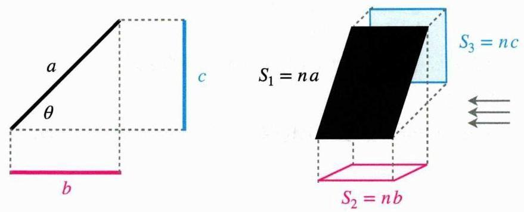

在左图中,我们可以用线段长度 $a,b,c$  表示 $\theta$  :

$$
cos\theta =\frac{b}{a},sin\theta =\frac{c}{a}
$$

此时,假设 $n$  足够大,当 $n$  条长度 $a,b,c$  的线段组合在一起,便可以得到一个面,如右图所示,此时

$$
cos\theta =\frac{nb}{na},sin\theta =\frac{nc}{na}
$$

而 $na,nb,nc$  的几何意义则是面积,故 $cos\theta =\frac{S_{2}}{S_{1}},sin\theta =\frac{S_{3}}{S_{1}}$  ; 依据这个原理,在立体几何中求二面角就会变得尤为方便;

例如 在正三棱柱 $ABC-A_{1}B_{1}C_{1}$  中, $E$  是 $BB_{1}$  中点, $AB=2,AA_{1}=4,A_{1}E\perp CE$  ,求平面 $A_{1}EC$  和平面 $A_{1}B_{1}C_{1}$  的二面角.

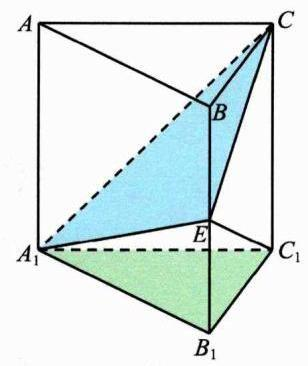

分析 此时 $A_{1}B_{1}C_{1}$  是 $A_{1}EC$  竖直方向上的投影,故对于二面角 $\theta$  :

$$
cos\theta =\frac{S_{\bigtriangleup A_{1}B_{1}C_{1}}}{S_{\bigtriangleup A_{1}EC}}=\frac{\sqrt{3}}{4}.
$$

更多地,记平面 $A_{1}EC$  和平面 $CEC_{1}$  的二面角为 $\alpha$  ,则 $cos\alpha =\frac{S_{CEC_{1}}}{S_{A_{1}EC}}=\frac{4}{4}=1,E$  为优良的建立空间直角坐标系的点. TutorCat

二. 三正弦定理与最大角问题

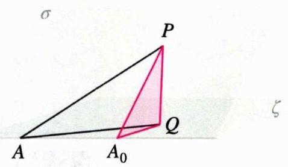

最大角定理 如图, $P$  在平面 $\sigma$  上, $Q$  在平面 $\zeta$  上, $PQ\perp$  平面 $\zeta ,A$  为平面 $\zeta$  和平面 $\sigma$  交线 $l$  上,则当 $AQ\perp l$  时, $\angle PAQ$  取得最大值.

原理 $tanPAQ=\frac{PQ}{AQ}$  ,而 $PQ$  为定值,要使得 $\angle PAQ$  最大,即 $tanPAQ$  最大,即 $AQ$  最小,故临界情况为 $AQ\perp l$  时.

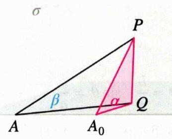

三正弦定理 设 $\beta =\angle PAQ,\alpha =\angle PA_{0}Q$  ,则

$$
sin\alpha =\frac{PQ}{A_{0}P},sin\beta =\frac{PQ}{AP}
$$

故 $\frac{sin\beta }{sin\alpha }=\frac{A_{0}P}{AP}=sin\angle PAA_{0}$  ,即 $sin\beta =sin\angle PAA_{0}\cdot sin\alpha$  .

推广 同理可得 $tan\beta =tanQAA_{0}\cdot tan\alpha$  .

例题 如图所示,在正四体 $P-ABC$  中, $PC$  中点为 $D,E$  在线段 $AD$  上,求 $BE$  和面 $ABC$  所成的角 $\alpha$  的正弦值取值范围.

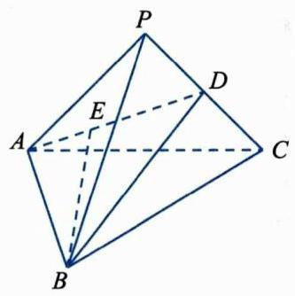

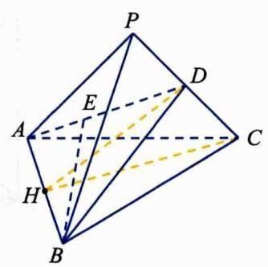

分析 取 $AB$  中点 $H$  ,连接 $DH,CH$  ,则 $DH\perp AB,CH\perp AB$  ,故 $D-AB-C$  的二面角为 $\angle DHC$  :

$$
cos\angle DHC=\frac{DH^{2}+CH^{2}-DC^{2}}{2\cdot DH\cdot CH}=\frac{\sqrt{6}}{3},\therefore sin\angle DHC=\frac{\sqrt{3}}{3}
$$

记 $\angle ABE=\beta ,sin\beta \in \left[0,\frac{\sqrt{6}}{3}\right]$  ,根据三正弦定理:

$$
sin\alpha =sin\angle DHC\cdot sin\beta \in \left[0,\frac{\sqrt{2}}{3}\right].
$$

TutorCat

# **三. 三余弦定理**

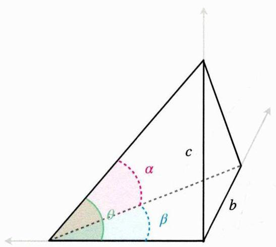

$$
a
$$

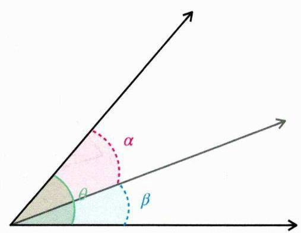

如图坐标系中 $cos\alpha =\frac{\left(a^{2}+b^{2}\right)+\left(a^{2}+c^{2}\right)-\left(b^{2}+c^{2}\right)}{2\sqrt{a^{2}+b^{2}}\sqrt{a^{2}+c^{2}}}=\frac{a^{2}}{\sqrt{a^{2}+b^{2}}\sqrt{a^{2}+c^{2}}},cos\theta =\frac{a}{\sqrt{a^{2}+c^{2}}}$  , $cos\beta =\frac{a}{\sqrt{a^{2}+b^{2}}}$  ,故 $cos\alpha =cos\beta cos\theta$  ; 此时将坐标系去掉,即从一点引出三条射线,夹角分别为 $\alpha ,\beta ,\theta$  ,若 $\beta ,\theta$  所在面垂直,则 $cos\alpha =cos\beta cos\theta$  .

辅助记忆斜立平 斜着的角 $=$  立着的角 $\times$  平着的角

例题 如图所示,在矩形 $ABCD$  中, $AD=2,E$  为 $AB$  边上的点,现将 $\bigtriangleup ADE$  沿 $DE$  翻折至 $\bigtriangleup A^{'}DE$  ,使得点 $A^{'}$  在平面 $EBCD$  上的射影落在 $CD$  上,且直线 $A^{'}D$  与平面 $EBCD$  所成的角度为 30 度,求 $\left|AE\right|$  .

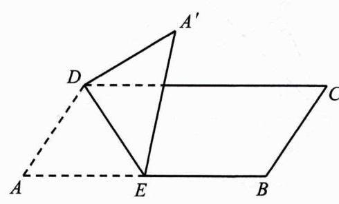

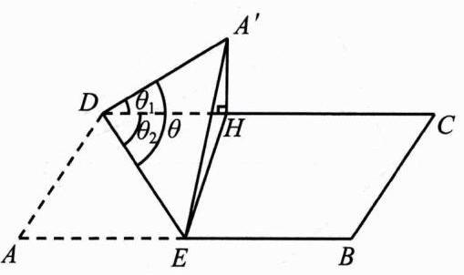

分析 如图,设 $\angle A^{'}DE=\theta ,\angle A^{'}DH=\theta _{1}=30^{\circ },\angle EDH=\theta _{2},A^{'}E=x$  ,则

$$
cos\theta _{1}=\frac{\sqrt{3}}{2},cos\theta _{2}=\frac{x}{\sqrt{x^{2}+4}},cos\theta =\frac{AD^{2}+DE^{2}-AE^{2}}{2AD\cdot AE}=\frac{2}{\sqrt{x^{2}+4}}
$$

由 $cos\theta =cos\theta _{1}\cdot cos\theta _{2}$  得: $AE=x=\frac{4}{3}\sqrt{3}$  . TutorCat 四. 空间余弦定理

在四面体 $A-BCD$  中,对棱满足:

$$
2\vec{AC}\cdot \vec{BD}=\left(AD^{2}+BC^{2}-AB^{2}-CD^{2}\right)
$$

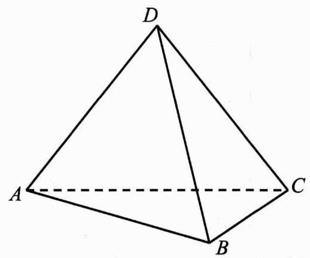

证明 $\vec{AC}\cdot \vec{BD}=\vec{AC}\left(\vec{AD}-\vec{AB}\right)=\vec{AC}\cdot \vec{AD}-\vec{AC}\cdot \vec{AB}$

$$
=\left|\vec{AC}\right|\left|\vec{AD}\right|cos\angle CAD-\left|\vec{AC}\right|\left|\vec{AB}\right|cos\angle CAB
$$

$$
=\left|\vec{AC}\right|\left|\vec{AD}\right|\frac{AC^{2}+AD^{2}-CD^{2}}{2AC\cdot AD}-\left|\vec{AC}\right|\left|\vec{AB}\right|\frac{AC^{2}+AB^{2}-BC^{2}}{2AC\cdot AB}
$$

$$
=\frac{AD^{2}+BC^{2}-AB^{2}-CD^{2}}{2}
$$

记忆方式 $2^{*}$  对棱 $=$  外部+内部-交叉

$$
\vec{AC}\cdot \vec{BD}=\frac{1}{2}\left(AD^{2}+BC^{2}-AB^{2}-CD^{2}\right)
$$

例题1 如图,已知平面四边形 $ABCD,AB=BC=3,CD=1,AD=\sqrt{5},\angle ADC=90^{\circ }$  , 沿直线 $AC$  将 $\bigtriangleup ACD$  翻折成 $\bigtriangleup ACD^{'}$  ,求直线 $AC$  与 $BD^{'}$  所成的余弦值的最大值.

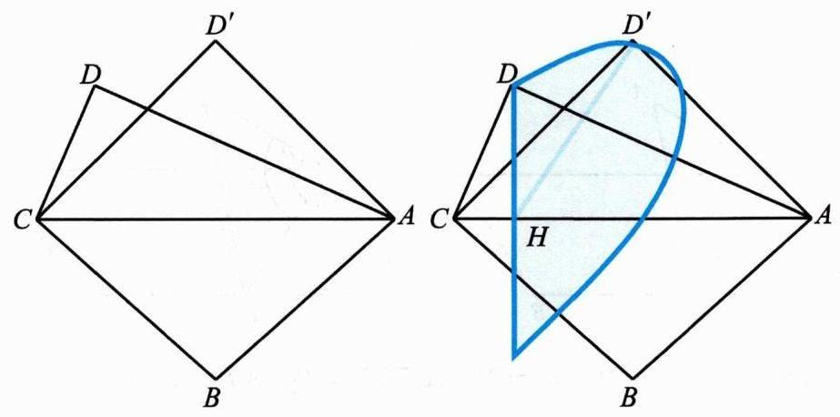

分析 根据空间余弦定理:

$$
cos<AC,BD>=\frac{\vec{AC}\cdot \vec{BD}}{2AC\cdot BD}=\frac{AD^{2}+CB^{2}-AB^{2}-CD^{2}}{2AC\cdot BD}=\frac{2}{\sqrt{6}BD}
$$

而 $D^{'}$  在以高 $DH$  为半径, $H$  为圆心的圆上运动,该圆所在平面垂直于平面 $ABCD$  ,故当 $D^{'}$  与 $D$  关于 $H$  对称时, $BD^{'}$  最小,易得 $BD_{min}^{'}=2$  ,故 $cos<AC,BD>_{max}=\frac{\sqrt{6}}{6}$  . TutorCat

例题2 空间四面体 $ABCD$  中, $AB=CD=2,AD=BC=2\sqrt{3},AC=4$  ,直线 $BD$  与 $AC$  所成角为 $45^{\circ }$  ,求四面体的体积.

解析 $cos<AC,BD>=\frac{AD^{2}+CB^{2}-AB^{2}-CD^{2}}{2AC\cdot BD}$  ,解得 $BD=2\sqrt{2};\therefore BA\perp BD,BA\perp BC$  , 故 $V=\frac{1}{3}AB\cdot S_{\bigtriangleup BCD}=\frac{4}{3}\sqrt{2}$  . TutorCat

# **第二节 静态分析**

一. 二面角二面角 (dihedral angle) 是指两个平面之间的夹角。在几何中, 它描述了两个相交平面之间的相对倾斜程度,取值范围是从 $0^{\circ }$  到 $180^{\circ }$  ,两平面相交于交线,记为 $l$  ; 可以按照以下步骤求解任意两个平面 $\alpha ,\beta$  的二面角:

1. 在 $\alpha$  上任取一点 $A$  ,过 $A$  作 $AB\perp l$  于 $H$  ,作 $AC\perp \alpha$  交 $\beta$  于 $C$

2. 二面角即 $\angle ABC=arctan\frac{AC}{AB}$

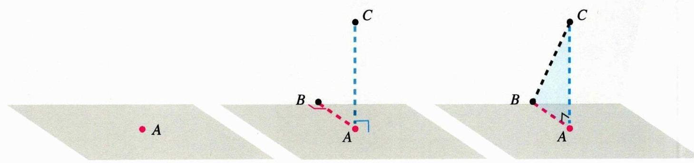

注意 如果是钝角,则需取互补的角

# **二. 异面直线距离**

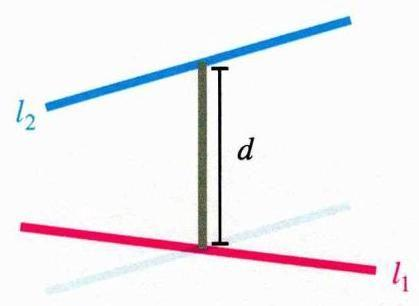

异面直线的距离是指两条不相交且不平行的直线之间的最短距离 $d$  ,在两直线的公垂线上产生,可按照以下步骤求解: TutorCat

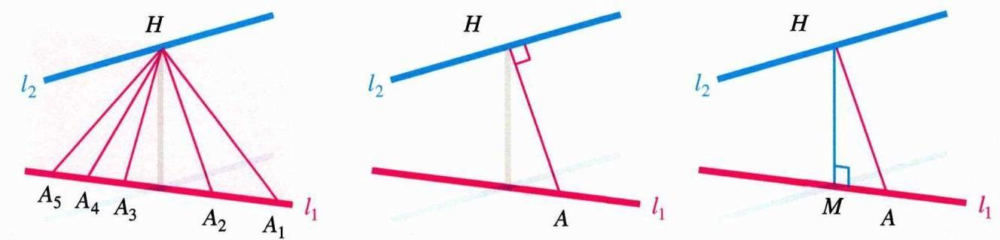

1. 在 $l_{1}$  上任取一点 $A$  ,过 $A$  作 $AH\perp l_{2}$  于 $H$  ; 这里 $A$  会有很多选择,所有可能的 $AH$  会形成一个平面,该平面垂直于 $l_{2}$  ,且包含 $l_{1}$  ,平面与 $l_{2}$  交于 $H,H$  为公垂线的垂足之一

2. 过 $H$  作 $HM\perp l_{1}$  于 $M$  ,此时 $HM$  即为公垂线段, $d=\left|HM\right|$

例 正四面体 $A-BCD$  棱长为 $4,H$  为 $AC$  四等分点(靠近 $A$  ),求 $BH$  与 $AD$  的距离 $d$  .

分析 过 $B$  作 $BN\perp AD$  于 $N$  ,过 $N$  作 $NM\perp BH$  于 $M,d=\left|MN\right|$  ,接下来在 $\bigtriangleup BMH$  中解三角形即可.

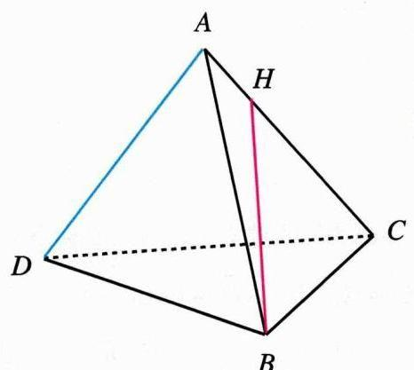

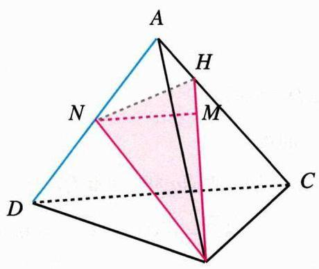

$$
B
$$

根据边角关系不难求出 $BN=2\sqrt{3},NH=\sqrt{3},BH=\sqrt{17}$  ,设 $HM=x$  ,根据勾股定理:

$$
3-x^{2}=12-\left(\sqrt{17}-x\right)^{2}
$$

解得 $x^{2}=\frac{16}{17}$  ,故 $NM^{2}=d^{2}=3-\frac{16}{17}=\frac{35}{17},d=\frac{\sqrt{595}}{17}$  .

# **三. 空间体顶点支撑**

对于一个空间体, 其中空间体的一个顶点支撑在平面上, 而其余顶点位于空间中。在目前出现的考题中,这种模型通常为正方体顶点支撑模型: 我们以离与平面接触的顶点 $O$  最近的三个点 $A,B,C$  到平面的距离 $d_{1},d_{2},d_{3}$  为参数,量化此模型,同时,如右图以 $O$  为原点建立空间直角坐标系 $O-xyz$  :

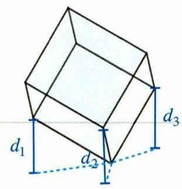

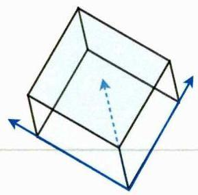

令正方体边长为 1,则 $\vec{OA}=\left(1,0,0\right),\vec{OB}=\left(0,1,0\right),\vec{OC}=\left(0,0,1\right)$  ,记平面法向量为 $\vec{n}=\left(a,b,c\right)$  ,则 $d_{1}=\frac{\vec{OA}\cdot \vec{n}}{\left|\vec{n}\right|}=\frac{a}{\sqrt{a^{2}+b^{2}+c^{2}}},d_{2}=\frac{\vec{OB}\cdot \vec{n}}{\left|\vec{n}\right|}=\frac{b}{\sqrt{a^{2}+b^{2}+c^{2}}},d_{3}=\frac{\vec{OB}\cdot \vec{n}}{\left|\vec{n}\right|}=\frac{c}{\sqrt{a^{2}+b^{2}+c^{2}}}$ 因此 $d_{1}:d_{2}:d_{3}=a:b:c$  ,正方体上其他点到平面的距离也可通过此方法转换. TutorCat 例 如图所示,在正方体 $ABCD-A_{1}B_{1}C_{1}D_{1}$  中,顶点 $A$  在平面 $\alpha$  内, $A_{1},B,C$  到平面 $\alpha$  的距离为 $\sqrt{6},1,2$  ;

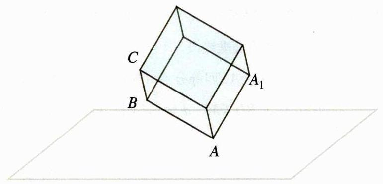

(1)证明: $BD//$  平面 $\alpha$  ；

(2)求正方体的棱长.

解析 (1) 设棱长为 $l$  ,平面 $\alpha$  的法向量为 $\vec{n}=\left(a,b,c\right)$  ,以 $A$  为原点建立空间直角坐标系 $A-xyz$  ,则

$$
\vec{AB}=\left(l,0,0\right),\vec{AA_{1}}=\left(0,0,l\right),\vec{AC}=\left(l,l,0\right),\vec{AD}=\left(0,l,0\right)
$$

$$
1=\frac{\vec{AB}\cdot \vec{n}}{\left|\vec{n}\right|}=\frac{al}{\sqrt{a^{2}+b^{2}+c^{2}}},\sqrt{6}=\frac{\vec{AA_{1}}\cdot \vec{n}}{\left|\vec{n}\right|}=\frac{cl}{\sqrt{a^{2}+b^{2}+c^{2}}},2=\frac{\vec{AC}\cdot \vec{n}}{\left|\vec{n}\right|}=\frac{al+bl}{\sqrt{a^{2}+b^{2}+c^{2}}}
$$

故 $a:c:a+b=1:\sqrt{6}:2$  ,取 $a=1$  ,则 $\vec{n}=\left(1,1,\sqrt{6}\right)$  ,又 $\vec{BD}=\left(-l,l,0\right)$  ,故 $\vec{n}\cdot \vec{BD}=0$  ,

$\therefore BD//$  平面 $\alpha$  ;

(2)将 $\vec{n}=\left(1,1,\sqrt{6}\right)$  代入 $1=\frac{al}{\sqrt{a^{2}+b^{2}+c^{2}}}$  得: $l=2\sqrt{2}$  . TutorCat

# **第三节 动态分析**

# **一. 平面几何构型**

大部分初中平面几何基础不好的同学经常会能看懂答案, 但是自己写不出来的情况, 因为他们忽视了对几何构型定与不定的预判, 失去了宏观的视角, 只能从微观上一步一步的求, 不仅浪费时间, 可能还走错方向; 本部分内容会从平面几何的几个基本构型出发, 当这些特定结构出现时, 要能够有预判可求的结果的思维能力, 比如:

"在这个图中,如果能知道\*\*\*、\*\*\*的值,那可以确定这个图形的其他值。"

当做题时有了这样的思维环节, 就能极大程度的提升思维跨度, 找对问题的突破方向; 例如在一轮中我们所提到的, 三角形有三条边、三个角, 共6个要素, 这6个要素知三得所有; 真正的学霸思维是思维走在计算前面, 现有思路, 再做计算.

# **1. 腰高图**

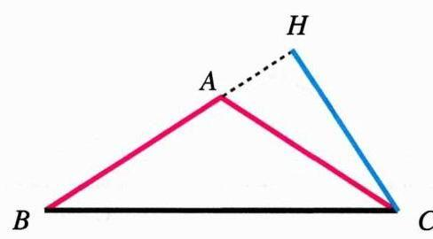

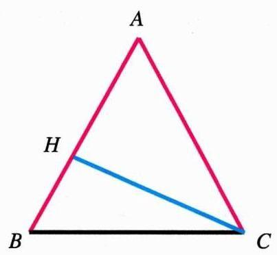

如图,等腰 $\bigtriangleup ABC$  中, $AB=AC,CH\perp AB$  ,垂足为 $H$  ,这样在腰上有一条高的图形称为腰高图; 腰高图中共有六条线段,又 $AB=AC$  ,我们可以将其记为五个组成部分(未知数):

$$
AH,BH,CH,BC,AB=AC
$$

根据勾股定理, $Rt\bigtriangleup AHC$  和 $Rt\bigtriangleup BHC$  :

$A$  为钝角: $AC^{2}-AH^{2}=BC^{2}-\left(AB+AH\right)^{2}$

$A$  为锐角: $AC^{2}-AH^{2}=BC^{2}-\left(AB-AH\right)^{2}$

代入 $AB=AC$  替换,即

$A$  为钝角: $AC^{2}-AH^{2}=BC^{2}-\left(AC+AH\right)^{2}$

$A$  为锐角: $AC^{2}-AH^{2}=BC^{2}-\left(AC-AH\right)^{2}$

即一个方程中有三个未知数, 故知道其中两个, 可以得到其余所有值, 知道其中一个, 便可以用变量表示出所有边长, 得到范围:

# **腰高图 | 知二得所有,知一得范围**

例如,已知 $A$  是钝角, $AH=1,BC=2\sqrt{3}$  ,则 $AC^{2}-1=12-\left(AC+1\right)^{2},AC=2$  ,故

$$
HC=\sqrt{3},BC=2\sqrt{3},AB=AC=2,AH=1
$$

TutorCat

2. 等腰一线

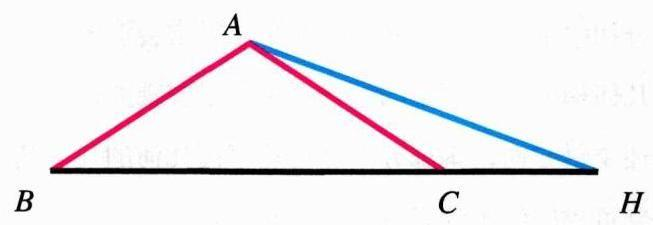

如图,等腰 $\bigtriangleup ABC$  中, $AB=AC,BC$  上有一点 $H,AH$  这条线段落在 $BC$  或 $BC$  的延长线上,这样的构型称为等腰一线；

同样的, 共有六条线段, 五个组成部分 (未知数) :

$$
AH,BH,CH,BC,AB=AC
$$

此时,可以考虑作高构建连环勾股方程,搭建这五个未知数的关系,过 $A$  作 $AM\perp BC$  :

$$
AH^{2}-MH^{2}=AC^{2}-MC^{2}
$$

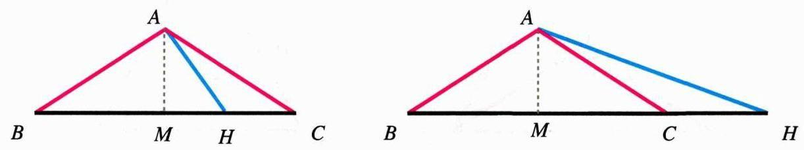

四个未知数, 故

# **腰高图 | 知三得所有,知二得范围**

例如,对于 $H$  在 $BC$  内的情况,已知 $BH=3,AC=4,AH=1$  ,此时可以设 $MH=x$

$$
1-x^{2}=16-\left(3-x\right)^{2}
$$

从而解得 $x$  并求出其他边长.

3. 射影图及其推广

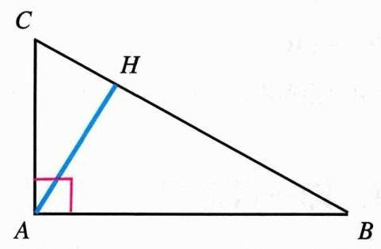

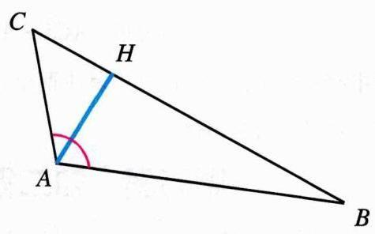

左图, $Rt\bigtriangleup CAB$  内, $\angle A=90^{\circ },AH\perp BC$  ,根据相似可以得到以下结论:

TutorCat

$$
AH^{2}=CH\cdot HB,AC^{2}=CH\cdot CB,AB^{2}=BH\cdot BC
$$

同样的,在 $AH,BH,CH,BC,AB,AC$  这六个元素中,知二得所有

# **射影图 | 知二得所有,知一得范围**

我们将其扩展到右图 $A$  为任意角的情形,构型仍然满足知二得所有:

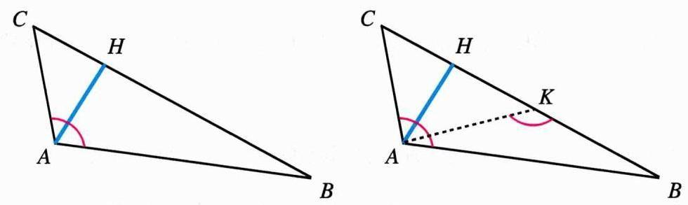

在 $CB$  上取点 $K$  使得 $\angle BKA=\angle BAC$  ,根据子母型 $\bigtriangleup BKA\sim \bigtriangleup BAC$  以及直角边 $AH$  关联的勾股定理即可构建起所有边的关系式.

例如 在 $\bigtriangleup ABC$  中, $AH\perp BC$  于 $H,\angle A=60^{\circ },CH=1,AB=\sqrt{2}$  ,求 $HB$  .

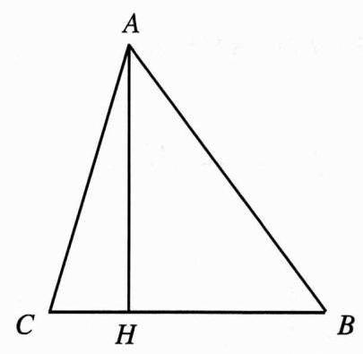

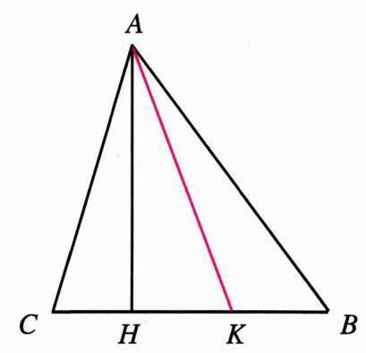

思路 在 $CB$  上取点 $K$  使得 $\angle AKC=60^{\circ }$  ,设 $HK=x$  ,则 $AH=\sqrt{3}x,AK=2x$  ,故

$$
AC^{2}=1+3x^{2},HB^{2}=2-3x^{2}
$$

由 $\bigtriangleup CKA\sim \bigtriangleup CAB$  得: $AC^{2}=CK\cdot CB$  ,即

$1+3x^{2}=\left(1+x\right)^{2}+\left(1+\sqrt{2-3x^{2}}\right)^{2}$  ,解出 $x$  即可. TutorCat

# **二. 单参数变换**

单参数变换 (single-parameter transformation) 是指在几何学或其他数学系统中, 某个对象的状态仅通过一个独立变量 (参数) 发生变化, 而其他条件保持不变。

对于这类变换, 我们可以按照以下三步进行分析:

1. 识别不变要素: 确定哪些几何特征在变换过程中保持不变, 如固定点、固定形状、固定平面或结构等;

2. 解析变换要素:分析具体发生变化的部分, 如点的位置、角度的大小等;

3. 将问题转化或等价为不变要素与变换要素的组合形式, 简化分析与解决过程.

注意 这类问题在高考中往往以小题的形式出现, 考虑到篇幅, 本节内容会主讲分析思路, 不会涉及到书写过程和结论证明.

例1 如图所示,四边形 $ABCD$  和四边形 $ADPQ$  均为正方形,它们所在的平面相互垂直,动点 $M$  在线段 $PQ$  上, $E$  , $F$  分别为 $AB,BC$  的中点,设异面直线 $EM$  与 $AF$  所成的角为 $\theta$  ,求 $cos\theta$  的最大值.

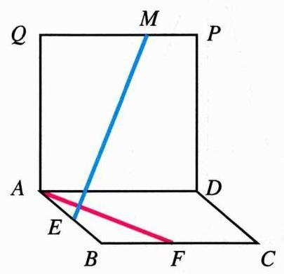

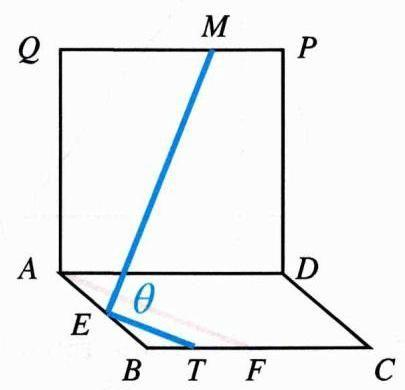

分析 按照单参数变换的分析步骤进行分析:

1. 识别不变要素: 除了 $M$  点外的所有结构

2. 解析变换要素: $M$  点的位置在线段 $QP$  上

3. 将问题转化: $\theta$  为异面直线夹角,故考虑平移其中一条直线,转换到同一平面上处理,取 $BF$  中点 $T$  ,连接 $ET$  ,则 $\theta =\angle MET$  ； $cos\theta$  的最大值及 $\theta$  的最小值,下面将求 $\theta$  的最小值作为目标,分析 $M$  点在线段 $QP$  上的位置与 $\theta$  大小的关系即可.

TutorCat

问题转换 过 $M$  作 $MH\perp AD$  于 $H$  ,记 $\alpha =\angle MEH,\beta =\angle TEH$  ,直观上便可知道 $\alpha$  越大或 $\beta$  越大,则 $\theta$  越大的正相关关系,当然,也可以根据三余弦定理 $cos\theta =cos\alpha \cdot cos\beta$  严谨说明; 因此,下面分析 $M$  的运动对 $\alpha ,\beta$  的影响即可,假设 $M$  由 $P$  向 $Q$  移动:

- $\left|MH\right|$  不变, $\left|EH\right|$  减小,故 $\alpha$  增大;

- $ET$  为不变要素, $EH$  以 $E$  为圆心,逆时针转动,故 $\beta$  增大;

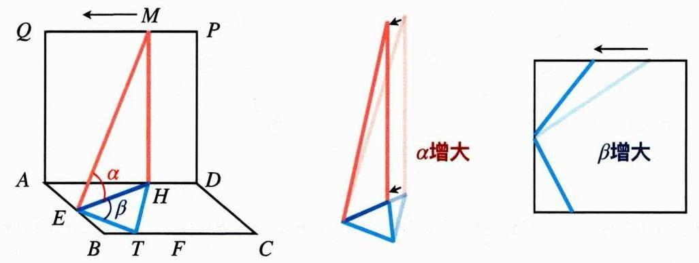

因此,可以得出结论:假设 $\theta$  是锐角, $M$  越靠近 $Q$  , $\theta$  越大, $M$  越靠近 $P$  , $\theta$  越小,故 $M$  与 $P$  重合时, $cos\theta$  最大;

$$
max\{cos\theta \}=cos\angle TEP
$$

$cos\angle TEP$  的求法有很多,大家可以自行尝试; 这里我们用三余弦定理来求, $M$  与 $P$  重合时, $H$  与 $D$  重合, 构成三垂直模型[初中知识]:

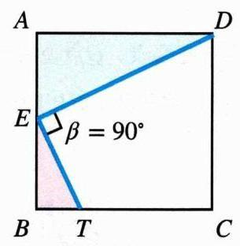

$\therefore cos\angle TEP=cos\alpha cos90^{\circ }=0$  ,故 $cos\theta \leq 0,\theta$  为钝角,又直线与直线的夹角 $\leq 90^{\circ }$  ,因此 $EM$  与 $AF$  所成的角为 $\theta =\pi -\angle TEP,M$  与 $Q$  重合时, $cos\theta$  最大:

$$
cos\theta =\frac{QE^{2}+ET^{2}-QT^{2}}{2QE\cdot ET}=\frac{AE^{2}+AQ^{2}+EB^{2}+BT^{2}-\left(QA^{2}+AB^{2}-BT^{2}\right)}{2QE\cdot ET}=\frac{2}{5}.
$$

TutorCat

例2 在四棱锥中 $P-ABCD,PA\perp$  平面 $ABCD$  ,四边形 $ABCD$  为直角梯形, $PA=AD=2$  , $AB=BC=1,\angle ABC=\angle BAD=\frac{\pi }{2}$  ,点 $Q$  是线段 $BP$  上的动点,求直线 $CQ$  与 $DP$  所成角的余弦值的最大值.

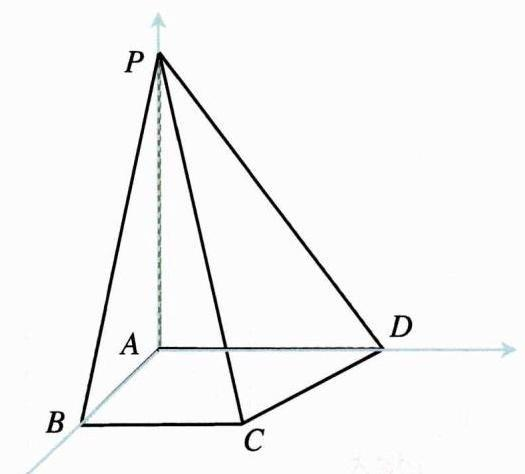

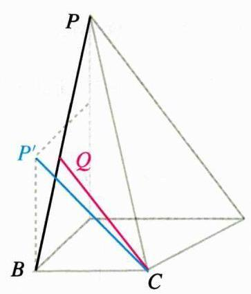

思路将 $PD$  平移至 $C$  点,与面 $PAB$  交于 $P^{'}$  ,则 $<CQ,DP>=\angle P^{'}CQ$  ,下求 $cos\angle P^{'}CQ$  最大值即可, 即 $\angle P^{'}CQ$  最小时;

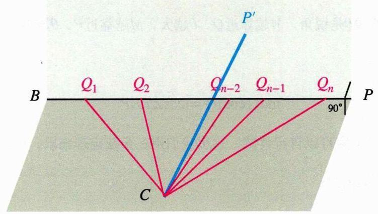

此时 $CP^{'}$  为不变要素, $Q$  点位置为变换要素

同样的,我们可以借助三余弦定理来分析: 作 $P^{'}H\perp BP$  于 $H$  TutorCat

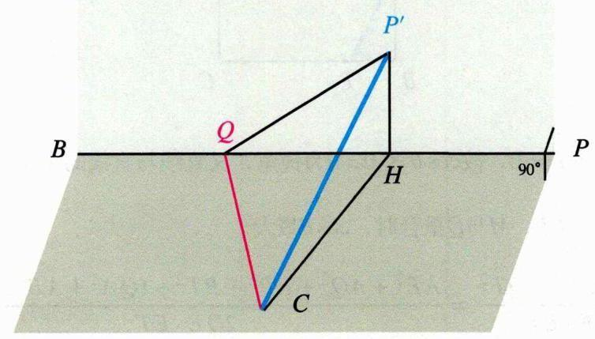

$$
cos\angle P^{'}CQ=cos\angle P^{'}CHcos\angle HCQ
$$

又 $\angle PCH$  为不变要素,故只需使得 $cos\angle HCQ$  尽可能大,即 $\angle HCQ$  尽可能小,即 $\angle HCQ=0,Q,H$  重合时; 此时 $cos\angle P^{'}CQ=cos\angle P^{'}CH$  ;

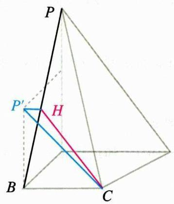

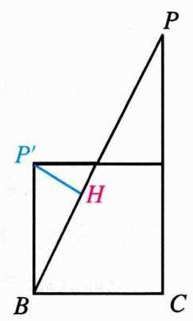

根据射影定理可得 $P^{'}H=\frac{\sqrt{5}}{5},sin\angle P^{'}CH=\frac{P^{'}H}{CP^{'}}=\frac{\sqrt{10}}{5},\therefore cos\angle P^{'}CH=\frac{3\sqrt{10}}{10}$  .

N维线段长度和处理方式 当要处理分布在多个平面的线段的长度和时, 可以将立体问题平面化, 即作出平面展开图, 并在展开图中进行分析。

例 在直三棱柱 $ABC-A_{1}B_{1}C_{1}$  中,棱柱的侧面均为矩形, $AA_{1}=1,AB=BC=\sqrt{3}$  , $AC=2,P$  是 $A_{1}B$  上的一动点,求 $AP+PC_{1}$  的最小值.

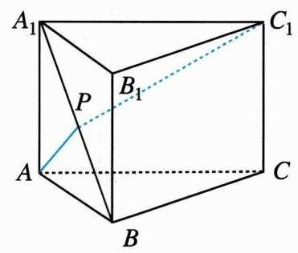

解析 将面 $AA_{1}B$  与面 $C_{1}A_{1}B$  沿 $A_{1}B$  展开, $AP+PC_{1}$  最小值即 $AC_{1}$  :

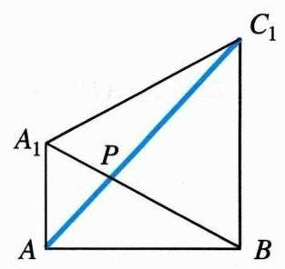

而 $A_{1}B=BC_{1}=A_{1}C_{1}=2$  ,故 $\angle A_{1}BC_{1}=\frac{\pi }{3},AC_{1}=\sqrt{AB^{2}+BC_{1}^{2}}=\sqrt{5}$  . TutorCat

# **三. 多参数变换**

多参数变换 (multi-parameter transformation) 是指几何对象或系统通过多个独立变量 (参数) 发生变化的一类变换。相比于单参数变换, 多参数变换更加复杂, 允许对象同时发生多个维度的变化, 比如位置、角度、比例等;

1. 识别不变要素: 确定哪些几何特征在变换过程中保持不变, 如固定点、固定形状、固定平面或结构等;

2. 控制变量:固定部分变换要素, 保留一个变换要素

3. 分别解析保留的变换要素:分析具体发生变化的部分, 如点的位置、角度的大小等;

4. 综合分析结果, 得到临界状态

例 1 在棱长为 2 的正方体 $ABCD-A_{1}B_{1}C_{1}D_{1}$  中, $E$  为棱 $CC_{1}$  的中点,点 $P,Q$  为面 $A_{1}B_{1}C_{1}D_{1}$  和线段 $B_{1}C$  上的动点,球 $\bigtriangleup PEQ$  周长的最小值.

分析 固定 $Q$  不变、 $P$  在 $B_{1}C_{1}$  上投影的位置不变,分析 $P$  到 $B_{1}C_{1}$  距离与 $\bigtriangleup PEQ$  周长的关系:

$P$  到 $B_{1}C_{1}$  距离越小, $\bigtriangleup PEQ$  周长越小

故 $\bigtriangleup PEQ$  周长最小时, $P$  在 $B_{1}C_{1}$  上:

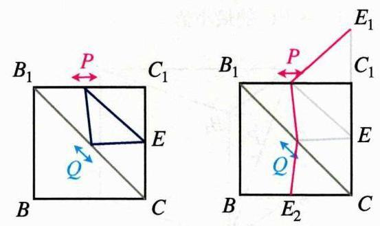

利用动态N维线段长度和问题的处理手法, $min\{\bigtriangleup PEQ\}=\left|E_{1}E_{2}\right|=\sqrt{10}$  . 四. 动态射影与翻折问题

例题 空间四面体 $ABCD$  中, $AB=CD=2,AD=BC=2\sqrt{3},AC=4$  ,直线 $BD$  与 $AC$  所成的角为45°,则四面体的体积为\_\_\_\_\_. TutorCat

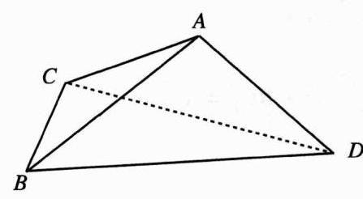

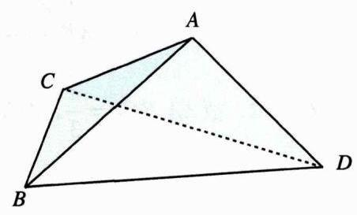

分析 $\bigtriangleup ACB\cong \bigtriangleup CAD$  ,均为 $1:\sqrt{3}:2$  的等腰直角三角形,故问题可以等价为下图翻折问题:

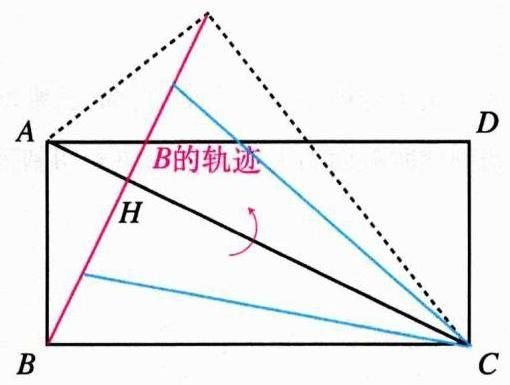

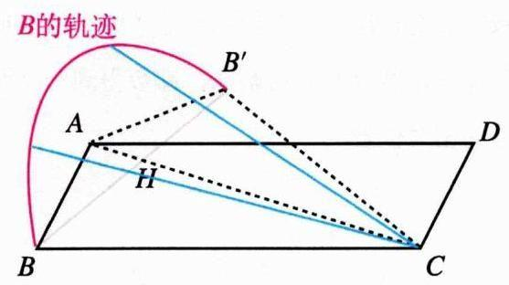

$B$  在以 $CB^{'}$  为棱的圆锥底面圆周上运动,圆锥高为 $CH=\frac{CB^{2}}{AC}=3$  ,把 $BD$  按照 $\vec{DC}$  平移:

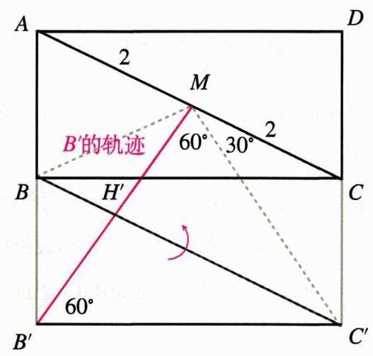

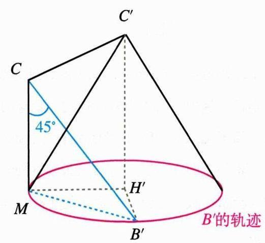

此时若 $CB^{'}=45^{\circ }$  ,则 $MB^{'}=CM=2$  ; 下面求 $B^{'}$  到 $MH^{'}$  的距离即为 $B-ACD$  的高 $h$  ,下求 $h$  即可:

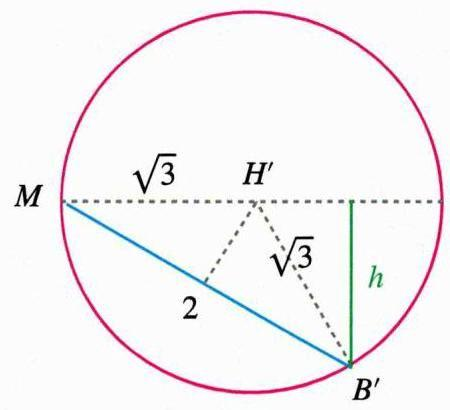

底面半径 $r=\sqrt{3}$  ,故 $cos\angle B^{'}MH^{'}=\frac{1}{\sqrt{3}},h=2\sqrt{1-\left(\frac{1}{\sqrt{3}}\right)^{2}}=\frac{2\sqrt{6}}{3}$  ,故

$$
V=\frac{1}{3}\times \sqrt{3}\times \frac{2}{3}\sqrt{6}=\frac{2}{3}\sqrt{2}.
$$

TutorCat

# **第四节 球的几何学**

# **一. 外接球**

1. 球的截面圆

球的截面圆是指用一个平面切割球体时, 所形成的圆形截面。由于球体是一个完全对称的三维形状, 从任何角度或方向切割球, 都会得到一个圆形截面。切割球时截面的大小主要取决于切割平面与球心的相对位置。

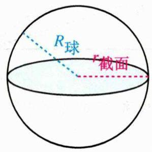

$$
r_{ 截面 }=R_{ 球 }
$$

$$
r_{ 截面 }=\sqrt{R_{ 球 }^{2}-d^{2}}
$$

当切割平面通过球心时如果切割平面经过球心, 那么截面是球的最大圆, 称为大圆。大圆的半径等于球的半径。例如, 当你沿着赤道切割地球时, 截面就是一个大圆。

当切割平面不通过球心时如果切割平面不通过球心, 截面的圆会比大圆小; 此时, 切割平面与球心之间有一定的距离 $d$  ；这个距离越远,截面圆的半径就越小,直到平面与球体仅仅在一条切线相交时,截面会退化成一个点; 截面圆的半径 $r_{ 截面 }$  可以由球体半径 $R_{ 球 }$  和平面与球心的距离 $d$  ,通过勾股定理求得.

例 两个有公共底面的正三棱锥 $P-ABC$  与 $Q-ABC$  ,它们的各顶点均在半径为 1 的球面上, 若二面角 $P-AB-Q$  的大小为120°,则 $\bigtriangleup ABC$  的边长为\_\_\_\_\_.

分析 根据对称性,考虑取 $BC$  中点 $E$  ,此时 $P-AB-Q$  即 $\angle PEQ,\angle PEQ=120^{\circ }$  ,下面综合分析 $\bigtriangleup PEQ$  和 $\bigtriangleup PAQ$  即可:

$$
A
$$

设 $PH=h,AH=x$  ,则 $HQ=2-h,HE=\frac{x}{2},\bigtriangleup ABC$  的边长为 $\sqrt{3}x$  ;

TutorCat

由射影定理 $AH^{2}=PH\cdot HQ$  ,即 $x^{2}=h\left(2-h\right)$  ,在 $\bigtriangleup PEQ$  中,根据面积法:

$$
HE\cdot PQ=PE\cdot QE\cdot sin120^{\circ }
$$

即 $x^{2}=\left(h^{2}+\frac{x^{2}}{4}\right)\left(\left(2-h\right)^{2}+\frac{x^{2}}{4}\right)\cdot \frac{3}{4}$  ,与 $x^{2}=h\left(2-h\right)$  联立得: $x=\frac{4}{9}\sqrt{3}$  ,所以边长为 $\frac{4}{3}$  .

2. 双平行截面圆

$$
R^{2}=r_{1}^{2}+h_{1}^{2}=r_{2}^{2}+h_{2}^{2}
$$

$$
\frac{S_{1}}{S_{2}}=\frac{R^{2}-h_{1}^{2}}{R^{2}-h_{2}^{2}}
$$

如图,记两个平行的面积分别为 $S_{1},S_{2}$  的截面圆到圆心的距离为 $h_{1},h_{2}$  ,则

$$
R^{2}=r_{1}^{2}+h_{1}^{2}=r_{2}^{2}+h_{2}^{2},\frac{S_{1}}{S_{2}}=\frac{R^{2}-h_{1}^{2}}{R^{2}-h_{2}^{2}}
$$

当 $h_{1}=h_{2}$  时, $S_{1}=S_{2}$  ,例如高为 $H$  的四棱锥,其某条棱长 $=H$  ,将其底面向上平移后至顶点,可得到四棱柱, 四棱柱上下底面全等且平行, 故在外接圆中所在的圆截面面积相等, 到圆心的距离相等:

依据此原理,设直棱柱高为 $h$  ,其外接圆半径为 $R$  ,上下底截面圆半径为 $r$  ,则

$$
r^{2}+\left(\frac{h}{2}\right)^{2}=R^{2}
$$

TutorCat

3. 两个相交截面圆的公共圆

记截面圆 $O_{1},O_{2}$  相交于交线 $L$  ,交线长为 $2k$  ,交线中点为 $M,O_{1},O_{2}$  的半径分别为 $r_{1},r_{2}$  ,到 $L$  的距离分别为 $d_{1}=KO_{1},d_{2}=KO_{2}$  ,则

$$
d_{1}^{2}=r_{1}^{2}-k^{2},d_{2}^{2}=r_{2}^{2}-k^{2}
$$

记球的半径为 $R$  ,则

$$
OO_{1}^{2}=R^{2}-r_{1}^{2},OO_{2}^{2}=R^{2}-r_{2}^{2},OK^{2}=R^{2}-k^{2}
$$

记两截面的二面角为 $\theta ,OO_{2}KO_{1}$  四点共圆,记圆心为 $M$  ,利用圆的性质导角可得

$$
\angle O_{1}MO_{2}=2\left(\pi -\theta \right)
$$

在三角形 $MO_{1}O_{2}$  中, $MO_{1}=MO_{2}=\frac{1}{2}OK=\frac{1}{2}\sqrt{R^{2}-k^{2}}$  ,则

$$
O_{1}O_{2}=2OM_{1}sin\left(\pi -\theta \right)=\sqrt{R^{2}-k^{2}}sin\theta
$$

在三角形 $KO_{1}O_{2}$  中,由余弦定理:

$$
cos\theta =\frac{KO_{1}^{2}+KO_{2}^{2}-O_{1}O_{2}^{2}}{2KO_{1}\cdot KO_{2}}=\frac{r_{1}^{2}+r_{2}^{2}-2k^{2}-\left(R^{2}-k^{2}\right)sin^{2}\theta }{2\sqrt{r_{1}^{2}-k^{2}}\sqrt{r_{2}^{2}-k^{2}}}
$$

即 $\left(r_{1}^{2}-k^{2}\right)+\left(r_{2}^{2}-k^{2}\right)-2cos\theta \cdot \sqrt{r_{1}^{2}-k^{2}}\sqrt{r_{2}^{2}-k^{2}}=\left(R^{2}-k^{2}\right)sin^{2}\theta$  ,在这个等式中共有五个元素: TutorCal

$$
r_{1},r_{2},k,R,\theta
$$

根据方程的性质, 知四得所有, 知三得范围. 特殊的,当两截面垂直, $\theta =\frac{\pi }{2}$  时,

此时方程共四个元素, 知三得所有, 知四得范围; 在题目中, 我们只需要根据题目条件推导这五个关键量, 再结合方程求解.

例 1 如图所示,表三棱锥 $A-BCD$  中, $AD=CD=1,AB=BC=AC=\sqrt{2}$  ,平面 $ACD\perp$  平面 $ABC$  ,则三棱锥 $A-BCD$  外接球的表面积为\_\_\_\_\_.

分析 涉及到 $A-BCD$  外接球,不妨先选取三棱锥 $A-BCD$  的两个面,分析这两个面所在截面圆的性质,从而得到外接球的性质；而三棱锥A - BCD中, $\bigtriangleup ACD$  和 $\bigtriangleup BCD$  的图形为等腰直角三角形和等边三角形, 且这两个三角形所在面的夹角已知, 因此选取这两个面会更好处理: TutorCat

$$
r_{1}=\frac{\sqrt{2}}{2}
$$

$$
r_{2}=\frac{\sqrt{6}}{3}
$$

根据几何性质: $r_{1}^{2}=\frac{1}{2},r_{2}^{2}=\frac{2}{3}$  ; 而 $k=\frac{1}{2}CD=\frac{1}{2}$  ,代入 $r_{1}^{2}+r_{2}^{2}=k^{2}+R^{2}$  可得: $R^{2}=\frac{2}{3};\therefore$  表面积 $S=4\pi R^{2}=\frac{8}{3}\pi$  .

例2 已知,在三棱锥 $A-BCD$  中,平面 $ABD\perp$  平面 $BCD,AB=2,BC=1,AC=\sqrt{3}$  , $BD=\frac{2}{3}\sqrt{2}$  , $\angle DBC=45^{\circ }$  ,则此三棱锥的外接球的表面积为\_\_\_\_\_.

分析 显然, $\bigtriangleup BDE$  与 $\bigtriangleup ABC$  形状已知,故只需求它们的二面角,记为 $\theta$  ,此时应该用上条件“平面 $ABD\perp$  平面 $BCD$  ”,过 $C作CE\perp BD$  于 $E$  ,则 $CE\perp AE,\therefore AE^{2}=AC^{2}-CE^{2}=\frac{5}{2}$  ,接着再利用 $AE$  的长度求 $\theta$  即可:

$$
B
$$

过 $E$  作 $EH\perp BC$  于 $H$  ,则 $tan\theta =\frac{AE}{EH}=\sqrt{10},cos\theta =\frac{1}{\sqrt{11}},sin\theta =\frac{\sqrt{10}}{\sqrt{11}}$  ; 接下来再来分析其他四个要素,半切线长 $k=\frac{BC}{2}=\frac{1}{2}$  ,平面 $ABC$  所在的截面圆的半径 $r_{1}=\frac{1}{2}AB=1$  ,外接球半径 $R$  待求,下面求平面 $BCD$  所在的截面圆的半径 $r_{2}$  即可,由正弦定理 $2r_{2}=\frac{CD}{sin45^{\circ }}$  :

$$
r_{2}^{2}=\frac{1}{2}\left(ED^{2}+CE^{2}\right)=\frac{5}{18}
$$

代入 $\left(r_{1}^{2}-k^{2}\right)+\left(r_{2}^{2}-k^{2}\right)-2cos\theta \cdot \sqrt{r_{1}^{2}-k^{2}}\sqrt{r_{2}^{2}-k^{2}}=\left(R^{2}-k^{2}\right)sin^{2}\theta$  可得: $R^{2}=\frac{7}{6},\therefore S=\frac{14}{3}\pi$  .

# **4. 特殊立体图形外接球的几何构型**

a. 正棱锥的外接球

正棱锥 (正多棱锥) 是指底面是正多边形, 且从顶点到底面的垂线足是这个正多边形的中心 TutorCat

的棱锥；正棱锥的底面是正多边形,侧面全是等腰三角形。记底面外接圆半径为 $r$  ,正棱锥外接球半径为 $R$  ,高为 $h$  ;

因此连接底面圆心和外接球圆心、底面圆心和正多边形顶点, 就能得到腰高图:

$$
\left(h-R\right)^{2}+r^{2}=R^{2}
$$

变量共有三个(r, R, h),其中 $r$  与底面正多边形边长 $a$  有直接关系,例如对于等边三角形 $r=\sqrt{3}a$  , 对于正方形 $r=\sqrt{2}a$  ,在方程组 $\left(h-R\right)^{2}+r^{2}=R^{2}$  中,变量知三得所有.

b. 直棱柱的外接球: 直棱柱的情况则相对简单, 外接球球心和底面外接圆圆心的距离为棱柱高的一半,故 $r^{2}+\left(\frac{h}{2}\right)^{2}=R^{2}$

$$
r^{2}+\left(\frac{h}{2}\right)^{2}=R^{2}
$$

TutorCat

c. 待补长方体的外接球:选取长方形上底面 $a$  个顶点,与下底面 $b$  个顶点,记为 $a:b$  ,连接成立体图形, 该立体图形必定内接于长方体, 而长方体外接球, 故该立体图形也外接于这个球, 如图: TutorCal 例1 已知四面体 $ABCD$  的每个顶点都在表面积为 $9\pi$  的球 $O$  的表面上,且 $AB=CD=a$  , $AC=AD=BC=BD=\sqrt{5}$  ,求 $a$  的值. 分析 三组对棱均相等,故为 $2:2$  ,可补全成长方体,不妨设 $A 、 B 、 C$  中间的顶点为 $E,AE=x$  , $BE=y,CE=z$  ,由勾股定理 $AC^{2}=x^{2}+z^{2}=5,BC^{2}=y^{2}+z^{2}=5$  解得 $x=y$  ,又 $4\pi \cdot \left(\frac{\sqrt{x^{2}+y^{2}+z^{2}}}{2}\right)^{2}=9\pi$  ,解得 $x=y=2$  ,所以 $a=\sqrt{x^{2}+y^{2}}=2\sqrt{2}$  . 例2 在《九章算数》中,将四个面都是直角三角形的四面体称为鳖臑,已知在鳖臑 $A-BCD$  中,满足 $AB\perp$  平面 $BCD$  ,且 $AB=BD=5,BC=3,CD=4$  ,求此鳖臑外接球的表面积. 分析 鳖臑为 $1:3$  ,因为 $BD^{2}=BC^{2}+CD^{2}$  ,所以 $BC\perp CD$  ,可补全成长方体,三边分别为 $AB=5,BC=3,CD=4$  ,所以外接球的表面积为 $4\pi \cdot \left(\frac{\sqrt{AB^{2}+BC^{2}+CD^{2}}}{2}\right)^{2}=50\pi$  .

补形法 当题目中出现这些图形时, 将长方形补回来即可处理其外接球.

# **二. 内切球**

内切球是指一个与立体图形的所有面都相切的球。球的圆心位于该立体图形的几何中心, 称为内心。这个球的半径是从内心到图形任意一个面的最短距离。

1. 内切球的性质

- 内心是内切球的球心, 通常是多面体角平分线的交点。

- 内切球的半径是从球心到图形表面每一个面的距离,记为 $r$  。因此, $r$  的大小取决于该多面体的

体积和表面积,若图形表面积为 $A$  ,体积为 $V$  ,则 $\frac{1}{3}Ar=V$  ,即

$$
r=\frac{3V}{A}
$$

例 1 已知正四棱锥 $P-ABCD$  内切球的半径为 $\sqrt{3}-1$  ,且 $PA=AB$  ,求正四棱锥 $P-ABCD$  的体积.

分析 易得 $r=\sqrt{3}-1$  ,高 $h=\frac{\sqrt{2}}{2}AB$  ,故 $V=\frac{1}{3}\cdot AB^{2}\cdot h=\frac{\sqrt{2}}{6}AB^{3},A=\left(1+\sqrt{3}\right)AB^{2}$  ,代入 $r=\frac{3V}{A}$  ,解得 $AB=2\sqrt{2}$  ,故 $V=\frac{16}{3}$  .

例2 在三棱锥 $P-ABC$  中,底面 $\bigtriangleup ABC$  是等腰三角形, $AB\perp AC,PA\perp$  底面 $ABC$  , $PA=AB=1$  ,求这个三棱锥的内切球半径. 分析 易得 $A=3\cdot \frac{1}{2}+\frac{\sqrt{3}}{4}\cdot 2=\frac{3+\sqrt{3}}{2},V=\frac{1}{6}$  ,代入 $r=\frac{3V}{A}$  ,解得 $r=\frac{3-\sqrt{3}}{6}$  . 2. 正棱锥的外接球几何构型

a. 正三棱锥: 记外接球球心 $O$  ,过 $S$  作球在 $S$  所对面的射影,即该面内切椭圆,则 $S,O,O^{'}$  共线, 其余顶点也是如此,因此我们往往会把截面 $SAB$  的构型作为分析突破口:

侧面内接椭圆圆心

更多地,若正三棱锥四个面都是等边三角形,棱长为 $2\sqrt{3}a$  ,高为 $H$  ,内接球半径为 $r$  ,则侧面内接椭圆为内接圆, 有以下关系:

$$
\left(2a\right)^{2}+r^{2}=\left(H-r\right)^{2}
$$

因此,若为正四面体,则有 $a=r$  .

例 已知正三棱锥的底面边长为 $2\sqrt{3}$  ,侧棱长为 $2\sqrt{5}$  ,求该正三棱锥的内切球的表面积. 分析 设内切球半径为 $r$  ,易得 $AB=3$  ,作出侧面相切图

可得 $\left(4-r\right)^{2}=r^{2}+\left(\sqrt{17}-1\right)^{2}$  ,解得 $r=\frac{\sqrt{17}-1}{4}$  ,故 $S=4\pi r^{2}=\frac{\left(9-\sqrt{17}\right)\pi }{2}$  .

# **TutorCat**

b. 正四棱锥: 与三棱锥用同样的方式,在面 $SMN$  的构型中分析即可

例 已知体积为 $\frac{32\pi }{3}$  的球 $O$  与正四棱锥 $P-ABCD$  的每个面都相切,若正四棱锥 $P-ABCD$  的底面边长为 $4\sqrt{3}$  ,求该正四棱锥的侧面积.

分析 由 $\frac{4}{3}\pi r^{3}=\frac{32}{3}\pi$  ,得 $r=2$  ,画出侧面图

$$
T
$$

因为底边长为 $4\sqrt{3}$  ,所以 $MT=NT=2\sqrt{3}$  , $\Delta MSN$  为等边三角形,则 $S_{ 侧 }=4\cdot \frac{1}{2}\cdot \left(4\sqrt{3}\right)^{2}=96$  .

c. 正n棱锥 (圆锥): 当底面边数足够大时,便会形成圆锥,记底面半径为 $r$  ,内切球半径为 $R$  ,圆锥高为 $H$  ,则

$\left(\sqrt{H^{2}+r^{2}}-r\right)^{2}+R^{2}=\left(H-R\right)^{2}$ TutorCat

例1(2020全国I卷)已知圆锥的底面半径为1,母线长为3,求该圆锥内半径最大的球的体积. 分析 圆锥内半径最大的球即内接球,已知 $r=1,H=\sqrt{3^{3}-r^{2}}=2\sqrt{2}$  ,代入

$$
\left(\sqrt{H^{2}+r^{2}}-r\right)^{2}+R^{2}=\left(H-R\right)^{2}
$$

解得 $R=\frac{\sqrt{2}}{2}$  ,故 $V=\frac{4}{3}\pi R^{3}=\frac{\sqrt{2}}{3}\pi$  .

例2 已知一个圆锥的侧面展开图是半径为 4,圆心角为 $\frac{\pi }{2}$  的扇形,将该圆锥加工打磨成一个球状零件, 求该零件表面积的最大值.

分析 易得 $r=1,H=\sqrt{16-1}=\sqrt{15}$  ,代入 $\left(\sqrt{H^{2}+r^{2}}-r\right)^{2}+R^{2}=\left(H-R\right)^{2}$  ,解得 $R=\frac{\sqrt{15}}{5}$  ,故 $S=4\pi R^{2}=\frac{12\pi }{5}.$

3. 几何体中球体填充问题

几何体中包含多个球的情况是一类经典的三维几何问题,通常涉及球体与多面体之间的空间关系。 这种几何体与球体的组合展示了复杂的空间关系, 通常用于探索几何体内最大球的排列、密堆积问题, 或展示对称性和体积填充等概念; 解决这类问题最主要的方向是:

# **连接圆心,研究由多个半径构成的长度关系**

例1 将两个观赏球体封闭在一个正方体容器内, 设正方体的棱长为1 , 求两个球体体积之和的最大值.

解析 设两球球心分别为 $O_{1},O_{2}$  ,半径分别为 $r_{1},r_{2}$  ,作两球球心所在截面:

根据右图几何关系:

对角线长度 $=\left(1+\sqrt{2}\right)\left(r_{1}+r_{2}\right)=\sqrt{3},r_{1}+r_{2}=\sqrt{6}-\sqrt{3}$ T7 UNION

故 $V_{1}+V_{2}=\frac{4}{3}\pi \left(r_{1}^{3}+r_{2}^{3}\right)=\frac{4}{3}\pi \left(r_{1}+r_{2}\right)\left(r_{1}^{2}+r_{2}^{2}-r_{1}r_{2}\right)=\frac{4}{3}\pi \left(r_{1}+r_{2}\right)\left[\left(r_{1}+r_{2}\right)^{2}-3r_{1}r_{2}\right]$  ,即 $V_{1}+V_{2}=15\sqrt{6}-21\sqrt{3}-\left(3\sqrt{6}-3\sqrt{3}\right)r_{1}r_{2}$  ,故只需求 $r_{1}r_{2}$  最小值,基本不等式 $r_{1}r_{2}\leq \frac{9-6\sqrt{6}}{4}$  ,得 $V_{1}+V_{2}\geq \frac{15\sqrt{6}-23\sqrt{3}}{4}.$

例2 在一个棱长为4的正四面体容器中放入4个完全相同的小球(完全进入), 求小球半径的最大值.

解析 由于正四面体的高和棱长满足: $H=\frac{\sqrt{6}}{2}a$  ,故考虑利用四个小球的半径与四面体的高和棱长构建关系式；设球半径为 $r$  ,假设连接四个球球心,便可得到一个等比例缩小的正四面体,棱长为 $2r$  , 原四面体的高与该小四面体的高重合:

先看右侧主视图,正四面体的高 $H=r+\sqrt{3}r+X$  : 接下来只需用 $r$  表示 $X$  即可,以 $O$  所在平面截出高为 $X$  的正四面体,此四面体底面内接圆心为 $O$  半径为 $r$  的圆,故棱长为 $2\sqrt{3}r$  ,

$$
H=\frac{\sqrt{6}}{2}\times 2\sqrt{3}r=3\sqrt{2}r
$$

故 $4=\frac{\sqrt{6}}{2}H=\frac{\sqrt{6}}{2}\cdot 3\sqrt{2}r=3\sqrt{3}r,\therefore r=\frac{4}{9}\sqrt{3}$  .

# **TutorCat**

# **三. 棱接球**

棱切球, 简单来说, 是指一个多面体内接于一个球的几何结构。多面体的每个顶点都在这个球的球面上, 这个球称为多面体的内切球。

1. 多面体的特征: 当一个多面体内接于一个球时, 每个顶点都位于球面上。最常见的棱切球多面体是正多面体, 如正四面体、正六面体(立方体)、正八面体等。对于正多面体来说, 内切球与外接球都能完全对称地包围该多面体。

2. 球半径的确定: 对于内接球, 它的半径取决于多面体的几何结构。例如, 立方体的内切球的半径为立方体边长的一半, 而对于正四面体、正八面体等, 则需要更加复杂的几何计算。

3. 几何中心: 内切球的球心通常位于多面体的几何中心, 这是由对称性所决定的。这一点在正多面体上表现尤为明显。

4. 球面的接触性:在棱切球的结构中,球与多面体的棱相切(棱到球心的距离等于球的半径),这是形成棱切球的核心条件之一。

例 1 球面被平面截得的一部分叫做球冠,截得的圆面是底,球的半径记为 $r$  ,圆的半径记为 $R$  ,垂直于截面的直径被截得的一段叫做球冠的高,记为 $H$  ; 球 $O$  是棱长为 1 的正方体的棱切球,求 $R,H$  .

解析 如图所示,正方体与正方体的棱切球形成六个球冠,正方体 $ABCD-A^{'}B^{'}C^{'}D^{'}$  的棱切球半径为 $r$  ,则 $2r=\sqrt{1^{2}+1^{2}}=\sqrt{2}$  ,所以 $r=\frac{\sqrt{2}}{2}$  ,又球心到某一截面的距离为正方体棱长的一半,则 $H=r-\frac{1}{2}=\frac{\sqrt{2}-1}{2}$  ,又 $2R=1$  ,所以 $R=\frac{1}{2}$  . TutorCat

例2 如图,已知正八面体 $S-ABCD-T$  的(围成八面体的八个三角形均为等边三角形)的棱长为2,其中四边形 $ABCD$  为正方形,其棱切球(与正八面体的各条棱在相切)的球心为 $O$  ,则以下结论正确的是

A. 点 $O$  到平面 $CDT$  的距离等于 1

B. 点 $O$  到直线 $CT$  的距离等于 1

C. 球 $O$  表正八面体外部的体积小于 $\left(\frac{4}{3}-\frac{8}{27}\sqrt{6}\right)\pi$

D. 球 $O$  表正八面体外部的面积大于 $\frac{8}{3}\sqrt{6-2\sqrt{6}}\pi$

解析 对于 $A$  ,由对称性可知棱切球球心 $O$  就是正八面体的中心,而 $BO=\frac{1}{2}BD=\sqrt{2}$  ,所以 $OA=OB=OC=OD=OS=OT=2;$ 设点 $O$  到平面 $CDT$  的距离为 $r$  ,则 $\frac{1}{3}OT\cdot \frac{1}{2}OC\cdot OD=V_{O-CDT}=\frac{1}{3}r\cdot S_{\Delta CDT}=\frac{1}{3}r\cdot \frac{\sqrt{3}}{4}\times 2^{2}=\frac{\sqrt{3}}{3}r$  所以 $r=\frac{\sqrt{3}}{3}OT\cdot \frac{1}{2}OC\cdot OD=\frac{\sqrt{3}}{3}\sqrt{2}\cdot \frac{1}{2}\sqrt{2}\cdot \sqrt{2}=\frac{\sqrt{6}}{3}$  ,故A错误; 对于B,由于 $TA=TB=TC=TD=2$  ,故 $T$  在平面 $ABCD$  上的投影就是正方形 $ABCD$  的中心,所以 $OT\perp$  平面 $ABCD$  ,而 $OC$  在平面 $ABCD$  内,故 $OC\perp OT$  ,又因为 $OC=OT=\sqrt{2}$  ,可知 $O$  到直线 $CT$  的距离 $h=\frac{2S_{\bigtriangleup OCT}}{CT}=\frac{OC\cdot OT}{CT}=\frac{\sqrt{2}\cdot \sqrt{2}}{2}=1$  ,故B正确; TutorCat

对于C,根据上面的分析,球 $O$  的半径 $R$  等于点 $O$  到直线 $CT$  的距离,即 $R=1$  ,则平面 $CDT$  截棱切球所得圆的半径 $d=\sqrt{R^{2}-r^{2}}=\sqrt{1-\frac{2}{3}}=\frac{\sqrt{3}}{3}$  ,设这个圆为圆 $P$  ,设球 $O$  的体积为 $V$  ,而以 $O$  为顶

点、圆 $P$  为底面的圆锥的体积为 $V_{1}$  ,则棱切球表正八面体内部的体积大于 $8V_{1}$  ,从而球 $O$  表正八面体外部的体积小于 $V-8V_{1}=\frac{4}{3}\pi R^{3}-8\cdot \frac{1}{3}\pi d^{2}r=\frac{4}{3}\pi -8\cdot \frac{\sqrt{6}}{27}\pi =\left(\frac{4}{3}-\frac{8\sqrt{6}}{27}\right)\pi$  ,故C正确;

对于D,球 $O$  在正八面体外部的面积等于正八面体外8个球冠的表面积,而对于一个球冠而言,由其顶点和底面可以确定一个圆锥, 而该圆锥的侧面积一定小于球冠的表面积, 从而, 每个球冠的表面积在大于由该球冠顶点和底面圆确定的圆锥的侧面积,该圆锥的底面半径 $d=\frac{\sqrt{3}}{3}$  ,高 $H=R-r=$  $1-\frac{\sqrt{6}}{3}$  ,故母线长 $l=\sqrt{d^{2}+H^{2}}=\sqrt{2-\frac{2\sqrt{6}}{3}}$  ,所以每个球冠的表面积在大于该圆锥的侧面积 $\pi dl=\frac{\sqrt{3}}{3}\cdot \sqrt{2-\frac{2\sqrt{6}}{3}}\pi =\frac{1}{3}\sqrt{6-2\sqrt{6}}\pi$  ,所以 8 个球冠的表面积之和 $\frac{8}{3}\sqrt{6-2\sqrt{6}}\pi$  ,故 $D$  正确, 故选BCD.

# **第二章 数列**

# **第一节 基础定义与数列外扩内容**

# **一. 映射与函数**

1. 映射的概念

对函数更一般性的定义 设两个非空集合 $X$  和 $Y$  ,如果存在一个法则 $f$  ,使得对集合 $X$  中的每一个元素

$x$  ,按法则 $f$  在集合 $Y$  中有唯一确定的元素 $y$  与之对应,那么称 $f$  为从 $X$  到 $Y$  的映射,并记作

$$
f:X\rightarrow Y
$$

其中 $y$  称为元素 $x$  在映射 $f$  下的像,并记作 $f\left(x\right)$  ,即 $y=f\left(x\right)$  ; 元素 $x$  称为元素 $y$  在映射 $f$  下的一个原像; 集合 $X$  称为映射 $f$  的定义域,记作 $D_{f}$  ,即 $D_{f}=X;X$  中所有元素的像所组成的集合称为映射 $f$  的值域,记作 $R_{f}$  或 $f\left(X\right)$  ,即

$$
R_{f}=f\left(X\right)=\{f\left(x\right)\mid x\in X\}
$$

除此之外还有以下两点需要注意:

(1)构成一个映射必须具备以下三个要素:

a. 集合 $X$  ,即定义域 $D_{f}=X$  ;

b. 集合 $Y$  ,即值域的范围 $R_{f}\subset Y$  ;

c. 对应法则 $f$  ,使对每个 $x\in X$  ,有唯一确定的 $y=f\left(x\right)$  与之对应.

(2) 对每个 $x\in X$  ,元素 $x$  的像 $y$  是唯一的; 而对每个 $y\in R_{f}$  ,元素 $y$  的原像不一定是唯一的; 映射 $f$  的值域 $R_{f}$  是 $Y$  的一个子集,即 $R_{f}\subset Y$  ,不一定满足 $R_{f}=Y$  .

2. 特殊的映射: 如果映射 $f$  满足一定特殊情况,则他们代表的含义也不相同;

a. 若 $R_{f}=Y$  ,即 $Y$  中任一元素 $y$  都是 $X$  中某元素的像,则称 $f$  为 $X$  到 $Y$  上的映射或满射;

b. 若对 $X$  中任意两个不同元素 $x_{1}\ne x_{2}$  ,它们的像 $f\left(x_{1}\right)\ne f\left(x_{2}\right)$  ,则称 $f$  为 $X$  到 $Y$  的单射;

c. 若映射 $f$  既是单射,又是满射,则称 $f$  为一一映射或双射.

3. 逆映射: 设 $f$  是 $X$  到 $Y$  的单射,则由定义,对每个 $y\in R_{f}$  ,有唯一的 $x\in X$  ,满足 $f\left(x\right)=y$  ,则定义从 $R_{f}$  到 $X$  的新映射 $g$  为

$$
g:R_{f}\rightarrow X
$$

对每个 $y\in R_{f}$  ,规定 $g\left(y\right)=x$  ,且 $x$  满足 $f\left(x\right)=y$  ,这个映射 $g$  称为 $f$  的逆映射,记作 $f^{-1}$  ,其定义域为 $D_{f^{-1}}=R_{f}$  ,值域为.

注意只有满足单射才有逆映射, 并且逆映射也同样为单射.

TutorCat

4. 复合映射

设有两个映射满足 $g:X\rightarrow Y_{1},f:Y_{2}\rightarrow Z$  ,其中 $Y_{1}\subset Y_{2}$  ,由映射 $g$  和 $f$  可以定出一个从 $X$  到 $Z$  的对应法则: 先将 $X$  中的每一个元素 $x\in X$  先通过 $g$  映射成 $Y_{1}$  中的元素,再通过 $f$  映射成 $Z$  中元素,即将每个 $x\in X$  映成 $f\left[g\left(x\right)\right]\in Z$  ,这个对应法则确定了一个从 $X$  到 $Z$  的映射,这个映射称为映射 $g$  和 $f$  构成的复合映射,记作 $f\circ g$  ,即

$$
f\circ g:X\rightarrow Z,\left(f\circ g\right)\left(x\right)=f\left[g\left(x\right)\right],x\in X
$$

注意 若两个映射构成复合映射,则必须要满足映射 $g$  的值域 $R_{g}$  必须在映射 $f$  的定义域 $D_{f}$  内;

即 $R_{g}\subset D_{f}$  ,由此可得映射 $g$  和 $f$  的复合是有顺序的, $f\circ g$  有意义并不表示 $g\circ f$  也有意义,即使 $f\circ g$  与 $g\circ f$  都有意义,复合映射 $f\circ g$  与 $g\circ f$  也未必相同.

5. 函数

高中阶段所学的函数其实是一种特殊的映射, 函数要求的两个集合中元素必须是数, 而映射中两个集合的元素是任意的数学对象, 在后面二轮解析几何部分中, 将会体现这一概念;

设数集 $D\subset R$  ,则称映射 $f:D\rightarrow R$  为定义在 $D$  上的函数,通常简记为

$$
y=f\left(x\right),x\in D
$$

其中 $x$  称为自变量, $y$  称为因变量, $D$  称为定义域,记作 $D_{f}$  ,即 $D_{f}=D$  .

函数的定义中,对每个 $x\in D$  ,按对应法则 $f$  ,总有唯一确定的值 $y$  与之对应,这个值称为函数 $f$  在 $x$  处的函数值,记作 $f\left(x\right)$  ,即 $y=f\left(x\right)$  ,因变量 $y$  与自变量 $x$  之间的这种依赖关系,通常称为函数关系,函数值 $f\left(x\right)$  的全体所构成的集合称为函数 $f$  的值域,记作 $R_{f}$  或 $f\left(D\right)$  ,即

$$
R_{f}=f\left(D\right)=\{y\mid y=f\left(x\right),x\in D\}
$$

如果考虑从平面直角坐标系中来理解函数,那么 $D$  可视作 $x$  轴这一集合的子集, $R_{f}$  为 $y$  轴这一集合的子集,每一个 $x$  轴上元素通过法则 $f$  映射成 $y$  轴元素,并在平面中形成二维点组集合,而这些点组所构成的图形即为函数的图像,图像上的点组都是由 $x$  和 $y$  构成的.

# **二. 数列的极限**

# **1. 数列极限的定义**

A. 收敛数列: 设有数列 $\left\{a_{n}\right\}$  ,给定 $a$  为定数,若对任意的正数 $\varepsilon$  ,总存在正整数 $N$  ,使得当 $n>N$  时,有 $\left|a_{n}-a\right|<\varepsilon$  ,则称数列收敛于 $a$  ,定数 $a$  称为数列 $\left\{a_{n}\right\}$  的极限,并记作

$$
\lim_{n\to \infty }a_{n}=a 或 a_{n}\rightarrow a\left(n\rightarrow \infty \right)
$$

读作 当 $n$  趋于无穷大时, $\left\{a_{n}\right\}$  的极限等于 $a$  或 $a_{n}$  趋近于 $a$  .

若数列 $\left\{a_{n}\right\}$  没有极限,则称 $\left\{a_{n}\right\}$  不收敛,或称 $\left\{a_{n}\right\}$  为发散数列. TutorCat

B. 发散数列: 若数列 $\left\{a_{n}\right\}$  满足: 对任意正数 $M>0$  ,总存在正整数 $N$  ,使得当 $n>N$  时,有

$\left|a_{n}\right|>M$  ,则称数列 $\left\{a_{n}\right\}$  发散于无穷大,并记作

$$
\lim_{n\to \infty }a_{n}=\infty 或 a_{n}\rightarrow \infty
$$

读作 当 $n$  趋于无穷大时, $\left\{a_{n}\right\}$  的极限不存在或 $a_{n}$  趋近于 $\infty$  .

若数列 $\left\{a_{n}\right\}$  满足: 对任意正数 $M>0$  ,总存在正整数 $N$  ,使得 $n>N$  时, $a_{n}>M\left(a_{n}<-M\right)$  ,

则称数列 $\left\{a_{n}\right\}$  发散于正 (负) 无穷大,并记作

$$
\lim_{n\to \infty }a_{n}=+\infty 或 a_{n}\rightarrow +\infty \hspace{0.33em} \left(\lim_{n\to \infty }a_{n}=-\infty 或 a_{n}\rightarrow -\infty \right)
$$

注意 无穷叫作极限不存在,但是极限不存在不一定是无穷,可能是没有极限; 例如数列 $\left\{\left(-1\right)^{n}\right\}$  与 $\{sinn\}$  ,他们均在无穷远处上下震荡,故没有极限.

由于内容不源于高中所需要求部分, 故对于证明有兴趣的读者可以自行查阅, 此处及以后均不进行证明. 例题 证明以下数列的极限

(1)已知 $a_{n}=q^{n}\left(0<\left|q\right|<1\right)$  ,证明: $\lim_{n\to \infty }a_{n}=0$  ;

解析 设 $1>\varepsilon >0$  ,只需 $\left|a_{n}-0\right|=\left|q^{n}-0\right|=\left|q\right|^{n}<\varepsilon$  ,解得 $n>\frac{ln\varepsilon }{ln\left|q\right|}$  ,可取 $N=\left[\frac{ln\varepsilon }{ln\left|q\right|}\right]$  使其成

立,故 $\forall \varepsilon >0,\exists N=\left[\frac{ln\varepsilon }{ln\left|q\right|}\right]$  ,使得当 $n>N$  时,有 $\left|a_{n}-0\right|<\varepsilon$  ,所以 $\lim_{n\to \infty }a_{n}=0$  .

(2)已知 $b_{n}=\frac{1}{n}$  ,证明: $\lim_{n\to \infty }b_{n}=0$  ;

解析 设 $\varepsilon >0$  ,只需要 $\left|b_{n}-0\right|=\left|\frac{1}{n}-0\right|=\frac{1}{n}<\varepsilon$  ,解得 $n>\frac{1}{\varepsilon }$  ,可取 $N=\left[\frac{1}{\varepsilon }\right]$  使其成立,故

$\forall \varepsilon >0,\exists N=\left[\frac{1}{\varepsilon }\right]$  ,使得当 $n>N$  时,有 $\left|b_{n}-0\right|<\varepsilon$  ,所以 $\lim_{n\to \infty }b_{n}=0$  .

(3)已知 $c_{n}=\frac{n}{2n+1}$  ,证明: $\lim_{n\to \infty }c_{n}=\frac{1}{2}$  ;

解析 设 $\varepsilon >0$  ,只需要 $\left|c_{n}-\frac{1}{2}\right|=\left|\frac{n}{2n+1}-\frac{1}{2}\right|=\frac{1}{4n+2}<\frac{1}{n}<\varepsilon$  ,解得 $n>\frac{1}{\varepsilon }$  ,可取 $N=\left[\frac{1}{\varepsilon }\right]$  使其

成立,故 $\forall \varepsilon >0,\exists N=\left[\frac{1}{\varepsilon }\right]$  ,使得当 $n>N$  时,有 $\left|c_{n}-\frac{1}{2}\right|<\varepsilon$  ,所以 $\lim_{n\to \infty }c_{n}=\frac{1}{2}$  .

(4)已知 $d_{n}=\frac{2^{n}-1}{2^{n+1}-1}$  ,证明: $\lim_{n\to \infty }d_{n}=\frac{1}{2}$  .

解析 设 $\frac{4}{3}>\varepsilon >\frac{1}{3}$  ,只需要 $\left|d_{n}-\frac{2}{3}\right|=\left|\frac{2^{n}-1}{2^{n+1}-1}-\frac{1}{2}\right|=\frac{1}{2\left(2^{n+1}-1\right)}<\varepsilon ,\therefore n>\frac{ln\left(\frac{1}{2e}+1\right)}{ln2}-1$  ,

可取 $N=\left[\frac{1}{ln2}\cdot ln\left(\frac{1}{2\varepsilon }+1\right)\right]$  使其成立,故 $\forall \varepsilon >0,\exists N=\left[\frac{1}{ln2}\cdot ln\left(\frac{1}{2\varepsilon }+1\right)\right]$  ,使得当 $n>N$  时,有 $\left|d_{n}-\frac{1}{2}\right|<\varepsilon$  ,所以 $\lim_{n\to \infty }d_{n}=\frac{1}{2}$  . TutorCat

# **练习 证明以下数列的极限**

(1)已知 $a_{n}=q^{n}\left(\left|q\right|>1\right)$  ,证明: $\lim_{n\to \infty }a_{n}=\infty$  ;

解析 设 $M>1$  ,只需要 $\left|a_{n}\right|=\left|q^{n}\right|=\left|q\right|^{n}>M$  ,解得 $n>\frac{lnM}{ln\left|q\right|}$  ,可取 $N=\left[\frac{lnM}{ln\left|q\right|}\right]$  使其成立,故

$\forall M>1,\exists N=\left[\frac{lnM}{ln\left|q\right|}\right]$  ,使得当 $n>N$  时,有 $\left|a_{n}\right|>M$  ,所以 $\lim_{n\to \infty }a_{n}=\infty$  ;

(2)已知 $b_{n}=n^{2}$  ,证明: $\lim_{n\to \infty }b_{n}=+\infty$  ;

解析 设 $M>0$  ,只需要 $b_{n}=n^{2}>M$  ,解得 $n>\sqrt{M}$  ,可取 $N=\left[\sqrt{M}\right]$  使其成立,故 $\forall M>0$  ,

$\exists N=\left[\sqrt{M}\right]$  ,使得当 $n>N$  时,有 $\left|b_{n}\right|>M$  ,所以 $\lim_{n\to \infty }b_{n}=+\infty$  ;

(3)已知 $c_{n}=\frac{\left(n+1\right)^{2}}{n}$  ,证明: $\lim_{n\to \infty }c_{n}=+\infty$  ；

解析 设 $M>0$  ,只需要 $c_{n}=\frac{\left(n+1\right)^{2}}{n}>\frac{n^{2}}{n}=n>M$  ,可取 $N=\left[M\right]$  使其成立,故 $\forall M>0$  ,

$\exists N=\left[M\right]$  ,使得当 $n>N$  时,有 $\left|c_{n}\right|>M$  ,所以 $\lim_{n\to \infty }c_{n}=+\infty$  ;

(4) 已知 $d_{n}=n\cdot 2^{n}$  ,证明: $\lim_{n\to \infty }d_{n}=+\infty$  .

解析 设 $M>0$  ,只需要 $d_{n}=n\cdot 2^{n}>n>M$  ,可取 $N=\left[M\right]$  使其成立,故 $\forall M>0,\exists N=\left[M\right]$  ,使得当 $n>N$  时,有 $\left|d_{n}\right|>M$  ,所以 $\lim_{n\to \infty }d_{n}=+\infty$  .

2. 有界数列与收敛数列的有界性

A. 数列收敛的极限唯一性: 若数列 $\left\{a_{n}\right\}$  收敛,则它只有一个极限.

B. 数列的收敛与有界性:

a. 数列的有界性: 对于数列 $\left\{a_{n}\right\}$  ,若存在正数 $M$  ,使得对于一切 $a_{n}$  均满足 $\left|a_{n}\right|\leq M$  ,那么称数列 $\left\{a_{n}\right\}$  是有界的; 如果这样的正数 $M$  不存在,就说数列 $\left\{a_{n}\right\}$  是无界的;

b. 数列的收敛有界性: 若数列 $\left\{a_{n}\right\}$  收敛,则 $\left\{a_{n}\right\}$  为有界数列,即存在正数 $M$  ,使得对一切正整数 $n$  ,都有 $\left|a_{n}\right|\leq M$  ;

c. 数列的收敛保号性: 若 $\lim_{n\to \infty }a_{n}=a>0$  (或 $<0$  ),则对任何 $m\in \left(0,a\right)$  (或 $m\in \left(a,0\right)$  ) 存在正数 $N$  ,使得当 $n>N$  时,有 $a_{n}>m\left(a_{n}<m\right)$  .

C. 单调有界定理: 若数列 $\left\{a_{n}\right\}$  各项均满足 $a_{n}\leq a_{n+1}\left(\right.$  或 $\left.a_{n}\geq a_{n+1}\right)$  ,则称数列 $\left\{a_{n}\right\}$  为单调数列; 若数列 $\left\{a_{n}\right\}$  为单调数列,且数列 $\left\{a_{n}\right\}$  有界,则数列 $\left\{a_{n}\right\}$  必有极限.

3. 数列极限的四则运算法则

A. 若 $\left\{a_{n}\right\}$  与 $\left\{b_{n}\right\}$  为收敛数列,则 $\left\{a_{n}\pm b_{n}\right\},\left\{a_{n}\cdot b_{n}\right\}$  也都是收敛数列,且有

$$
\lim_{n\to \infty }\left(a_{n}\pm b_{n}\right)=\lim_{n\to \infty }a_{n}\pm \lim_{n\to \infty }b_{n},\lim_{n\to \infty }\left(a_{n}\cdot b_{n}\right)=\lim_{n\to \infty }a_{n}\cdot \lim_{n\to \infty }b_{n}
$$

特别地 当 $b_{n}$  为常数 $c$  时,有 $\lim_{n\to \infty }c=c,\lim_{n\to \infty }\left(a_{n}+c\right)=\lim_{n\to \infty }a_{n}+c,\lim_{n\to \infty }c\cdot a_{n}=c\lim_{n\to \infty }a_{n}$

B. 若 $b_{n}\ne 0$  及 $\lim_{n\to \infty }b_{n}\ne 0$  ,则 $\left\{\frac{a_{n}}{b_{n}}\right\}$  也是收敛数列,且有 $\lim_{n\to \infty }\frac{a_{n}}{b_{n}}=\frac{\lim_{n\to \infty }a_{n}}{\lim_{n\to \infty }b_{n}}$  TutorCat

例 计算以下数列的极限

(1) $\lim_{n\to \infty }\frac{2n}{n+1}$  ;

解析 $\lim_{n\to \infty }\frac{2n}{n+1}=\lim_{n\to \infty }\frac{2}{1+\frac{1}{n}}=\frac{2}{\lim_{n\to \infty }\left(1+\frac{1}{n}\right)}=2$  .

(2) $\lim_{n\to \infty }\frac{2^{n}-1}{3^{n}}$  ;

解析 $\lim_{n\to \infty }\frac{2^{n}-1}{3^{n}}=\lim_{n\to \infty }\left(\frac{2}{3}\right)^{n}-\lim_{n\to \infty }\frac{1}{3^{n}}=0$  .

(3) $\lim_{n\to \infty }\frac{2n^{2}+2}{2n^{2}+n+3}$  ;

解析 $\lim_{n\to \infty }\frac{2n^{2}+2}{2n^{2}+n+3}=\lim_{n\to \infty }\frac{2+\frac{2}{n^{2}}}{2+\frac{1}{n}+\frac{3}{n^{2}}}=1$  .

(4) $\lim_{n\to \infty }\sqrt{n}\left(\sqrt{n+1}-\sqrt{n}\right)$  .

解析 $\lim_{n\to \infty }\sqrt{n}\left(\sqrt{n+1}-\sqrt{n}\right)=\lim_{n\to \infty }\frac{\sqrt{n}}{\sqrt{n+1}+\sqrt{n}}=\lim_{n\to \infty }\frac{1}{\sqrt{1+\frac{1}{n}}+1}=\frac{1}{2}$  .

练计算以下数列的极限

(1) $\lim_{n\to \infty }\frac{n^{3}+3n^{2}+1}{4n^{3}+2n+3}$  ;

解析 $\lim_{n\to \infty }\frac{n^{3}+3n^{2}+1}{4n^{3}+2n+3}=\lim_{n\to \infty }\frac{1+\frac{3}{n}+\frac{1}{n^{3}}}{4+\frac{2}{n^{2}}+\frac{3}{n^{3}}}=\frac{1}{4}$  ;

(2) $\lim_{n\to \infty }\frac{8^{n}+3^{n+2}}{6^{n}-2^{3n+2}}$  ;

解析 $\lim_{n\to \infty }\frac{8^{n}+3^{n+2}}{6^{n}-2^{3n+2}}=\lim_{n\to \infty }\frac{1+9\cdot \left(\frac{3}{8}\right)^{n}}{\left(\frac{3}{4}\right)^{n}-4}=-\frac{1}{4}$  ;

(3) $\lim_{n\to \infty }\sum_{i=1}^{n}\frac{1}{i\left(i+1\right)}$  .

解析 $\lim_{n\to \infty }\sum_{i=1}^{n}\frac{1}{i\left(i+1\right)}=\lim_{n\to \infty }\left(1-\frac{1}{2}+\frac{1}{2}-\frac{1}{3}+\cdots +\frac{1}{n}-\frac{1}{n+1}\right)=\lim_{n\to \infty }\left(1-\frac{1}{n+1}\right)=1$  ; TutorCat

# **第二节 蛛网图、不动点定理与数列不动点的应用**

一. 数列递推生成函数与数列迭代

1. 递推生成函数: 若数列 $\left\{a_{n}\right\}$  的通项公式 $a_{n}$  存在,则总可以由 $n$  的函数表出,即 $a_{n}=f\left(n\right)$  ,而在求出 $a_{n}$  之前,经常会有关于 $\left\{a_{n}\right\}$  种的几项所构成的递推公式,例如 $a_{n+1}=3a_{n}+4$  ,那么可以给出连续两项对于递推公式的定义,若连续里两项满足 $a_{n+1}=f\left(a_{n}\right)$  ,则该式称为 $\left\{a_{n}\right\}$  的递推公式,也称 $y=f\left(x\right)$  为数列 $\left\{a_{n}\right\}$  的递推生成函数,或是递推映 $f$  ,也称该数列 $\left\{a_{n}\right\}$  为一阶递推数列; 如果是多项之间的关系,即 $k$  阶递推数列,将在差分方程一节中给出结果.

注意 并不是所有递推公式都有递推生成函数,例如 $a_{n+1}=a_{n}+n$  ,因为有独立的 $n$  存在,使得这个函数的不只有相邻的两项 $a_{n+1}$  和 $a_{n}$  ,借助递推公式,可以求出 $a_{n}$  ,但并不是所有递推公式都能求出来 $a_{n}$  ,如果不能应该如何? 后续的内容将给出答案.

2. 数列迭代:

a. 数列迭代过程: 对于数列 $\left\{a_{n}\right\}$  的连续两项递推公式 $a_{n+1}=f\left(a_{n}\right)$  ,若已知 $a_{1}$  可进行如下操作: 由递推公式得 $a_{2}=f\left(a_{1}\right),a_{3}=f\left(a_{2}\right),a_{4}=f\left(a_{3}\right),\ldots ,a_{n+1}=f\left(a_{n}\right)$  ,联立得 $a_{3}=f\left(f\left(a_{1}\right)\right)$  , $a_{4}=f\left(f\left(f\left(a_{1}\right)\right)\right),\ldots ,a_{n+1}=f\left(f\left(f\cdots f\left(a_{1}\right)\right)\right)$

所有的项都可以用 $a_{1}$  来表出,这一过程为数列的迭代(也称函数的迭代),迭代的过程就是将前一组生成的方程代入后面一组方程中, 再生成一组方程, 再次代入更后面的方程, 一直重复下去.

b. 数列迭代的映射原理: 每一次迭代过程都是对 $a_{1}$  进行一次递推映射,即

$$
a_{1}\overset{f}{\rightarrow }a_{2}\overset{f}{\rightarrow }a_{3}\overset{f}{\rightarrow }\cdots \overset{f}{\rightarrow }a_{n}\overset{f}{\rightarrow }a_{n+1},
$$

如果是找两首项和末项则为 $a_{1}\overset{f\circ f\cdots f\circ f}{\rightarrow }a_{n+1}$  ,即经过 $n$  次递推映射使 $a_{1}$  变为 $a_{n+1}$  .

c. 数列迭代的特例: 对于递推生成函数 $f\left(x\right)$  如果其恒满足 $f\left(x\right)=x$  ,由迭代得

$$
a_{2}=f\left(a_{1}\right)=a_{1},a_{3}=f\left(f\left(a_{1}\right)\right)=a_{1},\ldots ,a_{n+1}=f\left(f\left(f\cdots f\left(a_{1}\right)\right)\right)=a_{1}
$$

综上可得 $a_{1}=a_{2}=\cdots =a_{n}=a_{n+1}$  .

此时迭代过程中生成的每一个元素都为初始元素,此时恒满足 $f\left(x\right)=x$  映射 $f$  称为恒等映射, 记为映射 $I$  ,对于数列迭代而言 $I$  为恒等递推,即递推关系前后两项相等. 数列的迭代可以很明显的反应数列连续项的关系, 下面我们将讲解如何在图像上解释这一过程. TutorCat

# **二. 数列迭代与蛛网图产生**

1. 递推生成图像

对于数列 $\left\{a_{n}\right\}$  中连续两项的递推公式 $a_{n+1}=f\left(a_{n}\right)$  ,可以看作是 $a_{n}$  经过 $f$  映射成 $a_{n+1}$  ,那么以前一项 $a_{n}$  的集合为 $x$  轴,后一项(即映射后的项) $a_{n+1}$  的集合为 $y$  轴,就可以找到两项在图上的关系,例如:

思考 此时图形所体现出来的仅仅只有离散的两项关系, 而并没有像数列迭代一样, 有着连续两项的关系,那么能否在图像上直接且连续的找到他们的关系呢？

# **2. 辅助生成蛛网图**

如果要找到连续两项的关系,势必要让这些箭头连到一起,此时可以用使用恒等映射 $I$  ,将 $a_{n}$  生成出来的 $a_{n+1}$  重新变成 $a_{n}$  的地位,这样就可以直接重复操作让 $a_{n+1}$  生成 $a_{n+2}$  ,即

$$
a_{n}\overset{f}{\rightarrow }a_{n+1}\overset{I}{\rightarrow }a_{n+1}\overset{f}{\rightarrow }a_{n+2}\cdots
$$

这样便可找到紧密的连续两项的关系; 诸如此类的图像称为蛛网图(或称为递推图),生成 $a_{n}$  的曲线 (或直线) 为数列 $\left\{a_{n}\right\}$  的递推生成函数,直线 $y=x$  为恒等映射生成的函数,称为迭代线 (或称回弹线), 接下来看几类蛛网图; TutorCat

# **三. 蛛网图的分类**

1. 以 $a_{n+1}=f\left(a_{n}\right)$  递推生成

映射角度的解释 先经过递推映射再经过恒等映射, 重复映射, 得到一系列的项, 从而生成连续图形, 得到蛛网图, 映射过程即

$$
\underset{y}{a_{1}\rightarrow a_{2}\rightarrow a_{2}\rightarrow a_{2}\rightarrow a_{3}\rightarrow a_{3}\rightarrow a_{3}\rightarrow \cdots \rightarrow a_{n}\rightarrow a_{n}\rightarrow a_{n}\rightarrow a_{n}\rightarrow a_{n}\rightarrow a_{n+1}}
$$

作图角度的解释 先根据初始值 $a_{1}$  ,作出直线 $x=a_{1}$  ,交生成函数 $y=f\left(x\right)$  于点 $\left(a_{1},f\left(a_{1}\right)\right)=\left(a_{1},a_{2}\right)$  , 过点 $\left(a_{1},a_{2}\right)$  作平行于 $x$  轴的直线交 $y=x$  于点 $\left(a_{2},a_{2}\right)$  ,过点 $\left(a_{2},a_{2}\right)$  作直线 $x=a_{2}$  ,交 $y=f\left(x\right)$  于点 $\left(a_{2},f\left(a_{2}\right)\right)=\left(a_{2},a_{3}\right)$  ,过点 $\left(a_{2},a_{3}\right)$  作平行于 $x$  轴的直线交 $y=x$  于点 $\left(a_{3},a_{3}\right)\ldots \ldots$  如此循环反复即可生成一系列的项, 从而生成连续图形, 得到蛛网图为蛛网图.

a. 等差型数列的蛛网图: 已知等差数列 $\left\{a_{n}\right\}$  的公差为 $d$  ,首项为 $a_{1}$  ,满足递推 $a_{n+1}=a_{n}+d$  ,递推生成函数为

$$
f\left(x\right)=x+d
$$

b. 等比型数列的蛛网图: 已知等比数列 $\left\{a_{n}\right\}$  的公比为 $q$  ,首项为 $a_{1}$  ,满足递推 $a_{n+1}=qa_{n}$  ,递推生成函数为 $f\left(x\right)=qx$ 48

c. 二次型数列的蛛网图: 已知二次型数列 $\left\{a_{n}\right\}$  的首项为 $a_{1}$  ,满足递推 $a_{n+1}=Aa_{n}^{2}+Ba_{n}+C$

$\left(A\ne 0\right)$  ,递推生成函数为 $f\left(x\right)=Ax^{2}+Bx+C\left(A\ne 0\right)$

d. 对勾型数列的蛛网图: 已知对勾型数列 $\left\{a_{n}\right\}$  的首项为 $a_{1}$  ,满足递推 $a_{n+1}=Aa_{n}+\frac{B}{a_{n}}$

$\left(AB\ne 0\right)$  ,递推生成函数为 $f\left(x\right)=Ax+\frac{B}{x}\left(AB\ne 0\right)$

e. 根式型数列的蛛网图: 已知根式型数列 $\left\{a_{n}\right\}$  的首项为 $a_{1}$  ,满足递推 $a_{n+1}=\sqrt{Aa_{n}+B}$  ,递推生成函数为 $f\left(x\right)=\sqrt{Ax+B}$  TutorCat

f. 线性分式型数列的蛛网图: 已知线性分式型数列 $\left\{a_{n}\right\}$  的首项为 $a_{1}$  ,满足递推 $a_{n+1}=\frac{Aa_{n}+B}{Ca_{n}+D}$  ,递推生成函数为 $f\left(x\right)=\frac{Ax+B}{Cx+D}$

g. 三角型数列的蛛网图: 线性分式型数列 $\left\{a_{n}\right\}$  的首项为 $a_{1}$  ,满足 $a_{n+1}=Asin\left(\omega a_{n}+\varphi \right)+B$  ,递推生成函数为 $f\left(x\right)=Asin\left(\omega x+\varphi \right)+B$

h. 指对型数列的蛛网图: 已知指对型数列 $\left\{a_{n}\right\}$  的首项为 $a_{1}$  ,满足 $a_{n+1}=q^{a_{n}}+p\left(q\ne 0\right)$  ,递推生成函数为 $f\left(x\right)=q^{x}+p\left(q\ne 0\right)$

2. 以 $a_{n}=g\left(a_{n+1}\right)$  递推生成

若该递推公式生成的函数存在反函数,则该递推映射 $g$  为可逆映射,例如等差型,等比型,根式型, 线性分式型,指对型这些都是易用反函数来做出蛛网图的,即 $a_{n+1}=g^{-1}\left(a_{n}\right)=f\left(a_{n}\right)$  .

作图解释 若递推映射 $g$  为可逆映射,则变为 $a_{n+1}=g^{-1}\left(a_{n}\right)$  ,利用 1 . 中的映射解释和作图; 若递推映射 $g$  为不可逆映射,即 $g\left(x\right)$  不存在反函数,则1.中的映射解释和作图无法继续使用,需要介入新的映射解释和作图, 只需要将映射与作图顺序调换即可. TutorCat

a. 从映射的角度来解释, 先经过恒等映射再经过递推映射, 重复映射, 得到一系列的项, 从而生成连续图形, 得到蛛网图, 映射过程即

$$
\underset{x}{a_{1}\overset{I}{\rightarrow }a_{1}\overset{g}{\rightarrow }a_{2}\overset{I}{\rightarrow }a_{2}\overset{g}{\rightarrow }\cdots \overset{g}{\rightarrow }a_{n}\overset{I}{\rightarrow }a_{n}\overset{g}{\rightarrow }a_{n+1}\overset{I}{\rightarrow }a_{n+1}}.
$$

b. 从作图角度来解释,先根据初始值 $a_{1}$  ,作出直线 $x=a_{1}$  ,交直线 $y=x$  于点 $\left(a_{1},a_{1}\right)=\left(a_{1},g\left(a_{2}\right)\right)$  , 过点 $\left(a_{1},g\left(a_{2}\right)\right)$  作平行于 $x$  轴的直线交生成函数 $y=g\left(x\right)$  于点 $\left(a_{2},g\left(a_{2}\right)\right)=\left(a_{2},a_{1}\right)$  ,过点 $\left(a_{2},a_{1}\right)$  作直线 $x=a_{2}$  ,交 $y=x$  于点 $\left(a_{2},a_{2}\right)=\left(a_{2},g\left(a_{3}\right)\right)$  ,过点 $\left(a_{2},g\left(a_{3}\right)\right)$  作平行于 $x$  轴的直线交 $y=g\left(x\right)$  于点 $\left(a_{3},g\left(a_{3}\right)\right)=\left(a_{3},a_{2}\right)\ldots \ldots$  如此循环反复即可生成一系列的项,从而生成连续图形,得到蛛网图为蛛网图.

例 1 数列 $\left\{a_{n}\right\}$  的首项为 $a_{1}$  ,满足递推 $a_{n}=2^{a_{n+1}}-a_{n+1}-1$  ,递推生成函数为 $f\left(x\right)=2^{x}-x-1$

例 2 数列 $\left\{a_{n}\right\}$  的首项为 $a_{1}$  ,满足递推 $a_{n}=e^{a_{n+1}-1}-e^{1-a_{n+1}}$  ,递推生成函数为 $f\left(x\right)=e^{x-1}-e^{1-x}$ TutorCat

51

3. 以 $p\left(a_{n+1}\right)=h\left(a_{n}\right)$  递推生成

若递推公式两侧均为函数, 则可体现连续两项递推公式的一般性, 相应的, 其生成函数也会变得辅助, 并且生成一系列项的过程也会有变化, 不是像 1.和2.一样直接借助恒等映射来辅助生成, 而是利用两个映射 $p$  和 $h$  来进行生成.

作图解释 若递推映射 $p$  为可逆映射,则变为 $a_{n+1}=p^{-1}\left[h\left(a_{n}\right)\right]$  ,即生成一个复合函数 $y=p^{-1}\left[h\left(x\right)\right]$  利用1.中的映射解释和作图;

若递推映射 $g$  为不可逆映射,即 $g\left(x\right)$  不存在反函数,则1.中的映射解释和作图无法继续使用,需要介入新的映射解释和作图, 只需要将映射与作图顺序调换即可.

a. 从映射的角度来解释,先经过递推映射 $h$  再经过递推映射,重复映射,得到一系列的项,从而生成连续图形, 得到蛛网图, 映射过程即

$$
a_{1}\overset{h}{\rightarrow }h\left(a_{1}\right)=p\left(a_{2}\right)\overset{p}{\rightarrow }a_{2}\overset{h}{\rightarrow }\cdots \overset{p}{\rightarrow }a_{n}\overset{h}{\rightarrow }h\left(a_{n}\right)=p\left(a_{n+1}\right)\overset{p}{\rightarrow }a_{n+1}
$$

b. 从作图角度来解释,先根据初始值 $a_{1}$  ,作出直线 $x=a_{1}$  ,交生成函数 $y=h\left(x\right)$  于点

$$
\left(a_{1},h\left(a_{1}\right)\right)=\left(a_{1},p\left(a_{2}\right)\right);
$$

过点 $\left(a_{1},p\left(a_{2}\right)\right)$  作平行于 $x$  轴的直线交生成函数 $y=p\left(x\right)$  于点 $\left(a_{2},p\left(a_{2}\right)\right)=\left(a_{2},h\left(a_{1}\right)\right)$  ;

过点 $\left(a_{2},h\left(a_{1}\right)\right)$  作直线 $x=a_{2}$  ,交 $y=h\left(x\right)$  于点 $\left(a_{2},h\left(a_{2}\right)\right)=\left(a_{2},p\left(a_{3}\right)\right)$  ;

过点 $\left(a_{2},p\left(a_{3}\right)\right)$  作平行于 $x$  轴的直线交 $y=p\left(x\right)$  于点 $\left(a_{3},p\left(a_{3}\right)\right)=\left(a_{3},h\left(a_{2}\right)\right)\ldots \ldots$

如此循环反复即可生成一系列的项, 从而生成连续图形, 得到蛛网图为蛛网图:

从前面三点中可以发现,只要确定了生成函数,就可以逐步做出蛛网图；实际上,1.才是最常见的,而2.和3.基本上不会出现,所以无需掌握,只需理解. TutorCat

# **四. 数列不动点定理**

在前两种蛛网图的生成中, 恒等映射I起到功不可没的作用, 接下来阐述恒等映射在代数方面的作用.

1. 不动点概念: 若一个非空集合 $X$  上存在映射 $f$  满足 $f:X\rightarrow X$  ,存在 $x_{0}\in X$  且满足

$$
f\left(x_{0}\right)=x_{0}
$$

则称 $x_{0}$  为 $f$  的不动点. 从函数与方程的角度, $x_{0}$  为 $f\left(x\right)$  的不动点,即满足 $f\left(x\right)=x$  方程的根.

# **理解 可以理解为** $f$  **与恒等映射** $I$  **共同作用的结果**

2. 不动点的个数: 满足方程 $f\left(x\right)=x$  方程的根的个数即为 $f\left(x\right)$  的不动点个数; 不动点作为方程的根, 可以是实数, 也可以是复数. 如果是复数, 则不能在蛛网图中绘出.

3. 不动点按迭代分类:

(1)满足方程 $f\left(x\right)=x$  方程的根为 $f\left(x\right)$  的一阶不动点.

(2)满足方程 $f\left[f\left(x\right)\right]=x$  方程的根为 $f\left(x\right)$  的二阶不动点,也称为 $f\left(x\right)$  的稳定点.

(3) 满足方程 $f\left(f\left(f\cdots f\left(x\right)\right)\right)=x$  方程的根为 $f\left(x\right)$  的 $n$  阶不动点.

显然,若 $x_{0}$  是 $f\left(x\right)$  的一阶不动点,则 $x_{0}$  必然为 $f\left(x\right)$  的 $n$  阶不动点

4. 不动点按作用效果分类:

已知函数 $f\left(x\right)$  为递一阶递推数列 $\left\{a_{n}\right\}$  的递推生成函数,即 $a_{n+1}=f\left(a_{n}\right)$  的递推生成函数,定义域为 $D$  , 存在 $x_{0}\in D$  为 $f\left(x\right)$  的一阶不动点.

① 若存在 $x_{0}$  附近的邻域 $\left(x_{0}-\delta ,x_{0}+\delta \right)$  其中 $\delta >0$  ,对 $\forall x\in \left(x_{0}-\delta ,x_{0}+\delta \right),\left|f^{'}\left(x\right)\right|<\left.\left(x\right)^{'}\right|_{x=x_{0}}=1$  恒成立,则 $x_{0}$  为 $f\left(x\right)$  的吸引不动点.

C. 若 $0<f^{'}\left(x\right)<1$  ,则 $x_{0}$  为 $f\left(x\right)$  的正常吸引不动点.

D. 若 $-1<f^{'}\left(x\right)<0$  ,则 $x_{0}$  为 $f\left(x\right)$  的螺旋吸引不动点. TutorCal T7 UNION

这说明,生成的一系列项都会被不动点坐标 $\left(x_{0},f\left(x_{0}\right)\right)=\left(x_{0},x_{0}\right)$  单调吸引.

② 若存在 $x_{0}$  附近的邻域 $\left(x_{0}-\delta ,x_{0}+\delta \right)$  其中 $\delta >0$  ,对 $\forall x\in \left(x_{0}-\delta ,x_{0}+\delta \right),\left|f^{'}\left(x\right)\right|>\left.\left(x\right)^{'}\right|_{x=x_{0}}=1$  恒成立,则 $x_{0}$  为 $f\left(x_{0}\right)$  的排斥不动点.

A. 若 $f^{'}\left(x\right)>1$  ,则 $x_{0}$  为 $f\left(x\right)$  的正常排斥不动点.

B. 若 $f^{'}\left(x\right)<-1$  ,则 $x_{0}$  为 $f\left(x\right)$  的螺旋排斥不动点.

这说明,生成的一系列项都会被不动点坐标 $\left(x_{0},f\left(x_{0}\right)\right)=\left(x_{0},x_{0}\right)$  单调排斥.

③ 若存在 $x_{0}$  附近的邻域 $\left(x_{0}-\delta ,x_{0}+\delta \right)$  其中 $\delta >0$  ,对 $\forall x\in \left(x_{0}-\delta ,x_{0}\right),0<\left.f^{'}\left(x\right)<\left(x\right)^{'}\right|_{x=x_{0}}=1$  恒成立,对 $\forall x\in \left(x_{0},\dot{x}_{0}+\delta \right),f^{'}\left(x\right)>\left.\left(x\right)^{'}\right|_{x=x_{0}}=1$  恒成立,则 $x_{0}$  为 $f\left(x_{0}\right)$  的正常左吸右排不动点.

产生原因 当数列首项取值在正常左吸右排不动点左侧邻域内时, 一系列的项会单调被不动点坐标 $\left(x_{0},f\left(x_{0}\right)\right)=\left(x_{0},x_{0}\right)$  单调吸引,而当数列首项取值在正常左吸右排不动点右侧邻域内时,一系列的项会单调被不动点坐标 $\left(x_{0},f\left(x_{0}\right)\right)=\left(x_{0},x_{0}\right)$  单调排斥. TutorCat

④ 若存在 $x_{0}$  附近的邻域 $\left(x_{0}-\delta ,x_{0}+\delta \right)$  其中 $\delta >0$  ,对 $\forall x\in \left(x_{0}-\delta ,x_{0}\right),\left.f^{'}\left(x\right)>\left(x\right)^{'}\right|_{x=x_{0}}=1$  恒成立,对任意 $x\in \left(x_{0},x_{0}+\delta \right)$  ,都有 $0<\left.f^{'}\left(x\right)<\left(x\right)^{'}\right|_{x=x_{0}}=1$  恒成立,则 $x_{0}$  为 $f\left(x\right)$  的正常左排右吸不动点.

产生原因 当数列首项取值在正常左排右吸不动点左侧邻域内时, 一系列的项会单调被不动点坐标 $\left(x_{0},f\left(x_{0}\right)\right)=\left(x_{0},x_{0}\right)$  单调排斥,而当数列首项取值在正常左吸右排不动点右侧邻域内时,一系列的项会单调被不动点坐标 $\left(x_{0},f\left(x_{0}\right)\right)=\left(x_{0},x_{0}\right)$  单调吸引.

⑤ 若存在 $x_{0}$  附近的邻域 $\left(x_{0}-\delta ,x_{0}+\delta \right)$  其中 $\delta >0$  ,对 $\forall x\in \left(x_{0}-\delta ,x_{0}\right),\left.\left(-x\right)^{'}\right|_{x=x_{0}}=-1<f^{'}\left(x\right)<0$  恒成立,对任意 $\left.\left(-x\right)^{'}\right|_{x=x_{0}}=-1<f^{'}\left(x\right)<0$  ,都有 $f^{'}\left(x\right)<\left.\left(-x\right)^{'}\right|_{x=x_{0}}=-1$  恒成立,则 $x_{0}$  为 $f\left(x\right)$  的螺旋左吸右排不动点.

产生原因 当数列首项取值在螺旋左吸右排不动点左侧邻域内时, 一系列的项会单调被不动点坐标 $\left(x_{0},f\left(x_{0}\right)\right)=\left(x_{0},x_{0}\right)$  单调排斥,而当数列首项取值在螺旋左吸右排不动点右侧邻域内时,一系列的项会单调被不动点坐标 $\left(x_{0},f\left(x_{0}\right)\right)=\left(x_{0},x_{0}\right)$  单调吸引.

⑥ 若存在 $x_{0}$  附近的邻域 $\left(x_{0}-\delta ,x_{0}+\delta \right)$  其中 $\delta >0$  ,对 $\forall x\in \left(x_{0}-\delta ,x_{0}\right),f^{'}\left(x\right)<\left.\left(-x\right)^{'}\right|_{x=x_{0}}=-1$  恒成立,对任意 $x\in \left(x_{0},x_{0}+\delta \right)$  ,都有 $\left.\left(-x\right)^{'}\right|_{x=x_{0}}=-1<f^{'}\left(x\right)<0$  恒成立,则 $x_{0}$  为 $f\left(x\right)$  的螺旋左排右吸不动点.

产生原因 当数列首项取值在螺旋左排右吸不动点左侧邻域内时, 一系列的项会单调被不动点坐标 $\left(x_{0},f\left(x_{0}\right)\right)=\left(x_{0},x_{0}\right)$  单调排斥,而当数列首项取值在螺旋左排右吸右侧邻域内时,一系列的项会单调被不动点坐标 $\left(x_{0},f\left(x_{0}\right)\right)=\left(x_{0},x_{0}\right)$  单调吸引.

# **在判断不动点作用效果时, 只需要代入一阶导数中, 观察不动点左右两侧的邻域(特别小的一个范 围)的一阶导数值即可.**

例题 求出下列一阶递推数列的一阶不动点, 并判断其作用效果.

(1) $a_{n+1}-3a_{n}=4$  ; (2) $a_{n+1}=a_{n}^{2}-2a_{n}$  ; (3) $a_{n+1}=a_{n}-\frac{a_{n}^{2}}{3}$  ; (4) $a_{n+1}=\frac{4a_{n}-2}{a_{n}+1}$  ;

解析 (1) 由题 $a_{n+1}=3a_{n}+4$  ,递推生成函数为 $f\left(x\right)=3x+4$  ,令 $f\left(x\right)=x$  ,解得不动点 $x_{0}=-2$  , TutorCat T7 UNION

因为 $f^{'}\left(x_{0}\right)=3>1$  ,所以 $x_{0}=-2$  是正常排斥不动点;

(2)由题 $a_{n+1}=a_{n}^{2}-2a_{n}$  ,递推生成函数为 $f\left(x\right)=x^{2}-2x$  ,令 $f\left(x\right)=x$  ,解得不动点 $x_{1}=0,x_{2}=3$  因为 $f^{'}\left(x_{1}\right)=-2<-1,f^{'}\left(x_{2}\right)=4>1$  ,所以 $x_{1}=0$  是螺旋排斥不动点 $x_{1}=0,x_{2}=3$  是正常排斥不动点;

(3)由题 $a_{n+1}=a_{n}-\frac{a_{n}^{2}}{3}$  ,递推生成函数为 $f\left(x\right)=x-\frac{x^{2}}{3}$  ,令 $f\left(x\right)=x$  ,解得不动点 $x_{0}=0$  ,因为 $f^{'}\left(x_{0}\right)=1$  ,且 $f^{''}\left(x\right)=-\frac{2}{3}<0$  ,所以 $x_{0}=0$  左侧 $f^{'}\left(x\right)>1,x_{0}=0$  右侧 $0<f^{'}\left(x\right)<1$  ,所以 $x_{0}=0$  是正常左排右吸不动点;

(4)由题 $a_{n+1}=\frac{4a_{n}-2}{a_{n}+1}$  ,递推生成函数为 $f\left(x\right)=\frac{4x-2}{x+1}$  ,令 $f\left(x\right)=x$  ,解得不动点 $x_{1}=1,x_{2}=2$  因为 $f^{'}\left(x_{1}\right)=\frac{3}{2}>1,f^{'}\left(x_{2}\right)=\frac{2}{3}<1$  ,所以 $x_{1}=1$  是正常排斥不动点, $x_{2}=2$  是正常吸引不动点;

练求出下列一阶递推数列的一阶不动点, 并判断其作用效果.

(1) $a_{n+1}=e^{a_{n}}-1$  ; (2) $e^{a_{n+1}}=a_{n}+1$  ; (3) $a_{n+1}=sina_{n}$  ; (4) $2a_{n+1}=e^{a_{n}}-e^{-a_{n}}$  .

解析 (1) 由题 $a_{n+1}=e^{a_{n}}-1$  ,递推生成函数为 $f\left(x\right)=e^{x}-1$  ,令 $f\left(x\right)=x$  ,解得不动点 $x_{0}=0$  ,

因为 $f^{'}\left(x_{0}\right)=1$  ,且 $f^{''}\left(x\right)=e^{x}>0$  ,所以 $x_{0}=0$  左侧 $0<f^{'}\left(x\right)<1,x_{0}=0$  右侧 $f^{'}\left(x\right)>1$  ,所以 $x_{0}=0$  是正常左吸右排不动点;

(2)由题 $e^{a_{n+1}}=a_{n}+1$  ,变形得 $a_{n+1}=ln\left(a_{n}+1\right)$  ,递推生成函数为 $f\left(x\right)=ln\left(x+1\right)$  ,令 $f\left(x\right)=x$  , 解得不动点 $x_{0}=0$  ,因为 $f^{'}\left(x_{0}\right)=1$  ,且 $f^{''}\left(x\right)=-\frac{1}{x^{2}}<0$  ,所以 $x_{0}=0$  左侧 $f^{'}\left(x\right)>1,x_{0}=0$  右侧 $0<f^{'}\left(x\right)<1$  ,所以 $x_{0}=0$  是正常左排右吸不动点;

(3)由题 $a_{n+1}=sina_{n}$  ,递推生成函数为 $f\left(x\right)=sinx$  ,令 $f\left(x\right)=x$  ,解得不动点 $x_{0}=0$  ,因为 $f^{'}\left(x_{0}\right)=1$  ,且 $f^{''}\left(x\right)=-sinx$  ,所以 $x_{0}=0$  的两侧均有 $0<f^{'}\left(x\right)<1$  ,所以 $x_{0}=0$  是正常吸引不动点; (4)由题 $2a_{n+1}=e^{a_{n}}-e^{-a_{n}}$  ,递推生成函数为 $f\left(x\right)=\frac{e^{x}-e^{-x}}{2}$  ,令 $f\left(x\right)=x$  ,解得不动点 $x_{0}=0$  ,因为 $f^{'}\left(x_{0}\right)=1$  ,且 $f^{''}\left(x\right)=\frac{e^{x}-e^{-x}}{2}$  ,所以 $x_{0}=0$  的两侧均有 $f^{'}\left(x\right)>1$  ,所以 $x_{0}=0$  是正常排斥不动点. TutorCat

# **五. 数列不动点与数列单调性和极限**

1. 存在实数不动点

从前面不动点的分类可得,若函数 $f\left(x\right)$  为递一阶递推数列 $\left\{a_{n}\right\}$  的递推生成函数,定义域为 $D$  ,存在实数 $x_{0}\in D$  为 $f\left(x_{0}\right)$  的一阶不动点,那么 $x_{0}$  要么是吸引不动点,要么是排斥不动点; 在蛛网图上可观察出, 吸引不动点使得一系列项都会被不动点坐标单调吸引, 排斥不动点使得一系列项都会被不动点坐标单调排斥；

如果其为吸引不动点, 则一系列项无限趋近于不动点, 如果其为排斥不动点, 则一系列项无限趋近于无穷, 那么就可以生成数列极限, 故此得到了一阶递推数列的单调性和极限判断定理: 若递推一阶递推数列 $\left\{a_{n}\right\}$  满足 $a_{n+1}=f\left(a_{n}\right)\left(n\in N^{*}\right),x_{0}$  为 $f\left(x\right)$  的不动点,且 $\delta >0$  .

- 若 $x_{0}$  为正常吸引不动点:

$a_{1}\in \left(x_{0}-\delta ,x_{0}\right)$  时, $a_{n}<a_{n+1}<x_{0}$  ,且有 $\lim_{n\to \infty }a_{n}=x_{0}$  ;

$a_{1}\in \left(x_{0},x_{0}+\delta \right)$  时, $x_{0}<a_{n+1}<a_{n}$  ,且有 $\lim_{n\to \infty }a_{n}=x_{0}$  .

- 若 $x_{0}$  为正常排斥不动点:

$a_{1}\in \left(x_{0}-\delta ,x_{0}\right)$  时, $a_{n+1}<a_{n}<x_{0}$  ,且有 $\lim_{n\to \infty }a_{n}=-\infty$  ;

$a_{1}\in \left(x_{0},x_{0}+\delta \right)$  时, $x_{0}<a_{n}<a_{n+1}$  ,且有 $\lim_{n\to \infty }a_{n}=+\infty$  .

- 若 $x_{0}$  为螺旋吸引不动点:

$a_{1}\in \left(x_{0}-\delta ,x_{0}\right)$  时, $a_{2n-1}<a_{2n+1}<x_{0}<a_{2n+2}<a_{2n}$  ,且有 $\lim_{n\to \infty }a_{2n-1}=x_{0},\lim_{n\to \infty }a_{2n}=x_{0}$  ;

$a_{1}\in \left(x_{0},x_{0}+\delta \right)$  时, $a_{2n}<a_{2n+2}<x_{0}<a_{2n+1}<a_{2n-1}$  ,且有 $\lim_{n\to \infty }a_{2n-1}=x_{0},\lim_{n\to \infty }a_{2n}=x_{0}$  .

- 若 $x_{0}$  为螺旋排斥不动点:

$a_{1}\in \left(x_{0}-\delta ,x_{0}\right)$  时, $a_{2n+1}<a_{2n-1}<x_{0}<a_{2n}<a_{2n+2}$  ,且有 $\lim_{n\to \infty }a_{2n-1}=-\infty ,\lim_{n\to \infty }a_{2n}=+\infty$  ;

$a_{1}\in \left(x_{0},x_{0}+\delta \right)$  时, $a_{2n+2}<a_{2n}<x_{0}<a_{2n-1}<a_{2n+1}$  ,且有 $\lim_{n\to \infty }a_{2n-1}=+\infty ,\lim_{n\to \infty }a_{2n}=-\infty$  .

证明 类似的单调性和极限证明都是类似的, 这里都只证明左侧情况

(1)先证明单调性和有界性 $x_{0}$  为正常吸引不动点,所以在 $\left(x_{0}-\delta ,x_{0}\right)$  上 $0<f^{'}\left(x\right)<1$  恒成立,构造 $F\left(x\right)=f\left(x\right)-x,H\left(x\right)=f\left(x\right)-x_{0}, \hspace{0.33em} \therefore F^{'}\left(x\right)=f^{'}\left(x\right)-1<0,H^{'}\left(x\right)=f^{'}\left(x\right)>0,F\left(x\right)>F\left(x_{0}\right)=0$  , $H\left(x\right)<H\left(x_{0}\right)=0,\therefore f\left(x\right)>x,f\left(x\right)<x_{0}$  在 $\left(x_{0}-\delta ,x_{0}\right)$  上恒成立,又 $a_{n+1}=f\left(a_{n}\right)>a_{n}$  ,故 $a_{n+1}<a_{n}<x_{0}.$ 再证明极限 因为 $a_{n+1}<a_{n}<x_{0}$  ,根据单调有界定理,数列 $\left\{a_{n}\right\}$  必有极限,由拉格朗日中值定理得 $\left|a_{n}-x_{0}\right|=\left|f\left(a_{n-1}\right)-f\left(x_{0}\right)\right|=f^{'}\left(\xi _{n-1}\right)\left|a_{n-1}-x_{0}\right|=f^{'}\left(\xi _{n-1}\right)\left|f\left(a_{n-2}\right)-f\left(x_{0}\right)\right|=f^{'}\left(\xi _{n-1}\right)f^{'}\left(\xi _{n-2}\right)\left|a_{n-2}-x_{0}\right|\cdots =f^{'}\left(\xi _{n-1}\right)f^{'}\left(\xi _{n-2}\right)\cdots f^{'}\left(\xi _{1}\right)\left|a_{1}-x_{0}\right|$  ,其中 $\xi _{i}\in \left(x_{0}-\delta ,x_{0}\right)$  ,设 $L$  是 $\left\{f^{'}\left(\xi _{n-1}\right),f^{'}\left(\xi _{n-2}\right),\cdots ,f^{'}\left(\xi _{1}\right)\right\}$  中的最大值,因为 $0<f^{'}\left(x\right)<1$  ,所以 $0<L<1$  ,得 $0<\left|a_{n}-x_{0}\right|<L^{n-1}\left|a_{1}-x_{0}\right|$  ,两边取极限可得

TutorCat

$0<\lim_{n\to \infty }\left|a_{n}-x_{0}\right|<\lim_{n\to \infty }L^{n-1}\left|a_{1}-x_{0}\right|=0$  ,所以 $\lim_{n\to \infty }\left|a_{n}-x_{0}\right|=0$  ,故 $\lim_{n\to \infty }a_{n}=x_{0}$  .

(2)先证明单调性和有界性 $x_{0}$  为正常排斥不动点,故在 $\left(x_{0}-\delta ,x_{0}\right)$  上 $f^{'}\left(x\right)>1$  ,令 $F\left(x\right)=f\left(x\right)-x$  ,

$H\left(x\right)=f\left(x\right)-x_{0}$  ,故 $F^{'}\left(x\right)=f^{'}\left(x\right)-1>0,H^{'}\left(x\right)=f^{'}\left(x\right)>0$  ,故 $F\left(x\right)<F\left(x_{0}\right)=0$  ,

$H\left(x\right)<H\left(x_{0}\right)=0$  ,得 $f\left(x\right)<x,f\left(x\right)<x_{0}$  在 $\left(x_{0}-\delta ,x_{0}\right)$  上恒成立,又 $a_{n+1}=f\left(a_{n}\right)<a_{n}$  ,故

$a_{n+1}<a_{n}<x_{0}$  .

再证明极限 因为 $a_{n+1}<a_{n}<x_{0}$  ,根据单调有界定理,数列 $\left\{a_{n}\right\}$  必有极限,由拉格朗日中值定理得

$$
\left|a_{n}-x_{0}\right|=\left|f\left(a_{n-1}\right)-f\left(x_{0}\right)\right|=f^{'}\left(\xi _{n-1}\right)\left|a_{n-1}-x_{0}\right|=f^{'}\left(\xi _{n-1}\right)\left|f\left(a_{n-2}\right)-f\left(x_{0}\right)\right|=f^{'}\left(\xi _{n-1}\right)f^{'}\left(\xi _{n-2}\right)\left|a_{n-2}-x_{0}\right|
$$

$\cdots =f^{'}\left(\xi _{n-1}\right)f^{'}\left(\xi _{n-2}\right)\cdots f^{'}\left(\xi _{1}\right)\left|a_{1}-x_{0}\right|$  ,其中 $\xi _{i}\in \left(x_{0}-\delta ,x_{0}\right)$  ,因为 $f^{'}\left(x\right)>1$  ,故

$\left|a_{n}-x_{0}\right|>\left|a_{1}-x_{0}\right|=M$  ,又 $a_{n+1}<a_{n}<x_{0}$  ,所以 $\lim_{n\to \infty }a_{n}=-\infty$

(3)先证明单调性和有界性 因为 $x_{0}$  为螺旋吸引不动点,所以在 $\left(x_{0}-\delta ,x_{0}\right)$  上 $-1<f^{'}\left(x\right)<0$  恒成立,

由拉格朗日中值定理得 $a_{1}-x_{0}<0$  ,即 $a_{1}<x_{0}$

$$
a_{2}-x_{0}=f\left(a_{1}\right)-f\left(x_{0}\right)=f^{'}\left(\zeta _{1}\right)\left(a_{1}-x_{0}\right)>0 ,得 a_{2}>x_{0}
$$

$$
a_{3}-x_{0}=f\left(a_{2}\right)-f\left(x_{0}\right)=f^{'}\left(\zeta _{2}\right)\left(a_{2}-x_{0}\right)<0 ,得 a_{3}<x_{0}
$$

......

$$
a_{2n-1}-x_{0}=f\left(a_{2n-2}\right)-f\left(x_{0}\right)=f^{'}\left(\zeta _{2n-2}\right)\left(a_{2n-2}-x_{0}\right)<0 ,得 a_{2n-1}<x_{0}
$$

$$
a_{2n}-x_{0}=f\left(a_{2n-1}\right)-f\left(x_{0}\right)=f^{'}\left(\zeta _{2n-1}\right)\left(a_{2n-1}-x_{0}\right)>0 ,得 a_{2n}>x_{0}
$$

又 $a_{2n+1}-x_{0}=f^{'}\left(\zeta _{2n}\right)\left(a_{2n}-x_{0}\right)=f^{'}\left(\zeta _{2n}\right)f^{'}\left(\zeta _{2n-1}\right)\left(a_{2n-1}-x_{0}\right)>a_{2n-1}-x_{0}$  ,所以 $a_{2n+1}>a_{2n-1}$

同理 $a_{2n+2}-x_{0}=f^{'}\left(\zeta _{2n+1}\right)\left(a_{2n+1}-x_{0}\right)=f^{'}\left(\zeta _{2n+1}\right)f^{'}\left(\zeta _{2n}\right)\left(a_{2n}-x_{0}\right)<a_{2n}-x_{0}$  ,所以 $a_{2n+2}<a_{2n}$

所以 $a_{2n-1}<a_{2n+1}<x_{0}<a_{2n+2}<a_{2n}$  .

再证明极限 因为 $a_{2n-1}<a_{2n+1}<x_{0}$  ,根据单调有界定理,数列 $\left\{a_{2n-1}\right\}$  必有极限,由拉格朗日中值定

理得 $\left|a_{2n-1}-x_{0}\right|=\left|f^{'}\left(\xi _{2n-2}\right)\right|\left|a_{2n-2}-x_{0}\right|=\left|f^{'}\left(\xi _{2n-2}\right)\right|\left|f^{'}\left(\xi _{2n-3}\right)\right|\left|a_{2n-3}-x_{0}\right|=\cdots$

$$
=\left|f^{'}\left(\xi _{2n-2}\right)\right|\left|f^{'}\left(\xi _{2n-3}\right)\right|\cdots \left|f^{'}\left(\xi _{2}\right)\right|\left|f^{'}\left(\xi _{1}\right)\right|\left|a_{1}-x_{0}\right|
$$

其中 $\xi _{i}\in \left(x_{0}-\delta ,x_{0}\right)$  ,设 $L$  是 $\left\{\left|f^{'}\left(\xi _{2n-2}\right)\right|,\left|f^{'}\left(\xi _{2n-3}\right)\right|,\cdots ,\left|f^{'}\left(\xi _{2}\right)\right|,\left|f^{'}\left(\xi _{1}\right)\right|\right\}$  中的最大值因为

$-1<f^{'}\left(x\right)<0$  ,所以 $0<L<1$  ,得 $0<\left|a_{n}-x_{0}\right|<L^{2n-2}\left|a_{1}-x_{0}\right|$  ,两边取极限可得

$$
0<\lim_{n\to \infty }\left|a_{2n-1}-x_{0}\right|<\lim_{n\to \infty }L^{2n-2}\left|a_{1}-x_{0}\right|=0
$$

所以 $\lim_{n\to \infty }\left|a_{2n-1}-x_{0}\right|=0$  ,故 $\lim_{n\to \infty }a_{2n-1}=x_{0}$  ,同理可证 $\lim_{n\to \infty }a_{2n}=x_{0}$  .

(4)先证明单调性和有界性 因为 $x_{0}$  为螺旋排斥不动点,所以在 $\left(x_{0}-\delta ,x_{0}\right)$  上 $f^{'}\left(x\right)<-1$  恒成立,由拉格朗日中值定理得

$$
a_{1}-x_{0}<0 ,得 a_{1}<x_{0}
$$

$$
a_{2}-x_{0}=f\left(a_{1}\right)-f\left(x_{0}\right)=f^{'}\left(\zeta _{1}\right)\left(a_{1}-x_{0}\right)>0 ,得 a_{2}>x_{0}
$$

$a_{3}-x_{0}=f\left(a_{2}\right)-f\left(x_{0}\right)=f^{'}\left(\zeta _{2}\right)\left(a_{2}-x_{0}\right)<0$  ,得 $a_{3}<x_{0}$

......

$a_{2n-1}-x_{0}=f\left(a_{2n-2}\right)-f\left(x_{0}\right)=f^{'}\left(\zeta _{2n-2}\right)\left(a_{2n-2}-x_{0}\right)<0$  ,得 $a_{2n-1}<x_{0}$

$a_{2n}-x_{0}=f\left(a_{2n-1}\right)-f\left(x_{0}\right)=f^{'}\left(\zeta _{2n-1}\right)\left(a_{2n-1}-x_{0}\right)>0$  ,得 $a_{2n}>x_{0}$

又 $a_{2n+1}-x_{0}=f^{'}\left(\zeta _{2n}\right)\left(a_{2n}-x_{0}\right)=f^{'}\left(\zeta _{2n}\right)f^{'}\left(\zeta _{2n-1}\right)\left(a_{2n-1}-x_{0}\right)<a_{2n-1}-x_{0}$  ,所以 $a_{2n+1}<a_{2n-1}$  ,同理 $a_{2n+2}-x_{0}=f^{'}\left(\zeta _{2n+1}\right)\left(a_{2n+1}-x_{0}\right)=f^{'}\left(\zeta _{2n+1}\right)f^{'}\left(\zeta _{2n}\right)\left(a_{2n}-x_{0}\right)>a_{2n}-x_{0}$  ,所以 $a_{2n+2}>a_{2n}$  ,所以 $a_{2n+1}<a_{2n-1}<x_{0}<a_{2n}<a_{2n+2}.$ 再证明极限 因为 $a_{2n+1}<a_{2n-1}<x_{0}$  ,根据单调有界定理,数列 $\left\{a_{2n-1}\right\}$  没有极限,由拉格朗日中值定理得 $\left|a_{2n-1}-x_{0}\right|=\left|f^{'}\left(\xi _{2n-2}\right)\right|\left|a_{2n-2}-x_{0}\right|=\left|f^{'}\left(\xi _{2n-2}\right)\right|\left|f^{'}\left(\xi _{2n-3}\right)\right|\left|a_{2n-3}-x_{0}\right|=\cdots$

$$
=\left|f^{'}\left(\xi _{2n-2}\right)\right|\left|f^{'}\left(\xi _{2n-3}\right)\right|\cdots \left|f^{'}\left(\xi _{2}\right)\right|\left|f^{'}\left(\xi _{1}\right)\right|\left|a_{1}-x_{0}\right|
$$

其中 $\xi _{i}\in \left(x_{0}-\delta ,x_{0}\right)$  ,因为 $f^{'}\left(x\right)<-1$  ,所以 $\left|a_{2n-1}-x_{0}\right|>\left|a_{1}-x_{0}\right|=M$  ,因为 $a_{2n-1}<x_{0}$  ,所以 $\lim_{n\to \infty }a_{2n-1}=-\infty$  ,同理可证 $\lim_{n\to \infty }a_{2n}=+\infty$  .

注意 定理内的 $a_{1}$  的均是在一个不动点附近的一侧邻域(特别小的一个范围)内的,若 $f\left(x\right)$  仅有 $x_{0}$  这一个不动点,则以上定理对于所有有定义的 $a_{1}$  取值都成立; 若 $f\left(x\right)$  存在两个以上的不动点,那么对于所有有定义的 $a_{1}$  取值不同的情况下,在生成蛛网图的时可能会具有传递性,即从第一个不动点 $x_{1}$  的性质传递到 $x_{2}$  的性质. 这种情况的产生必定会有一个排斥不动点,假定 $x_{1}$  就是排斥不动点,当从 $x_{1}$  附近领域生成图像时排斥方向是靠近 $x_{2}$  ,一系列项逐步的落入 $x_{2}$  的邻域,所以此时性质就会被 $x_{2}$  接轨。

若存在实数不动点,则利用递推一阶递推数列的不动点,可以判断相应数列的单调性和极限,进而更好的分析题目, 然后根据分析得到的结论来解决问题.

例 1 (2019浙江卷) 设 $a,b\in R$  ,数列 $\left\{a_{n}\right\}$  满足 $a_{1}=a,a_{n+1}=a_{n}^{2}+b$  ,则

A. 当 $b=\frac{1}{2}$  时, $a_{10}>10$      B. 当 $b=\frac{1}{4}$  时, $a_{10}>10$

C. 当 $b=-2$  时, $a_{10}>10$      D. 当 $b=-4$  时, $a_{10}>10$

解析 可得递推函数为 $f\left(x\right)=x^{2}+b$  ,令 $f\left(x\right)=x$  ,得 $x^{2}-x+b=0$  ,若该方程有解,则 $b\leq \frac{1}{4}$  ,所以 B、C、D均存在不动点; 对于B,解得 $x_{0}=\frac{1}{2}$  ,当 $a=\frac{1}{2}$  时, $a_{1}=a_{2}=\cdots =a_{n}=\frac{1}{2}<10$  ,所以B 错;

对于 $C$  ,解得 $x_{1}=-1,x_{2}=2$  ,当 $a=-1$  时, $a_{n}=-1<10$  ,所以 $C$  错;

对于D,解得: $x_{12}=\frac{-1\pm \sqrt{17}}{2}$  ,当 $a=\frac{-1+\sqrt{17}}{2}$  时, $a_{n}=\frac{-1+\sqrt{17}}{2}<10$  ,所以D错;

对于A, $a_{2}=a^{2}+\frac{1}{2}\geq \frac{1}{2},a_{3}=\left(a^{2}+\frac{1}{2}\right)^{2}+\frac{1}{2}\geq \frac{3}{4},a_{4}=\left[\left(a^{2}+\frac{1}{2}\right)^{2}+\frac{1}{2}\right]^{2}+\frac{1}{2}\geq \frac{17}{16}>1$  ,以当 $n\geq 4$  时, $a_{n}>1$  恒成立, $\frac{a_{n+1}}{a_{n}}=a_{n}+\frac{1}{2a_{n}}>1+\frac{1}{2}=\frac{3}{2}$  ,累乘得 $a_{10}>\left(\frac{3}{2}\right)a_{4},a_{10}>\frac{729}{64}>10$  ,所以A对; 故选A. TutorCat T7 UNION

例2 已知数列 $\left\{a_{n}\right\}$  满足 $0<a_{1}<1,e^{a_{n+1}}=\left(3-a_{n}\right)e^{a_{n}}$  ,则下列说法正确的是

A. $\left\{a_{n}\right\}$  为递减数列     B. $\exists n\in N^{*}$  ,使得 $a_{n}<0$

C. $\exists n\in N^{*}$  ,使得 $a_{n}>2$      D. $\exists n\in N^{*}$  ,使得 $a_{n}>\frac{4}{3}$

解析 由题递推生成函数为 $f\left(x\right)=x+ln\left(3-x\right)$  ,令 $f\left(x\right)=x$  ,解得 $x_{0}=2$  ,又 $f^{'}\left(x\right)=\frac{x-2}{x-3}$  ,所以 $f^{'}\left(x_{0}\right)=0$  ,故 $x_{0}$  为吸引不动点,因为 $0<a_{1}<1<x_{0}=2$  ,所以 $0<a_{1}<\cdots <a_{n}<a_{n+1}<x_{0}=2$  , 且 $\lim_{n\to \infty }a_{n}=x_{0}=2$  ,所以A、B、C错, D对; 故选D.

例3(2023北京卷)数列 $\left\{a_{n}\right\}$  满足 $a_{n+1}=\frac{1}{4}\left(a_{n}-6\right)^{3}+6$  ,下列说法正确的是

A. 若 $a_{1}=3$  ,则 $\left\{a_{n}\right\}$  是递减数列, $\exists M\in R$  ,使得 $n>m$  时, $a_{n}>M$

B. 若 $a_{1}=5$  ,则 $\left\{a_{n}\right\}$  是递增数列, $\exists M\geq 6$  ,使得 $n>m$  时, $a_{n}<M$

C. 若 $a_{1}=7$  ,则 $\left\{a_{n}\right\}$  是递减数列, $\exists M>6$  ,使得 $n>m$  时, $a_{n}>M$

D. 若 $a_{1}=9$  ,则 $\left\{a_{n}\right\}$  是递增数列, $\exists M\in R$  ,使得 $n>m$  时, $a_{n}<M$

解析 由题递推生成函数为 $f\left(x\right)=\frac{\left(x-6\right)^{3}}{4}+6$  ,令 $f\left(x\right)=x$  ,得 $x_{1}=4,x_{2}=6,x_{3}=8$  ,又 $f^{'}\left(x\right)=\frac{3\left(x-6\right)^{2}}{4}>0$  ,所以 $f^{'}\left(x_{1}\right)=f^{'}\left(x_{3}\right)=3>1,f^{'}\left(x_{2}\right)=0<1$  ,所以 $x_{1}$  和 $x_{3}$  是正常排斥不动点, $x_{2}$  是正常吸引不动点; 对于A,因为 $a_{1}=3<x_{1}$  ,所以 $a_{n}<a_{n+1}<x_{1}=4$  ,故A错; 对于B,因为 $x_{1}<a_{1}=3<x_{2}$  ,结合蛛网图可得由 $a_{1}$  生成的一系列项会被 $x_{1}$  排斥向 $x_{2}$  ,所以 $x_{1}=4<a_{n}<a_{n+1}<x_{2}=6$  ,且 $\lim_{n\to \infty }a_{n}=6$  ,故B对; 对于 $C$  ,因为 $x_{2}<a_{1}=7<x_{3}$  ,结合蛛网图可得由 $a_{1}$  生成的一系列项会被 $x_{3}$  排斥向 $x_{2}$  ,所以 $x_{2}=6<a_{n+1}<a_{n}<x_{3}=8$  ,且 $\lim_{n\to \infty }a_{n}=6$  ,所以不存在,故C错; 对于D,因为 $a_{1}>x_{3}=8$  ,所以 $x_{3}=8<a_{n}<a_{n+1}$  ,故D错; 所以选B.

例4(2021浙江模拟)已知数列 $\left\{a_{n}\right\}$  满足 $a_{1}=\frac{1}{2}$  ,且 $a_{n+1}=\frac{2}{1+a_{n}}$  ,则

A. $a_{2021}<a_{2019}<a_{2022}<a_{2020}$      B. $a_{2021}<a_{2019}<a_{2020}<a_{2022}$

C. $a_{2019}<a_{2021}<a_{2022}<a_{2020}$      D. $a_{2019}<a_{2021}<a_{2020}<a_{2022}$

解析 由题递推生成函数为 $f\left(x\right)=\frac{2}{1+x}$  ,令 $f\left(x\right)=x$  ,得 $x_{1}=-2,x_{2}=1$  ,又 $f^{'}=-\frac{2}{\left(x+1\right)^{2}}$  ,所以 $f^{'}\left(x_{1}\right)=-2<-1,-1<f^{'}\left(x_{2}\right)=-\frac{1}{2}<0$  ,所以 $x_{1}$  是螺旋排斥不动点, $x_{2}$  是螺旋吸引不动点,因为 $-1<a_{1}=\frac{1}{2}<x_{2}$  ,结合蛛网图可得由 $a_{1}$  生成的一系列项不会越过渐近线 $x=-1$  ,且被 $x_{2}$  吸引,所以 $a_{2n-1}<a_{2n+1}<x_{2}=1<a_{2n+2}<a_{2n}$  ,令 $2n-1=2019$  ,解得 $n=1010$  ,代入得 $a_{2019}<a_{2021}<x_{2}=1<a_{2022}<a_{2020}$  ,故选C. TutorCat

例 5 (多选) 已知数列 $\left\{a_{n}\right\}$  的前 $n$  项和为 $S_{n},a_{1}=0,a_{n+1}=ln\left(e^{a_{n}}+2\right)-a_{n}\left(n\in N^{*}\right)$  ,则下列选项正确的是

A. $a_{2n-1}<a_{2n}$      B. $\exists n\in N^{*}$  ,使得 $a_{n}=ln2$

C. $S_{2023}<2^{2023}$      D. $\left\{a_{2n-1}\right\}$  为递增数列, $\left\{a_{2n}\right\}$  为递减数列

解析 递推生成函数为 $f\left(x\right)=ln\left(e^{x}+2\right)-x$  ,令 $f\left(x\right)=x$  ,解得 $x_{0}=ln2$  ,又 $f^{'}\left(x\right)=-\frac{2}{e^{x}+2}$  ,故 $f^{'}\left(x_{0}\right)=-\frac{1}{2}$  ,所以 $x_{0}$  为螺旋吸引不动点,又 $a_{1}=0<x_{0}$  ,故

$$
a_{2n-1}<a_{2n+1}<x_{0}=ln2<a_{2n+2}<a_{2n},\lim_{n\to \infty }a_{2n-1}=\lim_{n\to \infty }a_{2n}=ln2
$$

所以A对, B错, D对; 又 $a_{2n-1}<a_{2n}<a_{2}$  ,所以 $S_{2023}<2023a_{2}=2023ln3<2^{2023}$  ,所以 $C$  对; 故选ACD.

练习 1 (2022·杭州高三期中) 已知数列 $\left\{a_{n}\right\}$  满足 $a_{n+1}=e^{a_{n}-2}+1$  ,且对任意的 $M>0$  都存在 $n\in N^{*}$  ,使得 $\left|a_{n}-2\right|<M$  成立,则数列 $\left\{a_{n}\right\}$  的首项 $a_{1}$  须满足

A. $a_{1}\leq 1$      B. $1\leq a_{1}\leq 2$      C. $a_{1}\leq 2$      D. $a_{1}\geq 2$

解析 递推生成函数为 $f\left(x\right)=e^{x-2}+1$  ,令 $f\left(x\right)=x$  ,得 $x_{0}=2$  ,又 $f^{'}\left(x\right)=e^{x-2}$  ,所以 $f^{'}\left(x_{0}\right)=1$  ,当 $x<x_{0}=2$  时 $f^{'}\left(x\right)<1$  ,当 $x>x_{0}=2$  时 $f^{'}\left(x\right)>1$  ,所以 $x_{0}$  是正常左吸右排不动点,由题若使 $\left|a_{n}-2\right|<M$  成立,则 $a_{1}\leq x_{0}=2$  ,故选C.

练习 2 (多选) 设 $a,b\in R$  ,数列 $\left\{a_{n}\right\}$  满足 $a_{1}=a,a_{n+1}=a_{n}^{2}-4a_{n}+b$  ,则

A. 当 $b>\frac{25}{4},\forall a\in R$  时,数列 $\left\{a_{n}\right\}$  为递增数列     B. 当 $b=4,a>4$  时,数列 $\left\{a_{n}\right\}$  为递增数列

C. 当 $b=0,a=5$  时,数列 $\left\{a_{n}\right\}$  为递常数列     D. 当 $b=0,a=\frac{9}{2}$  时,数列 $\left\{a_{n}\right\}$  为递减数列

解析 可得递推函数为 $f\left(x\right)=x^{2}-4x+b$  ,令 $f\left(x\right)=x$  ,得 $x^{2}-5x+b=0$  ,若该方程有解,则 $b\leq \frac{25}{4}$  ,所以 $B 、 C 、 D$  均存在不动点;

对于A,因为 $b>\frac{25}{4}$  ,所以不存在不动点,又 $a_{n+1}-a_{n}=\left(a_{n}-\frac{5}{2}\right)^{2}+b-\frac{25}{4}>0$  ,所以 $a_{n+1}>a_{n}$  , 则数列 $\left\{a_{n}\right\}$  为递增数列; 对于 $B$  ,解得 $x_{1}=1,x_{2}=4$  ,且 $f^{'}\left(x_{2}\right)=4$  ,所以 $x_{2}=4$  是正常排斥不动点,又 $a_{1}=a>4$  ,所以 $a_{n+1}>a_{n}$  ,则数列 $\left\{a_{n}\right\}$  为递增数列,所以 $B$  对;

对于C、D,解得 $x_{1}=0,x_{2}=5$  ,若 $a_{1}=a=5$  ,所以 $a_{n}=5$  ,则数列 $\left\{a_{n}\right\}$  为递常数列,所以C对; 因为 $f^{'}\left(x_{1}\right)=-4<-1,f^{'}\left(x_{2}\right)=6>1$  ,所以 $x_{1}=0$  是螺旋排斥不动点, $x_{2}=5$  是正常排斥不动点,若 $x_{1}<a_{1}=a=\frac{9}{2}<x_{2}$  ,结合蛛网图可得由 $a_{1}$  生成的一系列项会被 $x_{2}$  排斥向 $x_{1}$  ,所以必定会有前一段 $a_{n+1}<a_{n}<x_{2}$  ,故这一段是递减数列,必定会后一段 $a_{2n+2}<a_{2n}<x_{1}<a_{2n-1}<a_{2n+1}$  ,此时奇数列是递增数列,偶数列是递减数列,结合两段可得,若 $a=\frac{9}{2}$  ,数列 $\left\{a_{n}\right\}$  无单调性,所以 $D$  错; 故选ABC.TutorCar

练习 3 (多选) 已知数列 $\left\{a_{n}\right\}$  的首项为 $a_{1}$  ,且 $a_{n}+e^{a_{n+1}-a_{n}}=7$  ,则

A. $\exists a_{1}$  使数列 $\left\{a_{n}\right\}$  为常数列     B. $\exists a_{1}$  使数列 $\left\{a_{n}\right\}$  为递增数列

C. $\exists a_{1}$  使数列 $\left\{a_{n}\right\}$  为递减数列     D. $\exists a_{1}$  使得 $a_{1}\geq a_{n}$  恒成立

解析 由题变形得 $a_{n+1}=a_{n}+ln\left(7-a_{n}\right)$  ,递推生成函数为 $f\left(x\right)=x+ln\left(7-x\right)$  ,令 $f\left(x\right)=x$  ,得 $x_{0}=6$  ,又 $f^{'}\left(x\right)=\frac{x-6}{x-7}$  ,所以 $f^{'}\left(x_{0}\right)=0$  ,所以 $x_{0}$  是吸引不动点,且当 $x<x_{0}$  时 $0<f^{'}\left(x\right)<1$  ,当 $x>x_{0}$  时 $f^{'}\left(x\right)<0$  ,故 $x_{0}$  左侧正常吸引, $x_{0}$  右侧螺旋吸引; 当 $a_{1}=6$  时, $a_{n}=6$  ,所以A对; 当 $a_{1}<6$  时, $a_{n}<a_{n+1}<x_{0}=6$  ,所以 $B$  对; 当 $6<a_{1}<7$  时, $a_{2}=a_{1}+ln\left(7-a_{1}\right)<6$  ,所以 $a_{2}<6$  相当于当 $n\geq 2$  时, $a_{n}<a_{n+1}<x_{0}=6$  ,所以不存在 $a_{1}$  使得 $a_{1}\geq a_{n}$  恒成立,所以C错; 对于D,当 $a_{1}=6$  时, $a_{1}=a_{n}=6$  ,当 $6<a_{1}<7$  时, $a_{1}>a_{n}$  ,所以D对; 故选ABD.

# **注意 吸引不动点的定义是在** $\left(x_{0}-\delta ,x_{0}+\delta \right)$  **内** $\left|f^{'}\left(x\right)\right|<1$  **恒成立,但当不动点为** $x_{0}=0$  **时,需要 再判断两侧是否变号,这会直接影响两侧的吸引方式(正常或螺旋)**

练习 4 设数列 $\left\{a_{n}\right\}$  满足 $a_{n+1}=a_{n}\left(2-a\cdot a_{n}\right)\left(a>0\right)$  ,试确定 $a_{1}$  的范围使得数列 $\left\{a_{n}\right\}$  单调有界. 解析 递推生成函数为 $f\left(x\right)=-ax^{2}+2x$  ,令 $f\left(x\right)=x$  ,解得 $x_{1}=0,x_{2}=\frac{1}{a}$  ,又 $f^{'}\left(x\right)=-2ax+2$  ,所以 $f^{'}\left(x_{1}\right)=2,f^{'}\left(x_{2}\right)=0$  ,所以 $x_{1}$  是正常排斥不动点, $x_{2}$  吸引不动点,当 $x<\frac{1}{a}$  时 $f^{'}\left(x\right)<0$  ,当 $x>\frac{1}{a}$  时 $f^{'}\left(x\right)>0$  ,故 $x_{2}$  左侧正常吸引, $x_{2}$  右侧螺旋吸引; 当 $a_{1}<x_{1}=0$  时, $a_{n+1}<a_{n}<x_{1}$  ,

且 $\lim_{n\to \infty }a_{n}=-\infty$  ,所以不存在 $M>0$  使得 $\left|a_{n}\right|<M$  恒成立,所以当 $a_{1}<0$  时 $\left\{a_{n}\right\}$  单调但无界; 当 $x_{1}=0<a_{1}<x_{2}=\frac{1}{a}$  时, $x_{1}=0<a_{n}<a_{n+1}<x_{2}=\frac{1}{a}$  ,所以存在 $M=\frac{1}{a}$  使得 $\left|a_{n}\right|<\frac{1}{a}$  恒成立,所以当 $0<a_{1}<\frac{1}{a}$  时满足题意; 当 $x_{2}=\frac{1}{a}<a_{1}<\frac{2}{a}$  时, $0<a_{2}<\frac{1}{a}$  ,相当于当 $n\geq 2$  时,

$0<a_{n}<a_{n+1}<\frac{1}{a}$  ,但 $a_{1}>a_{2}$  ,所以当 $\frac{1}{a}<a_{1}<\frac{2}{a}$  时,数列 $\left\{a_{n}\right\}$  有界但不单调; 当 $\frac{2}{a}<a_{1}$  时,

$a_{2}<0$  ,相当于当 $n\geq 2$  时, $a_{n+1}<a_{n}<x_{1}$  ,且 $\lim_{n\to \infty }a_{n}=-\infty$  ,所以当 $\frac{2}{a}<a_{1}$  时 $\left\{a_{n}\right\}$  单调但无界; 综上 $0<a_{1}<\frac{1}{a}$  . TutorCat

2. 存在非实数不动点

若存在非实数不动点 $x_{0}$  ,则方程 $f\left(x\right)=x$  的根必定是非实数,必定为复数 $a+bi$  其中 $b\ne 0$  ,对于这种不动点, 可能会出现数列发散, 周期性等复杂的可能性, 故不再叙述详细的情况, 以实际例题来进行分析.

例 1 已知数列 $\left\{a_{n}\right\}$  满足 $a_{1}=1,a_{n+1}=a_{n}+\frac{1}{a_{n}^{2}}$  .

(1)数列 $\left\{a_{n}\right\}$  是否为无界数列？

(2)证明: $a_{9000}>30$  .

解析 (1) 由题 $f\left(x\right)=x+\frac{1}{x^{2}}$  ,令 $f\left(x\right)=x$  ,无解,故不存在实数不动点; 又 $a_{n+1}-a_{n}=\frac{1}{a_{n}^{2}}>0$  ,所以 $\left\{a_{n}\right\}$  是递增数列,假设 $\left\{a_{n}\right\}$  有上界 $M$  ,根据单调有界定理,存在极限 $\lim_{n\to \infty }a_{n}=A$  ,两边都取极限 $\lim_{n\to \infty }a_{n+1}=\lim_{n\to \infty }a_{n}+\lim_{n\to \infty }\frac{1}{a_{n}^{2}}$  ,化简得 $A=A+\frac{1}{A^{2}}$  ,无解,故不存在极限,矛盾,所以 $\left\{a_{n}\right\}$  是无界数列;

(2)对递推公式立方得 $a_{n+1}^{3}=a_{n}^{3}+3+\frac{3}{a_{n}^{3}}+\frac{1}{a_{n}^{6}}>a_{n}^{3}+3$  ,求和得 $a_{n}^{3}>a_{1}^{3}+3\left(n-1\right)>3n$  ,所以 $a_{n}>\sqrt[3]{3n}$  ,代 $\lambda n=9000$  ,所以 $a_{9000}>30$  .

例 2 (多选) 已知数列 $\left\{a_{n}\right\}$  满足 $a_{1}=1,a_{n+1}=\frac{a_{n}+\sqrt{a_{n}^{2}+1}}{2}$  ,则下列说法正确的是?

A. $a_{2024}>a_{2023}$      B. $\left\{\frac{1}{a_{n}^{2}}\right\}$  为递增数列     C. $4a_{n+1}^{2}-1=4a_{n+1}a_{n}$

解析 由题 $2a_{n+1}-a_{n}=\sqrt{a_{n}^{2}+1}$  ,平方化简得 $4a_{n+1}^{2}-1=4a_{n+1}a_{n}$  ,所以C对; $a_{n}=a_{n+1}-\frac{1}{4a_{n+1}}$  , 将 $a_{n}$  与 $a_{n+1}$  地位调换,可得递推生成函数 $f\left(x\right)=x-\frac{1}{4x}$  ,令 $f\left(x\right)=x$  ,无解,故不存在实数不动点; 因为 $a_{n+1}-a_{n}=\frac{\sqrt{a_{n}^{2}+1}-a_{n}}{2}>0$  ,所以 $\left\{a_{n}\right\}$  是递增数列,所以A对, B错; 对变形后的式子平方得 $a_{n}^{2}=a_{n+1}^{2}+\frac{1}{16a_{n+1}^{2}}-\frac{1}{2}>a_{n+1}^{2}-\frac{1}{2}$  ,所以 $a_{n+1}^{2}-a_{n}^{2}<\frac{1}{2}$  ,两边求和得 $a_{n}^{2}<\frac{n-1}{2}+a_{1}^{2}=\frac{n+1}{2}$  ,代 $\lambda n=2024$  ,所以 $a_{2024}^{2}<\frac{2025}{2}=1012.5<1013$  ,所以 $D$  对; 故选ACD.

有同学认为可以先求出数列的通项公式, 然后利用函数图像来进行分析单调性与极限, 但这样徒增了复杂性；先前提到过,有递推的数列,不一定会有通项公式,那么这条路就走死了,不如考虑与数列通项公式无关的解决办法, 利用不动点进行分析绝对是最佳的选择. TutorCat

# **六. 利用一阶递推数列不动点求通项公式**

有了不动点的相关知识, 就可以解决初学数列时, 经常面临一类问题: 例如 已知数列 $\left\{a_{n}\right\}$  满足 $a_{n+1}=3a_{n}+4$  ,且 $a_{1}=1$  ,求出该数列的通项公式. 通常考虑构造法,令 $a_{n+1}+x=3\left(a_{n}+x\right)$  ,并于原式进行对比解出 $x$  ,这样就可以利用等比数列来进行求解, 在一轮复习中已经深刻的体会过, 那么为什么要考虑这样构造呢? 其本质还是与不动点相关, 那么接下来将阐述利用一阶递推数列不动点求通项公式的思路与方法.

1. 分式多项式函数的不动点分解定理

在此之前首先介绍一个定理,复系数多项式因式分解定理: 每个次数 $n\geq 1$  的复系数多项式都可以唯一地分解成一次因式的乘积; 复系数多项式 $f\left(x\right)=a_{0}+a_{1}x+a_{2}x^{2}+\cdots +a_{n}x^{n}$  (其中 $a_{0},a_{1},\cdots ,a_{n}$  均为复数, 当然也可以为实数), 可以分解为标准分解式:

$$
f\left(x\right)=a_{n}\left(x-z_{1}\right)^{m_{1}}\left(x-z_{2}\right)^{m_{2}}\cdots \left(x-z_{s}\right)^{m_{s}}
$$

其中 $z_{1},z_{2},\cdots ,z_{s}$  均为复数, $m_{1},m_{2},\cdots ,m_{s}$  均为正整数,复系数多项式恰有 $n$  个复数根(重根按重数计算,即重复次数 $k_{s}$  ),如果其中一个根 $z_{s}$  的虚部不为 0,则 $\overline{z_{s}}$  也是该多项式的根.

当然如果只要其中一个根 $x_{0}$  ,也可以将其写成 $f\left(x\right)=\left(x-x_{0}\right)g\left(x\right)$  ,具体证明方法,读者可以自行查阅, 此处不再证明.

由此可证明分式多项式函数的不动点分解定理: 分式多项式函数为 $f\left(x\right)=\frac{h_{1}\left(x\right)}{h_{2}\left(x\right)}$  ,其中

$$
h_{1}\left(x\right)=a_{0}+a_{1}x+a_{2}x^{2}+\cdots +a_{n}x^{n},h_{2}\left(x\right)=b_{0}+b_{1}x+b_{2}x^{2}+\cdots +b_{m}x^{m}\ne 0
$$

若 $x_{0}$  为方程 $f\left(x\right)=x$  的根,则 $f\left(x\right)-x_{0}=\left(x-x_{0}\right)\cdot g\left(x\right)$  ,其中 $g\left(x\right)\ne 0$

证明 设 $h\left(x\right)=h_{1}\left(x\right)-x_{0}h_{2}\left(x\right)$  ,因为 $x_{0}$  为方程 $f\left(x\right)=x$  的根,所以 $f\left(x_{0}\right)=\frac{h_{1}\left(x_{0}\right)}{h_{2}\left(x_{0}\right)}=x_{0}$  ,即

$$
h\left(x_{0}\right)=h_{1}\left(x_{0}\right)-x_{0}h_{2}\left(x_{0}\right)=0
$$

根据复系数多项式因式分解定理, $h\left(x\right)=h_{1}\left(x\right)-x_{0}h_{2}\left(x\right)$  可被 $\left(x-x_{0}\right)$  整除,故 $h\left(x\right)=\left(x-x_{0}\right)p\left(x\right)$  ,

所以 $f\left(x\right)-x_{0}=\frac{h_{1}\left(x\right)-x_{0}h_{2}\left(x\right)}{h_{2}\left(x\right)}=\left(x-x_{0}\right)\cdot \frac{p\left(x\right)}{h_{2}\left(x\right)}$  ,且 $p\left(x\right)\ne 0$  .

有了这个定理, 就可以展开阐述利用一阶递推数列不动点求通项公式的思路与方法.

2. 利用不动点求解一阶递推数列通项公式的一般方法

根据一阶递推数列 $\left\{a_{n}\right\}$  的递推公式 $a_{n+1}=f\left(a_{n}\right)$  ,令 $f\left(x\right)=x$  解出不动点 $x_{0}$  ,根据不动点分解定理可得 $f\left(x\right)-x_{0}=\left(x-x_{0}\right)g\left(x\right)$  ,代入通项 $a_{n}$  得 $f\left(a_{n}\right)-x_{0}=a_{n+1}-x_{0}=\left(a_{n}-x_{0}\right)g\left(a_{n}\right)$  ;

当然,计算时 $f\left(x_{0}\right)=x_{0}$  的条件也是要用的,接下来只需要讨论 $g\left(x\right)$  的情况就可以求出 $\left\{a_{n}\right\}$  的通项公式, 这里给出 4 种常见情况

情况 $1a_{n+1}=Aa_{n}+B\left(A\ne 0,A\ne 1,B\ne 0\right)$  : 递推生成函数 $f\left(x\right)=Ax+B$  ,设其一阶不动点为 $x_{0}$  , 令 $f\left(x\right)=Ax+B=x$  ,解得 $x_{0}=\frac{B}{1-A}$  ,则 $f\left(x\right)-x_{0}=A\left(x-x_{0}\right)$  ,代入 $a_{n}$  得

$$
a_{n+1}-x_{0}=f\left(a_{n}\right)-x_{0}=A\left(a_{n}-x_{0}\right)
$$

则 $\frac{a_{n+1}-x_{0}}{a_{n}-x_{0}}=A,\left\{a_{n}-x_{0}\right\}$  是以 $A$  为公比, $a_{1}-x_{0}$  为首项的等比数列,故 $a_{n}=\left(a_{1}-x_{0}\right)A^{n-1}+x_{0}$  ,代入得 $a_{n}=\left(a_{1}-\frac{B}{1-A}\right)A^{n-1}+\frac{B}{1-A}$  . TutorCat

例 1 设数列 $\left\{a_{n}\right\}$  满足 $a_{1}=1,a_{n+1}=5a_{n}+1$  ,求数列 $\left\{a_{n}\right\}$  的通项公式. 解析 $f\left(x\right)=5x+1$  ,令 $f\left(x\right)=x,x_{0}=-\frac{1}{4}$  ,故 $a_{n+1}+\frac{1}{4}=5\left(a_{n}+\frac{1}{4}\right)$  ,故 $a_{n}+\frac{1}{4}=\left(a_{1}+\frac{1}{4}\right)5^{n-1}$  ,化简得 $a_{n}=\frac{5^{n}-1}{4}$  .

例 2 设数列 $\left\{a_{n}\right\}$  满足 $a_{1}=1,a_{n+1}=2a_{n}+n+3$  ,求数列 $\left\{a_{n}\right\}$  的通项公式.

解析 令 $b_{n}=a_{n}+\lambda n$  ,则 $b_{n+1}=2b_{n}+\left(1-\lambda \right)n+3+\lambda$  ,令 $1-\lambda =0$  ,则 $b_{n+1}=2b_{n}+4$  ,递推生成函数为 $f\left(x\right)=2x+4$  ,令 $f\left(x\right)=x$  ,解得 $x_{0}=-4$  ,故 $b_{n}+4=2\left(b_{n}+4\right)$  ,故

$$
b_{n}=\left(b_{1}+4\right)\cdot 2^{n-1}-4=\left(a_{1}+1+4\right)\cdot 2^{n-1}-4=3\cdot 2^{n}-4
$$

解得 $a_{n}=3\cdot 2^{n}-n-4$  .

例 3 设数列 $\left\{a_{n}\right\}$  满足 $a_{1}=1,a_{n+1}=2a_{n}+3^{n}$  ,求数列 $\left\{a_{n}\right\}$  的通项公式. 解析 同除 $3^{n+1}$  得 $\frac{a_{n+1}}{3^{n+1}}=\frac{2}{3}\cdot \frac{a_{n}}{3^{n}}+\frac{1}{3}$  ,令 $b_{n}=\frac{a_{n}}{3^{n}}$  ,所以 $b_{n+1}=\frac{2b_{n}+1}{3},f\left(x\right)=\frac{2x+1}{3}$  ,令 $f\left(x\right)=x$  解得 $x_{0}=1$  ,所以 $b_{n+1}-1=\frac{2}{3}\left(b_{n}-1\right)$  ,解得 $b_{n}=-\left(\frac{2}{3}\right)^{n}+1$  ,所以 $a_{n}=3^{n}-2^{n}$  . 类似地 $a_{n+1}=Aa_{n}+Bn+C,a_{n+1}=Aa_{n}+Bn^{2}+Cn+D,a_{n+1}=Aa_{n}+Bq^{n}+C$  这些虽然一阶递推数列,但是递推公式与 $n$  的函数有关,故不能直接使用不动点法来求解,但是可以通过换元手段将这些全部转化为 $a_{n+1}=Aa_{n}+B$  ,之后再利用不动点法来求解,最后换元回代.

练 1 已知数列 $\left\{a_{n}\right\}$  满足 $a_{1}=50,a_{1}=50,2a_{n+1}=a_{n}-1$  求满足不等式 $a_{k}a_{k+1}<0$  的 $k$  的值. 解析 由题 $f\left(x\right)=\frac{x-1}{2}$  ,令 $f\left(x\right)=x,x_{0}=-1$  ,所以 $a_{n+1}+1=\frac{1}{2}\left(a_{n}+1\right)$  ,所以 $a_{n}=\frac{51}{2^{n-1}}-1$  ,又 $a_{k}a_{k+1}=\left(\frac{51}{2^{k-1}}-1\right)\left(\frac{51}{2^{k}}-1\right)<0$  ,解得 $\frac{1}{102}<\frac{1}{2^{k}}<\frac{1}{51}$  ,所以 $\frac{1}{102}<\frac{1}{2^{k}}<\frac{1}{51}$  ,解得 $k=6$  .

练 2 已知在数列 $\left\{a_{n}\right\}$  中, $a_{1}=\frac{1}{2}$  ,点 $\left(n,2a_{n+1}-a_{n}\right)$  在直线 $y=x$  上,其中 $n\in N^{*}$  ,求 $a_{n}$  . 解析 因为 $\left(n,2a_{n+1}-a_{n}\right)$  在直线 $y=x$  上,所以 $a_{n+1}=\frac{a_{n}+n}{2}$  ,令 $b_{n}=a_{n}+\lambda n$  ,代入得 $b_{n}=\frac{1}{2}b_{n}+\left(\frac{1+\lambda }{2}\right)n+\lambda$  ,令 $1+\lambda =0$  ,解得 $\lambda =-1$  ,所以 $b_{n}=\frac{1}{2}b_{n}-1,f\left(x\right)=\frac{x-2}{2}$  ,令 $f\left(x\right)=x$  ,解得 $x_{0}=-2$  ,所以 $b_{n}+2=\frac{1}{2}\left(b_{n}+2\right)$  ,解得 $b_{n}=\frac{3}{2^{n}}+2$  ,所以 $a_{n}=\frac{3}{2^{n}}+n-2$

练 3 已知数列 $\left\{a_{n}\right\}$  满足 $a_{1}=5,a_{n+1}=3a_{n}+4^{n}$  求满足不等式 $a_{k}a_{k+1}<0$  的 $k$  的值.

解析 同除 $4^{n+1}$  得 $\frac{a_{n+1}}{4^{n+1}}=\frac{3}{4}\cdot \frac{a_{n}}{4^{n}}+\frac{1}{4}$  ,令 $b_{n}=\frac{a_{n}}{4^{n}}$  ,所以 $b_{n+1}=\frac{3b_{n}+1}{4},f\left(x\right)=\frac{3x+1}{4}$  ,令 $f\left(x\right)=x$  解得 $x_{0}=1$  ,所以 $b_{n+1}-1=\frac{3}{4}\left(b_{n}-1\right)$  ,解得 $b_{n}=\frac{1}{4}\cdot \left(\frac{3}{4}\right)^{n-1}+1$  ,所以 $a_{n}=4^{n}+3^{n-1}$  . TutorCat

情况 $2a_{n+1}=\frac{Aa_{n}+B}{Ca_{n}+D}\left(C\ne 0,AD-BC\ne 0\right)$  :

由于生成函数对应的不动点方程为二次方程, 则有两个相异的实数根、两个相同实数根以及无实数根, 一共三种情况, 所以需要分类讨论:

① 两个相异的一阶不动点: 递推生成函数 $f\left(x\right)=\frac{Ax+B}{Cx+D}$  ,设其相异的一阶不动点为 $x_{1}$  和 $x_{2}$  ,令 $f\left(x\right)=\frac{Ax+B}{Cx+D}=x$  ,解得

$$
B-Dx_{1}=\left(Cx_{1}-A\right)x_{1},B-Dx_{2}=\left(Cx_{2}-A\right)x_{2}
$$

则 $f\left(x\right)-x_{1}=\frac{Ax+B}{Cx+D}-x_{1}=\frac{\left(A-Cx_{1}\right)x+B-Dx_{1}}{Cx+D}=\frac{\left(A-Cx_{1}\right)\left(x-x_{1}\right)}{Cx+D}$  ,同理

$$
f\left(x\right)-x_{2}=\frac{\left(A-Cx_{2}\right)\left(x-x_{2}\right)}{Cx+D}
$$

代入 $a_{n}$  得 $\frac{a_{n+1}-x_{1}}{a_{n+1}-x_{2}}=\frac{f\left(a_{n}\right)-x_{1}}{f\left(a_{n}\right)-x_{2}}=\frac{A-Cx_{1}}{A-Cx_{2}}\cdot \frac{a_{n}-x_{1}}{a_{n}-x_{2}}$  ,所以数列 $\left\{\frac{a_{n}-x_{1}}{a_{n}-x_{2}}\right\}$  是以 $\frac{A-Cx_{1}}{A-Cx_{2}}$  为公比,以 $\frac{a_{1}-x_{1}}{a_{1}-x_{2}}$  为首项的等比数列,后续求出 $a_{n}$  即可.

② 两个相同的一阶不动点: 递推生成函数 $f\left(x\right)=\frac{Ax+B}{Cx+D}$  ,设其相同的一阶不动点为 $x_{0}$  ,令

$f\left(x\right)=\frac{Ax+B}{Cx+D}=x$  ,解得 $\left\{\begin{matrix}B-Dx_{0}=\left(Cx_{0}-A\right)x_{0}\\D=A-2Cx_{0}\end{matrix}\right.$  ,则

$$
f\left(x\right)-x_{0}=\frac{Ax+B}{Cx+D}-x_{0}=\frac{\left(A-Cx_{0}\right)x+B-Dx_{0}}{Cx+D}=\frac{\left(A-Cx_{0}\right)\left(x-x_{0}\right)}{Cx+D}
$$

取倒数得 $\frac{1}{f\left(x\right)-x_{0}}=\frac{Cx+D}{\left(A-Cx_{0}\right)\left(x-x_{0}\right)}=\frac{C\left(x-x_{0}\right)+A-Cx_{0}}{\left(A-Cx_{0}\right)\left(x-x_{0}\right)}=\frac{1}{x-x_{0}}+\frac{C}{A-Cx_{0}}$  ,代入 $a_{n}$  得 $\frac{1}{a_{n+1}-x_{0}}=\frac{1}{f\left(a_{n}\right)-x_{0}}=\frac{1}{a_{n}-x_{0}}+\frac{C}{A-Cx_{0}}$  ,所以数列 $\left\{\frac{1}{a_{n}-x_{0}}\right\}$  是以为 $\frac{C}{A-Cx_{0}}$  公差,以 $\frac{1}{a_{1}-x_{0}}$  为首项的等差数列,后续求出 $a_{n}$  即可.

③ 无实数的一阶不动点: 递推生成函数 $f\left(x\right)=\frac{Ax+B}{Cx+D}$  ,设其相异的一阶复数不动点为 $z_{1}$  和 $z_{2}$  ,接下来与 (1) 类似,数列是以 $\frac{A-Cz_{1}}{A-Cz_{2}}$  为公比,以 $\frac{a_{1}-z_{1}}{a_{1}-z_{2}}$  为首项的等比数列,所以

$$
\frac{a_{n}-z_{1}}{a_{n}-z_{2}}=\frac{a_{1}-z_{1}}{a_{1}-z_{2}}\cdot \left(\frac{A-Cz_{1}}{A-Cz_{2}}\right)^{n-1}
$$

值得注意的是,若令 $z_{0}=\frac{A-Cz_{1}}{A-Cz_{2}}$  ,因为 $z_{1}$  和 $z_{2}$  满足方程 $Cx^{2}+\left(D-A\right)x-B=0$  ,所以 $\left|z_{0}\right|=1$  ,由欧拉公式可得 $z_{0}=cos\theta +isin\theta$  ,由棣莫佛定理 $z_{0}^{n-1}=cos\theta \left(n-1\right)+isin\theta \left(n-1\right)$  ,根据三角函数的周期性, $z_{0}^{n-1}$  是以 $\frac{2\pi }{\theta }$  为周期的数列,所以数列 $\left\{a_{n}\right\}$  具有周期性.

TutorCat

例 1 设 $x_{1}=1,x_{n}=\frac{x_{n-1}-1}{2x_{n-1}+4}\left(n\geq 2\right)$  ,求数列 $\left\{x_{n}\right\}$  的通项公式

解析 由题 $f\left(t\right)=\frac{t-1}{2t+4}$  ,令 $f\left(t\right)=t$  ,得 $t_{1}=-1,t_{2}=-\frac{1}{2}$  ,所以

$$
x_{n}+1=\frac{3\left(x_{n-1}+1\right)}{2x_{n-1}+4},x_{n}+\frac{1}{2}=\frac{2\left(x_{n-1}+\frac{1}{2}\right)}{2x_{n-1}+4}
$$

作比得 $\frac{2x_{n}+2}{2x_{n}+1}=\frac{3}{2}\cdot \frac{2x_{n-1}+2}{2x_{n-1}+1}$  ,故

$$
\frac{2x_{n}+2}{2x_{n}+1}=\left(\frac{2x_{1}+2}{2x_{1}+1}\right)\left(\frac{3}{2}\right)^{n-1}=\frac{4}{3}\cdot \left(\frac{3}{2}\right)^{n-1}
$$

化简得 $x_{n}=\frac{2^{n-2}-\cdot 3^{n-2}}{2\cdot 3^{n-2}-2^{n-2}}$  .

例 2 设数列 $\left\{a_{n}\right\}$  满足 $a_{1}=2,a_{n+1}=\frac{7a_{n}-2}{2a_{n}+3}$  ,求数列 $\left\{a_{n}\right\}$  的通项公式.

解析 由题 $f\left(x\right)=\frac{7x-2}{2x+3}$  ,令 $f\left(x\right)=x$  ,得 $x_{0}=1$  ,所以 $a_{n+1}-1=\frac{5\left(a_{n+1}-1\right)}{2a_{n}+3}$  ,取倒数得

$$
\frac{1}{a_{n+1}-1}=\frac{1}{5}\cdot \frac{2a_{n}+3}{a_{n}-1}
$$

化简得 $\frac{1}{a_{n+1}-1}=\frac{1}{a_{n}-1}+\frac{2}{5}$  ,解得 $\frac{1}{a_{n}-1}=\frac{2n+3}{5}$  ,所以 $a_{n}=\frac{2n+8}{2n+3}$  .

例 3 设数列 $\left\{a_{n}\right\}$  满足 $a_{1}=\frac{1}{2},a_{n+1}=\frac{1+a_{n}}{1-a_{n}}$  ,求数列 $\left\{a_{n}\right\}$  的通项公式.

解析 由题 $f\left(x\right)=\frac{1+x}{1-x}$  ,令 $f\left(x\right)=x$  ,解得 $x_{1}=i,x_{2}=-i$  ,所以

$$
a_{n+1}-i=\frac{2\left(a_{n}-i\right)}{\left(1-i\right)\left(1-a_{n}\right)},a_{n+1}+i=\frac{2\left(a_{n}+i\right)}{\left(1+i\right)\left(1-a_{n}\right)}
$$

作比得 $\frac{a_{n+1}-i}{a_{n+1}+i}=i\cdot \frac{a_{n}-i}{a_{n}+i}$  ,所以 $\frac{a_{n}-i}{a_{n}+i}=-\frac{3+4i}{5}\cdot i^{n-1}$  ,解得 $a_{n}=i\cdot \frac{5-\left(3+4i\right)\cdot i^{n-1}}{5+\left(3+4i\right)\cdot i^{n-1}}$

练 1 设数列 $\left\{a_{n}\right\}$  满足 $a_{1}=\frac{2}{5},a_{n+1}=\frac{3a_{n}}{2a_{n}+1}$  ,求数列 $\left\{a_{n}\right\}$  的通项公式.

解析 由题 $f\left(x\right)=\frac{3x}{2x+1}$  ,令 $f\left(x\right)=x$  ,解得 $x_{1}=0,x_{2}=1$  ,所以

$$
a_{n+1}=\frac{3a_{n}}{2a_{n}+1},a_{n+1}-1=\frac{a_{n}-1}{2a_{n}+1}
$$

作比得 $\frac{a_{n+1}}{a_{n+1}-1}=3\cdot \frac{a_{n}}{a_{n}-1}$  ,解得 $\frac{a_{n}}{a_{n}-1}=-2\cdot 3^{n-2}$  ,所以 $a_{n}=\frac{2\cdot 3^{n-2}}{1+2\cdot 3^{n-2}}$  .

练 2 设数列 $\left\{a_{n}\right\}$  满足 $a_{1}=1,a_{n+1}=\frac{a_{n}+2}{a_{n}}$  ,求数列 $\left\{a_{n}\right\}$  的通项公式.

解析 由题 $f\left(x\right)=\frac{x+2}{x}$  ,令 $f\left(x\right)=x$  ,解得 $x_{1}=-1,x_{2}=2$  ,所以

$$
a_{n+1}+1=\frac{2\left(a_{n}+1\right)}{a_{n}},a_{n+1}-2=-\frac{a_{n}-2}{a_{n}}
$$

作比得 $\frac{a_{n+1}+1}{a_{n+1}-2}=-2\cdot \frac{a_{n}+1}{a_{n}-2}$  ,解得 $\frac{a_{n}+1}{a_{n}-2}=\left(-2\right)^{n}$  ,所以 $a_{n}=\frac{1-\left(-2\right)^{n+1}}{\left(-2\right)^{n}-1}$  . TutorCat

练 3 设数列 $\left\{a_{n}\right\}$  满足 $a_{1}=2,a_{n+1}=\frac{3a_{n}-1}{a_{n}+1}$  ,求数列 $\left\{a_{n}\right\}$  的通项公式.

解析 由题 $f\left(x\right)=\frac{3x-1}{x+1}$  ,令 $f\left(x\right)=x$  ,解得 $x_{0}=1$  ,所以 $a_{n+1}-1=\frac{2\left(a_{n}-1\right)}{a_{n}+1}$  ,取倒数

$\frac{1}{a_{n+1}-1}=\frac{1}{2}\cdot \frac{a_{n}+1}{a_{n}-1}$  ,化简得 $\frac{1}{a_{n+1}-1}=\frac{1}{a_{n}-1}+\frac{1}{2}$  ,解得 $a_{n}=\frac{n+3}{n+1}$  .

情况 $3a_{n+1}=\frac{Aa_{n}^{2}+B}{2Aa_{n}+C}\left(A\ne 0,C\ne 2B\right)$  :

由于生成函数对应的不动点方程为二次方程, 则有两个相异的实数根、两个相同实数根以及无实数根, 一共三种情况, 所以需要分类讨论:

① 两个相异的一阶不动点: 递推生成函数 $f\left(x\right)=\frac{Ax^{2}+B}{2Ax+C}$  ,设其相异的一阶不动点为 $x_{1}$  和 $x_{2}$  ,令 $f\left(x\right)=\frac{Ax^{2}+B}{2Ax+C}=x$  ,解得

$$
Ax_{1}^{2}+Cx_{1}=B,Ax_{2}^{2}+Cx_{2}=B
$$

则 $f\left(x\right)-x_{1}=\frac{Ax^{2}+B}{2Ax+C}-x_{1}=\frac{Ax^{2}+B-2Ax_{1}x-Cx_{1}}{2Ax+C}=\frac{A\left(x-x_{1}\right)^{2}}{2Ax+C}$  ,同理 $f\left(x\right)-x_{2}=\frac{A\left(x-x_{2}\right)^{2}}{2Ax+C}$  , 代入 $a_{n}$  得 $\frac{a_{n+1}-x_{1}}{a_{n+1}-x_{2}}=\frac{f\left(a_{n}\right)-x_{1}}{f\left(a_{n}\right)-x_{2}}=\left(\frac{a_{n}-x_{1}}{a_{n}-x_{2}}\right)^{2}$  ,取对数得 $ln\frac{a_{n+1}-x_{1}}{a_{n+1}-x_{2}}=2ln\frac{a_{n}-x_{1}}{a_{n}-x_{2}}$  ,所以数列 $\left\{ln\frac{a_{n}-x_{1}}{a_{n}-x_{2}}\right\}$  是以 2 为公比,以 $ln\frac{a_{1}-x_{1}}{a_{1}-x_{2}}$  为首项的等比数列,后续求出 $a_{n}$  即可.

② 两个相同的一阶不动点:递推生成函数 $f\left(x\right)=\frac{Ax^{2}+B}{2Ax+C}$  ,设其相同的一阶不动点为 $x_{0}$  ,令 $f\left(x\right)=\frac{Ax^{2}+B}{2Ax+C}=x$  ,解得

$$
B=-\frac{C^{2}}{4A},x_{0}=-\frac{C}{2A}
$$

则 $f\left(x\right)-x_{0}=\frac{4A^{2}x^{2}-C^{2}}{4A\left(2Ax+C\right)}-x_{0}=\frac{2Ax-C}{4A}-x_{0}=\frac{x-x_{0}}{2}$  ,带入 $a_{n}$  ,得 $a_{n+1}-x_{0}=\frac{a_{n}-x_{0}}{2}$  ,后续求出 $a_{n}$  即可.

③无实数的一阶不动点: 递推生成函数 $f\left(x\right)=\frac{Ax^{2}+B}{2Ax+C}$  ,设其相异的一阶复数不动点为 $z_{1}$  和 $z_{2}$  ,接下来与情况 1 类似,数列 $\left\{ln\frac{a_{n}-z_{1}}{a_{n}-z_{2}}\right\}$  是以 2 为公比,以 $\frac{a_{1}-z_{1}}{a_{1}-z_{2}}$  为首项的等比数列,得

$$
ln\frac{a_{n}-z_{1}}{a_{n}-z_{2}}=ln\frac{a_{1}-z_{1}}{a_{1}-z_{2}}\cdot 2^{n-1}.
$$

TutorCat

例 1 已知数列 $\left\{a_{n}\right\}$  满足 $a_{1}=3\sqrt{3},a_{n}=\frac{a_{n-1}^{2}+3}{2a_{n-1}}\left(n\geq 2\right)$  ,求数列 $\left\{a_{n}\right\}$  的通项公式.

解析 由题 $f\left(x\right)=\frac{x^{2}+3}{2x}$  ,令 $f\left(x\right)=x$  ,解得 $x_{1}=-\sqrt{3},x_{2}=\sqrt{3}$  ,所以

$$
a_{n}+\sqrt{3}=\frac{\left(a_{n-1}+\sqrt{3}\right)^{2}}{2a_{n-1}},a_{n}-\sqrt{3}=\frac{\left(a_{n-1}-\sqrt{3}\right)^{2}}{2a_{n-1}}
$$

作比 $\frac{a_{n}+\sqrt{3}}{a_{n}-\sqrt{3}}=\left(\frac{a_{n-1}+\sqrt{3}}{a_{n-1}-\sqrt{3}}\right)^{2}$  ,取对数 $log_{2}\frac{a_{n}+\sqrt{3}}{a_{n}-\sqrt{3}}=2log_{2}\frac{a_{n-1}+\sqrt{3}}{a_{n-1}-\sqrt{3}}$  ,解得

$$
log_{2}\frac{a_{n}+\sqrt{3}}{a_{n}-\sqrt{3}}=log_{2}\frac{a_{1}+\sqrt{3}}{a_{1}-\sqrt{3}}\cdot 2^{n-1}=2^{n-1}
$$

化简得 $\frac{a_{n}+\sqrt{3}}{a_{n}-\sqrt{3}}=2^{2^{n-1}}$  ,解得 $a_{n}=\sqrt{3}\cdot \frac{2^{2^{n-1}}+1}{2^{2^{n-1}}-1}$  .

例 2 已知数列 $\left\{a_{n}\right\}$  满足 $a_{1}=2,a_{n+1}=\frac{1}{2}\left(a_{n}-\frac{1}{a_{n}}\right)$  ,求数列 $\left\{a_{n}\right\}$  的通项公式.

解析 由题 $f\left(x\right)=\frac{1}{2}\left(x-\frac{1}{x}\right)$  ,令 $f\left(x\right)=x$  ,解得 $x_{1}=i,x_{2}=-i$  ,所以

$$
a_{n+1}-i=\frac{\left(a_{n}-i\right)^{2}}{2a_{n}},a_{n+1}+i=\frac{\left(a_{n}+i\right)^{2}}{2a_{n}}
$$

作比 $\frac{a_{n+1}-i}{a_{n+1}+i}=\left(\frac{a_{n}-i}{a_{n}+i}\right)^{2}$  ,同时取对数 $log_{2}\frac{a_{n+1}-i}{a_{n+1}+i}=2log_{2}\frac{a_{n}-i}{a_{n}+i}$  ,解得

$log_{2}\frac{a_{n}-i}{a_{n}+i}=log_{2}\frac{a_{1}-i}{a_{1}+i}\cdot 2^{n-1}$  ,化简得 $\frac{a_{n}-i}{a_{n}+i}=\left(\frac{a_{1}-i}{a_{1}+i}\right)^{2^{n-1}}=\left(\frac{3+4i}{5}\right)^{2^{n-1}}$  ,解得

$$
a_{n}=i\cdot \frac{\left(3+4i\right)^{2^{n-1}}+5^{2^{n-1}}}{\left(3+4i\right)^{2^{n-1}}-5^{2^{n-1}}}.
$$

练 已知数列 $\left\{a_{n}\right\}$  满足 $a_{1}=4,a_{n+1}=\frac{a_{n}^{2}-3}{2a_{n}-4}$  ,求数列 $\left\{a_{n}\right\}$  的通项公式.

解析 由题 $\left\{a_{n}\right\}$  ,令 $f\left(x\right)=x$  ,解得 $x_{1}=1,x_{2}=3$  ,所以

$$
a_{n+1}-1=\frac{\left(a_{n}-1\right)^{2}}{2a_{n}-4},a_{n+1}-3=\frac{\left(a_{n}-3\right)^{2}}{2a_{n}-4}
$$

作比 $\frac{a_{n+1}-1}{a_{n+1}-3}=\left(\frac{a_{n}-1}{a_{n}-3}\right)^{2}$  ,取对数 $log_{2}\frac{a_{n+1}-1}{a_{n+1}-3}=2log_{2}\frac{a_{n}-1}{a_{n}-3}$  ,解得 $log_{2}\frac{a_{n}-1}{a_{n}-3}=log_{2}\frac{a_{1}-1}{a_{1}-3}\cdot 2^{n-1}$

$=log_{2}3\cdot 2^{n-1}$  ,化简得 $\frac{a_{n}-1}{a_{n}-3}=3^{2^{n-1}}$  ,解得 $a_{n}=\frac{3^{2^{n-1}+1}-1}{3^{2^{n-1}}-1}$  . TutorCat

情况 $4a_{n+1}=Aa_{n}^{2}+Ba_{n}+\frac{B^{2}-2B}{4A}\left(A>0\right)$  : 递推生成函数 $f\left(x\right)=Ax^{2}+Bx+\frac{B^{2}-2B}{4A}$  ,设其相异的一阶不动点为 $x_{1}$  和 $x_{2}$  ,令 $f\left(x\right)=Ax^{2}+Bx+\frac{B^{2}-2B}{4A}=x$  ,解得

$$
x_{1}=-\frac{B}{2A},x_{2}=\frac{2-B}{2A}
$$

则对于较小的不动点 $x_{1}$  有 $f\left(x\right)-x_{1}=Ax^{2}+Bx+\frac{B^{2}-2B}{4A}+\frac{B}{2A}=A\left(x+\frac{B}{2A}\right)^{2}$  ,代入 $a_{n}$  得

$$
a_{n+1}+\frac{B}{2A}=f\left(a_{n}\right)-x_{1}=A\left(a_{n}+\frac{B}{2A}\right)^{2}
$$

取对数得 $ln\left(a_{n+1}+\frac{B}{2A}\right)=2ln\left(a_{n}+\frac{B}{2A}\right)+lnA$  ,求出 $a_{n}$  即可; 而对于较大得不动点 $x_{2}$  ,没有这种配方性质, 故不讨论

例 已知数列 $\left\{a_{n}\right\}$  满足 $a_{1}=7,\frac{a_{n+1}}{a_{n}}=a_{n}+2$  ,求满足 $a_{n}>4^{2018}$  的最小正整数 $n$  .

解析 由题 $f\left(x\right)=x^{2}+2x$  ,令 $f\left(x\right)=x$  ,解得 $x_{1}=-1,x_{2}=0$  ,所以 $a_{n+1}+1=\left(a_{n}+1\right)^{2}$  ,同时取对数 $log_{2}\left(a_{n+1}+1\right)=2log_{2}\left(a_{n}+1\right)$  ,所以 $log_{2}\left(a_{n}+1\right)=log\left(a_{1}+1\right)\cdot 2^{n-1}=3\cdot 2^{n-1}$  ,解得 $a_{n}=2^{3\cdot 2^{n-1}}-1$  又 $a_{11}=2^{3072}-1<2^{4036}=4^{2018},a_{22}=2^{6144}-1>2^{4036}=4^{2018}$  ,所以最小整数 $n=12$  .

练 已知 $f\left(x\right)=\frac{1}{2}x^{2}+x-\frac{1}{2},\left\{a_{n}\right\}$  满足递推关系 $a_{n+1}=f\left(a_{n}\right),a_{1}=3$  求 $\left\{a_{n}\right\}$  的通项公式.

解析 令 $f\left(x\right)=x$  ,解得 $x_{1}=-1,x_{2}=1$  ,所以 $a_{n+1}+1=\frac{\left(a_{n}+1\right)^{2}}{2}$  ,取对数

$$
log_{2}\left(a_{n+1}+1\right)=2log_{2}\left(a_{n}+1\right)-1
$$

令 $b_{n}=log_{2}\left(a_{n}+1\right)$  ,所以 $b_{n+1}=2b_{n}-1$  ,可得 $g\left(x\right)=2x-1$  ,令 $g\left(x\right)=x$  ,解得 $x_{0}=1$  ,所以 $b_{n+1}-1=2\left(b_{n}-1\right)$  ,解得 $b_{n}=2^{n-1}+1$  ,所以 $a_{n}=2^{2^{n-1}+1}-1$  . TutorCat

# **第三节 数列与差分方程**

无论在一轮复习中,还是在数列不动点的探究中,我们一直在讨论一阶递推数列,即 $a_{n+1}=f\left(a_{n}\right)$  的通项公式的求法, 但忽略了二阶及以上阶数的递推数列的通项公式求法, 例如课本给出的斐波那契数列递推公式为 $F_{n}=F_{n-1}+F_{n-2}\left(n\geq 3,n\in N^{*}\right)$  ,故本节内容重在处理 $k\left(k\in N^{*}\right)$  阶递推数列的通项求法.

# **一. 差分定义**

1. 数列的差分

在物理中, 用变化量来刻画某一段时间内物体的位移、速度以及加速等物理量的变化, 类似的可以得到差分的定义

$$
\Delta a_{n}=a_{n+1}-a_{n}
$$

为数列 $\left\{a_{n}\right\}$  在第 $n$  项的一阶差分, $\Delta$  称为差分算子, $\Delta a_{n}$  含义为对 $\left\{a_{n}\right\}$  的第 $n$  项施行差分运算.

当然, 我们可以继续施行差分运算:

$$
\Delta \left(\Delta a_{n}\right)=\Delta ^{2}a_{n}=\Delta a_{n+1}-\Delta a_{n}=a_{n+2}-2a_{n+1}+a_{n}
$$

这为数列 $\left\{a_{n}\right\}$  在第 $n$  项的二阶差分,继续施行差分运算

$$
\Delta \left(\Delta ^{2}a_{n}\right)=\Delta ^{3}a_{n}=\Delta a_{n+2}-2\Delta a_{n+1}+\Delta a_{n}=a_{n+3}-3a_{n+2}+3a_{n+1}-a_{n}
$$

这为数列 $\left\{a_{n}\right\}$  在第 $n$  项的三阶差分,观察可得 $k$  阶差分

$$
\Delta ^{k}a_{n}=a_{n+k}-ka_{n+k-1}+\frac{k\left(k-1\right)}{2}a_{n+k-2}-\cdots =\sum_{i=0}^{k}C_{k}^{i}\left(-1\right)^{i}a_{n+k-i}
$$

2. 数列差分的运算性质

a. 和的差分

$$
\Delta \left(pa_{n}+qb_{n}\right)=p\Delta a_{n}+q\Delta b_{n}
$$

b. 积的差分

$$
\Delta a_{n}b_{n}=a_{n+1}b_{n+1}-a_{n}b_{n}=a_{n+1}b_{n+1}-a_{n+1}b_{n}+a_{n+1}b_{n}-a_{n}b_{n}=a_{n+1}\cdot \Delta b_{n}+b_{n}\cdot \Delta a_{n}
$$

a. 商的差分

$$
\Delta \frac{a_{n}}{b_{n}}=\frac{a_{n+1}}{b_{n+1}}-\frac{a_{n}}{b_{n}}=\frac{a_{n+1}b_{n}-a_{n}b_{n+1}}{b_{n+1}b_{n}}=\frac{a_{n+1}b_{n}-a_{n}b_{n}+a_{n}b_{n}-a_{n}b_{n+1}}{b_{n+1}b_{n}}=\frac{b_{n}\cdot \Delta a_{n}-a_{n}\cdot \Delta b_{n}}{b_{n+1}b_{n}}
$$

3. 数列差分的使用

a. 差分求和: $\sum_{i=1}^{n-1}\Delta a_{i}=\sum_{i=1}^{n-1}\left(a_{i+1}-a_{i}\right)=a_{n}-a_{1}$  ,所以 $a_{n}=\sum_{i=1}^{n-1}\Delta a_{i}+a_{1}$

b. 求和的差分: $\Delta \left(\sum_{i=1}^{n-1}a_{i}\right)=\sum_{i=1}^{n}a_{i}-\sum_{i=1}^{n-1}a_{i}=a_{n}$  ,所以 $a_{n}=\Delta \left(\sum_{i=1}^{n-1}a_{i}\right)$

注意 差分求和与求和的差分本身有一定区别 TutorCat 4. 阿贝尔变换

设数列 $\left\{a_{n}b_{n}\right\}$  的前 $n$  项和为 $S_{n}$  ,且 $\left\{b_{n}\right\}$  的前 $n$  项和为 $B_{n}$  ,所以 $S_{n}=\sum_{i=1}^{n}a_{i}b_{i}=a_{n}B_{n}-\sum_{i=1}^{n-1}B_{i}\cdot \Delta a_{i}$

差分法证明 由数列差分的运算性质 $\Delta a_{n}B_{n-1}=a_{n}\cdot \Delta B_{n-1}+B_{n}\cdot \Delta a_{n}$  ,两边求和:

$$
\sum_{i=1}^{n}\Delta a_{i}B_{i-1}=\sum_{i=1}^{n}a_{i}\cdot \Delta B_{i-1}+\sum_{i=1}^{n}B_{i}\cdot \Delta a_{i}
$$

因为 $B_{n}=\sum_{i=1}^{n}b_{i}=b_{1}+b_{2}+\cdots +b_{n}$  ,所以 $\Delta B_{n}=b_{n+1}$  ,代入得(默认 $B_{0}=0$  )

$$
\sum_{i=1}^{n}a_{i}b_{i}==a_{n+1}B_{n}-a_{1}B_{0}-\sum_{i=1}^{n}B_{i}\cdot \Delta a_{i}=a_{n+1}B_{n}-B_{n}\Delta a_{n}-\sum_{i=1}^{n-1}B_{i}\cdot \Delta a_{i}=a_{n}B_{n}-\sum_{i=1}^{n-1}B_{i}\cdot \Delta a_{i}
$$

$$
\therefore \sum_{i=1}^{n}a_{i}b_{i}=a_{n}B_{n}-\sum_{i=1}^{n-1}B_{i}\cdot \Delta a_{i}.
$$

# **5. 常见数列的差分**

a. 等差和等比的数列差分

数列 一阶差分 $k$  阶差分

$$
a_{n}=c
$$

$$
\Delta a_{n}=0
$$

$$
\Delta ^{k}a_{n}=0
$$

$$
a_{n}=n
$$

$$
\Delta a_{n}=1
$$

$$
\Delta ^{k}a_{n}=0
$$

$$
a_{n}=An+B
$$

$$
\Delta a_{n}=A
$$

$$
\Delta ^{k}a_{n}=0
$$

$$
a_{n}=q^{n}
$$

$$
\Delta a_{n}=\left(q-1\right)q^{n}
$$

$$
\Delta ^{k}a_{n}=\left(q-1\right)^{k}q^{n}
$$

$$
a_{n}=Aq^{n}
$$

$$
\Delta \Delta ^{k}a_{n}=A\left(q-1\right)^{k}q^{n}a_{n}=A\left(q-1\right)q^{n}
$$

$$
a_{n}=n\cdot \Delta a_{n}=n\cdot \left(q-1\right)q^{n}+q^{n+1}q^{n} \Delta ^{k}a_{n}=n\cdot \left(q-1\right)^{k}q^{n}+k\left(q-1\right)^{k-1}q^{n+1}
$$

b. 关于 $n$  的 $k$  次多项式数列的差分

$a_{n}=p_{k}n^{k}+p_{k-1}n^{k-1}+\cdots +p_{1}n+p_{0}=\sum_{i=0}^{k}p_{i}n^{i}$  (其中 $p_{i}$  均为常数),则

一阶差分

$$
\Delta a_{n}=p_{k}kn^{k-1}+p_{k-1}\left(k-1\right)n^{k-2}\cdots
$$

次数下降 1 次

二阶差分

$$
\Delta ^{2}a_{n}=p_{k}k\left(k-1\right)n^{k-2}+\cdots
$$

次数下降 2 次

$k$  阶差分

$$
\Delta ^{k}a_{n}=p_{k}k\left(k-1\right)\left(k-2\right)\cdots 2\cdot 1=p_{k}\cdot k!
$$

次数下降 $k$  次

$k+1$  阶差分

$$
\Delta ^{k+1}a_{n}=0
$$

次数下降 $k+1$  次

综合这些可得, 差分与微积分中的微分 (高中为导数) 及其相似, 求和与积分及其相似. TutorCat

# **二. 数列递推与差分方程**

1. 差分方程定义: 一阶递推数列的递推公式为 $a_{n+1}=f\left(a_{n}\right)$  ,其含义为相邻两项的关系,而二阶递推数列所描述的是相邻三项的关系,即递推公式为 $a_{n+2}=g\left(a_{n+1},a_{n}\right)$  ,以此类推可以得到 $k$  阶递推数列的递推公式

$$
a_{n+k}=F\left(a_{n+k-1},a_{n+k-2}\cdots ,a_{n+1},a_{n},n\right)
$$

这样的递推公式被称为差分方程,其中 $F$  为一个 $k+1$  元函数,同时该差分方程的阶数为 $k$  ; 差分方程有很多例如:

$$
a_{n+1}=2a_{n},b_{n+1}=b_{n}+\frac{1}{b_{n}},c_{n+2}=c_{n+1}+c_{n},d_{n+2}=2d_{n+1}-3d_{n},e_{n+1}=e_{n}+n^{2}
$$

型如 $a_{n+k}+p_{k-1}a_{n+k-1}+\cdots +p_{1}a_{n+1}+p_{0}a_{n}=P\left(n\right)$  的差分方程,被称为线性差分方程,其中 $p_{i}$  均为关于 $n$  的已知函数 $\left(i=1,2,\cdots ,k-1\right)$  ；当 $n$  取一个任意正整数时,都有 $P\left(n\right)=0$  恒成立,又称为线性齐次差分方程,很显然这里次数指的是所有 $a_{n}$  至 $a_{n+k}$  的次数; 当 $p_{i}$  均为常数时,又称为常系数线性差分方程; 当 $p_{i}$  为常数且 $P\left(n\right)=0$  恒成立时,又称为常系数线性其次差分方程,即

$$
a_{n+k}+p_{k-1}a_{n+k-1}+\cdots +p_{1}a_{n+1}+p_{0}a_{n}=0.
$$

2. 差分方程的初值: 以一阶差分方程 $a_{n+1}=2a_{n}$  例, $\left\{a_{n}\right\}$  是一个以 2 为公比,以 $a_{1}$  为首项的等比数列, $\therefore a_{n}=a_{1}\cdot 2^{n-1}$  ,因此,如果想完整得求出 $\left\{a_{n}\right\}$  的通项公式,则还需要 $a_{1}$  来确定,这里 $a_{1}$  就是该一阶差分方程 $a_{n+1}=2a_{n}$  的初值,也称为初始条件;

一般地,差分方程的初始条件是 $n$  的连续若干个函数值(或是数列的前若干连续项),通常将它们写成若干个等式.

合理的初始条件 给定的函数值个数如果恰好使差分方程能确定以后的所有函数值, 便是合理的,以差分方程 $c_{n+2}=c_{n+1}+c_{n}$  为例,若只给出 $c_{1}$  ,便求不出 $c_{2}$  ,当然 $c_{3},c_{4}\ldots$  都无法求出,所以该差分方程在这种初值下是无法求解的; 如果给出 $c_{1}$  和 $c_{2}$  ,便可以求出 $c_{3},c_{4}\ldots$  以至于 $c_{n}$  ,所以该差分方程在这种初值下是可以求解的; 如果不仅给出了 $c_{1}$  和 $c_{2}$  ,还给了 $c_{3}$  ,此时 $c_{3}\ne c_{2}+c_{1}$  ,反而使差分方程无法求解; 因此,对于差分方程 $c_{n+2}=c_{n+1}+c_{n}$  而言,给出 $c_{1}$  和 $c_{2}$  ,则该差分方程在这种初值下是可以求解的,且是唯一合理形式; 同理,对于 $k$  阶差分方程而言,合理的初值应当有 $k$  个等式,如给出 $a_{1},a_{2}\ldots a_{k}$  的值,这样就可以用前 $k$  个函数值(或数列的前 $k$  项)去推算出其余的函数值(以后各项).

3. 差分方程的解: 如果在已知 $a_{1}=f\left(1\right),a_{2}=f\left(2\right),\ldots ,a_{k}=f\left(k\right)$  的这种初值下,根据 $k$  阶差分方程, 可求得

$$
a_{k+1}=f\left(k+1\right),a_{k+2}=f\left(k+2\right),\ldots
$$

据此得到了一个函数关系 $a_{n}=f\left(n\right)$  ,找出这个函数结构的过程就是解差分方程; 通常把这个函数解析式(或数列的通项公式)称为 $k$  阶差分方程的在 $a_{1}=f\left(1\right),a_{2}=f\left(2\right),\ldots ,a_{k}=f\left(k\right)$  的这种初值下的解. TutorCat

总结 前面提到的初值和解,得到差分方程的解 $a_{n}=f\left(n\right)$  可得两点:

(1) 由 $a_{n}=f\left(n\right)$  计算出 $a_{1}=f\left(1\right),a_{2}=f\left(2\right),\ldots ,a_{k}=f\left(k\right)$  就是初值

(2) 由 $a_{n}=f\left(n\right)$  计算出 $a_{n+k}=f\left(n+k\right),a_{n+k-1}=f\left(n+k-1\right),\ldots ,a_{n+1}=f\left(n+1\right)$  使 $k$  阶差分方

程成立,即 $a_{n+k}=F\left(f\left(n+k-1\right),f\left(n+k-2\right)\cdots ,f\left(n+1\right),f\left(n\right)\right)$

按以上内容, 我们便能得知, 在合理的初值下, 差分方程的解只能是唯一的, 因为此时所有的函数值都已被确定, 当然函数的关系式是唯一的了(这里不排除某些形式上的差别), 这个事实便是以下的定理:

定理 1 若有两个关于 $n$  的函数都满足 $k$  阶差分方程以及初值,则这两个函数相等

这个定理看上去几乎是显而易见的事实, 但却很重要, 在后面的内容中将会有它的应用; 除此之外, 一个差分方程来说, 不一定任意给出一组初始条件, 就一定可以确定一个函数关系, 例如差分方程 $a_{n}=\frac{1}{a_{n-1}+1}$  ,当 $a_{1}<-2$  或 $a_{1}>-1$  时,不难证明 $a_{3}>0$  ,从该方程右边可以看出,后面得出的 $a_{4},a_{5},\ldots$  都是正值,因此函数关系一定存在; 但是当 $a_{1}=-2,a_{2}=-1$  时, $a_{3}$  不存在,当然函数关系也就不存在了. 显然,出现这个现象的原因是存在一个 $a_{n-1}=-1$  ,使对 $a_{n}$  的计算超出了该方程右端函数的定义域, 因此当该方程右端函数F对所有变量的所有可能的取值都有定义时, 上面那种现象也就不会存在了, 此时便有另外一个定理:

定理2 设 $k$  阶差分方程右端的函数F对所有变量的所有可能取值(其中最后一个变量 $n$  只取正整数)都有定义,则对任意的初值,存在一个以正整数为自变量的函数 $f\left(n\right)$  (或数列 $a_{n}$  ),满足 $k$  阶差分方程以及初值.

这两个定理合称为“常差分方程解的存在唯一性”, 是确定解的重要定理; 除了前面两个定理外, 还需要说明, 并非任何差分方程都可以找到一个表达式作为它的解, 例如一阶差分方程

$$
a_{n}=a_{n-1}+\frac{1}{4}-\left(-1\right)^{a_{n-1}}\left(\frac{a_{n-1}}{2}+\frac{1}{4}\right),a_{1}=r\in N^{*}.
$$

有的差分方程, 在未给出初值时, 便可以写出解所具有的形式. 只是这种形式的解中无可避免地将留有若干个待定的常数, 它们可以根据所给的初值来确定.我们把这样的解叫做差分方程的解的一般形式(或通解),例如一阶差分方程 $a_{n+1}=2a_{n}$  的通解为 $a_{n}=a_{1}\cdot 2^{n-1}$  ,要在给出 $a_{1}$  的值后才完全确定. 为了区别起见, 把在已知初值下的解叫做特解, 而我们所要求的最终结果叫做最终解, 最终解也是一个特解, 但是最终解一般都包含了相应的通解.

例 1 判断下列通项公式是否为差分方程 $a_{n+1}=2a_{n}$  的解.

(2) $a^{''}​_{n}=a_{1}\cdot 2^{n}\left(a_{1}\ne 0\right)$  ; (3) $a^{'''}​_{n}=a_{1}\cdot 3^{n}\left(a_{1}\ne 0\right)$  .

解析 (1) 代入两侧必然成立,所以 $a^{'}​_{n}=0$  是该差分方程的解;

(2)代入两侧 $a_{1}\cdot 2^{n+1}=2\cdot a_{1}\cdot 2^{n}$  成立,所以 $a^{''}​_{n}=a_{1}\cdot 2^{n}\left(a_{1}\ne 0\right)$  是该差分方程的解；

(3)代入两侧 $a_{1}\cdot 3^{n+1}=2\cdot a_{1}\cdot 3^{n}$  ,化简得 $3=2$  这显然不成立,所以 $a^{'''}​_{n}=a_{1}\cdot 3^{n}\left(a_{1}\ne 0\right)$  不是该差分方程的解.

TutorCat

例 2 判断下列通项公式是否为差分方程 $a_{n+1}=3a_{n}+2$  的解.

(1) $a_{n}^{'}=0$  ; (2) $a^{''}​_{n}=3^{n}$  ; (3) $a^{'''}​_{n}=-1$  ; (4) $a^{'''}​_{n}=m\cdot 3^{n}-1\left(m\ne 0\right)$  .

解析 (1) 代入两侧不成立,所以 $a^{'}​_{n}=0$  不是该差分方程的解;

(2)代入两侧 $3^{n+1}=3^{n+1}+2$  不成立,所以 $a^{''}​_{n}=3^{n}$  不是该差分方程的解；

(3)代入两侧 $-1=-3+2$  成立,所以 $a^{'''}​_{n}=-1$  是该差分方程的解；

(4)代入两侧 $m\cdot 3^{n+1}-1=m\cdot 3^{n+1}-3+2$  成立,所以 $a ''' _{n}=m\cdot 3^{n}-1\left(m\ne 0\right)$  是该差分方程的解.

练验证下列各通项公式是相应差分方程的解.

(1)差分方程 $a_{n+1}=2^{n}\cdot a_{n}$  ,通项公式 $a^{'}​_{n}=2^{\frac{n^{2}-n}{2}}$  ;

(2)差分方程 $b_{n+1}=3b_{n}+2n+1$  ,通项公式 $b^{'}​_{n}=2\cdot 3^{n}-n-1$  ；

(3)差分方程 $c_{n+2}=c_{n+1}+c_{n}$  ,通项公式 $c_{n}^{'}=\left(\frac{1+\sqrt{5}}{2}\right)^{n}$  ；

(4)差分方程 $d_{n+2}=d_{n}$  ,通项公式 $d^{'}​_{n}=m\cdot \left(-1\right)^{n}$  .

解析(1)代入两侧 $2^{\frac{n^{2}+n}{2}}=2^{\frac{n^{2}-n}{2}+n}$  成立,所以 $a^{'}​_{n}=2^{\frac{n^{2}-n}{2}}$  是差分方程 $a_{n+1}=2^{n}\cdot a_{n}$  的解；

(2)代入两侧 $2\cdot 3^{n+1}-n-2=2\cdot 3^{n+1}-3n-3+2n+1$  成立,所以 $b^{'}​_{n}=2\cdot 3^{n}-n-1$  是差分方程 $b_{n+1}=3b_{n}+2n+1$  的解;

(3)代入两侧 $\left(\frac{1+\sqrt{5}}{2}\right)^{2}=\frac{1+\sqrt{5}}{2}+1$  成立,所以 $c^{'}​_{n}=\left(\frac{1+\sqrt{5}}{2}\right)$  是差分方程 $c_{n+2}=c_{n+1}+c_{n}$  的解;

(4)当 $m=0$  时, $d^{'}​_{n}=0$  ,代入两侧必然成立; 当 $m\ne 0$  时,代入两侧 $m\cdot \left(-1\right)^{n+2}=m\cdot \left(-1\right)^{n}$  成立,所以 $d^{'}​_{n}=m\cdot \left(-1\right)^{n}$  是差分方程 $d_{n+2}=d_{n}$  的解. TutorCat

# **三.** $k$  **阶常系数线性齐次差分方程**

1. 特征多项式与特征根

在众多差分方程的形式中, 常系数线性齐次差分方程占据着尤为重要的地位。其重要性体现在两个方面:

- 这类方程拥有通用的解法, 这使得能够转换为这种形式的其他方程同样能够找到解题路径

- 这类方程有着许多有趣的性质, 有极其广泛、丰富多彩的应用, 所以我们先探讨常系数线性齐次差分方程的解法

$k$  阶常系数线性齐次差分方程为 $a_{n+k}+p_{k-1}a_{n+k-1}+\cdots +p_{1}a_{n+1}+p_{0}a_{n}=0$  ,其中 $p_{i}$  为常数,且 $p_{0}\ne 0$  . 先考虑两个特例:

- 当 $k=1$  时, $a_{n+1}=-p_{0}a_{n}$  ,可求得 $a_{n}=a_{1}\cdot \left(-p_{0}\right)^{n-1}=-\frac{a_{1}}{p_{0}}\cdot \left(-p_{0}\right)^{n}$  ,此时解为一个等比数列 $\left(-p_{0}\right)^{n}$  与一个常数 $-\frac{a_{1}}{p_{0}}$  的乘积.

- 当 $k=2,p_{0}=p_{1}=-1$  时, $a_{n+2}=a_{n+1}+a_{n}$  ,给出初值 $a_{1}=a_{2}=1$  ,此时 $\left\{a_{n}\right\}$  是Fibonacci数

列,经过查询资料可得其通项公式为 $a_{n}=\frac{1}{\sqrt{5}}\left[\left(\frac{1+\sqrt{5}}{2}\right)^{n}-\left(\frac{1-\sqrt{5}}{2}\right)^{n}\right]$  ,与上个例子类似的

是,此时解为两个等比数列 $\left(\frac{1+\sqrt{5}}{2}\right)$  和 $\left(\frac{1-\sqrt{5}}{2}\right)$  分别与两个常数的乘积再相加,

# **据此可以推测** $k$  **阶常系数线性齐次差分方程的解总与等比数列** $q^{n}$  **有关系.但很显然的是,仅仅只有等 比数列还不够, 还需要有一个常数与其相乘才是完整的.**

不妨假设 $a^{'}​_{n}=x^{n}$  是 $k$  阶常系数线性齐次差分方程的一个解,代入该方程可得

$$
x^{n+k}+p_{k-1}x^{n+k-1}+p_{k-2}x^{n+k-2}+\cdots +p_{0}x^{n}=0
$$

因为 $x\ne 0$  ,消去 $x^{n}$  可得

$$
x^{k}+p_{k-1}x^{k-1}+p_{k-2}x^{k-2}+\cdots +p_{0}=0
$$

该方程为关于 $x$  的 $k$  次多项式方程,与 $k$  阶常系数线性齐次差分方程息息相关,左侧称为 $k$  阶常系数线性齐次差分方程的特征多项式,该方程称为 $k$  阶常系数线性齐次差分方程的特征方程,该特征方程的根称为 $k$  阶常系数线性齐次差分方程的特征根.

根据前面的猜测并代入演算可得 $a^{'}​_{n}=\lambda ^{n}$  如果是 $k$  阶常系数线性齐次差分方程的解,那么 $\lambda$  必然是特征根.反之, $\lambda$  是特征根,则可得

$$
\lambda ^{k}+p_{k-1}\lambda ^{k-1}+p_{k-2}\lambda ^{k-2}+\cdots +p_{0}=0
$$

因为 $\lambda \ne 0$  ,同乘 $\lambda ^{n}$  可得

$$
\lambda ^{n+k}+p_{k-1}\lambda ^{n+k-1}+p_{k-2}\lambda ^{n+k-2}+\cdots +p_{0}\lambda ^{n}=0
$$

显然这就是 $k$  阶常系数线性齐次差分方程的解,由此可得以下定理:

定理 设 $\lambda$  为非零常数,则 $a^{'}​_{n}=\lambda ^{n}$  是 $k$  阶常系数线性齐次差分方程的解,当且仅当 $\lambda$  是该差分方程的特征多项式的根, 即特征根.

# **2. 解的线性叠加**

由上述内容并不足以完全解出特解,因为前面两个特例表明,解不仅仅只与 $\lambda ^{n}$  有关,还与其相乘的

常数以及之后的相加有关, 所以还需要再探究出来一个可以解释的定理.

不妨设 $a^{'}​_{n}=f\left(n\right),a^{''}​_{n}=g\left(n\right)$  都是 $k$  阶常系数线性齐次差分方程的解,可得

$$
\left\{\begin{matrix}f\left(n+k\right)+p_{k-1}f\left(n+k-1\right)+\cdots +p_{0}f\left(n\right)=0\\g\left(n+k\right)+p_{k-1}g\left(n+k-1\right)+\cdots +p_{0}g\left(n\right)=0\end{matrix}\right.
$$

第一式乘上 $u$  ,第二式子乘上 $v\left(u,v\ne 0\right)$  ,再相加得

$uf\left(n+k\right)+vg\left(n+k\right)+p_{k-1}\left[uf\left(n+k-1\right)+vg\left(n+k-1\right)\right]+p_{k-1}g\left(n+k-1\right)+\cdots +p_{0}\left[uf\left(n\right)+vg\left(n\right)\right]=0$ 令 $h\left(n\right)=uf\left(n\right)+vg\left(n\right)$  ,代入得

$$
h\left(n+k\right)+p_{k-1}h\left(n+k-1\right)+\cdots +p_{0}h\left(n\right)=0
$$

由此可得 $a^{'''}​_{n}=h\left(n\right)=uf\left(n\right)+vg\left(n\right)$  也是 $k$  阶常系数线性齐次差分方程的解,这样就可以用

来解释欠缺的部分, 可得以下定理:

定理 设 $a'_{n}=f\left(n\right),a''_{n}=g\left(n\right)$  都是 $k$  阶常系数线性齐次差分方程的解, $u$  和 $v$  是两个非零常数,则 $a^{'''}​_{n}=uf\left(n\right)+vg\left(n\right)$  也是 $k$  阶常系数线性齐次差分方程的解,同时也满足初值的变化

$$
a^{'''}​_{1}=uf\left(1\right)+vg\left(1\right),a^{'''}​_{2}=uf\left(2\right)+vg\left(2\right)\cdots
$$

当然这个定理可以推广到 $k$  个函数结构,有了这两个定理就可以初步的求解 $k$  阶常系数线性齐次差分方程了

3. $k$  阶常系数线性齐次差分方程通解的探究

讨论特征根的情况,即方程 $\lambda ^{k}+p_{k-1}\lambda ^{k-1}+p_{k-2}\lambda ^{k-2}+\cdots +p_{0}=0$  根的情况,显然这是关于 $\lambda$  的 $k$  次多项式方程,根据复系数多项式分解定理可得该方程有 $k$  个根(可能是虚部不为0的复数,也可能是实数), 当然会有重复的情况, 故先讨论不重复的情况:

当特征多项式有 $k$  个不相同的根,即 $\lambda _{1},\lambda _{2},\cdots ,\lambda _{k}$  互不相同,且均为特征根,根据前面两个定理,可待定一组常数 $c_{1},c_{2},\cdots ,c_{k}$  ,得到 $k$  阶常系数线性齐次差分方程的通解

$$
a_{n}=\sum_{i=1}^{k}c_{i}\lambda _{i}^{n}=c_{1}\lambda _{1}^{n}+c_{2}\lambda _{2}^{n}+\cdots +c_{k}\lambda _{k}^{n}
$$

接下来只需要代入初值,即代入 $a_{1},a_{2},\cdots ,a_{k}$  ,算出 $a_{1},a_{2},\cdots ,a_{k}$  即可.

思考 若特征多项式有重复的特征根情况下的通解.

(1) 重复2次实例:如果数列 $\left\{a_{n}\right\}$  是以 $A\left(A\ne 0\right)$  为公差的等差数列,得 $A\left(A\ne 0\right)$  ,由定义 $a_{n+1}-a_{n}=$  $a_{n+2}-a_{n+1}=A$  ,可得二阶差分方程 $a_{n+2}-2a_{n+1}+a_{n}=0$  ,所以特征多项式为 $\lambda ^{2}-2\lambda +1=$  $\left(\lambda -1\right)^{2}=0$  ,所以 $\lambda _{1}=\lambda _{2}=1$  ,如果按照之前的写法可得 $a_{n}=c_{1}\cdot 1^{n}+c_{2}\cdot 1^{n}=c_{1}+c_{2}$  ,所以 $a_{n}$  为常数,与 $a_{n}=An+B$  矛盾,故这种写法不正确.

思考 有重复的特征根应该如何解.

(2) 解决问题: 先将该二阶差分方程推广为 $a_{n+2}-2pa_{n+1}+p^{2}a_{n}=0$  ,当 $p=1$  时就是原差分方程, 所以特征多项式为 $\lambda ^{2}-2p\lambda +p^{2}=\left(\lambda -p\right)^{2}=0$  ,所以 $\lambda _{1}=\lambda _{2}=p$  ,可得 $a^{'}​_{n}=p^{n}$  这样一个形式解. 接下来就没有什么思路了,只能判断出来 $a_{n}=c_{1}\cdot p^{n}+c_{2}\cdot \varphi \left(n\right)$  TutorCat

思考 如何去判断这个 $\varphi \left(n\right)$  .

回到求通项本身,对原差分方程同除 $p^{n+2}$  得 $\frac{a_{n+2}}{p^{n+2}}-2\frac{a_{n+1}}{p^{n+1}}+\frac{a_{n}}{p^{n}}=0$  ,变形得 $\frac{a_{n+2}}{p^{n+2}}-\frac{a_{n+1}}{p^{n+1}}=$  $\frac{a_{n+1}}{p^{n+1}}-\frac{a_{n}}{p^{n}}$  ,可得数列 $\left\{\frac{a_{n}}{p^{n}}\right\}$  是等差数列,设公差为 $A$  可得 $\frac{a_{n}}{p^{n}}=An+B$  ,所以 $a_{n}=An\cdot p^{n}+B\cdot p^{n}$  , 对比 $a_{n}=c_{1}\cdot p^{n}+c_{2}\cdot \varphi \left(n\right)$  ,就可以发现 $\varphi \left(n\right)=n\cdot p^{n}$  ,代入差分方程 $a_{n+2}-2pa_{n+1}+p^{2}a_{n}=0$  中, 可得是成立得, 那么这样就找到了在2阶差分方程中, 有两个重复特征根的解, 即 $a_{n}=c_{1}\cdot p^{n}+c_{2}n\cdot p^{n}=\left(c_{1}+c_{2}n\right)p^{n}$  ,也就是一个等差数列乘等比数列. 思考 那么如果重复三个呢? (3) 重复3次实例:差分方程 $a_{n+3}-3a_{n+2}+3a_{n+1}-a_{n}=0$  ,特征方程 $a_{n+3}-3a_{n+2}+3a_{n+1}-a_{n}=0$  , 解得 $\lambda _{1}=\lambda _{2}=\lambda _{3}=1$  ,有前车之鉴,按前面得写法必然是错的,故先对该差分方程推广 $a_{n+3}-3pa_{n+2}+3p^{2}a_{n+1}-p^{3}a_{n}=0$  ,当 $p=1$  时就是原差分方程,所以特征多项式为 $\lambda ^{3}-3p\lambda ^{2}+3p^{2}\lambda -p^{3}=\left(\lambda -p\right)^{3}=0$  ,解得 $\lambda _{1}=\lambda _{2}=\lambda _{3}=p$  ,可得 $a^{'}​_{n}=p^{n}$  这样一个形式解,尝试重复两个的情况,代入 $a^{''}​_{n}=n\cdot p^{n}$  这个形式解成立,所以 $a_{n}$  可能为 $\left(c_{1}+c_{2}n\right)p^{n}$  ,毕竟是重复三个,可能有 $a^{'''}​_{n}=n^{2}\cdot p^{n}$  这个形式解呢,代入成立,所以必然有 $a^{'''}​_{n}=n^{2}\cdot p^{n}$  这个形式解,所以 $a_{n}=c_{1}\cdot p^{n}+c_{2}n\cdot p^{n}+c_{3}n^{2}\cdot p^{n}=\left(c_{1}+c_{2}n+c_{3}n^{2}\right)p^{n}$

以此类推,重复 $k$  个特征根, $k$  阶常系数线性齐次差分方程的通解为

$$
a_{n}=\left(\sum_{i=1}^{k}c_{i}n^{i-1}\right)\cdot \lambda ^{n}=\left(c_{1}+c_{2}n+\cdots +c_{k}n^{k-1}\right)\lambda ^{n}
$$

当然这种属于 $k$  个特征根都相同,显然不一定会让所有特征根都相同,可能会有几个不同的特征根重复,比如 $\left(\lambda -1\right)^{2}\left(\lambda -3\right)\left(\lambda +2\right)^{4}=0$  ,此时 $\lambda _{1}=1$  重复2次, $\lambda _{2}=3$  重复1次, $\lambda _{3}=-2$  重复4次,那么分开来看,重复的部分按重复的次数来算,然后再把所有部分都加起来,由此就可以得到 $k$  阶常系数线性齐次差分方程的通解.

4. $k$  阶常系数线性齐次差分方程的通解

当特征多项式有 $s\left(s\leq k\right)$  个不相同的根,即 $\lambda _{1},\lambda _{2},\cdots ,\lambda _{s}$  互不相同,且均为特征根,他们分别重复了 $m_{1},m_{2},\cdots ,m_{s}\left(m_{i}\in N^{*}\right)$  次,且 $\sum_{i=1}^{s}m_{i}=m_{1}+m_{2}+\cdots +m_{s}=k$  ,根据前面两个定理,以及重复的特征根解法,可待定一组常数,得到 $k$  阶常系数线性齐次差分方程的通解

$$
a_{n}=\sum_{i=1}^{s}\left(\sum_{j=1}^{m_{i}}c_{ij}n^{j-1}\right)\lambda _{i}^{n}
$$

$=\left(c_{11}+c_{12}n+\cdots +c_{1m_{1}}n^{m_{1}-1}\right)\lambda _{1}^{n}+\left(c_{21}+c_{22}n+\cdots +c_{2m_{2}}n^{m_{2}-1}\right)\lambda _{2}^{n}+\cdots +\left(c_{s1}+c_{s2}n+\cdots +c_{sm_{s}}n^{m_{s}-1}\right)\lambda _{s}^{n}$ 接下来只需要代入初值,即代入 $a_{1},a_{2},\cdots ,a_{k}$  ,算出各个系数即可.

当 $s=k$  时, $m_{1}=m_{2}=\cdots =m_{s}=1$  ,可得

$$
a_{n}=\sum_{i=1}^{k}c_{i}\lambda _{i}^{n}=c_{1}\lambda _{1}^{n}+c_{2}\lambda _{2}^{n}+\cdots +c_{k}\lambda _{k}^{n}
$$

注意 这里的特征根 $\lambda _{i}$  为复数,也就根可能含有虚数. TutorCat 从中剥离出几个简单的常系数差分方程的通解情况(辅助理解): - 一阶常系数线性齐次差分方程: 已知数列 $\left\{a_{n}\right\}$  满足 $a_{n+1}=Aa_{n}$  ,特征根为 $\lambda =A$  ,可得通解为 $a_{n}=c_{0}\cdot A^{n}$  ,较为简单故不再证明. - 二阶常系数线性齐次差分方程: 已知数列满足 $a_{n+2}=Aa_{n+1}+Ba_{n}\left(B\ne 0\right)$  ,特征方程为 $\lambda ^{2}-A\lambda -B=0$  ,通解分三种情况:

① 两个不同的实数特征根

当 $\Delta =A^{2}+4B>0$  时,特征根 $\lambda _{1}\ne \lambda _{2}$  ,可得通解为 $a_{n}=c_{1}\lambda _{1}^{n}+c_{2}\lambda _{2}^{n}$  .

② 两个相同的实数特征根

当 $\Delta =A^{2}+4B=0$  时,特征根 $\lambda _{1}=\lambda _{2}=\lambda _{0}=\frac{A}{2}$  ,可得通解为 $a_{n}=\left(c_{0}+c_{1}n\right)\lambda _{0}^{n}$  .

③ 两个共轭的复数特征根

当 $\Delta =A^{2}+4B<0$  时,特征根 $z_{1}\ne z_{2}$  ,且 $\overline{z_{1}}=z_{2}$  ,可得通解为 $a_{n}=c_{1}z_{1}^{n}+c_{2}z_{2}^{n}$  .

例 1 已知数列 $\left\{a_{n}\right\}$  满足 $a_{1}=2,a_{2}=3,a_{n+2}=3a_{n+1}-2a_{n}$  ,求 $\left\{a_{n}\right\}$  的通项公式.

解析 特征方程 $\lambda ^{2}-3\lambda +2=0$  ,特征根 $\lambda _{1}=1,\lambda _{2}=2$  ,所以 $a_{n}=c_{1}+c_{2}2^{n}$  ,代入 $a_{1}=2,a_{2}=3$  ,解得 $c_{1}=1,c_{2}=\frac{1}{2}$  ,所以 $a_{n}=2^{n-1}+1$  .

虽然这个方法很便捷,但是这种递推数列常考,仍然需要一种可以书写的方式,那么从构造等比数列的角度再来阐述这种递推数列的方法.

令 $a_{n+2}-\lambda _{1}a_{n+1}=\lambda _{2}\left(a_{n+1}-\lambda _{1}a_{n}\right)$  ,可得 $a_{n+2}=\left(\lambda _{1}+\lambda _{2}\right)a_{n+1}-\lambda _{1}\lambda _{2}a_{n}$  ;

令 $a_{n+2}-\lambda _{2}a_{n+1}=\lambda _{1}\left(a_{n+1}-\lambda _{2}a_{n}\right)$  ,可得 $a_{n+2}=\left(\lambda _{1}+\lambda _{2}\right)a_{n+1}-\lambda _{1}\lambda _{2}a_{n}$  ;

所以 $\lambda _{1}$  与 $\lambda _{2}$  的地位是等价的可以互换,并且 $\lambda _{1}+\lambda _{2}=A,\lambda _{1}\lambda _{2}=-B$  ,所以 $\lambda _{1}$  与 $\lambda _{2}$  恰好为特征方程的两根, 故只需利用特征方程解除两根, 就可以进行构造.

解析 变形得 $\left\{\begin{matrix}a_{n+2}-a_{n+1}=2\left(a_{n+1}-a_{n}\right)\\a_{n+2}-2a_{n+1}=a_{n+1}-2a_{n}\end{matrix}\right.$  ,所以 $\left\{a_{n+1}-a_{n}\right\}$  是以2为公比,1为首项的等比数列,

$\left\{a_{n+1}-2a_{n}\right\}$  是常数列,可得 $\left\{\begin{matrix}a_{n+1}-a_{n}=2^{n-1}\\a_{n+1}-2a_{n}=-1\end{matrix}\right.$  ,解得 $a_{n}=2^{n-1}+1$  ,后续仿照这个模板进行书写即可.

例 2 已知数列 $\left\{a_{n}\right\}$  满足 $a_{1}=1,a_{2}=2,4a_{n+2}=4a_{n+1}-a_{n}$  ,求 $\left\{a_{n}\right\}$  的通项公式. 解析 特征方程 $4\lambda ^{2}-4\lambda +1=0$  ,特征根 $\lambda _{0}=\frac{1}{2}$  ,所以 $a_{n}=\frac{c_{1}+c_{2}n}{2^{n}}$  ,代入 $a_{1}=1,a_{2}=2$  ,解得 $c_{1}=-4,c_{2}=6$  ,所以 $a_{n}=\frac{3n-2}{2^{n-1}}$  .

练 1 已知数列 $\left\{a_{n}\right\}$  满足 $a_{1}=-1,a_{2}=1,a_{n+2}=5a_{n+1}-6a_{n}$  ,求 $\left\{a_{n}\right\}$  的通项公式. 解析 特征方程 $\lambda ^{2}-5\lambda +6=0$  ,特征根 $\lambda _{1}=2,\lambda _{2}=3$  ,所以 $a_{n}=c_{1}2^{n}+c_{2}3^{n}$  ,代入 $a_{1}=-1$  , $a_{2}=1$  ,解得 $c_{1}=-2,c_{2}=1$  ,所以 $a_{n}=3^{n}-2^{n+1}$  . TutorCat

练 2 已知数列 $\left\{a_{n}\right\}$  满足 $a_{1}=1,a_{2}=5,a_{n+2}=4a_{n+1}-4a_{n}$  ,求 $\left\{a_{n}\right\}$  的通项公式.

解析 特征方程 $\lambda ^{2}-4\lambda +4=0$  ,特征根 $\lambda _{0}=2$  ,所以 $a_{n}=\left(c_{1}+c_{2}n\right)\cdot 2^{n}$  ,代入 $a_{1}=1,a_{2}=5$  ,解得 $c_{1}=-\frac{1}{4},c_{2}=\frac{3}{4}$  ,所以 $a_{n}=\left(3n-1\right)\cdot 2^{n-2}$  .

对于二阶常系数线性差分方程还有两类比较特殊的数列: 隔项等差与隔项等比.

- 隔项等差数列的差分方程: $a_{n+2}=a_{n}+d$

- 隔项等比数列的差分方程: $a_{n+2}=qa_{n}\left(q\ne 0\right)$

其中隔项等比为二阶常系数线性非齐次差分方程, 而隔项等比二阶常系数线性差分方程, 由于本节内容为常系数线性差分方程, 所以接下来讨论隔项等比数列, 隔项等差将在下节讨论

隔项等比数列满足 $a_{n+2}=qa_{n}\left(q\ne 0\right)$  ,特征方程为 $\lambda ^{2}=q$  ,通解分为两种情况

① 当 $q>0$  时,特征根 $\lambda _{1}=-\sqrt{q},\lambda _{2}=\sqrt{q}$  其通解为 $a_{n}=q^{\frac{n}{2}}\left[c_{1}\left(-1\right)^{n}+c_{2}\right]$  .

② 当 $q<0$  时,特征根 $\lambda _{1}=-\sqrt{-q}\cdot i,\lambda _{2}=\sqrt{-q}\cdot i$  ,其通解为 $a_{n}=\left(-q\right)^{\frac{n}{2}}\left[c_{1}\left(-1\right)^{n}+c_{2}\right]\cdot i^{n}$  . 对于隔项等比数列的衍生型 $a_{n+1}a_{n}=q^{xn+y}$  ,通过变形都可以化为 $a_{n+2}=qa_{n}\left(q\ne 0,1\right)$  .

例 数列 $\left\{a_{n}\right\}$  满足 $a_{n+2}=qa_{n}\left(q\ne 1\right),a_{1}=1,a_{2}=2$  ,且 $a_{2}+a_{3},a_{3}+a_{4},a_{4}+a_{5}$  成等差数列,求 $\left\{a_{n}\right\}$  的通项公式 $a_{n}$  .

解析 因为 $a_{2}+a_{3},a_{3}+a_{4},a_{4}+a_{5}$  成等差数列,所以 $a_{2}+a_{5}=a_{3}+a_{4}$  ,解得 $q=a_{2}=2$  ,差分方程为 $a_{n+2}=2a_{n}$  ,可得特征方程为 $\lambda ^{2}=2$  ,特征根 $\lambda _{1}=-\sqrt{2},\lambda _{2}=\sqrt{2}$  ,所以 $a_{n}=2^{\frac{n}{2}}\left[c_{1}\left(-1\right)^{n}+c_{2}\right]$  , 代入 $a_{1}=1,a_{2}=2$  ,解得 $c_{1}=\frac{2-\sqrt{2}}{4},c_{2}=\frac{2+\sqrt{2}}{4}$  ,所以 $a_{n}=2^{\frac{n}{2}}\cdot \left[\frac{2-\sqrt{2}}{4}\left(-1\right)^{n}+\frac{2+\sqrt{2}}{4}\right]$  .

练 数列 $\left\{a_{n}\right\}$  满足 $a_{1}=1$  且 $a_{n+1}a_{n}=3^{n}$  ,求 $a_{n}$  .

解析 令 $n=n+1$  得 $a_{n+2}a_{n}=3^{n+1}$  ,作比得 $a_{n+2}=3a_{n}$  ,差分方程为 $a_{n+2}=3a_{n}$  ,可得特征方程为 $\lambda ^{2}=3$  ,特征根 $\lambda _{1}=-\sqrt{3},\lambda _{2}=\sqrt{3}$  ,所以 $a_{n}=3^{\frac{n}{2}}\cdot \left[c_{1}\left(-1\right)^{n}+c_{2}\right]$  ,代入 $a_{1}=1,a_{2}=3$  ,解得 $c_{1}=\frac{3-\sqrt{3}}{6},c_{2}=\frac{3+\sqrt{3}}{6}$  ,所以 $a_{n}=3^{\frac{n}{2}}\cdot \left[\frac{3-\sqrt{3}}{6}\left(-1\right)^{n}+\frac{3+\sqrt{3}}{6}\right]$  .

(3)三阶常系数线性齐次差分方程:

数列满足 $a_{n+3}=Aa_{n+2}+Ba_{n+1}+Ca_{n}\left(C\ne 0\right)$  ,特征方程为 $\lambda ^{3}-A\lambda ^{2}-B\lambda -C=0$  ,通解分种四情况 ① 三个不同的实数特征根: 特征根 $\lambda _{1}\ne \lambda _{2}\ne \lambda _{3}$  ,可得通解为 $a_{n}=c_{1}\lambda _{1}^{n}+c_{2}\lambda _{2}^{n}+c_{3}\lambda _{3}^{n}$  .

② 两个相同的实数特征根: 特征根 $\lambda _{1}=\lambda _{2}=\lambda _{0}$  ,可得通解为 $a_{n}=\left(c_{1}+c_{2}n\right)\lambda _{0}^{n}+c_{3}\lambda _{3}^{n}$  .

③ 三个相同的实数特征根: 特征根 $\lambda _{1}=\lambda _{2}=\lambda _{3}=\lambda _{0}$  ,可得通解为 $a_{n}=\left(c_{1}+c_{2}n+c_{3}n^{2}\right)\lambda _{0}^{n}$  .

④ 两个共轭的复数根,一个实数根: 特征根 $z_{1}\ne z_{2}$  ,且 $\overline{z_{1}}=z_{2}$  ,可得通解为 $a_{n}=c_{1}z_{1}^{n}+c_{2}z_{2}^{n}+c_{3}\lambda _{3}^{n}$  . TutorCat

例 已知数列 $\left\{x_{n}\right\}$  满足 $x_{1}=4,x_{2}=12,x_{3}=28,x_{n}=4x_{n-1}-2x_{n-2}-4x_{n-3}$  ,求 $x_{n}$  . 解析 特征方程 $\lambda ^{3}-4\lambda ^{2}+2\lambda +4=0$  ,解得 $\lambda _{1}=2,\lambda _{2}=1-\sqrt{3},\lambda _{3}=1+\sqrt{3}$  ,所以 $x_{n}=c_{1}2^{n}+c_{2}\left(1-\sqrt{3}\right)^{n}+c_{3}\left(1+\sqrt{3}\right)^{n}$  ,代入 $x_{1}=4,x_{2}=12,x_{3}=28$  ,解得 $c_{1}=c_{2}=c_{3}=1$  ,所以

$$
x_{n}=2^{n}+\left(1-\sqrt{3}\right)^{n}+\left(1+\sqrt{3}\right)^{n}
$$

练 已知数列 $\left\{y_{n}\right\}$  满足 $y_{1}=y_{2}=0,y_{n}=6y_{n-1}-12y_{n-2}+8y_{n-3}$  ,求 $y_{n}$  . 解析 特征方程 $\lambda ^{3}-6\lambda ^{2}+12\lambda -8=0$  ,解得 $\lambda _{0}=2$  ,所以 $y_{n}=\left(c_{0}+c_{1}n+c_{2}n^{2}\right)2^{n}$  ,代入 $\{\{y\}\_\{1\}\}=$  $y_{2}=0,y_{3}=16$  ,解得 $c_{0}=2,c_{1}=-3,c_{2}=1$  ,所以 $y_{n}=\left(n^{2}-3n+2\right)2^{n}$  TutorCat 四. $k$  阶常系数非齐次线性差分方程

解决了 $k$  阶常系数齐次线性差分方程的一般解法后,我们还曾提到,有一些方程是可以转化为这一类方程来解的,其中就有 $k$  阶常系数线性非齐次差分方程的一般解法.

$k$  阶常系数线性非齐次差分方程为 $a_{n+k}+p_{k-1}a_{n+k-1}+\cdots +p_{1}a_{n+1}+p_{0}a_{n}=P\left(n\right)$  ,其中 $p_{i}$  为常数,且 $p_{0}\ne 0$  ; 与 $k$  阶常系数线性齐次差分方程相比,只是右端变为 $P\left(n\right)$  ,故称 $k$  阶常系数线性齐次差分方程相比是 $k$  阶常系数线性非齐次差分方程对应的齐次方程,通过两种方程的关系,可以实现非齐次向齐次的转化,也就是变成 $k$  阶常系数线性齐次差分方程然后求解问题.

1. 特解法

不妨设 $g\left(n\right)$  是 $k$  阶常系数线性非齐次差分方程的解, $g_{0}\left(n\right)$  是对应的特解,显然均满足差分方程,所以

$$
\left\{\begin{matrix}g\left(n+k\right)+p_{k-1}g\left(n+k-1\right)+\cdots +p_{1}g\left(n+1\right)+p_{0}g\left(n\right)=P\left(n\right)\\g_{0}\left(n+k\right)+p_{k-1}g_{0}\left(n+k-1\right)+\cdots +p_{1}g_{0}\left(n+1\right)+p_{0}g_{0}\left(n\right)=P(n\end{matrix}\right.
$$

两式做差得

$$
g\left(n+k\right)-g_{0}\left(n+k\right)+p_{k-1}\left[g\left(n+k-1\right)-g_{0}\left(n+k-1\right)\right]+\cdots +p_{0}\left[g\left(n\right)-g_{0}\left(n\right)\right]=0
$$

令 $f\left(n\right)=g\left(n\right)-g_{0}\left(n\right)$  ,代入得

$$
f\left(n+k\right)+p_{k-1}f\left(n+k-1\right)+\cdots +p_{1}f\left(n+1\right)+p_{0}f\left(n\right)=0
$$

显然, $f\left(n\right)$  是 $k$  阶常系数线性非齐次差分方程对应的齐次方程的解,对于初值而言

$g\left(1\right)=f\left(1\right)+g_{0}\left(1\right),g\left(2\right)=f\left(2\right)+g_{0}\left(2\right)\ldots$  由此可得,如果能解出 $f\left(n\right)$  并且找到特解 $g_{0}\left(n\right)$  就可以利用 $g\left(n\right)=f\left(n\right)+g_{0}\left(n\right)$  来求出 $k$  阶常系数线性非齐次差分方程的解,由此可得以下定理:

定理 设 $g_{0}\left(n\right)$  是差分方程 $k$  阶常系数线性非齐次差分方程的一个特解,对于 $k$  阶常系数线性非齐次差分方程的任意一个解 $g\left(n\right)$  ,都有 $f\left(n\right)=g\left(n\right)-g_{0}\left(n\right)$  是它所对应的齐次方程的解,可得

$g\left(n\right)=f\left(n\right)+g_{0}\left(n\right)$  ,若给定初值为 $a_{1},a_{2},\cdots ,a_{k}$  的值,只需 $f\left(n\right)$  满足 $f\left(1\right)=a_{1}-g_{0}\left(1\right)$  ,

$f\left(2\right)=a_{2}-g_{0}\left(2\right),\cdots$  ,则 $g\left(n\right)=f\left(n\right)+g_{0}\left(n\right)$  就是 $k$  阶常系数线性非齐次差分方程在初值 $a_{1},a_{2},\cdots ,a_{k}$  下的解.

例 1 已知差分方程 $a_{n+1}=\frac{1}{2}a_{n}+1$  .

(1)验证通项公式 $a^{'}​_{n}=2$  是该差分方程的一个特解；

(2)求差分方程在初值 $a_{1}=1$  下的解.

解析 (1) 代入两侧成立,故 $a^{'}​_{n}=2$  是该差分方程的一个特解;

(2)求出对应齐次方程 $a_{n+1}-\frac{1}{2}a_{n}=0$  初值 $a_{1}=1$  下的解,可得特征方程 $\lambda -\frac{1}{2}=0$  ,特征根 $\lambda =\frac{1}{2}$  ,所以 $a^{''}​_{n}=\frac{c_{0}}{2^{n}}$  ,又因为 $a_{n}=a^{'}​_{n}+a^{''}​_{n}$  ,所以 $a^{''}​_{1}=a_{1}-a^{'}​_{1}$  ,代入解得 $c_{0}=-2$  ,所以

$$
a_{n}=a^{'}​_{n}+a^{''}​_{n}=2-2^{1-n}.
$$

注意 对于一阶递推数列而言, 不动点必然是其对于差分方程的一个特解 TutorCat 例 2 已知差分方程 $a_{n}-3a_{n-1}+a_{n-2}=\left(n-1\right)!\cdot \left(n-1\right)^{2}\left(n\geq 3\right)$  (1)验证通项公式 $a_{n}^{'}=\left(n+1\right)$  ! 是该差分方程的一个特解； (2)求差分方程在初值 $a_{1}=5,a_{2}=13$  下的解. 解析 (1) 代入两侧成立,故 $a^{'}​_{n}=\left(n+1\right)$  ! 是该差分方程的一个特解; (2)求出对应齐次方程 $a_{n}-3a_{n-1}+a_{n-2}$  初值 $a_{1}=5,a_{2}=13$  下的解,可得特征方程 $\lambda ^{2}-3\lambda +1=0$  ,特征根 $\lambda _{1}=\frac{3-\sqrt{5}}{2},\lambda _{2}=\frac{3+\sqrt{5}}{2}$  ,所以 $a^{''}​_{n}=c_{1}\left(\frac{3-\sqrt{5}}{2}\right)^{n}+c_{2}\left(\frac{3+\sqrt{5}}{2}\right)^{n}$  ,又因为 $a_{n}=a^{'}​_{n}+a^{''}​_{n}$  ,所以 $\left\{\begin{matrix}a^{''}​_{1}=a_{1}-a^{'}​_{1}\\a^{''}​_{2}=a_{2}-a^{'}​_{1}\end{matrix}\right.$  ,代入解得 $c_{1}=1,c_{2}=1$  ,所以

$$
a_{n}=a^{'}​_{n}+a^{''}​_{n}=\left(n+1\right)!+\left(\frac{3-\sqrt{5}}{2}\right)^{n}+\left(\frac{3+\sqrt{5}}{2}\right)^{n}.
$$

练 1 已知数列 $\left\{a_{n}\right\}$  中 $a_{1}=-\frac{17}{2},a_{n+1}=\frac{3}{2}a_{n}+5$  ,求数列 $\left\{a_{n}\right\}$  的通项公式.

解析 求出不动点 $x_{0}=-10$  ,所以 $a^{'}​_{n}=-10$  是该差分方程的一个特解; 再解求出对应齐次方程 $a_{n+1}-\frac{3}{2}a_{n}=0$  初值 $a_{1}=-\frac{17}{2}$  下的解,可得特征方程 $\lambda -\frac{3}{2}=0$  ,特征根 $\lambda =\frac{3}{2}$  ,所以 $a^{''}​_{n}=c_{0}\left(\frac{3}{2}\right)^{n}$  , 又因为 $a_{n}=a^{'}​_{n}+a^{''}​_{n}$  ,所以 $a^{''}​_{1}=a_{1}-a^{'}​_{1}$  ,代入解得 $c_{0}=1$  ,所以 $a_{n}=a^{'}​_{n}+a^{''}​_{n}=\left(\frac{3}{2}\right)^{n}-10$  .

练 2 已知 $\left\{a_{n}\right\}$  满足 $a_{1}=0,a_{2}=1,a_{n}-a_{n-2}=\frac{4}{n^{2}-4}$  ,求数列 $\left\{a_{n}\right\}$  的通项公式. 解析 因为 $\frac{4}{n^{2}-4}=\frac{1}{n-2}-\frac{1}{n+2}=\left(\frac{1}{n-2}+\frac{1}{n}\right)-\left(\frac{1}{n}+\frac{1}{n+2}\right)$  ,所以验证 $a_{n}^{'}=-\frac{1}{n}-\frac{1}{n+2}$  是该差分方程的特解: 代入两侧成立,故 $a^{'}​_{n}=-\frac{1}{n}-\frac{1}{n+2}$  是该差分方程的一个特解; 再求出对应齐次方程 $a_{n}=a_{n-2}$  在初值 $a_{1}=0,a_{2}=1$  下的解,可得特征方程 $\lambda ^{2}=1$  ,特征根 $\lambda _{1}=-1,\lambda _{2}=1$  ,所以 $a^{''}​_{n}=c_{1}\left(-1\right)^{n}+c_{2}$  ,又因为 $a_{n}=a^{'}​_{n}+a^{''}​_{n}$  ,所以 $\left\{\begin{matrix}a^{''}​_{1}=a_{1}-a^{'}​_{1}\\a^{''}​_{2}=a_{2}-a^{'}​_{1}\end{matrix}\right.$  ,代入解得 $c_{1}=\frac{5}{24},c_{2}=\frac{37}{24}$  所以 $a_{n}=a_{n}^{'}+a^{''}​_{n}=\frac{5}{24}\left(-1\right)^{n}+\frac{37}{24}-\frac{1}{n}-\frac{1}{n+2}.$

2. 尝试使用数列差分解决非齐次问题

理论很丰满,现实很骨感,特解法虽然好写,但是其中特解 $g_{0}\left(n\right)$  貌似不是很好找,那是否有其他方法也可以求出 $k$  阶常系数线性非齐次差分方程的解?

无论是哪种方法,核心思路都是将非齐次转化为齐次,然后利用 $k$  阶常系数线性齐次差分方程来求解,那么来看这样一个例子 $a_{n+1}-2a_{n}=1$  ,如果要求解这个一阶差分方程非常好求,可以利用不动点定理来求解, 但如果要用齐次差分方程的解呢? 如何才能将其化成齐次的差分方程呢? 只需要令 $n=n+1$  就可得 $a_{n+2}-2a_{n+1}=1$  ,两个方程做做差得 $a_{n+2}-3a_{n+1}+2a_{n}=0$  ; 这是一个很标准 TutorCat 的二阶齐次线性差分方程, 解出他的解很简单; 可以很明显的发现, 经过这样一个操作之后就可以将非齐次差分方程变为齐次差分方程, 那么是不是其他情况也可以呢? 再来看个例子

例 将差分方程 $a_{n+1}-a_{n}=n$  化为齐次差分方程

解析 令 $n=n+1$  ,可得

$$
\left\{\begin{matrix}a_{n+1}-a_{n}=n\\a_{n+2}-a_{n+1}=n+1\end{matrix}\right.
$$

两式做差得 $a_{n+2}-2a_{n+1}+a_{n}=1$  ,再令 $n=n+1$  ,可得

$$
\left\{\begin{matrix}a_{n+2}-2a_{n+1}+a_{n}=1\\a_{n+3}-2a_{n+2}+a_{n+1}=1\end{matrix}\right.
$$

两式做差得 $a_{n+3}-3a_{n+2}+3a_{n+1}-a_{n}=0$  .

这个例子不止进行了一次 $n=n+1$  的操作,实际上每一次操作后都会有类似 $a_{n+1}-a_{n}$  的结果生成, 而这样的结果恰好就是最开始提到的差分运算, 那么就可以尝试使用施行差分运算的方法来实现非齐次向齐次转化

例 1 将差分方程 $a_{n+1}-2a_{n}=1$  化为齐次差分方程.

解析 施行 1 次差分运算 $\Delta a_{n+1}-2\Delta a_{n}=\Delta 1$  ,化简得 $a_{n+2}-3a_{n+1}+2a_{n}=0$  .

例 2 将差分方程 $a_{n+1}-a_{n}=n$  化为齐次差分方程

解析 施行 2 次差分运算 $\Delta ^{2}a_{n+1}-\Delta ^{2}a_{n}=\Delta ^{2}n$  ,化简得 $a_{n+3}-3a_{n+2}+3a_{n+1}-a_{n}=0$  .

3. 差分法的一般解决方法

由前面的尝试可以发现,对 $k$  阶常系数非齐次线性差分方程两边施行差分运算可以将 $\Delta ^{M}P\left(n\right)$  逐步地变为 0,这样就可以利用 $k$  阶常系数齐次线性差分方程的解法来解出答案,这样的操作下的确可以完美的解出 $k$  阶常系数非齐次线性差分方程,其中有几个问题需要注意

(1) 差分升阶: 由数列差分的定义得 $\Delta a_{n}=a_{n+1}-a_{n}$  ,换成 $\Delta a_{n+k}=a_{n+k+1}-a_{n+k}$  ,所以对差分方程每次施行 1 次差分运算,都会使差分方程的阶数 +1,即从 $k$  阶变为 $k+1$  阶,

证明 对差分方程 $a_{n+k}+p_{k-1}a_{n+k-1}+\cdots +p_{1}a_{n+1}+p_{0}a_{n}=P\left(n\right)$  施行 1 次差分运算

$$
\Delta a_{n+k}+p_{k-1}\Delta a_{n+k-1}+\cdots +p_{1}\Delta a_{n+1}+p_{0}\Delta a_{n}=\Delta P\left(n\right)
$$

化简得 $a_{n+k+1}+\left(p_{k-1}-1\right)a_{n+k}+\left(p_{k-2}-p_{k-1}\right)a_{n+k-1}+\cdots +\left(p_{0}-p_{1}\right)a_{n+1}-p_{0}a_{n}=P\left(n+1\right)-P\left(n\right)$  。 此时差分方程的阶数变为 $k+1$  .

类似地,如果对差分方程施行 $r$  次差分,则差分方程的阶数 $+r$

(2) $\Delta ^{M}P\left(n\right)$  向0靠拢:若要解 $k$  阶常系数非齐次线性差分方程,则需要施行差分运算,使得 $\Delta ^{M}P\left(n\right)$  向 0 靠拢,也就是 $\Delta ^{M}P\left(n\right)=0$  恒成立,而 $P\left(n\right)$  会以常见的基本数列来表现出来,比如等差数列或等比数列,那么需要知道常见的数列差分来进行辅助运算,这样可以快速的找到 $\Delta ^{M}P\left(n\right)$  向 0 靠拢的思路.

接下来讨论 $P\left(n\right)$  的情况:

TutorCat

① 当 $P\left(n\right)=c$  时,对差分方程施行1次差分运算

$$
\Delta \left(a_{n+k}+p_{k-1}a_{n+k-1}+\cdots +p_{1}a_{n+1}+p_{0}a_{n}\right)=\Delta c
$$

化简得 $a_{n+k+1}+A_{k}a_{n+k}+A_{k-1}a_{n+k-1}+\cdots +A_{1}a_{n+1}+A_{0}a_{n}=0$  .

② 当 $P\left(n\right)=An+B$  时,对差分方程施行 2 次差分运算

$$
\Delta ^{2}\left(a_{n+k}+p_{k-1}a_{n+k-1}+\cdots +p_{1}a_{n+1}+p_{0}a_{n}\right)=\Delta ^{2}\left(An+B\right)
$$

化简得 $a_{n+k+2}+B_{k+1}a_{n+k+1}+B_{k}a_{n+k}+B_{k-1}a_{n+k-1}+\cdots +B_{1}a_{n+1}+B_{0}a_{n}=0$

③ 当 $P\left(n\right)=d_{m}n^{m}+d_{m-1}n^{m-1}+\cdots +d_{1}n+p_{0}=\sum_{i=0}^{m}d_{i}n^{i}$  时,对差分方程施行 $m$  次差分运算

$$
\Delta ^{m}\left(a_{n+k}+p_{k-1}a_{n+k-1}+\cdots +p_{1}a_{n+1}+p_{0}a_{n}\right)=\Delta ^{m}\left(d_{m}n^{m}+d_{m-1}n^{m-1}+\cdots +d_{1}n+p_{0}\right)
$$

化简得 $a_{n+k+m}+M_{k+m-1}a_{n+k+m-1}+\cdots +M_{1}a_{n+1}+M_{0}a_{n}=d_{m}\cdot m$  !

再施行1次差分运算

$$
\Delta \left(a_{n+k+m}+M_{k+m-1}a_{n+k+m-1}+\cdots +M_{1}a_{n+1}+M_{0}a_{n}\right)=\Delta d_{m}m!
$$

化简得 $a_{n+k+m+1}+N_{k+m}a_{n+k+m}+\cdots +N_{1}a_{n+1}+N_{0}a_{n}=0$

本质为 $\Delta ^{m}P\left(n\right)=d_{m}m!$  ,故再施加 1 次差分运算 $\Delta ^{m+1}P\left(n\right)=0$  ,所以整个可以简化为

$$
\Delta ^{m+1}\left(a_{n+k}+p_{k-1}a_{n+k-1}+\cdots +p_{1}a_{n+1}+p_{0}a_{n}\right)=\Delta ^{m+1}P\left(n\right)=0
$$

④ 当 $P\left(n\right)=Aq^{n}$  时,从常见的数列差分中可得,对 $P\left(n\right)=Aq^{n}$  无论施行多少次差分都不能使

$\Delta ^{M}P\left(n\right)=0$  恒成立;

但如果先对差分方程进行变形,然后再施行差分运算也是可以使得 $\Delta ^{M}P\left(n\right)=0$  恒成立.

方案一 换元更替 同除 $q^{n+k}$  ,令 $b_{n}=\frac{a_{n}}{q^{n}}$  ,则 $b_{n+k}+A_{k-1}b_{n+k-1}+\cdots +A_{1}b_{n+1}+A_{0}b_{n}=A$

施行1次差分运算

$$
\Delta \left(b_{n+k}+A_{k-1}b_{n+k-1}+\cdots +A_{1}b_{n+1}+A_{0}b_{n}\right)=\Delta A
$$

化简得 $b_{n+k+1}+B_{k}b_{n+k}+\cdots +B_{1}b_{n+1}+B_{0}b_{n}=0$  .

方案二 直接更替:施行1次差分运算

$$
\Delta \left(a_{n+k}+p_{k-1}a_{n+k-1}+\cdots +p_{1}a_{n+1}+p_{0}a_{n}\right)=\Delta Aq^{n}
$$

化简得 $a_{n+k+1}+A_{k}a_{n+k}+A_{k-1}a_{n+k-1}+\cdots +A_{1}a_{n+1}+A_{0}a_{n}=A\left(q-1\right)q^{n}$

与原差分方程联立得:

$$
a_{n+k+1}+A_{k}a_{n+k}+A_{k-1}a_{n+k-1}+\cdots +A_{1}a_{n+1}+A_{0}a_{n}=\left(q-1\right)\left(a_{n+k}+p_{k-1}a_{n+k-1}+\cdots +p_{1}a_{n+1}+p_{0}a_{n}\right)
$$

化简得 $a_{n+k+1}+B_{k}a_{n+k}+B_{k-1}a_{n+k-1}+\cdots +B_{1}a_{n+1}+B_{0}a_{n}=0$  .

⑤ 当 $P\left(n\right)=\left(An+B\right)q^{n}$  时,同除 $q^{n+k}$  ,令 $b_{n}=\frac{a_{n}}{q^{n}}$  得

$$
b_{n+k}+A_{k-1}b_{n+k-1}+\cdots +A_{1}b_{n+1}+A_{0}b_{n}=An+B
$$

施行2次差分运算

$$
\Delta ^{2}\left(b_{n+k}+A_{k-1}b_{n+k-1}+\cdots +A_{1}b_{n+1}+A_{0}b_{n}\right)=\Delta ^{2}\left(An+B\right)
$$

TutorCat

化简得 $b_{n+k+2}+C_{k+1}b_{n+k+1}+\cdots +C_{1}b_{n+1}+C_{0}b_{n}=0$

(3) 特征根 1 的增加重复次数:以一阶差分方程 $a_{n+1}-2a_{n}=n$  为例,施行 2 次差分运算得 $a_{n+3}-4a_{n+2}+5a_{n+1}-2a_{n}=0$  ,特征方程为 $\lambda ^{3}-4\lambda ^{2}+5\lambda -2=\left(\lambda -2\right)\left(\lambda -1\right)^{2}=0$  ,可解得 $\lambda _{1}=2,\lambda _{2}=1$  (2重); 如果直接去找该原差分方程对应的齐次方程 $a_{n+1}-2a_{n}=0$  ,特征方程为 $\lambda -2=0$  ,此时刚好只有 $\lambda _{1}$  ;

# **思考这是巧合吗？为什么施行2次差分之后特征根会多出来？**

这其实就是施行差分运算导致的特征根1的重复, 对差分方程每次施行差分运算, 左侧实际上都是对该差分方程所对应的齐次方程施行差分运算,故由此展开讨论: $k$  阶常系数非齐次线性差分方程对应的齐次方程为 $a_{n+k}+p_{k-1}a_{n+k-1}+\cdots +p_{1}a_{n+1}+p_{0}a_{n}=0$  ,对其施行 1 次差分运算

$$
\left(a_{n+k+1}+p_{k-1}a_{n+k}+\cdots +p_{1}a_{n+2}+p_{0}a_{n+1}\right)-\left(a_{n+k}+p_{k-1}a_{n+k-1}+\cdots +p_{1}a_{n+1}+p_{0}a_{n}\right)=0
$$

特征方程为

$$
\left(\lambda ^{k+1}+p_{k-1}\lambda ^{k}+p_{k-2}\lambda ^{k-1}+\cdots +p_{0}\lambda \right)-\left(\lambda ^{k}+p_{k-1}\lambda ^{k-1}+p_{k-2}\lambda ^{k-2}+\cdots +p_{0}\right)=0
$$

化简得 $\left(\lambda -1\right)\left(\lambda ^{k}+p_{k-1}\lambda ^{k-1}+p_{k-2}\lambda ^{k-2}+\cdots +p_{0}\right)=0$  ,此时会发现施行一次差分运算后,特征根相比齐次方程多了一个1；如果对齐次方程施行 $m$  次差分运算,不难得到

$$
\left(\lambda -1\right)^{m}\left(\lambda ^{k}+p_{k-1}\lambda ^{k-1}+p_{k-2}\lambda ^{k-2}+\cdots +p_{0}\right)=0
$$

由此可得特征根多了 $m$  个1,所以每次施行差分运算都会使得特征增添1这个特征根(如果已经有了1 这个特征根, 则会增加到他的重复次数上)

利用差分法即可将非齐次方程变为齐次方程,且差分后的齐次方程的特征根由原来的非齐次方程所对应的齐次方程的特征根 $+m$  个1( $m$  为施行差分运算的次数)构成,由此可以便捷地得到 $k$  阶常系数线性非齐次差分方程的解

例 1 已知数列 $\left\{a_{n}\right\}$  满足 $a_{1}=1,a_{n+1}=a_{n}+2$  ,求 $a_{n}$  .

解析 施行 1 次差分运算 $a_{n+2}=2a_{n+1}-a_{n}$  ,特征方程 $x^{2}-2x+1=0$  ,解得 $x_{0}=1$  ,所以

$a_{n}=c_{0}+c_{1}n$  ,代入 $a_{1}=1,a_{2}=3$  ,解得 $c_{0}=-1,c_{1}=2$  ,所以 $a_{n}=2n-1$  .

注意 本题只是等差数列,使用差分法纯属没必要

例 2 已知数列 $\left\{a_{n}\right\}$  满足 $a_{1}=1,a_{n+1}=4a_{n}+3$  ,求 $a_{n}$  .

解析 施行 1 次差分运算 $a_{n+2}=5a_{n+1}-4a_{n}$  ,特征方程 $x^{2}-5x+4=0$  ,解得 $x_{1}=1,x_{2}=4$  ,所以 $a_{n}=c_{1}+c_{2}4^{n}$  ,代入 $a_{1}=1,a_{2}=7$  ,解得 $c_{1}=-1,c_{2}=\frac{1}{2}$  ,所以 $a_{n}=\frac{4^{n}-2}{2}$  .

例 3 已知数列 $\left\{a_{n}\right\}$  满足 $a_{1}=1,a_{n+1}=3a_{n}+2\cdot 3^{n}$  ,求 $a_{n}$  .

解析 施行行 1 次差分运算 $a_{n+2}=4a_{n+1}-3a_{n}+4\cdot 3^{n}$  ,原差分方程乘4与差分后的方程运算得 $a_{n+2}=8a_{n+1}-15a_{n}$  ,特征方程 $x^{2}-8x+15=0$  ,解得 $x_{1}=3,x_{2}=5$  ,所以 $a_{n}=c_{1}3^{n}+c_{2}5^{n}$  ,代入 $a_{1}=1,a_{2}=9$  ,解得 $c_{1}=-\frac{2}{3},c_{2}=\frac{3}{5}$  ,所以 $a_{n}=3\cdot 5^{n-1}-2\cdot 3^{n-1}$  . TutorCat

例4 已知数列 $\left\{a_{n}\right\}$  满足 $a_{1}=1,a_{n+1}=2a_{n}+2n-1$  ,求 $a_{n}$  .

解析 施行 2 次差分运算 $a_{n+3}=4a_{n+2}-5a_{n+1}+2a_{n}$  ,特征方程 $x^{3}-4x^{2}+5x-2=0$  ,解得 $x_{1}=1(2$  重), $x_{2}=2$  ,所以 $a_{n}=c_{1}+c_{2}n+c_{3}2^{n}$  ,代入 $a_{1}=1,a_{2}=3,a_{3}=9$  ,解得 $c_{1}=-1,c_{2}=-2$  , $c_{3}=2$  ,所以 $a_{n}=2^{n+1}-2n-1$  .

练 1 已知数列 $\left\{a_{n}\right\}$  满足 $a_{1}=1,a_{n+1}=5a_{n}+1$  ,求 $a_{n}$  .

解析 施行 1 次差分运算 $a_{n+2}=6a_{n+1}-5a_{n}$  ,特征方程 $x^{2}-6x+5=0$  ,解得 $x_{1}=1,x_{2}=5$  ,所以 $a_{n}=c_{1}+c_{2}5^{n}$  ,代入 $a_{1}=1,a_{2}=6$  ,解得 $c_{1}=-\frac{1}{4},c_{2}=\frac{1}{4}$  ,所以 $a_{n}=\frac{5^{n}-1}{4}$  .

练 2 已知数列 $\left\{a_{n}\right\}$  满足 $a_{1}=1,a_{n+1}=3a_{n}+\left(-1\right)^{n}$  ,求 $a_{n}$  .

解析 施行行 1 次差分运算 $a_{n+2}=4a_{n+1}-3a_{n}-2\cdot \left(-1\right)^{n}$  ,原差分方程运算得 $a_{n+2}=2a_{n+1}+3a_{n}$  ,特征方程 $x^{2}-2x-3=0$  ,解得 $x_{1}=-1,x_{2}=3$  ,所以 $a_{n}=c_{1}\left(-1\right)^{n}+c_{2}3^{n}$  ,代入 $a_{1}=1,a_{2}=2$  ,解得 $c_{1}=-\frac{1}{4},c_{2}=\frac{1}{4}$  ,所以 $a_{n}=\frac{\left(-1\right)^{n+1}+3^{n}}{4}$  .

练 3 已知数列 $\left\{a_{n}\right\}$  满足 $a_{1}=3,a_{n+1}=3a_{n}-4n$  ,求 $a_{n}$  .

解析 施行 2 次差分运算 $a_{n+3}=5a_{n+2}-7a_{n+1}+3a_{n}$  ,特征方程 $x^{3}-5x^{2}+7x-3=0$  ,解得 $x_{1}=1(2$  重), $x_{2}=3$  ,所以 $a_{n}=c_{1}+c_{2}n+c_{3}3^{n}$  ,代入 $a_{1}=3,a_{2}=5,a_{3}=7$  ,解得 $c_{1}=1,c_{2}=2$  , $c_{3}=0$  ,所以 $a_{n}=2n+1$  .

对于隔项等差数列,其为二阶常系数线性非齐次差分方程,但 $P\left(n\right)=d$  ,则 $\Delta P\left(n\right)=0$  ,故施行一次差分运算即可变为齐次方程, 由此可得隔项等差数列的通解:

隔项等差数列满足 $a_{n+2}=a_{n}+d$  ,施行 1 次差分运算 $a_{n+3}=a_{n+2}+a_{n+1}-a_{n}$  ,特征方程为

$$
\lambda ^{3}-\lambda ^{2}-\lambda +1=0,
$$

特征根 $\lambda _{1}=-1,\lambda _{2}=1$  (2重),其通解为 $a_{n}=c_{1}\left(-1\right)^{n}+c_{2}+c_{3}n$  .

例 数列 $\left\{a_{n}\right\}$  中 $a_{1}=1,a_{2}=4,a_{n+2}=a_{n}+2$  ,数列 $\left\{a_{n}\right\}$  的通项公式.

解析 施行 1 次差分运算 $a_{n+3}=a_{n+2}+a_{n+1}-a_{n}$  ,特征方程为 $\lambda ^{3}-\lambda ^{2}-\lambda +1=0$  ,特征根 $\lambda _{1}=-1$  , $\lambda _{2}=1$  (2重),其通解为 $a_{n}=c_{1}\left(-1\right)^{n}+c_{2}+c_{3}n$  ,代入 $a_{1}=1,a_{2}=4,a_{3}=3$  ,解得

$$
c_{1}=c_{2}=c_{3}=1,
$$

所以 $a_{n}=n+1+\left(-1\right)^{n}$  . 练 数列 $\left\{a_{n}\right\}$  中 $a_{1}=2,a_{n+1}+a_{n}=2n+1$  ,数列 $\left\{a_{n}\right\}$  的通项公式. 解析 施行 2 次差分运算 $a_{n+3}=a_{n+2}+a_{n+1}-a_{n}$  ,特征方程为 $\lambda ^{3}-\lambda ^{2}-\lambda +1=0$  ,特征根 $\lambda _{1}=-1$  , $\lambda _{2}=1$  (2重),其通解为 $a_{n}=c_{1}\left(-1\right)^{n}+c_{2}+c_{3}n$  ,代入 $a_{1}=2,a_{2}=1,a_{3}=4$  ,解得 $c_{1}=c_{2}=-\frac{1}{2},c_{3}=1$  ,所以 $a_{n}=n+\left(-1\right)^{n+1}$  .

# **第四节 特殊求和法与特殊求和题型**

求和的基本方法在一轮复习中已经完全阐述, 实际上求和可以看成另类的求通项, 一方面可以用常规或者特殊的求和方法, 另一方面可以尝试将其变成类似求通项的形式, 然后利用求通项的方法来求出和.

# **一. 特殊求和法**

1. 差分求和法

数列差分的使用中有提到差分求和, 如果在求和中合理使用, 将会是一种强势的方法.

核心的思路有两个方面:

(1) 计算差分,然后进行求和: 设数列 $\left\{a_{n}\right\}$  的前 $n$  项和为 $S_{n}$  ,构造 $a_{n}=\Delta b_{n}$  ,则

$S_{n}=\sum_{i=1}^{n}a_{i}=\sum_{i=1}^{n}\Delta b_{i}=\sum_{i=1}^{n}\left(b_{i+1}-b_{i}\right)=b_{n+1}-b_{1}$  ,其中 $\Delta b_{i}=b_{i+1}-b_{i}$  ,这种方法的本质其实是裂项相消法, 这里不再赘述;

(2)将求和变为求通项,利用差分方程的方法进行求解:设数列 $\left\{a_{n}\right\}$  的前 $n$  项和为 $S_{n}$  ,则

$\Delta \sum_{i=1}^{n-1}a_{i}=\Delta S_{n-1}=a_{n}$  ,所以 $a_{n}=\left\{\begin{matrix}\Delta S_{n-1},n\geq 2\\a_{1}=S_{1},n=1\end{matrix}\right.$  ,为了解决统一性的问题,这里默认 $S_{0}=0$  ,所以 $a_{n}=\Delta S_{n-1}=S_{n}-S_{n-1}$  . 这里最简单的理解就是前 $n$  项和 $S_{n}$  与 $a_{n}$  的关系,显然右侧是关于 $S_{n}$  的一阶齐次差分方程,这样就可以利用 $a_{n}$  的差分方程进行替换,变为 $S_{n}$  的差分方程,利用求 $k$  阶常系数非齐次与齐次差分方程的方法求和即可.

# **注意 更替过程** $a_{n}=\Delta S_{n-1}$  **实际上是对** $S_{n}$  **的差分方程施行了一次差分运算,故特征根会多出 1 或者 1 的重 复次数 +1 .**

例 1 已知数列 $\left\{a_{n}\right\}$  的通项公式为 $a_{n}=n\cdot 2^{n}$  ,求其前 $n$  项和 $S_{n}$  .

解析 因为 $S_{n+1}=S_{n}+a_{n+1}$  所以差分方程为 $S_{n+1}=S_{n}+\left(n+1\right)\cdot 2^{n+1}$  ,同除 $2^{n+1}$  得

$$
\frac{S_{n+1}}{2^{n+1}}=\frac{1}{2}\cdot \frac{S_{n}}{2^{n}}+n+1
$$

令 $b_{n}=\frac{S_{n}}{2^{n}}$  ,施行 2 次差分运算得 $b_{n+3}=\frac{5}{2}b_{n+2}-2b_{n+1}+\frac{1}{2}b_{n}$  ,特征方程为 $\lambda ^{3}-\frac{5}{2}\lambda ^{2}+2\lambda -\frac{1}{2}=0$  ,

特征根 $\lambda _{1}=\frac{1}{2},\lambda _{2}=1$  (2重),所以 $b_{n}=c_{1}+c_{2}n+\frac{c_{3}}{2^{n}}$  ,即 $S_{n}=\left(c_{1}+c_{2}n\right)\cdot 2^{n}+c_{3}$  ,代入 $S_{1}=2$  ,

$S_{2}=10,S_{3}=34$  ,解得 $c_{1}=-2,c_{2}=c_{3}=2$  ,所以 $S_{n}=\left(n-1\right)\cdot 2^{n+1}+2$  .

例 2 已知数列 $\left\{a_{n}\right\}$  的通项公式为 $a_{n}=n^{2}$  ,求其前 $n$  项和 $S_{n}$  .

解析 差分方程为 $S_{n+1}=S_{n}+\left(n+1\right)^{2}$  ,施行 2 次差分运算得 $S_{n+4}=4S_{n+3}-6S_{n+2}+4b_{n+1}-S_{n}$

,特征方程为 $\lambda ^{4}-4\lambda ^{3}+6\lambda ^{2}-4\lambda +1=0$  ,特征根 $\lambda _{0}=1$  (4重);

故 $S_{n}=c_{1}+c_{2}n+c_{3}n^{2}+c_{4}n^{3}$  ,代入 $S_{1}=1,S_{2}=5,S_{3}=14,S_{4}=30$  ,解得 $c_{1}=0,c_{2}=\frac{1}{6}$  ,

$c_{3}=\frac{1}{2},c_{4}=\frac{1}{3}$  ,所以 $S_{n}=\frac{n^{3}}{3}+\frac{n^{2}}{2}+\frac{n}{6}$  . TutorCat

例 3 已知数列 $\left\{a_{n}\right\}$  满足 $a_{n+1}=5a_{n}+1,a_{1}=1$  ,求其前 $n$  项和 $S_{n}$  .

解析 对递推公式两边求和得 $S_{n+1}-a_{1}=5S_{n}+n$  ,即 $S_{n+1}=5S_{n}+n+1$  ,施行 2 次差分运算得 $S_{n+3}=7S_{n+2}-11S_{n+1}+5S_{n}$  ,特征方程 $\lambda ^{3}-7\lambda ^{2}+11\lambda -5=0$  ,特征根 $\lambda _{1}=1$  (2重), $\lambda _{2}=5$  ,所以 $S_{n}=c_{1}+c_{2}n+c_{3}5^{n}$  ,代入 $S_{1}=1,S_{2}=7,S_{3}=38$  ,解得 $c_{1}=-\frac{5}{16},c_{2}=-\frac{1}{4},c_{3}=\frac{5}{16}$  ,所以 $S_{n}=\frac{5^{n+1}-5}{16}-\frac{n}{4}.$

练 1 已知数列 $\left\{a_{n}\right\}$  的通项公式为 $a_{n}=\frac{n}{2^{n}}$  ,求其前 $n$  项和 $S_{n}$  .

解析 差分方程为 $S_{n+1}=S_{n}+\frac{n+1}{2^{n+1}}$  ,同乘 $2^{n+1}$  得 $2^{n+1}S_{n+1}=2\cdot 2^{n}S_{n}+n+1$  ,令 $b_{n}=2^{n}S_{n}$  ,施行 2 次差分运算得 $b_{n+3}=4b_{n+2}-5b_{n+1}+2b_{n}$  ,特征方程为 $\lambda ^{3}-4\lambda ^{2}+5\lambda -2=0$  ,特征根 $\lambda _{1}=1$  (2重), $\lambda _{2}=2$  ,所以 $b_{n}=c_{1}+c_{2}n+c_{3}2^{n}$  ,即 $S_{n}=\frac{c_{1}+c_{2}n}{2^{n}}+c_{3}$  ,代入 $S_{1}=1,S_{2}=2,S_{3}=\frac{11}{4}$  ,解得 $c_{1}=-4,c_{2}=-2,c_{3}=4$  ,所以 $S_{n}=4-\frac{n+2}{2^{n-1}}$  .

练 2 已知数列 $\left\{a_{n}\right\}$  满足 $a_{n+2}=a_{n+1}+2a_{n},a_{1}=a_{2}=3$  ,求其前 $n$  项和 $S_{n}$  .

解析 对递推公式两边求和得 $S_{n+2}-a_{1}-a_{2}=S_{n+1}-a_{1}+2S_{n}$  ,即 $S_{n+2}=S_{n+1}+2S_{n}+3$  ,施行 1 次差分运算得 $S_{n+3}=2S_{n+2}+S_{n+1}-2S_{n}$  ,特征方程 $\lambda ^{3}-2\lambda ^{2}-\lambda +2=0$  ,特征根 $\lambda _{1}=-1,\lambda _{2}=1,\lambda _{3}=2$  , 所以 $S_{n}=c_{1}\left(-1\right)^{n}+c_{2}+c_{3}2^{n}$  ,代入 $S_{1}=3,S_{2}=6,S_{3}=15$  ,解得 $c_{1}=-\frac{1}{2},c_{2}=-\frac{3}{2},c_{3}=2$  ,所以 $S_{n}=2^{n+1}+\frac{\left(-1\right)^{n+1}}{2}-\frac{3}{2}$  .

2. Abel (阿贝尔) 变换

(1)阿贝尔变化恒等式:

对于乘积型的数列 $\left\{a_{n}b_{n}\right\}$  的求和,往往不是单纯的等差数列或等比数列,最常见的是等差 $\times$  等比数列, 这种数列的求和方法有很多, 比如错位相法消、裂项法, 以及差分求和法等等, 除此之外, 还可以利用Abel变换对求和变形并求解.

设数列有 $\left\{a_{n}\right\},\left\{b_{n}\right\}$  ,且 $\left\{b_{n}\right\}$  的前 $n$  项和为 $B_{n}$  ,数列 $\left\{a_{n}b_{n}\right\}$  的前 $n$  项和为 $S_{n}$  ,则有

$$
S_{n}=\sum_{i=1}^{n}a_{i}b_{i}=a_{n}B_{n}+\sum_{i=1}^{n-1}\left(a_{i}-a_{i+1}\right)B_{i}
$$

或 $S_{n}=a_{1}b_{1}+a_{2}b_{2}+\cdots +a_{n}b_{n}=\left(a_{1}-a_{2}\right)B_{1}+\left(a_{2}-a_{3}\right)B_{2}+\cdots +\left(a_{n-1}-a_{n}\right)B_{n-1}+a_{n}B_{n}$

阿贝尔变换是一个恒等式, 它源自数学分析课程, 在高等数学中有着广泛的应用.

方案一 因为 $B_{n}$  是 $\left\{b_{n}\right\}$  的前 $n$  项和,所以 $b_{n}=B_{n}-B_{n-1}$  ,代入得

$$
S_{n}=\sum_{i=1}^{n}a_{i}b_{i}=a_{1}b_{1}+\sum_{i=2}^{n}a_{i}\left(B_{i}-B_{i-1}\right)=a_{1}B_{1}+\sum_{i=2}^{n}a_{i}\left(B_{i}-B_{i-1}\right)
$$

$$
=a_{1}B_{1}+a_{2}\left(B_{2}-B_{1}\right)+a_{3}\left(B_{3}-B_{2}\right)+\cdots +a_{n}\left(B_{n}-B_{n-1}\right)
$$

TutorCat

将 $\left\{B_{n}\right\}$  中每一项单独提出

$$
S_{n}=\left(a_{1}-a_{2}\right)B_{1}+\left(a_{2}-a_{3}\right)B_{2}+\left(a_{3}-a_{4}\right)B_{3}+\cdots +\left(a_{n-1}-a_{n-2}\right)B_{n-1}+a_{n}B_{n}=\sum_{i=1}^{n-1}\left(a_{i}-a_{i+1}\right)B_{i}+a_{n}B_{n}
$$

$$
\therefore S_{n}=\sum_{i=1}^{n}a_{i}b_{i}=a_{n}B_{n}+\sum_{i=1}^{n-1}\left(a_{i}-a_{i+1}\right)B_{i}
$$

或 $S_{n}=a_{1}b_{1}+a_{2}b_{2}+\cdots +a_{n}b_{n}=\left(a_{1}-a_{2}\right)B_{1}+\left(a_{2}-a_{3}\right)B_{2}+\cdots +\left(a_{n-1}-a_{n}\right)B_{n-1}+a_{n}B_{n}$

方案一 差分法 见数列差分的使用一节

(2)阿贝尔变化的几何解释:

以 $n=4$  的情况为例,构造边长分别为 $a_{k},b_{k}\left(k=1,2,3,4\right)$  的矩形,记所有矩形面积的总和为 $S$

纵向求面积和: $S=a_{1}b_{1}+a_{2}b_{2}+a_{3}b_{3}+a_{4}b_{4}$  ;

横向求面积和: $S=\left(a_{1}-a_{2}\right)B_{1}+\left(a_{2}-a_{3}\right)B_{2}+\left(a_{3}-a_{4}\right)B_{3}+a_{4}B_{4}$  ;

“横看成岭侧成峰,远近高低各不同”

利用图象, 分别从横、纵两个方向计算矩形的面积, 形象而直观地刻画出了阿贝尔变换的本质, 值得一提的是 $a_{n},b_{n}$  的变换对任意实数都成立.

例 1 (2024全国甲卷) 已知数列 $\left\{a_{n}\right\}$  的前 $n$  项和为 $S_{n}$  ,且 $4S_{n}=3a_{n}+4$  .

(1)求 $\left\{a_{n}\right\}$  的通项公式；

(2)设 $b_{n}=\left(-1\right)^{n-1}na_{n}$  ,求数列 $\left\{b_{n}\right\}$  的前 $n$  项和为 $T_{n}$  .

解析 (1) $a_{n}=4\cdot \left(-3\right)^{n-1}; \hspace{0.33em} \left(2\right)b_{n}=4n\cdot 3^{n-1}$  ,令 $B_{n}=1+3+\cdots +3^{n-1}=\frac{3^{n}-1}{2}$  ,所以 $T_{n}=2n\cdot \left(3^{n}-1\right)+\sum_{i=1}^{n-1}\left(2-2\cdot 3^{n}\right)$  ,化简得 $T_{n}=\left(2n-1\right)\cdot 3^{n}+1$  .

例2(2017天津卷)已知 $\left\{a_{n}\right\}$  为等差数列,前 $n$  项和为 $S_{n},\left\{b_{n}\right\}$  是首项为 2 的等比数列,且公比大于 $0,b_{2}+b_{3}=12,b_{3}=a_{4}-2a_{1},S_{11}=11b_{4}$  .

(1)求 $\left\{a_{n}\right\}$  和 $\left\{b_{n}\right\}$  的通项公式； (2)求数列 $\left\{a_{2n}b_{n}\right\}$  的前 $n$  项和 $T_{n}$  .

解析 (1) $a_{n}=3n-2,b_{n}=2^{n}$  ; (2) 令 $B_{n}=b_{1}+b_{2}+\cdots +b_{n}=2^{n+1}-2$  ,且

$a_{2n}b_{n}=\left(6n-2\right)\cdot 2^{n}$  ,所以 $T_{n}=\left(6i-2\right)\left(2^{n+1}-2\right)+\sum_{i=1}^{n-1}\left(-6\right)\cdot \left(2^{n+1}-2\right)$  ,化简得

$T_{n}=\left(3n-4\right)\cdot 2^{n+2}+16.$ TutorCat

练 1 已知数列 $\left\{a_{n}\right\}$  的通项公式为 $a_{n}=n^{2}$  ,求其前 $n$  项和 $S_{n}$  .

解析 令 $B_{n}=1+2+\cdots +n=\frac{n^{2}+n}{2}$  ,所以 $S_{n}=\sum_{i=1}^{n}i^{2}=\frac{n\left(n^{2}+n\right)}{2}-\sum_{i=1}^{n-1}\frac{i^{2}+i}{2}$  ,变形得

$$
\sum_{i=1}^{n}i^{2}=\frac{\left(n+1\right)\left(n^{2}+n\right)}{2}-\sum_{i=1}^{n}\frac{i^{2}+i}{2}
$$

整理得 $\frac{3}{2}\sum_{i=1}^{n}i^{2}=\frac{\left(n+1\right)\left(n^{2}+n\right)}{2}-\sum_{i=1}^{n}\frac{i}{2}=\frac{2n^{3}+3n^{2}+n}{4}$  ,所以 $S_{n}=\sum_{i=1}^{n}i^{2}=\frac{2n^{3}+3n^{2}+n}{6}$  .

练2 求 $\left\{\left(2n-1\right)\cdot 3^{n-1}\right\}$  前 $n$  项和 $S_{n}$  .

解析 令 $B_{n}=1+3+\cdots +3^{n-1}=\frac{3^{n}-1}{2},S_{n}=\sum_{i=1}^{n}\left(2i-1\right)\cdot 3^{i-1}=\left(2n-1\right)\cdot \frac{3^{n}-1}{2}+\sum_{i=1}^{n-1}\left(1-3^{i}\right)$  ,化简得 $S_{n}=\left(n-1\right)\cdot 3^{n}+1$  .

3. 微积分求和法

导数是微积分中的重要基础概念, 在高中阶段不谈微分只谈导数; 在老教材中也提到了定积分的概念, 如果抛开定字来谈, 积分实际上可以看作是求导的逆运算; 导数和积分不仅是解决函数问题的重要工具, 在数列中同样存在着重要作用.一方面是本节的微积分求和法, 另一方面是后续有关数列放缩内容；鉴于高中阶段导数的频率较高,并且对积分的不熟练,故这部分内容均以导数的角度来展开.

- 求导与积分: 参考导数章节内容.

- 求和母函数:构建一个求和函数, 常见的为幂函数形式的求和形式, 当然也可以是其他形式的求和母函数. 如果展开后的函数可以利用其他方法合并或化简得到一个较简化的形式, 那么对两边进行求导或一系列变形, 显然等式恒成立, 因此可以将求和结构变成简化后的形式, 这样就可以便捷的进行求和

$$
f\left(x\right)=\sum_{i=0}^{n}a_{0}x^{i}=a_{0}+a_{1}x+a_{2}x^{2}+\cdots +a_{n}x^{n}
$$

常见的用法有三类:

第一类 求和母函数

$$
- f\left(x\right)=\left(1+x\right)^{n}=\sum_{i=0}^{n}C_{n}^{i}x^{i}=1+C_{n}^{1}x+C_{n}^{2}x^{2}+\cdots +C_{n}^{n}x^{n}
$$

$$
-f^{'}\left(x\right)=n\left(1+x\right)^{n-1}=\sum_{i=1}^{n}iC_{n}^{i}x^{i-1}=C_{n}^{1}+2C_{n}^{2}x+\cdots +nC_{n}^{n}x^{n-1}
$$

$$
- f^{''}\left(x\right)=n\left(n-1\right)\left(1+x\right)^{n-2}=\sum_{i=2}^{n}i\left(i-1\right)C_{n}^{i}x^{i-2}=2C_{n}^{2}+\cdots +n\left(n-1\right)C_{n}^{n}x^{n-2}
$$

TutorCat

例 1 计算前 $n$  项和 $S_{n}=C_{n}^{1}+6C_{n}^{2}+27C_{n}^{3}+\cdots +n\cdot 3^{n-1}C_{n}^{n}$  .

解析 令 $f\left(x\right)=\left(1+x\right)^{n}=1+C_{n}^{1}x+\cdots +C_{n}^{n}x^{n}$  ,求导得

$$
f^{'}\left(x\right)=n\left(1+x\right)^{n-1}=C_{n}^{1}+2C_{n}^{2}x+\cdots +nC_{n}^{n}x^{n-1}
$$

令 $x=3$  ,得 $f\left(1\right)=n\cdot 4^{n-1}=C_{n}^{1}+6C_{n}^{2}+\cdots +n\cdot 3^{n-1}C_{n}^{n}$  ,所以 $S_{n}=n\cdot 4^{n-1}$  .

例 2 已知数列 $\left\{a_{k}\right\}$  的通项公式为 $a_{k}=k\cdot C_{n}^{k}\left(k\leq n,k\in N^{*}\right)$  ,求其前 $n$  项和 $S_{n}$  .

解析 令 $f\left(x\right)=\left(1+x\right)^{n}=1+C_{n}^{1}x+\cdots +C_{n}^{n}x^{n}$  ,求导得

$$
f^{'}\left(x\right)=n\left(1+x\right)^{n-1}=C_{n}^{1}+2C_{n}^{2}x+\cdots +nC_{n}^{n}x^{n-1}
$$

令 $x=1$  ,得 $f\left(1\right)=n\cdot 2^{n-1}=C_{n}^{1}+2C_{n}^{2}+\cdots +nC_{n}^{n}$  ,所以 $S_{n}=n\cdot 2^{n-1}$  .

例 3 计算前 $n$  项和 $S_{n}=4C_{n}^{1}+5C_{n}^{2}+6C_{n}^{3}+\cdots +\left(n+3\right)C_{n}^{n}$  .

解析 $S_{n}=3\left(C_{n}^{1}+C_{n}^{2}+C_{n}^{3}+\cdots +C_{n}^{n}\right)+C_{n}^{1}+2C_{n}^{2}+3C_{n}^{3}+\cdots +nC_{n}^{n}=3\cdot 2^{n}-3+C_{n}^{1}+\cdots +nC_{n}^{n}$  ,令

$f\left(x\right)=\left(1+x\right)^{n}=1+C_{n}^{1}x+\cdots +C_{n}^{n}x^{n}$  ,求导得 $f^{'}\left(x\right)=n\left(1+x\right)^{n-1}=C_{n}^{1}+2C_{n}^{2}x+\cdots +nC_{n}^{n}x^{n-1}$  ;

令 $x=1$  ,得 $f\left(1\right)=n\cdot 2^{n-1}=C_{n}^{1}+2C_{n}^{2}+\cdots +nC_{n}^{n}$  ,所以 $S_{n}=\left(n+6\right)\cdot 2^{n-1}-3$  .

练 1 (1) 计算前 $n$  项和 $S_{n}=4C_{100}^{2}+8C_{100}^{4}+\cdots +196C_{100}^{98}+200C_{100}^{100}$  ;

(2)计算前 $n$  项和 $S_{n}=2C_{100}^{1}+6C_{100}^{3}+\cdots +194C_{100}^{97}+198C_{100}^{99}$  .

解析 令 $f\left(x\right)=\left(1+x\right)^{100}=1+C_{100}^{1}x+\cdots +C_{100}^{99}x^{99}+C_{100}^{100}x^{100}$  ,求导得

$$
f^{'}\left(x\right)=100\left(1+x\right)^{99}=C_{100}^{1}+2C_{100}^{2}x+\cdots +100C_{100}^{100}x^{99}
$$

所以

(1) $f^{'}\left(1\right)=C_{n}^{1}+2C_{n}^{2}+\cdots +99C_{100}^{99}+100C_{100}^{100}=25\cdot 2^{101}$  ;

(2) $f^{'}\left(-1\right)=C_{n}^{1}-2C_{n}^{2}+\cdots +99C_{100}^{99}-100C_{100}^{n}=0$  .

练 2 计算前 $n$  项和 $S_{n}=C_{n}^{1}+2^{2}C_{n}^{2}+3^{2}C_{n}^{3}+\cdots +n^{2}C_{n}^{n}$  .

解析 令 $f\left(x\right)=\left(1+x\right)^{n}=1+C_{n}^{1}x+\cdots +C_{n}^{n}x^{n}$  ,求导得

$$
f^{'}\left(x\right)=n\left(1+x\right)^{n-1}=C_{n}^{1}+2C_{n}^{2}x+\cdots +nC_{n}^{n}x^{n-1}
$$

再求导 $f^{''}\left(x\right)=n\left(n-1\right)\left(1+x\right)^{n-2}=2C_{n}^{2}x+\cdots +n\left(n-1\right)C_{n}^{n}x^{n-2}$  ,所以

$$
x\cdot f^{''}\left(x\right)+f^{'}\left(x\right)=n\left(n-1\right)\left(1+x\right)^{n-2}+n\left(1+x\right)^{n-1}=1^{2}C_{n}^{1}+2^{2}C_{n}^{2}x^{2}+\cdots +n^{2}C_{n}^{n}x^{n-1}
$$

令 $x=1$  得 $f^{''}\left(1\right)+f^{'}\left(1\right)=n\left(n-1\right)\cdot 2^{n-2}+n\cdot 2^{n-1}=C_{n}^{1}+2^{2}C_{n}^{2}+3^{2}C_{n}^{3}+\cdots +n^{2}C_{n}^{n}$  ,所以

$$
S_{n}=n\left(n+1\right)\cdot 2^{n}.
$$

由例题可总结得:

已知数列 $\left\{a_{k}\right\}$  满足为 $a_{k}=\left(Ak+B\right)\cdot C_{n}^{k}\left(k\leq n,k\in N^{*}\right)$  ,其前 $n$  项和 $S_{n}=\left(An+2B\right)\cdot 2^{n-1}-B$  . TutorCat

# **第二类 求和母函数**

若数列 $\left\{a_{n}\right\}$  为等差数列或者关于的二次函数,且公差不为 0,数列 $\left\{b_{n}\right\}$  为等比数列,且公比不为 1,则数列 $\left\{a_{n}b_{n}\right\}$  的前 $n$  项和 $S_{n}$  可采用以下母函数:

$$
f\left(x\right)=\sum_{i=1}^{n+1}x^{i-1}=1+x+x^{2}+\cdots +x^{n}=\frac{x^{n+1}-1}{x-1}
$$

对其求导可以得到新的形式

求一阶导(等差 $\times$  等比):

$$
f^{'}\left(x\right)=\sum_{i=1}^{n}i\cdot x^{i-1}=1+2x+3x^{2}+\cdots +nx^{n-1}=\frac{\left[\left(x-1\right)n-1\right]x^{n}+1}{\left(x-1\right)^{2}}
$$

求二阶导(等差平方×等比):

$$
f^{''}\left(x\right)=\sum_{i=1}^{n-1}i\left(i+1\right)\cdot x^{i-1}=2+6x+12x^{2}\cdots +n\left(n-1\right)x^{n-2}=\frac{\left[\left(x-1\right)^{2}n^{2}+\left(1-x^{2}\right)n+2x\right]x^{n-1}-2}{\left(x-1\right)^{3}}
$$

求和通项的拆分构造:

a. 可以观察到 $f^{'}\left(x\right)$  对应的通项为 $f^{'}​_{n}=n\cdot x^{n-1}$  ,并且 $f^{'}\left(x\right)$  是 $f^{'}​_{n}$  的前 $n$  项和; 如果需要的 $n\cdot x^{n}$  的前 $n$  项和,只需要对通项乘 $x$  再求和,即 $S_{n}=xf^{'}\left(x\right)=x+2x^{2}+3x^{3}+\cdots +nx^{n}$  ,最后赋值即可; 相应的,如果需要其他情况,则可考虑将目标拆分成 $f_{n}^{'}=n\cdot x^{n-1}$  的倍数,然后再求和,例如 $a_{n}=\left(3n-2\right)\cdot 5^{n}=15n\cdot 5^{n-1}-2\cdot 5^{n}$  ,对 $n\cdot 5^{n-1}$  部分使用上述方法,对 $5^{n}$  使用等比数列求和公式.

b. 类似地, $f^{''}\left(x\right)$  对应的通项为 $f^{''}​_{n}=n\left(n-1\right)\cdot x^{n-2}$  ,并且 $f^{''}\left(x\right)$  是 $f^{''}​_{n}$  的前 $n$  项和; 如果需要的 $n^{2}\cdot x^{n}$  的前 $n$  项和,只需将 $n^{2}\cdot x^{n}$  拆成 $x^{2}\cdot n\left(n-1\right)\cdot x^{n-2}+x\cdot n\cdot x^{n-1}$  再求和,即

$$
S_{n}=x^{2}f^{''}\left(x\right)+xf^{'}\left(x\right)=x+4x^{2}+9x^{3}+\cdots +n^{2}x^{n}
$$

最后赋值即可; 熟练之后就可以轻松便捷的解决各种情况.

例 1 已知数列 $\left\{a_{n}\right\}$  的通项公式为 $a_{n}=n\cdot 2^{n}$  ,求其前 $n$  项和 $S_{n}$  .

解析 $a_{n}=n\cdot 2^{n}=2\cdot n\cdot 2^{n-1}$  ,令 $f\left(x\right)=1+x+x^{2}+\cdots +x^{n}=\frac{x^{n+1}-1}{x-1}$  ,求导得

$$
f^{'}\left(x\right)=\frac{\left[\left(x-1\right)n-1\right]x^{n}+1}{\left(x-1\right)^{2}}
$$

所以 $S_{n}=2f^{'}\left(2\right)$  ,令 $x=2$  ,得 $f^{'}\left(2\right)=\left(n-1\right)\cdot 2^{n}+1$  ,所以 $S_{n}=\left(n-1\right)\cdot 2^{n+1}+2$  .

例2(T7杯)已知数列 $\left\{a_{n}\right\}$  的通项公式为 $a_{n}=n\left(n+1\right)\cdot 2^{n}$  ,求其前 $n$  项和 $S_{n}$  .

解析 $a_{n}=4\cdot n\left(n-1\right)\cdot 2^{n-2}+4\cdot n\cdot 2^{n-1}$  ,令 $f\left(x\right)=1+x+x^{2}+\cdots +x^{n}=\frac{x^{n+1}-1}{x-1}$  ,

求导得

$$
f^{'}\left(x\right)=\frac{\left[\left(x-1\right)n-1\right]x^{n}+1}{\left(x-1\right)^{2}},f^{''}\left(x\right)=\frac{\left[\left(x-1\right)^{2}n^{2}+\left(1-x^{2}\right)n+2x\right]x^{n-1}-2}{\left(x-1\right)^{3}}
$$

所以 $S_{n}=4f^{'}\left(2\right)+4f^{''}\left(2\right)$  ,令 $x=2$  ,得 $f^{'}\left(2\right)=\left(n-1\right)\cdot 2^{n}+1,f^{''}\left(2\right)=\left(n^{2}-3n+4\right)2^{n-1}-2$  ,所以

$$
S_{n}=\left(n^{2}-n+2\right)\cdot 2^{n-1}-4.
$$

TutorCat

练 1 (2024全国甲卷) 已知数列 $\left\{a_{n}\right\}$  的前 $n$  项和为 $S_{n}$  ,且 $4S_{n}=3a_{n}+4$  .

(1)求 $\left\{a_{n}\right\}$  的通项公式；

(2)设 $b_{n}=\left(-1\right)^{n-1}na_{n}$  ,求数列 $\left\{b_{n}\right\}$  的前 $n$  项和为 $T_{n}$  .

解析 (1) $a_{n}=4\cdot \left(-3\right)^{n-1}; \hspace{0.33em} \left(2\right)b_{n}=4n\cdot 3^{n-1}$  ,所以 $T_{n}=4\left(1+2\cdot 3+3\cdot 3^{2}+\cdots +n\cdot 3^{n-1}\right)$  ,

令 $f\left(x\right)=1+x+x^{2}+\cdots +x^{n}=\frac{x^{n+1}-1}{x-1}$  ,求导得 $f^{'}\left(x\right)=\frac{\left[\left(x-1\right)n-1\right]x^{n}+1}{\left(x-1\right)^{2}}$  ,所以 $T_{n}=4f^{'}\left(3\right)$  ,

令 $x=3$  ,得 $f^{'}\left(3\right)=1+2\cdot 3+3\cdot 3^{2}+\cdots +n\cdot 3^{n-1}=\frac{\left(2n-1\right)\cdot 3^{n}+1}{4}$  ,所以 $T_{n}=\left(2n-1\right)\cdot 3^{n}+1$  .

练 2 已知数列 $\left\{a_{n}\right\}$  的通项公式为 $a_{n}=\frac{n^{2}}{2^{n}}$  ,求其前 $n$  项和 $S_{n}$  .

解析 $a_{n}=\frac{n^{2}}{2^{n}}=\frac{1}{4}\cdot n\left(n-1\right)\cdot \frac{1}{2^{n-2}}+\frac{1}{2}\cdot n\cdot \frac{1}{2^{n-1}}$  ,令 $f\left(x\right)=1+x+x^{2}+\cdots +x^{n}=\frac{x^{n+1}-1}{x-1}$  ,求导

得 $f^{'}\left(x\right)=\frac{\left[\left(x-1\right)n-1\right]x^{n}+1}{\left(x-1\right)^{2}},f^{''}\left(x\right)=\frac{\left[\left(x-1\right)^{2}n^{2}+\left(1-x^{2}\right)n+2x\right]x^{n-1}-2}{\left(x-1\right)^{3}}$  ;

所以 $S_{n}=\frac{1}{4}f^{''}\left(\frac{1}{2}\right)+\frac{1}{2}f^{'}\left(\frac{1}{2}\right)$  ,令 $x=\frac{1}{2}$  ,得 $f^{'}\left(\frac{1}{2}\right)=-\frac{2n+4}{2^{n}}+4,f^{''}\left(\frac{1}{2}\right)=\frac{4n^{2}+12n+16}{2^{n}}-16$  , 所以 $S_{n}=\frac{n^{2}+2n+2}{2^{n}}-2$  . TutorCat

# **第三类 求和母函数**

- 正弦型母函数

$$
f\left(x\right)=\sum_{i=1}^{n}sinix=sinx+sin2x+\cdots +sinnx=\frac{cos\frac{x}{2}-cos\left(n+\frac{1}{2}\right)x}{2sin\frac{x}{2}}
$$

$$
f^{'}\left(x\right)=\sum_{i=1}^{n}icosix=cosx+2cos2x+\cdots +ncosnx=\frac{\left(n+1\right)cosnx-ncos\left(n+1\right)x-1}{4sin^{2}\frac{x}{2}}
$$

证明 $2sin\frac{x}{2}\cdot f\left(x\right)=2sin\frac{x}{2}\cdot sinx+2sin\frac{x}{2}\cdot sin2x+\cdots +2sin\frac{x}{2}\cdot sinnx$

利用和差化积 $cos\left(\alpha -\beta \right)-cos\left(\alpha +\beta \right)=2sin\alpha sin\beta$  得

$$
2sin\frac{x}{2}\cdot f\left(x\right)=cos\frac{x}{2}-cos\frac{3x}{2}+cos\frac{3x}{2}-cos\frac{5x}{2}+\cdots +cos\left(n-\frac{1}{2}\right)x-cos\left(n+\frac{1}{2}\right)x=cos\frac{x}{2}-cos\left(n+\frac{1}{2}\right)x
$$

化简得 $f\left(x\right)=\frac{cos\frac{x}{2}-cos\left(n+\frac{1}{2}\right)x}{2sin\frac{x}{2}}$  ,求导得

$$
f^{'}\left(x\right)=\frac{-sin^{2}\frac{x}{2}+\left(2n+1\right)\cdot sin\left(n+\frac{1}{2}\right)x\cdot sin\frac{x}{2}-cos^{2}\frac{x}{2}+cos\left(n+\frac{1}{2}\right)x\cdot cos\frac{x}{2}}{4sin^{2}\frac{x}{2}}
$$

再利用积化和差 $f^{'}\left(x\right)=\frac{\left(n+1\right)cosnx-ncos\left(n+1\right)x-1}{4sin^{2}\frac{x}{2}}$  .

- 余弦型母函数

$$
g\left(x\right)=\sum_{i=1}^{n}cosix=cosx+cos2x+\cdots +cosnx=\frac{sin\left(n+\frac{1}{2}\right)x}{2sin\frac{x}{2}}-\frac{1}{2}
$$

$$
g^{'}\left(x\right)=\sum_{i=1}^{n}isinix=sinx+2sin2x+\cdots +nsinnx=\frac{nsin\left(n+1\right)x-\left(n+1\right)sinnx}{4sin^{2}\frac{x}{2}}
$$

证明 $-2sin\frac{x}{2}\cdot g\left(x\right)=-2sin\frac{x}{2}\cdot cosx-2sin\frac{x}{2}\cdot cos2x-\cdots -2sin\frac{x}{2}\cdot cosnx$

利用和差化积 $sin\left(\alpha +\beta \right)-cos\left(\alpha -\beta \right)=2sin\beta cos\alpha$  得

$$
-2sin\frac{x}{2}\cdot g\left(x\right)=sin\frac{x}{2}-sin\frac{3x}{2}+\cdots +sin\left(n-\frac{1}{2}\right)x-sin\left(n+\frac{1}{2}\right)x=sin\frac{x}{2}-sin\left(n+\frac{1}{2}\right)x
$$

化简得 $g\left(x\right)=\frac{sin\left(n+\frac{1}{2}\right)x}{2sin\frac{x}{2}}-\frac{1}{2}$  ,求导得

$$
g^{'}\left(x\right)=\frac{\left(2n+1\right)\cdot cos\left(n+\frac{1}{2}\right)x\cdot sin\frac{x}{2}-cos\frac{x}{2}\cdot sin\left(n+\frac{1}{2}\right)x}{4sin^{2}\frac{x}{2}}
$$

再利用积化和差 $g^{'}\left(x\right)=\frac{nsin\left(n+1\right)x-\left(n+1\right)sinnx}{4sin^{2}\frac{x}{2}}$  . TutorCat

# **二. 插项、重排、公共项**

# **1. 插项问题**

例 1 在 -9 和 3 之间插入 $n$  个数,使这 $n+2$  个数组成和为-21的等差数列,求 $n$  的值. 解析 设等差数列为 $\left\{a_{n}\right\}$  ,所以 $a_{1}=-9,a_{n+2}=3$  ,则 $S_{n+2}=-21=\frac{\left(n+2\right)\left(a_{1}+a_{n+2}\right)}{2}$  ,解得 $n=5$  .

例2 (多选) 在数学课堂上, 教师引导学生构造新数列: 在数列的每相邻两项之间插入此两项的和, 形成新的数列, 再把所得数列按照同样的方法不断构造出新的数列. 将数列 1,2 进行构造, 第 1 次得到数列1,3,2; 第 2 次得到数列 $1,4,3,5,2;\ldots$  ; 第 $n\left(n\in N^{*}\right)$  次得到数列 $1,x_{1},x_{2},x_{3},\cdots ,x_{k},2$  ; 记 $a_{n}=1+x_{1}+x_{2}+\cdots +x_{k}+2$  ,数列 $\left\{a_{n}\right\}$  的前 $n$  项为 $S_{n}$  ,则

A. $k+1=2^{n}$      B. $a_{n+1}=3a_{n}-3$

C. $a_{n}=\frac{3}{2}\left(n^{2}+3n\right)$      D. $S_{n}=\frac{3}{4}\left(3^{n+1}+2n-3\right)$

解析 第 1 次得到数列1,3,2,此时 $k=1$  ;

第 2 次得到数列1,4,3,5,2,此时 $k=3$  ;

第 3 次得到数列1,5,4,7,3,8,5,7,2,此时 $k=7$  ;

第4次得到数列1,6,5,9,4,11,7,10,3,11,8,13,5,12,7,9,2,此时 $k=15$  ；

第 $n$  次得到数列 $1,x_{1},x_{2},x_{3},\cdots ,x_{k},2$  ,此时 $k=2^{n}-1$  ,所以 $k+1=2^{n}$  ,故A对;

又 $a_{1}=3+3,a_{2}=3+3+9,a_{3}=3+3+9+27,a_{4}=3+3+9+27+81$  ,故

$$
a_{n}=3+3^{1}+\cdots +3^{n}
$$

化简得 $a_{n}=\frac{3^{n+1}+3}{2}$  ,故C错; 因为 $a_{n+1}-\frac{3}{2}=\frac{3^{n+1}}{2}=3\left(a_{n}-\frac{3}{2}\right)$  ,所以 $a_{n+1}=3a_{n}-3$  ,故B对;

又 $S_{n}=\frac{1}{2}\cdot \frac{9\left(1-3^{n}\right)}{1-3}+\frac{3n}{2}$  ,化简得 $S_{n}=\frac{3}{4}\left(3^{n+1}+2n-3\right)$  ,所以D对; 故选ABD.

例3 在数列的每相邻两项之间插入此两项的积, 形成新的数列, 将这样的操作叫作该数列的一次”扩展”. 将数列 1,4 进行"扩展", 第一次"扩展"得到数列 1,4,4 ; 第二次"扩展", 得到数列

$1,4,4,16,4;\ldots$  ; 第 $n$  次"扩展",得到数列 $1,x_{1},x_{2},\ldots ,x_{t},4$  ,并记 $a_{n}=log_{2}\left(1\cdot x_{1}\cdot x_{2}\cdots \cdots x_{t}\cdot 4\right)$  ,其中 $t=2^{n}-1,n\in N^{*}$  ,求数列 $\left\{a_{n}\right\}$  的通项公式 $a_{n}$  .

解析 由 $a_{n}=log_{2}\left(1\cdot x_{1}\cdot x_{2}\cdots \cdots x_{t}\cdot 4\right)$  :

$$
\therefore a_{n+1}=log_{2}\left[1\cdot \left(1\cdot x_{1}\right)\cdot x_{1}\cdot \left(x_{1}\cdot x_{2}\right)\cdot x_{2}\cdots \cdots x_{t}\cdot \left(x_{t}\cdot 4\right)\cdot 4\right]=log_{2}\frac{\left(1\cdot x_{1}\cdot x_{2}\cdots \cdots x_{t}\cdot 4\right)^{3}}{4}=3a_{n}-2
$$

所以 $a_{n+1}-1=3\left(a_{n}-1\right)$  ,则数列 $\left\{a_{n}-1\right\}$  是以 3 为公比,以 3 为首项等比数列,所以 $a_{n}=3^{n}+1$  . TutorCat

例4 在① $S_{n}=2a_{n}-1$  ; ② $a_{1}=1,S_{n+1}=2S_{n}+1$  ; ③ $a_{1}=1,S_{n}=a_{n+1}-1$  . 这三个条件中任选一个, 补充在下面的问题中并解答.

问题:已知数列 $\left\{a_{n}\right\}$  的前 $n$  项和为 $S_{n}$  ,且满足\_\_\_\_\_.

(1)求数列 $\left\{a_{n}\right\}$  的通项公式；

(2)在 $a_{n}$  与 $a_{n+1}$  之间插入 $n$  个数,使得这 $n+2$  个数组成一个公差为 $d_{n}$  的等差数列,在数列 $\left\{d_{n}\right\}$  中是否存在三项 $d_{m},d_{k},d_{p}$  (其中 $m,k,p$  成等差数列)成等比数列? 若存在,求出这样的三项; 若不存在, 请说明理由.(注: 如果选择多个条件分别解答, 按第一个解答计分.)

解析 (1) $a_{n}=2^{n-1}$  ;

(2)由(1)得 $a_{n}=2^{n-1},a_{n+1}=2^{n}$  ,又因为 $a_{n+1}=a_{n}+\left(n+2-1\right)d_{n}$  ,所以

$$
d_{n}=\frac{a_{n+1}-a_{n}}{n+1}=\frac{2^{n-1}}{n+1},
$$

假设在数列 $\left\{d_{n}\right\}$  中存在存在三项 $d_{m},d_{k},d_{p}$  成等比数列,即

$$
\left(\frac{2^{k-1}}{k+1}\right)^{2}=\frac{2^{m-1}}{m+1}\cdot \frac{2^{p-1}}{p+1}
$$

化简得 $\frac{2^{2k}}{\left(k+1\right)^{2}}=\frac{2^{m+p}}{\left(m+1\right)\left(p+1\right)}$  ; 因为 $m,k,p$  成等差数列,所以 $m+p=2k$  ,代入得 $k^{2}=mp$  , 联立两个方程,解得 $k=m=p$  ,这与题设矛盾,所以在数列 $\left\{d_{n}\right\}$  中不存在三项三项 $d_{m},d_{k},d_{p}$  (其中 $m,k,p$  成等差数列) 成等比数列.

练 1 已知数列 $\left\{a_{n}\right\}$  的通项公式为 $a_{n}=2^{n}$  ,在 $a_{1}$  和 $a_{2}$  之间插入 1 个数 $x_{11}$  ,使 $a_{1},x_{11},a_{2}$  成等差数列；在 $a_{2}$  和 $a_{3}$  之间插入 2 个数 $x_{21},x_{22}$  ,使 $a_{2},x_{21},x_{22},a_{3}$  成等差数列；...在 $a_{n}$  和 $a_{n+1}$  之间插入 $n$  个数 $x_{n_{1}},x_{n_{2}},x_{n_{3}},\ldots ,x_{n_{n}}$  ,使 $a_{n},x_{n_{1}},x_{n_{2}},x_{n_{3}},\ldots ,x_{nn},a_{n+1}$  成等差数列.

这样得到一个新数列 $\left\{b_{n}\right\}:a_{1},x_{11},a_{2},x_{21},x_{22},a_{3},x_{31},x_{32},x_{33},a_{4}\ldots$  ,记数列 $\left\{b_{n}\right\}$  的前项和为 $S_{n}$  ,有下列结论: $\left(1\right)x_{n_{1}}+x_{n_{2}}+\ldots +x_{nn}=3n\cdot 2^{n-1}$  ; ② $a_{10}=b_{66}$  ; ③ $b_{72}=3072$  ; ④ $S_{55}=14337$  ; 其中,所有正确结论的个数是

A. 1     B. 2     C. 3     D. 4

解析 $① x_{n1}+x_{n2}+\ldots +x_{nn}=\frac{x_{n1}+x_{nn}}{2}\cdot n=\frac{a_{n}+a_{n+1}}{2}\cdot n=\frac{2^{n}+2^{n+1}}{2}\cdot n=3n\cdot 2^{n-1}$  ,故①对;

② $a_{10}$  在数列 $\left\{b_{n}\right\}$  中是第 $10+1+2+\cdots +9=55$  项,所以 $a_{10}=b_{55}$  ,故②错；

③ 因为 $a_{11}=b_{66},a_{12}=b_{78}$  ,所以 $b_{72}=\frac{b_{66}+b_{78}}{2}=\frac{a_{11}+a_{12}}{2}=\frac{2^{11}+2^{12}}{2}=3072$  ,故③对;

④ $S_{55}=\left(a_{1}+a_{2}+\cdots +a_{10}\right)+\left[x_{11}+\left(x_{21}+x_{22}\right)+\cdots +\left(x_{91}+x_{92}+\cdots +x_{99}\right)\right]$

$$
=\left(2+2^{2}+\cdots +2^{10}\right)+3\left(1\times 2^{0}+2\times 2^{1}+\cdots +9\times 2^{8}\right)=\left(2^{11}-2\right)+3\left(8\times 2^{9}+1\right)=14337
$$

故④对; 故选C. TutorCat

练 2 (多选) 已知数列 $\left\{a_{n}\right\}$  的通项公式是 $a_{n}=2^{n}$  ,在 $a_{1}$  和 $a_{2}$  之间插入 1 个数 $x_{11}$  ,使 $a_{1},x_{11},a_{2}$  成等差数列；在 $a_{2}$  和 $a_{3}$  之间插入 2 个数: $x_{21},x_{22}$  ,使 $a_{2},x_{21},x_{22},a_{3}$  成等差数列；...；在 $a_{n}$  和 $a_{n+1}$  出之间插入 $n$  个数 $x_{n1},x_{n2},\ldots ,x_{nn}$  ,使 $a_{n},x_{n1},x_{n2},\ldots ,x_{nn},a_{n+1}$  成等差数列. 这样得到新数列 $\left\{b_{n}\right\}$  :

$a_{1},x_{11},a_{2},x_{21},x_{22},a_{3},x_{31},x_{32},x_{33},a_{4},\ldots$  ,记数列 $\left\{b_{n}\right\}$  的前 $n$  项和为 $S_{n}$  ,则

A. $a_{8}=b_{36}$      B. $a_{n}+x_{n1}+x_{n2}+\cdots +x_{nn}+a_{n+1}=3n\cdot 2^{n-1}$

C. $b_{38}=320$      D. $S_{45}=6401$

解析 $a_{8}$  在数列 $\left\{b_{n}\right\}$  中是第 $8+1+2+\cdots +7=36$  项,所以 $a_{8}=b_{36}$  ,故A对;

因为 $a_{n}+x_{n1}+x_{n2}+\cdots +x_{nn}+a_{n+1}=\frac{\left(a_{n}+a_{n+1}\right)\left(n+2\right)}{2}=\frac{\left(2^{n}+2^{n+1}\right)\left(n+2\right)}{2}=3\left(n+2\right)\cdot 2^{n-1}$  ,故

B错; 因为 $b_{38}=a_{8}+2\cdot \frac{a_{9}-a_{8}}{9}=2^{8}+2\cdot \frac{2^{9}-2^{8}}{9}=256+\frac{512}{9}\ne 320$  ,故C错;

由 $B$  得 $a_{n}+x_{n1}+x_{n2}+\cdots +x_{nn}+a_{n+1}=3n\cdot 2^{n-1}$  ,故

$$
S_{45}=\left(a_{1}+a_{2}+\cdots +a_{9}\right)+x_{11}+\left(x_{21}+x_{22}\right)+\cdots +\left(x_{81}+x_{82}+\cdots +x_{88}\right)
$$

$$
=\left(2+2^{2}+\cdots +2^{9}\right)+3\left(1\cdot 2^{0}+2\cdot 2^{1}+\cdots +8\cdot 2^{7}\right)=6401
$$

故D对; 故选AD.

练3 在1 和 100 之间插入 $n$  个正数,使这 $\left(n+2\right)$  个数成等比数列,求插入的这 $n$  个正数的乘积. 解析 插入后等比数列有 $n+2$  项,且 $a_{1}=1,a_{n+2}=100$  ,所以 $a_{1}a_{2}\cdots a_{n+2}=\left(a_{1}a_{n+2}\right)^{\frac{n+2}{2}}=10^{n+2}$  ,则插入的这 $n$  个正数的积为 $\frac{10^{n+2}}{1\cdot 100}=10^{n}$  .

练 4 已知数列 $\left\{a_{n}\right\}$  的各项均为正数,其前 $n$  项和为 $S_{n}$  ,且对任意 $n\in N^{*}$  ,有 $S_{n}=\frac{1}{4}a_{n}^{2}+\frac{1}{2}a_{n}$  . (1)求数列 $\left\{a_{n}\right\}$  的通项公式；

(2)设 $b_{n}=2^{n}\left(n\in N^{*}\right)$  ,对每个正整数 $k$  ,在 $b_{k}$  与 $b_{k+1}$  之间插入 $a_{k}$  个 1,得到一个新的数列 $\left\{c_{n}\right\}$  ,记数列 $\left\{c_{n}\right\}$  的前 $m$  项和为 $T_{m}$  ,求使得 $T_{m}=2c_{m+1}$  成立的所有正整数 $m$  的值.

解析 (1) 当 $n=1$  时,由 $a_{1}=S_{1}=\frac{1}{4}a_{1}^{2}+\frac{1}{2}a_{1}$  ,且 $a_{1}$  为正整数,得 $a_{1}=2$  ; 当 $n\geq 2$  时,由 $a_{n}=S_{n}-S_{n-1}=\frac{1}{4}a_{n}^{2}+\frac{1}{2}a_{n}-\left(\frac{1}{4}a_{n-1}^{2}+\frac{1}{2}a_{n-1}\right)$  ,得 $\left(a_{n}+a_{n-1}\right)\left(a_{n}-a_{n-1}-2\right)=0$  ,

因为 $a_{n}+a_{n-1}>0$  ,所以 $\left(a_{n}+a_{n-1}\right)\left(a_{n}-a_{n-1}-2\right)=0$  ,因为 $a_{n}+a_{n-1}>0$  ,所以 $a_{n}-a_{n-1}=2$  ,故 $\left\{a_{n}\right\}$  是首项和公差均为 2 的等差数列,所以 $a_{n}=2n$  ;

(2)当 $m=1$  时, $T_{1}=c_{1}=b_{1}=2,2c_{2}=2\times 1=2$  满足要求；当 $n\geq 2$  时,若 $c_{m+1}=1$  ,则 $T_{m}\geq T_{2}=3>2c_{m+1}$  ,不满足要求; 若 $c_{m+1}\ne 1$  ,则 $c_{m+1}$  必为数列 $\left\{b_{n}\right\}$  中的某一项,不妨设 $c_{m+1}=2^{k+1}$  ,且 $k\in N^{*}$  ,所以 $T_{m}=\left(b_{1}+b_{2}+\cdots +b_{k}\right)+\left(a_{1}+a_{2}+\cdots +a_{k}\right)=\left(2+2^{2}+\cdots +2^{k}\right)$  $+\left(2+4+\cdots +2k\right)=2^{k+1}+k^{2}+k-2$  ,因为 $T_{m}=2c_{m+1}$  ,得 $2^{k+1}+k^{2}+k-2=2\times 2^{k+1}$  ,即 $2^{k+1}=k^{2}+k-2$  . 当 $k=1$  时,不满足; 则当 $k\geq 2$  时, $2^{k+1}=2\left(1+1\right)^{k}=2\left(C_{k}^{0}+C_{k}^{1}+\cdots +C_{k}^{k}\right)\geq$  $2\left(C_{k}^{0}+C_{k}^{1}+C_{k}^{2}\right)=k^{2}+k+2>k^{2}+k-2$  ,所以该方程无解,故满足条件的正整数 $m$  只有一个, 即 $m=1$  .

TutorCat

练 5 已知等比数列 $\left\{a_{n}\right\}$  的前 $n$  项和为 $S_{n}$  ,且 $a_{n+1}-S_{n}=2$  ,其中 $n\in N^{*}$  .

(1)求数列 $\left\{a_{n}\right\}$  的通项公式；

(2)在 $a_{n}$  与 $a_{n+1}$  之间插入 $n$  个数,使这 $n+2$  个数组成一个公差为 $d_{n}$  的等差数列,求数列 $\left\{\frac{1}{d_{n}}\right\}$  前 $n+1$  项的和 $T_{n+1}$  .

解析 (1) $a_{n}=2^{n}$  ;

(2)由题 $a_{n+1}=a_{n}+\left(n+2-1\right)d_{n}$  ,即 $2^{n+1}-2^{n}=\left(n+1\right)d_{n}$  ,整理得

$$
d_{n}=\frac{2^{n}}{n+1} ,所以 \frac{1}{d_{n}}=\frac{1}{2}\cdot \frac{n}{2^{n-1}}+\frac{1}{2^{n}} ;
$$

令 $f\left(x\right)=1+x+x^{2}+\cdots +x^{n}=\frac{x^{n+1}-1}{x-1}$  ,求导得

$$
f^{'}\left(x\right)=\frac{\left[\left(x-1\right)n-1\right]x^{n}+1}{\left(x-1\right)^{2}}
$$

所以 $T_{n}=\frac{1}{2}f^{'}\left(\frac{1}{2}\right)-\frac{1}{2^{n}}+1$  ,令 $x=\frac{1}{2}$  ,得 $f^{'}\left(\frac{1}{2}\right)=-\frac{2n+4}{2^{n}}+4$  ,所以 $T_{n}=3-\frac{n+3}{2^{n}}$  ,故数列 $\left\{\frac{1}{d_{n}}\right\}$

前 $n+1$  项的和 $T_{n+1}=3-\frac{n+4}{2^{n+1}}$  .

# **2. 重新排列问题**

例 1 已知 $a_{1},a_{2},\ldots ,a_{n}$  是由 $m$  个整数 $1,2,\ldots ,n$  按任意次序排列而成的数列,数列 $\left\{b_{n}\right\}$  满足 $b_{n}=n+1-a_{k}$  ,其中 $k=1,2,\ldots ,n$  .

(1)当 $n=3$  时,写出数列 $\left\{a_{n}\right\}$  和 $\left\{b_{n}\right\}$  ,使得 $a_{2}=3b_{2}$  ;

(2)证明:当 $n$  为正偶数时,不存在满足 $a_{k}=b_{k}\left(k=1,2,\ldots ,n\right)$  的数列 $\left\{a_{n}\right\}$  ；

(3) 若 $c_{1},c_{2},\ldots ,c_{n}$  是 $1,2,\ldots ,n$  这组数按从大到小的顺序排列而成的数列,写出 $c_{k}\left(k=1,2,\ldots ,n\right)$  ,并用含 $n$  的式子表示 $c_{1}+2c_{2}+\ldots +nc_{n}$  . (参考: $1^{2}+2^{2}+\cdots +n^{2}=\frac{n\left(n+1\right)\left(2n+1\right)}{6}$  )

解析 (1) 当 $n=3$  时,数列 $\left\{a_{n}\right\}$  为: $1,2,3;1,3,2;2,1,3;2,3,1;3,1,2;3,2,1$  ; 当 $\left\{a_{n}\right\}$  为1,2,3时,此时对应的 $\left\{b_{n}\right\}$  为3,2,1,不满足题意; 依次可得满足题意的数列 $\left\{a_{n}\right\}$  为和 $\left\{b_{n}\right\}$  分别为:

$$
\left\{a_{n}\right\}:1,3,2,\left\{b_{n}\right\}:3,1,2 或 \left\{a_{n}\right\}:2,3,1,\left\{b_{n}\right\}:2,1,3 ;
$$

(2)若 $a_{k}=b_{k}\left(k=1,2,\ldots ,n\right)$  ,则 $a_{k}=n+1-a_{k}\left(k=1,2,\ldots ,n\right)$  ,所以 $a_{k}=\frac{n+1}{2}$  ,当 $n$  为正偶数时, $n+1$  为大于 1 的正奇数,故 $\frac{n+1}{2}$  不为正整数,又 $a_{1},a_{2},\ldots ,a_{n}$  是均为正整数,故不存在满足 $a_{k}=b_{k}$  $\left(k=1,2,\ldots ,n\right)$  的数列 $\left\{a_{n}\right\}$  ;

(3)由题 $c_{k}=n-\left(k-1\right)=\left(n+1\right)-k$  ,所以

$$
S_{n}=c_{1}+2c_{2}+\ldots +nc_{n}=\left[\left(n+1\right)-1\right]+2\left[\left(n+1\right)-2\right]+\cdots +n\left[\left(n+1\right)-n\right]
$$

$$
=\left(1+2+\cdots +n\right)\left(n+1\right)-\left(1^{2}+2^{2}+\ldots +n^{2}\right)
$$

$$
=\frac{n\left(n+1\right)^{2}}{2}-\frac{n\left(n+1\right)\left(2n+1\right)}{6}=\frac{n\left(n+1\right)\left(n+2\right)}{6} .
$$

TutorCat

例 2 已知数列 $\left\{a_{n}\right\}$  满足 $a_{n+1}-a_{n}=\frac{1}{\left(n+1\right)\left(n+2\right)}$  ,且 $a_{1}=-\frac{1}{2}$  .

(1)求数列 $\left\{a_{n}\right\}$  的通项公式 $a_{n}$  ；

(2)设 $b_{n}=\left(t-\frac{5}{a_{n}}\right)3^{\frac{1-n}{3}}$  ( $t$  为正整数),是否存在正整数 $k$  ,使 $b_{k},b_{k+1},b_{k+2}$  按某种次序排列后成等比数列,若存在 $k,t$  的值; 若不存在,说明理由.

解析 (1) 由题 $a_{n+1}-a_{n}=\frac{1}{n+1}-\frac{1}{n+2}$  ,两边求和得 $a_{n}-a_{1}=\frac{1}{2}-\frac{1}{n+1}$  ,解得 $a_{n}=-\frac{1}{n+1}$  ;

(2) $b_{n}=\left(5n+5+t\right)3^{\frac{1-n}{3}}$  ,设 $x=5k+5+t$  ,所以 $b_{k}=x\cdot 3^{\frac{1-k}{3}},b_{k+1}=\left(x+5\right)\cdot 3^{-\frac{k}{3}}$  ,

$b_{k+2}=\left(x+10\right)\cdot 3^{\frac{-1-k}{3}}$  ; 接下来分类讨论:

① 若 $b_{k+1}^{2}=b_{k}b_{k+2}$  ,则 $\left(x+5\right)^{2}\cdot 3^{-\frac{2k}{3}}=x\cdot 3^{\frac{1-k}{3}}\cdot \left(x+10\right)\cdot 3^{\frac{-1-k}{3}}$  ,化简得 $\left(x+5\right)^{2}=x\left(x+10\right)$  , 无解, 所以此情况下不存在;

② 若 $b_{k}^{2}=b_{k+1}b_{k+2}$  ,则 $x^{2}\cdot 3^{\frac{2-2k}{3}}=\left(x+5\right)\cdot 3^{-\frac{k}{3}}\cdot \left(x+10\right)\cdot 3^{\frac{-1-k}{3}}$  ,化简得 $3x^{2}=\left(x+5\right)\left(x+10\right)$  , 解得 $x=10$  或 $x=-\frac{5}{2}$  (舍),所以 $5k+5+t=10$  ,因为 $k,t$  均为正整数,所以 $t$  无解,所以此情况下不存在;

③ 若 $b_{k+2}^{2}=b_{k}b_{k+1}$  ,则 $\left(x+10\right)^{2}\cdot 3^{\frac{-2-2k}{3}}=x\cdot 3^{\frac{1-k}{3}}\cdot \left(x+5\right)\cdot 3^{-\frac{k}{3}}$  ,化简得 $\left(x+10\right)^{2}=3x\left(x+5\right)$  , 无解,所以此情况下不存在; 综上所述,不存在这样的 $k,t$  的值.

练 1 设正项数列 $\left\{a_{n}\right\}$  的前 $n$  项和为 $S_{n}$  ,且 $4S_{n}=a_{n}^{2}+2a_{n}-8$  .

(1)求数列 $\left\{a_{n}\right\}$  的通项公式；

(2)能否从 $\left\{a_{n}\right\}$  中选出以 $a_{1}$  为首项,以原次序组成的等比数列 $a_{k_{1}},a_{k_{2}},\cdots ,a_{k_{m}},\cdots ,\left(k_{1}=1\right)$  ; 若能,请找出使得公比最小的一组,写出此等比数列的通项公式,并求出数列 $\left\{k_{n}\right\}$  的前 $n$  项和 $T_{n}$  ; 若不能,请说明理由.

解析 (1) $a_{n}=2n+2$  ; (2) 当 $a_{k_{1}}=a_{1}=4,a_{k_{2}}=a_{3}=8$  时,得到数列 $\left\{a_{n}\right\}$  中原次序的一列等比数列 $a_{k_{1}},a_{k_{2}},\cdots ,a_{k_{m}},\cdots ,\left(k_{1}=1\right)$  ,此时的公比 $q=2$  ,是最小的,此时该等比数列的项均为偶数,均在数列 $\left\{a_{n}\right\}$  中; 下面证明此时的公比最小: $a_{k_{1}}=a_{1}=4$  ,假设 $a_{k_{2}}$  取 $a_{2}=6$  ,公比为 $\frac{6}{4}=\frac{3}{2}$  ,则 $a_{k_{3}}=9$  为奇数,不可能在数列 $\left\{a_{n}\right\}$  中,所以 $a_{k_{m}}=4\cdot 2^{m-1}=2^{m+1}$  ,又 $a_{k_{m}}=2k_{m}+2=2^{m+1}$  ,所以 $k_{m}=2^{m}-1$  ,即 $\left\{k_{n}\right\}$  的通项公式为 $k_{n}=2^{n}-1$  ,故 $T_{n}=2^{1}-1+2^{2}-1+\cdots +2^{n}-1=\frac{2\left(1-2^{n}\right)}{1-2}-n$  $=2^{n+1}-n-2$  .

练 2 若数列 $\left\{a_{n}\right\}$  中存在三项,按一定次序排列构成等比数列,则称 $\left\{a_{n}\right\}$  为 "等比源数列".

(1)已知数列 $\left\{a_{n}\right\}$  为4,3,1,2,数列 $\left\{b_{n}\right\}$  为1,2,6,24,分别判断 $\left\{a_{n}\right\},\left\{b_{n}\right\}$  是否为"等比源数列",并说明理由;

(2)已知数列 $\left\{c_{n}\right\}$  的通项公式为 $c_{n}=2^{n-1}+1$  ,判断 $\left\{c_{n}\right\}$  是否为"等比源数列",并说明理由;

(3)已知数列 $\left\{d_{n}\right\}$  为单调递增的等差数列,且 $d_{1}\ne 0,d_{n}\in Z\left(n\in N^{*}\right)$  ,求证: $\left\{d_{n}\right\}$  为"等比源数列". TutorCat

解析 (1) $\left\{a_{n}\right\}$  是"等比源数列", $\left\{b_{n}\right\}$  不是"等比源数列"; $\left\{a_{n}\right\}$  与 $\left\{b_{n}\right\}$  均含有 $C_{4}^{3}=4$  组,但 $\left\{a_{n}\right\}$  中1,2,4 构成等比数列,所以 $\left\{a_{n}\right\}$  是”等比源数列”; $\left\{b_{n}\right\}$  中 $1,2,6;1,2,24;1,6,24;2,6,24$  均不能构成等比数列, 所以 $\left\{b_{n}\right\}$  不是”等比源数列”;

(2) $\left\{c_{n}\right\}$  不是"等比源数列"; 假设 $\left\{c_{n}\right\}$  是"等比源数列",因为 $\left\{c_{n}\right\}$  是单调递增数列,所以 $\left\{c_{n}\right\}$  中存在的 $c_{m},c_{n},c_{k}$  且 $m<n<k$  ,三项成等比数列,即 $c_{n}​^{2}=c_{m}c_{k}$  ,得 $\left(2^{n-1}+1\right)^{2}=\left(2^{m-1}+1\right)\left(2^{k-1}+1\right)$  ,即 $2^{2n-2}+2^{n}=2^{m-k-2}+2^{m-1}+2^{k-1}$  ,两边时除以 $2^{m-1}$  ,得 $2^{2n-m-1}+2^{n-m+1}=2^{k-1}+1+2^{k-m}$  ,等式左边 $2^{2n-m-1}+2^{n-m+1}$  为偶数,等式右边 $2^{k-1}+1+2^{k-m}$  为奇数,所以数列 $\left\{c_{n}\right\}$  中不存在三项按一定次序排列构成等比数列,所以 $\left\{c_{n}\right\}$  不是"等比源数列";

(3)证明:设公差为 $d$  ,因为等差数列 $\left\{d_{n}\right\}$  单调递增,且 $d_{n}\in Z$  ,则 $d\geq 1$  ,且数列 $\left\{d_{n}\right\}$  中必有一项 $d_{m}>0$  . 为了使得 $\left\{d_{n}\right\}$  为 "等比源数列",只需要 $\left\{d_{n}\right\}$  中存在第 $n$  项,第 $k$  项 $\left(m<n<k\right)$  ,使得 $d_{n}​^{2}=d_{m}d_{k}$  成立,即 $\left[d_{m}+\left(n-m\right)d\right]^{2}=d_{m}\left[d_{m}+\left(k-m\right)d\right]$  ,即 $\left(n-m\right)\left[2d_{m}+\left(n-m\right)d\right]=d_{m}\left(k-m\right)$  成立; 当 $n=d_{m}+m,k=2d_{m}+\left(n-m\right)d+m$  时,上式成立,所以 $\left\{d_{n}\right\}$  中存在 $d_{m},d_{n},d_{k}$  成等比数列,故数列 $\left\{d_{n}\right\}$  为”等比源数列”.

3. 公共项问题

例 1 (1) 数列 $\left\{a_{n}\right\}$  和 $\left\{b_{n}\right\}$  的通项公式分别为 $a_{n}=2^{n},b_{n}=3n+2$  它们的公共项由小到大排成的数列是 $\left\{c_{n}\right\}$  ,求 $\left\{c_{n}\right\}$  的通项公式;

(2)设 $a_{n}=2^{n},b_{n}=5n-1,S=\left\{a_{1},a_{2},\cdots ,a_{2030}\right\}\cap \left\{b_{1},b_{2},\cdots ,b_{2030}\right\}$  ,则集合 $S$  中元素的个数为? 解析 (1) 设 $c_{k}=a_{n}=b_{m}$  ,且 $n,k,m\in N^{*}$  ,则 $c_{k}=2^{n}=3m+2$  ,因为 $a_{n+1}=2^{n+1}=2\left(3m+2\right)$  $=3\left(2m+\frac{2}{3}\right)+2$  ,因为 $2m+\frac{2}{3}\notin N^{*}$  ,所以 $a_{n+1}$  不是 $\left\{b_{n}\right\}$  中的项,即不是公共项; 因为 $a_{n+2}=4\cdot 2^{n}$  $=4\left(3m+2\right)=3\left(4m+2\right)+2,a_{n+2}$  是 $\left\{b_{n}\right\}$  中的项,即是公共项,所以 $c_{k+1}=a_{n+2}$  ,即 $\frac{a_{n+2}}{a_{n}}=4$  ,又 $c_{1}=a_{2}=8$  ,所以 $c_{n}=2^{2n+1}$  .

(2)假设 $c_{k}=a_{m}=b_{n}$  ,且 $m,n,k\in N^{*}$  ,则 $c_{k}=2^{m}=5n-1$  ,经验证 $2^{m+1},2^{m+2},2^{m+3}$  都不是公共项,而 $2^{m+4}=2^{m}\cdot 16=16\left(5n-1\right)=5\left(16n-3\right)-1$  ,所以 $a_{m+4}$  是数列 $\left\{b_{n}\right\}$  中的项,是公共项,即 $c_{k+1}=a_{m+4}$  ,所以 $\frac{c_{k+1}}{c_{k}}=\frac{a_{m+4}}{a_{m}}=16$  ,又 $c_{1}=a_{2}=4$  ,所以 $c_{n}=2^{4n-2}$  ; 因为 $2^{2030}<5\cdot 2^{2030}-1$  ,故只需 $2^{4n-2}\leq 2^{2030}$  ,解得 $1\leq n\leq 508$  ,所以集合 $S$  的元素个数是 508 .

例 2 数列 $\left\{a_{n}\right\}$  的通项公式为 $a_{n}=2^{n}$  ,记 $b_{m}$  为 $a_{n}$  在区间 $(0,m]$  中的项的个数,求数列 $\left\{b_{m}\right\}$  的前 100项和.

解析 由题 $2^{n}\leq m$  ,即 $n\leq log_{2}m$  ,所以当 $m=1$  时, $n\leq 0$  ,所以 $b_{1}=0$  ,当 $m=2$  时, $n\leq 1$  ,所以 $b_{2}=1$  ,同理可得 $b_{3}=1,b_{4}=2,b_{5}=2\ldots$  观察可得当 $n\in \{1\}$  时, $b_{n}=0$  ; 当 $n\in \{2,3\}$  时,

$b_{n}=1$  ; 当 $n\in \{4,5,6,7\}$  时, $b_{n}=2;\ldots$  但 $n\in \left\{2^{k},2^{k}+1,\cdots ,2^{k+1}-1\right\}$  ,且 $k\in N^{*}$  时, $b_{n}=k$  ; 当 $k=6$  时,这些集合共有 $2^{k+1}-1=127$  个元素,所以 $\left\{b_{m}\right\}$  的前 100 项和为

$$
0\cdot 1+1\cdot 2+2\cdot 4+3\cdot 8+4\cdot 16+5\cdot 32+6\cdot 37=480
$$

TutorCat

例3 已知等差数列 $\left\{a_{n}\right\}$  的前 $n$  项和为 $S_{n}$  ,且 $S_{4}=S_{5}=-20$

(1)求数列 $\left\{a_{n}\right\}$  的通项公式；

(2)已知数列 $\left\{b_{n}\right\}$  是以 4 为首项,4 为公比的等比数列,若数列 $\left\{a_{n}\right\}$  与 $\left\{b_{n}\right\}$  的公共项为 $a_{m}$  ,记 $m$  由小到大构成数列 $\left\{c_{n}\right\}$  ,求 $\left\{b_{n}\right\}$  的前 $n$  项和 $T_{n}$  .

解析 (1) $a_{n}=a_{5}+\left(n-5\right)d=2n-10; \hspace{0.33em} \left(1\right)$  由题 $b_{n}=4\times 4^{n-1}=4^{n}$  ,因为 $a_{m}=2m-10$  ,所以 $2m-10=4^{n}$  ,即 $m=\frac{4^{n}+10}{2}$  ,所以 $c_{n}=\frac{4^{n}+10}{2}=\frac{4^{n}}{2}+5$  ,所以

$$
T_{n}=\frac{1}{2}\cdot \frac{4\left(1-4^{n}\right)}{1-4}+5n=\frac{2}{3}\cdot 4^{n}+5n-\frac{2}{3}.
$$

练 1 数列 $\left\{a_{n}\right\},\left\{b_{n}\right\}$  的通项公式分别为 $a_{n}=3n-1$  和 $b_{n}=4n-3$  ,设这两个数列的公共项构成集合 $A$  则集合 $A\cap \left\{n\mid n\leq 2023,n\in N^{*}\right\}$  中元素的个数为

A. 167     B. 168     C. 169     D. 170

解析 设公共项构成得数列为 $\left\{c_{n}\right\}$  ,易得 $\left\{c_{n}\right\}$  是以 12 为公差,以 $\left\{a_{n}\right\}$  与 $\left\{b_{n}\right\}$  最小的公共项为首项的等差数列,最小公共项为 5,故 $c_{n}=12n-7$  ,令 $12n-7\leq 2023$  ,即 $n\leq 169+\frac{1}{6}$  ,又 $n\leq 169+\frac{1}{6}$  ,所以元素个数为 169 个, 故选C.

练 2 已知等差数列 $\left\{a_{n}\right\}$  的前 $n$  项和为 $S_{n}$  ,且 $S_{5}=2a_{4}+11,S_{5}=2a_{4}+11,a_{5}=a_{1}+a_{3}+3$  . (1)求数列 $\left\{a_{n}\right\}$  的通项公式；

(2)若数列 $\left\{b_{n}\right\}$  由 $S_{n}$  与 $\left\{a_{n}\right\}$  的公共项按从小到大的顺序排列而成,求数列 $\left\{b_{n}\right\}$  落在区间(0,2022)内的项的个数.

解析 (1) $a_{n}=1+2\left(n-1\right)=2n-1$  ;

(2)由(1)得 $a_{n}=1+2\left(n-1\right)=2n-1$  ,因为数列 $\left\{b_{n}\right\}$  是由 $S_{n}$  与 $\left\{a_{n}\right\}$  的公共项按从小到大的顺序排列而成的,所以 $b_{n}=\left(2n-1\right)^{2}$  ,又

$$
43^{2}=1849,44^{2}=1936,45^{2}=2025
$$

由题意可得 $2n-1<45$  ,即 $n<23$  ,又 $n\in N^{*}$  ,所以数列 $\left\{b_{n}\right\}$  落在区间(0,2023)内的项的个数为 22 个. 练 3 已知公差不为零的等差数列 $\left\{a_{n}\right\}$  的前 $n$  项和为 $S_{n},S_{3}=12$  ,且 $a_{1},a_{2},a_{4}$  成等比数列, 数列 $\left\{b_{n}\right\}$  满足 $b_{n}=a_{1}+a_{2}+a_{4}+\cdots +a_{2^{n-1}}$  .

(1)求数列 $\left\{a_{n}\right\},\left\{b_{n}\right\}$  的通项公式 $a_{n},b_{n}$  ;

(2)若在数列 $\left\{a_{n}\right\}$  中去掉数列 $\left\{b_{n}\right\}$  中的项,剩下的项按原来顺序排成新数列 $\left\{c_{n}\right\}$  ,求 $c_{2019}$  的值.

解析 (1) 设公差为 $d,S_{3}=3a_{2}=12$  ,故 $a_{2}=4$  ;

又 $a_{1},a_{2},a_{4}$  成等比数列,故 $a_{2}^{2}=a_{1}a_{4}=\left(a_{2}-d\right)\left(a_{2}+2d\right)$  ,代入得 $\left(4-d\right)\left(4+2d\right)=16$  ,解得 $d=2$  ,所以 $a_{1}=2$  ,故 $a_{n}=2n$  ,所以 $b_{n}=2+4+6+\cdots +2^{n}=2^{n+1}-2; \hspace{0.33em} \left(2\right)b_{n}=a_{2^{n}-1}$  ,所以 $b_{10}=2\cdot \left(2^{10}-1\right)=2\times 1023=a_{1023},b_{11}=2\cdot \left(2^{11}-1\right)=2\times 2047=a_{2047}$  ,所以

$$
c_{2019}=a_{2019+10}=4058.
$$

TutorCat

# **第五节 Fibonacci斐波那契数列**

# **一. Fibonacci数列的基本概念**

1. Fibonacci数列的起源

斐波那契数列也称为, $F-$  数列,其的历史可以追溯到800多年前“一对兔子引起的风波”。公元1202 年,杰出的意大利数学家、比萨的列昂纳多出版了他的著作《算盘书》,提出了著名的“兔子问题”, 从而衍生出Fibonacci数列, 问题是这样的:

兔子问题某人有一对初生的兔子, 养殖在四堵围墙封闭的庭院之中。成熟的兔子每月可产小兔一对, 而初生的小兔要一个月才能成熟。如此经一年(12个月)时间, 问: 庭院中的兔子能繁殖到多少对?

逐月讨论兔子的对数, 从中寻找规律:

-1 月末时, 庭院中有1对初生小兔;

- 2月末时, 1月末新生的小兔成熟, 庭院中仍只有1对成熟的兔子;

- 3月末时,2月末的兔子产下1对小兔,故兔子增加1对,共2对兔子；

- 4月末时,3月末新生的小兔成熟,而2月末的那1对兔子又产下1对小兔,故兔子增加1对,共3对兔子;

- 5月末时,4月末新生的小兔成熟,而3月末的那2对兔子又产下2对小兔,故兔子增加2对,共5对兔子.

一般地,以 $F_{n+2}$  记第 $n+2\left(n\geq 1\right)$  月末时的兔子数,则第 $n+2$  月末时,上月(第 $n+1$  月)末新生的小兔成熟,而第 $n$  月末的 $F_{n}$  对兔子各产下 1 对小兔,故兔子增加了 $F_{n}$  对,达到 $F_{n+1}+F_{n}$  对,即

$$
F_{n+2}=F_{n+1}+F_{n}\left(n\geq 1\right) ,且 F_{1}=F_{2}=1
$$

该式为Fibonacci数列的递推公式.

2. Fibonacci数列的递推公式与Binet (比内) 公式

Fibonacci数列 $\left\{F_{n}\right\}$  是一个二阶递推数列,其递推公式为 $F_{n+2}=F_{n+1}+F_{n}$  ,是一个二阶齐次线性差分方程. 当初值为 $F_{1}=F_{2}=1$  时,称为标准初值; 当初值不满足 $F_{1}=F_{2}=1$  时,称为一般初值. 常见的 Fibonacci数列均是标准初值的, 少部分会出现一般初值;

由差分方程方法可得标准初值下的Fibonacci数列的通项公式为

$$
F_{n}=\frac{1}{\sqrt{5}}\left[\left(\frac{1+\sqrt{5}}{2}\right)^{n}-\left(\frac{1-\sqrt{5}}{2}\right)^{n}\right]
$$

证明 该差分方程的特征方程为

$$
\lambda ^{2}-\lambda -1=0
$$

解得特征根

TutorCat

$$
\lambda _{1}=\frac{1-\sqrt{5}}{2},\lambda _{2}=\frac{1+\sqrt{5}}{2}
$$

因为, $\lambda _{1}\ne \lambda _{2}$  ,且该差分方程的阶数位 2,所以

$$
F_{n}=c_{1}\lambda _{1}^{n}+c_{2}\lambda _{2}^{n}=c_{1}\left(\frac{1+\sqrt{5}}{2}\right)^{n}+c_{2}\left(\frac{1-\sqrt{5}}{2}\right)^{n}
$$

代入 $F_{1}=F_{2}=1$  得

$$
c_{1}=\frac{1}{\sqrt{5}},c_{2}=-\frac{1}{\sqrt{5}}
$$

代入得

$$
F_{n}=\frac{1}{\sqrt{5}}\left[\left(\frac{1+\sqrt{5}}{2}\right)^{n}-\left(\frac{1-\sqrt{5}}{2}\right)^{n}\right]
$$

Fibonacci数列的通项公式称为Binet比内公式, Binet公式本质上是两个等比数列的通项公式的和,是用无理数表示有理数的一个经典例子; Fibonacci数列也可以借助矩阵或连分数来表示.

# **二. Fibonacci数列的性质与黄金分割率**

1. Fibonacci数列的代数性质

下述所有性质都是标准初值时的Fibonacci数列所具有的:

(1)前 $n$  项和 $S_{n}$  :设 $S_{n}$  为Fibonacci数列前 $n$  项和则有

$$
S_{n}=\sum_{i=1}^{n}F_{i}=F_{1}+F_{2}+\cdots +F_{n}=F_{n+2}-F_{2}=F_{n+2}-1
$$

推论 (前 $n$  项和的递推公式) :

$$
S_{n+2}=S_{n+1}+S_{n}+1
$$

证明 由Fibonacci数列递推公式得

$$
F_{n}=F_{n+2}-F_{n+1}
$$

对两边求和(累加法)得

$$
F_{n}+F_{n-1}\cdots +F_{2}+F_{1}=F_{n+2}-F_{n+1}+F_{n+1}-F_{n}+\cdots +F_{4}-F_{3}+F_{3}-F_{2}=F_{n+2}-F_{2}
$$

整理得 $S_{n}=\sum_{i=1}^{n}F_{i}=F_{1}+F_{2}+\cdots +F_{n}=F_{n+2}-F_{2}=F_{n+2}-1$  .

推论证明 由Fibonacci数列递推公式得

$$
F_{n+4}-1=F_{n+3}-1+F_{n+2}-1+1
$$

代入 $S_{n},S_{n+1},S_{n+2}$  得: $S_{n+2}=S_{n+1}+S_{n}+1$  . TutorCat

(2) 部分和 $Q_{n}$  :

①设 $P_{n}$  与 $Q_{n}$  分别为Fibonacci数列的奇数项和与偶数项和,则有

$$
P_{n}=\sum_{i=1}^{n}F_{2i-1}=F_{1}+F_{3}+\cdots +F_{2n-1}=F_{2n},Q_{n}=\sum_{i=1}^{n}F_{2i}=F_{2}+F_{4}+\cdots +F_{2n}=F_{2n+1}-1
$$

证明① 由Fibonacci数列递推公式得 $F_{n+1}=F_{n+2}-F_{n}$  ,且 $F_{1}=F_{2}=1$  ,对两边求奇数项和得

$$
F_{2n-1}+\cdots +F_{5}+F_{3}+F_{1}=F_{2n}-F_{2n-2}+\cdots +F_{6}-F_{4}+F_{4}-F_{2}+F_{2}=F_{2n}
$$

整理得 $P_{n}=\sum_{i=1}^{n}F_{2i-1}=F_{1}+F_{3}+\cdots +F_{2n-1}=F_{2n}$  ; 对两边求偶数项和得

$$
F_{2n}+\cdots +F_{6}+F_{4}+F_{2}=F_{2n+1}-F_{2n-1}+\cdots +F_{7}-F_{5}+F_{5}-F_{3}+F_{1}=F_{2n+1}-1
$$

整理得 $Q_{n}=\sum_{i=1}^{n}F_{2i}=F_{2}+F_{4}+\cdots +F_{2n}=F_{2n+1}-1$  .

②设 $T_{n}$  为Fibonacci数列的3倍数项和,则有

$$
T_{n}=F_{3}+F_{6}+\cdots +F_{3n}=\frac{1}{2}\left(F_{3n+2}-1\right)
$$

# **②证明易得**

$$
2T_{n}=2F_{3}+2F_{6}+\cdots +2F_{3n}=F_{1}+F_{2}+F_{3}+F_{4}+F_{5}+F_{6}+\cdots +F_{3n-2}+F_{3n-1}+F_{3n}=F_{3n+2}-1
$$

整理得 $T_{n}=F_{3}+F_{6}+\cdots +F_{3n}=\frac{1}{2}\left(F_{3n+2}-1\right)$  .

③ 设 $S_{n}$  为Fibonacci数列前 $n$  项和,数列 $\left\{S_{n}\right\}$  前 $n$  项和为 $Y_{n}$  ,则有

$$
Y_{n}=\sum_{i=1}^{n}S_{i}=nF_{1}+\left(n-1\right)F_{2}+\cdots +F_{n}=F_{n+4}-\left(n+3\right)
$$

③证明 对 $S_{n}=F_{n+2}-1$  两边求和(累加法)得

$$
S_{1}+S_{2}+\cdots +S_{n}=nF_{1}+\left(n-1\right)F_{2}+\cdots +F_{n}=F_{3}+F_{4}+\cdots +F_{n+2}-n
$$

补全求和

$$
nF_{1}+\left(n-1\right)F_{2}+\cdots +F_{n}=F_{1}+F_{2}+F_{3}+F_{4}+\cdots +F_{n+2}-n-2=S_{n+2}-n-2
$$

整理得 $Y_{n}=\sum_{i=1}^{n}S_{i}=nF_{1}+\left(n-1\right)F_{2}+\cdots +F_{n}=F_{n+4}-\left(n+3\right)$  .

(3) Cassini (卡西尼) 恒等式1:

$$
F_{n+2}F_{n}-F_{n+1}^{2}=\left(-1\right)^{n-1}
$$

证明 令 $b_{n}=F_{n+2}F_{n}-F_{n+1}^{2}$  ,由Fibonacci数列递推关系得

$$
b_{n+1}=F_{n+3}F_{n+1}-F_{n+2}^{2}=F_{n+2}\left(F_{n+1}-F_{n+2}\right)+F_{n+1}^{2}=F_{n+1}^{2}-F_{n+2}F_{n}=-b_{n}
$$

整理得 $\frac{b_{n+1}}{b_{n}}=-1$  ,由 $b_{1}=F_{3}F_{1}-F_{2}^{2}=1$  ,所以 $b_{n}=F_{n+2}F_{n}-F_{n+1}^{2}=\left(-1\right)^{n-1}$  .

TutorCat

(4) Cassini (卡西尼) 恒等式2:

$$
F_{m+n+1}=F_{m+1}F_{n+1}+F_{m}F_{n}
$$

证明 由Fibonacci数列递推关系得

$$
F_{n}=F_{n-1}+F_{n-2}=F_{2}F_{n-1}+F_{1}F_{n-2}=F_{2}\left(F_{n-2}+F_{n-3}\right)+F_{1}F_{n-2}=\left(F_{1}+F_{2}\right)F_{n-2}+F_{2}F_{n-3}=F_{3}F_{n-2}+F_{2}F_{n-3}
$$

以此继续

$$
=F_{3}\left(F_{n-3}+F_{n-4}\right)+F_{2}F_{n-3}=F_{4}F_{n-3}+F_{3}F_{n-4}\ldots
$$

最终可得 $F_{n}=F_{m+1}F_{n-m}+F_{m}F_{n-m-1}$  ,令 $n=m+n+1$  得, $F_{m+n+1}=F_{m+1}F_{n+1}+F_{m}F_{n}$  .

(5) Catalan (卡特兰) 恒等式:

对任意自然数 $n$  以及 $k\leq n$  ,则有

$$
F_{n+k}F_{n-k}-F_{n}^{2}=\left(-1\right)^{n+k-1}F_{k}^{2}
$$

证明 由Cassini恒等式 2,令 $m=n,F_{n+1}^{2}+F_{n}^{2}=F_{2n+1}=F_{\left(n+k\right)+\left(n-k\right)+1}=F_{n+k+1}F_{n-k+1}+F_{n+k}F_{n-k}$  ,

变形得 $-\left(F_{n+k+1}F_{n-k+1}-F_{n+1}^{2}\right)=F_{n+k}F_{n-k}-F_{n}^{2}=\left(-1\right)^{n-k}\left(F_{n+k-\left(n-k\right)}F_{n-k-\left(n-k\right)}-F_{n-\left(n-k\right)}^{2}\right)$  ,整理得

$$
F_{n+k}F_{n-k}-F_{n}^{2}=\left(-1\right)^{n-k}\left(F_{2k}F_{0}-F_{k}^{2}\right)=\left(-1\right)^{n-k+1}F_{k}^{2}
$$

推广 $F_{n+k}F_{m-k}-F_{m}F_{n}=\left(-1\right)^{n}F_{m-n-k}F_{k}$

(6) Fibonacci正方形序列:

$$
F_{n}^{2}=F_{n}F_{n+1}-F_{n-1}F_{n} 或 \sum_{i=1}^{n}F_{i}^{2}=F_{1}^{2}+F_{2}^{2}+\cdots +F_{n}^{2}=F_{n}F_{n+1}
$$

证明 由Fibonacci数列递推关系得

$$
F_{n}^{2}=F_{n}\left(F_{n+1}-F_{n-1}\right)=F_{n}F_{n+1}-F_{n-1}F_{n}
$$

对两边求和(累加法)得

$$
F_{n}^{2}+\cdots +F_{2}^{2}+F_{1}^{2}=F_{n}F_{n+1}-F_{n-1}F_{n}+\cdots +F_{2}F_{3}-F_{1}F_{2}+F_{1}F_{2}-F_{0}F_{1}=F_{n}F_{n+1}
$$

整理得 $\sum_{i=1}^{n}F_{i}^{2}=F_{1}^{2}+F_{2}^{2}+\cdots +F_{n}^{2}=F_{n}F_{n+1}$  .

几何解释(阿基米德螺线):

Fibonacci数列的各项平方和即为所有小矩形的面积和

推论 $F_{n+1}^{2}+F_{n}^{2}=F_{2n+1}$

TutorCat

证明 由Fibonacci正方形序列得

$$
F_{n+1}^{2}+F_{n}^{2}=F_{n+1}F_{n+2}+F_{n}F_{n+1}
$$

由Cassini恒等式2得

$$
F_{n+1}^{2}+F_{n}^{2}=F_{2n+1}
$$

这里也可以直接利用Cassini恒等式 2 证明推论.

(7) 隔项平方差:

$$
F_{n+2}^{2}-F_{n}^{2}=F_{2n+2}
$$

证明 由Fibonacci正方形序列推论得

$$
F_{n+1}^{2}+F_{n}^{2}=F_{2n+1},F_{n+2}^{2}+F_{n+1}^{2}=F_{2n+3}
$$

做差得 $F_{n+2}^{2}-F_{n}^{2}=F_{2n+3}-F_{2n+1}=F_{2n+2}$  .

推论 $\frac{F_{2n}}{F_{n}}=F_{n+1}+F_{n-1}$

证明 由隔项平方差得 $F_{n+2}^{2}-F_{n}^{2}=F_{n+1}\left(F_{n+2}+F_{n}\right)=F_{2n+2}$  ,令 $n=n-1$  化简得 $\frac{F_{2n}}{F_{n}}=F_{n+1}+F_{n-1}$  .

(8) 隔项裂项:

$$
\sum_{i=1}^{2n-2}\frac{1}{F_{i}F_{i+2}}=\frac{1}{F_{1}F_{3}}+\frac{1}{F_{2}F_{4}}+\cdots +\frac{1}{F_{2n-2}F_{2n}}=\frac{1}{F_{1}F_{2}}-\frac{1}{F_{2n-1}F_{2n}}
$$

证明 由Fibonacci数列递推关系得

$$
\frac{1}{F_{n+2}F_{n}}=\frac{F_{n+1}}{F_{n+2}F_{n+1}F_{n}}=\frac{1}{F_{n+1}}\cdot \frac{F_{n+2}-F_{n}}{F_{n+2}F_{n}}=\frac{1}{F_{n+1}}\left(\frac{1}{F_{n}}-\frac{1}{F_{n+2}}\right)
$$

对两边求和(累加法)得

$$
\sum_{i=1}^{2n-2}\frac{1}{F_{i}F_{i+2}}=\frac{1}{F_{1}F_{3}}+\frac{1}{F_{2}F_{4}}+\cdots +\frac{1}{F_{2n-2}F_{2n}}=\frac{1}{F_{2}}\left(\frac{1}{F_{1}}-\frac{1}{F_{3}}\right)+\frac{1}{F_{3}}\left(\frac{1}{F_{2}}-\frac{1}{F_{4}}\right)+\cdots +\frac{1}{F_{2n-1}}\left(\frac{1}{F_{2n-2}}-\frac{1}{F_{2n}}\right)
$$

$$
=\frac{1}{F_{1}F_{2}}-\frac{1}{F_{2}F_{3}}+\frac{1}{F_{2}F_{3}}-\frac{1}{F_{3}F_{4}}+\cdots +\frac{1}{F_{2n-3}F_{2n-2}}-\frac{1}{F_{2n-2}F_{2n-1}}+\frac{1}{F_{2n-2}F_{2n-1}}-\frac{1}{F_{2n-1}F_{2n}}=\frac{1}{F_{1}F_{2}}-\frac{1}{F_{2n-1}F_{2n}}
$$

# **(9) Fibonacci数列余数列周期性与整除数量:**

①余数列周期性:

- 被2除的余数数列周期 $T=3:\left(1,1,0\right),\left(1,1,0\right),\cdots$  ,;

- 被3除的余数数列周期 $T=8:\left(1,1,2,0,2,2,1,0\right),\left(1,1,2,0,2,2,1,0\right),\cdots$  ;

- 被4除的余数数列周期 $T=6:\left(1,1,2,3,1,0\right),\left(1,1,2,3,1,0\right),\cdots$  .

# **②整除数量:**

- 每连续3个Fibonacci数有且只有1个能被2整除；

- 每连续4个Fibonacci数有且只有1个能被3整除；

- 每连续5个Fibonacci数有且只有1个能被5整除； TutorCat

– 每连续6个Fibonacci数有且只有1个能被8整除；

– 每连续7个Fibonacci数有且只有1个能被13整除；

(10)Fibonacci数列对数不等式:

$$
\frac{n-1}{n}<log_{F_{n+1}}F_{n}<\frac{n}{n+1}\left(n\geq 2\right),
$$

由于该不等式的证明过于复杂, 故不再证明

推论 $log_{F_{n+1}}F_{n}<log_{F_{n+2}}F_{n+1}\left(n\geq 2\right)$

证明 由Fibonacci数列对数不等式得

$$
\frac{n-1}{n}<log_{F_{n+1}}F_{n}<\frac{n}{n+1},\frac{n}{n+1}<log_{F_{n+2}}F_{n+1}<\frac{n+1}{n+2}
$$

所以

$$
log_{F_{n+1}}F_{n}<log_{F_{n+2}}F_{n+1}\left(n\geq 2\right)
$$

2. 连分数与Fibonacci数列

(1) 连分数

$$
L=q_{0}+\frac{1}{q_{1}+\frac{1}{q_{2}+\frac{1}{q_{3}+\frac{1}{\ddots }}}}
$$

其中, $q_{0}$  为非负整数 $q_{1},q_{2},q_{3},\ldots$  为正整数; 这里称 $q_{0},q_{1},q_{2},q_{3},\ldots$  为连分数 $L$  的不完全商,再形如

$$
L_{0}=q_{0},L_{1}=q_{0}+\frac{1}{q_{1}},L_{2}=q_{0}+\frac{1}{q_{1}+\frac{1}{q_{2}}},L_{3}=q_{0}+\frac{1}{q_{1}+\frac{1}{q_{2}+\frac{1}{q_{3}}}},\ldots
$$

的表达式分别称为连分数 $L$  的 0 阶,1 阶,2 阶,3 阶,... 渐进分数; 且当 $n\rightarrow \infty$  时, $L_{n}\rightarrow L$  ,即 $\lim_{n\to \infty }L_{n}=L$

(2) $k$  阶渐进分数的递推推论:

设连分数 $L$  的 $k$  阶渐进分数为 $L_{k}=\frac{P_{k}}{Q_{k}}=q_{0}+\frac{1}{q_{1}+\frac{1}{\ddots +\frac{1}{q_{k}}}}\left(Q_{k}\ne 0\right)$  ,且 $\frac{P_{k}}{Q_{k}}$  为最简分数,则有

$$
L_{k+1}-L_{k}=\frac{P_{k+1}}{Q_{k+1}}-\frac{P_{k}}{Q_{k}}=\frac{\left(-1\right)^{k}}{Q_{k+1}Q_{k}}
$$

证明可以自行查阅,这里不再证明; 根据这个推论可得连分数 $L$  的 $k$  阶渐进分数构成的数列 $\left\{L_{k}\right\}$  的部分单调性.

(3) 数列 $\left\{L_{k}\right\}$  的子列单调性: 数列 $\left\{L_{k}\right\}$  的奇数项数列(即 $\left\{L_{2n-1}\right\}$  )为递减数列; 数列 $\left\{L_{k}\right\}$  的偶数项数列 (即 $\left\{L_{2n}\right\}$  ) 为递增数列. TutorCat

(4) 数列 $\left\{L_{k}\right\}$  的邻项大小关系:

当 $k$  为奇数时, $L_{k+1}<L_{k}$  ,当 $k$  为偶数时, $L_{k+1}>L_{k}$  .

用一句话概括, 任何一个偶数项都比他后一项的奇数项小.

证明 由连分数 $L$  的定义可得 $P_{k}$  与 $Q_{k}$  同号,且 $Q_{k+1}Q_{k}>0$  ,当 $k$  为奇数时,由推论

$$
L_{k+1}-L_{k}=\frac{P_{k+1}}{Q_{k+1}}-\frac{P_{k}}{Q_{k}}=\frac{\left(-1\right)^{k}}{Q_{k+1}Q_{k}}<0
$$

所以 $L_{k+1}<L_{k}$  ; 当 $k$  为偶数时,由推论

$$
L_{k+1}-L_{k}=\frac{P_{k+1}}{Q_{k+1}}-\frac{P_{k}}{Q_{k}}=\frac{\left(-1\right)^{k}}{Q_{k+1}Q_{k}}>0
$$

所以 $L_{k+1}>L_{k}$  .

(5) 连分数与Fibonacci数列的联系

设连分数 $L$  的 $k$  阶渐进分数为 $L_{k}=q_{0}+\frac{1}{q_{1}+\frac{1}{\ddots +\frac{1}{q_{k}}}}$  ,取 $q_{0}=q_{1}=\cdots =q_{k}=1$  ,依次可得

$$
L_{0}=\frac{1}{1},L_{1}=1+\frac{1}{1}=\frac{3}{2},L_{2}=1+\frac{1}{1+\frac{1}{1}}=\frac{5}{3},
$$

$$
L_{3}=1+\frac{1}{1+\frac{1}{1+\frac{1}{1}}}=\frac{8}{5},\ldots ,L_{k}=1+\frac{1}{1+\frac{1}{\ddots +\frac{1}{1}}},
$$

由此可得 $L_{k}=\frac{F_{k+1}}{F_{k}}$  ,即Fibonacci数列的后一项与前一项的比值,因为 $\lim_{k\to \infty }L_{k}=L$  ,可得

$L=1+\frac{1}{L}$  ,解得 $L=\frac{\sqrt{5}+1}{2}$  (舍负根),所以 $\lim_{k\to \infty }L_{k}=\frac{\sqrt{5}+1}{2}$  .

(6) Fibonacci数列的邻项比值极限:

$$
\lim_{n\to \infty }\frac{F_{n+1}}{F_{n}}=\frac{\sqrt{5}+1}{2},\lim_{n\to \infty }\frac{F_{n}}{F_{n+1}}=\frac{\sqrt{5}-1}{2}
$$

# **3. 黄金分割率**

(1)黄金分割与中外比

把一条线段分割为两部分, 较大部分与整体的比值等于较小部分与较大部分的比值, 这种比值的产生称为黄金分割, 分割两部分的点称为黄金分割点, 该比值称为黄金分割率(或中外比), 由古希腊哲学家毕达哥拉斯发现.

因为它在造型艺术中具有美学价值, 在工艺美术和日用品的长宽设计中, 采用这一比值能够引起人们的美感, 在实际生活中的应用也非常广泛, 建筑物中某些线段的比就科学采用了黄金分割, 舞台上的报幕员并不是站在舞台的正中央, 而是偏在台上一侧, 以站在舞台长度的黄金分割点的位置最美观, 声音传播的最好。就连植物界也有采用黄金分割的地方, 如果从一棵嫩枝的顶端向下看, 就会看到叶子是按照黄金分割的规律排列着的。在很多科学实验中, 选取方案常用一种0.618法, 即优 TutorCat

选法, 它可以使我们合理地安排较少的试验次数找到合理的配方和合适的工艺条件。正因为它在建筑、文艺、工农业生产和科学实验中有着广泛而重要的应用,所以人们才珍贵地称它为“黄金分割”。 (2) 黄金分割率:

黄金分割率的值为 $\frac{\sqrt{5}-1}{2}\approx 0.618$

证明 设线段 $AB$  的长度为 1,即 $\left|AB\right|=1$  ,分割点为 $P$  ,且 $\left|AP\right|>\left|BP\right|$  ,再设 $\left|AP\right|=x$  ,且 $\frac{1}{2}<x<1$  ,则 $\left|BP\right|=1-x$  ,根据黄金分割可得 $\frac{x}{1}=\frac{1-x}{x}$  ,化简得 $x^{2}+x-1=0$  ,解得 $x=\frac{\sqrt{5}-1}{2}$  (舍负根). (3) 黄金分割率的代数性质: 设黄金分割率为 $g$  ,数列 $\left\{F_{n}\right\}$  是Fibonacci数列

- 黄金分割率的幂:

$$
g^{n}=\left(-1\right)^{n-1}\left(gF_{n}-F_{n-1}\right)
$$

证明使用数学归纳法, 这里不再证明.

- 黄金分割率的连分数展开:

$$
g=\frac{1}{1+\frac{1}{1+\frac{1}{1+\frac{1}{1+\cdots }}}} ,即 g=\lim_{k\to \infty }\left(L_{k}-1\right)=L-1=\frac{\sqrt{5}-1}{2}
$$

证明 由黄金分割 $g^{2}+g-1=0$  ,变形得 $g=\frac{1}{1+g}$  ,则可得

$$
g=\frac{1}{1+\frac{1}{1+g}}=\frac{1}{1+\frac{1}{1+\frac{1}{1+g}}}=\cdots =\frac{1}{1+\frac{1}{1+\frac{1}{1+\frac{1}{1+\cdots }}}}
$$

③黄金分割率的根式展开:

$$
g=\sqrt{1-\sqrt{1-\sqrt{1-\sqrt{1-\sqrt{\ldots }}}}}
$$

证明 由黄金分割有 $g^{2}+g-1=0$  ,变形得 $g=\sqrt{1-g}$  ,则可得

$$
g=\sqrt{1-\sqrt{1-g}}=\sqrt{1-\sqrt{1-\sqrt{1-g}}}=\cdots =\sqrt{1-\sqrt{1-\sqrt{1-\sqrt{1-\sqrt{\cdots }}}}}
$$

TutorCat

例 1 在斐波那契数列 $\left\{a_{n}\right\}$  中, $a_{1}=a_{2}=1,a_{n+2}=a_{n+1}+a_{n}$  ,若 $a_{2022}=m$  ,求数列 $\left\{a_{n}\right\}$  的前 2020项和?

解析 由Fibonacci数列的 $n$  项和性质得 $S_{n}=F_{n+2}-1$  ,所以 $S_{2020}=F_{2022}-1=m-1$  .

例 2 在斐波那契数列 $\left\{a_{n}\right\}$  中, $a_{n+2}=a_{n+1}+a_{n},a_{1}=a_{2}=1$  ,则 $\sum_{\begin{matrix}i=1\\a_{2022}\end{matrix}}^{\begin{matrix}2022\\i=1\end{matrix}}a_{i}^{2}\left(i=1,2\cdots ,2022\right)$  是数列 $\left\{a_{n}\right\}$  的第几项?

解析 Fibonacci正方形序列得 $\sum_{i=1}^{2022}F_{i}^{2}=F_{1}^{2}+F_{2}^{2}+\cdots +F_{2022}^{2}=F_{2022}F_{2023}$  ,所以 $\frac{\sum_{i=1}^{2022}a_{i}^{2}}{a_{2022}}=F_{2023}$  是第 2023项.

例 3 已知数列 $\left\{a_{n}\right\}$  满足 $a_{n+2}=a_{n+1}+a_{n},a_{1}=a_{2}=\frac{1}{3}$  ,求 $\frac{1}{a_{1}a_{3}}+\frac{1}{a_{2}a_{4}}+\cdots +\frac{1}{a_{2019}a_{2021}}$  的整数部分.

解析 由Fibonacci的隔项裂项得 $\sum_{i=1}^{2n-1}\frac{1}{F_{i}F_{i+2}}=\frac{1}{F_{1}F_{3}}+\frac{1}{F_{2}F_{4}}+\cdots +\frac{1}{F_{2n-1}F_{2n+1}}=\frac{1}{F_{1}F_{2}}-\frac{1}{F_{2n}F_{2n+1}}$  , 所以 $\sum_{i=1}^{2019}\frac{1}{a_{i}a_{i+2}}=\frac{1}{a_{1}a_{2}}-\frac{1}{a_{2020}a_{2021}}<9-\frac{1}{a_{2020}a_{2021}}$  ,而 $\frac{1}{a_{2020}a_{2021}}<1$  ,所以原式的整数部分为 8 .

例4(2022・全国乙卷)嫦娥二号卫星在完成探月任务后,继续进行深空探测,成为我国第一颗环绕太阳飞行的人造卫星,为研究嫦娥二号绕日周期与地球绕日周期的比值,用到数列 $\left\{b_{n}\right\}$  ,

$b_{1}=1+\frac{1}{\alpha _{1}},b_{2}=1+\frac{1}{\alpha _{1}+\frac{1}{\alpha _{2}}},b_{3}=1+\frac{1}{\alpha _{1}+\frac{1}{\alpha _{2}+\frac{1}{\alpha _{3}}}},\ldots$  ,类推,其中 $\alpha _{k}\in N^{*}\left(k=1,2\cdots \right)$  ,则

A. $b_{1}<b_{5}$      B. $b_{3}<b_{8}$      C. $b_{6}<b_{2}$      D. $b_{4}<b_{7}$

解析 由连分数渐进分数的部分单调性得 $b_{1}>b_{3}>b_{5}>b_{7}>b_{9},b_{2}<b_{4}<b_{6}<b_{8}$  ,所以A、C错; 由连分数的渐进分数邻项关系得 $b_{3}>b_{9}>b_{8},b_{4}<b_{6}<b_{7}$  ,所以B错, D对; 故选D.

例5(2020・全国Ⅲ卷)已知 $5^{5}<8^{4},13^{4}<8^{5}$  ,设 $a=log_{5}3,b=log_{8}5,c=log_{13}8$  ,则

A. $a<b<c$      B. $b<a<c$      C. $b<c<a$      D. $c<a<b$

解析 易得 $3=F_{3},5=F_{4},8=F_{5},13=F_{6}$  ,由Fibonacci数列对数不等式得

$$
log_{F_{n+1}}F_{n}<log_{F_{n+2}}F_{n+1}\left(n\geq 2\right)
$$

令 $n=3$  ,得 $a=log_{F_{4}}F_{3}<b=log_{F_{5}}F_{4}<c=log_{F_{6}}F_{5}$  ,故选A.

例 6 (2024・全国 I 卷) 已知函数 $f\left(x\right)$  的定义域为 $R,f\left(x\right)>f\left(x-1\right)+f\left(x-2\right)$  ,且当 $x<3$  时, $f\left(x\right)=x$  ,则

A. $f\left(10\right)>100$      B. $f\left(20\right)>1000$      C. $f\left(10\right)<1000$      D. $f\left(20\right)<10000$

解析 因为 $f\left(1\right)=1,f\left(2\right)=2$  ,所以 $f\left(3\right)>3$  ,取 $f\left(3\right)=10000$  ,显然 $f\left(10\right)>1000,f\left(20\right)>10000$  ,

所以C、D错,又 $f\left(4\right)>f\left(3\right)+f\left(2\right)>5=F_{4},f\left(5\right)>f\left(4\right)+f\left(3\right)>8=F_{5}\ldots f\left(10\right)>F_{9}=89$  ,取

$f\left(10\right)=90$  ,所以 $A$  错; 仿照上述过程可得 $f\left(20\right)>1000$  . TutorCat

练 1 已知数列 $\left\{a_{n}\right\}$  满足 $a_{n+2}=a_{n+1}+a_{n},a_{1}=a_{2}=1$  ,若 $a_{m}-a_{1}=2\left(a_{3}+a_{6}+\cdots +a_{117}\right.$  $\left.+a_{120}\right)$  ,求 $m$  .

解析 由Fibonacci数列的部分和性质得 $T_{40}=F_{3}+F_{6}+\cdots +F_{120}=\frac{1}{2}\left(F_{122}-1\right)$  ,所以 $m=122$  .

练 2 已知数列 $\left\{a_{n}\right\}$  满足 $a_{n+2}=a_{n+1}+a_{n},a_{1}=a_{2}=1$  ,则在该数列的前2023项中,奇数的个数为多少?

解析 由Fibonacci数列的余数列周期性得,被2除的余数数列周期 $T=3$  ,即 $\left(1,1,0\right),\left(1,1,0\right),\cdots$  ,所以每个周期内有两个奇数,一个偶数又 $2023=3\cdot 674+1$  ,所以有647个周期,故奇数的个数为

$647\cdot 2+1=1295$  个.

练3 斐波那契,公元13世纪袁大利数学家,他在自己的著作《算盘书》中记载着这样一个数列:1,1,2,3,5,8,13,21,34,...,其中从第三个数起,每一个数都等于它前面两个数的和,这就是著名的斐波那契数列,请问 $a_{1}+a_{3}+a_{5}+\cdots +a_{2015}$  是斐波那契数列中的第几项?

解析 由Fibonacci数列的部分和性质得

$$
P_{1008}=\sum_{i=1}^{1008}F_{2i-1}=F_{1}+F_{3}+\cdots +F_{2015}=F_{2016}
$$

所以 $a_{1}+a_{3}+a_{5}+\cdots +a_{2015}$  是第 2016 项.

练 4 函数 $f\left(x\right)$  满足 $f\left(n+1\right)=\frac{1}{1+f\left(n\right)},f\left(n+1\right)=\frac{1}{1+f\left(n\right)},f\left(1\right)=\frac{1}{2}\left(n\in N^{*}\right)$  ,若不等式 $\left|f\left(n+1\right)-f\left(n\right)\right|\leq M$  对任意的 $n$  恒成立,求 $M$  的最小值.

解析 因为 $f\left(1\right)=\frac{1}{2}=\frac{F_{2}}{F_{3}},f\left(2\right)=\frac{2}{3}=\frac{F_{3}}{F_{4}},f\left(3\right)=\frac{3}{5}=\frac{F_{4}}{F_{5}},\ldots ,f\left(n\right)=\frac{F_{n+1}}{F_{n+2}}$  ,所以

$$
f\left(n+1\right)-f\left(n\right)=\frac{F_{n+2}}{F_{n+3}}-\frac{F_{n+1}}{F_{n+2}}=\frac{F_{n+2}^{2}-F_{n+1}F_{n+3}}{F_{n+3}F_{n+2}}
$$

由Cassini恒等式 1 得 $F_{n+1}^{2}=F_{n}F_{n+2}+\left(-1\right)^{n}$  ,所以 $f\left(n+1\right)-f\left(n\right)=\frac{\left(-1\right)^{n+1}}{F_{n+3}F_{n+2}}$  ,所以

$$
\left|f\left(n+1\right)-f\left(n\right)\right|=\frac{1}{F_{n+3}F_{n+2}}\leq \frac{1}{F_{3}F_{4}}=\frac{1}{6}
$$

故只需 $M\geq \left|f\left(n+1\right)-f\left(n\right)\right|_{max}=\frac{1}{6}$  ,即 $M$  的最小值是 $\frac{1}{6}$  .

练5 2024年11月23日是斐波那契纪念日,其提出过著名的"斐波那契"数列,其著名的爬楼梯问题和斐波那契数列相似,若小明爬楼梯时一次上1或2个台阶,若爬上第 $n$  个台阶的方法数为 $b_{n}$  ,则

A. $b_{7}=21$      B. $b_{1}+b_{2}+b_{3}+b_{5}+b_{7}=51$

C. $b_{1}^{2}+b_{2}^{2}+\cdots +b_{n}^{2}=b_{n}b_{n+1}-1$      D. $b_{n-2}+b_{n+2}=3b_{n}$

解析 由题 $b_{1}=1,b_{2}=2,b_{3}=3,b_{4}=5,b_{5}=8\ldots$  所以 $b_{n}=F_{n+1}$  ,所以 $b_{7}=F_{8}=21$  ,故A对; 又 $b_{1}+b_{2}+b_{3}+b_{5}+b_{7}=1+2+3+5+21=35$  ,故B错; Fibonacci正方形序列得 $\sum_{i=1}^{n}F_{i}^{2}=F_{n}F_{n+1}$  ,所以 $\sum_{i=1}^{n+1}F_{i}^{2}=F_{n+1}F_{n+2}$  ,代入 $b_{n}$  ,得 $\sum_{i=1}^{n}b_{i}^{2}-F_{1}^{2}=b_{n}b_{n+1}$  ,化简得 $b_{1}^{2}+b_{2}^{2}+\cdots +b_{n}^{2}=b_{n}b_{n+1}-1$  ,故C对; 由Fibonacci的递推公式得 $F_{n+2}=F_{n+1}+F_{n}$  ,代入 $b_{n}$  ,得 $b_{n+2}=b_{n+1}+b_{n}$  ,所以 $b_{n-2}+b_{n+2}=\left(b_{n}-b_{n-1}\right)+\left(b_{n+1}+b_{n}\right)=\left(b_{n}-b_{n+1}+b_{n}\right)+\left(b_{n+1}+b_{n}\right)=3b_{n}$  , 故D对; 故选ACD.

# **TutorCat**

# **三. 杨辉三角形**

1. 杨辉三角形背景与图形: 杨辉三角形, 是二项式系数在三角形中的一种几何排列。在欧洲, 这个表叫做帕斯卡三角形。帕斯卡是在1654年发现这一规律的,比杨辉要迟393年,比贾宪迟600年。 杨辉三角是中国古代数学的杰出研究成果之一, 它把二项式系数图形化, 把组合数内在的一些代数性质直观地从图形中体现出来, 是一种离散型的数与形的结合.

# **2. 杨辉三角形的性质**

$$
\begin{matrix}C_{n}^{0}&C_{n}^{1}&C_{n}^{2}&\cdots \cdots &C_{n}^{r}&\cdots \cdots &C_{n}^{n-2}&C_{n}^{n-1}&C_{n}^{n}&n\end{matrix}
$$

(1) 每一行均为二项式系数,即 $T_{r}=C_{n}^{r}\left(r\leq n,r\in N\right)$  ;

(2) 对称性: 每行中与首末两项“距离相等”的两项相等,即 $C_{n}^{m}=C_{n}^{n-m}$  ;

(3) 递推性: 除 1 以外的数字等于肩上两数字之和,即 $C_{n+1}^{r+1}=C_{n}^{r+1}+C_{n}^{r}$  ;

(4) 第 $n$  行的所有数字和为 $2^{n}$  ,即 $S_{n}=\sum_{i=0}^{n}C_{n}^{i}=2^{n}$  ;

(5) 第 $n$  行的各个数字的平方和等于第 $2n$  行中间的数字,即 $s_{n}=\sum_{i=0}^{n}\left(C_{n}^{i}\right)^{2}=C_{2n}^{n}$  ; TutorCat

(6) 前 $n$  行共有 $\frac{n\left(n+1\right)}{2}$  个数字；

(7)正斜列构成 $k$  阶等差数列(粉色线)；

(8) 侧斜列上所有数字之和构成Fibonacci数列(蓝色线).

例 由二项式系数构成的杨辉三角中, 问: 第几行从左到右第14与第15个数之比为2:3? 解析 设第 $n$  行满足,所以 $\frac{C_{n}^{13}}{C_{n}^{14}}=\frac{n!}{13!\cdot \left(n-13\right)!}\cdot \frac{14!\cdot \left(n-14\right)!}{n!}=\frac{14}{n-13}=\frac{2}{3}$  ,解得 $n=34$  .

练1(多选)杨辉是我国古代数学史上一位著述丰富的数学家,著有《详解九章算法》、《日用算法》和《杨辉算法》。杨辉三角的发现要比欧洲早500年左右,由此可见我国古代数学的成就是非常值得中华民族自豪的,杨辉三角本身包含了很多有趣的性质.从第1行开始,第n项从左至右的数字之和记为数列 $\left\{a_{n}\right\}$  ,如 $a_{1}=1+1=2,a_{2}=1+2+1,\ldots \left\{a_{n}\right\}$  的前 $n$  项和记为 $S_{n}$  . 图中实线上的数 1 、 $3 、 6 、 10 、 \ldots$  记为数列 $\left\{b_{n}\right\}$  ,下列说法正确的有

A. $S_{10}=2046$  .     B. $C_{3}^{3}+C_{4}^{3}+C_{5}^{3}+\cdots +C_{10}^{3}=330$  .

C. 第2023行中第1011个数和第1012个数相等     D. $\left\{\frac{1}{b_{n}}\right\}$  的前 10 项和为 $\frac{20}{11}$  .

解析 由题 $a_{n}=C_{n}^{0}+C_{n}^{1}+\cdots +C_{n}^{n}=2^{n}$  ,所以 $S_{10}=\frac{2\left(1-2^{10}\right)}{1-2}=2046$  ,故A对; 由杨辉三角形性质或组合数性质得

$$
C_{3}^{3}+C_{4}^{3}+C_{5}^{3}+\cdots +C_{10}^{3}=C_{4}^{4}+C_{4}^{3}+C_{5}^{3}+\cdots +C_{10}^{3}
$$

$$
=C_{5}^{4}+C_{5}^{3}+\cdots +C_{10}^{3}
$$

$$
=C_{6}^{4}+\cdots +C_{10}^{3}
$$

$$
=C_{11}^{4}=330
$$

故B对; 因为 $C_{2023}^{1010}\ne C_{2023}^{1011}$  ,所以C错; $b_{1}=C_{2}^{0},b_{2}=C_{3}^{1},\ldots$  ,所以 $b_{n}=C_{n+1}^{n-1}=C_{n+1}^{2}=\frac{n\left(n+1\right)}{2}$  , 所以 $\frac{1}{b_{n}}=\frac{2}{n}-\frac{2}{n+1}$  ,所以前 10 项和为 $2-\frac{2}{11}=\frac{20}{11}$  ,故D对; 故选ABD. TutorCat T7 UNION

练2 在我国南宋数学家杨辉所著作的《详解九章算法》一书中,用如图所示的三角(杨辉三角) 解释了二项和的乘方规律. 下面的数字三角形可以看做当 $n$  依次取 $0,1,2,3\ldots$  ,时 $\left(a+b\right)^{n}$  展开式的二项式系数,相邻两斜线间各数的和组成数列 $\left\{a_{n}\right\}$  ,例 $a_{1}=1,a_{2}=1+1,a_{3}=1+2,\ldots$  ,设数列 $\left\{a_{n}\right\}$  的前 $n$  项和为 $S_{n}$  ,若 $a_{2024}=m+3$  ,求 $S_{2022}$  .

解析 因为 $a_{1}=1,a_{2}=2,a_{3}=3,a_{4}=5\ldots \therefore a_{n}=F_{n+1},S_{n}=F_{2}+F_{3}+\cdots +F_{n+1}=F_{n+3}-1-F_{1}$  , 化简得 $S_{n}=F_{n+3}-2$  ,因为 $a_{2024}=F_{2025}=m+3$  ,所以 $S_{2022}=F_{2025}-2=m+1$  . TutorCat

# **第六节 判定数列放缩目标**

本节内容旨在数列放缩的基本观点, 以及初步认识数列放缩的各种情形. 作为数列放缩中最初步的内容, 为后续的内容做基础铺垫, 充分的理解这些有助于后续内容的理解.; 具体的判断方法以及使用将在第七、八节中体现。

# **一. 数列放缩基本观点**

1. 基本观点

数列放缩, 一般在证明与数列有关的不等式或根据不等关系求值求范围等问题时会使用到, 数列放缩的基本观点为:

判定放缩目标,使用放缩手段,达成放缩目标

放缩的目标就是想要通过放缩放缩手段所得到的对象；放缩的手段主要是以不等式为基础以函数为辅, 通过不等关系, 将数列放大或缩小; 这两点就构成了数列放缩的基本观点.

2. 通项放缩与求和放缩的区别

放缩目标的主体是数列的通项, 根据条件的不同, 可划分为两大类放缩:

# **通项放缩、求和放缩**

(1) 通项放缩: 主要是对数列 $\left\{a_{n}\right\}$  的通项公式进行放缩,其中分为两种

① 递推放缩

$$
a_{n}\leq f\left(a_{n-1}\right) 或 a_{n}\geq f\left(a_{n-1}\right)
$$

即通过递推公式进行放缩, 常见的是二阶递推.根据合理的递推放缩可以将复杂的数列变为基

本数列, 后续可以继续寻项放缩或直接解决某些问题.

② 寻项放缩

$$
a_{n}\leq A\left(n\right) 或 a\geq A\left(n\right)
$$

即对 $\left\{a_{n}\right\}$  的通项公式进行放缩,这里 $A\left(n\right)$  相当于另一个数列的通项.

(2) 求和放缩: 主要是对数列 $\left\{a_{n}\right\}$  的前 $n$  项和 $S_{n}$  进行放缩,其中分为两种

① 先求和, 后转化通项放缩

对数列 $\left\{a_{n}\right\}$  求和后得到前 $n$  项和 $S_{n}=\sum_{i=1}^{n}a_{i}$  ,将其视为数列 $\left\{S_{n}\right\}$  的通项公式

a. 若有递推公式,则可递推放缩 $S_{n}\leq g\left(S_{n-1}\right)$  或 $S_{n}\geq g\left(S_{n-1}\right)$

b. 若有通项公式,则可寻项放缩 $S_{n}\leq s\left(n\right)$  或 $S_{n}\geq s\left(n\right)$

② 先寻项放缩, 后求和

$$
S_{n}=\sum_{i=1}^{n}a_{i}\leq \sum_{i=1}^{n}A\left(i\right)=T_{n} 或 S_{n}=\sum_{i=1}^{n}a_{i}\geq \sum_{i=1}^{n}A\left(i\right)=T_{n}
$$

由寻项放缩可引出乘积放缩: 对数列 $\left\{a_{n}\right\}$  先放缩后乘积

$$
P_{n}=\prod_{i=1}^{n}a_{i}\leq \prod_{i=1}^{n}A\left(i\right)=Q_{n} 或 P_{n}=\prod_{i=1}^{n}a_{i}\geq \prod_{i=1}^{n}A\left(i\right)=Q_{n}
$$

当 $a_{n}>0$  时,两边取对数,其等价为

$$
lnP_{n}=\sum_{i=1}^{n}lna_{i}\leq \sum_{i=1}^{n}lnA\left(i\right)=lnT_{n} 或 lnP_{n}=\sum_{i=1}^{n}lna_{i}\geq \sum_{i=1}^{n}lnA\left(i\right)=lnT_{n}
$$

总结 求和放缩一方面可以转化为通项放缩, 另一方面可以通过寻项放缩后再求和, 而这两个方面都离不开通项放缩, 由此可得通项放缩是数列放缩的最核心的观点; 后续对放缩目标的判定以及对放缩手段的介绍, 都仅对通项放缩进行阐述.

# **二. 数列放缩可依赖目标**

1. 基本数列具有的良好性质

基本数列有两种, 即等差数列与等比数列, 这两种数列是整个高中所学的最基础的两个数列, 既然他们是最基础的数列, 那么必然在各个方面都具有良好的性质.

- 等差数列: 若 $\left\{a_{n}\right\}$  为以 $d$  为公差, $a_{1}$  为首项的等差数列,可得递推公式 $a_{n+1}=a_{n}+d$  ,通项公式为 $a_{n}=a_{1}+d\left(n-1\right)$  ,前 $n$  项和为 $S_{n}=\frac{d}{2}n^{2}+\left(a_{1}-\frac{d}{2}\right)n$

- 等比数列: 若 $\left\{a_{n}\right\}$  为以 $q$  为公比, $a_{1}$  为首项的等比数列,可得递推公式 $a_{n+1}=qa_{n}$  ,通项公式为 $a_{n}=a_{1}\cdot q^{n-1}$  ,前 $n$  项和为

$$
S_{n}=\left\{\begin{matrix}na_{1},q=1\\\frac{a_{1}\left(1-q^{n}\right)}{1-q},q\ne 1\end{matrix}\right.
$$

通项角度递推公式简单, 通项公式易求, 对递推公式或通项公式容易放缩; 等差数列的通项公式是关于 $n$  的一次函数,等比数列的通项公式是关于 $n$  的指数函数. 关于 $n$  的一次函数,可以根据单调性和图像将其按一次函数倍数放缩,或放缩成最值,或将其放缩成其他函数结构等等; 关于 $n$  的指数函数, 可以根据单调性和图像将其按指数函数倍数放缩, 或放缩成最值, 或将其放缩成其他函数结构等等.

求和角度 前 $n$  项和结构简单,求和通项易求,对递推公式或通项公式容易放缩; 等差数列的是前 $n$  项和关于 $n$  的二次函数,等比数列的前 $n$  项和是关于 $n$  的类指数函数. 关于的二次函数,可以根据单调性和图像将其放缩成最值,或一次函数结构或者其他函数结构,或者利用二次方程的性质等等; 关于 $n$  TutorCat 的指数函数, 可以根据单调性和图像将其按指数函数倍数放缩, 或放缩成最值, 或将其放缩成其他函数结构等等. 关于 $n$  的类指数函数,实质上是等比数列+常数,与关于 $n$  的指数函数一致.

对于这两种数列无论是求值还是放缩而言, 都是非常简单的, 如果将这两种数列作为放缩的目标, 就可以解决大部分放缩难题. 例 1 已知数列 $\left\{a_{n}\right\}$  的通项公式为 $a_{n}=\frac{1}{n^{2}}$  ,其前 $n$  项和为 $S_{n}$  ,求证: $S_{n}\leq \frac{n+3}{4}$  .

解析 当 $n=1$  时, $S_{1}=1$  成立; 当 $n\geq 2$  时, $n^{2}\geq 2^{2}=4$  ,所以 $a_{n}=\frac{1}{n^{2}}\leq \frac{1}{4}$  ,两边求和得

$$
S_{n}=1+\frac{1}{2^{2}}+\frac{1}{3^{2}}+\cdots +\frac{1}{n^{2}}\leq 1+\frac{n-1}{4}=\frac{n+3}{4}.
$$

例 2 已知数列 $\left\{a_{n}\right\}$  的通项公式为 $a_{n}=\frac{1}{2^{n}-1}$  ,其前 $n$  项和为 $S_{n}$  ,求证: $\frac{1}{2}-\frac{1}{2^{n}}<S_{n}<2$  .

解析 左侧: 因为 $2^{n}-1<2^{n}$  ,所以 $a_{n}=\frac{1}{2^{n}-1}>\frac{1}{2^{n}}$  ,则 $S_{n}>\frac{1}{2}+\frac{1}{2^{2}}+\cdots +\frac{1}{2^{n}}=1-\frac{1}{2^{n}}$  ;

右侧: 因为 $2^{n-1}\geq 1$  ,所以 $2^{n}-1\geq 2^{n}-2^{n-1}=2^{n-1}$  ,所以 $a_{n}=\frac{1}{2^{n}-1}\leq \frac{1}{2^{n-1}}$  ,则

$$
S_{n}\leq 1+\frac{1}{2}+\frac{1}{2^{2}}+\cdots +\frac{1}{2^{n-1}}=2-\frac{1}{2^{n-1}}<2.
$$

练 1 已知数列 $\left\{a_{n}\right\}$  的通项公式为 $a_{n}=\sqrt{n^{2}+n}$  ,其前 $n$  项和为 $S_{n}$  ,求证: $\frac{n^{2}+n}{2}<S_{n}<\frac{n^{2}+2n}{2}$  .

解析 左侧: 因为 $a_{n}=\sqrt{n^{2}+n}>\sqrt{n^{2}}=n$  ,所以 $S_{n}>\frac{n^{2}+n}{2}$  ;

右侧: 因为 $a_{n}=\sqrt{n^{2}+n}<\sqrt{n^{2}+n+\frac{1}{4}}=n+\frac{1}{2}$  ,所以 $S_{n}<\frac{n^{2}+2n}{2}$  .

练 2 设数列 $\left\{a_{n}\right\}$  满足 $a_{1}=\frac{1}{2},a_{n+1}=a_{n}^{2}+a_{n}+1\left(n\in N^{*}\right)$  .

(1)证明: $\frac{a_{n+1}}{a_{n}}\geq 3$  ; (2)设数列 $\left\{\frac{1}{a_{n}}\right\}$  的前 $n$  项和为 $S_{n}$  ,证明: $S_{n}<3$  .

解析 (1) 由题 $a_{n+1}=\left(a_{n}+\frac{1}{2}\right)^{2}+\frac{3}{4}>0$  ,所以 $\frac{a_{n+1}}{a_{n}}=a_{n}+\frac{1}{a_{n}}+1\geq 3$  ;

(2)由 (1) 得 $\frac{a_{n+1}}{a_{n}}\geq 3$  ,累乘得 $a_{n}\geq a_{1}\cdot 3^{n-1}=\frac{3^{n-1}}{2}$  ,所以 $\frac{1}{a_{n}}\leq \frac{2}{3^{n-1}}$  ,则 $S_{n}\leq 3-\frac{1}{3^{n-1}}<3$  . TutorCat

2. 可求和数列的良好性质

在一轮复习中阐述了公式求和与分组并项求和、倒序相加法、错位相消法以及裂项相消法, 在二轮复习中又阐述了差分求和法、Abel变换以及微积分求和法；这些方法都可以从不同的角度解决简单或复杂的数列的求和问题, 使得最终的求和结果变的简单, 从而更好地进行放缩或者其他方面的使用.

# **定义 可求和数列是指前** $n$  **项和可以化为较为简单结构的数列**

设可求和数列 $\left\{b_{n}\right\}$  的前 $n$  项和为 $S_{n}$  ,则 $\sum_{i=1}^{n}a_{i}=a_{1}+a_{2}+\cdots +a_{n}\leq S_{n}$  等价于 $a_{n}\leq b_{n}$  ;

同理 $\sum_{i=1}^{n}a_{i}=a_{1}+a_{2}+\cdots +a_{n}\geq S_{n}$  等价于 $a_{n}\geq b_{n}$

如果将这些可以通过某些特殊方法求和的数列作为放缩的目标,同样可以解决大部分放缩难题.

例 1 已知数列 $\left\{a_{n}\right\}$  的通项公式为 $a_{n}=\frac{1}{n\left(n+1\right)}$  ,其前 $n$  项和为 $S_{n}$  ,求证: $S_{n}<1$  . 解析 由题 $a_{n}=\frac{1}{n}-\frac{1}{n+1}$  ,所以 $S_{n}=1-\frac{1}{2}+\frac{1}{2}-\frac{1}{3}+\cdots +\frac{1}{n}-\frac{1}{n+1}=1-\frac{n}{n+1}<1$  . 例 2 已知数列 $\left\{a_{n}\right\}$  的通项公式为 $a_{n}=\sqrt{\frac{1}{4^{n}}+1}$  ,其前 $n$  项和为 $S_{n}$  ,求证: $S_{n}<1$  . 解析 由题 $a_{n}=\sqrt{\frac{1}{4^{n}}+1}<\frac{1}{2^{n}}$  ,所以 $S_{n}<\frac{1}{2}+\frac{1}{2^{2}}+\cdots \frac{1}{2^{n}}=1-\frac{1}{2^{n}}<1$  . 例 3 已知数列 $\left\{a_{n}\right\}$  的通项公式为 $a_{n}=\frac{n}{2^{n}+n}$  ,其前 $n$  项和为 $S_{n}$  ,求证: $S_{n}<2$  . 解析 由题 $a_{n}=\frac{n}{2^{n}+n}<\frac{n}{2^{n}}$  ,所以 $S_{n}<\sum_{i=1}^{n}\frac{i}{2^{i}}=2-\frac{n+2}{2^{n}}<2$  . 练 1 已知数列 $\left\{a_{n}\right\}$  的通项公式为 $a_{n}=\frac{1}{n^{2}}$  ,其前 $n$  项和为 $S_{n}$  ,求证: $S_{n}<\frac{5}{3}$  . 解析 因为 $n^{2}>n^{2}-\frac{1}{4}$  ,所以 $a_{n}=\frac{1}{n^{2}}<\frac{4}{4n^{2}-1}=\frac{2}{2n-1}-\frac{2}{2n+1}$  ,当 $n\geq 2$  时放缩,所以 $S_{n}<1+\frac{2}{3}-\frac{2}{5}+\cdots +\frac{2}{2n-1}-\frac{2}{2n+1}=\frac{5}{3}-\frac{2n}{2n+1}<\frac{5}{3}.$

练 2 已知数列 $\left\{a_{n}\right\}$  的通项公式为 $a_{n}=\frac{1}{n^{2}}$  ,其前 $n$  项和为 $S_{n}$  ,求证: $S_{n}<1$  . 解析 因为 $n+1>n$  ,所以 $a_{n}=\frac{1}{n^{2}}<\frac{1}{n\left(n+1\right)}=\frac{1}{n}-\frac{1}{n+1}$  ,则

$$
S_{n}=1+\frac{1}{2^{2}}+\frac{1}{3^{2}}+\cdots +\frac{1}{n^{2}}<1-\frac{1}{2}+\frac{1}{2}-\frac{1}{3}+\cdots +\frac{1}{n}-\frac{1}{n+1}=1-\frac{n}{n+1}<1.
$$

练 3 已知 $a_{n}=\frac{2n+1}{3^{n}-1}$  ,其前 $n$  项和为 $S_{n}$  ,求证: $S_{n}<3$  .

解析 当 $n\geq 2$  时,易证 $a_{n}=\frac{2n+1}{3^{n}-1}<\frac{n}{3^{n-1}}$  ,所以 $S_{n}<\frac{3}{2}+\sum_{i=2}^{n}\frac{i}{3^{i-1}}=\frac{3}{2}+\frac{5}{4}-\frac{2n+3}{4\cdot 3^{n-1}}<3$  . TutorCat

从可求和数列的角度来看, 本质上就是利用常见的求和方法进行求和, 然后再放缩, 这就体现了求和放缩中先求和, 后转化通项放缩的观点; 从不可求和数列的角度来看, 通过简单或复杂且合理的放缩, 将不可以求和变为可求和, 再利用前面提到的的观点, 这就体现了求和放缩中先寻项放缩, 后求和的观点.

3. 数列性质使用

(1)数列的单调性与最值的使用

从前面基本数列与可求和数列的良好性质阐述中, 不难发现其中的放缩一部分依赖数列的单调性以及最值, 这里以几个实例来看其中单调性以及最值对放缩的使用:

例 1 已知数列 $a_{n}=n,b_{n}=2^{n}$  ,求证: $a_{n}\geq 1,b_{n}\geq 2$  .

解析 因为 $\left\{a_{n}\right\},\left\{b_{n}\right\}$  都是递增数列,所以 $a_{n}\geq a_{1}=1,b_{n}\geq b_{1}=2$  .

例 2 已知数列 $a_{n}=\frac{n}{2^{n}}$  ,求证: $a_{n}\leq \frac{1}{2}$  .

解析 易得 $\frac{a_{n+1}}{a_{n}}=\frac{n+1}{2n}=\frac{1}{2}+\frac{1}{2n}$  ,当 $n=1$  时, $a_{2}=a_{1}$  ; 当 $n\geq 2$  时, $a_{n+1}<a_{n}$  ,此时数列 $\left\{a_{n}\right\}$  是递减数列,所以 $a_{n}\leq a_{2}=a_{1}=\frac{1}{2}$  .

例 3 已知数列 $a_{n}=\frac{1}{n\left(n+1\right)}\cdot \left(\frac{3}{2}\right)^{n}$  ,求证: $a_{n}>\frac{1}{3}$

解析 易得 $\frac{a_{n+1}}{a_{n}}=\frac{3n}{2n+4}$  ,当 $n\leq 4$  时, $a_{n+1}\leq a_{n}$  ,此时 $\left\{a_{n}\right\}$  是递数列; 当 $n\geq 5$  时, $a_{n+1}>a_{n}$  ,此时 $\left\{a_{n}\right\}$  是递减数列,所以 $a_{n}\geq a_{4}=a_{5}=\frac{81}{320}>\frac{1}{3}$  .

练 1 已知数列 $a_{n}=\frac{1}{n},b_{n}=\frac{1}{2^{n}}$  ,求证: $a_{n}\leq 1,b_{n}\leq \frac{1}{2}$  .

解析 因为 $\left\{a_{n}\right\},\left\{b_{n}\right\}$  都是递减数列,所以 $a_{n}\leq a_{1}=1,b_{n}\leq b_{1}=\frac{1}{2}$  .

练 2 已知数列 $b_{n}=\frac{2n-3}{2^{n}}$  ,求证: $b_{n}\leq \frac{3}{8}$  .

解析 易得 $b_{n+1}-b_{n}=\frac{5-2n}{2^{n+1}}$  ,当 $n\leq 2$  时, $a_{n+1}>a_{n}$  ,此时 $\left\{b_{n}\right\}$  是递增数列; 当 $n\geq 3$  时, $a_{n+1}<a_{n}$  此时 $\left\{b_{n}\right\}$  是递减数列,所以 $b_{n}\leq b_{3}=\frac{3}{8}$  .

练 3 已知当 $n\geq 2$  时,数列 $c_{n}=\frac{2^{n}}{n^{2}-1}$  ,求证: $c_{n}\geq 1$  .

解析 $\frac{c_{n+1}}{c_{n}}=\frac{2n^{2}-2}{n^{2}+2n}$  ,当 $n=2$  时, $c_{3}<c_{2}$  ,当 $n\geq 3$  时, $c_{n+1}>c_{n}$  ,此时 $\left\{c_{n}\right\}$  是递增数列,所以

$c_{n}\geq c_{3}=1$  .

由此可得单调性以及最值对放缩起到一定的作用,分析数列的单调性,分辨数列的最值项,最值项可以为判断放缩目标提供一个初步的思路. TutorCat

(2) 数列有界性的使用: 虽然数列的单调性以及最值对放缩起到一定的作用, 但这种作用显然是有缺陷的.

例 1 已知 $S_{n}=1-\frac{1}{n+1}$  ,求证: $S_{n}<1$  .

这里可以判断出 $\left\{S_{n}\right\}$  是递增数列,但此时求证 $S_{n}<1$  ,单调性无法证明.

思考 怎样才能将 $S_{n}$  进行放缩呢

一方面,可以判断出 $-\frac{1}{n+1}<0$  ,所以 $S_{n}=1-\frac{1}{n+1}<1$  ,另一方面,这其实依赖的是数列的有界性,按照数列有界性定义 $\left|S_{n}\right|=S_{n}=\left|1-\frac{1}{n+1}\right|=\frac{n}{n+1}<1$

例2 已知 $S_{n}=1-\frac{1}{2^{n}}$  ,求证: $S_{n}<1$  .

与例 1 一样, $\left\{S_{n}\right\}$  是递增数列,而证 $S_{n}<1$  ,一方面,可以判断出 $-\frac{1}{2^{n}}<0$  ,所以 $S_{n}=1-\frac{1}{2^{n}}<1$  ,另一方面,根据数列有界性定义 $\left|S_{n}\right|=S_{n}=\left|1-\frac{1}{2^{n}}\right|=\frac{2^{n}-1}{2^{n}}<1$  .

对于这种具有单调性但无法利用单调性处理的放缩, 可以考虑界值来作为放缩目标, 但是有界性使用中的计算确实这个麻烦的问题.

思考 如何可以快速得到这个界值

若数列 $\left\{a_{n}\right\}$  为收敛数列,则其一定有界,再结合单调性,其极限值就可以作为这个界值.

- 在例 1 中, $\lim_{n\to \infty }S_{n}=1-\lim_{n\to \infty }\frac{1}{n+1}=1$  ,又 $\left\{S_{n}\right\}$  是递增数列,所以 $S_{n}<1$  .

- 在例2中, $\lim_{n\to \infty }S_{n}=1-\lim_{n\to \infty }\frac{1}{2^{n}}=1$  ,又 $\left\{S_{n}\right\}$  是递增数列,所以 $S_{n}<1$  .

例 3 已知数列 $\left\{a_{n}\right\}$  的通项公式为 $a_{n}=\frac{1}{2^{n}-1}$  ,其前 $n$  项和为 $S_{n}$  ,求证: $S_{n}<2$  . 解析 易得 $a_{n}=\frac{1}{2^{n}-1}\leq \frac{1}{2^{n-1}}$  ,所以 $S_{n}\leq 1+\frac{1}{2}+\frac{1}{2^{2}}+\cdots +\frac{1}{2^{n-1}}=2-\frac{1}{2^{n-1}}<2$  ,又 $\lim_{n\to \infty }S_{n}=2$  , 且 $\left\{S_{n}\right\}$  是递增数列,所以 $S_{n}<2$  .

练 1 (2014 全国Ⅱ卷) 已知 $a_{n}=\frac{3^{n}-1}{2}$  ,证明: $\frac{1}{a_{1}}+\frac{1}{a_{2}}+\cdots +\frac{1}{a_{n}}<\frac{3}{2}$  . 解析 由题 $\frac{1}{a_{n}}=\frac{2}{3^{n}-1}\leq \frac{1}{3^{n-1}}$  ,所以 $\frac{1}{a_{1}}+\frac{1}{a_{2}}+\cdots +\frac{1}{a_{n}}\leq 1+\frac{1}{3}+\cdots +\frac{1}{3^{n-1}}=\frac{3}{2}\left(1-\frac{1}{3^{n}}\right)<\frac{3}{2}$  ,因为 $\lim_{n\to \infty }\frac{3}{2}\left(1-\frac{1}{3^{n}}\right)=\frac{3}{2}$  ,且 $\left\{\frac{3}{2}\left(1-\frac{1}{3^{n}}\right)\right\}$  是递增数列,所以 $\frac{1}{a_{1}}+\frac{1}{a_{2}}+\cdots +\frac{1}{a_{n}}<\frac{3}{2}$  .

练2 (2012广东卷) 已知 $a_{n}=3^{n}-2^{n}$  ,证明: $\frac{1}{a_{1}}+\frac{1}{a_{2}}+\cdots +\frac{1}{a_{n}}<\frac{3}{2}$  .

解析 由题 $\frac{1}{a_{n}}=\frac{1}{3^{n}-2^{n}}\leq \frac{1}{3^{n-1}}$  ,所以 $\frac{1}{a_{1}}+\frac{1}{a_{2}}+\cdots +\frac{1}{a_{n}}\leq 1+\frac{1}{3}+\cdots +\frac{1}{3^{n-1}}=\frac{3}{2}\left(1-\frac{1}{3^{n}}\right)<\frac{3}{2}$  ,

因为 $\lim_{n\to \infty }\frac{3}{2}\left(1-\frac{1}{3^{n}}\right)=\frac{3}{2}$  ,且 $\left\{\frac{3}{2}\left(1-\frac{1}{3^{n}}\right)\right\}$  是递增数列,所以 $\frac{1}{a_{1}}+\frac{1}{a_{2}}+\cdots +\frac{1}{a_{n}}<\frac{3}{2}$

TutorCat

练 3 已知数列 $\left\{a_{n}\right\}$  的通项公式为 $a_{n}=\frac{n}{2^{n}+n}$  ,其前 $n$  项和为 $S_{n}$  ,求证: $S_{n}<2$  .

解析 由题 $a_{n}=\frac{n}{2^{n}+n}<\frac{n}{2^{n}}$  ,所以 $S_{n}<\sum_{i=1}^{n}\frac{i}{2^{i}}=2-\frac{n+2}{2^{n}}$  ,因为 $\lim_{n\to \infty }\left(2-\frac{n+2}{2^{n}}\right)=2$  ,且

$\left\{2-\frac{n+2}{2^{n}}\right\}$  是递增数列,所以 $S_{n}<2$

而这样的获得的极限值基本上是大多数放缩的目标, 所以利用极限计算界值是一种很好的判断放缩目标的方法.

(3)数列不动点性质:数列的不动点性质主要有两个方面

- 生成在按作用效果分类的两类四种不动点附近领域内的数列所具有的性质, 以及性质的传递, 具体的内容第二节中不动点的内容;

- 根据不动点定义, 可获得不动点附近的分式性质, 在后续内容中将阐述;

4. 极限背景实例

(1) Stolz (斯托尔兹) 定理

定理 $1\left(\frac{m}{\infty } 型 \right)$  : 设数列 $\left\{a_{n}\right\},\left\{b_{n}\right\}$  满足:

$\left\{b_{n}\right\}$  严格单调递增, $\lim_{n\to \infty }b_{n}=+\infty ,\lim_{n\to \infty }\frac{a_{n+1}-a_{n}}{b_{n+1}-b_{n}}=L$  ,则 $\lim_{n\to \infty }\frac{a_{n}}{b_{n}}=L$

定理 $2\left(\frac{0}{0} 型 \right)$  : 设数列 $\left\{a_{n}\right\},\left\{b_{n}\right\}$  满足:

$\left\{b_{n}\right\}$  严格单调递减且趋近于 $0,\lim_{n\to \infty }a_{n}=0,\lim_{n\to \infty }\frac{a_{n+1}-a_{n}}{b_{n+1}-b_{n}}=L$  ,则 $\lim_{n\to \infty }\frac{a_{n}}{b_{n}}=L$  .

Stolz定理被称为数列中的洛必达定理, 在证明不等式时, 可以根据此定理判断放缩目标, 然后利用放缩手段向获得目标进行放缩, 进而得证不等式.

例 (2022・全国 II 卷) 设 $n\in N^{*}$  时,证明: $\frac{1}{\sqrt{1^{2}+1}}+\frac{1}{\sqrt{2^{2}+2}}+\cdots +\frac{1}{\sqrt{n^{2}+n}}>ln\left(n+1\right)$  . 解析 变形 $\frac{\frac{1}{\sqrt{1^{2}+1}}+\frac{1}{\sqrt{2^{2}+2}}+\cdots +\frac{1}{\sqrt{n^{2}+n}}}{ln\left(n+1\right)}>1$  ,当 $n\rightarrow \infty$  时, $\lim_{n\to \infty }ln\left(n+1\right)\rightarrow +\infty$  ,故 $\lim_{n\to \infty }\frac{\frac{1}{\sqrt{1^{2}+1}}+\frac{1}{\sqrt{2^{2}+2}}+\cdots +\frac{1}{\sqrt{n^{2}+n}}}{ln\left(n+1\right)}=\lim_{n\to \infty }\frac{\frac{1}{\sqrt{n^{2}+n}}}{ln\left(n+1\right)-lnn}>1$  ,即 $\frac{1}{\sqrt{n^{2}+n}}>ln\left(n+1\right)-lnn$  , 由不等式 $lnx\leq \sqrt{x}-\frac{1}{\sqrt{x}}$  ,令 $x=\frac{n+1}{n}$  ,得 $ln\left(n+1\right)-lnn<\sqrt{\frac{n+1}{n}}-\sqrt{\frac{n}{n+1}}=\frac{1}{\sqrt{n^{2}+n}}$  ,所以 $\frac{1}{\sqrt{1^{2}+1}}+\frac{1}{\sqrt{2^{2}+2}}+\cdots +\frac{1}{\sqrt{n^{2}+n}}>ln\left(n+1\right)$  .

从Stolz定理的角度看,只需证明目标 $\frac{1}{\sqrt{n^{2}+n}}>ln\left(n+1\right)-lnn$  即可; 实际上可以从可求和数列的角度出发,设 $ln\left(n+1\right)$  为 $\left\{b_{n}\right\}$  的前 $n$  项和,则只需 $\frac{1}{\sqrt{n^{2}+n}}>b_{n}$  即可.

TutorCat

练 1 对 $\forall n\geq 2$  ,证明: $\frac{ln2}{3}+\frac{ln3}{4}+\cdots +\frac{lnn}{n+1}<\frac{n\left(n-1\right)}{4}$

解析 变形 $\frac{\frac{ln2}{3}+\frac{ln3}{4}+\cdots +\frac{lnn}{n+1}}{n\left(n-1\right)}<\frac{1}{4}$  ,当 $n\rightarrow \infty$  时, $\lim_{n\to \infty }n\left(n-1\right)\rightarrow +\infty$  ,所以

$$
\lim_{n\to \infty }\frac{\frac{ln2}{3}+\frac{ln3}{4}+\cdots +\frac{lnn}{n+1}}{n\left(n-1\right)}=\lim_{n\to \infty }\frac{\frac{lnn}{n+1}}{2n-1}<\frac{1}{4}
$$

即证 $lnn<\frac{\left(2n-1\right)\left(n+1\right)}{4}$  ,设 $f\left(x\right)=\frac{2x^{2}+x-1}{4}-lnx$  ,又 $lnx\leq x-1$  ,

$$
\therefore f\left(x\right)\geq \frac{2x^{2}+x-1}{4}-x+1=\frac{2x^{2}-3x+3}{4}>0
$$

所以 $\frac{lnn}{n+1}<\frac{2n-1}{4}$  ,则 $\frac{ln2}{3}+\frac{ln3}{4}+\cdots +\frac{lnn}{n+1}<\frac{n\left(n-1\right)}{4}$  .

练 2 证明: $\left(ln2\right)^{2}+\left(ln\frac{3}{2}\right)^{2}+\left(ln\frac{4}{3}\right)^{2}+\cdots +\left(ln\frac{n+1}{n}\right)^{2}<1$  .

解析 不能直接利用Stolz定理,需变为 $\left(ln2\right)^{2}+\left(ln\frac{3}{2}\right)^{2}+\left(ln\frac{4}{3}\right)^{2}+\cdots +\left(ln\frac{n+1}{n}\right)^{2}-1<-\frac{1}{n+1}$  ,

当 $n\rightarrow \infty$  时, $\lim_{n\to \infty }\left(-\frac{1}{n+1}\right)\rightarrow 0,\lim_{n\to \infty }\left[\left(ln2\right)^{2}+\left(ln\frac{3}{2}\right)^{2}+\left(ln\frac{4}{3}\right)^{2}+\cdots +\left(ln\frac{n+1}{n}\right)^{2}-1\right]\rightarrow 0$  ,故

$$
\lim_{n\to \infty }\frac{\left(ln2\right)^{2}+\left(ln\frac{3}{2}\right)^{2}+\left(ln\frac{4}{3}\right)^{2}+\cdots +\left(ln\frac{n+1}{n}\right)^{2}-1}{-\frac{1}{n+1}}=\lim_{n\to \infty }\frac{\left(ln\frac{n+1}{n}\right)^{2}}{\frac{1}{n}-\frac{1}{n+1}}<1
$$

即证 $\left(ln\frac{n+1}{n}\right)^{2}<\frac{1}{n}-\frac{1}{n+1}$  ; 由不等式 $\left(lnx\right)^{2}\leq x+\frac{1}{x}-2$  ,令 $x=\frac{n+1}{n}$  ,得

$$
\left(ln\frac{n+1}{n}\right)^{2}\leq \frac{n+1}{n}+\frac{n}{n+1}-2=\frac{1}{n}-\frac{1}{n+1}
$$

所以 $\left(ln2\right)^{2}+\left(ln\frac{3}{2}\right)^{2}+\left(ln\frac{4}{3}\right)^{2}+\cdots +\left(ln\frac{n+1}{n}\right)^{2}<1$  .

(2) Stirling (斯特林) 公式

$$
\lim_{n\to \infty }\frac{\left(n!\right)\cdot e^{n}}{n^{n+\frac{1}{2}}}=\sqrt{2\pi } ,或当 n\rightarrow \infty 时, n!\sim \sqrt{2\pi n}\cdot \left(\frac{n}{e}\right)^{n}
$$

Stirling公式是用于取 $n$  的阶乘的近似值的公式.

例 (2023·天津卷) 证明: $\frac{5}{6}<ln\left(n!\right)-\left(n+\frac{1}{2}\right)lnn+n$  .

解析 变形得 $\frac{5}{6}<ln\frac{\left(n!\right)\cdot e^{n}}{n^{n+\frac{1}{2}}}$  ,即对Stirling公式取对数后结果,只需 $\frac{5}{6}\leq \lim_{n\to \infty }ln\frac{\left(n!\right)\cdot e^{n}}{n^{n+\frac{1}{2}}}=ln\sqrt{2\pi }$

又 $ln\sqrt{2\pi }=\frac{ln2\pi }{2}>\frac{ln6}{2}=\frac{ln2+ln3}{2}>0.9>\frac{5}{6}$  .

正常解法 令 $h\left(n\right)=ln\left(n!\right)-\left(n+\frac{1}{2}\right)lnn+n$  ,则 $h\left(n\right)-h\left(n+1\right)=\left(n+\frac{1}{2}\right)ln\left(1+\frac{1}{n}\right)-1$  ,由不等式

$lnx\leq \frac{\left(x+5\right)\left(x-1\right)}{4x+2}\left(x>0\right)$  ,令 $x=1+\frac{1}{n}$  ,得 $ln\left(1+\frac{1}{n}\right)\leq \frac{6n+1}{6n^{2}+4n}$  ,所以

$h\left(n\right)-h\left(n+1\right)=\left(n+\frac{1}{2}\right)ln\left(1+\frac{1}{n}\right)-1\leq \frac{1}{4n\left(3n+2\right)}<\frac{1}{12}\left(\frac{1}{n-1}-\frac{1}{n}\right)$  ,两边从 2 到 $n$  求和得

$h\left(2\right)-h\left(n\right)<\frac{1}{12}\left(1-\frac{1}{n}\right)$  ,所以 $h\left(n\right)>\frac{1}{12}\left(\frac{1}{n}-1\right)+h\left(2\right)=2-\frac{3}{2}ln2>0.9>\frac{5}{6}$  ,得证. TutorCat

# **第七节 数列放缩手段**

# **一. 数列放缩的证明方法**

1. 数学归纳法: 一般地,证明一个与正整数 $n$  有关的命题,可按下列步骤进行:

- 第一步:(归纳奠基) 证明当 $n=n_{0}\left(n_{0}\in N^{*}\right)$  时命题成立；

- 第二步:(归纳递推) “以当 $n=k\left(k\in N^{*},k\geq n_{0}\right)$  时命题成立”为条件,推出“当 $n=k+1$  时命题也成立”;

只要完成这两个步骤,就可以断定命题对从 $n_{0}$  开始的所有正整数 $n$  都成立,这种证明方法称为数学归纳法. 例 1 利用数学归纳法证明 $1^{2}+2^{2}+3^{2}+\cdots +n^{2}=\frac{n\left(n+1\right)\left(2n+1\right)}{6}$  . 解析 第一步:当 $n=1$  时, $1^{2}=\frac{2\cdot 3}{6}$  成立； 第二步: 假设当 $n=k$  时, $1^{2}+2^{2}+\cdots +k^{2}=\frac{k\left(k+1\right)\left(2k+1\right)}{6}$  成立,则

$$
1^{2}+2^{2}+\cdots +k^{2}+\left(k+1\right)^{2}=\frac{k\left(k+1\right)\left(2k+1\right)+6\left(k+1\right)^{2}}{6}=\frac{\left(k+1\right)\left(k+2\right)\left[2\left(k+1\right)+1\right]}{6}
$$

所以 $1^{2}+2^{2}+3^{2}+\cdots +n^{2}=\frac{n\left(n+1\right)\left(2n+1\right)}{6}$  . 例 2 已知数列 $\left\{a_{n}\right\}$  满足 $a_{1}=0,2a_{n+1}-a_{n}a_{n+1}=1$  ,利用数学归纳法证明 $a_{n}=\frac{n-1}{n}$  . 解析 由题 $a_{n+1}=\frac{1}{2-a_{n}}$  ,当 $n=1$  时, $a_{1}=0$  成立; 假设当 $n=k$  时, $a_{k}=\frac{k-1}{k}$  成立,则 $a_{k+1}=\frac{1}{2-a_{n}}=\frac{k}{2k-k+1}=\frac{k}{k+1}$  ,所以 $a_{n}=\frac{n-1}{n}$  .

练 1 已知 $a_{n+1}=\frac{a_{n}+4}{a_{n}+1}$  ,且 $a_{1}=1$  ,求证: $\sum_{i=1}^{n}\left|a_{i}-2\right|\leq 2-\frac{1}{2^{n-1}}$  .

解析 由题当 $n=1$  时, $a_{1}\geq 1$  成立; 假设当 $n=k$  时, $a_{k}\geq 1$  成立,则 $a_{k+1}=1+\frac{3}{a_{k}+1}>1$  成立,所以 $a_{n}\geq 1$  ,则 $\left|a_{n+1}-2\right|=\left|\frac{a_{n}-2}{a_{n}+1}\right|\leq \frac{1}{2}\left|a_{n}-2\right|$  ,所以 $\left|a_{n}-2\right|\leq \frac{\left|a_{1}-2\right|}{2^{n-1}}=\frac{1}{2^{n-1}}$  ,可得

$$
\sum_{i=1}^{n}\left|a_{i}-2\right|\leq 2-\frac{1}{2^{n-1}}.
$$

练2 已知数列 $\left\{a_{n}\right\}$  满足 $a_{n}\geq 0,a_{1}=0$  ,且 $a_{n+1}^{2}+a_{n+1}-1=a_{n}^{2}$  ,求证: $0\leq a_{n}<1$  .

解析 由题 $\left(a_{n+1}+\frac{1}{2}\right)^{2}=a_{n}^{2}+\frac{1}{4}$  ,因为 $a_{n}\geq 0$  ,所以 $a_{n+1}=\sqrt{a_{n}^{2}+\frac{5}{4}}-\frac{1}{2}$  ,当 $n=1$  时, $a_{1}=0<1$  成立; 假设当 $n=k$  时, $a_{k}<1$  成立,则 $a_{k+1}=\sqrt{a_{k}^{2}+\frac{5}{4}}-\frac{1}{2}<\frac{3}{2}-\frac{1}{2}=1$  成立,所以 $0\leq a_{n}<1$  . TutorCat

2. 反证法: 当要证明的结论从正面不易直接推出时, 可以采取以下步骤进行证明:

- 第一步:(反设)作出与求证结论相反的假设；

- 第二步:(归谬)将反设作为条件, 并由一系列合理的推导出矛盾;

- 第三步:(结论)说明反设不成立,从而肯定原命题成立；这样的证明方法叫做反证法.

例 1 已知数列 $\left\{a_{n}\right\}$  满足 $a_{n}>0,a_{n+1}+\frac{1}{a_{n}}<2$  ,求证: (1) $a_{n+2}<a_{n+1}<2; \hspace{0.33em} \left(2\right)a_{n}>1$  .

解析 (1) 由题 $a_{n+1}<2-\frac{1}{a_{n}}<2$  ,又 $2\sqrt{\frac{a_{n+2}}{a_{n+1}}}\leq a_{n+2}+\frac{1}{a_{n+1}}<2$  ,所以 $a_{n+2}<a_{n+1}<2$  ;

(2)利用反证法,第一步: 假设存在 $N\in N^{*}$  使得 $a_{N}\leq 1$  ; 第二步: 由 (1) 得当 $n>N$  时,

$0<a_{n}\leq a_{N+1}<1$  ,又 $a_{n+1}-1<1-\frac{1}{a_{n}}=\frac{a_{n}-1}{a_{n}}$  ,取倒数 $\frac{1}{a_{n+1}-1}>\frac{a_{n}}{a_{n}-1}=\frac{1}{a_{n}-1}+1$  ,则

$$
\frac{1}{a_{N+2}-1}>\frac{1}{a_{N+1}-1}+1
$$

累加 $\frac{1}{a_{N+m}-1}>m-1+\frac{1}{a_{N+1}-1}$  ;

固定 $N$  ,当 $m>1-\frac{1}{a_{N+1}-1}$  时, $\frac{1}{a_{N+m}-1}>0$  ,即 $a_{N+m}>1\geq a_{N}$  ,矛盾;

第三步: 综上可得假设不成立,故 $a_{n}>1$  .

例 2 已知数列 $\left\{a_{n}\right\}$  满足 $a_{1}=1,a_{n+1}=\frac{a_{n}^{2}}{8}+m$  ,若对任意的 $n\in N^{*}$  ,都有 $a_{n}<4$  ,求证: $m\leq 2$  .

解析 假设 $m>2$  ,因为 $a_{n+1}-a_{n}=\frac{\left(a_{n}-4\right)^{2}}{8}+m-2\geq m-2$  ,所以 $a_{n}\geq \left(m-2\right)\left(n-1\right)+1$  ,当 $n$  足够大时,因为 $m>2$  ,必有 $a_{n}>4$  与题设矛盾,所以 $m\leq 2$  .

练 (2017杭州二模) 已知数列 $\left\{a_{n}\right\}$  各项均为非负数,其前 $n$  项和为 $S_{n}$  ,且对任意的 $n\in N^{*}$  ,都满足 $a_{n+1}\leq \frac{a_{n}+a_{n+2}}{2}$  ,若对任意的 $n\in N^{*}$  ,都有 $S_{n}\leq 1$  ,求证: $a_{n+1}\leq a_{n}$  .

解析 假设存在 $k\in N^{*}$  ,使得 $a_{k}<a_{k+1}$  ,由题 $a_{n+1}\leq \frac{a_{n}+a_{n+2}}{2}$  ,所以 $a_{k+2}-a_{k+1}\geq a_{k+1}-a_{k}>0$  ,则 $\left\{a_{n}\right\}$  从第 $k$  项开始递增,故 $S_{n}=a_{1}+a_{2}+\cdots +a_{n}\geq a_{k}+a_{k+1}+\cdots +a_{n}>\left(n-k+1\right)a_{k}$  ,固定 $k$  ,当 $n$  足够大时,必有 $S_{n}=a_{1}+a_{2}+\cdots +a_{n}>1$  与题设矛盾,所以 $a_{n+1}\leq a_{n}$  . TutorCat

# **二. 生成不等式**

1. 常见的简单不等式

(1) 均值不等式

a. 重要不等式: $a,b\in R$  ,则 $a^{2}+b^{2}\geq 2ab$  ,当且仅当 $a=b$  时取等;

b. 基本不等式: $a,b>0$  ,则 $a+b>2\sqrt{ab}$  ,当且仅当 $a=b$  时取等;

c. 均值不等式链: $a,b>0$  ,则 $\frac{2ab}{a+b}<\sqrt{ab}<\frac{a+b}{2}<\sqrt{\frac{a^{2}+b^{2}}{2}}$  ,当且仅当 $a=b$  时取等.

例 已知数列 $\left\{a_{n}\right\}$  满足 $a_{1}=1,a_{n}^{2}-a_{n+1}+3=0$  ,求证: $\frac{1}{a_{1}+2}+\frac{1}{a_{2}+2}+\cdots +\frac{1}{a_{n}+2}<\frac{2}{3}$  . 解析 由题 $a_{n+1}=\left(a_{n}^{2}+1\right)+2\geq 2a_{n}+2$  ,所以 $a_{n+1}+2\geq 2\left(a_{n}+2\right)$  ,则 $a_{n}+2\geq 3\cdot 2^{n-1}$  ,所以 $\frac{1}{a_{n}+2}\leq \frac{1}{3}\cdot \frac{1}{2^{n-1}}$  ,所以 $\frac{1}{a_{1}+2}+\frac{1}{a_{2}+2}+\cdots +\frac{1}{a_{n}+2}\leq \frac{2}{3}\left(1-\frac{1}{2^{n}}\right)<\frac{2}{3}$  . 练 设 $a_{n}=\sqrt{1\cdot 2}+\sqrt{2\cdot 3}+\cdots +\sqrt{n\left(n+1\right)}$  ,证明: $\frac{n\left(n+1\right)}{2}<a_{n}<\frac{\left(n+1\right)^{2}}{2}$  . 解析 因为 $n<\sqrt{n\left(n+1\right)}<\frac{2n+1}{2}$  ,所以 $1+2+\cdots +n<a_{n}<\frac{3+5+\cdots +2n+1}{2}$  ,化简得

$$
\frac{n\left(n+1\right)}{2}<a_{n}<\frac{\left(n+1\right)^{2}}{2}.
$$

(2) 糖水不等式

a. 若 $0<a<b$  且 $m>0$  ,则 $\frac{a}{b}<\frac{a+m}{b+m}$  ;

b. 若 $0<m<a<b$  ,则 $\frac{a}{b}>\frac{a-m}{b-m}$  .

例 (2014全国II卷) 已知 $a_{n}=\frac{3^{n}-1}{2}$  ,证明: $\frac{1}{a_{1}}+\frac{1}{a_{2}}+\cdots +\frac{1}{a_{n}}<\frac{3}{2}$  .

解析 由题 $\frac{1}{a_{n}}=\frac{2}{3^{n}-1}\leq \frac{2+1}{3^{n}-1+1}=\frac{1}{3^{n-1}}$  ,所以

$$
\frac{1}{a_{1}}+\frac{1}{a_{2}}+\cdots +\frac{1}{a_{n}}\leq 1+\frac{1}{3}+\cdots +\frac{1}{3^{n-1}}=\frac{3}{2}\left(1-\frac{1}{3^{n}}\right)<\frac{3}{2}
$$

练证明: $\frac{3}{2}\times \frac{5}{4}\times \frac{7}{6}\times \cdots \times \frac{2n+1}{2n}>\sqrt{n+1}$  .

解析 因为 $\frac{2n+1}{2n}>\frac{2\left(n+1\right)}{2n+1}$  ,所以

$$
\left(\frac{3}{2}\times \frac{5}{4}\times \frac{7}{6}\times \cdots \times \frac{2n+1}{n}\right)^{2}>\frac{3}{2}\times \frac{4}{3}\times \frac{5}{4}\times \cdots \times \frac{2n+1}{2n}\times \frac{2n+2}{2n+1}=n+1,
$$

化简得 $\frac{3}{2}\times \frac{5}{4}\times \frac{7}{6}\times \cdots \times \frac{2n+1}{2n}>\sqrt{n+1}$  . TutorCat

# **2. 导数生成不等式**

(1)指数与对数不等式

a. 指数型: 已知 $x\in R$  ,则 $e^{x}\geq x+1\left(x=0\right);e^{x}\geq ex\left(x=1\right)$  ;

b. 对数型: 已知 $x>0$  ,则 $lnx\leq x-1\left(x=1\right)$  ; 已知 $x>0$  ,则 $lnx\geq 1-\frac{1}{x}\left(x=1\right)$  .

例 1 对 $\forall n\geq 2$  ,证明: $\frac{ln2}{3}+\frac{ln3}{4}+\cdots +\frac{lnn}{n+1}<\frac{n\left(n-1\right)}{4}$  .

分析 即证 $\frac{lnn}{n+1}<\frac{n-1}{2}$  ,化简得 $2lnn<n^{2}-1$  ,即 $lnn^{2}<n^{2}-1$  ,证明 $lnx\leq x-1$  成立即可.

解析 因为 $lnx\leq x-1$  ,所以 $2lnn\leq n^{2}-1$  ,则 $\frac{lnn}{n+1}<\frac{n-1}{2}$  ,所以

$$
\frac{ln2}{3}+\frac{ln3}{4}+\cdots +\frac{lnn}{n+1}<\frac{n\left(n-1\right)}{4}.
$$

例2 对 $\forall n\geq 2$  ,证明: $\frac{1}{2}+\frac{1}{3}+\cdots +\frac{1}{n}<lnn<1+\frac{1}{2}+\cdots +\frac{1}{n-1}$  .

分析 即证 $\frac{1}{n}<lnn-ln\left(n-1\right)=ln\frac{n}{n-1}<\frac{1}{n-1}$  ,令 $x=\frac{n}{n-1}$  ,即证 $1-\frac{1}{x}<lnx<x-1$  .

解析 左边: 因为 $lnx\geq 1-\frac{1}{x}$  ,所以 $ln\frac{x+1}{x}\geq \frac{1}{x+1}$  ,则 $ln\frac{n+1}{n}=ln\left(n+1\right)-lnn>\frac{1}{n+1}$  ,所以 $lnn-ln\left(n-1\right)+ln\left(n-1\right)-ln\left(n-2\right)+\cdots +ln1>\frac{1}{n}+\cdots +\frac{1}{3}+\frac{1}{2}$  ,即 $\frac{1}{2}+\frac{1}{3}+\cdots +\frac{1}{n}<lnn$  . 右边: 因为 $lnx\leq x-1$  ,所以 $ln\left(x+1\right)\leq x$  ,则 $ln\left(1+\frac{1}{n}\right)=ln\frac{n+1}{n}=ln\left(n+1\right)-lnn<\frac{1}{n}$  ,所以 $lnn-ln\left(n-1\right)+ln\left(n-1\right)-ln\left(n-2\right)+\cdots +ln1<\frac{1}{n-1}+\cdots +\frac{1}{2}+1$  ,即 $lnn<1+\frac{1}{2}+\cdots +\frac{1}{n-1}.$

练证明: $\frac{ln2}{2}+\frac{ln3}{3}+\frac{ln4}{4}+\cdots +\frac{ln3^{n}}{3^{n}}<3^{n}-\frac{5n+6}{6}$  .

解析 因为 $lnx\leq x-1$  ,所以 $\frac{lnx}{x}\leq 1-\frac{1}{x}$  ,则 $\frac{ln2}{2}+\frac{ln3}{3}+\frac{ln4}{4}+\cdots +\frac{ln3^{n}}{3^{n}}<3^{n}-\left(\frac{1}{2}+\frac{1}{3}+\cdots \right.$  $\left.+\frac{1}{3^{n}}\right)$  要证原式,只需 $\frac{1}{2}+\frac{1}{3}+\cdots +\frac{1}{3^{n}}\geq \frac{5n}{6}$  ,又 $\frac{1}{2}+\frac{1}{3}+\cdots +\frac{1}{3^{n}}=\left(\frac{1}{2}+\frac{1}{3}\right)+\left(\frac{1}{4}+\frac{1}{5}+\frac{1}{6}+\frac{1}{7}+\right.$  $\left.\frac{1}{8}+\frac{1}{9}\right)+\cdots +\left(\frac{1}{2^{n}}+\frac{1}{2^{n}+1}+\cdots +\frac{1}{3^{n}}\right)\geq \frac{5n}{6}$  ,所以 $\frac{ln2}{2}+\frac{ln3}{3}+\frac{ln4}{4}+\cdots +\frac{ln3^{n}}{3^{n}}<3^{n}-\frac{5n+6}{6}$  .

(2) 三角不等式

a. 已知 $x\in R$  ,则 $\left|sinx\right|\leq 1\left(x=\frac{\pi }{2}+k\pi ,k\in Z\right),\left|cosx\right|\leq 1\left(x=k\pi ,k\in Z\right)$  ;

b. 已知 $x\geq 0$  ,则 $x-\frac{x^{3}}{6}\leq sinx\leq x\leq tanx\left(x=0\right)$  ;

c. 已知 $x\in R$  ,则 $1-\frac{x^{2}}{2}\leq cosx\left(x=0\right)$  . TutorCat

例 (2024郑州一模) 证明: $\frac{1}{tan1}+\frac{1}{2tan\frac{1}{2}}+\frac{1}{3tan\frac{1}{3}}+\cdots +\frac{1}{ntan\frac{1}{n}}>n-\frac{2n}{2n+1}$  . 分析 即证 $\frac{1}{ntan\frac{1}{n}}>1-\frac{2}{4n^{2}-1}$  ,又 $1-\frac{2}{4n^{2}-1}<1-\frac{1}{2n^{2}}<cos\frac{1}{n}$  ,即证 $\frac{1}{ntan\frac{1}{n}}>cos\frac{1}{n}$  ,化简得 $\frac{1}{n}>cos\frac{1}{n}\cdot tan\frac{1}{n}=sin\frac{1}{n}$  ,综上证明 $1-\frac{x^{2}}{2}<cosx$  与 $sinx<x$  ;

当 $x\geq 0$  时, $sinx\leq x$  ,所以 $sin\frac{1}{n}=cos\frac{1}{n}\cdot tan\frac{1}{n}\leq \frac{1}{n}$  ,则 $\frac{1}{ntan\frac{1}{n}}\geq cos\frac{1}{n}$  ,又 $1-\frac{x^{2}}{2}\leq cosx$  ,所以 $cos\frac{1}{n}>1-\frac{1}{2n^{2}}>1-\frac{2}{4n^{2}-1}=1-\left(\frac{1}{2n-1}-\frac{1}{2n+1}\right)$  ,所以

$$
\frac{1}{tan1}+\frac{1}{2tan\frac{1}{2}}+\frac{1}{3tan\frac{1}{3}}+\cdots +\frac{1}{ntan\frac{1}{n}}>n-\left(1-\frac{1}{2n+1}\right)=n-\frac{2n}{2n+1}.
$$

练 设 $S_{n}=\frac{sin1!}{2}+\frac{sin2!}{4}+\cdots +\frac{sinn!}{2^{n}}$  ,求证: $\left|S_{n+k}-S_{k}\right|<\frac{1}{n}$  .

解析 $\left|S_{n+k}-S_{k}\right|=\left|\frac{sin\left(n+1\right)!}{2^{n+1}}+\frac{sin\left(n+2\right)!}{2^{n+2}}+\cdots +\frac{sin\left(n+k\right)!}{2^{n+k}}\right|$  ,由绝对值不等式以及

$\left|sinx\right|\leq 1$  ,得 $\left|S_{n+k}-S_{k}\right|<\frac{1}{2^{n+1}}+\frac{1}{2^{n+2}}+\cdots +\frac{1}{2^{n+k}}=\frac{1}{2^{n}}-\frac{1}{2^{n+k}}<\frac{1}{2^{n}}<\frac{1}{n}$  .

(3) 积分不等式

a. 定积分定义: 设函数 $f\left(x\right)$  在区间 $\left[a,b\right]$  上连续,将区间 $\left[a,b\right]$  分成 $n$  个子区间 $\left[x_{0},x_{1}\right],\left(x_{1},x_{2}\right]$  , $\left(x_{2},x_{3}\right],\ldots \left(x_{n-1},x_{n}\right]$  ,其中 $x_{0}=a,x_{n}=b$  ,可知各区间的长度依次是: $\bigtriangleup x_{1}=x_{1}-x_{0}$  ,在每个子区间 $\left(x_{i-1},x_{i}\right]$  中任取一点 $\xi _{i}\left(1,2,\ldots ,n\right)$  ,作和式 $\sum_{i=1}^{n}f\left(\xi _{i}\right)\bigtriangleup x_{i}$  ,该和式叫做积分和,设 $\lambda =max\left\{\bigtriangleup x_{1},\bigtriangleup x_{2},\ldots ,\bigtriangleup x_{n}\right\}$  (即 $\lambda$  是最大的区间长度),如果当 $\lambda \rightarrow 0$  时,积分和的极限存在,则这个极限叫做函数 $f\left(x\right)$  在区间 $\left[a,b\right]$  的定积分,记为 $\int_{a}^{b}f\left(x\right)dx$  ,并称函数 $f\left(x\right)$  在区间 $\left[a,b\right]$  上可积.

b. 定积分几何意义: $\int_{a}^{b}f\left(x\right)dx$  为区间 $\left[a,b\right]$  上, $f\left(x\right)$  与 $x$  所围成的曲边梯形的有向面积

c. 牛顿莱布尼茨公式: 若 $F^{'}\left(x\right)=f\left(x\right)$  ,则 $\int_{a}^{b}f\left(x\right)dx=F\left(b\right)-F\left(a\right)$  .

例求证: $1+\frac{1}{\sqrt{2}}+\frac{1}{\sqrt{3}}+\cdots +\frac{1}{\sqrt{n}}>2\left(\sqrt{n+1}-1\right)$  .

解析 因为 $1+\frac{1}{\sqrt{2}}+\frac{1}{\sqrt{3}}+\cdots +\frac{1}{\sqrt{n}}$  几何含义为 $f\left(x\right)=\frac{1}{\sqrt{x}}$  上从 1 到 $n+1$  分割成 $n$  小段,每个小段以

$f\left(x\right)$  为高,以 1 为底,构成的 $n$  个小矩形的面积和,显然大于从从 1 到 $n+1$  上 $f\left(x\right)=\frac{1}{\sqrt{x}}$  与 $x$  轴夹成区域

的面积,由定积分的定义 $1+\frac{1}{\sqrt{2}}+\frac{1}{\sqrt{3}}+\cdots +\frac{1}{\sqrt{n}}>\int_{1}^{n+1}\frac{1}{\sqrt{x}}dx,\int_{1}^{n+1}\frac{1}{\sqrt{x}}dx=2\sqrt{n+1}-2$  ,

所以 $1+\frac{1}{\sqrt{2}}+\frac{1}{\sqrt{3}}+\cdots +\frac{1}{\sqrt{n}}>2\left(\sqrt{n+1}-1\right)$  . TutorCat

练 求证: 当 $n\geq 2$  时, $\frac{1}{2\sqrt{2}}+\frac{1}{3\sqrt{3}}+\cdots +\frac{1}{n\sqrt{n}}<\sqrt{2}$  .

解析 因为 $\frac{1}{2\sqrt{2}}+\frac{1}{3\sqrt{3}}+\cdots +\frac{1}{n\sqrt{n}}$  几何含义为 $f\left(x\right)=\frac{1}{x\sqrt{x}}$  上从 2 到 $n+1$  分割成 $n-1$  小段,每个小段以 $f\left(x\right)$  为高,以 1 为底,构成的 $n-1$  个小矩形的面积和,显然大于从从 2 到 $n+1$  上 $f\left(x\right)=\frac{1}{\sqrt{x}}$  与 $x$  轴夹成区域的面积, 由定积分的定义得

$$
\frac{1}{2\sqrt{2}}+\frac{1}{3\sqrt{3}}+\cdots +\frac{1}{n\sqrt{n}}>\int_{2}^{n+1}\frac{1}{x\sqrt{x}}dx
$$

又 $\int_{1}^{n+1}\frac{1}{\sqrt{x}}dx=\sqrt{2}-\frac{2}{\sqrt{n+1}}<\sqrt{2}$  ,所以 $\frac{1}{2\sqrt{2}}+\frac{1}{3\sqrt{3}}+\cdots +\frac{1}{n\sqrt{n}}<\sqrt{2}$  .

# **更多由导数生成的不等式见第一章导数部分, 这里只举例一些.**

3. 二项式生成不等式 (1) 二项式局部放缩: 由二项式定理 $\left(1+x\right)^{n}=1+C_{n}^{1}x+C_{n}^{2}x^{2}+\cdots +C_{n}^{k}x^{k}+\cdots +C_{n}^{n}x^{n}\left(x\geq 0\right)$  舍弃 $C_{n}^{k}x^{k}$  后的项,可得局部放缩 $\left(1+x\right)^{n}>1+C_{n}^{1}x+C_{n}^{2}x^{2}+\cdots +C_{n}^{k}x^{k}$  例求证: $\frac{1}{2-1}+\frac{1}{2^{2}-1}+\cdots +\frac{1}{2^{n}-1}<2$  . 解析 当 $n\geq 2$  时, $2^{n}=\left(1+1\right)^{n}\geq 1+C_{n}^{1}+C_{n}^{2}=\frac{n\left(n+1\right)}{2}$  ,所以 $\frac{1}{2^{n}-1}<\frac{2}{n\left(n+1\right)}<2\left(\frac{1}{n}-\frac{1}{n+1}\right)$  . 则 $\frac{1}{2-1}+\frac{1}{2^{2}-1}+\cdots +\frac{1}{2^{n}-1}<1+2\left(\frac{1}{2}-\frac{1}{3}+\frac{1}{3}-\frac{1}{4}+\cdots +\frac{1}{n}-\frac{1}{n+1}\right)=2-\frac{2}{n+1}<2$  练 已知 $a>1$  ,求证: $a^{n}>\frac{n^{2}\left(a-1\right)^{2}}{4}$  . 解析 $a^{n}=\left(1+a-1\right)^{n}\geq 1+C_{n}^{1}\left(a-1\right)+C_{n}^{2}\left(a-1\right)^{2}>C_{n}^{2}\left(a-1\right)^{2}=\frac{n\left(n-1\right)\left(a-1\right)^{2}}{2}>\frac{n^{2}\left(a-1\right)^{2}}{4}$  . (2) 伯努利不等式: 当 $k=1$  时, $\left(1+x\right)^{n}>1+C_{n}^{1}x=1+nx\left(x=0\right)$  ,该不等式称为伯努利不等式. 例求证: $\frac{1}{3-2}+\frac{1}{3^{2}-4}+\cdots +\frac{1}{3^{n}-2n}<n$  解析 因为 $3^{n}=\left(1+2\right)^{n}>1+2n$  ,所以 $\frac{1}{3^{n}-2n}<1$  ,则 $\frac{1}{3-2}+\frac{1}{3^{2}-4}+\cdots +\frac{1}{3^{n}-2n}<n$  . (3) 重要极限: $\lim_{n\to \infty }\left(1+\frac{1}{n}\right)^{n}=e$  例 基本不等式可以推广到一般的情形: 对于 $n$  个正数 $a_{i},a_{2},\cdots ,a_{n}$  ,它们的算术平均不小于它们的几何平均,即 $\frac{a_{1}+a_{2}+\cdots +a_{n}}{n}\geq \sqrt[n]{a_{1}a_{2}\cdots a_{n}}$  ,当且仅当 $a_{1}=a_{2}=\cdots =a_{n}$  时,等号成立. 若无穷正项数列 $\left\{a_{n}\right\}$  同时满足下列两个性质: ① $\exists M>0,a_{n}<M$  ; ② $\left\{a_{n}\right\}$  为单调数列,称数列 $\left\{a_{n}\right\}$  具有性质 $P$  .

(1)若 $a_{n}=n+\frac{4}{n^{2}}$  ,求数列 $\left\{a_{n}\right\}$  的最小项;

(2)若 $b_{n}=\frac{1}{2^{n}-1}$  ,记 $S_{n}=\sum_{i=1}^{n}b_{i}$  ,判断数列 $\left\{S_{n}\right\}$  是否具有性质 $P$  ,并说明理由；

(3)若 $c_{n}=\left(1+\frac{1}{n}\right)^{n}$  ,求证:数列 $\left\{c_{n}\right\}$  具有性质 $P$  . TutorCat

解析 (1) 因为 $a_{n}=\frac{n}{2}+\frac{n}{2}+\frac{4}{n^{2}}\geq 3\sqrt[3]{\frac{n}{2}\cdot \frac{n}{2}\cdot \frac{4}{n^{2}}}=3$  ,当且仅当 $\frac{n}{2}=\frac{4}{n^{2}}$  ,即 $n=2$  时,等号成立, 所以数列 $\left\{a_{n}\right\}$  的最小项为 $a_{2}=2+\frac{4}{2^{2}}=3$  ;

(2)数列 $\left\{S_{n}\right\}$  具有性质 $P$  ；因为 $b_{n}=\frac{1}{2^{n}-1}=\frac{1}{2^{n-1}+2^{n-1}-1}\leq \frac{1}{2^{n-1}}$  ,所以

$S_{n}=\sum_{i=1}^{n}b_{i}\leq \sum_{i=1}^{n}\frac{1}{2^{i-1}}=1+\frac{1}{2^{1}}+\frac{1}{2^{2}}+\cdots +\frac{1}{2^{n-1}}=2\left(1-\frac{1}{2^{n}}\right)<2$  ,所以 $\left\{S_{n}\right\}$  满足①;

又 $S_{n+1}-S_{n}=b_{n+1}=\frac{1}{2^{n+1}-1}>0$  ,所以 $\left\{S_{n}\right\}$  满足②,所以数列 $\left\{S_{n}\right\}$  具有性质 $P$  ;

(3)先证数列 $\left\{c_{n}\right\}$  满足条件①:因为 $c_{n}=\left(1+\frac{1}{n}\right)^{n}=C_{n}^{0}+C_{n}^{1}\frac{1}{n}+C_{n}^{2}\frac{1}{n^{2}}+C_{n}^{3}\frac{1}{n^{3}}+\cdots +C_{n}^{n}\frac{1}{n^{n}}$

当 $k\geq 2$  时, $C_{n}^{k}\frac{1}{n^{k}}=\frac{n\left(n-1\right)\left(n-2\right)\cdots \left(n-k+1\right)}{n^{k}\cdot k!}=\frac{n}{n}\cdot \frac{n-1}{n}\cdot \frac{n-2}{n}\cdots \frac{n-k+1}{n}\cdot \frac{1}{k!}$

$\leq \frac{1}{k!}\leq \frac{1}{k\left(k-1\right)}=\frac{1}{k-1}-\frac{1}{k}$  ,则 $c_{n}=\left(1+\frac{1}{n}\right)^{n}=1+1+\left(1-\frac{1}{2}\right)+\left(\frac{1}{2}-\frac{1}{3}\right)+\cdots +\left(\frac{1}{n-1}-\frac{1}{n}\right)$  $=3-\frac{1}{n}<3$  ,所以数列 $\left\{c_{n}\right\}$  满足条件①;

再证数列 $\left\{c_{n}\right\}$  满足条件②: 因为 $c_{n}=\left(1+\frac{1}{n}\right)^{n}=\left(1+\frac{1}{n}\right)\cdot \left(1+\frac{1}{n}\right)\cdots \left(1+\frac{1}{n}\right)\times 1$

$<\left[\frac{\left(1+\frac{1}{n}\right)+\left(1+\frac{1}{n}\right)+\cdots +\left(1+\frac{1}{n}\right)+1}{n+1}\right]^{n+1}=\left[\frac{n+1+\frac{1}{n}\cdot n}{n+1}\right]^{n+1}=\left(1+\frac{1}{n+1}\right)^{n+1}=c_{n+1}$  ,所以

$\left\{c_{n}\right\}$  为单调递增数列综上,数列 $\left\{c_{n}\right\}$  具有性质 $P$  .

练伯努利不等式又称贝努力不等式, 由著名数学家伯努利发现并提出. 伯努利不等式在证明数列极限、函数的单调性以及在其他不等式的证明等方面都有着极其广泛的应用. 伯努利不等式的一种常见形式为: 当 $x>-1,a\geq 1$  时, $\left(1+x\right)^{a}\geq 1+ax$  ,当且仅当 $a=1$  或 $x=0$  时取等号.

数学上常用 $\prod_{i=1}^{n}a_{i}$  表示 $a_{1},a_{2},\cdots ,a_{n}$  的乘积, $\prod_{i=1}^{n}a_{i}=a_{1}\cdot a_{2}\cdots a_{n},n\in N^{*}$  .

(1)证明: $\prod_{i=1}^{n}\left(\frac{2i}{2i-1}\right)>\sqrt{2n+1}$  ;

(2)数列 $\left\{a_{n}\right\},\left\{b_{n}\right\}$  满足: $a_{n}=n,b_{n}=\frac{a_{1}^{2}\cdot a_{3}^{2}\cdots \cdots a_{2n-1}^{2}}{\left(2n\right)!}$  ,证明: $1+b_{1}+b_{2}+\cdots +b_{n}<\sqrt{2n+1}$  .

解析 (1) 根据伯努利不等式可知 $\left(\frac{2n}{2n-1}\right)^{2}=\left(1+\frac{1}{2n-1}\right)^{2}>1+\frac{2}{2n-1}=\frac{2n+1}{2n-1}$  ,

所以 $\left(\frac{2n}{2n-1}\right)^{2}>\frac{3}{1}\times \frac{5}{3}\times \cdots \times \frac{2n+1}{2n-1}=2n+1,\prod_{i=1}^{n}\left(\frac{2i}{2i-1}\right)>\sqrt{2n+1}$  .

(2)由题 $b_{n}=\frac{a_{1}^{2}\cdot a_{3}^{2}\cdot \cdots \cdot \cdot a_{2n-1}^{2}}{\left(2n\right)!}=\frac{\left[1\times 3\times \cdots \times \left(2n-1\right)\right]^{2}}{1\times 2\times \cdots \times \left(2n-1\right)\times 2n}=\frac{1\times 3\times \cdots \times \left(2n-1\right)}{2\times 4\times \cdots \times \left(2n-2\right)\times 2n}$  ,所以

$\frac{1}{b_{n}}=\frac{2\times 4\times 6\times \cdots \times \left(2n-2\right)\times 2n}{1\times 3\times 5\times \cdots \times \left(2n-1\right)}=\left(\frac{2}{1}\right)\times \left(\frac{4}{3}\right)\times \cdots \times \left(\frac{2n}{2n-1}\right)$  ,由 (1) 得 $\frac{1}{b_{n}}>\sqrt{2n+1}$  ,所以

$$
b_{n}<\frac{1}{\sqrt{2n+1}}, \hspace{0.33em} \therefore \frac{1}{\sqrt{2n+1}}=\frac{2}{\sqrt{2n+1}+\sqrt{2n+1}}<\frac{2}{\sqrt{2n-1}+\sqrt{2n+1}}=\sqrt{2n+1}-\sqrt{2n-1}
$$

即 $b_{n}<\sqrt{2n+1}-\sqrt{2n-1}$  ,所以 $1+b_{1}+b_{2}+\cdots +b_{n}<\sqrt{2n+1}$  . TutorCat

# **三. 递推公式与不动点性质**

在第二节中初步地阐述了数列不动点的基本性质和定理, 但其还未达到很好的处理放缩的程度, 所以接下来继续阐述不动点的其他性质, 辅助数列放缩.

1. 不动点影响数列的单调性与极限: 见第二节的具体内容

2. 不动点附近的分式性质

(1) 不动点分解的分式转移: 若数列 $\left\{a_{n}\right\}$  为二阶递推数列,即 $a_{n+1}=f\left(a_{n}\right)$  ,根据数列不动点定义,不动点 $x_{0}$  满足 $f\left(x\right)=x$  ,从 $f\left(x\right)-x_{0}$  提取出 $x-x_{0}$  的因式,即 $f\left(x\right)-x_{0}=\left(x-x_{0}\right)\cdot g\left(x\right)$  ,

当 $a_{n}\ne x_{0}$  时,代入 $a_{n}$  得

$$
\frac{a_{n+1}-x_{0}}{a_{n}-x_{0}}=g\left(a_{n}\right)
$$

此式为数列不动点分式,其中 $g\left(x\right)$  余留函数,且 $g\left(x\right)=\frac{f\left(x\right)}{x-x_{0}}$  .

从几何角度来看 $\frac{f\left(x\right)-f\left(x_{0}\right)}{x-x_{0}}=\frac{f\left(x\right)-x_{0}}{x-x_{0}}=g\left(x\right)$  ,其中 $g\left(x\right)$  的含义为函数 $f\left(x\right)$  上一点 $\left(x,f\left(x\right)\right)$  与不动点连线所构成的斜率.

(2) 正常吸引不动点的等比收敛型式: 若二阶递推数列 $\left\{a_{n}\right\}$  的递推公式为 $a_{n+1}=f\left(a_{n}\right)$  ,其有不动点 $x_{0}$  ,且 $x_{0}$  是正常吸引不动点(或一侧吸引不动点), $f\left(x\right)$  在吸引迭代区域满足 $0<f^{'}\left(x\right)\leq L<1$  ,且 $a_{1}$  生成于吸引迭代区域,则

$$
\left|a_{n}-x_{0}\right|<L^{n-1}\left|a_{1}-x_{0}\right|
$$

证明 在前面的不动点性质中已经提到, 这里再次回顾一下由拉格朗日中值定理 $a_{n+1}-x_{0}=f\left(a_{n}\right)-f\left(x_{0}\right)=f^{'}\left(\xi _{n}\right)\left(a_{n}-x_{0}\right)$  ,其中 $\xi _{n}$  位于吸引迭代区域又 $0<f^{'}\left(x\right)\leq L<1$  ,所以 $\left|a_{n+1}-x_{0}\right|=\left|f^{'}\left(\xi _{n}\right)\right|\left|\left(a_{n}-x_{0}\right)\right|<L\left|a_{n}-x_{0}\right|$  ,化简得 $\frac{\left|a_{n+1}-x_{0}\right|}{\left|a_{n}-x_{0}\right|}<L$  所以 $\left|a_{n}-x_{0}\right|<L^{n-1}\left|a_{1}-x_{0}\right|$

例 已知函数 $f\left(x\right)=3lnx+ax^{2}-6x+\frac{9}{2}$  ,当 $a=\frac{3}{2}$  时,数列 $\left\{a_{n}\right\}$  满足: $a_{1}=\frac{3}{2}$  , $a_{n+1}=\frac{f\left(a_{n}\right)}{6a_{n}}+1$  证明: 对任意的 $n\in N^{*},\left|a_{1}-1\right|+\left|a_{2}-1\right|+\cdots +\left|a_{n}-1\right|<\frac{2}{3}$  . 分析 可得 $a_{n+1}=\frac{a_{n}^{2}+2lna_{n}+3}{4a_{n}}$  ,令 $g\left(x\right)=\frac{x^{2}+2lnx+3}{4x},g\left(x\right)=x$  ,解得 $x_{0}=1$  ,又 $g^{'}\left(x\right)=\frac{x^{2}-2lnx-1}{4x^{2}}>0$  ,所以 $g^{'}\left(x_{0}\right)=0$  ,且 $g^{''}\left(x\right)>0\left(1\leq x\leq \frac{3}{2}\right)$  ,所以 $x_{0}$  为正常吸引不动点, 则 $x_{0}=1<a_{n+1}<a_{n}$  ,又 $g^{'}\left(x\right)<g^{'}\left(\frac{3}{2}\right)<\frac{1}{4}=L$  ,所以 $\left|a_{n}-1\right|<\frac{1}{4^{n-1}}\left|a_{1}-1\right|=\frac{1}{2\cdot 4^{n-1}}$  ,则

$$
\left|a_{1}-1\right|+\left|a_{2}-1\right|+\cdots +\left|a_{n}-1\right|<\frac{1}{2}\cdot \frac{4}{3}\left(1-\frac{1}{4^{n}}\right)<\frac{2}{3}
$$

TutorCat

解析 由题 $f\left(x\right)=3lnx+\frac{3}{2}x^{2}-6x+\frac{9}{2}$  ,所以 $a_{n+1}=\frac{a_{n}^{2}+2lna_{n}+3}{4a_{n}}$  ,令 $g\left(x\right)=\frac{x^{2}+2lnx+3}{4x}$

下证 $a_{n}>1$  : 当 $n=1$  时, $a_{1}>1$  成立; 假设 $n=k$  时, $a_{k}>1$  成立,又 $g^{'}\left(x\right)=\frac{x^{2}-2lnx-1}{4x^{2}}>0$  ,

所以 $g\left(x\right)>g\left(1\right)=1$  ,所以 $a_{k+1}=g\left(a_{k}\right)>1$  ,所以 $a_{n}>1$  恒成立; 令 $h\left(x\right)=g\left(x\right)-x\left(x>1\right)$  ,所以 $h^{'}\left(x\right)=\frac{-3x^{2}-2lnx-1}{4x^{2}}<0$  ,所以 $h\left(x\right)<h\left(1\right)=0$  ,所以 $g\left(x\right)<x$  ,则 $g\left(a_{n}\right)=a_{n+1}<a_{n}$  ,所以 $\left\{a_{n}\right\}$  是递减数列; 令 $g\left(x\right)=x\left(1\leq x\leq \frac{3}{2}\right)$  ,解得 $x_{0}=1$  ,令 $p\left(x\right)=\frac{g\left(x\right)-1}{x-1}=\frac{x-3}{4x}+\frac{2lnx}{4x\left(x-1\right)}$  $<\frac{x-1}{4x}<\frac{1}{4}$  ,所以 $p\left(a_{n}\right)=\frac{a_{n+1}-1}{a_{n}-1}<\frac{1}{4}$  ,所以 $a_{n}-1<\frac{1}{2\cdot 4^{n-1}}$  ,则

$$
a_{1}-1+a_{2}-1+\cdots +a_{n}-1<\frac{1}{2}\cdot \frac{4}{3}\left(1-\frac{1}{4^{n}}\right)<\frac{2}{3}
$$

练 函数 $f\left(x\right)=\frac{1}{2}lnx+\frac{x^{2}}{4}-x+\frac{3}{4}$  ,数列 $\left\{a_{n}\right\}$  满足: $a_{1}=2,a_{n+1}=\frac{f\left(a_{n}\right)+\frac{5}{4}a_{n}-\frac{1}{4}}{a_{n}}+1$  , 证明: 对任意的 $n\in N^{*},\sum_{i=1}^{n}\left|a_{n}-1\right|<\frac{4}{3}$  .

解析 由 $f\left(x\right)=\frac{1}{2}lnx+\frac{x^{2}}{4}-x+\frac{3}{4},\therefore a_{n+1}=\frac{a_{n}^{2}+a_{n}+2lna_{n}+2}{4a_{n}}$  ,令 $g\left(x\right)=\frac{x^{2}+x+2lnx+2}{4x}$  下证 $a_{n}>1$  : 当 $n=1$  时, $a_{1}>1$  成立; 假设 $n=k$  时, $a_{k}>1$  成立,又 $g^{'}\left(x\right)=\frac{x^{2}-2lnx}{4x^{2}}>0\left(x>1\right)$  ,故 $g\left(x\right)>g\left(1\right)=1$  ,故 $a_{k+1}=g\left(a_{k}\right)>1$  ,故 $a_{n}>1$  恒成立; 令 $h\left(x\right)=g\left(x\right)-x\left(x>1\right)$  ,所以

$$
h^{'}\left(x\right)=\frac{-3x^{2}-2lnx-1}{4x^{2}}<0
$$

所以 $h\left(x\right)<h\left(1\right)=0$  ,所以 $g\left(x\right)<x$  ,则 $g\left(a_{n}\right)=a_{n+1}<a_{n}$  ,所以 $\left\{a_{n}\right\}$  是递减数列; 令 $g\left(x\right)=x\left(1\leq x\leq 2\right)$  ,解得 $x_{0}=1$  ; 令 $p\left(x\right)=\frac{g\left(x\right)-1}{x-1}=\frac{x-2}{4x}+\frac{2lnx}{4x\left(x-1\right)}<\frac{1}{4}$  ,则

$$
p\left(a_{n}\right)=\frac{a_{n+1}-1}{a_{n}-1}<\frac{1}{4}
$$

所以 $a_{n}-1<\frac{1}{4^{n-1}}$  ,则 $\sum_{i=1}^{n}\left|a_{n}-1\right|<\frac{4}{3}\left(1-\frac{1}{4^{n}}\right)<\frac{4}{3}$  . TutorCat

(3) 双不动点的分式流动放缩: 若二阶递推数列 $\left\{a_{n}\right\}$  递推公式为 $a_{n+1}=f\left(a_{n}\right)$  具有两个不动点 $x_{1}$  和 $x_{2}$  且 $x_{1}<x_{2}$  ; 接下来讨论几类存在情况:

第一类 若 $f\left(x\right)$  在 $\left(x_{1},x_{2}\right)$  上为单调递增下凹函数,即 $f^{''}\left(x\right)>0,f^{'}\left(x\right)>0$  恒成立,根据拉格朗日中值定理, $\exists \xi _{1}\in \left(x_{1},x_{2}\right)$  ,使 $f^{'}\left(\xi _{1}\right)=\frac{f\left(x_{1}\right)-f\left(x_{2}\right)}{x_{1}-x_{2}}=\frac{x_{1}-x_{2}}{x_{1}-x_{2}}=1$  ,又 $x_{1}<\xi _{1}<x_{2}$  ,所以

$0<f^{'}\left(x_{1}\right)<f^{'}\left(\xi _{1}\right)=1<f^{'}\left(x_{2}\right)$  ,则 $x_{1}$  为正常吸引不动点, $x_{2}$  为正常排斥不动点,

A. 当 $x_{1}<a_{1}<x_{2}$  时, $x_{1}<a_{n+1}<a_{n}<x_{2}$  ,且 $\lim_{n\to \infty }a_{n}=x_{1}$  ,做出蛛网图

根据数列不动点分式可得 $\frac{a_{n+1}-x_{1}}{a_{n}-x_{1}}=g_{1}\left(a_{n}\right),\frac{a_{n+1}-x_{2}}{a_{n}-x_{2}}=g_{2}\left(a_{n}\right)$

- 由蛛网图可得 $\frac{a_{n+1}-x_{1}}{a_{n}-x_{1}}$  随 $a_{n}$  流动递减,所以 $f^{'}\left(x_{1}\right)<g_{1}\left(a_{n+1}\right)<g_{1}\left(a_{n}\right)<\frac{a_{2}-x_{1}}{a_{1}-x_{1}}<1$  ;

- 由蛛网图可得 $\frac{a_{n+1}-x_{2}}{a_{n}-x_{2}}$  随 $a_{n}$  流动递减,所以 $1<g_{2}\left(a_{n+1}\right)<g_{2}\left(a_{n}\right)<\frac{a_{2}-x_{2}}{a_{1}-x_{2}}<f^{'}\left(x_{2}\right)$  ;

综合 $f^{'}\left(x_{1}\right)<g_{1}\left(a_{n+1}\right)<g_{1}\left(a_{n}\right)<\frac{a_{2}-x_{1}}{a_{1}-x_{1}}<1<g_{2}\left(a_{n+1}\right)<g_{2}\left(a_{n}\right)<\frac{a_{2}-x_{2}}{a_{1}-x_{2}}<f^{'}\left(x_{2}\right)$  ,

且 $\lim_{n\to \infty }g_{1}\left(a_{n}\right)=f^{'}\left(x_{1}\right),\lim_{n\to \infty }g_{2}\left(a_{n}\right)=1$  TutorCat

B. 当 $a_{1}>x_{2}$  时,由正常排斥不动点性质, $x_{2}<a_{n}<a_{n+1}$  ,且 $\lim_{n\to \infty }a_{n}=+\infty$  ,做出蛛网图; 根据不动点分式可得 $\frac{a_{n+1}-x_{2}}{a_{n}-x_{2}}=g_{2}\left(a_{n}\right)$  ,由蛛网图可得 $\frac{a_{n+1}-x_{2}}{a_{n}-x_{2}}$  随 $a_{n}$  流动递增,所以

$$
f^{'}\left(x_{2}\right)<\frac{a_{2}-x_{2}}{a_{1}-x_{2}}<g_{2}\left(a_{n}\right)<g_{2}\left(a_{n+1}\right) ,且 \lim_{n\to \infty }g_{2}\left(a_{n}\right)=+\infty .
$$

C. 当 $a_{1}<x_{1}$  时,由正常吸引不动点性质, $a_{n}<a_{n+1}<x_{1}$  ,且 $\lim_{n\to \infty }a_{n}=x_{1}$  ,根据不动点分式可得 $\frac{a_{n+1}-x_{2}}{a_{n}-x_{2}}=g_{2}\left(a_{n}\right)$  ,同理可得 $\frac{a_{n+1}-x_{2}}{a_{n}-x_{2}}$  随 $a_{n}$  流动递增,所以

$$
\frac{a_{2}-x_{1}}{a_{1}-x_{1}}<g_{1}\left(a_{n}\right)<g_{1}\left(a_{n+1}\right)<f^{'}\left(x_{1}\right) ,且 \lim_{n\to \infty }g_{1}\left(a_{n}\right)=f^{'}\left(x_{1}\right)
$$

第二类 若 $f\left(x\right)$  在 $\left(x_{1},x_{2}\right)$  上为单调递增上凸函数,即 $f^{''}\left(x\right)<0,f^{'}\left(x\right)>0$  恒成立,根据拉格朗日中值定理, $\exists \xi _{1}\in \left(x_{1},x_{2}\right)$  ,使 $f^{'}\left(\xi _{1}\right)=\frac{f\left(x_{1}\right)-f\left(x_{2}\right)}{x_{1}-x_{2}}=\frac{x_{1}-x_{2}}{x_{1}-x_{2}}=1$  ,又 $x_{1}<\xi _{1}<x_{2}$  ,所以

$$
0<f^{'}\left(x_{2}\right)<f^{'}\left(\xi _{1}\right)=1<f^{'}\left(x_{1}\right)
$$

则 $x_{1}$  为正常排斥不动点, $x_{2}$  为正常吸引不动点,类比第一类

A. 当 $x_{1}<a_{1}<x_{2}$  时, $x_{1}<a_{n}<a_{n+1}<x_{2}$  ,且 $\lim_{n\to \infty }a_{n}=x_{2}$  ; 根据数列不动点分式可得

$$
\frac{a_{n+1}-x_{1}}{a_{n}-x_{1}}=g_{1}\left(a_{n}\right),\frac{a_{n+1}-x_{2}}{a_{n}-x_{2}}=g_{2}\left(a_{n}\right)
$$

- 由蛛网图可得 $\frac{a_{n+1}-x_{1}}{a_{n}-x_{1}}$  随 $a_{n}$  流动递减,所以 $1<g_{1}\left(a_{n+1}\right)<g_{1}\left(a_{n}\right)<\frac{a_{2}-x_{1}}{a_{1}-x_{1}}<f^{'}\left(x_{1}\right)$  ; - 由蛛网图可得 $\frac{a_{n+1}-x_{2}}{a_{n}-x_{2}}$  随 $a_{n}$  流动递减,所以 $f^{'}\left(x_{2}\right)<g_{2}\left(a_{n+1}\right)<g_{2}\left(a_{n}\right)<\frac{a_{2}-x_{2}}{a_{1}-x_{2}}<1$  ; 综合 $f^{'}\left(x_{2}\right)<g_{2}\left(a_{n+1}\right)<g_{2}\left(a_{n}\right)<\frac{a_{2}-x_{2}}{a_{1}-x_{2}}<1<g_{1}\left(a_{n+1}\right)<g_{1}\left(a_{n}\right)<\frac{a_{2}-x_{1}}{a_{1}-x_{1}}<f^{'}\left(x_{1}\right)$

$$
且 \lim_{n\to \infty }g_{1}\left(a_{n}\right)=1,\lim_{n\to \infty }g_{2}\left(a_{n}\right)=f^{'}\left(x_{2}\right)
$$

TutorCat

B. 当 $a_{1}>x_{2}$  时,由正常吸引不动点性质, $x_{2}<a_{n+1}<a_{n}$  ,且 $\lim_{n\to \infty }a_{n}=x_{2}$  ,做出蛛网图根据不动点分式可得 $\frac{a_{n+1}-x_{2}}{a_{n}-x_{2}}=g_{2}\left(a_{n}\right)$  ,由蛛网图可得 $\frac{a_{n+1}-x_{2}}{a_{n}-x_{2}}$  随 $a_{n}$  流动递增,所以

$$
\frac{a_{2}-x_{2}}{a_{1}-x_{2}}<g_{2}\left(a_{n}\right)<g_{2}\left(a_{n+1}\right)<\frac{a_{2}-x_{2}}{a_{1}-x_{2}}<f^{'}\left(x_{2}\right) ,且 \lim_{n\to \infty }g_{2}\left(a_{n}\right)=f^{'}\left(x_{2}\right).
$$

C. 当 $a_{1}<x_{1}$  时,由正常吸引不动点性质, $a_{n}<a_{n+1}<x_{1}$  ,且 $\lim_{n\to \infty }a_{n}=x_{1}$

根据不动点分式可得 $\frac{a_{n+1}-x_{2}}{a_{n}-x_{2}}=g_{2}\left(a_{n}\right)$  ,同理可得 $\frac{a_{n+1}-x_{2}}{a_{n}-x_{2}}$  随 $a_{n}$  流动递增,所以

$$
f^{'}\left(x_{1}\right)<\frac{a_{2}-x_{1}}{a_{1}-x_{1}}<g_{1}\left(a_{n}\right)<g_{1}\left(a_{n+1}\right) ,且 \lim_{n\to \infty }g_{1}\left(a_{n}\right)=+\infty
$$

由于 $f^{'}\left(x\right)<0$  的情况有些复杂,故此处不进行讨论.

例 1 已知数列 $\left\{a_{n}\right\}$  满足 $a_{1}=\frac{1}{2},a_{n+1}=\frac{1}{3}a_{n}^{3}+\frac{2}{3}a_{n}$  ,求证明: $\frac{1}{2}\left(\frac{2}{3}\right)^{n-1}\leq a_{n}\leq \frac{1}{2}\cdot \left(\frac{3}{4}\right)^{n-1}$  . 解析 由题 $f\left(x\right)=\frac{x^{3}+2x}{3}$  ,令 $f\left(x\right)=x$  ,解得 $x_{1}=0,x_{2}=1$  ,又 $f^{'}\left(x\right)=\frac{3x^{2}+2}{3}$  ,所以 $f^{'}\left(x_{1}\right)=\frac{2}{3}$  , $f^{'}\left(x_{2}\right)=\frac{5}{3}$  ,所以 $x_{1}$  为正常吸引不动点, $x_{2}$  是正常排斥不动点;

又 $x_{1}<a_{1}=\frac{1}{2}<x_{2}$  ,则 $x_{0}=0<a_{n+1}<a_{n}<\frac{1}{2}$  ,且 $f^{''}\left(x\right)=1$  ,所以 $\frac{2}{3}<\frac{a_{n+1}-0}{a_{n}-0}\leq \frac{a_{2}-0}{a_{1}-0}=\frac{3}{4}$  ,则

$$
a_{1}\cdot \left(\frac{2}{3}\right)^{n-1}=\frac{1}{2}\cdot \left(\frac{2}{3}\right)^{n-1}\leq a_{n}\leq a_{1}\cdot \left(\frac{3}{4}\right)^{n-1}=\frac{1}{2}\cdot \left(\frac{3}{4}\right)^{n-1}
$$

例 2 (多选) 已知数列 $\left\{a_{n}\right\}$  满足 $a_{1}\in \left[\frac{1}{3},\frac{1}{2}\right),a_{n+1}=sin\frac{\pi a_{n}}{2}$  ,记数列 $\left\{a_{n}\right\}$  前 $n$  项和为 $S_{n}$  ,则对于任意的 $n\in N^{*}$  ,下列结论正确的是.

A. 存在 $k\in N^{*}$  ,使 $a_{k}=1$      B. 数列 $\left\{a_{n}\right\}$  单调递增.

C. $a_{n+1}\geq \frac{3}{4}a_{n}+\frac{1}{4}$      D. $2a_{n+1}\leq 2a_{1}+S_{n}$  .

解析 由题 $f\left(x\right)=sin\frac{\pi x}{2}$  ,令 $f\left(x\right)=x$  ,解得 $x_{1}=0,x_{2}=1$  ,又 $f^{'}\left(x\right)=\frac{\pi }{2}cos\frac{\pi x}{2}$  ,故 $f^{'}\left(x_{1}\right)=\frac{\pi }{2}>1$  , 则 $x_{1}$  是正常排斥不动点,又 $f^{'}\left(x_{2}\right)=0$  ,且 $f^{''}\left(x\right)=-\frac{\pi ^{2}}{4}sin\frac{\pi x}{2}\left(\frac{1}{3}\leq x<1\right)<0$  ,所以当 $x<x_{2}$  时 $f\left(x_{2}\right)>0$  ,所以 $x_{2}$  在左侧正常吸引,所以 $a_{n}<a_{n+1}<x_{2}=1$  ,故A错, B对; 又 $\frac{a_{n+1}-1}{a_{n}-1}\leq \frac{a_{2}-1}{a_{1}-1}\leq \frac{\frac{1}{2}-1}{\frac{1}{3}-1}=\frac{3}{4}$  ,所以 $a_{n+1}\geq \frac{3}{4}a_{n}+\frac{1}{4}$  ,故C对; 若 $2a_{n+1}\leq 2a_{1}+S_{n}$  成立,只需证 $2a_{n+1}-2a_{n}\leq a_{n}$  ,又 $\frac{a_{n+1}}{a_{n}}\leq \frac{a_{2}}{a_{1}}\leq \frac{\frac{1}{2}}{\frac{1}{3}}=\frac{3}{2}$  ,所以 $2a_{n+1}-2a_{n}\leq a_{n}$  成立; 故选BCD. TutorCat

练 1 数列 $\left\{a_{n}\right\}$  满足 $a_{1}=4,a_{n+1}=\frac{1}{2}\left(a_{n}+\frac{4}{a_{n}}\right)$  ,求证: $\left|a_{1}-2\right|+\left|a_{2}-2\right|+\cdots +\left|a_{n}-2\right|<\frac{8}{3}$  . 解析 由题 $f\left(x\right)=\frac{1}{2}\left(x+\frac{4}{x}\right)$  ,令 $f\left(x\right)=x$  ,解得 $x_{0}=2$  (舍负根),又 $f^{'}\left(x\right)=\frac{x^{2}-4}{2x^{2}}$  ,所以 $f^{'}\left(x_{0}\right)=0$  , 且当 $x>x_{0}$  时, $f^{'}\left(x\right)>0$  ,所以 $x_{0}$  在右侧为正常吸引不动点,又 $x_{0}<a_{1}=4$  ,则 $x_{0}=2<a_{n+1}<a_{n}$  , 又 $f^{''}\left(x\right)=\frac{4}{x^{3}}>0$  ,所以 $\frac{a_{n+1}-2}{a_{n}-2}\leq \frac{a_{2}-2}{a_{1}-2}=\frac{1}{4}$  ,所以 $a_{n}-2\leq \frac{2}{4^{n-1}}$  ,则

$$
\left|a_{1}-2\right|+\left|a_{2}-2\right|+\cdots +\left|a_{n}-2\right|\leq \frac{8}{3}\cdot \left(1-\frac{1}{4^{n}}\right)<\frac{8}{3}
$$

练 2 (多选) 已知数列 $\left\{a_{n}\right\}$  满足 $a_{1}=1,a_{n}e^{a_{n+1}}=e^{a_{n}}-1$  ,则

A. $\left\{a_{n}\right\}$  为单调递减数列     B. $a_{n+1}>\frac{1}{2}a_{n}$

C. $a_{2n+1}+a_{2n-1}<2a_{2n}$      D. $a_{2024}<\left(\frac{2}{3}\right)^{2023}$

解析 变形 $a_{n+1}=ln\frac{e^{a_{n}}-1}{a_{n}}$  ,则 $f\left(x\right)=ln\frac{e^{x}-1}{x}$  ,令 $f\left(x\right)=x$  ,解得 $x_{0}=0$  ;

而 $f\left(x\right)$  在 $x=0$  处没定义,则用导数定义代替求导, $f^{'}\left(x_{0}\right)=\lim_{x\to 0}\frac{ln\frac{e^{x}-1}{x}}{x}=\frac{1}{2}$  ,所以 $x_{0}$  是正常吸引不动点,故 $x_{0}=0<a_{n+1}<a_{n}$  ,故A对; 因为 $f^{''}\left(x\right)>0$  ,所以 $\frac{1}{2}<\frac{a_{n+1}}{a_{n}}\leq \frac{a_{2}}{a_{1}}=ln\left(e-1\right)<\frac{2}{3}$  ,故BD 均对; 令 $g\left(x\right)=f\left(x\right)-x$  ,所以 $g^{'}\left(x\right)=f\left(x\right)-1<0$  ,所以

$$
g\left(a_{2n}\right)=a_{2n+1}-a_{2n}>g\left(a_{2n-1}\right)=a_{2n}-a_{2n-1} ,所以 a_{2n+1}+a_{2n-1}>2a_{2n}
$$

故C错; 故选ABD. TutorCat

# **四. 改良放缩精度**

数列放缩的自由度很高, 如果想要提高精度, 那么可以从数列通项结构或者求和过程中的几项动手脚等等, 当然鉴于高考难度, 这里不会阐述过多内容.

1. 留项放缩

例 1 已知数列 $\left\{a_{n}\right\}$  的通项公式为 $a_{n}=\frac{1}{n^{2}}$  ,其前 $n$  项和为 $S_{n}$  ,求证: $S_{n}<\frac{5}{3}$  .

解析 因为 $n^{2}>n^{2}-\frac{1}{4}$  ,所以 $a_{n}=\frac{1}{n^{2}}<\frac{4}{4n^{2}-1}=\frac{2}{2n-1}-\frac{2}{2n+1}$  ,当 $n\geq 2$  时放缩,所以

$$
S_{n}<1+\frac{2}{3}-\frac{2}{5}+\cdots +\frac{2}{2n-1}-\frac{2}{2n+1}=\frac{5}{3}-\frac{2n}{2n+1}<\frac{5}{3}.
$$

思考 为什么要当 $n\geq 2$  时进行放缩

如果从 $n=1$  开始放缩: $S_{n}<2\left(2-\frac{1}{3}+\frac{1}{3}-\frac{1}{5}+\cdots +\frac{1}{2n-1}-\frac{1}{2n+1}\right)=4-\frac{1}{2n+1}<4$  ,此时只能证明 $S_{n}<4$  ,故留下 $a_{1}$  ,抬高精度.

# **思考 如果留下两项**

$S_{n}<1+\frac{1}{4}+2\left(\frac{1}{5}-\frac{1}{7}+\frac{1}{7}-\frac{1}{9}+\cdots +\frac{1}{2n-1}-\frac{1}{2n+1}\right)=\frac{33}{20}-\frac{1}{2n+1}<\frac{33}{20}$  ,此时

$S_{n}<\frac{33}{20}<\frac{5}{3}$  ,相比例题精度略高一点; 故在放缩时留下合适的几项,可以提高放缩的精度.

例 2 已知 $a_{n}=\frac{3^{n}}{4^{n}+3^{n}}$  ,求证: $a_{1}+a_{2}+\cdots +a_{n}<\frac{75}{28}$  .

解析 记 $M=a_{1}+a_{2}+\cdots +a_{n},a_{n}=\frac{1}{\left(\frac{4}{3}\right)^{n}+1}<\left(\frac{3}{4}\right)^{n}$  ,所以 $M<3\left[1-\left(\frac{3}{4}\right)^{n}\right]<3$  ,因为 $3>\frac{75}{28}$  ,故尝试保留一项,所以 $M<\frac{3}{7}+\frac{9}{4}\left[1-\left(\frac{3}{4}\right)^{n-1}\right]<\frac{78}{28}$  ,得证.

练 1 已知数列 $b_{n}=\frac{1}{n^{2}}$  ,求证: $T_{n}=b_{1}+b_{2}+\cdots +b_{n}<\frac{7}{4}$  .

解析 当 $n\geq 2$  时, $b_{n}=\frac{1}{n^{2}}<\frac{1}{n-1}-\frac{1}{n}$  ,所以 $T_{n}=1+1-\frac{1}{n}<2$  ,又 $2>\frac{7}{4}$  ,故尝试保留一项 $T_{n}=1+\frac{1}{4}+\frac{1}{2}-\frac{1}{n}<\frac{7}{4}$  ,得证.

练 2 求证: $\frac{1}{3+1}+\frac{1}{3\times 2+1}+\cdots +\frac{1}{3\cdot 2^{n-1}+1}<\frac{4}{7}$

解析 记 $M=\frac{1}{3+1}+\frac{1}{3\times 2+1}+\cdots +\frac{1}{3\cdot 2^{n-1}+1}$  ,因为 $\frac{1}{3\cdot 2^{n-1}+1}<\frac{1}{3}\cdot \frac{1}{2^{n-1}}$  ,考虑直接放缩

$$
M<\frac{2}{3}\left(1-\frac{1}{2^{n}}\right)<\frac{2}{3}
$$

又 $\frac{2}{3}>\frac{4}{7}$  ,所以尝试保留一项 $M<\frac{1}{4}+\frac{1}{3}\left(1-\frac{1}{2^{n-1}}\right)<\frac{7}{12}$  ,又 $\frac{7}{12}>\frac{4}{7}$  ；

故尝试保留两项 $M<\frac{1}{4}+\frac{1}{7}+\frac{1}{6}\left(1-\frac{1}{2^{n-2}}\right)<\frac{47}{84}<\frac{4}{7}$  ,得证. TutorCat

# **2. 并项放缩**

除了留项放缩以外, 还有并项放缩, 其本身也是对求和过程中的几项动手脚

例 1 证明: $\frac{1}{2}+\frac{1}{3}+\cdots +\frac{1}{3^{n}}\geq \frac{5n}{6}$  .

解析 $\frac{1}{2}+\frac{1}{3}+\cdots +\frac{1}{3^{n}}=\left(\frac{1}{2}+\frac{1}{3}\right)+\left(\frac{1}{4}+\frac{1}{5}+\frac{1}{6}+\frac{1}{7}+\frac{1}{8}+\frac{1}{9}\right)+\cdots +\left(\frac{1}{2^{n}}+\frac{1}{2^{n}+1}+\cdots +\frac{1}{3^{n}}\right)\geq \frac{5n}{6}$  ; 从 $\frac{1}{2}$  加到 $\frac{1}{3^{n}}$  ,共 $3^{n}-1$  项,剥离出中间的成组规律,即 $\frac{1}{2^{n}}+\frac{1}{2^{n}+1}+\cdots +\frac{1}{3^{n}}$  ,每组共有 $3^{n}-2^{n}+1$  项,共有 $n$  组,将每一组都放缩成 $\frac{5}{6}$  ,即 $\frac{1}{2}+\frac{1}{3}+\cdots +\frac{1}{3^{n}}\geq \frac{5n}{6}$  .

例2 求证: $\frac{1}{2^{1}+1}+\frac{1}{2^{2}-1}+\frac{1}{2^{3}+1}+\frac{1}{2^{4}-1}+\cdots +\frac{1}{2^{n}-\left(-1\right)^{n}}<1$

解析 易得 $\frac{1}{2^{n}-1}>\frac{1}{2^{n}}>\frac{1}{2^{n}+1}$  ,所以通项结构含 $\left(-1\right)^{n}$  不能单独放缩,故考虑合并两项放缩 $\frac{1}{2^{k}+1}+\frac{1}{2^{k+}-1}=\frac{2^{k}+2^{k+1}}{\left(2^{k}+1\right)\left(2^{k+1}-1\right)}=\frac{2^{k}+2^{k+1}}{2^{k}\cdot 2^{k+1}+2^{k+1}+2^{k}-1}<\frac{2^{k}+2^{k+1}}{2^{k}\cdot 2^{k+1}}=\frac{1}{2^{k}}+\frac{1}{2^{k+1}}$  ,所以当 $n$  为偶数时,

$$
\frac{1}{2^{1}+1}+\frac{1}{2^{2}-1}+\frac{1}{2^{3}+1}+\frac{1}{2^{4}-1}+\cdots +\frac{1}{2^{n}-\left(-1\right)^{n}}<\frac{1}{2}+\frac{1}{2^{2}}+\cdots +\frac{1}{2^{n-1}}+\frac{1}{2^{n}}
$$

$$
=1-\frac{1}{2^{n}}<1
$$

当 $n$  为奇数时,

$$
\frac{1}{2^{1}+1}+\frac{1}{2^{2}-1}+\frac{1}{2^{3}+1}+\frac{1}{2^{4}-1}+\cdots +\frac{1}{2^{n}-\left(-1\right)^{n}}<\frac{1}{2}+\frac{1}{2^{2}}+\cdots +\frac{1}{2^{n-2}}+\frac{1}{2^{n-1}}+\frac{1}{2^{n}+1}
$$

$$
<1-\frac{1}{2^{n}}<1
$$

练 1 证明: $1+\frac{1}{2}+\frac{1}{3}+\frac{1}{4}+\cdots +\frac{1}{2^{n}-1}+\frac{1}{2^{n}}>1+\frac{n}{2}\left(n\geq 2,n\in N^{*}\right)$  .

解析 $1+\frac{1}{2}+\frac{1}{3}+\frac{1}{4}+\cdots +\frac{1}{2^{n}-1}=1+\frac{1}{2}+\left(\frac{1}{3}+\frac{1}{4}\right)+\left(\frac{1}{5}+\frac{1}{6}+\frac{1}{7}+\frac{1}{8}\right)+\left(\frac{1}{9}+\frac{1}{10}+\cdots \right.$

$$
\left.+\frac{1}{16}\right)+\cdots +\left(\frac{1}{2^{n-1}+1}+\frac{1}{2^{n-1}+2}+\cdots +\frac{1}{2^{n}}\right)>1+\frac{1}{2}+\frac{1}{4}\times 2+\frac{1}{8}\times 4+\frac{1}{16}\times 8+\cdots +
$$

$$
\frac{1}{2^{n}}\times 2^{n-1}=1+\frac{n}{2}
$$

练 2 已知数列 $\left\{a_{n}\right\}$  的通项公式为 $a_{n}=3^{n}-\left(-2\right)^{n}$  ,求证: $\frac{1}{a_{1}}+\frac{1}{a_{2}}+\cdots +\frac{1}{a_{n}}<\frac{1}{2}$  .

解析 当 $n$  为奇数时, $\frac{1}{a_{n}}+\frac{1}{a_{n+1}}=\frac{1}{3^{n}-\left(-2\right)^{n}}+\frac{1}{3^{n+1}-\left(-2\right)^{n+1}}=\frac{1}{3^{n}+2^{n}}+\frac{1}{3^{n+1}-2^{n+1}}<\frac{4}{3^{n+1}}$

所以 $\frac{1}{a_{1}}+\frac{1}{a_{2}}+\cdots +\frac{1}{a_{n}}<\frac{4}{3^{2}}+\frac{4}{3^{4}}+\frac{4}{3^{6}}+\cdots +\frac{4}{3^{n+1}}=\frac{1}{2}\left(1-\frac{1}{3^{n+1}}\right)<\frac{1}{2}$  .

当 $n$  为偶数时, $\frac{1}{a_{1}}+\frac{1}{a_{2}}+\cdots +\frac{1}{a_{n}}<\frac{4}{3^{2}}+\frac{4}{3^{4}}+\frac{4}{3^{6}}+\cdots +\frac{4}{3^{n}}=\frac{1}{2}\left(1-\frac{1}{3^{n}}\right)<\frac{1}{2}$  . TutorCat

# **第八节 数列放缩类型**

# **一. 通项放缩型**

1. 对通项进行放缩

例 1 证明: $\frac{3^{2}\times 5^{2}\times \cdots \times \left(2n+1\right)^{2}}{2^{2}\times 4^{2}\times \cdots \times \left(2n\right)^{2}}>n+1$  .

解析 1 由糖水不等式可得 $\frac{3}{2}\times \frac{5}{4}\times \frac{7}{6}\times \cdots \times \frac{2n+1}{2n}>\frac{4}{3}\times \frac{6}{5}\times \frac{8}{7}\times \cdots \times \frac{2n+2}{2n+1}$  两边同乘,

$\frac{3}{2}\times \frac{5}{4}\times \frac{7}{6}\times \cdots \times \frac{2n+1}{2n}$  ,可得 $\frac{3^{2}\times 5^{2}\times \cdots \times \left(2n+1\right)^{2}}{2^{2}\times 4^{2}\times \cdots \times \left(2n\right)^{2}}>n+1$  .

解析 2 易得 $\left(2n-1\right)^{2}>\left(2n-2\right)\cdot 2n$  ,所以

$$
\frac{1}{2}\times \frac{3^{2}\times 5^{2}\times \cdots \times \left(2n-1\right)^{2}\times \left(2n+1\right)^{2}}{\left(2\times 4\right)\times \left(4\times 6\right)\times \cdots \times \left[\left(2n-2\right)\times \left(2n\right)\right]\times \left(2n\right)}>\frac{\left(2n+1\right)^{2}}{4n}>n+1.
$$

解析 3 等价于证明: $\frac{3}{2}\times \frac{5}{4}\times \frac{7}{6}\times \cdots \times \frac{2n+1}{2n}>\sqrt{n+1}$  ,基本不等式

$$
\frac{2n+1}{2n}=\frac{1+\frac{n+1}{n}}{2}>\sqrt{\frac{n+1}{n}}
$$

累乘可得 $\frac{3}{2}\times \frac{5}{4}\times \frac{7}{6}\times \cdots \times \frac{2n+1}{2n}>\sqrt{n+1}$  ,得证.

例2 证明: $\left(1+1\right)\left(1+\frac{1}{4}\right)\left(1+\frac{1}{7}\right)\cdots \left(1+\frac{1}{3n-2}\right)>\sqrt[3]{3n+1}$  .

解析 1 一方面: $\frac{2}{1}\times \frac{5}{4}\times \frac{8}{7}\times \cdots \times \frac{3n-1}{3n-2}>\frac{3}{2}\times \frac{6}{5}\times \frac{9}{8}\times \cdots \times \frac{3n}{3n-1}$  ,

另一方面: $\frac{2}{1}\times \frac{5}{4}\times \frac{8}{7}\times \cdots \times \frac{3n-1}{3n-2}>\frac{4}{3}\times \frac{7}{6}\times \frac{10}{9}\times \cdots \times \frac{3n+1}{3n}$  ,两式相乘可得

$$
\left(\frac{2}{1}\times \frac{5}{4}\times \frac{8}{7}\times \cdots \times \frac{3n-1}{3n-2}\right)^{2}>\frac{4}{2}\times \frac{7}{5}\times \frac{10}{8}\times \cdots \times \frac{3n+1}{3n-1}=\frac{1}{2}\times \frac{4}{5}\times \frac{7}{8}\times \cdots \times \frac{3n-2}{3n-1}\times \left(3n+1\right),
$$

两边同乘以 $\left(1+1\right)\left(1+\frac{1}{4}\right)\left(1+\frac{1}{7}\right)\cdots \left(1+\frac{1}{3n-2}\right)$  ,化简得

$$
\left(1+1\right)\left(1+\frac{1}{4}\right)\left(1+\frac{1}{7}\right)\cdots \left(1+\frac{1}{3n-2}\right)>\sqrt[3]{3n+1}
$$

解析 2 因为 $1+\frac{1}{3n-2}=\frac{1+1+\frac{3n+1}{3n-2}}{3}>\sqrt[3]{\frac{3n+1}{3n-2}}$  ,累乘得

$$
\left(1+1\right)\left(1+\frac{1}{4}\right)\left(1+\frac{1}{7}\right)\cdots \left(1+\frac{1}{3n-2}\right)>\sqrt[3]{3n+1}
$$

TutorCat

例 3 已知函数 $\left\{a_{n}\right\}$  满足 $a_{1}=\frac{1}{2},a_{n+1}=sin\left(\frac{\pi }{2}a_{n}\right)$  .

(1)证明: $\frac{1}{2}\leq a_{n}<a_{n+1}<1$  .

(2)设 $S_{n}$  是数列 $\left\{a_{n}\right\}$  的前 $n$  项和,证明: $S_{n}>n-\frac{3}{2}$  .

解析 (1) 先用数学归纳法证明 $0<a_{n}<1$  ,当 $n=1$  时结论成立; 假设 $n=k$  时结论成立,即 $0<a_{k}<1$  ,则 $0<\frac{\pi }{2}a_{k}<\frac{\pi }{2}$  ,所以 $a_{k+1}=sin\left(\frac{\pi }{2}a_{k}\right)\in \left(0,1\right)$  ,所以 $0<a_{n}<1$  对 $n\in N^{*}$  成立,

根据不等式 $sinx>\frac{2}{\pi }x\left(x\in \left(0,\frac{\pi }{2}\right)\right)$  ,得 $a_{n+1}>\frac{2}{\pi }\times \frac{\pi }{2}a_{n}=a_{n}\geq a_{1}=\frac{1}{2}$  ,所以 $\frac{1}{2}\leq a_{n}<a_{n+1}<1$  ;

(2)因为 $a_{n+1}=sin\left(\frac{\pi }{2}a_{n}\right)=sin\left[\frac{\pi }{2}\left(a_{n}-1\right)+\frac{\pi }{2}\right]=cos\left[\frac{\pi }{2}\left(a_{n}-1\right)\right]=1-2sin^{2}\left[\frac{\pi }{4}\left(a_{n}-1\right)\right]$  ,且 $0<a_{n}<1$  ,所以 $1-a_{n+1}=2sin^{2}\left[\frac{\pi }{4}\left(1-a_{n}\right)\right]<\frac{\pi ^{2}}{8}\left(1-a_{n}\right)^{2}=\frac{\pi ^{2}}{8}\left(1-a_{n}\right)\left(1-a_{n}\right)$  ,因为 $1-a_{n}\leq 1-a_{1}=\frac{1}{2}$  ,所以 $\frac{\pi ^{2}}{8}\left(1-a_{n}\right)\leq \frac{\pi ^{2}}{16}$  ,所以 $1-a_{n+1}<\frac{\pi ^{2}}{16}\left(1-a_{n}\right)<\frac{10}{16}\left(1-a_{n}\right)<\frac{2}{3}\left(1-a_{n}\right)$  $<\left(\frac{2}{3}\right)^{n}\left(1-a_{1}\right)=\frac{1}{2}\times \left(\frac{2}{3}\right)^{n}$  ,所以 $\left(1-a_{1}\right)+\left(1-a_{2}\right)+\cdots +\left(1-a_{n}\right)\leq \frac{1}{2}\left[1+\frac{2}{3}+\cdots +\left(\frac{2}{3}\right)^{n-1}\right]$  $=\frac{3}{2}\left[1-\left(\frac{2}{3}\right)^{n}\right]<\frac{3}{2}$  ,所以 $S_{n}>n-\frac{3}{2}$  .

练 1 已知 $b_{n}=\frac{n}{n+2}+\frac{n+2}{n}$  ,证明: $2n<b_{1}+b_{2}+\cdots +b_{n}<2n+3$  . 解析一方面: 因为 $b_{n}=\frac{n}{n+2}+\frac{n+2}{n}>2\sqrt{\frac{n}{n+2}\cdot \frac{n+2}{n}}=2$  ,所以 $b_{1}+b_{2}+\cdots +b_{n}>2n$  另一方面: 因为 $b_{n}=\frac{n}{n+2}+\frac{n+2}{n}=2+\frac{2}{n}-\frac{2}{n+2}$  所以 $b_{1}+b_{2}+\cdots +b_{n}=2n+2[\left(1-\frac{1}{3}\right)$  $\left.+\left(\frac{1}{2}-\frac{1}{4}\right)+\cdots +\left(\frac{1}{n}-\frac{1}{n+2}\right)\right]=2n+3-\frac{2}{n+1}-\frac{2}{n+2}<2n+3$  ,综上

$$
2n<b_{1}+b_{2}+\cdots +b_{n}<2n+3.
$$

练 2 已知 $n\geq 2$  ,证明: $cos\frac{1}{2}cos\frac{1}{3}\cdots cos\frac{1}{n}>\frac{2}{3}$  .

解析 因为 $0<\frac{1}{n}<\frac{1}{n-1}<\cdots <\frac{1}{3}<\frac{1}{2}<1$  ,所以 $0<sin\frac{1}{k}<\frac{1}{k}$  ,则 $cos^{2}\frac{1}{k}=1-sin^{2}\frac{1}{k}>1-\frac{1}{k^{2}}$  $=\frac{\left(k-1\right)\left(k+1\right)}{k^{2}}\left(k\geq 2\right)$  ,可得 $\left(cos\frac{1}{2}cos\frac{1}{3}\cdots cos\frac{1}{n}\right)^{2}>\left(\frac{1}{2}\times \frac{3}{2}\right)\left(\frac{2}{3}\times \frac{4}{3}\right)\cdots \left(\frac{n-1}{n}\times \frac{n+1}{n}\right)=\frac{1}{2}\times$  $\frac{n+1}{n}>\frac{1}{2}>\left(\frac{2}{3}\right)^{2}$  ,所以 $cos\frac{1}{2}cos\frac{1}{3}\cdots cos\frac{1}{n}>\frac{2}{3}$  . TutorCal

练 3 已知函数 $f\left(x\right)=x-1-alnx$  .

(1)若 $f\left(x\right)\geq 0$  ,求 $a$  的值；

(2)设 $m$  为整数,且对于任意正整数 $n$  ,满足 $\left(1+\frac{1}{2}\right)\left(1+\frac{1}{2^{2}}\right)\cdots \left(1+\frac{1}{2^{n}}\right)<m$  ,求 $m$  的最小值.

解析 (1) $a=1$  ;

(2)当 $x\in \left(1,+\infty \right)$  时, $x-1-lnx>0$  ,令 $x=1+\frac{1}{2^{n}}$  ,得 $ln\left(1+\frac{1}{2^{n}}\right)<\frac{1}{2^{n}}$  ,所以

$$
ln\left(1+\frac{1}{2}\right)+ln\left(1+\frac{1}{2^{2}}\right)+\cdots +ln\left(1+\frac{1}{2^{n}}\right)<\frac{1}{2}+\frac{1}{2^{2}}+\cdots +\frac{1}{2^{n}}=1-\frac{1}{2^{n}}<1
$$

所以 $\left(1+\frac{1}{2}\right)\left(1+\frac{1}{2^{2}}\right)\cdots \left(1+\frac{1}{2^{n}}\right)<e$  ,又因为 $\left(1+\frac{1}{2}\right)\left(1+\frac{1}{2^{2}}\right)\cdots \left(1+\frac{1}{2^{n}}\right)>2$  所以 $m$  的最小值 3 .

# **2. 递推放缩**

(1)不含 $n$  的递推放缩:

例 1 已知数列 $a_{1}=1,a_{n+1}=\frac{a_{n}+4}{a_{n}+1}$  ,证明: $a_{2n-1}<a_{2n+1}<2$  .

解析 $a_{2n+1}=\frac{a_{2n}+4}{a_{2n}+1}=\frac{\frac{a_{2n-1}+4}{a_{2n-1}+1}+4}{\frac{a_{2n-1}+4}{a_{2n-1}+1}+1}=\frac{5a_{2n-1}+8}{2a_{2n-1}+5}$  ,则 $a_{2n+1}-2=\frac{5a_{2n-1}+8}{2a_{2n-1}+5}-2=\frac{a_{2n-1}-2}{2a_{2n-1}+5}$  ,

所以 $a_{2n+1}-2$  与 $a_{2n-1}-2$  同号,即 $a_{2n-1}-2$  与 $a_{2n-3}-2$  同号,所以 $a_{3}-2$  与 $a_{1}-2$  同号,

又 $a_{1}-2<0$  ,所以 $a_{2n+1}-2<0$  ,即 $a_{2n+1}<2$  ; 又

$$
a_{2n+1}-a_{2n-1}=\frac{5a_{2n-1}+8}{2a_{2n-1}+5}-a_{2n-1}=\frac{2\left(4-a_{2n-1}^{2}\right)}{2a_{2n-1}+5}=\frac{2\left(2-a_{2n-1}\right)\left(2+a_{2n-1}\right)}{2a_{2n-1}+5}
$$

因为 $0<a_{2n-1}<2$  ,所以 $a_{2n+1}-a_{2n-1}>0$  ,即 $a_{2n+1}>a_{2n-1}$  ,则 $a_{2n-1}<a_{2n+1}<2$  .

例 2 已知数列 $\left\{a_{n}\right\}$  满足 $a_{1}=\frac{2}{3},a_{n+1}=\frac{a_{n}-2}{2a_{n}-3}$  .

(1)证明: $\left\{\frac{1}{a_{n}-1}\right\}$  是等差数列,并求出 $\left\{a_{n}\right\}$  的通项 $a_{n}$  .

(2)证明: $a_{1}a_{2}a_{3}\cdots a_{n}<\frac{1}{\sqrt{n+1}}$  .

解析 (1) 由题 $f\left(x\right)=\frac{x-2}{2x-3}$  ,令 $f\left(x\right)=x$  ,解得 $x_{0}=1$  ,所以 $a_{n+1}-1=\frac{1-a_{n}}{2a_{n}-3}$  ,化简得 $\frac{1}{a_{n+1}-1}=\frac{1}{a_{n}-1}-2$  ,所以 $a_{n}=\frac{2n}{2n+1}$  ;

(2)令 $T_{n}=a_{1}a_{2}a_{3}\cdots a_{n}=\frac{2}{3}\times \frac{4}{5}\times \cdots \times \frac{2n}{2n+1}$  ,又 $\frac{2n}{2n+1}<\frac{2n+1}{2n+2}$  ,所以

$$
T_{n}<\frac{3}{4}\times \frac{5}{6}\times \cdots \times \frac{2n+1}{2n+2}
$$

联立得 $T_{n}^{2}<\frac{2}{2n+2}=\frac{1}{n+1}$  ,所以 $T_{n}<\sqrt{\frac{1}{n+1}}$  ,即 $a_{1}a_{2}a_{3}\cdots a_{n}<\frac{1}{\sqrt{n+1}}$  .

TutorCat

练 1 (2017浙江模拟) $a_{1}=1,a_{n+1}=\frac{1}{2a_{n}+1}$  .

(1)证明:数列 $\left\{\left|a_{n}-\frac{1}{2}\right|\right\}$  为单调递减数列；

(2)记 $S_{n}$  为数列 $\left\{\left|a_{n+1}-a_{n}\right|\right\}$  的前 $n$  项和,证明: $S_{n}<\frac{5}{3}$  .

解析 (1) 当 $n=1$  时,则 $a_{1}=1>0$  ; 当 $n=k$  时, $a_{k}>0$  ; 当 $n=k+1$  时, $\frac{1}{a_{2k+1}}=\frac{1}{2a_{k}+1}>0$  ,

则 $a_{n}>0$  ,所以 $\frac{\left|a_{n+1}-\frac{1}{2}\right|}{\left|a_{n}-\frac{1}{2}\right|}=\frac{\left|\frac{1}{2a_{n}+1}-\frac{1}{2}\right|}{\left|a_{n}-\frac{1}{2}\right|}=\frac{1}{2a_{n}+1}<1$  ,可知其为单调递减数列;

(2)由(1)可得 $0<a_{n}<1,a_{1}=1,a_{2}=\frac{1}{3},a_{3}=\frac{3}{5}$  ,又

$$
\frac{\left|a_{n+2}-a_{n+1}\right|}{\left|a_{n+1}-a_{n}\right|}=\frac{1}{\left(2a_{n+1}+1\right)\left(2a_{n}+1\right)}=\frac{2}{2a_{n}+3}<\frac{2}{3}
$$

故 $S_{n}=\left|a_{2}-a_{1}\right|+\left|a_{3}-a_{2}\right|+\cdots +\left|a_{n+1}-a_{n}\right|$

$$
<\left|a_{2}-a_{1}\right|+\left|a_{3}-a_{2}\right|+\frac{2}{3}\left|a_{3}-a_{2}\right|+\left(\frac{2}{3}\right)^{2}\left|a_{3}-a_{2}\right|+\cdots +\left(\frac{2}{3}\right)^{n-2}\left|a_{3}-a_{2}\right|
$$

$$
=\frac{2}{3}+\left(\left|a_{3}-a_{2}\right|\right)\cdot \frac{1-\left(\frac{2}{3}\right)^{n-1}}{1-\frac{2}{3}}=\frac{2}{3}+\frac{4}{15}\times 3\left[1-\left(\frac{2}{3}\right)^{n-1}\right]<\frac{22}{15}<\frac{5}{3}
$$

练 2 数列 $\left\{a_{n}\right\}$  满足 $a_{1}=0,a_{n}\geq 0,a_{n+1}^{2}+a_{n+1}-1=a_{n}^{2}\left(n\in N^{*}\right)$  ,记

$$
S_{n}=a_{1}+a_{2}+\cdots +a_{n},T_{n}=\frac{1}{1+a_{1}}+\frac{1}{\left(1+a_{1}\right)\left(1+a_{2}\right)}+\cdots +\frac{1}{\left(1+a_{1}\right)\left(1+a_{2}\right)\cdots \left(1+a_{n}\right)}.
$$

(2) $S_{n}>n-2$  ; (3) $T_{n}<3$  .

解析(1)当 $n=1$  时,因为 $a_{2}$  是方程 $x^{2}+x-1=0$  的正根,所以 $a_{1}<a_{2}$  ; 假设当 $n=k\left(k\in N^{*}\right)$  时, $a_{k}<a_{k+1}$  ,因为 $a_{k+1}^{2}-a_{k}^{2}=\left(a_{k+2}^{2}+a_{k+2}-1\right)-\left(a_{k+1}^{2}+a_{k+1}-1\right)=\left(a_{k+2}-a_{k+1}\right)\left(a_{k+2}+a_{k+1}+1\right)$  ,所以 $a_{k+1}<a_{k+2}$  ,即当 $n=k+1$  时, $a_{n}<a_{n+1}$  也成立,故 $a_{n}<a_{n+1}$  ;

(2)由 $a_{k+1}^{2}+a_{k+1}-1=a_{k}^{2},a_{n}^{2}+\left(a_{2}+a_{3}+\cdots +a_{n}\right)-\left(n-1\right)=a_{1}^{2}$  ,又 $a_{1}=0$  ,故 $S_{n}=n-1-a_{n}^{2}$  , 由 $a_{n}<a_{n+1}$  及 $a_{n+1}=1+a_{n}^{2}-a_{n+1}^{2}<1$  ,得 $a_{n}<1$  ,所以 $S_{n}>n-2$  ;

(3)由 $a_{k+1}^{2}+a_{k+1}=1+a_{k}^{2}\geq 2a_{k}$  ,可得 $\frac{1}{1+a_{k+1}}\leq \frac{a_{k+1}}{2a_{k}}\left(k=2,3,\cdots ,n-1,n\geq 3\right)$

$\therefore \frac{1}{\left(1+a_{3}\right)\left(1+a_{4}\right)\cdots \left(1+a_{n}\right)}\leq \frac{a_{n}}{2^{n-2}a_{2}}$  ,则 $\frac{1}{\left(1+a_{2}\right)\left(1+a_{3}\right)\cdots \left(1+a_{n}\right)}\frac{a_{n}}{2^{n-2}\left(a_{2}^{2}+a_{2}\right)}=\frac{a_{n}}{2^{n-2}}<\frac{1}{2^{n-2}}$

故当 $n\geq 3$  时, $T_{n}<1+1+\frac{1}{2}+\cdots +\frac{1}{2^{n-2}}<3$  ,因为 $T_{1}<T_{2}<T_{3}$  ,所以 $T_{n}<3$  .

# **TutorCat**

(2)二阶平方型递推数列的裂项:二阶递推数列 $\left\{a_{n}\right\}$  满足平方型递推 $a_{n+1}=Aa_{n}^{2}+Ba_{n}+C$

$\left(A\ne 0\right)$  ,可得 $f\left(x\right)=Ax^{2}+Bx+C\left(A\ne 0\right)$

A. 当 $C=\frac{B^{2}-2B}{4A}$  时,即 $a_{n+1}=Aa_{n}^{2}+Ba_{n}+\frac{B^{2}-2B}{4A}$  ,不动点 $x_{0}$  会处于顶点处,可将递推公式配方进而求得通项公式.     B. 当 $C\ne \frac{B^{2}-2B}{4A}$  时,若仅有一个不动点,且处于非顶点,即 $y=x$  与 $f\left(x\right)$  相切,可得

$$
\left(B-1\right)^{2}=4AC, 且 x_{0}=-\frac{B-1}{2A},
$$

则 $a_{n+1}-x_{0}=A\left(a_{n}-x_{0}\right)\left(a_{n}+\frac{B+1}{2A}\right)$  ,取倒数

$$
\frac{1}{a_{n+1}-x_{0}}=\frac{1}{A}\cdot \frac{1}{\left(a_{n}-x_{0}\right)\left(a_{n}+\frac{B+1}{2A}\right)}=\frac{a_{n}+\frac{B+1}{2A}-a_{n}+x_{0}}{\left(a_{n}-x_{0}\right)\left(a_{n}+\frac{B+1}{2A}\right)}
$$

化简得 $\frac{1}{a_{n+1}-x_{0}}=\frac{1}{a_{n}-x_{0}}-\frac{1}{a_{n}+\frac{B+1}{2A}}$  ,此式即为二阶平方型递推数列的裂项公式.

推论 $\sum_{i=1}^{n}\frac{1}{a_{i}+\frac{B+1}{2A}}=\frac{1}{a_{1}-x_{0}}-\frac{1}{a_{n+1}-x_{0}}$

例 (多选) 已知数列 $\left\{a_{n}\right\}$  满足 $a_{1}=1,a_{n+1}=a_{n}^{2}+a_{n}$  ,则

A. $\left\{a_{n}\right\}$  是递减数列     B. $a_{n}>n\left(n>2\right)$

C. $a_{2024}\leq 2^{2023}$      D. $\frac{1}{a_{1}+1}+\frac{1}{a_{2}+1}+\cdots +\frac{1}{a_{n}+1}<1$

解析 由题 $f\left(x\right)=x^{2}+x$  ,令 $f\left(x\right)=x$  ,解得 $x_{0}=0$  ,又 $f^{'}\left(x\right)=2x+1$  ,所以 $f^{'}\left(x_{0}\right)=1$  ,则 $x_{0}$  为左吸又排不动点,因为 $x_{0}=0<a_{1}$  ,所以 $x_{0}<a_{1}<a_{n}<a_{n+1}$  ,故A错; 当 $n\geq 2$  时,因为 $a_{n+1}-a_{n}=a_{n}^{2}$  ,所以 $a_{n}=a_{1}^{2}+a_{2}^{2}+\cdots +a_{n-1}^{2}+a_{1}>na_{1}=n$  ,故B对; 因为 $\frac{a_{n+1}-0}{a_{n}-0}=a_{n}+1\geq 2$  ,所以 $a_{n}\geq 2^{n-1}$  ,则 $a_{2024}\geq 2^{2023}$  ,故 $C$  错; 因为 $a_{n+1}=a_{n}\left(a_{n}+1\right)$  ,所以 $\frac{1}{a_{n+1}}-\frac{1}{a_{n}}=-\frac{1}{a_{n}+1}$  ,则 $\sum_{i=1}^{n}\frac{1}{a_{i}+1}=$  $1-\frac{1}{a_{n+1}}<1$  ,故D对; 故选BD. FutorCat

练 1 (2021·浙江卷) 数列 $\left\{a_{n}\right\}$  满足 $a_{1}=1,a_{n+1}=\frac{a_{n}}{1+\sqrt{a_{n}}}$  ,记数列 $\left\{a_{n}\right\}$  的前 $n$  项和为 $S_{n}$  ,则

A. $\frac{3}{2}<S_{100}<3$  $B3<S_{100}<4$      C. $4<S_{100}<\frac{9}{2}$      D. $\frac{9}{2}<S_{100}<5$

解析 由题 $f\left(x\right)=\frac{x}{1+\sqrt{x}}\left(x>0\right)$  ,令 $f\left(x\right)=x$  ,解得 $x_{0}=0$  ,又 $f^{'}\left(x\right)=\frac{\sqrt{x}+2}{2x+4\sqrt{x}+2}$  ,

所以 $f^{'}\left(x_{0}\right)=1$  ,则 $x_{0}$  是正常右吸引不动点,又 $x_{0}<a_{1}=1$  ,所以 $x_{0}=0<a_{n+1}<a_{n}<a_{1}=1$  ,

又 $\frac{1}{a_{n+1}}=\left(\frac{1}{\sqrt{a_{n}}}\right)^{2}+\frac{1}{\sqrt{a_{n}}}$  ,所以 $\frac{1}{a_{n+1}}+\frac{1}{4}=\left(\frac{1}{\sqrt{a_{n}}}+\frac{1}{2}\right)^{2}$  ,则 $\frac{1}{a_{n+1}}<\left(\frac{1}{\sqrt{a_{n}}}+\frac{1}{2}\right)^{2}$  ,化简得

$\frac{1}{\sqrt{a_{n+1}}}-\frac{1}{\sqrt{a_{n}}}<\frac{1}{2}$  ,累加得 $\frac{1}{\sqrt{a_{n}}}-1<\frac{n-1}{2}$  ,化简得 $a_{n}>\frac{4}{\left(n+1\right)^{2}}>\frac{4}{\left(n+1\right)\left(n+2\right)}$  ,

又 $a_{n+1}=\frac{a_{n}}{1+\sqrt{a_{n}}}<\frac{\frac{4}{\left(n+1\right)^{2}}}{1+\frac{2}{n+1}}=\frac{4}{n^{2}+4n+3}<\frac{4}{\left(n+1\right)\left(n+2\right)}$  ,故 $\frac{1}{\left(n+1\right)\left(n+2\right)}=\frac{1}{n+1}-\frac{1}{n+2}$

$<\frac{a_{n}}{4}<\frac{1}{n\left(n+2\right)}=\frac{1}{2}\left(\frac{1}{n}-\frac{1}{n+2}\right)$  ,两侧累加得 $2-\frac{4}{n+2}<S_{n}<3-\frac{2}{n+1}-\frac{2}{n+2}$  ,所以

$2<S_{100}<3$  ,故选A.

练2 (2022·浙江卷) 已知数列 $\left\{a_{n}\right\}$  满足 $a_{1}=1,a_{n+1}=a_{n}-\frac{1}{3}a_{n}^{2}$  ,则

A. $2<100a_{100}<\frac{5}{2}$      B. $\frac{5}{2}<100a_{100}<3$      C. $3<100a_{100}<\frac{7}{2}$      D. $\frac{7}{2}<100a_{100}<4$

解析 由题 $f\left(x\right)=x-\frac{x^{2}}{3}$  ,令 $f\left(x\right)=x$  ,解得 $x_{0}=0$  ,又 $f^{'}\left(x\right)=1-\frac{2}{3}x$  ,所以 $f^{'}\left(x_{0}\right)=1$  ,则 $x_{0}$  为正常左排右吸不动点,又 $x_{0}<a_{1}=1$  ,所以 $x_{0}=0<a_{n+1}<a_{n}<a_{1}=1$  ,又

$$
\frac{1}{3}<\frac{1}{a_{n+1}}-\frac{1}{a_{n}}=\frac{1}{3-a_{n}}<\frac{1}{2},
$$

左侧累加得 $\frac{n-1}{3}<\frac{1}{a_{n}}-1$  ,所以 $a_{n}<\frac{3}{n+2}$  ,所以 $100a_{100}<\frac{300}{102}<3$  ,故CD均错；代入裂项结构 $\frac{1}{a_{n+1}}-\frac{1}{a_{n}}=\frac{1}{3-a_{n}}<\frac{1}{3-\frac{3}{n+2}}=\frac{1}{3}\left(1+\frac{1}{n+1}\right)$  ,累加得 $\frac{1}{a_{n}}-1=\frac{n-1}{3}+\frac{1}{3}\left(\frac{1}{2}+\frac{1}{3}+\cdots +\frac{1}{n}\right)$  , 所以 $\frac{1}{a_{100}}-1<33+\frac{1}{3}\left(\frac{1}{2}+\frac{1}{3}+\cdots +\frac{1}{100}\right)<33+\frac{1}{3}\left(\frac{1}{2}\times 4+\frac{1}{6}\times 94\right)<39$  ,所以 $a_{100}>\frac{1}{40}$  ,则 $\frac{5}{2}<100a_{100}$  ,故选B.

(3)含 $n$  的递推放缩:

当二阶递推数列 $\left\{a_{n}\right\}$  满足平方型递推公式出现 $n$  的函数时,不能再依靠不动点进行裂项,但可以依靠类似地代数变形, 进行裂项

A. 普通型: $a_{n+1}=a_{n}+\frac{a_{n}^{2}}{n^{2}}$  ,取倒数 $\frac{1}{a_{n+1}}=\frac{n^{2}}{a_{n}\left(a_{n}+n^{2}\right)}=\frac{a_{n}+n^{2}-a_{n}}{a_{n}\left(a_{n}+n^{2}\right)}$  ,可得

$$
\frac{1}{a_{n+1}}=\frac{1}{a_{n}}-\frac{1}{a_{n}+n^{2}}
$$

TutorCat

例 已知数列 $\left\{a_{n}\right\}$  满足 $a_{n+1}=a_{n}+\frac{a_{n}^{2}}{n^{2}}$  ,且 $a_{1}=\frac{1}{3}$  ,求证: $a_{n}<\frac{n}{4n-1}$  .

解析 当 $n\geq 2$  时, $\frac{1}{a_{n}}-\frac{1}{a_{n+1}}=\frac{1}{a_{n}+n^{2}}<\frac{1}{n^{2}-n}=\frac{1}{n-1}-\frac{1}{n}$  ,累加得 $\frac{1}{a_{2}}-\frac{1}{a_{n}}<1-\frac{1}{n-1}$  ,化简得 $a_{n}<\frac{4n-4}{5n-1}<1$  ,故 $\frac{1}{a_{n}}-\frac{1}{a_{n+1}}=\frac{1}{a_{n}+n^{2}}>\frac{1}{n^{2}+n}=\frac{1}{n}-\frac{1}{n+1}$  ,故

$$
\frac{1}{a_{n}}+\frac{1}{n+1}>\frac{1}{a_{n}}+\frac{1}{n}>a_{1}+1
$$

即 $a_{n}<\frac{n}{4n-1}$  .

B. 一般型: $a_{n+1}=a_{n}+\frac{a_{n}^{2}}{f\left(n\right)}$  ,取倒数 $\frac{1}{a_{n+1}}=\frac{f\left(n\right)}{a_{n}\left[a_{n}+f\left(n\right)\right]}=\frac{a_{n}+f\left(n\right)-a_{n}}{a_{n}\left[a_{n}+f\left(n\right)\right]}$  ,可得

$$
\frac{1}{a_{n+1}}=\frac{1}{a_{n}}-\frac{1}{a_{n}+f\left(n\right)}
$$

例 已知 $a_{n+1}=a_{n}+\frac{a_{n}^{2}}{\left(n+1\right)^{2}},a_{1}=1$  ,求证: $\frac{2n+2}{n+3}<a_{n+1}<n+1$  .

解析 因为 $\frac{1}{a_{n}}-\frac{1}{a_{n+1}}=\frac{1}{a_{n}+\left(n+1\right)^{2}}<\frac{1}{\left(n+1\right)^{2}}<\frac{1}{n}-\frac{1}{n+1}$  ,化简得

$$
\frac{1}{a_{1}}-1<\frac{1}{a_{n}}-\frac{1}{n}<\frac{1}{a_{n+1}}-\frac{1}{n+1}
$$

即 $a_{n+1}<n+1$  ,又 $\frac{1}{a_{n}}-\frac{1}{a_{n+1}}=\frac{1}{a_{n}+\left(n+1\right)^{2}}>\frac{1}{\left(n+1\right)^{2}+n}>\frac{1}{\left(n+1\right)\left(n+2\right)}=\frac{1}{n+1}-\frac{1}{n+2}$  ,

化简得 $\frac{1}{n+2}-\frac{1}{a_{n+1}}>\frac{1}{n+1}-\frac{1}{a_{n}}>\frac{1}{2}-\frac{1}{a_{1}}=-\frac{1}{2}$  ,则 $a_{n+1}>\frac{2n+2}{n+3}$  ,故 $\frac{2n+2}{n+3}<a_{n+1}<n+1$  .

# **二. 求和放缩型**

# **1. 依赖等比数列求和放缩型**

从基本数列具有良好性质的角度看, 等比数列作为放缩目标, 然后再去求和是最好的选择, 故放缩目标为 $a_{n}\leq b_{n}$  ,其中 $b_{n}$  是公比为 $0<q<1$  的正项等比数列,且 $a_{n}$  为正项数列,则

$$
\sum_{i=1}^{n}a_{i}\leq \sum_{i=1}^{n}b_{i}=\frac{b_{1}\left(1-q^{n}\right)}{1-q}<\frac{b_{1}}{1-q}
$$

如何确定 $b_{n}$  的通项公式就是目前最大的问题.

(1)已知通项的等比放缩判别法

A. 界限判别法:以界值(目标)与首项(或留项后的首项)为核心

若满足 $\sum_{i=1}^{n}b_{i}<M$  与 $a_{1}\leq b_{1}$  ,则取 $M=\frac{b_{1}}{1-q}$  ,与 $a_{1}=b_{1}$  联立,得 $q=1-\frac{a_{1}}{M}$  . TutorCat

例 (2014・全国Ⅱ卷) 已知 $a_{n}=\frac{3^{n}-1}{2}$  ,证明: $\frac{1}{a_{1}}+\frac{1}{a_{2}}+\cdots +\frac{1}{a_{n}}<\frac{3}{2}$  .

解析 首项为 1,取 $\frac{3}{2}=\frac{b_{1}}{1-q}=\frac{1}{1-q}$  ,解得 $q=\frac{1}{3}$  ,即证明 $\frac{1}{a_{n}}=\frac{2}{3^{n}-1}\leq b_{n}=\frac{1}{3^{n-1}}$  ,显然成立,

所以 $\frac{1}{a_{1}}+\frac{1}{a_{2}}+\cdots +\frac{1}{a_{n}}\leq \frac{3}{2}\left(1-\frac{1}{3^{n}}\right)<\frac{3}{2}$  .

练求证: $\left(\frac{1}{n}\right)^{n}+\left(\frac{2}{n}\right)^{n}+\left(\frac{3}{n}\right)^{n}+\cdots +\left(\frac{n}{n}\right)^{n}<\frac{e}{e-1}$  .

解析 首项为 1,取 $\frac{e}{e-1}=\frac{b_{1}}{1-q}=\frac{1}{1-q}$  ,解得 $q=\frac{1}{e}$  ,即证 $\left(\frac{n+1-k}{n}\right)^{n}<\left(\frac{1}{e}\right)^{k-1}$  ,取对数

$nln\frac{n+1-k}{n}+k-1<0$  ,令 $f\left(x\right)=nln\frac{n+1-x}{n}+x-1\left(1\leq x\leq n\right)$  ,所以

$f^{'}\left(x\right)=\frac{1-x}{n+1-x}<0$  ,所以 $f\left(x\right)<f\left(1\right)=0$  ,所以 $\left(\frac{n+1-k}{n}\right)^{n}<\left(\frac{1}{e}\right)^{k-1}$  ,求和得

$$
\left(\frac{1}{n}\right)^{n}+\left(\frac{2}{n}\right)^{n}+\cdots +\left(\frac{n}{n}\right)^{n}<\frac{e}{e-1}\left(1-\frac{1}{e^{n}}\right)<\frac{e}{e-1}.
$$

B. 比值判别法: 以比值生成公比为核心

因为 $a_{n}\leq b_{n}$  ,所以 $\frac{a_{n+1}}{a_{n}}\leq q$  ,只需满足该不等式即可找到 $q$  .

① 恒成立讨论:因为 $0<q<1$  ,所以 $a_{n+1}\leq qa_{n}$  ,只需解出 $q$  即可.

② 极限生成: 取 $\lim_{n\to \infty }\frac{a_{n+1}}{a_{n}}=q^{'}$  ,将 $q^{'}$  作为 $q$  即可,一般 $q^{'}$  为 $q$  的最小可取值.

例 (2014全国Ⅱ卷) 已知 $a_{n}=\frac{3^{n}-1}{2}$  ,证明: $\frac{1}{a_{1}}+\frac{1}{a_{2}}+\cdots +\frac{1}{a_{n}}<\frac{3}{2}$  .

解析 1 令 $\frac{a_{n}}{a_{n+1}}\leq q$  ,即 $\left(3^{n}-1\right)\leq q\left(3^{n+1}-1\right)$  ,化简 $q-1\leq \left(3q-1\right)\cdot 3^{n}$  ,当 $q\geq \frac{1}{3}$  时恒成立

所以取 $\frac{a_{n}}{a_{n+1}}\leq \frac{1}{3}$  ,所以 $\frac{1}{a_{n}}\leq \frac{1}{3^{n-1}}$  ,则 $\frac{1}{a_{1}}+\frac{1}{a_{2}}+\cdots +\frac{1}{a_{n}}\leq \frac{3}{2}\left(1-\frac{1}{3^{n}}\right)<\frac{3}{2}$  .

解析 2 令 $q=\lim_{n\to \infty }\frac{a_{n}}{a_{n+1}}=\lim_{n\to \infty }\frac{3^{n}-1}{3^{n+1}-1}=\lim_{n\to \infty }\frac{1-\frac{1}{3^{n}}}{3-\frac{1}{3^{n}}}=\frac{1}{3}$  ,所以 $\frac{a_{n}}{a_{n+1}}\leq \frac{1}{3}$  ,得 $\frac{1}{a_{n}}\leq \frac{1}{3^{n-1}}$  ,则

$$
\frac{1}{a_{1}}+\frac{1}{a_{2}}+\cdots +\frac{1}{a_{n}}\leq \frac{3}{2}\left(1-\frac{1}{3^{n}}\right)<\frac{3}{2}.
$$

练 1 已知数列 $\left\{a_{n}\right\}$  的通项公式为 $a_{n}=2^{n}$  ,证明: $\frac{1}{a_{1}-1}+\frac{1}{a_{2}-1}+\cdots +\frac{1}{a_{n}-1}<\frac{34}{21}$  .

解析 令 $b_{n}=\frac{1}{a_{n}-1},q=\lim_{n\to \infty }\frac{b_{n+1}}{b_{n}}=\lim_{n\to \infty }\frac{2^{n}-1}{2^{n+1}-1}=\lim_{n\to \infty }\frac{1-\frac{1}{2^{n}}}{2-\frac{1}{2^{n}}}=\frac{1}{2}$  ,所以 $\frac{b_{n+1}}{b_{n}}\leq \frac{1}{2}$  ,得

$b_{n}\leq \frac{1}{2^{n-1}}$  ,则 $b_{1}+b_{2}+\cdots +b_{n}\leq 2-\frac{1}{2^{n-1}}<1$  ,尝试保留一项, $b_{1}+b_{2}+\cdots +b_{n}\leq 1+$

$\frac{2}{3}\left(1-\frac{1}{2^{n-1}}\right)<\frac{5}{3}>\frac{34}{21}$  ,故尝试保留两项 $b_{1}+b_{2}+\cdots +b_{n}\leq 1+\frac{1}{3}+\frac{2}{7}\left(1-\frac{1}{2^{n-2}}\right)<\frac{34}{21}$  .

TutorCat

练 2 已知数列 $\left\{a_{n}\right\}$  的通项公式为 $a_{n}=\frac{1}{\left(2n+1\right)\cdot 2^{n}}$  ,证明: $a_{1}+a_{2}+\cdots +a_{n}<\frac{4}{15}$  .

解析 令 $q=\lim_{n\to \infty }\frac{a_{n+1}}{a_{n}}=\lim_{n\to \infty }\frac{2n+1}{4n+6}=\lim_{n\to \infty }\frac{2+\frac{1}{n}}{4+\frac{6}{n}}=\frac{1}{2}$  ,所以 $a_{n}=\frac{1}{\left(2n+1\right)\cdot 2^{n}}\leq \frac{6}{2^{n-1}}$  ,尝试保留一项 $a_{1}+a_{2}+\cdots +a_{n}\leq \frac{1}{6}+\frac{1}{10}\left(1-\frac{1}{2^{n-1}}\right)<\frac{4}{15}$  .

(3) 双等比结构:

已知 $a_{n}=\frac{1}{a^{n}-b^{n}}$  ,且 $a>b>0$  ,根据比值判别法,设 $b_{n}=b_{1}\cdot q^{n-1}$  ,令

$$
q=\lim_{n\to \infty }\frac{a_{n+1}}{a_{n}}=\lim_{n\to \infty }\frac{a^{n}-b^{n}}{a^{n+1}-b^{n+1}}=\lim_{n\to \infty }\frac{1-\left(\frac{b}{a}\right)^{n}}{a-b\cdot \left(\frac{b}{a}\right)^{n}}=\frac{1}{a}
$$

所以 $b_{n}=\frac{b_{1}}{a^{n-1}}$  ,其中 $b_{1}\geq \frac{1}{a-b}$  即可.

例 已知 $a_{n}=\frac{1}{3^{n}-2^{n}}$  ,证明: $a_{1}+a_{2}+\cdots +a_{n}<\frac{3}{2}$  .

解析 即证 $a_{n}=\frac{1}{3^{n}-2^{n}}\leq \frac{1}{3^{n-1}}$  ,显然成立,所以 $a_{1}+a_{2}+\cdots +a_{n}\leq \frac{3}{2}\left(1-\frac{1}{3^{n}}\right)<\frac{3}{2}$  .

练 已知 $a_{n}=\frac{1}{3^{n}-n-1}$  ,证明: $a_{1}+a_{2}+\cdots +a_{n}<\frac{5}{4}$  .

解析 令 $q=\lim_{n\to \infty }\frac{3^{n}-n-1}{3^{n+1}-n-2}=\lim_{n\to \infty }\frac{1-\frac{n+1}{3^{n}}}{3-\frac{n+2}{3^{n}}}=\frac{1}{3}$  ,即证 $a_{n}=\frac{1}{3^{n}-n-1}\leq \frac{1}{3^{n-1}}$  ,显然成立;

$a_{1}+a_{2}+\cdots +a_{n}\leq \frac{3}{2}\left(1-\frac{1}{3^{n}}\right)<\frac{3}{2}$  ,故尝试保留一项 $a_{1}+a_{2}+\cdots +a_{n}\leq 1+\frac{1}{4}\left(1-\frac{1}{3^{n-1}}\right)<\frac{5}{4}$  .

2. 依赖裂项求和放缩型

从可求和数列的良好性质的角度看,如果可求和数列为可裂项的结构,即 $b_{n}=c_{n}-c_{n+1}$  ,此时求和即为 $c_{1}-c_{n+1}$  ,在所有可求和数列中,这种求和是最简单的,所以将可裂项的结构的可求和数列作为放缩目标,然后再去求和是最好的选择,故放缩目标为 $a_{n}\leq b_{n}$  ,且 $b_{n}=c_{n}-c_{n+1}$  ,则

$$
\sum_{i=1}^{n}a_{i}\leq \sum_{i=1}^{n}b_{i}=c_{1}-c_{n+1}
$$

因为 $\left\{b_{n}\right\}$  为可裂项结构,而大部分裂项数列均在一轮中阐述过,故仅再介绍一些常用的裂项.

(1) 幂级型:

记 $\frac{1}{n^{p}+c_{p-1}n^{p-1}+\cdots c_{1}n+c_{0}}$  为 $p\left(p\ne 1,0\right)$  级幂数

当 $p=2$  时, $\frac{1}{n+1}-\frac{1}{n}=\frac{1}{n\left(n+1\right)}\leq \frac{1}{n^{2}},\frac{1}{n^{2}}\leq \frac{1}{n\left(n-1\right)}=\frac{1}{n-1}-\frac{1}{n}\left(n\geq 2\right)$  ,

$$
\frac{1}{n^{2}}=\frac{4}{4n^{2}}\leq \frac{4}{4n^{2}-1}=2\left(\frac{1}{2n-1}-\frac{1}{2n+1}\right)
$$

TutorCat

当 $p=3$  时, $\frac{1}{n\left(n+1\right)\left(n+2\right)}=\frac{1}{2}\left[\frac{1}{n\left(n+1\right)}-\frac{1}{\left(n+1\right)\left(n+2\right)}\right],\frac{n+1}{n^{2}\left(n+2\right)^{2}}=\frac{1}{4}\left[\frac{1}{n^{2}}-\frac{1}{\left(n+2\right)^{2}}\right]$  ,

$$
\frac{3n-4}{n\left(n+1\right)\left(n+2\right)}==5\left(\frac{1}{n+1}-\frac{1}{n+2}\right)-2\left(\frac{1}{n}-\frac{1}{n+1}\right)
$$

当 $p=\frac{1}{2}$  时, $\frac{1}{\sqrt{n}}=\frac{2}{\sqrt{n}+\sqrt{n}}<\frac{2}{\sqrt{n-1}+\sqrt{n}}=2\left(\sqrt{n}-\sqrt{n-1}\right)\left(n\geq 2\right)$  ,

$$
\frac{1}{\sqrt{n}}=\frac{2}{\sqrt{n}+\sqrt{n}}>\frac{2}{\sqrt{n}+\sqrt{n+1}}=2\left(\sqrt{n+1}-\sqrt{n}\right)
$$

(3) $\sum_{k=1}^{n}\frac{1}{k^{2}}<\frac{5}{3}$  .

解析 (1) 因为 $\frac{1}{k^{2}}<\frac{1}{k^{2}-k}=\frac{1}{k\left(k-1\right)}=\frac{1}{k-1}-\frac{1}{k}\left(k\geq 2\right)$  ,所以

$$
\sum_{k=1}^{n}\frac{1}{k^{2}}<1+1-\frac{1}{2}+\frac{1}{2}-\frac{1}{3}+\cdots +\frac{1}{n-1}-\frac{1}{n}=2-\frac{1}{n}<2.
$$

(2)因为 $\frac{1}{k^{2}}<\frac{1}{k^{2}-1}=\frac{1}{\left(k+1\right)\left(k-1\right)}=\frac{1}{2}\left(\frac{1}{k-1}-\frac{1}{k+1}\right)\left(k\geq 2\right)$  ,所以

$$
\sum_{k=1}^{n}\frac{1}{k^{2}}<1+\frac{1}{2}\left(1-\frac{1}{3}+\frac{1}{2}-\frac{1}{4}+\frac{1}{3}-\frac{1}{5}+\cdots +\frac{1}{n-2}-\frac{1}{n}+\frac{1}{n-1}-\frac{1}{n+1}\right)=1+\frac{1}{2}\left(1+\frac{1}{2}-\frac{1}{n}-\frac{1}{n+1}\right)<\frac{7}{4}
$$

(3)因为 $\frac{1}{k^{2}}<\frac{4}{4k^{2}-1}=\frac{4}{\left(2k+1\right)\left(2k-1\right)}=2\left(\frac{1}{2k-1}-\frac{1}{2k+1}\right)$  ,所以

$$
\sum_{k=1}^{n}\frac{1}{k^{2}}<1+\frac{1}{4}+\frac{1}{2}\left(\frac{1}{5}+\frac{1}{7}-\frac{1}{7}+\frac{1}{9}+\cdots +\frac{1}{2n-1}-\frac{1}{2n+1}\right)=1+\frac{1}{4}+\frac{2}{5}-\frac{2}{2n+1}<\frac{5}{3}.
$$

例 2 求证: $2\left(\sqrt{n+1}-1\right)<1+\frac{1}{\sqrt{2}}+\frac{1}{\sqrt{3}}+\cdots +\frac{1}{\sqrt{n}}<\sqrt{2}\left(\sqrt{2n+1}-1\right)$  .

解析 $\because \frac{1}{\sqrt{n}}>\frac{2}{\sqrt{n+1}+\sqrt{n}}=2\left(\sqrt{n+1}-\sqrt{n}\right)$  ,

$$
\therefore 1+\frac{1}{\sqrt{2}}+\cdots +\frac{1}{\sqrt{n}}>2\left(\sqrt{2}-1+\sqrt{3}-\sqrt{2}+\cdots +\sqrt{n+1}-\sqrt{n}\right)=2\left(\sqrt{n+1}-1\right) ,
$$

又 $\sqrt{n+\frac{1}{2}}+\sqrt{n-\frac{1}{2}}=\sqrt{2n+2\sqrt{n^{2}-\frac{1}{4}}}<\sqrt{4n}=2\sqrt{n}$  ,故

$$
\frac{1}{\sqrt{n}}<\frac{2}{\sqrt{n+\frac{1}{2}}+\sqrt{n-\frac{1}{2}}}=\frac{2\sqrt{2}}{\sqrt{2n+1}+\sqrt{2n-1}}=\sqrt{2}\left(\sqrt{2n+1}-\sqrt{2n-1}\right)
$$

则 $1+\frac{1}{\sqrt{2}}+\frac{1}{\sqrt{3}}+\cdots +\frac{1}{\sqrt{n}}<\sqrt{2}\left(\sqrt{3}-1+\sqrt{5}-\sqrt{3}+\cdots +\sqrt{2n+1}-\sqrt{2n-1}\right)$

$$
=\sqrt{2}\left(\sqrt{2n+1}-1\right)
$$

所以 $2\left(\sqrt{n+1}-1\right)<1+\frac{1}{\sqrt{2}}+\frac{1}{\sqrt{3}}+\cdots +\frac{1}{\sqrt{n}}<\sqrt{2}\left(\sqrt{2n+1}-1\right)$  . TutorCat

练1(2022全国I卷)记 $S_{n}$  为数列 $\left\{a_{n}\right\}$  的前 $n$  项和,已知 $a_{1}=1,\left\{\frac{S_{n}}{a_{n}}\right\}$  是公差为 $\frac{1}{3}$  的等差数列.

(1)求 $\left\{a_{n}\right\}$  的通项公式；

(2)证明: $\frac{1}{a_{1}}+\frac{1}{a_{2}}+\cdots +\frac{1}{a_{n}}<2$  .

解析 (1) $a_{n}=\frac{n\left(n+1\right)}{2}$  ;

(2) $\frac{1}{a_{n}}=\frac{2}{n\left(n+1\right)}=2\left(\frac{1}{n}-\frac{1}{n+1}\right)$  ,所以 $\frac{1}{a_{1}}+\frac{1}{a_{2}}+\cdots +\frac{1}{a_{n}}=2\left(1-\frac{1}{n+1}\right)<2$  .

练2 求证: $\sum_{k=1}^{n}\frac{1}{\left(2k+1\right)^{2}}<\frac{1}{4}$  .

解析 因为 $\frac{1}{\left(2k+1\right)^{2}}=\frac{1}{4\left(k+\frac{1}{2}\right)^{2}}<\frac{1}{4}\frac{1}{\left(k+\frac{1}{2}\right)^{2}-\frac{1}{4}}=\frac{1}{4}\frac{1}{k\left(k+1\right)}=\frac{1}{4}\left(\frac{1}{k}-\frac{1}{k+1}\right)$  ,所以

$$
\sum_{k=1}^{n}\frac{1}{\left(2k+1\right)^{2}}<\frac{1}{4}\left(1-\frac{1}{2}+\frac{1}{2}-\frac{1}{3}+\cdots +\frac{1}{n}-\frac{1}{n+1}\right)=\frac{1}{4}-\frac{1}{4\left(n+1\right)}<\frac{1}{4}.
$$

练3 (2019浙江卷) 记 $C_{n}=\sqrt{\frac{n-1}{n\left(n+1\right)}}$  ,证明: $C_{1}+C_{2}+\cdots +C_{n}<2\sqrt{n}$  .

解析 因为 $C_{n}=\sqrt{\frac{n-1}{n\left(n+1\right)}}=\sqrt{\frac{1}{n}}\sqrt{\frac{n-1}{n+1}}<\frac{2}{\sqrt{n}+\sqrt{n}}<\frac{2}{\sqrt{n}+\sqrt{n-1}}=2\left(\sqrt{n}-\sqrt{n-1}\right)$  ,所以 $C_{1}+C_{2}+\cdots +C_{n}<2\left(\sqrt{1}-0\right)+2\left(\sqrt{2}-\sqrt{1}\right)+\cdots +2\left(\sqrt{n}-\sqrt{n-1}\right)=2\sqrt{n}.$ (2) 指数型:

$$
\frac{1}{2^{n}-1}=\frac{2^{n+1}-1}{\left(2^{n}-1\right)\left(2^{n+1}-1\right)}<\frac{2^{n+1}}{\left(2^{n}-1\right)\left(2^{n+1}-1\right)}=2\left(\frac{1}{2^{n}-1}-\frac{1}{2^{n+1}-1}\right)
$$

$$
\frac{2^{n}}{\left(2^{n}-1\right)^{2}}=\frac{2^{n}}{\left(2^{n}-1\right)\left(2^{n}-1\right)}<\frac{2^{n}}{\left(2^{n}-1\right)\left(2^{n}-2\right)}=\frac{2^{n-1}}{\left(2^{n}-1\right)\left(2^{n-1}-1\right)}=\frac{1}{2^{n-1}-1}-\frac{1}{2^{n}-1}\left(n\geq 2\right)
$$

$$
\frac{1}{2^{n}-1}<\frac{2}{n}-\frac{2}{n+1}
$$

例证明: $\frac{2^{1}}{\left(2^{1}+1\right)^{2}}+\frac{2^{2}}{\left(2^{2}+1\right)^{2}}+\cdots +\frac{2^{n}}{\left(2^{n}+1\right)^{2}}<\frac{2}{3}$  .

解析 因为 $\frac{2^{n}}{\left(2^{n}+1\right)^{2}}=\frac{2^{n}}{\left(2^{n}+1\right)\left(2^{n}+1\right)}=\frac{2\times 2^{n}}{\left(2^{n}+1\right)\left(2^{n+1}+2\right)}<2\times \frac{2^{n}}{\left(2^{n}+1\right)\left(2^{n+1}+1\right)}=$

$2\left(\frac{1}{2^{n}+1}-\frac{1}{2^{n+1}+1}\right)$  ,所以 $\frac{2^{1}}{\left(2^{1}+1\right)^{2}}+\frac{2^{2}}{\left(2^{2}+1\right)^{2}}+\cdots +\frac{2^{n}}{\left(2^{n}+1\right)^{2}}<2\left(\frac{1}{2^{1}+1}-\frac{1}{2^{n+1}+1}\right)<\frac{2}{3}$  .

练证明: $\frac{k}{\left(k-1\right)^{2}}+\frac{k^{2}}{\left(k^{2}-1\right)^{2}}+\cdots +\frac{k^{n}}{\left(k^{n}-1\right)^{2}}<\frac{2k}{\left(k-1\right)^{2}}\left(k>1\right)$  .

解析 因为 $\frac{k^{n}}{\left(k^{n}-1\right)^{2}}<\frac{k^{n}}{\left(k^{n}-1\right)\left(k^{n}-k\right)}=\frac{k^{n-1}}{\left(k^{n}-1\right)\left(k^{n-1}-1\right)}=\frac{k}{k-1}\left(\frac{1}{k^{n-1}-1}-\frac{1}{k^{n}-1}\right)\left(n\geq 2\right)$  ,所

以 $\frac{k}{\left(k-1\right)^{2}}+\frac{k^{2}}{\left(k^{2}-1\right)^{2}}+\cdots +\frac{k^{n}}{\left(k^{n}-1\right)^{2}}<\frac{k}{\left(k-1\right)^{2}}+\frac{k}{k-1}\left(\frac{1}{k-1}-\frac{1}{k^{n+1}-1}\right)<\frac{2k}{\left(k-1\right)^{2}}$  . TutorCat

# **第九节 数列新定义**

例 1 (2024・全国一卷) 设 $m$  为正整数,数列 $a_{1},a_{2},\ldots ,a_{4m+2}$  是公差不为 0 的等差数列,若从中删去两项 $a_{i}$  和 $a_{j}\left(i<j\right)$  后剩余的 $4m$  项可被平均分为 $m$  组,且每组的4个数都能构成等差数列,则称数列 $a_{1},a_{2},\ldots ,a_{4m+2}$  是 $\left(i,j\right)-$  可分数列.

(1)写出所有的 $\left(i,j\right),1\leq i\leq j\leq 6$  ,使数列 $a_{1},a_{2},\ldots ,a_{6}$  是 $\left(i,j\right)-$  可分数列;

(2)当 $m\geq 3$  时,证明:数列 $a_{1},a_{2},\ldots ,a_{4m+2}$  是 $\left(2,13\right)-$  可分数列；

(3)从 $1,2,\ldots ,4m+2$  中任取两个数 $i$  和 $j\left(i<j\right)$  ,记数列 $a_{1},a_{2},\ldots ,a_{4m+2}$  是 $\left(i,j\right)-$  可分数列的概率为 $P_{m}$  ,证明: $P_{m}>\frac{1}{8}$  .

解析 (1) $\left(1,2\right),\left(1,6\right),\left(5,6\right)$  ;

(2)将 $a_{2},a_{13}$  去掉后,先考虑前 12 个数,可分成 $\left\{a_{1},a_{4},a_{7},a_{10}\right\},\left\{a_{3},a_{6},a_{9},a_{12}\right\},\left\{a_{5},a_{8},a_{11},a_{14}\right\}$  三个等差数列,剩下按 $\left\{a_{4k+3},a_{4k+4},a_{4k+5},a_{4k+6}\right\}\left(k\geq 3,k\in N^{*}\right)$  组合成等差数列,所以命题成立;

(3)若数列 $a_{1},a_{2},\ldots ,a_{4m+2}$  是(i, j)-可分数列,则数列 $1,2,\ldots ,4m+2$  是一个(i, j)-可分数列,

当 $i=4a+1,j=4b+2$  且 $a\leq b,a,b\in \left(0,1,2,3,\ldots ,m\right)$  时:

情形 $1a=b=0$  ,构造 $\{3,4,5,6\},\{7,8,9,10\},\ldots ,\{4m-1,4m.4m+1,4m+2\}$  ,满足题意;

情形 $2a=0,b=1$  ,构造 $\{2,3,4,5\},\{7,8,9,10\},\ldots ,\{4m-1,4m.4m+1,4m+2\}$  ,满足题意;

情形 $3a\geq 1$  ,构造 $\{1,2,3,4\},\ldots ,\{4a-3,4a-2,4a-1,4a\},\{4a+2,4a+3,4a+4,4a+5\},\ldots$  ,

$\{4b-2,4b-1,4b,4b+1\},\{4b+3,4b+4,4b+5,4b+6\},\ldots ,\{4m-1,4m,4m+1,4m+2\}$  满足题意;

当 $i=4a+2,j=4b+1,a+1<b$  且, $a,b\in \left(0,1,2,\cdots ,m\right)$  时,构造

$$
\{1,1+m,1+2m,1+3m\}
$$

$$
\{2,2+m,2+2m,2+3m\}
$$

$$
\{4a+1,4a+1+m,4a+1+2m,4a+1+3m\}
$$

...,

$$
\{4a+3,4a+3+m,4a+3+2m,4a+3+3m\}
$$

$$
\{4b+1-3m,4b+1-2m,4b+1-m,4b+1\}
$$

...,

$$
\{m+2,2m+2,3m+2,4m+2\}
$$

满足题意; 所以 $P_{m}\geq \frac{\frac{\left(m+2\right)\left(m+1\right)}{2}+\frac{m\left(m-1\right)}{2}}{C_{4m+2}^{2}}=\frac{m^{2}+m+1}{8m^{2}+6m+1}>\frac{1}{8}$  ,故命题成立. TutorCat

例 2 数列 $A_{n}:a_{1},a_{2},\ldots ,a_{n}\left(n\geq 4\right)$  满足: $a_{1}=1,a_{n}=m,a_{k+1}-a_{k}=0$  或

$1\left(k=1,2,\ldots ,n-1\right)$  ,对任意 $i,j$  都存在 $s,t$  使得 $a_{i}+a_{j}=a_{s}+a_{t}$  ,其中 $i,j,s,t\in \{1,2,\ldots ,n\}$  ,且俩俩不相等.

(1)若 $m=2$  时,写出下列三个数列中所有符合题目条件的数列序号: ① $1,1,1,2,2,2;$  ②1, $1,1,1,2,2,2,2,2; ③ 1,1,1,1,1,2,2,2,2,2;$

(2)记 $S=a_{1}+a_{2}+\ldots +a_{n}$  ,若 $m=3$  ,求 $S$  的最小值；

(3)若 $m=1000$  ,求 $n$  的最小值.

解析 (1) 结合数列 $A_{n}$  的定义,对①: $a_{1}+a_{2}=2$  时,不满足 $a_{i}+a_{j}=a_{s}+a_{t}$  ,故①不符合; 对②; 当 $a_{s}+a_{t}=2$  时,存在 $a_{s}+a_{t}=2$  ,同理当 $a_{i}+a_{j}=4$  时,存在 $a_{s}+a_{t}=4$  ,当 $a_{i}+a_{j}=3$  时,存在 $a_{s}+a_{t}=3$  ,故②符合; 同理对③也满足,故满足题目条件的序列号为: ②③;

(2)当 $m=3$  时,设数列 $A_{n}$  中1,2,3,出现的频次为 $q_{1},q_{2},q_{3}$  ,由题意知, $q_{i}\geq 1$  ,假设 $q_{i}<4$  时, $a_{1}+a_{2}=a_{s}+a_{t}$  (对任意 $s>t>2$  ),与已知矛盾,故 $q_{1}\geq 4$  ; 同理可证 $q_{3}\geq 4$  ,假设 $q_{2}=1$  , 数列 $A_{n}$  可表示为:1,1,1,1,2,3,3,3,3,显然 $a_{4}+a_{5}\ne a_{s}+a_{t}$  ,故 $q_{2}\geq 2$  ,经验证 $q_{2}=2$  时,显然符合 $a_{i}+a_{j}=a_{s}+a_{t}$  ,所以 $q_{1}\geq 4,q_{2}\geq 2$  数列 $A_{n}$  的最短数列可表示为:1,1,1,1,2, 2,3,3,3,3,故 $S=4+4+12=20$  ;

(3)由(2)知,数列 $A_{n}$  首位应该满足 $B_{n}:1,1,1,1,2,2,3,\ldots ,998,999,999,1000$  , 1000,1000,1000,假设 $3,4,5,\ldots ,998$  中间各出现一次,此时 $n=1008$  ,显然满足 $a_{k+1}-a_{k}=0$  或 1,对 $a_{i}=a_{j}=1$  或 $a_{i}=a_{j}=1000$  时,显然满足 $a_{i}+a_{j}=a_{s}+a_{t}\left(q_{1}=4,q_{1000}=4\right)$  ; 对 $a_{i}>1$  , $a_{j}=2$  时,则可选取 $a_{s}=999,a_{t}=a_{j}+1$  ,满足 $a_{i}+a_{j}=a_{s}+a_{t}$  ; 如果 $1<a_{i}\leq a_{j}<1000$  ,则可取 $a_{s}=a_{i}-1,a_{t}=a_{j}+1$  ,这种情况下每个数最多被选取一次,因此也成立,故对任意 $i,j$  都存在 $s,t$  , 使得 $a_{i}+a_{j}=a_{s}+a_{t}$  ,其中且两两不相等,故 $n$  的最小值为 1008 .

例 3 若各项为正的无穷数列 $\left\{a_{n}\right\}$  满足: 对于 $\forall n\in N^{*},a_{n+1}^{2}-a_{n}^{2}=d$  ,其中 $d$  为非零常数,则称数列 $\left\{a_{n}\right\}$  为 $D$  数列,记 $b_{n}=a_{n+1}-a_{n}$  .

(1)判断无穷数列 $a_{n}=\sqrt{n}$  和 $a_{n}=2^{n}$  是否是 $D$  数列,并说明理由;

(2)若 $\left\{a_{n}\right\}$  是 $D$  数列,证明: 数列 $\left\{b_{n}\right\}$  中存在小于 1 的项;

(3)若 $\left\{a_{n}\right\}$  是 $D$  数列,证明存在正整数 $n$  ,使得 $\sum_{i=1}^{n}\frac{1}{a_{i}}>2024$  .

解析 (1) $a_{n}=\sqrt{n}$  是 $D$  数列, $a_{n}=2^{n}$  不是 $D$  数列,理由如下与:

- 当 $a_{n}=\sqrt{n}$  时, $a_{n}^{2}=n,a_{n+1}^{2}=n+1$  ,则 $a_{n+1}^{2}-a_{n}^{2}=n+1-n=1$  ,故是 $D$  数列;

- 当 $a_{n}=2^{n}$  时, $a_{n}^{2}=2^{2n}$  ,则 $a_{n+1}^{2}-a_{n}^{2}=2^{2n+2}-2^{2n}=3\times 2^{2n}$  ,故不是 $D$  数列;

JutorCat

(2)若 $\left\{a_{n}\right\}$  是 $D$  数列,则 $a_{n}>0$  且 $a_{n+1}^{2}-a_{n}^{2}=d$  ,此时数列 $\left\{a_{n}^{2}\right\}$  是以 $a_{1}^{2}$  为首项, $d$  为公差的等差数列,故 $a_{n}^{2}=a_{1}^{2}+\left(n-1\right)d$  ,当 $d=0$  时,则总存在正整数 $n$  ,使 $a_{1}^{2}+\left(n-1\right)d<0$  ,与 $a_{n}>0$  矛盾,故 $d>0$  恒成立, $a_{n+1}^{2}-a_{n}^{2}=d>0$  ,有 $a_{n}^{2}=a_{1}^{2}+\left(n-1\right)d>\left(n-1\right)d,a_{n+1}^{2}=a_{1}^{2}+nd>nd$  ,即 $a_{n}>\sqrt{\left(n-1\right)d},a_{n+1}+a_{n}>\sqrt{\left(n-1\right)d}+\sqrt{nd}=\left(\sqrt{n}+\sqrt{n-1}\right)\sqrt{d}$  ,则

$$
b_{n}=a_{n+1}-a_{n}=\frac{d}{a_{n+1}+a_{n}}<\frac{d}{\left(\sqrt{n}+\sqrt{n-1}\right)\sqrt{d}}=\frac{\sqrt{d}}{\sqrt{n}+\sqrt{n-1}}
$$

由 $\sqrt{n}+\sqrt{n-1}$  随 $n$  的增大而增大,故总存在整数 $n$  使 $\frac{\sqrt{d}}{\sqrt{n}+\sqrt{n-1}}<1$  ,即数列 $\left\{b_{n}\right\}$  中存在小于 1 的项;

(3)由(2)得 $a_{n}^{2}=a_{1}^{2}+\left(n-1\right)d$  ,故 $a_{n}=\sqrt{a_{1}^{2}+\left(n-1\right)d}$  ,即

$$
\frac{1}{a_{n}}=\frac{1}{\sqrt{a_{1}^{2}+\left(n-1\right)d}}=\frac{2}{\sqrt{a_{1}^{2}+\left(n-1\right)d+\sqrt{a_{1}^{2}+\left(n-1\right)d}}}
$$

$$
>\frac{2}{\sqrt{a_{1}^{2}+nd}+\sqrt{a_{1}^{2}+\left(n-1\right)d}}
$$

$$
=\frac{2\left(\sqrt{a_{1}^{2}+nd}-\sqrt{a_{1}^{2}+\left(n-1\right)d}\right.}{\left(\sqrt{a_{1}^{2}+nd}+\sqrt{a_{1}^{2}+\left(n-1\right)d}\right)\left(\sqrt{a_{1}^{2}+nd}-\sqrt{a_{1}^{2}+\left(n-1\right)d}\right)}
$$

$$
=\frac{2\left(\sqrt{a_{1}^{2}+nd}-\sqrt{a_{1}^{2}+\left(n-1\right)d}\right)}{d}
$$

则 $\sum_{i=1}^{n}\frac{1}{a_{i}}>\frac{2}{d}\left(\sqrt{a_{1}^{2}+d}-\sqrt{a_{1}^{2}}+\sqrt{a_{1}^{2}+2d}-\sqrt{a_{1}^{2}+d}+\ldots +\sqrt{a_{1}^{2}+nd}-\sqrt{a_{1}^{2}+\left(n-1\right)d}\right)$

$$
=\frac{2}{d}\left(\sqrt{a_{1}^{2}+nd}-a_{1}\right)
$$

又 $\sqrt{a_{1}^{2}+nd}-a_{1}$  随 $n$  的增大而增大,且 $n\rightarrow +\infty$  时,故对任意的 $d>0$  ,总存在正整数 $n$  使 $\frac{2}{d}\left(\sqrt{a_{1}^{2}+nd}-a_{1}\right)>2024$  ,即总存在正整数 $n$  ,使得 $\sum_{i=1}^{n}\frac{1}{a_{i}}>2024$  . TutorCat

例 4 对于无穷数列 $\left\{a_{n}\right\}$  ,“若存在 $a_{m}-a_{k}=t\left(m,k\in N^{*},m>k\right)$  ,必有 $a_{m+1}-a_{k+1}=t$  ”, 则称数列 $\left\{a_{n}\right\}$  具有 $P\left(t\right)$  性质。

(1)若数列 $\left\{a_{n}\right\}$  满足 $a_{n}=\left\{\begin{matrix}2n\left(n=1,2\right)\\2n-5\left(n\geq 3,n\in N^{*}\right)\end{matrix}\right.$  ,判断数列 $\left\{a_{n}\right\}$  是否具有 $P\left(1\right)$  性质? 是否具有 $P\left(4\right)$  性质?

(2)对于无穷数列 $\left\{a_{n}\right\}$  ,设 $T=\left\{x\mid x=a_{j}-a_{i},i<j\right\}$  ,求证:若数列 $\left\{a_{n}\right\}$  具有 $P\left(0\right)$  性质,则 $T$  必为有限集;

(3)已知 $\left\{a_{n}\right\}$  是,各项均为正整数的数列,且 $\left\{a_{n}\right\}$  既具有 $P\left(2\right)$  性质,又具有 $P\left(3\right)$  性质,是否存在正整数 $N,k$  使得 $a_{N},a_{N+1},a_{N+2},\ldots ,a_{N+k},\ldots$  成等差数列,若存在,请加以证明; 若不存在,请说明理由。

解析 (1) 因为 $a_{n}=\left\{\begin{matrix}2n\left(n=1,2\right)\\2n-5\left(n\geq 3,n\in N^{*}\right)\end{matrix}\right.$  ,所以 $a_{5}-a_{2}=5-4=1$  ,而 $a_{6}-a_{3}=7-1=6\ne 1$  , 所以数列 $\left\{a_{n}\right\}$  不具有性质 $P\left(1\right)$  ,同理可得数列 $\left\{a_{n}\right\}$  具有性质 $P\left(4\right)$  ;

(2)因为数列 $\left\{a_{n}\right\}$  具有性质 $P\left(0\right)$  ,故一定存在一组最小的且 $m>k$  ,满足 $a_{m}-a_{k}=0$  ,即 $a_{m}=a_{k}$  , 由性质 $P\left(0\right)$  的含义可得 $a_{m+1}=a_{k+1},a_{m+2}=a_{k+2},\ldots ,a_{2m-k-1}=a_{m-1},a_{2m-k}=a_{m}$  ,所以数列 $\left\{a_{n}\right\}$  中,从第 $k$  项开始的各项呈现周期性规律: $a_{k},a_{k+1},\ldots ,a_{m-1}$  为一个周期中的各项,所以数列 $\left\{a_{n}\right\}$  中最多有 $m-1$  个不同的项,所以 $T$  最多有 $C_{m-1}^{2}$  个元素,即 $T$  为有限集;

(3)因为数列 $\left\{a_{n}\right\}$  具有 $P\left(2\right)$  性质,又具有 $P\left(3\right)$  性质,所以存在 $M^{'}$  和 $N^{'}$  ,使得 $a_{M^{'}+p}-a_{M^{'}}=2$  , $a_{N^{'}+q}-a_{N^{'}}=3$  ,其中 $p$  和 $q$  分别是满足上述关系式的最小的正整数,由性质 $P\left(2\right)$  和 $p\left(3\right)$  的含义可得 $a_{M^{'}+p+k}-a_{M^{'}+k}=2,a_{N^{'}+q+k}-a_{N^{'}+k}=3$  ,若 $M^{'}<N^{'}$  ,则取 $k=N^{'}-M^{'}$  ,可得 $a_{N^{'}+p}-a_{N^{'}}=2$  ; 若 $M^{'}>N^{'}$  ,则取 $k=M^{'}-N^{'}$  ,可得 $a_{M^{'}+p}-a_{M^{'}}=3$  ,记 $M=max\left\{M^{'},N^{'}\right\}$  ,则对于 $a_{M}$  ,有 $a_{M+p}-a_{M}=2,a_{M+q}-a_{M}=3$  ,显然 $p\ne q$  ,由性质 $P\left(2\right)$  和 $P\left(3\right)$  的含义可得 $a_{M+p+k}-a_{M+k}=2$  , $a_{N+p+k}-a_{N+k}=3$  ,所以

$$
a_{M+pq}-a_{M}=\left(a_{M+pq}-a_{M+p\left(q-1\right)}\right)+\left(a_{M+p\left(q-1\right)}-a_{M+p\left(q-2\right)}\right)+\ldots +\left(a_{M+p}-a_{M}\right)=2q
$$

$$
a_{M+pq}-a_{M}=\left(a_{M+pq}-a_{M+q\left(p-1\right)}\right)+a_{M\left(p-1\right)q}-a_{M+q\left(p-2\right)})+\ldots +\left(a_{M+q}-a_{M}\right)=3p
$$

所以 $2q=3p$  ,又 $p$  和 $q$  满足 $a_{M+p}-a_{M}=2,a_{M+q}-a_{M}=3$  的最小正整数,所以 $q=3,p=2$  , $a_{M+2}-a_{M}=2,a_{M+3}-a_{M}=3$  ,所以 $a_{M+2+k}-a_{M+k}=2,a_{M+3+k}-a_{M+k}=3$  ,所以 $a_{M+2k}=a_{M+2\left(k-1\right)+2}=a_{M}+2k,a_{M+3k}=a_{M+3\left(k-1\right)+3}=a_{M}+3k$  ,取 $N=M+3$  ,若 $k$  是偶数,则 $a_{N+k}=a_{N}+k$  ; 若 $k$  是奇数, $a_{N+k}=a_{N+\left(k-\right)}=a_{N+3}+\left(K-3\right)=a_{N}+3+\left(k-3\right)=a_{N}+k$  ,所以 $a_{N+k}=a_{N}+k$  ,所以 $a_{N},a_{N+1},a_{N+2},\ldots ,a_{N+K},\ldots$  是公差为 1 的等差数列. TutorCat

例5(2024·北京卷)已知集合

$$
M=\{\left(i,j,k,w\right)\mid i\in \{1,2\},j\in \{3,4\},k\in \{5,6\},w\in \{7,8\},i+j+k+w\}
$$

给定数列 $A:a_{1},a_{2},\cdots ,a_{8}$  和序列 $\Omega :T_{1},T_{2},\cdots T_{s}$  ,其中 $T_{t}=\left(i_{t},j_{t},k_{t},w_{t}\right)\in M\left(t=1,2,\cdots ,s\right)$  ,对数列 $A$  进行如下变换: 将 $A$  的第 $i_{1},j_{1},k_{1},w_{1}$  项均加 1,其余项不变,得到的数列记作 $T_{1}\left(A\right)$  ; 将 $T_{1}\left(A\right)$  的第 $i_{2},j_{2},k_{2},w_{2}$  项均加 1 其余项不变,得到数列记作 $T_{2}T_{1}\left(A\right);\ldots$  ; 以此类推,得到 $T_{s}\cdots T_{2}T_{1}\left(A\right)$  ,简记为 $\Omega \left(A\right)$  .

(1)给定数列 $A:1,3,2,4,6,3,1,9$  和序列 $\Omega :\left(1,3,5,7\right),\left(2,4,6,8\right),\left(1,3,5,7\right)$  ,写出 $\Omega \left(A\right)$  ；

(2)是否存在序列 $\Omega$  ,使得 $\Omega \left(A\right)$  为 $a_{1}+2,a_{2}+6,a_{3}+4,a_{4}+2,a_{5}+8,a_{6}+2,a_{7}+4$  ,

$a_{8}+4$  ,若存在,写出一个符合条件的 $\Omega$  ; 若不存在,请说明理由;

(3)若数列 $A$  的各项均为正整数,且 $a_{1}+a_{3}+a_{5}+a_{7}$  为偶数。证明:存在序列 $\Omega$  ,使得 $\Omega \left(A\right)$  的各项都相等的充要条件为 $a_{1}+a_{2}=a_{3}+a_{4}=a_{5}+a_{6}=a_{7}+a_{8}$  .

解析 (1) 因为数列 $A:1,3,2,4,6,3,1,9$  ,由序列 $T_{1}\left(1,3,5,7\right)$  可得 $T_{1}\left(A\right):2,3,3,4,7,3,2,9$  ; 由序列 $T_{2}\left(2,4,6,8\right)$  可得 $T_{2}T_{1}\left(A\right):2,4,3,5,7,4,2,10$  ; 由序列 $T_{3}\left(1,3,5,7\right)$  可得 $T_{3}T_{2}T_{1}\left(A\right):3,4,4,5,8,4,3,10$  ; 所以 $\Omega \left(A\right):3,4,4,5,8,4,3,10;$

(2)假设存在符合条件的 $\Omega ,\Omega \left(A\right)$  的第 1,2 项之和为 $a_{1}+a_{2}+s$  ,第 3,4 项之和为 $a_{3}+a_{4}+s$  ; 则 $\left\{\begin{matrix}\left(a_{1}+2\right)+\left(a_{2}+6\right)=a_{1}+a_{2}+s\\\left(a_{3}+4\right)+\left(a_{4}+2\right)=a_{3}+a_{4}+s\end{matrix}\right.$  ,而该方程组无解,故假设不成立,故不存在符合条件的 $\Omega$  ;

(3)我们设序列 $T_{s}\ldots T_{2}T_{1}\left(A\right)$  为 $\left\{a_{s,n}\right\}\left(1\leq n\leq 8\right)$  ,特别规定 $a_{0,n}=a_{n}\left(1\leq n\leq 8\right)$

必要性: 若存在序列 $\Omega :T_{1},T_{2},\cdots T_{s}$  ,使得 $\Omega \left(A\right)$  的各项都相等,则

$$
a_{s,1}=a_{s,2}=a_{s,3}=a_{s,4}=a_{s,5}=a_{s,6}=a_{s,7}=a_{s,8},
$$

所以 $a_{s,1}+a_{s,2}=a_{s,3}+a_{s,4}=a_{s,5}+a_{s,6}=a_{s,7}+a_{s,8}$  ;

根据 $T_{s}\ldots T_{2}T_{1}\left(A\right)$  的定义,显然有 $a_{s,2j-1}+a_{s,2j}=a_{s-1.2j-1}+a_{s-1,2j}+1$  ,这里 $j=1,2,3,4,s=1,2,\ldots$  , 所以不断使用该式就得到 $a_{1}+a_{2}=a_{3}+a_{4}=a_{5}+a_{6}=a_{7}+a_{8}=a_{s,1}+a_{s,2}-s$  ,必要性得证; 充分性; 若 $a_{1}+a_{2}=a_{3}+a_{4}=a_{5}+a_{6}=a_{7}+a_{8}$  ,因为 $a_{1}+a_{3}+a_{5}+a_{7}$  为偶数,而

$$
a_{1}+a_{2}=a_{3}+a_{4}=a_{5}+a_{6}=a_{7}+a_{8}
$$

所以 $a_{2}+a_{4}+a_{6}+a_{8}=4\left(a_{1}+a_{2}\right)-\left(a_{1}+a_{3}+a_{5}+a_{7}\right)$  也是偶数,我们设 $T_{s}\ldots T_{2}T_{1}\left(A\right)$  是通过合法的序列 $\Omega$  的变换能得到的所有可能的数列 $\Omega \left(A\right)$  中;

设这个变换是能够使 $\left|a_{s,1}-a_{s,2}\right|+\left|a_{s,3}-a_{s,4}\right|+\left|a_{s,5}-a_{s,6}\right|+\left|a_{s,7}-a_{s,8}\right|$  取最小值的 $A\left(w\right)$  ;

又 $a_{s,2j-1}+a_{s,2j}=a_{s-1,2j-1}+a_{s-1,2j}+1\left(j=1,2,3,4,s=1,2,\ldots \right)$  ,故

$$
a_{s,1}+a_{s,2}=a_{s,3}+a_{s,4}=a_{s,5}+a_{s,6}=a_{s,7}+a_{s,8}+s
$$

同时,由于 $i_{t}+j_{t}+k_{t}+w_{t}$  总是偶数,所以 $a_{t,1}+a_{t,3}+a_{t,5}+a_{t,7}$  和 $a_{t,2}+a_{t,4}+a_{t,6}+a_{t,8}$  的奇偶性保持不变,则 $a_{s,1}+a_{s,3}+a_{s,5}+a_{s,7}$  和 $a_{s,2}+a_{s,4}+a_{s,6}+a_{s,8}$  都是偶数. TutorCat

下面证明不存在 $j=1,2,3,4$  使得 $\left|a_{s,2j-1}-a_{s,2j}\right|\geq 2$  ,假设存在,根据对称性,不妨设 $j=1$  ,

$a_{s,2j-1}-a_{s,2j}\geq 2$  ,即 $a_{s,1}-a_{s,2}\geq 2.$

情况 1 若 $\left|a_{s,3}-a_{s,4}\right|+\left|a_{s,5}-a_{s,6}\right|+\left|a_{s,7}-a_{s,8}\right|=0,a_{s,1}+a_{s,3}+a_{s,5}+a_{s,7}$  和 $a_{s,2}+a_{s,4}+a_{s,6}+a_{s,8}$  都

是偶数,故 $a_{8,1}-a_{s,2}\geq 4$  ,对该数列连续作四次变换 $\left(2,4,6,8\right),\left(2,3,6,7\right),\left(2,4,5,7\right)$  后,

新的 $\left|a_{s+4,1}-a_{s+4,2}\right|+a_{s+4,3}-a_{s+4,4}\left|+\right|a_{s+4,5}-a_{s+4,6}\left|+\right|a_{s+4,7}-a_{s+4,8}\mid$  相比原来的

$\left|a_{s,1}-a_{s,2}\right|+\left|a_{s,3}-a_{s,4}\right|+\left|a_{s,5}-a_{s,6}\right|+\left|a_{s,7}-a_{s,8}\right|$  减少 4 ;

这与 $\left|a_{s,1}-a_{s,2}\right|+\left|a_{s,3}-a_{s,4}\right|+\left|a_{s,5}-a_{s,6}\right|+\left|a_{s,7}-a_{s,8}\right|$  的最小性矛盾;

情况 2 若 $\left|a_{s,3}-a_{s,4}\right|+\left|a_{s,5}-a_{s,6}\right|+\left|a_{s,7}-a_{s,8}\right|>0$  ,不妨设 $\left|a_{s,3}-a_{s,4}\right|>0$  ;

情况 2-1 如果 $a_{s,3}-a_{s,4}\geq 1$  ,对该数列连续作两次变换 $\left(2,4,5,7\right),\left(2,4,6,8\right)$  后的

$$
\left|a_{s+2,1}-a_{s+2,2}\right|+\left|a_{s+2,3}-a_{s+2,4}\right|+\left|a_{s+2,5}-a_{s+2,6}\right|+\left|a_{s+2,7}-a_{s+2,8}\right|
$$

相比原来的 $\left|a_{s,1}-a_{s,2}\right|+\left|a_{s,3}-a_{s,4}\right|+\left|a_{s,5}-a_{s,6}\right|+\left|a_{s,7}-a_{s,8}\right|$  至少减少 2,

与 $\left|a_{s,1}-a_{s,2}\right|+\left|a_{s,3}-a_{s,4}\right|+a_{s,5}-a_{s,6}\left|+\right|a_{s,7}-a_{s,8}\mid$  的最小性矛盾;

情况 2-2 如果 $a_{s,4}-a_{s,3}\geq 1$  ,数列连续作两次变换 $\left(2,3,5,8\right),\left(2,3,6,7\right)$  后,

新的 $\left|a_{s+2,1}-a_{s+2,2}\right|+\left|a_{s+2,3}-a_{s+2,4}\right|+\left|a_{s+2,5}-a_{s+2,6}\right|+\left|a_{s+2,7}-a_{s+2,8}\right|$

相比原来的 $\left|a_{s,1}-a_{s,2}\right|+\left|a_{s,3}-a_{s,4}\right|+\left|a_{s,5}-a_{s,6}\right|+\left|a_{s,7}-a_{s,8}\right|$  至少减少 2,

与 $\left|a_{s,1}-a_{s,2}\right|+\left|a_{s,3}-a_{s,4}\right|+\left|a_{s,5}-a_{s,6}\right|+\left|a_{s,7}-a_{s,8}\right|$  的最小性矛盾,这就说明无论如何都

会导致矛盾,以对任意的 $j=1,2,3,4$  都有 $\left|a_{s,2j-1}-a_{s,2j}\right|\leq 1$  .

假设存在 $j=1,2,3,4$  使得 $\left|a_{s,2j-1}-a_{s,2j}\right|=1$  ,则

$a_{s,2j-1}+a_{s,2j}$  是奇数, $a_{s,1}+a_{s,2}=a_{s,3}+a_{s,4}=a_{s,5}+a_{s,6}=a_{s,7}+a_{s,8}$  都是奇数

设为 $2N+1$  ,则对任意 $j=1,2,3,4,\left|a_{s,2j-1}-a_{s,2j}\right|\leq 1$  ,可得 $\left\{a_{s,2j-1},a_{s,2j}\right\}=\{N,N+1\}$  ;

而 $a_{s,1}+a_{s,3}+a_{s,5}+a_{s,7}$  和 $a_{s,2}+a_{s,4}+a_{s,6}+a_{s,8}$  都是偶数,故集合 $\left\{m\mid a_{s,m}=N\right\}$  中的四个元素

$i,j,k,w$  之为偶数,数列进行一次变换(i, j, k, w),数列成为常数列;

新的 $\left|a_{s+1,1}-a_{s+1,2}\right|+a_{s+1,3}-a_{s+1,4}\left|+\right|a_{s+1,5}-a_{s+1,6}\left|+\right|a_{s+1,7}-a_{s+1,8}\mid$  等于零,

原来的 $\left|a_{s,1}-a_{s,2}\right|+\left|a_{s,3}-a_{s,4}\right|+\left|a_{s,5}-a_{s,6}\right|+\left|a_{s,7}-a_{s,8}\right|$  更小,

这与 $\left|a_{s,1}-a_{s,2}\right|+\left|a_{s,3}-a_{s,4}\right|+\left|a_{s,5}-a_{s,6}+\right|a_{s,7}-a_{s,8}\mid$  的最小性矛盾;

综上: 可能 $\left|a_{s,2j-1}-a_{s,2j}\right|=0\left(j=1,2,3,4\right)$  ,而 $a_{s,1}+a_{s,2}=a_{s,3}+a_{s,4}=a_{s,5}+a_{s,6}=a_{s,7}+a_{s,8}$  , $\left\{a_{s,n}\right\}=\Omega \left(A\right)$  是常数列,充分性得证. TutorCat

例6(2023·北京卷)已知数列 $\left\{a_{n}\right\},\left\{b_{n}\right\}$  的项数均为 $m\left(m>2\right),a_{n},b_{n}\in \{1,2,\cdots ,m\},\left\{a_{n}\right\}$  和 $\left\{b_{n}\right\}$  的前 $n$  项和分别为 $A_{n}$  与 $B_{n}$  ,规定 $A_{0}=B_{0}=0$  ,对于 $k\in \{0,1,2,\cdots ,m\}$  ;

定义 $r_{k}=max\left\{i\mid B_{i}A_{k},i\in \{0,1,2,\cdots ,m\}\right\}$  ,其中 $maxM$  表示数集 $M$  中最大的数.

(1) 若 $a_{1}=2,a_{2}=1,a_{3}=3,b_{1}=1,b_{2}=3,b_{3}=3$  ,若 $r_{0},r_{1},r_{2},r_{3}$  的值;

(2)若 $a_{1}\geq b_{1},2r_{j}\leq r_{j+1}+r_{j-1}$  ,其中 $j=1,2,\cdots ,m-1$  ,求 $r_{n}$  ；

(2)证明:存在 $p,q,s,t\in \{0,1,2,\cdots ,m\}$  ,满足 $p>q,s>t$  ,得 $A_{p}+B_{t}=A_{q}+B_{s}$  .

解析 (1) 由题 $A_{0}=0,A_{1}=2,A_{2}=3, \hspace\{0.33em} A\_\{3\}=6,B_{0}=0,B_{1}=1,B_{2}=4,B_{3}=7$  ,

当 $k=0$  时,则 $B_{0}=A_{0}=0,B_{i}>A_{0},i=1,2,3$  ,故 $r_{0}=0$  ; 当 $k=1$  时,则 $B_{0}<A_{1},B_{1}<A_{1}$  ,,

$B_{i}>A_{1},i=2,3$  ,故 $r_{1}=1$  ; 当 $k=2$  时,则 $B_{i}\leq A_{2},i=0,1,B_{2}>A_{2},B_{3}>A_{2}$  ,故 $r_{2}=1$  ; 当 $k=3$  时,则 $B_{I}\leq A_{3},i=0,1,2,B_{3}>A_{3}$  ,故 $r_{3}=2$  ; 综上所述: $r_{0}=0,r_{1}=1,r_{2}=1,r_{3}=2$  ;

(2)由题意可知: $r_{n}\leq m,r_{n}\in N$  ,因为 $a_{n}\geq 1,b_{n}\geq 1$  ,且 $a_{1}\geq b_{1}$  ,则 $A_{n}\geq B_{1}>B_{0}$  ,对任意

$n\in N^{*}$  恒成立,所以 $r_{0}=0,r_{1}\geq 1$  ,又因为 $2r_{i}\leq r_{i-1}+r_{i+1}$  ,则 $r_{i+1}-r_{i}\geq r_{i}-r_{i-1}$  ,即

$r_{m}-r_{m-1}\geq r_{m-1}-r_{m-2}\geq \cdots \geq r_{1}-r_{0}\geq 1$  ,可得 $r_{i+1}-r_{i}\geq 1$  ,

利用反证法: 假设满足 $r_{n+1}-r_{n}>1$  的最小正整数为 $0\leq j\leq m-1$  ,当 $i\geq j$  时,则 $r_{i+1}-r_{i}\geq 2$  ; 当 $i\leq j-1$  时,则 $r_{i+1}-r_{i}=1$  ,则

$$
r_{m}=\left(r_{m}-r_{m-1}\right)+\left(r_{m-1}-r_{m-2}\right)+\cdots +\left(r_{1}-r_{0}\right)+r_{0}\geq 2\left(m-j\right)+j=2m-j
$$

又因为 $0\leq j\leq m-1$  ,则 $r_{m}\geq 2m-j\geq 2m-\left(m-1\right)=m+1>m$  ,假设不成立,故

$r_{n+1}-r_{n}=1$  ,即数列 $\left\{r_{n}\right\}$  是以首项为 1,公差为 1 的等差数列,所以 $r_{n}=0+1\times n=n,n\in N$  .

(3)因为 $a_{n},b_{n}$  均为正整数,则 $\left\{A_{n}\right\},\left\{B_{n}\right\}$  均为递增数列,

(i) 若 $A_{m}=B_{m}$  ,则可取 $t=q=0$  ,满足 $p>q,s>t$  ,使得 $A_{p}+B_{t}=A_{q}+B_{s}$  ;

(ii) 若 $A_{m}<B_{m}$  ,则 $r_{k}<m$  ,构建 $S_{n}=B_{r_{n}}-A_{n},1\leq n\leq m$  ,由题意可得: $S_{n}\leq 0$  ,且 $S_{n}$  为整数,

反证假设存在正整数 $K$  ,使得 $S_{K}\leq -m$  ,则 $B_{r_{K}}-A_{K}\leq -m,B_{r_{K}+1}-A_{K}>0$  ,可得

$$
b_{r_{K}+1}=B_{r_{k}+1}-B_{r_{K}}=\left(B_{r_{K}+1}-A_{K}\right)-\left(B_{r_{K}}-A_{K}\right)>m
$$

这与 $b_{r_{k}+1}\in \{1,2,\cdots ,m\}$  相矛盾,故对任意 $1\leq n\leq m,n\in N$  ,均有 $S_{n}\geq 1-m$  .

情况 1 若存在正整数 $N$  ,使得 $S_{N}=B_{r_{N}}-A_{N}=0$  ,即 $A_{N}=B_{r_{N}}$  ,可取 $t=q=0,p=N,s=r_{N},$  满足 $p>q,s>t$  ,使得 $A_{p}+B_{t}=A_{q}+B_{s}$  ;

情况 2 若不存在正整数 $N$  ,使得 $S_{N}=0$  ,因为 $S_{n}\in \{-1,-2,\cdots ,-\left(m-1\right)\}$  ,且 $1\leq n\leq m$  ,所以必存在 $1\leq X<Y\leq m$  ,使得 $S_{X}=S_{Y}$  ,即 $B_{r_{X}}-A_{X}=B_{r_{Y}}-A_{Y}$  ,可得 $A_{Y}+B_{r_{X}}=A_{X}+B_{r_{Y}}$  ,可取 $p=Y$  , $s=r_{Y},q=X,t=r_{X}$  ,满足 $p>q,s>t$  ,使得 $A_{p}+B_{t}=A_{q}+B_{s}$  ; (iii) 若 $A_{m}>B_{m}$  ,定义 $R_{k}=max\left\{i\mid A_{i}\leq B_{k},i\in \{0,1,2,\cdots ,m\}\right\}$  ,则 $R_{k}<m$  ,构造 $S_{n}=A_{R_{n}}-B_{n}$  , $1\leq n\leq m$  ,由题意可得 $S_{n}\leq 0$  ,且 $S_{n}$  为整数. TutorCat

利用反证法: 假设存在正整数 $K,1\leq K\leq m$  ,使得 $S_{K}\leq -m$  ,则

$$
A_{R_{K}}-B_{K}\leq -m,A_{R_{K}+1}-B_{K}>0
$$

可得 $a_{R_{K}+1}=A_{R_{K}+1}-A_{R_{K}}=\left(A_{R_{K}+1}-B_{K}\right)-\left(A_{R_{K}}-B_{K}\right)>m$  ,这与 $a_{R_{K}+1}\in \{1,2,\cdots ,m\}$  相矛盾,故对任意 $1\leq n\leq m-1,n\in N$  ,均有 $S_{n}\geq 1-m$  .

情况 1 若存在正整数 $N$  ,使得 $S_{N}=A_{R_{N}}-B_{N}=0$  ,即 $A_{R_{N}}=B_{N}$  ,可取 $q=t=0,s=N,p=R_{N}$  ,即满足 $p>q,s>t$  ,使得 $A_{p}+B_{t}=A_{q}+B_{s}$  ;

情况 2 若不存在正整数 $N$  ,使得 $S_{N}=0$  ,因为 $S_{n}\in \{-1,-2,\cdots ,-\left(m-1\right)\}$  ,且 $1\leq n\leq m$  ,所以必存在 $1\leq X<Y\leq m$  ,使得 $S_{X}=S_{Y}$  ,即 $A_{R_{X}}-B_{X}=A_{R_{Y}}-B_{Y}$  ,可得 $A_{R_{Y}}+B_{X}=A_{R_{X}}+B_{Y}$  ,可取 $p=R_{Y}$  , $t=X,q=R_{X},s=Y$  ,满足 $p>q,s>t$  ,使得 $A_{p}+B_{t}=A_{q}+B_{s}$  ;

综上所述: 存在 $0\leq q<p\leq m,0\leq t<s\leq m$  使得 $A_{p}+B_{t}=A_{q}+B_{s}$  .

例7(2022·北京卷)已知 $Q:a_{1},a_{2}\cdots ,a_{k}$  为有穷整数数列,给定正整数 $m$  ,若对任意

$n\in \{1,2,\ldots ,m\}$  ,在 $Q$  中存在 $a_{i},a_{i+1},a_{i+2},\cdots ,a_{i+j}\left(j\geq 0\right)$  ,使得 $a_{i}+a_{i+1}+a_{i+2}+\cdots +a_{i+j}=n$  ,则称 $Q$  为 $m$  -连续可表数列。

(1)判断 $Q:2,1,4$  是否为5-连续可表数列？是否为6-连续可表数列？说明理由；

(2)若 $Q:a_{1},a_{2},\cdots ,a_{k}$  为8-连续可表数列,求证: $k$  的最小值为 4 ;

(3)若 $Q:a_{1},a_{2},\cdots ,a_{k}$  为20 - 连续可表数列,且 $a_{1}+a_{2}+\cdots +a_{k}<20$  ,求证: $k\geq 7$  .

解析 (1) $a_{2}=1,a_{1}=2,a_{1}+a_{2}=3,a_{3}=4,a_{2}+a_{3}=5$  ,所以 $Q$  是 5 - 连续可表数列; 易知,不存在 $i,j$  使得 $a_{i}+a_{i+1}+\cdots +a_{i+j}=6$  ,所以 $Q$  不是 6 - 连续可表数列.

(2)若 $k\leq 3$  ,设为 $Q:a,b,c$  则至多 $a+b,b+c,a+b+c,a,b,c$  ,共6个数字,没有8个,矛盾; 当 $k=4$  时,数列 $Q:1,4,1,2$  ,满足 $a_{1}=1,a_{4}=2,a_{3}+a_{4}=3,a_{2}=4,a_{1}+a_{2}=5$  ,

$a_{1}+a_{2}+a_{3}=6,a_{2}+a_{3}+a_{4}=7,a_{1}+a_{2}+a_{3}+a_{4}=8$  ,所以 $k_{min}=4$  ;

(3) $Q:a_{1},a_{2},\cdots ,a_{k}$  ,若 $i=j$  最多有 $k$  种,若 $i\ne j$  ,最多有 $C_{k}^{2}$  种,所以最多共有 $k+C_{k}^{2}=\frac{k\left(k+1\right)}{2}$  种,若 $k\leq 5$  ,则 $a_{1},a_{2},\cdots ,a_{k}$  至多可表 $\frac{5\left(5+1\right)}{2}=15$  个数,矛盾,从而若 $k<7$  ,则 $k=6$  ,且 $a,b,c,d,e,f$  至多可表 $\frac{6\left(6+1\right)}{2}=21$  个数,而 $a+b+c+d+e+f<20$  ,所以其中有负的,从而 $a,b,c,d,e,f$  可表 120 及那个负数(恰 21 个),这表明 $a\sim f$  中仅有一个负的,没有 0,且这个负的在 $a\sim f$  中绝对值最小,同时 $a\sim f$  中没有两数相同,设那个负数为 $-m\left(m\geq 1\right)$  ,则所有数之和

$\geq m+1+m+2+\cdots +m+5-m=4m+15,4m+15\leq 19$  ,可得 $m=1$  ;

所以 $\{a,b,c,d,e,f\}=\{-1,2,3,4,5,6\}$  ,再考虑排序,排序中不能有和相同,否则不足 20 个,因为 $1=-1+2$  (仅一种方式),所以-1与2相邻,若-1不在两端,则排序为 $x,-1,2,\left[\right],\left[\right],\left[\right]$  形式,若 TutorCat $x=6$  ,则 $5=6+\left(-1\right)$  (有 2 种结果相同,方式矛盾),所以 $x\ne 6$  ,同理 $x\ne 5,4,3$  ,故-1在一端,不妨为 $-1,2,y,\left[\right],\left[\right],E]$  形式,若 $y=3$  ,则 $5=2+3$  (有 2 种结果相同,矛盾), $y=4$  同理不行, $y=5$  ,则 $6=-1+2+5$  (有 2 种结果相同,矛盾),从而 $y=6$  ,由于 $7=-1+2+6$  ,由表法唯一知3,4不相邻, 故只能-1,2,6,3,5,4或-1,2,6,4,5,3,这 2 种情形,对于前者, $9=6+3=5+4$  ,矛盾; 对于后者, $8=2+6=5+3$  也矛盾,综上 $k\ne 6$  ,当 $k=7$  时,数列 $1,2,4,5,8,-2,-1$  满足题意,所以 $k\geq 7$  .

例8(2021北京卷)设 $p$  为实数,若无穷数列 $\left\{a_{n}\right\}$  满足如下三个性质,则称 $\left\{a_{n}\right\}$  为 $R_{p}$  数列:

性质 1: $a_{1}+p\geq 0$  ,且 $a_{2}+p=0$  ;

性质 2: $a_{4n-1}<a_{4n}\left(n=1,2,\cdots \right)$  ;

性质3: $a_{m+n}\in \left\{a_{m}+a_{n}+p,a_{m}+a_{n}+p+1\right\}\left(m,n=1,2,\cdots \right)$  .

(1)如果数列 $\left\{a_{n}\right\}$  的前4项为 $2,-2,-2,-1$  ,那么 $\left\{a_{n}\right\}$  是否可能为 $R_{2}$  数列? 说明理由;

(2)若数列 $\left\{a_{n}\right\}$  是 $R_{0}$  数列,求 $a_{5}$  ;

(3)设数列 $\left\{a_{n}\right\}$  的前 $n$  项和为 $S_{n}$  ,是否存在 $R_{p}$  数列 $\left\{a_{n}\right\}$  ,使得 $S_{n}\geq S_{10}$  恒成立? 如果存在,求出所有的 $p$  ; 如果不存在,说明理由.

解析 (1) 因为 $p=2,a_{1}=2,a_{2}=-2$  所以 $a_{1}+a_{2}+p=2,a_{1}+a_{2}+p+1=3$  ,因为 $a_{3}=-2$  , 所以 $a_{3}\notin \left\{a_{1}+a_{2}+2a_{1}+a_{2}+2+1\right\}$  ,则数列 $\left\{a_{n}\right\}$  不可能是 $R_{2}$  数列;

(2)由性质 1 得 $a_{1}\geq 0$  且 $a_{2}=0$  ,由性质 3 得 $a_{m+2}\in \left\{a_{m},a_{m}+1\right\}$  ,所以 $a_{3}=a_{1}$  或 $a_{3}=a_{1}+1,a_{4}=0$  或 $a_{4}=1$  ,若 $a_{4}=0$  ,由性质 2 得 $a_{3}<a_{4}$  ,即 $a_{1}<0$  或 $a_{1}+1<0$  ,矛盾; 若 $a_{3}=a_{1}+1,a_{4}=1$  ,由 $a_{3}<a_{4}$  有 $a_{1}+1<1$  ,矛盾,则只能是 $a_{4}=1,a_{3}=a_{1}$  ,又因为 $a_{4}=a_{1}+a_{3}$  或 $a_{4}=a_{1}+a_{3}+1$  ,所以 $a_{1}=\frac{1}{2}$  或 $a_{1}=0$  ,若 $a_{1}=\frac{1}{2}$  ,则 $a_{2}=a_{1+1}\in \left\{a_{1}+a_{1}+0,a_{1}+a_{1}+0+1\right\}=\left\{2a_{1},2a_{1}+1\right\}=\{1,2\}$  ,

不满足 $a_{2}=0$  ,舍去,当 $a_{1}=0$  ,则 $\left\{a_{n}\right\}$  前四项为:0,0,0,1; 下面用数学归纳法证明

$$
a_{4n+I}=n\left(i=123\right)\cdot a_{4n+4}=n+1\left(n\in N\right):
$$

当 $n=0$  时,证命题成立,假设当 $n\leq k\left(k\geq 0\right)$  时命题成立;

当 $n=k+1$  时,若 $i=1$  ,则 $a_{4\left(k+1\right)+1}=a_{4k+5}=a_{j+\left(4k+5-j\right)}$  ;

由性质 3 得 $\left\{a_{j}+a_{4k+5-j}\mid j\in N^{*},1\leq j\leq 4k+4\right\}=\{k,k+1\}$  ,故 $a_{4k+5}=k+1$  ; 否则若 $a_{4k+5}=k$  , 取 $k=0$  可得 $a_{5}=0$  ,由性质 2 可得 $a_{5}=a_{1}+a_{4}\in \{1,2\}$  与 $a_{5}=0$  矛盾,同理可得

$$
\left\{a_{j}+a_{4k+6-j}\mid j\in N^{*},1\leq j\leq 4k+5\right\}=\{k,k+1\}
$$

有 $a_{4k+6}=k+1;\left\{a_{j}+a_{4k+8-j}\mid j\in N^{*},2\leq j\leq 4k+6\right\}=\{k+1,k+2\}$  ,有 $a_{4k+8}=k+2$  ; $\left\{a_{j}+a_{4k+7-j}\mid j\in N^{*},1\leq j\leq 4k+6\right\}=\{k+1\}$  ,又因为 $a_{4k+7}<a_{4k+8}$  ,有 $a_{4k+7}=k+1$  ,即当 $n=k+1$  时命题成立,证毕; 综上可得 $a_{1}=0,a_{5}=a_{4\times 1+1}=1$  .

(3)令 $b_{n}=a_{n}+p$  ,由性质 3 可得 $\forall m,n\in N^{*}$  ,

$b_{m+n}=a_{m+n}+p\in \left\{a_{m}+p+a_{n}+p,a_{m}+p+a_{n}+p+1\right\}=\left\{b_{m}+b_{n},b_{m}+b_{n}+1\right\}$ TutorCat 由于 $b_{1}=a_{1}+p\geq 0,b_{2}=a_{2}+p=0,b_{4n-1}=a_{4n-1}+p<a_{4n}+p=b_{4n}$  ,因此数列 $\left\{b_{n}\right\}$  为 $R_{0}$  数列, 由性质 2 可得 $\forall n\in N,a_{4n+i}=n-p\left(i=1,2,3\right),a_{4n+i}=n-p\left(i=1,2,3\right),a_{4n+4}=n+1-p$  ; $S_{11}-S_{10}=a_{11}=a_{4\times 2+3}=2-p\geq 0,S_{9}-S_{10}=-a_{10}=-a_{4\times 2+2}=-\left(2-p\right)\geq 0$  ,因此 $p=2$  ,此时 $a_{1},a_{2},\cdots ,a_{10}\leq 0,a_{j}\geq 0\left(j\geq 11\right)$  满足题意.

例 9 定义: 任取数列 $\left\{a_{n}\right\}$  中相邻的两项,若这两项之差的绝对值为 1,则称数列 $\left\{a_{n}\right\}$  具有”性质 1 ". 已知项数为 $n$  的数列 $\left\{a_{n}\right\}$  的所有项的和为 $M_{n}$  ,且数列 $\left\{a_{n}\right\}$  具有"性质 1 ".

(1)若 $n=4$  ,且 $a_{1}=0,a_{4}=-1$  ,写出所有可能的 $M_{n}$  的值；

(2)若 $a_{1}=2024,n=2023$  ,证明:" $a_{2023}=2$  "是" $a_{k}>a_{k+1}\left(k=1,2,\cdots ,2022\right)$  "的充要条件；

(3)若 $a_{1}=0,n\geq 2,M_{n}=0$  ,证明: $n=4m$  或 $n=4m+1\left(m\in N^{*}\right)$  .

解析 (1) 由题,若 $a_{n}:0,1,0,-1$  ,此时 $M_{n}=0$  ; 若 $a_{n}:0,-1,0,-1$  ,此时 $M_{n}=-2$  ; 若 $a_{n}:0,-1,-2,-1$  ,此时 $M_{n}=-4$  ;

(2)必要性:因为 $a_{k}>a_{k+1}\left(k=1,2,\cdots ,2022\right)$  ,故数列 $\left\{a_{n}\right\},n=1,2,3,\cdots ,2023$  为等差数列,所以 $a_{k+1}-a_{k}=-1\left(k=1,2,\cdots ,2022\right)$  ,公差为 -1,所以 $a_{2023}=2024+\left(2023-1\right)\times \left(-1\right)=2$  ; 充分性: 由 $a_{2023}-a_{2022}\geq -1a_{2022}-a_{2021}\geq -1,\ldots ,a_{2}-a_{1}\geq -1$  ,累加得 $a_{2023}-a_{1}\geq -2022$  , 即 $a_{2023}\geq a_{1}-2022=2$  ,因为 $a_{2023}=2$  ,故上述不等式的每个等号都取到,故 $a_{k+1}-a_{k}=-1<0$  $\left(k=1,2,\cdots ,2022\right)$  ,所以 $a_{k}>a_{k+1}\left(k=1,2,\cdots ,2022\right)$  ,综上所述," $a_{2023}=2$  "是" $a_{k}>a_{k+1}$  ,

$a_{k}>a_{k+1}\left(k=1,2,\cdots ,2022\right)$  ”的充要条件.

(3)令 $c_{k}=a_{k+1}-a_{k}\left(k=1,2,\cdots ,n-1\right)$  ,由题 $c_{k}=\pm 1$  ,因为 $a_{2}=a_{1}+c_{1},a_{3}=a_{1}+c_{1}+c_{2},\cdots$  ,, $a_{n}=a_{1}+c_{1}+c_{2}+\cdots +c_{n-1}$  ,所以 $M_{n}=na_{1}+\left(n-1\right)c_{1}+\left(n-2\right)c_{2}+\left(n-3\right)c_{3}+\cdots +c_{n-1}$  , 即 $M_{n}=\left(n-1\right)+\left(n-2\right)+\cdots +1-\left(1-c_{1}\right)\left(n-1\right)-\left(1-c_{2}\right)\left(n-2\right)-\cdots -\left(1-c_{n-1}\right)=\frac{n\left(n-1\right)}{2}-\left[\left(1-c_{1}\right)\left(n-1\right)+\left(1-c_{2}\right)\left(n-2\right)+\cdots +\left(1-c_{n-1}\right)\right]$ 又 $c_{k}=\pm 1$  ,则 $1-c_{k}$  为偶数 $\left(k=1,2,\cdots ,n-1\right)$  ,即 $\left(1-c_{1}\right)\left(n-1\right)+\left(1-c_{2}\right)\left(n-2\right)+\cdots +\left(1-c_{n-1}\right)$  为偶数; 所以要使 $M_{n}=0$  ,必须使 $\frac{n\left(n-1\right)}{2}$  为偶数,即 4 整除 $n\left(n-1\right)$  ,亦即 $n=4m$  或 $n=4m+1$

$\left(m\in N^{*}\right)$  ,当 $n=4m\left(m\in N^{*}\right)$  时,如 $a_{4k-1}=a_{4k-3}=0,a_{4k-2}=-1,a_{4k-1}=a_{4k-3}=0$  , $a_{4k-2}=-1,a_{4k}=1\left(k=1,2,\cdots ,m\right)$  或 $a_{4k-1}=a_{4k-3}=0,a_{4k-2}=1,a_{4k}=-1\left(k=1,2,\cdots ,m\right)$  时,有 $a_{1}=0,M_{n}=0$  ; 当 $n=4m+1\left(m\in N^{*}\right)$  时,如 $a_{4k-1}=a_{4k-3}=0,a_{4k-2}=-1,a_{4k}=1$  ,

$a_{4k-1}=a_{4k-3}=0,a_{4k+1}=0\left(k=1,2,\cdots ,m\right)$  或 $a_{4k-1}=a_{4k-3}=0,a_{4k-2}=1,a_{4k}=-1,a_{4k+1}=0$

$\left(k=1,2,\cdots ,m\right)$  时,有 $a_{1}=0,M_{n}=0$  ; 当 $n=4m+2$  或 $n=4m+3\left(m\in N\right)$  时, $n\left(n-1\right)$  不能被 4 整除, $M_{n}\ne 0$  . TutorCat 例 10 对任意正整数 $n$  ,定义 $n$  的丰度指数 $I\left(n\right)=\frac{S\left(n\right)}{n}$  ,其中 $S\left(n\right)$  为 $n$  的所有正因数的和.

(1)求 $I\left(8\right)$  的值；

(2)若 $a_{n}=I\left(2^{n}\right)$  ,求数列 $\left\{na_{n}\right\}$  的前 $n$  项和 $T_{n}$  ；

(3)对互不相等的质数 $p,m,n$  ,证明: $I\left(p^{3}mn\right)=I\left(p^{3}\right)I\left(m\right)I\left(n\right)$  ,并求 $I\left(2024\right)$  的值.

解析(1)因为8的所有正因数为1,2,4,8,所以 $S\left(8\right)=1+2+4+8=15,I\left(8\right)=\frac{S\left(8\right)}{8}=\frac{15}{8}$  .

(2) $2^{n}$  共有 $n+1$  个正因数,它们为 $1,2,2^{2},\cdots ,2^{n}$  ,故 $a_{n}=I\left(2^{n}\right)=\frac{1+2+2^{2}+\cdots +2^{n}}{2^{n}}=2-\frac{1}{2^{n}}$  ,得 $na_{n}=2n-\frac{n}{2^{n}}$  ,所 $T_{n}=2\left(1+2+\cdots +n\right)-\left(\frac{1}{2}+\frac{2}{2^{2}}+\cdots +\frac{n}{2^{n}}\right)=n\left(n+1\right)-\left(\frac{1}{2}+\frac{2}{2^{2}}+\cdots +\frac{n}{2^{n}}\right)$  , 令 $B_{n}=\frac{1}{2}+\frac{2}{2^{2}}+\cdots +\frac{n}{2^{n}}$  ,则 $\frac{1}{2}B_{n}=\frac{1}{2^{2}}+\frac{2}{2^{3}}+\cdots +\frac{n}{2^{n+1}}$  ,可得

$$
\frac{1}{2}B_{n}=\frac{1}{2}+\frac{1}{2^{2}}+\frac{1}{2^{3}}+\cdots +\frac{1}{2^{n}}-\frac{n}{2^{n+1}}=1-\frac{1}{2^{n}}-\frac{n}{2^{n+1}}
$$

所以 $B_{n}=\frac{1}{2}+\frac{1}{2^{2}}+\frac{1}{2^{3}}+\cdots +\frac{1}{2^{n}}-\frac{n}{2^{n+1}}=2-\frac{2+n}{2^{n}}$  ,故 $T_{n}=n\left(n+1\right)-2+\frac{2+n}{2^{n}}$

(3)因为 $p,m,n$  是互不相等的质数,则 $p^{3}$  的正因数有 4 个,它们是 $1,p,p^{2},p^{3}$  ; 且 $m,n$  的正因数均为 2 个,分别为 $1,m$  和 $1,n;p^{3}mn$  的正因数有 $4\times 2\times 2=16$  个,分别为 $1,p,p^{2},p^{3},m$  , $mp,mp^{2},mp^{3},n,np,np^{2},np^{3},mn,mnp,mnp^{2},mnp^{3}$  ,所以

$$
I\left(p^{3}\right)=\frac{1+p+p^{2}+p^{3}}{p^{3}}I\left(m\right)=\frac{1+m}{m}I\left(n\right)=\frac{1+n}{n}
$$

$$
I\left(p^{3}mn\right)=\frac{1+p+p^{2}+p^{3}+m+mp+mp^{2}+mp^{3}+n+np+np^{2}+np^{3}+mn+mnp+mnp^{2}+mnp^{3}}{p^{3}mn}
$$

$$
=\frac{\left(1+p+p^{2}+p^{3}\right)\left(1+m+n+mm\right)}{p^{3}mn}=\frac{\left(1+p+p^{2}+p^{3}\right)\left(1+m\right)\left(1+n\right)}{p^{3}mn}
$$

$$
=\frac{\left(1+p+p^{2}+p^{3}\right)}{p^{3}}\cdot \frac{\left(1+m\right)}{m}\cdot \frac{\left(1+n\right)}{n}=I\left(p^{3}\right)I\left(m\right)I\left(n\right)
$$

因为 $2024=2^{3}\times 11\times 23$  ,所以

$$
I\left(2024\right)=I\left(2^{3}\right)I\left(11\right)I\left(23\right)=\frac{1+2+4+8}{8}\times \frac{1+11}{11}\times \frac{1+23}{23}=\frac{15}{8}\times \frac{12}{11}\times \frac{24}{23}=\frac{540}{253}.
$$

例11 数列 $\left\{a_{n}\right\}$  ,定义 $\Delta a_{n}=a_{n+1}-a_{n}\left(n\in N^{*}\right)$  ,满足 $a_{1}=a_{2}=1,\Delta \left(\Delta a_{n}\right)=m\left(m\in R\right)$  , 记 $f\left(m,n\right)=a_{1}m+a_{2}m^{2}+\cdots +a_{n}m^{n}$  ,称 $f\left(m,n\right)$  为由数列 $\left\{a_{n}\right\}$  生成的" $m$  -函数".

(1)试写出“2 - 函数” $f\left(2,n\right)$  ,并求 $f\left(2,3\right)$  的值；

(2)若 “1 - 函数” $f\left(1,n\right)\leq 15$  ,求 $n$  的最大值；

(3)记函数 $S\left(x\right)=x+2x^{2}+\cdots +nx^{n}$  ,其导函数为 $S^{'}\left(x\right)$  ,证明:“ $m$  -函数”满足

TutorCat

$$
f\left(m,n\right)=\frac{m^{2}}{2}S^{'}\left(m\right)-\frac{3m}{2}S\left(m\right)+\left(m+1\right)\sum_{i=1}^{n}m^{'}.
$$

解析 (1) 由定义及 $\Delta \left(\Delta a_{n}\right)=m$  ,知 $\Delta \left(\Delta a_{n}\right)=\Delta a_{n+1}-\Delta a_{n}=m$  ,所以 $\left\{\Delta a_{n}\right\}$  是公差为 $m$  的等差数列,所以 $\Delta a_{n}=\Delta a_{1}+\left(n-1\right)m$  ,因为 $a_{1}=a_{2}=1$  ,所以 $\Delta a_{1}=a_{2}-a_{1}=0,\Delta a_{n}=\left(n-1\right)m$  ,即 $a_{n+1}-a_{n}=\left(n-1\right)m$  ,当 $n\geq 2$  时,有 $a_{3}-a_{2}=m,a_{4}-a_{3}=2m,a_{n}-a_{n-1}=\left(n-2\right)m$  ,累加得 $a_{n}-a_{2}=m+2m+\cdots +\left(n-2\right)m=\frac{\left(n-1\right)\left(n-2\right)m}{2}$  ,即 $a_{n}=1+\frac{\left(n-1\right)\left(n-2\right)m}{2}$  ;

当 $m=2$  时, $a_{n}=1+\left(n-1\right)\left(n-2\right)=n^{2}-3n+3$  ,所以“ 2 -函数”

$$
f\left(2,n\right)=1\times 2+1\times 2^{2}+\cdots +\left(n^{2}-3n+3\right)\times 2^{n}
$$

当 $n=3$  时, $f\left(2,3\right)=1\times 2+1\times 2^{2}+3\times 2^{3}=30$  .

(2)当 $m=1$  时, $a_{n}=1+\frac{\left(n-1\right)\left(n-2\right)}{2}=\frac{n^{2}-3n+4}{2}$  ,故“1 - 函数”

$$
f\left(1,n\right)=a_{1}+a_{2}+a_{3}+\ldots +a_{n}
$$

化简得 $f\left(1,n\right)=\frac{n^{3}-3n^{2}+8n}{6}$  ,由 $f\left(1,n\right)\leq 15$  ,得 $n^{3}-3n^{2}+8n-90\leq 0$  ,解得 $1\leq n\leq 5$  ,故 $n$  的最大值为5.

(3)证明:由题意得 $a_{n}=1+\frac{\left(n-1\right)\left(n-2\right)}{2}\times m$  ,则

$$
f\left(m,n\right)=m+m^{2}+\cdots +\left[\frac{i^{2}-3i}{2}\times m+\left(m+1\right)\right]m^{i}+\cdots +\left[\frac{n^{2}-3n}{2}\times m+\left(m+1\right)\right]m^{n}
$$

$$
=\frac{m}{2}\sum_{i=1}^{n}i^{2}m^{i}-\frac{3m}{2}\sum_{i=1}^{n}im^{i}+\left(m+1\right)\sum_{i=1}^{n}m^{i}
$$

由 $S\left(x\right)=x+2x^{2}+\cdots +nx^{n}$  ,得 $S^{'}\left(x\right)=1+4x+\cdots +n^{2}x^{n-1}$  ,所以 $\sum_{i=1}^{n}i^{2}m^{i}=mS^{'}\left(m\right)$  ,

$\sum_{i=1}^{n}im^{i}=S\left(m\right)$  ,故

$$
f\left(m,n\right)=\frac{m^{2}}{2}S^{'}\left(m\right)-\frac{3m}{2}S\left(m\right)+\left(m+1\right)\sum_{i=1}^{n}m^{i}.
$$

例12 定义: 在一个有穷数列的每相邻两项之间插入这两项的和, 形成新的数列, 我们把这样的操作称为该数列的一次”和扩充”, 例如数列 1,2,3 经过第一次”和扩充”后得到数列 1,3,2,5,3 ; 第二次"和扩充"后得到数列1,4,3,5,2,7,5,8,3; 设数列 $a,b,c$  经过 $n$  次"和扩充"后得到的数列的项数为 $P_{n}$  ,所有项的和为 $S_{n}$  .

(1)若 $a=2,b=3,c=4$  ,求 $P_{2},S_{2}$  ;

(2)求不等式 $P_{n}\geq 2024$  的解集；

(3)是否存在数列 $a,b,c\left(a,b,c\in R\right)$  使得数列 $\left\{S_{n}\right\}$  为等比数列? 请说明理由. TutorCat

解析 (1) $a=2,b=3,c=4$  ,第一次”和扩充“后得到数列2,5,3,7,4,第二次”和扩充”后得到列 $2,7,5,8,3,10,7,11,4,P_{2}=9,S_{2}=2+7+5+8+3+10+7+11+4=57$  ;

(2)数列经每一次”和扩充”后是在原数列的相邻两项中增加一项,数列 $a,b,c$  经过 $n$  次”和扩充”后得到的数列的项数为 $P_{n}$  ,则经第 $\left(n+1\right)$  次”和扩充”后增加的项数为 $P_{n}-1$  ,所以

$$
P_{n+1}=P_{n}+\left(P_{n}-1\right)=2P_{n}-1
$$

则 $P_{n+1}-1=2P_{n}-2=2\left(P_{n}-1\right)$  ,其中数列 $a,b,c$  经过 1 次"和扩充"后,得到 $a,a+b,b,b+c$  , $c$  ,故 $P_{1}=5,P_{1}-1=4$  ,则 $\left\{P_{n}-1\right\}$  是首项为 4,公比为 2 的等比数列,所以 $P_{n}=2^{n+1}+1$  ,则 $2^{n+1}+1\geq 2024$  ,即 $2^{n+1}\geq 2023$  ,又 $n\in N^{*}$  ,解得 $n\geq 10$  ;

(3)因为 $S_{1}=a+a+b+b+b+c+c=2a+3b+2c,S_{2}=S_{1}+3\left(a+2b+c\right)$  , $S_{3}=S_{2}+3^{2}\left(a+2b+c\right)$  ,依次类推:

$$
S_{n}=S_{n-1}+3^{n-1}\left(a+2b+c\right)
$$

累加得 $S_{n}=2a+3b+2c+\left(a+2b+c\right)\cdot \frac{3\left(1-3^{n-1}\right)}{1-3}=\left(b+\frac{a+c}{2}\right)\cdot 3^{n}+\frac{a+c}{2}$  ,若使 $\left\{S_{n}\right\}$  为等比数列,则 $a+c=0$  且 $b+\frac{a+c}{2}\ne 0$  或 $\frac{a+c}{2}\ne 0$  且 $b+\frac{a+c}{2}=0$  .

例13 任取一个正整数, 若是奇数, 就将该数乘3再加上1; 若是偶数, 就将该数除以 2, 反复进行上述两种运算,经过有限次步骤后,必进入循环圈 $1\rightarrow 4\rightarrow 2\rightarrow 1$  ,这就是数学史上著名的”冰 “焉猜想” (又称“角谷猜想”) ; 如取正整数 $m=6$  ,根据上述运算法则得出

$$
6\rightarrow 3\rightarrow 10\rightarrow 5\rightarrow 16\rightarrow 8\rightarrow 4\rightarrow 2\rightarrow 1
$$

共需经过 8 个步骤变成 1 (简称为 8 步"雹程"). 现给出冰雹猜想的递推关系如下: 已知数列 $\left\{a_{n}\right\}$  满足 $a_{1}=m\left(m 为正整数 \right)$

$$
\left\{\begin{matrix}\frac{a_{n}}{2},a_{n} 为偶数 \\3a_{n}+1,a_{n} 为奇数 \end{matrix}\right.
$$

当 $m=3$  时,求 $a_{1}+a_{2}+a_{3}+\cdots +a_{60}$  .

解析 由题 $3\rightarrow 10\rightarrow 5\rightarrow 16\rightarrow 8\rightarrow 4\rightarrow 2\rightarrow 1\rightarrow 4\rightarrow 2\rightarrow 1\cdots$  ,故

$$
a_{1}+a_{2}+a_{3}+a_{4}+a_{5}=3+10+5+16+8=42,
$$

又 $\left(60-5\right)\div 3=18\cdots 1$  ,所以 $a_{6}+a_{7}+\cdots +a_{60}=18\times 7+4=130$  ,则

$$
a_{1}+a_{2}+\cdots +a_{60}=42+130=172.
$$

TutorCat

# **第三章 统计**

# **第一节 描述性统计**

# **一. 样本与总体**

在统计学中, 总体和样本是两个核心概念。它们决定了不同统计量的计算方式以及符号的使用。

1. 总体 (Population)

总体是指所有可能的观测值或研究对象的集合。在实际应用中, 研究的总体可能非常大, 甚至无法完全列举。例如, 某个国家所有居民的收入构成总体。

2. 样本 (Sample)

样本是从总体中抽取的一部分观测值。因为总体通常非常庞大, 我们通常通过对样本进行分析来推断总体的特性。样本是总体的一个子集, 通过合理的抽样方法, 样本能够代表总体的特征。

样本点(Sample points)是在概率论和统计学中用于描述随机试验或随机现象的结果的基本元素。每一个样本点代表一个可能的结果或观察值。

样本点的集合称为样本空间(sample space),通常用字母 $S$  表示。

例如如果你掷一枚公平的六面骰子,样本空间 $S$  包含的样本点是:

$$
S=\{1,2,3,4,5,6\}
$$

3. 统计中, 总体的统计量通常用希腊字母表示, 称为总体参数 (Poppulation Parameter), 样本的统计量通常用拉丁字母表示, 称为样本参数 (Sample Parameter) TutorCat

# **二. 位置指标**

1. 算数平均数

算术平均数 (Mean) 是最常用的平均数, 计算公式为所有数据值的总和除以数据的个数。公式:

$$
‾=\frac{\sum_{i=1}^{n}x_{i}}{n}
$$

其中, $x_{i}$  是第 $i$  个数据点的值, $n$  是数据的个数。

2. 中位数

中位数 (Median) 是反映一组数据集中趋势的统计量, 用于描述数据的中间位置。将数据从小到大排列后, 中位数是位于正中间的那个数。中位数的一个显著优势是它对极端值 (outliers) 不敏感, 比算术平均数更能反映数据的典型水平, 尤其是在数据分布不对称的情况下。 计算中位数的方法

a. 奇数个数据:如果数据个数是奇数,那么中位数就是排序后正中间的那个数据值。

例如 对于数据集 $\left[3,5,7\right]$  ,中位数是 5 。

b. 偶数个数据:如果数据个数是偶数, 那么中位数是排序后中间两个数的平均值。

例如 对于数据集 $\left[2,4,6,8\right]$  ,中位数是 $\frac{4+6}{2}=5$  。

# **中位数的优势**

a. 抗极值性: 相比算术平均数, 中位数对极端值不敏感。例如, 假设我们有一个收入数据集 $\left[30,35,40,1000\right]$  。算术平均数受1000这个极值影响较大,而中位数依然反映了大多数数据的中心位置。

b. 适用于偏态分布: 当数据呈现偏态分布(如左偏或右偏)时, 中位数能更准确反映数据的典型值, 而算术平均数可能会因偏态而偏离中心。

# **3. 众数**

众数 (mode) 是指在一组数据中出现频率最高的数值, 也就是最常见的值。它是描述数据集中趋势的一种统计量。

唯一性 众数可以是唯一的, 但在某些数据集中, 可能会有多个众数

- 单众数:如果一个数据集中只有一个值的出现频率最高,它就有一个众数,称为单众数分布。

- 多众数:如果多个值的出现频率相同且都是最高的,数据集就有多个众数,称为多众数分布。

- 无众数:如果每个值的出现频率相同,则这个数据集没有众数。

适用范围众数适用于定性数据和定量数据; 在处理分类数据时, 众数是首选的集中趋势度量方法.

TutorCat

4. 加权平均数

加权平均数 (Weighted Mean) 是对每个数据点赋予不同权重, 计算时考虑各个数据点的重要性或影响力, 从而得到更符合实际情况的平均值。与普通均值不同, 加权平均数对那些更重要的数据点给予了更大的权重。

加权平均数的计算公式为:

$$
加权平均数 =\frac{\sum \left(w_{i}\cdot x_{i}\right)}{\sum w_{i}}
$$

$w_{i}$  是第 $i$  个数据点的权重; $x_{i}$  是第 $i$  个数据点的值; $\sum w_{i}$  是所有权重的总和。

# **何时使用加权平均数**

- 不平等重要性:当不同的数据点在总体中具有不同的重要性时,普通的均值可能会失真。加权平均数允许根据权重调整数据点的影响。

- 评分系统:例如在考试中,某些部分(如期末考试)可能比其他部分(如作业或小测验)更重要, 因此会分配更大的权重。

- 投资组合:在金融中,加权平均数常用于计算投资组合的预期回报率或风险,权重代表每种资产在投资组合中的比例。

例 购买原材料 你有五次购买, 每次的每磅成本和购买的磅数不同:

$$
‾=\frac{1200\left(3.00\right)+500\left(3.40\right)+2750\left(2.80\right)+1000\left(2.90\right)+800\left(3.25\right)}{1200+500+2750+1000+800}=2.96,
$$

<table><tr><td>
购买次数
</td><td>
每磅成本($)
</td><td>
磅数
</td></tr><tr><td>
1
</td><td>
3.00
</td><td>
1200
</td></tr><tr><td>
2
</td><td>
3.40
</td><td>
500
</td></tr><tr><td>
3
</td><td>
2.80
</td><td>
2750
</td></tr><tr><td>
4
</td><td>
2.90
</td><td>
1000
</td></tr><tr><td>
5
</td><td>
3.25
</td><td>
800
</td></tr></table>

因此,加权平均数为\$2.96每磅。如果我们不考虑每次购买的磅数,只是简单地计算每磅成本的平均数, 即:

$$
\frac{3.00+3.40+2.80+2.90+3.25}{5}=\frac{15.35}{5}=3.07
$$

加权平均数考虑了每次购买的磅数, 因此更能准确反映每磅的实际平均成本, 和简单平均数相比, 它更符合实际情况。 TutorCat

5. 几何平均数

几何平均数 (Geometric Mean) 是一种用于计算一组数值的集中趋势的统计方法, 尤其适用于处理增长率或比例的场景。几何平均数与算术平均数不同, 它通过乘积和根的方式处理数据, 从而更适合有倍数关系或比例变化的数据集。

给定一组数值 $x_{1},x_{2},\ldots ,x_{n}$  ,几何平均数的计算公式为:

$$
几何平均数 =\left(\prod_{i=1}^{n}x_{i}\right)^{\frac{1}{n}}=\sqrt[n]{x_{1}\times x_{2}\times \ldots \times x_{n}}
$$

其中, $x_{i}$  是第 $i$  个数据点; $n$  是数据点的个数。

例如 假设你有三个增长率分别为 $1.05\left(+5\%\right) 、 1.10\left(+10\%\right)$  和 $0.95\left(-5\%\right)$  ,那么几何平均数为:

$$
几何平均数 =\sqrt[3]{1.05\times 1.10\times 0.95}\approx 1.0319
$$

因此,几何平均数为 1.0319,即表示平均增长率约为 $3.19\%$  .

6. 百分位数与四分位数

百分位数 (Percentiles) 是一种用于描述数据在某一特定点上的位置的统计测量方式。它表示一个数值在数据集中的相对位置,百分位数将数据分为100个相等的部分。例如,第75百分位数表示该值大于 $75\%$  的数据点,低于剩下的 $25\%$  。

百分位数的定义 对于一个数据集的第 $P$  个百分位数 $P_{x}$  ,它表示数据中有 $P\%$  的数值小于或等于该百分位数,且 $\left(100-P\right)\%$  的数值大于该百分位数。

# **常用百分位数**

- 第25百分位数(第一四分位数Q1):表示25%的数据小于该值,75%的数据大于该值。

- 第50百分位数(中位数Q2):表示50%的数据小于该值,50%的数据大于该值。

- 第75百分位数(第三四分位数Q3):表示75%的数据小于该值,25%的数据大于该值。

计算方法1 按整数部分取值(高考要求,见一轮)

计算方法2 按小数部分进行线性插值计算

1. 将数据排序: 从小到大排列数据。

2. 确定百分位数的位置:根据百分位数公式确定位置:

$$
L_{p}=\frac{P}{100}\times \left(n+1\right)
$$

其中, $P$  是百分位数, $n$  是数据的个数, $L_{p}$  是第 $P$  个百分位数的位置。

3. 找到相应数据点: 如果位置 $L_{p}$  是整数,那么百分位数就是排序后的第 $L_{p}$  个数据。如果不是整数, 则通过插值法计算百分位数。 TutorCat

例如 假设你有以下一组数据集:2,4,6,8,10,12,14,16,想要计算第25百分位数。

1. 排序数据:原数据已经排序。

2. 确定位置: 用公式 $L_{25}=\frac{25}{100}\times \left(8+1\right)=2.25$  。位置是 2.25,说明第25百分位数介于第2和第 3个数据点之间,即4和6之间。

3. 插值法计算: 通过插值法,取 $L_{25}=2.25$  的小数部分. 25,用. 25 乘上第 2 和第 3 个数据点的差值

$$
0.25\times \left(6-4\right)
$$

计算第25百分位数为:

$$
P_{25}=4+0.25\times \left(6-4\right)=4.5
$$

因此, 第25百分位数为4.5.

对于整数分位点, 两种方法得出的结果是一致的; 然而, 对于非整数分位点, 两种方法存在一定差异；这是因为法1只考虑了整数部分, 没有考虑到小数部分。相反, 法2则考虑了小数部分, 进行了更加精细的计算处理; 因此, 在计算非整数分位点时, 法2的结果更为准确。

注意 高考若无特殊说明, 按法 1 处理

# **三. 变异性指标**

1. 极差

极差 (Range) 是一种简单的统计量, 用来衡量数据集中最大值与最小值之间的差距。它描述了数据的总体分布跨度。极差的计算非常直观:

极差 $=$  最大值 - 最小值

例如如果数据集为 $\left[3,7,9,15,18\right]$  ,那么极差为:

极差 $=18-3=15$

敏感性 极差非常容易受到极端值 (outliers) 的影响。因为它只依赖最大值和最小值, 任何极端数据点都会显著影响极差的大小。

不反映数据的分布情况 极差只考虑两点(最大值和最小值),没有反映数据集中其他点的分布,因此在描述数据集的总体特性时不够全面。

对极端值敏感 如果数据中有极端值,极差可能会被放大,不能准确反映大多数数据的变化情况。 2. 四分位距

四分位距 Interquartile Range(IQR)是一种用于衡量数据集 离散程度 的统计方法。 $IQR$  表示数据集中中间 $50\%$  的数据的范围,它通过消除极端值的影响,能够更有效地描述数据的集中趋势和分布情况。

定义 $IQR$  等于 第三四分位数(Q3)与 第一四分位数(Q1)的差:

$$
IQR=Q3-Q1
$$

$IQR$  范围内的数值集中反映了数据的分布情况,它避免了极端值对离散程度的影响,是一种更为稳健的散布测量方法。 TutorCat

例如 假设有以下一组数据:4,6,9,3,7,8,10,12,14,15

1. 排序数据:3,4,6,7,8,9,10,12,14,15

2. 找到 $Q1$  (第25百分位数):数据个数 $n=10,Q1$  是排在第 $\frac{10+1}{4}=2.75$  位置的数,这意味着它位于第2和第3个数之间,通过插值法: $Q1=4+0.75\times \left(6-4\right)=5.5$

3. 找到 $Q3$  (第75百分位数): $Q3$  是排在第 $\frac{3\left(10+1\right)}{4}=8.25$  位置的数,它位于第8和第9个数之间, 通过插值法:

$$
Q3=12+0.25\times \left(14-12\right)=12.5
$$

4. 计算四分位距: $IQR=Q3-Q1=12.5-5.5=7$  ,因此,这组数据的四分位距为 7 。

$IQR$  的作用识别异常值 $IQR$  常用来确定数据中的异常值。通过计算内限值( $IQR$  的1.5倍范围),可以发现离群点 (异常值 Outlier) :

下限值 $=Q1-1.5\times IQR$  ,上限值 $=Q3+1.5\times IQR$

如果数据点超出上下限,则通常被视为异常值。

描述分布 $IQR$  可以告诉我们数据集中间50%的变化范围。它比方差或标准差对极端值的依赖性小, 更能准确反映数据的集中趋势。

3. 方差

方差 (Variance) 是用来衡量一组数据与其平均数之间的离散程度的统计量。方差表示数据点偏离平均值的程度, 值越大表示数据分布越分散, 值越小表示数据越集中。

对于一组样本数据 $X=\left[x_{1},x_{2},\ldots ,x_{n}\right]$  ,样本方差的计算公式为:

$$
s^{2}=\frac{1}{n-1}\sum_{i=1}^{n}\left(x_{i}-‾\right)^{2}
$$

其中, $x_{i}$  是第 $i$  个数据点, $‾$  是数据的平均值, $n$  是数据的个数。

对于总体方差, 公式为:

$$
\sigma ^{2}=\frac{1}{N}\sum_{i=1}^{N}\left(x_{i}-\mu \right)^{2}
$$

其中, $N$  是总体的大小, $\mu$  是总体的平均值。高考中的方差默认为总体方差。

# **方差的意义**

a. 度量离散性方差反映了数据分布的离散程度。方差越大, 数据越分散; 方差越小, 数据越集中在平均值附近。

b. 平方单位 由于方差是偏差的平方, 因此它的单位是数据原本单位的平方, 这使得方差的数值通常较大。 TutorCat

4. 标准差

标准差 (Standard Deviation) 是衡量一组数据离散程度的统计指标, 反映数据点相对于其均值的分散程度。标准差越大, 数据点之间的差异越显著; 标准差越小, 数据点越接近均值。方差的平方根即为标准差, 标准差的公式:

- 总体标准差:

$$
\sigma =\sqrt{\frac{1}{N}\sum_{i=1}^{N}\left(x_{i}-\mu \right)^{2}}
$$

- 样本标准差:

$$
s=\sqrt{\frac{1}{n-1}\sum_{i=1}^{n}\left(x_{i}-‾\right)^{2}}
$$

准差相对于方差的优点主要在于其单位的一致性。标准差的单位与原始数据相同, 使得其更容易解释和理解。例如, 若数据是以米为单位, 则标准差也是以米表示, 直接反映了数据的离散程度。而方差的单位是原始单位的平方(如平方米),不太直观。此外,标准差在实际应用中更常用,因为它能提供关于数据波动的直观感受,更易于与其他统计指标进行比较。

5. 变异系数

变异系数 (Coefficient of Variation, $CV$  ) 是一种统计度量,表示标准差与均值的比率,通常以百分比形式表示。它用于比较不同数据集的变异程度(离散程度),尤其在均值相差较大的情况下。计算变异系数的公式:

$$
CV=\left(\frac{ 标准差 }{ 均值 }\right)\times 100\%
$$

解释 较高的变异系数表示相对变异性较大,而较低的变异系数表示相对变异性较小。

示例 假设有两个数据集: 数据集 $A:\left[10,12,14,16,18\right]$  ,数据集 $B:\left[100,110,120,130,140\right]$  计算均值:

数据集 $A$  的均值 $=14$  ,数据集 $B$  的均值 $=14$

计算标准差:

数据集 $A$  的标准差 $\approx 2.83$  ,数据集 $B$  的标准差 $\approx 15.81$

计算变异系数:

数据集 $A$  的变异系数 $=\left(\frac{2.83}{14}\right)\times 100\%\approx 20.21\%$

数据集 $B$  的变异系数 $=\left(\frac{15.81}{120}\right)\times 100\%\approx 13.18\%$

数据集 $A$  的变异系数高于数据集 $B$  ,表明数据集 $A$  的数值相对于其均值更加变异。 TutorCat

# **四. 分布形状、相对位置和异常值检测的测量指标**

# **1. 分布形状**

分布形状的重要数值测量称为偏度(skewness)。

$$
Skewness =\frac{n}{\left(n-1\right)\left(n-2\right)}\sum \left(\frac{x_{i}-‾}{s}\right)^{3}
$$

偏度衡量分布的对称性。正偏度(右偏)表示数据的右尾较长,负偏度(左偏)表示左尾较长。 辅助记忆 长得像左脚脚趾形状分布的就是左偏,长得像右脚脚趾形状分布的就是右偏

如图, Panel A和B中的直方图呈中等偏态。Panel A的直方图向左偏斜,偏度为-0.85；Panel $B$  的直方图向右偏斜,偏度为 0.85。Panel C的直方图是对称的,偏度为零; Panle D的直方图高度向右偏斜, 偏度为1.62。计算偏度的公式相对复杂。然而, 使用统计软件可以轻松计算偏度。对于左偏数据, 偏度为负; 对于右偏数据, 偏度为正。如果数据是对称的, 偏度为零。

对于对称分布, 均值和中位数相等。当数据呈正偏态时, 均值通常大于中位数; 当数据呈负偏态时, 均值通常小于中位数。

构建Panel D直方图的数据是某女性服装店的顾客购买记录。平均购买金额为77.60美元,中位购买金额为59.70美元。相对较少的大额购买倾向于提高均值,而中位数不受大额购买的影响。当数据高度偏斜时, 中位数提供了更优的定位度量。

偏度与众数、平均数、中位数的关系

# **2.** $z$  **分数**

$z$  分数 (z-Scores) 是一种标准化分数,表示一个数据点在数据集中的相对位置。它衡量数据点相对于总体均值的偏离程度, 并以标准差为单位来表示。这种分数常用于比较不同数据集或评估数据点的异常程度。 $z$  分数的公式:

$$
z=\frac{x-\mu }{\sigma }
$$

其中, $x$  是数据集中的某个具体值; $\mu$  是数据的均值; $\sigma$  是数据的标准差。

$z$  分数的含义:

- $z$  分数为0:表示该数据点正好位于均值处,没有任何偏离。

- 正的z分数:表示该数据点高于均值,且z分数越大,表示它相对于均值越高。

- 负的z分数:表示该数据点低于均值,且z分数越小,表示它相对于均值越低。

$z$  分数的应用:

- 衡量异常值: $z$  分数可以用来识别数据集中的异常值。通常,如果 $z$  分数的绝对值大于2或3,表示该数据点是一个可能的异常值。

- 不同分布的比较:使用 $z$  分数可以将来自不同数据集或不同量纲的数据标准化,使得它们在相同的标准上进行比较。比如,不同科目的考试成绩可以通过 $z$  分数进行比较,尽管原始分数的量纲不同。

- 概率与正态分布:在标准正态分布中, $z$  分数用于确定数据点的相对位置,并可以结合标准正态分布表来计算出某个数据点落在某一区间的概率。 TutorCat

例如假设一个考试的平均分是70分,标准差是10分。某学生考了 85 分,那么这个学生的 $z$  分数为:

$$
z=\frac{85-70}{10}=1.5
$$

这个 $z$  分数为 1.5,表示该学生的成绩比平均分高出1.5个标准差。根据标准正态分布,大约有 $93.32\%$  的学生分数低于这个成绩。

- $z$  分数为正值且接近0,表示数据点接近均值。

- $z$  分数为正值且较大,表示数据点明显高于均值,可能是极大值。

- $z$  分数为负值且接近 0,表示数据点略低于均值。

- $z$  分数为负值且较小,表示数据点明显低于均值,可能是极小值。

总结 $z$  分数是一个非常有用的标准化工具,特别是在分析和比较不同数据集时,可以帮助你快速识别异常数据点,并将数据进行标准化以方便比较。

3. 切比雪夫定理

切比雪夫定理 (Chebyshev’s Theorem) 用于描述任何分布的数据集中, 数据点如何分布于其均值附近。其主要内容可以概括为以下几个要点:

受理内容 对于任何具有有限均值 $\mu$  和有限方差 $\sigma ^{2}$  的随机变量 $X$  ,在任意的 $k>1$  的情况下,至少有 $\frac{1}{k^{2}}$  的观测值位于均值 $\mu$  的 $k$  个标准差范围内,即:

$$
P\left(\left|X-\mu \right|<k\sigma \right)\geq 1-\frac{1}{k^{2}}
$$

- 均值 $\mu$  : 数据的中心位置。

- 标准差 $\sigma$  : 数据的离散程度。

- $k$  :标准差的倍数,表示希望考虑均值的多远的范围。

举例 假设有一个数据集, 其均值为 100 , 标准差为 15 。

根据切比雪夫定理,对于 $k=2:P\left(\left|X-100\right|<30\right)\geq 1-\frac{1}{2^{2}}=0.75$  ,这意味着至少有 $75\%$  的数据点会落在70到130之间。

4. 经验法则

经验法则(Empirical Rule),又称“68 - 95 - 99.7法则”,是一种针对正态分布的统计规则,用于描述数据在均值附近的集中程度。它基于正态分布的特性, 告诉我们大多数数据点在均值的几个标准差范围内出现的概率。

经验法则的核心内容 对于正态分布的数据集:

$68\%$  的数据落在均值 (mean) 上下1个标准差 (standard deviation) 范围内;

$95\%$  的数据落在均值上下2个标准差范围内;

99.7%的数据落在均值上下3个标准差范围内。 TutorCat

# **具体描述**

1个标准差范围内(即 $\mu \pm \sigma$  ):大约68%的数据点会落在该范围。

2个标准差范围内(即 $\mu \pm 2\sigma$  ):大约95%的数据点会落在该范围。

3个标准差范围内(即 $\mu \pm 3\sigma$  ):大约99.7%的数据点会落在该范围。

公式表示

$68\%$  的数据: $\mu -\sigma \leq x\leq \mu +\sigma$

$95\%$  的数据: $\mu -2\sigma \leq x\leq \mu +2\sigma$

$99.7\%$  的数据: $\mu -3\sigma \leq x\leq \mu +3\sigma$

经验法则的可视化解释 正态分布的曲线是一个钟形曲线, 均值位于中间, 数据分布对称。标准差定义了数据的扩散程度, 标准差越大, 数据分布越宽。经验法则提供了一个简单的概括, 帮助我们了解数据集中在分布中心的程度。

例如 假设某考试的平均分是 70分, 标准差是 10 分。如果成绩符合正态分布, 则根据经验法则:

- 68%的学生分数在60分到80分之间(1个标准差范围内)

- 95%的学生分数在50分到90分之间(2个标准差范围内)

- 99.7%的学生分数在40分到100分之间(3个标准差范围内)

与Chebyshev定理的区别

– 经验法则仅适用于正态分布,并提供具体的概率(68%、95%、99.7%)

- Chebyshev定理适用于任意分布,但给出的概率是保守的下限 $\left(75\% 、 89\% 等 \right)$

5. 异常值检测

检测异常值 (Detecting Outliers) 是数据分析中的重要任务, 因为异常值可能对分析结果产生重大影响。异常值是指显著偏离数据集大多数值的极端数据点, 通常由特殊情况、数据录入错误或真实的异常现象引起。检测异常值的常用方法: 1. z分数法 $\left(z -Score Method \right):z$  分数法通过衡量数据点相对于均值的标准差数来检测异常值。 根据正态分布的经验法则,数据点的 $z$  分数超过 3 (即距离均值超过 3 个标准差) 的点通常被认为是异常值。公式:

$z=\frac{x-\mu }{\sigma }$  ,当 $\left|z\right|>3$  时,可以认为 $x$  是异常值。

示例假设一个数据集的均值是 50, 标准差是 5 。如果一个数据点的值是 70, 则它的z分数为:

$$
z=\frac{70-50}{5}=4
$$

由于 $z$  分数为 4,超过了 3,因此这个数据点可能是异常值。

2. 四分位距法 (IQR Method) : 四分位距 (Interquartile Range, IQR) 法基于数据的分位数来检测异常值。IQR是第75百分位数(Q3)与第25百分位数(Q1)之间的差值,它表示数据

中间 $50\%$  的集中区域。通常,低于 $Q1-1.5\times IQR$  或高于 $Q3+1.5\times IQR$  的数据点被认为是异常值。公式:

$$
IQR=Q3-Q1 ,下限 =Q1-1.5\times IQR ,上限 =Q3+1.5\times IQR
$$

任何超出此范围的数据点都可能是异常值

示例 假设某数据集的第25百分位数(Q1)为30,第75百分位数(Q3)为70,则 $IQR$  为:

$$
IQR=70-30=40
$$

上下限计算如下:

$$
下限 =30-1.5\times 40=30-60=-30 ,上限 =70+1.5\times 40=70+60=130
$$

因此, 低于 -30 或高于 130 的值可能是异常值。

3. 箱线图法 (Box Plot Method) : 箱线图通过可视化展示四分位数、IQR及异常值的位置。箱线图中的“胡须”通常延伸到 $Q1-1.5\times IQR$  和 $Q3+1.5\times IQR$  的位置,任何超出胡须的数据点即为异常值。通过绘制箱线图, 可以直观地检测和定位异常值。

4. $z$  分数和IQR的结合:在某些情况下,可以同时使用 $z$  分数和IQR方法来交叉验证检测结果。 $z$  分数法适用于正态分布的数据,而 $IQR$  法适合更一般的数据分布。这种结合可以提高异常值检测的鲁棒性。

5. 基于模型的检测方法: 一些复杂的场景下, 可能需要更先进的模型来检测异常值。常见的有:

- 回归分析(会在后文讲到):在回归模型中,残差值(实际值与预测值之间的差异)特别大的数据点可以被认为是异常值。

- 机器学习方法(科普扩展,大学如果学习统计学会学到):例如,孤立森林(Isolation Forest)、基于密度的DBSCAN算法和支持向量机 (SVM) 等算法也可以用于异常值检测。

6. 经验法则 (Empirical Rule) : 针对正态分布的数据集, 可以直接使用经验法则来识别异常值:数据落在“均值±3个标准差”范围以外的点可以被认为是异常值,因为根据经验法则, 99.7%的数据应当在这个范围内。

# **五. 离散度量、五数概括和箱线图**

# **1. 离散度量 (A Measure of Dispersion)**

离散度量是用于描述数据集的分散程度或变异性的统计工具。它帮助量化数据值与中心值(如均值或中位数)之间的差异。常见的离散度量包括:

- 极差:数据集中最大值和最小值之间的差。

- 方差: 数据值与均值的平方差的平均值。

- 标准差:方差的平方根,表示数据点通常与均值的偏差程度。

- 四分位距(IQR):第三四分位数(Q3)与第一四分位数(Q1)之间的差,用于理解数据中间一半的分布。 TutorCat

- 平均绝对偏差:每个数据点与均值之间的绝对差的平均值。

这些度量提供了数据变异性的洞察, 较大的值表示更大的离散程度。

2. 五数概括 (Five-number Summary)

五数概括是对数据集的统计描述, 提供了数据分布的洞察。它由五个值组成:

- 最小值:数据集中的最小数据点。

- 第一四分位数 (Q1) : 数据集下半部分的中位数 (25百分位数), 标志着25%的数据在其下方。

- 中位数(Q2):数据集的中间值(50百分位数),将数据分为两半。

- 第三四分位数 (Q3):数据集上半部分的中位数 (75百分位数),标志着75%的数据在其下方。

- 最大值:数据集中的最大数据点。

这个概括提供了数据集的集中趋势、分散程度和整体分布的快速概览, 突出了关键的集中点和潜在的异常值。

3. 箱线图

箱线图是一种基于五数概括的图形数据展示方式, 提供了另一种识别异常值的方法, 但它不一定会识别出与 $z$  分数小于-3或大于 $+3$  的值相同的值。箱形图还可以用于为两个或多个组提供图形摘要, 并促进这些组之间的可视化比较。

箱线图特别适合用于比较多个数据集之间的分布情况, 可以直观地显示出数据的中心趋势、变异程度和异常值。 TutorCat

# **六. 双变量关联性指标**

1. 协方差

协方差 (Covariance) 是一种用于衡量两个变量之间关系的统计量, 具体描述的是两个变量如何一起变化。如果两个变量倾向于同步变化, 即一个变量增加时另一个变量也增加, 或一个变量减少时另一个变量也减少, 那么它们的协方差为正。反之, 如果两个变量呈现相反的变化趋势, 那么协方差为负。

$Var\left(x+y\right)$  未知

对于两个随机变量 $X$  和 $Y$  ,样本协方差的计算公式为:

$$
Cov\left(X,Y\right)=\frac{1}{n-1}\sum_{i=1}^{n}\left(X_{i}-\mu _{X}\right)\left(Y_{i}-\mu _{Y}\right)
$$

总体协方差的计算公式为:

$$
Cov\left(X,Y\right)=\frac{1}{N}\sum_{i=1}^{n}\left(X_{i}-\mu _{X}\right)\left(Y_{i}-\mu _{Y}\right)
$$

其中:

- $X_{i}$  和 $Y_{i}$  是变量 $X$  和 $Y$  的第 $i$  个观测值；

- $\mu _{X}$  和 $\mu _{Y}$  分别是 $X$  和 $Y$  的均值；

- $n$  是样本个数, $N$  是总体大小

# $Var\left(x+y\right)$  **已知**

对于两个随机变量 $X$  和 $Y$  ,样本协方差的计算公式为:

$$
Cov\left(X,Y\right)=Var\left(X+Y\right)-Var\left(x\right)-Var\left(Y\right)
$$

其中: $Var\left(X+Y\right)=E\left[\left(X+Y-E\left(X+Y\right)\right)^{2}\right]$  ,可以与期望表达式互推.

协方差的理解:

- 正协方差:当协方差为正时,表示变量 $X$  和 $Y$  有正相关关系,即当 $X$  增加时, $Y$  也倾向于增加；当 $X$  减少时, $Y$  也倾向于减少。

- 负协方差:当协方差为负时,表示变量 $X$  和 $Y$  有负相关关系,即当 $X$  增加时, $Y$  倾向于减少；当 $X$  减少时, $Y$  倾向于增加。

- 零协方差: 当协方差接近零时,说明 $X$  和 $Y$  之间没有线性关系,即它们的变化是独立的。

协方差的单位协方差的值与两个变量的单位和量级相关, 因此它的数值没有直接的物理意义, 难以通过协方差的大小来比较不同的数据集。为了克服这一问题, 通常会引入相关系数来标准化协方差。

例如 假设有两个变量 $X$  和 $Y$  ,它们的观测值如下:

$$
X=\left[2,4,6,8\right],Y=\left[1,3,2,4\right]
$$

首先计算两个变量的均值:

TutorCat

$$
\mu _{X}=\frac{2+4+6+8}{4}=5,\mu _{Y}=\frac{1+3+2+4}{4}=2.5
$$

接着计算协方差:

$$
Cov\left(X,Y\right)=\frac{1}{4}\left(\left(2-5\right)\left(1-2.5\right)+\left(4-5\right)\left(3-2.5\right)+\left(6-5\right)\left(2-2.5\right)+\left(8-5\right)\left(4-2.5\right)\right)=2
$$

这个协方差是正值,表明 $X$  和 $Y$  之间存在正相关关系。

总结协方差用于衡量两个变量之间的线性关系方向, 但无法直接反映强度; 当两个变量有正协方差时, 它们趋向于同时增加或同时减少; 负协方差时, 它们呈现相反变化趋势; 协方差的大小依赖于变量的单位, 因此在许多场合使用相关系数来表示标准化的关系强度。

2. 相关系数

相关系数 (Correlation Coefficient) 是一个用来衡量两个变量之间线性关系强弱和方向的统计量。相关系数的取值范围在 -1 和 1 之间:

- 1表示完全正相关,即当一个变量增加时,另一个变量也会等比例增加。

–1表示完全负相关,即当一个变量增加时,另一个变量等比例减少。

- 0表示没有线性关系,两个变量之间没有相关性。

相关系数的计算公式 常见的相关系数是皮尔逊相关系数 (Pearson Correlation Coefficient), 它的计算公式为:

$$
\rho _{X,Y}=\frac{Cov\left(X,Y\right)}{\sigma _{X}\sigma _{Y}}
$$

其中:

- $Cov\left(X,Y\right)$  是变量 $X$  和 $Y$  的协方差;

- $\sigma _{X}$  和 $\sigma _{Y}$  分别是变量 $X$  和 $Y$  的标准差。

通过标准化协方差, 相关系数去除了单位的影响, 使得不同数据集的相关性强度可以直接比较。

相关系数的取值与含义

- 完全正相关 (1): 所有的数据点都在一条正斜率的直线上。一个变量增加, 另一个变量也以固定比例增加。

- 完全负相关 (-1):所有的数据点都在一条负斜率的直线上。一个变量增加,另一个变量以固定比例减少。

- 无相关性 (0) : 两个变量之间没有线性关系, 它们的变化是独立的。

- 介于 0 和 1 之间:当相关系数接近1时,表明变量之间的正相关性很强；当相关系数接近0时, 相关性较弱。

- 介于 -1 和 0 之间:当相关系数接近-1时,表明变量之间的负相关性很强；接近0时,负相关性较弱。

例如 假设有数据 $X=\left[2,4,6,8\right],Y=\left[1,3,2,4\right]$  ,首先计算均值:

TutorCat

$$
\mu _{X}=\frac{2+4+6+8}{4}=5,\mu _{Y}=\frac{1+3+2+4}{4}=2.5
$$

然后计算协方差:

$$
Cov\left(X,Y\right)=\frac{1}{4}\left(\left(-3\right)\left(-1.5\right)+\left(-1\right)\left(0.5\right)+\left(1\right)\left(-0.5\right)+\left(3\right)\left(1.5\right)\right)=2
$$

接着计算标准差:

$$
\sigma _{X}=\sqrt{\frac{1}{4}\left(\left(-3\right)^{2}+\left(-1\right)^{2}+1^{2}+3^{2}\right)}=\sqrt{\frac{1}{4}\times 20}=\sqrt{5}\approx 2.236
$$

$$
\sigma _{Y}=\sqrt{\frac{1}{4}\left(\left(-1.5\right)^{2}+0.5^{2}+\left(-0.5\right)^{2}+1.5^{2}\right)}=\sqrt{\frac{1}{4}\times 5}=\sqrt{1.25}\approx 1.118
$$

最后,计算相关系数: $\rho _{X,Y}=\frac{2}{2.236\times 1.118}\approx 0.8$  ,这个结果表明 $X$  和 $Y$  之间有较强的正相关性。

总结:

- 相关系数是一种衡量两个变量线性关系强度和方向的标准化指标, 取值范围为 -1 到 1 。

- 正相关表示两个变量趋向于一起变化, 负相关表示两个变量呈现相反的变化趋势。

- 通过皮尔逊相关系数, 可以直观地判断两个变量的相关性强弱。

3. 协方差与相关系数的区别

- 协方差: 描述两个变量之间线性关系的方向, 但不提供关系强度的标准化值。

- 相关系数:通过标准化协方差,使其取值在-1到1之间。相关系数为1表示完全正相关,为-1表示完全负相关, 为 0 表示无线性关系。

# **第二节 区间估计 (σ已知)**

# **一. 显著性水平**

显著性水平(Significance Level)是检验假设时用来判断结果是否显著的一个概率阈值,通常用 $\alpha$  表示例如,0.05或5%)；显著性水平代表我们可以容忍的犯错概率,即当原假设(如“某药物无效”) 为真时,我们有 $\alpha$  的概率会误拒绝它。

# **二. 置信水平**

置信水平 (Confidence Level) 指在多次重复抽样的情况下, 构建的置信区间包含真实总体参数的概率。它通常以百分比形式表示,如 $90\%$  、 $95\%$  或 $99\%$  ,表示对数据的自信程度。

置信水平 $=1-$  显著性水平

例如 当置信水平为90%时,表示对数据与实际情况相符有 $90\%$  的把握。 TutorCat

# **三. 误差幅度\***

误差幅度(Margin of Error, 简称MOE)是在统计学中用来衡量样本统计量与总体参数之间可能偏差的范围, 常用于估计结果的准确性或可信度。误差幅度越小, 说明样本统计量更接近真实的总体参数。

误差幅度是置信区间中的一个重要组成部分。在一个给定的置信水平下, 误差幅度描述了样本统计值(如样本均值)到置信区间边界的最大偏差。这一偏差范围通常受样本大小、总体变异性以及置信水平的影响。误差幅度通常由以下公式计算:

$$
误差复读 =z\times \frac{\sigma }{\sqrt{n}}
$$

- 样本大小(n):样本量越大,误差幅度越小。这是因为随着样本量增加,样本统计量会更接近总体参数。

- 置信水平:置信水平越高,对应的 $z$  分数越大,从而误差幅度也会增大。例如, $99\%$  的置信水平比 $95\%$  的置信水平误差幅度更大,因为要更高的置信度意味着要容许更大的范围。

- 标准差 $\left(\sigma \right)$  :总体或样本的变异性越大,误差幅度越大,因为样本统计量的分布会更分散。

例如 假设我们进行一项调查, 发现样本的平均分数是 80 分, 标准差为 5 , 样本量是 100 , 并希望在 $95\%$  的置信水平下估计总体平均分数。根据公式,误差幅度为:

$$
1.96\times 1005=0.98
$$

因此,在 $95\%$  的置信水平下,估计总体平均分数的误差幅度为 0.98 分。即,我们可以认为总体平均分数在 $80-0.98,80+0.98$  之间。

# **四. 区间估计\***

区间估计 (Interval Estimation) 是一种统计方法, 用于估计总体参数所在的可能范围, 以取代简单的点估计(单一值)。通过区间估计, 我们不仅能提供一个数值(点估计), 还可以给出一个上下限的范围, 以便更精确地描述总体参数的可能值。例如, 在估计某种药物的平均疗效、人口的平均收入时, 区间估计可以提供一个置信区间, 表示出在一定的置信水平下, 我们对这个区间包含真实总体参数的把握程度。

1. 区间估计的组成

区间估计通常由置信区间 (Confidence Interval, CI) 和置信水平 (Confidence Level) 两个部分构成; 假设我们需要估计一个总体均值 $\mu$  ,并已知样本均值为 $‾$  ,样本标准差为 $s$  ,样本量为 $n$  ,在给定的置信水平下, 置信区间可以由以下公式表示:

$$
置信区间 =‾\pm z\times \frac{s}{\sqrt{n}}
$$

TutorCat

其中, $‾$  为样本均值, $z$  为标准正态分布下的 $z$  值,对应于特定置信水平 (例如 $95\%$  的置信水平对应 $z=1.96$  )； $s$  为样本标准差(如果已知总体标准差,则用总体标准差)； $n$  为样本量。

2. 区间估计的步骤

- 确定点估计值:计算样本统计量(如样本均值或样本比例),作为总体参数的点估计值。

- 选择置信水平:选择适当的置信水平(如90%、95%、99%等),以决定我们对区间的信心程度。

- 查找临界值 (z或t值):根据选择的置信水平,从标准正态分布表(z表)或t分布表查找相应的 $z$  值或 $t$  值。

- 计算置信区间: 带入公式计算, 得到估计区间的上下限。

例如假设我们要估计某校学生的平均身高。我们随机抽取了100名学生,得到了平均身高为170厘米,标准差为 5 厘米。我们选择 $95\%$  的置信水平,对总体平均身高进行区间估计。代入公式:

$$
置信区间 =170\pm 1.96\times \frac{5}{\sqrt{100}}=170\pm 0.98
$$

得到置信区间169.02,170.98。因此,在95%的置信水平下,我们认为该校学生的平均身高在169.02至 170.98厘米之间。

区间估计的意义 区间估计比点估计更实用, 因为它能提供估计的不确定性范围, 体现出结果的稳定性。特别在小样本或数据波动较大时, 区间估计可以更清晰地展现样本数据的代表性。 TutorCat

# **第三节 拟合优度检验、独立性检验和多重比例检验**

# **一. 零假设和备择假设\***

1. 替代假设作为研究假设

在统计研究中,备择假设 $\left(H_{1}\right)$  通常是研究者希望证明或支持的假设。它代表了研究者的观点或预期结果。在研究的初始阶段,假设往往需要建立备择假设,即通过数据证明某种效应或差异存在。 举例:

– 在药物实验中, 备择假设可能是“新药的疗效优于安慰剂”。

- 在经济研究中, 备择假设可能是“某种政策的实施会提升某行业的利润”。

2. 零假设作为待挑战的假设

零假设 $\left(H_{0}\right)$  则是与备择假设对立的陈述,通常表示 “没有效应” 或 “无差异” 的状态。它是默认接受的立场, 只有当数据提供足够证据时, 才会被推翻。零假设的作用在于为统计检验提供基线参考, 用来判断数据是否具有足够的显著性来支持备择假设。举例:

- 在药物实验中, 零假设可能是“新药的疗效与安慰剂无显著差异”。

- 在经济研究中, 零假设可能是“政策实施前后行业利润没有显著变化”。

# **二. 类型 I 和类型 II 错误**

在假设检验中, 类型 I 错误和类型 II 错误是两个重要的概念, 涉及到在检验结果中可能犯的错误。 它们分别对应着对零假设的错误决策。

1. 类型 I 错误 (Type I Error)

类型 I 错误是指当实际应该接受零假设 $\left(H_{0}\right)$  时,却错误地拒绝了它。这相当于“误报”或“虚惊一场”;也就是说, 研究者得出结论认为有显著效应或差异, 但实际上并没有。

表示犯类型 I 错误的概率通常被称为显著性水平( $\alpha$  ),研究者通常将这个概率设定为 5% $\left(\alpha =0.05\right)$  ,表示他们愿意承担 $5\%$  的可能性犯类型 I 错误。

例如假设你在进行药物实验,零假设是“新药和安慰剂的效果没有差异”。如果你拒绝了零假设,认为新药更有效, 但实际上它并没有差异, 这就是类型 I 错误。

2. 类型 II 错误 (Type II Error)

类型 II 错误是指当实际应该拒绝零假设 $\left(H_{0}\right)$  时,却错误地接受了它。这相当于“漏报”或“视而不见”。也就是说,研究者得出结论认为没有显著效应或差异,但实际上是有的。

表示犯类型 II 错误的概率用 $\beta$  表示, $\beta$  值越高,说明犯类型 II 错误的风险越大。其对立概念是检验功效(power),即1 - $\beta$  ,表示正确拒绝零假设的概率。 例如在法律中, 假设零假设是“被告无罪”, 类型 II 错误相当于让有罪的人逃脱惩罚。

<table><tr><td></td><td>
实际情况:零假设为真
</td><td>
实际情况:零假设为假
</td></tr><tr><td>
拒绝零假设
</td><td>
类型 I 错误(错误地拒绝了零假设)
</td><td>
正确决策(正确地拒绝了零假设)
</td></tr><tr><td>
接受零假设
</td><td>
正确决策(正确地接受了零假设)
</td><td>
类型 II 错误 (错误地接受了零假设)
</td></tr></table>

总结 类型 I 错误是当零假设为真时,你错误地拒绝了它,通常与显著性水平 $\left(\alpha \right)$  有关; 类型 II 错误是当零假设为假时,你错误地接受了它,通常与检验功效 $\left(\beta \right)$  相关。

# **三. 卡方分布与卡方检验**

1. 卡方分布的特征

卡方分布是一种非对称分布, 随着自由度的增加, 分布会逐渐趋向正态分布。卡方分布具有以下几个特征:

- 非负性: 卡方分布的值永远为正。

- 偏度:自由度较小时,分布明显偏右,随着自由度增加,分布逐渐对称。

- 自由度越大, 卡方分布越接近正态分布

2. 卡方分布表

卡方检验的自由度通常是由数据的类别数或变量数决定的。计算自由度的方式因检验类型不同而异:

- 适合度检验: 自由度等于类别数减1,即 $df=k-1$  ,其中 $k$  为类别数。

- 独立性检验: 自由度等于行数减1乘以列数减1,即 $df=\left(r-1\right)\left(c-1\right)$  ,其中 $r$  为行数, $c$  为列数。

<table><tr><td>
自由度
</td><td>
0.10
</td><td>
0.05
</td><td>
0.01
</td></tr><tr><td>
1
</td><td>
2.71
</td><td>
3.84
</td><td>
6.63
</td></tr><tr><td>
2
</td><td>
4.61
</td><td>
5.99
</td><td>
9.21
</td></tr><tr><td>
3
</td><td>
6.25
</td><td>
7.81
</td><td>
11.34
</td></tr><tr><td>
4
</td><td>
7.78
</td><td>
9.49
</td><td>
13.28
</td></tr><tr><td>
...
</td><td>
...
</td><td>
...
</td><td>
...
</td></tr></table>

在表中, 自由度代表行数, 显著性水平对应不同的列。假设一个自由度为 2 的卡方检验, 显著性水平为0.05,那么临界值是5.99；若实际计算出的卡方统计量大于5.99,则可以认为差异显著,否则则不能拒绝原假设。

3. 卡方检验

卡方检验是一种用于判断分类数据是否符合预期分布的统计检验方法。它通常用于检验实际观察的频数与期望频数之间的差异, 以确定这种差异是由于随机性引起的还是有统计上的显著性。卡方检验的应用场景主要有两种: TutorCat

- 拟合度检验(Goodness-of-Fit Test):用于判断一个样本的分布是否符合某个已知分布,比如判断一组数据是否服从正态分布。适合度检验的原假设是实际观测频数与期望频数无显著差异。通过计算卡方统计量, 来判断观测结果与理论分布的吻合程度。

- 独立性检验(Test of Independence):适用于判断两个分类变量之间是否具有统计相关性。比如, 可以用卡方独立性检验判断性别和是否喜欢某种产品之间是否有显著关系。原假设为两个变量相互独立, 若计算出的卡方统计量显著大于临界值, 则可以拒绝原假设, 认为两者存在某种依赖关系。

4. 卡方统计量的计算: 卡方统计量的计算公式为

$$
\chi ^{2}=\sum \frac{\left(O_{i}-E_{i}\right)^{2}}{E_{i}}
$$

其中, $O_{i}$  表示观测值, $E_{i}$  表示期望值。

# **5. 检验步骤**

- 计算期望频数:基于原假设, 计算各分类的期望频数。

- 计算卡方统计量:将每个观测值与期望值之间的差异平方后除以期望值,再求和得到卡方统计量。

- 查表比较:通过卡方分布表,比较计算的卡方值和对应的临界值,以确定是否拒绝原假设。

6. 假设检验的结果

- 如果卡方值小于临界值, 不能拒绝原假设, 说明观测结果与期望分布之间的差异可以归因于随机因素。

- 如果卡方值大于临界值, 拒绝原假设, 说明观测值与期望值之间有显著差异, 可能存在统计上的显著性。(高考中往往从显著性的反面一置信程度进行意义解释,即有 $n\%$  的把握认为命题成立) TutorCat

# **四. 拟合度检验**

拟合度检验(Goodness of Fit Test)主要用于检验观测数据是否符合某个假设分布。即给定某种理论分布(如正态分布、泊松分布等),通过拟合优度检验判断实际观测数据是否能接受这个理论分布的假设。

应用场景: 常用于评估一组观测数据是否来自于某一特定的分布, 比如检验样本数据是否符合均匀分布或正态分布等。

- 设定假设: 设原假设 $H_{0}$  为观测数据符合某种理论分布。

- 计算卡方统计量:

$$
\chi ^{2}=\sum \frac{\left(O_{i}-E_{i}\right)^{2}}{E_{i}}
$$

- 判断结果:根据显著性水平(如0.05)及自由度查卡方分布表,得到临界值。如果计算的卡方统计量大于临界值, 则拒绝原假设, 说明观测数据不符合该理论分布。

# **五. 独立性检验**

独立性检验(Test of Independence)主要用于判断两个分类变量之间是否存在关联,或是否彼此独立。其基本思路是通过观测频数和期望频数的比较, 来判断两个变量的相互关系。常用于检验两种特征是否相关, 例如研究吸烟与患病之间是否存在关联。

- 构建列联表:将两个变量的频数分布列出,形成一个二维表。

- 设定假设: 设原假设 $H_{0}$  为两个变量相互独立。

- 计算卡方统计量:

$$
\chi ^{2}=\sum \frac{\left(O_{ij}-E_{ij}\right)^{2}}{E_{ij}}
$$

其中, $O_{ij}$  是第 $i$  行第 $j$  列的观测频数, $E_{ij}$  是在独立假设下的期望频数,计算公式为

$E_{ij}=\frac{\left(R_{i}\cdot C_{j}\right)}{N}$  ,其中 $R_{i}$  是第 $i$  行总和, $C_{j}$  是第 $j$  列总和, $N$  是样本总数。

- 判断结果:通过卡方分布表查找临界值,如果计算出的卡方统计量大于临界值,则拒绝原假设, 说明两个变量间存在关联。

# **总结 拟合优度检验适用于验证单个变量的分布假设；独立性检验适用于分析两个变量间的独立性或 相关性。**

二项卡方检验是用于分析 $2\times 2$  列联表的独立性检验

$n=a+b+c+d$  是样本总数, $a 、 b 、 c 、 d$  是不同类别的频数先计算 $E_{11},E_{12},E_{21},E_{22}$  :

TutorCat

$$
E_{11}=\frac{\left(a+b\right)\left(c+d\right)}{n},E_{12}=\frac{\left(a+b\right)\left(b+d\right)}{n},E_{21}=\frac{\left(c+d\right)\left(a+c\right)}{n},E_{22}=\frac{\left(b+d\right)\left(a+c\right)}{n}
$$

代入 $\chi ^{2}=\frac{\left(a-E_{11}\right)^{2}}{E_{11}}+\frac{\left(b-E_{12}\right)^{2}}{E_{12}}+\frac{\left(c-E_{21}\right)^{2}}{E_{21}}+\frac{\left(d-E_{22}\right)^{2}}{E_{22}}$  化简得:

$$
\chi ^{2}=\frac{n\left(ad-bc\right)^{2}}{\left(a+b\right)\left(c+d\right)\left(a+c\right)\left(b+d\right)}.
$$

这个就是二项卡方检验的卡方统计量,高考一般只考这类 $2\times 2$  列联表的独立性检验; 卡方表一般如下,例如当 $K^{2}=5>3.841$  时,对应的显著性水平是 0.050,因此置信水平为 0.95,则表示有 $95\%$  的把握数据有相关性. TutorCat

例1 (2022·新高考一卷) 一医疗团队为研究某地的一种地方性疾病与当地居民的卫生习惯 (卫生习惯分为良好和不够良好两类)的关系,在已患该疾病的病例中随机调查了100例(称为病例组),同时在未患该疾病的人群中随机调查了100人(称为对照组),得到如下数据:

<table><tr><td></td><td>
不够良好
</td><td>
良好
</td></tr><tr><td>
病例组
</td><td>
40
</td><td>
60
</td></tr><tr><td>
对照组
</td><td>
10
</td><td>
90
</td></tr></table>

(1)能否有99%的把握认为患该疾病群体与未患该疾病群体的卫生习惯有差异？

(2)从该地的人群中任选一人, $A$  表示事件“选到的人卫生习惯不够良好”, $B$  表示事件“选到的人患有该疾病”; $\frac{P\left(B\mid A\right)}{P\left(‾\mid A\right)}$  与 $\frac{P\left(B\mid ‾\right)}{P\left(‾\mid ‾\right)}$  的比值是卫生习惯不够良好对患有该疾病风险程度的一项度量指标, 记该指标为 $R$  .

(i) 证明: $R=\frac{P\left(A\mid B\right)}{P\left(‾\mid B\right)}\cdot \frac{P\left(‾\right)\mid ‾)}{P\left(A\mid ‾\right)}$  ;

(ii) 利用该调查数据,给出 $P\left(A\mid B\right),P\left(A\mid ‾\right)$  的估计值,并利用 (i) 的结果给出 $R$  的估计值. 附加条件

解析 (1) 由 $K^{2}=\frac{n\left(ad-bc\right)^{2}}{\left(a+b\right)\left(c+d\right)\left(a+c\right)\left(b+d\right)}=\frac{200\times \left(40\times 90-60\times 10\right)^{2}}{50\times 150\times 100\times 100}=24>6.635$  ,所以有 $99\%$  的把握认为患该疾病群体与未患该疾病群体的卫生习惯有差异;

(2)(i) 因为 $R=\frac{P\left(A\mid B\right)}{P\left(‾\mid B\right)}\cdot \frac{P\left(‾\right)\mid ‾}{P\left(A\mid ‾\right)}=\frac{P\left(AB\right)}{P\left(A\right)}\cdot \frac{P\left(A\right)}{P\left(AB\right)}\cdot \frac{P\left(‾‾\right)}{P\left(AB\right)}\cdot \frac{P\left(‾\right)}{P\left(AB\right)}$  ,

$\therefore R=\frac{P\left(A\mid B\right)}{P\left(A\mid B\right)}\cdot \frac{P\left(B\right)}{P\left(A\mid B\right)}\cdot \frac{P\left(\overline{AB}\right)}{P\left(B\right)}\cdot \frac{P\left(‾\right)}{P\left(AB\right)}=\frac{P\left(A\mid B\right)}{P\left(A\mid B\right)}\cdot \frac{P\left(‾\mid ‾\right)}{P\left(A\mid ‾\right)}\cdot \frac{P\left(‾\right)}{P\left(A\mid ‾\right)}=\frac{P\left(A\mid B\right)}{P\left(‾\mid B\right)}\cdot \frac{P\left(‾\right)\mid ‾}{P\left(A\mid ‾\right)}$  .

(ii) 由已知 $P\left(A\mid B\right)=\frac{40}{100}, \hspace{0.33em} P\left(A\mid B\right)=\frac{10}{100}\times P\left(‾\mid B\right)=\frac{60}{100}, \hspace{0.33em} P\left(‾\mid B\right)=\frac{90}{100}$  ,

$$
\therefore R=\frac{P\left(A\mid B\right)}{P\left(A\mid B\right)}\cdot \frac{P\left(‾\mid B\right)}{P\left(A\mid B\right)}=6 .
$$

例2(2022・全国・高考真题)甲、乙两城之间的长途客车均由A和B两家公司运营, 为了解这两家公司长途客车的运行情况, 随机调查了甲、乙两城之间的500个班次, 得到下面列联表:

(1)根据上表,分别估计这两家公司甲、乙两城之间的长途客车准点的概率；

(2)能否有90%的把握认为甲、乙两城之间的长途客车是否准点与客车所属公司有关？ TutorCat 附加条件

解析 (1) $A$  共有班次 260 次,准点班次有 240 次,设 $A$  家公司长途客车准点事件为 $M$  ,则

$$
P\left(M\right)=\frac{240}{260}=\frac{12}{13}
$$

$B$  共有班次 240 次,准点班次有 210 次,设 $B$  家公司长途客车准点事件为 $N$  ,则

$$
P\left(N\right)=\frac{210}{240}=\frac{7}{8}
$$

即 $A$  家公司长途客车准点的概率为 $\frac{12}{13};B$  家公司长途客车准点的概率为 $\frac{7}{8}$  .

(2)列联表:

$K^{2}=\frac{n\left(ad-bc\right)^{2}}{\left(a+b\right)\left(c+d\right)\left(a+c\right)\left(b+d\right)}=\frac{500\times \left(240\times 30-210\times 20\right)^{2}}{240\times 210\times 20\times 20}\approx 3.205>2.706$  ,所以有 $90\%$  的

把握认为甲、乙两城之间的长途客车是否准点与客车所属公司有关.

例3 冰雪运动是深受学生喜爱的一项户外运动, 为了研究性别与学生是否喜爱冰雪运动之间的关系,从某高校男、女生中各随机抽取100名进行问卷调查,得到如下列联表 $m\leq 40,m\in N$  .

(1)当 $m=0$  时,从样本中不喜爱冰雪运动的学生中,按性别采用分层抽样的方法抽取6人,再从这 6人中随机抽取3人调研不喜爱的原因,记这3人中女生的人数为 $\xi$  ,求 $\xi$  的分布列与数学期望.

(2)定义 $K^{2}=\sum \frac{\left(A_{i,j}-B_{i,j}\right)^{2}}{B_{i,j}}$  (其中 $2\leq i\leq 3$  , $2\leq j\leq 3$  , $i,j\in N$  ),其中 $A_{i,j}$  为列联表中第 $i$  行第 $j$  列的实际数据, $B_{i,j}$  为列联表中第 $i$  行与第 $j$  列的总频率之积, $A_{2,2}=80-m,B_{2,2}=70$  。基于小概率值 $\alpha$  的检验规则:首先提出零假设 $H_{0}$  (变量 $X,Y$  相互独立),计算 $K^{2}$  的值,当 $K^{2}\geq x_{\omega }$  时,我们推断 $H_{0}$  不成立,即认为 $X$  和 $Y$  不独立,改判断犯错误的概率不超过 $\alpha$  ; 否则,我们没有充分证判断 $H_{0}$  不成立,可以认为 $X$  和 $Y$  独立。根据 $K^{2}$  的计算公式,求解下面问题:

① 当 $m=0$  时,依据小概率值 $a=0.005$  的独立性检验,分析性别与是否喜爱冰雪运动有关？ TutorCat

② 当 $m<0$  时,依据小概率值 $a=0.1$  的独立性检验,若认为性别与是否喜爱冰雪运动有关,则至少有多少名男生喜爱冰雪运动？

解析 (1) 当 $m=0$  时,用分层抽样的方法抽取的不喜爱冰雪运动6人中,男生有2人,女生有4人,由题意可知, $\xi$  的可能取值为1,2,3:

$$
P\left(\xi =1\right)=\frac{C_{2}^{2}C_{4}^{1}}{C_{6}^{3}}=\frac{1}{5},P\left(\xi =1\right)=\frac{C_{2}^{1}C_{4}^{2}}{C_{6}^{3}}=\frac{3}{5},P\left(\xi =3\right)=\frac{C_{0}^{2}C_{4}^{3}}{C_{6}^{3}}=\frac{1}{5}
$$

$\xi$  的分布列为:

$$
E\left(\xi \right)=1\times \frac{1}{5}+2\times \frac{3}{5}+3\times \frac{1}{5}=2.
$$

(2)①零假设为 $H_{0}$  :性别与是否喜爱冰雪运动独立,即性别与是否喜爱冰雪运动无关联

$$
K^{2}=\frac{\left(A_{2,2}-B_{2,2}\right)^{2}}{B_{2,2}}+\frac{\left(A_{2,3}-B_{2,3}\right)^{2}}{B_{2,3}}+\frac{\left(A_{3,2}-B_{3,2}\right)^{2}}{B_{3,2}}+\frac{\left(A_{3,3}-B_{3,3}\right)^{2}}{B_{3,3}}
$$

$$
=\frac{\left(80-70\right)^{2}}{70}+\frac{\left(20-30\right)^{2}}{30}+\frac{\left(60-70\right)^{2}}{70}+\frac{\left(40-30\right)^{2}}{30}=\frac{200}{21}\approx 9.524>7.879=x_{0.005}.
$$

根据小概率值 $a=0.005$  的独立性检验,我们推断不成立,即认为性别与是否喜爱冰雪运动有关联, 此推断犯错误的概率不超过 0.005 .

② $K^{2}=\frac{\left(80-m-70\right)^{2}}{70}+\frac{\left(20+m-30\right)^{2}}{30}+\frac{\left(60+m-70\right)^{2}}{70}+\frac{\left(40-m-30\right)^{2}}{30}=\frac{2\left(10-m\right)^{2}}{21}\geq 2.706$  整理得 $\left(1-m\right)^{2}\geq 28.413$  ,又 $m\in N,m<10,\therefore m\leq 4,m$  的最大值为 4 ; 又 $80-4=76,\therefore$  至少又 76名男生爱冰雪运动.

例4(2024·高三·北京·期末)在测试中,客观题难度的计算公式为 $P_{i}=\frac{R_{i}}{N}$  ,其中 $P_{i}$  为第 $i$  题的难度, $R_{i}$  为答对第 $i$  题的人数, $N$  为参加测试的总人数。现对某校高三年级 240 名学生进行一次测试, 共5道客观题。测试前根据对学生的了解,预估了每道题的难度,如下表所示:

测试后, 最急抽取了20名学生的答题数据进行统计, 结果如下:

(1)根据题中数据,估计这 240 名学生中第 5 题的实测答对人数；

(2)从抽样的 20 名学生中随机抽取 2 名学生,记这 2 名学生中第 5 题答对的人数为X,求X的分布列和数学期望; TutorCat

(3)定义统计量 $S=\frac{1}{n}\left[\left(P_{1}^{'}-P_{1}\right)^{2}+\left(P_{2}^{'}-P_{2}\right)^{2}+\cdots +\left(P_{n}^{'}-P_{n}\right)^{2}\right]$  ,其中 $P_{1}^{'}$  为第 $i$  提的实测难度, $P_{1}$  为第 $i$  题的预估难度 $\left(i=1,2,\cdots ,n\right)$  。规定: 若 $S<0.05$  ,则称该次测试的难度预估合理,否则为不合理。判断本次测试的难度预估是否合理。

解析 (1) 因为20人中答对第5题的人数为4人,因此第5题的实测难度为 $\frac{4}{20}=0.2$  ,所以估计240人中有 $240\times 0.2=48$  人实测答对第5题.

(2) $X$  的可能取值是0,1,2,则

$$
P\left(X=0\right)=\frac{C_{16}^{2}}{C_{20}^{2}}=\frac{12}{19},P\left(X=1\right)=\frac{C_{16}^{1}C_{4}^{1}}{C_{20}^{2}}=\frac{32}{95},P\left(X=0\right)=\frac{C_{4}^{2}}{C_{20}^{2}}=\frac{3}{95}
$$

$X$  的分布列为:

(3)第1题的实测难度为 $\frac{16}{20}=0.8$  ,同理可得第2题的实测难度为 $\frac{16}{20}=0.8$  ,第3题的实测难度为 $\frac{14}{20}=0.7$  ,第 4 题的实测难度为 $\frac{14}{20}=0.7$  ,第 5 题的实测难度为 $\frac{4}{20}=0.2$  ; 故

$S=\frac{1}{5}\left[\left(0.8-0.9\right)^{2}+\left(0.8-0.8\right)^{2}+\left(0.7-0.7\right)^{2}+\left(0.7-0.6\right)^{2}+\left(0.2-0.4\right)^{2}\right]=0.012<0.05$ 即该次测试的难度预估是合理的。 TutorCat

# **六. 多重比例检验\***

多重比例检验是一种用于比较多个样本比例的统计方法。它在多个组别之间检验每个组中某事件发生的比例是否相同。通常应用于分类数据分析, 例如比较不同群体中满意度或疾病发生率的差异。 1. 多重比例检验的原理: 多重比例检验的目标是判断各个样本组的比例是否相同。

具体来说,假设有 $k$  个组,分别有 $n_{1},n_{2},\ldots ,n_{k}$  个观测,假设每组中事件发生的次数分别为

$$
x_{1},x_{2},\ldots ,x_{k}
$$

则可以得到每组的比例 $p_{i}=\frac{x_{i}}{n_{i}}$  ; 假设检验的零假设为所有组的比例相等,即 $H_{0}:p_{1}=p_{2}=\ldots =p_{k}$  。

2. 卡方检验: 假设有 $k$  个组,每组样本量分别为 $n_{1},n_{2},\ldots ,n_{k}$  。在每个组中观测到事件发生的次数分别为 $x_{1},x_{2},\ldots ,x_{k}$  ,从而得到每组事件发生的比例 $p_{i}=\frac{x_{i}}{n_{i}}$  。卡方检验的原假设和备择假设如下:

- 原假设 $\left(H_{0}\right)$  : 所有组的比例相等,即 $p_{1}=p_{2}=\ldots =p_{k}$  。

- 备择假设 $\left(H_{1}\right)$  : 至少有两个组的比例不同。

3. 卡方统计量的计算: 为了检验组间比例是否显著不同, 我们计算卡方统计量, 其计算步骤如下:     a. 计算总体比例: 首先计算整体事件发生的比例。令总体中事件发生的总次数为

$X=x_{1}+x_{2}+\ldots +x_{k}$  ,总体样本量为 $N=n_{1}+n_{2}+\ldots +n_{k}$  ,则总体比例为:

$$
p=\frac{X}{N}
$$

b. 计算期望频数: 根据总体比例 $p$  ,计算每个组的期望发生次数 $E_{i}$  ,即在假设比例相同的情况下, 每组事件发生的期望次数为:

$$
E_{i}=n_{i}\cdot p
$$

c. 计算卡方统计量: 使用观测值和期望值计算卡方统计量 $\chi ^{2}$  ,公式如下:

$$
\chi ^{2}=\sum_{i=1}^{k}\frac{\left(O_{i}-E_{i}\right)^{2}}{E_{i}}
$$

其中 $O_{i}$  表示第 $i$  组的观测频数(即事件实际发生次数 $x_{i}$  ), $E_{i}$  表示第 组的期望频数。

# **4. 结果解释**

- 显著性水平:选择一个显著性水平(通常为 0.05)。

- 临界值: 根据卡方分布表查找自由度为 $k-1$  的临界值 $\chi _{\alpha }^{2}$  。

- 检验决策:如果计算得到的 $\chi ^{2}$  值大于临界值,则拒绝原假设,认为至少有两个组的比例显著不同；否则,无法拒绝原假设。

示例 假设有三个组( $A 、 B$  和 $C$  ),每组的样本量分别为100、150和200,观测到的事件发生次数分别为20、35和60。我们进行卡方检验判断这三个组的事件发生比例是否相等: 计算总体比例:

TutorCat

$$
p=\frac{20+35+60}{100+150+200}=\frac{115}{450}\approx 0.2556
$$

计算期望频数:

$$
E_{A}=100\times 0.2556=25.56,E_{B}=150\times 0.2556=38.34, \hspace{0.33em} E_{C}=200\times 0.2556=51.12
$$

计算卡方统计量:

$$
\chi ^{2}=\frac{\left(20-25.56\right)^{2}}{25.56}+\frac{\left(35-38.34\right)^{2}}{38.34}+\frac{\left(60-51.12\right)^{2}}{51.12}\approx 3.042
$$

查找临界值并判断:假设显著性水平为 0.05,自由度为 $3-1=2$  。根据卡方分布表查找对应的临界值。如果计算的 $\chi ^{2}$  值大于临界值,则拒绝原假设; 否则,接受原假设。 TutorCat

# **第四节 简单线性回归**

# **一. 简单线性回归模型**

线性回归模型是一种统计方法,用于研究自变量(或特征)与因变量(或响应)之间的线性关系。 其基本思想是通过拟合一条直线,使得该直线尽可能接近数据点,从而预测因变量的值。 简单线性回归模型的标准形式可以用以下方程表示:

$$
y=\beta _{0}+\beta _{1}x+\epsilon
$$

其中:

- $y$  是因变量 (被预测的值)

- $x$  是自变量 (特征)

- $\beta _{0}$  是截距(当所有自变量为零时,因变量的预期值)

- $\beta _{1}$  是自变量的系数,表示每个自变量对因变量的影响程度

- $\epsilon$  是误差项,代表模型未能解释的部分

线性回归模型的步骤

1. 数据准备: 收集和整理数据, 确保数据质量

2. 模型拟合: 使用最小二乘法等方法来估计参数 $\beta _{0},\beta _{1},\ldots ,\beta _{n}$

3. 模型评估: 通过决定系数 $R^{2}$  等指标评估模型的拟合效果

4. 预测: 使用拟合好的模型进行预测

而描述期望值 $y$  (记作 $E\left(y\right)$  )与 $x$  之间关系的方程称为简单线性回归方程:

$$
E\left(y\right)=\beta _{0}+\beta _{1}x
$$

二. 残差

残差表示实际观测值与模型预测值之间的差异,通常用 $e_{i}$  表示。具体来说,对于每个观测值 $i$  ,残差可以通过以下公式计算:

$$
e_{i}=y_{i}-\hat{y}_{i}
$$

- 其中, $y_{i}$  是实际观测值, $\hat{y}_{i}$  是根据模型预测的值。 TutorCat

# **残差的意义**

5. 评估模型拟合度:残差反映了模型的预测能力。较小的残差表明模型对数据的拟合较好。

6. 发现异常值:较大的残差可能表示数据中的异常值或模型未能捕捉的复杂关系。

7. 验证模型假设:通过分析残差,可以检验模型的假设(如线性关系、误差的正态分布和同方差性)。

# **三. 最小二乘法**

最小二乘法(Ordinary Least Squares, OLS)是一种用来估计模型参数 $\beta _{0}$  和 $\beta _{1}$  的方法。其基本思想是最小化观测值 $y_{i}$  与预测值 $\hat{y}_{i}$  之间的平方差,即最小化以下目标函数:

$$
Minimize S=\sum_{i=1}^{n}\left(y_{i}-\hat{y}_{i}\right)^{2}=\sum_{i=1}^{n}\left(y_{i}-\left(\beta _{0}+\beta _{1}x_{i}\right)\right)^{2}
$$

参数估计 通过对目标函数 $S$  对 $\beta _{0}$  和 $\beta _{1}$  进行偏导数并设为零,可以得到以下两条正则方程:

$$
\frac{\partial S}{\partial \beta _{0}}=0,\frac{\partial S}{\partial \beta _{1}}=0
$$

最终可以得到 $\beta _{0}$  和 $\beta _{1}$  的估计值:

$$
\beta _{1}=\frac{\sum_{i=1}^{n}\left(x_{i}-‾\right)\left(y_{i}-‾\right)}{\sum_{i=1}^{n}\left(x_{i}-‾\right)^{2}}==\frac{\sum_{i=1}^{n}x_{i}y_{i}-n‾‾}{\sum_{i=1}^{n}x_{i}^{2}-n‾^{2}},\beta _{0}=‾-\beta _{1}‾
$$

其中, $‾$  和 $‾$  分别是 $y$  和 $x$  的样本均值。

例如 假设我们想研究一个学生的学习时间(自变量 $x$  )与考试成绩(因变量 $y$  )之间的关系。我们收集了以下数据:

步骤 1: 计算均值 首先,计算 $x$  和 $y$  的均值:

$$
‾=\frac{1+2+3+4+5}{5}=3,‾=\frac{50+55+65+70+80}{5}=62
$$

步骤2: 计算斜率 $\beta _{1}$  使用公式计算斜率:

$$
\beta _{1}=\frac{n\sum_{i=1}^{n}x_{i}y_{i}-\sum_{i=1}^{n}x_{i}\sum_{i=1}^{n}y_{i}}{n\sum_{i=1}^{n}x_{i}^{2}-\left(\sum_{i=1}^{n}x_{i}\right)^{2}}=\frac{\sum_{i=1}^{n}\left(x_{i}-‾\right)\left(y_{i}-‾\right)}{\sum_{i=1}^{n}\left(x_{i}-‾\right)^{2}}=\frac{\sum_{i=1}^{n}x_{i}y_{i}-n‾‾}{\sum_{i=1}^{n}x_{i}^{2}-n‾^{2}}
$$

TutorCat

代入数据 $n=5$  :

$$
\sum_{i=1}^{5}x_{i}=15,\sum_{i=1}^{5}y_{i}=320,\sum_{i=1}^{5}x_{i}^{2}=1^{2}+2^{2}+3^{2}+4^{2}+5^{2}=55
$$

$$
\sum_{i=1}^{5}x_{i}y_{i}=1\cdot 50+2\cdot 55+3\cdot 65+4\cdot 70+5\cdot 80=1035
$$

代入公式:

$$
\beta _{1}=\frac{5\cdot 1035-15\cdot 320}{5\cdot 55-15^{2}}=\frac{375}{50}=7.5
$$

步骤3: 计算截距 $\beta _{0}$  使用公式计算截距:

$$
\beta _{0}=‾-\beta _{1}‾=62-7.5\cdot 3=62-22.5=39.5
$$

模型 得到的回归方程为:

$$
y=39.5+7.5x
$$

预测 如果一个学生学习了6小时, 可以预测其考试成绩为:

$$
y=39.5+7.5\cdot 6=84.5
$$

# **四. 决定系数**

决定系数(Coefficient of Determination),通常用 $R^{2}$  表示,是一种用于评估回归模型拟合优度的指标。它表示因变量的变异中有多少比例可以通过自变量来解释。一旦获得参数估计, 可以通过决定系数 $R^{2}$  来评价模型的拟合优度:

$$
R^{2}=\frac{ESS}{SST}=1-\frac{SSR}{SST}
$$

其中:

- SSR(残差平方和)是模型预测值与实际观测值之间的差异的平方和,表示模型未能解释的变异:

$$
SSR=\sum_{i=1}^{n}\left(y_{i}-\hat{y}_{i}\right)^{2}
$$

- SST (总平方和) 是实际观测值与均值之间的差异的平方和, 表示因变量的总变异:

$$
SST=\sum_{i=1}^{n}\left(y_{i}-‾\right)^{2}
$$

- ESS(回归平方和):反映了 $y$  的总变差中,由于 $x$  与 $y$  之间的线性关系引起的 $y$  的变化部分:

$$
TSS=ESS+SSR
$$

- $R^{2}$  的值范围在 0 到 1 之间:

$R^{2}=0$  : 表示自变量不能解释因变量的任何变异,模型没有预测能力。

$R^{2}=1$  : 表示自变量能完全解释因变量的变异,模型拟合完美。

$0<R^{2}<1$  : 表示自变量部分解释了因变量的变异,值越接近 1,说明模型的解释能力越强。 TutorCat 示例 继续使用之前的学习时间与考试成绩的例子, 假设我们已经得到了预测值:

$‾=62$  ,下面计算总平方和 $SST:$

$$
SST=\left(50-62\right)^{2}+\left(55-62\right)^{2}+\left(65-62\right)^{2}+\left(70-62\right)^{2}+\left(80-62\right)^{2}=590
$$

计算残差平方和SSR:

$$
SSR=\left(50-47\right)^{2}+\left(55-54.5\right)^{2}+\left(65-62\right)^{2}+\left(70-69.5\right)^{2}+\left(80-77\right)^{2}=27.5
$$

计算决定系数 $R^{2}$  :

$$
R^{2}=1-\frac{SSR}{SST}=1-\frac{27.5}{590}\approx 1-0.0466\approx 0.9534
$$

结论 这个 $R^{2}$  值约为 0.9534,表示大约 $95.34\%$  的因变量 (考试成绩) 的变异可以通过自变量(学习时间)来解释, 模型具有很强的解释能力。 TutorCat

例1(2024·重庆一中模拟)当前,人工智能技术以前所未有的速度迅猛发展,并逐步影响我们的方方面面, 人工智能被认为是推动未来社会发展和解决人类面临的全球性问题的重要手段. 某公司在这个领域逐年加大投入,以下是近年来该公司对产品研发年投入额 $x$  (单位: 百万元) 与其年销售量 $y$  (单位:千件)的数据统计表.

(1)公司拟分别用 $y=bx+a$  和 $y=e^{nx+m}$  两种方案作年销售量 $y$  关于年投入额 $x$  的回归分析模型,请根据已知数据,确定方案 1 和 2 的经验回归方程; $(a,b,m,n$  计算过程保留到小数点后两位,最后结果保留到小数点后一位)

(2)根据下表数据,用决定系数 $R^{2}$  (只需比较出大小)比较两种模型的拟合效果哪种更好,并选择拟合精度更高的模型, 预测年投入额为7百万元时, 产品的销售量是多少?

# **参考公式及其数据**

$$
\hat{b}=\frac{\sum_{i=1}^{n}\left(x_{i}-‾\right)\left(y_{i}-‾\right)}{\sum_{i=1}^{n}\left(x_{i}-‾\right)^{2}},\hat{a}=‾-\hat{b}‾,R^{2}=1-\frac{\sum_{i=1}^{n}\left(y_{i}-\hat{y}_{i}\right)^{2}}{\sum_{i=1}^{n}\left(y_{i}-‾\right)^{2}},\sum_{i=1}^{6}x_{i}y_{i}=121,\sum_{i=1}^{6}x_{i}^{2}=91,
$$

$$
\sum_{i=1}^{6}x_{i}z_{i}=28.9,‾=0.85,e^{2.8}\approx 16.5,e^{3}\approx 20.1.
$$

解析 (1) 易得 $‾=\frac{1+2+3+4+5+6}{6}=3.5,‾=\frac{0.5+1+1.5+3+6+12}{6}=4$  ;

$$
\therefore \hat{b}=\frac{\sum_{i=1}^{6}\left(x_{i}-‾\right)\left(y_{i}-‾\right)}{\sum_{i=1}^{6}\left(x_{i}-‾\right)^{2}}=\frac{121-6\times 3.5\times 4}{91-6\times 3.5^{2}}\approx 2.11,\hat{a}=‾-\hat{b}‾=4-\frac{37}{17.5}\approx -3.40
$$

即 $\hat{y}=2.1x-3.4$  ; 由 $y=e^{nx+m}$  ,两边取对数为底的对数得 $lny=nx+m$  ,即

$$
z=nx+m,\hat{n}=\frac{28.9-6\times 3.5\times 0.85}{91-6\times 3.5^{2}}=\frac{11.05}{17.5}\approx 0.63,\hat{m}=0.85-1.36=-0.51
$$

$\therefore z=0.63x-1.36$  ,即 $y=e^{0.6x-1.4}$  .

(2) $\sum_{i=1}^{n}\left(y_{i}-‾\right)^{2}=\left(0.5-4\right)^{2}+\left(1-4\right)^{2}+\left(1.5-4\right)^{2}+\left(3-4\right)^{2}+\left(6-4\right)^{2}+\left(12-4\right)^{2}=18.29$  ,对于 $y=2.1x-3.4,R_{1}^{2}=1-\frac{18.29}{96.5}$  ; 对于 $y=e^{0.6x-1.4},R_{2}^{2}=1-\frac{0.65}{96.5}$  ,所以 2 的拟合效果好,当 $x=7$  时,预测值 $y=e^{0.6\times 7-1.4}=e^{2.8}\approx 16.5$  千件. TutorCat

例2(2023·广州统考二模)某创业者计划在某旅游景区附近租赁一套农房发展成特色“农家乐”,为了确定未来发展方向,此创业者对该景区附近“农家乐”跟踪调查了100天,五家“农家乐”的收费标准互不相同,得到的统计数据如下表, $x$  为收费标准(单位:元/日), $t$  为入住天数(单位: 天),频率作为各自的“入住率”,收费标准 $x$  与“入住率” $y$  的散点图如图.

(1)若从以上五家“农家乐”中随机抽取两家深入调查,记 $\xi$  为“入住率”超过0.6的农家乐的个数,求 $\xi$  的概率分布列;

(2)令 $z=lnx$  ,由散点图判断 $\hat{y}=\hat{b}x+a$  与 $\hat{y}=\hat{b}z+a$  哪个更合适于此模型(给出判断即可,不必说明理由)？并根据你的判断结果求回归方程； $\left(\hat{a},\hat{b}\right)$  的结果精确到0.1)

(3)根据第(2)问所求的回归方程,试估计收费标准为多少时,100天销售额 $L$  最大？(100天销售额 $L=100\times \lambda$  住率 $\times$  收费标准 $x$  )

# **参考公式及其数据**

$\hat{b}=\frac{\sum_{i=1}^{n}x_{i}y_{i}-n‾‾}{\sum_{i=1}^{n}x_{i}^{2}-n‾^{2}},\hat{a}=‾-\hat{b}‾,‾=240,\sum_{i=1}^{5}x_{i}^{2}=365000,\sum_{i=1}^{5}x_{i}y_{i}=457.5,‾\approx 5.35$  ,

$$
‾\approx 28.57,\sum_{i=1}^{5}z_{i}^{2}\approx 144.24,\sum_{i=1}^{5}z_{i}y_{i}\approx 12.72,e^{5}\approx 150,e^{5.4}\approx 220.
$$

解析 (1) 由题意得,抽取两家深入调查, $\xi$  的所有取值可能为0,1,2;

$$
P\left(\xi =0\right)=\frac{C_{3}^{2}}{C_{5}^{2}}=\frac{3}{10},P\left(\xi =1\right)=\frac{C_{1}^{3}C_{2}^{2}}{C_{5}^{2}}=\frac{3\times 2}{10}=\frac{3}{5},P\left(\xi =2\right)=\frac{C_{2}^{2}}{C_{5}^{2}}=\frac{1}{10}
$$

$\therefore \xi$  的分布列为:

(2)由散点图可知,散点并非均匀分布在一条直线的两侧,而是大致分布在一条曲线的两侧,不符合线性回归模型要求,所以 $\hat{y}=\hat{b}z+a$  更合适于此模型;

$$
‾=\frac{1}{5}\left(0.9+0.65+0.45+0.3+0.2\right)=0.5,
$$

$$
\hat{b}=\frac{\sum_{i=1}^{n}z_{i}y_{i}-n‾‾}{\sum_{i=1}^{n}z_{i}^{2}-n‾^{2}}=\frac{12.72-5\times 5.35\times 0.5}{144.24-5\times 28.57}=-0.47\approx -0.5,
$$

TutorCat

$\because ‾\approx 5.35,\therefore \hat{a}=‾-\hat{b}‾=0.5-\left(-0.47\right)\times 5.35\approx 3.0$  ,所以回归方程为 $\hat{y}=-0.5lnx+3.0$  .

(3)由题意得 $L\left(x\right)=100\left(-0.5lnx+3.0\right)x=-50xlnx+300x$  ,在 $L\left(x\right)=-50xlnx+300x$  中, $L^{'}\left(x\right)=-50lnx+250$  ; 当 $L^{'}\left(x\right)=0$  ,解得 $x=e^{5}$  ;

当 $L^{'}\left(x\right)<0$  即 $x>e^{5}$  时,函数单调递减;

当 $L^{'}\left(x\right)>0$  即 $x<e^{5}$  时,函数单调递增;

$\therefore$  函数在 $x=e^{5}\approx 150$  时取最大值,即收费标准为150元/天时,100天销售额 $L$  最大.

例3 下表是2017年至2021年连续5年全国研究生(硕士研究生和博士研究生)在学人数的统计表:

(1)现用模型 $\hat{y}=\hat{b}\left(x+1\right)^{2}+\hat{a}$  作为回归方程对变量 $x$  与变量 $y$  的关系进行拟合,发现该模型的拟合度很高,请计算该模型所表示的回归方程 $\left(\hat{a},\hat{b}\right)$  的结果精确到0.01)；

(2)已知2021年全国硕士研究生在学人数约为267.2万人,某地区在学硕士研究生人数占该地在学研究生的频率值与全国的数据近似。当年该地区要在本地区在学研究生中进行一项网络问卷调查, 每位在学研究生均可进行问卷填写。某天某时段内有4名在学研究生填写了问卷, $X$  表示填写问卷的这 4人中硕士研究生的人数,求 $X$  的分布列及数学期望.

# **参考公式及其数据**

对于一组数据 $\left(u_{1},v_{1}\right),\left(u_{2},v_{2}\right),\cdots ,\left(u_{n},v_{n}\right)$  ,其回归直线 $\nu =\alpha +\beta u$  的斜率和截距的最小二乘估计分别为: $\beta =\frac{\sum_{i=1}^{n}\left(u_{i}-‾\right)\left(v_{i}-‾\right)}{\sum_{i=1}^{n}\left(u_{i}-‾\right)^{2}},\hat{\alpha }=‾-\hat{\beta }‾,\sum_{i=1}^{5}y_{i}=1470$  .

解析 (1) 令 $z=\left(x+1\right)^{2}$  ,则 $\hat{y}=bz+\hat{a}$  ,且 $z,y$  的对应关系如下表:

则 $‾=\frac{1}{5}\left(4+9+16+25+36\right)=18, \hspace{0.33em} ‾=\frac{1}{5}\sum_{i=1}^{5}y_{i}=\frac{1470}{5}=294, \hspace{0.33em} \sum_{i=1}^{n}\left(z_{i}-‾\right)\left(y_{i}-‾\right)=1499$  ,

$\sum_{i=1}^{n}\left(z_{i}-‾\right)^{2}=654,\therefore \hat{b}\approx 2.29,\hat{a}=‾-\hat{b}‾=252.74$  ,即 $\hat{y}=2.29\left(x+1\right)^{2}+252.74$  .

(2)由题可得该地区在学硕士研究生人数占该地在学研究生的频率值为 $\frac{4}{5}$  ,即 $X\sim B\left(4,\frac{4}{5}\right)$  ,则

$$
P\left(X=0\right)=C_{4}^{0}\left(\frac{1}{5}\right)^{4}=\frac{1}{625},P\left(X=1\right)=C_{4}^{1}\left(\frac{4}{5}\right)^{1}\left(\frac{1}{5}\right)^{3}=\frac{16}{625}
$$

$$
P\left(X=2\right)=C_{4}^{2}\left(\frac{4}{5}\right)^{2}\left(\frac{1}{5}\right)^{2}=\frac{96}{625},P\left(X=3\right)=C_{4}^{3}\left(\frac{4}{5}\right)^{3}\left(\frac{1}{5}\right)^{1}=\frac{256}{625}
$$

$$
P\left(X=4\right)=C_{4}^{4}\left(\frac{4}{5}\right)^{4}=\frac{256}{625}
$$

因此 $X$  的分布列: TutorCat

所以 $E\left(x\right)=4\times \frac{4}{5}=\frac{16}{5}$  .

例4(2022 春·广东·高三校联考阶段练习)红铃虫是棉花的主要害虫之一,能对农作物造成严重伤害,每只红铃虫的平均产卵数 $y$  和平均温度 $x$  有关,现收集了以往某地的 7 组数据,得到下面的散点图及一些统计量的值.

(1)根据散点图判断, $y=bx+a$  与 $y=ce^{dx}$  (其中 $e=2.718\ldots$  为自然对数的底数)哪一个更适宜作为平均产卵数 $y$  关于平均温度 $x$  的回归方程类型？(给出判断即可,不必说明理由) 并由判断结果及表中数据,求出 $y$  关于 $x$  的回归方程; (计算结果精确到0.01)

(2)根据以往统计,该地每年平均温度达到28°C以上时红铃虫会造成严重伤害,需要人工防治,其他情况均不需要人工防治,假设该地每年平均温度达到 $28^{\circ }C$  以上的概率为 $\frac{1}{3}$  . 该地今后4年中至少有两年需要人工防治的概率.

参考公式和数据

$$
\hat{y}=\hat{b}x+\hat{a},\hat{b}=\frac{\sum_{i=1}^{n}\left(x_{i}-‾\right)\left(y_{i}-‾\right)}{\sqrt{\sum_{i=1}^{n}\left(x_{i}-‾\right)^{2}}}=\frac{\sum_{i=1}^{n}x_{i}y_{i}-n‾‾}{\sum_{i=1}^{n}x_{i}​^{2}-n‾^{2}},\hat{a}=‾-\hat{b}‾,\sum_{i=1}^{7}x_{i}=5215,
$$

$$
\sum_{i=1}^{7}x_{i}y_{i}=17713, \hspace{0.33em} \sum_{i=1}^{7}x_{i}z_{i}=717, \hspace{0.33em} ‾=81.3, \hspace{0.33em} ‾=3.6
$$

解析 (1) 由散点图可以判断, $y=ce^{dx}$  适宜作为卵数 $y$  关于温度 $x$  的回归方程类型

对 $y=ce^{dx}$  两边取自然对数,得 $lny=lnc+dx$  ,令 $\hat{z}=lny,\hat{a}=lnc,\hat{b}=d$  ,则 $\hat{z}=\hat{b}x+\hat{a}$  ,

由数据得 $‾=27,\sum_{i=1}^{7}x_{i}z_{i}-7‾‾=36.6,\sum_{i=1}^{7}\left(x_{i}-‾\right)^{2}=\sum_{i=1}^{7}x_{i}^{2}-7‾^{2}=112$

所以 $\hat{b}=\frac{\sum_{i=1}^{7}x_{i}z_{i}-7‾‾}{\sum_{i=1}^{7}x_{i}^{2}-7‾^{2}}=\frac{36.6}{112}\approx 0.33,\hat{a}=\hat{z}-\hat{b}‾=3.6-0.33\times 27=-5.31$  TutorCat 所以 $z$  关于 $x$  的回归方程为 $\hat{z}=0.33x-5.31$  ,即 $y$  关于 $x$  的回归方程为 $y=e^{0.33x-5.31}$  ;

(2)若今后4年中有 $X$  年需要人工防治,且服从 $X\sim B\left(4,\frac{1}{3}\right)$  ,所以,今后4年中至少有两年需要人工防治的概率为 $P=1-\left(\frac{2}{3}\right)^{4}-C_{4}^{1}\left(\frac{1}{3}\right)\left(\frac{2}{3}\right)^{3}=\frac{11}{27}$  .

例5(2024·武汉模拟)随着科技发展的日新月异,人工智能融入了各个行业,促进了社会的快速发展. 其中利用人工智能生成的虚拟角色因为拥有更低的人工成本, 正逐步取代传统的真人直播带货. 某公司使用虚拟角色直播带货销售金额得到逐步提升, 以下为该公司自 2023 年 8 月使用虚拟角色直播带货后的销售金额情况统计.

(1)试求变量 $y$  与 $x$  的样本相关系数 $r$  ；

(2)试求 $y$  关于 $x$  的经验回归方程,并根据预测2024年2月份该公司的销售金额.

# **参考数据**

$$
\sum_{i=1}^{6}x_{i}y_{i}=2463.4,\sqrt{\sum_{i=1}^{6}\left(y_{i}-‾\right)^{2}}=20\sqrt{70};
$$

经验回归方程为 $\hat{y}=\hat{b}x+\hat{a}$  ,其中 $\hat{b}=\frac{\sum_{i=1}^{n}\left(x_{i}-‾\right)\left(y_{i}-‾\right)}{\sqrt{\sum_{i=1}^{n}\left(x_{i}-‾\right)^{2}}}=\frac{\sum_{i=1}^{n}x_{i}y_{i}-n‾‾}{\sum_{i=1}^{n}x_{i}^{2}-n‾^{2}}$  .

解析 (1) $‾=\frac{1+2+3+4+5+6}{6}=\frac{7}{2}$  ,

$$
‾=\frac{15.4+25.4+35.4+85.4+155.4+195.4}{6}=85.4,
$$

$\sum_{i=1}^{6}x_{i}^{2}-6‾^{2}=17.5$  ,所以 $r=\frac{\sum_{i=1}^{6}x_{i}y_{i}-6‾‾}{\sqrt{\left(\sum_{i=1}^{6}x_{i}^{2}-6‾^{2}\right)\left(\sum_{i=1}^{6}y_{i}^{2}-6‾^{2}\right)}}=\frac{670}{20\times 35}\approx 0.96$  ,

(2)由题意 $\hat{b}=\frac{\sum_{i=1}^{6}x_{i}y_{i}-6‾‾}{\sqrt{\sum_{i=1}^{6}x_{i}^{2}-6‾^{2}}}=\frac{2463.4-6\times \frac{7}{2}\times 85.4}{17.5}\approx 38.3$  ; 以 $y$  关于 $x$  的经验回归方程为

$y=38.3x-48.7$  ,预测2024年2月份该公司的销售金额为 $y=38.3\times 7-48.7=219.4$  万元 TutorCat

例6(2024·四川巴中一模)下图是某市 2016 年至 2022 年生活垃圾无害化处理量 $y$  (单位: 万吨) 与年份 $t$  的散点图.

注:横轴为年份代码 $t,1-7$  分别对应2016-2022,纵轴为年生活垃圾无害化处理量 $y$

参考公式及其数据

$$
\sum_{i=1}^{7}y_{i}=9.06,\sum_{i=1}^{7}y_{i}=39.33,\sum_{i=1}^{7}\left(y_{i}-‾\right)^{2}=0.36,\sqrt{7}\approx 2.646;
$$

$\hat{b}=\frac{\sum_{i=1}^{n}t_{i}y_{i}-n‾‾}{\sum_{i=1}^{n}t_{i}^{2}-n‾^{2}},\hat{a}=‾-\hat{b}‾$  ; 相关系数 $r=\frac{\sum_{i=1}^{n}\left(t_{i}-‾\right)\left(y_{i}-‾\right)}{\sqrt{\sum_{i=1}^{n}\left(t_{i}-‾\right)^{2}\sum_{i=1}^{n}\left(y_{i}-‾\right)^{2}}}$  .

解析 (1) $‾=\frac{1+2+3+4+5+6+7}{7}=4$  ,故

$$
\sum_{i=1}^{7}\left(t_{i}-‾\right)^{2}=\left(-3\right)^{2}+\left(-2\right)^{2}+\left(-1\right)^{2}+0^{2}+1^{2}+2^{2}+3^{2}=28
$$

$$
\sum_{i=1}^{7}\left(t_{i}-‾\right)\left(y_{i}-‾\right)=\sum_{i=1}^{7}y_{i}-7‾=39.33-4\times 9.06=3.09
$$

故 $r=\frac{3.09}{\sqrt{28\times 0.36}}\approx \frac{3.09}{2\times 2.646}\approx 0.97$  .

(2)由 $y$  与 $t$  的相关系数约为 0.97 表明 $y$  与 $t$  有线性相关,相关程度相当高；

由 $\sum_{i=1}^{7}y_{i}=9.06$  得 $‾\approx 1.29$  ,即 $\hat{b}=‾-\hat{b}‾=1.29-0.11\times 4\approx 0.85$  ,故 $y$  关于 $t$  的回归方程为

$$
\hat{y}=0.85+0.11t
$$

例7(2024·厦门二诊)移动物联网广泛应用于生产制造、公共服务、个人消费等领域. 截至 2023 年底, 我国移动物联网连接数达18.45亿户, 成为全球主要经济体中首个实现“物超人”的国家. 右图是2018 - 2023年移动物联网连接数 $W$  与年份代码 $t$  的散点图,其中年份2018 - 2023对应的 $t$  分别为 $1\sim 5$  . TutorCat

(1)根据散点图推断两个变量是否线性相关,计算样本相关系数(精确到0.01),并推断它们的相关程度;

(2)(i) 假设变量 $x$  与变量 $Y$  的 $n$  对观测数据为 $\left(x_{1},y_{1}\right),\left(x_{2},y_{2}\right),\cdots ,\left(x_{n},y_{n}\right)$  ,两个变量满足一元线性回归模型 $Y=bx+e,E\left(e\right)=0,D\left(e\right)=\sigma ^{2}$  (随机误差 $e_{i}=y_{i}-b_{i}$  ) 请推导: 当随机误差平方和 $Q=\sum_{i=1}^{n}e_{i}^{2}$  取得最小值时,参数 $b$  的最小二乘估计;

(ii) 令变量 $x=t-‾,y=w-‾$  ,则变量 $X$  与变量 $Y$  满足一元线性回归模型 $Y=bx+e,E\left(e\right)=0$  , $D\left(e\right)=\sigma ^{2}$  ,利用 (i) 中结论求 $y$  关于 $x$  的经验回归方程,并预测2024年移动物联网连接数.

参考公式及其数据

样本相关系数 $r=\frac{\sum_{i=1}^{n}\left(t_{i}-‾\right)\left(w_{i}-‾\right)}{\sqrt{\sum_{i=1}^{n}\left(t_{i}-‾\right)^{2}\sum_{i=1}^{n}\left(w_{i}-‾\right)^{2}}},\sum_{i=1}^{5}\left(w_{i}-‾\right)^{2}=76.9,\sum_{i=1}^{5}\left(t_{i}-‾\right)\left(w_{i}-‾\right)=27.2$  , $\sum_{i=1}^{5}w_{i}=60.8,\sqrt{769}=27.7$ 解析 (1) 由散点图可以看出样本点都集中在一条直线附近, 由此推断两个变量线性相关, 有 $‾=\frac{1}{5}\left(1+2+3+4+5\right)=3, \hspace{0.33em} \sum_{i=1}^{5}\left(t_{i}-‾\right)^{2}=\left(1-3\right)^{2}+\left(2-3\right)^{2}+\left(3-3\right)^{2}+\left(4-3\right)^{2}+\left(5-3\right)^{2}=10$ 所以 $r=\frac{\sum_{i=1}^{5}\left(t_{i}-‾\right)\left(w_{i}-‾\right)}{\sqrt{\sum_{i=1}^{5}\left(t_{i}-‾\right)^{2}\sum_{i=1}^{5}\left(w_{i}-‾\right)^{2}}}=\frac{27.2}{\sqrt{10\times 76.9}}=\frac{27.2}{\sqrt{769}}\approx \frac{27.2}{27.7}\approx 0.98$  ,所以这两个变量正线性相关, 且相关程度很强.

(2) (i) $Q=\sum_{i=1}^{n}e_{i}^{2}=\sum_{i=1}^{n}\left(y_{i}-bx_{i}\right)^{2}=\sum_{i=1}^{n}\left(y_{i}^{2}-2bx_{i}y_{i}+b^{2}x_{i}^{2}\right)=b^{2}\sum_{i=1}^{n}x_{i}^{2}-2b\sum_{i=1}^{n}x_{i}y_{i}+\sum_{i=1}^{n}y_{i}^{2}$  ,要使 $Q$  取得最小值,当且仅当 $\hat{b}=\frac{\sum_{i=1}^{n}x_{i}y_{i}}{\sum_{i=1}^{n}x_{i}^{2}}$  .

(ii) 由 (i) 知 $\hat{b}=\frac{\sum_{i=1}^{5}\left(t_{i}-‾\right)\left(w_{i}-‾\right)}{\sum_{i=1}^{5}\left(t_{i}-‾\right)^{2}}=\frac{27.2}{10}=2.72$  ,所以 $y$  关于 $x$  的经验回归方程 $y=2.72x$  ,又 $‾=\frac{\sum_{i=1}^{5}w_{i}}{5}=\frac{60.8}{5}=12.16$  ,所以当 $t=7$  时,则

$$
x=7-3=4,w=y+‾=2.72\times 4+12.16=23.04
$$

所以预测2024年移动物联网连接数23.04亿户. TutorCat 五. 一元非线性回归模型\*

一元非线性回归模型是一种统计方法,用于分析一个因变量 $\left(y\rangle \right)$  和一个自变量 $\left(x\rangle \right)$  之间的非线性关系。在这种模型中,因变量和自变量之间的关系不是线性的,而是通过某种非线性函数来描述, 例如指数函数、对数函数、幂函数等。

1. 一元非线性回归模型的结构

一元非线性回归模型的基本形式可以写为:

$$
y=f\left(x;\theta \right)+\varepsilon
$$

其中, $y$  是因变量,表示我们想要预测的值; $x$  是自变量; $f\left(x;\theta \right)$  是非线性函数,包含参数 $\theta$  ,它描述了 $x$  和 $y$  之间的非线性关系; $\varepsilon$  是误差项,用于表示模型无法解释的部分,假设服从正态分布。

2. 常见的非线性回归函数

一些常见的非线性回归函数包括:

- 指数模型: $y=ae^{bx}+\varepsilon$

- 对数模型: $y=aln\left(x\right)+b+\varepsilon$

- 幂函数模型: $y=ax^{b}+\varepsilon$

- Sigmoid模型: $y=\frac{a}{1+e^{-b\left(x-c\right)}}+\varepsilon$  ,适用于描述具有S型增长的关系。

例 在某生态系统中,有甲、乙两个种群,两种群之间为竞争关系,设 $t$  时刻甲、乙种群的数量分别为 $f\left(t\right),g\left(t\right)$  (起始时刻为 $t=0$  ),由数学家Lotka和Volterra提出的模型是函数 $f\left(t\right),g\left(t\right)$  满足方程 $f^{'}\left(t\right)=af\left(t\right)-bf\left(t\right)g\left(t\right),g^{'}\left(t\right)=cf\left(t\right)-df\left(t\right)g\left(t\right)$  ,其中 $a,b,c,d$  均为非负实数.

(1)下图为没有乙种群时, 一段时间内甲种群数量与时间的关系折线图. 为预测甲种群的数量变化趋势,研究人员提出了两种可能的数学模型: $f\left(t\right)=m\sqrt{t}+n$  与 $f\left(t\right)=m\cdot n^{t}$  ,其中 $m,n$  均为大于 1 的正数. 根据折线图判断, 应选用哪种模型进行预测, 并说明理由;

(2)设 $a=c=0.08,d=2b=0.008$  ；

(i) 求函数 $F\left(t\right)=e^{-0.08t}\left[2f\left(t\right)-g\left(t\right)\right]$  的单调性;

(ii) 根据①中的结论说明:在绝大多数情况下,经过充分长的时间后,或者甲种群灭绝,或者乙种群灭绝. (在题设条件下, 各种群数量均有上限值)

解析 (1) 由折线图知, 甲种群数量的增长速度随着时间的推移而加快, 而增长速度大致对应种群数量对时间的导数; 如选用模型 $f\left(t\right)=m\sqrt{t}+n$  ,则 $f^{'}\left(t\right)=\frac{m}{2\sqrt{t}},f^{'}\left(t\right)$  是关于时间的减函数,不符合 TutorCat

折线图; 如选用模型 $f\left(t\right)=m\cdot n^{t}$  ,则 $f^{'}\left(t\right)=mn^{t}lnn,f^{'}\left(t\right)$  是关于时间的增函数,符合折线图; 所以应选用模型②预测甲种群数量的变化趋势；

(2)由题可知: $f^{''}\left(t\right)=0.08f\left(t\right)-0.004f\left(t\right)g\left(t\right),g^{'}\left(t\right)=0.08g\left(t\right)-0.008f\left(t\right)g\left(t\right)$

(i) $F\left(t\right)=e^{-0.08t}\left[2f\left(t\right)-g\left(t\right)\right],F^{''}\left(t\right)=e^{-0.08t}\left[-0.16f\left(t\right)+0.08g\left(t\right)+2f^{'}\left(t\right)-g^{'}\left(t\right)\right]$  ,消去 $f\left(t\right),g\left(t\right)$  得 $g^{'}\left(t\right)-0.08g\left(t\right)=2\left[f^{'}\left(t\right)-0.08f\left(t\right)\right]$  ,所以 $F^{''}\left(t\right)=0$  ,即 $F\left(t\right)$  为常函数;

(ii) 由 (i) 得: $F\left(t\right)=F\left(0\right)=2f\left(0\right)-g\left(0\right),2f\left(t\right)-g\left(t\right)=\left[2f\left(0\right)-g\left(0\right)\right]e^{0.08t}$  ,由于各种群数量均有上限值,不妨设甲乙种群数量的上限值分别为 $M_{1},M_{2}$

① 若 $g\left(0\right)>2f\left(0\right),g\left(t\right)>2f\left(t\right)$  ,则当 $t>\frac{25}{2}ln\frac{M_{2}-2}{g\left(0\right)-2f\left(0\right)}$  时,

$$
f\left(t\right)=\frac{1}{2}\left[g\left(t\right)-\left(2f\left(0\right)-g\left(0\right)\right)e^{0.08t}\right]<1
$$

此时可以近似认为甲种群灭绝;

② 若 $g\left(0\right)<2f\left(0\right),g\left(t\right)<2f\left(t\right)$  ,则当 $t>\frac{25}{2}ln\frac{2M_{1}}{2f\left(0\right)-g\left(0\right)}$  时,

$$
g\left(t\right)=2f\left(t\right)-\left(2f\left(0\right)-g\left(0\right)\right)e^{0.08t}<1
$$

此时可以近似认为乙种群灭绝;

③若 $g\left(0\right)=2f\left(0\right),g\left(t\right)=2f\left(t\right)$  ,甲乙种群数量之比保持恒定,可能不出现灭绝的情况;

综上所述: 对所有 $g\left(0\right)\ne 2f\left(0\right)$  的情况,经过充分长的时间后,或者甲种群灭绝,或者乙种群灭绝. TutorCat

# **第四章 概率**

# **第一节 离散概率分布**

# **一. 随机变量**

随机变量是对实验结果的数值描述, 分为离散随机变量和连续随机变量:

1. 离散随机变量: 取有限数量的值或无限序列的值。例如:

掷骰子:掷出一个六面骰子的结果可以是1,2,3,4,5或6,属于有限值。

班级学生人数:一个班级的学生人数可能是0,1,2, $\ldots \ldots$  ,直到最大值,属于有限但可数的值。

2. 连续随机变量:在一个区间或多个区间内取任何数值。例如:

- 身高:一个人的身高可以是150.5厘米、175.2厘米等,任何在某个区间内的值。

- 温度:一天中的温度可以是 $20.3^{\circ }C 、 22.7^{\circ }C$  等,属于一个连续范围。

# **二. 概率质量函数**

$f\left(x\right)$  是离散随机变量的概率质量函数(PMF),用于表示随机变量 $X$  取某个特定值 $x$  的概率。换句话说, $f\left(x\right)$  给出了在随机实验中随机变量等于 $x$  的概率。

例如 假设我们掷一个公平的六面骰子:

$\ldots 、 f\left(2\right)=\frac{1}{6}$  (骰子结果为 2 的概率)、 $f\left(3\right)=\frac{1}{6}$  (骰子结果为 3 的概率)、...

在这个例子中, $f\left(x\right)$  就是每个骰子结果的概率函数。

# **三. 离散概率分布**

离散概率分布描述了离散随机变量取不同值的概率分布情况。它为每个可能的值分配一个概率, 所有概率的总和必须等于 1 ;

1. 离散概率函数的要求条件

$-f\left(x\right)>0$  : 每个可能值的概率必须大于零,意味着每个事件都有可能发生。

- $\sum f\left(x\right)=1$  :所有可能值的概率之和必须等于1,确保所有结果的总概率完整。

2. 离散均匀概率分布

- 概率函数: $f\left(x\right)=\frac{1}{n}$  ,其中 $n$  是随机变量可能取值的数量。

- 特点:每个值的概率相等:在这种分布中,所有可能的值都是同样可能的。例如,掷一个公平的六面骰子,骰子每一面 (1到6) 出现的概率都是 $\frac{1}{6}$  。

TutorCat

3. 期望和方差

离散概率分布的方差是衡量随机变量取值的离散程度的一个重要指标。方差表示随机变量的取值与其期望值之间的偏差, 反映了数据的波动性。

- 期望 (均值) : 首先计算随机变量 $X$  的期望值 $E\left[X\right]$  :

$$
E\left[X\right]=\mu =\sum_{i=1}^{n}x_{i}\cdot f\left(x_{i}\right)
$$

– 方差公式:方差Var $\left[X\right]$  可以通过以下公式计算:

$$
Var\left(X\right)=\sigma ^{2}=\sum_{i=1}^{n}\left(x_{i}-\mu \right)^{2}f\left(x_{i}\right)
$$

其中, $x_{i}$  是随机变量的每个可能值, $f\left(x_{i}\right)$  是对应的概率。

- 根据期望求方差

$$
Var\left(X\right)=E\left[X^{2}\right]-\left(E\left[x\right]\right)^{2}
$$

其中, $E\left[X\right]$  是随机变量取值的平方的期望值

$$
E\left[X^{2}\right]=\sum_{i=1}^{n}x_{i}^{2}\cdot f\left(x_{i}\right)
$$

示例 假设我们有一个离散随机变量 $X$  ,其可能取值为 $\{1,2,3\}$  ,对应的概率为 $\{0.2,0.5,0.3\}$  。

1. 计算期望值:

$$
E\left[X\right]=1\cdot 0.2+2\cdot 0.5+3\cdot 0.3=2.1
$$

2. 计算 $E\left[X^{2}\right]$  :

$$
E\left[X^{2}\right]=1^{2}\cdot 0.2+2^{2}\cdot 0.5+3^{2}\cdot 0.3=0.2+2.0+2.7=4.9
$$

3. 计算方差:

$$
Var\left(X\right)=E\left[X^{2}\right]-\left(E\left[X\right]\right)^{2}=4.9-\left(2.1\right)^{2}=4.9-4.41=0.49
$$

方差为 0.49 , 表示随机变量的取值相对期望值有一定的离散程度。方差越大, 说明随机变量的取值分布越广; 反之则越集中。

4. 随机变量线性组合的期望和方差值

- 随机变量线性组合的期望值: $E\left(ax+by\right)=aE\left(x\right)+bE\left(y\right)$

- 随机变量线性组合的方差值: $Var\left(ax+by\right)=a^{2}Var\left(x\right)+b^{2}Var\left(y\right)+2ab\cdot Cov\left(x+y\right)$  TutorCat

# **四. 双变量经验离散概率分布** $​^{*}$

双变量经验离散概率分布(Bivariate Empirical Discrete Probability Distribution)是一种用于描述两个离散随机变量之间联合分布的模型。这种分布模型可以帮助我们研究这两个变量之间的关系以及相互影响的程度。每个双变量实验的结果由两个值组成, 每个随机变量对应一个值。

# **例如 掷一对骰子**

1. 基本定义

假设我们有两个离散随机变量 $X$  和 $Y$  ,它们可能取不同的值(比如 $X$  可能取 $x_{1},x_{2},\ldots ,x_{m}$  ,而 $Y$  可能取 $\left.y_{1},y_{2},\ldots ,y_{n}\right)$  。双变量经验离散概率分布的目标是确定 $X$  和 $Y$  的每一个组合情况的联合概率

$P\left(X=x_{i},Y=y_{j}\right)$  。

我们通常用一个联合频数表来表示这些组合情况的概率:假设我们研究 DiCarlo’s 汽车公司在两个地点——萨拉托加 (Saratoga) 和日内瓦 (Geneva) ——的汽车销售数据。我们将观察在 300 天内, 每个地点每天销售的汽车数量, 并构建一个双变量经验离散概率分布来描述这两个销售地点的销售情况之间的关系。先定义随机变量:

- 设随机变量 $X$  : $X$  表示萨拉托加 (Saratoga) 分店每天售出的汽车数量,可能的值为0,1,2,3辆。

- 设随机变量 $Y$  : $Y$  表示日内瓦 (Geneva) 分店每天售出的汽车数量,可能的值为 0,1,2,3 辆。 假设我们根据 300 天的数据, 得到了以下联合频数表:

<table><tr><td colspan="6">
Saratoga (X)
</td></tr><tr><td>
Geneva (Y)
</td><td>
0 辆
</td><td>
1 辆
</td><td>
2 辆
</td><td>
3 辆
</td><td>
合计
</td></tr><tr><td>
0 辆
</td><td>
15
</td><td>
20
</td><td>
10
</td><td>
5
</td><td>
50
</td></tr><tr><td>
1 辆
</td><td>
30
</td><td>
40
</td><td>
20
</td><td>
10
</td><td>
100
</td></tr><tr><td>
2 辆
</td><td>
25
</td><td>
30
</td><td>
40
</td><td>
15
</td><td>
110
</td></tr><tr><td>
3 辆
</td><td>
5
</td><td>
10
</td><td>
15
</td><td>
10
</td><td>
40
</td></tr><tr><td>
合计
</td><td>
75
</td><td>
100
</td><td>
85
</td><td>
40
</td><td>
300
</td></tr></table>

转换为概率表:由于总共有 300 天,所以每个组合情况的概率为频数除以 300 。我们可以得到以下联合概率表: TutorCat 2. 性质

<table><tr><td colspan="6">
Saratoga (X)
</td></tr><tr><td>
Geneva (Y)
</td><td>
0 辆
</td><td>
1 辆
</td><td>
2 辆
</td><td>
3 辆
</td><td>
合计
</td></tr><tr><td>
0 辆
</td><td>
0.05
</td><td>
0.067
</td><td>
0.033
</td><td>
0.017
</td><td>
0.167
</td></tr><tr><td>
1 辆
</td><td>
0.1
</td><td>
0.133
</td><td>
0.067
</td><td>
0.033
</td><td>
0.333
</td></tr><tr><td>
2 辆
</td><td>
0.083
</td><td>
0.1
</td><td>
0.133
</td><td>
0.05
</td><td>
0.367
</td></tr><tr><td>
3 辆
</td><td>
0.017
</td><td>
0.033
</td><td>
0.05
</td><td>
0.033
</td><td>
0.133
</td></tr><tr><td>
合计
</td><td>
0.25
</td><td>
0.333
</td><td>
0.283
</td><td>
0.133
</td><td>
1
</td></tr></table>

- 非负性: 每个联合概率都非负,即 $P\left(X=x_{i},Y=y_{j}\right)\geq 0$

- 归一性: 所有联合概率之和为 1 , 即

$$
\sum_{i=1}^{m}\sum_{j=1}^{n}P\left(X=x_{i},Y=y_{j}\right)=1
$$

- 边缘分布: 可以通过联合概率来计算每个变量的边缘分布。例如, $X$  的边缘概率 $P\left(X=x_{i}\right)$  可以

通过以下方式得到:

$$
P\left(X=x_{i}\right)=\sum_{j=1}^{n}P\left(X=x_{i},Y=y_{j}\right)
$$

- 条件概率: 在联合分布的基础上,还可以求解条件概率。例如,给定 $Y=y_{j}$  的情况下, $X=x_{i}$  的条件概率为:

$$
P\left(X=x_{i}\mid Y=y_{j}\right)=\frac{P\left(X=x_{i},Y=y_{j}\right)}{P\left(Y=y_{j}\right)}
$$

仍以前文案例为例:

<table><tr><td colspan="6">
Saratoga (X)
</td></tr><tr><td>
Geneva (Y)
</td><td>
0 辆
</td><td>
1 辆
</td><td>
2 辆
</td><td>
3 辆
</td><td>
合计
</td></tr><tr><td>
0 辆
</td><td>
0.05
</td><td>
0.067
</td><td>
0.033
</td><td>
0.017
</td><td>
0.167
</td></tr><tr><td>
1 辆
</td><td>
0.1
</td><td>
0.133
</td><td>
0.067
</td><td>
0.033
</td><td>
0.333
</td></tr><tr><td>
2 辆
</td><td>
0.083
</td><td>
0.1
</td><td>
0.133
</td><td>
0.05
</td><td>
0.367
</td></tr><tr><td>
3 辆
</td><td>
0.017
</td><td>
0.033
</td><td>
0.05
</td><td>
0.033
</td><td>
0.133
</td></tr><tr><td>
合计
</td><td>
0.25
</td><td>
0.333
</td><td>
0.283
</td><td>
0.133
</td><td>
1
</td></tr></table>

A. 边缘分布

- 萨拉托加分店的边缘概率:例如,萨拉托加销售1辆的概率 $P\left(X=1\right)=0.333$  。

- 日内瓦分店的边缘概率:例如,日内瓦销售2辆的概率 $P\left(Y=2\right)=0.367$  。

B. 条件概率:在日内瓦卖出2辆车的情况下,萨拉托加卖出1辆的条件概率为

$$
P\left(X=1\mid Y=2\right)=\frac{P\left(X=1,Y=2\right)}{P\left(Y=2\right)}=\frac{0.1}{0.367}\approx 0.273
$$

通过这种双变量经验离散概率分布, 我们可以更好地了解两个销售地点的销售情况之间的关系。例如, 如果我们观察到某天日内瓦的销售数量增加, 我们可以用条件概率分析萨拉托加销售数量的潜在变化趋势。 TutorCat

3. 双变量经验离散概率分布中的协方差的两种表示

双变量经验离散概率分布中的协方差 (Covariance) 用于描述两个离散随机变量之间的相关性, 即它们是否倾向于同时增大或减小。协方差为正值表示两变量有正相关关系(当一个增加时另一个也倾向增加),为负值表示负相关关系(一个增加时另一个倾向减少),接近零则表示它们大致无相关关系。假设我们有两个离散随机变量 $X$  和 $Y$  ,它们的联合概率分布 $P\left(X=x_{i},Y=y_{j}\right)$  已知。

方法一 使用期望的协方差公式一 $Var\left(X+Y\right)$  未知

协方差的标准定义基于期望, 用于描述两个变量的偏离程度的关联性。具体公式为:

$$
Cov\left(X,Y\right)=E\left[\left(X-E\left[X\right]\right)\left(Y-E\left[Y\right]\right)\right]=E\left(XY\right)-E\left(X\right)E\left(Y\right)
$$

其中:

- $E\left(XY\right)$  是 $X$  和 $Y$  乘积的期望值,即

$$
E\left(XY\right)=\sum_{i}^{​}\sum_{j}^{​}x_{i}y_{j}\cdot P\left(X=x_{i},Y=y_{j}\right)
$$

- $E\left(X\right)$  和 $E\left(Y\right)$  是 $X$  和 $Y$  各自的期望值

这个公式的解释是,协方差等于两个变量共同偏离其期望值的程度。当 $X$  和 $Y$  趋向于同时增大或减小时, $Cov\left(X,Y\right)$  会是正值; 当 $X$  增大而 $Y$  减小时,协方差为负; 协方差接近零则表示它们无明显线性关系。

方法二 用方差的形式表示协方差一 $Var\left(X+Y\right)$  已知

在已知 $X+Y$  的方差时,协方差也可以通过以下公式来表示:

$$
Cov\left(X,Y\right)=\frac{Var\left(X+Y\right)-Var\left(X\right)-Var\left(Y\right)}{2}
$$

这个公式来源于两个变量之和的方差公式:

$$
Var\left(X+Y\right)=Var\left(X\right)+Var\left(Y\right)+2\cdot Cov\left(X,Y\right)
$$

这两种公式虽然形式不同, 但实质上描述了相同的协方差概念, 也可以互相推导, 应用时根据数据和场景选择最便捷的计算方式即可。

4. 双变量经验离散概率分布中的相关系数

协方差在数据分析和统计中很重要, 因为它可以初步揭示变量之间的关系, 虽然它并不直接给出相关程度, 但可以与我们前文所讲的相关系数结合来更明确地了解变量间的依赖关系:

$$
\rho _{xy}=\frac{\sigma _{xy}}{\sigma _{x}\sigma _{y}} (或写为 \rho _{xy}=\frac{Var\left(x+y\right)}{Var\left(x\right)\cdot Var\left(y\right)} )
$$

- 完全正相关 (1): 所有的数据点都在一条正斜率的直线上。一个变量增加, 另一个变量也以固定比例增加。

- 完全负相关 (-1):所有的数据点都在一条负斜率的直线上。一个变量增加,另一个变量以固定比例减少。

# **TutorCat**

- 无相关性 (0) : 两个变量之间没有线性关系, 它们的变化是独立的。

- 介于 0 和 1 之间:当相关系数接近1时,表明变量之间的正相关性很强；当相关系数接近0时, 相关性较弱。

- 介于 -1 和 0 之间:当相关系数接近-1时,表明变量之间的负相关性很强；接近0时,负相关性较弱。 TutorCat

例 1 (2019・江苏高考卷) 在平面直角坐标系 $xOy$  中,设点集:

$$
A_{n}=\{\left(0,0\right),\left(1,0\right),\left(2,0\right),\ldots ,\left(n,0\right)\}
$$

$$
B_{n}=\left\{\left(0,1\right),\left(1,1\right),\left(C_{n}=\{\left(0,2\right),\left(1,2\right),\left(2,2\right),\ldots ,\left(n,2\right)\},n\in N^{*}\right.\right\}
$$

令 $M_{n}=A_{n}\cup B_{n}\cup C_{n}$  ,从集合 $M_{n}$  中任取两个不同的点,用随机变量 $X$  表示它们之间的距离.

(1)当 $n=1$  时,求 $X$  的概率分布;

(2)对给定的正整数 $n\left(n\geq 3\right)$  ,求概率 $P\left(X\leq n\right)$  (用 $n$  表示).

解析 (1)当 $n=1$  时, $X$  的所有可能取值为 $1,\sqrt{2},2,\sqrt{5},X$  的概率分布为 $P\left(X=1\right)=\frac{7}{C_{6}^{2}}=\frac{7}{15}$  , $P\left(X=\sqrt{2}\right)=\frac{4}{C_{6}^{2}}=\frac{4}{15},P\left(X=2\right)=\frac{2}{C_{6}^{2}}=\frac{2}{15},P\left(X=\sqrt{5}\right)=\frac{2}{C_{6}^{2}}=\frac{2}{15};$

(2)设 $A\left(a,b\right)$  和 $B\left(c,d\right)$  是从 $M_{n}$  中取出的两个点,因为 $P\left(X\leq n\right)=1-P\left(X>n\right)$  ,只需要考虑 $X>n$  的情况,若 $b=d$  ,则 $AB\leq n$  ,不存在 $X>n$  的取法;

- 若 $b=0,d=1$  ,则 $AB=\sqrt{\left(a-c\right)^{2}+1}\leq \sqrt{n^{2}+1}$  所以 $X>n$  当且仅当 $AB=\sqrt{n^{2}+1}$  ,此时 $a=0,c=n$  或 $a=n,c=0$  ,有两种情况;

- 若 $b=0,d=2$  ,则 $AB=\sqrt{\left(a-c\right)^{2}+4}\leq \sqrt{n^{2}+4}$  ,所以 $X>n$  当且仅当 $AB=\sqrt{n^{2}+4}$  ,此时 $a=0,c=n$  或 $a=n,c=0$  ,有两种情况;

- 若 $b=1,d=2$  ,则 $AB=\sqrt{\left(a-c\right)^{2}+1}\leq \sqrt{n^{2}+1}$  ,所以 $X>n$  当且仅当 $AB=\sqrt{n^{2}+1}$  ,此时 $a=0,c=n$  或 $a=n,c=0$  ,有两种情况;

综上可得当 $X>n,X$  的所有值是 $\sqrt{n^{2}+1}$  或 $\sqrt{n^{2}+4}$  ,且

$$
P\left(X=\sqrt{n^{2}+1}\right)=\frac{4}{C_{n+4}^{2}},P\left(X=\sqrt{n^{2}+4}\right)=\frac{2}{C_{n+4}^{2}}
$$

可得 $P\left(X\leq n\right)=1-P\left(X=\sqrt{n^{2}+1}\right)-P\left(X=\sqrt{n^{2}+4}\right)=1-\frac{6}{C_{n+4}^{2}}$  .

例2(2024·浙江模拟)设离散型随机变量 $X$  和 $Y$  有相同的可能取值,它们的分布列分别为

$$
P\left(X=a_{k}\right)=x_{k},P\left(Y=a_{k}\right)=y_{k}
$$

其中 $x_{k}>0,y_{k}>0,k=1,2,\cdots ,n,\sum_{k=1}^{n}x_{k}=\sum_{k=1}^{n}y_{k}=1$  ; 指标 $D\left(X\parallel Y\right)$  可用来刻画 $X$  和 $Y$  的相似程

度,其定义为 $D\left(X\parallel Y\right)=\sum_{k=1}^{n}x_{k}ln\frac{x_{k}}{y_{k}}$  ,设 $X\sim B\left(n,p\right),0<p<1$  .

(1)若 $Y\sim B\left(n,q\right),0<q<1$  ,求 $D\left(X\parallel Y\right)$  ;

(2)若 $n=2,P\left(Y=k-1\right)=\frac{1}{3}$  ,求 $D\left(X\parallel Y\right)$  的最小值

(3)对任意与 $X$  有相同的可能取值的随机变量 $Y$  ,证明: $D\left(X\parallel Y\right)\geq 0$  ,并指出取等号的充要条件.

解析 (1) 不妨设 $a_{k}=k$  ,则 $x_{k}=C_{k}p^{k}\left(1-p\right)^{r-k},y_{k}=C_{k}^{q}\left(1-q\right)^{r-k}$  ,

$$
D\left(X\parallel Y\right)=\sum_{k=0}^{n}C_{n}^{k}p^{k}\left(1-p\right)^{n-k}ln\frac{p^{k}\left(1-q\right)^{n-k}}{q^{k}\left(1-p\right)^{n-k}}
$$

TutorCat

$$
=ln\frac{p\left(1-q\right)}{q\left(1-p\right)}\cdot \sum_{k=0}^{n}kC_{n}^{k}p^{k}\left(1-p\right)^{n-k}+npln\frac{1-p}{1-q}\sum_{k=0}^{n}C_{n}^{k}p^{k}\left(1-p\right)^{n-k}
$$

$$
=npln\frac{p\left(1-q\right)}{q\left(1-p\right)}+nln\frac{1-p}{1-q}.
$$

(2)当 $n=2$  时, $P\left(X=2\right)=p^{2}$  , $P\left(X=1\right)=2p\left(1-p\right)$  , $P\left(X=0\right)=\left(1-p\right)^{2}$  ,记

$$
f\left(p\right)=D\left(X\mid Y\right)=p^{2}ln3p^{2}+2p\left(1-p\right)ln6p\left(1-p\right)+\left(1-p\right)^{2}ln3\left(1-p\right)^{2}
$$

$$
=p^{2}lnp^{2}+2p\left(1-p\right)ln2p\left(1-p\right)+\left(1-p\right)^{2}ln\left(1-p\right)^{2}+ln3
$$

则 $f^{'}\left(p\right)=2\left[lnp-ln\left(1-p\right)\right]+\left(1-2p\right)ln2$  ;

令 $g\left(p\right)=lnp-ln\left(1-p\right)+\left(1-2p\right)ln2$  ,则 $g^{'}\left(p\right)=\frac{1}{p}+\frac{1}{1-p}-2ln2>0$  ;

令 $\varphi \left(p\right)=\frac{1}{p}+\frac{1}{1-p}-2ln2$  ,则 $\varphi ^{'}\left(p\right)=\frac{2p-1}{p^{2}\left(1-p\right)^{2}}$  ;

当 $0<p<\frac{1}{2}$  时, $\varphi ^{'}\left(p\right)<0,\varphi \left(p\right)$  单调递减; 当 $\frac{1}{2}<p<1$  时, $\varphi ^{'}\left(p\right)>0,\varphi \left(p\right)$  单调递增;

$\therefore \varphi \left(p\right)>\varphi \left(\frac{1}{2}\right)=4-2ln2$  ,则 $g\left(p\right)$  单调递增,而 $g\left(\frac{1}{2}\right)=0,\therefore f^{'}\left(p\right)$  在 $\left(0,\frac{1}{2}\right)$  为负数,在 $\left(\frac{1}{2},1\right)$  为正

数,则 $f\left(p\right)$  在 $\left(0,\frac{1}{2}\right)$  单调递减,在 $\left(\frac{1}{2},1\right)$  单调递增,所以 $f\left(p\right)$  的最小值为 $ln3-\frac{3}{2}ln2$  .

(3)令 $h\left(x\right)=lnx-x+1$  ,则 $h^{'}\left(x\right)=\frac{1-x}{x}$  ,当 $0<x<1$  时, $h^{'}\left(x\right)>0,h\left(x\right)$  单调递增; 当 $x>1$  时, $h^{'}\left(x\right)<0,h\left(x\right)$  单调递减; $\therefore h\left(x\right)\leq h\left(1\right)=0$  ,即 $lnx-x+1\leq 0$  ,当且仅当 $x=1$  时,等号成立, $D\left(X\mid Y\right)=\sum_{k=1}^{n}x_{k}ln\frac{x_{k}}{y_{k}}\geq \sum_{k=1}^{n}x_{k}h\left(1-\frac{y_{k}}{x_{k}}\right)=\sum_{k=1}^{n}x_{k}-\sum_{k=1}^{n}y_{k}=0$  当且仅当对所有的 $k,x_{k}=y_{k}$  时等号成立. TutorCat 五. 二项分布

二项分布 (Binomial Probability Distribution) 是一种重要的离散概率分布, 用于描述在固定次数的独立试验中成功的次数。其适用场景通常是每次试验只有两个可能结果(成功或失败),例如掷硬币或测试产品的合格性。

二项分布的基本特征:

1. 参数

- $n$  : 试验的总次数

- $p$  : 每次试验成功的概率 $\left(0\leq p\leq 1\right)$

2. 概率质量函数(PMF)

二项分布的概率质量函数给出在 $n$  次试验中恰好成功 $k$  次的概率:

$$
P\left(X=k\right)=C_{n}^{k}p^{k}\left(1-p\right)^{n-k}
$$

其中 $C_{n}^{k}$  是组合数,表示从 $n$  次试验中选择 $k$  次成功的方式。

3. 期望值与方差

- 期望值: $E\left[X\right]=n\cdot p$

- 方差: $Var\left(X\right)=n\cdot p\cdot \left(1-p\right)$  ; 标准差: $\sigma =\sqrt{np\left(1-p\right)}$

证明 $E\left(X\right)=\sum_{k=0}^{n}kC_{n}^{k}p^{k}q^{n-k}=\sum_{k=1}^{n}npC_{n-1}^{k-1}p^{k-1}q^{n-k}$

$$
=\sum_{k=1}^{n}npC_{n-1}^{k-1}p^{k-1}q^{n-1-\left(k-1\right)}=np\sum_{k=1}^{n}C_{n-1}^{k}p^{k}q^{n-1-\left(k-1\right)}=np
$$

$$
E\left(X^{2}\right)=\sum_{k=0}^{2}kC_{n}^{k}p^{k}q^{n-k}=\sum_{k=1}^{n}\left(k-1\right)\cdot kC_{n}^{k}p^{k}q^{n-k}+\sum_{k=0}^{n}C_{n}^{k}p^{k}q^{n-k}=\sum_{k=1}^{m}\left(k-1\right)\cdot kC_{n}^{k}p^{k}q^{n-k}+np
$$

$$
=n\sum_{k=2}^{m}\left(k-1\right)C_{n-1}^{k-1}p^{k}q^{n-k}+np=n\left(n-1\right)p^{2}\sum_{k=2}^{n}C_{n-2}^{k-2}p^{k-2}q^{\left(n-2\right)-\left(k-2\right)}+np
$$

令 $i=k-2$  ,则 $E\left(X^{2}\right)=n\left(n-1\right)p^{2}\sum_{i=0}^{i}C_{n-2}^{i}p^{i}q^{n-2-i}+np=n\left(n-1\right)p^{2}+np$  ,故

$$
Var\left(X\right)=E\left(X^{2}\right)-E^{2}\left(X\right)=n\left(n-1\right)p^{2}+np-n^{2}p^{2}=npq.
$$

示例 假设我们进行10次掷硬币, 每次正面的概率为 0.5 , 求恰好出现 3 次正面的概率。

参数设置: $n=10,p=0.5,k=3$

计算概率:

$$
P\left(X=3\right)=C_{10}^{3}\left(0.5\right)^{3}\left(0.5\right)^{10-3}=\frac{15}{128}
$$

$\left(E\left(x\right)=np=5,Var\left(x\right)=np\left(n-1\right)=45\right)$ TutorCat 4. 最可能值二项分布的最可能值 (Mode) 是指在给定的试验次数 $n$  和成功概率 $p$  下,最有可能发生的成功次数; 分析 $PMF$  单调性即可找到最值位置,利用作比法:

$$
\frac{P\left(X=k\right)}{P\left(X=k-1\right)}=\frac{C_{n}^{k}p^{k}q^{n-k}}{C_{n}^{k-1}p^{k-1}q^{n-k+1}}=1+\frac{\left(n+1\right)p-k}{kq}
$$

$-k<\left(n+1\right)p$  时, $PMF$  单调递增

$-k>\left(n+1\right)p$  时, $PMF$  单调递减

而二项分布的最可能值即是 $P\left(X=k\right)$  取最大的 $k$  ,因此考虑

$$
P\left(X=k-1\right)\leq P\left(X=k\right)\geq P\left(X=k+1\right)
$$

解得 $n\left(p+1\right)-1\leq k\leq n\left(p+1\right)$  ,所以:

- 若 $\left(n+1\right)p$  为整数, $k=\left(n+1\right)p$  和 $k=\left(n+1\right)p-1$  为最可能值;

- 若 $\left(n+1\right)p$  不为整数,则 $k=\lfloor \left(n+1\right)p\rfloor$  为最可能值 $\left(\lfloor x\rfloor 为向下取整函数 \right)$  .

例 12022年2月20日,北京冬奥会在鸟巢落下帷幕,中国队创历史最佳战绩。北京冬奥会的成功举办推动了我国冰雪运动的普及,让越来越多的青少年爱上了冰雪运动,某校组织了一次全校冰雪运动知识竞赛, 并抽取了 100 名参赛学生的成绩制作成如下频率分布表:

<table><tr><td>
竞赛得分
</td><td>
(50,60]
</td><td>
(60,70]
</td><td>
(70,80]
</td><td>
(80,90]
</td><td>
(90,100)
</td></tr><tr><td>
频率
</td><td>
0.1
</td><td>
0.1
</td><td>
0.3
</td><td>
0.3
</td><td>
0.2
</td></tr></table>

(1)如果规定竞赛得分在(80,90]为“良好”,竞赛得分在(90,100]为“优秀”,从成绩为“良好”和“优秀” 的两组学生中, 使用分层抽样抽取10个学生, 问各抽取多少人?

(2)在(1)条件下,再从这10学生中抽取6人进行座谈,求至少有3人竞赛得分都是“优秀”的概率.

(3)以这 100 名参赛学生中竞赛得分为“优秀”的频率作为全校知识竞赛中得分为“优秀”的学生被抽中的概率,现从该校学生中随机抽取3人,记竞赛得分为 “优秀” 的人数为 $X$  ,求随机变量 $X$  的分布列及数学期望.

解析 (1)因为成绩为“良好”和“优秀”的两组频率合计 0.5,共50人,抽样比为 $\frac{10}{50}=\frac{1}{5}$  ,所以成绩为 “良好”的抽取 $100\times 0.3\times \frac{1}{5}=6$  人,成绩为“优秀”的抽取 $100\times 0.2\times \frac{1}{5}=4$  人;

(2)抽取的6人中至少有3人竞赛得分都是“优秀”可以分成两类:3个优3个良和4个优2个良,故至少有3人竞赛得分都是“优秀”的概率为 $P=\frac{C_{4}^{3}C_{6}^{3}+C_{4}^{4}C_{6}^{2}}{C_{10}^{4}}=\frac{19}{42}$  ;

(3)由题意知, $X$  的可能取值1,2,3,4; 任意1名学生竞赛得分“优秀”的概率为 $P_{1}=\frac{1}{5}$  ,竞赛得分不是“优秀”的概率为 $P_{2}=1-P_{1}=\frac{4}{5}$  .

若以频率估计概率,则 $X$  服从二项分布 $X\sim B\left(3,\frac{1}{5}\right)$  ,

TutorCat

$$
P\left(X=0\right)=C_{3}^{0}\left(\frac{1}{5}\right)^{0}\left(\frac{4}{5}\right)^{3}=\frac{64}{125},P\left(X=1\right)=C_{3}^{1}\left(\frac{1}{5}\right)^{1}\left(\frac{4}{5}\right)^{2}=\frac{48}{125}
$$

$$
P\left(X=2\right)=C_{3}^{2}\left(\frac{1}{5}\right)^{2}\left(\frac{4}{5}\right)^{1}=\frac{12}{125},P\left(X=3\right)=C_{3}^{3}\left(\frac{1}{5}\right)^{3}\left(\frac{4}{5}\right)^{0}=\frac{1}{125}
$$

故 $X$  的分布列为

例2(2024·浙江·模拟)高尔顿板是英国生物统计学家高尔顿设计用来研究随机现象的模型, 在一块木板上钉着若干排相互平行但相互错开的圆柱形小木块, 小木块之间留有适当的空隙作为通道, 前面挡有一块玻璃. 将小球从顶端放入, 小球下落的过程中, 每次碰到小木钉后都等可能地向左或向右落下, 最后落入底部的格子中. 如图所示的高尔顿板有7层小块, 小球从通道口落下, 第一次与第2层中间的小木块碰撞,以 $\frac{1}{2}$  的概率向左或向右滚下,依次经过 6 次与小木块碰撞,最后掉入编号为1,2,...,7的球槽内.

(1)如图进行一次高尔顿板试验, 求小球落入6号球槽的概率;

(2)某商场店庆期间利用如图的高尔顿板举行有奖促销活动,顾客只要在商场购物消费每满800元就能得到一次抽奖机会,如消费400元没有抽奖机会,消费900元有一次抽奖机会,消费1700元有两次抽奖机会等,一次抽奖小球掉入 $m$  号球槽得到的奖金为 $X$  (元),其中 $X=\left|160-40m\right|$  .

(i) 求一次抽奖的奖金 $X$  (元) 的分布列及数学期望 $E\left(X\right)$  ;

(ii) 已知某顾客在商场消费2000元,设他所得的奖金为 $Y$  (元),求 $E\left(Y\right)$  .

解析 (1) 记事件 $A$  : 小球落入 6 号球槽,需要在 6 次碰撞中有 1 次向左,5 次向右. 所以 $P\left(A\right)=C_{6}^{1}\left(\frac{1}{2}\right)^{1}\left(\frac{1}{2}\right)^{5}=\frac{3}{32}$

(2)(i)记随机变量 $M$  :小球掉入 $m$  号球槽,则 $M$  的可能取值为:1,2,3,4,5,6,7.由题意可得, $P\left(M=1\right)=P\left(M=7\right)=C_{6}^{0}\left(\frac{1}{2}\right)^{6}=\frac{1}{64},P\left(M=2\right)=P\left(M=6\right)=C_{6}^{1}\left(\frac{1}{2}\right)^{6}=\frac{6}{64}$  , $P\left(M=3\right)=P\left(M=5\right)=C_{6}^{2}\left(\frac{1}{2}\right)^{6}=\frac{15}{64},P\left(M=4\right)=C_{6}^{3}\left(\frac{1}{2}\right)^{6}=\frac{20}{64}$  ,所以 $M$  的分布列为:

TutorCal T7 UNION

因为 $X=\left|160-40m\right|=40\left|4-m\right|$  ,所以 $X$  的可能取值为:0,40,80,120.

其中 $P\left(X=0\right)=P\left(M=4\right)=\frac{20}{64},P\left(X=40\right)=P\left(M=3\right)+P\left(M=5\right)=\frac{30}{64}$  ,

$P\left(X=80\right)=P\left(M=2\right)+P\left(M=6\right)=\frac{12}{64},P\left(X=120\right)=P\left(M=1\right)+P\left(M=7\right)=\frac{2}{64}$  ,所以一次抽奖的奖金 $X$  (元) 的分布列为:

所以数学期望为 $E\left(X\right)=0\times \frac{20}{64}+40\times \frac{30}{64}+80\times \frac{12}{64}+120\times \frac{2}{64}=\frac{75}{2}$  .

(ii) 某顾客在商场消费2000元,可以抽奖 2 次,所以他所得的奖金为 $Y=2X$  ,所以

$$
E\left(Y\right)=E\left(2X\right)=2E\left(X\right)=75.
$$

例3 新冠肺炎是近百年来人类遭遇的影响范围最广的全球性大流行病毒. 对前所未知、突如其来、来势汹汹的疫情天灾,习近平总书记亲自指挥、亲自部署,强调把人民生命安全和身体健康放在第一位.明确坚决打赢疫情防控的人民战争、总体战、阻击战.当前,新冠肺炎疫情防控形势依然复杂严峻.为普及传染病防治知识, 增强学生的疾病防范意识, 提高自身保护能力, 市团委在全市学生范围内, 组织了一次传染病及个人卫生相关知识有奖竞赛(满分100分), 竞赛奖励规则如下: 得分在[70,80)内的学生获三等奖,得分在[80,90)内的学生获二等奖,得分在[90,100]内的学生获一等奖, 其它学生不得奖. 为了解学生对相关知识的掌握情况, 随机抽取了100名学生的竞赛成绩, 并以此为样本绘制了如图所示的频率分布表.

<table><tr><td>
竞赛成绩
</td><td>
[30,40)
</td><td>
[40,50)
</td><td>
[50,60)
</td><td>
[60,70)
</td><td>
[70,80)
</td><td>
[80,90)
</td><td>
[90,100]
</td></tr><tr><td>
人数
</td><td>
6
</td><td>
12
</td><td>
18
</td><td>
34
</td><td>
16
</td><td>
8
</td><td>
6
</td></tr></table>

(1)从该样本中随机抽取2名学生的竞赛成绩,求这2名学生恰有一名学生获奖的概率；

(2)若该市所有参赛学生的成绩X近似地服从正态分布 $N\left(64,225\right)$  ,若从所有参赛学生中(参赛学生人数特别多)随机抽取4名学生进行座谈,设其中竞赛成绩在64分以上的学生人数为 $\xi$  ,求随机变量 $\xi$  的分布列和数学期望.

解析 (1) 由样本频率分布表可知, 样本中获一等奖的6人, 获二等奖的8人, 获三等奖的16人, 共30 人,则70人没有获奖,所以从该样本中随机抽取 名学生的竞赛成绩,这2名学生恰有一名学生获奖的概率为 $P=\frac{C_{30}^{1}C_{70}^{1}}{C_{100}^{2}}=\frac{14}{33}$  . TutorCat T7 UNION (2)因为该校所有参赛学生的成绩 $X$  近似地服从正态分布 $N\left(64,225\right)$  ,即 $\mu =64$  ,所以 $P\left(X>64\right)=\frac{1}{2}$  ,即从所有参赛学生中随机抽取 1 名学生,该生成绩在 64 分以上的概率为 $\frac{1}{2}$  ,所以随机变量 $\xi \sim B\left(4,\frac{1}{2}\right)$  ,所以 $P\left(\xi =0\right)=C_{4}^{0}\left(\frac{1}{2}\right)^{4}=\frac{1}{16},P\left(\xi =1\right)=C_{4}^{1}\left(\frac{1}{2}\right)^{4}=\frac{1}{4}$  , $P\left(\xi =2\right)=C_{4}^{2}\left(\frac{1}{2}\right)^{4}=\frac{3}{8},P\left(\xi =3\right)=C_{4}^{3}\left(\frac{1}{2}\right)^{4}=\frac{1}{4},P\left(\xi =4\right)=C_{4}^{4}\left(\frac{1}{2}\right)^{4}=\frac{1}{16}$  ,所以 $\xi$  的分布列:

例4 小区为了加强对“新型冠状病毒”的防控, 确保居民在小区封闭期间生活不受影响, 小区超市采取有力措施保障居民正常生活物资供应, 为做好甲类生活物资的供应, 超市对社区居民户每天对甲类生活物资的购买量进行了调查, 得到了以下频率分布直方图.

(1)从小区超市某天购买甲类生活物资的居民户中任意选取5户. 若抽取的户中购买量在[3,6](单位: $kg$  ) 的户数为2户,从5户中选出3户进行生活情况调查,记 户中需求量在 $\left[3,6\right]$  (单位: $kg$  ) 的户数为 $\xi$  ,求 $\xi$  的分布列和期望;

(2)将某户某天购买甲类生活物资的量与平均购买量比较,当超出平均购买量不少于0.5kg时,则该居民户称为“迫切需求户”,若从小区随机抽取10户,且抽到 $k$  户为“迫切需求户”的可能性最大,试求 $k$  的值.

解析 (1)随机变量 $\xi$  所有可能的取值为0,1,2,则 $P\left(\xi =0\right)=\frac{C_{3}^{3}}{C_{5}^{3}}=\frac{1}{10},P\left(\xi =1\right)=\frac{C_{3}^{2}C_{2}^{1}}{C_{5}^{3}}=\frac{3}{5}$  $P\left(\xi =2\right)=\frac{C_{3}^{1}C_{2}^{2}}{C_{5}^{3}}=\frac{3}{10}$  ,所以 $\xi$  的分布列:

即期望 $E\left(\xi \right)=1\times \frac{3}{5}+2\times \frac{3}{10}=\frac{6}{5}$  .

(2)根据频率分布直方图可知,每天对甲类生活物资的需求平均值为3.5(kg)则购买甲类生活物资为“迫切需求户”的购买量为 $\left[4,6\right]$  ,从小区随机抽取中随机抽取一户为“迫切需求户”的概率为 TutorCat

$$
p=0.20+0.15=0.35
$$

若从小区随机抽取10户,且抽到 $X$  户为“迫切需求户”,则 $X\sim B\left(10,0.35\right)$  ,若 $k$  户的可能性最大,则 $P\left(X=k\right)=C_{10}^{k}p^{k}\left(1-p\right)^{10-k},k=1,2,\ldots ,10$ 由 $\left\{\begin{matrix}P\left(X=k\right)\geq P\left(X=k-1\right)\\P\left(X=k\right)\geq P\left(X=k+1\right)\end{matrix}\right.$  ,得:

$$
\left\{\begin{matrix}C_{10}^{k}\left(0.35\right)^{k}\left(0.65\right)^{10-k}\geq C_{10}^{k-1}\left(0.35\right)^{k-1}\left(0.65\right)^{11-k}\\C_{10}^{k}\left(0.35\right)^{k}\left(0.65\right)^{10-k}\geq C_{10}^{k-1}\left(0.35\right)^{k+1}\left(0.65\right)^{9-k}\end{matrix}\right.
$$

即 $\left\{\begin{matrix}7\left(11-k\right)\geq 13k\\13\left(k+1\right)\geq 7\left(10-k\right)\end{matrix}\right.$  ,解得 $2.85\leq k\leq 3.85$  ,由于 $k\in N^{*}$  ,故 $k=3$  .

六. 泊松分布\*

泊松分布用于描述在固定时间或空间内某事件发生的次数, 尤其适用于稀疏事件的建模。泊松分布的特点是事件发生的次数是独立的, 且在一个固定时间间隔内的平均发生率是恒定的。

1. 参数: $\lambda$  表示在单位时间或空间内事件的平均发生次数。

2. 概率质量函数(PMF):泊松分布的概率质量函数给出在单位时间内恰好发生 $k$  次事件的概率:

$$
P\left(X=k\right)=\frac{e^{-\lambda }\lambda ^{k}}{k!}
$$

其中, $e$  是自然对数的底数(约等于2.71828), $k!$  是 $k$  的阶乘。

3. 期望值与方差:

- 期望值: $E\left[X\right]=\lambda$

- 方差: $Var\left(X\right)=\lambda$

示例假设某商店在一个小时内平均接待顾客数为4,求在一个小时内恰好接待3位顾客的概率。

参数设置: $\lambda =4,k=3$  ; 计算概率:

$$
P\left(X=3\right)=\frac{e^{-4}\cdot 4^{3}}{3!}\approx 0.1954
$$

# **七. 超几何分布**

1. 超几何分布的定义

超几何分布用于描述在不放回抽样的情况下, 从有限总体中抽取样本的情形。它主要解决的问题是: 在总体中有 $K$  个成功对象(例如红球),总体大小为 $N$  ,从中抽取 $n$  个对象,想计算在样本中观察到 $k$  个成功对象的概率。其概率质量函数为:

$$
P\left(X=k\right)=\frac{C_{K}^{k}\cdot C_{N-K}^{n-k}}{C_{N}^{n}}
$$

其中, $C_{K}^{k}$  是从 $K$  个成功对象中选择 $k$  个的组合数; $C_{N-K}^{n-k}$  是从 $N-K$  个失败对象中选择 $n-k$  个的组合数; $C_{N}^{n}$  是从 $N$  个对象中选择 $n$  个的组合数。 TutorCat

# **特性**

- 超几何分布没有独立性假设, 因为抽样是无放回的

- 当总体较大时, 随着样本增大, 超几何分布的形状接近正态分布

例如 在上一个例子中,假设总体中有 10 个零件 $\left(N=10\right)$  ,其中 4 个是合格品 $\left(K=4\right)$  ,从中不放回抽取 3 个零件 $\left(n=3\right)$  ,求恰好抽到 2 个合格品的概率 $P\left(X=2\right)$  。

$$
P\left(X=2\right)=\frac{C_{4}^{2}\cdot C_{6}^{1}}{C_{10}^{3}}=0.3
$$

因此,在这个例子中,随机抽取3个零件且恰好有2个合格品的概率为0.3或30%。

2. 超几何分布的期望与方差

$$
E\left(X^{2}\right)==\frac{Mn}{N}\left[\left(M-1\right)\left(n-1\right)\cdot \frac{n}{N-1}+1\right],D\left(X\right)=n\cdot \frac{M}{N}\left(1-\frac{n}{M}\right)\frac{N-n}{N-1}
$$

证明 $E\left(X^{2}\right)=\sum_{k=0}^{n}k^{2}\cdot \frac{C_{M}^{k}C_{N}^{n-k}}{C_{N}^{n}}=\frac{Mn}{N}\sum_{k=1}^{n}\left(k-1+1\right)\frac{C_{M-1}^{k-1}C_{N-M}^{n-k}}{C_{N-1}^{n-1}}$

$$
=\frac{Mn}{N}\left[\sum_{k=1}^{n}\left(k-1\right)\cdot \frac{C_{M-1}^{k-1}C_{N-M}^{n-k}}{C_{N-1}^{n-1}}+\sum_{k=0}^{n}C_{M-1}^{k-1}C_{N-M}^{n-k}\right]
$$

$$
=\frac{Mn}{N}\left[\left(M-1\right)\left(n-1\right)\cdot \frac{n}{N-1}\sum_{k=0}^{n}\frac{C_{M-2}^{k-2}C_{N-M}^{n-k}}{C_{N-2}^{n-2}}+1\right]
$$

$$
=\frac{Mn}{N}\left[\left(M-1\right)\left(n-1\right)\cdot \frac{n}{N-1}+1\right]
$$

$$
D\left(X\right)=E\left(X^{2}\right)-E^{2}\left(X\right)=\frac{Mn}{N}\left[\left(M-1\right)\left(n-1\right)\cdot \frac{n}{N-1}+1\right]-\left(\frac{Mn}{N}\right)^{2}=n\cdot \frac{M}{N}\left(1-\frac{n}{M}\right)\frac{N-n}{N-1}.
$$

3. 超几何分布的最可能值: 超几何分布最可能值的结论具有一定程度复杂性, 因为超几何分布的概率质量函数本身形式就很复杂,利用作比法化简 $P\left(X=k-1\right)\leq P\left(X=k\right)\geq P\left(X=k+1\right)$  即可, 无需记结论. TutorCat

# **第二节 连续概率分布**

# **一. 均匀概率分布**

均匀概率分布(Uniform Probability Distribution)是一种简单的概率分布,适用于所有可能结果的概率相同的情况。均匀分布有两种类型: 离散均匀分布和连续均匀分布。

1. 离散均匀分布 (Discrete Uniform Distribution)

对于离散均匀分布,每个可能的离散结果有相同的概率。例如,掷一颗标准六面骰子时,出现1到6 的结果是等概率的。假设随机变量 $X$  的可能取值为 $\left\{x_{1},x_{2},\ldots ,x_{n}\right\}$  ,则每个值的概率为:

$$
P\left(X=x_{i}\right)=\frac{1}{n}, \hspace{0.33em} i=1,2,\ldots ,n
$$

其中 $n$  是可能结果的数量。离散均匀分布常用于建模如骰子、扑克牌、彩票等情境,因为这些情境中的每个结果都是等可能的。

2. 连续均匀分布 (Continuous Uniform Distribution)

连续均匀分布适用于在某个区间内的所有数值等可能的情形。例如,假设随机变量 $X$  在区间 $\left[a,b\right]$  上均匀分布,则 $X$  的概率密度函数为:

$$
f\left(x\right)=\frac{1}{b-a},a\leq x\leq b
$$

在区间 $\left[a,b\right]$  内的任意子区间上,发生的概率仅取决于区间的长度。

3. 连续均匀分布的均值和方差

对于 $X\sim U\left(a,b\right)$  的连续均匀分布,其均值和方差分别为:

$$
E\left(X\right)=\frac{a+b}{2},Var\left(X\right)=\frac{\left(b-a\right)^{2}}{12}
$$

示例假设一个随机变量 $X$  在区间 $\left[2,5\right]$  上均匀分布。则其概率密度函数为:

$$
f\left(x\right)=\frac{1}{5-2}=\frac{1}{3}, \hspace{0.33em} 2\leq x\leq 5
$$

计算 $P\left(3\leq X\leq 4\right)$  :

$$
P\left(3\leq X\leq 4\right)=f\left(x\right)\cdot \left(4-3\right)=\frac{1}{3}\times 1=\frac{1}{3}
$$

因此, $X$  落在区间 $\left[3,4\right]$  的概率是 $\frac{1}{3}$  或 $33.33\%$  。

总结 均匀分布是描述等可能事件的基本分布模型。离散均匀分布用于有限离散情况,而连续均匀分布则适用于所有可能值等概率出现在某个连续区间内的情况。 TutorCat

# **二. 正态分布**

正态分布(Normal Distribution),又称为高斯分布(Gaussian Distribution),它经常用于描述自然现象中许多变量的分布情况。

1. 正态分布的定义

正态分布是以其均值 $\mu$  为中心,对称分布的概率分布,其概率密度函数(Probability Density Function, PDF) 为:

$$
f\left(x\right)=\frac{1}{\sqrt{2\pi \sigma ^{2}}}e^{-\frac{\left(x-\mu \right)^{2}}{2\sigma ^{2}}}
$$

其中:

- $x$  是随机变量的取值

- $\mu$  是均值 (mean),也是该分布的期望,决定了分布的中心位置

- $\sigma$  是标准差(standard deviation),反映了分布的宽度和数据的离散程度, $\sigma ^{2}$  是方差 TutorCat 2. 正态分布的特性

- 对称性: 正态分布是关于均值 $\mu$  对称的,均值的左侧和右侧的概率是相等的。

- 单峰性:正态分布在 处达到最大值,也就是说其概率密度函数在均值处有唯一的峰。

- 68-95-99.7 规则 (Empirical Rule) : 在正态分布中, 数据有如下特定分布规律:

a. 约 $68.3\%$  的数据位于 $\mu \pm \sigma$  范围内。

b. 约 $95.4\%$  的数据位于 $\mu \pm 2\sigma$  范围内。

c. 约 $99.7\%$  的数据位于 $\mu \pm 3\sigma$  范围内。

# **无限样本空间:正态分布的样本空间是整个实数轴,意味着变量** $x$  **可以取任意实数值(理论上取 极端值的概率很小)**

3. 标准正态分布

标准正态分布是正态分布的一种特例,当均值 $\mu =0$  ,标准差 $\sigma =1$  时,得到的分布称为标准正态分布,通常用 $z$  表示。其概率密度函数为:

$$
f\left(z\right)=\frac{1}{\sqrt{2\pi }}e^{-\frac{z^{2}}{2}}
$$

在标准正态分布中,随机变量 $z$  的期望值和标准差分别为0和1。

# **TutorCat**

# **4. 正态分布的性质**

- 加法闭合性: 如果两个随机变量 $X_{1}$  和 $X_{2}$  都服从正态分布,且它们是相互独立的,则它们的线性组合 $\left( 如 X_{1}+X_{2}\right)$  也服从正态分布。

- 中心极限定理 (Central Limit Theorem, CLT) : 中心极限定理指出, 当独立同分布的随机变量的数量足够大时, 其均值的分布会趋近于正态分布。这一性质使得正态分布成为许多统计推断方法的基础。

- 平滑性和渐近性:正态分布的概率密度函数是一条平滑的钟形曲线,其尾部逐渐趋近于零,但永远不会等于零。

指数概率分布(Exponential Probability Distribution)是一种连续型概率分布,通常用于描述事件发生的时间间隔或等待时间。指数分布在统计学、工程学、排队论等领域有广泛应用, 特别是用于建模随机事件之间的时间, 如设备的故障时间、客户到达服务窗口的时间间隔等。

例1(2022 春·福建泉州·高三福建省南安国光中学校考阶段练习)某中学在一次考试后,对本年级学生物理成绩进行分析,随机抽取了300名同学的物理成绩(均在501̃00分之间),将抽取的成绩分组为[50,60), [60,70), [70,80), [80,90), [90,100], 得到如图所示的频率分布直方图.

(1)求这300名同学物理平均成绩 $‾$  与第三四分位数的估计值；(结果精确到1)

(2)已知全年级同学的物理成绩服从正态分布 $N\left(\mu ,\sigma ^{2}\right)$  ,其中 $\mu$  取(1)中的 $‾$  ,经计算, $\sigma =11$  , 现从全年级随机选取一名同学的物理成绩, 求该成绩在区间(62,95)的概率(结果精确到0.1);

(3)根据(2)的条件,用频率估计概率,现从全年级随机选取 $n$  名同学的物理成绩,若他们的成绩都在(62,95)的概率不低于 $1\%$  ,求 $n$  的最大值( $n$  为整数).

附: $lg2\approx 0.301$  ,若 $\xi \sim N\left(\mu ,\sigma ^{2}\right)$  ,则 $P\left(\mu -\sigma <\xi <\mu +\sigma \right)=0.68$  ,

$$
P\left(\mu -2\sigma <\xi <\mu +2\sigma \right)=0.96
$$

解析 (1) $‾=55\times 0.1+65\times 0.3+75\times 0.4+85\times 0.1+95\times 0.1=73,70+\frac{35}{40}\times 10=78.75$  , 则这300名同学物理平均成绩 $‾$  与第三四分位数的估计值分别为73,79;

(2) $P\left(62<\xi <95\right)=P\left(\mu -\sigma <\xi <\mu +2\sigma \right)\approx \frac{1}{2}\times 0.68+\frac{1}{2}\times 0.96=0.82\approx 0.8$  ;

(3) $0.8^{n}\geq 0.1$  ,即 $n\leq log_{0.8}0.01=\frac{lg0.01}{lg0.8}=\frac{-2}{3lg2-1}\approx 20.62$  ,故 $n$  的最大值为 20 . TutorCat

例2 世界卫生组织建议成人每周进行2.5至 小时的中等强度运动. 已知 $A$  社区有 $56\%$  的居民每周运动总时间超过 5 小时, $B$  社区有 $65\%$  的居民每周运动总时间超过 5 小时, $C$  社区有 $70\%$  的居民每周运动总时间超过 5 小时,且 $A,B,C$  三个社区的居民人数之比为 $5:6:9$  .

(1)从这三个社区中随机抽取1名居民, 求该居民每周运动总时间超过5小时的概率;

(2)假设这三个社区每名居民每周运动总时间为随机变量 $X$  (单位:小时),且 $X\sim N\left(5.5,\sigma ^{2}\right)$  现从这三个社区中随机抽取3名居民, 求至少有两名居民每周运动总时间为5至6小时的概率.

解析 (1) $A,B,C$  三个社区的居民人数之比为 $5:6:9$  ,设三个社区的居民人数为 $5a,6a,9a$  ,所以 $A$  社区每周运动总时间超过5小时的人数为: $5a\times 56\%=2.8a,B$  社区每周运动总时间超过5小时的人数为: $6a\times 65\%=3.9a,C$  社区每周运动总时间超过 5 小时的人数为: $9a\times 70\%=6.3a$  ,该居民每周运动总时间超过 5 小时的概率 $P_{1}=\frac{2.8a+3.9a+6.3a}{5a+6a+9a}=0.65$

(2)这三个社区每名居民每周运动总时间为随机变量 $X$  (单位:小时),且 $X\sim N\left(5.5,\sigma ^{2}\right)$  ,所以 $P\left(X>5.5\right)=0.5$  ,由 (1) 知, $P\left(X>5\right)=0.65$  ,所以 $P\left(5<X<5.5\right)=0.65-0.5=0.15$  ,因为随机变量 $X$  服从正态分布,且关于 $X=5.5$  对称,所以 $P\left(5<X<6\right)=2P\left(5<X<5.5\right)=0.3$  ,所以从这三个社区中随机抽3名居民, 求至少有两名居民每周运动总时间为5至6小时的概率为:

$$
P_{2}=C_{3}^{2}\left(0.3\right)^{2}\left(0.7\right)+C_{3}^{3}\left(0.3\right)^{3}=0.216.
$$

例3 在三维空间中,立方体的坐标可用三维坐标 $\left(a_{1},a_{2},a_{3}\right)$  表示,其中 $a_{i}\in \{0,1\},i=1,2,3$  , 在 $n$  维空间中 $\left(n\geq 2,n\in N\right)$  ,以单位长度为边长的“立方体”的顶点坐标可表示为 $n$  维坐标

$\left(a_{1},a_{2},a_{3},\ldots ,a_{n}\right)$  ,其中 $a_{i}\in \{0,1\}\left(1\leq i\leq n,i\in N\right)$  。现有如下定义: 在 $n$  维空间中两点间的曼哈顿距离为两点 $\left(a_{1},a_{2},a_{3},\ldots ,a_{n}\right)$  与 $\left(b_{1},b_{2},b_{3},\ldots ,b_{n}\right)$  坐标差的绝对值之和,即为

$\left|a_{1}-b_{1}\right|+\left|a_{2}-b_{2}\right|+\left|a_{3}-b_{3}\right|+\ldots +\left|a_{n}-b_{n}\right|$  . 回答下列问题:

(1)求出 $n$  维 “立方体” 的顶点数；

(2)在 $n$  维“立方体”中任取两个不同顶点,记随机变量 $X$  为所取两点间的曼哈顿距离.

① 求出 $X$  的分布列与期望；

②证明:在 $n$  足够大时,随机变量 $X$  的方差小于 $0.25n^{2}$  .

解析 (1) 对于 $n$  维坐标 $\left(a_{1},a_{2},a_{3},\ldots ,a_{n}\right)$  有 $\{0,1\}$  两种选择 $\left(1\leq i\leq n,i\in N\right)$  ,所以共有 $2^{n}$  种选择,即共有 $2^{n}$  个顶点；

(2)①对于 $X=k$  的随机变量,在坐标 $\left(a_{1},a_{2},a_{3},\ldots ,a_{n}\right)$  与 $\left(b_{1},b_{2},b_{3},\ldots ,b_{n}\right)$  中有 $k$  个坐标值不同,即 $a_{i}\ne b_{i}$  ,剩下 $n-k$  个坐标值满足 $a_{i}=b_{i}$  ,此时所对应情况数为 $C_{n}^{k}\cdot 2^{n-1}$  种,所以

$$
P\left(X=k\right)=\frac{C_{n}^{k}\cdot 2^{n-1}}{C_{2^{n}}^{2}}=\frac{C_{n}^{k}}{2^{n}-1}
$$

TutorCat 则 $X$  的分布列为:

所以 $E\left(X\right)=0\cdot \frac{C_{n}^{0}}{2^{n}-1}+1\cdot \frac{C_{n}^{1}}{2^{n}-1}+2\cdot \frac{C_{n}^{2}}{2^{n}-1}+\cdots +n\cdot \frac{C_{n}^{n}}{2^{n}-1}$  ,倒序相加得

$E\left(X\right)=\frac{n}{2\left(2^{n}-1\right)}\left(C_{n}^{0}+C_{n}^{1}+C_{n}^{2}+\cdots +C_{n}^{n}\right)=\frac{n}{2\left(1-2^{-n}\right)}$  ,故 $E\left(X\right)=\frac{n}{2\left(1-2^{-n}\right)}$  ;

②证明: 在 $n$  足够大时, $E\left(X\right)\approx \frac{n}{2}$  ,设正态分布 $N\sim \left(\frac{n}{2},\left(\frac{n}{2}\right)^{2}\right)$  ,正态分布曲线为 $f\left(x\right)$  ,因为该正态分布期望为 $\frac{n}{2}$  ,方差为 $\left(\frac{n}{2}\right)^{2}$  ,不妨设分布列所形成的曲线为 $g\left(x\right)$  ,所以函数 $f\left(x\right)$  与 $g\left(x\right)$  均在 $x=\frac{n}{2}$  处取最大值,当 $g\left(\frac{n}{2}\right)>f\left(\frac{n}{2}\right)$  ,且 $g\left(\infty \right)<f\left(\infty \right)$  时,此时可认为方差 $D\left(X\right)<\left(\frac{n}{2}\right)^{2}$  ,若 $g\left(\infty \right)<f\left(\infty \right)$  , 当 $x\rightarrow +\infty$  时, $\frac{f\left(x\right)}{g\left(x\right)}=\sqrt{\frac{2}{e\pi }}\cdot \frac{2^{x}-1}{x}>1$  ,所以 $g\left(\infty \right)<f\left(\infty \right)$  ; 若 $g\left(\frac{n}{2}\right)>f\left(\frac{n}{2}\right)$  , $\frac{g\left(\frac{n}{2}\right)}{f\left(\frac{n}{2}\right)}=\frac{\sqrt{\pi }}{\sqrt{2}}\cdot \frac{n\cdot C_{n}^{\frac{n}{2}}}{2^{n}-1}$  ,当 $n$  足够大时, $\frac{\sqrt{\pi }}{\sqrt{2}}\cdot \frac{n\cdot C_{n}^{\frac{n}{2}}}{2^{n}-1}\approx \frac{n\cdot C_{n}^{\frac{n}{2}}}{2^{n}-1}=h\left(n\right)$  ,当 $n=2k\left(k\in N\right)$  时, $\frac{h\left(n+1\right)}{h\left(n\right)}=\left(1+\frac{1}{2k}\right)\cdot \frac{2C_{2k+1}^{k}}{2C_{2k}^{k}}=\left(1+\frac{1}{2k}\right)\left(1+\frac{C_{2k}^{k-1}}{C_{2k}^{k}}\right)>1$  ,当 $n=2k+1\left(k\in N\right)$  时, $\frac{h\left(n+1\right)}{h\left(n\right)}=\left(1+\frac{1}{2k+1}\right)\cdot \frac{2C_{2k+1}^{k}}{2C_{2k+1}^{k}}>1$  ,所以 $g\left(\frac{n}{2}\right)>f\left(\frac{n}{2}\right)$  ,综合所述,可以认为 $D\left(X\right)<\frac{n^{2}}{4}$  . TutorCat

# **三. 指数分布\***

1. 指数分布的定义: 如果一个随机变量 $X$  服从参数为 $\lambda$  的指数分布,则其概率密度函数 (Probability Density Function, PDF) 为:

$$
f\left(x\right)=\lambda e^{-\lambda x},x\geq 0
$$

其中:

- $\lambda$  是速率参数(rate parameter),它描述了事件发生的频率。 $\lambda$  越大,事件发生的频率越高。

- $x$  是随机变量的取值,表示等待时间或事件间隔。

- 速率参数 $\lambda$  是指数分布的核心参数,它的倒数 $\frac{1}{\lambda }$  称为平均时间 (mean time) 或均值 $\mu$  ,表示事件发生之间的平均时间间隔。因此,均值 $\mu =\frac{1}{\lambda }$  。

2. 指数分布的累积分布函数(CDF): 指数分布的累积分布函数 $F\left(x\right)$  表示随机变量 $X$  小于或等于某个值 $x$  的概率:

$$
F\left(x\right)=P\left(X\leq x\right)=1-e^{-\lambda x},x\geq 0
$$

3. 指数分布的特性

- 无记忆性 (Memoryless Property) : 指数分布是少数几个具有无记忆性 (memoryless) 特性的分布之一。无记忆性意味着对于任何 $s,t\geq 0$  ,有:

$$
P\left(X>s+t\mid X>s\right)=P\left(X>t\right)
$$

这意味着已经等待了 $s$  时间后,再等待 $t$  时间的概率仅取决于 $t$  ,与已等待的时间 $s$  无关。换句话说, 未来的事件发生概率与过去无关。

- 均值和方差: 对于参数为 $\lambda$  的指数分布,其均值 $E\left(X\right)$  和方差 $Var\left(X\right)$  分别为:

$$
E\left(X\right)=\frac{1}{\lambda },Var\left(X\right)=\frac{1}{\lambda ^{2}}
$$

- 记号: 如果一个随机变量 $X$  服从参数为 $\lambda$  的指数分布,记作 $X\sim$  Exponential $\left(\lambda \right)$  。

4. 应用: 指数分布主要用于描述没有特定时间周期的随机事件的发生时间间隔。例如:

–排队论:用于描述客户到达服务窗口的时间间隔或服务时间。

- 生存分析:用于分析设备、产品的寿命或故障时间。

- 物理学:例如原子核衰变时间、粒子的等待时间等。

示例 假设某设备的故障时间服从参数为 $\lambda =0.5$  的指数分布,则该设备平均运行时间(平均无故障时间)为小时。要计算该设备在运行超过1小时后仍未故障的概率, 可以用指数分布的无记忆性:

$$
P\left(X>1\right)=e^{-\lambda \cdot 1}=e^{-0.5}\approx 0.6065
$$

因此,该设备运行超过1小时后仍未故障的概率约为 60.65%。 TutorCat

# **第三节 基于动态规划的递推问题**

# **一. 动态规划的定义**

动态规划(Dynamic Programming, DP)是一种算法设计思想,适用于解决具有重叠子问题和最优子结构性质的问题。它的核心思想是将问题分解为多个子问题, 利用已经求解的子问题的解来构建更大问题的解, 从而减少重复计算, 提高效率。

动态规划的基本步骤可以概括为以下几点:

i. 定义状态: 状态是动态规划的核心之一。你需要通过分析问题, 找到一种合适的方式来描述当前问题的一个子问题。通常用一个数组或表格来存储每个状态的解。

ii. 状态转移方程: 状态转移方程是动态规划的关键所在, 它描述了如何根据之前的状态, 得到当前状态的解。状态转移方程通常是递归的, 比如斐波那契数列的状态转移方程:

$$
dp\left[i\right]=dp\left[i-1\right]+dp\left[i-2\right]
$$

iii. 初始化和边界条件:初始化是确定动态规划的边界条件。通常是在问题的最小子问题上直接设定已知解。例如,在斐波那契数列中,可以设定 $dp\left[0\right]=0$  和 $dp\left[1\right]=1$  。

iv. 计算结果: 通过从初始状态出发, 不断根据状态转移方程递推, 直到得出最终所需的解。

典例1 假设你正在爬楼梯。需要 $n$  阶你才能到达楼顶。每次你可以爬1或2个台阶。你有多少种不同的方法可以爬到楼顶呢?

1. 定义状态: 设 $dp\left[i\right]$  表示到达第 $i$  个台阶的方法数。

2. 状态转移方程:

- 从第 $i-1$  个台阶跳1步到达第 $i$  个台阶。

- 从第 $i-2$  个台阶跳2步到达第 $i$  个台阶。

- 因此, 状态转移方程为:

$$
dp\left[i\right]=dp\left[i-1\right]+dp\left[i-2\right]
$$

3. 初始化:

- $dp\left[1\right]=1$  : 表示到第 1 个台阶的方法数为 1 。

$-dp\left[2\right]=2$  :表示到第1个台阶的方法数为2。

4. 计算结果: 通过循环计算从3到 $n$  的所有台阶的方法数,最后返回dp[n]。

例如,当 $n=5$  时:

$$
dp\left[3\right]=1+2=3, \hspace{0.33em} dp\left[4\right]=2+3=5, \hspace{0.33em} dp\left[5\right]=3+5=8
$$

故共8种方法.

TutorCat

典例2 有A(Source), B(Helper Tower), C(Destination)三根柱子,在A柱上放着由下向上逐渐变小的 $n$  个盘子,现要求把 $A$  柱上的盘子全部移到 $C$  柱上,且需遵循以下的移动规则:

- 每次只能移动一个盘子;

- 任何时候都不允许大盘子放在小盘子的上面；

- 移动过程中盘子可以放在 $A,B,C$  中任意一个柱子上.

求 $n=3$  个盘子时最小的移动次数.

1. 定义状态: 设dp[i]表示把 $A$  柱上的盘子全部移到 $C$  柱 (或 $B$  柱) 上的最小移动次数 $i$  ,注意这里 $B,C$  柱地位等价,故dp[i]既可以表示移到 $B$  的次数,也可以表示移到 $C$  的次数; 本题即求

$$
dp\left[3\right]
$$

2. 状态转移方程

若要把 $A$  柱上的 $n$  个盘子全部移到 $C$  柱:

- 只需先将 $n-1$  个盘子移到 $B$  柱,即 $dp\left[i-1\right]$  次

- 再将 $A$  柱上剩下的最大的盘子移动到 $C$  柱,即 1 次

- 把 $B$  柱上的 $n-1$  个盘子移到 $C$  柱,即 $dp\left[i-1\right]$  次

- 因此, 状态转移方程为:

$$
dp\left[i\right]=2dp\left[i-1\right]+1
$$

3. 初始化:

$dp\left[1\right]=1$  : 表示把 $A$  柱上的 1 个盘子全部移到 $C$  柱只需 1 次

4. 计算结果:

$$
dp\left[2\right]=2dp\left[1\right]+1=3, \hspace{0.33em} dp\left[3\right]=2dp\left[2\right]+1=7
$$

故共需7次. TutorCat

典例3 一个机器人位于一个 $m\times n$  网格的左上角(起始点在下图中标记为 “Start”)。机器人每次只能向下或者向右移动一步。机器人试图达到网格的右下角(在下图中标记为“Finish”)。问总共有多少条不同的路径?

这是一个典型的组合数学问题, 可以用动态规划或组合公式来求解。

法1 我们可以定义一个二维数组 $dp\left[i\right]\left[j\right]$  表示从左上角到达位置(i, j)的路径总数。

1. 初始条件: 机器人位于左上角时,只有一种路径,因此 $dp\left[0\right]\left[0\right]=1$  ,第一行或第一列上的每个位置只能从一个方向到达,因此 $dp\left[i\right]\left[0\right]=1$  和 $dp\left[0\right]\left[j\right]=1$

2. 状态转移方程: 对于每个位置(i, j),它的路径总数等于从上方(i - 1, j)和左方(i, j - 1)两个方向来的路径数之和, 即:

$$
dp\left[i\right]\left[j\right]=dp\left[i-1\right]\left[j\right]+dp\left[i\right]\left[j-1\right]
$$

计算完所有的dp值后,右下角的dp[m-1][n-1]就是从左上角到右下角的路径总数。

法 2 机器人从左上角到右下角总共需要移动 $m-1$  次向下和 $n-1$  次向右,因此总共需要移动 $m+n-2$  次。其中选择 $m-1$  次向下或 $n-1$  次向右的组合数就是路径的总数。路径总数为:

$$
C_{m+n-2}^{m-1}=\frac{\left(m+n-2\right)!}{\left(m-1\right)!\times \left(n-1\right)!}
$$

# **二. 马尔科夫链的动态规划**

马尔可夫链 (Markov Chain) 是一种数学模型, 用于描述一个系统在不同状态之间的转移过程。它的关键特点是“无记忆性”,也就是说,系统未来的状态只依赖于当前状态,而与之前的状态无关。 这种特点在条件概率的框架下很好地体现出来。

1. 马尔可夫链的基本概念

假设我们有一个系统, 它可以处于多个不同的状态, 比如说天气可以是“晴天”、“阴天”或“雨天”,每个状态都有可能转移到另一个状态。马尔可夫链的核心在于“转移概率”:从一个状态转移到另一个状态的概率。我们用条件概率来描述这种转移关系。

在条件概率的角度来看, 马尔可夫链的特性可以总结为:

$$
P\left(X_{n+1}=x\mid X_{n}=x_{n},X_{n-1}=x_{n-1},\ldots ,X_{0}=x_{0}\right)=P\left(X_{n+1}=x\mid X_{n}=x_{n}\right)
$$

这意味着第 $n+1$  时刻的状态 $X_{n+1}$  只依赖于当前时刻的状态 $X_{n}$  ,而与之前的状态无关。这个性质被称为马尔可夫性。 TutorCat

# **2. 马尔可夫链的递推模型**

在马尔可夫链中, 递推关系是核心概念之一, 因为它让我们能够一步步计算出未来状态的概率分布。在不涉及复杂矩阵的前提下, 我们可以用递推公式来理解马尔可夫链是如何从当前状态“推算”到下一状态的,即动态规划中的状态转移方程。

状态转移方程 假设一个马尔可夫链有多个状态 $S_{1},S_{2},\ldots ,S_{k}$  。从当前状态到下一个状态的转移概率为 $P\left(S_{j}\mid S_{i}\right)$  ,表示系统从状态 $S_{i}$  转移到状态 $S_{j}$  的概率。假设在某一个时刻 $n$  ,系统处于状态 $S_{i}$  的概率是 $P_{n}\left(S_{i}\right)$  。我们想知道在下一时刻 $n+1$  时,系统处于任意状态 $S_{j}$  的概率,这可以通过递推公式来计算:

$$
P_{n+1}\left(S_{j}\right)=\sum_{i}^{​}P\left(S_{j}\mid S_{i}\right)\cdot P_{n}\left(S_{i}\right)
$$

这个公式的含义是:在时刻 $n+1$  ,系统处于状态 $S_{j}$  的概率是从所有可能的状态 $S_{i}$  出发,以 $P\left(S_{j}\mid S_{i}\right)$  的概率转移到 $S_{j}$  的总和。换句话说,所有可能状态对 $S_{j}$  的贡献都累加起来形成了递推关系。

例1 甲、乙、丙、丁四个人做传球练习, 球首先由甲传出, 每个人得到球后都等概率地传给其余三个人之一,求经过 $n$  次传递后球回到甲手中的概率.

分析 设经过 $n$  次传递后球回到甲手中的概率为 $dp\left[n\right]$  ,若经过 $n$  次传递后球回到甲手中,则经过 $n-1$  次传递后球不能回到甲手中,又乙、丙、丁地位等价,故经过 $n-1$  次传递后球在乙、丙、丁手中的概率均为

$$
\frac{1}{3}\left(1-dp\left[n-1\right]\right)
$$

故 $dp\left[n\right]=\frac{1}{3}\left(1-dp\left[n-1\right]\right)\cdot \frac{1}{3}\cdot 3=\frac{1}{3}\left(1-dp\left[n-1\right]\right)$  ,接着配凑等比数列即可得通项公式

$$
dp\left[n\right]-\frac{1}{4}=-\frac{1}{3}\left(dp\left[n-1\right]-\frac{1}{4}\right),dp\left[n\right]=\frac{1}{4}\left(1-\left(-\frac{1}{3}\right)^{n-1}\right).
$$

例2 有 $n$  个编号分别为1,2,..., $n$  的盒子,第 1 个盒子中有 2 个白球 1 个黑球,其余盒子中均为1 个白球1个黑球, 现从第 1 个盒子中任取一球放入第 2 个盒子, 再从第 2 个盒子中任取一球放入第 3 个盒子,以此类推,求从第 $n$  个盒子中取到白球的概率.

分析 设从第 $n$  个盒子中取到白球的概率为 $P_{n}$  (用动态规划语言即 $dp\left[n\right]$  )；

状态转移方程 若从第 $n-1$  个盒子中取到白球,则从第 $n$  个盒子中取到白球的概率为 $\frac{2}{3}$  ,若从第 $n-1$  个盒子中取到白球,则从第 $n$  个盒子中取到白球的概率为 $\frac{1}{3}$  ,故

$$
P_{n}=\frac{2}{3}P_{n-1}+\frac{1}{3}\left(1-P_{n-1}\right)=\frac{1}{3}\left(P_{n-1}+1\right).
$$

初始化 $P_{1}=\frac{2}{3}$  ; 故可求出 $P_{n}$  通项公式:

$$
P_{n}=\frac{1}{2}\left(3^{-n}+1\right)
$$

TutorCat

例3 已知三个地点 $A,B,C$  ,从其中任意一点出发移动到另外两点的概率均为 $\frac{1}{2}$  ,求从 $A$  出发移动 $n$  次时,回到 $A$  处的概率.

分析 移动 $n$  次时,棋子移动到 $A,B,C$  处的概率分别为 $A\left(n\right),B\left(n\right),C\left(n\right)$  ,则 $B\left(n\right)=C\left(n\right)$  ,因为地位等价,且 $A\left(n\right)+B\left(n\right)+C\left(n\right)=1$  ,下面分析状态转移方程,移动 $n-1$  次时,只可能从 $B$  或 $C$  移动到 $A$  , 且概率均为 $\frac{1}{2}$  ,故 $A\left(n\right)=\frac{1}{2}B\left(n-1\right)+\frac{1}{2}C\left(n-1\right)$  ,即

$$
A\left(n\right)=\frac{1}{2}\left(1-A\left(n-1\right)\right)
$$

结合初始化 $A\left(1\right)=0$  ,可得 $A\left(n\right)=-\frac{1}{3}\left(-\frac{1}{2}\right)^{n-1}+\frac{1}{3}$  .

# **三. 一维对称随机游走模型**

一维对称随机游走 (Symmetric Random Walk in One Dimension) 是概率论中一个经典的随机过程。 其核心在于一个随机移动的粒子, 每次以相等的概率向左或向右移动一步, 沿一维的数轴进行游走。这个模型可以用来描述许多自然和社会现象, 比如股票价格的波动、粒子运动, 甚至可以用来模拟某些基因传播过程。

- 起始位置: 通常假设粒子从原点 $X_{0}=0$  开始。

- 步长和方向:在第 $n$  步,粒子要么向左(-1)移动一单位,要么向右(+1)移动一单位。每一步的方向是随机的,且两种方向的概率相同,即都是 $\frac{1}{2}$  。

- 数学表示: 若设 $X_{n}$  表示第 $n$  步的粒子位置,则 $X_{n}=X_{n-1}+\xi _{n}$  ,其中 $\xi _{n}$  是一个取值为 -1 或 +1 的独立随机变量。由于每一步的期望移动量为0,即 $E\left(\xi _{n}\right)=0$  ,可以推导出在无限次游走下,粒子的平均位置仍会趋于零。

•方差和扩散:虽然粒子的平均位置为零,但方差却会不断增大。可以计算出在 $n$  步后,粒子的方差为 $n$  ,因此标准差为 $\sqrt{n}$  。这说明粒子的位置会逐渐扩散开来。游走的路径会随着步数的增加在左右两边逐渐分散, 这种现象称为扩散现象。

重返原点的概率:一维对称随机游走的一个重要特性是, 粒子重返原点的概率为 1, 也就是说, 无论走了多远, 粒子最终几乎必然会回到起点。这与二维的对称随机游走类似, 但在三维中则不再成立。

赌徒模型 在赌徒模型中, 一维对称随机游走被用于描述赌徒的资金变动过程, 是理解随机过程的一个经典例子。 TutorCat

模型设定 假设一个赌徒拥有初始资金 $X_{0}=a$  ,每轮游戏要么赢得 1 元,要么输掉 1 元。每轮游戏的结果都是独立的,且赢和输的概率相等,即都是 $\frac{1}{2}$  。因此,赌徒的资金变化可以视作一维对称随机游走:

$$
X_{n}=X_{n-1}+\xi _{n}
$$

其中, $\xi _{n}$  是独立随机变量,取值为 $+1$  (赢)或 -1(输),概率均为 $\frac{1}{2}$  。

目标 赌徒通常有一个目标,比如希望资金达到某个数额 $b$  就停止游戏,或者当资金耗尽 (降到零) 时也会被迫退出。这样, 赌徒模型的一个常见问题是:

赌徒破产问题 设当赌徒手中有 $a$  元时 $\left(0\leq a\leq b\right)$  ,最终输光的概率为 $P\left(a\right)$  ,赌徒从资金 $a$  开始,目标是探讨他最终是否会破产(即资金归零),或者达到目标金额 $b$  。

1. 定义状态: 当赌徒手中有 $a$  元时 $\left(0\leq a\leq b\right)$  ,最终输光的概率为 $P\left(a\right)$

2. 初始化: $P\left(0\right)=1,P\left(b\right)=0$

3. 状态转移方程: 当前资金为 $a$  时最终输光的概率 $P\left(a\right)$  等于下一步资金增加1元后输光的概率或减少 1 元后输光的概率加权之和, 即

$$
P\left(a\right)=\frac{1}{2}P\left(a+1\right)+\frac{1}{2}P\left(a-1\right)
$$

4. 求解递推公式: 为了解决上述递推方程, 我们可以考虑齐次线性差分方程的解法。对于对称随机游走(即赢和输的概率相等),可以证明 $P\left(a\right)$  的解为线性函数:

$$
P\left(a\right)=\frac{b-a}{b}
$$

5. 解释:这个公式表明,赌徒的初始资金 $a$  越少,他最终破产的概率越大；相反,初始资金越接近目标金额 $b$  ,他破产的概率越小。具体而言,如果赌徒从 $a=0$  开始,那么他必然破产(概率为 1)；如果他从 $a=b$  开始,他不可能破产(概率为 0 )；而当赌徒想赚钱的欲望趋近于无穷大, 想赚特比特别多的钱,即 $b\rightarrow \infty$  时, $P\left(a\right)\rightarrow 1$  ,说明赌徒会输光。

预期游戏轮数 另一个关心的问题是赌徒最终达到 $b$  或破产所需的游戏轮数。可以证明,在公平游戏下,若 $b$  是目标金额,预期轮数为 $E\left(T\right)$  ,则

$$
E\left(T\right)=1+\frac{1}{2}E\left(T+1\right)+\frac{1}{2}E\left(T-1\right)
$$

根据差分方程可以解得:

$$
E\left(T\right)=a\left(b-a\right)
$$

这表明资金差额越大, 赌徒需要的平均轮数越多。即便公平情况下, 达到目标可能需要非常多的轮数。 TutorCat

# **四. 非对称随机游走**

非对称随机游走 (Asymmetric Random Walk) 是指在随机游走过程中, 步伐的方向具有一定的不对称性, 即向前和向后的步伐概率不同。与传统的对称随机游走(如每一步的前进和后退的概率均等)相比, 非对称随机游走在某些应用中能更好地模拟现实世界中的偏移现象, 如金融市场中的资产价格变动、粒子的扩散过程等。

假设我们在一维空间中进行非对称随机游走,定义状态为 $X_{t}$  ,其中 $X_{t}$  表示在时间 $t$  时刻的位置。每次步伐的变化量 $\Delta X_{t}$  可以取两个可能的值:

- +1 (前进),以概率 $p$  ;

- -1(后退),以概率 $1-p$  ,其中 $p\ne 0.5$  ,即非对称。

在这种情况下, 随机游走的递推关系可以表示为:

$$
X_{t+1}=X_{t}+\Delta X_{t}
$$

其中, $\Delta X_{t}$  是一个随机变量,它可以取值 $+1$  或-1,分别对应前进和后退。

• 偏移现象:非对称随机游走常常用来模拟有方向性、偏移的过程,例如股市价格变动中多头或空头市场的趋势。

- 非平衡态: 由于步伐的概率不相等, 非对称随机游走往往会偏向某一方向, 从而形成持久的非平衡态。

- 长时间行为:在长时间尺度下,非对称随机游走通常会趋向某种稳态分布,但其偏移方向和速度受到步伐概率差异的影响。

例1 从正方形 $ABCD$  的顶点 $A$  出发,每一次行动顺时针或逆时针经过一条边到达另一顶点,其中顺时针的概率为 $\frac{1}{3}$  ,逆时针的概率为 $\frac{2}{3}$  ,求经过 $n$  步回到 $A$  点的概率为 $P_{n}$  .

分析 若要回到 $A$  点,则 $n$  必为偶数,下面分析状态转移方程,假设逆推一个单位 $P_{n-1}$  并不存在,故考虑找 $P_{n}$  和 $P_{n-2}$  的关系:

1. $n-2$  步时若在 $A$  点,则第 $n$  步回到 $A$  点只可能是 $A\rightarrow B\rightarrow A$  或 $A\rightarrow D\rightarrow A$

2. $n-2$  步时若在 $C$  点,则第 $n$  步回到 $A$  点只可能是 $C\rightarrow B\rightarrow A$  或 $C\rightarrow D\rightarrow A$

3. $n-2$  步时只能要么在 $A$  点,要么在 $C$  点,而在 $A$  点的概率可以表示为 $P_{n-2}$  ,故在 $C$  点的概率可以表示为 $1-P_{n-2}$

4. 故状态转移方程为:

$$
P_{n}=\left(\frac{1}{3}\times \frac{2}{3}+\frac{2}{3}\times \frac{1}{3}\right)P_{n-2}+\left(\frac{1}{3}\times \frac{1}{3}+\frac{2}{3}\times \frac{2}{3}\right)\left(1-P_{n-2}\right)=-\frac{1}{9}P_{n-2}+\frac{5}{9}
$$

故 $P_{n}=\frac{1}{2}\left(1+\left(-\frac{1}{9}\right)^{\frac{n}{2}}\right)$  ( $n$  为偶数), $P_{n}=0$  ( $n$  为奇数). TutorCat

例2 甲, 乙, 丙三人进行传球游戏, 每次投掷一枚质地均匀的正方体骰子决定传球的方式: 当球在甲手中时, 若骰子点数大于3,则甲将球传给乙, 若点数不大于3,则甲将球保留; 当球在乙手中时, 若骰子点数大于 4 , 则乙将球传给甲, 若点数不大于 4 , 则乙将球传给丙; 当球在丙手中时, 若骰子点数大于 3 , 则丙将球传给甲, 若骰子点数不大于 3 , 则丙将球传给乙, 初始时, 球在甲手中,投掷 $n$  次骰子后,记球在甲手中的概率为 $A_{n}$  ,求 $A_{n}$  .

分析 记球在乙手中的概率为 $B_{n}$  ,在丙手中的概率为 $C_{n}$  ,则

$$
A_{n}+B_{n}+C_{n}=1
$$

分别以甲、乙、丙为研究对象, 分析状态转移方程

1. 对于甲: $A_{n}=\frac{1}{2}A_{n-1}+\frac{1}{3}B_{n-1}+\frac{1}{2}C_{n-1}$

2. 对于乙: $B_{n}=\frac{1}{2}A_{n-1}+\frac{1}{2}C_{n-1}$

3. 对于丙: $C_{n}=\frac{2}{3}B_{n-1}$

联立 $A_{n}=\frac{1}{2}A_{n-1}+\frac{1}{3}B_{n-1}+\frac{1}{2}C_{n-1},B_{n}=\frac{1}{2}A_{n-1}+\frac{1}{2}C_{n-1},C_{n}=\frac{2}{3}B_{n-1},A_{n}+B_{n}+C_{n}=1$  得:

$$
A_{n}=\frac{4}{9}-\frac{1}{9}\left(-\frac{1}{2}\right)^{n}.
$$

<table><tr><td>
0.02 8 $ June
</td></tr></table>

TutorCat

# **第五章 圆锥曲线**

# **第一节 选填题专题一**

# **一. 圆锥曲线三定义**

1. 第一定义

- 椭圆的第一定义: 平面内一动点 $P$  到两定点 $F_{1}$  与 $F_{2}$  的距离之和为定值,即

$$
\left|PF_{1}\right|+\left|PF_{2}\right|=2a ,且 2a>\left|F_{1}F_{2}\right|
$$

则该点 $P$  的轨迹为椭圆(其中点 $F_{1}$  与 $F_{2}$  为焦点)

- 双曲线的第一定义: 平面内一动点 $P$  到两定点 $F_{1}$  与 $F_{2}$  的距离之差为定值,即

$$
\left|\right|PF_{1}\left|-\right|PF_{2}\left|\right|=2a ,且 2a<\left|F_{1}F_{2}\right|
$$

则该点 $P$  的轨迹为双曲线(其中点 $F_{1}$  与 $F_{2}$  为焦点)

例1 (2006・四川) 如图把椭圆 $\frac{x^{2}}{25}+\frac{y^{2}}{16}=1$  的长轴 $AB$  分成 8 等份,过每个分点作 $x$  轴的垂线交椭圆的上半部分于 $P_{1},P_{2}\ldots P_{7}$  七个点, $F$  是椭圆的一个焦点,求 $\left|P_{1}F\right|+\left|P_{2}F\right|+\ldots +\left|P_{7}F\right|$  .

解析 作椭圆的另一个焦点为 $E$  ,根据对称性可得

$$
\left|P_{1}E\right|=\left|P_{7}F\right|,\left|P_{2}E\right|=\left|P_{6}F\right|,\left|P_{3}E\right|=\left|P_{5}F\right|,\left|P_{4}E\right|=\left|P_{4}F\right|=5
$$

由椭圆第一定义 $\left|P_{1}F\right|+\left|P_{1}E\right|=\left|P_{2}F\right|+\left|P_{2}E\right|=\left|P_{3}F\right|+\left|P_{3}E\right|=10$  得:

$\left|P_{1}F\right|+\left|P_{2}F\right|+\ldots +\left|P_{7}F\right|=\left(\left|P_{1}F\right|+\left|P_{1}E\right|\right)+\left(\left|P_{2}F\right|+\left|P_{2}E\right|\right)+\left(\left|P_{3}F\right|+\left|P_{3}E\right|\right)+\left|P_{4}F\right|=35$ TutorCat

例 2 已知点 $M\left(-\sqrt{5},0\right)$  与 $N\left(\sqrt{5},0\right)$  ,以及动点 $P$  满足条件 $\left|PM\right|-\left|PN\right|=4$  ,求动点 $P$  的轨迹方程. 解析 由题 $2a=4,c=\sqrt{5}$  ,所以 $\frac{x^{2}}{4}-y^{2}=1\left(x\geq 2\right)$  . 练 1(2021·全国I卷)已知 $F_{1}$  与 $F_{2}$  是椭圆 $C:\frac{x^{2}}{9}+\frac{y^{2}}{4}=1$  的两个焦点,点 $M$  在 $C$  上,则 $\left|MF_{1}\right|\left|MF_{2}\right|$  的最大值为?

解析 由椭圆第一定义 $\left|MF_{1}\right|+\left|MF_{2}\right|=6\geq 2\sqrt{\left|MF_{1}\right|\left|MF_{2}\right|}$  ,解得 $\left|MF_{1}\right|\left|MF_{2}\right|\leq 9$  .

练 2 在复平面内 $z=x+yi$  ,且满足 $\left|z-1\right|+\left|z+1\right|=4$  ,求 $z$  对应点的轨迹方程. 解析 因为 $\left|z-1\right|+\left|z+1\right|=\sqrt{\left(x-1\right)^{2}+y^{2}}+\sqrt{\left(x+1\right)^{2}+y^{2}}=4$  ,所以点轨迹为以(-1,0)和(1,0) 为焦点,4为长轴长的椭圆,即 $\frac{x^{2}}{4}+\frac{y^{2}}{3}=1$  .

练3 (2004·天津卷) 设P是双曲线 $\frac{x^{2}}{a^{2}}-\frac{y^{2}}{9}=1$  左支上一点,双曲线的一条渐近线方程为 $3x-2y=0,F_{1}$  与 $F_{2}$  分别是双曲线的左、右焦点,若 $\left|PF_{1}\right|=3$  ,求 $\left|PF_{2}\right|$  .

解析 由题 $\frac{3}{a}=\frac{3}{2}$  ,解得 $a=2$  ,所以 $\left|PF_{2}\right|=\left|PF_{1}\right|+2a=7$  .

练4(2021·开封一模)从双曲线 $\frac{x^{2}}{a^{2}}-\frac{y^{2}}{b^{2}}=1\left(a>0,b>0\right)$  的左焦点 $F$  引圆 $x^{2}+y^{2}=a^{2}$  的切线,切点为 $T,FT$  延长交双曲线右支于 $P$  点,若 $M$  为线段 $FP$  的中点, $O$  为坐标原点,则 $b-a$  与 $\left|OM\right|-\left|MT\right|$  的大小关系为?

解析 因为 $OT\perp FT$  ,所以 $\left|OT\right|^{2}+\left|FT\right|^{2}=\left|OF\right|^{2}$  ,解得 $\left|FT\right|=b$  ,设右焦点为 $E$  ,在 $\bigtriangleup PFE$  中, $OM$  为中位线,所以 $\left|OM\right|=\frac{\left|PE\right|}{2},\left|MT\right|=\frac{\left|PF\right|}{2}-\left|FT\right|$  ,由双曲线第一定义得

$$
\left|PF\right|-\left|PE\right|=2a
$$

所以 $\left|OM\right|-\left|MT\right|=\frac{\left|PE\right|}{2}-\frac{\left|PF\right|}{2}+\left|FT\right|=b-a$  . TutorCat

2. 第二定义

- 椭圆: 平面内一动点 $P$  到两定点 $F$  的距离与到准线的距离之比为离心率 $e\left(0<e<1\right)$  ,则该点 $P$  的轨迹为椭圆.

- 双曲线: 平面内一动点 $P$  到两定点 $F$  的距离与到准线的距离之比为离心率 $e\left(e>1\right)$  ,则该点 $P$  的轨迹为双曲线.

- 抛物线: 平面内一动点 $P$  到定点 $F$  的距离等于到定直线 $l$  的距离,则该点 $P$  的轨迹为抛物线. (其中 $F$  为焦点, $l$  为准线)

例1(2007·辽宁卷)设椭圆 $\frac{x^{2}}{25}+\frac{y^{2}}{16}=1$  上一点 $P$  到左准线的距离为 $10,F$  是该椭圆的左焦点,若点 $M$  满足 $\vec{OM}=\frac{1}{2}\left(\vec{OP}+\vec{OF}\right)$  ,求 $\left|\vec{OM}\right|$  .

解析 由题 $e=\frac{3}{5}$  ,所以 $\left|PF\right|=10e=6$  ,设右焦点为 $E$  ,所以 $\left|PE\right|=4$  ,又 $\vec{OM}=\frac{1}{2}\left(\vec{OP}+\vec{OF}\right)$  ,所以 $OM$  为 $\bigtriangleup FPE$  的中位线,则 $\left|\vec{OM}\right|=\frac{1}{2}\left|PE\right|=2$  .

例 2 在平面直角坐标系中,若方程 $m\left(x^{2}+y^{2}+2y+1\right)=\left(x-2y+3\right)^{2}$  表示的曲线为椭圆,则 $m$  的取值范围是?

解析 设 $P\left(x,y\right)$  满足方程, $F\left(-1,0\right)$  ,由题 $m\left[x^{2}+\left(y+1\right)^{2}\right]=\left(x-2y+3\right)^{2}$  ,该方程左侧为 $\left|PF\right|^{2}$  ,右侧可以看作为 $P$  到某一条直线 $l$  的距离的平方,设 $l:Ax+By+C=0$  ,则 $d^{2}=\frac{\left(Ax+By+C\right)^{2}}{A^{2}+B^{2}}$  ; 对比方程右侧得 $A=1,B=-2,C=3$  ,所以 $l:x-2y+3=0$  ,由椭圆的第二定义得

$$
x^{2}+\left(y+1\right)^{2}=e^{2}\cdot \frac{\left(x-2y+3\right)^{2}}{5}
$$

所以 $\frac{1}{m^{2}}=\frac{e^{2}}{5}$  ,又 $0<e<1$  ,所以 $m>5$  .

练(2023湖北模拟)现有方程 $m\left[x^{2}+\left(y+1\right)^{2}\right]=\left(x-2y+3\right)^{2}$  表示的曲线是双曲线,则 $m$  的取值范围为?

解析 设 $P\left(x,y\right)$  满足方程, $F\left(-1,0\right)$  ,由题 $m\left[x^{2}+\left(y+1\right)^{2}\right]=\left(x-2y+3\right)^{2}$  ,该方程左侧为 $\left|PF\right|^{2}$  ,右侧可以看作为 $P$  到某一条直线 $l$  的距离的平方,设 $l:Ax+By+C=0$  ,故 $d^{2}=\frac{\left(Ax+By+C\right)^{2}}{A^{2}+B^{2}}$  ,对比方程右侧得 $A=2,B=-1,C=3$  ,所以 $l:2x-y+3=0$  ,由双曲线的第二定义得

$$
x^{2}+\left(y+1\right)^{2}=e^{2}\cdot \frac{\left(2x-y+3\right)^{2}}{5}
$$

所以 $\frac{1}{m^{2}}=\frac{e^{2}}{5}$  ,又 $e>1$  ,所以 $0<m<5$  . TutorCat

3. 第三定义

- 椭圆的第三定义:平面内一动点 $P$  到两定点 $A,B$  的连线斜率乘积为 $e^{2}-1\left(0<e<1\right)$  ,则该点 $P$  的轨迹为椭圆.

若椭圆方程满足 $\frac{x^{2}}{a^{2}}+\frac{y^{2}}{b^{2}}=1$  ,则 $k_{PA}k_{PB}=e^{2}-1=-\frac{b^{2}}{a^{2}}$  .

证明 设 $A\left(x_{0},y_{0}\right),B\left(-x_{0},-y_{0}\right),P\left(x,y\right)$  ,则

$$
k_{PA}k_{PB}=\frac{y-y_{0}}{x-x_{0}}\cdot \frac{y+y_{0}}{x+x_{0}}=\frac{y^{2}-y_{0}^{2}}{x^{2}-x_{0}^{2}}=-\frac{b^{2}}{a^{2}}=e^{2}-1.
$$

- 双曲线的第三定义: 平面内一动点 $P$  到两定点 $A,B$  的连线斜率乘积为 $e^{2}-1\left(e>1\right)$  ,则该点 $P$  的轨迹为双曲线.

若双曲线方程满足 $\frac{x^{2}}{a^{2}}-\frac{y^{2}}{b^{2}}=1$  ,则 $k_{PA}k_{PB}=e^{2}-1=\frac{b^{2}}{a^{2}}$  .

证明 设 $A\left(x_{0},y_{0}\right),B\left(-x_{0},-y_{0}\right),P\left(x,y\right)$  ,则

$$
k_{PA}k_{PB}=\frac{y-y_{0}}{x-x_{0}}\cdot \frac{y+y_{0}}{x+x_{0}}=\frac{y^{2}-y_{0}^{2}}{x^{2}-x_{0}^{2}}=\frac{b^{2}}{a^{2}}=e^{2}-1.
$$

例1(2022全国甲卷)椭圆 $C:\frac{x^{2}}{a^{2}}+\frac{y^{2}}{b^{2}}=1\left(a>b>0\right)$  的左顶点为 $A$  ,点 $P$  和 $Q$  均在 $C$  上, 且关于 $y$  轴对称,若直线 $AP$  和 $AQ$  的斜率之积为 $\frac{1}{4}$  ,则 $C$  的离心率为?

解析 设 $Q$  关于 $x$  轴对称点为 $T$  ,由对称性 $P$  与 $T$  关于原点对称,且 $k_{AQ}=-k_{AT}$  ,由椭圆第三定义得 $k_{AP}k_{AT}=-k_{AP}k_{AQ}=-\frac{1}{4}=e^{2}-1$  ,解得 $e=\frac{\sqrt{3}}{2}$  .

例2 已知 $A$  和 $B$  是椭圆 $C$  上关于原点对称的两点,若椭圆 $C$  上存在 $P$  ,使得只需 $PA$  与 $PB$  的斜率绝对值之和为 1,求 $C$  的离心率取值范围.

解析 由椭圆第三定义 $\left|k_{1}\right|+\left|k_{2}\right|\geq 2\sqrt{\left|k_{1}k_{2}\right|}=2\sqrt{1-e^{2}}\left(0<e<1\right)$  ,解得 $\frac{\sqrt{3}}{2}\leq e<1$  .

练 1 已知点 $A$  与 $B$  是双曲线 $\frac{x^{2}}{a^{2}}-\frac{y^{2}}{b^{2}}=1\left(a>0,b>0\right)$  上关于原点对称的任意两点,点 $P$  在双曲线上 (异于 $A$  与 $B$  ) 若直线 $PA$  与 $PB$  斜率之积为 $\frac{5c-4a}{2a}$  ,求双曲线的离心率.

解析 由双曲线第三定义 $k_{PA}k_{PB}=e^{2}-1=\frac{c^{2}}{a^{2}}-1=\frac{5c-4a}{2a}$  ,化简得 $2c^{2}-5ac+2a^{2}=0$  ,解得 $e=2$  . TutorCat T7 UNION

练2(2021全国模拟)已知双曲线 $\frac{x^{2}}{a^{2}}-\frac{y^{2}}{b^{2}}=1\left(a>0,b>0\right)$  的离心率为 $\frac{\sqrt{5}}{2},A$  和 $B$  是双曲线上关于原点对称的两点, $M$  是双曲线上异于 $A$  和 $B$  的动点,直线 $MA$  和 $MB$  的斜率分别为 $k_{1}$  和 $k_{2}$  ,若 $k_{1}\in \left[1,2\right]$  ,则 $k_{2}$  的取值范围为?

解析 由双曲线第三定义得 $k_{1}k_{2}=e^{2}-1=\frac{1}{4}$  ,所以 $k_{2}=\frac{1}{4k_{1}}$  ,又 $k_{1}\in \left[1,2\right]$  ,所以 $k_{2}\in \left[\frac{1}{8}\frac{1}{4}\right]$  .

# **二. 焦半径与焦点弦**

圆锥曲线上一点与焦点连线构成焦半径, 过焦点的直线和圆锥曲线交于两点连线构成焦点弦, 既然是与焦点有关, 那么必然和圆锥曲线的第二定义有关, 故本节的公式均可由圆锥曲线的第二定义得到

# **1. 焦半径与焦点弦的坐标表达**

# **椭圆的焦半径与焦点弦**

- 焦半径: 点 $P\left(x_{0},y_{0}\right)$  在 $\frac{x^{2}}{a^{2}}+\frac{y^{2}}{b^{2}}=1\left(a>b>0\right)$  上,设点 $F_{1}$  和 $F_{2}$  分别为左与右焦点

$$
\left|PF_{1}\right|=a+ex_{0}=a+\frac{c}{a}x_{0}, \hspace{0.33em} \left|PF_{2}\right|=a-ex_{0}=a-\frac{c}{a}x_{0}
$$

注意 若方程为 $\frac{y^{2}}{a^{2}}+\frac{x^{2}}{b^{2}}=1\left(a>b>0\right)$  ,则 $x_{0}$  换 $y_{0}$  ,上焦点对 $PF_{2}$  ,下焦点对 $PF_{1}$

证明 $\left|PF_{1}\right|^{2}=\left(x_{0}+c\right)^{2}+y^{2}=\frac{a^{2}-b^{2}}{a^{2}}x_{0}^{2}+2cx_{0}+c^{2}-b^{2}=\frac{c^{2}}{a^{2}}x_{0}^{2}+2cx_{0}+a^{2}=\left(\frac{c}{a}x_{0}+a\right)^{2}$  ,

$$
\left|PF_{2}\right|^{2}=\left(x_{0}-c\right)^{2}+y^{2}=\frac{a^{2}-b^{2}}{a^{2}}x_{0}^{2}-2cx_{0}+c^{2}-b^{2}=\frac{c^{2}}{a^{2}}x_{0}^{2}-2cx_{0}+a^{2}=\left(\frac{c}{a}x_{0}-a\right)^{2},
$$

因为 $-a<x_{0}
# **其他情况同理**

- 焦点弦: 点 $A\left(x_{1},y_{1}\right)$  与 $B\left(x_{2},y_{2}\right)$  在 $\frac{x^{2}}{a^{2}}+\frac{y^{2}}{b^{2}}=1\left(a>b>0\right)$  上,设点 $F_{1}$  和 $F_{2}$  分别为左与右焦点

① 若 $AB$  过 $F_{1}$  ,则 $\left|AB\right|=\left|AF_{1}\right|+\left|BF_{1}\right|=2a+e\left(x_{1}+x_{2}\right)=2a+\frac{c}{a}\left(x_{1}+x_{2}\right)$

② 若 $AB$  过 $F_{2}$  ,则 $\left|AB\right|=\left|AF_{2}\right|+\left|BF_{2}\right|=2a-e\left(x_{1}+x_{2}\right)=2a-\frac{c}{a}\left(x_{1}+x_{2}\right)$

注意 若方程为 $\frac{y^{2}}{a^{2}}+\frac{x^{2}}{b^{2}}=1\left(a>b>0\right)$  ,按焦半径的换法即可

双曲线的焦半径与焦点弦

- 焦半径: 点 $P\left(x_{0},y_{0}\right)$  在 $\frac{x^{2}}{a^{2}}-\frac{y^{2}}{b^{2}}=1\left(a>0,b>0\right)$  上,设点 $F_{1}$  和 $F_{2}$  分别为左与右焦点

① 当 $P$  在左支上,则 $\left|PF_{1}\right|=-a-ex_{0}=-a-\frac{c}{a}x_{0},\left|PF_{2}\right|=a-ex_{0}=a-\frac{c}{a}x_{0}$

TutorCat

② 当 $P$  在右支上,则 $\left|PF_{1}\right|=a+ex_{0}=a+\frac{c}{a}x_{0},\left|PF_{2}\right|=-a+ex_{0}=-a+\frac{c}{a}x_{0}$

注意 若方程为 $\frac{y^{2}}{a^{2}}-\frac{x^{2}}{b^{2}}=1\left(a>0,b>0\right)$  ,则 $x_{0}$  换 $y_{0}$  ,上支对右支,下支对左支,上焦点对 $PF_{2}$  ,下焦点对 $PF_{1}$

证明 $\left\{\begin{matrix}\left|PF_{1}\right|^{2}=\left(x_{0}+c\right)^{2}+y_{0}^{2}=\frac{a^{2}+b^{2}}{a^{2}}x_{0}^{2}+2cx_{0}+c^{2}+b^{2}=\frac{c^{2}}{a^{2}}x_{0}^{2}+2cx_{0}+a^{2}=\left(\frac{c}{a}x_{0}+a\right)^{2}\\\left|PF_{2}\right|^{2}=\left(x_{0}-c\right)^{2}+y_{0}^{2}=\frac{a^{2}+b^{2}}{a^{2}}x_{0}^{2}-2cx_{0}+c^{2}+b^{2}=\frac{c^{2}}{a^{2}}x_{0}^{2}-2cx_{0}+a^{2}=\left(\frac{c}{a}x_{0}-a\right)^{2}\end{matrix}\right.$  ,

当 $P$  在左支上时, $x_{0}<-a$  ,则 $\left|PF_{1}\right|=-a-ex_{0}=-a-\frac{c}{a}x_{0},\left|PF_{2}\right|=a-ex_{0}=a-\frac{c}{a}x_{0}$  ;

当 $P$  在右支上时, $x_{0}>a$  ,则 $\left|PF_{1}\right|=a+ex_{0}=a+\frac{c}{a}x_{0},\left|PF_{2}\right|=-a+ex_{0}=-a+\frac{c}{a}x_{0}$  ,其他情况同理.

- 焦点弦: 点 $A\left(x_{1},y_{1}\right)$  与 $B\left(x_{2},y_{2}\right)$  在 $\frac{x^{2}}{a^{2}}-\frac{y^{2}}{b^{2}}=1\left(a>0,b>0\right)$  上,设点 $F_{1}$  和 $F_{2}$  分别为左与右焦点: 若 $AB$  过 $F_{1}$  ,且 $A$  与 $B$  均在左支上,则 $\left|AB\right|=\left|AF_{1}\right|+\left|BF_{1}\right|=-2a-e\left(x_{1}+x_{2}\right)=-2a-\frac{c}{a}\left(x_{1}+x_{2}\right)$  若 $AB$  过 $F_{1}$  ,且 $A$  在左支, $B$  在右支,则 $\left|AB\right|=\left|BF_{1}\right|-\left|AF_{1}\right|=2a+e\left(x_{1}+x_{2}\right)=2a+\frac{c}{a}\left(x_{1}+x_{2}\right)$  若 $AB$  过 $F_{1}$  ,且 $A$  与 $B$  均在右支上,则 $\left|AB\right|=\left|AF_{2}\right|+\left|BF_{2}\right|=2a-e\left(x_{1}+x_{2}\right)=2a-\frac{c}{a}\left(x_{1}+x_{2}\right)$  注意 换焦点与换曲线的情况类似

例 1 已知点 $A\left(x_{0},y_{0}\right)$  在双曲线 $\frac{x^{2}}{4}-\frac{y^{2}}{32}=1$  的右支上,若点 $A$  到右焦点的距离等于 $2x_{0}$  ,求 $x_{0}$  . 解析 设右焦点为 $F\left(6,0\right)$  ,所以 $\left|AF\right|=-6+3x_{0}=2x_{0}$  ,解得 $x_{0}=6$  .

例2(2023·包头期末)设 $F_{1}$  和 $F_{2}$  分为椭圆 $\Gamma :\frac{x^{2}}{25}+\frac{y^{2}}{21}=1$  的左和右焦点, $P$  为 $\Gamma$  上一点且在第二象限,若 $\left|PF_{1}\right|=\left|F_{1}F_{2}\right|$  ,则点 $P$  的坐标为?

解析 设 $P\left(x_{0},y_{0}\right)$  ,则 $\left|PF_{1}\right|=5+\frac{2}{5}x_{0}=4$  ,解得 $x_{0}=-\frac{5}{2},y_{0}=\frac{3\sqrt{7}}{2}$  ,所以 $P\left(-\frac{5}{2},\frac{3\sqrt{7}}{2}\right)$  .

例 3 设椭圆 $\frac{x^{2}}{4}+\frac{y^{2}}{3}=1$  的左与右焦点分别为 $F_{1}$  与 $F_{2}$  ,点 $A,B,C$  在椭圆上,且

$\vec{F_{1}A}+\vec{F_{1}B}+\vec{F_{1}C}=0$  ,求 $\left|\vec{F_{1}A}\right|+\left|\vec{F_{1}B}\right|+\left|\vec{F_{1}C}\right|$  的值.

解析 设 $A\left(x_{1},y_{1}\right),B\left(x_{2},y_{2}\right),C\left(x_{3},y_{3}\right)$  ,由题 $x_{1}+x_{2}+x_{3}=3$  ,故

$$
\left|\vec{F_{1}A}\right|+\left|\vec{F_{1}B}\right|+\left|\vec{F_{1}C}\right|=6-\frac{1}{2}\left(x_{1}+x_{2}+x_{3}\right)=\frac{9}{2}.
$$

TutorCat

练 1 (2019・全国III卷) 设 $F_{1}$  与 $F_{2}$  为椭圆 $C:\frac{x^{2}}{36}+\frac{y^{2}}{20}=1$  的两个焦点, $M$  为 $C$  上一点且在第一象限,若 $\Delta MF_{1}F_{2}$  为等腰三角形,求 $M$  的坐标.

解析 设 $M\left(x_{0},y_{0}\right)$  ,则 $\left|MF_{1}\right|=6+\frac{2}{3}x_{0},\left|MF_{2}\right|=6-\frac{2}{3}x_{0}$  ,又 $M$  在第一象限,故 $\left|MF_{1}\right|>\left|MF_{2}\right|$  , 则可能 $\left|MF_{1}\right|=8$  或 $\left|MF_{2}\right|=8$  ; 当 $\left|MF_{1}\right|=8$  时, $x_{0}=3$  成立,所以 $y_{0}=\sqrt{15}$  ; 当 $\left|MF_{2}\right|=8$  时, $x_{0}=-3$  矛盾; 所以 $M\left(3,\sqrt{15}\right)$  .

练2(2024·大连一模)设 $F_{1}$  和 $F_{2}$  是双曲线 $C:\frac{x^{2}}{a^{2}}-\frac{y^{2}}{b^{2}}=1\left(a>0,b>0\right)$  的左和右焦点,点 $A$  是 $C$  的右支上一点,若 $\Delta AF_{1}F_{2}$  的内切圆 $M$  的半径为 $a(M$  为 $\Delta ADE$  为圆心),且 $\exists \lambda \in R$  ,使得 $\vec{AM}+3\vec{OM}=\lambda \vec{F_{1}F_{2}}$  ( $O$  为坐标原点),则双曲线 $C$  的离心率为?

解析 设 $A\left(x_{0},y_{0}\right)$  ,由 $x_{M}=a$  ,故 $M\left(a,a\right)$  ,又 $\vec{AM}+3\vec{OM}=\lambda \vec{F_{1}F_{2}}$  ,所以 $y_{0}=4a$  ,则

$$
S_{\bigtriangleup AF_{1}F_{2}}=\frac{1}{2}\cdot 2c\cdot 4a=4ac
$$

又 $2S_{\Delta AF_{1}F_{2}}=a\cdot C_{\Delta AF_{1}F_{2}}$  ,且 $C_{\Delta AF_{1}F_{2}}=\left|AF_{1}\right|+\left|AF_{2}\right|+\left|F_{1}F_{2}\right|=\frac{2c}{a}x_{0}+2c$  ,联立解得 $x_{0}=3a$  , 代入双曲线解得 $e=\sqrt{3}$  .

练3(2022·全国I卷)已知椭圆 $C:\frac{x^{2}}{a^{2}}+\frac{y^{2}}{b^{2}}=1\left(a>b>0\right)$  的上顶点为 $A$  ,两个焦点为 $F_{1}$  和 $F_{2}$  ,离心率为 $\frac{1}{2}$  ,过 $F_{1}$  且垂直于 $AF_{2}$  的直线与交于 $D$  和 $E$  两点, $\left|DE\right|=6$  ,求 $\bigtriangleup ADE$  的周长.

解析 因为 $e=\frac{c}{a}=\frac{1}{2}$  ,所以 $\bigtriangleup AF_{1}F_{2}$  为等边三角形,且 $DE$  为 $AF_{2}$  的中垂线,故 $\left|AD\right|=\left|DF_{2}\right|$  ,

$\left|AE\right|=\left|EF_{2}\right|$  ,设 $D\left(x_{1},y_{1}\right),E\left(x_{2},y_{2}\right)$  ,所以 $C_{\Delta ADE}=6+\left|DF_{2}\right|+\left|EF_{2}\right|=6+2a-\frac{1}{2}\left(x_{1}+x_{2}\right)$  ,设 $DE$  中点为 $M\left(x_{0},y_{0}\right)$  ,因为 $DE\perp AF_{2}$  ,所以 $\frac{2y_{0}}{2x_{0}+a}=\frac{\sqrt{3}}{3}$  ,由中点点差法 $-\frac{3}{4}\frac{x_{0}}{y_{0}}=\frac{\sqrt{3}}{3}$  ,联立解得 $x_{0}=-\frac{2}{13}a$  ,又 $\left|DE\right|=6=2a+\frac{1}{2}\left(x_{1}+x_{2}\right)=2a+x_{0}$  ,解得 $a=\frac{13}{4}$  ,则 $C_{\bigtriangleup ADE}=13$  . TutorCat

c. 抛物线的焦半径与焦点弦

- 焦半径: 点 $P\left(x_{0},y_{0}\right)$  在 $y^{2}=2px\left(p>0\right)$  上一点,设点 $F$  为焦点,则 $\left|PF\right|=\frac{p}{2}+x_{0}$

注意 当 $p<0$  时,换成 $-p$  ; 若方程为 $x^{2}=2py\left(p>0\right)$  ,则 $x_{0}$  换 $y_{0}$  ,且 $p$  的正负同理证明 利用抛物线定义即可, 其他情况同理. - 焦点弦:点 $A\left(x_{1},y_{1}\right)$  与 $B\left(x_{2},y_{2}\right)$  在 $y^{2}=2px\left(p>0\right)$  上,设点 $F$  为焦点,若 $AB$  过 $F$  ,则

$$
\left|AB\right|=\left|AF\right|+\left|BF\right|=p+x_{1}+x_{2}
$$

注意 更换按焦半径的换法即可例1(2023·北京卷)已知抛物线 $C:y^{2}=8x$  的焦点为 $F$  ,点 $M$  在 $C$  上,若 $M$  到直线 $x=-3$  的距离为 5,求 $\left|MF\right|$  的值.

解析 设 $M\left(x_{0},y_{0}\right)$  ,由题 $\left|MF\right|=x_{0}+2$  ,又 $x_{0}+3=5$  ,解得 $x_{0}=2$  ,所以 $\left|MF\right|=4$  .

例2 已知 $P\left(4,4\right)$  为抛物线 $C:y^{2}=2px\left(p>0\right)$  上一点,过 $C$  的焦点 $F$  的直线 $l$  与 $C$  交于 $A$  与 $B$  两点,求 $\left|AF\right|+4\left|BF\right|$  的最小值.

解析 代入点 $P$  ,解得 $y^{2}=4x$  ,设 $l:x=my+1$  ,联立得 $y^{2}-4my-4=0$  ,所以 $y_{A}y_{B}=-4$  ,则 $x_{A}x_{B}=\frac{y_{A}^{2}y_{B}^{2}}{16}=1$  ,所以 $\left|AF\right|+4\left|BF\right|=x_{1}+4x_{2}+5\geq 2\sqrt{4x_{1}x_{2}}+5=9$  ,最小值为 9 .

练 1 已知抛物线 $y^{2}=2px\left(p>0\right)$  的焦点为 $F$  ,过点 $F$  且斜率为 1 的直线与抛物线交与 $A$  与 $B$  两点,若 $\left|AF\right|\cdot \left|BF\right|=2$  ,求 $p$  .

解析 设 $l:x=y+\frac{p}{2}$  ,联立得 $y^{2}-2py-p^{2}=0$  ,故 $y_{1}+y_{2}=2p,y_{1}y_{2}=-p^{2}$  ,故

$$
\left|AF\right|\cdot \left|BF\right|=\left(x_{1}+\frac{p}{2}\right)\left(x_{2}+\frac{p}{2}\right)=\left(y_{1}+p\right)\left(y_{2}+p\right)=2p^{2}=2 ,解得 p=1 .
$$

练 2 已知抛物线 $y^{2}=2px\left(p>0\right)$  的准线方程为 $x=-1$  ,焦点为 $F$  ,且 $A,B,C$  为抛物线上不同的三点, $\left|\vec{FA}\right|,\left|\vec{FB}\right|,\left|\vec{FC}\right|$  成等差数列,且点 $B$  在 $x$  轴下方,若 $\vec{FA}+\vec{FB}+\vec{FC}=\vec{0}$  ,求直线 $AC$  的方程.

解析 设 $A\left(x_{1},y_{1}\right),B\left(x_{2},y_{2}\right),C\left(x_{3},y_{3}\right)$  ,因为 $\left|\vec{FA}\right|,\left|\vec{FB}\right|,\left|\vec{FC}\right|$  成等差数列,所以

$\left|\vec{FA}\right|+\left|\vec{FC}\right|=2\left|\vec{FB}\right|$  ,则 $x_{1}+x_{3}=2x_{2}$  ,又 $\vec{FA}+\vec{FB}+\vec{FC}=\vec{0}$  ,所以

$$
x_{1}+x_{2}+x_{3}=3,y_{1}+y_{2}+y_{3}=0
$$

联立解得 $x_{2}=1,y_{2}=-2$  ,所以 $x_{1}+x_{3}=2,y_{1}+y_{3}=2$  ,设 $AC$  中点为 $M\left(1,1\right)$  ,则

$$
k_{AC}=\frac{4\left(y_{1}-y_{3}\right)}{y_{1}^{2}-y_{3}^{2}}=\frac{4}{y_{1}+y_{3}}=\frac{4}{2}=2
$$

所以 $AC:y=2x-1$  . TutorCat

2. 焦半径的角度表达式

a. 椭圆的角度焦半径

点 $P$  在 $\frac{x^{2}}{a^{2}}+\frac{y^{2}}{b^{2}}=1\left(a>b>0\right)$  上一点,设点 $F_{1}$  和 $F_{2}$  分别为左与右焦点,且 $\alpha$  与 $\beta$  分别是 $PF_{1}$  与 $PF_{2}$  分别和 $x$  轴构成的有向角

$$
\left|PF_{1}\right|=\frac{b^{2}}{a-ccos\alpha },\left|PF_{2}\right|=\frac{b^{2}}{a+ccos\beta }
$$

注意 若方程为 $\frac{y^{2}}{a^{2}}+\frac{x^{2}}{b^{2}}=1\left(a>b>0\right)$  ,则 $cos\theta$  换 $sin\theta$  ,上焦点对 $PF_{1}$  ,下焦点对 $PF_{2}$

证明 由余弦定理:

$$
\left\{\begin{matrix}\left|PF_{2}\right|^{2}=\left|PF_{1}\right|^{2}+\left|F_{1}F_{2}\right|^{2}-2\left|PF_{1}\right|\left|F_{1}F_{2}\right|cos\alpha \\\left|PF_{1}\right|^{2}=\left|PF_{2}\right|^{2}+\left|F_{1}F_{2}\right|^{2}-2\left|PF_{2}\right|\left|F_{1}F_{2}\right|cos\left(\pi -\beta \right)\end{matrix}\right.
$$

分别代入 $\left|PF_{2}\right|=2a-\left|PF_{1}\right|,\left|PF_{1}\right|=2a-\left|PF_{2}\right|$  :

$$
\left\{\begin{matrix}4a^{2}-4a\left|PF_{1}\right|=4c^{2}-4c\left|PF_{1}\right|cos\alpha \\4a^{2}-4a\left|PF_{2}\right|=4c^{2}+4c\left|PF_{2}\right|cos\beta \end{matrix}\right.
$$

化简得 $\left|PF_{1}\right|=\frac{b^{2}}{a-ccos\alpha },\left|PF_{2}\right|=\frac{b^{2}}{a+ccos\beta }$  .

b. 双曲线的角度焦半径

点 $P\left(x_{0},y_{0}\right)$  在 $\frac{x^{2}}{a^{2}}-\frac{y^{2}}{b^{2}}=1\left(a>0,b>0\right)$  上,设点 $F_{1}$  和 $F_{2}$  分别为左与右焦点,且 $\alpha$  与 $\beta$  分别是 $PF_{1}$  与 $PF_{2}$  分别和 $x$  轴构成的有向角

TutorCat

当 $P$  在左支上,则 $\left|PF_{1}\right|=\frac{b^{2}}{a+ccos\alpha },\left|PF_{2}\right|=\frac{-b^{2}}{a+ccos\beta }$

当 $P$  在右支上,则 $\left|PF_{1}\right|=\frac{-b^{2}}{a-ccos\alpha },\left|PF_{2}\right|=\frac{b^{2}}{a-ccos\beta }$

注意 若方程为 $\frac{y^{2}}{a^{2}}-\frac{x^{2}}{b^{2}}=1\left(a>0,b>0\right)$  ,则 $cos\theta$  换 $sin\theta$  ,上支对右支,下支对左支,上焦点对 $PF_{1}$  , 下焦点对 $PF_{2}$  ,但下焦点角度要换成 $-\beta$

证明 由余弦定理:

$$
\left\{\begin{matrix}\left|PF_{2}\right|^{2}=\left|PF_{1}\right|^{2}+\left|F_{1}F_{2}\right|^{2}-2\left|PF_{1}\right|\left|F_{1}F_{2}\right|cos\alpha \\\left|PF_{1}\right|^{2}=\left|PF_{2}\right|^{2}+\left|F_{1}F_{2}\right|^{2}-2\left|PF_{2}\right|\left|F_{1}F_{2}\right|cos\left(\pi -\beta \right)\end{matrix}\right.
$$

当 $P$  在左支上时,分别代入 $\left|PF_{2}\right|=2a+\left|PF_{1}\right|,\left|PF_{1}\right|=-2a+\left|PF_{2}\right|$  :

$$
\left\{\begin{matrix}4a^{2}+4a\left|PF_{1}\right|=4c^{2}-4c\left|PF_{1}\right|cos\alpha \\4a^{2}-4a\left|PF_{2}\right|=4c^{2}+4c\left|PF_{2}\right|cos\beta \end{matrix}\right.
$$

化简得 $\left|PF_{1}\right|=\frac{b^{2}}{a+ccos\alpha },\left|PF_{2}\right|=\frac{-b^{2}}{a+ccos\beta }$  .

当 $P$  在右支上时,分别代入 $\left|PF_{2}\right|=-2a+\left|PF_{1}\right|,\left|PF_{1}\right|=2a+\left|PF_{2}\right|$  :

$$
\left\{\begin{matrix}4a^{2}-4a\left|PF_{1}\right|=4c^{2}-4c\left|PF_{1}\right|cos\alpha \\4a^{2}+4a\left|PF_{2}\right|=4c^{2}+4c\left|PF_{2}\right|cos\beta \end{matrix}\right.
$$

化简得 $\left|PF_{1}\right|=\frac{-b^{2}}{a-ccos\alpha },\left|PF_{2}\right|=\frac{b^{2}}{a-ccos\beta }$

例 已知 $P$  是椭圆 $\frac{x^{2}}{100}+\frac{y^{2}}{64}=1$  上且位于 $x$  轴上方的一点, $E$  和 $F$  是左右焦点,直线 $PF$  的斜率为 $-4\sqrt{3}$  ,求 $S_{\bigtriangleup PEF}$  的值.

解析 由题 $tan\angle PFE=4\sqrt{3}$  ,所以 $cos\angle PFE=\frac{1}{7},sin\angle PFE=\frac{4\sqrt{3}}{7}$  ,则 $\left|PF\right|=7$  ,代入得

$$
S_{\bigtriangleup PEF}=\frac{1}{2}\left|EF\right|\left|PF\right|sin\angle PFE=24\sqrt{3}.
$$

练 (2007·重庆卷) 过双曲线 $x^{2}-y^{2}=4$  的右焦点 $F$  作倾斜角为 $105^{\circ }$  的直线,交双曲线于 $P$  , $Q$  两点.

(1)求 $\left|FP\right|\cdot \left|FQ\right|$  的值；

(2)将(1)中的“105”"改为“150",求 $\left|FP\right|\cdot \left|FQ\right|$  的值.

解析 (1) 因为 $tan105^{\circ }<-1$  ,所以 $P$  与 $Q$  均在右支上,所以

$$
\left|FP\right|\cdot \left|FQ\right|=\frac{4}{2-2\sqrt{2}cos105^{\circ }}\cdot \frac{4}{2+2\sqrt{2}cos105^{\circ }}=\frac{4}{1-2cos^{2}105^{\circ }}=\frac{4}{-cos210^{\circ }}=\frac{8\sqrt{3}}{3}.
$$

(2)因为 $-1<tan150^{\circ }<0$  ,所以 $P$  与 $Q$  在两支上,所以

$$
\left|FP\right|\cdot \left|FQ\right|=\frac{-4}{2+2\sqrt{2}cos150^{\circ }}\cdot \frac{4}{2-2\sqrt{2}cos150^{\circ }}=\frac{-4}{1-2cos^{2}150^{\circ }}=\frac{4}{cos300^{\circ }}=8.
$$

TutorCat

c. 抛物线的角度焦半径

点 $P\left(x_{0},y_{0}\right)$  在 $y^{2}=2px\left(p>0\right)$  上,设点 $F$  为焦点,且 $\theta$  是 $PF$  与 $x$  轴构成的有向角,则 $\left|PF\right|=\frac{p}{1-cos\theta }$  注意 当 $p<0$  时,换成 $-p$  ; 若方程为 $x^{2}=2py\left(p>0\right)$  ,则 $cos\theta$  换 $sin\theta$  ,且 $p$  的正负同理证明 由抛物线定义 $\left|PF\right|=p+\left|PF\right|cos\theta$  ,化简得 $\left|PF\right|=\frac{p}{1-cos\theta }$  .

例 已知过抛物线 $y^{2}=4x$  焦点 $F$  的直线与抛物线相交于 $P$  和 $Q$  两点, $E$  为 $PF$  的中点,求 $\bigtriangleup OEQ$  的面积最小值.

解析 设直线 $PQ$  的倾斜角为 $\theta$  ,则 $S_{\bigtriangleup OEQ}=\frac{1}{2}\left|OF\right|\left|EQ\right|sin\theta =\frac{1}{2}\cdot \left(\frac{1}{1-cos\theta }+\frac{2}{1+cos\theta }\right)sin\theta$  ,化简得 $S_{\bigtriangleup OEQ}=\frac{3-cos\theta }{2sin\theta }$  ,数形结合可得 $S_{\bigtriangleup OEQ}\geq \sqrt{2}$  .

练1 已知 $A$  和 $B$  是抛物线 $y^{2}=2px\left(p>0\right)$  上两点,直线 $AB$  垂直于 $x$  轴,点 $F$  为抛物线的焦点, 射线 $BF$  交抛物线的准线于点 $C$  ,且 $\left|AB\right|=\frac{4\sqrt{5}}{5}\left|AF\right|,S_{\Delta AFC}=2\sqrt{5}+2$  ,求 $p$  .

解析 设 $AB$  交 $x$  轴于 $H$  ,且 $A$  点在第一象限,由题易得 $A$  与 $B$  均在右侧,再设 $\theta =\angle AFH$  ,则

$$
sin\theta =\frac{\left|AH\right|}{\left|AF\right|}=\frac{\left|AB\right|}{2\left|AF\right|}=\frac{2\sqrt{5}}{5}
$$

所以 $cos\theta =\frac{\sqrt{5}}{5}$  ,则 $\left|AF\right|=\frac{\sqrt{5}p}{\sqrt{5}-1},\left|AB\right|=\frac{4p}{\sqrt{5}-1}$  :

$S_{\bigtriangleup AFC}=S_{\bigtriangleup CAB}-S_{\bigtriangleup FAB}=\frac{1}{2}\left(\left|FH\right|+p-\left|FH\right|\right)\cdot \left|AB\right|=\frac{2p^{2}}{\sqrt{5}-1}=2\sqrt{5}+2$  ,解得 $p=2$  .

练2(2023·全国甲卷)点 $F$  为 $y^{2}=4x$  的焦点, $M$  和 $N$  为抛物线上的两点,且 $\vec{MF}\cdot \vec{NF}=0$  , 求 $S_{\Delta MNF}$  的最小值.

解析 设 $MF$  的倾斜角为 $\theta$  ,有 $\left|MF\right|=\frac{2}{1-cos\theta },\left|NF\right|=\frac{2}{1+sin\theta },S_{\Delta MNF}=\frac{2}{\left(1-cos\theta \right)\left(1+sin\theta \right)}$  令 $t=sin\theta -cos\theta \in \left[-\sqrt{2}\sqrt{2}\right]$  ,则 $S_{\bigtriangleup MNF}=\frac{4}{\left(t+1\right)^{2}}\geq \frac{4}{\left(\sqrt{2}+1\right)^{2}}$  ,即 $S_{\bigtriangleup MNF}\geq 12-8\sqrt{2}$  . TutorCat

d. 圆锥曲线统一焦半径

椭圆 $\left\{\begin{matrix}\left|PF\right|=\frac{ep}{1-ecos\theta } (左焦点) \\ 抛物线 \left|PF\right|=\frac{ep}{1-cos\theta } (右焦点) \end{matrix}\right.$  抛物线 $\left|PF\right|=\frac{p}{1-cos\theta }$

双曲线 $\left\{\begin{matrix}\left|PF\right|=\left|\frac{ep}{1-ecos\theta }\right|<\left|PF\right|=\frac{ep}{1-ecos\theta } (右焦点) \\\left|PF\right|=\frac{ep}{1-ecos\theta }<\left|PF\right|=\frac{-ep}{1-ecos\theta } (左焦点) \\\left|PF\right|=\left|\frac{ep}{1+ecos\theta }\right|<\left|PF\right|=\frac{ep}{1+ecos\theta } (右焦点) \\\left|PF\right|=\left|\frac{-ep}{1+ecos\theta }\right|<\left|PF\right|=\frac{-ep}{1+ecos\theta } (在焦点) \end{matrix}\right.$

当焦点在 $x$  轴时, $\left|PF\right|=\left|\frac{ep}{1-ecos\theta }\right|$  ; 当焦点在 $y$  轴时, $\left|PF\right|=\left|\frac{ep}{1-esin\theta }\right|$  ;

其中, $e$  为离心率, $p$  为焦准距,角 $\theta$  为 $PF$  与 $x$  轴构成的有向角; 在椭圆和双曲线中 $p=\frac{b^{2}}{c}$  ,且 $e=\frac{c}{a}$  ; 在抛物线中 $p$  为抛物线系数,且 $e=1$  .

3. 焦点弦的角度表达 (均以右焦点为例)

- 椭圆的角度焦点弦:点 $A$  与 $B$  在 $\frac{x^{2}}{a^{2}}+\frac{y^{2}}{b^{2}}=1\left(a>b>0\right)$  上一点,且与右焦点 $F$  共线,设 $\theta$  为直线 $AF$  与 $x$  轴构成的有向角,则

$$
\left|AB\right|=\left|AF\right|+\left|BF\right|=\frac{2ab^{2}}{a^{2}-c^{2}cos^{2}\theta }=\frac{2ab^{2}}{b^{2}+c^{2}sin^{2}\theta }
$$

注意 左焦点同理,若方程为 $\frac{y^{2}}{a^{2}}+\frac{a^{2}}{b^{2}}=1\left(a>b>0\right)$  ,则正余弦调换

证明 根据焦半径公式 $\left|AF\right|=\frac{b^{2}}{a+ccos\theta },\left|BF\right|=\frac{b^{2}}{a-ccos\theta }$  ,所以

$$
\left|AB\right|=\left|AF\right|+\left|BF\right|=\frac{b^{2}\left(a+ccos\theta +a-ccos\theta \right)}{\left(a+ccos\theta \right)\left(a-ccos\theta \right)}=\frac{2ab^{2}}{a^{2}-c^{2}cos^{2}\theta }=\frac{2ab^{2}}{b^{2}+c^{2}sin^{2}\theta }
$$

- 双曲线的角度焦点弦:点 $A$  与 $B$  在 $\frac{x^{2}}{a^{2}}-\frac{y^{2}}{b^{2}}=1\left(a>0,b>0\right)$  上一点,且与右焦点 $F$  共线,设 $\theta$  为直线 $AF$  与 $x$  轴构成的有向角 TutorCat 当 $A$  与 $B$  均在右支 $\left(cos^{2}\theta <\frac{a^{2}}{c^{2}}=e^{2}\right),\left|AB\right|=\left|AF\right|+\left|BF\right|=\frac{2ab^{2}}{a^{2}-c^{2}cos^{2}\theta }=\frac{2ab^{2}}{-b^{2}+c^{2}sin^{2}\theta }$  当 $A$  在左支, $B$  在右支 $\left(cos^{2}\theta >\frac{a^{2}}{c^{2}}=e^{2}\right),\left|AB\right|=\left|AF\right|-\left|BF\right|=\frac{2ab^{2}}{c^{2}cos^{2}\theta -a^{2}}=\frac{2ab^{2}}{b^{2}-c^{2}sin^{2}\theta }$  注意 左焦点同理,若方程为 $\frac{y^{2}}{a^{2}}-\frac{x^{2}}{b^{2}}=1$  ,则正余弦调换

证明 同右支,根据焦半径公式 $\left|AF\right|=\frac{b^{2}}{a-ccos\theta },\left|BF\right|=\frac{b^{2}}{a+ccos\theta }$  ,故

$$
\left|AB\right|=\left|AF\right|+\left|BF\right|=\frac{b^{2}}{a-ccos\theta }+\frac{b^{2}}{a+ccos\theta }=\frac{2ab^{2}}{a^{2}-c^{2}cos^{2}\theta }=\frac{2ab^{2}}{-b^{2}+c^{2}sin^{2}\theta }
$$

异支,根据焦半径公式 $\left|AF\right|=\frac{-b^{2}}{a+ccos\theta },\left|BF\right|=\frac{b^{2}}{a-ccos\theta }$  ,所以

$$
\left|AB\right|=\left|AF\right|-\left|BF\right|=\frac{-b^{2}}{a+ccos\theta }-\frac{b^{2}}{a-ccos\theta }=\frac{2ab^{2}}{c^{2}cos^{2}\theta -a^{2}}=\frac{2ab^{2}}{b^{2}-c^{2}sin^{2}\theta }
$$

例 1 过双曲线 $x^{2}-\frac{y^{2}}{3}=1$  的左焦点 $F_{1}$  作倾斜角为 $\frac{\pi }{6}$  的直线 $l$  ,交双曲线于 $A$  与 $B$  两点,求 $\left|AB\right|$  . 解析 因为 $cos^{2}\frac{\pi }{6}<e^{2}=2$  ,所以 $A$  和 $B$  在不同支上,则 $\left|AB\right|=\frac{2\cdot 1\cdot 3}{4\cdot \left(\frac{\sqrt{3}}{2}\right)^{2}-1}=3$  .

例2(2012·安徽卷)点 $F_{1}$  和 $F_{2}$  分别是椭圆 $C:\frac{x^{2}}{a^{2}}+\frac{y^{2}}{b^{2}}=1\left(a>b>0\right)$  的左和右焦点, $A$  是椭圆 $C$  的上顶点, $B$  是直线 $AF_{2}$  与椭圆 $C$  的另一个交点, $\angle F_{1}AF_{2}=60^{\circ }$  .

(1)求椭圆 $C$  的离心率；

(2)已知 $\bigtriangleup AF_{1}B$  面积为 $40\sqrt{3}$  ,求 $a$  和 $b$  的值.

解析 (1) 由题 $e=\frac{c}{a}=sin\frac{\angle F_{1}AF_{2}}{2}=\frac{1}{2}$  ;

(2)由(1)得 $\angle F_{1}AF_{2}=60^{\circ }$  为等边三角形,且边长为 $a$  ,所以直线 $AB$  的倾斜角为 $120^{\circ }$  ,则

$\left|AB\right|=\frac{2a\left(a^{2}-\frac{a^{2}}{4}\right)}{a^{2}-\frac{a^{2}}{4}\cdot cos^{2}120^{\circ }}=\frac{8}{5}a$  ,所以 $\frac{1}{2}\left|AF_{1}\right|\left|AB\right|sin60^{\circ }=40\sqrt{3}$  ,代入解得 $a=10,b=5\sqrt{3}$  . TutorCat

练 1 已知 $F$  为椭圆 $C:\frac{x^{2}}{3}+\frac{y^{2}}{2}=1$  的左焦点,过 $F$  作两条相互垂直的直线 $l_{1}$  与 $l_{2}$  ,直线 $l_{1}$  与 $C$  交于 $A$  和 $B$  两点,直线 $l_{2}$  与 $C$  交于 $D$  和 $E$  两点,求四边形 $ADBE$  的面积最小值.

解析 设 $l_{1}$  的倾斜角为 $\theta$  ,故 $\left|AB\right|=\frac{4\sqrt{3}}{3-cos^{2}\theta },\left|CD\right|=\frac{4\sqrt{3}}{3-sin^{2}\theta }$  ,故

$$
S=\frac{1}{2}\left|AB\right|\left|CD\right|=\frac{24}{\left(sin\alpha cos\alpha \right)^{2}+6}=\frac{96}{sin^{2}2\alpha +24}\geq \frac{96}{25}.
$$

练2(2022·全国I卷)已知椭圆 $C:\frac{x^{2}}{a^{2}}+\frac{y^{2}}{b^{2}}=1\left(a>b>0\right)$  的上顶点为 $A$  ,两个焦点为 $F_{1}$  和 $F_{2}$  ,离心率为 $\frac{1}{2}$  ,过 $F_{1}$  且垂直于 $AF_{2}$  的直线与交于 $D$  和 $E$  两点, $\left|DE\right|=6$  ,求 $\bigtriangleup ADE$  的周长.

解析 因为 $e=\frac{c}{a}=\frac{1}{2}$  ,所以 $\bigtriangleup AF_{1}F_{2}$  为等边三角形,且 $DE$  为 $AF_{2}$  的中垂线,故

$$
\left|AD\right|=\left|DF_{2}\right|,\left|AE\right|=\left|EF_{2}\right|
$$

所以 $C_{\bigtriangleup ADE}=\left|DE\right|+\left|DF_{2}\right|+\left|EF_{2}\right|=4a+\left|DE\right|-\left|DF_{1}\right|-\left|EF_{1}\right|=4a$  ,因为 $DE\perp AF_{2}$  ,所以 $cos\angle DF_{1}E=\frac{\sqrt{3}}{2}$  ,所以 $\left|DE\right|=6=\frac{2ab^{2}}{a^{2}-c^{2}\cdot \frac{3}{4}}=\frac{2a\left(a^{2}-\frac{a^{2}}{4}\right)}{a^{2}-\frac{a^{2}}{4}\cdot \frac{3}{4}}$  ,解得 $a=\frac{13}{4}$  ,则 $C_{\Delta ADE}=13$  .

e. 抛物线的角度焦点弦

点 $A$  与 $B$  在 $y^{2}=2px\left(p>0\right)$  上一点,且与焦点 $F$  共线,设 $\theta$  为直线 $AF$  与 $x$  轴构成的有向角.

$$
\left|AB\right|=\left|AF\right|+\left|BF\right|=\frac{2p}{1-cos^{2}\theta }=\frac{2p}{sin^{2}\theta }
$$

注意 当 $p<0$  时,换成 $-p$  ; 若方程为 $x^{2}=2py\left(p>0\right)$  ,则 $cos\theta$  换 $sin\theta$  ,且 $p$  的正负同理

证明 根据焦半径公式 $\left|AF\right|=\frac{p}{1-cos\theta },\left|BF\right|=\frac{p}{1+cos\theta }$  ,所以

$$
\left|AB\right|=\frac{p}{1-cos\theta }+\frac{p}{1+cos\theta }=\frac{2p}{1-cos^{2}\theta }=\frac{2p}{sin^{2}\theta }.
$$

TutorCat

例(2020‘山东卷)斜率为 $\sqrt{3}$  的直线过 $C:y^{2}=4x$  的焦点 $F$  ,且与 $C$  交于 $A$  和 $B$  两点,求 $\left|AB\right|$  . 解析 由题得 $AB$  倾斜角为 $\frac{\pi }{3}$  ,则 $\left|AB\right|=\frac{4}{sin^{2}\frac{\pi }{3}}=\frac{16}{3}$  .

练 1 已知抛物线的方程为 $y^{2}=4x$  ,过其焦点 $F$  的直线与抛物线交于 $A$  和 $B$  两点,且 $\left|AF\right|=3$  , $O$  为坐标原点,求 $\bigtriangleup AOF$  的面积和 $\bigtriangleup BOF$  的面积之比.

解析 设 $AB$  的倾斜角为 $\theta$  ,则 $\left|AF\right|=\frac{2}{1-cos\theta }=3$  ,解得 $cos\theta =\frac{1}{3}$  ,所以 $\left|BF\right|=\frac{2}{1+cos\theta }=\frac{3}{2}$  , 则 $\frac{S_{\bigtriangleup AOF}}{S_{\bigtriangleup BOF}}=\frac{\left|AF\right|}{\left|BF\right|}=2$  .

练2 已知过抛物线 $C:y^{2}=4x$  焦点 $F$  的直线交抛物线 $C$  于 $P$  与 $Q$  两点,交圆 $x^{2}+y^{2}-2x=0$  于 $M$  与 $N$  两点,其中 $P$  与 $M$  位于第一象限,求 $\frac{1}{\left|PM\right|}+\frac{1}{\left|QN\right|}$  的最小值.

解析 可得圆心为 $F\left(1,0\right)$  ,半径为 1,所以 $\left|PM\right|=\left|PF\right|-1,\left|QN\right|=\left|QF\right|-1$  ,设直线 $PQ$  的倾斜角为 $\theta$  ,所以 $\frac{1}{\left|PM\right|}+\frac{1}{\left|QN\right|}=\frac{1}{\left|PF\right|-1}+\frac{1}{\left|QF\right|-1}=\frac{1-cos\theta }{1+cos\theta }+\frac{1+cos\theta }{1-cos\theta }\geq 2$  .

f. 圆锥曲线统一焦点弦: 当焦点在 $x$  轴时, $\left|AB\right|=\left|\frac{2ep}{1-e^{2}cos^{2}\theta }\right|$  ; 当焦点在 $y$  轴时,

$\left|AB\right|=\left|\frac{2ep}{1-e^{2}sin^{2}\theta }\right|$  (其中 $e$  为离心率, $p$  为焦准距,角 $\theta$  为直线 $AF$  与 $x$  轴构成的有向角)

- 在椭圆和双曲线中 $p=\frac{b^{2}}{c}$  ,且 $e=\frac{c}{a}$

- 在抛物线中 $p$  为抛物线系数,且 $e=1$  TutorCat

4. 焦半径与焦点弦的性质 (均以右焦点为例)

a. 焦半径与焦点弦的范围

- 在椭圆中: $\left|AF\right|=\frac{b^{2}}{a+ccos\theta }\in \left[a-c,a+c\right],\left|AB\right|=\frac{2ab^{2}}{a^{2}-c^{2}cos^{2}\theta }\in \left[\frac{2b^{2}}{a},2a\right]$

- 在双曲线中: $\left|AF\right|=\frac{b^{2}}{a+ccos\theta }\in [c-a,+\infty ),\left|AB\right|=\left|\frac{2ab^{2}}{a^{2}-c^{2}cos^{2}\theta }\right|\in \left[\frac{2b^{2}}{a},+\infty \right)$

- 在抛物线中: $\left|AF\right|=\frac{P}{1-cos\theta }\in \left[\frac{p}{2},+\infty \right),\left|AB\right|=\frac{2p}{sin^{2}\theta }\in [2p,+\infty )$

注意 在三条圆锥曲线中,焦弦长最短值均为 $2ep=\frac{2b^{2}}{a}/2p$  ,称为通径

例 1 过双曲线的一个焦点且与双曲线的实轴垂直的弦叫做双曲线的通径,求 $\frac{y^{2}}{16}-\frac{x^{2}}{9}=1$  的通径长.

解析 由题 $a^{2}=16,b^{2}=9$  ,所以 $\frac{2b^{2}}{a}=\frac{2\cdot 9}{4}=\frac{9}{2}$  .

例 2 已知过椭圆 $\frac{x^{2}}{a^{2}}+\frac{y^{2}}{b^{2}}=1\left(a>b>0\right)$  的左焦点 $F_{1}$  作 $x$  轴的垂线交椭圆于点 $P,F_{2}$  为其右焦点,若 $\angle F_{1}PF_{2}=60^{\circ }$  ,求椭圆的离心率.

解析 由题 $\left|PF_{1}\right|=\frac{b^{2}}{a}$  ,因为 $PF_{1}\perp x$  轴,且 $\angle F_{1}PF_{2}=60^{\circ }$  ,所以 $tan60^{\circ }=\sqrt{3}=\frac{\left|F_{1}F_{2}\right|}{\left|PF_{1}\right|}$  ,代入得 $\sqrt{3}c^{2}+2ac-\sqrt{3}a^{2}=0$  ,即 $\sqrt{3}e^{2}+2e-\sqrt{3}=0$  ,解得 $e=\frac{\sqrt{3}}{3}$  .

练(2024·全国I卷)设双曲线 $C:\frac{x^{2}}{a^{2}}-\frac{y^{2}}{b^{2}}=1\left(a>0,b>0\right)$  的左右焦点分别为 $F_{1}$  和 $F_{2}$  ,过 $F_{2}$  作平行于 $y$  轴的直线交 $C$  于 $A$  和 $B$  两点,若 $\left|F_{1}A\right|=13,\left|AB\right|=10$  ,求 $C$  的离心率.

解析 由题 $\left|AB\right|=10=\frac{2b^{2}}{a}$  ,所以 $b^{2}=5a$  ,由勾股定理得 $\left|F_{1}F_{2}\right|=2c=12$  ,即 $c=6$  ,联立解得 $a=9$  ,所以 $e=\frac{3}{2}$  .

b. 焦半径倒数和差定值

- 在椭圆中: $\frac{1}{\left|AF\right|}+\frac{1}{\left|BF\right|}=\frac{2a}{b^{2}}=\frac{2}{ep}$

- 在双曲线中: 同支 $\frac{1}{\left|AF\right|}+\frac{1}{\left|BF\right|}=\frac{2a}{b^{2}}=\frac{2}{ep}$  ,异支 $\left|\frac{1}{\left|AF\right|}-\frac{1}{\left|BF\right|}\right|=\frac{2a}{b^{2}}=\frac{2}{ep}$

- 在抛物线中: $\frac{1}{\left|AF\right|}+\frac{1}{\left|BF\right|}=\frac{2}{p}=\frac{2}{ep}$

证明 根据焦半径公式 $\left|AF\right|=\frac{b^{2}}{a-ccos\theta },\left|BF\right|=\frac{b^{2}}{a+ccos\theta }$  ,所以

$\frac{1}{\left|AF\right|}+\frac{1}{\left|BF\right|}=\frac{a-ccos\theta +a+ccos\theta }{b^{2}}=\frac{2a}{b^{2}}=\frac{2}{ep}$  ,其他情况同理. TutorCat

推广 过焦点 $F$  作 $n$  条夹角相等的射线交圆锥曲线于点 $A_{1},A_{2},\ldots ,A_{n}$  (交双曲线于单支)

$$
\frac{1}{\left|A_{1}F\right|}+\frac{1}{\left|A_{2}F\right|}+\cdots +\frac{1}{\left|A_{n}F\right|}=\frac{n}{ep}
$$

例 已知椭圆 $C:\frac{x^{2}}{4}+\frac{y^{2}}{3}=1$  的右焦点为 $F$  ,过点 $F$  的直线 $l$  与椭圆 $C$  相交于 $A$  和 $B$  两点,求证: $\frac{1}{\left|AF\right|}+\frac{1}{\left|BF\right|}$  为定值.

解析 由题 $\left|AF\right|=\frac{3}{2-cos\theta },\left|BF\right|=\frac{3}{2+cos\theta }$  ,所以 $\frac{1}{\left|AF\right|}+\frac{1}{\left|BF\right|}=\frac{4}{3}$  .

练 (2007重庆卷) 椭圆 $\frac{x^{2}}{36}+\frac{y^{2}}{27}=1$  上三个不同点 $P_{1},P_{2}$  和 $P_{3}$  使

$\angle P_{1}FP_{2}=\angle P_{2}FP_{3}=\angle P_{3}FP_{1}$  ,证明: $\frac{1}{\left|FP_{1}\right|}+\frac{1}{\left|FP_{2}\right|}+\frac{1}{\left|FP_{3}\right|}$  为定值,并求此定值.

解析 设 $\angle xFP_{1}=\alpha$  ,且 $0\leq \alpha \leq \frac{2\pi }{3}$  ,则 $\angle P_{1}FP_{2}=\alpha +\frac{2\pi }{3},\angle P_{2}FP_{3}=\alpha +\frac{4\pi }{3}$  ,所以

$$
\frac{1}{\left|FP_{1}\right|}+\frac{1}{\left|FP_{2}\right|}+\frac{1}{\left|FP_{3}\right|}=\frac{2}{3}-\frac{1}{9}\left[cos\alpha +cos\left(\alpha +\frac{2\pi }{3}\right)+cos\left(\alpha +\frac{4\pi }{3}\right)\right]
$$

又

$cos\alpha +cos\left(\alpha +\frac{2\pi }{3}\right)+cos\left(\alpha +\frac{4\pi }{3}\right)=cos\alpha -\frac{1}{2}cos\alpha -\frac{\sqrt{3}}{2}sin\alpha -\frac{1}{2}cos\alpha +\frac{\sqrt{3}}{2}sin\alpha =0$ 所以 $\frac{1}{\left|FP_{1}\right|}+\frac{1}{\left|FP_{2}\right|}+\frac{1}{\left|FP_{3}\right|}=\frac{2}{3}$  .

c. 垂直焦弦长倒数和定值: 已知 $AB$  和 $CD$  是相互垂直且右焦点 $F$  的焦点弦

- 在椭圆中: $\frac{1}{\left|AB\right|}+\frac{1}{\left|CD\right|}=\frac{2a^{2}-c^{2}}{2ab^{2}}=\frac{2-e^{2}}{2ep}$

- 在双曲线中: $\left|\frac{1}{\left|AB\right|}-\frac{1}{\left|CD\right|}\right|=\left|\frac{c^{2}-2a^{2}}{2ab^{2}}\right|=\left|\frac{e^{2}-2}{2ep}\right|$

- 在抛物线中: $\frac{1}{\left|AB\right|}+\frac{1}{\left|CD\right|}=\frac{1}{2p}$

证明 根据焦点弦公式 $\left|AB\right|=\frac{2ab^{2}}{a^{2}-c^{2}cos^{2}\theta },\left|CD\right|=\frac{2ab^{2}}{a^{2}-c^{2}cos^{2}\left(\theta +\frac{\pi }{2}\right)}=\frac{2ab^{2}}{a^{2}-c^{2}sin^{2}\theta }$  ,所以

$\frac{1}{\left|AB\right|}+\frac{1}{\left|CD\right|}=\frac{2a^{2}-c^{2}\left(cos^{2}\theta +sin^{2}\theta \right)}{2ab^{2}}=\frac{2a^{2}-c^{2}}{2ab^{2}}=\frac{2-e^{2}}{2ep}$  ,其他情况同理. TutorCat

例(2017・全国I卷)已知 $F$  为抛物线 $C:y^{2}=4x$  的焦点,过 $F$  作两条互相垂直的直线 $l_{1}$  和 $l_{2}$  ,直线 $l_{1}$  与 $C$  交于 $A$  和 $B$  两点,直线 $l_{2}$  与 $C$  交于 $D$  和 $E$  两点,求 $\left|AB\right|+\left|DE\right|$  的最小值.

解析 由题 $\frac{1}{\left|AB\right|}+\frac{1}{\left|DE\right|}=\frac{sin^{2}\theta }{4}+\frac{sin^{2}\left(\theta +\frac{\pi }{2}\right)}{4}=\frac{1}{4}$  ,权方和不等式

$$
\frac{1}{\left|AB\right|}+\frac{1}{\left|DE\right|}\geq \frac{\left(1+1\right)^{2}}{\left|AB\right|+\left|DE\right|}
$$

即 $\left|AB\right|+\left|DE\right|\geq 16$  .

练 1 (2010. 山东理) 如图,已知椭圆 $\frac{x^{2}}{a^{2}}+\frac{y^{2}}{b^{2}}=1\left(a>b>0\right)$  的离心率为 $\frac{\sqrt{2}}{2}$  ,以该椭圆上的点和椭圆的左与右焦点 $F_{1}$  和 $F_{2}$  为顶点的三角形的周长为 $4\left(\sqrt{2}+1\right)$  ,一等轴双曲线的顶点是该椭圆的焦点,设 $P$  为该双曲线上异于顶点的任一点,直线 $PF_{1}$  和 $PF_{2}$  与椭圆的交点分别为 $A,B$  和 $C,D$  .

(1)求椭圆和双曲线的标准方程；

(2)直线 $PF_{1}$  和 $PF_{2}$  的斜率分别为 $k_{1}$  和 $k_{2}$  ,证明: $k_{1}k_{2}=1$  ；

(3)是否存在常数 $\lambda$  ,使得 $\left|AB\right|+\left|CD\right|=\lambda \left|AB\right|\left|CD\right|$  恒成立? 若存在,求 $\lambda$  的值; 若不存在,请说明理由.

解析 (1) $\frac{x^{2}}{8}+\frac{y^{2}}{4}=1,x^{2}-y^{2}=4; \hspace{0.33em} \left(2\right)$  由双曲线第三定义 $k_{1}k_{2}=\frac{4}{4}=1$  ;

(3)设直线 $PF_{1}$  的倾斜角为 $\theta$  ,由(2)可得直线 $PF_{2}$  的倾斜角为 $\frac{\pi }{2}-\theta$  ,所以 $\left|AB\right|=\frac{4\sqrt{2}}{2-cos^{2}\theta }$  ,

$\left|CD\right|=\frac{4\sqrt{2}}{2-sin^{2}\theta }$  ,所以 $\lambda =\frac{1}{\left|AB\right|}+\frac{1}{\left|CD\right|}=\frac{2-cos^{2}\theta +2-sin^{2}\theta }{4\sqrt{2}}=\frac{3\sqrt{2}}{8}$  .

练2(2024·江苏四校)已知双曲线 $C:x^{2}-y^{2}=4$  ,椭圆 $\Gamma :\frac{x^{2}}{6}+\frac{y^{2}}{2}=1$  ,若 $Q$  为 $C$  上异于顶点的任意一点,直线 $QF_{1}$  于 $QF_{2}$  分别与 $\Gamma$  的交点分别为 $P$  与 $R,M$  与 $N$  ,求 $\left|PR\right|+4\left|MN\right|$  的最小值. 解析 设直线 $QF_{1}$  的倾斜角为 $\theta$  ,由双曲线第三定义 $k_{PF_{1}}k_{PF_{2}}=1$  ,得直线 $QF_{2}$  的倾斜角为 $\frac{\pi }{2}-\theta$  ,所以 $\left|PR\right|=\frac{2\sqrt{6}}{3-2cos^{2}\theta },\left|MN\right|=\frac{2\sqrt{6}}{3-2sin^{2}\theta }$  ,所以 $\left|PR\right|+4\left|MN\right|=\frac{2\sqrt{6}}{3-2cos^{2}\theta }+\frac{8\sqrt{6}}{3-2sin^{2}\theta }$  ,由权方和不等式得 $\left|PR\right|+4\left|MN\right|\geq \frac{\left(\sqrt{2}\cdot 6^{\frac{1}{4}}+2\sqrt{2}\cdot 6^{\frac{1}{4}}\right)^{2}}{4}=\frac{9\sqrt{6}}{2}$  TutorCat

d. 焦弦长垂直平分: 已知 $AB$  是过右焦点 $F$  的焦点弦,其垂直平分线与 $x$  轴交点为 $R$

- 在椭圆和双曲线中: $\frac{\left|FR\right|}{\left|AB\right|}=\frac{e}{2}$

- 在抛物线中: $\frac{\left|FR\right|}{\left|AB\right|}=\frac{e}{2}=\frac{1}{2}$

证明 设 $AB$  中点为 $M$  ,倾斜角为 $\theta$  ,在 $Rt\Delta RMF$  中, $\left|FR\right|cos\theta =\left|MF\right|$  ,又

$$
\left|MF\right|=\left|AF\right|-\left|AM\right|=\left|AF\right|-\frac{\left|AB\right|}{2}=\frac{\left|AF\right|-\left|BF\right|}{2}
$$

根据焦点弦公式 $\left|AF\right|=\frac{b^{2}}{a-ccos\theta },\left|BF\right|=\frac{b^{2}}{a+ccos\theta },\left|AB\right|=\frac{2ab^{2}}{a^{2}-c^{2}cos^{2}\theta }$  ,所以

$$
\left|MF\right|=\frac{\left|AF\right|-\left|BF\right|}{2}=\frac{b^{2}ccos\theta }{a^{2}-c^{2}cos^{2}\theta }
$$

所以 $\frac{\left|FR\right|}{\left|AB\right|}=\frac{\left|MF\right|}{\left|AB\right|cos\theta }=\frac{b^{2}ccos\theta }{a^{2}-c^{2}cos^{2}\theta }\cdot \frac{a^{2}-c^{2}cos^{2}\theta }{2ab^{2}cos\theta }=\frac{c}{2a}=\frac{e}{2}$  .

例 已知椭圆 $C:\frac{x^{2}}{4}+\frac{y^{2}}{3}=1$  的右焦点为 $F$  ,过 $F$  的直线与 $C$  交于 $M$  和 $N$  ,线段 $MN$  的垂直平分线与 $x$  轴交于点 $Q$  ,求 $\frac{\left|MN\right|}{\left|QF\right|}$  的值.

解析 由题可得 $e=\frac{1}{2}$  ,由性质得 $\frac{\left|MN\right|}{\left|QF\right|}=\frac{e}{2}=\frac{1}{4}$  .

练 已知 $F_{1}$  与 $F_{2}$  分别为双曲线 $C:x^{2}-\frac{y^{2}}{3}=1$  的左与右焦点,若过点 $F_{2}$  且斜率为 $k$  的直线 $l$  交双曲线 $C$  的右支于 $A$  和 $B$  两点, $Q$  为 $x$  轴上一点,满足 $\left|QA\right|=\left|QB\right|$  ,证明: $\frac{\left|AF_{1}\right|+\left|BF_{1}\right|-4}{\left|QF_{2}\right|}$  为定值. 解析 由双曲线第一定义 $\left|AF_{1}\right|=\left|AF_{2}\right|+2,\left|BF_{1}\right|=\left|BF_{2}\right|+2$  ,所以

$$
\frac{\left|AF_{1}\right|+\left|BF_{1}\right|-4}{\left|QF_{2}\right|}=\frac{\left|AB\right|}{\left|QF_{2}\right|}
$$

又 $e=2$  ,由性质得 $\frac{\left|AB\right|}{\left|QF_{2}\right|}=\frac{e}{2}=1$  .

e. 焦半径与焦点弦比例性质 (均以右焦点为例)

焦比定理 已知 $AB$  是过右焦点 $F$  的且斜率为 $k$  的焦点弦,设 $\theta$  为直线 $AF$  与 $x$  轴构成的有向角,且满足 $\left|AF\right|=\lambda \left|BF\right|$

- 椭圆、双曲线同支和抛物线

$$
ecos\theta =\frac{1-\lambda }{1+\lambda }\left(\lambda <1\right)\Leftrightarrow e=\sqrt{1+k^{2}}\frac{1-\lambda }{1+\lambda }\left(\lambda <1\right)
$$

- 双曲线异支

$$
ecos\theta =\frac{1+\lambda }{1-\lambda }\left(\lambda >1\right)\Leftrightarrow e=\sqrt{1+k^{2}}\frac{\lambda -1}{1+\lambda }\left(\lambda >1\right)
$$

TutorCat

证明 椭圆双曲线同支 由焦半径公式得 $\frac{b^{2}}{a+ccos\theta }=\lambda \frac{b^{2}}{a-ccos\theta }$  ,化简得 $\lambda =\frac{1-ecos\theta }{1+ecos\theta }$  ,变形得 $ecos\theta =\frac{1-\lambda }{1+\lambda }$  ,又 $k^{2}+1=tan^{2}\theta +1=\frac{1}{cos^{2}\theta }$  ,所以 $e=\sqrt{1+k^{2}}\frac{1-\lambda }{1+\lambda }$  . 双曲线异支 由焦半径公式得 $\frac{-b^{2}}{a+ccos\theta }=\frac{\lambda b^{2}}{a-ccos\theta }$  ,化简得 $\lambda =\frac{ecos\theta -1}{ecos\theta +1}$  ,变形得 $ecos\theta =\frac{1+\lambda }{1-\lambda }$  ,又 $k^{2}+1=tan^{2}\theta +1=\frac{1}{cos^{2}\theta }$  ,所以 $e=\sqrt{1+k^{2}}\frac{\lambda -1}{1+\lambda }$  . 注意 为保证两侧都成立,所以两侧均加绝对值; 当曲线为抛物时,代入 $e=1$  即可; 当焦点在 $y$  轴时,余弦换正弦, $k$  变倒数

例 1 已知椭圆 $C:\frac{x^{2}}{a^{2}}+\frac{y^{2}}{b^{2}}=1\left(a>b>0\right)$  的离心率为 $\frac{\sqrt{3}}{2}$  ,过右焦点 $F$  且斜率为 $k\left(k>0\right)$  的直线与 $C$  相交于 $A$  和 $B$  两点,若 $\vec{AF}=3\vec{FB}$  ,求 $k$  .

解析 由焦比定理 $e=\sqrt{1+k^{2}}\frac{\lambda -1}{\lambda +1}$  ,代入 $e=\frac{\sqrt{3}}{2},\lambda =3$  ,解得 $k=\sqrt{2}$  .

例2 已知 $F$  是椭圆 $\Gamma :\frac{x^{2}}{a^{2}}+\frac{y^{2}}{b^{2}}=1\left(a>b>0\right)$  的左焦点, $A$  和 $B$  是椭圆 $\Gamma$  过 $F$  的弦, $AB$  的垂直平分线 $x$  轴于点 $P$  ,若 $\vec{AF}=2\vec{FB}$  ,且 $P$  为 $OF$  的中点,求椭圆 $\Gamma$  的离心率. 解析 过 $P$  作 $PH\perp AB$  于 $H$  ,所以 $H$  为 $AB$  中点,故 $\left|AF\right|=\left|AH\right|+\left|HF\right|=\frac{\left|AB\right|}{2}+\left|HF\right|$  , 又 $\vec{AF}=2\vec{FB}$  得 $\left|AB\right|=\frac{3}{2}\left|AF\right|$  ,所以 $\left|FH\right|=\frac{1}{4}\left|AF\right|=\frac{1}{4}\cdot \frac{b^{2}}{a}\frac{1}{1-ecos\angle AFO}$  ; 由焦比定理 $ecos\angle AFO=\frac{1}{3}$  ,所以 $\left|FH\right|=\frac{3}{8}\cdot \frac{b^{2}}{a}$  ,且 $cos\angle AFO=\frac{1}{3e}=\frac{c}{3a}=\frac{\left|FH\right|}{\left|FP\right|}=\frac{3}{8}\cdot \frac{b^{2}}{a}\cdot \frac{2}{c}$  ,化简得 $4a^{2}=9b^{2}$  ,则 $e=\frac{\sqrt{5}}{3}$  .

练1(2009·全国II卷)已知双曲线 $C:\frac{x^{2}}{a^{2}}-\frac{y^{2}}{b^{2}}=1\left(a>0,b>0\right)$  的右焦点为 $F$  ,过 $F$  且斜率为 $\sqrt{3}$  的直线交 $C$  于 $A$  和 $B$  两点,若 $\overline{AF}=4\overline{FB}$  ,求 $C$  的离心率.

解析 由焦比定理 $e=\sqrt{1+k^{2}}\frac{\lambda -1}{\lambda +1}$  ,代入 $k=\sqrt{3},\lambda =4$  ,解得 $e=\frac{6}{5}$  .

练2(2008·江西卷)过抛物线 $x^{2}=2py\left(p>0\right)$  的焦点 $F$  作倾角为30°的直线,与抛物线分别交于 $A$  和 $B$  两点( $A$  在 $x$  轴上方),求 $\frac{\left|AF\right|}{\left|FB\right|}$  .

解析 设 $\vec{AF}=\lambda \vec{FB}$  ,由焦比定理 $e\left|sin\theta \right|=\left|\frac{1-\lambda }{1+\lambda }\right|$  ,代入 $\theta =30^{\circ },e=1$  ,解得 $\frac{\left|AF\right|}{\left|FB\right|}=\lambda =\frac{1}{3}$  . TutorCat T7 UNION

# **含比例的焦点弦与焦半径**

- 椭圆、双曲线同支和抛物线

当 $\lambda <1$  时, $\left|AF\right|=\frac{\lambda +1}{2}\cdot \frac{b^{2}}{a}=\frac{\lambda +1}{2}\cdot ep,\left|BF\right|=\frac{\lambda +1}{2\lambda }\cdot \frac{b^{2}}{a}=\frac{\lambda +1}{2\lambda }\cdot ep$  (椭圆和双曲线同支) $\left|AF\right|=\frac{\lambda +1}{2}p,\left|BF\right|=\frac{\lambda +1}{2\lambda }p$  (抛物线)

- 双曲线异支

当 $\lambda >1$  时, $\left|AF\right|=\frac{\lambda -1}{2}\cdot \frac{b^{2}}{a}=\frac{\lambda -1}{2}\cdot ep,\left|BF\right|=\frac{\lambda -1}{2\lambda }\cdot \frac{b^{2}}{a}=\frac{\lambda -1}{2\lambda }\cdot ep$

证明 椭圆双曲线同支 当 $\lambda <1$  时,由焦比定理 $ecos\theta =\frac{1+\lambda }{1-\lambda }$  ,代入焦半径得

$\left|AF\right|=\frac{1}{1+ecos\theta }\cdot \frac{b^{2}}{a}=\frac{1}{1+\frac{1-\lambda }{1+\lambda }}\cdot \frac{b^{2}}{a}=\frac{1+\lambda }{2}\cdot \frac{b^{2}}{a}$  ,同理 $\left|BF\right|=\frac{1}{1-ecos\theta }\cdot \frac{b^{2}}{a}=\frac{1+\lambda }{2\lambda }\cdot \frac{b^{2}}{a}$

双曲线异支 当 $\lambda >1$  时,由焦比定理 $ecos\theta =\frac{1+\lambda }{1-\lambda }$  ,代入焦半径得

$\left|AF\right|=\frac{-1}{1+ecos\theta }\cdot \frac{b^{2}}{a}=\frac{-1}{1+\frac{1+\lambda }{1-\lambda }}\cdot \frac{b^{2}}{a}=\frac{\lambda -1}{2}\cdot \frac{b^{2}}{a}$  ,同理 $\left|BF\right|=\frac{1}{1-ecos\theta }\cdot \frac{b^{2}}{a}=\frac{\lambda -1}{2\lambda }\cdot \frac{b^{2}}{a}$

例 (2019・全国I卷)已知椭圆 $C$  的焦点为 $F_{1}\left(-1,0\right)$  和 $F_{2}\left(1,0\right)$  ,过 $F_{2}$  的直线与 $C$  交于 $A$  与 $B$  两点,若 $\left|AF_{2}\right|=2\left|F_{2}B\right|,\left|AB\right|=\left|BF_{1}\right|$  ,求 $C$  的方程.

解析 由 $\left|AF_{2}\right|=2\left|F_{2}B\right|$  得 $\left|AF_{2}\right|=\frac{2+1}{2}\cdot \frac{b^{2}}{a}=\frac{3}{2}\cdot \frac{b^{2}}{a},\left|BF_{2}\right|=\frac{3}{4}\cdot \frac{b^{2}}{a}$  ,又由 $\left|AB\right|=\left|BF_{1}\right|$  得 $\left|BF_{1}\right|=\frac{9}{4}\cdot \frac{b^{2}}{a}$  ,由椭圆第一定义 $\left|BF_{2}\right|+\left|BF_{1}\right|=\frac{9}{4}\cdot \frac{b^{2}}{a}+\frac{3}{4}\cdot \frac{b^{2}}{a}=2a$  ,解得 $\frac{b^{2}}{a^{2}}=\frac{2}{3}$  ,所以 $C:\frac{x^{2}}{3}+\frac{y^{2}}{2}=1$

例 2 设 $F_{1}$  和 $F_{2}$  分别为椭圆 $\frac{x^{2}}{3}+y^{2}=1$  的左、右焦点,点 $A$  和 $B$  在椭圆上,若 $\vec{F_{1}A}=\vec{5F_{2}B}$  ,求点 A的坐标.

解析 设 $AF_{1}$  和椭圆交于点 $C$  ,由对称性得 $\vec{AF_{1}}=\vec{5F_{1}C}$  ,有 $\left|AF\right|=\frac{5+1}{2}\cdot \frac{1}{\sqrt{3}}=\sqrt{3}=\sqrt{3}+\frac{\sqrt{2}}{\sqrt{3}}x_{A}$  , 解得 $x_{A}=0$  ,则 $A\left(0,\pm 1\right)$  .

练 1 已知双曲线 $C:\frac{x^{2}}{a^{2}}-\frac{y^{2}}{b^{2}}=1\left(a,b>0\right)$  的左和右焦点分别为 $F_{1}$  和 $F_{2}$  ,过 $F_{2}$  的直线与双曲线 $C$  的右支相交于 $P$  和 $Q$  两点,若 $\vec{PF_{2}}=3\vec{F_{2}Q}$  ,若 $\bigtriangleup PQF_{1}$  是以 $Q$  为顶角的等腰三角形,求双曲线的离心率.

解析 设 $\left|QF_{2}\right|=m,\left|PF_{2}\right|=3m$  ,由题 $\left|QF_{1}\right|=4m$  ,由双曲线第一定义 $\left|QF_{1}\right|-\left|QF_{2}\right|=3m=2a$  所以 $\vec{PF_{2}}=2a=\frac{3+1}{2}\cdot \frac{b^{2}}{a}$  ,化简得 $a=b$  ,所以 $e=\sqrt{2}$  . TutorCat

练2(2023·郑州三模)已知 $F_{1}$  和 $F_{2}$  分别是双曲线 $\Gamma :\frac{x^{2}}{a^{2}}-\frac{y^{2}}{b^{2}}=1\left(a>0,b>0\right)$  的左和右焦点,过 $F_{1}$  的直线分别交双曲线左、右两支于 $A$  和 $B$  两点,点 $C$  在 $x$  轴上, $\vec{CB}=5\vec{F_{2}A},BF_{2}$  平分 $\angle F_{1}BC$  ,求双曲线 $\Gamma$  的离心率.

解析 因为 $\vec{CB}=5\vec{F_{2}A}$  ,所以 $\Delta F_{1}AF_{2}\sim \Delta F_{1}BC$  ,所以 $\frac{\left|AF_{1}\right|}{\left|BF_{1}\right|}=\frac{\left|F_{1}F_{2}\right|}{\left|F_{1}C\right|}=\frac{1}{5}$  ,可得 $\left|F_{1}C\right|=10c$  , $\left|F_{2}C\right|=8c,\left|AF_{1}\right|=\frac{5-1}{2\cdot 5}\cdot \frac{b^{2}}{a}=\frac{2b^{2}}{5a},\left|BF_{1}\right|=\frac{5-1}{2}\cdot \frac{b^{2}}{a}=\frac{2b^{2}}{a}$  ,所以 $\left|AF_{2}\right|=\frac{2b^{2}}{5a}+2a$  ; 又 $\vec{CB}=5\vec{F_{2}A},BF_{2}$  平分 $\angle F_{1}BC$  ,故 $\frac{\left|BF_{1}\right|}{\left|BC\right|}=\frac{\left|F_{1}C\right|}{\left|F_{2}C\right|}=\frac{1}{4}$  ,故 $\left|BC\right|=\frac{8b^{2}}{a}$  ,又 $\left|BC\right|=5\left|AF_{2}\right|$  , 所以 $\frac{b^{2}}{a^{2}}=\frac{5}{3}$  ,则 $e=\sqrt{1+\frac{b^{2}}{a^{2}}}=\frac{2\sqrt{6}}{3}$  . TutorCat

# **三. 焦点三角形与性质**

1. 焦点三角形的定义

- 椭圆和双曲线上一点和俩焦点连线构成三角形称为焦点三角形

- 抛物线过焦点的焦点弦与顶点连线构成三角形也称为焦点三角形

1. 焦点三角形中的长度与面积(以 $x$  轴焦点为例):设两焦点为 $F_{1}$  和 $F_{2}$  ,在圆锥曲线上且不和焦点

重合的点为 $P\left(x_{0},y_{0}\right)$  ,夹角 $\angle F_{1}PF_{2}=\theta$  ,椭圆 $\frac{x^{2}}{a^{2}}+\frac{y^{2}}{b^{2}}=1$  的焦点三角形:

- 焦半径乘积与向量

$$
\left|PF_{1}\right|\left|PF_{2}\right|=\frac{2b^{2}}{1+cos\theta },\vec{PF_{1}}\cdot \vec{PF_{2}}=\vec{PO}^{2}-c^{2}
$$

- 焦点三角形周长

$$
C_{\Delta F_{1}PF_{2}}=2a+2c
$$

- 焦点三角形面积

$$
S_{\Delta F_{1}PF_{2}}=\frac{b^{2}sin\theta }{1+cos\theta }=b^{2}tan\frac{\theta }{2}=c\left|y_{0}\right|=b\sqrt{\left|PF_{1}\right|\left|PF_{2}\right|-b^{2}}=\left(a+c\right)\cdot r
$$

其中, $r$  为内切圆半径

证明 由余弦定理 $\left|F_{1}F_{2}\right|^{2}=\left|PF_{1}\right|^{2}+\left|PF_{2}\right|^{2}-2\left|PF_{1}\right|\left|PF_{2}\right|cos\theta$  ,又 $\left|PF_{1}\right|+\left|PF_{2}\right|=2a$  ,联立可得

$$
4c^{2}=4a^{2}-2\left|PF_{1}\right|\left|PF_{2}\right|\left(1+cos\theta \right)
$$

化简得 $\left|PF_{1}\right|\left|PF_{2}\right|=\frac{2b^{2}}{1+cos\theta }$  ; 又

$$
\vec{PF_{1}}\cdot \vec{PF_{2}}=\frac{\left(\vec{PF_{1}}+\vec{PF_{2}}\right)^{2}-\left(\vec{PF_{1}}-\vec{PF_{2}}\right)^{2}}{4},\vec{PF_{1}}+\vec{PF_{2}}=2\vec{PO},\vec{PF_{1}}-\vec{PF_{2}}=\vec{F_{2}F_{1}}
$$

代入得 $\vec{PF_{1}}\cdot \vec{PF_{2}}=\vec{PO}^{2}-c^{2}$  ; 又 $\left|PF_{1}\right|+\left|PF_{2}\right|=2a$  ,则

$$
C_{\Delta F_{1}PF_{2}}=\left|F_{1}F_{2}\right|+\left|PF_{1}\right|+\left|PF_{2}\right|=2a+2c; 又 \left|PF_{1}\right|\left|PF_{2}\right|=\frac{2b^{2}}{1+cos\theta }
$$

故 $S_{\Delta F_{1}PF_{2}}=\frac{1}{2}\left|PF_{1}\right|\left|PF_{2}\right|sin\theta =\frac{b^{2}sin\theta }{1+cos\theta }$  ;

又 $\frac{sin\theta }{1+cos\theta }=\frac{2sin\frac{\theta }{2}cos\frac{\theta }{2}}{2cos^{2}\frac{\theta }{2}}=tan\frac{\theta }{2}$  ,所以 $S_{\Delta F_{1}PF_{2}}=b^{2}tan\frac{\theta }{2}$  ; 又因为

$$
1+cos\theta =\frac{cos^{2}\frac{\theta }{2}-sin^{2}\frac{\theta }{2}}{cos^{2}\frac{\theta }{2}+sin^{2}\frac{\theta }{2}}+1=\frac{2}{1+tan^{2}\frac{\theta }{2}}
$$

所以 $1+tan^{2}\frac{\theta }{2}=\frac{2}{1+cos\theta }=\frac{\left|PF_{1}\right|\left|PF_{2}\right|}{b^{2}}$  ,解得 $tan\frac{\theta }{2}=\frac{\sqrt{\left|PF_{1}\right|\left|PF_{2}\right|-b^{2}}}{b}$  ,所以

$S_{\Delta F_{1}PF_{2}}=b\sqrt{\left|PF_{1}\right|\left|PF_{2}\right|-b^{2}}$  ; 由面积的定义 $S_{\Delta F_{1}PF_{2}}=\frac{1}{2}d\cdot h=\frac{\left|F_{1}F_{2}\right|}{2}\cdot \left|y_{0}\right|=c\cdot \left|y_{0}\right|$  ,由内切圆定义 $S_{\Delta F_{1}PF_{2}}=\frac{1}{2}C_{\Delta F_{1}PF_{2}}\cdot r$  ,所以 $S_{\Delta F_{1}PF_{2}}==\left(a+c\right)\cdot r$  . TutorCat

例 1 定义: 椭圆上一点与两焦点构成的三角形为椭圆的焦点三角形,椭圆 $C:\frac{x^{2}}{a^{2}}+\frac{y^{2}}{b^{2}}=1$  的焦距为 $4\sqrt{5}$  ,焦点三角形的周长为 $4\sqrt{5}+12$  ,求椭圆 $C$  的方程. 解析 由题 $c=2\sqrt{5}$  ,且 $C=2a+2c=2a+4\sqrt{5}=12$  ,所以 $a=6$  ,故 $C:\frac{x^{2}}{36}+\frac{y^{2}}{16}=1$  . 例2 已知 $P$  是椭圆 $\frac{x^{2}}{100}+\frac{y^{2}}{36}=1$  上一点, $F_{1}$  和 $F_{2}$  分别是椭圆的左右焦点,若 $\angle F_{1}PF_{2}=60^{\circ }$  , 则 $\bigtriangleup PF_{1}F_{2}$  的面积为?

解析 由焦点三角形面积 $S_{\bigtriangleup PF_{1}F_{2}}=b^{2}tan\frac{\angle F_{1}PF_{2}}{2}=36\cdot \frac{\sqrt{3}}{3}=12\sqrt{3}$  .

练 1(2021全国II卷)已知 $F_{1}$  和 $F_{2}$  为椭圆 $C:\frac{x^{2}}{16}+\frac{y^{2}}{4}=1$  的两个焦点, $P$  和 $Q$  为 $C$  上关于坐标原点对称的两点,且 $\left|PQ\right|=\left|F_{1}F_{2}\right|$  ,求四边形 $PF_{1}QF_{2}$  的面积. 解析 因为 $P$  与 $Q$  以及 $F_{1}$  与 $F_{2}$  均关于原点对称,故四边形 $PF_{1}QF_{2}$  为平行四边形,且 $\left|PQ\right|=\left|F_{1}F_{2}\right|$  , 所以故四边形 $PF_{1}QF_{2}$  为矩形,故 $\angle F_{1}PF_{2}=90^{\circ }$  ,所以 $S_{PF_{1}QF_{2}}=2S_{\Delta PF_{1}F_{2}}=2b^{2}tan\frac{\angle F_{1}PF_{2}}{2}=8$  .

练2 已知 $P$  是椭圆 $\frac{x^{2}}{16}+\frac{y^{2}}{7}=1$  上一点,椭圆的左、右焦点分别为 $F_{1}$  和 $F_{2}$  ,若 $\angle F_{1}PF_{2}=90^{\circ }$  , 求点 $P$  到 $x$  轴的距离及 $\Delta PF_{1}F_{2}$  的内切圆半径.

解析 由焦点三角形面积 $S_{\bigtriangleup PF_{1}F_{2}}=b^{2}tan\frac{\angle F_{1}PF_{2}}{2}=c\cdot \left|y_{P}\right|=\left(a+c\right)\cdot r$  ,所以 $7=3\left|y_{P}\right|=7r$  ,解得 $\left|y_{P}\right|=\frac{7}{3},r=1$  .

f. 双曲线的焦点三角形: 在双曲线 $\frac{x^{2}}{a^{2}}-\frac{y^{2}}{b^{2}}=1\left(a>0,b>0\right)$  中:

- 焦半径乘积与向量 $\left|PF_{1}\right|\left|PF_{2}\right|=\frac{2b^{2}}{1-cos\theta },\vec{PF_{1}}\cdot \vec{PF_{2}}=\vec{PO}^{2}-c^{2}$  ;

- 焦点三角形面积 $S_{\Delta F_{1}PF_{2}}=\frac{b^{2}sin\theta }{1-cos\theta }=\frac{b^{2}}{tan\frac{\theta }{2}}=b\sqrt{\left|PF_{1}\right|\left|PF_{2}\right|-b^{2}}=c\left|y_{0}\right|$  .

证明 由余弦定理 $\left|F_{1}F_{2}\right|^{2}=\left|PF_{1}\right|^{2}+\left|PF_{2}\right|^{2}-2\left|PF_{1}\right|\left|PF_{2}\right|cos\theta$  ,又 $\left|\right|PF_{1}\left|-\right|PF_{2}\left|\right|=2a$  ,联立可得 $4c^{2}=4a^{2}-2\left|PF_{1}\right|\left|PF_{2}\right|\left(1-cos\theta \right)$  ,化简得 $\left|PF_{1}\right|\left|PF_{2}\right|=\frac{2b^{2}}{1-cos\theta }$  ;

因为 $\vec{PF_{1}}\cdot \vec{PF_{2}}=\frac{\left(\vec{PF_{1}}+\vec{PF_{2}}\right)^{2}-\left(\vec{PF_{1}}-\vec{PF_{2}}\right)^{2}}{4}$  ,且 $\vec{PF_{1}}+\vec{PF_{2}}=2\vec{PO},\vec{PF_{1}}-\vec{PF_{2}}=\vec{F_{2}F_{1}}$  ,代入得

$$
\vec{PF_{1}}\cdot \vec{PF_{2}}=\vec{PO}^{2}-c^{2}
$$

因为 $\left|PF_{1}\right|\left|PF_{2}\right|=\frac{2b^{2}}{1-cos\theta }$  ,所以 $S_{\Delta F_{1}PF_{2}}=\frac{1}{2}\left|PF_{1}\right|\left|PF_{2}\right|sin\theta =\frac{b^{2}sin\theta }{1-cos\theta }=\frac{b^{2}}{tan\frac{\theta }{2}}$  ; TutorCat

又因为 $1-cos\theta =1-\frac{cos^{2}\frac{\theta }{2}-sin^{2}\frac{\theta }{2}}{cos^{2}\frac{\theta }{2}+sin^{2}\frac{\theta }{2}}=\frac{2tan^{2}\frac{\theta }{2}}{1+tan^{2}\frac{\theta }{2}}$  ,所以 $\frac{1+tan^{2}\frac{\theta }{2}}{tan^{2}\frac{\theta }{2}}=\frac{2}{1-cos\theta }=\frac{\left|PF_{1}\right|\left|PF_{2}\right|}{b^{2}}$  , 解得 $\frac{1}{tan\frac{\theta }{2}}=\frac{\sqrt{\left|PF_{1}\right|\left|PF_{2}\right|-b^{2}}}{b}$  ,所以 $S_{\Delta F_{1}PF_{2}}=b\sqrt{\left|PF_{1}\right|\left|PF_{2}\right|-b^{2}}$  ; 由面积的定义

$$
S_{\Delta F_{1}PF_{2}}=\frac{1}{2}d\cdot h=\frac{\left|F_{1}F_{2}\right|}{2}\cdot \left|y_{0}\right|=c\cdot \left|y_{0}\right|.
$$

例1(2020・全国III卷)设双曲线 $C:\frac{x^{2}}{a^{2}}-\frac{y^{2}}{b^{2}}=1\left(a>0,b>0\right)$  的左、右焦点分别为 $F_{1}$  与 $F_{2}$  ,离心率为 $\sqrt{5}$  ,点 $\sqrt{5}\cdot P$  是 $C$  上一点,且 $F_{1}P\perp F_{2}P$  ,若 $\Delta PF_{1}F_{2}$  的面积为 4,求 $a$  .

解析 因为 $F_{1}P\perp F_{2}P$  ,所以 $\angle F_{1}PF_{2}=90^{\circ }$  ,由焦点三角形面积公式 $S_{\Delta PF_{1}F_{2}}=\frac{b^{2}}{tan\frac{\angle F_{1}PF_{2}}{2}}=b^{2}=4$  , 又 $e^{2}=\frac{c^{2}}{a^{2}}=1+\frac{b^{2}}{a^{2}}=5$  ,解得 $a=1$  .

练 1 已知 $F_{1}$  与 $F_{2}$  分别是双曲线 $C:x^{2}-y^{2}=1$  的左右焦点,点 $P$  在 $C$  上, $\angle F_{1}PF_{2}=60^{\circ }$  ,求 $\bigtriangleup PF_{1}F_{2}$  的面积和点 $P$  到 $x$  轴的距离.

解析 由焦点三角形面积公式 $S_{\bigtriangleup PF_{1}F_{2}}=\frac{b^{2}}{tan\frac{\angle F_{1}PF_{2}}{2}}=\sqrt{3}=\sqrt{2}\cdot \left|y_{0}\right|$  ,所以 $\left|y_{0}\right|=\frac{\sqrt{6}}{2}$  .

练2(2020·新课标I卷)设 $F_{1}$  与 $F_{2}$  是双曲线 $C:x^{2}-\frac{y^{2}}{3}=1$  的两个焦点, $O$  为坐标原点,点 $P$  在 $C$  上,且 $\left|OP\right|=2$  ,求 $\Delta PF_{1}F_{2}$  的面积.

解析 因为 $\vec{PF_{1}}\cdot \vec{PF_{2}}=\vec{PO}^{2}-c^{2}=0$  ,所以 $\angle F_{1}PF_{2}=90^{\circ }$  ,易得 $S_{\bigtriangleup PF_{1}F_{2}}=\frac{b^{2}}{tan\frac{\angle F_{1}PF_{2}}{2}}=3$  .

g. 抛物线焦点三角形: 在抛物线 $y^{2}=2px\left(p>0\right)$  中,设 $AB$  过 $F\left(\frac{p}{2},0\right)$  且倾斜角为 $\theta$  ,与准线

$l:x=-\frac{p}{2}$  交于 $P$  :

- 长度与比例

$$
\frac{\left|AF\right|}{\left|AP\right|}=\frac{\left|BF\right|}{\left|BP\right|}=cos\theta ,\left|AB\right|=x_{A}+x_{B}+p=\frac{2p}{sin^{2}\theta }
$$

- 面积

$$
S_{\bigtriangleup OAB}=\frac{p^{2}}{2sin\theta }
$$

- 坐标乘积

$$
y_{A}y_{B}=-p^{2},x_{A}x_{B}=\frac{p^{2}}{4}
$$

注意 若方程为 $x^{2}=2py\left(p>0\right)$  ,则正余弦调换, $x$  与 $y$  调换 TutorCat

证明 过点 $A$  作准线 $l$  的垂线,垂足为 $A^{'}$  ,由抛物线定义 $\left|AF\right|=\left|AA^{'}\right|$  ,所以 $\frac{\left|AF\right|}{\left|AP\right|}=\frac{\left|AA^{'}\right|}{\left|AP\right|}$  ,在 $Rt\Delta AA^{'}P$  中, $cos\theta =\frac{\left|AA^{'}\right|}{\left|AP\right|}$  ,所以 $\frac{\left|AF\right|}{\left|AP\right|}=cos\theta$  ,同理 $\frac{\left|BF\right|}{\left|BP\right|}=cos\theta$  ; 由抛物线定义

$\left|AB\right|=x_{A}+\frac{p}{2}+x_{B}+\frac{p}{2}$  ,由焦半径公式 $\left|AF\right|=\frac{p}{1-cos\theta },\left|BF\right|=\frac{p}{1+cos\theta }$  ,所以

$$
\left|AB\right|=\frac{p}{1-cos\theta }+\frac{p}{1+cos\theta }=\frac{2p}{sin^{2}\theta };
$$

过原点 $O$  作 $AB$  的垂线,垂足为 $H$  ,在 $Rt\Delta OHF$  中, $\left|OH\right|=\left|OF\right|sin\theta =\frac{p}{2}sin\theta$  ,所以

$$
S_{\bigtriangleup OAB}=\frac{1}{2}\left|AB\right|\left|OH\right|=\frac{p}{sin^{2}\theta }\cdot \frac{p}{2}sin\theta =\frac{p^{2}}{2sin\theta }
$$

设直线 $AB:x=my+\frac{p}{2}$  ,联立得 $y^{2}-2pmy-\frac{p^{2}}{4}=0$  ,所以 $y_{A}y_{B}=-p^{2},x_{A}x_{B}=\frac{y_{1}y_{2}}{4p^{2}}=\frac{p^{2}}{4}$  .

例 过抛物线 $y^{2}=2px\left(p>0\right)$  焦点 $F$  的直线 $l$  交抛物线于点 $A$  与 $B$  ,交其准线于点 $C$  ,若 $\left|BC\right|=2\left|BF\right|$  ,且 $\left|AF\right|=3$  ,求此抛物线的方程.

解析 因为 $\frac{\left|BF\right|}{\left|BC\right|}=\frac{1}{2}=cos\theta$  ,由焦半径公式 $\left|AF\right|=3=\frac{p}{1-cos\theta }=2p$  ,所以 $p=\frac{3}{2}$  .

练 1 抛物线 $y^{2}=4x$  的焦点 $F$  的直线交抛物线于 $A$  和 $B$  两点,点 $O$  是原点,若 $\left|AF\right|=3$  ,求 $\bigtriangleup AOB$  的面积.

解析 设 $AB$  的倾斜角为 $\theta \in [0,\pi )$  ,由焦半径公式 $\left|AF\right|=3=\frac{2}{1-cos\theta }$  ,解得 $cos\theta =\frac{1}{3}$  ,可得 $sin\theta =\frac{2\sqrt{2}}{3}$  ,由面积公式 $S_{\bigtriangleup AOB}=\frac{p^{2}}{2sin\theta }=\frac{3\sqrt{2}}{2}$  .

练2 已知抛物线 $y^{2}=2px\left(p>0\right)$  的焦点为 $F$  ,过点 $F$  且斜率为 $\sqrt{3}$  的直线交抛物线于 $A$  与 $B$  两点(点 $A$  在 $x$  轴上方),设线段 $AB$  上有一点 $M$  ,满足 $\vec{BM}=2\vec{MA}$  ,过点 $M$  作 $x$  轴的垂线,垂足为 $H$  ,若 $\left|FH\right|=5$  ,求 $p$  .

解析 设 $AB$  的倾斜角为 $\theta \in [0,\pi )$  ,由题 $tan\theta =\sqrt{3}$  ,所以 $\theta =\frac{\pi }{3}$  ,由焦半径公式 $\left|AF\right|=2p$  ,

$\left|AB\right|=\frac{8p}{3}$  ,因为 $\vec{BM}=2\vec{MA}$  ,所以 $\left|AM\right|=\frac{\left|AB\right|}{3}=\frac{8p}{9}$  ,在 $Rt\Delta MHF$  中, $cos\theta =\frac{\left|FH\right|}{\left|FM\right|}$  ,解得 $\left|FM\right|=10$  ,所以 $\left|AF\right|=\left|AM\right|+\left|FM\right|=\frac{8p}{9}+10=2p$  ,解得 $p=9$  . TutorCat

2. 椭圆焦点三角形的最大顶角定理

椭圆 $\frac{x^{2}}{a^{2}}+\frac{y^{2}}{b^{2}}=1\left(a>b>0\right)$  的两个焦点分别为 $F_{1}$  和 $F_{2}$  ,点 $P$  在椭圆上,设 $\angle F_{1}PF_{2}=\theta$  ,可得当 $P$  位于短轴顶点时, $\angle F_{1}PF_{2}=\theta$  最大,且 $\left(cos\theta \right)_{min}=1-2e^{2}$

证明 由余弦定理 $cos\theta =\frac{\left|PF_{1}\right|^{2}+\left|PF_{2}\right|^{2}-\left|F_{1}F_{2}\right|^{2}}{2\left|PF_{1}\right|\left|PF_{1}\right|}$  ,又 $\left|PF_{1}\right|+\left|PF_{2}\right|=2a$  ,所以

$$
cos\theta =\frac{2b^{2}-\left|PF_{1}\right|\left|PF_{2}\right|}{\left|PF_{1}\right|\left|PF_{2}\right|}=\frac{2b^{2}}{\left|PF_{1}\right|\left|PF_{2}\right|}-1
$$

由基本不等式 $\left|PF_{1}\right|\left|PF_{2}\right|\leq \frac{\left(\left|PF_{1}\right|+\left|PF_{2}\right|\right)^{2}}{2}=2a$  ,所以 $cos\theta \geq \frac{2b^{2}}{a^{2}}-1=1-2e^{2}$  ,当且仅当 $\left|PF_{1}\right|=\left|PF_{2}\right|$  时取等,由余弦函数在 $\left(0,\pi \right)$  内单调递减,则当 $P$  位于短轴顶点时, $\angle F_{1}PF_{2}=\theta$  最大. 推论 $sin\frac{\theta }{2}\leq e<1$

证明 设短轴顶点为 $Q$  ,所以 $\theta _{max}=\angle F_{1}QF_{2}$  ,此时由 $sin\frac{\angle F_{1}QF_{2}}{2}=\frac{\left|OF_{1}\right|}{\left|QF_{1}\right|}=\frac{c}{a}=e$  ,由正弦函数的单调性,可得 $sin\frac{\theta }{2}\leq sin\frac{\angle F_{1}QF_{2}}{2}=e<1$  .

推广 椭圆 $\frac{x^{2}}{a^{2}}+\frac{y^{2}}{b^{2}}=1\left(a>b>0\right)$  的左右顶点分别为 $A_{1}$  和 $A_{2}$  ,点 $P$  在椭圆上,设 $\angle A_{1}PA_{2}=\theta \in \left(\frac{\pi }{2},\pi \right)$  当 $P$  位于短轴顶点时, $\angle A_{1}PA_{2}=\theta$  最大, $\left(tan\angle A_{1}PA_{2}\right)_{max}=-\frac{2ab}{c^{2}}$

证明 设 $k_{1}=k_{PA_{1}},k_{2}=k_{PA_{2}}$  ,所以 $tan\angle A_{1}PA_{2}=tan\left(\angle PA_{2}x-\angle PA_{1}x\right)=\frac{k_{2}-k_{1}}{1+k_{1}k_{2}}$  ,由椭圆第三定义 $k_{1}k_{2}=-\frac{b^{2}}{a^{2}}$  ,所以 $\theta \in \left(\frac{\pi }{2},\pi \right)$  ,由基本不等式 $tan\angle A_{1}PA_{2}=\frac{k_{2}-k_{1}}{1-\frac{b^{2}}{a^{2}}}\leq -\frac{2\sqrt{-k_{1}k_{2}}}{1-\frac{b^{2}}{a^{2}}}=-\frac{2ab}{c^{2}}$  ,当且仅当 $k_{1}=-k_{2}$  时取等,由正切函数在 $\left(\frac{\pi }{2},\pi \right)$  内单调递增,则当 $P$  位于短轴顶点时, $\angle A_{1}PA_{2}=\theta$  最大.

例 1 已知椭圆 $\frac{x^{2}}{a^{2}}+\frac{y^{2}}{b^{2}}=1\left(a>b>0\right)$  的两焦点分别为 $F_{1}$  与 $F_{2}$  ,若椭圆上存在一点 $P$  ,使得 $\angle F_{1}PF_{2}=120^{\circ }$  ,求椭圆的离心率 $e$  的取值范围.

解析 由最大角定理 $sin\frac{\angle F_{1}PF_{2}}{2}=\frac{\sqrt{3}}{2}\leq e<1$  . TutorCat

例2(2017·全国I卷)设 $A$  与 $B$  是椭圆 $C:\frac{x^{2}}{3}+\frac{y^{2}}{m}=1$  长轴的两个端点,若 $C$  上存在点 $M$  满足 $\angle AMB=120^{\circ }$  ,求 $m$  的取值范围.

解析 当焦点在 $x$  轴时, $0<m<3$  ,由最大角定理推论 $\left(tan\angle A_{1}PA_{2}\right)_{max}=-\frac{2ab}{c^{2}}\geq tan120^{\circ }=-\sqrt{3}$  , 代入得 $2b\leq c^{2}$  ,即 $4b^{2}=4m\leq c^{4}=\left(a^{2}-b^{2}\right)^{2}=\left(3-m\right)^{2}$  ,解得 $0<m\leq 1$  ; 当焦点在 $y$  轴时, $m>3$  ,由最大角定理 $\left(tan\angle A_{1}PA_{2}\right)_{max}=-\frac{2ab}{c^{2}}\geq tan120^{\circ }=-\sqrt{3}$  ,同理 $m\geq 9$  , 综上所述 $m\in \left(0,1]\cup [9,+\infty \right)$  .

练 1 椭圆 $\frac{x^{2}}{4}+\frac{y^{2}}{3}=1$  的两个焦点分别为 $F_{1}$  和 $F_{2}$  ,试问: 椭圆上是否存在点 $P$  ,使得 $\angle F_{1}PF_{2}=90^{\circ }$  存在,则求出点 $P$  的纵坐标; 否则说明理由. 解析 由最大角定理,当 $P$  处于短轴顶点处, $\angle F_{1}PF_{2}$  最大,且 $\left(cos\angle F_{1}PF_{2}\right)_{min}=1-2e^{2}=\frac{1}{2}$  ,所以 $\left(\angle F_{1}PF_{2}\right)_{max}=\frac{\pi }{3}<\frac{\pi }{2}$  ,故不存在.

练2 椭圆 $C:\frac{x^{2}}{a^{2}}+\frac{y^{2}}{b^{2}}=1\left(a>b>0\right)$  的右焦点为 $F\left(c,0\right)$  ,过原点的直线与 $C$  交于 $A$  和 $B$  两点, 在 $\bigtriangleup AFB$  中, $\angle AFB=120^{\circ }$  ,且 $S_{\bigtriangleup AFB}\geq ac$  ,求离心率 $e$  的范围.

解析 设左焦点为 $D$  ,由对称性 $\angle DAF=60^{\circ }$  ,所以 $S_{\bigtriangleup AFB}=S_{\bigtriangleup DAF}=b^{2}tan\frac{\angle DAF}{2}=\frac{\sqrt{3}}{3}b^{2}\geq ac$  , 即 $2e^{2}+\sqrt{3}e-2\leq 0$  ,解得 $0<e\leq \frac{\sqrt{19}-\sqrt{3}}{4}$  ,由最大角定理 $sin\frac{\angle DAF}{2}=\frac{1}{2}\leq e$  ,综上所述 $\frac{1}{2}\leq e\leq \frac{\sqrt{19}-\sqrt{3}}{4}.$

3. 焦点三角形的正弦推论: 设两焦点为 $F_{1}$  和 $F_{2}$  ,点 $P$  在曲线上,且 $PF_{1}$  和 $PF_{2}$  对应的角分别为

$\angle PF_{1}F_{2}=\alpha$  和 $\angle PF_{2}F_{1}=\beta .$

a. 椭圆焦点三角形正弦推论: 在椭圆 $\frac{x^{2}}{a^{2}}+\frac{y^{2}}{b^{2}}=1\left(a>b>0\right)$  中

$$
e=\frac{sin\left(\alpha +\beta \right)}{sin\alpha +sin\beta }=\frac{1-tan\frac{\alpha }{2}tan\frac{\beta }{2}}{1+tan\frac{\alpha }{2}tan\frac{\beta }{2}};tan\frac{\alpha }{2}tan\frac{\beta }{2}=\frac{1-e}{1+e}.
$$

证明 由离心率定义得 $e=\frac{c}{a}=\frac{2c}{2a}=\frac{\left|F_{1}F_{2}\right|}{\left|PF_{1}\right|+\left|PF_{2}\right|}$  ,由正弦定理 $e=\frac{sin\left(\alpha +\beta \right)}{sin\alpha +sin\beta }$  ,由和差化积得 $sin\alpha +sin\beta =2sin\frac{\alpha +\beta }{2}cos\frac{\alpha -\beta }{2}$  ,所以

$$
e=\frac{2sin\frac{\alpha +\beta }{2}cos\frac{\alpha +\beta }{2}}{2sin\frac{\alpha +\beta }{2}cos\frac{\alpha -\beta }{2}}=\frac{cos\frac{\alpha +\beta }{2}}{cos\frac{\alpha -\beta }{2}}
$$

TutorCat T7 UNION

展开得 $\frac{cos\frac{\alpha +\beta }{2}}{cos\frac{\alpha -\beta }{2}}=\frac{cos\frac{\alpha }{2}cos\frac{\beta }{2}-sin\frac{\alpha }{2}sin\frac{\beta }{2}}{cos\frac{\alpha }{2}cos\frac{\beta }{2}-sin\frac{\alpha }{2}sin\frac{\beta }{2}}=\frac{1-tan\frac{\alpha }{2}tan\frac{\beta }{2}}{1+tan\frac{\alpha }{2}tan\frac{\beta }{2}}$  ,所以 $e=\frac{1-tan\frac{\alpha }{2}tan\frac{\beta }{2}}{1+tan\frac{\alpha }{2}tan\frac{\beta }{2}}$  ,化简得 $tan\frac{\alpha }{2}tan\frac{\beta }{2}=\frac{1-e}{1+e}$

例 设 $P$  为椭圆 $\Gamma :\frac{x^{2}}{a^{2}}+\frac{y^{2}}{b^{2}}=1\left(a>b>0\right)$  上一点, $F_{1}$  和 $F_{2}$  为椭圆 $\Gamma$  的焦点,若 $\angle PF_{1}F_{2}=15^{\circ }$  , $\angle PF_{2}F_{1}=75^{\circ }$  ,求椭圆 $\Gamma$  的离心率.

解析 因为 $e=\frac{sin\left(\angle PF_{1}F_{2}+\angle PF_{2}F_{1}\right)}{sin\angle PF_{1}F_{2}+sin\angle PF_{2}F_{1}}=\frac{4}{\sqrt{6}+\sqrt{2}+\sqrt{6}-\sqrt{2}}=\frac{\sqrt{6}}{3}$  .

练 已知椭圆的焦点是 $F_{1}\left(-1,0\right)$  和 $F_{2}\left(1,0\right)$  ,点 $P$  为椭圆上一点,且 $\left|F_{1}F_{2}\right|$  是 $\left|PF_{1}\right|$  和 $\left|PF_{2}\right|$  的等差中项;

(1)求椭圆的方程；

(2)若点 $P$  在第三象限,且 $\angle PF_{1}F_{2}=120^{\circ }$  ,求 $tan\angle F_{1}PF_{2}$  .

解析 (1) 由题 $\left|PF_{1}\right|+\left|PF_{2}\right|=2a=2\left|F_{1}F_{2}\right|=4c=4$  ,所以 $\frac{x^{2}}{4}+\frac{y^{2}}{3}=1$  ;

(2)因为设 $\theta =\angle F_{1}PF_{2}$  所以 $e=\frac{1}{2}=\frac{sin\left(180^{\circ }-\theta \right)}{sin120^{\circ }+sin\left(60^{\circ }-\theta \right)}$  ,化简得

$$
\frac{sin\left(180^{\circ }-\theta \right)}{sin120^{\circ }+sin\left(60^{\circ }-\theta \right)}=\frac{sin\theta }{1+cos\theta }=tan\frac{\theta }{2}=\frac{\sqrt{3}}{5}
$$

则 $tan\angle F_{1}PF_{2}=\frac{2tan\frac{\theta }{2}}{1-tan^{2}\frac{\theta }{2}}=\frac{5\sqrt{3}}{11}$  .

b. 双曲焦点三角形正弦推论: 在双曲线 $\frac{x^{2}}{a^{2}}-\frac{y^{2}}{b^{2}}=1$  中, $e=\frac{sin\left(\alpha +\beta \right)}{\left|sin\alpha -sin\beta \right|}=\left|\frac{tan\frac{\alpha }{2}+tan\frac{\beta }{2}}{tan\frac{\alpha }{2}-tan\frac{\beta }{2}}\right|$  . 证明 由离心率定义得 $e=\frac{c}{a}=\frac{2c}{2a}=\frac{\left|F_{1}F_{2}\right|}{\left|\right|PF_{1}\left|-\right|PF_{2}\left|\right|}$  ,由正弦定理 $e=\frac{sin\left(\alpha +\beta \right)}{\left|sin\alpha -sin\beta \right|}$  ,由和差化积得 $sin\alpha -sin\beta =2sin\frac{\alpha -\beta }{2}cos\frac{\alpha +\beta }{2}$  ,所以 $e=\frac{2sin\frac{\alpha +\beta }{2}cos\frac{\alpha +\beta }{2}}{2sin\frac{\alpha -\beta }{2}cos\frac{\alpha +\beta }{2}}=\frac{sin\frac{\alpha +\beta }{2}}{sin\frac{\alpha -\beta }{2}}$  ,展开得 $\frac{sin\frac{\alpha +\beta }{2}}{sin\frac{\alpha -\beta }{2}}=\frac{sin\frac{\alpha }{2}cos\frac{\beta }{2}+sin\frac{\alpha }{2}cos\frac{\beta }{2}}{sin\frac{\alpha }{2}cos\frac{\beta }{2}-sin\frac{\alpha }{2}cos\frac{\beta }{2}}=\frac{tan\frac{\alpha }{2}+tan\frac{\beta }{2}}{tan\frac{\alpha }{2}-tan\frac{\beta }{2}}$  ,所以 $e=\left|\frac{tan\frac{\alpha }{2}+tan\frac{\beta }{2}}{tan\frac{\alpha }{2}-tan\frac{\beta }{2}}\right|$  .

例 已知双曲线的焦点分别为 $F_{1}$  和 $F_{2}$  ,设 $\angle PF_{1}F_{2}=\alpha ,\angle PF_{2}F_{1}=\beta$  ,且 $tan\frac{\alpha }{2}=\frac{1}{3}tan\frac{\beta }{2}$  ,求该双曲线的离心率.

解析 因为 $e=\left|\frac{tan\frac{\alpha }{2}+tan\frac{\beta }{2}}{tan\frac{\alpha }{2}-tan\frac{\beta }{2}}\right|=\left|\frac{tan\frac{\alpha }{2}+3tan\frac{\alpha }{2}}{tan\frac{\alpha }{2}-3tan\frac{\alpha }{2}}\right|=2$  . TutorCat

4. 焦点三角形的内切与旁切圆

与三角形三边都相切的圆叫做三角形的内切圆; 与三角形的一条边及另外两条边的延长线相切的圆叫做三角形的旁切圆,每个三角形均有三个旁切圆,本节只讨论与 $PF_{2}$  相切的旁切圆性质.

设左右焦点为 $F_{1}$  和 $F_{2}$  ,点 $P\left(x_{0},y_{0}\right)$  在曲线上, $\Delta F_{1}PF_{2}$  的内切圆心为 $I$  ,旁切圆心为 $E,PI$  与 $x$  交于点 $U,PE$  与 $x$  轴交于点 $V$  .

a. 椭圆 $\frac{x^{2}}{a^{2}}+\frac{y^{2}}{b^{2}}=1\left(a>b>0\right)$  焦点三角形的内切圆:

证明 由内切圆定义得 $F_{1}I$  和 $F_{2}I$  分别是 $\angle PF_{1}F_{2}$  与 $\angle PF_{2}F_{1}$  的角平分线,所以

$$
\angle IF_{1}F_{2}=\frac{\angle PF_{1}F_{2}}{2},\angle IF_{1}F_{2}=\frac{\angle PF_{1}F_{2}}{2}
$$

角平分线定理 $\frac{\left|IU\right|}{\left|IP\right|}=\frac{\left|UF_{1}\right|}{\left|PF_{1}\right|}=\frac{\left|UF_{2}\right|}{\left|PF_{2}\right|}=\frac{\left|UF_{1}\right|+\left|UF_{2}\right|}{\left|PF_{1}\right|+\left|PF_{2}\right|}=\frac{\left|F_{1}F_{2}\right|}{2a}=e$  ,由椭圆焦点三角形正弦推论变形 $tan\frac{\angle PF_{1}F_{2}}{2}tan\frac{\angle PF_{2}F_{1}}{2}=\frac{1-e}{1+e}$  ,故

$$
tan\angle IF_{1}F_{2}tan\angle IF_{2}F_{1}=-k_{IF_{1}}k_{IF_{2}}=\frac{1-e}{1+e}
$$

得 $k_{IF_{1}}k_{IF_{2}}=\frac{e-1}{e+1}$  ,即第三定义; 设内切圆分别于三边相切于点 $M,N,T$  ,可得 $\left|MF_{1}\right|=\left|NF_{1}\right|$  , $\left|MF_{2}\right|=\left|TF_{2}\right|,\left|PN\right|=\left|PT\right|$  ,所以 $\left|MF_{1}\right|=\frac{\left|PF_{1}\right|-\left|PF_{2}\right|+\left|F_{1}F_{2}\right|}{2}$  ,由焦半径公式 $c+x_{I}=c+ex_{0}$  ,解得 $x_{I}=ex_{0}$  ,所以 $\left|IF_{1}\right|=a+x_{I},\left|IF_{2}\right|=a+x_{I},\left|IF_{1}\right|+\left|IF_{2}\right|=2a$  ; TutorCat

由焦点三角形面积 $S_{\Delta F_{1}PF_{2}}=b^{2}tan\frac{\angle F_{1}PF_{2}}{2}=\left(a+c\right)\cdot R_{I}=c\left|y_{0}\right|$  ,所以 $R_{I}=\frac{b^{2}}{a+c}tan\frac{\angle F_{1}PF_{2}}{2}$  ,又 $b^{2}=a^{2}-c^{2}$  ,所以 $R_{I}=\left(a-c\right)tan\frac{\angle F_{1}PF_{2}}{2}$  ; 因为 $\left(a+c\right)\cdot R_{I}=\left(a+c\right)\left|y_{I}\right|=c\left|y_{0}\right|$  ,所以 $\left|y_{0}\right|=\frac{a+c}{c}\left|y_{I}\right|$  ,又 $x_{0}=\frac{x_{I}}{e}$  ,且点 $P$  在椭圆上,所以 $\frac{x_{I}^{2}}{c^{2}}+\frac{\left(a+c\right)^{2}y_{I}^{2}}{b^{2}c^{2}}=1$  ;

例(2022·焦作一模)已知椭圆1(a > b > 0)的左和右焦点分别为 $F_{1}$  和 $F_{2}$  ,点 $M$  为 $C$  上一点,且 $\bigtriangleup MF_{1}F_{2}$  的内心为 $I\left(x_{0},2\right)$  ,若 $\bigtriangleup MF_{1}F_{2}$  的面积为 $4b$  ,求 $\frac{\left|MF_{1}\right|+\left|MF_{2}\right|}{\left|F_{1}F_{2}\right|}$  .

解析 因为 $S_{\bigtriangleup MF_{1}F_{2}}=4b=c\left|y_{I}\right|=2c$  ,所以 $c=2b$  ,且 $a=\sqrt{5}c$  ,又 $\left|MF_{1}\right|+\left|MF_{2}\right|=2a$  ,所以 $\frac{\left|MF_{1}\right|+\left|MF_{2}\right|}{\left|F_{1}F_{2}\right|}=\frac{a}{c}=\sqrt{5}.$

练 1 设 $P$  是椭圆 $\frac{x^{2}}{25}+\frac{y^{2}}{16}=1$  上一点, $F_{1}$  和 $F_{2}$  分别是椭圆的左、右焦点. 若 $\Delta PF_{1}F_{2}$  的内切圆半径为 $1,I$  为内心,求 $\left|IP\right|$  的值.

解析 设 $\angle F_{1}PF_{2}=\theta$  ,易得 $\left|IP\right|=\frac{R_{I}}{sin\frac{\theta }{2}}$  ,又 $R_{I}=\left(a-c\right)tan\frac{\theta }{2}$  ,得 $tan\frac{\theta }{2}=\frac{1}{2}$  ,则 $sin\frac{\theta }{2}=\frac{\sqrt{5}}{5}$  ,代入得 $\left|IP\right|=\sqrt{5}$  .

练 2 已知椭圆 $\frac{x^{2}}{3}+\frac{y^{2}}{2}=1$  的左、右焦点分别为 $F_{1}$  和 $F_{2}$  ,点 $P$  是椭圆上一点, $\Delta PF_{1}F_{2}$  的内切圆圆心为 $I,PI$  的延长线交 $x$  轴于点 $B$  ,求 $\frac{\left|PI\right|}{\left|IB\right|}$  的值.

解析 由角平分线定理得 $\frac{\left|PI\right|}{\left|IB\right|}=\frac{\left|PF_{1}\right|}{\left|BF_{1}\right|}=\frac{\left|PF_{2}\right|}{\left|BF_{2}\right|}=\frac{\left|PF_{1}\right|+\left|PF_{2}\right|}{\left|BF_{1}\right|+\left|BF_{2}\right|}=\frac{2a}{\left|F_{1}F_{2}\right|}=\frac{1}{e}=\sqrt{3}$  .

b. 椭圆 $\frac{x^{2}}{a^{2}}+\frac{y^{2}}{b^{2}}=1\left(a>b>0\right)$  焦点三角形的旁切圆:

旁心 $E$  的轨迹为 $x=a,0<\left|y\right|<b$  .

证明 设旁切圆分别于三边相切于点 $M,N,T$  ,由旁切圆定义 $\left|F_{1}M\right|=\left|F_{1}T\right|,\left|F_{2}M\right|=\left|F_{2}N\right|$  ,

$\left|PT\right|=\left|PN\right|$  ,又 $2a=\left|PF_{1}\right|+\left|PF_{2}\right|=\left|F_{1}T\right|-\left|PT\right|+\left|PN\right|+\left|F_{2}N\right|=\left|F_{1}T\right|+\left|F_{2}N\right|$  ,所以

$2a=\left|F_{1}M\right|+\left|F_{2}M\right|=2x_{E}$  ,所以 $x_{E}=a$  ,此时 $M$  与右顶点重合. TutorCat

c. 双曲线 $\frac{x^{2}}{a^{2}}-\frac{y^{2}}{b^{2}}=1\left(a>0,b>0\right)$  焦点三角形的内切圆: - 半角正切比值

$$
\frac{e-1}{e+1}=\frac{tan\frac{\angle PF_{1}F_{2}}{2}}{tan\frac{\angle PF_{2}F_{1}}{2}}
$$

- $I$  的轨迹为 $x=a$  (P在右支), $0<\left|y\right|<b$  .

证明 由双曲线焦点三角形正弦推论变形

$$
e=\frac{tan\frac{\angle PF_{2}F_{1}}{2}+tan\frac{\angle PF_{1}F_{2}}{2}}{tan\frac{\angle PF_{2}F_{1}}{2}-tan\frac{\angle PF_{1}F_{2}}{2}},\frac{e-1}{e+1}=\frac{tan\frac{\angle PF_{1}F_{2}}{2}}{tan\frac{\angle PF_{2}F_{1}}{2}};
$$

设内切圆分别于三边相切于点 $M,N,T$  ,由内切圆定义 $\left|F_{1}M\right|=\left|F_{1}N\right|,\left|F_{2}M\right|=\left|F_{2}T\right|$  ,

$\left|PN\right|=\left|PT\right|$  ,又 $2a=\left|PF_{1}\right|-\left|PF_{2}\right|=\left|F_{1}N\right|+\left|PN\right|-\left(\left|F_{2}T\right|+\left|PT\right|\right)=\left|F_{1}N\right|-\left|F_{2}T\right|$  ,所以 $2a=\left|F_{1}M\right|-\left|F_{2}M\right|=2x_{I}$  ,所以 $x_{I}=a$  ,此时 $M$  与右顶点重合.

例 已知点 $M\left(-3,0\right),N\left(3,0\right),B\left(1,0\right)$  ,动圆 $C$  与直线 $MN$  切于点 $B$  ,过 $M$  和 $N$  与圆 $C$  相切的两直线相交于点 $P$  ,求 $P$  点的轨迹方程.

解析 注意到 $B$  在 $MN$  的中间,且圆 $C$  为 $\Delta PF_{1}F_{2}$  的内切圆,故 $P$  的轨迹为双曲线,且 $M$  与 $N$  为左右焦

点,由双曲线焦点三角形内切圆性质得 $x_{C}=x_{B}=1=a$  ,又 $c=3$  ,所以 $x^{2}-\frac{y^{2}}{8}=1\left(x>1\right)$  .

练 已知双曲线 $\frac{x^{2}}{16}-\frac{y^{2}}{9}=1$  的左右焦点为 $F_{1}$  和 $F_{2}$  , $P$  为双曲线右支上一点,求 $\Delta PF_{1}F_{2}$  的内切圆圆心到 $y$  轴的距离.

解析 设 $\bigtriangleup PF_{1}F_{2}$  的内心为 $I$  ,易得 $x_{I}=a=4$  ,所以内心到 $y$  的距离为 4 .

TutorCat

d. 双曲线 $\frac{x^{2}}{a^{2}}-\frac{y^{2}}{b^{2}}=1\left(a>0,b>0\right)$  焦点三角形的旁切圆

- 比例离心率 $\frac{\left|EV\right|}{\left|EP\right|}=e$

- 旁切圆半径

$$
R_{E}=\frac{c-a}{tan\frac{\angle F_{1}PF_{2}}{2}}
$$

- 旁心 $E$  的轨迹

$$
\frac{x^{2}}{c^{2}}-\frac{\left(1+e\right)^{2}y^{2}}{b^{2}e^{2}}=1\left(y\ne 0\right)\Leftrightarrow \frac{x^{2}}{c^{2}}-\frac{\left(a+c\right)^{2}y^{2}}{b^{2}c^{2}}=1\left(y\ne 0\right)
$$

证明 由旁切圆定义得 $F_{1}E$  是 $\angle PF_{1}F_{2}$  的角平分线, $F_{2}E$  是 $\angle PF_{2}F_{1}$  的外角平分线,由内外角平分线定理

得 $\frac{\left|EV\right|}{\left|EP\right|}=\frac{\left|F_{1}V\right|}{\left|PF_{1}\right|}=\frac{\left|F_{2}V\right|}{\left|PF_{1}\right|}=\frac{\left|F_{1}V\right|-\left|F_{2}V\right|}{\left|PF_{1}\right|-\left|PF_{1}\right|}=\frac{\left|F_{1}F_{2}\right|}{2a}=e$  ; 由焦点三角形面积

$$
S_{\Delta F_{1}PF_{2}}=\frac{b^{2}}{tan\frac{\angle F_{1}PF_{2}}{2}}=\left(a+c\right)\cdot R_{E}=c\left|y_{0}\right|
$$

所以 $R_{E}=\frac{b^{2}}{\left(a+c\right)tan\frac{\angle F_{1}PF_{2}}{2}}$  ,又 $b^{2}=c^{2}-a^{2}$  ,所以 $R_{E}=\frac{c-a}{tan\frac{\angle F_{1}PF_{2}}{2}}$  ;

因为 $\left(a+c\right)\cdot R_{E}=\left(a+c\right)\cdot \left|y_{E}\right|=c\left|y_{0}\right|$  ,所以 $\left|y_{0}\right|=\frac{a+c}{c}\left|y_{E}\right|$  ,设旁切圆分别于三边相切于点

$M,N,T$  ,可得

$$
\left|F_{1}M\right|=\left|F_{1}T\right|,\left|F_{2}M\right|=\left|F_{2}N\right|,\left|PT\right|=\left|PN\right|
$$

所以 $\left|MF_{1}\right|=\frac{\left|PF_{1}\right|+\left|PF_{2}\right|+\left|F_{1}F_{2}\right|}{2}$  ,由焦半径公式 $c+x_{E}=ex_{0}+c$  ,解得 $x_{0}=\frac{x_{E}}{e}$  ,又 $\left|y_{0}\right|=\frac{a+c}{c}\left|y_{E}\right|$  ,且点 $P$  在双曲线上,所以 $\frac{x_{I}^{2}}{c^{2}}-\frac{\left(a+c\right)^{2}y_{I}^{2}}{b^{2}c^{2}}=1$  . TutorCat

5. 圆锥曲线的光学性质

a. 基本光学性质

- 椭圆的基本光学性质

从椭圆一个焦点发出的光线, 经过椭圆的反射后, 反射光线在下一次到达椭圆前, 会经过另一个焦点; 设切线为 $l_{1}$  ,法线为 $l_{2}$  ,切点为 $P$  ,两焦点分别为 $F_{1}$  和 $F_{2}$  ,可得 $l_{2}$  平分 $\angle F_{1}PF_{2},l_{1}$  平分 $\angle F_{1}PF_{2}$  的外角.

双曲线的基本光学性质

从双曲线一个焦点发出的光线, 经过双曲线的反射后, 反射光线的反向延长线, 会经过另一个焦点; 设切线为 $l_{1}$  ,法线为 $l_{2}$  ,切点为 $P$  ,两焦点分别为 $F_{1}$  和 $F_{2}$  ,可得 $l_{1}$  平分 $\angle F_{1}PF_{2},l_{2}$  平分 $\angle F_{1}PF_{2}$  的外角.

- 抛物线的基本光学性质

从抛物线的焦点发出的光线, 经过抛物线的反射后, 反射光线都平行于抛物线的对称轴; 设切线为 $l_{1}$  ,法线为 $l_{2}$  ,切点为 $P$  ,设焦点为 $F$  ,过点 $P$  的反射光线为 $PM$  ,可得 $l_{1}$  平分 $\angle PFM,l_{2}$  平分 $\angle PFM$  的外角.

证明 设 $l_{1}:y=kx+m$  为 $P$  处切线,与椭圆联立得 $\left(k^{2}+\frac{b^{2}}{a^{2}}\right)x^{2}+2mkx+m^{2}-b^{2}=0$  ,令 $\Delta =0$  得 $a^{2}k^{2}+b^{2}=m^{2}$  ,所以 $x_{0}=-\frac{ka^{2}}{m},y_{0}=\frac{b^{2}}{m}$  ,由倒角公式 $tan\alpha =\frac{k_{PF_{1}}-k}{1+k_{PF_{1}}k}=\frac{y_{0}-k\left(x_{0}+c\right)}{x_{0}+c+y_{0}k}=\frac{m}{c}$  , $tan\beta =\frac{k-k_{PF_{2}}}{1+k_{PF_{2}}k}=\frac{k\left(x_{0}-c\right)-y_{0}}{x_{0}-c+y_{0}k}=\frac{m}{c}$  ,所以 $tan\alpha =tan\beta$  ,即 $\alpha =\beta$  ,所以 $l_{1}$  平分 $\angle F_{1}PF_{2}$  的外角, 由内外角平分线关系得 $l_{2}$  平分 $\angle F_{1}PF_{2}$  ,其他曲线证明同理.

例 已知椭圆方程为 $\frac{x^{2}}{4}+\frac{y^{2}}{3}=1$  的左,右焦点分别为 $F_{1},F_{2}$  ,点 $P$  为椭圆上一点,设 $\angle F_{1}PF_{2}$  的角平分线 $PM$  交 $x$  轴于点 $M\left(m,0\right)$  ,求 $m$  的范围.

解析 设 $P\left(x_{0},y_{0}\right)$  ,因为 $PM$  是 $\angle F_{1}PF_{2}$  的角平分线,所以 $PM$  为 $PM$  切线 $\frac{x_{0}x}{4}+\frac{y_{0}y}{3}=1$  的垂线,所以 $PM:y-y_{0}=\frac{a^{2}y_{0}}{b^{2}x_{0}}\left(x-x_{0}\right)$  ,令 $y=0$  得 $m=\frac{c^{2}x_{0}}{a^{2}}$  ,又 $x_{0}\in \left[-a,a\right]$  ,所以 $m\in \left[-\frac{c^{2}}{a},\frac{c^{2}}{a}\right]$  . TutorCat

练 1 在平面直角坐标系 $xOy$  中,已知双曲线 $C:\frac{x^{2}}{a^{2}}-\frac{y^{2}}{b^{2}}=1\left(a>0,b>0\right)$  的左焦点为 $F$  ,若双曲线 $C$  的右支上存在点 $P$  ,双曲线 $C$  在点 $P$  处的切线与 $y$  轴交于点 $Q$  ,且 $\angle PFQ=45^{\circ },\angle OFQ=30^{\circ }$  ,

$\angle OFQ=30^{\circ }$  ,求双曲线 $C$  的离心率.

解析 设右焦点为 $F^{'}$  ,根据双曲线光学性质可得 $\angle FPQ=\angle F^{'}PQ$  ,又 $FQ=F^{'}Q$  ,故 $F 、 P 、 F^{'} 、 Q$  四点共圆,因为 $\angle OFQ=30^{\circ }$  ,所以 $\angle FQF^{'}=120^{\circ },\angle FQF^{'}=120^{\circ },\angle FPF^{'}=60^{\circ }$  ,又 $\angle PFF^{'}=15^{\circ }$  ,所以 $\angle PF^{'}F=105^{\circ }$  ,则

$$
e=\frac{\left|FF^{'}\right|}{\left|PF\right|-\left|PF^{'}\right|}=\frac{sin60^{\circ }}{sin105^{\circ }-sin15^{\circ }}=\frac{sin60^{\circ }}{2cos\frac{105^{\circ }+15^{\circ }}{2}sin\frac{105^{\circ }-15^{\circ }}{2}}=\frac{\sqrt{6}}{2}.
$$

练2(2023·T7杯)已知点 $P$  双曲线 $\frac{x^{2}}{a^{2}}-\frac{y^{2}}{b^{2}}=1\left(a>0,b>0\right)$  的右支上,双曲线的左,右焦点分别为 $F_{1}$  和 $F_{2}$  ,左顶点为 $A$  ,且满足 $2\angle PAF_{2}=\angle PF_{2}A$  ,过点 $P$  作 $\angle F_{1}PF_{2}$  的角平分线 $PM$  ,过原点 $O$  作平行于 $PM$  的直线 $ON$  与直线 $PF_{1}$  交于点 $N$  ,求 $\frac{\left|F_{1}F_{2}\right|}{\left|NP\right|}$  的值.

解析 在 $F_{2}$  右侧取一点 $E$  ,使 $\left|PF_{2}\right|=\left|F_{2}E\right|$  ,连接 $PE$  ,设 $\angle PAF_{2}=\alpha$  ,则 $\angle PF_{2}A=2\alpha$  ;

由 $\left|PF_{2}\right|=\left|F_{2}E\right|$  ,可知 $\angle F_{2}PE=\angle F_{2}EP=\alpha$  ,则 $\angle PAF_{2}=\angle F_{2}EP,\bigtriangleup APE$  为等腰三角形,则 $2x_{P}=x_{E}+x_{A}$  ,设点 $P\left(x_{0},y_{0}\right)$  ,由焦半径公式 $\left|PF_{2}\right|=\frac{c}{a}x_{0}-a$  ,则

$$
x_{E}=\frac{c}{a}x_{0}-a+c,2x_{0}=\frac{c}{a}x_{0}+c-2a
$$

分解得 $\left(c-2a\right)\left(x_{0}+a\right)=0$  ,又 $x_{0}>a$  ,所以 $e=2$  ; 因为 $PM$  为 $\angle F_{1}PF_{2}$  的角平分线,根据双曲线的基本光学性质得 $PM$  为 $P$  处的切线,故设 $PM:\frac{x_{0}x}{a^{2}}-\frac{y_{0}y}{b^{2}}=1$  ,解得 $M\left(\frac{a^{2}}{x_{0}},0\right)$  ; 因为 $ON//MP$  ,所以 $\frac{\left|NP\right|}{\left|PF_{1}\right|}=\frac{\left|OM\right|}{\left|MF_{1}\right|}$  ,代入可得 $\frac{\left|NP\right|}{\frac{c}{a}x_{0}+a}=\frac{\frac{a^{2}}{x_{0}}}{\frac{a^{2}}{x_{0}}+c}$  ,解得 $\left|NP\right|=a$  ,所以 $\frac{\left|F_{1}F_{2}\right|}{\left|NP\right|}=\frac{2c}{a}=2e=4$  .     b. 焦点在切线的射影点性质

- 椭圆的切线射影点性质: 椭圆 $\frac{x^{2}}{a^{2}}+\frac{y^{2}}{b^{2}}=1\left(a>b>0\right)$  上点 $P$  的切线为 $l$  ,焦点 $F_{1}$  与 $F_{2}$  在切线 $l$  的射影点分别为 $N$  和 $M$  ,且点 $M$  和 $N$  的轨迹为 $x^{2}+y^{2}=a^{2}$  , $\left|MF_{2}\right|\left|NF_{1}\right|=b^{2}$  . TutorCat T7 UNION

- 双曲线的切线射影点性质: 已知双曲线 $\frac{x^{2}}{a^{2}}-\frac{y^{2}}{b^{2}}=1\left(a>0,b>0\right)$  上点 $P$  的切线为 $l$  ,则焦点 $F_{1}$  和 $F_{2}$  在切线 $l$  的射影点分别为 $M$  和 $N$  的轨迹为 $x^{2}+y^{2}=a^{2}$  ,

- 抛物线的切线射影点性质:已知抛物线 $y^{2}=2px$  上点 $P$  的切线为 $l$  ,焦点为 $F$  ,点 $F$  在 $l$  上的射影点为 $Q$  ,则 $Q$  的轨迹为 $y$  轴,即 $QP\perp QF$  .

证明 作 $F_{2}$  关于 $l$  的对称点 $Q$  ,连接 $QF_{2}$  交 $l$  与点 $M$  ,由椭圆基本光学性质可得 $\angle F_{2}PM=\angle QPM$  ,又 $PM\perp QF_{2}$  ,所以 $M$  为 $QF_{2}$  中点,则 $OM//PF_{2}$  ,且 $\left|OM\right|=\frac{\left|QF_{1}\right|}{2}=\frac{\left|PF_{1}\right|+\left|PQ\right|}{2}=\frac{\left|PF_{1}\right|+\left|PF_{2}\right|}{2}=a$  ,故 $M$  的轨迹为 $x^{2}+y^{2}=a^{2}$  ,点 $N$  同理; 设 $l:y=kx+m$  ,与椭圆联立得 $\left(k^{2}+\frac{b^{2}}{a^{2}}\right)x^{2}+2mkx+m^{2}-b^{2}=0$  ,令 $\Delta =0$  得 $a^{2}k^{2}+b^{2}=m^{2}$  ,所以 $\left|MF_{2}\right|\left|NF_{1}\right|=\frac{\left|kc+m\right|\left|kc-m\right|}{k^{2}+1}=\left|\frac{m^{2}-c^{2}k^{2}}{k^{2}+1}\right|=\left|\frac{m^{2}-a^{2}k^{2}-b^{2}k^{2}}{k^{2}+1}\right|=\left|\frac{-b^{2}-b^{2}k^{2}}{k^{2}+1}\right|=b^{2}$  . 其他曲线证明同理.

例 已知椭圆 $\frac{x^{2}}{a^{2}}+\frac{y^{2}}{b^{2}}=1\left(a>b>0\right)$  及圆 $O:x^{2}+y^{2}=a^{2}$  ,过点 $B\left(0,a\right)$  与椭圆相切的直线 $l$  交圆 $O$  于点 $A$  ,若 $\angle AOB=60^{\circ }$  ,求椭圆的离心率.

解析 易得点 $B$  为椭圆的右焦点 $F$  在切线 $l$  上的射影点,故 $e=\frac{c}{a}=tan\angle OBF=tan30^{\circ }=\frac{\sqrt{3}}{3}$  .

练 1 已知双曲线 $\frac{x^{2}}{9}-\frac{y^{2}}{16}=1$  的两焦点分别为 $F_{1}$  和 $F_{2},P$  为双曲线上一动点,过点 $F_{2}$  作 $\angle F_{1}PF_{2}$  平分线所在直线的垂线,求垂足 $M$  的轨迹方程.

解析 设 $\angle F_{1}PF_{2}$  的平分线为 $l$  ,作 $F_{2}$  关于 $l$  的对称点 $Q$  ,由双曲线基本光学性质得 $M$  为 $QF_{2}$  中点,所以 $\left|OM\right|=\frac{\left|QF_{1}\right|}{2}=\frac{\left|PF_{1}\right|-\left|PQ\right|}{2}=\frac{\left|PF_{1}\right|-\left|PF_{2}\right|}{2}=3$  ,所以 $M$  的轨迹为 $x^{2}+y^{2}=9$  .

练 2 设 $F$  为抛物线 $C:x^{2}=y$  的焦点, $P$  为 $C$  上一点且在第一象限, $C$  在点 $P$  处的切线交 $x$  轴于 $N$  ,交 $y$  轴于 $T$  ,若 $\angle FPT=30^{\circ }$  ,求直线 $NF$  的斜率.

解析 设准线为 $l$  ,由抛物线切线射影点性质 $PN\perp FN$  ,过 $F$  作关于 $N$  的对称点 $Q$  ,得 $\left|PQ\right|=\left|PF\right|$  , 由抛物线定义可知 $PQ\perp l$  ,因为 $\angle FPT=\angle FPN=30^{\circ }$  ,所以 $\angle PFN=60^{\circ }$  ,故 $\bigtriangleup PFQ$  为等边三角形,又 $PN\perp FN$  ,所以 $\angle QPN=30^{\circ }$  ,则 $\angle PNx=60^{\circ }$  ,得 $k_{NF}=tan\left(\angle PNx+90^{\circ }\right)=-\frac{\sqrt{3}}{3}$  . TutorCat

c. 双切线等角性质 (彭色列小定理)

椭圆的双切线等角性 已知椭圆 $\frac{x^{2}}{a^{2}}+\frac{y^{2}}{b^{2}}=1\left(a>b>0\right)$  ,两焦点分别为 $F_{1}$  和 $F_{2}$  ,过椭圆外一点 $P\left(x_{0},y_{0}\right)$  向椭圆引两条切线,切点分别为 $A$  和 $B$  ,可得 $PF_{1}$  平分 $\angle AF_{1}B,PF_{2}$  平分 $\angle AF_{2}B$  ,且 $\angle APF_{1}=\angle BPF_{2}$  .

证明 分别作 $F_{1}$  与 $F_{2}$  关于 $AP$  与 $BP$  的对称点 $M$  和 $N$  ,由椭圆基本光学性质易得 $\bigtriangleup PMA\cong \bigtriangleup PF_{1}A$  ,所以 $\left|PM\right|=\left|PF_{1}\right|,\angle AMP=\angle AF_{1}P$  ,同理 $\left|PN\right|=\left|PF_{2}\right|,\angle BNP=\angle BF_{2}P$  ,由对称性可得

$$
\left|MF_{2}\right|=\left|AF_{1}\right|+\left|AF_{2}\right|=2a,\left|NF_{1}\right|=\left|BF_{1}\right|+\left|BF_{2}\right|=2a
$$

所以 $\left|MF_{2}\right|=\left|NF_{1}\right|$  ,则 $\bigtriangleup MPF_{2}\cong \bigtriangleup F_{1}PN$  ,所以 $\angle AMP=\angle BF_{1}P=\angle AF_{1}P,PF_{1}$  平分 $\angle AF_{1}B$  , 且 $\angle BNP=\angle AF_{2}P=\angle BF_{2}P$  ,即 $PF_{2}$  平分 $\angle AF_{2}B$  ; 又 $\Delta MPF_{2}\cong \Delta F_{1}PN$  ,所以 $\angle MPF_{2}=\angle F_{1}PN$  , 又 $\angle MPF_{2}=2\angle APF_{1}+\angle F_{1}PF_{2},\angle F_{1}PN=2\angle BPF_{2}+\angle F_{1}PF_{2}$  ,所以 $\angle APF_{1}=\angle BPF_{2}$  ,双曲线证明同理

双曲线的双切线等角性 已知双曲线 $\frac{x^{2}}{a^{2}}-\frac{y^{2}}{b^{2}}=1\left(a>0,b>0\right)$  ,两焦点分别为 $F_{1}$  和 $F_{2}$  ,过双曲线外一点 $P\left(x_{0},y_{0}\right)$  向双曲线引两条切线,切点分别为 $A$  和 $B$  ,可得 $PF_{1}$  平分 $\angle AF_{1}B$  的外角, $PF_{2}$  平分 $\angle AF_{2}B$  的外角,且 $\angle APF_{1}=\angle BPF_{2}$

抛物线的双切线等角性 已知抛物线 $y^{2}=2px$  的焦点为 $F$  ,过抛物线外一点 $P\left(x_{0},y_{0}\right)$  向抛物线引两条切线,切点分别为 $A$  和 $B$  ,可得 $\angle AFP=\angle BFP$  ,且 $2\angle APB=\angle AFB$  TutorCat

证明 分别过 $A$  与 $B$  作准线 $l$  的垂线,垂足分别为 $A^{'}$  与 $B^{'}$  ,连接 $A^{'}P$  与 $B^{'}P$  ,由抛物线基本光学性质与抛物线定义结合得 $\bigtriangleup PAF\cong \bigtriangleup PAA^{'}$  ,所以 $\left|PF\right|=\left|PA^{'}\right|,\angle AFP=\angle AA^{'}P$  ,同理可得

$$
\left|PF\right|=\left|PB^{'}\right|,\angle BFP=\angle BB^{'}P
$$

所以 $\left|PA^{'}\right|=\left|PB^{'}\right|$  ,则 $\angle PA^{'}B^{'}=\angle PB^{'}A^{'}$  ,故 $\angle AA^{'}P=\angle BB^{'}P$  ,所以 $\angle AFP=\angle BFP$  ; 过点 $P$  作平行于 $x$  的直线 $PH$  ,交 $PA$  于 $H$  ,由平行得 $\angle AFx+\angle FAM=\pi ,\angle BFx+\angle FAN=\pi$  由抛物线基本光学性质 $\angle APT=\angle L_{1}AM=\angle PAH$  ,所以 $\angle FAM=\pi -2\angle APH$  ,同理 $\angle FBN=\pi -2\angle BPH$  ,四式联立得 $\angle AFx+\angle BFx=2\left(\angle APH+\angle BPH\right)$  ,即 $\angle AFB=2\angle APB$  .

6. 椭圆与双曲线共焦点的焦点三角形性质

若椭圆 $\frac{x^{2}}{a_{1}^{2}}+\frac{y^{2}}{b_{1}^{2}}=1\left(a_{1}>b_{1}>0\right)$  与双曲线 $\frac{x^{2}}{a_{2}^{2}}-\frac{y^{2}}{b_{2}^{2}}=1\left(a_{1}>0,b_{2}>0\right)$  有相同的焦点 $F_{1}\left(-c,0\right)$  和 $F_{2}\left(c,0\right)$  ,点 $P\left(x_{0},y_{0}\right)$  是两个曲线的交点,设 $\angle F_{1}PF_{2}=\theta$  ,离心率分别为 $e_{1}$  和 $e_{2}$

$$
\frac{1-cos\theta }{e_{1}^{2}}+\frac{1+cos\theta }{e_{2}^{2}}=2\Leftrightarrow \frac{sin^{2}\frac{\theta }{2}}{e_{1}^{2}}+\frac{cos^{2}\frac{\theta }{2}}{e_{2}^{2}}=1
$$

证明 不妨设 $P$  在第一象限,所以 $\left|PF_{1}\right|+\left|PF_{2}\right|=2a_{1},\left|PF_{1}\right|-\left|PF_{2}\right|=2a_{2}$  ,则 $\left|PF_{1}\right|=a_{1}+a_{2}$  , $\left|PF_{2}\right|=a_{1}-a_{2}$  ,由余弦定理 $\left|F_{1}F_{2}\right|^{2}=\left|PF_{1}\right|^{2}+\left|PF_{2}\right|^{2}-2\left|PF_{1}\right|\left|PF_{2}\right|cos\theta$  ,代入得

$$
2c^{2}=a_{1}^{2}+a_{2}^{2}-\left(a_{1}^{2}-a_{2}^{2}\right)cos\theta
$$

合并整理得 $\left(1-cos\theta \right)\frac{a_{1}^{2}}{c^{2}}+\left(1+cos\theta \right)\frac{a_{2}^{2}}{c^{2}}=2$  ,又 $e_{1}=\frac{c}{a_{1}},e_{2}=\frac{c}{a_{2}}$  ,所以

$$
\frac{1-cos\theta }{e_{1}^{2}}+\frac{1+cos\theta }{e_{2}^{2}}=2
$$

又 $1-cos\theta =2sin^{2}\frac{\theta }{2},1+cos\theta =2cos^{2}\frac{\theta }{2}$  ,所以 $\frac{sin^{2}\frac{\theta }{2}}{e_{1}^{2}}+\frac{cos^{2}\frac{\theta }{2}}{e_{2}^{2}}=1$  .

例1(2014·湖北卷)已知椭圆和双曲线有共同的焦点 $F_{1}$  和 $F_{2}$  , $P$  是它们的一个交点,且 $\angle F_{1}PF_{2}=60^{\circ }$  ,记椭圆和双曲线的离心率分别为 $e_{1}$  和, $e_{2}$  ,求 $\frac{1}{e_{1}}+\frac{1}{e_{2}}$  的最大值.

解析 由题 $\frac{sin^{2}30^{\circ }}{e_{1}^{2}}+\frac{cos^{2}60^{\circ }}{e_{2}^{2}}=1$  ,即 $\frac{1}{e_{1}^{2}}+\frac{3}{e_{2}^{2}}=4$  ,令 $\frac{1}{e_{1}}=2cos\theta ,\frac{\sqrt{3}}{e_{1}}=2sin\theta$  ,其中 $\theta \in \left(0,\frac{\pi }{3}\right)$  , 所以 $\frac{1}{e_{1}}+\frac{1}{e_{2}}=2cos\theta +\frac{2}{\sqrt{3}}sin\theta =\frac{4\sqrt{3}}{3}sin\left(\theta +\frac{\pi }{3}\right)\leq \frac{4\sqrt{3}}{3}$  ,所以最大值为 $\frac{4\sqrt{3}}{3}$  . TutorCat

例 2 已知 $F_{1}$  和 $F_{2}$  是椭圆与双曲线的公共焦点, $P$  是它们的一个公共点,且 $\left|PF_{2}\right|>\left|PF_{1}\right|$  ,椭圆的离心率为 $e_{1}$  ,双曲线的离心率为 $e_{2},\left|PF_{1}\right|=\left|F_{1}F_{2}\right|$  ,求 $\frac{3}{e_{1}}+\frac{e_{2}}{3}$  的最小值.

解析 设椭圆 $\frac{x^{2}}{a_{1}^{2}}+\frac{y^{2}}{b_{1}^{2}}=1\left(a_{1}>b_{1}>0\right)$  ,双曲线 $\frac{x^{2}}{a_{2}^{2}}-\frac{y^{2}}{b_{2}^{2}}=1\left(a_{1}>0,b_{2}>0\right)$  ,所以

$$
\left|PF_{1}\right|+\left|PF_{2}\right|=2a_{1},\left|PF_{2}\right|-\left|PF_{1}\right|=2a_{2}
$$

因为 $\left|PF_{1}\right|=\left|F_{1}F_{2}\right|=2c$  ,所以 $a_{1}-a_{2}=2c$  ,则

$$
\frac{3}{e_{1}}+\frac{e_{2}}{3}=\frac{3a_{1}}{c}+\frac{c}{3a_{2}}=\frac{9a_{1}a_{2}+c^{2}}{3a_{2}c}=\frac{9\left(a_{2}+2c\right)a_{2}+c^{2}}{3a_{2}c}=\frac{3a_{2}}{c}+\frac{c}{3a_{2}}+6\geq 8.
$$

练 1 已知点 $F_{1}$  与 $F_{2}$  分别为椭圆和双曲线的公共焦点,点 $P$  是它们的公共点,且 $\angle F_{1}PF_{2}=\frac{\pi }{3}$  , $e_{1}$  和 $e_{2}$  分别为椭圆和双曲线的离心率,求 $\frac{4e_{1}e_{2}}{\sqrt{3e_{1}^{2}+e_{2}^{2}}}$  .

解析 由题 $\frac{1}{e_{1}^{2}}+\frac{3}{e_{2}^{2}}=4$  ,变形得 $3e_{1}^{2}+e_{2}^{2}=4e_{1}^{2}e_{2}^{2}$  ,所以 $\frac{4e_{1}e_{2}}{\sqrt{3e_{1}^{2}+e_{2}^{2}}}=2$  .

练 2 已知 $F_{1}$  与 $F_{2}$  是椭圆和双曲线的公共焦点, $P$  是它们的一个公共点,且 $\angle F_{1}PF_{2}=\frac{\pi }{3}$  ,记椭圆和双曲线的离心率分别为 $e_{1}$  和 $e_{2}$  ,求 $\frac{1}{2e_{1}e_{2}}$  的最大值.

解析 由题 $\frac{1}{e_{1}^{2}}+\frac{3}{e_{2}^{2}}=4$  ,由重要不等式得 $4\geq 2\cdot \frac{1}{e_{1}}\cdot \frac{\sqrt{3}}{e_{2}}$  ,化简得 $\frac{1}{2e_{1}e_{2}}\leq \frac{\sqrt{3}}{3}$  ,最大值为 $\frac{\sqrt{3}}{3}$  . TutorCat

# **四. 中点与切线综合**

1. 中点点差与第三定义

由于高中所学的曲线均为二次曲线, 在点坐标之间的运算中, 必然会有均值的结构出现, 所以中点在搭建斜率关系中具有非常重要的作用; 已知 $A\left(x_{1},y_{1}\right)$  和 $B\left(x_{2},y_{2}\right)$  为圆锥曲线上不重合的两点,点 $M\left(x_{0},y_{0}\right)$  为其中点.

- 椭圆 $\frac{x^{2}}{a^{2}}+\frac{y^{2}}{b^{2}}=1$  中: $k_{AB}\cdot \frac{y_{0}}{x_{0}}=k_{AB}k_{OM}=k_{AB}k_{AB^{'}}=-\frac{b^{2}}{a^{2}}=e^{2}-1$

- 双曲线 $\frac{x^{2}}{a^{2}}-\frac{y^{2}}{b^{2}}=1$  中: $k_{AB}\cdot \frac{y_{0}}{x_{0}}=k_{AB}k_{OM}=k_{AB}k_{AB^{'}}=\frac{b^{2}}{a^{2}}=e^{2}-1$

- 抛物线 $y^{2}=2px$  中: $k_{AB}\cdot \frac{y_{0}}{p}=1\Rightarrow k_{AB}=\frac{2p}{y_{1}+y_{2}}=\frac{p}{y_{0}}$

- 抛物线 $x^{2}=2py$  中: $k_{AB}\cdot \frac{p}{x_{0}}=1\Rightarrow k_{AB}=\frac{x_{1}+x_{2}}{2p}=\frac{x_{0}}{p}$

- 圆 $\left(x-a\right)^{2}+\left(y-b\right)^{2}=r^{2}$  中: $k_{AB}\cdot \frac{y_{0}-b}{x_{0}-a}=-1\Rightarrow k_{AB}=-\frac{x_{0}-a}{y_{0}-b}$

证明 点差法 因为 $A$  和 $B$  均在椭圆上,所以 $\frac{x_{1}^{2}}{a^{2}}+\frac{y_{1}^{2}}{b^{2}}=1,\frac{x_{2}^{2}}{a^{2}}+\frac{y_{2}^{2}}{b^{2}}=1$  ,做差得

$$
\frac{\left(x_{1}+x_{2}\right)\left(x_{1}-x_{2}\right)}{a^{2}}+\frac{\left(y_{1}+y_{2}\right)\left(y_{1}-y_{2}\right)}{b^{2}}=0
$$

变形 $\frac{y_{1}-y_{2}}{x_{1}-x_{2}}\cdot \frac{y_{1}+y_{2}}{x_{1}+x_{2}}=-\frac{b^{2}}{a^{2}}$  ,又 $x_{1}+x_{2}=2x_{0},y_{1}+y_{2}=2y_{0}$  ,所以

$k_{AB}\cdot \frac{y_{0}}{x_{0}}=k_{AB}k_{OM}=-\frac{b^{2}}{a^{2}}=e^{2}-1$  ,双曲线同理;

因为 $A$  和 $B$  均在抛物线上,所以 $y_{1}^{2}=2px_{1},y_{2}^{2}=2px_{2}$  ,做差得 $\left(y_{1}-y_{2}\right)\left(y_{1}+y_{2}\right)=p\left(x_{1}-x_{2}\right)$  ,变形得 $\frac{y_{1}-y_{2}}{x_{1}-x_{2}}\cdot \frac{y_{1}+y_{2}}{p}=1$  ,又 $y_{1}+y_{2}=2y_{0}$  ,所以 $k_{AB}\cdot \frac{y_{0}}{p}=1$  ,变形 $k_{AB}=\frac{2p}{y_{1}+y_{2}}=\frac{p}{y_{0}}$  ;

因为 $A$  和 $B$  均在圆上,所以 $\left(x_{1}-a\right)^{2}+\left(y_{1}-b\right)^{2}=r^{2},\left(x_{2}-a\right)^{2}+\left(y_{2}-b\right)^{2}=r^{2}$  ,做差得

$$
\left(x_{1}-x_{2}\right)\left(x_{1}+x_{2}-2a\right)+\left(y_{1}-y_{2}\right)\left(y_{1}+y_{2}-2b\right)=0
$$

TutorCat

变形 $\frac{y_{1}-y_{2}}{x_{1}-x_{2}}\cdot \frac{y_{1}+y_{2}-2b}{x_{1}+x_{2}-2a}=-1$  ,又 $x_{1}+x_{2}=2x_{0},y_{1}+y_{2}=2y_{0}$  ,所以 $k_{AB}\cdot \frac{y_{0}-b}{x_{0}-a}=-1$  ,变形

$$
k_{AB}=-\frac{x_{0}-a}{y_{0}-b}.
$$

在椭圆、双曲线和圆中,作 $B$  关于原点或圆心的对称点 $B^{'}$  ,根据中位线可得 $OM//AB^{'}$  ,所以

$$
k_{AB}k_{OM}=k_{AB}k_{AB^{'}}
$$

即为第三定义, 可见中点与第三定义在这三条曲线中是有紧密联系地.

例 1 (2014·江西卷) 过点 $M\left(1,1\right)$  作斜率为 $-\frac{1}{2}$  的直线与椭圆 $C:\frac{x^{2}}{a^{2}}+\frac{y^{2}}{b^{2}}=1\left(a>b>0\right)$  相交于 $A$  与 $B$  ,若 $M$  是线段 $AB$  的中点,求椭圆 $C$  的离心率.

解析 由点差法 $k_{AB}k_{OM}=-\frac{1}{2}\cdot 1=e^{2}-1$  ,解得 $e=\frac{\sqrt{2}}{2}$  .

例2(2010·新课标)已知双曲线 $E$  的中心为原点, $F\left(3,0\right)$  是 $E$  的焦点,过 $F$  的直线 $l$  与 $E$  相交于 $A$  和 $B$  两点,且 $AB$  的中点为 $N\left(-12,-15\right)$  ,求 $E$  的方程.

解析 由点差法 $k_{AB}k_{ON}=k_{NF}k_{ON}=1\cdot \frac{5}{4}=e^{2}-1$  ,解得 $e=\frac{3}{2}$  ,所以 $a=2,b=\sqrt{5}$  ,则 $E$  的方程为 $\frac{x^{2}}{4}-\frac{y^{2}}{5}=1$

练 (2022・全国Ⅱ卷) 已知直线 $l$  与椭圆 $\frac{x^{2}}{6}+\frac{y^{2}}{3}=1$  在第一象限交于 $A$  和 $B$  两点, $l$  与 $x$  轴, $y$  轴分别交于 $M$  两点,且 $\left|MA\right|=\left|NB\right|,\left|MN\right|=2\sqrt{3}$  ,求 $l$  的方程.

解析 设 $AB$  的中点 $E\left(x_{0},y_{0}\right),l:y=kx+m$  ,因为 $AB$  在第一象限,所以 $k<0,m>0$  分别令 $x=0$  和 $y=0$  ,解得 $M\left(-\frac{m}{k},0\right),N\left(0, \hspace{0.33em} m\right)$  ,因为 $\left|MA\right|=\left|NB\right|$  ,所以 $\left|ME\right|=\left|NE\right|$  ,即 $E\left(-\frac{m}{2k},\frac{m}{2}\right)$  ,由点差法 $k_{AB}k_{OE}=-k^{2}=-\frac{1}{2}$  ,解得 $k=-\frac{\sqrt{2}}{2}$  ,又 $\left|MN\right|=\sqrt{\left(\sqrt{2}m\right)^{2}+m^{2}}=\sqrt{3m^{2}}=2\sqrt{3}$  ,故 $m=2$  , 所以 $l$  为 $y=-\frac{\sqrt{2}}{2}x+2$  .

2. 中点的轨迹方程: 已知 $A\left(x_{1},y_{1}\right)$  和 $B\left(x_{2},y_{2}\right)$  为圆锥曲线上不重合的两点,且 $AB$  过定点 $P\left(m,n\right)$  ,点 $M\left(x,y\right)$  为 $AB$  中点.

- 在椭圆 $\frac{x^{2}}{a^{2}}+\frac{y^{2}}{b^{2}}=1$  中: $\frac{x\left(x-m\right)}{a^{2}}+\frac{y\left(y-n\right)}{b^{2}}=0$

- 在双曲线 $\frac{x^{2}}{a^{2}}-\frac{y^{2}}{b^{2}}=1$  中: $\frac{x\left(x-m\right)}{a^{2}}-\frac{y\left(y-n\right)}{b^{2}}=0$

- 在抛物线 $y^{2}=2px$  中: $y^{2}-ny=p\left(x-m\right)$

- 在抛物线 $x^{2}=2py$  中: $x^{2}-mx=p\left(y-n\right)$  TutorCat

- 在圆 $\left(x-a\right)^{2}+\left(y-b\right)^{2}=r^{2}$  中: $\left(x-m\right)\left(x-a\right)+\left(y-n\right)\left(y-b\right)=0$  .

注意 如果定点 $P\left(m,n\right)$  在曲线外,为了保证直线和曲线有两个交点,需要轨迹舍去一部分,著需要将两个曲线相交, 解出临界直线, 取原曲线内部即可.

证明 由点差法得 $k_{AB}=-\frac{b^{2}x}{a^{2}y}=\frac{y-n}{x-m}$  ,化简得 $\frac{x\left(x-m\right)}{a^{2}}+\frac{y\left(y-n\right)}{b^{2}}=0$  .

仅证明椭圆情况, 其他情况同理

例 过点 $P\left(1,1\right)$  作直线 $l$  与椭圆 $\frac{x^{2}}{4}+\frac{y^{2}}{2}=1$  交于点 $A$  和 $B$  两点,求 $AB$  中点的轨迹方程.

解析 设中点为 $\left(x_{0},y_{0}\right)$  ,由点差法 $k_{AB}=\frac{y_{0}-1}{x_{0}-1}=-\frac{1}{2}\cdot \frac{x_{0}}{y_{0}}$  ,化简得 $\frac{x_{0}\left(x_{0}-1\right)}{2}+y_{0}\left(y_{0}-1\right)=0$  .

练 1 设过点 $M\left(-2,0\right)$  的直线 $l$  与椭圆 $x^{2}+2y^{2}=2$  交于两个不同的点 $P_{1}$  和 $P_{2}$  ,线段 $P_{1}P_{2}$  的中点为 $P$  ,求点 $P$  的轨迹方程.

解析 设中点为 $\left(x_{0},y_{0}\right)$  ,由点差法 $k_{AB}=\frac{y_{0}}{x_{0}+2}=-\frac{1}{2}\cdot \frac{x_{0}}{y_{0}}$  ,化简得 $x_{0}\left(x_{0}+2\right)+2y_{0}^{2}=0$  ,因为点 $M$  在椭圆外,联立 $x^{2}+2y^{2}=2$  与 $x\left(x+2\right)+2y^{2}=0$  ,解得 $x_{1}=0$  (舍) 或 $x_{2}=-1$  ,所以点 $P$  的轨迹方程为 $x\left(x+2\right)+2y^{2}=0\left(x>-1\right)$  .

练2 已知直线 $l:ax-y-\left(a+5\right)=0$  ( $a$  为参数) 与抛物线 $C:y=\left(x+1\right)^{2}$  的相交弦是 $AB$  , 则弦 $AB$  的中点轨迹方程.

解析 易得 $l$  过定点(1, - 5),设 $AB$  的中点为 $\left(x_{0},y_{0}\right)$  ,由点差法 $k_{AB}=\frac{y_{0}+5}{x_{0}-1}=2x_{0}+2$  ,化简得 $y_{0}=2x_{0}^{2}-7$  ,因为点 $M$  在抛物线外,联立 $y=\left(x+1\right)^{2}$  与 $y=2x^{2}-7$  ,解得 $x_{1}=-2$  (舍) 或 $x_{2}=4$  ,所以轨迹方程为 $y=2x^{2}-7\left(-2<x<4\right)$  .

3. 中点弦的方程

a. 中点弦方程的表达: 已知 $A\left(x_{1},y_{1}\right)$  和 $B\left(x_{2},y_{2}\right)$  为圆锥曲线上不重合的两点,点 $M\left(x_{0},y_{0}\right)$  为其中点.

- 在椭圆 $\frac{x^{2}}{a^{2}}+\frac{y^{2}}{b^{2}}=1$  中: $\frac{x_{0}\left(x-x_{0}\right)}{a^{2}}+\frac{y_{0}\left(y-y_{0}\right)}{b^{2}}=0\Leftrightarrow \frac{x_{0}x}{a^{2}}+\frac{y_{0}y}{b^{2}}=\frac{x_{0}^{2}}{a^{2}}+\frac{y_{0}^{2}}{b^{2}}$

- 在双曲线 $\frac{x^{2}}{a^{2}}-\frac{y^{2}}{b^{2}}=1$  中: $\frac{x_{0}\left(x-x_{0}\right)}{a^{2}}-\frac{y_{0}\left(y-y_{0}\right)}{b^{2}}=0\Leftrightarrow \frac{x_{0}x}{a^{2}}-\frac{y_{0}y}{b^{2}}=\frac{x_{0}^{2}}{a^{2}}-\frac{y_{0}^{2}}{b^{2}}$

- 在抛物线 $y^{2}=2px$  中: $y_{0}y-y_{0}^{2}=p\left(x-x_{0}\right)\Leftrightarrow y_{0}y-px=y_{0}^{2}-px_{0}$

- 在抛物线 $x^{2}=2py$  中: $x_{0}x-x_{0}^{2}=p\left(y-y_{0}\right)\Leftrightarrow x_{0}x-py=x_{0}^{2}-py_{0}$

- 在圆 $\left(x-a\right)^{2}+\left(y-b\right)^{2}=r^{2}$  中: $\left(x-x_{0}\right)\left(x_{0}-a\right)+\left(y-y_{0}\right)\left(y_{0}-b\right)=0$

证明 由点差法 $k_{AB}=-\frac{b^{2}x_{0}}{a^{2}y_{0}}$  ,所以 $AB:y-y_{0}=-\frac{b^{2}x_{0}}{a^{2}y_{0}}\left(x-x_{0}\right)$  ,整理 $\frac{x_{0}\left(x-x_{0}\right)}{a^{2}}+\frac{y_{0}\left(y-y_{0}\right)}{b^{2}}=0$  再变形得 $\frac{x_{0}x}{a^{2}}+\frac{y_{0}y}{b^{2}}=\frac{x_{0}^{2}}{a^{2}}+\frac{y_{0}^{2}}{b^{2}}$  ; 仅证明椭圆情况,其他情况同理 TutorCat

b. 双曲线中点弦存在定理: 对于双曲线 $\frac{x^{2}}{a^{2}}-\frac{y^{2}}{b^{2}}=1$  而言,若点 $M\left(x_{0},y_{0}\right)$  不是原点,存在以 $M\left(x_{0},y_{0}\right)$  为中点的中点弦的充要条件为 $\frac{x_{0}^{2}}{a^{2}}-\frac{y_{0}^{2}}{b^{2}}<0$  或 $\frac{x_{0}^{2}}{a^{2}}-\frac{y_{0}^{2}}{b^{2}}>1$  ,即中点 $M\left(x_{0},y_{0}\right)$  在双曲线和外部或者渐近线曲线内部.

只需中点在蓝色区域内, 就必然存在中点弦.

证明 中点弦方程 $\frac{x_{0}x}{a^{2}}-\frac{y_{0}y}{b^{2}}=\frac{x_{0}^{2}}{a^{2}}-\frac{y_{0}^{2}}{b^{2}}=m$  ,联立 $\left(\frac{b^{4}x_{0}^{2}}{a^{4}y_{0}^{2}}-\frac{b^{2}}{a^{2}}\right)x^{2}-\frac{2mb^{4}x_{0}}{a^{2}y_{0}^{2}}x+\frac{m^{2}b^{4}}{y_{0}^{2}}+b^{2}=0$  ,可得 $\Delta =\frac{4b^{6}}{a^{2}y_{0}^{2}}\left(m^{2}-\frac{x_{0}^{2}}{a^{2}}+\frac{y_{0}^{2}}{b^{2}}\right)=\frac{4b^{6}}{a^{2}y_{0}^{2}}\left(m^{2}-m\right)$  ,令 $\Delta >0$  ,所以 $m>1$  或 $m<0$  ,即 $\frac{x_{0}^{2}}{a^{2}}-\frac{y_{0}^{2}}{b^{2}}<0$  或 $\frac{x_{0}^{2}}{a^{2}}-\frac{y_{0}^{2}}{b^{2}}>1$

例 (2023・全国乙卷) 设 $A$  和 $B$  为双曲线 $x^{2}-\frac{y^{2}}{9}=1$  上两点,下列四个点中,可为线段 $AB$  中点的是

A.(1,1)     B.(-1,2)     C.(1,3)     D.(-1, - 4)

解析 根据双曲线中点弦存在定理,点需满足 $x_{0}^{2}-\frac{y_{0}^{2}}{9}<0$  或 $x_{0}^{2}-\frac{y_{0}^{2}}{9}>1$  ,代入可得 $D$  满足.

练 已知椭圆 $4x^{2}+9y^{2}=144$  内有一点 $P\left(3,1\right)$  ,过点 $P$  的弦恰好以 $P$  为中点,求这条弦所在直线的方程.

解析 椭圆为 $\frac{x^{2}}{36}+\frac{y^{2}}{16}=1$  ,所以中点弦为 $\frac{3x}{36}+\frac{y}{16}=\frac{9}{36}+\frac{1}{16}$  ,化简得 $\frac{4x}{3}+y=5$  . TutorCat

# **4. 中点弦的垂直平分线性质**

已知 $A\left(x_{1},y_{1}\right)$  和 $B\left(x_{2},y_{2}\right)$  为圆锥曲线上不重合的两点,且点 $P\left(x_{0},y_{0}\right)$  为其中点,线段 $AB$  的中垂线与 $x$  轴交于点 $M$  ,与 $y$  轴交于点 $N$  .

- 椭圆 $\frac{x^{2}}{a^{2}}+\frac{y^{2}}{b^{2}}=1\left(a>b>0\right)$  中: $M\left(e^{2}x_{0},0\right),N\left(0,-\frac{c^{2}}{b^{2}}y_{0}\right)$  ,且 $\left|MN\right|=e^{2}\left|NP\right|$  .

- 双曲线 $\frac{x^{2}}{a^{2}}-\frac{y^{2}}{b^{2}}=1\left(a>0,b>0\right)$  中: $M\left(e^{2}x_{0},0\right),N\left(0,\frac{c^{2}}{b^{2}}y_{0}\right)$  ,且 $\left|MN\right|=e^{2}\left|NP\right|$  .

- 抛物线 $y^{2}=2px$  中: $M\left(x_{0}+p,0\right),N\left(0,\frac{y_{0}\left(x_{0}+p\right)}{p}\right)$

- 抛物线 $x^{2}=2py$  中: $M\left(\frac{x_{0}\left(y_{0}+p\right)}{p},0\right),N\left(0,y_{0}+p\right)$

证明 易得 $k_{OP}k_{AB}=-\frac{b^{2}}{a^{2}},k_{MN}k_{AB}=-1$  ,所以 $k_{OP}=\frac{b^{2}}{a^{2}}k_{MN}$  ;

一方面 $\frac{y_{0}}{x_{0}}=\frac{b^{2}}{a^{2}}\frac{y_{0}}{x_{0}-x_{M}}$  ,解得 $x_{M}=\left(1-\frac{b^{2}}{a^{2}}\right)x_{0}=e^{2}x_{0}$  ;

另一方面 $\frac{y_{0}}{x_{0}}=\frac{b^{2}}{a^{2}}\frac{y_{0}-y_{N}}{x_{0}}$  ,解得 $y_{N}=-\frac{c^{2}}{b^{2}}y_{0}$  ,故 $\frac{\left|MN\right|}{\left|NP\right|}=\frac{\left|x_{M}-0\right|}{\left|0-x_{0}\right|}=e^{2}$  ,即 $\left|MN\right|=e^{2}\left|NP\right|$  ,

仅证明椭圆情况, 其他情况同理

例(1992·全国卷)已知椭圆 $\frac{x^{2}}{a^{2}}+\frac{y^{2}}{b^{2}}=1\left(a>b>0\right),A$  和 $B$  是椭圆上的两点,线段 $AB$  的垂直平分线与 $x$  轴相交于点 $P\left(x_{0},0\right)$  ,证明: $-\frac{a^{2}-b^{2}}{a}<x_{0}<\frac{a^{2}-b^{2}}{a}$  .

解析 设 $AB$  的中点为(m, n),得 $x_{0}=e^{2}m=\frac{a^{2}-b^{2}}{a^{2}}m$  ,又 $-a<m
# **这里用了极限思想, 可以参考后面内的解释.**

5. 切线与切点弦方程

a. 切线方程: 设圆锥曲线切线的切点为 $P\left(x_{0},y_{0}\right)$  ,根据圆锥曲线切线求法,可得切线方程分别为:

- 圆 $\left(x-a\right)^{2}+\left(y-b\right)^{2}=r^{2}$  中: 切线设为 $\left(x_{0}-a\right)\left(x-a\right)+\left(y_{0}-b\right)\left(y-b\right)=r^{2}$

- 椭圆 $\frac{x^{2}}{a^{2}}+\frac{y^{2}}{b^{2}}=1$  中: 其切线为 $\frac{x_{0}x}{a^{2}}+\frac{y_{0}y}{b^{2}}=1$  TutorCat

- 双曲线 $\frac{x^{2}}{a^{2}}-\frac{y^{2}}{b^{2}}=1$  中: 其切线为 $\frac{x_{0}x}{a^{2}}-\frac{y_{0}y}{b^{2}}=1$

- 抛物线 $y^{2}=2px$  中: 其切线为 $y_{0}y=p\left(x+x_{0}\right)$

- 抛物线 $x^{2}=2py$  中: 其切线为 $x_{0}x=p\left(y+y_{0}\right)$

证明 圆的切线可以考虑定义,或者参考椭圆的切线; 设 $y=kx+m$  为 $P$  处切线,与椭圆联立得 $\left(k^{2}+\frac{b^{2}}{a^{2}}\right)x^{2}+2mkx+m^{2}-b^{2}=0$  ,令 $\Delta =0$  得 $a^{2}k^{2}+b^{2}=m^{2}$  ,所以 $x_{0}=-\frac{ka^{2}}{m},y_{0}=\frac{b^{2}}{m}$  ,解得 $m=\frac{b^{2}}{y_{0}},k=-\frac{b^{2}x_{0}}{a^{2}y_{0}}$  ,得 $y=-\frac{b^{2}x_{0}}{a^{2}y_{0}}x+\frac{b^{2}}{y_{0}}$  ,化简 $\frac{x_{0}x}{a^{2}}+\frac{y_{0}y}{b^{2}}=1$  ; 双曲线证明同理;

设交换 $y$  和 $x$  的地位,对 $x$  求导, $x^{'}=\frac{y}{p}$  ,所以斜率倒数为 $\frac{y_{0}}{p}$  ,所以切线 $y-y_{0}=\frac{p}{y_{0}}\left(x-x_{0}\right)$  ,因为 $y_{0}^{2}=2px_{0}$  ,所以 $y_{0}y=p\left(x+x_{0}\right)$  ; 换开口同理证明.

以椭圆为例,切线可以看作是中点与两端点不断靠近并重合时的中点弦方程,垂直平分线变为法线,即当 $x_{1}=x_{2}=x_{0},y_{1}=y_{2}=y_{0}$  ,代入中点弦方程有 $\frac{x_{0}x}{a^{2}}+\frac{y_{0}y}{b^{2}}=\frac{x_{0}^{2}}{a^{2}}+\frac{y_{0}^{2}}{b^{2}}=1$  .

例 已知过圆雉曲线 $\frac{x^{2}}{m}+\frac{y^{2}}{n}=1$  上一点 $P\left(x_{0},y_{0}\right)$  的切线方程为 $\frac{x_{0}x}{m}+\frac{y_{0}y}{n}=1$  ,过椭圆 $\frac{x^{2}}{12}+\frac{y^{2}}{4}=1$  上的点 $A\left(3,-1\right)$  作椭圆的切线 $l$  ,求过 $A$  点且与直线 $l$  垂直的直线方程.

解析 可得 $l$  为 $\frac{x}{4}-\frac{y}{4}=1$  ,所以 1 的垂线为 $y+1=-\left(x-3\right)$  ,化简得 $x+y-2=0$  .

练 已知椭圆具有如下性质: 若椭圆的方程为 $\frac{x^{2}}{a^{2}}+\frac{y^{2}}{b^{2}}=1\left(a>b>0\right)$  ,则椭圆在其上一点 $A\left(x_{0},y_{0}\right)$  处的切线方程为 $\frac{x_{0}x}{a^{2}}+\frac{y_{0}y}{b^{2}}=1$  ,试运用该性质解决以下问题; 椭圆 $C_{1}:\frac{x^{2}}{2}+y^{2}=1$  ,点 $B$  为 $C_{1}$  在第一象限中的任意一点,过 $B$  作 $C_{1}$  的切线 $l,l$  分别与 $x$  轴和 $y$  轴的正半轴交于 $C$  和 $D$  两点,求 $\bigtriangleup OCD$  面积的最小值.

解析 设 $B\left(x_{0},y_{0}\right)$  ,其中 $x_{0}>0,y_{0}>0$  ,可得 $l$  为 $\frac{x_{0}x}{2}+y_{0}y=1$  ,分别令 $x=0$  和 $y=0$  ,解得 $C\left(\frac{2}{x_{0}},0\right)$  和 $D\left(0,\frac{1}{y_{0}}\right)$  ,所以 $S_{\bigtriangleup OCD}=\frac{1}{x_{0}y_{0}}=\frac{\frac{x_{0}^{2}}{2}+y_{0}^{2}}{x_{0}y_{0}}=\frac{x_{0}}{2y_{0}}+\frac{y_{0}}{x_{0}}\geq \sqrt{2}$  ,当且仅当 $x_{0}=1,y_{0}=\frac{\sqrt{2}}{2}$  时取等,

所以最小值为 $\sqrt{2}$  .

b. 切点弦方程: 当点 $P\left(x_{0},y_{0}\right)$  在圆锥曲线外时,向圆锥曲线引两条切线,相切于 $A$  与 $B$  两点, $AB$  为切点弦.

- 圆 $\left(x-a\right)^{2}+\left(y-b\right)^{2}=r^{2}$  中: 切点弦的方程为 $\left(x_{0}-a\right)\left(x-a\right)+\left(y_{0}-b\right)\left(y-b\right)=r^{2}$

- 椭圆 $\frac{x^{2}}{a^{2}}+\frac{y^{2}}{b^{2}}=1$  中: 切点弦的方程为 $\frac{x_{0}x}{a^{2}}+\frac{y_{0}y}{b^{2}}=1$  TutorCat

- 双曲线 $\frac{x^{2}}{a^{2}}-\frac{y^{2}}{b^{2}}=1$  中: 切点弦的方程为 $\frac{x_{0}x}{a^{2}}-\frac{y_{0}y}{b^{2}}=1$

- 抛物线 $y^{2}=2px$  中: 切点弦的方程为 $y_{0}y=p\left(x+x_{0}\right)$

- 抛物线 $x^{2}=2py$  中: 切点弦的方程为 $x_{0}x=p\left(y+y_{0}\right)$

注意 此时方程与切线方程相似, 但并非切线方程, 而是两个切点所在的直线方程. 证明 设 $A\left(x_{1},y_{1}\right),B\left(x_{2},y_{2}\right)$  ,可得两条切线分别为 $\frac{x_{1}x}{a^{2}}+\frac{y_{1}y}{b^{2}}=1,\frac{x_{2}x}{a^{2}}+\frac{y_{2}y}{b^{2}}=1$  ,因为两条切线均过 $P\left(x_{0},y_{0}\right)$  ,所以 $\frac{x_{0}x_{1}}{a^{2}}+\frac{y_{0}y_{1}}{b^{2}}=1,\frac{x_{0}x_{2}}{a^{2}}+\frac{y_{0}y_{2}}{b^{2}}=1$  ,所以 $A$  与 $B$  均满足方程 $\frac{x_{0}x}{a^{2}}+\frac{y_{0}y}{b^{2}}=1$  ,所以 $AB:\frac{x_{0}x}{a^{2}}+\frac{y_{0}y}{b^{2}}=1$  ,其他曲线证明同理.

例 1 过椭圆 $\frac{x^{2}}{9}+\frac{y^{2}}{4}=1$  上一点 $M$  作圆 $x^{2}+y^{2}=2$  的两条切线,点 $A$  和 $B$  为切点. 且与 $x$  轴, $y$  轴分别交于 $P$  和 $Q$  两点,求 $\Delta POQ$  的面积的最小值.

解析 设 $M\left(x_{0},y_{0}\right)$  ,可得 $AB$  为 $x_{0}x+y_{0}y=2$  ,分别令 $x=0$  和 $y=0$  ,解得 $A\left(\frac{2}{x_{0}},0\right)$  和 $B\left(0,\frac{2}{y_{0}}\right)$  ,所以 $S_{\bigtriangleup POQ}=\frac{2}{\left|x_{0}\right|\left|y_{0}\right|}=\frac{\frac{2\left|x_{0}\right|^{2}}{9}+\frac{\left|y_{0}\right|^{2}}{2}}{\left|x_{0}\right|\left|y_{0}\right|}=\frac{2}{9}\cdot \frac{\left|x_{0}\right|}{\left|y_{0}\right|}+\frac{1}{2}\cdot \frac{\left|y_{0}\right|}{\left|x_{0}\right|}\geq 2\sqrt{\frac{1}{9}}=\frac{2}{3}$  .

例2 圆 $x^{2}+y^{2}=1$  的切线与椭圆 $\frac{x^{2}}{4}+\frac{y^{2}}{3}=1$  交于两点 $A$  和 $B$  ,分别以 $A$  和 $B$  为切点的椭圆 $\frac{x^{2}}{4}+\frac{y^{2}}{3}=1$  的切线交于点 $P$  ,求点 $P$  的轨迹方程.

解析 设 $P\left(x_{0},y_{0}\right)$  ,可得 $AB$  为 $\frac{x_{0}x}{4}+\frac{y_{0}y}{3}=1$  ,因为 $AB$  与圆相切,所以 $\frac{x_{0}^{2}}{16}+\frac{y_{0}^{2}}{9}=1$  ,即点 $P$  的轨迹方程为 $\frac{x^{2}}{16}+\frac{y^{2}}{9}=1$  .

练 1 过点 $P\left(1,1\right)$  作圆 $C:x^{2}+y^{2}=2$  的切线交坐标轴于点 $A$  和 $B$  ,求 $\vec{PA}\cdot \vec{PB}$  . 解析 可得 $AB$  为 $x+y=2$  ,分别令 $x=0$  和 $y=0$  ,解得 $A\left(2,0\right)$  和 $B\left(0,2\right)$  ,所以

$$
\vec{PA}\cdot \vec{PB}=\left(1,-1\right)\cdot \left(-1,1\right)=-2.
$$

练 2 已知双曲线 $\frac{x^{2}}{a^{2}}-\frac{y^{2}}{b^{2}}=1\left(a>0,b>0\right)$  ,圆 $C:x^{2}+y^{2}=a^{2}$  ,过双曲线的一点 $P\left(x_{0},y_{0}\right)\left(y_{0}\ne 0\right)$  作圆 $C$  的两条切线,其切点分别为 $A$  和 $B$  ,若直线 $AB$  与 $x$  轴, $y$  轴分别交于 $M$  和 $N$  两点,求 $\frac{b^{2}}{\left|OM\right|^{2}}-\frac{a^{2}}{\left|ON\right|^{2}}$  的值.

解析 可得 $AB$  为 $x_{0}x+y_{0}y=a^{2}$  ,分别令 $x=0$  和 $y=0$  ,解得 $\left|OM\right|=\frac{a^{2}}{x_{0}}$  和 $\left|ON\right|=\frac{a^{2}}{y_{0}}$  ,所以 $\frac{b^{2}x_{0}^{2}}{a^{4}}-\frac{a^{2}y_{0}^{2}}{a^{4}}=\frac{b^{2}}{a^{2}}\left(\frac{x_{0}^{2}}{a^{2}}-\frac{y_{0}^{2}}{b^{2}}\right)=\frac{b^{2}}{a^{2}}.$

# **TutorCat**

6. 切线准焦垂直性质

- 在椭圆 $\frac{x^{2}}{a^{2}}+\frac{y^{2}}{b^{2}}=1\left(a>b>0\right)$  中: 点 $P\left(x_{0},y_{0}\right)$  对椭圆的切点弦 $AB$  过焦点 $F$  ,则点 $P$  在与 $F$  对应的准线上,满足 $PF\perp AB$

- 双曲线 $\frac{x^{2}}{a^{2}}-\frac{y^{2}}{b^{2}}=1\left(a>0,b>0\right)$  中: 点 $P\left(x_{0},y_{0}\right)$  对双曲线的切点弦 $AB$  过焦点 $F$  ,则点 $P$  在与 $F$  对应的准线上,满足 $PF\perp AB$  .

- 抛物线 $y^{2}=2px$  中: 点 $P$  对抛物线的切点弦 $AB$  过焦点 $F$  ,则点 $P\left(x_{0},y_{0}\right)$  在准线 $x=-\frac{p}{2}$  上,满足 $PF\perp AB$  且 $PF\perp AB,PA\perp PB$

- 抛物线 $x^{2}=2py$  中:点 $P$  对抛物线的切点弦 $AB$  过焦点 $F$  ,则点 $P\left(x_{0},y_{0}\right)$  在准线 $y=-\frac{p}{2}$  上,满足 $PF\perp AB$  且 $PF\perp AB,PA\perp PB$

证明 以右焦点为例,易得 $AB:\frac{x_{0}x}{a^{2}}+\frac{y_{0}y}{b^{2}}=1$  ,过焦点 $F\left(c,0\right)$  ,代入得 $x_{0}=\frac{a^{2}}{c}$  ,所以 $P\left(\frac{a^{2}}{c},y_{0}\right)$  ,故 $P$  在右准线上; 又 $k_{PF}=\frac{y_{0}}{\frac{a^{2}}{c}-c}=\frac{cy_{0}}{a^{2}-c^{2}}=\frac{cy_{0}}{b^{2}},k_{AB}=-\frac{b^{2}x_{0}}{a^{2}y_{0}}=-\frac{b^{2}}{cy_{0}}$  ,所以 $k_{PF}k_{AB}=-1$  ,故

$PF\perp AB$  ; 其他曲线证明同理.

例 已知椭圆 $\frac{x^{2}}{8}+\frac{y^{2}}{4}=1$  ,点 $P$  是直线 $x=4$  上一点,点 $Q$  在椭圆上,且满足 $OQ$  与 $PQ$  的斜率之积为 $-\frac{1}{2}$  ,平面内是否存在定点 $T$  满足 $PT\perp QT$  ?

解析 因为 $k_{OQ}k_{PQ}=-\frac{1}{2}=-\frac{b^{2}}{a^{2}}$  ,所以 $PQ$  为切线,切点为 $Q$  ,设做焦点 $F\left(2,0\right)$  ,根据切线准焦垂直性质 $PF\perp FQ$  ,所以 $T$  为 $F\left(2,0\right)$  .

# **五. 渐近线的综合问题**

1. 双曲线渐近线定义

在高中范畴内,若直线 $l$  始终与双曲线 $C$  不相交,但无限靠近,则直线 $l$  是 $C$  的渐近线.

- 双曲线方程为 $\frac{x^{2}}{a^{2}}-\frac{y^{2}}{b^{2}}=1$  ,渐近线为 $y=\frac{b}{a}x$  与 $y=-\frac{b}{a}x$

- 双曲线方程为 $\frac{y^{2}}{a^{2}}-\frac{x^{2}}{b^{2}}=1$  ,渐近线为 $y=\frac{a}{b}x$  与 $y=-\frac{a}{b}x$

理解只需将1换成0因式分解即可.

特别地:

- 若双曲线方程为 $y=\frac{k}{x}\left(k\ne 0\right)$  ,渐近线为 $x=0$  与 $y=0$

TutorCat T7 UNION

- 若双曲线方程为 $y=ax+\frac{b}{x}\left(ab\ne 0\right)$  ,渐近线为 $y=ax$  与 $y=0$

2. 双渐近线构成退化双曲线

以焦点在 $x$  轴的双曲线 $\frac{x^{2}}{a^{2}}-\frac{y^{2}}{b^{2}}=1$  为例,可得两条渐近线 $l_{1}:\frac{x}{a}+\frac{y}{b}=0$  和 $l_{2}:\frac{x}{a}-\frac{y}{b}=0$  ,将渐近线相乘可得 $\left(\frac{x}{a}+\frac{y}{b}\right)\left(\frac{x}{a}-\frac{y}{b}\right)=\frac{x^{2}}{a^{2}}-\frac{y^{2}}{b^{2}}=0$  ,从集合的角度,该方程的含义为两条渐近线取并集所构成的集合; 从方程的角度, 看作是"退化的双曲线", 依旧可以使用点差法, 但无第三定义.

3. 渐近线焦点三角形

以焦点在 $x$  轴的双曲线 $\frac{x^{2}}{a^{2}}-\frac{y^{2}}{b^{2}}=1$  为例

a. 实轴直径圆渐近线焦点三角形

- 焦点 $F$  到渐近线的距离为 $b$  ,垂足为 $P$  ,即 $\left|PB\right|=b$

- 直线 $PF$  与实轴直径圆 $x^{2}+y^{2}=a^{2}$  相切,切点为 $P$  ,且 $P\left(\pm \frac{a^{2}}{c}\pm \frac{ab}{c}\right)$

- 渐近线和实轴夹角为 $\theta$  ,离心率为 $e=\frac{1}{cos\theta }=\sqrt{\frac{2}{1+cos2\theta }}$

证明 不妨取右焦点 $F\left(c,0\right)$  ,一条渐近线 $y=\frac{b}{a}x$  ,所以 $\left|PB\right|=\frac{bc}{\sqrt{a^{2}+b^{2}}}=b$  ;

易得 $PF$  为 $x=-\frac{b}{a}y+c$  ,此时圆心到 $PF$  的距离为 $d=\frac{c}{\sqrt{1+\frac{b^{2}}{a^{2}}}}=\frac{ac}{\sqrt{a^{2}+b^{2}}}=a$  ,所以直线 $PF$  与

$x^{2}+y^{2}=a^{2}$  相切,联立 $x=-\frac{b}{a}y+c$  与 $y=\frac{b}{a}x$  得 $P\left(\frac{a^{2}}{c}\frac{ab}{c}\right)$  ;

易得 $tan\theta =\frac{b}{a}$  ,所以 $cos\theta =\sqrt{\frac{1}{tan^{2}\theta +1}}=\sqrt{\frac{a^{2}}{a^{2}+b^{2}}}=\frac{a}{c}$  ,即 $e=\frac{1}{cos\theta }=\sqrt{\frac{2}{1+cos2\theta }}$  .

其他情况同理可证.

例 已知点 $F\left(2,0\right)$  是双曲线 $x^{2}-\frac{y^{2}}{3}=1$  的右焦点,求点 $F$  到双曲线的两条渐近线的距离. TutorCat

解析 易得渐近线为 $y=\pm \sqrt{3}x$  ,所以 $d=\frac{2\sqrt{3}}{\sqrt{1+3}}=\sqrt{3}$  .

练 1 (2018全国III卷) 设 $F_{1}$  和 $F_{2}$  是双曲线 $C:\frac{x^{2}}{a^{2}}-\frac{y^{2}}{b^{2}}=1\left(a>0,b>0\right)$  的左和右焦点, $O$  是坐标原点,过 $F_{2}$  作 $C$  的一条渐近线的垂线,垂足为 $P$  ,若 $\left|PF_{1}\right|=\sqrt{6}\left|OP\right|$  ,求 $C$  的离心率.

解析 易得 $\left|PF_{2}\right|=b$  ,因为 $P$  在 $x^{2}+y^{2}=a^{2}$  上,所以 $\left|OP\right|=a$  ,则 $\left|PF_{1}\right|=\sqrt{6}a$  ,又

$\left|PF_{1}\right|^{2}+\left|PF_{2}\right|^{2}=\frac{\left(\vec{PF_{1}}+\vec{PF_{2}}\right)^{2}-\left(\vec{PF_{1}}-\vec{PF_{2}}\right)^{2}}{2}=2\left(\left|OP\right|^{2}+\left|OF_{2}\right|^{2}\right)$  ,代入得 $e=\sqrt{3}$  .

练2(2022·全国乙卷理)双曲线 $C$  的两个焦点为 $F_{1}$  和 $F_{2}$  ,以 $C$  的实轴为直径的圆记为 $D$  ,过 $F_{1}$  作 $D$  的切线,与 $C$  交于 $M$  和 $N$  两点,且 $cos\angle F_{1}NF_{2}=\frac{3}{5}$  ,求 $C$  的离心率.

解析 ① 当 $M$  和 $N$  在双曲线异侧时,设 $A$  为切点,过 $F_{2}$  作 $HF_{2}\perp MN$  ,垂足为 $H$  ,在

$\bigtriangleup AOF_{1}$  中 $\left|OA\right|=a,\left|AF_{1}\right|=b,\left|OF_{1}\right|=c$  ,又 $O$  为 $F_{1}F_{2}$  的中点,所以 $\left|AH\right|=b,\left|HF_{2}\right|=2a$  又 $cos\angle F_{1}NF_{2}=\frac{3}{5}$  ,则 $\left|NH\right|=\frac{3a}{2},\left|NF_{2}\right|=\frac{5a}{2}$  ,所以 $\left|NF_{1}\right|=2b+\frac{3a}{2}$  ,由双曲线第一定义 $\left|NF_{1}\right|-\left|NF_{2}\right|=2a$  ,即 $2b+\frac{3a}{2}-\frac{5a}{2}=2a$  ,解得 $3a=2b$  ,故 $e=\sqrt{1+\left(\frac{b}{a}\right)^{2}}=\frac{\sqrt{13}}{2}$  ;

② 当 $M$  和 $N$  在双曲线同侧时,同上可得 $\left|F_{1}H\right|=2b,\left|HF_{2}\right|=2a$  ,则 $\left|NH\right|=\frac{3a}{2},\left|NF_{2}\right|=\frac{5a}{2}$  ,故 $\left|NF_{1}\right|=\left|NH\right|-\left|F_{1}H\right|=\frac{3a}{2}-2b,\left|NF_{2}\right|-\left|NF_{1}\right|=\frac{5a}{2}-\left(\frac{3a}{2}-2b\right)=2a$  ,解得 $a=2b$  ,故 $e=\sqrt{1+\left(\frac{b}{a}\right)^{2}}=\frac{\sqrt{5}}{2}.$

b. 焦距直径圆渐近线焦点三角形

以焦距为直径的圆 $x^{2}+y^{2}=c^{2}$  和渐近线交点 $P\left(\pm a,\pm b\right)$

证明 不妨取一条渐近线 $y=\frac{b}{a}x$  ,与 $x^{2}+y^{2}=c^{2}$  联立得 $x=a$  或 $x=-a$  ,可得 $P\left(a,b\right)$  或 $P\left(-a,-b\right)$  ,另一条渐近线同理.

TutorCat

例 双曲线 $\frac{x^{2}}{a^{2}}-\frac{y^{2}}{b^{2}}=1\left(a>0,b>0\right)$  的左和右焦点分别为 $F_{1}$  和 $F_{2}$  ,渐近线分别为 $l_{1}$  和 $l_{2}$  , 点 $P$  在第一象限内且在 $l_{1}$  上,若 $l_{2}//PF_{2}$  且 $l_{2}\perp PF_{1}$  ,求双曲线的离心率.

解析 由题 $PF_{2}\perp PF_{1}$  ,所以 $P\left(a,b\right)$  ,则 $k_{l_{2}}k_{PF_{1}}=-\frac{b}{a}\cdot \frac{b}{a+c}=-1$  ,解得 $e=2$  .

练 点 $P$  为双曲线 $C_{1}:\frac{x^{2}}{a^{2}}-\frac{y^{2}}{b^{2}}=1\left(a>0,b>0\right)$  和圆 $C_{2}:x^{2}+y^{2}=a^{2}+b^{2}$  的一个交点,且 $2\angle PF_{1}F_{2}=\angle PF_{2}F_{1}$  ,其中 $F_{1}$  和 $F_{2}$  为双曲线 $C_{1}$  的两个焦点,求双曲线 $C_{1}$  的离心率.

解析 因为 $a^{2}+b^{2}=c^{2}$  ,所以 $\angle F_{1}PF_{2}=\frac{\pi }{2}$  ,由题易得 $\angle PF_{1}F_{2}=\frac{\pi }{6},\angle PF_{2}F_{1}=\frac{\pi }{3}$  ,所以

$\left|PF_{1}\right|=\sqrt{3}c,\left|PF_{2}\right|=c$  ,由双曲线第一定义 $\left|PF_{1}\right|-\left|PF_{2}\right|=\left(\sqrt{3}-1\right)c=2a$  ,所以 $e=\sqrt{3}+1$  . 4. 渐近线常见性质

均以焦点在 $x$  轴的双曲线 $\frac{x^{2}}{a^{2}}-\frac{y^{2}}{b^{2}}=1\left(a>0,b>0\right)$  为例

a. 中点性质:若直线 $l$  和双曲线交于 $C$  和 $D$  点,与渐近线交于 $A$  和 $B$  两点,且 $CD$  的中点为 $M,AB$  中点也为点 $M$

$$
k_{OM}k_{AB}=k_{OM}k_{CD}=\frac{b^{2}}{a^{2}}=e^{2}-1,\left|AC\right|=\left|BD\right|
$$

证明 由中点点差法得 $k_{CD}k_{OM}=\frac{b^{2}}{a^{2}}$  ,设 $AB$  的中点为 $M^{'}$  ,因为 $AB$  所在的退化曲线为 $\frac{x^{2}}{a^{2}}-\frac{y^{2}}{b^{2}}=0$  ,设 $A\left(x_{1},y_{1}\right)$  和 $B\left(x_{2}y_{2}\right)$  ,可得 $\frac{x_{1}^{2}}{a^{2}}-\frac{y_{1}^{2}}{b^{2}}=0$  和 $\frac{x_{2}^{2}}{a^{2}}-\frac{y_{2}^{2}}{b^{2}}=0$  ,做差得

$$
\frac{\left(x_{1}-x_{2}\right)\left(x_{1}+x_{2}\right)}{a^{2}}-\frac{\left(y_{1}-y_{2}\right)\left(y_{1}+y_{2}\right)}{b^{2}}=0
$$

变形得 $\frac{y_{1}-y_{2}}{x_{1}-x_{2}}\cdot \frac{y_{1}+y_{2}}{x_{1}+x_{2}}=\frac{b^{2}}{a^{2}}$  ,即 $k_{AB}k_{OM^{'}}=\frac{b^{2}}{a^{2}}$  ,又 $k_{CD}=k_{AB}$  ,所以 $k_{OM}=k_{OM^{'}}$  ,又 $M$  和 $M^{'}$  都在直线 $l$  上,故 $M$  和 $M^{'}$  重合, $AB$  中点也为点 $M$  ,则 $\left|AM\right|=\left|BM\right|,\left|CM\right|=\left|DM\right|$  ,做差得 $\left|AC\right|=\left|BD\right|$  . TutorCat

例(2006·湖南卷)过双曲线 $M:x^{2}-\frac{y^{2}}{b^{2}}=1$  的左顶点 $A$  作斜率为1的直线 $l$  ,若 $l$  与双曲线 $M$  的两条渐近线分别相交于点 $B$  和 $C$  ,且 $\left|AB\right|=\left|BC\right|$  ,求双曲线 $M$  的离心率.

解析 由 $\left|AB\right|=\left|BC\right|$  可知 $2y_{B}=y_{C}$  ,直线 $l$  为 $y=x-1$  ,与渐近线 $y=\pm bx$  联立,解得 $y_{C}=\frac{b}{b-1}$  , 所以 $\frac{2b}{1+b}=\frac{b}{b-1}$  ,解得 $b=3$  ,所以 $e=\sqrt{10}$  .

练 已知直线 $x-y+2=0$  与双曲线 $x^{2}-\frac{y^{2}}{b^{2}}=1\left(b>0\right)$  的两条渐近线分别交于 $A$  和 $B$  两点, 若 $AB$  的中点为点 $M\left(\frac{2}{3},\frac{8}{3}\right)$  ,求 $b$  的值.

解析 由中点点差法 $k_{AB}k_{OM}=b^{2}=1\cdot 4=4$  ,所以 $b=2$  .

b. 距离、面积与数量积性质:在双曲线上一点 $P$  ,其到两渐近线的距离分别为 $\left|PE\right|$  和 $\left|PF\right|$

$$
\left|PE\right|\left|PF\right|=\frac{a^{2}b^{2}}{c^{2}},S_{\Delta PEF}=\frac{a^{3}b^{3}}{c^{4}},\vec{PE}\cdot \vec{PF}=\frac{a^{2}b^{2}\left(b^{2}-a^{2}\right)}{c^{4}}
$$

证明 设 $P\left(x_{0},y_{0}\right)$  ,则 $\left|PE\right|=\frac{\left|ay_{0}-bx_{0}\right|}{\sqrt{a^{2}+b^{2}}},\left|PF\right|=\frac{\left|ay_{0}+bx_{0}\right|}{\sqrt{a^{2}+b^{2}}}$  ,所以

$$
\left|PE\right|\left|PF\right|=\frac{\left|a^{2}y_{0}^{2}-b^{2}x_{0}^{2}\right|}{a^{2}+b^{2}}
$$

因为 $a^{2}+b^{2}=c^{2}$  ,点 $P$  在双曲线 $\frac{x^{2}}{a^{2}}-\frac{y^{2}}{b^{2}}=1$  ,所以 $\frac{x_{0}^{2}}{a^{2}}-\frac{y_{0}^{2}}{b^{2}}=1$  ,化简得 $b^{2}x_{0}^{2}-a^{2}y_{0}^{2}=a^{2}b^{2}$  ,代入得 $\left|PE\right|\left|PF\right|=\frac{\left|a^{2}y_{0}^{2}-b^{2}x_{0}^{2}\right|}{a^{2}+b^{2}}$  ; 设渐近线和 $x$  轴夹角为 $\alpha$  ,易得 $tan\alpha =\frac{b}{a}$  ,则

$$
sin\alpha =\frac{b}{c},cos\alpha =\frac{a}{c}
$$

所以 $S_{\bigtriangleup PEF}=\frac{1}{2}\left|PE\right|\left|PF\right|sin\angle EPF$  ,又 $\angle EPF=\pi -2\alpha$  ,代入得 $S_{\bigtriangleup PEF}=\frac{a^{2}b^{2}}{2c^{2}}\cdot 2\cdot \frac{ab}{c^{2}}=\frac{a^{3}b^{3}}{c^{4}}$  ; 又 $\vec{PE}\cdot \vec{PF}=\left|PE\right|\left|PF\right|cos\angle EPF$  ,代入得 $\vec{PE}\cdot \vec{PF}=\frac{a^{2}b^{2}\left(b^{2}-a^{2}\right)}{c^{4}}$  . TutorCat

例 已知点 $P$  是双曲线 $\frac{x^{2}}{3}-y^{2}=1$  上任意一点,过点 $P$  分别作双曲线的两条渐近线的垂线, 垂足分别为 $A$  和 $B$  ,求 $\vec{PA}\cdot \vec{PB}$  的值.

解析 易得 $\vec{PA}\cdot \vec{PB}=\frac{a^{2}b^{2}\left(b^{2}-a^{2}\right)}{c^{4}}$  ,代入 $a^{2}=3,b^{2}=1,c^{2}=4$  得 $\vec{PA}\cdot \vec{PB}=-\frac{3}{8}$  .

练 已知点 $P$  是双曲线 $\frac{x^{2}}{a^{2}}-\frac{y^{2}}{b^{2}}=1\left(a>0,b>0\right)$  上一点,若点 $P$  到双曲线的两条渐近线的距离之积为 $\frac{c^{2}}{4}$  ,求该双曲线离心率.

解析 由题 $\frac{c^{2}}{4}=\frac{a^{2}b^{2}}{c^{2}}$  ,因为 $a^{2}+b^{2}=c^{2}$  ,所以 $e^{4}-4e^{2}+4=\left(e^{2}-2\right)^{2}=0$  ,解得 $e=\sqrt{2}$  .

c. 平行四边形性质:在双曲线上一点 $P$  ,过点 $P$  作两条分别与两渐近线平行的直线,分别交渐近线于 $A$  和 $B$

$$
x_{A}x_{B}=\frac{a^{2}}{4},S_{PAOB}=\frac{ab}{2}
$$

证明 设 $A\left(x_{1},\frac{b}{a}x_{1}\right)$  和 $B\left(x_{2},-\frac{b}{a}x_{2}\right)$  ,易得四边形 $PAOB$  为平行四边形,所以 $\vec{AP}=\vec{OB}$  ,解得 $P\left[x_{1}+x_{2},\frac{b}{a}\left(x_{1}-x_{2}\right)\right]$  ,代入双曲线 $\frac{\left(x_{1}+x_{2}\right)^{2}}{a^{2}}-\frac{\left(x_{1}-x_{2}\right)^{2}}{a^{2}}=1$  ,化简得 $x_{1}x_{2}=\frac{a^{2}}{4}$  ; 设渐近线和 $x$  轴夹角为 $\alpha$  ,可得 $S_{PAOB}=2S_{\Delta OAB}=\left|OA\right|\left|OB\right|sin2\alpha =\left|\frac{x_{1}}{cos\alpha }\right|\left|\frac{x_{2}}{cos\alpha }\right|sin2\alpha$  ,化简得

$$
S_{PAOB}=2\left|x_{1}x_{2}\right|tan\alpha =\frac{2b}{a}\cdot \frac{a^{2}}{4}=\frac{ab}{2}.
$$

例 已知 $P$  为双曲线 $C:\frac{x^{2}}{4}-y^{2}=1$  的右支上一点,点 $A$  和 $B$  分别在 $C$  的两条渐近线上, $O$  为坐标原点,若四边形 $OAPB$  为平行四边形,且 $\left|PA\right|=1$  ,求 $\left|PB\right|$  .

解析 设渐近线和 $x$  轴夹角为 $\alpha ,S_{OAPB}=\frac{ab}{2}=1=\left|PA\right|\left|PB\right|sin2\alpha$  ,又 $sin\alpha =\frac{b}{c}=\frac{\sqrt{5}}{5}$  ,

$cos\alpha =\frac{2\sqrt{5}}{5}$  ,所以 $1=\left|PB\right|\cdot 2\cdot \frac{\sqrt{5}}{5}\cdot \frac{2\sqrt{5}}{5}$  ,解得 $\left|PB\right|=\frac{5}{4}$  . TutorCat

练 已知平面直角坐标系 $xOy$  中,直线 $l_{1}:y=2x,l_{2}:y=-2x$  ,点 $P$  为平面内一动点,过 $P$  作 $DP//l_{2}$  交 $l_{1}$  于 $D$  ,作 $EP//l_{1}$  交 $l_{2}$  于 $E$  ,得到的平行四边形 $ODPE$  面积为 1,记点 $P$  的轨迹为曲线 $\Gamma$  ,若 $\Gamma$  与圆 $x^{2}+y^{2}=l$  有四个交点,求实数 $l$  的取值范围.

解析 点 $P$  的轨迹 $\Gamma$  为两条双曲线 $\frac{x^{2}}{a^{2}}-\frac{y^{2}}{b^{2}}=\pm 1,l_{1}$  和 $l_{2}$  为两条渐近线,故 $\frac{b}{a}=2$  ;

又 $S_{ODPE}=\frac{ab}{2}=1$  ,联立解得 $a=1,b=2$  ,即 $x^{2}-\frac{y^{2}}{4}=\pm 1$  ,做出图像,只需保证左右顶点在圆内,上下顶点在圆外即可,所以 $1<\sqrt{l}<2$  ,解得 $1<l<4$  .

d. 切线性质: 在双曲线上存在一点 $P$  ,过点 $P$  作切线分别与两渐近线交于 $A,B$  两点,则有

$$
-k_{OP}k_{AB}=\frac{b^{2}}{a^{2}}=e^{2}-1
$$

- $\left|PA\right|=\left|PB\right|,\left|OA\right|\left|OB\right|=c^{2},\vec{OA}\cdot \vec{OB}=a^{2}-b^{2}$

- c. $S_{\bigtriangleup OAB}=ab$

证明 设 $P\left(x_{0},y_{0}\right)$  ,可得切线 $\frac{x_{0}x}{a^{2}}-\frac{y_{0}y}{b^{2}}=1$  ,所以 $k_{OP}k_{AB}=\frac{b^{2}}{a^{2}}=e^{2}-1$  ; 设 $AB$  的中点为 $M$  ,由中点点差法可得 $k_{AB}k_{OM}$  ,所以 $k_{OM}=k_{OP}$  ,又 $M$  和 $P$  都在切线上,所以 $M$  和 $P$  重合,故 $\left|PA\right|=\left|PB\right|$  ; 切线和两条渐近线联立可得 $A\left(\frac{a^{2}b}{bx_{0}-ay_{0}},\frac{ab^{2}}{bx_{0}-ay_{0}}\right)$  和 $B\left(\frac{a^{2}b}{bx_{0}+ay_{0}},\frac{-ab^{2}}{bx_{0}+ay_{0}}\right)$  ,所以

$$
\vec{OA}\cdot \vec{OB}=\frac{a^{4}b^{2}-a^{2}b^{4}}{b^{2}x_{0}^{2}-a^{2}y_{0}^{2}}=\frac{a^{4}b^{2}-a^{2}b^{4}}{a^{2}b^{2}}=a^{2}-b^{2}
$$

切线和 $x$  轴交于点 $T\left(\frac{a^{2}}{x_{0}},0\right)$  ,所以 $S_{\bigtriangleup OAB}=S_{\bigtriangleup OMA}+S_{\bigtriangleup OMB}=\frac{1}{2}\left|OM\right|\left|y_{A}-y_{B}\right|$  ,代入得

$$
S_{\bigtriangleup OAB}=\frac{1}{2}\cdot \frac{a^{2}}{x_{0}}\cdot \frac{2bx_{0}}{a}=\frac{ab}{2}
$$

设渐近线和 $x$  轴夹角为 $\alpha$  ,所以 $S_{\bigtriangleup OAB}=\frac{ab}{2}=\frac{1}{2}\left|OA\right|\left|OB\right|sin2\alpha =\left|OA\right|\left|OB\right|\frac{ab}{c^{2}}$  ,解得 $\left|OA\right|\left|OB\right|=c^{2}.$ TutorCat

e. 比例性质:过焦点 $F$  且斜率为 $k$  的直线与双曲线的渐近线交于 $A$  和 $B$  两点,若 $\vec{AF}=\lambda \vec{FB}\left(\lambda \ne 1\right)$

$$
\sqrt{e^{2}-1}=\frac{b}{a}=\left|k\right|\left|\frac{\lambda -1}{\lambda +1}\right|
$$

证明 设不妨取右焦点 $F\left(c,0\right)$  ,当 $A$  在 $y=\frac{b}{a}x$  上, $B$  在 $y=-\frac{b}{a}x$  时,设 $A\left(x_{1},\frac{b}{a}x_{1}\right)$  和 $B\left(x_{2},-\frac{b}{a}x_{2}\right)$  ,因为 $\vec{AF}=\lambda \vec{FB}\left(\lambda \ne 1\right)$  ,所以 $x_{1}=\lambda x_{2}$  ,则 $k=\frac{b}{a}\cdot \frac{x_{1}+x_{2}}{x_{1}-x_{2}}=\frac{b}{a}\cdot \frac{\lambda +1}{\lambda -1}$  ,即 $\frac{b}{a}=\sqrt{e^{2}-1}=k\cdot \frac{\lambda -1}{\lambda +1}$  ; 当 $A$  在 $y=-\frac{b}{a}x$  上, $B$  在 $y=\frac{b}{a}x$  时,设 $A\left(x_{1},-\frac{b}{a}x_{1}\right)$  和 $B\left(x_{2},\frac{b}{a}x_{2}\right)$  ,因为 $\vec{AF}=\lambda \vec{FB}\left(\lambda \ne 1\right)$  ,所以 $x_{1}=\lambda x_{2}$  ,则 $k=\frac{b}{a}\cdot \frac{x_{2}+x_{1}}{x_{2}-x_{1}}=\frac{b}{a}\cdot \frac{1+\lambda }{1-\lambda }$  ,即 $\frac{b}{a}=\sqrt{e^{2}-1}=k\cdot \frac{1-\lambda }{1+\lambda }$  ;

例 (2018・全国 I 卷) 已知双曲线 $C:\frac{x^{2}}{3}-y^{2}=1$  , $O$  为坐标原点, $F$  为 $C$  的右焦点,过 $F$  的直线与 $C$  的两条渐近线的交点分别为 $M$  和 $N$  ,若 $\bigtriangleup OMN$  为直角三角形,求 $\left|MN\right|$  .

解析 设 $M$  在 $y=\frac{\sqrt{3}}{3}x$  上, $N$  在 $y=-\frac{\sqrt{3}}{3}x$  上,因为 $\bigtriangleup OMN$  为直角三角形,所以 $OM\perp MN$  ,故 $\left|FM\right|=b=1$  ,令 $\vec{MF}=\lambda \vec{FN}$  ,所以 $\sqrt{e^{2}-1}=k\cdot \frac{\lambda -1}{\lambda +1}$  ,代入 $e=\frac{2}{\sqrt{3}},k=-\sqrt{3}$  ,解得 $\lambda =\frac{1}{2}$  , 所以 $\left|MN\right|=\left|FM\right|+\left|FN\right|=3\left|FM\right|=3$  .

练 过双曲线 $\frac{x^{2}}{a^{2}}-\frac{y^{2}}{b^{2}}=1\left(a>0,b>0\right)$  右焦点 $F$  作双曲线一条渐近线的垂线,垂足为 $A$  , 与另一条渐近线交于点 $B$  ,若 $\left|AF\right|=\frac{1}{2}\left|FB\right|$  ,求双曲线 $C$  的离心率.

解析 令 $\vec{AF}=\lambda \vec{FB}$  ,设 $A$  在 $y=\frac{b}{a}x$  上,所以 $k=-\frac{b}{a}$  ,当 $\lambda =\frac{1}{2}$  时,代入 $\frac{b}{a}=k\cdot \frac{\lambda -1}{\lambda +1}$  ,得 $\frac{b^{2}}{a^{2}}=\frac{1}{3}$  , 所以 $e=\frac{2\sqrt{3}}{3}$  ；当 $\lambda =-\frac{1}{2}$  时,代入得 $\frac{b^{2}}{a^{2}}=3$  ,所以 $e=2$  ；综上 $e$  为2或 $\frac{2\sqrt{3}}{3}$  .

# **二. 离心率问题**

1. 离心率问题的核心

- 根据离心率定义 $e=\frac{c}{a}$  ,搭建离心率方程 (不等式)

处理方式 构造 $f\left(e\right)=Ae^{2}+Be+C=A\cdot \frac{c^{2}}{a^{2}}+B\cdot \frac{c}{a}+C,g\left(e\right)=D\cdot \frac{c^{4}}{a^{4}}+E\cdot \frac{c^{2}}{a^{2}}+F$  ,有 $f\left(e\right)$  和 $g\left(e\right)$  的方程或者不等式. TutorCat

例 已知双曲线 $C:\frac{x^{2}}{a^{2}}-\frac{y^{2}}{b^{2}}=1\left(a>0,b>0\right)$  的右焦点为 $F$  ,双曲线 $C$  的右支上一点 $A$  ,它关于原点 $O$  的对称点为 $B$  ,满足 $\angle AFB=120^{\circ }$  ,且 $\left|BF\right|=2\left|AF\right|$  ,求双曲线 $C$  的离心率. 解析 设左焦点为 $F^{'}$  ,连接 $AF^{'}$  和 $BF^{'},\left|BF\right|-\left|AF\right|=\left|AF^{'}\right|-\left|AF\right|=2\left|AF\right|-\left|AF\right|=2a$  ,所以 $\left|AF\right|=2a,\left|BF\right|=4a,\angle F^{'}AF=60^{\circ }$  和 $\left|BF\right|=4a$  ,又 $\angle F^{'}AF=60^{\circ }$  ,则

$$
\left|FF^{'}\right|^{2}=\left|AF^{'}\right|^{2}+\left|AF\right|^{2}-2\left|AF^{'}\right|\left|AF\right|cos\angle F^{'}AF
$$

即 $4c^{2}=16a^{2}+4a^{2}-16a^{2}\times \frac{1}{2}$  ,化简得 $e=\sqrt{3}$  .

练 1 已知双曲线 $C:\frac{x^{2}}{a^{2}}-\frac{y^{2}}{b^{2}}=1\left(a>0,b>0\right)$  的左和右焦点分别是 $F_{1}$  和 $F_{2}$  ,过右焦点 $F_{2}$  且不与 $x$  轴垂直的直线交 $C$  的右支于 $A$  和 $B$  两点,若 $AF_{1}\perp AB$  ,且 $\left|AB\right|=2\left|AF_{1}\right|$  ,求 $C$  的离心率.

解析 设 $\left|AF_{1}\right|=m$  ,则 $\left|AF_{2}\right|=m-2a$  ,又 $\left|AB\right|=2\left|AF_{1}\right|$  ,解得

$$
\left|BF_{2}\right|=m+2a 和 \left|BF_{1}\right|=m+4a
$$

又 $AF_{1}\perp AB$  ,所以 $\left|BF_{1}\right|=\sqrt{5}m$  ,由 $m+4a=\sqrt{5}m$  ,得 $m=\left(\sqrt{5}+1\right)a$  ,则

$$
\left|AF_{2}\right|=m-2a=\left(\sqrt{5}-1\right)a
$$

由勾股定理 $4c^{2}=\left(\sqrt{5}+1\right)^{2}a^{2}+\left(\sqrt{5}-1\right)^{2}a^{2}$  ,化简得 $c^{2}=3a^{2}$  ,所以 $e=\frac{c}{a}=\sqrt{3}$  .

练 2 已知双曲线 $C:\frac{x^{2}}{a^{2}}-\frac{y^{2}}{b^{2}}=1\left(a>0,b>0\right)$  的左和右焦点分别为 $F_{1}$  和 $F_{2}$  ,过 $F_{1}$  作直线 $l$  与 $C$  的左、右两支分别交于 $M$  和 $N$  两点,且 $\Delta MNF_{2}$  是以 $\angle MNF_{2}$  为顶角的等腰直角三角形,若 $C$  的离心率为 $e$  ,求 $e^{2}$  .

解析 设 $\left|MN\right|=\left|NF_{2}\right|=m,\left|MF_{2}\right|=\sqrt{2}m$  ,由双曲线的定义得 $\left|MF_{1}\right|=\sqrt{2}m-2a$  ,又

$\left|NF_{1}\right|-\left|NF_{2}\right|=2a$  ,得 $\left|NF_{1}\right|-\left|NF_{2}\right|=2a,\therefore m+\sqrt{2}m-2a-m=2a,\therefore m=2\sqrt{2}a$  ,解得 $m=2\sqrt{2}a$  ,由勾股定理得 $\left(2\sqrt{2}a+2a\right)^{2}+\left(2\sqrt{2}a\right)^{2}=4c^{2}$  ,所以 $\frac{c^{2}}{a^{2}}=e^{2}=5+2\sqrt{2}$  .

2. 与斜率相关的离心率:常见的斜率与离心率的考点主要以第三定义与中点点差为主.

$$
k_{AB}k_{AB^{'}}=k_{AB}k_{OM}=e^{2}-1
$$

例 1 已知双曲线 $C:\frac{x^{2}}{a^{2}}-\frac{y^{2}}{b^{2}}=1\left(a>0,b>0\right)$  与斜率为 1 的直线交于 $A$  和 $B$  两点,若线段 $AB$  的中点为(4,1),求 $C$  的离心率 $e$  .

解析 设中点为 $M$  ,由中点点差法 $k_{AB}k_{OM}=1\cdot \frac{1}{4}=e^{2}-1$  ,解得 $e=\frac{\sqrt{5}}{2}$  .

例2(2022·全国甲卷)椭圆 $C:\frac{x^{2}}{a^{2}}+\frac{y^{2}}{b^{2}}=1\left(a>b>0\right)$  的左顶点为 $A$  ,点 $P$  和 $Q$  均在 $C$  上, 且关于 $y$  轴对称,若直线 $AP$  和 $AQ$  的斜率之积为 $\frac{1}{4}$  ,求 $C$  的离心率.

解析 设 $Q$  关于 $x$  轴对称点为 $T$  ,由对称性 $P$  与 $T$  关于原点对称,且 $k_{AQ}=-k_{AT}$  ,由椭圆第三定义得 $k_{AP}k_{AT}=-k_{AP}k_{AQ}=-\frac{1}{4}=e^{2}-1$  ,解得 $e=\frac{\sqrt{3}}{2}$  . TutorCat

练 1 已知椭圆 $\frac{x^{2}}{a^{2}}+\frac{y^{2}}{b^{2}}=1\left(a>b>0\right),P\left(0,2\right),Q\left(0,-2\right)$  ,过点 $P$  的直线 $l_{1}$  与椭圆交于 $A$  和 $B$  ,过点 $Q$  的直线 $l_{2}$  与椭圆交于 $C$  和 $D$  ,且满足 $l_{1}//l_{2}$  ,设 $AB$  和 $CD$  的中点分别为 $M$  和 $N$  ,若四边形 $PMQN$  为矩形,且面积为 $4\sqrt{3}$  ,求该椭圆的离心率.

解析 不妨设 $l_{1},l_{2}$  两条直线的斜率大于零,连结 $OM$  ,由题 $\left\{\begin{matrix}\left|PM\right|\cdot \left|MQ\right|=4\sqrt{3}\\\left|PM\right|^{2}+\left|MQ\right|^{2}=16\end{matrix}\right.$  ,解得

$$
\left|PM\right|=2,\left|MQ\right|=2\sqrt{3} 或 \left|PM\right|=2\sqrt{3},\left|MQ\right|=2 (舍)
$$

在 $\bigtriangleup PMQ$  中,因为 $\left|OM\right|=\left|PM\right|=\left|PO\right|=2$  ,所以 $\angle BPO=\angle POM=60^{\circ }$  ,此时

$$
k_{AB}=tan30^{\circ }=\frac{\sqrt{3}}{3},k_{OM}=tan150^{\circ }=-\frac{\sqrt{3}}{3}
$$

由中点点差法 $k_{AB}k_{OM}=e^{2}-1$  ,解得 $e=\frac{\sqrt{6}}{3}$  .

练 2 双曲线 $C:\frac{x^{2}}{a^{2}}-\frac{y^{2}}{b^{2}}=1\left(a>0,b>0\right)$  的左右顶点为 $A$  和 $B$  ,过原点的直线 $l$  与双曲线 $C$  交于 $M$  和 $N$  两点,若 $AM$  和 $AN$  的斜率满足 $k_{AM}k_{AN}=2$  ,求双曲线 $C$  的离心率.

解析 由第三定义得 $k_{AM}k_{AN}=2=e^{2}-1$  ,解得 $e=\sqrt{3}$  .

练 3 在平面直角坐标系 $xOy$  中,已知双曲线 $C:\frac{x^{2}}{a^{2}}-\frac{y^{2}}{b^{2}}=1\left(a>0,b>0\right)$  的左、右顶点为 $A$  和 $B$  ,若该双曲线上存在点 $P$  ,使得直线 $PA$  与 $PB$  的斜率之和为 1,求该双曲线离心率取值范围. 解析 由第三定义得 $k_{PA}k_{PB}=e^{2}-1\leq \frac{\left(k_{PA}+k_{PB}\right)^{2}}{4}=\frac{1}{4}$  ,解得 $1<e\leq \frac{\sqrt{5}}{2}$  .

练 4 已知椭圆 $C:\frac{x^{2}}{a^{2}}+\frac{y^{2}}{b^{2}}=1\left(a>b>0\right)$  ,点 $A$  和 $B$  为长轴的两个端点,若在椭圆上存在点 $P$  ,使 $k_{AP}k_{BP}\in \left(-\frac{1}{3},0\right)$  ,求椭圆的离心率 $e$  的取值范围.

解析 由第三定义得 $k_{AP}k_{BP}=e^{2}-1\in \left(-\frac{1}{3},0\right)$  ,解得 $\frac{\sqrt{6}}{3}<e<1$  .

3. 与长度相关的离心率

a. 焦半径范围: 通过题目条件与其他结论, 可解出焦半径, 根据焦半径的本身的范围可以搭建离心率的不等式, 解不等式即可.

例双曲线 $M:\frac{x^{2}}{a^{2}}-\frac{y^{2}}{b^{2}}=1\left(a>0,b>0\right)$  的左、右焦点分别为 $F_{1}$  和 $F_{2},\left|F_{1}F_{2}\right|=2c$  ,若双曲线 $M$  的右支上存在点 $P$  ,使 $\frac{a}{sin\angle PF_{1}F_{2}}=\frac{3c}{sin\angle PF_{2}F_{1}}$  ,求双曲线 $M$  的离心率的取值范围.

解析 由正弦定理 $\frac{sin\angle PF_{2}F_{1}}{sin\angle PF_{1}F_{2}}=\frac{\left|PF_{1}\right|}{\left|PF_{2}\right|}=\frac{3c}{a}$  ,又 $\left|PF_{1}\right|-\left|PF_{2}\right|=2a$  ,解得 $\left|PF_{2}\right|=\frac{2a^{2}}{3c-a}$  ,又 $\left|PF_{2}\right|>c-a$  ,化简得 $3c^{2}-4ac-a^{2}<0$  ,即 $3e^{2}-4e-1<0$  ,解得 $1<e<\frac{2+\sqrt{7}}{3}$  . TutorCat

练 已知双曲线 $\frac{x^{2}}{a^{2}}-\frac{y^{2}}{b^{2}}=1\left(a>0,b>0\right)$  的左、右焦点分别为 $F_{1}$  和 $F_{2}$  ,点 $P$  在双曲线的右支上,且 $\left|PF_{1}\right|=4\left|PF_{2}\right|$  ,求双曲线离心率的取值范围.

解析 因为 $\left|PF_{1}\right|-\left|PF_{2}\right|=2a$  ,解得 $\left|PF_{2}\right|=\frac{2a}{3}$  ,又 $\left|PF_{2}\right|\geq c-a$  ,代入得 $\frac{5a}{3}\geq c,e=\frac{c}{a}\leq \frac{5}{3}$  , 所以 $1<e\leq \frac{5}{3}$  .

b. 直接计算: 计算曲线上两点的距离, 此时不能使用焦半径范围, 但可以代入曲线方程, 直接计算即可.

例 (2021 全国乙卷) 设 $B$  是椭圆 $C:\frac{x^{2}}{a^{2}}+\frac{y^{2}}{b^{2}}=1\left(a>b>0\right)$  的上顶点,若 $C$  上的任意一点 $P$  都满足 $\left|PB\right|\leq 2b$  ,求 $C$  的离心率的取值范围.

解析 设 $P\left(x_{0},y_{0}\right)$  ,所以 $\left|PB\right|^{2}=x_{0}^{2}+\left(y_{0}-b\right)^{2}=-\frac{c^{2}}{b^{2}}y_{0}^{2}-2by_{0}+a^{2}+b^{2}\leq 4b^{2}$  ,不妨设 $b=1$  ,化简得 $c^{2}y_{0}^{2}+2y_{0}+2-c^{2}=\left(y_{0}+1\right)\left[c^{2}\left(y_{0}-1\right)+2\right]\geq 0$  ,又 $y_{0}\in \left(-1,1\right)$  ,所以 $c^{2}\left(y_{0}-1\right)+2\geq 0$  ,即 $y_{0}\geq 1-\frac{2}{c^{2}}$  ,只需 $-1\geq 1-\frac{2}{c^{2}}$  ,解得 $c^{2}\leq 1$  ,则 $a^{2}\leq 2$  ,所以 $e^{2}=1-\frac{1}{a^{2}}\geq \frac{1}{2}$  ,解得 $\frac{\sqrt{2}}{2}\leq e<1$  .     c. 焦比定理:参考前文内容

4. 与焦点三角形相关的离心率

a. 正弦推论: 如果题目出现焦点三角形的三个角条件或者三个边关系, 可以考虑焦点三角形的正弦推论直接计算量离心率.

$$
e=\left|\frac{sin\left(\angle PF_{1}F_{2}+\angle PF_{2}F_{1}\right)}{sin\angle PF_{1}F_{2}\pm sin\angle PF_{2}F_{1}}\right|
$$

例 $F_{1}$  和 $F_{2}$  分别是椭圆 $D:\frac{x^{2}}{a^{2}}+\frac{y^{2}}{b^{2}}=1$  的左右两个焦点,若在 $D$  上存在点 $P$  使 $\angle F_{1}PF_{2}=90^{\circ }$  , 且满足 $2\angle PF_{1}F_{2}=\angle PF_{2}F_{1}$  ,求椭圆的离心率. 解析 在 $\bigtriangleup F_{1}PF_{2}$  中 $\angle F_{1}PF_{2}=90^{\circ }$  ,且 $2\angle PF_{1}F_{2}=\angle PF_{2}F_{1}$  ,所以 $\angle PF_{2}F_{1}=60^{\circ },\angle PF_{1}F_{2}=30^{\circ }$  , 由正弦推论得 $e=\frac{sin90^{\circ }}{sin60^{\circ }+sin30^{\circ }}=\frac{2}{1+\sqrt{3}}=\sqrt{3}-1$  .

练 已知双曲线 $C:\frac{x^{2}}{a^{2}}-\frac{y^{2}}{b^{2}}=1\left(b>a>0\right)$  的左、右焦点分别为 $F_{1}$  和 $F_{2}$  ,双曲线上存在点 $P$  (点 $P$  不与左和右顶点重合),使得 $\angle PF_{2}F_{1}=3\angle PF_{1}F_{2}$  ,求双曲线 $C$  的离心率的取值范围.

解析 设 $\angle PF_{1}F_{2}=\alpha \left(0^{\circ }<\alpha <45^{\circ }\right),\left|PF_{1}\right|=m,\left|PF_{2}\right|=n$  ,则 $\angle PF_{2}F_{1}=3\alpha ,m-n=2a$  ; 由正弦

推论得 $e=\frac{sin4\alpha }{sin3\alpha -sin\alpha }=\frac{2sin2\alpha cos2\alpha }{sin\left(2\alpha +\alpha \right)-sin\left(2\alpha -\alpha \right)}=2cos\alpha \in \left(\sqrt{2},2\right)$  . TutorCat

b. 椭圆最大角定理: 如果题目给出椭圆焦点三角形的顶角为 $\theta$  ,利用椭圆最大角定理直接计算离心率的范围.

$$
sin\frac{\theta }{2}\leq e<1
$$

例 已知椭圆 $\frac{x^{2}}{a^{2}}+\frac{y^{2}}{b^{2}}=1\left(a>b>0\right)$  的左、右焦点分别为 $F_{1}$  和 $F_{2}$  ,若椭圆上存在一点 $P$  使得 $\angle F_{1}PF_{2}=\frac{2\pi }{3}$  ,求该椭圆离心率的取值范围.

解析 由最大顶角定理 $1>e\geq sin\frac{\pi }{3}=\frac{1}{2}$  ,即 $\frac{1}{2}\leq e<1$  .

练 (2017·全国I卷)设 $A$  与 $B$  是椭圆 $C:\frac{x^{2}}{3}+\frac{y^{2}}{m}=1$  长轴的两个端点,若 $C$  上存在点 $M$  满足 $\angle AMB=120^{\circ }$  ,求 $m$  的取值范围.

解析 当焦点在 $x$  轴时, $0<m<3$  ,由最大角定理推论 $\left(tan\angle A_{1}PA_{2}\right)_{max}=-\frac{2ab}{c^{2}}\geq tan120^{\circ }=-\sqrt{3}$  , 代入得 $2b\leq c^{2}$  ,即 $4b^{2}=4m\leq c^{4}=\left(a^{2}-b^{2}\right)^{2}=\left(3-m\right)^{2}$  ,解得 $0<m\leq 1$  ; 当焦点在 $y$  轴时, $m>3$  ,由最大角定理 $\left(tan\angle A_{1}PA_{2}\right)_{max}=-\frac{2ab}{c^{2}}\geq tan120^{\circ }=-\sqrt{3}$  ,同理解得 $m\geq 9$  ,综上所述 $m\in \left(0,1]\cup [9,+\infty \right)$  .

c. 内切圆: 如果题目出现内切圆本身的性质来解决问题, 若其为焦点三角形的内切圆, 则可以

借助前面提到的性质来解决问题.

例 已知双曲线 $C:\frac{x^{2}}{a^{2}}-\frac{y^{2}}{b^{2}}=1\left(a>0,b>0\right)$  的左、右焦点分别为 $F_{1}$  和 $F_{2},P$  是双曲线上一点, 且 $\left(\vec{OP}+\vec{OF_{2}}\right)\cdot \vec{F_{2}P}=0$  (O为坐标原点),若 $\Delta PF_{1}F_{2}$  内切圆的半径为 $\frac{a}{2}$  ,求 $C$  的离心率.

解析 由题 $\left(\vec{OP}+\vec{OF_{2}}\right)\cdot \left(\vec{OP}-\vec{OF_{2}}\right)=0$  ,即为 $\vec{OP}^{2}=\vec{OF_{2}}^{2}$  ,可得 $\left|OP\right|=c$  ,所以 $PF_{1}\perp PF_{2}$  ,根据双曲线的对称性,不妨设点 $P$  在第一象限,由题意设 $\Delta PF_{1}F_{2}$  的内切圆切三边分别于 $G,D,E$  三点,则

$\left|PG\right|=\left|PE\right|,\left|GF_{1}\right|=\left|DF_{1}\right|,\left|EF_{2}\right|=\left|DF_{2}\right|$  ,又 $\left|PF_{1}\right|-\left|PF_{2}\right|=2a$  ,所以

$$
\left|GF_{1}\right|-\left|EF_{2}\right|=\left|DF_{1}\right|-\left|DF_{2}\right|
$$

由双曲线内切圆性质 $x_{G}=a$  ,切点 $D$  为双曲线的右顶点,所以

$$
\left|PF_{1}\right|=\left|GP\right|+\left|GF_{1}\right|=\frac{a}{2}+\left|DF_{1}\right|=\frac{3a}{2}+c,\left|PF_{2}\right|=\left|PE\right|+\left|EF_{2}\right|=\frac{a}{2}+\left|DF_{2}\right|=c-\frac{a}{2}
$$

在 $Rt\Delta PF_{1}F_{2}$  中,由勾股定理得 $\left(\frac{3a}{2}+c\right)^{2}+\left(c-\frac{a}{2}\right)^{2}=\left(2c\right)^{2}$  ,整理得 $4e^{2}-4e-5=0$  ,解得

$$
e=\frac{1\pm \sqrt{6}}{2}
$$

又因为 $e>1$  ,所以 $C$  的离心率为 $e=\frac{\sqrt{6}+1}{2}$  . TutorCat

练 已知双曲线 $C:\frac{x^{2}}{a^{2}}-\frac{y^{2}}{4}=1\left(a>0\right)$  的左右焦点分别为 $F_{1}$  和 $F_{2}$  ,点 $P$  在双曲线右支上运动 (不与顶点重合),设 $PF_{1}$  与双曲线的左支交于点 $Q,\Delta PQF_{2}$  的内切圆与 $QF_{2}$  相切于点 $M$  ,若 $\left|QM\right|=4$  ,求双曲线 $C$  的离心率.

解析 设 $PF_{1}$  和 $PF_{2}$  分别切内切圆交于 $A$  和 $B$  ,由双曲线的定义可得 $\left\{\begin{matrix}\left|PF_{1}\right|-\left|PF_{2}\right|=2a\\\left|QF_{2}\right|-\left|QF_{1}\right|=2a\end{matrix}\right.$  ,即

$$
\left\{\begin{matrix}\left|PA\right|+\left|AQ\right|+\left|QF_{1}\right|-\left|PB\right|-\left|BF_{2}\right|=2a\\\left|QM\right|+\left|MF_{2}\right|-\left|QF_{1}\right|=2a\end{matrix}\right.
$$

根据内切圆的性质可得 $\left|PA\right|=\left|PB\right|,\left|QA\right|=\left|QM\right|,\left|QA\right|=\left|QM\right|$  ,故

$$
\left\{\begin{matrix}\left|AQ\right|+\left|QF_{1}\right|-\left|BF_{2}\right|=2a\\\left|QM\right|+\left|MF_{2}\right|-\left|QF_{1}\right|=2a\end{matrix}\right.
$$

两式相加化简可得 $2\left|QM\right|=4a$  ,即 $\left|QM\right|=2a=4$  ,故 $a=2$  ,所以双曲线的离心率为 $e=\sqrt{2}$  .

d. 椭圆双曲线共焦点: 如果题目出现椭圆和双曲线共焦点, 利用推论可得两个离心率的关系来解决. 例 1 已知椭圆 $C_{1}$  与双曲线 $C_{2}$  的焦点相同,离心率分别为 $e_{1}$  和 $e_{2}$  ,且满足 $e_{2}=\sqrt{5}e_{1},F_{1}$  和 $F_{2}$  是它们的公共焦点, $P$  是椭圆和双曲线在第一象限的交点,若 $\angle F_{1}PF_{2}=120^{\circ }$  ,求双曲线 $C_{2}$  的离心率. 解析 由推论 $\angle F_{1}PF_{2}=\frac{\pi }{3}$  ,代入得 $\frac{3}{e_{1}^{2}}+\frac{1}{e_{2}^{2}}=4$  ,又 $e_{2}=\sqrt{5}e_{1}$  ,所以 $e_{2}=2$  .

例2 已知椭圆 $C_{1}:\frac{x^{2}}{a_{1}^{2}}+\frac{y^{2}}{b_{1}^{2}}=1\left(a_{1}>b_{1}>0\right)$  与双曲线 $C_{2}:\frac{x^{2}}{a_{2}^{2}}-\frac{y^{2}}{b_{2}^{2}}=1\left(a_{2}>0,b_{2}>0\right)$  有相同的焦点 $F_{1}$  和 $F_{2}$  ,椭圆 $C_{1}$  的离心率为 $e_{1}$  ,双曲线 $C_{2}$  的离心率为 $e_{2}$  ,点 $P$  为椭圆 $C_{1}$  与双曲线 $C_{2}$  的交点,且 $\angle F_{1}PF_{2}=\frac{\pi }{3}$  ,求当 $\frac{1}{e_{1}}+\frac{\sqrt{3}}{e_{2}}$  取最大值时, $e_{1}+e_{2}$  的值.

解析 由推论 $\angle F_{1}PF_{2}=\frac{\pi }{3}$  ,代入得 $\frac{1}{e_{1}^{2}}+\frac{3}{e_{2}^{2}}=4$  ,根据均值不等式 $\left(\frac{1}{e_{1}}+\frac{\sqrt{3}}{e_{2}}\right)^{2}\leq 2\left(\frac{1}{e_{1}^{2}}+\frac{3}{e_{2}^{2}}\right)=8$  ,当且仅当 $\frac{1}{e_{1}}=\frac{\sqrt{3}}{e_{2}}$  ,代入解得 $e_{1}=\frac{\sqrt{2}}{2},e_{2}=\frac{\sqrt{6}}{2}$  ,所以 $e_{1}+e_{2}=\frac{\sqrt{2}+\sqrt{6}}{2}$  .

5. 与渐近线相关的离心率: 渐近线专题中提到了许多与离心率有关系推论, 利用这些推论可以很好的解决问题.

例 1 已知点 $P$  是双曲线 $\frac{x^{2}}{a^{2}}-\frac{y^{2}}{b^{2}}=1\left(a>0,b>0\right)$  的渐近线上一点, $F$  是双曲线的右焦点,若 $\left|PF\right|$  的最小值为 $2a$  ,求该双曲线的离心率.

解析 当 $PF$  垂直渐近线时取最小值,所以 $\left|PF\right|_{min}=b=2a$  ,所以 $e=\sqrt{1+\frac{b^{2}}{a^{2}}}=\sqrt{5}$  . TutorCat

例2 $C:\frac{x^{2}}{a^{2}}-\frac{y^{2}}{b^{2}}=1\left(a>0,b>0\right)$  的左焦点为 $F\left(-c,0\right)$  ,点 $P$  在圆 $F^{'}:x^{2}+y^{2}-2cx=0$  上,若 $C$  的一条渐近线恰为线段 $FP$  的垂直平分线,求 $C$  的离心率.

解析 由题圆心 $F^{'}\left(c,0\right)$  为 $C$  的右焦点,所以 $\left|OF\right|=\left|OP\right|=\left|OF^{'}\right|=c=\left|PF^{'}\right|$  ,不妨设点 $P$  在第一象限,则 $\angle POF^{'}=\frac{\pi }{3},\angle POF^{'}=\frac{\pi }{3},\angle PFF^{'}=\frac{\pi }{6}$  ,故直线 $PF$  的斜率 $k=tan\frac{\pi }{6}=\frac{\sqrt{3}}{3}$  ,则 $\frac{b}{a}=\sqrt{3}$  , 故 $C$  的离心率 $e=\sqrt{1+\left(\frac{b}{a}\right)^{2}}=2$  .

练 1 已知双曲线 $C:\frac{x^{2}}{a^{2}}-\frac{y^{2}}{b^{2}}=1\left(a>0,b>0\right)$  的右焦点为 $F$  ,过点 $F$  作双曲线 $C$  的一条渐近线的垂线 $l$  ,垂足为 $M$  ,若直线 $l$  与双曲线 $C$  的另一条渐近线交于点 $N$  ,且满足 $\vec{ON}+4\vec{OM}=5\vec{OF}(O$  为坐标原点),求双曲线 $C$  的离心率.

解析 不妨设 $M$  在 $y=\frac{b}{a}x$  上, $N$  在 $y=-\frac{b}{a}x$  上,因为 $\vec{ON}+4\vec{OM}=5\vec{OF}$  ,所以 $\vec{NF}=4\vec{FM}$  ,因为 $FM$  与 $y=\frac{b}{a}x$  垂直,所以 $k=-\frac{a}{b}$  ,代入推论 $\frac{b}{a}=k\cdot \frac{\lambda -1}{\lambda +1}$  ,其中 $\lambda =\frac{1}{4}$  ,即 $\frac{b^{2}}{a^{2}}=\frac{3}{5}$  ,所以

$$
e=\sqrt{1+\frac{b^{2}}{a^{2}}}=\frac{2\sqrt{10}}{5}.
$$

练2 已知 $F_{1}$  和 $F_{2}$  为双曲线 $C:\frac{x^{2}}{a^{2}}-\frac{y^{2}}{b^{2}}=1\left(a>0,b>0\right)$  的两个焦点,以 $F_{1}F_{2}$  为直径的圆与 $C$  及 $C$  的渐近线在第一象限的交点分别为点 $A$  和点 $B$  ,若 $A$  和 $B$  两点横坐标之比为 $4:3$  ,求 $C$  的离心率.

解析 易得 $x_{B}=a$  ,所以 $x_{A}=\frac{4}{3}a$  ,由焦点三角形面积公式 $S_{\Delta F_{1}AF_{2}}=b^{2}=cy_{A}$  ,解得 $y_{A}=\frac{b^{2}}{c}$  ,代入双曲线 $\frac{7}{9}=\frac{b^{2}}{c^{2}}$  ,又 $a^{2}+b^{2}=c^{2}$  ,所以 $e=\frac{3\sqrt{2}}{2}$  . TutorCat

# **三. 圆锥曲线相关圆**

1. 圆锥曲线定义生成圆:参考一轮复习

2. 内外准圆

a. 内准圆:已知点 $A$  和 $B$  为椭圆(双曲线)上两点, $O$  为中心,且 $OA\perp OB$  ,过点 $O$  作 $AB$  的垂线,垂足为 $H$  ,且点 $H$  的轨迹为圆,称为内准圆.

内准圆的性质(以椭圆为例)已知椭圆 $\frac{x^{2}}{a^{2}}+\frac{y^{2}}{b^{2}}=1$  ,点 $O$  为坐标原点,点 $A$  和 $B$  的均在椭圆上,且满足 $OA\perp OB$  ,过 $O$  作 $AB$  的垂线,交 $AB$  于点 $H$  .

- 长度与射影定理: $\frac{1}{\left|OA\right|^{2}}+\frac{1}{\left|OB\right|^{2}}=\frac{1}{\left|OH\right|^{2}}=\frac{1}{a^{2}}+\frac{1}{b^{2}},\left|OH\right|^{2}=\left|AH\right|\cdot \left|BH\right|=\frac{a^{2}b^{2}}{a^{2}+b^{2}}$

- 内准圆方程: 点 $H$  的轨迹方程为 $O:x^{2}+y^{2}=\frac{a^{2}b^{2}}{a^{2}+b^{2}}$  ,直线 $AB$  与圆 $O$  相切

- 弦长与面积: $\frac{2ab}{\sqrt{a^{2}+b^{2}}}\leq \left|AB\right|\leq \sqrt{a^{2}+b^{2}},\frac{a^{2}b^{2}}{a^{2}+b^{2}}\leq S_{\bigtriangleup AOB}\leq \frac{ab}{2}$  .

注意只有离心率大于 $\sqrt{2}$  的双曲线才有内准圆

证明 设 $A\left(\left|OA\right|cos\theta ,\left|OA\right|sin\theta \right)$  和 $B\left(-\left|OB\right|sin\theta ,\left|OB\right|cos\theta \right)$  ,代入椭圆可得

$$
\frac{cos^{2}\theta }{a^{2}}+\frac{sin^{2}\theta }{b^{2}}=\frac{1}{\left|OA\right|^{2}},\frac{sin^{2}\theta }{a^{2}}+\frac{cos^{2}\theta }{b^{2}}=\frac{1}{\left|OB\right|^{2}}
$$

相加得 $\frac{1}{\left|OA\right|^{2}}+\frac{1}{\left|OB\right|^{2}}=\frac{1}{a^{2}}+\frac{1}{b^{2}}$  ,由勾股定理 $\left|OA\right|^{2}+\left|OB\right|^{2}=\left|AB\right|^{2}$  ,又

$$
2S_{\bigtriangleup AOB}=\left|OA\right|\left|OB\right|=\left|AB\right|\left|OH\right|
$$

联立得 $\frac{1}{\left|OA\right|^{2}}+\frac{1}{\left|OB\right|^{2}}=\frac{1}{\left|OH\right|^{2}}$  ,所以 $\frac{1}{\left|OA\right|^{2}}+\frac{1}{\left|OB\right|^{2}}=\frac{1}{\left|OH\right|^{2}}=\frac{1}{a^{2}}+\frac{1}{b^{2}}$  ; 由射影定理

$$
\left|OH\right|^{2}=\left|AH\right|\left|BH\right|
$$

所以 $\left|OH\right|^{2}=\left|AH\right|\cdot \left|BH\right|=\frac{a^{2}b^{2}}{a^{2}+b^{2}}$  ,则 $H$  在以 $O$  为圆心, $\frac{ab}{\sqrt{a^{2}+b^{2}}}$  为半径的圆上,所以点 $H$  的轨迹方程为 $x^{2}+y^{2}=\frac{a^{2}b^{2}}{a^{2}+b^{2}}$  ,又 $OH\perp AB$  ,所以 $AB$  与该圆相切; 由勾股定理

$$
\left|AB\right|^{2}=\left|OA\right|^{2}+\left|OB\right|^{2}
$$

TutorCal

所以 $\left|AB\right|^{2}=\frac{a^{2}b^{2}}{a^{2}+b^{2}}\left(\left|OA\right|^{2}+\left|OB\right|^{2}\right)\left(\frac{1}{\left|OA\right|^{2}}+\frac{1}{\left|OB\right|^{2}}\right)$  ,化简得

$$
\left|AB\right|^{2}=\frac{a^{2}b^{2}}{a^{2}+b^{2}}\left(\frac{\left|OA\right|^{2}}{\left|OB\right|^{2}}+\frac{\left|OB\right|^{2}}{\left|OA\right|^{2}}+2\right)
$$

由对勾函数的性质可得当 $\left|OA\right|=\left|OB\right|$  时取最小值,即 $\left|AB\right|_{min}=\frac{2ab}{\sqrt{a^{2}+b^{2}}}$  ,当 $\frac{\left|OA\right|}{\left|OB\right|}=\frac{a}{b}$  或 $\frac{\left|OA\right|}{\left|OB\right|}=\frac{b}{a}$  时取最大值,即 $\left|AB\right|_{max}=\sqrt{a^{2}+b^{2}}$  ,所以 $\frac{2ab}{\sqrt{a^{2}+b^{2}}}\leq \left|AB\right|\leq \sqrt{a^{2}+b^{2}}$  ,又 $S_{\bigtriangleup AOB}=\frac{\left|AB\right|\left|OH\right|}{2}$  ,且 $\left|OH\right|=\frac{ab}{\sqrt{a^{2}+b^{2}}}$  ,所以 $\frac{ab}{a^{2}+b^{2}}\leq S_{\bigtriangleup AOB}\leq \frac{ab}{2}$  .

例 已知 $O$  为坐标原点,双曲线 $C:x^{2}-\frac{y^{2}}{3}=1$  ,若直线 $l$  与 $C$  交于 $A$  和 $B$  两点, $\vec{OA}\cdot \vec{OB}=0$  , 求 $\left|AB\right|$  的取值范围.

解析 设 $A\left(\left|OA\right|cos\theta ,\left|OA\right|sin\theta \right)$  和 $B\left(-\left|OB\right|sin\theta ,\left|OB\right|cos\theta \right)$  ,代入双曲线可得

$$
cos^{2}\theta -\frac{sin^{2}\theta }{3}=\frac{1}{\left|OA\right|^{2}},sin^{2}\theta -\frac{cos^{2}\theta }{3}=\frac{1}{\left|OB\right|^{2}}
$$

求和得 $\frac{1}{\left|OA\right|^{2}}+\frac{1}{\left|OB\right|^{2}}=\frac{2}{3}$  ,由勾股定理得 $\left|AB\right|^{2}=\left|OA\right|^{2}+\left|OB\right|^{2}$

所以 $\left|AB\right|^{2}=\frac{3}{2}\left(\left|OA\right|^{2}+\left|OB\right|^{2}\right)\left(\frac{1}{\left|OA\right|^{2}}+\frac{1}{\left|OB\right|^{2}}\right)=\frac{3}{2}\left(\frac{\left|OA\right|^{2}}{\left|OB\right|^{2}}+\frac{\left|OB\right|^{2}}{\left|OA\right|^{2}}+2\right)$  ,由基本不等式 $\left|AB\right|^{2}\geq \frac{3}{2}\cdot 4=6$  ,所以 $\left|AB\right|\geq \sqrt{6}$  .

练 椭圆 $\frac{x^{2}}{6}+\frac{y^{2}}{3}=1$  过点 $A\left(2,1\right)$  作直线 $l$  与椭圆交于另一点 $B$  ,满足 $\frac{1}{\left|OA\right|^{2}}+\frac{1}{\left|OB\right|^{2}}=\frac{1}{2}$  ,求直线 $l$  的方程.

解析 易得 $a^{2}=6$  和 $b^{2}=3$  ,代入 $\frac{1}{a^{2}}+\frac{1}{b^{2}}=\frac{1}{3}+\frac{1}{6}=\frac{1}{2}$  ,所以 $\frac{1}{\left|OA\right|^{2}}+\frac{1}{\left|OB\right|^{2}}=\frac{1}{a^{2}}+\frac{1}{b^{2}}$  ,故直线 $AB$  与圆 $x^{2}+y^{2}=2$  相切,设 $AB$  为 $y=kx+1-2k$  ,由相切 $\sqrt{2}=\frac{\left|1-2k\right|}{\sqrt{1+k^{2}}}$  ,即 $2k^{2}-4k-1=0$  , 解得 $k_{1}=\frac{2-\sqrt{6}}{2},k_{1}=\frac{2+\sqrt{6}}{2}$  ,所以 $l$  的方程为 $y=\frac{2\pm \sqrt{6}}{2}\left(x-2\right)+1$  .

b. 外准圆 (蒙日圆): 过椭圆或双曲线外一点 $P\left(x_{0},y_{0}\right)$  向他们分别引两条相互垂直的切线,则点 $P$  的轨迹为一个特殊的圆,该圆被称为蒙日圆也叫外准圆.

297TutorCat

- 当曲线为椭圆 $\frac{x^{2}}{a^{2}}+\frac{y^{2}}{b^{2}}=1$  时,点 $P$  轨迹为 $x^{2}+y^{2}=a^{2}+b^{2}$

- 当曲线为双曲线 $\frac{x^{2}}{a^{2}}-\frac{y^{2}}{b^{2}}=1\left(a>b>0\right)$  时,点 $P$  轨迹为 $x^{2}+y^{2}=a^{2}-b^{2}$

证明 设两条切线分别为 $l_{1}:y=k_{1}x+y_{0}-k_{1}x_{0}$  和 $l_{2}:y=k_{2}x+y_{0}-k_{2}x_{0}$  ,同构为 $y=kx+m$  ,其中 $m=y_{0}-kx_{0}$  ,与椭圆联立得 $\left(k^{2}+\frac{b^{2}}{a^{2}}\right)x^{2}+2mkx+m^{2}-b^{2}=0$  ,令 $\Delta =0$  得 $a^{2}k^{2}+b^{2}=m^{2}$  ,代入 $m=y_{0}-kx_{0}$  ,得 $\left(x_{0}^{2}-a^{2}\right)k^{2}-2x_{0}y_{0}k+y_{0}^{2}-b^{2}=0$  ,其两根为 $k_{1}$  和 $k_{2}$  ,所以 $k_{2}$  , $\frac{y_{0}^{2}-b^{2}}{x_{0}^{2}-a^{2}}=-1$  , 化简得 $x_{0}^{2}+y_{0}^{2}=a^{2}+b^{2}$  ,双曲线证明同理.

例1 若椭圆的任意两条互相垂直的切线的交点都在同一个圆上, 该圆的圆心是椭圆的中心, 则称这个圆为蒙日圆,若椭圆 $C:\frac{x^{2}}{a^{2}}+\frac{y^{2}}{4}=1\left(a^{2}>4\right)$  的蒙日圆半径为 $2\sqrt{3}$  ,求椭圆 $C$  的离心率. 解析 由题 $a^{2}+4=12$  ,解得 $a^{2}=8$  ,所以 $e=\sqrt{1+\frac{b^{2}}{a^{2}}}=\frac{\sqrt{6}}{2}$  .

例 2 已知椭圆 $C_{1}:\frac{x^{2}}{9}+\frac{y^{2}}{4}=1$  ,点 $P\left(x_{0},y_{0}\right)$  为椭圆外一点,过点 $P$  作椭圆 $C_{1}$  的两条切线,且两条切线相互垂直,求点 $P$  的轨迹方程.

解析 由题易得 $x^{2}+y^{2}=9+4=13$  .

练 1 在圆 $\left(x-3\right)^{2}+\left(y-4\right)^{2}=r^{2}\left(r>0\right)$  上总存在点 $P$  ,使得过点 $P$  能作椭圆 $\frac{x^{2}}{3}+y^{2}=1$  的两条相互垂直的切线,求 $r$  的取值范围.

解析 由题易得点 $P$  在 $x^{2}+y^{2}=3+1=4$  ,故只需保证两圆有交点,设点 $P$  的轨迹圆心为 $O$  ,两圆心距为 $d=5$  ,则需 $d-2\leq r\leq d+2$  ,即 $3\leq r\leq 7$  .

练 2 已知椭圆 $C:\frac{x^{2}}{3}+y^{2}=1$  ,存直线 $l:mx-y-4m+2=0\left(m\in R\right)$  上存在点 $P$  ,使得过 $P$  作椭圆 $C$  的两条切线,且这两条切线相互垂直,求 $m$  的取值范围.

解析 由题可得点 $P$  在 $x^{2}+y^{2}=3+1=4$  ,所以只需 $l$  与该圆有交点即可,即 $d=\frac{\left|2-4m\right|}{\sqrt{m^{2}+1}}\leq 2$  ,化简得 $0\leq m\leq \frac{3}{4}$  .

3. 动心圆

已知点 $M\left(x_{0},y_{0}\right)$  是椭圆 $\frac{x^{2}}{a^{2}}+\frac{y^{2}}{b^{2}}=1$  上,过原点坐标 $O$  分别向圆 $M:\left(x-x_{0}\right)^{2}+\left(y-y_{0}\right)^{2}=r^{2}$  作两条切线,切点分别为 $A$  和 $B$  且与椭圆交于 $P$  与 $Q$  两点,记直线 $OP$  和 $OQ$  的斜率分别为 $k_{1}$  和 $k_{2}$  ,则有三个等价条件:

TutorCat

$$
① r^{2}=\frac{a^{2}b^{2}}{a^{2}+b^{2}}; ② k_{1}k_{2}=-\frac{b^{2}}{a^{2}}; ③ \left|OP\right|^{2}+\left|OQ\right|^{2}=a^{2}+b^{2}
$$

其中, 一个作为条件可推另外两个

证明 设两条切线分别为 $l_{1}:y=k_{1}x$  和 $l_{2}:y=k_{2}x$  ,同构为 $y=kx$  ,由相切可得 $r=\frac{\left|x_{0}k-y_{0}\right|}{\sqrt{1+k^{2}}}$  ,平方得 $\left(x_{0}^{2}-r^{2}\right)k-2x_{0}y_{0}k+y_{0}^{2}-r^{2}=0$  ,可得 $k_{1}k_{2}=\frac{y_{0}^{2}-r^{2}}{x_{0}^{2}-r^{2}}$  ,若①为条件,因为点M在椭圆上,则

$y_{0}^{2}=b^{2}-\frac{b^{2}}{a^{2}}x_{0}^{2}$  ,代入得 $k_{1}k_{2}=\frac{b^{2}-\frac{b^{2}}{a^{2}}x_{0}^{2}-\frac{a^{2}b^{2}}{a^{2}+b^{2}}}{x_{0}^{2}-\frac{a^{2}b^{2}}{a^{2}+b^{2}}}=\frac{-\frac{b^{2}}{a^{2}}\left(x_{0}^{2}-\frac{a^{2}b^{2}}{a^{2}+b^{2}}\right)}{x_{0}^{2}-\frac{a^{2}b^{2}}{a^{2}+b^{2}}}=-\frac{b^{2}}{a^{2}}$  ; 设 $P\left(x_{1},y_{1}\right)$  和

$Q\left(x_{2},y_{2}\right)$  ,因为 $k_{1}k_{2}=-\frac{b^{2}}{a^{2}}$  ,所以 $\frac{x_{1}x_{2}}{a^{2}}+\frac{y_{1}y_{2}}{b^{2}}=0$  ,又 $P$  和 $Q$  均在椭圆上,所以

$$
\frac{x_{1}^{2}}{a^{2}}=1-\frac{y_{1}^{2}}{b^{2}} 和 \frac{x_{2}^{2}}{a^{2}}=1-\frac{y_{2}^{2}}{b^{2}}
$$

相乘得 $\frac{x_{1}^{2}x_{2}^{2}}{a^{2}}=\left(1-\frac{y_{1}^{2}}{b^{2}}\right)\left(1-\frac{y_{2}^{2}}{b^{2}}\right)=\frac{y_{1}^{2}y_{2}^{2}}{b^{4}}-\left(\frac{y_{1}^{2}}{b^{2}}+\frac{y_{2}^{2}}{b^{2}}\right)+1$  ,变形得

$$
\left(\frac{x_{1}x_{2}}{a^{2}}+\frac{y_{1}y_{2}}{b^{2}}\right)\left(\frac{x_{1}x_{2}}{a^{2}}-\frac{y_{1}y_{2}}{b^{2}}\right)=1-\left(\frac{y_{1}^{2}}{b^{2}}+\frac{y_{2}^{2}}{b^{2}}\right)
$$

代入得 $y_{1}^{2}+y_{2}^{2}=b^{2}$  ,则 $x_{1}^{2}+x_{2}^{2}=a^{2}$  ,综合得 $\left|OP\right|^{2}+\left|OQ\right|^{2}=x_{1}^{2}+y_{1}^{2}+x_{2}^{2}+y_{2}^{2}=a^{2}+b^{2}$  .

例 设点 $M\left(x_{0},y_{0}\right)$  是椭圆 $C:\frac{x^{2}}{2}+y^{2}=1$  上一点,从原点 $O$  向圆 $M:\left(x-x_{0}\right)^{2}+\left(y-y_{0}\right)^{2}=\frac{2}{3}$  的两条切线,分别与椭圆 $C$  交于 $P$  与 $Q$  两点,记直线 $OP$  和 $OQ$  的斜率分别为 $k_{1}$  和 $k_{2}$  ,求四边形 $OPMQ$  的面积最大值.

解析 易得 $\left|OP\right|^{2}+\left|OQ\right|^{2}=3$  ,所以 $\left|OP\right|^{2}+\left|OQ\right|^{2}=3\geq \frac{\left(\left|OQ\right|+\left|OP\right|\right)^{2}}{2}$  ,解得

$\left|OQ\right|+\left|OP\right|\leq \sqrt{6}$  ,即 $S_{OPMQ}=S_{\Delta MOP}+S_{\Delta MOQ}=\frac{1}{2}\cdot \sqrt{\frac{2}{3}}\left(\left|OQ\right|+\left|OP\right|\right)\leq 1$  .

# **4. 椭圆短轴圆**

以椭圆的短轴为直接的圆称为椭圆的短轴圆(以焦点在 $x$  轴上的椭圆为例),椭圆 $C:\frac{x^{2}}{a^{2}}+\frac{y^{2}}{b^{2}}=1$  $\left(a>b>0\right)$  的一个焦点为 $F$  ,短轴圆 $O:x^{2}+y^{2}=b^{2}$  ; 设 $C$  上弦 $AB$  和圆 $O$  相切与点 $P$  ,若 $AB$  与 $F$  在 $y$  轴同侧时, $\left|AF\right|+\left|AP\right|=\left|BF\right|+\left|BP\right|=a$  ,且 $C_{\bigtriangleup FAB}=2a$  ; 特别地,当 $AB$  过焦点 $F$  时, $\left|AB\right|=a$  . 证明 不妨设焦点 $F$  为右焦点,设 $A\left(x_{1},y_{1}\right)$  和 $B\left(x_{2},y_{2}\right)$  ,由相切 $\left|AP\right|=\sqrt{\left|OA\right|^{2}-\left|OP\right|^{2}}$  ,代入得 $\left|AP\right|=\sqrt{x_{1}^{2}+y_{1}^{2}-b^{2}}$  ,因为 $A$  在椭圆上,所以 $\left|AP\right|=\sqrt{\frac{a^{2}-b^{2}}{a^{2}}x_{1}^{2}}=ex_{1}$  ,同理 $\left|BP\right|=ex_{2}$  ,由焦半径可得 $\left|AF\right|=a-ex_{1},\left|BF\right|=a-ex_{2}$  ,所以 $\left|AF\right|+\left|AP\right|=\left|BF\right|+\left|BP\right|=a$  ,所以

$$
C_{\bigtriangleup FAB}=\left|AF\right|+\left|AP\right|+\left|BF\right|+\left|BP\right|=2a
$$

当 $AB$  过 $F$  时, $\left|AB\right|=\left|AF\right|+\left|BF\right|=2a-e\left(x_{1}+x_{2}\right)$  ,且 $\left|AB\right|=\left|AP\right|+\left|BP\right|=e\left(x_{1}+x_{2}\right)$  ,所以 $e\left(x_{1}+x_{2}\right)=a$  ,故 $\left|AB\right|=a$  . TutorCat T7 UNION

例(第三届圆梦杯)已知 $F_{1}$  和 $F_{2}$  是椭圆 $\Gamma :\frac{x^{2}}{4}+y^{2}=1$  的左和右焦点,直线 $l$  与圆

$O:x^{2}+y^{2}=1$  相切于点 $P$  ,且与椭圆 $\Gamma$  交于 $A$  和 $B$  两点,其中点 $A$  在第一象限,点 $B$  在第四象限,求 $\left|AB\right|$  的最大值.

解析 由三角形三边关系 $\left|AB\right|\leq \left|AF\right|+\left|BF\right|$  ,所以 $\left|AB\right|\leq \frac{\left|AB\right|+\left|AF\right|+\left|BF\right|}{2}=a=2$  ,当且仅当直线 $AB$  过 $F$  时取等. 5. 焦点弦直径圆相切定圆

# **圆锥曲线的焦点弦作为直径构成的圆称为焦点弦直径圆(下面均以右焦点为例)**

a. 椭圆焦点弦直径圆相切定圆: 已知椭圆 $\frac{x^{2}}{a^{2}}+\frac{y^{2}}{b^{2}}=1$  ,过右焦点 $F\left(c,0\right)$  的直线 $l$  交椭圆于 $A$  和 $B$  两点,点 $M$  为 $AB$  中点.

- 定圆 $T:\left(x-\frac{c+\frac{c^{2}}{a}}{2}\right)^{2}+y^{2}=\left(a-\frac{c+\frac{c^{2}}{a}}{2}\right)$  与以 $AB$  为直径的圆 $M$  内切

- 定圆 $U:\left(x-\frac{c-\frac{c^{2}}{a}}{2}\right)^{2}+y^{2}=\left(a+\frac{c-\frac{c^{2}}{a}}{2}\right)$  与以 $AB$  为直径的圆 $M$  外切

证明 设 $M\left(x_{0},y_{0}\right)$  ,圆 $M$  的半径为 $R$  ,圆 $T$  的半径为 $r_{1}$  ,圆 $U$  的半径为 $r_{2}$  ,由焦半径公式

$$
R=\frac{\left|AB\right|}{2}=a-ex_{0}
$$

易得 $M$  在 $\frac{4\left(x_{0}-\frac{c}{2}\right)^{2}}{c^{2}}+\frac{4a^{2}y_{0}^{2}}{b^{2}c^{2}}=1\left(0<x_{0}<c\right)$  ,可得该椭圆的左右焦点分别为 $F_{1}\left(\frac{c-\frac{c^{2}}{a}}{2},0\right)$  和 $F_{2}\left(\frac{c+\frac{c^{2}}{a}}{2},0\right)$  ,易得 $\left|MF_{1}\right|=ex_{0}+\frac{c-\frac{c^{2}}{a}}{2},\left|MF_{2}\right|=\frac{c+\frac{c^{2}}{a}}{2}-ex_{0}$  ,所以

$$
R+\left|MF_{1}\right|=a+\frac{c-\frac{c^{2}}{a}}{2},R-\left|MF_{2}\right|=a-\frac{c+\frac{c^{2}}{a}}{2}
$$

由内外切定义得 $F_{1}$  为 $U,F_{2}$  为 $T$  ,故

圆 $T:\left(x-\frac{c+\frac{c^{2}}{a}}{2}\right)^{2}+y^{2}=\left(a-\frac{c+\frac{c^{2}}{a}}{2}\right)^{2}$  ,圆 $U:\left(x-\frac{c-\frac{c^{2}}{a}}{2}\right)^{2}+y^{2}=\left(a+\frac{c-\frac{c^{2}}{a}}{2}\right)^{2}$

其他曲线证明同理 TutorCat

b. 双曲线焦点弦直径圆相切: 已知双曲线 $\frac{x^{2}}{a^{2}}+\frac{y^{2}}{b^{2}}=1$  ,过右焦点 $F\left(c,0\right)$  的直线 $l$  交双曲线于 $A$  和 $B$  两点,切均在右支上,点 $M$  为 $AB$  中点.

- 定圆 $T:\left(x-\frac{c+\frac{c^{2}}{a}}{2}\right)^{2}+y^{2}=\left(a-\frac{c+\frac{c^{2}}{a}}{2}\right)$  与以 $AB$  为直径的圆 $M$  内切

- 定圆 $U:\left(x-\frac{c-\frac{c^{2}}{a}}{2}\right)^{2}+y^{2}=\left(a+\frac{c-\frac{c^{2}}{a}}{2}\right)$  与以 $AB$  为直径的圆 $M$  外切

注意若在异支上,则两圆相切关系交换

c. 抛物线焦点弦直径圆相切定圆:已知抛物线 $y^{2}=2px$  ,过焦点 $F\left(\frac{p}{2},0\right)$  的直线 $l$  交椭圆于 $A$  和 $B$  两点,点 $M$  为 $AB$  中点.

- 定圆 $T:\left(x-\frac{3p}{4}\right)^{2}+y^{2}=\left(\frac{3p}{4}\right)^{2}$  与以 $AB$  为直径的圆 $M$  内切

例 已知双曲线 $C:\frac{x^{2}}{4}-\frac{y^{2}}{12}=1$  ,点 $F$  为其右焦点,过 $F$  的直线 $l$  与双曲线的右支交于 $A$  和 $B$  两点,以 $AB$  为直径的圆记为 $M$  ,是否存在定圆与圆 $M$  内切? 解析 易得点 $M$  为 $AB$  中点,设 $M\left(x_{0},y_{0}\right)$  ,由焦半径公式 $\left|AB\right|=4x_{0}-4,R_{M}=2x_{0}-2$  ,易得点 $M$  的轨迹为 $\frac{\left(x_{0}-2\right)^{2}}{4}-\frac{y_{0}^{2}}{12}=1\left(x_{0}>4\right)$  ,设该双曲线的右焦点为 $F^{'}\left(6,0\right)$  ,所以

$$
\left|MF^{'}\right|=\sqrt{\left(x_{0}-6\right)^{2}+y_{0}^{2}}=\sqrt{\left(x_{0}-6\right)^{2}+3\left(x_{0}-2\right)^{2}-12}=2\left|x_{0}-3\right|
$$

即 $\left|MF^{'}\right|=2x_{0}-6$  ,则 $R_{M}-\left|MF^{'}\right|=4=R$  ,故定圆为 $\left(x-6\right)^{2}+y^{2}=16$  .

# **四. 新定义曲线问题**

1. 二次曲线的一般形式与性质

a. 二次曲线的一般形式与简记符号

平面上的二元二次方程的一般形式为

$$
F\left(x,y\right)\equiv a_{11}x^{2}+2a_{12}xy+a_{22}y^{2}+2a_{13}x+2a_{23}y+a_{33}=0
$$

其表示为平面内的一条二次曲线(圆、椭圆、双曲线、抛物线等),可对其分离变量

$$
F\left(x,y\right)\equiv x\left(a_{11}x+a_{12}y+a_{13}\right)+y\left(a_{12}x+a_{22}y+a_{23}\right)+a_{13}x+a_{23}y+a_{33}
$$

记 $F_{1}\left(x,y\right)=a_{11}x+a_{12}y+a_{13},F_{2}\left(x,y\right)\equiv a_{12}x+a_{22}y+a_{23},F_{3}\left(x,y\right)\equiv a_{13}x+a_{23}y+a_{33}$  ,则

$$
F\left(x,y\right)\equiv xF_{1}\left(x,y\right)+yF_{2}\left(x,y\right)+F_{3}\left(x,y\right)=0
$$

其中 $F_{1},F_{2}$  可以看作是对整个方程对 $x$  或 $y$  求偏导数再取一半

为了方便后续的介绍, 记

$$
\Phi \left(x,y\right)\equiv a_{11}x^{2}+2a_{12}xy+a_{22}y^{2},I_{1}=a_{11}+a_{22},I_{2}=\left|\begin{matrix}a_{11}&a_{12}\\a_{12}&a_{22}\end{matrix}\right|=a_{11}a_{22}-a_{12}^{2}
$$

TutorCat     b. 二次曲线与直线的位置关系过点 $P\left(x_{0},y_{0}\right)$  的直线 $l$  的参数方程为 $\left\{\begin{matrix}x=x_{0}+Xt\\y=y_{0}+Yt\end{matrix}\right.$  ,其中 $\left(X:Y\right)$  是直线 $l$  的一方向向量,与 $F\left(x,y\right)=0$

联立得

$$
\left(a_{11}X^{2}+2a_{12}XY+a_{22}Y^{2}\right)t^{2}+2\left[\left(a_{11}x_{0}+a_{12}y_{0}+a_{13}\right)X+\left(a_{12}x_{0}+a_{22}y_{0}+a_{23}\right)Y\right]t+
$$

$$
a_{11}x_{0}^{2}+2a_{12}x_{0}y_{0}+a_{22}y_{0}^{2}+2a_{13}x_{0}+2a_{23}y_{0}+a_{33}=0
$$

代入简记数据得

$$
\Phi \left(X,Y\right)t^{2}+2\left[F_{1}\left(x_{0},y_{0}\right)\cdot X+F_{2}\left(x_{0},y_{0}\right)\cdot Y\right]t+F\left(x_{0},y_{0}\right)=0
$$

当 $\Phi \left(X,Y\right)\ne 0$  时, $\frac{\Delta }{4}=\left[F_{1}\left(x_{0},y_{0}\right)\cdot X+F_{2}\left(x_{0},y_{0}\right)\cdot Y\right]^{2}-\Phi \left(X,Y\right)\cdot F\left(x_{0},y_{0}\right)$

- 若 $\Delta >0$  ,有两个实交点

- 若 $\Delta =0$  ,有一个实交点

- 若 $\Delta <0$  ,有两个共轭虚交点

当 $\Phi \left(X,Y\right)=0$  时, $2\left[F_{1}\left(x_{0},y_{0}\right)\cdot X+F_{2}\left(x_{0},y_{0}\right)\cdot Y\right]t+F\left(x_{0},y_{0}\right)=0$

- 若 $F_{1}\left(x_{0},y_{0}\right)\cdot X+F_{2}\left(x_{0},y_{0}\right)\cdot Y\ne 0$  ,有唯一实交点

- 若 $F_{1}\left(x_{0},y_{0}\right)\cdot X+F_{2}\left(x_{0},y_{0}\right)\cdot Y=0$  ,无交点

- 若 $F_{1}\left(x_{0},y_{0}\right)\cdot X+F_{2}\left(x_{0},y_{0}\right)\cdot Y=F\left(x_{0},y_{0}\right)=0$  时,恒等式任意点满足,直线全在二次曲线上

c. 二次曲线的渐进方向、中心、渐近线

渐进方向 $\Phi \left(X,Y\right)=0$  时,二次曲线 $F\left(x,y\right)$  与直线 $l$  仅有下面三种情况

仅有一个实交点; 没有交点; 直线全在二次曲线上.

定义 $\Phi \left(X,Y\right)=0$  得到直线 $l$  的方向 $X:Y$  为二次曲线的渐近方向,否则为非渐近方向.

可得方程 $a_{11}\left(\frac{X}{Y}\right)^{2}+2a_{12}\frac{X}{Y}+a_{22}=0$  或 $a_{22}\left(\frac{Y}{X}\right)^{2}+2a_{12}\frac{Y}{X}+a_{11}=0$  ,利用求根公式

$‾_{12}=\frac{-a_{12}\pm \sqrt{a_{12}^{2}-a_{11}a_{22}}}{a_{11}}=\frac{-a_{12}\pm \sqrt{-I_{2}}}{a_{11}}$  或 $‾_{12}=\frac{-a_{12}\pm \sqrt{a_{12}^{2}-a_{11}a_{22}}}{a_{22}}=\frac{-a_{12}\pm \sqrt{-I_{2}}}{a_{22}}$

当 $a_{11}=a_{22}=0$  时, $2a_{12}XY=0$  ,所以必有 $X:Y=1:0$  或 $0:1$  ,且 $I_{2}=-a_{12}^{2}<0$  ,由此可得

- 当 $I_{2}>0$  时,二次曲线 $F\left(x,y\right)$  的渐近方向是一对共轭的虚方向

- 当 $I_{2}=0$  时,二次曲线 $F\left(x,y\right)$  的渐近方向有一个实渐近方向

- 当 $I_{2}<0$  时,二次曲线 $F\left(x,y\right)$  的渐近方向有两个实渐近方向

因此二次曲线的渐近方向最多有两个, 二次曲线的非渐近方向有无数多个, 依照渐近方向的个数, 可以将二次曲线分为三类

- 没有实渐近方向的二次曲线叫做椭圆型曲线: $I_{2}=a_{11}a_{22}-a_{12}^{2}<0$

- 有一个实渐近方向的二次曲线叫做抛物型曲线: $I_{2}=a_{11}a_{22}-a_{12}^{2}=0$

- 有两个实渐近方向的二次曲线叫做双曲型曲线: $I_{2}=a_{11}a_{22}-a_{12}^{2}>0$  .

TutorCat

二次曲线中心 当 $\Phi \left(X,Y\right)\ne 0$  时,直线 $l$  的方向 $X:Y$  为非渐近方向,故直线 $l$  与 $F\left(x,y\right)$  始终有两个交点 (两个实交点、两个重合的实交点、一对共轭虚交点), 该两点决定的线段叫做二次曲线的弦

如果点 $C$  是二次曲线的通过它的所有弦的中点(因此 $C$  是二次曲线的对称中心),那么点 $C$  叫做二次曲线的中心 当点 $P\left(x_{0},y_{0}\right)$  为二次曲线 $F\left(x,y\right)$  的中心时,过 $P$  的以 $F\left(x,y\right)$  的任意非渐近方向 $X:Y$  为方向的直线 $l$  与二次曲线 $F\left(x,y\right)$  交于两点 $M_{1}$  和 $M_{2}$  ,那么点 $P$  为线段 $M_{1}M_{2}$  的中点,有

$$
\Phi \left(X,Y\right)t^{2}+2\left[F_{1}\left(x_{0},y_{0}\right)\cdot X+F_{2}\left(x_{0},y_{0}\right)\cdot Y\right]t+F\left(x_{0},y_{0}\right)=0
$$

由韦达定理得 $t_{1}+t_{2}=-\frac{F_{1}\left(x_{0},y_{0}\right)\cdot X+F_{2}\left(x_{0},y_{0}\right)\cdot Y}{\Phi \left(X,Y\right)}=0$  ,即 $F_{1}\left(x_{0},y_{0}\right)\cdot X+F_{2}\left(x_{0},y_{0}\right)\cdot Y=0$  ,因为

$X:Y$  为任意非渐近方向,所以该方程与 $X$  和 $Y$  无关,所以 $F_{1}\left(x_{0},y_{0}\right)=F_{2}\left(x_{0},y_{0}\right)=0$  ,符合两方程的点 $P\left(x_{0},y_{0}\right)$  为二次曲线 $F\left(x,y\right)$  的中心;

二次曲线的中心定理 若点 $P\left(x_{0},y_{0}\right)$  为二次曲线 $F\left(x,y\right)$  的中心,则必满足

$$
\left\{\begin{matrix}F_{1}\left(x_{0},y_{0}\right)\equiv a_{11}x_{0}+a_{12}y_{0}+a_{13}=0\\F_{2}\left(x_{0},y_{0}\right)\equiv a_{12}x_{0}+a_{22}y_{0}+a_{23}=0\end{matrix}\right.
$$

- 当 $I_{2}=a_{11}a_{22}-a_{12}^{2}\ne 0$  时,则该方程有唯一解,此时二次曲线 $F\left(x,y\right)$  将有唯一中心,解坐标即为中心的坐标.

- 当 $I_{2}=a_{11}a_{22}-a_{12}^{2}=0$  ,即 $\frac{a_{11}}{a_{12}}=\frac{a_{12}}{a_{22}}$  时

① 若 $\frac{a_{11}}{a_{12}}=\frac{a_{12}}{a_{22}}\ne \frac{a_{13}}{a_{23}}$  ,方程无解,二次曲线 $F\left(x,y\right)$  没有中心

② 若 $\frac{a_{11}}{a_{12}}=\frac{a_{12}}{a_{22}}=\frac{a_{13}}{a_{23}}$  ,方程有无数多解,直线 $a_{11}x+a_{12}y+a_{13}=0$  或 $a_{12}x+a_{22}y+a_{23}=0$  上

的所有点都是二次曲线 $F\left(x,y\right)$  的中心,这条直线叫做中心直线.

二次曲线按中心分类 依照中心的有无, 可以将二次曲线分为两大类、三小类:

- 有唯一中心的二次曲线叫做中心二次曲线；

- 没有中心的二次曲线叫做无心二次曲线；

- 有一条中心直线的二次曲线叫做线心二次曲线. (无心二次曲线与线心二次曲线统称为非中心二次曲线)

① 中心曲线: $I_{2}=a_{11}a_{22}-a_{12}^{2}\ne 0$

② 非中心曲线: $I_{2}=a_{11}a_{22}-a_{12}^{2}=0$  ,即 $\frac{a_{11}}{a_{12}}=\frac{a_{12}}{a_{22}}$

(i) 无心曲线: $\frac{a_{11}}{a_{12}}=\frac{a_{12}}{a_{22}}\ne \frac{a_{13}}{a_{23}}$  ;

(ii) 线心曲线: $\frac{a_{11}}{a_{12}}=\frac{a_{12}}{a_{22}}=\frac{a_{13}}{a_{23}}$  .

易得椭圆型曲线与双曲型曲线都是中心曲线,而抛物型曲线是非中心曲线,它包括无心曲线与线心曲线 TutorCat

二次曲线的渐近线 通过二次曲线的中心,而且以渐近方向为方向的直线叫做这二次曲线的渐近线. 椭圆型曲线只有两条虚渐近线而无实渐近线, 双曲型曲线有两条实渐近线, 抛物型曲线中的无心曲线无渐近线, 而线心曲线有一条实渐近线, 就是它的中心直线.

二次曲线的渐近线与这二次曲线或者没有交点, 或者整条直线在这二次曲线上, 成为二次曲线的组成部分.

d. 二次曲线的直径与共轭直径

- 二次曲线的直径:二次曲线的平行弦中点的轨迹叫做这个二次曲线的直径,它所对应的平行弦叫做共轭于这条直径的共轭弦, 而直径也叫做共轭于平行弦方向的直径, 即

$$
XF_{1}\left(x,y\right)+YF_{2}\left(x,y\right)=0
$$

- 二次曲线的共轭直径:与二次曲线的非渐近方向 $X:Y$  共轭的直径方向叫做非渐近方向 $X:Y$  的共轭方向,用 $X^{'}:Y^{'}=-\left(a_{12}X+a_{22}Y\right):\left(a_{11}X+a_{12}Y\right)$  表示,有 $\Phi \left(X^{'},Y^{'}\right)=I_{2}\Phi \left(X,Y\right)$  .

由共轭方向定义得 $a_{11}XX^{'}+a_{12}\left(XY^{'}+X^{'}Y\right)+a_{22}=0$  ,由此式可得,两个方向 $X:Y$  与 $X^{'}:Y^{'}$  是对称的,因此对中心曲线来说,非渐近方向 $X:Y$  的共轭方向为非渐近方向 $X^{'}:Y^{'}$  ,而 $X^{'}:Y^{'}$  的共轭方向就是 $X:Y$  .

中心曲线的一对具有相互共轭方向的直径叫做一对共轭直径

记 $\frac{Y}{X}=k$  和 $\frac{Y^{'}}{X^{'}}=k^{'}$  ,可得 $a_{11}+a_{12}\left(k+k^{'}\right)+a_{22}kk^{'}=0$  ,即为一对共轭直径的斜率满足的关系

例求椭圆或双曲线 $\frac{x^{2}}{a^{2}}\pm \frac{y^{2}}{b^{2}}=1$  的直径.

解析 可得 $F_{1}\left(x,y\right)=\frac{x}{a^{2}},F_{2}\left(x,y\right)=\pm \frac{y}{b^{2}}$  ,所以共轭于非渐近线方向 $X:Y$  的直径方程为

$$
\frac{X}{a^{2}}x\pm \frac{Y}{b^{2}}y=0
$$

练求椭圆 $\frac{x^{2}}{a^{2}}+\frac{y^{2}}{b^{2}}=1$  的共轭直径满足的斜率关系.

解析 易得 $\frac{1}{b^{2}}kk^{'}+\frac{1}{a^{2}}=0$  ,化简得 $kk^{'}=-\frac{b^{2}}{a^{2}}$  .

e. 二次曲线的主直径与主方向

二次曲线的垂直于其共轭弦的直径叫做二次曲线的主直径, 主直径的方向与垂直于主直径的方向都叫做二次曲线的主方向, 显然, 主直径是二次曲线的对称轴, 因此主直径也叫做二次曲线的轴, 轴与曲线的交点叫做曲线的顶点.

如果二次曲线为中心曲线,那么与二次曲线的非渐近方向 $X:Y$  共轭的直径为

$$
XF_{1}\left(x,y\right)+YF_{2}\left(x,y\right)=0
$$

设直径的方向为 $X^{'}:Y^{'}$  ,由共轭方向定义 $X^{'}:Y^{'}=-\left(a_{12}X+a_{22}Y\right):\left(a_{11}X+a_{12}Y\right)$  ,根据主方向的定义, $X:Y$  成为主方向的条件是它垂直于它的共轭方向,即 TutorCat

$$
XX^{'}+YY^{'}=0 或 X^{'}:Y^{'}=-Y:X
$$

代入得 $X:Y=\left(a_{11}X+a_{12}Y\right):\left(a_{12}X+a_{22}Y\right)$  ,所以 $X:Y$  成为中心二次曲线的主方向的条件是

$$
\left\{\begin{matrix}a_{11}X+a_{12}Y=\lambda X\\a_{12}X+a_{22}Y=\lambda Y\end{matrix}\right. (其中 \lambda \ne 0 )
$$

因为 $X,Y$  不能全为零,所以 $\left(a_{11}-\lambda \right)\left(a_{22}-\lambda \right)-a_{12}^{2}=0$  ,即 $\lambda ^{2}-I_{1}\lambda +I_{2}=0$  ,对于中心二次曲线来说,只要由 $\lambda ^{2}-I_{1}\lambda +I_{2}=0$  解出 $\lambda$  ,再代入 $\left\{\begin{matrix}a_{11}X+a_{12}Y=\lambda X\\a_{12}X+a_{22}Y=\lambda Y\end{matrix}\right.$  就能得到它的主方向,再代入

$XF_{1}\left(x,y\right)+YF_{2}\left(x,y\right)=0$  就可以得到主直径,即二次曲线的轴.

例 在平面直角坐标系中,方程 $2x^{2}+2y^{2}-xy=1$  对应的曲线为椭圆,求该椭圆的离心率. 解析 易得二次曲线中心为(0,0),由题

$$
I_{1}=a_{11}+a_{22}=4,I_{2}=a_{11}a_{22}-a_{12}^{2}=4-\frac{1}{4}=\frac{15}{4},\lambda ^{2}-4\lambda +\frac{15}{4}=0
$$

解得 $\lambda _{1}=\frac{3}{2},\lambda _{2}=\frac{5}{2}$  ,当 $\lambda =\frac{3}{2}$  时,

$$
\left\{\begin{matrix}2X+\frac{1}{2}Y=\frac{3}{2}X\\\frac{1}{2}X+2Y=\frac{3}{2}Y\end{matrix}\right.
$$

解得 $X:Y=1:1$  ,故主直径为 $x+y=0$  ,同理可得另一条主直径为 $x=y$  ,分别联立可得顶点坐

标,即 $\pm \left(\frac{\sqrt{5}}{5},-\frac{\sqrt{5}}{5}\right)$  和 $\pm \left(\frac{\sqrt{3}}{3}\frac{\sqrt{3}}{3}\right)$  ,则 $a=\frac{\sqrt{6}}{3},b=\frac{\sqrt{10}}{5}$  ,所以 $e=\sqrt{1+\frac{b^{2}}{a^{2}}}=\frac{2\sqrt{10}}{5}$  .

f. 二次曲线的切线

由二次曲线与直线的位置关系得 $\frac{\Delta }{4}=\left[F_{1}\left(x_{0},y_{0}\right)\cdot X+F_{2}\left(x_{0},y_{0}\right)\cdot Y\right]^{2}-\Phi \left(X,Y\right)\cdot F\left(x_{0},y_{0}\right)$

当点 $\left(x_{0},y_{0}\right)$  在二次曲线上,则 $F\left(x_{0},y_{0}\right)=0$  ,令 $\Delta =0$  ,可得 $F_{1}\left(x_{0},y_{0}\right)\cdot X+F_{2}\left(x_{0},y_{0}\right)\cdot Y=0$  ,即

$$
X:Y=-F_{2}\left(x_{0},y_{0}\right):F_{1}\left(x_{0},y_{0}\right)
$$

代入直线方程 $\left\{\begin{matrix}x=x_{0}+Xt\\y=y_{0}+Yt\end{matrix}\right.$  ,可得 $\left\{\begin{matrix}x=x_{0}-F_{2}\left(x_{0},y_{0}\right)t\\y=y_{0}+F_{1}\left(x_{0},y_{0}\right)t\end{matrix}\right.$  ,消去 $t$  得

$$
F_{1}\left(x_{0},y_{0}\right)\left(x-x_{0}\right)+F_{2}\left(x_{0},y_{0}\right)\left(y-y_{0}\right)=0
$$

此式即为二次曲线在 $\left(x_{0},y_{0}\right)$  处的切线,其中 $F_{1}\left(x_{0},y_{0}\right)$  与 $F_{2}\left(x_{0},y_{0}\right)$  不同时为 0

例求椭圆 $\frac{x^{2}}{a^{2}}+\frac{y^{2}}{b^{2}}=1$  在 $\left(x_{0},y_{0}\right)$  处的切线.

解析 可得 $F_{1}\left(x_{0},y_{0}\right)=\frac{x_{0}}{a^{2}},F_{2}\left(x_{0},y_{0}\right)=\frac{y_{0}}{b^{2}}$  ,所以切线为 $\frac{x_{0}}{a^{2}}\left(x-x_{0}\right)+\frac{y_{0}}{b^{2}}\left(y-y_{0}\right)=0$  ,又点 $\left(x_{0},y_{0}\right)$  在椭圆上,所以 $\frac{x_{0}^{2}}{a^{2}}+\frac{y_{0}^{2}}{b^{2}}=1$  ,代入化简 $\frac{x_{0}x}{a^{2}}+\frac{y_{0}y}{b^{2}}=1$  . TutorCat T7 UNION

练 1 求双曲线 $\frac{x^{2}}{a^{2}}-\frac{y^{2}}{b^{2}}=1$  在 $\left(x_{0},y_{0}\right)$  处的切线.

解析 可得 $F_{1}\left(x_{0},y_{0}\right)=\frac{x_{0}}{a^{2}},F_{2}\left(x_{0},y_{0}\right)=-\frac{y_{0}}{b^{2}}$  ,所以切线为 $\frac{x_{0}}{a^{2}}\left(x-x_{0}\right)-\frac{y_{0}}{b^{2}}\left(y-y_{0}\right)=0$  ,又点 $\left(x_{0},y_{0}\right)$  在双曲线上,所以 $\frac{x_{0}^{2}}{a^{2}}-\frac{y_{0}^{2}}{b^{2}}=1$  ,代入化简 $\frac{x_{0}x}{a^{2}}-\frac{y_{0}y}{b^{2}}=1$  .

练 2 求抛物线 $y^{2}=2px$  在 $\left(x_{0},y_{0}\right)$  处的切线.

解析 可得 $F_{1}\left(x_{0},y_{0}\right)=p,F_{2}\left(x_{0},y_{0}\right)=-y_{0}$  ,所以切线为 $p\left(x-x_{0}\right)-y_{0}\left(y-y_{0}\right)=0$  ,又点 $\left(x_{0},y_{0}\right)$  在抛物线上,所以 $y_{0}^{2}=2px_{0}$  ,代入化简 $y_{0}y=p\left(x+x_{0}\right)$  .

2. 特殊曲线与性质

满足若二元变量满足 $f\left(x,y\right)=0$  ,且 $f$  为高次方程,则 $f\left(x,y\right)=0$  为高次曲线.

a. 一般高次曲线的性质

- 轴对称性: 若满足 $f\left(-x,y\right)=0$  ,则 $f$  关于 $y$  轴对称; 若满足 $f\left(x,-y\right)=0$  ,则 $f$  关于 $x$  轴对称.

推广 若 $f\left(2a-x,y\right)=0$  ,则 $f$  关于 $x=a$  对称; 若 $f\left(x,2b-y\right)=0$  ,则 $f$  关于 $y=b$  对称,若

$f\left(y,x\right)=0$  ,则 $f$  关于 $y=x$  对称; 若 $f\left(y,-x\right)=0$  ,则 $f$  关于 $y=-x$  对称

- 中心对称性: 若 $f\left(-x,-y\right)=0$  ,则 $f$  关于原点对称.

推广 若 $f\left(2a-x,2b-y\right)=0$  ,则 $f$  关于(a, b)对称

b. 卡西尼卵形线: 平面内到两定点 $F_{1}\left(-c,0\right)$  和 $F_{2}\left(c,0\right)$  的距离之积为定值的点的轨迹是卡西尼卵形线.

标准方程 $\left(x^{2}+y^{2}\right)^{2}-2c^{2}\left(x^{2}-y^{2}\right)=a^{4}-c^{4}$

证明 设 $P\left(x_{0},y_{0}\right)$  ,满足 $\left|PF_{1}\right|\left|PF_{2}\right|=a^{2}$  ,则 $\sqrt{\left(x-c\right)^{2}+y^{2}}\cdot \sqrt{\left(x+c\right)^{2}+y^{2}}=a^{2}$  将等式的两边同时平方得 $\left[\left(x-c\right)^{2}+y^{2}\right]\cdot \left[\left(x+c\right)^{2}+y^{2}\right]=a^{4}$  ,拆开得 $\left(x^{2}-c^{2}\right)^{2}+y^{2}\left(2x^{2}+2c^{2}\right)+y^{4}=a^{4}$  ,变形 $x^{4}+y^{4}+2x^{2}y^{2}-2c^{2}x^{2}+2c^{2}y^{2}=a^{4}-c^{4}$  ,最终 $\left(x^{2}+y^{2}\right)^{2}-2c^{2}\left(x^{2}-y^{2}\right)=a^{4}-c^{4}$  .

- 对称性: 卡西尼卵形线是关于原点对称的中心对称图形, 也是关于坐标轴对称的轴对称图形

- 顶点:卡西尼卵形线有四个顶点,顶点因不同形态而有不同的位置,其中 $e\leq 1$  时四个顶点, $x$  轴和 $y$  轴各有两个顶点；当 $e>1$  时四个顶点均在 $x$  轴上

- 过原点性: 卡西尼卵形线过原点的充要条件是 $e=1$

- 有界性: 卡西尼卵形线是有界曲线,满足 $\left|y\right|\leq \frac{a^{2}}{2c}$  和 $\left|x\right|\leq \sqrt{a^{2}+c^{2}}$  TutorCat

例(多选)天文学家卡西尼在研究土星及其卫星的运行规律时, 发现了平面内到两个定点的距离之积为常数的点的轨迹, 我们称其为卡西尼卵形线 (CassinniOcal), 在平面直角坐标系中, 设定点为 $F_{1}\left(-2,0\right)$  和 $F_{2}\left(2,0\right)$  ,点 $O$  为坐标原点,动点 $P\left(x,y\right)$  满足 $\left|PF_{1}\right|\cdot \left|PF_{2}\right|=4$  ,下列四个命题中, 正确的是

A. 点 $P$  的轨迹既是中心对称又是轴对称图形     B. 点 $P$  的横坐标的取值范围是 $\left[-4,4\right]$

C. $\left|PF_{1}\right|+\left|PF_{2}\right|$  的最小值为 4     D. $\bigtriangleup F_{1}PF_{2}$  的面积的最大值为 2

解析 卡西尼卵形线既是中心对称又是轴对称图形,故 $A$  对; 根据卡西尼卵形线的有界性可得, $\left|x\right|\leq \sqrt{4+4}=2\sqrt{2}$  ,解得 $-2\sqrt{2}\leq x\leq 2\sqrt{2}$  ,故 $B$  错; 由基本不等式

$$
\left|PF_{1}\right|+\left|PF_{2}\right|\geq 2\sqrt{\left|PF_{1}\right|\left|PF_{2}\right|}
$$

代入得 $\left|PF_{1}\right|+\left|PF_{2}\right|\geq 4$  ,故 $C$  对; 因为 $S_{\Delta F_{1}PF_{2}}=2\left|y_{P}\right|$  ,根据卡西尼卵形线的有界性可得 $\left|y_{P}\right|\leq \frac{4}{4}=1$  ,所以 $S_{\Delta F_{1}PF_{2}}\leq 2$  ,故 $D$  堆; 故选 $ACD$  .

练 (多选) 我们在解析几何学习过程中知道椭圆、双曲线定义分别是到两定点距离之和、距离之差的绝对值等于某个定值, 天文学家卡西尼在研究土星及其卫星运行规律时发现了到两定点距离之积为常数的点的轨迹,我们称之为卡西尼卵形线; 已知两定点 $F_{1}\left(-2,0\right),F_{2}\left(2,0\right)$  动点 $P\left(x_{0},y_{0}\right)$  满足 $\left|PF_{1}\right|\cdot \left|PF_{2}\right|=4$  ,设 $P$  的轨迹为曲线 $C$  ,则下列命题正确的是

A. 曲线 $C$  过原点     B. $P$  的横坐标最大值是 $2\sqrt{2}$

C.P的纵坐标最大值是 $\frac{3}{2}$      D. $y_{0}^{2}\leq 2ln\left(x_{0}^{2}+1\right)$

解析 由题 $\left[\left(x_{0}+2\right)^{2}+y_{0}^{2}\right]\cdot \left[\left(x_{0}-2\right)^{2}+y_{0}^{2}\right]=16$  ,即 $\left[\left(x_{0}^{2}+y_{0}^{2}+4\right)+4x_{0}\right]\cdot \left[\left(x_{0}^{2}+y_{0}^{2}+4\right)-4x_{0}\right]=16$  整理得 $y_{0}^{2}=-x_{0}^{2}+4\sqrt{x_{0}^{2}+1}-4$  ,对 $A$  而言,当 $x_{0}=0$  时, $y_{0}=0$  ,因此曲线 $C$  过原点,故A对; 对 $B$  而言,因为 $-x_{0}^{2}+4\sqrt{x_{0}^{2}+1}-4\geq 0$  ,所以 $x_{0}^{2}+4\leq 4\sqrt{x_{0}^{2}+1}$  ,整理得 $x_{0}^{4}\leq 8x_{0}^{2}$  ,解得 $-2\sqrt{2}\leq x_{0}\leq 2\sqrt{2},-2\sqrt{2}\leq x_{0}\leq 2\sqrt{2},P$  的横坐标最大值是 $2\sqrt{2}$  ,故B对; 对C而言, $y_{0}^{2}=-\left(x_{0}^{2}+1-4\sqrt{x_{0}^{2}+1}+4\right)+1=-\left(\sqrt{x_{0}^{2}+1}-2\right)^{2}+1\leq 1$  ,当且仅当 $x_{0}=\pm \sqrt{3}$  时取等号,则 $P$  的纵坐标最大值是 1,故 $C$  错;

对D而言,要证 $y_{0}^{2}\leq 2ln\left(x_{0}^{2}+1\right)$  ,即证 $-x_{0}^{2}+4\sqrt{x_{0}^{2}+1}-42ln\left(x_{0}^{2}+1\right)$  ,今 $t=\sqrt{x_{0}^{2}+1}\in \left[1,3\right]$  ,则证 $t^{2}-4t+4lnt+3\geq 0$  ,令 $f\left(t\right)=t^{2}-4t+4lnt+3$  ,其中 $f\left(t\right)=t^{2}-4t+4lnt+3,t\in \left[1,3\right]$  , 求导得 $f^{'}\left(t\right)=2t-4+\frac{4}{t}=2\left(\sqrt{t}-\frac{1}{\sqrt{t}}\right)^{2}+\frac{2}{t}>0$  ,所以 $f\left(t\right)$  在 $\left[1,3\right]$  上单调递增,则 $f\left(t\right)\geq f\left(1\right)=0$  , 即 $t^{2}-4t+4lnt+3\geq 0$  成立,所以 $y_{0}^{2}\leq 2ln\left(x_{0}^{2}+1\right)$  ,故D对; 故选ABD. TutorCat

c. 伯努利双扭线: 双纽线,也称伯努利双纽线,设定线段 $\left|AB\right|$  长度为 $2a$  ,若动点 $M$  满足 $\left|MA\right|\cdot \left|MB\right|=a^{2}$  ,则点 $M$  的轨迹称为双纽线,双纽线是卡西尼卵形线和正弦螺线等曲线的特殊情况.

标准方程 $\left(x^{2}+y^{2}\right)^{2}=2a^{2}\left(x^{2}-y^{2}\right)$

例 (多选) 中国结是一种手工编织工艺品, 因为其外观对称精致, 可以代表汉族悠久的历史, 符合中国传统装饰的习俗和审美观念, 故命名为中国结.中国结的意义在于它所显示的情致与智慧正是汉族古老文明中的一个侧面, 也是数学奥秘的游戏呈现. 它有着复杂曼妙的曲线, 却可以还原成最单纯的二维线条其中的八字结对应着数学曲线中的双纽线.曲线 $C:\left(x^{2}+y^{2}\right)^{2}=9\left(x^{2}-y^{2}\right)$  是双纽线, 则下列结论正确的是

A. 曲线 $C$  的图象关于原点对称

B. 曲线 $C$  经过 5 个整点(横、纵坐标均为整数的点)

C. 曲线 $C$  上任意一点到坐标原点 $O$  的距离都不超过 3

D. 若直线 $y=kx$  与曲线 $C$  只有一个交点,则实数 $k$  的取值范围为 $\left(-\infty ,-1]\cup [1,+\infty \right)$

解析 令 $f\left(x,y\right)=\left(x^{2}+y^{2}\right)^{2}-9\left(x^{2}-y^{2}\right)=0$  ,可得 $f\left(-x,-y\right)=0$  ,所以曲线 $C$  的图象关于原点对称, 故A对; 令 $y=0$  解得 $x=0$  ,或 $x=\pm 3$  ,即曲线经过 $\left(0,0\right),\left(3,0\right),\left(-3,0\right)$  ,结合图象 $-3\leq x\leq 3$  ,令 $x=\pm 1$  ,得 $y^{2}=\frac{-11+\sqrt{151}}{2}<1$  ,令 $x=\pm 2$  ,得 $1<y^{2}=\frac{-17+\sqrt{369}}{2}<2$  ,因此结合图象曲线 $C$  只能经过3个整点 $\left(0,0\right),\left(3,0\right),\left(-3,0\right)$  ,故 $B$  错；

对曲线方程变形得 $x^{2}+y^{2}=\frac{9\left(x^{2}-y^{2}\right)}{x^{2}+y^{2}}\leq 9$  ,所以曲线 $C$  上任意一点到坐标原点 $O$  的距离

$$
d=\sqrt{x^{2}+y^{2}}\leq 3
$$

即都不超过 3,故C正确；直线 $y=kx$  与曲线 $\left(x^{2}+y^{2}\right)^{2}=9\left(x^{2}-y^{2}\right)$  一定有公共点(0,0),若直线 $y=kx$  与曲线 $C$  只有一个交点,联立直线与曲线得 $x^{4}\left(1+k^{2}\right)^{2}=9x^{2}\left(1-k^{2}\right)$  无解,即 $1-k^{2}\leq 0$  ,解得 $k\in \left(-\infty ,-1]\cup [1,+\infty \right)$  ,故D正确; 故选ACD. TutorCat

d. 笛卡尔心形线: 心脏线, 也称心形线, 是外摆线的一种, 亦为蚶线的一种, 是一个圆上的固定一点在它绕着与其相切且半径相同的另外一个圆周滚动时所形成的轨迹, 因其形状像心形而得名.

标准方程 $x^{2}+y^{2}+ax=a\sqrt{x^{2}+y^{2}}$  ,极坐标方程 $\rho =a\left(1-sin\theta \right)$

例(多选)数学家笛卡尔研究了很多曲线, 传说笛卡尔给公主克里斯蒂娜寄的最后一封信上只有一个数学表达式: $r=a\left(1-sin\theta \right)$  ,克里斯蒂娜用极坐标知识画出了该曲线图象“心形线”,

明白了笛卡尔的心意,已知利用关系式 $\left\{\begin{matrix}x=rcos\theta \\y=rsin\theta \end{matrix}\right.$  和 $r=\sqrt{x^{2}+y^{2}}$  可将信中表达式转化为直角坐标系下的曲线方程,该曲线图象过点(0, - 2),则

A. $a=1$      B.曲线过(-1,0)

C. 当 $\left(x_{0},y_{0}\right)$  在曲线上, $-\frac{3\sqrt{2}}{4}\leq x_{0}\leq \frac{3\sqrt{2}}{4}$      D. 当 $\left(x_{0},y_{0}\right)$  在曲线上, $-2\leq y_{0}\leq \frac{1}{4}$

解析 因为 $r=a\left(1-sin\theta \right)$  ,所以 $r^{2}=a\left(r-rsin\theta \right)$  ,利用关系式 $\left\{\begin{matrix}x=rcos\theta \\y=rsin\theta \end{matrix}\right.$  ,得 $r^{2}=a\left(r-y\right)$  ;

对于 $A$  ,因为曲线图象过点(0, - 2),所以 $r=\sqrt{x^{2}+y^{2}}=2$  ,代入得 $a=1$  ,故A对;

对于 $B$  ,因为 $a=1$  ,所以 $r^{2}=r-y$  ,所以直角坐标系下的曲线方程为 $x^{2}+y^{2}+y=\sqrt{x^{2}+y^{2}}$  ,代入点(-1,0)满足,故B对; 对于 $C,x=rcos\theta =\left(1-sin\theta \right)cos\theta$  ,设 $f\left(\theta \right)=\left(1-sin\theta \right)cos\theta$  ,则 $f^{'}\left(\theta \right)=2sin^{2}\theta -sin\theta -1$  ,令 $f^{'}\left(\theta \right)=0$  ,解得 $sin\theta =-\frac{1}{2}$  或 $sin\theta =1$  ,当 $sin\theta =-\frac{1}{2}$  时, $cos\theta =\pm \frac{\sqrt{3}}{2}$  ,即 $x=\left(1-sin\theta \right)cos\theta =\pm \frac{3\sqrt{3}}{4}$  ,当 $sin\theta =1$  时, $x=\left(1-sin\theta \right)cos\theta =0$  ,则 $f\left(\theta \right)$  有极值 $\pm \frac{3\sqrt{3}}{4}$  ,根据对称性得 $-\frac{3\sqrt{3}}{4}\leq x\leq \frac{3\sqrt{3}}{4}$  ,故C错；

对于D, $y=rsin\theta =\left(1-sin\theta \right)sin\theta =-\left(sin\theta -\frac{1}{2}\right)^{2}+\frac{1}{4}$  ,因为 $sin\theta \in \left[-1,1\right]$  ,故 $-2\leq y\leq \frac{1}{4}$  , 故D正确; 故选ABD. TutorCat

e. 笛卡尔叶形线:著名科学家笛卡儿,根据他所研究的一簇花瓣和叶形曲线特征,得到了叶形线方程.

标准方程 $x^{3}+y^{3}=3axy$

- 相切关系: 曲线在原点处与 $x 、 y$  轴相切

- 顶点: $A\left(\frac{3a}{2},\frac{3a}{2}\right)$

- 渐近线: $x+y+a=0$

- 圈套围成的面积: $S_{1}=\frac{3a^{2}}{2}$

- 曲线与渐近线的面积: $S_{2}=\frac{3a^{2}}{2}$

例(2024郑州三模)下列可以作为方程 $x^{3}+y^{3}=3xy$  的图像是

AB C D

解析 由笛卡尔叶型线图像可知选B,在第三象限内 $x^{3}+y^{3}<0$  ,而 $xy>0$  ,所以第三象限不存在图像, 故选B.

练(2024全国一卷)(多选)造型可以做成美丽的丝带,将其看作图中曲线 $C$  的一部分,已知 $C$  过坐标原点 $O$  ,且 $C$  上的点满足横坐标大于 -2,到点 $F\left(2,0\right)$  的距离与到定直线 $x=a\left(a<0\right)$  的距离之积为4 , 则 TutorCat

A. $a=1$      B.曲线过(-1,0)

C. 当 $\left(x_{0},y_{0}\right)$  在曲线上, $-\frac{3\sqrt{2}}{4}\leq x_{0}\leq \frac{3\sqrt{2}}{4}$      D. 当 $\left(x_{0},y_{0}\right)$  在曲线上, $-2\leq y_{0}\leq \frac{1}{4}$

解析 对于A,设曲线上的动点 $P\left(x,y\right)$  ,则 $x>-2$  且 $\sqrt{\left(x-2\right)^{2}+y^{2}}\cdot \left|x-a\right|=4$  ,因为曲线过坐标原点,解得 $a=-2$  ,故A对;

对于B,又曲线方程为 $\sqrt{\left(x-2\right)^{2}+y^{2}}\cdot \left|x+2\right|=4$  ,而 $x>-2$  ,故 $\sqrt{\left(x-2\right)^{2}+y^{2}}\cdot \left(x+2\right)=4$  ,当 $x=2\sqrt{2},y=0$  时, $\sqrt{\left(2\sqrt{2}-2\right)^{2}}\cdot \left(2\sqrt{2}+2\right)=8-4=4$  ,故 $\left(2\sqrt{2},0\right)$  在曲线上,故B对; 对于C,由曲线的方程 $y^{2}=\frac{16}{\left(x+2\right)^{2}}-\left(x-2\right)^{2}$  ,令 $y^{2}=\frac{16}{\left(x+2\right)^{2}}-\left(x-2\right)^{2}$  ,因为 $f\left(2\right)=1$  ,又 $f^{'}\left(x\right)=-\frac{32}{\left(x+2\right)^{3}}-2\left(x-2\right)$  ,则 $f^{'}\left(2\right)=-4<0$  ,所以 $x=2$  不是极大值点,所以存在 $C$  在第一象限内点的纵坐标的最大值大于 1 , 故C错；

对于D,当点 $\left(x_{0},y_{0}\right)$  在曲线上时,由 $C$  的分析可得 $y_{0}^{2}=\frac{16}{\left(x_{0}+2\right)^{2}}-\left(x_{0}-2\right)^{2}\leq \frac{16}{\left(x_{0}+2\right)^{2}}$  ,所以 $-\frac{4}{x_{0}+2}\leq y_{0}\leq \frac{4}{x_{0}+2}$  ,故D对; 故选ABD.

# **f. 玫瑰线**

- 三叶玫瑰线 - 四叶玫瑰线 TutorCat

极坐标方程 $\rho =asin\left(3\theta \right)$  和 $\rho =acos\left(3\theta \right)$

$$
\rho =acos2\theta
$$

极坐标方程 $\rho =asin\left(2\theta \right)$  和 $\rho =acos\left(2\theta \right)$

例 数学中有许多寓意美好的曲线,曲线 $C:\left(x^{2}+y^{2}\right)^{3}=4x^{2}y^{2}$  被称为"幸运四叶草曲线",给出下列四个结论:

① 曲线 $C$  关于直线 $y=-x$  对称；

②存在一个以原点为中心、边长为1的正方形,使得曲线 $C$  在此正方形区域内(含边界)；

③存在一个以原点为中心、半径为1的圆,使得曲线 $C$  在此圆面内(含边界)；

④曲线 $C$  上存在一个点 $M$  ,使得点 $M$  到两坐标轴的距离之积等于 1 .

其中,正确结论的序号是\_\_\_\_\_.

解析 在曲线 $C$  上任取一点 $P\left(x,y\right)$  ,关于 $y=-x$  对称的点为 $Q\left(-x,-y\right)$  ,显然也满足方程

$\left(x^{2}+y^{2}\right)^{3}=4x^{2}y^{2}$  ,故①正确; 显然曲线关于 $y=x$  对称,令 $y=x$  ,代入曲线 $C$  的方程,解得

$$
x=\pm \frac{\sqrt{2}}{2} 和 y=\pm \frac{\sqrt{2}}{2}
$$

显然点 $\left(\pm \frac{\sqrt{2}}{2},\pm \frac{\sqrt{2}}{2}\right)$  不在一个以原点为中心,边长为1的正方形内,所以存在一个以原点为中心、

边长为1的正方形,使得曲线 $C$  在此正方形区域内(含边界),故②错；

由 $4x^{2}y^{2}\leq 4\left(\frac{x^{2}+y^{2}}{2}\right)^{2}=\left(x^{2}+y^{2}\right)^{2}$  ,所以 $\left(x^{2}+y^{2}\right)^{3}\leq \left(x^{2}+y^{2}\right)^{2}$  ,即 $x^{2}+y^{2}\leq 1$  ,当 $x^{2}=y^{2}=\frac{1}{2}$  取等号,此时点 $P\left(\frac{\sqrt{2}}{2},\frac{\sqrt{2}}{2}\right)$  在曲线上,而 $\left|PO\right|=1$  ,故③对; 因为 $\left|x\right|\cdot \left|y\right|\leq \frac{x^{2}+y^{2}}{2}\leq \frac{1}{2}$  ,故④错; 故选①④. TutorCat

# **第二节 解答题方法专题**

# **一. 常规联立的优化方法**

1. 对斜率问题的处理

a. 斜率和 (倒数和) 最简

- 目标方程: $\frac{y_{1}-y_{0}}{x_{1}-x_{0}}+\frac{y_{2}-y_{0}}{x_{2}-x_{0}}$  或 $\frac{x_{1}-x_{0}}{y_{1}-y_{0}}+\frac{x_{2}-x_{0}}{y_{2}-y_{0}}$

- 最简目标: 型如 $A+B\left(\frac{1}{t_{1}}+\frac{1}{t_{2}}\right)$

化简方案一 设出直线方程 $y=kx+m$  ,代入目标方程

$$
\frac{y_{1}-y_{0}}{x_{1}-x_{0}}+\frac{y_{2}-y_{0}}{x_{2}-x_{0}}=2k+\left[kx_{0}+m-y_{0}\right]\left(\frac{1}{x_{1}-x_{0}}+\frac{1}{x_{2}-x_{0}}\right)
$$

令 $t=x-x_{0}$  ,则 $\frac{y_{1}-y_{0}}{x_{1}-x_{0}}+\frac{y_{2}-y_{0}}{x_{2}-x_{0}}=2k+\left[kx_{0}+m-y_{0}\right]\left(\frac{1}{t_{1}}+\frac{1}{t_{2}}\right)$

化简方案二 设出直线方程 $x=ty+n$  ,代入目标方程

$$
\frac{x_{1}-x_{0}}{y_{1}-y_{0}}+\frac{x_{2}-x_{0}}{y_{2}-y_{0}}=2t+\left[ty_{0}+n-x_{0}\right]\left(\frac{1}{y_{1}-y_{0}}+\frac{1}{y_{2}-y_{0}}\right)
$$

令 $t=y-y_{0}$  ,则 $\frac{x_{1}-x_{0}}{y_{1}-y_{0}}+\frac{x_{2}-x_{0}}{y_{2}-y_{0}}=2t+\left[ty_{0}+n-x_{0}\right]\left(\frac{1}{t_{1}}+\frac{1}{t_{2}}\right)$

这里选择直线的依据是看分母, 最终都要分离常数, 分母不能动, 所以依靠分母来设直线; 若目标为 $\frac{y_{1}}{x_{1}-x_{0}}+\frac{y_{2}}{x_{2}-x_{0}}\ne 0$  ,且 $x_{0}$  是左右顶点坐标,这时要先用第三定义将结构变成 $\frac{x_{1}+x_{0}}{y_{1}}+\frac{x_{2}+x_{0}}{y_{2}}$  再进行化简.

若目标为 $\frac{y_{1}}{x_{1}-x_{0}}+\frac{y_{2}}{x_{2}-x_{0}}=0$  ,则可直接调换分子分母 $\frac{x_{1}-x_{0}}{y_{1}}+\frac{x_{2}-x_{0}}{y_{2}}=0$  ,如果这两种特殊情况都不符合, 则考虑换元即可.

例1(2017・全国I卷)椭圆 $C:\frac{x^{2}}{a^{2}}+\frac{y^{2}}{b^{2}}=1\left(a>b>0\right)$  ,四点 $P_{1}\left(1,1\right),P_{2}\left(0,1\right),P_{3}\left(-1,\frac{\sqrt{3}}{2}\right)$  , $P_{4}\left(1,\frac{\sqrt{3}}{2}\right)$  中恰有三点在椭圆 $C$  上.

(1)求 $C$  的方程;

(2)设直线 $l$  不经过点 $P_{2}$  且与C相交于 $A$  和 $B$  两点,若直线 $P_{2}A$  与直线 $P_{2}B$  的斜率和为-1,证明: $l$  过定点.

分析 设点后目标为 $\frac{y_{1}-1}{x_{1}}+\frac{y_{2}-1}{x_{2}}=-1$  ,故可直接设直线计算.

解析 (1) $\frac{x^{2}}{4}+y^{2}=1$  ;

(2)设 $A\left(x_{1},y_{1}\right)$  和 $B\left(x_{2},y_{2}\right)$  ,所以 $\frac{y_{1}-1}{x_{1}}+\frac{y_{2}-1}{x_{2}}=-1$  ,设 $l:y=kx+m$  ,化简

$$
2k+\left(m-1\right)\left(\frac{1}{x_{1}}+\frac{1}{x_{2}}\right)=-1
$$

TutorCat

联立得 $\left(k^{2}+\frac{1}{4}\right)x^{2}+2mkx+m^{2}-1=0$  ,由韦达定理

$$
\frac{1}{x_{1}}+\frac{1}{x_{2}}=-\frac{2mk}{m^{2}-1}
$$

代入 $2k-\frac{2mk}{m+1}=-1$  ,即 $m=-2k-1$  ,所以 $l:y=k\left(x-2\right)-1$  ,可得过定点(2, - 1).

例2(2018全国 I 卷)设椭圆 $C:\frac{x^{2}}{2}+y^{2}=1$  的右焦点为 $F$  ,过点 $F$  的直线 $l$  与 $C$  交于 $A$  和 $B$  两点,点 $M\left(2,0\right)$  .

(1)当 $l$  与 $x$  轴垂直时,求直线 $AM$  的方程;

(2)设 $O$  为坐标原点,证明: $\angle OMA=\angle OMB$  .

分析 目标为 $\frac{y_{1}}{x_{1}-2}+\frac{y_{2}}{x_{2}-2}=0$  ,交换分子和分母后 $\frac{x_{1}-2}{y_{1}}+\frac{x_{2}-2}{y_{2}}=0$  ,设直线计算.

解析 (1) $x=\pm \sqrt{2}y+2$  ;

(2)设 $A\left(x_{1},y_{1}\right)$  和 $B\left(x_{2},y_{2}\right)$  ,要证 $\angle OMA=\angle OMB$  ,即证 $\frac{y_{1}}{x_{1}-2}+\frac{y_{2}}{x_{2}-2}=0$  ,等价于

$$
\frac{x_{1}-2}{y_{1}}+\frac{x_{2}-2}{y_{2}}=0
$$

再设 $l$  为 $x=my+1$  ,代入化简 $\frac{1}{y_{1}}+\frac{1}{y_{2}}=2m$  ,联立得 $\left(m^{2}+2\right)y^{2}+2my-1=0$  ,由韦达定理 $\frac{1}{y_{1}}+\frac{1}{y_{2}}=-\frac{2m}{-1}=2m$  ,得证.

例3(2023·全国乙卷)已知曲线 $C$  的方程为 $\frac{y^{2}}{a^{2}}+\frac{x^{2}}{b^{2}}=1\left(a>b>0\right)$  ,离心率为 $\frac{\sqrt{5}}{3}$  ,曲线过点 $A\left(-2,0\right)$  .

(1)求曲线 $C$  的方程；

(2)过点(-2,3)的直线交曲线 $C$  于 $P$  和 $Q$  两点,直线 $AP$  和 $AQ$  与 $y$  轴交于 $M$  和 $N$  两点,证明:线段 $MN$  的中点是定点.

分析 目标为 $\frac{y_{1}}{x_{1}+2}+\frac{y_{2}}{x_{2}+2}$  ,其中(-2,0)为左顶点,则可用第三定义变为 $\frac{x_{1}-2}{y_{1}}+\frac{x_{2}-2}{y_{2}}$  ,后续同理. 解析 (1) $\frac{x^{2}}{4}+\frac{y^{2}}{9}=1$  ;

(2)设 $P\left(x_{1},y_{1}\right)$  和 $Q\left(x_{2},y_{2}\right)$  ,所以 $AP:y=\frac{y_{1}}{x_{1}+2}\left(x+2\right),AQ:y=\frac{y_{2}}{x_{2}+2}\left(x+2\right)$  ,令 $x=0$  ,解得 $M\left(0,\frac{2y_{1}}{x_{1}+2}\right)$  和 $N\left(0,\frac{2y_{2}}{x_{2}+2}\right)$  ,所以 $MN$  的中点为 $\left(0,\frac{y_{1}}{x_{1}+2}+\frac{y_{2}}{x_{2}+2}\right)$  ,即求 $\frac{y_{1}}{x_{1}+2}+\frac{y_{2}}{x_{2}+2}$  ; TutorCat

由第三定义 $\frac{y_{1}}{x_{1}+2}+\frac{y_{2}}{x_{2}+2}=-\frac{9}{4}\left(\frac{x_{1}-2}{y_{1}}+\frac{x_{2}-2}{y_{2}}\right)$  ,再设 $PQ$  为 $x=my+n$  ,因为 $PQ$  过(-2,3),所以 $n=-2-3m$  ,代入化简

$$
\frac{x_{1}-2}{y_{1}}+\frac{x_{2}-2}{y_{2}}=2m+\left(n-2\right)\left(\frac{1}{y_{1}}+\frac{1}{y_{2}}\right)
$$

联立得 $\left(\frac{4}{9}+m^{2}\right)y^{2}+2mny+n^{2}-4=0$  ,由韦达定理 $\frac{1}{y_{1}}+\frac{1}{y_{2}}=-\frac{2mn}{n^{2}-4}$  ,所以

$$
\frac{x_{1}-2}{y_{1}}+\frac{x_{2}-2}{y_{2}}=2m-\frac{2mn}{n+2}
$$

代入 $n=-2-3m,\frac{x_{1}-2}{y_{1}}+\frac{x_{2}-2}{y_{2}}=2m+\frac{2n}{3}=-\frac{4}{3}$  ,所以 $\frac{y_{1}}{x_{1}+2}+\frac{y_{2}}{x_{2}+2}=3$  ,故 $MN$  中点为(0,3).

例4(2022・全国I卷)已知点 $A\left(2,1\right)$  在双曲线 $C:\frac{x^{2}}{a^{2}}-\frac{y^{2}}{a^{2}-1}=1\left(a>0\right)$  上,直线 $l$  与 $C$  交于 $P$  , $Q$  两点直线 $AP,AQ$  的斜率之和为 0,求直线 $l$  的斜率.

分析 目标为 $\frac{y_{1}-1}{x_{1}-2}+\frac{y_{2}-1}{x_{2}-2}=0$  ,此时第三定义无法处理,故考虑换元,令 $t=x-2$  ,设直线为 $y=kt+m$  即可化简

解析 代入 $A$  得双曲线 $\frac{x^{2}}{2}-y^{2}=1$  ,设 $P\left(x_{1},y_{1}\right)$  和 $Q\left(x_{2},y_{2}\right)$  ,所以 $\frac{y_{1}-1}{x_{1}-2}+\frac{y_{2}-1}{x_{2}-2}=0$  ,令 $t=x-2$  ,

解得 $x=t+2$  ,代入曲线 $\frac{t^{2}}{2}+2t-y^{2}+1=0$  ,设 $l$  为 $y=kt+m$  ,代入化简

$$
\frac{y_{1}-1}{t_{1}}+\frac{y_{2}-1}{t_{2}}=2k+\left(m-1\right)\left(\frac{1}{t_{1}}+\frac{1}{t_{2}}\right)=0
$$

联立得 $\left(\frac{1}{2}-k^{2}\right)t^{2}+\left(2-2mk\right)t+1-m^{2}=0$  ,由韦达定理 $\frac{1}{t_{1}}+\frac{1}{t_{2}}=\frac{2-2mk}{m^{2}-1}$  ,代入得 $2k+2=0$  , 即 $k=-1$  ,所以 $l$  的斜率为 -1 .

练 1 (2024·南昌一模) 已知椭圆 $E:\frac{x^{2}}{a^{2}}+\frac{y^{2}}{b^{2}}=1\left(a>b>0\right)$  的离心率为 $\frac{\sqrt{3}}{2}$  ,左右两顶点分别为 $A_{1}$  和 $A_{2}$  过点 $C\left(1,0\right)$  作斜率为 $k_{1}\left(k_{1}\ne 0\right)$  的动直线与椭圆 $E$  相交于 $M$  和 $N$  两点,当 $k_{1}=1$  时,点 $A_{1}$  到直线 $MN$  的距离为 $\frac{3\sqrt{2}}{2}$  .

(1)求椭圆 $E$  的标准方程；

(2)设点 $M$  关于原点的对称点为 $P$  ,设直线 $A_{1}P$  与直线 $A_{2}N$  相交于点 $Q$  ,设直线 $OQ$  的斜率为 $k_{2}$  ,试探究 $\frac{k_{2}}{k_{1}}$  是否为定值,若为定值,求出定值并说明理由. TutorCat 解析 (1) $\frac{x^{2}}{4}+y^{2}=1$  ; (2) 设 $M\left(x_{1},y_{1}\right)$  和 $N\left(x_{2},y_{2}\right)$  ,则 $P\left(-x_{1},-y_{1}\right)$  ,因为直线 $A_{1}P$  与直线 $A_{2}N$  相交于点 $Q$  ,所以 $k_{A_{1}P}=\frac{y_{1}}{x_{1}-2}=\frac{y_{Q}}{x_{Q}+2},k_{A_{2}Q}=\frac{y_{2}}{x_{2}-2}=\frac{y_{Q}}{x_{Q}-2}$  ,所以 $\frac{2}{k_{2}}=\frac{x_{1}-2}{y_{1}}+\frac{x_{2}-2}{y_{2}}$  ,设 $MN$  为 $x=my+1$  ,代入化简 $\frac{x_{1}-2}{y_{1}}+\frac{x_{2}-2}{y_{2}}=2m-\frac{1}{y_{1}}-\frac{1}{y_{2}}$  ,联立得 $\left(m^{2}+4\right)y^{2}+2my-3=0$  ,所以 $\frac{1}{y_{1}}+\frac{1}{y_{2}}=\frac{2m}{3}$  ,则 $\frac{2}{k_{2}}=\frac{4m}{3}$  ,又 $m=\frac{1}{k_{1}}$  ,故 $\frac{k_{2}}{k_{1}}=\frac{3}{2}$  .

这里有经典的水平中点斜率等差关系

点 $O$  为线段 $A_{1}A_{2}$  的中点,点 $P$  为线段 $A_{1}A_{2}$  外一点,若 $O$  为水平中点,则 $\frac{1}{k_{A_{1}P}}+\frac{1}{k_{A_{2}P}}=\frac{2}{k_{OP}}$  ; 若 $O$  为竖直中点,则 $k_{A_{1}P}+k_{A_{2}P}=2k_{OP}$  (设点证明即可)

练2(2024北京卷)已知椭圆 $\Gamma :\frac{x^{2}}{a^{2}}+\frac{y^{2}}{b^{2}}=1\left(a>b>0\right)$  ,焦点和短轴端点构成边长为2的正方形,过 $\left(0,t\right)\left(t>\sqrt{2}\right)$  的直线 $l$  与 $\Gamma$  交于 $A\left(x_{1},y_{1}\right)$  和 $B\left(x_{2},y_{2}\right),C\left(0,1\right)$  ,连接 $AC$  交椭圆于点 $D$  .

(1)求椭圆的方程和离心率；

(2)若直线 $BD$  的斜率为 0,求 $t$  的值.

解析 (1) $\frac{x^{2}}{4}+\frac{y^{2}}{2}=1,e=\frac{1}{2}$  ;

(2)设 $T\left(t,0\right)$  因为直线 $BD$  的斜率为 0,所以直线 $TD$  和 $TA$  关于 $y$  轴对称,所以 $k_{TD}+k_{TA}=0$  ,再设 $A\left(x_{1},y_{1}\right)$  和 $D\left(x_{2},y_{2}\right)$  ,直线 $AD$  为 $y=kx+1$  ,所以

$$
\frac{y_{1}-t}{x_{1}}+\frac{y_{2}-t}{x_{2}}=2k+\left(1-t\right)\left(\frac{1}{x_{1}}+\frac{1}{x_{2}}\right)=0
$$

联立得 $\left(\frac{1}{2}+k^{2}\right)x^{2}+2kx-1=0$  ,由韦达定理 $\frac{1}{x_{1}}+\frac{1}{x_{2}}=2k$  ,代入解得 $t=2$  .

练3(2022全国乙卷)已知椭圆 $E$  的中心为坐标原点,对称轴为 $x$  轴和 $y$  轴,且过 $A\left(0,-2\right)$  与 $B\left(\frac{3}{2},-1\right)$  两点.

(1)求 $E$  的方程；

(2)设过点 $P\left(1,-2\right)$  的直线交 $E$  于 $M$  和 $N$  两点,过 $M$  且平行于 $x$  轴的直线与线段 $AB$  交于 $T$  点,点 $H$  满足 $\vec{MT}=\vec{TH}$  ,证明: 直线 $HN$  过定点. TutorCat

解析 (1) $\frac{x^{2}}{4}+\frac{y^{2}}{3}=1$  ; (2) 设 $M\left(x_{1},y_{1}\right)$  和 $N\left(x_{2},y_{2}\right)$  ,由题 $H\left(3\left(y_{1}+2\right)-x_{1},y_{1}\right)$  ,所以

$$
\frac{1}{k_{AH}}+\frac{1}{k_{AM}}=\frac{3\left(y_{1}+2\right)-x_{1}+x_{1}}{y_{1}+2}=3
$$

考虑计算 $\frac{1}{k_{AM}}+\frac{1}{k_{AN}}=\frac{x_{1}}{y_{1}+2}+\frac{x_{2}}{y_{2}+2}$  ,由第三定义 $\frac{x_{1}}{y_{1}+2}+\frac{x_{2}}{y_{2}+2}=-\frac{3}{4}\left(\frac{y_{1}-2}{x_{1}}+\frac{y_{2}-2}{x_{2}}\right)$  ,再设 $MN$  为 $y=kx+m$  ,因为 $MN$  过点 $P$  ,所以 $m=-k-2$  ,代入化简

$$
\frac{y_{1}-2}{x_{1}}+\frac{y_{2}-2}{x_{2}}=2k+\left(m-2\right)\left(\frac{1}{x_{1}}+\frac{1}{x_{2}}\right)
$$

联立得 $\left(\frac{4}{3}+k^{2}\right)x^{2}+2mkx+m^{2}-4=0$  ,由韦达定理 $\frac{1}{x_{1}}+\frac{1}{x_{2}}=-\frac{2mk}{m^{2}-4}$  ,则

$$
\frac{y_{1}-2}{x_{1}}+\frac{y_{2}-2}{x_{2}}=2k-\frac{2mk}{m+2}
$$

代入 $m=-k-2$  得 $\frac{y_{1}-2}{x_{1}}+\frac{y_{2}-2}{x_{2}}=-4$  ,所以 $\frac{1}{k_{AM}}+\frac{1}{k_{AN}}=3$  ,则 $k_{AN}=k_{AH},NH$  过定点 $A\left(-2,0\right)$  .

b. 斜率积最简-点乘双根法: 对于二次方程 $At^{2}+Bt+C=0\left(A\ne 0\right)$  ,相应生成函数

$$
f\left(t\right)=At^{2}+Bt+C;
$$

- 若 $t_{1}$  与 $t_{2}$  为该方程的两根,则有零点式 $f\left(t\right)=At^{2}+Bt+C=A\left(t-t_{1}\right)\left(t-t_{2}\right)$  ;

- 若 $t_{0}\ne t_{1},t_{2}$  ,则 $f\left(t_{0}\right)=At_{0}^{2}+Bt_{0}+C\ne 0$  ,且 $f\left(t_{0}\right)=At_{0}^{2}+Bt_{0}+C=A\left(t_{0}-t_{1}\right)\left(t_{0}-t_{2}\right)$  ,由此将复杂的乘积结构变为计算函数值.

目标方程: $\frac{y_{1}-y_{0}}{x_{1}-x_{0}}\cdot \frac{y_{2}-y_{0}}{x_{2}-x_{0}}$  ; 最简目标: 型如 $\frac{m\left(t_{1}-b\right)\left(t_{2}-b\right)}{n\left(t_{1}-a\right)\left(t_{2}-a\right)}=\frac{mf\left(b\right)}{nf\left(a\right)}$

化简方案一 设出直线方程 $y=kx+m$  ,代入目标方程

$$
\frac{y_{1}-y_{0}}{x_{1}-x_{0}}\cdot \frac{y_{2}-y_{0}}{x_{2}-x_{0}}=\frac{\left(kx_{1}+m-y_{0}\right)\left(kx_{2}+m-y_{0}\right)}{\left(x_{1}-x_{0}\right)\left(x_{2}-x_{0}\right)}=k^{2}\frac{\left(x_{1}-\frac{y_{0}-m}{k}\right)\left(x_{2}-\frac{y_{0}-m}{k}\right)}{\left(x_{1}-x_{0}\right)\left(x_{2}-x_{0}\right)}
$$

利用点乘双根,计算 $f\left(\frac{y_{0}-m}{k}\right)=A\left(x_{1}-\frac{y_{0}-m}{k}\right)\left(x_{2}-\frac{y_{0}-m}{k}\right)$  和 $f\left(x_{0}\right)=A\left(x_{1}-x_{0}\right)\left(x_{2}-x_{0}\right)$  ,作比得

$$
\frac{y_{1}-y_{0}}{x_{1}-x_{0}}\cdot \frac{y_{2}-y_{0}}{x_{2}-x_{0}}=\frac{k^{2}f\left(\frac{y_{0}-m}{k}\right)}{f\left(x_{0}\right)}
$$

化简方案二 设出直线方程 $x=ty+n$  ,代入目标方程

$$
\frac{y_{1}-y_{0}}{x_{1}-x_{0}}\cdot \frac{y_{2}-y_{0}}{x_{2}-x_{0}}=\frac{\left(y_{1}-y_{0}\right)\left(y_{2}-y_{0}\right)}{\left(ty_{1}+n-x_{0}\right)\left(ty_{2}+n-x_{0}\right)}=\frac{1}{t^{2}}\cdot \frac{\left(y_{1}-y_{0}\right)\left(y_{2}-y_{0}\right)}{\left(y_{1}-\frac{x_{0}-n}{t}\right)\left(y_{2}-\frac{x_{0}-n}{t}\right)}
$$

利用点乘双根,计算 $f\left(\frac{x_{0}-n}{t}\right)=A\left(y_{1}-\frac{x_{0}-n}{t}\right)\left(y_{2}-\frac{x_{0}-n}{t}\right)$  和 $f\left(y_{0}\right)=A\left(y_{1}-y_{0}\right)\left(y_{2}-y_{0}\right)$  ,作比得

$$
\frac{y_{1}-y_{0}}{x_{1}-x_{0}}\cdot \frac{y_{2}-y_{0}}{x_{2}-x_{0}}=\frac{f\left(y_{0}\right)}{t^{2}\cdot f\left(\frac{x_{0}-n}{t}\right)}
$$

这里 $f\left(t\right)$  只需联立后,将所有量全移到一侧 $=0$  即可. TutorCat

例 1 (2020全国 I 卷) 已知 $A$  和 $B$  分别为椭圆 $E:\frac{x^{2}}{a^{2}}+y^{2}=1\left(a>0\right)$  的左和右顶点, $G$  为 $E$  的上顶点,且 $\vec{AG}\cdot \vec{GB}=8,P$  为直线 $x=6$  上的动点, $PA$  与 $E$  的另一个交点为 $C,PB$  与 $E$  的另一个交点为 $D$  .

(1)求椭圆 $E$  的方程；(2)证明:直线 $CD$  过定点.

分析 这里没有明显斜率积, 但有斜率比, 且刚好在顶点处, 考虑使用第三定义, 将斜率积转化出来,目标为 $\frac{y_{1}y_{2}}{\left(x_{1}-3\right)\left(x_{2}-3\right)}=\frac{k^{2}\left(x_{1}+\frac{m}{k}\right)\left(x_{2}+\frac{m}{k}\right)}{\left(x_{1}-3\right)\left(x_{2}-3\right)}$  ,联立计算 $f\left(x\right)$  ,计算 $f\left(-\frac{m}{k}\right)$  和 $f\left(3\right)$  代入化简即可. 解析 (1) $\frac{x^{2}}{9}+y^{2}=1$  ;

(2)设 $P\left(6,t\right)$  ,所以 $k_{AC}=\frac{t}{9}$  , $k_{BD}=\frac{t}{3}$  ,则 $k_{BD}=3k_{AC}$  ,由第三定义 $k_{AC}k_{BC}=-\frac{1}{9}$  ,所以 $k_{BC}k_{BD}=-\frac{1}{3}$  ,设 $C\left(x_{1},y_{1}\right)$  和 $D\left(x_{2},y_{2}\right)$  ,直线 $CD$  为 $y=kx+m$  ,则

$$
\frac{y_{1}y_{2}}{\left(x_{1}-3\right)\left(x_{2}-3\right)}=\frac{k^{2}\left(x_{1}+\frac{m}{k}\right)\left(x_{2}+\frac{m}{k}\right)}{\left(x_{1}-3\right)\left(x_{2}-3\right)}=-\frac{1}{3}
$$

联立得 $f\left(x\right)=\frac{x^{2}}{9}+\left(kx+m\right)^{2}-1$  ,计算得

$$
f\left(-\frac{m}{k}\right)=\frac{m^{2}-9k^{2}}{9k^{2}}=\left(\frac{1}{9}+k^{2}\right)\left(x_{1}+\frac{m}{k}\right)\left(x_{2}+\frac{m}{k}\right),f\left(3\right)=\left(3k+m\right)^{2}==\left(\frac{1}{9}+k^{2}\right)\left(x_{1}-3\right)\left(x_{2}-3\right)
$$

则 $\frac{k^{2}f\left(-\frac{m}{k}\right)}{f\left(3\right)}=\frac{m-3k}{9\left(3k+m\right)}=-\frac{1}{3}$  ,化简得 $m=-\frac{3}{2}k$  ,代入直线 $y=k\left(x-\frac{3}{2}\right)$  ,直线 $CD$  过定点 $\left(\frac{3}{2},0\right)$  .

例2(2020·新I卷)已知椭圆 $C:\frac{x^{2}}{a^{2}}+\frac{y^{2}}{b^{2}}=1\left(a>b>0\right)$  的离心率为 $\frac{\sqrt{2}}{2}$  ,且过 $A\left(2,1\right)$  .

(1)求椭圆 $C$  的方程；

(2)点 $M$  和 $N$  在 $C$  上,且 $AM\perp AN,AD\perp MN,D$  为垂足,求证:是否存在点 $Q$  ,使得 $\left|DQ\right|$  为定值.

分析 目标为 $\frac{\left(y_{1}-1\right)\left(y_{2}-1\right)}{\left(x_{1}-2\right)\left(x_{2}-2\right)}=\frac{k^{2}\left(x_{1}-\frac{1-m}{k}\right)\left(x_{2}-\frac{1-m}{k}\right)}{\left(x_{1}-2\right)\left(x_{2}-2\right)}$  ,联立后得到 $f\left(x\right)=Ax^{2}+Bx+C$  ,代入

$f\left(2\right)$  和 $f\left(\frac{1-m}{k}\right)$  ,目标则变为 $\frac{\left(y_{1}-1\right)\left(y_{2}-1\right)}{\left(x_{1}-2\right)\left(x_{2}-2\right)}=\frac{k^{2}f\left(\frac{1-m}{k}\right)}{f\left(2\right)}$  ,化简即可.

解析 (1) $\frac{x^{2}}{6}+\frac{y^{2}}{3}=1$  ;

(2)设 $M\left(x_{1},y_{1}\right)$  和 $N\left(x_{2},y_{2}\right)$  ,由题 $\frac{\left(y_{1}-1\right)\left(y_{2}-1\right)}{\left(x_{1}-2\right)\left(x_{2}-2\right)}=-1$  ,设 $MN$  为 $y=kx+m$  ,代入得

$$
\frac{\left(y_{1}-1\right)\left(y_{2}-1\right)}{\left(x_{1}-2\right)\left(x_{2}-2\right)}=\frac{k^{2}\left(x_{1}-\frac{1-m}{k}\right)\left(x_{2}-\frac{1-m}{k}\right)}{\left(x_{1}-2\right)\left(x_{2}-2\right)}=-1
$$

TutorCat 联立得 $f\left(x\right)=\frac{x^{2}}{6}+\frac{\left(kx+m\right)^{2}}{3}-1$  ,故 $f\left(2\right)=\frac{\left(2k+m\right)^{2}-1}{3}=\left(\frac{1}{6}+\frac{k^{2}}{3}\right)\left(x_{1}-2\right)\left(x_{2}-2\right)$  , $f\left(\frac{1-m}{k}\right)=\frac{\left(1-m\right)^{2}-4k^{2}}{6k^{2}}=\left(\frac{1}{6}+\frac{k^{2}}{3}\right)\left(x_{1}-\frac{1-m}{k}\right)\left(x_{2}-\frac{1-m}{k}\right);$ 代入得 $\frac{k^{2}f\left(\frac{1-m}{k}\right)}{f\left(2\right)}=\frac{k^{2}\frac{\left(1-m\right)^{2}-4k^{2}}{6k^{2}}}{\frac{\left(2k+m\right)^{2}-1}{3}}=\frac{m-1-2k}{4k+2m+2}=-1,m=-\frac{2}{3}k-\frac{1}{3}$  ,则 $y=k\left(x-\frac{2}{3}\right)-\frac{1}{3}$  , 直线 $MN$  过 $T\left(\frac{2}{3},-\frac{1}{3}\right)$  ,又 $AD\perp MN$  ,所以 $AD\perp DT$  ,故点 $D$  在以 $AT$  为直径的圆上,圆心即为所求 $Q$  ,即 $Q\left(\frac{4}{3},\frac{1}{3}\right)$  .

练1(2023·武汉四调)过定点(4,2)的动直线1与双曲线 $E:\frac{x^{2}}{a^{2}}-\frac{y^{2}}{b^{2}}=1\left(a>0,b>0\right)$  交于 $M,N$  两点,当 $l$  与 $x$  轴平行时, $\left|MN\right|=4\sqrt{2}$  ,当 $l$  与 $y$  轴平行时, $\left|MN\right|=4\sqrt{3}$  .

(1)求双曲线 $E$  的标准方程；

(2)点 $P$  是直线 $y=x+1$  上一定点,设直线 $PM$  和 $PN$  的斜率分别为 $k_{1}$  和 $k_{2}$  ,若 $k_{1}k_{2}$  为定值求定点 $P$  的坐标.

解析 (1) $\frac{x^{2}}{4}-\frac{y^{2}}{4}=1$  ; (2) 设 $P\left(x_{0},y_{0}\right),M\left(x_{1},y_{1}\right)$  和 $N\left(x_{2},y_{2}\right)$  ,直线 $MN$  为 $y=kx+m$  ,过点 (4,2),所以 $m=2-4k$  ,由题 $k_{1}k_{2}=\frac{\left(y_{1}-y_{0}\right)\left(y_{2}-y_{0}\right)}{\left(x_{1}-x_{0}\right)\left(x_{2}-x_{0}\right)}=k^{2}\frac{\left(x_{1}-\frac{y_{0}-m}{k}\right)\left(x_{2}-\frac{y_{0}-m}{k}\right)}{\left(x_{1}-x_{0}\right)\left(x_{2}-x_{0}\right)}$  ,联立得 $f\left(x\right)=x^{2}-\left(kx+m\right)^{2}-4$  ,计算得

$$
k^{2}f\left(\frac{y_{0}-m}{k}\right)=\left(y_{0}-m\right)^{2}-\left(y_{0}^{2}+4\right)k^{2},f\left(x_{0}\right)=x_{0}^{2}-\left(x_{0}k+m\right)^{2}-4
$$

代入得 $k_{1}k_{2}=\frac{\left(y_{0}-m\right)^{2}-\left(y_{0}^{2}+4\right)k^{2}}{x_{0}^{2}-\left(x_{0}k+m\right)^{2}-4}$  ,代入 $m=2-4k$  与 $y_{0}=x_{0}+1$  得

$$
k_{1}k_{2}=\frac{\left(x_{0}^{2}+2x_{0}-11\right)k^{2}-8\left(x_{0}-1\right)k-\left(x_{0}-1\right)^{2}}{\left(x_{0}-4\right)^{2}k^{2}+4\left(x_{0}-4\right)k+8-x_{0}^{2}}
$$

若 $k_{1}k_{2}$  为定值,则 $\frac{x_{0}^{2}+2x_{0}-11}{\left(x_{0}-4\right)^{2}}=\frac{2-2x_{0}}{x_{0}-4}=\frac{-\left(x_{0}-1\right)^{2}}{8-x_{0}^{2}}$  ,解得 $x_{0}=3$  ,故 $P\left(3,4\right),k_{1}k_{2}=4$  .

练2(2018·广州一模)已知椭圆 $C:\frac{x^{2}}{4}+y^{2}=1$  ,若直线 $l$  与椭圆 $C$  交于 $P$  和 $Q$  两点( $P$  和 $Q$  两点都在第一象限),且直线 $OP,l,OQ$  的斜率构成等比数列,证明:直线 $l$  的斜率为定值.

解析 设 $P\left(x_{1},y_{1}\right)$  和 $Q\left(x_{2},y_{2}\right)$  ,直线 $l$  为 $y=kx+m$  ,由题 $\frac{y_{1}y_{2}}{x_{1}x_{2}}=\frac{k^{2}\left(x_{1}+\frac{m}{k}\right)\left(x_{2}+\frac{m}{k}\right)}{x_{1}x_{2}}=k^{2}$  ,化简得

$\frac{\left(x_{1}+\frac{m}{k}\right)\left(x_{2}+\frac{m}{k}\right)}{x_{1}x_{2}}=1$  ,联立 $f\left(x\right)=\frac{x^{2}}{4}+\left(kx+m\right)^{2}-1$  ,计算得 TutorCat

$$
f\left(-\frac{m}{k}\right)=\frac{m^{2}-4k^{2}}{4k^{2}},f\left(0\right)=m^{2}-1
$$

代入 $\frac{m^{2}-4k^{2}}{4k^{2}\left(m^{2}-1\right)}=1$  ,解得 $k^{2}=\frac{1}{4}$  ,所以 $k=\pm \frac{1}{2}$  .

# **c. 数量积最简**

目标方程: $\left(x_{1}-x_{0}\right)\left(x_{2}-x_{0}\right)+\left(y_{1}-y_{0}\right)\left(y_{2}-y_{0}\right)$  ,最简目标: 型如 $Af\left(a\right)+Bf\left(b\right)$

化简方案一 设出直线方程 $y=kx+m$  ,代入目标方程

$$
\left(x_{1}-x_{0}\right)\left(x_{2}-x_{0}\right)+\left(y_{1}-y_{0}\right)\left(y_{2}-y_{0}\right)=\left(x_{1}-x_{0}\right)\left(x_{2}-x_{0}\right)+k^{2}\left(x_{1}-\frac{y_{0}-m}{k}\right)\left(x_{2}-\frac{y_{0}-m}{k}\right)
$$

利用点乘双根,计算 $f\left(\frac{y_{0}-m}{k}\right)=A\left(x_{1}-\frac{y_{0}-m}{k}\right)\left(x_{2}-\frac{y_{0}-m}{k}\right)$  和 $f\left(x_{0}\right)=A\left(x_{1}-x_{0}\right)\left(x_{2}-x_{0}\right)$  ,代入得

$$
\left(x_{1}-x_{0}\right)\left(x_{2}-x_{0}\right)+\left(y_{1}-y_{0}\right)\left(y_{2}-y_{0}\right)=\frac{f\left(x_{0}\right)+k^{2}f\left(\frac{y_{0}-m}{k}\right)}{A}
$$

化简方案二 设出直线方程 $x=ty+n$  ,代入目标方程

$$
\left(x_{1}-x_{0}\right)\left(x_{2}-x_{0}\right)+\left(y_{1}-y_{0}\right)\left(y_{2}-y_{0}\right)=\left(y_{1}-y_{0}\right)\left(y_{2}-y_{0}\right)+t^{2}\left(y_{1}-\frac{x_{0}-n}{t}\right)\left(y_{2}-\frac{x_{0}-n}{t}\right)
$$

利用点乘双根,计算 $f\left(\frac{x_{0}-n}{t}\right)=A\left(y_{1}-\frac{x_{0}-n}{t}\right)\left(y_{2}-\frac{x_{0}-n}{t}\right)$  和 $f\left(y_{0}\right)=A\left(y_{1}-y_{0}\right)\left(y_{2}-y_{0}\right)$  ,代入得

$$
\left(x_{1}-x_{0}\right)\left(x_{2}-x_{0}\right)+\left(y_{1}-y_{0}\right)\left(y_{2}-y_{0}\right)=\frac{f\left(y_{0}\right)+t^{2}f\left(\frac{x_{0}-n}{t}\right)}{A}
$$

这里 $f\left(t\right)$  只需联立后,将所有量全移到一侧 $=0$  即可,计算时注意二次项系数

例 已知椭圆 $\frac{x^{2}}{2}+y^{2}=1$  ,设过椭圆右焦点且不平行于 $x$  轴的动直线与椭圆 $C$  相交于 $A$  和 $B$  点, 探究在 $x$  轴上是否存在定点 $E$  ,使得 $\vec{EA}\cdot \vec{EB}$  为定值? 若存在,试求出定值和点 $E$  的坐标; 若不存在, 请说明理由.

解析 设 $A\left(x_{1},y_{1}\right)$  和 $B\left(x_{2},y_{2}\right),E\left(t,0\right)$  ,直线 $AB$  为 $x=my+1$  ;

由题 $\vec{EA}\cdot \vec{EB}=\left(x_{1}-t\right)\left(x_{2}-t\right)+y_{1}y_{2}=m^{2}\left(y_{1}-\frac{t-1}{m}\right)\left(y_{2}-\frac{t-1}{m}\right)+y_{1}y_{2}$  ,联立得

$$
f\left(y\right)=y^{2}+\frac{\left(my+1\right)^{2}}{2}-1
$$

计算 $f\left(\frac{t-1}{m}\right)=\frac{\left(t-1\right)^{2}}{m^{2}}+\frac{t^{2}}{2}-1$  和 $f\left(0\right)=-\frac{1}{2}$  ,代入得 $\vec{EA}\cdot \vec{EB}=\frac{\left(\frac{t^{2}}{2}-1\right)m^{2}+\left(t-1\right)^{2}-\frac{1}{2}}{\frac{m^{2}}{2}+1}$  ,若 $\vec{EA}\cdot \vec{EB}$  为定值,则 $t^{2}-2=\left(t-1\right)^{2}-\frac{1}{2}$  ,解得 $t=\frac{5}{4}$  ,故 $E\left(\frac{5}{4},0\right)$  . TutorCat

练1(2024·上海卷)双曲线 $\Gamma :x^{2}-\frac{y^{2}}{b^{2}}=1\left(b>0\right),A_{1}$  和 $A_{2}$  为左右顶点,过点 $M\left(-2,0\right)$  的直线 $l$  交 $\Gamma$  于两点 $P$  和 $Q$  ,且点 $P$  在第一象限,过点 $Q$  作 $OQ$  延长线交 $\Gamma$  于点 $R$  ,若 $\vec{A_{1}R}\cdot \vec{A_{2}P}=1$  ,求 $b$  的取值范围.

解析 设 $P\left(x_{1},y_{1}\right)$  和 $Q\left(x_{2},y_{2}\right)$  ,则 $R\left(-x_{2},-y_{2}\right)$  ,直线 $l$  为 $x=my-2$  ,由题 $\vec{A_{1}R}\cdot \vec{A_{2}P}=1$  ,所以 $\left(x_{1}-1\right)\left(x_{2}-1\right)+y_{1}y_{2}=m^{2}\left(y_{1}-\frac{3}{m}\right)\left(y_{2}-\frac{3}{m}\right)+y_{1}y_{2}=-1$  ,联立得 $f\left(y\right)=\left(my-2\right)^{2}-\frac{y^{2}}{b^{2}}-1$  ,计算得 $m^{2}f\left(\frac{3}{m}\right)=-\frac{9}{b^{2}}$  和 $f\left(0\right)=3$  ,代入得 $\frac{3-\frac{9}{b^{2}}}{m^{2}-\frac{1}{b^{2}}}=-1$  ,化简 $m^{2}=\frac{10}{b^{2}}-3$  ,因为点 $P$  在第一象限,所以 $m>\frac{1}{b}$  ,所以 $m^{2}=\frac{10}{b^{2}}-3>\frac{1}{b^{2}}$  ,解得 $0<b<\sqrt{3}$  .

练2(2024·天津卷)设椭圆 $\frac{x^{2}}{a^{2}}+\frac{y^{2}}{b^{2}}=1\left(a>b>0\right)$  的左顶点为 $A$  ,下顶点为 $B$  , $C$  为 $OB$  中

点,椭圆的离心率 $e=\frac{1}{2},\Delta ABC$  的面积为 $\frac{3\sqrt{3}}{2}$  .

(1)求椭圆方程；

(2)若过点 $C$  的直线与椭圆交于 $P$  和 $Q$  两点, $T$  为 $y$  轴上一点,满足 $\vec{TP}\cdot \vec{TQ}\leq 0$  ,求 $T$  纵坐标的取值范围.

解析 (1) $\frac{x^{2}}{12}+\frac{y^{2}}{9}=1$  ; (2) 设 $P\left(x_{1},y_{1}\right)$  和 $Q\left(x_{2},y_{2}\right),T\left(0,t\right)$  ,直线 $PQ$  为 $y=kx-\frac{3}{2}$

由题 $\vec{TP}\cdot \vec{TQ}=x_{1}x_{2}+\left(y_{1}-t\right)\left(y_{2}-t\right)=x_{1}x_{2}+k^{2}\left(x_{1}-\frac{t+\frac{3}{2}}{k}\right)\left(x_{2}-\frac{t+\frac{3}{2}}{k}\right)$  ,联立得

$$
f\left(x\right)=\frac{x^{2}}{12}+\frac{\left(kx-\frac{3}{2}\right)^{2}}{9}-1,f\left(0\right)=-\frac{3}{4},k^{2}f\left(\frac{t+\frac{3}{2}}{k}\right)=\frac{\left(t+\frac{3}{2}\right)^{2}}{12}+\left(\frac{t^{2}}{9}-1\right)k^{2}
$$

代入 $\vec{TP}\cdot \vec{TQ}=\frac{\left(\frac{t^{2}}{9}-1\right)k^{2}+\frac{\left(t+\frac{3}{2}\right)^{2}}{12}-\frac{3}{4}}{\frac{1}{12}+\frac{k^{2}}{9}}\leq 0$  ,化简得

$$
\frac{4}{3}\left(t^{2}-9\right)k^{2}+\left(t+\frac{3}{2}\right)^{2}-9\leq 0
$$

只需令 $\left\{\begin{matrix}t^{2}-9\leq 0\\\left(t+\frac{3}{2}\right)^{2}-9\leq 0\end{matrix}\right.$  ,解得 $\left\{\begin{matrix}-3\leq t\leq 3\\-\frac{9}{2}\leq t\leq \frac{3}{2}\end{matrix}\right.$  ,所以 $-3\leq t\leq \frac{3}{2}$  . TutorCat

# **2. 对长度与面积问题的处理**

a. 长度表达式

- 一般长度

$$
\left|AB\right|=\sqrt{\left(x_{1}-x_{2}\right)^{2}+\left(y_{1}-y_{2}\right)^{2}}=\sqrt{1+k^{2}}\left|x_{1}-x_{2}\right|=\sqrt{1+t^{2}}\left|y_{1}-y_{2}\right|
$$

- 二次方程生成长度

$$
\left|AB\right|=\sqrt{1+k^{2}}\frac{\sqrt{\Delta }}{\left|A\right|}=\sqrt{1+t^{2}}\frac{\sqrt{\Delta }}{\left|A^{'}\right|}
$$

- 点到直线距离

$$
d=\frac{\left|Ax_{0}+By_{0}+C\right|}{\sqrt{A^{2}+B^{2}}}=\frac{\left|kx_{0}+m-y_{0}\right|}{\sqrt{k^{2}+1}}=\frac{\left|ty_{0}+n-x_{0}\right|}{\sqrt{t^{2}+1}}
$$

这些是常见的长度表达式, 其他的长度处理可参考基底化向量一节

例 1 已知椭圆 $C:\frac{x^{2}}{a^{2}}+\frac{y^{2}}{b^{2}}=1\left(a>b>0\right)$  的焦距为 $2\sqrt{2}$  ,离心率为 $\frac{\sqrt{6}}{3}$  .

(1)求椭圆 $C$  的方程；

(2)若斜率为 1 的直线 $l$  与椭圆 $C$  交于不同的两点 $A$  和 $B$  ,求 $\left|AB\right|$  的最大值.

解析 (1) $\frac{x^{2}}{3}+y^{2}=1$  ;

(2)设 $l$  为 $y=x+m$  ,联立得 $\frac{4}{3}x^{2}+2mx+m^{2}-1=0$  ,可得 $\Delta =\frac{16-4m^{2}}{3}$  ,则

$$
\left|AB\right|=\sqrt{2}\cdot \frac{\sqrt{\Delta }}{\frac{4}{3}}=\frac{\sqrt{6}}{2}\cdot \sqrt{4-m^{2}}\leq \frac{\sqrt{6}}{2}\cdot 2=\sqrt{6}
$$

当且仅当 $m=0$  时取最大值.

例2(2021·新I卷)在平面直角坐标系 $xOy$  中,已知点 $F_{1}\left(-\sqrt{17},0\right)$  和 $F_{2}\left(\sqrt{17},0\right)$  ,点 $M$  满足 $\left|MF_{1}\right|-\left|MF_{2}\right|=2$  ,记 $M$  的轨迹为 $C$  .

(1)求 $C$  的方程；

(2)点 $T$  在直线 $x=\frac{1}{2}$  上,过 $T$  的两条直线分别交 $C$  于 $A$  和 $B$  两点,与 $P$  和 $Q$  两点,且

$\left|TA\right|\left|TB\right|=\left|TP\right|\left|TQ\right|$  ,求直线 $AB$  的斜率与直线 $PQ$  的斜率之和.

解析 (1) $x^{2}-\frac{y^{2}}{16}=1\left(x>1\right); \hspace{0.33em} \left(2\right)$  设 $T\left(\frac{1}{2},t\right)$  ,直线 $AB$  和PQ分别为 $y=k_{1}x+t-\frac{k_{1}}{2}$  和

$y=k_{2}x+t-\frac{k_{2}}{2}$  所以 $\left|TA\right|\left|TB\right|=\left(1+k_{1}^{2}\right)\left|\left(x_{A}-\frac{1}{2}\right)\left(x_{B}-\frac{1}{2}\right)\right|$  ,联立得

$$
f\left(x\right)=x^{2}-\frac{\left(k_{1}x+t-\frac{k_{1}}{2}\right)^{2}}{16}-1,f\left(\frac{1}{2}\right)=-\frac{t^{2}+12}{16}=\left(1-\frac{k_{1}^{2}}{16}\right)\left(x_{1}-\frac{1}{2}\right)\left(x_{2}-\frac{1}{2}\right)
$$

所以 $\left|TA\right|\left|TB\right|=\left(1+k_{1}^{2}\right)\frac{t^{2}+12}{16-k_{1}^{2}}$  ,同理可得 $\left|TP\right|\left|TQ\right|=\left(1+k_{2}^{2}\right)\frac{t^{2}+12}{16-k_{2}^{2}}$  ,由题可得 $k_{1}+k_{2}=0$  ,

所以直线 $AB$  的斜率与直线 $PQ$  的斜率之和为 0 . TutorCat

练 在平面直角坐标系 $xOy$  中,椭圆 $E:\frac{x^{2}}{a^{2}}+\frac{y^{2}}{b^{2}}=1\left(a>b>0\right)$  过点 $\left(1,\frac{\sqrt{2}}{2}\right)$  ,且椭圆的离心率为 $\frac{\sqrt{2}}{2}$  ；直线 $l:y=x+t$  与椭圆 $E$  相交于 $A$  和 $B$  两点,线段 $AB$  的中垂线交椭圆 $E$  于 $C$  和 $D$  两点,求线段 $CD$  的最大值.

解析 椭圆为 $\frac{x^{2}}{2}+y^{2}=1$  ,设 $AB$  的中点为 $\left(x_{0},y_{0}\right)$  ,联立得

$$
\frac{3}{2}x^{2}+2tx+t^{2}-1=0
$$

由韦达定理 $x_{1}+x_{2}=2x_{0}=-\frac{4}{3}t$  ,解得 $x_{0}=-\frac{2}{3}t,y_{0}=\frac{t}{3}$  ,所以直线 $CD$  为 $y=-x-\frac{t}{3}$  ,再次联立得 $\frac{3}{2}x^{2}+\frac{2t}{3}x+\frac{t^{2}}{9}-1=0$  ,可得 $\Delta =6-\frac{2}{9}t^{2}$  ,则

$\left|CD\right|=\sqrt{2}\cdot \frac{2\sqrt{\Delta }}{3}=\frac{2\sqrt{2}}{3}\cdot \sqrt{6-\frac{2}{9}t^{2}}\leq \frac{4\sqrt{3}}{3}$  ,当且仅当 $t=0$  时取等.

b. 焦半径或焦弦长: 当目标弦长所在直线过焦点 $F$  时,可利用焦半径的坐标式化简弦长,减少计算量

例 已知椭圆 $C:\frac{x^{2}}{a^{2}}+\frac{y^{2}}{b^{2}}=1\left(a>b>0\right)$  的离心率为 $\frac{1}{2}$  ,过椭圆右焦点 $F_{2}$  作两条互相垂直的弦 $AB$  与 $CD$  ,当直线 $AB$  的斜率为 0 时, $\left|AB\right|+\left|CD\right|=7$  .

(1)求椭圆的方程；(2)求 $\left|AB\right|+\left|CD\right|$  的取值范围.

解析 (1) $\frac{x^{2}}{4}+\frac{y^{2}}{3}=1$  ;

(2)设 $A\left(x_{1},y_{1}\right)$  和 $B\left(x_{2},y_{2}\right)$  ,由焦半径公式 $\left|AB\right|=4-\frac{1}{2}\left(x_{1}+x_{2}\right)$  ,设 $AB$  为 $x=my+1$  ,所以 $\left|AB\right|=3-\frac{m}{2}\left(y_{1}+y_{2}\right)$  ,联立得 $\left(\frac{4}{3}+m^{2}\right)y^{2}+2my-3=0$  ,由韦达定理 $\left|AB\right|=4-\frac{4}{3m^{2}+4}$  ,同理可得 $\left|CD\right|=3+\frac{4}{4m^{2}+3}$  ,则

$$
\left|AB\right|+\left|CD\right|=7-\frac{7}{12\left(m^{2}+\frac{1}{m^{2}}\right)+25}\geq \frac{48}{7},\left|AB\right|+\left|CD\right|\leq 7
$$

故取值范围为 $\left[\frac{48}{7},7\right]$  .

练 已知椭圆 $\frac{x^{2}}{a^{2}}+\frac{y^{2}}{b^{2}}=1\left(a>b>0\right)$  的焦点是 $F_{1}$  和 $F_{2}$  ,且 $\left|F_{1}F_{2}\right|=2$  ,离心率为 $\frac{1}{2}$  .

(1)求椭圆 $C$  的方程；

(2)若过椭圆右焦点 $F_{2}$  的直线 $l$  交椭圆于 $A$  和 $B$  两点,求 $\left|AF_{2}\right|\left|BF_{2}\right|$  的取值范围. TutorCat

解析 (1) $\frac{x^{2}}{4}+\frac{y^{2}}{3}=1$  ;

(2)设 $A\left(x_{1},y_{1}\right)$  和 $B\left(x_{2},y_{2}\right)$  ,由焦半径公式 $\left|AF_{2}\right|\left|BF_{2}\right|=\left(2-\frac{x_{1}}{2}\right)\left(2-\frac{x_{2}}{2}\right)$  ,设 $AB$  为 $x=my+1$  ,

所以 $\left|AF_{2}\right|\left|BF_{2}\right|=\frac{m^{2}}{4}\left(y_{1}-\frac{3}{m}\right)\left(y_{2}-\frac{3}{m}\right)$  ,联立得 $f\left(y\right)=\frac{\left(my+1\right)^{2}}{4}+\frac{y^{2}}{3}-1$  ,计算得

$$
f\left(\frac{3}{m}\right)=3+\frac{3}{m^{2}}=\left(\frac{m^{2}}{4}+\frac{1}{3}\right)\left(y_{1}-\frac{3}{m}\right)\left(y_{2}-\frac{3}{m}\right)
$$

代入得 $\left|AF_{2}\right|\left|BF_{2}\right|=\frac{3m^{2}+3}{m^{2}+\frac{4}{3}}=3-\frac{1}{m^{2}+\frac{4}{3}}$  ,易得取值范围为 $\left[\frac{9}{4},3\right]$  .

c. 长度比值:长度比值可能出现三种情况:

- 等底 (同底) 或等高 (同高) 面积比 $\Leftrightarrow$  长度比

- 共线长度比 $\Leftrightarrow$  坐标比

- 不共线的比例, 若能转化, 则考虑上面两种处理; 若不能, 则硬算.

例 已知椭圆 $\frac{x^{2}}{24}+\frac{y^{2}}{16}=1$  ,直线 $l:\frac{x}{12}+\frac{y}{8}=1,P$  是直线 $l$  上一点,射线 $OP$  交椭圆于点 $R$  , 点 $Q$  在 $OP$  上且满足 $\left|OQ\right|\cdot \left|OP\right|=\left|OR\right|^{2}$  ,当点 $P$  在直线 $l$  上移动时,求点 $Q$  的轨迹方程.

解析 设 $P\left(x_{1},y_{1}\right),Q\left(x_{2},y_{2}\right)$  ,和 $R\left(x_{0},y_{0}\right)$  ,因为 $\left|OQ\right|\cdot \left|OP\right|=\left|OR\right|^{2}$  ,所以, $\frac{\left|OQ\right|}{\left|OR\right|}=\frac{\left|OR\right|}{\left|OP\right|}$  , 即 $\frac{x_{2}}{x_{0}}=\frac{x_{0}}{x_{1}}$  ,化简得 $x_{1}x_{2}=x_{0}^{2}$  ,直线 $OPQ$  为 $y=\frac{y_{2}}{x_{2}}x$  ,联立得 $\left(\frac{1}{24}+\frac{y_{2}^{2}}{16x_{2}^{2}}\right)x^{2}=1$  ,解得

$$
x_{0}^{2}=\frac{x_{2}^{2}}{\frac{x_{2}^{2}}{24}+\frac{y_{2}^{2}}{16}},y_{0}^{2}=\frac{y_{2}^{2}}{\frac{x_{2}^{2}}{24}+\frac{y_{2}^{2}}{16}}
$$

代入得 $x_{1}=\frac{x_{2}}{\frac{x_{2}^{2}}{24}+\frac{y_{2}^{2}}{16}},y_{1}=\frac{y_{2}}{\frac{x_{2}^{2}}{24}+\frac{y_{2}^{2}}{16}}$  ,因为 $P$  是直线 $l$  上一点,所以 $\frac{x_{2}}{12}+\frac{y_{2}}{8}=\frac{x_{2}^{2}}{24}+\frac{y_{2}^{2}}{16}$  ,即点 $Q$  的轨迹为 $\frac{x^{2}}{24}+\frac{y^{2}}{16}=\frac{x}{12}+\frac{y}{8}$  . TutorCat T7 UNION

练 1 (2023·武汉九调) 椭圆 $E:\frac{x^{2}}{a^{2}}+\frac{y^{2}}{b^{2}}=1\left(a>b>0\right)$  的左顶点为 $A$  ,右顶点为 $B$  ,满足 $\left|AB\right|=4$  ,且椭圆的离心率为 $\frac{\sqrt{3}}{2}$  . (1)求 $E$  椭圆的标准方程； (2)已知点 $T\left(t,\frac{1}{2}\right)$  在椭圆 $E$  的内部,直线 $AT$  和直线 $BT$  分别与椭圆交于另外的 $C$  和点 $D$  ,若 $\bigtriangleup CDT$  的面积为 $\frac{1}{17}$  ,求 $t$  的值.

解析 (1) $\frac{x^{2}}{4}+y^{2}=1$  ;

(2)易得 $\frac{S_{\bigtriangleup CDT}}{S_{\bigtriangleup ABT}}=\frac{\left|CT\right|\left|DT\right|}{\left|AT\right|\left|BT\right|}=\left|\left(2y_{C}-1\right)\left(y_{D}-1\right)\right|=\frac{1}{17}$  ,设直线 $ATC$  为 $x=2\left(t+2\right)y-2$  ,联立解得 $y_{C}=\frac{2\left(t+2\right)}{t^{2}+5+4t}$  ,同理可得 $y_{D}=\frac{-2\left(t-2\right)}{t^{2}+5-4t}$  ,代入得 $\frac{\left(3-t^{2}\right)^{2}}{\left(t^{2}+5\right)^{2}-16t^{2}}=\frac{1}{17}$  ,解得 $t^{2}=2$  或 $t^{2}=4$  (舍),则 $t=\pm \sqrt{2}$  .

练 2 如图,动直线 $l:y=k_{1}x-\frac{\sqrt{3}}{2}$  ,交椭圆 $E:\frac{x^{2}}{2}+y^{2}=1$  于 $A$  和 $B$  两点, $C$  是椭圆 $E$  上一点,直线 $OC$  的斜率为 $k_{2}$  且, $k_{1}k_{2}=\frac{\sqrt{2}}{4},M$  是线段 $OC$  延长线上一点,且 $\left|MC\right|=\frac{2}{3}\left|AB\right|$  ,圆 $M$  的半径为 $MC,OS$  和 $OT$  是圆 $M$  的两条切线,切点分别是 $S$  和 $T$  ,求 $\angle SOT$  的最大值,并求取得最大值时直线 $l$  的斜率.

解析 设 $\angle SOM=\angle TOM=\theta$  ,所以 $\angle SOT=2\theta$  ,又 $cos2\theta =1-2sin^{2}\theta$  ,要求 $\angle SOT$  的最大值,即求 $sin\theta$  的最大值,在 $Rt\Delta SOM$  中, $sin\theta =\frac{\left|SM\right|}{\left|MO\right|}=\frac{\left|CM\right|}{\left|MO\right|}=\frac{1}{\frac{\left|OC\right|}{\left|CM\right|}+1}$  ,即求 $\frac{\left|OC\right|}{\left|CM\right|}$  的最小值, 因为 $\left|MC\right|=\frac{2}{3}\left|AB\right|$  ,所以 $\frac{\left|OC\right|}{\left|CM\right|}=\frac{3}{2}\frac{\left|OC\right|}{\left|AB\right|}$  ,即求 $\frac{\left|OC\right|}{\left|AB\right|}$  的最小值,联立 $AB$  与曲线得

$$
\left(\frac{1}{2}+k_{1}^{2}\right)x^{2}-\sqrt{3}k_{1}x-\frac{1}{4}=0
$$

易得 $\left|AB\right|^{2}=\left(1+k_{1}^{2}\right)\cdot \frac{4k_{1}^{2}+\frac{1}{2}}{\left(k_{1}^{2}+\frac{1}{2}\right)^{2}}$  ; 因为 $k_{1}k_{2}=\frac{\sqrt{2}}{4}$  ,所以直线 $OC$  为 $x=2\sqrt{2}k_{1}y$  ,与曲线联立得 $\left(\frac{1}{2}+8k_{1}^{2}\right)x^{2}=1$  ,易得 $\left|OC\right|^{2}=\frac{1+8k_{1}^{2}}{1+4k_{1}^{2}}$  ,所以 $\frac{\left|OC\right|^{2}}{\left|AB\right|^{2}}=\frac{\left(2k_{1}^{2}+1\right)^{2}}{\left(k_{1}^{2}+1\right)\left(4k_{1}^{2}+1\right)}$  ,令 $t=2k_{1}^{2}+1\geq 1$  , TutorCat 所以 $\frac{\left|OC\right|^{2}}{\left|AB\right|^{2}}=\frac{1}{-\left(\frac{1}{t}-\frac{1}{2}\right)^{2}+\frac{9}{4}}$  ,易得 $\frac{\left|OC\right|^{2}}{\left|AB\right|^{2}}$  的最小值为 1,此时 $k_{1}=\pm \frac{\sqrt{2}}{2}$  ,将 $\frac{\left|OC\right|}{\left|AB\right|}=1$  代入可得 $cos\angle SOT=\frac{1}{2}$  ,则 $\angle SOT=\frac{\pi }{3}$  .     d. 面积表达式

- 标准表达式: $S=\frac{1}{2}d\cdot h$

- 二次方程生成面积:

$$
S=\frac{1}{2}\left|AB\right|\cdot d=\left\{\begin{matrix}\sqrt{1+k^{2}}\frac{\sqrt{\Delta }}{\left|A\right|}\cdot \frac{\left|kx_{0}+m-y_{0}\right|}{\sqrt{1+k^{2}}}=\frac{\sqrt{\Delta }}{\left|A\right|}\cdot \left|kx_{0}+m-y_{0}\right|\\\sqrt{1+t^{2}}\frac{\sqrt{\Delta }}{\left|A^{'}\right|}\cdot \frac{\left|ty_{0}+n-x_{0}\right|}{\sqrt{1+t^{2}}}=\frac{\sqrt{\Delta }}{\left|A^{'}\right|}\cdot \left|ty_{0}+n-x_{0}\right|\end{matrix}\right.
$$

- 正弦表达式: $S=\frac{1}{2}absinC$

- 正切表达式: $S=\frac{1}{2}\vec{a}\cdot \vec{b}tan\langle \vec{a},\vec{b}\rangle$  或 $S=\frac{1}{4}\left(a^{2}+b^{2}-c^{2}\right)tanC$

- 割补面积式: $S=\frac{1}{2}\Delta x\cdot \Delta y$

- 向量叉乘(二维面积): $S_{\bigtriangleup OAB}=\frac{1}{2}\left|y_{1}x_{2}-y_{2}x_{1}\right|$

推导 设 $AB$  为 $y_{1}x_{2}-y_{2}x_{1}=x\left(y_{1}-y_{2}\right)+y\left(x_{2}-x_{1}\right)$  ,可得 $d_{O-AB}=\frac{\left|y_{1}x_{2}-y_{2}x_{1}\right|}{\sqrt{\left(x_{1}-x_{2}\right)^{2}+\left(y_{1}-y_{2}\right)^{2}}}$  ,则

$$
S_{\bigtriangleup OAB}=\frac{1}{2}\cdot \frac{\left|y_{1}x_{2}-y_{2}x_{1}\right|}{\sqrt{\left(x_{1}-x_{2}\right)^{2}+\left(y_{1}-y_{2}\right)^{2}}}\cdot \sqrt{\left(x_{1}-x_{2}\right)^{2}+\left(y_{1}-y_{2}\right)^{2}}=\frac{1}{2}\left|y_{1}x_{2}-y_{2}x_{1}\right|.
$$

向量叉乘几何意义的使用参考基底化向量一节.

例 (2012·北京卷) 已知椭圆 $\frac{x^{2}}{4}+\frac{y^{2}}{2}=1$  ,的右顶点为, $A$  直线 $y=k\left(x-1\right)$  ,与椭圆 $C$  交于不同的两点 $M$  和 $N$  ,当 $\Delta AMN$  的面积为 $\frac{\sqrt{10}}{3}$  时,求 $k$  的值. 分析 直线 $MN$  过定点(1,0),此时可利用定点与 $A$  ,连线将三角形分成上下两部分,两个纵坐标的绝对值即为高,形成割补面积,即 $S_{\Delta AMN}=\frac{1}{2}\cdot 1\cdot \left|y_{M}-y_{N}\right|$  .

解析 设 $M\left(x_{1},y_{1}\right)$  和 $N\left(x_{2},y_{2}\right)$  ,易得 $S_{\Delta AMN}=\frac{1}{2}\left|y_{1}-y_{2}\right|$  ,重设直线 $MN$  为 $x=my+1$  ,联立得 $\left(2+m^{2}\right)y^{2}+2my-3=0$  ,可得 $\Delta =16m^{2}+24$  ,所以 $\frac{\sqrt{10}}{3}$  ,解得 $k=\frac{1}{m}=\pm 1$  . TutorCat

练 1 在平面直角坐标系中,圆 $O$  交 $x$  轴于点 $F_{1}$  和 $F_{2}$  ,交 $y$  轴于点 $B_{1}$  和 $B_{2}$  ,以 $B_{1}$  和 $B_{2}$  为顶点, $F_{1}$  和 $F_{2}$  分别为左和右焦点的椭圆 $E$  ,且恰好经过点 $\left(1,\frac{\sqrt{2}}{2}\right)$  ,

(1)求椭圆 $E$  的标准方程；

(2)设经过点(-2,0)的直线 $l$  与椭圆 $E$  交于 $M$  和 $N$  两点,求 $\Delta F_{2}MN$  面积的最大值.

解析 (1) $\frac{x^{2}}{2}+y^{2}=1$  ;

(2)易得 $S_{\bigtriangleup F_{2}MN}=\frac{3}{2}\left|y_{M}-y_{N}\right|$  ,设直线 $l$  为 $x=my+1$  ,联立得 $\left(m^{2}+2\right)y^{2}-4my++2=0$  ,可得 $\Delta =8\left(m^{2}-2\right)>0$  ,即 $m^{2}>2$  ,所以

$$
S_{\Delta F_{2}MN}=3\sqrt{2}\cdot \frac{\sqrt{m^{2}-2}}{m^{2}+2}
$$

令 $t=m^{2}-2>0$  ,则 $S_{\Delta F_{2}MN}=3\sqrt{2}\cdot \sqrt{\frac{1}{t+\frac{16}{t}+8}}\leq \frac{3\sqrt{2}}{4}$  ,故最大值为 $\frac{3\sqrt{2}}{4}$  .

练2(2019新Ⅱ卷)已知点 $A\left(-2,0\right)$  和 $B\left(2,0\right)$  ,动点 $M\left(x,y\right)$  ,满足直线 $AM$  与 $BM$  的斜率之积为 $-\frac{1}{2}$  ,记 $M$  的轨迹为曲线 $C$  .

(1)求 $C$  的方程,并说明 $C$  是什么曲线;

(2)过坐标原点的直线交 $C$  于 $P$  和 $Q$  两点,点 $P$  在第一象限, $PE\perp x$  轴,垂足为 $E$  ,连结 $QE$  并延长交 $C$  于点 $G$  .

(i) 证明: $\bigtriangleup PQG$  是直角三角形;

(ii) 求 $\bigtriangleup PQG$  面积的最大值.

解析 (1) $\frac{x^{2}}{4}+\frac{y^{2}}{2}=1$  ; (2) (i) 设 $P\left(x_{0},y_{0}\right)$  ,则 $Q\left(-x_{0},y_{0}\right),E\left(x_{0},0\right),k_{PG}k_{QG}=-\frac{1}{2}$  ,又 $k_{PQ}=\frac{y_{0}}{x_{0}},k_{QG}=\frac{y_{0}}{2x_{0}}=\frac{k_{PQ}}{2}$  ,联立得 $k_{PG}k_{PQ}=-1$  ,所以 $\bigtriangleup PQG$  是直角三角形;

(ii) 设 $\angle PQG=\theta$  ,在Rt $\bigtriangleup PQG$  中, $S_{\bigtriangleup PQG}=\frac{1}{2}\left|PQ\right|\left|PG\right|=2\left|OP\right|^{2}tan\theta$  ,设 $k=k_{PQ}$  ,则 $k_{QG}=\frac{k}{2}$  ,由倒角公式 $tan\theta =\frac{k-\frac{k}{2}}{1+\frac{k^{2}}{2}}=\frac{k}{k^{2}+2}$  ,联立得 $\left(\frac{1}{4}+\frac{k^{2}}{2}\right)x^{2}=1$  ,解得 $\left|OP\right|^{2}=\frac{4k^{2}+4}{2k^{2}+1}$  ,

所以 $S_{\bigtriangleup PQG}=\frac{4k^{2}+4}{2k^{2}+1}\cdot \frac{2k}{k^{2}+2}$  ,作换元 $k=\frac{sin\alpha }{cos\alpha }$  ,代入 $S_{\bigtriangleup PQG}=\frac{8}{sin\alpha cos\alpha +\frac{2}{sin\alpha cos\alpha }}$  ;

又 $sin\alpha cos\alpha \in \left[0,\frac{1}{2}\right]$  ,所以 $S_{\bigtriangleup PQG}\leq \frac{16}{9}$  ,当且仅当 $sin\alpha cos\alpha =\frac{1}{2}$  时取等,故最大值为 $\frac{16}{9}$  . TutorCat

e. 面积转化

- 等底 (同底) 或等高 (同高) 面积比 $\Leftrightarrow$  长度比 (共线考虑坐标比)

- 利用性质转化:重心性质、内心性质等

例(2024·九省联考)已知抛物线 $C:y^{2}=4x$  ,的焦点为 $F$  ,过 $F$  的直线 $l$  交 $C$  于 $A$  和 $B$  两点,过 $F$  与 $l$  垂直的直线交 $C$  于 $D$  和 $E$  两点,其中 $B$  和 $D$  在 $x$  轴上方, $M$  和 $N$  分别为 $AB$  和 $DE$  的中点.

(1)证明:直线 $MN$  过定点；

(2)点 $G$  为直线 $AE$  与直线 $BD$  的交点,求 $\Delta GMN$  面积的最小值.

解析 (1) 设直线 $AB$  和 $DE$  分别为 $x=m_{1}y+1$  和 $x=m_{2}y+1$  ,联立得 $y^{2}-4m_{1}y-4=0$  ,由韦达定理得 $y_{M}=2m_{1}$  和 $x_{M}=2m_{1}^{2}+1$  ,同理可得 $y_{N}=2m_{2}$  和 $x_{M}=2m_{2}^{2}+1$  ,再设 $MN$  为 $x=my+n$  ,代入 $M$  和 $N$  ,可得 $m_{1}$  和 $m_{2}$  是方程 $2t^{2}-2mt+1-n=0$  的两根,由韦达定理 $m_{1}m_{2}=\frac{1-n}{2}=-1$  ,解得 $n=3$  ,所以直线 $MN$  过(3,0);

(2)因为 $S_{\Delta GMN}=S_{GANMD}-S_{\Delta GAN}-S_{\Delta GDM}$  ,由中点的性质:

$$
S_{\Delta GDA}=2S_{\Delta GAN}=2S_{\Delta GDM}
$$

则 $S_{\bigtriangleup GMN}=S_{GANMD}-S_{\bigtriangleup GAD}=S_{ADMN}=\frac{1}{2}\left|DN\right|\left|AM\right|=\frac{1}{8}\left|AB\right|\left|DE\right|$  ,又 $\left|AB\right|=4\left(1+m_{1}^{2}\right)$  ,同理 $\left|DE\right|=4\left(1+m_{2}^{2}\right)$  ,所以 $S_{\bigtriangleup GMN}=4+2\left(m_{1}^{2}+\frac{1}{m_{1}^{2}}\right)\geq 8$  ,故最小值为 8 .

练 1 已知椭圆 $E:\frac{x^{2}}{a^{2}}+\frac{y^{2}}{b^{2}}=1\left(a>b>0\right)$  ,左右焦点分别为 $F_{1}$  和 $F_{2}$  ,离心率 $\frac{1}{2}$  ,且椭圆上点与焦点的距离最大值为3. TutorCat

328

(1)求椭圆 $E$  的方程；

(2)过 $F_{1}$  的直线 $l_{1}$  交椭圆 $E$  于 $A$  和 $B$  两点,若直线 $l_{1}$  斜率为正数,且点 $B$  在 $x$  轴上方,点 $M$  满足 $\vec{AM}=2\vec{MB}$  ,过 $F_{2}$  作 $l_{1}$  垂直的直线 $l_{2}$  ,交椭圆 $E$  于 $C$  和 $D$  ,两点( $C$  在 $x$  轴上方),点 $N$  满足 $\vec{CN}=2\vec{ND}$  ,直线 $AC$  与 $BD$  ,交于点 $P$  ,求 $\Delta PMN$  面积的最小值.

解析 (1) $\frac{x^{2}}{4}+\frac{y^{2}}{3}=1$  ;

(2)因为 $\vec{AM}=2\vec{MB}$  和 $\vec{CN}=2\vec{ND}$  ,可得 $S_{\Delta PCM}=\frac{2}{3}S_{\Delta PCB}$  和 $S_{\Delta PBN}=\frac{1}{3}S_{\Delta PCB}$  ,所以

$$
S_{\Delta PMN}=S_{PCMNB}-S_{\Delta PCM}-S_{\Delta PBN}=S_{CMNB}=\frac{1}{9}\left|AB\right|\left|CD\right|
$$

设 $l_{1}$  和 $l_{2}$  分别为 $x=m_{1}y+1$  其中 $m_{1}>0$  ,联立得 $\left(\frac{4}{3}+m_{1}^{2}\right)y^{2}+2m_{1}y-3=0$  ,则 $\left|AB\right|=\frac{4m_{1}^{2}+4}{m_{1}^{2}+\frac{4}{3}}$  ,

同理 $\left|CD\right|=\frac{4m_{2}^{2}+4}{m_{2}^{2}+\frac{4}{3}}$  ,故 $S_{\Delta PMN}=\frac{16\left(m_{1}^{2}+\frac{1}{m_{1}^{2}}+2\right)}{12\left(m_{1}^{2}+\frac{1}{m_{1}^{2}}\right)+25}$  ,因为 $m_{1}^{2}+\frac{1}{m_{1}^{2}}\geq 2$  ,所以 $S_{\Delta PMN}\geq \frac{64}{49}$  .

练2(2024·安徽京师评测)已知椭圆 $C:\frac{x^{2}}{4}+y^{2}=1$  的左右顶点分别为 $A$  和 $B$  ,过 $D\left(\frac{6}{5},0\right)$  的直线与椭圆 $C$  交于 $E$  和 $F$  两点,直线 $AE$  与 $BF$  相交于点 $P$  .

(1)求证点 $P$  在定直线上；

(2)线段 $EF$  的中点为 $M$  ,求 $\bigtriangleup OMP$  面积的是大值.

解析 (1) 设 $P\left(x_{0},y_{0}\right)$  ,所以 $k_{AE}=\frac{y_{0}}{x_{0}+2}$  和 $k_{BF}=\frac{y_{0}}{x_{0}-2}$  ,由第三定义, $k_{AE}k_{BE}=-\frac{1}{4}$  ,则 $k_{BF}k_{BE}=-\frac{x_{0}+2}{4\left(x_{0}-2\right)}$  ,再设 $E\left(x_{1},y_{1}\right)$  和 $F\left(x_{2},y_{2}\right)$  ,直线 $EF$  为 $x=my+\frac{6}{5}$  ,故

$$
k_{BF}k_{BE}=\frac{y_{1}y_{2}}{\left(x_{1}-2\right)\left(x_{2}-2\right)}=\frac{y_{1}y_{2}}{m^{2}\left(y_{1}-\frac{4}{5m}\right)\left(y_{2}-\frac{4}{5m}\right)}
$$

联立得 $f\left(y\right)=\frac{\left(my+\frac{6}{5}\right)^{2}}{4}+y^{2}-1$  ,计算 $f\left(0\right)=-\frac{16}{25}$  和 $m^{2}f\left(\frac{4}{5m}\right)=\frac{16}{25}$  ,代入得

$$
k_{BF}k_{BE}=-1=-\frac{x_{0}+2}{4\left(x_{0}-2\right)}
$$

解得 $x_{0}=\frac{10}{3}$  ,故点 $P$  在直线 $x=\frac{10}{3}$  上; TutorCat

(2) $S_{\Delta OMP}=S_{\Delta PAF}-S_{\Delta APO}-S_{\Delta MPF}-S_{AOMF}=S_{\Delta PAF}-\frac{1}{2}\left(S_{\Delta ABP}+S_{\Delta PEF}\right)-S_{AOMF}$  , 又 $S_{\Delta ABP}=S_{\Delta ABE}+S_{\Delta ABE},S_{\Delta PEF}=S_{\Delta PEB}+S_{\Delta EFB}$  ,所以 $S_{\Delta OMP}=S_{AEBF}-\frac{1}{2}\left(S_{\Delta ABE}+S_{\Delta EFB}\right)-S_{AOMF}$  , 则 $S_{\Delta OMP}=S_{\Delta AOE}+S_{\Delta OME}+\frac{1}{2}S_{\Delta EFB}-\frac{1}{2}S_{\Delta ABE}=S_{\Delta OME}+\frac{1}{2}S_{\Delta EFB}=\frac{1}{2}S_{OEBF}=\left|y_{1}-y_{2}\right|$  ,由(1)得 $\left|y_{1}-y_{2}\right|=\sqrt{\frac{16m^{2}+\frac{1024}{25}}{\left(m^{2}+4\right)^{2}}}$  ,令 $t=m^{2}+4\geq 4$  ,则 $S_{\bigtriangleup OMP}=\sqrt{-\frac{576}{25}\cdot \frac{1}{t^{2}}+\frac{16}{t}}\leq \frac{8}{5}$  ,所以最大值为 $\frac{8}{5}$  .

# **3. 切线问题的处理**

a. 切线求法: 具体求法参考中点与切线综合

例 (2015·山西联考) 已知椭圆 $C:\frac{x^{2}}{4}+\frac{y^{2}}{3}=1$  ,若动直线 $l:y=kx+m$  与椭圆 $C$  ,有且只有一个交点 $P$  ,且与直线 $x=4$  交于点 $Q$  ,是否存在一个定点 $M\left(t,0\right)$  ,使得 $\vec{MP}\cdot \vec{MQ}=0$  ,若存在,求出点 $M$  的坐标; 若不存在,说明理由.

解析 联立得 $\left(\frac{3}{4}+k^{2}\right)x^{2}+2mkx+3-m^{2}=0$  ,令 $\Delta =0$  ,解得 $4k^{2}+3=m^{2}$  ,由韦达定理 $P\left(\frac{-4k}{m},\frac{3}{m}\right)$  ,联立 $l$  与 $x=4$  得 $Q\left(4,4k+m\right)$  ,又 $\vec{MP}\cdot \vec{MQ}=0$  ,得 $\left(t-1\right)\left[4k+m+\left(t-4\right)m\right]=0$  ,解得 $t=1$  .

练 1 (2022·天津卷) 椭圆 $\frac{x^{2}}{a^{2}}+\frac{y^{2}}{b^{2}}=1\left(a>b>0\right)$  的右焦点为 $F$  ,右顶点为 $A$  ,上顶点为 $B$  ,且满足 $\frac{\left|BF\right|}{\left|AB\right|}=\frac{\sqrt{3}}{2}$  .

(1)求椭圆的离心率 $e$  ；

(2)直线 $l$  与椭圆有唯一公共点 $M$  ,与 $y$  轴相交于 $N\left(N 异于 B\right)$  ,记 $O$  为坐标原点,若 $\left|OM\right|=\left|ON\right|$  ,且 $\bigtriangleup OMN$  的面积为 $\sqrt{3}$  ,求椭圆的标准方程.

解析 (1) $e=\frac{\sqrt{6}}{3}$  ; (2) 椭圆为 $\frac{x^{2}}{a^{2}}+\frac{3y^{2}}{a^{2}}=1$  ,联立得 $\left(\frac{1}{3}+k^{2}\right)x^{2}+2kmx+m^{2}-\frac{a^{2}}{3}=0$  ,令 $\Delta =0$  ,得 $3m^{2}=a^{2}\left(1+3k^{2}\right)$  ,由韦达定理 $M\left(-\frac{3mk}{3k^{2}+1},\frac{m}{3k^{2}+1}\right)$  ,因为 $\left|OM\right|=\left|ON\right|$  ,所以 $\frac{m^{2}\left(9k^{2}+1\right)}{\left(3k^{2}+1\right)^{2}}=m^{2}$  ,解得 $k^{2}=\frac{1}{3}$  ,又 $S_{\Delta OMN}=\sqrt{3}$  ,所以 $\left|m\right|\cdot \frac{\left|-3mk\right|}{1+3k^{2}}=2\sqrt{3}$  ,解得 $m^{2}=4$  ,则 $a^{2}=6$  ,故椭圆方程为 $\frac{x^{2}}{6}+\frac{y^{2}}{2}=1$  . TutorCat

练2(2024久洵杯第三届)记椭圆 $E:\frac{x^{2}}{4}+\frac{y^{2}}{3}=1$  的左,右顶点和左,右焦点分别为 $A_{1}$  和 $A_{2},F_{1}$  和 $F_{2},P$  是 $E$  上除左右顶点外一点,记 $P$  在 $E$  处的切线为 $l$  ,作直线 $A_{1}R_{1}//PF_{1}$  ,交 $l$  于点 $R_{1}$  ,作直线 $A_{2}R_{2}//PF_{2}$  ,交 $l$  于点 $R_{2}$  ,记直线 $A_{1}R_{1}$  与 $A_{2}R_{2}$  的交点为 $Q$  .

(1)求点 $Q$  的轨迹方程；

(2)求 $\left|QR_{1}\right|$  的值；

(3)求四边形 $A_{1}R_{1}R_{2}A_{2}$  面积的最大值.

解析 (1) 设 $P\left(x_{0},y_{0}\right)$  ,因为 $A_{1}R_{1}//PF_{1}$  ,所以 $k_{PF_{1}}=k_{A_{1}R_{1}}=\frac{y_{0}}{x_{0}+1}=k_{1}$  ,因为 $A_{2}R_{2}//PF_{2}$  ,所以 $k_{PF_{2}}=k_{A_{2}R_{2}}=\frac{y_{0}}{x_{0}-1}=k_{2}$  ,联立 $y=k_{1}\left(x+2\right)$  与 $y=k_{2}\left(x-2\right)$  ,解得 $Q\left(\frac{2k_{1}+2k_{2}}{k_{2}-k_{1}},\frac{4k_{1}k_{2}}{k_{2}-k_{1}}\right)$  ,化简得 $Q\left(2x_{0},2y_{0}\right)$  ,因为点 $P$  在椭圆上,所以 $\frac{x_{0}^{2}}{4}+\frac{y_{0}^{2}}{3}=1$  ,则 $\frac{\left(2x_{0}\right)^{2}}{4}+\frac{\left(2y_{0}\right)^{2}}{3}=4$  ,即点 $Q$  的轨迹方程为 $\frac{x^{2}}{16}+\frac{y^{2}}{12}=1$

(2)易得切线 $l$  为 $\frac{x_{0}x}{4}+\frac{y_{0}y}{3}=1$  ,联立 $y=k_{1}\left(x+2\right)$  与 $l$  得 $x_{R_{1}}=\frac{4x_{0}+4-\frac{8y_{0}^{2}}{3}}{x_{0}+4}$  ,所以

$$
\left|QR_{1}\right|=\sqrt{1+\left(\frac{y_{0}}{x_{0}+1}\right)^{2}}\left|x_{R_{1}}-2x_{0}\right|=2;
$$

(3)由(2)同理得 $\left|QR_{2}\right|=2$  ,设 $P$  到 $QA_{1}$  和 $QA_{2}$  的距离分别为 $d_{1}$  和 $d_{2}$  ,则

$$
d_{1}=\frac{2\left|y_{0}\right|}{x_{0}+4},d_{2}=\frac{2\left|y_{0}\right|}{4-x_{0}}
$$

因为 $S_{A_{1}R_{1}R_{2}A_{2}}=S_{\Delta QA_{1}A_{2}}-S_{\Delta PQR_{1}}-S_{\Delta PQR_{2}}=4\left|y_{0}\right|-d_{1}-d_{2}=4\left|y_{0}\right|\cdot \frac{x_{0}^{2}-20}{x_{0}^{2}-16}$  ,又 $\frac{x_{0}^{2}}{4}+\frac{y_{0}^{2}}{3}=1$  , 所以 $S_{A_{1}R_{1}R_{2}A_{2}}=4\left|y_{0}\right|\cdot \frac{y_{0}^{2}+6}{y_{0}^{2}+9}\leq 3\sqrt{3}$  ,故最大值为 $3\sqrt{3}$  . TutorCat

b. 多相切处理

- 双切线问题: 利用切线同构即可, 可与处理斜率的方法结合使用

- 双切线可构成切点弦方程, 表达形式与切线式一致

- 三切线问题:类比双切线,可借助三角代换两点式、抛物线两点式或齐次化等进行同构化,

常见情况为彭色列闭合问题.

例 $1C:\frac{x^{2}}{a^{2}}+\frac{y^{2}}{b^{2}}=1\left(a>b>0\right)$  中离心率 $e=\frac{1}{2}$  ,左、右焦点分别是 $F_{1}$  和 $F_{2}$  ,上顶点为 $Q$  ,且 $\left|QF_{2}\right|=2,O$  为坐标原点.

(1)求椭圆 $C$  的方程,并写出椭圆 $C$  的蒙日圆的方程；

(2)设 $P$  是椭圆 $C$  外一动点(不在坐标轴上),过 $P$  作椭圆 $C$  的两条切线,过 $P$  作 $x$  轴的垂线,垂足

$H$  ,若两条切线斜率都存在且斜率之积为 $-\frac{1}{2}$  ,求 $\bigtriangleup POH$  的面积最大值.

解析 (1) $\frac{x^{2}}{4}+\frac{y^{2}}{3}=1,x^{2}+y^{2}=7$  ;

(2)设 $P\left(x_{0},y_{0}\right)$  ,切线分别为 $y=k_{1}x+y_{0}-k_{1}x_{0},y=k_{2}x+y_{0}-k_{2}x_{0}$  ,同构为 $y=kx+m$  ,其中 $m=y_{0}-kx_{0}$  ,联立得

$$
\left(\frac{3}{4}+k^{2}\right)x^{2}+2mkx+m^{2}-3=0
$$

令 $\Delta =0$  ,得 $4k^{2}+3=m^{2}=\left(y_{0}-x_{0}k\right)^{2}$  ,则 $\left(x_{0}^{2}-4\right)k^{2}-2x_{0}y_{0}k+y_{0}^{2}-3=0$  ,由韦达定理 $k_{1}k_{2}=\frac{y_{0}^{2}-3}{x_{0}^{2}-4}=-\frac{1}{2}$  ,得 $\frac{x_{0}^{2}}{2}+y_{0}^{2}=5\geq \sqrt{2}\left|x_{0}y_{0}\right|$  ,则 $S_{\Delta POH}=\frac{\left|x_{0}y_{0}\right|}{2}\leq \frac{5\sqrt{2}}{4}$  .

例2(2009江西卷)已知圆 $G:\left(x-2\right)^{2}+y^{2}=r^{2}$  是椭圆 $\frac{x^{2}}{16}+y^{2}=1$  的内接 $\bigtriangleup ABC$  的内切圆, 其中 $A$  为椭圆的左顶点.

(1)求圆 $G$  的半径 $r$  ；

(2)过点 $M\left(0,1\right)$  ,作圆 $G$  的两条切线交椭圆于 $E$  和 $F$  两点,证明:直线 $EF$  与圆 $G$  相切.

解析 (1) 设 $B\left(2+r,y_{0}\right)$  ,过圆心作 $GD\perp AB$  ,垂足为点 $D,BC$  交长轴于点 $H$  ,则 $\frac{\left|GD\right|}{\left|AD\right|}=\frac{\left|HB\right|}{\left|AH\right|}$  , 即 $\frac{r}{\sqrt{36-r^{2}}}=\frac{y_{0}}{6+r}$  ,化简得 $y_{0}=\frac{r\sqrt{6+r}}{\sqrt{6-r}}$  ,点 $B$  在椭圆上,则 $y_{0}^{2}=1-\frac{\left(2+r\right)^{2}}{16}=-\frac{\left(r-2\right)\left(r+6\right)}{16}$  可得 $15r^{2}+8r-12=0$  ,解得 $r=\frac{2}{3}$  或 $r=-\frac{6}{5}$  (舍);

(2)设切线分别为 $y=k_{1}x+1$  和 $y=k_{2}x+1$  ,同构为 $y=kx+1$  ,由相切得 $\frac{2}{3}=\frac{\left|2k+1\right|}{\sqrt{1+k^{2}}}$  ,化简得 $k_{1}$  和 $k_{2}$  是方程 $32k^{2}+36k+5=0$  的两根,所以 $k_{1}+k_{2}=-\frac{9}{8}$  和 $k_{1}k_{2}=\frac{5}{32}$  ,设直线 $EF$  为 TutorCat $y=kx+m$  ,联立计算得 $k_{1}+k_{2}=\frac{2m^{2}k-2mk-2k}{m^{2}-1}$  和 $k_{1}k_{2}=\frac{m-1}{16\left(m+1\right)}$  ,解得 $m=-\frac{7}{3}$  和 $k=\frac{3}{4}$  , 则直线 $EF$  为 $y=\frac{3x-7}{4}$  ,可得 $d=\frac{\left|\frac{3}{4}\times 2-\frac{7}{3}\right|}{\sqrt{1+\frac{9}{16}}}=\frac{2}{3}=r$  ,所以直线 $EF$  与圆 $G$  相切.

练 (2021·全国甲卷)已知抛物线 $C_{1}:y^{2}=x$  ,设 $A_{1},A_{2},A_{3}$  ,为抛物线上互异的三点,若直线 $A_{1}A_{2}$  和 $A_{1}A_{3}$  均与圆 $M:\left(x-2\right)^{2}+y^{2}=1$  相切,求证: 直线 $A_{2}A_{3}$  与圆 $M$  相切. 解析 设 $A_{1}\left(y_{1}^{2},y_{1}\right),A_{2}\left(y_{2}^{2},y_{2}\right),A_{3}\left(y_{3}^{2},y_{3}\right)$  ,可得 $k_{A_{1}A_{2}}=\frac{y_{1}-y_{2}}{y_{1}^{2}-y_{2}^{2}}=\frac{1}{y_{1}+y_{2}},A_{1}A_{2}$  为 $y-y_{1}=\frac{x-y_{1}^{2}}{y_{1}+y_{2}}$  , 化简得 $\left(y_{1}+y_{2}\right)y=x+y_{1}y_{2}$  ,同理直线 $A_{1}A_{3}$  为 $\left(y_{1}+y_{3}\right)y=x+y_{1}y_{3}$  ,因为 $A_{1}A_{2}$  和 $A_{1}A_{3}$  均与圆 $M$  相切, 所以 $\left\{\begin{matrix}\left(y_{1}^{2}-1\right)y_{2}^{2}+2y_{1}y_{2}+3-y_{1}^{2}=0\\\left(y_{1}^{2}-1\right)y_{3}^{2}+2y_{1}y_{3}+3-y_{1}^{2}=0\end{matrix}\right.$  ,则 $y_{1}$  和 $y_{2}$  为方程 $\left(y_{1}^{2}-1\right)y^{2}+2y_{1}y+3-y_{1}^{2}=0$  的两根,由韦达定理得 $y_{1}+y_{2}=\frac{-2y_{1}}{y_{1}^{2}-1}$  和 $y_{1}y_{2}=\frac{3-y_{1}^{2}}{y_{1}^{2}-1}$  ,同前直线 $A_{2}A_{3}$  为 $\left(y_{2}+y_{3}\right)y=x+y_{2}y_{3}$  ,可得

$$
d=\frac{\left|2+y_{2}y_{3}\right|}{\sqrt{\left(y_{2}+y_{2}\right)^{2}+1}}=\frac{\left|2\left(y_{1}^{2}-1\right)+3-y_{1}^{2}\right|}{\sqrt{\left(-2y_{1}\right)^{2}+\left(y_{1}^{2}-1\right)^{2}}}=1
$$

所以直线 $A_{2}A_{3}$  与圆 $M$  相切.

3. 直线与曲线解点法

对于联立的使用,常见的是以 $x_{1}+x_{2}$  以及 $x_{1}x_{2}$  等两个变量的和或积的韦达定理代入运算,而本节内容将通过单独解出点坐标, 利用坐标和直线的关系, 解决问题, 即为解点法.

a. 解点法基本观点

解点的核心是二次方程的根系关系:对于二次方程 $Ax^{2}+Bx+C=0\left(A\ne 0\right)$  ,若 $x_{1}$  与 $x_{2}$  为该方程的两根, 根据韦达定理

$$
x_{1}+x_{2}=-\frac{B}{A} 和 x_{1}x_{2}=\frac{C}{A}
$$

- 若知其一, 则可解另一根, 即

$$
x_{1}+x_{2}=-\frac{B}{A}\Rightarrow \left\{\begin{matrix}x_{1}=-\frac{B}{A}-x_{2}\\x_{2}=-\frac{B}{A}-x_{1}\end{matrix} 或 x_{1}x_{2}=\frac{C}{A}\Rightarrow \left\{\begin{matrix}x_{1}=\frac{C}{Ax_{2}}\\x_{2}=\frac{C}{Ax_{1}}\end{matrix}.\right.\right.
$$

- 若已知 $x_{1}$  与 $x_{2}$  的大小,则可用 $x_{1}-x_{2}=\frac{\sqrt{b^{2}-4ac}}{A}$  与 $x_{1}+x_{2}$  联立解点.

- 可以用求根公式 $x_{12}=\frac{-b\pm \sqrt{b^{2}-4ac}}{2a}$  .

这三点即为解点的基本观点,但其中求根公式与求 $x_{1}-x_{2}$  的方法一致,并且使用的较少. TutorCat     b. 以斜率为基的解点

以斜率为基的解点主要分为两大类:直线曲线联立解点,直线和直线联立解点；在直线曲线联立解点中, 有两类方法: 点差斜率解点, 直接联立解点.

可利用曲线上一点 $A\left(x_{0},y_{0}\right)$  ,设出过该点的直线 $y=k\left(x-x_{0}\right)+y_{0}$  ,与曲线联立,通过 $k$  来表达另一点 $B$  ,即解出另一点,即为直线曲线联立解点.

- 如果联立的方法是利用 $y_{B}-y_{0}=k\left(x_{B}-x_{0}\right)$  ,以及点差法得 $k\left(y_{B}+y_{0}\right)=\left(e^{2}-1\right)\left(x_{B}+x_{0}\right)$  ,联立消元,即可解出点 $B$  ,这种依赖点差法的解点法称为点差斜率解点.

- 如果联立的方法是直接把直线方程代入曲线,利用二次方程的根系关系,解出点 $B$  ,这种解点法称为直接联立解点

例1(2024・全国I卷)已知 $A\left(0,3\right)$  和 $P\left(3,\frac{3}{2}\right)$  为椭圆 $C:\frac{x^{2}}{a^{2}}+\frac{y^{2}}{b^{2}}=1\left(a>b>0\right)$  上两点.

(1)求 $C$  的离心率；

(2)若过 $P$  的直线 $l$  交 $C$  于另一点 $B$  ,且 $\Delta ABP$  的面积 9,求 $l$  的方程.

分析 根据面积可得点 $B$  的所在直线,联立直线与曲线即可解出点 $B$  ,进而求出 $l$  .

解析 (1) $C:\frac{x^{2}}{12}+\frac{y^{2}}{9}=1$  ,离心率为 $\frac{1}{2}$  ;

(2)设 $B\left(m,n\right)$  ,易得 $AP:x+2y-6=0$  ,因为 $S_{\bigtriangleup ABP}=\frac{1}{2}\cdot \left|AP\right|\cdot d_{P-l_{AP}}=9$  ,所以

$$
d_{P-l_{AP}}=\frac{12}{\sqrt{5}}=\frac{\left|m+2n-6\right|}{\sqrt{5}}
$$

解得 $m+2n=-6$  或 $m+2n=18$  (舍),因为 $B$  在 $C$  上,所以 $2n^{2}+9n+9=0$  ,解得 $n=-3$  或 $n=-\frac{3}{2}$  ,所以 $B\left(0,-3\right)$  或 $B\left(-3,-\frac{3}{2}\right)$  ,则 $l:3x-2y-6=0$  或 $l:x-2y=0$  . TutorCat

例2(2023北京卷)已知椭圆 $E:\frac{x^{2}}{a^{2}}+\frac{y^{2}}{b^{2}}=1\left(a>b>0\right)$  的离心率为 $\frac{\sqrt{5}}{3}$  ,点 $A$  和 $C$  分别是 $E$  的上和下顶点,点 $B$  和 $D$  分别是 $E$  的左右顶点,且 $\left|AC\right|=4$  .

(1)求 $E$  的方程；

(2)设 $P$  是第一象限内 $E$  上的动点,直线 $PD$  与直线 $BC$  交于点 $M$  ,直线 $PA$  与直线 $y=-2$  交于点 $N$  ,求证: $MN//CD$  .

分析 设出 $PD$  或 $AP$  其中一条直线,联立椭圆即可解 $P$  ,进而表示另一条直线,按题所述,进行证明. 解析 (1) $\frac{x^{2}}{9}+\frac{y^{2}}{4}=1$  ;

(2)设直线 $PD$  为 $x=my+3$  ,联立得 $\left(m^{2}+\frac{9}{4}\right)y^{2}+6my=0$  ,解得

$$
y_{P}=-\frac{6m}{m^{2}+\frac{9}{4}},x_{P}=\frac{\frac{27}{4}-3m^{2}}{m^{2}+\frac{9}{4}}
$$

则 $k_{AP}=\frac{y_{P}-2}{x_{P}}=\frac{2m+3}{2m-\frac{9}{2}}$  ,直线 $AP$  为 $y=\frac{2m+3}{2m-\frac{9}{2}}x+1$  ,与 $y=-2$  联立得 $N\left(\frac{-12m+18}{2m+3},-2\right)$  ,联立直线 $PD$  与 $BC$  得 $M\left(\frac{9-6m}{2m+3},-\frac{12}{2m+3}\right)$  ,则 $k_{MN}=\frac{-\frac{12}{2m+3}+2}{\frac{9-6m}{2m+3}+\frac{12m-18}{2m+3}}=\frac{4m-6}{6m-9}=\frac{2}{3}=k_{CD}$  ,故 $MN//CD$  .

例3 已知双曲线 $\frac{x^{2}}{4}-\frac{y^{2}}{3}=1$  ,左和右顶点分别为 $A$  和 $B$  ,设直线 $l:y=kx+m$  与 $C$  的左,右支分别交于 $M$  和 $N$  两点,设 $AM$  和 $BN$  的斜率分别为 $k_{1}$  和 $k_{2}$  ,若点 $\left(m,\sqrt{3}k\right)$  在双曲线上,求证: $k_{1}k_{2}$  为定值.

分析 双曲线中一类典型的考题, 直线和双曲线两支分别交于两点, 并且两点位置确定, 此时 $x_{N}-x_{M}>0$  ,则可精确解出 $x_{N}$  和 $x_{M}$  ,代入计算 $k_{1}k_{2}$  .

解析 设 $M\left(x_{1},y_{1}\right)$  和 $N\left(x_{2},y_{2}\right)$  ,由题 $k_{1}k_{2}=\frac{y_{1}y_{2}}{\left(x_{1}+2\right)\left(x_{2}-2\right)}=\frac{k^{2}x_{1}x_{2}+mk\left(x_{1}+x_{2}\right)+m^{2}}{x_{1}x_{2}+2\left(x_{2}-x_{1}\right)-4}$  ,因为点 $\left(m,\sqrt{3}k\right)$  在双曲线上,则 $m^{2}=4k^{2}+4$  ,联立得 $\left(k^{2}-\frac{3}{4}\right)x^{2}+2mkx+m^{2}+3=0$  ,由韦达定理

$x_{1}+x_{2}=-\frac{2mk}{k^{2}-\frac{3}{4}},x_{1}x_{2}=\frac{m^{2}+3}{k^{2}-\frac{3}{4}},x_{2}-x_{1}=\frac{\sqrt{\Delta }}{\frac{3}{4}-k^{2}}=\frac{\sqrt{21}}{\frac{3}{4}-k^{2}}$  ,则

$$
k_{1}k_{2}=\frac{m^{2}k^{2}+3k^{2}-2m^{2}k^{2}+m^{2}k^{2}-\frac{3}{4}k^{2}}{m^{2}+3-2\sqrt{21}-4k^{2}+2}=-\frac{15+3\sqrt{21}}{8}.
$$

TutorCat

例4(2024·全国II卷)已知双曲线 $C:x^{2}-y^{2}=m\left(m>0\right)$  ,点 $P_{1}\left(5,4\right)$  在 $C$  上, $k$  为常数, $0<k<1$  ,按照如下方式依次构造点 $P_{n}\left(n\in N^{*}\right)$  : 过 $P_{n-1}$  斜率为 $k$  的直线与 $C$  的左支交于点 $Q_{n-1}$  ,令 $P_{n}$  为 $Q_{n-1}$  关于 $y$  轴的对称点,记 $P_{n}$  的坐标为 $\left(x_{n},y_{n}\right)$  .

(1)若 $k=\frac{1}{2}$  ,求 $x_{2}$  和 $y_{2}$  ；

(2)证明:数列 $\left\{x_{n}-y_{n}\right\}$  是公比为 $\frac{1+k}{1-k}$  的等比数列；

(3)记 $S_{n}$  为 $\Delta P_{n}P_{n+1}P_{n+2}$  的面积,证明: 对于任意正整数 $n$  ,都有 $S_{n}=S_{n+1}$  .

分析 依赖斜率构造点 $P_{n}$  与 $Q_{n}$  ,则可利用点差斜率解点来处理问题.

解析 1 (1) 和 (2) 因为 $C$  过 $P_{1}\left(5,4\right)$  ,所以 $C:x^{2}-y^{2}=9$  ,由题 $P_{n}\left(x_{n},y_{n}\right),P_{n-1}\left(x_{n-1},y_{n-1}\right)$  ,

$Q_{n-1}\left(-x_{n},y_{n}\right)$  ,由点差法 $\frac{y_{n-1}-y_{n}}{x_{n-1}+x_{n}}=\frac{x_{n-1}-x_{n}}{y_{n-1}+y_{n}}=k$  ,得 $\left\{\begin{matrix}y_{n-1}-y_{n}=k\left(x_{n-1}+x_{n}\right)\\y_{n-1}+y_{n}=\frac{1}{k}\left(x_{n-1}-x_{n}\right)\end{matrix}\right.$  ,解得

$$
\left\{\begin{matrix}y_{n-1}=\frac{k^{2}+1}{2k}x_{n-1}+\frac{k^{2}-1}{2k}x_{n}\\y_{n}=-\frac{k^{2}-1}{2k}x_{n-1}-\frac{k^{2}+1}{2k}x_{n}\end{matrix}\right.
$$

反解得 $\left\{\begin{matrix}x_{n}=\frac{2k}{k^{2}-1}y_{n-1}-\frac{k^{2}+1}{k^{2}-1}x_{n-1}\\y_{n}=-\frac{k^{2}+1}{k^{2}-1}y_{n-1}+\frac{2k}{k^{2}-1}x_{n-1}\end{matrix}\right.$  ,当 $n=2,k=\frac{1}{2}$  时, $x_{2}=3,y_{2}=0$  ; 当 $0<k<1$  时, $x_{n}-y_{n}=\frac{\left(k+1\right)^{2}}{k^{2}-1}\left(y_{n-1}-x_{n-1}\right)=\frac{1+k}{1-k}\left(x_{n-1}-y_{n-1}\right)$  ,即 $\frac{x_{n}-y_{n}}{x_{n-1}-y_{n-1}}=\frac{1+k}{1-k}$  ,所以数列 $\left\{x_{n}-y_{n}\right\}$  是公比为 $\frac{1+k}{1-k}$  的等比数列;

(3)因为数列 $\left\{x_{n}-y_{n}\right\}$  是公比为 $\frac{1+k}{1-k}$  的等比数列,记 $t=\frac{1+k}{1-k}$  ,所以 $x_{n}-y_{n}=t^{n-1}$  ,因为 $P_{n}$  在 $C$

上,所以 $\left(x_{n}-y_{n}\right)\left(x_{n}+y_{n}\right)=9$  ,所以 $\left\{\begin{matrix}x_{n}-y_{n}=t^{n-1}\\x_{n}+y_{n}=9t^{1-n}\end{matrix}\right.$  ,解得 $\left\{\begin{matrix}x_{n}=\frac{9t^{1-n}+t^{n-1}}{2}\\y_{n}=\frac{9t^{1-n}-t^{n-1}}{2}\end{matrix}\right.$  ,要证 $S_{n}=S_{n+1}$  ,即证 $S_{\Delta P_{n}P_{n+1}P_{n+2}}=S_{\Delta P_{n+1}P_{n+2}P_{n+3}}$  ,以 $P_{n+1}P_{n+2}$  为底,即证 $P_{n}P_{n+3}//P_{n+1}P_{n+2}$  ,所以

$$
\left\{\begin{matrix}k_{P_{n+1}P_{n+2}}=\frac{y_{n+2}-y_{n+1}}{x_{n+2}-x_{n+1}}=\frac{\left(9t^{-n-1}-t^{n+1}\right)-\left(9t^{-n}-t^{n}\right)}{\left(9t^{-n-1}+t^{n+1}\right)-\left(9t^{-n}+t^{n}\right)}=\frac{9t^{-n-1}+t^{n}}{9t^{-n-1}-t^{n}}\\k_{P_{n}P_{n+3}}=\frac{y_{n+3}-y_{n}}{x_{n+3}-x_{n}}=\frac{\left(9t^{-n-2}-t^{n+2}\right)-\left(9t^{-n+1}-t^{n-1}\right)}{\left(9t^{-n-2}+t^{n+2}\right)-\left(9t^{-n+1}+t^{n-1}\right)}=\frac{9t^{-n-1}+t^{n}}{9t^{-n-1}-t^{n}}\end{matrix}\right.
$$

TutorCat

则 $k_{P_{n+1}P_{n+2}}=k_{P_{n+3}P_{n}}$  ,所以 $P_{n}P_{n+3}//P_{n+1}P_{n+2}$  ,故 $S_{n}=S_{n+1}$  得证.

解析2(1)和(2)因为 $C$  过 $P_{1}\left(5,4\right)$  ,所以 $C:x^{2}-y^{2}=9$  ,由题 $P_{n}\left(x_{n},y_{n}\right),P_{n-1}\left(x_{n-1},y_{n-1}\right)$  ,

$Q_{n-1}\left(-x_{n},y_{n}\right)$  ,由点差 $\frac{y_{n-1}-y_{n}}{x_{n-1}+x_{n}}=\frac{x_{n-1}-x_{n}}{y_{n-1}+y_{n}}=k=\frac{\left(x_{n}-y_{n}\right)-\left(x_{n-1}-y_{n-1}\right)}{\left(x_{n-1}-y_{n-1}\right)+\left(x_{n}-y_{n}\right)}$  ,所以

$$
\left(1-k\right)\left(x_{n}-y_{n}\right)=\left(1+k\right)\left(x_{n-1}-y_{n-1}\right)
$$

整理得 $\frac{x_{n}-y_{n}}{x_{n-1}-y_{n-1}}=\frac{1+k}{1-k}$  ,所以数列 $\left\{x_{n}-y_{n}\right\}$  是公比为 $\frac{1+k}{1-k}$  的等比数列,当 $n=2,k=\frac{1}{2}$  时,

$x_{2}-y_{2}=3$  ,又 $x_{2}^{2}-y_{2}^{2}=\left(x_{2}-y_{2}\right)\left(x_{2}+y_{2}\right)=9$  ,所以 $x_{2}+y_{2}=3$  ,解得 $x_{2}=3,y_{2}=0; \hspace{0.33em} \left(3\right)$  同解析1.

用相同方法解出两个同构的点后, 一般需要利用这两个点来获取直线信息, 这里统一利用设线同构法来或许直线信息: 解点得到 $A\left(x_{1},y_{1}\right)$  和 $B\left(x_{2},y_{2}\right)$  ,设出 $AB$  直线为 $y=kx+m$  ,则 $\left\{\begin{matrix}y_{1}=kx_{1}+m\\y_{2}=kx_{2}+m\end{matrix}\right.$  ,接下来只需按照条件来解决问题即可.

例1(2022・全国乙卷)已知椭圆 $E$  的中心为坐标原点,对称轴为 $x$  轴与 $y$  轴,且过 $A\left(0,-2\right)$  和 $B\left(\frac{3}{2},-1\right)$  两点.

(1)求 $E$  的方程；

(2)设过点 $P\left(1,-2\right)$  的直线交 $E$  于 $M$  和 $N$  两点,过 $M$  且平行于 $x$  轴的直线与线段 $AB$  交于点 $AB$  ,点 $H$  满足 $\vec{MT}=\vec{TH}$  ,证明: 直线 $HN$  过定点.

分析 根据水平中点倒数关系可得 $\frac{1}{k_{AH}}+\frac{1}{k_{AM}}=3$  ,考虑计算 $\frac{1}{k_{AM}}+\frac{1}{k_{AN}}$  ,设出 $AM$  和 $AN$  分别解出 $M$

和 $N$  ,代入直线 $MN$  即可得到同构方程,进而求得斜率关系.

解析 (1) $\frac{x^{2}}{3}+\frac{y^{2}}{4}=1$  ; (2) 设 $M\left(x_{1},y_{1}\right)$  和 $N\left(x_{2},y_{2}\right)$  ,由题 $H\left(3\left(y_{1}+2\right)-x_{1},y_{1}\right)$  ,所以

$\frac{1}{k_{AH}}+\frac{1}{k_{AM}}=\frac{3\left(y_{1}+2\right)-x_{1}+x_{1}}{y_{1}+2}=3$  ,考虑算 $\frac{1}{k_{AM}}+\frac{1}{k_{AN}}$  ,设 $AM$  和 $AN$  分别为 $y=k_{1}x-2$  和

$y=k_{2}x-2$  ,联立得 $\left(k_{1}^{2}+\frac{4}{3}\right)x^{2}-4k_{1}x=0$  ,解得 $x_{1}=\frac{12k_{1}}{3k_{1}^{2}+4}$  和 $y_{1}=\frac{6k_{1}^{2}-8}{3k_{1}^{2}+4}$  ,同理可得

$x_{2}=\frac{12k_{2}}{3k_{2}^{2}+4}$  和 $y_{2}=\frac{6k_{2}^{2}-8}{3k_{2}^{2}+4}$  ,设 $MN$  为 $y=t\left(x-1\right)-2$  ,代入得 $k_{1}$  和 $k_{2}$  是方程

$\left(12+3t\right)k^{2}-12tk+4t=0$  得两根,所以 $\frac{1}{k_{1}}+\frac{1}{k_{2}}=\frac{12t}{4t}=3$  ,即 $\frac{1}{k_{AM}}+\frac{1}{k_{AN}}=3$  ,则 $k_{AN}=k_{AH}$  ,故 $NH$  过定点 $A\left(-2,0\right)$  . TutorCat

例2 过椭圆 $\frac{x^{2}}{4}+\frac{y^{2}}{3}=1$  的右焦点 $F$  作两条相互垂直的弦 $AB$  和 $CD$  ,弦 $AB$  和 $CD$  的中点分别为点 $M$  和 $N$  ,证明: 直线 $MN$  过定点.

分析 设直线 $MN$  ,联立后韦达定理即可解出 $M$  ,同理解 $N$  ,设出直线代入两点,根据斜率关系得到同构方程, 即可算出定点.

解析 设 $AB$  和 $CD$  分别为 $x=m_{1}y+1$  和 $x=m_{2}y+1$  ,联立得 $\left(\frac{4}{3}+m_{1}^{2}\right)y^{2}+2m_{1}y-3=0$  ,由韦达定理得 $y_{M}=\frac{y_{1}+y_{2}}{2}=-\frac{3m_{1}}{3m_{1}^{2}+4}$  和 $x_{M}=\frac{4}{3m_{1}^{2}+4}$  ,同理 $y_{M}=-\frac{3m_{2}}{3m_{2}^{2}+4}$  和 $x_{N}=\frac{4}{3m_{2}^{2}+4}$  ,设直线 $MN$  为 $y=kx+t$  ,代入得 $m_{1}$  和 $m_{2}$  是方程 $3tm^{2}+3m+4t+4k=0$  的两根,所以 $m_{1}m_{2}=\frac{4t+4k}{3t}=-1$  , 解得 $t=-\frac{4k}{7}$  ,则 $y=k\left(x-\frac{4}{7}\right)$  ,即直线 $MN$  过定点 $\left(\frac{4}{7},0\right)$  .

练 1 (2022·浙江卷)已知椭圆 $\frac{x^{2}}{12}+y^{2}=1$  ,设 $A$  和 $B$  是椭圆上异于 $P\left(0,1\right)$  的两点,且点 $Q\left(0,\frac{1}{2}\right)$  在线段 $AB$  上,直线 $PA$  和 $PB$  分别交直线 $y=-\frac{1}{2}x+3$  于 $C$  和 $D$  两点,求 $\left|CD\right|$  的最小值.

解析 设 $PA$  和 $PB$  分别为 $y=k_{1}x+1$  和 $y=k_{2}x+1$  ,联立得 $\left(k_{1}^{2}+\frac{1}{12}\right)x^{2}+2k_{1}x=0$  ,解得

$$
x_{1}=\frac{-24k_{1}}{12k_{1}^{2}+1},y_{1}=\frac{1-12k_{1}^{2}}{12k_{1}^{2}+1}
$$

同理可得 $x_{2}=\frac{-24k_{2}}{12k_{2}^{2}+1}$  和 $y_{2}=\frac{1-12k_{2}^{2}}{12k_{2}^{2}+1}$  ,设直线 $AB$  为 $y=tx+\frac{1}{2}$  ,代入得

$k_{1}$  和 $k_{2}$  是方程 $36k^{2}-48tk-1=0$  的两根

所以 $k_{1}k_{2}=-\frac{1}{36},k_{1}+k_{2}=\frac{4t}{3}$  ,直线 $PA$  和 $PB$  分别和 $y=-\frac{1}{2}x+3$  联立,解得 $x_{C}=\frac{4}{2k_{1}+1}$  和 $x_{D}=\frac{4}{2k_{2}+1}$  ,则

$\left|CD\right|=\frac{\sqrt{5}}{2}\left|x_{C}-x_{D}\right|=2\sqrt{5}\left|\frac{1}{2k_{1}+1}-\frac{1}{2k_{2}+1}\right|=4\sqrt{5}\left|\frac{k_{2}-k_{1}}{\left(2k_{1}+1\right)\left(2k_{2}+1\right)}\right|=\frac{3\sqrt{5}}{2}\left|\frac{\sqrt{16t^{2}+1}}{1+3t}\right|$ 由柯西不等式 $\left(16t^{2}+1\right)\left(\frac{9}{16}+1\right)\geq \left(3t+1\right)^{2}$  ,所以 $\left|CD\right|\geq \frac{6\sqrt{5}}{5}$  .

练2(2024·九省联考)已知抛物线 $C:y^{2}=4x$  的焦点为 $F$  ,过 $F$  的直线 $l$  交 $C$  于 $A$  和 $B$  两点,过 $F$  与 $l$  垂直的直线交 $C$  于 $D$  和 $E$  两点,其中 $B$  和 $D$  在 $x$  轴上方, $M$  和 $N$  分别为 $AB$  和 $DE$  的中点,证明: 直线 $MN$  过定点;

解析 设直线 $AB$  和 $DE$  分别为 $x=m_{1}y+1$  和 $x=m_{2}y+1$  ,联立得 $y^{2}-4m_{1}y-4=0$  ,由韦达定理得 $y_{M}=2m_{1}$  和 $x_{M}=2m_{1}^{2}+1$  ,同理可得 $y_{N}=2m_{2}$  和 $x_{M}=2m_{2}^{2}+1$  ,再设 $MN$  为 $x=my+n$  ,代入 $M$  和 $N$  TutorCat T7 UNION

可得 $m_{1}$  和 $m_{2}$  是方程 $2t^{2}-2mt+1-n=0$  的两根,由韦达定理 $m_{1}m_{2}=\frac{1-n}{2}=-1$  ,解得 $n=3$  ,所以直线 $MN$  过(3,0).

在直线和直线联立解点中, 主要是利用两条直线的相交点在曲线上, 这样一个重要的关系, 代入曲线直接获得直线信息; 直线交点与曲线关系:

$$
B_{2}
$$

两条直线 $l_{1}$  与 $l_{2}$  均过 $B\Leftrightarrow l_{1}\cap l_{2}=B$  获取直线信息: 利用 $B_{1}B_{2}\cap AB_{1}=B_{1}$  以及 $B_{1}B_{2}\cap AB_{2}=B_{2}$  ,使得 $B_{1}$  和 $B_{2}$  坐标具有直线 $B_{1}B_{2}$  的信息; 因为 $B_{1},B_{2}\in C$  ,代入曲线实现同构化,直接获得直线 $B_{1}B_{2}$  的信息例1(2022·北京卷)已知椭圆 $E:\frac{x^{2}}{a^{2}}+\frac{y^{2}}{b^{2}}=1\left(a>b>0\right)$  的一个顶点为 $A\left(0,1\right)$  ,焦距为 $2\sqrt{3}$  .

(1)求椭圆 $E$  的方程；

(2)过点 $P\left(-2,1\right)$  作斜率为 $k$  的直线与椭圆 $E$  交于不同的两点 $B$  和 $C$  ,直线 $AB$  和 $AC$  分别与 $x$  轴交于点 $M$  与 $N$  ,当 $\left|MN\right|=2$  时,求 $k$  的值.

分析 设出直线 $AB$  和 $AC$  交于 $x$  轴解出 $M$  和 $N$  ,根据 $AB\cap BC=B,AC\cap BC=C$  解出两点,代入曲线即可.

解析 (1) $\frac{x^{2}}{4}+y^{2}=1$  ;

(2)设 $AB$  和 $AC$  分别为 $y=k_{1}x+1$  和 $y=k_{2}x+1$  ,令 $y=0$  ,解得 $x_{M}=-\frac{1}{k_{1}}$  和 $x_{N}=-\frac{1}{k_{2}}$  ,则 $\left|\frac{1}{k_{1}}-\frac{1}{k_{2}}\right|=2$  ,再设 $BC$  为 $y=kx+1+2k$  ,分别与 $AB$  和 $AC$  联立解得

$$
B\left[\frac{2k}{k_{1}-k},\frac{\left(2k-1\right)k_{1}+k}{k_{1}-k}\right],C\left[\frac{2k}{k_{2}-k},\frac{\left(2k-1\right)k_{2}+k}{k_{2}-k}\right]
$$

代入曲线得 $k_{1}$  和 $k_{2}$  为方程 $\left(4k-4\right)t^{2}+4kt+k=0$  ,则

$$
\left|\frac{1}{k_{1}}-\frac{1}{k_{2}}\right|=\left|\frac{\sqrt{\left(k_{1}+k_{2}\right)^{2}-4k_{1}k_{2}}}{k_{1}k_{2}}\right|=\frac{4}{\sqrt{\left|k\right|}}=2 ,解得 k=-4 .
$$

TutorCat

例2(2022・全国乙卷)已知椭圆 $E$  的中心为坐标原点,对称轴为 $x$  轴与 $y$  轴,且过 $A\left(0,-2\right)$  和 $B\left(\frac{3}{2},-1\right)$  两点.

(1)求 $E$  的方程；

(2)设过点 $P\left(1,-2\right)$  的直线交 $E$  于 $M$  和 $N$  两点,过 $M$  且平行于 $x$  轴的直线与线段 $AB$  交于点 $AB$  ,点 $H$  满足 $\vec{MT}=\vec{TH}$  ,证明: 直线 $HN$  过定点.

分析 根据水平中点倒数关系可得 $\frac{1}{k_{AH}}+\frac{1}{k_{AM}}=3$  ,考虑计算 $\frac{1}{k_{AM}}+\frac{1}{k_{AN}}$  ,则选取直线关系为

$MN\cap AM=M,MN\cap AN=N$  ,故设 $AM$  和 $AN$  以及 $MN$  三条直线即可.

解析 (1) $\frac{x^{2}}{3}+\frac{y^{2}}{4}=1$  ;

(2)设 $M\left(x_{1},y_{1}\right)$  和 $N\left(x_{2},y_{2}\right)$  ,由题 $H\left(3\left(y_{1}+2\right)-x_{1},y_{1}\right)$  ,所以 $\frac{1}{k_{AH}}+\frac{1}{k_{AM}}=\frac{3\left(y_{1}+2\right)-x_{1}+x_{1}}{y_{1}+2}=3$  , 考虑算 $\frac{1}{k_{AM}}+\frac{1}{k_{AN}}$  ,设 $AM$  和 $AN$  分别为 $y=k_{1}x-2$  和 $y=k_{2}x-2$  ,直线 $MN$  为 $y=kx-2-k$  ,联立解得 $M\left[\frac{k}{k-k_{1}},\frac{\left(k+2\right)k_{1}-2k}{k-k_{1}}\right]$  和 $N\left[\frac{k}{k-k_{2}},\frac{\left(k+2\right)k_{2}-2k}{k-k_{2}}\right]$  ,代入曲线得 $k_{1}$  和 $k_{2}$  为方程

$$
\frac{k+4}{4}t^{2}-kt+\frac{k}{3}=0
$$

所以 $\frac{1}{k_{1}}+\frac{1}{k_{2}}=3$  ,即 $\frac{1}{k_{AM}}+\frac{1}{k_{AN}}=3$  ,则 $k_{AN}=k_{AH}$  ,故 $NH$  过定点 $A\left(-2,0\right)$  .

练 1 (2021北京卷) 已知椭圆 $E:\frac{x^{2}}{a^{2}}+\frac{y^{2}}{b^{2}}=1\left(a>b>0\right)$  过点 $A\left(0,-2\right)$  ,以四个顶点围成的四边形面积为 $4\sqrt{5}$  .

(1)求椭圆 $E$  的标准方程；

(2)过点 $P\left(0,-3\right)$  的直线 $l$  斜率为 $k$  ,交椭圆 $E$  于不同的两点 $B$  和 $C$  ,直线 $AB$  和 $AC$  交 $y=-3$  于点 $M$  和 $N$  ,若 $\left|PM\right|+\left|PN\right|\leq 15$  ,求 $k$  的取值范围.

解析 (1) $\frac{x^{2}}{5}+\frac{y^{2}}{4}=1$  ；(2)设 $AB$  和 $AC$  分别为 $y=k_{1}x-2$  和 $y=k_{2}x-2$  ,令 $y=-3$  ,解得

$$
x_{M}=-\frac{1}{k_{1}},x_{N}=-\frac{1}{k_{2}}
$$

设 $BC$  为 $y=kx-3$  ,分别于 $AB$  和 $AC$  相交,解得 $B\left(\frac{1}{k-k_{1}},\frac{3k_{1}-2k}{k-k_{1}}\right)$  和 $C\left(\frac{1}{k-k_{2}},\frac{3k_{2}-2k}{k-k_{2}}\right)$  ,代入曲线得 $k_{1}$  和 $k_{2}$  为方程 $\frac{5}{4}t^{2}-kt+\frac{1}{5}=0$  的两根, $k_{1}k_{2}=\frac{4}{25}$  ,故 $k_{1},k_{2}$  同号,则

$$
\left|PM\right|+\left|PN\right|=\left|x_{M}+x_{N}\right|=\left|\frac{1}{k_{1}}+\frac{1}{k_{2}}\right|=\left|5k\right|\leq 15
$$

解得 $-3\leq k\leq 3$  ,又 $\Delta =k^{2}-1>0$  ,则 $k\in \left[-3,-1)\cup (1,3\right]$  .

TutorCat

练2(2022·浙江卷)已知椭圆 $\frac{x^{2}}{12}+y^{2}=1$  ,设 $A$  和 $B$  是椭圆上异于 $P\left(0,1\right)$  的两点,且点 $Q\left(0,\frac{1}{2}\right)$  在线段 $AB$  上,直线 $PA$  和 $PB$  分别交直线 $y=-\frac{1}{2}x+3$  于 $C$  和 $D$  两点,求 $\left|CD\right|$  的最小值.

解析 设 $PA$  和 $PB$  分别为 $y=k_{1}x+1$  和 $y=k_{2}x+1$  ,直线 $AB$  为 $y=tx+\frac{1}{2}$  ,解得

$$
A\left(\frac{1}{2k-2k_{1}},\frac{2k-k_{1}}{2k-2k_{1}}\right),B\left(\frac{1}{2k-2k_{2}},\frac{2k-k_{2}}{2k-2k_{2}}\right)
$$

代入得 $k_{1}$  和 $k_{2}$  是方程 $3k^{2}-4tk-\frac{1}{12}=0$  的两根,所以 $k_{1}k_{2}=-\frac{1}{36},k_{1}+k_{2}=\frac{4t}{3}$  ,直线 $PA$  和 $PB$  分别和 $y=-\frac{1}{2}x+3$  联立,解得 $x_{C}=\frac{4}{2k_{1}+1}$  和 $x_{D}=\frac{4}{2k_{2}+1}$  ,则

$$
\left|CD\right|=\frac{\sqrt{5}}{2}\left|x_{C}-x_{D}\right|=2\sqrt{5}\left|\frac{1}{2k_{1}+1}-\frac{1}{2k_{2}+1}\right|=\frac{3\sqrt{5}}{2}\left|\frac{\sqrt{16t^{2}+1}}{1+3t}\right|
$$

由柯西不等式 $\left(16t^{2}+1\right)\left(\frac{9}{16}+1\right)\geq \left(3t+1\right)^{2}$  ,所以 $\left|CD\right|\geq \frac{6\sqrt{5}}{5}$  .

c. 以非曲线上定点为基的解点

- 坐标解点观:利用定点而非斜率,直线与曲线联立,可以利用其中一个点的坐标来解出另一点,对于直角坐标系内的任意一个点的坐标均可以表示为双元的结构,例如: $A\left(x_{A},y_{A}\right)$  可以视为 $A=f\left(x_{A},y_{A}\right)$  ,若 $x_{A}/y_{A}$  可以用另一点B的坐标表示,即 $\left\{\begin{matrix}x_{A}=g\left(x_{B},y_{B}\right)\\y_{B}=h\left(x_{B},y_{B}\right)\end{matrix}\right.$  ,这样代入

$A=f\left[g\left(x_{B},y_{B}\right),h\left(x_{B},y_{B}\right)\right]=P\left(x_{B},y_{B}\right)$  ,而在二次曲线联立生成中,利用曲线生成的点结构都是线性双元结构

线性函数 $f,g,h,P\left(x\right)=\frac{Ax+B}{Cx+D}$  ,即 $A=P\left(x_{B},y_{B}\right)$  ,则

$$
\left\{\begin{matrix}x_{A}=\frac{a_{11}x_{B}+a_{12}y_{B}+a_{13}}{a_{21}x_{B}+a_{22}y_{B}+a_{23}}\\y_{A}=\frac{b_{11}x_{B}+b_{12}y_{B}+b_{13}}{b_{21}x_{B}+b_{22}y_{B}+b_{23}}\end{matrix}\right.
$$

TutorCat

并且点 $A$  与 $B$  的解点结构相同,即同构,则利用相同方法解出的点同构; 再生成的过程中,因为点的位置与曲线造成的决定性影响, 故分为轴点型解点和非轴点型解点.

- 轴点型解点: 以椭圆 $C:\frac{x^{2}}{a^{2}}+\frac{y^{2}}{b^{2}}=1$  为例,直线 $l$  和 $C$  交于 $A\left(x_{1},y_{1}\right)$  和 $B\left(x_{2},y_{2}\right)$  两点

若直线 $l$  过 $M\left(x_{0},0\right)$  ,则 $y_{2}=\frac{\left(\frac{a^{2}}{x_{0}}-x_{0}\right)y_{1}}{2x_{1}-x_{0}-\frac{a^{2}}{x_{0}}},x_{2}=\frac{\left(x_{0}+\frac{a^{2}}{x_{0}}\right)x_{1}-2a^{2}}{2x_{1}-x_{0}-\frac{a^{2}}{x_{0}}}$  ;

若直线 $l$  过 $M\left(0,y_{0}\right)$  ,则 $y_{2}=\frac{\left(y_{0}+\frac{b^{2}}{y_{0}}\right)y_{1}-2b^{2}}{2y_{1}-y_{0}-\frac{b^{2}}{y_{0}}},x_{2}=\frac{\left(\frac{b^{2}}{y_{0}}-y_{0}\right)x_{1}}{2y_{1}-y_{0}-\frac{b^{2}}{y_{0}}}$  .

证明 设 $l$  为 $x=my+x_{0}$  ,其中 $m=\frac{x_{1}-x_{0}}{y_{1}}$  ,联立得 $\left(\frac{a^{2}}{b^{2}}+m^{2}\right)y^{2}+2x_{0}my+x_{0}^{2}-a^{2}=0$  ,由韦达定

理 $y_{1}y_{2}=\frac{x_{0}^{2}-a^{2}}{m^{2}+\frac{a^{2}}{b^{2}}}=\frac{\left(x_{0}^{2}-a^{2}\right)y_{1}^{2}}{\left(x_{1}-x_{0}\right)^{2}+\frac{a^{2}}{b^{2}}y_{1}^{2}}$  ,因为点 $A$  在曲线上,所以 $y_{2}=\frac{\left(\frac{a^{2}}{x_{0}}-x_{0}\right)y_{1}}{2x_{1}-x_{0}-\frac{a^{2}}{x_{0}}}$  ,则

$$
x_{2}=\frac{x_{2}-x_{0}}{y_{2}}\cdot \frac{\left(\frac{a^{2}}{x_{0}}-x_{0}\right)y_{1}}{2x_{1}-x_{0}-\frac{a^{2}}{x_{0}}}+x_{0}=\frac{\left(x_{0}+\frac{a^{2}}{x_{0}}\right)x_{1}-2a^{2}}{2x_{1}-x_{0}-\frac{a^{2}}{x_{0}}}.
$$

过 $M\left(0,y_{0}\right)$  的情况类似证明.

例1(2023·新课标II卷)双曲线C中, $O$  为坐标原点,左焦点为 $\left(-2\sqrt{5},0\right)$  ,离心率为 $\sqrt{5}$  .

(1)求 $C$  的方程；

(2)记 $C$  的左右顶点分别为 $A_{1}$  和 $A_{2}$  ,过点(-4,0)的直线与 $C$  的左支交于 $M$  和 $N$  两点, $M$  在第二象限, 直线 $MA_{1}$  与 $NA_{2}$  交于点 $P$  ,证明: 在 $P$  定直线上.

解析 (1) $\frac{x^{2}}{4}-\frac{y^{2}}{16}=1$  ; (2) 设 $P\left(x_{0},y_{0}\right)$  以及 $M\left(x_{1},y_{1}\right)$  和 $N\left(x_{2},y_{2}\right)$  ,因为点 $P$  在 $MA_{1}$  上,则 $\frac{y_{0}}{x_{0}+2}=\frac{y_{1}}{x_{1}+2}$  ,又点 $P$  在 $NA_{2}$  上,则 $\frac{y_{0}}{x_{0}-2}=\frac{y_{2}}{x_{2}-2}$  ,所以 $\frac{y_{1}\left(x_{2}-2\right)}{y_{2}\left(x_{1}+2\right)}=\frac{x_{0}-2}{x_{0}+2}$  ,设直线 $MN$  为 TutorCat

$x=my-4$  ,其中 $m=\frac{x_{1}+4}{y_{1}}$  ,联立得 $\left(m^{2}-\frac{1}{4}\right)y^{2}-8my+12=0$  ,由韦达定理

$y_{1}y_{2}=\frac{12}{m^{2}-\frac{1}{4}}=\frac{12y_{1}^{2}}{\left(x_{1}+4\right)^{2}-\frac{y_{1}^{2}}{4}}$  ,化简得 $y_{2}=\frac{3y_{1}}{2x_{1}+5}$  ,则 $x_{2}=-\frac{5x_{1}+8}{2x_{1}+5}$  ,代入得

$\frac{y_{1}\left(x_{2}-2\right)}{y_{2}\left(x_{1}+2\right)}=\frac{2x_{1}+5}{3}\cdot \frac{-\frac{5x_{1}+8}{2x_{1}+5}-2}{x_{1}+2}=-\frac{1}{3}\cdot \frac{9x_{1}+18}{x_{1}+2}=-3=\frac{x_{0}-2}{x_{0}+2}$  ,解得 $x_{0}=-1$  ,故点 $P$  在直线 $x=-1$  上.

例2(2024·全国甲卷)已知椭圆 $C:\frac{x^{2}}{a^{2}}+\frac{y^{2}}{b^{2}}=1\left(a>b>0\right)$  的右焦点为 $F$  ,点 $M\left(1,\frac{3}{2}\right)$  在椭圆 $C$  上,且 $MF\perp x$  轴.

(1)求 $C$  的方程；

(2)过点 $P\left(4,0\right)$  的直线交椭圆 $C$  交于 $A$  和 $B$  两点, $N$  为 $PF$  的中点,直线 $NB$  与直线 $MF$  交于 $Q$  ,证明: $AQ\perp y$  轴. 解析 (1) $\frac{x^{2}}{4}+\frac{y^{2}}{3}=1$  ; (2)设 $A\left(x_{1},y_{1}\right)$  和 $B\left(x_{2},y_{2}\right)$  ,直线 $AB$  为 $x=my+4$  ,其中 $m=\frac{x_{2}-4}{y_{2}}$  ,联立得

$$
\left(m^{2}+\frac{4}{3}\right)y^{2}-8my+12=0
$$

由韦达定理 $y_{1}y_{2}=\frac{36}{3m^{2}+4}=\frac{36y_{2}^{2}}{3\left(x_{2}-4\right)^{2}+4y_{2}^{2}}=\frac{5y_{2}^{2}}{5-2x_{2}}$  ,解得 $y_{1}=\frac{3y_{2}}{5-2x_{2}}$  ,由题直线 $BN$  为 $y=\frac{2y_{2}}{2x_{2}-5}\left(x-\frac{5}{2}\right)$  ,令 $x=-1$  ,所以 $y_{Q}=\frac{3y_{2}}{5-2x_{2}}=y_{1}$  ,故A $Q\perp y$  轴. 例3 已知椭圆 $\frac{x^{2}}{9}+\frac{y^{2}}{5}=1$  ,点 $R\left(1,0\right)$  ,过椭圆右焦点 $F$  的直线与椭圆交于 $A$  和 $B$  两点,直线 $AR$  和 $BR$  分别交椭圆与 $C$  和 $D$  两点,求证: 直线 $CD$  过定点且 $\frac{k_{CD}}{k_{AB}}$  为定值.

解析 设 $C\left(x_{1},y_{1}\right)$  和 $D\left(x_{2},y_{2}\right)$  ,直线 $AR$  和 $BR$  分别为 $x=m_{1}y+1$  和 $x=m_{2}y+1$  ,其中

$$
m_{1}=\frac{x_{1}-1}{y_{1}},m_{2}=\frac{x_{2}-1}{y_{2}}
$$

联立得 $\left(m_{1}^{2}+\frac{9}{5}\right)y^{2}+2m_{1}y-8=0$  ,由韦达定理 $y_{1}y_{A}=\frac{-8}{m_{1}^{2}+\frac{9}{5}}=\frac{-8y_{1}^{2}}{\left(x_{1}-1\right)^{2}+\frac{9}{5}y_{1}^{2}}$  ,故

$$
y_{A}=\frac{4y_{1}}{x_{1}-5},x_{A}=\frac{5x_{1}-9}{x_{1}-5}
$$

同理可得 $y_{B}=\frac{4y_{2}}{x_{2}-5}$  和 $x_{B}=\frac{5x_{2}-9}{x_{2}-5}$  ,再设 $AB$  直线为 $x=my+2$  ,代入 $A$  和 $B$  ,可得

$$
\left\{\begin{matrix}3x_{1}-4my_{1}+1=0\\3x_{2}-4my_{2}+1=0\end{matrix}\right.
$$

则直线 $CD$  为 $3x-4my+1=0$  ,可得 $CD$  过 $\left(-\frac{1}{3},0\right)$  ,且 $\frac{k_{CD}}{k_{AB}}=\frac{3}{4m}\cdot m=\frac{3}{4}$  . TutorCat T7 UNION

练 1 已知椭圆 $C:\frac{x^{2}}{a^{2}}+\frac{y^{2}}{b^{2}}=1\left(a>b>0\right)$  的左和右焦点分别为 $F_{1}$  和 $F_{2}$  ,离心率为 $\frac{1}{2}$  ,且经过点 $\left(1,\frac{3}{2}\right)$  .

(1)求椭圆 $C$  的标准方程；

(2)点 $P$  是椭圆 $C$  上不在x轴上的任意一点,射线 $PF_{1}$  和 $PF_{2}$  分别与椭圆 $C$  交于点 $A$  和 $B$  ,设 $\bigtriangleup PF_{1}F_{2}$  , $\Delta PF_{1}B,\Delta PAB$  的面积分别为 $S_{1},S_{2},S_{3}$  ,求证: $\frac{S_{2}}{S_{3}-S_{2}}+\frac{S_{1}}{S_{2}-S_{1}}$  为定值.

解析 (1) $\frac{x^{2}}{4}+\frac{y^{2}}{3}=1$  ;

(2)设 $P\left(x_{0},y_{0}\right)$  以及 $A\left(x_{1},y_{1}\right)$  和 $B\left(x_{2},y_{2}\right)$  ,直线 $PA$  和 $PB$  分别为 $x=m_{1}y-1$  和 $x=m_{2}y+1$  ,其中 $m_{1}=\frac{x_{0}+1}{y_{0}},m_{2}=\frac{x_{0}-1}{y_{0}}$  ,联立得 $\left(m_{1}^{2}+\frac{4}{3}\right)y^{2}-2m_{1}y-3=0$  ,由韦达定理

$$
y_{0}y_{1}=\frac{-3}{m_{1}^{2}+\frac{4}{3}}=\frac{-3y_{0}^{2}}{\left(x_{0}+1\right)^{2}+\frac{4}{3}y_{0}^{2}}
$$

化简得 $y_{1}=-\frac{3y_{0}}{2x_{0}+5}$  ,同理 $y_{2}=\frac{3y_{0}}{2x_{0}-5}$  ,又

$$
\frac{S_{2}}{S_{3}-S_{2}}+\frac{S_{1}}{S_{2}-S_{1}}=\frac{\left|PF_{1}\right|}{\left|AF_{1}\right|}+\frac{\left|PF_{2}\right|}{\left|BF_{2}\right|}=-\left(\frac{y_{0}}{y_{1}}+\frac{y_{0}}{y_{2}}\right)
$$

代入得 $\frac{S_{2}}{S_{3}-S_{2}}+\frac{S_{1}}{S_{2}-S_{1}}=\frac{10}{3}$  .

练2(2018·北京文)已知椭圆 $M:\frac{x^{2}}{a^{2}}+\frac{y^{2}}{b^{2}}=1\left(a>b>0\right)$  的离心率为 $\frac{\sqrt{6}}{3}$  ,焦距为 $2\sqrt{2}$  , 斜率为 $k$  的直线 $l$  与椭圆 $M$  有两个不同的交点 $A$  和 $B$  .

(1)求椭圆 $M$  的方程；(2)若 $k=1$  ,求 $\left|AB\right|$  的最大值；

(3)设 $P\left(-2,0\right)$  ,直线 $PA$  与椭圆 $M$  的另一个交点为 $C$  ,直线 $PB$  与椭圆 $M$  的另一个交点为 $D$  ,若 $CD$  和点 $Q\left(-\frac{7}{4},\frac{1}{4}\right)$  共线,求 $k$  的值.

解析 (1) $\frac{x^{2}}{3}+y^{2}=1$  ；(2) $\sqrt{6}$  ；(3)设 $A\left(x_{1},y_{1}\right)$  和 $B\left(x_{2},y_{2}\right)$  ,直线 $PA$  和 $PB$  分别为 $x=m_{1}y-2$  和 $x=m_{2}y-2$  ,其中 $m_{1}=\frac{x_{1}+2}{y_{1}},m_{2}=\frac{x_{2}+2}{y_{2}}$  ,联立得 $\left(m_{1}^{2}+3\right)y^{2}+2m_{1}y+1=0$  ,由韦达定理 $y_{1}y_{C}=\frac{1}{m_{1}^{2}+3}=\frac{y_{1}^{2}}{\left(x_{1}+2\right)^{2}+3y_{1}^{2}}$  ,化简得 $y_{C}=\frac{y_{1}}{4x_{1}+7}$  ,且 $x_{C}=-\frac{7x_{1}+12}{4x_{1}+7}$  ,同理可得 $y_{D}=\frac{y_{2}}{4x_{2}+7}$  和 $x_{D}=-\frac{7x_{2}+12}{4x_{2}+7}$  ,再设直线 $CD$  为 $y=t\left(x+\frac{7}{4}\right)+\frac{1}{4}$  ,代入得 $\left\{\begin{matrix}y_{1}=x_{1}+\frac{t+7}{4}\\y_{2}=x_{2}+\frac{t+7}{4}\end{matrix}\right.$  ,所以直线 $AB$  为 $y=x+\frac{t+7}{4}$  ,所以 $k=1$  . TutorCat

- 非轴点型解点: 以椭圆 $C:\frac{x^{2}}{a^{2}}+\frac{y^{2}}{b^{2}}=1$  为例,过 $M\left(x_{0},y_{0}\right)$  的直线 $l$  和 $C$  交于 $A\left(x_{1},y_{1}\right)$  和 $B\left(x_{2},y_{2}\right)$  两点, 则

$$
x_{2}=\frac{\left(\frac{x_{0}^{2}}{a^{2}}-\frac{y_{0}^{2}}{b^{2}}+1\right)x_{1}+\frac{2x_{0}y_{0}}{b^{2}}y_{1}-2x_{0}}{2\left(\frac{x_{0}x_{1}}{a^{2}}+\frac{y_{0}y_{1}}{b^{2}}-1\right)-\left(\frac{x_{0}^{2}}{a^{2}}+\frac{y_{0}^{2}}{b^{2}}-1\right)}, \hspace{0.33em} y_{2}=\frac{\frac{2x_{0}y_{0}}{a^{2}}x_{1}-\left(\frac{x_{0}^{2}}{a^{2}}-\frac{y_{0}^{2}}{b^{2}}-1\right)y_{1}-2y_{0}}{2\left(\frac{x_{0}x_{1}}{a^{2}}+\frac{y_{0}y_{1}}{b^{2}}-1\right)-\left(\frac{x_{0}^{2}}{a^{2}}+\frac{y_{0}^{2}}{b^{2}}-1\right)}
$$

证明 设 $l$  为 $y=kx+y_{0}-kx_{0}=kx+m$  ,其中 $k=\frac{y_{1}-y_{0}}{x_{1}-x_{0}}$  ,联立得

$$
\left(\frac{b^{2}}{a^{2}}+k^{2}\right)x^{2}+2mkx+m^{2}-b^{2}=0
$$

由韦达定理 $x_{1}x_{2}=\frac{m^{2}-b^{2}}{k^{2}+\frac{b^{2}}{a^{2}}}=\frac{\left(y_{0}x_{1}-x_{0}y_{1}\right)^{2}-b^{2}\left(x_{1}-x_{0}\right)^{2}}{\left(y_{1}-y_{0}\right)^{2}+\frac{b^{2}}{a^{2}}\left(x_{1}-x_{0}\right)^{2}}$  ,因为点 $A$  在曲线上,则

$$
\left(y_{1}-y_{0}\right)^{2}+\frac{b^{2}}{a^{2}}\left(x_{1}-x_{0}\right)^{2}=b^{2}\left(\frac{x_{0}^{2}}{a^{2}}+\frac{y_{0}^{2}}{b^{2}}-1\right)-2b^{2}\left(\frac{x_{0}x_{1}}{a^{2}}+\frac{y_{0}y_{1}}{b^{2}}-1\right)
$$

$$
\left(y_{0}x_{1}-x_{0}y_{1}\right)^{2}-b^{2}\left(x_{1}-x_{0}\right)^{2}=b^{2}x_{1}\left[\left(\frac{y_{0}^{2}}{b^{2}}-1-\frac{x_{0}^{2}}{a^{2}}\right)x_{1}-2\frac{x_{0}y_{0}}{b^{2}}y_{1}+2x_{0}\right]
$$

代入得 $x_{2}=\frac{\left(\frac{x_{0}^{2}}{a^{2}}-\frac{y_{0}^{2}}{b^{2}}+1\right)x_{1}+\frac{2x_{0}y_{0}}{b^{2}}y_{1}-2x_{0}}{2\left(\frac{x_{0}x_{1}}{a^{2}}+\frac{y_{0}y_{1}}{b^{2}}-1\right)-\left(\frac{x_{0}^{2}}{a^{2}}+\frac{y_{0}^{2}}{b^{2}}-1\right)}$  ,代入直线可得

$$
y_{2}=\frac{\frac{2x_{0}y_{0}}{a^{2}}x_{1}-\left(\frac{x_{0}^{2}}{a^{2}}-\frac{y_{0}^{2}}{b^{2}}-1\right)y_{1}-2y_{0}}{2\left(\frac{x_{0}x_{1}}{a^{2}}+\frac{y_{0}y_{1}}{b^{2}}-1\right)-\left(\frac{x_{0}^{2}}{a^{2}}+\frac{y_{0}^{2}}{b^{2}}-1\right)}.
$$

这里非轴点型利用直线与曲线联立解点非常不友好,为了解决这个问题,非轴点型解点后续都会采用更加友好的定比点差调整解点法来代替本法. TutorCat

例 (2023·全国乙卷)已知曲线 $C$  的方程为 $\frac{y^{2}}{a^{2}}+\frac{x^{2}}{b^{2}}=1\left(a>b>0\right)$  ,离心率为 $\frac{\sqrt{5}}{3}$  ,曲线过点 $A\left(-2,0\right)$  .

(1)求曲线 $C$  的方程；

(2)过点(-2,3)的直线交曲线 $C$  于 $P$  和 $Q$  两点,直线 $AP$  和 $AQ$  与 $y$  轴交于 $M$  和 $N$  两点,证明:线段 $MN$  的中点是定点.

解析 (1) $\frac{x^{2}}{4}+\frac{y^{2}}{9}=1$  ; (2) 设 $P\left(x_{1},y_{1}\right)$  和 $Q\left(x_{2},y_{2}\right)$  ,所以

$$
AP:y=\frac{y_{1}}{x_{1}+2}\left(x+2\right),AQ:y=\frac{y_{2}}{x_{2}+2}\left(x+2\right)
$$

令 $x=0$  ,解得 $M\left(0,\frac{2y_{1}}{x_{1}+2}\right)$  和 $N\left(0,\frac{2y_{2}}{x_{2}+2}\right)$  ,所以 $MN$  的中点 $\left(0,\frac{y_{1}}{x_{1}+2}+\frac{y_{2}}{x_{2}+2}\right)$  ,即求

$$
\frac{y_{1}}{x_{1}+2}+\frac{y_{2}}{x_{2}+2}
$$

设直线 $PQ$  为 $y=k\left(x+2\right)+3$  ,其中 $k=\frac{y_{1}-3}{x_{1}+2}$  ,联立解点得

$$
x_{2}=\frac{-3x_{1}+4y_{1}-12}{3x_{1}-2y_{1}+9},y_{2}=\frac{9x_{1}-3y_{1}+18}{3x_{1}-2y_{1}+9}
$$

则 $\frac{y_{2}}{x_{2}+2}=\frac{3x_{1}-y_{1}+6}{x_{1}+2}=3-\frac{y_{1}}{x_{1}+2}$  ,即 $\frac{y_{1}}{x_{1}+2}+\frac{y_{2}}{x_{2}+2}=3$  ,故 $MN$  中点为(0,3).

练 (2022·全国乙卷)已知椭圆 $E$  的中心为坐标原点,对称轴为 $x$  轴与 $y$  轴,且过 $A\left(0,-2\right)$  和 $B\left(\frac{3}{2},-1\right)$  两点.

(1)求 $E$  的方程；

(2)设过点 $P\left(1,-2\right)$  的直线交 $E$  于 $M$  和 $N$  两点,过 $M$  且平行于 $x$  轴的直线与线段 $AB$  交于点 $T$  ,点 $H$  满足 $\vec{MT}=\vec{TH}$  ,证明: 直线 $HN$  过定点.

解析 (1) $\frac{x^{2}}{3}+\frac{y^{2}}{4}=1$  ; (2) 设 $M\left(x_{1},y_{1}\right),N\left(x_{2},y_{2}\right)$  ,由题 $H\left(3\left(y_{1}+2\right)-x_{1},y_{1}\right)$  ,联立解点得

$$
x_{2}=\frac{x_{1}-3y_{1}-6}{2x_{1}-3y_{1}-7} 和 y_{2}=\frac{-4x_{1}+5y_{1}+12}{2x_{1}-3y_{1}-7}
$$

设 $HN$  为 $x=my+n$  ,代入 $H$  和 $N$  得

$$
\left\{\begin{matrix}3y_{1}+6-x_{1}=my_{1}+n\\x_{1}-3y_{1}-6=m\left(-4x_{1}+5y_{1}+12\right)+n\left(2x_{1}-3y_{1}-7\right)\end{matrix}\right.
$$

联立得 $\left(n-2m\right)\left(2x_{1}-3y_{1}-6\right)=0$  ,因为 $2x_{1}-3y_{1}-6\ne 0$  ,所以 $n=2m$  ,则 $x=m\left(y+2\right)$  ,故直线 $HN$  过定点 $A\left(0,-2\right)$  . TutorCat

# **2. 非对称韦达韦达定理**

a. 对称结构和非对称结构

- 全对称结构

$$
\frac{A_{1}\left(x_{1}+x_{2}\right)+B_{1}\left(y_{1}+y_{2}\right)+C_{1}x_{1}x_{2}+D_{1}y_{1}y_{2}+E_{1}\left(y_{1}x_{2}+y_{2}x_{1}\right)+F_{1}}{A_{2}\left(x_{1}+x_{2}\right)+B_{2}\left(y_{1}+y_{2}\right)+C_{2}x_{1}x_{2}+D_{2}y_{1}y_{2}+E_{2}\left(y_{1}x_{2}+y_{2}x_{1}\right)+F_{2}}
$$

- 非对称结构

$$
\frac{A_{1}x_{1}+B_{1}x_{2}+C_{1}y_{1}+D_{1}y_{2}+E_{1}y_{1}x_{2}+F_{1}y_{2}x_{1}+G_{1}x_{1}x_{2}+H_{1}y_{1}y_{2}+I_{1}}{A_{2}x_{1}+B_{2}x_{2}+C_{2}y_{1}+D_{2}y_{2}+E_{2}y_{1}x_{2}+F_{2}y_{2}x_{1}+G_{2}x_{1}x_{2}+H_{2}y_{1}y_{2}+I_{2}}
$$

① 局部对称结构: 保留部分对称结构,例如 $2x_{1}+3x_{2}+x_{1}x_{2}=0,\frac{n\left(y_{1}+y_{2}\right)+\left(2m-3\right)y_{1}y_{2}-6y_{2}}{m\left(y_{1}+y_{2}\right)+2n-6-3y_{1}}$  ,

$$
\frac{ty_{1}y_{2}-y_{1}}{ty_{1}y_{2}+3y_{2}},\frac{5my_{1}y_{2}+\frac{15}{2}y_{1}}{2my_{1}y_{2}+8y_{2}-5y_{1}},\frac{x_{1}x_{2}-x_{1}+2x_{2}-2}{x_{1}x_{2}-2x_{1}-x_{2}+2}
$$

②全非对称结构: 完全没有对称结构 $y_{1}=3y_{2},y_{1}+7y_{2}=8,\frac{\left(m-2\right)^{2}y_{1}+\left(4-m^{2}\right)y_{2}}{\left(4-m^{2}\right)y_{1}+\left(m+2\right)^{2}y_{2}}$  .

b. 全非对称调整法

- 目标方程一: $x_{1}=\lambda x_{2}$

化简方案一 $x_{1}=\lambda x_{2}\Rightarrow \frac{x_{1}}{x_{2}}=\lambda \Rightarrow \frac{\left(x_{1}+x_{2}\right)^{2}}{x_{1}x_{2}}=\frac{B^{2}}{AC}=\lambda +\frac{1}{\lambda }+2=2-\frac{b}{a}-\frac{a}{b}$

化简方案二 $x_{1}+x_{2}=-\frac{B}{A}\Rightarrow x_{1}=\frac{\lambda }{\lambda +1}\cdot \left(-\frac{B}{A}\right)$  和 $x_{2}=\frac{1}{\lambda +1}\cdot \left(-\frac{B}{A}\right)$

- 目标方程二: $ax_{1}+bx_{2}+c=0$

化简方案一 $a\left(x_{1}-x_{0}\right)+b\left(x_{2}-x_{0}\right)=0$  ,则 $c=-\left(a+b\right)x_{0}$  ,后续采用目标方程一的处理.

化简方案二 代数变形 $a\left(x_{1}+x_{2}\right)+c=\left(a-b\right)x_{2}$  和 $b\left(x_{1}+x_{2}\right)+c=\left(b-a\right)x_{1}$  ,相乘处理

$\left[a\left(x_{1}+x_{2}\right)+c\right]\left[b\left(x_{1}+x_{2}\right)+c\right]=-\left(a-b\right)^{2}x_{1}x_{2}$  ,代入韦达即可.

例1 已知椭圆 $C:\frac{y^{2}}{a^{2}}+\frac{x^{2}}{b^{2}}=1\left(a>b>0\right)$  的一条切线为方程为 $y=2x+2\sqrt{2}$  ,离心率为 $\frac{\sqrt{3}}{2}$  .

(1)求椭圆 $C$  的方程；

(2)若直线 $l:y=kx+m$  与椭圆交于 $A$  和 $B$  两个不同的点,与 $y$  轴交于点 $M$  ,且 $\vec{AM}=3\vec{MB}$  ,求 $m$  的取值范围.

解析 (1) $x^{2}+\frac{y^{2}}{4}=1$  ; (2)设 $A\left(x_{1},y_{1}\right)$  和 $B\left(x_{2},y_{2}\right)$  ,因为 $\vec{AM}=3\vec{MB}$  ,所以 $\frac{x_{1}}{x_{2}}=-3$  ,所以 $\frac{\left(x_{1}+x_{2}\right)^{2}}{x_{1}x_{2}}=\frac{x_{1}}{x_{2}}+\frac{x_{2}}{x_{1}}+2=-\frac{4}{3}$  ,联立得 $\left(k^{2}+4\right)x^{2}+2mkx+m^{2}-4=0$  ,令 $\Delta >0$  ,解得 TutorCat

$m^{2}<k^{2}+4$  ,由韦达定理 $\frac{\left(x_{1}+x_{2}\right)^{2}}{x_{1}x_{2}}=\frac{4m^{2}k^{2}}{\left(m^{2}-4\right)\left(k^{2}+4\right)}=-\frac{4}{3}$  ,化简得 $k^{2}=\frac{4-m^{2}}{m^{2}-1}$  ,代入得 $m^{2}<k^{2}+4$  ,解得 $1<m<2$  .

例2 抛物线 $C:y^{2}=4x$  与定点 $P\left(2,1\right)$  直线 $l$  与抛物线交于 $A$  和 $B$  两点,且有 $\vec{AP}=\frac{1}{7}\vec{PB}$  ,求直线 $l$  的斜率.

解析 设 $A\left(x_{1},y_{1}\right)$  和 $B\left(x_{2},y_{2}\right)$  ,因为 $\vec{AP}=\frac{1}{7}\vec{PB}$  ,所以 $\frac{y_{2}-1}{y_{1}-1}=-7$  ,令 $t=y-1$  ,所以 $\frac{t_{2}}{t_{1}}=-7$  ,设直线 $l$  为 $x=mt+2$  ,联立得 $t^{2}+\left(2-4m\right)t-7=0$  ,所以 $\frac{\left(2-4m\right)^{2}}{7}=\frac{36}{7}$  ,解得 $m=2$  或 $m=-1$  ,即 $l$  的斜率为 $\frac{1}{2}$  或-1 .

练 1 已知点 $M\left(\sqrt{2},2\right)$  在椭圆 $C:\frac{x^{2}}{m}+\frac{y^{2}}{8}=1$  上,经过点 $P\left(\sqrt{2},1\right)$  的直线 $l$  交椭圆于 $E$  和 $F(E$  在 $F$  上方) 两点,直线 $MP$  交椭圆于点 $N$  .

(1)求椭圆 $C$  的方程；(2)若 $S_{\Delta PFM}=S_{\Delta PEN}$  ,求直线 $l$  的方程.

解析 1 (1) $\frac{x^{2}}{4}+\frac{y^{2}}{8}=1$  ; (2)由题 $\frac{S_{\bigtriangleup PFM}}{S_{\bigtriangleup PEN}}=\frac{\left|PF\right|\left|PM\right|}{\left|PE\right|\left|PN\right|}=1$  ,又 $\frac{\left|PM\right|}{\left|PN\right|}=\frac{1}{3}$  ,则 $\vec{FP}=3\vec{PE}$  ,设 $F\left(x_{1},y_{1}\right)$  和 $E\left(x_{2},y_{2}\right)$  ,所以 $\frac{y_{2}-1}{y_{1}-1}=-3$  ,令 $t=y-1$  ,则 $\frac{t_{2}}{t_{1}}=-3$  ,设直线 $l$  为 $x=mt+\sqrt{2}$  ,联立得 $\left(m^{2}+\frac{3}{2}\right)t^{2}+2\sqrt{2}mt-\frac{3}{2}=0$  ,由韦达定理 $\frac{8m^{2}}{-\frac{3}{2}\left(m^{2}+\frac{3}{2}\right)}=-\frac{4}{3}$  ,解得 $m=0$  或 $m=-\frac{2\sqrt{2}}{3}$  ,所以 $l$  为 $y=-\frac{3\sqrt{2}}{4}x+\frac{5}{2}$  .

解析 2 (2)由题 $\frac{S_{\bigtriangleup PFM}}{S_{\bigtriangleup PFN}}=\frac{\left|PF\right|\left|PM\right|}{\left|PE\right|\left|PN\right|}=1$  ,又 $\frac{\left|PM\right|}{\left|PN\right|}=\frac{1}{3}$  ,则 $\vec{FP}=3\vec{PE}$  ,设 $F\left(x_{1},y_{1}\right)$  和 $E\left(x_{2},y_{2}\right)$  , 则 $3x_{1}+x_{2}=4\sqrt{2}$  ,即 $\left\{\begin{matrix}x_{1}+x_{2}-4\sqrt{2}=-2x_{1}\\3x_{1}+3x_{2}-4\sqrt{2}=2x_{2}\end{matrix}\right.$  ,得 $3\left(x_{1}+x_{2}\right)^{2}-16\sqrt{2}\left(x_{1}+x_{2}\right)+4x_{1}x_{2}+32=0$  ,

设直线 $l$  为 $y=k\left(x-\sqrt{2}\right)+1$  ,联立得 $\left(k^{2}+2\right)x^{2}+2k\left(1-\sqrt{2}k\right)x+2k^{2}-2\sqrt{2}k-8=0$  ,所以 $x_{1}+x_{2}=\frac{2k\left(\sqrt{2}k-1\right)}{k^{2}+2}$  和 $x_{1}x_{2}=\frac{2k^{2}-2\sqrt{2}k-8}{k^{2}+2}$  ,代入解得 $k=-\frac{3\sqrt{2}}{4}$  ,所以 $l$  为 $y=-\frac{3\sqrt{2}}{4}x+\frac{5}{2}$  . TutorCat

练 2 椭圆 $C:\frac{x^{2}}{4}+y^{2}=1$  的左焦点为 $F$  ,斜率为 1 且不经过原点的直线交 $C$  于 $M$  和 $N$  两点,其中 $M$  在第三象限, $P$  为 $M$  关于 $x$  轴的对称点以 $PN$  为直径的圆交 $x$  轴于 $D$  和 $E$  ( $D$  在 $E$  的右侧),求 $\frac{\left|OE\right|}{\left|OD\right|}$  . 解析 $M\left(x_{1},y_{1}\right)$  和 $N\left(x_{2},y_{2}\right),E\left(m_{1},0\right)$  和 $D\left(m_{2},0\right)$  ,则 $P\left(x_{1},-y_{1}\right)$  ,由题可得 $\vec{PN}\cdot \vec{ND}=0$  ,则

$$
m_{1}^{2}-\left(x_{1}+x_{2}\right)m_{1}+x_{1}x_{2}-y_{1}y_{2}=0
$$

同理 $m_{2}^{2}-\left(x_{1}+x_{2}\right)m_{2}+x_{1}x_{2}-y_{1}y_{2}=0$  ,则 $m_{1}$  和 $m_{2}$  是方程 $t^{2}-\left(x_{1}+x_{2}\right)t+x_{1}x_{2}-y_{2}y_{2}=0$  ,由韦达定理 $\frac{\left(x_{1}+x_{2}\right)^{2}}{x_{1}x_{2}-y_{1}y_{2}}=\frac{m_{1}}{m_{2}}+\frac{m_{2}}{m_{1}}+2$  ,设直线 $MN$  为 $y=x+t$  ,联立得 $\frac{5}{4}x^{2}+2tx+t^{2}-1=0$  ,则

$$
\frac{m_{1}}{m_{2}}+\frac{m_{2}}{m_{1}}+2=\frac{\left(x_{1}+x_{2}\right)^{2}}{-t\left(x_{1}+x_{2}\right)-t^{2}}=\frac{\frac{64}{25}t^{2}}{\frac{8}{5}t^{2}-t^{2}}=\frac{64}{15}
$$

即 $\frac{m_{1}}{m_{2}}+\frac{m_{2}}{m_{1}}=\frac{34}{15}$  ,解得 $\frac{m_{1}}{m_{2}}=\frac{3}{5}$  或 $\frac{m_{1}}{m_{2}}=\frac{5}{3}$  ,则 $\frac{\left|OE\right|}{\left|OD\right|}$  的值为 $\frac{3}{5}$  或 $\frac{5}{3}$  .

c. 局部对称调整法:

- 全非对称常见型:

目标方程: $\frac{A_{1}x_{1}+B_{1}x_{2}+C_{1}y_{1}+D_{1}y_{2}+E_{1}y_{1}x_{2}+F_{1}y_{2}x_{1}+G_{1}x_{1}x_{2}+H_{1}y_{1}y_{2}+I_{1}}{A_{2}x_{1}+B_{2}x_{2}+C_{2}y_{1}+D_{2}y_{2}+E_{2}y_{1}x_{2}+F_{2}y_{2}x_{1}+G_{2}x_{1}x_{2}+H_{2}y_{1}y_{2}+I_{2}}$

化简方案一 利用定点生成的坐标和积方程

直线过 $x$  轴定点 $\left(x_{0},0\right)$  ,得 $\left\{\begin{matrix}\left(x_{0}+\frac{a^{2}}{x_{0}}\right)\left(x_{1}+x_{2}\right)=2\left(x_{1}x_{2}+a^{2}\right)\\\left(\frac{a^{2}}{x_{0}}-x_{0}\right)\left(y_{1}+y_{2}\right)=\frac{2}{k}y_{1}y_{2}\end{matrix}\right.$

直线过 $y$  轴定点 $\left(0,y_{0}\right)$  ,得 $\left\{\begin{matrix}\left(y_{0}+\frac{b^{2}}{y_{0}}\right)\left(y_{1}+y_{2}\right)=2\left(y_{1}y_{2}+b^{2}\right)\\\left(\frac{b^{2}}{y_{0}}-y_{0}\right)\left(x_{1}+x_{2}\right)=2kx_{1}x_{2}\end{matrix}\right.$

证明 设直线为 $x=my+x_{0}$  ,联立得 $\left(\frac{a^{2}}{b^{2}}+m^{2}\right)y^{2}+2x_{0}my+x_{0}^{2}-a^{2}=0$  ,由韦达定理

$\frac{1}{y_{1}}+\frac{1}{y_{2}}=\frac{2x_{0}m}{a^{2}-x_{0}^{2}}$  ,又 $m=\frac{1}{k}$  ,即 $\left(\frac{a^{2}}{x_{0}}-x_{0}\right)\left(y_{1}+y_{2}\right)=\frac{2}{k}y_{1}y_{2}$  ,又 $\left\{\begin{matrix}x_{1}=my_{1}+x_{0}\\x_{2}=my_{2}+x_{0}\end{matrix}\right.$  ,代入得

$\left(\frac{a^{2}}{x_{0}}-x_{0}\right)\left(x_{1}+x_{2}-2x_{0}\right)=2\left(x_{1}-x_{0}\right)\left(x_{2}-x_{0}\right)$  ,化简得 $\left(x_{0}+\frac{a^{2}}{x_{0}}\right)\left(x_{1}+x_{2}\right)=2\left(x_{1}x_{2}+a^{2}\right)$  .

化简方案二 利用曲线方程或者变形方程进行代数变形后运算, 例如: 曲线直接代换、第三定义等. 化简方案三 利用二次方程解出 $x_{2}=-\frac{b}{a}-x_{1}$  或 $x_{1}=-\frac{b}{a}-x_{2}$  ,代入目标方程,直接按分式化简. TutorCat

例 1 (2022. 盐城一模) 设 $F$  为椭圆 $C:\frac{x^{2}}{2}+y^{2}=1$  的右焦点,过点(2,0)的直线与椭圆 $C$  交于 $A$  和 $B$  两点,设直线 $AF$  和 $BF$  的斜率分别为 $k_{1}$  和 $k_{2}\left(k_{2}\ne 0\right)$  ,求证: $\frac{k_{1}}{k_{2}}$  为定值.

分析 这里设出直线与点坐标后,结构有 $\frac{my_{1}y_{2}+y_{1}}{my_{1}y_{2}+y_{2}}$  和 $\frac{x_{1}x_{2}-x_{1}-2x_{2}+2}{x_{1}x_{2}-x_{2}-2x_{1}+2}$  ,对于前者可以考虑使用坐标和积方程或直接解坐标代入, 对于后者考虑坐标和积方程即可.

解析 1 设 $A\left(x_{1},y_{1}\right)$  和 $B\left(x_{2},y_{2}\right)$  ,直线 $AB$  为 $x=my+2$  ,则 $\frac{k_{1}}{k_{2}}=\frac{my_{1}y_{2}+y_{1}}{my_{1}y_{2}+y_{2}}$  ,联立得

$\left(m^{2}+2\right)y^{2}+4my+2=0$  ,由韦达定理 $y_{1}+y_{2}=-\frac{4m}{m^{2}+2},y_{1}y_{2}=\frac{2}{m^{2}+2}$  ;

方向 $-\frac{k_{1}}{k_{2}}=\frac{\frac{2m}{m^{2}+2}-\frac{4m}{m^{2}+2}-y_{2}}{\frac{2m}{m^{2}+2}+y_{2}}=\frac{-\frac{2m}{m^{2}+2}-y_{2}}{\frac{2m}{m^{2}+2}+y_{2}}=-1$  .

方向二 $my_{1}y_{2}=-\frac{y_{1}+y_{2}}{2}$  ,所以 $\frac{k_{1}}{k_{2}}=\frac{y_{1}-y_{2}}{y_{2}-y_{1}}=-1$  .

解析 2 设 $A\left(x_{1},y_{1}\right)$  和 $B\left(x_{2},y_{2}\right),AB$  为 $y=k\left(x-2\right)$  ,则 $\frac{k_{1}}{k_{2}}=\frac{\left(x_{1}-2\right)\left(x_{2}-1\right)}{\left(x_{2}-2\right)\left(x_{1}-1\right)}=\frac{x_{1}x_{2}-x_{1}-2x_{2}+2}{x_{1}x_{2}-x_{2}-2x_{1}+2}$  ,联立得 $x_{1}x_{2}+2=\frac{3}{2}\left(x_{1}+x_{2}\right)$  ,代入得 $\frac{k_{1}}{k_{2}}=\frac{\left(x_{1}-2\right)\left(x_{2}-1\right)}{\left(x_{2}-2\right)\left(x_{1}-1\right)}=\frac{\frac{1}{2}\left(x_{1}-x_{2}\right)}{\frac{1}{2}\left(x_{2}-x_{1}\right)}=-1$  .

例2(2020全国 I 卷)已知椭圆 $E:\frac{x^{2}}{9}+y^{2}=1$  ,点 $P$  在 $x=6$  上,点 $A$  和 $B$  分别为椭圆E的左和右顶点,直线 $AP$  和直线 $BP$  分别交椭圆 $E$  于 $C$  和 $D$  两点,求证:直线 $CD$  过定点.

分析 按照斜率比可得目标结构 $\frac{my_{1}y_{2}+\left(n-3\right)y_{1}}{my_{1}y_{2}+\left(n+3\right)y_{2}}=\frac{1}{3}$  ,此时推荐使用坐标和积方程处理,得到 $\frac{\left(n-3\right)^{2}y_{1}+\left(9-n^{2}\right)y_{2}}{\left(9-n^{2}\right)y_{1}+\left(n+3\right)^{2}y_{2}}$  后,若是定值则必有各项系数比相同.

解析 1 设 $C\left(x_{1},y_{1}\right)$  和 $D\left(x_{2},y_{2}\right)$  ,直线 $AB$  为 $x=my+n$  ,则 $\frac{k_{AP}}{k_{BP}}=\frac{my_{1}y_{2}+\left(n-3\right)y_{1}}{my_{1}y_{2}+\left(n+3\right)y_{2}}=\frac{1}{3}$  ,联立得 $\left(m^{2}+9\right)y^{2}+2mny+n^{2}-9=0$  ,由韦达定理 $\frac{1}{y_{1}}+\frac{1}{y_{2}}=\frac{-2mn}{n^{2}-9}$  ,即 $\frac{9-n^{2}}{2n}\left(y_{1}+y_{2}\right)=my_{1}y_{2}$  ,代入 $\frac{k_{AP}}{k_{BP}}=\frac{\left(n-3\right)^{2}y_{1}+\left(9-n^{2}\right)y_{2}}{\left(9-n^{2}\right)y_{1}+\left(n+3\right)^{2}y_{2}}=\frac{1}{3}$  ,则 $\frac{\left(n-3\right)^{2}}{9-n^{2}}=\frac{9-n^{2}}{\left(n+3\right)^{2}}=\frac{3-n}{3+n}=\frac{1}{3}$  ,即 $n=\frac{3}{2}$  ,所以 $x=my+\frac{3}{2}$  ,故直线 $CD$  过定点 $\left(\frac{3}{2},0\right)$  .

解析 2 利用椭圆第三定义,将 $\frac{k_{AP}}{k_{BP}}=\frac{1}{3}$  转化为斜率积,参考斜率积最简. TutorCat

例3 设双曲线 $C:\frac{x^{2}}{a^{2}}-\frac{y^{2}}{b^{2}}=1$  的右焦点为 $F\left(3,0\right),F$  到其中一条渐近线的距离为 2 .

(1)求双曲线 $C$  的方程；

(2)过 $F$  的直线交曲线 $C$  于A和B两点(其中 $A$  在第一象限),交直线 $x=\frac{5}{3}$  于点 $M$  ,过 $M$  平行于 $OA$  的直线分别交直线 $OB$  与 $x$  轴交于 $P$  和 $Q$  ,证明: $\left|MP\right|=\left|PQ\right|$  .

解析 (1) $\frac{x^{2}}{5}-\frac{y^{2}}{4}=1$  ; (2) 设直线 $AB$  为 $\frac{x}{3}+ny=1$  ,令 $x=\frac{5}{3}$  得 $M\left(\frac{5}{3},\frac{4}{9n}\right)$  ,设 $k_{OA}=k_{1}$  和

$k_{OB}=k_{2}$  ,则 $MQ$  为 $y=k_{1}\left(x-\frac{5}{3}\right)+\frac{4}{9n}$  ,与 $y=k_{OB}x$  联立得 $y_{P}=\frac{\frac{4}{9n}k_{2}-\frac{5}{3}k_{1}k_{2}}{k_{2}-k_{1}}$  ;

齐次化构造 $\left(\frac{x}{3}+ny\right)^{2}=\frac{x^{2}}{5}-\frac{y^{2}}{4}$  ,化简得 $\left(n^{2}+\frac{1}{4}\right)k^{2}+\frac{2n}{3}k-\frac{4}{45}=0$  ,所以 $\frac{1}{k_{1}}+\frac{1}{k_{2}}=\frac{15n}{2}$  ,即 $\frac{2}{15n}\left(k_{1}+k_{2}\right)=k_{1}k_{2}$  ,故 $y_{P}=\frac{\frac{2}{9n}k_{2}-\frac{2}{9n}k_{1}}{k_{2}-k_{1}}=\frac{2}{9n}$  ,则 $2y_{P}=y_{M}$  ,故 $\left|MP\right|=\left|PQ\right|$  .

例 4 (2020. 北京卷) 已知椭圆 $C:\frac{x^{2}}{8}+\frac{y^{2}}{2}=1$  ,点 $A\left(-2,-1\right)$  ,过点 $B\left(-4,0\right)$  的直线 $l$  交椭圆 $C$  于点 $M$  和 $N$  ,直线 $MA$  和 $NA$  分别交直线 $x=-4$  于点 $P$  和 $Q$  ,求 $\frac{\left|PB\right|}{\left|BQ\right|}$  的值.

解析 1 设 $M\left(x_{1},y_{1}\right)$  和 $N\left(x_{2},y_{2}\right)$  ,直线 $MN$  为 $x=my-4$  ,则 $AM$  为 $y=\frac{y_{1}+1}{x_{1}+2}\left(x+2\right)-1$  ,令 $x=-4$  , 解得 $y_{P}=\frac{\left(m+2\right)y_{1}}{2-my_{1}}$  ,同理 $y_{Q}=\frac{\left(m+2\right)y_{2}}{2-my_{2}}$  ,则 $\frac{\left|PB\right|}{\left|BQ\right|}=\left|\frac{my_{1}y_{2}-2y_{1}}{my_{1}y_{2}-2y_{2}}\right|$  ,联立得

$$
\left(m^{2}+4\right)y^{2}-8my+8=0
$$

可得 $my_{1}y_{2}=y_{1}+y_{2}$  ,所以 $\frac{\left|PB\right|}{\left|BQ\right|}=\left|\frac{y_{2}-y_{1}}{y_{1}-y_{2}}\right|=1$  .

解析 2 设 $M\left(x_{1},y_{1}\right)$  和 $N\left(x_{2},y_{2}\right)$  ,直线 $MN$  为 $y=k\left(x+4\right)$  ,则 $AM$  为 $y=\frac{y_{1}+1}{x_{1}+2}\left(x+2\right)-1$  ,令 $x=-4$  , 解得 $y_{P}=-\frac{\left(2k+1\right)\left(x_{1}+4\right)}{x_{1}+2}$  ,同理 $y_{Q}=-\frac{\left(2k+1\right)\left(x_{2}+4\right)}{x_{2}+2}$  ,则 $\frac{\left|PB\right|}{\left|BQ\right|}=\left|\frac{x_{1}x_{2}+4x_{2}+2x_{1}+8}{x_{1}x_{2}+4x_{1}+2x_{2}+8}\right|$  ,联立易得 $x_{1}x_{2}+8=-3\left(x_{1}+x_{2}\right)$  ,故 $\frac{\left|PB\right|}{\left|BQ\right|}=\left|\frac{x_{2}-x_{1}}{x_{1}-x_{2}}\right|=1$  .

练 1 (2024·全国甲卷)已知椭圆 $C:\frac{x^{2}}{a^{2}}+\frac{y^{2}}{b^{2}}=1\left(a>b>0\right)$  的右焦点为 $F$  ,点 $M\left(1,\frac{3}{2}\right)$  在椭圆 $C$  上,且 $MF\perp x$  轴.

(1)求 $C$  的方程；

(2)过点 $P\left(4,0\right)$  的直线交椭圆 $C$  交于 $A$  和 $B$  两点, $N$  为 $PF$  的中点,直线 $NB$  与直线 $MF$  交于 $Q$  ,证明: $AQ\perp y$  轴. TutorCat

解析 (1) $\frac{x^{2}}{4}+\frac{y^{2}}{3}=1$  ;

(2)设 $A\left(x_{1},y_{1}\right)$  和 $B\left(x_{2},y_{2}\right)$  ,直线 $AB$  为 $x=my+4$  ,则直线 $BN$  为 $y=\frac{2y_{2}}{2x_{2}-5}\left(x-\frac{5}{2}\right)$  ,令 $x=-1$  , 得 $y_{Q}=\frac{3y_{2}}{5-2x_{2}}$  ,所以 $y_{1}-y_{Q}=\frac{2my_{1}y_{2}+3\left(y_{1}+y_{2}\right)}{2x_{2}-5}$  ,联立得 $\left(m^{2}+\frac{4}{3}\right)y^{2}-8my+12=0$  ,由韦达定理 $2my_{1}y_{2}+3\left(y_{1}+y_{2}\right)=0$  ,则 $y_{1}=y_{Q}$  ,故 $AQ\perp y$  轴.

练2(2024武汉二调)已知双曲线 $E:\frac{x^{2}}{a^{2}}-\frac{y^{2}}{b^{2}}=1$  的左、右焦点为 $F_{1}$  和 $F_{2}$  ,其右准线为 $l$  ,点 $F_{2}$  到直线 $l$  的距离为 $\frac{3}{2}$  ,过点 $F_{2}$  的动直线交双曲线 $E$  于 $A$  和 $B$  两点,当直线 $AB$  与 $x$  轴垂直时, $\left|AB\right|=6$  . (1)求双曲线E的标准方程；(2)设直线A $F_{1}$  与直线l的交点为P,证明:直线PB过定点. 解析 (1) $x^{2}-\frac{y^{2}}{3}=1$  ；(2)设 $A\left(x_{1},y_{1}\right)$  和 $B\left(x_{2},y_{2}\right)$  ,直线 $AB$  为 $x=my+2$  ,则直线 $AP$  为 $y=\frac{y_{1}}{x_{1}+2}\left(x+2\right)$  ,令 $x=\frac{3}{2}$  得 $y_{P}=\frac{5y_{1}}{2x_{1}+4}$  ,故 $PB$  直线为 $x-\frac{1}{2}=\frac{x_{2}-\frac{1}{2}}{y_{2}-\frac{5y_{1}}{2x_{1}+4}}\left(y-\frac{5y_{1}}{2x_{1}+4}\right)$  ,化简得 $x-\frac{1}{2}=ty-\frac{5my_{1}y_{2}+\frac{15}{2}y_{1}}{2my_{1}y_{2}+8y_{2}-5y_{1}}$  ,联立得 $\left(m^{2}-\frac{1}{3}\right)y^{2}+4my+3=0$  ,所以

$$
my_{1}y_{2}+\frac{3}{4}\left(y_{1}+y_{2}\right)=0
$$

代入得 $\frac{5my_{1}y_{2}+\frac{15}{2}y_{1}}{2my_{1}y_{2}+8y_{2}-5y_{1}}=\frac{\frac{15}{4}\left(y_{1}-y_{2}\right)}{\frac{13}{2}\left(y_{2}-y_{1}\right)}=-\frac{15}{26}$  ,所以 $x=ty+\frac{14}{13}$  ,故直线 $PB$  过定点 $\left(\frac{14}{13},0\right)$  . TutorCat

# **4. 退化二次曲线联立**

二次曲线的一般形式为 $F\left(x,y\right)\equiv a_{11}x^{2}+2a_{12}xy+a_{22}y^{2}+2a_{13}x+2a_{23}y+a_{33}=0$  ,若 $F\left(x,y\right)$  可以因式分解为两个二元一次式,即 $F\left(x,y\right)\equiv \left(A_{1}x+B_{1}y+C_{1}\right)\left(A_{2}x+B_{2}y+C_{2}\right)=0$  ,此时二次曲线为由两条直线构成的退化二次曲线; 若 $l_{1}:A_{1}x+B_{1}y+C_{1}=0$  和 $l_{2}:A_{2}x+B_{2}y+C_{2}=0$  组成

$$
\left(A_{1}x+B_{1}y+C_{1}\right)\left(A_{2}x+B_{2}y+C_{2}\right)=0
$$

退化二次曲线其表示含义为 $l_{1}\cup l_{2}$  的所有点集合; 当然,还有其他情况可以构成退化二次曲线,其表示含义也不一定是直线集合.

例 1 (2022・全国Ⅱ卷) 已知双曲线 $C:\frac{x^{2}}{a^{2}}-\frac{y^{2}}{b^{2}}=1\left(a>0,b>0\right)$  的右焦点为 $F\left(2,0\right)$  ,渐近线方程为 $y=\pm \sqrt{3}x$  .

(1)求 $C$  的方程；

(2)过 $F$  的直线与 $C$  的两条浙近线分别交于 $A$  和 $B$  两点,点 $P\left(x_{1},y_{1}\right)$  与 $Q\left(x_{2},y_{2}\right)$  在 $C$  上,且 $y_{1}>0$  ,

$x_{1}>x_{2}>0$  ; 过 $P$  且斜率为 $-\sqrt{3}$  的直线与过 $Q$  且斜率为 $\sqrt{3}$  的直线交于点 $M$  ; 从下面三个中选取两个作为条件, 证明另外一个成立.

① $M$  在 $AB$  上；② $PQ//AB$  ；③ $\left|MA\right|=\left|MB\right|$  .

分析 根据 $MP$  和 $MQ$  的生成过程以及斜率关系,可以构造相应的退化曲线,跟双曲线联立即可得到 $PQ$  直线方程(从同构的角度来看),后续利用 $PQ$  解决问题即可；选项的选择不同,后续的计算也会相应的改变, 这里仅给出一种情况.

解析 (1) $x^{2}-\frac{y^{2}}{3}=1$  ; (2) 选择①②得③,设 $M\left(x_{0},y_{0}\right)$  ,则 $MP$  和 $MQ$  分别为 $y-y_{0}=-\sqrt{3}\left(x-x_{0}\right)$  和 $y-y_{0}=\sqrt{3}\left(x-x_{0}\right)$  ,可以构造 $PM\cap PN$  所在退化曲线为 $3\left(x-x_{0}\right)^{2}-\left(y-y_{0}\right)^{2}=0$  ,与双曲线联立得 $6x_{0}x-2y_{0}y=3x_{0}^{2}-y_{0}^{2}+3$  ,因为 $P$  和 $Q$  均满足这个方程,则该方程即为 $PQ$  所在直线的方程,可得 $k_{PQ}=\frac{3x_{0}}{y_{0}}$  ,设 $AB$  的中点为 $M^{'}\left(x^{'}​_{0},y^{'}​_{0}\right)$  ,因为 $A$  和 $B$  均在渐近线上,则

TutorCat

$$
\left\{\begin{matrix}x_{1}^{2}-\frac{y_{1}^{2}}{3}=0\\x_{2}^{2}-\frac{y_{2}^{2}}{3}=0\end{matrix}\right.
$$

做差得 $k_{AB}=k_{PQ}=\frac{3x^{'}​_{0}}{y^{'}}=\frac{3x_{0}}{y_{0}}$  ,所以 $M$  和 $M^{'}$  重合,则 $M$  为 $AB$  中点,故 $\left|MA\right|=\left|MB\right|$  .

例2(2021·浙江卷)已知 $F$  是抛物线 $y^{2}=2px\left(p>0\right)$  的焦点, $M$  是抛物线的准线与 $x$  轴的交点,且 $\left|MF\right|=2$  .

(1)求抛物线方程；

(2)设过点 $F$  的直线交抛物线于 $A$  和 $B$  两点,斜率为2的直线 $l$  与直线 $MA,MB,AB,x$  轴依次交于点 $P,Q,R,N$  ,且 $\left|RN\right|^{2}=\left|PN\right|\left|QN\right|$  ,求直线 $l$  在 $x$  轴上截距的范围.

分析 $\left|RN\right|^{2}=\left|PN\right|\left|QN\right|$  可转化为 $y_{R}^{2}=\left|y_{P}y_{Q}\right|$  ,而 $y_{P}y_{Q}$  可以通过分别联立解得,但如此计算量不小,可考虑使用 $MA$  和 $MB$  生成的退化曲线与 $l$  联立,类似直线和曲线联立,利用韦达定理即可求出, 这样可以仅可能的减少计算量, $y_{R}^{2}$  只需要联立 $l$  与 $AB$  即可.

解析 (1) $y^{2}=4x$  ;

(2)设 $l$  为 $x=\frac{y}{2}+n,AB$  为 $x=my+1,MA$  和 $MB$  分别为 $x=t_{1}y-1$  和 $x=t_{2}y-1$  ,联立 $AB$  与抛物线得 $y^{2}-4my-4=0$  ,所以 $y_{1}+y_{2}=4m,y_{1}y_{2}=-4$  ,可得

$$
t_{1}+t_{2}=\frac{x_{1}+1}{y_{1}}+\frac{x_{2}+1}{y_{2}}=2m-2\left(\frac{1}{y_{1}}+\frac{1}{y_{2}}\right)=0,t_{1}^{2}-m^{2}=\frac{\left(x_{1}+1\right)^{2}-\left(x_{1}-1\right)^{2}}{y_{1}^{2}}=\frac{4x_{1}}{4x_{1}}=1
$$

构造 $MA\cap MB$  所在退化曲线为 $\left(x+1-t_{1}y\right)\left(x+1-t_{2}y\right)=\left(x+1\right)^{2}-t_{1}^{2}y^{2}=0$  ,与 $l$  联立得

$$
\left(\frac{1}{4}-t_{1}^{2}\right)y^{2}+\left(n+1\right)y+\left(n+1\right)^{2}=0
$$

TutorCat

所以 $y_{P}y_{Q}=\frac{\left(n+1\right)^{2}}{\frac{1}{4}-t_{1}^{2}}=-\frac{\left(n+1\right)^{2}}{m^{2}+\frac{3}{4}}$  ,联立 $l$  与 $AB$  得 $y_{R}^{2}=\frac{\left(n-1\right)^{2}}{\left(m-\frac{1}{2}\right)^{2}}$  ,因为 $\left|RN\right|^{2}=\left|PN\right|\left|QN\right|$  ,所以 $S=\frac{\left(n-1\right)^{2}}{\left(n+1\right)^{2}}=\frac{\left(m-\frac{1}{2}\right)^{2}}{m^{2}+\frac{3}{4}}$  ,化简得 $\left(S-1\right)m^{2}+m+\frac{3S-1}{4}=0$  有两解,故 $\Delta \geq 0$  ,解得

$$
S=\frac{\left(n-1\right)^{2}}{\left(n+1\right)^{2}}\leq \frac{4}{3}
$$

故 $n\leq -7-4\sqrt{3}$  或 $n\geq -7+4\sqrt{3}$  ,且 $n\ne 1$  .

综合这两例可发现, 构造退化曲线所需要两个条件: 一是要有公共交点, 二是两个直线的斜率之间有关系.

练1(2024·长沙模拟)已知双曲线 $x^{2}-\frac{y^{2}}{3}=1$  与直线 $l:y=kx+m$  有唯一的公共点 $P$  ,直线 $l$  与双曲线的两条渐近线分别交于 $M$  和 $N$  两点,其中点 $M$  和 $P$  在第一象限.

(1)探求参数 $k$  和 $m$  满足的关系式；

(2)若 $O$  为坐标原点, $F$  为双曲线的左焦点,证明: $\angle MFP=\angle NFO$  .

解析 (1) 联立得 $\left(1-\frac{k^{2}}{3}\right)x^{2}-\frac{2mk}{3}x-\frac{m^{2}}{3}-1=0$  ,令 $\Delta =0$  ,解得 $k^{2}=m^{2}+3$  ;

(2)由 (1) 得 $P\left(-\frac{k}{m},-\frac{3}{m}\right)$  ,设 $k_{FM}=k_{1},k_{FN}=k_{2},k_{PF}=k_{3}=\frac{3}{k-2m}$  ,由倒角公式

$$
tan\angle MFP=\frac{k_{1}-k_{3}}{1+k_{1}k_{3}} 和 tan\angle NFO=-k_{2}
$$

要证 $\angle MFP=\angle NFO$  ,即证 $\frac{k_{1}+k_{2}}{1-k_{1}k_{2}}=k_{3}$  ,又

$$
\frac{1}{k_{1}}+\frac{1}{k_{2}}=\frac{2}{k}+\left(2-\frac{m}{k}\right)\left(\frac{1}{y_{1}}+\frac{1}{y_{2}}\right),k_{1}k_{2}=\frac{k^{2}y_{1}y_{2}}{\left(y_{1}+2k-m\right)\left(y_{2}+2k-m\right)}
$$

构造 $OM\cap ON$  所在退化曲线为 $3x^{2}-y^{2}=0$  ,与 $l$  联立得 $\left(3-k^{2}\right)y^{2}-6my+3m^{2}=0$  ,计算得

$$
\frac{1}{k_{1}}+\frac{1}{k_{2}}=\frac{4}{m},\frac{1}{k_{1}k_{2}}-1=\frac{4k-8m}{3m}
$$

则 $\frac{k_{1}+k_{2}}{1-k_{1}k_{2}}=\frac{\frac{1}{k_{1}}+\frac{1}{k_{2}}}{\frac{1}{k_{1}k_{2}}-1}=\frac{4}{m}\cdot \frac{3m}{4k-8m}=\frac{3}{k-2m}=k_{3}$  ,故 $\angle MFP=\angle NFO$  . TutorCat

练 2 已知双曲线 $C:\frac{x^{2}}{a^{2}}-\frac{y^{2}}{b^{2}}=1\left(a>0,b>0\right)$  的离心率为 $\sqrt{2}$  ,且过点 $D\left(\sqrt{3},\sqrt{2}\right)$  .

(1)求双曲线 $C$  的方程；

(2)设 $P$  为双曲线的左顶点,直线 $l$  过坐标原点且斜率不0, $l$  与双曲线 $C$  交于 $A$  和 $B$  两点,直线 $w$  过 $x$  轴上一点 $Q$  ,且与直线 $l$  的倾斜角互补, $w$  与直线 $PA$  和 $PB$  分别交于 $M$  和 $N$  ( $M$  和 $N$  不在坐标轴上) 两点, 若直线 $OM$  和 $ON$  的斜率之积为定值,求出点 $Q$  的坐标.

解析 (1) $x^{2}-y^{2}=1$  ;

(2)设 $M\left(x_{1},y_{1}\right)$  和 $N\left(x_{2},y_{2}\right)$  ,直线 $AB$  为 $x=my$  ,则直线 $w$  为 $x=-my+t$  ,可得

$$
k_{OM}k_{ON}=\frac{y_{1}y_{2}}{m^{2}\left(y_{1}-\frac{t}{m}\right)\left(y_{1}-\frac{t}{m}\right)}
$$

再设 $PA$  和 $PB$  为 $x=m_{1}y-1$  和 $x=m_{2}y-1$  ,由双曲线第三定义 $m_{1}m_{2}=1$  ,计算得

$$
m_{1}+m_{2}=2m+\frac{1}{y_{A}}+\frac{1}{y_{B}}=2m
$$

构造 $PA\cap PB$  所在退化曲线为 $\left(x+1-m_{1}y\right)\left(x+1-m_{2}y\right)=0$  ,化简得

$$
\left(x+1\right)^{2}-2m\left(x+1\right)y+y^{2}=0
$$

和 $w$  联立得 $\left(3m^{2}+1\right)\left(y_{1}-\frac{t}{m}\right)\left(y_{2}-\frac{t}{m}\right)=1-2t+\frac{t^{2}}{m^{2}}$  和 $\left(3m^{2}+1\right)y_{1}y_{2}=\left(t+1\right)^{2}$  ,作比得

$$
k_{OM}k_{ON}=\frac{\left(t+1\right)^{2}}{t^{2}+m^{2}\left(1-2t\right)}
$$

当 $t=\frac{1}{2}$  时, $k_{OM}k_{ON}=9$  ,故 $Q\left(\frac{1}{2},0\right)$  . TutorCat

# **二. 齐次化与仿新齐次化**

求解斜率类的问题,从解点代入直线获得直线信息的角度来看,无疑是构造关于 $k$  的二次方程最便于求解,故本节将从齐次化的核心方法,不同角度构造 $k$  的二次方程,进而求解斜率类问题.

1. 齐次化构造 $k$  的二次方程

一般地,斜率 $k$  的二次方程为 $Ak^{2}+Bk+C=0\left(A\ne 0\right)$  ,若 $k_{1}$  和 $k_{2}$  的两根,则

$$
k_{1}+k_{2}=-\frac{B}{A},k_{1}k_{2}=\frac{C}{A},\frac{1}{k_{1}}+\frac{1}{k_{2}}=-\frac{B}{C}
$$

假设 $k_{1}$  和 $k_{2}$  均为与原点连线的斜率,即 $k_{1}=\frac{y_{1}}{x_{1}}$  和 $k_{2}=\frac{y_{2}}{x_{2}}$  ,则二次方程为 $A\left(\frac{y}{x}\right)^{2}+B\frac{y}{x}+C=0$  ,即 $Ay^{2}+Bxy+Cx^{2}=0$  ,可以发现这是一个关于 $x$  和 $y$  的齐次且为二次的方程; 假设 $k_{1}$  和 $k_{2}$  均为与非原点 $\left(x_{0},y_{0}\right)$  连线的斜率,即 $k_{1}=\frac{y_{1}-y_{0}}{x_{1}-x_{0}}$  和 $k_{2}=\frac{y_{2}-y_{0}}{x_{2}-x_{0}}$  ,则二次方程为

$$
A\left(\frac{y-y_{0}}{x-x_{0}}\right)^{2}+B\frac{y-y_{0}}{x-x_{0}}+C=0 ,即 A\left(y-y_{0}\right)^{2}+B\left(x-x_{0}\right)\left(y-y_{0}\right)+C\left(x-x_{0}\right)^{2}=0
$$

相比之下, 可以发现这种方程的相比原点连线更加长或者说丑陋, 所以将非原点连线斜率转化为原点连线斜率的是平移齐次化的核心, 而保留整体的结构是不平移齐次化的核心.

2. 平移齐次化

a. 平移齐次化的原理: 顾名思义平移+齐次化, 平移的作用是为了将非原点连线斜率转化为原点连线斜率,而齐次化是为了构造 $k$  的二次方程.

b. 平移原理: 平移的操作在函数中并不陌生, 而在曲线中有所不同

例如 将 $y=f\left(x\right)$  向上与向下平移 2 个单位的结果是 $y=f\left(x\right)+2$  或 $y=f\left(x\right)-2$  ,将 $y=f\left(x\right)$  向左与向右平移3个的结果是 $y=f\left(x+2\right)$  或 $y=f\left(x-2\right)$  ; 这里很显然 $x$  与 $y$  是在等号两侧的,但是平移后的结果均是在 $x$  一侧的,而目前所解除到的曲线多半是 $x$  和 $y$  在同一侧,那么我们需要改变平移策略,不能再依赖于函数的平移, 而是找到更具有一般性的平移原则:

将函数看作是曲线的一种,即 $y-f\left(x\right)=0$

- 对于上与向下平移2个单位的结果将变为 $\left(y-2\right)-f\left(x\right)=0$  或 $\left(y+2\right)-f\left(x\right)=0$  ;

- 对于向左与向右平移3个的结果将变为 $y-f\left(x+2\right)=0$  或 $y-f\left(x-2\right)=0$  .

这里可以发现向上下平移仅需要针对 $y$  ,向左右平移仅需要针对 $x$  ; 向上即对 $y$  减,向下即对 $y$  加; 向左即对 $x$  加,向右即对 $x$  减. 由此可得一般性的平移原则:

仅针对 $x$  或 $y$  的变量整体,左加右减,上减下加平移的单位量.

为了方便描述, 以后需要的平移手段均用向量表达 (因为向量可以很好的表述方向)

c. 齐次化原理: 平移的问题解决了, 但还没有阐述齐次化的操作,

思考 对于一个非齐二次方程 $3x^{2}+y+x+1=0$  如何才能变成齐二次?

其实只需要一条直线即可,而这条直线最好设为 $mx+ny=1$  ,这样可以利用乘 1 的不变性,将一次或者零次升次, 即

$$
3x^{2}+\left(y+x\right)\left(mx+ny\right)+\left(mx+ny\right)^{2}=\left(n^{2}+n\right)y^{2}+\left(2mn+m+n\right)xy+\left(m^{2}+m+3\right)x^{2}=0
$$

TutorCat

例 1 (2017・全国I卷) 已知椭圆 $C:\frac{x^{2}}{a^{2}}+\frac{y^{2}}{b^{2}}=1\left(a>b>0\right)$  ,四点 $P_{1}\left(1,1\right),P_{2}\left(0,1\right)$  , $P_{3}\left(-1,\frac{\sqrt{3}}{2}\right),P_{4}\left(1,\frac{\sqrt{3}}{2}\right)$  中恰有三点在椭圆 $C$  上.

(1)求 $C$  的方程；

(2)设直线 $l$  不经过点 $P_{2}$  且与 $C$  相交于A和B两点,若直线 $P_{2}A$  与直线 $P_{2}B$  的斜率和为-1,证明: $l$  过定点.

分析 斜率方程为 $k_{P_{2}A}+k_{P_{2}B}=-1$  ,其中斜率由 $P_{2}$  连线,故考虑将 $P_{2}$  平移至原点,然后进行齐次化. 解析 (1) $\frac{x^{2}}{4}+y^{2}=1$  ;

(2)设 $k_{P_{2}A}=k_{1}$  和 $k_{P_{2}B}=k_{1}$  ,将图形按 $\vec{P_{2}O}=\left(0,-1\right)$  进行平移,得平移后方程 $\frac{x^{2}}{4}+\left(y+1\right)^{2}=1$  , 即 $\frac{x^{2}}{4}+y^{2}+2y=0$  ,设 $A^{'}B^{'}$  为 $mx+ny=1$  ,构造 $\frac{x^{2}}{4}+y^{2}+2y\left(mx+ny\right)=0$  ,化简得 $\left(1+2n\right)k^{2}+2mk+\frac{1}{4}=0$  ,由韦达定理 $k_{1}+k_{2}=-\frac{2m}{1+2n}=-1$  ,即 $2m-2n=1$  ,对比直线方程, $A^{'}B^{'}$  过定点(2, - 2),故 $l$  过定点(2, - 1). 这里有一个简单的平移方法, 直接把要平移的点坐标加到曲线或最终求得定点里面即可. 例2(2023·全国乙卷)已知曲线 $C$  的方程为 $\frac{y^{2}}{a^{2}}+\frac{x^{2}}{b^{2}}=1\left(a>b>0\right)$  ,离心率为 $\frac{\sqrt{5}}{3}$  ,曲线过点 $A\left(-2,0\right)$  .

(1)求曲线 $C$  的方程；

(2)过点(-2,3)的直线交曲线 $C$  于 $P$  和 $Q$  两点,直线 $AP$  和 $AQ$  与 $y$  轴交于 $M$  和 $N$  两点,证明:线段 $MN$  的中点是定点.

分析 斜率方程为 $k_{AP}+k_{AQ}$  ,其中斜率由 $A$  连线,故考虑将 $A$  平移至原点,然后进行齐次化.

解析 (1) $\frac{x^{2}}{4}+\frac{y^{2}}{9}=1$  ;

(2)设 $AP:y=k_{1}\left(x+2\right)$  和 $AQ:y=k_{2}\left(x+2\right)$  ,令 $x=0$  ,解得 $M\left(0,2k_{1}\right)$  和 $N\left(0,2k_{2}\right)$  ,所以 $MN$  的中点 $\left(0,k_{1}+k_{2}\right)$  ,即求 $k_{1}+k_{2}$  ,将图形按 $\vec{AO}=\left(2,0\right)$  进行平移,得平移后方程 $\frac{\left(x-2\right)^{2}}{4}+\frac{y^{2}}{9}=1$  ,即 $\frac{x^{2}}{4}+\frac{y^{2}}{9}-x=0$  ,设 $P^{'}Q^{'}$  为 $mx+ny=1$  ,构造 $\frac{x^{2}}{4}+\frac{y^{2}}{9}-x\left(mx+ny\right)=0$  ,化简得

$\frac{k^{2}}{9}-nk+\frac{1}{4}-m=0$  ,由韦达定理 $k_{1}+k_{2}=9n$  ,因为 $P^{'}Q^{'}$  过平移后定点(0,3),所以即 $n=\frac{1}{3}$  ,则 $k_{1}+k_{2}=3$  ,故 $MN$  中点为(0,3). TutorCat

例3(2022·全国乙卷)已知椭圆 $E$  的中心为坐标原点,对称轴为 $x$  轴与 $y$  轴,且过 $A\left(0,-2\right)$  和 $B\left(\frac{3}{2},-1\right)$  两点.

(1)求 $E$  的方程；

(2)设过点 $P\left(1,-2\right)$  的直线交 $E$  于 $M$  和 $N$  两点,过 $M$  且平行于 $x$  轴的直线与线段 $AB$  交于点 $T$  ,点 $H$  满足 $\vec{MT}=\vec{TH}$  ,证明: 直线 $HN$  过定点.

分析 由水平中点倒数和关系 $\frac{1}{k_{AH}}+\frac{1}{k_{AM}}=\frac{2}{k_{AB}}=3$  ,考虑计算 $\frac{1}{k_{AM}}+\frac{1}{k_{AN}}$  验证是否相等,即验证 $k_{AH}=k_{AN}$  ,其中斜率由 $A$  连线,故考虑将 $A$  平移至原点,然后进行齐次化.

解析 (1) $\frac{x^{2}}{3}+\frac{y^{2}}{4}=1$

(2)易得 $\frac{1}{k_{AH}}+\frac{1}{k_{AM}}=3$  ,考虑算 $\frac{1}{k_{AM}}+\frac{1}{k_{AN}}$  ,将图形按 $\vec{AO}=\left(0,2\right)$  进行平移,得平移后方程 $\frac{x^{2}}{3}+\frac{\left(y-2\right)^{2}}{4}=1$  ,即 $\frac{x^{2}}{3}+\frac{y^{2}}{4}-y=0$  ,设 $M^{'}N^{'}$  为 $mx+ny=1$  ,构造

$$
\frac{x^{2}}{3}+\frac{y^{2}}{4}-y\left(mx+ny\right)=0
$$

化简得 $\left(\frac{1}{4}-n\right)k^{2}-mk+\frac{1}{3}=0$  ,由韦达定理 $\frac{1}{k_{AM}}+\frac{1}{k_{AN}}=3m$  ,因为 $M^{'}N^{'}$  过平移后定点 $P^{'}\left(1,0\right)$  ,所以即 $m=1$  ,则 $\frac{1}{k_{AM}}+\frac{1}{k_{AN}}=3$  ,则 $k_{AN}=k_{AH}$  ,故 $HN$  过定点 $A\left(-2,0\right)$  .

例4(2022·全国I卷)已知点A(2,1)在双曲线C: $\frac{x^{2}}{a^{2}}-\frac{y^{2}}{a^{2}-1}=1\left(a>0\right)$  上,直线 $l$  与 $C$  交于 $P,Q$  两点直线 $AP,AQ$  的斜率之和为 0,求直线 $l$  的斜率. 分析 斜率方程为 $k_{AP}+k_{AQ}=0$  ,其中斜率由 $A$  连线,故考虑将 $A$  平移至原点,然后进行齐次化. 解析 代入 $A$  得双曲线 $\frac{x^{2}}{2}-y^{2}=1$  ,将图形按 $\vec{AO}=\left(-2,-1\right)$  进行平移,得平移后方程 $\frac{\left(x+2\right)^{2}}{2}-\left(y+1\right)^{2}=1$  ,即 $\frac{x^{2}}{2}-y^{2}+2x-2y=0$  ,设 $P^{'}Q^{'}$  为 $mx+ny=1$  ,构造 $\frac{x^{2}}{2}-y^{2}+\left(2x-2y\right)\left(mx+ny\right)=0$  ,化简得 $\left(-1-2n\right)k^{2}+\left(2n-2m\right)k+\frac{1}{2}+2m=0$  ,由韦达定理 $k_{AP}+k_{AQ}=\frac{2n-2m}{1+2n}=0$  ,即 $m=n$  ,由于平移前后斜率不变,所以 $k_{l}=k_{P^{'}Q^{'}}=-\frac{m}{n}=-1$  .

例 5(2020·全国I卷)已知 $A$  和 $B$  分别为椭圆 $E:\frac{x^{2}}{a^{2}}+y^{2}=1\left(a>0\right)$  的左和右顶点, $G$  为 $E$  的上顶点,且 $\vec{AG}\cdot \vec{GB}=8,P$  为直线 $x=6$  上的动点, $PA$  与 $E$  的另一个交点为 $C,PB$  与 $E$  的另一个交点为 $D$  .

(1)求椭圆 $E$  的方程；

(2)证明:直线 $CD$  过定点. TutorCat T7 UNION

分析 有斜率比 $\frac{k_{AP}}{k_{BP}}=\frac{k_{AC}}{k_{BC}}=\frac{1}{3}$  ,且刚好在顶点处,考虑使用第三定义 $k_{BC}k_{BD}=-\frac{1}{3}$  ,其中斜率由 $B$  连线,故考虑将 $B$  平移至原点,然后进行齐次化.

解析 (1) $\frac{x^{2}}{9}+y^{2}=1$  ; (2)设 $P\left(6,t\right)$  ,所以 $k_{AC}=\frac{t}{9},k_{BD}=\frac{t}{3}$  ,则 $k_{BD}=3k_{AC}$  ,由第三定义 $k_{AC}k_{BC}=-\frac{1}{9}$  ,所以 $k_{BC}k_{BD}=-\frac{1}{3}$  ,将图形按 $\vec{BO}=\left(-3,0\right)$  进行平移,得平移后方程

$$
\frac{\left(x+3\right)^{2}}{9}+y^{2}=1 ,即 \frac{x^{2}}{9}+y^{2}+\frac{2}{3}x=0
$$

设 $C^{'}D^{'}$  为 $mx+ny=1$  ,构造 $\frac{x^{2}}{9}+y^{2}+\frac{2}{3}x\left(mx+ny\right)=0$  ,化简得 $k^{2}+\frac{2}{3}nk+\frac{1}{9}+\frac{2}{3}m=0$  ,由韦达定理 $k_{BC}k_{BD}=\frac{1}{9}+\frac{2}{3}m=-\frac{1}{3}$  ,即 $-\frac{3}{2}m=1$  ,对比直线方程, $C^{'}D^{'}$  过定点 $\left(-\frac{3}{2},0\right)$  ,故直线 $CD$  过定点 $\left(\frac{3}{2},0\right)$  .

例 6 已知抛物线 $C:y^{2}=4x$  ,点 $M\left(1,2\right)$  ,若动直线 $l$  与抛物线 $C$  交于 $A$  和 $B$  两点,且直线 $MA$  的斜率与直线 $MB$  的斜率之和为 2,证明: 直线 $AB$  过定点.

分析 斜率方程为 $k_{MA}+k_{MB}=2$  ,其中斜率由 $M$  连线,故考虑将 $M$  平移至原点,然后进行齐次化. 解析 将图形按 $\vec{MO}=\left(-1,-2\right)$  进行平移,得平移后方程 $\left(y+2\right)^{2}=4\left(x+1\right)$  ,即 $y^{2}+4y-4x=0$  ,设 $A^{'}B^{'}$  为 $mx+ny=1$  ,构造 $y^{2}+\left(4y-4x\right)\left(mx+ny\right)=0$  ,化简得 $\left(1+4n\right)k^{2}+\left(4m-4n\right)k-4m=0$  , 由韦达定理 $k_{MA}+k_{MB}=\frac{4n-4m}{1+4n}=2$  ,即 $-2m-2n=1$  ,对比直线方程, $A^{'}B^{'}$  过定点(-2, - 2),故直线 $AB$  过定点(-1,0).

练 1 (2021. 北京卷) 已知椭圆 $E:\frac{x^{2}}{a^{2}}+\frac{y^{2}}{b^{2}}=1\left(a>b>0\right)$  过点 $A\left(0,-2\right)$  ,以四个顶点围成的四边形面积为 $4\sqrt{5}$  .

(1)求椭圆 $E$  的标准方程；

(2)过点 $P\left(0,-3\right)$  的直线 $l$  斜率为 $k$  ,交椭圆 $E$  于不同的两点 $B$  和 $C$  ,直线 $AB$  和 $AC$  交 $y=-3$  于点 $M$  和 $N$  ,若 $\left|PM\right|+\left|PN\right|\leq 15$  ,求 $k$  的取值范围.

解析 (1) $\frac{x^{2}}{5}+\frac{y^{2}}{4}=1$  ; (2) 设 $AB$  和 $AC$  分别为 $y=k_{1}x-2$  和 $y=k_{2}x-2$  ,令 $y=-3$  ,解得 $x_{M}=-\frac{1}{k_{1}}$  和 $x_{N}=-\frac{1}{k_{2}}$  ,将图形按 $\vec{AO}=\left(0,2\right)$  进行平移,得平移后方程 $\frac{x^{2}}{5}+\frac{\left(y-2\right)^{2}}{4}=1$  ,即 $\frac{x^{2}}{5}+\frac{y^{2}}{4}-y=0$  ,设 $B^{'}C^{'}$  为 $mx+ny=1$  ,构造 $\frac{x^{2}}{5}+\frac{y^{2}}{4}-y\left(mx+ny\right)=0$  ,化简得

$$
\left(\frac{1}{4}-n\right)k^{2}-mk+\frac{1}{5}=0
$$

因为 $B^{'}C^{'}$  过平移后定点 $P^{'}\left(0,-1\right)$  ,所以 $n=-1$  ,由韦达定理 $k_{1}k_{2}=\frac{4}{25}>0$  ,所以 $k_{1}$  和 $k_{2}$  同号,则 $\left|PM\right|+\left|PN\right|=\left|x_{M}+x_{N}\right|=\left|\frac{1}{k_{1}}+\frac{1}{k_{2}}\right|=\left|5m\right|\leq 15$  ,解得 $-3\leq m\leq 3$  ,又 $\Delta =m^{2}-1>0$  ,则 $m\in \left[-3,-1)\cup (1,3\right]$  ,又 $k=-m$  ,所以 $k\in \left[-3,-1)\cup (1,3\right]$  . TutorCat

练2(2023·新课标II卷)双曲线C中, $O$  为坐标原点,左焦点为 $\left(-2\sqrt{5},0\right)$  ,离心率为 $\sqrt{5}$  . (1)求 $C$  的方程；

(2)记 $C$  的左右顶点分别为 $A_{1}$  和 $A_{2}$  ,过点(-4,0)的直线与 $C$  的左支交于 $M$  和 $N$  两点, $M$  在第二象限, 直线 $MA_{1}$  与 $NA_{2}$  交于点 $P$  ,证明: 在 $P$  定直线上.

解析 (1) $\frac{x^{2}}{4}-\frac{y^{2}}{16}=1$  ;

(2)设 $P\left(x_{0},y_{0}\right),A_{1}M$  和 $A_{2}N$  分别为 $y=k_{1}\left(x+2\right)$  和 $y=k_{2}\left(x-2\right),k_{A_{2}M}=k_{3}$  ,因为点 $P$  在 $MA_{1}$  和 $NA_{2}$

上,则 $\frac{k_{1}}{k_{2}}=\frac{x_{0}-2}{x_{0}+2}$  ,由双曲线第三定义 $k_{1}k_{3}=4$  ,则 $k_{2}k_{3}=4\frac{x_{0}+2}{x_{0}-2}$  ,图形按 $\vec{A_{2}O}=\left(-2,0\right)$  进行平

移,得平移后方程 $\frac{x^{2}}{4}-\frac{y^{2}}{16}+x=0$  ,设 $M^{'}N^{'}$  为 $mx+ny=1$  ,构造 $\frac{x^{2}}{4}-\frac{y^{2}}{16}+x\left(mx+ny\right)=0$  ,化简得 $-\frac{k^{2}}{16}+nk+\frac{1}{4}+m=0$  ,因为 $M^{'}N^{'}$  过平移后定点(-6,0),所以 $m=-\frac{1}{6}$  ,由韦达定理 $k_{2}k_{3}=-16m-4=-\frac{4}{3}=4\frac{x_{0}-2}{x_{0}+2}$  ,解得 $x_{0}=-1$  ,故点 $P$  在直线 $x=-1$  上.

练3 设点 $M$  为圆 $C:x^{2}+y^{2}=4$  上的动点, $M$  在 $x$  轴的投影为 $N$  . 动点 $P$  满足 $2\vec{PN}=\sqrt{3MN}$  且动点 $P$  的轨迹为 $E$  .

(1)求轨迹 $E$  的方程；

(2)设E的左顶点为D,若直线 $y=kx+m$  与曲线 $E$  交于A和B(A和B均不是左右顶点),且满足方程 $\left|\vec{DA}+\vec{DB}\right|=\left|\vec{DA}-\vec{DB}\right|$  ,求证: 直线 $l$  过定点,并求出该定点坐标.

解析 (1) $\frac{x^{2}}{4}+\frac{y^{2}}{3}=1$  ;

(2)因为 $\left|\vec{DA}+\vec{DB}\right|=\left|\vec{DA}-\vec{DB}\right|$  ,所以 $k_{DA}k_{DB}=-1$  ,图形按 $\vec{DO}=\left(2,0\right)$  进行平移,得平移后方程 $\frac{x^{2}}{4}+\frac{y^{2}}{3}-x=0$  ,设 $A^{'}B^{'}$  为 $mx+ny=1$  ,构造 $\frac{x^{2}}{4}+\frac{y^{2}}{3}-x\left(mx+ny\right)=0$  ,化简得

$$
\frac{k^{2}}{3}-nk+\frac{1}{4}-m=0
$$

由韦达定理 $k_{DA}k_{DB}=\frac{3}{4}-3m=-1$  ,即 $\frac{12}{7}m=1$  ,对比直线方程, $A^{'}B^{'}$  过平移后定点 $\left(\frac{12}{7},0\right)$  ,故直线 $l$  过定点 $\left(-\frac{2}{7},0\right)$  .

练 4 (2020・新I卷) 已知椭圆 $C:\frac{x^{2}}{a^{2}}+\frac{y^{2}}{b^{2}}=1\left(a>b>0\right)$  的离心率为 $\frac{\sqrt{2}}{2}$  ,且过 $A\left(2,1\right)$  .

(1)求椭圆 $C$  的方程；

(2)点 $M$  和 $N$  在 $C$  上,且 $AM\perp AN,AD\perp MN,D$  为垂足,求证:是否存在点 $Q$  ,使得 $\left|DQ\right|$  为定值. TutorCat

解析 (1) $\frac{x^{2}}{6}+\frac{y^{2}}{3}=1$  ;

(2)图形按 $\vec{AO}=\left(-2,-1\right)$  进行平移,得平移后方程 $\frac{\left(x+2\right)^{2}}{6}+\frac{\left(y+1\right)^{2}}{3}=1$  ,即

$$
\frac{x^{2}}{6}+\frac{y^{2}}{3}+\frac{2}{3}\left(x+y\right)=0
$$

设 $M^{'}N^{'}$  为 $mx+ny=1$  ,构造 $\frac{x^{2}}{6}+\frac{y^{2}}{3}+\frac{2}{3}\left(x+y\right)\left(mx+ny\right)=0$  ,化简得

$$
\frac{1+2n}{3}k^{2}+\frac{2}{3}\left(m+n\right)k+\frac{1+4m}{6}=0
$$

由韦达定理 $k_{AM}k_{AN}=\frac{1+4m}{2+4n}=-1$  ,即 $-\frac{4}{3}\left(m+n\right)=1$  ,对比直线方程, $M^{'}N^{'}$  过定点 $\left(-\frac{4}{3},-\frac{4}{3}\right)$  , 故直线 $MN$  过 $T\left(\frac{2}{3},-\frac{1}{3}\right)$  ,又 $AD\perp MN$  ,所以 $AD\perp DT$  ,故点 $D$  在以 $AT$  为直径的圆上,圆心即为所求 $Q$  ,即 $Q\left(\frac{4}{3},\frac{1}{3}\right)$  .

练 5 (2022·北京卷)已知椭圆 $E:\frac{x^{2}}{a^{2}}+\frac{y^{2}}{b^{2}}=1\left(a>b>0\right)$  的一个顶点为 $A\left(0,1\right)$  ,焦距为 $2\sqrt{3}$  .

(1)求椭圆 $E$  的方程；

(2)过点 $P\left(-2,1\right)$  作斜率为 $k$  的直线与椭圆 $E$  交于不同的两点 $B$  和 $C$  ,直线 $AB$  和 $AC$  分别与 $x$  轴交于点 $M$  与 $N$  ,当 $\left|MN\right|=2$  时,求 $k$  的值.

解析 (1) $\frac{x^{2}}{4}+y^{2}=1$  ;

(2)设 $AB$  和 $AC$  分别为 $y=k_{1}x+1$  和 $y=k_{2}x+1$  ,令 $y=0$  ,解得

$$
x_{M}=-\frac{1}{k_{1}} 和 x_{N}=-\frac{1}{k_{2}}
$$

则 $\left|\frac{1}{k_{1}}-\frac{1}{k_{2}}\right|=2$  ,将图形按 $\vec{AO}=\left(0,-1\right)$  进行平移,得平移后方程 $\frac{x^{2}}{4}+y^{2}+2y=0$  ;

设 $B^{'}C^{'}$  为 $mx+ny=1$  ,构造 $\frac{x^{2}}{4}+y^{2}+2y\left(mx+ny\right)=0$  ,化简得 $\left(1+2n\right)k^{2}+2mk+\frac{1}{4}=0$  ,因为 $B^{'}C^{'}$  过平移后定点 $P^{'}\left(2,0\right)$  ,所以 $m=\frac{1}{2}$  ,由韦达定理得 $k_{1}k_{2}=\frac{1}{4\left(1+2n\right)}$  和 $k_{1}+k_{2}=-\frac{1}{1+2n}$  ,故 $\left|\frac{1}{k_{1}}-\frac{1}{k_{2}}\right|=4\sqrt{\left|2n\right|}$  ,又 $k=-\frac{1}{2n}$  ,所以 $4\sqrt{\frac{1}{\left|k\right|}}=2$  ,解得 $k=-4$  . TutorCat

练6 已知点 $P\left(2,4\right)$  为抛物线 $C:y^{2}=8x$  上一点,点 $M$  和 $N$  为 $x$  轴正半轴上(不含原点 $O$  )的两个动点,满足 $\left|PM\right|=\left|PN\right|$  ,直线 $PM$  和 $PN$  分别交 $E$  于另外两点 $A$  和 $B$  ,求证: 直线 $AB$  的斜率为定值. 解析 因为 $\left|PM\right|=\left|PN\right|$  ,所以 $k_{PM}+k_{PN}=k_{PA}+k_{PB}=0$  ,将图形按 $\vec{PO}=\left(-2,-4\right)$  进行平移,得平移后方程 $\left(y+4\right)^{2}=8\left(x+2\right)$  ,即 $y^{2}+8y-8x=0$  ,设 $A^{'}B^{'}$  为 $mx+ny=1$  ,构造

$$
y^{2}+\left(8y-8x\right)\left(mx+ny\right)=0
$$

化简得 $\left(1+8n\right)k^{2}+\left(8m-8n\right)k-8m=0$  ,由韦达定理 $k_{MA}+k_{MB}=\frac{8n-8m}{1+8n}=0$  ,即 $m=n$  ,由于平移前后斜率不变,所以 $k_{AB}=k_{A^{'}B^{'}}=-\frac{m}{n}=-1$  .

# **除了基本的斜率和积关系的直接考察外,还有中点轨迹齐次化与曲线外点平移齐次化,这两类题型.     e. 中点轨迹齐次化**

例 1 过椭圆 $\frac{x^{2}}{4}+\frac{y^{2}}{3}=1$  的右焦点 $F$  作两条相互垂直的弦 $AB$  和 $CD$  ,弦 $AB$  与 $CD$  的中点分别为点 $M$  和 $N$  证明:直线 $MN$  过定点.

分析 根据中点轨迹方程,易得 $M$  和 $N$  均在 $\frac{x\left(x-1\right)}{4}+\frac{y^{2}}{3}=0$  上,此时斜率方程为 $k_{FM}k_{FN}=-1,F$  恰好为 $M$  和 $N$  所在曲线的右顶点,故平移 $F$  至原点,对为 $M$  和 $N$  所在曲线进行齐次化.

解析 设 $M\left(x_{1},y_{1}\right)$  和 $N\left(x_{2},y_{2}\right)$  ,由中点点差法 $\frac{y_{1}}{x_{1}-1}=-\frac{3}{4}\cdot \frac{x_{1}}{y_{1}}$  ,即 $\frac{x_{1}\left(x_{1}-1\right)}{4}+\frac{y_{1}^{2}}{3}=0$  ,同理

$$
\frac{x_{2}\left(x_{2}-1\right)}{4}+\frac{y_{2}^{2}}{3}=0
$$

则 $M$  和 $N$  均在 $\frac{x\left(x-1\right)}{4}+\frac{y^{2}}{3}=0$  上,将图形按 $\vec{FO}=\left(-1,0\right)$  进行平移,得平移后方程

$$
\frac{x^{2}}{4}+\frac{y^{2}}{3}+\frac{x}{4}=0
$$

设 $M^{'}N^{'}$  为 $mx+ny=1$  ,构造 $\frac{x^{2}}{4}+\frac{y^{2}}{3}+\frac{x}{4}\left(mx+ny\right)=0$  ,化简得 $\frac{k^{2}}{3}+\frac{n}{4}k+\frac{1+m}{4}=0$  ,由韦达定理得 $k_{FM}k_{FN}=\frac{3}{4}\left(1+m\right)=-1$  ,即 $-\frac{3}{7}m=1$  ,对比直线方程, $M^{'}N^{'}$  过 $\left(-\frac{3}{7},0\right)$  ,故直线 $MN$  过定点 $\left(\frac{4}{7},0\right)$  .

例2(2024·九省联考)已知抛物线 $C:y^{2}=4x$  的焦点为 $F$  ,过 $F$  的直线 $l$  交 $C$  于 $A$  和 $B$  两点,过 $F$  与 $l$  垂直的直线交 $C$  于 $D$  和 $E$  两点,其中 $B$  和 $D$  在 $x$  轴上方, $M$  和 $N$  分别为 $AB$  和 $DE$  的中点,证明: 直线 $MN$  过定点.

分析 根据中点轨迹方程,易得 $M$  和 $N$  均在 $y^{2}=2\left(x-1\right)$  上,此时斜率方程为 $k_{FM}k_{FN}=-1,F$  恰好为 $M$  和 $N$  所在曲线的右顶点,故平移 $F$  至原点,对为 $M$  和 $N$  所在曲线进行齐次化

解析 设 $M\left(x_{1},y_{1}\right)$  和 $N\left(x_{2},y_{2}\right)$  ,由中点点差法 $\frac{y_{1}}{x_{1}-1}=\frac{2}{y_{1}}$  ,即 $y_{1}^{2}=2\left(x_{1}-1\right)$  ,同理 $y_{1}^{2}=2\left(x_{1}-1\right)$  ,则 $M$  和 $N$  均在 $y^{2}=2\left(x-1\right)$  上,将图形按 $\vec{FO}=\left(-1,0\right)$  进行平移,得平移后方程 $y^{2}=2x$  ,设 $M^{'}N^{'}$  为 $mx+ny=1$  ,构造 $y^{2}=2x\left(mx+ny\right)$  ,化简得 $k^{2}-2nk-2m=0$  ,由韦达定理得 $k_{FM}k_{FN}=-2m=-1$  ,即 $2m=1$  ,对比直线方程, $M^{'}N^{'}$  过(2,0),故直线 $MN$  过定(3,0). TutorCat

练 已知椭圆 $C:\frac{x^{2}}{a^{2}}+\frac{y^{2}}{b^{2}}=1\left(a>b>0\right)$  的左、右焦点为 $F_{1}$  和 $F_{2}$  ,上下顶点为 $B_{1}$  和 $B_{2}$  ,任选三点所构成的三角形均为面积等于 2 的直角三角形.

(1)求椭圆 $C$  的方程；

(2)过点 $P\left(0,2\right)$  作两条不重合的且斜率和为2的直线,分别与椭圆交于 $A,B,E,F$  四点,若线段 $AB$  与 $EF$  的中点分别为 $M$  和 $N$  ,试问直线 $MN$  是否过定点.

解析 (1) $\frac{x^{2}}{4}+\frac{y^{2}}{2}=1$  ;

(2)设 $M\left(x_{1},y_{1}\right)$  和 $N\left(x_{2},y_{2}\right)$  ,由中点点差法 $\frac{y_{1}-2}{x_{1}}=-\frac{1}{2}\cdot \frac{x_{1}}{y_{1}}$  ,即 $\frac{x_{1}^{2}}{4}+\frac{y_{1}\left(y_{1}-2\right)}{2}=0$  ,同理 $\frac{x_{2}^{2}}{4}+\frac{y_{2}\left(y_{2}-2\right)}{2}=0$  ,则 $M$  和 $N$  均在 $\frac{x^{2}}{2}+y\left(y-2\right)=0$  上,将图形按 $\vec{PO}=\left(0,-2\right)$  进行平移,得平移后方程 $\frac{x^{2}}{2}+y^{2}+2y=0$  ,设 $M^{'}N^{'}$  为 $mx+ny=1$  ,构造 $\frac{x^{2}}{2}+y^{2}+2y\left(mx+ny\right)=0$  ,化简得 $\left(1+2n\right)k^{2}+2mk+\frac{1}{2}=0$  ,由韦达定理得 $k_{PM}+k_{PN}=-\frac{2m}{2n+1}=2$  ,即 $-m-2n=1$  ,对比直线方程, $M^{'}N^{'}$  过(-1, - 2),故直线 $MN$  过定点(-1,0).

a. 曲线外点平移齐次化

例1(2018・全国I卷)设椭圆 $C:\frac{x^{2}}{2}+y^{2}=1$  的右焦点为 $F$  ,过点 $F$  的直线 $l$  与 $C$  交于 $A$  和 $B$  两点, 点 $M\left(2,0\right)$  .

(1)当 $l$  与 $x$  轴垂直时,求直线 $AM$  的方程;

(2)设 $O$  为坐标原点,证明: $\angle OMA=\angle OMB$  .

分析 目标为 $\frac{y_{1}}{x_{1}-2}+\frac{y_{2}}{x_{2}-2}=0$  ,其中斜率由 $M$  连线,故考虑将 $M$  平移至原点,然后进行齐次化.

解析 (1) $x=\pm \sqrt{2}y+2$  ;

(2)设 $A\left(x_{1},y_{1}\right)$  和 $B\left(x_{2},y_{2}\right)$  ,要证 $\angle OMA=\angle OMB$  ,即证 $k_{AM}+k_{BM}=0$  .

将图形按 $\vec{MO}=\left(-2,0\right)$  进行平移,得平移后方程 $\frac{x^{2}}{2}+y^{2}+2x+1=0$  ,设 $A^{'}B^{'}$  为 $mx+ny=1$  ,构造

$$
\frac{x^{2}}{2}+y^{2}+2x\left(mx+ny\right)+\left(mx+ny\right)^{2}=0
$$

化简得 $\left(n^{2}+2n+1\right)k^{2}+\left(2mn+2n\right)k+m^{2}+2m+\frac{1}{2}=0$  ,因为 $A^{'}B^{'}$  过平移后定点 $F^{'}\left(-1,0\right)$  ,所以 $m=-1$  ,由韦达定理得 $k_{AM}+k_{AN}=-\frac{2mn+2n}{n^{2}+2n+1}=0$  . TutorCal

例2(2023·武汉四调)过定点(4,2)的动直线 $l$  与双曲线 $E:\frac{x^{2}}{a^{2}}-\frac{y^{2}}{b^{2}}=1\left(a>0,b>0\right)$  交于 $M,N$  两点,当 $l$  与 $x$  轴平行时, $\left|MN\right|=4\sqrt{2}$  ,当 $l$  与 $y$  轴平行时, $\left|MN\right|=4\sqrt{3}$  .

(1)求双曲线 $E$  的标准方程；

(2)点 $P$  是直线 $y=x+1$  上一定点,设直线 $PM$  和 $PN$  的斜率分别为 $k_{1}$  和 $k_{2}$  ,若 $k_{1}k_{2}$  为定值求定点 $P$  的坐标. 解析 (1) $\frac{x^{2}}{4}-\frac{y^{2}}{4}=1$  ;

(2)设 $P\left(x_{0},y_{0}\right)$  ,其中 $y_{0}=x_{0}+1$  ,将图形按 $\vec{PO}=\left(-x_{0},-y_{0}\right)$  进行平移,得平移后方程

$x^{2}-y^{2}+2\left(x_{0}x-y_{0}y\right)+x_{0}^{2}-y_{0}^{2}-4=0$  ,记 $s=x_{0}^{2}-y_{0}^{2}-4=x_{0}^{2}-\left(x_{0}+1\right)^{2}-4=-2x_{0}-5$

设平移后直线 $M^{'}N^{'}$  为 $mx+ny=1$  ,因为 $M^{'}N^{'}$  过平移后点 $\left(4-x_{0},2-y_{0}\right)=\left(4-x_{0},1-x_{0}\right)$  ,则

$$
m\left(4-x_{0}\right)+n\left(1-x_{0}\right)=1
$$

变形得 $n=\frac{1}{1-x_{0}}+\frac{x_{0}-4}{1-x_{0}}m$  ,记作 $n=f\left(m\right)$  ,构造方程

$$
x^{2}-y^{2}+2\left(x_{0}x-y_{0}y\right)\left(mx+ny\right)+s\left(mx+ny\right)^{2}=0
$$

整理为 $Ak^{2}+Bk+C=0$  ,得到方程组 $\left\{\begin{matrix}A=-1-2y_{0}n+sn^{2}\\C=1+2x_{0}m+sm^{2}\end{matrix}\right.$  ,带入 $n=f\left(m\right)$  可得

$$
A=\frac{2x_{0}+2}{x_{0}-1}+\frac{s}{\left(1-x_{0}\right)^{2}}-1+\left[\frac{2s\left(x_{0}-4\right)}{\left(1-x_{0}\right)^{2}}-\frac{2\left(x_{0}+1\right)\left(x_{0}-4\right)}{1-x_{0}}\right]m+\frac{s\left(x_{0}-4\right)^{2}}{\left(1-x_{0}\right)^{2}}m^{2}
$$

若 $k_{1}k_{2}=\frac{C}{A}=\lambda$  ,则 $\frac{\left(x_{0}-4\right)^{2}}{\left(1-x_{0}\right)^{2}}=\frac{2x_{0}+2}{x_{0}-1}+\frac{s}{\left(1-x_{0}\right)^{2}}-1=\frac{1}{\lambda }$  ,化简得

$$
\lambda =\frac{\left(1-x_{0}\right)^{2}}{\left(x_{0}-4\right)^{2}}
$$

以及 $\frac{\left(x_{0}-4\right)^{2}}{\left(1-x_{0}\right)^{2}}=\frac{2x_{0}+2}{x_{0}-1}+\frac{s}{\left(1-x_{0}\right)^{2}}-1$  ,去分母得到

$$
x_{0}^{2}-8x_{0}+16=2x_{0}^{2}-2-2x_{0}-5-x_{0}^{2}+2x_{0}-1
$$

解得 $x_{0}=3,y_{0}=4,\lambda =\frac{\left(1-3\right)^{2}}{\left(3-4\right)^{2}}=4$  ,所以存在点 $P\left(3,4\right)$  使 $k_{1}k_{2}=4$  .

练 1 在直角坐标系中,已知点 $P\left(1,0\right)$  和 $Q\left(4,1\right)$  ,过点 $P$  的直线 $l$  与椭圆 $\frac{x^{2}}{4}+\frac{y^{2}}{2}=1$  分别交于 $M$  和 $N$  两点,记直线 $QM,QP,QN$  的斜率分别为 $k_{1},k_{2},k_{3}$  ,求证: $k_{1},k_{2},k_{3}$  成等差数列.

解析 易得 $k_{2}=\frac{1}{3}$  ,将图形按 $\vec{QO}=\left(-4,-1\right)$  进行平移,得平移后方 $\frac{x^{2}}{4}+\frac{y^{2}}{2}+2x+y+\frac{7}{2}=0$  ,设 $M^{'}N^{'}$  为 $mx+ny=1$  ,其过平移后 $P^{'}\left(-3,-1\right)$  ,所以 $-3m-n=1$  ,构造方程

TutorCat

$$
\frac{x^{2}}{4}+\frac{y^{2}}{2}+\left(2x+y\right)\left(mx+ny\right)+\frac{7}{2}\left(mx+ny\right)^{2}=0
$$

整理为 $Ak^{2}+Bk+C=0$  ,得到方程组 $\left\{\begin{matrix}A=\frac{1}{2}+n+\frac{7}{2}n^{2}\\B=m+2n+7mn\end{matrix}\right.$  ,带入 $-3m-n=1$  得

$$
B=-\frac{1}{3}-\frac{2}{3}n-\frac{7}{3}n^{2}
$$

由韦达定理 $k_{1}+k_{3}=-\frac{B}{A}=\frac{2}{3}$  ,所以 $k_{1}+k_{3}=k_{2}$  ,故 $k_{1},k_{2},k_{3}$  成等差数列.

练2(2024·成都三诊)已知椭圆 $C:\frac{x^{2}}{4}+y^{2}=1$  ,过点 $P\left(2,1\right)$  且斜率不为 $\frac{1}{2}$  的动直线交 $C$  于 $A,B$  两点,线段 $OP$  上是否存在点 $Q$  ,使得直线 $QA$  和直线 $QB$  的斜率之积为定值. 若存在,求出点 $Q$  坐标; 若不存在, 请说明理由.

解析 设 $Q\left(2y_{0},y_{0}\right)$  ,将图形按 $\vec{QO}=\left(-2y_{0},-y_{0}\right)$  平移得平移后方程 $\frac{x^{2}}{4}+y^{2}+y_{0}x+2y_{0}y+p=0$  ,其中 $p=2y_{0}^{2}-1$  ,设 $A^{'}B^{'}$  为 $mx+ny=1$  ,其过 $P^{'}\left(2-2y_{0},1-y_{0}\right)$  ,则 $n=\frac{1}{1-y_{0}}-2m$  ,构造方程

$$
\frac{x^{2}}{4}+y^{2}+\left(y_{0}x+2y_{0}y\right)\left(mx+ny\right)+p\left(mx+ny\right)^{2}=0
$$

整理为 $Ak^{2}+Bk+C=0$  ,得到方程组:

$$
\left\{\begin{matrix}A=1+2y_{0}n+pn^{2}\\C=\frac{1}{4}+y_{0}m+pm^{2}\end{matrix}\right.
$$

带 $\lambda n=\frac{1}{1-y_{0}}-2m$  可得:

$$
A=1+\frac{2y_{0}}{1-y_{0}}+\frac{p}{\left(1-y_{0}\right)^{2}}+\left(-4y_{0}-\frac{4p}{1-y_{0}}\right)m+4pm^{2}
$$

若 $k_{QA}k_{QB}=\frac{C}{A}=\lambda$  ,则 $\lambda =\frac{p}{4p}=\frac{1}{4}=\frac{y_{0}}{-4y_{0}-\frac{4p}{1-y_{0}}}=\frac{\frac{1}{4}}{1+\frac{2y_{0}}{1-y_{0}}+\frac{p}{\left(1-y_{0}\right)^{2}}}$  ,选择 $\frac{1}{4}=\frac{y_{0}}{-4y_{0}-\frac{4p}{1-y_{0}}}$

代入 $p=2y_{0}^{2}-1$  ,解得 $y_{0}=\frac{1}{2}$  ,则 $Q\left(1,\frac{1}{2}\right)$  ,故 $k_{QA}k_{QB}=\frac{1}{4}$  . TutorCat

f. 不平移齐次化: 如果平移的操作不能再书面上体现出来, 那么不平移齐次化则可选的方案; 不平移齐次化, 顾名思义, 舍弃平移操作, 但是为了能够保证连线斜率, 故要用整体处理.

例 1 (2017全国 I 卷) 已知椭圆 $C:\frac{x^{2}}{a^{2}}+\frac{y^{2}}{b^{2}}=1\left(a>b>0\right)$  ,四点 $P_{1}\left(1,1\right),P_{2}\left(0,1\right)$  , $P_{3}\left(-1,\frac{\sqrt{3}}{2}\right),P_{4}\left(1,\frac{\sqrt{3}}{2}\right)$  中恰有三点在椭圆 $C$  上.

(1)求 $C$  的方程；

(2)设直线 $l$  不经过点 $P_{2}$  且与 $C$  相交于 $A$  和 $B$  两点,若直线 $P_{2}A$  与直线 $P_{2}B$  的斜率和为-1,证明: $l$  过定点.

解析 (1) $\frac{x^{2}}{4}+y^{2}=1$  ;

(2)设 $k_{P_{2}A}=\frac{y_{A}-1}{x_{A}}$  和 $k_{P_{2}B}=\frac{y_{B}-1}{x_{B}}$  ,对方程变形 $\frac{x^{2}}{4}+\left(y-1+1\right)^{2}=1$

即 $\frac{x^{2}}{4}+\left(y-1\right)^{2}+2\left(y-1\right)=0$  ,设 $AB$  为 $mx+n\left(y-1\right)=1$

构造 $\frac{x^{2}}{4}+\left(y-1\right)^{2}+2\left(y-1\right)\left[mx+n\left(y-1\right)\right]=0$  ,化简得 $\left(1+2n\right)k^{2}+2mk+\frac{1}{4}=0$  ,由韦达定理 $k_{1}+k_{2}=-\frac{2m}{1+2n}=-1$  ,即 $2m-2n=1$  ,对比直线方程,故 $l$  过定点(2, - 1).

例2(2023·全国乙卷)已知曲线 $C$  的方程为 $\frac{y^{2}}{a^{2}}+\frac{x^{2}}{b^{2}}=1\left(a>b>0\right)$  ,离心率为 $\frac{\sqrt{5}}{3}$  ,曲线过点 $A\left(-2,0\right)$  .

(1)求曲线 $C$  的方程；

(2)过点(-2,3)的直线交曲线 $C$  于 $P$  和 $Q$  两点,直线 $AP$  和 $AQ$  与 $y$  轴交于 $M$  和 $N$  两点,证明:线段 $MN$  的中点是定点.

解析 (1) $\frac{x^{2}}{4}+\frac{y^{2}}{9}=1$  ;

(2)设 $AP:y=k_{1}\left(x+2\right)$  和 $AQ:y=k_{2}\left(x+2\right)$  ,令 $x=0$  ,解得 $M\left(0,2k_{1}\right)$  和 $N\left(0,2k_{2}\right)$  ,所以 $MN$  的中点 $\left(0,k_{1}+k_{2}\right)$  ,即求 $k_{1}+k_{2}$  ,对方程变形 $\frac{\left(x+2-2\right)^{2}}{4}+\frac{y^{2}}{9}=1$  ,即 $\frac{\left(x+2\right)^{2}}{4}+\frac{y^{2}}{9}-\left(x+2\right)=0$  ,设 $PQ$  为 $m\left(x+2\right)+ny=1$  ,构造 $\frac{\left(x+2\right)^{2}}{4}+\frac{y^{2}}{9}-\left(x+2\right)\left[m\left(x+2\right)+ny\right]=0$  ,化简得 $\frac{k^{2}}{9}-nk+\frac{1}{4}-m=0$  ,由韦达定理 $k_{1}+k_{2}=9n$  ,因为 $PQ$  定点(-2,3),所以 $n=\frac{1}{3}$  ,则 $k_{1}+k_{2}=3$  , 故 $MN$  中点为(0,3). TutorCat

例3(2022・全国乙卷)已知椭圆 $E$  的中心为坐标原点,对称轴为 $x$  轴与 $y$  轴,且过 $A\left(0,-2\right)$  和 $B\left(\frac{3}{2},-1\right)$  两点.

(1)求 $E$  的方程；

(2)设过点 $P\left(1,-2\right)$  的直线交 $E$  于 $M$  和 $N$  两点,过 $M$  且平行于 $x$  轴的直线与线段 $AB$  交于点 $T$  ,点 $H$  满足 $\vec{MT}=\vec{TH}$  ,证明: 直线 $HN$  过定点.

解析 (1) $\frac{x^{2}}{3}+\frac{y^{2}}{4}=1$  ;

(2)易得 $\frac{1}{k_{AH}}+\frac{1}{k_{AM}}=3$  ,考虑算 $\frac{1}{k_{AM}}+\frac{1}{k_{AN}}$  ,将图形按 $\vec{AO}=\left(0,2\right)$  进行平移,对方程变形

$$
\frac{x^{2}}{3}+\frac{\left(y+2-2\right)^{2}}{4}=1 ,即 \frac{x^{2}}{3}+\frac{\left(y+2\right)^{2}}{4}-\left(y+2\right)=0
$$

设 $MN$  为 $mx+n\left(y+2\right)=1$  ,构造

$$
\frac{x^{2}}{3}+\frac{\left(y-2\right)^{2}}{4}-\left(y-2\right)\left[mx+n\left(y-2\right)\right]=0
$$

化简得 $\left(\frac{1}{4}-n\right)k^{2}-mk+\frac{1}{3}=0$  ,由韦达定理 $\frac{1}{k_{AM}}+\frac{1}{k_{AN}}=3m$  ,因为 $MN$  过定点 $P\left(1,-2\right)$  ,所以 $m=1$  ,则 $\frac{1}{k_{AM}}+\frac{1}{k_{AN}}=3$  ,则 $k_{AN}=k_{AH}$  ,故 $HN$  过定点 $A\left(-2,0\right)$  .

例4(2022・全国I卷)已知点 $A\left(2,1\right)$  在双曲线 $C:\frac{x^{2}}{a^{2}}-\frac{y^{2}}{a^{2}-1}=1\left(a>0\right)$  上,直线 $l$  与 $C$  交于 $P,Q$  两点直线 $AP,AQ$  的斜率之和为 0,求直线 $l$  的斜率.

解析 代入 $A$  得双曲线 $\frac{x^{2}}{2}-y^{2}=1$  ,对方程变形 $\frac{\left(x-2+2\right)^{2}}{2}-\left(y-1+1\right)^{2}=1$  ,即

$$
\frac{\left(x-2\right)^{2}}{2}-\left(y-1\right)^{2}+2\left(x-2\right)-2\left(y-1\right)=0
$$

设 $PQ$  为 $m\left(x-2\right)+n\left(y-1\right)=1$  ,构造

$$
\frac{\left(x-2\right)^{2}}{2}-\left(y-1\right)^{2}+\left[2\left(x-2\right)-2\left(y-1\right)\right]\left[m\left(x-2\right)+n\left(y-1\right)\right]=0
$$

化简得 $\left(-1-2n\right)k^{2}+\left(2n-2m\right)k+\frac{1}{2}+2m=0$  ,由韦达定理 $k_{AP}+k_{AQ}=\frac{2n-2m}{1+2n}=0$  ,即 $m=n$  , 由于平移前后斜率不变,所以 $k_{l}=k_{P^{'}Q^{'}}=-\frac{m}{n}=-1$  .

例 5(2020·全国I卷)已知 $A$  和 $B$  分别为椭圆 $E:\frac{x^{2}}{a^{2}}+y^{2}=1\left(a>0\right)$  的左和右顶点, $G$  为 $E$  的上顶点,且 $\vec{AG}\cdot \vec{GB}=8,P$  为直线 $x=6$  上的动点, $PA$  与 $E$  的另一个交点为 $C,PB$  与 $E$  的另一个交点为 $D$  .

(1)求椭圆 $E$  的方程；

(2)证明:直线 $CD$  过定点. TutorCat

解析 (1) $\frac{x^{2}}{9}+y^{2}=1$  ;

(2)设 $P\left(6,t\right)$  ,所以 $k_{AC}=\frac{t}{9},k_{BD}=\frac{t}{3}$  ,则 $k_{BD}=3k_{AC}$  ；

由第三定义 $k_{AC}k_{BC}=-\frac{1}{9}$  ,所以 $k_{BC}k_{BD}=-\frac{1}{3}$  ,对方程变形 $\frac{\left(x-3+3\right)^{2}}{9}+y^{2}=1$  ,即

$$
\frac{\left(x-3\right)^{2}}{9}+y^{2}+\frac{2}{3}\left(x-3\right)=0
$$

设 $CD$  为 $m\left(x-3\right)+ny=1$  ,构造 $\frac{\left(x-3\right)^{2}}{9}+y^{2}+\frac{2}{3}\left(x-3\right)\left[m\left(x-3\right)+ny\right]=0$  ,化简得

$$
k^{2}+\frac{2}{3}nk+\frac{1}{9}+\frac{2}{3}m=0
$$

由韦达定理 $k_{BC}k_{BD}=\frac{1}{9}+\frac{2}{3}m=-\frac{1}{3}$  ,即 $-\frac{3}{2}m=1$  ,对比直线方程,故直线 $CD$  过定点 $\left(\frac{3}{2},0\right)$  .

例 6 已知抛物线 $C:y^{2}=4x$  ,点 $M\left(1,2\right)$  ,若动直线 $l$  与抛物线 $C$  交于 $A$  和 $B$  两点,且直线 $MA$  的斜率与直线 $MB$  的斜率之和为 2,证明: 直线 $AB$  过定点.

解析 对方程变形 $\left(y-2+2\right)^{2}=4\left(x-1+1\right)$  ,即 $\left(y-2\right)^{2}+4\left(y-2\right)-4\left(x-1\right)=0$  ;

设 $AB$  为 $m\left(x-1\right)+n\left(y-2\right)=1$  ,构造 $\left(y-2\right)^{2}+\left[4\left(y-2\right)-4\left(x-1\right)\right]\left[m\left(x-1\right)+n\left(y-2\right)\right]=0$  ,化简得

$$
\left(1+4n\right)k^{2}+\left(4m-4n\right)k-4m=0
$$

由韦达定理 $k_{MA}+k_{MB}=\frac{4n-4m}{1+4n}=2$  ,即 $-2m-2n=1$  ,对比直线方程,故直线 $AB$  过定点(-1,0).

其他例题均可利用整体法处理的不平移齐次化, 其实只需要对方程和设线进行变形即可, 此处不再阐述过多例题. TutorCat

3. 仿新齐次化

a. 仿新齐次化生成来源与齐次化主调顺序:仿新齐次化是一种深刻体会齐次化变换而产生的新型齐次化, “仿”字来源于仿射几何学中内容, 以及对原生齐次化的仿照, “新”字来源于他是一种与原生平移与不平移齐次化不同的新型齐次化.仿新齐次化与原生齐次化完全相反的顺序

- 原生平移与不平移齐次化顺序

判断条件 $\rightarrow$  平移或整体换元曲线 $\rightarrow$  利用直线 $\rightarrow$  构造 $k$  的二次方程 $\rightarrow$  根据韦达定理 $\rightarrow$  解决问题.

- 仿新齐次化顺序

构造一般 $k$  的二次方程 $\rightarrow$  代入选定结构直线 $\rightarrow$  利用曲线方程,消除二次项保留一次或常数项 $\rightarrow$  同构化得到直线方程 $\rightarrow$  解决问题.

b. 仿新齐次化操作

来看椭圆中的一个实例: 已知点 $A$  和 $B$  均在椭圆 $\frac{x^{2}}{a^{2}}+\frac{y^{2}}{b^{2}}=1$  上,点 $M$  为椭圆的右顶点,且 $k_{1}=k_{MA}$  和 $k_{2}=k_{MB}$  .

根据齐次化的原理,构造一般 $k$  的二次方程

$$
\left(k-k_{1}\right)\left(k-k_{2}\right)=0\Rightarrow k^{2}-\left(k_{1}+k_{2}\right)k+k_{1}k_{2}=0
$$

因为 $k_{1}=\frac{y_{A}}{x_{A}-a},k_{2}=\frac{y_{B}}{x_{B}-a}$  ,且二次方程的根是 $k_{1}$  和 $k_{2}$  ,则 $k$  的结构一定为 $\frac{y}{x-a}$  ,代入得 $\left(\frac{y}{x-a}\right)^{2}-\left(k_{1}+k_{2}\right)\frac{y}{x-a}+k_{1}k_{2}=0$  ,即 $y^{2}-\left(k_{1}+k_{2}\right)\left(x-a\right)y+k_{1}k_{2}\left(x-a\right)^{2}=0$  ,利用曲线得 $y^{2}=b^{2}-\frac{b^{2}}{a^{2}}x^{2}=-\frac{b^{2}}{a^{2}}\left(x-a\right)\left(x+a\right)$  ,代入得 $\left(x-a\right)\left[k_{1}k_{2}\left(x-a\right)-\left(k_{1}+k_{2}\right)y-\frac{b^{2}}{a^{2}}\left(x+a\right)\right]=0$  ,我们希望他是直线方程,且是 $AB$  的直线方程,根据 $AB$  不过 $M$  ,则 $x-a\ne 0$  ,可得

$$
k_{1}k_{2}\left(x-a\right)-\left(k_{1}+k_{2}\right)y-\frac{b^{2}}{a^{2}}\left(x+a\right)=0
$$

该方程即为直线 $AB$  的斜率直线方程.

当然,这样并不足以说明问题,但是可以从同构的观点来看,设 $A\left(x_{1},y_{1}\right)$  和 $B\left(x_{2},y_{2}\right)$  ,显然 $x_{1},x_{2}\ne a$  ,重复上述过程可得

$$
k_{1}k_{2}\left(x_{1}-a\right)-\left(k_{1}+k_{2}\right)y_{1}-\frac{b^{2}}{a^{2}}\left(x_{1}+a\right)=0,k_{1}k_{2}\left(x_{2}-a\right)-\left(k_{1}+k_{2}\right)y_{2}-\frac{b^{2}}{a^{2}}\left(x_{2}+a\right)=0
$$

显然该方程就是直线 $AB$  的方程,从而解决了用斜率来表达直线的问题; 接下来阐述一般的情况. TutorCat     c. 共顶型特殊式 (顶点式)

根据平移齐次化的例题, 可以发现其实齐次化的使用主要基于连线斜率的共有点的位置, 一种是在曲线上的, 而另一种是不在曲线上的, 而仿新齐次化的使用是基于前者的, 而在曲线上又可以划分为两类, 一类是在顶点处的, 另一类是在非顶点处的, 故本小节先介绍顶点处的特殊情况.

椭圆情况 已知 $\frac{x^{2}}{a^{2}}+\frac{y^{2}}{b^{2}}=1$  ,点 $M$  为椭圆的右顶点,且 $k_{1}=k_{MA}$  和 $k_{2}=k_{MB}$  .

推导 构造一般 $k$  的二次方程 $k^{2}-\left(k_{1}+k_{2}\right)k+k_{1}k_{2}=0$  ,代入 $k=\frac{y}{x-a}$  ,化简得

$$
y^{2}-\left(k_{1}+k_{2}\right)\left(x-a\right)y+k_{1}k_{2}\left(x-a\right)^{2}=0
$$

利用曲线得 $y^{2}=-\frac{b^{2}}{a^{2}}\left(x-a\right)\left(x+a\right)$  ,代入得 $\left(x-a\right)\left[k_{1}k_{2}\left(x-a\right)-\left(k_{1}+k_{2}\right)y-\frac{b^{2}}{a^{2}}\left(x+a\right)\right]=0$  ,因为直线 $AB$  不过 $M$  ,则 $x-a\ne 0$  ,所以直线 $AB$  的方程为 $k_{1}k_{2}\left(x-a\right)-\left(k_{1}+k_{2}\right)y-\frac{b^{2}}{a^{2}}\left(x+a\right)=0$  .

双曲线情况 已知 $\frac{x^{2}}{a^{2}}-\frac{y^{2}}{b^{2}}=1$  ,点 $M$  为双曲线的右顶点,且 $k_{1}=k_{MA}$  和 $k_{2}=k_{MB}$  .

推导 构造一般 $k$  的二次方程 $k^{2}-\left(k_{1}+k_{2}\right)k+k_{1}k_{2}=0$  ,代入 $k=\frac{y}{x-a}$  ,化简得

$$
y^{2}-\left(k_{1}+k_{2}\right)\left(x-a\right)y+k_{1}k_{2}\left(x-a\right)^{2}=0
$$

利用曲线得 $y^{2}=\frac{b^{2}}{a^{2}}\left(x-a\right)\left(x+a\right)$  ,代入得 $\left(x-a\right)\left[k_{1}k_{2}\left(x-a\right)-\left(k_{1}+k_{2}\right)y+\frac{b^{2}}{a^{2}}\left(x+a\right)\right]=0$  ,因为直线 $AB$  不过 $M$  ,则 $x-a\ne 0$  ,所以直线 $AB$  的方程为 $k_{1}k_{2}\left(x-a\right)-\left(k_{1}+k_{2}\right)y+\frac{b^{2}}{a^{2}}\left(x+a\right)=0$  .

TutorCat

抛物线情况 已知 $y^{2}=2px$  ,点 $O$  为抛物线顶点,且 $k_{1}=k_{OA}$  和 $k_{2}=k_{OB}$  .

推导 构造一般 $k$  的二次方程 $k^{2}-\left(k_{1}+k_{2}\right)k+k_{1}k_{2}=0$  ,代入 $k=\frac{y}{x}$  ,化简得

$$
y^{2}-\left(k_{1}+k_{2}\right)xy+k_{1}k_{2}x^{2}=0
$$

利用曲线得 $y^{2}=2px$  ,代入得 $x\left[k_{1}k_{2}x-\left(k_{1}+k_{2}\right)y+2p\right]=0$  ,因为直线 $AB$  不过 $O$  ,则 $x\ne 0$  ,所以直线 $AB$  的方程为 $k_{1}k_{2}x-\left(k_{1}+k_{2}\right)y+2p$  .

注意 其实抛物线在顶点处的使用并不多, 对于抛物线的仿新齐次化将在共顶型一般式中进行阐述. 总结 以上是三种曲线在某个顶点处利用仿新齐次化推导斜率直线方程, 其他顶点同样可以用这种方法推导, 这里不再过多阐述, 具体结果可参考后续的生成表.

为了保证书写, 这里第一道例题将采用同构化的方法来写.

例1(2017·全国I卷)已知椭圆 $C:\frac{x^{2}}{a^{2}}+\frac{y^{2}}{b^{2}}=1$  (     ) $a>b>0$  ,四点 $P_{1}\left(1,1\right),P_{2}\left(0,1\right)$  , $P_{3}\left(-1,\frac{\sqrt{3}}{2}\right),P_{4}\left(1,\frac{\sqrt{3}}{2}\right)$  中恰有三点在椭圆 $C$  上.

(1)求 $C$  的方程；

(2)设直线 $l$  不经过点 $P_{2}$  且与 $C$  相交于 $A$  和 $B$  两点,若直线 $P_{2}A$  与直线 $P_{2}B$  的斜率和为-1,证明: $l$  过定点.

解析1 (1) $\frac{x^{2}}{4}+y^{2}=1$  ;

(2)设 $A\left(x_{1},y_{1}\right)$  和 $B\left(x_{2},y_{2}\right)$  ,则 $k_{P_{2}A}=k_{1}=\frac{y_{1}-1}{x_{1}}$  , $k_{P_{2}B}=k_{2}=\frac{y_{2}-1}{x_{2}}$  ,构造一般 $k$  的二次方程 $k^{2}-\left(k_{1}+k_{2}\right)k+k_{1}k_{2}=0$  ,分别代入 $k_{1}$  与 $k_{2}$  ,可得方程组

$$
\left\{\begin{matrix}\left(y_{1}-1\right)^{2}-\left(k_{1}+k_{2}\right)\left(y_{1}-1\right)x_{1}+k_{1}k_{2}x_{1}^{2}=0\\\left(y_{2}-1\right)^{2}-\left(k_{1}+k_{2}\right)\left(y_{2}-1\right)x_{2}+k_{1}k_{2}x_{2}^{2}=0\end{matrix}\right.
$$

因为 $A$  和 $B$  均在椭圆上,所以 $\left\{\begin{matrix}x_{1}^{2}=-4\left(y_{1}-1\right)\left(y_{1}+1\right)\\x_{2}^{2}=-4\left(y_{2}-1\right)\left(y_{2}+1\right)\end{matrix}\right.$  ,代入得

$$
\left\{\begin{matrix}\left(y_{1}-1\right)\left[y_{1}-1-\left(k_{1}+k_{2}\right)x_{1}-4k_{1}k_{2}\left(y_{1}+1\right)\right]=0\\\left(y_{2}-1\right)\left[y_{2}-1-\left(k_{1}+k_{2}\right)x_{2}-4k_{1}k_{2}\left(y_{2}+1\right)\right]=0\end{matrix}\right.
$$

TutorCat

因为 $y_{1},y_{2}\ne 1$  ,所以 $\left\{\begin{matrix}y_{1}-1-\left(k_{1}+k_{2}\right)x_{1}-4k_{1}k_{2}\left(y_{1}+1\right)=0\\y_{2}-1-\left(k_{1}+k_{2}\right)x_{2}-4k_{1}k_{2}\left(y_{2}+1\right)=0\end{matrix}\right.$  ,所以直线 $AB$  的方程为

$$
y-1-\left(k_{1}+k_{2}\right)x-4k_{1}k_{2}\left(y+1\right)=0
$$

由题 $k_{1}+k_{2}=-1$  ,所以 $y-1+x-4k_{1}k_{2}\left(y+1\right)=0$  ,令 $\left\{\begin{matrix}y-1+x=0\\y+1=0\end{matrix}\right.$  ,解得 $x=2$  和 $y=-1$  ,故 $l$  过定点(2, - 1).

解析 2 (2) 设 $k_{P_{2}A}=k_{1}$  和 $k_{P_{2}B}=k_{2}$  ,构造一般 $k$  的二次方程 $k^{2}-\left(k_{1}+k_{2}\right)k+k_{1}k_{2}=0$  ,代入 $k=\frac{y-1}{x}$  ,化简得 $\left(y-1\right)^{2}-\left(k_{1}+k_{2}\right)x\left(y-1\right)+k_{1}k_{2}x^{2}=0$  ,利用曲线得 $x^{2}=-4\left(y-1\right)\left(y+1\right)$  , 代入得

$$
\left(y-1\right)\left[y-1-\left(k_{1}+k_{2}\right)x-4k_{1}k_{2}\left(y+1\right)\right]=0
$$

因为 $AB$  不过点 $P_{2}$  ,所以 $y\ne 1$  ,可得直线 $AB$  的方程为 $y-1-\left(k_{1}+k_{2}\right)x-4k_{1}k_{2}\left(y+1\right)=0$  ,由题 $k_{1}+k_{2}=-1$  ,所以 $y-1+x-4k_{1}k_{2}\left(y+1\right)=0$  ,令 $\left\{\begin{matrix}y-1+x=0\\y+1=0\end{matrix}\right.$  ,解得 $x=2$  和 $y=-1$  ,故 $l$  过定点(2, - 1).

例2(2023·全国乙卷)已知曲线 $C$  的方程为 $\frac{y^{2}}{a^{2}}+\frac{x^{2}}{b^{2}}=1\left(a>b>0\right)$  ,离心率为 $\frac{\sqrt{5}}{3}$  ,曲线过点 $A\left(-2,0\right)$  .

(1)求曲线 $C$  的方程；

(2)过点(-2,3)的直线交曲线 $C$  于 $P$  和 $Q$  两点,直线 $AP$  和 $AQ$  与 $y$  轴交于 $M$  和 $N$  两点,证明:线段 $MN$  的中点是定点.

解析 (1) $\frac{x^{2}}{4}+\frac{y^{2}}{9}=1$  ;

(2)设 $AP:y=k_{1}\left(x+2\right)$  和 $AQ:y=k_{2}\left(x+2\right)$  ,令 $x=0$  ,解得 $M\left(0,2k_{1}\right)$  和 $N\left(0,2k_{2}\right)$  ,所以 $MN$  的中点 $\left(0,k_{1}+k_{2}\right)$  ,即求 $k_{1}+k_{2}$  ,构造一般 $k$  的二次方程 $k^{2}-\left(k_{1}+k_{2}\right)k+k_{1}k_{2}=0$  ,代入 $k=\frac{y}{x+2}$  ,化简得 $y^{2}-\left(k_{1}+k_{2}\right)\left(x+2\right)y+k_{1}k_{2}\left(x+2\right)^{2}=0$  ,利用曲线得 $y^{2}=-\frac{9}{4}\left(x-2\right)\left(x+2\right)$  ,代入得

$\left(x+2\right)\left[k_{1}k_{2}\left(x+2\right)-\left(k_{1}+k_{2}\right)y-\frac{9}{4}\left(x-2\right)\right]=0$  ,因为 $PQ$  不过点 $A$  ,所以 $x\ne -2$  ,可得直线 $PQ$  的方程为 $k_{1}k_{2}\left(x+2\right)-\left(k_{1}+k_{2}\right)y-\frac{9}{4}\left(x-2\right)=0$  ,其过点(-2,3)即 $-3\left(k_{1}+k_{2}\right)+9=0$  ,即 $k_{1}+k_{2}=3$  , 故 $MN$  中点为(0,3).

例3(2007・年山东卷)已知椭圆 $C$  的中心在坐标原点,焦点在 $x$  轴上,椭圆 $C$  上的点到焦点距离的最大值为 3 , 最小值为 1 .

(1)求椭圆 $C$  的标准方程； TutorCat

(2)若直线 $l:y=kx+m$  与椭圆 $C$  相交于 $A,B$  两点( $A,B$  不是左右顶点),且以 $AB$  为直径的圆过椭圆 $C$  的右顶点；求证:直线 $l$  过定点,并求出该定点的坐标.

解析 (1) $\frac{x^{2}}{4}+\frac{y^{2}}{3}=1$  ;

(2)设右顶点为M, $k_{MA}=k_{1}$  和 $k_{MB}=k_{2}$  ,构造一般 $k$  的二次方程 $k^{2}-\left(k_{1}+k_{2}\right)k+k_{1}k_{2}=0$  ,代入 $k=\frac{y}{x-2}$  ,化简得 $y^{2}-\left(k_{1}+k_{2}\right)\left(x-2\right)y+k_{1}k_{2}\left(x-2\right)^{2}=0$  ,利用曲线得 $y^{2}=-\frac{3}{4}\left(x-2\right)\left(x+2\right)$  ,代入得 $\left(x-2\right)\left[k_{1}k_{2}\left(x-2\right)-\left(k_{1}+k_{2}\right)y-\frac{3}{4}\left(x+2\right)\right]=0$  ,因为 $AB$  不过点 $M$  ,所以 $x\ne 2$  ,可得直线 $PQ$  的方程为 $k_{1}k_{2}\left(x-2\right)-\left(k_{1}+k_{2}\right)y-\frac{3}{4}\left(x+2\right)=0$  ,因为以 $AB$  为直径的圆过 $M$  ,所以 $k_{1}k_{2}=-1$  ,代入得 $\frac{7x-2}{4}+\left(k_{1}+k_{2}\right)y=0$  ,故直线 $l$  过定点 $\left(\frac{2}{7},0\right)$  .

例 4 过椭圆 $\frac{x^{2}}{4}+\frac{y^{2}}{3}=1$  的右焦点 $F$  作两条相互垂直的弦 $AB$  和 $CD$  ,弦 $AB$  和 $CD$  的中点分别为点 $M$  和 $N$  ,证明: 直线 $MN$  过定点.

解析 设 $M\left(x_{1},y_{1}\right)$  和 $N\left(x_{2},y_{2}\right)$  ,由中点点差法 $\frac{y_{1}}{x_{1}-1}=-\frac{3}{4}\cdot \frac{x_{1}}{y_{1}}$  ,即 $\frac{x_{1}\left(x_{1}-1\right)}{4}+\frac{y_{1}^{2}}{3}=0$  ,同理

$$
\frac{x_{2}\left(x_{2}-1\right)}{4}+\frac{y_{2}^{2}}{3}=0
$$

则 $M$  和 $N$  均在 $\frac{x\left(x-1\right)}{4}+\frac{y^{2}}{3}=0$  上,设 $k_{FM}=k_{1}$  和 $k_{FN}=k_{2}$  ,构造一般 $k$  的二次方程

$$
k^{2}-\left(k_{1}+k_{2}\right)k+k_{1}k_{2}=0
$$

代入 $k=\frac{y}{x-1}$  ,化简 $y^{2}-\left(k_{1}+k_{2}\right)\left(x-1\right)y+k_{1}k_{2}\left(x-1\right)^{2}=0$  ,利用曲线得 $y^{2}=-\frac{3}{4}x\left(x-1\right)$  ,代入得 $\left(x-1\right)\left[k_{1}k_{2}\left(x-1\right)-\left(k_{1}+k_{2}\right)y-\frac{3}{4}x\right]=0$  ,因为 $MN$  不过点 $F$  ,所以 $x\ne 1$  ,直线 $MN$  的方程为

$$
k_{1}k_{2}\left(x-1\right)-\left(k_{1}+k_{2}\right)y-\frac{3}{4}x
$$

又 $k_{1}k_{2}=-1$  ,代入得 $\frac{7x-4}{4}+\left(k_{1}+k_{2}\right)y=0$  ,故直线 $MN$  过定点 $\left(\frac{4}{7},0\right)$  .

例 5 已知抛物线 $y^{2}=-8x$  的顶点为 $O$  ,点 $A$  和 $B$  在抛物线上,且 $OA\perp OB$  ,求证: 直线 $AB$  过定点.

解析 设 $k_{OA}=k_{1}$  和 $k_{OB}=k_{2}$  ,构造一般 $k$  的二次方程 $k^{2}-\left(k_{1}+k_{2}\right)k+k_{1}k_{2}=0$  ,代入 $k=\frac{y}{x}$  ,化简

$$
y^{2}-\left(k_{1}+k_{2}\right)xy+k_{1}k_{2}x^{2}=0
$$

利用曲线得 $y^{2}=-8x$  ,代入得 $x\left[k_{1}k_{2}x-\left(k_{1}+k_{2}\right)y-8\right]=0$  ,因为 $AB$  不过点 $O$  ,所以 $x\ne 0$  ,可得直线 $AB$  的方程为 $k_{1}k_{2}x-\left(k_{1}+k_{2}\right)y-8=0$  ,又 $k_{1}k_{2}=-1$  ,代入得 $x+8+\left(k_{1}+k_{2}\right)y=0$  ,故直线 $AB$  过定点(-8,0). TutorCat

练 1 已知椭圆 $C:\frac{x^{2}}{a^{2}}+\frac{y^{2}}{b^{2}}=1\left(a>b>0\right)$  过 $A\left(-2,0\right),B\left(\sqrt{3},\frac{\sqrt{3}}{2}\right)$  两点.

(1)求椭圆 $C$  的方程；

(2) $F$  为椭圆 $C$  的右焦点,直线 $l$  交椭圆 $C$  于 $P$  和 $Q$  (均不与点 $A$  重合)两点,记直线 $AP$  , $AQ$  , $l$  的斜率分别为 $k_{1},k_{2},k$  ,若 $k\left(k_{1}+k_{2}\right)+3=0$  ,求 $\Delta FPQ$  的周长.

解析 (1) $\frac{x^{2}}{4}+\frac{y^{2}}{3}=1$  ;

(2)构造一般 $t$  的二次方程 $t^{2}-\left(k_{1}+k_{2}\right)t+k_{1}k_{2}=0$  ,代入 $t=\frac{y}{x+2}$  ,化简得

$$
y^{2}-\left(k_{1}+k_{2}\right)\left(x+2\right)y+k_{1}k_{2}\left(x+2\right)^{2}=0
$$

利用曲线得 $y^{2}=-\frac{3}{4}\left(x-2\right)\left(x+2\right)$  ,代入得 $\left(x+2\right)\left[k_{1}k_{2}\left(x+2\right)-\left(k_{1}+k_{2}\right)y-\frac{3}{4}\left(x-2\right)\right]=0$  ,因为 $PQ$  不过点 $A$  ,所以 $x\ne -2$  ,可得直线 $PQ$  的方程为 $k_{1}k_{2}\left(x+2\right)-\left(k_{1}+k_{2}\right)y-\frac{3}{4}\left(x-2\right)=0$  ,所以 $k=\frac{k_{1}k_{2}-\frac{3}{4}}{k_{1}+k_{2}}$  ,又 $k\left(k_{1}+k_{2}\right)+3=0$  ,所以 $k_{1}k_{2}=-\frac{9}{4}$  ,代入得 $3x+3+\left(k_{1}+k_{2}\right)y=0$  ,所以 $PQ$  过定点 $T\left(-1,0\right)$  ,恰为椭圆左定点,由椭圆第一定义得 $C_{\bigtriangleup FPQ}=\left|PF\right|+\left|QF\right|+\left|PT\right|+\left|QT\right|=8$  .

练2(2020·全国I卷)已知A和B分别为椭圆 $E:\frac{x^{2}}{a^{2}}+y^{2}=1\left(a>0\right)$  的左和右顶点, $G$  为 $E$  的上顶点,且 $\vec{AG}\cdot \vec{GB}=8,P$  为直线 $x=6$  上的动点, $PA$  与 $E$  的另一个交点为 $C,PB$  与 $E$  的另一个交点为 $D$  .

(1)求椭圆 $E$  的方程；

(2)证明:直线 $CD$  过定点..

解析 (1) $\frac{x^{2}}{9}+y^{2}=1$  ;

(2)设 $P\left(6,t\right)$  ,所以 $k_{AC}=\frac{t}{9},k_{BD}=\frac{t}{3}$  ,则 $k_{BD}=3k_{AC}$  ,由第三定义 $k_{AC}k_{BC}=-\frac{1}{9}$  ,所以 $k_{BC}k_{BD}=-\frac{1}{3}$  ,令 $k_{BC}=k_{1}$  和 $k_{BD}=k_{2}$  ,构造一般 $k$  的二次方程 $k^{2}-\left(k_{1}+k_{2}\right)k+k_{1}k_{2}=0$  ,代入 $k=\frac{y}{x-3}$  ,化简得 $y^{2}-\left(k_{1}+k_{2}\right)\left(x-3\right)y+k_{1}k_{2}\left(x-3\right)^{2}=0$  ,利用曲线得 $y^{2}=-\frac{1}{9}\left(x-3\right)\left(x+3\right)$  ,代入得 $\left(x-3\right)\left[k_{1}k_{2}\left(x-3\right)-\left(k_{1}+k_{2}\right)y-\frac{1}{9}\left(x+3\right)\right]=0$  ,因为 $CD$  不过点 $B$  ,所以 $x\ne 3$  ,可得直线 $CD$  的方程为 $k_{1}k_{2}\left(x-3\right)-\left(k_{1}+k_{2}\right)y-\frac{1}{9}\left(x+3\right)=0$  ,因为 $k_{1}k_{2}=-\frac{1}{3}$  ,所以 $\frac{4x-6}{9}+\left(k_{1}+k_{2}\right)y=0$  ,故直线 $CD$  过定点 $\left(\frac{3}{2},0\right)$  . TutorCat

练3(2023·新课标II卷)双曲线C中, $O$  为坐标原点,左焦点为 $\left(-2\sqrt{5},0\right)$  ,离心率为 $\sqrt{5}$  .

(1)求 $C$  的方程；

(2)记 $C$  的左右顶点分别为 $A_{1}$  和 $A_{2}$  ,过点(-4,0)的直线与 $C$  的左支交于 $M$  和 $N$  两点, $M$  在第二象限, 直线 $MA_{1}$  与 $NA_{2}$  交于点 $P$  ,证明: 在 $P$  定直线上.

解析 (1) $\frac{x^{2}}{4}-\frac{y^{2}}{16}=1$  ;

(2)设 $P\left(x_{0},y_{0}\right),A_{1}M$  和 $A_{2}N$  分别为 $y=k_{1}\left(x+2\right)$  和 $y=k_{2}\left(x-2\right),k_{A_{2}M}=k_{3}$  ,因为点 $P$  在 $MA_{1}$  和 $NA_{2}$  上,则 $\frac{k_{1}}{k_{2}}=\frac{x_{0}-2}{x_{0}+2}$  ,由双曲线第三定义 $k_{1}k_{3}=4$  ,则 $k_{2}k_{3}=4\frac{x_{0}+2}{x_{0}-2}$  ,构造一般 $k$  的二次方程

$$
k^{2}-\left(k_{2}+k_{3}\right)k+k_{2}k_{3}=0
$$

代入 $k=\frac{y}{x-2}$  ,化简得 $y^{2}-\left(k_{2}+k_{3}\right)\left(x-2\right)y+k_{2}k_{3}\left(x-2\right)^{2}=0$  ,利用曲线得 $y^{2}=4\left(x-2\right)\left(x+2\right)$  , 代入得 $\left(x-2\right)\left[k_{2}k_{3}\left(x-2\right)-\left(k_{2}+k_{3}\right)y-4\left(x+2\right)\right]=0$  ,因为 $MN$  不过点 $A_{2}$  ,所以 $y\ne 1$  ,可得直线 $MN$  的方程为 $k_{2}k_{3}\left(x-2\right)-\left(k_{1}+k_{2}\right)y-4\left(x+2\right)=0$  ,其过(-4,0),所以 $k_{2}k_{3}=\frac{4}{3}=4\frac{x_{0}+2}{x_{0}-2}$  ,解得 $x_{0}=-1$  ,故点 $P$  在直线 $x=-1$  上.

练4(2024·九省联考)已知抛物线 $C:y^{2}=4x$  的焦点为 $F$  ,过 $F$  的直线 $l$  交 $C$  于 $A$  和 $B$  两点,过 $F$  与 $l$  垂直的直线交 $C$  于 $D$  和 $E$  两点,其中 $B$  和 $D$  在 $x$  轴上方, $M$  和 $N$  分别为 $AB$  和 $DE$  的中点,证明: 直线 $MN$  过定点.

解析 由中点点差法 $\frac{y_{1}}{x_{1}-1}=\frac{2}{y_{1}}$  ,即 $y_{1}^{2}=2\left(x_{1}-1\right)$  ,同理 $y_{1}^{2}=2\left(x_{1}-1\right)$  ,则 $M$  和 $N$  均在 $y^{2}=2\left(x-1\right)$  上,设 $k_{MF}=k_{1}$  和 $k_{NF}=k_{2}$  ,构造一般 $k$  的二次方程 $k^{2}-\left(k_{1}+k_{2}\right)k+k_{1}k_{2}=0$  ,代入 $k=\frac{y}{x-1}$  化简得

$$
y^{2}-\left(k_{1}+k_{2}\right)\left(x-1\right)y+k_{1}k_{2}\left(x-1\right)^{2}=0
$$

利用曲线得 $y^{2}=2\left(x-1\right)$  ,代入得

$$
\left(x-1\right)\left[k_{1}k_{2}\left(x-1\right)-\left(k_{1}+k_{2}\right)y+2\right]=0
$$

$MN$  不过点 $F$  ,所以 $x\ne 1$  ,可得直线 $MN$  的方程为 $k_{1}k_{2}\left(x-1\right)-\left(k_{1}+k_{2}\right)y+2=0$  ,因为 $k_{1}k_{2}=-1$  , 所以 $x-3+\left(k_{1}+k_{2}\right)y=0$  ,故直线 $MN$  过定点(3,0). TutorCat

d. 共顶型一般式

顶点的特殊性是显然的, 所以必须要找到一般式才能解决大部分问题; 来看椭圆中的一个实例: 已知点 $A\left(x_{1},y_{1}\right)$  和 $B\left(x_{2},y_{2}\right),P\left(x_{0},y_{0}\right)$  均在 $\frac{x^{2}}{a^{2}}+\frac{y^{2}}{b^{2}}=1$  上,且 $k_{1}=k_{PA}=\frac{y_{1}-y_{0}}{x_{1}-x_{0}}$  和 $k_{2}=k_{PB}=\frac{y_{2}-y_{0}}{x_{2}-x_{0}}$  .

根据齐次化的原理,构造一般 $k$  的二次方程 $k^{2}-\left(k_{1}+k_{2}\right)k+k_{1}k_{2}=0$  ,代入 $k=\frac{y-y_{0}}{x-x_{0}}$  ,化简得

$$
\left(y-y_{0}\right)^{2}-\left(k_{1}+k_{2}\right)\left(x-x_{0}\right)\left(y-y_{0}\right)+k_{1}k_{2}\left(x-x_{0}\right)^{2}=0
$$

此时可以发现曲线不太好利用, 没有办法像之前一样提出公因式, 然后消去得到斜率直线方程, 实际上是非顶点的一般性导致的, 此时需要变换思路.

曲线变形除了直接代入,还可以改变斜率结构,利用第三定义 $k=-\frac{b^{2}}{a^{2}}\cdot \frac{x+x_{0}}{y+y_{0}}$  ,代入化简

$$
\frac{b^{2}}{a^{2}}\left(x+x_{0}\right)^{2}+\left(k_{1}+k_{2}\right)\left(x+x_{0}\right)\left(y+y_{0}\right)+\frac{a^{2}}{b^{2}}k_{1}k_{2}\left(y+y_{0}\right)^{2}=0
$$

两式相加, 先看常数项

$$
\frac{b^{2}}{a^{2}}\left(x+x_{0}\right)^{2}+\left(y-y_{0}\right)^{2}=2b^{2}+2\frac{b^{2}}{a^{2}}x_{0}x+2y_{0}y=2b^{2}\left(\frac{x_{0}}{a^{2}}x+\frac{y_{0}}{b^{2}}y+1\right)
$$

再看斜率和项系数

$$
\left(x+x_{0}\right)\left(y+y_{0}\right)-\left(x-x_{0}\right)\left(y-y_{0}\right)=2\left(x_{0}y+y_{0}x\right)
$$

最后看斜率积项系数

$$
\frac{a^{2}}{b^{2}}\left(y+y_{0}\right)^{2}+\left(x-x_{0}\right)^{2}=-2a^{2}\left(\frac{x_{0}}{a^{2}}x-\frac{y_{0}}{b^{2}}y+1\right)
$$

所以

$$
b^{2}\left(\frac{x_{0}}{a^{2}}x+\frac{y_{0}}{b^{2}}y+1\right)+\left(x_{0}y+y_{0}x\right)\left(k_{1}+k_{2}\right)-a^{2}\left(\frac{x_{0}}{a^{2}}x-\frac{y_{0}}{b^{2}}y+1\right)k_{1}k_{2}=0
$$

变形得

$$
\left(\frac{x_{0}}{a^{2}}x-\frac{y_{0}}{b^{2}}y-1\right)\frac{k_{1}k_{2}}{b^{2}}-\left(\frac{x_{0}}{a^{2}}x-\frac{y_{0}}{b^{2}}y+1\right)\frac{1}{a^{2}}=\frac{\left(y_{0}x+x_{0}y\right)}{a^{2}b^{2}}\left(k_{1}+k_{2}\right)
$$

此式即为共顶型一般式斜率直线方程, 有了它即可解决各种非顶点处的斜率和积问题. 其他曲线的推导类似, 但仍有区别

- 椭圆由于点差出现负号, 两式交叉项异号, 故求和消去交叉

- 双曲线由于点差不出现负号, 两式交叉项同号, 故做差消去交叉

- 抛物线为降次曲线, 点差后代入化简即可

类似地方法即可解得不同曲线的直线方程, 由此可得生成表 TutorCat

# **生成结果表**

标准椭圆方程 $\frac{x^{2}}{a^{2}}+\frac{y^{2}}{b^{2}}=1$

右: $k_{1}k_{2}\left(x-a\right)-\left(k_{1}+k_{2}\right)y-\frac{b^{2}}{a^{2}}\left(x+a\right)=0$  左: $k_{1}k_{2}\left(x+a\right)-\left(k_{1}+k_{2}\right)y-\frac{b^{2}}{a^{2}}\left(x-a\right)=0$

上: $y-b-\left(k_{1}+k_{2}\right)x-\frac{a^{2}}{b^{2}}k_{1}k_{2}\left(y+b\right)=0 \hspace{0.33em}$  下: $y+b-\left(k_{1}+k_{2}\right)x-\frac{a^{2}}{b^{2}}k_{1}k_{2}\left(y-b\right)=0$

一般: $\left(\frac{x_{0}}{a^{2}}x-\frac{y_{0}}{b^{2}}y-1\right)\frac{k_{1}k_{2}}{b^{2}}-\left(\frac{x_{0}}{a^{2}}x-\frac{y_{0}}{b^{2}}y+1\right)\frac{1}{a^{2}}=\frac{\left(y_{0}x+x_{0}y\right)}{a^{2}b^{2}}\left(k_{1}+k_{2}\right)$

标准双曲线方程 $\frac{x^{2}}{a^{2}}-\frac{y^{2}}{b^{2}}=1$

右: $k_{1}k_{2}\left(x-a\right)-\left(k_{1}+k_{2}\right)y+\frac{b^{2}}{a^{2}}\left(x+a\right)=0 \hspace{0.33em}$  左: $k_{1}k_{2}\left(x+a\right)-\left(k_{1}+k_{2}\right)y+\frac{b^{2}}{a^{2}}\left(x-a\right)=0$

上: $y-bi-\left(k_{1}+k_{2}\right)x+\frac{a^{2}}{b^{2}}k_{1}k_{2}\left(y+bi\right)=0 \hspace{0.33em}$  下: $y+bi-\left(k_{1}+k_{2}\right)x+\frac{a^{2}}{b^{2}}k_{1}k_{2}\left(y-bi\right)=0$

一般: $\left(\frac{x_{0}}{a^{2}}x+\frac{y_{0}}{b^{2}}y-1\right)\frac{k_{1}k_{2}}{b^{2}}+\left(\frac{x_{0}}{a^{2}}x+\frac{y_{0}}{b^{2}}y+1\right)\frac{1}{a^{2}}=\frac{\left(y_{0}x+x_{0}y\right)}{a^{2}b^{2}}\left(k_{1}+k_{2}\right)$

标准抛物线方程 $y^{2}=2px$

原点: $k_{1}k_{2}x-\left(k_{1}+k_{2}\right)y+2p=0$

一般: $\left(x+x_{0}+\frac{y_{0}}{p}y\right)k_{1}k_{2}+2p=\left(y+y_{0}\right)\left(k_{1}+k_{2}\right)$

标准抛物线方程 $x^{2}=2py$

原点: $y-\left(k_{1}+k_{2}\right)x+2pk_{1}k_{2}=0$

一般: $y+y_{0}+\frac{x_{0}}{p}x+2pk_{1}k_{2}=\left(k_{1}+k_{2}\right)\left(x+x_{0}\right)$

例(2022・全国I卷)已知点 $A\left(2,1\right)$  在双曲线 $C:\frac{x^{2}}{a^{2}}-\frac{y^{2}}{a^{2}-1}=1\left(a>0\right)$  上,直线 $l$  与 $C$  交于 $P,Q$  两点直线 $AP,AQ$  的斜率之和为 0,求直线 $l$  的斜率.

解析 因为点 $A\left(2,1\right)$  在 $C$  上,所以 $a^{2}=2$  ,设 $k_{AP}=k_{1},k_{AQ}=k_{2}$  ,易得 $PQ$  的直线方程为

$$
\left(x+y-1\right)k_{1}k_{2}+\frac{1}{2}\left(x+y+1\right)=\frac{x+2y}{2}\left(k_{1}+k_{2}\right)
$$

因为 $k_{1}+k_{2}=0$  ,所以 $PQ:\left(k_{1}k_{2}+\frac{1}{2}\right)\left(x+y\right)+\frac{1}{2}-k_{1}k_{2}=0$  ,则 $k_{l}=-1$  ,故直线 $l$  的斜率为-1.

例2(2020·山东卷)已知点 $A\left(2,1\right)$  和椭圆 $C:\frac{x^{2}}{6}+\frac{y^{2}}{3}=1$  的离心率为 $\frac{\sqrt{2}}{2}$  ,点 $M$  , $N$  在 $C$  上, 且 $AM\perp AN,AD\perp MN,D$  为垂足,求证: 存在点 $Q$  ,使得 $\left|DQ\right|$  为定值. TutorCat

解析 设 $k_{AM}=k_{1},k_{AN}=k_{2}$  ,易得直线 $MN$  的方程为

$$
\left(\frac{x}{3}-\frac{y}{3}-1\right)\frac{k_{1}k_{2}}{3}-\frac{1}{6}\left(\frac{x}{3}-\frac{y}{3}+1\right)=\frac{x+2y}{18}\left(k_{1}+k_{2}\right)
$$

因为 $k_{1}k_{2}=-1$  ,所以 $\left(3x-3y-3\right)+\left(x+2y\right)\left(k_{1}+k_{2}\right)=0$  ,令 $\left\{\begin{matrix}3x-3y-3=0\\x+2y=0\end{matrix}\right.$  ,解得 $\left(\frac{2}{3},-\frac{1}{3}\right)$  , 则直线 $MN$  过 $T\left(\frac{2}{3},-\frac{1}{3}\right)$  ,故 $AD\perp TD$  ,由圆周角定理, $D$  在以 $AT$  为直径的圆上,圆心即为点 $Q$  ,得 $\left|DQ\right|=R=\frac{\left|AT\right|}{2}$  ,故存在点 $Q$  为 $AT$  中点,使得 $\left|DQ\right|$  为定值.

例3 已知椭圆 $C:\frac{x^{2}}{4}+\frac{y^{2}}{3}=1$  上的一点 $P\left(1,\frac{3}{2}\right)$  ,直线 $AB$  是经过右焦点 $F$  的任一弦(不经过点 $P)$  ,直线 $l$  的方程为 $x=4$  ,设直线 $AB$  与直线 $l$  相交于点 $M$  ,记 $PA,PB,PM$  的斜率分别为 $k_{1},k_{2}$  , $k_{3}$  ,是否存在常数 $\lambda$  ,使得 $k_{1}+k_{2}=\lambda k_{3}$  ? 若存在,求 $\lambda$  的值; 若不存在,说明理由.

解析 易得 $AB$  的直线为 $\left(\frac{x}{4}-\frac{y}{2}-1\right)\frac{k_{1}k_{2}}{3}-\frac{1}{4}\left(\frac{x}{4}-\frac{y}{2}+1\right)=\frac{3x+2y}{24}\left(k_{1}+k_{2}\right)$  ,因为直线 $AB$  过点 $F\left(1,0\right)$  ,所以 $k_{1}+k_{2}+2k_{1}k_{2}=-\frac{5}{2}$  ,令 $x=4$  ,解得 $y_{M}=\frac{3}{2}\left(k_{1}+k_{2}+1\right),k_{3}=\frac{2y_{M}-3}{2\left(4-1\right)}=\frac{k_{1}+k_{2}}{2}$  , 所以 $\lambda =2$  .

例4 已知抛物线 $C:y^{2}=4x\left(p>0\right)$  ,点 $M\left(1,2\right)$  ,若动直线 $l$  与抛物线 $C$  交于 $A$  和 $B$  两点,且直线 $MA$  的斜率与直线 $MB$  的斜率之和为 2,证明:直线 $AB$  过定点.

解析 设 $k_{MA}=k_{1}$  和 $k_{MB}=k_{2}$  ,易得 $AB$  的方程为 $\left(x+y+1\right)k_{1}k_{2}+4=\left(y+2\right)\left(k_{1}+k_{2}\right),k_{1}+k_{2}=2$  , 所以 $\left(x+y+1\right)k_{1}k_{2}-2y=0$  ,令 $\left\{\begin{matrix}x+y+1=0\\y=0\end{matrix}\right.$  ,故直线 $AB$  过(-1,0).

练 1 (2020北京卷) 已知椭圆 $C:\frac{x^{2}}{8}+\frac{y^{2}}{2}=1$  ,点 $A\left(-2,-1\right)$  ,过点 $B\left(-4,0\right)$  的直线交椭圆 $C$  于 $M,N$  两点,直线 $MA$  和 $NA$  交直线 $x=-4$  于 $P,Q$  两点,求 $\frac{\left|PB\right|}{\left|BQ\right|}$  的值.

解析 设 $AM:y=k_{1}\left(x+2\right)-1$  和 $AN:y=k_{2}\left(x+2\right)-1$  ,令 $x=-4$  ,

$$
P\left(-4,-2k_{1}-1\right)Q\left(-4,-2k_{2}-1\right)
$$

易得直线 $MN$  的方程为 $\left(-\frac{x}{4}+\frac{y}{2}-1\right)\frac{k_{1}k_{2}}{2}-\frac{1}{8}\left(-\frac{x}{4}+\frac{y}{2}+1\right)=-\frac{x+2y}{16}\left(k_{1}+k_{2}\right)$  ,其过 $B\left(-4,0\right)$  ,所以 $k_{1}+k_{2}=1$  ,故 $\frac{\left|PB\right|}{\left|BQ\right|}=\left|\frac{2k_{1}+1}{2k_{2}+1}\right|=\left|\frac{2k_{1}+1}{2k_{1}+1}\right|=1$  .

练2 已知椭圆 $C:\frac{x^{2}}{6}+\frac{y^{2}}{3}=1$  ,设定点 $T\left(t,0\right)$  ,过点 $T$  的直线 $l$  交椭圆 $C$  于 $P$  和 $Q$  两点,若在 $C$  上存在一点 $A$  ,使得直线 $AP$  的斜率与直线 $AQ$  的斜率之和为定值,求 $t$  的范围.

解析 设 $A\left(x_{0},y_{0}\right),k_{AP}=k_{1},k_{AQ}=k_{2}$  ,易得直线 $PQ$  的方程为

TutorCat

$$
\left(\frac{x_{0}}{6}x-\frac{y_{0}}{3}y-1\right)\frac{k_{1}k_{2}}{3}-\left(\frac{x_{0}}{6}x-\frac{y_{0}}{3}y+1\right)\frac{1}{6}=\frac{\left(y_{0}x+x_{0}y\right)}{18}\left(k_{1}+k_{2}\right)
$$

因为直线过 $T\left(t,0\right)$  ,所以 $PQ:\left(\frac{x_{0}}{6}t-1\right)\frac{k_{1}k_{2}}{3}-\left(\frac{x_{0}}{6}t+1\right)\frac{1}{6}=\frac{y_{0}t}{18}\left(k_{1}+k_{2}\right)$  ,又 $k_{1}+k_{2}$  为定值,则

$$
k_{1}+k_{2}=-\frac{x_{0}t+6}{2y_{0}t},x_{0}t-6=0
$$

所以 $t=\frac{6}{x_{0}}$  ,因为 $x_{0}\in \left(-\sqrt{6},\sqrt{6}\right)$  ,所以 $t\in \left(-\infty ,-\sqrt{6}\right)\bigcup \left(\sqrt{6},+\infty \right)$  .

练 3 (2024·淮安一模) 已知椭圆 $\frac{x^{2}}{6}+\frac{y^{2}}{3}=1,A\left(2,1\right),B\left(-2,-1\right)$  ,过 $P\left(1,-2\right)$  的直线 $l$  与双曲线交于 $M$  和 $N$  两点,设 $AM,BN$  的斜率分别为 $k_{1}$  和 $k_{2}$  ,求 $k_{1}k_{2}-2k_{2}$  的值.

解析 设 $k_{AN}=k_{3}$  ,由椭圆第三定义得 $k_{2}k_{3}=-\frac{1}{2}$  ,易得 $l$  的直线方程为

$$
\left(\frac{x}{3}-\frac{y}{3}-1\right)\frac{k_{1}k_{3}}{3}-\left(\frac{x}{3}-\frac{y}{3}+1\right)\frac{1}{6}=\frac{2y+x}{18}\left(k_{1}+k_{3}\right)
$$

因为 $l$  过 $P\left(1,-2\right)$  ,所以 $k_{1}+k_{3}=2$  ,与 $k_{2}k_{3}=-\frac{1}{2}$  联立得 $k_{1}k_{2}-2k_{2}=\frac{1}{2}$  .

练 4 已知点 $P\left(2,4\right)$  为抛物线 $C:y^{2}=8x$  上一点,点 $M$  和 $N$  为 $x$  轴正半轴上(不含原点 $O$  )的两个动点,满足 $\left|PM\right|=\left|PN\right|$  ,直线 $PM$  和 $PN$  分别交 $E$  于另外两点 $A$  和 $B$  ,求证: 直线 $AB$  的斜率为定值. 解析 设 $k_{MA}=k_{1}$  和 $k_{MB}=k_{2}$  ,易得 $AB$  的方程

$$
\left(x+y+1\right)k_{1}k_{2}+8=\left(y+4\right)\left(k_{1}+k_{2}\right)
$$

因为 $\left|PM\right|=\left|PN\right|$  ,所以 $k_{1}+k_{2}=0$  ,则 $AB:\left(x+y+1\right)k_{1}k_{2}+8=0$  ,故 $k_{AB}=-1$  .

练 5 已知点 $F$  为双曲线 $\Gamma :\frac{x^{2}}{4}-\frac{y^{2}}{12}=1$  的右焦点,过 $F$  的任一直线 $l$  与 $\Gamma$  交于 $A,B$  两点,直线 $l_{1}:x=1$  ,若 $M\left(-4,6\right)$  为曲线 $\Gamma$  上一点,直线 $MA,MB$  分别与直线 $l_{1}$  交于 $D,E$  两点,问以线段 $DE$  为直径的圆是否过定点?若是, 求出定点坐标; 若不是, 请说明理由.

解析 设 $MA:y=k_{1}\left(x+4\right)+6$  和 $MB:y=k_{2}\left(x+4\right)+6$  ,令 $x=-1$  ,解得 $D\left(1,5k_{1}+6\right)$  和

$E\left(1,5k_{2}+6\right)$  ,易得 $AB$  的方程 $\left(-x+\frac{y}{2}-1\right)\frac{k_{1}k_{2}}{12}+\frac{1}{4}\left(-x+\frac{y}{2}+1\right)=\frac{3x-2y}{24}\left(k_{1}+k_{2}\right)$

因为其过 $F\left(4,0\right)$  ,所以 $5k_{1}k_{2}+6\left(k_{1}+k_{2}\right)+9=0$  ,有以 $DE$  为直径的圆为

$$
\left(x-1\right)^{2}+\left[y-\left(5k_{1}+6\right)\right]\left[y-\left(5k_{2}+6\right)\right]=0
$$

整理得 $25k_{1}k_{2}+\left(30-10y\right)\left(k_{1}+k_{2}\right)+\left(x-1\right)^{2}+y^{2}-6y+36=0$  ,对比可得

$$
\left\{\begin{matrix}30-10y=30\\\left(x-1\right)^{2}+y^{2}-6y+36=45\end{matrix}\right.
$$

解得(4,0)或(-2,0). TutorCat

# **三. 点坐标的曲线变换法**

点坐标的使用是基于直线、曲线、向量等影响条件下的, 本节将阐述点坐标依赖于曲线下的使用方法.

1. 斜率双用法

a. 斜率的双重表达: 根据圆锥曲线的第三定义或者点差法可得曲线上两点的斜率至少两种表达方式

- 斜率的定义式 $k=\frac{y_{1}-y_{2}}{x_{1}-x_{2}}$  ,表达出直线本身的斜率,具有直线本身的信息;

- $k=\left(e^{2}-1\right)\frac{x_{1}+x_{2}}{y_{1}+y_{2}}$  或 $k=\frac{2p}{y_{1}+y_{2}}$  ,表达出由曲线引导的斜率,具有曲线信息; 为了后续描述方便记前者为 $k$  ,后者为 $Ek$  .

# **斜率双用法的大前提是构建斜率的两点均要在曲线上**

b. 三类常见的使用情况: 已知两个斜率 $k_{1}$  和 $k_{2}$  均是曲线上的两个斜率一一斜率和与积斜率和型 若目标为 $k_{1}+k_{2}=\lambda \left(\lambda \ne 0\right)$  ,则使用方法为 $\left\{\begin{matrix}k_{1}+Ek_{2}=\lambda \\k_{2}+Ek_{1}=\lambda \end{matrix}\right.$  ,然后对两式作运算即可. 特别地,若 $\lambda =0$  ,则目标变为 $\frac{k_{1}}{k_{2}}=-1$  ,满足斜率比型,此时可以使用另一种方法 $\left\{\begin{matrix}k_{1}+k_{2}=0\\Ek_{1}+Ek_{2}=0\end{matrix}\right.$  (由斜率比型推导而来) 例1(2017・全国I卷)已知椭圆 $C:\frac{x^{2}}{a^{2}}+\frac{y^{2}}{b^{2}}=1\left(a>b>0\right)$  ,四点 $P_{1}\left(1,1\right),P_{2}\left(0,1\right)$  , $P_{3}\left(-1,\frac{\sqrt{3}}{2}\right),P_{4}\left(1,\frac{\sqrt{3}}{2}\right)$  中恰有三点在椭圆 $C$  上. (1)求 $C$  的方程； (2)设直线 $l$  不经过点 $P_{2}$  且与 $C$  相交于 $A$  和 $B$  两点,若直线 $P_{2}A$  与直线 $P_{2}B$  的斜率和为-1,证明: $l$  过定点.

解析 (1) $\frac{x^{2}}{4}+y^{2}=1$  ; (2) 设 $A\left(x_{1},y_{1}\right)$  和 $B\left(x_{2},y_{2}\right)$  ,所以 $\frac{y_{1}-1}{x_{1}}+\frac{y_{2}-1}{x_{2}}=-1$  ,由椭圆第三定义

$$
\frac{y_{1}-1}{x_{1}}=-\frac{1}{4}\cdot \frac{x_{1}}{y_{1}+1},\frac{y_{2}-1}{x_{2}}=-\frac{1}{4}\frac{x_{2}}{y_{2}+1}
$$

代入 $\left\{\begin{matrix}\frac{y_{1}-1}{x_{1}}-\frac{1}{4}\frac{x_{2}}{y_{2}+1}=-1\\-\frac{1}{4}\cdot \frac{x_{1}}{y_{1}+1}+\frac{y_{2}-1}{x_{2}}=-1\end{matrix}\right.$  ,化简得

$$
\left\{\begin{matrix}y_{2}x_{1}+y_{1}y_{2}+x_{1}+y_{1}-y_{2}-1-\frac{x_{1}x_{2}}{4}=0\\y_{1}x_{2}+y_{1}y_{2}+x_{2}+y_{2}-y_{1}-1-\frac{x_{1}x_{2}}{4}=0\end{matrix}\right.
$$

做差得 $y_{1}x_{2}-y_{2}x_{1}=2\left(y_{1}-y_{2}\right)+x_{1}-x_{2}$  ,分解得 $\frac{y_{1}+1}{x_{1}-2}=\frac{y_{2}+1}{x_{2}-2}$  ,所以 $l$  过定点(2, - 1).

这里分解需要一点时间,也可以考虑使用两点式 $y_{1}x_{2}-y_{2}x_{1}=x\left(y_{1}-y_{2}\right)+y\left(x_{2}-x_{1}\right)$  ,直接对比直线方程即可看出定点. TutorCat T7 UNION

例2(2022・全国I卷)已知点 $A\left(2,1\right)$  在双曲线 $C:\frac{x^{2}}{a^{2}}-\frac{y^{2}}{a^{2}-1}=1\left(a>0\right)$  上,直线 $l$  与 $C$  交于 $P$  , $Q$  两点直线 $AP$  , $AQ$  的斜率之和为 0,求直线 $l$  的斜率.

解析 1 代入 $A$  得双曲线 $\frac{x^{2}}{2}-y^{2}=1$  ,设 $P\left(x_{1},y_{1}\right)$  和 $Q\left(x_{2},y_{2}\right)$  ,所以 $\frac{y_{1}-1}{x_{1}-2}+\frac{y_{2}-1}{x_{2}-2}=0$  ,由双曲线第三定义

$$
\left\{\begin{matrix}\frac{y_{1}-1}{x_{1}-2}=\frac{1}{2}\cdot \frac{x_{1}+2}{y_{1}+1}\\\frac{y_{2}-1}{x_{2}-2}=\frac{1}{2}\cdot \frac{x_{2}+2}{y_{2}+1}\end{matrix}\right.
$$

代入 $\left\{\begin{matrix}\frac{y_{1}-1}{x_{1}-2}+\frac{1}{2}\cdot \frac{x_{2}+2}{y_{2}+1}=0\\\frac{1}{2}\cdot \frac{x_{1}+2}{y_{1}+1}+\frac{y_{2}-1}{x_{2}}=0\end{matrix}\right.$  ,化简得

$$
\left\{\begin{matrix}2y_{1}y_{2}+2y_{1}-2y_{2}+x_{1}x_{2}+2x_{1}-2x_{2}-6=0\\2y_{1}y_{2}+2y_{2}-2y_{1}+x_{1}x_{2}+2x_{2}-2x_{1}-6=0\end{matrix}\right.
$$

做差得 $y_{1}-y_{2}+x_{1}-x_{2}=0$  ,即 $k_{PQ}=\frac{y_{1}-y_{2}}{x_{1}-x_{2}}=-1$

解析 2 代入 $A$  得双曲线 $\frac{x^{2}}{2}-y^{2}=1$  ,设 $P\left(x_{1},y_{1}\right)$  和 $Q\left(x_{2},y_{2}\right)$  ,所以 $\frac{y_{1}-1}{x_{1}-2}+\frac{y_{2}-1}{x_{2}-2}=0$  ,由双曲线第三定义

$$
\left\{\begin{matrix}\frac{y_{1}-1}{x_{1}-2}=\frac{1}{2}\cdot \frac{x_{1}+2}{y_{1}+1}\\\frac{y_{2}-1}{x_{2}-2}=\frac{1}{2}\cdot \frac{x_{2}+2}{y_{2}+1}\end{matrix}\right.
$$

代入 $\left\{\begin{matrix}\frac{y_{1}-1}{x_{1}-2}+\frac{y_{2}-1}{x_{2}-2}=0\\\frac{1}{2}\cdot \frac{x_{1}+2}{y_{1}+1}+\frac{1}{2}\cdot \frac{x_{2}+2}{y_{2}+1}=0\end{matrix}\right.$  ,化简得

$$
\left\{\begin{matrix}y_{1}x_{2}+y_{2}x_{1}-2y_{1}-2y_{2}-x_{1}-x_{2}+4=0\\y_{1}x_{2}+y_{2}x_{1}+2y_{1}+2y_{2}+x_{1}+x_{2}+4=0\end{matrix}\right.
$$

做差得 $2\left(y_{1}+y_{2}\right)+x_{1}+x_{2}=0$  ,即 $k_{PQ}=\frac{1}{2}\frac{x_{1}+x_{2}}{y_{1}+y_{2}}=-1$  .

例 3 已知椭圆 $C:\frac{x^{2}}{a^{2}}+\frac{y^{2}}{b^{2}}=1\left(a>b>0\right)$  过 $A\left(-2,0\right),B\left(\sqrt{3},\frac{\sqrt{3}}{2}\right)$  两点.

(1)求椭圆 $C$  的方程；

(2) $F$  为椭圆 $C$  的右焦点,直线 $l$  交椭圆 $C$  于 $P$  和 $Q$  (均不与点 $A$  重合)两点,记直线 $AP$  , $AQ$  , $l$  的斜率分别为 $k_{1},k_{2},k$  ,若 $k\left(k_{1}+k_{2}\right)+3=0$  ,求 $\bigtriangleup FPQ$  的周长.

解析 (1) $\frac{x^{2}}{4}+\frac{y^{2}}{3}=1$  ; TutorCat

(2)设 $P\left(x_{1},y_{1}\right)$  和 $Q\left(x_{2},y_{2}\right)$  ,由椭圆第三定义 $\left\{\begin{matrix}\frac{y_{1}}{x_{1}+2}=-\frac{3}{4}\cdot \frac{x_{1}-2}{y_{1}}\\\frac{y_{2}}{x_{2}+2}=-\frac{3}{4}\cdot \frac{x_{2}-2}{y_{2}}\end{matrix}\right.$  ,代入得

$$
\left\{\begin{matrix}\frac{y_{1}}{x_{1}+2}-\frac{3}{4}\cdot \frac{x_{2}-2}{y_{2}}=-\frac{3}{k}\\-\frac{3}{4}\cdot \frac{x_{1}-2}{y_{1}}+\frac{y_{2}}{x_{2}+2}=-\frac{3}{k}\end{matrix}\right.
$$

化简得 $\left\{\begin{matrix}y_{1}y_{2}-\frac{3}{4}\left(x_{1}+2\right)\left(x_{2}-2\right)=-\frac{3}{k}\left(y_{2}x_{1}+2y_{2}\right)\\y_{1}y_{2}-\frac{3}{4}\left(x_{2}+2\right)\left(x_{1}-2\right)=-\frac{3}{k}\left(y_{1}x_{2}+2y_{1}\right)\end{matrix}\right.$  ,做差得

$$
y_{1}x_{2}-y_{2}x_{1}=2y_{2}-2y_{1}-k\left(x_{2}-x_{1}\right)=y_{2}-y_{1}
$$

所以 $PQ$  过定点 $T\left(-1,0\right)$  ,恰为椭圆左定点,由椭圆第一定义得

$$
C_{\Delta FPQ}=\left|PF\right|+\left|QF\right|+\left|PT\right|+\left|QT\right|=8.
$$

练 1 (2023·全国乙卷)已知曲线 $C$  的方程为 $\frac{y^{2}}{a^{2}}+\frac{x^{2}}{b^{2}}=1\left(a>b>0\right)$  ,离心率为 $\frac{\sqrt{5}}{3}$  ,曲线过点 $A\left(-2,0\right)$  .

(1)求曲线 $C$  的方程；

(2)过点(-2,3)的直线交曲线 $C$  于 $P$  和 $Q$  两点,直线 $AP$  和 $AQ$  与 $y$  轴交于 $M$  和 $N$  两点,证明:线段 $MN$  的中点是定点.

解析 (1) $\frac{x^{2}}{4}+\frac{y^{2}}{9}=1$  ; (2) 设 $P\left(x_{1},y_{1}\right)$  和 $Q\left(x_{2},y_{2}\right)$  ,所以

$$
AP:y=\frac{y_{1}}{x_{1}+2}\left(x+2\right),AQ:y=\frac{y_{2}}{x_{2}+2}\left(x+2\right)
$$

令 $x=0,M\left(0,\frac{2y_{1}}{x_{1}+2}\right),N\left(0,\frac{2y_{2}}{x_{2}+2}\right),MN$  的中点 $\left(0,\frac{y_{1}}{x_{1}+2}+\frac{y_{2}}{x_{2}+2}\right)$  ,即求 $\frac{y_{1}}{x_{1}+2}+\frac{y_{2}}{x_{2}+2}=\lambda$  ,

由椭圆第三定义

$$
\frac{y_{1}}{x_{1}+2}=-\frac{9}{4}\cdot \frac{x_{1}-2}{y_{1}},\frac{y_{2}}{x_{2}+2}=-\frac{9}{4}\cdot \frac{x_{2}-2}{y_{2}}
$$

代入得

$$
\frac{y_{1}}{x_{1}+2}+-\frac{9}{4}\cdot \frac{x_{2}-2}{y_{2}}=\lambda ,-\frac{9}{4}\cdot \frac{x_{1}-2}{y_{1}}+\frac{y_{2}}{x_{2}+2}=\lambda
$$

化简得 $y_{1}y_{2}-\frac{9}{4}\left(x_{1}+2\right)\left(x_{2}-2\right)=\lambda y_{2}x_{1}+2\lambda y_{2}y_{1}y_{2}-\frac{9}{4}\left(x_{2}+2\right)\left(x_{1}-2\right)=\lambda y_{1}x_{2}+2\lambda y_{1}$  ,做差得

$$
y_{1}x_{2}-y_{2}x_{1}=-2\left(y_{1}-y_{2}\right)+\frac{9}{\lambda }\left(x_{2}-x_{1}\right)
$$

$PQ$  过(-2,3),故 $y_{1}x_{2}-y_{2}x_{1}=-2\left(y_{1}-y_{2}\right)+3\left(x_{2}-x_{1}\right)$  ,故 $\frac{y_{1}}{x_{1}+2}+\frac{y_{2}}{x_{2}+2}=\lambda =3$  ,则线段 $MN$  的中点是(0,3). TutorCat

练 2 已知抛物线 $C:y^{2}=4x$  ,点 $M\left(1,2\right)$  ,若动直线 $x=my+t$  与抛物线 $C$  交于 $A\left(x_{1},y_{1}\right)$  和 $B\left(x_{2},y_{2}\right)$  两点,且直线 $MA$  的斜率与直线 $MB$  的斜率之和为 2,证明: 直线 $AB$  过定点.

解析 由点差法 $\left\{\begin{matrix}k_{MA}=\frac{y_{1}-2}{x_{1}-1}=\frac{4}{y_{1}+2}\\k_{MB}=\frac{y_{2}-2}{x_{2}-1}=\frac{4}{y_{2}+2}\end{matrix}\right.$  ,代入得

$$
\frac{y_{1}-2}{x_{1}-1}+\frac{4}{y_{2}+2}=2,\frac{4}{y_{1}+2}+\frac{y_{2}-2}{x_{2}-1}=2
$$

化简得

$$
\left\{\begin{matrix}\left(y_{1}-2\right)\left(y_{2}+2\right)+4x_{1}-4=2\left(y_{2}x_{1}+2x_{1}-y_{2}-2\right)\\\left(y_{2}-2\right)\left(y_{1}+2\right)+4x_{2}-4=2\left(y_{1}x_{2}+2x_{2}-y_{1}-2\right)\end{matrix}\right.
$$

做差得 $y_{1}x_{2}-y_{2}x_{1}=y_{2}-y_{1}$  ,所以直线 $AB$  过定点(-1,0).

练3 已知椭圆 $C:\frac{x^{2}}{4}+y^{2}=1$  的左顶点和上顶点分别为 $A$  和 $B$  , $M$  与 $N$  为椭圆 $C$  上异于 $A$  和 $B$  的两点,设 $AM$  和 $BN$  的斜率分别为 $k_{1}$  和 $k_{2}$  ,若 $k_{1}+k_{2}=0$  ,求证: 直线 $MN$  斜率为定值.

解析 设 $A\left(x_{1},y_{1}\right)$  和 $B\left(x_{2},y_{2}\right)$  ,由椭圆第三定义 $\left\{\begin{matrix}\frac{y_{1}}{x_{1}+2}=-\frac{1}{4}\cdot \frac{x_{1}-2}{y_{1}}\\\frac{y_{2}-1}{x_{2}}=-\frac{1}{4}\cdot \frac{x_{2}}{y_{2}+1}\end{matrix}\right.$  ,

$\left\{\begin{matrix}\frac{y_{1}}{x_{1}+2}-\frac{1}{4}\cdot \frac{x_{2}}{y_{2}+1}=0\\\frac{y_{2}-1}{x_{2}}-\frac{1}{4}\cdot \frac{x_{1}-2}{y_{1}}=0\end{matrix}\right.$  ,解得 $x_{1}=2y_{2};\left\{\begin{matrix}\frac{y_{1}}{x_{1}+2}+\frac{y_{2}-1}{x_{2}}=0\\-\frac{1}{4}\cdot \frac{x_{1}-2}{y_{1}}-\frac{1}{4}\cdot \frac{x_{2}}{y_{2}+1}=0\end{matrix}\right.$  ,解得 $x_{1}=2y_{1}$  ;

所以 $k_{MN}=\frac{y_{1}-y_{2}}{x_{1}-x_{2}}=-\frac{1}{2}$  .

斜率积型 若目标为 $k_{1}k_{2}=\mu \left(\mu \ne 0\right)$  ,则使用方法为 $\left\{\begin{matrix}k_{1}\cdot Ek_{2}=\mu \\k_{2}\cdot Ek_{1}=\mu \end{matrix}\right.$  ,然后对两式作运算即可.

例 1 设点 $M$  为圆 $C:x^{2}+y^{2}=4$  上的动点, $M$  在 $x$  轴的投影为 $N$  . 动点 $P$  满足 $2\vec{PN}=\sqrt{3}\vec{MN}$  且动点 $P$  的轨迹为 $E$  .

(1)求轨迹 $E$  的方程；

(2)设 $E$  的左顶点为 $D$  ,若直线 $y=kx+m$  与曲线 $E$  交于 $A$  和 $B$  ( $A$  和 $B$  均不是左右顶点),且满足方程 $\left|\vec{DA}+\vec{DB}\right|=\left|\vec{DA}-\vec{DB}\right|$  ,求证: 直线 $l$  过定点,并求出该定点坐标.

解析 (1) $\frac{x^{2}}{4}+\frac{y^{2}}{3}=1$  ; (2) 因为 $\left|\vec{DA}+\vec{DB}\right|=\left|\vec{DA}-\vec{DB}\right|$  ,所以 $k_{DA}k_{DB}=-1$  ,设 $A\left(x_{1},y_{1}\right)$  和

$B\left(x_{2},y_{2}\right)$  ,由椭圆第三定义

TutorCat

$$
\frac{y_{1}}{x_{1}+2}=-\frac{3}{4}\cdot \frac{x_{1}-2}{y_{1}},\frac{y_{2}}{x_{2}+2}=-\frac{3}{4}\cdot \frac{x_{2}-2}{y_{2}}
$$

代入得

$$
\frac{y_{1}}{x_{1}+2}\cdot \left(-\frac{3}{4}\cdot \frac{x_{2}-2}{y_{2}}\right)=-1,\frac{y_{2}}{x_{2}+2}\cdot \left(-\frac{3}{4}\cdot \frac{x_{1}-2}{y_{1}}\right)=-1
$$

化简得 $\left\{\begin{matrix}6y_{1}+8y_{2}=3y_{1}x_{2}-4y_{2}x_{1}\\6y_{2}+8y_{1}=3y_{2}x_{1}-4y_{1}x_{2}\end{matrix}\right.$  ,做差得 $y_{1}x_{2}-y_{2}x_{1}=-\frac{2}{7}\left(y_{1}-y_{2}\right)$  ,故直线 $l$  过定点 $\left(-\frac{2}{7},0\right)$  .

例2 已知椭圆方程为 $\frac{x^{2}}{6}+\frac{y^{2}}{3}=1$  直线 $l:y=\frac{1}{2}x$  与椭圆交于 $A$  和 $B$  两点, $C$  与 $D$  异于 $A$  和 $B$  且直线 $AC$  与 $BD$  交于点 $M$  ,直线 $AD$  与 $BC$  交于点 $N$  ,求证: 直线 $MN$  的斜率定值.

解析 易得 $A\left(2,1\right)$  和 $B\left(-2,-1\right)$  ,设 $M\left(x_{1},y_{1}\right)$  和 $N\left(x_{2},y_{2}\right)$  ,由椭圆第三定义

$$
k_{CA}k_{CB}=k_{MA}k_{NB}=-\frac{1}{2},k_{DA}k_{DB}=k_{NA}k_{MB}=-\frac{1}{2}
$$

即 $\frac{y_{2}-1}{x_{2}-2}\cdot \frac{y_{1}+1}{x_{1}+2}=-\frac{1}{2},\frac{y_{1}-1}{x_{1}-2}\cdot \frac{y_{2}+1}{x_{2}+2}=-\frac{1}{2}$  ,化简得

$$
\left\{\begin{matrix}2\left(1-y_{1}y_{2}+y_{1}-y_{2}\right)=x_{1}x_{2}-4-2x_{1}+2x_{2}\\2\left(1-y_{1}y_{2}+y_{2}-y_{1}\right)=x_{1}x_{2}-4-2x_{2}+2x_{1}\end{matrix}\right.
$$

做差得 $k_{MN}=\frac{y_{1}-y_{2}}{x_{1}-x_{2}}=-1$  .

练 已知椭圆 $C:\frac{x^{2}}{6}+\frac{y^{2}}{3}=1$  上有一点 $A\left(2,1\right)$  ,点 $M$  和 $N$  也在椭圆 $C$  上,且满足 $k_{AM}k_{AN}=-1$  , 求证: 直线 $MN$  过定点.

解析 设 $M\left(x_{1},y_{1}\right)$  和 $N\left(x_{2},y_{2}\right)$  ,由椭圆第三定义

$$
\frac{y_{1}-1}{x_{1}-2}=-\frac{1}{2}\cdot \frac{x_{1}+2}{y_{1}+1},\frac{y_{2}-1}{x_{2}-2}=-\frac{1}{2}\cdot \frac{x_{2}+2}{y_{2}+1}
$$

代入得 $\left\{\begin{matrix}\frac{y_{1}-1}{x_{1}-2}\cdot \left(-\frac{1}{2}\cdot \frac{x_{2}+2}{y_{2}+1}\right)=-1\\\frac{y_{2}-1}{x_{2}-2}\cdot \left(-\frac{1}{2}\cdot \frac{x_{1}+2}{y_{1}+1}\right)=-1\end{matrix}\right.$  ,化简 $\left\{\begin{matrix}y_{1}x_{2}-2y_{2}x_{1}=-2y_{1}-4y_{2}+2x_{1}+x_{2}-2\\y_{2}x_{1}-2y_{1}x_{2}=-2y_{2}-4y_{1}+2x_{2}+x_{1}-2\end{matrix}\right.$  ,做差得

$y_{1}x_{2}-y_{2}x_{1}=\frac{2}{3}\left(y_{1}-y_{2}\right)-\frac{1}{3}\left(x_{2}-x_{1}\right)$  ,故直线 $MN$  过定点 $\left(\frac{2}{3},-\frac{1}{3}\right)$  . TutorCat T7 UNION

c. 斜率比: 若目标为 $k_{1}=\lambda k_{2}\left(\lambda \ne 0\right)$  ,则使用方法为 $\left\{\begin{matrix}k_{1}=\lambda k_{2}\\Ek_{1}=\lambda Ek_{2}\end{matrix}\right.$  ,然后对两式作运算即可.

例1(2020・全国I卷)已知 $A$  和 $B$  分别为椭圆 $E:\frac{x^{2}}{a^{2}}+y^{2}=1\left(a>0\right)$  的左和右顶点, $G$  为 $E$  的上顶点,且 $\vec{AG}\cdot \vec{GB}=8,P$  为直线 $x=6$  上的动点, $PA$  与 $E$  的另一个交点为 $C,PB$  与 $E$  的另一个交点为 $D$  .

(1)求椭圆 $E$  的方程；

(2)证明:直线 $CD$  过定点.

解析 (1) $\frac{x^{2}}{9}+y^{2}=1$  ;

(2)设 $P\left(6,t\right)$  ,所以 $k_{AC}=\frac{t}{9}$  , $k_{BD}=\frac{t}{3}$  ,则 $k_{BD}=3k_{AC}$  ,设 $C\left(x_{1},y_{1}\right)$  和 $D\left(x_{2},y_{2}\right)$  ,由椭圆第三定义

$$
\left\{\begin{matrix}k_{AC}=\frac{y_{1}}{x_{1}+3}=-\frac{1}{9}\cdot \frac{x_{1}-3}{y_{1}}\\k_{BD}=\frac{y_{2}}{x_{2}-3}=-\frac{1}{9}\cdot \frac{x_{2}+3}{y_{2}}\end{matrix}\right.
$$

代入得 $\left\{\begin{matrix}\frac{y_{2}}{x_{2}-3}=3\frac{y_{1}}{x_{1}+3}\\-\frac{1}{9}\cdot \frac{x_{2}+3}{y_{2}}=-\frac{1}{3}\cdot \frac{x_{1}-3}{y_{1}}\end{matrix}\right.$  ,化简得 $\left\{\begin{matrix}3y_{1}x_{2}-y_{2}x_{1}=9y_{1}+3y_{2}\\y_{1}x_{2}-3y_{2}x_{1}=-3y_{1}-9y_{2}\end{matrix}\right.$  ,做和得

$y_{1}x_{2}-y_{2}x_{1}=\frac{3}{2}\left(y_{1}-y_{2}\right)$  ,即直线 $CD$  过定点 $\left(\frac{3}{2},0\right)$  .

例2 已知椭圆 $C:\frac{x^{2}}{a^{2}}+\frac{y^{2}}{b^{2}}=1\left(a>b>0\right)$  的左顶点、上顶点分别为 $A$  个 $B,M$  和 $N$  为椭圆 $C$  上异于 $A$  和 $B$  的两点,且 $AM//BN$  ,求证: $\bigtriangleup OMN$  的面积为定值.

解析 由椭圆第三定义 $\left\{\begin{matrix}\frac{y_{1}}{x_{1}+a}=\frac{y_{2}-b}{x_{2}}\\-\frac{b^{2}}{a^{2}}\cdot \frac{x_{1}-a}{y_{1}}=-\frac{b^{2}}{a^{2}}\cdot \frac{x_{2}}{y_{2}+b}\end{matrix}\right.$  ,化简得

$$
\left\{\begin{matrix}x_{1}y_{2}-x_{2}y_{1}-bx_{1}+ay_{2}=ab\\x_{1}y_{2}-x_{2}y_{1}+bx_{1}-ay_{2}=ab\end{matrix}\right.
$$

则 $S_{\Delta OMN}=\frac{1}{2}\left|y_{1}x_{2}-y_{2}x_{1}\right|$

练1(2023·新课标II卷)双曲线C中, $O$  为坐标原点,左焦点为 $\left(-2\sqrt{5},0\right)$  ,离心率为 $\sqrt{5}$  .

(1)求 $C$  的方程；

(2)记 $C$  的左右顶点分别为 $A_{1}$  和 $A_{2}$  ,过点(-4,0)的直线与 $C$  的左支交于 $M$  和 $N$  两点, $M$  在第二象限, 直线 $MA_{1}$  与 $NA_{2}$  交于点 $P$  ,证明: 在 $P$  定直线上. TutorCat

解析 (1) $\frac{x^{2}}{4}-\frac{y^{2}}{16}=1$  ;

(2)设 $P\left(x_{0},y_{0}\right),A_{1}M$  和 $A_{2}N$  分别为 $y=k_{1}\left(x+2\right)$  和 $y=k_{2}\left(x-2\right),k_{A_{2}M}=k_{3}$  ,因为点 $P$  在 $MA_{1}$  和 $NA_{2}$  上,则 $\frac{k_{1}}{k_{2}}=\frac{x_{0}-2}{x_{0}+2}=\lambda$  ,由双曲线第三定义

$$
k_{1}=\frac{y_{1}}{x_{1}+2}=4\cdot \frac{x_{1}-2}{y_{1}},k_{2}=\frac{y_{2}}{x_{2}-2}=4\cdot \frac{x_{2}+2}{y_{2}}
$$

代入得 $\left\{\begin{matrix}\frac{y_{1}}{x_{1}+2}=\lambda \cdot \frac{y_{2}}{x_{2}-2}\\\frac{x_{1}-2}{y_{1}}=\lambda \frac{x_{2}+2}{y_{2}}\end{matrix}\right.$  ,化简得 $\left\{\begin{matrix}y_{1}x_{2}-\lambda y_{2}x_{1}=2y_{1}+2\lambda y_{2}\\y_{2}x_{1}-\lambda y_{1}x_{2}=2\lambda y_{1}+2y_{2}\end{matrix}\right.$  ,做差得

$$
y_{1}x_{2}-y_{2}x_{1}=\frac{2-2\lambda }{1+\lambda }\left(y_{1}-y_{2}\right)
$$

又 $MN$  过点(-4,0),所以 $y_{1}x_{2}-y_{2}x_{1}=-4\left(y_{1}-y_{2}\right)$  ,则 $\lambda =\frac{x_{0}-2}{x_{0}+2}=-3$  ,解得 $x_{0}=-1$  ,故点 $P$  在直线 $x=-1$  上.

练 2 已知双曲线 $C:\frac{x^{2}}{4}-\frac{y^{2}}{3}=1$  过 $A\left(-2,0\right)$  和 $B\left(-4,3\right)$  两点, $P,M,N$  三点在 $C$  的右支上,且满足 $AN//BP$  和 $BM//AP$  ,证明: 存在常数 $\lambda$  ,满足 $\vec{OM}+\vec{ON}=\lambda \vec{OP}$  .

解析 设 $M\left(x_{1},y_{1}\right)$  和 $N\left(x_{2},y_{2}\right),P\left(x_{0},y_{0}\right)$  ,由题可得 $k_{AN}=k_{BP}$  和 $k_{BM}=k_{AP}$  ,由双曲线第三定义

$$
k_{PA}=\frac{y_{0}}{x_{0}+2}=\frac{3}{4}\cdot \frac{x_{0}-2}{y_{0}},k_{BM}=\frac{y_{1}-3}{x_{1}+4}=\frac{3}{4}\cdot \frac{x_{1}-4}{y_{1}+3}
$$

$\left\{\begin{matrix}\frac{y_{0}}{x_{0}+2}=\frac{y_{1}-3}{x_{1}+4}\\\frac{3}{4}\cdot \frac{x_{0}-2}{y_{0}}=\frac{3}{4}\cdot \frac{x_{1}-4}{y_{1}+3}\end{matrix}\right.$  ,解得 $2y_{1}=3x_{0}+4y_{0};\left\{\begin{matrix}\frac{y_{0}}{x_{0}+2}=\frac{3}{4}\cdot \frac{x_{1}-4}{y_{1}+3}\\\frac{3}{4}\cdot \frac{x_{0}-2}{y_{0}}=\frac{y_{1}-3}{x_{1}+4}\end{matrix}\right.$  ,解得 $x_{1}=2x_{0}+2y_{0}$  ; 同理可得 $\left\{\begin{matrix}x_{0}=2x_{2}+2y_{2}\\2y_{0}=3x_{2}+4y_{2}\end{matrix}\right.$  ,解得 $\left\{\begin{matrix}x_{2}=2x_{0}-2y_{0}\\2y_{2}=-3x_{0}+4y_{0}\end{matrix}\right.$  ,则 $\left\{\begin{matrix}x_{1}+x_{2}=4x_{0}\\y_{1}+y_{2}=4y_{0}\end{matrix}\right.$  ,故 $\lambda =4$  .

d. 中点斜率和与积: 中点的斜率和型与斜率积型, 实际上是对中点轨迹进行基本的斜率和型与斜率积型, 所以使用方法一致, 但需要将其中的点均换为中点.

例 1 过椭圆 $\frac{x^{2}}{4}+\frac{y^{2}}{3}=1$  的右焦点 $F$  作两条相互垂直的弦 $AB$  和 $CD$  ,弦 $AB$  与 $CD$  的中点分别为点 $M$  和 $N$  证明:直线 $MN$  过定点.

解析 设 $M\left(x_{1},y_{1}\right)$  和 $N\left(x_{2},y_{2}\right)$  ,由中点点差法

$$
\frac{y_{1}}{x_{1}-1}=-\frac{3}{4}\cdot \frac{x_{1}}{y_{1}},\frac{y_{2}}{x_{2}-1}=-\frac{3}{4}\cdot \frac{x_{2}}{y_{2}}
$$

TutorCat

代入

$$
得 \frac{y_{1}}{x_{1}-1}\cdot \left(-\frac{3}{4}\cdot \frac{x_{2}}{y_{2}}\right)=-1,-\frac{3}{4}\cdot \frac{x_{1}}{y_{1}}\cdot \frac{y_{2}}{x_{2}-1}=-1
$$

化简得 $\frac{3}{4}y_{1}x_{2}-y_{2}x_{1}=-y_{2},\frac{3}{4}y_{2}x_{1}-y_{1}x_{2}=-y_{1}$  ; 做差得 $y_{1}x_{2}-y_{2}x_{1}=\frac{4}{7}\left(y_{1}-y_{2}\right)$  ,所以 $MN$  过定点 $\left(\frac{4}{7},0\right)$  .

例2(2024·九省联考)已知抛物线 $C:y^{2}=4x$  的焦点为 $F$  ,过 $F$  的直线 $l$  交 $C$  于 $A$  和 $B$  两点,过 $F$  与 $l$  垂直的直线交 $C$  于 $D$  和 $E$  两点,其中 $B$  和 $D$  在 $x$  轴上方, $M$  和 $N$  分别为 $AB$  和 $DE$  的中点,证明: 直线 $MN$  过定点.

解析 设 $M\left(x_{1},y_{1}\right)$  和 $N\left(x_{2},y_{2}\right)$  ,由中点点差法

$$
\frac{y_{1}}{x_{1}-1}=\frac{2}{y_{1}},\frac{y_{2}}{x_{2}-1}=\frac{2}{y_{2}}
$$

代入得 $\left\{\begin{matrix}\frac{y_{1}}{x_{1}-1}\cdot \frac{2}{y_{2}}=-1\\\frac{2}{y_{1}}\cdot \frac{y_{2}}{x_{2}-1}=-1\end{matrix}\right.$  ,化简得 $\left\{\begin{matrix}y_{2}x_{1}=y_{2}-2y_{1}\\y_{1}x_{2}=y_{1}-2y_{2}\end{matrix}\right.$  ,做差得 $y_{1}x_{2}-y_{2}x_{1}=3\left(y_{1}-y_{2}\right)$  ,故直线 $MN$  过

定(3,0).

练 已知椭圆 $C:\frac{x^{2}}{a^{2}}+\frac{y^{2}}{b^{2}}=1\left(a>b>0\right)$  的左、右焦点为 $F_{1}$  和 $F_{2}$  ,上下顶点为 $B_{1}$  和 $B_{2}$  ,任选三点所构成的三角形均为面积等于2的直角三角形.

(1)求椭圆 $C$  的方程；

(2)过点 $P\left(0,2\right)$  作两条不重合的且斜率和为2的直线,分别与椭圆交于 $A,B,E,F$  四点,若线段 $AB$  与 $EF$  的中点分别为 $M$  和 $N$  ,试问直线 $MN$  是否过定点.

解析 设 $M\left(x_{1},y_{1}\right)$  和 $N\left(x_{2},y_{2}\right)$  ,由中点点差法 $\left\{\begin{matrix}\frac{y_{1}-2}{x_{1}}=-\frac{1}{2}\cdot \frac{x_{1}}{y_{1}}\\\frac{y_{2}-2}{x_{2}}=-\frac{1}{2}\cdot \frac{x_{2}}{y_{2}}\end{matrix}\right.$  ,即代入得 $\left\{\begin{matrix}\frac{y_{1}-2}{x_{1}}-\frac{1}{2}\cdot \frac{x_{2}}{y_{2}}=2\\\frac{y_{2}-2}{x_{2}}\cdot -\frac{1}{2}\cdot \frac{x_{1}}{y_{1}}=2\end{matrix}\right.$  ,

化简得 $\left\{\begin{matrix}y_{1}y_{2}-2y_{2}-\frac{x_{1}x_{2}}{2}=2y_{2}x_{1}\\y_{1}y_{2}-2y_{1}-\frac{x_{1}x_{2}}{2}=2y_{1}x_{2}\end{matrix}\right.$  ,做差得 $y_{1}x_{2}-y_{2}x_{1}=-\left(y_{1}-y_{2}\right)$  ,故直线 $MN$  过定点(-1,0).

2. 点乘法

a. 第一类点乘法与拉格朗日恒等式

- 椭圆型拉格朗日恒等式: $\left(a^{2}+b^{2}\right)\left(c^{2}+d^{2}\right)=\left(ac+bd\right)^{2}+\left(ad-bc\right)^{2}$

TutorCat

- 双曲型拉格朗日恒等式: $\left(a^{2}-b^{2}\right)\left(c^{2}-d^{2}\right)=\left(ac-bd\right)^{2}-\left(ad-bc\right)^{2}$

- 椭圆的第一类点乘法:

$$
\left(\frac{x_{1}^{2}}{a^{2}}+\frac{y_{1}^{2}}{b^{2}}\right)\left(\frac{x_{2}^{2}}{a^{2}}+\frac{y_{2}^{2}}{b^{2}}\right)=\left(\frac{x_{1}x_{2}}{a^{2}}+\frac{y_{1}y_{2}}{b^{2}}\right)^{2}+\left(\frac{y_{1}x_{2}-y_{2}x_{1}}{ab}\right)^{2}=1
$$

推导 已知点 $A\left(x_{1},y_{1}\right),B\left(x_{2},y_{2}\right)$  在椭圆 $\frac{x^{2}}{a^{2}}+\frac{y^{2}}{b^{2}}=1$  上,可得 $\frac{x_{1}^{2}}{a^{2}}+\frac{y_{1}^{2}}{b^{2}}=1$  和 $\frac{x_{2}^{2}}{a^{2}}+\frac{y_{2}^{2}}{b^{2}}=1$  ,将两式相乘可得 $\left(\frac{x_{1}^{2}}{a^{2}}+\frac{y_{1}^{2}}{b^{2}}\right)\left(\frac{x_{2}^{2}}{a^{2}}+\frac{y_{2}^{2}}{b^{2}}\right)=1$  ,化简得 $\left(\frac{x_{1}^{2}}{a^{2}}+\frac{y_{1}^{2}}{b^{2}}\right)\left(\frac{x_{2}^{2}}{a^{2}}+\frac{y_{2}^{2}}{b^{2}}\right)=\left(\frac{x_{1}x_{2}}{a^{2}}+\frac{y_{1}y_{2}}{b^{2}}\right)^{2}+\left(\frac{y_{1}x_{2}-y_{2}x_{1}}{ab}\right)^{2}=1$

- 双曲线的第一类点乘法:

$$
\left(\frac{x_{1}^{2}}{a^{2}}-\frac{y_{1}^{2}}{b^{2}}\right)\left(\frac{x_{2}^{2}}{a^{2}}-\frac{y_{2}^{2}}{b^{2}}\right)=\left(\frac{x_{1}x_{2}}{a^{2}}-\frac{y_{1}y_{2}}{b^{2}}\right)^{2}-\left(\frac{y_{1}x_{2}-y_{2}x_{1}}{ab}\right)^{2}=1
$$

推导 已知点 $A\left(x_{1},y_{1}\right),B\left(x_{2},y_{2}\right)$  在双曲线 $\frac{x^{2}}{a^{2}}-\frac{y^{2}}{b^{2}}=1$  上,可得 $\frac{x_{1}^{2}}{a^{2}}-\frac{y_{1}^{2}}{b^{2}}=1$  和 $\frac{x_{2}^{2}}{a^{2}}-\frac{y_{2}^{2}}{b^{2}}=1$  ,将两式相乘可得 $\left(\frac{x_{1}^{2}}{a^{2}}-\frac{y_{1}^{2}}{b^{2}}\right)\left(\frac{x_{2}^{2}}{a^{2}}-\frac{y_{2}^{2}}{b^{2}}\right)=1$  ,化简 $\left(\frac{x_{1}^{2}}{a^{2}}-\frac{y_{1}^{2}}{b^{2}}\right)\left(\frac{x_{2}^{2}}{a^{2}}-\frac{y_{2}^{2}}{b^{2}}\right)=\left(\frac{x_{1}x_{2}}{a^{2}}-\frac{y_{1}y_{2}}{b^{2}}\right)^{2}-\left(\frac{y_{1}x_{2}-y_{2}x_{1}}{ab}\right)^{2}=1$

# **b. 第二类点乘法**

- 椭圆的第二类点乘法

$$
\left(\frac{x_{1}x_{2}}{a^{2}}-\frac{y_{1}y_{2}}{b^{2}}\right)\left(\frac{x_{1}x_{2}}{a^{2}}+\frac{y_{1}y_{2}}{b^{2}}\right)=1-\left(\frac{x_{1}^{2}}{a^{2}}+\frac{x_{2}^{2}}{a^{2}}\right) 或 \left(\frac{x_{1}x_{2}}{a^{2}}-\frac{y_{1}y_{2}}{b^{2}}\right)\left(\frac{x_{1}x_{2}}{a^{2}}+\frac{y_{1}y_{2}}{b^{2}}\right)=1-\left(\frac{y_{1}^{2}}{b^{2}}+\frac{y_{2}^{2}}{b^{2}}\right)
$$

推导 已知点 $A\left(x_{1},y_{1}\right),B\left(x_{2},y_{2}\right)$  在椭圆 $\frac{x^{2}}{a^{2}}+\frac{y^{2}}{b^{2}}=1$  上,可得 $\frac{x_{1}^{2}}{a^{2}}+\frac{y_{1}^{2}}{b^{2}}=1$  和 $\frac{x_{2}^{2}}{a^{2}}+\frac{y_{2}^{2}}{b^{2}}=1$

一方面: $\frac{x_{1}^{2}}{a^{2}}\cdot \frac{x_{2}^{2}}{a^{2}}=\left(1-\frac{y_{1}^{2}}{b^{2}}\right)\cdot \left(1-\frac{y_{2}^{2}}{b^{2}}\right)$  ,化简得 $\left(\frac{x_{1}x_{2}}{a^{2}}-\frac{y_{1}y_{2}}{b^{2}}\right)\left(\frac{x_{1}x_{2}}{a^{2}}+\frac{y_{1}y_{2}}{b^{2}}\right)=1-\left(\frac{y_{1}^{2}}{b^{2}}+\frac{y_{2}^{2}}{b^{2}}\right)$

另一方面: $\frac{y_{1}^{2}}{b^{2}}\cdot \frac{y_{2}^{2}}{b^{2}}=\left(1-\frac{x_{1}^{2}}{a^{2}}\right)\left(1-\frac{x_{2}^{2}}{a^{2}}\right)$  ,化简得 $\left(\frac{x_{1}x_{2}}{a^{2}}-\frac{y_{1}y_{2}}{b^{2}}\right)\left(\frac{x_{1}x_{2}}{a^{2}}+\frac{y_{1}y_{2}}{b^{2}}\right)=1-\left(\frac{x_{1}^{2}}{a^{2}}+\frac{x_{2}^{2}}{a^{2}}\right)$

- 双曲线的第二类点乘法:

$$
\left(\frac{x_{1}x_{2}}{a^{2}}-\frac{y_{1}y_{2}}{b^{2}}\right)\left(\frac{x_{1}x_{2}}{a^{2}}+\frac{y_{1}y_{2}}{b^{2}}\right)=1-\left(\frac{x_{1}^{2}}{a^{2}}+\frac{x_{2}^{2}}{a^{2}}\right)
$$

推导 已知点 $A\left(x_{1},y_{1}\right),B\left(x_{2},y_{2}\right)$  在双曲线 $\frac{x^{2}}{a^{2}}-\frac{y^{2}}{b^{2}}=1$  上,可得 $\frac{x_{1}^{2}}{a^{2}}-\frac{y_{1}^{2}}{b^{2}}=1$  和 $\frac{x_{2}^{2}}{a^{2}}-\frac{y_{2}^{2}}{b^{2}}=1$  ,则 $\frac{y_{1}^{2}}{b^{2}}\cdot \frac{y_{2}^{2}}{b^{2}}=\left(\frac{x_{1}^{2}}{a^{2}}-1\right)\left(\frac{x_{2}^{2}}{a^{2}}-1\right)$  ,化简得 $\left(\frac{x_{1}x_{2}}{a^{2}}-\frac{y_{1}y_{2}}{b^{2}}\right)\left(\frac{x_{1}x_{2}}{a^{2}}+\frac{y_{1}y_{2}}{b^{2}}\right)=1-\left(\frac{x_{1}^{2}}{a^{2}}+\frac{x_{2}^{2}}{a^{2}}\right)$  第二类点乘法仅仅针对椭圆使用即可 TutorCat

# **c. 两类点乘法的使用**

当 $\frac{x_{1}x_{2}}{a^{2}}+\frac{y_{1}y_{2}}{b^{2}}=\lambda$  时 - 面积和斜率方向: 根据拉格朗日恒等式 $\lambda ^{2}+\left(\frac{y_{1}x_{2}-y_{2}x_{1}}{ab}\right)^{2}=1,\left|y_{1}x_{2}-y_{2}x_{1}\right|=ab\sqrt{1-\lambda ^{2}}$  ,所以 $S_{\bigtriangleup OAB}=\frac{ab\sqrt{1-\lambda ^{2}}}{2}$  ,当且仅当 $\lambda =0$  时, $\left(S_{\bigtriangleup OAB}\right)_{max}=\frac{ab}{2}$  ,此时 $\frac{x_{1}x_{2}}{a^{2}}+\frac{y_{1}y_{2}}{b^{2}}=0$  , $k_{OA}\cdot k_{OB}=-\frac{b^{2}}{a^{2}}$

- 基底向量: 若平面内一点 $P\left(x_{0},y_{0}\right)$  满足 $\vec{OP}=m\vec{OA}+m\vec{OB}$  ,则 $\frac{x_{0}^{2}}{a^{2}}+\frac{y_{0}^{2}}{b^{2}}=m^{2}+n^{2}+2\lambda mn$  ; 当点 $P\left(x_{0},y_{0}\right)$  在椭圆上,且 $\lambda =0$  时, $\frac{x_{0}^{2}}{a^{2}}+\frac{y_{0}^{2}}{b^{2}}=m^{2}+n^{2}=1$  . - 坐标平方和: 当且仅当 $\lambda =0$  时, $\frac{x_{1}x_{2}}{a^{2}}+\frac{y_{1}y_{2}}{b^{2}}=0$  ,根据第二类点乘法可得 $x_{1}^{2}+x_{2}^{2}=a^{2}$  , $y_{1}^{2}+y_{2}^{2}=b^{2}$  ,相加即 $\left|OA\right|^{2}+\left|OB\right|^{2}=a^{2}+b^{2}$  当 $\frac{x_{1}x_{2}}{a^{2}}-\frac{y_{1}y_{2}}{b^{2}}=\lambda$  时 - 面积方向: 根据双曲线的拉格朗日恒等式得 $\lambda ^{2}-\left(\frac{y_{1}x_{2}-y_{2}x_{1}}{ab}\right)^{2}=1$  故 $\left|y_{1}x_{2}-y_{2}x_{1}\right|=ab\sqrt{\lambda ^{2}-1}$  ,所以 $S_{\bigtriangleup OAB}=\frac{ab\sqrt{\lambda ^{2}-1}}{2}$  - 基底向量: 若平面内一点 $P\left(x_{0},y_{0}\right)$  满足 $\vec{OP}=m\vec{OA}+m\vec{OB}$  ,则 $\frac{x_{0}^{2}}{a^{2}}-\frac{y_{0}^{2}}{b^{2}}=m^{2}+n^{2}+2\lambda mn$  ,当点 $P\left(x_{0},y_{0}\right)$  在双曲线上,且 $\lambda =0$  时, $\frac{x_{0}^{2}}{a^{2}}-\frac{y_{0}^{2}}{b^{2}}=m^{2}+n^{2}=1$  - 坐标平方和: 当且仅当 $\lambda =0$  时, $\frac{x_{1}x_{2}}{a^{2}}-\frac{y_{1}y_{2}}{b^{2}}=0$  ,根据第二类点乘法可得 $x_{1}^{2}+x_{2}^{2}=a^{2}$  , $y_{1}^{2}+y_{2}^{2}=b^{2}$  ,相加即 $\left|OA\right|^{2}+\left|OB\right|^{2}=a^{2}+b^{2}$  例1(2024·武昌区高二期末)已知圆 $A:\left(x+1\right)^{2}+y^{2}=16$  和点 $B\left(1,0\right)$  ,点 $P$  是圆上任意一点,线段 $PB$  的垂直平分线与线段 $PA$  相交于点 $Q$  ,记点 $Q$  的轨迹为曲线 $C$  .

(1)求曲线 $C$  的方程；

(2)若过原点的两条直线分别交曲线 $C$  于点 $AC$  和 $BD$  ,且 $k_{AC}\cdot k_{BD}=-\frac{3}{4}$  ( $O$  为坐标原点),判断四边形 $ABCD$  的面积是否为定值? 若为定值,求四边形 $ABCD$  的面积; 若不为定值,请说明理由.

解析 (1) $\frac{x^{2}}{4}+\frac{y^{2}}{3}=1$  ; (2) 根据对称性 $S_{ABCD}=4S_{\bigtriangleup OAB}$  ,设 $A\left(x_{1},y_{1}\right)$  和 $B\left(x_{2},y_{2}\right)$  ,

$k_{AC}k_{BD}=\frac{y_{1}y_{2}}{x_{1}x_{2}}=-\frac{3}{4}$  ,得 $\frac{x_{1}x_{2}}{4}+\frac{y_{1}y_{2}}{3}=0$  ,因为 $A$  和 $B$  均在椭圆上,所以 TutorCat

$$
\frac{x_{1}^{2}}{4}+\frac{y_{1}^{2}}{3}=1,\frac{x_{2}^{2}}{4}+\frac{y_{2}^{2}}{3}=1
$$

相乘得 $\left(\frac{x_{1}^{2}}{4}+\frac{y_{1}^{2}}{3}\right)\left(\frac{x_{2}^{2}}{4}+\frac{y_{2}^{2}}{3}\right)=\left(\frac{x_{1}x_{2}}{4}+\frac{y_{1}y_{2}}{3}\right)^{2}+\frac{\left(y_{1}x_{2}-y_{2}x_{1}\right)^{2}}{12}=1$  ,因为 $\frac{x_{1}x_{2}}{4}+\frac{y_{1}y_{2}}{3}=0$  ,所以 $\left|y_{1}x_{2}-y_{2}x_{1}\right|=2\sqrt{3}$  ,则 $S_{\bigtriangleup OAB}=\frac{1}{2}\left|y_{1}x_{2}-y_{2}x_{1}\right|=\sqrt{3}$  ,故 $S_{ABCD}=4\sqrt{3}$  .

例2 设椭圆 $C:\frac{x^{2}}{2}+y^{2}=1$  ,点 $P$  和 $Q$  为椭圆 $C$  上两点,且 $k_{OP}\cdot k_{OQ}=-\frac{1}{2},\left|OP\right|^{2}+\left|OQ\right|^{2}$  是否为定值.

解析 设 $P\left(x_{1},y_{1}\right)$  和 $Q\left(x_{2},y_{2}\right)$  ,由题 $k_{OP}\cdot k_{OQ}=-\frac{1}{2}$  ,得 $\frac{x_{1}x_{2}}{2}+y_{1}y_{2}=0$  ,因为 $A$  和 $B$  均在椭圆上,所以

$$
\frac{x_{1}^{2}}{2}=1-y_{1}^{2},\frac{x_{2}^{2}}{2}=1-y_{2}^{2}
$$

相乘得 $\frac{x_{1}^{2}x_{2}^{2}}{4}=\left(1-y_{1}^{2}\right)\left(1-y_{2}^{2}\right)=y_{1}^{2}y_{2}^{2}+1-\left(y_{1}^{2}+y_{2}^{2}\right)$  ,变形得

$$
\left(\frac{x_{1}x_{2}}{2}+y_{1}y_{2}\right)\left(\frac{x_{1}x_{2}}{2}-y_{1}y_{2}\right)=1-\left(y_{1}^{2}+y_{2}^{2}\right)
$$

因为 $\frac{x_{1}x_{2}}{2}+y_{1}y_{2}=0$  ,所以 $y_{1}^{2}+y_{2}^{2}=1$  ,则 $x_{1}^{2}+x_{2}^{2}=2$  ,故 $\left|OP\right|^{2}+\left|OQ\right|^{2}=x_{1}^{2}+y_{1}^{2}+x_{2}^{2}+y_{2}^{2}=3$  .

例3(2011·重庆理)在平面直角坐标系 $xOy$  中,已知 $M$  和 $N$  是椭圆 $\frac{x^{2}}{4}+\frac{y^{2}}{2}=1$  上的两点,且直线 $OM$  与 $ON$  的斜率之积为 $-\frac{1}{2}$  ,已知动点 $P$  满足 $\vec{OP}=\vec{OM}+2\vec{ON}$  ,问是否存在两个定点 $F_{1}$  和 $F_{2}$  , 使得 $\left|PF_{1}\right|+\left|PF_{2}\right|$  为定值?

解析 设 $M\left(x_{1},y_{1}\right)$  和 $N\left(x_{2},y_{2}\right)$  ,由题 $k_{ON}\cdot k_{OM}=-\frac{1}{2}$  ,得 $\frac{x_{1}x_{2}}{2}+y_{1}y_{2}=0$  ,因为 $\vec{OP}=\vec{OM}+2\vec{ON}$  ,所以 $P\left(x_{1}+2x_{2},y_{1}+2y_{2}\right)$  ,代入椭圆得

$$
\frac{x_{P}^{2}}{4}+\frac{y_{P}^{2}}{2}=\frac{x_{1}^{2}}{4}+\frac{y_{1}^{2}}{2}+4\left(\frac{x_{2}^{2}}{4}+\frac{y_{2}^{2}}{2}\right)+x_{1}x_{2}+2y_{1}y_{2}=5
$$

即 $\frac{x_{P}^{2}}{20}+\frac{y_{P}^{2}}{10}=1$  ,故点 $P$  在椭圆 $\frac{x^{2}}{20}+\frac{y^{2}}{10}=1$  ,可得焦点为 $\left(-\sqrt{10},0\right)$  和 $\left(\sqrt{10},0\right)$  ,根据椭圆第一定义可得 $F_{1}$  和 $F_{2}$  为该两点,且 $\left|PF_{1}\right|+\left|PF_{2}\right|=4\sqrt{5}$  .

例 4 椭圆 $\frac{x^{2}}{4}+y^{2}=1$  上不共线的三点 $P,A,B$  ,设 $O$  为原点,满足 $\vec{OA}+\vec{OB}+\vec{OP}=0$  ,试探究 $\bigtriangleup ABP$  的面积是否为定值?

解析 设 $P\left(x_{0},y_{0}\right),A\left(x_{1},y_{1}\right)$  和 $B\left(x_{2},y_{2}\right)$  ,因为 $\vec{OA}+\vec{OB}+\vec{OP}=0$  ,所以 $\left\{\begin{matrix}x_{0}=-x_{1}-x_{2}\\y_{0}=-y_{1}-y_{2}\end{matrix}\right.$  ,因为点 $P$  在椭圆上,则 $\frac{x_{1}^{2}}{4}+y_{1}^{2}+\frac{x_{2}^{2}}{4}+y_{2}^{2}+\frac{x_{1}x_{2}}{2}+2y_{1}y_{2}=1$  ,解得 $\frac{x_{1}x_{2}}{4}+y_{1}y_{2}=-\frac{1}{2}$  ,根据椭圆的拉格朗日恒 TutorCat

等式得 $\left(\frac{x_{1}x_{2}}{8}+\frac{y_{1}y_{2}}{6}\right)^{2}+\frac{\left(y_{1}x_{2}-y_{2}x_{1}\right)^{2}}{48}=1$  ,解得 $\left|y_{1}x_{2}-y_{2}x_{1}\right|=\sqrt{3}$  ,所以 $S_{\Delta OAB}=\frac{\sqrt{3}}{2}$  ,又点 $O$  为 $\bigtriangleup ABP$  的重心,由重心性质得 $S_{\bigtriangleup ABP}=3S_{\bigtriangleup OAB}=\frac{3\sqrt{3}}{2}$  .

练 1 设椭圆 $\frac{x^{2}}{8}+\frac{y^{2}}{6}=1$  ,点 $A,B,P$  为椭圆上的点,若四边形 $OAPB$  为平行四边形,则其面积是否为定值?

解析 设 $P\left(x_{0},y_{0}\right),A\left(x_{1},y_{1}\right)$  和 $B\left(x_{2},y_{2}\right)$  ,因为四边形 $OAPB$  为平行四边形,所以 $\vec{OA}+\vec{OB}=\vec{OP}$  ,解得 $\left\{\begin{matrix}x_{0}=x_{1}+x_{2}\\y_{0}=y_{1}+y_{2}\end{matrix}\right.$  ,点 $P$  在椭圆上,则 $\frac{x_{1}^{2}}{8}+\frac{y_{1}^{2}}{6}+\frac{x_{2}^{2}}{8}+\frac{y_{2}^{2}}{6}+\frac{x_{1}x_{2}}{4}+\frac{y_{1}y_{2}}{3}=1$  ,解得 $\frac{x_{1}x_{2}}{8}+\frac{y_{1}y_{2}}{6}=-\frac{1}{2}$  , 根据椭圆的拉格朗日恒等式得 $\left|y_{1}x_{2}-y_{2}x_{1}\right|=6$  ,所以 $S_{\bigtriangleup OAB}=3,S_{OAPB}=2S_{\bigtriangleup OAB}=6$  .

练2(2024·雅礼中学高三月考)已知双曲线 $C:\frac{x^{2}}{a^{2}}-\frac{y^{2}}{b^{2}}=1\left(a>0,b>0\right)$  的右顶点 $E\left(1,0\right)$  ,它的一条渐近线的倾斜角为 $120^{\circ }$  .

(1)求双曲线 $C$  的方程；

(2)若过双曲线 $C$  上一点 $P$  作直线与两条渐近线相交,交点为 $A$  和 $B$  ,且分别在第一象限和第四象限,若 $\vec{AP}=\lambda \vec{PB},\lambda \in \left[\frac{1}{3},2\right]$  ,求 $\bigtriangleup AOB$  面积的取值范围.

解析 (1) $x^{2}-\frac{y^{2}}{3}=1$  ;

(2)设 $A\left(x_{1},y_{1}\right)$  和 $B\left(x_{2},y_{2}\right)$  ,因为 $\vec{AP}=\lambda \vec{PB}$  ,所以 $P\left(\frac{x_{1}+\lambda x_{2}}{1+\lambda },\frac{y_{1}+\lambda y_{2}}{1+\lambda }\right)$  ,代入双曲线得

$$
x_{1}x_{2}-\frac{y_{1}y_{2}}{3}=\frac{1}{2}\left(\lambda +\frac{1}{\lambda }\right)+1
$$

因为 $\lambda \in \left[\frac{1}{3},2\right]$  ,所以 $x_{1}x_{2}-\frac{y_{1}y_{2}}{3}\in \left[2,\frac{8}{3}\right]$  ,因为 $A$  和 $B$  在渐近线上,等价于在 $x^{2}-\frac{y^{2}}{3}=0$  ,根据双曲线的拉格朗日恒等式得 $\left(x_{1}x_{2}-\frac{y_{1}y_{2}}{3}\right)^{2}-\frac{\left(y_{1}x_{2}-y_{2}x_{1}\right)^{2}}{3}=0$  ,即

$$
\left|y_{1}x_{2}-y_{2}x_{1}\right|=\sqrt{3}\left|x_{1}x_{2}-\frac{y_{1}y_{2}}{3}\right|\in \left[2\sqrt{3},\frac{8\sqrt{3}}{3}\right].
$$

练 3 已知点 $P$  是圆 $E_{1}\left(x-1\right)^{2}+y^{2}=16$  上的动点, $F\left(-1,0\right),M$  是线段 $EP$  上一点,且 $\left|PM\right|=\left|MF\right|$  ,设点 $M$  的轨迹为 $C$  .

(1)求轨迹 $C$  的方程；

(2)设不过原点的直线 $l$  与 $C$  交于 $A$  和 $B$  两点,且直线 $OA$  和 $OB$  的斜率的乘积为 $-\frac{3}{4}$  ,平面上一点 $D$  满足 $\vec{OA}=\vec{AD}$  ,连接 $BD$  交 $C$  于点 $N$  (点 $N$  在线段 $BD$  上且不与端点重合),试问 $\bigtriangleup NAB$  的面积是否为定值? 若是, 求出定值; 若不是定值, 说明理由. TutorCal

解析 (1) $\frac{x^{2}}{4}+\frac{y^{2}}{3}=1$  ; (2) 设 $A\left(x_{1},y_{1}\right)$  和 $B\left(x_{2},y_{2}\right)$  ,因为直线 $OA$  和 $OB$  的斜率的乘积为 $-\frac{3}{4}$  ,所以 $\frac{x_{1}x_{2}}{4}+\frac{y_{1}y_{2}}{3}=0$  ,由椭圆的拉格朗日恒等式 $\left(\frac{x_{1}x_{2}}{4}+\frac{y_{1}y_{2}}{3}\right)^{2}+\frac{\left(y_{1}x_{2}-y_{2}x_{1}\right)^{2}}{12}=1$  ,可得

$$
S_{\bigtriangleup OAB}=\frac{1}{2}\left|y_{1}x_{2}-y_{2}x_{1}\right|=\sqrt{3}
$$

因为 $\vec{OA}=\vec{AD}$  ,所以 $D\left(2x_{1},2y_{1}\right)$  ,再设 $\vec{BN}=\lambda \vec{BD}$  ,解得 $\left\{\begin{matrix}x_{N}=2\lambda x_{1}+\left(1-\lambda \right)x_{2}\\y_{N}=2\lambda y_{1}+\left(1-\lambda \right)y_{2}\end{matrix}\right.$  ,代入得

$$
4\lambda ^{2}\left(\frac{x_{1}^{2}}{4}+\frac{y_{1}^{2}}{3}\right)+4\lambda \left(1-\lambda \right)\left(\frac{x_{1}x_{2}}{4}+\frac{y_{1}y_{2}}{3}\right)+\left(1-\lambda \right)^{2}\left(\frac{x_{2}^{2}}{4}+\frac{y_{2}^{2}}{3}\right)=1
$$

化简得 $5\lambda ^{2}-2\lambda =0$  ,因为 $\lambda >0$  ,所以 $\lambda =\frac{2}{5}$  ,所以 $\frac{S_{\bigtriangleup NAB}}{S_{\bigtriangleup DAB}}=\frac{\left|NB\right|}{\left|DB\right|}=\frac{2}{5}$  ,又 $S_{\bigtriangleup DAB}=S_{\bigtriangleup OAB}$  ,所以 $S_{\bigtriangleup NAB}=\frac{2}{5}S_{\bigtriangleup OAB}=\frac{2\sqrt{3}}{5}.$ TutorCat

# **四. 参数方程与三角代换生成两点式**

1. 参数方程与半角换元

a. 曲线的参数方程

- 标准圆的方程: 标准圆方程 $\left(x-x_{0}\right)^{2}+\left(y-y_{0}\right)^{2}=r^{2}$

参数方程 $\left\{\begin{matrix}x=x_{0}+rcos\theta \\y=y_{0}+rsin\theta \end{matrix}\right.$  ,其中参数 $\theta$  为转动倾斜角

- 标准椭圆方程的参数方程: 标准椭圆方程 $\frac{x^{2}}{a^{2}}+\frac{y^{2}}{b^{2}}=1$

参数方程 $\left\{\begin{matrix}x=acos\theta \\y=bsin\theta \end{matrix}\right.$  ,其中参数 $\theta$  为离心角

- 标准双曲线方程的参数方程: 标准双曲线方程 $\frac{x^{2}}{a^{2}}-\frac{y^{2}}{b^{2}}=1$

参数方程 $\left\{\begin{matrix}x=\frac{a}{cos\theta }\\y=btan\theta \end{matrix}\right.$  ,其中参数 $\theta$  为离心角 TutorCat T7 UNION

394

- 标准抛物线方程的参数方程: 标准抛物线方程 $y^{2}=2px$

参数方程 $\left\{\begin{matrix}x=\frac{2p}{tan^{2}\theta }\\y=\frac{2p}{tan\theta }\end{matrix}\right.$  ,其中参数 $\theta$  为转动倾斜角

例 1 求椭圆 $\frac{x^{2}}{16}+\frac{y^{2}}{4}=1$  上的点到直线 $x+2y-\sqrt{2}=0$  的最大距离.

解析 可得参数方程 $x=4cos\theta ,y=2sin\theta$  ,则 $d=\frac{\left|4sin\theta +4cos\theta -\sqrt{2}\right|}{\sqrt{5}}$  ,由辅助角公式

$$
\frac{\left|4\sqrt{2}sin\left(\theta +\frac{\pi }{4}\right)-\sqrt{2}\right|}{\sqrt{5}}\leq \sqrt{10}.
$$

例 2 求椭圆 $\frac{x^{2}}{16}+\frac{y^{2}}{9}=1$  内接矩形周长的最大值.

解析 可得参数方程 $x=4cos\theta ,y=3sin\theta$  ,所以 $C=4\left(4cos\theta +3sin\theta \right)=20sin\left(\theta +\varphi \right)\leq 20$  .

例3(2024全国 I 卷)已知 $A\left(0,3\right)$  和 $P\left(3,\frac{3}{2}\right)$  为椭圆 $C:\frac{x^{2}}{a^{2}}+\frac{y^{2}}{b^{2}}=1\left(a>b>0\right)$  上两点.

(1)求 $C$  的离心率；(2)若过 $P$  的直线 $l$  交 $C$  于另一点 $B$  ,且 $\Delta ABP$  的面积9,求 $l$  的方程.

解析 设 (1) $\frac{x^{2}}{12}+\frac{y^{2}}{9}=1,e=\frac{1}{2}; \hspace{0.33em} \left(2\right)$  由参数方程 $B\left(2\sqrt{3}cos\theta ,3sin\theta \right)$  ,易得

$AP:x+2y-6=0$  ,因为 $S_{\bigtriangleup ABP}=\frac{1}{2}\cdot \left|AP\right|\cdot d_{P-l_{AP}}=9$  ,所以

$$
d_{P-l_{AP}}=\frac{12}{\sqrt{5}}=\frac{\left|2\sqrt{3}cos\theta +6sin\theta -6\right|}{\sqrt{5}}
$$

所以 $\left|sin\left(\theta +\frac{\pi }{6}\right)-\frac{\sqrt{3}}{2}\right|=\sqrt{3}$  ,可得 $sin\left(\theta +\frac{\pi }{6}\right)=-\frac{\sqrt{3}}{2}$  ,解得 $\theta =\frac{7\pi }{6}$  或 $\theta =\frac{3\pi }{2}$  ,代入得 $B\left(0,-3\right)$  或 $B\left(-3,-\frac{3}{2}\right)$  ,所以 $l:3x-2y-6=0$  或 $l:x-2y=0$  . TutorCat     b. 半角换元

- 半角代换公式: 对于正弦、余弦和正切函数

$$
sin\theta =sin2\cdot \frac{\theta }{2}=2sin\frac{\theta }{2}cos\frac{\theta }{2}=\frac{2sin\frac{\theta }{2}cos\frac{\theta }{2}}{cos^{2}\frac{\theta }{2}+sin^{2}\frac{\theta }{2}}=\frac{2tan\frac{\theta }{2}}{1+tan^{2}\frac{\theta }{2}}
$$

$$
cos\theta =cos2\cdot \frac{\theta }{2}=cos^{2}\frac{\theta }{2}-sin^{2}\frac{\theta }{2}=\frac{cos^{2}\frac{\theta }{2}-sin^{2}\frac{\theta }{2}}{cos^{2}\frac{\theta }{2}+sin^{2}\frac{\theta }{2}}=\frac{1-tan^{2}\frac{\theta }{2}}{1+tan^{2}\frac{\theta }{2}}
$$

$$
tan\theta =tan2\cdot \frac{\theta }{2}=\frac{2tan\frac{\theta }{2}}{1-tan^{2}\frac{\theta }{2}}
$$

记 $t=tan\frac{\theta }{2}$  有, $sin\theta =\frac{2t}{1+t^{2}},cos\theta =\frac{1-t^{2}}{1+t^{2}},tan\theta =\frac{2t}{1-t^{2}}$

- 曲线的同半角参数方程:

标准椭圆方程 $\left\{\begin{matrix}x=a\cdot \frac{1-t^{2}}{1+t^{2}}\\y=b\cdot \frac{2t}{1+t^{2}}\end{matrix}\right.$  ,标准双曲线方程 $\left\{\begin{matrix}x=a\cdot \frac{1+t^{2}}{1-t^{2}}\\y=b\cdot \frac{2t}{1-t^{2}}\end{matrix}\right.$

- 参数倍缩替换:

当 $t\rightarrow 2t$  时, $sin\theta =\frac{4t}{1+4t^{2}},cos\theta =\frac{1-4t^{2}}{1+4t^{2}},tan\theta =\frac{4t}{1-4t^{2}}$

当 $t\rightarrow \lambda t$  时, $sin\theta =\frac{2\lambda t}{1+\lambda ^{2}t^{2}},cos\theta =\frac{1-\lambda ^{2}t^{2}}{1+\lambda ^{2}t^{2}},tan\theta =\frac{2\lambda t}{1-\lambda ^{2}t^{2}}$

当 $t\rightarrow \frac{t}{\lambda }$  时, $sin\theta =\frac{2\lambda t}{\lambda ^{2}+t^{2}},cos\theta =\frac{\lambda ^{2}-t^{2}}{\lambda ^{2}+t^{2}},tan\theta =\frac{2\lambda t}{\lambda ^{2}-t^{2}}$

例 (2023·北京卷)已知椭圆 $E:\frac{x^{2}}{a^{2}}+\frac{y^{2}}{b^{2}}=1\left(a>b>0\right)$  的离心率为 $\frac{\sqrt{5}}{3}$  ,点 $A$  和 $C$  分别是 $E$  的上和下顶点,点 $B$  和 $D$  分别是 $E$  的左右顶点,且 $\left|AC\right|=4$  .

(1)求 $E$  的方程；

(2)设 $P$  是第一象限内 $E$  上的动点,直线 $PD$  与直线 $BC$  交于点 $M$  ,直线 $PA$  与直线 $y=-2$  交于点 $N$  ,求证: $MN//CD$

解析 1 (1) $\frac{x^{2}}{9}+\frac{y^{2}}{4}$  ; (2)设 $P\left[\frac{3\left(1-t^{2}\right)}{1+t^{2}},\frac{4t}{1+t^{2}}\right]$  ,可得 $k_{AP}=\frac{\frac{4t}{1+t^{2}}-2}{\frac{3\left(1-t^{2}\right)}{1+t^{2}}}=\frac{2\left(t-1\right)}{3\left(t+1\right)}$  ,则直线 $AP$  的

方程为 $y=\frac{2\left(t-1\right)}{3\left(t+1\right)}x+2$  ,同理可得 $DP$  的直线方程 $y=-\frac{2}{3t}\left(x-3\right)$  ; TutorCat

又直线 $BC$  的方程为 $y=-\frac{2}{3}x-2$  ,联立 $DP$  和 $BC$  得 $M\left(\frac{3+3t}{1-t},\frac{4}{t-1}\right)$  ,立直线 $AP$  和 $y=-2$  得

$N\left(\frac{6+6t}{1-t},-2\right)$  ,则 $k_{MN}=\frac{\frac{4}{t-1}+2}{\frac{3+3t}{1-t}-\frac{6+6t}{1-t}}=\frac{2t+2}{3t+3}=\frac{2}{3}=k_{CD}$  ,故 $MN//CD$  .

解析 2 (2)设 $DP$  和 $AP$  分别为 $y=k_{1}\left(x-3\right)$  和 $y=k_{2}x+2$  ,分别与 $BC$  和 $y=-2$  相交得 $N\left(-\frac{4}{k_{2}},-2\right)$  和 $M\left(\frac{9k_{1}-6}{3k_{1}+2},-\frac{12k_{1}}{3k_{1}+2}\right)$  ,则 $k_{MN}=\frac{-\frac{12k_{1}}{3k_{1}+2}+2}{9k_{1}-6+\frac{4}{k_{2}}}=\frac{4-6k_{1}}{9k_{1}-6+\frac{4\left(3k_{1}+2\right)}{k_{2}}}$  ,由广义第三定义

$$
9k_{1}k_{2}+6\left(k_{1}-k_{2}\right)+4=0
$$

即 $\frac{3k_{1}+2}{k_{2}}=-\frac{9k_{1}-6}{2}$  ,代入得 $k_{MN}=\frac{2}{3}=k_{CD}$  ,故 $MN//CD$  .

练 (2013·江西文) 椭圆 $C:\frac{x^{2}}{a^{2}}+\frac{y^{2}}{b^{2}}=1\left(a>b>0\right)$  的离心率 $e=\frac{\sqrt{3}}{2},a+b=3$

(1)求椭圆 $C$  的方程；

(2)如图A, B, D是椭圆 $C$  的顶点, $P$  是椭圆 $C$  上除顶点外的任意点,直线 $PD$  交 $x$  轴于点 $N$  直线 $AD$  交 $PB$  于点 $M$  ,设 $PB$  的斜率为 $k,MN$  斜率为 $m$  ,证明: $2m-k$  为定值.

解析1 (1) $\frac{x^{2}}{4}+y^{2}=1$  ; $\frac{2}{4}+y^{2}=1$  ；(2)设 $P\left[\frac{2\left(1-t^{2}\right)}{1+t^{2}},\frac{2t}{1+t^{2}}\right]$  ,易得 $PB$  直线为 $y=-\frac{1}{2t}\left(x-2\right)$  , $PD$  直线为 $y=\frac{t-1}{2t+2}x+1$  ,分别与 $AD$  和 $x$  相交得 $M\left(\frac{-2t+2}{t+1},\frac{2}{t+1}\right)$  和 $N\left(\frac{-2t-2}{t-1},0\right)$  ,所以

$$
m=\frac{\frac{2}{t+1}-0}{\frac{-2t+2}{t-1}+\frac{2t+2}{t-1}}=\frac{1}{4}-\frac{1}{4t}
$$

则 $2m=\frac{1}{2}-\frac{1}{2t}=\frac{1}{2}+k$  ,故 $2m-k=\frac{1}{2}$  .

解析2 (2) 设 $PB$  直线为 $y=k_{1}\left(x-2\right),PD$  直线为 $y=k_{2}x+1$  ,分别与 $AD$  和 $x$  相交得

$M\left(\frac{4k_{1}+2}{2k_{1}-1},\frac{4k_{1}}{2k_{1}-1}\right)$  和 $N\left(-\frac{1}{k_{2}},0\right)$  ,所以 $m=\frac{\frac{4k_{1}}{2k_{1}-1}-0}{\frac{4k_{1}+2}{2k_{1}-1}+\frac{1}{k_{2}}}=\frac{4k_{1}}{4k_{1}+2+\frac{2k_{1}-1}{k_{2}}}$  ,由广义第三定义

$4k_{1}k_{2}+2\left(k_{1}-k_{2}\right)+1=0$  ,即 $k_{2}=\frac{2k_{1}+1}{2-4k_{1}}$  ,代入得 $m=\frac{2k_{1}+1}{4}$  ,故 $2m-k=\frac{1}{2}$  . TutorCat

c. 广义第三定义:根据半角代换可以将各个顶点处的斜率用半角参数 $t$  的线性函数表示,即 $k_{i}=f\left(t\right)=\frac{At+B}{Ct+D}$  ; 利用半角参数 $t$  表示各个斜率,进行消参即可推导原生第三定义或广义第三定义

推导 设 $P\left[\frac{a\left(1-t^{2}\right)}{1+t^{2}},\frac{2bt}{1+t^{2}}\right]$  ,可得 $k_{1}=\frac{\frac{2bt}{1+t^{2}}}{\frac{a\left(1-t^{2}\right)}{1+t^{2}}-a}=-\frac{b}{a}\cdot \frac{1}{t},k_{2}=\frac{\frac{2bt}{1+t^{2}}}{\frac{a\left(1-t^{2}\right)}{1+t^{2}}+a}=\frac{b}{a}\cdot t$

$$
k_{3}=\frac{\frac{2bt}{1+t^{2}}-b}{\frac{a\left(1-t^{2}\right)}{1+t^{2}}}=\frac{b}{a}\cdot \frac{t-1}{t+1},k_{4}=\frac{\frac{2bt}{1+t^{2}}+b}{\frac{a\left(1-t^{2}\right)}{1+t^{2}}}=-\frac{b}{a}\cdot \frac{t+1}{t-1},
$$

综合得 $t=-\frac{b}{a}\cdot \frac{1}{k_{1}}=\frac{a}{b}\cdot k_{2}=-\frac{k_{3}+\frac{b}{a}}{k_{3}-\frac{b}{a}}=\frac{k_{4}-\frac{b}{a}}{k_{4}+\frac{b}{a}}$

- 原生第三定义: $k_{1}k_{2}=k_{3}k_{4}=-\frac{b^{2}}{a^{2}}$

- 广义第三定义: $k_{1}k_{3}+\frac{b}{a}\left(k_{1}-k_{3}\right)+\frac{b^{2}}{a^{2}}=0,k_{1}k_{4}+\frac{b}{a}\left(k_{4}-k_{1}\right)+\frac{b^{2}}{a^{2}}=0$

$$
k_{2}k_{3}+\frac{b}{a}\left(k_{3}-k_{2}\right)+\frac{b^{2}}{a^{2}}=0,k_{2}k_{4}+\frac{b}{a}\left(k_{2}-k_{4}\right)+\frac{b^{2}}{a^{2}}=0
$$

- 广义第三定义生成表

这里有简单记法只记其中一个,将左右两侧顶点连线的斜率都记为 $k_{1}$  ,上下两侧顶点连线的斜率都记为 $k_{2}$  ,每将上下顶点或左右顶点交换一个,中间的差值项多变加一个负号

标准椭圆方程 $\frac{x^{2}}{a^{2}}+\frac{y^{2}}{b^{2}}=1$

左 $k_{1}$  、上 $k_{2}$

左 $k_{1} 、 下k_{2}$

$$
k_{1}k_{2}+\frac{b}{a}\left(k_{2}-k_{1}\right)+\frac{b^{2}}{a^{2}}=0
$$

$$
k_{1}k_{2}+\frac{b}{a}\left(k_{1}-k_{2}\right)+\frac{b^{2}}{a^{2}}=0
$$

TutorCat

$$
k_{1}k_{2}+\frac{b}{a}\left(k_{1}-k_{2}\right)+\frac{b^{2}}{a^{2}}=0
$$

$$
k_{1}k_{2}+\frac{b}{a}\left(k_{2}-k_{1}\right)+\frac{b^{2}}{a^{2}}=0
$$

右 $k_{1}$  、上 $k_{2}$

右 $k_{1} 、 下k_{2}$

例如左 $k_{1}$  上 $k_{2}:k_{1}k_{2}+\frac{b}{a}\left(k_{2}-k_{1}\right)+\frac{b^{2}}{a^{2}}=0$  ,换右顶点: $k_{1}k_{2}+\frac{b}{a}\left(k_{1}-k_{2}\right)+\frac{b^{2}}{a^{2}}=0$

换下顶点: $k_{1}k_{2}+\frac{b}{a}\left(k_{1}-k_{2}\right)+\frac{b^{2}}{a^{2}}=0$  ,换右和下顶点: $k_{1}k_{2}+\frac{b}{a}\left(k_{2}-k_{1}\right)+\frac{b^{2}}{a^{2}}=0$

例(2023·解析几何基本功)已知椭圆 $C:\frac{x^{2}}{4}+\frac{y^{2}}{3}=1$  ,点 $A$  和 $B$  分别为 $C$  的左顶点、下顶点, $M$  和 $N$  为 $C$  上关于原点 $O$  的对称点,直线 $AM$  与 $BN$  交于点 $P$  ,是否存在定点 $Q$  ,使得直线 $PN$  与 $PQ$  的斜率乘积为定值? 若存在,求出 $Q$  的坐标; 若不存在,说明理由.

解析 设 $P\left(x_{0},y_{0}\right),k_{AP}=k_{1}=\frac{y_{0}}{x_{0}+2},k_{BP}=k_{2}=\frac{y_{0}+\sqrt{3}}{x_{0}}$  ,由广义第三定义

$$
k_{1}k_{2}+\frac{3}{4}=\frac{\sqrt{3}}{2}\left(k_{1}-k_{2}\right)
$$

代入得 $\frac{3x_{0}^{2}}{4}+3x_{0}+y_{0}^{2}+2\sqrt{3}y_{0}+3=0$  ,变形 $\frac{x_{0}\left(x_{0}+4\right)}{4}+\frac{\left(y_{0}+\sqrt{3}\right)^{2}}{3}=0$  ,即

$$
\frac{y_{0}+\sqrt{3}}{x_{0}}\cdot \frac{y_{0}+\sqrt{3}}{x_{0}+4}=k_{PN}\cdot \frac{y_{0}+\sqrt{3}}{x_{0}+4}=-\frac{3}{4}
$$

故点 $Q$  为 $\left(-4,-\sqrt{3}\right)$  .

练 已知椭圆 $C:\frac{x^{2}}{a^{2}}+\frac{y^{2}}{b^{2}}=1\left(a>b>0\right)$  过点 $A\left(2,0\right),B\left(0,1\right)$  两点.

(1)求椭圆 $C$  的方程及离心率；

(2)设 $P$  为第三象限内一点且在椭圆 $C$  上,直线 $PA$  与 $y$  轴交于点 $M$  ,直线 $PB$  与 $x$  轴交于点 $N$  ,求证: 四边形 $ABNM$  的面积为定值.

解析 (1) $\frac{x^{2}}{4}+y^{2}=1,e=\frac{\sqrt{3}}{2};$  (2)设 $AP$  和 $BP$  分别为 $y=k_{1}\left(x-2\right)$  和 $y=k_{2}x+1$  ,分别令 $x=0$  和 $y=0$  ,解得 $M\left(0,-2k_{1}\right)$  和 $N\left(-\frac{1}{k_{2}},0\right)$  ,所以 $S_{ABNM}=\frac{\left|AN\right|\left|BM\right|}{2}=\frac{\left(2k_{2}+1\right)\left(1+2k_{1}\right)}{2k_{2}}$  ,由广义第三定义 $4k_{1}k_{2}+2\left(k_{1}-k_{2}\right)+1=0$  ,即 $4k_{1}k_{2}+2\left(k_{1}+k_{2}\right)+1=2k_{2}$  ,所以 $S_{ABNM}=1$  . TutorCat

# **2. 参数方程与半角换元的直接使用**

a. 三角判别式 (以标准椭圆方程为例) :

标准椭圆 $\frac{x^{2}}{a^{2}}+\frac{y^{2}}{b^{2}}=1$  的参数方程,参数方程 $\left\{\begin{matrix}x=acos\theta \\y=bsin\theta \end{matrix}\right.$

设直线方程为 $y=kx+t,x=my+n,Ax+By+C=0$  ,代入参数方程得

$$
bsin\theta -akcos\theta -t=\sqrt{b^{2}+a^{2}k^{2}}sin\left(\theta +\varphi \right)-t=0
$$

$$
bmsin\theta -acos\theta +n=\sqrt{b^{2}m^{2}+a^{2}}sin\left(\theta +\varphi \right)+n=0
$$

$$
aAcos\theta +bBsin\theta +C=\sqrt{a^{2}A^{2}+b^{2}B^{2}}sin\left(\theta +\varphi \right)+C=0
$$

根据解个数的不同可以判别系数关系

两解

$$
a^{2}A^{2}+b^{2}B^{2}>C^{2}
$$

一解

$$
a^{2}A^{2}+b^{2}B^{2}=C^{2}
$$

无解

$$
a^{2}A^{2}+b^{2}B^{2}<C^{2}
$$

b. 半角代换代入同构化(以标准椭圆方程为例):为了通过半角代换获得 $AB$  直线信息,则需要设 $A\left(a\frac{1-t_{1}^{2}}{1+t_{1}^{2}},b\frac{2t_{1}}{1+t_{1}^{2}}\right)$  与 $B\left(a\frac{1-t_{2}^{2}}{1+t_{2}^{2}},b\frac{2t_{2}}{1+t_{2}^{2}}\right)$  与 $AB$  直线方程,并代入两点坐标实现同构化即设 $y=kx+m$  ,则

$$
b\frac{2t_{1}}{1+t_{1}^{2}}=ak\frac{1-t_{1}^{2}}{1+t_{1}^{2}}+m,b\frac{2t_{2}}{1+t_{2}^{2}}=ak\frac{1-t_{2}^{2}}{1+t_{2}^{2}}+m
$$

同构化简得 $\left(m-ak\right)t^{2}-2bt+m+ak=0$  ,结合其他参数关系即可,使用内容放在下一小节.

# **3. 圆锥曲线的两点式**

a. 椭圆与双曲线的三角两点式: 标准椭圆 $\frac{x^{2}}{a^{2}}+\frac{y^{2}}{b^{2}}=1$  的三角两点式方程

$$
\left(t_{1}+t_{2}\right)\frac{y}{b}=\left(t_{1}t_{2}-1\right)\frac{x}{a}+t_{1}t_{2}+1
$$

推导 设 $A\left(a\frac{1-t_{1}^{2}}{1+t_{1}^{2}},b\frac{2t_{1}}{1+t_{1}^{2}}\right)$  和 $B\left(a\frac{1-t_{2}^{2}}{1+t_{2}^{2}},b\frac{2t_{2}}{1+t_{2}^{2}}\right)$  ,以及直线方程 $y=kx+m$  ,代入得 $t_{1}$  和 $t_{2}$  为 $\left(m-ak\right)t^{2}-2bt+m+ak=0$  的两根,由韦达定理 $\frac{1}{t_{1}+t_{2}}=\frac{m-ak}{2b},\frac{t_{1}t_{2}}{t_{1}+t_{2}}=\frac{m+ak}{2b}$  ,解得 $m=b\cdot \frac{t_{1}t_{2}+1}{t_{1}+t_{2}},k=\frac{b}{a}\cdot \frac{t_{1}t_{2}-1}{t_{1}+t_{2}}$  ,代入直线化简得 $\left(t_{1}+t_{2}\right)\frac{y}{b}=\left(t_{1}t_{2}-1\right)\frac{x}{a}+t_{1}t_{2}+1$  .

- 标准双曲线 $\frac{x^{2}}{a^{2}}-\frac{y^{2}}{b^{2}}=1$  的三角两点式方程:

$$
\left(t_{1}+t_{2}\right)\frac{y}{b}=\left(t_{1}t_{2}+1\right)\frac{x}{a}+t_{1}t_{2}-1
$$

TutorCat

推导 设 $A\left(a\frac{1+t_{1}^{2}}{1-t_{1}^{2}},b\frac{2t_{1}}{1-t_{1}^{2}}\right)$  和 $B\left(a\frac{1+t_{2}^{2}}{1-t_{2}^{2}},b\frac{2t_{2}}{1-t_{2}^{2}}\right)$  ,以及直线方程 $y=kx+m$  ,代入得 $t_{1}$  和 $t_{2}$  为 $\left(ak-m\right)t^{2}-2bt+ak+m=0$  的两根,由韦达定理 $\frac{t_{1}t_{2}}{t_{1}+t_{2}}=\frac{ak+m}{2b},\frac{1}{t_{1}+t_{2}}=\frac{ak-m}{2b}$  ,解得 $m=b\cdot \frac{t_{1}t_{2}-1}{t_{1}+t_{2}},k=\frac{b}{a}\cdot \frac{t_{1}t_{2}+1}{t_{1}+t_{2}}$  ,代入直线化简得 $\left(t_{1}+t_{2}\right)\frac{y}{b}=\left(t_{1}t_{2}+1\right)\frac{x}{a}+t_{1}t_{2}-1$  . 使用时不一定需要直线方程, 只需要参数关系即可

例1(2007・年山东卷)已知椭圆 $C$  的中心在坐标原点,焦点在轴上,椭圆上的点到焦点距离的最大值为 3 , 最小值为 1 .

(1)求椭圆 $C$  的标准方程；

(2)若直线 $l:y=kx+m$  与椭圆 $C$  相交于 $A$  和 $B$  两点( $A$  和 $B$  不是左右顶点),且以 $AB$  为直径的圆过椭圆 $C$  的右顶点,求证: 直线 $l$  过定点,并求出该定点的坐标.

解析 (1) $\frac{x^{2}}{4}+\frac{y^{2}}{3}=1$  ; (2) 设右顶点为 $M$  ,因为 $AB$  为直径的圆过 $M$  ,所以 $k_{MA}k_{MB}=-1$  ,设 $A\left[\frac{2\left(1-t_{1}^{2}\right)}{1+t_{1}^{2}},\frac{2\sqrt{3}t_{1}}{1+t_{1}^{2}}\right]$  和 $B\left[\frac{2\left(1-t_{2}^{2}\right)}{1+t_{2}^{2}},\frac{2\sqrt{3}t_{2}}{1+t_{2}^{2}}\right]$  ,则 $k_{MA}=-\frac{\sqrt{3}}{2}\cdot \frac{1}{t_{1}}$  和 $k_{MB}=-\frac{\sqrt{3}}{2}\cdot \frac{1}{t_{2}}$  ,则 $t_{1}t_{2}=-\frac{3}{4}$  , 代入 $l$  得 $t_{1}$  和 $t_{2}$  为 $\left(m-2k\right)t^{2}-2\sqrt{3}t+m+2k=0$  的两根,故 $t_{1}t_{2}=\frac{m+2k}{m-2k}=-\frac{3}{4}$  ,即 $m=-\frac{2}{7}k$  ,则 $l:y=k\left(x-\frac{2}{7}\right)$  ,故 $l$  过 $\left(\frac{2}{7},0\right)$  .

例 2 已知椭圆方程为 $\frac{x^{2}}{4}+y^{2}=1$  ,点 $A$  和 $B$  分别为椭圆的左和右顶点,过点 $C\left(-2,2\right)$  的直线与椭圆交于 $P,M$  两点,直线 $MB$  与直线 $OC$  相交于点 $G$  ,求证: 直线 $AP$  和直线 $AG$  的斜率积为定值. 解析 设 $M\left[\frac{2\left(1-t_{1}^{2}\right)}{1+t_{1}^{2}},\frac{2t_{1}}{1+t_{1}^{2}}\right]$  和 $P\left[\frac{2\left(1-t_{2}^{2}\right)}{1+t_{2}^{2}},\frac{2t_{2}}{1+t_{2}^{2}}\right]$  ,直线 $PM$  为 $y=k\left(x+2\right)+2$  ,代入得 $t_{1}$  和 $t_{2}$  为 $2t^{2}-2t+4k+2=0$  的两根,由韦达定理 $t_{1}+t_{2}=1$  ,易得 $k_{AP}=\frac{t_{2}}{2},k_{MB}=-\frac{1}{2t_{1}}$  ,故 $MB$  直线为 $y=-\frac{1}{2t_{1}}\left(x-2\right)$  ,与 $OC$  相交得 $G\left(\frac{2}{1-2t_{1}},-\frac{2}{1-2t_{1}}\right)$  ,则 $k_{AG}=\frac{1}{2t_{1}-2}=-\frac{1}{2t_{2}}$  ,故 $k_{AP}k_{AG}=-\frac{1}{4}$  .

例3(2020·全国I卷)已知A, B分别为椭圆 $E:\frac{x^{2}}{a^{2}}+y^{2}=1\left(a>0\right)$  的左,右顶点, $G$  为 $E$  的上顶点, $\vec{AG}\cdot \vec{GB}=8,P$  为直线 $x=6$  上的动点, $PA$  与 $E$  的另一个交点为 $C,PB$  与 $E$  的另一个交点为D.

(1)求椭圆 $E$  的方程；

(2)证明:直线 $CD$  过定点.

解析 (1) $\frac{x^{2}}{9}+y^{2}=1$  ;

TutorCat

(2) $C\left[\frac{3\left(1-t_{1}^{2}\right)}{1+t_{1}^{2}},\frac{2t_{1}}{1+t_{1}^{2}}\right]$  和 $D\left[\frac{3\left(1-t_{2}^{2}\right)}{1+t_{2}^{2}},\frac{2t_{2}}{1+t_{2}^{2}}\right]$  ,因为 $3k_{AC}=k_{BD}$  ,即 $3\cdot \frac{t_{1}}{3}=-\frac{1}{3t_{2}},t_{1}t_{2}=-\frac{1}{3}$  ,

设 $CD$  为 $y=kx+m$  ,代入得 $t_{1}$  和 $t_{2}$  为 $\left(m-3k\right)t^{2}-2t+m+3k=0$  的两根,故 $t_{1}t_{2}=\frac{m+3k}{m-3k}=-\frac{1}{3}$  , 化简得 $m=-\frac{3}{2}k$  ,即 $y=k\left(x-\frac{3}{2}\right)$  ,故直线 $CD$  过定点 $\left(\frac{3}{2},0\right)$  .

例 4 已知椭圆 $\frac{x^{2}}{9}+\frac{y^{2}}{5}=1$  ,点 $R\left(1,0\right)$  ,过椭圆右焦点 $F$  的直线与椭圆交于 $A$  和 $B$  两点,直线 $AR$  和 $BR$  分别交椭圆与 $C$  和 $D$  两点,求证: 直线 $CD$  过定点且 $\frac{k_{CD}}{k_{AB}}$  为定值.

解析 设 $A\left[\frac{3\left(1-t_{1}^{2}\right)}{1+t_{1}^{2}},\frac{2\sqrt{5}t_{1}}{1+t_{1}^{2}}\right]$  和 $B\left[\frac{3\left(1-t_{2}^{2}\right)}{1+t_{2}^{2}},\frac{2\sqrt{5}t_{2}}{1+t_{2}^{2}}\right],C\left[\frac{3\left(1-t_{3}^{2}\right)}{1+t_{3}^{2}},\frac{2\sqrt{5}t_{3}}{1+t_{3}^{2}}\right]$  和 $D\left[\frac{3\left(1-t_{4}^{2}\right)}{1+t_{4}^{2}},\frac{2\sqrt{5}t_{4}}{1+t_{4}^{2}}\right]$  ,

易得 $AB:\left(t_{1}+t_{2}\right)\frac{y}{\sqrt{5}}=\left(t_{1}t_{2}-1\right)\frac{x}{3}+t_{1}t_{2}+1,CD:\left(t_{3}+t_{4}\right)\frac{y}{\sqrt{5}}=\left(t_{3}t_{4}-1\right)\frac{x}{3}+t_{3}t_{4}+1$  ,

$$
AC:\left(t_{1}+t_{3}\right)\frac{y}{\sqrt{5}}=\left(t_{1}t_{3}-1\right)\frac{x}{3}+t_{1}t_{3}+1,BD:\left(t_{2}+t_{4}\right)\frac{y}{\sqrt{5}}=\left(t_{2}t_{4}-1\right)\frac{x}{3}+t_{2}t_{4}+1;
$$

因为 $AB$  过 $F\left(2,0\right),AC$  和 $BD$  过 $R\left(1,0\right)$  ,所以 $t_{1}t_{2}=-\frac{1}{5},t_{1}t_{3}=t_{2}t_{4}=-\frac{1}{2}$  ,则 $t_{3}t_{4}=-\frac{5}{4}$  ,代入得

$$
CD:\left(t_{3}+t_{4}\right)\frac{y}{\sqrt{5}}=-\frac{3}{4}x-\frac{1}{4}
$$

故 $CD$  过定点 $\left(-\frac{1}{3},0\right)$  ,又 $\frac{k_{CD}}{k_{AB}}=\frac{t_{3}t_{4}-1}{t_{3}+t_{4}}\cdot \frac{t_{1}+t_{2}}{t_{1}t_{2}-1}$  ,代入乘积关系得 $\frac{k_{CD}}{k_{AB}}=\frac{3}{4}$  .

例 5 已知椭圆 $C:\frac{x^{2}}{4}+\frac{y^{2}}{3}=1$  ,斜率为 1 的直线和椭圆 $C$  分别交于 $A$  和 $B$  两点,点 $M\left(4,0\right)$  ,若直线 $MA$  和 $MB$  分别与椭圆交于 $E$  和 $F$  两点,问直线 $EF$  是否为过定点?

解析 设 $A\left[\frac{2\left(1-t_{1}^{2}\right)}{1+t_{1}^{2}},\frac{2\sqrt{3}t_{1}}{1+t_{1}^{2}}\right]$  和 $B\left[\frac{2\left(1-t_{2}^{2}\right)}{1+t_{2}^{2}},\frac{2\sqrt{3}t_{2}}{1+t_{2}^{2}}\right],E\left[\frac{2\left(1-t_{3}^{2}\right)}{1+t_{3}^{2}},\frac{2\sqrt{3}t_{3}}{1+t_{3}^{2}}\right]$  和 $F\left[\frac{2\left(1-t_{4}^{2}\right)}{1+t_{4}^{2}},\frac{3\sqrt{5}t_{4}}{1+t_{4}^{2}}\right]$  ,

易得 $AB:\left(t_{1}+t_{2}\right)\frac{y}{\sqrt{3}}=\left(t_{1}t_{2}-1\right)\frac{x}{2}+t_{1}t_{2}+1,EF:\left(t_{3}+t_{4}\right)\frac{y}{\sqrt{3}}=\left(t_{3}t_{4}-1\right)\frac{x}{2}+t_{3}t_{4}+1$  ,

$AE:\left(t_{1}+t_{3}\right)\frac{y}{\sqrt{3}}=\left(t_{1}t_{3}-1\right)\frac{x}{2}+t_{1}t_{3}+1,BF:\left(t_{2}+t_{4}\right)\frac{y}{\sqrt{3}}=\left(t_{2}t_{4}-1\right)\frac{x}{2}+t_{2}t_{4}+1$  ,因为 $k_{AB}=1$  , 所以 $\frac{\sqrt{3}}{2}\left(t_{1}t_{2}-1\right)=t_{1}+t_{2}$  ,又 $AE$  和 $BF$  均过 $M\left(4,0\right)$  ,所以 $t_{1}t_{3}=t_{2}t_{4}=\frac{1}{3}$  ,代入得

$$
\frac{\sqrt{3}}{6}-\frac{3\sqrt{3}}{2}t_{3}t_{4}=t_{3}+t_{4}
$$

TutorCat 则 $EF:t_{3}t_{4}\left(\frac{x}{2}+\frac{3y}{2}+1\right)+1-\frac{x}{2}-\frac{y}{6}=0$  ,令 $\left\{\begin{matrix}\frac{x}{2}+\frac{3y}{2}+1=0\\1-\frac{x}{2}-\frac{y}{6}=0\end{matrix}\right.$  ,故直线 $EF$  过定点 $\left(\frac{5}{2},\frac{3}{2}\right)$  .     b. 抛物线坐标两点式与参数两点式 - 抛物线坐标两点式横向开口抛物线两点式 $\left(y_{1}+y_{2}\right)y=2px+y_{1}y_{2}$  推导 设点 $A\left(\frac{y_{1}^{2}}{2p},y_{1}\right)$  和 $B\left(\frac{y_{2}^{2}}{2p},y_{2}\right)$  ,代入两点式 $y=\frac{2p\left(y_{1}-y_{2}\right)}{y_{1}^{2}-y_{2}^{2}}\left(x-\frac{y_{1}^{2}}{2p}\right)+y_{1}=\frac{2p}{y_{1}+y_{2}}\left(x-\frac{y_{1}^{2}}{2p}\right)+y_{1}$  化简得 $\left(y_{1}+y_{2}\right)y=2px+y_{1}y_{2}$  纵向开口抛物线两点式: $\left(x_{1}+x_{2}\right)x=2py+x_{1}x_{2}$  推导 设点 $A\left(x_{1},\frac{x_{1}^{2}}{2p}\right)$  系欸 $B\left(x_{2},\frac{x_{2}^{2}}{2p}\right)$  ,代入两点式 $y=\frac{x_{1}^{2}-x_{2}^{2}}{2p\left(x_{1}-x_{2}\right)}\left(x-x_{1}\right)+\frac{x_{1}^{2}}{2p}=\frac{x_{1}+x_{2}}{2p}\left(x-x_{1}\right)+\frac{x_{1}^{2}}{2p}$  化简得 $\left(x_{1}+x_{2}\right)x=2py+x_{1}x_{2}$  由于抛物线为降次曲线,即 $y^{2}=2px$  或 $x^{2}=2py$  ,则可考虑从坐标二次方程角度生成抛物线两点式,

$$
即 \left\{\begin{matrix}y^{2}-\left(y_{1}+y_{2}\right)y+y_{1}y_{2}=0\Rightarrow \left(y_{1}+y_{2}\right)y=2px+y_{1}y_{2}\\x^{2}-\left(x_{1}+x_{2}\right)x+x_{1}x_{2}=0\Rightarrow \left(x_{1}+x_{2}\right)x=2py+x_{1}x_{2}\end{matrix}\right.
$$

- 抛物线参数两点式

横向开口抛物线参数两点式 $\left(t_{1}+t_{2}\right)y=x+2pt_{1}t_{2}$

推导 抛物线参数方程 $A\left(2pt_{1}^{2},2pt_{1}\right)$  和 $B\left(2pt_{2}^{2},2pt_{2}\right)$  ,代入两点式

$$
y=\frac{t_{1}-t_{2}}{t_{1}^{2}-t_{2}^{2}}\left(x-2pt_{1}^{2}\right)+2pt_{1}=\frac{1}{t_{1}+t_{2}}\left(x-2pt_{1}^{2}\right)+2pt_{1}
$$

化简得 $\left(t_{1}+t_{2}\right)y=x+2pt_{1}t_{2}$  .

纵向开口抛物线参数两点式 $\left(t_{1}+t_{2}\right)x=y+2pt_{1}t_{2}$

推导 抛物线参数方程 $A\left(2pt_{1},2pt_{1}^{2}\right)$  和 $B\left(2pt_{2},2pt_{2}^{2}\right)$  ,代入两点式

$$
y=\frac{t_{1}^{2}-t_{2}^{2}}{t_{1}-t_{2}}\left(x-2pt_{1}\right)+2pt_{1}^{2}=\left(t_{1}+t_{2}\right)\left(x-2pt_{1}\right)+2pt_{1}^{2}
$$

化简得 $\left(t_{1}+t_{2}\right)x=y+2pt_{1}t_{2}$  .

- 抛物线两种两点式的对比

开口

$$
y^{2}=2px
$$

$$
x^{2}=2py
$$

抛物线两点式

$$
\left(y_{1}+y_{2}\right)y=2px+y_{1}y_{2}
$$

$$
\left(x_{1}+x_{2}\right)x=2py+x_{1}x_{2}
$$

抛物线参数两点式

$$
\left(t_{1}+t_{2}\right)y=x+2pt_{1}t_{2}
$$

$$
\left(t_{1}+t_{2}\right)x=y+2pt_{1}t_{2}
$$

等价替换

$$
y=2pt
$$

$$
x=2pt
$$

TutorCat

例1(2022・全国甲卷)设 $F$  为抛物线 $C:y^{2}=2px\left(p>0\right)$  的焦点,点 $D\left(p,0\right)$  ,过 $F$  的直线交 $C$  于 $M,N$  两点,当 $MD$  与 $x$  轴垂直时, $\left|MF\right|=3$  .

(1)求 $C$  的方程；

(2)设直线 $MD,ND$  与 $C$  的另一个交点分别为 $A,B$  记直线 $MN,AB$  的倾斜角分别为 $\alpha ,\beta$  ,当 $\alpha -\beta$  取最大值时,求直线 $AB$  的方程.

解析 (1) $y^{2}=4$  ; (2) 设 $M\left(\frac{y_{1}^{2}}{4},y_{1}\right)$  和 $N\left(\frac{y_{2}^{2}}{4},y_{2}\right),A\left(\frac{y_{3}^{2}}{4},y_{3}\right)$  和 $B\left(\frac{y_{4}^{2}}{4},y_{4}\right)$  ;

易得 $MN$  为 $\left(y_{1}+y_{2}\right)y=4x+y_{1}y_{2}$  ,其过 $F$  可得 $y_{1}y_{2}=-4$  ,且 $MA$  和 $NB$  分别为 $\left(y_{1}+y_{3}\right)y=4x+y_{1}y_{3}$  和 $\left(y_{2}+y_{4}\right)y=4x+y_{2}y_{4}$  ,均过 $D\left(2,0\right)$  可得 $y_{1}y_{3}=y_{2}y_{4}=-8$  ,则 $y_{3}y_{4}=-16$  ;

又 $AB$  为 $\left(y_{3}+y_{4}\right)y=4x+y_{3}y_{4}$  ,故 $AB$  过定点(4,0),又 $\frac{tan\alpha }{tan\beta }=\frac{y_{3}+y_{4}}{y_{1}+y_{2}}=\frac{-8\left(y_{1}+y_{2}\right)}{y_{1}y_{2}\left(y_{1}+y_{2}\right)}=2$  ,则

$tan\left(\alpha -\beta \right)=\frac{1}{\frac{1}{tan\beta }+2tan\beta }\leq \frac{\sqrt{2}}{4}$  ,当且仅当 $tan\beta =\frac{\sqrt{2}}{2}$  时取等

则 $AB$  为 $x=\sqrt{2}y+4$  .

例 2 已知斜率为 $\sqrt{3}$  的直线 $l$  与抛物线 $C:y^{2}=4x$  相交于 $P$  和 $Q$  .

(1)求线段 $PQ$  中点纵坐标的值；

(2)已知点 $T\left(\sqrt{3},0\right)$  ,直线 $TP$  , $TQ$  分别与抛物线相交于 $M$  和 $N$  (异于 $P$  和 $Q$  ),求证:直线 $MN$  恒过定点, 并求出该定点的坐标.

解析 (1) 由中点点差 $\sqrt{3}=\frac{4}{y_{P}+y_{Q}}$  ,所以线段 $PQ$  中点纵坐标为 $\frac{2\sqrt{3}}{3}$  ;

(2)设 $P\left(\frac{y_{1}^{2}}{4},y_{1}\right)$  和 $Q\left(\frac{y_{2}^{2}}{4},y_{2}\right),M\left(\frac{y_{3}^{2}}{4},y_{3}\right)$  和 $N\left(\frac{y_{4}^{2}}{4},y_{4}\right)$  ,易得

$$
PQ 为 \left(y_{1}+y_{2}\right)y=4x+y_{1}y_{2},PM 为 \left(y_{1}+y_{3}\right)y=4x+y_{1}y_{3}
$$

$$
QN 为 \left(y_{2}+y_{4}\right)y=4x+y_{2}y_{4},MN 为 \left(y_{3}+y_{4}\right)y=4x+y_{3}y_{4}
$$

因为 $k_{PQ}=\sqrt{3}$  ,所以 $y_{1}+y_{2}=\frac{4\sqrt{3}}{3}$  ,又 $PM$  和 $\$QN\$$  均过 $T\left(\sqrt{3},0\right)$  ,所以 $y_{1}y_{3}=y_{2}y_{4}=-4\sqrt{3}$  ,代入得 $3\left(y_{3}+y_{4}\right)+y_{3}y_{4}=0$  ,对比 $MN$  方程得 $MN$  过定点(0, - 3).

例3(2021·全国甲卷)已知抛物线 $C_{1}:y^{2}=x$  ,设 $A_{1},A_{2},A_{3}$  为抛物线上互异的三点,若直线 $A_{1}A_{2},A_{1}A_{3}$  均与圆 $M:\left(x-2\right)^{2}+y^{2}=1$  相切,求证: 直线: $A_{2}A_{3}$  与圆 $M$  相切.

解析 设 $A_{1}\left(y_{1}^{2},y_{1}\right),A_{2}\left(y_{2}^{2},y_{2}\right),A_{3}\left(y_{3}^{2},y_{3}\right)$  ,可得 $k_{A_{1}A_{2}}=\frac{y_{1}-y_{2}}{y_{1}^{2}-y_{2}^{2}}=\frac{1}{y_{1}+y_{2}},A_{1}A_{2}$  为 $y-y_{1}=\frac{x-y_{1}^{2}}{y_{1}+y_{2}}$  ,

化简得 $\left(y_{1}+y_{2}\right)y=x+y_{1}y_{2}$  ,同理直线 $A_{1}A_{3}$  为 $\left(y_{1}+y_{3}\right)y=x+y_{1}y_{3}$  ,因为线 $A_{1}A_{2}$  和 $A_{1}A_{3}$  均与圆 $M$  相 TutorCat

切,所以 $\left\{\begin{matrix}\left(y_{1}^{2}-1\right)y_{2}^{2}+2y_{1}y_{2}+3-y_{1}^{2}=0\\\left(y_{1}^{2}-1\right)y_{3}^{2}+2y_{1}y_{3}+3-y_{1}^{2}=0\end{matrix}\right.$  ,所以 $y_{1}$  和 $y_{2}$  为方程 $\left(y_{1}^{2}-1\right)y^{2}+2y_{1}y+3-y_{1}^{2}=0$  的两根,所以 $y_{1}+y_{2}=\frac{-2y_{1}}{y_{1}^{2}-1}$  和 $y_{1}y_{2}=\frac{3-y_{1}^{2}}{y_{1}^{2}-1}$  ,同前直线 $A_{2}A_{3}$  为 $\left(y_{2}+y_{3}\right)y=x+y_{2}y_{3}$  ,可得

$$
d=\frac{\left|2+y_{2}y_{3}\right|}{\sqrt{\left(y_{2}+y_{2}\right)^{2}+1}}=\frac{\left|2+\frac{3-y_{1}^{2}}{y_{1}^{2}-1}\right|}{\sqrt{\left(\frac{-2y_{1}}{y_{1}^{2}-1}\right)^{2}+1}}=1
$$

所以直线 $A_{2}A_{3}$  与圆 $M$  相切.

c. 抛物线的阿基米德三角形:圆锥曲线的弦与过弦的端点的两条切线所围成的三角形叫做阿基米德三角形, 其中圆锥曲线的弦称为阿基米德三角形的底边, 两条切线的交点称为阿基米德三角形的顶点; 常见的阿基米德三角形均以抛物线为圆锥曲线进行考察; 其中, 弦和抛物线顶点侧构成的弓形面积是阿基米德三角形面积的 $\frac{2}{3}$  ,即 $S_{\overparen{AOB}}=\frac{2}{3}S_{\bigtriangleup PAB}$  .

阿基米德三角形性质 (以横向开口为例)

已知抛物线为 $y^{2}=2px$  ,抛物线外一点 $P\left(x_{0},y_{0}\right)$  向抛物线引两条切线,切点分别为 $A\left(x_{1},y_{1}\right)$  和 $B\left(x_{2},y_{2}\right)$  , 焦点为 $F$  ,三角形 $\bigtriangleup PAB$  为阿基米德三角形.

- 双切线与切点弦方程:

两条切线 $PA:y_{1}y=p\left(x+x_{1}\right)\Leftrightarrow y=\frac{p}{y_{1}}x+\frac{y_{1}}{2}$  和 $PB:y_{2}y=p\left(x+x_{2}\right)\Leftrightarrow y=\frac{p}{y_{2}}x+\frac{y_{2}}{2}$  ;

切点弦 $AB:y_{0}y=p\left(x+x_{0}\right)\Leftrightarrow \left(y_{1}+y_{2}\right)y=2px+y_{1}y_{2}$  ,对比得 $x_{0}=\frac{y_{1}y_{2}}{2p}$  和 $y_{0}=\frac{y_{1}+y_{2}}{2}$  .

- 切线射影性质:设切线 $PA$  和 $PB$  分别与 $y$  轴交于 $D$  和 $E$  两点,可得 $AD\perp DF$  和 $BE\perp EF$  ,且

$\bigtriangleup PDE$  的外接圆恒过焦点 $F$  .

- 中点平行性质:设 $AB$  中点为 $M$  ,连接 $MP$  与抛物线交于点 $Q$  ,作点 $Q$  处的切线,可得 $l_{Q}//AB$  ,且 $Q$  为 $PM$  中点.

- 等角性质与等比性质: TutorCat T7 UNION

$$
\angle PFA=\angle PFB,\left|AF\right|\cdot \left|BF\right|=\left|PF\right|^{2}
$$

- 阿基米德三角形面积性质:阿基米德三角形面积 $S=\frac{\left|y_{0}^{2}-2px_{0}\right|^{\frac{3}{2}}}{p}=\frac{\left|y_{1}-y_{2}\right|^{3}}{8p}$  ,特别地,底边为 $a$  的阿基米德三角形面积最大值为 $\frac{a^{2}}{8p}$  .

- 阿基米德切线三角形性质:取弧 $\overparen{AB}$  上一点 $I$  ,作 $I$  处的切线,分别交 $PA$  和 $PB$  于点 $S$  和 $T$  ,则

$\bigtriangleup PST$  为阿基米德三角形的切线三角形,可得 $S_{\bigtriangleup IAB}=2S_{\bigtriangleup PST},\bigtriangleup PST$  的垂心 $H$  在抛物线的准线上,存在 $\frac{\left|AS\right|}{\left|SP\right|}=\frac{\left|PT\right|}{\left|TB\right|}=\frac{\left|SI\right|}{\left|IT\right|}$  .

证明 双切线与切点弦方程 参考中点与切线综合;

切线射影性质 $AD\perp DF$  和 $BE\perp EF$  参考圆锥曲线光学性质,因为 $AD$  和 $P$  共线, $BE$  和 $P$  共线,所以 $PD\perp DF$  且 $PE\perp EF$  ,则 $D$  和 $E$  在以 $PF$  为直径的圆上,故 $\bigtriangleup PDE$  的外接圆恒过焦点 $F$  ；

中点平行性质 易得 $M\left(\frac{y_{1}^{2}+y_{2}^{2}}{4p},\frac{y_{1}+y_{2}}{2}\right)$  和 $P\left(\frac{y_{1}y_{2}}{2p},\frac{y_{1}+y_{2}}{2}\right)$  ,则 $Q\left[\frac{\left(y_{1}+y_{2}\right)^{2}}{8p},\frac{y_{1}+y_{2}}{2}\right]$  ,所以 $k_{Q}=\frac{p}{\frac{y_{1}+y_{2}}{2}}=\frac{2p}{y_{1}+y_{2}}=k_{AB}$  ,故 $l_{Q}//AB,Q$  为 $PM$  中点;

等角性质与等比性质 $\angle PFA=\angle PFB$  参考圆锥曲线光学性质,由抛物线定义得

$\left|AF\right|\left|BF\right|=\left(\frac{y_{1}^{2}}{2p}+\frac{p}{2}\right)\left(\frac{y_{2}^{2}}{2p}+\frac{p}{2}\right)=\frac{y_{1}^{2}y_{2}^{2}}{4p^{2}}+\frac{y_{1}^{2}+y_{2}^{2}}{4}+\frac{p^{2}}{4}$  ,又

$\left|PF\right|^{2}=\left(\frac{y_{1}y_{2}}{2p}-\frac{p}{2}\right)^{2}+\left(\frac{y_{1}+y_{2}}{2}\right)^{2}=\frac{y_{1}^{2}y_{2}^{2}}{4p^{2}}+\frac{y_{1}^{2}+y_{2}^{2}}{4}+\frac{p^{2}}{4}$  ,故 $\left|PF\right|^{2}=\left|AF\right|\left|BF\right|$  ;

阿基米德三角形面积性质 易得 $S_{\bigtriangleup PAB}=\frac{1}{2}\left|PM\right|\left|y_{1}-y_{2}\right|=\frac{\left|y_{1}-y_{2}\right|^{3}}{8p}$  ,又

$\left|y_{1}-y_{2}\right|=\sqrt{\left(y_{1}+y_{2}\right)^{2}-4y_{1}y_{2}}=\sqrt{4y_{0}^{2}-8px_{0}}=2\sqrt{y_{0}^{2}-2px_{0}}$  ,故 $S=\frac{\left|y_{0}^{2}-2px_{0}\right|^{\frac{3}{2}}}{p}$  ; TutorCat

阿基米德切线三角形性质 设 $I\left(x_{3},y_{3}\right)=\left(\frac{y_{3}^{2}}{2p},y_{3}\right)$  ,易得

$$
S\left(\frac{y_{1}y_{3}}{2p},\frac{y_{1}+y_{3}}{2}\right),T\left(\frac{y_{2}y_{3}}{2p},\frac{y_{2}+y_{3}}{2}\right),l_{I}:y_{3}y=p\left(x+x_{3}\right)
$$

所以 $S_{\Delta IAB}=\frac{1}{2}\left|\frac{y_{1}+y_{3}}{2}-\frac{y_{2}+y_{3}}{2}\right|\left|\frac{y_{1}y_{2}}{2p}-\frac{\left(y_{1}+y_{2}\right)y_{3}-y_{3}^{2}}{2p}\right|$  ,化简得

$$
S_{\bigtriangleup IAB}=\frac{1}{8p}\left|\left(y_{1}-y_{2}\right)\left(y_{2}-y_{3}\right)\left(y_{3}-y_{1}\right)\right|
$$

易得 $S_{\bigtriangleup ABI}=\frac{1}{4p}\left|\left(y_{1}-y_{2}\right)\left(y_{2}-y_{3}\right)\left(y_{3}-y_{1}\right)\right|$

故 $S_{\bigtriangleup IAB}=2S_{\bigtriangleup PST}$  ; 易得 $TH$  为 $y-\frac{y_{2}+y_{3}}{2}=-\frac{y_{1}}{p}\left(x-\frac{y_{2}y_{3}}{2p}\right)$  ,令 $x=-\frac{p}{2}$  ,解得

$$
y=\frac{y_{1}+y_{2}+y_{3}}{2}+\frac{y_{1}y_{2}y_{3}}{2p^{2}}
$$

因为 $y_{1},y_{2},y_{3}$  可以轮换交替, $PH$  和 $QH$  的交点均为 $\frac{y_{1}+y_{2}+y_{3}}{2}+\frac{y_{1}y_{2}y_{3}}{2p^{2}}$  ,故垂心 $H$  在准线上; 易得 $\frac{\left|AS\right|}{\left|SP\right|}=\frac{\left|y_{1}-\frac{y_{1}+y_{3}}{2}\right|}{\left|\frac{y_{1}+y_{3}}{2}-\frac{y_{1}+y_{2}}{2}\right|}=\left|\frac{y_{1}-y_{3}}{y_{3}-y_{2}}\right|$  ,同理 $\frac{\left|PT\right|}{\left|TB\right|}=\left|\frac{y_{1}-y_{3}}{y_{3}-y_{2}}\right|$  ,所以 $\frac{\left|AS\right|}{\left|SP\right|}=\frac{\left|PT\right|}{\left|TB\right|}$  ,同理可证 $\frac{\left|AS\right|}{\left|SP\right|}=\frac{\left|SI\right|}{\left|IT\right|}$  ,故 $\frac{\left|AS\right|}{\left|SP\right|}=\frac{\left|PT\right|}{\left|TB\right|}=\frac{\left|SI\right|}{\left|IT\right|}$  . TutorCat 特殊阿基米德三角形性质(以横向开口为例) 已知抛物线为 $y^{2}=2py$  ,抛物线外一点 $P\left(x_{0},y_{0}\right)$  向抛物线引两条切线,切点分别为 $A\left(x_{1},y_{1}\right)$  和 $B\left(x_{2},y_{2}\right)$  ,且直线 $AB$  过焦点 $F$  ,则有:

- 点 $P$  必在抛物线的准线上;

- 阿基米德三角形 $\bigtriangleup PAB$  为直角三角形,且 $PA\perp PB$  和 $PF\perp AB$  符合射影定理

- 阿基米德三角形 $S_{\bigtriangleup PAB}$  最小值为 $p^{2}$  .

性质比较简单读者自行证明.

例1(2018・年全国III卷)已知点 $M\left(-1,1\right)$  和抛物线 $C:y^{2}=4x$  ,过 $C$  的焦点且斜率为 $k$  的直线与 $C$  交于 $A$  和 $B$  两点,若 $\angle AMB=90^{\circ }$  ,求 $k$  的值.

解析 1 设 $A\left(x_{1},y_{1}\right)$  和 $B\left(x_{2},y_{2}\right),AB$  为 $x=\frac{y}{k}+1$  ,因为 $\angle AMB=90^{\circ }$  ,所以

$$
\frac{\left(y_{1}+2k\right)\left(y_{2}+2k\right)}{k^{2}}+\left(y_{1}-1\right)\left(y_{2}-1\right)=0
$$

联立得 $f\left(y\right)=y^{2}-\frac{4y}{k}-4=\left(y-y_{1}\right)\left(y-y_{2}\right)$  ,计算得 $\frac{f\left(-2k\right)}{k^{2}}=4+\frac{4}{k^{2}},f\left(1\right)=-\frac{4}{k}-3$  ,故 $\frac{f\left(-2k\right)}{k^{2}}+f\left(1\right)=\frac{4}{k^{2}}-\frac{4}{k}+1=0$  ,解得 $k=2$  .

解析 2 因为 $M$  在准线上,且 $\angle AMB=90^{\circ }$  ,故 $\bigtriangleup MAB$  为阿基米德三角形,所以 $k=\frac{2}{y_{M}}=2$  .

例2(2024·深圳二模)设抛物线 $C:x^{2}=2py\left(p>0\right)$  ,直线 $l:y=kx+2$  交 $C$  于 $A$  和两点, 过原点 $O$  作 $l$  的垂线,交直线 $y=-2$  于点 $M$  ,对任意 $k\in R$  ,直线 $AM,AB,BM$  的斜率成等差数列.

(1)求 $C$  的方程；

(2)若直线 $l^{'}//l$  ,且 $l^{'}$  与 $C$  相切于点 $N$  ,证明: $\Delta AMN$  的面积不小于 $2\sqrt{2}$  .

解析 (1) 设 $A\left(x_{1},y_{1}\right)$  和 $B\left(x_{2},y_{2}\right)$  由题可知直线 $OM$  的方程为 $y=-\frac{1}{k}x$  ,则 $M\left(2k,-2\right)$  ,因为直线 $AM$  , $AB,BM$  的斜率成等差数列,所以 $M$  和 $AB$  中点连线垂直于 $x$  轴,则 $2x_{M}=x_{1}+x_{2}$  ,联立得 $x^{2}-2pkx-4p=0$  ,由韦达定理 $x_{1}+x_{2}=2pk$  ,代入得 $x_{M}=pk=2k$  ,故 $p=2$  ;

(2)易得 $S_{\bigtriangleup AMN}=\frac{1}{4}S_{\bigtriangleup ABM}$  ,且 $\bigtriangleup ABM$  为阿基米德三角形,所以 $S_{\bigtriangleup ABM}=\frac{\left(x_{M}^{2}-4y_{M}\right)^{\frac{3}{2}}}{2}$  ,其中 $y_{M}=-2$  ,所以 $S_{\bigtriangleup ABM}=\frac{\left(x_{M}^{2}+8\right)^{\frac{3}{2}}}{2}\geq \frac{4\sqrt{2}}{2}=2\sqrt{2}$  .

例3(2024·武汉四调)已知抛物线 $E:y=x^{2}$  ,过点 $T\left(1,2\right)$  的直线与抛物线 $E$  交于 $A$  和 $B$  两点,

设抛物线 $E$  在点 $A$  和 $B$  处的切线分别为 $l_{1}$  和 $l_{2}$  ,已知 $l_{1}$  与 $x$  轴交于点 $M,M,l_{2}$  与 $x$  轴交于点 $N$  ,设 $l_{1}$  与 $l_{2}$  的交

# **点为** $P$  **.**

(1)证明:点 $P$  在定直线上； TutorCat

(2)若 $\bigtriangleup PMN$  面积为 $\sqrt{2}$  ,求点 $P$  的坐标；

(3)若 $P,M,N,T$  四点共圆,求点 $P$  的坐标.

解析 (1) 设 $P\left(x_{0},y_{0}\right),A\left(x_{1},y_{1}\right)$  和 $B\left(x_{2},y_{2}\right)$  ,易得 $\left\{\begin{matrix}l_{1}:2x_{1}x=y+y_{1}\\l_{2}:2x_{2}x=y+y_{2}\end{matrix}\right.$  ,均过 $P$  得 $AB:2x_{0}x=y+y_{0}$  ,

又 $AB$  过 $T$  ,则 $2x_{0}=y_{0}+2$  ,所以 $P$  在 $2x=y+2$  上;

(2)令 $y=0$  ,分别解得 $M\left(\frac{x_{1}}{2},0\right)$  和 $N\left(\frac{x_{2}}{2},0\right)$  ,由抛物线坐标两点式得 $AB$  为 $\left(x_{1}+x_{2}\right)x=y+x_{1}x_{2}$  ,对比 $2x_{0}x=y+y_{0}$  可得 $2x_{0}=x_{1}+x_{2}$  ,故 $S_{\Delta PMN}=\frac{\left|y_{0}\right|}{4}\left|x_{1}-x_{2}\right|=\frac{\sqrt{\left(x_{0}^{2}-y_{0}\right)y_{0}^{2}}}{2}=\sqrt{2}$  ,化简得 $\left(x_{0}^{2}-y_{0}\right)y_{0}^{2}=8$  ,又 $2x_{0}=y_{0}+2$  ,联立解得 $P\left(2,2\right)$  或(0, - 2);

(3)由切线射影点性质得 $PM\perp MF$  和 $PN\perp NF$  ,所以 $M$  和 $N$  在以PF为直径的圆上,又 $P$  , $M$  , $N$  , $T$  四点共圆,所以 $T$  也在以 $PF$  为直径的圆上,则 $PT\perp TF$  ,即 $2x_{0}+3y_{0}=8$  ,与 $2x_{0}=y_{0}+2$  联立得 $P\left(\frac{16}{9},\frac{14}{9}\right)$  .

练1(2021·全国乙卷)已知抛物线 $C:x^{2}=2py$  的焦点为 $F$  ,且 $F$  与圆 $M:x^{2}+\left(y+4\right)^{2}=1$  上的点的距离最小值为4.

(1)求 $p$  的值.

(2)若点 $P$  在圆 $M$  上,且 $PA$  , $PB$  为 $C$  的两条切线, $A$  , $B$  是切点,求 $\Delta PAB$  面积的最大值.

解析 (1) $p=2$  ; (2) 设 $P\left(x_{0},y_{0}\right),A\left(x_{1},y_{1}\right)$  和 $B\left(x_{2},y_{2}\right)$  ,易得 $\left\{\begin{matrix}l_{1}:x_{1}x=2y+2y_{1}\\l_{2}:x_{2}x=2y+2y_{2}\end{matrix}\right.$  ,均过 $P$  可得 $AB$  为 $x_{0}x=2y+2y_{0}$  ,由抛物线坐标两点式得 $AB$  为 $\left(x_{1}+x_{2}\right)x=4y+x_{1}x_{2}$  ,对比 $x_{0}x=2y+2y_{0}$  可得 $2x_{0}=x_{1}+x_{2},4y_{0}=x_{1}x_{2}$  ,又 $S_{\Delta PAB}=\frac{1}{2}\left|y_{0}-\frac{x_{0}^{2}-2y_{0}}{2}\right|\left|x_{1}-x_{2}\right|$  ,化简得 $S_{\Delta PAB}=\frac{\left|x_{0}^{2}-4y_{0}\right|^{\frac{3}{2}}}{2}$  ,又点 $P$  在 $x^{2}+\left(y+4\right)^{2}=1$  ,设 $\left\{\begin{matrix}x_{0}=cos\theta \\y_{0}=sin\theta -4\end{matrix}\right.$  ,所以

$$
x_{0}^{2}-4y_{0}=cos^{2}\theta -4\left(sin\theta -4\right)=-sin^{2}\theta -4sin\theta +17
$$

因为 $-1\leq sin\theta \leq 1$  ,所以 $x_{0}^{2}-4y_{0}\leq 20$  ,故 $S_{\bigtriangleup PAB}\leq 20\sqrt{5}$  .

练2(2024·广州二模)已知点 $F$  是抛物线 $C:y^{2}=4x$  的焦点, $C$  的两条切线交于点 $P\left(x_{0},y_{0}\right)$  , 点 $A$  和 $B$  是切点.

(1)若 $x_{0}=0,y_{0}=3$  ,求直线 $AB$  的方程;

(2)在直线 $y=x+3$  上,记 $\bigtriangleup PFA$  的面积为 $S_{1},\bigtriangleup PFB$  的面积为 $S_{2}$  ,求 $S_{1}S_{2}$  的最小值；

(3)证明: $\bigtriangleup PFA\sim \bigtriangleup BFP$  .

解析 (1) $A\left(x_{1},y_{1}\right)$  和 $B\left(x_{2},y_{2}\right)$  ,易得 $\left\{\begin{matrix}l_{1}:y_{1}y=2x+2x_{1}\\l_{2}:y_{2}y=2x+2x_{2}\end{matrix}\right.$  ,均过 $P$  可得 $AB$  为 $y_{0}y=2x+2x_{0}$  ,又 $x_{0}=0,y_{0}=3$  ,则直线 $AB$  的方程为 $y=\frac{2}{3}x$  ; TutorCat

(2)由抛物线光学性质得 $\angle AFP=\angle BFP$  ,由抛物线坐标两点式得 $AB$  为 $\left(y_{1}+y_{2}\right)y=4x+y_{1}y_{2}$  ,对比 $y_{0}y=2x+2x_{0}$  可得 $2y_{0}=y_{1}+y_{2},4x_{0}=y_{1}y_{2}$  ,所以

$$
\left|AF\right|\left|BF\right|=\left(\frac{y_{1}^{2}}{4}+1\right)\left(\frac{y_{2}^{2}}{4}+1\right)=\frac{y_{1}^{2}y_{2}^{2}}{16}+\frac{y_{1}^{2}+y_{2}^{2}}{4}+1
$$

又 $\left|PF\right|^{2}=\left(x_{0}-1\right)^{2}+y_{0}^{2}=\left(\frac{y_{1}y_{2}}{4}-1\right)^{2}+\left(\frac{y_{1}+y_{2}}{2}\right)^{2}=\frac{y_{1}^{2}y_{2}^{2}}{16}+\frac{y_{1}^{2}+y_{2}^{2}}{4}+1$  ,则

$\left|AF\right|\left|BF\right|=\left|PF\right|^{2}$  ,所以 $\Delta PFA\sim \Delta BFP$  ;

(3)设 $\angle AFP=\angle BFP=\theta$  ,则 $4S_{1}S_{2}=\left|PF\right|^{2}\left|\cdot \right|AF\left|\cdot \right|BF\cdot sin^{2}\theta$  ,又

$cos\left(2\pi -2\theta \right)=cos2\theta =1-2sin^{2}\theta$  ,所以 $\therefore sin^{2}\theta =\frac{1-cos2\theta }{2},cos2\theta =\frac{\vec{AF}\cdot \vec{BF}}{\left|\vec{AF}\right|\cdot \left|\vec{BF}\right|}$  ,易得

$cos2\theta =\frac{\vec{AF}\cdot \vec{BF}}{\left|\vec{AF}\right|\cdot \left|\vec{BF}\right|}$  ,则 $sin^{2}\theta =\frac{\left|AF\right|\left|BF\right|-\vec{AF}\cdot \vec{BF}}{2\left|AF\right|\left|BF\right|}=\frac{2\left(x_{1}+x_{2}\right)-y_{1}y_{2}}{2\left|AF\right|\left|BF\right|}$  ,代入得

$4S_{1}S_{2}=PF^{2}\cdot \frac{2\left(x_{1}+x_{2}\right)-y_{1}y_{2}}{2}$  ,化简得 $S_{1}S_{2}=\frac{\left[\left(y_{0}-4\right)^{2}+y_{0}^{2}\right]\left(y_{0}^{2}-4y_{0}+12\right)}{4}\geq 16$  ,当且仅当 $y_{0}=2$  取等,故 $S_{1}S_{2}$  的最小值为 16 . TutorCat

# **五. 定比点差与对偶式的调整法**

1. 定比点差法与其基本用法

a. 定比点差基础操作: 已知过点 $P$  的直线和圆锥曲线交于 $A$  和 $B$  两点,且满足 $\vec{AP}=\lambda \vec{PB}\left(\lambda \ne \pm 1\right)$  椭圆或双曲线定比点差 设 $A\left(x_{1},y_{1}\right)$  和 $B\left(x_{2},y_{2}\right)$  ,因为 $\vec{AP}=\lambda \vec{PB}\left(\lambda \ne \pm 1\right)$  ,所以 $\left\{\begin{matrix}x_{1}+\lambda x_{2}=x_{0}\left(1+\lambda \right)\\y_{1}+\lambda y_{2}=y_{0}\left(1+\lambda \right)\end{matrix}\right.$  因为 $A$  和 $B$  均在椭圆 (双曲线) $\frac{x^{2}}{a^{2}}\pm \frac{y^{2}}{b^{2}}=1$  上,则 $\frac{x_{1}^{2}}{a^{2}}\pm \frac{y_{1}^{2}}{b^{2}}=1$  和 $\frac{x_{2}^{2}}{a^{2}}\pm \frac{y_{2}^{2}}{b^{2}}=1$  ,得

$\frac{x_{1}^{2}}{a^{2}}\pm \frac{y_{1}^{2}}{b^{2}}-\lambda ^{2}\left(\frac{x_{2}^{2}}{a^{2}}\pm \frac{y_{2}^{2}}{b^{2}}\right)=1-\lambda ^{2}$  ,则

$$
\frac{1}{a^{2}}\cdot \frac{x_{1}+\lambda x_{2}}{1+\lambda }\cdot \frac{x_{1}-\lambda x_{2}}{1-\lambda }\pm \frac{1}{b^{2}}\cdot \frac{y_{1}+\lambda y_{2}}{1+\lambda }\cdot \frac{y_{1}-\lambda y_{2}}{1-\lambda }=1
$$

化简得 $\frac{x_{0}}{a^{2}}\cdot \frac{x_{1}-\lambda x_{2}}{1-\lambda }\pm \frac{y_{0}}{b^{2}}\cdot \frac{y_{1}-\lambda y_{2}}{1-\lambda }=1$  ,记一点 $Q\left(\frac{x_{1}-\lambda x_{2}}{1-\lambda },\frac{y_{1}-\lambda y_{2}}{1-\lambda }\right)$  ,可得共轭方程为

$$
\frac{x_{P}x_{Q}}{a^{2}}+\frac{y_{P}y_{Q}}{b^{2}}=1
$$

满足 $\vec{AQ}=-\lambda \vec{QB}$  ,则点 $A,P,B,Q$  共线,且满足 $\frac{\left|AP\right|}{\left|PB\right|}=\frac{\left|AQ\right|}{\left|QB\right|}$

抛物线定比点差 设 $A\left(x_{1},y_{1}\right)$  和 $B\left(x_{2},y_{2}\right)$  ,因为 $\vec{AP}=\lambda \vec{PB}\left(\lambda \ne \pm 1\right)$  ,所以 $\left\{\begin{matrix}x_{1}+\lambda x_{2}=x_{0}\left(1+\lambda \right)\\y_{1}+\lambda y_{2}=y_{0}\left(1+\lambda \right)\end{matrix}\right.$  ,因为 $A$  和 $B$  均在抛物线 $y^{2}=2px$  上,则 $y_{1}^{2}=2px_{1}$  和 $y_{2}^{2}=2px_{2}$  ,可得 $y_{1}^{2}-\lambda ^{2}y_{2}^{2}=2px_{1}-\lambda ^{2}2px_{2}$  ,对局部变形得

$$
2x_{1}=\left(x_{1}+\lambda x_{2}\right)+\left(x_{1}-\lambda x_{2}\right),-2\lambda ^{2}x_{2}=-\left(\lambda x_{1}+\lambda ^{2}x_{2}\right)+\left(\lambda x_{1}-\lambda ^{2}x_{2}\right)
$$

则 $y_{1}^{2}-\lambda ^{2}y_{2}^{2}=p\left[\left(x_{1}+\lambda x_{2}\right)\left(1-\lambda \right)+\left(x_{1}-\lambda x_{2}\right)\left(1+\lambda \right)\right]$  ,即

$$
\frac{y_{1}+\lambda y_{2}}{1+\lambda }\cdot \frac{y_{1}-\lambda y_{2}}{1-\lambda }=p\left(\frac{x_{1}+\lambda x_{2}}{1+\lambda }+\frac{x_{1}-\lambda x_{2}}{1-\lambda }\right)
$$

化简得 $y_{0}\cdot \frac{y_{1}-\lambda y_{2}}{1-\lambda }=p\left(x_{0}+\frac{x_{1}-\lambda x_{2}}{1-\lambda }\right)$  ,记一点 $Q\left(\frac{x_{1}-\lambda x_{2}}{1-\lambda },\frac{y_{1}-\lambda y_{2}}{1-\lambda }\right)$  ,可得共轭方程为

$$
y_{P}y_{Q}=p\left(x_{P}+x_{Q}\right)
$$

满足 $\vec{AQ}=-\lambda \vec{QB}$  ,则点 $A,P,B,Q$  共线,且满足 $\frac{\left|AP\right|}{\left|PB\right|}=\frac{\left|AQ\right|}{\left|QB\right|}$  .

例 设椭圆 $C:\frac{x^{2}}{4}+\frac{y^{2}}{2}=1$  ,过点 $P\left(4,1\right)$  的动直线 $l$  与椭圆 $C$  相交于不同的点 $A,B$  时,在线段 $AB$  上取点 $Q$  ,满足 $\left|AP\right|\cdot \left|QB\right|=\left|AQ\right|\cdot \left|PB\right|$  ,证明: 点 $Q$  在定直线上.

解析 因为 $\left|AP\right|\cdot \left|QB\right|=\left|AQ\right|\cdot \left|PB\right|$  ,所以 $\frac{\left|AP\right|}{\left|PB\right|}=\frac{\left|AQ\right|}{\left|QB\right|}$  ,则 $\vec{AP}=\lambda \vec{PB}$  和 $\vec{AQ}=-\lambda \vec{QB}$  ,设

$A\left(x_{1},y_{1}\right)$  和 $B\left(x_{2},y_{2}\right)$  ,代入得 $P\left(\frac{x_{1}+\lambda x_{2}}{1+\lambda },\frac{y_{1}+\lambda y_{2}}{1+\lambda }\right)$  和 $Q\left(\frac{x_{1}-\lambda x_{2}}{1-\lambda },\frac{y_{1}-\lambda y_{2}}{1-\lambda }\right)$  ,因为 $A$  和 $B$  在椭圆上,所 TutorCat T7 UNION 以 $\frac{x_{1}^{2}}{4}+\frac{y_{1}^{2}}{2}-\lambda ^{2}\left(\frac{x_{2}^{2}}{4}+\frac{y_{2}^{2}}{2}\right)=1-\lambda ^{2}$  ,变形 $\frac{\left(x_{1}+\lambda x_{2}\right)\left(x_{1}-\lambda x_{2}\right)}{4\left(1+\lambda \right)\left(1-\lambda \right)}+\frac{\left(y_{1}+\lambda y_{2}\right)\left(y_{1}-\lambda y_{2}\right)}{2\left(1+\lambda \right)\left(1-\lambda \right)}=1$  ,所以 $\frac{x_{P}x_{Q}}{4}+\frac{y_{P}y_{Q}}{2}=1$  ,又因为 $P\left(4,1\right)$  ,则 $x_{Q}+\frac{y_{Q}}{2}=1$  ,故点 $Q$  在定直线 $x+\frac{y}{2}=1$  上.

练 已知椭圆 $C:\frac{x^{2}}{a^{2}}+\frac{y^{2}}{b^{2}}=1\left(a>b>0\right)$  的离心率为 $\frac{1}{2}$  ,点 $F_{1}$  和 $F_{1},F_{2}$  分别为 $C$  的左和右焦点,经过 $F_{1}$  且垂直于椭圆长轴的弦长为 3 .

(1)求椭圆 $C$  的方程；

(2)过点 $F_{1}$  分别作两条互相垂直的直线 $l_{1}$  和 $l_{2}$  ,且 $l_{1}$  与椭圆交于 $A$  和 $B$  两点, $l_{2}$  与直线 $x=1$  交于点 $P$  , 若 $\vec{AF_{1}}=\lambda \vec{F_{1}B}$  ,且点 $Q$  满足 $\vec{QA}=\lambda \vec{QB}$  ,求线段 $PQ$  的最小值.

解析 (1) $\frac{x^{2}}{4}+\frac{y^{2}}{3}=1$  ; (2) 设 $A\left(x_{1},y_{1}\right)$  和 $B\left(x_{2},y_{2}\right)$  ,因为 $\vec{AF_{1}}=\lambda \vec{F_{1}B}$  和 $\vec{QA}=\lambda \vec{QB}$  ,所以 $F_{1}\left(\frac{x_{1}+\lambda x_{2}}{1+\lambda },\frac{y_{1}+\lambda y_{2}}{1+\lambda }\right)$  和 $Q\left(\frac{x_{1}-\lambda x_{2}}{1-\lambda },\frac{y_{1}-\lambda y_{2}}{1-\lambda }\right)$  ,因为 $A$  和 $B$  在椭圆上,所以

$$
\frac{x_{1}^{2}}{4}+\frac{y_{1}^{2}}{3}-\lambda ^{2}\left(\frac{x_{2}^{2}}{4}+\frac{y_{2}^{2}}{3}\right)=1-\lambda ^{2}
$$

变形 $\frac{\left(x_{1}+\lambda x_{2}\right)\left(x_{1}-\lambda x_{2}\right)}{4\left(1+\lambda \right)\left(1-\lambda \right)}+\frac{\left(y_{1}+\lambda y_{2}\right)\left(y_{1}-\lambda y_{2}\right)}{3\left(1+\lambda \right)\left(1-\lambda \right)}=1$  ,所以 $\frac{x_{F_{1}}x_{Q}}{4}+\frac{y_{F_{1}}y_{Q}}{3}=1$  ,又因为 $F_{1}\left(-1,0\right)$  ,则 $x_{0}=-4$  ,故点 $Q$  在定直线 $x=-4$  上,设 $\angle PF_{1}F_{2}=\theta$  ,所以 $\left|PF_{1}\right|=\frac{\left|F_{1}F_{2}\right|}{\left|cos\theta \right|}=\frac{2}{\left|cos\theta \right|}$  ,又 $l_{1}$  和 $l_{2}$  垂直,则 $\left|QF_{1}\right|=\frac{\left|F_{1}X_{x=-4}\right|}{\left|cos\left(\theta +\frac{\pi }{2}\right)\right|}=\frac{3}{\left|sin\theta \right|}$  ,由勾股定理

$$
\left|PQ\right|^{2}=\left|PF_{1}\right|^{2}+\left|QF_{1}\right|^{2}=\frac{4}{cos^{2}\theta }+\frac{9}{sin^{2}\theta }=13+\frac{4sin^{2}\theta }{cos^{2}\theta }+\frac{9cos^{2}\theta }{sin^{2}\theta }\geq 25
$$

故线段 $PQ$  的最小值为 5 . TutorCat

b. 定比点差解坐标方程若点 $P$  为坐标轴上一点,则根据定比点差得到共轭方程后,可以和向量推导出来的方程联立,用参数 $\lambda$  来表示点坐标

- 椭圆或双曲线轴点弦坐标方程和连等式(以横坐标为例):设 $A\left(x_{1},y_{1}\right)$  和 $B\left(x_{2},y_{2}\right)$  均在椭圆(双曲线) $\frac{x^{2}}{a^{2}}\pm \frac{y^{2}}{b^{2}}=1$  上,且直线 $AB$  过点 $P\left(x_{0},0\right)$  ,因为 $\vec{AP}=\lambda \vec{PB}\left(\lambda \ne \pm 1\right)$  ,所以

$$
\left\{\begin{matrix}x_{1}+\lambda x_{2}=x_{0}\left(1+\lambda \right)\\y_{1}+\lambda y_{2}=0\end{matrix}\right.
$$

定比点差得 $\frac{x_{0}}{a^{2}}\cdot \frac{x_{1}-\lambda x_{2}}{1-\lambda }\pm \frac{0}{b^{2}}\cdot \frac{y_{1}-\lambda y_{2}}{1-\lambda }=1$  ,解得 $x_{1}-\lambda x_{2}=\frac{a^{2}}{x_{0}}\left(1-\lambda \right)$

利用 $\left\{\begin{matrix}x_{1}+\lambda x_{2}=x_{0}\left(1+\lambda \right)\\x_{1}-\lambda x_{2}=\frac{a^{2}}{x_{0}}\left(1-\lambda \right)\end{matrix}\right.$  ,可得 $\left\{\begin{matrix}x_{1}=\frac{x_{0}+\frac{a^{2}}{x_{0}}}{2}+\frac{x_{0}-\frac{a^{2}}{x_{0}}}{2}\cdot \lambda \\x_{2}=\frac{x_{0}+\frac{a^{2}}{x_{0}}}{2}+\frac{x_{0}-\frac{a^{2}}{x_{0}}}{2}\cdot \frac{1}{\lambda }\end{matrix}\right.$  以及 $y_{1}+\lambda y_{2}=0$

利用 $\left\{\begin{matrix}x_{1}+\lambda x_{2}=x_{0}\left(1+\lambda \right)\\x_{1}-\lambda x_{2}=\frac{a^{2}}{x_{0}}\left(1-\lambda \right), 可得 \lambda =-\frac{y_{1}}{y_{2}}=-\frac{x_{1}-x_{0}}{x_{2}-x_{0}}=\frac{x_{1}-\frac{a^{2}}{x_{0}}}{x_{2}-\frac{a^{2}}{x_{0}}} 此式为坐标连等式,它是调整 \\y_{1}+\lambda y_{2}=0\end{matrix}\right.$  法的核心, 也是本节内容的核心, 使用方法在后续调整法中阐述. 抛物线轴点弦坐标方程和连等式 设 $A\left(x_{1},y_{1}\right)$  和 $B\left(x_{2},y_{2}\right)$  均在抛物线 $y^{2}=2px$  上,且直线 $AB$  过点 $P\left(x_{0},0\right)$  ,因为 $\vec{AP}=\lambda \vec{PB}\left(\lambda \ne \pm 1\right)$  ,所以

$$
\left\{\begin{matrix}x_{1}+\lambda x_{2}=x_{0}\left(1+\lambda \right)\\y_{1}+\lambda y_{2}=0\end{matrix}\right.
$$

定比点差得 $0\cdot \frac{y_{1}-\lambda y_{2}}{1-\lambda }=p\left(x_{0}+\frac{x_{1}-\lambda x_{2}}{1-\lambda }\right)$  ,解得 $x_{1}-\lambda x_{2}=-x_{0}\left(1-\lambda \right)$  利用 $\left\{\begin{matrix}x_{1}+\lambda x_{2}=x_{0}\left(1+\lambda \right)\\x_{1}-\lambda x_{2}=-x_{0}\left(1-\lambda \right)\end{matrix}\right.$  ,可得 $\left\{\begin{matrix}x_{1}=x_{0}\cdot \lambda \\x_{2}=x_{0}\cdot \frac{1}{\lambda }\end{matrix}\right.$  以及 $y_{1}+\lambda y_{2}=0$  利用 $\left\{\begin{matrix}x_{1}+\lambda x_{2}=x_{0}\left(1+\lambda \right)\\x_{1}-\lambda x_{2}=-x_{0}\left(1-\lambda \right)\\y_{1}+\lambda y_{2}=0\end{matrix}\right.$  ,可得 $\lambda =-\frac{y_{1}}{y_{2}}=-\frac{x_{1}-x_{0}}{x_{2}-x_{0}}=\frac{x_{1}+x_{0}}{x_{2}+x_{0}}$  TutorCat

例 已知过椭圆 $\frac{x^{2}}{2}+y^{2}=1$  的左焦点 $F$  的直线交椭圆于 $A$  和 $B$  两点,且有 $\vec{FA}=3\vec{BF}$  ,求点 $A$  的坐标.

解析 设 $A\left(x_{1},y_{1}\right)$  和 $B\left(x_{2},y_{2}\right)$  ,由题 $\vec{AF}=3\vec{FB}$  ,根据定比点差得 $\left\{\begin{matrix}x_{1}+3x_{2}=-1\cdot \left(1+3\right)=-4\\x_{1}-3x_{2}=-2\cdot \left(1-3\right)=4\end{matrix}\right.$  ,解得 $x_{1}=0$  ,所以 $A\left(0,1\right)$  或 $A\left(0,-1\right)$

例 已知椭圆 $\frac{x^{2}}{8}+\frac{y^{2}}{2}=1$  ,若过点 $P\left(2,0\right)$  ,且不过点 $Q\left(3,1\right)$  的直线 $l$  与椭圆交于 $M$  和 $N$  ,直线 $MQ$  与直线 $x=4$  交于点 $E$  ,证明: $PQ//NE$  .

解析 设 $M\left(x_{1},y_{1}\right)$  和 $N\left(x_{2},y_{2}\right),\vec{AP}=\lambda \vec{PB}$  ,则 $\left\{\begin{matrix}x_{1}+\lambda x_{2}=2+2\lambda \\y_{1}+\lambda y_{2}=0\end{matrix}\right.$  ,根据定比点差得

$$
x_{1}-\lambda x_{2}=4-4\lambda
$$

解得 $\left\{\begin{matrix}x_{1}=3-\lambda \\x_{2}=3-\frac{1}{\lambda }\end{matrix}\right.$  ,可得 $MQ$  为 $y-1=-\frac{y_{1}-1}{\lambda }\left(x-3\right)$  ,令 $x=4$  ,解得 $E\left(4,\frac{\lambda +1-y_{1}}{\lambda }\right)$  ,则 $k_{NE}=\frac{y_{2}-\frac{\lambda +1-y_{1}}{\lambda }}{x_{2}-4}=\frac{\lambda y_{2}+y_{1}-\lambda -1}{\lambda \left(-1-\frac{1}{\lambda }\right)}=1=k_{PQ}$  ,故 $PQ//NE$  .

练 1 (2018·浙江卷) 已知点 $P\left(0,1\right)$  ,椭圆 $\frac{x^{2}}{4}+y^{2}=m\left(m>1\right)$  上两点 $A$  和 $B$  满足 $\vec{AP}=2\vec{PB}$  , 求当点 $B$  横坐标的绝对值最大时, $m$  的取值.

解析 由定比点差 $\left\{\begin{matrix}y_{A}+2y_{B}=1+2=3\\y_{A}-2y_{B}=m\left(1-2\right)=-m\end{matrix}\right.$  ,得 $y_{B}=\frac{3+m}{4}$  ,则 $\frac{x_{B}^{2}}{4}=m-y_{B}^{2}=\frac{-m^{2}+10m-9}{16}$  , 当 $m=5$  时,点 $B$  横坐标的绝对值最大,故 $m=5$  .

练 2 设椭圆 $C:\frac{x^{2}}{2}+y^{2}=1$  的右焦点为 $F$  ,过点 $F$  的直线 $l$  与 $C$  交于 $A$  和 $B$  两点,点 $M\left(2,0\right)$  设 $O$  为坐标原点,证明: $\angle OMA=\angle OMB$  .

解析 设 $A\left(x_{1},y_{1}\right)$  和 $B\left(x_{2},y_{2}\right),\vec{AF}=\lambda \vec{FB}$  ,则,根据定比点差得 $x_{1}-\lambda x_{2}=2-2\lambda$  ,解得

$\left\{\begin{matrix}x_{1}=\frac{3}{2}-\frac{\lambda }{2}\\x_{2}=\frac{3}{2}-\frac{1}{2\lambda }\end{matrix}\right.$  ,所以 $\frac{1}{k_{AM}}+\frac{1}{k_{BM}}=\frac{x_{1}-2}{y_{1}}+\frac{x_{2}-2}{y_{2}}=\frac{x_{1}-2}{y_{1}}+\frac{\lambda x_{2}-2\lambda }{\lambda y_{2}}$  ,代入得

$$
\frac{1}{k_{AM}}+\frac{1}{k_{BM}}=\frac{\frac{3}{2}-\frac{\lambda }{2}-2-\left(\frac{3\lambda }{2}-\frac{1}{2}-2\lambda \right)}{y_{1}}=0
$$

所以 $\angle OMA=\angle OMB$  . TutorCat

3. 对偶式与其基本用法

a. 对偶方程与曲线嵌入

- 对偶方程: 由平方差公式 $\left(a-b\right)\left(a+b\right)=a^{2}-b^{2}=m$  ,即可得到对偶方程

$$
\left\{\begin{matrix}a-b=\frac{a^{2}-b^{2}}{a+b}=\frac{m}{a+b}\\a+b=\frac{a^{2}-b^{2}}{a-b}=\frac{m}{a-b}\end{matrix}\right.
$$

利用坐标更替 $\left(y_{1}x_{2}-y_{2}x_{1}\right)\left(y_{1}x_{2}+y_{2}x_{1}\right)=y_{1}^{2}x_{2}^{2}-y_{2}^{2}x_{1}^{2}$  ,即可得到对偶方程

$$
\left\{\begin{matrix}y_{1}x_{2}-y_{2}x_{1}=\frac{y_{1}^{2}x_{2}^{2}-y_{2}^{2}x_{1}^{2}}{y_{1}x_{2}+y_{2}x_{1}}\\y_{1}x_{2}+y_{2}x_{1}=\frac{y_{1}^{2}x_{2}^{2}-y_{2}^{2}x_{1}^{2}}{y_{1}x_{2}-y_{2}x_{1}}\end{matrix}\right.
$$

椭圆和双曲线嵌入(以椭圆为例)设 $A\left(x_{1},y_{1}\right)$  和 $B\left(x_{2},y_{2}\right)$  均在椭圆 $\frac{x^{2}}{a^{2}}+\frac{y^{2}}{b^{2}}=1$  上,则 $\frac{x_{1}^{2}}{a^{2}}+\frac{y_{1}^{2}}{b^{2}}=1$  和 $\frac{x_{2}^{2}}{a^{2}}+\frac{y_{2}^{2}}{b^{2}}=1$

一方面: 可得 $x_{1}^{2}=a^{2}-\frac{a^{2}y_{1}^{2}}{b^{2}}$  和 $x_{2}^{2}=a^{2}-\frac{a^{2}y_{2}^{2}}{b^{2}}$  ,得

$$
y_{1}^{2}x_{2}^{2}-y_{2}^{2}x_{1}^{2}=y_{1}^{2}\left(a^{2}-\frac{a^{2}}{b^{2}}y_{2}^{2}\right)-y_{2}^{2}\left(a^{2}-\frac{a^{2}}{b^{2}}y_{1}^{2}\right)=a^{2}\left(y_{1}^{2}-y_{2}^{2}\right)
$$

另一方面: 可得 $y_{1}^{2}=b^{2}-\frac{b^{2}x_{1}^{2}}{a^{2}}$  和 $y_{2}^{2}=b^{2}-\frac{b^{2}x_{2}^{2}}{a^{2}}$  ,得

$$
y_{1}^{2}x_{2}^{2}-y_{2}^{2}x_{1}^{2}=x_{2}^{2}\left(b^{2}\mp \frac{b^{2}}{a^{2}}x_{1}^{2}\right)-x_{1}^{2}\left(b^{2}\mp \frac{b^{2}}{a^{2}}x_{2}^{2}\right)=b^{2}\left(x_{2}^{2}-x_{1}^{2}\right)
$$

综合得可得 $y_{1}^{2}x_{2}^{2}-y_{2}^{2}x_{1}^{2}=\left\{\begin{matrix}a^{2}\left(y_{1}^{2}-y_{2}^{2}\right)\\b^{2}\left(x_{2}^{2}-x_{1}^{2}\right)\end{matrix}\right.$  .

具体使用哪一种需要看轴点位置

抛物线嵌入 设 $A\left(x_{1},y_{1}\right)$  和 $B\left(x_{2},y_{2}\right)$  均在抛物线 $y^{2}=2px$  上,则 $y_{1}^{2}=2px_{1}$  和 $y_{2}^{2}=2px_{2}$

一方面: $y_{1}^{2}x_{2}^{2}-y_{2}^{2}x_{1}^{2}=\frac{y_{1}^{2}y_{2}^{4}}{4p^{2}}-\frac{y_{1}^{4}y_{2}^{2}}{4p^{2}}=-\frac{y_{1}^{2}y_{2}^{2}}{4p^{2}}\left(y_{1}^{2}-y_{2}^{2}\right)=-x_{1}x_{2}\left(y_{1}^{2}-y_{2}^{2}\right)$

另一方面: $y_{1}^{2}x_{2}^{2}-y_{2}^{2}x_{1}^{2}=2px_{1}x_{2}^{2}-2px_{1}^{2}x_{2}=2px_{1}x_{2}\left(x_{2}-x_{1}\right)=\frac{y_{1}^{2}y_{2}^{2}}{2p}\left(x_{2}-x_{1}\right)$

综合得可得 $y_{1}^{2}x_{2}^{2}-y_{2}^{2}x_{1}^{2}=\left\{\begin{matrix}-\frac{y_{1}^{2}y_{2}^{2}}{4p^{2}}\left(y_{1}^{2}-y_{2}^{2}\right)=-x_{1}x_{2}\left(y_{1}^{2}-y_{2}^{2}\right)\\2px_{1}x_{2}\left(x_{2}-x_{1}\right)=\frac{y_{1}^{2}y_{2}^{2}}{2p}\left(x_{2}-x_{1}\right)\end{matrix}\right.$

# **TutorCat**

# **b. 轴点弦对偶式**

椭圆和双曲线推导轴点弦坐标方程和连等式(以横坐标为例)设 $A\left(x_{1},y_{1}\right)$  和 $B\left(x_{2},y_{2}\right)$  均在椭圆(双曲

线) $\frac{x^{2}}{a^{2}}\pm \frac{y^{2}}{b^{2}}=1$  上,且直线 $AB$  过点 $P\left(x_{0},0\right)$  ,则

$\frac{y_{1}}{x_{1}-x_{0}}=\frac{y_{2}}{x_{2}-x_{0}}$  ,变形得 $y_{1}x_{2}-y_{2}x_{1}=x_{0}\left(y_{1}-y_{2}\right)$  ,根据对偶方程得

$$
y_{1}x_{2}+y_{2}x_{1}=\frac{y_{1}^{2}x_{2}^{2}-y_{2}^{2}x_{1}^{2}}{y_{1}x_{2}-y_{2}x_{1}}=\frac{a^{2}\left(y_{1}^{2}-y_{2}^{2}\right)}{x_{0}\left(y_{1}-y_{2}\right)}=\frac{a^{2}}{x_{0}}\left(y_{1}+y_{2}\right)
$$

一方面: 利用 $\left\{\begin{matrix}y_{1}x_{2}-y_{2}x_{1}=x_{0}\left(y_{1}-y_{2}\right)\\y_{1}x_{2}+y_{2}x_{1}=\frac{a^{2}}{x_{0}}\left(y_{1}+y_{2}\right)\end{matrix}\right.$  ,可得 $\left\{\begin{matrix}2y_{2}x_{1}=\left(\frac{a^{2}}{x_{0}}-x_{0}\right)y_{1}+\left(\frac{a^{2}}{x_{0}}+x_{0}\right)y_{2}\\2y_{1}x_{2}=\left(\frac{a^{2}}{x_{0}}-x_{0}\right)y_{2}+\left(\frac{a^{2}}{x_{0}}+x_{0}\right)y_{1}\end{matrix}\right.$

另一方面: 利用 $\left\{\begin{matrix}y_{1}x_{2}-y_{2}x_{1}=x_{0}\left(y_{1}-y_{2}\right)\\y_{1}x_{2}+y_{2}x_{1}=\frac{a^{2}}{x_{0}}\left(y_{1}+y_{2}\right)\end{matrix}\right.$  ,可得 $\frac{y_{1}}{y_{2}}=\frac{x_{1}-x_{0}}{x_{2}-x_{0}}=-\frac{x_{1}-\frac{a^{2}}{x_{0}}}{x_{2}-\frac{a^{2}}{x_{0}}}$

抛物线轴点弦坐标方程和连等式 设 $A\left(x_{1},y_{1}\right)$  和 $B\left(x_{2},y_{2}\right)$  均在抛物线 $y^{2}=2px$  上,且直线 $AB$  过点

$P\left(x_{0},0\right)$  ,则 $\frac{y_{1}}{x_{1}-x_{0}}=\frac{y_{2}}{x_{2}-x_{0}}$  ,变形得 $y_{1}x_{2}-y_{2}x_{1}=x_{0}\left(y_{1}-y_{2}\right)$  ,根据对偶方程得

$$
y_{1}x_{2}+y_{2}x_{1}=\frac{y_{1}^{2}x_{2}^{2}-y_{2}^{2}x_{1}^{2}}{y_{1}x_{2}-y_{2}x_{1}}=\frac{-\frac{y_{1}^{2}y_{2}^{2}}{4p^{2}}\left(y_{1}^{2}-y_{2}^{2}\right)}{x_{0}\left(y_{1}-y_{2}\right)}=\frac{-x_{1}x_{2}\left(y_{1}^{2}-y_{2}^{2}\right)}{x_{0}\left(y_{1}-y_{2}\right)}
$$

可得 $y_{1}x_{2}+y_{2}x_{1}=-\frac{y_{1}^{2}y_{2}^{2}}{4p^{2}x_{0}}\left(y_{1}+y_{2}\right)=-\frac{x_{1}x_{2}}{x_{0}}\left(y_{1}+y_{2}\right)$  ,计算得到 $x_{1}x_{2}=x_{0}^{2}$  或 $y_{1}y_{2}=-2px_{0}$  ,则得

$$
y_{1}x_{2}+y_{2}x_{1}=-x_{0}\left(y_{1}+y_{2}\right)
$$

一方面: 利用 $\left\{\begin{matrix}y_{1}x_{2}-y_{2}x_{1}=x_{0}\left(y_{1}-y_{2}\right)\\y_{1}x_{2}+y_{2}x_{1}=-x_{0}\left(y_{1}+y_{2}\right)\end{matrix}\right.$  ,可得 $\left\{\begin{matrix}2y_{2}x_{1}=-2x_{0}y_{1}\Rightarrow x_{1}=-x_{0}\cdot \frac{y_{1}}{y_{2}}\\2y_{1}x_{2}=-2x_{0}y_{2}\Rightarrow x_{1}=-x_{0}\cdot \frac{y_{2}}{y_{1}}\end{matrix}\right.$

另一方面: 利用 $\left\{\begin{matrix}y_{1}x_{2}-y_{2}x_{1}=x_{0}\left(y_{1}-y_{2}\right)\\y_{1}x_{2}+y_{2}x_{1}=-x_{0}\left(y_{1}+y_{2}\right)\end{matrix}\right.$  ,可得 $\frac{y_{1}}{y_{2}}=\frac{x_{1}-x_{0}}{x_{2}-x_{0}}=-\frac{x_{1}+x_{0}}{x_{2}+x_{0}}$

例1(2023·新课标II卷)双曲线C中, $O$  为坐标原点,左焦点为 $\left(-2\sqrt{5},0\right)$  ,离心率为 $\sqrt{5}$  .

(1)求 $C$  的方程；

(2)记 $C$  的左右顶点分别为 $A_{1}$  和 $A_{2}$  ,过点(-4,0)的直线与 $C$  的左支交于 $M$  和 $N$  两点, $M$  在第二象限, 直线 $MA_{1}$  与 $NA_{2}$  交于点 $P$  ,证明: 在 $P$  定直线上.

(1) $\frac{x^{2}}{4}-\frac{y^{2}}{16}=1$  ; (2)设 $M\left(x_{1},y_{1}\right)$  和 $N\left(x_{2},y_{2}\right),P\left(x_{0},y_{0}\right)$  ,因为 $P$  在 $MA_{1}$  上,所以

TutorCat

$$
\frac{y_{0}}{x_{0}+2}=\frac{y_{1}}{x_{1}+2}
$$

又因为 $P$  在 $NA_{2}$  上,所以 $\frac{y_{0}}{x_{0}-2}=\frac{y_{2}}{x_{2}-2}$  ,则 $\frac{x_{0}-2}{x_{0}+2}=\frac{y_{1}\left(x_{2}-2\right)}{y_{2}\left(x_{1}+2\right)}$  ,因为 $MN$  过(-4,0),所以

$$
y_{1}x_{2}-y_{2}x_{1}=-4\left(y_{1}-y_{2}\right) ,易得 y_{1}x_{2}+y_{2}x_{1}=-\left(y_{1}+y_{2}\right)
$$

两式求和求差得 $\left\{\begin{matrix}y_{1}x_{2}=-\frac{5}{2}y_{1}+\frac{3}{2}y_{2}\\y_{2}x_{1}=-\frac{5}{2}y_{2}+\frac{3}{2}y_{1}\end{matrix}\right.$  ,代入得 $\frac{x_{0}-2}{x_{0}+2}=\frac{-\frac{9}{2}y_{1}+\frac{3}{2}y_{2}}{\frac{3}{2}y_{1}-\frac{1}{2}y_{2}}=-3$  ,解得 $x_{0}=-1$  ,故点 $P$  在 $x=-1$  上.

例2(2020北京卷)已知椭圆 $C:\frac{x^{2}}{8}+\frac{y^{2}}{2}=1$  ,点 $A\left(-2,-1\right)$  ,过点 $B\left(-4,0\right)$  的直线 $l$  交椭圆 $C$  于点 $M$  和 $N$  ,直线 $MA$  和 $NA$  分别交直线 $x=-4$  于点 $P$  和 $Q$  ,求 $\frac{\left|PB\right|}{\left|BQ\right|}$  的值. 解析 设 $M\left(x_{1},y_{1}\right)$  和 $N\left(x_{2},y_{2}\right)$  ,易得 $MA$  和 $AN$  分别为 $y=\frac{y_{1}+1}{x_{1}+2}\left(x+2\right)-1$  和 $y=\frac{y_{2}+1}{x_{2}+2}\left(x+2\right)+1$  ; 令 $x=-4$  ,解得 $P\left(-4,\frac{-x_{1}-2y_{1}-4}{x_{1}+2}\right)$  和 $Q\left(-4,\frac{-x_{2}-2y_{2}-4}{x_{2}+2}\right)$  ,则

$$
\frac{\left|PB\right|}{\left|BQ\right|}=\frac{\left|\left(x_{1}+2y_{1}+4\right)\left(x_{2}+2\right)\right|}{\left|\left(x_{2}+2y_{2}+4\right)\left(x_{1}+2\right)\right|}
$$

因为 $MN$  过 $B$  ,所以 $y_{1}x_{2}-y_{2}x_{1}=-4\left(y_{1}-y_{2}\right)$  ,易得 $y_{1}x_{2}+y_{2}x_{1}=-2\left(y_{1}+y_{2}\right)$  ,两式求和求差得

$$
\left\{\begin{matrix}x_{1}=-3+\frac{y_{1}}{y_{2}}\\x_{2}=-3+\frac{y_{2}}{y_{1}}\end{matrix}\right.
$$

代入得 $\frac{\left|PB\right|}{\left|BQ\right|}=\frac{\left|\left(\frac{y_{1}}{y_{2}}+2y_{1}+1\right)\left(\frac{y_{2}}{y_{1}}-1\right)\right|}{\left|\left(\frac{y_{2}}{y_{1}}+2y_{2}+1\right)\left(\frac{y_{1}}{y_{2}}-1\right)\right|}=\frac{\left|y_{1}+2y_{1}y_{2}+y_{2}\right|}{\left|y_{2}+2y_{1}y_{2}+y_{1}\right|}=1$  .

练1 已知 $B\left(-2,0\right),C\left(2,0\right)$  为 $\bigtriangleup ABC$  的两个顶点, $P$  为 $\bigtriangleup ABC$  的重心,边 $AC$  和 $AB$  上的两条中线长度之和为 $3\sqrt{6}$  .

(1)求点 $P$  的轨迹方程；

(2)过 $C$  作不平行于坐标轴的直线交 $\Gamma$  于 $D$  和 $E$  两点,若 $DM\perp x$  轴于垂足 $M$  , $EN\perp x$  轴于垂足 $N$  , 直线 $DN$  与 $EM$  交于点 $Q$  ,求证: 点 $Q$  在一条定直线上,并求此定直线.

解析 (1) $\frac{x^{2}}{6}+\frac{y^{2}}{2}=1\left(x\ne \pm \sqrt{6}\right); \hspace{0.33em} \left(2\right)$  设 $D\left(x_{1},y_{1}\right)$  和 $E\left(x_{2},y_{2}\right)$  ,则 $M\left(x_{1},0\right)$  和 $N\left(x_{2},0\right)$  ,易得 $DN$  和 $EM$  分别为 $y=\frac{y_{1}}{x_{1}-x_{2}}\left(x-x_{2}\right)$  和 $y=\frac{y_{2}}{x_{2}-x_{1}}\left(x-x_{1}\right)$  ,联立得 $x_{Q}=\frac{y_{1}x_{2}+y_{2}x_{1}}{y_{1}+y_{2}}$  ,因为 $DE$  过 $C$  ,所以 $y_{1}x_{2}-y_{2}x_{1}=2\left(y_{1}-y_{2}\right)$  ,易得 $y_{1}x_{2}+y_{2}x_{1}=3\left(y_{1}+y_{2}\right)$  ,故 $x_{Q}=3$  ,故点 $Q$  在 $x=3$  上. TutorCat T7 UNION

练2(2024北京卷)已知椭圆 $\Gamma :\frac{x^{2}}{a^{2}}+\frac{y^{2}}{b^{2}}=1\left(a>b>0\right)$  ,焦点和短轴端点构成边长为2的正方形,过 $\left(0,t\right)\left(t>\sqrt{2}\right)$  的直线 $l$  与 $\Gamma$  交于 $A\left(x_{1},y_{1}\right)$  和 $B\left(x_{2},y_{2}\right),C\left(0,1\right)$  ,连接 $AC$  交椭圆于点 $D$  .

(1)求椭圆的方程和离心率；

(2)若直线 $BD$  的斜率为 0,求 $t$  的值.

解析 (1) $\frac{x^{2}}{4}+\frac{y^{2}}{2}=1,e=\frac{\sqrt{2}}{2}; \hspace{0.33em} \left(2\right)$  设 $T\left(0,t\right)$  ,因为 $k_{BD}=0$  ,所以 $TA$  和 $TD$  关于 $y$  轴对称,则 $D\left(-x_{2},y_{2}\right),AD$  过 $C$  ,所以 $y_{1}x_{2}+y_{2}x_{1}=x_{1}+x_{2}$  ,易得 $y_{1}x_{2}-y_{2}x_{1}=2\left(x_{2}-x_{1}\right)$  ,即 $\frac{y_{1}-2}{x_{1}}=\frac{y_{2}-2}{x_{2}}$  , 即 $AB$  过(0,2),故 $t=2$  .

3. 轴点调整法: 无论是哪一种推导, 最终指向

$$
\frac{y_{1}}{y_{2}}=\frac{x_{1}-x_{0}}{x_{2}-x_{0}}=-\frac{x_{1}-\frac{a^{2}}{x_{0}}}{x_{2}-\frac{a^{2}}{x_{0}}} 或 \frac{y_{1}}{y_{2}}=\frac{x_{1}-x_{0}}{x_{2}-x_{0}}=-\frac{x_{1}+x_{0}}{x_{2}+x_{0}}
$$

其中 $A\left(x_{1},y_{1}\right),B\left(x_{2},y_{2}\right),P\left(x_{0},0\right)$  ,设直线 $AB$  斜率为 $k$  ; 调整法的使用主要分为两种,一种是对称调整, 所得的结论具有对称性, 另一种是非对称调整, 按照相同比例但不同系数使得结论具有非对称的特性.

a. 对称调整法 (以椭圆为例)

- 对称调整分式倒数和:

$$
\frac{1}{x_{1}-\frac{a^{2}}{x_{0}}}+\frac{1}{x_{1}-\frac{a^{2}}{x_{0}}}=\frac{2}{x_{0}-\frac{a^{2}}{x_{0}}}\Leftrightarrow \frac{1}{\left|AQ\right|}+\frac{1}{\left|BQ\right|}=\frac{2}{\left|PQ\right|}
$$

$$
\frac{1}{x_{1}-x_{0}}+\frac{1}{x_{1}-x_{0}}=\frac{2}{\frac{a^{2}}{x_{0}}-x_{0}}\Leftrightarrow \frac{1}{\left|AP\right|}+\frac{1}{\left|BP\right|}=\frac{2}{\left|PQ\right|}
$$

. 对称调整斜率和 (倒数和) 为 $0:\frac{y_{1}}{x_{1}-\frac{a^{2}}{x_{0}}}+\frac{y_{2}}{x_{1}-\frac{a^{2}}{x_{0}}}=0$

- 对称调整和积方程: $\left(x_{0}+\frac{a^{2}}{x_{0}}\right)\left(x_{1}+x_{2}\right)=2\left(x_{1}x_{2}+a^{2}\right),\left(\frac{a^{2}}{x_{0}}-x_{0}\right)\left(y_{1}+y_{2}\right)=\frac{2}{k}y_{1}y_{2}$

推导 对称调整分式倒数和选取 $\frac{x_{1}-x_{0}}{x_{2}-x_{0}}=-\frac{x_{1}-\frac{a^{2}}{x_{0}}}{x_{2}-\frac{a^{2}}{x_{0}}}$

- 一方面: $\frac{x_{1}-x_{0}}{x_{1}-\frac{a^{2}}{x_{0}}}+\frac{x_{2}-x_{0}}{x_{2}-\frac{a^{2}}{x_{0}}}=0$  ,分离常数得 $\frac{1}{x_{1}-\frac{a^{2}}{x_{0}}}+\frac{1}{x_{1}-\frac{a^{2}}{x_{0}}}=\frac{2}{x_{0}-\frac{a^{2}}{x_{0}}}$  ,

- 另一方面: $\frac{x_{1}-\frac{a^{2}}{x_{0}}}{x_{1}-x_{0}}+\frac{x_{2}-\frac{a^{2}}{x_{0}}}{x_{2}-x_{0}}=0$  ,分离常数得 $\frac{1}{x_{1}-x_{0}}+\frac{1}{x_{1}-x_{0}}=\frac{2}{\frac{a^{2}}{x_{0}}-x_{0}}$  ; TutorCat

对称调整斜率和 选取 $\frac{y_{1}}{y_{2}}=-\frac{x_{1}-\frac{a^{2}}{x_{0}}}{x_{2}-\frac{a^{2}}{x_{0}}}$  ,变形得 $\frac{y_{1}}{x_{1}-\frac{a^{2}}{x_{0}}}+\frac{y_{2}}{x_{1}-\frac{a^{2}}{x_{0}}}=0$  ;

对称调整和积方程 因为 $\frac{1}{x_{1}-x_{0}}+\frac{1}{x_{1}-x_{0}}=\frac{2}{\frac{a^{2}}{x_{0}}-x_{0}}$  ,通分得 $\left(x_{0}+\frac{a^{2}}{x_{0}}\right)\left(x_{1}+x_{2}\right)=2\left(x_{1}x_{2}+a^{2}\right)$  ;

且 $\left\{\begin{matrix}y_{1}=k\left(x_{1}-x_{0}\right)\\y_{2}=k\left(x_{2}-x_{0}\right)\end{matrix}\right.$  ,代入得 $\frac{k}{y_{1}}+\frac{k}{y_{2}}=\frac{2}{\frac{a^{2}}{x_{0}}-x_{0}}$  ,化简得 $\left(\frac{a^{2}}{x_{0}}-x_{0}\right)\left(y_{1}+y_{2}\right)=\frac{2}{k}y_{1}y_{2}$  .

例 1 (2018年全国 I 卷) 设椭圆 $C:\frac{x^{2}}{2}+y^{2}=1$  的右焦点为 $F$  ,过点 $F$  的直线 $l$  与 $C$  交于 $A,B$  两点,点 $M\left(2,0\right)$  ,设 $O$  为坐标原点,证明: $\angle OMA=\angle OMB$  .

分析 要证 $\angle OMA=\angle OMB$  ,即证 $\frac{y_{1}}{x_{1}-2}+\frac{y_{2}}{x_{2}-2}=0$  ,其为对称调整斜率和为 0 .

解析 设 $A\left(x_{1},y_{1}\right)$  和 $B\left(x_{2},y_{2}\right),\vec{AF}=\lambda \vec{FB}$  ,根据定比点差得 $-\lambda =\frac{y_{1}}{y_{2}}=\frac{x_{1}-1}{x_{2}-1}=-\frac{x_{1}-2}{x_{2}-2}$  ,选取 $\frac{y_{1}}{y_{2}}=-\frac{x_{1}-2}{x_{2}-2}$  ,即 $\frac{y_{1}}{x_{1}-2}+\frac{y_{2}}{x_{2}-2}=0$  ,故 $\angle OMA=\angle OMB$  .

例 2 已知双曲线 $C$  的中心为坐标原点,右焦点为 $\left(\sqrt{7},0\right)$  ,且过点(-4,3).

(1)求双曲线 $C$  的标准方程；

(2)已知点 $A\left(4,1\right)$  ,过点(1,0)的直线与双曲线 $C$  的左、右两支分别交于点 $M$  和 $N$  ,设直线 $AM$  和 $AN$  的斜率分别为 $k_{1}$  和 $k_{2}$  ,求证: $k_{1}+k_{2}$  为定值.

分析 目标是 $k_{1}+k_{2}=\frac{y_{1}-1}{x_{1}-4}+\frac{y_{2}-1}{x_{2}-4}$  ,可拆解为 $\frac{y_{1}}{x_{1}-4}+\frac{y_{2}}{x_{2}-4}$  和 $\frac{1}{x_{1}-4}+\frac{1}{x_{2}-4}$  ,均可以通过对称调整获得.

解析 (1) $\frac{x^{2}}{4}-\frac{y^{2}}{3}=1$  ; (2) 设 $M\left(x_{1},y_{1}\right)$  和 $N\left(x_{2},y_{2}\right),T\left(1,0\right),\vec{MT}=\lambda \vec{TN}$  ,根据定比点差得

$-\lambda =\frac{y_{1}}{y_{2}}=\frac{x_{1}-1}{x_{2}-1}=-\frac{x_{1}-4}{x_{2}-4}$  ,易得 $\left\{\begin{matrix}\frac{x_{1}-1}{x_{2}-1}=-\frac{x_{1}-4}{x_{2}-4}\\\frac{y_{1}}{y_{2}}=-\frac{x_{1}-4}{x_{2}-4}\end{matrix}\right.$  ,变形得 $\left\{\begin{matrix}\frac{1}{x_{1}-4}+\frac{1}{x_{2}-4}=-\frac{2}{3}\\\frac{y_{1}}{x_{1}-4}+\frac{y_{2}}{x_{2}-4}=0\end{matrix}\right.$  ,上式与下式做差得 $k_{1}+k_{2}=\frac{y_{1}-1}{x_{1}-4}+\frac{y_{2}-1}{x_{2}-4}=\frac{2}{3}$  .

练 1 已知椭圆 $C:\frac{x^{2}}{4}+\frac{y^{2}}{3}=1$  上的一点 $P\left(1,\frac{3}{2}\right)$  ,直线 $AB$  是经过右焦点 $F$  的任一弦(不经过点 $P)$  ,直线 $l$  的方程为 $x=4$  ,设直线 $AB$  与直线 $l$  相交于点 $M$  ,记 $PA,PB,PM$  的斜率分别为 $k_{1},k_{2}$  ,

$k_{3}$  ,问: 是否存在常数 $\lambda$  ,使得 $k_{1}+k_{2}=\lambda k_{3}$  ?若存在,求 $\lambda$  的值; 若不存在,说明理由.

解析 设 $A\left(x_{1},y_{1}\right)$  和 $B\left(x_{2},y_{2}\right),\vec{AF}=\lambda \vec{FB},k_{AB}=k$  ,则 TutorCat

$$
k_{1}+k_{2}=\frac{y_{1}}{x_{1}-1}+\frac{y_{2}}{x_{2}-1}-\frac{3}{2}\left(\frac{1}{x_{1}-1}+\frac{1}{x_{2}-1}\right)=2k-\frac{3}{2}\left(\frac{1}{x_{1}-1}+\frac{1}{x_{2}-1}\right)
$$

根据定比点差得 $-\lambda =\frac{y_{1}}{y_{2}}=\frac{x_{1}-1}{x_{2}-1}=-\frac{x_{1}-4}{x_{2}-4}$  ,选取 $\frac{x_{1}-1}{x_{2}-1}=-\frac{x_{1}-4}{x_{2}-4}$  ,变形得

$$
\frac{1}{x_{1}-1}+\frac{1}{x_{2}-1}=\frac{2}{3}
$$

所以 $k_{1}+k_{2}=2k-1$  ,联立直线 $AB$  与 $x=4$  ,解得 $M\left(4,3k\right)$  ,所以 $k_{3}=k-\frac{1}{2}$  ,则 $k_{1}+k_{2}=2k_{3}$  ,故 $\lambda =2$  .

练 2 已知双曲线 $\frac{x^{2}}{3}-\frac{y^{2}}{19}=1$  ,直线 $l:x=9$  与 $x$  轴交于 $A$  点,过 $A$  的直线和双曲线交于 $M,N$  两点,点 $P$  和 $Q$  是 $l$  上关于 $x$  轴对称的两点,连接 $PM$  和 $QN$  交于点 $E$  ,求证: $E$  在一条定直线上.

解析 设 $M\left(x_{1},y_{1}\right)$  和 $N\left(x_{2},y_{2}\right),P\left(9,t\right)$  和 $E\left(x_{0},y_{0}\right)$  ,则 $Q\left(9,-t\right)$  ,因为 $E$  在 $PM$  上,所以

$\frac{y_{0}-t}{x_{0}-9}=\frac{y_{1}-t}{x_{1}-9}$  ,又因为 $E$  在 $QN$  上,所以 $\frac{y_{0}+t}{x_{0}-9}=\frac{y_{2}+t}{x_{2}-9}$  ,且 $MN$  过 $A$  ,则

$$
\frac{2t}{x_{0}-9}=\frac{y_{2}+t}{x_{2}-9}-\frac{y_{1}-t}{x_{1}-9}=\frac{y_{2}}{x_{2}-9}-\frac{y_{1}}{x_{1}-9}+t\left(\frac{1}{x_{1}-9}+\frac{1}{x_{2}-9}\right)=t\left(\frac{1}{x_{1}-9}+\frac{1}{x_{2}-9}\right)
$$

化简得 $\frac{2}{x_{0}-9}=\frac{1}{x_{1}-9}+\frac{1}{x_{2}-9}$  ,再设 $\vec{MA}=\lambda \vec{AN}$  ,根据定比点差得

$$
-\lambda =\frac{y_{1}}{y_{2}}=\frac{x_{1}-9}{x_{2}-9}=-\frac{x_{1}-\frac{1}{3}}{x_{2}-\frac{1}{3}}
$$

选取 $\frac{x_{1}-9}{x_{2}-9}=-\frac{x_{1}-\frac{1}{3}}{x_{2}-\frac{1}{3}}$  ,化简得 $\frac{2}{x_{0}-9}=\frac{1}{x_{1}-9}+\frac{1}{x_{2}-9}=\frac{2}{\frac{1}{3}-9}$  ,解得 $x_{0}=\frac{1}{3}$  ,故点 $E$  在直线 $x=\frac{1}{3}$  上.

练3(2024江苏十校联考)已知椭圆 $\frac{x^{2}}{6}+\frac{y^{2}}{2}=1$  ,过 $R\left(-2,0\right)$  的直线和椭圆交于 $M$  和 $N$  两点, 过点 $N$  作直线 $l:x=-3$  的垂线,垂足为 $Q$  ,求证: $QM$  过定点.

解析 设 $M\left(x_{1},y_{1}\right)$  和 $N\left(x_{2},y_{2}\right)$  ,则 $Q\left(-3,y_{2}\right),\vec{MR}=\lambda \vec{RN}$  ,根据定比点差得

$$
-\lambda =\frac{y_{1}}{y_{2}}=\frac{x_{1}+2}{x_{2}+2}=-\frac{x_{1}+3}{x_{2}+3}
$$

易得 $\left\{\begin{matrix}\frac{y_{1}}{x_{1}+3}+\frac{y_{2}}{x_{2}+3}=0\\\frac{1}{x_{1}+3}+\frac{1}{x_{2}+3}=2\end{matrix}\right.$  ,对下式乘 $y_{2}$  与上式做差得 $\frac{y_{2}-y_{1}}{x_{2}+3}=-2y_{2}$  ,故 $k_{QM}=2k_{QR}$  ,设 $QM$  过

$D\left(m,0\right)$  ,所以 $\frac{y_{2}}{-3-m}=-2y_{2}$  ,解得 $m=-\frac{5}{2}$  ,故 $QM$  过 $D\left(-\frac{5}{2},0\right)$  .

TutorCat

b. 非对称调整法 (以椭圆为例)

- 等比定理 (前置) 若 $\frac{a}{b}=\frac{c}{d}=\lambda \left(b,d\ne 0\right)$  ,则有 $\lambda =\frac{a}{b}=\frac{c}{d}=\frac{x_{1}a+x_{2}c}{x_{1}b+x_{2}d}$

接需调整: $\frac{y_{1}}{y_{2}}=\frac{x_{1}-x_{0}}{x_{2}-x_{0}}=-\frac{x_{1}-\frac{a^{2}}{x_{0}}}{x_{2}-\frac{a^{2}}{x_{0}}}$  为分式连等式,最后一位的负号可以自由分配给上下两

式,由等比定理 $\frac{y_{1}}{y_{2}}=\frac{x_{1}-x_{0}}{x_{2}-x_{0}}=-\frac{x_{1}-\frac{a^{2}}{x_{0}}}{x_{2}-\frac{a^{2}}{x_{0}}}=\frac{\lambda y_{1}+\mu \left(x_{1}-x_{0}\right)+\varphi \left(x_{1}-\frac{a^{2}}{x_{0}}\right)}{\lambda y_{2}+\mu \left(x_{2}-x_{0}\right)-\varphi \left(x_{2}-\frac{a^{2}}{x_{0}}\right)}$

只需按需要确定三个参数 $\lambda ,\mu ,\varphi$  即可,按目标结构而定,而使用的核心为四字: 按需调整.

例 1 (2023·新课标 II 卷) 双曲线 $C$  中, $O$  为坐标原点,左焦点为 $\left(-2\sqrt{5},0\right)$  ,离心率为 $\sqrt{5}$  .

(1)求 $C$  的方程；

(2)记 $C$  的左右顶点分别为 $A_{1}$  和 $A_{2}$  ,过点(-4,0)的直线与 $C$  的左支交于 $M$  和 $N$  两点, $M$  在第二象限,

直线 $MA_{1}$  与 $NA_{2}$  交于点,证明: 在 $P$  定直线上.

分析 目标为 $\frac{y_{1}\left(x_{2}-2\right)}{y_{2}\left(x_{1}+2\right)}$  ,其中 $x$  的部分可用调整获得,根据连等式 $\frac{x_{1}+4}{x_{2}+4}=-\frac{x_{1}+1}{x_{2}+1}$  ,待定系数

$$
\frac{x_{1}+4}{x_{2}+4}=-\frac{x_{1}+1}{x_{2}+1}=\frac{\lambda \left(x_{1}+4\right)+\mu \left(x_{1}+1\right)}{\lambda \left(x_{2}+4\right)-\mu \left(x_{2}+1\right)}=\frac{\left(\lambda +\mu \right)x_{1}+4\lambda +\mu }{\left(\lambda -\mu \right)x_{2}+4\lambda -\mu }
$$

按照目标,令 $\left\{\begin{matrix}\lambda +\mu =1\\4\lambda +\mu =2\end{matrix}\right.$  ,解得 $\lambda =\frac{1}{3}$  和 $\mu =\frac{2}{3}$  ,为了简化运算,只需要取分子的值即可.

解析 (1) $\frac{x^{2}}{4}-\frac{y^{2}}{16}=1$  ; (2) 设 $M\left(x_{1},y_{1}\right)$  和 $N\left(x_{2},y_{2}\right),P\left(x_{0},y_{0}\right)$  和 $D\left(-4,0\right)$  ,因为 $P$  在 $MA_{1}$  上,所以

$\frac{y_{0}}{x_{0}+2}=\frac{y_{1}}{x_{1}+2}$  ,又因为 $P$  在 $NA_{2}$  上,所以 $\frac{y_{0}}{x_{0}-2}=\frac{y_{2}}{x_{2}-2}$  ,则 $\frac{x_{0}-2}{x_{0}+2}=\frac{y_{1}\left(x_{2}-2\right)}{y_{2}\left(x_{1}+2\right)}$  ,再设

$\vec{MD}=\lambda \vec{DN}$  ,根据定比点差得 $-\lambda =\frac{y_{1}}{y_{2}}=\frac{x_{1}+4}{x_{2}+4}=-\frac{x_{1}+1}{x_{2}+1}$  ,利用等比定理

$$
\frac{y_{1}}{y_{2}}=\frac{x_{1}+4+2\left(x_{1}+1\right)}{x_{2}+4-2\left(x_{2}+1\right)}=-3\cdot \frac{x_{1}+2}{x_{2}-2}
$$

则 $\frac{x_{0}-2}{x_{0}+2}=\frac{y_{1}\left(x_{2}-2\right)}{y_{2}\left(x_{1}+2\right)}=-3$  ,解得 $x_{0}=-1$  ,故点 $P$  在直线 $x=-1$  上.

例2(2024·武汉二调)已知双曲线 $E:\frac{x^{2}}{a^{2}}-\frac{y^{2}}{b^{2}}=1$  的左、右焦点为 $F_{1}$  和 $F_{2}$  ,其右准线为 $l$  ,点

$F_{2}$  到直线 $l$  的距离为 $\frac{3}{2}$  ,过点 $F_{2}$  的动直线交双曲线 $E$  于 $A$  和 $B$  两点,当直线 $AB$  与 $x$  轴垂直时, $\left|AB\right|=6$  .

(1)求双曲线 $E$  的标准方程；

(2)设直线 $AF_{1}$  与直线 $l$  的交点为 $P$  ,证明: 直线 $PB$  过定点. TutorCat

分析 目标为 $\frac{y_{1}}{x_{1}+2}$  变为关于 $B\left(x_{2},y_{2}\right)$  的式子,根据连等式 $\frac{y_{1}}{y_{2}}=\frac{x_{1}-2}{x_{2}-2}=-\frac{x_{1}-\frac{1}{2}}{x_{2}-\frac{1}{2}}$  ,待定系数

$$
\frac{x_{1}-2}{x_{2}-2}=-\frac{x_{1}-\frac{1}{2}}{x_{2}-\frac{1}{2}}=\frac{\lambda \left(x_{1}-2\right)+\mu \left(x_{1}-\frac{1}{2}\right)}{\lambda \left(x_{2}-2\right)-\mu \left(x_{2}-\frac{1}{2}\right)}=\frac{\left(\lambda +\mu \right)x_{1}-2\lambda -\frac{\mu }{2}}{\left(\lambda -\mu \right)x_{2}-2\lambda +\frac{\mu }{2}}
$$

按照目标,令 $\left\{\begin{matrix}\lambda +\mu =1\\-2\lambda -\frac{\mu }{2}=2\end{matrix}\right.$  ,解得 $\lambda =-\frac{5}{3}$  和 $\mu =\frac{8}{3}$  ,为了简化运算,只需要取分子的值即可.

解析 (1) $x^{2}-\frac{y^{2}}{3}=1$  ; (2) 设 $A\left(x_{1},y_{1}\right)$  和 $B\left(x_{2},y_{2}\right)$  ,易得 $AF_{1}$  为 $y=\frac{y_{1}}{x_{1}+2}\left(x+2\right)$  ,令 $x=\frac{1}{2}$  ,得 $P\left(\frac{1}{2},\frac{5}{2}\cdot \frac{y_{1}}{x_{1}+2}\right)$  ,再设 $\vec{AF_{2}}=\lambda \vec{F_{2}B}$  ,根据定比点差得

$$
-\lambda =\frac{y_{1}}{y_{2}}=\frac{x_{1}-2}{x_{2}-2}=-\frac{x_{1}-\frac{1}{2}}{x_{2}-\frac{1}{2}}
$$

根据等比定理

$$
\frac{y_{1}}{y_{2}}=\frac{-5\left(x_{1}-2\right)+8\left(x_{1}-\frac{1}{2}\right)}{-5\left(x_{2}-2\right)-8\left(x_{2}-\frac{1}{2}\right)}=-3\cdot \frac{x_{1}+2}{13x_{2}-14}
$$

故 $\frac{y_{1}}{x_{1}+2}=\frac{-3y_{2}}{13x_{2}-14}$  ,设 $PB$  为 $x=my+n$  ,代入两点得 $\left\{\begin{matrix}x_{2}=my_{2}+n\\\frac{1}{2}=-3m\cdot \frac{5}{2}\cdot \frac{y_{2}}{13x_{2}-14}+n\end{matrix}\right.$  ,消去 $my_{2}$

得 $\left(13n-14\right)\left(x_{2}-\frac{1}{2}\right)=0$  ,解得 $n=\frac{14}{13}$  ,则 $x=my+\frac{14}{13}$  ,故直线 $PB$  过定点 $\left(\frac{14}{13},0\right)$  .

特别地, 非对称调整过程中可以逐渐的消除另一个点的坐标, 从而形成调整解点法, 如

$$
\frac{y_{1}}{y_{2}}=\frac{x_{1}-x_{0}}{x_{2}-x_{0}}=-\frac{x_{1}-\frac{a^{2}}{x_{0}}}{x_{2}-\frac{a^{2}}{x_{0}}}=\frac{x_{1}-x_{0}+x_{1}-\frac{a^{2}}{x_{0}}}{x_{2}-x_{0}-x_{2}+\frac{a^{2}}{x_{0}}}=\frac{2x_{1}-\frac{a^{2}}{x_{0}}-x_{0}}{\frac{a^{2}}{x_{0}}-x_{0}}=\frac{\frac{a^{2}}{x_{0}}-x_{0}}{2x_{2}-\frac{a^{2}}{x_{0}}-x_{0}}
$$

选取 $\frac{y_{1}}{y_{2}}=\frac{\frac{a^{2}}{x_{0}}-x_{0}}{2x_{2}-\frac{a^{2}}{x_{0}}-x_{0}}$  和 $\frac{x_{1}-x_{0}}{x_{2}-x_{0}}=\frac{\frac{a^{2}}{x_{0}}-x_{0}}{2x_{2}-\frac{a^{2}}{x_{0}}-x_{0}}$  ;

解得 $y_{1}=\frac{\left(\frac{a^{2}}{x_{0}}-x_{0}\right)y_{2}}{2x_{2}-\frac{a^{2}}{x_{0}}-x_{0}}$  和 $x_{1}=\frac{\frac{a^{2}}{x_{0}}-x_{0}\left(x_{2}-x_{0}\right)}{2x_{2}-\frac{a^{2}}{x_{0}}-x_{0}}+x_{0}$  .

TutorCat T7 UNION

例 1 (2024・全国甲卷20) 已知椭圆 $C:\frac{x^{2}}{a^{2}}+\frac{y^{2}}{b^{2}}=1\left(a>b>0\right)$  的右焦点为 $F$  ,点 $M\left(1,\frac{3}{2}\right)$  在椭圆 $C$  上,且 $MF\perp x$  轴.

(1)求 $C$  的方程；

(2)过点 $P\left(4,0\right)$  的直线交椭圆 $C$  交于 $A$  和 $B$  两点, $N$  为 $PF$  的中点,直线 $NB$  与直线 $MF$  交于 $Q$  ,证明: $AQ\perp y$  轴.

分析 目标证明 $\frac{3y_{2}}{5-2x_{2}}=y_{1}$  ,根据连等式 $\frac{y_{1}}{y_{2}}=\frac{x_{1}-4}{x_{2}-4}=-\frac{x_{1}-1}{x_{2}-1}$  ,消去 $x_{1}$  即可.

解析 (1) $\frac{x^{2}}{4}+\frac{y^{2}}{3}=1$  ;

(2)设 $A\left(x_{1},y_{1}\right)$  和 $B\left(x_{2},y_{2}\right),\vec{AP}=\lambda \vec{PB}$  ,根据定比点差得 $-\lambda =\frac{y_{1}}{y_{2}}=\frac{x_{1}-4}{x_{2}-4}=-\frac{x_{1}-1}{x_{2}-1}$  ,由等比定理 $\frac{y_{1}}{y_{2}}=\frac{-3}{2x_{2}-5}$  ,解得 $y_{1}=\frac{3y_{2}}{5-2x_{2}}$  ;

易得 $BN$  为 $y=\frac{2y_{2}}{2x_{2}-5}\left(x-\frac{5}{2}\right)$  ,令 $x=-1$  ,所以 $y_{Q}=\frac{3y_{2}}{5-2x_{2}}=y_{1}$  ,故 $AQ\perp y$  轴.

例2 已知椭圆 $\frac{x^{2}}{9}+\frac{y^{2}}{5}=1$  ,点 $R\left(1,0\right)$  ,过椭圆右焦点 $F$  的直线与椭圆交于 $A$  和 $B$  两点,直线 $AR$  和 $BR$  分别交椭圆与 $C$  和 $D$  两点,求证: 直线 $CD$  过定点且 $\frac{k_{CD}}{k_{AB}}$  为定值.

分析 由题可得 $\frac{y_{1}}{x_{1}-2}=\frac{y_{2}}{x_{2}-2}$  ,又 $ACR$  共线和 $BDR$  共线,根据连等式

$$
-\lambda =\frac{y_{1}}{y_{3}}=\frac{x_{1}-1}{x_{3}-1}=-\frac{x_{1}-9}{x_{3}-9}
$$

将连等化为 $\frac{y_{1}}{x_{1}-2}$  的结构,同理可将连等式 $\frac{y_{2}}{y_{4}}=\frac{x_{2}-1}{x_{4}-1}=-\frac{x_{2}-9}{x_{4}-9}$  化为 $\frac{y_{2}}{x_{2}-2}$  ,连接 $\frac{y_{1}}{x_{1}-2}=\frac{y_{2}}{x_{2}-2}$  即可解决问题.

解析 设 $A\left(x_{1},y_{1}\right)$  和 $B\left(x_{2},y_{2}\right),C\left(x_{3},y_{3}\right)$  和 $D\left(x_{4},y_{4}\right)$  ,再设 $\vec{AR}=\lambda \vec{RC}$  ,根据定比点差得

$$
-\lambda =\frac{y_{1}}{y_{3}}=\frac{x_{1}-1}{x_{3}-1}=-\frac{x_{1}-9}{x_{3}-9}
$$

根据等比定理 $-\lambda =\frac{y_{1}}{y_{3}}=\frac{7\left(x_{1}-1\right)+\left(x_{1}-9\right)}{7\left(x_{3}-1\right)-\left(x_{3}-9\right)}=\frac{4}{3}\cdot \frac{x_{1}-2}{x_{3}+\frac{1}{3}}$  ;

故 $\frac{y_{1}}{x_{1}-2}=\frac{4}{3}\frac{y_{3}}{x_{3}+\frac{1}{3}}$  ,同理可得 $\frac{y_{2}}{x_{2}-2}=\frac{4}{3}\frac{y_{4}}{x_{4}+\frac{1}{3}}$

又 $AB$  过 $F$  ,所以 $\frac{y_{1}}{x_{1}-2}=\frac{y_{2}}{x_{2}-2}$  ,联立得 $\frac{y_{3}}{x_{3}+\frac{1}{3}}=\frac{y_{4}}{x_{4}+\frac{1}{3}}$  ,故直线 $CD$  过定点 $\left(-\frac{1}{3},0\right)$  ; 另一方面 $\frac{k_{CD}}{k_{AB}}=\frac{y_{3}}{x_{3}+\frac{1}{3}}\cdot \frac{x_{1}-2}{y_{1}}=\frac{3}{4}.$ TutorCat

例3(2018·北京文)已知椭圆 $M:\frac{x^{2}}{a^{2}}+\frac{y^{2}}{b^{2}}=1\left(a>b>0\right)$  的离心率为 $\frac{\sqrt{6}}{3}$  ,焦距为 $2\sqrt{2}$  , 斜率为 $k$  的直线 $l$  与椭圆 $M$  有两个不同的交点 $A$  和 $B$  .

(1)求椭圆 $M$  的方程；

(2)若 $k=1$  ,求 $\left|AB\right|$  的最大值；

(3)设 $P\left(-2,0\right)$  ,直线 $PA$  与椭圆 $M$  的另一个交点为 $C$  ,直线 $PB$  与椭圆 $M$  的另一个交点为 $D$  ,若 $CD$  和点 $Q\left(-\frac{7}{4},\frac{1}{4}\right)$  共线,求 $k$  的值.

分析 由题可得 $\frac{4y_{3}-1}{4x_{3}+7}=\frac{4y_{4}-1}{4x_{4}+7}$  ,又 $ACP$  共线和 $BDP$  共线,根据连等式 $\frac{y_{1}}{y_{3}}=\frac{x_{1}+2}{x_{3}+2}=-\frac{x_{1}+\frac{3}{2}}{x_{3}+\frac{3}{2}}$  ,

将连等化为 $\frac{y_{3}}{4x_{3}+7}$  和 $\frac{1}{4x_{3}+7}$  的结构,同理可将连等式 $\frac{y_{2}}{y_{4}}=\frac{x_{2}+2}{x_{4}+2}=-\frac{x_{2}+\frac{3}{2}}{x_{4}+\frac{3}{2}}$  化为 $\frac{y_{4}}{4x_{4}+7}$  和

$\frac{1}{4x_{4}+7}$  的结构,连接 $\frac{4y_{3}-1}{4x_{3}+7}=\frac{4y_{4}-1}{4x_{4}+7}$  即可解决问题.

解析 (1) $\frac{x^{2}}{3}+y^{2}=1; \hspace{0.33em} \left(2\right)\sqrt{6}; \hspace{0.33em} \left(3\right)$  设 $A\left(x_{1},y_{1}\right)$  和 $B\left(x_{2},y_{2}\right),C\left(x_{3},y_{3}\right)$  和 $D\left(x_{4},y_{4}\right)$  ,再设

$\vec{AP}=\lambda \vec{PC}$  ,根据定比点差得 $-\lambda =\frac{y_{1}}{y_{3}}=\frac{x_{1}+2}{x_{3}+2}=-\frac{x_{1}+\frac{3}{2}}{x_{3}+\frac{3}{2}}$  ,根据等比定理

$$
\frac{y_{1}}{y_{3}}=\frac{x_{1}+2}{x_{3}+2}=\frac{x_{1}+2-x_{1}-\frac{3}{2}}{2x_{3}+\frac{7}{2}}=\frac{1}{4x_{3}+7}
$$

解得 $y_{1}=\frac{y_{3}}{4x_{3}+7}$  和 $4x_{1}+9=\frac{1}{4x_{3}+7}$  ,同理得 $y_{2}=\frac{y_{4}}{4x_{4}+7}$  和 $4x_{2}+9=\frac{1}{4x_{4}+7}$  ,因为 $CD$  和点

$Q\left(-\frac{7}{4},\frac{1}{4}\right)$  ,所以 $\frac{4y_{3}-1}{4x_{3}+7}=\frac{4y_{4}-1}{4x_{4}+7}$  ,代入得 $4y_{1}-4x_{1}-9=4y_{2}-4x_{2}-9,y_{1}-y_{2}=x_{1}-x_{2}$  ,故 $k=\frac{y_{1}-y_{2}}{x_{1}-x_{2}}=1.$

例4(2022・全国甲卷)设抛物线 $C:y^{2}=2px\left(p>0\right)$  的焦点 $F$  ,点 $D\left(p,0\right)$  ,过 $F$  的直线交 $C$  于 $M$  和 $N$  两点,当 $MD$  与 $x$  轴垂直时, $\left|MF\right|=3$  .

(1)求 $C$  的方程；

(2)设直线 $MD,ND$  与 $C$  的另一个交点分别为 $A,B$  记直线 $MN$  和 $AB$  的倾斜角分别为 $\alpha$  和 $\beta$  ,当 $\alpha -\beta$  取最大值时,求直线 $AB$  的方程.

分析 由题可得 $\frac{y_{1}}{x_{1}-1}=\frac{y_{2}}{x_{2}-1}$  ,又 $MDA$  共线和 $NDB$  共线,根据连等式 $\frac{y_{1}}{y_{3}}=\frac{x_{1}-2}{x_{3}-2}=-\frac{x_{1}+2}{x_{3}+2}$  ,将连等化为 $\frac{y_{1}}{x_{1}-1}$  的结构;

同理将连等式 $\frac{y_{2}}{y_{4}}=\frac{x_{2}-2}{x_{4}-2}=-\frac{x_{2}+2}{x_{4}+2}$  化为 $\frac{y_{2}}{x_{2}-1}$  的结构连接 $\frac{y_{1}}{x_{1}-1}=\frac{y_{2}}{x_{2}-1}$  ,即可解决问题. TutorCat 解析 (1) $y^{2}=4x$  ; (2) 设 $M\left(x_{1},y_{1}\right)$  和 $N\left(x_{2},y_{2}\right),A\left(x_{3},y_{3}\right)$  和 $B\left(x_{4},y_{4}\right)$  ,根据定比点差得 $\frac{y_{1}}{y_{3}}=\frac{x_{1}-2}{x_{3}-2}=-\frac{x_{1}+2}{x_{3}+2}$  ,根据等比定理 $\frac{y_{1}}{y_{3}}=\frac{3\left(x_{1}-2\right)+\left(x_{1}+2\right)}{3\left(x_{3}-2\right)-\left(x_{3}+2\right)}=2\cdot \frac{x_{1}-1}{x_{3}-4}$  ,故 $\frac{y_{1}}{x_{1}-1}=\frac{2y_{3}}{x_{3}-4}$  ,同理可得 $\frac{y_{2}}{x_{2}-1}=\frac{2y_{4}}{x_{4}-4}$  因为 $MN$  过 $F$  ,所以 $\frac{y_{1}}{x_{1}-1}=\frac{y_{2}}{x_{2}-1}$  ,联立得 $\frac{y_{3}}{x_{3}-4}=\frac{y_{4}}{x_{4}-4}$  ,故直线 $AB$  过(4,0); 另一方面 $\frac{tan\alpha }{tan\beta }=\frac{y_{1}}{x_{1}-1}\cdot \frac{x_{3}-4}{y_{3}}=2$  ,则 $tan\left(\alpha -\beta \right)=\frac{1}{\frac{1}{tan\beta }+2tan\beta }\leq \frac{\sqrt{2}}{4}$  ,当且仅当 $tan\beta =\frac{\sqrt{2}}{2}$  时取等,则 $AB$  为 $x=\sqrt{2}y+4$  .

练 1 已知椭圆 $C:\frac{x^{2}}{a^{2}}+\frac{y^{2}}{b^{2}}=1\left(a>b>0\right)$  的左和右焦点分别为 $F_{1}$  和 $F_{2}$  ,离心率为 $\frac{1}{2}$  ,且经过点 $\left(1,\frac{3}{2}\right)$  .

(1)求椭圆 $C$  的标准方程；

(2)点 $P$  是椭圆 $C$  上不在 $x$  轴上的任意一点,射线 $PF_{1}$  和 $PF_{2}$  分别与椭圆 $C$  交于点 $A$  和 $B$  ,设 $\Delta PF_{1}F_{2}$  ,

$\Delta PF_{1}B,\Delta PAB$  的面积分别为 $S_{1},S_{2},S_{3}$  ,求证: $\frac{S_{2}}{S_{3}-S_{2}}+\frac{S_{1}}{S_{2}-S_{1}}$  为定值.

解析 (1) $\frac{x^{2}}{4}+\frac{y^{2}}{3}=1$  ;

(2)设 $P\left(x_{0},y_{0}\right)$  以及 $A\left(x_{1},y_{1}\right)$  和 $B\left(x_{2},y_{2}\right)$  ,根据定比点差得 $\frac{y_{0}}{y_{1}}=\frac{x_{0}+1}{x_{1}+1}=-\frac{x_{0}+4}{x_{1}+4}$

根据等比定理 $\frac{y_{0}}{y_{1}}=-\frac{2x_{0}+5}{3}$  ,解得 $y_{1}=-\frac{3y_{0}}{2x_{0}+5}$  ,同理 $y_{2}=\frac{3y_{0}}{2x_{0}-5}$

又 $\frac{S_{2}}{S_{3}-S_{2}}+\frac{S_{1}}{S_{2}-S_{1}}=\frac{\left|PF_{1}\right|}{\left|AF_{1}\right|}+\frac{\left|PF_{2}\right|}{\left|BF_{2}\right|}=-\left(\frac{y_{0}}{y_{1}}+\frac{y_{0}}{y_{2}}\right)$  ,代入得 $\frac{S_{2}}{S_{3}-S_{2}}+\frac{S_{1}}{S_{2}-S_{1}}=\frac{10}{3}$  .

练 2 已知 $F$  为抛物线 $C:y^{2}=2px$  的焦点,点 $P\left(2,1\right),Q\left(0,1\right)$  ,且 $\left|PF\right|=\left|QF\right|$  .

(1)求抛物线 $C$  的标准方程；

(2)若斜率存在的直线 $l$  过点 $P$  且交抛物线 $C$  于 $M$  和 $N$  两点,若直线 $MF$  和 $NF$  交抛物线 $C$  于 $A$  和 $B$  两点 ( $M$  和 $N$  与 $A$  和 $B$  不重合),求证: 直线 $AB$  过定点.

解析 (1) $y^{2}=4x$  ; (2) 设 $M\left(x_{1},y_{1}\right)$  和 $N\left(x_{2},y_{2}\right),A\left(x_{3},y_{3}\right)$  和 $B\left(x_{4},y_{4}\right)$  ,根据定比点差得

$\frac{y_{1}}{y_{3}}=\frac{x_{1}-1}{x_{3}-1}=-\frac{x_{1}+1}{x_{3}+1}$  ,根据等比定理 $\frac{y_{1}}{y_{3}}=\frac{x_{1}-1}{x_{3}-1}=-\frac{1}{x_{3}}$  ,解得

$y_{1}=-\frac{y_{3}}{x_{3}}$  和 $x_{1}=\frac{1}{x_{3}}$  ,同理 $y_{2}=-\frac{y_{4}}{x_{4}}$  和 $x_{2}=\frac{1}{x_{4}}$

设 $MN$  为 $y=k\left(x-2\right)+1$  ,代入得 $\left\{\begin{matrix}-\frac{y_{3}}{x_{3}}=k\left(\frac{1}{x_{3}}-2\right)+1\\-\frac{y_{4}}{x_{4}}=k\left(\frac{1}{x_{4}}-2\right)+1\end{matrix}\right.$  ,化简得 TutorCat

$$
y_{3}=k\left(2x_{3}-1\right)-x_{3},y_{4}=k\left(2x_{4}-1\right)-x_{4}
$$

所以 $AB$  的方程为 $y+x=k\left(2x-1\right)$  ,故直线 $AB$  过定点 $\left(\frac{1}{2},-\frac{1}{2}\right)$  .

练 3 已知椭圆 $\Gamma :\frac{x^{2}}{4}+y^{2}=1$  ,点 $A$  在 $\Gamma$  上,且 $O\left(0,0\right),B\left(-1,0\right),C\left(1,0\right)$  ,直线 $AB$  和 $AC$  分别与 $\Gamma$  交于 $D$  和 $E$  两点,求 $k_{DE}k_{OA}$  的值.

解析 设 $A\left(x_{0},y_{0}\right)$  以及 $D\left(x_{1},y_{1}\right)$  和 $E\left(x_{2},y_{2}\right)$  ,根据定比点差得 $\frac{y_{0}}{y_{1}}=\frac{x_{0}+1}{x_{1}+1}=-\frac{x_{0}+4}{x_{1}+4}$  ,根据等比定理

$$
\frac{y_{0}}{y_{1}}=\frac{x_{0}+1}{x_{1}+1}=-\frac{2x_{0}+5}{3}
$$

解得 $y_{1}=-\frac{3y_{0}}{2x_{0}+5}$  和 $x_{1}=-\frac{5x_{0}+8}{2x_{0}+5}$  ,同理可得 $y_{2}=\frac{3y_{0}}{2x_{0}-5}$  和 $x_{1}=\frac{5x_{0}-8}{2x_{0}-5}$  ,设 $DE$  为 $y=kx+m$  , 代入得 $\left\{\begin{matrix}3y_{0}=k\left(5x_{0}+8\right)-m\left(2x_{0}+5\right)\\3y_{0}=k\left(5x_{0}-8\right)+m\left(2x_{0}-5\right)\end{matrix}\right.$  ,作和做差得 $\left\{\begin{matrix}3y_{0}=5x_{0}k-5m\\4k=x_{0}m\end{matrix}\right.$  ,联立得 $k=\frac{3x_{0}y_{0}}{5\left(x_{0}^{2}-4\right)}$  ,因为点 $A$  在曲线上,所以 $x_{0}^{2}-4=-4y_{0}^{2}$  ,代入得 $k\cdot \frac{y_{0}}{x_{0}}=k_{DE}k_{OA}=-\frac{3}{20}$  . TutorCat

3. 非轴点调整法

a. 非轴点弦定比点差推导坐标方程与连等式

- 椭圆非轴点弦连等式: 设 $A\left(x_{1},y_{1}\right)B\left(x_{2},y_{2}\right)$  均在椭圆 $\frac{x^{2}}{a^{2}}+\frac{y^{2}}{b^{2}}=1$  上,且直线 $AB$  过点 $P\left(x_{0},y_{0}\right)$  ,因为 $\vec{AP}=\lambda \vec{PB}\left(\lambda \ne \pm 1\right)$  ,得 $x_{1}+\lambda x_{2}=x_{0}\left(1+\lambda \right)$  和 $y_{1}+\lambda y_{2}=y_{0}\left(1+\lambda \right)$  ,定比点差可得

$\frac{x_{0}}{a^{2}}\cdot \frac{x_{1}-\lambda x_{2}}{1-\lambda }+\frac{y_{0}}{b^{2}}\cdot \frac{y_{1}-\lambda y_{2}}{1-\lambda }=1$  ,解得 $\frac{x_{0}}{a^{2}}x_{1}+\frac{y_{0}}{b^{2}}y_{1}-1=\lambda \left(\frac{x_{0}}{a^{2}}x_{2}+\frac{y_{0}}{b^{2}}y_{2}-1\right)$  ,利用

$$
\left\{\begin{matrix}\left\{\begin{matrix}x_{1}+\lambda x_{2}=x_{0}\left(1+\lambda \right)\\y_{1}+\lambda y_{2}=y_{0}\left(1+\lambda \right)\end{matrix}\right.\\\frac{x_{0}}{a^{2}}x_{1}+\frac{y_{0}}{b^{2}}y_{1}-1=\lambda \left(\frac{x_{0}}{a^{2}}x_{2}+\frac{y_{0}}{b^{2}}y_{2}-1\right)\end{matrix}\right.
$$

可得 $\lambda =-\frac{y_{1}-y_{0}}{y_{2}-y_{0}}=-\frac{x_{1}-x_{0}}{x_{2}-x_{0}}=\frac{\frac{x_{0}}{a^{2}}x_{1}+\frac{y_{0}}{b^{2}}y_{1}-1}{\frac{x_{0}}{a^{2}}x_{2}+\frac{y_{0}}{b^{2}}y_{2}-1}$

抛物线非轴点弦连等式: 设 $A\left(x_{1},y_{1}\right)B\left(x_{2},y_{2}\right)$  均在抛物线 $y^{2}=2px$  上,且直线 $AB$  过点 $P\left(x_{0},y_{0}\right)$  ,因为 $\vec{AP}=\lambda \vec{PB}\left(\lambda \ne \pm 1\right)$  ,得 $x_{1}+\lambda x_{2}=x_{0}\left(1+\lambda \right)$  和 $y_{1}+\lambda y_{2}=y_{0}\left(1+\lambda \right)$  ,定比点差可得 $y_{0}\cdot \frac{y_{1}-\lambda y_{2}}{1-\lambda }=p\left(x_{0}+\frac{x_{1}-\lambda x_{2}}{1-\lambda }\right)$  ,解得 $y_{0}y_{1}-p\left(x_{0}+x_{1}\right)=\lambda \left[y_{0}y_{2}-p\left(x_{0}+x_{2}\right)\right]$  ,利用

$$
\left\{\begin{matrix}\left\{\begin{matrix}x_{1}+\lambda x_{2}=x_{0}\left(1+\lambda \right)\\y_{1}+\lambda y_{2}=y_{0}\left(1+\lambda \right)\end{matrix}\right.\\y_{0}y_{1}-p\left(x_{0}+x_{1}\right)=\lambda \left[y_{0}y_{2}-p\left(x_{0}+x_{2}\right)\right]\end{matrix}\right.
$$

可得 $\lambda =-\frac{y_{1}-y_{0}}{y_{2}-y_{0}}=-\frac{x_{1}-x_{0}}{x_{2}-x_{0}}=\frac{y_{0}y_{1}-p\left(x_{0}+x_{1}\right)}{y_{0}y_{2}-p\left(x_{0}+x_{2}\right)}$

- 最终指向:

$$
\frac{y_{1}-y_{0}}{y_{2}-y_{0}}=\frac{x_{1}-x_{0}}{x_{2}-x_{0}}=-\frac{\frac{x_{0}}{a^{2}}x_{1}+\frac{y_{0}}{b^{2}}y_{1}-1}{\frac{x_{0}}{a^{2}}x_{2}+\frac{y_{0}}{b^{2}}y_{2}-1} 或 \frac{y_{1}-y_{0}}{y_{2}-y_{0}}=\frac{x_{1}-x_{0}}{x_{2}-x_{0}}=-\frac{y_{0}y_{1}-p\left(x_{1}+x_{0}\right)}{y_{0}y_{2}-p\left(x_{2}+x_{0}\right)}
$$

其中 $A\left(x_{1},y_{1}\right),B\left(x_{2},y_{2}\right),P\left(x_{0},y_{0}\right)$

b. 对称调整法 (以椭圆为例)

- 对称调整斜率和: $\frac{y_{1}+\frac{b^{2}}{y_{0}}\left(\frac{x_{0}^{2}}{a^{2}}-1\right)}{x_{1}-x_{0}}+\frac{y_{2}+\frac{b^{2}}{y_{0}}\left(\frac{x_{0}^{2}}{a^{2}}-1\right)}{x_{2}-x_{0}}=-2\cdot \frac{b^{2}x_{0}}{y_{0}a^{2}}$

- 对称调整斜率倒数和: $\frac{x_{1}+\frac{a^{2}}{x_{0}}\left(\frac{y_{0}^{2}}{b^{2}}-1\right)}{y_{1}-y_{0}}+\frac{x_{2}+\frac{a^{2}}{x_{0}}\left(\frac{y_{0}^{2}}{b^{2}}-1\right)}{y_{2}-y_{0}}=-2\cdot \frac{a^{2}y_{0}}{b^{2}x_{0}}$

对称调整斜率积: $\frac{\left[y_{1}+\frac{b^{2}}{2y_{0}}\left(t-1\right)\right]\left[y_{2}+\frac{b^{2}}{2y_{0}}\left(t-1\right)\right]}{\left[x_{1}-\frac{a^{2}}{2x_{0}}\left(t+1\right)\right]\left[x_{2}-\frac{a^{2}}{2x_{0}}\left(t+1\right)\right]}=\frac{b^{4}x_{0}^{2}}{a^{4}y_{0}^{2}}$  ,其中 $t=\frac{x_{0}^{2}}{a^{2}}-\frac{y_{0}^{2}}{b^{2}}$

TutorCat

推导 对称调整斜率和 选取 $\frac{x_{1}-x_{0}}{x_{2}-x_{0}}=-\frac{\frac{x_{0}}{a^{2}}x_{1}+\frac{y_{0}}{b^{2}}y_{1}-1}{\frac{x_{0}}{a^{2}}x_{2}+\frac{y_{0}}{b^{2}}y_{2}-1}$  ,变形得

$$
\frac{\frac{x_{0}}{a^{2}}x_{1}+\frac{y_{0}}{b^{2}}y_{1}-1}{x_{1}-x_{0}}+\frac{\frac{x_{0}}{a^{2}}x_{2}+\frac{y_{0}}{b^{2}}y_{2}-1}{x_{2}-x_{0}}=0
$$

分离常数得 $\frac{x_{1}+\frac{a^{2}}{x_{0}}\left(\frac{y_{0}^{2}}{b^{2}}-1\right)}{y_{1}-y_{0}}+\frac{x_{2}+\frac{a^{2}}{x_{0}}\left(\frac{y_{0}^{2}}{b^{2}}-1\right)}{y_{2}-y_{0}}=-2\cdot \frac{a^{2}y_{0}}{b^{2}x_{0}}$  ;

对称调整斜率倒数和 选取 $\frac{y_{1}-y_{0}}{y_{2}-y_{0}}=-\frac{\frac{x_{0}}{a^{2}}x_{1}+\frac{y_{0}}{b^{2}}y_{1}-1}{\frac{x_{0}}{a^{2}}x_{2}+\frac{y_{0}}{b^{2}}y_{2}-1}$  ,变形得

$$
\frac{\frac{x_{0}}{a^{2}}x_{1}+\frac{y_{0}}{b^{2}}y_{1}-1}{y_{1}-y_{0}}+\frac{\frac{x_{0}}{a^{2}}x_{2}+\frac{y_{0}}{b^{2}}y_{2}-1}{y_{2}-y_{0}}=0
$$

分离常数得 $\frac{x_{1}+\frac{a^{2}}{x_{0}}\left(\frac{y_{0}^{2}}{b^{2}}-1\right)}{y_{1}-y_{0}}+\frac{x_{2}+\frac{a^{2}}{x_{0}}\left(\frac{y_{0}^{2}}{b^{2}}-1\right)}{y_{2}-y_{0}}=-2\cdot \frac{a^{2}y_{0}}{b^{2}x_{0}}$  ;

对称调整斜率积 选取 $\frac{y_{1}-y_{0}}{y_{2}-y_{0}}=\frac{x_{1}-x_{0}}{x_{2}-x_{0}}=-\frac{\frac{x_{0}}{a^{2}}x_{1}+\frac{y_{0}}{b^{2}}y_{1}-1}{\frac{x_{0}}{a^{2}}x_{2}+\frac{y_{0}}{b^{2}}y_{2}-1}=\frac{\frac{x_{0}}{a^{2}}\left(x_{1}-x_{0}\right)-\frac{y_{0}}{b^{2}}\left(y_{1}-y_{0}\right)}{\frac{x_{0}}{a^{2}}\left(x_{2}-x_{0}\right)-\frac{y_{0}}{b^{2}}\left(y_{2}-y_{0}\right)}$  ,负号分

别分配给分子和分母,并与右侧求和得 $\frac{-\frac{2y_{0}}{b^{2}}y_{1}+1-t}{\frac{2x_{0}}{a^{2}}x_{2}-1-t}=\frac{\frac{2x_{0}}{a^{2}}x_{1}-1-t}{-\frac{2y_{0}}{b^{2}}y_{2}+1-t}$  ,变形得

$$
\frac{\left[y_{1}+\frac{b^{2}}{2y_{0}}\left(t-1\right)\right]\left[y_{2}+\frac{b^{2}}{2y_{0}}\left(t-1\right)\right]}{\left[x_{1}-\frac{a^{2}}{2x_{0}}\left(t+1\right)\right]\left[x_{2}-\frac{a^{2}}{2x_{0}}\left(t+1\right)\right]}=\frac{b^{4}x_{0}^{2}}{a^{4}y_{0}^{2}}
$$

例 1 (2023・全国乙卷) 已知曲线 $C$  的方程为 $\frac{y^{2}}{a^{2}}+\frac{x^{2}}{b^{2}}=1\left(a>b>0\right)$  ,离心率为 $\frac{\sqrt{5}}{3}$  ,曲线过点 $A\left(-2,0\right)$  .

(1)求曲线 $C$  的方程；

(2)过点(-2,3)的直线交曲线 $C$  与 $P,Q$  两点,直线 $AP,AQ$  与 $y$  轴交于 $M,N$  两点,证明:线段 $MN$  的中点是定点.

分析 目标 $\frac{y_{1}}{x_{1}+2}+\frac{y_{2}}{x_{2}+2}$  ,根据连等式 $-\lambda =\frac{x_{1}+2}{x_{2}+2}=\frac{y_{1}-3}{y_{2}-3}=-\frac{x_{1}-\frac{2}{3}y_{1}+2}{x_{2}-\frac{2}{3}y_{2}+2}$  ,选取 $x+2$  为分母化简即可. TutorCat

解析 (1) $\frac{x^{2}}{4}+\frac{y^{2}}{9}=1$  ; (2) 设 $D\left(-2,3\right),P\left(x_{1},y_{1}\right)$  和 $Q\left(x_{2},y_{2}\right),\vec{PD}=\lambda \vec{DQ}$  ,易得 $AP$  和 $AQ$  的方程分别为 $y=\frac{y_{1}}{x_{1}+2}\left(x+2\right)$  和 $y=\frac{y_{2}}{x_{2}+2}\left(x+2\right)$  ,令 $x=0$  ,得 $M\left(0,\frac{2y_{1}}{x_{1}+2}\right)$  和 $N\left(0,\frac{2y_{2}}{x_{2}+2}\right)$  ,则 $MN$  中点为 $\left(0,\frac{y_{1}}{x_{1}+2}+\frac{y_{2}}{x_{2}+2}\right)$  ,则求 $\frac{y_{1}}{x_{1}+2}+\frac{y_{2}}{x_{2}+2}$  ,根据定比点差法得

$$
-\lambda =\frac{x_{1}+2}{x_{2}+2}=\frac{y_{1}-3}{y_{2}-3}=-\frac{x_{1}-\frac{2}{3}y_{1}+2}{x_{2}-\frac{2}{3}y_{2}+2}
$$

选取 $\frac{x_{1}+2}{x_{2}+2}=-\frac{x_{1}-\frac{2}{3}y_{1}+2}{x_{2}-\frac{2}{3}y_{2}+2}$  ,变形得 $\frac{x_{1}-\frac{2}{3}y_{1}+2}{x_{1}+2}+\frac{x_{2}-\frac{2}{3}y_{2}+2}{x_{2}+2}=0,\frac{y_{1}}{x_{1}+2}+\frac{y_{2}}{x_{2}+2}=3$  ,所以线段 $MN$  的中点是(0,3).

例2(2023·武汉四调)过定点(4,2)的动直线 $l$  与双曲线 $E:\frac{x^{2}}{a^{2}}-\frac{y^{2}}{b^{2}}=1\left(a>0,b>0\right)$  交于 $M,N$  两点,当 $l$  与 $x$  轴平行时, $\left|MN\right|=4\sqrt{2}$  ,当 $l$  与 $y$  轴平行时, $\left|MN\right|=4\sqrt{3}$  .

(1)求双曲线 $E$  的标准方程；

(2)点 $P$  是直线 $y=x+1$  上一定点,设直线 $PM,PN$  的斜率分别为 $k_{1},k_{2}$  ,若 $k_{1}k_{2}$  为定值,求定点 $P$  的坐标.

解析 (1) $\frac{x^{2}}{4}-\frac{y^{2}}{4}=1$  ;

(2)设 $D\left(4,2\right),M\left(x_{1},y_{1}\right)$  和 $N\left(x_{2},y_{2}\right)$  ,令 $\vec{MD}=\lambda \vec{DN}$  ,根据定比点差

$$
-\lambda =\frac{x_{1}-4}{x_{2}-4}=\frac{y_{1}-2}{y_{2}-2}=-\frac{x_{1}-\frac{y_{1}}{2}-1}{x_{2}-\frac{y_{2}}{2}-1}
$$

根据等比定理 $\frac{x_{1}+\frac{y_{1}}{2}-5}{x_{2}+\frac{y_{2}}{2}-5}=-\frac{x_{1}-\frac{y_{1}}{2}-1}{x_{2}-\frac{y_{2}}{2}-1}$  ,负号分别分配给分子和分母,并与右侧求和得

$$
\frac{y_{1}-4}{2x_{2}-6}=\frac{2x_{1}-6}{y_{2}-4}
$$

化简得 $\frac{\left(y_{1}-4\right)\left(y_{2}-4\right)}{\left(x_{1}-3\right)\left(x_{2}-3\right)}=4$  ,故 $k_{1}k_{2}=4$  ,点 $P\left(3,4\right)$  .

练1(2022·全国乙卷)已知椭圆 $E$  的中心为坐标原点,对称轴为 $x$  轴和 $y$  轴,且过 $A\left(0,-2\right)$  和 $B\left(\frac{3}{2},-1\right)$  两点.

(1)求 $E$  的方程；

(2)设过点 $P\left(1,-2\right)$  的直线交 $E$  于 $M$  和 $N$  两点,过 $M$  且平行于 $x$  轴的直线与线段 $AB$  交于点 $T$  ,点 $H$  满足 $\vec{MT}=\vec{TH}$  ,证明: 直线 $HN$  过定点.

解析 (1) $\frac{x^{2}}{3}+\frac{y^{2}}{4}=1$  ; TutorCat

(2)设 $M\left(x_{1},y_{1}\right)$  和 $N\left(x_{2},y_{2}\right)$  ,由题 $H\left(3\left(y_{1}+2\right)-x_{1},y_{1}\right)$  ,所以 $\frac{1}{k_{AH}}+\frac{1}{k_{AM}}=\frac{3\left(y_{1}+2\right)-x_{1}+x_{1}}{y_{1}+2}=3$  , 考虑算 $\frac{1}{k_{AM}}+\frac{1}{k_{AN}}=\frac{x_{1}}{y_{1}+2}+\frac{x_{2}}{y_{2}+2}$  ,设 $\vec{MP}=\lambda \vec{PN}$  ,根据定比点差法得

$$
-\lambda =\frac{x_{1}-1}{x_{2}-1}=\frac{y_{1}+2}{y_{2}+2}=-\frac{\frac{2x_{1}}{3}-y_{1}-2}{\frac{2x_{2}}{3}-y_{2}-2}
$$

选取 $\frac{y_{1}+2}{y_{2}+2}=-\frac{\frac{2x_{1}}{3}-y_{1}-2}{\frac{2x_{2}}{3}-y_{2}-2}$  ,变形得 $\frac{\frac{2x_{1}}{3}-y_{1}-2}{y_{1}+2}+\frac{\frac{2x_{2}}{3}-y_{2}-2}{y_{2}+2}=0$  ,化简得

$$
\frac{1}{k_{AM}}+\frac{1}{k_{AN}}=\frac{x_{1}}{y_{1}+2}+\frac{x_{2}}{y_{2}+2}=3
$$

则 $k_{AN}=k_{AH}$  ,故直线 $HN$  过定点 $A\left(0,-2\right)$  .

练2(2024·成都三诊)已知椭圆 $C:\frac{x^{2}}{4}+y^{2}=1$  ,过点 $P\left(2,1\right)$  且斜率不为 $\frac{1}{2}$  的动直线交 $C$  于 $A$  和 $B$  两点,线段 $OP$  上是否存在点 $Q$  ,使得直线 $QA$  和直线 $QB$  的斜率之积为定值. 若存在,求出点 $Q$  ; 若不存在, 请说明理由.

解析 设 $A\left(x_{1},y_{1}\right)$  和 $B\left(x_{2},y_{2}\right)$  ,令 $\vec{AP}=\lambda \vec{PB}$  ,根据定比点 $-\lambda =\frac{x_{1}-2}{x_{2}-2}=\frac{y_{1}-1}{y_{2}-1}=-\frac{\frac{x_{1}}{2}+y_{1}-1}{\frac{x_{2}}{2}+y_{2}-1}$  ,根据等比定理 $\frac{\frac{x_{1}}{2}-y_{1}}{\frac{x_{2}}{2}-y_{2}}=-\frac{\frac{x_{1}}{2}+y_{1}-1}{\frac{x_{2}}{2}+y_{2}-1}$  ,负号分别分配给分子和分母,并与右侧求和得

$$
\frac{-2y_{1}+1}{x_{2}-1}=\frac{x_{1}-1}{-2y_{2}+1}
$$

化简得 $\frac{\left(y_{1}-\frac{1}{2}\right)\left(y_{2}-\frac{1}{2}\right)}{\left(x_{1}-1\right)\left(x_{2}-1\right)}=\frac{1}{4}$  ,故 $k_{1}k_{2}=\frac{1}{4}$  ,点 $P\left(1,\frac{1}{2}\right)$  . TutorCat

c. 非对称调整法 (以椭圆为例)

按需调整: $\frac{y_{1}-y_{0}}{y_{2}-y_{0}}=\frac{x_{1}-x_{0}}{x_{2}-x_{0}}=-\frac{\frac{x_{0}}{a^{2}}x_{1}+\frac{y_{0}}{b^{2}}y_{1}-1}{\frac{x_{0}}{a^{2}}x_{2}+\frac{y_{0}}{b^{2}}y_{2}-1}$  为分式连等式,最后一位的负号可以自由分配给上下两式, 由等比定理

$\frac{y_{1}-y_{0}}{y_{2}-y_{0}}=\frac{x_{1}-x_{0}}{x_{2}-x_{0}}=-\frac{\frac{x_{0}}{a^{2}}x_{1}\pm \frac{y_{0}}{b^{2}}y_{1}-1}{\frac{x_{0}}{a^{2}}x_{2}\pm \frac{y_{0}}{b^{2}}y_{2}-1}=\frac{\lambda \left(y_{1}-y_{0}\right)+\mu \left(x_{1}-x_{0}\right)+\varphi \left(\frac{x_{0}}{a^{2}}x_{1}\pm \frac{y_{0}}{b^{2}}y_{1}-1\right)}{\lambda \left(y_{2}-y_{0}\right)+\mu \left(x_{2}-x_{0}\right)-\varphi \left(\frac{x_{0}}{a^{2}}x_{2}\pm \frac{y_{0}}{b^{2}}y_{2}-1\right)}$  只需按需要

确定三个参数 $\lambda ,\mu ,\varphi$  即可,按目标结构而定

特别地, 非对称调整过程中可以逐渐的消除另一个点的坐标, 从而形成调整解点法, 如

$\frac{y_{1}-y_{0}}{y_{2}-y_{0}}=\frac{x_{1}-x_{0}}{x_{2}-x_{0}}=-\frac{\frac{x_{0}}{a^{2}}x_{1}+\frac{y_{0}}{b^{2}}y_{1}-1}{\frac{x_{0}}{a^{2}}x_{2}+\frac{y_{0}}{b^{2}}y_{2}-1}=\frac{\frac{x_{0}}{a^{2}}x_{1}-\frac{y_{0}}{b^{2}}y_{1}-\left(\frac{x_{0}^{2}}{a^{2}}-\frac{y_{0}^{2}}{b^{2}}\right)}{\frac{x_{0}}{a^{2}}x_{2}-\frac{y_{0}}{b^{2}}y_{2}-\left(\frac{x_{0}^{2}}{a^{2}}-\frac{y_{0}^{2}}{b^{2}}\right)}$  ,可得

$$
y_{1}=\frac{\frac{2x_{0}y_{0}}{a^{2}}x_{2}-\left(\frac{x_{0}^{2}}{a^{2}}-\frac{y_{0}^{2}}{b^{2}}-1\right)y_{2}-2y_{0}}{2\left(\frac{x_{0}x_{2}}{a^{2}}+\frac{y_{0}y_{2}}{b^{2}}-1\right)-\left(\frac{x_{0}^{2}}{a^{2}}+\frac{y_{0}^{2}}{b^{2}}-1\right)} 或 y_{2}=\frac{\frac{2x_{0}y_{0}}{a^{2}}x_{1}-\left(\frac{x_{0}^{2}}{a^{2}}-\frac{y_{0}^{2}}{b^{2}}-1\right)y_{1}-2y_{0}}{2\left(\frac{x_{0}x_{1}}{a^{2}}+\frac{y_{0}y_{1}}{b^{2}}-1\right)-\left(\frac{x_{0}^{2}}{a^{2}}+\frac{y_{0}^{2}}{b^{2}}-1\right)}
$$

$$
x_{1}=\frac{\left(\frac{x_{0}^{2}}{a^{2}}-\frac{y_{0}^{2}}{b^{2}}+1\right)x_{2}+\frac{2x_{0}y_{0}}{b^{2}}y_{2}-2x_{0}}{2\left(\frac{x_{0}x_{2}}{a^{2}}+\frac{y_{0}y_{2}}{b^{2}}-1\right)-\left(\frac{x_{0}^{2}}{a^{2}}+\frac{y_{0}^{2}}{b^{2}}-1\right)} 或 x_{2}=\frac{\left(\frac{x_{0}^{2}}{a^{2}}-\frac{y_{0}^{2}}{b^{2}}+1\right)x_{1}+\frac{2x_{0}y_{0}}{b^{2}}y_{1}-2x_{0}}{2\left(\frac{x_{0}x_{1}}{a^{2}}+\frac{y_{0}y_{1}}{b^{2}}-1\right)-\left(\frac{x_{0}^{2}}{a^{2}}+\frac{y_{0}^{2}}{b^{2}}-1\right)}
$$

例 1 (2023·南师附中月考) 在平面直角坐标系 $xOy$  中,双曲线 $\frac{x^{2}}{a^{2}}-\frac{y^{2}}{b^{2}}=1(0<a<3$  ,

$b>0)$  的离心率为 $\sqrt{2}$  ,斜率为 $\frac{b}{a}$  的直线 $m$  经过点 $M\left(3,0\right)$  ,点 $N$  是直线 $m$  与双曲线的交点,且

$\left|MN\right|=\sqrt{2}$  .

(1)求双曲线的方程；

(2)若经过定点 $P\left(1,1\right)$  的直线 $l$  与双曲线相交于 $A$  和 $B$  两点,经过点 $A$  斜率为-2的直线与直线 $m$  的交点为 $T$  ,求证: 直线 $BT$  经过 $x$  轴上的定点.

解析 (1) $x^{2}-y^{2}=3$  ;

(2)设 $A\left(x_{1},y_{1}\right)$  和 $B\left(x_{2},y_{2}\right)$  ,易得点 $T\left(\frac{2x_{1}+y_{1}+3}{3},\frac{2x_{1}+y_{1}-6}{3}\right)$  ,设 $\vec{AP}=\lambda \vec{PB}$  ,根据定比点差得

$$
-\lambda =\frac{x_{1}-1}{x_{2}-1}=\frac{y_{1}-1}{y_{2}-1}=-\frac{x_{1}-y_{1}-3}{x_{2}-y_{2}-3}
$$

TutorCat

根据等比定理 $-\lambda =\frac{x_{1}-y_{1}}{x_{2}-y_{2}}=-\frac{x_{1}-y_{1}-3}{x_{2}-y_{2}-3}=\frac{2x_{1}-2y_{1}-3}{3}$  可得 $\frac{x_{1}-1}{x_{2}-1}=\frac{y_{1}-1}{y_{2}-1}=\frac{2x_{1}-2y_{1}-3}{3}$  ,

解得 $B\left(\frac{5x_{1}-2y_{1}-6}{2x_{1}-2y_{1}-3},\frac{2x_{1}+y_{1}-6}{2x_{1}-2y_{1}-3}\right)$  ,设 $BT$  的方程为 $x=my+n$  ,代入两点得

$$
\left\{\begin{matrix}2x_{1}+y_{1}+3=m\left(2x_{1}+y_{1}-6\right)+3n\\5x_{1}-2y_{1}-6=m\left(2x_{1}+y_{1}-6\right)+n\left(2x_{1}-2y_{1}-3\right)\end{matrix}\right.
$$

做差得 $\left(2n-3\right)\left(x_{1}-y_{1}-3\right)=0$  ,解得 $n=\frac{3}{2}$  ,则 $x=my+\frac{3}{2}$  ,故直线过定点 $\left(\frac{3}{2},0\right)$  .

例 2 (昊天原创) 过点 $M\left(2,1\right)$  的直线交椭圆 $O:\frac{x^{2}}{2}+y^{2}=1$  于 $A$  和 $B$  两点,若 $P\left(0,3\right)$  ,直线 $PA$  交直线 $x+y=1$  于点 $Q$  ,记直线 $QA$  和直线 $QB$  的斜率分别为 $k_{1}$  和 $k_{2}$  ,求证: $\frac{1}{k_{1}+1}-\frac{1}{k_{2}+1}$  为定值. 解析 设 $A\left(x_{1},y_{1}\right)$  和 $B\left(x_{2},y_{2}\right),Q\left(q,1-q\right)$  所以 $\frac{1}{k_{1}+1}-\frac{1}{k_{2}+1}=\frac{x_{1}-q}{x_{1}+y_{1}-1}-\frac{x_{2}-q}{x_{2}+y_{2}-1}$  ,因为点 $Q$  在 $AP$  上,所以 $\frac{1}{k_{1}+1}=\frac{x_{1}-q}{x_{1}+y_{1}-1}=-\frac{q}{2}$  ,根据定比点差得 $-\lambda =\frac{x_{1}-2}{x_{2}-2}=\frac{y_{1}-1}{y_{2}-1}=-\frac{x_{1}+y_{1}-1}{x_{2}+y_{2}-1}$  , 可得 $\frac{x_{1}-2}{x_{1}+y_{1}-1}+\frac{x_{2}-2}{x_{2}+y_{2}-1}=0$  ,即 $\frac{x_{1}-q}{x_{1}+y_{1}-1}+\frac{x_{2}-q}{x_{2}+y_{2}-1}=\frac{2-q}{x_{1}+y_{1}-1}+\frac{2-q}{x_{2}+y_{2}-1}$  ,根据等比定理 $\frac{x_{1}+y_{1}-3}{x_{2}+y_{2}-3}=-\frac{x_{1}+y_{1}-1}{x_{2}+y_{2}-1}$  ,化简 $\frac{1}{x_{1}+y_{1}-1}+\frac{1}{x_{2}+y_{2}-1}=1$  ,得

$$
\frac{x_{1}-q}{x_{1}+y_{1}-1}+\frac{x_{2}-q}{x_{2}+y_{2}-1}=2-q
$$

又 $\frac{1}{k_{1}+1}=\frac{x_{1}-q}{x_{1}+y_{1}-1}=-\frac{q}{2}$  ,则 $\frac{x_{2}-q}{x_{2}+y_{2}-1}=2-\frac{q}{2}$  ,所以 $\frac{1}{k_{1}+1}-\frac{1}{k_{2}+1}=2$  .

练 1 已知椭圆 $C:\frac{x^{2}}{4}+y^{2}=1$  ,过 $P\left(2,2\right)$  的直线交椭圆 $C$  于 $M$  和 $N$  两点, $Q$  为椭圆上异于 $M$  和 $N$  的一点,满足弦 $MQ$  的中点在直线 $OP$  上,试判断 $NQ$  是否过定点? 若是,求出定点坐标; 若不是,请说明理由.

解析 设 $M\left(x_{1},y_{1}\right),N\left(x_{2},y_{2}\right),Q\left(x_{3},y_{3}\right),\vec{MP}=\lambda \vec{PN}$  ,根据定比点差得

$$
-\lambda =\frac{x_{1}-2}{x_{2}-2}=\frac{y_{1}-2}{y_{2}-2}=-\frac{x_{1}+4y_{1}-2}{x_{2}+4y_{2}-2}
$$

根据等比定理 $-\lambda =\frac{x_{1}+4y_{1}-10}{x_{2}+4y_{2}-10}$  ,所以 $\frac{x_{1}-2}{x_{2}-2}=\frac{y_{1}-2}{y_{2}-2}=-\frac{x_{1}+4y_{1}-6}{4}$  ,解得

$$
N\left(\frac{-2x_{1}+8y_{1}-4}{x_{1}+4y_{1}-6},\frac{2x_{1}+4y_{1}-4}{x_{1}+4y_{1}-6}\right)
$$

因为弦 $MQ$  的中点在直线 $OP$  上,由中点点差法 $k_{MQ}=1=\frac{y_{1}-y_{3}}{x_{1}-x_{3}}=-\frac{1}{4}\cdot \frac{x_{1}+x_{3}}{y_{1}+y_{3}}$  ,得

TutorCat

$$
\left\{\begin{matrix}y_{1}-y_{3}=x_{1}-x_{3}\\y_{1}+y_{3}=-\frac{1}{4}\left(x_{1}+x_{3}\right)\end{matrix}\right.
$$

解得 $Q\left(\frac{8y_{1}-3x_{1}}{5},\frac{3y_{1}+5x_{1}}{5}\right)$  ,设 $NQ$  过定点(m, n),可得 $\frac{y_{2}-n}{x_{2}-m}=\frac{y_{3}-n}{x_{3}-m}$  ,代入可得

$$
\frac{\left(2-n\right)x_{1}+\left(4-4n\right)y_{1}+6n-4}{\left(-2-m\right)x_{1}+\left(8-4m\right)y_{1}+6m-4}=\frac{2x_{1}+3y_{1}-5n}{-3x_{1}+8y_{1}-5m}
$$

对比系数得 $\frac{2-n}{-2-m}=\frac{2}{-3}$  和 $\frac{4-4n}{8-4m}=\frac{3}{8}$  ,化简解得 $m=n=\frac{2}{5}$  ,故 $NQ$  过定点 $\left(\frac{2}{5},\frac{2}{5}\right)$

练 2 已知曲线 $W:mx^{2}+ny^{2}=2$  经过点 $\left(1,\frac{\sqrt{2}}{2}\right)$  和 $\left(-\sqrt{2},0\right)$  .

(1)求曲线 $W$  的方程；

(2)已知定点 $M\left(2,0\right)$  和过 $P\left(2,1\right)$  的直线 $1_{1}$  与 $W$  交于 $A$  和 $B$  两点,过 $Q\left(2,-1\right)$  的直线与 $W$  交于 $C$  和 $D$  两点,若 $A,C,M$  三点共线,证明: $B,D,M$  三点共线.

解析 (1) $\frac{x^{2}}{2}+y^{2}=1$  ;

(2)设 $A\left(x_{1},y_{1}\right)$  和 $B\left(x_{2},y_{2}\right),C\left(x_{3},y_{3}\right)$  和 $D\left(x_{4},y_{4}\right),\vec{AP}=\lambda \vec{PB}$  ,根据定比点差得

$$
-\lambda =\frac{x_{1}-2}{x_{2}-2}=\frac{y_{1}-1}{y_{2}-1}=-\frac{x_{1}+y_{1}-1}{x_{2}+y_{2}-1}
$$

根据等比定理 $-\lambda =\frac{x_{1}+y_{1}-3}{x_{2}+y_{2}-3}$  ,所以 $\frac{x_{1}-2}{x_{2}-2}=-\frac{1}{x_{2}+y_{2}-2}$  ,解得 $x_{1}=\frac{x_{2}+2y_{2}-2}{x_{2}+y_{2}-2}$  ,同理 $x_{3}=\frac{x_{4}-2y_{4}-2}{x_{4}-y_{4}-2}$  ,因为 $A,C,M$  三点共线,则设 $\vec{AM}=\mu \vec{MC}$  ,根据定比点差得

$$
-\mu =\frac{y_{1}}{y_{3}}=\frac{x_{1}-2}{x_{3}-2}=-\frac{x_{1}-1}{x_{3}-1}
$$

选取 $\frac{x_{1}-2}{x_{3}-2}=-\frac{x_{1}-1}{x_{3}-1}$  ,化简得 $\frac{1}{x_{1}-2}+\frac{1}{x_{3}-2}=-2$  ,代入 $x_{1}$  和 $x_{3}$  得

$\frac{2-x_{2}-y_{2}}{x_{2}-2}+\frac{2+y_{4}-x_{4}}{x_{4}-2}=-2$  ,化简得 $\frac{y_{2}}{x_{2}-2}=\frac{y_{4}}{x_{4}-2}$  ,故 $B,D,M$  三点共线.

# **六. 基底化向量**

1. 直线参数方程与极坐标的可用形式

a. 直线参数方程

- 直线参数方程的表达式: 设 $P\left(x,y\right)$  和 $P_{0}\left(x_{0},y_{0}\right)$  ,直线 $PP_{0}$  的单位方向向量 $\vec{e}=\left(cos\theta ,sin\theta \right)$  ,其中 $\theta$  为倾斜角; 由 $\vec{P_{0}P}=t\vec{e}=t\left(cos\theta ,sin\theta \right)$  ,得 $\left\{\begin{matrix}x=x_{0}+tcos\theta \\y=y_{0}+tsin\theta \end{matrix}\right.$  ,倾角的范围规定为 $0\leq \theta <\pi$  ,且 $k=tan\theta$  . TutorCat

- 参数 $t$  的几何意义: $t$  为有向长度,正负代表方向,在几何上表示为从 $P_{0}$  到 $P$  的位移(物理意义)

- 在长度上: $\left|P_{0}P\right|=\left|t\right|$

- 方向上: 若 $t>0,P$  点在 $P_{0}$  的上方; 若 $t<0$  ,点 $P$  在 $P_{0}$  的下方; 若 $t=0$  ,则点 $P$  与 $P_{0}$  重合.

- 参数 $t$  的运算:

若点 $P_{1}$  和 $P_{2}$  分别为直线上两点,且对应的参数分别为 $t_{1}$  和 $t_{2}$  ,则 $\vec{P_{1}P_{2}}=\left(t_{2}-t_{1}\right)\vec{e}\Rightarrow \left|\vec{P_{1}P_{2}}\right|=\left|t_{2}-t_{1}\right|$  设点 $P_{3}$  为 $P_{1}P_{2}$  的中点,对应的参数为 $t_{3}$  ,则 $t_{3}=\frac{t_{1}+t_{2}}{2}$  ,得 $\left|P_{0}P_{3}\right|=\left|t_{3}\right|=\left|\frac{t_{1}+t_{2}}{2}\right|$  ,当 $P_{3}$  与 $P_{0}$  重合时,则 $t_{1}+t_{2}=0$  ,且 $t_{1}t_{2}<0$  .

- 直线参数方程的等价形式 (斜率向量): 由 $\vec{P_{0}P}=t\vec{e}=t\left(cos\theta ,sin\theta \right)$  变形得

$$
\vec{P_{0}P}=\frac{t}{cos\theta }\vec{e}=\frac{t}{cos\theta }\left(1,tan\theta \right)
$$

记 $\lambda =\frac{t}{cos\theta }$  ,故 $\vec{P_{0}P}=\lambda \left(1,k\right)$  ,得 $\left\{\begin{matrix}x=x_{0}+\lambda \\y=y_{0}+\lambda k\end{matrix}\right.$  ,此式为直线参数方程的等价形式,可以直观的搭建

# **斜率关系.**

b. 极坐标: 在新高考的改革下, 极坐标从教材删除, 但其效果与直线参数方程类似, 利用向量即可书写.

例 1 (2023. 全国I卷) 在直角坐标系 $xOy$  中,点 $P$  到 $x$  轴的距离等于点 $P$  到点 $\left(0,\frac{1}{2}\right)$  的距离,记动点 $P$  的轨迹为 $W$  .

(1)求 $W$  的方程；

(2)已知矩形ABCD有三个顶点在 $W$  上,证明:矩形ABCD的周长大于 $3\sqrt{3}$  .

解析 (1) $x^{2}=y+\frac{1}{4}$  ;

(2)即证: $\left|AB\right|+\left|BC\right|>\frac{3}{2}\sqrt{3}$  ,将图形按向量 $\left(0,\frac{1}{4}\right)$  平移,得到平移后的方程为 $x^{2}=y$  ,设 $B\left(x_{0},y_{0}\right),\vec{AB}=t_{1}\left(cos\theta ,sin\theta \right),\vec{BC}=t_{2}\left(-sin\theta ,cos\theta \right)$  ,解得 $A\left(x_{0}+t_{1}cos\theta ,y_{0}+t_{2}sin\theta \right)$  和 $C\left(x_{0}-t_{2}sin\theta ,y_{0}+t_{2}cos\theta \right),\theta \in \left(0,\frac{\pi }{2}\right)$  ,代入抛物线得 $\left\{\begin{matrix}\left(x_{0}+t_{1}cos\theta \right)^{2}=y_{0}+t_{1}sin\theta \\\left(x_{0}-t_{2}sin\theta \right)^{2}=y_{0}+t_{2}cos\theta \end{matrix}\right.$  ,化简

$$
\left\{\begin{matrix}2x_{0}+t_{1}cos\theta =\frac{sin\theta }{cos\theta }\\-2x_{0}+t_{2}sin\theta =\frac{cos\theta }{sin\theta }\end{matrix}, 即 t_{1}cos\theta +t_{2}sin\theta =\frac{1}{sin\theta cos\theta }\right.
$$

当 $\theta =\frac{\pi }{4}$  时, $m+n=2\sqrt{2}>\frac{3\sqrt{3}}{2}$  时, $\left|AB\right|+\left|BC\right|=t_{1}+t_{2}=2\sqrt{2}>\frac{3}{2}\sqrt{3}$  ;

当 $\theta \in \left(0,\frac{\pi }{4}\right)$  时,因为 $cos\theta >sin\theta$  ,所以 $cos\theta \left(t_{1}+t_{2}\right)>t_{1}cos\theta +t_{2}sin\theta =\frac{1}{sin\theta cos\theta }$  ,化简得

TutorCat

$$
\left|AB\right|+\left|BC\right|=t_{1}+t_{2}>\frac{1}{sin\theta cos^{2}\theta }=\frac{1}{sin\theta \left(1-sin^{2}\theta \right)}
$$

又 $sin\theta \left(1-sin^{2}\theta \right)=\sqrt{\frac{1}{2}\cdot 2sin^{2}\theta \left(1-sin^{2}\theta \right)\left(1-sin^{2}\theta \right)}\leq \sqrt{\frac{1}{2}\cdot \left(\frac{2}{3}\right)^{3}}=\frac{2}{3\sqrt{3}}$  ,当且仅当 $sin\theta =\frac{\sqrt{3}}{3}$

时取等,所以 $\left|AB\right|+\left|BC\right|=t_{1}+t_{2}>\frac{3\sqrt{3}}{2}$  ;

当 $\theta \in \left(\frac{\pi }{4},\frac{\pi }{2}\right)$  时因为 $sin\theta >cos\theta$  ,所以 $sin\theta \left(t_{1}+t_{2}\right)>t_{1}cos\theta +t_{2}sin\theta =\frac{1}{sin\theta cos\theta }$

化简得 $\left|AB\right|+\left|BC\right|=t_{1}+t_{2}>\frac{1}{sin^{2}\theta cos\theta }=\frac{1}{cos\theta \left(1-cos^{2}\theta \right)}$  ,类似上一种;

综上所述, $\left|AB\right|+\left|BC\right|=t_{1}+t_{2}>\frac{3\sqrt{3}}{2}$  .

例2 过椭圆 $E:\frac{x^{2}}{4}+\frac{y^{2}}{2}=1$  的左顶点 $A$  作直线 $l$  交椭圆 $E$  于点 $B$  ,交 $y$  轴于点 $C$  ,过原点 $O$  作一条平行于 $l$  的直线交椭圆 $E$  于 $M$  和 $N$  ,求证: $\frac{\left|AB\right|\cdot \left|AC\right|}{\left|MN\right|^{2}}$  为定值.

解析 设 $l$  的倾斜角为 $\theta$  ,则 $\vec{AB}=t_{1}\left(cos\theta ,sin\theta \right),\vec{AC}=t_{2}\left(cos\theta ,sin\theta \right),\vec{OM}=t_{3}\left(cos\theta ,sin\theta \right)$  ,解得

$$
B\left(-2+t_{1}cos\theta ,t_{1}sin\theta \right),C\left(-2+t_{2}cos\theta ,t_{2}sin\theta \right),M\left(t_{3}cos\theta ,t_{3}sin\theta \right)
$$

因为 $B$  和 $M$  在 $E$  上,解得 $t_{1}=\frac{cos\theta }{\frac{cos^{2}\theta }{4}+\frac{sin^{2}\theta }{2}},t_{3}^{2}=\frac{1}{\frac{cos^{2}\theta }{4}+\frac{sin^{2}\theta }{2}}$  ,因为 $C$  在 $y$  轴上,所以 $t_{2}=\frac{2}{cos\theta }$  ,代入得 $\frac{\left|AB\right|\cdot \left|AC\right|}{\left|MN\right|^{2}}=\frac{\left|t_{1}t_{2}\right|}{4t_{3}^{2}}=\frac{1}{2}$  .

例3 已知双曲线 $C:\frac{x^{2}}{a^{2}}-\frac{y^{2}}{b^{2}}=1\left(a>0,b>0\right)$  的离心率为 $\sqrt{2}$  ,且 $C$  的一个焦点到其一条渐近线的距离为 1 .

(1)求 $C$  的方程；

(2)设点 $A$  为 $C$  的做顶点,若过点(3,0)的直线 $l$  与 $C$  的右支交于 $P$  和 $Q$  两点,且直线 $AP$  , $AQ$  与圆 $O:x^{2}+y^{2}=a^{2}$  分别交于 $M,N$  两点,记四边形 $PQNM$  的面积为 $S_{1},\Delta AMN$  的面积为 $S_{2}$  ,求 $\frac{S_{1}}{S_{2}}$  的取值范围.

解析 (1) $x^{2}-y^{2}=1$  ; (2) 设 $S_{\bigtriangleup APQ}=S_{3}=S_{1}+S_{2}$  ,则 $\frac{S_{1}}{S_{2}}=\frac{S_{3}}{S_{2}}-1$  ,易得 $\frac{S_{3}}{S_{2}}=\frac{\left|AP\right|\left|AQ\right|}{\left|AM\right|\left|AN\right|}$  , 设 $\vec{AP}=\lambda _{1}\left(1,k_{1}\right)$  和 $\vec{AQ}=\lambda _{2}\left(1,k_{2}\right),\vec{AM}=\lambda _{3}\left(1,k_{1}\right)$  和 $\vec{AN}=\lambda _{4}\left(1,k_{2}\right)$  ,解得

$$
P\left(\lambda _{1}-1,\lambda _{1}k_{1}\right) 和 Q\left(\lambda _{2}-1,\lambda _{2}k_{2}\right)
$$

以及 $M\left(\lambda _{3}-1,\lambda _{3}k_{1}\right)$  和 $N\left(\lambda _{4}-1,\lambda _{4}k_{2}\right)$  ,分别代入双曲线和圆 $x^{2}+y^{2}=1$  TutorCat

解得 $\left\{\begin{matrix}\lambda _{1}=\frac{2}{1-k_{1}^{2}}\\\lambda _{2}=\frac{2}{1-k_{2}^{2}}\end{matrix}\right.$  和 $\left\{\begin{matrix}\lambda _{3}=\frac{2}{1+k_{1}^{2}}\\\lambda _{4}=\frac{2}{1+k_{2}^{2}}\end{matrix}\right.$

设 $l$  为 $x=my+3$  ,代入 $P$  和 $Q$  得 $k_{1}$  和 $k_{2}$  为方程 $4k^{2}-2mk-2=0$  ,由韦达定理 $k_{1}k_{2}=-\frac{1}{2}$  ,则 $\frac{S_{3}}{S_{2}}=\frac{\left|\lambda _{1}\lambda _{2}\right|}{\left|\lambda _{3}\lambda _{4}\right|}=\left|\frac{\left(1+k_{1}^{2}\right)\left(1+k_{2}^{2}\right)}{\left(1-k_{1}^{2}\right)\left(1-k_{2}^{2}\right)}\right|$  ,令 $t=k_{1}^{2}+k_{2}^{2}\geq 1$  ,化简得 $\frac{S_{3}}{S_{2}}=\left|\frac{5+4t}{5-4t}\right|\geq 9$  ,故 $\frac{S_{1}}{S_{2}}\geq 8$  .

练 1 已知动圆 $P$  过定点 $M\left(1,0\right)$  ,且在 $y$  轴上截得的弦长为 2,记动圆圆心 $P$  的轨迹为曲线.

(1)求曲线 $E$  的方程；

(2)已知正方形ABCD有三个顶点在曲线E上,求该正方形面积的最小值.

解析 (1) $y^{2}=2x$  ;

(2)设 $B\left(x_{0},y_{0}\right),\vec{AB}=t\left(cos\theta ,sin\theta \right),\vec{BC}=t\left(-sin\theta ,cos\theta \right)$  ,解得 $A\left(x_{0}+tcos\theta ,y_{0}+tsin\theta \right)$  和 $C\left(x_{0}-tsin\theta ,y_{0}+tcos\theta \right),\theta \in \left(0,\frac{\pi }{2}\right)$  ,代入抛物线得 $\left\{\begin{matrix}\left(y_{0}+tsin\theta \right)^{2}=2x_{0}+2tcos\theta \\\left(y_{0}+tcos\theta \right)^{2}=2x_{0}-2tsin\theta \end{matrix}\right.$  ,化简得

$\left\{\begin{matrix}2y_{0}+tsin\theta =\frac{2cos\theta }{sin\theta }\\2y_{0}+tcos\theta =-\frac{2sin\theta }{cos\theta }\end{matrix} ,消去 2y_{0}\right.$  可得 $\left|t\right|=\frac{2}{\left|sin\theta cos\theta \left(sin\theta -cos\theta \right)\right|}$

令 $p=sin\theta -cos\theta \in \left[-\sqrt{2},0\right]$  ,平方得 $sin\theta cos\theta =\frac{1-p^{2}}{2}$  ,代入得 $t=\frac{4}{p-p^{3}}$  ,易得 $t\geq \frac{4}{\sqrt{2}}=2\sqrt{2}$  ,当 $p=-\sqrt{2}$  时取等,所以 $S=\frac{t^{2}}{2}\geq 4$  .

练2(2021·新I卷)在平面直角坐标系 $xOy$  中,已知点 $F_{1}\left(-\sqrt{17},0\right)$  和 $F_{2}\left(\sqrt{17},0\right)$  ,点 $M$  满足 $\left|MF_{1}\right|-\left|MF_{2}\right|=2$  ,记 $M$  的轨迹为 $C$  .

(1)求 $C$  的方程；

(2)点 $T$  在直线 $x=\frac{1}{2}$  上,过 $T$  的两条直线分别交 $C$  于 $A$  , $B$  两点和 $P$  , $Q$  两点,且

$\left|TA\right|\left|TB\right|=\left|TP\right|\left|TQ\right|$  ,求直线 $AB$  的斜率与直线 $PQ$  的斜率之和.

解析 (1) $x^{2}-\frac{y^{2}}{16}=1\left(x>1\right)$  ;

(2)设 $T\left(\frac{1}{2},t\right)$  ,则 $\vec{TA}=\lambda _{1}\left(1,k_{1}\right)$  , $\vec{TB}=\lambda _{2}\left(1,k_{1}\right)$  , $\vec{TC}=\lambda _{3}\left(1,k_{2}\right)$  , $\vec{TD}=\lambda _{4}\left(1,k_{2}\right)$

解得 $A\left(\frac{1}{2}+\lambda _{1},t+\lambda _{1}k_{1}\right)$  和 $B\left(\frac{1}{2}+\lambda _{2},t+\lambda _{2}k_{1}\right)$

TutorCat

代入双曲线得 $\lambda _{1}$  和 $\lambda _{2}$  是方程 $\left(k_{1}^{2}-16\right)\lambda ^{2}+\left(2y_{0}k_{1}-16\right)\lambda +y_{0}^{2}+12=0$  的两根,所以 $\lambda _{1}\lambda _{2}=\frac{y_{0}^{2}+12}{k_{1}^{2}-16}$

则 $\left|TA\right|\left|TB\right|=\left(1+k_{1}^{2}\right)\left|\lambda _{1}\lambda _{2}\right|=\left(1+k_{1}^{2}\right)\frac{y_{0}^{2}+12}{k_{1}^{2}-16}$  ,同理

$$
\left|TP\right|\left|TQ\right|=\left(1+k_{2}^{2}\right)\frac{y_{0}^{2}+12}{k_{2}^{2}-16}
$$

又 $\left|TA\right|\left|TB\right|=\left|TP\right|\left|TQ\right|$  ,故 $\frac{1+k_{1}^{2}}{k_{1}^{2}-16}=\frac{1+k_{2}^{2}}{k_{2}^{2}-16}$  ,解得 $k_{1}+k_{2}=0$  .

练3(2016·四川卷)已知椭圆 $E:\frac{x^{2}}{a^{2}}+\frac{y^{2}}{b^{2}}=1\left(a>b>0\right)$  的两个焦点与短轴的一个端点是角三角形的3个顶点,直线 $l:y=-x+3$  与椭圆 $E$  有且只有一个公共 $T$  .

(1)求椭圆 $E$  的方程及点 $T$  的坐标；

(2)设 $O$  是坐标原点,直线 $l^{'}$  平行于 $OT$  与椭圆 $E$  交于不同的两点 $A$  和 $E$  且与直线 $l$  交于点 $P$  ,证明:存在常数 $\lambda$  ,使得 $\left|PT\right|^{2}=\lambda \left|PA\right|\cdot \left|PB\right|$  ,并求出 $\lambda$  的值. 解析 (1) $\frac{x^{2}}{6}+\frac{y^{2}}{3}=1,T\left(2,1\right)$  ;

(2)易得 $AB$  为 $x=2y+m$  于 $l$  联立得 $P\left(\frac{6+m}{3},\frac{3-m}{3}\right)$  ,设 $\vec{PA}=\lambda _{1}\left(1,\frac{1}{2}\right)$  , $\vec{PB}=\lambda _{2}\left(1,\frac{1}{2}\right)$

解得 $A\left(\lambda _{1}+x_{P},\frac{\lambda _{1}}{2}+y_{P}\right)$  和 $B\left(\lambda _{2}+x_{P},\frac{\lambda _{2}}{2}+y_{P}\right)$

代入曲线得 $\lambda _{1}$  和 $\lambda _{2}$  是方程 $\frac{3}{2}\lambda ^{2}+\left(2x_{P}+2y_{P}\right)\lambda +x_{P}^{2}+2y_{P}^{2}-6=0$  的两根

由韦达定理 $\lambda _{1}\lambda _{2}=\frac{2}{3}\left(x_{P}^{2}+2y_{P}^{2}-6\right)$  ,化简得 $\lambda _{1}\lambda _{2}=\frac{2m^{2}}{9}$  ,则 $\left|PA\right|\cdot \left|PB\right|=\left(1+\frac{1}{4}\right)\lambda _{1}\lambda _{2}=\frac{5m^{2}}{18}$

又 $\left|PT\right|^{2}=\frac{2m^{2}}{9}$  ,所以 $\frac{\left|PT\right|^{2}}{\left|PA\right|\cdot \left|PB\right|}=\lambda =\frac{2m^{2}}{9}\cdot \frac{18}{5m^{2}}=\frac{4}{5}$  .

# **2. 比例的向量转化与生成坐标方程**

a. 长度比例转向量

例 已知椭圆 $\frac{x^{2}}{24}+\frac{y^{2}}{16}=1$  ,直线 $l:\frac{x}{12}+\frac{y}{8}=1,P$  是直线 $l$  上一点,射线 $OP$  交椭圆于点 $R$  ,

又点 $Q$  在 $OP$  ,且满足 $\left|OQ\right|\cdot \left|OP\right|=\left|OR\right|^{2}$  ,当点 $P$  在直线 $l$  上移动时,求点 $Q$  的轨迹方程.

解析 设 $\vec{OQ}=\left(x,y\right),\vec{OR}=\mu \left(x,y\right),\vec{OP}=\lambda \left(x,y\right)$  ,解得 $R\left(\mu x,\mu y\right)$  和 $P\left(\lambda x,\lambda y\right)$  ,因为

$$
\left|OQ\right|\cdot \left|OP\right|=\left|OR\right|^{2}
$$

所以 $\lambda =\mu ^{2}$  ,因为 $R$  在椭圆上,所以 $\mu ^{2}\left(\frac{x^{2}}{24}+\frac{y^{2}}{16}\right)=1$  ,因为 $P$  在 $l$  上,所以 $\lambda \left(\frac{x}{12}+\frac{y}{8}\right)=1$  ,联立得点 $Q$  的轨迹方程为 $\frac{x^{2}}{24}+\frac{y^{2}}{16}=\frac{x}{12}+\frac{y}{8}$  . TutorCat

练 已知椭圆 $C:\frac{x^{2}}{a^{2}}+\frac{y^{2}}{b^{2}}=1\left(a>b>0\right)$  的左焦点为 $F$  ,右顶点为 $A$  ,离心率为 $\frac{1}{2},M$  为椭圆 $C$  上一动点, $\bigtriangleup FAM$  面积的最大值为 $\frac{3\sqrt{3}}{2}$  .

(1)求椭圆 $C$  的标准方程；

(2)过点 $M$  的直线 $l:y=kx+1$  与椭圆 $C$  的另一个交点为 $N,P$  为线段 $MN$  的中点,射线 $OP$  与椭圆交于点 $D$  ,点 $Q$  为直线 $OP$  上一动点,且 $\vec{OP}\cdot \vec{OQ}=\vec{OD}^{2}$  ,求证: 点 $Q$  在定直线上.

解析 (1) $\frac{x^{2}}{4}+\frac{y^{2}}{3}=1$  ;

(2)设 $\vec{OQ}=\left(x,y\right),\vec{OD}=\mu \left(x,y\right),\vec{OP}=\lambda \left(x,y\right)$  ,解得 $D\left(\mu x,\mu y\right)$  和 $P\left(\lambda x,\lambda y\right)$  ,由中点点差法 $k=\frac{y_{P}-1}{x_{P}}=-\frac{3}{4}\cdot \frac{x_{P}}{y_{P}}$  ,化简得 $\frac{x_{P}^{2}}{4}+\frac{y_{P}\left(y_{P}-1\right)}{3}=0$  ,所以 $\lambda \left(\frac{x^{2}}{4}+\frac{y^{2}}{3}\right)=\frac{y}{3}$  ,因为点 $D$  在椭圆上,所以 $\mu ^{2}\left(\frac{x^{2}}{4}+\frac{y^{2}}{3}\right)=1$  ,又 $\vec{OP}\cdot \vec{OQ}=\vec{OD}^{2}$  ,所以 $\lambda =\mu ^{2}$  ,联立得 $\lambda \left(\frac{x^{2}}{4}+\frac{y^{2}}{3}\right)=\mu ^{2}\left(\frac{x^{2}}{4}+\frac{y^{2}}{3}\right)=1=\frac{y}{3}$  解得 $y=3$  ,故点 $Q$  在直线 $y=3$  上.

b. 面积比例转向量

例 1 椭圆 $E:\frac{x^{2}}{4}+\frac{y^{2}}{3}=1$  的上顶点为点 $B$  ,过右焦点 $F$  的直线 $l$  交椭圆 $E$  于 $A$  和 $C$  两点,记 $\Delta ABF$  和 $\bigtriangleup BCF$  的面积分别为 $S_{1}$  和 $S_{2}$  ,若 $S_{1}=2S_{2}$  ,求直线 $l$  的斜率.

解析 设 $A\left(x_{1},y_{1}\right)$  和 $C\left(x_{2},y_{2}\right)$  ,因为 $S_{1}=2S_{2}$  ,所以 $\vec{AF}=2\vec{FC}$  ,则 $\left\{\begin{matrix}y_{1}=-2y_{2}\\x_{1}=3-2x_{2}\end{matrix}\right.$  ,因为点 $A$  和 $C$  均在椭圆上,则 $\frac{\left(-2y_{2}\right)^{2}}{4}+\frac{\left(3-2x_{2}\right)^{2}}{3}=4\left(\frac{x_{2}^{2}}{4}+\frac{y_{2}^{2}}{3}\right)-3x_{2}+\frac{5}{4}=1$  ,解得 $x_{2}=\frac{7}{4}$  ,则 $y_{2}=\pm \frac{3\sqrt{5}}{8}$  ,故 $l$  的斜率为 $k=\pm \frac{\sqrt{5}}{2}$  .

例2(2023·武汉九调)椭圆 $E:\frac{x^{2}}{a^{2}}+\frac{y^{2}}{b^{2}}=1\left(a>b>0\right)$  的左顶点为 $A$  ,右顶点为 $B$  ,满足 $\left|AB\right|=4$  ,且椭圆的离心率为 $\frac{\sqrt{3}}{2}$  .

(1)求 $E$  椭圆的标准方程；

(2)已知点 $T\left(t,\frac{1}{2}\right)$  在椭圆 $E$  的内部,直线 $AT$  和直线 $BT$  分别与椭圆交于另外的 $C$  和点 $D$  ,若 $\bigtriangleup CDT$  的面积为 $\frac{1}{17}$  ,求 $t$  的值.

解析 (1) $\frac{x^{2}}{4}+y^{2}=1$  ; (2) 易得 $\frac{S_{\bigtriangleup CDT}}{S_{\bigtriangleup ABT}}=\frac{\left|CT\right|\left|DT\right|}{\left|AT\right|\left|BT\right|}=\frac{1}{17}$  ,设 $\vec{AC}=\lambda \vec{CT}$  和 $\vec{BD}=\mu \vec{DT}$  ,可得 $\frac{\left|CT\right|}{\left|AT\right|}=\frac{1}{\lambda +1}$  和 $\frac{\left|DT\right|}{\left|BT\right|}=\frac{1}{\mu +1}$  ,即 $\left(\lambda +1\right)\left(\mu +1\right)=17$  ,解得 $C\left(\frac{\lambda t-2}{\lambda +1},\frac{\lambda }{2\lambda +2}\right)$  ,和

$D\left(\frac{\mu t+2}{\mu +1},\frac{\mu }{2\mu +2}\right)$  ,分别代入椭圆得 $\lambda =\frac{8+4t}{t^{2}-3}$  和 $\mu =\frac{8-4t}{t^{2}-3}$  ,则 $\frac{\left(t^{2}+3\right)^{2}-16t^{2}}{\left(t^{2}-3\right)^{2}}=17$  ,解得

$t=\pm 2$  (舍) 或 $t=\pm \sqrt{2}$  . TutorCat

例3 已知抛物线 $C_{1}:y^{2}=8x$  和椭圆 $C_{2}:\frac{x^{2}}{16}+\frac{y^{2}}{12}=1,A$  为椭圆 $C_{2}$  的右顶点,过点 $A$  作直线 $l$  交 $C_{1}$  于 $C$  和 $D$  两点,射线 $OC$  和 $OD$  分别交 $C_{2}$  于 $E$  和 $F$  两点,记 $\Delta OEF$  和 $\Delta OCD$  的面积分别为 $S_{1}$  和 $S_{2}$  ,问是否存在直线 $l$  ,使得 $\frac{S_{1}}{S_{2}}=\frac{3}{13}$  ? 若存在,求出直线 $l$  的方程; 若不存在,请说明理由.

解析 易得 $\frac{S_{1}}{S_{2}}=\frac{\left|OE\right|\left|OF\right|}{\left|OC\right|\left|OD\right|}=\frac{3}{13}$  ,设 $C\left(x_{1},y_{1}\right),D\left(x_{2},y_{2}\right),\vec{OE}=\lambda \vec{OC},\vec{OF}=\lambda \vec{OD}$

则 $E\left(\lambda x_{1},\lambda y_{1}\right)$  和 $F\left(\mu x_{2},\mu y_{2}\right)$  ,故 $\lambda \mu =\frac{3}{13}$  ,易得直线 $CD$  为 $\left(y_{1}+y_{2}\right)y=8x+y_{1}y_{2}$

因为 $CD$  过 $A$  ,所以 $y_{1}y_{2}=-32$  ,则 $x_{1}x_{2}=16$  ,因为 $E$  和 $F$  在椭圆上,所以

$$
\lambda ^{2}\left(\frac{x_{1}^{2}}{16}+\frac{y_{1}^{2}}{12}\right)=1=\lambda ^{2}\left(\frac{x_{1}^{2}}{16}+\frac{2x_{1}}{3}\right),\mu ^{2}\left(\frac{x_{2}^{2}}{16}+\frac{y_{2}^{2}}{12}\right)=1=\mu ^{2}\left(\frac{x_{2}^{2}}{16}+\frac{2x_{2}}{3}\right)
$$

相乘得 $\lambda ^{2}\mu ^{2}x_{1}x_{2}\left(\frac{x_{1}}{16}+\frac{2}{3}\right)\left(\frac{x_{2}}{16}+\frac{2}{3}\right)=1$  ,化简得 $x_{1}+x_{2}=16=\frac{\left(y_{1}+y_{2}\right)^{2}-2y_{1}y_{2}}{8}$  ,即 $y_{1}+y_{2}=\pm 8$  , 故 $l$  的方程为 $\pm y-x+4=0$  .

c. 坐标方程同构化

例 1 已知椭圆 $C$  的焦点坐标为 $F_{1}\left(-1,0\right)$  和 $F_{2}\left(1,0\right)$  ,且椭圆经过点 $G\left(1,\frac{3}{2}\right)$  .

(1)求椭圆 $C$  的方程；

(2)若 $T\left(1,1\right)$  ,椭圆 $C$  上四点 $M$  , $N$  , $P$  , $Q$  满足 $\vec{MT}=3\vec{TQ}$  , $\vec{NT}=3\vec{TP}$  ,求直线 $MN$  的斜率. 解析 (1) $\frac{x^{2}}{4}+\frac{y^{2}}{3}=1$  ; (2) 设 $M\left(x_{1},y_{1}\right)$  和 $N\left(x_{2},y_{2}\right)$  ,易得 $Q\left(\frac{4-x_{1}}{3},\frac{4-y_{1}}{3}\right)$  和 $P\left(\frac{4-x_{2}}{3},\frac{4-y_{2}}{3}\right)$  , 代入椭圆得 $\left\{\begin{matrix}3x_{1}+4y_{1}=2\\3x_{2}+4y_{2}=2\end{matrix}\right.$  ,即 $MN$  的方程为 $3x+4y=2$  ,故 $k_{MN}=-\frac{3}{4}$  .

例2 已知抛物线 $x^{2}=4y$  的焦点为 $F$  ,过 $F$  的直线交抛物线于 $A$  和 $B$  两点, $A$  在 $y$  轴左侧且 $AB$  的斜率大于 0,已知 $P\left(1,0\right)$  为 $x$  轴上一点,若直线 $PA,PB$  分别交抛物线于 $C,D$  两点,问是否存在实数 $\lambda$  使得 $\vec{AB}=\lambda \vec{CD}$  ,若存在,求出 $\lambda$  的值; 若不存在,说明理由.

解析 设 $A\left(x_{1},y_{1}\right)$  和 $B\left(x_{2},y_{2}\right)$  ,因为 $\vec{AB}=\lambda \vec{CD}$  ,所以 $\vec{AP}=\lambda \vec{CP},\vec{BP}=\lambda \vec{DP}$  ,解得 $P\left(\frac{x_{1}+\lambda -1}{\lambda },\frac{y_{1}}{\lambda }\right)$  和 $Q\left(\frac{x_{2}+\lambda -1}{\lambda },\frac{y_{2}}{\lambda }\right)$  ,代入得抛物线得 $x_{1}$  和 $x_{2}$  为方程 $\left(1-\lambda \right)x^{2}+2\left(1-\lambda \right)x+\left(1-\lambda \right)^{2}=0$  的两根,由韦达定理得 $x_{1}x_{2}=1-\lambda$  ,易得直线 $AB$  方程为 $\left(x_{1}+x_{2}\right)x=4y+x_{1}x_{2}$  ,过 $F\left(0,1\right)$  ,则 $-4=1-\lambda$  ,解得 $\lambda =5$  . TutorCat

练1(湖南师大附中月考)已知圆 $M:\left(x-\sqrt{3}\right)^{2}+y^{2}=16,N$  为定点 $(N$  不在圆 $M$  上且不与圆心 $M$  重合), $P$  为圆 $M$  上的动点,线段 $PN$  的中垂线交直线 $PM$  于点 $Q$  .

(1)请说明动点 $Q$  的轨迹是什么曲线；

(2)若已知点 $N\left(-\sqrt{3},0\right)$  ,四边 $A,B,C,D$  为该曲线的内接四边形,对角线 $AC$  和 $BD$  交于点 $H\left(2m,m\right)$  ,其中 $\frac{1}{3}\leq m\leq \frac{1}{2}$  ,且 $AH=2HC,BH=2HD$  ,求直线 $AB$  在 $y$  轴上的截距 $t$  的取值范围. 解析 (1) 椭圆, $\frac{x^{2}}{4}+y^{2}=1; \hspace{0.33em} \left(2\right)$  设 $A\left(x_{1},y_{1}\right)$  和 $B\left(x_{2},y_{2}\right)$  ,由题易得

$$
C\left(\frac{6m-x_{1}}{2},\frac{3m-y_{1}}{2}\right) 和 D\left(\frac{6m-x_{2}}{2},\frac{3m-y_{2}}{2}\right)
$$

代入椭圆得 $\left\{\begin{matrix}3mx_{1}+6my_{1}=18m^{2}-3\\3mx_{2}+6my_{2}=18m^{2}-3\end{matrix}\right.$  ,所以 $AB$  的直线方程为 $3mx+6my=18m^{2}-3$  ,令 $x=0$  , 解得 $t=3m-\frac{1}{2m}$  ,又 $\frac{1}{3}\leq m\leq \frac{1}{2}$  ,所以 $t$  的范围为 $\left[-\frac{1}{2},\frac{1}{2}\right]$  .

练 2 在平面直角坐标系 $xOy$  中,椭圆 $\frac{x^{2}}{a^{2}}+\frac{y^{2}}{b^{2}}=1\left(a>b>0\right)$  的离心率为 $\frac{\sqrt{3}}{2},A$  为椭圆左顶点,已知点 $P\left(1,2\right)$  ,且直线 $PA$  的斜率为 $\frac{2}{3}$  ,过点 $M\left(t,0\right)$  作直线 $l$  交椭圆于 $B$  和 $C$  两点(点 $B$  在 $x$  轴上方, $C$  在 $x$  轴下方),设 $PB$  和 $PC$  两直线分别交椭圆于另一点 $D$  和 $E$  ( $B$  和 $E$  分别在线段 $PD$  和 $PC$  上).

(1)求椭圆的标准方程；

(2)若存在实数 $\lambda$  ,使得 $\vec{BE}=\lambda \vec{DC}$  ,求此时直线 $DC$  的斜率.

解析 (1) $\frac{x^{2}}{4}+y^{2}=1$  ; (2)设 $C\left(x_{1},y_{1}\right)$  和 $D\left(x_{2},y_{2}\right)$  ,因为 $\vec{BE}=\lambda \vec{DC}$  ,所以 $\vec{PB}=\lambda \vec{PD}$  ,

$\vec{PE}=\lambda \vec{PC}$  ,解得 $B\left(\lambda x_{2}+1-\lambda ,\lambda y_{2}+2-2\lambda \right)$  和 $C\left(\lambda x_{1}+1-\lambda ,\lambda y_{1}+2-2\lambda \right)$  ,分别代入椭圆得

$$
\left\{\begin{matrix}\frac{\left(\lambda x_{1}+1-\lambda \right)^{2}}{4}+\left(\lambda y_{1}+2-2\lambda \right)^{2}=1\\\frac{\left(\lambda x_{2}+1-\lambda \right)^{2}}{4}+\left(\lambda y_{2}+2-2\lambda \right)^{2}=1\end{matrix}\right.
$$

化简得 $\left\{\begin{matrix}2\lambda x_{1}+16\lambda y_{1}+13-21\lambda =0\\2\lambda x_{2}+16\lambda y_{2}+13-21\lambda =0\end{matrix}\right.$  ,所以 $CD$  的直线方程为 $2\lambda x_{2}+16\lambda y_{2}+13-21\lambda =0$  ,故 $CD$  的斜率为 $-\frac{1}{8}$  . TutorCat

d. 向量共线参数同构化

例 1 过点 $Q\left(1,0\right)$  任意作直线 $l$  (与 $x$  轴不垂直),设 $l$  与椭圆 $C:\frac{x^{2}}{9}+y^{2}=1$  交于 $M$  和 $N$  两点,与 $y$  轴交于点 $R$  ,若 $\vec{RM}=\lambda \vec{MQ},\vec{RN}=\mu \vec{NQ}$  ,证明: $\lambda +\mu$  为定值.

解析 设 $R\left(0,t\right)$  ,解得 $M\left(\frac{\lambda }{1+\lambda },\frac{t}{1+\lambda }\right)$  和 $N\left(\frac{\mu }{1+\mu },\frac{t}{1+\mu }\right)$  ,代入椭圆得 $\left\{\begin{matrix}\lambda ^{2}+9t^{2}=9\left(1+\lambda \right)^{2}\\\mu ^{2}+9t^{2}=9\left(1+\mu \right)^{2}\end{matrix}\right.$  ,可得 $\lambda$  和 $\mu$  是方程 $8m^{2}+18m+9-9t^{2}=0$  ,由韦达定理得 $\lambda +\mu =-\frac{9}{4}$  .

例2(2022全国 I 卷)已知点 $A\left(2,1\right)$  在双曲线 $C:\frac{x^{2}}{a^{2}}-\frac{y^{2}}{a^{2}-1}=1\left(a>0\right)$  上,直线 $l$  与 $C$  交于 $P,Q$  两点直线 $AP$  和 $AQ$  的斜率之和为 0 .

(1)求直线 $l$  的斜率；

(2)若 $tan\angle PAQ=2\sqrt{2}$  ,求 $\bigtriangleup PAQ$  的面积.

解析 (1) $\frac{x^{2}}{2}-y^{2}=1,-1$  ;

(2)设 $k_{AP}=k_{1}>0$  和 $k_{AQ}=k_{2}<0$  ,由倒角公式 $tan\angle PAQ=\frac{k_{2}-k_{1}}{1+k_{1}k_{2}}=2\sqrt{2}$  ,由题 $k_{1}+k_{2}=0$  ,代入解得 $k_{1}=\sqrt{2}$  和 $k_{2}=-\sqrt{2}$  ,再设 $\vec{AP}=\lambda _{1}\left(1,\sqrt{2}\right)$  和 $\vec{AQ}=\lambda _{2}\left(1,-\sqrt{2}\right)$  ,解得 $P\left(\lambda _{1}+2,\sqrt{2}\lambda _{1}+1\right)$  和 $Q\left(\lambda _{2}+2,-\sqrt{2}\lambda _{2}+1\right)$  ,分别代入双曲线得 $\lambda _{1}=\frac{4-4\sqrt{2}}{3}$  和 $\lambda _{2}=\frac{4+4\sqrt{2}}{3}$  ,又

$$
S_{\bigtriangleup PAQ}=\frac{1}{2}\left|AP\right|\left|AQ\right|sin\angle PAQ=\frac{1}{2}\vec{AP}\cdot \vec{AQ}tan\angle PAQ
$$

代入得 $S_{\bigtriangleup PAQ}=\frac{1}{2}\cdot \lambda _{1}\lambda _{2}\cdot \left(1,\sqrt{2}\right)\cdot \left(1,-\sqrt{2}\right)=\frac{16\sqrt{2}}{9}$  .

练 1 已知过点 $P\left(1,1\right)$  的直线 $l$  与椭圆 $\frac{x^{2}}{4}+\frac{y^{2}}{3}=1$  相交于点 $A$  和 $B$  两点,且与直线 $y=-\frac{3}{4}x$  相交于点 $Q$  ,如果 $\vec{AQ}=\lambda \vec{AP},\vec{QB}=\mu \vec{PB}$  ,那么 $\lambda +\mu$  是否为定值?

解析 设 $Q\left(x_{0},y_{0}\right)$  ,解得 $A\left(\frac{x_{0}-\lambda }{1-\lambda },\frac{y_{0}-\lambda }{1-\lambda }\right)$  和 $B\left(\frac{x_{0}-\mu }{1-\mu },\frac{y_{0}-\mu }{1-\mu }\right)$  ,分别代入椭圆得

$\left\{\begin{matrix}\frac{\left(x_{0}-\lambda \right)^{2}}{4}+\frac{\left(y_{0}-\lambda \right)^{2}}{3}=\left(1-\lambda \right)^{2}\\\frac{\left(x_{0}-\mu \right)^{2}}{4}+\frac{\left(y_{0}-\mu \right)^{2}}{3}=\left(1-\mu \right)^{2}\end{matrix}\right.$  ,化简得 $\lambda$  和 $\mu$  是方程 $\frac{5}{12}m^{2}+\left(\frac{x_{0}}{2}+\frac{2y_{0}}{3}-2\right)m+1-\frac{x_{0}^{2}}{4}-\frac{y_{0}^{2}}{3}=0$

的两根,由韦达定理得 $\lambda +\mu =-\frac{6x_{0}+8y_{0}-24}{5}$  ,因为点 $Q$  在 $y=-\frac{3}{4}x$  上,所以 $6x_{0}+8y_{0}=0$  ,故 $\lambda +\mu =\frac{24}{5}.$ TutorCat T7 UNION

练 2 已知椭圆 $C:\frac{x^{2}}{a^{2}}+\frac{y^{2}}{b^{2}}=1$  (     ) $a>b>0$  过点 $A\left(\frac{3}{2},\frac{1}{2}\right)$  和 $B\left(0,1\right)$  ,过点 $P\left(1,1\right)$  的直线 $l$  交直线 $AB$  于点 $D$  ,交 $C$  于 $M$  和 $N$  .

(1)求 $C$  的方程；

(2)是否存在实数 $\lambda$  使得 $\frac{\lambda }{\left|PD\right|}=\frac{1}{\left|PM\right|}+\frac{1}{\left|PN\right|}$  ? 若存在,请求出 $\lambda$  的值; 若不存在,请说明理由.

解析 (1) $\frac{x^{2}}{3}+y^{2}=1$  ;

(2)设 $D\left(x_{0},y_{0}\right),\vec{PD}=\lambda _{1}\vec{PM}$  和 $\vec{PD}=\lambda _{2}\vec{PN}$  ,解得

$$
M\left(\frac{x_{0}-1}{\lambda _{1}}+1,\frac{y_{0}-1}{\lambda _{1}}+1\right) 和 N\left(\frac{x_{0}-1}{\lambda _{2}}+1,\frac{y_{0}-1}{\lambda _{2}}+1\right)
$$

分别代入椭圆得 $\left\{\begin{matrix}\frac{1}{3}\left(\frac{x_{0}-1}{\lambda _{1}}+1\right)^{2}+\left(\frac{y_{0}-1}{\lambda _{1}}+1\right)^{2}=1\\\frac{1}{3}\left(\frac{x_{0}-1}{\lambda _{2}}+1\right)^{2}+\left(\frac{y_{0}-1}{\lambda _{2}}+1\right)^{2}=1\end{matrix}\right.$  ,化简得 $\lambda _{1}$  和 $\lambda _{2}$  为方程

$m^{2}+\left(2x_{0}+6y_{0}-8\right)m+\left(x_{0}-1\right)^{2}+3\left(y_{0}-1\right)^{2}=0$  的两根,由韦达定理得 $\lambda _{1}+\lambda _{2}=8-2x_{0}-6y_{0}$  ,又点 $D$  在直线 $AB:\frac{x}{3}+y=1$  上,所以 $\frac{\left|PD\right|}{\left|PM\right|}+\frac{\left|PD\right|}{\left|PN\right|}=\lambda =\lambda _{1}+\lambda _{2}=2$  .

e. 定比点差对比例使用:

例 1 椭圆 $E:\frac{x^{2}}{2}+y^{2}=1$  上一动点 $M$  与定点 $A\left(-2,0\right)$  和 $B\left(2,0\right)$  的连线分别交 $E$  于 $P$  和 $Q$  两点,若 $\vec{AM}=\lambda \vec{AP},\vec{BM}=\mu \vec{BQ}$  ,求证: $\lambda +\mu$  是定值.

解析 设 $M\left(x_{0},y_{0}\right),P\left(x_{1},y_{1}\right)$  和 $Q\left(x_{2},y_{2}\right)$  ,由题 $\vec{MA}=-\lambda \vec{AP}$  和 $\vec{MB}=-\mu \vec{BQ}$  ,根据定比点差得 $\lambda =\frac{y_{0}}{y_{1}}=\frac{x_{0}+2}{x_{1}+2}=-\frac{x_{0}+1}{x_{1}+1}$  ,根据等比定理 $\lambda =2x_{0}+3$  ,同理可得 $\mu =\frac{y_{0}}{y_{2}}=\frac{x_{0}-2}{x_{1}-2}=-\frac{x_{0}-1}{x_{1}-1}$  , 但根据等比定理 $\mu =3-2x_{0}$  ,故 $\lambda +\mu =6$  .

例2 已知椭圆 $C:\frac{x^{2}}{4}+\frac{y^{2}}{3}=1$  ,过点 $P\left(2,1\right)$  的直线 $l_{1} 、 l_{2}$  与椭圆 $C$  交于 $A$  和 $C 、 B$  和 $D$  四点,且 $AB$  的斜率为 $-\frac{3}{2}$  ,求证: $AB//CD$  .

解析 设 $A\left(x_{1},y_{1}\right)$  和 $B\left(x_{2},y_{2}\right),C\left(x_{3},y_{3}\right)$  和 $D\left(x_{4},y_{4}\right),\vec{AP}=\lambda \vec{PC}$  和 $\vec{BP}=\mu \vec{PD}$  ,根据定比点差得 $-\lambda =\frac{y_{1}-1}{y_{3}-1}=\frac{x_{1}-2}{x_{3}-2}=-\frac{3x_{1}+2y_{1}-6}{3x_{2}+2y_{2}-6}$  ,根据等比定理 $-\lambda =\frac{3x_{1}+2y_{1}-8}{3x_{2}+2y_{2}-8}$  ,所以 TutorCat $\lambda =3x_{1}+2y_{1}-7$  ,同理可得 $\mu =3x_{2}+2y_{2}-7$  ,由题 $\frac{y_{1}-y_{2}}{x_{1}-x_{2}}=-\frac{3}{2}$  ,化简得 $3x_{1}+2y_{1}=3x_{2}+2y_{2}$  , 所以 $\lambda =\mu$  ,故 $AB//CD$  .

练 (2016·南通模拟) 在平面直角坐标系 $xOy$  中,已知椭圆 $E:\frac{x^{2}}{a^{2}}+\frac{y^{2}}{b^{2}}=1\left(a>b>0\right)$  的离心率为 $\frac{\sqrt{2}}{2}$  ,点在椭圆 $E$  上,射线 $AO$  与椭圆 $E$  的另一交点为 $B$  ,点 $P\left(-4t,t\right)$  在椭圆 $E$  内部,射线 $AP$  和 $BP$  与椭圆 $E$  的另一个交点分别为 $C$  和 $D$  .

(1)求椭圆 $E$  的方程；

(2)求证:直线 $CD$  的斜率为定值.

解析 (1) $x^{2}+2y^{2}=1$  ; (2) 设 $A\left(x_{1},y_{1}\right)$  和 $B\left(x_{2},y_{2}\right),C\left(x_{3},y_{3}\right)$  和 $D\left(x_{4},y_{4}\right),\vec{AP}=\lambda \vec{PC}$  和 $\vec{BP}=\mu \vec{PD}$  ,根据定比点差得 $-\lambda =\frac{y_{1}-t}{y_{3}-t}=\frac{x_{1}+4t}{x_{3}+4t}=-\frac{4tx_{1}-2ty_{1}+1}{4tx_{3}-2ty_{3}+1}$  ,根据等比定理 $-\lambda =\frac{4tx_{1}-2ty_{1}+18t^{2}}{4tx_{3}-2ty_{3}+18t^{2}}$  ,所以 $\lambda =\frac{8tx_{1}-4ty_{1}+18t^{2}+1}{1-18t^{2}}$  ,同理可得 $\mu =\frac{8tx_{2}-4ty_{2}+18t^{2}+1}{1-18t^{2}}$  , 易得 $AB$  直线为 $y=2x$  ,所以 $\lambda =\frac{18t^{2}+1}{1-18t^{2}}=\mu$  ,则 $AB//CD$  ,故直线 $CD$  的斜率为 2 .

3. 向量叉乘与其几何性质

a. 向量积定义 (叉乘):两向量 $\vec{a}$  与 $\vec{b}$  的向量积 (也称外积),记做 $\vec{a}\times \vec{b}=\vec{c}$  ,模长为 $\left|\vec{c}\right|=\left|\vec{a}\times \vec{b}\right|=\left|\vec{a}\right|\cdot \left|\vec{b}\right|sin\theta$  ,其中 $\theta$  为向量 $\vec{a}$  与 $\vec{b}$  的夹角; 向量 $\vec{c}$  的含义为向量 $\vec{a}$  与 $\vec{b}$  所构成的二维平面的一个特定法向量.

b. 向量积运算和性质

- 向量积的方向判断:向量积的方向遵从右手系法则,右手食指为前向量,中指为后向量,食指经过 $\left(0,\pi \right)$  弧度转动到中指时,右手大拇指的指向方向,即为向量积的方向.

- 共线性: 若 $\vec{a}$  与 $\vec{b}$  共线,则 $\vec{a}\times \vec{b}=\vec{c}=\vec{0}$

- 反交换性: $\vec{a}\times \vec{b}=-\left(\vec{b}\times \vec{a}\right)$

- 满足数乘结合律: $\lambda \left(\vec{a}\times \vec{b}\right)=\lambda \vec{a}\times \vec{b}=\vec{a}\times \lambda \vec{b}$

- 满足分配律: $\left(\vec{a}+\vec{b}\right)\times \vec{c}=\vec{a}\times \vec{c}+\vec{b}\times \vec{c}$

- 向量积的坐标表达: 设 $\vec{a}=\left(x_{1},y_{1}\right)$  和 $\vec{b}=\left(x_{2},y_{2}\right)$  ,则 $\left|\vec{c}\right|=\left|\vec{a}\times \vec{b}\right|=\left|y_{1}x_{2}-y_{2}x_{1}\right|$

$$
sin\theta =\frac{\left|\vec{a}\times \vec{b}\right|}{\left|\vec{a}\right|\cdot \left|\vec{b}\right|}=\frac{\left|y_{1}x_{2}-y_{2}x_{1}\right|}{\sqrt{x_{1}^{2}+y_{1}^{2}}\cdot \sqrt{x_{2}^{2}+y_{2}^{2}}}
$$

TutorCat

c. 向量积模长的几何意义: 两向量 $\vec{a}$  与 $\vec{b}$  的向量积的模长为 $\left|\vec{c}\right|=\left|\vec{a}\times \vec{b}\right|=\left|\vec{a}\right|\cdot \left|\vec{b}\right|sin\theta$  , 其意义为含义为向量 $\vec{a}$  与 $\vec{b}$  构成的平行四边形的面积,故三角形面积为 $S=\frac{1}{2}\left|\vec{a}\times \vec{b}\right|$  .

d. 对面积问题的直接转化

例1(2024九省联考)已知抛物线 $C:y^{2}=4x$  的焦点为 $F$  ,过 $F$  的直线 $l$  交 $C$  于 $A$  和 $B$  两点,过 $F$  与 $l$  垂直的直线交 $C$  于 $D$  和 $E$  两点,其中 $B$  和 $D$  在 $x$  轴上方, $M$  和 $N$  分别为 $AB$  和 $DE$  的中点.

(1)证明:直线 $MN$  过定点；

(2)点 $G$  为直线 $AE$  与直线 $BD$  的交点,求 $BD$  面积的最小值.

解析 $\left(1\right)\left(3,0\right)$  ；

(2)易得 $S_{\bigtriangleup GMN}=\frac{1}{2}\left|\vec{GM}\times \vec{GN}\right|$  ,因为 $M$  和 $N$  分别为 $AB$  和 $DE$  的中点,所以 $\vec{GM}=\frac{1}{2}\left(\vec{GA}+\vec{GB}\right)$  , $\vec{GN}=\frac{1}{2}\left(\vec{GD}+\vec{GE}\right)$  ,则 $S_{\Delta GMN}=\frac{1}{8}\left|\left(\vec{GA}+\vec{GB}\right)\times \left(\vec{GD}+\vec{GE}\right)\right|$

又 $\left(\vec{GA}+\vec{GB}\right)\times \left(\vec{GD}+\vec{GE}\right)=\vec{GA}\times \vec{GD}+\vec{GA}\times \vec{GE}+\vec{GB}\times \vec{GD}+\vec{GB}\times \vec{GE}$  ,因为 $G$  在 $AE$  上,所以 $\vec{GA}\times \vec{GE}=0$  ,因为 $G$  在 $BD$  上,所以 $\vec{GB}\times \vec{GD}=0$  ,则 $S_{\Delta GMN}=\frac{1}{8}\left|\vec{GA}\times \vec{GD}+\vec{GB}\times \vec{GE}\right|$  ,易得 $\vec{GA}\times \vec{GD}$  与 $\vec{GB}\times \vec{GE}$  反向,所以

$$
S_{\bigtriangleup GMN}=\frac{1}{8}\left|\right|\vec{GA}\times \vec{GD}\left|-\frac{1}{8}\right|\vec{GB}\times \vec{GE}\left|\right|=\frac{\left|S_{\bigtriangleup GAD}-S_{\bigtriangleup GBE}\right|}{4}=\frac{S_{DEAB}}{4}
$$

后续用焦点弦公式或联立均可.

书面上不能写叉乘运算, 但可以用由几何关系得直接得到结构.

例2 已知椭圆 $E:\frac{x^{2}}{a^{2}}+\frac{y^{2}}{b^{2}}=1\left(a>b>0\right)$  左右焦点分别为 $F_{1}$  和 $F_{2}$  ,离心率 $\frac{1}{2}$  ,且椭圆上点与焦点的距离最大值为3.

(1)求椭圆 $E$  的方程；

(2)过 $F_{1}$  的直线 $l_{1}$  交椭圆 $E$  于 $A$  和 $B$  两点,若直线 $l_{1}$  斜率为正数,且点 $B$  在 $x$  轴上方,点 $M$  满足 $\vec{AM}=2\vec{MB}$  ,过 $F_{2}$  与 $l_{1}$  垂直的直线 $l_{2}$  交椭圆 $E$  于 $C$  和 $D$  两点 $\left(C 在 x 轴上方 \right)$  ,点 $N$  满足 $\vec{CN}=2\vec{ND}$  ,直线 $AC$  与 $BD$  交于点 $P$  ,求 $\Delta PMN$  面积的最小值.

解析 (1) $\frac{x^{2}}{4}+\frac{y^{2}}{3}=1$  ; (2) 易得 $S_{\Delta PMN}=\frac{1}{2}\left|\vec{PM}\times \vec{PN}\right|$  ,因为 $\vec{AM}=2\vec{MB}$  和 $\vec{CN}=2\vec{ND}$  ,所以 $\vec{PM}=\frac{2}{3}\vec{PB}+\frac{1}{3}\vec{PA},\vec{PN}=\frac{2}{3}\vec{PD}+\frac{1}{3}\vec{PC}$  ,则 $S_{\bigtriangleup GMN}=\frac{1}{18}\left|\left(2\vec{PB}+\vec{PA}\right)\times \left(2\vec{PD}+\vec{PC}\right)\right|$  ,又

$$
\left(2\vec{PB}+\vec{PA}\right)\times \left(2\vec{PD}+\vec{PC}\right)=4\vec{PB}\times \vec{PD}+2\vec{PB}\times \vec{PC}+2\vec{PA}\times \vec{PD}+\vec{PA}\times \vec{PC}
$$

TutorCat

因为 $P$  在 $AC$  上,所以 $\vec{PA}\times \vec{PC}=0$  ,因为 $G$  在 $BD$  上,所以 $\vec{PB}\times \vec{PD}=0$  ,则

$S_{\bigtriangleup GMN}=\frac{1}{9}\left|\vec{PB}\times \vec{PC}+\vec{PA}\times \vec{PD}\right|$  ,易得 $\vec{PB}\times \vec{PC}$  与 $\vec{PA}\times \vec{PD}$  反向,所以

$$
S_{\bigtriangleup GMN}=\frac{1}{9}\left|\right|\vec{PB}\times \vec{PC}\left|-\frac{1}{9}\right|\vec{PA}\times \vec{PD}\left|\right|=\frac{2\left|S_{\bigtriangleup PBC}-S_{\bigtriangleup PAD}\right|}{9}=\frac{2S_{\bigtriangleup CBD}}{9}
$$

后续用焦点弦公式或联立均可.

例3(2024·安徽京师评测)已知椭圆 $C:\frac{x^{2}}{4}+y^{2}=1$  的左右顶点分别为 $A$  和 $B$  ,过 $D\left(\frac{6}{5},0\right)$  的直线与椭圆 $C$  交于 $E$  和 $F$  两点,直线 $AE$  与 $BF$  相交于点 $P$  .

(1)求证点 $P$  在定直线上；

(2)线段 $EF$  的中点为 $M$  ,求 $\bigtriangleup OMP$  面积的是大值.

解析 (1) $x=\frac{10}{3}$  ;

(2)易得 $S_{\bigtriangleup OMP}=\frac{1}{2}\left|\vec{PO}\times \vec{PM}\right|$  ,因为 $O$  和 $M$  分别为 $AB$  和 $EF$  的中点,所以 $\vec{PO}=\frac{1}{2}\left(\vec{PA}+\vec{PB}\right)$  , $\vec{PM}=\frac{1}{2}\left(\vec{PE}+\vec{PF}\right)$  ,则 $S_{\Delta GMN}=\frac{1}{8}\left|\left(\vec{PA}+\vec{PB}\right)\times \left(\vec{PE}+\vec{PF}\right)\right|$  ,又 $\left(\vec{PA}+\vec{PB}\right)\times \left(\vec{PE}+\vec{PF}\right)=\vec{PA}\times \vec{PE}+\vec{PA}\times \vec{PF}+\vec{PB}\times \vec{PE}+\vec{PB}\times \vec{PF}$  ,因为 $P$  在 $AE$  上,所以 $\vec{PA}\times \vec{PE}=0$  ,因为 $P$  在 $BF$  上,所以 $\vec{PB}\times \vec{PF}=0$  ,则 $S_{\bigtriangleup GMN}=\frac{1}{8}\left|\vec{PA}\times \vec{PF}+\vec{PB}\times \vec{PE}\right|$  ,易得 $\vec{PA}\times \vec{PF}$  与 $\vec{PB}\times \vec{PE}$  反向,所以

$$
S_{\bigtriangleup GMN}=\frac{1}{8}\left|\right|\vec{PA}\times \vec{PF}\left|-\right|\vec{PB}\times \vec{PE}\left|\right|=\frac{\left|S_{\bigtriangleup PAF}-S_{\bigtriangleup PBE}\right|}{4}=\frac{S_{\bigtriangleup EBF}}{4}
$$

后续联立即可.

基础图形

对角线双中点

$$
S_{\bigtriangleup GMN}=S_{AMNC}=\frac{1}{4}S_{ADBC}
$$

对角线比例等和点

$$
\vec{CM}=\frac{1}{\lambda +1}\vec{CD}
$$

$$
\vec{AN}=\frac{\lambda }{\lambda +1}\vec{AB}S_{\Delta GMN}=S_{AMNC}=\frac{\lambda }{\left(\lambda +1\right)^{2}}S_{ADBC}
$$

对角线双中点+对边中点:

$$
S_{\Delta PMN}=\frac{1}{4}\left(S_{\Delta OBD}-S_{\Delta OAC}\right)
$$

对角线双中点+对边双中点:

$$
S_{\Delta PMN}=\frac{1}{2}\left(S_{\Delta OBD}-S_{\Delta OAC}\right)
$$

TutorCat

# **第四节 部分射影几何学背景**

# **一. 拓广元素、射影变换与射影不变量**

1. 拓广元素

在欧式几何的平面内, 两条不同普通直线只有两种位置关系, 相交和平行, 而在射影几何中消去了平行的位置关系, 使得两条不同普通直线的位置关系仅有相交.

- 无穷远点: 在普通直线的无穷远处仅有一点 $P$  ,称为无穷远点,并且两条平行的普通直线相交于无穷远点. 有了无穷远点, 那么两条不同的普通直线必定相交, 要么相交于普通点, 要么相交于无穷远点.

- 无穷远直线:无穷远点与直线的方向是对应关系,即一系列平行的普通直线都具有同一个无穷远点, 一个平面的所有不同方向的直线, 各自具有一个互异的无穷远点, 这些无穷原点, 构成了无穷远直线, 即无穷远点全体构成了无穷远直线.

- 射影直线: 普通直线加上它具有的无穷远点, 并且将无穷远点和普通点不加以区别的直线称为射影直线, 在射影几何中直线均为射影直线.

2. 射影几何的基本元素与图形

a. 基本元素: 射影几何有两个基本元素,点和直线,记两点 $A_{1}$  和 $A_{2}$  构成的直线为 $A_{1}A_{2}$  ,两直线 $l_{1}$  和 $l_{2}$  构成的交点为 $l_{1}\cdot l_{2}$  .

b. 基本图形: 由一种基本元素构成的图形称为基本图形, 则有两类:

- 点列: 平面内一条直线 $p$  上的点的全体称为点列(或点束),记为 $p\left(A,B,C,D,\cdots \right)$  ,其中 $A$  , $B,C,D,\ldots$  是 $p$  上的不同点,点 $A,B,C,D,\ldots$  称为直线 $p$  的元素,直线 $p$  称为点列的基. TutorCat

- 线束: 平面内一个点 $P$  上的直线的全体称为直线束(线束),记为 $P\left(a,b,c,d,\cdots \right)$  ,其中 $a$  , $b,c,d,\ldots$  是点 $P$  上的不同直线,直线 $a,b,c,d,\ldots$  称为点 $P$  的元素,点 $P$  称为线束的中心. 3. 平面内的透视与射影     a. 基本透视两个束的元素之间存在一个一一对应是指存在某个法则, 它使得对第一个束中的每一个元素, 在第二个束中都有唯一的一个元素与它对应.反过来, 对于第二个束中的每一个元素, 在第一个束中都有唯一的一个元素和它对应, 在两个束之间(也可以是任意种类的两个图形之间)的这样一种对应中, 每一元素连同它所对应的元素称为对应元素.

特别地, 如果每一元素与自身对应, 则称其为恒等对应, 这种对应意义不大.

来看一个例子,线束 $P\left(a,b,c,d,\cdots \right)$  被不在点 $P$  上的任一直线 $p$  所截,在线束和所得点列(在 $p$  上)之间,由“在上”这个关系自然建立了一个一一对应,因为在 $P$  上的线束中的每一直线,在 $p$  上的点列中都有唯一一点与它对应,而且这个线与点的对应是可逆的,也就是说,对于在 $p$  上的点列中的每一点,都有在 $P$  上的线束中的唯一一条直线与它对应,称这种对应叫做透视,并记为

$$
P\left(a,b,c,d,\cdots \right)‾p\left(A,B,C,D,\cdots \right)
$$

简单来讲就是线束 $P\left(a,b,c,d,\cdots \right)$  与点列 $p\left(A,B,C,D,\cdots \right)$  成透视,因为透视是可逆的,所有也可以写成 $p\left(A,B,C,D,\cdots \right)‾P\left(a,b,c,d,\cdots \right)$  ,为了和其他透视相区别,称这种透视为基本透视.

b. 透视对应

思考如果拿出两个线束或者两个点列, 他们之间的对应关系是怎样的?

线束 $P\left(a,b,c,d,\cdots \right)$  被不在 $P$  上的两条不同直线 $p$  和 $p^{'}$  所截,从上述内容可知有两个基本透视

$$
P\left(a,b,c,d,\cdots \right)‾p\left(A,B,C,D,\cdots \right) 和 P\left(a,b,c,d,\cdots \right)‾p^{'}\left(A^{'},B^{'},C^{'},D^{'},\cdots \right)
$$

由于透视可逆, 则能够结合成下列形式 TutorCat

$$
p\left(A,B,C,D,\cdots \right)\overline{‾}P\left(a,b,c,d,\cdots \right)\overline{‾}p^{'}\left(A^{'},B^{'},C^{'},D^{'},\cdots \right)
$$

显然在 $p$  和 $p^{'}$  上的点列间建立了一个一一对应 $\left(A\rightarrow A^{'},B\rightarrow B^{'},\cdots \right)$  ,在这个对应下, $p$  上的点列中的每一点与它在 $p^{'}$  上的对应点确定在 $P$  上的线束中的唯一一条直线,用

$$
p\left(A,B,C,D,\cdots \right)\overline{‾}p^{'}\left(A^{'},B^{'},C^{'},D^{'},\cdots \right)
$$

来代替上述较长的基本透视序列,即通过点 $P$  点列 $p\left(A,B,C,D,\cdots \right)$  与 $p^{'}\left(A^{'},B^{'},C^{'},D^{'},\cdots \right)$  成透视对应, 其中点 $P$  为透视中心,由此可得透视对应的定义:

如果在不同的直线 $p$  和 $p^{'}$  上的两个点列的点之间存在一个一一对应,并且对应点的连线在 $P$  上,则这两个点列称为通过点 $P$  成透视对应.

在上面的透视中, $p$  和 $p^{'}$  的公共点将起着独特的作用这个点作为 $p$  上的点时记为 $I$  ,作为 $p^{'}$  上的点时记为 $I^{'}$  ,那么 $I$  的对应点是 $I^{'}=I,I$  称为这个透视的自对应点、不变点或不动点.

类似地可得定义: 如果在不同点上的两个线束 $P\left(a,b,c,d,\cdots \right)$  和 $P^{'}\left(a^{'},b^{'},c^{'},d^{'},\cdots \right)$  的直线之间存在一个一一对应,并且对应直线的交点在 $p$  上,则这两个线束称为通过直线 $p$  成透视对应.

设其中对应直线交点构成点列 $p\left(A,B,C,D,\cdots \right)$  ,可得其中基本透视序列为

$$
P\left(a,b,c,d,\cdots \right)\overline{‾}p\left(A,B,C,D,\cdots \right)\overline{‾}P^{'}\left(a^{'},b^{'},c^{'},d^{'},\cdots \right)
$$

其中直线 $p$  为透视轴,并可以简记为

$$
P\left(a,b,c,d,\cdots \right)\overline{‾}P^{'}\left(a^{'},b^{'},c^{'},d^{'},\cdots \right)
$$

在该透视中,两个线束中心 $P$  和 $P^{'}$  的连线 $i$  ,称为这个透视的自直线、不变直线或不动直线 TutorCat

c. 射影对应

透视也可以看作一类变换,即把 $p_{1}$  上的点集转化为 $p_{2}$  上的点集的一种方法或手段,所以透视也可以称为透视变换.

思考 如果建立起 $n$  个成透视对应的点列或线束,那么不相邻的两个点列或者线束之间是什么关系呢? 考虑建立起 $n$  个透视对应的点列

不难发现,虽然 $p_{1}\left(A_{1},B_{1},C_{1},D_{1},\cdots \right)$  和 $p_{2}\left(A_{2},B_{2},C_{2},D_{2},\cdots \right)$  成透视对应, $p_{2}\left(A_{2},B_{2},C_{2},D_{2},\cdots \right)$  和 $p_{3}\left(A_{3},B_{3},C_{3},D_{3},\cdots \right)$  成透视对应, $\ldots ,p_{n-1}\left(A_{n-1},B_{n-1},C_{n-1},D_{n-1},\cdots \right)$  和 $p_{3}\left(A_{3},B_{3},C_{3},D_{3},\cdots \right)$  成透视对应,但 $p_{1}\left(A_{1},B_{1},C_{1},D_{1},\cdots \right)$  和 $p_{3}\left(A_{3},B_{3},C_{3},D_{3},\cdots \right)$  却不一定成透视对应(因为对应点连线补一点交于同一点), 也就是这样一个变换不再是透视了, 但是同样可以建立起两个点列之间的一一对应关系, 那么在这两个点列之间的这样一个一一对应关系称为射影对应或射影变换, 记为

$$
p_{1}\left(A_{1},B_{1},C_{1},D_{1},\cdots \right)\wedge p_{3}\left(A_{3},B_{3},C_{3},D_{3},\cdots \right)
$$

由此不难发现透视变换 (透视对应) 和射影变换 (射影对应) 之间的关系

射影变换是由透视变换的复合而形成的, 透视是射影的特殊情况

类似的, 两个线束之间也有射影变换(射影对应), 并记为

$$
P_{1}\left(a_{1},b_{1},c_{1},d_{1},\cdots \right)\barwedge P_{3}\left(a_{3},b_{3},c_{3},d_{3},\cdots \right)
$$

思考 两个成射影对应的点列是否在同一个底上, 两个成射影对应的线束是否在同一个中心上?

答案是都可以, 其实只需要按照上述内容, 通过几个透视, 在同一个底或者中心上建立起两个成一一对应的点列或者线束即可成射影对应. 这个观点在后续的内容中会继续阐述.

TutorCat

4. 单比与交比

a. 点列单比和线束单比

点列单比 在点列 $p\left(A,B,C,D,\cdots \right)$  上取两点 $A$  和 $B$  ,记 $\overline{AB}$  为有向线段,方向为 $A$  到 $B$  (用向量理解),

再取三点 $P,P_{1}$  和 $P_{2}$  ,定义 $\left(P_{1}P_{2},P\right)$  为 $\overline{P_{1}P_{2}}$  被 $P$  所分的单比,记为

$$
\left(P_{1}P_{2},P\right)=\frac{\overline{P_{1}P}}{\overline{P_{2}P}}
$$

单比定义严格要求顺序 $P,P_{1}$  和 $P_{2}$  三点顺序不可任意调换,且单比具有正负之分

- 若 $P$  在 $P_{1}$  和 $P_{2}$  之间, $\left(P_{1}P_{2},P\right)<0$

- 若 $P$  在 $P_{1}$  和 $P_{2}$  之外, $\left(P_{1}P_{2},P\right)>0$

- 若 $\left(P_{1}P_{2},P\right)=-1$  ,则 $P$  为 $P_{1}$  和 $P_{2}$  中点

- 若 $\left(P_{1}P_{2},P\right)=1$  ,则 $P$  为无穷远点

线束单比 由于线束经过中心 $O$  之后被分割成两部分,故线束的单比和交比在定义中,均以从中心 $O$  出发的射线为基础阐述,在线束 $O\left(a,b,c,d,\cdots \right)$  上取两条射线 $a$  和 $b$  ,分别在两条射线上各取一点,记为 $A$  和 $B$  ,定义 $\angle \overline{AOB}$  表示以 $OA$  为始边,旋转到终边 $OB$  所形成的角,并以逆时针旋转时 $\angle \overline{AOB}$  为正角,顺时针旋转时 $\angle \overline{AOB}$  为负角,即 $sin\angle \overline{AOB}=-sin\angle \overline{BOA}$  ,再取一条射线 $c$  和其上一点 $C$  ,定义 (ab, c)为 $a$  和 $b$  被 $c$  所分的单比,记为

$$
\left(ab,c\right)=\frac{sin\left(a,c\right)}{sin\left(b,c\right)}=\frac{sin\angle \overline{AOC}}{sin\angle \overline{BOC}}
$$

单比定义严格要求顺序 $c$  , $a$  和 $b$  三线顺序不可任意调换,且单比具有正负之分

- 若 $c$  在 $a$  和 $b$  之间, $\left(ab,c\right)<0$

- 若 $c$  在 $a$  和 $b$  之外, $\left(ab,c\right)>0$

- 若 $\left(ab,c\right)=-1$  ,则 $c$  平分 $a$  和 $b$  的内角,即 $c$  平分 $\angle \overline{AOB}$

- 若 $\left(ab,c\right)=1$  ,则 $c$  平分 $a$  和 $b$  的外角,即 $c$  平分 $\angle \overline{BOA^{'}}$

452TutorCal     b. 点列交比和线束交比点列交比 在点列 $p\left(A,B,C,D,\cdots \right)$  上四点取 $P_{1}$  和 $P_{2},P_{3}$  和 $P_{4}$  ,定义单比 $\left(P_{1}P_{2},P_{3}\right)$  和 $\left(P_{1}P_{2},P_{4}\right)$  的商为 $P_{1}$  和 $P_{2}$  关于 $P_{3}$  和 $P_{4}$  的交比,记作 $\left(P_{1}P_{2},P_{3}P_{4}\right)=\frac{\left(P_{1}P_{2},P_{3}\right)}{\left(P_{1}P_{2},P_{4}\right)}$  ,其中 $P_{1}$  和 $P_{2}$  为基点偶, $P_{3}$  和 $P_{4}$  为分点偶. - 交比的严格性

要求顺序 $P_{1}$  和 $P_{2},P_{3}$  和 $P_{4}$  四点顺序不可任意调换,且交比具有正负之分

交比的正负性

① 若 $\left(P_{1}P_{2},P_{3}P_{4}\right)>0$  ,则 $P_{3}$  和 $P_{4}$  均在 $P_{1}$  和 $P_{2}$  之间或不在点偶 $P_{1}$  和 $P_{2}$  之间

② 若 $\left(P_{1}P_{2},P_{3}P_{4}\right)<0$  ,则 $P_{3}$  和 $P_{4}$  中只有一个在 $P_{1}$  和 $P_{2}$  之间,另一个在 $P_{1}$  和 $P_{2}$  之外

③ 若 $\left(P_{1}P_{2},P_{3}P_{4}\right)=\frac{\lambda }{\mu }=1$  ,则 $P_{3}$  和 $P_{4}$  重合; 若 $\left(P_{1}P_{2},P_{3}P_{4}\right)=-1$  ,其性质在后面阐述

- 点列交比的性质

① 性质基点偶与分点偶同时交换,交比值不变,即 $\left(P_{3}P_{4},P_{1}P_{2}\right)=\left(P_{1}P_{2},P_{3}P_{4}\right)$

② 基点偶的两个字母交换或分点偶的两个字母交换, 交比的值变为原来的倒数, 即

$$
\left(P_{2}P_{1},P_{3}P_{4}\right)=\left(P_{1}P_{2},P_{4}P_{3}\right)=\frac{1}{\left(P_{1}P_{2},P_{3}P_{4}\right)}
$$

③ 换中间的两个字母或交换两端的两个字母, 交比值等于1减去原来的交比值, 即

$$
\left(P_{1}P_{3},P_{2}P_{4}\right)=\left(P_{4}P_{2},P_{3}P_{1}\right)=1-\left(P_{1}P_{2},P_{3}P_{4}\right)
$$

按定义证明即可,这里不再证明

线束交比 在线束 $O\left(a,b,c,d,\cdots \right)$  上取四条射线 $p_{1}$  和 $p_{2},p_{3}$  和 $p_{4}$  ,定义单比 $\left(p_{1}p_{2},p_{3}\right)$  和 $\left(p_{1}p_{2},p_{4}\right)$  的商为 $p_{1}$  和 $p_{2}$  关于 $p_{3}$  和 $p_{4}$  的交比,记作 $\left(p_{1}p_{2},p_{3}p_{4}\right)=\frac{\left(p_{1}p_{2},p_{3}\right)}{\left(p_{1}p_{2},p_{4}\right)}=\frac{sin\left(p_{1},p_{3}\right)\cdot sin\left(p_{2},p_{4}\right)}{sin\left(p_{2},p_{3}\right)\cdot sin\left(p_{1},p_{4}\right)}$  ,其中 $p_{1}$  和 $p_{2}$  为基线偶, $p_{3}$  和 $p_{4}$  为分点偶.

- 交比的严格性

要求顺序 $p_{1}$  和 $p_{2},p_{3}$  和 $p_{4}$  四线顺序不可任意调换,且交比具有正负之分

- 交比的正负性

① 若 $\left(p_{1}p_{2},p_{3}p_{4}\right)>0$  ,则 $p_{3}$  和 $p_{4}$  均在 $p_{1}$  和 $p_{2}$  之间或均不在 $p_{1}$  和 $p_{2}$  之间

② 若 $\left(p_{1}p_{2},p_{3}p_{4}\right)<0$  ,则 $p_{3}$  和 $p_{4}$  只有一个在 $p_{1}$  和 $p_{2}$  之间,另一个在 $p_{1}$  和 $p_{2}$  之外

③ 若 $\left(p_{1}p_{2},p_{3}p_{4}\right)=1$  ,则 $p_{3}$  和 $p_{4}$  重合; 若 $\left(p_{1}p_{2},p_{3}p_{4}\right)=-1$  ,其性质在后面阐述

- 线束交比的斜率形式 TutorCat

453

依照线束的交比,设直线 $p_{1},p_{2},p_{3},p_{4}$  的斜率分别为 $k_{1},k_{2},k_{3},k_{4}$  ,则

$$
\left(p_{1}p_{2},p_{3}p_{4}\right)=\frac{\left(k_{1}-k_{3}\right)\left(k_{2}-k_{4}\right)}{\left(k_{2}-k_{3}\right)\left(k_{1}-k_{4}\right)}
$$

证明 设四个直线的倾斜角为 $\theta _{1},\theta _{2},\theta _{3},\theta _{1}$  ,根据线束单比和交比定义

$$
\frac{\left(p_{1}p_{2},p_{3}\right)}{\left(p_{1}p_{2},p_{4}\right)}=\frac{sin\left(p_{1},p_{3}\right)\cdot sin\left(p_{2},p_{4}\right)}{sin\left(p_{2},p_{3}\right)\cdot sin\left(p_{1},p_{4}\right)}=\frac{sin\left(\theta _{3}-\theta _{1}\right)sin\left(\theta _{4}-\theta _{2}\right)}{sin\left(\theta _{3}-\theta _{2}\right)sin\left(\theta _{4}-\theta _{1}\right)}
$$

利用正弦和差角公式得

$$
\left\{\begin{matrix}sin\left(\theta _{3}-\theta _{1}\right)sin\left(\theta _{4}-\theta _{2}\right)=\left(sin\theta _{3}cos\theta _{1}-sin\theta _{1}cos\theta _{3}\right)\left(sin\theta _{4}cos\theta _{2}-sin\theta _{2}cos\theta _{4}\right)\\sin\left(\theta _{3}-\theta _{2}\right)sin\left(\theta _{4}-\theta _{1}\right)=\left(sin\theta _{3}cos\theta _{2}-sin\theta _{2}cos\theta _{3}\right)\left(sin\theta _{4}cos\theta _{1}-sin\theta _{1}cos\theta _{4}\right)\end{matrix}\right.
$$

作比得 $\frac{\left(p_{1}p_{2},p_{3}\right)}{\left(p_{1}p_{2},p_{4}\right)}=\frac{\left(tan\theta _{3}-tan\theta _{1}\right)\left(tan\theta _{4}-tan\theta _{2}\right)}{\left(tan\theta _{3}-tan\theta _{2}\right)\left(tan\theta _{4}-tan\theta _{1}\right)}$  ,即 $\left(p_{1}p_{2},p_{3}p_{4}\right)=\frac{\left(k_{1}-k_{3}\right)\left(k_{2}-k_{4}\right)}{\left(k_{2}-k_{3}\right)\left(k_{1}-k_{4}\right)}$  .

c. 交比在射影变换中的不变性

记 $\left[\pi \right]$  和 $\left[\pi \right]^{'}$  分别是两个基本图形(即点列或线束),若这两个基本图形成射影对应,则这两个图形中的对应元素的交比保持不变. 这其实是斯坦那对于射影变换的定义.

若 $p_{1}\left(A,C,B,D\right)‾O\left(a,c,b,d\right)‾p_{2}\left(E,F,G,H\right)$  ,则 $\left(AB,CD\right)=\left(ab,cd\right)=\left(EG,FH\right)$  .

证明 在不考虑方向的情况下 易得 $\left(AB,CD\right)=\frac{\left(AB,C\right)}{\left(AB,D\right)}=\frac{\left|AC\right|}{\left|BC\right|}\cdot \frac{\left|BD\right|}{\left|AD\right|}$

由面积的定义的 $\left(AB,CD\right)=\frac{h\left|AC\right|}{h\left|BC\right|}\cdot \frac{h\left|BD\right|}{h\left|AD\right|}=\frac{S_{\bigtriangleup AOC}}{S_{\bigtriangleup BOC}}\cdot \frac{S_{\bigtriangleup BOD}}{S_{\bigtriangleup AOD}}$  ,由正弦式面积公式得 $\frac{S_{\Delta AOC}}{S_{\Delta BOC}}\cdot \frac{S_{\Delta BOD}}{S_{\Delta AOD}}=\frac{\left|OA\right|\left|OC\right|sin\angle AOC}{\left|OB\right|\left|OC\right|sin\angle BOC}\cdot \frac{\left|OB\right|\left|OC\right|sin\angle BOC}{\left|OA\right|\left|OD\right|sin\angle AOD}=\frac{sin\angle AOC}{sin\angle BOC}\cdot \frac{sin\angle BOC}{sin\angle AOD}$ 且而 $\frac{sin\angle AOC}{sin\angle BOC}\cdot \frac{sin\angle BOC}{sin\angle AOD}=\frac{\left(ab,c\right)}{\left(ab,d\right)}=\left(ab,cd\right)$  ,所以 $\left(AB,CD\right)=\left(ab,cd\right)$  ,同理可得 $\left(EG,FH\right)=\left(ab,cd\right)$  ,故 $\left(AB,CD\right)=\left(ab,cd\right)=\left(EG,FH\right)$  . TutorCat

# **二. 调和集、完全四点形、极点极线与自极三角形**

1. 调和集:无论是点列还是线束,若其交比值为-1(-1为调和比),则其会有一系列性质.

a. 调和点列: 在点列 $p\left(A,C,B,D\right)$  上四点 $A$  和 $B,C$  和 $D$  满足 $\left(AB,CD\right)=-1$  ,则由这四点构成的点列称为调和点列,且称点偶 $C$  和 $D$  调和分离(分割)点偶 $A$  和 $B$  ,或点偶 $A$  和 $B$  与点偶 $C$  和 $D$  调和共轭,点 $D$  为 $A,B,C$  的第四调和点; 显然此时点偶 $C$  和 $D$  仅有一点在点偶 $A$  和 $B$  之间,特别地,当 $C$  为 $AB$  的中点时, $D$  必为无穷远点; 除此以外,调和点列还具有一些性质

- 调和对偶性: $\left(AB,CD\right)=\left(CD,AB\right)=\left(BA,DC\right)=\left(DC,BA\right)=-1$

- 长度特性: $\frac{\left|AC\right|}{\left|BC\right|}=\frac{\left|AD\right|}{\left|BD\right|},AB\cdot CD=2AD\cdot BC=2AC\cdot BD$  ,设 $AB$  的中点为 $M$  ,则

$$
CA\cdot CB=CM\cdot CD,MA^{2}=MB^{2}=MC\cdot MD.
$$

- 有向长度特性: $\frac{\overline{AC}}{\overline{BC}}=\frac{\overline{AD}}{\overline{BD}},\frac{2}{\overline{AB}}=\frac{1}{\overline{AC}}+\frac{1}{\overline{AD}}$

b. 调和线束: 在线束 $O\left(a,c,b,d\right)$  上四条直线 $a$  和 $b,c$  和 $d$  满足 $\left(ab,cd\right)=-1$  ,则由这四条直线构成的点列称为调和线束,且称线偶 $c$  和 $d$  调和分离(分割)线偶 $a$  和 $b$  ,或线偶 $a$  和 $b$  与线偶 $c$  和 $d$  调和共轭.

c. 调和点列和调和线束的综合: 建立点列 $p\left(A,C,B,D\right)$  和线束 $O\left(a,c,b,d\right)$  成透视对应,若线束 $O\left(a,c,b,d\right)$  为调和线束,则有重要定理和推论

- 调和传递性: 点列 $p\left(A,C,B,D\right)$  为调和点列

证明 根据交比在射影变换中的不变性 $\left(AB,CD\right)=\left(ab,cd\right)$  ,故点列 $p\left(A,C,B,D\right)$  为调和点列, 反之也成立.

- 调和线束平行中点定理:若调和线束 $O\left(a,c,b,d\right)$  被平行于 $d$  的直线 $p$  所截,设交点构成点列 $p\left(A,C,B,D\right)$  ,则 $C$  为 $AB$  的中点,点 $D$  为无穷远点.

- 调和线束平行中点逆定理:若调和线束被直线 $p$  所截,设交点构成点列 $p\left(A,C,B,D\right)$  ,且 $C$  为 $AB$  的中点,点 $D$  为无穷远点,则直线 $p$  与 $d$  平行.

- 调和线束斜率推论: 设直线 $p_{1},p_{2},p_{3},p_{4}$  的斜率分别为 $k_{1},k_{2},k_{3},k_{4}$  ,根据线束交比的斜率形式得 $\left(ab,cd\right)=\frac{\left(k_{1}-k_{3}\right)\left(k_{2}-k_{4}\right)}{\left(k_{2}-k_{3}\right)\left(k_{1}-k_{4}\right)}=-1$  ,整理得 $2\left(k_{1}k_{2}+k_{3}k_{4}\right)=\left(k_{1}+k_{2}\right)\left(k_{3}+k_{4}\right)$  TutorCat

特殊情况

① 若 $k_{4}=0$  ,则 $\frac{1}{k_{1}}+\frac{1}{k_{2}}=\frac{2}{k_{3}}$

② 若 $k_{4}=\infty$  ,则 $k_{1}+k_{2}=2k_{3}$

③ 若 $k_{3}+k_{4}=0$  ,则 $k_{1}k_{2}=k_{3}^{2}=k_{4}^{2}$

当直线 $c$  为调和线束 $S$  在某个透视对应点列的底上位于中线位置时,有以下情况

① 若 $k_{3}=0$  ,则 $\frac{1}{k_{1}}+\frac{1}{k_{2}}=\frac{2}{k_{4}}$

② 若 $k_{3}=\infty$  ,则 $k_{1}+k_{2}=2k_{4}$

证明 当 $k_{4}=0$  时,得 $2k_{1}k_{2}=k_{3}\left(k_{1}+k_{2}\right)$  ,故 $\frac{1}{k_{1}}+\frac{1}{k_{2}}=\frac{2}{k_{3}}$  ;

当 $k_{4}=\infty$  时, $\frac{1}{k_{4}}=0$  ,变形 $2\left(\frac{k_{1}k_{2}}{k_{4}}+k_{3}\right)=\left(k_{1}+k_{2}\right)\left(\frac{k_{3}}{k_{4}}+1\right)$  ,故 $k_{1}+k_{2}=2k_{3}$  ;

当 $k_{3}+k_{4}=0$  时, $k_{4}=-k_{3}$  ,得 $k_{1}k_{2}+k_{3}k_{4}=0$  ,故 $k_{1}k_{2}=k_{3}^{2}=k_{4}^{2}$  .

d. 构成调和线束与调和点列的例子

- 内外角平分线定理:在线束 $O\left(a,b,c,d\right)$  中,若满足 $\left(ab,c\right)=-1$  和 $\left(ab,d\right)=1$  ,则线束 $O\left(a,b,c,d\right)$  为调和线束,此时 $c$  平分 $a$  和 $b$  所构成的内角, $d$  平分 $a$  和 $b$  所构成的外角

- 阿波罗尼奥斯圆:参考一轮复习

- 圆的调和四边形

- 完全四点型的调和性:参考后续内容

- 对合生成: 参考参考后续内容 TutorCat

5. 完全四点形

a. 完全四点形定义:由四个点 (其中均无三点共线) 以及连结其中任意两点的六条直线所组成的图形叫做完全四点形.其中,四个点称为完全四点形的顶点,六条直线称为完全四点形的边,没有公共顶点的两边称为对边, 三组对边的交点称为对边点, 三个对边点构成一个三角形, 称为完全四边形的对边三点形.

已知平面不共线四点 $A,B,C,D$  ,且 $AC\cap BD=X,AB\cap CD=Y,AD\cap BC=Z$  ,由定义得四边形 $ABCD$  为完全四点形,是相应的 $XYZ$  为对边三点形.

# **b. 完全四点型的调和性**

已知 $ABCD$  为完全四边形, $XYZ$  为相应的对边三点形,设 $AB\cap XZ=P,CD\cap XZ=Q$  ,

$AC\cap YZ=M,BD\cap YZ=N$  ,则有

$$
\left(AB,PY\right)=\left(CD,QY\right)=\left(AC,MX\right)=\left(BD,NX\right)=-1
$$

证明 因为 $l_{1}\left(A,B,P,Y\right)\overset{X}{‾}l_{2}\left(C,D,Q,Y\right)\overset{Z}{‾}l_{1}\left(B,A,P,Y\right)$  ,所以 $\left(AB,PY\right)=\left(BA,PY\right)=\frac{1}{\left(AB,PY\right)}$  ,

即 $\left(AB,PY\right)^{2}=1$  ,又 $P$  与 $Y$  不重合,则 $\left(AB,PY\right)\ne 1$  ,故 $\left(AB,PY\right)=-1$  .

其他同理可证,在 $XY$  上也有一组调和点列,这里没有画出 TutorCat

3. 极点极线

a. 调和共轭与配极方程

若直线 $l$  与二次曲线 $\Gamma$  交于 $A$  和 $B$  两点,且在 $l$  上构成调和点列 $l\left(A,C,B,D\right)$  ,即满足 $\left(AB,CD\right)=-1$  ,则称 $C$  和 $D$  关于二次曲线 $\Gamma$  调和共轭,或称 $C$  和 $D$  关于二次曲线 $\Gamma$  互为共轭点; 若圆锥曲线 $\Gamma$  的方程为 $F\left(x,y\right)\equiv a_{11}x^{2}+2a_{12}xy+a_{22}y^{2}+2a_{13}x+2a_{23}y+a_{33}=0$  ,当且仅当下式成立时, $C$  和 $D$  关于二次曲线 $\Gamma$  调和共轭

$$
a_{11}x_{C}x_{D}+a_{22}y_{C}y_{D}+a_{12}\left(x_{C}y_{D}+x_{D}y_{C}\right)+a_{13}\left(x_{C}+x_{D}\right)+a_{23}\left(y_{C}+y_{D}\right)+a_{33}=0
$$

该方程即为配极方程.

证明 定比点差 设 $A\left(x_{1},y_{1}\right)$  和 $B\left(x_{2},y_{2}\right)$  ,因为 $\left(AB,CD\right)=-1$  ,所以 $\vec{AC}=\lambda \vec{CB},\vec{AD}=-\lambda \vec{DB}$  解得

$$
C\left(\frac{x_{1}+\lambda x_{2}}{1+\lambda },\frac{y_{1}+\lambda y_{2}}{1+\lambda }\right) 和 D\left(\frac{x_{1}-\lambda x_{2}}{1-\lambda },\frac{y_{1}-\lambda y_{2}}{1-\lambda }\right)
$$

因为 $A$  和 $B$  均在二次曲线 $\Gamma$  上,所以

$$
a_{11}x_{1}^{2}+2a_{12}x_{1}y_{1}+a_{22}y_{1}^{2}+2a_{13}x_{1}+2a_{23}y_{1}+a_{33}-\lambda ^{2}\left(a_{11}x_{2}^{2}+2a_{12}x_{2}y_{2}+a_{22}y_{2}^{2}+2a_{13}x_{2}+2a_{23}y_{2}+a_{33}\right)=0
$$

对于两个平方项

$$
x_{1}^{2}-\lambda ^{2}x_{2}^{2}=\left(x_{1}+\lambda x_{2}\right)\left(x_{1}-\lambda x_{2}\right)=\left(1-\lambda ^{2}\right)x_{C}x_{D}
$$

$$
y_{1}^{2}-\lambda ^{2}y_{2}^{2}=\left(y_{1}+\lambda y_{2}\right)\left(y_{1}-\lambda y_{2}\right)=\left(1-\lambda ^{2}\right)y_{C}y_{D}
$$

对于交叉项

$$
2x_{1}y_{1}-2\lambda ^{2}x_{2}y_{2}=\left(1-\lambda ^{2}\right)\left(x_{C}y_{D}+x_{D}y_{C}\right)
$$

对于两个一次项

$$
2x_{1}-2\lambda ^{2}x_{2}=\left(1-\lambda ^{2}\right)\left(x_{C}+x_{D}\right)
$$

$$
2y_{1}-2\lambda ^{2}y_{2}=\left(1-\lambda ^{2}\right)\left(x_{C}+x_{D}\right)
$$

代入化简得

$$
a_{11}x_{C}x_{D}+a_{22}y_{C}y_{D}+a_{12}\left(x_{C}y_{D}+x_{D}y_{C}\right)+a_{13}\left(x_{C}+x_{D}\right)+a_{23}\left(y_{C}+y_{D}\right)+a_{33}=0
$$

极点和极线的定义 固定点 $P\left(x_{0},y_{0}\right)$  不动,点 $P$  关于二次曲线 $\Gamma$  的调和共轭点全体构成直线

$$
Ax_{0}x+By_{0}y+\frac{C}{2}\left(x_{0}y+xy_{0}\right)+\frac{D}{2}\left(x_{0}+x\right)+\frac{E}{2}\left(y_{0}+y\right)+F=0
$$

则点 $P$  称为极点,直线 $l$  称为极线,该方程即为极线方程.

- 若点 $P$  为有心二次曲线的中心,则直线 $l$  为无穷远直线

- 给定极线 $l$  可反向推出极点 $P$  TutorCat 根据极点极线的定义和方程,就可以二次曲线中构造调和点列或调和线束,其一般操作如下: 过 $D$  的直线 $l$  与二次曲线 $\Gamma$  交于 $A$  和 $B$  两点,以点 $D$  为极点,作出其极线 $l_{D}$  与 $l$  交于点 $C$  ,则 $l\left(A,C,B,D\right)$  点列为调和点列,且 $\left(AB,CD\right)=-1,C$  和 $D$  关于 $\Gamma$  调和共轭.

b. 配极原则

如果点 $C$  的极线通过 $D$  ,则点 $D$  的极线也通过 $C$

推论

- 两点连线的极点是两点极线的交点; 两直线交点的极线是两直线极点的连线

- 共线点的极线必共点; 共点线的极点必共线

c. 极点极线的不同情况

极点 $P$  关于二次曲线 $\Gamma$  的极线为 $l$  ,在点 $P$  位置不同时,极线所代表的含义各不相同 - 若极点 $P$  在二次曲线 $\Gamma$  上,极线 $l$  为二次曲线 $\Gamma$  在极点 $P$  处的切线

- 若极点 $P$  在二次曲线 $\Gamma$  外,极线 $l$  为二次曲线 $\Gamma$  的切点弦

- 若极点 $P$  在二次曲线 $\Gamma$  内,极线 $l$  为过 $\Gamma$  的所有切点弦对应的两条切线交点全体构成的直线

对于常见的曲线, 极线方程分别如下

- 若曲线为椭圆 $\frac{x^{2}}{a^{2}}+\frac{y^{2}}{b^{2}}=1$  ,则极线方程为 $\frac{x_{0}x}{a^{2}}+\frac{y_{0}y}{b^{2}}=1$  TutorCat

- 若曲线为双曲线 $\frac{x^{2}}{a^{2}}-\frac{y^{2}}{b^{2}}=1$  ,则极线方程为 $\frac{x_{0}x}{a^{2}}-\frac{y_{0}y}{b^{2}}=1$

- 若曲线为抛物线 $y^{2}=2px$  ,则极线方程为 $y_{0}y=p\left(x+x_{0}\right)$

- 若曲线为抛物线 $x^{2}=2py$  ,则极线方程为 $x_{0}x=p\left(y+y_{0}\right)$

- 若曲线为圆 $\left(x-a\right)^{2}+\left(y-b\right)^{2}=r^{2}$  ,则极线方程为 $\left(x_{0}-a\right)\left(x-a\right)+\left(y_{0}-b\right)\left(y-b\right)=r^{2}$

d. 共轭点与共轭直线

前面提到了共轭点的概念, 这里给出相应的共轭直线的概念, 便以总结

若两点 $P$  和 $Q$  中每一点都在另一点关于二次曲线 $\Gamma$  的极线上,则两点 $P$  和 $Q$  称为关于二次曲线 $\Gamma$  共轭, 点 $P$  和 $Q$  互为共轭点；相应地,如果两条直线 $p$  和 $q$  中每一直线都在另一直线关于二次曲线的极点上, 则两条直线 $p$  和 $q$  称为关于二次曲线 $\Gamma$  共轭,直线 $p$  和 $q$  互为共轭直线.

4. 自配极三角形 (自极三角形)

若完全四点形的四个顶点均在二次曲线 $\Gamma$  上,则其对边三点形每个顶点是其对边的极点,对边三点形每条边是其相对顶点的极线.

只需要利用完全四点型的调和性, 结合极点极线的定义就可以推出.

不难发现,这里对边三点形 $XYZ$  的每一边都是它所对顶点的极线 TutorCat T7 UNION

# **5. 例题背景分析**

a. 调和点列的性质

例1(2018北京卷)已知抛物线 $y^{2}=4x$  ,点 $P\left(1,2\right)$  ,过点 $Q\left(0,1\right)$  的直线 $l$  与抛物线有两个不同的交点 $A$  和 $B$  ,且直线 $PA$  交 $y$  轴于点 $M$  ,直线 $PB$  交 $y$  轴于 $N$  ,设 $O$  为原点, $\vec{QM}=\lambda \vec{QO}$  , $\vec{QN}=\mu \vec{QO}$  , 求证: $\frac{1}{\lambda }+\frac{1}{\mu }$  为定值.

分析 作出点 $Q$  的极线方程为 $y=2x$  ,与 $AB$  交于点 $T$  ,可得 $\left(AB,QT\right)=-1$  ,由题可知 $OP$  即为极线, 故 $\left(A,B,Q,T\right)\frac{P}{\Lambda }\left(M,N,Q,O\right)$  ,故 $\left(MN,QO\right)=-1$  ,根据调和点列的性质的 $\frac{2}{\overline{QO}}=\frac{1}{\overline{QM}}+\frac{1}{\overline{QN}}$  ,而 $\frac{1}{\lambda }=\frac{\overline{QO}}{\overline{QM}},\frac{1}{\mu }=\frac{\overline{QO}}{\overline{QN}}$  ,代入得 $\frac{1}{\lambda }+\frac{1}{\mu }=2$  .

例2(2024·武汉二调)已知双曲线 $E:\frac{x^{2}}{a^{2}}-\frac{y^{2}}{b^{2}}=1$  的左右焦点为 $F_{1}$  和 $F_{2}$  ,其右准线为 $l$  ,点 $F_{2}$  到直线 $l$  的距离为 $\frac{3}{2}$  ,过点 $F_{2}$  的动直线交双曲线 $E$  于 $A$  和 $B$  两点,当直线 $AB$  与 $x$  轴垂直时, $\left|AB\right|=6$  .

(1)求双曲线 $E$  的标准方程；

(2)设直线 $AF_{1}$  与直线 $l$  的交点为 $P$  ,证明: 直线 $PB$  过定点.

分析 (1) $x^{2}-\frac{y^{2}}{3}=1$  ；(2)易得右准线 $x=\frac{1}{2}$  即为右焦点的极线,设 $AB$  和极线交于点 $Q$  ,极线与 $x$  轴交于点 $H$  ,易得 $\left(AB,QF_{2}\right)=-1$  ,又 $\left(A,B,Q,F_{2}\right)\frac{P}{‾}\left(F_{1},T,H,F_{2}\right)$  ,故 $\left(F_{1}T,HF_{2}\right)$  ,据调和点列的性质的 $\frac{2}{F_{2}H}=\frac{1}{F_{2}T}+\frac{1}{F_{2}F_{1}}$  ,代入解得 $T\left(\frac{14}{13},0\right)$  ,且点 $T$  在直线 $PB$  上,所以直线 $PB$  过定点 $T\left(\frac{14}{13},0\right)$  . TutorCat

b. 完全四点形

例1(2020·年全国I卷)已知A和B分别为椭圆 $E:\frac{x^{2}}{a^{2}}+y^{2}=1\left(a>0\right)$  的左和右顶点, $G$  为 $E$  的上顶点 $\vec{AG}\cdot \vec{GB}=8$  ,且 $P$  为直线 $x=6$  上的动点, $PA$  与 $E$  的另一个交点为 $C,PB$  与 $E$  的另一个交点为 $D$  .

(1)求椭圆 $E$  的方程；

(2)证明:直线 $CD$  过定点.

分析 (1) $\frac{x^{2}}{9}+y^{2}=1$  ; (2)易得完全四点形 $ACBD$  ,可得 $AC\cap BD=P$  ,设 $AB\cap CD=H$  ,由于 $P$  和 $H$  为两组对边的交点,则 $P$  和 $H$  是自极三角形的两个顶点,故 $P$  和 $H$  调和共轭,满足方程

$$
\frac{x_{P}x_{H}}{9}+y_{P}y_{H}=1
$$

代入点 $P\left(6,t\right)$  和 $H\left(x_{H},0\right)$  ,得 $x_{H}=\frac{3}{2}$  ,故直线 $CD$  过定点 $H\left(\frac{3}{2},0\right)$  .

这里点 $P$  的轨迹即为 $H$  的极线.

例2(2023·全国II卷)双曲线C中, $O$  为坐标原点,左焦点为 $\left(-2\sqrt{5},0\right)$  ,离心率为 $\sqrt{5}$  .

(1)求 $C$  的方程；

(2)记 $C$  的左右顶点分别为 $A_{1}$  和 $A_{2}$  ,过点(-4,0)的直线与 $C$  的左支交于 $M$  和 $N$  两点, $M$  在第二象限, 直线 $MA_{1}$  与 $NA_{2}$  交于点 $P$  ,证明: $P$  在定直线上.

分析 (1) $\frac{x^{2}}{4}-\frac{y^{2}}{16}=1$  ; (2) 记 $D\left(-4,0\right)$  ,易得完全四点形 $A_{1}MNA_{2}$  ,可得

$$
MN\cap A_{1}A_{2}=D,MA_{1}\cap NA_{2}=P
$$

由于 $D$  和 $P$  为两组对边的交点,则 $D$  和 $P$  是自极三角形的两个顶点,故 $D$  和 $P$  调和共轭,故点 $P$  在点 $D$  的极线 $x=-1$  上. TutorCat

例3(2011·四川卷)椭圆有两顶点 $A\left(-1,0\right)$  和 $B\left(1,0\right)$  ,过其焦点 $F\left(0,1\right)$  的直线 $l$  与椭圆交于 $C$  和 $D$  两点,并与 $x$  轴交于点 $P$  ,直线 $AC$  与直线 $BD$  交于点 $Q$  ,求 $\vec{OP}\cdot \vec{OQ}$  的值.

分析 椭圆为 $x^{2}+\frac{y^{2}}{2}=1$  ,易得完全四点形 $ACDB$  ,可得 $AC\cap BD=Q,CD\cap AB=P$  ,由于 $P$  和 $Q$  为两组对边的交点,则 $P$  和 $Q$  是自极三角形的两个顶点,故 $P$  和 $H$  调和共轭,满足方程

$$
x_{P}x_{Q}+\frac{y_{P}y_{Q}}{2}=1
$$

代入点 $P\left(x_{P},0\right)$  ,得 $\vec{OP}\cdot \vec{OQ}=x_{P}x_{Q}=1$  .

例4 已知椭圆 $\frac{x^{2}}{9}+y^{2}=1$  ,点 $A\left(\frac{3\sqrt{3}}{2},\frac{1}{2}\right)$  和 $B\left(-\frac{3\sqrt{3}}{2},\frac{1}{2}\right)$  ,直线 $AB$  与 $y$  轴交于点 $M$  ,过点 $M$  的直线和椭圆交于 $P$  和 $Q$  ,连接 $AP$  和 $BQ$  交于点 $E$  ,求证: $E$  在一条定直线上.

分析 易得完全四点形 $APQB$  ,可得 $PQ\cap AB=M\left(0,\frac{1}{2}\right),PA\cap QB=E$  ,由于 $M$  和 $E$  为两组对边的交点,则 $MM$  和 $E$  为是自极三角形的两个顶点,故 $M$  和 $E$  为调和共轭,故点 $E$  在点 $M$  的极线 $y=2$  上.

c. 调和线束的斜率推论

例1(2018・全国I卷)设椭圆 $C:\frac{x^{2}}{2}+y^{2}=1$  的右焦点为 $F$  ,过点 $F$  的直线 $l$  与 $C$  交于 $A$  和 $B$  两点, 点 $M\left(2,0\right)$  ,设 $O$  为坐标原点,证明: $\angle OMA=\angle OMB$  .

分析 作出 $F$  的极线为 $x=2$  ,恰好过 $M$  ,易得 $\left(AB,FH\right)=-1$  ,且 $\left(A,B,F,H\right)‾\left(l_{MA},l_{MB},l_{MF},l_{MH}\right)$  , 所以 $\left(l_{MA}l_{MB},l_{MF}l_{MH}\right)=-1$  ,又 $k_{MH}=\infty$  ,所以 $k_{MA}+k_{MB}=2k_{MF}=0$  ,故 $\angle OMA=\angle OMB$  . TutorCat

例2(2013·江西卷)已知椭圆 $C:\frac{x^{2}}{4}+y^{2}=1,A$  和 $B$  分别为椭圆的左和右顶点, $D$  为椭圆的上顶点,点 $P$  椭圆 $C$  上除顶点外任意一点,直线 $DP$  交 $x$  轴于点 $N$  ,直线 $AD$  与 $BP$  于点 $M$  ,设直线 $BP$  的斜率为 $k$  ,直线 $MN$  的斜率为 $m$  ,求证: $2m-k$  为定值.

分析 作出点 $N$  的极线 $x=\frac{4}{x_{N}}$  ,易得完全四点形 $ADPB$  ,可得 $PD\cap AB=N,AD\cap PB=M$  ,所以 $M$  在 $N$  的极线上,设极线和 $DP$  交于点 $H$  ,易得 $\left(NH,DP\right)=-1$  ,且 $\left(N,H,D,P\right)‾\left(l_{MN},l_{MH},l_{MD},l_{MP}\right)$  , 又 $k_{MH}=\infty$  ,所以 $k_{MD}+k_{MP}=k_{AD}+k_{BP}=2k_{MN}$  ,故 $2m-k=\frac{1}{2}$  .

例3 已知椭圆 $C:\frac{x^{2}}{4}+\frac{y^{2}}{3}=1$  上的一点 $P\left(1,\frac{3}{2}\right)$  是经过右焦点 $F$  的任一弦(不经过点 $P$  ),直线 $l$  的方程为 $x=4$  ,设直线 $AB$  与直线 $l$  相交于点 $M$  ,记 $PA,PB,PM$  的斜率分别为 $k_{1},k_{2},k_{3}$  ,问: 是否存在常数 $\lambda$  ,使得 $k_{1}+k_{2}=\lambda k_{3}$  ? 若存在,求 $\lambda$  的值; 若不存在,说明理由.

分析 作出点 $F$  的极线 $x=4$  ,易得 $\left(AB,FM\right)=-1$  ,且 $\left(A,B,F,M\right)‾\left(l_{PA},l_{PB},l_{PF},l_{PM}\right)$  ,又 $k_{PF}=\infty$  , 所以 $k_{PA}+k_{PB}=2k_{PM}$  ,即 $k_{1}+k_{2}=2k_{3}$  ,故 $\lambda =2$  .

例4 已知双曲线 $C$  的中心为坐标原点,右焦点为 $\left(\sqrt{7},0\right)$  ,且过点(-4,3).

(1)求双曲线 $C$  的标准方程；

(2)已知点 $A\left(4,1\right)$  ,过点(1,0)的直线与双曲线 $C$  的左、右两支分别交于点 $M$  和 $N$  ,设直线 $AM$  和 $AN$  的斜率分别为 $k_{1}$  和 $k_{2}$  ,求证: $k_{1}+k_{2}$  为定值.

分析 (1) $\frac{x^{2}}{4}-\frac{y^{2}}{3}=1$  ; (2) 记 $D\left(1,0\right)$  ,作出点 $D$  的极线 $x=4$  ,恰好过 $A$  ,设极线和 $MN$  交于点 $H$  ,

易得 $\left(MN,DH\right)=-1$  ,且 $\left(M,N,D,H\right)‾\left(l_{AM},l_{AN},l_{AD},l_{AH}\right)$  ,又 $k_{AH}=\infty$  ,故

$$
k_{AM}+k_{AN}=k_{1}+k_{2}=2k_{AD}=\frac{2}{3}.
$$

TutorCat

例5 已知椭圆 $\frac{x^{2}}{4}+y^{2}=1$  ,设过点 $M\left(1,0\right)$  的直线和椭圆分别交于 $A$  和 $B$  两点,是否存在点 $P$  使直线 $AP$  和 $BP$  的斜率和为 2 ?

分析 作出点 $M$  的极线 $x=4$  ,设极线和 $AB$  交于点 $H$  ,易得 $\left(AB,MH\right)=-1$  ,且

$\left(A,B,M,H\right)‾\left(l_{PA},l_{PB},l_{PM},l_{PH}\right)$  ,若使 $k_{PA}+k_{PB}$  为定值,则 $k_{PM}$  和 $k_{PH}$  其中一个斜率为 $\infty$  ,

若 $k_{PM}=\infty$  ,则 $k_{PA}+k_{PB}=2k_{PH}$  ,因为 $P$  和 $H$  均在动,故不一定为定值,舍弃这种情况;

若 $k_{PH}=\infty$  ,则 $k_{PA}+k_{PB}=2=2k_{PM}$  ,且点 $P\left(4,t\right)$  ,代入得 $\frac{t}{4-1}=1$  ,解得 $t=3$  ,故 $P\left(4,3\right)$  .

例6(2022·全国I卷)已知点 $A\left(2,1\right)$  在双曲线 $C:\frac{x^{2}}{a^{2}}-\frac{y^{2}}{a^{2}-1}=1\left(a>0\right)$  上,直线 $l$  与 $C$  交于 $P$  和 $Q$  两点直线 $AP$  和 $AQ$  的斜率之和为 0,求直线 $l$  的斜率.

分析 因为直线 $AP$  和 $AQ$  的斜率之和为 0,所以 $x=2$  和 $y=1$  分别是 $\angle PAQ$  的内外角平分线,记这两条直线为 $l_{1}$  和 $l_{2}$  ,且与 $PQ$  分别交于 $M\left(2,m\right)$  和 $N\left(n,1\right)$  ,易得

$$
\left(l_{AP}l_{AQ},l_{1}l_{2}\right)=-1,\left(l_{AP},l_{AQ},l_{1},l_{2}\right)‾\left(P,Q,M,N\right)
$$

所以 $\left(PQ,MN\right)=-1$  ,则满足 $\frac{x_{M}x_{N}}{2}-y_{M}y_{N}=1$  ,代入两点得 $n-m=1$  ,故

$$
k_{l}=\frac{m-1}{2-n}=\frac{m-1}{1-m}=-1.
$$

例7 双曲线 $C:\frac{x^{2}}{a^{2}}-\frac{y^{2}}{b^{2}}=1$  的右顶点为 $A$  和 $O$  为原点,点 $P\left(1,1\right)$  在 $C$  的渐近线上, $\bigtriangleup PAO$  的面积为 $\frac{1}{2}$  . TutorCat

465

(1)求 $C$  的方程；

(2)过点 $P$  做直线 $l$  交于 $M$  和 $N$  两点,过点 $N$  作 $x$  轴的垂线交直线 $AM$  于点 $G$  , $H$  为 $NG$  的中点,证明: 直线 $AH$  的斜率为定值.

分析 (1) $x^{2}-y^{2}=1$  ；(2)作出点 $P$  的极线 $x-y=1$  ,设极线和 $l$  交于点 $T$  ,易得 $\left(MN,TP\right)=-1$  , 且 $\left(M,N,T,P\right)‾\left(l_{AM},l_{AN},l_{AT},l_{AP}\right)$  ,又 $k_{AP}=\infty$  ,所以 $k_{AM}+k_{AN}=2k_{AT}=2$  ,因为 $H$  为 $NG$  的中点, 所以 $k_{AN}+k_{AG}=2k_{AH}$  ,故 $k_{AH}=1$  .

这个背景实际上是平行中点定理.

例8 (2023·武汉四调) 过定点(4,2)的动直线 $l$  与双曲线 $E:\frac{x^{2}}{a^{2}}-\frac{y^{2}}{b^{2}}=1\left(a>0,b>0\right)$  交于 $M,N$  两点,当 $l$  与 $x$  轴平行时, $\left|MN\right|=4\sqrt{2}$  ,当 $l$  与 $y$  轴平行时, $\left|MN\right|=4\sqrt{3}$  .

(1)求双曲线 $E$  的标准方程；

(2)点 $P$  是直线 $y=x+1$  上一定点,设直线 $PM$  和 $PN$  的斜率分别为 $k_{1}$  和 $k_{2}$  ,若 $k_{1}k_{2}$  为定值求定点 $P$  的坐标.

分析 (1) $\frac{x^{2}}{4}-\frac{y^{2}}{4}=1$  ; (2) 记 $D\left(4,2\right)$  ,作出点 $D$  的极线 $x-\frac{y}{2}=1$  ,设极线和 $l$  交于点 $H$  ,易得 $\left(MN,HD\right)=-1$  ,且 $\left(M,N,H,D\right)‾\left(l_{PM},l_{PN},l_{PH},l_{PD}\right)$  ,则 $\left(k_{1}+k_{2}\right)\left(k_{PH}+k_{PD}\right)=2\left(k_{1}k_{2}+k_{PH}k_{PD}\right)$  , 若使 $k_{1}k_{2}$  为定值,则 $k_{PH}+k_{PD}=0$  ,让点 $P$  落在极线上,可得 $k_{PH}=2$  和 $k_{PD}=-2$  ,联立极线与

$y=-2\left(x-4\right)+2$  ,得 $P\left(3,4\right),k_{1}k_{2}=4$  .

这里 $y=x+1$  得作用不大,它可以换成其他直线,比如 $y=\frac{4}{3}x$  ,只是为了将这个点放在曲线内侧. TutorCat T7 UNION

例9(2024·成都三诊)已知椭圆 $C:\frac{x^{2}}{a^{2}}+\frac{y^{2}}{b^{2}}=1\left(a>b>0\right)$  的离心率为 $\frac{\sqrt{3}}{2}$  ,短轴长为 2 . (1)求 $C$  的方程；

(2)过点(4,2)且斜率不为 $\frac{1}{2}$  的动直线交 $C$  于 $M$  和 $N$  两点,点 $P$  是直线 $y=\frac{1}{2}x$  上一定点,设直线 $PM$  和 $PN$  的斜率分别为 $k_{1}$  和 $k_{2}$  ,若 $k_{1}k_{2}$  为定值,求点 $P$  的坐标

分析 (1) $\frac{x^{2}}{4}+y^{2}=1$  ;

(2)记 $D\left(4,2\right)$  ,作出点 $D$  的极线 $x+2y=1$  ,设极线和 $l$  交于点 $H$  ,易得 $\left(MN,HD\right)=-1$  ,且

$\left(M,N,H,D\right)‾\left(l_{PM},l_{PN},l_{PH},l_{PD}\right)$  ,则 $\left(k_{1}+k_{2}\right)\left(k_{PH}+k_{PD}\right)=2\left(k_{1}k_{2}+k_{PH}k_{PD}\right)$

若使 $k_{1}k_{2}$  为定值,则 $k_{PH}+k_{PD}=0$  ,让点 $P$  落在极线上,可得 $k_{PH}=-\frac{1}{2}$  和 $k_{PD}=\frac{1}{2}$  ,联立极线与 $y=\frac{1}{2}\left(x-4\right)+2=\frac{1}{2}x$  ,得 $P\left(1,\frac{1}{2}\right),k_{1}k_{2}=\frac{1}{4}$  .

d. 平行中点定理

例 1 (2023・全国乙卷) 已知曲线 $C$  的方程为 $\frac{y^{2}}{a^{2}}+\frac{x^{2}}{b^{2}}=1\left(a>b>0\right)$  ,离心率为 $\frac{\sqrt{5}}{3}$  ,曲线过点 $A\left(-2,0\right)$  .

(1)求曲线 $C$  的方程；

(2)过点(-2,3)的直线交曲线 $C$  与 $P$  和 $Q$  两点,直线 $AP$  和 $AQ$  与 $y$  轴交于 $M$  和 $N$  两点,证明:线段 $MN$  的中点是定点. TutorCat 分析 (1) $\frac{x^{2}}{4}+\frac{y^{2}}{9}=1$  ; (2) 记 $D\left(-2,3\right)$  ,作出点 $D$  的极线 $y=\frac{3}{2}x+3$  ,设极线和 $PQ$  交于点 $H$  ,与 $y$  轴交于点 $T\left(0,3\right)$  ,易得 $\left(PQ,HD\right)=-1$  ,因为 $AD//MN$  ,所以 $\left(P,Q,H,D\right)\frac{A}{\pi }\left(M,N,T,L\right)$  ,其中 $L$  为无穷远点,则 $\left(MN,TL\right)=-1$  ,结合无穷远点在交比中的体现,故 $MN$  中点为 $T\left(0,3\right)$  .

例2(2020·北京卷)已知椭圆 $C:\frac{x^{2}}{8}+\frac{y^{2}}{2}=1$  ,点 $A\left(-2,-1\right)$  ,过点 $B\left(-4,0\right)$  的直线交椭圆 $C$  于 $M$  和 $N$  两点,直线 $MA$  和 $NA$  交直线 $x=-4$  于 $P$  和 $Q$  两点,求 $\frac{\left|PB\right|}{\left|BQ\right|}$  的值.

分析 作出点 $B$  的极线 $x=-2$  ,恰好过 $A$  ,设极线和 $MN$  交于点 $H$  ,易得 $\left(MN,HB\right)=-1$  ,因为 $PQ//AH$  ,所以 $\left(M,N,H,B\right)\frac{A}{\wedge }\left(P,Q,L,B\right)$  ,其中 $L$  为无穷远点,则 $\left(PQ,LB\right)=-1$  ,结合无穷远点在交比中的体现,则 $PQ$  中点为 $B$  ,故 $\frac{\left|PB\right|}{\left|BQ\right|}=1$  .

例3(2022・全国乙卷)已知椭圆 $E$  的中心为坐标原点,对称轴为 $x$  轴和 $y$  轴,且过 $A\left(0,-2\right)$  和 $B\left(\frac{3}{2},-1\right)$  两点.

(1)求 $E$  的方程；

(2)设过点 $P\left(1,-2\right)$  的直线交 $E$  于 $M$  和 $N$  两点,过 $M$  且平行于 $x$  轴的直线与线段 $AB$  交于点 $T$  ,点 $H$  满足 $\vec{MT}=\vec{TH}$  ,证明: 直线 $HN$  过定点.

分析 (1) $\frac{x^{2}}{3}+\frac{y^{2}}{4}=1$  ；(2)作出点 $P$  的极线 $\frac{x}{3}-\frac{y}{2}=1$  ,恰好为 $AB$  ,设极线和 $MN$  交于点 $Q$  ,易得 $\left(MN,QP\right)=-1$  ,过 $M$  作平行 $x$  轴的直线,与 $AN$  交于点 $H^{'}$  ,因为 $MH^{'}//AP$  ,所以 TutorCat T7 UNION

$$
\left(M,N,Q,P\right)\overline{‾}\left(M,H^{'},T,L\right)
$$

其中 $L$  为无穷远点,则 $\left(MH^{'},TL\right)=-1$  ,结合无穷远点在交比中的体现,则 $MH^{'}$  中点为 $T$  ,而 $\vec{MT}=\vec{TH}$  ,所以 $H^{'}$  和 $H$  重合,则 $H$  在直线 $AN$  上,故直线 $HN$  过定点 $A\left(0,-2\right)$  .

例4(2024全国甲卷20)已知椭圆 $C:\frac{x^{2}}{a^{2}}+\frac{y^{2}}{b^{2}}=1\left(a>b>0\right)$  的右焦点为 $F$  ,点 $M\left(1,\frac{3}{2}\right)$  在椭圆 $C$  上,且 $MF\perp x$  轴.

(1)求 $C$  的方程；

(2)过点 $P\left(4,0\right)$  的直线交椭圆 $C$  交于 $A$  和 $B$  两点, $N$  为 $PF$  的中点,直线 $NB$  与直线 $MF$  交于 $Q$  ,证明: $AQ\perp y$  轴.

分析 (1) $\frac{x^{2}}{4}+\frac{y^{2}}{3}=1$  ; (2) 作出点 $P$  的极线 $x=1$  ,恰好为 $MF$  ,设极线和 $AB$  交于点 $H$  ,易得 $\left(AB,HP\right)=-1$  ,所以 $\left(A,B,H,P\right)‾\left(L,N,F,P\right)$  ,因为 $N$  为 $PF$  的中点,所以 $L$  为无穷远点,由无穷远点的定义得 $QA$  与 $x$  轴平行,故 $AQ\perp y$  轴.

例5(2024·江苏十校联考)已知椭圆 $\frac{x^{2}}{6}+\frac{y^{2}}{2}=1$  ,过 $R\left(-2,0\right)$  的直线和椭圆交于 $M$  和 $N$  两点, 过点 $N$  作直线 $l:x=-3$  的垂线,垂足为 $Q$  ,求证: 直线 $QM$  过定点.

分析 作出点 $R$  的极线 $x=-3$  ,恰好过 $Q$  ,设极线和 $MN$  交于点 $H$  ,和 $x$  轴交于点 $T$  ,易得 $\left(MN,RH\right)=-1$  ,所以 $\left(M,N,R,H\right)\frac{Q}{\Lambda }\left(P,L,R,T\right)$  ,故 $\left(PL,RT\right)=-1$  ,因为 $QN$  与 $x$  轴平行,所以 $L$  为无穷远点,结合无穷远点在交比中的体现, $P$  是 $RT$  的中点,所以 $P\left(-\frac{5}{2},0\right)$  ,又 $P$  在 $QM$  上,故直线 $QM$  过定点 $P\left(-\frac{5}{2},0\right)$  . TutorCat

例 6(2018·北京文)已知椭圆 $\frac{x^{2}}{3}+y^{2}=1$  ,斜率为 $k$  的直线 $l$  与椭圆 $M$  有两个不同的交点 $A$  和 $B$  ,设 $P\left(-2,0\right)$  ,直线 $PA$  与椭圆 $M$  的另一个交点为 $C$  ,直线 $PB$  与椭圆 $M$  的另一个交点为 $D$  ,若 $CD$  和点 $Q\left(-\frac{7}{4},\frac{1}{4}\right)$  共线,求 $k$  的值.

分析 作出点 $P$  的极线 $x=-\frac{3}{2}$  ,分别与 $PA$  和 $PB$  交于 $H$  和 $T$  ,易得 $\left(AC,HP\right)=\left(BD,TP\right)=-1$  ,可得完全四点形 $ACDB$  ,且 $AC\cap BD=P$  ,设 $AB\cap CD=M$  ,易得 $M$  在 $P$  的极线上,连接 $PQ$  交极线于点 $N$  ,易得 $Q$  是 $PN$  中点,又 $\left(A,C,H,P\right)\frac{M}{\lambda }\left(L,Q,N,P\right)$  ,所以 $\left(LQ,NP\right)=-1$  ,又因为 $Q$  是 $PN$  中点,所以 $L$  是无穷远点,由无穷远点定义得 $AB//PQ$  ,故 $k=k_{PQ}=1$  .

例7 已知椭圆 $C:\frac{x^{2}}{4}+\frac{y^{2}}{3}=1$  ,斜率为 1 的直线和椭圆 $C$  分别交于 $A$  和 $B$  两点,点 $M\left(4,0\right)$  ,若直线 $MA$  和 $MB$  分别与椭圆交于 $E$  和 $F$  两点,求证:直线 $EF$  过定点.

分析 作出点 $M$  的极线 $x=1$  ,分别与 $MA$  和 $MB$  交于 $H$  和 $T$  ,易得 $\left(AE,HM\right)=\left(BF,TM\right)=-1$  ,可得完全四点形 $ACDB$  ,且 $AE\cap BF=M$  ,设 $AB\cap EF=P$  ,易得 $P$  在 $M$  的极线上,过 $M$  作平行 $AB$  的直线交极线于点 $N\left(1,-3\right)$  ,又 $\left(A,E,H,M\right)\frac{P}{\lambda }\left(L,Q,N,M\right)$  ,所以 $\left(LQ,NM\right)=-1$  ,又 $AB//NQ$  ,所以 $L$  是无穷远点,结合无穷远点在交比中的体现,易得 $Q$  是 $MN$  中点,所以 $Q\left(\frac{5}{2}-\frac{3}{2}\right)$  ,又点 $Q$  在 $PE$  上, 故直线 $EF$  过定点 $Q\left(\frac{5}{2}-\frac{3}{2}\right)$  . TutorCat T7 UNION

例8在平面直角坐标系 $xOy$  中,双曲线 $\frac{x^{2}}{a^{2}}-\frac{y^{2}}{b^{2}}=1\left(0<a<3,b>0\right)$  的离心率为 $\sqrt{2}$  ,斜率为 $\frac{b}{a}$  的直线 $m$  经过点 $M\left(3,0\right)$  ,点 $N$  是直线 $m$  与双曲线的交点,且 $\left|MN\right|=\sqrt{2}$  .

(1)求双曲线的方程；

(2)若经过定点 $P\left(1,1\right)$  的直线 $l$  与双曲线相交于 $A$  和 $B$  两点,经过点 $A$  斜率为-2的直线与直线 $m$  的交点为 $T$  ,求证: 直线 $BT$  经过 $x$  轴上的定点.

分析 (1) $x^{2}-y^{2}=1$  ;

(2)直线 $m$  为 $y=x-3$  ,恰好为 $P$  的极线,设极线与 $AB$  交于点 $H$  ,与双曲线交于点 $M$  ,可得

$M\left(2,-1\right)$  ,且 $PM//AT$  ,易得 $\left(AB,PH\right)=-1$  ,又 $\left(A,B,P,H\right)\overline{‾}\left(L,Q,P,M\right)$  ,所以

$\left(LQ,PM\right)=-1$  ,因为 $PM//AT$  ,所以 $L$  为无穷远点,结合无穷远点在交比中的体现,易得 $Q$  是 $PM$  中点,所以 $Q\left(\frac{3}{2},0\right)$  ,又点 $Q$  在 $BT$  上,故直线 $BT$  过定点 $Q\left(\frac{3}{2},0\right)$  . TutorCat

# **三. 二次曲线的射影性质**

1. 二次曲线的射影定义

两个成射影对应的且不同中心的线束 $P_{1}\left(a_{1},b_{1},c_{1},d_{1},\cdots \right)‾P_{2}\left(a_{2},b_{2},c_{2},d_{2},\cdots \right)$  ,在两线束中相互对应的直线的交点 $\left(a_{1}\cap a_{2}=A,b_{1}\cap b_{2}=B,\ldots \right)$  的全体构成二次曲线.

# **结论**

- 二次曲线上任意两个不同的点都可以用来作为产生此曲线的两个成射影对应的线束中心, 因为其成射影对应, 所以两个线束的交比值相同.

- 二次曲线上的任何三个不同的点不共线

- 一条二次曲线由它的任意五点 (不存在三点共线) 唯一确定

2. 二次曲线上的透视

a. 二次点列: 在二次曲线 $\Gamma$  上有一系列点元素 $A,B,C,\ldots$  全体构成二次曲线上的点列,称为二次点列,记为 $\Gamma \left(A,B,C,\cdots \right)$  ; 在二次曲线上取一点 $O$  (与 $A,B,C,\ldots$  互异),设 $OA=a,OB=b,\ldots$  ,可得二次点列和 $O$  构成的线束 $O\left(a,b,c,\cdots \right)$  ,显然可得二次点列 $\Gamma \left(A,B,C,\cdots \right)$  与线束 $O\left(a,b,c,\cdots \right)$  成透视对应,即 $\Gamma \left(A,B,C,\cdots \right)‾O\left(a,b,c,\cdots \right)$  .

b. 二次曲线与直线之间的透视: 二次曲线 $\Gamma$  外的一条直线 $p$  ,截线束 $O\left(a,b,c,\cdots \right)$  ,所得交点分别为 $A_{1},B_{1},C_{1},\ldots$  ,构成点列 $p\left(A_{1},B_{1},C_{1},\cdots \right)$  ,此时有基本透视

$O\left(a,b,c,\cdots \right)‾p\left(A_{1},B_{1},C_{1},\cdots \right)$  ,由此可得 TutorCal 即二次曲线上的点和直线上的点建立了一个一一对应的关系, 称为二次曲线和直线之间的透视此时可以定义二次点列 $\Gamma \left(A,B,C,D\right)$  的交比值即为点列 $p\left(A_{1},B_{1},C_{1},D_{1}\right)$  的交比值.

c. 二次曲线上的调和点列: 特别地,若二次点列 $\Gamma \left(A,B,C,D\right)$  或线束 $O\left(a,b,c,d\right)$  的交比值为 -1,则称 $\Gamma \left(A,B,C,D\right)$  为二次调和点列; 相应地,由直线 $p$  所截得的点列 $p\left(A_{1},B_{1},C_{1},D_{1}\right)$  为调和点列.

思考如何构造二次点列?

给定一个二次曲线上的调和点列 $\Gamma \left(A,B,C,D\right)$  ,设在 $A$  处的切线为 $a,AB=b,AC=c,AD=d$  , 则线束 $A\left(a,b,c,d\right)$  被直线 $CD$  所截,设 $AB$  关于二次曲线 $\Gamma$  的极点为 $E,AB\cap CD=F$  ,易得 $E$  和 $F$  关于二次曲线 $\Gamma$  共轭,即 $F$  在 $E$  的极线上,又 $E$  在直线 $CD$  上,根据共轭直线的定义, $AB$  和 $CD$  关于二次曲线 $\Gamma$  共轭,于是有定理:

若 $\Gamma \left(A,B,C,D\right)$  为二次调和点列,则 $AB$  和 $CD$  关于二次曲线 $\Gamma$  共轭

例 1 已知椭圆 $\Gamma :\frac{x^{2}}{4}+y^{2}=1$  过点 $A\left(0,-1\right)$  ,点 $B$  在直线 $x=4$  上,点 $B$  关于 $x$  轴的对称点为 $B^{'}$  ,直线 $AB$  和 $AB^{'}$  分别交椭圆于 $C$  和 $D$  两点,求证: 直线 $CD$  恒过定点. 分析 连接 $AH$  解得 $G\left(\frac{8}{5},-\frac{3}{5}\right)$  ,设上顶点为 $E\left(1,0\right)$  ,易得 $k_{AC}+k_{AD}=k_{AB}+k_{AB^{'}}=2k_{AH}=2k_{AG}$  ,即 $k_{AC}+k_{AD}=2k_{AG}$  ,且 $k_{AE}=\infty$  ,所以 $\left(l_{AC}l_{AD},l_{AG}l_{AE}\right)=-1$  ,则 $CD$  和 $EG$  关于 $\Gamma$  共轭,所以 $CD$  过关于 $EG:x+y=1$  作为极线时所对应的极点 $T\left(4,1\right)$  TutorCat T7 UNION

例2 已知椭圆 $C:\frac{x^{2}}{4}+y^{2}=1$  ,过 $P\left(2,2\right)$  的直线交椭圆 $C$  于 $M$  和 $N$  两点, $Q$  为椭圆上异于 $M$  和 $N$  的一点,满足弦 $MQ$  的中点在直线 $OP$  上,试判断 $NQ$  是否过定点? 若是,求出定点坐标; 若不是,请说明理由.

分析 作出点 $P$  的极线 $\frac{x}{2}+2y=1$  与椭圆交于 $G$  和 $H$  ,易得 $k_{GH}=-\frac{1}{4}$  ,因为弦 $MQ$  的中点在直线 $OP$  , 所以 $k_{MQ}=-\frac{1}{4}$  ,故 $GH//MQ$  ,易得 $GH$  和 $MN$  关于 $\Gamma$  共轭,所以 $\Gamma \left(M,N,H,G\right)$  是二次调和点列,又 $\Gamma \left(M,N,H,G\right)\overset{\frac{Q}{\wedge }}{\wedge }\left(L,T,H,G\right)$  ,则 $\left(LT,HG\right)=-1$  ,因为 $GH//MQ$  ,所以 $L$  为无穷远点,则点 $T$  是 $GH$  中点,得 $T\left(\frac{2}{5},\frac{2}{5}\right)$  ,又 $T$  在 $QN$  上,所以 $NQ$  是过定点 $T\left(\frac{2}{5},\frac{2}{5}\right)$  .

例3(2024·T8联考)双曲线的方程为 $\frac{x^{2}}{4}-y^{2}=1,B\left(-a,0\right)$  和 $C\left(a,0\right)$  ,其中 $a>2,D\left(x_{0},y_{0}\right)$  $\left(x_{0}\geq a,y_{0}>0\right)$  是双曲线上一点,直线 $BD$  与双曲线的另一个交点为 $E$  ,直线 $DC$  与双曲线的另一个交点为 $F$  ,双曲线在 $E$  和 $F$  两处的两条切线记为 $l_{1}$  与 $l_{2}$  交于点 $P$  ,线段 $DP$  的中点为 $G$  ,求 $\frac{\left|GB\right|}{\left|GC\right|}$  的值.

分析 连接 $OD$  和双曲线交于点 $M$  ,过 $D$  作 $x$  轴平行线交双曲线于点 $N$  ,根据双曲线对称性可得 $MN$  与 $y$  轴平行,且 $x_{M}=x_{N}=-x_{0}$  ,因为 $\frac{1}{k_{DB}}+\frac{1}{k_{DC}}=\frac{1}{k_{DE}}+\frac{1}{k_{DF}}=\frac{2}{k_{DM}}$  ,所以 $\left(l_{DM}l_{DN},l_{DE}l_{DF}\right)=-1$  ,则 $EF$

和 $MN$  关于 $\Gamma$  共轭,又 $P$  恰好是 $EF$  的极线,所以 $P$  在 $MN$  上,则 $x_{P}=-x_{0}$  ,因为线段 $DP$  的中点为 $G$  ,所以点 $G$  在 $y$  轴上,故 $\frac{\left|GB\right|}{\left|GC\right|}=1$

4. 二次曲线射影定义的重要推论定理

a. 坎迪定理:已知点 $M$  为二次曲线 $\Gamma$  中定弦 $PQ$  的一点,过 $M$  作两条任意的直线,交二次曲线 $\Gamma$  分别于 $A$  和 $B$  , $C$  和 $D$  四点,若直线 $PQ$  分别与直线 $AD$  和 $BC$  交于 $T$  和 $S$  两点,则

$$
\frac{1}{\overline{MT}}-\frac{1}{\overline{MQ}}=\frac{1}{\overline{MP}}-\frac{1}{\overline{MS}}
$$

特别地,当 $\overline{MP}+\overline{MQ}=0$  时,有 $\overline{MT}+\overline{MS}=0$  ,即为蝴蝶定理

证明 由二次曲线射影定义 $D\left(DP,DC,DA,DQ\right)\overset{\Gamma }{\wedge }B\left(BP,BC,BA,BQ\right)$  且

$$
D\left(l_{DP},l_{DC},l_{DA},l_{DQ}\right)‾l_{PQ}\left(P,M,S,Q\right),B\left(BP,BC,BA,BQ\right)‾l_{PQ}\left(P,T,M,Q\right)
$$

则 $\left(PM,SQ\right)=\left(PT,MQ\right)$  ,由交比定义 $\frac{\overline{PS}}{\overline{MS}}\cdot \frac{\overline{MQ}}{\overline{PQ}}=\frac{\overline{PM}}{\overline{TM}}\cdot \frac{\overline{TQ}}{\overline{PQ}}$  ,化简得 $\frac{\overline{PS}}{\overline{MS}}\cdot \overline{MQ}=\frac{\overline{PM}}{\overline{TM}}\cdot \overline{TQ}$

又 $\overline{PS}=\overline{PM}+\overline{MS}$  和 $\overline{TQ}=\overline{TM}+\overline{MQ}$  ,代入化简得 $\frac{\overline{MQ}}{\overline{MS}}\cdot \overline{PM}+\overline{MQ}=\overline{PM}+\frac{\overline{PM}}{\overline{TM}}\cdot \overline{MQ}$  ,变形得

$$
\frac{1}{\overline{MS}}+\frac{1}{\overline{PM}}=\frac{1}{\overline{MQ}}+\frac{1}{\overline{TM}}\Leftrightarrow \frac{1}{\overline{MT}}-\frac{1}{\overline{MQ}}=\frac{1}{\overline{MP}}-\frac{1}{\overline{MS}}
$$

b. 椭圆中的坎迪定理: 椭圆 $\Gamma :\frac{x^{2}}{a^{2}}+\frac{y^{2}}{b^{2}}=1$  的左,右顶点分别为 $E_{1}$  和 $E_{2}$  ,在 $\Gamma$  的长轴上存在三点 $G\left(g,0\right),T\left(t,0\right),H\left(h,0\right)$  ,过 $G$  的直线交 $\Gamma$  于 $A$  和 $B$  两点,延长 $AT$  和 $BT$  分别交 $\Gamma$  于 $C$  和 $D$  两点,则 $\frac{1}{\overline{TG}}-\frac{1}{\overline{TE_{2}}}=\frac{1}{\overline{TE_{1}}}-\frac{1}{\overline{TH}},\frac{k_{AB}}{k_{CD}}=\frac{a^{2}-t^{2}}{a^{2}+t^{2}-2gt}=\frac{\left|TH\right|}{\left|TG\right|},CD$  过定点 $H\left[\frac{g\left(a^{2}+t^{2}\right)-2ta^{2}}{2gt-\left(a^{2}+t^{2}\right)},0\right]$  TutorCat T7 UNION 证明 $\frac{1}{\overline{TG}}-\frac{1}{\overline{TE_{2}}}=\frac{1}{\overline{TE_{1}}}-\frac{1}{\overline{TH}}$  同前; 利用 $\frac{1}{\overline{TG}}-\frac{1}{\overline{TE_{2}}}=\frac{1}{\overline{TE_{1}}}-\frac{1}{\overline{TH}}$  即可解出 $H$  坐标；作直线 $x=t$  交 $\Gamma$  于 $E$  和 $F$  ,交 $CD$  和 $AB$  分别于点 $M$  和 $N$  ,由对称性得 $\overline{TF}+\overline{TE}=0$  由蝴蝶定理得 $\left|MT\right|=\left|NT\right|$  ,所以 $\frac{k_{AB}}{k_{CD}}=\frac{k_{MH}}{k_{NG}}=\frac{\left|NT\right|}{\left|TG\right|}\cdot \frac{\left|TH\right|}{\left|MT\right|}=\frac{\left|TH\right|}{\left|TG\right|}=\frac{a^{2}-t^{2}}{a^{2}+t^{2}-2gt}$

475

特别地,若 $C=E_{1},A=E_{2}$  ,则 $\frac{k_{AB}}{k_{CD}}=\frac{\left|E_{1}R\right|}{\left|E_{2}R\right|}=\frac{\left|TE_{1}\right|}{\left|TE_{2}\right|}=\frac{a+t}{a-t}$  . TutorCat

# **c. 抛物线中的坎迪定理**

已知抛物线 $\Gamma :y^{2}=2px\left(p>0\right),A\left(a,0\right),B\left(b,0\right),C\left(c,0\right)$  ,过 $A$  的直线交抛物线于点 $M$  和 $N$  两点, 延长 $MB$  和 $NB$  分别交抛物线于点 $P$  和 $Q$  ,则

直线 $PQ$  过点 $C,b^{2}=ac,\frac{1}{\overline{BC}}=\frac{1}{\overline{BO}}-\frac{1}{\overline{BA}},\frac{k_{MN}}{k_{PQ}}=\frac{\left|BC\right|}{\left|BA\right|}=\frac{c-b}{b-a}$  .

证明 $\frac{1}{\overline{BC}}=\frac{1}{\overline{BO}}-\frac{1}{\overline{BA}}$  同前,这里可以看作 $Q$  为无穷远点; 利用 $\frac{1}{\overline{BC}}=\frac{1}{\overline{BO}}-\frac{1}{\overline{BA}}$  即可解出 $C$  坐标以及 $b^{2}=ac$  ；作直线 $x=b$  交 $\Gamma$  于 $H$  和 $G$  ,交 $MN$  和 $PQ$  分别于点 $F$  和 $E$  ,由对称性 $\overline{BH}+\overline{BG}=0$  ,由蝴蝶定理得 $\left|BE\right|=\left|BF\right|$  ,所以 $\frac{k_{MN}}{k_{CD}}=\frac{k_{FA}}{k_{EC}}=\frac{\left|BF\right|}{\left|AB\right|}\cdot \frac{\left|BC\right|}{\left|BE\right|}=\frac{\left|BC\right|}{\left|AB\right|}=\frac{c-b}{b-a}$  .

例 1 已知椭圆 $\frac{x^{2}}{9}+\frac{y^{2}}{5}=1$  ,点 $R\left(1,0\right)$  ,过椭圆右焦点 $F$  的直线与椭圆交于 $A$  和 $B$  两点,直线 $AR$  和 $BR$  分别交椭圆与 $C$  和 $D$  两点,求证: 直线 $CD$  过定点且 $\frac{k_{CD}}{k_{AB}}$  为定值.

分析 设左右顶点分别为 $E_{1}$  和 $E_{2}$  ,直线 $CD$  过 $x$  轴定点 $M$  ,易得 $\frac{1}{\overline{RF}}-\frac{1}{\overline{RE_{2}}}=\frac{1}{\overline{RE_{1}}}-\frac{1}{\overline{RM}}$  ,代入解得 $M\left(-\frac{1}{3},0\right)$  ,又 $\frac{k_{CD}}{k_{AB}}=\frac{\left|RF\right|}{\left|RM\right|}=\frac{3}{4}$  . TutorCat

例2(2022·全国甲卷)设 $F$  为抛物线 $C:y^{2}=2px\left(p>0\right)$  的焦点,点 $D\left(p,0\right)$  ,过 $F$  的直线交 $C$  于 $M,N$  两点,当 $MD$  与 $x$  轴垂直时, $\left|MF\right|=3$  .

(1)求 $C$  的方程；

(2)设直线 $MD,ND$  与 $C$  的另一个交点分别为 $A,B$  记直线 $MN,AB$  的倾斜角分别为 $\alpha ,\beta$  ,当 $\alpha -\beta$  取最大值时,求直线 $AB$  的方程.

分析 (1) $y^{2}=4x$  ；(2)设 $AB$  过 $T$  ,易得 $x_{F}x_{T}=x_{D}^{2}=4$  ,代入解得 $x_{T}=4$  ,又

$$
\frac{k_{MN}}{k_{AB}}=\frac{tan\alpha }{tan\beta }=\frac{\left|DT\right|}{\left|DF\right|}=2
$$

则 $tan\left(\alpha -\beta \right)=\frac{1}{\frac{1}{tan\beta }+2tan\beta }\leq \frac{\sqrt{2}}{4}$  ,当且仅当 $tan\beta =\frac{\sqrt{2}}{2}$  时取等,则 $AB$  为 $x=\sqrt{2}y+4$

d. 帕斯卡定理

若一个简单六点形 $A_{1}A_{2}A_{3}A_{4}A_{5}A_{6}$  内接于一条二次曲线 $\Gamma$  ,则它的三组对边交点 $A_{1}A_{2}\cap A_{4}A_{5}=X$  , $A_{2}A_{3}\cap A_{5}A_{6}=Y,A_{3}A_{4}\cap A_{6}A_{1}=Z$  共线,即 $X,Y,Z$  三点共线,称直线 $XYZ$  为帕斯卡线.

证明 设 $A_{1}A_{2}\cap A_{5}A_{6}=V=U$  和 $A_{1}A_{6}\cap A_{4}A_{5}=V=U$  ,易得

$\begin{matrix}l_{A_{5}A_{6}}\left(U,Y,A_{5},A_{6}\right)\overset{A_{2}}{\overline{\bigwedge }}A_{2}\left(A_{2}A_{1},A_{2}A_{3},A_{2}A_{5},A_{2}A_{6}\right)\overset{\Gamma }{\overset{\Gamma }{\bigwedge }}A_{4}\left(A_{4}A_{1},A_{4}A_{3},A_{4}A_{5},A_{4}A_{6}\right)\overset{A_{4}}{\overset{A_{4}}{\bigwedge }}l_{A_{1}A_{6}}\left(A_{1},Z,V,A_{6}\right)\end{matrix}$ 故 $l_{A_{5}A_{6}}\left(U,Y,A_{5},A_{6}\right)‾l_{A_{1}A_{6}}\left(A_{1},Z,V,A_{6}\right)$  ,但这是一个透视,所以 $A_{1}U,YZ,A_{5}V$  共点于 $X$  ,故

$X,Y,Z$  三点共线.

透视的原因 射影对应为透视对应的充要条件是是有一个自对应点 TutorCat

帕斯卡定理的六点连线形成三个交点共线的过程中, 会出现不同的点序的排列组合; 原定理的 $A_{1}A_{2}A_{3}A_{4}A_{5}A_{6}$  就是一种排列形式,其中的连线是从 $A_{1}$  连接 $A_{2},A_{2}$  连接 $A_{3},\ldots$  ,直到 $A_{6}$  连接 $A_{1}$  结束, 而其中交点的产生是连接的线段, 舍去中间点而连接成的, 可以将整个过程用一个回路体现出来.

如果确定了六点排序, 则可以用隔点法找到连线交点, 即

$$
\overline{A_{1}A_{2}}A_{3}\overline{A_{4}A_{5}}A_{6}A_{1}=X, \hspace{0.33em} A_{1}\overline{A_{2}A_{3}}A_{4}\overline{A_{5}A_{6}}A_{1}=Y, \hspace{0.33em} A_{1}A_{2}\overline{A_{3}A_{4}}A_{5}\overline{A_{6}A_{1}}=Z
$$

即在最后补充第一个点, 使其形成回路, 顺次选取一个连线, 然后按顺去隔去一个点, 再取一个连线, 这两个连线交点即为所求.

帕斯卡定理中出现的是一个简单六点形, 而在实际出现中并不一定由六点, 而是五点或四点等退化情况.

特别地, 如果在六点形中出现的平行的特例(即三个交点中出现无穷远点), 有两种情况

① 若 $A_{1}A_{2}//A_{4}A_{5}$  ,则 $A_{1}A_{2}//A_{4}A_{5}//YZ$  .

原因 $X$  为无穷远点,且和 $YZ$  共线,由无穷远点的定义可得 $YZ$  与 $A_{1}A_{2}$  和 $A_{4}A_{5}$  平行.479TutorCat

② 若 $A_{1}A_{2}//A_{4}A_{5}$  且 $A_{2}A_{3}//A_{5}A_{6}$  ,则 $A_{3}A_{4}//A_{6}A_{1}$  .

原因 $X$  和 $Y$  为无穷远点,所以 $Z$  在无穷远直线 $XY$  上,故 $Z$  为无穷远点,由无穷远点的定义可得 $A_{3}A_{4}$  和 $A_{6}A_{1}$  平行.

- 退化至五点形: 若 $A_{6}$  和 $A_{1}$  重合,此时连线 $A_{6}A_{1}=A_{1}A_{1}$  变为 $A_{1}$  处的切线

$$
\overline{A_{1}A_{2}}A_{3}\overline{A_{4}A_{5}}A_{1}A_{1}=X,A_{1}\overline{A_{2}A_{3}}A_{4}\overline{A_{5}A_{1}}A_{1}=Y,A_{1}A_{2}\overline{A_{3}A_{4}}A_{5}\overline{A_{1}A_{1}}=Z
$$

特别地,若 $A_{1}A_{2}//A_{4}A_{5}$  ,则 $A_{1}A_{2}//A_{4}A_{5}//YZ$  .

原因 $X$  为无穷远点,且和 $YZ$  共线,由无穷远点的定义可得 $YZ$  与 $A_{1}A_{2}$  和 $A_{4}A_{5}$  平行.

480TutorCat

- 退化至四点形: 若 $A_{6}$  和 $A_{1}$  且 $A_{5}$  和 $A_{4}$  重合,此时连线 $A_{6}A_{1}=A_{1}A_{1}$  和 $A_{4}A_{5}=A_{4}A_{4}$  变为 $A_{1}$  处和 $A_{4}$  处的切线

$$
\overline{A_{1}A_{2}}A_{3}\overline{A_{4}A_{4}}A_{1}A_{1}=X,A_{1}\overline{A_{2}A_{3}}A_{4}\overline{A_{4}A_{1}}A_{1}=Y,A_{1}A_{2}\overline{A_{3}A_{4}}A_{4}\overline{A_{1}A_{1}}=Z
$$

- 退化至三点形: 此时仅有三点 $A_{1},A_{2}$  和 $A_{3}$  在二次曲线上 TutorCat

例 1 (2023北京卷) 已知椭圆 $E:\frac{x^{2}}{a^{2}}+\frac{y^{2}}{b^{2}}=1\left(a>b>0\right)$  的离心率为 $\frac{\sqrt{5}}{3}$  ,点 $A$  和 $C$  分别是 $E$  的上和下顶点,点 $B$  和 $D$  分别是 $E$  的左右顶点,且 $\left|AC\right|=4$  .

(1)求 $E$  的方程；

(2)设 $P$  是第一象限内 $E$  上的动点,直线 $PD$  与直线 $BC$  交于点 $M$  ,直线 $PA$  与直线 $y=-2$  交于点 $N$  ,求证: $MN//CD$

分析 (1) $\frac{x^{2}}{4}+\frac{y^{2}}{9}=1$  ;

(2)易得 $y=-2$  为 $C$  处切线,所以点序为 $CCDPABC$  ,可得 $CC\cap PA=N,CD\cap AB=Q$  ,

$DP\cap BC=M$  ,因为 $AB//CD$  ,所以 $Q$  为无穷远点,由帕斯卡定理 $M$  , $N$  , $Q$  共线,故 $MN//CD$  .

例2 已知 $B_{1}$  和 $B_{2}$  为椭圆 $\frac{x^{2}}{2}+y^{2}=1$  的短轴的两个端点,若直线 $l$  不经过椭圆的中心,且分别交椭圆、直线 $y=-1$  于不同的三点 $D,E,P$  (点 $E$  在线段 $DP$  上),直线 $PO$  分别交直线 $DB_{2}$  和 $EB_{2}$  于点 $M$  和 $N$  ,求证: 四边形 $B_{1}MB_{2}N$  为平行四边形.

分析 连接 $MB_{1}$  和椭圆交于点 $R$  ,易得 $y=-1$  为 $B_{1}$  处切线,所以点序为 $B_{1}B_{1}REDB_{2}B_{1}$  ,可得

$$
B_{1}B_{1}\cap ED=P,B_{1}R\cap DB_{2}=M,RE\cap B_{1}B_{2}=X
$$

由帕斯卡定理 $P,M,X$  共线,所以 $X$  既在 $y$  轴上,也在 $PO$  上,所以 $X=O$  ,所以 $R$  和 $E$  关于原点对称, 由对称性及三角形相似易证,四边形 $B_{1}MB_{2}N$  为平行四边形. TutorCat

例3 已知椭圆 $C:\frac{x^{2}}{a^{2}}+\frac{y^{2}}{b^{2}}=1\left(a>b>0\right)$  的左、右顶点分别为 $A_{1}$  和 $A_{2},D\left(\sqrt{6},1\right)$  为椭圆 $C$  上一点, $P$  和 $Q$  为椭圆 $C$  上异于 $A_{1}$  和 $A_{2}$  的两点,且直线 $PQ$  不与坐标轴平行,点 $P$  关于原点对称的点为 $S,\vec{DP}\cdot \vec{DS}$  的最大值为 4 .

(1)求椭圆 $C$  的标准方程；

(2)若直线 $A_{1}S$  与直线 $A_{2}Q$  相交于点 $T$  ,直线 $OT$  与直线 $PQ$  相交于点 $R$  ,证明:在椭圆 $C$  上存在定点 $E$  ,使得 $\Delta RDE$  的面积为定值,并求出该定值.

分析 (1) $\frac{x^{2}}{9}+\frac{y^{2}}{3}=1$  ; (2) 易得点序为 $A_{1}A_{1}A_{2}QPSA_{1}$  ,可得 $A_{1}A_{1}\cap QP=X,A_{1}A_{2}\cap PS=O$  , $A_{2}Q\cap SA_{1}=T$  ,由帕斯卡定理 $X,O,T$  共线,所以 $X$  既在 $OT$  上,也在 $QP$  上,所以 $X=R$  ,则 $R$  在 $x=-3$  上,使得 $\bigtriangleup RDE$  的面积为定值的点 $E$  一定为过点 $D$  且与直线 $x=-3$  平行的直线与椭圆 $C$  的交点,此时 $E\left(\sqrt{6},-1\right)$  ,故 $E\left(\sqrt{6},-1\right),S_{\bigtriangleup RDE}=\frac{1}{2}\times 2\times \left(\sqrt{6}+3\right)=\sqrt{6}+3$  .

例4 已知椭圆方程为 $\frac{x^{2}}{4}+y^{2}=1$  ,点 $A$  和 $B$  分别为椭圆的左和右顶点,过点 $C\left(-2,2\right)$  的直线与椭圆交于 $P,M$  两点,直线 $MB$  与直线 $OC$  相交于点 $G$  ,求证: 直线 $AP$  和直线 $AG$  的斜率积为定值.

分析 设 $GA$  和椭圆交于点 $D$  ,易得点序为 $AABMPDA$  ,可得

$$
AA\cap MP=C,AB\cap PD=O^{'},BM\cap DA=G
$$

由帕斯卡定理 $C,O^{'},G$  共线,所以 $O^{'}$  既在 $CG$  上,也在 $AB$  上,所以 $O^{'}=O$  ,即 $P$  和 $D$  关于原点对称,由椭圆第三定义 $k_{AP}k_{AG}=k_{AP}k_{AD}=-\frac{1}{4}$  . TutorCat

例 5 椭圆 $\Gamma :\frac{x^{2}}{a^{2}}+\frac{y^{2}}{b^{2}}=1\left(a>b>0\right)$  的左项点为 $A\left(-2,0\right)$  ,下顶点为 $B$  ,过 $C\left(\sqrt{2},\frac{\sqrt{2}}{2}\right)$  .

(1)求点 $B$  的坐标；

(2)若椭圆 $\Gamma$  上的三个动点 $D$  , $E$  , $F$  满足 $DE//AB$  , $DF//BC$  ,证明: $AF//CE$  .

分析 (1) $B\left(0,-1\right)$  ;

(2)易得点序为ABCEDFA,可得 $AB\cap ED=X,BC\cap DF=Y,CE\cap FA=Z$  ,因为 $DE//AB$  , $DF//BC$  ,所以 $X$  和 $Y$  均为无穷远点,根据帕斯卡定理 $X,Y,Z$  共线,所以 $Z$  为无穷远点,故 $AF//CE$  . 5. 射影轴

考虑 $\Gamma \left(A,B,C,D,\cdots \right)$  及 $\Gamma \left(A^{'},B^{'},C^{'},D^{'},\cdots \right)$  是二次曲线 $\Gamma$  上的两个成射影对应的二次点列,当从 $\Gamma$  上两点 $O$  及 $O^{'}$  分别投影这两个点列时,可得

$\left(OA,OB,OC,OD,\cdots \right)‾\Gamma \left(A,B,C,D,\cdots \right)‾\Gamma \left(A^{'},B^{'},C^{'},D^{'},\cdots \right)‾\left(O^{'}A^{'},O^{'}B^{'},O^{'}C^{'},O^{'}D^{'},\cdots \right)$ 所以 $\left(OA,OB,OC,OD,\cdots \right)‾\left(O^{'}A^{'},O^{'}B^{'},O^{'}C^{'},O^{'}D^{'},\cdots \right)$  ,特别地,若 $O=A^{'}$  且 $O^{'}=A$  ,则有透视

$$
\left(A^{'}A,A^{'}B,A^{'}C,A^{'}D,\cdots \right)‾\left(AA^{'},AB^{'},AC^{'},AD^{'},\cdots \right)
$$

故 $A^{'}B\cdot AB^{'},A^{'}C\cdot AC^{'},A^{'}D\cdot AD^{'},\ldots$  都在一直线 $p$  上,则 $p$  是内接六点形 $AB^{'}CA^{'}BO^{'}$  的帕斯卡线,所以 $B^{'}C\cdot BC^{'}$  也在 $p$  上; 通过考察内接六点形 $AB^{'}DA^{'}BD^{'}$  和 $AC^{'}DA^{'}OD^{'}$  ,推得只要 $AX^{'}\cdot A^{'}X$  在 $p$  上,则 $\Gamma$  上的点 $X$  和 $X^{'}$  是两个给定点列中的对应点; 此外,通过考察内接六点形 $BC^{'}DB^{'}CD^{'}$  ,可得: 若开始采用除 $A$  和 $A^{'}$  以外的任一对对应点时,则也能得到直线 $p$  ,直线 $p$  称为二次曲线上的射影轴；由此可得定理:

若 $\Gamma \left(A,B,C,D,\cdots \right)$  及 $\Gamma \left(A^{'},B^{'},C^{'},D^{'},\cdots \right)$  是二次曲线 $\Gamma$  上的两个成射影对应的二次点列,则存在一条直线 $p$  (射影轴) 满足: 若 $X$  和 $X^{'};Y$  和 $Y^{'}$  是两对对应点,则 $XY^{'}\cdot X^{'}Y$  在 $p$  上.

确定点 $D$  的对应点 $D^{'}$  的方法

- 第一步: 确定射影轴,即直线 $l_{PQ}$

- 第二步: 连接 $A^{'}D$  交射影轴于 $D_{0}$  ,连接 $AD_{0}$  交二次曲线于 $D^{'}$  ,则 $D^{'}$  即为所求. TutorCat

# **四. 特殊情况下的射影变换-对合变换**

1. 对合变换定义与在基本图形中的应用对合变换定义 考虑一个变换 $f$  以及其中任意一个元素 $A$  ,满足 $f\left(f\left(A\right)\right)=f\circ f\left(A\right)=f^{2}\left(A\right)=A$  ,则称变换 $f$  为对合变换,即经过两次相同变换后保持不变的变换; 对合变换 $f$  也可以写成 $f^{2}=I$  ,即对合变换的二重复合为恒等变换.

- 若 $A$  和 $B$  为对合变换中的两个任意且不相同的元素,则有 $f\left(A\right)=B$  和 $f\left(B\right)=A$  ,这里相互代入即

证明

$$
A=f\left(B\right)=f\left(f\left(A\right)\right)=f^{2}\left(A\right)=A 和 B=f\left(A\right)=f\left(f\left(B\right)\right)=f^{2}\left(B\right)=B
$$

- 若在对合变换中存在元素 $X$  使得 $f\left(X\right)=X$  (显然满足对合变换定义),则称 $X$  为对合变换 $f$  的不动元素(自对应元素).

b. 对合变换在射影对应(射影变换)中的体现

已知两个共底且成射影对应点列 $\left(A,B,C,D,\cdots \right)‾\left(A^{'},B^{'},C^{'},D^{'},\cdots \right)$  ,射影对应(射影变换)用 $f$  表示,由此可得 $f\left(A\right)=A^{'},f\left(B\right)=B^{'},\ldots$  ,若使 $A^{'}=B$  和 $B^{'}=A$  ,即使 $A^{'}$  与 $B$  重合, $B^{'}$  与 $A$  重合,于是在两个点列的射影对应中点 $A$  (或 $B^{'}$  ) 具有这样一个性质:

无论我们它看作是第一个点列的点 $A$  或者是第二个点列的点 $B^{'}$  ,这个点总对应同一个点 $A$  (或 $B^{'}$  ),即点 $A$  (或 $B^{'}$  ) 可以看成是两个点列中的元素.

思考 如果成射影对应的两个点列中的一组对应点具有这个性质, 那么其余对应点对是否同样具有这个性质?

答案是均具有,假设把点 $C=D^{'}$  ,因为 $\left(A,B,C,D,\cdots \right)‾\left(A^{'},B^{'},C^{'},D^{'},\cdots \right)$  ,所以

$$
\left(AB,CD\right)=\left(A^{'}B^{'},C^{'}D^{'}\right)=\left(BA,C^{'}C\right)
$$

根据交比的性质得 $\left(AB,CD\right)=\left(AB,CC^{'}\right)$  ,故 $C^{'}=D$  .

这样一来,点列 $\left(A,B,C,D,\cdots \right)$  和 $\left(A^{'},B^{'},C^{'},D^{'},\cdots \right)$  中的每一组对应点都具有这样的性质,则射影对应 $f$  变为对合对应,简称对合,该点列称为对合点列; 由于对合的对应元素对都具有这样的性质,就没有必要用用个字母来表示每个点, 因此以后表示每组对应点与把哪个点看作是哪一个点列无关.

由该性质还可以得到一个定理: 只确定两组对应元素, 便可以确定一个对合; 类似地, 对合线束的概念也同样可以定义.

对合中心 规定,直线 $l$  上的两组对应元素为 $A$  和 $A^{'},B$  和 $B^{'}$  ,故该直线的点列对合由这两组对应元素构成,点 $O_{\infty }$  为直线 $l$  上的无穷远点,在该对合中,无穷远点 $O_{\infty }$  的对应点 $O$  称为对合中心,且为对应元素的中点.

A. 对合的分类

- 双曲型对合:若一个对合中存在两个不动元素 $M$  和 $N$  ,则对合中的一组对应点 $X$  和 $X^{'}$  ,与 $M$  和 $N$  调和共轭, 这种对合称为双曲型对合.

- 椭圆型对合:若一个对合中没有不动元素,这种对合称为椭圆型对合. TutonCat     B. 满足对合变换实例

a. 对合点列

- 构造对称点: 已知对称中心为 $O$  或对称轴为 $l$  ,作 $A$  的对称点,作一次对称得到 $A^{'}$  ,再作一次对称得 $A^{''}=A$  .

- 点绕中心旋转 $180^{\circ }$

- 圆的反演: 满足 $\left|OA\right|\cdot \left|OA^{'}\right|=r^{2}$

b. 对合线束

- 构造对称直线: 已知对称中心为 $O$  或对称轴 $l$  ,作 $L$  的对称点,作一次对称得到 $L^{'}$  ,再作一次对称得 $L^{''}=L$

- 线绕中心旋转 $180^{\circ }$

C. 二次曲线上的对合

a. 对合轴

已知在二次曲线 $\Gamma$  上的两个成射影对应的二次点列 $\Gamma \left(A,B,C,D,\cdots \right)$  . $\Gamma \left(A^{'},B^{'},C^{'},D^{'},\cdots \right)$  ,射影对应记为 $f$  ,基于上面的找对应点的方法,如果要找点 $A^{'}$  的对应点:

- 第一步:同样是确定射影轴 $p$  ,假设射影轴 $p$  已经做出； TutorCat

第二步: 连接 $A^{'}A^{'}$  (即 $A^{'}$  处的切线) 交射影轴于 $A_{0}$  ,连接 $AA_{0}$  交二次曲线 $\Gamma$  于 $A^{''}$  ,则 $A^{''}$  即为所求点,一般情况下 $A^{''}\ne A$  .

当射影变换 $f$  变为对合变换时,满足 $A^{''}=f\left(f\left(A^{'}\right)\right)=A$  ,此时射影轴变为对合轴,图形变为

很明显,当 $A^{''}=A$  时,直线 $AA_{0}$  恰好是二次曲线 $\Gamma$  的切线,而 $A_{0}$  就是一组互逆对应点 $A$  和 $A^{'}$  处的切线的交点, 且在对合轴上.

对合中的一组对应点处的切线的交点在对合轴上, 因为两组对应点即可确定对合, 所以只要给出了对合中的两组对应点, 对合轴就能唯一确定下来, 而对合轴一旦确定之后, 任意一点的对应点也能跟着作出.

b. 对合不动点: 考虑对合轴与二次曲线 $\Gamma$  相交时,交点的对应点如何作出: 对合轴交二次曲线 $\Gamma$  于点 $C$  ,按照找对应点的方法可得 $C_{0}=C$  ,即恰好 $C$  和重合,则直线 $AC=AC_{0}$  与二次曲线的 $\Gamma$  另一个交点恰好也是 $C$  (即点 $C$  的对应点),也就是说对合轴与二次曲线 $\Gamma$  的交点经过对合变换之后并未发生改变, 这样的点叫做对合不动点(即对合的不变元素)；同理, 对合轴与二次曲线的另一个交点也是对合的不动点.

c. 确定对合的条件:之前提到过,一个对合仅需两组对应点就能唯一确定下来,那么如果把不动点也视作一组对应点的话, 那么对合就可以由 “一个不动点加上另一组对应点”或 “两个不动点” 唯一确定; 注意到两个不动点时对合轴与二次曲线 $\Gamma$  的交点,所以如果“给出一条二次曲线 $\Gamma$  的割线, 将它作为对合轴 “的话,那么这个对合也能确定下来,因此确定一个对合的条件有如下四个:

① 给出两组对应点

② 给出一个不动点与另一组对应点

③ 给出两个不动点

④ 给出作为对合轴一条割线. TutorCat

d. 对合中心: 在条件③④的情况下对应点的做法, 需要用到“对合的对应点处的切线的交点在对合轴上”

如图所示,已知 $A$  和 $A^{'},D$  和 $D^{'}$  为对合的两组对应点,则对应点连线的交点 $O$  恰好同时在点 $A_{0}$  和 $D_{0}$  的极线上,根据配极原则, $A_{0}$  和 $D_{0}$  也在 $O$  的极线上,由两点确定一条直线可知,直线 $A_{0}D_{0}$  就是 $O$  的极线,而 $A_{0}D_{0}$  恰好为对合轴,它是定直线,所以 $O$  是定点; 也就是说,当一个对合被确定下来(从而它的对合轴是定直线), 对合中的所有对应点的连线都会经过一个定点, 即这个对合轴的极点, 这个极点叫做对合中心.

根据这个特点,如果给定一定点 $O$  作为对合中心,那么对合也能唯一确定下来,显然这样的点 $O$  可以在二次曲线 $\Gamma$  的外部,也可以在二次曲线的内部.

- 当 $O$  在 $\Gamma$  外部时,点 $O$  对应的切点弦所在直线为 $O$  的极线即对合轴,此时两切点为对合的不动点, 此时称为双曲型对合;

- 当 $O$  在 $\Gamma$  内部时,过点 $O$  所作的直线必然和二次曲线有两个交点,这时对合轴与二次曲线相离, 对合没有不动点, 此时称为椭圆型对合;

思考 那么 $O$  能否在二次曲线 $\Gamma$  上呢?

答案是不能,如果 $O$  在曲线上,因为所有对应点的连线都要经过 $O$  ,就表示曲线上所有点都是 $O$  的对应点,不符合对合的定义; 于是,上面确定一个对合的条件④可以减弱为: 给出一条不与二次曲线 $\Gamma$  相切的直线, 将它作为对合轴, 那么可以唯一确定一个对合.

# **2. 对合变换的使用**

a. 对合斜率方程: 考虑二次曲线 $\Gamma$  上的二次调和点列 $\Gamma \left(A,C,B,D\right)$  ,取二次曲线 $\Gamma$  上一点 $T$  ,则 $T\left(TA,TC,TB,CD\right)$  为调和线束,设直线 $TA,TB,TC,TD$  的斜率分别为 $k_{1},k_{2},K_{1},K_{2}$  ,

则有

$$
\left(k_{1}+k_{2}\right)\left(K_{1}+K_{2}\right)=2\left(k_{1}k_{2}+K_{1}K_{2}\right)
$$

TutorCat 变形得 $k_{1}=\frac{\left(K_{1}+K_{2}\right)k_{2}-2K_{1}K_{2}}{2k_{2}-\left(K_{1}+K_{2}\right)}$  和 $k_{2}=\frac{\left(K_{1}+K_{2}\right)k_{1}-2K_{1}K_{2}}{2k_{1}-\left(K_{1}+K_{2}\right)}$  ,固定 $K_{1}$  和 $K_{2}$  ,令 $f\left(k\right)=\frac{A^{'}k+B^{'}}{C^{'}k-A^{'}}$  ,其

中 $A^{'}=K_{1}+K_{2},B^{'}=-2K_{1}K_{2},C^{'}=2$  ,可得 $k_{1}=f\left(k_{2}\right)$  且 $k_{2}=f\left(k_{1}\right)$  ,所以 $k_{1}=f\left(f\left(k_{1}\right)\right)$  和

$k_{2}=f\left(f\left(k_{2}\right)\right)$  ,即 $k_{1}$  和 $k_{2}$  符合对合变换.

考虑对合的不动点(这里是斜率,所以应该是不动直线的斜率),即 $k=f\left(k\right)=\frac{A^{'}k+B^{'}}{C^{'}k-A^{'}}$  ,得

$$
C^{'}k^{2}-2A^{'}k-B^{'}=0
$$

该方程即为对合不动直线的斜率满足的方程,即 $K_{1}$  和 $K_{2}$  满足的方程.

该方程的判别式 $\Delta =4\left(A^{'2}+B^{'}C^{'}\right)$  ,当 $\Delta >0$  时,有两个不动直线; 当 $\Delta <0$  时,无不动直线.

确定不动直线的斜率关系后,代入 $\left(k_{1}+k_{2}\right)\left(K_{1}+K_{2}\right)=2\left(k_{1}k_{2}+K_{1}K_{2}\right)$  即可得到 $k_{1}$  和 $k_{2}$  的关系

根据韦达定理,取一个比例 $K_{1}+K_{2}=\frac{2A^{'}}{C^{'}}=\frac{2A}{C},K_{1}K_{2}=-\frac{B^{'}}{C^{'}}=-\frac{B}{C}$  ,代入得

$$
Ck_{1}k_{2}-A\left(k_{1}+k_{2}\right)-B=0
$$

该方程即为对合斜率方程, 简称对合方程.

- 当 $A=K_{1}+K_{2}=0$  时, $k_{1}k_{2}=\frac{B}{C}$  ,斜率之积的情况,即 $k^{2}=\frac{B^{'}}{C^{'}}$

- 当 $C=0$  时, $k_{1}+k_{2}=-\frac{B}{A}$  ,斜率之和的情况,即方程 $-2A^{'}k-B^{'}=0$  是一元一次方程,有一条

对合不动直线的斜率满足 $K=-\frac{B^{'}}{2A^{'}}$  ,则另一个不动直线斜率为 $\infty$

- 当 $B=K_{1}K_{2}=0$  时, $\frac{1}{k_{1}}+\frac{1}{k_{2}}=\frac{C}{A}$  ,斜率倒数之和的情况,即 $C^{'}k^{2}-2A^{'}k=k\left(C^{'}k-2A^{'}\right)=0$

有一条对合不动直线的斜率满足 $K=-\frac{2A^{'}}{C^{'}}$  ,则另一个不动直线斜率为 0 .

例1 已知椭圆 $C:\frac{x^{2}}{a^{2}}+\frac{y^{2}}{b^{2}}=1\left(a>b>0\right)$  ,四点 $P_{1}\left(1,1\right),P_{2}\left(0,1\right),P_{3}\left(-1,\frac{\sqrt{3}}{2}\right),P_{4}\left(1,\frac{\sqrt{3}}{2}\right)$  中恰有三点在椭圆 $C$  上.

(1)求 $C$  的方程；

(2)设直线 $l$  不经过点 $P_{2}$  且与C相交于 $A$  和 $B$  两点,若直线 $P_{2}A$  与直线 $P_{2}B$  的斜率和为-1,证明: $l$  过定点. 分析 (1) $\frac{x^{2}}{4}+y^{2}=1$  ; (2) 斜率和定值情况,存在一条斜率为 $\infty$  的不动直线,而另一条 $K=\frac{k_{1}+k_{2}}{2}=-\frac{1}{2}$  ,所以两条不动直线分别为 $x=0$  和 $y=-\frac{1}{2}x+1$  ,与椭圆分别交于 $C$  和 $D$  ,于是直线 $CD$  即为对合轴,计算 $CD$  为 $\frac{x}{2}-y=1$  ,对合中心为(2, - 1),因为 $A$  和 $B$  是一组对合对应点,所以 $AB$  过对合中心(2, - 1),故l过定点(2, - 1). TutorCat

例2(2022・全国I卷)已知点 $A\left(2,1\right)$  在双曲线 $C:\frac{x^{2}}{a^{2}}-\frac{y^{2}}{a^{2}-1}=1\left(a>0\right)$  上,直线 $l$  与 $C$  交于 $P$  和 $Q$  两点,直线 $AP$  和 $AQ$  的斜率之和为 0,求直线 $l$  的斜率.

分析 双曲线为 $\frac{x^{2}}{2}-y^{2}=1$  ,斜率和定值情况;

存在一条斜率为 $\infty$  的不动直线,而另一条 $K=\frac{k_{AP}+k_{AQ}}{2}=0$  ,所以两条不动直线分别为 $x=2$  和 $y=1$  ,与椭圆分别交于 $C$  和 $D$  ,于是直线 $CD$  即为对合轴,显然 $C$  和 $D$  关于原点对称,所以 $CD$  过原点,则对合中心为无穷远点,因为 $C$  和 $D$  均为对合不动点,所以 $C$  和 $D$  处切线均经过对合中心,又对合中心为无穷远点,所以切线和所有对应点连线都平行,计算一处切线的斜率即为所求斜率 $k_{l}=-1$  .

例3 已知抛物线 $y^{2}=x$  上有一点 $A\left(1,1\right)$  ,过定点 $P\left(3,-1\right)$  作抛物线的割线,交点为 $B$  和 $C$  ,求证: $k_{AB}\cdot k_{AC}$  为定值.

分析 对合中心为 $P\left(3,-1\right)$  ,对合轴为 $y=-\frac{1}{2}x-\frac{3}{2}$  ,和抛物线有两个虚交点, $\left(-2\sqrt{2}i-1,\sqrt{2}i-1\right)$  和 $\left(2\sqrt{2}i-1,-\sqrt{2}i-1\right)$  ,此时计算不动直线的斜率分别为 $K_{1}=\frac{\sqrt{2}i-1-1}{-\sqrt{2}i-1-1}=-\frac{\sqrt{2}}{2}i$  和 $K_{2}=\frac{-\sqrt{2}i-1-1}{\sqrt{2}i-1-1}=\frac{\sqrt{2}}{2}i$  ,故 $K_{1}^{2}=K_{2}^{2}=-\frac{1}{2}$  ,则 $k_{AB}\cdot k_{AC}=-\frac{1}{2}$  .

b. 直线上对合的度量性质: 设 $P$  和 $P^{'}$  是直线 $l$  上某个对合的一组对应点, $E$  和 $F$  为两个自对应元

素, $EF$  的中点 $M$  为对合中心,则 $\vec{MP}\cdot \vec{MP^{'}}$  为定值,且 $\vec{MP}\cdot \vec{MP^{'}}=\left|ME\right|^{2}$  . 即对合对应点到对合中心的距离乘积为定值.

证明 易得该对合是双曲型对合,因为 $l\left(E,P,F,P^{'}\right)$  为对合点列,故

$$
\left(EF,P^{'}P\right)=\left(EF,PP^{'}\right)=\frac{1}{\left(EF,P^{'}P\right)}
$$

即 $\left(EF,P^{'}P\right)^{2}=1$  ,又 $P$  和 $P^{'}$  不重合,故 $\left(EF,P^{'}P\right)=-1$  ,又直线上的对合中心为对应元素的中点, 则 $M$  为 $EF$  的中点,根据调和点列的性质得 $\vec{MP}\cdot \vec{MP^{'}}=\left|ME\right|^{2}$  .

例1 已知椭圆 $C:\frac{x^{2}}{4}+y^{2}=1$  的上下顶点分别 $A$  和 $B$  ,若 $P\left(2,-1\right)$  在直线 $BP$  上存在两个不同的点 $P_{1}$  和 $P_{2}$  ,满足 $\vec{PP_{1}}\cdot \vec{PP_{2}}=\vec{PB}^{2}$  ,若直线 $AP_{1}$  和 $AP_{2}$  分别交 $C$  于点 $M$  和 $N$  ,证明: $P,M,N$  三点共线. 分析 设直线 $BP$  上的无穷远点为 $X$  ,由题 $\vec{PP_{1}}\cdot \vec{PP_{2}}=\vec{PB}^{2}$  ,根据直线上对合的度量性质,所以直线 $PB$  上存在一个对合,该对合的一组对应点为 $P$  和 $X$  ,且 $B$  为一个不动点, $B$  关于 $P$  的对称点为 $E$  为另一个不动点,将直线上的对合通过 $A$  透视到椭圆上,所以 $M$  和 $N$  是椭圆上某个对合的一组对应点,该对合的不动点为 $B$  和 $D$  ,则 $BD$  为对合轴,所以 $MN$  恒过对合轴的极点,即对合中心 $P$  . TutorCat

例 2 已知双曲线 $C:\frac{x^{2}}{4}-\frac{y^{2}}{2}=1$  的左顶点为 $A$  ,直线 $l:x=\frac{2}{3}$  与 $x$  轴交于点 $B$  ,过点 $B$  的直线与 $C$  的右支交于 $P$  和 $Q$  两点,直线 $AP$  和 $AQ$  分别交直线 $l$  于点 $M$  和 $N$  ,证明: $O,A,M,N$  四点共圆. 分析 以 $B$  为对合中心的一组对合对应点 $P$  和 $Q$  ,作出对合轴 $x=6$  和双曲线交于 $G\left(6,4\right)$  和 $H\left(6,-4\right)$  ,所有 $G$  和 $H$  是对合不动点,将曲线上的对合通过 $A$  透视到直线 $l$  上,此时对合不动点从 $G$  和 $H$  ,变为 $I\left(\frac{2}{3},\frac{4}{3}\right)$  和 $J\left(\frac{2}{3},-\frac{4}{3}\right)$  ,易得 $IJ$  的中点为 $B$  ,所以 $B$  为对合中心,根据直线上对合的度量性质得 $\vec{BM}\cdot \vec{BN}=\left|BI\right|^{2}=\left|BJ\right|^{2}=\frac{16}{9}$  ,易得 $\left|BO\right|\left|BA\right|=\frac{16}{9}$  ,所以 $\left|BO\right|\left|BA\right|=\left|BM\right|\left|BN\right|$  符合圆幂定理,故 $O,A,M,N$  四点共圆.

4. 对合的复合

如图,以定点 $P$  和 $Q$  为对合中心分别决定了二次曲线 $\Gamma$  上的两个对合 $f$  和 $g$  ,若 $f\circ g$  为对合,则

$\left(f\circ g\right)^{2}=I$  ,即 $f\circ g\left(f\circ g\left(A\right)\right)=f\left(g\left(f\left(g\left(A\right)\right)\right)\right)=A$  ,点 $A$  在二次曲线 $\Gamma$  上变换的

$$
A\underset{P}{\overset{f}{\rightarrow }}B\underset{Q}{\overset{g}{\rightarrow }}C\underset{P}{\overset{f}{\rightarrow }}D\underset{Q}{\overset{g}{\rightarrow }}E
$$

只需 $A=E$  即可使得 $f\circ g$  为对合,取处最后一步 $D\frac{g}{Q}E=A$  ,即 $A,D,Q$  三点共线,且

$Q=AD\cap BC$  ,此时 $Q$  在 $P$  的极线上,即 $P$  和 $Q$  关于 $\Gamma$  共轭;

反过来,若 $f\circ g:A\rightarrow C$  为对合,由 $AB\cap CD=P$  和 $AD\cap BC=Q$  ,可知 $P$  和 $Q$  关于 $\Gamma$  共轭,于是可得二次曲线 $\Gamma$  上两个对合的复合仍为对合的充要条件:

两对合中心关于二次曲线 $\Gamma$  共轭

例 已知抛物线 $\Gamma :x^{2}=4y,P\left(0,-2\right),M$  和 $N$  是抛物线上不同两点,直线 $PM$  和 $PN$  的斜率分别为 $k_{1}$  和 $k_{2}$  ,问: 是否存在点 $Q$  ,使得直线 $MN$  经过点 $Q$  时, $3\left(k_{1}+k_{2}\right)-2k_{1}k_{2}=4$  恒成立.

分析 因为 $2k_{1}k_{2}-3\left(k_{1}+k_{2}\right)+4=0$  是以 $P$  为对合中心的对合方程,所以以 $P$  为对合中心的不动直线的斜率满足 $2k^{2}-6k+4=0$  ,解得 $K_{1}=1$  和 $K_{2}=2$  ,即两条不动直线为 $y=x-2$  和 $y=2x-2;$  又 $MN$

经过 $Q$  ,根据对合的复合为对合的充要条件, $Q$  必然在两个不动直线上,而 $Q$  本身也是确定了一个对合,并且以 $Q$  为对合中心,所以相应的不动直线即为对合轴,故可根据对合轴求出 $Q_{1}\left(2,2\right)$  和 $Q_{2}\left(4,2\right)$  均满足. TutorCat

# **第六章 导数**

# **第一节 不等式体系搭建**

通常情况下, 很多教辅和老师在授课导数不等式时, 常直接着手于不等式的证明方法, 这使得许多学生在解题时显得过于刻板, 一看到不等式就急于求导, 却缺乏深入的分析思维。本书旨在通过首先解释不等式的生成过程, 引导读者学习如何构建不等式, 然后再深入探讨证明方法。正如古语所云: “只有知其来源,方能妥善解决问题。”本书将帮助读者建立完善的分析逻辑,使其不仅了解如何应对不等式, 更能掌握其生成和证明的本质。

# **一. 切线不等式**

切线不等式通常涉及到曲线的切线与曲线上的函数值之间的关系。考虑一个函数 $f\left(x\right)$  在某点 $x=a$  处的切线,切线的斜率等于函数在该点的导数 $f^{'}\left(a\right)$  。切线方程可以写成:

$$
y=f^{'}\left(a\right)\left(x-a\right)+f\left(a\right)
$$

切线不等式则是对切线上的函数值和切线上的点进行一些限制的不等式。具体来说, 对于某个给定的区间或范围, 可以得到切线不等式。下面是一个例子, 以说明切线不等式的应用:

有一个函数 $f\left(x\right)=x^{2}$  ,我们想要研究在 $x=1$  处的切线和曲线上函数值的关系;

首先计算导数 $f^{'}\left(x\right)$  :

$$
f^{'}\left(x\right)=2x
$$

在 $x=1$  处,导数的值为 $f^{'}\left(1\right)=2\times 1=2$  。因此,切线的方程是:

$$
y=2\left(x-1\right)+1=2x-1
$$

现在, 我们可以建立一个切线不等式, 即:

$$
f\left(x\right)\geq 2x-1
$$

这个不等式表示对于曲线上的所有点 $\left(x,f\left(x\right)\right)$  ,其函数值大于等于切线上对应点的函数值。在这个例子中,切线是曲线在 $x=1$  处的线性逼近,所以切线不等式是有效的,换句话说,只要 $f\left(x\right)$  是凹函数或凸函数,其切线不等式的定义域为 $x\in R$  ; 同时,切线与 $f\left(x\right)$  相切于 $x=x_{0}$  ,不等式的取等条件就是 $x=x_{0}$  。

对于高考导数来说,像凹函数 $e^{x}$  和凸函数 $lnx$  就都可以通过求其切线得到 $e^{x}\geq ax+b$  和 $lnx\leq ax+b$  形式的不等式, 下面我们来分别举例:

1. $e^{x}$  的切线不等式

对于函数 $f\left(x\right)=e^{x}$  ,我们可以考虑它在某一点 $x=a$  处的切线:

$$
l:y=e^{a}\left(x-a\right)+e^{a}
$$

而函数 $f\left(x\right)=e^{x}$  为凹函数,这意味着其每一条切线都在其下方,故 $f\left(x\right)\geq l$  ,即:

$e^{x}\geq e^{a}\left(x-a\right)+e^{a}$  ,当且仅当 $x=a$  的时候等号成立 TutorCat

特别地, $a=0 、 a=1 、 a=-1$  这几个取等因为对 $e^{x}$  来说数据会比较美观,常常被用于考试中, 即:

- $e^{x}\geq x+1$  ,当且仅当 $x=0$  的时候等号成立;

- $e^{x}\geq ex$  ,当且仅当 $x=1$  的时候等号成立;

- $e^{x}\geq -\frac{x}{e}$  ,当且仅当 $x=1$  的时候等号成立;

2. $lnx$  的切线不等式

对于函数 $f\left(x\right)=lnx$  ,我们可以考虑它在某一点 $x=a$  处的切线:

$$
l:y=\frac{1}{a}\left(x-a\right)+a
$$

而函数 $f\left(x\right)=lnx$  为凸函数,这意味着其每一条切线都在其上方,故 $f\left(x\right)\leq l$  ,即:

$$
lnx\leq \frac{1}{a}\left(x-a\right)+a ,当且仅当 x=a 的时候等号成立
$$

同样地,对于 $f\left(x\right)=lnx,a=1 、 a=e 、 a=\frac{1}{e}$  这几个取等相对美观,固有如下不等式:

- $lnx\leq x-1$  ,当且仅当 $x=1$  的时候等号成立;

- $lnx\leq \frac{x}{e}$  ,当且仅当 $x=e$  的时候等号成立;

- $lnx\leq ex-2$  ,当且仅当 $x=\frac{1}{e}$  的时候等号成立;

# **二. 利用积分推导任意精度不等式**

1. 不定积分 (indefinite integral) : 不定积分是对一个函数 $f\left(x\right)$  进行反向求导,但不指定积分的上下限, 表示为

$$
\int f\left(x\right)dx
$$

不定积分的过程即反向求导的过程, 计算不定积分的过程中, 需要找到原函数, 即导数为被积函数。

例如 因为 $\left(x^{2}\right)^{'}=2x$  ,则

$$
\int 2xdx=x^{2}+C
$$

不定积分的结果一般带有一个积分常数 $C$  ,对于一个函数而言,它的无数个原函数只相差一个常数。

2. 积分运算法则 (高中范围内)

积分法则是微积分的基石, 通过它们, 我们能够求解各种函数的不定积分。在解决高中导数问题时, 灵活运用这些法则使我们能够对已有不等式进行积分, 可以推导出更为精确的不等式, 而无需过于依赖死记硬背; TutorCat

(1) 常数法则

$$
\int kdx=kx+C
$$

$k$  为常数,而 $C$  积分常数

$$
\int x^{n}dx=\frac{1}{n+1}x^{n+1}+C
$$

(2)幂函数法则

$n$  是不为 -1 的常数

(3)指数函数法则

$$
\int e^{x}dx=e^{x}+C
$$

$$
\int \left(x+n\right)e^{x}dx=\left(x+n-1\right)e^{x}+C
$$

(4)对数函数法则

$$
\int \frac{1}{x}dx=lnx+C,\int lnxdx=xlnx-x+C
$$

(5)三角函数法则

$$
\int sinxdx=-cosx+C,\int cosxdx=sinx+C
$$

注意 由于高中阶段的教科书并没对积分进行讲解,故本书为了表示方便,用 $\rightarrow$  来代替积分符号,更

为直观和简洁地展现积分过程,例如: $\int kdx=kx+C$  ,写为 $k\rightarrow kx+C$

练习1 $e^{x}+2\rightarrow$  \_\_\_\_\_. (积分常数 $C=0$  )

答案 $e^{x}\rightarrow e^{x},2\rightarrow 2x,\therefore e^{x}+2\rightarrow e^{x}+2x$  .

练习 $2sinx+cosx\rightarrow$  \_\_\_\_\_. (积分常数 $C=0$  )

答案 $sinx\rightarrow -cosx,cosx\rightarrow sinx,\therefore sinx+cosx\rightarrow sinx-cosx$  .

练习3 $e^{x}+e^{-x}\rightarrow$  \_\_\_\_\_. (积分常数 $C=0$  )

答案 $e^{x}\rightarrow e^{x},e^{-x}\rightarrow -e^{-x},\therefore e^{x}+e^{-x}\rightarrow e^{x}-e^{-x}$  .

练习4 $\left(x-3\right)e^{x}\rightarrow$  \_\_\_\_\_. (积分常数 $C=0$  )

答案 $\left(x-2\right)e^{x}$  .

3. 通过积分构造不等式

通过积分构造不等式是一种常见的数学技巧, 通过这样的过程, 我们可以从简单的不等式出发, 通过积分逐步构造出更复杂、更精确的不等式。让我们来看一个具体的例子并总结其中的普遍规律:

例 考虑不等式 $e^{x}-1\geq 0\left(x\geq 0\right)$  ,此不等式在 $x=0$  处取等,我们对其进行积分 TutorCat

$$
e^{x}-1\rightarrow e^{x}-x+C,
$$

令 $e^{x}-x+C\geq 0$  ,代入积分前不等式的取等条件 $x=0$  ,可得 $C=-1$  时, $e^{x}-x+C\geq 0$  在 $x=0$  处取等, 即

$$
e^{x}-x-1\geq 0\left(x\in R\right);
$$

我们接着对其进行积分 $e^{x}-x-1\rightarrow e^{x}-\frac{1}{2}x^{2}-x+C$  ,代入积分前不等式的取等条件 $x=0$  ,可得 $C=-1$  时, $e^{x}-\frac{1}{2}x^{2}-x+C\geq 0$  在 $x=0$  处取等,即

$$
e^{x}-\frac{1}{2}x^{2}-x-1\geq 0\left(x\geq 0\right);
$$

如果我们继续积分,并代入取等 $x=0$  配出常数,还可接着依次得到不等式

$$
e^{x}-\frac{1}{6}x^{3}-\frac{1}{2}x^{2}-x-1\geq 0\left(x\in R\right) 、 e^{x}-\frac{1}{24}x^{4}-\frac{1}{6}x^{3}-\frac{1}{2}x^{2}-x-1\geq 0\left(x\geq 0\right)\ldots
$$

我们将得到的所有不等式竖排排列, 并观察其规律:

$$
e^{x}-1\geq 0 \hspace{0.33em} \left(x\geq 0\right)
$$

$$
e^{x}-x-1\geq 0 \hspace{0.33em} \left(x\in R\right)
$$

$$
e^{x}-\frac{1}{2}x^{2}-x-1\geq 0 \hspace{0.33em} \left(x\geq 0\right)
$$

$$
e^{x}-\frac{1}{6}x^{3}-\frac{1}{2}x^{2}-x-1\geq 0 \hspace{0.33em} \left(x\in R\right)
$$

$$
e^{x}-\frac{1}{24}x^{4}-\frac{1}{6}x^{3}-\frac{1}{2}x^{2}-x-1\geq 0 \hspace{0.33em} \left(x\geq 0\right)
$$

规律 1 由于我们已知在取等 $x=0$  处配凑常数 $C$  ,故所有不等式的取等都在 $x=0$

规律 2 不等式成立条件 $x\geq 0$  和 $x\in R$  轮流出现,更一般地,若取等为 $x=x_{0}$  ,则不等式的成立条件将会是 $x\geq x_{0}$  和 $x\in R$  轮流出现

规律1相信大家理解得很透彻。然而,对于规律2,可能会引发一些疑问——为什么通过这种积分方式推导出的不等式会呈现出这样的规律呢? 我们不妨从证明的视角来窥探一下:

证明 $e^{x}-\frac{1}{6}x^{3}-\frac{1}{2}x^{2}-x-1\geq 0 \hspace{0.33em} \left(x\in R\right)$

解析 令 $f\left(x\right)=e^{x}-\frac{1}{6}x^{3}-\frac{1}{2}x^{2}-x-1$  ,则 $f^{'}\left(x\right)=e^{x}-\frac{1}{2}x^{2}-x-1,f^{''}\left(x\right)=e^{x}-x-1$  ,

$f^{'''}\left(x\right)=e^{x}-1$  ,当 $x\geq 0$  时, $f^{'''}\left(x\right)\geq 0,f^{''}\left(x\right)$  单调递增,当 $x<0$  时, $f^{'''}\left(x\right)<0,f^{''}\left(x\right)$  单调递减,

$\therefore f^{''}\left(x\right)\geq 0,f^{'}\left(x\right)$  单调递增,又 $f^{'}\left(0\right)=0$  ,故当 $x\geq 0$  时, $f^{'}\left(x\right)\geq 0,f\left(x\right)$  单调递增,当 $x<0$  时,

$f^{'}\left(x\right)<0,f\left(x\right)$  单调递减, $\therefore f\left(x\right)\geq f\left(0\right)=0$  .

不难发现,我们在证明 $f\left(x\right)$  时,求导所得到 $f^{'}\left(x\right) 、 f^{''}\left(x\right) 、 f^{'''}\left(x\right)$  的正是由在推导 $f\left(x\right)$  时所一步步积分得到的表达式, 究其原因, 及积分与求导为互逆运算; 换句话说, 我们如果要通过求导证明一 TutorCat 个在 $x=x_{0}$  处取等的不等式 $f\left(x\right)\geq 0$  成立,对 $f\left(x\right)$  求导至可以判断正负为止,再层层回推单调性,在这题中体现为把 $f\left(x\right)=e^{x}-\frac{1}{6}x^{3}-\frac{1}{2}x^{2}-x-1$  求导至了 $f^{'''}\left(x\right)=e^{x}-1$  ,再通过 $f^{'''}\left(x\right)$  的左负右正,推出 $f^{''}\left(x\right)$  的恒正,根据 $f^{''}\left(x\right)$  的恒正,推出 $f^{'}\left(x\right)$  的左负右正,根据 $f^{'}\left(x\right)$  的左负右正,推出 $f\left(x\right)$  的恒正;

而对于任意 $f\left(x\right)$  ,的任意次导数 $f^{\left(n\right)}\left(x\right)$  都是唯一的,故对任意次导数 $f^{\left(n\right)}\left(x\right)$  在取等处积分得到的 $f\left(x\right)$  也是唯一的,而用取等 $x=x_{0}$  待定常数 $C$  的过程则是保证 $f\left(x_{0}\right)=f^{'}\left(x_{0}\right)=\ldots =f^{\left(n\right)}\left(x_{0}\right)$  ,从而在 $x=x_{0}$  处形成 $f^{\left(n\right)}\left(x_{0}\right)$  与 $f^{\left(n-1\right)}\left(x_{0}\right)$  在 $x=x_{0}$  同号和异号的循环;

我们把对 $e^{x}-1$  积分的过程用图像展示,下图从左到右分别为对 $e^{x}-1$  的第一次、第二次、第三次、 第四次积分:

$$
\frac{1}{24}x^{4}+\frac{1}{6}x^{3}+\frac{1}{2}x^{2}+x+1
$$

我们可以直观的看到以下规律

- 随着每一次积分,不等式的精度在逐渐增高:多项式部分的图像越来越靠近 $e^{x}$

- 积分得到的表达式在取等处呈现“一回一穿”:若积分前的不等式在取等两侧异号,则积分后的不等式在取等两侧同号, 若积分前的不等式在取等两侧同号, 则积分后的不等式在取等两侧异号 TutorCat 总结 通过积分构造不等式的步骤

1. 选定所需取等(如 $0 、 1 、 e$  )与不等式主体(如 $e^{x} 、 sinx 、 lnx$  )

2. 将取等代入主体得到一侧为常数的不等式 $A$  (如 $e^{x}\geq e$  ,当且仅当 $x=1$  时等号成立)

3. 对已知定义域、取等的不等式 $A$  积分

4. 代入取等确定积分常数 $C$  得到不等式 $B$

5. 根据“一回一穿”的规律判断不等式 $B$  的成立条件

6. 重复步骤36̃直到得到足够精度的不等式 (关于怎么判断所需精度不等式会在后续章节讲解)

注意 积分得到的不等式与这个其积分前的不等式的取等相同,如 $e^{x}\geq \frac{1}{2}x^{2}+x+1$  的取等与 $e^{x}\geq 1$  相同,即取等一致; 对 $f\left(x\right)\geq a\left(a\in R\right)$  在 $x=x_{0}$  处第一次积分得到的不等式就是 $f\left(x\right)$  的切线不等式; 对于由定义域为 $x\in R$  的不等式积分得到的“半成立”的不等式,其不等号会随定义域的反转而反转, 而并非只是在把定义域改为 $\geq x_{0}$  这么狭义,我们还是以 $e^{x}\geq \frac{1}{2}x^{2}+x+1$  为例子,将其写为分段形式, 即:

$$
\left\{\begin{matrix}e^{x}\geq \frac{1}{2}x^{2}+x+1,&x\geq 0\\e^{x}<\frac{1}{2}x^{2}+x+1,&x<0\end{matrix}\right.
$$

TutorCat

# **下面我们利用积分推导以** $e^{x} 、 lnx 、 sinx 、 cosx$  **为主体的常用不等式**

1. 以 $e^{x}$  为主体积分得到的不等式

$$
e^{x}\geq \frac{1}{e},x\geq -1
$$

$$
e^{x}\geq e,x\geq 1
$$

$$
e^{x}\geq \frac{x}{e}+\frac{2}{e},x\in R
$$

$$
e^{x}\geq ex,x\in R
$$

$$
e^{x}\geq \frac{e}{2}x^{2}+\frac{e}{2},x\geq 1
$$

$$
e^{x}\geq \frac{1}{6}x^{3}+\frac{1}{2}x^{2}+x+1,x\in R
$$

以上分别是对 $e^{x}$  在 $-1 、 0 、 1$  处积分得到的不等式,从上往下纵向排列,也被称为指数的泰勒展开式, 有兴趣的读者可自行推导其他取等处的不等式; 2. 以 $lnx$  为主体积分得到的不等式

$$
lnx\geq 0,x\geq 1
$$

$$
xlnx-x\geq -1,x\in R \hspace{0.33em} \rightarrow \hspace{0.33em} lnx\geq 1-\frac{1}{x},x\in R \hspace{0.33em} \rightarrow \hspace{0.33em} x-1\geq lnx,x\in R
$$

以上过程中,实线箭头表示积分,虚线箭头表示代数变形,整理 $xlnx-x\geq -1$  可得

$xlnx\geq x-1$  ,再将其两侧同除 $x$  可得 $lnx\geq 1-\frac{1}{x}$  ,接着再将 $x$  替换为 $\frac{1}{x}$  化简,可得到 $x-1\geq lnx$  ,

这也是 $lnx$  的切线不等式,倘若将此切线不等式两侧同乘 $x$  还可得到 $x^{2}-x\geq xlnx$  ,综合以上推导, 可得到 $lnx$  在 $x=1$  处的不等式链:

$$
x^{2}-x\geq xlnx\geq x-1\geq lnx\geq 1-\frac{1}{x}
$$

我们对 $lnx\geq 1-\frac{1}{x}$  和 $x-1\geq lnx$  分别积分还可得到:

$$
2\frac{x-1}{x+1}\leq lnx\leq \frac{1}{2}\left(x-\frac{1}{x}\right),x\geq 1
$$

反转其定义域还可得:

$$
2\frac{x-1}{x+1}\geq lnx\geq \frac{1}{2}\left(x-\frac{1}{x}\right),x<1
$$

这也被称为飘带函数,因为 $2\frac{x-1}{x+1}$  和 $\frac{1}{2}\left(x-\frac{1}{x}\right)$  像飘带一样缠在了 $lnx$  图像的两侧

TutorCat

3. 以 $sinx$  和 $cosx$  为主体积分得到的不等式

$$
cosx\leq 1,x\in R
$$

$$
sinx\leq x,x\geq 0
$$

$$
-cosx\leq \frac{1}{2}x^{2}-1,x\in R
$$

$$
-sinx\leq \frac{1}{6}x^{3}-x,x\geq 0
$$

...

以上是以 $sinx$  和 $cosx$  为主体积分得到的不等式,值得注意的是,假设把不等式的所有项都放在 $\geq$  的左侧,则在第 $4k$  次积分和 $4k+1$  次积分, $sinx$  和 $cosx$  前的符号为一,在第 $4k+2$  次积分和 $4k+3$  次积分, $sinx$  和 $cosx$  前的符号为+,这会成为后文内容选取合适的不等式的重要依据。

4. 以 $lnx$  主体积分得到的泰勒展开式

根据等比数列求和公式: $\frac{1}{1+x}=1-x+x^{2}-x^{3}\ldots +x^{n}$  ,积分得

$$
ln\left(1+x\right)=x-\frac{1}{2}x^{2}+\frac{1}{3}x^{3}-\frac{1}{4}x^{4}\ldots
$$

具体的,不等号方向同样体现为一穿一回: $ln\left(1+x\right)\leq x\left(x\in R\right),ln\left(1+x\right)\geq x-\frac{1}{2}x^{2}$

$$
\left(x\geq 0\right),ln\left(1+x\right)\leq x-\frac{1}{2}x^{2}+\frac{1}{3}x^{3}\left(x\in R\right)
$$

将 $x$  替换为 $-x$  可得: $ln\left(x-1\right)=x+\frac{1}{2}x^{2}+\frac{1}{3}x^{3}+\ldots ,ln\left(\frac{1+x}{1-x}\right)=2x+\frac{2}{3}x^{3}+\frac{2}{5}x^{5}\ldots$

# **三. 复合函数类-代数变形 (取等不变)**

1. 指数化

在前文对数与指数的互化中,我们将到过 $f\left(x\right)^{x}=e^{xlnf\left(x\right)}$  ,根据对数的性质,我们还可以知道 $g\left(x\right)e^{x}=e^{x+lng\left(x\right)}$  ,结合这二者,我们可以得到一个更为一般的表达式:

$$
g\left(x\right)\cdot \left[f\left(x\right)\right]^{x}=e^{xlnf\left(x\right)+lng\left(x\right)}
$$

这个表达式看似显然且鸡肋,但被用于出题,将简单的问题裹上复杂的外衣,但无论如何,只要遵循“看看指数化后能不能简化问题”的核心思想, 便可讥笑此类变形的幼稚和肤浅;

例 思考下方不等式的来源:

$$
x\left(e^{x}-1\right)\geq lnx+1
$$

将不等式指数化,即将 $e^{x}$  前的 $x$  放置于指数位置,得到 $e^{x+lnx}\geq x+lnx+1$  ,显然若把 $x+lnx$  当成一个整体,令 $t=x+lnx\in R$  ,不等式即 $e^{t}\geq t+1$  . TutorCal

# **2. 替换自变量**

替换自变量是在构造不等式中常用的手段, 例如前文对数不等式链:

$$
x^{2}-x\geq xlnx\geq x-1\geq lnx\geq 1-\frac{1}{x}
$$

我们通过把 $x$  替换成 $\frac{1}{x}$  ,得到了关于 $lnx$  两个方向的不等式,这是因为 $x$  和 $\frac{1}{x}$  的替换对于对数来说是 $lnx$  和 $-lnx$  的替换,因此不等式的方向发生改变; 同样的,对于指数,我们可以将 $x$  替换为 $-x$  达到同样的目的,例如将 $e^{x}\geq x+1$  中的 $x$  替换为 $-x$  ,可得 $e^{-x}\geq -x+1$  ,即

$$
e^{x}\leq \frac{1}{1-x},x\leq 1
$$

对于飘带函数 $\frac{2\left(x-1\right)}{x+1}\leq lnx\leq \frac{1}{2}\left(x-\frac{1}{x}\right)\left(x\geq 1\right)$  来说,将 $x$  替换为 $\sqrt{x}$  ,可得

$$
\frac{4\left(\sqrt{x}-1\right)}{\sqrt{x}+1}\leq lnx\leq \left(\sqrt{x}-\frac{1}{\sqrt{x}}\right)
$$

将其与换元前的不等式整理在一起得

$$
\frac{2\left(x-1\right)}{x+1}\leq \frac{4\left(\sqrt{x}-1\right)}{\sqrt{x}+1}\leq lnx\leq \left(\sqrt{x}-\frac{1}{\sqrt{x}}\right)\leq \frac{1}{2}\left(x-\frac{1}{x}\right)
$$

更多的,我们将由 $e^{x}+e^{-x}\geq 2$  积分得到的不等式 $e^{x}-e^{-x}\geq 2x$  中的 $x$  替换为 $lnx$  ,可得:

$$
lnx\leq \frac{1}{2}\left(x-\frac{1}{x}\right)
$$

同理将 $e^{x}+e^{-x}\geq x^{2}+2$  中的 $x$  替换为 $lnx$  ,可得:

$$
x+\frac{1}{x}-2\geq ln^{2}x
$$

# **四. 利用复合函数改变不等式取等**

# **1. 平移逻辑**

在函数部分, 我们讲了函数的平移对应着自变量的“左加右减”, 同样的, 对于不等式也可以进行类似操作,例如 $e^{x}$  在 0 处的切线不等式 $f\left(x\right)=e^{x}-x-1\geq 0$  ,将 $f\left(x\right)$  向右平移一个单位,即: :

$$
e^{x-1}-x\geq 0
$$

乘 $e$  得 $e^{x}-ex\geq 0$  ,而这恰好是 $e^{x}$  在 1 处的切线不等式；也就是说,我们把 $e^{x}$  在 0 处的切线不等式向右平移一个单位即可得到 $e^{x}$  在 1 处的切线不等式;

再举一个例子,将 $lnx$  在 1 处的切线不等式 $g\left(x\right)=x-1-lnx$  向左平移一个单位,即 $g\left(x+1\right)\geq 0$  :

$$
x\geq ln\left(x+1\right)
$$

得到了 $ln\left(x+1\right)$  在0处的切线不等式；同理,倘若对切线不等式积分一次后得到的二阶精度不等式进行平移, 也可以得到在新取等处的二阶精度不等式, 如果说积分是不等式“纵向”精度的提高, 那平 TutorCat 移不等式则是 “水平”方向改变不等式的取等, 但值得注意的是, 平移只会改变不等式的取等, 却不会改变不等式的精度, 例如倘若平移前是切线不等式, 平移后也会是切线不等式;

思考 平移虽可以改变不等式取等,却无法 $100\%$  保持不等式主体的不变,如上文 $lnx$  的切线不等式平移的例子,我们得到的是 $ln\left(x+1\right)$  在0处的切线而非 $lnx$  在0处的切线,而我们之所以可以由 $e^{x}$  在 0 处的不等式推出其在 1 处的不等式,是因为其特殊的运算法则,对于 $e^{x-1}-x\geq 0$  同时乘 $e$  即可再次把不等式的主体变为 $e^{x}$  ,那么怎么在不改变主体的情况下求 $lnx$  在其他取等处的不等式呢? (见2.)

# **2. 倍缩逻辑**

正如废话文学所言,为了解决1.中遗留下来的“关键问题”,我们首先要知道“问题的关键”,那么“关键

是什么呢? 答曰,是 $e^{x}$  的运算法则; 因此倘若我们要保证平移前后 $lnx$  主体不变,也势必要利用 $lnx$  的运算法则,因此不难想到将 $x$  替换为 $\frac{x}{n}$  ,这样原本 $x=1$  的取等就变为 $\frac{x}{n}=1$  ,即 $x=n$  ,而

$$
ln\frac{x}{n}=lnx-lnn
$$

故可以分离出 $lnx$  ,问题得到解决; 例如,将 $x-1\geq lnx$  中的 $x$  替换为 $\frac{x}{e}$  可得:

$$
\frac{x}{e}\geq lnx ,当且仅当 x=e 时等号成立.
$$

更多地,我们还可以尝试把飘带函数中的 $x$  替换为 $\frac{x}{n},\frac{2\left(\frac{x}{n}-1\right)}{\frac{x}{n}+1}\leq ln\frac{x}{n}\leq \frac{1}{2}\left(\frac{x}{n}-\frac{1}{\frac{x}{n}}\right)$  ,即

$$
\frac{2\left(x-n\right)}{x+n}+lnn\leq lnx\leq \frac{1}{2}\left(\frac{x}{n}-\frac{n}{x}\right)+ln​​n.
$$

下面我们试试对 $e^{x}$  用倍缩改变取等,首先找到 $e^{x}$  在 $x=1$  处的不等式,如 $e^{x}\geq ex$  ,将 $x$  替换为 $\frac{x}{n}$  得:

$e^{x}\geq \frac{e^{n}}{n^{n}}x^{n}$  ,当且仅当 $x=n$  时等号成立.

特殊地, $n=2$  时, $e^{x}\geq \frac{e^{2}}{4}x^{2}$  ; 同时,可以发现若在 $x=n$  处取等,则 $x$  的次数就为 $n$  ,这一特征的应用我们会在零点章节进一步讲解.

# **总结 复合函数视角下不等式间的联系**

- 取等的联系: 若 $f\left(x\right)\geq 0$  的取等为 $x=x_{0}$  ,则 $f\left(g\left(x\right)\right)\geq 0$  的取等为 $g\left(x\right)=x_{0}$

- 形式的联系: 这里特别指 $e^{x}$  与 $lnx$  切线不等式间的联系,由于 $e^{x}$  与 $lnx$  可以通过换元进行形式统

一,故当它们的切线不等式同时出现时,我们可以用一个母函数去概括,例如 $f\left(x\right)=e^{x}-x-1$  , 那么 $g\left(lnx\right)=x-1-lnx,g\left(ln\frac{x}{e}\right)=\frac{x}{e}-lnx\ldots$  ,所以考试时,若 $e^{x}$  与 $lnx$  的不等式同时出现, 大可不必证明两次, 而是证明其中一个成立, 另一个用复合函数去表示. TutorCat

# **五. 利用分式的性质构造多取等不等式**

在前面几个小节中, 我们得到的不等式只有一个取等, 其亦或是极值点、亦或是拐点, 如下图所示

极值点处取等

拐点处取等

那自然就会引出一个问题, 有没有多个取等的不等式的呢? 在2020年的高考试卷中, 出现了这样一个不等式:

$e^{x}-\frac{1}{2}x^{3}-\frac{e^{2}-7}{4}x^{2}-x-1\geq 0,x=0$  或 2 的时候等号成立

该不等式同时在 0 和 2 处取等,通过求导进行单调性讨论,我们可以作出其图像:

为了探究其来源,不妨将不等式同除 $x^{2}$  :

$$
\frac{e^{x}-x-1}{x^{2}}\geq \frac{1}{2}x+\frac{e^{2}-7}{4}
$$

观察发现,若记不等式左侧为 $f\left(x\right)=\frac{A\left(x\right)}{B\left(x\right)}$  ,则有以下特征

- $A\left(x\right)=e^{x}-x-1\geq 0,A\left(0\right)=B\left(0\right)$  ;

$-f\left(x\right)=\frac{A\left(x\right)}{B\left(x\right)}$  为凹函数;

- 右侧为 $f\left(x\right)$  在 $x=2$  处的切线;

至此问题迎刃而解, 我们可以通过以下步骤构造双取等函数

1. 将双取等函数的第一个取等记为 $x=x_{1}$  ,第二个取等记为 $x=x_{2}$

2. 先用一个在 $x=x_{1}$  处取等的 $A\left(x\right)$  式当分子, $A\left(x\right)\geq 0$

3. 再将另一个在 $x=x_{1}$  处等于 0 的式子当分母;

4. 求 $f\left(x\right)=\frac{A\left(x\right)}{B\left(x\right)}$  在 $x=x_{2}$  处的切线 $y=kx+b$  ( $f\left(x\right)$  应具有绝对的凹凸性) 得到 $f\left(x\right)$  的切线不等式:

$$
\frac{A\left(x\right)}{B\left(x\right)}\geq kx+b 或 \frac{A\left(x\right)}{B\left(x\right)}\leq kx+b
$$

5. 不等式两侧同乘 $B\left(x\right)$  得双取等不等式

$$
A\left(x\right)\geq \left(kx+b\right)B\left(x\right) 或 A\left(x\right)\leq \left(kx+b\right)B\left(x\right)
$$

TutorCat 复盘 在构造双取的步骤中最关键的是 $B\left(x\right),B\left(x\right)$  作用于其他取等处的切线,迫使 $B\left(x\right)\cdot \left(kx+b\right)$  也在分子 $A\left(x\right)$  取等处取等,从而实现不等式整体的双取等.

例 利用 $\frac{e^{x}-x-1}{x^{3}}$  推出一个在 0 和 2 处都取等的不等式.

解析 求 $\frac{e^{x}-x-1}{x^{3}}$  在 $x=2$  处的切线:

$$
y=\frac{7-e^{2}}{16}x+\frac{e^{2}-5}{4},
$$

得到切线不等式:

$$
\frac{e^{x}-x-1}{x^{3}}\geq \frac{7-e^{2}}{16}x+\frac{e^{2}-5}{4},
$$

得到双取等不等式:

$$
e^{x}-\frac{7-e^{2}}{16}x^{4}-\frac{e^{2}-5}{4}x^{3}-x-1\geq 0.
$$

有兴趣的读者还可以尝试推导在 $x=0$  和 $x=1$  处或其他取等处的不等式,鉴于篇幅有限,这里不再穷举.

类似的,在三角函数中我们也可以用此手法构造多取等不等式,如对 $\frac{sinx}{x}$  在 $x=\pi$  处求切线,得到切线不等式 $\frac{sinx}{x}\geq -\frac{1}{\pi }x+1\left(x\geq 0\right)$  ,即

$$
sinx\geq -\frac{1}{\pi }x^{2}+x\left(x\in R\right) ,在 x=\pi 和 x=0 处等号成立.
$$

TutorCal

# **第二节 极值点的判定**

一. 极值点在导数阶位上的循环与传递规律

$x=x_{0}$  为函数 $f\left(x\right)$  极值点

以“ $x=0$  为函数 $f\left(x\right)$  极小值点”为例,在前文章节“积分构造类不等式”中我们推导出了如下符合条件的不等式: $e^{x}-x-1,e^{x}-\frac{1}{6}x^{3}-\frac{1}{2}x^{2}-x-1 、 e^{x}-\frac{1}{120}x^{5}-\frac{1}{24}x^{4}-\frac{1}{6}x^{3}-\frac{1}{2}x^{2}-x-1$  ; 我们从这个例子出发探索一下极值点处的规律:

- 对于 $A\left(x\right)=e^{x}-x-1$

$$
A\left(0\right)=0,A^{'}\left(0\right)=0,A^{''}\left(0\right)=1
$$

- 对于 $B\left(x\right)=e^{x}-\frac{1}{6}x^{3}-\frac{1}{2}x^{2}-x-1$

$$
B\left(0\right)=0,B^{'}\left(0\right)=0,B^{''}\left(0\right)=0,B^{'''}\left(0\right)=0,B^{''''}\left(0\right)=1
$$

- 对于 $C\left(x\right)=e^{x}-\frac{1}{120}x^{5}-\frac{1}{24}x^{4}-\frac{1}{6}x^{3}-\frac{1}{2}x^{2}-x-1$

$$
C\left(0\right)=0,C^{'}\left(0\right)=0,C^{''}\left(0\right)=0,C^{'''}\left(0\right)=0,C^{''''}\left(0\right)=0,C^{'''''}\left(0\right)=0,C^{''''''}\left(0\right)=1
$$

不难发现 对于一个由 $e^{x}-1$  积分 $n$  次得到的式子,在第 $n$  阶的导数 $f^{\left(n\right)}\left(x\right)$  都为 1,而在第 0 阶到第 $n-1$  阶的导数,即 $f\left(x\right)\sim f^{\left(n-1\right)}\left(x\right)$  都为 0

- 下面我们思考一下产生这种规律的原因,对于 $A\left(x\right)$  逐阶分析:

- $A^{''}\left(0\right)=1>0,A^{'}\left(0\right)=0$  可以得到 $A^{'}\left(x\right)$  在 $x=0$  局部的示意图像

- 在 $x=0$  左侧, $A^{'}\left(x\right)<0,A\left(x\right)$  单调递减,在 $x=0$  右侧, $A^{'}\left(x\right)>0,A\left(x\right)$  单调递增,又

$A\left(0\right)=0$  ,故可以得到 $A\left(x\right)$  在 $x=0$  局部的示意图像

- 由此判定 $x=0$  为函数 $A\left(x\right)$  极小值

- 对于 $B\left(x\right)$  逐阶分析:

- $B^{''''}\left(0\right)=1>0,B^{'''}\left(0\right)=0$  可以得到 $B^{'''}\left(x\right)$  在 $x=0$  局部的示意图像 TutorCat

- 在 $x=0$  左侧, $B^{'''}\left(x\right)<0,B^{''}\left(x\right)$  单调递减,在 $x=0$  右侧, $B^{'''}\left(x\right)>0,B^{''}\left(x\right)$  单调递增,又 $B^{''}\left(0\right)=0$  ,故可以得到 $B^{''}\left(x\right)$  在 $x=0$  局部的示意图像

- 由此判定 $x=0$  为函数 $B^{''}\left(x\right)$  极小值,在 $x=0$  局部(对于本特定情况来说是 $x\in R$  ),

$B^{''}\left(x\right)\geq 0,\therefore B^{'}\left(x\right)$  单调递增,又 $B^{'}\left(0\right)=0$  ,故可以得到 $B^{'}\left(x\right)$  在 $x=0$  局部的示意图像

- 在 $x=0$  左侧, $B^{'}\left(x\right)<0,B\left(x\right)$  单调递减,在 $x=0$  右侧, $B^{'}\left(x\right)>0,B\left(x\right)$  单调递增,又 $B\left(0\right)=0$  ,故可以得到 $B\left(x\right)$  在 $x=0$  局部的示意图像

- 由此判定 $x=0$  为函数 $B\left(x\right)$  极小值

- 对于 $C\left(x\right)$  逐阶分析:

- $C^{'''''}\left(0\right)=1>0,C^{'''''}\left(0\right)=0$  可以得到 $C^{'''''}\left(x\right)$  在 $x=0$  局部的示意图像

- 在 $x=0$  左侧, $B^{'''''}\left(x\right)<0,B^{''''}\left(x\right)$  单调递减,在 $x=0$  右侧, $B^{'''''}\left(x\right)>0,B^{''''}\left(x\right)$  单调递增,又 $B^{''''}\left(0\right)=0$  ,故可以得到 $B^{''''}\left(x\right)$  在 $x=0$  局部的示意图像

506TutorCat

- 由此判定 $x=0$  为函数 $C^{''''}\left(x\right)$  极小值,在 $x=0$  局部(对于本特定情况来说是 $x\in R$  ),

$C^{''''}\left(x\right)\geq 0,\therefore C^{'''}\left(x\right)$  单调递增,又 $C^{'''}\left(0\right)=0$  ,故可以得到 $C^{'''}\left(x\right)$  在 $x=0$  局部的示意图像

- 在 $x=0$  左侧, $C^{'''}\left(x\right)<0,C^{''}\left(x\right)$  单调递减,在 $x=0$  右侧, $C^{'''}\left(x\right)>0,C^{''}\left(x\right)$  单调递增,又 $C^{''}\left(0\right)=0$  ,故可以得到 $C^{''}\left(x\right)$  在 $x=0$  局部的示意图像

- 由此判定 $x=0$  为函数 $C^{''}\left(x\right)$  极小值,在 $x=0$  局部(对于本特定情况来说是 $x\in R$  ),

$C^{''}\left(x\right)\geq 0,\therefore C^{'}\left(x\right)$  单调递增,又 $C^{'}\left(0\right)=0$  ,故可以得到 $C^{'}\left(x\right)$  在 $x=0$  局部的示意图像

- 在 $x=0$  左侧, $C^{'}\left(x\right)<0,C\left(x\right)$  单调递减,在 $x=0$  右侧, $C^{'}\left(x\right)>0,C\left(x\right)$  单调递增,又 $C\left(0\right)=0$  ,故可以得到 $C\left(x\right)$  在 $x=0$  局部的示意图像

对比 $A\left(x\right) 、 B\left(x\right) 、 C\left(x\right)$  的推导过程,不难发现 $x=x_{0}$  局部一个有规律的循环,

$f^{\left(n+2\right)}\left(x_{0}\right)>0,f^{\left(n+1\right)}\left(x_{0}\right)=0\Rightarrow f^{\left(n\right)}\left(x_{0}\right)\geq 0\Rightarrow x=x_{0}$  为 $f^{\left(n\right)}\left(x_{0}\right)$  的极小值点

$f^{\left(n\right)}\left(x_{0}\right)\geq 0,f^{\left(n-1\right)}\left(x_{0}\right)=0\Rightarrow f^{\left(n-2\right)}\left(x_{0}\right)\geq 0\Rightarrow x=x_{0}$  为 $f^{\left(n-2\right)}\left(x_{0}\right)$  的极小值点

$f^{\left(n-2\right)}\left(x_{0}\right)\geq 0,f^{\left(n-3\right)}\left(x_{0}\right)=0\Rightarrow f^{\left(n-4\right)}\left(x_{0}\right)\geq 0\Rightarrow x=x_{0}$  为 $f^{\left(n-4\right)}\left(x_{0}\right)$  的极小值点

$f^{''}\left(x_{0}\right)\geq 0,f^{'}\left(x_{0}\right)=0\Rightarrow f\left(x_{0}\right)\geq 0\Rightarrow x=x_{0}$  为 $f\left(x_{0}\right)$  的极小值

这里的“≥”是由于本不等式的特殊性,其实我们需要的只是在 $x=x_{0}$  局部 $\geq$  ,所以不妨把这个规律写的更为一般化( $n$  为偶数):

$f^{\left(n+2\right)}\left(x_{0}\right)>0,f^{\left(n+1\right)}\left(x_{0}\right)=0\Rightarrow x=x_{0}$  为 $f^{\left(n\right)}\left(x_{0}\right)$  的极小值点

$x=x_{0}$  为 $f^{\left(n\right)}\left(x_{0}\right)$  的极小值点, $f^{\left(n-1\right)}\left(x_{0}\right)=0\Rightarrow x=x_{0}$  为 $f^{\left(n-2\right)}\left(x_{0}\right)$  的极小值点

TutorCat

$x=x_{0}$  为 $f^{\left(n-2\right)}\left(x_{0}\right)$  的极小值点, $f^{\left(n-3\right)}\left(x_{0}\right)=0\Rightarrow x=x_{0}$  为 $f^{\left(n-4\right)}\left(x_{0}\right)$  的极小值点

$x=x_{0}$  为 $f^{''}\left(x_{0}\right)$  的极小值点, $f^{'}\left(x_{0}\right)=0\Rightarrow x=x_{0}$  为 $f\left(x_{0}\right)$  的极小值点

为了更直观的理解, 请看如下示意图:

$x=0$  为 $f\left(x\right)$  极小值点

# **去除循环的中间过程,只看开头和结尾可得**

若 $n$  为偶数, $f^{\left(n\right)}\left(x\right)>0,f^{\left(n-1\right)}\left(x_{0}\right)=f^{\left(n-2\right)}\left(x_{0}\right)=\ldots =f^{'}\left(x_{0}\right)=0$  ,则 $x_{0}$  为 $f\left(x\right)$  极小值点

# **同理我们能推导出全部规律**

若 $n$  为偶数, $f^{\left(n\right)}\left(x\right)>0,f^{\left(n-1\right)}\left(x_{0}\right)=f^{\left(n-2\right)}\left(x_{0}\right)=\ldots =f^{'}\left(x_{0}\right)=0$  ,则 $x_{0}$  为 $f\left(x\right)$  极小值点若 $n$  为偶数, $f^{\left(n\right)}\left(x\right)<0,f^{\left(n-1\right)}\left(x_{0}\right)=f^{\left(n-2\right)}\left(x_{0}\right)=\ldots =f^{'}\left(x_{0}\right)=0$  ,则 $x_{0}$  为 $f\left(x\right)$  极大值点 TutorCat

# **二. 命题 “** $x=x_{0}$  **是函数** $f\left(x\right)$  **极值点” 的证明问题**

前文我们讲解了命题“ $x=x_{0}$  是函数 $f\left(x\right)$  极值点”成立时出现的规律,那么如果要去证明这个命题, 显然只需要用我们所得到的规律去还原整个循环过程,即求导至极值点处非零的 $n$  阶导数 $f^{\left(n\right)}\left(x\right)$  ,逐级向原函数 $f\left(x\right)$  分析; 但此类问题大多涉及到 $f^{'}\left(x\right)>0$  成立的是 “ $x=x_{0}$  局部”成立而非“ $x\in R$  全局”成立,故往往需要通过对 $n\sim 1$  阶导找点来限制出成立的局部,找点的具体操作我们将在例题中进行演示.

全局为唯一极值点

局部为极值点

例题1 证明: $x=0$  是函数 $f\left(x\right)=e^{x}-x$  的极小值点.

分析 $f^{'}\left(x\right)=e^{x}-1,f^{''}\left(x\right)=e^{x},f^{''}\left(0\right)=1$  ,故在 $x=0$  附近, $f^{'}\left(x\right)$  单调递增,又 $f^{'}\left(0\right)=0$  ,故 $f^{'}\left(x\right)$  图像如下

当 $x\geq 0$  时, $f^{'}\left(x\right)\geq 0,f\left(x\right)$  单调递增,当 $x<0$  时, $f^{'}\left(x\right)\geq 0,f\left(x\right)$  单调递增 $\Rightarrow x=0$  为 $f\left(x\right)$  的极小值点.

规律验证 $f^{''}\left(0\right)>0,f^{'}\left(0\right)=0\Rightarrow x=0$  是函数 $f\left(x\right)=e^{x}-x$  的极小值点成立.

标准解答过程

$f^{'}\left(x\right)=e^{x}-1$  ,当 $x\geq 0$  时, $f^{'}\left(x\right)\geq 0,f\left(x\right)$  单调递增,当 $x<0$  时, $f^{'}\left(x\right)\geq 0,f\left(x\right)$  单调递增,故 $x=0$  为 $f\left(x\right)$  的极小值点.

此题由于阶位很低,且“ $x\in R$  ”的类型,故不需要求出二阶级导在 $x=0$  恒正,也无需进行找点。

例题2 证明: $x=0$  是函数 $f\left(x\right)=e^{x}-\frac{1}{3}x^{2}-x$  的极小值点.

分析 $f^{'}\left(x\right)=e^{x}-\frac{2}{3}x-1,f^{'}\left(0\right)=0,f^{''}\left(x\right)=e^{x}-\frac{2}{3},f^{''}\left(0\right)=\frac{1}{3}>0$  .

规律验证 $f^{''}\left(0\right)>0,f^{'}\left(0\right)=0\Rightarrow x=0$  是函数 $f\left(x\right)=e^{x}-\frac{1}{3}x^{2}-x$  的极小值点成立.

# **循环说明过程**

$f^{'}\left(x\right)=e^{x}-\frac{2}{3}x-1,f^{'}\left(0\right)=0,f^{''}\left(x\right)=e^{x}-\frac{2}{3}$  ,当 $x\geq ln\frac{2}{3}$  时, $f^{''}\left(x\right)\geq 0,f^{'}\left(x\right)$  单调递增,当

$x<ln\frac{2}{3}$  时, $f^{''}\left(x\right)<0,f^{'}\left(x\right)$  单调递减,此时 $f^{'}\left(ln\frac{2}{3}\right)<0,f\left(0\right)=0$  ,当 $x\rightarrow -\infty$  时, $f\left(x\right)\rightarrow +\infty$  ; TutorCat 画出大致图像:

这种情况相比于 $x\in R$  的那类更加一般了,论证过程也会略微复杂一些,记 $f\left(x\right)$  在 $\left(-\infty ,ln\frac{2}{3}\right)$  之间的零点为 $x_{1}$  ,真正可以作用于 “ $x=0$  是函数 $f\left(x\right)=e^{x}-\frac{1}{3}x^{2}-x$  的极小值点”的则是:

在 $\left(x_{1},0\right)$  上, $f^{'}\left(x\right)<0$  ,在 $\left(0,+\infty \right)$  上, $f\left(x\right)>0$  ,即下图绿色方框中的部分

但是由于高中一般不让使用极限说明,所以对于 $x_{1}$  的存在性需要通过在 $\left(-\infty ,x_{1}\right)$  上找到一个确切的点 $x^{'}$  ,使得 $f\left(x^{'}\right)>0$  ,再利用零点存在性定理,说明 $\exists x^{'}\in \left(x_{1},ln\frac{3}{2}\right)$  使得 $f^{'}\left(x^{'}\right)=0,x^{'}$  可以用 $a$  (如果函数含参) 和常数来表示,找到 $x^{'}$  的方法有很多,我们会在后面的“零点问题”章节进行系统论述,本处仅提供一些易想到的方案, 也让大家提前接触一下找点的操作

- 方案一: 由于 $f^{'}\left(x\right)$  不含参,故考虑找一个很小的常数,比如 $x^{'}=-5201314$  等

- 方案二: 消去 $f^{'}\left(x\right)$  中不能确定正负的部分 “ $-\frac{2}{3}x-1$  ”,保留恒正的部分 “ $e^{x}$  ”,即令

$$
-\frac{2}{3}x^{'}-1=0,x^{'}=-\frac{3}{2},f^{'}\left(-\frac{3}{2}\right)=e^{-\frac{3}{2}}>0
$$

- 方案三: 利用不等式得到一个在 $\left(-\infty ,x_{1}\right)$  上小于 $f^{'}\left(x\right)$  的可解函数 $g\left(x\right)$  (下图中红色部分),解出 $g\left(x\right)$  ,所得解即为符合条件的 $x^{'}$  ,比如我们利用 $e^{x}>0$  得到 $g\left(x\right)=-\frac{2}{3}x-1$  ,解得 $x^{'}=-\frac{3}{2}$

# **标准解析过程**

$f^{'}\left(x\right)=e^{x}-\frac{2}{3}x-1,f^{'}\left(0\right)=0,f^{''}\left(x\right)=e^{x}-\frac{2}{3}$  ,当 $x\geq ln\frac{2}{3}$  时, $f^{''}\left(x\right)\geq 0,f^{'}\left(x\right)$  单调递增,

当 $x<ln\frac{2}{3}$  时, $f^{''}\left(x\right)<0,f^{'}\left(x\right)$  单调递减, $f\left(0\right)=0$  ,又 $f^{'}\left(ln\frac{2}{3}\right)<0,f^{'}\left(-\frac{3}{2}\right)>0$  ,且 $-\frac{3}{2}<ln\frac{2}{3}$  , TutorCat 故 $\exists x_{1}\in \left(-\frac{3}{2},ln\frac{2}{3}\right)$  使得 $f^{'}\left(x_{1}\right)=0$  ,当 $x\in \left(x_{1},0\right)$  时, $f^{'}\left(x\right)<0,f\left(x\right)$  单调递减,当 $x\in [0,+\infty )$  时, $f^{'}\left(x\right)\geq 0,f\left(x\right)$  单调递增, $\therefore x=0$  是函数 $f\left(x\right)=e^{x}-\frac{1}{3}x^{2}-x$  的极小值点.

# **三. 命题 “** $x=x_{0}$  **是函数** $f\left(x\right)$  **极值点” 的加参问题**

除了上文讲的命题“ $x=x_{0}$  是函数 $f\left(x\right)$  极值点”的证明问题,有些题设还会将函数加上参数,并把命题 “ $x=x_{0}$  是函数 $f\left(x\right)$  极值点”作为含参函数的特点,以“参数的取值范围”作为设问; 解决此类问题我们依旧离不开“极值点在 $n$  阶导数的循环与传递规律”,我们从一个简单的例子入手

思考 $x=0$  为函数 $f\left(x\right)=ax^{10}$  的极小值点,求 $a$  的取值范围.

分析 根据“极值点在 $n$  阶导数的循环与传递规律”可知,要使得 $x=0$  为极小值点,则必然存在偶数 $n$  $\left(n\geq 2\right)$  使得在 $x=0$  处的 $f^{\left(n\right)}\left(0\right)>0$  大于 0,因此可将问题简化为找到 $n$  的值

# **以** $n$  **的值为临界点分成以下三点说明**

- 必要条件分析

不难发现 $f\left(0\right)=0,f^{'}\left(0\right)=0,f^{''}\left(0\right)=0,\ldots ,f^{\left(9\right)}\left(0\right)=0$  ,因为 $x^{10}$  ,在前 9 次求导中递减到了 $x^{1}$  ,

将 0 代入恒为 0,直到 $f^{\left(10\right)}\left(0\right)=10!\cdot a$  ,此时 $f^{\left(10\right)}\left(0\right)=10!\cdot a$  ,而 $f^{\left(10\right)}\left(0\right)$  的正负直接决定着极值点

的状态,此题要使得 “ $x=0$  为函数 $f\left(x\right)=ax^{10}$  的极小值点”,则 $f^{\left(10\right)}\left(0\right)>0$  是 “ $x=0$  为函数

$f\left(x\right)=ax^{10}$  的极小值点”的必要条件,即 $a>0$  ;

- 临界条件分析

$a=0$  时, $f\left(x\right)=0,x=0$  为函数 $f\left(x\right)$  的极小值点,成立;

- 矛盾性说明

$a<0$  时, $f^{\left(10\right)}\left(0\right)<0$  ,根据循环可推得“ $x=0$  为函数 $f\left(x\right)=ax^{10}$  的极大值点”,矛盾.

# **操作流程梳理**

–第一步:重复“求导 $\rightarrow$  代入极值点”直至参数直接起决定作用的 $n$  阶导数出现

– 第二步:根据题目条件得出必要性结论并证明(即命题“ $x=x_{0}$  是函数 $f\left(x\right)$  极值点”证明问题)

- 第三步:验证临界条件是否成立

- 第四步:说明矛盾性

注:必要性和矛盾性证明时,若严谨证明需找点说明

例 $1f\left(x\right)=xln\left(1+ax\right)-x^{2}\left(a>0\right),x=0$  是 $f\left(x\right)$  的极小值点,求 $a$  的取值范围.

第一步: 对 $g\left(x\right)$  进行求导并代入极值点

$$
f^{'}\left(x\right)=ln\left(1+ax\right)+\frac{ax}{1+ax}-2x,f^{'}\left(0\right)=0
$$

$f^{''}\left(x\right)=-\frac{a^{2}x}{\left(1+ax\right)^{2}}+\frac{2a}{1+ax}-2,f^{''}\left(0\right)=2a-2$  [出现决定性含参 $n$  阶导]

# **第二步:根据题目条件得出必要性结论并证明**

当 $a>1$  时, $\because f^{'}\left(0\right)=0,f^{''}\left(0\right)>0,\therefore \exists x_{1}<0<x_{2}$  使得 $f^{'}\left(x_{1}\right)<f^{'}\left(0\right)<f^{'}\left(x_{2}\right)$  ,在 $\left(x_{1},0\right)$  上 $f^{'}\left(x\right)<0,f\left(x\right)$  单调递减,在 $\left(0,x_{2}\right)$  上, $f^{'}\left(x\right)>0,f\left(x\right)$  单调递增, $x=0$  为函数 $f\left(x\right)$  极小值. TutorCat

# **第三步:验证临界条件是否成立**

$$
当 a=1 时, f\left(x\right)=xln\left(x+1\right)-x^{2},f^{'}\left(x\right)=ln\left(1+x\right)+\frac{x}{1+x}-2x ,
$$

$f^{''}\left(x\right)=-\frac{x}{\left(1+x\right)^{2}}+\frac{2}{1+x}-2,f^{'''}\left(x\right)=-\frac{x+3}{\left(x+1\right)^{3}},f^{''''}\left(x\right)=\frac{2\left(x+4\right)}{\left(x+1\right)^{4}}>0,\therefore \exists x_{3}<0<x_{4}$  使得 $f^{'''}\left(x_{3}\right)<f^{'''}\left(0\right)<f^{'''}\left(x_{4}\right)$  ,在 $\left(x_{3},0\right)$  上 $f^{'''}\left(x\right)<0,f^{''}\left(x\right)$  单调递减,在 $\left(0,x_{4}\right)$  上, $f^{'''}\left(x\right)>0,f^{''}\left(x\right)$  单调递增, $\therefore f^{''}\left(x\right)\geq f^{''}\left(0\right)=0,\therefore f^{'}\left(x\right)$  单调递增,又 $f^{'}\left(0\right)=0$  ,故在 $\left(-\infty ,0\right)$  上 $f^{'}\left(x\right)<0,f\left(x\right)$  单调递减,在 $[0,+\infty )$  上, $f^{'}\left(x\right)\geq 0,f\left(x\right)$  单调递增, $\therefore x=0$  为函数 $f\left(x\right)$  极小值.

# **第四步:说明矛盾性**

当 $a<1$  时, $\because f^{'}\left(0\right)=0,f^{''}\left(0\right)<0,\therefore \exists x_{5}<0<x_{6}$  使得 $f^{'}\left(x_{5}\right)>f^{'}\left(0\right)>f^{'}\left(x_{6}\right)$  ,在 $\left(x_{5},0\right)$  上 $f^{'}\left(x\right)>0,f\left(x\right)$  单调递增,在 $\left(0,x_{6}\right)$  上, $f^{'}\left(x\right)<0,f\left(x\right)$  单调递减, $x=0$  为函数 $f\left(x\right)$  极大值,矛盾. 综上: $a\geq 1$  .

拓展 $f\left(x\right)=\sqrt{1+2ax^{2}}-axsinx,x=0$  是 $f\left(x\right)$  的极大值点,求 $a$  的取值范围. 分析 为了求导的方便,将 $x\rightarrow ax$  (关于此类换元的原理在“不等式加参恒成立”的主元含参不单调中问题会具体阐述), $g\left(x\right)=\sqrt{1+\frac{2x^{2}}{a}}-xsin\frac{x}{a}$

第一步: 对 $g\left(x\right)$  进行求导并代入极值点

$$
g^{'}\left(x\right)=\frac{2x}{\sqrt{2ax^{2}+a^{2}}}-\frac{xcos\frac{x}{a}}{a}-sin\frac{x}{a},g^{'}\left(0\right)=0,
$$

$$
g^{''}\left(x\right)=\frac{2}{\left(a+2x^{2}\right)\sqrt{\frac{2x^{2}}{a}+1}}+\frac{xsin\frac{x}{a}-2acos\frac{x}{a}}{a^{2}},g^{''}\left(0\right)=0,
$$

$$
g^{'''}\left(x\right)=-\frac{12x}{\left(a+2x^{2}\right)^{2}\sqrt{\frac{2x^{2}}{a}+1}}-\frac{3asin\frac{x}{a}+xcos\frac{x}{a}}{a^{3}},g^{'''}\left(0\right)=0,
$$

$g^{''''}\left(x\right)=\frac{12\left(a-8x^{2}\right)}{\left(a+2x^{2}\right)^{3}\sqrt{\frac{2x^{2}}{a}+1}}+\frac{xsin\frac{x}{a}-4acos\frac{x}{a}}{a^{4}},g^{''''}\left(0\right)=\frac{12}{a^{2}}-\frac{4}{a^{3}}$  [出现决定性含参 $n$  阶导]

# **第二步:根据题目条件得出必要性结论并证明**

由 $g^{''''}\left(0\right)=\frac{12}{a^{2}}-\frac{4}{a^{3}}<0$  得: $a<0$  或 $a>\frac{1}{3};g^{'''}\left(0\right)=0,g^{''''}\left(0\right)<0$  ,故存在 $x_{1}<0<x_{2}$  使得 $g^{'''}\left(x_{1}\right)>g^{'''}\left(0\right)=0>g^{'''}\left(x_{2}\right)$  ,在 $\left(x_{1},0\right)$  上 $g^{''}\left(x\right)$  单调递增,在 $\left(0,x_{2}\right)$  上 $g^{''}\left(x\right)$  单调递减, $\therefore$  在 $\left(x_{1},x_{2}\right)$  上 TutorCat $g^{''}\left(x\right)\leq g^{''}\left(0\right)=0$  ,故存在 $x_{3}<0<x_{4}$  使得 $g^{'}\left(x_{3}\right)>g^{'}\left(0\right)=0>g^{'}\left(x_{4}\right)$  ,在 $\left(x_{3},0\right)$  上 $g\left(x\right)$  单调递增,在 $\left(0,x_{4}\right)$  上 $g\left(x\right)$  单调递减, $x=0$  是 $g\left(x\right)$  的极大值点; $\therefore a<0$  或 $a>\frac{1}{3}$  .

# **第三步:验证临界条件是否成立**

$a=0$  时, $g\left(x\right)=0$  为常函数,无极大值点,,成立;

$a=\frac{1}{3}$  时, $g^{\left(5\right)}\left(0\right)=0,g^{\left(6\right)}\left(0\right)=8262<0$  ,根据循环可得 $x=0$  为极小值,矛盾;

# **第四步:说明矛盾性**

当 $0<a<\frac{1}{3}$  时, $g^{\left(4\right)}\left(0\right)>0$  ,根据循环可得 $x=0$  为极小值,矛盾.

综上: $\therefore a<0$  或 $a>\frac{1}{3}$  . TutorCat

# **第三节 不等式证明**

在前一部分中, 我们已经探讨了不等式的起源以及如何从主观上推导我们需要的不等式; 在本节中, 我们将更深入地探讨如何证明不等式; 事实上, 当推导不等式时, 我们已经能够感受到, 不等式的关键在于两个方面——即取等条件和精确度；因此,在不等式的证明过程中,这两个方面也是至关重要的核心要素。接下来, 我们将从这两个方面入手, 开始探索不等式证明之路.

# **一. 不等式之间的关系**

5. 平移和伸缩变换与嵌套关系下取等的改变

若不等式 $A$  由不等式 $B$  平移后得到,则 $A,B$  的取等不一致,但满足嵌套关系

例如 $e^{x}-x-1\geq 0$  与 $e^{x-1}-x\geq 0$  ,前者取等为 $x=0$  ,后者取等为 $x=1$  ,记前者为 $f\left(x\right)\geq 0$  ,后者则为 $f\left(x-1\right)\geq 0$  .

若不等式 $A$  由不等式 $B$  伸缩变换后得到,则 $A,B$  的取等不一致,但也满足嵌套关系

例如 $x-lnx-1\geq 0$  与 $\frac{x}{e}-lnx\geq 0$  ,前者取等为 $x=1$  ,后者取等为 $x=e$  ,记前者为 $f\left(x\right)\geq 0$  ,后者则为 $f\left(\frac{x}{e}\right)\geq 0$  .

平移和伸缩变换的不等式适用于所有不等式, 不局限于指数和对数

6. 指数和对数不等式的嵌套关系

在上一节内容中, 虽然指数和对数的不等式推导是分开讲解的, 但其实这两类不等式常常具有复合函数关系, 以函数类型是否相同和取等是否一致为标准分类:

- 取等一致, 函数类型不同

例如 $x-ln\left(x+1\right)$  与 $e^{x}-x-1,e^{x}-ex$  与 $x-1-lnx$

- 取等不一致, 函数类型相同

例如 $e^{x}-x-1$  与 $e^{x}-ex,x-1-lnx$  与 $\frac{x}{e}-lnx$

- 取等不一致, 函数类型不同

例如 $e^{x}-x-1$  与 $\frac{x}{e}-lnx,x-1-lnx$  与 $e^{x}-ex,e^{x}-ex$  与 $x-ln\left(x+1\right)$

7. 由同一取等处不同不等式运算得到的不等式

假设从出题者的角度来说, 若要命制一道证明不等式的题目, 有一个很简单的方法, 就是用上一节所讲的构造不等式的各种方式, 得到各种想要的不等式, 再将其叠加在一起; 例如, 选取 $e^{x}-x-1\geq 0$  和 $x-1-lnx\geq 0$  ,将其相加可得:

$$
e^{x}-1-lnx>0
$$

TutorCat

但很显然, 此不等式精确度很低, 究其原因是所选取的不等式取等不一致, 导致相加后无法接近不等式的边界值 0 , 而其最小值实际上约为 1.3 , 因此出题人往往会用取等一致的不等式, 叠加得到可以取等的不等式,例如选取 $e^{x}-x-1\geq 0$  和 $x-ln\left(x+1\right)\geq 0$  ,相加得:

$e^{x}-1-ln\left(x+1\right)\geq 0$  ,当且仅当 $x=0$  时等号成立.

那么对于这种不等式的证明, 我们可以通过利用各个不等式的特点, 还原命题思路, 即将不等式合理拆分成多个我们熟悉的不等式相加,再将这些不等式分别证明,以 $e^{x}-1-ln\left(x+1\right)\geq 0$  为例,我们以如下方式进行证明:

证明 原不等式即 $\left(e^{x}-x-1\right)+\left[x-ln\left(x+1\right)\right]\geq 0$  ,令 $f\left(x\right)=e^{x}-x-1,h\left(x\right)=x-ln\left(x+1\right)$  ,

$f^{'}\left(x\right)=e^{x}-1$  ,当 $x\geq 0$  时, $f^{'}\left(x\right)\geq 0,f\left(x\right)$  单调递增,当 $x<0$  时, $f^{'}\left(x\right)<0,f\left(x\right)$  单调递减,

$\therefore f\left(x\right)\geq f\left(0\right)=0,h^{'}\left(x\right)=1-\frac{1}{x+1}$  ,当 $x\geq 0$  时, $h^{'}\left(x\right)\geq 0,h\left(x\right)$  单调递增,当 $x<0$  时,

$h^{'}\left(x\right)<0,h\left(x\right)$  单调递减, $\therefore h\left(x\right)\geq h\left(0\right)=0$  ,又 $f\left(x\right)\geq 0$  ,故 $f\left(x\right)+h\left(x\right)\geq 0$  ,原不等式成立.

再比如,将 $e^{x}-x-1$  与 $x-sinx$  相加,即可得到 $e^{x}-sinx-1\geq 0\left(x\geq 0\right)$  ; 这类不等式拆分成多个不等式相加的做法称为异构, 我们将在后文详细举例讲解;

另一方面,命题者还可以将不等式作差,得到新的不等式,还是以 $e^{x}-x-1\geq 0$  和 $x-ln\left(x+1\right)\geq 0$  为例,命题者发现, $x\geq 0$  时, $e^{x}-x-1$  递增的速度大于 $x-ln\left(x+1\right)$  递增的速度,因此作差后可以得到不等式

$$
e^{x}-2x-1+ln\left(x+1\right)\geq 0 \hspace{0.33em} \left(x\geq 0\right)
$$

此时将不等式还原为多个不等式相加的思路就不可行了,但是 $e^{x}-x-1\geq 0$  和 $x-ln\left(x+1\right)\geq 0$  本身有嵌套关系,记 $f\left(x\right)=e^{x}-x-1$  ,不等式即

$$
f\left(x\right)\geq f\left(ln\left(x+1\right)\right)
$$

利用 $f\left(x\right)$  单调性,即可将不等式等价为

$$
x\geq ln\left(x+1\right)
$$

$e^{x}-x-1$  与 $x-sinx$  也同理,可以得到 $e^{x}-2x+sinx-1\geq 0\left(x\geq 0\right)$  ,但是 $e^{x}-x-1$  与 $x-sinx$  并没有嵌套关系, 所以只能把整个不等式当成整体分析, 利用下文不等式证明的基本方法进行证明.

# **二. 不等式证明的基本方法**

根据上一章内容, 我们知道不等式的会在取等点附近, 形成极值点、拐点的循环; 不等式的证明也是建立在这个原理之上: 求导至可以判断正负的 $n$  阶导 $f^{n}\left(x\right)$  ,再在取等点处逐阶推导至原函数的单调性,从而证明不等式; 以 $f\left(x\right)=\frac{1}{6}x^{3}-x+sinx\geq 0\left(x\geq 0\right)$  为例:

TutorCat

先判断取等点 $x=0$  ,再开始求导:

$-f^{'}\left(x\right)=\frac{1}{2}x^{2}-1+cosx$  ,无法判断正负,继续求导;

$-f^{''}\left(x\right)=x-sinx$  ,无法判断正负,继续求导;

$-f^{'''}\left(x\right)=1-cosx\geq 0$  ,可以判断正负

开始反推原函数单调性(这一步要紧扣取等):

$f^{'''}\left(x\right)\geq 0,\therefore f^{''}\left(x\right)$  单调递增, $\therefore f^{''}\left(x\right)\geq f^{''}\left(0\right)=0$  [紧扣取等], $f^{'}\left(x\right)$  单调递增, $\therefore f^{'}\left(x\right)\geq f^{'}\left(0\right)=0$  [紧扣取等], $\therefore f\left(x\right)$  单调递增, $\therefore f\left(x\right)\geq f\left(0\right)=0$  .[紧扣取等]

该思路是证明取等不等式的通法, 无论是那种类型的不等式, 都可以通过此思路逐步分析出来, 但是有时候因为不等式精度很高, 求导所需次数多, 我们应先进行代数变形, 再求导, 换句话说, 不等式证明的基本方法分为三步, 第一步是观察式子结构, 第二步是适当的代数变形, 第三步是求导并逐阶分析单调性.

1. “指数化”形式: 将与 $e^{g\left(x\right)}$  相乘的 $p\left(x\right)$  移至指数位置,并将 $g\left(x\right)+lnp\left(x\right)$  整体作为自变量生成的一类取等超越的不等式; 证明时只需还原其结构,将 $g\left(x\right)+lnp\left(x\right)$  视作自变量,再证明即可.

例题1 证明: $\frac{e^{x}}{x}-x+lnx-e+1\geq 0$  .

变形方案 令 $\frac{e^{x}}{x}=t$  ,即证 $t-lnt-e+1\geq 0$  .

证明 令 $\frac{e^{x}}{x}=t\geq e$  ,即证 $f\left(t\right)=t-lnt-e+1\geq 0,f^{'}\left(t\right)=1-\frac{1}{t}>0$  ,所以 $f\left(t\right)$  在 $\left(0,+\infty \right)$  上单调递增,所以 $f\left(t\right)\geq f\left(e\right)=0$  .

例题2 证明: $e^{\sqrt{x-lnx}-x}\geq \frac{2}{x+e^{x-1}}$  .

变形方案 令 $\sqrt{ln\frac{e^{x}}{x}}=t$  ,即证 $e^{t}-\frac{2e^{t^{2}}}{1+e^{t^{2}-1}}\geq 0$  .

证明 即证 $e^{\sqrt{x-lnx}}-\frac{2e^{x}}{x+e^{x-1}}\geq 0$  ,即证 $e^{\sqrt{ln\frac{e^{x}}{x}}}-\frac{\frac{2e^{x}}{x}}{1+\frac{e^{x-1}}{x}}\geq 0$  ,令 $\sqrt{ln\frac{e^{x}}{x}}=t\geq 1$  ,即证 $e^{t}-\frac{2e^{t^{2}}}{1+e^{t^{2}-1}}\geq 0$  ,即证 $f\left(t\right)=1-\frac{1+e^{t^{2}-1}}{2e^{t^{2}-t}}\geq 0,f^{'}\left(t\right)=\frac{e^{t^{2}-1}-2t+1}{2e^{t^{2}-t}}\geq \frac{t^{2}-2t+1}{2e^{t^{2}-t}}\geq 0$  (这里用到 $\left.e^{t}\geq t+1\right)$  ,所以 $f\left(t\right)$  在 $\left(1,+\infty \right)$  上单调递增,所以 $f\left(t\right)\geq f\left(1\right)=0$  . TutorCat T7 UNION

2. 处理指数结构: 在一轮中,我们讲过指数求导 $\left[\frac{f\left(x\right)}{e^{x}}\right]^{'}=\frac{f^{'}\left(x\right)-f\left(x\right)}{e^{x}}$  的特殊性质; 因此对于 $e^{x}$  结构,置 $e^{x}$  于分母,求导之后就可以消去 $e^{x}$  ,接着分析分子即可,这样可以简化求导过程、减少求导次数.

例题1 证明: $e^{x}-\frac{1}{2}x^{3}-\frac{e^{2}-7}{4}x^{2}-x-1\geq 0$  .

变形方案 即证 $1-\frac{\frac{1}{2}x^{3}+\frac{e^{2}-7}{4}x^{2}+x+1}{e^{x}}\geq 0$  .

证明 即证 $f\left(x\right)=1-\frac{\frac{1}{2}x^{3}+\frac{e^{2}-7}{4}x^{2}+x+1}{e^{x}}\geq 0,f^{'}\left(x\right)=\frac{x\left(x-2\right)\left(2x+e^{2}-9\right)}{4e^{x}}$  ,所以 $f\left(x\right)$  在 $\left(-\infty ,0\right)$  和 $\left(\frac{9-e^{2}}{2},2\right)$  上单调递减,在(0,1)和 $\left(2,+\infty \right)$  上单调递增,所以 $f\left(x\right)\geq min\{f\left(2\right),f\left(0\right)\}=0$  .

例题2 证明: $e^{x}-\sum_{i=0}^{n}\frac{x^{i}}{i!}>0\left(x>0\right)$  .

变形方案 即证 $1-\frac{\sum_{i=0}^{n}\frac{x^{i}}{i!}}{e^{x}}>0$  .

证明 即证 $f\left(x\right)=1-\frac{\sum_{i=0}^{n}\frac{x^{i}}{i!}}{e^{x}}>0,f^{'}\left(x\right)=\frac{x^{n}}{n!e^{x}}>0$  ,所以 $f\left(x\right)$  在 $\left(0,+\infty \right)$  上单调递增,所以 $f\left(x\right)>f\left(0\right)=0$  .

例题3 证明: $e^{x}+sinx+cosx-2-2x\geq 0$  .

变形方案 即证 $1-\frac{2+2x-sinx-cosx}{e^{x}}\geq 0$  .

证明 即证 $f\left(x\right)=1-\frac{2+2x-sinx-cosx}{e^{x}}\geq 0,f^{'}\left(x\right)=\frac{2x-2sinx}{e^{x}}$  ,令 $g\left(x\right)=x-sinx$  ,

$g^{'}\left(x\right)=1-cosx\geq 0$  ,所以 $g\left(x\right)$  在 $R$  上单调递增,又 $g\left(0\right)=0$  ,所以 $f\left(x\right)$  在 $\left(-\infty ,0\right)$  上单调递减,在 $\left(0,+\infty \right)$  上单调递增,所以 $f\left(x\right)\geq f\left(0\right)=0$  .

例题4 证明: $x^{2}e^{2x}-2-\frac{1}{x}-\frac{3lnx}{x}\geq 0$  .

变形方案 即证 $1-\frac{2x+3lnx+1}{x^{3}e^{2x}}\geq 0$  .

证明 即证 $f\left(x\right)=1-\frac{2x+3lnx+1}{x^{3}e^{2x}}\geq 0,f^{'}\left(x\right)=\frac{\left(2x+3\right)\left(2x+3lnx\right)}{x^{4}e^{2x}}$  ,令 $g\left(x\right)=2x+3lnx$  , $g^{'}\left(x\right)=2+\frac{3}{x}>0$  ,所以 $g\left(x\right)$  在 $\left(0,+\infty \right)$  上单调递增,又 $g\left(1\right)=2>0,g\left(\frac{1}{e}\right)=\frac{2}{e}-3<0$  ,所以存在唯一 $x_{0}$  使得 $f^{'}\left(x_{0}\right)=0$  ,所以 $e^{2x_{0}}x_{0}^{3}=1$  ,所以 $f\left(x\right)$  在 $\left(0,x_{0}\right)$  上单调递减,在 $\left(x_{0},+\infty \right)$  上单调递增,所以 $f\left(x\right)\geq f\left(x_{0}\right)=0.$ TutorCat

例题5 证明: $2e^{\frac{x^{2}}{2}}-e^{x}-e^{-x}\geq 0$  .

变形方案 即证 $2-\frac{e^{x}+e^{-x}}{e^{\frac{x^{2}}{2}}}\geq 0$  .

证明 注意到原函数为偶函数,即证 $f\left(x\right)=2-\frac{e^{x}+e^{-x}}{e^{\frac{x^{2}}{2}}}\geq 0\left(x\geq 0\right)$  ,

$f^{'}\left(x\right)=\frac{\left(x+1\right)+\left(x-1\right)e^{2x}}{e^{\frac{x^{2}}{2}+x}}$  ,记 $g\left(x\right)=1+\frac{\left(x-1\right)e^{2x}}{x+1},g^{'}\left(x\right)=\frac{2x^{2}e^{2x}}{\left(x+1\right)^{2}}\geq 0,g\left(x\right)$  在 $\left(0,+\infty \right)$  上单

调递增, $\therefore g\left(x\right)\geq g\left(0\right)=0,f^{'}\left(x\right)\geq 0$  ,所以 $f\left(x\right)$  在 $\left(0,+\infty \right)$  上单调递增,所以 $f\left(x\right)\geq f\left(0\right)=0$  .

3. 处理对数结构: 由于 $\left(lnx\right)^{'}=\frac{1}{x}$  ,故将 $lnx$  单独分离,求导之后就可以消去 $lnx$  了,不含对数的求导结果可以极大程度简化后续讨论的进行.

例题1 证明: $\left(x^{2}+4x+1\right)lnx-3x^{2}+3\geq 0\left(x\geq 1\right)$  .

变形方案 即证 $lnx-\frac{3x^{2}-3}{x^{2}+4x+1}\geq 0$  .

证明 即证 $f\left(x\right)=lnx-\frac{3x^{2}-3}{x^{2}+4x+1}\geq 0,f^{'}\left(x\right)=\frac{\left(x-1\right)^{4}}{x\left(x^{2}+4x+1\right)^{2}}\geq 0$  ,所以 $f\left(x\right)$  在 $\left(1,+\infty \right)$  上单调递增,所以 $f\left(x\right)\geq f\left(1\right)=0$  .

例题2 证明: $\left(x-3\right)lnx-4\left(x-1\right)ln\left(\frac{x}{x-1}lnx\right)+2\left(x-1\right)>0\left(x>1\right)$  .

变形方案 即证 $\frac{x-3}{x-1}lnx-4ln\left(\frac{x}{x-1}lnx\right)+2>0$  .

证明 即证 $f\left(x\right)=\frac{x-3}{x-1}lnx-4ln\left(\frac{x}{x-1}lnx\right)+2>0,f^{'}\left(x\right)=\frac{2xln^{2}x+\left(x^{2}-1\right)lnx-4\left(x-1\right)^{2}}{xlnx\left(x-1\right)^{2}}$  , 记 $g\left(x\right)=2ln^{2}x+\frac{\left(x^{2}-1\right)lnx}{x}-\frac{4\left(x-1\right)^{2}}{x},g^{'}\left(x\right)=\frac{\left(x^{2}+4x+1\right)lnx-3x^{2}+3}{x^{2}}\geq 0$  (这里用到例题 8 的结论),所以 $g\left(x\right)$  在 $\left(1,+\infty \right)$  上单调递增,所以 $g\left(x\right)\geq g\left(1\right)=0$  ,所以 $f^{'}\left(x\right)\geq 0$  ,所以 $f\left(x\right)$  在

$\left(1,+\infty \right)$  上单调递增,所以 $f\left(x\right)>\lim_{x\to 1}f\left(x\right)=0$  .

4. 处理三角函数结构: 一般将 $x$  单独分离,求导之后就可以减少多项式数量,结果中只包含三角函数和常数.

例题 1 证明: $sin2x+sinx-3xcosx\geq 0\left(0\leq x<\frac{\pi }{2}\right)$  .

变形方案 即证 $2sinx+tanx-3x\geq 0$  .

证明 即证 $f\left(x\right)=2sinx+tanx-3x\geq 0,f^{'}\left(x\right)=2cosx+\frac{1}{cos^{2}x}-3\geq 3\left(\frac{cos^{2}x}{cos^{2}x}\right)^{\frac{1}{3}}-3=0$  (这里用到三元均值不等式),所以 $f\left(x\right)$  在 $\left(0,\frac{\pi }{2}\right)$  上单调递增,所以 $f\left(x\right)\geq f\left(0\right)=0$  . TutorCat

例题11 证明: $\frac{tan^{3}x}{tan^{2}x+1}-x^{3}\geq 0\left(0\leq x<\frac{\pi }{2}\right)$  .

变形方案 即证 $\left(\frac{tan^{3}x}{tan^{2}x+1}\right)^{\frac{1}{3}}-x\geq 0$  .

证明 即证 $f\left(x\right)=\left(\frac{tan^{3}x}{tan^{2}x+1}\right)^{\frac{1}{3}}-x\geq 0,f^{'}\left(x\right)=\frac{tan^{2}x+3-3\left(tan^{2}x+1\right)^{\frac{1}{3}}}{3\left(tan^{2}x+1\right)^{\frac{1}{3}}}$  ,设 $tanx=t$  ,由三元均值不等式,有 $\left(t^{2}+1\right)+1+1\geq 3\left(t^{2}+3\right)^{\frac{1}{3}}$  ,所以 $f^{'}\left(x\right)\geq 0$  ,所以 $f\left(x\right)$  在 $\left(0,\frac{\pi }{2}\right)$  上单调递增,所以 $f\left(x\right)\geq f\left(0\right)=0.$ TutorCat

# **第四节 动态分析与含参不等式恒成立问题**

不难发现,不等式证明问题与恒成立问题最显著的差异就是变量的数量,不等式证明只有 $x$  一个变量,而恒成立问题有 $a$  (参数) 和 $x$  两个变量, $a$  和 $x$  共同作用于 $f\left(x\right)$  ,约束并影响着 $f\left(x\right)$  的行为,自然地,我们就需要分别对 $a$  和 $x$  进行分析: 对于 $x$  ,需要分析定义域、取等条件,而对于 $a$  ,则需分析其变化对 $f\left(x\right)$  的作用效果;

# **三. 公切取等判定与加参原理**

在前面几个小节中, 我们得到的不等式只有一个取等, 其亦或是极值点、亦或是拐点, 我们将这种取等方式称之为公切取等, 如下图所示

极值点处取等 拐点处取等

因此,在取等处无论是极值点还是拐点,都满足两个条件——函数值为零、速率为零,将这两个条件分别转化成数学语言, 即以下表达式

$$
\left\{\begin{matrix}f\left(x\right)=0\\f^{'}\left(x\right)=0\end{matrix}\right.
$$

这个方程组也被称为公切取等判别式,对于有两个变量的 $f\left(x\right)$  来说,该方程组由两个方程组成,故 2 个方程 2 个未知数,可以解出一组 $a$  和 $x$  的值,将其记为 $\left\{\begin{matrix}a=a^{'}\\x=x_{0}\end{matrix}\right.$  ,则 $x=x_{0}$  为 $f\left(x\right)\geq 0$  的取等条件, 即当 $x=x_{0}$  时,不等式 $f\left(x\right)\geq 0$  等号成立,而 $f\left(x_{0}\right)=0$  这个在取等处的临界条件所对应的 $a$  的值即为 $a^{'}$  ,而 $a=a^{'}$  时所对应的 $f\left(x\right)$  则被称为临界函数;

例以 $f\left(x\right)=ae^{x}-x-1\geq 0$  为例,取等判别式 $\left\{\begin{matrix}f\left(x\right)=0\\f^{'}\left(x\right)=0\end{matrix}\right.$  ,即 $\left\{\begin{matrix}ae^{x}-x-1=0\\ae^{x}-1=0\end{matrix}\right.$  ,消 $a$  得 $\left\{\begin{matrix}a=1\\x=0\end{matrix}\right.$  ,那么 $x=0$  即为 $f\left(x\right)\geq 0$  的取等条件,取等时对应的 $a$  的临界值为 1,而 $a=1$  时,

$f\left(x\right)=e^{x}-x-1$  ,即 $e^{x}-x-1$  为 $f\left(x\right)\geq 0$  的母函数.

假设从答案的角度出发, $f\left(x\right)=ae^{x}-x-1\geq 0$  恒成立, $a$  的取值范围为 $a\geq 1$  ,不难发现,母函数的取等条件 $x=0$  即不等式的成立条件, $a=1$  即 $a$  的取值范围的边界值,换句话说, 恒成立问题中参数取值范围的边界、取等条件与母函数一一对应这也是将不等式加上参数变为恒成立问题的原理——加参原理,即选取一个母函数,再将其系数用参数替换, 保证参数的边界值带入后为原不等式即可; 知道怎么加参的命题逻辑后, 还需从解题逻辑的角度去分析参数, 我们将最基本的落脚点选定为研究参数变化对函数行为的影响; TutorCat 四. 取等类型

从命题 $f\left(x\right)\geq 0$  的角度来看,函数在不同性质的点处取到零的不同情形,决定了函数在这些点附近大于等于零的性质, 故在高考考查中, 无非以下这三种基本取等方式:

区间端点处取等

极值点处取等 拐点处取等

1. 极值点处取等

这种情况通常对应于函数在极值点处接触到 $x$  轴且不穿过它。在这个区域的左右两侧,函数值都是非负的;

- 取等条件符合公切取等, 故可以通过以下方程组解得

$$
\left\{\begin{matrix}f\left(x\right)=0\\f^{'}\left(x\right)=0\end{matrix}\Rightarrow x=x_{0}\right.
$$

- 定义域为 $x\in R$

# **2. 拐点处取等**

这种情况下函数通常接触到 $x$  轴且穿过它,在拐点的某一侧为负,另一侧为正。

- 取等条件符合公切取等, 故可以通过以下方程组解得

$$
\left\{\begin{matrix}f\left(x\right)=0\\f^{'}\left(x\right)=0\end{matrix}\Rightarrow x=x_{0}\right.
$$

- 定义域为 $x\geq x_{0}$

3. 区间端点处取等

这种情况意味着函数在该区间的端点处取等,且端点处速率不为零,但在该点的右侧局部或左侧局部, 函数值是正数。通常来说, 题目定义域左右均有限制时, 需要考虑此中类型的取等

- 定义域为 $x\in \left[a,b\right]$

- 取等条件为 $x=a$  或 $x=b$  ; 具体来说,若在 $x\in \left[a,b\right]$  局部, $f\left(x\right)$  呈大体上的递增趋势,则为

$x=a$  ,若呈大体上的递减趋势,则为 $x=b$

从另一个角度来说, 我们也可以将取等类型分为两类一一公切取等与边界取等:

- 公切取等 $f\left(x\right)=f^{'}\left(x\right)=0\Rightarrow x=x_{0}$

- 边界取等 $x\in \left[a,b\right]\Rightarrow x=a$  或 $x=b$  TutorCat

在这个理解下, 极值点处取等、拐点处取等、端点处取等无非是以上两种取等的具体表现形式; 当然, 当公切取等发生在定义域边界时(如拐点), 也可以定义为边界取等;

4. 多取等

因此我们不妨考虑以不同的方式组合公切取等与边界取等, 可以得到更为进阶的多取等函数, 例如:

极值点处多取等

端点+极值点多取等

分析时, 只需要根据公切取等与边界取等分别分析即可: 对于左图两个公切取等组合的函数, 只需要以 $\left\{\begin{matrix}f\left(x\right)=0\\f^{'}\left(x\right)=0\end{matrix}\Rightarrow x=x_{1}\right.$  或 $x=x_{2}$  ,分别得到两个取等; 对于右图一个公切取等和一个边界取等组合的函数,只需要由 $f\left(x\right)=f^{'}\left(x\right)=0$  得到公切取等 $x=x_{1}$  ,再由定义域边界 $x\geq a$  得到边界取等 $x=a$  . 对取等条件分析的本质理解一一定义域内部和边界的无死角分析

1. 边界取等分析一一对在定义域边界上可能出现的临界的分析: 边界可以是具体值, 也可以是正、 负无穷

2. 公切取等分析一一对在定义域内部可能出现的临界的分析: 分析定义域内速率为零的点, 如极值点、拐点,因为这些点本身具有特殊性质与恒成立挂钩——在其左右两侧可能出现恒正情形例 1 对任意的 $x\geq 1,f\left(x\right)=x\left(lnx-ax\right)+a\geq 0$  恒成立,判断取等条件.

解析 考虑边界取等,定义域为 $x\geq 1$  ,故 $x=1$  ; 考虑公切取等,联立 $f\left(x\right)=f^{'}\left(x\right)=0$  ,即

$$
xlnx-ax^{2}+a=0,lnx+1-2ax=0
$$

消 $a$  ,解得 $x=1$  ,综上: 取等条件只可能为 $x=1$  .

例 $2x\in R,e^{x}+ax^{2}-x\geq \frac{1}{2}x^{3}+1$  恒成立,判断取等条件.

解析 考虑边界取等,定义域为 $x\in R$  ,故取等可能为 $x\rightarrow \pm \infty$  ; 考虑公切取等, $f\left(x\right)=f^{'}\left(x\right)=0$  即

$$
\left\{\begin{matrix}e^{x}+ax^{2}-x-\frac{1}{2}x^{3}-1=0\\e^{x}+2ax-1-\frac{3}{2}x^{2}=0\end{matrix}\right.
$$

消 $a$  ,解得 $x=0$  或 $x=2$  ,综上: 取等条件可能为 $x=0$  或 $x=2$  或 $x\rightarrow \pm \infty$  .

例 $3x\geq 0,e^{x}-ax^{2}-x-1\geq 0$  恒成立,判断取等条件.

解析 考虑边界取等,定义域为 $x\geq 0$  ,故 $x=0$  ; 考虑公切取等,联立 $f\left(x\right)=f^{'}\left(x\right)=0$  ,即

$$
e^{x}-ax^{2}-x-1=0,e^{x}-2ax-1=0
$$

消 $a$  ,解得 $x=0$  ,综上: 取等条件只可能为 $x=0$  . TutorCat

# **五. 参数对函数的影响一一主元定界原理**

仍以 $f\left(x\right)=ae^{x}-x-1$  为例,将自变量选定为我们研究的主体一参数,即记 $h\left(a\right)=f\left(x\right)$  , 对 $a$  求导 $h^{'}\left(a\right)=e^{x}>0$  ,这意味着随着 $a$  的增大, $f\left(x\right)$  增大,随着 $a$  的减小, $f\left(x\right)$  减小,这即参数 $a$  对函数行为 (函数值) 的影响; 用一句话概括,每一个 $a$  分别对应一个 $f\left(x\right),a$  越大, $f\left(x\right)$  越大,用动态图像表示如图:

因此对于命题 $f\left(x\right)=ae^{x}-x-1\geq 0$  ,也就是最小值需要取到 0 时,只需要找到 $a$  的一个最小值 $a_{0}$  (如图粉色线条临界情况,记为 $f_{0}\left(x\right)$  ),在 $f_{0}\left(x\right)$  上方的所有函数均满足 $f\left(x\right)>f_{0}\left(x\right)$  ,而在 $f_{0}\left(x\right)$  下方的所有函数均满足 $f\left(x\right)<f_{0}\left(x\right)$  ; 话句话说,只要我们找到了 $f_{0}\left(x\right)\geq 0$  ,则 $a\geq a_{0}$  时,

$f\left(x\right)\geq f_{0}\left(x\right)\geq 0$  ,而 $a_{0}$  即加参原理中所说的参数取值范围的边界 $\left(a_{0}=1\right)$  ,即 $a\geq 1$  时,

$f\left(x\right)\geq e^{x}-x-1\geq 0$  .

我们总结为一般推导,对于命题 $f\left(x\right)=h\left(a\right)\geq 0$  :

若 $h^{'}\left(a\right)\leq 0,f\left(x\right)$  随 $a$  的增大而减小,若 $f\left(x\right)$  有最小值 0,则 $a$  有最大值,故 $a$  的取值范围为 $a\leq a_{0}$

若 $h^{'}\left(a\right)\geq 0,f\left(x\right)$  随 $a$  的增大而增大,若 $f\left(x\right)$  有最小值 0,则 $a$  有最小值,故 $a$  的取值范围为 $a\geq a_{0}$

主元定界原理 1 主元单调 简而言之,对于命题 $f\left(x\right)=h\left(a\right)\geq 0$  :

若 $h^{'}\left(a\right)\leq 0$  ,则 $a$  的取值范围为 $a\leq a_{0}$  ；若 $h^{'}\left(a\right)\geq 0$  ,则 $a$  的取值范围为 $a\geq a_{0}$  .

然而,参数在函数的不同位置可能会对函数变化产生完全不同的作用,还是以 $e^{x}-x-1$  为母函数,

倘若将参数位置放在 $x$  上,即 $f\left(x\right)=h\left(a\right)=e^{x}-ax-1\geq 0$  . 此时对 $a$  求导, $h^{'}\left(a\right)=-x$  ,当 $x\geq 0$  时, $h^{'}\left(a\right)\leq 0,f\left(x\right)$  随 $a$  的增大而减小,当 $x<0$  时, $h^{'}\left(a\right)>0$  , $f\left(x\right)$  随 $a$  的增大而增大,因此,若要使得 $f\left(x\right)$  取最小值 $0,a$  既有最大值 $a_{max}$  也有最小值 $a_{min}$  ,答案形式为 $a_{min}\leq a\leq a_{max}$  .

523

主元定界原理 2 主元不单调 对于命题 $f\left(x\right)=h\left(a\right)\geq 0$  :

若 $h^{'}\left(a\right)$  既有正也有负,则 $a$  既有上界也有下界,取值范围为 $a_{min}\leq a\leq a_{max}$  .

# **六. 函数定点与消参**

定点即无论函数如何变化都过的点, 换句话说, 与参数的取值无关, 因此只需将参数看作主元,令其系数为零即可,例如 $f\left(x\right)=alnx+3e^{x}-4,a$  的系数是 $lnx$  ,故 $x=1$  时, $f\left(1\right)=3e-4$  为定值, $f\left(x\right)$  过定点(1,3e - 4).

# **七. 参数对取等点的影响一取等点的性质、取等点与参数边界值**

1. 取等点的性质分类

函数形态随参数的变化是多样的, 变化过程是一个综合的过程, 函数的所有性质都可能会随参数改变而改变, 而取等点作为恒成立问题、甚至零点问题的最重要性质之一, 势必也会和参数挂钩。 记 $x_{0}$  为命题 $f\left(x\right)\geq 0$  的取等条件,我们以 $f\left(x_{0}\right)$  的结果将取等点非为两类

- 非黏性取等: $f\left(x_{0}\right)$  表达式含参,与参数取值有关

- 黏性取等: $f\left(x_{0}\right)$  为定值,与参数取值无关

2. 取等点与参数边界值

与 积分构造不等式 同理,记 $x_{0}$  取等,若 $n$  能使得 $n$  阶导 $f^{n}\left(x_{0}\right)$  含参(非黏性),则 $f^{n}\left(x_{0}\right)=0$  解出来的 $a$  的值,为参数的临界值; $n=0$  时,即对应非黏性取等点的情形. TutorCat

# **八. 动态分析的步骤**

经过前面四条原理的铺垫, 我可以肯定地说, 如果大家按照以下操作流程进行, 高考中的所有恒成立问题都能够百分之百解决:

# **分析SOP**

1. 分析公切取等, 求出参数边界值, 带入边界值得到临界函数

2. 作出 “|———” 形图,两条竖线为参数左右边界,横线为 $x$  轴,分析临界函数单调性,并画在图上

3. 分析边界取等,得到符合条件的参数范围,并将分析结果标注在 “一一” 形图四角,以此判断函数在参数不同取值下的大致走向

4. 判断取等点的性质 (黏性取等/非黏性取等) 和定点, 定点标注在图中

5. 求 $h^{'}\left(a\right)$  ,分析参数对函数的作用,假设 $a$  增大或减小,将 1.3. 得到的参数临界值在定义域内划分出的所有区间分别分析, 画出函数变化草图, 根据草图得到恒成立区间

标准过程书写SOP

1. 对分析中得到的恒成立对应的参数区间进行主元放缩, 得到临界函数 (不含参)

2. 证明临界函数恒正

3. 在取等点处说明分析中得到的不恒成立对应的参数区间的矛盾性(代入取等非黏性 $n$  阶导)

典例 1 已知函数 $f\left(x\right)=e^{x}-ax\geq 0$  恒成立,求 $a$  的取值范围.

分析过程 第一步:分析公切取等,求出参数边界值,带入边界值得到临界函数

由 $f\left(x\right)=f^{'}\left(x\right)=0$  ,解得 $x=1$  ,由 $f\left(1\right)=e-a=0$  ,得 $a=e$  ,临界函数为 $f_{O}\left(x\right)=e^{x}-ex$  ;

第二步:作出 “|——|” 形图,两条竖线为参数左右边界,横线为 $x$  轴,分析临界函数单调性,并画在图上

$f_{O}\left(x\right)=e^{x}-ex,f_{O}^{'}\left(x\right)=e^{x}-e$  ,当 $x\geq 1$  时, $f_{O}\left(x\right)$  单调递增,当 $x<1$  时, $f_{O}\left(x\right)$  单调递减

# **第三步:分析边界取等,得到符合条件的参数范围,并将分析结果标注在 “| ——|” 形图四角, 以此判断函数在参数不同取值下的大致走向, 同时, 也画出此时的临界函数**

当 $x\rightarrow +\infty$  时, $f\left(x\right)\rightarrow +\infty$  ,当 $x\rightarrow -\infty$  时, $f\left(x\right)\rightarrow a\infty$  ,故 $a>0$  时, $f\left(x\right)\rightarrow \infty ,a<0$  时, $f\left(x\right)\rightarrow -\infty ,a=0$  时, $f\left(x\right)=e^{x}>0$  ; 因此,要使得 $f\left(x\right)\geq 0,a\geq 0$  ; 临界函数 $f_{Q}\left(x\right)=e^{x}$

第四步:判断取等点的性质(黏性取等/非黏性取等)和定点,定点标注在图中

$f\left(1\right)=e-a$  ,含参数,为非黏性取等; $-ax=0$  ,得 $x=0$  ,过定点(0,1).

第五步:求 $h^{'}\left(a\right)$  ,分析参数对函数的作用,假设 $a$  增大或减小,将1.3.得到的参数临界值在定义域内划分出的所有区间分别动态分析, 画出函数变化草图, 根据草图得到恒成立区间

参数作用: $h^{'}\left(a\right)=-x$  ,当 $x\geq 0$  时, $h^{'}\left(a\right)\leq 0,f\left(x\right)$  随 $a$  的增大而减小,当 $x<0$  时, $h^{'}\left(a\right)>0,f\left(x\right)$  随 $a$  的增大而增大.

- 参数区间:参数临界值为0和e,故有 $\left(-\infty ,0\right) 、 a=0 、 \left(0,e\right) 、 a=e 、 \left(e,+\infty \right)$  五个区间.

- 动态分析

③ $a=e$  时: 为临界情况,成立.

④ $a>e$  时:根据 $a=e$  的临界情况作出草图, $x=1$  处矛盾.

⑤ $a=0$  时: 为临界情况,成立.

TutorCat

⑥ $0<a<e$  时:根据 $a=0$  和 $a=e$  的临界情况作出草图,成立.

⑦ $a<0$  时,如图存在负区间,不符合题目条件

解答过程 第一步:对分析中得到的恒成立对应的参数区间进行主元放缩,得到临界函数(不含参) 当 $0\leq a\leq e$  时,若 $x<0,f\left(x\right)=e^{x}-ax\geq e^{x}>0$  ,若 $x\geq 0,f\left(x\right)=e^{x}-ax\geq e^{x}-ex=g\left(x\right)$  . $g\left(x\right)=e^{x}-e$  ,当 $x\geq 1$  时, $g^{'}\left(x\right)\geq 0,g\left(x\right)$  单调递增,当 $x<1$  时, $g^{'}\left(x\right)<0,g\left(x\right)$  单调递减, $\therefore g\left(x\right)\geq g\left(1\right)=0$  .

# **第二步:证明临界函数恒正**

$g\left(x\right)=e^{x}-e$  ,当 $x\geq 1$  时, $g^{'}\left(x\right)\geq 0,g\left(x\right)$  单调递增,当 $x<1$  时, $g^{'}\left(x\right)<0,g\left(x\right)$  单调递减,

$\therefore g\left(x\right)\geq g\left(1\right)=0$  .

第三步:在取等点处说明分析中得到的不恒成立对应的参数区间的矛盾性(代入取等非黏性 $n$  阶导)

当 $a>e$  时, $f\left(1\right)=e-a<0$  ,矛盾; 当 $a<0$  时, $\lim_{x\to -\infty }f\left(x\right)=-\infty$  ,矛盾; 综上: $0\leq a\leq e$  . TutorCat

典例2 已知函数 $f\left(x\right)=e^{x}+sinx+x,g\left(x\right)=ax^{2}+3x+1$  ,当 $x\geq 0$  时, $f\left(x\right)\geq g\left(x\right)$  恒成立,求 $a$  的取值范围.

分析过程 第一步:分析公切取等,求出参数边界值,带入边界值得到临界函数

$F\left(x\right)=F^{'}\left(x\right)=0$  ,消 $a$  得: $x=0;F\left(0\right)=0$  恒成立,故代 $F^{''}\left(0\right)=0$  ,解得 $a=\frac{1}{2}$  ,故边界函数为

$$
F_{o}\left(x\right)=e^{x}-\frac{x^{2}}{2}-2x-1+sinx
$$

第二步:作出 “|——|” 形图,两条竖线为参数左右边界,横线为 $x$  轴,分析临界函数单调性,并画在图上

$$
F_{o}^{'}\left(x\right)=e^{x}-x-2+cosx\geq 0 ,单调递增.
$$

第三步:分析边界取等,得到符合条件的参数范围,并将分析结果标注在 “| ——|” 形图四角, 以此判断函数在参数不同取值下的大致走向, 同时, 也画出此时的临界函数

$$
f\left(0\right)=0,\lim_{x\to \infty }f\left(x\right)=\infty
$$

第四步:判断取等点的性质(黏性取等/非黏性取等)和定点,定点标注在图中

$f\left(0\right)=0$  ,黏性取等

第五步:求 $h^{'}\left(a\right)$  ,分析参数对函数的作用,假设 $a$  增大或减小,将1.3.得到的参数临界值在定义域内划分出的所有区间分别动态分析, 画出函数变化草图, 根据草图得到恒成立区间

参数作用: $h^{'}\left(a\right)=-x^{2}\leq 0,f\left(x\right)$  随 $a$  的增大而减小 TutorCat

- 参数区间:参数临界值只有 $\frac{1}{2}$  ,故有 $\left(-\infty ,\frac{1}{2}\right)$  、 $\frac{1}{2}$  、 $\left(\frac{1}{2},+\infty \right)$  三个区间.

- 动态分析

① $a=\frac{1}{2}$  时: $F^{'}\left(x\right)=e^{x}-x-2+cosx\geq 0,F\left(x\right)$  单调递增, $F\left(x\right)\geq F\left(0\right)=0$

② $a>\frac{1}{2}$  时,如图恒成立

③ $a<\frac{1}{2}$  时,如图不恒成立, $x=0$  右侧存在负区间

解答过程 第一步:对分析中得到的恒成立对应的参数区间进行主元放缩,得到临界函数(不含参) 原不等式即 $F\left(x\right)=h\left(a\right)=e^{x}+sinx-ax^{2}-2x-1\geq 0$  ;

当 $a\leq \frac{1}{2}$  时, $h\left(a\right)\geq h\left(\frac{1}{2}\right)=A\left(x\right)e^{x}-\frac{x^{2}}{2}-2x-1+sinx$  ;

# **第二步:证明临界函数恒正**

$A^{'}\left(x\right)=e^{x}-x-1+1+cosx\geq 0,A\left(x\right)$  单调递增,故 $F\left(x\right)\geq A\left(x\right)\geq A\left(0\right)=0$  ,成立;

第三步:在取等点处说明分析中得到的不恒成立对应的参数区间的矛盾性(代入取等非黏性 $n$  阶导) 当 $a<\frac{1}{2}$  时, $F^{'}\left(x\right)=e^{x}+cosx-2ax-2,F^{''}\left(x\right)=e^{x}-sinx-2a,F^{''}\left(0\right)=1-2a<0$  ,又 $F^{'}\left(0\right)=0$  ,故 $\exists x_{0}>0$  使得 $F^{'}\left(x_{0}\right)<F^{'}\left(0\right)=0$  ,在 $\left[0,x_{0}\right]$  上 $F^{'}\left(x\right)\leq 0$  ,故 $F\left(x\right)$  在 $\left[0,x_{0}\right]$  上单调递减,因此 $F\left(x_{0}\right)<F\left(0\right)=0$  矛盾. TutorCat

典例3 已知 $f\left(x\right)=ax^{2}-ax-xlnx,f\left(x\right)\geq 0$  ,求 $a$  .

分析过程 第一步:分析公切取等,求出参数边界值,带入边界值得到临界函数

$F\left(x\right)=F^{'}\left(x\right)=0$  ,消 $a$  得: $x=1;f\left(1\right)=0$  恒成立,故代 $f^{'}\left(1\right)=0$  ,解得 $a=1$  ,故边界函数为

$$
f_{o}\left(x\right)=x^{2}-x-xlnx
$$

第二五̃步:分析边界、取等特性、作图动态分析

① $a=1$  时: $x^{2}-x-xlnx\geq 0$  恒成立;

② $a>1$  时,如图 $x=1$  左侧局部出现矛盾区间;

③ $a<1$  时,如图 $x=1$  右侧局部出现矛盾区间,且其中 $a\leq 0$  时,右侧全部出现矛盾区间;

# **解答过程 第一步:对分析中得到的恒成立对应的参数区间进行主元放缩,得到临界函数(不含 参),此题只有** $a=1$  **满足条件,故不需放缩.**

当 $a=1$  时, $f\left(x\right)=x^{2}-x-xlnx$  ;

第二步:证明临界函数恒正

考虑证 $x^{2}-x-xlnx\geq 0$  ,即 $A\left(x\right)=x-1-lnx\geq 0,A^{'}\left(x\right)=1-\frac{1}{x}$  ,当 $x\geq 1$  时, $A^{'}\left(x\right)\geq 0,A\left(x\right)$  单调递增,当 $x<1$  时, $A^{'}\left(x\right)<0,A\left(x\right)$  单调递减,故 $A\left(x\right)\geq A\left(1\right)=0$  ,故 $f\left(x\right)=xA\left(x\right)\geq 0$  ;

第三步:在取等点处说明分析中得到的不恒成立对应的参数区间的矛盾性(代入取等非黏性 $n$  阶导) 当 $a<1$  时, $f^{'}\left(x\right)=2ax-a-lnx-1,f^{'}\left(1\right)=a-1<0$  ,故 $\exists x_{1}>1$  使得 $f\left(x_{1}\right)<f\left(1\right)=0$  ,矛盾; 当 $a>1$  时, $f^{'}\left(1\right)=a-1>0$  ,故 $\exists x_{2}<1$  使得 $f\left(x_{2}\right)<f\left(1\right)=0$  ,矛盾.

总结-极点效应 公切取等点为黏性取等且不在边界上,在 $h\left(a\right)$  在取等点两侧异号,则参数取值范围等于参数临界值,即 $a=a_{0}$

例如 $e^{x}+ax\left(x-1\right)-cosx\geq 0$  恒成立,求 $a$  的取值范围.

分析 $x=0$  为黏性公切取等, $h^{'}\left(a\right)=x\left(x-1\right)$  在 $x=0$  两侧异号,故 $a=h^{'}\left(0\right)=1$  为定值; 而不需要进行 $x\in R$  的分析,当然有兴趣的同学可以分析一下 $x\in R$  ,提升一下动态分析的熟练度.

TutorCat

典例4 已知 $f\left(x\right)=e^{x}+ax^{2}-x-\frac{1}{2}x^{3}-1\geq 0$  恒成立,求 $a$  的取值范围.

分析过程 第一步:分析公切取等,求出参数边界值,带入边界值得到临界函数

$F\left(x\right)=F^{'}\left(x\right)=0$  ,消 $a$  得: $x=0$  或 $x=2$  ;

$f\left(2\right)=0$  ,得 $a=\frac{7-e^{2}}{4}$  ,故边界函数为 $f_{1}\left(x\right)=e^{x}+\frac{7-e^{2}}{4}x^{2}-x-\frac{1}{2}x^{3}-1$  ,

$f^{''}\left(0\right)=0$  ,得 $a=-\frac{1}{2}$  ,故边界函数为 $f_{2}\left(x\right)=e^{x}-\frac{1}{2}x^{2}-x-\frac{1}{2}x^{3}-1$  ;

第二五̃步:分析边界、取等特性、作图动态分析

$a\geq \frac{7-e^{2}}{4}$  时,成立; $a<\frac{7-e^{2}}{4}$  时,在 $x=0$  右侧出现矛盾区间,且 $x=2$  处为非黏性, $f\left(2\right)<0$  矛盾.

思维进阶 分析 $h^{'}\left(a\right)=x^{2}\geq 0$  ,故 $a$  有最小值,而在 $\frac{7-e^{2}}{4}$  和 $-\frac{1}{2}$  中, $-\frac{1}{2}$  更小,故只需选择 $\frac{7-e^{2}}{4}$  即可,因为若 $a=\frac{7-e^{2}}{4}$  为临界条件,则 $a<\frac{7-e^{2}}{4}$  为矛盾区间, $-\frac{1}{2}$  在矛盾区间中不需考虑,上图为了方便理解还是画出了 $a=-\frac{1}{2}$  的情形,考试中不需考虑,不过,在后续零点问题中,此分类必须分析.

解答过程 第一步:对分析中得到的恒成立对应的参数区间进行主元放缩,得到临界函数(不含参) 当 $a\geq \frac{7-e^{2}}{4}$  时, $f\left(x\right)\geq e^{x}+\frac{7-e^{2}}{4}x^{2}-x-\frac{1}{2}x^{3}-1=A\left(x\right)$  ;

第二步:证明临界函数恒正

考虑证 $A\left(x\right)\geq 0$  ,即 $M\left(x\right)=1-\frac{\frac{e^{2}-7}{4}x^{2}+x+\frac{1}{2}x^{3}+1}{e^{x}}\geq 0,M^{'}\left(x\right)=\frac{x\left(x-2\right)\left(2x+e^{2}-9\right)}{4e^{x}}$  ,

当 $x\in \left(2,\infty \right)$  或 $\left(0,\frac{9-e^{2}}{2}\right)$  时, $M^{'}\left(x\right)>0,M\left(x\right)$  单调递增; 当 $x\in \left(-\infty ,0\right)$  或 $x\in \left(\frac{9-e^{2}}{2},2\right)$  时,

$M^{'}\left(x\right)<0$  单调递减,故 $M\left(x\right)\geq M\left(0\right)=M\left(2\right)=0$  .

第三步:在取等点处说明分析中得到的不恒成立对应的参数区间的矛盾性(代入取等非黏性 $n$  阶导) 当 $a<\frac{7-e^{2}}{4}$  时, $f\left(2\right)<0$  矛盾. TutorCat 典例 5 对任意 $x\geq 0,e^{x}+ln\left(x+1\right)\geq a\left(2e^{x}+sinx-2\right)$  恒成立,求 $a$  的取值范围. 分析过程 第一～二步:分析公切取等,求出参数边界值,带入边界值得到临界函数无公切取等, $F\left(0\right)=1,\lim_{x\to \infty }F\left(x\right)=\left(1-2a\right)\infty$  ,临界为 $a=\frac{1}{2},F_{O}\left(x\right)=ln\left(x+1\right)-\frac{1}{2}sinx+1$  . 第三五̃步:分析边界、取等特性、作图动态分析

$a\leq \frac{1}{2}$  时,成立; $a>\frac{1}{2}$  时,在 $x\rightarrow \infty$  处出现矛盾区间.

解答过程 第一步:对分析中得到的恒成立对应的参数区间进行主元放缩,得到临界函数(不含参) 当 $a\leq \frac{1}{2}$  时, $f\left(x\right)\geq ln\left(x+1\right)-\frac{1}{2}sinx+1$  ;

第二步:证明临界函数恒正

$ln\left(x+1\right)\geq 0,1-\frac{1}{2}sinx>0$  ,故 $f\left(x\right)\geq ln\left(x+1\right)-\frac{1}{2}sinx+1>0$  ;

第三步:在取等点处说明分析中得到的不恒成立对应的参数区间的矛盾性(代入取等非黏性 $n$  阶导) 当 $a>\frac{1}{2}$  时, $\lim_{x\to \infty }f\left(x\right)=-\infty$  ,矛盾.

思考 若题目改为“对任意 $x\geq 0,e^{x}+ln\left(x+1\right)\geq a\left(2e^{x}+sinx+2\right)$  恒成立,求 $a$  的取值范围.”怎么做?

答案 此时需要考虑左边界, $x=0$  时,参数存在临界 $a=\frac{1}{4}$  ,答案为 $a\leq \frac{1}{2}$  和 $a\leq \frac{1}{4}$  的公共部分,即 $a\leq \frac{1}{4}$  .

典例 6 若 $x\in \left[e,e^{2}\right],alnx+x\leq \left(ax+\frac{1}{2}\right)lnx$  ,求 $a$  的取值范围.

分析过程 第一～二步:分析公切取等,求出参数边界值,带入边界值得到临界函数

$h^{'}\left(a\right)=\left(x-1\right)lnx>0$  ,无公切取等, $F\left(e\right)=0$  得: $a=\frac{2e-1}{2e-2}$  , TutorCat

$F\left(e^{2}\right)=0$  得: $a=\frac{2e-1}{2e-2},F_{1}\left(x\right)=\frac{2e-1}{2e-2}\left(x-1\right)lnx+\frac{lnx}{2}-x$

$F\left(e\right)=0$  得: $a=\frac{1}{2},F_{2}\left(x\right)=\frac{1}{2}\left(x-1\right)lnx+\frac{lnx}{2}-x$  ,当然此种情况无需考虑,因为 $h^{'}\left(a\right)>0$  ,取两种临界中较大者即可(为了方便理解,将此情况在下图中用蓝线表示)

第三五̃步:分析边界、取等特性、作图动态分析

$a\geq \frac{2e-1}{2e-2}$  时,成立; $a<\frac{2e-1}{2e-2}$  时,在 $x=e$  处出现矛盾区间.

解答过程 第一步:对分析中得到的恒成立对应的参数区间进行主元放缩,得到临界函数(不含参) 当 $a\geq \frac{2e-1}{2e-2}$  时, $f\left(x\right)\geq \frac{2e-1}{2e-2}\left(x-1\right)lnx+\frac{lnx}{2}-x=A\left(x\right)$  ;

第二步:证明临界函数恒正

$A^{'}\left(x\right)=\frac{\left(x-2e\right)lnx+e-x}{2\left(1-e\right)x}$  ,考虑证分子小于等于 0,即 $\left(2e-x\right)lnx+\left(x-e\right)\geq 0$  ,当 $x\in \left[e,2e\right]$  时,

$\left(2e-x\right)lnx\geq 0,\left(x-e\right)\geq 0$  ,故 $\left(2e-x\right)lnx+\left(x-e\right)\geq 0$  ; 当 $x\in \left[2e,e^{2}\right]$  时, $2\left(2e-e^{2}\right)\geq 0$  ,

$\left(x-e\right)\geq e$  ,故 $\left(2e-x\right)lnx+\left(x-e\right)\geq e+2\left(e-e^{2}\right)=e\left(5-2e\right)>0$  ; 又 $2\left(1-e\right)x<0$  ,故

$A^{'}\left(x\right)\geq 0$  ,故 $A\left(x\right)\geq A\left(e\right)=0$  .

第三步:在取等点处说明分析中得到的不恒成立对应的参数区间的矛盾性(代入取等非黏性 $n$  阶导) 当 $a<\frac{2e-1}{2e-2}$  时, $f\left(e\right)<0$  ,矛盾.

思考 若题目改为“若 $x\in \left[e,e^{2}\right],alnx+x\geq \left(ax+\frac{1}{2}\right)lnx$  ,求 $a$  的取值范围.”怎么做?

答案 方向改变后,取等会变为 $x=e^{2}$  ,参数边界值变为 $a=\frac{1}{2}$  ,即上方解析中蓝色图像情况. TutorCat

典例7 若 $ax^{2}e^{1-x}+\left|lnx\right|\geq a$  对任意 $x>0$  恒成立,求实数 $a$  的取值范围.

分析过程 第一～二步:分析公切取等,求出参数边界值,带入边界值得到临界函数 $f\left(x\right)=h\left(a\right)=ax^{2}e^{1-x}+\left|lnx\right|-a,h^{'}\left(a\right)=x^{2}e^{x-1}-1$  ,当 $x\geq 1$  时, $h^{'}\left(a\right)\geq 0,a$  有最小值,当 $x<1$  时, $h^{'}\left(a\right)<0,a$  有最大值; 公切取等 $x=1$  ,由于 $lnx$  有绝对值,故其零点 $x=1$  也算边界, $\lim_{x\to 0}f\left(x\right)=\lim_{x\to \infty }f\left(x\right)\rightarrow \infty ,f\left(1\right)=0;x\geq 1,a_{ 临 }=-1,x<1,a_{ 临 }=1;$  故 $-1\leq a\leq 1.$

第三五̃步:分析边界、取等特性、作图动态分析

解答过程 第一步:对分析中得到的恒成立对应的参数区间进行主元放缩,得到临界函数(不含参) 当 $a\in \left[-1,1\right]$  时, $x\geq 1,f\left(x\right)=ax^{2}e^{1-x}+lnx-a\geq -x^{2}e^{1-x}+lnx+1=A\left(x\right)$

$$
x<1,f\left(x\right)=ax^{2}e^{1-x}-lnx-a\geq x^{2}e^{1-x}+lnx-1=B\left(x\right)
$$

第二步:证明临界函数恒正

$A\left(x\right)\geq 0$  即: $\frac{x}{e^{x}}\leq \frac{lnex}{ex}$  ,即 $h\left(e^{x}\right)\leq h\left(ex\right),h^{'}\left(x\right)=\frac{1-lnx}{x^{2}}<0,\therefore h\left(x\right)$  单调递减,故只需 $e^{x}\geq ex$  (易证),故 $A\left(x\right)\geq 0$  成立;

当 $1<x\leq e$  时, $x^{2}e^{1-x}>1,-1+lnx\geq -1$  ,当 $x>e$  时, $x^{2}e^{1-x}>0,-1+lnx\geq 0$  ,故 $B\left(x\right)\geq 0$  恒成立;

第三步:在取等点处说明分析中得到的不恒成立对应的参数区间的矛盾性(代入取等非黏性 $n$  阶导) 当 $a<-1$  时, $f^{'}\left(1\right)<0,\exists x_{1}>1$  使得 $f\left(x_{1}\right)<f\left(1\right)=0$  ,矛盾; 当 $a>1$  时, $f^{'}\left(1\right)>0,\exists x_{2}<1$  使得 $f\left(x_{2}\right)<f\left(1\right)=0$  ,矛盾; 综上: $a\in \left[-1,1\right]$  .

练习 1 已知函数 $f\left(x\right)=lnx,g\left(x\right)=e^{x}$  ,若不等式 $xf\left(x\right)-k\left(x+1\right)f\left[g\left(x-1\right)\right]\leq 0$  在 $[1,+\infty )$  上恒成立,求实数 $k$  的取值范围.

分析过程 整理不等式 $f\left(x\right)=h\left(a\right)=k\left(x^{2}-1\right)-xlnx\geq 0$

- 参数: $h^{'}\left(k\right)=x^{2}-1\geq 0,\therefore k$  有最小值;

- 公切取等: $\left\{\begin{matrix}f\left(x\right)=0\\f^{'}\left(x\right)=0\end{matrix}\right.$  ,即 $\left\{\begin{matrix}k\left(x^{2}-1\right)=xlnx\\k\cdot 2x=lnx+1\end{matrix}\right.$  ,作商消去 $k$  得:

$$
\frac{x^{2}-1}{2x}=\frac{xlnx}{lnx+1},\therefore x=1 为取等条件;
$$

- 边界取等: $f\left(1\right)=0,k>0$  时, $\lim_{x\to \infty }f\left(x\right)=\infty ,k<0$  时, $\lim_{x\to \infty }f\left(x\right)=-\infty$  . TutorCat T7 UNION

- 利用取等得到参数边界: $f^{'}\left(1\right)=0$  得 $k=\frac{1}{2}$  ,故 $k\geq \frac{1}{2}$  .

- 边界函数: $\frac{1}{2}\left(x^{2}-1\right)-xlnx\geq 0$

解答过程 原不等式即 $f\left(x\right)=h\left(k\right)=k\left(x^{2}-1\right)-xlnx\geq 0$  ,当 $k\geq \frac{1}{2}$  时, $h\left(k\right)\geq h\left(\frac{1}{2}\right)$  ,考虑证明 $h\left(\frac{1}{2}\right)\geq 0$  ,即 $A\left(x\right)=\frac{1}{2}\left(x^{2}-1\right)-xlnx\geq 0,A^{'}\left(x\right)=x-1-lnx,A^{''}\left(x\right)=1-\frac{1}{x}$  ,当 $x\geq 1$  时, $A^{''}\left(x\right)\geq 0,A^{'}\left(x\right)$  单调递增, $\therefore A^{'}\left(x\right)\geq A^{'}\left(1\right)=0,\therefore A\left(x\right)$  单调递增, $\therefore A\left(x\right)\geq A\left(1\right)=0$  ; 当 $k<\frac{1}{2}$  时, $f^{'}\left(1\right)<0,\therefore \exists x_{1}>1$  使得 $f\left(x_{1}\right)<f\left(1\right)=0$  ,矛盾; 综上: $k\geq \frac{1}{2}$  .

练习 2 已知函数 $f\left(x\right)=\left(x+3\right)e^{-x}+2x$  ,若 $f\left(x\right)\leq ax^{2}+3$  ,求 $a$  的取值范围. 分析过程 将 $x$  替换为 $-x$  ,不等式即 $F\left(x\right)=h\left(a\right)=ax^{2}+3+2x-\left(3-x\right)e^{x}\geq 0$  ,

- 分析参数: $h^{'}\left(a\right)=x^{2}>0,\therefore a$  有最小值;

- 分析取等: $\left\{\begin{matrix}F\left(x\right)=0\\F^{'}\left(x\right)=0\end{matrix}\right.$  ,即 $\left\{\begin{matrix}ax^{2}=\left(3-x\right)e^{x}-3-2x\\2ax=\left(2-x\right)e^{x}-2\end{matrix}\right.$  ,消 $a$  得: $x=0$  .

- 利用取等得到参数边界: 由 $F^{''}\left(0\right)=0$  得 $a=\frac{1}{2}$  ,故 $a\geq \frac{1}{2}$  .

解答过程 将 $x$  替换为 $-x$  ,原不等式即 $F\left(x\right)=h\left(a\right)=ax^{2}+3+2x-\left(3-x\right)e^{x}\geq 0$  ,当 $a\geq \frac{1}{2}$  时, $h\left(a\right)\geq h\left(\frac{1}{2}\right)$  ,考虑证明 $h\left(\frac{1}{2}\right)=A\left(x\right)\geq 0,A^{'}\left(x\right)=x+2-\left(2-x\right)e^{x},A^{''}\left(x\right)=1+\left(x-1\right)e^{x}\geq 0$  ,故 $A^{'}\left(x\right)$  单调递增,又 $A^{'}\left(0\right)=0$  ,故当 $x\geq 0$  时, $A^{'}\left(x\right)\geq 0,A\left(x\right)$  单调递增,当 $x<0$  时, $A^{'}\left(x\right)<0,A\left(x\right)$  单调递减, $\therefore A\left(x\right)\geq A\left(0\right)=0$  ; 当 $a<\frac{1}{2}$  时, $F^{''}\left(0\right)<0,\therefore \exists x_{1}>0$  使得 $f^{'}\left(x_{1}\right)<f^{'}\left(0\right)=0,f\left(x\right)$  在 $\left(0,x_{1}\right)$  上单调递减, $f\left(x_{1}\right)<f\left(0\right)=0$  ,矛盾; 综上 $a\geq \frac{1}{2}$  .

练习 3 已知函数 $f\left(x\right)=ax-\frac{sinx}{cos^{3}x},x\in \left(0,\frac{\pi }{2}\right)$  ,若 $f\left(x\right)<sin2x$  ,求 $a$  的取值范围. 分析过程 不等式即 $F\left(x\right)=\frac{sinx}{cos^{3}x}+sin2x-ax>0$  ,

- 分析参数: $h^{'}\left(a\right)=-x<0,\therefore a$  有最大值;

- 分析取等: $\left\{\begin{matrix}F\left(x\right)=0\\F^{'}\left(x\right)=0\end{matrix}\right.$  ,消 $a$  得: $x=0$  ;

- 边界取等: $f\left(0\right)=0,\lim_{x\to \frac{\pi }{2}}F\left(x\right)=\infty ,x=0$  处取等;

- 利用取等得到参数边界: 由 $F^{'}\left(0\right)=0$  得 $a=3\left(a\leq 3\right)$  ;

- 边界函数: $\frac{sinx}{cos^{3}x}+sin2x-3x>0$  ; TutorCal

解答过程 原不等式即 $F\left(x\right)=h\left(a\right)=\frac{sinx}{cos^{3}x}+sin2x-ax>0$  ,当 $a\leq 3$  时, $h\left(a\right)\geq h\left(3\right)=M\left(x\right)$  ,考

虑证 $M\left(x\right)>0$  ,即 $\left[sin2x-2x+\frac{1}{6}\left(2x\right)^{3}\right]+\left(tan^{3}x-x^{3}\right)+\left(tanx-x-\frac{1}{3}x^{3}\right)>0$  ,

令 $A\left(x\right)=sinx-x+\frac{1}{6}x^{3},B\left(x\right)=tanx-x-\frac{1}{3}x^{3},C\left(x\right)=tanx-x,A^{'}\left(x\right)=cosx-1+\frac{1}{2}x^{2}$  ,

$A^{''}\left(x\right)=x-sinx,A^{'''}\left(x\right)=1-cosx$  ,当 $x>0$  时, $A^{'''}\left(x\right)>0,A^{''}\left(x\right)$  单调递增, $A^{''}\left(x\right)>A^{''}\left(0\right)=0$  ,

$A^{'}\left(x\right)$  单调递增, $A^{'}\left(x\right)>A^{'}\left(0\right)=0,A\left(x\right)$  单调递增, $A\left(x\right)>A\left(0\right)=0,\therefore A\left(2x\right)>0$  ;

$B^{'}\left(x\right)=tan^{2}x-x^{2}$  ,试证 $B^{'}\left(x\right)\geq 0$  ,即 $tan^{2}x>x^{2}$  ,即 $tanx>x$  ,即证 $C\left(x\right)>0$  ,

$C^{'}\left(x\right)=tan^{2}x>0,C\left(x\right)$  单调递增, $\therefore C\left(x\right)>C\left(0\right)=0,\therefore B^{'}\left(x\right)\geq 0,B\left(x\right)$  单调递增,

$B\left(x\right)>B\left(0\right)=0$  ; 由 $C\left(x\right)>0$  ,得 $tanx>x,\therefore tan^{3}x>x^{3},\therefore A\left(2x\right)+B\left(x\right)+\left(tan^{3}x-x^{3}\right)>0$  ,成立; 当 $a>3$  时, $g^{'}\left(0\right)<0$  ,故存在 $x_{0}>0$  使得 $g\left(x_{0}\right)<g\left(0\right)=0$  ,矛盾; 综上: $a\leq 3$  .

练习 4 若 $ax^{2}e^{x}+\left(2x+1\right)e^{x+1}-x\geq 0$  对 $\forall x\in R$  恒成立,求实数 $a$  的取值范围.

分析过程 不等式即 $F\left(x\right)=ax^{2}e^{x}+\left(2x+1\right)e^{x+1}-x\geq 0$  ,

- 参数: $h^{'}\left(a\right)=x^{2}e^{x}\geq 0,\therefore a$  有最小值;

- 公切取等: $\left\{\begin{matrix}F\left(x\right)=0\\F^{'}\left(x\right)=0\end{matrix}\right.$  ,消 $a$  得: $x=-1$  .

- 利用取等得到参数边界: 由 $F^{'}\left(0\right)=0$  得 $a=0$  ,故 $a\geq 0$  .

- 边界取等: $a\geq 0$  时,左右边界都趋近于正无穷; $a<0$  时公切取等处已经出现矛盾,故不需分析.

- 边界函数: $\left(2x+1\right)e^{x+1}-x\geq 0$

解答过程 原不等式即 $F\left(x\right)=h\left(a\right)=ax^{2}e^{x}+\left(2x+1\right)e^{x+1}-x\geq 0$  ,当 $a\geq 0$  时,

$h\left(a\right)\geq h\left(0\right)=M\left(x\right)$  ,考虑证 $M\left(x\right)\geq 0$  ,即 $\left(2x+1\right)e^{x+1}-x\geq 0,M^{'}\left(x\right)=\left(2x+3\right)e^{x+1}-1$  ,

$$
M^{''}\left(x\right)=\left(2x+5\right)e^{x+1},
$$

故当 $x\leq -\frac{5}{2}$  时, $M^{''}\left(x\right)\leq 0,M^{'}\left(x\right)$  单调递减, $M^{'}\left(x\right)<0$  ; 当 $x>-\frac{5}{2}$  时, $M^{''}\left(x\right)>0,M^{'}\left(x\right)$  单调递

增, $M^{'}\left(-1\right)=0,\therefore$  当 $x\leq -1$  时, $M\left(x\right)$  单调递减,当 $x>-1$  时, $M\left(x\right)$  单调递增,

$$
M\left(x\right)\geq M\left(-1\right)=0.
$$

当 $a<0$  时, $M\left(-1\right)<0$  矛盾; 综上, $a\geq 0$  .

练习 5 已知函数 $f\left(x\right)=x\left[e^{x}-ln\left(x+1\right)\right]$  ,若 $x\in \left(0,+\infty \right),f\left(x\right)>\left(a+1\right)ln\left(x+1\right)-ax$  ,求 $a$  的取值范围.

分析过程 不等式即 $F\left(x\right)=h\left(a\right)=x\left[e^{x}-ln\left(x+1\right)\right]-\left(a+1\right)ln\left(x+1\right)+ax\geq 0$  ,

- 参数: $h^{'}\left(a\right)=x-ln\left(x+1\right)\geq 0,\therefore a$  有最小值;

- 公切取等: $x=0$  ; TutorCat

违界取等: $a>0$  时,左右边界都趋近于正无穷, $a<0$  时,左边界都趋近于负无穷,右边界都趋近于正无穷; - 利用取等得到参数边界: 由 $F^{''}\left(0\right)=0$  得, $a=-1\left(a\geq -1\right)$  ; - 边界函数: $x\left[e^{x}-ln\left(x+1\right)\right]-\left(-1+1\right)ln\left(x+1\right)-x\geq 0$  解答过程 原不等式即 $F\left(x\right)=h\left(a\right)=ax^{2}e^{x}+\left(2x+1\right)e^{x+1}-x\geq 0$  ,当 $a\geq 0$  时, $h\left(a\right)\geq h\left(0\right)=M\left(x\right)$  ,考虑证 $M\left(x\right)\geq 0$  ,即 $\left(2x+1\right)e^{x+1}-x\geq 0,M^{'}\left(x\right)=\left(2x+3\right)e^{x+1}-1$  , $M^{''}\left(x\right)=\left(2x+5\right)e^{x+1},$ 故当 $x\leq -\frac{5}{2}$  时, $M^{''}\left(x\right)\leq 0,M^{'}\left(x\right)$  单调递减, $M^{'}\left(x\right)<0$  ; 当 $x>-\frac{5}{2}$  时, $M^{''}\left(x\right)>0,M^{'}\left(x\right)$  单调递增, $M^{'}\left(-1\right)=0,\therefore$  当 $x\leq -1$  时, $M\left(x\right)$  单调递减,当 $x>-1$  时, $M\left(x\right)$  单调递增,

$$
M\left(x\right)\geq M\left(-1\right)=0.
$$

当 $a<0$  时, $M\left(-1\right)<0$  矛盾; 综上, $a\geq 0$  .

练习 6 已知 $f\left(x\right)=e^{x-1}\left(x-a-1\right)-lnx$  ,若曲线 $y=f\left(x\right)$  恒在曲线 $y=\frac{a}{x}+2e^{a+1}$  的上方,求 $a$  的取值范围.

分析点对照 不等式即 $F\left(x\right)=h\left(a\right)=e^{x-1}\left(x-a-1\right)-lnx-\frac{a}{x}-2e^{a+1}\geq 0$  ,

- 参数: $h^{'}\left(a\right)=-e^{x-1}-\frac{1}{x}-2e^{a+1}<0$  ;

- 公切取等: $x=1$  .

- 边界取等: 左右边界都 $\rightarrow \infty$  ,只可能在定义域内部公切取等

- 定点、取等点性质:无定点、非黏性取等点

- 利用取等得到参数边界: 由 $F\left(0\right)=0$  得 $a=-1\left(a\leq -1\right)$  .

- 边界函数: $xe^{x-1}-lnx+\frac{1}{x}-2\geq 0$

解答过程 原不等式即 $F\left(x\right)=h\left(a\right)=ax^{2}e^{x}+\left(2x+1\right)e^{x+1}-x\geq 0$  ,当 $a\leq -1$  时, $h\left(a\right)\geq h\left(-1\right)$  ,考虑证 $h\left(-1\right)\geq 0$  ,即 $xe^{x-1}-lnx+\frac{1}{x}-2\geq 0$  ,即

$$
x\left(e^{x-1}-x\right)+\left(x-1-lnx\right)+x+\frac{1}{x}-2+\left(x-1\right)^{2}\geq 0,
$$

显然成立(证明 $e^{x-1}-x\geq 0$  和 $x-1-lnx\geq 0$  的过程请自行完成)；当 $a>-1,F\left(0\right)<0$  矛盾.

练习 $7\left(x+1\right)\left(e^{x}-1\right)\geq ax$  恒成立,求 $a$  的取值范围.

分析点对照 不等式即 $F\left(x\right)=h\left(a\right)=\left(x+1\right)\left(e^{x}-1\right)-ax\geq 0$  ,

- 参数: $h^{'}\left(a\right)=-x$  ;

- 公切取等: $x=0$  . TutorCat

- 边界取等: 右边界 $\rightarrow \infty ,\lim_{x\to -\infty }F\left(x\right)=a\infty$  ,当 $a$  大于 0 时,趋近于正无穷,当 $a$  小于 0 时,趋近于负无穷

- 定点、取等点性质:定点(0,0),黏性取等

- 利用取等得到参数边界: 由 $F^{'}\left(0\right)=0$  得 $a=1$  (极点效应, $a=1$  ).

- 边界函数: $\left(x+1\right)\left(e^{x}-1\right)-x\geq 0$

解答过程 原不等式即 $F\left(x\right)=\left(x+1\right)\left(e^{x}-1\right)-ax\geq 0$  ,当 $a=1$  时, $F^{'}\left(x\right)=\left(x+2\right)e^{x}-2$  , $F^{''}\left(x\right)=\left(x+3\right)e^{x}$  ,当 $x\geq -3$  时, $F^{''}\left(x\right)\geq 0,F^{'}\left(x\right)$  单调递增,当 $x<-3$  时, $F^{''}\left(x\right)<0,F^{'}\left(x\right)$  单调递减,又 $\lim_{x\to -\infty }F\left(x\right)=-2,F\left(0\right)=0$  ,故 $x\geq 0$  时, $F^{'}\left(x\right)\geq 0,F\left(x\right)$  单调递增,当 $x<0$  时, $F^{'}\left(x\right)<0$  ,

$F\left(x\right)$  单调递减, $F\left(x\right)\geq F\left(0\right)\geq 0$  ; 当 $a<1$  时, $F^{'}\left(0\right)=1-a>0,\exists x_{1}<0$  使得 $F\left(x_{1}\right)<F\left(0\right)=0$  ,当 $a>1$  时, $F^{'}\left(0\right)=1-a<0,\exists x_{2}>0$  使得 $F\left(x_{2}\right)<F\left(0\right)=0$  ; 综上: $a=1$  .

练习 8 若关于 $x$  的不等式 $e^{x}-x^{2}-cosx<a\left(e^{x}+x^{2}\right)$  在 $[-2,+\infty )$  上恒成立,求 $a$  的取值范围. 分析点对照 不等式即 $F\left(x\right)=h\left(a\right)=a\left(e^{x}+x^{2}\right)-e^{x}+x^{2}+cosx$  .

- 参数: $h^{'}\left(a\right)\geq 0,a$  有最小值;

- 公切取等: 无;

- 边界取等:当 $x\rightarrow \infty$  时,有 $a\geq 1,x=-2$  时 $a$  的范围被包含于了 $a\geq 1$  ,无需考虑;

- 边界函数: $2x^{2}+cosx\geq 0$

解答过程 原不等式即 $F\left(x\right)=a\left(e^{x}+x^{2}\right)-e^{x}+x^{2}+cosx\geq 0$  ,当 $a\geq 1$  时,

$$
F\left(x\right)\geq 2x^{2}+cosx=A\left(x\right)
$$

$A^{'}\left(x\right)=4x+sinx,A^{''}\left(x\right)=4+cosx\geq 0$  ,故 $A^{'}\left(x\right)$  单调递减,又 $A^{'}\left(0\right)=0,\therefore x\geq 0$  时, $A^{'}\left(x\right)\geq 0$  , $A\left(x\right)$  单调递增, $x<0$  时, $A^{'}\left(x\right)\leq 0,A\left(x\right)$  单调递减, $A\left(x\right)\geq A\left(0\right)=0$  ;

当 $a<1$  时, $\lim_{x\to \infty }F\left(x\right)=\lim_{x\to \infty }\left(a-1\right)e^{x}<0$  ,矛盾; 综上: $a\geq 1$  .

练习 9 是否存在 $a$  使得 $a\left(x^{3}-e^{x-1}\right)-lnx\geq 0$  对任意 $x\in \left(0,2\right)$  恒成立? 证明你的结论.

解答过程 原不等式即 $F\left(x\right)=h\left(a\right)=a\left(x^{3}-e^{x-1}\right)-lnx\geq 0,h^{'}\left(a\right)=x^{3}-e^{x-1}=M\left(x\right)$  ,

记 $H\left(x\right)=\frac{x^{3}}{e^{x-1}},H^{'}\left(x\right)=\frac{3x^{2}-x^{3}}{e^{x-1}}\geq 0$  ,故当 $x\geq 1$  时, $H\left(x\right)\geq H\left(1\right)=1$  ,即 $M\left(x\right)\geq 0$  ,当 $x<1$  时,

$H\left(x\right)<H\left(1\right)=1$  ,即 $M\left(x\right)<0$  ; 故当 $a=\frac{1}{2}$  时, $F\left(x\right)=\frac{1}{2}\left(x^{3}-e^{x-1}\right)-lnx=A\left(x\right)$  ,

$A^{'}\left(x\right)=\frac{3}{2}x^{2}-\frac{1}{2}e^{x-1}-\frac{1}{x},A^{''}\left(x\right)=3x-\frac{1}{2}e^{x-1}+\frac{1}{x^{2}}\geq 3x-\frac{1}{2}e+\frac{1}{x^{2}}>0,\therefore A^{'}\left(x\right)$  单调递增,

又 $A^{'}\left(1\right)=0$  ,故当 $x\geq 1$  时, $A^{'}\left(x\right)\geq 0,A\left(x\right)$  单调递增,当 $x<1$  时, $A^{'}\left(x\right)<0,A\left(x\right)$  单调递减,

$\therefore A\left(x\right)\geq A\left(1\right)=0$  ; 当 $a<\frac{1}{2}$  时, $F^{'}\left(1\right)<0,\exists x_{1}\in \left(1,2\right)$  使得 $F\left(x_{1}\right)<F\left(1\right)=0$  ,矛盾; 当 $a>\frac{1}{2}$

时, $F^{'}\left(1\right)>0,\exists x_{2}\in \left(0,1\right)$  使得 $F\left(x_{2}\right)<F\left(1\right)=0$  ,矛盾; 综上: $a=\frac{1}{2}$  . TutorCat

练习 10 若 $x\in \left[0,\pi \right],ax+cosx\leq 1+sinx$  ,求 $a$  的取值范围.

分析过程 $F\left(x\right)=-ax-cosx+1+sinx,f\left(x\right)=f^{'}\left(x\right)=0$  得公切取等为右端点 $x=0,F\left(0\right)=0$  ,黏性取等; $h\left(a\right)=-x$  主元单调,故只需考虑取 $x=0$  公切取等参数临界值和 $x=\pi$  处参数临界值交集, 由 $F\left(\pi \right)\geq 0$  得: $a\leq \frac{2}{\pi }$  ,由 $F^{'}\left(1\right)\geq 0$  得: $a\leq 1$  ,故取 $a\leq \frac{2}{\pi }$  即可.

解析 不等式即 $F\left(x\right)=-ax-cosx+1+sinx\geq 0$  ,当 $a\leq \frac{2}{\pi }$  时, $F\left(x\right)\geq -\frac{2}{\pi }x-cosx+1+sinx$  , 记为 $A\left(x\right),A^{'}\left(x\right)=-\frac{2}{\pi }+\sqrt{2}sin\left(x+\frac{\pi }{4}\right)$  在 $\left[0,\frac{1}{4}\pi \right]$  单调递增,在 $\left[\frac{1}{4}\pi ,\pi \right]$  单调递减,又 $A^{'}\left(0\right)>0$  , $A^{'}\left(\pi \right)<0,A^{'}\left(\frac{1}{4}\pi \right)>0$  ,故 $\exists x_{0}\in \left[\frac{1}{4}\pi ,\pi \right]$  使得 $A^{'}\left(x_{0}\right)=0$  ,当 $x\geq x_{0}$  时, $A^{'}\left(x\right)<0,A\left(x\right)$  单调递减, 当 $x<x_{0}$  时, $A^{'}\left(x\right)>0,A\left(x\right)$  单调递增,又 $A\left(0\right)=A\left(\pi \right)=0,\therefore A\left(x\right)\geq A\left(0\right)=A\left(\pi \right)=0$  ; 当 $a>\frac{2}{\pi }$  时, $A\left(\pi \right)<0$  ,矛盾.

练习 11 若 $sinx\geq ax^{2}+x$  恒成立,求 $a$  的取值范围.

分析 不等式即 $F\left(x\right)=sinx-ax^{2}-x$  ,边界取等无需分析, $F\left(x\right)=F^{'}\left(x\right)=0$  解得: $x=0$  或 $x=\pi$  , 代入取等取交集得: $a\leq \frac{1}{\pi }$  ;

解析 不等式即 $F\left(x\right)=sinx-ax^{2}-x\geq 0$  ,当 $a\leq \frac{1}{\pi }$  时, $F\left(x\right)\geq sinx-\frac{1}{\pi }x^{2}-x=A\left(x\right)$  , 则 $A\left(\frac{\pi }{2}-x\right)=A\left(\frac{\pi }{2}+x\right),\therefore A\left(x\right)$  关于 $x=\frac{\pi }{2}$  对称,考虑证 $A\left(x\right)\geq 0$  ,只需证明 $x\leq \frac{\pi }{2}$  时, $A\left(x\right)\geq 0$  ; $A^{'}\left(x\right)=cosx-\frac{2}{\pi }x-1$  ,当 $x\leq 0$  时, $A^{'}\left(x\right)\leq 0,A\left(x\right)$  单调递减,当 $0<x<\frac{\pi }{2}$  时, $A^{'}\left(x\right)>0,A\left(x\right)$  单调递增,故 $A\left(x\right)\geq A\left(\frac{\pi }{2}\right)=0$  ,成立; 当 $a>\frac{1}{\pi }$  时, $F\left(\pi \right)<0$  ,矛盾.

# **思考 分参的本质是什么? 真的是所谓的万能通法吗?**

答案 假设把分参看成 $f\left(x\right)=g\left(x\right)+a\geq 0$  ,那就无非是 $g\left(x\right)$  的上下平移运动了,其复杂程度取决于 $g\left(x\right)$  ; 因此分参也属于动态分析,但不能称之为通法, $g\left(x\right)$  若不方便分析会造成很多麻烦,所以做任何一道恒成立题目前, 需要考虑乘除恒正项、对不等式进行形式上的优化, 灵活平衡 动态分析 和 “函数形式”的权重, 二者都相对容易时, 便是通法. TutorCat

# **九. 动态分析进阶——函数特殊行为命题**

1. 函数随参数平移性动态变化

在上一小节的末尾, 我们讲到了分参的底层逻辑一一函数的上下平移, 除去老套的恒成立命题模式外, 命题人往往还会以“函数的上下平移”为命题背景, 在一个函数中加入两个参数, 根据参数的作用方向进行命题, 其中一个参数会与函数其他部分呈现出“分参”的样式, 如下:

例题 1 若 $f\left(x\right)=ax^{2}-\left(6+a\right)x+3lnx,a\leq -\frac{9}{2}$  时, $f\left(x\right)+ax-b\geq 0$  恒成立,求 $b$  的最大值.

分析 记不等式为 $F\left(x\right)=h\left(a\right)=m\left(b\right)=f\left(x\right)+ax-b,h^{'}\left(a\right)=x^{2}\geq 0,m^{'}\left(b\right)=-1<0$  ,因此 $a,b$  对 $F\left(x\right)$  的作用是反向的；换句话说, $b$  的作用就是将 $x$  轴上方的 $F\left(x\right)$  “扯下来”(向下平移),直至跟 $x$  轴贴着时, $b$  取得最大值,也就是 $b_{max}=f\left(x\right)+ax$  到 $x$  轴的最大距离;

而 $f\left(x\right)+ax$  到 $x$  轴的最大距离由 $a$  决定, $a$  越大, $f\left(x\right)+ax$  到 $x$  轴的距离也就越大,因此 $a$  取最大值 $-\frac{9}{2}$  时, $b$  有最大值.

解析 记 $F\left(x\right)=h\left(a\right)=m\left(b\right)=f\left(x\right)+ax-b,F\left(x\right)$  随 $a$  增大而增大,随 $b$  增大而减小, $\therefore a=-\frac{9}{2}$  时, $b$  有最大值, $H\left(x\right)=f\left(x\right)+ax=-\frac{9}{2}x^{2}-6x+3lnx,H^{'}\left(x\right)=\frac{3}{x}\left(-3x+1\right)\left(x+1\right)$  ,当 $0<x\leq 1$  时, $H^{'}\left(x\right)\leq 0,H\left(x\right)$  单调递减,当 $x>1$  时, $H^{'}\left(x\right)>0,H\left(x\right)$  单调递增, $\therefore H\left(x\right)\geq H\left(1\right)=-\frac{21}{2}$  ,

$\therefore b\leq -\frac{21}{2}$  ,最大值为 $-\frac{21}{2}$  .

2. 基于极值点/拐点轨迹动态变化的命题

在前述的加参原理中,利用方程组 $f\left(x\right)=f^{'}\left(x\right)=0$  可以得到一组关于 $x$  和 $a$  的解,这组解符合不等式的取等条件。事实上,这个方程组还有更深层次的应用——用于求极值点或拐点的轨迹。思路如下:

1. 通过方程 $f\left(x\right)=f^{'}\left(x\right)=0$  表示 $a$  ,记为 $a=g\left(x\right)$  ;

2. 将方程中的所有 $a$  替换为 $g\left(x\right)$  ,所得函数即为极值点或拐点的轨迹;

原理 极值点/拐点作为函数的行为体现之一,可以随着参数 $a$  变化,那么要找到 $\left(x_{0},F\left(x_{0}\right)\right)$  的轨迹 $F\left(x_{0}\right)$  ,只需将参数替换为由 $x_{0}$  构成的式子 $g\left(x\right)$  ,因为 $g\left(x\right)$  满足 $x_{0}$  的性质,因此替换后可以达到追踪极值点或拐点在函数中的移动轨迹的目的. TutorCat

由此思路, 结合“逻辑”章节的相关知识, 命题人常常还能造出以“最值点恰为定点”为临界的命题一三元不等式恒成立, 由于此种命题直接从理论上讲解会十分抽象, 所以在此以下面这个命题为例对此类问题进行剖析和一般化推广:

例题2 已知函数 $f\left(x\right)=xe^{x}-ax+a+b$  ,若存在实数 $a$  ,使得 $f\left(x\right)\geq 0$  对任意 $x\in R$  恒成立, 求实数 $b$  的取值范围.

动态分析 记 $g\left(x\right)=xe^{x}-ax+a,g\left(x\right)$  过定点(1, e),在定点左侧,随 $a$  增大而减小,在定点右侧,随 $a$  增大而增大; 而对于 $b$  ,还是同上文所讲一样,起到将 $g\left(x\right)$  上下移动的作用; 作出动态变化草图:

(1, e)

回到命题的表述 “若存在实数 $a$  ”,这也就意味着 $g\left(x\right)$  属于上方蓝色线束中的任意一条,而 $b$  的最值必定是由其中最具有代表性的一条决定;

# **思考 哪种情况对应着** $b$  **的最值?**

其实很显然, $b$  的作用是将 $x$  轴上方的 $g\left(x\right)$  向下平移至贴合 $x$  轴,因此只需找到“最难贴合”的那一条 $g\left(x\right)$  ,也就是以 $x=1$  为最小值点的 $g\left(x\right)$  ,此时 $g^{'}\left(1\right)=0,a=2e,b$  对应的值为 $-e$  ,只需 $b\leq -e$  即可,而 $b>-e$  时, $x=1$  处绝对存在矛盾.;

解析 记 $g\left(x\right)=xe^{x}-2ex+2e\geq e$  (自证),当 $b\geq -e$  时,存在 $a=2e$  ,使得 $f\left(x\right)=g\left(x\right)+b\geq 0$  恒成立; 当 $b<-e$  时,取 $x=1$  矛盾.

练习 已知函数 $f\left(x\right)=\left(b-e\right)e^{x}-x+bm\left(b>0\right)$  ,若存在实数 $b>0$  ,使得 $f\left(x\right)\geq 0$  对任意 $x\in R$  恒成立,求实数 $m$  的取值范围.

分析 首先分离所求参数: $g\left(x\right)=\frac{\left(b-e\right)e^{x}-x}{b}\geq -m$  ;

求 $g\left(x\right)$  过的定点: $g\left(x\right)=e^{x}-\frac{1}{b}\left(e^{x+1}+x\right)$  ,显然当 $x=-1$  时, $g\left(x\right)=\frac{1}{e}$  ; 定点为 $\left(-1,\frac{1}{e}\right)$  ,故只需 $m\geq -\frac{1}{e}\left(g^{'}\left(-1\right)=0 得 b=2e\right);$

解析 当 $m\geq -\frac{1}{e}$  时,存在 $b=2e$  ,使得 $f\left(x\right)=e^{x+1}-x+2em\geq e^{x+1}-x-2\geq 0$  恒成立(不等式自证) ; 当 $m<-\frac{1}{e}$  时, $f\left(-1\right)<0$  矛盾. TutorCat

3. 函数随参数对称性动态变化

对称性作为函数的最常见性质之一也常受出题人喜爱, 但在过去的老高考中, 因为指数、对数、三角等结合的导数题, 因函数本身普遍不具有对称性, 出题人往往不会往对称性去考察, 但在今年新高考中, 出题人以函数对称性动态变化所出现的特征, 命制了一道标新立异的好题:

例题 已知 $f\left(x\right)=ln\frac{x}{2-x}+ax+b\left(x-1\right)^{3}$  ;

(1)证明: $f\left(x\right)$  的图象为中心对称图形；

(2)若 $f\left(x\right)>-2$  ,当且仅当 $1<x<2$  ,求 $b$  的取值范围.

分析 (1) $f\left(x\right)$  的定义域为 $x\in \left(0,2\right)$  ,如果 $f\left(x\right)$  的图象为中心对称图形,那么定义域也一定关于对称中心对称,所以对称中心横坐标为定义域中点 $x=1$  ,对称中心为(1, a),因此命题等价于证明

$$
f\left(1+x\right)=2a-f\left(1-x\right).
$$

解析 (1) 记 $f\left(1+x\right)=ln\frac{1+x}{1-x}+a\left(1+x\right)+bx^{3}=2a-ln\frac{1-x}{1+x}-a\left(1-x\right)-bx^{3}=2a-f\left(1-x\right)$  , $\therefore f\left(x\right)$  关于(1, a)对称, $f\left(x\right)$  的图象为中心对称图形.

下面我们对第二问进行动态分析

首先看参数 $a,h^{'}\left(a\right)=x>0,f\left(x\right)$  随 $a$  增大而增大,其次看参数 $b,m^{'}\left(b\right)=\left(x-1\right)^{3},x\geq 1$  时, $f\left(x\right)$  随 $b$  增大而增大, $x<1$  时, $f\left(x\right)$  随 $b$  增大而减小;

而本题的关键在于参数后所引导的 $x$  的表达式,对于 $b$  来说, $b$  引导的是 $\left(x-1\right)^{3}$  ,而 $\left(x-1\right)^{3}$  是关于(1,0)中心对称的函数,因此 $b$  引起的 $f\left(x\right)$  的变化也必定是关于(1, a)对称的,换句话说, $x>1$  时, $f\left(x\right)$  随 $b$  增大而增大多少, $x<1$  时, $f\left(x\right)$  就随 $b$  增大而减小多少;

因此 $f\left(x\right)$  关于 $a,b$  分别呈两种模式变化,这两种模式共同作用于 $f\left(x\right)$  :

$b$  减小

而此题要求“当且仅当 $1<x<2$  时, $f\left(x\right)>-2$  ”,换句话说,即“当 $1<x<2$  时,

$f\left(x\right)>-2$  ,当 $0<x\leq 1$  时, $f\left(x\right)\leq -2$  ”,而对于这种临界情况,由于 $f\left(x\right)$  连续, $f\left(1\right)$  必需等于 -2, 即 $a=-2$  ;

此时,命题便回到了常规题型,由 $f^{'''}\left(1\right)=0$  得参数临界值 $b=-\frac{2}{3}$  ,证明 $b\geq -\frac{2}{3}$  时不等式成立,

$b<-\frac{2}{3}$  时, $x=1$  右侧局部存在矛盾; TutorCat

解析 (2) 记不等式为 $F\left(x\right)=f\left(x\right)+2\geq 0$  ,当 $a>-2$  时, $F\left(1\right)=a+2>0,f^{'}\left(1\right)=2+a>0$  ,故 $\exists x_{1}<1$  使得 $0<F\left(x_{1}\right)<F\left(1\right)$  ,矛盾; 当 $a<-2$  时, $F\left(1\right)<0$  ,矛盾; $a=-2$  时, $F\left(x\right)$  关于(1,0)对称,故只需 $x\geq 1$  时, $F\left(x\right)\geq 0$  ;

若 $b\geq -\frac{2}{3},F\left(x\right)\geq ln\frac{x}{2-x}-2x-\frac{2}{3}\left(x-1\right)^{3}+2=A\left(x\right),A^{'}\left(x\right)=-\frac{2\left(x-1\right)^{3}}{x\left(x-2\right)}\geq 0$  ,故 $A\left(x\right)$  单调递增, $A\left(x\right)\geq A\left(1\right)=0$  ,成立;

当 $b<-\frac{2}{3}$  时, $F^{'}\left(1\right)=F^{''}\left(1\right)=0,F^{'''}\left(1\right)<0$  ,故存在 $x_{2}>0$  使 $f^{''}\left(x_{2}\right)<f^{''}\left(1\right)=0$  ,故 $f^{'}\left(x\right)$  在 $\left(1,x_{2}\right)$  单调递减, $f^{'}\left(x_{2}\right)<f^{'}\left(1\right)=0$  ,故 $f\left(x\right)$  在 $\left(1,x_{2}\right)$  单调递减, $f\left(x_{2}\right)<f\left(1\right)=0$  ,矛盾.

# **十. 指数化结构的恒成立问题 (超越取等)**

在高考中, 有一种曾经流行的命题方式一指数化代换, 即利用指数的运算法则将不等式进行代数变形,得到形式不好分析的不等式,我们以 $e^{x}-x-1\geq 0$  为例,令 $x=t+lnt$  ,则 $e^{t+lnt}=te^{t}$  ,此时不等式即

$$
te^{t}-t-lnt-1\geq 0
$$

在 $t_{0}+lnt_{0}=0$  处取等,我们将其推广的更为一般,令 $x=h\left(t\right)+Aln\left(Bt\right)$  ,不等式即

$$
\left(Bt\right)^{A}e^{h\left(t\right)}-h\left(t\right)-Aln\left(Bt\right)-1\geq 0
$$

此时, 再根据加参原理, 在合适位置加上参数即可命制一道题; 当然, 这仍然符合公切取等的方程, 但解方程时化简过程会相对复杂(见下方例题), 所以为了做题速度直接通过观察结构判断参数临界值即可, 例如

$$
e^{x-2-lnx}-\left(2ax-2-lnx\right)-1\geq 0
$$

只需令 $x$  的系数为 1,即可凑出 $e^{T}-T-1\geq 0$  的不等式,故 $a$  的临界值为 $\frac{1}{2}$  .

例 1 已知函数 $f\left(x\right)=2ax-lnx,a\in R$  ,若对任意 $x\in \left(0,+\infty \right)$  ,不等式 $e^{x-2}+x\geq xf\left(x\right)$  恒成立,求实数 $a$  的取值范围.

分析过程 不等式即 $F\left(x\right)=h\left(a\right)=e^{x-2}+x-2ax^{2}+xlnx$  ,

- 分析参数: $h^{'}\left(a\right)=-x^{2}<0,\therefore a$  有最大值;

- 分析取等:同除 $x$  得, $e^{x-2-lnx}-\left(x-2-lnx\right)-1+\left(1-2a\right)x\geq 0$  ,为指数化后的不等式,故取等为 $x-2-lnx=0$

- 利用取等得到参数边界: $1-2a=0,a=\frac{1}{2}$

- 证明不等式: $e^{x-2-lnx}-\left(x-2-lnx\right)-1\geq 0$

解答过程 原不等式即 $F\left(x\right)=h\left(a\right)=ax^{2}e^{x}+\left(2x+1\right)e^{x+1}-x\geq 0$  ,当 $a\leq \frac{1}{2}$  时,

$h\left(a\right)\geq h\left(\frac{1}{2}\right)=xM\left(x\right)$  ,考虑证 $M\left(x\right)\geq 0$  ,即 $e^{x-2-lnx}-\left(x-2-lnx\right)-1\geq 0$  ,只需证 $e^{x}-x-1\geq 0$  (自证); 当 $a>\frac{1}{2}$  时,取 $x_{0}-2-lnx_{0}=0,M\left(x_{0}\right)<0$  ,矛盾. TutorCat T7 UNION

例 2 若对任意 $x\in \left(0,+\infty \right),xe^{x}-lnx\geq 1+kx$  恒成立,求实数 $k$  的取值范围. 分析过程 整理不等式 $F\left(x\right)=h\left(a\right)=xe^{x}-lnx-kx-1\geq 0$

- 分析参数: $h^{'}\left(k\right)=-x<0,\therefore k$  有最大值;

- 分析取等: $\left\{\begin{matrix}F\left(x\right)=0\\F^{'}\left(x\right)=0\end{matrix}\right.$  ,即 $\left\{\begin{matrix}xe^{x}-lnx-1=kx\\\left(x+1\right)e^{x}-\frac{1}{x}=k\end{matrix}\right.$  ,作商消去 $k$  得 $\frac{xe^{x}-lnx-1}{\left(x+1\right)e^{x}-\frac{1}{x}}=x$  ,即:

$x^{2}e^{x}+lnx=0$  ,即 $x\left(e^{x+lnx}-1\right)+x+lnx=0,\therefore x+lnx=0$  为取等条件;

- 利用取等得到参数边界: 令 $x_{0}+lnx_{0}=0,F\left(x_{0}\right)=0$  得 $k=1$  ,故 $k\leq 1$  .

解答过程 原不等式即 $f\left(x\right)=h\left(k\right)=xe^{x}-lnx-kx-1\geq 0$  ,当 $k\leq 1$  时, $h\left(k\right)\geq h\left(1\right)$  ,考虑证明 $h\left(1\right)\geq 0$  ,令 $t=x+lnx$  ,则 $h\left(1\right)=A\left(t\right)=e^{t}-t-1\geq 0$  ,当 $x\geq 0$  时, $A^{'}\left(x\right)\geq 0,A\left(x\right)$  单调递增, 当 $x<0$  时, $A^{'}\left(x\right)\leq 0,A\left(x\right)$  单调递减, $\therefore A\left(t\right)\geq A\left(0\right)=0$  ; 当 $k>1$  时,若 $x_{0}+lnx_{0}=0$  ,则

$f\left(x_{0}\right)=\left(1-k\right)x_{0}<0$  ,矛盾; 综上: $k\leq 1$  .

随着高考越来越反套路化, 此类指数化的命题因其并不能真正考察学生能力而逐渐淡出高考舞台, 大家稍微了解并在遇到时能识破命题逻辑即可.

# **十一.主元含参恒成立问题**

在相对进阶的命题中, 出题人往往会通过代数代换让参数的位置相对复杂, 从而提供题目难度, 尤其是在指数函数内部和对数函数内部, 遇到这种情况, 通常来说将内部整体还元即可解决, 以下面四题为例(为了缩短篇幅和思路清晰,部分过于基础且前面章节已经讲过的不等式的证明过程将省略):

例 $1x\geq 0,e^{ax}-\frac{1}{2}ax^{2}-x-1\geq 0$  恒成立,求 $a$  的取值范围.

分析 $e^{ax}$  导致 $h^{'}\left(a\right)$  含参,考虑令 $t=ax$  ,原式即 $e^{t}-\frac{1}{2a}t^{2}-\frac{t}{a}-1\geq 0$  ,此时便回到了常规问题,当然,可以再令 $m=\frac{1}{a}$  简化计算.

动态分析 $f\left(t\right)=e^{t}-\frac{m}{2}t^{2}-mt-1\geq 0,h^{'}\left(m\right)=-\frac{1}{2}t^{2}-t$  ,定点 $\left(-2,e^{-2}-1\right)$  和(0,0),公切取等 $t=1,m=1$  .

544TutorCat

解析 令 $t=ax,m=\frac{1}{a}$  ,原式即 $f\left(t\right)=e^{t}-\frac{m}{2}t^{2}-mt-1\geq 0$  ,若 $m>0$  ,则 $t>0$  ; 若 $m<0$  ,则 $t<0,f\left(-2\right)<0$  ,矛盾; 记为 $f\left(t\right)=h\left(m\right)\geq 0,h^{'}\left(m\right)=-\frac{1}{2}t^{2}-t$  ,当 $t\leq -2$  或 $t\geq 0$  时, $f\left(t\right)$  随 $a$  的增大而减小,当 $-2<t<0$  时, $f\left(t\right)$  随 $a$  的增大而增大;

故当 $m\leq 1$  时, $h\left(m\right)\geq h\left(1\right)=e^{t}-\frac{1}{2}t^{2}-t-1=A\left(t\right),A\left(t\right)\geq 0$  (自证) 成立; 当 $0<m<1$  时, $f^{'}\left(0\right)=1-m<0,\exists t_{1}>1$  使得 $f\left(t_{1}\right)<f\left(1\right)=0$  矛盾; 综上: $0<m\leq 1$  ,即 $a\geq 1$  .

例2 已知函数 $f\left(x\right)=\left(2x-2a+1\right)e^{2x-a},a\in R$  ,若不等式 $f\left(x\right)-2x+1\geq 0$  恒成立,求实数 $a$  的取值范围.

解析 令 $t=2x-a$  ,即 $f\left(t\right)=\left(t-a+1\right)e^{t}-a-t+1$  ,当 $a\leq 1$  时, $f\left(t\right)=h\left(a\right)\geq h\left(1\right)=te^{t}-t$  , 易证 $te^{t}-t\geq 0$  ; 当 $a>1$  时, $f\left(0\right)<0$  ,矛盾.

例3 若 $f\left(x\right)=e^{x-a}-ln\left(x+a\right)\left(x>0\right),f\left(x\right)$  在区间(0,1)上的最小值为 1,求 $a$  的值. 解析 令 $t=x+a>a\geq 0$  ,原式即 $f\left(t\right)=e^{t-2a}-lnt$  最小值为 1,当 $a=\frac{1}{2}$  时, $f\left(t\right)=e^{t-1}-lnt\geq 1$  , 成立,当切仅当 $t=1$  时等号成立,最小值为 1 ; 当 $a>\frac{1}{2},f\left(1\right)<1$  ,最小值小于 1 ; 当 $a<\frac{1}{2}$  时, $f\left(t\right)>e^{t-1}-lnt\geq 1$  ,最小值大于 1 ; 综上: $a=\frac{1}{2}$  .

例4 若 $f\left(x\right)=ax-ln\left(x+a\right)-a+\frac{1}{a}\geq 0$  恒成立,求 $a$  的取值范围.

解析 令 $t=x+a>a\geq 0$  ,原式即 $f\left(t\right)=at-a^{2}-lnt-a+\frac{1}{a},f^{'}\left(t\right)=a-\frac{1}{t}$  ,若 $a<0,f\left(1\right)<0$  矛盾; 若 $a>0,t\geq \frac{1}{a}$  时, $f^{'}\left(t\right)\geq 0,f\left(t\right)$  单调递增, $t<\frac{1}{a}$  时, $f^{'}\left(t\right)<0,f\left(t\right)$  单调递减,

$\therefore f\left(t\right)\geq f\left(\frac{1}{a}\right)=1-a^{2}+lna-a+\frac{1}{a}=h\left(a\right),h^{'}\left(a\right)=\frac{1}{a}-2a-1-\frac{1}{a^{2}}<0,\therefore h\left(a\right)$  单调递减,又 $h\left(1\right)=0$  ,故只需 $a\geq 1$  .

当然, 难度更加大的题目中不乏换元后仍不方便解决的问题, 此时就需对动态的参数分界点去进行分析了, 请看下节讲解. TutorCat 十二.动态参数主元分界点的恒成立问题

命题 对任意 $x\in \left[\frac{1}{e^{2}},+\infty \right)$  ,均有 $alnx+\sqrt{x+1}\leq \frac{\sqrt{x}}{2a}$  ,求 $a$  的取值范围.

以 2019 年浙江卷导数压轴作为典型例题,首先,根据公切取等 $f\left(x\right)=f^{'}\left(x\right)=0$  可得取等 $x=1$  ,代入 $x=1$  得: $a\in \left(0,\frac{\sqrt{2}}{4}\right]$  ,于是,只需证明 $a\in \left(0,\frac{\sqrt{2}}{4}\right]$  时, $alnx+\sqrt{x+1}\leq \frac{\sqrt{x}}{2a}$  成立;

常规部分 此时为了计算方便,考虑换元简化结构,令 $m=\frac{1}{a}\geq 2\sqrt{2},t=\sqrt{x}\geq \frac{1}{e}$  ,先考虑 $t\geq 1$  时的情况, 等价于证明

$$
t\geq 1 时, h\left(m\right)=\frac{mt}{2lnt}-\frac{2}{m}-\frac{\sqrt{t^{2}+1}}{lnt}\geq 0 ,
$$

先证 $t\geq 1$  时, $h\left(m\right)=\frac{mt}{2lnt}-\frac{2}{m}-\frac{\sqrt{t^{2}+1}}{lnt}\geq 0$  :

$h^{'}\left(m\right)=\frac{t}{2lnt}+\frac{2}{m^{2}}, \hspace{0.33em} \therefore h^{'}\left(m\right)>\lim_{m\to +\infty }h^{'}\left(x\right)=\frac{t}{2lnt}>0$  ,

$\therefore h\left(m\right)>h\left(2\sqrt{2}\right)=\frac{\sqrt{2}t}{lnt}-\frac{\sqrt{2}}{2}-\frac{\sqrt{t^{2}+1}}{lnt}\geq 0$  ,故只需证明 $H\left(t\right)=\sqrt{2}t-\frac{\sqrt{2}}{2}lnt-\sqrt{t^{2}+1}\geq 0$  ,而

$$
H^{'}\left(x\right)=\sqrt{2}-\frac{\frac{\sqrt{2}}{2}}{x}-\frac{x}{\sqrt{x^{2}+1}}=\frac{\left(\sqrt{2}x-\frac{\sqrt{2}}{2}\right)\sqrt{x^{2}+1}-x^{2}}{x\sqrt{x^{2}+1}},
$$

考虑证分子大于 0,令 $k=x^{2}$  ,即 $\left(2k+\frac{1}{2}-\sqrt{k}\right)\left(k+1\right)\geq k^{2}$  ,即

$$
\left(2t^{2}+\frac{1}{2}-t\right)\left(t^{2}+1\right)\geq t^{4},
$$

即 $t^{4}-t^{3}+\frac{5}{2}t^{2}-t+\frac{1}{2}=\left(t-1\right)\left(t^{3}+\frac{5}{2}t+\frac{3}{2}\right)+2>0$  ,成立.

动态参数主元分界点部分 当 $\frac{1}{e}\leq t<1$  时,只需 $h\left(m\right)\leq 0$  ,不等式即

$$
A\left(m\right)=\frac{m^{2}x}{2}-2lnx-m\sqrt{x^{2}+1}
$$

$A^{'}\left(m\right)=mx-\sqrt{x^{2}+1}=g\left(x\right)$  ,对 $g\left(x\right)$  进行动态分析: $g^{'}\left(x\right)=m-\frac{x}{\sqrt{x^{2}+1}}>m-1>0$  ,故 $g\left(x\right)$  单调递增,又 $g\left(0\right)=-1$  ,故 $g\left(x\right)$  过定点(0, - 1)

TutorCat

显然, $m\geq m^{'}$  时, $h^{'}\left(m\right)\geq 0$  ,这种情况最为简单,故优先讨论,由 $g\left(\frac{1}{e}\right)=0$  得: $m^{'}=\sqrt{1+e^{2}}$

当 $m\geq \sqrt{1+e^{2}}$  时, $A^{'}\left(m\right)=mx-\sqrt{x^{2}+1}\geq \sqrt{1+e^{2}}x-\sqrt{x^{2}+1}=K\left(x\right)\geq K\left(\frac{1}{e}\right)=0$  ,故 $A\left(m\right)$  单调递增,

$A\left(m\right)\geq A\left(2\sqrt{2}\right)$  ,又 $H\left(2\sqrt{2}\right)\geq 0$  等价于 $A\left(2\sqrt{2}\right)\geq 0$  ,故 $A\left(m\right)\geq 0$  得证.

最后,剩下本题最困难部分 $2\sqrt{2}<m<\sqrt{1+e^{2}}$  ,我们需要综合 $A^{'}\left(m\right)$  来动态分析 $A\left(m\right)$

记 $A^{'}\left(m\right)=g\left(x_{0}\right)=0$  ,从图上不难发现 $x_{0}$  随 $m$  增大向左移动:

代入 $m=2\sqrt{2}$  可得 $x_{0}$  右边界 $\frac{\sqrt{7}}{7}$  ,即 $x_{0}\in \left(\frac{1}{e},\frac{\sqrt{7}}{7}\right)$  ; 下面进行动态分析:

- 在分界点左侧, $g\left(x\right)$  随 $m$  增大而减小: $n+1$  点出现在 $n$  点所在函数的下方

- 在分界点右侧, $g\left(x\right)$  随 $m$  增大而增大: $n+1$  点所对应函数在 $n+1$  点和 $n$  点之间穿越 $n$  点所在函数

由图可知,只要左侧点不“压”的太狠,函数会大体上呈现递减趋势,而且此题 $x_{0}\in \left(\frac{1}{e},\frac{\sqrt{7}}{7}\right)$  的区间极其狭窄, 出现单调性改变的可能性不大, 因此考虑验证其单调递减即可, 并把最小值集中在 $x_{0}$  在右边界 $\frac{\sqrt{7}}{7}$  时所对应的函数值(草图中的最低点)

记 $S\left(x\right)=A\left(m\right)=\frac{m^{2}x}{2}-2lnx-m\sqrt{x^{2}+1},S^{'}\left(x\right)=\frac{m^{2}}{2}-\frac{2}{x}-m\frac{1}{\sqrt{1+\frac{1}{x^{2}}}}$  单调递增,

TutorCat

$$
S^{'}\left(x\right)<S^{'}\left(\frac{\sqrt{7}}{7}\right)=\frac{m^{2}}{2}-m\frac{1}{2\sqrt{2}}-2\sqrt{7}=U\left(m\right)
$$

$U^{'}\left(m\right)=m-\frac{\sqrt{2}}{4}>0,\therefore U\left(m\right)<U\left(\sqrt{1+e^{2}}\right)<0,\therefore S^{'}\left(x\right)<0,S\left(x\right)$  单调递减;

故 $S\left(x\right)\geq S\left(\frac{\sqrt{7}}{7}\right)=B\left(m\right)\geq B\left(2\sqrt{2}\right)>0$  ,证毕.

练习 若 $f\left(x\right)=a^{2}e^{x}-ln\left(x+1\right)-a\geq 0\left(a>0\right)$  恒成立,求实数 $a$  的取值范围. 解析 由 $f\left(0\right)=a^{2}-a\geq 0$  得: $a\geq 1$  ; 记 $f\left(x\right)=h\left(a\right)$  ,当 $x\geq -ln2$  时, $h^{'}\left(a\right)=2ae^{x}-1\geq 0,h\left(a\right)$  单调递增, $\therefore h\left(a\right)\geq h\left(1\right)=e^{x}-ln\left(x+1\right)-1=e^{x}-x-1+x-ln\left(x+1\right)\geq 0$  (不等式自证); 当 $-1<x<-ln2$  时,当 $x\geq -ln2a$  时, $h^{'}\left(a\right)\geq 0,h\left(a\right)$  单调递增, $h\left(a\right)\geq h\left(1\right)=0$  ; ① 若 $1<a\leq \frac{e}{2},f^{'}\left(x\right)=a^{2}e^{x}-\frac{1}{x+1}-1\leq \frac{e^{2}}{4}e^{x}-\frac{1}{x+1}-1<\frac{e^{2}}{8}-1-\frac{1}{x+1}<0,f\left(x\right)$  单调递减, $f\left(x\right)\geq f\left(-ln2\right)=\frac{a^{2}}{2}-ln\left(1-ln2\right)-a\geq -\frac{1}{2}-ln\left(1-ln2\right)>0$  ; ② 若 $a\geq \frac{e}{2}$  ,则 $h^{'}\left(a\right)\geq 0,h^{'}\left(a\right)\geq h^{'}\left(\frac{e}{2}\right)=e^{x+1}-1\geq 0,h\left(a\right)$  单调递增, $h\left(a\right)\geq h\left(1\right)\geq 0$  ; 综上: $a\geq 1$  .

# **第五节 动态分析与零点问题**

# **一. 零点问题基础动态分析**

对于能力强的同学来说, 应该不难发现, 前文中用于解决恒成立问题的分析方法, 同样适用于零点问题。因为零点的出现正是函数行为的体现, 而动态分析的本质就是为了研究函数的行为:

1. 分析公切取等, 求出参数边界值, 并记下此时的临界函数

2. 分析边界取等,将不同参数范围标在 “|—|” 形图四角

3. 将边界值标在数轴上,分成不同区间,并作出 “一一” 形图,两条竖线为参数左右边界,横线为 $x$  轴

4. 求导分析临界函数单调性, 并在“一一” 形图作出大致图像

5. 判断取等点的性质 (黏性取等/非黏性取等)

6. 求 $h^{'}\left(a\right)$  ,分析参数对函数的作用,作出大致变化趋势草图

7. 结合草图, 将4中的所有区间分别说明

简单来说, 可以简化成两步:

1. 分别求出公切取等、定义域边界所对应的参数临界值

2. 以临界值为讨论标准, 分区间分别讨论, 讨论时结合函数动态变化预判零点个数

# **特别说明 新高考已经可以使用极限,故本章零点存在性定理使用时,不会进行“找点”,关于找点 的内容会作为扩充在后续导数专题书讲解；**

例题1 若 $f\left(x\right)=ae^{2x}+\left(a-2\right)e^{x}-x$  有两个零点,求 $a$  的取值范围.

分析 令 $t=e^{x}$  ,即 $h\left(t\right)=at^{2}+\left(a-2\right)t-lnt$  有两个零点,由 $h\left(t\right)=h^{'}\left(t\right)=0$  得 $t=1$  ,代入 $t=1$  得参数临界值 $a=1$  ,临界函数即 $h\left(t\right)=t^{2}-t-lnt;\lim_{t\to 0}h\left(t\right)\rightarrow \infty ,\lim_{t\to 0}h\left(t\right)\rightarrow a\infty$  ,故 $a=0$  为参数边界值; $h\left(a\right)=t^{2}+t>0$  ,下面进行动态分析:

由动态分析草图可以判断出: 当 $a>1$  时,没有零点; 当 $a=1$  时,一个零点; 当 $0<a<1$  时,两个零点; 当 $a\leq 0$  时,一个零点.

书写过程 令 $t=e^{x}\left(t>0\right)t=e^{x}\left(t>0\right)$  ,即 $h\left(t\right)=at^{2}+\left(a-2\right)t-lnt$  有两个零点,当 $a>1$  时, $h\left(t\right)>t^{2}-t-lnt$  ; 记 $A\left(t\right)=t^{2}-t-lnt,A^{'}\left(t\right)=2t-1-\frac{1}{t}$  ,当 $t\geq 1$  时, $A^{'}\left(t\right)\geq 0,A\left(t\right)$  单调递增,当 $t<1$  时, $A^{'}\left(t\right)<0,A\left(t\right)$  单调递减, $\therefore A\left(t\right)\geq A\left(1\right)=0,\therefore h\left(t\right)$  没有零点; 当 $a=1$  时, TutorCac $h\left(t\right)=t^{2}-t-lnt$  ,只有 $t=1$  一个零点; 当 $a\leq 0$  时, $h^{'}\left(t\right)=2at+a-2-\frac{1}{t}<0,\therefore h\left(t\right)$  单调递减,最多一个零点; 当 $0<a<1$  时, $h^{'}\left(t\right)=\frac{2at^{2}+\left(a-2\right)t-1}{t}$  ,当 $0<t<\frac{1}{a},h\left(t\right)$  单调递减; 当 $t>\frac{1}{a},h\left(t\right)$  单调递增, $\lim_{t\to 0}h\left(t\right)\rightarrow +\infty ,h\left(1\right)=2a-2<0,\lim_{t\to \infty }h\left(t\right)\rightarrow +\infty ;$

$\therefore \exists t_{1}\in \left(0,1\right),t_{2}\in \left(1,\infty \right)$  使得 $h\left(t_{1}\right)=h\left(t_{2}\right)=0,\therefore h\left(t\right)$  存在两个零点; 综上: $0<a<1$  .

例题 2 讨论 $f\left(x\right)=lnx-a\left(x-\frac{1}{x}\right)$  的零点个数.

分析 临界函数 $lnx-\frac{1}{2}\left(x-\frac{1}{x}\right)$  ,进行动态分析:

$a\leq 0$  时,一个零点; $a\geq \frac{1}{2}$  时,一个零点; $0<a<\frac{1}{2}$  时,三个零点.

书写过程 当 $a\leq 0$  时, $f^{'}\left(x\right)=\frac{1}{x}-a-\frac{a}{x^{2}}>0,f\left(x\right)$  单调递增, $f\left(1\right)=0,f\left(x\right)$  只有一个零点; 当 $a\geq \frac{1}{2}$  时, $f^{'}\left(x\right)=\frac{1}{x}-a-\frac{a}{x^{2}}\leq \frac{1}{x}-\frac{1}{2}-\frac{1}{2x^{2}}\leq 0,f\left(x\right)$  单调递减, $f\left(1\right)=0,f\left(x\right)$  只有一个零点; 当 $0<a<\frac{1}{2}$  时, $f^{'}\left(x\right)=\frac{1}{x}-a-\frac{a}{x^{2}}$  ,当 $0<x\leq \frac{1-\sqrt{1-4a^{2}}}{2a}$  或 $x\geq \frac{1+\sqrt{1-4a^{2}}}{2a}$  时, $f^{'}\left(x\right)\leq 0$  , 当 $\frac{1-\sqrt{1-4a^{2}}}{2a}<x<\frac{1+\sqrt{1-4a^{2}}}{2a}$  时, $f^{'}\left(x\right)>0,f\left(x\right)$  单调递增; 又 $\frac{1-\sqrt{1-4a^{2}}}{2a}<1<\frac{1+\sqrt{1-4a^{2}}}{2a}$  ,且 $f^{'}\left(1\right)<0$  ,故 $\exists x_{1}<1,x_{2}>1$  使得 $f\left(x_{1}\right)<0<f\left(x_{1}\right)$  ,又 $\lim_{x\to 0}f\left(x\right)\rightarrow \infty ,\lim_{x\to \infty }f\left(x\right)\rightarrow -\infty ,\therefore \exists x_{3}\in \left(0,x_{1}\right),x_{4}\in \left(x_{2},\infty \right)$  使得 $f\left(x_{3}\right)=f\left(x_{4}\right)=0$  ,有两个零点.

不难发现, 上面两道例题零点的产生和取等点处黏性/非黏性、函数随参数增大/减小密切相关, 我们不妨建模探究一下零点的产生与取等点性质、参数对函数作用方向之间的一般规律: 类型一 端点黏性取等/参数同向作用

类型二 端点非黏性取等/参数同向作用

类型三极值点非黏性取等/参数同向作用

类型四极值点黏性取等/参数异向作用 TutorCat

类型五 拐点黏性取等/参数同向作用

类型六 拐点黏性取等/参数异向作用

练习 1 若 $f\left(x\right)=e^{x-a}-lnx-a$  有两个零点,求 $a$  的取值范围.

解析 当 $a\leq 1$  时, $f\left(x\right)\geq e^{x-1}-lnx-1=\left(e^{x-1}-x\right)+\left(x-1-lnx\right)\geq 0$  (自证),故最多有一个零点; 当 $a>1$  时, $f^{'}\left(x\right)=e^{x-a}-\frac{1}{x}$  单调递增, $\lim_{x\to 0}f^{'}\left(x\right)<0,\lim_{x\to \infty }f^{'}\left(x\right)>0,\therefore \exists x_{0}\in \left(0,\infty \right)$  使得 $f^{'}\left(x_{0}\right)=0$  ,当 $x\geq x_{0}$  时, $f^{'}\left(x\right)\geq 0,f\left(x\right)$  单调递增,当 $x<x_{0}$  时, $f^{'}\left(x\right)<0,f\left(x\right)$  单调递减; 又 $\lim_{x\to 0}f^{'}\left(x\right)\rightarrow \infty ,\lim_{x\to \infty }f\left(x\right)\rightarrow \infty ,f\left(1\right)<0,\therefore \exists 0<x_{1}<1<x_{2}$  使得 $f\left(x_{1}\right)=f\left(x_{2}\right)=0$  ,有两个零点, $\therefore a\geq 1$  .

变式讨论函数 $f\left(x\right)=alnx-ax-1\left(x\geq 1\right)$  的零点个数.

练习 2 若 $f\left(x\right)=e^{x}-alnx-a$  有两个零点 $x_{1},x_{2}$  ,证明: $\frac{1}{a}<x_{1}<1<x_{2}<a$  .

解析 当 $0<a<e$  时,若 $x\geq \frac{1}{e},f\left(x\right)>e^{x}-elnx-e=\left(e^{x}-ex\right)+e\left(x-1-lnx\right)\geq 0$  (自证),若 $0<x<\frac{1}{e},f\left(x\right)>e^{x}>0$  ,故没有零点; 当 $a=e$  时, $f\left(x\right)=e^{x}-elnx-e$  ,有 $x=1$  一个零点; 当 $a=0$  时, $f\left(x\right)=e^{x}$  ,没有零点; 当 $a<0$  时, $f^{'}\left(x\right)=e^{x}-\frac{a}{x}>0,f\left(x\right)$  单调递增,最多只有一个零

点;

当 $a\geq e$  时, $f^{'}\left(x\right)=e^{x}-\frac{a}{x}$  单调递增, $\lim_{x\to 0}f^{'}\left(x\right)<0,\lim_{x\to \infty }f^{'}\left(x\right)>0,\therefore \exists x_{0}\in \left(0,\infty \right)$  使得 $f^{'}\left(x_{0}\right)=0$  ,

当 $x\geq x_{0}$  时, $f^{'}\left(x\right)\geq 0,f\left(x\right)$  单调递增,当 $x<x_{0}$  时, $f^{'}\left(x\right)<0,f\left(x\right)$  单调递减;

又 $f\left(\frac{1}{a}\right)>0,f\left(1\right)<0,f\left(a\right)>0$  (自证), $\therefore \exists \frac{1}{a}<x_{1}<1<x_{2}<a$  使得 $f\left(x_{1}\right)=f\left(x_{2}\right)=0$  .

变式讨论函数 $f\left(x\right)=ax-\frac{1}{x}-2alnx$  的零点个数. TutorCat

练习 3 讨论函数 $f\left(x\right)=e^{x}-\frac{1}{2}x^{2}+ax-1$  的零点个数.

解析 $a\geq -1$  时, $f^{'}\left(x\right)=e^{x}-x+a\geq e^{x}-x-1\geq 0$  (自证), $f\left(x\right)$  单调递增,又 $f\left(0\right)=0,\therefore$  只有 $x=0$  一个零点; $a<-1$  时, $f^{''}\left(x\right)=e^{x}-1$  ,当 $x\geq 0$  时, $f^{''}\left(x\right)\geq 0,f\left(x\right)$  单调递增,当 $x<0$  时, $f^{''}\left(x\right)<0,f\left(x\right)$  单调递减; 又 $f^{'}\left(0\right)=0,\lim_{x\to -\infty }f^{'}\left(x\right)<0,\lim_{x\to \infty }f^{'}\left(x\right)>0,\therefore \exists x_{1}<0<x_{2}$  使得 $f^{'}\left(x_{1}\right)=f^{'}\left(x_{2}\right)=0$  ,当 $x\in \left(x_{1},x_{2}\right)$  时, $f^{'}\left(x\right)<0,f\left(x\right)$  单调递减,当 $x\in \left(-\infty ,x_{1}\right)$  或 $\left(x_{2},+\infty \right)$  时, $f^{'}\left(x\right)>0,f\left(x\right)$  单调递增; 又 $\lim_{x\to -\infty }f^{'}\left(x\right)\rightarrow -\infty ,\lim_{x\to \infty }f^{'}\left(x\right)\rightarrow \infty ,f\left(x_{1}\right)>f\left(0\right)=0>f\left(x_{2}\right)$  , $\therefore \exists x_{3}<x_{1},x_{4}>x_{2}$  使得 $f\left(x_{3}\right)=f\left(x_{4}\right)=f\left(0\right)=0$  ,有三个零点.

# **二. 零点问题进阶动态分析一复合函数结构下的伸缩变换**

除了前文高考难度简单的函数行为外, 假设将零点问题与嵌套函数结合, 且使外层函数不单调,命题直接处理的话会变得困难,因为 $h\left(a\right)$  没有明确的正负分界,无法分析函数行为; 此时需要先识别外层函数, 再分析内层函数的变化方式, 例如:

命题 已知 $a<0,f\left(x\right)=ae^{ax}-lnx$  有三个零点,求 $a$  的取值范围.

# **当然这种难度的题目大概率不会在高考中出现, 大家知道思路即可**

分析 即 $xlnx=axe^{ax}$  有三个交点,此时等式两边具有嵌套结构,记 $A\left(x\right)=xe^{x}$  ;

等式即 $A\left(e^{ax}\right)=A\left(lnx\right)$  ,因此可以看作 $A\left(e^{ax}\right)$  为 $A\left(x\right)$  在做左右方向的伸缩运动,如下图:

显然,我们需要按照 $axe^{ax}$  极值点 $-\frac{1}{a}$  与 $xlnx$  极值点 $\frac{1}{e}$  的位置关系进行讨论:

① 当 $a<-e$  时, $x_{1}\in \left(-\frac{1}{a},\frac{1}{e}\right),x_{2}\in \left(\frac{1}{e},\infty \right),x_{3}\in \left(0,-\frac{1}{a}\right)$  三个零点;

② 当 $a=-e$  时,有 $x=\frac{1}{e}$  一个零点;

③ 当 $a>-e$  时, $x_{1}\in \left(\frac{1}{e},-\frac{1}{a}\right)$  ,一个零点. TutorCat

书写过程 当 $a\geq -e$  时, $f^{'}\left(x\right)=a^{2}e^{ax}-\frac{1}{x}\geq e^{2}e^{-ex}-\frac{1}{x}=-\frac{e^{-ex}}{x}\left(e^{ex}-e^{2}x\right)\leq 0 \hspace{0.33em} \left(e^{x}-ex\geq 0\right.$  自

证), $\therefore f^{'}\left(x\right)\leq 0,f\left(x\right)$  单调递减,又 $f\left(\frac{1}{e}\right)=0$  ,故只有一个零点;

当 $a<-e$  时,即 $xlnx=axe^{ax}$  有三个交点,记 $A\left(x\right)=xe^{x},A^{'}\left(x\right)=\left(x+1\right)e^{x}$  ,当 $x\leq -1$  时,

$A^{'}\left(x\right)\leq 0,A\left(x\right)$  单调递减,当 $x>-1$  时, $A^{'}\left(x\right)>0,A\left(x\right)$  单调递增;

当 $x>-\frac{1}{a}$  时, $A\left(ax\right)$  单调递增,当 $x<-\frac{1}{a}$  时, $A\left(ax\right)$  单调递减;

当 $x>\frac{1}{e}$  时, $A\left(lnx\right)$  单调递增,当 $x<\frac{1}{e}$  时, $A\left(lnx\right)$  单调递减;

记 $F\left(x\right)=A\left(lnx\right)-A\left(ax\right)$  ;

当 $-\frac{1}{a}\leq x\leq \frac{1}{e}$  时, $F\left(x\right)$  单调递增,又 $F\left(-\frac{1}{a}\right)<0<F\left(\frac{1}{e}\right),\therefore \exists x_{0}\in \left(-\frac{1}{a},\frac{1}{e}\right)$  使得 $F\left(x_{0}\right)=0$  ;

当 $0\leq x<-\frac{1}{a}$  时, $f^{'}\left(x\right)=\frac{1}{x}\left(a^{2}xe^{ax}-1\right)=\frac{1}{x}m\left(x\right),m\left(x\right)$  单调递增,又 $\lim_{m\to 0}m\left(x\right)\rightarrow -\infty$  ,

$m\left(-\frac{1}{a}\right)>0,\therefore \exists x_{1}\in \left(0,-\frac{1}{a}\right)$  使得 $m\left(x_{1}\right)=0$  ,当 $x\geq x_{1}$  时, $f^{'}\left(x\right)\geq 0,f\left(x\right)$  单调递增,当 $x<x_{1}$  时,

$f^{'}\left(x\right)<0,f\left(x\right)$  单调递减,又 $f\left(x_{1}\right)<f\left(-\frac{1}{a}\right)<0,\lim_{x\to 0}f\left(x\right)\rightarrow \infty ,\therefore \exists x_{2}\in \left(0,-\frac{1}{a}\right)$  使得 $f\left(x_{2}\right)=0$  ;

当 $x\geq \frac{1}{e}$  时, $m\left(x\right)$  单调递减,又 $\lim_{m\to \infty }m\left(x\right)=-1<0,m\left(\frac{1}{e}\right)>0,\therefore \exists x_{3}>\frac{1}{e}$  使得 $m\left(x_{3}\right)=0$  ,当

$x<x_{3}$  时, $f^{'}\left(x\right)\geq 0,f\left(x\right)$  单调递增,当 $x>x_{3}$  时, $f^{'}\left(x\right)<0,f\left(x\right)$  单调递减,又 $f\left(x_{3}\right)>f\left(\frac{1}{e}\right)>0$  , $\lim_{x\to \infty }f\left(x\right)\rightarrow -\infty ,\therefore \exists x_{4}\in \left(\frac{1}{e},\infty \right)$  使得 $f\left(x_{4}\right)=0$  ; 故 $f\left(x\right)$  有 $x_{0},x_{2},x_{4}$  三个零点.

注意 本题的核心不是 $xlnx$  与 $axe^{ax}$  同构,从某种程度上来说个二者的嵌套关系是巧合; 真正重要的是 $axe^{ax}$  与 $xe^{x}$  的嵌套,我们通过这一步把本不好分析的 $ae^{ax}$  动态变化转换为了好分析的 $xe^{x}$  的伸缩变换. TutorCat

# **第六节 多元问题与消元**

# **一. “三元” 相切取等问题的消元一零点比大小、双参和积类问题**

在上节中我们讲述了不等式加参恒成立问题的处理方式, 通过取等对应参数取值边界和主元判断参数界限形式的原理相互配合使用, 得到准确的参数取值范围; 此类问题往往变量个数为2, 即自变量 $x$  和参数 $a$  ,但考试中往往还会出现变量个数为3的题目,即“三元”相切取等问题。 类比于“二元”问题,此类“三元”问题的底层逻辑如下

3个变量约束一个不等式时, 任意两元构成的表达式的最值对应着第三元的临界例 $e^{x}-1\geq kx+b$  ,比较 0 与 $\frac{b}{k}$  的大小;

从图像角度直观的来理解这个问题,如图黑色的函数为 $e^{x}-1$  (不等式左侧),直线函数为 $kx+b$  (不等式右侧),若 $e^{x}-1\geq kx+b$  成立,则直线必须在 $e^{x}-1$  下方；而 $e^{x}-1$  的零点为 0, $kx+b$  的零点为 $-\frac{b}{k}$  ,故只需比较两函数零点的大小;

可能出现以下三种情形

临界点

- 直线 $kx+b$  和 $e^{x}-1$  不接触,且直线在 $e^{x}-1$  下方的情形成为未越界(红色部分),此时 $-\frac{b}{k}>0$  ; - 直线 $kx+b$  存在一部分在 $e^{x}-1$  上方, $-\frac{b}{k}<0$  的情况称之为越界,不等式存在部分矛盾;

- 直线 $kx+b$  与 $e^{x}-1$  相切且零点重合 $\frac{b}{k}=0$  的情况称为临界,此时不等式取等,且 $x,k,b$  的值一一对应;

“任意两元构成的表达式”体现为 $\frac{b}{k}$  ,当 $\frac{b}{k}$  存在最值,即 $\frac{b}{k}=0$  时,存在 $kx+b$  与 $e^{x}-1$  相切的临界状态, 即任意两元构成的表达式的最值对应着第三元的临界;

根据此原理的最显著特点一一相切不难联想到在二元不等式恒成立问题中的相切取等, 而相切取等判别式也恰恰是三元临界相切问题的突破口, 以下是此类问题的通用解决流程:

1. 利用相切状态取等的方程组 $f\left(x\right)=f^{'}\left(x\right)=0$  ,将 $a,b$  用 $x$  表示

2. 将用 $x$  表示的 $a,b$  代入待求式,完成变量的统一

3. 求导分析最值

例 1 对任意实数 $x\in \left[1,e\right]$  ,恒有 $\left(x+1\right)lnx-x+1\geq kx-b$  ;

(1)求 $k-b$  的最大值与最小值；

(2)求 $\frac{b}{k}$  的最大值与最小值.

解析 第一步:利用相切状态取等方程组 $f\left(x\right)=f^{'}\left(x\right)=0$  消元

$$
\left\{\begin{matrix}\left(x+1\right)lnx-x+1=kx-b\\lnx+\frac{1}{x}=k\end{matrix}\right. ,即 \left\{\begin{matrix}k=lnx+\frac{1}{x}\\b=x-lnx\end{matrix}\right. ,
$$

第二步:将用 $x$  表示的 $k,b$  代入待求式,完成变量的统一

$$
k-b=2lnx+\frac{1}{x}-x,\frac{b}{k}=\frac{x-lnx}{lnx+\frac{1}{x}},
$$

第三步:求导分析最值

令 $f\left(x\right)=2lnx+\frac{1}{x}-x,f^{'}\left(x\right)=\frac{2}{x}-\frac{1}{x^{2}}-1\leq 0$  ,故 $f\left(x\right)$  单调递减, $f\left(e\right)\leq f\left(x\right)\leq f\left(1\right)$  ,故 $k-b$  的最大值为 0,最小值为 $1+\frac{1}{e}$  ; 令 $g\left(x\right)=\frac{x-lnx}{lnx+\frac{1}{x}},g^{'}\left(x\right)=\frac{\left(x-1\right)\left[\left(x+1\right)lnx-x+1\right]}{\left(xlnx+1\right)^{2}}\geq 0$  ,故 $g\left(x\right)$  单调递增, $g\left(1\right)\leq g\left(x\right)\leq g\left(e\right)$  ,故 $\frac{b}{k}$  最大值为 $\frac{e\left(e-1\right)}{e+1}$  ,最小值为 1 . 标准解答过程(以第一问最大值为例) 令 $f\left(x\right)=\left(x+1\right)lnx-x+1-kx+b,f^{'}\left(x\right)=lnx+\frac{1}{x}-k$  ,记 $f^{'}\left(x_{0}\right)=0$  ,则 $k=lnx_{0}+\frac{1}{x_{0}}$  , 当 $x\geq x_{0}$  时, $f^{'}\left(x\right)\geq 0,f\left(x\right)$  单调递增,当 $x<x_{0}$  时, $f^{'}\left(x\right)<0,f\left(x\right)$  单调递减,又 $f\left(x\right)\geq 0$  故 $f\left(x\right)_{min}=f\left(x_{0}\right)=0$  ,即 $\left(x_{0}+1\right)lnx_{0}-x_{0}+1=kx_{0}-b=x_{0}lnx_{0}+1-b$  ,故 $b=x_{0}-lnx_{0}$  , $\therefore k-b=2lnx_{0}+\frac{1}{x_{0}}-x_{0}$  ,令 $h\left(x\right)=2lnx+\frac{1}{x}-x,h^{'}\left(x\right)=\frac{2}{x}-\frac{1}{x^{2}}-1\leq 0$  ,故 $h\left(x\right)$  单调递减, $\therefore h\left(x_{0}\right)\leq h\left(1\right)=0,\therefore k-b$  最大值为 0 . 例 2 若对 $a>0,2x\geq alnx+b$  恒成立,求 $a+b$  的最大值. 解析 令 $f\left(x\right)=2x-alnx-b,f^{'}\left(x\right)=2-\frac{a}{x}$  ,记 $f^{'}\left(x_{0}\right)=0$  ,则 $a=2x_{0}$  ,当 $x\geq x_{0}$  时, $f^{'}\left(x\right)\geq 0$  , $f\left(x\right)$  单调递增,当 $x<x_{0}$  时, $f^{'}\left(x\right)<0,f\left(x\right)$  单调递减,又 $f\left(x\right)\geq 0$  ,故 $f\left(x\right)_{min}=f\left(x_{0}\right)=0$  , 故 $2x_{0}-alnx_{0}-b=2x_{0}-2x_{0}lnx_{0}-b=0$  ,即 $b=2x_{0}\left(1-lnx_{0}\right),\therefore a+b=2x_{0}\left(2-lnx_{0}\right)$  , 令 $h\left(x\right)=2x\left(2-lnx\right),h^{'}\left(x\right)=2-2lnx$  ,当 $x\geq e$  时, $h^{'}\left(x\right)\leq 0$  ,当 $x<e$  时, $h^{'}\left(x\right)>0$  , 故 $h\left(x\right)\leq h\left(e\right)=2e,\therefore a+b$  的最大值为 $2e$  . TutorCat 例3 $e^{x}-\left(a+1\right)x-b\geq 0$  ,求 $\left(a+1\right)b$  的最大值.

解析 令 $f\left(x\right)=e^{x}-\left(a+1\right)x-b,f^{'}\left(x\right)=e^{x}-\left(a+1\right)$  ,记 $f^{'}\left(x_{0}\right)=0$  ,则 $a=e^{x_{0}}-1$  ,当 $x\geq x_{0}$  时,

$f^{'}\left(x\right)\geq 0,f\left(x\right)$  单调递增,当 $x<x_{0}$  时, $f^{'}\left(x\right)<0,f\left(x\right)$  单调递减,又 $f\left(x\right)\geq 0$  ,故

$$
f\left(x\right)_{min}=f\left(x_{0}\right)=0,
$$

故 $e^{x_{0}}-\left(a+1\right)x_{0}-b=e^{x_{0}}-x_{0}e^{x_{0}}-b=0$  ,即 $b=\left(1-x_{0}\right)e^{x_{0}},\therefore \left(a+1\right)b=\left(1-x_{0}\right)e^{2x_{0}}$  ,

令 $h\left(x\right)=\left(1-x\right)e^{2x},h^{'}\left(x\right)=\left(1-2x\right)e^{2x}$  ,当 $x\geq \frac{1}{2}$  时, $h^{'}\left(x\right)\leq 0$  ,当 $x<\frac{1}{2}$  时, $h^{'}\left(x\right)>0$  ,

故 $h\left(x\right)\leq h\left(\frac{1}{2}\right)=\frac{e}{2},\therefore a+b$  的最大值为 $\frac{e}{2}$  .

例 4 当 $x\geq 0$  时, $e^{x}-ax-b\sqrt{x^{2}+1}\geq 0$  ,求 $a+\sqrt{5}b$  的最大值.

解析 令 $f\left(x\right)=e^{x}-ax-b\sqrt{x^{2}+1}=A\left(a\right)=B\left(b\right),A^{'}\left(a\right)=-x\leq 0,B^{'}\left(b\right)=-\sqrt{x^{2}+1}<0$  ,

当 $a\leq 0$  或 $b\leq 0$  时, $a+\sqrt{5}b\leq 0$  ,当 $a>0,b>0$  时,记 $f^{'}\left(x_{0}\right)=0$  ,则 $e^{x_{0}}=a+b\frac{2x_{0}}{\sqrt{x_{0}^{2}+1}}$  ,

当 $x<x_{0}$  时, $f^{'}\left(x\right)<0,f\left(x\right)$  单调递减,又 $f\left(x\right)\geq 0$  ,故 $f\left(x\right)_{min}=f\left(x_{0}\right)=0$  ,

即 $e^{x_{0}}=ax_{0}+b\sqrt{x_{0}^{2}+1}$  ,联立 $\left\{\begin{matrix}e^{x_{0}}=ax_{0}+b\sqrt{x_{0}^{2}+1}\cdots ① \\e^{x_{0}}=a+b\frac{2x_{0}}{\sqrt{x_{0}^{2}+1}}\cdots ② \end{matrix}\right.$  ,解得 $\left\{\begin{matrix}b=\frac{e^{x}\sqrt{x^{2}+1}}{x+1}\\a=\frac{e^{x}\left(1-x\right)}{\left(x+1\right)}\end{matrix}\right.$  ,

$\therefore a+\sqrt{5}b=\frac{e^{x}\left(1-x\right)}{x+1}+\sqrt{5}\frac{e^{x}\sqrt{x^{2}+1}}{x+1}$  ,令 $h\left(x\right)=\frac{e^{x}\left(1-x\right)}{x+1}+\sqrt{5}\frac{e^{x}\sqrt{x^{2}+1}}{x+1}$  ,

$$
h^{'}\left(x\right)=\frac{e^{x}}{\left(x+1\right)^{2}\sqrt{x^{2}+1}}\left[-\sqrt{5}x^{3}+\left(\sqrt{x^{2}+1}-\sqrt{5}\right)x^{2}+\sqrt{x^{2}+1}-2\sqrt{5}x\right],
$$

当 $x\geq \frac{1}{2},h^{'}\left(x\right)\leq 0,h\left(x\right)$  单调递减,当 $x<\frac{1}{2},h^{'}\left(x\right)>0,h\left(x\right)$  单调递增, $h\left(x\right)\leq h\left(\frac{1}{2}\right)=\frac{\sqrt{e}}{2}$  .

例 5 是否存在实数 $k$  使得只有唯一的正数 $a$  ,当 $x>0$  时,恒有 $ln\left(x+\frac{1}{a}\right)\leq \frac{k}{a}x$  ,若存在,求出 $k,a$  的值,若不存在,请说明理由.

点拨 本题题目描述同前文例题略有不同,但是“是否存在实数 $k$  使得只有唯一的正数 $a$  ”中的“唯一”本质上就是在描述一个临界, 故也属于本节所讲的相切临界问题.

解析 即 $x+\frac{1}{a}\leq e^{\frac{k}{a}x}$  ,令 $f\left(x\right)=e^{\frac{k}{a}x}-x-\frac{1}{a}=A\left(k\right)$  ,记 $f^{'}\left(x_{0}\right)=0$  ,则 $1=\frac{k}{a}e^{\frac{k}{a}x_{0}}$  ,当 $x\geq x_{0}$  时,

$f^{'}\left(x\right)\geq 0,f\left(x\right)$  单调递增,当 $x<x_{0}$  时, $f^{'}\left(x\right)<0,f\left(x\right)$  单调递减;

又 $f\left(x\right)\geq 0$  ,故 $f\left(x\right)_{min}=f\left(x_{0}\right)=0$  ,即 $e^{\frac{k}{a}x_{0}}=x_{0}+\frac{1}{a}$  ,与 $1=\frac{k}{a}e^{\frac{k}{a}x_{0}}$  联立得: $k=ae^{\frac{1}{a^{2}}-1}$  ,记为

$g\left(a\right),g^{'}\left(a\right)=\left(1-\frac{2}{a^{2}}\right)e^{\frac{1}{a^{2}}-1}$  ,当 $a\geq \sqrt{2}$  时, $g^{'}\left(a\right)\geq 0,g\left(a\right)$  单调递增,当 $a<\sqrt{2}$  时, $g^{'}\left(a\right)<0$  ,

$g\left(a\right)$  单调递减,若存在实数 $k$  使得只有唯一的正数 $a$  ,则有且仅有 $a=\sqrt{2}$  ,此时 $k=\sqrt{\frac{2}{e}}$  . TutorCat

# **二. 不含参相异函数各点关系**

这类题目会给出关于点 $x_{1},x_{2}$  的两组方程 $\left(x_{1},x_{2}\right.$  的方程往往被嵌套在零点、极值点的框架下),然后让你证明由 $x_{1},x_{2}$  构成的不等式; 这时我们可以找出两组方程中结构相同的部分,再分析分离部分所对应的两组函数的单调性得到 $x_{1},x_{2}$  大小关系.

例 1 已知函数 $f\left(x\right)=e^{1-x}\left(x^{2}+x-1\right)+x+1,g\left(x\right)=\left(2-x\right)e^{x-1}-3\left(x-1\right)ln\left(3-x\right)$  ,若 $f\left(x_{1}\right)=g\left(x_{0}\right)=0,x_{0}\in \left(0,1\right),x_{1}\in \left(1,2\right)$  ,证明: $x_{1}+x_{0}<2$  .

解析 第一步-找到相异函数共有的单调结构并分离

令 $t=2-x_{0}$  ,即证 $x_{1}<t,g\left(x_{0}\right)=0$  即: $e^{1-t}=\left(\frac{1}{t}+1\right)\left(lnt+1\right)$  ,又 $f\left(x_{1}\right)=0$  :

$$
e^{1-x_{1}}=\frac{x_{1}+1}{1-x_{1}\left(x_{1}+1\right)}
$$

故单调同型函数为 $e^{1-x}$  ;

第二步-分析分离部分所对应的两组函数的单调性

记 $A\left(t\right)=\left(\frac{1}{t}+1\right)\left(lnt+1\right),B\left(x_{1}\right)=\frac{x_{1}+1}{1-x_{1}\left(x_{1}+1\right)}$  ,则

$$
A^{'}\left(x\right)=\frac{x-lnx}{x^{2}}>0,B^{'}\left(x\right)=\frac{x^{2}+2x+2}{\left(x^{2}+x-1\right)^{2}}>0,
$$

故 $A\left(x\right),B\left(x\right)$  均单调递增.

第三步-画出示意图利用大小关系等价命题

显然,若要满足 $x_{1}<t$  ,只需 $A\left(x\right)\leq B\left(x\right)$  .

第四步-证明等价命题

令 $F\left(x\right)=B\left(x\right)-A\left(x\right)$  ,考虑证明 $F\left(x\right)>0$  ,即证 $H\left(x\right)=x-\frac{x^{2}\left(x^{2}+2x+2\right)}{\left(x^{2}+x-1\right)^{2}}-lnx<0$  ,

$$
H^{'}\left(x\right)=\frac{x^{7}+2x^{6}-3x^{5}+x^{4}+11x^{3}+7x^{2}-4x+1}{x\left(x^{2}+x-1\right)^{3}}=\frac{M\left(x\right)}{x\left(x^{2}+x-1\right)^{3}},M\left(x\right)>M\left(1\right)>0,
$$

$\therefore H^{'}\left(x\right)>0,H\left(x\right)$  单调递增, $H\left(x\right)<H\left(2\right)<0$  ,得证. TutorCat

例 2 函数 $f\left(x\right)=\left(cosx-x\right)\left(\pi +2x\right)-\frac{8}{3}\left(sinx+1\right)$  .

(1)证明: 存在唯一 $x_{0}\in \left(0,\frac{\pi }{2}\right)$  使得 $f\left(x_{0}\right)=0$  ;

(2) $g\left(x\right)=3\left(x-\pi \right)cosx-4\left(1+sinx\right)ln\left(3-\frac{2x}{\pi }\right)$  ,证明:

i) 存在唯一 $x_{1}\in \left(\frac{\pi }{2},\pi \right)$  使得 $g\left(x_{1}\right)=0$  ;

ii) $x_{0}+x_{1}<\pi$  .

思路 (2) ii) 令 $t=\pi -x_{1}$  ,则

$$
1+sint=\frac{tcost}{ln\left(1+\frac{2}{\pi }t\right)}=A\left(t\right),1+sinx_{0}=\frac{3}{8}\left(cosx_{0}-x_{0}\right)\left(\pi -2x_{0}\right)=B\left(x_{0}\right)
$$

下证 $B\left(x\right)>A\left(x\right)\left(0<x<\frac{\pi }{2}\right)$  即可.

# **三. 含参相异函数各点关系**

假设这类问题加上参数, 还是继续按上方思路处理就会变得棘手, 因为无论是分离的结构, 还是找出来的同型结构, 都可能随着参数变化, 无法直接证明大小关系; 这是就需要先消参数, 再分离变量, 最后放缩消元转换为不等式证明即可.

例 函数 $f\left(x\right)=e^{x}\left(1+mlnx\right),f\left(x\right)$  的零点为 $x_{0},f^{'}\left(x\right)$  的极小值点为 $x_{1}$  ,证明: $x_{0}>x_{1}$  .

(隐藏条件: $x_{1}<\frac{1}{2}$  .)

思路 第一步:消参

即 $\left\{\begin{matrix}1+mlnx_{0}=0\\x_{1}^{2}+lnx_{1}^{2}+2mx_{1}=m\end{matrix}\right.$  ,消 $m$  得 $-\frac{1}{x_{1}^{2}}=\frac{lnx_{0}}{x_{1}^{2}lnx_{1}+2x_{1}-1}$  ;

第二步:分离双元

$$
lnx_{0}=\frac{1-2x_{1}+x_{1}^{2}lnx_{1}}{x_{1}^{2}},
$$

第三步:放缩消元

故只需证明 $lnx_{0}=\frac{1-2x_{1}+x_{1}^{2}lnx_{1}}{x_{1}^{2}}>lnx_{1}$  即可. TutorCat

# **第七节 偏移问题**

# **一. 命题与变量内在逻辑**

偏移问题, 主要涉及函数的对称性和不等式的证明, 其一般命题形式如下:

偏移问题命题 已知 $f\left(x_{1}\right)=f\left(x_{2}\right)=a\left(x_{1}<x_{2}\right)$  ,证明:

$$
x_{1}+x_{2}<h\left(a\right) 或 x_{1}+x_{2}>h\left(a\right) 或 x_{1}x_{2}<h\left(a\right) 或 x_{1}x_{2}>h\left(a\right) 等结论.
$$

命题由三个要素构成

- 母函数解析式: $f\left(x\right)$

即出题人用来命题的函数, 一个母函数往往可以命制出不同精度的待证式

- 代证式零点部分: $F\left(x_{1},x_{2}\right)$

此部分结构往往具有对称性,例如 $x_{1}+x_{2} 、 x_{1}x_{2} 、 \frac{1}{x_{1}}+\frac{1}{x_{2}} 、 \sqrt{x_{1}}+\sqrt{x_{2}} 、 lnx_{1}+lnx_{2}$  等

- 代证式参数部分: $h\left(a\right)$

代证式参数部分决定着命题的精度

从问题的结构上看,核心在于理解 $a$  与 $x_{1},x_{2}$  之间的联系,并通过不等式比较 $x_{1}+x_{2}$  和 $h\left(a\right)$  ,或者 $x_{1}x_{2}$  和 $h\left(a\right)$  的大小关系;

1. $a$  与 $x_{1},x_{2}$  的意义

从直观的角度来看, $x_{1},x_{2}$  都位于 $f\left(x\right)$  的等高线 $y=a$  上, $a$  的值直接决定了 $x_{1},x_{2}$  的大小,每一个 $a$  都对应了一组 $x_{1},x_{2}$  ,如图:

而在解决偏移问题中, 需要对这三者的联系有一个更深入的认识:

$$
a=f\left(x_{1}\right)=f\left(x_{2}\right)
$$

$a$  是以 $f$  为法则、 $x_{1},x_{2}$  为自变量的函数

换句话说, $a$  是 $x_{1},x_{2}$  作为自变量的函数,而这个函数的形式依赖于 $f\left(x\right)$  的性质; 因此,也可以理解为 $a$  在任何时候、任何地方都可以用 $x_{1},x_{2}$  替换一一这种替换就是偏移问题的最根本解题思路“消元”;

命题举例 $f\left(x\right)=xlnx,f\left(x_{1}\right)=f\left(x_{2}\right)=a\left(x_{1}<x_{2}\right)$  ,证明: $x_{1}+x_{2}>\frac{2}{e}$  .

本命题中, $a=x_{1}lnx_{1}=x_{2}lnx_{2},a$  是 $x_{1},x_{2}$  作为自变量的函数. TutorCat 2. $h\left(a\right)$  的理解在待证不等式部分,位于 $x_{1},x_{2}$  对面的部分为 $h\left(a\right),h\left(a\right)$  被称为待证式,它是关于 $a$  的函数,例如 $x_{1}+x_{2}>a+1$  中, $h\left(a\right)=a+1$  为待证式; 当然,待证式也可以是常函数,且 $h\left(a\right)$  为常函数时题目往往精度最低; 结合“ $a$  与 $x_{1},x_{2}$  的意义”,因为“ $a$  是以 $f$  为法则、 $x_{1},x_{2}$  为自变量的函数”,故 $h\left(a\right)$  也是以 $x_{1},x_{2}$  为自变量的函数,即

$$
h\left(a\right)=h\left(f\left(x_{1}\right)\right)=h\left(f\left(x_{2}\right)\right)
$$

从这个角度来说

$h\left(a\right)$  可以随时用 $x_{1},x_{2}$  替换

# **二. 偏移命题分类**

1. 代证不等式的“取等”

如同前文所有问题一样, 取等点作为“临界条件出现”的位置一直是高考导数的核心分析点, 偏移问题也不例外,对于偏移问题来说,临界条件为 $x_{1}=x_{2}$  时,即如图,等高线 $y=a$  穿过函数最低(高) 点,此时 $x_{1},x_{2}$  重合, $a$  的值也达到临界:

此时,记 $x_{1}=x_{2}=x_{0},a=f\left(x_{0}\right)$  ,则 $x_{1}+x_{2}=2x_{0},h\left(a\right)=h\left(f\left(x_{0}\right)\right)$  ,满足 $h\left(f\left(x_{0}\right)\right)=2x_{0}$

命题举例 $f\left(x\right)=xlnx,f\left(x_{1}\right)=f\left(x_{2}\right)=a\left(x_{1}<x_{2}\right)$  .

分析 取等条件即 $x_{1}=x_{2}$  时, $f^{'}\left(x\right)=lnx+1,f\left(x\right)$  最小值点为 $x=\frac{1}{e}$  ,故临界为 $x_{1}=x_{2}=\frac{1}{e}$  , $a=-\frac{1}{e}.$

因此通常来说,偏移问题的取等都发生在极值点处 $x_{0}$  ,因为若 $a=f\left(x_{0}\right),x_{1}=x_{2}=x_{0}$  .

判断取等 $1f\left(x\right)=x-lnx,f\left(x_{1}\right)=f\left(x_{2}\right)=m\left(x_{1}<x_{2}\right)$  .

答案 取等条件 $x_{1}=x_{2}=1,a=1$  .

判断取等 $2f\left(x\right)=e^{x}-ex,f\left(x_{1}\right)=f\left(x_{2}\right)=a\left(x_{1}<x_{2}\right)$  .

答案 取等条件 $x_{1}=x_{2}=1,a=0$  .

# **2. 代证式等价变量分离结构**

偏移问题最困难的部分便是 $x_{1},x_{2}$  相互牵连,可考虑利用代证式本身结构对称性将 $x_{1},x_{2}$  分开,例如对于 $x_{1}+x_{2}>a\left(x_{1}<x_{2}\right)$  ,两侧同乘 $x_{2}-x_{1}$  : TutorCat

$$
x_{2}^{2}-x_{1}^{2}>ax_{2}-ax_{1}
$$

移项:

$$
x_{2}^{2}-ax_{2}>x_{1}^{2}-ax_{1}
$$

由 $h\left(a\right)=h\left(f\left(x_{1}\right)\right)=h\left(f\left(x_{2}\right)\right)$  替换 $\left(h\left(a\right)=a\right)$  :

$$
x_{2}^{2}-h\left(f\left(x_{2}\right)\right)x_{2}>x_{1}^{2}-h\left(f\left(x_{1}\right)\right)x_{1}
$$

由此得变量分离结构 $O\left(x\right)=x^{2}-h\left(f\left(x\right)\right)x$  ,满足 $O\left(x_{1}\right)>O\left(x_{2}\right)$  . 变量分离结构1 $x_{1}+x_{2}\sim h\left(a\right)$  的等价结构

$$
O\left(x\right)=x^{2}-h\left(f\left(x\right)\right)x ,其中 f\left(x\right) 满足 f\left(x_{1}\right)=f\left(x_{2}\right)=a .
$$

类似的,对于 $x_{1}x_{2}>a$  结构也可以采取相似手段,两侧同除 $x_{2}-x_{1}$  :

$$
\frac{x_{1}x_{2}}{x_{2}-x_{1}}>\frac{a}{x_{2}-x_{1}}
$$

取倒数得 $\frac{1}{x_{1}}+\frac{1}{x_{2}}<\frac{x_{2}}{a}-\frac{x_{1}}{a}$  ,移向得: $\frac{x_{1}}{a}+\frac{1}{x_{1}}<\frac{x_{2}}{a}+\frac{1}{x_{2}}$  ,其实到这已经是个符合要求的结构了, 当然再同乘 $a$  即可得到一个更美观的形式,但要考虑 $a$  的正负进行变号. 变量分离结构2 $x_{1}x_{2}\sim h\left(a\right)$  的等价结构

$$
O\left(x\right)=x+\frac{h\left(f\left(x\right)\right)}{x} ,其中 f\left(x\right) 满足 f\left(x_{1}\right)=f\left(x_{2}\right)=a .
$$

除 $x_{1}+x_{2}$  和 $x_{1}x_{2}$  外,在模拟题中还可能碰到一些更为复杂的结构,例如变量分离结构3 $\left(x_{1}+x_{2}\right)x_{1}x_{2}\sim h\left(a\right)$  的等价结构

$$
O\left(x\right)=\frac{x^{2}}{h\left(a\right)}+\frac{1}{x} ,其中 f\left(x\right) 满足 f\left(x_{1}\right)=f\left(x_{2}\right)=a .
$$

这些结构中,部分可以根据 $f\left(x\right)$  解析式进行转换,例如对于 $f\left(x\right)=x-lnx,a=f\left(x_{1}\right)=f\left(x_{2}\right)$  , $x_{1}x_{2}\sim A:x_{1}x_{2}\sim A$  取对数得: $lnx_{1}+lnx_{2}\sim lnA$  ,即 $x_{1}-A+x_{2}-A\sim lnA$  ,即 $x_{1}+x_{2}\sim 2A+lnA$  从而实现了 $x_{1}x_{2}$  和 $x_{1}+x_{2}$  的命题等价,这点会在后文等价命题法中详细讲解.

当然,待证式本身也可成为 $x_{1}x_{2}$  和 $x_{1}+x_{2}$  的推论,将其还原即可:

例如 $f\left(x\right)=x-lnx,a=f\left(x_{1}\right)=f\left(x_{2}\right)$  ,证明: $x_{1}+x_{2}-\frac{2}{x_{1}+x_{2}}>m+lnm$  .

同乘 $x_{1}+x_{2}$  ,即 $\left(x_{1}+x_{2}\right)^{2}-\left(m+lnm\right)\left(x_{1}+x_{2}\right)-2>0$  ,看做二次函数,利用求根公式将其等价为:

$$
2\left(x_{1}+x_{2}\right)>m+lnm+\sqrt{\left(m+lnm\right)^{2}+8}
$$

还有一些命题,会在 $x_{1}x_{2}$  和 $x_{1}+x_{2}$  的结构中进行嵌套:

变量分离结构4 嵌套与加法类和乘法类的等价结构(可以理解为换元)

$$
x_{1}^{2}+x_{2}^{2}\sim h\left(a\right),O\left(x\right)=x^{4}-h\left(a\right)x^{2}
$$

TutorCat

$$
\sqrt{x_{1}}+\sqrt{x_{2}}\sim h\left(a\right),O\left(x\right)=x-h\left(a\right)\sqrt{x}
$$

$$
x_{1}+x_{2}+e^{x_{1}}+e^{x_{2}}\sim h\left(a\right),O\left(x\right)=\left(x+e^{x}\right)^{2}-h\left(a\right)\left(x+e^{x}\right)
$$

$$
x_{1}+x_{2}+ln\left(x_{1}x_{2}\right)\sim h\left(a\right),O\left(x\right)=\left(x+lnx\right)^{2}-h\left(a\right)\left(x+lnx\right)
$$

......

# **3. 变量分离结构的合理选取**

命题 1 已知 $f\left(x\right)=\frac{lnx}{x},a=f\left(x_{1}\right)=f\left(x_{2}\right)$  ,证明: $x_{1}x_{2}<\frac{1}{a^{2}}$  .

如果生搬硬套 $O\left(x\right)=x+\frac{\frac{1}{a^{2}}}{x}$  ,会得到 $O\left(x\right)=x+\frac{x}{ln^{2}x}$  ,该式形式过于复杂,其实并不利于后续操

作; 因此每一次选取结构都要提前预判计算量, 以此题为例, 我们大可从以下三个方案中考虑

$$
x+\frac{\frac{1}{a^{2}}}{x},ax+\frac{1}{ax},a^{2}x+\frac{1}{x}
$$

显然,将 $a$  替换为 $\frac{lnx}{x}$  ,这三种中 $ax+\frac{1}{ax}$  结构最为优美:

$$
lnx+\frac{1}{lnx}
$$

因此选择 $ax+\frac{1}{ax}$  是最优方案; 总结一下,假设待证式参数部分为分式 $\frac{A}{B}$  ,通常有以下几种结构可以选择:

$$
x+\frac{\frac{A}{B}}{x},Bx+\frac{A}{x},\frac{B}{A}x+\frac{1}{x}
$$

当然,这并不是绝对的,结构还可以为 $B^{2}x+\frac{AB}{x}$  等等,只不过一般会朝着更复杂的方向发展,各位遵循“计算量最小”原则选取合适结构即; 而 $x_{1}+x_{2}\sim \frac{A}{B}$  也同理:

$$
Bx^{2}-Ax,x^{2}-\frac{A}{B}x,\frac{B}{A}x^{2}-x
$$

练习 选取合适结构 已知 $f\left(x\right)=\frac{lnx}{x},a=f\left(x_{1}\right)=f\left(x_{2}\right)$  ,证明: $x_{1}+x_{2}<\frac{2}{a}$  .

答案 选取 $O\left(x\right)=ax^{2}-2x=xlnx-2x$  最佳.

4. 偏移命题分类

偏移命题的变量分离结构通常因代证式的不同而具有不同特点,这些特点与“取等条件”、“ $f\left(x\right)$  零点” 息息相关, 依据这些特点可将命题进行分类;

# **命题** $\left(O\left(x\right)\right)$  **类型判定**

$a=f\left(x_{1}\right)=f\left(x_{2}\right)$  ,命题中 $f\left(x\right)$  极值点为 $x_{0}$  ,变量分离结构为 $O\left(x\right)$  ; 取等时,参数 $a=f\left(x_{0}\right)$  ,

$x_{1}=x_{2}=x_{0}$ TutorCat

1. $f\left(x\right)$  存在两个零点零点为 $m,n,m\leq x_{1}<x_{2}\leq n$  (包括函数值趋近于零的点,例如当 $x\rightarrow 0$  时的 $xlnx)$

判定法则1.1 波浪型

若 $O\left(m\right)=O\left(n\right)=k$  ( $k\in R$  且不为无穷大或无穷小),则 $O\left(x\right)$  为波浪型代证式

判定法则1.2 单调型

若 $O\left(m\right)\ne O\left(n\right)$  ,则 $O\left(x\right)$  为单调型代证式

2. $f\left(x\right)$  不存在或只有一个零点

判定法则2.1 单调型

# $O\left(x\right)$  **为单调型代证式**

进行了这样的分类后, 后续利用调整函数解决偏移问题时, 调整方式就有了量化的判定方式, 请看后文讲解 (包括为何称为“波浪”和“单调”)

练习 1 判断命题类型: $f\left(x\right)=x\left(1-lnx\right),f\left(x_{1}\right)=f\left(x_{2}\right)$  ,证明: $2<x_{1}+x_{2}<e$  . 分析 $f\left(x\right)$  零点为 0 和 $e$  ,右侧结论变量分离结构 $O_{1}\left(x\right)=x^{2}-ex,O_{1}\left(0\right)=O_{1}\left(e\right)=0$  ,故为波浪型; 左侧结论变量分离结构 $O_{2}\left(x\right)=x^{2}-2x,O_{2}\left(0\right)<O_{2}\left(e\right)$  ,故为单调型.

练习 2 判断命题类型: 函数 $F\left(x\right)=xlnx-2x+a$  有两个零点 $x_{1},x_{2}\left(x_{1}<x_{2}\right)$  ,证明: (1) $x_{1}+x_{2}<4e-2a; \hspace{0.33em} \left(2\right)x_{1}+x_{2}<e^{2}-\left(e-2\right)a$  .

分析 $a=2x-xlnx=f\left(x\right),f\left(x\right)$  零点为 $x=0$  和 $x=e^{2}$  ;

(1)变量分离结构 $O_{1}\left(x\right)=x^{2}-\left(4e-2\left(2x-xlnx\right)\right)x,O_{1}\left(0\right)=0,O_{1}\left(e^{2}\right)=e^{4}-4e^{3}<O_{1}\left(0\right)$  ,故为单调型;

(2)变量分离结构 $O_{1}\left(x\right)=x^{2}-\left(e^{2}-\left(e-2\right)\left(2x-xlnx\right)\right)x,O_{2}\left(0\right)=O_{2}\left(e^{2}\right)$  ,故为波浪型.

练习 3 判断命题类型: $f\left(x\right)=\frac{lnx}{x}-\frac{1}{x^{2}}$  与 $y=a$  有两个交点 $x_{1},x_{2}$  ,证明: $x_{1}x_{2}<2e^{2}$  . 分析 $f\left(x\right)$  只有一个零点,故 $O\left(x\right)=x+\frac{2e^{2}}{x}$  为单调型.

练习 4 判断命题类型: 已知 $f\left(x\right)=lnx+\frac{a}{x}$  ,若 $f\left(m\right)=f\left(n\right)=2$  ,证明: $a^{2}<mn<ae$  . 分析 $a=2x-xlnx=g\left(x\right)$  有两个零点 0 (趋近于) 和 $e^{2}$  ; 左侧 $O_{1}\left(x\right)=x+\frac{\left(2x-xlnx\right)^{2}}{x},\lim_{x\to 0}O_{1}\left(x\right)=0<O_{1}\left(e^{2}\right)$  ,为单调型; 右侧 $O_{2}\left(x\right)=x+e\left(2-lnx\right)$  , $\lim_{x\to 0}O_{2}\left(x\right)\rightarrow \infty >O_{2}\left(e^{2}\right)$  ,为单调型. TutorCat

# **三. 调整变量分离结构解决偏移问题**

在前文中我们讲过之所以将 $x_{1},x_{2}$  分离,建立变量分离结构 $O\left(x\right)$  ,是因为将待证实等价为了 $O\left(x_{1}\right)$  和 $O\left(x_{2}\right)$  的大小关系; 而 $O\left(x_{1}\right)$  和 $O\left(x_{2}\right)$  本身大小关系无法比较,因此我们得通过一种方式强行构建出大小关系——调整变量分离结构；我们以下题为引入开始讲解

命题 函数 $f\left(x\right)=x-lnx-a$  有两个零点 $x_{1},x_{2}\left(x_{1}<x_{2}\right)$  ,证明: $x_{1}+x_{2}>2$  .

变量分离结构 $O\left(x\right)=x^{2}-2x$  ,只需 $O\left(x_{1}\right)<O\left(x_{2}\right)$  ;

调整策略 根据前文“参数 $a$  可以随时用 $x_{1},x_{2}$  替换, $a=g\left(x_{1}\right)=g\left(x_{2}\right)$  ”,考虑构造

$$
G\left(x\right)=O\left(x\right)+m\left(a\right);
$$

此时只要 $G\left(x_{1}\right)<G\left(x_{2}\right)$  ,即 $O\left(x_{1}\right)+m\left(g\left(x_{1}\right)\right)<O\left(x_{2}\right)+m\left(g\left(x_{2}\right)\right)$  ,再替换 $a=g\left(x_{1}\right)=g\left(x_{2}\right)$  ,

即 $O\left(x_{1}\right)+m\left(a\right)<O\left(x_{2}\right)+m\left(a\right)$  ,消 $a$  得 $O\left(x_{1}\right)<O\left(x_{2}\right)$  ; 故我们只需找到合适的 $m\left(g\left(x\right)\right)$  去调整 $O\left(x\right)$  .

调整函数选取在这一步需要利用到偏移命题分类的知识, 从函数动态变化角度来说,

$O\left(x\right)+m\left(g\left(x\right)\right)$  无非是以 $O\left(x\right)$  为初始形态, $O\left(x\right)$  在 $m\left(g\left(x\right)\right)$  的作用下发生变化; 而对于题目普遍精度较低的高考来说, $m\left(x\right)$  使用一次函数形式即可,即 $m\left(x\right)=Ax+B$  ;

对于精度超越高考的题目,往往需要根据函数的增长速率决定 $m\left(x\right)$  的形式待定多个未知数,提高函数的自由度,例如 $m\left(x\right)=Ax^{2}+Bx+C 、 m\left(x\right)=Ae^{x}+Bx+D$  等,这些需要用到高考内容之上的知识,我们会在后续《T7高考导数专题》具体讲解,而二轮只会讲解高考范围内的 $m\left(x\right)$  选取

# **三种类型** $O\left(x\right)$  **调整函数的选取策略与待定方式**

$$
G\left(x\right)=O\left(x\right)+m\left(g\left(x\right)\right)
$$

# **判定法则1.1 波浪型**

根据之前的分析, $O\left(m\right)=O\left(n\right),m\leq x_{1}<x_{2}\leq n$  ,而 $g\left(m\right)=g\left(n\right)=0$  ,换句话说,无论 $O\left(x\right)$  和 $g\left(x\right)$  怎么组合,将 $m,n$  代入后函数值永远相等,即 $G\left(m\right)=G\left(n\right)=k$  ( $k$  为常数),用图像表示:

无论 $m\left(x\right)$  是什么, $G\left(x\right)$  总过两定点

假设 $x_{1}<m<x_{2}$

- $m$  可以为极值点,因为极值点是 $x_{1},x_{2}$  的天然划分 TutonCat

- $m$  也可以是参数部分的均值形式,例如对于 $x_{1}+x_{2}$  可以选择“ $\frac{1}{2}\times$  待证式参数部分”,对于 $x_{1}x_{2}$  可以选择✓代证式参数部分

需要依据题目来选择更方便的 $m$  ,通常来说当代证式参数部分含参数时,选择第一种,代证式参数部分为弱化结论时(例如本命题弱化为 $x_{1}+x_{2}>1.999$  ),选择第二种,代证式参数部分为常数时,选择那种都可以, 预判计算量选择更小者即可, 而且大部分情况下, 待证式参数部分就是极值点

要构建 $G\left(x_{1}\right),G\left(x_{2}\right)$  的大小关系的话,不妨先分别作出 $x_{1},x_{2}$  的区间,当如下图所示,粉色部分为 $x_{1}$  的区间,蓝色部分为 $x_{2}$  的区间:

不难想到,假设构建一个 $G\left(x\right)$  穿过(m, k),并在 $m$  左右两侧大于或小于 $k$  即可:

$$
G\left(x_{1}\right)>k>G\left(x_{2}\right)
$$

$$
G\left(x_{1}\right)<k<G\left(x_{2}\right)
$$

构建方式其实也十分显然了,由于常数项对 $G\left(x\right)$  与 $k$  的大小关系没有影响,通常直接选取 $m\left(x\right)=Ax$  ,再令 $G\left(m\right)=k$  接出 $A$  即可; 以2021年高考题为例

题 $1f\left(x\right)=x\left(1-lnx\right),f\left(x_{1}\right)=f\left(x_{2}\right)$  ,证明: $x_{1}+x_{2}<e$  .

根据前文内容可以判断 $O\left(x\right)=x^{2}-ex$  为波浪形取等, $O\left(0\right)=O\left(e\right)=0\left(=k\right)$  ;

待定方式一 选取 $m\left(x\right)=Ax$  的形式、极值点 $x=1$  为 $x_{1},x_{2}$  分界点,待定 $G\left(x\right)=O\left(x\right)+Af\left(x\right)$  :

$$
G\left(1\right)=k=0
$$

解得 $A=e-1$  ,故 $G\left(x\right)=x^{2}-ex+\left(e-1\right)x\left(1-lnx\right)=x^{2}-x-\left(e-1\right)xlnx$  ; 接下来说明 $G\left(x\right)$  单调性,证明 $G\left(x_{1}\right)>G\left(1\right)>G\left(x_{2}\right)$  即可,具体过程会在例题部分呈现. TutorCat

566

后续过程演示 $\therefore G\left(x_{1}\right)>G\left(x_{2}\right)$  ,即 $x_{1}^{2}-ex_{1}+\left(e-1\right)f\left(x_{1}\right)>x_{2}^{2}-ex_{2}+\left(e-1\right)f\left(x_{2}\right)$  ,又

$f\left(x_{1}\right)=f\left(x_{2}\right)$  ,故 $x_{1}^{2}-ex_{1}>x_{2}^{2}-ex_{2}$  ,即 $\left(x_{1}+x_{2}\right)\left(x_{1}-x_{2}\right)>e\left(x_{1}-x_{2}\right)$  ,即 $x_{1}+x_{2}<e$  .

待定方式二 选取 $m\left(x\right)=Ax$  的形式、极值点 $x=\frac{e}{2}$  为 $x_{1},x_{2}$  分界点,待定 $G\left(x\right)=O\left(x\right)+Af\left(x\right)$  :

$$
G\left(\frac{e}{2}\right)=k=0
$$

解得 $A=\frac{e}{2ln2}$  ,故 $G\left(x\right)=x^{2}-ex+\frac{e}{2ln2}x\left(1-lnx\right)$  ; 接下来证明 $G\left(x_{1}\right)>G\left(1\right)>G\left(x_{2}\right)$  即可;

但不同的是,如果选择非极值点为分界点,则需讨论 $x_{1},x_{2}$  和分界点的大小,分别讨论同侧和异侧:

后续过程演示 当 $x_{1}\leq \frac{e}{2}$  时, $G\left(x_{1}\right)>G\left(x_{2}\right)$  ,即 $x_{1}^{2}-ex_{1}+\frac{e}{2ln2}f\left(x_{1}\right)>x_{2}^{2}-ex_{2}+\frac{e}{2ln2}f\left(x_{2}\right)$  ;

又 $f\left(x_{1}\right)=f\left(x_{2}\right)$  ,故 $x_{1}^{2}-ex_{1}>x_{2}^{2}-ex_{2}$  ,即 $\left(x_{1}+x_{2}\right)\left(x_{1}-x_{2}\right)>e\left(x_{1}-x_{2}\right)$  ,即 $x_{1}+x_{2}<e$  ;

当 $\frac{e}{2}<x_{1}\leq 1$  时, $x_{1}+x_{2}>\frac{e}{2}+\frac{e}{2}=e$  ,成立. $x_{1},x_{2}$  在待证式参数部分的同侧

# **判定法则1.2 单调型**

此类型用图像表示的话,即 $\left(m,g\left(m\right)\right)$  和 $\left(n,g\left(n\right)\right)$  两点不在同一水平线上:

很显然, 构造一个过两定点且单调的函数即可;

$G\left(m\right)$  和 $G\left(n\right)$  的大小关系决定了 $G\left(x\right)$  构造单调递增还是单调递减,另一方面,代证式也能用来判定构造单调递增还是单调递减,因此 $G\left(m\right)$  和 $G\left(n\right)$  的大小关系可以用来快速判定一道题是不是错题

若直接构造左图这种非常理想的单调函数的话其实是不太好操作的, 即使能构造出来, 也并不能总结成方法; 因此可以考虑利用“拐点造就单调趋势”的行为来构造单调性, 如右图 TutorCat 选取 $x_{1},x_{2}$  分界点 $x_{0}$  作为拐点,并利用方程 $G^{''}\left(x_{0}\right)=0$  求待定系数即可; 同样的, $x_{0}$  可以是极值点本身,也可以是 $\frac{1}{2}\times$  待证式参数部分.

命题 $f\left(x\right)=x\left(1-lnx\right),f\left(x_{1}\right)=f\left(x_{2}\right)$  ,证明: $x_{1}+x_{2}>2$  .

根据前文内容可以判断 $O\left(x\right)=x^{2}-2x$  为波浪形取等, $O\left(0\right)=0<O\left(e\right)=e^{2}-2e$  ;

待定方式 选取 $m\left(x\right)=Ax$  的形式、 $x=1$  为 $x_{1},x_{2}$  分界点,待定 $G\left(x\right)=O\left(x\right)+Af\left(x\right)$  :

$$
G\left(x\right)=x^{2}-2x+Ax\left(1-lnx\right)
$$

由 $G^{''}\left(1\right)=0$  得: $G^{''}\left(1\right)=2-A=0$  ,解得 $A=2$  ,故 $G\left(x\right)=x^{2}-2x+2x\left(1-lnx\right)=x^{2}-2xlnx$  ； 证明 $G\left(x\right)$  单调递增, $G\left(x_{1}\right)<G\left(x_{2}\right)$  即可.

# **判定法则2.1 单调型**

此类型与1.2并无太大差别,当 $f\left(x\right)$  没零点时, $O\left(x\right)$  不过定点,直接利用拐点性质构造单调函数即可

待定方式与 1.2 相同, $G\left(x\right)=O\left(x\right)+Af\left(x\right)$  ,由 $G^{''}\left(x_{0}\right)$  解 $A$  .

命题 $f\left(x\right)=x-lnx$  与 $y=a$  有两个交点 $x_{1},x_{2}$  ,证明: $x_{1}x_{2}>e^{2-2a}$  .

待定方式 选取除了直接构造 $x+\frac{e^{2-2\left(x-lnx\right)}}{x}+\ldots$  外,可以先稍微变形,即 $lnx_{1}+lnx_{2}>2-2a$  ,即 $x_{1}+x_{2}>2$  ,故待定 $G\left(x\right)=x^{2}-2x+A\left(x-lnx\right),G^{''}\left(1\right)=0,A=-2$  ; 证 $G\left(x\right)=x^{2}-4x+2lnx$  单调递增即可.

# **四. 调整变量分离结构的速率控制**

命题 函数 $f\left(x\right)=\frac{e^{x}}{x}-a$  有两个零点 $x_{1},x_{2}\left(x_{1}<x_{2}\right)$  ,证明: $x_{1}+x_{2}>2$  .

错误待定方式 选待定 $G\left(x\right)=x^{2}-2x+A\frac{e^{x}}{x},G^{''}\left(1\right)=0$  ,解得 $-\frac{2}{e}$  ,构造单调递增的 $G\left(x\right)$  ; 而当 $x\rightarrow \infty$  时, $G\left(x\right)\rightarrow -\infty$  ,因此 $G\left(x\right)$  不可能单调递增; 究其原因, $\frac{e^{x}}{x}$  的速率远大于二次函数

$x^{2}-2x$  ,当速度不在同一量级时, $G^{''}\left(x_{0}\right)=0$  只能起到控制 $x_{0}$  附近局部速率的作用,而无法保证函数在全局单调;

错因分析 因此, $G\left(x\right)=O\left(x\right)+m\left(g\left(x\right)\right)$  调整时需优先考虑 $m\left(x\right)$  的法则,即 $m\left(x\right)$  的法则使得 $m\left(g\left(x\right)\right)$  与 $O\left(x\right)$  速率在同一等级; 通常来说,高考范围内有指数时需要考虑控制速率.

正确待定方式以此题为例,可以对 $g\left(x\right)$  取对数,令 $m\left(x\right)=lnx$  :

TutorCat

$$
G\left(x\right)=x^{2}-2x+Aln\frac{e^{x}}{x}=x^{2}-2x+Ax-Alnx
$$

$G^{''}\left(1\right)=2+A=0,A=-2$  ,故构造 $G\left(x\right)=x^{2}-4+2lnx$  ;

也可以考虑对 $g\left(x\right)$  取倒数,令 $m\left(x\right)=\frac{1}{x}$  :

$$
G\left(x\right)=x^{2}-2x+A\frac{x}{e^{x}}
$$

$G^{''}\left(1\right)=2-\frac{A}{e}=0,A=2e$  ,故构造 $G\left(x\right)=x^{2}-2x+2\frac{x}{e^{x-1}}$  .

# **五. 调整变量分离结构的书写过程**

I. 待定过程 (不需在答题过程中展现)

A. 判定调整函数 $O\left(x\right)$  类型

B. 选取速率合适的 $m\left(g\left(x\right)\right)$  ,待定系数

C. 根据 $O\left(x\right)$  类型用相应方程解出系数

D. 得到 $G\left(x\right)$

II. 书写过程

A. 说明 $G\left(x\right)$  单调性

B. 根据单调性得到 $G\left(x_{1}\right),G\left(x_{2}\right)$  的大小关系

C. 利用 $a=g\left(x_{1}\right)=g\left(x_{2}\right)$  消去 $m\left(g\left(x\right)\right)$  部分

D. 由 $O\left(x_{1}\right)\sim O\left(x_{2}\right)$  代数变形,得到待证结论

例题 1 函数 $f\left(x\right)=\frac{e^{x}}{x}-a$  有两个零点 $x_{1},x_{2}\left(0<x_{1}<1<x_{2}\right)$  ,证明: $x_{1}+x_{2}>2$  .

解析 构造 $G\left(x\right)=x^{2}-4+2lnx,G^{'}\left(x\right)=2x+\frac{2}{x}>0,\therefore G\left(x\right)$  单调递增, $\therefore G\left(x_{1}\right)<G\left(x_{2}\right)$  ,

即 $x_{1}^{2}-4+2lnx_{1}<x_{2}^{2}-4+2lnx_{2},\therefore x_{1}^{2}-2x_{1}-2ln\frac{e_{1}^{x}}{x_{1}}<x_{2}^{2}-2x_{2}-2ln\frac{e_{2}^{x}}{x_{2}}$  ,

$\therefore x_{1}^{2}-2x_{1}-2lna<x_{2}^{2}-2x_{2}-2lna,\therefore x_{1}^{2}-2x_{1}<x_{2}^{2}-2x_{2},\therefore x_{1}+x_{2}>2$  .

例题 $2f\left(x\right)=x\left(1-lnx\right),f\left(x_{1}\right)=f\left(x_{2}\right)\left(x_{1}<1<x_{2}\right)$  ,证明: $x_{1}+x_{2}<e$  .

解析 构造 $G\left(x\right)=x^{2}-ex+\left(e-1\right)x\left(1-lnx\right)=x\left(x-1-\left(e-1\right)lnx\right)=xA\left(x\right)$  ;

$A^{'}\left(x\right)=1+\frac{1-e}{x},\therefore x\geq e-1$  时, $A^{'}\left(x\right)\geq 0,A\left(x\right)$  单调递增, $\therefore x<e-1$  时, $A^{'}\left(x\right)<0,A\left(x\right)$  单

调递减,又 $A\left(1\right)=A\left(e\right)=0$  ,故 $x\in \left(0,1\right)$  时, $A\left(x\right)>0,G\left(x\right)>0,x\in \left(1,e\right)$  时, $A\left(x\right)<0$  ,

$G\left(x\right)<0;\therefore G\left(x_{1}\right)>0>G\left(x_{2}\right),x_{1}^{2}-ex_{1}+\left(e-1\right)f\left(x_{1}\right)>x_{2}^{2}-ex_{2}+\left(e-1\right)f\left(x_{2}\right)$  ; 又

$f\left(x_{1}\right)=f\left(x_{2}\right), \hspace{0.33em} \therefore x_{1}^{2}-ex_{1}>x_{2}^{2}-ex_{2}, \hspace{0.33em} \therefore \left(x_{1}+x_{2}\right)\left(x_{1}-x_{2}\right)>e\left(x_{1}-x_{2}\right), \hspace{0.33em} \therefore x_{1}+x_{2}<e$  . TutorCat

例题3 已知 $f\left(x\right)=lnx+\frac{a}{x}$  ,设 $m,n$  为两不相等正数, $f\left(m\right)=f\left(n\right)=2$  ,证明: $mn<ae$  . 解析 $m,n$  地位等价,不妨取 $m<n$  ; 记 $g\left(x\right)=2x-xlnx,g\left(x_{1}\right)=g\left(x_{2}\right)=a$  ,

$$
F\left(x\right)=x+\frac{eg\left(x\right)}{x}+g\left(x\right)=3x+2e-elnx-xlnx,F^{'}\left(x\right)=2-lnx-\frac{e}{x},F^{''}\left(x\right)=\frac{e}{x^{2}}-\frac{1}{x};
$$

当 $x\geq e$  时, $F^{''}\left(e\right)\leq 0,F^{'}\left(x\right)$  单调递减,当 $x<e$  时, $F^{''}\left(e\right)>0,F^{'}\left(x\right)$  单调递增;

$\therefore F^{'}\left(x\right)\leq F^{'}\left(e\right)=0,F\left(x\right)$  单调递减, $F\left(m\right)>F\left(n\right),m+\frac{ae}{m}>n+\frac{ae}{n}$  ,因式分解得 $mn<ae$  ;

判定练习 1 函数 $f\left(x\right)=xlnx$  ,若 $f\left(x_{1}\right)=f\left(x_{2}\right)\left(x_{1}<\frac{1}{e}<x_{2}\right)$  ,证明: $\frac{2}{e}<x_{1}+x_{2}<1$  . 解析 令 $G\left(x\right)=x^{2}-x+\left(\frac{1}{e}-1\right)xlnx=x\left(x-1+\frac{1}{e}lnx-lnx\right)=xA\left(x\right),A^{'}\left(x\right)=1+\left(\frac{1}{e}-1\right)\frac{1}{x}$  , 当 $x\geq 1-\frac{1}{e}$  时, $A^{'}\left(x\right)\geq 0,A\left(x\right)$  单调递增; 当 $x<1-\frac{1}{e}$  时, $A^{'}\left(x\right)<0,A\left(x\right)$  单调递减; 又 $A\left(\frac{1}{e}\right)=A\left(1\right)=0$  ,故 $x\in \left(0,\frac{1}{e}\right)$  时, $A\left(x\right)>0,G\left(x\right)>0,x\in \left(\frac{1}{e},1\right)$  时, $A\left(x\right)<0,G\left(x\right)<0$  , 故 $G\left(x_{1}\right)>0>G\left(x_{2}\right)$  ,即 $x_{1}^{2}-x_{1}+\left(\frac{1}{e}-1\right)f\left(x_{1}\right)>x_{2}^{2}-x_{2}+\left(\frac{1}{e}-1\right)f\left(x_{2}\right)$  ,即 $x_{1}^{2}-x_{1}>x_{2}^{2}-x_{2}$  ,即 $x_{1}+x_{2}<1$  ; 令 $F\left(x\right)=x^{2}-\frac{2}{e}x-\frac{2}{e}xlnx,F^{'}\left(x\right)=2x-\frac{4}{e}-\frac{2}{e}lnx,F^{''}\left(x\right)=2-\frac{2}{ex}$  ,当 $x\geq \frac{1}{e}$  时, $F^{''}\left(x\right)\leq 0,F^{'}\left(x\right)$  单调递减,当 $x<\frac{1}{e}$  时, $F^{''}\left(x\right)>0,F^{'}\left(x\right)$  单调递增, $F^{'}\left(x\right)\geq F^{'}\left(\frac{1}{e}\right)=0,\therefore F\left(x\right)$  单调递增,故 $F\left(x_{1}\right)<F\left(x_{2}\right)$  ,即 $x_{1}^{2}-\frac{2}{e}x_{1}<x_{2}^{2}-\frac{2}{e}x_{2}$  ,即 $x_{1}+x_{2}>\frac{2}{e}$  .

例题 $4f\left(x\right)=\left(x-1\right)e^{x}$  ,若 $f\left(a\right)=f\left(b\right)\left(a<0<b<1\right)$  ,证明: $a+b+e^{a}+e^{b}<2$  . 解析 令 $F\left(x\right)=\left(x+e^{x}\right)^{2}-2\left(x+e^{x}\right)-8f\left(x\right),F^{'}\left(x\right)=2\left(e^{2x}-3xe^{x}+x-1\right)$  ,下证 $F^{'}\left(x\right)\leq 0$  , 令 $t=e^{x}\in \left(0,e\right)$  ,即证

$$
g\left(t\right)=\left(3t-1\right)lnt+1-t^{2}\geq 0
$$

$$
g^{'}\left(t\right)=3lnt+3-\frac{1}{t}-2t,g^{''}\left(t\right)=\frac{1}{t^{2}}\left(-2t^{2}+3t+1\right)\geq 0,
$$

令 $h\left(t\right)=\left(-2t^{2}+3t+1\right),h^{'}\left(t\right)=-4t+3,h\left(t\right)$  在 $\left(0,\frac{3}{4}\right)$  单调递增, $h\left(t\right)$  在 $\left(\frac{3}{4},e\right)$  单调递减,

$h\left(0\right)=1,h\left(1\right)=2,h\left(e\right)=-2e^{2}+3e+1<0,h\left(1\right)h\left(e\right)<0,\exists _{x_{0}}\in \left(1,e\right)$  ,使得 $h\left(x_{0}\right)=0$

故 $g^{'}\left(t\right)$  在 $\left(0,x_{0}\right)$  单调递增, $g^{'}\left(t\right)$  在 $\left(x_{0},e\right)$  单调递减,且 $g^{'}\left(1\right)=0,g^{'}\left(e\right)=6-\frac{1}{e}-2e>0$  ,

$g\left(t\right)$  在(0,1)单调递减, $g\left(t\right)$  在(1, e)单调递增, $g\left(t\right)\geq g\left(1\right)=0$  ,故 $F\left(t\right)$  单调递减,故 $F\left(a\right)>F\left(b\right)$  ,

$\left(a+e^{a}\right)^{2}-2\left(a+e^{a}\right)>\left(b+e^{b}\right)^{2}-2\left(b+e^{b}\right)$  ,即 $a+b+e^{a}+e^{b}<2$  . TutorCat

例题5 函数 $f\left(x\right)=x-lnx-m$  有两个零点 $x_{1},x_{2}$  ,证明: $x_{1}x_{2}<\frac{2}{x_{1}+x_{2}}$  .

解析 $F\left(x\right)=\frac{x^{2}}{2}+\frac{1}{x}-\left(x-lnx\right)^{2}-\left(x-lnx\right),F^{'}\left(x\right)=-\frac{\left(x-1\right)\left[\frac{1}{2}\left(x-\frac{1}{x}\right)-lnx\right]}{x}\leq 0,F\left(x\right)$  单调

递减, $\therefore F\left(x_{1}\right)>F\left(x_{2}\right)$  ,即 $\frac{x_{1}^{2}}{2}+\frac{1}{x_{1}}>\frac{x_{2}^{2}}{2}+\frac{1}{x_{2}}$  ,即 $x_{1}x_{2}<\frac{2}{x_{1}+x_{2}}$  .

例题 $5f\left(x\right)=\frac{lnx}{x}-\frac{1}{x}$  与 $y=a$  有两个交点 $x_{1},x_{2}\left(x_{1}<x_{0}<x_{2}\right)$  ,证明: $x_{1}x_{2}>16$  .

分析 很容易判断本题为单调型,但值得注意的是这是一个隐极值点命题,即假设 $f\left(x\right)$  极值点是 $x_{0}$  ,

命题即 $x_{1}x_{2}>x_{0}^{2}>16$  ,但这不重要,我们以 16 的均值 4 为分界点即可处理.

解析 $F\left(x\right)=x+\frac{16}{x}+A\left(\frac{lnx}{x}-\frac{1}{x}\right),F^{''}\left(4\right)=0,A=-\frac{32}{4ln2-5}$  ,

$F\left(x\right)=x+\frac{16}{x}-\frac{32}{4ln2-5}\left(\frac{lnx}{x}-\frac{1}{x}\right),F^{'}\left(x\right)=\frac{x^{2}\left(ln16-5\right)+16lnx^{2}+16-64ln2}{ln16-5}$  ,记分子为

$A\left(x^{2}\right)$  ,考虑证明 $A\left(x\right)=\left(4ln2-5\right)x+16lnx+16-64ln2<0,A^{'}\left(x\right)=\left(4ln2-5\right)+\frac{16}{x},A\left(x\right)$  在 $\left(0,\frac{16}{5-4ln2}\right)$  单调递增, $A\left(x\right)$  在 $\left(\frac{16}{5-4ln2},+\infty \right)$  单调递减,

$$
\therefore A\left(x\right)\leq A\left(\frac{16}{5-4ln2}\right)=16ln\frac{16}{5-4ln2}-16ln16=-16ln\left(4ln2-5\right)<0 .
$$

# **六. 高精度偏移问题调整方式**

在高考考查范围之外,还有一类命题精度特别之高,换句话说,用 $h\left(a\right)=Aa+B$  的形式去调整灵活性不够,无论 $A,B$  取值, $G\left(x\right)$  无法达到我们所需的单调性,以下题为例:

命题 函数 $f\left(x\right)=x-lnx$  ,若 $f\left(x_{1}\right)=f\left(x_{2}\right)=a\left(x_{1}<x_{2}\right)$  ,证明: $x_{1}+x_{2}<\frac{4a+2}{3}$  . 失效分析 首先可以判断为单调类命题,故待定 $F\left(x\right)=x^{2}-\frac{4\left(x-lnx\right)+2}{3}x+A\left(x-lnx\right)$  , $F^{''}\left(1\right)=0$  ,解得 $A=-\frac{2}{3}$  ; 此时

$$
F\left(x\right)=x^{2}-\frac{4\left(x-lnx\right)+2}{3}x-\frac{2}{3}\left(x-lnx\right)
$$

继续讨论 $F\left(x\right)$  单调性会发现其没有单调递增; 此时,要解决此问题,我们不妨先更深入的理解一下待定方程 $F^{''}\left( 分界点 \right)=0$  的意义:

# **构造拐点处单调的趋势**

所以精度不够, 就要加强拐点处单调的趋势, 即待定灵活度更高的结构, 令

$$
F^{''}\left(t\right)=F^{''''}\left(t\right)=\ldots =F^{2n}\left(t\right)=0
$$

$n$  为待定系数的个数,也为方程的个数, $t$  为 $x_{1},x_{2}$  分界点

对于波浪型则为

$$
F\left(t\right)=F^{''}\left(t\right)=F^{''''}\left(t\right)=\ldots =F^{2n}\left(t\right)=0
$$

构造过程 令 $F\left(x\right)=x^{2}-\frac{4\left(x-lnx\right)+2}{3}x+A\left(x-lnx\right)+B\left(x-lnx\right)^{2},F^{''}\left(1\right)=F^{''''}\left(1\right)=0$  ,即

$$
\left\{\begin{matrix}a+2b+\frac{2}{3}=0\\6a+18b+\frac{8}{3}=0\end{matrix}\right.
$$

解得: $a=-\frac{10}{9},b=\frac{2}{9};F\left(x\right)=x^{2}-\frac{4\left(x-lnx\right)+2}{3}x-\frac{10}{9}\left(x-lnx\right)+\frac{2}{9}\left(x-lnx\right)^{2}$  .

解答过程 令 $F\left(x\right)=x^{2}-\frac{4\left(x-lnx\right)+2}{3}x-\frac{10}{9}\left(x-lnx\right)+\frac{2}{9}\left(x-lnx\right)^{2}$  ;

$$
F^{'}\left(x\right)=-\frac{2}{9x}\left(x^{2}+4x-2\left(2x+1\right)lnx-5\right)=-\frac{2}{9x}h\left(x\right),h^{'}\left(x\right)=2x-\frac{2}{x}-4lnx,
$$

$h^{''}\left(x\right)=\frac{2\left(x-1\right)^{2}}{x^{2}}>0$  ,故 $h^{'}\left(x\right)$  单调递增,又 $h^{'}\left(1\right)=0,\therefore x>1$  时, $h^{'}\left(x\right)>h\left(1\right)=0,h^{'}\left(x\right)$  单调递 TutorCat

增, $x<1$  时, $h^{'}\left(x\right)<h^{'}\left(1\right)=0,h^{'}\left(x\right)$  单调递减, $\therefore h\left(x\right)\geq h\left(1\right)=0,\therefore F^{'}\left(x\right)\leq 0,\therefore F\left(x\right)$  单调递减, $\therefore F\left(x_{1}\right)>F\left(x_{2}\right)$  ,即 $x_{1}+x_{2}<\frac{4a+2}{3}$  .

也许到这, 大家会觉得所有的偏移问题无非是精度问题, 精度不够就在调整部分加次数, 待定:

$$
Ag\left(x\right)+Bg^{2}\left(x\right)+\ldots +Zg^{n}\left(x\right)
$$

认为只要精度够高, 就能解决所有问题; 其实这个想法大错特错, 因为忽略了前文所提及的, 要保证 $O\left(x\right)$  和 $m\left(g\left(x\right)\right)$  速率在同一个等级;

例如 $f\left(x\right)=\frac{lnx}{x}-\frac{1}{x^{2}}$  与 $y=a$  有两个交点 $x_{1},x_{2}\left(x_{1}<x_{0}<x_{2}\right)$  ,证明: $x_{1}x_{2}<4e^{2}$  ; 此时应选取的结构是 $\frac{A}{g\left(x\right)+B}$  ,即 $F\left(x\right)=x+\frac{4e^{2}}{x}-\frac{A}{g\left(x\right)+B}$  ,由 $F^{''}\left(2e\right)=F^{''''}\left(2e\right)=0$  解得: $A=ln4e^{2}$  , $B=\frac{1}{4e^{2}}$  ; 再由 $F\left(x_{1}\right)>0>F\left(x_{2}\right)$  ,即可得到结论;

关于速率控制, 由于高考不涉及, 因此高中阶段无需深入了解, 只需知道有这一概念即可; 除了可以改变 $m\left(x\right)$  结构外,还可以改变 $O\left(x\right)$  的结构,例如 $x^{2}-2x+m\left(g\left(a\right)\right)$  ,也可以考虑

$e^{x^{2}-2x}+m\left(g\left(a\right)\right)$  ,只要保证 $O\left(x\right)$  的外层函数单调即可,例子见例题3.

偏移问题一旦涉及精度计算, 难度会急剧上升, 往往需要借助计算器来解决。以下是过去十年在互联网上广为传播的高难度钓鱼偏移问题的思路, 由于部分题目单调性说明过于冗杂此处会省略, 大家了解即可.

陈旧观念与破圈 多说一句,许多在互联网上享有盛誉的“师者”常在发布钓鱼题时冠以“基本功”的名义, 批判使用“计算器”, 大力提倡手算。然而, 这种做法未免显得固步自封。当题目精度提升到一定层次, 问题的核心早已转向思维方式而非计算本身。如今, 国外学生早已被允许借助AI工具辅助学习, 而我们这种守旧的方式无疑显得与时代脱节。或许, 这也是我国科研领域落后的症结之一

——部分权威者通过对先进工具的抵制, 保护其个人权威, 进而让他人难以超越并被迫仰望；希望各位读者能够保持批判性思维, 真正有能力的人是能够突破现有的研究成果, 而不是在已有的框架内兜兜转转, 手算几百行算式的人固然强大, 但并不智慧, 当想要深度研究某个问题时, 大胆使用辅助工具, 尤其是计算的时间成本过高时.

例题1 函数 $f\left(x\right)=xlnx-2x+a$  有两个零点 $x_{1},x_{2}\left(x_{1}<x_{2}\right)$  ,证明: $x_{1}+x_{2}<e^{2}-\left(e-2\right)a$  . 思路 $O\left(x\right)=x^{2}-\left[e^{2}-\left(e-2\right)\left(2x-xlnx\right)\right]x$  为波浪型,待定

$$
F\left(x\right)=O\left(x\right)+A\left(xlnx-2x\right)+B\left(xlnx-2x\right)^{2}
$$

$$
F^{'}\left(x\right)=2x-e^{2}+\left(e-2\right)\left(3x-2xlnx\right)+A\left(1-lnx\right)+2B\left(2x-xlnx\right)\left(1-lnx\right),
$$

$$
F^{''}\left(x\right)=2+\left(e-2\right)\left(1-2lnx\right)-\frac{A}{x}+2B\left(1-lnx\right)^{2}-2B\left(2-lnx\right);
$$

联立 $F\left(e\right)=F^{''}\left(e\right)=0$  ,解得: TutorCat

$$
A=e^{2}-2e,B=3-e
$$

证明: $x\in \left(0,e\right),F\left(x\right)>0,x\in \left(e,e^{2}\right),F\left(x\right)<0$  ,即可得到 $F\left(x_{1}\right)>F\left(x_{2}\right),x_{1}+x_{2}<e^{2}-\left(e-2\right)a$  .

例题2 已知 $x_{1}-lnx_{1}=x_{2}-lnx_{2}=m$  ,证明:

(1) $x_{1}+x_{2}<m+\frac{mlnm}{m-1}$  ; $\frac{m}{1}; \hspace{0.33em} \left(2\right)x_{1}^{2}+x_{2}^{2}<\left(a+3\right)\left(a-1\right);$  (3) $x_{1}+x_{2}-\frac{2}{x_{1}+x_{2}}>m+lnm$  ;

思路 三个命题均为单调型,故考虑待定 $F^{''}\left(t\right)=F^{''''}\left(t\right)=\ldots =F^{2n}\left(t\right)=0$  .

(1)待定 $F\left(x\right)=ln\left(x-lnx\right)x^{2}-\left(\left(x-lnx\right)ln\left(x-lnx\right)+x-lnx-1\right)x+Aln\left(x-lnx\right)$  ,

$$
由 f^{''}\left(0\right) 得: A=-1 ;
$$

证明 $F\left(x\right)=ln\left(x-lnx\right)x^{2}-\left(\left(x-lnx\right)ln\left(x-lnx\right)+x-lnx-1\right)x-ln\left(x-lnx\right)$  单调递减即可.

(2)待定 $F\left(x\right)=x^{4}-\left(e^{x}-x+3\right)\left(e^{x}-x-1\right)x^{2}+A\left(x-lnx\right)+B\left(x-lnx\right)^{2}+C\left(x-lnx\right)^{3}$  ,

由 $f^{''}\left(0\right)=f^{''''}\left(0\right)=f^{''''''}\left(0\right)=0$  得: $A=-\frac{14}{3},B=\frac{2}{3},C=\frac{10}{9}$  ;

证明 $F\left(x\right)=x^{4}-\left(e^{x}-x+3\right)\left(e^{x}-x-1\right)x^{2}-\frac{14}{3}\left(x-lnx\right)+\frac{2}{3}\left(x-lnx\right)^{2}+\frac{10}{9}\left(x-lnx\right)^{3}$  单调递增即

可. (注意: $\left|x_{1}\right|>\left|x_{2}\right|,\therefore x_{1}^{2}>x_{2}^{2}$  ,所以此处虽是证明上界,但是 $F\left(x\right)$  需单调递增)

(3) $g\left(x\right)=x-lnx,g\left(x_{1}\right)=g\left(x_{2}\right)=m$  ,即证 $\left(x_{1}+x_{2}\right)^{2}-\left(m+lnm\right)\left(x_{1}+x_{2}\right)-2>0$  ,

看作二次函数的根,即 $x_{1}+x_{2}<\frac{1}{2}(m+lnm+\sqrt{\left(m+lnm\right)^{2}+8}$  ,

待定 $F\left(x\right)=\left(x^{2}-\frac{1}{2}\left[g\left(x\right)+lng\left(x\right)+\sqrt{\left(g\left(x\right)+lng\left(x\right)\right)^{2}+8}\right]x\right)e^{g\left(x\right)}+Ag\left(x\right)+\frac{B}{g\left(x\right)}$  ,由

$F^{''}\left(1\right)=F^{''''}\left(1\right)=0$  得:

$$
A=\frac{19e}{54},B=\frac{e}{54}
$$

证明 $F\left(x\right)=\left(x^{2}-\frac{1}{2}\left[g\left(x\right)+lng\left(x\right)+\sqrt{\left(g\left(x\right)+lng\left(x\right)\right)^{2}+8}\right]x\right)e^{g\left(x\right)}+\frac{19e}{54}g\left(x\right)+\frac{e}{54g\left(x\right)}$  单调递增即可. (后文“等价命题法”将会给出更简解法) TutorCat 七. 网红方法 “二次拟合” 的局限性

关于偏移问题, 除去对称构造外, 互联网上最流行的方法就是二次拟合了, 先说结论, 该方法十分之愚蠢、繁琐、鸡肋；更有甚者根据此方法将偏移问题非常不科学的分为了“零点偏移”和“极值点偏移”;

还是以命题“ $f\left(x\right)=xlnx$  ,若 $f\left(x_{1}\right)=f\left(x_{2}\right)\left(x_{1}<\frac{1}{e}<x_{2}\right)$  ,证明: $\frac{2}{e}<x_{1}+x_{2}<1$  .”为例,很多大招书会用如下方法:

“零点偏移”问题

待定 $F\left(x\right)=Ax\left(x-1\right)$

$$
F\left(\frac{1}{e}\right)=-\frac{1}{e}\Rightarrow A=\frac{e}{e-1}
$$

$$
F\left(x_{3}\right)=F\left(x_{4}\right)=a,x_{3}+x_{4}=1
$$

$$
x_{1}+x_{2}<x_{3}+x_{4}=1
$$

“极值点偏移”问题

待定 $F\left(x\right)=A\left(x-\frac{1}{e}\right)^{2}-\frac{1}{e}$

$$
\left.\left(F\left(x\right)-xlnx\right)\right|_{x=\frac{1}{e}}=\left.\left(F\left(x\right)-xlnx\right)^{''}\right|_{x=\frac{1}{e}}=0
$$

$$
A=\frac{e}{2},F\left(x_{3}\right)=F\left(x_{4}\right)=a,x_{3}+x_{4}=\frac{2}{e}
$$

$$
x_{1}+x_{2}>x_{3}+x_{4}=\frac{2}{e}
$$

不难发现, 无非是根据原函数的不对称性构造对称性函数, 利用几何关系得到结论; 但假设将二次函数和原函数的位置调换一下,便会发现就是 $O\left(x\right)+m\left(g\left(x\right)\right)$  的形式; 不同之处在于,二次拟合是以原函数为主体,用一个二次函数去逼近; 而调整则是以调整函数 $O\left(x\right)$  为主体,用原函数去对 $O\left(x\right)$  进行调整; 到此, 二次拟合的缺陷暴露无疑:

1. $x_{1},x_{2}$  分界点局限,只能是极值点,而真正通用的分界点是 “ $\frac{1}{2}$  待证式”,换句话说,偏移问题分界点是由待证式决定,而非极值点; 因此二次拟合也无法处理“隐极值点”偏移,除非将 $x_{0}$  用零点表示出来, 但这会有很大的计算量.

2. “极值点偏移”问题中的常数多余, $F\left(x\right)$  最终需要利用的性质只有单调性,与常数无关; “零点偏移问题”也是如此,最终要利用的是 $G\left(x_{1}\right),G\left(x_{2}\right)$  分别在一个常数的上下方,而与零点无关例如, $;$  将此命题向右平移一个单位,即 $\left(x-1\right)ln\left(x-1\right)=a$  ,证明 $x_{1}+x_{2}<3$  ,此时 TutorCat $G\left(x\right)=x^{2}-3x+A\left(x-1\right)ln\left(x-1\right),O\left(2\right)=\lim_{x\to 1}O\left(x\right)=-2$  ,构造 $G\left(x_{1}\right)>2>G\left(x_{2}\right)$  即可,而二次拟合则需 $F\left(x\right)=\left(x-1\right)\left(x-2\right)-A\left(x-1\right)ln\left(x-1\right)$  ,常数项 “ 2 ” 多余.

3. 速率结构单一, 只能处理速率与二次函数在同一等级的原函数; 换句话说, 调整中但凡涉及到 $m\left(x\right)=\frac{1}{x},lnx,e^{x}\ldots$  都无法处理,例如 $\frac{e^{x_{1}}}{x_{1}}=\frac{e^{x_{2}}}{x_{2}}=a$  ,证 $x_{1}+x_{2}>2$  ,而 $A\left(x-1\right)^{2}+e-\frac{e^{x}}{x}$  无论 $A$  取何值,都不可能满足结论;

4. 精度只有一次,从调整的视角来看二次拟合为 $O\left(x\right)+Ag\left(x\right)+B$  ,一次函数的调整部分灵活性低, 但凡碰到精度高一点的命题就会失效.

# **八. 双参偏移问题调整方式**

在前文中,所有命题都由自变量和参数构成,即 $a=g\left(x\right)$  ,但部分题目会在 $g\left(x\right)$  部分再加上一个参数 $m$  ,即 $a=g\left(x,m\right)$  ,此时只需将 $m$  当成常数,并按单参偏移问题处理.

例题 已知 $f\left(x\right)=xlnx-mx+a$  有两个零点 $x_{1},x_{2}\left(x_{1}<x_{2}\right)$  ,证明: $x_{1}+x_{2}<3e^{m-1}-a$  . 构造过程 $F\left(x\right)=x^{2}+\left(g\left(x\right)-3e^{m-1}\right)x+Ag\left(x\right)+Bg^{2}\left(x\right),F^{''}\left(e^{m-1}\right)=F^{''''}\left(e^{m-1}\right)=0,A=0,B=\frac{1}{2}$  . 解析 $g\left(x\right)=mx-xlnx=a,F\left(x\right)=x^{2}+\left(g\left(x\right)-3e^{m-1}\right)x+\frac{1}{2}g^{2}\left(x\right)$  ,证明 $F\left(x\right)$  单调递增即可,从而 $F\left(x_{1}\right)>F\left(x_{2}\right),x_{1}+x_{2}<3e^{m-1}-​​a.$

# **九. 和积变量分离结构的共同之处与等价命题调整法**

在前文中讲过,对于命题 $x_{1}+x_{1}\sim A$  ,变量分离结构 $O_{1}\left(x\right)=x^{2}-Ax$  (二次函数结构),而对于 $x_{1}x_{2}\sim B$  ,变量分离结构 $O_{2}\left(x\right)=x+\frac{B}{x}$  (类二次函数结构),不难发现,无论是 $O_{1}\left(x\right)$  还是 $O_{2}\left(x\right)$  ,每一项的次数差都是 2 , 我们不妨将其融合一下, 得到以下两种形式:

$$
F_{1}\left(x\right)=x^{2}-Ax+B,F_{2}\left(x\right)=x+\frac{B}{x}-A
$$

此时, $F_{n}\left(x_{1}\right),F_{n}\left(x_{2}\right)$  的大小关系与待证式一一对应; 而假设能从题目中将 $A,B$  互相推导,即 $A,B$  已知,则可轻松得到符合条件的 $F_{n}\left(x\right)$  .

例如 $f\left(x\right)=x-lnx,a=f\left(x_{1}\right)=f\left(x_{2}\right)$  ,证明: $x_{1}+x_{2}>2$  .

将 $x_{1}-lnx_{1}=a,x_{2}-lnx_{2}=a$  相加得: $x_{1}+x_{2}=ln\left(x_{1}x_{2}\right)+2a$  ,代证式即 $ln\left(x_{1}x_{2}\right)+2a>2$  ,即 $x_{1}x_{2}>e^{2-2a}$  ; 对于 $x_{1}+x_{2}>2,O_{1}\left(x\right)=x^{2}-2x$  ,对于 $x_{1}x_{2}>e^{2-2a},O_{2}\left(x\right)=x+\frac{e^{2-2x+2lnx}}{x}$  ,将二者融合即:

$$
F_{1}\left(x\right)=x^{2}-2x+e^{2-2x+2lnx} 或 F_{2}\left(x\right)=x-2+\frac{e^{2-2x+2lnx}}{x}\left(\frac{F_{1}\left(x\right)}{F_{2}\left(x\right)}=x\right)
$$

TutorCat

讨论 $F\left(x\right)$  单调性可得 $F\left(x_{1}\right)<0<F\left(x_{2}\right)\left(F\left(x\right)\right.$  在 $x=1$  两侧异号 $)$  ;

$$
F\left(x\right)=x^{2}-2x+e^{2-2x+2lnx}\Rightarrow x_{1}+x_{2}>2
$$

$$
F\left(x\right)=x-2+\frac{e^{2-2x+2lnx}}{x}\Rightarrow x_{1}x_{2}>e^{2-2a}
$$

# **原理理解**

1. 若命题 $A$  成立,则命题 $B$  成立,即 $A,B$  命题等价 $\Rightarrow A,B$  成立;

2. 若要 $F\left(x\right)$  既能得到命题 $A$  ,又能得到命题 $B$  ,则 $F\left(x\right)$  需同时满足 $A,B$  的结构;

3. 根据命题 $A$  得到 $F\left(x\right)$  一部分结构,根据命题 $B$  得到 $F\left(x\right)$  另一部分结构,则能得到 $F\left(x\right)$  ;

4. $F\left(x\right)$  满足 $F\left(x_{1}\right)\sim 0\sim F\left(x_{2}\right)$  ( $F\left(x\right)$  无需单调)

由此, 我们可以得到和积偏移问题一个全新的思路:

证明 $x_{1}+x_{2}\sim A$

记待证命题为 $x_{1}+x_{2}\sim A$  ,推导等价命题 $x_{1}x_{2}\sim B$  ,利用 $A$  表示 $B,B=h\left(A\right)$  ,则待定

$$
F\left(x\right)=x^{2}-Ax+h\left(A\right)
$$

将参数全部换为 $x$  后,说明 $F\left(x\right)$  单调性,得到 $F\left(x_{1}\right)\sim 0\sim F\left(x_{2}\right)$  ,从而推导出结论 $x_{1}+x_{2}\sim A$  . 证明 $x_{1}x_{2}\sim A$

记待证命题为 $x_{1}x_{2}\sim A$  ,推导等价命题 $x_{1}+x_{2}\sim B$  ,利用 $A$  表示 $B,B=h\left(A\right)$  ,则待定

$$
F\left(x\right)=x+\frac{A}{x}-h\left(A\right)
$$

将参数全部换为 $x$  后,说明 $F\left(x\right)$  单调性,得到 $F\left(x_{1}\right)\sim 0\sim F\left(x_{2}\right)$  ,从而推导出结论 $x_{1}x_{2}\sim A$  . 注意 无需关注代证式不等号方向,利用待证式取等处成立,构建 $A,B$  方程即可.

该法虽然方便,仍有一些局限性,部分题目中 $x_{1}+x_{2}$  与 $x_{1}x_{2}$  的关系式是超越的,无法得到确切解,此时无法使用等价命题; 另一方面,对于高精度的题目 $F\left(x\right)$  的单调性会难以说明; 但无论如何,对于高考来说,一般中 $x_{1}+x_{2}$  与 $x_{1}x_{2}$  都可以相互推导,且 $F\left(x\right)$  的单调性十分显然,因此在高考中可以将等价命题法作为首选方案之一；下面我们对常见命题母函数 $x-lnx$  所构造的 $F\left(x\right)$  做一般推广:

推广 函数 $f\left(x\right)=x-lnx-m$  有两个零点 $x_{1},x_{2}\left(x_{1}<x_{2}\right)$  .

(1)证明: $x_{1}+x_{2}\sim A\Rightarrow$  待定 $F\left(x\right)=x^{2}-Ax+e^{A-2m}$

(2)证明: $x_{1}x_{2}\sim B\Rightarrow$  待定 $F\left(x\right)=x+\frac{B}{x}-\left(lnB+2m\right)$

举个例子, 在《导数的秘密》上有两道多年来未曾解决的题目:

例 1 证明: $x_{1}+x_{2}<m+\sqrt{m}$  .

解析 令 $F\left(x\right)=x^{2}-\left(x-lnx+\sqrt{x-lnx}\right)x+e^{\sqrt{x-lnx}-x+lnx}$  ,求导分析 $F\left(x\right)$  可得

$$
\left\{\begin{matrix}F\left(x\right)\leq 0,&x\geq 1\\F\left(x\right)>0,&x<1\end{matrix},\right.
$$

故 $F\left(x_{1}\right)>F\left(x_{2}\right)$  ,消 $m$  ,因式分解得 $x_{1}+x_{2}<m+\sqrt{m}$  .

2. 柯西不等式对偏移结论的加权

$$
\frac{mn}{m+n}\left(\sqrt{x_{1}}+\sqrt{x_{2}}\right)^{2}<mx_{1}+nx_{2}<\sqrt{m+n}\sqrt{x_{1}^{2}+x_{2}^{2}}
$$

当代证式中 $x_{1},x_{2}$  的系数或次数不同时,通过 $\frac{mn}{m+n}\left(\sqrt{x_{1}}+\sqrt{x_{2}}\right)^{2}<mx_{1}+nx_{2}<\sqrt{m+n}\sqrt{x_{1}^{2}+x_{2}^{2}}$  将代证式放缩成对称结构, 转换成常规偏移问题处理即可.

例题 $1f\left(x\right)=\frac{lnx}{x}-a$  有两个零点 $x_{1},x_{2}$  ,证明: $2lnx_{1}+lnx_{2}>e$  .

思路 即证明 $2ax_{1}+ax_{2}>e$  ,先由柯西不等式证明 $2ax_{1}+ax_{2}>\frac{2}{3}\left(\sqrt{ax_{1}}+\sqrt{ax_{2}}\right)^{2}$  ,再证

$$
\frac{2}{3}\left(\sqrt{ax_{1}}+\sqrt{ax_{2}}\right)^{2}>e
$$

即证 $\sqrt{x_{1}}+\sqrt{x_{2}}>\sqrt{\frac{e}{3a}}$  ,构造 $F\left(x\right)=x-\sqrt{\frac{ex}{3lnx}}\sqrt{x}=x\left(1-\sqrt{\frac{e}{3lnx}}\right)$  ,此时不难发现无需调整就可以做出来,因为 $x$  单调递增, $1-\sqrt{\frac{e}{3lnx}}$  也单调递增,故 $F\left(x\right)$  单调递增; 故 $F\left(x_{1}\right)<F\left(x_{2}\right)$  ,

$$
\sqrt{x_{1}}+\sqrt{x_{2}}>\sqrt{\frac{e}{3a}}
$$

例题 $2f\left(x\right)=ae^{x}-bx-c$  有两个零点 $x_{1},x_{2}$  ,,证明: $\frac{e^{x_{1}}}{a}+\frac{e^{x_{2}}}{1-a}>\frac{4b}{a}$  .

思路 即证明 $\left(1-a\right)e^{x_{1}}+ae^{x_{2}}>4b\left(1-a\right)$  ,先由柯西不等式证明

$$
\left(1-a\right)e^{x_{1}}+ae^{x_{2}}>a\left(1-a\right)\left(\sqrt{e^{x_{1}}}+\sqrt{e^{x_{2}}},\right.
$$

再证 $a\left(1-a\right)\left(\sqrt{e^{x_{1}}}+\sqrt{e^{x_{2}}}\right)>4b\left(1-a\right)$  ,即 $e^{\frac{x_{1}}{2}}+e^{\frac{x_{2}}{2}}>\frac{4b}{a}$  ,令 $t=e^{\frac{x}{2}}$  ,即 $h\left(t\right)=at^{2}-2blnt-c$  有两个零点,证明 $t_{1}+t_{2}>\frac{4b}{a}$  ,此时问题就转换为了常规的含参极值点偏移问题,其中 $a,b$  可视作常数.

# **3. 定比加权形式的偏移结论**

除去柯西加权外,对于部分题目可以考虑将 $mx_{1}+nx_{2}$  放缩为 $\frac{m+n}{2}\left(x_{1}+x_{2}\right)$  ,因为这两个式子满足定比加权的不等式:

$$
mx_{1}+nx_{2}\sim \frac{m+n}{2}\left(x_{1}+x_{2}\right)
$$

移项得 $\frac{m-n}{2}x_{1}\sim \frac{m-n}{2}x_{2}$  ,即 $x_{1}\sim x_{2}$  ,此时判断 $x_{1},x_{2}$  大小关系,以及 $m-n$  的正负,若符合待证式方向, 则可使用; 例如:

例题 函数 $f\left(x\right)=xlnx+a\left(a\in R\right)$  ,若函数 $g\left(x\right)=f\left(x\right)-ax^{2}-x$  有两个不同的极值点 $x_{1},x_{2}$  (其中 $x_{1}<x_{2}$  ),证明: $x_{1}x_{2}^{2}>e^{3}$  .

思路 即证 $lnx_{1}+2lnx_{2}>3$  ,考虑证 $lnx_{1}+2lnx_{2}>\frac{3}{2}\left(lnx_{1}+lnx_{2}\right)$  ,即 $lnx_{2}>lnx_{1}$  成立,故可以使用; 接下来只需证明 $\frac{3}{2}\left(lnx_{1}+lnx_{2}\right)>3$  ,即 $x_{1}x_{2}>e^{2}$  ,待定 $F\left(x\right)=x+\frac{e^{2}}{x}+\ldots$  即可.

Tatory

# **4. 定比加权与柯西加权的精度**

对于 $x_{1}<x_{2}$  ,当 $x_{2}$  前系数更大时考虑使用定比加权、而假设 $x_{1}$  前系数更大,使用定比加权不等式会反向,此时应考虑柯西加权; 而柯西加权相对来说更加万能、因为无论 $x_{1},x_{2}$  前系数大小关系是怎样的, 柯西加权的不等式恒成立, 换句话说, 柯西加权的精度更高, 但其缺点是, 代证式零点部分会发生改变, 有时会极大程度提高计算量.

# **十一.对称构造处理偏移问题**

除去调整的思路外,还有一个更加万能的方法可以处理偏移问题一对称构造；但对于高考来说, 调整的思路在说明单调性时往往会比对称构造容易很多; 对称构造以 $\frac{ 待证式 }{2}$  为对称中心,将对称后的函数与原函数作差,于是将 $x_{1},x_{2}$  转移到分界点的同一侧,从而得到 $F\left(x_{1}\right),F\left(x_{2}\right)$  的大小关系,这与调整法异曲同工.

1. 对称构造处理单调类代证式

思路 对于命题 $f\left(x_{1}\right)=f\left(x_{2}\right)=a$  ,证明 $x_{1}+x_{2}\sim h\left(a\right)$  ,构造 $F\left(x\right)=f\left(x\right)-f\left(h\left(a\right)-x\right)$  ,接着有两种方案,可以把 $a$  替换为 $x$  ,也可以不替换, $F\left(x\right)$  必定满足 $F\left(x_{1}\right)\sim F\left(x_{2}\right)$  ,分界点为 $\frac{ 待证式 }{2}$  .

例题1 函数 $f\left(x\right)=x-lnx-a$  有两个零点 $x_{1},x_{2}\left(0<x_{1}<1<x_{2}\right)$  ,证明: $x_{1}+x_{2}>2$  . 解析 记 $g\left(x\right)=x-lnx$  ,构造 $F\left(x\right)=g\left(x\right)-g\left(2-x\right)=2x-lnx-2+ln\left(2-x\right)\left(0<x<1\right)$  , $F^{'}\left(x\right)=2-\frac{1}{x}-\frac{1}{2-x}=\frac{-2\left(x-1\right)^{2}}{x\left(2-x\right)}\leq 0,F\left(x\right)$  单调递减, $\therefore F\left(x\right)>F\left(1\right)=0,\therefore g\left(x\right)>g\left(2-x\right)$  , $\therefore g\left(x_{1}\right)=g\left(x_{2}\right)>g\left(2-x_{1}\right)$  ,又(0,1)时 $g^{'}\left(x\right)=1-\frac{1}{x}>0,g\left(x\right)$  单调递增, $\therefore x_{2}>2-x_{1}$  ,即 $x_{1}+x_{2}>2$  .

例题2 函数 $f\left(x\right)=\frac{e^{x}}{x}-a$  有两个零点 $x_{1},x_{2}\left(0<x_{1}<1<x_{2}\right)$  ,证明: $x_{1}+x_{2}>2$  . 解析 记 $g\left(x\right)=\frac{e^{x}}{x},F\left(x\right)=g\left(x\right)-g\left(2-x\right)=\frac{e^{x}}{x}-\frac{e^{2-x}}{2-x}$  ,接下来证明 $F\left(x\right)$  在(0,1)单调递减即可:

$$
F^{'}\left(x\right)=\frac{e^{-x}\left(xe^{2x}-2e^{2x}+xe^{2}\right)}{\left(2-x\right)x}\left(0<x<1\right)
$$

分母大于 0,只需证明分子小于等于 0,即 $h\left(x\right)=xe^{2x}-2e^{2x}+xe^{2}\leq 0,h^{'}\left(x\right)=\left(2x-3\right)e^{2x}+e^{2}$  , $h^{''}\left(x\right)=\left(4x-4\right)e^{2x},\therefore h^{'}\left(x\right)$  在(0,1)单调递减,在 $\left(1,+\infty \right)$  单调递增, $\therefore h^{'}\left(x\right)>h^{'}\left(1\right)=0,\therefore h\left(x\right)$  在 (0,1)单调递增, $h\left(x\right)\leq h\left(1\right)=0,\therefore F\left(x\right)$  在(0,1)单调递减, $\therefore F\left(x\right)>F\left(1\right)=0$  , TulsrCar

$\therefore g\left(x\right)>g\left(2-x\right)$  ,由于 $x\in \left(0,1\right),\therefore g\left(x_{1}\right)=g\left(x_{2}\right)>g\left(2-x_{1}\right),g^{'}\left(x\right)=\frac{\left(x-1\right)e^{x}}{x^{2}}$  ,而 $x_{2}>1$  ,

$2-x_{1}>1,g\left(x\right)$  在 $\left(1,+\infty \right)$  单调递增, $\therefore x_{2}>2-x_{1}$  ,即 $x_{1}+x_{2}>2$

例题3 函数 $f\left(x\right)=x-lnx-a$  有两个零点 $x_{1},x_{2}\left(0<x_{1}<1<x_{2}\right)$  ,证明: $x_{1}+x_{2}>a+1$  .

解析 记 $g\left(x\right)=x-lnx,F\left(x\right)=g\left(x\right)-g\left(x-lnx+1-x\right)=x-1+ln\left(1-lnx\right)$  ,

$F^{'}\left(x\right)=1+\frac{x-1}{x\left(1-lnx\right)}=\frac{x-xlnx-1}{x\left(x-lnx\right)}\left(0<x<1\right)$  ,分母大于 0,只需证明分子小于等于 0,

即 $h\left(x\right)=x-xlnx-1\leq 0,h^{'}\left(x\right)=-lnx>0,\therefore h\left(x\right)$  在(0,1)单调递增, $h\left(x\right)\leq h\left(1\right)=0$

$\therefore F\left(x\right)$  在(0,1)单调递减, $\therefore F\left(x\right)>F\left(1\right)=0,\therefore g\left(x\right)>g\left(x-lnx+1-x\right)$  ,由于 $x\in \left(0,1\right)$  ,

$\therefore g\left(x_{1}\right)=g\left(x_{2}\right)>g\left(x_{1}-lnx_{1}+1-x_{1}\right),g^{'}\left(x\right)=1-\frac{1}{x},,g\left(x\right)$  在 $\left(1,+\infty \right)$  单调递增,

$\therefore x_{2}>x_{1}-lnx_{1}+1-x_{1}$  ,即 $x_{1}+x_{2}>a+1$  .

2. 对称构造处理零点类代证式

思路 对于命题 $f\left(x_{1}\right)=f\left(x_{2}\right)=a$  ,证明 $x_{1}+x_{2}\sim h\left(a\right)$  ,构造 $F\left(x\right)=f\left(x\right)-f\left(h\left(a\right)-x\right)$  ,把 $a$  替换为 $x$  ,

$F\left(x\right)$  必定满足 $F\left(x_{1}\right)\sim 0\sim F\left(x_{2}\right)$  ,分界点为 $\frac{ 待证式 }{2}$  .

例题 $f\left(x\right)=x\left(1-lnx\right),f\left(x_{1}\right)=f\left(x_{2}\right)\left(x_{1}<1<x_{2}<e\right)$  ,证明: $x_{1}+x_{2}<e$  .

解析 构造 $F\left(x\right)=f\left(x\right)-f\left(e-x\right)=2x-xlnx-e+\left(e-x\right)ln\left(e-x\right)$  ,则

$$
F^{'}\left(x\right)=-lnx\left(e-x\right)\left(e-1<x<e\right),
$$

令 $g\left(x\right)=x\left(e-x\right),g^{'}\left(x\right)=e-2x,g\left(x\right)$  在 $\left(0,\frac{e}{2}\right)$  单调递增, $g\left(x\right)$  在 $\left(\frac{e}{2},+\infty \right)$  单调递减, $F^{'}\left(\frac{e}{2}\right)=0$  , 且 $\frac{e}{2}<e-1,F^{'}\left(e-1\right)<0,F^{'}\left(e-\frac{1}{2}\right)>0,\exists x_{0}\in \left(e-1,e-\frac{1}{2}\right),F\left(x\right)$  在 $\left(0,x_{0}\right)$  单调递减, $F\left(x\right)$  在 $\left(x_{0},1\right)$  单调递增, $F\left(x\right)<F\left(e\right)<0,F\left(x_{2}\right)<F\left(e-x_{2}\right),x_{1}\in \left(0,1\right),f^{'}\left(x\right)=-lnx>0$  ,即 $f\left(x\right)$  单调递增,则 $F\left(x_{1}\right)=F\left(x_{2}\right)<F\left(e-x_{2}\right)$  ,即 $x_{1}+x_{2}<e$  . Testoric

# **3. 对称构造的局限性**

不难发现,对称构造的思路十分固定. 往往被认为是偏移问题的“通法”,但对 $F\left(x\right)$  单调性说明十分繁琐,尤其是代证式含参时、如果将参数换为 $x 、 F\left(x\right)$  的形式将会十分复杂,例如对于下方命题

命题 函数 $f\left(x\right)=x-lnx$  ,若 $f\left(x_{1}\right)=f\left(x_{2}\right)=a\left(x_{1}<x_{2}\right)$  ,证明: $x_{1}+x_{2}<\frac{4a+2}{3}$  .

说明 $F\left(x\right)=f\left(x\right)-f\left(\frac{4x-4lnx+2}{3}\right)$  的单调性在考场上来说是不可能的事情; 而假设保留 $a$  ,不替换为 $x,F\left(x\right)$  呈现动态形式,说明难度也十分巨大; 对于 $\frac{4a+2}{3}$  这样简单的线性结构来说对称构造就具有如此大的计算量, 更别提更复杂的待证式结构了; 当然, 如果非要使用对称构造, 需要充分考虑换元、变形等操作简化计算量的可能性, 切忌死算, 由于篇幅限制, 这些技术我们会在《导数专题》系列讲解;

另一方面,待证式形式的局限性也是很大的,仅仅适用于 $x_{1}+x_{2}$  的待证式,当然对于 $x_{1}x_{2}$  来说取对数转换为零点相加的形式即可; 但对于前文如 $x_{1}x_{2}<\frac{2}{x_{1}+x_{2}}$  这样的代证式来说,对称构造无法处理.

# **十二. 对称构造处与调整的结合一构造反偏函数**

既然调整和对称构造都具有局限性, 将二者融合将有一个全新的解题方向, 以下题为例

命题 $L\left(x\right)=ae^{x}+\left(x^{2}-1\right)\left(x+1\right)$  有两个零点 $x_{1},x_{2}\left(-1<x_{1}<x_{2}<1\right)$  ,证明:

$$
x_{1}+x_{2}>-\frac{4}{27}aln​​a.
$$

令 $a=f\left(x\right)=\frac{\left(x+1\right)\left(1-x^{2}\right)}{e^{x}}$  ,先将代证式等价为 $x_{1}^{2}+\frac{4}{27}alnax_{1}<x_{2}^{2}+\frac{4}{27}alnax_{2}$  ,假设我们能

用 $a$  构造出一个包含 $x^{2}+\frac{4}{27}alnax$  结构的 $F\left(x\right),F\left(x\right)$  本身又满足 $F\left(x\right)<F\left(-x\right)$  ; 那就可以得到

$$
F\left(x_{1}\right)<F\left(-x_{1}\right)<F\left(x_{2}\right)
$$

即将 $x_{1},x_{2}$  利用对称构造的思想转换到同一个单调区间,从而得到 $F\left(x_{1}\right)<F\left(x_{2}\right)$  ;

例如构造

$$
F\left(x\right)=\frac{x^{2}+\frac{4}{27}alnax}{1-a}=\frac{x^{2}+\frac{4}{27}\frac{\left(x+1\right)\left(1-x^{2}\right)}{e^{x}}ln\left(\frac{\left(x+1\right)\left(1-x^{2}\right)}{e^{x}}\right)x}{1-\frac{\left(x+1\right)\left(1-x^{2}\right)}{e^{x}}}
$$

$F\left(x\right)$  单调递增; $\therefore F\left(x_{1}\right)<F\left(-x_{1}\right)<F\left(x_{2}\right),\therefore \frac{x_{1}^{2}+\frac{4}{27}alnax_{1}}{1-a}<\frac{x_{2}^{2}+\frac{4}{27}alnax_{2}}{1-a}$  ,再利用调整法同样的思路消去 $a$  即可得到 $x_{1}+x_{2}>-\frac{4}{27}alna$  ;

该思路 $F\left(x\right)$  形式的待定方式还处于研究阶段,没有成熟的确定 $F\left(x\right)$  形式的方法体系,有时间和兴趣的同学可以自行探索, 也可以联系我进一步讨论.

