# 2025 新高考

# 数学

# 真题全刷

清优辅考

组编

# 基础2000题

含2024高考真题 | 在线刷题 | 免费视频

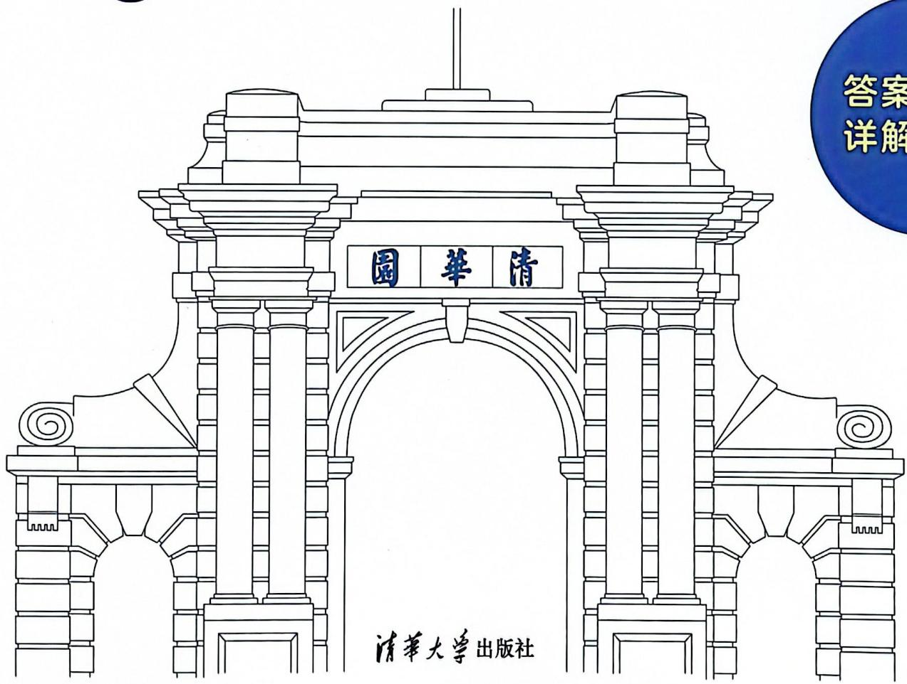

text_image

園華清
清華大學出版社
答案
详解

答案详解

# 答案详解

  
视频讲解

text_image

QR code with embedded logo and Chinese text, likely for a WeChat official account or service

i 清优

# 目录

第 1 章 集合与逻辑用语 …… 1  
第2章 函数 5  
第3章 导数 24  
第 4 章 三角函数 …… 37  
第 5 章 解三角形 …… 65  
第 6 章 平面向量 85  
第 7 章 复数 97  
第8章 数列 101  
第9章 不等式 123  
第 10 章 立体几何 …… 129  
第 11 章 直线与圆 …… 180  
第 12 章 圆锥曲线 …… 186  
第 13 章 统计 …… 197  
第 14 章 排列组合与二项式定理 …… 209  
第 15 章 概率 …… 216  
第 16 章 数学建模与新定义 …… 238

# 第1章 集合与逻辑用语

# 1.1 集合的含义与表示

【1】C。提示：因为 $A = \{0,1,2\}$ ， $B = \{x - y|x\in A,y\in A\}$ 所以 $x\in \{0,1,2\},y\in \{0,1,2\}$ 。

<table><tr><td>y\x</td><td>0</td><td>1</td><td>2</td></tr><tr><td>0</td><td>0</td><td>1</td><td>2</td></tr><tr><td>1</td><td>-1</td><td>0</td><td>1</td></tr><tr><td>2</td><td>-2</td><td>-1</td><td>0</td></tr></table>

阴影部分为 x-y 的值,要用这些数构成集合需满足元素的互异性,即去掉重复的数。

<table><tr><td>y\x</td><td>0</td><td>1</td><td>2</td></tr><tr><td>0</td><td>0</td><td>1</td><td>2</td></tr><tr><td>1</td><td>-1</td><td>0</td><td>1</td></tr><tr><td>2</td><td>-2</td><td>-\1</td><td>0</td></tr></table>

因此，B 中元素个数为 9-4=5。故选 C。

【2】D。提示：

<table><tr><td>xy\x</td><td>1</td><td>2</td><td>3</td><td>4</td><td>5</td></tr><tr><td>1</td><td>0</td><td>1</td><td>2</td><td>3</td><td>4</td></tr><tr><td>2</td><td>-1</td><td>0</td><td>1</td><td>2</td><td>3</td></tr><tr><td>3</td><td>-2</td><td>-1</td><td>0</td><td>1</td><td>2</td></tr><tr><td>4</td><td>-3</td><td>-2</td><td>-1</td><td>0</td><td>1</td></tr><tr><td>5</td><td>-4</td><td>-3</td><td>-2</td><td>-1</td><td>0</td></tr></table>

阴影部分为 $x - y$ 的值，还需满足 $x - y \in A$ ，则需去掉 $x - y \notin A$ 的数，但注意不需要去掉重复的数。因为 $B$ 集合中的元素是点，(1,2)和(2,1)表示的不是同一个数，因此 $B$ 中元素个数为 $4 + 3 + 2 + 1 = 10$ 。故选 D。

# 1.2 集合的基本关系与运算(1): 交集、并集、补集

【3】A。提示： $C_{U}M$ 与 M 互为补集，在 $C_{U}M$ 中则一定不在 M 中，排除 B；剩下的 2,4,5 均在 M 中，故选 A。

【4】A。提示： $M \cup C_{U} N = \{0, 4, 6\} \cup \{2, 4, 8\} = \{0, 2, 4, 6, 8\}$ 。故选 A。

除了分步运算外, 理解 Venn 图中每部分对应的运算也是非常重要的, 也便于我们理解概率中事件的关系和运算。本题

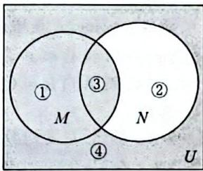

text_image

①
M
③
②
N
④
U

中运算 $M \cup C_{U} N$ 表示在 M 或不在 N。

换句话说, 只在 N 中的元素 1 是不要的, 答案只能选 A。

【5】D。提示：如果我们将4个选项都验证一遍会比较耗时，这时转换为自然语言会节省时间。不难发现5,6既不在

$M$ 中，也不在 $N$ 中，即 $(\complement_U M) \cap (\complement_U N)$ 。故选D。

【6】D。提示：“ $\complement_{U}(A\cup B)$ ”：不在由A或B构成的集合，即不在A且不在B。注意端点！故选D。

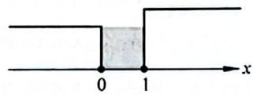

【7】C。提示： $A \cup B = \{-1, 0, 1, 2, 3, 4\}$ ， $(A \cup B) \cap C$ 如图所示，故 $(A \cup B) \cap C = \{-1, 0, 1\}$ 。故选C。

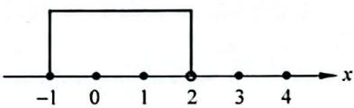

text_image

-1
0
1
2
3
4
x

【8】{7,9}。提示： $U=\{n\in N|1\leqslant n\leqslant10\}=\{1,2,3,4,5,6,7,8,9,10\}$ ，“ $(\complement_{U}A)\cap B$ ”：不在A中且在B中。

# 1.3 集合的基本关系与运算(2): 基本关系

# 类型一：利用定义、性质判断集合间的关系

【9】D。提示：B 中的元素 2,3 都是 A 中的元素，同时 A 中的 1 不是 B 中的元素，则 $B \subseteq A$ 。故选 D。

【10】D。提示：这就是和生活紧密结合的问题了，重在对符号的理解，男运动员加上女运动员就是全部运动员。故选 D。类型二：利用元素特征判断集合间的关系

【11】A。提示：A 表示所有除以 3 余数为 1 的数，B 表示所有除以 3 余数为 2 的数，所求 $\complement_U(A \cup B)$ 表示在整数中去掉这两类还剩的数，即为所有能被 3 整除的数，符号表示为 $\{x \mid x = 3k, k \in \mathbf{Z}\}$ 。故选 A。

当对题目中元素特征无法准确把握时,可用列举法,列出部分元素,再找所求的。

【12】B。提示：将两个集合用列举法分别写出其中的一些元素。

<table><tr><td>k</td><td>...</td><td>-2</td><td>-1</td><td>0</td><td>1</td><td>2</td><td>...</td></tr><tr><td> $\frac{k}{2}+\frac{1}{4}$ </td><td>...</td><td> $-\frac{3}{4}$ </td><td> $-\frac{1}{4}$ </td><td> $\frac{1}{4}$ </td><td> $\frac{3}{4}$ </td><td> $\frac{5}{4}$ </td><td>...</td></tr><tr><td> $\frac{k}{4}+\frac{1}{2}$ </td><td>...</td><td>0</td><td> $\frac{1}{4}$ </td><td> $\frac{1}{2}$ </td><td> $\frac{3}{4}$ </td><td>1</td><td>...</td></tr></table>

$M$ 中有的在 $N$ 中都可以找得到， $\left\{ \begin{array}{l} M \subseteq N, \\ M \neq N, \end{array} \right.$ 即 $M \subsetneqq N$ ，那么 $M \cap N = M$ 。故选B。

【13】B。提示： $A \subseteq B$ ，A 中元素 0，-a 都在 B 中，分类讨论（对 0 需分两种情况进行讨论，对 -a 需分 3 种情况进行讨论，为简化问题，我们对 0 进行讨论）：

① $0=a-2\Rightarrow a=2$ ，此时 $A=\{0,-2\}, B=\{1,0,2\}$ ，不符合题意；

② $0=2a-2\Rightarrow a=1$ ，此时 $A=\{0,-1\}$ ， $B=\{1,-1,0\}$ ，符合题意。

综上所述，a=1。故选 B。

# 类型三：相等集合的含参问题

【14】D。提示： $ab \neq 0 \Rightarrow \begin{cases} a \neq 0 \\ b \neq 0 \end{cases}$ ，分类讨论：① $\left\{\begin{aligned}a &= a^{2} \\ b &= b^{2}\end{aligned}\right.$

# 2 答案详解

$\left\{\begin{aligned}a&=1\\ b&=1\end{aligned}\right.$ ，与a,b互异矛盾；② $\left\{\begin{aligned}a&=b^{2}\\ b&=a^{2}\end{aligned}\right.$ ，两式相减得a-b= $b^{2}-a^{2}=(b-a)(b+a)\Rightarrow b+a=-1$ 。故选D。

【15】C。提示：集合相等，则每个元素对应相等。由于 $\frac{b}{a}$ 中 $a$ 在分母，有 $a \neq 0$ ，则 $a + b = 0$ ，接下来讨论：

① $\left\{\begin{aligned}1&=\frac{b}{a}\\ a&=b\end{aligned}\right.\Rightarrow$ 与a+b=0矛盾；② $\left\{\begin{aligned}1&=b\\ a&=\frac{b}{a}\end{aligned}\right.\Rightarrow a=-1$ 。

综上所述， $a = -1, b = 1$ ，则 $b - a = 2$ 。故选C。

类型四：子集的个数计算

【16】C。提示： $A \cap B = \{1, 3\}$ ，则子集个数为 $2^{2} = 4$ 。故选 C。

【17】C。提示： $A=\{0,1,2\}$ ，真子集个数为 $2^{3}-1=7$ 。故选C。

【18】C。提示： $A=\{x\mid x^{2}-3x+2=0,x\in R\}=\{1,2\},B=\{x\mid0<x<5,x\in N^{*}\}=\{1,2,3,4\}$ 。 $A\subseteq C\subseteq B\Leftrightarrow\left\{\begin{aligned}&A\subseteq C\\&C\subseteq\dot{B}\end{aligned}\right.$ ，即A中的元素是1,2一定在C中，B中的元素3，4“可能”在C中。“可能”怎么理解呢？可能3在，可能4在，可能3,4都在，也可能3,4都不在。其实集合C的个数就是 $\{3,4\}$ 的子集个数，即 $2^{2}=4$ 个。故选C。

【19】B。提示： $M \cap \{a_{1}, a_{2}, a_{3}\} = \{a_{1}, a_{2}\}$ ，说明 $a_{1}, a_{2}$ 一定在 M 中， $a_{3}$ 一定不在 M 中。又 $M \subseteq \{a_{1}, a_{2}, a_{3}, a_{4}\}$ ，则 $a_{4}$ 可能在 M 中，则可知集合 M 的个数就是 $\{a_{4}\}$ 的子集个数，即 $2^{1} = 2$ 个。故选 B。

# 1.4 集合的基本关系与运算(3): 韦恩(Venn)图

【20】B。提示： $N=\{x\mid x^{2}+x=0\}=\{0,-1\}$ ，N中的元素在M中均可找得到。故选B。

【21】B。提示：眼熟吗？课本上见过类似的题目。所以说，课本一定是最主要的学习资料！提到全体，提到其中的部分，画出Venn图并标出每部分分别表示什么。

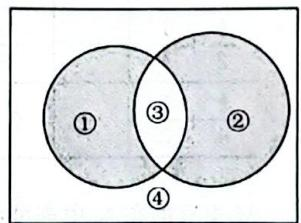

text_image

①
③
②
④

①：只参加甲项目；②：只参

加乙项目；③：参加甲、乙两个项目；④：甲、乙两个项目都没参加。转化已知条件，共50名学生①+②+③+④=50；每人至少参加一项活动，④=0；参加甲项目的有30名学生，①+③=30；参加乙项目的有25名学生，②+③=25；求仅参加一项活动的人数，即①+②=50-④-③，其中③=30+25-50=5。因此，①+②=50-5=45。故

选B。

【22】D。提示：每部分可用符号表示，①+②+③+④=m，④=0， $(\complement_{U}A)\cup(\complement_{U}B)$ 为①+②=n， $A\cap B$ 为③=m-n。故选D。

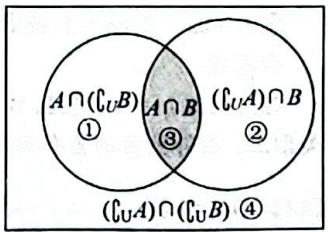

text_image

A ∩ (C_U B)
①
A ∩ B
③
(C_U A) ∩ (C_U B)
②
(C_U A) ∩ (C_U B)
④

【23】A。提示：如图所示， $I$ 由①②③④构成， $M$ 由①③构成， $N$ 由②③构成，又因为 $N \cap \complement_{I} M = \emptyset$ ，可知阴影部分（②区域）没有元素，而 $M, N$ 为集合 $I$ 的非空真子集，可知①③④均有元素，因此 $N \subseteq M \subsetneq I$ ， $M \cup N = M$ 。故选A。

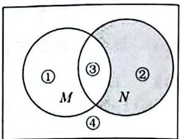

text_image

①
M
③
N
②
④

# 1.5 集合的基本关系与运算(4): 不等式

【24】B。提示：在 $M$ 中需解一元二次不等式 $x^{2} \leqslant 9 \Rightarrow x^{2} - 9 \leqslant 0 \Rightarrow (x + 3)(x - 3) \leqslant 0 \Rightarrow -3 \leqslant x \leqslant 3$ ，则 $P \subsetneqq M$ ，故 $P \cap M = P = \{0,1,2\}$ 。故选 B。

【25】B。提示：在 B 中需解一元二次不等式 $x^{2}-2x-3=(x-3)\cdot(x+1)\leqslant0\Rightarrow-1\leqslant x\leqslant3,\quad\complement_{R}B=(-\infty,-1)\cup(3,+\infty),A\cap(\complement_{R}B)=(3,4)$ 。故选 B。

【26】D。提示：在 A 中需解绝对值不等式 $\left|2x-1\right|<3\Rightarrow-3<2x-1<3\Rightarrow-1<x<2$ ，在 B 中需解分式不等式 $\frac{2x+1}{3-x}<0\xrightarrow[两边同时乘以(3-x)^{2}]{去分母,x\neq3}(3-x)(2x+1)<0\Rightarrow(x-3)(2x+1)>0\Rightarrow x<-\frac{1}{2}$ 或 x>3， $A\cap B=\left\{x\mid-1<x<-\frac{1}{2}\right\}$ 。故选 D。

【27】D。提示：对 M，解无理不等式 $\sqrt{x}<4$ ，两边同时平方得 x<16，且 $x\geqslant0$ ，则 $M=\{0\leqslant x<16\}$ 。对 N，需解一元一次不等式 $3x\geqslant1$ ，即 $N=\left\{x\mid x\geqslant\frac{1}{3}\right\}$ 。取两个区间的交集，即 $M\cap N=\left\{x\mid\frac{1}{3}\leqslant x<16\right\}$ 。故选 D。

【28】C。提示：在 A 中需解绝对值不等式 $\left|x-1\right|<2\Rightarrow-2<x-1<2\Rightarrow-1<x<3, B$ 是指数函数 $y=2^{x}$ 在 $[0,2]$ 上的值域。由图像可知， $y=2^{x}$ 是增函数，故 $B=\left[2^{0},2^{2}\right]=\left[1,4\right]$ 。则 $A\cap B=[1,3)$ 。故选 C。

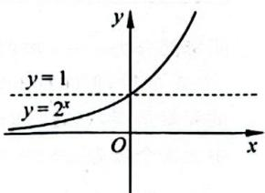

text_image

y
y = 1
y = 2^x
O
x

【29】D。提示：在 A 中需解对数不等式，结合函数 $y = \log_{4} x$ 的图像。
函数 $y=\log_{4}x$ 是增函数, $0<\log_{4}x<1\Rightarrow4^{0}<x<4^{1}\Rightarrow1<x<4$ , 则 $A\cap B=(1,2]$ 。故选 D。

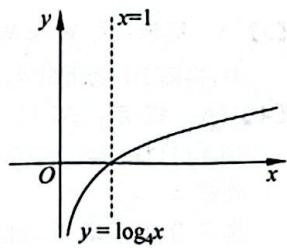

text_image

y
x=1
O
x
y=log₄x

【30】A。提示：U 是对数函数 $y=\log_{2}x$ 在 $(1,+\infty)$ 上的值域，P 是函数 $y=\frac{1}{x}$ 在 $(2,+\infty)$ 上的值域，即 $U=(0,+\infty)$ ， $P=\left(0,\frac{1}{2}\right)$ ，则 $C_{U}P=\left[\frac{1}{2},+\infty\right)$ 。

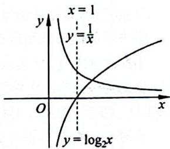

text_image

x = 1
y = \frac{1}{x}
O
y = \log_2 x

故选 A。

# 1.6 含参集合

# 类型一：有限数集

【31】C。提示： $A \cap B = \{1\} \Rightarrow 1 \in B \Rightarrow 1$ 是方程 $x^{2} - 4x + m = 0$ 的一个根 $\xrightarrow{x=1 \text{代入方程}} m = 3$ ，即方程为 $x^{2} - 4x + 3 = (x - 3)(x - 1) = 0 \Rightarrow x = 3$ 或 $x = 1$ 。 $B = \{1, 3\}$ 。故选 C。

【32】1。提示： $A \cap B = \{1\} \Rightarrow 1 \in B$ 。分类讨论：① $\left\{\begin{aligned}a &= 1 \\ a^2 & +3 \neq 2\end{aligned}\right. \Rightarrow$ a=1; ② $\left\{\begin{aligned}a^{2}+3&=1\\ a&\neq2\end{aligned}\right.\xrightarrow{a\text{为实数}}\text{无解。综上},a=1.$

# 类型二：无限数集

【33】B。提示：在 A 中需解一元二次不等式 $x^{2}-4=(x+2)$ $(x-2)\leqslant0\Rightarrow-2\leqslant x\leqslant2$ ；在 B 中需解一元一次不等式

$$
2 x + a \leqslant 0 \Rightarrow x \leqslant - \frac {a}{2}.
$$

又 $A \cap B = \{x \mid -2 \leqslant x \leqslant$

1），则 $-\frac{a}{2} = 1 \Rightarrow a = -2$ 。

故选B。

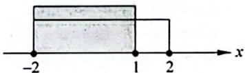

【34】 $(- \infty, 1]$ 。提示：由图可知， $a$ 位置可能出现在1的左

边、右边，或者正好是1。

要使 $A \cup B = \mathbf{R}, a$ 在1的

左边时满足； $a = 1$ 时也

满足； $a$ 在1的右边则不满足。

综上所述， $a\leqslant 1$ 。注意写成集合形式。

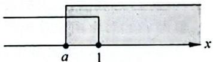

【35】B。提示：分类讨论：

① $a > 1$ ，则 $A = (-\infty ,1]\cup [a, + \infty),A\cup B = \mathbf{R},a - 1$ 在1的左边时满足； $a - 1$ 在1与 $a$ 之间不满足； $a - 1$ 在 $a$ 的右边不满足； $a - 1 = 1$ 时满足，即 $\left\{ \begin{array}{ll}a > 1\\ a - 1\leqslant 1 \end{array} \right.\Rightarrow 1 <   a\leqslant 2$

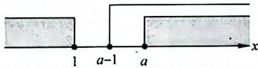

text_image

1
a-1
a
x

② $a = 1, A = \mathbf{R}, B = [0, +\infty)$ ，满足 $A \cup B = \mathbf{R}$ 。

③ a<1，则 $A=(-\infty,a]\cup[1,+\infty)$ ，a-1<a，满足 $A\cup B=R$ 。

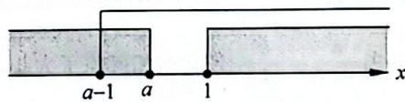

text_image

a-1 a 1 x

综上所述， $a\in (-\infty ,2]$ 。故选B。

# 1.7 点集

【36】C。提示： $A \cap B$ 表示点 $(x, y)$

满足 $\left\{\begin{aligned} & 在直线 x+y=8 上,\\ & x,y 是正整数, \\ & y\geqslant x,\end{aligned}\right.$ 可根

据图像找出这些点,共4个。

如果不熟悉图像可列出这些点(1,7)，(2,6)，(3,5)，(4,4)。

故选 C。

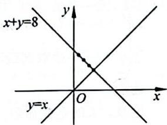

text_image

x+y=8
y
O
y=x

【37】A。提示：A 表示点 $(x,y)$ 满足：

在圆心在原点、半径为 $\sqrt{3}$ 的圆上或圆内，
x,y 是整数，

可根据图像找出这些点共9个。

如果不熟悉图像,可列出这些点: $(-1,1),(0,1),(1,1)$ ,

$$
(- 1, 0), (0, 0), (1, 0),
$$

$$
(- 1, - 1), (0, - 1), (1, - 1) 。
$$

故选A。

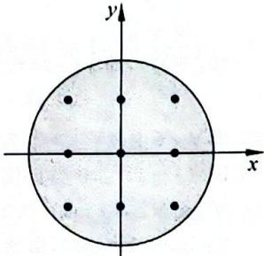

text_image

y
x

【38】A。提示：A 表示点 $(x,y)$ 在椭圆 $\frac{x^{2}}{4}+\frac{y^{2}}{16}=1$ 上，B 表示的点在 $y=x^{3}$ 幂数函数上。

$A \cap B$ 则表示这两个函数图像的交点, 有 2 个, 则子集个数为 $2^{2} = 4$ 个。故选 A。

若忘记图像也没关系,两个方程联立,得到一个一元二次方程,利用求根公式,判断根的个数即可。

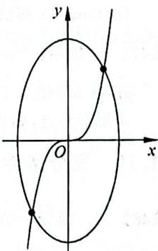

text_image

y
O
x

# 1.8 全称量词与存在量词(1): 命题的否定

【39】A。提示：找(对象性质的)补集，“至少有一个”→“没有”。

反证法作为证明常用的方法,而反证法的第一步就是要假设,即命题的否定。故选 A。

【40】D。提示：改量词，“所有”→“存在”，找（对象性质的）补集，“是”→“不是”。搞定！注意：千万不要把对象也都否定了哦！故选 D。

【41】D。提示：改量词，“∃”→“∀”，找（对象性质的）补集，“∈”→“∉”。注意：只改“ $x_0^3 \in \mathbf{Q}$ ”中的“∈”，千万不要把对象也都否定了！故选 D。

【42】存在 $x \in \mathbb{R}, |x - 2| + |x - 4| \leqslant 3$ 。提示：改量词，“任何”→“存在”，找（对象性质/判断的）补集，“＞”→“≤”。

【43】D。提示：两个量词怎么办？全部改写！改量词，“∀”→“∃”，“∃”→“∀”；找（对象性质/判断的）补集，“≥”→“<”。故选 D。

# 1.9 全称量词与存在量词(2): 真假判断

【44】A。提示：当 m=0 时， $f(x)=x^{2}$ 是偶函数，即 $\exists m=$

# 4 答案详解

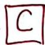

$0 \in \mathbb{R}$ 使得函数 $f(x) = x^2 + 0 \cdot x$ 是偶函数。故选 $\Lambda$ 。

【45】D。提示：方程 $2ax + b = 0$ 的根 $x_{0} = -\frac{b}{2a}$ 。 $f(x) = ax^{2} + bx + c (a > 0)$ 是二次函数，其图像开口向上，在对称轴 $x = -\frac{b}{2a}$ 处取到最小值，即 $\forall x \in \mathbb{R}, f(x) \geqslant f(x_{0})$ 。故选 D。

注意：求的是假命题。

【46】B。提示：判断假命题，全称量词命题只需找到一个反例，存在量词命题则需严格推理或推理其否定为真。本题还需要有函数的基础。

A: $2^{x - 1} = \frac{1}{2} \cdot 2^x$ ，指数函数 $f(x) = 2^x$ 的值域为

$(0, +\infty)$ , 即 $f(x) = 2^x > 0 \xrightarrow[\text{两边同时乘以} \frac{1}{2}]{\frac{1}{2} > 0} \frac{1}{2} \cdot 2^x > 0,$

即 $\forall x\in \mathbb{R},2^{x - 1} > 0$ ，为真命题。

B: $(x - 1)^2 \geqslant 0$ 当且仅当 $x - 1 = 0$ , 即 $x = 1$ 时取等号, 则 $\forall x \in \mathbb{N}^*$ , $(x - 1)^2 > 0$ 为假命题。

C: $\lg x < 1 = \lg 10$ ，由函数 $y = \lg x$ 在 $(0, +\infty)$ 上是增函数可知 $\exists x \in \mathbb{R}, \lg x < 1$ ，为真命题。

D: $\tan x = 2$ 的值域为 $\mathbf{R}$ , 且 $2 \in \mathbb{R}$ , 为真命题。故选 B。

【47】1。提示： $\forall x\in\left[0,\frac{\pi}{4}\right],\tan x\in[0,1]$ ，要满足 $\tan x\leqslant m$ ，则 $m\geqslant1$ 。

多思考一点,如果改为“ $\tan x<m$ ”,则m>1。

# 1.10 充分条件与必要条件

【48】A。提示：方法一（定义法）： $\left\{\begin{aligned}p&\Rightarrow r\\ r&\neq p\end{aligned}\right.$ ， $r\Rightarrow s,s\Rightarrow q$ ，
则 $\left\{\begin{aligned}p&\Rightarrow q\\ q&\Rightarrow p\end{aligned}\right.$ 。

方法二(集合法): $P \subsetneq R, R \subseteq S, S \subseteq Q$ , 则 $P \subsetneq Q$ , 故 $p$ 是 $q$ 的充分不必要条件。故选 A。

【49】B。提示：设 $p$ 为“便宜”， $q$ 为“好货”，依据题意， $p \Rightarrow \neg q$ 等价于其逆否命题 $q \Rightarrow \neg p$ ，即“不便宜”是“好货”的必要条件。故选 B。

【50】A。提示： $\left\{\begin{aligned}q&\Rightarrow\neg p\\\neg p&\neq q\end{aligned}\right.\Leftrightarrow\left\{\begin{aligned}p&\Rightarrow\neg q\\\neg q&\neq p\end{aligned}\right.$ ，即p是 $\neg q$ 的充分不必要条件。故选A。

【51】A。提示：令 $p$ ：“四边形ABCD是菱形”， $q$ ：“AC⊥BD”。由菱形性质可知 $p \Rightarrow q$ ，但由菱形定义“对角线相互

垂直的平行四边形”得 $p \neq q$ 。如图所示，对角线 $AC \perp BD$ ，但四边形 ABCD 不是菱形，故 p 是 q 的充分不必要条件。故选 A。

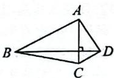

【52】A。提示：命题 $p: x^2 - x - 20 = (x + 4)(x - 5) > 0 \Rightarrow x < -4$ 或 $x > 5$ ，即 $x \in (-\infty, -4) \cup (5, +\infty)$ ；命题 $q: \frac{1 - x^2}{|x| - 2} < 0$ ，此不等式含有分母、绝对值，要去分母就需分

类讨论：①当 $|x| - 2 > 0$ 时， $1 - x^2 < 0 \Rightarrow x \in (-\infty, -2) \cup (2, +\infty)$ ；②当 $|x| - 2 < 0$ 时， $1 - x^2 > 0 \Rightarrow x \in (-1, 1)$ ，即 $x \in (-\infty, -2) \cup (-1, 1) \cup (2, +\infty)$ 。可见，集合 $P \subsetneq Q$ ，故命题 $p$ 是 $q$ 的充分不必要条件。故选 A。

【53】C。提示：方法一（代数角度）：命题 $p$ 中， $a^3 = b^3 \Rightarrow a^3 - b^3 = (a - b)(a^2 + ab + b^2) \Rightarrow a - b = 0$ ①或 $a^2 + ab + b^2 = 0$ ②。由①得 $a = b$ ；由②得 $a^2 + b^2 + ab \geqslant 3ab$ ，当且仅当 $a = b$ 时取等号，故 $a = b$ 。

命题 q 中， $3^{a}=3^{b}$ （根据指数函数值域，有 $3^{a}>0,3^{b}>0)\Rightarrow\frac{3^{a}}{3^{b}}=3^{a-b}=1=3^{0}\Rightarrow a-b=0\Rightarrow a=b$ 。

综上所述， $p \Leftrightarrow q$ ，故选 C。

方法二(函数角度): 幂函数 $y = x^{3}$ 在 R 上单调递增, 自变量和函数值一一对应, 则 $a^{3} = b^{3} \Rightarrow a = b$ ; 指数函数 $y = 3^{x}$ 在 R 上单调递增, $3^{a} = 3^{b} \Rightarrow a = b$ 。故选 C。

【54】B。提示： $a \cdot c = b \cdot c \Rightarrow (a - b) \cdot c = 0 \Rightarrow$ （由于 a, b, c 是非零向量，此时需分类讨论）当 a - b = 0 时，a = b；当 $a - b \neq 0$ 时， $(a - b) \perp c$ 。

$a = b \Rightarrow a - b = 0 \Rightarrow (a - b) \cdot c = 0$ ，即“ $a \cdot c = b \cdot c$ ” $\neq$ “ $a = b$ ”，“ $a = b$ ” $\Rightarrow$ “ $a \cdot c = b \cdot c$ ”，故选 B。

注意：不可在 $a \cdot c = b \cdot c$ 两边同时除以 $c$ ，我们没有学向量的除法哦！

【55】A。提示：令 $p$ ：“函数 $f(x)$ 在 $[0,1]$ 上单调递增”， $q$ ：“函数 $f(x)$ 在 $[0,1]$ 上的最大值为 $f(1)$ ”，由函数单调性定义可知 $p \Rightarrow q$ 。如图所示，此时满足最大值为 $f(1)$ ，但 $f(x)$ 在 $[0,1]$ 上不是单调递增，即 $q \nRightarrow p$ ，故 $p$ 是 $q$ 的充分不必要条件。故选 A。

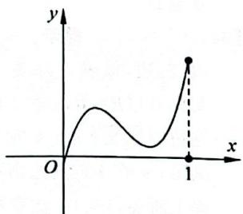

text_image

y
O
x
1

【56】D。提示：线面垂直的判定定理。故选 D。

【57】B。提示：方法一（代数角度）命题 $p:(a + b)\cdot (a - b) = |a|^2 -|b|^2 = 0\Rightarrow |a|^2 = |b|^2\Rightarrow |a| = |b|$ ，命题 $q:a = -b$ 或 $a = b$ 。可知 $\left\{ \begin{array}{l} p \neq q \\ q \Rightarrow p \end{array} \right.$ ，故选 B。

方法二(几何角度)命题 $p: \overrightarrow{OA} = a, \overrightarrow{OB} = b$ ，根据平行四边形法则得 $\overrightarrow{OC} = a + b, \overrightarrow{BA} = a - b, (a + b) \cdot (a - b) = 0 \Rightarrow a + b \perp a - b$ ，即平行四边形的对角线垂直，可知此平行四边形为菱形，则 $|a| = |b|$ 。若 $a, b$ 为非零向量，将 $a$ 绕其起点旋转任意角度得到的 $b$ 均满足 $|a| = |b|$ ；命题 $q: a = -b$ 或 $a = b$ 表示 $a, b$ 同向或反向。故选 B。

【58】B。提示：理解“ $\frac{a}{|a|}$ ”的含义，即此向量为单位向量，模为1。题中 $\frac{a}{|a|}=\frac{b}{|b|}$ ，两向量相等除了大小（模）相等，还需方向相同。故选B。

【59】D。提示： $A=\{x\mid-1<x<1\}$ ，当a=1时， $B=\{x\mid b-1<x<b+1\}$ ，要使 $A\cap B\neq\varnothing$ ，以下三种情况均可。

① b-1<-1<b+1<1⇒-2<b<0。

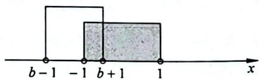

text_image

b-1 -1 b+1 1
x

② $-1 \leqslant b - 1 < b + 1 \leqslant 1 \Rightarrow b = 0$ 。

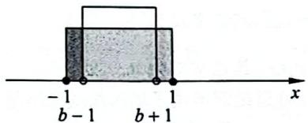

text_image

-1
b-1
b+1
x

③ -1<b-1<1<b+1⇒0<b<2。

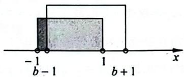

text_image

-1
b-1
1
b+1
x

综上所述， $b\in(-2,2)$ ，即找 $(-2,2)$ 的子集即可。故选D。

# 第2章 函数

# 2.1 计算

# 类型一：指数对数综合运算

【60】2。提示： $\lg0.01=\lg10^{-2}=-2$ ，而 $\log_{2}16=\log_{2}2^{4}=4$ ，则原式 $=-2+4=2$ 。

【61】7。提示：因为 $\log_{2}8=3$ ，所以 $\log_{2}(x+1)=3=\log_{2}8$ ，即 $x+1=8$ ，解得x=7。

或由 $a^{\log_a N} = N$ 得 $2^{\log_2 (x + 1)} = x + 1 = 2^3$ ，解得 $x = 7$ 。

【62】 $\sqrt{10}$ 。提示：由 $4^{a} = 2^{2a} = 2$ 可得 $2a = 1$ ，所以 $a = \frac{1}{2}$ 又 $\lg x = a = \frac{1}{2} = \lg 10^{\frac{1}{2}}$ ，进而可得 $x = 10^{\frac{1}{2}} = \sqrt{10}$ 。

或是通过 $\lg x = a$ 可得 $10^{\lg x} = 10^{a} = 10^{\frac{1}{2}}$ ，得 $x = 10^{\frac{1}{2}} = \sqrt{10}$ 。

【63】C。提示：因为 $2^{a} = 5, \log_{8} 3 = b$ ，所以 $4^{a} = (2^{a})^{2} = 25$ ， $8^{b} = 2^{3b} = (4^{3b})^{\frac{1}{2}} = 3$ ，则 $4^{a - 3b} = \frac{4^{a}}{4^{3b}} = \frac{25}{3^{2}} = \frac{25}{9}$ 。故选 C。

【64】 $x=\log_{2}3$ 。提示：通过观察得 $4^{x}-2^{x+1}-3=(2^{x})^{2}-2\cdot2^{x}-3=(2^{x}-3)(2^{x}+1)=0$ ，因为 $2^{x}+1>0$ ，故 $2^{x}-3=0$ ，即 $2^{x}=3$ ，两边取对数得 $x=\log_{2}3$ 。

【65】2。提示：由题意知 $\log_2(3^{x-1}-2)+2=\log_2(3^{x-1}-2)+\log_24=\log_2[4(3^{x-1}-2)]=\log_2(9^{x-1}-5)$ ，即 $4(3^{x-1}-2)=(3^2)^{x-1}-5=(3^{x-1})^2-5$ ，则 $4(3^{x-1}-2)=(3^{x-1})^2-5\Leftrightarrow(3^{x-1})^2-4\cdot 3^{x-1}+3=(3^{x-1}-1)(3^{x-1}-3)=0$ ，所以 $3^{x-1}-1=0$ 或 $3^{x-1}-3=0$ ，解得 $x=1$ 或 $x=2$ 。

你以为这样就结束了么？那你还是太年轻了，指数为正还记得吗？当 $x = 1$ 时， $3^{x - 1} - 2 < 0, 9^{x - 1} - 5 < 0$ 不合题意，而 $x = 2$ 是可以满足 $3^{x - 1} - 2 > 0, 9^{x - 1} - 5 > 0$ 的，故 $x = 2$ 。

【66】D。提示：由 $a^m \cdot a^n = a^{m+n}$ 和 $\log_a M + \log_a N = \log_a (MN)$ 可得 $2^{\lg x} \cdot 2^{\lg y} = 2^{\lg x + \lg y} = 2^{\lg(xy)}$ 。故选 D。

【67】C。提示：同底对数相加没问题，但系数不一致，那就从调整系数开始，盘题……

$2\log_{5}10+\log_{5}0.25=2\log_{5}10+\log_{5}0.5^{2}=2\log_{5}10+2\log_{5}0.5=2\left[\log_{5}(10\times0.5)\right]=2\log_{5}5=2$ ，也可以 $2\log_{5}10+\log_{5}0.25=\log_{5}10^{2}+\log_{5}0.25=\log_{5}(10^{2}\times0.25)=\log_{5}25=2$ 。故选C。

不论是哪种方法操作都要保持系数一致和底数一致。

【68】-1。提示：通过观察 $\lg \frac{5}{2} + 2\lg 2$ 是同底对数相加没问题，但系数不一样，那就调整系数一致， $\lg \frac{5}{2} + 2\lg 2 = \lg \frac{5}{2} + \lg 2^2 = \lg \left(\frac{5}{2} \times 2^2\right) = \lg 10 = 1$ ，而 $\left(\frac{1}{2}\right)^{-1} = (2^{-1})^{-1} = 2$ ，进而原式 $= 1 - 2 = -1$ 。

【69】 $\frac{27}{8}$ 。提示： $\left(\frac{16}{81}\right)^{-\frac{3}{4}}=\left[\left(\frac{2}{3}\right)^{4}\right]^{-\frac{3}{4}}=\left(\frac{2}{3}\right)^{-3}=\frac{27}{8}$ ，而 $\log_{3}\frac{5}{4}+\log_{3}\frac{4}{5}=\log_{3}\left(\frac{5}{4}\times\frac{4}{5}\right)=\log_{3}1=0$ ，所以原式 $=\frac{27}{8}$ 。

【70】-20。提示：由观察得 $\lg \frac{1}{4}$ 与 $\lg 25$ 底数系数相同，直接上公式 $\log_a M - \log_a N = \log_a \frac{M}{N}$ ，得 $\lg \frac{1}{4} - \lg 25 = \lg \frac{1}{100} = \lg 10^{-2} = -2$ ，而 $100^{-\frac{1}{2}} = 10^{2 \times (-\frac{1}{2})} = 10^{-1} = \frac{1}{10}$ ，则原式 $= -2 \div \frac{1}{10} = -20$ 。

# 类型二：换底公式

【71】B。提示：由 $a\log_34 = 2$ 可得 $a = \frac{2}{\log_34} = \frac{2}{\log_32^2} = \frac{2}{2\log_32} = \frac{1}{\log_32} = \log_23$ （此处使用了 $\log_a b = \frac{1}{\log_b a}$ ），所以 $4^{-a} = 2^{-2a} = (2^a)^{-2} = (2^{\log_23})^{-2} = 3^{-2} = \frac{1}{9}$ 。故选B。

【72】D。提示： $\log_{2}9\times\log_{3}4=\log_{2}3^{2}\times\log_{3}2^{2}=2\log_{2}3\times2\log_{3}2=4\log_{2}3\times\log_{3}2=4$ 。故选D。
或由 $\log_{b}a \cdot \log_{c}N = \log_{b}N \cdot \log_{c}a$ 得 $\log_{2}9 \times \log_{3}4 = \log_{2}4 \times \log_{3}9 = 2 \times 2 = 4$ 。

【73】B。提示：这道题考查的是换底公式的变形，也就是说我们不仅要对每一个公式熟悉，也要对其变形熟悉。 $\log_{a}b=\frac{\log_{c}b}{\log_{c}a}\Leftrightarrow\log_{c}a\log_{a}b=\log_{c}b$ 。故选 B。

【74】B。提示： $2\log_{4}3+\log_{8}3=\log_{2^{2}}3^{2}+\log_{2^{3}}3=\log_{2}3+\log_{2}3^{\frac{1}{3}}=\log_{2}3^{\frac{4}{3}}=\frac{4}{3}\log_{2}3,\log_{3}2+\log_{9}2=\log_{3}2+\log_{3^{2}}2=\log_{3}2+\log_{3}2^{\frac{1}{2}}=\log_{3}2^{\frac{3}{2}}=\frac{3}{2}\log_{3}2$ ，由换底公式 $\log_{a}b=\frac{1}{\log_{b}a}$ ，即 $\log_{a}b\cdot\log_{b}a=1$ ，可得 $\frac{4}{3}\log_{2}3\times$

# 6 答案详解

$\frac{3}{2}\log_32 = 2$ ，则 $(2\log_43 + \log_83)(\log_32 + \log_92) = 2$ 。故选B。

【75】B。提示：由 $5^{d} = 10$ 取对数得 $d = \log_510$ 。此时通过观察得 $c, a$ 真数相同，而真数相同的对数作比可以使用换底公式的变形，故由 $\log_a N = \frac{\log_b N}{\log_b a} \Leftrightarrow \frac{\log_b N}{\log_a N} = \log_b a$ 得 $\frac{a}{c} = \frac{\log_5 b}{\lg b} = \log_5 10 = d$ ，即 $a = cd$ 。故选 B。

或由 $\log_5b = a$ 得 $5^{a} = b$ ，又 $5^{d} = 10,\lg b = c$ ，故 $(5^{d})^{c} = 10^{\lg b} = b$ ，即 $5^{dc} = b = 5^a$ ，故 $a = cd$ 。

【76】C。提示：由题意知 $2^{a} = 5^{b} = 10$ ，取对数得 $a = \log_210$ ， $b = \log_510$ ，那么 $\frac{1}{a} = \frac{1}{\log_210} = \lg 2, \frac{1}{b} = \frac{1}{\log_510} = \lg 5$ ，则 $\frac{1}{a} + \frac{1}{b} = \lg 2 + \lg 5 = \lg 10 = 1$ 。故选C。

【77】64。提示： $\frac{1}{\log_8a} -\frac{1}{\log_a4} = \frac{3}{\log_2a} -\frac{\log_2a}{2} = -\frac{5}{2}$ 即 $(\log_2a)^2 -5\log_2a - 6 = 0$ ，解得 $\log_2a = 6$ 或 $\log_2a = -1$ ，则 $a = 64$ 或 $a = \frac{1}{2}$ ，又 $a > 1$ ，故 $a = 64$ 。

【78】A。提示：由题意知 $2^{a} = 5^{b} = m$ ，取对数得 $a = \log_2m$ ， $b = \log_5m, m > 0$ ，那么 $\frac{1}{a} = \frac{1}{\log_2m} = \log_m2, \frac{1}{b} = \frac{1}{\log_5m} = \log_m5$ ，则 $\frac{1}{a} + \frac{1}{b} = \log_m2 + \log_m5 = \log_m10 = 2$ ，所以 $\log_m10 = \log_mm^2$ ，或由 $a^{\log_aN} = N$ 得 $m^{\log_m10} = m^2 = 10$ ，所以 $m^2 = 10$ ，故 $m = \sqrt{10}$ 。故选A。

# 2.2 函数的定义域

# 类型一：具象型函数

【79】 $(-∞,0)∪(0,1]$ 。提示：由题意知 $\left\{\begin{aligned}x&\neq0,\\ 1-x&\geqslant0,\end{aligned}\right.$ 所以 $x\in(-∞,0)∪(0,1]$ 。

【80】D。提示：又是一个对数哦，真数为正走起，得 $x^{2} + 2x - 3 = (x + 3)(x - 1) > 0$ ，解得 $x > 1$ 或 $x < -3$ ，即 $x \in (-\infty, -3) \cup (1, +\infty)$ 。故选D。

【81】 $[-1,7]$ 。提示：这是一个二次根式，则只需 $7+6x-x^{2}\geqslant0$ ，即 $x^{2}-6x-7=(x+1)(x-7)\leqslant0$ 。解得 $-1\leqslant x\leqslant7$ ，即 $x\in[-1,7]$ 。

【82】 $[2, + \infty)$ 。提示：观察可得这依然是个二次根式，则只需 $\log_2x - 1\geqslant 0$ ，即 $\log_2x\geqslant 1 = \log_22$ ，则 $x\geqslant 2$ ，但结束了吗？必然没有，我们不能忘记对数自带真数为正的光环，即 $x>$ 0，得 $x\in [2, + \infty)$ 。

解到这里虽然通过真数为正对答案没影响,但我们仍需要考虑,或许下一次就影响了呢。

【83】D。提示：又是一个二次根式，则需 $\log_{\frac{1}{2}}(3x-2)\geqslant0=\log_{\frac{1}{2}}1$ ，还有真数3x-2>0哦！

因为 $0 < \frac{1}{2} < 1$ ，所以解对数不等式要注意变号，即 $0 < 3x -$

$2 \leqslant 1$ ，解得 $\frac{2}{3} < x \leqslant 1$ ，即 $x \in \left(\frac{2}{3}, 1\right]$ 。故选D。

【84】C。提示：A: $y=x^{-\frac{1}{2}}=\frac{1}{\sqrt{x}}$ ，其定义域为 $(0,+\infty)$ 。

B: $y = x^{-1} = \frac{1}{x}$ ，其定义域为 $(- \infty, 0) \cup (0, +\infty)$ 。

D: $y = x^{\frac{1}{2}} = \sqrt{x}$ ，其定义域为 $[0, +\infty)$ 。

C: $y = x^{\frac{1}{3}} = \sqrt[3]{x}$ ，其定义域为 R。故选 C。

【85】A。提示：这道题既出现了偶次根式又出现了分式，则 $1 - 2^{x} \geqslant 0, x + 3 > 0$ ，解得 $-3 < x \leqslant 0$ ，即 $x \in (-3, 0]$ 。故选 A。

【86】 $(0, + \infty)$ 。提示：由分式分母不为0可得 $x + 1\neq 0$ ，再由真数为正得 $x > 0$ ，解得 $x > 0$ ，故 $x\in (0, + \infty)$ 。

【87】D。提示：由真数为正和分母不为0得 $1-\frac{1}{x}>0,x\neq0$ ，解得x>1或x<0，即 $x\in(-\infty,0)\cup(1,+\infty)$ 。故选D。

【88】C。提示：由分式分母不为0和真数为正可得 $\log_2(x - 2) \neq 0 = \log_21, x - 2 > 0$ ，解得 $x > 2$ 且 $x - 2 \neq 1$ ，即 $x > 2$ 且 $x \neq 3$ ，故 $x \in (2,3) \cup (3, +\infty)$ 。故选C。

【89】C。提示：由分母不为0、偶次根式非负及真数为正得 $(\log_{2}x)^{2}-1=(\log_{2}x+1)(\log_{2}x-1)>0,x>0$ ，解 $(\log_{2}x+1)(\log_{2}x-1)>0$ 得 $\log_{2}x>1$ 或 $\log_{2}x<-1$ ，即x>2或 $x<\frac{1}{2}$ 。又x>0，所以 $0<x<\frac{1}{2}$ 或x>2，即 $x\in(0,\frac{1}{2})\cup(2,+\infty)$ 。故选C。

【90】C。提示：由偶次根式非负得 $4 - |x| \geqslant 0$ ，由真数为正和分母不为0得 $\frac{x^2 - 5x + 6}{x - 3} = \frac{(x - 3)(x - 2)}{x - 3} = x - 2 > 0$ ， $x - 3 \neq 0$ 。分别解得 $-4 \leqslant x \leqslant 4, x > 2, x \neq 3$ ，取交集得 $2 < x < 3$ 或 $3 < x \leqslant 4$ ，即 $x \in (2,3) \cup (3,4]$ 。故选C。

【91】 $(-1,1)$ 。提示：由偶次根式非负和分母不为0得 $-x^{2}-3x+4>0$ ，即 $x^{2}+3x-4=(x+4)(x-1)<0$ ，解得-4<x<1。
再由真数为正得 $x+1>0$ ，即 x>-1，取交集得 -1<x<1，即 $x\in(-1,1)$ 。

【92】 $[2,3)\cup(3,4)$ 。提示：由偶次根式非负和真数为正得 $x-2\geqslant0,4-x>0$ ，解得 $2\leqslant x<4$ 。再由分母不为0，得 $x-3\neq0$ 。取交集得 $2\leqslant x<3$ 或3<x<4，即 $x\in[2,3)\cup(3,4)$ 。

【93】 $[3,+\infty)$ 。提示：由偶次根式非负得 $|x-2|-1\geqslant0$ ，解得 $x\geqslant3$ 或 $x\leqslant1$ 。再由分母不为0和真数为正得 $\log_{2}(x-1)\neq0=\log_{2}1,x-1>0$ ，解得 $x\neq2$ 且x>1。取交集得 $x\geqslant3$ ，即 $x\in[3,+\infty)$ 。

# 类型二：抽象型函数

【94】B。提示：遵循在同一对应法则 f 之下，所有代数式范围相同可得 $-1 < 2x + 1 < 0$ ，解得 $x \in \left(-1, -\frac{1}{2}\right)$ 。故选 B。要注意前后 x 的区别，前后都是同一个字母来表示，但不代表它们是一样的，好比叫同一个名字的若干人彼此是不一样的。

【95】B。提示：遵循在同一对应法则 $f$ 之下，所有代数式范围相同可得 $0 \leqslant 2x \leqslant 2$ ，解得 $0 \leqslant x \leqslant 1$ 。再由分母 $x - 1 \neq 0$ 得 $x \neq 1$ ，取交集得 $0 \leqslant x < 1$ ，即 $x \in [0,1)$ 。故选B。

【96】B。提示：对于 $f(x) = \lg \frac{2 + x}{2 - x}$ ，由真数为正和分母不为0得 $\frac{2 + x}{2 - x} > 0, 2 - x \neq 0$ ，解得 $-2 < x < 2$ 。遵循在同一对应法则 $f$ 之下，所有代数式范围相同可得 $-2 < \frac{x}{2} < 2, -2 < \frac{2}{x} < 2$ ，解得 $-4 < x < -1$ 或 $1 < x < 4$ 。故选 B。

# 2.3 分段函数与函数计算

# 类型一：求函数值

【97】C。提示： $f(-2)=1+\log_{2}(2+2)=1+2=3$ ，而 $1=\log_{2}2<\log_{2}12$ ，所以 $f(\log_{2}12)=2^{\log_{2}12-1}=2^{\log_{2}12-\log_{2}2}=2^{\log_{2}6}=6$ ，则 $f(-2)+f(\log_{2}12)=9$ 。故选 C。

【98】C。提示：对于这一类复合求值问题我们的手法是从内到外求值。 $f(-2)=2^{-2}=\frac{1}{4}$ ，则 $f[f(-2)]=f\left(\frac{1}{4}\right)=1-\sqrt{\frac{1}{4}}=\frac{1}{2}$ 。故选C。

【99】B。提示：求函数值问题是由内到外，先求 $f(10) = \lg 10 = 1$ ，则 $f[f(10)] = f(1) = 1^2 + 1 = 2$ 。故选 B。

【100】4。提示：先求 $f(-4), f(-4) = \left(\frac{1}{2}\right)^{-4} = 2^4 = 16$ ，则 $f[f(-4)] = f(16) = \sqrt{16} = 4$ 。

# 类型二：由函数值求参数

【101】3。提示：分段函数分段讨论：①当 $x > 0$ 时，由 $g(x) = 2$ 可得 $\log_2(x + 1) = 2$ ，解得 $x = 3$ ；②当 $x <   0$ 时，由 $g(x) = 2$ 可得 $f(-x) = 2^{x} + 1 = 2$ ，解得 $x = 0$ （舍去）。综上， $x = 3$ 。

【102】2。提示：因为 $\sqrt{6} > 2$ ，所以 $f(\sqrt{6}) = (\sqrt{6})^2 - 4 = 2$ ，那么 $f[f(-\sqrt{6})] = f(2) = |2 - 3| + a = a + 1 = 3$ ，解得 $a = 2$ 。

【103】D。提示：由题意知 $f\left(\frac{5}{6}\right)=3\times\frac{5}{6}-b=\frac{5}{2}-b$ ，这道题不同于上一道题，因为不确定 $\frac{5}{2}-b$ 属于哪一段定义域，所以需要分类讨论了。

① 当 $\frac{5}{2} - b < 1$ ，即 $\frac{3}{2} < b$ 时， $f\left[f\left(\frac{5}{6}\right)\right] = f\left(\frac{5}{2} - b\right) = 3 \times \left(\frac{5}{2} - b\right) - b = \frac{15}{2} - 4b = 4$ ，解得 $b = \frac{7}{8}$ 不满足 $\frac{3}{2} < b$ 故舍去。

② 当 $\frac{5}{2} - b \geqslant 1$ ，即 $b \leqslant \frac{3}{2}$ 时， $f\left[f\left(\frac{5}{6}\right)\right] = f\left(\frac{5}{2} - b\right) = 2^{\frac{5}{2} - b} = 4 = 2^2$ ，即 $\frac{5}{2} - b = 2$ ，解得 $b = \frac{1}{2}$ 满足 $b \leqslant \frac{3}{2}$ 。综上， $b = \frac{1}{2}$ 。故选 D。

【104】A。提示：虽然 $f(a) = -3$ ，但 $a$ 不确定，所以依然需要分类讨论。

① 当 $a \leqslant 1$ 时, $f(a) = 2^{a - 1} - 2 = -3$ , 即 $2^{a - 1} = -1$ , 显然没有解。  
② 当 $a > 1$ 时， $f(a) = -\log_2(a + 1) = -3$ ，即 $\log_2(a + 1) = 3 = \log_28 \Rightarrow a + 1 = 8$ ，则 $a = 7$ 满足 $a > 1$ 。

综上 a=7 。所以 $f(6-a)=f(6-7)=f(-1)=2^{-1-1}-2=-\frac{7}{4}$ 。故选 A。

【105】C。提示：此题比较有意思，通过对两个函数进行判断可知均为增函数，也就是说 $a$ 和 $a + 1$ 不可能同属一个区间，因为单调函数一一对应，所以有 $0 < a < 1 \leqslant a + 1$ ，故 $f(a) = \sqrt{a}, f(a + 1) = 2(a + 1 - 1) = 2a$ ，所以由 $f(a) = f(a + 1)$ 得 $\sqrt{a} = 2a$ ，解得 $a = \frac{1}{4}$ ，于是 $f\left(\frac{1}{a}\right) = f(4) = 2(4 - 1) = 6$ 。故选 C。

【106】 $-\frac{3}{4}$ 。提示：同上一道题，两个函数均是单调函数，但不同于上一道题的地方是因为 $a$ 的正负不定导致了两个变量大小不确定，故而需要分类讨论：

① 当 a > 0 时， $1 - a < 1 < 1 + a$ ，则 $f(1 - a) = 2(1 - a) + a = -(1 + a) - 2a = f(1 + a)$ ，解得 $a = -\frac{3}{2}$ ，不满足 a > 0，故舍去。  
② 当 $a < 0$ 时， $1 + a < 1 < 1 - a$ ，则 $f(1 + a) = 2(1 + a) + a = -(1 - a) - 2a = f(1 - a)$ ，解得 $a = -\frac{3}{4}$ ，满足 $a < 0$ 故 $a = -\frac{3}{4}$ 。

# 2.4 函数的单调性

# 类型一：性质法判断单调性

【107】D。提示：A：正比例函数，函数单调递减，故A错误。
B: 指数函数, 因为底数 $\frac{2}{3} \in (0,1)$ ，所以函数单调递减，故 B 错误。
C: 这是二次函数也是幂函数, 不是单调函数, 故 C 错误。
D: $f(x)=\sqrt[3]{x}=x^{\frac{1}{3}}$ 是幂函数, 指数 $\frac{1}{3} \in (0,1)$ , 函数单调递增, 故 D 正确。故选 D。

【108】A。提示：A: $y = x^{\frac{1}{2}}$ ，因为指数 $\frac{1}{2} \in (0, 1)$ ，所以 $y = x^{\frac{1}{2}}$ 在 $(0, +\infty)$ 上单调递增，故 A 正确。

B: $y=2^{-x}=\left(\frac{1}{2}\right)^{x}$ ，因为底数 $\frac{1}{2}\in(0,1)$ ，所以 $y=2^{-x}$ 在 $(0,+\infty)$ 上单调递减，故 B 错误。  
C: $y=\log_{\frac{1}{2}}x$ ，因为底数 $\frac{1}{2}\in(0,1)$ ，所以 $y=\log_{\frac{1}{2}}x$ 在 $(0,+\infty)$ 上单调递减，故 C 错误。  
D: $y = \frac{1}{x}$ 是反比例函数也是幂函数, 在 $(0, +\infty)$ 上单调递

# 8 答案详解

减，故 D 错误。故选 A。

【109】C。提示：选项 A: $f(x) = -\ln x$ ，底数 $c \approx 2.7 \in (1, +\infty)$ ，所以 $y = \ln x$ 在 $(0, +\infty)$ 上单调递增，因此 $f(x) = -\ln x$ 在 $(0, +\infty)$ 上单调递减，故 A 错误。

选项B: $f(x) = \frac{1}{2^x} = \left(\frac{1}{2}\right)^x$ ，因为底数 $\frac{1}{2} \in (0, 1)$ ，所以 $f(x) = \frac{1}{2^x}$ 在 $(0, +\infty)$ 上单调递减，故B错误。

选项 C: $f(x) = -\frac{1}{x}$ 是反比例函数，在 $(0, +\infty)$ 上单调递增，故 C 正确。

选项 D: $f(x)=3^{|x-1|}=\left\{\begin{aligned}&3^{x-1},&x\geqslant1,\\ &\left(\frac{1}{3}\right)^{x-1},&x<1,\end{aligned}\right.$ 当 $x\geqslant1$ 时，

$f(x) = 3^{x - 1} = \frac{1}{3}\times 3^x$ ，底数 $3\in (1, + \infty)$ ，所以 $f(x)$ 在 $[1, + \infty)$ 上单调递增，当 $0 <   x <   1$ 时， $f(x) = \left(\frac{1}{3}\right)^{x - 1} =$ $3\times \left(\frac{1}{3}\right)^x$ ，底数 $\frac{1}{3}\in (0,1)$ ，所以 $f(x)$ 在(0,1)上单调递减，因此 $f(x) = 3^{|x - 1|}$ 在 $(0, + \infty)$ 上不单调，故D错误。故选C。

也可从复合函数的角度分析 $f(x) = 3^{|x - 1|} = \left\{ \begin{array}{ll}3^{x - 1}, & x\geqslant 1,\\ \left(\frac{1}{3}\right)^{x - 1}, & x <   1 \end{array} \right.$ 在 $(0, + \infty)$ 上的单调性。

当 $x \geqslant 1$ 时, $f(x) = 3^{x - 1}$ , 令 $t = x - 1$ , 其在 $[1, +\infty)$ 上单调递增, 则 $t \in [0, +\infty)$ , 而 $y = 3^t$ 在 $[0, +\infty)$ 上单调递增, 结合复合函数“同增异减”可得 $f(x)$ 在 $[1, +\infty)$ 上单调递增; 当 $0 < x < 1$ 时, $f(x) = \left(\frac{1}{3}\right)^{x - 1}$ 。

令 $s = x - 1$ ，其在(0,1)上单调递增，则 $s\in (-1,0)$ ，而 $y = \left(\frac{1}{3}\right)^s$ 在(-1,0)上单调递减，结合复合函数“同增异减”可得 $f(x)$ 在(-1,0)上单调递减，因此 $f(x) = 3^{|x - 1|}$ 在 $(0, + \infty)$ 上不单调，所以D错误。

【110】A。提示：B: $y = (x - 1)^2$ 是二次函数，其图像开口朝上，对称轴 $x = 1$ ，当 $x \in (0,1)$ 时，函数单调递减，当 $x \in (1, +\infty)$ 时，函数单调递增，故 B 错误。

C: $f(x) = 2^{-x} = \left(\frac{1}{2}\right)^x$ 是指数函数, 底数 $\frac{1}{2} \in (0,1)$ , 所以函数在 $(0, +\infty)$ 上单调递减, 故 C 错误。

D: $y = \log_{0.5}(x + 1)$ 是把指数函数 $y = \log_{0.5}x$ 向左平移了一个单位的函数，而底数 $\frac{1}{2} \in (0,1)$ ，所以 $y = \log_{0.5}x$ 在 $(0, +\infty)$ 上单调递减，故 $y = \log_{0.5}(x + 1)$ 也在 $(0, +\infty)$ 上单调递减，故 D 错误。

A: $y = \sqrt{x + 1} = (x + 1)^{\frac{1}{2}}$ 是把函数 $y = x^{\frac{1}{2}}$ 向左平移了一个单位的函数，而指数 $\frac{1}{2} \in (0, +\infty)$ ，所以 $y = x^{\frac{1}{2}}$ 在 $(0, +\infty)$

$\infty)$ 上单调递增，故 $y = \sqrt{x + 1} = (x + 1)^{\frac{1}{2}}$ 也在 $(0, + \infty)$ 上单调递增，故A正确。故选A。

【111】B。提示：由前几题可知：① $y=x^{\frac{1}{2}}$ 在区间(0,1)上单调递增；② $y=\log_{\frac{1}{2}}(x+1)$ 在区间(0,1)上单调递减；③ $y=|x-1|=\left\{\begin{aligned}x-1,&\quad x\geqslant1,\\ 1-x,&\quad x<1\end{aligned}\right.$ 在区间(0,1)上单调递减；④ $y=2^{r+1}$ 在区间(0,1)上单调递增。所以，在区间(0,1)上单调递减的函数序号是②③。故选B。

# 类型二：复合法判断复合函数单调性

【112】D。提示：由题意知 $x^{2} - 4 > 0$ ，即 $x \in (-\infty, -2) \cup (2, +\infty)$ 。内层函数 $t = x^{2} - 4$ 在 $x \in (-\infty, -2)$ 上单调递减，在 $x \in (2, +\infty)$ 上单调递增且 $t = x^{2} - 4 \in (0, +\infty)$ 。而外层函数 $y = \log_{\frac{1}{2}} t$ 在 $t \in (0, +\infty)$ 上单调递减，结合复合函数“同增异减”可得 $f(x) = \log_{\frac{1}{2}} (x^{2} - 4)$ 在 $x \in (-\infty, -2)$ 上单调递增，在 $x \in (2, +\infty)$ 上单调递减。故选 D。

【113】D。提示：方法一： $x^{2}-2x-8>0$ ，即 $x\in(-\infty,-2)\cup(4,+\infty)$ 。内层函数 $t=x^{2}-2x-8$ 在 $x\in(-\infty,-2)$ 上单调递减，在 $x\in(4,+\infty)$ 上单调递增且 $t=x^{2}-2x-8\in(0,+\infty)$ 。而外层函数 $y=\ln t$ 在 $t\in(0,+\infty)$ 上单调递增，结合复合函数“同增异减”可得 $f(x)=\ln(x^{2}-2x-8)$ 在 $x\in(-\infty,-2)$ 上单调递减，在 $x\in(4,+\infty)$ 上单调递增。故选 D。

方法二：本题也可由外到内判断，因为外层函数单调递增，求原函数的单调递增区间，可结合同增异减即求内层函数在定义域上的递增区间。 $x\in(-\infty,-2)\cup(4,+\infty)$ ，且内层函数 $t=x^{2}-2x-8$ 在 $x\in(4,+\infty)$ 上单调递增。故选D。

【114】D。提示：这是一道复合函数含参单调性问题，注意分清内外层，令 $t = x(x - a)$ ，则 $y = 2^t$ 在 R 上单调递增，而 $y = 2^{x(x - a)}$ 在 (0,1) 单调递减，根据“同增异减”可得 $t = x(x - a)$ 在 (0,1) 单调递减，所以 $\frac{a}{2} \geqslant 1$ ，即 $a \in [2, +\infty)$ 。故选 D。

【115】A。提示：因为 $f(x)$ 满足 $f(2 - x) = f(x)$ ，所以对称轴为 $x = 1$ 。（因为 $y = \mathrm{e}^{-x^2}$ 是偶函数，将其向右平移1个单位可得 $f(x) = \mathrm{e}^{-(x - 1)^2}$ ，故 $f(x)$ 关于 $x = 1$ 对称。）令 $t = -(x - 1)^2$ ，其在 $(- \infty, 1)$ 上单调递增，在 $(1, +\infty)$ 上单调递减，而 $y = \mathrm{e}^t$ 在 $\mathbb{R}$ 上单调递增，故 $f(x)$ 在 $(- \infty, 1)$ 上单调递增，在 $(1, +\infty)$ 上单调递减。

又 $\frac{\sqrt{2}}{2} < \frac{\sqrt{3}}{2} < 1 < \frac{\sqrt{6}}{2}$ , 而 $f\left(\frac{\sqrt{6}}{2}\right) = f\left(2 - \frac{\sqrt{6}}{2}\right)$ , 且 $\frac{\sqrt{2}}{2} < 2 - \frac{\sqrt{6}}{2} < \frac{\sqrt{3}}{2} < 1$ , 所以 $f\left(\frac{\sqrt{2}}{2}\right) < f\left(2 - \frac{\sqrt{6}}{2}\right) = f\left(\frac{\sqrt{6}}{2}\right) < f\left(\frac{\sqrt{3}}{2}\right)$ , 即 $b > c > a$ 。故选 A。

# 类型三：函数单调性的应用

【116】A。提示：结合函数单调性定义可得让我们寻找在 $(0, +\infty)$ 上是减函数的选项。

A: $f(x)=\frac{1}{x}$ 是反比例函数也是幂函数，在 $(0,+\infty)$ 上单调递减，故 A 正确。

B: $y=(x-1)^{2}$ 是二次函数, 其图像开口朝上, 对称轴 x=1, 当 $x\in(0,1)$ 时, 函数单调递减, 当 $x\in(1,+\infty)$ 时, 函数单调递增; 故 B 错误。

C: $f(x)=\mathrm{e}^{x}$ 是指数函数, 其中 $e\approx2.71828\cdots$ , 所以底数 $\mathrm{e}\in(1,+\infty)$ , 因此 $f(x)=\mathrm{e}^{x}$ 在 $(0,+\infty)$ 上单调递增, 故 C 错误。

D: $f(x)=\ln(x+1)$ 是把 $f(x)=\ln x$ 向左平移一个单位得到的函数，而 $f(x)=\ln x$ 是对数函数，且底数 $e\in(1,+\infty)$ ，所以 $f(x)=\ln x$ 是 $(0,+\infty)$ 上的增函数，因此 $f(x)=\ln(x+1)$ 也是 $(0,+\infty)$ 上的增函数，故 D 错误。故选 A。

【117】D。提示：由题可得 $f(x)$ 在 $[0, +\infty)$ 上单调递减，所以 $f(3) < f(1) < f(0)$ 。故选D。

【118】D。提示：由题意知 $2x - 1 < \frac{1}{3}$ 且 $0 \leqslant 2x - 1$ （此题限定了定义域，所以必须考虑变量在定义域上），解得 $x \in \left[\frac{1}{2}, \frac{2}{3}\right)$ 。故选 D。

【119】D。提示：由题意得 $\frac{1}{x} < 1, x \neq 0$ ，即 $\frac{1 - x}{x} < 0 \Leftrightarrow x(1 - x) < 0$ ，解得 $x \in (-\infty, 0) \cup (1, +\infty)$ 。故选 D。

【120】 $-\frac{3}{2}$ 。提示：因为底数a不确定，所以函数单调性不明确，故此题需要分类讨论。

① 当 $a > 1$ 时， $f(x) = a^x + b$ 在 $[-1,0]$ 上单调递增，则 $f(-1) = -1, f(0) = 0$ ，即 $\frac{1}{a} + b = -1, 1 + b = 0$ ，解得 $b = -1, a \in \emptyset$ （舍去）。

② 当 $0 < a < 1$ 时， $f(x) = a^x + b$ 在 $[-1, 0]$ 上单调递减，则 $f(-1) = 0, f(0) = -1$ ，即 $\frac{1}{a} + b = 0, 1 + b = -1$ ，解得 $b = -2, a = \frac{1}{2}$ ，且满足 $0 < a < 1$ 。故 $a + b = \frac{1}{2} - 2 = -\frac{3}{2}$ 。

【121】C。提示：这是个分段函数为背景的问题， $f(x)$ 在 $(-∞,+∞)$ 上单调递减，则首先得这两个函数单调递减，即 3a-1<0,0<a<1，解得 $0<a<\frac{1}{3}$ ，算到这里结束了吗？那必然没有，年轻人要沉住气，虽然有一样的选项，但不一定是正确的，为什么呢？

因为函数在 $(-\infty, +\infty)$ 上连续递减，也就是说从图像角度看，每一个右侧点必须低于左侧点，那么如何控制呢？只需要在断点处进行考虑，只需要断点左侧函数在断点处的函数值不小于断点右侧函数在断点处的函数值即可，所以

$\left[(3a - 1)x + 4a\right]_{x = 1}\geqslant (\log_a x)_{x = 1}$ ，即 $7a - 1\geqslant 0$ ，再和前面的 $0 < a < \frac{1}{3}$ 取交集得 $a\in \left[\frac{1}{7},\frac{1}{3}\right)$ 。故选C。

【122】(1,2]。提示：这是以分段函数为背景的问题，分段函数值域问题我们需要先求得每段函数在相应范围上的值域，接着取并集即可。

当 $x \leqslant 2$ 时， $y = -x + 6$ 单调递减，则 $-x + 6 \geqslant 4$ ，又 $f(x)$ 的值域是 $[4, +\infty)$ ，故当 $x > 2$ 时， $y = 3 + \log_a x$ 的值域是 $[4, +\infty)$ 的子集。因为 $a$ 范围不明确，所以此处需要分类讨论：

① 若 $0 < a < 1$ 时， $y = 3 + \log_a x$ 在 $(2, +\infty)$ 上单调递减，当 $x \to +\infty$ 时， $y < 0$ ，不合题意，舍去；② 若 $a > 1$ 时， $y = 3 + \log_a x$ 在 $(2, +\infty)$ 上单调递增，则 $y = 3 + \log_a x > 3 + \log_a 2$ ，此时只需 $3 + \log_a 2 \geqslant 4$ ，解得 $1 < a \leqslant 2$ 。故 $a \in (1, 2]$ 。

【123】B。提示：因为 $y = \mathrm{e}^{x}$ 和 $y = \ln (x + 1)$ 在 $[0, +\infty)$ 上单调递增，所以当 $x \in [0, +\infty)$ 时， $f(x) = \mathrm{e}^{x} + \ln (x + 1)$ 单调递增；又 $x \in (-\infty, 0)$ ， $f(x) = -x^{2} - 2ax - a$ ，其对称轴 $x = -a$ ，由题知 $f(x)$ 在 R 上单调递增，则 $-a \geqslant 0$ ，且 $(-x^{2} - 2ax - a)_{x=0} \leqslant (\mathrm{e}^{x} + \ln (x + 1))_{x=0}$ ，即 $-a \leqslant 1$ ，所以 $a \in [-1, 0]$ 。故选 B。

【124】 $\frac{37}{28}$ ; $3+\sqrt{3}$ 。提示： $f\left(f\left(\frac{1}{2}\right)\right)=f\left(\frac{7}{4}\right)=\frac{7}{4}+\frac{4}{7}-1=\frac{37}{28}$ 。

当 x<0 时， $f(x)$ 单调递增；当 0<x<1 时， $f(x)$ 单调递减；当 x>1 时， $f(x)$ 单调递增。

令 $f(x)=3$ ，解得 $x=2+\sqrt{3}$ ，令 $f(x)=1$ ，解得 $x=\pm1$ ，所以 $b=2+\sqrt{3},-1\leqslant a\leqslant1$ ，因此 $2+\sqrt{3}-1\leqslant b-a\leqslant2+\sqrt{3}-(-1)$ ，即 $1+\sqrt{3}\leqslant b-a\leqslant3+\sqrt{3}$ ，所以 $(b-a)_{\max}=3+\sqrt{3}$ 。

# 2.5 指对幂比较大小

# 类型一：构造函数比较大小

【125】B。提示：由题意知 $a = \log_{\frac{1}{3}}\frac{1}{2} = \log_{3^{-1}}2^{-1} = \log_32$ ， $b = \log_{\frac{1}{3}}\frac{2}{3} = \log_{3^{-1}}\left(\frac{3}{2}\right)^{-1} = \log_3\frac{3}{2}, c = \log_3\frac{4}{3}$ ，而函数 $y = \log_3x$ 在 $(0, +\infty)$ 上单调递增，又 $\frac{4}{3} < \frac{3}{2} < 2$ ，故 $\log_3\frac{4}{3} < \log_3\frac{3}{2} < \log_32$ ，即 $c < b < a$ 。故选 B。

【126】C。提示：通过观察 $a, b$ ，构造函数 $y = 0.6^x$ ，其在 $\mathbf{R}$ 上单调递减，故 $a = 0.6^{0.6} > 0.6^{1.5} = b$ ，继续观察代数式的特征，这里我们不仅要观察底数的共同点，而且要观察指数的共同点。

通过对指数的观察我们发现 a, c 的指数相同，这里可以构造函数 $y = x^{0.6}$ ，且其在 $(0, +\infty)$ 上单调递增，所以 $a = 0.6^{0.6} < 1.5^{0.6} = c$ ，综上可得 b < a < c。故选 C。

【127】A。提示：观察可得，a 与 b 通过结构变形可使底数一致，进而构造函数比较大小，即 $b=4^{\frac{2}{5}}=2^{\frac{4}{5}}<2^{\frac{4}{3}}=a(y=$

$2^{x}$ 在 R 上单调递增)，而 $c=25^{\frac{1}{3}}=5^{\frac{2}{3}}$ ，看着有些糟心，跟 a 与 b 有点不搭，真的不搭吗？睁大钛合金眼再看看，底数不能一致，那就观察下指数有没有一致的可能， $a=2^{\frac{4}{3}}=(2^{2})^{\frac{2}{3}}=(4)^{\frac{2}{3}}$ ，这样就可以和 $c=25^{\frac{1}{3}}=5^{\frac{2}{3}}$ 愉快地比较大小了。通过观察构造函数 $y=x^{\frac{2}{3}}$ ，其在 $(0,+\infty)$ 上单调递增。进而有 $c=25^{\frac{1}{3}}=5^{\frac{2}{3}}>4^{\frac{2}{3}}=2^{\frac{4}{3}}=a$ ，所以 b<a<c。故选 A。

【128】B。提示：A：通过观察不等号两边的式子可知真数相同而底数不同，怎么构造呢？换底公式还记得吗？

通过换底公式可得 $\log_a c = \frac{1}{\log_c a}, \log_b c = \frac{1}{\log_c b}$ ，通过观察两个代数式的特征可以构造函数 $y = \frac{1}{\log_c x}$ ，内层对数函数 $t = \log_c x$ 在 $(0, +\infty)$ 上单调递减，且当 $x \in (0, 1)$ 时， $t > 0$ ，当 $x \in (1, +\infty)$ 时， $t < 0$ ，而外层 $y = \frac{1}{t}$ 在 $(- \infty, 0) \cup (0, +\infty)$ 上单调递减，结合“同增异减”得 $y = \frac{1}{\log_c x}$ 在 $x \in (0, 1)$ 上单调递增，在 $x \in (1, +\infty)$ 上单调递增。若 $a > b > 0$ 不一定能得到 $\log_a c = \frac{1}{\log_c a} > \frac{1}{\log_c b} = \log_b c$ ，因为函数不连续；若 $a > 1 > b$ ，则有 $\log_a c = \frac{1}{\log_c a} < 0 < \frac{1}{\log_c b} = \log_b c$ ，故 A 不一定正确。

B: 观察构造函数 $y=\log_{c}x$ ，其在 $(0,+\infty)$ 上单调递减，所以 $\log_{c}a<\log_{c}b$ ，故 B 正确。

C: 观察构造函数 $y = x^c$ ，其在 $(0, +\infty)$ 上单调递增，所以 $a^c > b^c$ ，故 C 错误。

D: 观察构造函数 $y = c^{x}$ ，其在 R 上单调递减，所以 $c^{a} < c^{b}$ ，故 D 错误。故选 B。

选项 A 的函数构造还是有些困难,即便构造出来还得考虑函数是否连续,考试的时候可以先行跳过 A,先判断 B,C,D。若 B,C,D 判断出了那就不用管 A 了,若 B,C,D 都错了,反过来说 A 就正确了。

【129】B。提示：可构造函数 $y = \lg x, y = \lg x$ 在 $(0, +\infty)$ 上单调递增。又 $e > \sqrt{e} > 0$ ，所以 $\lg e > \lg \sqrt{e}$ ，即 $a > c$ ，又 $1 < e < \sqrt{10}$ ，所以 $\lg e \in \left(0, \frac{1}{2}\right), c - b = \lg \left(\frac{1}{2} - \lg e\right) > 0$ ，即 $c > b$ ，则 $a > c > b$ 。故选 B。

【130】D。提示：类比观察 $a$ 与 $b$ ，构造函数 $y = 1.01^x$ ，其在 $\mathbf{R}$ 上单调递增，故 $1.01^{0} = 1 < 1.01^{0.5} < 1.01^{0.6}$ ，而 $y = 0.6^{x}$ 在 $\mathbf{R}$ 上单调递减，则 $0.6^{0.5} < 1 = 0.6^{0}$ ，所以 $b > a > c$ 。故选D。

【131】D。提示：由题意知 $a = \frac{\ln 2}{2} = \ln 2^{\frac{1}{2}}, b = \frac{\ln 3}{3} = \ln 3^{\frac{1}{3}}, c = \frac{\ln 5}{5} = \ln 5^{\frac{1}{5}}$ ，归纳构造函数 $y = \ln x$ 在 $(0, +\infty)$ 上单调递增，接着需要比较 $2^{\frac{1}{2}}, 3^{\frac{1}{3}}, 5^{\frac{1}{5}}$ 的大小，先比较 $2^{\frac{1}{2}}$ 和 $3^{\frac{1}{3}}$ 的大小，

通过观察两个指数分母最小公倍数是6，进一步构造函数 $y=x^{6}$ ，其在 $(0,+\infty)$ 上单调递增，又 $8=(2^{\frac{1}{2}})^{6}<(3^{\frac{1}{3}})^{6}=9$ ，所以 $2^{\frac{1}{2}}<3^{\frac{1}{3}}$ 。同理可得 $5^{\frac{1}{5}}<2^{\frac{1}{2}}<3^{\frac{1}{3}}$ ，所以 $c=\frac{\ln5}{5}=\ln5^{\frac{1}{5}}<a=\frac{\ln2}{2}=\ln2^{\frac{1}{2}}<b=\frac{\ln3}{3}=\ln3^{\frac{1}{3}}$ 。故选D。

类型二：简单寻求中间量 $+$ 函数单调性比较大小

【132】B。提示：因为 $y=\log_{2}x$ 在 $(0,+\infty)$ 上单调递增，所以 $a=\log_{2}0.2<\log_{2}1=0$ 。

显然 $b > 0, c > 0$ （指数函数值域为正），那么我们只需要比较 $b, c$ 大小就好了，又 $y = 2^x$ 在 $\mathbf{R}$ 上单调递增，所以 $b = 2^{0.2} > 2^0 = 1$ ，而 $y = 0.2^x$ 在 $\mathbf{R}$ 上单调递减，所以 $0 < c = 0.2^{0.3} < 0.2^0 = 1$ 。

综上 $a < c < b$ 。故选B。

【133】C。提示：通过观察对比 a, b，可构造函数 $y = x^{0.7}$ ，其在 $(0, +\infty)$ 上单调递增，因为 $2 > \frac{1}{3}$ ，则 $2^{0.7} > \left(\frac{1}{3}\right)^{0.7} > 0$ ，即 a > b > 0，又 $y = \log_{2}x$ 在 $(0, +\infty)$ 上单调递增，则 $\log_{2} \frac{1}{3} < \log_{2}1 = 0$ ，即 c < 0，故 a > b > 0 > c。故选 C。

【134】A。提示：观察 $a, b$ 发现底数相同，构造函数 $y = 2^x$ ，其在 $(0, +\infty)$ 上单调递增，则 $a = 2^{1.2} > 2^{0.8} = b > 2^0 = 1$ 。又 $y = \log_5 x$ 在 $(0, +\infty)$ 上单调递增，所以 $c = 2 \log_5 2 = \log_5 2^2 = \log_5 4 < \log_5 5 = 1$ ，则 $a > b > c$ 。故选 A。

【135】B。提示：通过对比 $a$ 与 $b$ 可构造函数 $y = 4.2^x$ ，而 $y = 4.2^x$ 在 $\mathbf{R}$ 上单调递增，且 $-0.3 < 0 < 0.3$ ，所以 $0 < 4.2^{-0.3} < 4.2^0 < 4.2^{0.3}$ ，即 $0 < 4.2^{-0.3} < 1 < 4.2^{0.3}$ ，则 $0 < a < 1 < b$ 。又 $y = \log_{4.2} x$ 在 $(0, +\infty)$ 上单调递增，且 $0 < 0.2 < 1$ ，所以 $\log_{4.2} 0.2 < \log_{4.2} 1 = 0$ ，即 $c < 0$ 。

综上所述，b>a>c，故选B。

【136】D。提示：因为 $y=3^{x}$ 在 R 上单调递增，所以 $b=\left(\frac{1}{3}\right)^{-0.8}=3^{0.8}>3^{0.7}=a>3^{0}=1$ ，而 $y=\log_{0.7}x$ 在 $(0,+\infty)$ 上单调递减，所以 $c=\log_{0.7}0.8<\log_{0.7}0.7=1$ ，则 c<a<b。故选 D。

指数比较大小通常先比较和1的关系, 因为 $a^{0}=1$ (其中 $a\neq0$ ), 而对数间的比较需要考虑给真数赋值为底数或者1再和自身比较大小。

【137】A。提示：因为 $y=\log_{3}x$ 和 $y=\log_{2}x$ 在 $(0,+\infty)$ 上单调递增，所以 $0<Q=\log_{3}2<\log_{3}3=1$ ，则 $R=\log_{2}(\log_{3}2)<\log_{2}1<0, P=\log_{2}3>\log_{2}2=1$ ，故 R<Q<P。故选 A。

【138】D。提示：观察发现 $a=\log_{2}e, c=\log_{\frac{1}{2}}\frac{1}{3}=\log_{2}3$ 底数相同，构造函数 $y=\log_{2}x$ ，其在 $(0,+\infty)$ 上单调递增。而 $2<e<3$ ，所以 $1=\log_{2}2<a=\log_{2}e<\log_{2}3=c$ 。又 $y=\ln x$ 在 $(0,+\infty)$ 上单调递增，所以 $b=\ln2<\ln e=1$ ，则 b<a<c。故选 D。

【139】B。提示：这组数有些头疼，两两之间没共性，那么我们只能对各自估范围了。因为 $y=\log_{3}x$ 在 $(0,+\infty)$ 上单调递增，所以 $1 = \log_3 3 < a = \log_3 7 < \log_3 9 = 2$ 。因为 $y = 2^x$ 在 $\mathbf{R}$ 上单调递增，所以 $2 = 2^1 < b = 2^{1.1} < 2^2 = 4$ 。因为 $y = 0.8^x$ 在 $\mathbf{R}$ 上单调递减，所以 $0 < c = 0.8^{3.1} < 0.8^0 = 1$ 。所以， $c < a < b$ 。故选 B。

【140】A。提示：这还是一道需要各自估范围的大小比较的题。

因为 $y = \log_{\frac{1}{2}} x$ 在 $(0, +\infty)$ 上单调递减，所以 $a = \log_{\frac{1}{2}} 3 < \log_{\frac{1}{2}} 1 = 0$ 。很显然 $b$ 和 $c$ 都大于 0，因为指数函数值域为正。但是又不能一眼看出各自大小，同样需要结合函数单调性各自估范围。因为 $y = \left(\frac{1}{3}\right)^x$ 在 R 上单调递减，所以 $0 < b = \left(\frac{1}{3}\right)^{0.2} < \left(\frac{1}{3}\right)^0 = 1$ 。因为 $y = 2^x$ 在 R 上单调递增，所以 $1 = 2^0 < c = 2^{\frac{1}{3}}$ 。所以， $a < 0 < b < 1 < c$ 。故选 A。

【141】D。提示： $c=\log_{\frac{1}{3}}\frac{1}{5}=\log_{3}5$ ，所以a,c的底数相同，构造函数 $y=\log_{3}x$ ，其在 $(0,+\infty)$ 上单调递增，所以 $c=\log_{\frac{1}{3}}\frac{1}{5}=\log_{3}5>\log_{3}\frac{7}{2}=a>\log_{3}3=1$ 。又 $y=\left(\frac{1}{4}\right)^{x}$ 在R上单调递减，所以 $0<b=\left(\frac{1}{4}\right)^{\frac{1}{3}}<\left(\frac{1}{4}\right)^{0}=1$ 。

综上，0<b<1<a<c，即 b<a<c。故选 D。

# 类型三：估值过渡量比较大小

【142】C。提示：直面看两两没有共性，那就各自估范围。

因为 $y = \log_2 x$ 在 $(0, +\infty)$ 上单调递增，所以 $1 = \log_2 2 < a = \log_2 \pi < \log_2 4 = 2$ 。因为 $y = \log_{\frac{1}{2}} x$ 在 $(0, +\infty)$ 上单调递减，所以 $b = \log_{\frac{1}{2}} \pi < \log_{\frac{1}{2}} 1 = 0$ 。因为 $y = \pi^x$ 在 R 上单调递增，所以 $0 < c = \pi^{-2} < \pi^0 = 1$ 。所以， $b < 0 < c < 1 < a < 2$ ，即 $b < c < a$ 。故选 C。

【143】A。提示：两两没有共性，各自估范围。

因为 $y=\log_{2}x$ 在 $(0,+\infty)$ 上单调递增，所以 $2=\log_{2}4<a=\log_{2}7<\log_{2}8=3$ 。因为 $y=\log_{3}x$ 在 $(0,+\infty)$ 上单调递增，所以 $1=\log_{3}3<b=\log_{3}8<\log_{3}9=2$ 。因为 $y=0.3^{x}$ 在 R 上单调递减，所以 $0<c=0.3^{0.3}<0.3^{0}=1$ 。所以， $0<c<1<b<2<a<3$ 。故选 A。

【144】C。提示：继续各自估范围。但是这个题中有个 $\frac{1}{2}$ ，这就有意思了，我们肯定需要把 $c = \frac{1}{2}$ 化成可以和 $a, b$ 比较大小的形式， $c = \frac{1}{2} = \log_5 5^{\frac{1}{2}} = \log_5 \sqrt{5} = \log_8 8^{\frac{1}{2}} = \log_8 \sqrt{8}$ 。

因为 $y=\log_{5}x$ 在 $(0,+\infty)$ 上单调递增，所以 $0=\log_{5}1<a=\log_{5}2=\log_{5}\sqrt{4}<\log_{5}\sqrt{5}=\frac{1}{2}$ 。

因为 $y = \log_8 x$ 在 $(0, +\infty)$ 上单调递增，所以 $b = \log_8 3 = \log_8 \sqrt{9} > \log_8 \sqrt{8} = \frac{1}{2}$ 。因此， $a < \frac{1}{2} = c < b$ 。故选 C。

【145】A。提示：这道题与上一道题是同一个类型，给出的 $\frac{2}{3}$

是个过渡变量, 毕竟 $a, b$ 没法直接比较大小, 所以我们需要将 $c = \frac{2}{3}$ 写成能和 $a, b$ 比较大小的形式, $c = \frac{2}{3} = \log_3 3^{\frac{2}{3}} = \log_5 5^{\frac{2}{3}}$ 。但这里又带来了新的问题, $3^{\frac{2}{3}}$ 和 $2, 5^{\frac{2}{3}}$ 和 3 也是不可以直接比较大小。怎么办? 继续上函数, 通过观察发现给每组三次方后利于计算并进一步比较大小。因为 $y = x^3$ 在 $(0, +\infty)$ 上单调递增, 且 $(3^{\frac{2}{3}})^3 = 9 > 8 = 2^3$ , $(5^{\frac{2}{3}})^3 = 25 < 27 = 3^3$ , $3^{\frac{2}{3}} > 2$ , $5^{\frac{2}{3}} < 3$ , 所以 $a = \log_3 2 < \log_3 3^{\frac{2}{3}} = c = \frac{2}{3} = \log_5 5^{\frac{2}{3}} < \log_5 3 = b$ , 即 $a < c < b$ 。故选 A。

【146】A。提示：这道题跟上一题一样两两无共性，我们继续对每一个数估范围。因为 $y = \log_5 x$ 在 $(0, +\infty)$ 上单调递增，所以 $0 = \log_5 1 < a = \log_5 2 < \log_5 5 = 1$ 。因为 $y = \log_{0.5} x$ 在 $(0, +\infty)$ 上单调递减，所以 $1 = \log_{0.5} 0.5 < b = \log_{0.5} 0.2$ 。因为 $y = 0.5^x$ 在 R 上单调递减，所以 $c = 0.5^{0.2} < 0.5^0 = 1$ 。估到这里我们不难判断出 $b$ 最大，就是 $a$ 和 $c$ 有些尴尬，那我们需要更精确的估值，既然 $a \in (0,1), c \in (0,1)$ ，那么我们就取区间中点 $\frac{1}{2}$ ，这里我们需要能把 $\frac{1}{2}$ 化成可以与 $a$ 和 $c$ 比较的形式。 $\frac{1}{2} = \log_5 5^{\frac{1}{2}} = \log_5 \sqrt{5} = 0.5^1$ ，很显然 $\frac{1}{2} = \log_5 \sqrt{5} > \log_5 \sqrt{4} = \log_5 2 = a$ ，而 $0.5^1 < 0.5^{0.2} = c$ ，所以 $0 < a < 0.5 < c < 1 < b$ 。故选 A。

【147】C。提示：三个数没有共性无法构造函数故需要各自估值了。因为 $y=\log_{3}x$ 在 $(0,+\infty)$ 上单调递增，所以 $0=\log_{3}1<a=\log_{3}2<\log_{3}3=1$ 。因为 $y=\log_{5}x$ 在 $(0,+\infty)$ 上单调递增，所以 $0=\log_{5}1<b=\log_{5}2<\log_{5}5=1$ 。有点尴尬，a,b 都属于区间 $(0,1)$ ，那怎么办呢？取区间中点 $\frac{1}{2}$ 再和 a,b 比较。

而 $\frac{1}{2} = \log_3 3^{\frac{1}{2}} = \log_3 \sqrt{3} = \log_3 5^{\frac{1}{2}} = \log_3 \sqrt{5}$ ，且 $\sqrt{5} > \sqrt{4} = 2 > \sqrt{3}$ ，所以 $0 = \log_5 1 < b = \log_5 2 < \log_5 \sqrt{5} = \frac{1}{2} = \log_3 \sqrt{3} < \log_3 2 = a < \log_3 3 = 1$ 。又因为 $y = \log_2 x$ 在 $(0, +\infty)$ 上单调递增，所以 $c = \log_2 3 > \log_2 2 = 1$ ，则 $0 < b < \frac{1}{2} < a < 1 < c$ ，即 $b < a < c$ 。故选 C。

【148】D。提示：三个数没有共性无法构造函数故需要各自估值了。因为 $y=\ln x$ 在 $(0,+\infty)$ 上单调递增，所以 $1<\ln e<\ln \pi=a$ ，即 x>1；因为 $y=\log_{5}x$ 在 $(0,+\infty)$ 上单调递增，所以 $0=\log_{5}1<y=\log_{5}2<\log_{5}5=1$ ，即 0<y<1。

又 $y = \mathrm{e}^x$ 在 $\mathbf{R}$ 上单调递增，所以 $0 < z = \mathrm{e}^{-\frac{1}{2}} < \mathrm{e}^0 = 1$ ，即 $0 < z < 1,y,z$ 都属于区间(0,1)，那怎么办呢？取区间中点 $\frac{1}{2}$ 再和 $y,z$ 比较。 $0 < y = \log_52 < \log_5\sqrt{5} = \frac{1}{2}$ ，即 $0 < y < \frac{1}{2}$ ；而 $\frac{1}{2} = \frac{1}{\sqrt{4}} < \frac{1}{\sqrt{\mathrm{e}}} = \mathrm{e}^{-\frac{1}{2}} = z < \mathrm{e}^0 = 1$ ，即 $\frac{1}{2} < z < 1$ 。所以

# 12 答案详解

$0 < y < \frac{1}{2} < z < 1 < x$ ，即 $y < z < x$ 。故选D。

【149】C。提示：通过观察发现 $a, b$ 的真数相同，而 $a = \log_3 2 = \frac{\ln 2}{\ln 3}, b = \ln 2 = \frac{\ln 2}{\ln e}$ ，因为 $y = \ln x$ 在 $(0, +\infty)$ 上单调递增，所以 $0 < \ln e < \ln 3, y = \frac{\ln 2}{x}$ 在 $(0, +\infty)$ 上单调递减，所以 $a = \frac{\ln 2}{\ln 3} < \frac{\ln 2}{\ln e} = b$ ，即 $a < b$ 。又 $a, b$ 都属于区间 $(0, 1)$ ，即 $0 < a < b < 1$ ，而 $0 < c = 5^{-\frac{1}{2}} = \frac{1}{\sqrt{5}} < \frac{1}{\sqrt{4}} = \frac{1}{2}$ ，即 $0 < c < \frac{1}{2}$ 。 $c$ 与 $a, b$ 的大小该如何比较呢？取区间中点 $\frac{1}{2}$ 再和 $a, b$ 比较。 $\frac{1}{2} = \log_3 3^{\frac{1}{2}} = \log_3 \sqrt{3} < \log_3 2 = a$ ，即 $\frac{1}{2} < a < 1$ ；同样 $\frac{1}{2} = \ln e^{\frac{1}{2}} < \ln 4^{\frac{1}{2}} = \ln 2 = b$ ，即 $\frac{1}{2} < b < 1$ ，所以 $0 < c < \frac{1}{2} < a < b < 1$ ，即 $c < a < b$ 。故选 C。

【150】C。提示：因为 $c = \left(\frac{1}{5}\right)^{\log_30.3} = 5^{-\log_30.3} = 5^{\log_3\frac{10}{3}}$ ，此时 $a, b, c$ 三个数的底数相同，那么可以构造函数 $y = 5^x$ ，且在 $(0, +\infty)$ 上单调递增，那么只需要比较三个指数 $\log_23.4$ ， $\log_43.6, \log_3\frac{10}{3}$ 的大小。这三个指数没有明显共性，不太好直接比较大小，那就各自估值。因为 $y = \log_2 x$ 在 $(0, +\infty)$ 上单调递增，所以 $1 = \log_2 2 < \log_2 3.4 < \log_2 4 = 2$ 。因为 $y = \log_4 x$ 在 $(0, +\infty)$ 上单调递增，所以 $\log_4 3.6 < \log_4 4 = 1$ 。因为 $y = \log_3 x$ 在 $(0, +\infty)$ 上单调递增，所以 $1 = \log_3 3 < \log_3 \frac{10}{3} < \log_3 9 = 2$ 。

嗯，这…… $\log_2 3.4, \log_3 \frac{10}{3}$ 都在区间(1,2)内那怎么办？前面有讲，我们继续取区间中点 $\frac{3}{2}$ 。

而 $\frac{3}{2} = \log_2 2^{\frac{3}{2}} = \log_3 3^{\frac{3}{2}}, 2^{\frac{3}{2}} = 2\sqrt{2} \approx 2.828 < 3.4, 3^{\frac{3}{2}} = 3\sqrt{3} \approx 5.196 > 3.333 = \frac{10}{3}$ , 所以 $\log_3 \frac{10}{3} < \log_3 3^{\frac{3}{2}} = \frac{3}{2} = \log_2 2^{\frac{3}{2}} < \log_2 3.4$ , 因此 $\log_1 3.6 < 1 < \log_3 \frac{10}{3} < \frac{3}{2} < \log_2 3.4$ , 所以 $a = 5^{\log_2 3.4} > c = \left(\frac{1}{5}\right)^{\log_3 0.3} > b = 5^{\log_4 3.6}$ , 即 $a > c > b$ 。故选 C。

# 2.6 函数的奇偶性

# 类型一：函数奇偶性的判断

【151】D。提示：通过分析，这四个函数的定义域都是 $\mathbf{R}$ ，满足定义域关于原点对称，都可以判断奇偶。

A: $f(-x)=\sin(-x)=-\sin x=-f(x)$ ，奇函数。

B: $f(-x)=(-x)^{3}=-x^{3}=-f(x)$ ，奇函数。

C: $f(-x)=\mathrm{e}^{-x}\neq-\mathrm{e}^{x}=-f(x)$ ，且 $f(-x)=\mathrm{e}^{-x}\neq\mathrm{e}^{x}=f(x)$ ，非奇非偶。

D: $f(-x)=\ln\sqrt{1+(-x)^{2}}=\ln\sqrt{1+x^{2}}=f(x)$ ，偶函数。故选 D。

我们应该且必须记住初等函数的性质,用它们判断起奇偶性更快更便捷。

选项 A 是正弦函数奇函数, 选项 B 是奇次幂函数也是奇函数, 选项 C 是指数函数非奇非偶, 而选项 D 是含有偶次幂函数必然是偶函数。

【152】D。提示：通过判断定义域选项A定义域为 $[0, +\infty)$ ，关于原点不对称，余下定义域都是R，则选项A非奇非偶。

B: $f(-x)=\left|\sin(-x)\right|=\left|\sin x\right|=f(x)$ ，偶函数。

C: $f(-x)=\cos(-x)=\cos x=f(x)$ ，偶函数。

D: $f(-x)=\mathrm{e}^{-x}-\mathrm{e}^{x}=-(\mathrm{e}^{x}-\mathrm{e}^{-x})=-f(x)$ ，奇函数。
故选 D。

核心笔记已经给大家整理出了常见函数的奇偶性结论，善记且积累这些常见结论，可以快捷选出结论。

【153】B。提示：通过分析这四个函数的定义域，选项 C 定义域为 $(0, +\infty)$ ，关于原点不对称，非奇非偶，余下定义域都是 R。

A: $f(-x)=(-x)^{2}\sin(-x)=-x^{2}\sin x=-f(x)$ ，奇函数。

B: $f(-x)=(-x)^{2}\cos(-x)=x^{2}\cos x=f(x)$ ，偶函数。

D: $f(-x)=2^{-(x)}=2^{x}\neq2^{-x}=f(-x)$ ，同时 $f(-x)=e^{-x}\neq e^{x}=f(x)$ ，非奇非偶。故选 B。

对于选项 D, 这是个指数函数, 非奇非偶。再次温馨提醒同学们加强基础知识记忆和注重平时积累。

【154】D。提示：通过分析可得这四个函数的定义域都是 R，满足定义域关于原点对称，都可以判断奇偶。

A: $f(-x)=(-x)+\sin(-2x)=-(x+\sin2x)=-f(x)$ ，奇函数。

B: $f(-x)=(-x)^{2}-\cos(-x)=x^{2}-\cos x=f(x)$ ，偶函数。

C: $f(-x)=2^{-x}+\frac{1}{2^{-x}}=\frac{1}{2^{x}}+2^{x}=f(x)$ ，偶函数。

A,B,C均不符合选项,那么D自然是正确的。

选项 D 我们继续研究下, 选项 D: $f(-x) \neq -f(x)$ , 且 $f(-x) \neq f(x)$ 。

再单独看多项式中的每一项, $y=x^{2}$ 是偶函数, $y=\sin x$ 是奇函数,而奇函数±偶函数=非奇非偶函数,那么我们可以用多元化手法进行奇偶性判断。故选D。

【155】D。提示：判断可知这四个函数定义域都关于原点对称。

A: $f(-x)=\sqrt{1+(-x)^{2}}=\sqrt{1+x^{2}}=f(x)$ ，偶函数。
或者通过观察自变量是偶次方，互为相反数的两个变量函数值一样，也是偶函数。

B: $f(-x)=\frac{1}{-x}+(-x)=-\left(\frac{1}{x}+x\right)=-f(x)$ ，奇函数。

或 $y = x, y = \frac{1}{x}$ 一个正比例函数，一个反比例函数，都是奇

函数,其和是奇函数。

C: $f(-x)=2^{-x}+\frac{1}{2^{-x}}=\frac{1}{2^{x}}+2^{x}=f(x)$ ，偶函数。

这里我们可以总结结论： $g(x)=f(x)+f(-x)$ 是偶函数，因为 $g(-x)=g(x)$ 。

A, B, C 均不符合选项, 那么 D 自然是正确的。

选项 D 我们继续研究下, 选项 D: $f(-x) \neq -f(x)$ , 且 $f(-x) \neq f(x)$ 。

再单独看多项式中的每一项， $y = x$ 是奇函数， $y = \mathrm{e}^x$ 是非奇非偶函数，其和必然是非奇非偶函数。故选D。

【156】A。提示：通过观察可知两个函数定义域都是 R，定义域关于原点对称。

而 $f(-x) = 3^{-x} + 3^{-(x)} = 3^{-x} + 3^x = f(x)$ ，偶函数；或通过观察可得 $f(x) = t(x) + t(-x)$ ，（其中 $t(x) = 3^x$ 或 $t(x) = 3^{-x}$ ），上一题我们已经总结了这条结论，在定义域对称的前提下这种函数是偶函数。

$g(-x)=3^{-x}-3^{-(-x)}=3^{-x}-3^{x}=-(3^{x}-3^{-x})=-g(x)$ ，奇函数；或通过观察可得 $g(x)=t(x)-t(-x)$ ，(其中 $t(x)=3^{x}$ )，且满足 $g(-x)=-g(x)$ ，在定义域对称的前提下这种函数是奇函数。故选A。

【157】B。提示：选项A：记 $f(x) = \frac{\mathrm{e}^x - x^2}{x^2 + 1} (x \in \mathbb{R})$ ，但不满足 $f(-x) = f(x)$ （或取特值 $f(-1) = \frac{\mathrm{e}^{-1} - 1}{2} \neq \frac{\mathrm{e} - 1}{2} = f(1)$ ），则 $f(x)$ 不是偶函数，故A错误。选项B：记 $g(x) = \frac{\cos x + x^2}{x^2 + 1} (x \in \mathbb{R}), g(-x) = \frac{\cos (-x) + (-x)^2}{(-x)^2 + 1} = \frac{\cos x + x^2}{x^2 + 1} = g(x)$ ，则 $g(x)$ 为偶函数，故B正确。选项C：记 $h(x) = \frac{\mathrm{e}^x - x}{x + 1} (x \neq -1)$ ，其定义域关于原点不对称，所以 $h(x)$ 不是偶函数，故C错误。选项D：设 $k(x) = \frac{\sin x + 4x}{\mathrm{e}^{|x|}} (x \in \mathbb{R})$ ，但不满足 $k(-x) = k(x)$ （或取特值 $k(-1) = \frac{-\sin 1 - 4}{\mathrm{e}} \neq \frac{\sin 1 + 4}{\mathrm{e}} = k(1)$ ），则 $k(x)$ 不是偶函数，故D错误。故选B。

【158】C。提示： $f(-x)=\frac{1}{1+2^{-x}}=\frac{2^{x}}{2^{x}+1},f(x)+f(-x)=\frac{1}{2^{x}+1}+\frac{2^{x}}{2^{x}+1}=\frac{2^{x}+1}{2^{x}+1}=1$ 。故选C。

【159】D。提示：由题知 $f(x) = \frac{4^x + 1}{2^x} = 2^x + 2^{-x} (x \in \mathbb{R})$ ，结合选项来看首先需判断奇偶，由 $f(-x) = 2^{-x} + 2^{-(x)} = 2^{-x} + 2^x = f(x)$ ，可得 $f(x) = \frac{4^x + 1}{2^x}$ 为偶函数，所以 $f(x) = \frac{4^x + 1}{2^x}$ 的图像关于 $y$ 轴对称，故选 D。

【160】A。提示：通过观察选项可得这依然是判断函数的对称性问题，而对称性的特殊性就是判断函数的奇偶性。
先求定义域得 -2 < x < 2 。其定义域关于原点对称，而

$f(-x) = \log_2\frac{2 - (-x)}{2 + (-x)} = \log_2\frac{2 + x}{2 - x} = \log_2\left(\frac{2 - x}{2 + x}\right)^{-1} =$ $-\log_{2}\frac{2 - x}{2 + x} = -f(x)$ ，或者 $f(-x) + f(x) = \log_2\frac{2 - x}{2 + x} +$ $\log_2\frac{2 + x}{2 - x} = \log_2\left(\frac{2 - x}{2 + x}\cdot \frac{2 + x}{2 - x}\right) = 0,$ 所以 $f(x)$ 是奇函数。故选A。

这里我们依然可以总结结论：若 $y = \log_a\frac{b + cx}{b - cx}$ 或 $y = \log_a\frac{b - cx}{b + cx}$ ，则其为奇函数。这条结论在核心笔记中有体现。这里简证下 $y = \log_a\frac{b + cx}{b - cx}$ 是奇函数：

通过判断定义域是关于原点对称的， $f(-x) = \log_a\frac{b - cx}{b + cx},$ $f(x) = \log_a\frac{b + cx}{b - cx}$ ，则 $f(-x) + f(x) = \log_a\frac{b - cx}{b + cx}+$ $\log_a\frac{b + cx}{b - cx} = \log_a\left(\frac{b - cx}{b + cx}\cdot \frac{b + cx}{b - cx}\right) = \log_a1 = 0,$ 即 $y =$ $\log_a\frac{b + cx}{b - cx}$ 是奇函数。

# 类型二：由奇偶性求参数

【161】4。提示：方法一：使用对称性来解决，偶函数的零点也是关于 $y$ 轴对称的，通过计算得 $-a$ 和4是函数的两个零点，遵循对称性，则他俩互为相反数，故 $a = 4$ 。

方法二：使用待定系数法： $f(x)=(x+a)(x-4)$ ， $f(-x)=(-x+a)(-x-4)=(x-a)(x+4)$ ，通过类比同类项系数或是作差为0都可得a=4。

方法三：通过观察这是二次函数，二次函数为偶函数，其对称轴 $x=\frac{4-a}{2}=0$ ，依然可得 a=4。

【162】A。提示：由题意知此函数是奇函数，那么定义域必然是对称的。而此题定义域是 $x \neq -\frac{1}{2}, x \neq a$ ，定义域对称能取的数是成双成对，不能取的数也是成双成对。故 $-\frac{1}{2} + a = 0$ ，则 $a = \frac{1}{2}$ 。故选 A。

【163】0。提示：方法一：此题依然可以使用对称性求解，由 $f(-1)=f(1)$ 得 $|a-1|=|a+1|$ ，解得a=0。

方法二：通过 $f(-x) = f(x)$ 得到方程通过待定系数求解 $a$ 。

方法三：我们也可使用奇偶四则运算分离含参代数式得奇偶再求参数 $a$ 。由题知 $f(x) = x^{2} - |x + a|$ 是偶函数，且 $y = x^2$ 是偶函数，故 $x^{2} - f(x) = |x + a|$ 是偶函数。而 $y = |x + a|$ 的对称轴为 $x = -a$ ，则必有 $-a = 0$ ，即 $a = 0$ 。

【164】2。提示： $y=(x-1)^{2}+ax+\sin\left(x+\frac{\pi}{2}\right)=(x-1)^{2}+ax+\cos x=x^{2}+(a-2)x+1+\cos x$ ，因为 $y=x^{2}+1+\cos x$ 是偶函数，故 $y=(a-2)x$ 必是偶函数，则须a-2=0，即a=2。

【165】 $\frac{1}{2}$ 。提示：方法一：取特值， $f(1) + f(-1) = (1+$

$a) + (-2 + a) = 0$ ，经计算得 $a = \frac{1}{2}$ 。

方法二：利用核心笔记里的常见结论，因为 $y = \frac{a^x + 1}{a^x - 1}$ 是奇函数，对 $y = \frac{a^x + 1}{a^x - 1}$ 进行常数分离，可得 $y = \frac{(a^x - 1) + 2}{a^x - 1} = \frac{2}{a^x - 1} + 1 = 2\left(\frac{1}{a^x - 1} + \frac{1}{2}\right)$ ，故 $y = \frac{1}{a^x - 1} + \frac{1}{2}$ 是奇函数；同理， $y = \frac{a^x - 1}{a^x + 1} = \frac{(a^x + 1) - 2}{a^x + 1} = \frac{-2}{a^x + 1} + 1 = 2\left(\frac{-1}{a^x + 1} + \frac{1}{2}\right)$ ，故 $y = \frac{-1}{a^x + 1} + \frac{1}{2}$ 是奇函数。

综上， $y=\frac{\pm1}{a^{x}\mp1}+\frac{1}{2}$ 是奇函数，跟原函数比对可得 $a=\frac{1}{2}$ 。所以平时要多积累，多思考，多总结，考试也可以事半功倍。

【166】 $\frac{1}{2}$ 。提示：方法一：由题意知定义域为R，且是奇函数，则满足 $f(0)=0$ ，即 $a=\frac{1}{2}$ 。

方法二：可以使用 $f(-x) = -f(x)$ 待定系数法解 a，也可取特值由 $f(-1) + f(1) = 0$ 解得 $a = \frac{1}{2}$ 。

方法三：可以使用上一题总结的结论 $y=\frac{-1}{a^{x}+1}+\frac{1}{2}$ 是奇函数，比对可得 $a=\frac{1}{2}$ 。

【167】C。提示：由题意知函数定义域对称且 $x \neq \log_2 a$ ，定义域要保持对称，只能是 $\log_2 a = 0$ ，解得 $a = 1$ ，所以 $f(x) = \frac{2^x + 1}{2^x - 1}$ 。或者通过 $f(-x) = -f(x)$ 使用待定系数法也可求得 $a = 1$ ，再或者取特值 $x = 1$ ，由 $f(-1) + f(1) = 0$ 解方程也可得 $a = 1$ 。

那么 $f(x)>3$ ，即 $\frac{2^{x}+1}{2^{x}-1}>3\Leftrightarrow\frac{2\cdot2^{x}-4}{2^{x}-1}<0\Leftrightarrow(2^{x}-2)$ $(2^{x}-1)<0\Leftrightarrow1<2^{x}<2$ ，解得 $x\in(0,1)$ 。故选 C。

【168】D。提示：方法一：因为 $f(x)$ 是偶函数，所以 $f(-x) = \frac{-xe^{-x}}{e^{-ax} - 1} = \frac{-xe^x}{e^{(2 - a)x} - e^{2x}} = \frac{xe^x}{e^{2x} - e^{(2 - a)x}} = \frac{xe^x}{e^{ax} - 1} = f(x)$ ，即 $e^{2x} - e^{(2 - a)x} = e^{ax} - 1$ ，由待定系数法可得 $2x = ax$ ， $(2 - a)x = 0$ ，所以 $a = 2$ 。故选 D。

方法二：取特值，因为 $f(x)$ 是偶函数，所以 $f(1) - f(-1) = \frac{\mathrm{e}}{\mathrm{e}^a - 1} -\frac{-\mathrm{e}^{-1}}{\mathrm{e}^{-a} - 1} = \frac{\mathrm{e}}{\mathrm{e}^a - 1} -\frac{-\mathrm{e}^{a - 1}}{1 - \mathrm{e}^a} = \frac{\mathrm{e} - \mathrm{e}^{a - 1}}{\mathrm{e}^a - 1} = 0,$ 则 $\mathbf{e} - \mathbf{e}^{a - 1} = 0$ ，即 $a - 1 = 1$ ，解得 $a = 2$ 。故选D。

【169】-1。提示：因为 $f(x) = x(\mathrm{e}^x + a\mathrm{e}^{-x})$ ，其中 $y = x$ 是奇函数，根据奇偶性四则运算得 $y = \mathrm{e}^x + a\mathrm{e}^{-x}$ 是奇函数。根据前面所学以及核心笔记奇偶模型可知 $a = -1$ ，或者利用（定义域对称且包含0）奇函数恒过原点，即 $y = \mathrm{e}^x + a\mathrm{e}^{-x}$ 过原点，计算可得 $a = -1$ 。

【170】1。提示：因为 $f(x)=x^{3}(a2^{x}-2^{-x})$ ，其中 $y=x^{3}$ 是

奇函数,根据奇偶性四则运算得 $y=a2^{x}-2^{-x}$ 是奇函数。根据前面所学以及核心笔记奇偶模型可知 a=1，或者利用（定义域对称且包含 0）奇函数恒过原点，即 $y=a2^{x}-2^{-x}$ 过原点，计算可得 a=1。

【171】B。提示：通过观察可得这是个代数式乘积，分割进行判断，令 $g(x) = \ln \frac{2x - 1}{2x + 1} \left( x > \frac{1}{2} \text{或} x < -\frac{1}{2} \right)$ ，且 $g(-x) = \ln \frac{-2x - 1}{-2x + 1} = \ln \frac{2x + 1}{2x - 1} = \ln \left( \frac{2x - 1}{2x + 1} \right)^{-1} = -\ln \frac{2x - 1}{2x + 1} = -g(x)$ ，即 $g(x)$ 是奇函数（这个模型核心笔记中有收录哦）。结合奇偶的运算，可得 $y = x + a$ 是奇函数，即 $-x + a = -(x + a)$ ，解得 $a = 0$ 。故选 B。

【172】1。提示：做到这里有没有发现这几个题是同一种操作哦。同样的乘积函数，通过剥离奇函数 $y = x$ 可得 $y = \ln (x + \sqrt{a + x^2})$ 是奇函数，根据核心笔记奇偶模型可得 $a = 1$ 。或者利用（定义域对称且包含0）奇函数恒过原点，即 $y = \ln (x + \sqrt{a + x^2})$ 过原点，计算可得 $a = 1$ 。

这里我们可以简证 $y = \log_a(\sqrt{1 + b^2x^2} \pm bx)$ 是奇函数。不妨取 $y = \log_a(\sqrt{1 + b^2x^2} + bx)$ 来证明。

简证：易得 $x \in \mathbb{R}$ ，且 $f(-x) + f(x) = \log_a(\sqrt{1 + b^2 x^2} - bx) + \log_a(\sqrt{1 + b^2 x^2} + bx) = \log_a[(\sqrt{1 + b^2 x^2} - bx) \cdot (\sqrt{1 + b^2 x^2} + bx)] = \log_a 1 = 0$ 。

【173】 $-\frac{3}{2}$ 。提示：由题意知 $f(x)-f(-x)=0$ ，即 $f(x)=\left[\ln(\mathrm{e}^{3x}+1)+ax\right]-\left[\ln(\mathrm{e}^{-3x}+1)-ax\right]=\ln\frac{\mathrm{e}^{3x}+1}{\mathrm{e}^{-3x}+1}+2ax=\ln\frac{\mathrm{e}^{3x}(\mathrm{e}^{3x}+1)}{\mathrm{e}^{3x}+1}+2ax=3x+2ax=0$ ，故 $2a+3=0$ ，即 $a=-\frac{3}{2}$ 。

这里我们可以总结出一个结论： $y=\ln(e^{ax}+1)-\frac{ax}{2}$ 是偶函数。这条核心笔记也有哦！简证如下：

$$
\begin{array}{l} {f (x) - f (- x) = \left[ \ln (\mathrm{e} ^ {a x} + 1) - \frac {a x}{2} \right] - \left[ \ln (\mathrm{e} ^ {- a x} + 1) + \right.} \\ {\left. \frac {a x}{2} \right] = \ln \frac {\mathrm{e} ^ {a x} + 1}{\mathrm{e} ^ {- a x} + 1} - a x = \ln \frac {\mathrm{e} ^ {a x} (\mathrm{e} ^ {a x} + 1)}{\mathrm{e} ^ {a x} + 1} - a x = a x -} \\ {a x = 0.} \end{array}
$$

【174】D。提示：问题转化为当 $x \in (-1, 1)$ 时， $h(x) = f(x) - g(x) = a(x + 1)^2 - 1 - (\cos x + 2ax) = ax^2 - \cos x + a - 1$ 有一个根，又 $h(-x) = -h(x)$ ，即 $h(x)$ 是偶函数，所以由对称性可知，这一个根是 $x = 0$ ，即 $h(0) = a - 2 = 0$ ，解得 $a = 2$ 。故选 D。

类型三：利用奇偶性求函数解析式与函数值

【175】D。提示：方法一：设 $x < 0$ ，则 $-x > 0$ ，则 $f(-x) = \mathrm{e}^{-x} - 1$ ，所以 $f(x) = -f(-x) = -(\mathrm{e}^{-x} - 1) = -\mathrm{e}^{-x} + 1$ 。

方法二：可以取特值检验。取 $x = 1$ ，则 $f(1) = -f(-1) = \mathrm{e} - 1$ ，即 $f(-1) = 1 - \mathrm{e}$ ，经检验只有D满足。故选D。

【176】12。提示：方法一：求 $f(2)$ ，但没有 $(0, +\infty)$ 的解析式，那怎么办呢？利用奇偶性。由题意知 $f(x)$ 是奇函数，所以 $f(2) = -f(-2) = -[2(-2)^3 + (-2)^2] = 12$ 。

方法二：可以先由奇偶性求得 $(0, +\infty)$ 的解析式，再求 $f(2)$ 。设 $x > 0$ ，则 $-x < 0$ ，则 $f(-x) = 2(-x)^3 + (-x)^2 = -2x^3 + x^2$ ，所以 $f(x) = -f(-x) = -(-2x^3 + x^2) = 2x^3 - x^2$ ，故 $f(2) = 2 \times 2^3 - 2^2 = 12$ 。

【177】-3。提示：方法一：由题意知 $f(\ln 2) = 8$ ，则 $f(-\ln 2) = -8$ ，即 $f(-\ln 2) = -8 = -\mathrm{e}^{a(-\ln 2)} = -2^{-a}$ ，即 $2^{-a} = 8 = 2^3$ ，则 $a = -3$ 。

方法二：可以先由奇偶性求得 $(0, +\infty)$ 的解析式，再表示出 $f(\ln 2)$ ，进而求解关于 $a$ 的方程。

设 $x > 0$ ，则 $-x < 0$ ，则 $f(-x) = -\mathrm{e}^{-ax}$ ，所以 $f(x) = -f(-x) = -(-\mathrm{e}^{-ax}) = \mathrm{e}^{-ax}$ ，故 $f(\ln 2) = \mathrm{e}^{-a\ln 2} = 2^{-a} = 8 = 2^3$ ，即 $a = -3$ 。

【178】B。提示：由题意知 $f(x) = \frac{1 - x}{1 + x} = \frac{2 - (x + 1)}{1 + x} = \frac{2}{1 + x} - 1$ ，这个函数结构看着是不是似曾相识？

如果还认不出,那么我们再看一下 $y=\frac{2}{x}$ , 是不是就对眼了? 这是反比例函数, 是奇函数!

我们将其向左平移1个单位可得 $y = \frac{2}{1 + x}$ ，再向下平移1个单位可得 $f(x) = \frac{2}{1 + x} - 1$ ，故 $f(x) = \frac{1 - x}{1 + x}$ 的对称中心是(-1, -1)。那么我们只要把 $f(x) = \frac{1 - x}{1 + x}$ 向右移动1个单位和向上移动1个单位，对称中心又会变为(0,0)， $y = \frac{2}{x}$ 是奇函数，将 $f(x) = \frac{1 - x}{1 + x}$ 向右移动1个单位和向上移动1个单位得 $y = f(x - 1) + 1$ 。故选B。

【179】-9。提示：方法一：通过对函数解析式分析知 $y = x^3$ 是奇函数，而 $y = \cos x$ 是偶函数，则 $g(x) = f(x) - 1 = x^3\cos x$ 是奇函数，且 $g(a) = f(a) - 1 = 10$ ，则 $g(-a) = -[g(a)] = -[f(a) - 1] = -10$ ，即 $f(-a) - 1 = -10$ ，则 $f(-a) = -9$ 。

方法二： $y=x^{3}\cos x$ 是奇函数，而 $f(x)=x^{3}\cos x+1$ 是由 $y=x^{3}\cos x$ 向上平移一个单位而得的，故 $f(x)=x^{3}\cos x+1$ 的函数图像关于（0，1）中心对称，则 $\frac{f(a)+f(-a)}{2}=1$ ，解得 $f(-a)=-9$ 。

【180】B。提示：由题意知 $f(-1) + f(1) = 0, g(-1) = g(1)$ ，所以 $f(-1) + g(1) = g(1) - f(1) = 2, f(1) + g(-1) = f(1) + g(1) = 4$ ，联立解方程组得 $g(1) = 3$ 。故选 B。

【181】D。提示：由题意知 $f(-x) = f(x), g(-x) = -g(x)$ ，且 $f(x) + g(x) = \mathrm{e}^x$ ，利用奇偶性构建第二个方程 $f(-x) + g(-x) = f(x) - g(x) = \mathrm{e}^{-x}$ ，联立解方程组得 $g(x) =$

$\frac{\mathrm{e}^x - \mathrm{e}^{-x}}{2}$ 。故选D。

【182】D。提示：由题意知 $f(-x) = -f(x), g(-x) = g(x)$ ，且 $f(x) - g(x) = \mathrm{e}^x$ ，利用奇偶性构建第二个方程 $f(-x) + g(-x) = -f(x) + g(x) = \mathrm{e}^{-x}$ ，联立解方程组得 $f(x) = \frac{\mathrm{e}^x - \mathrm{e}^{-x}}{2}, g(x) = -\frac{\mathrm{e}^x + \mathrm{e}^{-x}}{2}$ 。

通过观察结合单调性四则运算可判断 $f(x)$ 在 $\mathbf{R}$ 上单调递增，故 $-1 = g(0) < 0 = f(0) < f(2) < f(3)$ ，即 $g(0) < f(2) < f(3)$ 。故选D。

【183】ABC。提示：抽象函数求函数值问题可以考虑通过赋值来判断。

令 $x = y = 0$ ，可得 $f(0) = 0$ ，故A正确。令 $x = y = 1$ ，可得 $f(1) = 0$ ，故B正确。

判断奇偶需要知道 $f(x)$ 与 $f(-x)$ 的关系，在原式基础上通过赋值构造出 $f(x)$ 与 $f(-x)$ ，进而判断奇偶，令 $y = -1$ ，可得 $f(-x) = f(x) + x^2 f(-1)$ ，这里继续求 $f(-1)$ ，继续赋值，令 $x = y = -1$ ，则 $0 = f(1) = f(-1) + f(-1)$ ，即 $f(-1) = 0$ ，进而有 $f(-x) = f(x)$ ，即 $f(x)$ 是偶函数，故C正确。在满足选项ABC和条件的前提下 $f(x)$ 可以是常函数，即 $f(x) = 0$ ，显然没有极值点，因此D错误。故选ABC。

# 2.7 函数的对称性与周期性及其应用

# 类型一：求函数值

【184】1。提示：由题意知 $f(x + 1) = f(x)$ ，则 $f\left(\frac{3}{2}\right) = f\left(\frac{1}{2} + 1\right) = f\left(\frac{1}{2}\right)$ ，故 $f\left(\frac{3}{2}\right) = f\left(\frac{1}{2}\right) = -\log_2 \frac{1}{2} = 1$ 。

【185】1。提示：由题意知 $f(x + 2) = f(x)$ ，则 $f\left(\frac{3}{2}\right) = f\left(-\frac{1}{2} + 2\right) = f\left(-\frac{1}{2}\right)$ ，所以 $f\left(\frac{3}{2}\right) = f\left(-\frac{1}{2}\right) = -4\left(-\frac{1}{2}\right)^2 + 2 = 1$ 。

【186】 $\frac{\sqrt{2}}{2}$ 。提示：因为 $f(x+4)=f(x)$ ，所以 $f(15)=f(-1+4\times4)=f(-1)=\left|-1+\frac{1}{2}\right|=\frac{1}{2}$ ，故 $f(f(15))=f\left(\frac{1}{2}\right)=\cos\frac{\pi}{4}=\frac{\sqrt{2}}{2}$ 。

# 类型二：判断周期性并求函数值

【187】C。提示：由题意知 $f(x + 1) = f(-x) = -f(x)$ ，那么 $f(x + 2) = -f(x + 1) = f(x)$ ，所以 $T = 2$ ，故 $f\left(\frac{5}{3}\right) = f\left(-\frac{1}{3} + 2\right) = f\left(-\frac{1}{3}\right) = \frac{1}{3}$ 。故选 C。

【188】C。提示：由题意知 $f(x + 2) \cdot f(x) = 13$ ，则 $f(x + 2) = \frac{13}{f(x)}$ ，所以 $f(x + 4) = \frac{13}{f(x + 2)} = \frac{13}{\frac{13}{f(x)}} = f(x)$ ，故 $T =$

4, 则 $f(99)=f(-1+4\times25)=f(-1)$ 。

尴尬了,因为我们并不知道 $f(-1)$ 是多少。

通过观察 $f(x + 2) \cdot f(x) = 13$ ，可知差为2的两个变量的函数的值之积为13，而 $1 - (-1) = 2$ ，故 $f(1) \cdot f(-1) = 13$ ，所以 $f(-1) = \frac{13}{f(1)} = \frac{13}{2}$ 。故选C。

【189】 $-\frac{1}{5}$ 。提示：由题意知 $f(x+2)=\frac{1}{f(x)}$ ，所以 $f(x+4)=\frac{1}{f(x+2)}=\frac{1}{\frac{1}{f(x)}}=f(x)$ ，故T=4，则 $f(5)=f(1+4)=f(1)=-5$ ，即 $f(f(5))=f(-5)=f(-1-4)=f(-1)$ 。

尴尬同上题， $f(-1)$ 并未直接给出来，怎么办？

继续观察条件 $f(x + 2) = \frac{1}{f(x)}$ ，可得差为2的两个变量的函数值互为倒数，所以 $f(f(5)) = f(-1) = \frac{1}{f(1)} = -\frac{1}{5}$

【190】B。提示：由题意知 $f(x + 2) = -f(x)$ ，那么 $f(x + 4) = -f(x + 2) = f(x)$ ，所以 $T = 4$ ，故 $f(6) = f(2 + 4) = f(2)$ 。

莫名地再次尴尬,因为题目并没有直接给出 $f(2)$ 。

只能再次观察条件 $f(x+2)=-f(x)$ ，通过观察得自变量差为2时因变量的函数值互为相反数，则 $f(2)=-f(0)$ ，且 $f(x)$ 为奇函数，故 $f(0)=0$ ，所以 $f(6)=f(2)=-f(0)=0$ 。故选 B。

# 类型三：周期性和奇偶性综合问题求函数值

【191】 $\frac{3}{2}$ 。提示：由题意知 $f(x+2)=f(x)$ ，则 $f\left(\frac{3}{2}\right)=f\left(-\frac{1}{2}+2\right)=f\left(-\frac{1}{2}\right)$ ，且 $f(x)$ 为偶函数，则 $f\left(\frac{3}{2}\right)=f\left(-\frac{1}{2}\right)=f\left(\frac{1}{2}\right)=\frac{1}{2}+1=\frac{3}{2}$ 。

【192】A。提示：由题意知 $f(x + 2) = f(x)$ ，则 $f\left(-\frac{5}{2}\right) = f\left(-\frac{1}{2} - 2\right) = f\left(-\frac{1}{2}\right)$ ，且 $f(x)$ 为奇函数，则 $f\left(-\frac{5}{2}\right) = f\left(-\frac{1}{2}\right) = -f\left(\frac{1}{2}\right) = -\left[2 \times \frac{1}{2} \times \left(1 - \frac{1}{2}\right)\right] = -\frac{1}{2}$ 。故选 A。

【193】A。提示：由题意知 $f(x + 4) = f(x)$ ，则 $f(7) = f(-1 + 8) = f(-1)$ ，且 $f(x)$ 为奇函数。则 $f(7) = f(-1) = -f(1) = -2$ 。故选 A。

【194】A。提示：由题意知 $f(x + 5) = f(x)$ ，且 $f(x)$ 是奇函数，所以 $f(3) = f(-2 + 5) = f(-2) = -f(2) = -2$ ， $f(4) = f(-1 + 5) = f(-1) = -f(1) = -1$ ，于是 $f(3) - (4) = -2 - (-1) = -1$ 。故选 A。

【195】-2。提示：由题意知 $f(x + 2) = f(x)$ ，则 $f\left(-\frac{5}{2}\right) = f\left(-\frac{1}{2} - 2\right) = f\left(-\frac{1}{2}\right), f(2) = f(0)$ ，且 $f(x)$ 为奇函

数,则 $f\left(-\frac{5}{2}\right)=f\left(-\frac{1}{2}\right)=-f\left(\frac{1}{2}\right)=-\left(4^{\frac{1}{2}}\right)=-2$ , $f(2)=f(0)=0$ ,所以 $f\left(-\frac{5}{2}\right)+f(2)=-2+0=-2$ 。

【196】 $\frac{5}{16}$ 。提示：由题意知 $f(x+4)=f(x)$ ，则 $f\left(\frac{29}{4}\right)=f\left(-\frac{3}{4}+8\right)=f\left(-\frac{3}{4}\right)$ ， $f\left(\frac{41}{6}\right)=f\left(-\frac{7}{6}+8\right)=f\left(-\frac{7}{6}\right)$ ，且 $f(x)$ 为奇函数，所以 $f\left(\frac{29}{4}\right)+f\left(\frac{41}{6}\right)=f\left(-\frac{3}{4}\right)+f\left(-\frac{7}{6}\right)=-\left[f\left(\frac{3}{4}\right)+f\left(\frac{7}{6}\right)\right]=-\left[\left(\frac{3}{4}\left(1-\frac{3}{4}\right)\right)+\sin\frac{7}{6}\pi\right]=\frac{5}{16}$ 。

【197】3。提示：由题意知 $f(x)$ 是偶函数，即对称轴为 $x = 0$ 且 $x = 2$ 是对称轴，故周期是两条对称轴距离的2倍，即 $T = 2|2 - 0| = 4$ ，那么 $f(-1) = f(-1 + 4) = f(3) = 3$

【198】6。提示：方法一：由题意将 $x + 2$ 代入 $f(x + 4) = f(x - 2)$ ，得 $f(x + 6) = f(x)$ ，周期的定义告诉了我们函数值相等时自变量的差为定值，那么这个差就是周期，故 $T = 6$ 。

所以， $f(919)=f(1+6\times153)=f(1)$ ，又 $f(x)$ 是偶函数，所以 $f(1)=f(-1)$ ，于是 $f(919)=f(1)=f(-1)=6^{-(1)}=6$ 。

方法二：也可以利用两条对称轴距离的2倍的绝对值为周期。因为 $f(x)$ 是偶函数，所以 $f(x - 2) = f(2 - x)$ ，则 $f(x + 4) = f(2 - x)$ ，对称轴为 $x = \frac{(x + 4) + (2 - x)}{2} = 3$ 而偶函数本身对称轴为 $x = 0$ ，故 $T = 2|3 - 0| = 6$ 。两条对称轴距离的2倍的绝对值是周期，但不一定是最小正周期，除非它俩相邻。

所以 $f(919)=f(1+6\times153)=f(1)$ ，又 $f(x)$ 是偶函数，则 $f(1)=f(-1)$ ，于是 $f(919)=f(1)=f(-1)=6^{-(1)}=6$ 。

【199】C。提示：方法一：由题意知 $f(x)$ 是奇函数，故 $f(1 - x) = -f(x - 1)$ ，所以 $f(x + 1) = -f(x - 1)$ ，即 $f(x + 2) = -f(x)$ ，所以 $f(x + 4) = -f(x + 2) = f(x)$ ，于是 $T = 4$ 。

而 $f(1)=2, f(2)=f(1+1)=f(1-1)=f(0)=0,$ $f(3)=f(-1+4)=f(-1)=-f(1)=-2, f(4)=$ $f(0)=0$ ，则 $f(1)+f(2)+f(3)+f(4)=0$ ，那么 $f(1)+$ $f(2)+\cdots+f(50)=12[f(1)+f(2)+f(3)+f(4)]+$ $f(1)+f(2)=2$ 。故选 C。

方法二：也可以利用对称中心和对称轴距离的4倍的绝对值为周期。因为 $f(x - 2) = f(2 - x)$ ，对称轴为 $x = \frac{(1 + x) + (1 - x)}{2} = 1$ ，而奇函数本身对称中心为(0,0)，故 $T = 4|1 - 0| = 4$ 。对称中心和对称轴距离的4倍的绝对值是周期，但不一定是最小正周期，除非它俩相邻。

而 $f(1) = 2, f(2) = f(1 + 1) = f(1 - 1) = f(0) = 0,$ $f(3) = f(-1 + 4) = f(-1) = -f(1) = -2,f(4) =$

$$
\begin{array}{r l} & {f (0) = 0, \text {   也即   } f (1) + f (2) + f (3) + f (4) = 0, \text {   那么   }} \\ & {f (1) + f (2) + \dots + f (5 0) = 1 2 [ f (1) + f (2) + f (3) +} \\ & {f (4) ] + f (1) + f (2) = 2. \text {   故选   } C _ {\circ}} \end{array}
$$

【200】B。提示：由题意知 $f(x + 6) = f(x)$ ，即 $T = 6$ 。

$$
\begin{array}{l} \text { 而 } f (1) = 1, f (2) = 2, f (3) = f (- 3 + 6) = f (- 3) = - 1, \\ f (4) = f (- 2 + 6) = f (- 2) = 0, f (5) = f (- 1 + 6) = \\ f (- 1) = - 1, f (6) = f (0) = 0 \text {, 所以} f (1) + f (2) + \\ f (3) + f (4) + f (5) + f (6) = 1, \text {则} f (1) + f (2) + f (3) + \\ \begin{array}{l} \dots + f (2 0 1 2) = 3 3 5 [ f (1) + f (2) + f (3) + f (4) + f (5) + \\ f (6) ] + f (1) + f (2) = 3 3 8. \end{array} \\ \end{array}
$$

故选B。

# 2.8 函数性质的综合问题

# 类型一：单调性综合类问题

【201】C。提示：A：通过类比归纳构造函数 $y=\frac{1}{x}$ ，其在 $(0,+\infty)$ 上单调递减，又 x>y>0，所以 $\frac{1}{x}<\frac{1}{y}$ ，即 $\frac{1}{x}-\frac{1}{y}<0$ ，所以 A 错误。

B: 归纳构造函数 $y=\sin x$ ，但其在 $(0,+\infty)$ 上不单调，故 B 不一定正确。  
C: 归纳构造函数 $y=\left(\frac{1}{2}\right)^{x}$ ，且在 R 上单调递减，又 x > y > 0，则 $\left(\frac{1}{2}\right)^{x} < \left(\frac{1}{2}\right)^{y}$ ，即 $\left(\frac{1}{2}\right)^{x} - \left(\frac{1}{2}\right)^{y} < 0$ ，故 C 正确。  
D: $\ln x + \ln y > 0$ ，即 $\ln x > -\ln y = \ln \frac{1}{y}$ 。归纳构造函数 $y = \ln x$ ，其在 $(0, +\infty)$ 上单调递增，而 $x > y > 0$ ，故不一定能得到 $x > \frac{1}{y}$ ，所以 D 不一定正确。

综上，故选 C。

【202】C。提示：A: $\ln(a-b)>0=\ln1$ ，由于 $y=\ln x$ 在 $(0,+\infty)$ 上单调递增，因此 a-b>1，而 a>b 是 a-b>1 的必要不充分条件，故 A 错误。

B: 归纳构造函数 $y=3^{x}$ ，且在 R 上单调递增，又 a>b，则 $3^{a}>3^{b}$ ，故 B 错误。  
C: 归纳构造函数 $y = x^{3}$ ，且在 R 上单调递增，又 a > b，则 $a^{3} > b^{3}$ ，即 $a^{3} - b^{3} > 0$ ，故 C 正确。  
D: 归纳构造函数 $y = |x| = \begin{cases} x, & x \geqslant 0, \\ -x, & x < 0, \end{cases}$ 其在 $(-∞, 0)$

上单调递减，在 $[0,+\infty)$ 上单调递增，函数不单调，且a，b和0的大小不确定，故D不一定正确。

综上，故选C。

【203】A。提示：由题意知 $2^{x} - 2^{y} < 3^{-x} - 3^{-y}$ ，即 $2^{x} - 3^{-x} < 2^{y} - 3^{-y}$ ，类比观察可构造函数 $f(x) = 2^{x} - 3^{-x}$ 。

而 $y = 2^{x}, y = -3^{-x}$ 均为 $\mathbf{R}$ 上的增函数，故 $f(x) = 2^{x} - 3^{-x}$ 为 $\mathbf{R}$ 上的增函数。因为 $2^{x} - 3^{-x} < 2^{y} - 3^{-y}$ ，即 $f(x) < f(y)$ ，所以 $x < y$ 。于是 $y - x > 0$ ，但 $y - x$ 和1的

大小并不明确，故 C, D 不一定正确。

但是 $y-x+1>1$ ，且 $y=\ln x$ 在 $(0,+\infty)$ 上单调递增，所以 $\ln(y-x+1)>\ln1=0$ 。故选 A。

【204】-1, $(-∞,0]$ 。提示：由题意知函数定义域为R，且 $f(x)$ 是奇函数，所以满足 $f(0)=0$ ，即 $a+1=0$ ，则a=-1。

或者由 $f(-x) = -f(x)$ 使用待定系数法同样可求得 $a = -1$ ；或者取特值 $f(-1) + f(1) = 0$ 解方程得 $a = -1$ ，再或者使用奇偶性这一节核心笔记结论 $y = a^{x} - a^{-x}$ 是奇函数类比系数也可得 $a = -1$ 。

由题意知 $f(x) = \mathrm{e}^{x} + a\mathrm{e}^{-x} = \mathrm{e}^{x} + \frac{a}{\mathrm{e}^{x}}$ ，这是个复合函数问题，设 $t = \mathrm{e}^x$ ，其在R上单调递增，则 $y = t + \frac{a}{t}$ 。

① 若 a=0，则 $f(x)=\mathrm{e}^{x}$ 在 R 上单调递增满足题意。  
② 若 $a < 0$ ，则 $y = \mathrm{e}^{x}, y = \frac{a}{\mathrm{e}^{x}}$ 均在 $\mathbf{R}$ 上单调递增，则 $f(x) = \mathrm{e}^{x} + a\mathrm{e}^{-x} = \mathrm{e}^{x} + \frac{a}{\mathrm{e}^{x}}$ 在 $\mathbf{R}$ 上单调递增满足题意。  
③ 若 $a > 0$ ，内层函数 $t = \mathrm{e}^{x}$ 在 $\mathbf{R}$ 上单调递增，而外层函数 $y = t + \frac{a}{t}$ 在 $(0,\sqrt{a})$ 上单调递减，在 $(\sqrt{a}, + \infty)$ 上单调递增，外层不单调，故复合出来的函数必然不是单调函数，不合题意。

综上， $a \leqslant 0$ ，即 $a \in (-\infty, 0]$ 。

# 类型二：单调性与奇偶性的综合判断

【205】D。提示：这个题我们可以从三个角度来分析：第一，挨个分析每个选项是否同时满足两个性质；第二，优先判断奇偶，从满足的选项中再淘满足单调性的选项；第三，优先判断单调性，再从满足的选项中淘出满足奇偶性的选项。

A: 此函数是增函数,但不是奇函数。  
B: 此函数是奇函数,但不是递增函数。  
C: 此函数是奇函数,但不是增函数。  
D: $y = x \left| x \right| = \begin{cases} x^{2}, & x \geqslant 0, \\ -x^{2}, & x < 0, \end{cases}$ 此函数是奇函数，也是增函数。故选 D。

【206】A。提示：由题意知 $y=x^{3}$ ， $y=-\frac{1}{x^{3}}$ 都是奇函数且为增函数，故 $f(x)=x^{3}-\frac{1}{x^{3}}$ 既是奇函数，又是增函数。故选 A。

【207】A。提示：由题意可得定义域 $x \in (-1, 1)$ ，且 $y = \ln(1 + x), y = -\ln(1 - x)$ 均为增函数，故 $f(x) = \ln(1 + x) - \ln(1 - x)$ 是增函数，直接排除 B、D。

$f(x) = \ln \frac{1 + x}{1 - x}$ , 而 $f(-x) = \ln \frac{1 - x}{1 + x} = \ln \left(\frac{1 + x}{1 - x}\right)^{-1} = -\ln \frac{1 + x}{1 - x} = -f(x)$ , 所以 $f(x)$ 是奇函数。故选 A。

或常见函数模型记忆积累快速看出 $f(x)=\ln\frac{1+x}{1-x}$ 是奇函数，这个函数模型在奇偶性这一节的核心笔记里有。

【208】D。提示：由题意可得定义域为 $x \in \left(-\infty, -\frac{1}{2}\right) \cup \left(-\frac{1}{2}, \frac{1}{2}\right) \cup \left(\frac{1}{2}, +\infty\right)$ ，故

$$
\begin{array}{l} f (x) = \ln | 2 x + 1 | - \ln | 2 x - 1 | = \ln \left| \frac {2 x + 1}{2 x - 1} \right| \\ = \left\{ \begin{array}{l l} \ln \frac {2 x + 1}{2 x - 1}, & x \in \left(- \infty , - \frac {1}{2}\right) \cup \left(\frac {1}{2}, + \infty\right), \\ \ln \left(- \frac {2 x + 1}{2 x - 1}\right), & x \in \left(- \frac {1}{2}, \frac {1}{2}\right). \end{array} \right. \\ \end{array}
$$

C: 当 $x \in \left(-\infty, -\frac{1}{2}\right)$ 时，令 $t = \frac{2x + 1}{2x - 1} = \frac{(2x - 1) + 2}{2x - 1} =$

$\frac{2}{2x - 1} + 1$ ，则该函数单调递减，且 $t \in (0,1)$ ，而 $y = \ln t$ 在 $t \in (0,1)$ 上单调递增，内外变化不一致，故 $f(x)$ 在 $x \in \left(-\infty, -\frac{1}{2}\right)$ 单调递减，故 C 错误。

B: 当 $x \in \left(-\frac{1}{2}, \frac{1}{2}\right)$ 时, $t = -\frac{2x + 1}{2x - 1} = -\frac{(2x - 1) + 2}{2x - 1} = \frac{-2}{2x - 1} - 1$ , 则该函数单调递增, 且 $t \in (0, +\infty)$ , 而 $y = \ln t$ 在 $t \in (0, +\infty)$ 上单调递增, 内外变化一致, 故 $f(x)$ 在 $x \in \left(-\frac{1}{2}, \frac{1}{2}\right)$ 单调递增, 故 B 错误。

A: $x \in \left(\frac{1}{2}, +\infty\right)$ 时，令 $t = \frac{2x + 1}{2x - 1} = \frac{(2x - 1) + 2}{2x - 1} = \frac{2}{2x - 1} + 1$ ，则该函数单调递减，且 $t \in (1, +\infty)$ ，而 $y = \ln t$ 在 $t \in (1, +\infty)$ 上单调递增，内外变化不一致，故 $f(x)$ 在 $x \in \left(\frac{1}{2}, +\infty\right)$ 单调递减，故 A 错误。

通过单调性顺利排除掉 A, B, C, 那么对于 D, 我们验证一下其奇偶性。

因为 $f(x) = \ln |2x + 1| - \ln |2x - 1| = \ln \left|\frac{2x + 1}{2x - 1}\right|$ ，且定义域关于原点对称，而 $f(-x) = \ln \left|\frac{-2x + 1}{-2x - 1}\right| = \ln \left|\frac{2x - 1}{2x + 1}\right| = \ln \left|\left(\frac{2x + 1}{2x - 1}\right)^{-1}\right| = -\ln \left|\frac{2x + 1}{2x - 1}\right| = -f(x)$ ，

所以 $f(x)$ 是奇函数。
故选 D。

# 类型三：函数与不等式

【209】D。提示：由题意知 $f(x)$ 是奇函数，故 $f(-1) = -f(1) = 1$ ，那么 $-1 \leqslant f(x - 2) \leqslant 1$ ，即 $f(1) \leqslant f(x - 2) \leqslant f(-1)$ 。又因为 $f(x)$ 在 $(- \infty, + \infty)$ 上单调递减，所以 $-1 \leqslant x - 2 \leqslant 1$ ，即 $x \in [1,3]$ 。故选D。

【210】B。提示：由题意得 $f(x)$ 在 $[0, +\infty)$ 上单调递增，且 $f(2) = 0$ 。因为 $f(x)$ 是偶函数，故 $f(x)$ 在 $(- \infty, 0)$ 上单调递减， $f(-2) = f(2) = 0$ ，那么 $f(x - 2) > 0$ 只需 $x - 2 < -2$ 或 $2 < x - 2$ ，解得 $x < 0$ 或 $x > 4$ 。故选B。

【211】D。提示：由题意知 $f(x)$ 是偶函数，故 $f(-2) = f(2) = 0$ ，又 $f(x)$ 在 $(- \infty, 0]$ 上是减函数，那么 $f(x)$ 在

$(0, + \infty)$ 上是增函数，所以 $f(x) < 0$ ，则需 $x \in (-2, 2)$ 。故选D。

【212】 $(-1,3)$ 。提示：由题意知 $f(x)$ 是偶函数，故 $f(-2)=f(2)=0$ ，又 $f(x)$ 在 $[0,+\infty)$ 上是减函数，那么 $f(x)$ 在 $(-∞,0)$ 上是增函数，所以 $f(x-1)>0$ ，则需 -2<x-1<2，即 $x∈(-1,3)$ 。

【213】C。提示：由题意知 $f(x)$ 是偶函数，故 $f(-\sqrt{2}) = f(\sqrt{2})$ ，又 $f(x)$ 在 $(-\infty, 0)$ 上是增函数，那么 $f(x)$ 在 $[0, +\infty)$ 上是减函数。因为 $f(2^{|a-1|}) > f(-\sqrt{2})$ ，那么 $-\sqrt{2} < 2^{|a-1|} < \sqrt{2}$ ，又 $-\sqrt{2} < 0 < 2^{|a-1|}$ 恒成立。

故只需 $2^{|a - 1|} < \sqrt{2} = 2^{\frac{1}{2}}$ ，即 $|a - 1| < \frac{1}{2}$ ，解得 $a \in \left(\frac{1}{2}, \frac{3}{2}\right)$ 。故选C。

【214】D。提示： $f(x)$ 是奇函数，故 $f(-1)=f(1)=0$ ，且 $f(x)$ 在 $(0,+\infty)$ 上单调递增，那么 $f(x)$ 在 $(-∞,0)$ 上也单调递增。而 $f(x)-f(-x)=2f(x)$ ，当 $x∈(-∞,-1)∪(0,1)$ 时， $f(x)<0$ ；当 $x∈(-1,0)∪(1,+∞)$ 时， $f(x)>0$ ，故 $\frac{f(x)-f(-x)}{x}<0\Leftrightarrow\frac{f(x)}{x}<0$ ，即 $\left\{\begin{aligned}x<0,\\ f(x)>0\end{aligned}\right.$ 或 $\left\{\begin{aligned}x>0,\\ f(x)<0,\end{aligned}\right.$ 则 $\left\{\begin{aligned}x<0,\\ -1<x<0\end{aligned}\right.$ 或 $\left\{\begin{aligned}x>0,\\ 0<x<1,\end{aligned}\right.$ 化简可得 $x\in(-1,0)\cup(0,1)$ 。故选 D。

【215】A。提示：不妨设 $x_{1} < x_{2}$ ，因为函数 $y = 2^{x}$ 是增函数，所以 $0 < 2^{x_{1}} < 2^{x_{2}}$ ，即 $0 < y_{1} < y_{2}, y_{1} = 2^{x_{1}}, y_{2} = 2^{x_{2}}, y_{1} + y_{2} = 2^{x_{1}} + 2^{x_{2}}$ ，通过观察结构使用基本不等式可出现 $x_{1} + x_{2}$ ，那么 $y_{1} + y_{2} = 2^{x_{1}} + 2^{x_{2}} > 2 \times \sqrt{2^{x_{1}} \cdot 2^{x_{2}}} = 2 \times 2^{\frac{x_{1} + x_{2}}{2}}$ ，即 $\frac{y_{1} + y_{2}}{2} > 2^{\frac{x_{1} + x_{2}}{2}} > 0$ 。又 $y = \log_2 x$ 是增函数，所以 $\log_2 \frac{y_1 + y_2}{2} > \log_2 2^{\frac{x_1 + x_2}{2}} = \frac{x_1 + x_2}{2}$ ，故 A 正确，B 错误。C 与 D 可取特值， $x_1, x_2$ 取一组正值，取一组负值，不妨取 $x_1 = 1, x_2 = 2$ ，则 $y_1 = 2, y_2 = 4$ ，可得 $\log_2 \frac{y_1 + y_2}{2} = \log_2 3 \in (1, 2), x_1 + x_2 = 3$ ，所以 $\log_2 \frac{y_1 + y_2}{2} < x_1 + x_2$ ，故 C 错误；继续取特值，不妨取 $x_1 = -1, x_2 = -2$ ，则 $y_1 = \frac{1}{2}, y_2 = \frac{1}{4}$ ，可得 $\log_2 \frac{y_1 + y_2}{2} = \log_2 \frac{3}{8} = \log_2 3 - 3 \in (-2, -1), x_1 + x_2 = -3$ ，即 $\log_2 \frac{y_1 + y_2}{2} > x_1 + x_2$ ，故 D 错误。

综上所述，选A。

【216】D。提示：由题意知 $f(x)$ 是奇函数，故 $f(-2) = f(2) = 0$ ，且 $f(x)$ 在 $(- \infty, 0)$ 上单调递减，那么 $f(x)$ 在 $(0, +\infty)$ 上也单调递减。所以，当 $x \in (-\infty, -2) \cup (0, 2)$ 时， $f(x) > 0$ ；当 $x \in (-2, 0) \cup (2, +\infty)$ 时， $f(x) < 0$ 。

而 $xf(x - 1)\geqslant 0$ ，则 $\left\{ \begin{array}{l}x\geqslant 0,\\ f(x - 1)\geqslant 0 \end{array} \right.$ 或 $\left\{ \begin{array}{l}x\leqslant 0,\\ f(x - 1)\leqslant 0, \end{array} \right.$ 即$\left\{ \begin{array}{l}0\leqslant x,\\ 0\leqslant x - 1\leqslant 2 \end{array} \right.$ 或 $\left\{ \begin{array}{l}x\leqslant 0,\\ -2\leqslant x - 1\leqslant 0, \end{array} \right.$ 化简得 $x\in [-1,0]\cup$ [1,3]。故选D。

【217】C。提示：因为 $y = x + a$ 和 $y = \ln (x + b)$ 均为单调递增函数，但 $f(x) = (x + a)\ln (x + b) \geqslant 0$ ，则 $y = x + a$ 和 $y = \ln (x + b)$ 必有相同的零点，即 $-a = 1 - b$ ，也即 $b = a + 1$ ，因此 $a^2 + b^2 = a^2 + (a + 1)^2 = 2a^2 + 2a + 1 = 2(a + \frac{1}{2})^2 + \frac{1}{2} \geqslant \frac{1}{2}$ ，所以 $a^2 + b^2 \geqslant \frac{1}{2}$ ，当且仅当 $a = -\frac{1}{2}, b = \frac{1}{2}$ 时取等号。故选 C。

# 2.9 函数的图像

# 类型一：初等函数的图像综合判断

【218】B。提示：该函数是幂函数， $y=x^{\frac{1}{3}}=\sqrt[3]{x}$ ，定义域为R，且满足 $f(-x)=-f(x)$ ，是奇函数。同时指数大于0，故该函数在R上单调递增，而 $0<\frac{1}{3}<1$ ，所以该函数增幅缓慢。当 $x\in(0,1)$ 时， $x<\sqrt[3]{x}$ ，而当 $x\in(1,+\infty)$ 时， $x>\sqrt[3]{x}$ 。故选B。

【219】C。提示：根据题意我们可以大致画出该函数图像，由图像判断相关系数特征。

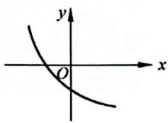

text_image

y
O
x

单调性与底数 a 有关, 所以 0 < a < 1, 且该函数图像与 y 轴交于 y 轴负半轴, 所以 $a^{0} + b - 1 < 0$ , 即 b < 0。故选 C。

【220】D。提示：底数不确定的话我们需要分类讨论：

① 当 0 < a < 1 时， $\frac{1}{a} > 1$ ，则 $a^{0} - \frac{1}{a} = 1 - \frac{1}{a} < 0$ ，此时函数递减，且与 y 轴交于 y 轴负半轴，D 正确。

② 当 a > 1 时， $0 < \frac{1}{a} < 1$ ，则 $1 > a^{0} - \frac{1}{a} = 1 - \frac{1}{a} > 0$ ，此时函数递增，且与 y 轴交于 y 轴正半轴，其交点在 0 和 1 之间，故 A, B 错误。故选 D。

【221】C。提示：对数函数定义域为 $(0, +\infty)$ ，其图像在 $y$ 轴右侧，底数大于1，函数单调递增，恒过(1,0)。故选C。

【222】B。提示：对函数图像分析其单调递增，故 $1 < a$ ，且函数过(3,1)，即 $\log_a 3 = 1$ ，解得 $a = 3$ 。

A: $y=3^{-x}=\left(\frac{1}{3}\right)^{x}$ 单调递减, 错误。

B: $y = x^3$ ，其为增函数，且指数大于1，增幅较大，正确。

C: $y = -x^{3}$ ，其为减函数，错误。

D: $y=\log_{3}(-x)$ ，其图像与 $y=\log_{3}x$ 的图像关于 y 轴对称，故其在 $(-∞,0)$ 上单调递减，错误。

综上，故选 B。

【223】D。提示：通过观察函数图像得其单调递减，故 0 < a < 1。又与 x 轴交于正半轴，且 $y = \log_{a}(x + c)$ 是由 $y = \log_{a}x$ 向左平移 c 个单位得到的，所以 0 < c < 1。故选 D。

【224】A。提示：这是个复合函数，函数是单调递增的，且内层

函数单调递增,故外层函数必然单调递增,所以 1<a。

通过观察可得 $-1 < y_{x=0} < 0$ ，即 $\log_{a} a^{-1} = -1 < \log_{a} b < 0 = \log_{a} 1$ ，则 $0 < a^{-1} < b < 1$ 。故选 A。

【225】D。提示：结合幂函数以及对数函数的性质综合判断。

A: 无论是对数函数还是幂函数都不可能过(0,1)，故 A 错误。

B: 过(1,0)的图像是对数函数, 其单调递减, 故 0 < a < 1, 那么另一条就是幂函数的图像, 其不仅递增, 且其增幅比较大, 故 1 < a。而两个函数得到 a 的范围不一致, 故 B 错误。
C: 过(1,0)的图像是对数函数, 其单调递增, 故 1 < a, 那么另一条同样是幂函数的图像, 其虽然递增, 但其增幅比较小, 故 0 < a < 1。而两个函数得到 a 的范围不一致, 故 C 错误。

D: 过(1,0)的图像依然是对数函数, 其单调递减, 故 0 < a < 1, 那么另一条同样是幂函数的图像, 其不仅递增, 且其增幅比较小, 故 0 < a < 1。而两个函数得到 a 的范围一致, 故 D 正确。故选 D。

【226】D。提示：结合指数函数以及对数函数的性质综合判断。

指数函数 $y=\frac{1}{a^{x}}$ 与 x 轴无交点，与 x 轴有交点的是 $y=\log_{a}\left(x+\frac{1}{2}\right)$ 的函数图像。

A: $y = \frac{1}{a^x}$ 单调递增, 故 $a \in (0,1)$ , 虽然 $y = \log_a \left( x + \frac{1}{2} \right)$ 单调性满足题意, 但是 $y = \log_a \left( x + \frac{1}{2} \right)$ 是由 $y = \log_a x$ 向左平移 $\frac{1}{2}$ 的单位而来的, 那么其与 $x$ 轴的交点必在 0 和 1 之间, 故 A 错误。

B: $y=\frac{1}{a^{x}}$ 单调递增，故 $a\in(0,1)$ ，而 $y=\log_{a}\left(x+\frac{1}{2}\right)$ 单调递增，得 $a\in(1,+\infty)$ 。两个函数得到 a 的范围不一致，故 B 错误。

C: $y = \frac{1}{a^{x}}$ 单调递减, 故 $a \in (1, +\infty)$ , 此时 $y = \log_{a} \left( x + \frac{1}{2} \right)$ 单调性满足题意, 但是 $y = \log_{a} \left( x + \frac{1}{2} \right)$ 是由 $y = \log_{a} x$ 向左平移 $\frac{1}{2}$ 的单位而来的, 那么其与 x 轴的交点必在 0 和 1 之间, 故 C 错误。

D: $y=\frac{1}{a^{x}}$ 单调递增, 故 $a\in(0,1)$ , 此时 $y=\log_{a}\left(x+\frac{1}{2}\right)$ 单调性满足题意, 又 $y=\log_{a}\left(x+\frac{1}{2}\right)$ 是由 $y=\log_{a}x$ 向左平移 $\frac{1}{2}$ 的单位而来的, 那么其与 x 轴的交点必在 0 和 1 之间, 也满足题意, 故 D 正确。故选 D。

【227】A。提示：结合平移变换原则“左加右减”“上加下减”，将 $y=2^{x}$ 向右平移3个单位可得 $y=2^{x-3}$ ，再将 $y=2^{x-3}$ 向下平移1个单位可得 $y=2^{x-3}-1$ 。故选A。

【228】D。提示：这道题可以结合着平移、对称和翻折去处理。

$y=\ln(-x)$ 与 $y=\ln x$ 的图像关于 y 轴对称，将 $y=\ln(-x)$ 向右移 2 个单位可得 $y=\ln[-(x-2)]=\ln(2-x)$ 的图像，再将 $y=\ln[-(x-2)]=\ln(2-x)$ 在 x 轴下方的图像关于 x 轴翻折可得 $y=|\ln(2-x)|$ 。画出草图，通

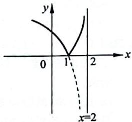

text_image

y
0 1 2 x
x=2

过图像可得该函数在[1,2)上单调递增。故选D。

# 类型二：函数的图像综合判断

【229】A。提示：B：当 $x = 1$ 时， $y = 0$ ，和图像不符，故排除B。

C: 当 x>0 时， $\frac{2x\cos x}{x^{2}+1}\leqslant\frac{2x}{x^{2}+1}=\frac{2}{x+\frac{1}{x}}\leqslant1$ ，因此 C 不满足。

D: 由图像可知当 x=3 时, y<0, 而 D 不满足, 因此排除 D。故选 A。

【230】A。提示：结合选项来看需要判断函数的奇偶性以及函数正负。

令 $f(x) = (3^x - 3^{-x})\cos x$ ，因为 $f(-x) = (3^{-x} - 3^x) \cdot \cos (-x) = -(3^x - 3^{-x})\cos x = -f(x)$ ，所以 $f(x) = (3^x - 3^{-x})\cos x$ 是奇函数（或者通过奇偶性的乘积来判断， $y = 3^x - 3^{-x}$ 是奇函数， $y = \cos x$ 是偶函数，所以通过奇函数乘偶函数为奇函数同样可判断 $f(x) = (3^x - 3^{-x})\cos x$ 是奇函数），可排除选项 B, D。又当 $x \in \left(0, \frac{\pi}{2}\right)$ 时， $y = 3^x - 3^{-x}$ 单调递增，故 $y = 3^x - 3^{-x} > 3^0 - 3^0 = 0$ ， $y = \cos x > 0$ ，所以 $f(x) = (3^x - 3^{-x})\cos x > 0$ 。故选 A。

【231】C. 提示：因为 $y = -x^2$ 是偶函数， $y = e^x - e^{-x}$ 是奇函数， $y = \sin x$ 是奇函数，所以 $y = (e^x - e^{-x})\sin x$ 是偶函数，故 $f(x) = -x^2 + (e^x - e^{-x})\sin x$ 是偶函数，其图像关于 $y$ 轴对称，因此排除 A, C。再对比 B, D，会发现函数值的正负有所不同，而 $f(1) = -1 + \left(e - \frac{1}{e}\right)\sin 1 > -1 + \left(e - \frac{1}{e}\right)\sin \frac{\pi}{6} = \frac{e}{2} - 1 - \frac{1}{2e} > \frac{2.7}{2} - 1 - \frac{1}{4} > 0$ ，所以排除 D, C 正确。故选 C。

【232】D。提示：通过分析 $y = \left(x - \frac{1}{x}\right)\cos x$ 可得 $y = x - \frac{1}{x}$ 是奇函数，而 $y = \cos x$ 是偶函数，故 $y = \left(x - \frac{1}{x}\right)\cos x$ 是奇函数，因此排除A，B。对比C，D，发现它们的不同之处在函数值的正负，只需要研究(0,π]即可。当 $x = \pi$ 时， $y = \frac{1}{\pi} - \pi < 0$ 。于是排除了C，故选D。

【233】D。提示：结合选项来看首先需判断奇偶，奇偶确定可去掉一半选项，接着对比余下图像的局部差异做出判断。通过分析 $y = 2^{|x|}\sin 2x$ ，可得 $y = \sin 2x$ 是奇函数， $y = 2^{|x|}$ 是偶函数，所以 $y = 2^{|x|}\sin 2x$ 是奇函数。因此排除A，B。对比C，D发现它们的不同之处在函数值的正负，只需要研究 $x \in \left(\frac{\pi}{2},\pi\right)$ 即可，此时 $2x \in (\pi,2\pi)$ ，而 $y = 2^{|x|} > 0$ 恒成

立，故当 $x \in \left(\frac{\pi}{2}, \pi\right)$ 时， $y = 2^{|x|} \sin 2x < 0$ ，对比C，D可排除C。故D正确。

【234】A。提示：结合选项来看首先需判断奇偶，奇偶确定可去掉一半选项，接着对比余下图像的局部差异做出判断。

通过分析 $y = x\cos x + \sin x$ ，可得 $y = x$ 是奇函数， $y = \cos x$ 是偶函数，所以 $y = x\cos x$ 是奇函数。又 $y = \sin x$ 是奇函数，故 $y = x\cos x + \sin x$ 是奇函数。因此排除 C, D。对比 A, B 发现它们的不同之处在函数值的正负，只需要研究 $(0, \pi]$ 即可。当 $x = \pi$ 时， $y = -\pi < 0$ 。于是排除了 B。故选 A。

【235】D。提示：首先通过判断对称性可得 $f(x)$ 是偶函数，而选项A,B是奇函数，所以可以排除A,B。

对于选项 C, 因为 $e^{x} + e^{-x} > 0$ , $x^{2} + 2 > 0$ , 即 $\forall x \in R$ , $\frac{e^{x} + e^{-x}}{x^{2} + 2} > 0$ 恒成立, 所以排除 C。故选 D。

【236】D。提示：通过分析 $y = \frac{\sin x + x}{\cos x + x^2}$ 可得 $y = x$ 是奇函数， $y = \cos x$ 是偶函数， $y = \sin x$ 是奇函数， $y = x^2$ 是偶函数，则 $y = \sin x + x$ 是奇函数， $y = \cos x + x^2$ 是偶函数，故 $y = \frac{\sin x + x}{\cos x + x^2}$ 是奇函数。因此排除A。

对比 B, C, D, 发现它们的不同之处在函数值的正负, 只需要研究 $(0, \pi]$ 即可。当 $x \in \left(0, \frac{\pi}{2}\right]$ 时, y > 0, 于是排除了 C。接着对比 B, D, 发现 $f(\pi)$ 不同, 而 $f(\pi) = \frac{\pi}{\pi^{2} - 1} > 0$ 。继续排除了 B, 故选 D。

【237】A。提示：方法一：通过对 $y = \frac{4x}{x^2 + 1}$ 分析，该函数定义域为 $\mathbf{R}, y = 4x$ 是奇函数， $y = x^2 + 1$ 是偶函数，故 $y = \frac{4x}{x^2 + 1}$ 是奇函数，故排除 C, D。

那么对比 A, B, 发现它俩函数值正负有区别, 只需研究 $(0, +\infty)$ 上的图像即可。当 x > 0 时, $4x > 0, x^{2} + 1 > 0$ , 故 $y = \frac{4x}{x^{2} + 1} > 0 (x > 0)$ , 故 B 错误, A 正确。故选 A。

方法二：分析 $y = \frac{4x}{x^2 + 1}$ 得该函数定义域为 $\mathbf{R}, y = 4x$ 是奇函数， $y = x^2 + 1$ 是偶函数，故 $y = \frac{4x}{x^2 + 1}$ 是奇函数，故排除 $C, D$ 。

那么对比 A, B, 发现它俩单调性不一致, 我们可以从单调性的角度判断, $y = \frac{4x}{x^{2} + 1} = \frac{4}{x + \frac{1}{x}}$ , 这是个复合函数, 且是

奇函数,所以我们只需要判断其在 $(0,+\infty)$ 上单调性即可。令 $t=x+\frac{1}{x}$ ，其在 $(0,1)$ 上单调递减，在 $(1,+\infty)$ 上单调递增，且 $t=x+\frac{1}{x}>0$ ，而 $y=\frac{4}{t}$ 在 $(0,+\infty)$ 上单调递减，故

$y=\frac{4x}{x^{2}+1}$ 在 $(0,1)$ 上单调递增，在 $(1,+\infty)$ 上单调递减。A 满足，故选 A。

【238】B。提示：分析 $f(x) = \frac{\mathrm{e}^x - \mathrm{e}^{-x}}{x^2}$ 得该函数定义域为R， $y = \mathrm{e}^x - \mathrm{e}^{-x}$ 是奇函数， $y = x^2$ 是偶函数，故 $f(x) = \frac{\mathrm{e}^x - \mathrm{e}^{-x}}{x^2}$ 是奇函数，故排除A。

那么对比 B, C, D, 发现它们函数值正负有区别且 $f(1)$ 处有不同。奇函数我们只需要判断在 $(0, +\infty)$ 上的性质即可。通过分析， $y = e^{x} - e^{-x}$ 在 $(0, +\infty)$ 上单调递增，那么 $e^{x} - e^{-x} > 0, x^{2} > 0$ ，故 $f(x) = \frac{e^{x} - e^{-x}}{x^{2}} > 0 (x > 0)$ ，进一步排除 D。

观察 B, C, 我们发现两个图像的 $f(1)$ 有区别, 而 $f(1)=\mathrm{e}-\frac{1}{\mathrm{e}}>2$ , B 满足, C 不满足。故选 B。

【239】B。提示：通过对 $y = \frac{2x^3}{2^x + 2^{-x}}$ 分析，该函数定义域为 R, $y = 2x^{3}$ 是奇函数， $y = 2^x + 2^{-x}$ 是偶函数，故 $y = \frac{2x^3}{2^x + 2^{-x}}$ 是奇函数，故排除 C。

那么对比 A, B, D, 发现它们函数值正负有区别以及 $y_{x=4}$ 有区别。当 $x \in (0,6]$ 时， $2x^{3} > 0, 2^{x} + 2^{-x} > 0$ ，故 $y = \frac{2x^{3}}{2^{x} + 2^{-x}} > 0$ ，故 D 错误。

进一步观察 A, B, 我们发现两个图像的 $f(4)$ 有区别, 而 $f(4)=\frac{128}{16+\frac{1}{16}}\approx7.97$ , B 满足, A 不满足。

故选B。

【240】D。提示：方法一：通过分析 $y = 1 + x + \frac{\sin x}{x^2}$ 可得 $y = x$ 是奇函数， $y = \sin x$ 是奇函数， $y = x^2$ 是偶函数，则 $y = \frac{\sin x}{x^2}$ 是奇函数， $y = x + \frac{\sin x}{x^2}$ 是奇函数。而 $y = 1 + x + \frac{\sin x}{x^2}$ 是将 $y = x + \frac{\sin x}{x^2}$ 向上平移一个单位得到的，故 $y = 1 + x + \frac{\sin x}{x^2}$ 的图像关于(0,1)成中心对称，通过观察只有 D 满足，故选 D。

方法二：通过观察四个图像函数值正负有区别，当 $x \in \left(0, \frac{\pi}{2}\right)$ 时， $y > 0$ ，所以排除A，C。

接着对比 B, D, 发现当 $x \to +\infty$ 时, 图像有出入, 而当 $x \to +\infty$ 时, $y \to +\infty$ , 所以继续排除 B。故选 D。

【241】D。提示：通过观察这四个图像发现 $y_{x=0}$ 有区别，而 $y_{x=0}=2>1$ ，所以排除A，B。

而 C, D 的不同在于有没有函数值大于 $y_{x=0}$ ，而 $y_{x=\frac{1}{2}} = 2 + \frac{3}{16} > y_{x=0}$ ，所以接着排除了 C。故选 D。

【242】D。提示：结合选项来看首先需判断奇偶，通过奇偶先排除错误的，接着对比余下图像的局部差异做出判断。通过分析 $f(x)=\frac{|x^{2}-1|}{x}$ ，可得 $y=|x^{2}-1|$ 是偶函数，y=x是奇函数，所以 $f(x)=\frac{|x^{2}-1|}{x}$ 是奇函数。因此排除A。对比B,C,D发现它们的不同之处在函数值的正负，只需研究 $(0,+\infty)$ 即可。当x>0时， $y=|x^{2}-1|\geqslant0,y=x>0$ ，则 $f(x)=\frac{|x^{2}-1|}{x}\geqslant0$ ，因此排除C。接着对比B,D发现它们的不同之处在函数的单调性，只需研究 $(1,+\infty)$ 即可。当x>1时， $f(x)=\frac{|x^{2}-1|}{x}=\frac{x^{2}-1}{x}=x+\frac{-1}{x}$ ，又y=x和 $y=\frac{-1}{x}$ 在 $(1,+\infty)$ 上单调递增，故 $f(x)=\frac{|x^{2}-1|}{x}$ 在 $(1,+\infty)$ 上单调递增，所以排除B。故选D。

【243】D。提示：通过观察四个图像可得 $y_{x=2}$ 有出入，而 $1 > y_{x=2} = 8 - e^{2} \approx 0.7 > 0$ ，故排除 B。

再观察 A, C, D, 发现区别在 $y_{x=0}$ 是不是最小值, 而 $y_{x=0} = -1, y_{x=\frac{1}{2}} = \frac{1}{2} - \sqrt{e} \approx -1.1 < -1$ , 所以排除 C。最后看 A, D, 区别在于极小值, 当 x > 0 时, $f(x) = 2x^{2} - e^{x}, f'(x) = 4x - e^{x}, f'(0) = -1 < 0, f'\left(\frac{1}{2}\right) = 2 - \sqrt{e} > 0$ 。设极小值为 $x_{0}$ , 则 $x_{0} \in \left(0, \frac{1}{2}\right)$ , 更靠近 0。故选 D。

# 2.10 函数与方程

# 类型一：利用零点存在定理判断零点所在区间

【244】B。提示：方法一：通过分析 $f(x) = 2^{x} + 3x$ 可得 $y = 2^{x}, y = 3x$ 都是单调递增的，故 $f(x) = 2^{x} + 3x$ 单调递增。再结合选项找点说明函数值正负， $f(0) = 1 > 0$ ，找到正函数值了，自然需要找负函数值了，函数单调递增，接着往小于0的方向找， $f(-1) = -2.5 < 0$ 。因为函数在 $(-1,0)$ 上单调递增且 $f(0) \cdot f(-1) < 0$ ，所以零点在区间 $(-1,0)$ 上。故选B。

方法二：可以数形结合将函数的零点转为曲线的交点问题。

令 $f(x) = 2^{x} + 3x = 0$ ，得 $2^{x} = -3x$ ，画出函数 $y = 2^{x}$ 和 $y = -3x$ 的图像判断交点所在区间。

观察图像可得两条函数曲线的交点在 y 轴左侧,那么零点所在区间是负区间,排除

C,D.

经计算可得，当 x=0 时， $2^{x}>-3x$ ，而当 x=-1 时， $2^{x}<-3x$ ，则零点所属区间为 $(-1,0)$ 。故选 B。

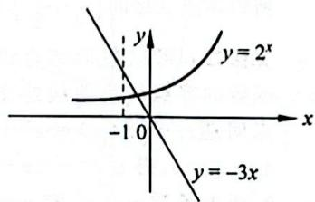

text_image

y
y = 2^x
-1 0
x
y = -3x

【245】C。提示：方法一：通过分析 $f(x) = 2^x + x - 2$ 可得 $y = 2^x, y = x - 2$ 都是单调递增的，故 $f(x) = 2^x + x - 2$ 单调递增。再结合选项找点说明函数值正负， $f(0) = -1 < 0$ ，找到负函数值了，自然需要找正函数值了，函数单调递增，接着往大于0的方向找， $f(1) = 1 > 0$ 。因为函数在(0，

# 22 答案详解

1)上单调递增且 $f(0)\cdot f(1) < 0$ ，所以零点在区间 $(0,1)$ 上。故选C。

方法二：可以数形结合将函数的零点转为曲线的交点问题。令 $f(x) = 2^{x} + x - 2 = 0$ ，得 $2^{x} = -x + 2$ ，画出函数 $y = 2^{x}$ 和 $y = -x + 2$ 的图像判断交点所在区间。

观察图像可得两条函数曲线的交点在 y 轴右侧, 那么零点所在区间是正区间, 排除 A, B。

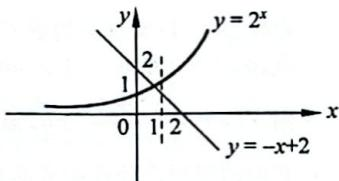

text_image

y
y = 2^x
1
2
0
1
2
x
y = -x + 2

经计算可得, 当 x=0 时, $2^{x}<-x+2$ , 而当 x=1

时， $2^{x} > -x + 2$ 。则零点所属区间为(0,1)。故选C。

【246】C。提示：方法一：通过分析 $f(x) = \mathrm{e}^{x} + x - 2$ 可得 $y = \mathrm{e}^{x}, y = x - 2$ 都是单调递增的，故 $f(x) = 2^{x} + x - 2$ 单调递增。再结合选项找点说明函数值正负， $f(0) = -1 < 0$ ，找到负函数值了，自然需要找正函数值了，函数单调递增，接着往大于0的方向找， $f(1) = \mathrm{e} - 1 > 0$ 。因为函数在(0,1)上单调递增且 $f(0) \cdot f(1) < 0$ ，所以零点在区间(0,1)上。故选C。

方法二：可以数形结合将函数的零点转为曲线的交点问题。令 $f(x) = \mathrm{e}^x + x - 2 = 0$ ，得 $\mathrm{e}^x = -x + 2$ ，画出函数 $y = \mathrm{e}^x$ 和 $y = -x + 2$ 的图像判断交点所在区间。

观察图像可得两条函数曲线的交点在 y 轴右侧, 那么零点所在区间是正区间, 排除 A, B。

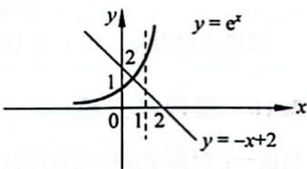

text_image

y = e^x
1
2
0
1
2
x
y = -x + 2

经计算可得, 当 x=0 时, $e^{x}<-x+2$ , 而当 x=1

时， $e^{x}>-x+2$ 。则零点所属区间为(0,1)。故选C。

【247】C。提示：方法一：通过分析 $f(x) = \mathrm{e}^{x} + 4x - 3$ 可得 $y = \mathrm{e}^x,y = 4x - 3$ 都是单调递增的，故 $f(x) = \mathrm{e}^x +4x - 3$ 单调递增。再结合选项找点说明函数值正负， $f(0) =$ $-2 <   0$ ，找到负函数值了，自然需要找正函数值了，函数单调递增，接着往大于0的方向找， $f\left(\frac{1}{4}\right) = \sqrt[4]{\mathrm{e}} -2 <   0$ 。又是负函数值，继续向右找， $f\left(\frac{1}{2}\right) = \sqrt{\mathrm{e}} -1 > 0$

因为函数在 $\left(\frac{1}{4},\frac{1}{2}\right)$ 上单调递增且 $f\left(\frac{1}{4}\right)\cdot f\left(\frac{1}{2}\right) < 0$ 所以零点在区间 $\left(\frac{1}{4},\frac{1}{2}\right)$ 上。故选C。

方法二：可以数形结合将函数的零点转为曲线的交点问题。令 $f(x) = \mathrm{e}^{x} + 4x - 3 = 0$ ，得 $\mathrm{e}^x = -4x + 3$ ，画出函数 $y = \mathrm{e}^x$ 和 $y = -4x + 3$ 的图像判断交点所在区间。

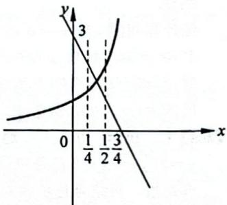

line

| x | y |
|---|---|
| 0 | 1/4 |
| 1/2 | 3/4 |
| 3/4 | 3/4 |

观察图像可得两条函数曲

线的交点在 $y$ 轴右侧，那么零点所在区间是正区间，排

除A。

经计算可得，当 $x = \frac{1}{4}$ 时， $\mathrm{e}^x < -4x + 3$ ；当 $x = \frac{1}{2}$ 时， $\mathrm{e}^x > -4x + 3$ ，则零点所属区间为 $\left(\frac{1}{4}, \frac{1}{2}\right)$ 。

故选C。

【248】B。提示：数形结合判断交点问题。画出函数 $y = x^3$ 和 $y = \left(\frac{1}{2}\right)^{x - 2}$ 的图像判断交点所在区间。

观察图像可得两条函数曲线的交点在 $y$ 轴右侧，那么零点所在区间是正区间。

经计算可得，当 $x = 1$ 时， $x^3 < \left(\frac{1}{2}\right)^{x - 2}$ ；当 $x = 2$

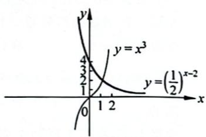

line

| Point | x | y |
|---|---|---|
| 0 | 0 | |
| 1 | 1 | |
| 2 | 2 | |
| 3 | 3 | |
| 4 | 4 | x³ |

时， $x^3 >\left(\frac{1}{2}\right)^{x - 2}$ ，则零点所属区间为(1,2)。

故选B。

【249】C。提示：可以数形结合将函数的零点转为曲线的交点问题。令 $f(x) = \frac{6}{x} - \log_2 x = 0$ ，得 $\frac{6}{x} = \log_2 x$ 。

画出函数 $y = \frac{6}{x}$ 和 $y = \log_2 x$ 的图像判断交点所在区间。

观察图像可得两条函数曲线的交点在 $y$ 轴右侧，那么零点所在区间是正区间。

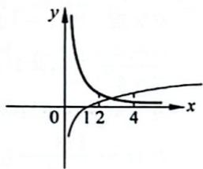

line

| x | y |
|---|---|
| 0 | 0 |
| 1 | 1 |
| 2 | 0.5 |
| 3 | 0.25 |
| 4 | 0.125 |

经计算可得，当 $x = 2$ 时， $\frac{6}{x} >$ $\log_2x$ ；当 $x = 4$ 时， $\frac{6}{x} <  \log_2x$ ，则

零点所属区间为(2,4)。故选C。

【250】A。提示：通过对函数 $f(x) = (x - a)(x - b) + (x - b)(x - c) + (x - c)(x - a)$ 分析，这是个二次函数，且开口向上。

又 $a < b < c, f(a) = (a - b)(a - c) > 0, f(b) = (b - c)(b - a) < 0, f(c) = (c - a)(c - b) > 0$ ，由零点存在定理，函数的两个零点分别位于区间 $(a, b)$ 和 $(b, c)$ 上。故选 A。

# 类型二：判断零点个数

【251】B。提示：方法一：通过分析 $f(x) = x^{\frac{1}{2}} - \left(\frac{1}{2}\right)^x$ 可得 $y = x^{\frac{1}{2}}, y = -\left(\frac{1}{2}\right)^x$ 都是单调递增的，故 $f(x) = x^{\frac{1}{2}} - \left(\frac{1}{2}\right)^x$ 单调递增。再结合选项找点说明函数值正负， $f(0) = -1 < 0$ ，找到负函数值了，自然需要找正函数值了，函数单调递增，接着往大于0的方向找， $f(1) = \frac{1}{2} > 0$ 。因为函数在 $\left(\frac{1}{4}, \frac{1}{2}\right)$ 上单调递增且 $f\left(\frac{1}{4}\right) \cdot f\left(\frac{1}{2}\right) < 0$ ，所以函数 $f(x) = x^{\frac{1}{2}} - \left(\frac{1}{2}\right)^x$ 在 $\left(\frac{1}{4}, \frac{1}{2}\right)$ 上有唯一零点。故选B。

方法二：可以数形结合将函数的零点转为曲线的交点问题。令 $f(x) = x^{\frac{1}{2}} - \left(\frac{1}{2}\right)^x = 0$ ，得 $x^{\frac{1}{2}} = \left(\frac{1}{2}\right)^x$ 。

画出函数 $y = x^{\frac{1}{2}}$ 和 $y = \left(\frac{1}{2}\right)^x$ 的图像判断交点个数。

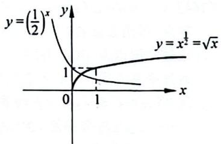

text_image

y=(1/2)x
y=x^1/2=√x
1
0 1 x

观察图像可得两条函数曲线有一个交点。故选B。

【252】C。提示：数形结合判断交点个数问题。画出函数 $f(x) = \ln x$ 和 $g(x) = x^2 - 4x + 4 = (x - 2)^2$ 的图像判断交点个数。

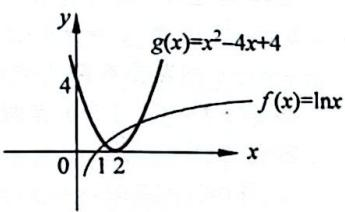

line

| x | f(x) = ln x | g(x) = x² - 4x + 4 |
|---|---|---|
| 0 | 0 | 0 |
| 1 | 0 | 0 |
| 2 | 1 | 4 |

观察图像可得两条函数曲线有 2 个交点。故选 C。

【253】B。提示：数形结合判断交点个数问题。画出函数 $f(x) = 2\ln x$ 和 $g(x) = x^2 - 4x + 5$ 的图像判断交点个数。

这个图像并不是直接画出来就可以的,它俩到底有没有交点还需要一点小计算。

$f(2) = 2\ln 2 = \ln 4 > 1 = g(2)$ , 观察图像可得两

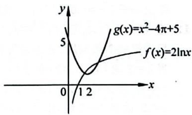

line

| x | y (g(x)) | y (f(x)) |
|---|---|---|
| 0 | 5 | 0 |
| 1 | 2 | 1 |
| 2 | 3 | 2 |
| 3 | 4 | 3 |
| 4 | 5 | 4 |
The chart is a line graph with two curves: one for g(x) = x² - 4π + 5 and one for f(x) = 2lnx. The x-axis ranges from 0 to 4, and the y-axis ranges from 0 to 5. The curve is closed at the origin, indicating that for any given x value, the function is equal to or equal to the given x value. The function's slope is constant (0.6).

条函数曲线有2个交点。故选B。

【254】C。提示：通过对 $|x| = \cos x$ 观察得 $y = |x|$ 与 $y = \cos x$ 都是偶函数，那么方程 $|x| = \cos x$ 的根的个数问题我们可转化为函数 $y = |x|$ 的图像和函数 $y = \cos x$ 的图像的交点个数问题，那就画图数交点个数。

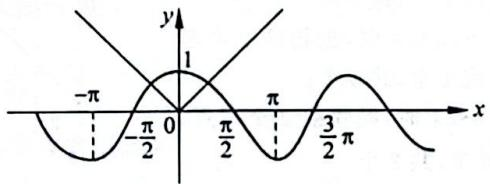

text_image

-π
-π/2
0
1
π/2
π
3/2π
x
y

由图知两条曲线有2个交点，即方程 $|x|=\cos x$ 有2个根。故选C。

【255】B。提示：函数 $f(x) = 2^x \mid \log_{0.5} x \mid -1$ 的零点个数问题我们转为方程 $2^x \mid \log_{0.5} x \mid -1 = 0$ 的根的个数问题。对方程 $2^x \mid \log_{0.5} x \mid -1 = 0$ 变形得 $|\log_{0.5} x| = \left(\frac{1}{2}\right)^x$ ，

则问题接着转为函数 $y = |\log_{0.5}x|$ 的图像与函数 $y = \left(\frac{1}{2}\right)^x$ 的图像的交点个数问题，那就画图数交点。

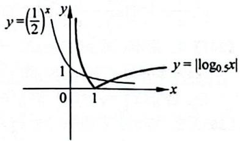

由图知两条曲线有2个交点，即函数 $f(x) = 2^{x}|\log_{0.5}x| - 1$ 有两个零点。故选B。

【256】4。提示：方程 $|f(x) + g(x)| = 1$ 的根为 $f(x) + g(x) = 1$ 和 $f(x) + g(x) = -1$ 的根，即为 $f(x) = 1 - g(x)$ 和 $f(x) = -1 - g(x)$ 的根，分别画出 $y = f(x) = |\ln x|, y = 1 - g(x) = \begin{cases} 1, & 0 < x \leqslant 1, \\ 3 - |x^2 - 4|, & x > 1, \end{cases}$

$y = -1 - g(x) = \left\{ \begin{array}{ll} - 1, & 0 < x \leqslant 1,\\ 1 - |x^2 -4|, & x > 1 \end{array} \right.$ 的图像。

通过观察图像可得 $y = f(x)$ 与 $y = 1 - g(x)$ 的函数图像有2个交点，同时 $y = f(x)$ 与 $y = -1 - g(x)$ 的图像也有2个交点，故 $|f(x) + g(x)| = 1$ 的根有4个。

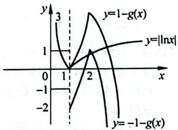

【257】C。提示：这个函数

图像并不容易画出来,那怎么办呢?好在这个函数并不复杂,可以直接令 $f(x)=x\cos x^{2}=0$ , 转为求解方程的根,而方程的根即为该函数零点个数。

由 $f(x)=x\cos x^{2}=0$ 可得 x=0 或 $\cos x^{2}=0$ ，解得 x=0， $\sqrt{\frac{\pi}{2}}$ ， $\sqrt{\frac{3\pi}{2}}$ ， $\sqrt{\frac{5\pi}{2}}$ ， $\sqrt{\frac{7\pi}{2}}$ ， $\sqrt{\frac{9\pi}{2}}$ ，该方程共有 6 个根，即该函数有 6 个零点。故选 C。

【258】2。提示：将函数的零点转为方程的根的个数问题，通过计算或是使用零点存在定理得零点个数。

当 $x \leqslant 0$ 时，令 $f(x) = 0$ ，即 $x^2 - 2 = 0$ ，解得 $x = -\sqrt{2}$ ；当 $x > 0$ 时，令 $f(x) = 0$ ，即 $2x - 6 + \ln x = 0$ ，这是一个超越方程，遇到不可解方程问题，我们进一步考虑使用零点存在定理说明零点的存在与否。

分析 $f(x) = 2x - 6 + \ln x$ 可得 $y = 2x - 6$ 与 $y = \ln x$ 都是增函数，故 $f(x) = 2x - 6 + \ln x$ 在 $(0, +\infty)$ 上单调递增。而 $f(1) = -4 < 0, f(3) = \ln 3 > 0$ ，则存在 $x_0 \in (1, 3)$ ，使得 $f(x_0) = 0$ ，故 $f(x)$ 在 $(0, +\infty)$ 上有唯一零点。

综上， $f(x)$ 有2个零点。

# 类型三：由零点个数求解参数

【259】(0,2)。提示：函数 $f(x) = |2^x - 2| - b$ 有两个零点，即 $y = |2^x - 2|$ 和 $y = b$ 的图像有2个交点。

进一步通过画图判断 $b$ 的范围。

由图像可得 $y = |2^x - 2|$ 和 $y = b$ 的图像要有2个交点，则需 $0 < b < 2$ ，故 $b\in (0,2)$ 。

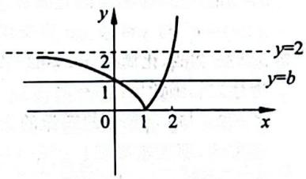

line

| x | y |
|---|---|
| 0 | 2 |
| 1 | 0 |
| 2 | >2 |

【260】 $\left(0,\frac{1}{2}\right)$ 。提示：画图判断a的范围，底数的不确定分类讨论。

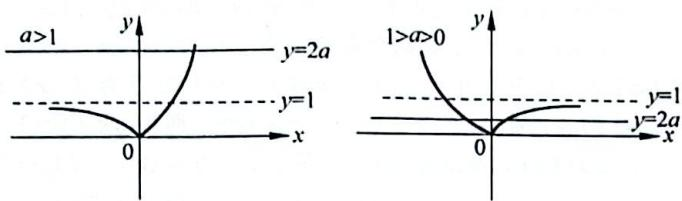

通过分析图像可得：

当 $a > 1$ 时， $y = 2a$ 与 $y = |a^x - 1|$ 有一个交点；

当 0 < a < 1 时，y = 2a 与 $y = |a^{x} - 1|$ 要有两个交点，则需 0 < 2a < 1，即 $0 < a < \frac{1}{2}$ 。

综上, $a\in\left(0,\frac{1}{2}\right)$ 。

【261】(0,1)。提示：方程 $f(x) = k$ 有两个不同的实根，即函数 $y = f(x)$ 与 $y = k$ 的图像有两个交点。

那就画图判断 k 的取值范围。

通过分析图像可得函数 $y = f(x)$ 与 $y = k$ 的图像要有两个交点，则需 $0 < k < 1$ ，即 $k \in (0,1)$ 。

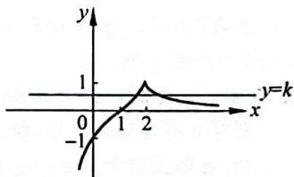

line

| x | y |
|---|---|
| 0 | -1 |
| 1 | 0 |
| 2 | 1 |
| 3 | 0 |

【262】D。提示：方程 $f(x) = -\frac{1}{4} x + a$ 有两个实数解，即函

数 $y = f(x) + \frac{1}{4} x = \left\{ \begin{array}{ll}2\sqrt{x} +\frac{1}{4} x, & 0\leqslant x\leqslant 1,\\ \frac{1}{x} +\frac{1}{4} x, & x > 1 \end{array} \right.$ 与 $y = a$ 的

图像有两个交点,那就画图判断 k 的取值范围。

通过分析图像可得函数 $y = f(x) + \frac{1}{4} x$ 与 $y = a$ 的图像要

有两个交点,则需 $\frac{5}{4}\leqslant$

$k \leqslant \frac{9}{4}$ 或 $k = 1$ , 即 $k \in$

$\left[\frac{5}{4},\frac{9}{4}\right]\cup\{1\}$ 。故

选D。

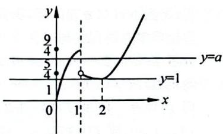

line

| x | y = a | y = 1 |
|---|---|---|
| 0 | 0 | 0 |
| 1 | 9/4 | 1 |
| 2 | 5/4 | 1 |

【263】 $(-∞,2ln2-2]$ 。提示：方法一：函数 $f(x)=\mathrm{e}^{x}-2x+a$ 的零点转为函数 $g(x)=\mathrm{e}^{x}$ 与 y=2x-a 的图像的交点，临界状态时相切。而 $g'(x)=\mathrm{e}^{x}$ ，设切点 $P(t,\mathrm{e}^{t})$ ，令 $g'(t)=2$ 解得 $t=\ln2$ ，将 $P(\ln2,2)$ 代入 y=2x-a 解得 a=2ln2-2，即相切时直线在 y 轴上的截距为 $2-2ln2$ 。而 $g(x)=\mathrm{e}^{x}$ 与 y=2x-a 有交点则需直线在 y 轴上的截距 $-a≥2-2ln2$ ，化简得 $a≤2ln2-2$ ，故 $a∈(-∞,2ln2-2]$ 。

方法二：函数 $f(x) = \mathrm{e}^x - 2x + a$ 的零点转为函数 $g(x) = \mathrm{e}^x - 2x$ 与 $y = -a$ 的图像的交点，而 $g(x)$ 的单调性是看不出来的，那就求导吧！ $g'(x) = \mathrm{e}^x - 2$ 。

当 $x \in (-\infty, \ln 2)$ 时，

$g'(x)<0, g(x)$ 单调递减；当 $x\in(\ln2,+\infty)$

时， $g'(x)>0$ ， $g(x)$ 单调
递增，且 $g(\ln2)=2-$

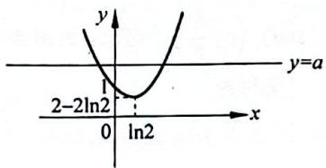

text_image

y
y=a
2-2ln2
0 ln2
x

$2\ln 2$ 。 $g(x)$ 的图像大致如图所示，所以 $f(x) = \mathrm{e}^{x} - 2x + a$ 有零点，则需 $-a\geqslant 2 - 2\ln 2$ ，即化简得 $a\leqslant 2\ln 2 - 2$ ，故 $a\in (-\infty ,2\ln 2 - 2]$ 。

【264】 $(- \infty, 0) \cup (1, +\infty)$ 。提示： $g(x) = f(x) - b$ 有两个零点，即函数 $y = f(x)$ 与 $y = -b$ 的图像有两个交点。

通过画图以及 $f(x)$ 有两个零点判断 $a$ 的范围。

通过平移直线 $x = a$ 来说明零点个数：

① 当 $a < 0$ 时， $y = f(x)$ 在 $(- \infty, a]$ 上单调递增，在 $(a, 0)$ 上单调递减，在 $(0, +\infty)$ 上单调递增，此时存在 $0 < b < a^2$ ，函数 $y = f(x)$ 与 $y = -b$ 的图像有两个交点。即 $g(x) = f(x) - b$ 有两个零点。

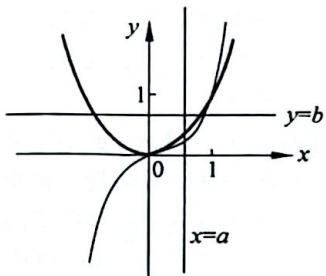

text_image

y
1
y=b
x
0
1
x=a

② 当 $0 \leqslant a \leqslant 1$ 时, $y = f(x)$ 在 $\mathbf{R}$ 上单调递增, 不存在 $b \in \mathbf{R}$ , 使得即 $g(x) = f(x) - b$ 有两个零点。

③ 当 $1 < a$ 时，两个函数在 $x = a$ 处函数值不相等，即存在 $a^2 < b \leqslant a^3$ ，函数 $y = f(x)$ 与 $y = -b$ 的图像有两个交点，即 $g(x) = f(x) - b$ 有两个零点。

综上， $a\in (-\infty ,0)\cup (1, + \infty)$ 。

【265】(1,4),(1,3]∪(4,+∞)。提示：将函数的零点转为方程的根的个数问题，通过计算得零点个数。

当 $\lambda = 2$ 时，若 $x \geqslant 2$ ，令 $f(x) < 0$ ，即 $x - 4 < 0$ ，解得 $2 \leqslant x < 4$ ；若 $x < 2$ ，令 $f(x) < 0$ ，即 $x^2 - 4x + 3 < 0$ ，解得 $1 < x < 2$ ，故当 $\lambda = 2$ 时，由 $f(x) < 0$ 解得 $x \in (1,4)$ 。

通过画图以及 $f(x)$ 有两个零点判断 $\lambda$ 的范围，通过平移直

线 $x = \lambda$ 来说明零点个数。

① 当 $\lambda \leqslant 1$ 时，抛物线 0 零点，直线 1 个，共 1 个，不合题意；

② 当 $1 < \lambda \leqslant 3$ 时，抛物线1个零点，直线1个，共2个；

③ 当 $3 < \lambda \leqslant 4$ 时，抛物线 2 个零点，直线 1 个，共 3 个；

④ 当 $4 < \lambda$ 时，抛物线 2 个零点，直线 0 个，共 2 个。

综上，若 $f(x)$ 有两个零点，则 $\lambda \in (1,3]\cup (4, + \infty)$ 。

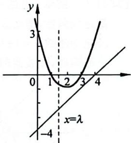

line

| x | y |
|---|---|
| 0 | 3 |
| 1 | 1 |
| 2 | -1 |
| 3 | 1 |
| 4 | 3 |
x=λ

# 第3章 导数

# 3.1 计算

【266】e。提示：对 $f(x) = \mathrm{e}^{x}\ln x$ 求导可得 $f^{\prime}(x) = \mathrm{e}^{x}\ln x +$ $\mathrm{e}^{x}\frac{1}{x} = \mathrm{e}^{x}\left(\ln x + \frac{1}{x}\right)$ ，则 $f^{\prime}(1) = \mathrm{e}_{\circ}$

【267】3。提示：对 $f(x) = (2x + 1)\mathrm{e}^x$ 求导得 $f'(x) = 2\mathrm{e}^x + (2x + 1)\mathrm{e}^x = \mathrm{e}^x (2x + 3)$ ，则 $f'(0) = 3$ 。总结出一个常见结论：若 $g(x) = \mathrm{e}^x f(x)$ ，则 $g'(x) = \mathrm{e}^x [f(x) + f'(x)]$ 。

【268】B。提示：方法一：对 $f(x) = ax^4 + bx^2 + c$ 求导可得 $f'(x) = 4ax^3 + 2bx$ ，则 $f'(1) = 4a + 2b = 2$ 。

$f'(-1)=-4a-2b=-(4a+2b)=-2$ 。故选 B。

方法二：若 $f(x)$ 是偶函数，则 $f'(x)$ 是奇函数。

简证： $f(x)$ 是偶函数，即 $f(-x)=f(x)$ ，对等式两边求导可得 $-f'(-x)=f'(x)$ ，即 $f'(-x)=-f'(x)$ 。

同样地，若 $f(x)$ 是奇函数，则 $f'(x)$ 是偶函数。

因为 $f(x)=ax^{4}+bx^{2}+c$ 是偶函数，故 $f'(x)$ 是奇函数，则 $f'(-1)=-f'(1)=-2$ 。

【269】B。提示：对 $f(x)=x\ln x$ 求导可得 $f'(x)=\ln x+1$ ，而 $f'(x_{0})=\ln x_{0}+1=2$ ，解方程得 $x_{0}=e$ 。故选 B。

【270】3。提示：对 $f(x)=ax\ln x$ 求导可得 $f'(x)=a(\ln x+1)$ ，而 $f'(1)=a=3$ ，故 a=3。

【271】D。提示：方法一：多项式展开求导， $y=(x+1)^{2}(x-1)=x^{3}+x^{2}-x-1$ ，得 $y'=3x^{2}+2x-1$ ，则 $y'_{x=1}=4$ 。故选D。

方法二：使用四则运算求导， $y' = 2(x + 1)(x - 1) + (x + 1)^{2} = 3x^{2} + 2x - 1$ ，则 $y_{x=1}' = 4$ 。故选 D。

【272】1。提示：对 $f(x) = \frac{\mathrm{e}^x}{x + a}$ 求导可得 $f^{\prime}(x) = \frac{\mathrm{e}^{x}(x + a - 1)}{(x + a)^{2}}$ ，而 $f^{\prime}(1) = \frac{a\mathrm{e}}{(1 + a)^{2}} = \frac{\mathrm{e}}{4}$ ，解方程得 $a = 1$ 。

【273】1。提示：对 $f(x) = f'\left(\frac{\pi}{4}\right)\cos x + \sin x$ 求导得 $f'(x) = -f'\left(\frac{\pi}{4}\right)\sin x + \cos x$ ，则 $f'\left(\frac{\pi}{4}\right) = -f'\left(\frac{\pi}{4}\right)\sin \frac{\pi}{4} + \cos \frac{\pi}{4}$ ，解得 $f'\left(\frac{\pi}{4}\right) = \sqrt{2} - 1$ ，则 $f(x) = (\sqrt{2} - 1)\cos x + \sin x$ ，所以 $f\left(\frac{\pi}{4}\right) = (\sqrt{2} - 1)\cos \frac{\pi}{4} + \sin \frac{\pi}{4} = 1$ 。

【274】2。提示：本题先要求得 $f(x)$ ，再进一步求 $f'(1)$ ，通过换元求解 $f(x)$ 。

令 $t = \mathrm{e}^{x} > 0$ ，则 $x = \ln t$ ，所以 $f(t) = \ln t + t$ ，即 $f(x) = \ln x + x$ ，而 $f^{\prime}(x) = \frac{1}{x} +1$ ，所以 $f^{\prime}(1) = 2$ 。

# 3.2 切线

# 类型一：求斜率与倾斜角

【275】3。提示：由题意知 $k=f'(1)=\frac{1}{2}$ ，而 $f(1)=\frac{1}{2}+2=\frac{5}{2}$ ，所以 $f'(1)+f(1)=\frac{1}{2}+\frac{5}{2}=3$ 。

【276】B。提示：对 $y=\frac{\sin x}{\sin x+\cos x}-\frac{1}{2}$ 求导，得 $y'=\frac{1}{(\sin x+\cos x)^{2}}$ ，所以 $y'_{x=\frac{\pi}{4}}=\frac{1}{\left(\sin\frac{\pi}{4}+\cos\frac{\pi}{4}\right)^{2}}=\frac{1}{2}$ ，则 $k=\frac{1}{2}$ 。故选 B。

【277】B。提示：对 $y=x^{3}-2x+4$ 求导，得 $y'=3x^{2}-2$ ，所以 $y'_{x=1}=1$ ，则 $k=\tan\alpha=1$ 。又 $\alpha\in[0,\pi)$ ，所以 $\alpha=\frac{\pi}{4}$ ，即 $\alpha=45^{\circ}$ 。故选 B。

【278】A。提示：对 $y = x^2 + 2x + 3$ 求导，得 $y' = 2x + 2$ ，设 $P(x_0, y_0)$ ，则 $k = 2x_0 + 2$ 。又 $\alpha \in \left[0, \frac{\pi}{4}\right]$ ，而 $k = \tan \alpha \in [0, 1]$ ，则 $2x_0 + 2 \in [0, 1]$ ，解得 $x_0 \in \left[-1, -\frac{1}{2}\right]$ 。故选 A。

【279】 $(-2,15)$ 。提示：对 $y=x^{3}-10x+3$ 求导，得 $y^{\prime}=3x^{2}-10$ ，设 $P(x_{0},x_{0}^{3}-10x_{0}+3)$ ，则 $y_{x=x_{0}}^{\prime}=3x_{0}^{2}-10=2$ ，解得 $x_{0}=\pm2$ ，又点 P 在第二象限，故 $x_{0}=-2$ ，则 $x_{0}^{3}-10x_{0}+3=15$ ，所以 P 点坐标为 $(-2,15)$ 。

【280】A。提示：对 $y=\frac{x^{2}}{4}-3\ln x$ 求导，得 $y'=\frac{x}{2}-\frac{3}{x}$ ，设切点 $P(x_{0},y_{0})$ ，由题意得 $y'_{x=x_{0}}=\frac{x_{0}}{2}-\frac{3}{x_{0}}=\frac{1}{2}$ ，解得 $x_{0}=3$ 。
故选 A。

【281】-3。提示：对 $y=(ax+1)e^{x}$ 求导，得 $y'=(ax+a+1)e^{x}$ ，由题意得 $y'_{x=0}=a+1=-2$ ，解得 a=-3。

【282】A。提示：对 $y=ax^{2}$ 求导得 $y'=2ax$ ，则 $y'_{x=1}=2a$ 。又曲线在 $(1,a)$ 处的切线与直线 2x-y-6=0 平行，即 $y'_{x=1}=2a=2$ ，解得 a=1。故选 A。

【283】 $\frac{1}{2}$ 。提示：对 $y=ax^{2}-\ln x$ 求导，得 $y'=2ax-\frac{1}{x}$ ，则 $y'_{x=1}=2a-1$ 。
又曲线在 $(1,a)$ 处的切线平行于x轴，即2a-1=0，解得 $a=\frac{1}{2}$ 。

【284】D。提示：对 $y=\frac{x+1}{x-1}$ 求导，得 $y'=\frac{-2}{(x-1)^{2}}$ ，则 $y_{x=3}^{\prime}=-\frac{1}{2}$ ，又曲线在(3,2)处的切线与 $ax+y+1=0$ 轴垂直，即 $-\frac{1}{2}(-a)=-1$ ，解得 a=-2。故选 D。

【285】 $-\frac{3}{4}$ 。提示：对 $f(x)=x^{3}+bx+c$ 求导，得 $f'(x)=3x^{2}+b$ ，则 $f'\left(\frac{1}{2}\right)=\frac{3}{4}+b$ ，又曲线在 $\left(\frac{1}{2},f\left(\frac{1}{2}\right)\right)$ 处的切线与 y 轴垂直，即 $\frac{3}{4}+b=0$ ，解得 $b=-\frac{3}{4}$ 。

【286】D。提示：对 $f(x) = ae^{x} + x\ln x$ 求导，得 $f^{\prime}(x) = ae^{x} + \ln x + 1$ ，由题意得 $f^{\prime}(1) = 2$ ，即 $ae = 1$ ，且 $f(1) = ae = b + 2$ ，解得 $a = e^{-1},b = -1$ 。故选D。

【287】 $a = 2, b = \mathrm{e}$ 。提示：对 $f(x) = x\mathrm{e}^{a - x} + bx$ 求导，得 $f'(x) = (1 - x)\cdot \mathrm{e}^{a - x} + b$ ，由题意知 $f^{\prime}(2) = -\mathrm{e}^{a - 2}+$ $b = \mathrm{e} - 1$ ，且 $f(2) = 2\mathrm{e}^{a - 2} + 2b = 2\mathrm{e} + 2$ ，解得 $a = 2,b = \mathrm{e}$ 。

【288】-3。提示：对 $y = ax^2 + \frac{b}{x}$ 求导，得 $y' = 2ax - \frac{b}{x^2}$ ，由题意知曲线过点 $P(2, -5)$ 且在 $P$ 处切线与 $7x + 2y + 3 = 0$ ，则 $y_{x=2}' = 4a - \frac{b}{4} = -\frac{7}{2}, 4a + \frac{b}{2} = -5$ 。联立解方程组得 $a = -1, b = -2$ ，所以 $a + b = -3$ 。

# 类型二：求切线方程

【289】 $y=2x-2$ 。提示：对 $y=2\ln x$ 求导，得 $y'=\frac{2}{x}$ ，这是在点处的切线问题，那么给定的点就是切点了，所以 $k=y_{x=1}'=2$ ，则所求切线为 $y=2(x-1)=2x-2$ 。

【290】 $y=x+1$ 。提示：对 $y=x^{2}+\frac{1}{x}$ 求导，得 $y'=2x-\frac{1}{x^{2}}$ ，还是在点处的切线问题，那么(1,2)必是切点，所以 $k=y_{x=1}'=1$ ，则所求切线为 y-2=x-1，即 $y=x+1$ 。

【291】B。提示：对 $f(x) = x^4 - 2x^3$ 求导，得 $f'(x) = 4x^3 - 6x^2$ ，这依然是在点处的切线问题，那么给定的点依然是切点，所以 $k = f'(1) = -2, f(1) = -1$ ，则所求切线为 $y - (-1) = -2(x - 1)$ ，即 $y = -2x + 1$ 。故选 B。

【292】 $y=-\frac{1}{2}x+1$ 。提示：对 $f(x)=\cos x-\frac{x}{2}$ 求导，得 $f'(x)=-\sin x-\frac{1}{2}$ ，显然还是在点处切线问题，(0,1)是切点，所以 $k=y_{x=0}^{\prime}=-\frac{1}{2}$ ，则所求切线为 $y-1=-\frac{1}{2}(x-0)$ ，即 $y=-\frac{1}{2}x+1$ 。

【293】C。提示：对 $f(x) = 2\sin x + \cos x$ 求导，得 $f^{\prime}(x) = 2\cos x - \sin x$ ，这是在点处切线问题， $(\pi , - 1)$ 是切点，所以 $k = y_{x = \pi}^{\prime} = -2$ ，则所求切线为 $y - (-1) = -2(x - \pi)$ ，即 $2x + y - 2\pi +1 = 0$ 。故选C。

【294】 $y=5x+2$ 。提示：对 $y=\frac{2x-1}{x+2}$ 求导，得 $y'=\frac{5}{(x+2)^{2}}$ ，还是在点处切线问题， $(-1,-3)$ 是切点，所以 $k=y_{x=-1}'=5$ ，则所求切线为 $y-(-3)=5(x+1)$ ，即 $y=5x+2$ 。

【295】 $y=(a-1)x$ 。提示：对 $f(x)=ax-x\mathrm{e}^{x}$ 求导得 $f'(x)=a-(x+1)\mathrm{e}^{x}$ ，则 $f'(0)=a-1$ ，又 $f(0)=0$ ，故曲线在 $(0,0)$ 处的切线为 $y=(a-1)x$ 。

【296】C。提示： $y'=\frac{xe^{x}}{(x+1)^{2}},y'_{x=1}=\frac{e}{4}$ ，那么所求切线为 $y-\frac{e}{2}=\frac{e}{4}(x-1)$ ，即 $y=\frac{e}{4}x+\frac{e}{4}$ 。故选 C。

【297】 $y = 3x$ 。提示：对 $y = 3(x^2 + x)e^x$ 求导，得 $y' = (3x^2 + 9x + 3)e^x$ ，这是在点处切线问题，(0,0)是切点，所以 $k = y'_{x=0} = 3$ ，则所求切线为 $y = 3x$ 。

【298】y=x 或 $y=x-\frac{64}{27}$ 。提示：对 $f(x)=\frac{1}{4}x^{3}-x^{2}+x$ 求导得 $f'(x)=\frac{3}{4}x^{2}-2x+1$ ，设切点 $P(x_{0},f(x_{0}))$ ，由题知 $k=f'(x_{0})=\frac{3}{4}x_{0}^{2}-2x_{0}+1=1$ ，解得 $x_{0}=0$ 或 $x_{0}=\frac{8}{3}$ ，则切点 P 为 $(0,0)$ 或 $\left(\frac{8}{3},\frac{8}{27}\right)$ 。

①当切点为 $(0,0)$ 时，此时切线为y=x；②当切点为 $\left(\frac{8}{3},\frac{8}{27}\right)$ 时，此时切线为 $y-\frac{8}{27}=x-\frac{8}{3}$ ，即 $y=x-\frac{64}{27}$ 。

综上，斜率为1的切线方程为 $y = x$ 或 $y = x - \frac{64}{27}$ 。

【299】1。提示：对 $f(x)=ax-\ln x$ 求导，得 $f'(x)=a-\frac{1}{x}$ ，则 $k=f'(1)=a-1$ ，而 $f(1)=a$ ，故所求切线为 $y-a=(a-1)(x-1)$ ，即 $y=(a-1)x+1$ ，故 l 在 y 轴上的截距为 1。

【300】C。提示：由题意知抛物线方程为 $y=\frac{1}{2}x^{2}$ ，对其求导得 $y'=x$ ，所以 $y_{P}^{\prime}=4, y_{Q}^{\prime}=-2$ 。又 $x_{P}=4, x_{Q}=-2$ ，故 $y_{P}=8, 0_{Q}=2$ ，所以抛物线在点 P 处的切线为 $y-8=4(x-4)$ ，即 y=4x-8；在点 Q 处的切线为 $y-2=-2(x+2)$ ，即 y=-2x-2。联立两条切线方程解得 A(1,-4)，即 $y_{A}=-4$ 。故选 C。

【301】A。提示：由题知 $f'(x)=6x^{5}+3$ ，则 $f'(0)=3$ ，所以切线方程为 $y-(-1)=3(x-0)$ ，即 y=3x-1。
易得切线与 x 轴，y 轴的交点坐标分别为 $(\frac{1}{3}, 0), (0, -1)$ ，
所以切线与坐标轴围成的面积为 $\frac{1}{2}\times1\times\frac{1}{3}=\frac{1}{6}$ 。故选A。

【302】A。提示： $f'(x)=\frac{(e^{x}+2\cos x)(1+x^{2})-2x(e^{x}+2\cos x)}{(1+x^{2})^{2}}$ ，则 $f'(0)=3$ ，所以 $y=f(x)$ 在(0,1)处的切线方程为 $y-1=3(x-0)$ ，即 $y=3x+1$ 。令x=0,y=1；令y=0,x=- $\frac{1}{3}$ ，所以 $y=f(x)$ 在(0,1)处的切线与坐标轴围成的三角形的面积 $S=\frac{1}{2}\times1\times\frac{1}{3}=\frac{1}{6}$ 。故选A。

【303】 $\frac{2}{e-1}$ 。提示：当a=e时， $f(x)=e^{x}-\ln x+1$ ，对其求导得 $f'(x)=e^{x}-\frac{1}{x}$ ，则 $f'(1)=e-1$ ， $f(1)=e+1$ ，则曲线在 $(1,e)$ 处的切线方程为 $y-(e+1)=(e-1)(x-1)$ ，即 $y=(e-1)x+2$ ，故该切线与两坐标轴的交点分别为 $\left(\frac{2}{1-e},0\right),(0,2)$ ，所以 $S_{\triangle}=\frac{1}{2}\left|\frac{2}{1-e}\right|\times2=\frac{2}{e-1}$ 。

【304】D。提示：由题意知 $f(x)$ 是奇函数，即 $f(-x) + f(x) = 2(a - 1)x = 0$ ，则 $a = 1$ 。所以， $f(x) = x^3 + x$ ，对 $f(x) = x^3 + x$ 求导得 $f'(x) = 3x^2 + 1$ ，还是个在点处切线问题， $(0,0)$ 是切点，所以 $k = f'(0) = 1$ ，则所求切线为 $y = x$ 。故选D。

【305】y=2x。提示：方法一：利用对称性求出 $(0,+\infty)$ 的解析式，再求导得斜率，利用点斜式求出切线方程。

设 $x > 0$ ，则 $-x < 0$ ，所以 $f(-x) = \mathrm{e}^{-(x) - 1} - (-x) = \mathrm{e}^{x - 1} + x$ 。因为 $f(x)$ 是偶函数，故 $f(x) = f(-x) = \mathrm{e}^{x - 1} + x$ ，所以当 $x > 0$ 时， $f(x) = \mathrm{e}^{x - 1} + x$ ，此时 $f'(x) = \mathrm{e}^{x - 1} + 1 (x > 0)$ ，故 $f'(1) = 2$ ，则曲线在(1,2)处的切线为 $y - 2 = 2(x - 1)$ ，即 $y = 2x$ 。

方法二：在前一节计算中我们提到过：若 $f(x)$ 是偶函数，则 $f^{\prime}(x)$ 是奇函数；若 $f(x)$ 是奇函数，则 $f^{\prime}(x)$ 是偶函数。这里再给同学们简证下。

简证：因为 $f(x)$ 是偶函数，即 $f(-x)=f(x)$ ，对等式两边求导可得 $-f'(-x)=f'(x)$ ，即 $f'(-x)=-f'(x)$ 。

若 $f(x)$ 是奇函数，则 $f(-x) = -f(x)$ ，对等式两边求导可得 $-f'(-x) = -f'(x)$ ，即 $f'(-x) = f'(x)$ 。

因为 $f(x)$ 是偶函数，则 $f^{\prime}(x)$ 是奇函数，则 $f^{\prime}(1) = -f^{\prime}(-1)$ ，而当 $x \leqslant 0, f^{\prime}(x) = -\mathrm{e}^{-x - 1} - 1$ ，故 $f^{\prime}(1) = -f^{\prime}(-1) = 2$ ，则曲线在(1,2)处的切线为 $y - 2 = 2(x - 1)$ ，即 $y = 2x$ 。

【306】 $y = -2x - 1$ 。提示：方法一：利用对称性求出 $(0, +\infty)$ 的解析式，再求导得斜率，利用点斜式求出切线方程。设 $x > 0$ ，则 $-x < 0$ ，所以 $f(-x) = \ln [-(-x)] + 3(-x) = \ln x - 3x$ 。因为 $f(x)$ 是偶函数，故 $f(x) = f(-x) = \ln x - 3x$ ，所以当 $x > 0$ 时， $f(x) = \ln x - 3x$ ，此时 $f'(x) = \frac{1}{x} - 3(x > 0)$ ，故 $f'(1) = -2$ ，则曲线在 $(1, -3)$ 处的切线为 $y - (-3) = -2(x - 1)$ ，即 $y = -2x - 1$ 。

方法二：因为 $f(x)$ 是偶函数，则 $f'(x)$ 是奇函数，则 $f'(1) = -f'(-1)$ ，而当 x < 0， $f'(x) = \frac{1}{x} + 3$ ，故 $f'(1) = -f'(-1) = -2$ ，则曲线在 $(1, 2)$ 处的切线为 $y - (-3) = -2(x - 1)$ ，即 y = -2x - 1。

【307】y=2x。提示：对 $f(x)=\ln x+x+1$ 求导，得 $f'(x)=\frac{1}{x}+1$ ，设切点 $P(x_{0},f(x_{0}))$ ，由题意知 $k=f'(x_{0})=\frac{1}{x_{0}}+1=2$ ，解得 $x_{0}=1$ ，则切点 P 为 $(1,2)$ 。所以，斜率为 2 的切线为 $y-2=2(x-1)$ ，即 y=2x。

【308】 $y=\frac{x}{e},y=-\frac{x}{e}$ 。提示：当x>0时， $y=\ln x,y'=\frac{1}{x}$ ，设切点 $P(x_{1},\ln x_{1}),O(0,0)$ ，所以 $y'_{x=x_{1}}=\frac{1}{x_{1}}=\frac{\ln x_{1}}{x_{1}}=k_{OP}$ ，解得 $x_{1}=e$ ，所以切点 $P(e,1),y'_{x=e}=\frac{1}{e}$ ，切线为 $y=\frac{x}{e}$ 。

当 x<0 时， $y=\ln(-x)$ ， $y'=\frac{1}{x}$ ，设切点 $Q(x_{2},\ln(-x_{2}))$ ， $O(0,0)$ ，所以 $y'_{x=x_{2}}=\frac{1}{x_{2}}=\frac{\ln(-x_{2})}{x_{2}}=k_{OQ}$ ，解得 $x_{2}=-e$ ，所以切点 $P(-e,1)$ ， $y'_{x=e}=-\frac{1}{e}$ ，切线为 $y=-\frac{x}{e}$ 。

注意：因为 $y = \ln |x|$ 是偶函数，所以其过原点的两条切线也关于 $y$ 轴对称，即两切线斜率互为相反数。

【309】ln2。提示：方法一：对 $y=e^{x}+x$ 求导得 $y' = e^{x} + 1$ ，则 $y'_{x=0} = 2$ ，故 $y = e^{x} + x$ 在 $(0,1)$ 处的切线为 $y - 1 = 2(x - 0)$ ，即 $y = 2x + 1$ 。设 $y = \ln(x + 1) + a$ 的切点为 $(x_{0}, \ln(x_{0} + 1) + a)$ ，导数为 $y' = \frac{1}{x + 1}$ ，则 $y = \ln(x + 1) +$

a 在 $(x_{0},\ln(x_{0}+1)+a)$ 处的切线为 $y-\ln(x_{0}+1)-a=\frac{1}{x_{0}+1}(x-x_{0})$ ，即 $y=\frac{1}{x_{0}+1}x-\frac{x_{0}}{x_{0}+1}+\ln(x_{0}+1)+a$

所以 $\left\{\begin{aligned}\frac{1}{x_{0}+1}&=2,\\-\frac{x_{0}}{x_{0}+1}&+\ln(x_{0}+1)+a=1,\end{aligned}\right.$ 解得 $x_{0}=-\frac{1}{2},$ $a=\ln2。$

方法二：对 $y = \mathrm{e}^{x} + x$ 求导得 $y' = \mathrm{e}^{x} + 1$ ，则 $y_{x=0}' = 2$ ，所以 $y = \mathrm{e}^{x} + x$ 在(0,1)处的切线为 $y - 1 = 2(x - 0)$ ，即 $y = 2x + 1$ 。设 $y = \ln (x + 1) + a$ 的切点为 $(x_0, \ln (x_0 + 1) + a)$ ，其导数为 $y' = \frac{1}{x + 1}$ ，则 $k = y'_{x=x_0} = \frac{1}{x_0 + 1} = \frac{\ln (x_0 + 1) + a - 1}{x_0} = 2$ ，解得 $x_0 = -\frac{1}{2}, a = \ln 2$ 。

备注： $k=y_{x=x_{0}}^{\prime}=\frac{y_{1}-y_{0}}{x_{1}-x_{0}}$ 。

【310】 $(-∞,-4)∪(0,+∞)$ 。提示： $y'=(x+a+1)e^{x}$ ，设切点 $P(x_{0},(x_{0}+a)e^{x_{0}})$ ，则 $y'_{x=x_{0}}=(x_{0}+a+1)e^{x_{0}}=\frac{(x_{0}+a)e^{x_{0}}}{x_{0}}=k_{OP}$ ，即 $x_{0}^{2}+ax_{0}-a=0$ 。因为 $y=(x+a)e^{x}$ 有两条过坐标原点的切线，所以 $x_{0}^{2}+ax_{0}-a=0$ 有两个不等实根，则需 $\Delta=a^{2}+4a>0$ ，解得a>0或a<-4，故 $a∈(-∞,-4)∪(0,+∞)$ 。

# 3.3 单调性与最值

类型一：利用导数求函数的单调区间

【311】C。提示：对函数 $f(x) = x^2 - 2x - 4\ln x$ 求导，得 $f'(x) = 2x - 2 - \frac{4}{x} = \frac{2(x - 2)(x + 1)}{x} (x > 0)$ ，令 $f'(x) > 0$ ，即 $(x - 2)(x + 1) > 0$ ，由定义域得 $x > 0$ ，解得 $x > 2$ ，所以 $f'(x) > 0$ 得解集为 $(2, +\infty)$ 。故选 C。

【312】D。提示：对函数 $f(x)=x^{3}-3x^{2}+1$ 求导，得 $f'(x)=3x^{2}-6x=3x(x-2)(x\in\mathbb{R})$ ，令 $f'(x)<0$ ，即 $3x(x-2)<0$ ，得 0<x<2，故 $f(x)$ 的减区间为 $(0,2)$ 。故选 D。

【313】增区间为 $(- \infty, 1)$ ，减区间为 $(1, +\infty)$ 。提示：对函数 $f(x) = 4x - x^4$ 求导，得 $f'(x) = 4 - 4x^3 = 4(1 - x)(1 + x + x^2)(x \in \mathbb{R})$ ，其中 $1 + x + x^2 = \left(x + \frac{1}{2}\right)^2 + \frac{3}{4} > 0$ ，令 $f'(x) > 0$ ，即 $1 - x > 0$ ，解得 $x < 1$ ；令 $f'(x) < 0$ ，即 $1 - x < 0$ ，解得 $x > 1$ 。
所以 $f(x)$ 的增区间为 $(- \infty, 1)$ ，减区间为 $(1, +\infty)$ 。

【314】B。提示：对函数 $y=\frac{1}{2}x^{2}-\ln x$ 求导，得 $y^{\prime}=x-\frac{1}{x}=\frac{x^{2}-1}{x}(x>0)$ ，令 $y^{\prime}<0$ 得 $x^{2}-1<0$ ，且定义域 x>0，经计算得 0<x<1，所以函数的单调递减区间为 $(0,1)$ 。故选 B。

这里需要特别提醒同学们注意两个重要问题：

① 定义域很重要,解决函数问题始终是先求定义域,函数的一切性质变化都在定义域上,导数同样如此,只研究导数在定义域上的正负,所以通过求解导数正负后的范围记得要跟定义域取交集;
② 对于单调性而言,通过导数等于 0 所得的区间端点通常可取也可不取,因为这样的点不影响单调性。

【315】 $\left(\frac{1}{\mathrm{e}},+\infty\right)$ 。提示：对函数 $f(x)=x\ln x$ 求导，得 $f'(x)=\ln x+1(x>0)$ ，令 $f'(x)>0$ 得 $\ln x>-1$ ，且定义域 x>0，经计算得 $x>\frac{1}{e}$ ，所以单调递增区间为 $\left(\frac{1}{\mathrm{e}},+\infty\right)$ 。

【316】D。提示：对函数 $f(x) = (x - 3)\mathrm{e}^x$ 求导，得 $f'(x) = (x - 2)\mathrm{e}^x (x\in \mathbb{R})$ ，令 $f'(x) > 0$ ，得 $(x - 2)\mathrm{e}^x >0$ ，而 $\mathrm{e}^x >0$ 恒成立，经计算得 $x > 2$ ，所以该函数的单调递增区间为 $(2, + \infty)$ 。故选D。

【317】减区间为 $(- \infty, 0)$ ，增区间为 $(0, +\infty)$ 。提示： $f(x) = \mathrm{e}^x - (x + 2)$ ，求导得 $f'(x) = \mathrm{e}^x - 1 (x \in \mathbb{R})$ ， $f'(x)$ 单调递增且 $f'(0) = 0$ 。所以当 $x \in (-\infty, 0)$ 时， $f'(x) < 0$ ， $f(x)$ 单调递减；当 $x \in (0, +\infty)$ 时， $f'(x) > 0$ ， $f(x)$ 单调递增。

【318】减区间为 $(- \infty, 0)$ ，增区间为 $(0, +\infty)$ 。提示： $f(x) = \mathrm{e}^x + x^2 - x$ ，求导得 $f'(x) = \mathrm{e}^x + 2x - 1 (x \in \mathbb{R})$ ， $f'(x)$ 单调递增且 $f'(0) = 0$ 。所以当 $x \in (-\infty, 0)$ 时， $f'(x) < 0$ ， $f(x)$ 单调递减；当 $x \in (0, +\infty)$ 时， $f'(x) > 0$ ， $f(x)$ 单调递增。

【319】增区间为 $(0,1)$ ，减区间为 $(1, +\infty)$ 。提示：对函数 $f(x) = x(1 - \ln x)$ 求导，得 $f'(x) = -\ln x (x > 0), f'(x)$ 单调递减且 $f'(1) = 0$ 。所以当 $x \in (0,1)$ 时， $f'(x) > 0, f(x)$ 单调递增；当 $x \in (1, +\infty)$ 时， $f'(x) < 0, f(x)$ 单调递减。

【320】增区间为 $\left(0, \frac{2}{\ln 2}\right)$ ，减区间为 $\left(\frac{2}{\ln 2}, +\infty\right)$ 。提示：由题意知 $f(x) = \frac{x^2}{2^x}$ ，求导得 $f'(x) = \frac{x \cdot 2^x (2 - x \ln 2)}{4^x} (x > 0)$ ，其中 $\frac{x \cdot 2^x}{4^x} > 0$ 。令 $f'(x) > 0$ ，即 $2 - x \ln 2 > 0$ ，解得 $0 < x < \frac{2}{\ln 2}$ ；令 $f'(x) < 0$ ，即 $2 - x \ln 2 < 0$ ，解得 $x > \frac{2}{\ln 2}$ ，故 $f(x)$ 在 $\left(0, \frac{2}{\ln 2}\right)$ 上单调递增，在 $\left(\frac{2}{\ln 2}, +\infty\right)$ 上单调递减。

【321】见提示。提示：由题意得 $f'(x) = \mathrm{e}^x (\cos x - \sin x) = \mathrm{e}^x \cdot \sqrt{2}\cos \left(x + \frac{\pi}{4}\right)$ ，其中 $\mathrm{e}^x > 0$ 恒成立。

令 $f^{\prime}(x) > 0$ ，即 $\cos \left(x + \frac{\pi}{4}\right) > 0$ ，解得 $-\frac{3\pi}{4} + 2k\pi < x < \frac{\pi}{4} + 2k\pi$ （其中 $k \in \mathbf{Z}$ ），令 $f^{\prime}(x) < 0$ ，即 $\cos \left(x + \frac{\pi}{4}\right) < 0$ ，解得 $\frac{\pi}{4} + 2k\pi < x < \frac{5\pi}{4} + 2k\pi$ （其中 $k \in \mathbf{Z}$ ），故 $f(x)$ 在 $\left(-\frac{3\pi}{4} + 2k\pi, \frac{\pi}{4} + 2k\pi\right)$ （其中 $k \in \mathbf{Z}$ ）上单调递增，在 $\left(\frac{\pi}{4} + 2k\pi, \frac{5\pi}{4} + 2k\pi\right)$ （其中 $k \in \mathbf{Z}$ ）上单调递减。

【322】见提示。提示：由题意知 $f'(x) = \frac{1}{x} - ax\mathrm{e}^x (x > 0)$ ，因为 $x > 0, \mathrm{e}^x > 0, a \leqslant 0, \frac{1}{x} > 0, -a \geqslant 0, x\mathrm{e}^x > 0, -ax\mathrm{e}^x \geqslant 0$ ，进而 $f'(x) = \frac{1}{x} - ax\mathrm{e}^x > 0$ ，所以若 $a \leqslant 0$ ，则 $f(x)$ 在 $(0, +\infty)$ 上单调递增。

【323】增区间为 $\left(0, \sqrt{\frac{1}{2a}}\right)$ ，减区间为 $\left(\sqrt{\frac{1}{2a}}, +\infty\right)$ 。提示：由题意知 $f'(x) = \frac{1}{x} - 2ax (x > 0)$ ，因为 $a > 0$ ，则 $y = \frac{1}{x}$ 与 $y = -2ax$ 都是单调递减的，所以 $f'(x)$ 在 $(0, +\infty)$ 上单调递减。令 $f'(x) = 0$ ，解得 $x = \sqrt{\frac{1}{2a}}$ 。所以当 $x \in \left(0, \sqrt{\frac{1}{2a}}\right)$ 时， $f'(x) > 0$ ， $f(x)$ 单调递增；当 $x \in \left(\sqrt{\frac{1}{2a}}, +\infty\right)$ 时， $f'(x) < 0$ ， $f(x)$ 单调递减。

【324】增区间为 $(0, a)$ ，减区间为 $(a, +\infty)$ 。提示： $f'(x) = \frac{a^2}{x} - 2x + a (x > 0)$ ，因为 $y = \frac{a^2}{x}$ 与 $y = -2x + a$ 都是单调递减的，所以 $f'(x)$ 在 $(0, +\infty)$ 上单调递减，令 $f'(x) = 0$ ，解得 $x = a > 0$ 。所以当 $x \in (0, a)$ 时， $f'(x) > 0, f(x)$ 单调递增；当 $x \in (a, +\infty)$ 时， $f'(x) < 0, f(x)$ 单调递减。

# 类型二：利用导数求函数的最值

【325】C。提示：对函数 $f(x) = x^3 - 3x^2 + 2$ 求导，得 $f'(x) = 3x^2 - 6x = 3x(x - 2)(-1 \leqslant x \leqslant 1)$ ，令 $f'(x) < 0$ ，即 $3x(x - 2) < 0$ ，解得 $0 < x \leqslant 1$ ；令 $f'(x) > 0$ ，即 $3x(x - 2) > 0$ ，解得 $-1 \leqslant x < 0$ 。所以 $f(x)$ 的减区间为 (0,1]，增区间为 [-1,0)，则 $f(x)_{\max} = f(0) = 2$ 。故选 C。

【326】-16。提示：对函数 $f(x) = 12x - x^3$ 求导，得 $f'(x) = 12 - 3x^2 = 3(2 + x)(2 - x)(-3 \leqslant x \leqslant 3)$ 。令 $f'(x) < 0$ ，即 $3(2 + x)(2 - x) < 0$ ，解得 $-3 \leqslant x < -2$ 或 $2 < x \leqslant 3$ ，所以 $f(x)$ 的减区间为 $[-3, -2)$ 和 $(2, 3]$ ；令 $f'(x) > 0$ ，即 $3(2 + x)(2 - x) > 0$ ，解得 $-2 < x < 2$ ，所以 $f(x)$ 的增区间为 $(-2, 2)$ 。因此， $f(x)_{\min} = \min \{f(-2), f(3)\} = \min \{-16, 9\} = -16$ 。

【327】32。提示：对函数 $f(x)=x^{3}-12x+8$ 求导，得 $f'(x)=3x^{2}-12=3(x+2)(x-2)(-3\leqslant x\leqslant3)$ 。
令 $f'(x)<0$ ，即 $3(x+2)(x-2)<0$ ，解得 -2<x<2，所以 $f(x)$ 的减区间为 $(-2,2)$ 。
令 $f'(x)>0$ ，即 $3(x+2)(x-2)>0$ ，解得 $-3 \leqslant x < -2$ 或 $2 < x \leqslant 3$ ，所以 $f(x)$ 的增区间为 $[-3,-2)$ 和 $(2,3]$ 。

所以， $m = f(x)_{\min} = \min \{f(-3),f(2)\} = \min \{17,$ $-8\} = -8,M = f(x)_{\max} = \max \{f(-2),f(3)\} =$ $\max \{24, - 1\} = 24$ ，故 $M - m = 24 - (-8) = 32$

【328】 $[-1,+\infty)$ 。提示：由题意知 $f(x)=2\ln x+1\leqslant2x+c$ ，即 $2\ln x-2x+1\leqslant c$ ，令 $g(x)=2\ln x-2x+1$ ，即 $g(x)_{\max}\leqslant c(x>0)g'(x)=\frac{2}{x}-2,g'(x)$ 在 $(0,+\infty)$ 上单调递减，且 $g^{\prime}(1) = 0$ ，所以当 $x\in (0,1)$ 时 $g^{\prime}(x) > 0,g(x)$ 单调递增；当 $x\in (1, + \infty)$ 时 $g^{\prime}(x) <   0,g(x)$ 单调递减。因此， $g(x)_{\mathrm{max}} = g(1) = -1$ ，则 $c\geqslant -1$ ，即 $c\in [-1,$ $+\infty)$ 。

【329】见提示。提示：若 $a = 1$ ，则 $f(x) = \mathrm{e}^x - x^2$ ，而 $f(x) \geqslant 1$ 。通过调整结构使得 $\mathrm{e}^x$ 能和别的代数式相乘或相除，达到一次求导可解决导数正负的目的。即证 $g(x) = \frac{x^2 + 1}{\mathrm{e}^x} \leqslant 1$ ，则需 $g(x)_{\max} \leqslant 1$ ，而 $g'(x) = \frac{2x - (x^2 + 1)}{\mathrm{e}^x} = \frac{-(x - 1)^2}{\mathrm{e}^x} \leqslant 0$ ，所以 $g(x)$ 在 $[0, +\infty)$ 上单调递减，因此 $g(x)_{\max} = g(0) = 1$ 。

所以 $g(x)=\frac{x^{2}+1}{e^{x}}\leqslant1$ , 即当 $x\geqslant0$ 时, $f(x)\geqslant1$ 。

【330】(1)2；(2)( $-\infty,-1$ )。提示：(1)当a=0时， $f(x)=$ $\left\{\begin{aligned}x^{3}-3x,\quad&x\leqslant0,\\ -2x,\quad&x>0.\end{aligned}\right.$ 当 $x\leqslant0$ 时， $f'(x)=3x^{2}-3=3(x-1)$

$(x + 1)$ , 则当 $x \in (-\infty, -1)$ 时, $f'(x) > 0$ ; 当 $x \in (-1, 0)$ 时, $f'(x) < 0$ , 所以 $f(x)$ 在 $(- \infty, -1)$ 上单调递增, 在 $(-1, 0)$ 上单调递减。又当 $x > 0$ 时, $f(x)$ 单调递减, 且 $f(x)$ 在 $x = 0$ 处连续, 所以 $f(x)$ 在 $(-1, +\infty)$ 上单调递减, 故 $f(x)_{\max} = f(-1) = 2$ 。

(2) 通过对题目分析, 当 $x > a$ 时, $f(x)$ 单调递减开区间无最大值, 那么只要当 $x \leqslant a$ 时无最大值就行。但因为 $a$ 的不确定, 还需要对其进行讨论。

① 当 $a \leqslant -1$ 时， $f(x)$ 在 $(- \infty, a]$ 上单调递增，但因为区间右边是闭的，故还需要 $a^3 - 3a < -2a$ ，经计算得 $a < -1$ 。

② 因为 $(a^3 - 3a)_{a = -1} = 2$ ，那么通过求解 $a^3 - 3a - 2 = (a - 2)(a + 1)^2 = 0$ ，解得 $a = -1$ 或 $a = 2$ 。

当 $-1 < a \leqslant 2$ 时， $f(x)$ 在 $(-\infty, a]$ 上的最大值为 $f(-1) = 2$ ，则此时需 $f(-1) = 2 < -2a$ ，无解。

③ 当 $a > 2$ 时， $f(x)$ 在 $(- \infty, a]$ 上的最大值为 $f(a) = a^3 - 3a$ ，此时需 $f(a) = a^3 - 3a < -2a$ ，无解。综上， $a \in (-\infty, -1)$ 。

【331】见提示。提示：（1）若 $a = 0$ ，则 $f(x) = \frac{3 - 2x}{x^2}$ $f^{\prime}(x) = \frac{2(x - 3)}{x^3}$ 所以 $f(1) = 1, f^{\prime}(1) = -4$ ，则 $f(x)$ 在

(1, $f(1)$ )处的切线为 $y-1=-4(x-1)$ ，即 $y=-4x+5$ 。
(2) 对 $f(x)=\frac{3-2x}{x^2+a}$ 求导，得 $f'(x)=\frac{2(x^2-3x-a)}{(x^2+a)^2}$ ，由题意得 $f'(-1)=\frac{2(4-a)}{(1+a)^2}=0$ ，解得 a=4，故 $f'(x)=\frac{2(x^2-3x-4)}{(x^2+4)^2}=\frac{2(x-4)(x+1)}{(x^2+4)^2}$ ，其中 $\frac{2}{(x^2+4)^2}>0$ 。

令 $f'(x)>0$ ，即 $(x-4)(x+1)>0$ ，解得 x>4 或 x<-1；
令 $f'(x)<0$ ，即 $(x-4)(x+1)<0$ ，解得 -1<x<4。
所以 $f(x)$ 在 $(-∞,-1)$ 和 $(4,+∞)$ 上单调递增，在 $(-1,4)$

上单调递减。

且当 $x < \frac{3}{2}$ 时， $f(x) > 0$ ；当 $x > \frac{3}{2}$ 时， $f(x) < 0$ ，所以 $f(x)_{\max} = f(-1) = 1, f(x)_{\min} = f(4) = -\frac{1}{4}$ 。

# 类型三：含参导数的分类讨论

【332】见提示。提示：(1) $f'(x)=a-\frac{1}{x}=\frac{ax-1}{x},x\in(0,+\infty)$ ，令 $g(x)=ax-1$ ，则：①当 $a\leqslant0$ 时，则 $g(x)<0$ ， $f'(x)<0$ ，故 $f(x)$ 在 $(0,+\infty)$ 上单调递减；②当a>0时，则若 $x\in\left(0,\frac{1}{a}\right),g(x)<0,f'(x)<0,f(x)$ 单调递减；若 $x\in\left(\frac{1}{a},+\infty\right),g(x)>0,f'(x)>0,f(x)$ 单调递增。

综上所述，当 $a \leqslant 0$ 时， $f(x)$ 在 $(0, +\infty)$ 上单调递减；当 $a > 0$ 时， $f(x)$ 在 $\left(0, \frac{1}{a}\right)$ 上单调递减，在 $\left(\frac{1}{a}, +\infty\right)$ 上单调递增。

(2) 若 $a \leqslant 2$ , 且 $x > 1$ 时, $\mathrm{e}^{x - 1} - f(x) = \mathrm{e}^{x - 1} - a(x - 1) + \ln x - 1 \geqslant \mathrm{e}^{x - 1} - 2x + 1 + \ln x$ , 令 $g(x) = \mathrm{e}^{x - 1} - 2x + 1 + \ln x (x > 1)$ , 则需证 $g(x) > 0$ 即可。

$g'(x)=\mathrm{e}^{x-1}-2+\frac{1}{x}$ ，令 $h(x)=g'(x)$ ，则 $h'(x)=\mathrm{e}^{x-1}-\frac{1}{x^2},y=\mathrm{e}^{x-1},y=\frac{-1}{x^2}$ 均在 $(1,+\infty)$ 上单调递增，显然 $h'(x)$ 在 $(1,+\infty)$ 上单调递增，所以 $h'(x)>h'(1)=\mathrm{e}^{0}-1=0$ ，即 $g'(x)=h(x)$ 在 $(1,+\infty)$ 上递增，故 $g'(x)>g'(1)=\mathrm{e}^{0}-2+1=0$ ，即 $g(x)$ 在 $(1,+\infty)$ 上单调递增，所以 $g(x)>g(1)=\mathrm{e}^{0}-2+1+\ln 1=0$ ，命题得证。

【333】见提示。提示： $f'(x)=2ax-\frac{1}{x}=\frac{2ax^{2}-1}{x}(x>0)$ 。
控制导数正负的开关在分子 $y=2ax^{2}-1$ ，我们需要讨论其单调性和有无零点进而说明其可能出现的正负。

① 若 $a \leqslant 0$ ，因为 $x^{2} > 0$ ，则 $2ax^{2} \leqslant 0, 2ax^{2} - 1 < 0$ ，所以 $f(x)$ 单调递减。
② 若 $a > 0, y = 2ax^{2} - 1$ 在 $(0, +\infty)$ 上单调递增，其零点为 $\sqrt{\frac{1}{2a}}$ ，当 $x \in \left(0, \sqrt{\frac{1}{2a}}\right), f'(x) < 0$ ，函数单调递减；当 $x \in \left(\sqrt{\frac{1}{2a}}, +\infty\right), f'(x) > 0$ ，函数单调递增。

综上，若 $a \leqslant 0$ ，则 $f(x)$ 在 $(0, +\infty)$ 上单调递减；

若 $a > 0$ ，则 $f(x)$ 在 $\left(0, \sqrt{\frac{1}{2a}}\right)$ 上单调递减，在 $\left(\sqrt{\frac{1}{2a}}, +\infty\right)$ 上单调递增。

【334】见提示。提示： $f'(x)=2a\mathrm{e}^{2x}+(a-2)\mathrm{e}^{x}-1=(2\mathrm{e}^{x}+1)(a\mathrm{e}^{x}-1)$ ，其中 $2e^{x}+1>0$ 。控制导数正负的开关在 $y=a\mathrm{e}^{x}-1$ ，我们需要讨论其单调性和有无零点进而说明其可能出现的正负。

① 若 $a \leqslant 0$ ，因为 $\mathrm{e}^x > 0$ ，则 $a\mathrm{e}^x \leqslant 0, a\mathrm{e}^x - 1 < 0$ ，所以 $f(x)$ 在 $\mathbf{R}$ 上单调递减。

② 若 $a > 0, y = a\mathrm{e}^{x} - 1$ 单调递增，其零点为 $-\ln a$ ，当 $x \in (-\infty, -\ln a)$ ， $f'(x) < 0$ ，函数单调递减；当 $x \in (-\ln a, +\infty)$ ， $f'(x) > 0$ ，函数单调递增。

综上，若 $a \leqslant 0$ ，则 $f(x)$ 在 $\mathbf{R}$ 上单调递减；

若 a > 0，则 $f(x)$ 在 $(-∞, -lna)$ 上单调递减，在 $(-lna, +∞)$ 上单调递增。

【335】见提示。提示：由题意知 $f'(x)=3x^{2}-k(x\in\mathbb{R})$ 。这是个多项式导数，对于多项式导数的正负有一种思考方式，分别判断每一部分的正负，然后合并正负。其中 $3x^{2}\geqslant0$ ，但是一 k 正负不定，那我们就需要对其进行分类讨论了。

① 若 $k \leqslant 0, -k \geqslant 0$ ，则 $f'(x) = 3x^{2} - k \geqslant 0$ ，所以 $f(x)$ 在 R 上单调递增。  
② 若 k>0, -k<0, 令 $f'(x)>0$ , 解得 $x<-\sqrt{\frac{k}{3}}$ 或 x> $\sqrt{\frac{k}{3}}$ ; 令 $f'(x)<0$ , 解得 $-\sqrt{\frac{k}{3}}<x<\sqrt{\frac{k}{3}}$ 。

所以 $f(x)$ 在 $\left(-\infty, -\sqrt{\frac{k}{3}}\right)$ 和 $\left(\sqrt{\frac{k}{3}}, +\infty\right)$ 上单调递增，在 $\left(-\sqrt{\frac{k}{3}}, \sqrt{\frac{k}{3}}\right)$ 上单调递减。

综上，当 $k \leqslant 0, f(x)$ 在 $\mathbb{R}$ 上单调递增；

当 $k > 0, f(x)$ 在 $\left(-\infty, -\sqrt{\frac{k}{3}}\right)$ 和 $\left(\sqrt{\frac{k}{3}}, +\infty\right)$ 上单调递增，在 $\left(-\sqrt{\frac{k}{3}}, \sqrt{\frac{k}{3}}\right)$ 上单调递减。

【336】见提示。提示：由题意知 $f'(x) = 3x^2 - 2x + a$ 。这是个含参的二次函数，但我们的关注点还是在其正负上，其图像抛物线开口向上，其正负由其图像抛物线和 $x$ 轴的交点个数决定，且其不可有理因式分解，故我们从讨论 $\Delta$ 开始。 $\Delta = 4 - 12a$ 。

① 当 $a \geqslant \frac{1}{3}, \Delta = 4 - 12a \leqslant 0$ 。此时二次函数图像是开口向上的抛物线，与 $x$ 轴没有或是只有一个交点。 $f'(x) \geqslant 0$ ，所以 $f(x)$ 在 $\mathbb{R}$ 上单调递增。  
② 当 $a < \frac{1}{3}, \Delta = 4 - 12a > 0$ 。此时二次函数图像抛物线与 $x$ 轴有 2 个交点，这两个交点把定义域分成了三段，使得每一段区间上抛物线正负有所不同，但是题目并没有给出这两个交点的表示符号，那就需要我们设出来。设 $f'(x) = 3x^2 - 2x + a$ 的两个零点为 $x_1, x_2$ ，再通过求根公式给解出来，则 $x_1 = \frac{1 - \sqrt{1 - 3a}}{3}, x_2 = \frac{1 + \sqrt{1 - 3a}}{3}$ ，显然 $x_2 > x_1$ 。

当 $x \in (-\infty, x_1)$ 和 $(x_2, +\infty)$ 时， $f'(x) > 0, f(x)$ 单调递增；当 $x \in (x_1, x_2)$ 时， $f'(x) < 0, f(x)$ 单调递减。

最终答案中不要出现 $x_{1}, x_{2}$ , 毕竟只是假设符号, 要用题目给出的字母表示出 $x_{1}, x_{2}$ 。综上可得:

当 $a \geqslant \frac{1}{3}, f(x)$ 在 $\mathbb{R}$ 上单调递增；

当 $a < \frac{1}{3}, f(x)$ 在 $\left(-\infty, \frac{1 - \sqrt{1 - 3a}}{3}\right)$ 和

$\left(\frac{1 + \sqrt{1 - 3a}}{3}, +\infty\right)$ 上单调递增，在 $\left(\frac{1 - \sqrt{1 - 3a}}{3}, \frac{1 + \sqrt{1 - 3a}}{3}\right)$ 上单调递减。

【337】见提示。提示： $f'(x)=-\frac{1}{x^{2}}-1+\frac{a}{x}=\frac{-(x^{2}-ax+1)}{x^{2}}$

$(x > 0)$ 。控制导数正负的开关在分子 $y = -(x^2 - ax + 1)$ ，这还是个含参的二次函数，对其关注点还是在其正负上，其图像抛物线开口向下，正负由其图像抛物线和 $x$ 轴的交点个数决定，且其不可有理因式分解，故我们从讨论 $\Delta$ 开始。 $\Delta = a^2 - 4$ 。

① 若 $-2 \leqslant a \leqslant 2$ ，则 $\Delta \leqslant 0, f'(x) \leqslant 0, f(x)$ 在 $(0, +\infty)$ 上单调递减。  
② 若 $a > 2$ ，则 $\Delta > 0$ 。此时二次函数图像抛物线与 $x$ 轴有 2 个交点，这两个交点把定义域分成了三段，使得每一段区间上抛物线正负有所不同，但是题目并没有给出这两个交点的表示符号，那就需要我们设出来。设 $y = -(x^2 - ax + 1)$ 的两个零点为 $x_1, x_2$ ，再通过求根公式给解出来，

则 $x_{1} = \frac{a - \sqrt{a^{2} - 4}}{2}, x_{2} = \frac{a + \sqrt{a^{2} - 4}}{2}$ , 显然 $x_{2} > x_{1} > 0$ 。

当 $x \in (0, x_1)$ 和 $(x_2, +\infty)$ 时， $f'(x) < 0, f(x)$ 单调递减；当 $x \in (x_1, x_2)$ 时， $f'(x) > 0, f(x)$ 单调递增。

③ 若 $a < -2$ ，则 $\Delta > 0$ ，但此时 $x_{1} \cdot x_{2} = 1 > 0, x_{1} + x_{2} = a < 0$ ，所以 $x_{1} < x_{2} < 0$ 。当 $x \in (0, +\infty)$ 时， $f'(x) < 0, f(x)$ 在 $(0, +\infty)$ 上单调递减。

最终答案中不要出现 $x_{1}, x_{2}$ , 毕竟只是假设符号, 而要用题目给出的字母表示出 $x_{1}, x_{2}$ 。综上可得: 若 $a \leqslant 2$ , 则 $f(x)$ 在 $(0, +\infty)$ 上单调递减; 若 $a > 2$ , 则 $f(x)$ 在 $\left(0, \frac{a - \sqrt{a^2 - 4}}{2}\right)$ 和 $\left(\frac{a + \sqrt{a^2 - 4}}{2}, +\infty\right)$ 上单调递减, 在 $\left(\frac{a - \sqrt{a^2 - 4}}{2}, \frac{a + \sqrt{a^2 - 4}}{2}\right)$ 上单调递增。

【338】见提示。提示：方法一：由题意知 $f'(x) = 6x^2 - 2ax = 2x(3x - a)(x \in \mathbb{R})$ 。这个导数依旧含参，我们可以从二次函数的角度思考二次函数的正负问题，其正负情况由二次函数图像抛物线与 $x$ 轴的交点个数决定，该二次函数可因式分解，那就意味着其与 $x$ 轴有 2 个或 1 个交点。接着讨论两零点大、小、等关系即可。也可以从方程视角展开讨论，可因式分解那就意味着方程有根，只是两根大小不确定，那对于不确定一一展开讨论即可。抑或者讨论含参一元二次不等式。

令 $f^{\prime}(x) = 0$ ，解得 $x_{1} = 0,x_{2} = \frac{a}{3}$

① 若 a=0，则 $x_{1}=0=\frac{a}{3}=x_{2}$ ，此时 $f'(x)\geqslant0$ ，则 $f(x)R$ 上单调递增。  
② 若 $a < 0$ ，则 $x_{1} = 0 > \frac{a}{3} = x_{2}$ ，故当 $x \in \left(-\infty, \frac{a}{3}\right)$ 和 $(0, +\infty)$ 时， $f'(x) > 0, f(x)$ 单调递增；当 $x \in \left(\frac{a}{3}, 0\right)$ 时，

$f'(x)<0,f(x)$ 单调递减。

③ 若 $a > 0$ ，则 $x_{1} = 0 < \frac{a}{3} = x_{2}$ ，故当 $x \in (-\infty, 0)$ 和 $\left(\frac{a}{3}, +\infty\right)$ 时， $f'(x) > 0$ ， $f(x)$ 单调递增；当 $x \in \left(0, \frac{a}{3}\right)$ 时， $f'(x) < 0$ ， $f(x)$ 单调递减。

综上，当 $a = 0$ 时， $f(x)$ 在 $\mathbf{R}$ 上单调递增：

当 a<0 时， $f(x)$ 在 $\left(-\infty,\frac{a}{3}\right)$ 和 $(0,+\infty)$ 上单调递增，在 $x\in\left(\frac{a}{3},0\right)$ 上单调递减；

当 $a > 0$ 时， $f(x)$ 在 $(- \infty, 0)$ 和 $\left(\frac{a}{3}, +\infty\right)$ 上单调递增，在 $x \in \left(0, \frac{a}{3}\right)$ 上单调递减。

方法二：由题意知 $f'(x)=6x^{2}-2ax=2x(3x-a)(x\in\mathbb{R})$ 。我们也可以从每一个多项式判断正负，进而判断乘积的正负。当然这里又关系到每个多项式的单调性与零点，这道题里 y=2x 与 y=3x-a 均为单调递增的函数，零点分别为 $0,\frac{a}{3}$ 。若这两个零点相等时，则这两个函数在零点两侧正负相同，所以乘积为正；若这两个零点不相等，则这两个零点将数轴分成 3 段，分别讨论每一段区间上各自的正负，进而判断乘积的正负。

设 $y_{1}=2x, y_{2}=3x-a, y_{1}$ 与 $y_{2}$ 都在 R 上单调递增，零点分别为 $0, \frac{a}{3}$ 。

① 若 $a = 0$ ，则 $0 = \frac{a}{3}$ 。当 $x \in (-\infty, 0)$ 时， $y_1 < 0, y_2 < 0, y_1 y_2 > 0$ ；当 $x \in (0, +\infty)$ 时， $y_1 > 0, y_2 > 0, y_1 y_2 > 0$ ；当 $x = 0$ 时， $y_1 = 0, y_2 = 0, y_1 y_2 = 0$ ，所以当 $x \in \mathbb{R}$ 时， $y_1 y_2 \geqslant 0$ ，即 $f'(x) \geqslant 0$ ，则 $f(x)$ 在 $\mathbb{R}$ 上单调递增。

② 若 $a > 0$ ，则 $0 < \frac{a}{3}$ 。当 $x \in (-\infty, 0)$ 时， $y_1 < 0, y_2 < 0$ ， $y_1 y_2 > 0$ ，即 $f'(x) > 0, f(x)$ 单调递增；

当 $x \in \left(0, \frac{a}{3}\right)$ 时， $y_1 > 0, y_2 < 0, y_1 y_2 < 0, f'(x) < 0, f(x)$ 单调递减；

当 $x \in \left(\frac{a}{3}, +\infty\right)$ 时， $y_{1} > 0, y_{2} > 0, y_{1}y_{2} > 0, f'(x) > 0, f(x)$ 单调递增。

③ 若 a<0，则 $0>\frac{a}{3}$ 。当 $x\in\left(-\infty,\frac{a}{3}\right)$ 时， $y_{1}<0,y_{2}<0,y_{1},y_{2}>0$ ，即 $f'(x)>0,f(x)$ 单调递增；

当 $x \in \left(\frac{a}{3}, 0\right)$ 时， $y_{1} < 0, y_{2} > 0, y_{1}y_{2} < 0, f'(x) < 0, f(x)$ 单调递减：

当 $x \in (0, +\infty)$ 时， $y_{1} > 0, y_{2} > 0, y_{1}y_{2} > 0, f'(x) > 0, f(x)$ 单调递增。

综上，当 $a = 0, f(x)$ 在 $\mathbf{R}$ 上单调递增；

当 $a < 0, f(x)$ 在 $\left(-\infty, \frac{a}{3}\right)$ 和 $(0, +\infty)$ 上单调递增，在

$\left(\frac{a}{3},0\right)$ 上单调递减；

当 $a > 0, f(x)$ 在 $(- \infty, 0)$ 和 $\left(\frac{a}{3}, +\infty\right)$ 上单调递增，在 $\left(0, \frac{a}{3}\right)$ 上单调递减。

【339】见提示。提示：因为 $f'(x) = x - a + \frac{a - 1}{x} = \frac{x^{2} - ax + a - 1}{x} =$

$\frac{x}{[x-(a-1)](x-1)}$ (x>0)，很显然控制导数正负的开关在分子上。那我们的研究对象就在分子 $g(x)=[x-(a-1)](x-1)(x>0)$ ，对于这种可因式分解的二次函数我们在上一道题中讲了可以从二次函数的视角和从代数式乘积两个视角去分析并进一步判断正负。

方法一(二次函数视角): 能有理因式分解的二次函数满足 $\Delta \geqslant 0$ 恒成立, 其必定有两个零点, 我们需要讨论两个零点之间的大小等关系以及是否在定义域上。

由题意知 $f'(x)=x-a+\frac{a-1}{x}=\frac{x^{2}-ax+a-1}{x}=\frac{\left[x-(a-1)\right](x-1)}{x}(x>0)$ 。

令 $f'(x) = 0$ 得 $x_1 = 1, x_2 = a - 1$ 。这里 $x_2 = a - 1$ 和 $x_1 = 1$ 的大小关系不确定，是否在其定义域 $(0, +\infty)$ 上也是不确定的，而这些不确定我们就要一一讨论其各种发生的可能。怎么讨论呢？定义域区间端点和 $x_1 = 1$ 把整个数轴分成了三段，我们需要讨论 $x_2 = a - 1$ 在每一段区间上导数的正负。题目限定了 $a > 1$ ，但我们这里分析下全讨论。额外讨论的都加虚线处理。

① 若 a=2，则 $x_{1}=1=a-1=x_{2}$ ，此时 $f'(x)\geqslant0$ ，则 $f(x)$ 在 $(0,+\infty)$ 上单调递增。

② 若 a > 2，则 $x_{1} = 1 < a - 1 = x_{2}$ 。当 $x \in (0, 1)$ 和 $(a - 1, +\infty)$ 时， $f'(x) > 0, f(x)$ 单调递增；

当 $x \in (1, a - 1)$ 时， $f'(x) < 0, f(x)$ 单调递减。

③ 若 1 < a < 2，则 $0 < x_{2} = a - 1 < 1 = x_{1}$ 。当 $x \in (0, a - 1)$ 和 $(1, +\infty)$ 时， $f'(x) > 0, f(x)$ 单调递增；

当 $x \in (a - 1, 1)$ 时， $f'(x) < 0$ ， $f(x)$ 单调递减。

④ 若 $a \leqslant 1$ ，则 $x_{2} = a - 1 \leqslant 0 < 1 = x_{1}$ 。当 $(1, +\infty)$ 时， $f'(x) > 0, f(x)$ 单调递增；当 $x \in (0, 1)$ 时， $f'(x) < 0, f(x)$ 单调递减。

综上,若 a=2,则 $f(x)$ 在 $(0,+\infty)$ 上单调递增;

若 a>2，则 $f(x)$ 在 $(0,1)$ 和 $(a-1,+\infty)$ 上单调递增，在 $(1,a-1)$ 上单调递减；

若 $1 < a < 2$ ，则 $f(x)$ 在 $(0, a - 1)$ 和 $(1, +\infty)$ 上单调递增，在 $(a - 1, 1)$ 上单调递减：

若 $a \leqslant 1$ ，则 $f(x)$ 在 $(0,1)$ 上单调递减，在 $(1,+\infty)$ 上单调递增。

方法二(代数式乘积视角): 由题意知 $f'(x)=x-a+\frac{a-1}{x}=\frac{x^{2}-ax+a-1}{x}=\frac{\left[x-(a-1)\right](x-1)}{x}(x>0)$ 。

令 $f'(x) = 0$ ，得 $x_{1} = 1, x_{2} = a - 1$ 。我们从每一个多项式判断正负，进而判断乘积的正负。当然这里又关系到每个多项式的单调性与零点，这道题里 $y = x - 1$ 与 $y = x - (a - 1)$ 均为单调递增的函数，零点分别为 $1, a - 1$ 。若这两个零点相等时，则这两个函数在零点两侧正负相同，所以乘积为正；若这两个零点不相等，则这两个零点将数轴分成3段，分别讨论每一段区间上各自的正负，进而判断乘积的正负。同时要注意的是这个函数的定义域是 $(0, +\infty)$ ，也就是说我们还需要考虑不确定零点 $a - 1$ 和定义域区间端点0的关系。题目限定了 $a > 1$ ，但我们这里分析下全讨论。额外讨论的都加虚线处理。

设 $y_{1}=x-1, y_{2}=x-(a-1), y_{1}$ 与 $y_{2}$ 都在 R 上单调递增，零点分别为 1, a-1。

① 若 $a = 2$ ，则 $1 = a - 1$ 。当 $x \in (0,1)$ 时。 $y_1 < 0, y_2 < 0, y_1 y_2 > 0$ ；当 $x \in (1, +\infty)$ 时， $y_1 > 0, y_2 > 0, y_1 y_2 > 0$ ；当 $x = 1$ 时， $y_1 = 0, y_2 = 0, y_1 y_2 = 0$ ，所以当 $x \in (0, +\infty), y_1 y_2 \geqslant 0$ ，即 $f'(x) \geqslant 0$ ，则 $f(x)$ 在 $(0, +\infty)$ 上单调递增。

② 若 a > 2，则 1 < a - 1。当 $x \in (0,1)$ 时， $y_{1} < 0, y_{2} < 0, y_{1}y_{2} > 0$ ，即 $f'(x) > 0, f(x)$ 单调递增；

当 $x \in (1, a - 1)$ 时， $y_{1} > 0, y_{2} < 0, y_{1}y_{2} < 0, f'(x) < 0, f(x)$ 单调递减；

当 $x \in (a - 1, +\infty)$ 时， $y_1 > 0, y_2 > 0, y_1 y_2 > 0, f'(x) > 0, f(x)$ 单调递增。

③ 若 1 < a < 2，则 0 < a - 1 < 1。

当 $x \in (0, a - 1)$ 时， $y_{1} < 0, y_{2} < 0, y_{1}y_{2} > 0$ ，即 $f'(x) > 0$ ， $f(x)$ 单调递增；

当 $x \in (a-1,1)$ 时， $y_{1} < 0, y_{2} > 0, y_{1}y_{2} < 0, f'(x) < 0, f(x)$ 单调递减；

当 $x \in (1, +\infty)$ 时， $y_1 > 0, y_2 > 0, y_1 y_2 > 0, f'(x) > 0, f(x)$ 单调递增。

④ 若 $a \leqslant 1$ ，则 $a - 1 \leqslant 0 < 1$ 。

当 $x \in (0,1)$ 时， $y_{1} < 0, y_{2} > 0, y_{1} y_{2} < 0, f'(x) < 0, f(x)$ 单调递减；当 $x \in (1, +\infty)$ 时， $y_{1} > 0, y_{2} > 0, y_{1} y_{2} > 0, f'(x) > 0, f(x)$ 单调递增。

综上，若 $a = 2$ ，则 $f(x)$ 在 $\mathbf{R}$ 上单调递增；

若 $a > 2$ ，则 $f(x)$ 在 $(0,1)$ 和 $(a - 1, + \infty)$ 上单调递增，在 $(1,a - 1)$ 上单调递减；

若 $1 < a < 2$ ，则 $f(x)$ 在 $(0, a - 1)$ 和 $(1, +\infty)$ 上单调递增，在 $(a - 1, 1)$ 上单调递减；

若 $a \leqslant 1$ ，则 $f(x)$ 在 $(0,1)$ 上单调递减，在 $(1,+\infty)$ 上单调递增。

【340】见提示。提示：由题意知 $f'(x) = x \mathrm{e}^x - 2ax = x (\mathrm{e}^x - 2a)$ ，看到这里有没有很兴奋？因式分解成多项式乘积，那就可以从多项式乘积视角判断导数正负了。设 $y_1 = x$ ， $y_2 = \mathrm{e}^x - 2a$ ， $y_1$ 与 $y_2$ 都在 R 上单调递增，要注意 $y_1$ 的零点是 0，而 $y_2$ 我们得先讨论有无零点，再讨论 $y_2$ 有零点 $\ln 2a$ 和 $y_1$ 的零点 0 之间的大小，以及两零点不等后，两零点分数轴成三段后每一段区间各自的正负进而判断乘积的正负。

(1) 若 $a \leqslant 0$ ，则 $y_{2} = e^{x} - 2a > 0$ 。

当 $x \in (-\infty, 0)$ 时， $f'(x) < 0, f(x)$ 单调递减；当 $x \in (0, +\infty)$ 时， $f'(x) > 0, f(x)$ 单调递增。

(2) 若 $a > 0$ , 则 $y_{1} = x, y_{2} = \mathrm{e}^{x} - 2a$ 的零点分别为 $0, \ln 2a$ 。

① 若 $a = \frac{1}{2}$ , 则 $0 = \ln 2a$ 。当 $x \in (-\infty, 0)$ 时, $y_1 < 0, y_2 < 0, y_1 y_2 > 0$ ; 当 $x \in (0, +\infty)$ 时, $y_1 > 0, y_2 > 0, y_1 y_2 > 0$ ; 当 $x = 0$ 时, $y_1 = 0, y_2 = 0, y_1 y_2 = 0$ , 所以当 $x \in \mathbb{R}, y_1 y_2 \geqslant 0$ , 即 $f'(x) \geqslant 0$ , 则 $f(x)$ 在 $\mathbb{R}$ 上单调递增。

② 若 $a > \frac{1}{2}$ ，则 $0 < \ln 2a$ 。当 $x \in (-\infty, 0)$ 时， $y_{1} < 0, y_{2} < 0, y_{1}y_{2} > 0$ ，即 $f'(x) > 0, f(x)$ 单调递增；

当 $x \in (0, \ln 2a)$ 时， $y_1 > 0, y_2 < 0, y_1 y_2 < 0, f'(x) < 0, f(x)$ 单调递减；

当 $x \in (\ln 2a, +\infty)$ 时， $y_{1} > 0, y_{2} > 0, y_{1}y_{2} > 0, f'(x) > 0, f(x)$ 单调递增。

③ 若 $0 < a < \frac{1}{2}$ ，则 $0 > \ln 2a$ 。

当 $x \in (-\infty, \ln 2a)$ 时， $y_1 < 0, y_2 < 0, y_1 y_2 > 0$ ，即 $f'(x) > 0, f(x)$ 单调递增；

当 $x \in (\ln 2a, 0)$ 时， $y_{1} < 0, y_{2} > 0, y_{1} y_{2} < 0, f'(x) < 0, f(x)$ 单调递减；

当 $x \in (0, +\infty)$ 时， $y_1 > 0, y_2 > 0, y_1 y_2 > 0, f'(x) > 0, f(x)$ 单调递增。

综上，若 $a = \frac{1}{2}$ ，则 $f(x)$ 在 $\mathbf{R}$ 上单调递增；

若 $a > \frac{1}{2}$ , 则 $f(x)$ 在 $(- \infty, 0)$ 和 $(\ln 2a, + \infty)$ 上单调递增, 在 $(0, \ln 2a)$ 上单调递减;

若 $0 < a < \frac{1}{2}$ , 则 $f(x)$ 在 $(0, \ln 2a)$ 和 $(0, +\infty)$ 上单调递增, 在 $(\ln 2a, 0)$ 上单调递减。

若 $a \leqslant 0$ ，则 $f(x)$ 在 $(- \infty, 0)$ 上单调递减，在 $(0, +\infty)$ 上单调递增。

# 3.4 单调性与极值

# 类型一：简单求函数的极值

【341】C。提示：极值点的定义告诉了我们极值点是导函数的变号零点，这一点就够了。也就是说极值点必定是变号零点，即是零点，但零点未必变号，不一定是极值点。故选 C。

【342】D。提示：由题意得 $f'(x) = (x + 1)e^x$ ，则当 $x \in (-\infty, -1)$ 时， $f'(x) < 0, f(x)$ 单调递减；当 $x \in (-1, +\infty)$ 时， $f'(x) > 0, f(x)$ 单调递增，所以 $x = -1$ 是函数 $f(x)$ 的极小值点。故选 D。

【343】D。提示：由题意得 $f'(x) = -\frac{2}{x^2} + \frac{1}{x} = \frac{x - 2}{x^2} (x > 0)$ ，则当 $x \in (0,2)$ 时， $f'(x) < 0, f(x)$ 单调递减；当 $x \in (2,+\infty)$ 时， $f'(x) > 0, f(x)$ 单调递增，所以 $x = 2$ 是函数 $f(x)$ 的极小值点。故选 D。

【344】 $y=-\frac{1}{e}$ 。提示：由题意得 $y'=(x+1)e^{x}$ ，当则当 $x\in$ $(-\infty, -1)$ 时， $y' < 0, f(x)$ 单调递减；当 $x \in (-1, +\infty)$ 时， $y' > 0, f(x)$ 单调递增，所以 $x = -1$ 是函数 $y = x e^x$ 的极小值点，且 $y_{x=-1} = -\frac{1}{e}$ ，显然 $y'_x = -1 = 0$ ，故函数在极值点处的切线为 $y = -\frac{1}{e}$ 。

【345】D。提示：由题意得 $f'(x) = 3x^2 - 12 = 3(x - 2)(x + 2)$ ，当 $x \in (-\infty, -2)$ 和 $(2, +\infty)$ 时， $f'(x) > 0, f(x)$ 单调递增；当 $x \in (-2, 2)$ 时， $f'(x) < 0, f(x)$ 单调递减，故 $x = -2$ 是函数的极大值点， $x = 2$ 是函数的极小值点，所以 $a = 2$ 。故选 D。

【346】 $\frac{1}{2}$ 。提示：由题意得 $f'(x)=3ax^{2}+2x$ ，因为函数在 $x=-\frac{4}{3}$ 处取得极值，则 $f'\left(-\frac{4}{3}\right)=\frac{16}{3}a-\frac{8}{3}=0$ ，解得 $a=\frac{1}{2}$ ，则 $f(x)=\frac{1}{2}x^{3}+x^{2}, f'(x)=\frac{3}{2}x^{2}+2x=x\left(\frac{3}{2}x+2\right)$ ，故当 $x\in\left(-\infty,-\frac{4}{3}\right)$ 和 $(0,+\infty)$ 时， $f'(x)>0, f(x)$ 单调递增；当 $x\in\left(-\frac{4}{3},0\right), f'(x)<0$ ， $f(x)$ 单调递减，则 $x=-\frac{4}{3}$ 是函数的极大值点， $x=0$ 是函数的极小值点，故 $a=\frac{1}{2}$ 。

【347】B。提示：由题意得 $x > 0$ ，而当 $x = 1$ 时， $f(x)_{\max} = b = -2$ ，结合极值点可知 $x = 1$ 是函数的极大值点， $f'(x) = \frac{a}{x} - \frac{b}{x^2}$ ，则有 $f'(1) = a - b = 0$ ，所以 $a = -2$ ，因此 $f'(x) = -\frac{2}{x} + \frac{2}{x^2}$ ，所以 $f'(2) = -\frac{2}{2} + \frac{2}{2^2} = -\frac{1}{2}$ 。故选B。

【348】A。提示：由题意得 $f'(x) = [x^2 + (a + 2)x + (a - 1)] \mathrm{e}^{x - 1}$ ，因为函数在 $x = -2$ 处取得极值，则 $f'(-2) = (-a - 1) \cdot \mathrm{e}^{-3} = 0$ ，解得 $a = -1$ ，则 $f(x) = (x^2 - x - 1)\mathrm{e}^{x - 1}, f'(x) = (x^2 + x - 2)\mathrm{e}^{x - 1} = (x + 2)(x - 1)\mathrm{e}^{x - 1}$ ，当 $x \in (-\infty, -2)$ 和 $(1, +\infty)$ 时， $f'(x) > 0, f(x)$ 单调递增；当 $x \in (-2, 1)$ 时， $f'(x) < 0, f(x)$ 单调递减，所以 $x = -2$ 是函数的极大值点， $x = 1$ 是函数的极小值点，故 $f(x)_{\text{极小值}} = f(1) = -1$ 。故选 A。

【349】1。提示：由题意得 $f(x) = \ln (a - x), f'(x) = \frac{1}{x - a}$ ，又 $y = xf(x)$ ，则 $y' = f(x) + xf'(x) = \ln (a - x) + \frac{x}{x - a}$ 。因为函数 $y = xf(x)$ 在 $x = 0$ 处取得极值，则 $y_{x=0}' = \ln a = 0$ ，解得 $a = 1$ ，所以 $y' = \ln (1 - x) + \frac{x}{x - 1}$ 。

而 $y' = \ln (1 - x) + \frac{x}{x - 1} = \ln (1 - x) + \frac{1}{x - 1} + 1$ ，又 $y = \ln (1 - x)$ 和 $y = \frac{1}{x - 1} + 1$ 都是单调递减函数，故 $y' =$

$\ln (1 - x) + \frac{x}{x - 1}$ 单调递减，且 $y_{x = 0}^{\prime} = 0$ 。而定义域为 $(- \infty, 1)$ ，所以当 $x \in (-\infty, 0)$ 时， $f'(x) > 0, f(x)$ 单调递增；当 $x \in (0, 1)$ 时， $f'(x) < 0, f(x)$ 单调递减。

因此 $x = 0$ 是函数 $y = xf(x)$ 的极大值点，故 $a = 1$ 。

# 类型二：求函数极值的综合题

【350】AC。提示： $f'(x)=3x^{2}-1=3\left(x-\frac{\sqrt{3}}{3}\right)\left(x+\frac{\sqrt{3}}{3}\right)$ 。

A: 当 $x \in \left(-\infty, -\frac{\sqrt{3}}{3}\right)$ 和 $\left(\frac{\sqrt{3}}{3}, +\infty\right)$ 时， $f'(x) > 0$ ；当 $x \in \left(-\frac{\sqrt{3}}{3}, \frac{\sqrt{3}}{3}\right)$ 时， $f'(x) < 0$ ，所以 $f(x)$ 在 $\left(-\infty, -\frac{\sqrt{3}}{3}\right)$ 和 $\left(\frac{\sqrt{3}}{3}, +\infty\right)$ 上单调递增，在 $\left(-\frac{\sqrt{3}}{3}, \frac{\sqrt{3}}{3}\right)$ 上单调递减。 $x = -\frac{\sqrt{3}}{3}$ 是 $f(x)$ 的极大值点， $x = \frac{\sqrt{3}}{3}$ 是 $f(x)$ 的极小值点， $f(x)$ 有两个极值点，故 A 正确。

B: $f(x)_{\text{极小值}} = f\left(\frac{\sqrt{3}}{3}\right) = \frac{9 - 2\sqrt{3}}{9} > 0$ ，所以 $f(x)$ 只有一个零点，故 B 错误。

C: 设 $A(s, t)$ 在 $y = f(x)$ 的图像上，即 $t = s^3 - s + 1$ ，若 $y = f(x)$ 关于 $(0, 1)$ 对称，则 $A(s, t)$ 关于 $(0, 1)$ 的对称点 $B(-s, 2 - t)$ 也在 $y = f(x)$ 的图像上，而 $(-s)^3 - (-s) + 1 = -(s^3 - s + 1) - 2 = 2 - t$ ，所以 C 正确。

D: $g(x)=2x$ , $y=f(x)-g(x)$ , $f(0)-g(0)=1-0>0$ , $f(1)-g(1)=1-2<0$ , 所以 y=2x 与 $y=f(x)$ 相交, 故 D 错误。故选 AC。

【351】(1) $b = 3, c = 0$ ；(2)见提示。提示：(1)由题知 $f(x) = x^3 + bx^2 + cx, f'(x) = 3x^2 + 2bx + c$ ，所以 $g(x) = f(x) - f'(x) = x^3 + (b - 3)x^2 + (c - 2b)x - c$ ，因为 $g(x)$ 是奇函数，所以由 $g(-x) + g(x) = 0$ ，可得 $2(b - 3)x^2 - 2c = 0$ 对 $\forall x \in \mathbb{R}$ 都成立，则 $b - 3 = 0, c = 0$ 。故 $b = 3, c = 0$ 。

(2) 由(1)知 $g(x) = x^3 - 6x, g'(x) = 3x^2 - 6 = 3(x^2 - 2)$ , 当 $x \in (-\infty, -\sqrt{2})$ 和 $(\sqrt{2}, +\infty)$ 时, $g'(x) > 0, g(x)$ 单调递增; 当 $x \in (-\sqrt{2}, \sqrt{2})$ 时, $g'(x) < 0, g(x)$ 单调递减。

所以 $g(x)_{\text{极大值}} = g(-\sqrt{2}) = 4\sqrt{2}, g(x)_{\text{极小值}} = g(\sqrt{2}) = -4\sqrt{2}$ 。

【352】(1) $y = 9x - 8$ ; (2)见提示。提示：(1)当 $k = 6$ 时， $f(x) = x^3 + 6\ln x, f'(x) = 3x^2 + \frac{6}{x}$ ，则 $f(1) = 1, f'(x) = 9, y = f(x)$ 在 $(1, f(1))$ 处的切线为 $y - 1 = 9(x - 1)$ ，即 $y = 9x - 8$ 。

(2) 由(1)知 $g(x) = f(x) - f'(x) + \frac{9}{x} = x^3 - 3x^2 + 6\ln x + \frac{3}{x} (x > 0), g'(x) = 3x^2 - 6x + \frac{6}{x} - \frac{3}{x^2} =$

$$
\frac {3 x ^ {4} - 6 x ^ {3} + 6 x - 3}{x ^ {2}} = \frac {3 (x ^ {2} - 1) (x ^ {2} + 1) - 6 x (x ^ {2} - 1)}{x ^ {2}} =
$$

$\frac{3(x-1)^{3}(x+1)}{x^{2}}$ 。这里对于代数式的因式分解能力有一

# 34 答案详解

定要求。当 $x \in (0,1)$ 时， $g'(x) < 0$ ， $g(x)$ 单调递减；当 $x \in (1, +\infty)$ 时， $g'(x) > 0$ ， $g(x)$ 单调递增，所以 $g(x)$ 极小值 $= g(1) = 1$ ，无极大值。

【353】(1) $a=\frac{5}{4}$ ; (2)见提示。提示：(1)由题意得 $f'(x)=\frac{1}{4}-\frac{a}{x^{2}}-\frac{1}{x}(x>0)$ ，因为曲线 $y=f(x)$ 在点 $(1,f(1))$ 处切线垂直于 $y=\frac{1}{2}x$ ，所以 $f'(1)=-\frac{3}{4}-a=-2$ ，则 $a=\frac{5}{4}$ 。

(2) 由(1)知 $f(x) = \frac{x}{4} + \frac{5}{4x} - \ln x - \frac{3}{2}, f'(x) = \frac{1}{4} - \frac{5}{4x^2} - \frac{1}{x} = \frac{x^2 - 4x - 5}{4x^2} = \frac{(x - 5)(x + 1)}{4x^2} (x > 0)$ ，当 $x \in (0,5)$ 时， $g'(x) < 0, g(x)$ 单调递减；当 $x \in (5, +\infty)$ 时， $g'(x) > 0, g(x)$ 单调递增，所以 $f(x)_{\text{极小值}} = f(5) = -\ln 5$ ，无极大值。

【354】(1) $a = b = 4$ ；(2)见提示。提示：(1)由题意得 $f'(x) = \mathrm{e}^x (ax + a + b) - 2x - 4$ ，曲线 $y = f(x)$ 在点 $(0, f(0))$ 处的切线为 $y = 4x + 4$ ，则 $f'(0) = a + b - 4 = 4$ ， $f(0) = b = 4$ ，切点同时满足曲线和切线方程，进而形成等式，解得 $a = b = 4$ 。

(2) 由 (1) 知 $f(x) = \mathrm{e}^{x}(4x + 4) - x^{2} - 4x, f'(x) = \mathrm{e}^{x}(4x + 8) - 2x - 4 = 2(2\mathrm{e}^{x} - 1)(x + 2)$ .

$y=x+2$ 和 $y=2e^{x}-1$ 都是增函数，零点分别为 -2, -ln2，这两个零点把数轴分成了 3 段，我们一段段区间分别讨论两个函数正负，进而判断乘积正负。当 $x\in(-\infty,-2)$ 和 $(-ln2,+\infty)$ 时， $f'(x)>0,f(x)$ 单调递增；当 $x\in(-2,-ln2)$ 时， $f'(x)<0,f(x)$ 单调递减，所以 $f(x)_{\text{极大值}}=f(-2)=4\left(1-\frac{1}{\mathrm{e}^{2}}\right)$ 。

【355】(1) $a=\frac{1}{2}$ ; (2) $(1,+\infty)$ 。提示：(1)由题意知 $f'(x)=[ax^{2}-(a+1)x+1]e^{x}=(ax-1)(x-1)e^{x}$ ，且 $f'(2)=(2a-1)e^{2}=0$ , 解得 $a=\frac{1}{2}$ 。

(2) 由 (1) 知 $f'(x) = (ax - 1)(x - 1)e^x$ ，显然则 $f'(1) = 0$ 。

但参数 $a$ 不确定，需要对 $a$ 进行分类讨论。令 $y_{1} = ax - 1, y_{2} = x - 1$ ，可知 $y_{2} = x - 1$ 单调递增且零点为1，但 $y_{1} = ax - 1$ 单调性和有无零点均不确定，所以需要从其单调性和有无零点，以及有零点后与 $y_{2} = x - 1$ 的零点1的大小进行讨论，进而得到每一段的正负从而判断乘积的正负，进一步可判断函数单调性。

(1) 若 $a = 0$ ，则 $f'(x) = -(x - 1)e^x$ 。当 $x \in (-\infty, 1)$ 时， $f'(x) > 0, f(x)$ 单调递增；

当 $x \in (1, +\infty)$ 时， $f'(x) < 0, f(x)$ 单调递减，所以 $x = 1$ 为函数的极大值点，不合题意。

(2) 若 $a > 0$ , 则 $y_{1} = ax - 1$ 单调递增且零点为 $\frac{1}{a}$ , 但此零点和与 $y_{2} = x - 1$ 的零点 1 的大小不定, 继续讨论。

① 若 $a = 1$ ，则 $\frac{1}{a} = 1$ 。当 $x\in (-\infty ,1)$ 时， $y_{1} <   0,y_{2} <   0,$ $y_{1}y_{2} > 0,f^{\prime}(x) > 0;$

当 $x = 1$ 时， $y_{1} = 0, y_{2} = 0, y_{1}y_{2} = 0, f'(x) = 0$ ；当 $x \in (1, +\infty)$ 时， $y_{1} > 0, y_{2} > 0, y_{1}y_{2} > 0, f'(x) > 0$ ，所以当 $x \in \mathbb{R}$ 时， $f'(x) \geqslant 0, f(x)$ 单调递增。函数不存在极值点，不合题意。

② 若 $a > 1$ ，则 $\frac{1}{a} < 1$ 。当 $x \in \left(-\infty, \frac{1}{a}\right)$ 时， $y_1 < 0, y_2 < 0, y_1 y_2 > 0, f'(x) > 0, f(x)$ 单调递增；

当 $x \in \left(\frac{1}{a}, 1\right)$ 时， $y_1 > 0, y_2 < 0, y_1 y_2 < 0, f'(x) < 0, f(x)$ 单调递减；

当 $x \in (1, +\infty)$ 时， $y_1 > 0, y_2 > 0, y_1 y_2 > 0, f'(x) > 0, f(x)$ 单调递增。

所以, $x=\frac{1}{a}$ 是函数的极大值点,x=1是函数的极小值点,符合题意。

③ 若 0 < a < 1，则 $\frac{1}{a} > 1$ 。当 $x \in (-\infty, 1)$ 时， $y_{1} < 0, y_{2} < 0, y_{1}y_{2} > 0, f'(x) > 0, f(x)$ 单调递增；

当 $x \in \left(1, \frac{1}{a}\right)$ 时， $y_1 < 0, y_2 > 0, y_1 y_2 < 0, f'(x) < 0, f(x)$ 单调递减；

当 $x \in \left( \frac{1}{a}, +\infty \right)$ 时， $y_{1} > 0, y_{2} > 0, y_{1}y_{2} > 0, f'(x) > 0, f(x)$ 单调递增。

所以，x=1 是函数的极大值点， $x=\frac{1}{a}$ 是函数的极小值点，不合题意。

(3) 若 a<0，则 $y_{1}=ax-1$ 单调递减且零点为 $\frac{1}{a}$ ，显然 $\frac{1}{a}<1$ 。

当 $x \in \left(-\infty, \frac{1}{a}\right)$ 时， $y_1 > 0, y_2 < 0, y_1 y_2 < 0, f'(x) < 0, f(x)$ 单调递减；

当 $x \in \left(\frac{1}{a}, 1\right)$ 时， $y_1 < 0, y_2 < 0, y_1 y_2 > 0, f'(x) > 0, f(x)$ 单调递增；

当 $x \in (1, +\infty)$ 时， $y_{1} < 0, y_{2} > 0, y_{1} y_{2} < 0, f'(x) < 0, f(x)$ 单调递减。

所以, $x=\frac{1}{a}$ 是函数的极小值点,x=1是函数的极大值点,不合题意。

综上，当 $a > 1$ ，即 $a \in (1, +\infty)$ 时， $f(x)$ 在 $x = 1$ 处取得极小值。

【356】AD。提示： $f'(x)=6x^{2}-6ax=6x(x-a)$ ，当a>1时， $f(x)$ 在 $(-∞,0)$ 和 $(a,+∞)$ 上单调递增，在 $(0,a)$ 上单调递减， $f(x)_{极大值}=f(0)=1>0,f(x)_{极小值}=f(a)=1-a^{3}<0$ ，所以 $f(x)$ 有三个零点，A正确；当a<0时， $f(x)$ 在 $(-∞,a)$ 和 $(0,+∞)$ 上单调递增，在 $(a,0)$ 上单调递减，x=0是函数的极小值点，x=a是函数的极大值点，B错误；三次函数有对称中心，没有对称轴，C错误。

引理：若 $f(a + x) + f(b - x) = c$ ，即 $f(x)$ 关于 $\left(\frac{a + b}{2},\frac{c}{2}\right)$ 成中心对称，则 $f^{\prime}(a + x) - f^{\prime}(b - x) = 0$ ，即 $f^{\prime}(a + x) = f^{\prime}(b - x)$ ，所以 $f(x)$ 关于 $x = \frac{a + b}{2}$ 成轴对称；若 $f^{\prime}(a + x) = f^{\prime}(b - x)$ ，则 $f(x)$ 关于 $x = \frac{a + b}{2}$ 成轴对称，则 $f(a + x) + f(b - x) = c$ ，即 $f(x)$ 关于 $\left(\frac{a + b}{2},\frac{c}{2}\right)$ 成中心对称，所以三次函数的对称中心横坐标即为其导数二次函数的对称轴。

因为 $f'(x)=6x(x-a)$ ，其对称轴为 $x=\frac{a}{2}$ ，则 $f(x)=2x^{3}-3ax^{2}+1$ 关于 $\left(\frac{a}{2},f\left(\frac{a}{2}\right)\right)$ 对称，当 $\frac{a}{2}=1$ 时，a=2，则 $f(x)=2x^{3}-3ax^{2}+1$ 关于 $(1,f(1))$ 对称，D 正确。综上所述，选 AD。

【357】ACD。提示： $f'(x)=3(x-1)(x-3)$ ，当 $x\in(-\infty,1)$ 和 $(3,+\infty)$ 时， $f'(x)>0,f(x)$ 单调递增；当 $x\in(1,3)$ 时， $f'(x)<0,f(x)$ 单调递减，所以 x=3 是 $f(x)$ 的极小值点，A 正确。当 0<x<1 时， $x>x^{2}$ ，且 $f(x)$ 单调递增，所以 $f(x)>f(x^{2})$ ，B 错误。当 1<x<2 时，1<2x-1<3，且 $f(x)$ 单调递减，所以 $-4=f(3)<f(2x-1)<f(1)=0$ ，C 正确。当 -1<x<0 时， $f(2-x)-f(x)=(x-1)^{2}(-2-x)-(x-1)^{2}(x-4)=-2(x-1)^{3}>0$ ，即 $f(2-x)>f(x)$ ，D 正确。综上所述，选 ACD。

【358】(1) $y=(e-1)x-1$ ; (2) $(1,+\infty)$ 。提示：(1) 当 a=1 时， $f(x)=\mathrm{e}^{x}-x-1$ ， $f'(x)=\mathrm{e}^{x}-1$ ， $f(1)=\mathrm{e}-2$ ， $f'(1)=\mathrm{e}-1$ ，所以 $y=f(x)$ 在 $(1,f(1))$ 处的切线方程为 $y-(e-2)=(e-1)(x-1)$ ，即 $y=(e-1)x-1$ 。

(2) 由题得 $f'(x) = \mathrm{e}^x - a$ ，则：①若 $a \leqslant 0$ ，则 $f'(x) > 0$ ， $f(x)$ 单调递增， $f(x)$ 无极值点；②若 $a > 0$ ，当 $x \in (-\infty, \ln a)$ ， $f'(x) < 0$ ， $f(x)$ 单调递减，当 $x \in (\ln a, +\infty)$ ， $f'(x) > 0$ ， $f(x)$ 单调递增，则 $f(x)_{\text{极小值}} = f(\ln a) = a - a\ln a - a^3 = a(1 - \ln a - a^2)$ 。

由题知 $f(x)_{\text{极小值}} < 0$ ，即 $1 - \ln a - a^2 < 0$ ，令 $g(a) = 1 - \ln a - a^2 (a > 0), g'(a) = -\left(\frac{1}{a} + 2a\right) < 0$ ，故 $g(a)$ 在 $x \in (0, +\infty)$ 上单调递减，且 $g(1) = 0$ ，所以当 $a > 1$ 时， $g(a) < 0$ ，即 $f(x)_{\text{极小值}} < 0$ 。因此 $a \in (1, +\infty)$ 。

# 3.5 图像

# 类型一：由导数图像判断函数图像

【359】C。提示：由导函数图像得，当 $x \in (-\infty, 0)$ 和 $(2, +\infty)$ 时， $f'(x) > 0, f(x)$ 单调递增；当 $x \in (0, 2)$ 时， $f'(x) < 0, f(x)$ 单调递减，则 $x = 0$ 为极大值点， $x = 2$ 为极小值点。故选 C。

【360】D。提示：设导函数图像与 $x$ 轴的交点从左到右依次为 $x_{1},x_{2},x_{3}$ ，则当 $x\in (-\infty ,x_1)\cup (x_2,x_3)$ 时， $f^{\prime}(x) <   0$ $f(x)$ 单调递减；当 $x\in (x_{1},x_{2})\cup (x_{3}, + \infty)$ 时， $f^{\prime}(x)>$ $0,f(x)$ 单调递增。所以，函数的单调趋势是减增减增，且由导函数图像知 $x_{1} <   0,x_{2} > 0,x_{3} > 0$ ，即函数在 $y$ 轴右侧有2个极值点，在 $y$ 轴左侧有1个极值点。选项A，B极值点的分布不合题意，而选项C的增减趋势不合题意，故选D。

【361】B。提示：通过对 $y = f'(x)$ 的图像分析可得，当 $x \in (-1, 1)$ 时， $f'(x) > 0$ ，则 $y = f(x)$ 在 $x \in (-1, 1)$ 上单调递增。又当 $x \in (-1, 0)$ 时， $y = f'(x)$ 单调递增，当 $x \in (0, 1)$ 时， $y = f'(x)$ 单调递减，即，当 $x \in (-1, 0)$ 时， $y = f(x)$ 图像上的切线斜率会随着 $x$ 的增大而增大；当 $x \in (0, 1)$ 时， $y = f(x)$ 图像上的切线斜率会随着 $x$ 的增大而减小。通过观察这四个选项只有 B 符合，故选 B。

【362】D。提示：通过对 $y = f'(x), y = g'(x)$ 图像观察可得 $f'(x) > 0, g'(x) > 0$ ，即两个函数都是单调递增的。

又 $f^{\prime}(x_0) = g^{\prime}(x_0)$ ，即两个函数在 $x = x_0$ 处的切线相互平行。

而 $y = f'(x)$ 单调递减， $y = g'(x)$ 单调递增，即 $y = f(x)$ 图像上的切线斜率会随着 $x$ 的增大而减小， $y = g(x)$ 图像上的切线斜率会随着 $x$ 的增大而增大。

因此只有 D 符合以上三条结论, 故选 D。

【363】A。提示：方法一：结合单调性判断极值点。

设 $y=f'(x)$ 的图像与 x 轴的交点从左到右依次为 $x_{1}, x_{2}, 0, x_{3}$ ，且 $x_{1}<x_{2}<0<x_{3}$ 。

当 $x \in (a, x_1)$ 和 $(x_2, x_3)$ 时， $f'(x) \geqslant 0$ （当且仅当 $x = 0$ 时取等号）；当 $x \in (x_1, x_2)$ 和 $(x_3, b)$ 时， $f'(x) < 0$ ，即 $f(x)$ 在 $(a, x_1)$ 和 $(x_2, x_3)$ 上单调递增，在 $(x_1, x_2)$ 和 $(x_3, b)$ 上单调递减，所以 $f(x)$ 在 $(a, b)$ 上的变化趋势为增减增减。因此， $f(x)$ 在 $(a, b)$ 上有 2 个极大值点，即为 $x_1, x_3$ ，有 1 个极小值点，即为 $x_2$ 。故选 A。

方法二：从极值点的本质去判断，极值点是导数的变号零点，左正右负的零点是极大值点，左负右正的点是极小值点。观察图像可得导数有3个变号零点，2个变号零点左正右负，是极大值点，1个变号零点是左负右正。所以， $y = f(x)$ 有2个极大值点，1个极小值点。故选A。

【364】C。提示：由题意得 $x = -2$ 是函数 $f(x)$ 的极小值点，则当 $x \in (-\infty, -2)$ 时， $f'(x) < 0$ ；当 $x \in (-2, +\infty)$ 时， $f'(x) > 0$ 。所以当 $x \in (-\infty, -2)$ 时， $y = xf'(x) > 0$ ；当 $x \in (-2, 0)$ 时， $y = xf'(x) < 0$ ；当 $x \in (0, +\infty)$ 时， $y = xf'(x) > 0$ 。只有选项 C 符合，故选 C。

【365】C。提示：设 $y = xf'(x)$ 的图像与 $x$ 轴的交点从左到右依次为 $x_{1},0,x_{2}$ ，且 $x_{1} < 0 < x_{2}$ ，则当 $x\in (-\infty ,x_1)$ 和 $(0,x_2)$ 时， $xf^{\prime}(x) <   0$ ；而当 $x\in (x_1,0)$ 和 $(x_{2}, + \infty)$ 时， $xf^{\prime}(x) > 0$ 。

即，当 $x \in (-\infty, x_1)$ 时， $f'(x) > 0, f(x)$ 单调递增；当 $x \in (x_1, 0)$ 时， $f'(x) < 0, f(x)$ 单调递减；当 $x \in (0, x_2)$ 时， $f'(x) < 0, f(x)$ 单调递减；当 $x \in (x_2, +\infty)$ 时， $f'(x) > 0, f(x)$ 单调递增。

所以 $y = f(x)$ 在 $x \in (-\infty, x_1)$ 和 $(x_2, +\infty)$ 上单调递增，在 $x \in (x_1, x_2)$ 上单调递减。

由 $y = x f'(x)$ 也可得 $y = f'(x)$ 有两个极值点 $x_{1}, x_{2}$ ，且 $x_{1} < 0 < x_{2}$ 。

A, B 的单调趋势不合题意, 而选项 D 极值点的分布不合题意, 故选 C。

【366】D。提示：通过对 $y=(1-x)f'(x)$ 图像的观察可得，当 $x\in(-\infty,-2)$ 时， $(1-x)f'(x)>0$ ；当 $x\in(-2,1)$ 时， $(1-x)f'(x)<0$ ；当 $x\in(1,2)$ 时， $(1-x)f'(x)>0$ ；当 $x\in(2,+\infty)$ 时， $(1-x)f'(x)<0$ 。

即，当 $x \in (-\infty, -2)$ 时， $f'(x) > 0$ ；当 $x \in (-2, 1)$ 时， $f'(x) < 0$ ；当 $x \in (1, 2)$ 时， $f'(x) < 0$ ；当 $x \in (2, +\infty)$ 时， $f'(x) > 0$ 。所以 $f(x)$ 在 $(- \infty, -2)$ 和 $(2, +\infty)$ 上单调递增，在 $(-2, 2)$ 上单调递减。

因此当 x = -2 时， $f(x)$ 取得极大值；当 x = 2 时， $f(x)$ 取得极小值。故选 D。

# 类型二：由函数图像判断导数图像

【367】A。提示：设 $y=f(x)$ 的图像从左到右的三个极值点分别为 $x_{1},0,x_{2}$ ，且 $x_{1}<0<x_{2}$ 。

当 $x \in (-\infty, x_1)$ 和 $(0, x_2)$ 时， $y = f(x)$ 单调递增，即 $f'(x) > 0$ ；当 $x \in (x_1, 0)$ 和 $(x_2, +\infty)$ 时， $y = f(x)$ 单调递减，即 $f'(x) < 0$ 。

通过观察选项只有 A 满足, 故选 A。

【368】A。提示：由题意知二次函数图像抛物线开口向上，顶点在第四象限，所以对称轴 $x = -\frac{b}{2} > 0$ ，即极值点 $x = -\frac{b}{2} > 0$ 。所以当 $x \in \left(-\infty, -\frac{b}{2}\right)$ 时， $f'(x) < 0$ ；当 $x \in \left(-\frac{b}{2}, +\infty\right)$ 时， $f'(x) > 0$ 。

且 $f'(x)=2x+b$ ，因此导函数的图像是单调递增的直线且与 x 轴交于正半轴。故选 A。

【369】D。提示：A：若曲线为导函数图像，则由图像得 $f'(x) \geqslant 0$ ，则 $y = f(x)$ 单调递增，这是没问题的；若直线为导函数图像，则由图像得，当 $x \in (-\infty, 0)$ 时， $f'(x) < 0$ ， $y = f(x)$ 单调递减；当 $x \in (0, +\infty)$ 时， $f'(x) > 0$ ， $y = f(x)$ 单调递增，也没问题。所以 A 的图像是正确的，但不是符合题意的选项，故 A 错误。

B: 若递减曲线为导函数图像, 则由图像得 $f'(x) > 0$ , 则 $y = f(x)$ 单调递增, 这是没问题的; 若递增曲线为导函数图像, 设其与 $x$ 轴的交点为 $x_0$ , 则由图像得当 $x \in (-\infty, x_0)$ 时, $f'(x) < 0$ , $y = f(x)$ 单调递减; 当 $x \in (x_0, +\infty)$ 时, $f'(x) > 0$ , $y = f(x)$ 单调递增, 这就不对了。所以选项

B 是有可能正确的,但不是符合题意的选项,故 B 错误。

C: 若 $x$ 轴上方曲线为导函数图像, 则由图像得 $f'(x) \geqslant 0$ , 则 $y = f(x)$ 单调递增, 这是没问题的; 若 $x$ 轴下方曲线为导函数图像, 设其与 $x$ 轴的交点为 $x_0$ , 则由图像得当 $x \in (-\infty, x_0)$ 时, $f'(x) < 0$ , $y = f(x)$ 单调递减; 当 $x \in (x_0, +\infty)$ 时, $f'(x) > 0$ , $y = f(x)$ 单调递增, 这就不对了。所以选项 C 是有可能正确的, 但不是符合题意的选项, 故 C 错误。

分析到这里我们已经可以确定正确的选项就是 D 了,但我们还是要对 D 分析下,以加深同学们对这块知识的深入理解。

若 $x$ 轴上方曲线为导函数图像，设其与 $x$ 轴负半轴的交点为 $x_{1}$ ，当 $x \in (x_{1}, +\infty)$ 时， $f'(x) \geqslant 0$ ，则 $y = f(x)$ 单调递增，而 $x$ 轴下方的函数图像不符合。

若 $x$ 轴下方曲线为导函数图像，设其与 $x$ 轴正半轴交点为 $x_{2}$ ，则由图得当 $x \in (-\infty, x_{2}), f'(x) \leqslant 0, y = f(x)$ 单调递减，而 $x$ 轴上方的函数图像不符合题意。所以 D 无论如何都不可能正确，故选 D。

【370】A。提示：由题意得 $f'(x)=3ax^{2}+2bx+c$ ，而函数 $f(x)$ 的增减趋势为增减增，则对应的导数正负为正负正，可知 a>0，令 x=0，得 d>0。

又 $f^{\prime}(x) = 3ax^{2} + 2bx + c$ ，设 $x_{1}, x_{2}$ 是 $f^{\prime}(x) = 0$ 的两根，由图像可知 $x_{1} > 0, x_{2} > 0$ ，所以 $\left\{ \begin{array}{l} x_{1} + x_{2} = -\frac{2b}{3a} > 0, \\ x_{1}x_{2} = \frac{c}{3a} > 0, \end{array} \right.$ 即 $\left\{ \begin{array}{l} b < 0, \\ c > 0. \end{array} \right.$ 故选A。

# 3.6 零点问题

【371】（-2,1）。提示：曲线与曲线的交点问题可转化为方程的根的问题，进一步转化为直线与曲线的交点问题，再数形结合解决问题。令 $x^{3} - 3x = -(x - 1)^{2} + a$ ，即 $a = x^3 + x^2 - 5x + 1$ ，令 $f(x) = x^3 + x^2 - 5x + 1 (x > 0)$ ，则

$f'(x)=3x^{2}+2x-5=(x-1)(3x+5)$ 。当 $x\in(0,1)$ 时， $f'(x)<0,f(x)$ 单调递减；当 $x\in(1,+\infty)$ 时， $f'(x)>0,f(x)$ 单调递增，因为曲线 $y=x^{3}-3x$ 与 $y=-(x-1)^{2}+a$ 在 $(0,+\infty)$ 上有两个

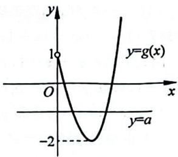

line

| x   | y=g(x) |
| --- | ------ |
| 0   | 1      |
| 1   | -2     |

不同的交点，即 $y = a$ 与 $y = f(x)$ 有两个交点，如图所示， $-2 = f(1) < a < f(1) = 1$ ，即 $-2 < a < 1$ ，故 $a \in (-2, 1)$ 。

【372】(1)增区间为 $\left(\frac{1}{a},+\infty\right)$ ，减区间为 $\left(0,\frac{1}{a}\right)$ ；(2) $\left(\frac{1}{e},+\infty\right)$ 。提示：(1)由题意得 $f'(x)=2a^{2}x+a-\frac{3}{x}=\frac{2a^{2}x^{2}+ax-3}{x}=\frac{(ax-1)(2ax+3)}{x}(x>0)$ ，令 $f'(x)=0$

解得 $x = -\frac{3}{2a}, \frac{1}{a}$ 。因为 $a > 0$ ，所以 $-\frac{3}{2a} < 0 < \frac{1}{a}$ ，则当

$x \in \left(0, \frac{1}{a}\right)$ 时， $f'(x) < 0$ ， $f(x)$ 单调递减；当 $x \in \left(\frac{1}{a}, +\infty\right)$ 时， $f'(x) > 0$ ， $f(x)$ 单调递增。

(2) 因为 $y = f(x)$ 的图像与 $x$ 轴无交点, 所以函数图像应该在 $x$ 轴的上侧或下侧, 我们在不清楚的前提下只能取特值去检验函数的正负, 因为有对数, 我们直接考虑真数取 1 , 即取 $x = 1$ 。

因为 $f(1) = a^2 + a + 1 = \left(a + \frac{1}{2}\right)^2 + \frac{3}{4} > 0$ ，那么 $y = f(x)$ 的图像与 $x$ 无交点，则由(1)知，需 $f\left(\frac{1}{a}\right) > 0$ ，即 $3 - 3\ln \frac{1}{a} > 0$ ，解得 $a > \frac{1}{\mathrm{e}}$ ，即 $a \in \left(\frac{1}{\mathrm{e}}, +\infty\right)$ 。

【373】 $(-∞,2)∪\left(\frac{5}{2},+∞\right)$ 。提示： $f'(x)=3x^{2}-9x+6=3(x-1)(x-2)$ ，当 $x∈(-∞,1)$ 和 $(2,+∞)$ 时， $f'(x)>0,f(x)$ 单调递增；当 $x∈(1,2)$ 时， $f'(x)<0,f(x)$ 单调递减。

所以 $f(x)_{\text{极大值}} = f(1) = \frac{5}{2} - a, f(x)_{\text{极小值}} = f(2) = 2 - a$ ，则当 $f(x)_{\text{极大值}} = f(1) = \frac{5}{2} - a < 0$ 或 $f(x)_{\text{极小值}} = f(2) = 2 - a > 0$ 时，方程 $f(x) = 0$ 有一个实根，所以 $a > \frac{5}{2}$ 或 $a < 2$ ，即 $a \in (-\infty, 2) \cup \left(\frac{5}{2}, +\infty\right)$ 。

【374】 $\left(-\infty,-\frac{5}{27}\right)\cup(1,+\infty)$ 。提示：由题意得 $f'(x)=3x^{2}-2x-1=(3x+1)(x-1)$ ，则当 $x\in\left(-\infty,-\frac{1}{3}\right)$ 和 $(1,+\infty)$ 时， $f'(x)>0,f(x)$ 单调递增；当 $x\in\left(-\frac{1}{3},1\right)$ 时， $f'(x)<0,f(x)$ 单调递减。所以 $f(x)_{极大值}=f\left(-\frac{1}{3}\right)=\frac{5}{27}+a,f(x)_{极小值}=f(1)=a-1$ ，则当 $f(x)_{极大值}=\frac{5}{27}+a<0$ 或 $f(x)_{极小值}=a-1>0$ 时，曲线 $y=f(x)$ 与x轴仅有1个交点。

所以 $a > 1$ 或 $a < -\frac{5}{27}$ , 即 $a \in \left(-\infty, -\frac{5}{27}\right) \cup (1, +\infty)$ 。

【375】A。提示：由题意得 $f'(x) = 3x^2 - 3 = 3(x - 1)(x + 1)$ ，则当 $x \in (-\infty, -1)$ 和 $(1, +\infty)$ 时， $f'(x) > 0, f(x)$ 单调递增；当 $x \in (-1, 1)$ 时， $f'(x) < 0, f(x)$ 单调递减。所以 $f(x)_{\text{极大值}} = f(-1) = c + 2, f(x)_{\text{极小值}} = f(1) = c - 2$ ，则当 $f(x)_{\text{极大值}} = f(-1) = c + 2 = 0$ 或 $f(x)_{\text{极小值}} = f(1) = c - 2 = 0$ 时，函数 $f(x) = 0$ 的图像与 $x$ 轴有两个公共点，所以 $c = -2$ 或 $c = 2$ 。故选 A。

【376】 $(-3,1)$ 。提示：由题意得 $f'(x)=3x^{2}-3a=3(x^{2}-a)$ ，因为 $f(x)$ 在 x=-1 处取得极值，则 $f'(-1)=3(1-a)=0$ ，即 a=1，所以 $f(x)=x^{3}-3x-1$ ， $f'(x)=3(x+1)(x-1)$ 。即，当 $x\in(-\infty,-1)$ 和 $(1,+\infty)$ 时， $f'(x)>0$ ， $f(x)$ 单调递增；当 $x\in(-1,1)$ 时， $f'(x)<0$ ， $f(x)$ 单调递

减，所以 $f(x)_{\text{极大值}} = f(-1) = 1, f(x)_{\text{极小值}} = f(1) = -3$ 则当 $-3 < m < 1$ 时，直线 $y = m$ 与 $y = f(x)$ 的图像有3个公共点，故 $m \in (-3, 1)$ 。

【377】 $(1, + \infty)$ 。提示：由题意得 $f^{\prime}(x) = 2x + x\cos x =$ $x(2 + \cos x)$ ，其中 $2 + \cos x > 0$ ，则当 $x\in (-\infty ,0)$ 时， $f^{\prime}(x) <   0,f(x)$ 单调递减； $x\in (0, + \infty)$ 时， $f^{\prime}(x) > 0,$ $f(x)$ 单调递增，则 $f(x)_{\text{极小值}} = f(0) = 1$ 。因为 $y = f(x)$ 与直线有两个不同交点，则 $b > 1$ 。

接着通过放缩找点，找出比 $b$ 大的点或是区间都可以。因为 $f(x) - b = x^2 + x\sin x + \cos x - b > x^2 - |x| - 1 - b$ 而 $x^2 - |x| - 1 - b = \left(\frac{x^2}{2} - |x|\right) + \left[\frac{x^2}{2} - (1 + b)\right]$ ，令 $\frac{x^2}{2} - |x| > 0, \frac{x^2}{2} - (1 + b) > 0$ ，解得 $x > \max \{2, \sqrt{2|1 + b|}\}$ 或 $x < \min \{-2, -\sqrt{2|1 + b|}\}$ 。取 $x_1 < \min \{-2, -\sqrt{2|1 + b|}\}, x_2 > \max \{2, \sqrt{2|1 + b|}\}$ ，则 $f(x_1) - b > 0, f(x_2) - b > 0$ ，则存在 $m \in (x_1, 0), n \in (0, x_2)$ ，使得 $f(m) - b = 0, f(n) - b = 0$ 。

所以当 $b > 1$ ，即 $b\in (1, + \infty)$ 时， $f(x)$ 有两个零点。

# 第4章 三角函数

# 4.1 三角函数定义及象限符号

# 类型一：三角函数定义

【378】D。提示：根据三角函数定义，直接求解即可。先计算点 $(-4,3)$ 到原点的距离，可得r=5，然后根据余弦函数定义得 $\cos\alpha=\frac{x}{r}=\frac{-4}{5}=-\frac{4}{5}$ 。故选D。

【379】-8。提示：根据三角函数定义，先计算点 $(4, y)$ 到原点的距离， $r = \sqrt{4^2 + y^2} = \sqrt{16 + y^2}$ ，由正弦函数定义可得 $\sin \theta = \frac{y}{r} = \frac{y}{\sqrt{16 + y^2}} = -\frac{2\sqrt{5}}{5}$ ，两边同时平方解得 $y = \pm 8$ ，又正弦值为负值， $\theta$ 为第四象限角，故 $y = -8$ 。

【380】B。提示：这种类型，我们需要在角的终边上取一点 $P(a,2a)$ （注意a可正可负）。方法一：根据三角函数定义，计算点P到原点的距离 $r=\sqrt{a^{2}+(2a)^{2}}=\sqrt{5a^{2}}=\sqrt{5}|a|$ ，可得 $\sin\theta=\frac{2a}{\sqrt{5}|a|}=\pm\frac{2}{\sqrt{5}}$ ， $\cos\theta=\frac{a}{\sqrt{5}|a|}=\pm\frac{1}{\sqrt{5}}$ 。接下来二倍角公式直接走起， $\cos2\theta=(\cos\theta)^{2}-(\sin\theta)^{2}=-\frac{3}{5}$ 。故选B。

这个方法需要注意计算正弦余弦时需要带上正负号,但因为最后计算是二倍角,所以正负号不会影响最后结果。如果你不想考虑正负号,可以考虑下面方法二。

方法二：根据三角函数定义， $\tan \theta = \frac{2a}{a} = 2$ ，可得 $\cos 2\theta = (\cos \theta)^2 -(\sin \theta)^2 = \frac{(\cos\theta)^2 - (\sin\theta)^2}{(\cos\theta)^2 + (\sin\theta)^2} = \frac{1 - (\tan\theta)^2}{1 + (\tan\theta)^2} =$

$-\frac{3}{5}$ 。故选 B。不用担心，此方法我们在后面会有一节专门进行练习。

【381】B。提示：读完题目，感觉和上一个题目有点相似，上一个题目求解 $\cos2a$ ，这个题目告诉我们 $\cos2a$ ，不过如果我们直接采用之前几个题目的思路，计算会有点麻烦，所以我们需要稍微思考一下，借助上个题目的方法二进行解答。
由已知可得 $\tan\alpha=\frac{a}{1}=\frac{b}{2}$ 。由此可以得到两个条件： $\tan\alpha=a,b=2a$ 。接下来由 $\cos2\theta=(\cos\theta)^{2}-(\sin\theta)^{2}=\frac{(\cos\theta)^{2}-(\sin\theta)^{2}}{(\cos\theta)^{2}+(\sin\theta)^{2}}=\frac{1-(\tan\theta)^{2}}{1+(\tan\theta)^{2}}=\frac{2}{3}$ ，可解得 $\tan\alpha=\pm\frac{\sqrt{5}}{5}$ ，
即 $a=\pm\frac{\sqrt{5}}{5}, b=\pm\frac{2\sqrt{5}}{5}$ （注意 a, b 同号），分别代入计算可得 $|a-b|=\frac{\sqrt{5}}{5}$ 。故选 B。

# 类型二：三角函数象限符号

【382】C。提示：由题目 $\cos\theta\cdot\tan\theta<0$ 可知 $\cos\theta,\tan\theta$ 异号，只有第三、第四象限符合。故选 C。

【383】B。提示：由题意知 $\sin\alpha>0$ ，且 $\tan\alpha<0$ ，故 $\alpha$ 终边只能在第二象限。故选 B。

【384】D。提示：(解决本题你需要掌握二倍角公式)，由题意 $\sin2\theta<0$ ，即 $2\sin\theta\cos\theta<0$ ，又因为 $\cos\theta>0$ ，所以 $\sin\theta<0$ ，即 $\theta$ 终边在第四象限。故选 D。

# 类型三：三角函数象限符号综合

【385】D。提示： $\alpha$ 为第四象限角，所以 $\sin\alpha<0,\cos\alpha>0$ ，则 $\sin2\alpha=2\sin\alpha\cos\alpha<0$ 。故选 D。

至于 A 和 B 选项，因为 $\cos2\alpha=(\cos\alpha)^{2}-(\sin\alpha)^{2}=2(\cos\alpha)^{2}-1=1-2(\sin\alpha)^{2}$ ，不管利用哪个公式，我们都没有办法判断 $\cos2\alpha$ 的符号。

【386】C。提示：由题意得 $\tan\alpha>0$ ，即 $\frac{\sin\alpha}{\cos\alpha}>0$ ，则 $\sin\alpha\cos\alpha>0$ ，得到 $\sin2\alpha=2\sin\alpha\cos\alpha>0$ 。故选 C。

# 4.2 同角三角函数关系

类型一： $\sin\alpha,\cos\alpha,\tan\alpha$ 三者转化

【387】A。提示：利用平方关系 $\sin^{2}\alpha+\cos^{2}\alpha=1$ 可得 $\cos\alpha=\pm\sqrt{1-\sin^{2}\alpha}=\pm\frac{12}{13}$ ，又因为 $\alpha$ 在第二象限， $\cos\alpha<0$ ，所以 $\cos\alpha=-\frac{12}{13}$ 。故选A。

【388】 $-\frac{\sqrt{5}}{5}$ 。提示：同角三角函数关系考查，由 $\tan\theta=\frac{1}{2},\theta\in(0,\frac{\pi}{2})$ 解得 $\sin\theta=\frac{\sqrt{5}}{5},\cos\theta=\frac{2\sqrt{5}}{5}$ ，所以 $\sin\theta-\cos\theta=-\frac{\sqrt{5}}{5}$ 。

【389】A。提示：看起来有点吓人，其实结构形式很简单，因式分解即可，分解完就发现眼前一亮。

$$
\begin{array}{r l} & {\sin^ {4} \alpha - \cos^ {4} \alpha = (\sin^ {2} \alpha + \cos^ {2} \alpha) \bullet (\sin^ {2} \alpha - \cos^ {2} \alpha) = \sin^ {2} \alpha -} \\ & {\cos^ {2} \alpha = 2 \sin^ {2} \alpha - 1 = - \frac {3}{5}. \text {   故选   A.   }} \end{array}
$$

类型二：构造 $\tan \alpha$

【390】B。提示：参照核心笔记方法(1)，由 $\frac{\sin\alpha+\cos\alpha}{\sin\alpha-\cos\alpha}=\frac{1}{2}$ 得 $\cos\alpha\neq0$ ，且 $\frac{\tan\alpha+1}{\tan\alpha-1}=\frac{1}{2}$ ，计算解得 $\tan\alpha=-3$ ，接下来直接代入正切二倍角公式即可， $\tan2\alpha=\frac{2\tan\alpha}{1-\tan^{2}\alpha}=\frac{3}{4}$ 。故选B。

【391】 $-\frac{3}{5},\frac{1}{3}$ 。提示：参照核心笔记方法(2)，由题意得 $\cos\alpha\neq0$ ，则 $\cos2\theta=\cos^{2}\theta-\sin^{2}\theta=\frac{\cos^{2}\theta-\sin^{2}\theta}{\cos^{2}\theta+\sin^{2}\theta}=\frac{1-\tan^{2}\theta}{1+\tan^{2}\theta}=$ $\frac{1-2^{2}}{1+2^{2}}=-\frac{3}{5},\tan\left(\theta-\frac{\pi}{4}\right)=\frac{\tan\theta-1}{1+\tan\theta}=\frac{2-1}{1+2}=\frac{1}{3}$

【392】A。提示：参照核心笔记方法(2)，由题意得 $\cos\alpha\neq0$ ，则 $\cos^{2}\alpha+2\sin2\alpha=\frac{\cos^{2}\alpha+4\sin\alpha\cos\alpha}{\sin^{2}\alpha+\cos^{2}\alpha}=\frac{1+4\tan\alpha}{\tan^{2}\alpha+1}=\frac{64}{25}$ 。故选 A。

【393】D。提示：（二次齐次式，先分母补“1”，分子分母同除以 $\cos^{2}\alpha (\cos \alpha \neq 0)$ 构造正切）。由题意得 $\cos \alpha \neq 0$ ，则 $\sin^2\theta +$ $\sin \theta \cos \theta -2\cos^2\theta = \frac{\sin^2\theta + \sin\theta\cos\theta - 2\cos^2\theta}{\sin^2\theta + \cos^2\theta} = \frac{\tan^2\theta + \tan\theta - 2}{\tan^2\theta + 1} =$ $\frac{4}{5}$ ，故选D。

【394】A。提示：参照核心笔记方法(2)，首先由 $3\sin\alpha+\cos\alpha=0$ 得 $\cos\alpha\neq0,\tan\alpha=-\frac{1}{3}$ ，则 $\frac{1}{\cos^{2}\alpha+\sin2\alpha}=\frac{\cos^{2}\alpha+\sin^{2}\alpha}{\cos^{2}\alpha+2\sin\alpha\cos\alpha}=\frac{1+\tan^{2}\alpha}{1+2\tan\alpha}=\frac{10}{3}$ 。故选A。

【395】B。提示：典型的构造正切：由 $\frac{\cos\alpha}{\cos\alpha - \sin\alpha} = \sqrt{3}$ ，分子分母同除以 $\cos\alpha$ 得 $\frac{1}{1 - \tan\alpha} = \sqrt{3}$ ，解得 $\tan\alpha = 1 - \frac{\sqrt{3}}{3}$ ，所以 $\tan\left(\alpha + \frac{\pi}{4}\right) = \frac{\tan\alpha + 1}{1 - \tan\alpha} = 2\sqrt{3} - 1$ 。故选 B。

【396】C。提示：这个题目稍微有点变化，要计算 $\tan2\alpha$ ，首先要计算 $\tan\alpha$ ，那么就考虑构造正切，但题目条件所给的是一次式，按照所讲的方法应该同除以 $\cos\alpha$ ，但似乎行不通，所以这个题需要先做一个变形。怎么变形？常见的方法就是两边同时平方。

首先两边同时平方， $(\sin \alpha + 2\cos \alpha)^2 = \left(\frac{\sqrt{10}}{2}\right)^2$ ，可得 $\sin^2\alpha + 4\sin \alpha \cos \alpha + 4\cos^2\alpha = \frac{5}{2}$ ，接下来使用核心笔记方法 (2)， $\frac{\sin^2\alpha + 4\sin \alpha \cos \alpha + 4'\cos^2\alpha}{\sin^2\alpha + \cos^2\alpha} = \frac{\tan^2\alpha + 4\tan \alpha + 4}{\tan^2\alpha + 1} = \frac{5}{2}$ ，化简得 $3\tan^2\alpha - 8\tan \alpha - 3 = 0$ ，解得 $\tan \alpha = 3$ 或 $\tan \alpha = -\frac{1}{3}$ ，所以 $\tan 2\alpha = \frac{2\tan \alpha}{1 - \tan^2\alpha} = -\frac{3}{4}$ 。故选 C。

【397】C。提示：这个题的关键点在于第一步能不能想得到 $1 + \sin2\theta = \sin^{2}\theta + \cos^{2}\theta + 2\sin\theta\cos\theta =$ $(\sin \theta + \cos \theta)^2$ ，解决了这一步，接下来就是使用核心笔记方法（2），直接进行就可以了。具体如下： $\frac{\sin \theta(1 + \sin 2\theta)}{\sin \theta + \cos \theta} = \frac{\sin \theta(\sin^2\theta + \cos^2\theta + 2\sin \theta\cos \theta)}{\sin \theta + \cos \theta} = \sin \theta (\sin \theta + \cos \theta) = \frac{\sin \theta(\sin \theta + \cos \theta)}{\sin^2\theta + \cos^2\theta} = \frac{\tan^2\theta + \tan \theta}{1 + \tan^2\theta} = \frac{4 - 2}{1 + 4} = \frac{2}{5}$ 。故选C。

类型三： $\sin \alpha +\cos \alpha$ ， $\sin \alpha -\cos \alpha$ ， $\sin \alpha \cos \alpha$ 三者转化

【398】A。提示：等式两边同时平方，问题轻松解决。

$(\sin\alpha-\cos\alpha)^{2}=\frac{16}{9}$ ，展开得 $1-\sin2\alpha=\frac{16}{9}$ ，解得 $\sin2\alpha=-\frac{7}{9}$ 。故选A。

【399】D。提示：对于条件 $\cos\left(\frac{\pi}{4}-\alpha\right)=\frac{3}{5}$ ，展开得 $\frac{\sqrt{2}}{2}\cos\alpha+\frac{\sqrt{2}}{2}\sin\alpha=\frac{3}{5}$ 。正余弦系数相同，可以等式两边同时平方，得 $\frac{1}{2}\cos^{2}\alpha+\frac{1}{2}\sin^{2}\alpha+\cos\alpha\sin\alpha=\frac{9}{25}$ ，化简得 $\sin\alpha\cos\alpha=-\frac{7}{50}$ ，则 $\sin2\alpha=2\sin\alpha\cos\alpha=-\frac{7}{25}$ 。故选 D。

【400】A。提示：对于条件 $\sin\left(\frac{\pi}{4}+\theta\right)=\frac{1}{3}$ ，展开得 $\frac{\sqrt{2}}{2}\cos\theta+\frac{\sqrt{2}}{2}\sin\theta=\frac{1}{3}$ 。正余弦系数相同，可以等式两边同时平方，得 $\frac{1}{2}\cos^{2}\theta+\frac{1}{2}\sin^{2}\theta+\cos\theta\sin\theta=\frac{1}{9}$ ，化简得 $\sin\theta\cos\theta=-\frac{7}{18}$ ，则 $\sin2\theta=2\sin\theta\cos\theta=-\frac{7}{9}$ 。故选 A。

【401】A。提示：方法一：因为 $\sin\alpha - \cos\alpha = \sqrt{2}$ ，所以 $(\sin\alpha - \cos\alpha)^{2} = 2$ ，则 $\sin2\alpha = -1$ 。

因为 $\alpha\in(0,\pi)$ ，所以 $2\alpha\in(0,2\pi)$ ，则 $2\alpha=\frac{3\pi}{2}$ ，即 $\alpha=\frac{3\pi}{4}$ ，则 $\tan\alpha=-1$ 。故选 A。

方法二：利用辅助角公式，因为 $\sin\alpha - \cos\alpha = \sqrt{2}$ ，所以 $\sqrt{2}\sin\left(\alpha - \frac{\pi}{4}\right) = \sqrt{2}$ ，即 $\sin\left(\alpha - \frac{\pi}{4}\right) = 1$ 。

因为 $\alpha\in(0,\pi)$ ，所以 $\alpha=\frac{3\pi}{4}$ ，则 $\tan\alpha=-1$ 。故选 A。

【402】 $-\frac{7}{25}$ 。提示：首先等式两边同时平方： $(\sin\theta+\cos\theta)^{2}=\frac{1}{25}$ ，展开得 $1+\sin2\theta=\frac{1}{25}$ ，解得 $\sin2\theta=-\frac{24}{25}$ ；接下来利用平方关系求解： $\cos2\theta=\pm\sqrt{1-\sin^{2}(2\theta)}=\pm\frac{7}{25}$ ；最后一步考虑范围，进行取舍： $\frac{\pi}{2}\leqslant\theta\leqslant\frac{3\pi}{4}$ ，则 $\pi\leqslant2\theta\leqslant\frac{3\pi}{2}$ ，即 $2\theta$ 为第三象限角，所以 $\cos2\theta=-\frac{7}{25}$ 。

【403】A。提示：方法一：首先等式两边同时平方，得 $(\sin\alpha+$

$\cos \alpha)^2 = \frac{1}{3}$ , 展开得 $1 + \sin 2\alpha = \frac{1}{3}$ , 解得 $\sin 2\alpha = -\frac{2}{3}$ 。接下来, 利用平方关系求解: $\cos 2\alpha = \pm \sqrt{1 - \sin^2(2\alpha)} = \pm \frac{\sqrt{5}}{3}$ 。最后一步, 考虑范围, 进行取舍。

这一步是这个题目最麻烦的地方,很多同学会采用常规的方式判断:因为 $\alpha$ 为第二象限角,所以 $\frac{\pi}{2}+2k\pi<\alpha<\pi+2k\pi$ ,则 $\pi+4k\pi<2\alpha<2\pi+4k\pi$ ,可得 $2\alpha$ 为第三、第四象限角。但到了这发现 $\sin2\alpha$ 在第三、第四象限都是负值, $\cos2\alpha$ 既可以为正值,也可以为负值,还是没有办法进行取舍,这个方式在这个题目中其实是不准确的,那么准确的应该是什么样呢?看下面解释。

由于 $\alpha$ 为第二象限角，但同时 $\sin \alpha + \cos \alpha = \frac{\sqrt{3}}{3} > 0, \sin 2\alpha = 2\sin \alpha \cos \alpha = -\frac{2}{3} < 0$ ，也就意味着 $|\sin \alpha| > |\cos \alpha|$ ，利用三角函数图像可以进一步缩小 $\alpha$ 的范围，得到 $\frac{\pi}{2} + 2k\pi < \alpha < \frac{3\pi}{4} + 2k\pi$ ，那么 $\pi + 4k\pi < 2\alpha < \frac{3\pi}{2} + 4k\pi$ ，推出 $2\alpha$ 为第三象限角，所以 $\cos 2\alpha = -\frac{\sqrt{5}}{3}$ 。故选 A。

方法二：利用 $(\sin\alpha+\cos\alpha)^{2}+(\sin\alpha-\cos\alpha)^{2}=2$ ，先求解 $\sin\alpha-\cos\alpha$ ，然后利用二倍角公式求解。

由 $(\sin \alpha + \cos \alpha)^2 + (\sin \alpha - \cos \alpha)^2 = 2$ 得 $\sin \alpha - \cos \alpha = \pm \frac{\sqrt{15}}{3}$ , 因为 $\alpha$ 为第二象限角, 所以 $\sin \alpha - \cos \alpha = \frac{\sqrt{15}}{3}$ , 则 $\cos \alpha - \sin \alpha = -\frac{\sqrt{15}}{3}$ , 有 $\cos 2\alpha = (\cos \alpha - \sin \alpha)(\cos \alpha + \sin \alpha) = -\frac{\sqrt{5}}{3}$ 。故选 A。

两个方法做比较,很明显第二个方法要比第一个方法简单、方便、快捷!所以对于同样的题目大家在备考过程中一定要多加思考总结,学会对知识方法的各种应用。

【404】 $-\frac{\sqrt{14}}{2}$ 。提示：本题综合考查二倍角公式、和差公式以及我们所讲的三者转化，比较综合，但难度不大。

首先由已知条件得 $\sin \alpha - \cos \alpha = \frac{1}{2}$ , 根据 $(\sin \alpha + \cos \alpha)^2 + (\sin \alpha - \cos \alpha)^2 = 2$ 解得 $\sin \alpha + \cos \alpha = \pm \frac{\sqrt{7}}{2}$ 。因为 $\alpha \in (0, \frac{\pi}{2})$ , 所以 $\sin \alpha > 0, \cos \alpha > 0$ , 则 $\sin \alpha + \cos \alpha = \frac{\sqrt{7}}{2}$ , 故 $\frac{\cos 2\alpha}{\sin \left(\alpha - \frac{\pi}{4}\right)} = \frac{(\cos \alpha - \sin \alpha)(\cos \alpha + \sin \alpha)}{\frac{\sqrt{2}}{2} (\sin \alpha - \cos \alpha)} = -\frac{\sqrt{14}}{2}$ 。

# 4.3 诱导公式

# 类型一：具体角求值

【405】C。提示： $\cos300^{\circ}=\cos(360^{\circ}-60^{\circ})=\cos60^{\circ}=\frac{1}{2}$ 。故选C。

【406】B。提示：由 $\cos(-80^{\circ})=k$ 利用诱导公式得 $\cos80^{\circ}=k(k>0)$ ，则 $\sin80^{\circ}=\sqrt{1-k^{2}}$ ，故 $\tan100^{\circ}=\tan(180^{\circ}-80^{\circ})=-\tan80^{\circ}=-\frac{\sin80^{\circ}}{\cos80^{\circ}}=-\frac{\sqrt{1-k^{2}}}{k}$ 。故选 B。

# 类型二：比较大小

【407】C。提示：利用诱导公式将三角函数均化为正弦， $\sin 168^{\circ} = \sin (180^{\circ} - 12^{\circ}) = \sin 12^{\circ}, \cos 10^{\circ} = \cos (90^{\circ} - 80^{\circ}) = \sin 80^{\circ}$ 。由于正弦函数 $y = \sin x$ 在区间 $[0^{\circ}, 90^{\circ}]$ 上为递增函数，因此 $\sin 11^{\circ} < \sin 12^{\circ} < \sin 80^{\circ}$ ，即 $\sin 11^{\circ} < \sin 168^{\circ} < \cos 10^{\circ}$ 。故选 C。

【408】C。提示：先看 $a$ 和 $b, b = \cos 55^{\circ} = \cos (90^{\circ} - 35^{\circ}) = \sin 35^{\circ}$ ，因为正弦函数 $y = \sin x$ 在区间 $[0^{\circ}, 90^{\circ}]$ 上为递增函数，故 $a < b$ 。

再看 b 和 $c, c = \tan35^{\circ} = \frac{\sin35^{\circ}}{\cos35^{\circ}} = \sin35^{\circ} \times \frac{1}{\cos35^{\circ}}$ ，因为 $0 < \cos35^{\circ} < 1$ ，则 $\frac{1}{\cos35^{\circ}} > 1$ ，所以 $\sin35^{\circ} \times \frac{1}{\cos35^{\circ}} > \sin35^{\circ}$ ，即 c > b，故 c > b > a。故选 C。当然 b 和 c 之间也可以利用三角函数线进行大小比较。

# 类型三：求值及综合

【409】(1) -1; (2) $\frac{63}{65}$ 。提示: (1) $f(0) = 2\sin \left(-\frac{\pi}{6}\right) = -1$ 。

(2) 直接代入, 利用诱导公式化简, 接下来就是常规计算了。 $f\left(3\alpha+\frac{\pi}{2}\right)=2\sin\left[\frac{1}{3}\left(3\alpha+\frac{\pi}{2}\right)-\frac{\pi}{6}\right]=2\sin\alpha=\frac{10}{13}$ ，即 $\sin\alpha=\frac{5}{13},f(3\beta+2\pi)=2\sin\left[\frac{1}{3}(3\beta+2\pi)-\frac{\pi}{6}\right]=2\sin\left(\beta+\frac{\pi}{2}\right)=\frac{6}{5}$ ，即 $\cos\beta=\frac{3}{5}$ 。

因为 $\alpha, \beta \in \left[0, \frac{\pi}{2}\right]$ ，所以 $\cos \alpha = \sqrt{1 - \sin^2 \alpha} = \frac{12}{13}, \sin \beta = \sqrt{1 - \cos^2 \beta} = \frac{4}{5}$ ，则 $\sin (\alpha + \beta) = \sin \alpha \cos \beta + \cos \alpha \sin \beta = \frac{5}{13} \times \frac{3}{5} + \frac{12}{13} \times \frac{4}{5} = \frac{63}{65}$ 。

【410】 $-\frac{4}{3}$ 。提示：方法一：这个题目需要大家重视，所用的方法在下一节中还会遇到，涉及非常重要的一个方法：凑角。题目涉及的两个角，不难发现 $\left(\theta+\frac{\pi}{4}\right)-\left(\theta-\frac{\pi}{4}\right)=\frac{\pi}{2}$ ，这就是本题的关键。

首先由 $\sin \left(\theta +\frac{\pi}{4}\right) = \frac{3}{5}$ 解得 $\cos \left(\theta +\frac{\pi}{4}\right) = \pm \frac{4}{5}$ ，因为 $\theta$

为第四象限角，所以 $\theta +\frac{\pi}{4}$ 为第四或第一象限角。又因为 $\sin \left(\theta +\frac{\pi}{4}\right) = \frac{3}{5} >0$ ，所以 $\theta +\frac{\pi}{4}$ 为第一象限角，则 $\cos \left(\theta +\frac{\pi}{4}\right) = \frac{4}{5}$ 。

准备工作做好了,接下来进行求解:

$$
\begin{array}{l} \tan \left(\theta - \frac {\pi}{4}\right) = \tan \left[ - \frac {\pi}{2} + \left(\theta + \frac {\pi}{4}\right) \right] \\ = - \frac {1}{\tan \left(\theta + \frac {\pi}{4}\right)} = - \frac {\cos \left(\theta + \frac {\pi}{4}\right)}{\sin \left(\theta + \frac {\pi}{4}\right)} = - \frac {\frac {4}{5}}{\frac {3}{5}} = - \frac {4}{3}. \\ \end{array}
$$

方法二：由方法一得 $\sin\left(\theta+\frac{\pi}{4}\right)=\frac{3}{5},\cos\left(\theta+\frac{\pi}{4}\right)=\frac{4}{5}$ 则 $\left\{\begin{aligned}\sin\theta\cos\frac{\pi}{4}+\cos\theta\sin\frac{\pi}{4}&=\frac{3}{5},\\ \cos\theta\cos\frac{\pi}{4}-\sin\theta\sin\frac{\pi}{4}&=\frac{4}{5},\end{aligned}\right.$ 解得 $\left\{\begin{aligned}\sin\theta&=\frac{1}{-5\sqrt{2}},\\ \cos\theta&=\frac{7}{5\sqrt{2}},\end{aligned}\right.$ 所以

$\tan \theta = -\frac{1}{7}$ 则 $\tan \left(\theta -\frac{\pi}{4}\right) = \frac{\tan\theta - \tan\frac{\pi}{4}}{1 + \tan\theta\tan\frac{\pi}{4}} =$ $\frac{-\frac{1}{7} - 1}{1 - \frac{1}{7}\times 1} = -\frac{4}{3}$

【411】 $\frac{5\pi}{12}$ （答案不唯一）。提示：首先根据题意点 $P(\cos\theta,\sin\theta)$ 与 $Q\left(\cos\left(\theta+\frac{\pi}{6}\right),\sin\left(\theta+\frac{\pi}{6}\right)\right)$ 关于y轴对称，可得 $\sin\theta=\sin\left(\theta+\frac{\pi}{6}\right)$ 且 $\cos\theta=-\cos\left(\theta+\frac{\pi}{6}\right)$ 。这就是这个题目的核心，我们要考虑引进诱导公式，根据结构，函数名称没有发生改变， $\sin\theta$ 符号不变， $\cos\theta$ 要变号，所以考虑 $\sin\theta=\sin(\pi-\theta),\cos\theta=-\cos(\pi-\theta)$ 。对比已知条件可得 $\theta+\frac{\pi}{6}=\pi-\theta$ ，解得 $\theta=\frac{5\pi}{12}$ ，则符合题意的 $\theta$ 值可以为 $\frac{5\pi}{12}$ （答案不唯一）。

# 4.4 和差公式

# 类型一：和差公式直接应用

【412】A。提示： $\alpha$ 是第三象限的角， $\cos\alpha=-\frac{4}{5}$ ，求解 $\sin\alpha=-\frac{3}{5}$ ，接下来利用和差公式展开代入计算即可： $\sin\left(\alpha+\frac{\pi}{4}\right)=\frac{\sqrt{2}}{2}\sin\alpha+\frac{\sqrt{2}}{2}\cos\alpha=-\frac{7\sqrt{2}}{10}$ 。故选 A。

【413】 $\frac{3\sqrt{10}}{10}$ 。提示：由 $\tan\alpha=2$ 得 $\sin\alpha=2\cos\alpha$ ，又 $\sin^{2}\alpha+\cos^{2}\alpha=1$ ，所以 $\cos^{2}\alpha=\frac{1}{5}$ 。

因为 $\alpha \in \left(0, \frac{\pi}{2}\right)$ , 所以 $\cos \alpha = \frac{\sqrt{5}}{5}, \sin \alpha = \frac{2\sqrt{5}}{5}$ 。

因为 $\cos \left(\alpha -\frac{\pi}{4}\right) = \cos \alpha \cos \frac{\pi}{4} +\sin \alpha \sin \frac{\pi}{4}$ ，所以 $\cos \left(\alpha -\frac{\pi}{4}\right) = \frac{\sqrt{5}}{5}\times \frac{\sqrt{2}}{2} +\frac{2\sqrt{5}}{5}\times \frac{\sqrt{2}}{2} = \frac{3\sqrt{10}}{10}$

【414】A。提示：出现一元二次方程的两个根，直接考虑韦达定理。由韦达定理可得 $\tan\alpha + \tan\beta = 3, \tan\alpha \tan\beta = 2$ ，则由正切公式得 $\tan(\alpha + \beta) = \frac{\tan\alpha + \tan\beta}{1 - \tan\alpha \tan\beta} = \frac{3}{1 - 2} = -3$ 。故选 A。

【415】B。提示：看已知条件： $\tan\alpha=\frac{1+\sin\beta}{\cos\beta}$ 。既有弦，又有切，切化弦统一，得 $\frac{\sin\alpha}{\cos\alpha}=\frac{1+\sin\beta}{\cos\beta}$ ，化简得 $\sin\alpha\cos\beta=\cos\alpha+\cos\alpha\sin\beta$ ，移项得 $\sin\alpha\cos\beta-\cos\alpha\sin\beta=\cos\alpha$ ，可得 $\sin(\alpha-\beta)=\cos\alpha$ 。函数名称不一致，怎么办？诱导公式走起，这个方法在后面题目中也会见到，需要留意， $\sin(\alpha-\beta)=\cos\alpha=\sin\left(\frac{\pi}{2}-\alpha\right)$ ，可得 $\alpha-\beta=\frac{\pi}{2}-\alpha+2k\pi(k\in\mathbb{Z})$ 。（注意，很多同学在这一步会忽略 $2k\pi$ ，是不准确的。）化简得 $2\alpha-\beta=\frac{\pi}{2}+2k\pi(k\in\mathbb{Z})$ ，当k=0时， $2\alpha-\beta=\frac{\pi}{2}$ 。故选B。

【416】 $-\frac{7}{9}$ 。提示：首先解决两个角之间的关系： $\alpha$ 和 $\beta$ 关于 y 轴对称，所以 $\alpha + \beta = \pi + 2k\pi$ （不要忽略了 $2k\pi$ ）。

根据已知条件 $\sin \alpha = \frac{1}{3}$ , 解得 $\cos \alpha = \pm \frac{2\sqrt{2}}{3}$ 。(注意: $\alpha$ 范围未知, 正负都有可能。)接下来, 根据 $\alpha$ 和 $\beta$ 的关系, 得到两个角的三角函数值关系: $\sin \beta = \sin (\pi + 2k\pi - \alpha) = \sin \alpha = \frac{1}{3}, \cos \beta = \cos (\pi + 2k\pi - \alpha) = -\cos \alpha = \pm \frac{2\sqrt{2}}{3}$ 。(注意这一步只需要利用两个角三角函数值关系将两个角转化为一个角即可, 不要分别代入计算, 会增加计算量。)最后一步计算 $\cos (\alpha - \beta)$ , 得 $\cos (\alpha - \beta) = \cos \alpha \cos \beta + \sin \alpha \sin \beta = -\cos^2 \alpha + \sin^2 \alpha = -\frac{7}{9}$ 。

【417】 $-\frac{1}{2}$ 。提示：观察要求的结构： $\sin(\alpha+\beta)=\sin\alpha\cos\beta+\cos\alpha\sin\beta$ ，两项都是相乘，但已知条件都是相加，那需要转换结构。怎么转换？常见的方式就是等式两边同时平方。首先等式两边同时平方可得 $\sin^{2}\alpha+2\sin\alpha\cos\beta+\cos^{2}\beta=1①$ ， $\cos^{2}\alpha+2\cos\alpha\sin\beta+\sin^{2}\beta=0②$ 。到了这里，自然知道应该怎么办了，①+②得 $2\sin\alpha\cos\beta+2\cos\alpha\sin\beta=-1$ ，化简得 $\sin(\alpha+\beta)=-\frac{1}{2}$ 。

# 类型二：利用和差公式求具体角度函数值

【418】D。提示：诱导公式和和差公式的简单结合： $\tan255^{\circ}=\tan(180^{\circ}+75^{\circ})=\tan75^{\circ}=\tan(45^{\circ}+30^{\circ})=\frac{\tan45^{\circ}+\tan30^{\circ}}{1-\tan45^{\circ}\tan30^{\circ}}=2+\sqrt{3}$ 。故选D。

【419】 $\frac{\sqrt{6}}{2}$ 。提示： $\sin15^{\circ}+\sin75^{\circ}=\sin(45^{\circ}-30^{\circ})+\sin(45^{\circ}+30^{\circ})=\sin45^{\circ}\cos30^{\circ}-\cos45^{\circ}\sin30^{\circ}+\sin45^{\circ}\cos30^{\circ}+\cos45^{\circ}\sin30^{\circ}=2\sin45^{\circ}\cos30^{\circ}=2\times\frac{\sqrt{2}}{2}\times\frac{\sqrt{3}}{2}=\frac{\sqrt{6}}{2}$ 。

$15^{\circ}$ 和 $75^{\circ}$ 的三角函数值希望大家能记住，在有些题中可以直接应用： $\sin 15^{\circ} = \cos 75^{\circ} = \frac{\sqrt{6} - \sqrt{2}}{4}, \sin 75^{\circ} = \cos 15^{\circ} = \frac{\sqrt{6} + \sqrt{2}}{4}$ 。

【420】D。提示：这类题目需要通过诱导公式将结构和角度化为一致，满足和差公式结构，然后进行求解。
原式= $\sin20^{\circ}\cos10^{\circ}+\cos20^{\circ}\sin10^{\circ}=\sin30^{\circ}=\frac{1}{2}$ ，故选D。

【421】 $-\frac{1}{2}$ 。提示： $\cos43^{\circ}\cos77^{\circ}+\sin43^{\circ}\cos167^{\circ}=\cos43^{\circ}\cos77^{\circ}+\sin43^{\circ}\cos(90^{\circ}+77^{\circ})=\cos43^{\circ}\cos77^{\circ}-\sin43^{\circ}\sin77^{\circ}=\cos(43+77)^{\circ}=\cos120^{\circ}=-\frac{1}{2}$ 。

# 类型三：一个特殊的正切和差公式

【422】 $\frac{7}{5}$ 。提示：根据方法中所讲的特殊的正切和差公式，直接展开得 $\tan\left(\alpha-\frac{\pi}{4}\right)=\frac{\tan\alpha-1}{1+\tan\alpha}=\frac{1}{6}$ ，解得 $\tan\alpha=\frac{7}{5}$ 。

【423】D。提示：根据已知条件，直接考虑展开。因为 $2\tan\theta-\tan\left(\theta+\frac{\pi}{4}\right)=7$ ，所以 $2\tan\theta-\frac{\tan\theta+1}{1-\tan\theta}=7$ ，整理得 $\tan^{2}\theta-4\tan\theta+4=0$ ，解得 $\tan\theta=2$ 。故选D。

【424】 $-\frac{\sqrt{10}}{5}$ 。提示：首先由 $\tan\left(\theta+\frac{\pi}{4}\right)=\frac{1+\tan\theta}{1-\tan\theta}=\frac{1}{2}$ 解得 $\tan\theta=-\frac{1}{3}$ ，又已知 $\theta$ 为第二象限角，解得 $\sin\theta=\frac{\sqrt{10}}{10}$ ， $\cos\theta=-\frac{3\sqrt{10}}{10}$ ，则 $\sin\theta+\cos\theta=-\frac{\sqrt{10}}{5}$ 。

【425】 $\frac{3}{2}$ 。提示：首先利用诱导公式进行化简： $\tan\left(\alpha-\frac{5\pi}{4}\right)=\tan\left(-\pi+\alpha-\frac{\pi}{4}\right)=\tan\left(\alpha-\frac{\pi}{4}\right)$ ，熟悉的形式又出现了， $\tan\left(\alpha-\frac{\pi}{4}\right)=\frac{\tan\alpha-1}{1+\tan\alpha}=\frac{1}{5}$ ，解得 $\tan\alpha=\frac{3}{2}$ 。

【426】 $\frac{\sqrt{2}}{10}$ 。提示：首先直接考虑展开，有 $\frac{\tan\alpha}{\tan\left(\alpha+\frac{\pi}{4}\right)}=-\frac{2}{3}$ ，得 $\frac{\tan\alpha}{\frac{\tan\alpha+\tan\frac{\pi}{4}}{1-\tan\alpha\tan\frac{\pi}{4}}}=-\frac{2}{3}$ ，化简得 $\frac{\tan\alpha(1-\tan\alpha)}{1+\tan\alpha}=-\frac{2}{3}$ ，解

得 $\tan \alpha = 2$ 或 $\tan \alpha = -\frac{1}{3}$ 。接下来分情况计算：

① 当 $\tan \alpha = 2$ 时， $\sin 2\alpha = \frac{2\tan\alpha}{1 + \tan^2\alpha} = \frac{4}{5}, \cos 2\alpha =$

$$
\begin{array}{r l} & {\frac {1 - \tan^ {2} \alpha}{1 + \tan^ {2} \alpha} = - \frac {3}{5}, \text {则} \sin \left(2 \alpha + \frac {\pi}{4}\right) = \sin 2 \alpha \cos \frac {\pi}{4} +} \\ & {\cos 2 \alpha \sin \frac {\pi}{4} = \frac {4}{5} \times \frac {\sqrt {2}}{2} - \frac {3}{5} \times \frac {\sqrt {2}}{2} = \frac {\sqrt {2}}{1 0}.} \end{array}
$$

$$
\begin{array}{r l} & {\text {   ②当   } \tan \alpha = - \frac {1}{3} \text {   时,   } \sin 2 \alpha = \frac {2 \tan \alpha}{1 + \tan^ {2} \alpha} = - \frac {3}{5}, \cos 2 \alpha =} \\ & {\frac {1 - \tan^ {2} \alpha}{1 + \tan^ {2} \alpha} = \frac {4}{5}, \text {   则   } \sin \left(2 \alpha + \frac {\pi}{4}\right) = \sin 2 \alpha \cos \frac {\pi}{4} +} \\ & {\cos 2 \alpha \sin \frac {\pi}{4} = - \frac {3}{5} \times \frac {\sqrt {2}}{2} + \frac {4}{5} \times \frac {\sqrt {2}}{2} = \frac {\sqrt {2}}{1 0}.} \end{array}
$$

综上， $\sin\left(2\alpha+\frac{\pi}{4}\right)$ 的值是 $\frac{\sqrt{2}}{10}$ 。

类型四：角度配凑

【427】A。提示：这个类型如果不用配凑，可以正切和差公式直接走起： $\tan(a+b)=\frac{\tan a+\tan b}{1-\tan a\tan b}=\frac{\frac{1}{3}+\tan b}{1-\frac{1}{3}\tan b}=\frac{1}{2}$ ，解得 $\tan b=\frac{1}{7}$ 。故选A。

接下来我们用配凑的逻辑来解一下，让大家能逐渐熟悉这个方法：因为 $b = (a + b) - a$ ，所以 $\tan b = \tan [(a + b) - a] = \frac{\tan(a + b) - \tan a}{1 + \tan(a + b)\tan a} = \frac{1}{7}$ 。故选A。

【428】 $-\frac{56}{65}$ 。提示：看到所出现的三个角各不相同，考虑角度配凑。先找三个角的关系： $(\alpha+\beta)-\left(\beta-\frac{\pi}{4}\right)=\alpha+\frac{\pi}{4}$ ，所以 $\cos\left(\alpha+\frac{\pi}{4}\right)$ 可以写成 $\cos\left(\alpha+\frac{\pi}{4}\right)=\cos\left[(\alpha+\beta)-\left(\beta-\frac{\pi}{4}\right)\right]=\cos(\alpha+\beta)\cos\left(\beta-\frac{\pi}{4}\right)+\sin(\alpha+\beta)\cdot\sin\left(\beta-\frac{\pi}{4}\right)$ 。根据已知条件，正弦已知，求解对应余弦值即可，由 $\sin(\alpha+\beta)=-\frac{3}{5}$ 解得 $\cos(\alpha+\beta)=\pm\frac{4}{5}$ 。接下来注意范围求解，对正负进行取舍。因为 $\frac{3\pi}{4}<\alpha<\pi,\frac{3\pi}{4}<\beta<\pi$ ，所以 $\frac{3\pi}{2}<\alpha+\beta<2\pi$ ，即 $\alpha+\beta$ 在第四象限，则 $\cos(\alpha+\beta)=\frac{4}{5}$ ，由 $\sin\left(\beta-\frac{\pi}{4}\right)=\frac{12}{13}$ 解得 $\cos\left(\beta-\frac{\pi}{4}\right)=\pm\frac{5}{13}$ 。因为 $\frac{3\pi}{4}<\beta<\pi$ ，所以 $\frac{\pi}{2}<\beta-\frac{\pi}{4}<\frac{3\pi}{4}$ ，即 $\beta-\frac{\pi}{4}$ 在第二象限，则 $\cos\left(\beta-\frac{\pi}{4}\right)=-\frac{5}{13}$ 。最后一步，代入计算可得 $\cos\left(\alpha+\frac{\pi}{4}\right)=\cos\left[(\alpha+\beta)-\left(\beta-\frac{\pi}{4}\right)\right]=\cos(\alpha+\beta)\cdot\cos\left(\beta-\frac{\pi}{4}\right)+\sin(\alpha+\beta)\sin\left(\beta-\frac{\pi}{4}\right)=-\frac{56}{65}$ 。

【429】 $\frac{\pi}{3}$ 。提示：看到所出现的三个角各不相同，考虑角度配凑。先找三个角的关系： $\alpha-(\alpha-\beta)=\beta$ ，所以 $\cos\beta$ 可以写

成 $\cos \beta = \cos [\alpha - (\alpha - \beta)] = \cos \alpha \cos (\alpha - \beta) + \sin \alpha \sin (\alpha - \beta)$ , 根据已知条件, 余弦已知, 求解对应正弦值即可, 由 $\cos \alpha = \frac{1}{7}$ 解得 $\sin \alpha = \pm \frac{4\sqrt{3}}{7}$ 。因为 $0 < \alpha < \frac{\pi}{2}$ , 所以 $\alpha$ 在第一象限, 则 $\sin \alpha = \frac{4\sqrt{3}}{7}$ , 由 $\cos (\alpha - \beta) = \frac{13}{14}$ 解得 $\sin (\alpha - \beta) = \pm \frac{3\sqrt{3}}{14}$ 。因为 $0 < \beta < \alpha < \frac{\pi}{2}$ , 所以 $0 < \alpha - \beta < \frac{\pi}{2}$ , 所以 $\alpha - \beta$ 在第一象限, 则 $\sin (\alpha - \beta) = \frac{3\sqrt{3}}{14}$ 。最后一步, 代入计算得 $\cos \beta = \cos [\alpha - (\alpha - \beta)] = \cos \alpha \cos (\alpha - \beta) + \sin \alpha \sin (\alpha - \beta) = \frac{1}{2}$ , 又 $0 < \beta < \frac{\pi}{2}$ , 所以 $\beta = \frac{\pi}{3}$ 。

【430】C。提示：这个题目是一个典型的角度配凑，需要大家重视。首先我们先看一下所给几个角的关系，不难发现 $\left(\frac{\pi}{4} +\alpha\right) - \left(\frac{\pi}{4} -\frac{\beta}{2}\right) = \alpha +\frac{\beta}{2}$ ，所以 $\cos \left(\alpha +\frac{\beta}{2}\right)$ 可以写成 $\cos \left(\alpha +\frac{\beta}{2}\right) = \cos \left[\left(\frac{\pi}{4} +\alpha\right) - \left(\frac{\pi}{4} -\frac{\beta}{2}\right)\right] =$ $\cos \left(\frac{\pi}{4} +\alpha\right)\cdot \cos \left(\frac{\pi}{4} -\frac{\beta}{2}\right) + \sin \left(\frac{\pi}{4} +\alpha\right)\sin \left(\frac{\pi}{4} -\frac{\beta}{2}\right),$ 我们只需要根据条件求解两个正弦值就可以了，由 $\cos \left(\frac{\pi}{4} +\alpha\right) = \frac{1}{3}$ 解得 $\sin \left(\frac{\pi}{4} +\alpha\right) = \pm \frac{2\sqrt{2}}{3}$ 。接下来注意范围求解，对正负进行取舍。因为 $0 <   \alpha <  \frac{\pi}{2}$ ，所以 $\frac{\pi}{4}<$ $\alpha +\frac{\pi}{4} <   \frac{3\pi}{4}$ ，即 $\alpha +\frac{\pi}{4}$ 在第一或第二象限。又因为 $\cos \left(\frac{\pi}{4} +\alpha\right) = \frac{1}{3} >0$ ，所以 $\frac{\pi}{4} +\alpha$ 在第一象限，则 $\sin \left(\frac{\pi}{4} +\alpha\right) = \frac{2\sqrt{2}}{3},$ 由 $\cos \left(\frac{\pi}{4} -\frac{\beta}{2}\right) = \frac{\sqrt{3}}{3}$ 解得 $\sin \left(\frac{\pi}{4} -\frac{\beta}{2}\right) = \pm \frac{\sqrt{6}}{3}$

因为 $-\frac{\pi}{2} < \beta < 0$ ，所以 $\frac{\pi}{4} < \frac{\pi}{4} - \frac{\beta}{2} < \frac{\pi}{2}$ ，即 $\frac{\pi}{4} - \frac{\beta}{2}$ 在第一象限，则 $\sin \left(\frac{\pi}{4} - \frac{\beta}{2}\right) = \frac{\sqrt{6}}{3}$ 。最后一步，代入计算可得 $\cos \left(\alpha + \frac{\beta}{2}\right) = \cos \left(\frac{\pi}{4} + \alpha\right) \cos \left(\frac{\pi}{4} - \frac{\beta}{2}\right) + \sin \left(\frac{\pi}{4} + \alpha\right) \cdot \sin \left(\frac{\pi}{4} - \frac{\beta}{2}\right) = \frac{5\sqrt{3}}{9}$ 。故选 C。

【431】 $\frac{17\sqrt{2}}{50}$ 。提示：这个题目有点意思，两个角不同，考虑配凑，但不能像前几题一样用和差的方式考虑配凑，一个是 $\alpha$ ，一个是 $2\alpha$ ，所以考虑倍角公式。

先找两个角的关系： $2\alpha + \frac{\pi}{12} = 2\left(\alpha + \frac{\pi}{6}\right) - \frac{\pi}{4}$ ，则 $\sin\left(2\alpha+\frac{\pi}{12}\right)=\sin\left[2\left(\alpha+\frac{\pi}{6}\right)-\frac{\pi}{4}\right]=\frac{\sqrt{2}}{2}\sin\left[2\left(\alpha+\frac{\pi}{6}\right)\right]-$ $\frac{\sqrt{2}}{2}\cos \left[2\left(\alpha +\frac{\pi}{6}\right)\right] = \sqrt{2}\sin \left(\alpha +\frac{\pi}{6}\right)\cos \left(\alpha +\frac{\pi}{6}\right) -$ $\frac{\sqrt{2}}{2}\left[2\cos^2\left(\alpha +\frac{\pi}{6}\right) - 1\right]$ ，根据这式子，我们只需要求解出 $\sin \left(\alpha +\frac{\pi}{6}\right)$ 即可，由 $\cos \left(\alpha +\frac{\pi}{6}\right) = \frac{4}{5}$ 解得 $\sin \left(\alpha +\frac{\pi}{6}\right) =$ $\pm \frac{3}{5}$

因为 $0 < \alpha < \frac{\pi}{2}$ , 所以 $\frac{\pi}{6} < \alpha + \frac{\pi}{6} < \frac{2\pi}{3}$ , 即 $\alpha + \frac{\pi}{6}$ 在第一或第二象限。又因为 $\cos \left(\alpha + \frac{\pi}{6}\right) = \frac{4}{5} > 0$ , 所以 $\alpha + \frac{\pi}{6}$ 在第一象限, 则 $\sin \left(\alpha + \frac{\pi}{6}\right) = \frac{3}{5}$ 。最后一步, 代入计算可得答案为 $\frac{17\sqrt{2}}{50}$ 。

【432】(1) $\frac{4}{5}$ ; (2) $-\frac{56}{65}$ 或 $\frac{16}{65}$ 。提示：(1)根据题意首先利用三角函数定义求解 $\alpha$ 的三角函数值： $\sin\alpha=-\frac{4}{5},\cos\alpha=-\frac{3}{5}$ ，则 $\sin(\pi+\alpha)=-\sin\alpha=\frac{4}{5}$ 。

(2) 先找三个角的关系: $(\alpha + \beta) - \alpha = \beta$ , 所以 $\cos \beta$ 可以写成 $\cos \beta = \cos [(\alpha + \beta) - \alpha] = \cos \alpha \cos (\alpha + \beta) + \sin \alpha \sin (\alpha + \beta)$ , 根据已知条件和第(1)问结果, 只需要求解 $\cos (\alpha + \beta)$ 即可。由 $\sin (\alpha + \beta) = \frac{5}{13}$ 解得 $\cos (\alpha + \beta) = \pm \frac{12}{13}$ (这个题目中我们只知 $\alpha$ 在第三象限, 未知 $\beta$ 的范围, 所以两种情况均有可能), 接下来分情况计算即可:

① $\cos\beta=\cos[(\alpha+\beta)-\alpha]=\cos(\alpha+\beta)\cos\alpha+\sin(\alpha+\beta)$ $\sin\alpha=\frac{12}{13}\times\left(-\frac{3}{5}\right)+\frac{5}{13}\times\left(-\frac{4}{5}\right)=-\frac{56}{65};$

② $\cos\beta=\cos[(\alpha+\beta)-\alpha]=\cos(\alpha+\beta)\cos\alpha+\sin(\alpha+\beta)\cdot$ $\sin\alpha=-\frac{12}{13}\times\left(-\frac{3}{5}\right)+\frac{5}{13}\times\left(-\frac{4}{5}\right)=\frac{16}{65}$

因此， $\cos \beta$ 的值为 $-\frac{56}{65}$ 或 $\frac{16}{65}$ 。

【433】(1) $-\frac{7}{25}$ ; (2) $-\frac{2}{11}$ 。提示：(1)第(1)问就是基本的公式应用，属于基础送分题。首先由已知条件知 $\tan\alpha=\frac{4}{3}$ ，则 $\alpha$ 为锐角，则解得 $\sin\alpha=\frac{4}{5}$ ， $\cos\alpha=\frac{3}{5}$ ，接下来有 $\cos2\alpha=\cos^{2}\alpha-\sin^{2}\alpha=-\frac{7}{25}$ 。

(2) 先找三个角的关系: $\alpha - \beta = 2\alpha - (\alpha + \beta)$ , 所以 $\tan (\alpha - \beta)$ 可以写成 $\tan (\alpha - \beta) = \tan [2\alpha - (\alpha + \beta)] = \frac{\tan 2\alpha - \tan (\alpha + \beta)}{1 + \tan 2\alpha \tan (\alpha + \beta)}$ , 根据已知条件, 只需要求解 $\tan 2\alpha$ , $\tan (\alpha + \beta)$ 即可。

先求 $\tan2\alpha$ ，有 $\tan2\alpha=\frac{2\tan\alpha}{1-\tan^{2}\alpha}=-\frac{24}{7}$ 。

接下来考虑 $\tan (\alpha +\beta)$ ，由 $\cos (\alpha +\beta) = -\frac{\sqrt{5}}{5}$ 解得 $\sin (\alpha +$ $\beta) = \pm \frac{2\sqrt{5}}{5} (\text{要考虑范围，进行取舍})$ 。因为 $0 <   \alpha <  \frac{\pi}{2},0<$ $\beta <  \frac{\pi}{2}$ 所以 $0 <   \alpha +\beta <  \pi$ ，即 $\alpha +\beta$ 在第一或第二象限。又因为 $\cos (\alpha +\beta) = -\frac{\sqrt{5}}{5} <  0$ ，所以 $\alpha +\beta$ 在第二象限，则 $\sin (\alpha +\beta) = \frac{2\sqrt{5}}{5}$ 故 $\tan (\alpha +\beta) = -2$ 。

最后一步，代入计算可得 $\tan (\alpha -\beta) = \tan [2\alpha -(\alpha +\beta)] =$ $\frac{\tan 2\alpha - \tan(\alpha + \beta)}{1 + \tan 2\alpha\tan(\alpha + \beta)} = -\frac{2}{11}$

# 4.5 二倍角公式

# 类型一：公式简单应用

【434】 $\frac{1}{9}$ 。提示：这种题不拿分，说不过去啊！直接利用余弦的二倍角公式进行运算求解即可， $\cos 2x = 1 - 2 \sin^2 x = 1 - 2 \times \left(-\frac{2}{3}\right)^2 = 1 - \frac{8}{9} = \frac{1}{9}$ 。

【435】B。提示：记住二倍角公式，直接解答走起： $\cos2\alpha=1-2\sin^{2}\alpha=1-2\times\frac{1}{9}=\frac{7}{9}$ 。故选 B。

【436】D。提示：方法一：可以先根据 $\sin 2\theta$ 计算 $\cos 2\theta$ ，然后再利用余弦二倍角公式计算 $\sin \theta$ 。由 $\theta \in \left[\frac{\pi}{4}, \frac{\pi}{2}\right]$ 可得 $2\theta \in \left[\frac{\pi}{2}, \pi\right]$ ，则 $\cos 2\theta = -\sqrt{1 - \sin^2 2\theta} = -\frac{1}{8}$ ，最后计算 $\sin \theta = \sqrt{\frac{1 - \cos 2\theta}{2}} = \frac{3}{4}$ ，故选 D。

方法二：考虑二倍角公式化正切，也就是万能公式，先计算 $\tan \theta$ ，然后再计算 $\sin \theta$ ，首先 $\sin 2\theta = \frac{2\tan\theta}{\tan^2\theta + 1} = \frac{3\sqrt{7}}{8}$ ，解方程得 $\tan \theta = \frac{\sqrt{7}}{3}$ 或 $\tan \theta = \frac{3\sqrt{7}}{7}$ ，到了这很多同学就糊涂了， $\theta \in \left[\frac{\pi}{4}, \frac{\pi}{2}\right]$ ，两个值都为正，是两个值都取还是取一个，当然是取一个，看清楚范围，在这个范围内 $\tan \theta \geqslant 1$ ，所以 $\tan \theta = \frac{3\sqrt{7}}{7}$ ，接下来解得 $\sin \theta = \frac{3}{4}$ ，故选D。

【437】D。提示：这个题表面上一看像余弦二倍角公式，但前后角又不一致，怎么办？那就利用诱导公式化一致，然后再利用余弦二倍角公式： $\cos^{2}\frac{\pi}{12}-\cos^{2}\frac{5\pi}{12}=\cos^{2}\frac{\pi}{12}-\cos^{2}\left(\frac{\pi}{2}-\frac{\pi}{12}\right)=\cos^{2}\frac{\pi}{12}-\sin^{2}\frac{\pi}{12}=\cos\frac{\pi}{6}=\frac{\sqrt{3}}{2}$ 。故选D。

【438】D。提示：直接考虑二倍角公式即可，有 $\cos\alpha=1-2\sin^{2}\frac{\alpha}{2}$ ，代入 $\cos\alpha=\frac{1+\sqrt{5}}{4}$ ，得 $\sin^{2}\frac{\alpha}{2}=\frac{3-\sqrt{5}}{8}$ ，即

$\sin \frac{\alpha}{2} = \pm \sqrt{\frac{3 - \sqrt{5}}{8}}$ 。关键就是接下来的化简，根号中出现根号，我们需要考虑将根号中的代数式转变成完全平方式，才可以继续化简。所以 $\sin \frac{\alpha}{2} = \pm \sqrt{\frac{3 - \sqrt{5}}{8}} = \pm \sqrt{\frac{(\sqrt{5} - 1)^2}{16}} = \pm \frac{\sqrt{5} - 1}{4}$ ，因为 $\alpha$ 为锐角，所以 $\sin \frac{\alpha}{2} = \frac{\sqrt{5} - 1}{4}$ 。故选D。

【439】 $\sqrt{3}$ 。提示：要计算 $\tan 2\alpha$ ，需要先求 $\tan \alpha$ ，根据已知条件： $\sin 2\alpha = -\sin \alpha$ 可得 $2\sin \alpha \cos \alpha = -\sin \alpha$ ，解得 $\cos \alpha = -\frac{1}{2}$ ，又因为 $\alpha \in \left(\frac{\pi}{2}, \pi\right)$ ，解得 $\tan \alpha = -\sqrt{3}$ ，接下来代入正切二倍角公式即可： $\tan 2\alpha = \frac{2\tan \alpha}{1 - \tan^2\alpha} = \sqrt{3}$ 。（还有另一个思路是：解得 $\cos \alpha = -\frac{1}{2}, \alpha \in \left(\frac{\pi}{2}, \pi\right)$ ，可以直接得到 $\alpha = \frac{2\pi}{3}$ ，接下来 $\tan 2\alpha = \tan \frac{4\pi}{3} = \tan \left(\pi + \frac{\pi}{3}\right) = \tan \frac{\pi}{3} = \sqrt{3}$ ）。

【440】 $\frac{4}{9}$ 。提示：看这个题目条件，正是我们上一节所讲的特殊的正切和差公式： $\tan\left(x+\frac{\pi}{4}\right)=\frac{1+\tan x}{1-\tan x}=2$ ，解得 $\tan x=\frac{1}{3}$ ，接下来那就是套公式计算： $\frac{\tan x}{\tan2x}=\frac{1-\tan^{2}x}{2}=\frac{4}{9}$ 。

【441】D。提示：这个题目需要注意，有的同学直接会对已知条件化简得到 $\tan^2\theta - 4\tan \theta + 1 = 0$ 。到了这里，那就是解方程求解了，但是发现解出来的根比较复杂，再进行下一步计算很麻烦，所以这并不是合适的方法！合适的方法是什么？切化弦！由已知条件可得 $\frac{\sin\theta}{\cos\theta} + \frac{\cos\theta}{\sin\theta} = 4$ ，通分得 $\frac{1}{\sin\theta\cos\theta} = 4$ ，解得 $\sin \theta \cos \theta = \frac{1}{4}$ ，所以 $\sin 2\theta = 2\sin \theta \cos \theta = \frac{1}{2}$ 。故选D。

【442】 $\frac{1}{2}$ 。提示：题目引入了向量，根据向量平行结论 $x_{1}y_{2}=x_{2}y_{1}$ 得 $\sin2\theta=\cos^{2}\theta$ ，即 $2\sin\theta\cos\theta=\cos^{2}\theta$ ，解得 $\tan\theta=\frac{1}{2}$ 。
这个题目难度很低，考查章节知识简单综合，对基础知识熟悉是关键。

【443】A。提示：由条件有 $3\cos2\alpha-8\cos\alpha=5$ ，直接转化为关于 $\cos\alpha$ 的一元二次方程，即 $3\cos^{2}\alpha-4\cos\alpha-4=0$ ，解得 $\cos\alpha=-\frac{2}{3}$ 或 $\cos\alpha=2$ （舍去）。又因为 $\alpha\in(0,\pi)$ ，所以 $\sin\alpha=\sqrt{1-\cos^{2}\alpha}=\frac{\sqrt{5}}{3}$ 。故选A。

【444】A。提示：已知条件中既有切又有弦，那就先考虑切化弦： $\tan2\alpha=\frac{\sin2\alpha}{\cos2\alpha}=\frac{2\sin\alpha\cos\alpha}{1-2\sin^{2}\alpha}$ ，即得到 $\frac{2\sin\alpha\cos\alpha}{1-2\sin^{2}\alpha}=\frac{\cos\alpha}{2-\sin\alpha}$

(两边的 $\cos\alpha$ 可以同时约去)，继续化简得 $\sin\alpha=\frac{1}{4},\alpha\in$ $\left(0,\frac{\pi}{2}\right)$ ，解得 $\cos\alpha=\frac{\sqrt{15}}{4}$ ，所以 $\tan\alpha=\frac{\sqrt{15}}{15}$ 。故选 A。

类型二：降幂公式

【445】A。提示：直接考虑降幂公式： $\cos^{2}\left(\frac{\pi}{4}+\alpha\right)=\frac{1+\cos\left(\frac{\pi}{2}+2\alpha\right)}{2}=\frac{1-\sin2\alpha}{2}=\frac{1}{6}$ 。故选A。

【446】 $\frac{1}{3}$ 。提示：一看平方，就直接考虑降幂公式： $\sin^2\left(\frac{\pi}{4} + \alpha\right) = \frac{1 - \cos\left(\frac{\pi}{2} + 2\alpha\right)}{2} = \frac{1 + \sin 2\alpha}{2} = \frac{2}{3}$ ，解得 $\sin 2\alpha = \frac{1}{3}$ 。

【447】B。提示：根据方法中所讲的降幂公式，变形可知 $1 + \cos 2\alpha = 2\cos^2\alpha$ ，所以条件可变为 $2\sin 2\alpha = 2\cos^2\alpha$ ，继续化简得 $4\sin \alpha \cos \alpha = 2\cos^2\alpha$ ，解得 $\tan \alpha = \frac{1}{2},\alpha \in \left(0,\frac{\pi}{2}\right)$ ，所以 $\sin \alpha = \frac{\sqrt{5}}{5}$ 。故选B。

# 4.6 恒等综合

类型一：化简求值

【448】B。提示：简单的公式考查，我们逐项判断一下：

A: $2\sin15^{\circ}\cos15^{\circ}=\sin30^{\circ}=\frac{1}{2}$ ;

B: $\cos^2 15^\circ - \sin^2 15 = \cos 30^\circ = \frac{\sqrt{3}}{2}$ ;

C: $2\sin^2 15^\circ - 1 = -\cos 30^\circ = -\frac{\sqrt{3}}{2}$ ;

D: $\sin^{2}15^{\circ}+\cos^{2}15=1$ 。

故选 B。

【449】 $\frac{1}{2}$ 。提示：先观察一下角度关系，发现 $47^{\circ}=30^{\circ}+17^{\circ}$ ，接下来那就直接拆开：

$$
\frac {\sin 4 7 ^ {\circ} - \sin 1 7 ^ {\circ} \cos 3 0 ^ {\circ}}{\cos 1 7 ^ {\circ}} = \frac {\sin (3 0 ^ {\circ} + 1 7 ^ {\circ}) - \sin 1 7 ^ {\circ} \cos 3 0 ^ {\circ}}{\cos 1 7 ^ {\circ}} = \frac {\sin 3 0 ^ {\circ} \cos 1 7 ^ {\circ} + \cos 3 0 ^ {\circ} \sin 1 7 ^ {\circ} - \sin 1 7 ^ {\circ} \cos 3 0 ^ {\circ}}{\cos 1 7 ^ {\circ}} = \sin 3 0 ^ {\circ} = \frac {1}{2}.
$$

【450】C。提示：分母有平方，先利用降幂公式处理： $\frac{3-\sin70^{\circ}}{2-\cos^{2}10^{\circ}}=\frac{3-\sin70^{\circ}}{2-\frac{1+\cos20^{\circ}}{2}}=\frac{2(3-\sin70^{\circ})}{3-\cos20^{\circ}}$ 。到这里就发现原来如此简单，因为 $\sin70^{\circ}=\cos20^{\circ}$ ，所以 $\frac{3-\sin70^{\circ}}{2-\cos^{2}10^{\circ}}=2$ 。故选 C。

【451】C。提示：这个题题干很简单，但实际并不简单，甚至有点难，我们来分析一下从哪开始：题目中有弦有切，那就切化弦先统一： $4\cos50^{\circ}-\tan40^{\circ}=4\cos50^{\circ}-\frac{\sin40^{\circ}}{\cos40^{\circ}}=$ $\frac{4\cos 50^{\circ}\cos 40^{\circ} - \sin 40^{\circ}}{\cos 40^{\circ}}$ ；接下来利用诱导公式把角度化一致： $\frac{4\cos 50^{\circ}\cos 40^{\circ} - \sin 40^{\circ}}{\cos 40^{\circ}} = \frac{4\sin 40^{\circ}\cos 40^{\circ} - \sin 40^{\circ}}{\cos 40^{\circ}} = \frac{2\sin 80^{\circ} - \sin 40^{\circ}}{\cos 40^{\circ}}$ （做到这一步并不难，真正麻烦是从下一步开始的，看到角度关系，我们很容易想到的是倍角，然后如果按照倍角考虑我们就掉到出题人挖的坑里了），接下来正确的怎么考虑，当你发现倍角没有办法算出结果，那就应该转换思路，将 $80^{\circ}$ 拆开，拆成两个角度和，继续往下： $\frac{2\sin 80^{\circ} - \sin 40^{\circ}}{\cos 40^{\circ}} = \frac{2\sin (50^{\circ} + 30^{\circ}) - \sin 40^{\circ}}{\cos 40^{\circ}} = \frac{\sqrt{3}\sin 50^{\circ} + \cos 50^{\circ} - \sin 40^{\circ}}{\cos 40^{\circ}}$ ；最后利用诱导公式： $\sin 50^{\circ} = \cos 40^{\circ}, \cos 50^{\circ} = \sin 40^{\circ}$ 得到答案： $4\cos 50^{\circ} - \tan 40^{\circ} = \frac{\sqrt{3}\sin 50^{\circ} + \cos 50^{\circ} - \sin 40^{\circ}}{\cos 40^{\circ}} = \sqrt{3}$ 。故选C。

【452】B。提示：难度不大，但有一点绕，主要考查和差公式和二倍角公式，由已知条件知 $\sin(\alpha-\beta)=\sin\alpha\cos\beta-\cos\alpha\sin\beta=\frac{1}{3}$ ， $\cos\alpha\sin\beta=\frac{1}{6}$ ，得 $\sin\alpha\cos\beta=\frac{1}{2}$ 。接下来考虑计算 $\cos(2\alpha+2\beta)=\cos[2(\alpha+\beta)]$ ，很明显要用二倍角公式。要想得到结果，我们需要知道 $\cos(\alpha+\beta)$ 或 $\sin(\alpha+\beta)$ 的值，根据已有条件，可以计算 $\sin(\alpha+\beta)=\sin\alpha\cos\beta+\cos\alpha\sin\beta=\frac{2}{3}$ ，所以 $\cos(2\alpha+2\beta)=\cos[2(\alpha+\beta)]=1-2\sin^{2}(\alpha+\beta)=\frac{1}{9}$ 。故选 B。

【453】 $-\frac{2\sqrt{2}}{3}$ 。提示：方法一：由已知条件自然考虑两角正切和差公式：由题意得 $\tan(\alpha+\beta)=\frac{\tan\alpha+\tan\beta}{1-\tan\alpha\tan\beta}=\frac{4}{1-(\sqrt{2}+1)}=-2\sqrt{2}$ ，接下来考虑角的范围：因为 $a\in(2k\pi,2k\pi+\frac{\pi}{2}),\beta\in(2m\pi+\pi,2m\pi+\frac{3\pi}{2}),k,m\in\mathbb{Z}$ ，则 $\alpha+\beta\in((2m+2k)\pi+\pi,(2m+2k)\pi+2\pi),k,m\in\mathbb{Z}$ ，又因为 $\tan(\alpha+\beta)=-2\sqrt{2}<0$ ，则 $\alpha+\beta\in((2m+2k)\pi+\frac{3\pi}{2},(2m+2k)\pi+2\pi),k,m\in\mathbb{Z}$ ，则 $\sin(\alpha+\beta)<0,\frac{\sin(\alpha+\beta)}{\cos(\alpha+\beta)}=-2\sqrt{2}$ ，联立 $\sin^{2}(\alpha+\beta)+\cos^{2}(\alpha+\beta)=1$ ，解得 $\sin(\alpha+\beta)=-\frac{2\sqrt{2}}{3}$ 。

方法二：因为 $\alpha$ 为第一象限角， $\beta$ 为第三象限角，则 $\cos \alpha > 0, \cos \beta < 0, \cos \alpha = \frac{\cos \alpha}{\sqrt{\sin^2 \alpha + \cos^2 \alpha}} = \frac{1}{\sqrt{1 + \tan^2 \alpha}}, \cos \beta = \frac{\cos \beta}{\sqrt{\sin^2 \beta + \cos^2 \beta}} = \frac{-1}{\sqrt{1 + \tan^2 \beta}}$ ，则 $\sin (\alpha + \beta) = \sin \alpha \cos \beta + \cos \alpha \sin \beta = \cos \alpha \cos \beta (\tan \alpha + \tan \beta) = 4 \cos \alpha \cos \beta =$

$$
\begin{array}{l} \frac {- 4}{\sqrt {1 + \tan^ {2} \alpha} \sqrt {1 + \tan^ {2} \beta}} = \frac {- 4}{\sqrt {(\tan \alpha + \tan \beta) ^ {2} + (\tan \alpha \tan \beta - 1) ^ {2}}} = \\ \frac {- 4}{\sqrt {4 ^ {2} + 2}} = - \frac {2 \sqrt {2}}{3}. \end{array}
$$

【454】B。提示：（有平方，角度也不一致，降幂公式走起）。

$$
\begin{array}{r l} & {\frac {2 \sin 2 \alpha}{1 + \cos 2 \alpha} \cdot \frac {\cos^ {2} \alpha}{\cos 2 \alpha} = \frac {2 \sin 2 \alpha}{1 + \cos 2 \alpha} \cdot \frac {\frac {1 + \cos 2 \alpha}{2}}{\cos 2 \alpha} = \frac {\sin 2 \alpha}{\cos 2 \alpha} =} \\ & {\tan 2 \alpha , \text {故选B。}} \end{array}
$$

【455】C。提示：角度不一致，先利用和差公式和倍角公式把角度化为一致。化简如下： $\frac{\cos2\alpha}{\sin\left(\alpha-\frac{\pi}{4}\right)}=\frac{\cos^{2}\alpha-\sin^{2}\alpha}{\frac{\sqrt{2}}{2}(\sin\alpha-\cos\alpha)}=-\sqrt{2}(\sin\alpha+\cos\alpha)=-\frac{\sqrt{2}}{2}$ ，则 $\cos\alpha+\sin\alpha=\frac{1}{2}$ 。故选 C。

【456】A。提示：因为 $\cos(\alpha+\beta)=m$ ，所以 $\cos\alpha\cos\beta-\sin\alpha\sin\beta=m$ ，因为 $\tan\alpha\tan\beta=2$ ，所以 $\sin\alpha\sin\beta=2\cos\alpha\cos\beta$ ，代入得 $\cos\alpha\cos\beta-2\cos\alpha\cos\beta=m$ ，即 $\cos\alpha\cos\beta=-m$ ，所以 $\sin\alpha\sin\beta=-2m$ ，则 $\cos(\alpha-\beta)=-3m$ ，故选 A。

【457】A。提示：方法一：由 $\cos \alpha = -\frac{4}{5}, \alpha$ 是第三象限角，解得 $\tan \alpha = \frac{3}{4}$ ，接下来由倍角公式直接求解 $\tan \frac{\alpha}{2}$ 。 $\tan \alpha = \frac{2\tan\frac{\alpha}{2}}{1 - \tan^2\frac{\alpha}{2}} = \frac{3}{4}$ ，解得 $\tan \frac{\alpha}{2} = -3$ 或 $\tan \frac{\alpha}{2} = \frac{1}{3}$ 。

因为 $\alpha$ 是第三象限角 所以 $\pi + 2k\pi < \alpha < \frac{3\pi}{2} + 2k\pi (k \in \mathbf{Z})$ ，即 $\frac{\pi}{2} + k\pi < \frac{\alpha}{2} < \frac{3\pi}{4} + k\pi (k \in \mathbf{Z})$ 。

对 $k$ 取值，可得 $\frac{\alpha}{2}$ 在第二、第四象限，则 $\tan \frac{\alpha}{2} < 0$ ，即 $\tan \frac{\alpha}{2} = -3$ ，故 $\frac{1 + \tan\frac{\alpha}{2}}{1 - \tan\frac{\alpha}{2}} = -\frac{1}{2}$ 。故选A。

方法二：题目中既有切，又有弦，先利用切化弦让函数名称统一。化简如下：

$$
\frac {1 + \tan \frac {\alpha}{2}}{1 - \tan \frac {\alpha}{2}} = \frac {\frac {\cos \frac {\alpha}{2} + \sin \frac {\alpha}{2}}{\cos \frac {\alpha}{2}}}{\frac {\cos \frac {\alpha}{2} - \sin \frac {\alpha}{2}}{\cos \frac {\alpha}{2}}} = \frac {\cos \frac {\alpha}{2} + \sin \frac {\alpha}{2}}{\cos \frac {\alpha}{2} - \sin \frac {\alpha}{2}}.
$$

那我们把问题转化到了求解 $\cos \frac{\alpha}{2}$ 和 $\sin \frac{\alpha}{2}$ ，和已知条件对比，角度出现了倍数关系，接下来考虑二倍角： $\cos \alpha = 2\cos^2 \frac{\alpha}{2} - 1 = -\frac{4}{5}$ ，解得 $\cos \frac{\alpha}{2} = \pm \frac{\sqrt{10}}{10}$ ，进一步解得

$$
\sin \frac {\alpha}{2} = \pm \frac {3 \sqrt {1 0}}{1 0}.
$$

接下来还是考虑范围，进行取舍。因为 $\alpha$ 是第三象限角，所以 $\pi + 2k\pi < \alpha < \frac{3\pi}{2} + 2k\pi (k \in \mathbf{Z})$ ，即 $\frac{\pi}{2} + k\pi < \frac{\alpha}{2} < \frac{3\pi}{4} + k\pi (k \in \mathbf{Z})$ 。

对 $k$ 取值，可得 $\frac{\alpha}{2}$ 在第二、第四象限，则

① 当 $\frac{\alpha}{2}$ 在第二象限时， $\cos \frac{\alpha}{2} = -\frac{\sqrt{10}}{10}, \sin \frac{\alpha}{2} = \frac{3\sqrt{10}}{10}$ ，

$$
\frac {1 + \tan \frac {\alpha}{2}}{1 - \tan \frac {\alpha}{2}} = \frac {\cos \frac {\alpha}{2} + \sin \frac {\alpha}{2}}{\cos \frac {\alpha}{2} - \sin \frac {\alpha}{2}} = - \frac {1}{2};
$$

② 当 $\frac{\alpha}{2}$ 在第四象限时， $\cos \frac{\alpha}{2} = \frac{\sqrt{10}}{10}, \sin \frac{\alpha}{2} = -\frac{3\sqrt{10}}{10}$

$$
\frac {1 + \tan \frac {\alpha}{2}}{1 - \tan \frac {\alpha}{2}} = \frac {\cos \frac {\alpha}{2} + \sin \frac {\alpha}{2}}{\cos \frac {\alpha}{2} - \sin \frac {\alpha}{2}} = - \frac {1}{2}. \text {   故选   A。   }
$$

【458】C。提示：这个题目技巧性比较强，需要思维活跃才想得到。出现的角度并非特殊角，直接得到数值不太可能。观察一下要求的式子：都是单角，都是一次，都是弦函数，不需要进行角度一致，函数名称一致，那么突破口只能在角度关系上，按照之前所说的两个角找关系，无非是和差，通过作差我们发现： $\left(\alpha-\frac{3\pi}{10}\right)-\left(\alpha-\frac{\pi}{5}\right)=-\frac{\pi}{10}$ ，也并不是一个特殊的角度，所以到这似乎都走不通！但你仔细观察发现： $-\frac{3\pi}{10}+\left(-\frac{\pi}{5}\right)=-\frac{\pi}{2}$ ，出现了特殊角，问题好像迎

来了曙光： $\frac{\cos\left(\alpha - \frac{3\pi}{10}\right)}{\sin\left(\alpha - \frac{\pi}{5}\right)} = \frac{\cos\left[\alpha + \left(-\frac{\pi}{2} + \frac{\pi}{5}\right)\right]}{\sin\left(\alpha - \frac{\pi}{5}\right)} =$

$\frac{\sin\left(\alpha+\frac{\pi}{5}\right)}{\sin\left(\alpha-\frac{\pi}{5}\right)}=\frac{\sin\alpha\cos\frac{\pi}{5}+\cos\alpha\sin\frac{\pi}{5}}{\sin\alpha\cos\frac{\pi}{5}-\cos\alpha\sin\frac{\pi}{5}}$ ，到了这看已知条件，

给的是正切值,那就构造正切,分子分母同除以 $\cos\alpha\cos\frac{\pi}{5}$ ,

$$
\text {   得   } \frac {\cos \left(\alpha - \frac {3 \pi}{1 0}\right)}{\sin \left(\alpha - \frac {\pi}{5}\right)} = \frac {\sin \alpha \cos \frac {\pi}{5} + \cos \alpha \sin \frac {\pi}{5}}{\sin \alpha \cos \frac {\pi}{5} - \cos \alpha \sin \frac {\pi}{5}} = \frac {\tan \alpha + \tan \frac {\pi}{5}}{\tan \alpha - \tan \frac {\pi}{5}} =
$$

$$
\frac {3 \tan \frac {\pi}{5}}{\tan \frac {\pi}{5}} = 3 。 \text {   故选   } C _ {\circ}
$$

【459】(1)3；(2) $\sqrt{6}$ 。提示：(1)没有什么技术含量，根据所给条件，直接代入计算即可， $f\left(\frac{5\pi}{12}\right)=A\sin\left(\frac{5\pi}{12}+\frac{\pi}{3}\right)=A\sin\frac{3\pi}{4}=\frac{3\sqrt{2}}{2}$ ，解得A=3。

(2) 函数解析式为 $f(x) = 3\sin \left(x + \frac{\pi}{3}\right)$ ，根据题目所给的条件，先代入展开看一下会得到什么： $f(\theta) - f(-\theta) = 3\sin \left(\theta + \frac{\pi}{3}\right) - 3\sin \left(-\theta + \frac{\pi}{3}\right) = 3\sin \theta \cos \frac{\pi}{3} + 3\cos \theta \sin \frac{\pi}{3} - 3\sin \frac{\pi}{3} \cos \theta + 3\cos \frac{\pi}{3} \sin \theta = 3\sin \theta = \sqrt{3}$ ，解得 $\sin \theta = \frac{\sqrt{3}}{3}$ 。又 $\theta \in \left(0, \frac{\pi}{2}\right)$ ，则 $\cos \theta = \frac{\sqrt{6}}{3}$ ，接下来看一下要求的式子，直接代入函数解析式，得 $f\left(\frac{\pi}{6} - \theta\right) = 3\sin \left(\frac{\pi}{6} - \theta + \frac{\pi}{3}\right) = 3\sin \left(\frac{\pi}{2} - \theta\right) = 3\cos \theta = \sqrt{6}$ 。

【460】(1)2；(2) $-\frac{13}{85}$ 。提示：所给的式子看起来有些复杂，其实题目很简单，妥妥的送分题！

(1) 根据所给条件, 直接代入计算即可, $f\left(\frac{\pi}{3}\right)=A\cos\left(\frac{\pi}{12}+\frac{\pi}{6}\right)=A\sin\frac{\pi}{4}=\sqrt{2}$ , 解得 A=2。

(2) 还是先直接代入, $f\left(4\alpha+\frac{4\pi}{3}\right)=2\cos\left(\alpha+\frac{\pi}{3}+\frac{\pi}{6}\right)=2\cos\left(\alpha+\frac{\pi}{2}\right)=-2\sin\alpha=-\frac{30}{17}$ , 解得 $\sin\alpha=\frac{15}{17}$ , 又 $\alpha\in\left(0,\frac{\pi}{2}\right)$ , 则 $\cos\alpha=\frac{8}{17},f\left(4\beta-\frac{2\pi}{3}\right)=2\cos\left(\beta-\frac{\pi}{6}+\frac{\pi}{6}\right)=2\cos\beta=\frac{8}{5}$ , 解得 $\cos\beta=\frac{4}{5}$ . 又 $\beta\in\left(0,\frac{\pi}{2}\right)$ , 则 $\sin\beta=\frac{3}{5}$ , 故 $\cos(\alpha+\beta)=\cos\alpha\cos\beta-\sin\alpha\sin\beta=-\frac{13}{85}$ .

【461】 $-\sqrt{2}$ 或 $-\frac{\sqrt{5}}{2}$ 。提示：不管三七二十一，先代入再说： $f\left(\frac{\alpha}{3}\right)=\sin\left(\alpha+\frac{\pi}{4}\right)=\frac{4}{5}\cos\left(\alpha+\frac{\pi}{4}\right)\cos2\alpha.$

接下来利用和差倍角公式两边同时展开，得 $\frac{\sqrt{2}}{2} (\sin \alpha + \cos \alpha) = \frac{4}{5} \times \frac{\sqrt{2}}{2} (\cos \alpha - \sin \alpha)(\cos \alpha - \sin \alpha)(\cos \alpha + \sin \alpha)$ 。

到了这肯定知道应该做什么了,但陷阱也出现了,很多同学两边直接同时约掉 $\sin\alpha + \cos\alpha$ , 恭喜你,成功入坑!重点来了,一定要考虑 $\sin\alpha + \cos\alpha$ 是否为 0!

① $\sin\alpha+\cos\alpha=0$ ，解得 $\tan\alpha=-1$ 。又 $\alpha$ 为第二象限角，得 $\alpha=\frac{3\pi}{4}$ ，所以 $\cos\alpha-\sin\alpha=-\sqrt{2}$ 。

② $\sin\alpha+\cos\alpha\neq0$ ，化简得 $(\cos\alpha-\sin\alpha)^{2}=\frac{5}{4}$ ，又 $\alpha$ 为第二象限角，所以 $\cos\alpha-\sin\alpha=-\frac{\sqrt{5}}{2}$ 。

因此，答案为 $-\sqrt{2}$ 或 $-\frac{\sqrt{5}}{2}$ 。

【462】(1)1；(2) $\frac{17}{25}$ 。提示：(1)送分题， $f\left(-\frac{\pi}{6}\right)=$

$$
\sqrt {2} \cos \left(- \frac {\pi}{6} - \frac {\pi}{1 2}\right) = \sqrt {2} \cos \left(- \frac {\pi}{4}\right) = 1.
$$

(2) 先看一下要求解的式子, 代入展开得 $f\left(2 \theta + \frac{\pi}{3}\right) = \sqrt{2} \cos \left(2 \theta + \frac{\pi}{3} - \frac{\pi}{12}\right) = \sqrt{2} \cos \left(2 \theta + \frac{\pi}{4}\right) = \cos 2 \theta - \sin 2 \theta$ 。到了这里自然就知道, 要想求解答案, 自然是求解 $\cos \theta$ 和 $\sin \theta$ 。由 $\theta \in \left(\frac{3 \pi}{2}, 2 \pi\right)$ , $\cos \theta = \frac{3}{5}$ 解得 $\sin \theta = -\frac{4}{5}$ , 所以: $f\left(2 \theta + \frac{\pi}{3}\right) = \cos 2 \theta - \sin 2 \theta = 2 \cos^2 \theta - 1 - 2 \sin \theta \cos \theta = \frac{17}{25}$ 。

【463】0。提示：形式看起来很吓人，结构复杂，又是对数，我们拆开考虑，先逐一地化简三个对数式： $\lg \left(\cos x\cdot \tan x + 1 - 2\sin^2{\frac{x}{2}}\right) = \lg \left(\cos x\cdot {\frac{\sin x}{\cos x}} +1 - 2\cdot {\frac{1 - \cos x}{2}}\right) =$ $\lg (\sin x + \cos x),\lg \left[\sqrt{2}\cos \left(x - \frac{\pi}{4}\right)\right] = \lg (\cos x + \sin x);$ $\lg (1 + \sin 2x) = \lg (1 + 2\sin x\cos x).$

接下来利用对数运算公式进行合并计算， $\lg \left(\cos x \cdot \tan x + 1 - 2 \sin^2 \frac{x}{2}\right) + \lg \left[\sqrt{2} \cos \left(x - \frac{\pi}{4}\right)\right] - \lg (1 + \sin 2x) = \lg \frac{(\sin x + \cos x)^2}{1 + 2 \sin x \cos x} = \lg 1 = 0.$

# 类型二：利用辅助角公式化简 A 型

【464】 $\sqrt{2},1$ 。提示：先利用降幂公式把角度化为一致后再直接利用辅助角公式： $2\cos^{2}x + \sin 2x = 1 + \cos 2x + \sin 2x = \sin 2x + \cos 2x + 1 = \sqrt{2}\sin \left(2x + \frac{\pi}{4}\right) + 1$ ，两边对照得 $A = \sqrt{2}, b = 1$ 。其中辅助角公式的过程是 $\sin 2x + \cos 2x = \sqrt{1^2 + 1^2} \cdot \sin (2x + \varphi)$ ，其中 $\tan \varphi = \frac{1}{1} = 1$ ，则 $\varphi = \frac{\pi}{4}$ ，所以 $\sin 2x + \cos 2x = \sqrt{2}\sin \left(2x + \frac{\pi}{4}\right)$ 。

【465】1； $-\sqrt{2}$ 。提示：函数零点，即当 $f(x)=0$ 时x的值，有 $A\sin\frac{\pi}{3}-\sqrt{3}\cos\frac{\pi}{3}=0$ ，则 $\frac{\sqrt{3}}{2}A-\frac{\sqrt{3}}{2}=0$ ，解得A=1，则 $f(x)=\sin x-\sqrt{3}\cos x$ ，辅助角公式来了，接下来有两种方法（选一个即可，但两种方式希望都能掌握）。

方法一：化为正弦型： $f(x)=\sin x-\sqrt{3}\cos x=2\sin(x-\varphi)$ ，其中 $\tan\varphi=\sqrt{3}$ ，则 $\varphi=\frac{\pi}{3}$ ，所以 $f(x)=2\sin\left(x-\frac{\pi}{3}\right)$ ，则 $f\left(\frac{\pi}{12}\right)=2\sin\left(\frac{\pi}{12}-\frac{\pi}{3}\right)=-\sqrt{2}$ 。

方法二：化为余弦型： $f(x)=-\sqrt{3}\cos x+\sin x=-(\sqrt{3}\cos x-\sin x)=-2\cos(x+\varphi)$ ，其中 $\tan\varphi=\frac{\sqrt{3}}{3}$ ，则 $\varphi=\frac{\pi}{6}$ ，所以 $f(x)=-2\cos\left(x+\frac{\pi}{6}\right)$ ，则 $f\left(\frac{\pi}{12}\right)=-2\cos\left(\frac{\pi}{12}+\frac{\pi}{6}\right)=-\sqrt{2}$ 。

【466】C。提示：先利用辅助角公式对式子左边进行化简：

$\sin (\alpha + \beta) + \cos (\alpha + \beta) = \sqrt{2} \sin \left( \alpha + \beta + \frac{\pi}{4} \right) = \sqrt{2} \sin \left[ \left( \alpha + \frac{\pi}{4} \right) + \beta \right] = \sqrt{2} \sin \left( \alpha + \frac{\pi}{4} \right) \cos \beta + \sqrt{2} \cos \left( \alpha + \frac{\pi}{4} \right) \sin \beta$ ，即 $\sqrt{2} \sin \left( \alpha + \frac{\pi}{4} \right) \cos \beta + \sqrt{2} \cos \left( \alpha + \frac{\pi}{4} \right) \sin \beta = 2\sqrt{2} \cos \left( \alpha + \frac{\pi}{4} \right) \sin \beta$ ，化简得 $\sqrt{2} \sin \left( \alpha + \frac{\pi}{4} \right) \cos \beta - \sqrt{2} \cos \left( \alpha + \frac{\pi}{4} \right) \sin \beta = 0$ ，即 $\sqrt{2} \sin \left[ \left( \alpha + \frac{\pi}{4} \right) - \beta \right] = 0$ ，转化一下为 $\sqrt{2} \sin \left[ (\alpha - \beta) + \frac{\pi}{4} \right] = 0$ ，展开可得 $\sin (\alpha - \beta) + \cos (\alpha - \beta) = 0$ ，即 $\sin (\alpha - \beta) = -\cos (\alpha - \beta)$ ，则 $\tan (\alpha - \beta) = -1$ 。故选 C。

【467】 $\frac{3\sqrt{10}}{10},\frac{4}{5}$ 。提示：由 $\alpha+\beta=\frac{\pi}{2}$ 得 $\beta=\frac{\pi}{2}-\alpha$ ，代入 $3\sin\alpha-\sin\beta=\sqrt{10}$ 得 $3\sin\alpha-\sin\left(\frac{\pi}{2}-\alpha\right)=\sqrt{10}$ ，化简得 $3\sin\alpha-\cos\alpha=\sqrt{10}$ ，利用辅助角公式得 $\sqrt{10}\sin(\alpha-\varphi)=\sqrt{10}$ ，其中 $\tan\varphi=\frac{1}{3}$ ，则 $\sin(\alpha-\varphi)=1$ ，即 $\alpha-\varphi=\frac{\pi}{2}+2k\pi$ ，则 $\alpha=\frac{\pi}{2}+2k\pi+\varphi$ ，故 $\sin\alpha=\sin\left(\frac{\pi}{2}+2k\pi+\varphi\right)=\cos\varphi$ 。接下来就是考虑 $\cos\varphi$ 的问题，由 $\tan\varphi=\frac{1}{3}$ 容易求解得 $\cos\varphi=\frac{3\sqrt{10}}{10}$ 。

方法一：由 $\alpha +\beta = \frac{\pi}{2}$ 得 $\alpha = \frac{\pi}{2} -\beta$ ，代入 $3\sin \alpha -\sin \beta =$ $\sqrt{10}$ 得 $3\sin \left(\frac{\pi}{2} -\beta\right) - \sin \beta = \sqrt{10}$ ，化简得 $3\cos \beta -\sin \beta =$ $\sqrt{10}$ ，利用辅助角公式得 $\sqrt{10}\cos (\beta +\varphi) = \sqrt{10}$ ，其中 $\tan \varphi = \frac{1}{3}$ ，则 $\cos (\beta +\varphi) = 1$ ，即 $\beta +\varphi = 2k\pi$ ，则 $\beta = 2k\pi -\varphi$ 故 $\cos \beta = \cos (2k\pi -\varphi) = \cos \varphi$ 。接下来就是考虑 $\cos \varphi$ 的问题，由 $\tan \varphi = \frac{1}{3}$ 容易求解得 $\cos \varphi = \frac{3\sqrt{10}}{10}$ ，即 $\cos \beta =$ $\frac{3\sqrt{10}}{10}$ 所以 $\cos 2\beta = 2\cos^2\beta -1 = \frac{4}{5}$

方法二：由 $\alpha +\beta = \frac{\pi}{2}$ 且 $\sin \alpha = \frac{3\sqrt{10}}{10}$ 可得 $\cos \beta = \frac{3\sqrt{10}}{10}$ 则 $\cos 2\beta = 2\cos^2\beta -1 = \frac{4}{5}$

【468】 $\sin\left(2x-\frac{\pi}{3}\right)-\frac{\sqrt{3}}{2}$ 或 $f(x)=-\cos\left(2x+\frac{\pi}{6}\right)-\frac{\sqrt{3}}{2}$ 。
提示：前一部分利用诱导公式，后一部分利用降幂公式直接化简： $f(x)=\sin\left(\frac{\pi}{2}-x\right)\sin x-\sqrt{3}\cos^{2}x=\cos x\sin x-\sqrt{3}\times\frac{1+\cos2x}{2}=\frac{1}{2}\sin2x-\frac{\sqrt{3}}{2}\cos2x-\frac{\sqrt{3}}{2}$ ; 接下来运用辅

助角公式：（选一个即可，但两种方式希望都能掌握）

① 化为正弦型： $f(x)=\frac{1}{2}\sin2x-\frac{\sqrt{3}}{2}\cos2x-\frac{\sqrt{3}}{2}=$ $\sin(2x-\varphi)-\frac{\sqrt{3}}{2}$ ，其中 $\tan\varphi=\sqrt{3}$ ，则 $\varphi=\frac{\pi}{3}$ 。所以 $f(x)=$ $\sin\left(2x-\frac{\pi}{3}\right)-\frac{\sqrt{3}}{2}$

② 化为余弦型： $f(x)=-\frac{\sqrt{3}}{2}\cos2x+\frac{1}{2}\sin2x-\frac{\sqrt{3}}{2}=$ $-\left(\frac{\sqrt{3}}{2}\cos2x-\frac{1}{2}\sin2x\right)-\frac{\sqrt{3}}{2}=-\cos(2x+\varphi)-\frac{\sqrt{3}}{2}$ ，其中 $\tan\varphi=\frac{\sqrt{3}}{3}$ ，则 $\varphi=\frac{\pi}{6}$ 。所以 $f(x)=-\cos\left(2x+\frac{\pi}{6}\right)-\frac{\sqrt{3}}{2}$ 。

【469】 $\frac{\sqrt{5}}{2}\sin(4x+\varphi)$ ， $\tan\varphi=2$ 或 $\frac{\sqrt{5}}{2}\cos(4x-\varphi)$ ， $\tan\varphi=\frac{1}{2}$ 。提示：括号里面余弦二倍角公式逆用： $f(x)=(2\cos^{2}x-1)\sin2x+\cos4x=\sin2x\cos2x+\cos4x=\frac{1}{2}\sin4x+\cos4x$ ，接下来辅助角公式（选一个即可，但两种方式希望都能掌握）：

① 化为正弦型： $f(x)=\frac{1}{2}\sin4x+\cos4x=\frac{\sqrt{5}}{2}\sin(4x+\varphi)$ ，其中 $\tan\varphi=2,\varphi$ 为非特殊角，到此就可以了。
② 化为余弦型： $f(x)=\cos4x+\frac{1}{2}\sin4x=\frac{\sqrt{5}}{2}\cos(4x-\varphi)$ ，其中 $\tan\varphi=\frac{1}{2},\varphi$ 为非特殊角，到此就可以了。

【470】 $2\sin\left(\frac{x}{2}+\frac{\pi}{3}\right)$ 或 $2\cos\left(\frac{x}{2}-\frac{\pi}{6}\right)$ 。提示：一看结构，二倍角公式，降幂公式直接开始： $f(x)=2\sin\frac{x}{4}\cos\frac{x}{4}-2\sqrt{3}\sin^{2}\frac{x}{4}+\sqrt{3}=\sin\frac{x}{2}-2\sqrt{3}\cdot\frac{1-\cos\frac{x}{2}}{2}+\sqrt{3}=\sin\frac{x}{2}+\sqrt{3}\cos\frac{x}{2}$ ，接下来辅助角公式（选一个即可，但两种方式希望都能掌握）：

① 化为正弦型： $f(x) = \sin \frac{x}{2} + \sqrt{3} \cos \frac{x}{2} = 2\sin \left(\frac{x}{2} + \varphi\right)$ ，其中 $\tan \varphi = \sqrt{3}$ ，则 $\varphi = \frac{\pi}{3}$ ，所以 $f(x) = 2\sin \left(\frac{x}{2} + \frac{\pi}{3}\right)$ ；  
② 化为余弦型： $f(x) = \sqrt{3} \cos \frac{x}{2} + \sin \frac{x}{2} = 2\cos \left(\frac{x}{2} - \varphi\right)$ ，其中 $\tan \varphi = \frac{\sqrt{3}}{3}$ ，则 $\varphi = \frac{\pi}{6}$ ，所以 $f(x) = 2\cos \left(\frac{x}{2} - \frac{\pi}{6}\right)$ 。

【471】 $\sqrt{2}\sin \left(x + \frac{\pi}{4}\right)$ 或 $\sqrt{2}\cos \left(x - \frac{\pi}{4}\right)$ 。提示：先利用向量

的数量积公式： $a\cdot b = x_{1}x_{2} + y_{1}y_{2}$ ，可得 $f(x) = 2\sqrt{2}\sin \left(\frac{x}{2} +\frac{\pi}{4}\right)\cos \frac{x}{2} +\tan \left(\frac{x}{2} +\frac{\pi}{4}\right)\cdot \tan \left(\frac{x}{2} -\frac{\pi}{4}\right),$ 然后就是化简问题了，看完结构，只能考虑展开： $f(x) =$ $2\sqrt{2}\left(\frac{\sqrt{2}}{2}\sin \frac{x}{2} +\frac{\sqrt{2}}{2}\cos \frac{x}{2}\right)\cos \frac{x}{2} +\frac{\tan\frac{x}{2} + 1}{1 - \tan\frac{x}{2}}.$

$\frac{\tan \frac{x}{2} - 1}{1 + \tan \frac{x}{2}} = 2\sin \frac{x}{2}\cos \frac{x}{2} + 2\cos^2 \frac{x}{2} - 1$ (到了这自然知

道接下来该做什么了) $=\sin x+2\times\frac{1+\cos x}{2}-1=\sin x+\cos x$ 。接下来辅助角公式(选一个即可,但两种方式希望都能掌握):

① 化为正弦型： $f(x)=\sin x+\cos x=\sqrt{2}\sin(x+\varphi)$ ，其中 $\tan\varphi=1$ ，则 $\varphi=\frac{\pi}{4}$ ，所以 $f(x)=\sqrt{2}\sin\left(x+\frac{\pi}{4}\right)$ ;
②化为余弦型： $f(x)=\cos x+\sin x+1=\sqrt{2}\cos(x-\varphi)$ ，其中 $\tan\varphi=1$ ，则 $\varphi=\frac{\pi}{4}$ ，所以 $f(x)=\sqrt{2}\cos\left(x-\frac{\pi}{4}\right)$ 。

# 4.7 图像及基础性质

# 类型一：利用图像确定解析式

【472】B。提示：看图像： $0\to 2\pi$ 为函数的两个周期，即 $2T = |2\pi -0| = 2\pi$ ，解得 $T = \pi$ ，则 $\omega = \frac{2\pi}{T} = \frac{2\pi}{\pi} = 2$ 。故选B。

【473】B。提示：看图像： $x_{0}, x_{0} + \frac{\pi}{4}$ 函数值互为相反数，得到 $x_{0} \rightarrow x_{0} + \frac{\pi}{4}$ 为函数 $\frac{1}{2} T$ ，即 $\frac{1}{2} T = \left| x_{0} + \frac{\pi}{4} - x_{0} \right| = \frac{\pi}{4}$ ，解得 $T = \frac{\pi}{2}$ ，所以 $\omega = \frac{2\pi}{T} = \frac{2\pi}{\frac{\pi}{2}} = 4$ 。故选 B。

【474】A。提示：先计算 $\omega$ ：看图像 $-\frac{\pi}{3} \rightarrow \frac{5\pi}{12}$ 为函数的 $\frac{3}{4} T$ 即 $\frac{3}{4} T = \left|\frac{5\pi}{12} - \left(-\frac{\pi}{3}\right)\right| = \frac{3}{4}\pi$ 。解得 $T = \pi$ ，所以 $\omega = \frac{2\pi}{T} = \frac{2\pi}{\pi} = 2$ ，则 $f(x) = 2\sin (2x + \varphi)$ 。

接下来计算 $\varphi$ ：题目中给出了最大值点 $\left(\frac{5\pi}{12}, 2\right)$ ，直接代入得 $2 = 2\sin \left(2 \times \frac{5\pi}{12} + \varphi\right)$ ，即 $\sin \left(\frac{5\pi}{6} + \varphi\right) = 1$ ，则 $\frac{5\pi}{6} + \varphi = \frac{\pi}{2} + 2k\pi (k \in \mathbf{Z})$ ，解得 $\varphi = -\frac{\pi}{3} + 2k\pi (k \in \mathbf{Z})$ 。因为 $-\frac{\pi}{2} < \varphi < \frac{\pi}{2}$ ，所以当 $k = 0$ 时 $\varphi = -\frac{\pi}{3}$ 。故选A。

【475】 $\frac{9\pi}{10}$ 。提示：先计算 $\omega$ ：看图像 $\frac{3\pi}{4}\rightarrow2\pi$ 为函数的 $\frac{1}{2}T$ ，即 $\frac{1}{2}T=\left|2\pi-\left(\frac{3\pi}{4}\right)\right|=\frac{5\pi}{4}$ ，解得 $T=\frac{5\pi}{2}$ ，所以 $\omega=\frac{2\pi}{T}=$

$$
\frac {2 \pi}{\frac {5 \pi}{2}} = \frac {4}{5}, \text {则} f (x) = \sin \left(\frac {4}{5} x + \varphi\right) 。
$$

接下来计算 $\varphi$ ：题目中已经给了最大值点(2π,1)和最小值点 $\left(\frac{3\pi}{4}, - 1\right)$ ，我们随便选一个代入即可，选择(2π,1)代入得 $1 = \sin \left(\frac{4}{5}\times 2\pi +\varphi\right)$ ，即 $\sin \left(\frac{8\pi}{5} +\varphi\right) = 1$ ，则 $\frac{8\pi}{5} +\varphi =$ $\frac{\pi}{2} +2k\pi (k\in \mathbf{Z})$ ，解得 $\varphi = -\frac{11\pi}{10} +2k\pi (k\in \mathbf{Z})$ 。因为 $-\pi \leqslant \varphi <  \pi$ ，所以当 $k = 1$ 时，有 $\varphi = \frac{9\pi}{10}$

【476】A。提示：先计算 A: $A=\frac{2-(-2)}{2}=2$ 。

其次计算 $\omega$ ：看图像 $-\frac{\pi}{6} \to \frac{\pi}{3}$ 为函数的 $\frac{1}{2} T$ ，即 $\frac{1}{2} T = \left|\frac{\pi}{3} - \left(-\frac{\pi}{6}\right)\right| = \frac{\pi}{2}$ ，解得 $T = \pi$ ，所以 $\omega = \frac{2\pi}{T} = \frac{2\pi}{\pi} = 2$ ，则 $f(x) = 2\sin (2x + \varphi)$ 。计算 $\varphi$ ：题目中已经给了最大值点 $\left(\frac{\pi}{3}, 2\right)$ 和最小值点 $\left(-\frac{\pi}{6}, -2\right)$ ，我们随便选一个代入即可，选择 $\left(-\frac{\pi}{6}, -2\right)$ 代入得 $-2 = 2\sin \left(2 \times \left(-\frac{\pi}{6}\right) + \varphi\right)$ ，即 $\sin \left(-\frac{\pi}{3} + \varphi\right) = -1$ ，则 $-\frac{\pi}{3} + \varphi = -\frac{\pi}{2} + 2k\pi (k \in \mathbf{Z})$ ，解得 $\varphi = -\frac{\pi}{6} + 2k\pi (k \in \mathbf{Z})$ ，当 $k = 0$ 时 $\varphi = -\frac{\pi}{6}$ ，则 $f(x) = 2\sin \left(2x - \frac{\pi}{6}\right)$ 。故选A。

【477】A。提示：方法一：先计算 A: $A=\frac{4-(-4)}{2}=4$ 。

其次计算 $\omega$ ：看图像 $-2\to 6$ 为函数的 $\frac{1}{2} T$ ，即 $\frac{1}{2} T = |6 - (-2)| = 8$ ，解得 $T = 16$ ，所以 $\omega = \frac{2\pi}{T} = \frac{2\pi}{16} = \frac{\pi}{8}$ 则 $f(x) = 4\sin \left(\frac{\pi}{8} x + \varphi\right)$ 。

接下来计算 $\varphi$ ：题目中并没有最大值和最小值点，但是有两个零点（即与 x 轴交点），接下来我们分别代入计算一下（答题时选择其中一个即可，但两种方式都要掌握）。

① 选择（6，0）代入得 $0 = 4\sin \left(\frac{\pi}{8} \times 6 + \varphi\right)$ ，即 $\sin \left(\frac{3\pi}{4} + \varphi\right) = 0$ 。到这里一定要注意：我们所选的点在递增区间上，那么对应正弦函数图像也得是递增区间上的零点，则 $\frac{3\pi}{4} + \varphi = 0 + 2k\pi (k \in \mathbf{Z})$ ，解得 $\varphi = -\frac{3\pi}{4} + 2k\pi (k \in \mathbf{Z})$ ，当 $k = 1$ 时 $\varphi = \frac{5\pi}{4}$ ，故 $f(x) = 4\sin \left(\frac{\pi}{8}x + \frac{5\pi}{4}\right)$ 。但是发现没有这个答案， $\varphi$ 的范围也是不符合的，所以利用诱导公式进行化简： $f(x) = 4\sin \left(\frac{\pi}{8}x + \pi + \frac{\pi}{4}\right) = -4\sin \left(\frac{\pi}{8}x + \frac{\pi}{4}\right)$ 。故选 A。

② 选择 $(-2,0)$ 代入得 $0 = 4\sin \left(\frac{\pi}{8} \times (-2) + \varphi\right)$ ，即 $\sin \left(-\frac{\pi}{4} + \varphi\right) = 0$ （我们所选的点在递减区间上，那么对应正弦函数图像也得是递减区间上的零点），则 $-\frac{\pi}{4} + \varphi = \pi + 2k\pi (k \in \mathbf{Z})$ ，解得 $\varphi = \frac{5\pi}{4} + 2k\pi (k \in \mathbf{Z})$ ，当 $k = 0$ 时， $\varphi = \frac{5\pi}{4}$ ，故 $f(x) = 4\sin \left(\frac{\pi}{8}x + \frac{5\pi}{4}\right)$ 。接下来就是同①。

方法二：方法一是正规的方法，如果是在考试中，我们想快速得到答案，也可以采用代点法，题目中给出了 $(-2,0)$ ， $(6,0)$ 两个点，我们逐一代入四个选项，看是否都满足，可以快速地得到只有A选项符合。故选A。

【478】BC。提示：题目本身并不难，但这是一个多选题，就意味着求解出的解析式还需要进行变形，找出所有合适的选项。

先计算 $\omega$ ：看图像 $\frac{\pi}{6} \to \frac{2\pi}{3}$ 为函数的 $\frac{1}{2} T$ ，即 $\frac{1}{2} T = \left|\frac{2\pi}{3} - \frac{\pi}{6}\right| = \frac{\pi}{2}$ ，解得 $T = \pi$ ，所以 $\omega = \frac{2\pi}{T} = \frac{2\pi}{\pi} = 2$ ，则 $f(x) = \sin (2x + \varphi)$ 。

接下来计算 $\varphi$ ：题目中并没有最大值和最小值点，但是有两个零点（即与 $x$ 轴交点），选择 $\left(\frac{\pi}{6},0\right)$ 代入得 $0 = \sin \left(2\times \frac{\pi}{6} +\varphi\right)$ ，即 $\sin \left(\frac{\pi}{3} +\varphi\right) = 0$ （到了这一定要注意：我们所选的点在递减区间上，那么对应正弦函数图像也得是递减区间上的零点），则 $\frac{\pi}{3} +\varphi = \pi +2k\pi (k\in \mathbf{Z})$ ，解得 $\varphi = \frac{2\pi}{3} +2k\pi (k\in \mathbf{Z})$ ，当 $k = 0$ 时， $\varphi = \frac{2\pi}{3}$ ，故 $f(x) =$ $\sin \left(2x + \frac{2\pi}{3}\right)$ 。题目中没有这个选项，接下来就是利用诱导公式化简了：

① $f(x) = \sin\left(2x + \pi - \frac{\pi}{3}\right) = -\sin\left(2x - \frac{\pi}{3}\right) = \sin\left(\frac{\pi}{3} - 2x\right)$ 。可选 B。

② $f(x) = \sin \left(2x + \pi -\frac{\pi}{3}\right) = -\sin \left(2x - \frac{\pi}{3}\right) =$ $-\sin \left(2x - \frac{\pi}{2} +\frac{\pi}{6}\right) = \cos \left(2x + \frac{\pi}{6}\right)$ 可选C。

故选BC。

# 类型二：利用图像或性质解决函数相关问题

【479】B。提示：先考虑周期，不管是正弦还是余弦函数都有 $T = 4$ ，则 $\omega = \frac{2\pi}{T} = \frac{\pi}{2}$ ，排除C,D。接下来考虑对称轴，对称轴为 $x = 2$ ，则当 $x = 2$ 时函数取得最大或最小值。对于A， $f(2) = \sin \pi = 0$ ，不满足条件；对于B， $f(2) = \cos \pi = -1$ ，满足条件。故选B。

【480】A。提示：先解一下绝对值不等式： $\left|\theta-\frac{\pi}{12}\right|<\frac{\pi}{12}$

则 $-\frac{\pi}{12} < \theta - \frac{\pi}{12} < \frac{\pi}{12}$ , 即 $0 < \theta < \frac{\pi}{6}$ , 记为 $A$ 。

如图所示，由图像解不等式 $\sin \theta < \frac{1}{2}$ ，可得 $-\frac{7\pi}{6} + 2k\pi < \theta < \frac{\pi}{6} + 2k\pi (k \in \mathbf{Z})$ ，记为 $B$ 。

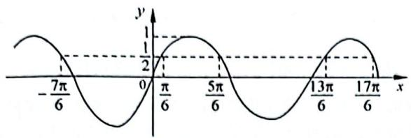

line

| x | y |
|---|---|
| -7π/6 | 0 |
| 0 | π/6 |
| π/6 | 0 |
| 5π/6 | π/6 |
| 13π/6 | 0 |
| 17π/6 | 0 |

容易推出 A 是 B 的真子集，即 A 可以推出 B，反之则不行，所以 A 是 B 的充分不必要条件。故选 A。

【481】A。提示：先考虑充分性：当 $\sin x = 1$ 时， $x = \frac{\pi}{2} + 2k\pi$ $(k \in \mathbb{Z})$ ，则 $\cos\left(\frac{\pi}{2} + 2k\pi\right) = \cos\frac{\pi}{2} = 0$ ，成立。

接下来考虑必要性：当 $\cos x = 0$ 时， $x = \frac{\pi}{2} + k\pi (k \in \mathbf{Z})$ ，则 $\sin \left(\frac{\pi}{2} + k\pi\right) = \pm 1 (k \in \mathbf{Z})$ ，不成立。故选A。

【482】7。提示：求交点，那就联立解方程， $\sin 2x = \cos x$ 化简得 $\cos x(2\sin x - 1) = 0$ ，即 $\cos x = 0$ 或 $\sin x = \frac{1}{2}$ 。在 $[0,3\pi]$ 上满足条件的 $x$ 为 $\frac{\pi}{2}, \frac{3\pi}{2}, \frac{5\pi}{2}, \frac{\pi}{6}, \frac{5\pi}{6}, \frac{13\pi}{6}, \frac{17\pi}{6}$ ，共7个。

【483】3。提示：函数零点，即当 $f(x) = 0$ 时 $x$ 的值，即 $\cos \left(3x + \frac{\pi}{6}\right) = 0$ ，则 $3x + \frac{\pi}{6} = \frac{\pi}{2} + k\pi$ ，解得 $x = \frac{\pi}{9} + \frac{1}{3} k\pi (k\in \mathbf{Z})$ 。题目要求找 $[0,\pi ]$ 的零点，那就是给 $k$ 取值，找到符合范围的零点。

当 k=0 时 $x=\frac{\pi}{9}$ ; 当 k=1 时 $x=\frac{4\pi}{9}$ ; 当 k=2 时 $x=\frac{7\pi}{9}$ , 所以满足条件的零点个数为 3。

【484】3。提示：坐在高考考场上，有的同学因为紧张，思维僵化，看到 $f(T)$ 直接傻眼了，既想不到 $T = \frac{2\pi}{\omega}$ ，也忘了代入，只要

能想到这两点,那问题很快就能解决。

因为最小正周期 $T = \frac{2\pi}{\omega}$ ，代入得 $f(T) = \cos \left(\omega \cdot \frac{2\pi}{\omega} + \varphi\right) = \cos (2\pi + \varphi) = \cos \varphi = \frac{\sqrt{3}}{2}$ ，又 $0 < \varphi < \pi$ ，所以 $\varphi = \frac{\pi}{6}$ ，即 $f(x) = \cos \left(\omega x + \frac{\pi}{6}\right)$ ，而 $x = \frac{\pi}{9}$ 为 $f(x)$ 的零点，则 $\frac{\pi}{9}\omega + \frac{\pi}{6} = \frac{\pi}{2} + k\pi, k \in \mathbf{Z}$ ，解得 $\omega = 3 + 9k, k \in \mathbf{Z}$ 。

因为 $\omega>0$ ，所以当 k=0 时， $\omega_{\min}=3$ 。

【485】 $-\sqrt{3}$ 。提示：不管三七二十一，先根据图像把解析式确定了（注意这是余弦型函数）。

首先计算 $\omega$ ：看图像 $\frac{\pi}{3} \to \frac{13\pi}{12}$ 为函数的 $\frac{3}{4} T$ ，即 $\frac{3}{4} T = \left|\frac{13\pi}{12} - \frac{\pi}{3}\right| = \frac{3\pi}{4}$ ，解得 $T = \pi$ ，所以 $\omega = \frac{2\pi}{T} = \frac{2\pi}{\pi} = 2$ ，则 $f(x) = 2\cos(2x + \varphi)$ 。

接下来计算 $\varphi$ ：题目中给出了最大值点 $\left(\frac{13\pi}{12}, 2\right)$ ，直接代入得 $2 = 2\cos \left(2 \times \frac{13\pi}{12} + \varphi\right)$ ，即 $\cos \left(\frac{13\pi}{6} + \varphi\right) = 1$ ，则 $\frac{13\pi}{6} + \varphi = 2k\pi (k \in \mathbf{Z})$ ，解得 $\varphi = -\frac{13\pi}{6} + 2k\pi (k \in \mathbf{Z})$ 。当 $k = 1$ 时 $\varphi = -\frac{\pi}{6}$ ，则 $f(x) = 2\cos \left(2x - \frac{\pi}{6}\right)$ ，所以 $f\left(\frac{\pi}{2}\right) = 2\cos \left(2 \times \frac{\pi}{2} - \frac{\pi}{6}\right) = 2\cos \left(\pi - \frac{\pi}{6}\right) = -2\cos \frac{\pi}{6} = -\sqrt{3}$ 。

【486】C。提示：两个函数解析式都完整已知，又要找交点，直接图像走起：函数 $y = \sin x$ 的最小正周期为 $T = 2\pi$ ，函数 $y = 2\sin \left(3x - \frac{\pi}{6}\right)$ 的最小正周期为 $T = \frac{2\pi}{3}$ ，所以在 $x \in [0, 2\pi]$ 上，函数 $y = 2\sin \left(3x - \frac{\pi}{6}\right)$ 有三个周期的图像，在坐标系中结合五点法画出两函数图像，如图所示。由图可知，两函数图像有6个交点，故选C。

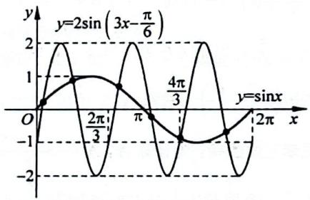

line

| x       | y          |
| ------- | ---------- |
| 0       | 0          |
| π/3     | 1          |
| π       | 0          |
| 4π/3    | -1         |
| 2π      | 0          |

【487】B。提示：方法一：先确定解析式，再求值。A 未知，先放一边，首先计算 $\omega$ ：看图像 $\frac{7\pi}{12} \to \frac{11\pi}{12}$ 为函数的 $\frac{1}{2} T$ ，即 $\frac{1}{2} T = \left|\frac{11\pi}{12} - \frac{7\pi}{12}\right| = \frac{\pi}{3}$ ，解得 $T = \frac{2\pi}{3}$ ，所以 $\omega = \frac{2\pi}{T} = \frac{2\pi}{\frac{2\pi}{3}} = 3$ ，则 $f(x) = A\cos (3x + \varphi)$ ；接下来代入 $\left(\frac{7\pi}{12}, 0\right)$ 得 $0 = A\cos \left(3 \times \frac{7\pi}{12} + \varphi\right)$ ，即 $\cos \left(\frac{7\pi}{4} + \varphi\right) = 0$ （到了这一定要注意：我们所选的点在单调递增区间上，那么对应余弦函数图像也得是递增区间上的零点），则 $\frac{7\pi}{4} + \varphi = -\frac{\pi}{2} + 2k\pi$ ( $k \in \mathbf{Z}$ )，解得 $\varphi = -\frac{9\pi}{4} + k\pi$ ( $k \in \mathbf{Z}$ )。当 $k = 2$ 时， $\varphi = -\frac{\pi}{4}$ ，则 $f(x) = A\cos \left(3x - \frac{\pi}{4}\right)$ ，然后代入 $\left(\frac{\pi}{2}, -\frac{2}{3}\right)$ 得 $-\frac{2}{3} = A\cos \left(3 \times \frac{\pi}{2} - \frac{\pi}{4}\right)$ ，即 $A\cos \frac{5\pi}{4} = -\frac{2}{3}$ ，解得 $A = \frac{2\sqrt{2}}{3}$ 。则 $f(x) = \frac{2\sqrt{2}}{3}\cos \left(3x - \frac{\pi}{4}\right)$ ，所以 $f(0) =$ $\frac{2\sqrt{2}}{3}\cos\left(0-\frac{\pi}{4}\right)=\frac{2}{3}$ 。故选 B。

方法二：方法一是常规的方式，也是我们容易想得到的方法，但是相对来说有些麻烦，接下来我们看下更简单的方法，但此方法要求对三角函数的各种性质要非常熟悉，对思维能力要求比较高。看图像我们容易求出函数周期为 $\frac{2\pi}{3}$ ，可得 $f(0) = f\left(\frac{2\pi}{3}\right)$ ，接下来就是求解 $f\left(\frac{2\pi}{3}\right)$ 。观察所给的几个自变量： $\frac{2\pi}{3}, \frac{\pi}{2}, \frac{7\pi}{12}$ 可发现： $\frac{2\pi}{3} + \frac{\pi}{2} = 2 \times \frac{7\pi}{12}$ ，即 $\frac{2\pi}{3}$ 与 $\frac{\pi}{2}$ 关于 $\frac{7\pi}{12}$ 对称。又 $f\left(\frac{7\pi}{12}\right) = 0$ ，所以 $f\left(\frac{2\pi}{3}\right) = -f\left(\frac{\pi}{2}\right) = \frac{2}{3}$ 。故选 B。

【488】B。提示：同样地，先根据图像确定正切型函数解析式。首先计算 $\omega$ ：看图像 $\frac{\pi}{8} \to \frac{3\pi}{8}$ 为函数的 $\frac{1}{2} T$ ，即 $\frac{1}{2} T = \left|\frac{3\pi}{8} - \frac{\pi}{8}\right| = \frac{\pi}{4}$ ，解得 $T = \frac{\pi}{2}$ ，所以 $\omega = \frac{\pi}{T} = \frac{\pi}{\frac{\pi}{2}} = 2$ ，则 $f(x) = A\tan (2x + \varphi)$ 。

接下来直接代入 $\left(\frac{3\pi}{8}, 0\right)$ ，得 $0 = A\tan \left(2 \times \frac{3\pi}{8} + \varphi\right)$ ，即 $\tan \left(\frac{3\pi}{4} + \varphi\right) = 0$ ，则 $\frac{3\pi}{4} + \varphi = k\pi (k \in \mathbf{Z})$ ，解得 $\varphi = -\frac{3\pi}{4} + k\pi (k \in \mathbf{Z})$ ，当 $k = 1$ 时 $\varphi = \frac{\pi}{4}$ ，则 $f(x) = A\tan \left(2x + \frac{\pi}{4}\right)$ 。然后代入(0,1)，得 $1 = A\tan \left(2 \times 0 + \frac{\pi}{4}\right)$ ，即 $A\tan \frac{\pi}{4} = 1$ ，解得 $A = 1$ 。则 $f(x) = \tan \left(2x + \frac{\pi}{4}\right)$ ，所以 $f\left(\frac{\pi}{24}\right) = \tan \left(2 \times \frac{\pi}{24} + \frac{\pi}{4}\right) = \tan \frac{\pi}{3} = \sqrt{3}$ 。故选B。

【489】 $-\frac{\sqrt{3}}{2}$ 。提示：很明显要先求解出 $f(x)$ 的解析式：设点 A 和点 B 的坐标分别为 $\left(x_{1},\frac{1}{2}\right)\left(x_{2},\frac{1}{2}\right)$ ，由 $|AB|=\frac{\pi}{6}$ 得 $x_{2}-x_{1}=\frac{\pi}{6}$ ，设 $\omega x+\varphi=t$ ，则 $y=\sin(\omega x+\varphi)=\sin t=\frac{1}{2}$ ，得 $t=\frac{\pi}{6}+2k\pi$ 或 $t=\frac{5\pi}{6}+2k\pi, k\in z$ ，由图可知 $t_{1}=\frac{\pi}{6}, t_{2}=\frac{5\pi}{6}$ ，即 $\omega x_{1}+\varphi=\frac{\pi}{6}, \omega x_{2}+\varphi=\frac{5\pi}{6}$ ，两式相减得 $\omega x_{2}+\varphi-(\omega x_{1}+\varphi)=\frac{2\pi}{3}$ ，即 $\omega(x_{2}-x_{1})=\frac{2\pi}{3}$ ，解得 $\omega=4$ 。接下来解决 $\varphi$ 的问题，由图可知函数过点 $\left(\frac{2\pi}{3},0\right)$ ，代入函数解析式得 $f\left(\frac{2\pi}{3}\right)=\sin\left(4\times\frac{2\pi}{3}+\varphi\right)=0$ ，即 $\frac{8\pi}{3}+\varphi=2k\pi$ （注意 $\left(\frac{2\pi}{3},0\right)$ 在函数单调递增区间上），即 $\varphi=-\frac{8\pi}{3}+$

$2k\pi, k \in \mathbf{Z}$ 。当 $k = 1$ 时， $\varphi = -\frac{2\pi}{3}$ ，所以 $f(x) = \sin \left(4x - \frac{2\pi}{3}\right)$ ，故 $f(\pi) = \sin \left(4\pi - \frac{2\pi}{3}\right) = -\frac{\sqrt{3}}{2}$ 。

【490】A。提示：观察函数形式 $f(x) = \sin \left( \omega x + \frac{\pi}{4} \right) + b$ ，由 $g(x) = \sin (\omega x + \varphi)$ 上下平移 $|b|$ 单位得到 $g(x)$ 的对称中心为 $(x_0, 0)$ ， $f(x)$ 的对称中心为 $\left( \frac{3\pi}{2}, 2 \right)$ ，不难推出 $g(x)$ 向上平移了2个单位，即 $b = 2$ ，则 $g(x) = \sin \left( \omega x + \frac{\pi}{4} \right)$ 关于 $\left( \frac{3\pi}{2}, 0 \right)$ 对称，即 $g\left( \frac{3\pi}{2} \right) = 0$ ，代入得 $\sin \left( \omega \cdot \frac{3\pi}{2} + \frac{\pi}{4} \right) = 0$ ，即 $\omega \cdot \frac{3\pi}{2} + \frac{\pi}{4} = k\pi (k \in \mathbb{Z})$ ，解得 $\omega = \frac{4k - 1}{6} (k \in \mathbb{Z})$ 。又因为 $\frac{2\pi}{3} < T < \pi$ ，即 $\frac{2\pi}{3} < \frac{2\pi}{\omega} < \pi$ ，解得 $2 < \omega < 3$ ，即当 $k = 4$ 时满足条件，代入解得 $\omega = \frac{5}{2}$ ，所以 $f(x) = \sin \left( \frac{5}{2}x + \frac{\pi}{4} \right) + 2$ ，则 $f\left( \frac{\pi}{2} \right) = \sin \left( \frac{5}{2} \times \frac{\pi}{2} + \frac{\pi}{4} \right) + 2 = 1$ 。故选A。

【491】A。提示：看完题目，没有其他思路，只能先代点，代入得 $\left\{\begin{aligned}\frac{5\omega\pi}{8}+\varphi=2k_{1}\pi+\frac{\pi}{2},\\ \frac{11\omega\pi}{8}+\varphi=k_{2}\pi,\end{aligned}\right.$ 其中 $k_{1},k_{2}\in Z$ （注意要用两个k表示），解得 $\omega=\frac{4}{3}(k_{2}-2k_{1})-\frac{2}{3}$ 。又 $T=\frac{2\pi}{\omega}>2\pi$ ，所以0<ω<1，当 $k_{1}=1,k_{2}=3$ 时， $\omega=\frac{2}{3}$ ，代入方程得 $\varphi=2k_{1}\pi+\frac{1}{12}\pi$ ，由 $|\varphi|<\pi$ 得 $\varphi=\frac{\pi}{12}$ 。故选A。

# 4.8 图像变换

# 类型一：图像平移

【492】D。提示：由题意得 $\frac{1}{4} T = \frac{1}{4} \times \frac{2\pi}{\omega} = \frac{1}{4} \times \frac{2\pi}{2} = \frac{\pi}{4}$ ，向右平移 $\frac{\pi}{4}$ 可得 $f(x) = 2\sin \left[2\left(x - \frac{\pi}{4}\right) + \frac{\pi}{6}\right] = 2\sin \left(2x - \frac{\pi}{3}\right)$ 。故选 D。

【493】A。提示：按向量 $a = \left(-\frac{\pi}{4}, - 2\right)$ 平移，即向左平移 $\frac{\pi}{4}$ 个单位，向下平移2个单位，则 $f(x) = 2\cos \left[\frac{1}{3}\left(x + \frac{\pi}{4}\right) + \frac{\pi}{6}\right] - 2 = 2\cos \left(\frac{x}{3} +\frac{\pi}{4}\right) - 2$ 。故选A。

【494】D。提示：将 $y = 2\sin \left(3x + \frac{\pi}{5}\right)$ 左右平移 $a(a$ 可正可负)个单位可得 $y = 2\sin \left[3(x + a) + \frac{\pi}{5}\right] = 2\sin \left[3x + 3a + \frac{\pi}{5}\right]$ ，由题意可得 $3a + \frac{\pi}{5} = 0 + 2k\pi (k \in \mathbb{Z})$ ，解得 $a =$

$-\frac{\pi}{15}+\frac{2}{3}k\pi(k\in\mathbf{Z})$ 。当 k=0 时， $a=-\frac{\pi}{15}$ ，即需向右平移 $\frac{\pi}{15}$ 个单位。故选 D。

【495】A。提示：先把点 P 代入解析式求解 $t: t = \sin\left(2 \times \frac{\pi}{4} - \frac{\pi}{3}\right) = \frac{1}{2}$ ，即 $P\left(\frac{\pi}{4}, \frac{1}{2}\right)$ ，向左平移 S (S > 0) 个单位后 $P'\left(\frac{\pi}{4} - S, \frac{1}{2}\right)$ ，根据题意，代入 $y = \sin 2x$ 得 $\frac{1}{2} = \sin\left[2\left(\frac{\pi}{4} - S\right)\right] = \sin\left(\frac{\pi}{2} - 2S\right) = \cos 2S$ 。要找 S 的最小正值，则 $2S = \frac{\pi}{3}$ ，解得 $S = \frac{\pi}{6}$ 。故选 A。

【496】C。提示：先考虑平移： $f(x)=\cos\left[2\left(x+\frac{\pi}{6}\right)+\frac{\pi}{6}\right]=\cos\left(2x+\frac{\pi}{2}\right)=-\sin2x$ ，接下来要找 $y=f(x)$ 与 $y=\frac{1}{2}x-\frac{1}{2}$ 的交点个数，那就研究两个函数图像，作出两个函数图像如图所示。

首先, $y=\frac{1}{2}x-\frac{1}{2}$ 过
点 $(0,-\frac{1}{2})$ ，(1,0)。

其次，找出 $y = -\sin 2x$ 的几个特殊点，有 $2x = -\frac{3\pi}{2},2x = \frac{3\pi}{2},$

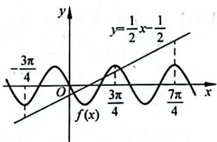

line

| x       | y          |
| ------- | ---------- |
| -3π/4   | -          |
| 0       | 0          |
| 3π/4    | 3π/4       |
| 7π/4    | 7π/4       |

$2x=\frac{7\pi}{2}$ ，即 $x=-\frac{3\pi}{4},x=\frac{3\pi}{4},x=\frac{7\pi}{4}$ ，在这几个点的位置比较两个函数值大小，我们即可得到两个函数交点个数。

当 $x = -\frac{3\pi}{4}$ 时， $f\left(-\frac{3\pi}{4}\right) = -\sin \left(-\frac{3\pi}{2}\right) = -1, y = \frac{1}{2} \times \left(-\frac{3\pi}{4}\right) - \frac{1}{2} = -\frac{3\pi + 4}{8} < -1;$

当 $x = \frac{3\pi}{4}$ 时， $f\left(\frac{3\pi}{4}\right) = -\sin \left(\frac{3\pi}{2}\right) = 1, y = \frac{1}{2} \times \left(\frac{3\pi}{4}\right) - \frac{1}{2} = \frac{3\pi - 4}{8} < 1;$

当 $x = \frac{7\pi}{4}$ 时， $f\left(\frac{7\pi}{4}\right) = -\sin \left(\frac{7\pi}{2}\right) = 1, y = \frac{1}{2} \times \left(\frac{7\pi}{4}\right) - \frac{1}{2} = \frac{7\pi - 4}{8} > 1$ ，所以由图可得 $y = f(x)$ 与 $y = \frac{1}{2} x - \frac{1}{2}$ 的交点个数为3。故选C。

# 类型二：图像伸缩

【497】C。提示：函数 $y=\sin x$ 的图像上所有的点向右平行移动 $\frac{\pi}{10}$ 个单位长度得 $y=\sin\left(x-\frac{\pi}{10}\right)$ 。接下来各点的横坐标伸长到原来的 2 倍（纵坐标不变），即 x 变为原来的 $\frac{1}{2}$ ，得 $y=\sin\left(\frac{1}{2}x-\frac{\pi}{10}\right)$ 。故选 C。

【498】B。提示：这种类型的题目需要逆向考虑，先把 $y=\sin\left(x-\frac{\pi}{4}\right)$ 向左平移 $\frac{\pi}{3}$ 个单位得 $y=\sin\left(x+\frac{\pi}{3}-\frac{\pi}{4}\right)=\sin\left(x+\frac{\pi}{12}\right)$ ，然后再把横坐标伸长到原来的 2 倍，即 x 变为原来的 $\frac{1}{2}$ ，得 $y=\sin\left(\frac{1}{2}x+\frac{\pi}{12}\right)$ 。故选 B。

【499】 $\frac{\sqrt{2}}{2}$ 。提示：先把 $y=\sin x$ 向左平移 $\frac{\pi}{6}$ 个单位得 $y=\sin\left(x+\frac{\pi}{6}\right)$ ，然后再把横坐标伸长到原来的 2 倍，即 x 变为原来的 $\frac{1}{2}$ ，得 $f(x)=\sin\left(\frac{1}{2}x+\frac{\pi}{6}\right)$ ，所以 $f\left(\frac{\pi}{6}\right)=\sin\left(\frac{1}{2}\times\frac{\pi}{6}+\frac{\pi}{6}\right)=\frac{\sqrt{2}}{2}$ 。

【500】A。提示：把函数 $y = \cos 2x + 1$ 的图像上所有点的横坐标伸长到原来的2倍（纵坐标不变），即 $x$ 变为原来的 $\frac{1}{2}$ ，得 $f(x) = \cos x + 1$ ，然后向左平移1个单位长度，再向下平移1个单位长度，得 $f(x) = \cos (x + 1)$ 。接下来代入特殊点进行检验即可：代入 $x = 0$ 得 $f(x) = \cos 1 > 0$ （注意此时1为弧度制， $1\mathrm{rad}\approx 57.3^\circ$ ），排除C，D。代入 $x = \frac{\pi}{2} - 1$ ，得 $f(x) = \cos \frac{\pi}{2} = 0$ ，所以A选项满足。故选A。

# 类型三：先化简后平移伸缩

【501】D。提示：首先利用辅助角公式对 $y=\sin3x+\cos3x$ 进行化简： $f(x)=\sin3x+\cos3x=\sqrt{2}\sin(3x+\varphi)$ ，其中 $\tan\varphi=1$ ，则 $\varphi=\frac{\pi}{4}$ ，所以 $f(x)=\sqrt{2}\sin\left(3x+\frac{\pi}{4}\right)$ 。设 $y=\sqrt{2}\sin3x$ 左右平移 $a(a \text{可正可负})$ 个单位可得 $y=\sqrt{2}\sin\left[3(x+a)\right]=\sqrt{2}\sin(3x+3a)$ ，由题意可得 $3a=\frac{\pi}{4}+2k\pi(k\in\mathbb{Z})$ ，解得 $a=\frac{\pi}{12}+\frac{2}{3}k\pi(k\in\mathbb{Z})$ 。当 k=0 时 $a=\frac{\pi}{12}$ ，所以向左平移 $\frac{\pi}{12}$ 个单位。故选 D。

【502】 $\frac{\pi}{3}$ 。提示：首先利用辅助角公式对 $y=\sin x-\sqrt{3}\cos x$ 进行化简， $f(x)=\sin x-\sqrt{3}\cos x=2\sin(x-\varphi)$ ，其中 $\tan\varphi=\sqrt{3}$ ，则 $\varphi=\frac{\pi}{3}$ ，所以 $f(x)=2\sin\left(x-\frac{\pi}{3}\right)$ ，则 y=2sinx 至少向右平移 $\frac{\pi}{3}$ 个单位。

【503】见提示。提示：先对 $f(x) = \sin x + \sin \left(x + \frac{\pi}{3}\right)$ 进行化简， $f(x) = \sin x + \sin \left(x + \frac{\pi}{3}\right) = \sin x + \frac{1}{2} \sin x + \frac{\sqrt{3}}{2} \cos x = \frac{3}{2} \sin x + \frac{\sqrt{3}}{2} \cos x = \sqrt{3} \sin (x + \varphi)$ ，其中 $\tan \varphi = \frac{\sqrt{3}}{3}$ ，则 $\varphi = \frac{\pi}{6}$ ，所以 $f(x) = \sqrt{3} \sin \left(x + \frac{\pi}{6}\right)$ ，所以 $y = \sin x$ 向左平移 $\frac{\pi}{6}$ 个单位，再将函数图像上所有点的纵坐标伸长为原来的 $\sqrt{3}$ 倍，即可得到 $f(x) = \sqrt{3}\sin \left(x + \frac{\pi}{6}\right)$ 。

类型四：函数名称不一致

【504】C。提示：一看函数名称不一致，那就先用所讲的方法把函数名称化一致，接下来我们用两种方式解一下（做题的时候只需要选择一种，但两种方式都应该掌握）：

① 正弦化余弦：函数 $y = \sin x = \cos \left(-\frac{\pi}{2} + x\right) = \cos \left(x - \frac{\pi}{2}\right)$ 。设 $y = \cos \left(x - \frac{\pi}{2}\right)$ 左右平移 $a(a \text{可正可负})$ 个单位可得 $y = \cos \left(x + a - \frac{\pi}{2}\right)$ ，由题意可得 $a - \frac{\pi}{2} = \frac{\pi}{3} + 2k\pi (k \in \mathbb{Z})$ ，解得 $a = \frac{5\pi}{6} + 2k\pi (k \in \mathbb{Z})$ 。当 $k = 0$ 时 $a = \frac{5\pi}{6}$ ，所以向左平移 $\frac{5\pi}{6}$ 个单位。故选 C。

② 余弦化正弦：函数 $y = \cos \left( x + \frac{\pi}{3} \right) = \sin \left( \frac{\pi}{2} + x + \frac{\pi}{3} \right) = \sin \left( x + \frac{5\pi}{6} \right)$ ，则 $y = \sin x$ 向左平移 $\frac{5\pi}{6}$ 个单位可得 $y = \sin \left( x + \frac{5\pi}{6} \right)$ 。故选 C。

【505】A。提示：函数名称不一致，先用所讲的方法把函数名称化一致，接下来我们用两种方式解一下（做题的时候只需要选择一种，但两种方式都应该掌握）：

① 正弦化余弦：函数 $y = \sin 2x = \cos \left(-\frac{\pi}{2} + 2x\right) = \cos \left(2x - \frac{\pi}{2}\right)$ 。设 $y = \cos \left(2x - \frac{\pi}{2}\right)$ 左右平移 $a(a \text{可正可负})$ 个单位可得 $y = \cos \left[2(x + a) - \frac{\pi}{2}\right] = \cos (2x + 2a - \frac{\pi}{2})$ ，由题意可得 $2a - \frac{\pi}{2} = \frac{\pi}{3} + 2k\pi (k \in \mathbb{Z})$ ，解得 $a = \frac{5\pi}{12} + k\pi (k \in \mathbb{Z})$ 。当 $k = 0$ 时 $a = \frac{5\pi}{12}$ ，所以向左平移 $\frac{5\pi}{12}$ 个单位。故选 A。

② 余弦化正弦：函数 $y = \cos \left(2x + \frac{\pi}{3}\right) = \sin \left(\frac{\pi}{2} + 2x + \frac{\pi}{3}\right) = \sin \left(2x + \frac{5\pi}{6}\right)$ 。设 $y = \sin 2x$ 左右平移 $a$ (a 可正可负)个单位可得 $y = \sin [2(x + a)] = \sin (2x + 2a)$ ，由题意可得 $2a = \frac{5\pi}{6} + 2k\pi (k \in \mathbb{Z})$ ，解得 $a = \frac{5\pi}{12} + k\pi (k \in \mathbb{Z})$ 。当 $k = 0$ 时 $a = \frac{5\pi}{12}$ ，所以向左平移 $\frac{5\pi}{12}$ 个单位。故选 A。

【506】D。提示：将 $C_1: y = \cos x$ 化为正弦函数： $C_1: y = \cos x = \sin \left(\frac{\pi}{2} + x\right) = \sin \left(x + \frac{\pi}{2}\right)$ ，从 $C_1: y = \sin \left(x + \frac{\pi}{2}\right)$ 到 $C_2: y = \sin \left(2x + \frac{2\pi}{3}\right)$ ，首先考虑伸缩， $x$ 变为原来的 2

倍，即横坐标缩短为原来的 $\frac{1}{2}$ ，得到 $y = \sin \left(2x + \frac{\pi}{2}\right)$ 。接下来考虑平移：设 $y = \sin \left(2x + \frac{\pi}{2}\right)$ 左右平移 $a(a$ 可正可负）个单位可得 $y = \sin \left[2(x + a) + \frac{\pi}{2}\right] = \sin \left(2x + 2a + \frac{\pi}{2}\right)$ ，由题意可得 $2a + \frac{\pi}{2} = \frac{2\pi}{3} + 2k\pi (k \in \mathbf{Z})$ ，解得 $a = \frac{\pi}{12} + k\pi (k \in \mathbf{Z})$ 。当 $k = 0$ 时 $a = \frac{\pi}{12}$ ，即向左平移 $\frac{\pi}{12}$ 个单位。故选 D。

【507】C。提示：先将 $y = \sqrt{2}\cos x$ 化为正弦函数： $C_1: y = \sqrt{2}\cos x = \sqrt{2}\sin \left(\frac{\pi}{2} + x\right) = \sqrt{2}\sin \left(x + \frac{\pi}{2}\right)$ ，从 $y = \sqrt{2}\sin \left(2x + \frac{\pi}{4}\right)$ 到 $y = \sqrt{2}\sin \left(x + \frac{\pi}{2}\right)$ ，首先考虑伸缩， $x$ 变为原来的 $\frac{1}{2}$ ，即横坐标扩大为原来的 2 倍，得到 $y = \sqrt{2}\sin \left(x + \frac{\pi}{4}\right)$ 。接下来考虑平移：设 $y = \sqrt{2}\sin \left(x + \frac{\pi}{4}\right)$ 左右平移 $a(a \text{可正可负})$ 个单位可得 $y = \sqrt{2}\sin \left[x + a + \frac{\pi}{4}\right] = \sqrt{2}\sin \left(x + a + \frac{\pi}{4}\right)$ ，由题意可得 $a + \frac{\pi}{4} = \frac{\pi}{2} + 2k\pi (k \in \mathbb{Z})$ ，解得 $a = \frac{\pi}{4} + 2k\pi (k \in \mathbb{Z})$ 。当 $k = 0$ 时 $a = \frac{\pi}{4}$ ，所以向左平移 $\frac{\pi}{4}$ 个单位。故选 C。

# 4.9 最值及范围问题

# 类型一：换元法求最值

【508】C。提示：令 $t = \sin x, t \in [-1, 1]$ ，则 $y = t^2 + t - 1$

$t \in [-1,1]$ ，接下来就是二次函数在给定区间上的值域问题了，根据图像求解是最好的办法，如图所示，当 $t = -\frac{1}{2}$ 时， $y_{\min} = -\frac{5}{4}$ ；当 t = 1 时， $y_{\max} = 1$ ，所以值域为 $\left[-\frac{5}{4}, 1\right]$ 。

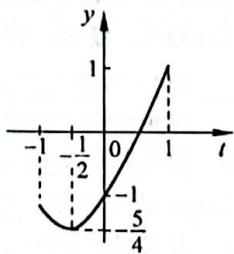

line

| t | y |
|---|---|
| -1/2 | -1 |
| 0 | 0 |
| 5/4 | -1 |

故选C。

【509】D。提示：先考虑奇偶性：定义域为R，定义域关于原点对称， $f(-x)=\cos(-x)-\cos(-2x)=\cos x-\cos 2x=f(x)$ 。所以 $f(x)$ 为偶函数。

接下来考虑最值：首先进行化简， $f(x) = \cos x - \cos 2x = -2\cos^2 x + \cos x + 1$ 。令 $t = \cos x, t \in [-1, 1]$ ，则 $y = -2t^2 + t + 1$ ，然后利用图像求解二次函数最大值，如图所示，当 $t = \frac{1}{4}$ 时， $y_{\max} = \frac{9}{8}$ ，所以最大值为 $\frac{9}{8}$ 。故选 D。

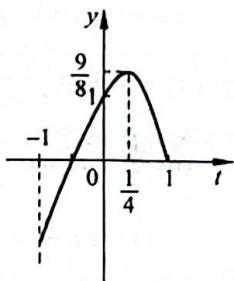

line

| t | y |
|---|---|
| -1 | -1 |
| 0 | 9/81 |
| 1/4 | 9/81 |
| 1 | 0 |

【510】1。提示：首先进行化简： $f(x)=\sin^{2}x+\sqrt{3}\cos x-$

$$
\frac {3}{4} = - \cos^ {2} x + \sqrt {3} \cos x + \frac {1}{4}. \text {令}
$$

$$
t = \cos x, x \in \left[ 0, \frac {\pi}{2} \right], t \in [ 0, 1 ], \text {则}
$$

$$
\begin{array}{r l} & y = - t ^ {2} + \sqrt {3} t + \frac {1}{4}, \text {   接下来利用   } \\ & \text {   图像求解二次函数最大值,   如图所   } \end{array}
$$

$$
\text {   示,   当   } t = \frac {\sqrt {3}}{2} \text {   时,   } y _ {\max} = 1, \text {   所以最大值为   } 1.
$$

line

| t | y |
|---|---|
| 0 | 1/4 |
| √3/2 | 1 |
| 1 | -1/4 |

【511】B。提示：首先进行化简： $f(x)=$

$$
\cos 2 x + 6 \cos \left(\frac {\pi}{2} - x\right) = 1 -
$$

$$
2 \sin^ {2} x + 6 \sin x = - 2 \sin^ {2} x + 6 \sin x +
$$

$$
1 _ {\circ} \text {令} t = \sin x, t \in [ - 1, 1 ], \text {则}
$$

$$
\begin{array}{l} {y = - 2 t ^ {2} + 6 t + 1, \text {   接下来利用图像   }} \\ {\text {   求解二次函数最大值   }, \text {   如图所示   }, \text {   当   }} \end{array}
$$

$$
\begin{array}{r l} & t = 1 \text {   时,   } y _ {\max} = 5 \text { ,所以最大值为   } 5 \text { 。 } \\ & \text { 故选   B。 } \end{array}
$$

line

| t | y |
|---|---|
| -1 | -7 |
| 0 | 5 |
| 1 | 5 |

【512】-4。提示：首先进行化简：

$$
f (x) = \sin \left(2 x + \frac {3 \pi}{2}\right) - 3 \cos x =
$$

$$
- \cos 2 x - 3 \cos x = - 2 \cos^ {2} x -
$$

$$
3 \mathrm{cos} x + 1 _ {\circ} \text {令} t = \mathrm{cos} x, t \in [ - 1, 1 ],
$$

$$
\begin{array}{r l} & {\text {则} y = - 2 t ^ {2} - 3 t + 1, \text {接下来利用}} \\ & {\text {图像求解二次函数最小值，如图所示，}} \end{array}
$$

$$
\text { 当 } t = 1 \text { 时 }, y _ {\min} = - 4, \text { 所以最小值为 } - 4 。
$$

line

| t | y |
|---|---|
| -1 | 2 |
| 0 | 1 |
| 1 | -4 |

# 类型二：辅助角公式求最值

【513】1。提示：看完函数结构，那就直接展开： $f(x)=\sin(x+\varphi)-2\sin\varphi\cos x=\sin x\cos\varphi+\cos x\sin\varphi-2\sin\varphi\cos x=\sin x\cos\varphi-\cos x\sin\varphi=\sin(x-\varphi)$ ，所以 $f(x)$ 的最大值为1。

【514】 $\sqrt{5}$ 。提示：辅助角公式直接走起(选一个即可，但两种方式都要掌握):

① 化为正弦型： $f(x)=2\cos x+\sin x=\sin x+2\cos x=\sqrt{5}\sin(x+\varphi)$ ，其中 $\tan\varphi=2$ ，所以 $f(x)$ 的最大值为 $\sqrt{5}$ 。  
② 化为余弦型： $f(x)=2\cos x+\sin x=\sqrt{5}\cos(x-\varphi)$ ，其中 $\tan\varphi=\frac{1}{2}$ ，所以 $f(x)$ 的最大值为 $\sqrt{5}$ 。

【515】C。提示：辅助角公式直接走起： $f(x)=\sin\frac{x}{3}+$

$\cos \frac{x}{3} = \sqrt{2}\sin \left(\frac{x}{3} +\varphi\right)$ ，其中 $\tan \varphi = 1$ ，则 $\varphi = \frac{\pi}{4}$ ，所以

$f(x) = \sin \frac{x}{3} +\cos \frac{x}{3} = \sqrt{2}\sin \left(\frac{x}{3} +\frac{\pi}{4}\right)$ ，最小正周期

$$
T = \frac {2 \pi}{\frac {1}{3}} = 6 \pi , \text { 函   数   的   最   大   值   为 } \sqrt {2} 。 \text { 故   选 } \mathrm{C。}
$$

【516】A。提示：方法一：看结构，直接展开： $f(x)=\frac{1}{5}\sin(x+$

$$
\left. \frac {\pi}{3}\right) + \cos \left(x - \frac {\pi}{6}\right) = \frac {1}{1 0} \sin x + \frac {\sqrt {3}}{1 0} \cos x + \frac {\sqrt {3}}{2} \cos x +
$$

$$
\frac {1}{2} \sin x = \frac {3}{5} \sin x + \frac {3 \sqrt {3}}{5} \cos x (\text {辅助角公式走起}) =
$$

$$
\frac {6}{5} \sin (x + \varphi), \text {其中} \tan \varphi = \sqrt {3}, \text {则} \varphi = \frac {\pi}{3}, \text {所以} f (x) =
$$

$$
\frac {6}{5} \sin \left(x + \frac {\pi}{3}\right), \text { 则 } f (x) \text { 的   最   大   值   为 } \frac {6}{5} 。 \text { 故   选 } A _ {\circ}
$$

方法二：看角，找角关系： $\left(x + \frac{\pi}{3}\right) - \left(x - \frac{\pi}{6}\right) = \frac{\pi}{2}$ ，则

$$
x - \frac {\pi}{6} = \left(x + \frac {\pi}{3}\right) - \frac {\pi}{2}, \text {所以} \cos \left(x - \frac {\pi}{6}\right) = \cos \left[ \left(x + \frac {\pi}{6}\right) \right]
$$

$$
\left. \frac {\pi}{3}\right) - \frac {\pi}{2} \Big ] = \sin \left(x + \frac {\pi}{3}\right), \text {则} f (x) = \frac {1}{5} \sin \left(x + \frac {\pi}{3}\right) +
$$

$$
\cos \left(x - {\frac {\pi}{6}}\right) = {\frac {6}{5}} \sin \left(x + {\frac {\pi}{3}}\right), \text {所以} f (x) \text {的最大值为} {\frac {6}{5}}.
$$

$$
\text { 故选 } \mathrm{A} 。
$$

【517】±3。提示：题目给了 $f(x)$ 的最大值，先利用辅助角公式

$$
\text { 对 } f (x) \text { 进行化简: } f (x) = 4 \sin x + a \cos x = \sqrt {1 6 + a ^ {2}} \sin (x +
$$

$$
\varphi), \text {其中} \tan \varphi = \frac {a}{4} 。 f (x) \text {的最大值为} 5, \text {即} \sqrt {1 6 + a ^ {2}} = 5,
$$

$$
\text { 解得 } a = \pm 3 。
$$

【518】2。提示：一看结构，妥妥的辅助角公式，化简为正弦型

$$
\text { 函数,再求给定区间最值即可: } f (x) = \sin x - \sqrt {3} \cos x =
$$

$$
2 \sin \left(x - {\frac {\pi}{3}}\right), \text {当} x \in [ 0, \pi ] \text {时}, x - {\frac {\pi}{3}} \in \left[ - {\frac {\pi}{3}}, {\frac {2 \pi}{3}} \right], \text {当}
$$

$$
x - \frac {\pi}{3} = \frac {\pi}{2}, \text { 即 } x = \frac {5 \pi}{6} \text { 时 }, f (x) _ {\max} = 2 。
$$

【519】 $\pm\sqrt{15}$ 。提示：函数形式看起来有点吓人，先化简处理

$$
\text {   一下函数解析式,   其实还是之前所学的公式:   } f (x) =
$$

$$
\frac {1 + \cos 2 x}{4 \sin \left(\frac {\pi}{2} + x\right)} - a \sin \frac {x}{2} \cos \left(\pi - \frac {x}{2}\right) = \frac {2 \cos^ {2} x}{4 \cos x} + a \sin \frac {x}{2}
$$

$$
\cos \frac {x}{2} = \frac {1}{2} \cos x + \frac {a}{2} \sin x = \frac {a}{2} \sin x + \frac {1}{2} \cos x.
$$

接下来又是辅助角公式了， $f(x) = \frac{a}{2}\sin x + \frac{1}{2}\cos x =$

$$
\sqrt {\frac {a ^ {2} + 1}{4}} \sin (x - \varphi), \text {其中} \tan \varphi = \frac {1}{a}. \text {由题意知} f (x) \text {的最}
$$

大值为2，则 $\sqrt{\frac{a^2 + 1}{4}} = 2$ ，解得 $a = \pm \sqrt{15}$

【520】 $[2,+\infty)$ 。提示：题目中对于任意的实数 x 满足

$$
\left| f (x) \right| \leqslant a \text {成立,转换一下即} a \geqslant \left| f (x) \right| _ {\max} 。 \text {接下来就}
$$

$$
\text {是求} \left| f (x) \right| _ {\max}, f (x) = \sqrt {3} \sin 3 x + \cos 3 x = 2 \sin (3 x + \varphi),
$$

其中 $\tan \varphi = \frac{\sqrt{3}}{3}$ ，则 $\varphi = \frac{\pi}{6}$ ，所以 $f(x) = 2\sin \left(3x + \frac{\pi}{6}\right)$ ，

则 $-2 \leqslant f(x) \leqslant 2$ ，继续推出 $|f(x)| \leqslant 2$ ，即 $a \geqslant 2$ ，所以实数 $a$ 的取值范围是 $[2, +\infty)$ 。

# 类型三：在给定区间时求最值

【521】A。提示：由 $0 \leqslant x \leqslant 9$ 得 $-\frac{\pi}{3} \leqslant \frac{\pi x}{6} - \frac{\pi}{3} \leqslant \frac{7\pi}{6}$ 。令 $\frac{\pi x}{6} - \frac{\pi}{3} = t$ ，得 $y = 2\sin t, t \in \left[-\frac{\pi}{3}, \frac{7\pi}{6}\right]$ ，接下来我们由

$y=2\sin t$ 图像(如图所示)可得, 当 $t=\frac{\pi}{2}$ 时, $y_{max}=2$ ; 当 $t=-\frac{\pi}{3}$ 时, $y_{min}=-\sqrt{3}$ 。所以 $y=2\sin t\in[-\sqrt{3},2]$ , 故最大值和最小值之和为 $2-\sqrt{3}$ 。故选 A。

line

| t | y |
|---|---|
| -π/3 | -√3 |
| 0 | 0 |
| π/2 | 2 |
| π | 0 |
| 7π/6 | 2 |

【522】 $-\frac{1}{2}$ 。提示：首先根据题意得到两角之间关系： $\beta=\alpha+\pi+2k\pi,k\in Z$ ，接下来进行等量代换： $\cos\beta=\cos(\alpha+\pi+2k\pi)=-\cos\alpha$ ，因为 $\alpha\in\left[\frac{\pi}{6},\frac{\pi}{3}\right]$ ，所以 $\cos\alpha$ 的取值范围是 $\left[\frac{1}{2},\frac{\sqrt{3}}{2}\right]$ ， $\cos\beta$ 的取值范围是 $\left[-\frac{\sqrt{3}}{2},-\frac{1}{2}\right]$ ，当且仅当 $\alpha=\frac{\pi}{3}$ ，即 $\beta=\frac{4\pi}{3}+2k\pi,k\in Z$ 时， $\cos\beta$ 取得最大值，且最大值为 $-\frac{1}{2}$ 。

【523】A。提示： $f(x)=\sin3\left(\omega x+\frac{\pi}{3}\right)=\sin(3\omega x+\pi)=-$ sin3ωx，由 $T=\frac{2\pi}{3\omega}=\pi$ ，得 $\omega=\frac{2}{3}$ ，即 $f(x)=-\sin2x$ ，当

$x \in \left[-\frac{\pi}{12}, \frac{\pi}{6}\right]$ 时, $2x \in \left[-\frac{\pi}{6}, \frac{\pi}{3}\right]$ , 画出 $f(x) = -\sin 2x$ 图像, 如图所示, 由图可知, $f(x) = -\sin 2x$ 在 $\left[-\frac{\pi}{12}, \frac{\pi}{6}\right]$ 上单调递减, 所以当

text_image

y
1/2
-π/12 O
√3/2
x
π/6

$x = \frac{\pi}{6}$ 时， $f(x)_{\min} = -\sin \frac{\pi}{3} = -\frac{\sqrt{3}}{2}$ 。故选A。

【524】最大值 $\frac{\sqrt{3}}{4}$ , 最小值 $-\frac{1}{2}$ 。提示: 先对函数关系式进行化简, 两项都是平方, 那就降幂: $f(x) = \sin^2 x - \sin^2 \left( x - \frac{\pi}{6} \right) = \frac{1 - \cos 2x}{2} - \frac{1 - \cos \left( 2x - \frac{\pi}{3} \right)}{2}$ (展开再合并) $= \frac{\sqrt{3}}{4} \sin 2x - \frac{1}{4} \cos 2x$ (辅助角公式) $= \frac{1}{2} \sin \left( 2x - \frac{\pi}{6} \right)$ , 由 $-\frac{\pi}{3} \leqslant x \leqslant \frac{\pi}{4}$ 得 $-\frac{5\pi}{6} \leqslant 2x - \frac{\pi}{6} \leqslant \frac{\pi}{3}$ 。令 $2x - \frac{\pi}{6} = t$ , 得 $f(x) = \frac{1}{2} \sin t, t \in \left[ -\frac{5\pi}{6}, \frac{\pi}{3} \right]$ , 接下来由 $\sin t \left( -\frac{5}{6}\pi \leqslant t \leqslant \frac{\pi}{3} \right)$ 的图像可得, 当 $t = \frac{\pi}{3}$ 时, $(\sin t)_{\max} =$

$\frac{\sqrt{3}}{2}$ ; 当 $t = -\frac{\pi}{2}$ 时, $(\sin t)_{\min} = -1$ , 所以 $f(x) = \frac{1}{2} \sin t \in \left[-\frac{1}{2}, \frac{\sqrt{3}}{4}\right]$ , 故最大值为 $\frac{\sqrt{3}}{4}$ , 最小值为 $-\frac{1}{2}$ 。

【525】 $-1-\frac{\sqrt{2}}{2}$ 。提示：对函数关系式进行化简，看结构知用二倍角公式、降幂公式： $f(x)=\sqrt{2}\sin\frac{x}{2}\cos\frac{x}{2}-\sqrt{2}\sin^{2}\frac{x}{2}=\frac{\sqrt{2}}{2}\sin x-\sqrt{2}\times\frac{1-\cos x}{2}=\frac{\sqrt{2}}{2}\sin x+\frac{\sqrt{2}}{2}\cos x-\frac{\sqrt{2}}{2}$ （辅助角公式） $=\sin\left(x+\frac{\pi}{4}\right)-\frac{\sqrt{2}}{2}$ ，由 $-\pi\leqslant x\leqslant0$ 得 $-\frac{3\pi}{4}\leqslant x+\frac{\pi}{4}\leqslant\frac{\pi}{4}$ 。令 $x+\frac{\pi}{4}=t$ ，得 $f(x)=\sin t-\frac{\sqrt{2}}{2},t\in\left[-\frac{3\pi}{4},\frac{\pi}{4}\right]$ ，接下来我们由 $\sin t\left(-\frac{3}{4}\pi\leqslant t\leqslant\frac{\pi}{4}\right)$ 的图像可得，当 $t=\frac{\pi}{4}$ 时， $(\sin t)_{\max}=\frac{\sqrt{2}}{2}$ ；当 $t=-\frac{\pi}{2}$ 时， $(\sin t)_{\min}=-1$ ，所以 $f(x)=\sin t-\frac{\sqrt{2}}{2}\in\left[-1-\frac{\sqrt{2}}{2},0\right]$ ，故最小值为 $-1-\frac{\sqrt{2}}{2}$ 。

【526】 $1+\frac{\sqrt{2}}{2}$ 。提示：先对函数关系式进行化简： $y=f(x)$ $f\left(x-\frac{\pi}{4}\right)=\left(\sin x+\cos x\right)\left[\sin\left(x-\frac{\pi}{4}\right)+\cos\left(x-\frac{\pi}{4}\right)\right]$ (后一个括号展开再合并) $=( \sin x + \cos x) \times \sqrt{2} \sin x = \sqrt{2} \sin x \cos x + \sqrt{2} \sin^{2}x = \frac{\sqrt{2}}{2} \sin 2x + \sqrt{2} \times \frac{1 - \cos 2x}{2} = \frac{\sqrt{2}}{2} \sin 2x - \frac{\sqrt{2}}{2} \cos 2x + \frac{\sqrt{2}}{2}$ （辅助角公式） $=\sin\left(2x-\frac{\pi}{4}\right)+\frac{\sqrt{2}}{2}$ ，由 $0 \leqslant x \leqslant \frac{\pi}{2}$ 得 $-\frac{\pi}{4} \leqslant 2x - \frac{\pi}{4} \leqslant \frac{3\pi}{4}$ 。令 $2x - \frac{\pi}{4} = t$ ，得 $y=\sin t + \frac{\sqrt{2}}{2}, t \in \left[-\frac{\pi}{4}, \frac{3\pi}{4}\right]$ ，接下来我们由 $\sin t\left(-\frac{\pi}{4} \leqslant t \leqslant \frac{3\pi}{4}\right)$ 的图像可得，当 $t=\frac{\pi}{2}$ 时， $(\sin t)_{\max}=1$ ；当 $t=-\frac{\pi}{4}$ 时， $(\sin t)_{\min}=-\frac{\sqrt{2}}{2}$ ，所以 $y=\sin t+\frac{\sqrt{2}}{2} \in [0,1+\frac{\sqrt{2}}{2}]$ ，故最大值为 $1+\frac{\sqrt{2}}{2}$ 。

【527】(1)2；(2) $-\frac{3}{2}$ 。提示：对函数关系式进行化简： $f(x)=\sin\left(\omega x-\frac{\pi}{6}\right)+\sin\left(\omega x-\frac{\pi}{2}\right)=\frac{\sqrt{3}}{2}\sin\omega x-\frac{1}{2}\cos\omega x-\cos\omega x=\frac{\sqrt{3}}{2}\sin\omega x-\frac{3}{2}\cos\omega x(\text{辅助角公式})=\sqrt{3}\sin\left(\omega x-\frac{\pi}{3}\right)$ 。

(1) 由题意 $f\left(\frac{\pi}{6}\right)=0$ 代入得 $\sqrt{3}\sin\left(\omega\times\frac{\pi}{6}-\frac{\pi}{3}\right)=0$ ，即 $\frac{\pi}{6}\omega-\frac{\pi}{3}=k\pi(k\in\mathbf{Z})$ ，解得 $\omega=6k+2(k\in\mathbf{Z})$ ，因为 $0<$

$\omega<3$ ,所以当k=0时, $\omega=2$ 。

(2) 由(1)得 $f(x) = \sqrt{3} \sin \left(2x - \frac{\pi}{3}\right)$ ，将 $f(x)$ 的图像上各点的横坐标伸长为原来的 2 倍得 $f(x) = \sqrt{3} \sin \left(x - \frac{\pi}{3}\right)$ ，然后向左平移 $\frac{\pi}{4}$ 个单位得 $g(x) = \sqrt{3} \sin \left(x + \frac{\pi}{4} - \frac{\pi}{3}\right) = \sqrt{3} \sin \left(x - \frac{\pi}{12}\right)$ 。由 $-\frac{\pi}{4} \leqslant x < \frac{3\pi}{4}$ 得 $-\frac{\pi}{3} \leqslant x - \frac{\pi}{12} < \frac{2\pi}{3}$ 。令 $x - \frac{\pi}{12} = t$ ，得 $y = \sqrt{3} \sin t, t \in \left[-\frac{\pi}{3}, \frac{2\pi}{3}\right)$ ，接下来我们由 $\sin t\left(-\frac{\pi}{3} \leqslant t < \frac{2\pi}{3}\right)$ 的图像可得，当 $t = \frac{\pi}{2}$ 时， $y_{\max} = 1$ ；当 $x = -\frac{\pi}{3}$ 时 $y_{\min} = -\frac{\sqrt{3}}{2}$ ，所以 $y = \sqrt{3} \sin t \in \left[-\frac{3}{2}, \sqrt{3}\right]$ ，故最小值为 $-\frac{3}{2}$ 。

类型四：研究单调性求最值

【528】 $-\frac{3\sqrt{3}}{2}$ 。提示：这个题目出现在填空题的最后一题，就说明题目难度不低，很多同学把考虑问题的重点放在了三角函数上，发现找不到突破口，却忽略了利用导函数研究函数单调性求最值，这个题的切入点就是通过求导来研究单调性求最值，首先要注意的是 $T=2\pi$ 是 $f(x)=2\sin x+\sin 2x$ 的一个周期，故只需考虑 $f(x)=2\sin x+\sin 2x$ 在 $[0,2\pi)$ 上的值域即可。

求该函数在 $[0, 2\pi)$ 上的极值点，求导数可得 $f'(x) = 2\cos x + 2\cos 2x = 2\cos x + 2(2\cos^2 x - 1) = 2(2\cos x - 1) \cdot (\cos x + 1)$ ，令 $f'(x) = 0$ 可解得 $\cos x = \frac{1}{2}$ 或 $\cos x = -1$ 可得此时 $x = \frac{\pi}{3}, \pi$ 或 $\frac{5\pi}{3}$ （注意是三个点）；所以 $y = 2\sin x + \sin 2x$ 的最小值只能在点 $x = \frac{\pi}{3}, \pi$ 或 $\frac{5\pi}{3}$ 和边界点 $x = 0$ 中取到，通过计算可得 $f\left(\frac{\pi}{3}\right) = \frac{3\sqrt{3}}{2}, f(\pi) = 0, f\left(\frac{5\pi}{3}\right) = -\frac{3\sqrt{3}}{2}, f(0) = 0$ ，所以函数的最小值为 $-\frac{3\sqrt{3}}{2}$ 。

# 4.10 三角函数周期

类型一：公式求周期

【529】C。提示：套公式，最小正周期 $T=\frac{2\pi}{|\omega|}=\frac{2\pi}{2}=\pi$ 。故选 C。

【530】 $\left\{x\mid x\in \mathbf{R},x\neq \frac{\pi}{8} +\frac{k\pi}{2},k\in \mathbf{Z}\right\} ,T = \frac{\pi}{2}$ 。提示：由正切函数定义域得 $2x + \frac{\pi}{4}\neq \frac{\pi}{2} +k\pi (k\in \mathbf{Z})$ ，解得 $x\neq \frac{\pi}{8} +\frac{k\pi}{2}$ $(k\in \mathbf{Z})$ ，故函数的定义域为 $\left\{x\mid x\in \mathbf{R},x\neq \frac{\pi}{8} +\frac{k\pi}{2},k\in \mathbf{Z}\right\}$ 最小正周期 $T = \frac{\pi}{|\omega|} = \frac{\pi}{2}$

类型二：先化简，后求周期

【531】 $\pi$ 。提示：先化简， $f(x) = \sin 2x + 2\sqrt{3} \sin^2 x = \sin 2x + 2\sqrt{3} \cdot \frac{1 - \cos 2x}{2} = \sin 2x - \sqrt{3} \cos 2x + \sqrt{3}$ （辅助角公式又来了） $= 2\sin(2x - \varphi) + \sqrt{3}$ （到了这里，其实 $\varphi$ 是否已知，都不影响结果），其中 $\tan \varphi = \sqrt{3}$ ，则 $\varphi = \frac{\pi}{3}$ ，所以 $f(x) = 2\sin\left(2x - \frac{\pi}{3}\right) + \sqrt{3}$ ，则最小正周期 $T = \frac{2\pi}{|\omega|} = \frac{2\pi}{2} = \pi$ 。

【532】π。提示：先化简， $f(x)=\sin^{2}x+\sqrt{3}\sin x\cos x=\frac{1-\cos 2x}{2}+\frac{\sqrt{3}}{2}\sin 2x=\frac{\sqrt{3}}{2}\sin 2x-\frac{1}{2}\cos 2x+\frac{1}{2}$ （辅助角公式）= $\sin(2x-\varphi)+\frac{1}{2}$ ，其中 $\tan\varphi=\frac{\sqrt{3}}{3}$ ，则 $\varphi=\frac{\pi}{6}$ ，所以 $f(x)=\sin\left(2x-\frac{\pi}{6}\right)+\frac{1}{2}$ ，则最小正周期 $T=\frac{2\pi}{|\omega|}=\frac{2\pi}{2}=\pi$ 。

【533】C。提示：都是正切，感觉不好处理，那就切化弦开始： $f(x)=\frac{\tan x}{1+\tan^{2}x}=\frac{\frac{\sin x}{\cos x}}{1+\frac{\sin^{2}x}{\cos^{2}x}}=\sin x\cos x=\frac{1}{2}\sin2x$ ，则最小正周期 $T=\frac{2\pi}{|\omega|}=\frac{2\pi}{2}=\pi$ 。故选 C。

【534】B。提示：直接考虑展开， $f(x)=3\sin x\cos x-\sqrt{3}\sin^{2}x+\sqrt{3}\cos^{2}x-\sin x\cos x=2\sin x\cos x-\sqrt{3}\times\frac{1-\cos 2x}{2}+\sqrt{3}\times\frac{1+\cos 2x}{2}=\sin 2x+\sqrt{3}\cos 2x(\text{辅助角公式})=2\sin(2x+\varphi)$ ，其中 $\tan\varphi=\sqrt{3}$ ，则 $\varphi=\frac{\pi}{3}$ ，所以 $f(x)=2\sin\left(2x+\frac{\pi}{3}\right)$ ，则最小正周期 $T=\frac{2\pi}{|\omega|}=\frac{2\pi}{2}=\pi$ 。故选B。

【535】π。提示：前面展开，后面降幂，化简走起， $f(x)=\cos x\sin\left(x+\frac{\pi}{3}\right)-\sqrt{3}\cos^{2}x+\frac{\sqrt{3}}{4}=\cos x\left(\frac{1}{2}\sin x+\frac{\sqrt{3}}{2}\cos x\right)-\sqrt{3}\cdot\frac{1+\cos 2x}{2}+\frac{\sqrt{3}}{4}=\frac{1}{2}\sin x\cos x+\frac{\sqrt{3}}{2}\cdot\frac{1+\cos 2x}{2}-\sqrt{3}\cdot\frac{1+\cos 2x}{2}+\frac{\sqrt{3}}{4}=\frac{1}{4}\sin 2x-\frac{\sqrt{3}}{4}\cos 2x$ （辅助角公式）= $\frac{1}{2}\sin(2x-\varphi)$ ，其中 $\tan\varphi=\sqrt{3}$ ，则 $\varphi=\frac{\pi}{3}$ ，所以 $f(x)=\frac{1}{2}\sin\left(2x-\frac{\pi}{3}\right)$ ，则最小正周期 $T=\frac{2\pi}{|\omega|}=\frac{2\pi}{2}=\pi$ 。

【536】π。提示：先代入后化简， $y=\left[f\left(x+\frac{\pi}{2}\right)\right]^{2}=\left[\sin\left(x+\frac{\pi}{2}\right)+\cos\left(x+\frac{\pi}{2}\right)\right]^{2}=(\cos x-\sin x)^{2}=1-\sin 2x=$ $-\sin 2x + 1$ 。看着复杂，其实很简单，最小正周期 $T = \frac{2\pi}{|\omega|} = \frac{2\pi}{2} = \pi$ 。

# 类型三：带绝对值三角函数求周期

【537】C。提示：按照所讲的方法公式，最小正周期 $T=\frac{1}{2}\cdot\frac{2\pi}{|\omega|}=2\pi$ 。故选 C。

【538】C。提示：先对 $f(x)$ 进行化简， $f(x) = |\sin x + \cos x| = \left|\sqrt{2}\sin \left(x + \frac{\pi}{4}\right)\right|$ 。按照所讲的方法公式，最小正周期 $T = \frac{1}{2} \times \frac{2\pi}{|\omega|} = \pi$ 。故选 C。

【539】B。提示：对 $f(x)$ 分开考虑： $\sin 3x$ 的周期 $T = \frac{2}{3} k_1\pi (k\in \mathbf{Z})$ ； $|\sin 3x|$ 的周期 $T = \frac{1}{3} k_2\pi (k\in \mathbf{Z})$ ，两个周期之间存在包含关系，所以 $f(x)$ 为周期函数，最小正周期 $T = \frac{2}{3}\pi$ 。故选 B。

# 类型四：周期简单问题

【540】C。提示：要求周期，其实就是求 $\omega$ 的值，观察图像，代入 $\left(-\frac{4\pi}{9}, 0\right)$ 可得 $0 = \cos \left[\omega \cdot \left(-\frac{4\pi}{9}\right) + \frac{\pi}{6}\right]$ （到了这一定要注意：我们所选的点在递增区间上，那么对应余弦函数图像也得是递增区间上的零点），则 $\omega \cdot \left(-\frac{4\pi}{9}\right) + \frac{\pi}{6} = -\frac{\pi}{2} + 2k\pi (k \in \mathbf{Z})$ ，解得 $\omega = \frac{3}{2} - \frac{9}{2} k$ 。当 $k = 0$ 时， $\omega = \frac{3}{2}$ ，所以 $T = \frac{2\pi}{\omega} = \frac{4\pi}{3}$ 。故选 C。

【541】B。提示：注意题目所给的两个函数值，恰好是 $f(x)$ 的最大、最小值：根据三角函数最值分析周期性，结合三角函数最小正周期公式求解： $x_{1}$ 为 $f(x)$ 的最小值点， $x_{2}$ 为 $f(x)$ 的最大值点，则 $\left|x_{1} - x_{2}\right|_{\min} = \frac{T}{2} = \frac{\pi}{2}$ ，即 $T = \pi$ ，且 $\omega > 0$ ，所以 $\omega = \frac{2\pi}{T} = 2$ 。故选 B。

【542】1。提示：一看结构便知需先化简， $f(x)=4\cos\omega x\sin(\omega x+\frac{\pi}{4})=4\cos\omega x\left(\frac{\sqrt{2}}{2}\sin\omega x+\frac{\sqrt{2}}{2}\cos\omega x\right)=2\sqrt{2}\sin\omega x\cos\omega x+2\sqrt{2}\cos^{2}\omega x=\sqrt{2}\sin2\omega x+\sqrt{2}\cos2\omega x+\sqrt{2}=2\sin\left(2\omega x+\frac{\pi}{4}\right)+\sqrt{2}$ 。函数的最小正周期为 $\pi$ ，则 $2\omega=\frac{2\pi}{\pi}$ ，解得 $\omega=1$ 。

# 4.11 三角函数单调性

# 类型一：整体法求解单调区间

【543】 $\left[-\frac{\pi}{4} +\frac{2}{3} k\pi ,\frac{\pi}{12} +\frac{2}{3} k\pi \right](k\in \mathbf{Z})$ 。提示：利用整体

法求解, 求单调递增区间, 即 $-\frac{\pi}{2} + 2k\pi \leqslant 3x + \frac{\pi}{4} \leqslant \frac{\pi}{2} + 2k\pi (k \in \mathbb{Z})$ , 解得 $x \in \left[-\frac{\pi}{4} + \frac{2}{3}k\pi, \frac{\pi}{12} + \frac{2}{3}k\pi\right] (k \in \mathbb{Z})$ 。

【544】C。提示：利用整体法求解，求单调递增区间，即 $-\frac{\pi}{2} + k\pi < x + \frac{\pi}{4} < \frac{\pi}{2} + k\pi (k \in \mathbf{Z})$ ，解得 $x \in (-\frac{3\pi}{4} + k\pi, \frac{\pi}{4} + k\pi) (k \in \mathbf{Z})$ 。故选C。

【545】单调递减区间： $\left[\frac{\pi}{4}+k\pi,\frac{3\pi}{4}+k\pi\right](k\in\mathbf{Z})$ ，单调递增区间： $\left[-\frac{\pi}{4}+k\pi,\frac{\pi}{4}+k\pi\right](k\in\mathbf{Z})$ 。提示：首先需要化简（化简前几节已详细讲解，不再赘述）， $f(x)=\sin x\cos x-\cos^{2}\left(x+\frac{\pi}{4}\right)=\frac{1}{2}\sin2x-\frac{1+\cos\left(2x+\frac{\pi}{2}\right)}{2}=$ $\frac{1}{2}\sin2x+\frac{1}{2}\sin2x-\frac{1}{2}=\sin2x-\frac{1}{2}$ ，再利用整体法求解单调区间：

① 单调递减区间 $\left(-\frac{1}{2}\right)$ 并不会影响函数单调区间，不用考虑）： $\frac{\pi}{2} + 2k\pi \leqslant 2x \leqslant \frac{3\pi}{2} + 2k\pi (k \in \mathbf{Z})$ ，解得 $x \in \left[\frac{\pi}{4} + k\pi, \frac{3\pi}{4} + k\pi\right] (k \in \mathbf{Z})$ ；

② 单调递增区间： $-\frac{\pi}{2}+2k\pi\leqslant2x\leqslant\frac{\pi}{2}+2k\pi(k\in\mathbf{Z})$ ，解得 $x\in\left[-\frac{\pi}{4}+k\pi,\frac{\pi}{4}+k\pi\right](k\in\mathbf{Z})$ 。

【546】 $\pi, \left[\frac{3\pi}{8} + k\pi, \frac{7\pi}{8} + k\pi\right] (k \in \mathbb{Z})$ 。提示： $f(x) = \sin^2 x + \sin x \cos x + 1 = \frac{1 - \cos 2x}{2} + \frac{1}{2} \sin 2x + 1 = \frac{1}{2} \sin 2x - \frac{1}{2} \cos 2x + \frac{3}{2} = \frac{\sqrt{2}}{2} \sin \left(2x - \frac{\pi}{4}\right) + \frac{3}{2}$ ，则最小正周期 $T = \frac{2\pi}{|\omega|} = \frac{2\pi}{2} = \pi$ ，利用整体法求解单调递减区间（注意 $\frac{\sqrt{2}}{2}$ 和 $\frac{3}{2}$ 并不会影响函数单调区间，不用考虑）： $\frac{\pi}{2} + 2k\pi \leqslant 2x - \frac{\pi}{4} \leqslant \frac{3\pi}{2} + 2k\pi (k \in \mathbb{Z})$ ，解得 $x \in \left[\frac{3\pi}{8} + k\pi, \frac{7\pi}{8} + k\pi\right] (k \in \mathbb{Z})$ 。

【547】D。提示：首先需要把解析式先确定出来，利用之前所讲的方法，首先计算 $\omega$ ：看图像 $\frac{1}{4} \rightarrow \frac{5}{4}$ 为函数的 $\frac{1}{2} T$ ，即 $\frac{1}{2} T = \left|\frac{5}{4} - \frac{1}{4}\right| = 1$ ，解得 $T = 2$ ，所以 $\omega = \frac{2\pi}{T} = \frac{2\pi}{2} = \pi$ ，则 $f(x) = \cos (\pi x + \varphi)$ 。

接下来计算 $\varphi$ ：题目中并没有最大值和最小值点，但是有两个零点（即与 $x$ 轴交点），接下来我们选择 $\left(\frac{1}{4},0\right)$ 代入得

$0 = \cos \left(\pi \times \frac{1}{4} +\varphi\right)$ ，即 $\cos \left(\frac{1}{4}\pi +\varphi\right) = 0$ （到了这一定要注意：我们所选的点在递减区间上，那么对应余弦函数图像也得是递减区间上的零点），则 $\frac{1}{4}\pi +\varphi = \frac{\pi}{2} +2k\pi (k\in \mathbf{Z})$ 解得 $\varphi = \frac{1}{4}\pi +2k\pi (k\in \mathbf{Z})$ 。当 $k = 0$ 时， $\varphi = \frac{1}{4}\pi$ ，故 $f(x) = \cos \left(\pi x + \frac{1}{4}\pi\right)$

然后利用整体法求解函数的递减区间，即 $0 + 2k\pi \leqslant \pi x + \frac{1}{4}\pi \leqslant \pi + 2k\pi (k \in \mathbf{Z})$ ，解得 $x \in \left[-\frac{1}{4} + 2k, \frac{3}{4} + 2k\right] (k \in \mathbf{Z})$ 。故选 D。

# 类型二：在定义域区间上的单调性

【548】A。提示：方法一（赋值法）：先利用整体法求 $f(x)$ 的单调递增区间： $-\frac{\pi}{2} + 2k\pi \leqslant x - \frac{\pi}{6} \leqslant \frac{\pi}{2} + 2k\pi (k \in \mathbf{Z})$ ，解得 $x \in \left[-\frac{\pi}{3} + 2k\pi, \frac{2\pi}{3} + 2k\pi\right] (k \in \mathbf{Z})$ 。令 $k = 0$ ，得到 $f(x)$ 的一个递增区间 $\left[-\frac{\pi}{3}, \frac{2\pi}{3}\right]$ 。对于A选项： $\left(0, \frac{\pi}{2}\right) \subseteq \left[-\frac{\pi}{3}, \frac{2\pi}{3}\right]$ ，所以A满足；而对于B,C,D，均不满足，故选A。

方法二：A: $x \in \left(0, \frac{\pi}{2}\right)$ ，则 $x - \frac{\pi}{6} \in \left(-\frac{\pi}{6}, \frac{\pi}{3}\right)$ 。在此区间上， $f(x) = 7 \sin \left(x - \frac{\pi}{6}\right)$ 单调递增，故 A 正确。

B: $x \in \left(\frac{\pi}{2}, \pi\right)$ , 则 $x - \frac{\pi}{6} \in \left(\frac{\pi}{3}, \frac{5\pi}{6}\right)$ 。在此区间上, $f(x) = 7\sin \left(x - \frac{\pi}{6}\right)$ 先递增后递减, 故 B 错误。

用同样的方式以此验证 C, D 即可!

【549】A。提示：先求平移后的解析式， $f(x)=\sin\left[2\left(x-\frac{\pi}{10}\right)+\frac{\pi}{5}\right]=\sin2x$ 。利用整体法求 $f(x)$ 的单调递增区间： $-\frac{\pi}{2}+2k\pi\leqslant2x\leqslant\frac{\pi}{2}+2k\pi(k\in\mathbf{Z})$ ，解得 $x\in\left[-\frac{\pi}{4}+k\pi,\frac{\pi}{4}+k\pi\right](k\in\mathbf{Z})$ 。令k=0，得到 $f(x)$ 的一个递增区间 $\left[-\frac{\pi}{4},\frac{\pi}{4}\right]$ 。利用整体法求 $f(x)$ 的单调递减区间： $\frac{\pi}{2}+2k\pi\leqslant2x\leqslant\frac{3\pi}{2}+2k\pi(k\in\mathbf{Z})$ ，解得 $x\in\left[\frac{\pi}{4}+k\pi,\frac{3\pi}{4}+k\pi\right](k\in\mathbf{Z})$ 。令k=0，得到 $f(x)$ 的一个递减区间 $\left[\frac{\pi}{4},\frac{3\pi}{4}\right]$ 。对照选项，只有A满足。故选A。

【550】B。提示：先求平移后的解析式： $f(x)=3\sin\left[2\left(x-\frac{\pi}{2}\right)+\frac{\pi}{3}\right]=3\sin\left(2x-\frac{2\pi}{3}\right)$ 。利用整体法求 $f(x)$ 的单调

递增区间为 $-\frac{\pi}{2} + 2k\pi \leqslant 2x - \frac{2\pi}{3} \leqslant \frac{\pi}{2} + 2k\pi (k \in \mathbf{Z})$ ，解得 $x \in \left[\frac{\pi}{12} + k\pi, \frac{7\pi}{12} + k\pi\right] (k \in \mathbf{Z})$ 。令 $k = 0$ ，得到 $f(x)$ 的一个单调递增区间 $\left[\frac{\pi}{12}, \frac{7\pi}{12}\right]$ 。利用整体法求 $f(x)$ 的单调递减区间为 $\frac{\pi}{2} + 2k\pi \leqslant 2x - \frac{2\pi}{3} \leqslant \frac{3\pi}{2} + 2k\pi (k \in \mathbf{Z})$ ，解得 $x \in \left[\frac{7\pi}{12} + k\pi, \frac{13\pi}{12} + k\pi\right] (k \in \mathbf{Z})$ 。令 $k = -1$ ，为什么 $k$ 取 $-1$ ，而不取 $+1$ ，这个时候就要看题目所给的区间，尽量区间之间包含或有公共的部分），得到 $f(x)$ 的一个单调递减区间为 $\left[-\frac{5\pi}{12}, \frac{\pi}{12}\right]$ 。对照选项，只有 B 选项满足。故选 B。

【551】C。提示：先对 $f(x)$ 进行化简，看结构，二倍角公式： $f(x) = \cos^2 x - \sin^2 x = \cos 2x$ 。利用整体法求 $f(x)$ 的单调递增区间： $-\pi + 2k\pi \leqslant 2x \leqslant 2k\pi (k \in \mathbf{Z})$ ，解得 $x \in \left[-\frac{\pi}{2} + k\pi, k\pi\right] (k \in \mathbf{Z})$ 。令 $k = 0$ 。得到 $f(x)$ 的一个递增区间 $\left[-\frac{\pi}{2}, 0\right]$ 。利用整体法求 $f(x)$ 的单调递减区间： $2k\pi \leqslant 2x \leqslant \pi + 2k\pi (k \in \mathbf{Z})$ ，解得 $x \in \left[k\pi, \frac{\pi}{2} + k\pi\right] (k \in \mathbf{Z})$ 。令 $k = 0$ ，得到 $f(x)$ 的一个递减区间 $\left[0, \frac{\pi}{2}\right]$ ，逐一对照选项，可知 C 正确。故选 C。

【552】D。提示：先利用辅助角公式对 $f(x)$ 进行化简， $f(x) = \sin x - \sqrt{3} \cos x = 2\sin \left(x - \frac{\pi}{3}\right)$ ，利用整体法求 $f(x)$ 的单调递增区间： $-\frac{\pi}{2} + 2k\pi \leqslant x - \frac{\pi}{3} \leqslant \frac{\pi}{2} + 2k\pi$ ( $k \in \mathbf{Z}$ )，解得 $x \in \left[-\frac{\pi}{6} + 2k\pi, \frac{5\pi}{6} + 2k\pi\right] (k \in \mathbf{Z})$ 。令 $k = 0$ ，得到 $f(x)$ 的一个递增区间 $\left[-\frac{\pi}{6}, \frac{5\pi}{6}\right]$ 。题目要找 $[- \pi, 0]$ 的单调递增区间，只需要找到区间的公共部分，对照四个选项，只有 D 满足。故选 D。

【553】 $f(x)$ 在 $\left[0,\frac{\pi}{8}\right]$ 上单调递增，在 $\left[\frac{\pi}{8},\frac{\pi}{2}\right]$ 上单调递减。
提示：先对 $f(x)$ 进行化简， $f(x)=4\cos x\sin\left(x+\frac{\pi}{4}\right)=2\sqrt{2}\cos x\sin x+2\sqrt{2}\cos^{2}x=\sqrt{2}\sin2x+2\sqrt{2}\times\frac{1+\cos2x}{2}=\sqrt{2}\sin2x+\sqrt{2}\cos2x+\sqrt{2}=2\sin\left(2x+\frac{\pi}{4}\right)+\sqrt{2}$ 。利用整体法求 $f(x)$ 的单调递增区间（注意 $\sqrt{2}$ 并不会影响函数单调区间，不用考虑）： $-\frac{\pi}{2}+2k\pi\leqslant2x+\frac{\pi}{4}\leqslant\frac{\pi}{2}+2k\pi(k\in\mathbf{Z})$ ，解得 $x\in\left[-\frac{3\pi}{8}+k\pi,\frac{\pi}{8}+k\pi\right](k\in\mathbf{Z})$ 。令 k=0，得到 $f(x)$ 的一个递增区间 $\left[-\frac{3\pi}{8},\frac{\pi}{8}\right]$ 。利用整体法求 $f(x)$

的单调递减区间： $\frac{\pi}{2} + 2k\pi \leqslant 2x + \frac{\pi}{4} \leqslant \frac{3\pi}{2} + 2k\pi (k \in \mathbf{Z})$ 解得 $x \in \left[\frac{\pi}{8} + k\pi, \frac{5\pi}{8} + k\pi\right] (k \in \mathbf{Z})$ 。令 $k = 0$ ，得到 $f(x)$ 的一个递减区间 $\left[\frac{\pi}{8}, \frac{5\pi}{8}\right]$ 。题目讨论 $[0, \frac{\pi}{2}]$ 上的单调性，对照我们所求的单调区间，可以得到 $f(x)$ 在 $[0, \frac{\pi}{8}]$ 上单调递增，在 $\left[\frac{\pi}{8}, \frac{\pi}{2}\right]$ 上单调递减。

【554】 $f(x)$ 在 $\left[\frac{\pi}{6},\frac{5\pi}{12}\right]$ 上单调递增，在 $\left[\frac{5\pi}{12},\frac{2\pi}{3}\right]$ 上单调递减。提示：先对 $f(x)$ 进行化简，看结构，诱导公式、降幂公式走起， $f(x)=\cos x\sin x-\sqrt{3}\times\frac{1+\cos2x}{2}=\frac{1}{2}\sin2x-\frac{\sqrt{3}}{2}\cos2x-\frac{\sqrt{3}}{2}=\sin\left(2x-\frac{\pi}{3}\right)-\frac{\sqrt{3}}{2}$ 。利用整体法求 $f(x)$ 的单调递增区间（注意 $-\frac{\sqrt{3}}{2}$ 并不会影响函数单调区间，不用考虑）： $-\frac{\pi}{2}+2k\pi\leqslant2x-\frac{\pi}{3}\leqslant\frac{\pi}{2}+2k\pi(k\in\mathbf{Z})$ ，解得 $x\in\left[-\frac{\pi}{12}+k\pi,\frac{5\pi}{12}+k\pi\right](k\in\mathbf{Z})$ 。令k=0，得到 $f(x)$ 的一个递增区间 $\left[-\frac{\pi}{12},\frac{5\pi}{12}\right]$ 。利用整体法求 $f(x)$ 的单调递减区间： $\frac{\pi}{2}+2k\pi\leqslant2x-\frac{\pi}{3}\leqslant\frac{3\pi}{2}+2k\pi(k\in\mathbf{Z})$ ，解得 $x\in\left[\frac{5\pi}{12}+k\pi,\frac{11\pi}{12}+k\pi\right](k\in\mathbf{Z})$ 。令k=0，得到 $f(x)$ 的一个递减区间 $\left[\frac{5\pi}{12},\frac{11\pi}{12}\right]$ 。题目讨论 $\left[\frac{\pi}{6},\frac{2\pi}{3}\right]$ 上的单调性，对照我们所求的单调区间，可以得到 $f(x)$ 在 $\left[\frac{\pi}{6},\frac{5\pi}{12}\right]$ 上单调递增，在 $\left[\frac{5\pi}{12},\frac{2\pi}{3}\right]$ 上单调递减。

【555】 $f(x)$ 在 $\left[-\frac{\pi}{4}, -\frac{\pi}{12}\right]$ 上单调递减，在 $\left[-\frac{\pi}{12}, \frac{\pi}{4}\right]$ 上单调递增。提示：先对 $f(x)$ 进行化简，看结构，切化弦、诱导公式、和差公式走起， $f(x)=4 \cdot \frac{\sin x}{\cos x} \cdot \cos x \cdot \left(\frac{1}{2} \cos x + \frac{\sqrt{3}}{2} \sin x\right) - \sqrt{3} = 2 \sin x \cos x + 2 \sqrt{3} \sin^{2} x - \sqrt{3} = \sin 2x + 2 \sqrt{3} \times \frac{1 - \cos 2x}{2} - \sqrt{3} = \sin 2x - \sqrt{3} \cos 2x = 2 \sin \left(2x - \frac{\pi}{3}\right)$ 。利用整体法求 $f(x)$ 的单调递增区间（注意 2 并不会影响函数单调区间，不用考虑）： $-\frac{\pi}{2} + 2k\pi \leqslant 2x - \frac{\pi}{3} \leqslant \frac{\pi}{2} + 2k\pi (k \in \mathbb{Z})$ ，解得 $x \in \left[-\frac{\pi}{12} + k\pi, \frac{5\pi}{12} + k\pi\right] (k \in \mathbb{Z})$ 。令 k = 0，得到 $f(x)$ 的一个递增区间 $\left[-\frac{\pi}{12}, \frac{5\pi}{12}\right]$ 。利用整体法求 $f(x)$ 的单调递减区间： $\frac{\pi}{2} + 2k\pi \leqslant 2x - \frac{\pi}{3} \leqslant \frac{3\pi}{2} + 2k\pi$

$(k \in \mathbf{Z})$ ，解得 $x \in \left[\frac{5\pi}{12} + k\pi, \frac{11\pi}{12} + k\pi\right] (k \in \mathbf{Z})$ 。令 $k = -1$ （为什么 $k$ 取 $-1$ ，而不取 0，这个时候就要看题目所给的区间，尽量区间之间包含或有公共的部分），得到 $f(x)$ 的一个递减区间 $\left[-\frac{7\pi}{12}, -\frac{\pi}{12}\right]$ 。题目讨论 $\left[-\frac{\pi}{4}, \frac{\pi}{4}\right]$ 上的单调性，对照所求的单调区间，可得 $f(x)$ 在 $\left[-\frac{\pi}{4}, -\frac{\pi}{12}\right]$ 上单调递减，在 $\left[-\frac{\pi}{12}, \frac{\pi}{4}\right]$ 上单调递增。

# 类型三：单调性综合问题

【556】A。提示：四个选项都带绝对值，利用函数图像是解决此问题的最好方法，如图所示。根据图像可判断以 $\frac{\pi}{2}$ 为周期且在区间 $\left(\frac{\pi}{4}, \frac{\pi}{2}\right)$ 上单调递增的只有 A 选项，故选 A。

  
A.

  
B.

  
C.

line

| x         | sin(x) |
| --------- | ------ |
| -2π       | -π     |
| -π/2      | 0      |
| 0         | 1      |
| π/2       | 0      |
| π         | -1     |
| 3π/2      | 0      |
| 2π        | -1     |

D.

【557】C。提示：先对 $f(x)$ 进行化简， $f(x) = \cos x - \sin x = \sqrt{2}\cos \left(x + \frac{\pi}{4}\right)$ ，接下来先求函数的单调递减区间，即 $2k\pi \leqslant x + \frac{\pi}{4} \leqslant \pi + 2k\pi (k \in \mathbf{Z})$ ，解得 $x \in \left[-\frac{\pi}{4} + 2k\pi, \frac{3\pi}{4} + 2k\pi\right] (k \in \mathbf{Z})$ 。令 $k = 0$ ，得到 $f(x)$ 的一个递减区间 $\left[-\frac{\pi}{4}, \frac{3\pi}{4}\right]$ （为什么 $k$ 取 0，而不取其他值，这个时候就要看题目所给的区间，尽量区间之间是包含关系或有公共的部分）。根据题意，函数在 $[0, a]$ 上是减函数，所以 $a$ 的最大值为 $\frac{3\pi}{4}$ ，故选 C。

【558】C。提示：根据题意， $f(x)$ 在当 $x=\frac{\pi}{3}$ 时取得最大值 1，即 $\sin\left(\frac{\pi}{3}\cdot\omega\right)=1$ 得 $\frac{\pi}{3}\cdot\omega=\frac{\pi}{2}+2k\pi(k\in\mathbf{Z})$ ，解得 $\omega=6k+\frac{3}{2}(k\in\mathbf{Z})$ 。由于函数 $f(x)$ 在区间 $\left[0,\frac{\pi}{3}\right]$ 上单调递增，在区间 $\left[\frac{\pi}{3},\frac{\pi}{2}\right]$ 上单调递减，可知 $T=\frac{2\pi}{\omega}(\omega>0)\geqslant\frac{\pi}{3}\times2$ ，解得 $\omega\leqslant3$ ，故令 k=0，得到 $\omega=\frac{3}{2}$ 。故选 C。

【559】 $\left(0,\frac{3}{4}\right]$ 。提示：先求 $f(x)=2\sin\omega x$ 的递增区间，即 $-\frac{\pi}{2}+2k\pi\leqslant\omega x\leqslant\frac{\pi}{2}+2k\pi(k\in\mathbb{Z})$ ，解得 $x\in\left[-\frac{\pi}{2\omega}+\frac{2k\pi}{\omega},\frac{\pi}{2\omega}+\frac{2k\pi}{\omega}\right](k\in\mathbb{Z})$ 。由 $f(x)$ 在 $\left[-\frac{\pi}{4},\frac{2\pi}{3}\right]$ 上单调递增可得 $\left[-\frac{\pi}{4},\frac{2\pi}{3}\right]\subseteq\left[-\frac{\pi}{2\omega}+\frac{2k\pi}{\omega},\frac{\pi}{2\omega}+\frac{2k\pi}{\omega}\right](k\in\mathbb{Z})$ ，即满足 $\left\{\begin{aligned}-\frac{\pi}{4}&\geqslant-\frac{\pi}{2\omega}+\frac{2k\pi}{\omega},\\ \frac{2\pi}{3}&\leqslant\frac{\pi}{2\omega}+\frac{2k\pi}{\omega},\end{aligned}\right.$ 解得 $\left\{\begin{aligned}\omega&\leqslant-8k+2,\\ \omega&\leqslant3k+\frac{3}{4}\end{aligned}\right.$ 令 k=0，解得 $\left\{\begin{aligned}\omega&\leqslant2,\\ \omega&\leqslant\frac{3}{4},\end{aligned}\right.$ 即 $0<\omega\leqslant\frac{3}{4}$ 。

【560】A。提示：先求 $f(x) = \sin \left(\omega x + \frac{\pi}{4}\right)$ 的递减区间，即 $\frac{\pi}{2} + 2k\pi \leqslant \omega x + \frac{\pi}{4} \leqslant \frac{3\pi}{2} + 2k\pi (k \in \mathbf{Z})$ ，解得 $x \in \left[\frac{\pi}{4\omega} + \frac{2k\pi}{\omega}, \frac{5\pi}{4\omega} + \frac{2k\pi}{\omega}\right] (k \in \mathbf{Z})$ 。由 $f(x)$ 在 $\left(\frac{\pi}{2}, \pi\right)$ 上单调递减可得 $\left(\frac{\pi}{2}, \pi\right) \subseteq \left[\frac{\pi}{4\omega} + \frac{2k\pi}{\omega}, \frac{5\pi}{4\omega} + \frac{2k\pi}{\omega}\right] (k \in \mathbf{Z})$ ，即满足 $\left\{ \begin{array}{l} \frac{\pi}{2} \geqslant \frac{\pi}{4\omega} + \frac{2k\pi}{\omega}, \\ \pi \leqslant \frac{5\pi}{4\omega} + \frac{2k\pi}{\omega}, \end{array} \right.$ 解得 $\left\{ \begin{array}{l} \omega \geqslant 4k + \frac{1}{2}, \\ \omega \leqslant 2k + \frac{5}{4}. \end{array} \right.$ 令 $k = 0$ ，解得 $\left\{ \begin{array}{l} \omega \geqslant \frac{1}{2}, \\ \omega \leqslant \frac{5}{4}, \end{array} \right.$ 即 $\frac{1}{2} \leqslant \omega \leqslant \frac{5}{4}$ ，所以 $\omega$ 的范围是 $\left[\frac{1}{2}, \frac{5}{4}\right]$ 。故选 A。

【561】B。提示：题目从哪里切入是本题难点，由解析式可知

函数最小正周期 $T=\frac{2\pi}{|\omega|}$ ，接下来考虑函数图像，大概画出函数的图像，如图所示。要使函数的最小值为-2，需满足 $-\frac{\pi}{3}\leqslant-\frac{\pi}{2\omega}$ ，解得 $\omega\geqslant\frac{3}{2}$ ，所以 $\omega$ 的最小值为 $\frac{3}{2}$ 。故选 B。

line

| x | y |
|---|---|
| -π/2ω | -π/2 |
| 0 | 0 |
| π/2ω | π/2 |

# 4.12 三角函数对称性

类型一：对称轴对称中心直接求解

【562】C。提示：根据所讲的方法， $x-\frac{\pi}{4}=\frac{\pi}{2}+k\pi(k\in\mathbf{Z})$ ，解得 $x=\frac{3\pi}{4}+k\pi(k\in\mathbf{Z})$ 。令k=-1，得 $x=-\frac{\pi}{4}$ 。故选C。

【563】B。提示：先考虑函数平移得 $f(x) = 2\sin \left[2\left(x + \frac{\pi}{12}\right)\right] =$

$2\sin\left(2x+\frac{\pi}{6}\right)$ ，接下来求解对称轴： $2x+\frac{\pi}{6}=\frac{\pi}{2}+k\pi$ $(k\in\mathbb{Z})$ , 解得 $x=\frac{\pi}{6}+\frac{k\pi}{2}(k\in\mathbb{Z})$ 。故选 B。

【564】 $x=-\frac{5\pi}{24}$ 。提示：先考虑函数平移得 $f(x)=3\sin\left[2\left(x-\frac{\pi}{6}\right)+\frac{\pi}{4}\right]=3\sin\left(2x-\frac{\pi}{12}\right)$ ，接下来求解对称轴： $2x-\frac{\pi}{12}=\frac{\pi}{2}+k\pi(k\in\mathbf{Z})$ ，解得 $x=\frac{7\pi}{24}+\frac{k\pi}{2}(k\in\mathbf{Z})$ 。要求与y轴最近的对称轴，则k=-1，得 $x=-\frac{5\pi}{24}$ 。

【565】A。提示：在这里我们先讲常规的方法，大家也可以根据类型二所讲的方法进行考虑。先考虑对称轴： $2x + \frac{\pi}{3} = \frac{\pi}{2} + k\pi (k \in \mathbb{Z})$ ，解得 $x = \frac{\pi}{12} + \frac{k\pi}{2} (k \in \mathbb{Z})$ 。不论 k 怎么取值，都无法得到 B、D 选项，故排除 B、D。接下来考虑对称中心： $2x + \frac{\pi}{3} = k\pi (k \in \mathbb{Z})$ ，解得 $x = -\frac{\pi}{6} + \frac{k\pi}{2} (k \in \mathbb{Z})$ 。令 k = 1，得 $x = \frac{\pi}{3}$ ，则对称中心为 $\left(\frac{\pi}{3}, 0\right)$ 。故选 A。

类型二：已知对称轴或对称中心

【566】 $-\frac{\pi}{6}$ 。提示：根据题意，当 $x = \frac{\pi}{3}$ 时， $f\left(\frac{\pi}{3}\right) = \sin \left(2 \times \frac{\pi}{3} + \varphi\right) = \pm 1$ ，可得 $\frac{2\pi}{3} + \varphi = \frac{\pi}{2} + k\pi (k \in \mathbf{Z})$ ，解得 $\varphi = -\frac{\pi}{6} + k\pi (k \in \mathbf{Z})$ 。令 $k = 0$ ，得 $\varphi = -\frac{\pi}{6}$ 。

【567】C。提示：观察四个选项，都是左右平移而没有上下平移，假设函数左右平移 $m$ （ $m$ 可正可负）个单位可得 $f(x) = \sin \left[2(x + m) + \frac{\pi}{3}\right] = \sin \left(2x + 2m + \frac{\pi}{3}\right)$ ，由题意知平移后函数关于 $\left(-\frac{\pi}{12}, 0\right)$ 对称，则 $f\left(-\frac{\pi}{12}\right) = \sin \left(-\frac{\pi}{6} + 2m + \frac{\pi}{3}\right) = 0$ ，所以 $2m + \frac{\pi}{6} = k\pi (k \in \mathbb{Z})$ ，解得 $m = -\frac{\pi}{12} + \frac{k\pi}{2} (k \in \mathbb{Z})$ 。令 $k = 0$ ，得 $m = -\frac{\pi}{12}$ ，即函数向右平移 $\frac{\pi}{12}$ 个单位。注意如果用向量坐标表示，则向量 $a = \left(\frac{\pi}{12}, 0\right)$ 。故选 C。

【568】A。提示：先考虑函数平移得 $F'(x)=\sin\left(x-\frac{\pi}{3}-\theta\right)$ ，由题意知 $F'$ 的一条对称轴为 $x=\frac{\pi}{4}$ ，则 $f\left(\frac{\pi}{4}\right)=\sin\left(\frac{\pi}{4}-\frac{\pi}{3}-\theta\right)=\pm1$ ，可得 $-\frac{\pi}{12}-\theta=\frac{\pi}{2}+k\pi(k\in\mathbf{Z})$ ，解得 $\theta=-\frac{7\pi}{12}-k\pi(k\in\mathbf{Z})$ 。令 k=-1，得 $\theta=\frac{5\pi}{12}$ 。故选 A。

【569】A。提示：由题意知 $\left(\frac{4\pi}{3}, 0\right)$ 为函数的对称中心，则 $f\left(\frac{4\pi}{3}\right) = 3\cos \left(2 \times \frac{4\pi}{3} + \varphi\right) = 0$ ，即 $\frac{8\pi}{3} + \varphi = \frac{\pi}{2} + k\pi (k \in$

Z), 解得 $\varphi = -\frac{13\pi}{6} + k\pi (k \in \mathbf{Z})$ 。要求 $|\varphi|$ 的最小值，那就给 $k$ 取值，令 $k = 2$ ，得 $|\varphi| = \frac{\pi}{6}$ ，此值即为最小。故选A。

# 类型三：三角函数奇偶性

【570】B。提示：函数 $f(x) = \sin (x + \varphi)$ 为偶函数，则 $\varphi = \frac{\pi}{2} + k\pi (k\in \mathbf{Z})$ 。令 $k = 0$ ，得 $\varphi = \frac{\pi}{2}$ 。故选B。

【571】C。提示：函数 $f(x) = \sin \left(\frac{x + \varphi}{3}\right)$ 为偶函数，则 $\frac{\varphi}{3} = \frac{\pi}{2} + k\pi (k\in \mathbf{Z})$ ，解得 $\varphi = \frac{3\pi}{2} +3k\pi (k\in \mathbf{Z})$ 。令 $k = 0$ ，得 $\varphi = \frac{3\pi}{2}$ 。故选C。

【572】B。提示：先考虑函数平移得 $f(x) = \sin \left[2\left(x + \frac{\pi}{8}\right) + \varphi\right] = \sin \left(2x + \frac{\pi}{4} + \varphi\right)$ ，由题意知其为偶函数，则 $\frac{\pi}{4} + \varphi = \frac{\pi}{2} + k\pi (k \in \mathbb{Z})$ ，解得 $\varphi = \frac{\pi}{4} + k\pi (k \in \mathbb{Z})$ 。令 $k = 0$ ，得 $\varphi = \frac{\pi}{4}$ 。故选 B。

【573】C。提示：考查点为平移和函数奇偶性， $y=\sin(\omega x+\frac{\pi}{3})$ 左平移 $\frac{\pi}{2}$ 个单位可得 $y=\sin\left[\omega(x+\frac{\pi}{2})+\frac{\pi}{3}\right]=\sin\left[\omega x+\frac{\pi}{2}\omega+\frac{\pi}{3}\right]$ ，由题意知函数关于 y 轴对称，即为偶函数，则 $\frac{\pi}{2}\omega+\frac{\pi}{3}=\frac{\pi}{2}+k\pi(k\in\mathbb{Z})$ ，解得 $\omega=\frac{1}{3}+2k(k\in\mathbb{Z})$ 。当 k=0 时， $\omega_{\min}=\frac{1}{3}$ 。故选 C。

【574】 $\frac{3\pi}{8}$ 。提示：先考虑函数平移得 $f(x)=\sin\left[2(x-\varphi)+\frac{\pi}{4}\right]=\sin\left(2x-2\varphi+\frac{\pi}{4}\right)$ ，由题意函数图像关于 y 轴对称，即函数为偶函数，则 $-2\varphi+\frac{\pi}{4}=\frac{\pi}{2}+k\pi(k\in\mathbb{Z})$ ，解得 $\varphi=-\frac{\pi}{8}-\frac{k\pi}{2}(k\in\mathbb{Z})$ 。要求 $\varphi$ 的最小正值，那就给 k 取值，令 k=-1 得 $\varphi=\frac{3\pi}{8}$ 。

【575】B。提示：一看结构，辅助角公式又来了： $f(x)=\sqrt{3}\cos x+\sin x=2\cos\left(x-\frac{\pi}{6}\right)$ 。函数向左平移 $m(m>0)$ 个单位得 $f(x)=2\cos\left(x+m-\frac{\pi}{6}\right)$ ，由题意知其图像关于 y 轴对称，即函数为偶函数，则 $m-\frac{\pi}{6}=k\pi(k\in\mathbb{Z})$ ，解得 $m=\frac{\pi}{6}+k\pi(k\in\mathbb{Z})$ 。要求 m 的最小值，那就给 k 取值，令 k=0，得 $m=\frac{\pi}{6}$ 。故选 B。

【576】0。提示：（这个题看函数形式，先进行化简后利用辅助角公式化简为正弦型或余弦型函数，然后考虑奇偶性，但因

为 $a$ 的正负未知，值未知，在利用辅助角时会给我们带来麻烦，所以在本题中我们并不采用这样的方式）。从定义出发，函数为偶函数，则 $f(x) = f(-x)$ ，由题意得 $f(-x) = a\sin (-2x) + 2\cos^2 (-x) = -a\sin 2x + 2\cos^2 x$ ，则 $a\sin 2x + 2\cos^2 x = -a\sin 2x + 2\cos^2 x$ ，得 $2a\sin 2x = 0$ ，因为 $x \in \mathbb{R}$ ，所以 $a = 0$ 。

【577】 $\frac{\pi}{6}$ 。提示：先考虑函数求导(注意复合函数求导方法)： $f'(x)=-\sqrt{3}\sin(\sqrt{3}x+\varphi)$ ，令 $g(x)=f(x)+f'(x)=\cos(\sqrt{3}x+\varphi)-\sqrt{3}\sin(\sqrt{3}x+\varphi)=2\cos\left(\sqrt{3}x+\varphi+\frac{\pi}{3}\right)$ ，其为奇函数，则 $\varphi+\frac{\pi}{3}=\frac{\pi}{2}+k\pi(k\in\mathbb{Z})$ ，解得 $\varphi=\frac{\pi}{6}+k\pi(k\in\mathbb{Z})$ 。令 k=0，得 $\varphi=\frac{\pi}{6}$ 。

# 类型四：对称与周期

【578】A。提示：由题意可知 $x = \frac{\pi}{4}$ 与 $x = \frac{3\pi}{4}$ 是函数的两条相邻的对称轴，则 $\left|\frac{3\pi}{4} -\frac{\pi}{4}\right| = \frac{T}{2}$ ，解得 $T = \pi$ ，则 $\omega = \frac{2\pi}{\pi} = 2$ 。故选A。

【579】A。提示：首先由题意知 $x = \frac{\pi}{4}$ 与 $x = \frac{5\pi}{4}$ 是函数的两条相邻的对称轴，则 $\left|\frac{5\pi}{4} -\frac{\pi}{4}\right| = \frac{T}{2}$ ，解得 $T = 2\pi$ ，则 $\omega = \frac{2\pi}{2\pi} = 1$ 。接下来两条对称轴中选一条，可得 $f\left(\frac{\pi}{4}\right) = \sin \left(\frac{\pi}{4} +\varphi\right) = \pm 1$ ，得 $\frac{\pi}{4} +\varphi = \frac{\pi}{2} +k\pi (k\in \mathbf{Z})$ ，解得 $\varphi = \frac{\pi}{4} +k\pi (k\in \mathbf{Z})$ 。令 $k = 0$ ，得 $\varphi = \frac{\pi}{4}$ 。故选A。

【580】D。提示：注意到函数 $f(x) = \sin (\omega x + \varphi)$ 在 $\left(\frac{\pi}{6}, \frac{2\pi}{3}\right)$ 上单调递增，同时直线 $x = \frac{\pi}{6}$ 和 $x = \frac{2\pi}{3}$ 为函数的两条对称轴，所以 $\frac{T}{2} = \frac{2\pi}{3} - \frac{\pi}{6} = \frac{\pi}{2}$ ，解得 $T = \pi$ ，则 $\omega = \frac{2\pi}{T} = 2$ 。接下来求解 $\varphi$ 的值，由函数 $f(x) = \sin (\omega x + \varphi)$ 在 $\left(\frac{\pi}{6}, \frac{2\pi}{3}\right)$ 上单调递增可知，当 $x = \frac{\pi}{6}$ 时函数取得最小值，代入得 $f\left(\frac{\pi}{6}\right) = \sin (2 \times \frac{\pi}{6} + \varphi) = -1$ ，则 $\frac{\pi}{3} + \varphi = -\frac{\pi}{2} + 2k\pi, k \in \mathbf{Z}$ ，解得 $\varphi = -\frac{5\pi}{6} + 2k\pi, k \in \mathbf{Z}$ ，令 $k = 0$ ，则 $f(x) = \sin (2x - \frac{5\pi}{6})$ ，所以 $f\left(-\frac{5\pi}{12}\right) = \sin \left(-\frac{5\pi}{3}\right) = \frac{\sqrt{3}}{2}$ 。故选 D。

【581】 $f(x)=2\sin\left(2x+\frac{\pi}{6}\right)$ 。提示：第一步：求A，根据题意所给的函数最大值为2，得A=2。
第二步：图像上与 x 轴相邻的两个交点之间的距离为 $\frac{\pi}{2}$ ，则 $\frac{\pi}{2}=\frac{T}{2}$ ，即 $\pi=T$ ，则 $\omega=\frac{2\pi}{\pi}=2$ 。

第三步： $f(x) = 2\sin (2x + \varphi)$ 在当 $x = \frac{\pi}{6}$ 时最大值为2，得 $2 = 2\sin \left(\frac{\pi}{3} +\varphi\right)$ ，即 $\frac{\pi}{3} +\varphi = \frac{\pi}{2} +2k\pi (k\in \mathbf{Z})$ ，解得 $\varphi =$ $\frac{\pi}{6} +2k\pi (k\in \mathbf{Z})$ 。又 $0 <   \varphi <  \pi$ ，令 $k = 0$ ，得 $\varphi = \frac{\pi}{6}$ 所以 $f(x) = 2\sin \left(2x + \frac{\pi}{6}\right)$

【582】 $\sqrt{2}$ 。提示：第一步：辅助角公式： $f(x)=\sqrt{3}\sin(\omega x+\varphi)-\cos(\omega x+\varphi)=2\sin\left(\omega x+\varphi-\frac{\pi}{6}\right)$ 。

第二步： $f(x)$ 为偶函数，则 $\varphi -\frac{\pi}{6} = \frac{\pi}{2} +k\pi (k\in \mathbf{Z})$ ，解得 $\varphi = \frac{2\pi}{3} +k\pi (k\in \mathbf{Z})$ 。又 $0 <   \varphi <  \pi$ ，令 $k = 0$ ，得 $\varphi = \frac{2\pi}{3}$

第三步：两条相邻的对称轴之间的距离为 $\frac{\pi}{2}$ ，即 $\frac{\pi}{2} = \frac{T}{2}$ ，解得 $T = \pi$ ，则 $\omega = \frac{2\pi}{\pi} = 2$ ，所以 $f(x) = 2\sin \left(2x + \frac{\pi}{2}\right) = 2\cos 2x$ ，则 $f\left(\frac{\pi}{8}\right) = \sqrt{2}$ 。

# 4.13 综合问题

类型一：三角函数性质综合

【583】B。提示：考查周期和最值，一看都是平方，先利用降幂公式对函数解析式进行化简， $f(x)=2\cos^{2}x-\sin^{2}x+2=2\times\frac{1+\cos2x}{2}-\frac{1-\cos2x}{2}+2=\frac{3}{2}\cos2x+\frac{5}{2}$ ，则最小正周期 $T=\frac{2\pi}{2}=\pi$ ，最大值为 $\frac{3}{2}+\frac{5}{2}=4$ 。故选B。

【584】D。提示：考查周期和奇偶性，利用降幂公式对函数解析式进行化简： $f(x)=(1+\cos2x)\sin^{2}x=(1+\cos2x)\cdot\frac{1-\cos2x}{2}=\frac{1}{2}(1-\cos^{2}2x)=\frac{1}{2}\left(1-\frac{1+\cos4x}{2}\right)=-\frac{1}{4}\cos4x+\frac{1}{4}$ ，则最小正周期 $T=\frac{2\pi}{4}=\frac{\pi}{2},f(-x)=-\frac{1}{4}\cos(-4x)+\frac{1}{4}=-\frac{1}{4}\cos4x+\frac{1}{4}=f(x)$ ，所以 $f(x)$ 为偶函数。故选D。

【585】D。提示：采用特值法，给 $a$ 取值，然后逐一判断，即可得到 $s_a$ 和 $t_a$ 可能的取值情况，画出 $y = \sin x$ 的图像如图所示：

line

| x         | y     |
| --------- | ----- |
| 0         | 0     |
| π/2       | 1     |
| π         | 0     |
| 3π/2      | -1    |
| 5/2       | 1     |
| 7π/2      | 0     |
| 3π        | -1    |
| ωπ        | 0     |

A: 令 $a = \frac{\pi}{4}$ , 则 $y = \sin x$ 在 $\left[\frac{\pi}{4}, \frac{\pi}{2}\right]$ 上的最小值 $s_a =$

$\sin \frac{\pi}{4} = \frac{\sqrt{2}}{2} > 0$ ，在 $\left[\frac{\pi}{2}, \frac{3\pi}{4}\right]$ 上的最小 $t_a = \sin \frac{3\pi}{4} = \frac{\sqrt{2}}{2} > 0$ ，故 A 成立。

B: 令 $a = \frac{3\pi}{4}$ , 则 $y = \sin x$ 在 $\left[\frac{3\pi}{4}, \frac{3\pi}{2}\right]$ 上的最小值 $s_a = \sin \frac{3\pi}{2} = -1 < 0$ , 在 $\left[\frac{3\pi}{2}, \frac{9\pi}{4}\right]$ 上的最小 $t_a = \sin \frac{3\pi}{2} = -1 < 0$ , 故 B 成立。

C: 令 $a = \frac{5\pi}{12}$ , 则 $y = \sin x$ 在 $\left[\frac{5\pi}{12}, \frac{5\pi}{6}\right]$ 上的最小值 $s_a = \sin \frac{5\pi}{6} = \frac{1}{2} > 0$ , 在 $\left[\frac{5\pi}{6}, \frac{5\pi}{4}\right]$ 上的最小 $t_a = \sin \frac{5\pi}{4} = -\frac{\sqrt{2}}{2} < 0$ , 故 C 成立。故选 D。

【586】B。提示：函数 $f(x) = \sin \left(x + \frac{\pi}{3}\right)$ ，逐一进行判断即可：

① 最小正周期 $T = \frac{2\pi}{1} = 2\pi$ ，①正确；  
② 当 $x = \frac{\pi}{2}$ 时， $f\left(\frac{\pi}{2}\right) = \sin \left(\frac{\pi}{2} + \frac{\pi}{3}\right) = \frac{1}{2}$ ，② 错误；  
③ 函数 $y = \sin x$ 向左平移 $\frac{\pi}{3}$ 个单位得 $y = \sin \left( x + \frac{\pi}{3} \right) = f(x)$ ，③正确。  
故选B。

【587】D。提示：函数 $f(x) = \cos \left(x + \frac{\pi}{3}\right)$ ，逐一进行判断即可：

A: 周期 $T = 2k\pi$ ，令 $k = -1$ ，得 $T = -2\pi$ ，A 正确；  
B: 当 $x = \frac{8\pi}{3}$ 时， $f\left(\frac{8\pi}{3}\right) = \cos\left(\frac{8\pi}{3} + \frac{\pi}{3}\right) = \cos3\pi = -1$ ，
B 正确；  
C: 当 $x = \frac{\pi}{6}$ 时, $f\left(\frac{\pi}{6} + \pi\right) = \cos \left(\frac{\pi}{6} + \frac{\pi}{3} + \pi\right) = -\sin \pi = 0, C$ 正确;  
D: 当 $x \in \left(\frac{\pi}{2}, \pi\right)$ 时, $x + \frac{\pi}{3} \in \left(\frac{5\pi}{6}, \frac{4\pi}{3}\right), \cos \left(x + \frac{\pi}{3}\right)$ 在此区间上先单调递减后单调递增, D 错误。  
故选D。

【588】BC。提示：A选项：零点即为函数值为0时 $x$ 的值：令 $f(x) = \sin 2x = 0$ ，解得 $x = \frac{k\pi}{2}, k \in \mathbf{Z}$ ，即为 $f(x)$ 零点；令 $g(x) = \sin \left(2x - \frac{\pi}{4}\right) = 0$ ，解得 $x = \frac{k\pi}{2} + \frac{\pi}{8}, k \in \mathbf{Z}$ ，即为 $g(x)$ 零点，显然 $f(x), g(x)$ 零点不同，A选项错误；B选项：显然 $f(x)_{\max} = g(x)_{\max} = 1$ ，B选项正确；C选项：根据周期公式， $f(x), g(x)$ 的周期均为 $\frac{2\pi}{2} = \pi$ ，C选项正确；D选项：根据正弦函数的性质 $f(x)$ 的对称轴满足 $2x = k\pi + \frac{\pi}{2} \Leftrightarrow x = \frac{k\pi}{2} + \frac{\pi}{4}, k \in \mathbf{Z}, g(x)$ 的对称轴满足 $2x -$

$\frac{\pi}{4}=k\pi+\frac{\pi}{2}\Leftrightarrow x=\frac{k\pi}{2}+\frac{3\pi}{8},k\in\mathbf{Z}$ ，显然 $f(x),g(x)$ 图像的对称轴不同，D选项错误。故选BC。

【589】①②③。提示：函数 $f(x) = 3\sin \left(2x - \frac{\pi}{3}\right)$ ，逐一判断：

①：当 $x = \frac{11\pi}{12}$ 时， $f\left(\frac{11\pi}{12}\right) = 3\sin \left(\frac{22\pi}{12} - \frac{\pi}{3}\right) = 3\sin \frac{3\pi}{2} = -3$ ，①正确；  
②：当 $x = \frac{2\pi}{3}$ 时， $f\left(\frac{2\pi}{3}\right) = 3\sin \left(\frac{4\pi}{3} - \frac{\pi}{3}\right) = 3\sin \pi = 0$ ，②正确；  
③: 当 $x \in \left(-\frac{\pi}{12}, \frac{5\pi}{12}\right)$ 时， $2x - \frac{\pi}{3} \in \left(-\frac{\pi}{2}, \frac{\pi}{2}\right)$ ， $3\sin\left(\frac{4\pi}{3}-\frac{\pi}{3}\right)$ 在此区间上单调递增，③正确；  
④：函数 $f(x) = 3\sin 2x$ 向右平移 $\frac{\pi}{3}$ 个单位得 $f(x) = 3\sin \left[2\left(x - \frac{\pi}{3}\right)\right] = 3\sin \left(2x - \frac{2\pi}{3}\right)$ ，④错误。

故填①②③。

【590】②③。提示：函数 $f(x) = \sin x + \frac{1}{\sin x}$ ，逐一判断：

①②：考查函数奇偶性，定义域为 $x \neq k\pi (k \in \mathbf{Z})$ ，关于原点对称， $f(-x) = \sin (-x) + \frac{1}{\sin (-x)} = -\sin x - \frac{1}{\sin x} = -f(x)$ ，故 $f(x)$ 为奇函数，故①错误，②正确；

③：设函数上任意一点坐标为 $(x_{0},y_{0})$ ，即 $f(x_{0})=y_{0}$ ，若函数关于直线 $x=\frac{\pi}{2}$ 对称，则 $(x_{0},y_{0})$ 关于直线 $x=\frac{\pi}{2}$ 对称的点 $(\pi-x_{0},y_{0})$ 也必在函数图像上， $f(\pi-x_{0})=\sin(\pi-x_{0})+\frac{1}{\sin(\pi-x_{0})}=\sin x_{0}+\frac{1}{\sin x_{0}}=y_{0}$ ，故③正确；

④：令 $t = \sin x, t \in [-1, 1]$ ，则 $f(x) = t + \frac{1}{t}, t \in [-1, 1]$ ，利用对勾函数的图像可以得到 $y \geqslant 2$ 或 $y \leqslant -2$ ，④错误。故填②③。

【591】AD。提示：函数 $f(x) = \sin (2x + \varphi)$ 关于点 $\left(\frac{2\pi}{3},0\right)$ 对称，即 $f\left(\frac{2\pi}{3}\right) = 0$ ，代入得 $\sin \left(2\times \frac{2\pi}{3} +\varphi\right) = 0$ ，即 $2\times \frac{2\pi}{3}+$ $\varphi = k\pi (k\in \mathbf{Z})$ ，解得 $\varphi = k\pi -\frac{4}{3}\pi (k\in \mathbf{Z})$ 。当 $k = 2$ 时， $\varphi =$ $\frac{2}{3}\pi$ ，所以 $f(x) = \sin \left(2x + \frac{2}{3}\pi\right)$ ，接下来逐项判断：

A: 当 $x \in \left(0, \frac{5\pi}{12}\right)$ 时, $2x + \frac{2}{3}\pi \in \left(\frac{2\pi}{3}, \frac{3\pi}{2}\right), 2\sin \left(2x + \frac{2}{3}\pi\right)$ 在此区间上单调递减, A 正确。

B: 当 $x \in \left(-\frac{\pi}{12}, \frac{11\pi}{12}\right)$ 时, $2x + \frac{2}{3}\pi \in \left(\frac{\pi}{2}, \frac{5\pi}{2}\right)$ , 令 $t =$

$2x+\frac{2}{3}\pi$ , 此时 $f(t)=\sin t$ 在 $\left(\frac{\pi}{2},\frac{5\pi}{2}\right)$ 上只有一个极值点, 故 B 错误。

C: 对称轴处函数取得最大或最小值, $f\left(\frac{7\pi}{6}\right) = \sin \left(2 \times \frac{7\pi}{6} + \frac{2}{3}\pi\right) = \sin 3\pi = 0$ , 不是最大或最小值, 故 C 错误。

D: 涉及曲线切线, 先对函数求导得 $f'(x) = 2\cos \left(2x + \frac{2}{3}\pi\right)$ , 由题意知 $2\cos \left(2x + \frac{2}{3}\pi\right) = -1$ , 得 $\cos \left(2x + \frac{2}{3}\pi\right) = -\frac{1}{2}$ , 即 $x = k\pi$ 或 $x = k\pi + \frac{\pi}{3} (k \in \mathbf{Z})$ 。当 $k = 0$ 时, $x = 0$ , $f(0) = \frac{\sqrt{3}}{2}$ , 即函数的一个切点为 $\left(0, \frac{\sqrt{3}}{2}\right)$ , 此时切线方程为 $y - \frac{\sqrt{3}}{2} = -(x - 0)$ , 化简得 $y = \frac{\sqrt{3}}{2} - x$ , 故 D 正确。故选 AD。

【592】 $\frac{2}{3}$ 。提示：关键是翻译不等式想要告诉我们的信息，由题意可得 $f\left(\frac{\pi}{4}\right)$ 为函数的最大值，即 $f\left(\frac{\pi}{4}\right)=\cos\left(\frac{\pi}{4}\omega-\frac{\pi}{6}\right)=1$ ，得 $\frac{\pi}{4}\omega-\frac{\pi}{6}=2k\pi(k\in\mathbb{Z})$ ，解得 $\omega=8k+\frac{2}{3}$ 。因为 $\omega>0$ ，所以当 k=0 时， $\omega$ 的最小值为 $\frac{2}{3}$ 。

【593】C。提示：第一步：函数为奇函数，则 $\varphi=k\pi(k\in\mathbb{Z})$ ，因为 $|\varphi|<\pi$ ，所以当 k=0 时， $\varphi=0$ 。

第二步： $f(x)$ 图像上所有点的横坐标伸长到原来的2倍，则 $g(x) = A\sin \left(\frac{1}{2}\omega x\right)$ ，由 $g(x)$ 最小正周期为 $2\pi$ ，可得 $\omega = 2$ ，则 $g(x) = A\sin x$ 。

第三步：由 $g\left(\frac{\pi}{4}\right) = \sqrt{2}$ 得 $A\sin \frac{\pi}{4} = \sqrt{2}$ ，解得 $A = 2$ ，则 $g(x) = 2\sin x, f(x) = 2\sin 2x$ ，所以 $f\left(\frac{3\pi}{8}\right) = 2\sin \left(\frac{3\pi}{4}\right) = \sqrt{2}$ 。故选C。

【594】A。提示：看结构，先用辅助角公式进行化简， $f(x)=\sin(\omega x+\varphi)+\cos(\omega x+\varphi)=\sqrt{2}\sin\left(\omega x+\varphi+\frac{\pi}{4}\right)$ ，由题意知函数的最小正周期为 $\pi$ ，得 $\omega=\frac{2\pi}{\pi}=2$ 。又 $f(-x)=f(x)$ ，故函数为偶函数，所以 $\varphi+\frac{\pi}{4}=\frac{\pi}{2}+k\pi(k\in\mathbf{Z})$ ，解得 $\varphi=\frac{\pi}{4}+k\pi(k\in\mathbf{Z})$ 。因为 $|\varphi|<\frac{\pi}{2}$ ，令 k=0，得 $\varphi=\frac{\pi}{4}$ ，则 $f(x)=\sqrt{2}\sin\left(2x+\frac{\pi}{2}\right)=\sqrt{2}\cos2x$ 。

接下来考虑单调问题：当 $x \in \left(0, \frac{\pi}{2}\right)$ 时， $2x \in (0, \pi)$ ， $\cos 2x$ 在此区间上单调递减，故 A 正确，C 错误；当 $x \in$ $\left(\frac{\pi}{4}, \frac{3\pi}{4}\right)$ 时, $2x \in \left(\frac{\pi}{2}, \frac{3\pi}{2}\right)$ , $\cos 2x$ 在此区间上先单调递减后单调递增, 故 B 错误, D 错误。故选 A。

【595】C。提示：先用辅助角公式进行化简， $f(x)=\sqrt{3}\sin\omega x+\cos\omega x=2\sin\left(\omega x+\frac{\pi}{6}\right)$ ，函数图像与y=2的两个相邻交点的距离为 $\pi$ ，即函数的最小正周期为 $\pi$ ，解得 $\omega=2$ ，则 $f(x)=2\sin\left(2x+\frac{\pi}{6}\right)$ ，接下来利用整体法求单调递增区间： $-\frac{\pi}{2}+2k\pi\leqslant2x+\frac{\pi}{6}\leqslant\frac{\pi}{2}+2k\pi(k\in\mathbf{Z})$ ，解得 $x\in\left[-\frac{\pi}{3}+k\pi,\frac{\pi}{6}+k\pi\right](k\in\mathbf{Z})$ 。故选C。

# 类型二：三角函数零点

【596】B。提示：求函数零点，即 $f(x) = 2\sin x - \sin 2x = 2\sin x$ $(1 - \cos x) = 0$ ，得 $\sin x = 0$ 或 $1 - \cos x = 0$ 。因为 $x\in$ $[0,2\pi ]$ ，所以 $x = 0,\pi ,2\pi$ ，共3个。故选B。

【597】 $-\frac{5\pi}{24}, \frac{19\pi}{24}, \frac{13\pi}{24}, -\frac{11\pi}{24}$ 。提示：由 $f\left(\frac{\pi}{4}\right) = a\sin \frac{\pi}{2} + 2\cos^2\left(\frac{\pi}{4}\right) = a + 1 = \sqrt{3} + 1$ ，得 $a = \sqrt{3}$ ，则 $f(x) = \sqrt{3}\sin 2x + 2\cos^2 x$ ，先化简一下 $f(x) = \sqrt{3}\sin 2x + 2\cos^2 x = \sqrt{3}\sin 2x + 2 \times \frac{1 + \cos 2x}{2} = \sqrt{3}\sin 2x + \cos 2x + 1 = 2\sin \left(2x + \frac{\pi}{6}\right) + 1$ 。由题意 $f(x) = 1 - \sqrt{2}$ ，得 $2\sin \left(2x + \frac{\pi}{6}\right) + 1 = 1 - \sqrt{2}$ ，化简得 $\sin \left(2x + \frac{\pi}{6}\right) = -\frac{\sqrt{2}}{2}$ ，即 $2x + \frac{\pi}{6} = -\frac{\pi}{4} + 2k\pi (k \in \mathbf{Z})$ 或 $2x + \frac{\pi}{6} = \frac{5\pi}{4} + 2k\pi (k \in \mathbf{Z})$ ，解得 $x = -\frac{5\pi}{24} + k\pi (k \in \mathbf{Z})$ 或 $x = \frac{13\pi}{24} + k\pi (k \in \mathbf{Z})$ 。因为 $x \in [-\pi, \pi]$ ，所以解为 $-\frac{5\pi}{24}, \frac{19\pi}{24}, \frac{13\pi}{24}, -\frac{11\pi}{24}$ 。

【598】[2,3)。提示：由题意知，函数 $f(x)$ 在 $[0,2\pi]$ 上存在3个零点，即 $f(x) = \cos \omega x - 1 = 0$ 在 $[0,2\pi]$ 上有3个根，转化为函数图像交点个数问题，即 $y = \cos \omega x$ 与 $y = 1$ 在 $[0,2\pi ]$ 上有3个交点，接下来研究 $y = \cos \omega x$ 的图像，考虑换元法，设 $t = \omega x$ ，则 $t\in [0,2\omega \pi ]$ ，画出 $y = \cos t$ 与 $y = 1$ 的图像，如图所示：

text_image

y
O
2π
y=cos t
4π
2ωπ
6π
t
y=1

要满足有3个交点，则 $4\pi \leqslant 2\omega \pi < 6\pi$ ，解得 $2 \leqslant \omega < 3$ 。

【599】 $\frac{7\pi}{3}$ 。提示：方程左边用辅助角公式进行化简， $\sin x + \sqrt{3}\cos x = 2\sin \left(x + \frac{\pi}{3}\right)$ ，原式转化为 $2\sin \left(x + \frac{\pi}{3}\right) = a$ 在 $[0,2\pi ]$ 上恰有三个解，我们把它转化为两个函数 $y_{1} =$ $2\sin \left(x + \frac{\pi}{3}\right)$ 与 $y_{2} = a$ 的图像恰有三个交点问题，如图画

出 $y_{1} = 2\sin \left(x + \frac{\pi}{3}\right)$ 与 $y_{2} = a$ 的图像，若满足条件，则

$x_{1} = 0, x_{3} = 2\pi;$ $x_{1}$ 与 $x_{2}$ 关于 $x = \frac{\pi}{6}$ 对称，可求解得 $x_{2} = \frac{\pi}{3}$ ，所以 $x_{1} +$

line

| x | y |
|---|---|
| 0 | √3 |
| π/6 | 2 |
| x₂ | 2π/3 |
| 5π/3 | 2π(x₃) |
| π | 2 |
y₁=2sin(x+π/3) (x-axis label) |
y₂=a (horizontal reference line) |

$$
x _ {2} + x _ {3} = \frac {7 \pi}{3} 。
$$

# 类型三：三角函数综合题

【600】(1)如图所示, $f(x)=5\sin\left(2x-\frac{\pi}{6}\right)$ ; (2) $\frac{\pi}{6}$ 。提示:
(1) 本题考查五点作图法:

<table><tr><td> $\omega x + \varphi$ </td><td>0</td><td> $\frac{\pi}{2}$ </td><td> $\pi$ </td><td> $\frac{3\pi}{2}$ </td><td> $2\pi$ </td></tr><tr><td>x</td><td> $\frac{\pi}{12}$ </td><td> $\frac{\pi}{3}$ </td><td> $\frac{7\pi}{12}$ </td><td> $\frac{5\pi}{6}$ </td><td> $\frac{13\pi}{12}$ </td></tr><tr><td> $A\sin(\omega x + \varphi)$ </td><td>0</td><td>5</td><td>0</td><td>-5</td><td>0</td></tr></table>

最大值为5，最小值为-5，可得 $A = 5$ 。由图中已知点可得 $\left\{ \begin{array}{l} \frac{\pi}{3} \cdot \omega + \varphi = \frac{\pi}{2}, \\ \frac{5\pi}{6} \cdot \omega + \varphi = \frac{3\pi}{2}, \end{array} \right.$ 解得 $\omega = 2, \varphi = -\frac{\pi}{6}$ ，则 $f(x) = 5\sin \left(2x - \frac{\pi}{6}\right)$ 。

(2) $f(x)$ 向左平移 $\theta$ 个单位可得 $g(x) = 5\sin \left[2(x + \theta) - \frac{\pi}{6}\right] = 5\sin \left(2x + 2\theta -\frac{\pi}{6}\right)$ , 由图像的一个对称中心为 $\left(\frac{5}{12}\pi ,0\right)$ 可得 $g\left(\frac{5}{12}\pi\right) = 5\sin \left(2\times \frac{5}{12}\pi +2\theta -\frac{\pi}{6}\right) = 0,$ 即 $\sin \left(\frac{2}{3}\pi +2\theta\right) = 0$ ，则 $\frac{2}{3}\pi +2\theta = k\pi (k\in \mathbf{Z})$ ，解得 $\theta = -\frac{\pi}{3} +\frac{k\pi}{2}$ 。因为 $\theta >0$ ，所以当 $k = 1$ 时， $\theta$ 的最小值为 $\frac{\pi}{6}$

【601】(1)6；(2)[-3,6]。提示：(1) $f(x) = m \cdot n = \sqrt{3} A\cos x\sin x + \frac{A}{2}\cos 2x = \frac{\sqrt{3}}{2} A\sin 2x + \frac{A}{2}\cos 2x = A\sin \left(2x + \frac{\pi}{6}\right)$ ，则 $A = 6$ 。

(2) 函数 $y = f(x)$ 的图像向左平移 $\frac{\pi}{12}$ 个单位得到函数 $y = 6\sin \left[2\left(x + \frac{\pi}{12}\right) + \frac{\pi}{6}\right]$ 的图像，再将所得图像各点的横坐标缩短为原来的 $\frac{1}{2}$ ，纵坐标不变，得到函数 $g(x) = 6\sin \left(4x + \frac{\pi}{3}\right)$ 。当 $x \in \left[0, \frac{5\pi}{24}\right]$ 时， $4x + \frac{\pi}{3} \in \left[\frac{\pi}{3}, \frac{7\pi}{6}\right]$ ， $\sin \left(4x + \frac{\pi}{3}\right) \in \left[-\frac{1}{2}, 1\right]$ ， $g(x) \in [-3, 6]$ ，故函数 $g(x)$

在 $\left[0, \frac{5\pi}{24}\right]$ 上的值域为 $[-3, 6]$ 。

【602】（1） $[-3,1]$ ；（2） $\left[-\frac{\pi}{6}+k\pi,\frac{\pi}{3}+k\pi\right](k\in\mathbf{Z})$ 。提示：（1）二话不说，先对解析式进行化简， $f(x)=\frac{\sqrt{3}}{2}\sin\omega x+\frac{1}{2}\cos\omega x+\frac{\sqrt{3}}{2}\sin\omega x-\frac{1}{2}\cos\omega x-2\times\frac{1+\cos\omega x}{2}=\sqrt{3}\sin\omega x-\cos\omega x-1=2\sin\left(\omega x-\frac{\pi}{6}\right)-1$ ，所以 $f(x)$ 的最小值为-3，最大值为1，则值域为 $[-3,1]$ 。
(2)一看就知道是要先求 $\omega$ ，那就是求周期，自行简单画个图即可得到图像与直线y=-1的两个相邻交点间的距离 $\frac{\pi}{2}$ 即为 $\frac{T}{2}$ ，解得 $T=\pi$ ，则 $\omega=\frac{2\pi}{\pi}=2$ ，所以 $f(x)=2\sin\left(2x-\frac{\pi}{6}\right)-1$ 。接下来就是整体法求单调递增区间（-1不用考虑，相当于函数向下平移一个单位，不改变单调性）： $-\frac{\pi}{2}+2k\pi\leqslant2x-\frac{\pi}{6}\leqslant\frac{\pi}{2}+2k\pi(k\in\mathbf{Z})$ ，解得 $x\in\left[-\frac{\pi}{6}+k\pi,\frac{\pi}{3}+k\pi\right](k\in\mathbf{Z})$ 。

# 第5章 解三角形

# 5.1 正弦定理

类型一：已知两边一角

【603】 $\frac{\sqrt{21}}{7}$ 。提示：看完条件，想要的都有了，正弦定理直接进行： $\frac{a}{\sin A}=\frac{b}{\sin B}$ ，代入已知条件得 $\frac{\sqrt{7}}{\sin60^{\circ}}=\frac{2}{\sin B}$ ，解得 $\sin B=\frac{\sqrt{21}}{7}$ 。

【604】 $\frac{2\sqrt{13}}{13}$ 。提示：正弦定理直接求解， $\frac{a}{\sin A}=\frac{c}{\sin C}$ ，代入已知条件得 $\frac{2\sqrt{2}}{\sin A}=\frac{\sqrt{13}}{\sin45^{\circ}}$ ，解得 $\sin A=\frac{2\sqrt{13}}{13}$ 。

【605】 $\frac{\pi}{3}$ 。提示：首先要求解一下 $\sin B(\text{注意 }0 < B < \pi, \text{所以 }\sin B > 0)$ ，由 $\cos B = -\frac{1}{7}$ （注意 B 为钝角）解得 $\sin B = \frac{4\sqrt{3}}{7}$ 。接下来就是正弦定理了， $\frac{a}{\sin A} = \frac{b}{\sin B}$ ，代入条件得 $\frac{7}{\sin A} = \frac{8}{\frac{4\sqrt{3}}{7}}$ ，解得 $\sin A = \frac{\sqrt{3}}{2}$ ，则 $A = \frac{\pi}{3}$ 或 $\frac{2\pi}{3}$ （接下来要考虑 A 取舍，因为 B 为钝角，则 A 必为锐角），故 $A = \frac{\pi}{3}$ 。

【606】 $\frac{\pi}{6}$ 。提示：看条件，辅助角公式又来了，这就是高中数学，相互关联性很强，先解决一下 $B$ 的问题： $\sin B + \cos B = \sqrt{2}\sin \left(B + \frac{\pi}{4}\right) = \sqrt{2}$ ，则 $\sin \left(B + \frac{\pi}{4}\right) = 1$ ，即 $B+$

$\frac{\pi}{4} = \frac{\pi}{2} + 2k\pi (k \in \mathbf{Z})$ ，解得 $B = \frac{\pi}{4} + 2k\pi (k \in \mathbf{Z})$ 。因为 $0 < B < \pi$ ，则 $B = \frac{\pi}{4}$ 。接下来就是正弦定理： $\frac{a}{\sin A} = \frac{b}{\sin B}$ ，代入已知条件得 $\frac{\sqrt{2}}{\sin A} = \frac{2}{\sin \frac{\pi}{4}}$ ，解得 $\sin A = \frac{1}{2}$ ，则 $A = \frac{\pi}{6}$ 或 $\frac{5\pi}{6}$ 。接下来考虑 $a$ 取舍，因为 $a < b$ ，所以 $A < B$ ，故 $A = \frac{\pi}{6}$ 。

【607】 $\frac{5}{12}\pi$ 。提示：看已知条件，先根据正弦定理求解 B： $\frac{b}{\sin B}=\frac{c}{\sin C}$ ，代入已知条件得 $\frac{\sqrt{6}}{\sin B}=\frac{3}{\sin60}$ ，解得 $\sin B=\frac{\sqrt{2}}{2}$ ，则 $B=\frac{\pi}{4}$ 或 $\frac{3\pi}{4}$ （接下来要考虑B取舍，因为b<c，所以 $B\leq C$ ），故 $B=\frac{\pi}{4}$ ，则 $A=\pi-\frac{\pi}{4}-\frac{\pi}{3}=\frac{5}{12}\pi$ 。

类型二：已知两角一边

【608】 $\frac{2\sqrt{5}}{5},2\sqrt{10}$ 。提示：由 $\tan A=2(\underbrace{A为锐角})$ 直接求解得 $\sin A=\frac{2\sqrt{5}}{5}$ 。如果对这个过程有疑问，可以学习4.2节。正弦定理直接求解， $\frac{a}{\sin A}=\frac{b}{\sin B}$ ，代入已知条件得 $\frac{a}{\frac{2\sqrt{5}}{5}}=\frac{5}{\sin\frac{\pi}{4}}$ ，解得 $a=2\sqrt{10}$ 。

【609】1。提示：首先由 $\sin B = \frac{1}{2}$ 得 $B = \frac{\pi}{6}$ 或 $\frac{5\pi}{6}$ （接下来要考虑 B 取舍，因为 $C = \frac{\pi}{6}$ ，所以 B 不可能为 $\frac{5\pi}{6}$ ），故 $B = \frac{\pi}{6}$ ，所以 $A = \pi - B - C = \frac{2}{3}\pi$ 。接下来正弦定理直接求解， $\frac{a}{\sin A} = \frac{b}{\sin B}$ ，代入已知条件得 $\frac{\sqrt{3}}{\frac{\sqrt{3}}{2}} = \frac{b}{\frac{1}{2}}$ ，解得 b = 1。

【610】6。提示：题目给的是两个角余弦，但边长都不知道，无法直接使用余弦定理，还是转换正弦，考虑正弦定理：由 $\cos A = \frac{1}{8}$ （ $A$ 为锐角）解得 $\sin A = \frac{3\sqrt{7}}{8}$ 。同理，由 $\cos B = \frac{9}{16}$ （ $B$ 为锐角）解得 $\sin B = \frac{5\sqrt{7}}{16}$ 。由正弦定理可得 $\frac{a}{\sin A} = \frac{b}{\sin B}$ ，代入已知条件得 $\frac{a}{\frac{3\sqrt{7}}{8}} = \frac{b}{\frac{5\sqrt{7}}{16}}$ ，解得 $5a = 6b$ ①，已知 $a + b = 11$ ②，联立①②解得 $a = 6$ 。

类型三： $A + B + C = \pi$

【611】 $\frac{21}{13}$ 。提示：首先由 $\cos A = \frac{4}{5}$ （A 为锐角）解得 $\sin A =$

$\frac{3}{5}$ 。同理，由 $\cos C = \frac{5}{13}$ （ $C$ 为锐角）解得 $\sin C = \frac{12}{13}$ 。要求 $b$ ，得先求出 $\sin B$ ，根据方法所讲的结论： $\sin B = \sin (A + C) = \sin A \cos C + \cos A \sin C = \frac{63}{65}$ 。接下来由正弦定理可得 $\frac{a}{\sin A} = \frac{b}{\sin B}$ ，代入已知条件得 $\frac{1}{\frac{3}{5}} = \frac{b}{\frac{63}{65}}$ ，解得 $b = \frac{21}{13}$ 。

【612】B。提示：先化简一下已知条件： $\sin B + \sin A (\sin C - \cos C) = 0$ ，没有其他想法就先展开： $\sin B + \sin A \sin C - \sin A \cos C = 0$ ，观察结构发现可以把 $\sin B$ 进行替换： $\sin(A + C) + \sin A \sin C - \sin A \cos C = 0$ ，化简得 $\sin C (\cos A + \sin A) = 0$ ，由 $0 < C < \pi$ 知 $\sin C \neq 0$ ，即 $\cos A + \sin A = 0$ （辅助角公式结构啊！还等什么？） $\cos A + \sin A = \sqrt{2} \sin \left( A + \frac{\pi}{4} \right) = 0$ ，则 $\sin \left( A + \frac{\pi}{4} \right) = 0$ ，即 $A + \frac{\pi}{4} = k\pi (k \in \mathbb{Z})$ ，解得 $A = -\frac{\pi}{4} + k\pi (k \in \mathbb{Z})$ 。因为 $0 < A < \pi$ ，则 $A = \frac{3\pi}{4}$ 。接下来就是正弦定理了： $\frac{a}{\sin A} = \frac{c}{\sin C}$ ，代入已知条件得 $\frac{2}{\frac{\sqrt{2}}{2}} = \frac{\sqrt{2}}{\sin C}$ ，解得 $\sin C = \frac{1}{2}$ ，则 $C = \frac{\pi}{6}$ 或 $\frac{5\pi}{6}$ （接下来要考虑 C 取舍，因为 A 为钝角，则 C 必为锐角），故 $C = \frac{\pi}{6}$ 。故选 B。

【613】（1） $5\sqrt{2}$ ; (2) $\frac{7\sqrt{2}-\sqrt{6}}{20}$ 。提示：（1）首先求解一下 $\sin B(\text{注意 }0<B<\pi, \text{所以 }\sin B>0)$ ，由 $\cos B=\frac{4}{5}$ （B为锐角）解得 $\sin B=\frac{3}{5}$ 。接下来就是正弦定理了， $\frac{AC}{\sin B}=\frac{AB}{\sin C}$ ，代入已知条件得 $\frac{6}{\frac{3}{5}}=\frac{AB}{\frac{\sqrt{2}}{2}}$ ，解得 $AB=5\sqrt{2}$ 。

(2) 第(2)问和正弦定理没有关系, 展开要求解的式子, 发现就是求解 $\cos A$ 与 $\sin A$ , 但题目中告诉的是 B 与 C, 所以利用方法中所给的结论进行求解: $\cos A = -\cos(B + C) = -\cos B \cos C + \sin B \sin C = -\frac{4}{5} \times \frac{\sqrt{2}}{2} + \frac{3}{5} \times \frac{\sqrt{2}}{2} = -\frac{\sqrt{2}}{10}$ (A 为钝角, 养成判断的习惯), 所以 $\sin A = \frac{7\sqrt{2}}{10}$ 。所需要的值都求解出来了, 那就展开代入, 得 $\cos\left(A - \frac{\pi}{6}\right) = \cos A \cos \frac{\pi}{6} + \sin A \sin \frac{\pi}{6} = \frac{7\sqrt{2} - \sqrt{6}}{20}$ 。

【614】（1） $\frac{3}{4}\pi$ ; (2) $\sqrt{2}$ 。提示：（1）要求 C，题目中给的都是正切，那就求解 $\tan C$ （在三角形中，求解某个角，一般求解角的余弦或正切，尽量不考虑求解正弦，因为计算正弦后还需要考虑锐角或钝角，但余弦与正切不需要考虑），利用方法中

所讲的结论，得 $\tan C = -\tan(A + B) = -\frac{\tan A + \tan B}{1 - \tan A \tan B} = -1$ ，又 $0 < C < \pi$ ，所以 $C = \frac{3}{4}\pi$ 。

(2) 因为 $C$ 为钝角, 为三角形中最大角, 则 $c$ 为最大边, 即 $c = \sqrt{17}$ 。先判断一下最小边: 由已知条件 $\tan A < \tan B$ 得 $A < B(A, B$ 均为锐角), 则 $a < b$ , 所以 $a$ 为最小边。由 $\tan A = \frac{1}{4}$ (A 为锐角) 解得 $\sin A = \frac{\sqrt{17}}{17}$ , 最后利用正弦定理求 $a: \frac{a}{\sin A} = \frac{c}{\sin C}$ , 代入已知条件得 $\frac{a}{\frac{\sqrt{17}}{17}} = \frac{\sqrt{17}}{\frac{\sqrt{2}}{2}}$ , 解得 $a = \sqrt{2}$ 。

【615】(1) $\frac{\pi}{4}$ ; (2) $a = \sqrt{2}, b = 1, c = \sqrt{5}$ 。提示: (1) 要求 $A + B$ , 那就求 $\cos(A + B)$ 。首先由 $\sin A = \frac{\sqrt{5}}{5}$ (A 为锐角) 解得 $\cos A = \frac{2\sqrt{5}}{5}$ , 同理由 $\sin B = \frac{\sqrt{10}}{10}$ (B 为锐角) 解得 $\cos B = \frac{3\sqrt{10}}{10}$ , 则 $\cos(A + B) = \cos A \cos B - \sin A \sin B = \frac{\sqrt{2}}{2}$ , 所以 $A + B = \frac{\pi}{4}$ 。

(2) 由(1)得 $C = \frac{3\pi}{4}$ , 既然三个角的正弦都已知, 考虑正弦定理: $\frac{a}{\sin A} = \frac{b}{\sin B} = \frac{c}{\sin C}$ , 代入得 $\frac{a}{\frac{\sqrt{5}}{5}} = \frac{b}{\frac{\sqrt{10}}{10}} = \frac{c}{\frac{\sqrt{2}}{2}} = k$ , 则 $a = \frac{\sqrt{5}}{5}k, b = \frac{\sqrt{10}}{10}k, c = \frac{\sqrt{2}}{2}k$ , 由题意知 $a - b = \sqrt{2} - 1$ , 解得 $k = \sqrt{10}$ , 所以 $a = \sqrt{2}, b = 1, c = \sqrt{5}$ 。

# 5.2 余弦定理

# 类型一：余弦定理简单应用

【616】D。提示：直接余弦定理解决问题， $\cos A = \frac{b^2 + c^2 - a^2}{2bc}$ ，代入已知条件得 $\frac{2}{3} = \frac{b^2 + 4 - 5}{4b}$ ，解得 $b = 3$ 。故选 D。

【617】 $\frac{\pi}{4}$ 。提示：三边已知，求角C，直接余弦定理： $\cos C=\frac{a^{2}+b^{2}-c^{2}}{2ab}=\frac{8+25-13}{2\times2\sqrt{2}\times5}=\frac{\sqrt{2}}{2}$ ，所以 $C=\frac{\pi}{4}$ 。

【618】A。提示：先利用余弦定理求解第三边： $AB^{2}=BC^{2}+AC^{2}-2BC\cdot AB\cdot\cos C=16+9-2\times4\times3\times\frac{2}{3}=9$ ，解得AB=3。接下来再次使用余弦定理： $\cos B=\frac{BC^{2}+AB^{2}-AC^{2}}{2BC\cdot AB}=\frac{9+9-16}{2\times3\times3}=\frac{1}{9}$ 。故选A。
当然你也可以在已知三边后不用余弦定理，因为你会发现这是一个等腰三角形。你可以研究一下在等腰三角形中怎么解决这个问题,注意所求的是顶角的余弦值。

【619】4。提示：一看，辅助角公式，是不是心中暗喜。先解决一下 $A$ 的问题： $\sin A + \sqrt{3}\cos A = 2\sin \left(A + \frac{\pi}{3}\right) = 0$ ，则 $\sin \left(A + \frac{\pi}{3}\right) = 0$ ，即 $A + \frac{\pi}{3} = k\pi (k\in \mathbf{Z})$ ，解得 $A = -\frac{\pi}{3} +$ $k\pi (k\in \mathbf{Z})$ 。因为 $0 <   A <   \pi$ ，则 $A = \frac{2}{3}\pi$ 。接下来就是余弦定理的事了： $\cos A = \frac{b^2 + c^2 - a^2}{2bc}$ ，代入已知条件得 $-\frac{1}{2} =$ $\frac{4 + c^2 - 28}{4c}$ 解得 $c = 4$ 。

【620】C。提示：方法一：先用余弦定理求 $AC, \cos B = \frac{AB^2 + BC^2 - AC^2}{2AB \cdot BC} = \frac{2 + 9 - AC^2}{2 \times \sqrt{2} \times 3} = \frac{\sqrt{2}}{2}$ ，解得 $AC = \sqrt{5}$ 。接下来正弦定理： $\frac{AC}{\sin B} = \frac{BC}{\sin A}$ ，代入已知条件得 $\frac{\sqrt{5}}{\frac{\sqrt{2}}{2}} = \frac{3}{\sin A}$ ，解得 $\sin A = \frac{3\sqrt{10}}{10}$ 。故选 C。

方法二：先用余弦定理求 $AC, \cos B = \frac{AB^2 + BC^2 - AC^2}{2AB \cdot BC} = \frac{2 + 9 - AC^2}{2 \times \sqrt{2} \times 3} = \frac{\sqrt{2}}{2}$ ，解得 $AC = \sqrt{5}$ 。接下来再来一次余弦定理： $\cos A = \frac{AB^2 + AC^2 - BC^2}{2AB \cdot AC} = \frac{2 + 5 - 9}{2 \times \sqrt{2} \times \sqrt{5}} = -\frac{\sqrt{10}}{10}$ ，则 $\sin A = \frac{3\sqrt{10}}{10}$ 。故选 C。

【621】 $\frac{3\sqrt{3}}{2}$ 。提示：如图所示，先根据余弦定理解决第三边： $\cos B=\frac{a^{2}+c^{2}-b^{2}}{2ac}$ ，代入已知条件得 $-\frac{1}{7}=\frac{49+c^{2}-64}{14c}$ ，解得c=3。

接下来就是求解 BD 的问题, 因为是三角形的高, 自然会联想到面积, 所以考虑等面积法。

因为 $\cos B = -\frac{1}{7}, \frac{\pi}{2} < B < \pi,$ 所以 $\sin B = \frac{4\sqrt{3}}{7}$ 。

根据面积计算公式得 $\frac{1}{2}ac\sin B=\frac{1}{2}b\cdot BD$ ，代入解得 $BD=\frac{3\sqrt{3}}{2}$ 。

# 类型二：余弦定理变形

【622】 $\frac{\pi}{4}$ 。提示：对式子简单做个变形就看出来了， $a^{2}+c^{2}-b^{2}=\sqrt{2}ac$ ，即 $2ac\cos B=\sqrt{2}ac$ ，得 $\cos B=\frac{\sqrt{2}}{2}$ ，则 $B=\frac{\pi}{4}$ 。

【623】 $\frac{2\pi}{3}$ 。提示：看条件，先进行化简，就是一个基本的代数运算，由 $(a+b-c)(a+b+c)=ab$ 得 $a^{2}+b^{2}-c^{2}=-ab$ 。接下来就知道怎么做了吧，即 $2ab\cos C=-ab$ 。得

$$
\cos C = - \frac {1}{2}  , \text { 则 }   C = \frac {2 \pi}{3} 。
$$

【624】A。提示：展开化简： $a^{2}+b^{2}-c^{2}+2ab=4$ ，即 $2ab\cos C+2ab=4$ ，代入 $\cos C=\frac{1}{2}$ ，解得 $ab=\frac{4}{3}$ 。故选A。

【625】 $\frac{61}{2}$ 。提示：看完题目，三边已知，需要三个角的余弦，如果你对自己的计算有信心的话，那就直接余弦定理计算三个角的余弦，然后再代入计算也是可以的！当然这不是我们希望的方法，看结构会发现： $bc\cos A=\frac{1}{2}(b^{2}+c^{2}-a^{2})$ ， $ca\cos B=\frac{1}{2}(a^{2}+c^{2}-b^{2})$ ， $ab\cos C=\frac{1}{2}(a^{2}+b^{2}-c^{2})$ ，所以 $bc\cos A+ca\cos B+ab\cos C=\frac{1}{2}(b^{2}+c^{2}-a^{2})+\frac{1}{2}(a^{2}+c^{2}-b^{2})+\frac{1}{2}(a^{2}+b^{2}-c^{2})=\frac{1}{2}(a^{2}+b^{2}+c^{2})=\frac{61}{2}$ 。

# 类型三：消元解方程求解边

【626】 $c=\frac{\sqrt{3}}{3}$ 。提示：给了 $\cos B=\frac{2}{3}$ ，那就考虑余弦定理： $\cos B = \frac{a^{2} + c^{2} - b^{2}}{2ac} = \frac{2}{3}$ ，把 $a = 3c, b = \sqrt{2}$ 代入得 $\frac{9c^{2}+c^{2}-2}{6c^{2}}=\frac{2}{3}$ ，解得 $c=\frac{\sqrt{3}}{3}$ 。

【627】8。提示：同样的方式，给了 $\cos A = -\frac{1}{7}$ ，直接考虑余弦定理： $\cos A = \frac{b^{2} + c^{2} - a^{2}}{2bc} = -\frac{1}{7}$ 。由已知条件 $a + b = 11$ 得 b = 11 - a，代入得 $\frac{(11 - a)^{2} + 49 - a^{2}}{14(11 - a)} = -\frac{1}{7}$ ，解得 a = 8。

# 类型四：已知三边关系求函数值

【628】 $-\frac{\sqrt{2}}{4}$ 。提示：既然三边成等比数列，那就把三条边设出来：设三边为a, $\sqrt{2}a$ ,2a，则2a所对的角为最大角，设2a所对的角为A，则 $\cos A=\frac{a^{2}+2a^{2}-4a^{2}}{2\sqrt{2}a^{2}}=-\frac{\sqrt{2}}{4}$ 。

【629】B。提示：三个数成等比数列，考虑等比中项，可得 $b^{2}=ac$ 。又因为c=2a，则 $b=\sqrt{2}a$ 。接下来就是余弦定理的事了， $\cos B=\frac{a^{2}+4a^{2}-2a^{2}}{4a^{2}}=\frac{3}{4}$ 。故选B。

【630】 $\frac{1}{3}$ 。提示：已知条件 B=C，想要告诉我们什么，有同学竟然只会想到两角相等，是个等腰三角形，然后就没了，这……
当然还可以想到的是 b=c，基本的思考是必需的。因为 $2b=\sqrt{3}a$ ，则 $b=c=\frac{\sqrt{3}}{2}a$ 。三边关系有了，那就余弦定理：

$$
\cos A = \frac {\frac {3}{4} a ^ {2} + \frac {3}{4} a ^ {2} - a ^ {2}}{\frac {3}{2} a ^ {2}} = \frac {1}{3}.
$$

【631】1。提示：边长度未知，只有一个角，直接考虑余弦定理： $\cos A=\frac{b^{2}+c^{2}-a^{2}}{2bc}=-\frac{1}{2}$ ，把 $a=\sqrt{3}c$ 代入得 $b^{2}+bc-2c^{2}=0$ 。接下来就是代数运算了，等式两边同除以 $c^{2}$ 可得 $\left(\frac{b}{c}\right)^{2}+\frac{b}{c}-2=0$ ，解得 $\frac{b}{c}=1$ 。

【632】2。提示：三边关系看起来比较麻烦，既然有角 $A$ ，先考虑一下余弦定理： $\cos A = \frac{b^2 + c^2 - a^2}{2bc} = \frac{\sqrt{2}}{2}$ 则 $b^{2} + c^{2} - a^{2} = \sqrt{2} bc$ ，根据已知条件 $b^{2} - a^{2} = \frac{1}{2} c^{2}$ ，代入化简得 $c = \frac{2\sqrt{2}}{3} b$ 。把 $c = \frac{2\sqrt{2}}{3} b$ 代入 $b^{2} - a^{2} = \frac{1}{2} c^{2}$ 得 $a = \frac{\sqrt{5}}{3} b$ 。三边关系有了，要求 $\tan C$ ，先求 $\cos C$ 。余弦定理 $\cos C = \frac{\frac{5}{9} b^2 + b^2 - \frac{8}{9} b^2}{\frac{2\sqrt{5}}{3} b^2} = \frac{\sqrt{5}}{5}$ （可判断 $C$ 为锐角），所以 $\tan C = 2$ 。

类型五：余弦定理综合类型

【633】A。提示：一看半角，那就得利用 $\cos\frac{C}{2}$ 求解 $\cos C$ 了，
用什么公式？当然是二倍角公式了， $\cos C = 2 \cos^{2} \frac{C}{2} - 1 = -\frac{3}{5}$ ，接下来余弦定理： $\cos C = \frac{a^{2} + b^{2} - c^{2}}{2ab} = -\frac{3}{5}$ 。
代入已知条件得 $\frac{1+25-c^{2}}{10}=-\frac{3}{5}$ ，得 $AB=c=4\sqrt{2}$ 。故选A。

【634】D。提示：看方程 $23\cos^2 A + \cos 2A = 0$ ，很明显，我们需要利用方程求解 $\cos A$ ，利用二倍角公式对方称进行化简： $23\cos^2 A + 2\cos^2 A - 1 = 0$ ，解得 $\cos A = \pm \frac{1}{5}$ 。因为三角形为锐角三角形，所以 $\cos A = \frac{1}{5}$ 。接下来利用余弦定理求解即可， $\cos A = \frac{b^2 + c^2 - a^2}{2bc} = \frac{1}{5}$ ，代入已知条件得 $\frac{b^2 + 36 - 49}{12b} = \frac{1}{5}$ 解得 $b = 5$ 。故选D。

【635】C。提示：如图所示，由题意设 $AD = a$ ，则 $BC = 3a$ 。由 $B = \frac{\pi}{4}$ 得 $\triangle ABD$ 为等腰直角三角形，则 $BD = a,AB = \sqrt{2} a,$ $CD = 2a$ 。在Rt△ACD中，根据勾股定理解得 $AC =$ $\sqrt{5} a$ 。三边都已知了，直接余弦定理：

$$
\begin{array}{r l} {\cos A} & {= \frac {A B ^ {2} + A C ^ {2} - B C ^ {2}}{2 A B \cdot A C} =} \\ {\frac {2 a ^ {2} + 5 a ^ {2} - 9 a ^ {2}}{2 \times \sqrt {2} a \cdot \sqrt {5} a} = - \frac {\sqrt {1 0}}{1 0}. \text {   故选   } C.} \end{array}
$$

【636】 $\frac{7\sqrt{3}}{3}$ 。提示：已知三边，先算最大边所对角的余弦值，设最大角为 A，则 $\cos A = \frac{b^{2} + c^{2} - a^{2}}{2bc} = \frac{9 + 25 - 49}{2 \times 3 \times 5} = -\frac{1}{2}$ ，解得 $\sin A = \frac{\sqrt{3}}{2}$ 。接下来利用正弦定理求解外接球半径： $2R = \frac{7}{\sin A} = \frac{7}{\frac{\sqrt{3}}{2}} = \frac{14\sqrt{3}}{3}$ ，则 $R = \frac{7\sqrt{3}}{3}$ 。

【637】C。提示：这个题对很多同学来说难点是不知道从哪下手，也有同学会考虑利用正弦定理边化角，但化完以后不知道该怎么办！核心点在于所给的条件中左右都是二次方，所以考虑余弦定理： $a^{2}=b^{2}+c^{2}-2bc\cos A$ ，代入已知条件得 $b^{2}+c^{2}-2bc\cos A=2b^{2}(1-\sin A)$ 。又b=c，代入化简得 $\sin A-\cos A=0$ （辅助角公式结构啊，还等什么），即 $\sin A-\cos A=\sqrt{2}\sin\left(A-\frac{\pi}{4}\right)=0$ ，则 $\sin\left(A-\frac{\pi}{4}\right)=0$ ，即 $A-\frac{\pi}{4}=k\pi(k\in\mathbb{Z})$ ，解得 $A=\frac{\pi}{4}+k\pi(k\in\mathbb{Z})$ 。因为0<A<π，则 $A=\frac{\pi}{4}$ 。故选C。

【638】(1) $b=\sqrt{13}$ , $\sin A=\frac{3\sqrt{13}}{13}$ ; (2) $\frac{7\sqrt{2}}{26}$ 。提示：这个题先要考虑一下三边、三角的关系，根据已知c>a>b，即C>A>B，所以A,B只能是锐角。

(1) 由 $\sin B = \frac{3}{5}$ 解得 $\cos B = \frac{4}{5}$ , 接下来直接余弦定理解决 $b^2 = a^2 + c^2 - 2ac\cos B = 25 + 36 - 48 = 13$ , 解得 $b = \sqrt{13}$ 。正弦定理解决 $\sin A$ 的问题: $\frac{a}{\sin A} = \frac{b}{\sin B}$ , 代入已知条件得 $\frac{5}{\sin A} = \frac{\sqrt{13}}{\frac{3}{5}}$ , 解得 $\sin A = \frac{3\sqrt{13}}{13}$ 。

(2) 由 $\sin A = \frac{3\sqrt{13}}{13}$ 解得 $\cos A = \frac{2\sqrt{13}}{13}$ , 接下来就是和差和二倍角公式了, $\sin \left(2A + \frac{\pi}{4}\right) = \sin 2A\cos \frac{\pi}{4} + \cos 2A\sin \frac{\pi}{4} = 2\sin A\cos A \times \frac{\sqrt{2}}{2} + (2\cos^2 A - 1) \times \frac{\sqrt{2}}{2} = \frac{7\sqrt{2}}{26}$ .

【639】证明：这个题充分地展示了数学溯源的重要性，可能也不会想到会直接出现在高考题中，大部分的同学光知道正余弦定理的内容，却并不知道怎么证明。了解怎么证明，才会对定理更加理解！正余弦定理的证明方法有很多种，我们在这采用常见的几种方法进行证明，其他的大家可以自己研究一下。

方法一：向量法(最重要的方法)。

如图1所示，在△ABC中，设 $\overrightarrow{AC} = b, \overrightarrow{CB} = a, \overrightarrow{AB} = c, C = \theta$ ，根据向量线性运算可得 $c = a + b$ ，则 $c \cdot c = (a + b)(a + b)$ ，即 $c^2 = |c|^2 = a^2 + b^2 + 2 \cdot a \cdot b = |a|^2 + |b|^2 - 2|a||b|\cos\theta$ （注意向量的夹角是 $\pi - \theta$ ，而不是 $\theta$ ）。得证。

方法二：勾股定理法。

在 $\triangle ABC$ 中,如图2所示,作 $AD\perp BC$ 于 $D$ 。设 $AC=b$ , $AB=c$ , $BC=a$ , 利用三角函数可得 $BD=c\cos B$ , $AD=c\sin B$ , 则 $CD=a-c\cos B$ 。在直角三角形 $ACD$ 中, $AC^{2}=AD^{2}+CD^{2}$ , 即 $b^{2}=(c\sin B)^{2}+(a-c\cos B)^{2}=a^{2}+c^{2}-2ac\cos B$ 。得证。

方法三：解析几何法。

如图3所示，建立直角坐标系，则 $A(0,0), B(c,0)$ ， $C(b\cos A, b\sin A)$ ，根据两点之间的距离公式 $a^2 = (b\cos A - c)^2 + (b\sin A - 0)^2 = b^2 + c^2 - 2bc\cos A$ 。得证。

  
图1

  
图2

  
图3

方法四：射影定理法。

在 $\triangle ABC$ 中，由射影定理得 $a=b\cos C+c\cos B$ ①， $b=a\cos C+c\cos A$ ②， $c=a\cos B+b\cos A$ ②，由①· $a+②$ · $b-③$ · $c$ 得 $c^{2}=a^{2}+b^{2}-2ab\cos C$ 。得证。

# 5.3 边角互化

# 类型一：边化角

【640】D。提示：左右都是边的一次方，所求的又涉及角，直接考虑边化角：由 $2a\sin B = \sqrt{3} b$ 得 $4R\sin A\sin B = \sqrt{3}\times 2R\sin B(\sin B\neq 0)$ ，即 $\sin A = \frac{\sqrt{3}}{2}$ ，则 $A = \frac{\pi}{3}$ 。故选D。

【641】D。提示：看已知条件，先边化角 $2R\sin A\cos A = 2R\sin B\sin B$ ，得 $\sin A\cos A = \sin^{2}b$ ，直接代入要求解得式子为 $\sin^{2}B + \cos^{2}B = 1$ 。故选 D。

【642】 $\frac{\pi}{3}$ 。提示：同样地，左右都是边的一次方，所求的又涉及角，直接考虑边化角：由 $2b\sin A=\sqrt{3}a$ 得 $4R\sin B\sin A=\sqrt{3}\times2R\sin A(\sin A\neq0)$ ，即 $\sin B=\frac{\sqrt{3}}{2}$ 。因为锐角三角形，则 $B=\frac{\pi}{3}$ 。

【643】 $\frac{\pi}{4}$ 。提示：直接边化角， $c\sin A = a\cos C$ ，得 $2R\sin C\sin A = 2R\sin A\cos C(\sin A \neq 0)$ ，则 $\sin C = \cos C$ ，得 $\tan C = 1$ ，则 $C = \frac{\pi}{4}$ 。

【644】C。提示：题目中涉及的都是角度，直接边化角走起： $2R\sin A\cos B-2R\sin B\cos A=2R\sin C$ ，化简得 $\sin A\cos B-\sin B\cos A=\sin(A+B)=\sin A\cos B+\cos A\sin B$ ，整理得 $2\sin B\cos A=0$ 。因为 $\sin B\neq0$ ，故 $\cos A=0$ ，得 $A=\frac{\pi}{2}$ ，所以 $B=\frac{3\pi}{10}$ 。故选 C。

【645】 $\frac{2\sqrt{5}}{5}$ 。提示：看要求的式子： $\sin\left(B+\frac{\pi}{2}\right)=\cos B$ 。要解决的还是角的问题，边化角得 $\frac{\sin A}{2R\sin A}=\frac{\cos B}{4R\sin B}$ ，化简可得 $\tan B=\frac{1}{2}$ （B为锐角），容易求得 $\sin\left(B+\frac{\pi}{2}\right)=\cos B=\frac{2\sqrt{5}}{5}$ 。

【646】 $\frac{\pi}{6}$ 。提示：一看都是同样的类型， $a\sin2B=\sqrt{3}b\sin A$ ，得 $2R\sin A\sin2B=\sqrt{3}\times2R\sin B\sin A(\sin A\neq0)$ ，则 $\sin2B=\sqrt{3}\sin B$ 。接下来就是二倍角公式了， $2\sin B\cos B=\sqrt{3}\sin B(\sin B\neq0)$ ，则 $\cos B=\frac{\sqrt{3}}{2}$ ，故 $B=\frac{\pi}{6}$ 。

【647】 $\frac{3\pi}{4}$ 。提示：直接边化角走起， $2R\sin B\sin A + 2R\sin A\cos B = 0 (\sin A \neq 0)$ ，化简得 $\sin B + \cos B = \sqrt{2}\sin\left(B + \frac{\pi}{4}\right) = 0$ ，则 $\sin\left(B + \frac{\pi}{4}\right) = 0$ ，解得 $B + \frac{\pi}{4} = k\pi (k \in \mathbb{Z})$ ，即 $B = -\frac{\pi}{4} + k\pi (k \in \mathbb{Z})$ 。因为 $0 < A < \pi$ ，则 $B = \frac{3\pi}{4}$ 。

【648】 $\frac{\sqrt{3}}{3}$ 。提示：还是一样，左右都是边的一次方，所求的又涉及角，先考虑边化角：由 $(\sqrt{3}b-c)\cos A=a\cos C$ ，得 $\sqrt{3}\times2R\sin B\cos A-2R\sin C\cos A=2R\sin A\cos C$ ，化简得 $\sqrt{3}\sin B\cos A=\sin C\cos A+\sin A\cos C$ （看右边，两角和公式），即 $\sqrt{3}\sin B\cos A=\sin(A+C)=\sin B(\sin B\neq0)$ ，则 $\cos A=\frac{\sqrt{3}}{3}$ 。

【649】A。提示：式子形式看起来有些复杂，一步一步来，先边化角： $2R\sin A\sin B\cos C + 2R\sin C\sin B\cos A = \frac{1}{2} \times 2R\sin B (\sin B \neq 0)$ ，化简得 $\sin A\cos C + \sin C\cos A = \frac{1}{2}$ （和差公式又来了），即 $\sin(A + C) = \sin B = \frac{1}{2}$ ，则 $B = \frac{\pi}{6}$ 或 $B = \frac{5\pi}{6}$ 。因为 a > b，则 A > B，则 B 为锐角，故 $B = \frac{\pi}{6}$ 。故选 A。

【650】2。提示：结构形式看起来有些复杂，先边化角看一下： $\frac{\cos A-2\cos C}{\cos B}=\frac{2\sin C-\sin A}{\sin B}$ ，化简得 $\sin B\cos A+\cos B\sin A=2(\sin C\cos B+\sin B\cos C)$ （和差公式结构），则 $\sin(A+B)=2\sin(B+C)$ ，即 $\sin C=2\sin A$ ，故 $\frac{\sin C}{\sin A}=2$ 。

【651】D。提示：一看题目，求边的比值，直接考虑角化边，但观察结构，角的次方不一致，并且等式右边并没有角，并不满足角化边的条件，所以还是先考虑边化角： $2R\sin^{2}A\sin B+2R\sin B\cos^{2}A=2\sqrt{2}R\sin A$ ，化简得 $\sin B(\sin^{2}A+\cos^{2}A)=$ $\sqrt{2}\sin A$ ，即 $\sin B = \sqrt{2}\sin A$ ，然后再角化边： $\frac{b}{2R} = \sqrt{2}\times \frac{a}{2R}$ 化简即可得到 $\frac{b}{a} = \sqrt{2}$ 。故选D。

【652】 $\frac{3\pi}{4}$ 。提示：先明确一点，要求B，即求B的某三角函数值，一般求解余弦或者正切。还是先考虑化简已知条件开始：

由正弦定理边化角可得 $6R\sin A\cos C = 4R\sin C\cos A$ ，化简得 $3\sin A\cos C - 2\sin C\cos A = 0$ （结构形式看起来像正弦和差公式，但前面系数不相等，所以还是没法继续，别忘了，还有个已知条件）。由 $\tan A = \frac{1}{3}$ （A为锐角）解得 $\sin A = \frac{\sqrt{10}}{10},\cos A = \frac{3\sqrt{10}}{10}$ ，代入 $3\sin A\cos C - 2\sin C\cos A = 0$ 得 $\cos C - 2\sin C = 0$ ，即 $\tan C = \frac{1}{2} (\underbrace{C}_{\text{为锐角}})$ ，解得 $\sin C =$ $\frac{\sqrt{5}}{5},\cos C = \frac{2\sqrt{5}}{5}$

最后一步, 解决 B 的问题: $\cos B = -\cos(A + C) = -\cos A \cos C + \sin A \sin C = -\frac{\sqrt{2}}{2}$ , 得 $B = \frac{3\pi}{4}$ 。

解完回看一下,虽然感觉涉及的点比较多,但都比较基础,是一些常规操作,需要大家对基础知识高度重视。

【653】B。提示：这个题题干看起来很简单，对很多同学来说难点在于不知道从哪下手。注意千万不要把 A=2B 直接转化为 a=2b，真有同学会这么做，发现和已知条件不符，还以为题目出错了！只有 $\sin A=2\sin B$ 才可以转化为 $a=2b$ 。

还是从边化角开始：由 $a = \frac{\sqrt{5}b}{2}$ 得 $\sin A = \frac{\sqrt{5}}{2}\sin B$ ①，由 $A = 2B$ 两边同时取正弦得 $\sin A = \sin 2B$ ，即 $\sin A =$ $2\sin B\cos B$ ，把①式代入得 $\frac{\sqrt{5}}{2}\sin B = 2\sin B\cos B$ ，解得 $\cos B = \frac{\sqrt{5}}{4}$ 。故选B。

【654】A。提示：题干和上个题目很像，还是从边化角开始：由 $8b = 5c$ 得 $8\sin B = 5\sin C①$ ，由 $C = 2B$ 两边同时取正弦得 $\sin C = \sin 2B$ ，即 $\sin C = 2\sin B\cos B$ ，把 $①$ 式代入得 $\frac{8}{5}\sin B = 2\sin B\cos B$ ，解得 $\cos B = \frac{4}{5}$ 。但到这还没有结束，要求 $\cos C$ ，那就由 $C = 2B$ 两边同时取余弦得 $\cos C = \cos 2B = 2\cos^2 B - 1 = \frac{7}{25}$ 。故选A。

【655】C。提示：因为 $B = \frac{\pi}{3}, b^2 = \frac{9}{4} ac$ ，由正弦定理边化角得 $\sin A\sin C = \frac{4}{9}\sin^2 B = \frac{1}{3}$ 。由余弦定理可得 $b^2 = a^2 + c^2 - ac = \frac{9}{4} ac$ ，即 $a^2 + c^2 = \frac{13}{4} ac$ ，根据正弦定理边化角得 $\sin^2 A + \sin^2 C = \frac{13}{4}\sin A\sin C = \frac{13}{12}$ ，所以 $(\sin A + \sin C)^2 =$

$\sin^{2}A+\sin^{2}C+2\sin A\sin C=\frac{7}{4}$ 。因为A,C为三角形内角，则 $\sin A+\sin C>0$ ，所以 $\sin A+\sin C=\frac{\sqrt{7}}{2}$ 。故选C。

【656】 $\frac{\pi}{3}$ 。提示：先考虑边化角可得 $2R\sin A\sin\frac{A+C}{2}=2R\sin B\sin A(\sin A\neq0)$ ，化简得 $\sin\frac{A+C}{2}=\sin B$ 。怎么继续化简？当然是三角形内角和了！ $\sin\frac{\pi-B}{2}=\sin B$ 。即 $\cos\frac{B}{2}=\sin B$ 。接下来就是倍角公式了， $\cos\frac{B}{2}=2\sin\frac{B}{2}\cos\frac{B}{2}\left(\cos\frac{B}{2}\neq0\right)$ ，化简得 $\sin\frac{B}{2}=\frac{1}{2}$ ，即 $\frac{B}{2}=\frac{\pi}{6}$ 或 $\frac{B}{2}=\frac{5\pi}{6}$ （舍），解得 $B=\frac{\pi}{3}$ 。

【657】 $\frac{\pi}{6}$ 。提示：a=2c 由边化角得 $\sin A=2\sin C$ ①。得到了 A 与 C 的正弦值关系，另外一个条件中三个未知数，考虑消元，要求 C，那就把 B 消掉。怎么消？之前讲过的结论 $\cos B=-\cos(A+C)$ 。
由已知可得 $\cos(A-C)-\cos(A+C)=1$ ，化简得 $\sin A \sin C = \frac{1}{2}$ ，把①式代入 $\sin^{2}C = \frac{1}{4}$ ，因为 $0 < C < \pi$ ，所以 $\sin C > 0$ ，即 $\sin C = \frac{1}{2}$ ，则 $C = \frac{\pi}{6}$ 或 $C = \frac{5\pi}{6}$ （注意取舍，因为 a = 2c > c，所以 A > C），得 $C = \frac{\pi}{6}$ 。

【658】证明：证明角的关系，那就先边化角。由正弦定理得(2R 就不再写了) $\sin B + \sin C = 2\sin A\cos B$ ，题中证明 A 与 B 的关系，所以考虑把 C 消掉，则 $\sin B + \sin(A + B) = 2\sin A\cos B$ ，故 $\sin B + \sin A\cos B + \cos A\sin B = 2\sin A\cos B$ ，即 $\sin B = \sin A\cos B - \cos A\sin B = \sin(A - B)$ (A, B 都是三角形的内角，正弦值相等，说明这两个角可能相等或者互补)，则 B = A - B 或 $B + A - B = \pi$ （舍），故 A = 2B。

【659】（1）证明见提示；（2） $A=\frac{\pi}{6},B=\frac{2\pi}{3},C=\frac{\pi}{6}$ 。提示：
(1) 要证明角关系, 直接边化角:
由正弦定理得 $\sin A = \sin B \tan A$ (接下来切化弦), 即 $\sin A = \sin B \cdot \frac{\sin A}{\cos A} (\sin A \neq 0)$ , 得 $\sin B = \cos A$ 。得证。

(2) 关键看切入点, 考虑两个方面: 第一, 三个未知数, 考虑消元, 一个角用另外两个角表示; 第二, 出现了 $\sin A \cos B$ , 两角和结构, 自然想到把 $\sin C$ 化成 $\sin (A + B)$ 。由 $\sin C - \sin A \cos B = \frac{3}{4}$ 得 $\sin (A + B) - \sin A \cos B = \frac{3}{4}$ , 即 $\cos A \sin B = \frac{3}{4}$ , 根据第 (1) 问的结论, 可得 $\sin^2 B = \frac{3}{4} (\underbrace{B \text{为钝角}}_{\text{ }})$ , 解得 $\sin B = \frac{\sqrt{3}}{2}$ , 即 $B = \frac{2\pi}{3}$ , 则 $\cos A = \frac{\sqrt{3}}{2}$ , 即 $A = \frac{\pi}{6}$ , 所以 $C = \frac{\pi}{6}$ 。

【660】（1）证明见提示；（2）4。提示：（1）直接边化角得 $\frac{\cos A}{\sin A} + \frac{\cos B}{\sin B} = 1$ （到了这就是一个基本的运算，去分母即可），得 $\sin B\cos A + \cos B\sin A = \sin A\sin B$ （左边又是和差结构），即 $\sin (A + B) = \sin A\sin B$ ，则 $\sin C = \sin A\sin B$ 。得证。（2）一看结构，余弦定理变形，由余弦定理得 $2bc\cos A = \frac{6}{5} bc$ ，解得 $\cos A = \frac{3}{5}$ ①。要求 $\tan B$ ，怎么办？别忘了第(1)问中我们得到的 $\frac{\cos A}{\sin A} + \frac{\cos B}{\sin B} = 1$ 。由 $\frac{\cos A}{\sin A} + \frac{\cos B}{\sin B} = 1$ 得 $\frac{1}{\tan A} + \frac{1}{\tan B} = 1$ ②，由 ① 式解得 $\tan A = \frac{4}{3}$ ，代入 ② 式解得 $\tan B = 4$ 。

【661】 $\frac{\pi}{6}$ 或 $\frac{\pi}{2}$ 。提示：三角形中三个角 $A, B, C$ 成等差数列，则 $B = \frac{\pi}{3}$ 。接下来还是边化角得 $2\sin^{2}B = 3\sin A\sin C$ 。既然 $B$ 已知，那就把值代入，即 $\sin A\sin C = \frac{1}{2}$ 。到了这核心还是消元，求 $A$ 消 $C$ ，怎么消？因为 $B = \frac{\pi}{3}$ ，则 $A + C = \frac{2}{3}\pi$ ，即 $C = \frac{2}{3}\pi - A$ 。继续化简 $\sin A\sin \left(\frac{2}{3}\pi - A\right) = \frac{1}{2}$ ，展开得 $\frac{\sqrt{3}}{2}\sin A\cos A + \frac{1}{2}\sin^{2}A = \frac{1}{2}$ 。接下来恒等变换，使用二倍角、降幂、辅助角公式，即 $\frac{\sqrt{3}}{4}\sin 2A + \frac{1}{2} \times \frac{1 - \cos 2A}{2} = \frac{1}{2}$ ，化简得 $\sqrt{3}\sin 2A - \cos 2A = 1$ ，则 $2\sin \left(2A - \frac{\pi}{6}\right) = 1$ ，即 $\sin \left(2A - \frac{\pi}{6}\right) = \frac{1}{2}$ 。因为 $0 < A < \pi$ ，则 $2A - \frac{\pi}{6} = \frac{\pi}{6}$ 或 $2A - \frac{\pi}{6} = \frac{5\pi}{6}$ ，解得 $A = \frac{\pi}{6}$ 或 $A = \frac{\pi}{2}$ 。

# 类型二：角化边

注：本类型解析提示中，写的都是利用正弦定理的边化角、角化边，余弦定理角化边的会单独注明。另外利用正弦定理进行角化边过程中均略去了2R，直接进行了转化。如有疑问，可以参考“类型一：边化角”的提示。

【662】 $b=1,c=\sqrt{6}$ 。提示：根据条件 $\sin A=2\sin B$ 直接正弦定理角化边得 a=2b=2，解得 b=1。再接下来余弦定理解决问题， $\cos C=\frac{a^{2}+b^{2}-c^{2}}{2ab}=-\frac{1}{4}$ ，代入已知条件得 $-\frac{1}{4}=\frac{4+1-c^{2}}{4}$ ，解得 $c=\sqrt{6}$ 。

【663】 $\sqrt{6}$ 。提示：根据条件 $b \sin A = 3c \sin B$ 直接角化边得 $ab = 3bc$ ，即 $a = 3c$ ，解得 $c = 1$ 。接下来余弦定理解决问题， $b^2 = a^2 + c^2 - 2ac \cos B = 9 + 1 - 4 = 6$ ，解得 $b = \sqrt{6}$ 。

【664】1。提示：三边已知，看要求的式子可化简为 $\frac{2\sin A\cos A}{\sin C}$ ，立刻想到有两个方法：

方法一：硬算！三边已知，余弦定理求 $\cos A = \frac{b^{2} + c^{2} - a^{2}}{2bc}$ ，代入已知条件得 $\cos A = \frac{25 + 36 - 16}{60} = \frac{3}{4}$ (A 为锐角)，解得 $\sin A = \frac{\sqrt{7}}{4}$ 。利用余弦定理求 $\cos C = \frac{a^{2} + b^{2} - c^{2}}{2ab}$ ，代入已知条件得 $\cos C = \frac{16 + 25 - 36}{40} = \frac{1}{8}$ (C 为锐角)，解得 $\sin C = \frac{3\sqrt{7}}{8}$ ，最后一步，直接代入计算，得 $\frac{2\sin A\cos A}{\sin C} = \frac{2\times\frac{\sqrt{7}}{4}\times\frac{3}{4}}{\frac{3\sqrt{7}}{8}} = 1$ 。

方法二：由正弦定理角化边化简 $\frac{2\sin A\cos A}{\sin C}$ 得 $\frac{2a\cos A}{c}$ ，那接下来只需要计算 $\cos A$ ，由余弦定理得 $\cos A = \frac{25 + 36 - 16}{60} = \frac{3}{4}$ （ $A$ 为锐角），代入得 $\frac{2a\cos A}{c} = \frac{2\times 4\times\frac{3}{4}}{6} = 1$ 。是不是计算更为简单？

【665】 $\frac{\pi}{4}$ 。提示：直接角化边得 $a^{2}+c^{2}-\sqrt{2}ac=b^{2}$ ，即 $a^{2}+c^{2}-b^{2}=\sqrt{2}ac$ 。接下来就是余弦定理变形了， $2ac\cos B=\sqrt{2}ac$ ，即 $\cos B=\frac{\sqrt{2}}{2}$ ，则 $B=\frac{\pi}{4}$ 。

【666】C。提示：从角没有办法直接考虑，都是关于角的二次方，直接角化边得 $a^2 + b^2 < c^2$ ，即 $a^2 + b^2 - c^2 < 0$ 。接下来就是余弦定理变形了， $2ab\cos C < 0$ ，即 $\cos C < 0$ ，则 $C$ 为钝角。故选 C。

【667】C。提示：都是二次方，直接角化边得 $a^2 \leqslant b^2 + c^2 - bc$ ，即 $b^2 + c^2 - a^2 \geqslant bc$ 。利用余弦定理变形得 $2bc\cos A \geqslant bc$ ，即 $\cos A \geqslant \frac{1}{2}$ 。因为 $0 < A < \pi$ ，所以 $0 < A \leqslant \frac{\pi}{3}$ 。故选 C。

【668】D。提示：直接角化边得 $6a = 4b = 3c$ ，则 $a:b:c = 2:3:4$ 。到了这已经得到了三边关系，设 $a = 2k, b = 3k, c = 4k$ ，则 $\cos B = \frac{a^2 + c^2 - b^2}{2ac} = \frac{4k^2 + 16k^2 - 9k^2}{16k^2} = \frac{11}{16}$ 。故选 D。

【669】D。提示：这个题关键是在切入点，很多同学看到三个边上的高，不知道从哪下手。既然是高，最直接的想法就是和面积相关，那就从面积入手。设三角形三条边分别为 $a$ ， $b, c$ ，三边上的高依次为 $\frac{1}{13}, \frac{1}{11}, \frac{1}{5}$ ，则三角形的面积 $S = \frac{1}{2} \times a \cdot \frac{1}{13} = \frac{1}{2} \times b \cdot \frac{1}{11} = \frac{1}{2} \times c \cdot \frac{1}{5}$ ，由此可得 $\frac{a}{13} = \frac{b}{11} = \frac{c}{5}$ ，即 $a:b:c = 13:11:5$ （到这已经得到了三边关系，只需要计算下最大边所对角的余弦值即可）。设 $a = 13k, b = 11k, c = 5k$ ，则 $\cos A = \frac{b^2 + c^2 - a^2}{2bc} = \frac{121k^2 + 25k^2 - 169k^2}{110k^2} = -\frac{23}{110} k^2 < 0$ ，则 $A$ 为钝角，故选 D。

【670】 $\frac{2}{3}\pi$ 。提示：方法一：要计算角 $C$ ，一般计算 $\cos C$ ，虽然三边未知，但只需知道三边关系即可。 $b + c = 2a$ ①，由正弦定理角化边可得 $3a = 5b$ ，即 $a = \frac{5}{3} b$ ②。将②式代入①式得 $c = \frac{7}{3} b$ 。接下来就考虑余弦定理， $\cos C = \frac{a^2 + b^2 - c^2}{2ab} = \frac{\frac{25}{9} b^2 + b^2 - \frac{49}{9} b^2}{2 \times \frac{5}{3} b \cdot b} = -\frac{1}{2}$ ，解得 $C = \frac{2}{3}\pi$ 。

方法二：有同学会疑问：我怎么知道选择角化边还是边化角？而且 $b+c=2a$ 也满足边化角的条件。好，那就考虑边化角。由正弦定理得 $\sin B+\sin C=2\sin A$ ③， $3\sin A=5\sin B$ ④。由③④式我们发现只能得到 $\sin A=\frac{5}{3}\sin B$ ， $\sin C=\frac{7}{3}\sin B$ 。到了这发现进行不下去了，其实很简单，继续正弦定理角化边，由正弦定理得可得 $a=\frac{5}{3}b$ ， $c=\frac{7}{3}b$ 。然后你发现又回到方法一了，接下来就按方法一的方式进行即可。是不是感觉绕了一个圈？当然最初的尝试都是值得的，在不断尝试、不断熟练之后，你就发现这种题根本不在话下！

【671】 $-\frac{1}{4}$ 。提示：这个题目和上个题目类型是一样的，只要找出三边关系即可。 $b-c=\frac{1}{4}a①$ ，由正弦定理角化边可得2b=3c，即 $b=\frac{3}{2}c②$ ，将②式代入①式得a=2c。接下来考虑余弦定理， $\cos A=\frac{b^{2}+c^{2}-a^{2}}{2bc}=\frac{\frac{9}{4}c^{2}+c^{2}-4c^{2}}{2\times\frac{3}{2}c\cdot c}=-\frac{1}{4}$ 。

【672】(1) $-\frac{1}{4}$ ; (2) $\frac{-3\sqrt{5}-7}{16}$ 。提示：(1)还是同样的类型，只要找出三边关系即可。 $b+c=2a$ ①，由正弦定理角化边可得3cb=4ac，化简得3b=4a，即 $b=\frac{4}{3}a$ ②。将②式代入①式得 $c=\frac{2}{3}a$ 。接下来就考虑余弦定理， $\cos B=\frac{a^{2}+c^{2}-b^{2}}{2ac}=\frac{a^{2}+\frac{4}{9}a^{2}-\frac{16}{9}a^{2}}{2\cdot a\cdot\frac{2}{3}a}=-\frac{1}{4}$ 。

(2) 接下来就是二倍角公式的问题了, 由 $\cos B = -\frac{1}{4}$ (B为钝角) 解得 $\sin B = \frac{\sqrt{15}}{4}$ , 则 $\sin \left(2B + \frac{\pi}{6}\right) = \frac{\sqrt{3}}{2}\sin 2B + \frac{1}{2}\cos 2B = \sqrt{3}\sin B\cos B + \frac{1}{2}(2\cos^2 B - 1) = \frac{-3\sqrt{5} - 7}{16}$ .

【673】A。提示：由已知条件 $a\sin A - b\sin B = 4c\sin C$ 角化边得 $a^2 - b^2 = 4c^2$ ①，这个式子不满足余弦定理变形形式，暂时先放一下。由 $\cos A = -\frac{1}{4}$ 得 $b^2 + c^2 - a^2 = -\frac{1}{2} bc$ ，再把①式代入得 $-3c^2 = -\frac{1}{2} bc$ ，得 $b = 6c$ ，即 $\frac{b}{c} = 6$ 。故选A。

【674】4。提示：利用正弦定理进行角化边得 $a\cos C = 3c\cos A$ （到了这两边都是余弦，还没有化彻底，那就利用余弦定理继续角化边），得 $a \cdot \frac{a^2 + b^2 - c^2}{2ab} = 3c \cdot \frac{b^2 + c^2 - a^2}{2bc}$ ，化简得 $2a^2 - 2c^2 - b^2 = 0$ ①。看已知条件，有 $a^2 - c^2 = 2b$ ②，把②式代入①式得 $4b - b^2 = 0$ ，解得 $b = 4$ 。

【675】(1) $2\sqrt{3}$ ; (2) $\frac{4 - \sqrt{2}}{6}$ 。提示: 看完题目, 你会发现, 这个题目的核心在第(1)问, 解决了 $a$ 的问题, 第(2)问就轻松了。

(1) 看到 A=2B，处理的方法就是等式两边同时取正弦或余弦。

方法一：等式两边同时取正弦得 $\sin A = \sin 2B = 2\sin B\cos B$ ，接下来利用正弦定理和余弦定理进行角化边得 $a = 2b\cdot \frac{a^2 + c^2 - b^2}{2ac}$ ，代入 $b = 3,c = 1$ 得 $a^2 = 12$ ，解得 $a = 2\sqrt{3}$ 。

方法二：等式两边同时取余弦得 $\cos A = \cos 2B = 2\cos^{2}B - 1$ ①，由余弦定理得 $\cos A = \frac{b^{2} + c^{2} - a^{2}}{2bc} = \frac{10 - a^{2}}{6}$ ②， $\cos B = \frac{a^{2} + c^{2} - b^{2}}{2ac} = \frac{a^{2} - 8}{2a}$ ③，把②③式代入①式得 $a^{4} - 16a^{2} + 48 = 0$ ，解得 $a^{2} = 12$ 或 $a^{2} = 4$ ，即 $a = 2\sqrt{3}$ 或 a = 2。因为 A = 2B > B，则 a > b，故 $a = 2\sqrt{3}$ 。

(2) 三边已知, 直接余弦定理求解, $\cos A = \frac{b^2 + c^2 - a^2}{2bc} = \frac{10 - a^2}{6} = -\frac{1}{3}$ , 解得 $\sin A = \frac{2\sqrt{2}}{3}$ , 则 $\sin \left(A + \frac{\pi}{4}\right) = \frac{\sqrt{2}}{2}\sin A + \frac{\sqrt{2}}{2}\cos A = \frac{4 - \sqrt{2}}{6}$ .

【676】（1） $\frac{\pi}{3}$ ; （2） $\frac{\sqrt{6}+\sqrt{2}}{4}$ 。提示：（1）直接角化边得 $(b-c)^{2}=a^{2}-bc$ ，化简得 $b^{2}+c^{2}-a^{2}=bc$ ，利用余弦定理变形形式得 $2bc\cos A=bc$ ，即 $\cos A=\frac{1}{2}$ ，得 $A=\frac{\pi}{3}$ 。

(2) 根据条件, 需要边化角。由 $\sqrt{2}a + b = 2c$ 得 $\sqrt{2}\sin A + \sin B = 2\sin C$ ①。 $A = \frac{\pi}{3}$ ，则 $\sin A = \frac{\sqrt{3}}{2}$ ，要求 C，考虑把 B 消掉，由 $B + C = \frac{2}{3}\pi$ 得 $B = \frac{2}{3}\pi - C \left(0 < C < \frac{2}{3}\pi\right)$ ，代入 ① 式得 $\sqrt{2} \times \frac{\sqrt{3}}{2} + \sin \left(\frac{2}{3}\pi - C\right) = 2\sin C$ ，展开化简得 $\frac{\sqrt{3}}{2}\sin C - \frac{1}{2}\cos C = \sin \left(C - \frac{\pi}{6}\right) = \frac{\sqrt{2}}{2} \left(0 < C < \frac{2}{3}\pi\right)$ ，解得

$$
C = \frac {5}{1 2} \pi 。
$$

最后一步， $\sin C = \sin \frac{5}{12}\pi = \sin \left(\frac{\pi}{4} + \frac{\pi}{6}\right) = \frac{\sqrt{6} + \sqrt{2}}{4}$ 。最后一步这里就不再展开计算了，如果你记得 $75^{\circ}$ 的三角函数值，也可以直接得到答案。

# 5.4 三角形面积

# 类型一：面积求解

【677】 $\frac{15\sqrt{3}}{4}$ 。提示：按照方法讲的，要计算面积，就是找两边和夹角，观察条件发现，两边已知，但夹角B未知，并且根据正弦定理和余弦定理都不能直接求解B，所以只能退而求其次，先利用余弦定理求解AC： $\cos A=\frac{AB^{2}+AC^{2}-BC^{2}}{2AB\cdot AC}=\frac{25+AC^{2}-49}{2\times5\cdot AC}=-\frac{1}{2}$ ，解得AC=3。接下来发现AB，AC，角A已知，代入面积公式即可， $S=\frac{1}{2}AB\cdot AC\cdot\sin A=\frac{1}{2}\times5\times3\times\frac{\sqrt{3}}{2}=\frac{15\sqrt{3}}{4}$ 。

【678】B。提示：看完条件，发现可以根据正弦定理先求解 $c$ ： $\frac{2}{\frac{1}{2}} = \frac{c}{\frac{\sqrt{2}}{2}}$ ，代入得 $c = 2\sqrt{2}$ 。既然 $b$ 和 $c$ 都有了，那只需要 $\sin A$ 即可，则 $\sin A = \sin (B + C) = \sin \frac{\pi}{6}\cos \frac{\pi}{4} +\cos \frac{\pi}{6}\times$ $\sin \frac{\pi}{4} = \frac{\sqrt{6} + \sqrt{2}}{4}$ 。最后一步，代入面积计算公式： $S =$ $\frac{1}{2} b\cdot c\cdot \sin A = \frac{1}{2}\times 2\times 2\sqrt{2}\times \frac{\sqrt{6} + \sqrt{2}}{4} = \sqrt{3} +1.$ 故选B。

【679】 $6\sqrt{3}$ 。提示：很明显，B已知，那就是解决a与c了，由余弦定理得 $\cos B=\frac{a^{2}+c^{2}-b^{2}}{2ac}=\frac{1}{2}$ ，把b=6，a=2c代入得 $\frac{4c^{2}+c^{2}-36}{4c^{2}}=\frac{1}{2}$ ，解得 $c=2\sqrt{3}$ ，则 $a=4\sqrt{3}$ ，接下就是代入面积公式 $S=\frac{1}{2}a\cdot c\cdot\sin B=\frac{1}{2}\times2\sqrt{3}\times4\sqrt{3}\times\frac{\sqrt{3}}{2}=6\sqrt{3}$ 。

【680】(1) $\frac{\sqrt{5}}{5}$ ; (2)22。提示：(1)由 $\cos C = \frac{3}{5} > 0$ 解得 $\sin C = \frac{4}{5}$ ，接下来正弦定理直接解决：由 $\frac{a}{\sin A} = \frac{c}{\sin C}$ 代入条件得 $\frac{\frac{\sqrt{5}}{4}c}{\sin A} = \frac{c}{\frac{4}{5}}$ ，解得 $\sin A = \frac{\sqrt{5}}{5}$ 。

(2) $\cos C = \frac{3}{5}$ , 那就考虑余弦定理: $\cos C = \frac{a^2 + b^2 - c^2}{2ab} = \frac{3}{5}$ , 把 $4a = \sqrt{5}c, b = 11$ 代入得 $\frac{a^2 + 121 - \frac{16}{5}a^2}{22a} = \frac{3}{5}$ , 解得 $a = 5$ , 接下来代入面积计算公式得 $S = \frac{1}{2}ab\sin C = 22$ 。

【681】(1) $\frac{3\sqrt{3}}{14}$ ; (2) $6\sqrt{3}$ 。提示：(1)正弦定理直接解决： $\frac{a}{\sin A}=\frac{c}{\sin C}$ 代入条件得 $\frac{a}{\frac{\sqrt{3}}{2}}=\frac{\frac{3}{7}a}{\sin C}$ ，解得 $\sin C=\frac{3\sqrt{3}}{14}$ 。

(2) 由条件知: a=7, 则 c=3, 利用余弦定理求解 b, 由余弦定理得 $\cos A=\frac{b^{2}+c^{2}-a^{2}}{2bc}=\frac{b^{2}+9-49}{6b}=\frac{1}{2}$ , 解得 b=8, 接下来考虑三角形面积:

方法一： $S=\frac{1}{2}bc\sin A=\frac{1}{2}\times8\times3\times\frac{\sqrt{3}}{2}=6\sqrt{3}$

方法二： $S=\frac{1}{2}ab\sin C=\frac{1}{2}\times7\times8\times\frac{3\sqrt{3}}{14}=6\sqrt{3}$

【682】 $6\sqrt{3}$ 。提示：这个类型我们在余弦定理中见过，有了这些条件，可以利用余弦定理把a,b解出来：由 $a+b=11$ 得 $a=11-b①$ ，由余弦定理得 $\cos A=\frac{b^{2}+c^{2}-a^{2}}{2bc}=\frac{b^{2}+49-(11-b)^{2}}{14b}=-\frac{1}{7}$ ，解得b=3，则a=8，要求 $\sin C$ ，有两种方法：

方法一：用正弦定理，由 $\cos A = -\frac{1}{7}$ 解得 $\sin A = \frac{4\sqrt{3}}{7}$ ，则由正弦定理得 $\frac{a}{\sin A} = \frac{c}{\sin C}$ ，代入条件可解得 $\sin C = \frac{\sqrt{3}}{2}$ 。

方法二：用余弦定理，先求 $\cos C$ ，由余弦定理得 $\cos C = \frac{a^2 + b^2 - c^2}{2ab} = \frac{64 + 9 - 49}{48} = \frac{1}{2}$ ，解得 $\sin C = \frac{\sqrt{3}}{2}$ 。

接下来考虑三角形面积,那就简单了:

方法一： $S=\frac{1}{2}bc\sin A=\frac{1}{2}\times3\times7\times\frac{4\sqrt{3}}{7}=6\sqrt{3}$ ;

方法二： $S=\frac{1}{2}ab\sin C=\frac{1}{2}\times8\times3\times\frac{\sqrt{3}}{2}=6\sqrt{3}$

【683】 $15\sqrt{3}$ 。提示：虽然引入了等差数列，但一看就知道，把三边解出来就好了，三边成等差数列，可设为 $a - 4, a, a + 4$ （需要注意 $120^{\circ}$ 是最大角，所对的也是最大边，即 $a + 4$ ）。根据余弦定理， $\cos 120^{\circ} = \frac{a^{2} + (a - 4)^{2} - (a + 4)^{2}}{2a(a - 4)} = -\frac{1}{2}$ ，解得 $a = 10$ ，即三边为6,10,14，接下来是面积求解： $S = \frac{1}{2} \times 6 \times 10 \times \sin 120^{\circ} = \frac{1}{2} \times 6 \times 10 \times \frac{\sqrt{3}}{2} = 15\sqrt{3}$ 。

【684】 $\frac{1}{6}$ 。提示：虽然引进了向量，但很简单，只考查了向量数量积： $A=\frac{\pi}{6}$ ，由 $\overrightarrow{AB}\cdot\overrightarrow{AC}=\tan A$ 得 $\left|\overrightarrow{AB}\right|\left|\overrightarrow{AC}\right|\cdot\cos A=\tan A$ ，代入解得 $\left|\overrightarrow{AB}\right|\left|\overrightarrow{AC}\right|=\frac{2}{3}$ ，接下来直接代入面积公式 $S=\frac{1}{2}\left|\overrightarrow{AB}\right|\left|\overrightarrow{AC}\right|\cdot\sin A=\frac{1}{2}\times\frac{2}{3}\times\frac{1}{2}=\frac{1}{6}$ 。

注意：这个题目中体现的就是整体计算 $|\overrightarrow{AB}| |\overrightarrow{AC}|$ 。

【685】C。提示：根据条件，先展开看看： $c^{2}=a^{2}-2ab+b^{2}+6$ ，化简得 $a^{2}+b^{2}-c^{2}=2ab-6$ （余弦定理变形又来了），即 $2ab\cos C=2ab-6$ 。又 $\cos C=\cos\frac{\pi}{3}=\frac{1}{2}$ ，代入解得ab=6。接下来直接代入面积公式，得 $S=\frac{1}{2}ab\sin C=\frac{1}{2}\times6\times\frac{\sqrt{3}}{2}=\frac{3\sqrt{3}}{2}$ 。故选C。

【686】 $\frac{2\sqrt{3}}{3}$ 。提示：作为填空题的最后一题，难度肯定是有的，看条件，那就先边角统一： $\sin B\sin C + \sin C\sin B = 4\sin A\sin B\sin C(\sin B\sin C \neq 0)$ ，化简得 $\sin A = \frac{1}{2}$ （注意这个时候不要直接得到 $A = \frac{\pi}{6}$ ，也有可能是 $A = \frac{5\pi}{6}$ ，先放一下）。由 $b^{2} + c^{2} - a^{2} = 8$ 得 $2bc\cos A = 8$ ，由此可得 $\cos A > 0$ ，故 A 为锐角，故 $A = \frac{\pi}{6}$ ，解得 $bc = \frac{8\sqrt{3}}{3}$ 。接下来代入面积公式，得 $S = \frac{1}{2}bc\sin A = \frac{1}{2} \times \frac{8\sqrt{3}}{3} \times \frac{1}{2} = \frac{2\sqrt{3}}{3}$ 。

【687】(1) $\sqrt{5}$ ; (2) $\frac{\sqrt{5}}{2}$ 。提示: 这题虽然也是求面积, 但核心还是三角恒等变换, 涉及求边角即正余弦定理, 综合性不低。

(1) 找切入点: 分析条件 $\cos A = \frac{2}{3}$ , 解得 $\sin A = \frac{\sqrt{5}}{3}$ 。关键是 $\sin B = \sqrt{5} \cos C$ 怎么考虑, 要求 $\tan C$ , 已知 $\sin A, \cos A$ , 那就考虑消元, 这个方式我们在上一节见过, 把 $B$ 用 $A$ 和 $C$ 替换。由 $\sin B = \sqrt{5} \cos C$ 得 $\sin (A + C) = \sqrt{5} \cos C$ , 即 $\sin A \cos C + \cos A \sin C = \sqrt{5} \cos C$ , 代入已知条件得 $\frac{2}{3} \sin C = \frac{2\sqrt{5}}{3} \cos C$ , 解得 $\tan C = \sqrt{5}$ 。

(2) 根据 $\tan C = \sqrt{5}$ 得 $\sin C = \frac{\sqrt{30}}{6}, \cos C = \frac{\sqrt{6}}{6}$ 。先由正弦定理得 $\frac{a}{\sin A} = \frac{c}{\sin C}$ ，代入条件可得 $\frac{\sqrt{2}}{\frac{\sqrt{5}}{3}} = \frac{c}{\frac{\sqrt{30}}{6}}$ ，解得 $c = \sqrt{3}$ （既然 $a$ 和 $c$ 都有了，那只需要 $\sin B$ 即可），则 $\sin B = \sin (A + C) = \sin A \cos C + \cos A \sin C = \frac{\sqrt{30}}{6}$ 。最后一步，代入面积计算公式，得 $S = \frac{1}{2} ac \sin B = \frac{1}{2} \times \sqrt{2} \times \sqrt{3} \times \frac{\sqrt{30}}{6} = \frac{\sqrt{5}}{2}$ 。

【688】(1) 见提示；(2) $\frac{1}{2}$ 。提示：(1) 要证角的关系，那就先边化角。由正弦定理得 $\sin B \sin \left(\frac{\pi}{4} + C\right) - \sin C \sin \left(\frac{\pi}{4} + B\right) =$

$\sin A\left(\text{没有其他想法, 那就先展开, 并且已知 } A = \frac{\pi}{4}\right)$ , 即 $\sin B\left(\frac{\sqrt{2}}{2} \cos C + \frac{\sqrt{2}}{2} \sin C\right) - \sin C\left(\frac{\sqrt{2}}{2} \cos B + \frac{\sqrt{2}}{2} \sin B\right) = \frac{\sqrt{2}}{2}$ , 化简可得 $\sin B \cos C - \cos B \sin C = 1$ , 即 $\sin (B - C) = 1$ 。因为 $0 < B, C < \frac{3}{4} \pi$ , 得 $B - C = \frac{\pi}{2}$ 。

(2)由 $B - C = \frac{\pi}{2}$ 及 $A = \frac{\pi}{4}$ 可解得 $B = \frac{5\pi}{8}, C = \frac{\pi}{8}$ 。注意 $B, C$ 都是非特殊角，三角函数值求解就需要想办法，有的同学注意到了 $\frac{\pi}{8}$ 和 $\frac{\pi}{4}$ 之间的关系，想利用二倍角来求解 $\frac{\pi}{8}$ 的三角函数值，这样做并不是不可以，但计算量会非常大，很多同学进行到一半就进行不下去了，这个不是我们主导的方法，那正确的方式是什么呢？就是不考虑具体值，把 $\sin \frac{\pi}{8}$ 代入计算。由正弦定理得 $\frac{a}{\sin A} = \frac{c}{\sin C}$ ，代入计算得 $c = 2\sin \frac{\pi}{8}$ ，代入面积计算公式得 $S = \frac{1}{2} ac\sin B = \frac{1}{2} \times \sqrt{2} \times 2\sin \frac{\pi}{8} \times \sin \frac{5\pi}{8} = \sqrt{2}\sin \frac{\pi}{8}\sin \frac{5\pi}{8} = \sqrt{2}\sin \frac{\pi}{8} \times \sin \left(\frac{\pi}{2} + \frac{\pi}{8}\right) = \sqrt{2}\sin \frac{\pi}{8}\cos \frac{\pi}{8} = \frac{\sqrt{2}}{2}\sin \frac{\pi}{4} = \frac{1}{2}$ 。

最后一个式子利用了诱导公式、二倍角公式，把不熟悉的知识转化为熟悉的知识，这就是高考的难点所在！

【689】(1) $\frac{\pi}{3}$ ; (2) $\frac{18+8\sqrt{3}}{25}$ 。提示：(1)已知条件该从哪开始化简，这对很多同学来说是个难点，要求角，条件中都是角，所以不考虑边化角或者角化边，我们观察发现等式左边都是二次方，右边刚好满足正弦二倍角公式，所以左边考虑降幂公式，右边利用二倍角公式。

由已知条件得 $\frac{1 + \cos 2A}{2} -\frac{1 + \cos 2B}{2} = \frac{\sqrt{3}}{2}\sin 2A -$ $\frac{\sqrt{3}}{2}\sin 2B$ ，化简得 $\frac{\sqrt{3}}{2}\sin 2A - \frac{1}{2}\cos 2A = \frac{\sqrt{3}}{2}\sin 2B -$ $\frac{1}{2}\cos 2B$ （辅助角公式又出现了），即 $\sin \left(2A - \frac{\pi}{6}\right) =$ $\sin \left(2B - \frac{\pi}{6}\right)$ 。

因为 $0 < A, B < \pi$ ，所以：

① $2A - \frac{\pi}{6} = 2B - \frac{\pi}{6}$ ，解得 A = B，即 a = b，与题意不符，
舍去；
② $2A - \frac{\pi}{6} + 2B - \frac{\pi}{6} = \pi$ , 解得 $A + B = \frac{2}{3}\pi$ , 则 $C = \frac{\pi}{3}$ .

(2) 看完条件你就发现,其实就是利用正弦定理求 a,然后计算 $\sin B$ 。由 $\sin A = \frac{4}{5}$ 解得 $\cos A = \frac{3}{5}$ ，由正弦定理得 $\frac{a}{\sin A} = \frac{c}{\sin C}$ ，代入计算得 $a = \frac{8}{5}$ ， $\sin B = \sin (A + C) = \sin A \cos C + \cos A \sin C = \frac{4 + 3\sqrt{3}}{10}$ ，代入面积计算公式得 S =

$$
\frac {1}{2} a c \sin B = \frac {1}{2} \times \frac {8}{5} \times \sqrt {3} \times \frac {4 + 3 \sqrt {3}}{1 0} = \frac {1 8 + 8 \sqrt {3}}{2 5}.
$$

类型二：利用面积求边角

【690】B。提示：看条件，直接利用方法所讲公式即可， $\sin C=\frac{2S}{BC\cdot AC}=\frac{2\times3\sqrt{3}}{4\times3}=\frac{\sqrt{3}}{2}$ 。因为C为锐角，所以 $C=\frac{\pi}{3}$ 。故选B。

【691】7。提示：首先直接利用方法所讲公式可得 $\sin A = \frac{2S}{AB \cdot AC} = \frac{2 \times 10\sqrt{3}}{5 \times 8} = \frac{\sqrt{3}}{2}$ 。因为 A 为锐角，所以 $A = \frac{\pi}{3}$ 。接下来用余弦定理得 $BC^{2} = AB^{2} + AC^{2} - 2AB \cdot AC \cdot \cos A = 49$ ，则 BC = 7。

【692】B。提示：首先直接利用方法所讲公式先计算 $\sin B$ ： $\sin B=\frac{2S}{AB\cdot BC}=\frac{2\times\frac{1}{2}}{1\times\sqrt{2}}=\frac{\sqrt{2}}{2}$ 。因为 B 为钝角，所以 $B=\frac{3\pi}{4}$ 。接下来用余弦定理得 $AC^{2}=AB^{2}+BC^{2}-2AB\cdot BC\cdot\cos B=5$ ，则 $AC=\sqrt{5}$ 。故选 B。

【693】C。提示：这一类题目需要考虑选择合适的面积公式，关键就是先对所给的条件进行变形，出现哪个角，就选择对应的面积公式。由余弦定理可得 $S=\frac{a^{2}+b^{2}-c^{2}}{4}=\frac{2ab\cos C}{4}$ ，出现了 $\cos C$ ，那就选择 $S=\frac{1}{2}ab\sin C$ ，即 $\frac{2ab\cos C}{4}=\frac{1}{2}ab\sin C$ ，化简得 $\cos C=\sin C$ ，即 $\tan C=1$ ，解得 $C=\frac{\pi}{4}$ 。故选 C。

【694】8。提示：先由 $\cos A = -\frac{1}{4}$ 解得 $\sin A = \frac{\sqrt{15}}{4}$ ，既然有了 $\sin A$ ，那自然知道选哪个面积公式了，由 $S = \frac{1}{2}bc \sin A = 3\sqrt{15}$ ，解得 bc = 24，接下来就是余弦定理变形了： $\cos A = \frac{b^{2} + c^{2} - a^{2}}{2bc} = \frac{(b - c)^{2} + 2bc - a^{2}}{2bc} = -\frac{1}{4}$ ，代入已知条件 b - c = 2, bc = 24，解得 a = 8。

【695】 $2\sqrt{2}$ 。提示：既然题目中出现了B，那么面积公式就选择 $S=\frac{1}{2}ac\sin B$ ，即 $\sqrt{3}=\frac{1}{2}ac\sin\frac{\pi}{3}$ ，解得ac=4，则 $a^{2}+c^{2}=3ac=12$ 。接下来用余弦定理解决就可以了， $b^{2}=a^{2}+c^{2}-2ac\cos B=8$ ，解得 $b=2\sqrt{2}$ 。

【696】(1) $\frac{\pi}{6}$ ; (2) $6+6\sqrt{3}$ 。提示：(1) 直接二倍角公式展开： $2\sin C\cos C=\sqrt{3}\sin C$ ，化简得 $\cos C=\frac{\sqrt{3}}{2}$ ，则 $C=\frac{\pi}{6}$ 。

(2) 由三角形面积公式得 $S = \frac{1}{2} ab\sin C = 6\sqrt{3}$ , 代入 $b = 6$ , $\sin C = \frac{1}{2}$ 解得 $a = 4\sqrt{3}$ , 由 $C = \frac{\pi}{6}$ 代入余弦定理得 $c^2 = a^2 + b^2 - 2ab\cos C = 48 + 36 - 2 \times 4\sqrt{3} \times 6 \times \frac{\sqrt{3}}{2} = 12$ , 则 $c =$

$2\sqrt{3}$ , 所以三角形周长为 $a + b + c = 6 + 6\sqrt{3}$ 。

【697】（1） $\frac{15}{17}$ ；（2）2。提示：（1）简单的三角恒等变换， $\sin(A+C)=\sin B,8\sin^{2}\frac{B}{2}=8\times\frac{1-\cos B}{2}$ ，即 $\sin B=8\times\frac{1-\cos B}{2}$ ，化简得 $\sin B=4\times(1-\cos B)$ ①，又 $\sin^{2}B+\cos^{2}B=1$ ②，把①式代入②式解得 $\cos B=\frac{15}{17}$ 。

(2)由 $\cos B=\frac{15}{17}$ 解得 $\sin B=4\times(1-\cos B)=\frac{8}{17}$ ，由面积公式 $S=\frac{1}{2}ac\sin B=2$ 解得 $ac=\frac{17}{2}$ ，接下来就是余弦定理变形了， $\cos B=\frac{a^{2}+c^{2}-b^{2}}{2ac}=\frac{(a+c)^{2}-2ac-b^{2}}{2ac}=\frac{15}{17}$ 。代入已知条件 $a+c=6,ac=\frac{17}{2}$ ，解得 b=2。

【698】(1) $\frac{1}{3}$ ; (2)b=3,c=2或b=2,c=3。提示:(1)看结构就知道,左边按照余弦和差公式展开。由题意得 $3\cos B\cos C+3\sin B\sin C-1=6\cos B\cos C$ ,化简得 $-3\cos(B+C)=1$ ,即 $\cos A=\frac{1}{3}$ 。

(2) 由 $\cos A = \frac{1}{3}$ 解得 $\sin A = \frac{2\sqrt{2}}{3}$ , 由面积公式 $S = \frac{1}{2} bc \sin A = 2\sqrt{2}$ 解得 $bc = 6$ ①。接下来就是余弦定理变形了, $\cos A = \frac{b^2 + c^2 - a^2}{2bc} = \frac{(b + c)^2 - 2bc - a^2}{2bc} = \frac{1}{3}$ 。代入已知条件 $a = 3, bc = 6$ , 解得 $b + c = 5$ ②。由①②式解得 $b = 3, c = 2$ 或 $b = 2, c = 3$ 。

【699】 $\sqrt{21}$ 。提示：给了 $A = \frac{\pi}{4}$ ，考虑两个方向：第一，面积 $S = \frac{1}{2} bc \sin A = 7$ ，解得 $bc = 14\sqrt{2}$ ①；第二，余弦定理得 $\cos A = \frac{b^2 + c^2 - a^2}{2bc} = \frac{\sqrt{2}}{2}$ ，化简得 $b^2 + c^2 - a^2 = 28$ ②，又 $b^2 - a^2 = \frac{1}{2} c^2$ ，代入②式得 $c^2 = \frac{56}{3}$ ，解得 $c = \frac{2\sqrt{42}}{3}$ ，代入①式解得 $b = \sqrt{21}$ 。

【700】(1) $B=\frac{\pi}{3}$ ; (2) $2\sqrt{2}$ 。提示：(1)（关于边的二次齐次式，直接考虑余弦定理）。由余弦定理有 $a^{2}+b^{2}-c^{2}=2ab\cos C$ ，代入 $a^{2}+b^{2}-c^{2}=\sqrt{2}ab$ ，得 $\cos C=\frac{a^{2}+b^{2}-c^{2}}{2ab}=\frac{\sqrt{2}ab}{2ab}=\frac{\sqrt{2}}{2}$ ，因为 $C\in(0,\pi)$ ，所以 $C=\frac{\pi}{4}$ ，故 $\sin C=\frac{\sqrt{2}}{2}$ 。又 $\sin C=\sqrt{2}\cos B$ ，即 $\cos B=\frac{1}{2}$ ，又 $B\in(0,\pi)$ ，所以 $B=\frac{\pi}{3}$ 。

(2) 由(1)知 $B = \frac{\pi}{3}, C = \frac{\pi}{4}$ , 得 $A = \pi - \frac{\pi}{3} - \frac{\pi}{4} = \frac{5\pi}{12}$ ,(三个角已知,面积已知,那么就由正弦定理把面积的边角都由c和C表示,然后解方程), $\sin A=\sin\frac{5\pi}{12}=$ $\sin\left(\frac{\pi}{4}+\frac{\pi}{6}\right)=\frac{\sqrt{2}}{2}\times\frac{\sqrt{3}}{2}+\frac{\sqrt{2}}{2}\times\frac{1}{2}=\frac{\sqrt{6}+\sqrt{2}}{4}$ ，由正弦定理得 $\frac{a}{\sin\frac{5\pi}{12}}=\frac{b}{\sin\frac{\pi}{3}}=\frac{c}{\sin\frac{\pi}{4}}$ ，得 $a=\frac{\sqrt{6}+\sqrt{2}}{4}\times\sqrt{2}c=\frac{\sqrt{3}+1}{2}$ $c,b=\frac{\sqrt{3}}{2}\times\sqrt{2}c=\frac{\sqrt{6}}{2}c,\triangle ABC$ 的面积可表示为 $S_{\triangle ABC}=\frac{1}{2}ab\sin C=\frac{1}{2}\times\frac{\sqrt{3}+1}{2}c\cdot\frac{\sqrt{6}}{2}c\cdot\frac{\sqrt{2}}{2}=\frac{3+\sqrt{3}}{8}c^{2}$ ，由已知△ABC的面积为 $3+\sqrt{3}$ ，可得 $\frac{3+\sqrt{3}}{8}c^{2}=3+\sqrt{3}$ ，所以 $c=2\sqrt{2}$ 。

【701】 $\frac{\pi}{2}$ 或 $\frac{\pi}{4}$ 。提示：角相等，处理方法就是两边同时取正弦或者余弦，因为涉及面积，所以考虑取正弦。因为 $A = 2B$ ，所以 $\sin A = \sin 2B = 2\sin B\cos B$ 。接下来就是另外一个思维难点，面积公式应该选哪一个，因为右边有 $a^2$ ，左边出现 $a$ 的话，可以约分，所以我们选取 $S = \frac{1}{2}ab\sin C$ 或 $S = \frac{1}{2}ac\sin B$ 。由三角形面积公式得 $\frac{1}{2}ab\sin C = \frac{a^2}{4}$ ，化简得 $b\sin C = \frac{1}{2}a$ ，由正弦定理边化角得 $\sin B\sin C = \frac{1}{2}\sin A = \sin B\cos B (\sin B \neq 0)$ ，化简得 $\sin C = \cos B$ 。接下来就是考虑这个式子能得到什么结论了。因为 $0 < B, C < \pi$ ，所以 $C = \frac{\pi}{2} \pm B$ ，则① $B + C = \frac{\pi}{2}$ ，则 $A = \frac{\pi}{2}$ ；② $C - B = \frac{\pi}{2}$ ，又 $A = 2B$ ，则 $A = \frac{\pi}{4}$ 。所以， $A = \frac{\pi}{2}$ 或 $A = \frac{\pi}{4}$ 。

# 5.5 图形

类型一：解三角形

【702】 $\sqrt{3}$ 。提示：如图所示，要求 $BD$ ，根据已知条件即求

$$
\cos \angle B A D: \cos \angle B A D = \cos (\angle B A C -
$$

$90^{\circ})=\sin\angle BAC=\frac{2\sqrt{2}}{3}$ （这就是方法中讲的包含 $90^{\circ}$ 的角）。接下来就是余弦定

理了， $\cos \angle BAD = \frac{AB^2 + AD^2 - BD^2}{2 \cdot AB \cdot AD} = \frac{18 + 9 - BD^2}{18\sqrt{2}} = \frac{2\sqrt{2}}{3}$ ，解得 $BD = \sqrt{3}$ 。

【703】 $\frac{\sqrt{15}}{2},\frac{\sqrt{10}}{4}$ 。提示：方法一：如图1所示，在△ABC中，三边已知，直接求解∠ABC的余弦值，由余弦定理得 $\cos\angle ABC=\frac{AB^{2}+BC^{2}-AC^{2}}{2\cdot AB\cdot BC}=\frac{16+4-16}{16}=\frac{1}{4}$ （注意∠ABC与∠DBC互补），则 $\cos\angle DBC=\cos(\pi-\angle ABC)=$

$-\cos \angle ABC = -\frac{1}{4}$ 。在 $\triangle DBC$ 中，利用余弦定理求解 $DC: DC = \sqrt{BD^2 + BC^2 - 2BD \cdot BC \cdot \cos \angle DBC} = \sqrt{10}$ 。接下来考虑面积，由 $\cos \angle DBC = -\frac{1}{4}$ 解得 $\sin \angle DBC = \frac{\sqrt{15}}{4}$ ，代入面积公式得 $S = \frac{1}{2} \cdot BD \cdot BC \cdot \sin \angle DBC = \frac{\sqrt{15}}{2}$ 。在 $\triangle DBC$ 中， $BD = BC = 2, DC = \sqrt{10}$ ，由余弦定理得 $\cos \angle BDC = \frac{BD^2 + CD^2 - BC^2}{2 \cdot BD \cdot CD} = \frac{\sqrt{10}}{4}$ 。

方法二：分析边长关系，发现出现了两个等腰三角形，考虑三线合一。如图2所示，取BC,CD的中点为E,F。连接AE,BF，则 $AE\perp BC,BF\perp DC$ 。

  
图1

  
图2

在 Rt△ABE 中， $\cos\angle ABC=\frac{BE}{AB}=\frac{1}{4}$ ，则 $\cos\angle DBC=\cos(\pi-\angle ABC)=-\cos\angle ABC=-\frac{1}{4}$ ，进而解得 $\sin\angle DBC=\frac{\sqrt{15}}{4}$ ，代入面积公式得 $S=\frac{1}{2}\cdot BD\cdot BC\cdot \sin\angle DBC=\frac{\sqrt{15}}{2}$ 。

接下来解决 $\cos \angle BDC$ ，不难发现 $\angle DBC = 2\angle DBF$ （等式两边同时取余弦），得 $\cos \angle DBC = \cos (2\angle DBF) = 1 - 2\sin^2\angle DBF$ ，解得 $\sin \angle DBF = \frac{\sqrt{10}}{4}$ 。因为 $\angle BDC + \angle DBF = \frac{\pi}{2}$ ，所以 $\cos \angle BDC = \sin \angle DBF = \frac{\sqrt{10}}{4}$ 。

【704】 $\sqrt{3}$ 。提示：如图所示，首先解决一下 $A$ 的问题：由 $\sin A + \sqrt{3}\cos A = 0$ 得 $\tan A = -\sqrt{3}$ ，即 $A = 120^{\circ}$ ，则

$\angle BAD=30^{\circ}$ (不知道从哪开始, 就先根据已知条件先求解能求解的边和角)。

在 $\triangle ABC$ 中， $\cos A=\frac{b^{2}+c^{2}-a^{2}}{2bc}=\frac{4+c^{2}-28}{4c}=-\frac{1}{2}$ ，解得 $c=4(\triangle ABC$ 中三边都已知，其余两角余弦值也可求）。又余弦定理 $\cos C=\frac{a^{2}+b^{2}-c^{2}}{2ab}=\frac{2\sqrt{7}}{7}$ ，在Rt $\triangle ACD$ 中， $\cos C=\frac{2\sqrt{7}}{7}=\frac{AC}{CD}=\frac{2}{CD}$ ，则得 $CD=\sqrt{7}$ 。

方法一：在 Rt△ACD 中，由勾股定理得 $AD=\sqrt{3}$ ，代入面积公式 $S_{\triangle ABD}=\frac{1}{2}\cdot AB\cdot AD\cdot\sin\angle BAD=\sqrt{3}$ 。

方法二：由 $\cos C = \frac{2\sqrt{7}}{7}$ 得 $\sin C = \frac{\sqrt{21}}{7}$ ，则 $S_{\triangle ABD} = S_{\triangle ABC} - S_{\triangle ACD} = \frac{1}{2} \cdot AB \cdot AC \cdot \sin \angle BAC - \frac{1}{2} \cdot CA \cdot CD \cdot \sin C = \sqrt{3}$ 。

【705】 $\frac{12\sqrt{2}}{5},\frac{7\sqrt{2}}{10}$ 。提示：如图所示，由题意得AB=4,BC=3,AC=5，则A,C的三角函数值均可求，故 $\sin A=\cos C=\frac{3}{5},\sin C=\cos A=\frac{4}{5}$ 。在 $\triangle BDC$ 中，由正弦定理得 $\frac{BC}{\sin\angle BDC}=\frac{BD}{\sin C}$ ，代入已知条件得A

$\frac{3}{\sin45^{\circ}}=\frac{BD}{\frac{4}{5}}$ ，解得 $BD=\frac{12\sqrt{2}}{5}$ 。因为

$\angle BDC = 45^{\circ}$ ，所以 $\angle ADB = 135^{\circ}$ ，则

$$
\cos \angle A B D = \cos [ \pi - (A + \angle A D B) ] = - \cos (A +
$$

$$
\angle A D B) = - \cos A \cdot \cos \angle A D B + \sin A \sin \angle A D B = \frac {7 \sqrt {2}}{1 0}.
$$

【706】D。提示：方法一：（题目中的很多边都有关系，但长度未知，可以假设取值）。设 AB=1，根据题意：AD=1， $BD=\frac{2\sqrt{3}}{3}$ ， $BD=\frac{4\sqrt{3}}{3}$ ，在 $\triangle ABD$ 中，三边已知，由余弦定理得 $\cos A=\frac{AB^{2}+AD^{2}-BD^{2}}{2\cdot AB\cdot AD}=\frac{1+1-\frac{4}{3}}{2}=\frac{1}{3}$ ，则 $\sin A=\frac{2\sqrt{2}}{3}$ 。在 $\triangle ABC$ 中，由正弦定理得 $\frac{AB}{\sin C}=\frac{BC}{\sin A}$ ，代入已知条件得 $\frac{1}{\sin C}=\frac{\frac{4\sqrt{3}}{3}}{\frac{2\sqrt{2}}{3}}$ ，解得 $\sin C=\frac{\sqrt{6}}{6}$ 。故选 D。

方法二：如图所示，设 $AB = 1$

根据题意： $AD = 1, BD = \frac{2\sqrt{3}}{3}$

text_image

B
E
A
D
C

$BC = \frac{4\sqrt{3}}{3}$ 。出现了等腰三角

形,考虑三线合一。取 BD 的中点为 E, 连接 AE, 则 $AE \perp BD$ 。

在 Rt△ADE 中，由勾股定理得 $AE=\frac{\sqrt{6}}{3}$ ， $\sin\angle ADB=\frac{AE}{AD}=\frac{\sqrt{6}}{3}$ ，则 $\sin\angle CDB=\sin(\pi-\angle ADB)=\sin\angle ADB=\frac{\sqrt{6}}{3}$ 。在△BDC 中，由正弦定理得 $\frac{BC}{\sin\angle CDB}=\frac{BD}{\sin C}$ ，代入已知条件得 $\frac{\frac{4\sqrt{3}}{3}}{\frac{\sqrt{6}}{3}}=\frac{\frac{2\sqrt{3}}{3}}{\sin C}$ ，解得 $\sin C=\frac{\sqrt{6}}{6}$ 。故选 D。

【707】（1） $\frac{3\sqrt{3}}{14}$ ; （2）BD=3, AC=7。提示：（1）如图所示

(注意 $\angle ADC$ 与 $\angle ADB$ 互补)，则 $\cos\angle ADB=\cos(\pi-\angle ADC)=-\cos\angle ADC=-\frac{1}{7}$ ， $\sin\angle ADB=\frac{4\sqrt{3}}{7}$ 。在

$$
\triangle A B D \text {   中,   } \sin \angle B A D = \sin [ \pi - (B +
$$

$$
\angle A D B) ] = \sin (B + \angle A D B) = \sin B \cos
$$

$$
\angle A D B + \cos B \sin \angle A D B = \frac {\sqrt {3}}{2} \times
$$

$$
\left(- \frac {1}{7}\right) + \frac {1}{2} \times \frac {4 \sqrt {3}}{7} = \frac {3 \sqrt {3}}{1 4}.
$$

(2) 在 $\triangle ABD$ 中, 由正弦定理得 $\frac{AB}{\sin \angle ADB} = \frac{BD}{\sin \angle BAD}$ , 代入已知条件得 $\frac{8}{\frac{4\sqrt{3}}{7}} = \frac{BD}{\frac{3\sqrt{3}}{14}}$ , 解得 $BD = 3$ , 则 $BC = 5$ 。在 $\triangle ABC$ 中, 由余弦定理得 $AC = \sqrt{BC^2 + BA^2 - 2BC \cdot BA \cdot \cos B} = 7$ 。

【708】(1) $\frac{\pi}{3}$ ; (2) $\frac{\sqrt{7}}{2}$ 。提示:(1)看等式右边的结构,利用正弦两角和公式,由已知得 $2\sin B\cos A=\sin(A+C)=\sin B(\sin B\neq0)$ ,得 $\cos A=\frac{1}{2}$ ,即 $A=\frac{\pi}{3}$ 。

(2)由余弦定理得 $\cos A = \frac{b^{2} + c^{2} - a^{2}}{2bc} = \frac{5 - a^{2}}{4} = \frac{1}{2}$ ，解得 $a = \sqrt{3}$ 。

方法一： $a=\sqrt{3},b=2,c=1$ ，则 $\triangle ABC$ 为直角三角形，且 $B=\frac{\pi}{2}$ 。因为D为BC中点，则 $BD=\frac{1}{2}a=\frac{\sqrt{3}}{2}$ 。在Rt $\triangle ABD$ 中，由勾股定理得 $AD=\frac{\sqrt{7}}{2}$ 。

方法二：由中线长定理得 $AD=\frac{1}{2}\sqrt{2(b^{2}+c^{2})-a^{2}}=\frac{\sqrt{7}}{2}$ 。方法三：如果你既没有看出直角三角形，也不知道中线长定理，那我们需要考虑第三种方法。由题意得 $a=\sqrt{3}, b=2, c=1, BD=CD=\frac{1}{2}a=\frac{\sqrt{3}}{2}$ 。

因为 $\angle ADB + \angle ADC = \pi$ ，所以 $\cos \angle ADB = -\cos \angle ADC$ 即 $\frac{AD^2 + BD^2 - c^2}{2AD\cdot BD} = -\frac{AD^2 + CD^2 - b^2}{2AD\cdot CD}$ ，代入已知条件得 $AD^{2} = \frac{7}{4}$ ，解得 $AD = \frac{\sqrt{7}}{2}$

【709】(1) $\frac{\sqrt{21}}{14}$ ; (2) $\frac{\sqrt{3}}{10}$ 。提示：(1)已知两边及夹角，自然考虑余弦定理求解第三边，由余弦定理可得 $BC^{2}=AB^{2}+AC^{2}-2AB\cdot AC\cdot\cos\angle BAC=4+1-2\times2\times1\times\left(-\frac{1}{2}\right)=7$ ，解得 $BC=\sqrt{7}$ 。接下来继续余弦定理计算， $\cos\angle ABC=\frac{AB^{2}+BC^{2}-AC^{2}}{2\cdot AB\cdot BC}=\frac{5\sqrt{7}}{14}$ ，进一步解得 $\sin\angle ABC=\frac{\sqrt{21}}{14}$ 。

(2) 选择的切入点至关重要, $\angle BAD = 90^{\circ}$ , $\angle CAD = 30^{\circ}$ , $AB = 2$ , $AC = 1$ , 所以考虑从面积入手: 由三角形的面积公

式可得 $\frac{S_{\triangle ABD}}{S_{\triangle ACD}} = \frac{\frac{1}{2} \cdot AB \cdot AD \cdot \sin 90^\circ}{\frac{1}{2} \cdot AC \cdot AD \cdot \sin 30^\circ} = 4$ ，即 $S_{\triangle ABD} = 4S_{\triangle ACD}$ ，所以 $S_{\triangle ACD} = \frac{1}{5} S_{\triangle ABC} = \frac{1}{5} \times \frac{1}{2} \cdot AB \cdot AC \cdot \sin 120^\circ = \frac{\sqrt{3}}{10}$ 。

# 类型二：解四边形

【710】(1) $\frac{\sqrt{21}}{7}$ ; (2) $4\sqrt{7}$ 。提示: 如题图所示。(1) 在 $\triangle CED$ 中, 首先利用余弦定理求 $CD$ , 由余弦定理得 $\cos \angle ADC = \frac{DC^2 + DE^2 - CE^2}{2DC \cdot DE} = \frac{DC^2 + 1 - 7}{2DC} = -\frac{1}{2}$ , 解得 $DC = 2$ 。接下来就是正弦定理解决

问题, $\frac{DC}{\sin\angle CED}=\frac{CE}{\sin\angle ADC}$ ,代入已知条件得 $\frac{2}{\sin\angle CED}=\frac{\sqrt{7}}{\frac{\sqrt{3}}{2}}$ ,解得 $\sin\angle CED=\frac{\sqrt{21}}{7}$ 。

(2) 要求 $BE$ , 大部分同学会放在 $\triangle BEC$ 中, 但发现除了一边一角, 没有其他条件, 所以应该考虑放在 $\triangle ABE$ 中。由 $\sin \angle CED = \frac{\sqrt{21}}{7}$ 得 $\cos \angle CED = \frac{2\sqrt{7}}{7}$ , 观察角度可得 $\angle CED + \angle CEB + \angle AEB = \pi$ , 则 $\cos \angle AEB = \cos [\pi - (\angle CED + \angle CEB)] = -\cos (\angle CED + \angle CEB) = -\cos \angle CED \cos \angle CEB + \sin \angle CED \cdot \sin \angle CEB = \frac{\sqrt{7}}{14}$ 。在 Rt $\triangle AEB$ 中, $\cos \angle AEB = \frac{AE}{BE}$ , 则 $BE = \frac{AE}{\cos \angle AEB} = 4\sqrt{7}$ 。

【711】(1) $\frac{2\sqrt{7}}{7}$ ; (2)3。提示：如题图所示。

(1) 在 $\triangle ACD$ 中, 三边已知, 直接余弦定理解决: 由余弦定理得 $\cos \angle CAD = \frac{AD^2 + AC^2 - CD^2}{2AC \cdot AD} = \frac{1 + 7 - 4}{2\sqrt{7}} = \frac{2\sqrt{7}}{7}$ .

(2) 由 $\cos \angle BAD = -\frac{\sqrt{7}}{14}$ 得 $\sin \angle BAD = \frac{3\sqrt{21}}{14}$ , 由 $\cos \angle CAD = \frac{2\sqrt{7}}{7}$ 得 $\sin \angle CAD = \frac{\sqrt{21}}{7}$ , 观察组合角的关系: $\angle BAC = \angle BAD - \angle CAD$ , 则 $\sin \angle BAC = \sin (\angle BAD - \angle CAD) = \sin \angle BAD\cos \angle CAD - \cos \angle BAD\sin \angle CAD = \frac{\sqrt{3}}{2}$ 。在 $\triangle ABC$ 中, 由正弦定理得 $\frac{BC}{\sin \angle BAC} = \frac{AC}{\sin \angle ABC}$ , 代入已知条件得 $\frac{BC}{\frac{\sqrt{3}}{2}} = \frac{\sqrt{7}}{\frac{\sqrt{21}}{6}}$ , 解得 $BC = 3$ 。

【712】(1) $BD=\sqrt{7},C=\frac{\pi}{3}$ ; (2) $2\sqrt{3}$ 。提示:(1)还是考虑角的关系,由题意知 $A+C=\pi$ ,则 $\cos A=-\cos C$ 。在 $\triangle ABD$ 和 $\triangle CBD$ 中,由余弦定理得 $\frac{AB^{2}+AD^{2}-BD^{2}}{2AB\cdot AD}=-\frac{CB^{2}+CD^{2}-BD^{2}}{2CB\cdot CD}$ ,代入已知条件得 $\frac{1+4-BD^{2}}{4}=-\frac{9+4-BD^{2}}{12}$ ,解得 $BD=\sqrt{7}$ 。在 $\triangle CBD$ 中, $\cos C=\frac{CB^{2}+CD^{2}-BD^{2}}{2CB\cdot CD}=\frac{1}{2}$ ,则 $C=\frac{\pi}{3}$ 。

(2)由 $C = \frac{\pi}{3}$ 得 $A = \frac{2\pi}{3}$ , 则 $S_{ABCD} = S_{\triangle BCD} + S_{\triangle ABD} = \frac{1}{2} CB \cdot CD \cdot \sin C + \frac{1}{2} AB \cdot AD \cdot \sin A = 2\sqrt{3}$ 。

【713】(1) $\frac{\sqrt{23}}{5}$ ; (2)5。提示:(1)在△ABD中,直接正弦定理解决问题:由正弦定理得 $\frac{BD}{\sin A}=\frac{AB}{\sin\angle ADB}$ ,代入已知条件得 $\frac{5}{\frac{\sqrt{2}}{2}}=\frac{2}{\sin\angle ADB}$ ,解得 $\sin\angle ADB=\frac{\sqrt{2}}{5}$ ,则 $\cos\angle ADB=\frac{\sqrt{23}}{5}$ 。

(2) 还是观察组合角关系：由题意知 $\angle ADB + \angle CDB = \frac{\pi}{2}$ ，则 $\cos\angle CDB = \sin\angle ADB = \frac{\sqrt{2}}{5}$ 。在 $\triangle CBD$ 中，由余弦定理得 $\cos\angle CDB = \frac{DC^{2} + DB^{2} - BC^{2}}{2DC \cdot DB} = \frac{8 + 25 - BC^{2}}{20\sqrt{2}} = \frac{\sqrt{2}}{5}$ ，解得 BC = 5。

# 5.6 最值及范围问题

# 类型一：利用三角函数求最值

【714】1。提示：一看结构，余弦定理变形式： $a^{2}+c^{2}-b^{2}=\sqrt{2}ac$ ，即 $2ac\cos B=\sqrt{2}ac$ ，解得 $\cos B=\frac{\sqrt{2}}{2}$ ，即 $B=\frac{\pi}{4}$ 。因此， $A+C=\frac{3\pi}{4}$ ，则 $C=\frac{3\pi}{4}-A$ （注意 $0<A<\frac{3\pi}{4}$ ），所以 $\sqrt{2}\cos A+\cos C=\sqrt{2}\cos A+\cos\left(\frac{3\pi}{4}-A\right)=\frac{\sqrt{2}}{2}\sin A+\frac{\sqrt{2}}{2}\cos A=\sin\left(A+\frac{\pi}{4}\right)\left(0<A<\frac{3\pi}{4}\right)$ ，则当 $A=\frac{\pi}{4}$ 时， $\sqrt{2}\cos A+\cos C$ 取得最大值为1。

【715】 $\sqrt{3}$ 。提示：根据面积先求角，由余弦定理可得 $S = \frac{\sqrt{3}}{4} (a^2 + b^2 - c^2) = \frac{\sqrt{3}}{4} (2ab\cos C)$ 。出现了 $\cos C$ ，那就选择

$S=\frac{1}{2}ab\sin C$ ，即 $\frac{\sqrt{3}}{4}(2ab\cos C)=\frac{1}{2}ab\sin C$ ，化简得 $\sqrt{3}\cos C=\sin C$ ，即 $\tan C=\sqrt{3}$ ，解得 $C=\frac{\pi}{3}$ 。因此， $A+B=\frac{2\pi}{3}$ ，则 $B=\frac{2\pi}{3}-A$ （注意 $0<A<\frac{2\pi}{3}$ ），所以 $\sin A+\sin B=\sin A+\sin\left(\frac{2\pi}{3}-A\right)=\frac{3}{2}\sin A+\frac{\sqrt{3}}{2}\cos A=\sqrt{3}\sin\left(A+\frac{\pi}{6}\right)$ （ $0<A<\frac{2\pi}{3}$ ），则当 $A=\frac{\pi}{3}$ 时， $\sin A+\sin B$ 取得最大值为 $\sqrt{3}$ 。

【716】（1） $\frac{\pi}{3}$ ; (2) $\left(\frac{\sqrt{3}+1}{2},\frac{3}{2}\right]$ 。提示：（1）要求角，那就直接考虑边化角。由正弦定理得 $2\sin A\sin B=\sqrt{3}\sin A(\sin A\neq0)$ ，即 $\sin B=\frac{\sqrt{3}}{2}$ ，因为是锐角三角形，则 $B=\frac{\pi}{3}$ 。

(2) 角 $B$ 已知, 则 $A$ 和 $C$ 可以通过消元成为一个角。因为 $B = \frac{\pi}{3}$ , 所以 $A + C = \frac{2\pi}{3}$ , 则 $C = \frac{2\pi}{3} - A$ 。因为 $A, C$ 为锐角, 则 $0 < \frac{2\pi}{3} - A < \frac{\pi}{2}$ , 解得 $\frac{\pi}{6} < A < \frac{\pi}{2}$ , 则 $\cos A + \cos B + \cos C = \cos A + \frac{1}{2} + \cos \left(\frac{2\pi}{3} - A\right) = \frac{\sqrt{3}}{2} \sin A + \frac{1}{2} \cos A + \frac{1}{2} = \sin \left(A + \frac{\pi}{6}\right) + \frac{1}{2} \left(\frac{\pi}{6} < A < \frac{\pi}{2}\right)$ 。接下来就是范围求解的问题了, $\frac{\pi}{6} < A < \frac{\pi}{2}$ , 则 $\frac{\pi}{3} < A + \frac{\pi}{6} < \frac{2\pi}{3}$ , 故 $\sin \left(A + \frac{\pi}{6}\right) \in \left(\frac{\sqrt{3}}{2}, 1\right]$ , 则 $\sin \left(A + \frac{\pi}{6}\right) + \frac{1}{2} \in \left(\frac{\sqrt{3} + 1}{2}, \frac{3}{2}\right]$ , 所以 $\cos A + \cos B + \cos C \in \left(\frac{\sqrt{3} + 1}{2}, \frac{3}{2}\right]$ 。

【717】 $2\sqrt{7}$ 。提示：根据所讲的方法完成边化角，利用正弦定理可得 $\frac{AB}{\sin C} = \frac{AC}{\sin B} = \frac{BC}{\sin A} = 2R$ ，代入已知条件可得 $2R = \frac{AC}{\sin B} = 2$ ，解得 $R = 1$ ，则 $AB + 2BC = 2\sin C + 4\sin A$ 。接下来两个角转化为一个角：因为 $B = \frac{\pi}{3}$ ，则 $A + C = \frac{2\pi}{3}$ 即 $C = \frac{2\pi}{3} -A$ （注意 $0 <   A <   \frac{2\pi}{3})$ ，则 $AB + 2BC = 2\sin C+$ $4\sin A = 2\sin \left(\frac{2\pi}{3} -A\right) + 4\sin A = 5\sin A + \sqrt{3}\cos A =$ $2\sqrt{7}\sin (A + \varphi)$ ，其中 $\tan \varphi = \frac{\sqrt{3}}{5}$ ，所以最大值为 $2\sqrt{7}$ 。

【718】(1) $\frac{2\pi}{3}$ ; (2) $2\sqrt{3} + 3$ 。提示: (1) 左右两边都是 $\sin$ 的二次方, 所以考虑角化边。由正弦定理得 $a^2 - b^2 - c^2 = bc$ , 即 $b^2 + c^2 - a^2 = -bc$ , 由余弦定理可得 $2bc \cos A = -bc$ , 即 $\cos A = -\frac{1}{2}$ , 解得 $A = \frac{2\pi}{3}$ 。

(2) 要求周长的最大值, 即 $b+c$ 的最大值, A 以及 a 已知,

所以考虑把边转化为角，利用三角函数求最值。由正弦定理得 $\frac{AB}{\sin C} = \frac{AC}{\sin B} = \frac{BC}{\sin A} = 2R$ ，又 $BC = 3, \sin A = \frac{\sqrt{3}}{2}$ ，解得 $2R = 2\sqrt{3}$ ，所以 $AB = 2\sqrt{3}\sin C, AC = 2\sqrt{3}\sin B$ 。接下来两个角转化为一个角：因为 $A = \frac{2\pi}{3}$ ，则 $B + C = \frac{\pi}{3}$ ，即 $C = \frac{\pi}{3} - B$ （注意 $0 < B < \frac{\pi}{3}$ ），则周长 $= AB + BC + AC = 2\sqrt{3}\sin C + 3 + 2\sqrt{3}\sin B = 2\sqrt{3}\sin \left(\frac{\pi}{3} - B\right) + 3 + 2\sqrt{3}\sin B = \sqrt{3}\sin B + 3\cos B + 3 = 2\sqrt{3}\sin \left(B + \frac{\pi}{3}\right) + 3$ 。因为 $0 < B < \frac{\pi}{3}$ ，所以当 $B = \frac{\pi}{6}$ 时，周长取得最大值，最大值为 $2\sqrt{3} + 3$ 。

【719】 $\frac{\pi}{3},(2,+\infty)$ 。提示：求角B，由余弦定理可得 $S=\frac{\sqrt{3}}{4}(a^{2}+c^{2}-b^{2})=\frac{\sqrt{3}}{4}(2ac\cos B)$ 。出现了 $\cos B$ ，那就选择 $S=\frac{1}{2}ac\sin B$ ，即 $\frac{\sqrt{3}}{4}(2ac\cos B)=\frac{1}{2}ac\sin B$ ，化简得 $\sqrt{3}\cos B=\sin B$ ，即 $\tan B=\sqrt{3}$ ，解得 $B=\frac{\pi}{3}$ ，所以 $A+C=\frac{2\pi}{3}$ ，则 $C=\frac{2\pi}{3}-A$ 。因为C为钝角，则 $\frac{\pi}{2}<\frac{2\pi}{3}-A<\pi$ ，解得 $0<A<\frac{\pi}{6}$ 。接下来要求范围，考虑边化角： $\frac{c}{a}=\frac{\sin C}{\sin A}=\frac{\sin\left(\frac{2\pi}{3}-A\right)}{\sin A}=\frac{1}{2}+\frac{\sqrt{3}}{2\tan A}$ 。接下来就是范围求解了，由 $0<A<\frac{\pi}{6}$ 得 $\frac{c}{a}=\frac{1}{2}+\frac{\sqrt{3}}{2\tan A}>2$ ，所以填 $(2,+\infty)$ 。

【720】 $\left(\frac{\sqrt{3}}{8},\frac{\sqrt{3}}{2}\right)$ 。提示：既然角B已知，那么选择面积公式 $S=\frac{1}{2}ac\sin B=\frac{\sqrt{3}}{4}a$ ，求面积取值范围，自然就是求解a的范围，那么a的范围从哪求解，我们给出以下两个方法。方法一：考虑利用正弦定理边化角，由题意知 $B=\frac{\pi}{3}$ ，所以 $A+C=\frac{2\pi}{3}$ ，则 $A=\frac{2\pi}{3}-C$ 。因为三角形为锐角三角形，则 $0<C<\frac{\pi}{2}$ 且 $0<\frac{2\pi}{3}-C<\frac{\pi}{2}$ ，解得 $\frac{\pi}{6}<C<\frac{\pi}{2}$ 。由正弦定理得 $\frac{a}{\sin A}=\frac{c}{\sin C}$ ，代入已知条件得 $a=\frac{\sin A}{\sin C}=\frac{\sin\left(\frac{2\pi}{3}-C\right)}{\sin C}=\frac{1}{2}+\frac{\sqrt{3}}{2\tan C}$ 。接下来就是范围求解了，由 $\frac{\pi}{6}<C<\frac{\pi}{2}$ 得 $a=\frac{1}{2}+\frac{\sqrt{3}}{2\tan C}\in\left(\frac{1}{2},2\right)$ ，则三角形面积

$$
S = \frac {1}{2} a c \sin B = \frac {\sqrt {3}}{4}, a \in \left(\frac {\sqrt {3}}{8}, \frac {\sqrt {3}}{2}\right) 。
$$

方法二：题目所给的条件为锐角三角形，则三个内角余弦均大于零。由余弦定理得 $b^{2}=a^{2}+c^{2}-2ac\cos B=a^{2}-a+1$ ，则 $\cos A=\frac{b^{2}+c^{2}-a^{2}}{2bc}=\frac{2-a}{2b}>0$ ，解得a<2①。 $\cos C=\frac{a^{2}+b^{2}-c^{2}}{2ab}=\frac{2a^{2}-a}{2ab}>0$ ，即 $2a^{2}-a>0$ ，解得a<0（舍）或 $a>\frac{1}{2}$ ②。

综合①②式可得 $\frac{1}{2}<a<2$ ，则三角形面积 $S=\frac{1}{2}ac\sin B=\frac{\sqrt{3}}{4}a\in\left(\frac{\sqrt{3}}{8},\frac{\sqrt{3}}{2}\right)$ 。

# 类型二：利用不等式求最值

【721】C。提示：按照方法模型，直接考虑余弦定理： $\cos C=\frac{a^{2}+b^{2}-c^{2}}{2ab}$ ，把 $c^{2}=\frac{1}{2}(a^{2}+b^{2})$ 代入得 $\cos C=\frac{a^{2}+b^{2}-\frac{1}{2}(a^{2}+b^{2})}{2ab}=\frac{\frac{1}{2}(a^{2}+b^{2})}{2ab}\geqslant\frac{\frac{1}{2}\times2ab}{2ab}=\frac{1}{2}$ （当且仅当a=b时取等号）。故选C。

【722】（1）见提示；（2） $\frac{1}{2}$ 。提示：（1）既有切，又有弦，直接考虑切化弦。由已知得 $2\left(\frac{\sin A}{\cos A}+\frac{\sin B}{\cos B}\right)=\frac{\sin A}{\cos A\cos B}+\frac{\sin B}{\cos A\cos B}$ ，化简得 $\frac{2(\sin A\cos B+\cos A\sin B)}{\cos A\cos B}=$ $\frac{\sin A+\sin B}{\cos A\cos B}$ ，则 $2(\sin A\cos B+\cos A\sin B)=\sin A+\sin B$ ，即 $2\sin(A+B)=\sin A+\sin B$ ，得 $2\sin C=\sin A+\sin B$ ，由正弦定理得 $2c=a+b$ 。

(2) 按照方法模型, 直接考虑余弦定理: $\cos C = \frac{a^2 + b^2 - c^2}{2ab}$ , 把 $c = \frac{1}{2} (a + b)$ 代入得 $\cos C = \frac{a^2 + b^2 - \frac{1}{4}(a + b)^2}{2ab} = \frac{\frac{3}{4}(a^2 + b^2) - \frac{1}{2}ab}{2ab} \geqslant \frac{\frac{3}{2}ab - \frac{1}{2}ab}{2ab} = \frac{1}{2}$ (当且仅当 $a = b$ 时取等号)。

【723】 $\sqrt{3}$ 。提示：看到已知条件就知道首先要边角统一，但是发现这个2有点碍眼。题目给了 $a=2$ ，那就先把2用 $a$ 换掉，然后利用正弦定理角化边得 $(a+b)(a-b)=(c-b)c$ ，化简得 $b^{2}+c^{2}-a^{2}=bc$ ，利用余弦定理变形式得 $2bc\cos A=bc$ ，解得 $\cos A=\frac{1}{2}$ ，即 $A=\frac{\pi}{3}$ 。接下来要求解面积的最大值，选择面积公式 $S=\frac{1}{2}bc\sin A=\frac{\sqrt{3}}{4}bc$ ，即求 $bc$ 的最大值，利用方法所讲的模型得 $\cos A=\frac{1}{2}=\frac{b^{2}+c^{2}-a^{2}}{2bc}\geqslant\frac{2bc-4}{2bc}$ （当且仅当 $c=b$ 时取等号），解得

$bc \leqslant 4$ ，所以 $S_{\max} = \frac{\sqrt{3}}{4}bc = \sqrt{3}$ 。

【724】(1) $\frac{\pi}{4}$ ; (2) $\sqrt{2} + 1$ 。提示: (1) 看结构, 需要边角统一, 要求角, 那就边化角。由正弦定理可得 $\sin A = \sin B \cos C + \sin C \sin B$ , 右边满足 $B, C$ 和差结构, 所以 $\sin A$ 换成 $\sin(B + C)$ , 即 $\sin(B + C) = \sin B \cos C + \sin C \sin B$ , 整理得 $\sin C \cos B = \sin C \sin B (\sin C \neq 0)$ , 即 $\tan B = 1$ , 故 $B = \frac{\pi}{4}$ 。

(2) 类型和上一题一模一样。已知角 $B$ ，选择面积公式 $S = \frac{1}{2} ac \sin B = \frac{\sqrt{2}}{4} ac$ ，即求 $ac$ 的最大值，利用方法所讲的模型 $\cos B = \frac{\sqrt{2}}{2} = \frac{a^2 + c^2 - b^2}{2ac} \geqslant \frac{2ac - 4}{2ac}$ （当且仅当 $a = c$ 时取等号），解得 $ac \leqslant 4 + 2\sqrt{2}$ ，所以 $S_{\max} = \frac{\sqrt{2}}{4} ac = \sqrt{2} + 1$ 。

【725】 $\frac{2+\sqrt{3}}{4}$ 。提示：先对函数进行化简， $f(x)=\sin x\cos x-\cos^{2}\left(x+\frac{\pi}{4}\right)=\frac{1}{2}\sin2x-\frac{1+\cos\left(2x+\frac{\pi}{2}\right)}{2}=\frac{1}{2}\sin2x-\frac{1-\sin2x}{2}=\sin2x-\frac{1}{2}$ ，由 $f\left(\frac{A}{2}\right)=0$ 代入得 $\sin A-\frac{1}{2}=0$ 。因为A为锐角，则解得 $A=\frac{\pi}{6}$ 。接下来和上道题类型一致，选择面积公式 $S=\frac{1}{2}bc\sin A=\frac{1}{4}bc$ ，即求bc的最大值，利用方法所讲的模型得 $\cos A=\frac{\sqrt{3}}{2}=\frac{b^{2}+c^{2}-a^{2}}{2bc}\geqslant\frac{2bc-1}{2bc}$ （当且仅当c=b时取等号），解得 $bc\leqslant2+\sqrt{3}$ ，所以 $S_{max}=\frac{1}{4}bc=\frac{2+\sqrt{3}}{4}$ 。

# 5.7 射影定理与角平分线定理

# 类型一：射影定理

【726】B。提示：方法一：由正弦定理边化角得 $\sin B\cos C + \sin C\cos B = \sin^{2}A$ ，即 $\sin(B + C) = \sin^{2}A$ ，即 $\sin A = \sin^{2}A (\sin A \neq 0)$ ，解得 $\sin A = 1$ ，即 $A = \frac{\pi}{2}$ ，所以为直角三角形。故选 B。
方法二：由射影定理可得 $a = a \sin A$ ，解得 $\sin A = 1$ ，即 $A = \frac{\pi}{2}$ ，所以为直角三角形。故选 B。
哪个更快更好用，一比较就知道了！

【727】 $\frac{\pi}{3}$ 。提示：方法一：由正弦定理边化角得 $2\sin B\cos B = \sin A\cos C + \cos A\sin C$ ，即 $2\sin B\cos B = \sin(A + C)$ ，即 $2\sin B\cos B = \sin B (\sin B \neq 0)$ ，解得 $\cos B = \frac{1}{2}$ ，即 $B = \frac{\pi}{3}$ 。

方法二：由射影定理可得 $2b\cos B = b$ ，解得 $\cos B = \frac{1}{2}$ ，即 $B = \frac{\pi}{3}$ 。

【728】C。提示：考查向量垂直，因为 $m \perp n$ ，所以 $m \cdot n = 0$ ，即 $\sqrt{3} \cos A - \sin A = 0$ （辅助角公式结构），即 $2 \cos \left(A + \frac{\pi}{6}\right) = 0$ 因为 $0 < A < \pi$ ，所以 $A = \frac{\pi}{3}$ 。由射影定理可得 $c = c \sin C$ 即 $\sin C = 1$ ，得 $C = \frac{\pi}{2}$ ，所以 $B = \frac{\pi}{6}$ 。故选C。

【729】(1) $\frac{\pi}{3}$ ; (2) $5+\sqrt{7}$ 。提示:(1)大题中不能直接使用射影定理,但可以快速得到答案,进行验证,由射影定理得 $2\cos Cc=c$ ,得 $\cos C=\frac{1}{2}$ ,即 $C=\frac{\pi}{3}$ 。

一般地，由正弦定理边化角得 $2\cos C(\sin A\cos B + \cos A\sin B) = \sin C$ ，则 $2\cos C\sin (A + B) = \sin C$ ，即 $2\cos C\sin C = \sin C(\sin C\neq 0)$ ，得 $\cos C = \frac{1}{2}$ ，即 $C = \frac{\pi}{3}$

(2) 要求周长, c 已知, 即求 $a + b$ , 面积已知, 选择面积公式, 自然是 $S = \frac{1}{2} ab \sin C$ 。

由面积为 $\frac{3\sqrt{3}}{2}$ 得 $\frac{1}{2}ab\sin C=\frac{3\sqrt{3}}{2}$ ，解得ab=6。接下来求 $a+b$ ，自然考虑余弦定理变形。由余弦定理得 $\cos C=\frac{a^{2}+b^{2}-c^{2}}{2ab}=\frac{(a+b)^{2}-2ab-c^{2}}{2ab}=\frac{1}{2}$ ，代入 $ab=6,c=\sqrt{7}$ 解得 $a+b=5$ ，所以三角形周长为 $5+\sqrt{7}$ 。

# 类型二：角平分线定理

【730】 $\sqrt{6}$ 。提示：如图所示。

方法一：在 $\triangle BAD$ 中，两边一角已知，就考虑余弦定理，

$$
\cos B = \frac {A B ^ {2} + B D ^ {2} - A D ^ {2}}{2 A B \cdot B D},
$$

text_image

B
D
A
C

代入已知条件 $AB = \sqrt{2}$

$AD = \sqrt{3}, B = 120^{\circ}$ , 得 $\frac{2 + BD^{2} - 3}{2\sqrt{2}BD} = -\frac{1}{2}$ , 解得 $BD = \frac{\sqrt{2} + \sqrt{6}}{2}$ 。到了这心里一凉, 为什么? 其实接下来想用角平分线定理得到 $AC$ 和 $CD$ 的关系, 然后在 $\triangle ABC$ 中利用余弦定理求解 $AC$ 和 $CD$ 即可, 但 $BD$ 结果复杂, $AC$ 和 $BD$ 的关系也会更复杂, 这样子会在计算中给我们带来更大的麻烦, 导致解不下去, 所以这是一个失败的尝试, 就不再继续往下考虑, 有兴趣的同学可以按照这个思路继续, 自己感受一下会更清晰。

方法二：在△BAD中，利用正弦定理得 $\frac{AD}{\sin B}=\frac{AB}{\sin\angle ADB}$ ，代入已知条件得 $\frac{\sqrt{3}}{\sin120^{\circ}}=\frac{\sqrt{2}}{\sin\angle ADB}$ ，解得 $\sin\angle ADB=$

$\frac{\sqrt{2}}{2}$ , 则 $\angle ADB = \frac{\pi}{4}$ , 解得 $\angle BAD = \frac{\pi}{12}$ 。所以 $\angle DAC = \frac{\pi}{12}$ , $C = \frac{\pi}{6}$ 。接下来两个方式求解：

方式一：(△ABC中三个角已知，AB已知，那就正弦定理)。由正弦定理可得 $\frac{AC}{\sin B}=\frac{AB}{\sin C}$ ，代入已知条件得 $\frac{AC}{\sin120^{\circ}}=\frac{\sqrt{2}}{\sin\frac{\pi}{6}}$ ，解得 $AC=\sqrt{6}$ 。

方式二：(△ABC中三个角已知，发现△ABC为等腰三角形)。由题意得 $\angle BAC=\frac{\pi}{6},C=\frac{\pi}{6}$ ，则 $BA=BC=\sqrt{2}$ ，由余弦定理可得 $\cos B=\frac{AB^{2}+BC^{2}-AC^{2}}{2AB\cdot BC}=-\frac{1}{2}$ ，代入已知条件得 $\frac{2+2-AC^{2}}{4}=-\frac{1}{2}$ ，解得 $AC=\sqrt{6}$ 。

【731】2。提示：方法一：如图所示。

已知 AB=2, BC= $\sqrt{6}$ , $\angle BAC=60^{\circ}$ , 由余弦定理得 $\cos\angle BAC=\frac{AB^{2}+AC^{2}-BC^{2}}{2\cdot AB\cdot AC}=\frac{1}{2}$ , 代入解得 $AC=1+\sqrt{3}$ 。接下来通过等面积法进行求解： $S_{\triangle ABC}=$

text_image

A
B D C

$S_{\triangle ABD} + S_{\triangle ACD}$ ，即 $\frac{1}{2} \cdot AB \cdot AC \cdot \sin \angle BAC = \frac{1}{2} \cdot AB \cdot AD \cdot \sin \angle BAD + \frac{1}{2} \cdot AC \cdot AD \cdot \sin \angle CAD$ ，代入得 $\frac{1}{2} \times 2 \times (1 + \sqrt{3}) \times \frac{\sqrt{3}}{2} = \frac{1}{2} \times 2 \cdot AD \cdot \frac{1}{2} + \frac{1}{2} \times (1 + \sqrt{3}) \cdot AD \cdot \frac{1}{2}$ ，解得 AD = 2。

方法二：已知 $AB = 2, BC = \sqrt{6}, \angle BAC = 60^{\circ}$ ，由余弦定理得 $\cos \angle BAC = \frac{AB^{2} + AC^{2} - BC^{2}}{2 \cdot AB \cdot AC} = \frac{1}{2}$ ，代入解得 $AC = 1 + \sqrt{3}$ 。接下来我们通过角平分线定理进行求解，由 $AD$ 为 $\angle BAC$ 的角平分线得 $\frac{AB}{AC} = \frac{BD}{CD}$ ，即 $\frac{2}{1 + \sqrt{3}} = \frac{BD}{CD}$ ①，又 $BD + CD = \sqrt{6}$ ②，由 ① ② 解得 $BD = \sqrt{6} - \sqrt{2}$ 。在 $\triangle ABD$ 中，由余弦定理得 $\cos \angle BAD = \frac{AB^{2} + AD^{2} - BD^{2}}{2 \cdot AB \cdot AD} = \frac{\sqrt{3}}{2}$ ，代入得 $\frac{4 + AD^{2} - (\sqrt{6} - \sqrt{2})^{2}}{2 \times 2 \cdot AD} = \frac{\sqrt{3}}{2}$ ，解得 $AD = 2$ 。

【732】(1) $\frac{1}{2}$ ; (2) $\frac{\pi}{6}$ 。提示:(1)正弦之比,直接转化为边之比,在 $\triangle ABC$ 中, $\frac{\sin B}{\sin C}=\frac{AC}{AB}$ ,如果利用角平分线定理,马上得到答案 $\frac{AC}{AB}=\frac{CD}{BD}=\frac{1}{2}$ ,如果要按照大题写法,就得参考方法中的证明方式,由面积人手。

由题意得 $\frac{S_{\triangle ABD}}{S_{\triangle ACD}} = \frac{\frac{1}{2} BD \cdot h}{\frac{1}{2} CD \cdot h} = \frac{\frac{1}{2} AB \cdot AD \cdot \sin \angle BAD}{\frac{1}{2} AC \cdot AD \cdot \sin \angle CAD}$ ,

化简得 $\frac{BD}{CD} = \frac{AB}{AC}$ ，即 $\frac{AC}{AB} = \frac{CD}{BD} = \frac{1}{2}$ ，由正弦定理得 $\frac{\sin B}{\sin C} = \frac{AC}{AB} = \frac{1}{2}$ 。

(2) 设 BC = a, AB = c, AC = b，由(1)得 c = 2b。因为 $\angle BAC = 60^{\circ}$ ，故直接余弦定理走起， $a^{2} = b^{2} + c^{2} - 2b\cos A$ ，解得 $a = \sqrt{3}b$ ，接下来两种方法求解：

方法一：直接余弦定理， $\cos B=\frac{a^{2}+c^{2}-b^{2}}{2ac}=\frac{3b^{2}+4b^{2}-b^{2}}{2\sqrt{3}b\cdot2b}=$ $\frac{\sqrt{3}}{2}$ ，则 $B=\frac{\pi}{6}$ 。

方法二：三边已知， $a=\sqrt{3}b,c=2b$ ，则 $\triangle ABC$ 为直角三角形， $C=\frac{\pi}{2}$ ，所以 $B=\frac{\pi}{6}$ 。

# 5.8 综合问题

【733】A。提示：题目考到了向量的数量积，不过本题中要注意向量的夹角并不是 $B$ ，而是 $\pi - B$ ，所以 $\overrightarrow{AB} \cdot \overrightarrow{BC} = |\overrightarrow{AB}| \cdot |\overrightarrow{BC}| \cdot \cos (\pi - B) = 1$ ，代入已知条件得 $|\overrightarrow{BC}| \cos B = -\frac{1}{2}$ ①。出现了 $\cos B$ ，考虑余弦定理： $\cos B = \frac{AB^2 + BC^2 - AC^2}{2AB \cdot BC} = \frac{BC^2 - 5}{4BC}$ ②，把②式代入①式得 $BC^2 = 3$ ，解得 $BC = \sqrt{3}$ 。故选A。

【734】A。提示：方法一：都是角，不需要边角统一了，简单化简得 $\sin B + 2\sin B\cos C = 2\sin A\cos C + \cos A\sin C$ （看右边结构，就知道需要把 $\sin B$ 写成 $\sin(A + C)$ ），继续化简得 $\sin(A + C) + 2\sin B\cos C = 2\sin A\cos C + \cos A\sin C$ ，展开化简得 $2\sin B\cos C = \sin A\cos C(\cos C \neq 0)$ ，即 $2\sin B = \sin A$ ，由正弦定理角化边得 a = 2b。故选 A。

方法二：利用正弦定理和余弦定理角化边得 $b + 2b \cdot \frac{a^2 + b^2 - c^2}{2ab} = 2a \cdot \frac{a^2 + b^2 - c^2}{2ab} + c \cdot \frac{b^2 + c^2 - a^2}{2bc}$ ，化简得 $\frac{a^2 + b^2 - c^2}{a} = \frac{a^2 + b^2 - c^2}{2b}$ ，即 $a = 2b$ 。故选A。

方法三：如果不想计算复杂，那就需要考虑更多一些， $\sin B + 2\sin B\cos C = 2\sin A\cos C + \cos A\sin C = \sin A\cos C + \sin A\cos C + \cos A\sin C$ 。接下来利用正弦定理角化边得 $b + 2b\cos C = a\cos C + a\cos C + c\cos A$ （看等式右边，是不是出现了射影定理），即 $b + 2b\cos C = a\cos C + b(\cos C \neq 0)$ ，得 $a = 2b$ 。故选A。

【735】(1)4；(2) $\frac{\sqrt{7}}{4}$ ；(3) $\frac{57}{64}$ 。提示：(1)设a=2t,c=3t,t>0，根据余弦定理得 $b^{2}=a^{2}+c^{2}-2ac\cos B$ ，即 $25=4t^{2}+9t^{2}-2\times2t\cdot3t\cdot\frac{9}{16}$ ，解得t=2（负值舍去）。故a=4,c=6。

(2) 方法一: 因为 $B$ 为三角形内角, 所以 $\sin B = \sqrt{1 - \cos^2 B} = \sqrt{1 - \left(\frac{9}{16}\right)^2} = \frac{5\sqrt{7}}{16}$ , 再根据正弦定理得 $\frac{a}{\sin A} = \frac{b}{\sin B}$ , 即 $\frac{4}{\sin A} = \frac{5}{\frac{5\sqrt{7}}{16}}$ , 解得 $\sin A = \frac{\sqrt{7}}{4}$ 。

方法二：由余弦定理得 $\cos A = \frac{b^{2} + c^{2} - a^{2}}{2bc} = \frac{5^{2} + 6^{2} - 4^{2}}{2 \times 5 \times 6} = \frac{3}{4}$ ，因为 $A \in (0, \pi)$ ，所以 $\sin A = \sqrt{1 - \left(\frac{3}{4}\right)^{2}} = \frac{\sqrt{7}}{4}$ 。

(3) 方法一: 因为 $\cos B = \frac{9}{16} > 0$ , 且 $B \in (0, \pi)$ , 所以 $B \in \left(0, \frac{\pi}{2}\right)$ , 由 (2) 方法一知 $\sin B = \frac{5\sqrt{7}}{16}$ , 因为 $a < b$ , 则 $A < B$ , 所以 $\cos A = \sqrt{1 - \left(\frac{\sqrt{7}}{4}\right)^2} = \frac{3}{4}$ , 则 $\sin 2A = 2 \sin A \cos A = 2 \times \frac{\sqrt{7}}{4} \times \frac{3}{4} = \frac{3\sqrt{7}}{8}, \cos 2A = 2 \cos^2 A - 1 = 2 \times \left(\frac{3}{4}\right)^2 - 1 = \frac{1}{8}$ .

所以 $\cos(B-2A)=\cos B\cos2A+\sin B\sin2A=\frac{1}{8}\times\frac{9}{16}+\frac{5\sqrt{7}}{16}\times\frac{3\sqrt{7}}{8}=\frac{57}{64}$ 。

方法二： $\sin2A=2\sin A\cos A=2\times\frac{\sqrt{7}}{4}\times\frac{3}{4}=\frac{3\sqrt{7}}{8}$ ，则 $\cos2A=2\cos^{2}A-1=2\times\left(\frac{3}{4}\right)^{2}-1=\frac{1}{8}$ 。因为 B 为三角形内角，所以 $\sin B=\sqrt{1-\cos^{2}B}=\sqrt{1-\left(\frac{9}{16}\right)^{2}}=\frac{5\sqrt{7}}{16}$ ，故 $\cos(B-2A)=\cos B\cos2A+\sin B\sin2A=\frac{9}{16}\times\frac{1}{8}+\frac{5\sqrt{7}}{16}\times\frac{3\sqrt{7}}{8}=\frac{57}{64}$ 。

【736】(1) $\frac{\sqrt{13}}{13}$ ; (2)5; (3) $-\frac{7\sqrt{3}}{26}$ 。提示：(1)由正弦定理得 $\frac{a}{\sin A}=\frac{b}{\sin B}$ ，代入已知条件得 $\frac{\sqrt{39}}{\sin120^{\circ}}=\frac{2}{\sin B}$ ，解得 $\sin B=\frac{\sqrt{13}}{13}$ 。

(2) 由余弦定理得 $\cos A = \frac{b^2 + c^2 - a^2}{2bc}$ , 代入已知条件得 $-\frac{1}{2} = \frac{4 + c^2 - 39}{4c}$ , 解得 $c = 5$ 。

(3) 由正弦定理得 $\frac{a}{\sin A} = \frac{c}{\sin C}$ , 代入已知条件得 $\frac{\sqrt{39}}{\sin 120^\circ} = \frac{5}{\sin C}$ , 解得 $\sin C = \frac{5\sqrt{13}}{26}$ 。因为 $A = 120^\circ$ , 所以 $B, C$ 均为锐角, 解得 $\cos C = \frac{3\sqrt{39}}{26}, \cos B = \frac{2\sqrt{39}}{13}$ , 所以 $\sin (B -$

$$
\begin{array}{l} C) = \sin B \cos C - \cos B \sin C = \frac {\sqrt {1 3}}{1 3} \times \frac {3 \sqrt {3 9}}{2 6} - \frac {2 \sqrt {3 9}}{1 3} \times \\ \frac {5 \sqrt {1 3}}{2 6} = - \frac {7 \sqrt {3}}{2 6}. \end{array}
$$

【737】(1) $\frac{5}{8}\pi$ ; (2)证明见提示。提示：(1) 将 A=2B 代入 $\sin C\sin(A-B)=\sin B\sin(C-A)$ ，化简得 $\sin C\sin B=\sin B\sin(C-2B)$ 。因为 $\sin B\neq0$ ，所以 $\sin C=\sin(C-2B)$ ，则 C=C-2B（舍）或 $C+C-2B=\pi$ ，即 $C-B=\frac{\pi}{2}$ ，又 $A+B+C=\pi, A=2B$ ，解得 $C=\frac{5}{8}\pi$ 。

(2) 直接考虑展开。因为 $\sin C \sin (A - B) = \sin B \sin (C - A)$ ，所以 $\sin C \sin A \cos B - \sin C \sin B \cos A = \sin B \sin C \cos A - \sin B \sin A \cos C$ ，证明的是边的关系，考虑利用正余弦定理角化边，则 $ac \cdot \frac{a^2 + c^2 - b^2}{2ac} - 2bc \cdot \frac{b^2 + c^2 - a^2}{2bc} = -ab \cdot \frac{a^2 + b^2 - c^2}{2ab}$ ，化简得 $\frac{a^2 + c^2 - b^2}{2} - (b^2 + c^2 - a^2) = -\frac{a^2 + b^2 - c^2}{2}$ ，即 $2a^2 = b^2 + c^2$ ，得证。

【738】(1) $\frac{3\sqrt{10}}{10}$ ; (2)6。提示：(1)由 $A+B+C=\pi$ 且 $A+B=3C$ 解得 $C=\frac{\pi}{4}$ ，接下来考虑化简 $2\sin(A-C)=\sin B$ 。把B用A,C替换，可得 $2\sin(A-C)=\sin(A+C)$ ，化简得 $2\sin A\cos C-2\cos A\sin C=\sin A\cos C+\cos A\sin C$ ，即 $\sin A\cos C=3\cos A\sin C$ ，整理得 $\sin A=3\cos A①$ ，又 $\sin^{2}A+\cos^{2}A=1②$ ，由①②解得 $\sin A=\frac{3\sqrt{10}}{10}$ 。

(2) 涉及 $AB$ 边上的高, 考虑三角形的面积, 我们利用等面积法进行求解。首先由 (1) 中 $\sin A = 3\cos A$ 可知 $A$ 为锐角, 由 $\sin A = \frac{3\sqrt{10}}{10}$ 解得 $\cos A = \frac{\sqrt{10}}{10}$ , 则 $\sin B = \sin(A + C) = \sin A\cos C + \cos A\sin C = \frac{2\sqrt{5}}{5}$ 。接下来由正弦定理求解 $AC: \frac{AB}{\sin C} = \frac{AC}{\sin B}$ , 代入得 $\frac{5}{\sin\frac{\pi}{4}} = \frac{AC}{\frac{2\sqrt{5}}{5}}$ , 解得 $AC = 2\sqrt{10}$ 。设 $AB$ 边上的高为 $h$ , 则由等面积法得 $\frac{1}{2} \cdot AB \cdot h = \frac{1}{2} \cdot AB \cdot AC \cdot \sin A$ , 解得 $h = 6$ 。

【739】(1) $\sqrt{3}$ ; (2) $\frac{\pi}{12}$ 。提示: (1) 观察条件发现, 两边已知, 但夹角 $C$ 未知, 并且根据正弦定理和余弦定理都不能直接求解 $C$ , 所以先利用余弦定理求解 $c$ , $\cos B = \frac{a^2 + c^2 - b^2}{2ac} = \frac{3c^2 + c^2 - 28}{2\sqrt{3}c^2} = -\frac{\sqrt{3}}{2}$ , 解得 $c = 2$ , 则 $a = 2\sqrt{3}$ 。接下来发现 $a, c$ , 角 $B$ 已知, 代入面积公式即可, $S = \frac{1}{2}ac\sin B = \frac{1}{2} \times$

$$
2 \sqrt {3} \times 2 \times \frac {1}{2} = \sqrt {3} 。
$$

(2) 因为 $B = \frac{5\pi}{6}$ , 则 $A + C = \frac{\pi}{6}$ , 即 $A = \frac{\pi}{6} - C$ (注意 $0 < C < \frac{\pi}{6}$ ), 则 $\sin A + \sqrt{3} \sin C = \frac{\sqrt{2}}{2}$ 可化为 $\sin \left(\frac{\pi}{6} - C\right) + \sqrt{3} \sin C = \frac{\sqrt{2}}{2}$ , 化简得 $\sqrt{3} \sin C + \cos C = \sqrt{2}$ (辅助角公式结构), 即 $\sin \left(C + \frac{\pi}{6}\right) = \frac{\sqrt{2}}{2}$ 。因为 $0 < C < \frac{\pi}{6}$ , 所以 $C = \frac{\pi}{12}$ 。

【740】(1) $\frac{3}{4}$ ; (2) $\sqrt{7}+1$ 。提示：(1)(题目不难，但本题要求能对知识熟练应用，首先看角，需要角统一，全部换成半角)。由已知得 $2\sin\frac{C}{2}\cos\frac{C}{2}+\cos^{2}\frac{C}{2}-\sin^{2}\frac{C}{2}=1-\sin\frac{C}{2}\left(1\text{有点碍事，利用平方关系换成}\cos^{2}\frac{C}{2}+\sin^{2}\frac{C}{2}\right)$ ，继续化简得 $2\sin\frac{C}{2}\cos\frac{C}{2}+\cos^{2}\frac{C}{2}-\sin^{2}\frac{C}{2}=\cos^{2}\frac{C}{2}+\sin^{2}\frac{C}{2}-\sin\frac{C}{2}$ ，化简得 $2\sin^{2}\frac{C}{2}-2\sin\frac{C}{2}\cos\frac{C}{2}-\sin\frac{C}{2}=0\left(\sin\frac{C}{2}\neq0\right)$ ，即 $\sin\frac{C}{2}-\cos\frac{C}{2}=\frac{1}{2}$ ①（注意求的 $\sin C=2\sin\frac{C}{2}\cos\frac{C}{2}$ ），式①两边平方得 $\sin C=\frac{3}{4}$ 。

(2)（这一问本身并不难，但用到的方法很多同学不一定想得到，根据第一问结果 $\sin C = \frac{3}{4}$ ，我们会很容易想到余弦定理 $\cos C$ ，但发现没有办法求解，这个题真正的切入点就在已知条件，就是一个代数式的处理）。由 $a^2 + b^2 = 4 (a + b) - 8$ ，得 $a^2 - 4a + b^2 - 4b + 8 = 0$ （配方即可），即 $a^2 - 4a + 4 + b^2 - 4b + 4 = 0$ ，也就是 $(a - 2)^2 + (b - 2)^2 = 0$ ，解得 $a = 2, b = 2$ ，接下来余弦定理：由 $\sin C = \frac{3}{4}$ ，解得 $\cos C = \pm \frac{\sqrt{7}}{4}$ 。

① 当 $\cos C = \frac{\sqrt{7}}{4}$ 时， $c = \sqrt{a^{2} + b^{2} - 2ab\cos C} = \sqrt{8 - 2\sqrt{7}} = \sqrt{(\sqrt{7} - 1)^{2}} = \sqrt{7} - 1$ 。  
② 当 $\cos C = -\frac{\sqrt{7}}{4}$ 时， $c = \sqrt{a^{2} + b^{2} - 2ab\cos C} = \sqrt{8 + 2\sqrt{7}} = \sqrt{(\sqrt{7} + 1)^{2}} = \sqrt{7} + 1$ 。

(到了这感觉是不是两个都解出来了,然后得到了两个答案,在讲三角函数的时候已经反复强调,一定要注意范围,关系答案取舍)。因为 $\sin\frac{C}{2}-\cos\frac{C}{2}=\frac{1}{2}>0$ , 所以 $\sin\frac{C}{2}>\cos\frac{C}{2}$ , 即 $\frac{C}{2}\in\left(\frac{\pi}{4},\frac{\pi}{2}\right)$ , 也就是 $c\in\left(\frac{\pi}{2},\pi\right)$ , 所以 $\cos C=-\frac{\sqrt{7}}{4}$ , 即①不成立, 舍去。故 $c=\sqrt{7}+1$ 。

【741】(1) $\frac{\sqrt{2}}{8}$ ; (2) $\frac{1}{2}$ 。提示：(1)由题意可得 $S_{1}=\frac{\sqrt{3}}{4}a^{2}$ ， $S_{2}=\frac{\sqrt{3}}{4}b^{2}$ ， $S_{3}=\frac{\sqrt{3}}{4}c^{2}$ ，代入 $S_{1}-S_{2}+S_{3}=\frac{\sqrt{3}}{2}$ 得 $a^{2}-b^{2}+c^{2}=2$ （到了这看结构自然会联想到余弦定理），由 $\sin B=\frac{1}{3}$ 解得 $\cos B=\frac{2\sqrt{2}}{3}\left(\text{考虑一下为什么}\cos B=-\frac{2\sqrt{2}}{3}\text{不成立}\right)$ ，由余弦定理得 $\cos B=\frac{2\sqrt{2}}{3}=\frac{a^{2}+c^{2}-b^{2}}{2ac}=\frac{2}{2ac}$ ，解得 $ac=\frac{3\sqrt{2}}{4}$ ，代入三角形面积公式得 $S=\frac{1}{2}ac\sin B=\frac{\sqrt{2}}{8}$ 。

(2) 由正弦定理得 $\sin A = \frac{a}{2R}, \sin C = \frac{c}{2R}$ , 代入得 $\frac{ac}{4R^2} = \frac{\sqrt{2}}{3}$ , 又因为 $ac = \frac{3\sqrt{2}}{4}$ , 代入解得 $R = \frac{3}{4}$ , 由正弦定理得 $b = 2R\sin B = \frac{1}{2}$ 。

你说难吧,好像一点也不难;说不难吧,很多同学就是想不到,只是一个正弦定理角化边,但不要忘记带上R。

【742】(1) $\frac{2}{3}$ ; (2) $3 + \sqrt{33}$ 。提示: (1) 主要考虑面积公式选择, 出现了 $a$ , 考虑选择 $S = \frac{1}{2} ac \sin B$ 或 $S = \frac{1}{2} ab \sin C$ 。由题意知 $\frac{1}{2} ac \sin B = \frac{a^2}{3 \sin A}$ , 化简得 $\frac{1}{2} c \sin B = \frac{a}{3 \sin A}$ , 由正弦定理边化角得 $\frac{1}{2} \sin C \sin B = \frac{\sin A}{3 \sin A}$ , 即 $\sin C \sin B = \frac{2}{3}$ 。(2) 如果你忽略了和第(1)问的联系, 这个题目就不好解了。由 (1) 知 $\sin C \sin B = \frac{2}{3}$ ①, 由 $6 \cos B \cos C = 1$ 得 $\cos B \cos C = \frac{1}{6}$ ②。看这两个式子结构, 是不是余弦和差公式?

②式一①式得 $\cos B\cos C - \sin C\sin B = -\frac{1}{2}$ ，即 $\cos(B + C) = -\frac{1}{2}$ ，得 $\cos A = \frac{1}{2}$ ，解得 $A = \frac{\pi}{3}$ 。

由 $A = \frac{\pi}{3}, a = 3$ 得 $S = 2\sqrt{3}$ , 即 $\frac{1}{2} bc \sin A = 2\sqrt{3}$ , 解得 $bc = 8$ 。接下来求 $b + c$ , 就考虑余弦定理变形, 由余弦定理得 $\cos A = \frac{b^2 + c^2 - a^2}{2bc} = \frac{(b + c)^2 - 2bc - a^2}{2bc} = \frac{1}{2}$ , 解得 $b + c = \sqrt{33}$ , 所以三角形的周长为 $3 + \sqrt{33}$ 。

【743】(1) $\frac{\pi}{6}$ ; (2) $2+\sqrt{6}+3\sqrt{2}$ 。提示：(1) 方法一：常规方法（辅助角公式）：由 $\sin A+\sqrt{3}\cos A=2$ ，利用辅助角公式可得 $\sin\left(A+\frac{\pi}{3}\right)=1$ ，由于 $A\in(0,\pi)\Rightarrow A+\frac{\pi}{3}\in\left(\frac{\pi}{3},\frac{4\pi}{3}\right)$ ，故 $A+\frac{\pi}{3}=\frac{\pi}{2}$ ，解得 $A=\frac{\pi}{6}$ 。

方法二：常规方法（同角三角函数的基本关系）：由 $\sin A+$

$\sqrt{3}\cos A = 2$ ，又 $\sin^2 A + \cos^2 A = 1$ ，消去 $\sin A$ 得到 $4\cos^2 A - 4\sqrt{3}\cos A + 3 = 0\Leftrightarrow (2\cos A - \sqrt{3})^2 = 0$ ，解得 $\cos A = \frac{\sqrt{3}}{2}$ 。又 $A\in (0,\pi)$ ，故 $A = \frac{\pi}{6}$

方法三(利用向量数量积公式(柯西不等式)): 设 $a = (1, \sqrt{3})$ , $b = (\sin A, \cos A)$ ，由题意， $a \cdot b = \sin A + \sqrt{3} \cos A = 2$ ，根据向量的数量积公式， $a \cdot b = |a||b| \cos \langle a, b \rangle = 2 \cos \langle a, b \rangle$ ，则 $2 \cos \langle a, b \rangle = 2 \Leftrightarrow \cos \langle a, b \rangle = 1$ ，此时 $\langle a, b \rangle = 0$ ，即 a, b 同向共线。

根据向量共线条件， $1\cdot \cos A = \sqrt{3}\cdot \sin A\Leftrightarrow \tan A = \frac{\sqrt{3}}{3}$ 又 $A\in (0,\pi)$ ，故 $A = \frac{\pi}{6}$

(2) 由正弦定理边化角可得 $\sqrt{2} b\sin C = c\sin 2B \Leftrightarrow \sqrt{2}\sin B\sin C = 2\sin C\sin B\cos B$ ，又 $B, C \in (0, \pi)$ ，则 $\sin B\sin C \neq 0$ ，进而 $\cos B = \frac{\sqrt{2}}{2}$ ，得到 $B = \frac{\pi}{4}$ ，于是 $C = \pi - A - B = \frac{7\pi}{12}$ ，可得 $\sin C = \sin (\pi - A - B) = \sin (A + B) = \sin A\cos B + \sin B\cos A = \frac{\sqrt{2} + \sqrt{6}}{4}$ ，（三角加一边，直接正弦定理）由正弦定理可得 $\frac{a}{\sin A} = \frac{b}{\sin B} = \frac{c}{\sin C}$ ，即 $\frac{2}{\sin \frac{\pi}{6}} = \frac{b}{\sin \frac{\pi}{4}} = \frac{c}{\sin \frac{7\pi}{12}}$ ，解得 $b = 2\sqrt{2}, c = \sqrt{6} + \sqrt{2}$ 。

所以 $\triangle ABC$ 的周长为 $2 + \sqrt{6} + 3\sqrt{2}$ 。

【744】(1) $\frac{\pi}{3}$ ; (2) 见提示。提示: (1) 直接进行化简即可, 由已知得 $(-\sin A)^{2} + \cos A = \frac{5}{4}$ , 则 $\sin^{2}A + \cos A = \frac{5}{4}$ , 则 $1 - \cos^{2}A + \cos A = \frac{5}{4}$ , 解得 $\cos A = \frac{1}{2}$ , 即 $A = \frac{\pi}{3}$ 。

(2) 左右两边都是关于边的一次方, 没有办法直接化简, 就考虑边化角。由正弦定理得 $\sin B - \sin C = \frac{\sqrt{3}}{3} \sin A = \frac{1}{2}$ 。A 已知, 那就考虑消元。

方法一：因为 $A = \frac{\pi}{3}$ ，则 $B + C = \frac{2\pi}{3}$ ，即 $B = \frac{2\pi}{3} - C$ （注意 $0 < C < \frac{2\pi}{3}$ ）。由 $\sin B - \sin C = \frac{1}{2}$ 得 $\sin \left(\frac{2\pi}{3} - C\right) - \sin C = \frac{1}{2}$ ，展开化简得 $\sqrt{3} \cos C - \sin C = 1$ （辅助角公式结构），即 $2\cos \left(C + \frac{\pi}{6}\right) = 1$ ，则 $\cos \left(C + \frac{\pi}{6}\right) = \frac{1}{2}$ 。因为 $0 < C < \frac{2\pi}{3}$ ，得 $C = \frac{\pi}{6}$ ，则 $B = \pi - \frac{\pi}{3} - \frac{\pi}{6} = \frac{\pi}{2}$ ，所以三角形为直角三角形。

方法二：因为 $A = \frac{\pi}{3}$ ，则 $B + C = \frac{2\pi}{3}$ ，即 $C = \frac{2\pi}{3}$

$B\left(\text{注意} 0 < B < \frac{2\pi}{3}\right)$ 。由 $\sin B - \sin C = \frac{1}{2}$ 得 $\sin B - \sin \left(\frac{2\pi}{3} - B\right) = \frac{1}{2}$ ，展开化简得 $\sin B - \sqrt{3} \cos B = 1$ （辅助角公式结构），即 $2\sin \left(B - \frac{\pi}{3}\right) = 1$ ，则 $\sin \left(B - \frac{\pi}{3}\right) = \frac{1}{2}$ 。因为 $0 < B < \frac{2\pi}{3}$ ，故得 $B = \frac{\pi}{2}$ ，所以三角形为直角三角形。

【745】(1) $\frac{2\pi}{3}$ ; (2)选择①无解,选择②和③△ABC面积均为 $\frac{15\sqrt{3}}{4}$ 。提示:(1)注意没有办法直接边角统一,左边先考虑二倍角公式展开:由题意得 $2\sin B\cos B=\frac{\sqrt{3}}{7}b\cos B$ ,因为A为钝角,则 $\cos B\neq0$ ,即 $2\sin B=\frac{\sqrt{3}}{7}b$ ,接下来考虑正弦定理: $\frac{b}{\sin B}=\frac{2}{\frac{\sqrt{3}}{7}}=\frac{a}{\sin A}=\frac{7}{\sin A}$ ,解得 $\sin A=\frac{\sqrt{3}}{2}$ ,因为A为钝角,故 $A=\frac{2\pi}{3}$ 。

(2)选择①： $b=7$ ，则 $\sin B=\frac{\sqrt{3}}{14}b=\frac{\sqrt{3}}{14}\times7=\frac{\sqrt{3}}{2}$ ，因为 $A=\frac{2\pi}{3}$ ，则 B 为锐角，所以 $B=\frac{\pi}{3}$ ，此时 $A+B=\pi$ ，不合题意，舍去。

选择②： $\cos B = \frac{13}{14}$ ，因为 $B$ 为三角形内角，则 $\sin B = \sqrt{1 - \left(\frac{13}{14}\right)^2} = \frac{3\sqrt{3}}{14}$ ，代入 $2\sin B = \frac{\sqrt{3}}{7} b$ 得 $2\times \frac{3\sqrt{3}}{14} = \frac{\sqrt{3}}{7} b,$ 解得 $b = 3$ 。

$\sin C = \sin (A + B) = \sin \left(\frac{2\pi}{3} + B\right) = \sin \frac{2\pi}{3}\cos B + \cos \frac{2\pi}{3}\sin B = \frac{\sqrt{3}}{2}\times \frac{13}{14} +\left(-\frac{1}{2}\right)\times \frac{3\sqrt{3}}{14} = \frac{5\sqrt{3}}{14},$ 则 $S_{\triangle ABC} = \frac{1}{2} ab\sin C = \frac{1}{2}\times 7\times 3\times \frac{5\sqrt{3}}{14} = \frac{15\sqrt{3}}{4}$

选择③： $c\sin A=\frac{5}{2}\sqrt{3}$ ，则有 $c\cdot\frac{\sqrt{3}}{2}=\frac{5}{2}\sqrt{3}$ ，解得c=5，由正弦定理得 $\frac{a}{\sin A}=\frac{c}{\sin C}$ ，即 $\frac{7}{\frac{\sqrt{3}}{2}}=\frac{5}{\sin C}$ ，解得 $\sin C=\frac{5\sqrt{3}}{14}$ 。

因为 C 为三角形内角，则 $\cos C = \sqrt{1 - \left(\frac{5\sqrt{3}}{14}\right)^2} = \frac{11}{14}$ ，所以 $\sin B = \sin (A + C) = \sin \left(\frac{2\pi}{3} + C\right) = \sin \frac{2\pi}{3} \cos C + \cos \frac{2\pi}{3} \sin C = \frac{\sqrt{3}}{2} \times \frac{11}{14} + \left(-\frac{1}{2}\right) \times \frac{5\sqrt{3}}{14} = \frac{3\sqrt{3}}{14}$ ，故 $S_{\triangle ABC} = \frac{1}{2} ac \sin B = \frac{1}{2} \times 7 \times 5 \times \frac{3\sqrt{3}}{14} = \frac{15\sqrt{3}}{4}$ 。

【746】（1）证明见提示；（2） $\frac{7}{12}$ 。提示：（1）既然证明边关系，就考虑角化边。如图所示，在 $\triangle ABC$ 中，由正弦定理可得 $BD\cdot b=a\cdot c$ ，由 $b^{2}=ac$ 得BD=b。

text_image

B
a
c
A D b C

(2) 首先由题意知 $BD = b, AD = \frac{2b}{3}, DC = \frac{b}{3}$ 。各个边的长度都表示出来了，要求解 $\cos \angle ABC$ ，就是找 $a, b, c$ 之间的关系，从哪里找？注意这个模型中 $\angle ADB$ 与 $\angle CDB$ 互补，即余弦值互为相反数，可建立等量关系。

在 $\triangle ADB$ 中，由余弦定理得 $\cos\angle ADB=\frac{b^{2}+\frac{4b^{2}}{9}-c^{2}}{2b\cdot\frac{2b}{3}}=\frac{\frac{13b^{2}}{9}-c^{2}}{\frac{4b^{2}}{3}}$ 。同理，在 $\triangle BCD$ 中，由余弦定理得 $\cos\angle CDB=$

$$
\frac {b ^ {2} + \frac {b ^ {2}}{9} - a ^ {2}}{2 b \cdot \frac {b}{3}} = \frac {\frac {1 0 b ^ {2}}{9} - a ^ {2}}{\frac {2 b ^ {2}}{3}}.
$$

因为 $\angle ADB = \pi -\angle CDB$ ，所以 $\frac{\frac{13b^2}{9} - c^2}{\frac{4b^2}{3}} = \frac{a^2 - \frac{10b^2}{9}}{\frac{2b^2}{3}}$

整理得 $2a^{2} + c^{2} = \frac{11b^{2}}{3}$ 又 $b^{2} = ac$ ，所以 $2a^{2} + \frac{b^{4}}{a^{2}} = \frac{11b^{2}}{3}$ 整理得 $6a^4 - 11a^2 b^2 + 3b^4 = 0$ ，解得 $\frac{a^2}{b^2} = \frac{1}{3}$ 或 $\frac{a^2}{b^2} = \frac{3}{2}$ 。

在 $\triangle ABC$ 中，由余弦定理得 $\cos\angle ABC=\frac{a^{2}+c^{2}-b^{2}}{2ac}=\frac{4}{3}-\frac{a^{2}}{2b^{2}}$ ，当 $\frac{a^{2}}{b^{2}}=\frac{1}{3}$ 时， $\cos\angle ABC=\frac{7}{6}>1$ 不合题意；当 $\frac{a^{2}}{b^{2}}=\frac{3}{2}$ 时， $\cos\angle ABC=\frac{7}{12}$ 。

综上, $\cos\angle ABC=\frac{7}{12}$ 。

# 第6章 平面向量

# 6.1 线性运算与基本定理

# 类型：线性运算

【747】2。提示：如图所示，根据平行四边形法则， $\overrightarrow{AB}+\overrightarrow{AD}=\overrightarrow{AC}=2\overrightarrow{AO}$ ，所以 $\lambda=2$ 。

【748】C。提示：如图， $\overrightarrow{CA}+\overrightarrow{CB}=2\overrightarrow{CD}$ ，所以 $\overrightarrow{CB}=2\overrightarrow{CD}-\overrightarrow{CA}$ 。故选 C。

text_image

C
A D B

【749】 $90^{\circ}$ 。提示：因为 $\overrightarrow{AO} = \frac{1}{2} (\overrightarrow{AB} + \overrightarrow{AC})$ ，由平行四边形法则得，O 为 BC 中点，所以 BC 为圆 O 直径，故 $\overrightarrow{AB}$ 与 $\overrightarrow{AC}$ 的夹角为 $90^{\circ}$ 。

【750】A。提示：结合选项看，需要以 O 为起点表示向量，根据向量的减法法则 $2\overrightarrow{AC} + \overrightarrow{CB} = 2(\overrightarrow{OC} - \overrightarrow{OA}) + (\overrightarrow{OB} - \overrightarrow{OC}) = \overrightarrow{OC} - (2\overrightarrow{OA} - \overrightarrow{OB}) = 0$ ，即 $\overrightarrow{OC} = 2\overrightarrow{OA} - \overrightarrow{OB}$ 。故选 A。

【751】2。提示：方法一（基底法）：利用 $\overrightarrow{AB}$ 和 $\overrightarrow{AD}$ 表示出 $\overrightarrow{AE}$ 和 $\overrightarrow{BD}$ ，进而计算 $\overrightarrow{AE} \cdot \overrightarrow{BD}$ 。

$$
\begin{array}{l} \overrightarrow {A E} = \overrightarrow {A D} + \overrightarrow {D E} = \overrightarrow {A D} + \frac {1}{2} \overrightarrow {A B}, \overrightarrow {B D} = \overrightarrow {A D} - \overrightarrow {A B}, \text {那么} \\ \overrightarrow {A E} \cdot \overrightarrow {B D} = (\overrightarrow {A D} + \frac {1}{2} \overrightarrow {A B}) (\overrightarrow {A D} - \overrightarrow {A B}) = \overrightarrow {A D ^ {2}} - \\ \frac {1}{2} \overrightarrow {A B ^ {2}} = 2 。 \\ \end{array}
$$

方法二(投影法): 正方形背景有垂直, 可以考虑使用投影计算数量积。

$\overrightarrow{BD} = \overrightarrow{AD} -\overrightarrow{AB}$ ，通过观察图1可得 $\overrightarrow{AE}$ 在 $\overrightarrow{AB}$ 方向上的投影为 $\frac{1}{2} |\overrightarrow{AB}| = 1,\overrightarrow{AE}$ 在 $\overrightarrow{AD}$ 方向上的投影为 $|\overrightarrow{AD}| = 2$ ，那么 $\overrightarrow{AE}\cdot \overrightarrow{BD} = \overrightarrow{AE}\cdot (\overrightarrow{AD} -\overrightarrow{AB}) = \overrightarrow{AE}\cdot \overrightarrow{AD} -\overrightarrow{AE}\cdot$ $\overrightarrow{AB} = |\overrightarrow{AD}|^2 -\frac{1}{2} |\overrightarrow{AB}|^2 = 2.$

方法三(建系法): 有基底模长和角度为定值, 也可以考虑建系。

以 A 为坐标原点, AB 为 x 轴, AD 为 y 轴, 建立如图 2 所示的坐标系。

  
图1

text_image

y
D	E	C
A	B	x

图2

则 $A(0,0), B(2,0), D(0,2), E(1,2)$ ，所以 $\overrightarrow{AE} = (1,2)$ ， $\overrightarrow{BD} = (-2,2)$ ，故 $\overrightarrow{AE} \cdot \overrightarrow{BD} = -2 + 4 = 2$ 。

【752】 $\sqrt{2}$ 。提示：方法一：利用 $\overrightarrow{AB}$ 和 $\overrightarrow{AD}$ 表示出 $\overrightarrow{AE}$ 和 $\overrightarrow{BF}$ ，进而计算 $\overrightarrow{AE} \cdot \overrightarrow{BF}$ 。

因为 $\overrightarrow{AF} = \overrightarrow{AD} +\overrightarrow{DF}$ ，所以 $\overrightarrow{AB}\cdot \overrightarrow{AF} = \overrightarrow{AB}\cdot (\overrightarrow{AD}+$ $\overrightarrow{DF}) = |\overrightarrow{AB}|\cdot |\overrightarrow{DF}| = \sqrt{2} |\overrightarrow{DF}| = \sqrt{2}$ ，则 $|\overrightarrow{DF}| = 1$ ，所以 $\overrightarrow{DF} = \frac{\sqrt{2}}{2}\overrightarrow{AB}$ ，而 $\overrightarrow{AE} = \overrightarrow{AB} +\overrightarrow{BE} = \overrightarrow{AB} +\frac{1}{2}\overrightarrow{AD},\overrightarrow{BF} =$

$$
\overrightarrow {A F} - \overrightarrow {A B} = \overrightarrow {A D} + \overrightarrow {D F} - \overrightarrow {A B} = \overrightarrow {A D} + \frac {\sqrt {2}}{2} \overrightarrow {A B} - \overrightarrow {A B} = \overrightarrow {A D} +
$$

$$
\left(\frac {\sqrt {2}}{2} - 1\right) \overrightarrow {A B}, \text {故} \overrightarrow {A E} \cdot \overrightarrow {B F} = \left(\overrightarrow {A B} + \frac {1}{2} \overrightarrow {A D}\right) \cdot
$$

$$
\left[ \overrightarrow {A D} + \left(\frac {\sqrt {2}}{2} - 1\right) \overrightarrow {A B} \right] = \frac {1}{2} \overrightarrow {A D} ^ {2} + \left(\frac {\sqrt {2}}{2} - 1\right) \overrightarrow {A B} ^ {2} = \sqrt {2}.
$$

方法二：矩形背景有垂直，可以考虑使用投影计算数量积。因为 $\overrightarrow{AF} = \overrightarrow{AD} +\overrightarrow{DF}$ ，所以 $\overrightarrow{AB}\cdot \overrightarrow{AF} = \overrightarrow{AB}\cdot (\overrightarrow{AD}+$ $\overrightarrow{DF}) = |\overrightarrow{AB}|\cdot |\overrightarrow{DF}| = \sqrt{2} |\overrightarrow{DF}| = \sqrt{2}$ ，则 $|\overrightarrow{DF}| = 1$ ，所以 $\overrightarrow{DF} = \frac{\sqrt{2}}{2}\overrightarrow{AB}$ ，而 $\overrightarrow{AE} = \overrightarrow{AB} +\overrightarrow{BE} = \overrightarrow{AB} +\frac{1}{2}\overrightarrow{AD},\overrightarrow{BF} =$ $\overrightarrow{AF} -\overrightarrow{AB} = \overrightarrow{AD} +\overrightarrow{DF} -\overrightarrow{AB} = \overrightarrow{AD} +\frac{\sqrt{2}}{2}\overrightarrow{AB} -\overrightarrow{AB} = \overrightarrow{AD} +$ $\left(\frac{\sqrt{2}}{2} -1\right)\overrightarrow{AB}$ 。

通过观察图像可得 $\overrightarrow{BF}$ 在 $\overrightarrow{AB}$ 方向上的投影为 $-|\overrightarrow{CF}| = 1 - \sqrt{2}, \overrightarrow{BF}$ 在 $\overrightarrow{AD}$ 方向上的投影为 $|\overrightarrow{AD}| = 2$ ，故 $\overrightarrow{AE} \cdot \overrightarrow{BF} = (\overrightarrow{AB} + \frac{1}{2}\overrightarrow{AD}) \cdot \overrightarrow{BF} = \overrightarrow{AB} \cdot \overrightarrow{BF} + \frac{1}{2}\overrightarrow{AD} \cdot \overrightarrow{BF} = -|\overrightarrow{CF}| |\overrightarrow{AB}| + \frac{1}{2} |\overrightarrow{AD}|^2 = \sqrt{2}$ 。

方法三：有基底模长和角度为定值，也可以考虑建系。

以 A 为坐标原点，AB 为 x 轴，AD 为 y 轴，建立如图所示的坐标系。则 $A(0,0)$ ， $B(\sqrt{2},0)$ ， $D(0,2)$ ， $E(\sqrt{2},1)$ ， $F(t,2)$ ，所以 $\overrightarrow{AB}=(\sqrt{2},0)$ ， $\overrightarrow{AF}=F(t,2)$ ，所以 $\overrightarrow{AB}\cdot\overrightarrow{AF}=\sqrt{2}t=\sqrt{2}$ ，即 t=

text_image

y
D
F
C
E
A
B
x

1, 所以 $F(1,2)$ , 那么 $\overrightarrow{AE} = (\sqrt{2}, 1), \overrightarrow{BF} = (1 - \sqrt{2}, 2)$ , 故 $\overrightarrow{AE} \cdot \overrightarrow{BF} = \sqrt{2} \times (1 - \sqrt{2}) + 2 = \sqrt{2}$ 。

【753】D。提示：如图所示，由题意知M是AC和BD的中点，如图所示，则 $\overrightarrow{OA}+\overrightarrow{OC}=2\overrightarrow{OM},\overrightarrow{OB}+\overrightarrow{OD}=2\overrightarrow{OM}$ ，所以 $\overrightarrow{OA}+\overrightarrow{OB}+\overrightarrow{OC}+\overrightarrow{OD}=4\overrightarrow{OM}$ 。故选D。

text_image

D
M
O
A
B
C

【754】B。提示：方法一：根据平行四边形法则得 $a + b$ 和 $a - b$ 为以 $a$ 和 $b$ 为邻边的平行四边形的对角线。对角线相等的平行四边形是矩形，所以 $a \perp b$ 。故选 B。

方法二：由题得 $|a + b| = |a - b|$ ，即 $(a + b)^2 = (a - b)^2$ ，化简得 $a \cdot b = 0$ ，所以 $a \perp b$ 。故选B。

【755】D。提示：根据平行四边形法则可得 $a + b$ 和 $a - b$ 分别为以 $a$ 和 $b$ 为邻边的平行四边的对角线。

充分性： $|a| = |b|$ 即邻边相等，而邻边相等的平行四边形是菱形，对角线不一定相等。故充分性不成立；

必要性： $|a+b|=|a-b|$ 即对角线相等，而对角线相等的平行四边形是矩形，其邻边也不一定相等。

所以 $|a| = |b|$ 是 $|a + b| = |a - b|$ 的既不充分又不必要条件。故选D。

【756】B。提示：由题知 $\overrightarrow{BD} = 2\overrightarrow{DA}$ ，即 $\overrightarrow{CD} - \overrightarrow{CB} = 2(\overrightarrow{CA} - \overrightarrow{CD})$ ，故 $\overrightarrow{CB} = 3\overrightarrow{CD} - 2\overrightarrow{CA} = -2m + 3n$ 。故选 B。

【757】B。提示：方法一：结合选项来看所有向量都是以 P 为起点的，那就对 $\overrightarrow{BC} + \overrightarrow{BA} = 2\overrightarrow{BP}$ 调整起点为 P，则 $(\overrightarrow{PC} - \overrightarrow{PB}) + (\overrightarrow{PA} - \overrightarrow{PB}) = -2\overrightarrow{PB}$ ，整理得 $\overrightarrow{PC} + \overrightarrow{PA} = 0$ 。故

选B。

方法二：根据平行四边形法则，由 $\overrightarrow{BC} +\overrightarrow{BA} = 2\overrightarrow{BP}$ ，得 $P$ 为 $AC$ 中点。所以 $\overrightarrow{PC} +\overrightarrow{PA} = 0$ 。故选B。

【758】 $\frac{1}{2}$ 。提示：由题意知 $(\lambda a+b)//(a+2b)$ ，则存在 $t\in R$ ，使得 $\lambda a+b=t(a+2b)$ ，又因为a,b不共线，比较a,b的系数可得 $\lambda=t,1=2t$ ，解得 $\lambda=t=\frac{1}{2}$ 。

【759】A。提示：由题意知 $\overrightarrow{BD} = \overrightarrow{BC} + \overrightarrow{CD} = -5a + 6b + 7a - 2b = 2a + 4b = 2\overrightarrow{AB}$ ，即 A, B, D 三点共线。故选 A。

【760】A。提示：如图所示，根据选项可得基底是以 A 为起点的，所以对 $\overrightarrow{EB}$ 调整起点为 $\overrightarrow{EB} = \overrightarrow{AB} -$

$\overrightarrow{AE}$ ，而 $\overrightarrow{AE} = \frac{1}{2}\overrightarrow{AD} = \frac{1}{4} (\overrightarrow{AB} +\overrightarrow{AC})$

所以 $\overrightarrow{EB} = \overrightarrow{AB} -\overrightarrow{AE} = \overrightarrow{AB} -\frac{1}{4} (\overrightarrow{AB} +$

$\overrightarrow{AC}) = \frac{3}{4}\overrightarrow{AB} -\frac{1}{4}\overrightarrow{AC}$ 。故选A。

【761】A。提示：由题意知 $\overrightarrow{BE} = \overrightarrow{DF},\overrightarrow{CF} = \overrightarrow{FA}$ ，所以 $\overrightarrow{AD} +$ $\overrightarrow{BE} +\overrightarrow{CF} = \overrightarrow{AD} +\overrightarrow{DF} +\overrightarrow{FA} = 0.$ 故选A。

【762】A。提示：如图所示， $\overrightarrow{BE} = \frac{1}{2} (\overrightarrow{BA} + \overrightarrow{BC}), \overrightarrow{CF} =$

$\frac{1}{2} (\overrightarrow{CB} + \overrightarrow{CA})$ ，那么 $\overrightarrow{EB} +\overrightarrow{FC} =$

$-\frac{1}{2} (\overrightarrow{BA} + \overrightarrow{BC}) - \frac{1}{2} (\overrightarrow{CB} + \overrightarrow{CA}) =$

$-\frac{1}{2} (\overrightarrow{BA} + \overrightarrow{BC} + \overrightarrow{CB} + \overrightarrow{CA}) =$

$\frac{1}{2}(\overrightarrow{AB}+\overrightarrow{AC})=\frac{1}{2}\cdot2\overrightarrow{AD}=\overrightarrow{AD}$ 。故选A。

text_image

A
F
E
B
D
C

【763】A。提示：方法一：如图所示，根据选项可得基底是以 A 为起点的，所以对 $\overrightarrow{BC}=3\overrightarrow{CD}$ 调整起点，则 $\overrightarrow{AC}-\overrightarrow{AB}=3(\overrightarrow{AD}-\overrightarrow{AC})$ ，则 $\overrightarrow{AD}=-\frac{1}{3}\overrightarrow{AB}+\frac{4}{3}\overrightarrow{AC}$ 。故选 A。

方法二：由题得 $\overrightarrow{AD} = \overrightarrow{AB} +\overrightarrow{BD} = \overrightarrow{AB} +\frac{4}{3}\overrightarrow{BC} = \overrightarrow{AB}+$ $\frac{4}{3} (\overrightarrow{AC} -\overrightarrow{AB}) = -\frac{1}{3}\overrightarrow{AB} +\frac{4}{3}\overrightarrow{AC}$ 。故选A。

【764】A。提示：方法一：如图所示，根据选项可得基底是以A为起点的，所以对 $\overrightarrow{BD}=2\overrightarrow{DC}$ 调整起点，则 $\overrightarrow{AD}-\overrightarrow{AB}=2(\overrightarrow{AC}-\overrightarrow{AD})$ ，则 $\overrightarrow{AD}=\frac{1}{3}\overrightarrow{AB}+\frac{2}{3}\overrightarrow{AC}$ ，即 $\overrightarrow{AD}=\frac{1}{3}c+\frac{2}{3}b$ 。故选A。

方法二：由题得 $\overrightarrow{AD} = \overrightarrow{AB} + \overrightarrow{BD} =$

$$
\overrightarrow {A B} + \frac {2}{3} \overrightarrow {B C} = \overrightarrow {A B} + \frac {2}{3} (\overrightarrow {A C} -
$$

$\overrightarrow{AB})=\frac{1}{3}\overrightarrow{AB}+\frac{2}{3}\overrightarrow{AC}$ ，即 $\overrightarrow{AD}=$

$\frac{1}{3} c + \frac{2}{3} b$ 。故选A。

text_image

A
B
D
C

【765】 $\frac{1}{2},-\frac{1}{6}$ 。提示：如图所示，由题得基底是以A为起点的，所以调整起点，得 $\overrightarrow{MN}=\overrightarrow{AN}-\overrightarrow{AM}$ ，而 $\overrightarrow{AN}=\frac{1}{2}(\overrightarrow{AB}+$

$\overrightarrow{AC}),\overrightarrow{AM}=\frac{2}{3}\overrightarrow{AC}$ ，所以 $\overrightarrow{MN}=\overrightarrow{AN}$

$$
- \overrightarrow {A M} = \frac {1}{2} (\overrightarrow {A B} + \overrightarrow {A C}) - \frac {2}{3} \overrightarrow {A C} =
$$

$\frac{1}{2}\overrightarrow{AB} -\frac{1}{6}\overrightarrow{AC}$ ，此时 $x = \frac{1}{2}$

$$
y = - \frac {1}{6} 。
$$

【766】 $\frac{1}{2}$ 。提示：如图所示，由题得基底是以 $A$ 为起点的，所以调整起点，得 $\overrightarrow{DE} = \overrightarrow{AE} -\overrightarrow{AD}$ ，而 $\overrightarrow{AE} = \overrightarrow{AB} +\overrightarrow{BE},\overrightarrow{AD} =$ $\frac{1}{2}\overrightarrow{AB},\overrightarrow{BE} = \frac{1}{3}\overrightarrow{BC} = \frac{1}{3} (\overrightarrow{AC} -\overrightarrow{AB})$ ，所以 $\overrightarrow{AE} = \overrightarrow{AB} +$

$\overrightarrow{BE} = \overrightarrow{AB} +\frac{1}{3} (\overrightarrow{AC} -\overrightarrow{AB}) = \frac{2}{3}\overrightarrow{AB} +$

$\frac{1}{3}\overrightarrow{AC}$ ，因此 $\overrightarrow{DE} = \overrightarrow{AE} -\overrightarrow{AD} =$

$\frac{2}{3}\overrightarrow{AB} + \frac{1}{3}\overrightarrow{AC} - \frac{1}{2}\overrightarrow{AB} = \frac{1}{6}\overrightarrow{AB} +$

$\frac{1}{3}\overrightarrow{AC}$ 。此时 $\lambda_{1}=\frac{1}{6}$ ，故 $\lambda_{2}=\frac{1}{3}$ 。故 $\lambda_{1}+\lambda_{2}=\frac{1}{2}$ 。

flowchart

【767】B。提示：如图所示，由角平分线定理可得 $\frac{|\overrightarrow{CA}|}{|\overrightarrow{CB}|} =$

$\frac{|\overrightarrow{AD}|}{|\overrightarrow{DB}|}=\frac{|b|}{|a|}=2$ ，所以 $\overrightarrow{AD}=2\overrightarrow{DB}$ ，

结合基底调整起点为 C，则 $\overrightarrow{CD}-\overrightarrow{CA}=2(\overrightarrow{CB}-\overrightarrow{CD})$ ，即 $\overrightarrow{CD}=$

$\frac{1}{3}\overrightarrow{CA}+\frac{2}{3}\overrightarrow{CB}=\frac{1}{3}b+\frac{2}{3}a$ 。故选 B。

【768】D。提示：如图所示， $a \cdot b = 0$ ，即 $\overrightarrow{CB} \perp \overrightarrow{CA}$ ，所以 $\triangle ABC$ 为直角三角形，又 $CD \perp AB$ ，故 $\triangle ABC \sim \triangle ACD$ ，因此 $\frac{|AD|}{|AC|} = \frac{|AC|}{|AB|}$ ，即 $|AD| = \frac{|AC|^2}{|AB|}$ ，而 $|AB| =$

$\sqrt{|AC|^{2}+|CB|^{2}}=\sqrt{5}$ ，所以

$|AD|=\frac{4\sqrt{5}}{5}=\frac{4}{5}|AB|$ ，因此

$\overrightarrow{AD} = \frac{4}{5}\overrightarrow{AB} = \frac{4}{5} (\overrightarrow{CB} -\overrightarrow{CA}) =$

$\frac{4}{5} (a - b)$ 。故选D。

# 6.2 坐标运算

# 类型一：基本运算

【769】A。提示： $\overrightarrow{BC}=\overrightarrow{BA}+\overrightarrow{AC}=\overrightarrow{BA}-\overrightarrow{CA}=(2-4,3-7)=(-2,-4)$ 。故选A。

【770】A。提示：由题意知 $\overrightarrow{AB}=(3-0,2-1)=(3,1)$ ，而 $\overrightarrow{BC}=\overrightarrow{AC}-\overrightarrow{AB}=(-4-3,-3-1)=(-7,-4)$ 。故选 A。

【771】(5,14)。提示：由题知 $\overrightarrow{AB} = 3a = (6,9)$ ，且 $A(-1,5)$ ，则 $B(5,14)$ 。

【772】-3。提示：由题意知 $ma + nb = (2m + n, m - 2n) = (9, -8)$ ，即 $2m + n = 9, m - 2n = -8$ ，解得 $m = 2, n = 5$ 。所以 $m - n = -3$ 。

【773】D。提示： $\frac{1}{2}a=\left(\frac{1}{2},\frac{1}{2}\right),\frac{3}{2}b=\left(\frac{3}{2},-\frac{3}{2}\right)$ ，那么 $\frac{1}{2}a-\frac{3}{2}b=\left(\frac{1}{2}-\frac{3}{2},\frac{1}{2}-\left(-\frac{3}{2}\right)\right)=(-1,2)$ 。故选D。

【774】B。提示：通过对选项 A, C, D 判断可知这三组都满足 $e_{1} \parallel e_{2}$ ，且都与 a 不平行，故这三组的 $e_{1}, e_{2}$ 无法表示 a。故选 B。

这里可以深入探究下 B, 设 $a = \lambda e_{1} + \mu e_{2}$ ，则 $(3, 2) = (-\lambda + 5\mu, 2\lambda - 2\mu)$ ，即 $-\lambda + 5\mu = 3, 2\lambda - 2\mu = 2$ ，解得 $\lambda = 2, \mu = 1$ ，即 $a = 2e_{1} + e_{2}$ 。

【775】4。提示：方法一：建立如图所示的坐标系，则 $a =$

$$
\begin{array}{l} (- 1, 1), b = (6, 2), c = (- 1, \\ - 3), \text {又} c = \lambda a + \mu b, \text {即} \\ (- 1, - 3) = \lambda (- 1, 1) + \\ \mu (6, 2) = (6 \mu - \lambda , \lambda + 2 \mu), \text {则} \\ 6 \mu - \lambda = - 1, \lambda + 2 \mu = - 3, \text {解} \\ \text {   得   } \lambda = - 2, \mu = - \frac {1}{2}, \text {   故   } \frac {\lambda}{\mu} = \\ \frac {- 2}{- \frac {1}{2}} = 4 。 \\ \end{array}
$$

text_image

y
b
a
c
O
x

方法二：如图所示， $a = -i + j, b = 6i + 2j, c = -i - 3j$ ，又 $c =$

$$
\begin{array}{l} \lambda a + \mu b, \text {即} - i - 3 j = \lambda (- i + j) + \\ \mu (6 i + 2 j) = (6 \mu - \lambda) i + \\ (\lambda + 2 \mu) j, \text {则} 6 \mu - \lambda = - 1, \lambda + \\ 2 \mu = - 3, \text { 解得 } \lambda = - 2, \mu = \\ - \frac {1}{2}, \text {   故   } \frac {\lambda}{\mu} = \frac {- 2}{- \frac {1}{2}} = 4. \\ \end{array}
$$

text_image

j
a
i
b
c

# 类型二：模的运算

【776】 $\sqrt{2}$ 。提示：因为 $a - b = (2 - 3, 3 - 2) = (-1, 1)$ ，则 $|a - b| = \sqrt{(-1)^2 + 1^2} = \sqrt{2}$ 。

【777】A。提示：由题意知 $\overrightarrow{AB}=(4-1,-1-3)=(3,-4)$ ，那么 $\left|\overrightarrow{AB}\right|=\sqrt{3^{2}+(-4)^{2}}=5$ ，而和 $\overrightarrow{AB}$ 同向的单位向量为 $\frac{\overrightarrow{AB}}{\left|\overrightarrow{AB}\right|}=\frac{1}{5}(3,-4)=\left(\frac{3}{5},-\frac{4}{5}\right)$ 。故选 A。

【778】C。提示：由题意知 $a + b = (3, k + 2)$ ，所以 $|a + b| = \sqrt{(k + 2)^2 + 9}$ ，又 $|a + b| \leqslant 5$ ，所以 $\sqrt{(k + 2)^2 + 9} \leqslant 5$ ，解得 $-6 \leqslant k \leqslant 2$ ，即 $k \in [-6, 2]$ 。故选 C。

【779】 $\sqrt{2}$ 。提示：由题意知 $a-b=(0,\sin\theta-\cos\theta)$ ，所以 $\left|a-b\right|=\left|\sin\theta-\cos\theta\right|=\sqrt{2}\left|\sin\left(\theta-\frac{\pi}{4}\right)\right|\in[0,\sqrt{2}]$ ，因此 $\left|a-b\right|_{\max}=\sqrt{2}$ 。

# 类型三：平行与垂直

【780】 $-\frac{3}{4}$ 。提示：因为 $a \parallel b$ ，所以 $9k - (k - 6) = 0$ ，即 $k = -\frac{3}{4}$ 。

【781】-6。提示：因为 $a \parallel b$ ，所以 $12 + 2m = 0$ ，解得 $m = -6$ 。

【782】3。提示：由题意知 $a / / b$ ，所以 $4x - 12 = 0$ ，解得 $x = 3$ 。

【783】 $\frac{1}{2}$ 。提示：由题意知 $2a+b=(4,2)$ ，因为 $c\parallel(2a+b)$ ，
所以 $4\lambda - 2 = 0$ ，解得 $\lambda = \frac{1}{2}$ 。

【784】B。提示：由题意知 $a + \lambda b = (1 + \lambda, 2)$ ，因为 $(a + \lambda b) // c$ ，所以 $4(1 + \lambda) - 6 = 0$ ，解得 $\lambda = \frac{1}{2}$ 。故选 B。

【785】-1。提示：由题知 $ma - b = (m + 1, -m)$ ，因为 $a \perp (ma - b)$ ，所以 $m + 1 = 0$ ，解得 $m = -1$ 。

【786】8。提示：因为 $a \perp b$ ，所以 $-24 + 3m = 0$ ，解得 $m = 8$ 。

【787】-5。提示：由题知 $ta + b = (t + 6, -t - 4)$ ，因为 $\pmb{a} \perp (ta + b)$ ，所以 $t + 6 + t + 4 = 0$ ，解得 $t = -5$ 。

【788】D。提示：由题意知 $a + b = (4, m - 2)$ ，因为 $(a + b) \perp b$ ，所以 $12 - 2(m - 2) = 0$ ，解得 $m = 8$ 。故选 D。

【789】7。提示：由题意知 $a + b = (m - 1,3)$ ，因为 $(a + b) \perp a$ ，所以 $-(m - 1) + 6 = 0$ ，解得 $m = 7$ 。

【790】 $\frac{3}{5}$ 。提示：由题意知 $a-\lambda b=(1-3\lambda,3-4\lambda)$ ，因为 $(a-\lambda b)\perp b$ ，所以 $3-9\lambda+4(3-4\lambda)=0$ ，解得 $\lambda=\frac{3}{5}$ 。

【791】 $-\frac{10}{3}$ 。提示：由题意知 $c=a+kb=(3+k,1)$ ，因为 $a \perp c$ ，所以 $3(3+k)+1=0$ ，解得 $k=-\frac{10}{3}$ 。

【792】D。提示：因为 $b \perp (b - 4a)$ ，所以 $b \cdot (b - 4a) = 0$ ，即 $b^2 - 4a \cdot b = 0$ ，也即 $4 + x^2 - 4x = 0$ ，则 $x = 2$ 。故选 D。

【793】D。提示：由题得 $a + \lambda b = (1 + \lambda, 1 - \lambda), a + \mu b = (1 + \mu, 1 - \mu)$ ，由 $(a + \lambda b) \perp (a + \mu b)$ 进一步可得 $(1 + \lambda)(1 + \mu) + (1 - \lambda)(1 - \mu) = 0$ ，整理化简得 $\lambda \mu = -1$ 。故选 D。

【794】C。提示：由题意知 $2a - b = (3, n), (2a - b) \perp b$ ，所以 $-3 + n^2 = 0$ ，则 $n^2 = 3$ ，而 $|a| = \sqrt{n^2 + 1} = 2$ 。故选 C。

【795】B。提示：因为 $a \perp c$ ，所以 $2x - 4 = 0$ ，而由 $b // c$ 得 $2y + 4 = 0$ ，所以 $x = 2, y = -2$ ，因此 $a = (2, 1), b = (1, -2)$ ，那么 $a + b = (3, -1)$ ，所以 $|a + b| = \sqrt{3^2 + (-1)^2} = \sqrt{10}$ 。故选 B。

【796】C。提示：A选项：当 $a \perp b$ 时，则 $a \cdot b = 0$ ，所以 $x \cdot (x + 1) + 2x = 0$ ，解得 $x = 0$ 或-3，即必要性不成立，A错误；B选项：当 $a // b$ 时，则 $2(x + 1) = x^2$ ，解得 $x = 1 \pm \sqrt{3}$ ，即必要性不成立，B错误；C选项：当 $x = 0$ 时， $a = (1, 0)$ ， $b = (0, 2)$ ，故 $a \cdot b = 0$ ，所以 $a \perp b$ ，即充分性成立，C正确；D选项：当 $x = -1 + \sqrt{3}$ 时，不满足 $2(x + 1) = x^2$ ，所以 $a // b$ 不成立，即充分性不成立，D错误。故选C。

# 6.3 数量积

# 类型一：投影

【797】A。提示：由题意知 $a \cdot b = 1, |a| = 1$ ，所以 b 在 a 方向上的投影为 $\frac{a \cdot b}{|a|} = 1$ ，故选 A。

【798】A。提示：由题意知 $\overrightarrow{AB}=(2,1)$ ， $\overrightarrow{CD}=(5,5)$ ，所以 $\left|\overrightarrow{CD}\right|=\sqrt{5^{2}+5^{2}}=5\sqrt{2}$ ， $\overrightarrow{AB}\cdot\overrightarrow{CD}=15$ ，那么 $\overrightarrow{AB}$ 在 $\overrightarrow{CD}$ 方向上的投影为 $\frac{\overrightarrow{AB}\cdot\overrightarrow{CD}}{\left|\overrightarrow{CD}\right|}=\frac{3\sqrt{2}}{2}$ ，故选 A。

【799】 $\frac{5}{2}$ 。提示：由题意知 $e_{1}\cdot e_{2}=\cos\frac{\pi}{3}=\frac{1}{2}$ ，所以 $a\cdot b=(e_{1}+3e_{2})\cdot2e_{1}=2e_{1}^{2}+6e_{1}\cdot e_{2}=2+6\times\frac{1}{2}=5$ ， $|b|=|2e_{1}|=2$ ，那么向量a在b方向上的投影为 $\frac{a\cdot b}{|b|}=\frac{5}{2}$ 。

【800】A。提示：如图所示， $|\overrightarrow{AB}| = 2$ ，根据正六边形的几何结构得 $|\overrightarrow{AF}| = 2,\angle FAB = 120^{\circ},|\overrightarrow{AC}| = 2\sqrt{3},\angle CAB =$ $30^{\circ}$ ，可得 $\overrightarrow{AP}$ 在 $\overrightarrow{AB}$ 方向上的投影 $|\overrightarrow{AP} |\cos \langle \overrightarrow{AP},\overrightarrow{AB}\rangle$ 的

范围是（ $|\overrightarrow{AF}|\cos120^{\circ},\quad|\overrightarrow{AC}|\cos30^{\circ})$ ，即 $(-1,3)$ 。所以 $\overrightarrow{AP}\cdot\overrightarrow{AB}$ 的取值范围是 $(-2,6)$ ，故选A。

注意：为什么 $(-1,3)$ 是开区间呢？因为题目明确说明了P在六边形内，是不含边界的。

text_image

E
D
F
P
C
F'
A
P'
B
C'

# 类型二：夹角的计算

【801】C。提示：由题得 $\cos\langle a,b\rangle=\frac{a\cdot b}{|a|\cdot|b|}=\frac{2}{4\times1}=\frac{1}{2}$ ，又 $\langle a,b\rangle\in[0,\pi]$ ，所以 a 与 b 夹角为 $\frac{\pi}{3}$ 。故选 C。

【802】B。提示： $a+b=(5,3)$ ，a-b=(1,-1)，那么 $\cos\langle a+b,a-b\rangle=\frac{5\times1-3\times1}{\sqrt{5^{2}+3^{2}}\times\sqrt{1^{2}+(-1)^{2}}}=\frac{\sqrt{17}}{17}$ 。故选B。

【803】 $\frac{2}{3}$ 。提示：由题意知 $a \cdot c = a \cdot (2a - \sqrt{5}b) = 2a^{2} - \sqrt{5}a \cdot b = 2$ ，且 $|c| = \sqrt{(2a - \sqrt{5}b)^{2}} = \sqrt{4a^{2} - 4\sqrt{5}a \cdot b + 5b^{2}} = 3$ ，所以 $\cos\langle a, c \rangle = \frac{a \cdot c}{|a||c|} = \frac{2}{3}$ 。

【804】C。提示：设 $c = (x, y)$ ，则有 $(a + b) \cdot c = -x - 2y = \frac{5}{2}$ ，即 $x + 2y = -\frac{5}{2}$ ，且 $|a| = |c| = \sqrt{5}$ 。所以 $\cos \langle a, c \rangle = \frac{a \cdot c}{|a| \cdot |c|} = \frac{x + 2y}{\sqrt{5} \times \sqrt{5}} = \frac{-\frac{5}{2}}{5} = -\frac{1}{2}$ ，又 $\langle a, b \rangle \in [0, 180^\circ]$ ，所以 $a$ 与 $b$ 夹角为 $120^\circ$ 。故选 C。

【805】 $\frac{\pi}{3}$ 。提示：由题意知 $(a+2b)\cdot(a-b)=a^{2}+a\cdot b-$

$2b^{2} = a\cdot b - 4 = -2$ ，则 $a\cdot b = 2$ ，所以 $\cos \langle a,b\rangle =$ $\frac{a\cdot b}{|a||b|} = \frac{2}{2\times 2} = \frac{1}{2}$ 。又 $\langle a,b\rangle \in [0,\pi ]$ ，则 $a$ 与 $b$ 的夹角为 $\frac{\pi}{3}$ 。

【806】D。提示：由题意知 $a \cdot (a + b) = a^2 + a \cdot b = 25 - 6 = 19$ ，且 $|a + b| = \sqrt{(a + b)^2} = \sqrt{a^2 + 2a \cdot b + b^2} = 7$ ，则 $\cos \langle a, (a + b) \rangle = \frac{a \cdot (a + b)}{|a||a + b|} = \frac{19}{5 \times 7} = \frac{19}{35}$ 。故选 D。

【807】B。提示：设 $|a| = 2|b| = 2$ ，则 $|a| = 2, |b| = 1$ ，由题意知 $(a - b) \cdot b = a \cdot b - b^2 = a \cdot b - 1 = 0$ ，即 $a \cdot b = 1$ 那么 $\cos \langle a, b \rangle = \frac{a \cdot b}{|a||b|} = \frac{1}{2 \times 1} = \frac{1}{2}$ ，又 $\langle a, b \rangle \in [0, \pi]$ ，所以 $a$ 与 $b$ 的夹角为 $\frac{\pi}{3}$ 。故选 B。

【808】A。提示：设 $|a| = \frac{2\sqrt{2}}{3} |b| = 2\sqrt{2}$ ，则 $|a| = 2\sqrt{2}$ ， $|b| = 3$ ，由题意知 $(a - b) \cdot (3a + 2b) = 3a^2 - a \cdot b - 2b^2 = 6 - a \cdot b = 0$ ，即 $a \cdot b = 6$ ，所以 $\cos \langle a, b \rangle = \frac{a \cdot b}{|a||b|} = \frac{6}{2\sqrt{2} \times 3} = \frac{\sqrt{2}}{2}$ ，又 $\langle a, b \rangle \in [0, \pi]$ ，所以 $a$ 与 $b$ 的夹角为 $\frac{\pi}{4}$ 。故选 A。

【809】D。提示：方法一：因为 $a + b + c = 0, |a| = |b| = 1$ ， $|c| = \sqrt{2}$ ，设 $a = \overrightarrow{AB}, b = \overrightarrow{BC}, c = \overrightarrow{CA}$ ，则 $|\overrightarrow{AB}|^2 + |\overrightarrow{BC}|^2 = |\overrightarrow{CA}|^2$ ，所以 $BA \perp BC, \angle BAC = \angle BCA = 45^\circ$ ，那么 $a - c = \overrightarrow{AB} - \overrightarrow{CA}, b - c = \overrightarrow{BC} - \overrightarrow{CA}, |a - c| = \sqrt{(\overrightarrow{AB} - \overrightarrow{CA})^2} = \sqrt{\overrightarrow{AB}^2 - 2\overrightarrow{AB} \cdot \overrightarrow{CA} + \overrightarrow{CA}^2} = \sqrt{5}, |b - c| = \sqrt{(\overrightarrow{BC} - \overrightarrow{CA})^2} = \sqrt{\overrightarrow{BC}^2 - 2\overrightarrow{BC} \cdot \overrightarrow{CA} + \overrightarrow{CA}^2} = \sqrt{5}, (a - c) \cdot (b - c) = (\overrightarrow{AB} - \overrightarrow{CA})(\overrightarrow{BC} - \overrightarrow{CA}) = \overrightarrow{AB} \cdot \overrightarrow{BC} - (\overrightarrow{BC} + \overrightarrow{AB}) \cdot \overrightarrow{CA} + \overrightarrow{CA}^2 = 4$ ，所以 $\cos(a - c, b - c) = \frac{4}{\sqrt{5} \times \sqrt{5}} = \frac{4}{5}$ 。故选 D。

方法二（建系法）：因为 $a + b + c = 0, |a| = |b| = 1$ ， $|c| = \sqrt{2}$ ，设 $a = \overrightarrow{AB}, b = \overrightarrow{BC}, c = \overrightarrow{CA}$ ，则 $|\overrightarrow{AB}|^2 + |\overrightarrow{BC}|^2 = |\overrightarrow{CA}|^2$ ，所以 $BA \perp BC$ ，以 $B$ 为坐标原点、 $BC$ 和 $BA$ 分别为 $x$ 轴、 $y$ 轴建立平面直角坐标系，则 $B(0,0), A(0,1), C(1,0)$ ，那么 $a = \overrightarrow{AB} = (0, -1), b = \overrightarrow{BC} = (1,0), c = \overrightarrow{CA} = (-1,1)$ ，于是 $a - c = (1, -2), b - c = (2, -1)$ ，所以 $\cos \langle a - c, b - c \rangle = \frac{(a - c) \cdot (b - c)}{|a - c||b - c|} = \frac{4}{\sqrt{5} \times \sqrt{5}} = \frac{4}{5}$ 。故选 D。

【810】 $\frac{2\sqrt{2}}{3}$ 。提示：由题意知 $e_{1}\cdot e_{2}=\cos\alpha=\frac{1}{3},|a|=$ $\sqrt{(3e_{1}-2e_{2})^{2}}=\sqrt{9e_{1}^{2}-12e_{1}\cdot e_{2}+4e_{2}^{2}}=3,|b|=$ $\sqrt{(3e_{1}-e_{2})^{2}}=\sqrt{9e_{1}^{2}-6e_{1}\cdot e_{2}+e_{2}^{2}}=2\sqrt{2}$ ，而 $a\cdot b=(3e_{1}-2e_{2})\cdot(3e_{1}-e_{2})=9e_{1}^{2}-9e_{1}\cdot e_{2}+2e_{2}^{2}=8$ ，所以

$$
\cos \langle a, b \rangle = \cos \beta = \frac {a \cdot b}{| a | | b |} = \frac {8}{3 \times 2 \sqrt {2}} = \frac {2 \sqrt {2}}{3}.
$$

【811】 $\frac{\sqrt{2}}{2}$ 。提示：由题意知 $a \cdot b = \cos 45^{\circ} = \frac{\sqrt{2}}{2}, (ka - b) \cdot a = ka^{2} - a \cdot b = k - \frac{\sqrt{2}}{2} = 0$ ，即 $k = \frac{\sqrt{2}}{2}$ 。

【812】2。提示：由题意知 $a \cdot b = \cos 60^\circ = \frac{1}{2}$ ，而 $b \cdot c = b \cdot [ta + (1 - t)b] = ta \cdot b + (1 - t)b^2 = \frac{t}{2} + 1 - t = 0$ ，即 $t = 2$ 。

【813】C。提示：由题意知 $c = a + tb = (3,4) + (t,0) = (t + 3,$ 4)，又 $\langle a,c\rangle = \langle b,c\rangle$ ，所以 $\frac{a\cdot c}{|a||c|} = \frac{b\cdot c}{|b||c|}$ 即 $\frac{a\cdot c}{|a|} =$ $\frac{b\cdot c}{|b|}$ 所以 $\frac{3(t + 3) + 16}{5} = t + 3$ ，解得 $t = 5$ 。故选C。

【814】B。提示：设 $4|m| = 3|n| = 12$ ，则 $|m| = 3, |n| = 4$ 则 $m \cdot n = 12 \cdot \cos \langle m, n \rangle = 4$ ，而 $n \cdot (tm + n) = tm \cdot n + n^2 = 4t + 16 = 0$ ，则 $t = -4$ 。故选B。

【815】15。提示：由 $a / / b$ 可得 $2k = 5 \times 6$ ，则 $k = 15$ 。

【816】 $\frac{\sqrt{3}}{3}$ 。提示：由题意知 $e_{1}\cdot e_{2}=0$ ，而 $(\sqrt{3}e_{1}-e_{2})\cdot(e_{1}+\lambda e_{2})=\sqrt{3}e_{1}^{2}+(\sqrt{3}\lambda-1)e_{1}\cdot e_{2}-\lambda e_{2}^{2}=\sqrt{3}-\lambda,\left|\sqrt{3}e_{1}-e_{2}\right|=\sqrt{\left(\sqrt{3}e_{1}-e_{2}\right)^{2}}=\sqrt{3e_{1}^{2}-2\sqrt{3}e_{1}\cdot e_{2}+e_{2}^{2}}=2,\left|e_{1}+\lambda e_{2}\right|=\sqrt{(e_{1}+\lambda e_{2})^{2}}=\sqrt{e_{1}^{2}+2\lambda e_{1}\cdot e_{2}+\lambda^{2}e_{2}^{2}}=\sqrt{\lambda^{2}+1}$ ，则 $\cos\left(\left(\sqrt{3}e_{1}-e_{2}\right),(e_{1}+\lambda e_{2})\right)=\cos60^{\circ}=\frac{1}{2}=\frac{\sqrt{3}-\lambda}{2\cdot\sqrt{\lambda^{2}+1}}$ ，解得 $\lambda=\frac{\sqrt{3}}{3}$ 。

【817】A。提示：由 $|a + b| = \sqrt{(a + b)^2} = \sqrt{a^2 + 2a \cdot b + b^2} = \sqrt{2 + 2\cos\theta} > 1$ ，解得 $\cos\theta > -\frac{1}{2}$ ，且 $\theta \in [0, \pi]$ ，故 $\theta \in \left[0, \frac{2\pi}{3}\right)$ ，所以 $P_1$ 正确， $P_2$ 错误。由 $|a - b| = \sqrt{(a - b)^2} = \sqrt{a^2 - 2a \cdot b + b^2} = \sqrt{2 - 2\cos\theta} > 1$ ，解得 $\cos\theta < \frac{1}{2}$ ，且 $\theta \in [0, \pi]$ ，故 $\theta \in \left(\frac{\pi}{3}, \pi\right]$ ，所以 $P_3$ 错误， $P_4$ 正确。综上， $P_1$ 和 $P_4$ 正确。故选 A。

# 类型三：模的计算

【818】D。提示：由题得 $|a - b| = \sqrt{(a - b)^2} = \sqrt{a^2 - 2a \cdot b + b^2} = \sqrt{5 - 2a \cdot b} = 2$ ，解得 $2a \cdot b = 1$ ，那么 $|a + b| = \sqrt{(a + b)^2} = \sqrt{a^2 + 2a \cdot b + b^2} = \sqrt{5 + 1} = \sqrt{6}$ 。故选 D。

【819】 $2\sqrt{3}$ 。提示： $\vert a + 2b\vert = \sqrt{(a + 2b)^2} = \sqrt{a^2 + 4a\cdot b + 4b^2} =$ $\sqrt{8 + 8\cos 60^\circ} = 2\sqrt{3}$

【820】 $\sqrt{3}$ 。提示： $|2e_i - e_j| = \sqrt{(2e_i - e_j)^2} = \sqrt{4e_i^2 - 4e_i\cdot e_j + e_j^2} = \sqrt{5 - 4\cos 60^\circ} = \sqrt{3}$

【821】B。提示： $|a+2b|=\sqrt{(a+2b)^{2}}=\sqrt{a^{2}+4a\cdot b+4b^{2}}=\sqrt{5+4\times\left(-\frac{1}{2}\right)}=\sqrt{3}$ 。故选 B。

【822】C。提示：方法一： $|a| = \sqrt{5}, |a + b| = \sqrt{(a + b)^2} = \sqrt{a^2 + 2a \cdot b + b^2} = \sqrt{25 + |b|^2} = 5\sqrt{2}$ ，所以 $|b| = 5$ 。故选 C。方法二：设 $b = (x, y)$ ，那么 $a \cdot b = 2x + y = 10, a + b = (x + 2, y + 1)$ ，由 $|a + b| = 5\sqrt{2}$ ，可得 $\sqrt{(x + 2)^2 + (y + 1)^2} = \sqrt{x^2 + y^2 + 2(2x + y) + 5} = \sqrt{x^2 + y^2 + 25} = 5\sqrt{2}$ ，则 $\sqrt{x^2 + y^2} = 5$ 。故选 C。

【823】 $3\sqrt{2}$ 。提示：题得 $|a-b|=\sqrt{(a-b)^{2}}=\sqrt{a^{2}-2a\cdot b+b^{2}}=\sqrt{7+|b|^{2}}=5$ ，则 $|b|=3\sqrt{2}$ 。

【824】 $3\sqrt{2}$ 。提示：由题意知 $a \cdot b = |a||b| \cdot \cos 45^\circ = \frac{\sqrt{2}|b|}{2}, |2a - b| = \sqrt{(2a - b)^2} = \sqrt{4a^2 - 4a \cdot b + b^2} = \sqrt{|b|^2 - 2\sqrt{2}|b| + 4} = \sqrt{10}, |b| = 3\sqrt{2}$ 。

【825】A。提示： $a \cdot b = \frac{1}{4} \left[ (a + b)^{2} - (a - b)^{2} \right] = \frac{1}{4} (|a + b|^{2} - |a - b|^{2}) = \frac{1}{4}(10 - 6) = 1$ 。故选 A。

【826】 $\sqrt{3}$ 。提示：由 $|a+b|=\sqrt{(a+b)^2}=\sqrt{a^2+2a \cdot b+b^2}=\sqrt{2+2a \cdot b}=1$ ，得 $a \cdot b=-\frac{1}{2}$ ，那么 $|a-b|= \sqrt{(a-b)^2}=\sqrt{a^2-2a \cdot b+b^2}=\sqrt{3}$ 。

【827】B。提示：由题意知 $(a + b) \cdot a = a^2 + a \cdot b = 1 + a \cdot b = 0$ ，解得 $a \cdot b = -1$ ，又 $(2a + b) \cdot b = 2a \cdot b + b^2 = |b|^2 - 2 = 0$ ，所以 $|b| = \sqrt{2}$ 。故选 B。

【828】 $\sqrt{10}$ 。提示：由题得 $\alpha \cdot (\alpha - 2\beta) = \alpha^2 - 2\alpha \cdot \beta = 1 - 2\alpha \cdot \beta = 0$ ，则 $\alpha \cdot \beta = \frac{1}{2}$ ，那么 $|2\alpha + \beta| = \sqrt{(2\alpha + \beta)^2} = \sqrt{4\alpha^2 + 4\alpha \cdot \beta + \beta^2} = \sqrt{10}$ 。

【829】 $-\frac{9}{2}$ 。提示：因为 $a + b + c = 0$ ，则 $(a + b + c)^2 = a^2 + b^2 + c^2 + 2(a \cdot b + b \cdot c + a \cdot c) = 9 + 2(a \cdot b + b \cdot c + a \cdot c) = 0$ ，则 $a \cdot b + b \cdot c + a \cdot c = -\frac{9}{2}$ 。

【830】 $8\sqrt{2}$ 。提示：由题得 $a \cdot b = 2 \times (-1) + 4 \times 2 = 6$ ，而 $c = a - (a \cdot b)b = a - 6b = (2 - (-6), 4 - 2 \times 6) = (8, -8)$ ，那么 $|c| = \sqrt{8^2 + (-8)^2} = 8\sqrt{2}$ 。

【831】B。提示：由题得 $|a| = 2$ ，那么 $a \cdot b = |a||b|\cos 60^\circ = 1$ ，那么 $|a + 2b| = \sqrt{(a + 2b)^2} = \sqrt{a^2 + 4a \cdot b + 4b^2} = 2\sqrt{3}$ 。故选B。

【832】 $\sqrt{3}$ 。提示：对 $|a + b| = |2a - b|$ 两边平方化简可得 $a^2 = 2a \cdot b$ ，而对 $|a - b| = \sqrt{3}$ 两边平方可得 $a^2 - 2a \cdot b + b^2 = b^2 = |b|^2 = 3$ ，故 $|b| = \sqrt{3}$ 。

【833】B。提示：因为 $(b-2a)\perp b$ ，所以 $(b-2a)\cdot b=0$ ，即 $b^{2}=2a\cdot b$ ，又因为 $|a|=1,\left|a+2b\right|=2$ ，平方得 $1+4a\cdot b+4b^{2}=1+6b^{2}=4$ ，代入解得 $|b|=\frac{\sqrt{2}}{2}$ 。故选B。

【834】-2。提示：由题意知 $a + b = (m + 1,3)$ ，那么 $\left|a + b\right|^2 = m^2 + 2m + 10, \left|a\right|^2 = m^2 + 1, \left|b\right|^2 = 5$ ，因为 $\left|a + b\right|^2 = \left|a\right|^2 + \left|b\right|^2$ ，所以 $m^2 + 2m + 10 = m^2 + 1 + 5$ ，解得 $m = -2$ 。

【835】5。提示：题目中有角度也有长度，那就建系操作。以

D 为坐标原点，DA 为 x 轴，DC 为 y 轴，建立如图的坐标系，则 A(2,0)，B(1,t)，P(0,y) (0≤y≤t)，于是 $\overrightarrow{PA}=(2,-y)$ ， $\overrightarrow{PB}=(1,t-y)$ ，所以 $\overrightarrow{PA}+3\overrightarrow{PB}=(5,3t-4y)$ ，则 $\left|\overrightarrow{PA}+3\overrightarrow{PB}\right|=\sqrt{25+(3t-4y)^{2}}$ ，当 $y=\frac{3}{4}t$ 时， $\left|\overrightarrow{PA}+3\overrightarrow{PB}\right|_{\min}=5$ 。

text_image

y
C
B
P
D (O)
A
x

【836】C。提示：充分性：若 $|a - 3b| = |3a + b|$ ，则 $(a - 3b)^2 = (3a + b)^2$ ，化简得 $a \cdot b = 0$ ，所以 $a \perp b$ 。故充分性成立；

必要性：若 $a \perp b$ ，则 $a \cdot b = 0$ ，那么 $|a - 3b|^2 - |3a + b|^2 = -12a \cdot b = 0$ ，即 $|a - 3b| = |3a + b|$ ，所以必要性成立。因此 $|a - 3b| = |3a + b|$ 是 $a \perp b$ 的充要条件。故选 C。

【837】B。提示：A：因为 $|\cos \langle a, b \rangle| \leqslant 1, |a \cdot b| = |a||b|\cos \langle a, b \rangle| \leqslant |a||b|$ ，所以 A 正确，但不合题意。

B: 若向量 $a, b$ 同向共线，则 $|a - b| = |a| - |b|$ ，若向量 $a, b$ 反向共线，则 $|a - b| = |a| + |b|| \geqslant ||a| - |b||$ ，若向量 $a, b$ 不共线，由三角形法则和三角形边之间的关系可得 $|a - b| > ||a| - |b||$ ，综上所述， $|a - b| \geqslant ||a| - |b||$ ，所以B错误，但合题意，是正确选项。

C: 由 $|a| = \sqrt{a^2}$ 知 $(a + b)^2 = |a + b|^2$ 正确, 但不合题意。

D: 根据数量积的运算法则知其正确,但不合题意。故选 B。

【838】C。提示：充分性：

方法一：由题意知 $\overrightarrow{AB}$ 与 $\overrightarrow{AC}$ 夹角为锐角，那么 $\cos \langle \overrightarrow{AB}, \overrightarrow{AC} \rangle = \frac{\overrightarrow{AB^2} + \overrightarrow{AC^2} - \overrightarrow{BC^2}}{2|\overrightarrow{AB}||\overrightarrow{AC}|} > 0$ ，即 $\overrightarrow{AB^2} + \overrightarrow{AC^2} > \overrightarrow{BC^2}$ ，且 $2\overrightarrow{AB} \cdot \overrightarrow{AC} > 0$ ，所以 $\overrightarrow{AB^2} + \overrightarrow{AC^2} + 2\overrightarrow{AB} \cdot \overrightarrow{AC} > \overrightarrow{BC^2}$ ，即 $|\overrightarrow{AB} + \overrightarrow{AC}|^2 > |\overrightarrow{BC}|^2$ ，故 $|\overrightarrow{AB} + \overrightarrow{AC}| > |\overrightarrow{BC}|$ ，所以充分性成立。

方法二：由题意知 $\overrightarrow{AB}$ 与 $\overrightarrow{AC}$ 夹角为锐角，则 $\overrightarrow{AB} \cdot \overrightarrow{AC} > 0$ ，所以有 $\overrightarrow{AB^2} + \overrightarrow{AC^2} + 2\overrightarrow{AB} \cdot \overrightarrow{AC} > \overrightarrow{AB^2} + \overrightarrow{AC^2} - 2\overrightarrow{AB} \cdot \overrightarrow{AC}$ ，即 $|\overrightarrow{AB} + \overrightarrow{AC}|^2 > |\overrightarrow{AC} - \overrightarrow{AB}|^2 = |\overrightarrow{BC}|^2$ ，所以充分性成立。

必要性：因为 $|\overrightarrow{AB} +\overrightarrow{AC}| > |\overrightarrow{BC}| = |\overrightarrow{AC} -\overrightarrow{AB} |$ ，所以 $\overrightarrow{AB}^2 +\overrightarrow{AC}^2 +2\overrightarrow{AB}\cdot \overrightarrow{AC} >\overrightarrow{AB}^2 +\overrightarrow{AC}^2 -2\overrightarrow{AB}\cdot \overrightarrow{AC}$ 即 $\overrightarrow{AB}\cdot \overrightarrow{AC} >0$ ，所以 $\overrightarrow{AB}$ 与 $\overrightarrow{AC}$ 夹角为锐角。

综上所述， $\overrightarrow{AB}$ 与 $\overrightarrow{AC}$ 夹角为锐角是 $|\overrightarrow{AB} + \overrightarrow{AC}| > |\overrightarrow{BC}|$ 的充要条件。故选C。

注意：调整不等号右侧向量起点联系左右。

【839】C。提示：A：若 $|a + b| = |a| - |b|$ ，则 $|a + b|^2 = (|a| - |b|)^2$ ，化简得 $2a \cdot b = -2|a||b|$ ，即 $\langle a, b \rangle = \pi$ ，所以 A 错误。

B: 结合选项 A, 若 $a \perp b$ , 则 $2a \cdot b \neq -2 |a||b|$ , 那么 $|a + b| \neq |a| - |b|$ , 所以 B 错误。

C: 由选项 A 知, 若 $|a + b| = |a| - |b|$ , 则有 $\langle a, b \rangle = \pi$ , 即 $a // b$ , 且 $a, b$ 都是非零向量, 所以存在实数 $\lambda$ , 使得 $b = \lambda a$ , 故 C 正确。

D: 若存在实数 $\lambda$ , 使得 $b = \lambda a$ , 即 $a \parallel b$ , 则 $\langle a, b \rangle = 0$ 或 $\langle a, b \rangle = \pi$ , 当 $\langle a, b \rangle = 0$ 时, $2a \cdot b \neq -2 |a| |b|$ , 那么 $|a + b| \neq |a| - |b|$ , 所以 D 错误。故选 C。

【840】 $-\frac{9}{8}$ 。提示：由题知 $|2a-b|\leqslant3$ ，即 $4a^{2}-4a\cdot b+b^{2}\leqslant9$ ，则 $9+4a\cdot b\geqslant4a^{2}+b^{2}\geqslant2\sqrt{4|a|^{2}\cdot|b|^{2}}=4|a|\cdot|b|\geqslant-4a\cdot b$ ，所以 $a\cdot b\geqslant-\frac{9}{8}$ 。故 $(a\cdot b)_{\min}=-\frac{9}{8}$ 。

类型四：极化恒等式

【841】-16。提示： $\overrightarrow{AB}\cdot\overrightarrow{AC}=\overrightarrow{AM^{2}}-\frac{1}{4}\overrightarrow{BC^{2}}=9-\frac{100}{4}=$ -16。

【842】 $\frac{7}{8}$ 。提示：由题意知 $\overrightarrow{BA} \cdot \overrightarrow{CA} = \overrightarrow{AB} \cdot \overrightarrow{AC} = \overrightarrow{AD^{2}} - \frac{1}{4} \overrightarrow{BC^{2}} = 4, \overrightarrow{BF} \cdot \overrightarrow{CF} = \overrightarrow{FB} \cdot \overrightarrow{FC} = \overrightarrow{FD^{2}} - \frac{1}{4} \overrightarrow{BC^{2}} = \frac{1}{9} \overrightarrow{AD^{2}} - \frac{1}{4} \overrightarrow{BC^{2}} = -1$ ，解得 $\overrightarrow{AD^{2}} = \frac{45}{8}, \overrightarrow{BC^{2}} = \frac{13}{2}$ 。故 $\overrightarrow{BE} \cdot \overrightarrow{CE} = \overrightarrow{EB} \cdot \overrightarrow{EC} = \overrightarrow{ED^{2}} - \frac{1}{4} \overrightarrow{BC^{2}} = \frac{4}{9} \overrightarrow{AD^{2}} - \frac{1}{4} \overrightarrow{BC^{2}} = \frac{7}{8}$ 。

【843】D。提示：设 BC 中点为 M，则 $\overrightarrow{PB} \cdot \overrightarrow{PC} = \overrightarrow{PM^{2}} - \frac{1}{4}\overrightarrow{BC^{2}}, \overrightarrow{P_{0}B} \cdot \overrightarrow{P_{0}C} = \overrightarrow{P_{0}M^{2}} - \frac{1}{4}\overrightarrow{BC^{2}}$ ，由题意知 $\overrightarrow{PB} \cdot \overrightarrow{PC} \geqslant \overrightarrow{P_{0}B} \cdot \overrightarrow{P_{0}C}$ ，则 $\overrightarrow{PM^{2}} - \frac{1}{4}\overrightarrow{BC^{2}} \geqslant \overrightarrow{P_{0}M^{2}} - \frac{1}{4}\overrightarrow{BC^{2}}$ ，即 $|\overrightarrow{PM}| \geqslant |\overrightarrow{P_{0}M}|$ 。所以 M 到 AB 距离的最小值为

$\left|\overrightarrow{P_{0}M}\right|$ ，因此 $P_{0}M\perp AB$ ，再取AB中点N，连接CN，则 $P_{0}M$ 为 $\triangle BNC$ 的中位线，故 $P_{0}M//NC$ ，即 $NC\perp AB$ ，且N为AB中点，因此AC=BC，故选D。

【844】B。提示：设 BC 中点为 M，则 $\left|\overrightarrow{AM}\right|=\sqrt{3},\overrightarrow{PB}+\overrightarrow{PC}=2\overrightarrow{PM}$ ，故 $\overrightarrow{PA}\cdot(\overrightarrow{PB}+\overrightarrow{PC})=2\overrightarrow{PA}\cdot\overrightarrow{PM}$ ，再设 AM 中点为 N，则 $\overrightarrow{PA} \cdot \overrightarrow{PM} = \overrightarrow{PN^{2}} - \frac{1}{4} \overrightarrow{AM^{2}} \geqslant -\frac{1}{4} \overrightarrow{AM^{2}} = -\frac{3}{4}$ ，故 $\left[\overrightarrow{PA} \cdot (\overrightarrow{PB} + \overrightarrow{PC})\right]_{\min} = (2\overrightarrow{PA} \cdot \overrightarrow{PM})_{\min} = -\frac{3}{2}$ 。故选 B。

类型五：数量积的综合计算

【845】11。提示： $(2a + b)\cdot b = 2a\cdot b + b^2 = 2|a||b|\cdot$ $\frac{1}{3} +|b|^2 = 2\times 1\times 3\times \frac{1}{3} +3^2 = 11.$

【846】C。提示：由 $|a - 2b| = 3$ 得 $(a - 2b)^2 = a^2 - 4a \cdot b + 4b^2 = |a|^2 - 4a \cdot b + 4|b|^2 = 13 - 4a \cdot b = 9$ ，解得 $a \cdot b = 1$ 。故选 C。

【847】 $\frac{19}{4}$ 。提示：因为D是BC中点，所以 $\overrightarrow{AD}=\frac{1}{2}(\overrightarrow{AB}+\overrightarrow{AC})$ ，所以 $\overrightarrow{AB}\cdot\overrightarrow{AD}=\frac{1}{2}\overrightarrow{AB}\cdot(\overrightarrow{AB}+\overrightarrow{AC})=\frac{1}{2}\overrightarrow{AB}^{2}+\frac{1}{2}\overrightarrow{AB}\cdot\overrightarrow{AC}$ ，而 $\overrightarrow{AB}\cdot\overrightarrow{AC}=\frac{\overrightarrow{AB}^{2}+\overrightarrow{AC}^{2}-\overrightarrow{BC}^{2}}{2}=\frac{11}{2}$ ，所以 $\overrightarrow{AB}\cdot\overrightarrow{AD}=\frac{1}{2}\times\left(4+\frac{11}{2}\right)=\frac{19}{4}$ 。

【848】22。提示：这道题的背景图是平行四边形，且边长已知，我们选用邻边 $\overrightarrow{AB}$ 和 $\overrightarrow{AD}$ 作基底来展开计算，这样的话我们就可以充分利用 $|\overrightarrow{AB}|$ 和 $|\overrightarrow{AD}|$ 了。且题目给出了 $\overrightarrow{AP} \cdot \overrightarrow{BP} = 2$ ，这是一个等式，利用 $\overrightarrow{AB}$ 和 $\overrightarrow{AD}$ 表示出 $\overrightarrow{AP}$ 和 $\overrightarrow{BP}$ ，这样就可以形成关于 $\overrightarrow{AB} \cdot \overrightarrow{AD}$ 的方程了。

$\overrightarrow{AP} = \overrightarrow{AD} + \overrightarrow{DP} = \overrightarrow{AD} + \frac{1}{4}\overrightarrow{AB}, \overrightarrow{BP} = \overrightarrow{BC} + \overrightarrow{CP} = \overrightarrow{AD} - \frac{3}{4}\overrightarrow{AB}$ , 那么 $\overrightarrow{AP} \cdot \overrightarrow{BP} = (\overrightarrow{AD} + \frac{1}{4}\overrightarrow{AB}) \cdot (\overrightarrow{AD} - \frac{3}{4}\overrightarrow{AB}) = \overrightarrow{AD}^2 - \frac{1}{2}\overrightarrow{AB} \cdot \overrightarrow{AD} - \frac{3}{16}\overrightarrow{AB}^2 = 25 - \frac{1}{2}\overrightarrow{AB} \cdot \overrightarrow{AD} - 12 = 2$ , 解得 $\overrightarrow{AB} \cdot \overrightarrow{AD} = 22$ 。

如果此时我们继续探究的话可以得到 $\langle \overrightarrow{AB} \cdot \overrightarrow{AD} \rangle$ ，这样的话我们就可以利用基底 $\overrightarrow{AB}$ 和 $\overrightarrow{AD}$ 表示该平面上更多的向量并对其数量积等问题展开计算了。

【849】 $\frac{1}{2}$ 。提示：方法一：基底法。利用 $\overrightarrow{AB}$ 和 $\overrightarrow{AD}$ 表示出 $\overrightarrow{AC}$ 和 $\overrightarrow{BE}$ ，进而表示出 $\overrightarrow{AC} \cdot \overrightarrow{BE}$ ，可形成关于 $|\overrightarrow{AB}|$ 的方程，解方程即可。

$\overrightarrow{AC} = \overrightarrow{AB} +\overrightarrow{AD},\overrightarrow{BE} = \overrightarrow{AE} -\overrightarrow{AB} = \overrightarrow{AD} +\overrightarrow{DE} -\overrightarrow{AB} = \overrightarrow{AD}+$ $\frac{1}{2}\overrightarrow{AB} -\overrightarrow{AB} = \overrightarrow{AD} -\frac{1}{2}\overrightarrow{AB}$ ，所以 $\overrightarrow{AC}\cdot \overrightarrow{BE} = (\overrightarrow{AB} +\overrightarrow{AD})$

$(\overrightarrow{AD} - \frac{1}{2}\overrightarrow{AB}) = |\overrightarrow{AD}|^2 + \frac{1}{2}\overrightarrow{AB}\cdot$ $\overrightarrow{AD} - \frac{1}{2} |\overrightarrow{AB}|^2 = 1 + \frac{1}{4} |\overrightarrow{AB}| - \frac{1}{2} |\overrightarrow{AB}|^2 = 1$ ，解得 $|\overrightarrow{AB}| = \frac{1}{2}$

方法二：建系法。平行四边形边长和角度都是确定的，适合建系。以 $A$ 为坐标原点， $AB$ 为 $x$ 轴建立如图的坐标系，

则 $A(0,0), B(t,0), C\left(t + \frac{1}{2}, \frac{\sqrt{3}}{2}\right), E\left(\frac{t}{2} + \frac{1}{2}, \frac{\sqrt{3}}{2}\right)$ （其中 $t > 0$ ），那么 $\overrightarrow{AC} = \left(t + \frac{1}{2}, \frac{\sqrt{3}}{2}\right), \overrightarrow{BE} = \left(-\frac{t}{2} + \frac{1}{2}, \frac{\sqrt{3}}{2}\right)$ ，所以 $\overrightarrow{AC} \cdot \overrightarrow{BE} = \left(t + \frac{1}{2}\right) \left(-\frac{t}{2} + \frac{1}{2}\right) + \frac{3}{4} = 1$ ，即 $2t^2 - t = 0$ ，解得 $t = \frac{1}{2}$ ，故 $AB = \frac{1}{2}$ 。

【850】C。提示：利用 $\overrightarrow{AB}$ 和 $\overrightarrow{AD}$ 表示出 $\overrightarrow{AM}$ 和 $\overrightarrow{NM}$ ，进而计算 $\overrightarrow{AM} \cdot \overrightarrow{NM}$ 。

$\overrightarrow{AM} = \overrightarrow{AB} + \overrightarrow{BM} = \overrightarrow{AB} + \frac{3}{4}\overrightarrow{AD}, \overrightarrow{NM} = \overrightarrow{AM} - \overrightarrow{AN} = (\overrightarrow{AB} + \frac{3}{4}\overrightarrow{AD}) - (\overrightarrow{AD} + \overrightarrow{DN}) = (\overrightarrow{AB} + \frac{3}{4}\overrightarrow{AD}) - (\overrightarrow{AD} + \frac{2}{3}\overrightarrow{AB}) = \frac{1}{3}\overrightarrow{AB} - \frac{1}{4}\overrightarrow{AD}$ , 那么 $\overrightarrow{AM} \cdot \overrightarrow{NM} = (\overrightarrow{AB} + \frac{3}{4}\overrightarrow{AD}) \cdot (\frac{1}{3}\overrightarrow{AB} - \frac{1}{4}\overrightarrow{AD}) = \frac{1}{3}\overrightarrow{AB^2} - \frac{3}{16}\overrightarrow{AD^2} = \frac{1}{3} \times 6^2 - \frac{3}{16} \times 4^2 = 9$ 。故选 C。

【851】B。提示：方法一（基底法）：取 $\overrightarrow{AB},\overrightarrow{AD}$ 为基底，则 $\overrightarrow{EC} = \overrightarrow{EB} +\overrightarrow{BC} = \frac{1}{2}\overrightarrow{AB} +\overrightarrow{AD},\overrightarrow{ED} = \overrightarrow{EA} +\overrightarrow{AD} = -\frac{1}{2}\overrightarrow{AB}+$ $\overrightarrow{AD}$ ，那么 $\overrightarrow{EC}\cdot \overrightarrow{ED} = \left(\frac{1}{2}\overrightarrow{AB} +\overrightarrow{AD}\right)\left(-\frac{1}{2}\overrightarrow{AB} +\overrightarrow{AD}\right) =$ $\overrightarrow{AD^2} -\frac{1}{4}\overrightarrow{AB^2} = 4 - \frac{1}{4}\times 4 = 3.$ 故选B。

方法二(极化恒等式): 设 CD 中点为 O, 则 $\overrightarrow{EC} \cdot \overrightarrow{ED} = (\overrightarrow{EO} + \overrightarrow{OC})(\overrightarrow{EO} + \overrightarrow{OD}) = (\overrightarrow{EO} + \overrightarrow{OC})(\overrightarrow{EO} - \overrightarrow{OC}) = \overrightarrow{EO}^{2} - \overrightarrow{OC}^{2} = 3$ 。故选 B。

方法三(建系法): 分别以 AB, AD 为 x 轴、y 轴建立平面直角坐标系, 则 E(1,0), C(2,2), D(0,2), 所以 $\overrightarrow{EC} = (1,2)$ , $\overrightarrow{ED} = (-1,2)$ , 故 $\overrightarrow{EC} \cdot \overrightarrow{ED} = -1 + 4 = 3$ 。故选 B。方法四(硬计算): 通过计算可得 $\left|\overrightarrow{EC}\right| = \left|\overrightarrow{ED}\right| = \sqrt{5}$ , 且 $\left|\overrightarrow{CD}\right| = 2$ , 那么 $\cos\angle CED = \frac{(\sqrt{5})^{2} + (\sqrt{5})^{2} - 4}{2 \times \sqrt{5} \times \sqrt{5}} = \frac{3}{5}$ , 所以 $\overrightarrow{EC} \cdot \overrightarrow{ED} = \left|\overrightarrow{EC}\right| \left|\overrightarrow{ED}\right| \cos\angle CED = \sqrt{5} \times \sqrt{5} \times \frac{3}{5} = 3$ 。故选 B。

【852】-1。提示：方法一：利用 $\overrightarrow{AB}$ 和 $\overrightarrow{AD}$ 表示出 $\overrightarrow{BD}$ 和 $\overrightarrow{AE}$ ，进而计算 $\overrightarrow{BD} \cdot \overrightarrow{AE}$ 。

因为 $AE = BE$ ，且 $\angle ABC = 150^{\circ}$ ，所以 $\angle EAB = \angle EBA =$ $30^{\circ},\angle EAD = 60^{\circ}$ ，那么 $BE = \frac{\frac{1}{2} AB}{\cos 30^{\circ}} = 2$ ，则 $\overrightarrow{BE} =$ $-\frac{2}{5}\overrightarrow{AD}$ ，又 $\overrightarrow{BD} = \overrightarrow{AD} -\overrightarrow{AB},\overrightarrow{AE} = \overrightarrow{AB} +\overrightarrow{BE} = \overrightarrow{AB}-$ $\frac{2}{5}\overrightarrow{AD}$ 所以 $\overrightarrow{BD}\cdot \overrightarrow{AE} = (\overrightarrow{AD} -\overrightarrow{AB})\cdot (\overrightarrow{AB} -\frac{2}{5}\overrightarrow{AD}) =$

$$
- \overrightarrow {A B} ^ {2} + \frac {7}{5} \overrightarrow {A B} \cdot \overrightarrow {A D} - \frac {2}{5} \overrightarrow {A D} ^ {2} = - 1 2 + 2 1 - 1 0 = - 1 。
$$

方法二：因为 $AE = BE$ ，且 $\angle ABC = 150^{\circ}$ ，所以 $\angle EAB =$ $\angle EBA = 30^{\circ},\angle EAD = 60^{\circ}$ ，那么 $AE = \frac{\frac{1}{2} AB}{\cos 30^{\circ}} = 2$ ，又 $\overrightarrow{BD} = \overrightarrow{AD} -\overrightarrow{AB}$ ，那么 $\overrightarrow{BD}\cdot \overrightarrow{AE} = (\overrightarrow{AD} -\overrightarrow{AB})\cdot \overrightarrow{AE} =$ $\overrightarrow{AD}\cdot \overrightarrow{AE} -\overrightarrow{AB}\cdot \overrightarrow{AE}$ ，而 $\overrightarrow{AD}\cdot \overrightarrow{AE} = |\overrightarrow{AD}|\cdot |\overrightarrow{AE}|\cdot$ $\cos 60^{\circ} = 5\times 2\times \frac{1}{2} = 5$ ，又△EAB是等腰三角形，所以 $\overrightarrow{AE}$ 在 $\overrightarrow{AB}$ 方向上的投影为 $\frac{1}{2} |\overrightarrow{AB} |$ ，则 $\overrightarrow{AB}\cdot \overrightarrow{AE} =$ $\frac{1}{2} |\overrightarrow{AB}|^2 = 6$ （也可使用数量积公式计算 $\overrightarrow{AB}\cdot \overrightarrow{AE} =$ $|\overrightarrow{AB} |\cdot |\overrightarrow{AE} |\cdot \cos 30^{\circ} = 2\sqrt{3}\times 2\times \frac{\sqrt{3}}{2} = 6)$ 。故 $\overrightarrow{BD}\cdot \overrightarrow{AE} = 5 - 6 = -1.$

方法三：因为 $AE = BE$ ，且 $\angle ABC = 150^{\circ}$ ，所以 $\angle EAB =$ $\angle EBA = 30^{\circ},\angle EAD = 60^{\circ},AE = \frac{\frac{1}{2} AB}{\cos 30^{\circ}} = 2.$

以 A 为坐标原点，AD 为 x 轴建立如图所示的坐标系，则 $A(0,0)$ ， $D(5,0)$ ， $E(1,\sqrt{3})$ ， $B(3,\sqrt{3})$ ，所以 $\overrightarrow{BD} = (2, -\sqrt{3})$ ， $\overrightarrow{AE} = (1, \sqrt{3})$ ，故 $\overrightarrow{BD} \cdot \overrightarrow{AE} = 2 \times 1 - (\sqrt{3})^2 = -1$ 。

【853】 $\sqrt{5}, -1$ 。提示：如图1所示，由题意知 $\overrightarrow{AP} = \frac{1}{2} (\overrightarrow{AB} + \overrightarrow{AC})$ ，则 $P$ 为 $BC$ 中点，那么 $|\overrightarrow{PD}| = \sqrt{2^2 + 1} = \sqrt{5}$ 。

方法一：基底法。利用 $\overrightarrow{AB}$ 和 $\overrightarrow{AD}$ 表示出 $\overrightarrow{PB}$ 和 $\overrightarrow{PD}$ ，进而计算 $\overrightarrow{AE} \cdot \overrightarrow{BE}$ 。

  
图1

$\overrightarrow{PB}=-\frac{1}{2}\overrightarrow{AD},\overrightarrow{PD}=\overrightarrow{PC}+\overrightarrow{CD}=\frac{1}{2}\overrightarrow{AD}-\overrightarrow{AB}$ ，则 $\overrightarrow{PB}\cdot\overrightarrow{PD}=-\frac{1}{2}\overrightarrow{AD}\cdot\left(\frac{1}{2}\overrightarrow{AD}-\overrightarrow{AB}\right)=-\frac{1}{4}\left|\overrightarrow{AD}\right|^{2}=-1$ 。

方法二：投影法。正方形中垂直多，可以考虑使用投影。通过观察可得 $\overrightarrow{PD}$ 在 $\overrightarrow{PB}$ 方向上的投影是 $-|\overrightarrow{PB}|$ ，那么 $\overrightarrow{PB} \cdot \overrightarrow{PD} = -|\overrightarrow{PB}|^2 = -1$ 。

方法三：极化恒等式法。因为 BD 长度为定值，可以考虑使用极化恒等式。

设 $BD$ 中点为 $O$ , 那么 $\overrightarrow{PB} \cdot \overrightarrow{PD} = |\overrightarrow{PO}|^2 - \frac{1}{4} |\overrightarrow{BD}|^2 =$

$$
1 - \frac {1}{4} \times (2 \sqrt {2}) ^ {2} = - 1.
$$

方法四：建系法。以 A 为坐标原点，AB 为 x 轴，AD 为 y 轴，建立如图 2 所示的坐标系，则 $P(2,1)$ ， $B(2,0)$ ， $D(0,2)$ ，那么 $\overrightarrow{PB} = (0, -1)$ ， $\overrightarrow{PD} = (-2, 1)$ ，所以 $\overrightarrow{PB} \cdot \overrightarrow{PD} = -1$ 。

text_image

y
D	C
A	B	x

图2

【854】B。提示：由题知 $a \cdot (2a - b) = 2a^{2} - a \cdot b = 2 \times 1 - (-1) = 3$ 。故选 B。

【855】C. 提示：方法一：利用 $\overrightarrow{AB}$ 和 $\overrightarrow{AC}$ 表示出 $\overrightarrow{BC}$ 和 $\overrightarrow{AF}$ ，进而计算 $\overrightarrow{AF} \cdot \overrightarrow{BC}$ 。

$$
\begin{array}{r l} & {\overrightarrow {A F} = \overrightarrow {A D} + \overrightarrow {D F} = \frac {1}{2} \overrightarrow {A B} + \frac {3}{2} \overrightarrow {D E} = \frac {1}{2} \overrightarrow {A B} + \frac {3}{4} \overrightarrow {A C}, \overrightarrow {B C} =} \\ & {\overrightarrow {A C} - \overrightarrow {A B}, \text {所以} \overrightarrow {A F} \cdot \overrightarrow {B C} = \left(\frac {1}{2} \overrightarrow {A B} + \frac {3}{4} \overrightarrow {A C}\right) \cdot (\overrightarrow {A C} - \overrightarrow {A B}) =} \\ & {\frac {3}{4} \overrightarrow {A C ^ {2}} - \frac {1}{4} \overrightarrow {A C} \cdot \overrightarrow {A B} - \frac {1}{2} \overrightarrow {A B ^ {2}} = \frac {3}{4} - \frac {1}{4} \times \cos 6 0 ^ {\circ} - \frac {1}{2} =} \\ & {\frac {1}{8}. \text {故选C}.} \end{array}
$$

方法二：利用 $\overrightarrow{AB}$ 和 $\overrightarrow{AC}$ 表示出 $\overrightarrow{AF}$ ，进而计算 $\overrightarrow{AF} \cdot \overrightarrow{BC}$ 。 $\overrightarrow{AF} = \overrightarrow{AD} + \overrightarrow{DF} = \frac{1}{2} \overrightarrow{AB} + \frac{3}{2} \overrightarrow{DE} = \frac{1}{2} \overrightarrow{AB} + \frac{3}{4} \overrightarrow{AC}$ ，所以 $\overrightarrow{AF} \cdot \overrightarrow{BC} = \left( \frac{1}{2} \overrightarrow{AB} + \frac{3}{4} \overrightarrow{AC} \right) \cdot \overrightarrow{BC} = \frac{1}{2} \overrightarrow{AB} \cdot \overrightarrow{BC} + \frac{3}{4} \overrightarrow{AC} \cdot \overrightarrow{BC} = \frac{1}{2} \times \cos 120^\circ + \frac{3}{4} \times \cos 60^\circ = \frac{1}{8}$ 。故选 C。

方法三：正三角形可以作出垂直，考虑使用投影计算数量积。

由题知 $\overrightarrow{AF} = \overrightarrow{AD} + \overrightarrow{DF} = \frac{1}{2}\overrightarrow{AB} + \frac{3}{2}\overrightarrow{DE} = \frac{1}{2}\overrightarrow{AB} + \frac{3}{4}\overrightarrow{AC}$ ，而 $\overrightarrow{AB}$ 在 $\overrightarrow{BC}$ 方向上的投影是 $-\frac{1}{2}|\overrightarrow{BC}|$ ， $\overrightarrow{AC}$ 在 $\overrightarrow{BC}$ 方向上的投影是 $\frac{1}{2}|\overrightarrow{BC}|$ ，故 $\overrightarrow{AF} \cdot \overrightarrow{BC} = \frac{1}{2}\overrightarrow{AB} \cdot \overrightarrow{BC} + \frac{3}{4}\overrightarrow{AC} \cdot \overrightarrow{BC} = -\frac{1}{4}|\overrightarrow{BC}|^{2} + \frac{3}{8}|\overrightarrow{BC}|^{2} = \frac{1}{8}$ 。故选 C。

方法四：以 BC 的中点 E 为坐标原点，BC 为 x 轴，EA 为 y 轴，建立如图所示的坐标系。

text_image

y
A
D
B E F C x

则 $A\left(0, \frac{\sqrt{3}}{2}\right), B\left(-\frac{1}{2}, 0\right), C\left(\frac{1}{2}, 0\right), D\left(-\frac{1}{4}, \frac{\sqrt{3}}{4}\right), F(m, n), \overrightarrow{DF} =$

$\frac{3}{2}\overrightarrow{DE}=\frac{3}{4}\overrightarrow{AC}$ ，所以 $\left(m+\frac{1}{4},n-\frac{\sqrt{3}}{4}\right)=\frac{3}{4}\left(\frac{1}{2},-\frac{\sqrt{3}}{2}\right)=\left(\frac{3}{8},-\frac{3\sqrt{3}}{8}\right)$ ，解得 $m=\frac{1}{8},n=-\frac{\sqrt{3}}{8}$ ，即 $F\left(\frac{1}{8},-\frac{\sqrt{3}}{8}\right)$ ，则 $\overrightarrow{AF}=\left(\frac{1}{8},-\frac{5\sqrt{3}}{8}\right),\overrightarrow{BC}=(1,0)$ ，所以 $\overrightarrow{AF}\cdot\overrightarrow{BC}=\frac{1}{8}$ 。故选C。

【856】 $-\frac{9}{8}$ 。提示：方法一（基底法）：因为 $AB \perp AC$ ，且 $AB = AC = 2$ ，所以以向量 $\overrightarrow{AB}, \overrightarrow{AC}$ 为基底表示 $\overrightarrow{MP}, \overrightarrow{CP}$ 展开计算。设 $\overrightarrow{BP} = \lambda \overrightarrow{BC} (0 \leqslant \lambda \leqslant 1)$ ，即 $\overrightarrow{AP} = (1 - \lambda) \overrightarrow{AB} + \lambda \overrightarrow{AC}, \overrightarrow{AM} = \frac{1}{2} \overrightarrow{AB}$ ，所以 $\overrightarrow{MP} \cdot \overrightarrow{CP} = (\overrightarrow{AP} - \overrightarrow{AM}) \cdot (\overrightarrow{AP} - \overrightarrow{AC}) = [(1 - \lambda) \overrightarrow{AB} + \lambda \overrightarrow{AC} - \frac{1}{2} \overrightarrow{AB}] \cdot [(1 - \lambda) \overrightarrow{AB} + \lambda \overrightarrow{AC} - \overrightarrow{AC}] =$

$$
\begin{array}{l} \left[ \left(\frac {1}{2} - \lambda\right) \overrightarrow {A B} + \lambda \overrightarrow {A C} \right] \cdot [ (1 - \lambda) \overrightarrow {A B} + (\lambda - 1) \overrightarrow {A C} ] = \\ \left(\frac {1}{2} - \lambda\right) (1 - \lambda) \overrightarrow {A B ^ {2}} + \lambda (\lambda - 1) \overrightarrow {A C ^ {2}} = 8 \lambda^ {2} - 1 0 \lambda + 2. \text {   当   } \\ \lambda = \frac {5}{8} \text {   时   }, (\overrightarrow {M P} \cdot \overrightarrow {C P}) _ {\min} = - \frac {9}{8}. \\ \end{array}
$$

方法二(建系法): 因为 $AB \perp AC$ , 且 AB = AC = 2, 以 A 为坐标原点, AB, AC 为 x 轴, y 轴建立平面直角坐标系展开计算, 如图所示。所以 $A(0,0)$ , $B(2,0)$ , $C(0,2)$ , $M(1,0)$ , 易得 $BC: x + y - 2 = 0$ , 设 $P(x, 2 - x) (0 \leqslant x \leqslant 2)$ , 则

$$
\begin{array}{l} \overrightarrow {M P} = (x - 1, 2 - x), \overrightarrow {C P} = \\ (x, - x), \text {所以} \overrightarrow {M P} \cdot \overrightarrow {C P} = \\ x (x - 1) - x (2 - x) = 2 x ^ {2} - 3 x, \\ \text { 当 } x = \frac {3}{4} \text { 时 }, (\overrightarrow {M P} \cdot \overrightarrow {C P}) _ {\min} = \\ - \frac {9}{8} 。 \\ \end{array}
$$

text_image

y
C
P
A M B x

方法三(极化恒等式): 设 MC 中点为 N, 那么 $\overrightarrow{MP} \cdot \overrightarrow{CP} = \overrightarrow{PM} \cdot \overrightarrow{PC} = (\overrightarrow{PN} + \overrightarrow{NM}) \cdot (\overrightarrow{PN} + \overrightarrow{NC}) = (\overrightarrow{PN} - \overrightarrow{NC}) \cdot$

$$
(\overrightarrow {P N} + \overrightarrow {N C}) = \overrightarrow {P N ^ {2}} - \overrightarrow {N C ^ {2}}, \text {而} | \overrightarrow {N C} | ^ {2} = \left(\frac {| \overrightarrow {M C} |}{2}\right) ^ {2} = \frac {5}{4},
$$

那么 $(\overrightarrow{MP} \cdot \overrightarrow{CP})_{\min}$ 即求 $\overrightarrow{PN^2}$ 最小，即求 $(d_{N - BC})_{\min}$ 。

由方法二可得 $N\left(\frac{1}{2}, 1\right), BC: x + y - 2 = 0$ ，那么 $\overrightarrow{PN}_{\min} =$

$$
(d _ {N - B C}) _ {\min} = \frac {\left| \frac {1}{2} + 1 - 2 \right|}{\sqrt {2}} = \frac {\sqrt {2}}{4},
$$

所以 $(\overrightarrow{MP} \cdot \overrightarrow{CP})_{\min} = \left(\frac{\sqrt{2}}{4}\right)^{2} - \frac{5}{4} = -\frac{9}{8}$ 。

【857】 $\frac{4}{3},-\frac{5}{18}$ 。提示：方法一：因为 $CE=\frac{1}{2}DE$ ，即 $\overrightarrow{CE}=\frac{2}{3}\overrightarrow{BA}$ ，则 $\overrightarrow{BE}=\overrightarrow{BC}+\overrightarrow{CE}=\frac{1}{3}\overrightarrow{BA}+\overrightarrow{BC}$ ，可得 $\lambda=\frac{1}{3},\mu=1$ ，所以 $\lambda+\mu=\frac{4}{3}$ 。

由题意可知 $|\overrightarrow{BC}| = |\overrightarrow{BA}| = 1, \overrightarrow{BA} \cdot \overrightarrow{BC} = 0$ ，因为 $F$ 为线段 $BE$ 上的动点，设 $\overrightarrow{BF} = k\overrightarrow{BE} = \frac{1}{3} k\overrightarrow{BA} + k\overrightarrow{BC}, k \in$

[0,1], 则 $\overrightarrow{AF} = \overrightarrow{AB} + \overrightarrow{BF} = \overrightarrow{AB} + k\overrightarrow{BE} = \left(\frac{1}{3}k - 1\right)\overrightarrow{BA} + k\overrightarrow{BC}$ 。又因为 $G$ 为 $AF$ 中点，则 $\overrightarrow{DG} = \overrightarrow{DA} + \overrightarrow{AG} = -\overrightarrow{BC} + \frac{1}{2}\overrightarrow{AF} = \frac{1}{2}\left(\frac{1}{3}k - 1\right)\overrightarrow{BA} + \left(\frac{1}{2}k - 1\right)\overrightarrow{BC}$ ，可得 $\overrightarrow{AF}$ 。

$$
\overrightarrow {D G} = \left[ \left(\frac {1}{3} k - 1\right) \overrightarrow {B A} + k \overrightarrow {B C} \right] \cdot \left[ \frac {1}{2} \left(\frac {1}{3} k - 1\right) \overrightarrow {B A} + \right.
$$

$$
\left(\frac {1}{2} k - 1\right) \overrightarrow {B C} ] = \frac {1}{2} \left(\frac {1}{3} k - 1\right) ^ {2} + k \left(\frac {1}{2} k - 1\right) =
$$

$$
\frac {5}{9} \left(k - \frac {6}{5}\right) ^ {2} - \frac {3}{1 0}.
$$

又因为 $k \in [0,1]$ ，可知当 $k = 1$ 时， $\overrightarrow{AF} \cdot \overrightarrow{DG}$ 取到最小值 $-\frac{5}{18}$ 。

方法二：以 $B$ 为坐标原点建立平面直角坐标系，如图所示，则 $A(-1,0),B(0,0),C(0,1),$ $D(-1,1),E\left(-\frac{1}{3},1\right)$ ，可得 $\overrightarrow{BA} = (-1,0),\overrightarrow{BC} = (0,1),$ $\overrightarrow{BE} = \left(-\frac{1}{3},1\right)$ ，因为 $\overrightarrow{BE} =$

text_image

D
E
C
F
G
A
B
x
y

$\lambda\overrightarrow{BA}+\mu\overrightarrow{BC}=(-\lambda,\mu)$ ，则 $\left\{\begin{aligned}-\lambda&=-\frac{1}{3}\\ \mu&=1\end{aligned}\right.$ ，所以 $\lambda+\mu=\frac{4}{3}$ 。

因为点 $F$ 在线段 $BE: y = -3x, x \in \left[-\frac{1}{3}, 0\right]$ 上，设 $F(a, -3a), a \in \left[-\frac{1}{3}, 0\right]$ ，且 $G$ 为 $AF$ 中点，则 $G\left(\frac{a - 1}{2}, -\frac{3}{2}a\right)$ ，可得 $\overrightarrow{AF} = (a + 1, -3a), \overrightarrow{DG} = \left(\frac{a + 1}{2}, -\frac{3}{2}a - 1\right)$ ，则 $\overrightarrow{AF} \cdot \overrightarrow{DG} = \frac{(a + 1)^2}{2} + (-3a)\left(-\frac{3}{2}a - 1\right) = 5\left(a + \frac{2}{5}\right)^2 - \frac{3}{10}$ ，且 $a \in \left[-\frac{1}{3}, 0\right]$ ，所以当 $a = -\frac{1}{3}$ 时， $\overrightarrow{AF} \cdot \overrightarrow{DG}$ 取到最小值为 $-\frac{5}{18}$ 。

【858】A。提示：以 A 为坐标原点，AB 为 x 轴，AC 为 y 轴，建立如图所示的坐标系。

text_image

y
C
A B x

则 $A(0,0), B\left(\frac{1}{t}, 0\right), C(0, t)$ ，那么 $\overrightarrow{AB} = \left(\frac{1}{t}, 0\right), \overrightarrow{AC} = (0, t)$ （其中 $t >$

0), 而 $\frac{\overrightarrow{AB}}{|\overrightarrow{AB}|} = (1, 0)$ , $\frac{4\overrightarrow{AC}}{|\overrightarrow{AC}|} = (0, 4)$ , 所以 $\overrightarrow{AP} = \frac{\overrightarrow{AB}}{|\overrightarrow{AB}|} + \frac{4\overrightarrow{AC}}{|\overrightarrow{AC}|} = (1, 4)$ , 又 $\overrightarrow{PB} = \overrightarrow{AB} - \overrightarrow{AP} = \left(\frac{1}{t} - 1, -4\right)$ , $\overrightarrow{PC} = \overrightarrow{AC} - \overrightarrow{AP} = (-1, t - 4)$ , 所以 $\overrightarrow{PB} \cdot \overrightarrow{PC} = 17 - \left(4t + \frac{1}{t}\right) \leqslant 17 - 2\sqrt{4t \cdot \frac{1}{t}} = 17 - 4 = 13$ , 当且仅当 $4t = \frac{1}{t}$ , 即 $t = \frac{1}{2}$ 时取等号。则 $\overrightarrow{PB} \cdot \overrightarrow{PC}$ 的最大值为 13。故选 A。

【859】B。提示：方法一：极化恒等式。设 BC 中点为 M，则 $\left|\overrightarrow{AM}\right|=3,\overrightarrow{PB}+\overrightarrow{PC}=2\overrightarrow{PM}$ ，那么 $\overrightarrow{PA}\cdot(\overrightarrow{PB}+\overrightarrow{PC})=2\overrightarrow{PA}\cdot\overrightarrow{PM}$ 。再设 AM 中点为 N，所以 $\overrightarrow{PA}\cdot\overrightarrow{PM}=\overrightarrow{PN}^{2}-\frac{1}{4}\overrightarrow{AM}^{2}\geqslant-\frac{1}{4}\overrightarrow{AM}^{2}=-\frac{3}{4}$ 。

故 $\left[\overrightarrow{PA}\cdot\left(\overrightarrow{PB}+\overrightarrow{PC}\right)\right]_{\min}=\left[2\overrightarrow{PA}\cdot\overrightarrow{PM}\right]_{\min}=-\frac{3}{2}$ 。故选B。

方法二：建系。建立如图所示的平面直角坐标系，则 $A(0, \sqrt{3})$ ， $B(-1, 0)$ ， $C(1, 0)$ 。设 $P(x, y)$ ，则 $\overrightarrow{PA} = (-x, \sqrt{3} - y)$ ， $\overrightarrow{PB} =$ $(-1 - x, -y), \overrightarrow{PC} = (1 - x, -y)$ ，所以 $\overrightarrow{PA} \cdot (\overrightarrow{PB} + \overrightarrow{PC}) = 2x^2 + 2y^2 - 2\sqrt{3}y = 2x^2 + 2\left(y - \frac{\sqrt{3}}{2}\right)^2 - \frac{3}{2}$ ，即当 $x = 0, y = \frac{\sqrt{3}}{2}$ 时， $[\overrightarrow{PA} \cdot (\overrightarrow{PB} + \overrightarrow{PC})]_{\min} = -\frac{3}{2}$ 。故选 B。

text_image

y
A
B C x

【860】 $\frac{29}{18}$ 。提示：方法一：利用 $\overrightarrow{AB}$ 和 $\overrightarrow{AD}$ 表示出 $\overrightarrow{AE}$ 和 $\overrightarrow{AF}$ ，进而计算 $\overrightarrow{AE} \cdot \overrightarrow{AF}$ 。

如图 1 所示, 过 C 作 CG//DA, 过 E 作 EH//DA, 由题易得 $\triangle EHB$ 是正三角形, G 为 AB 中点, AB = 2DC = 2BC。

由 $\overrightarrow{BE} = \lambda \overrightarrow{BC}$ 得 $\overrightarrow{HB} = \lambda \overrightarrow{GB} = \frac{\lambda}{2}\overrightarrow{AB},\overrightarrow{HE} = \lambda \overrightarrow{GC} = \lambda \overrightarrow{AD}$ （其中 $0\leqslant \lambda \leqslant 1)$ ，那么 $\overrightarrow{AE} = \overrightarrow{AB} +$ $\overrightarrow{BE} = \overrightarrow{AB} +(\overrightarrow{HE} -\overrightarrow{HB}) = \overrightarrow{AB} +$ $\lambda \overrightarrow{AD} -\frac{\lambda}{2}\overrightarrow{AB} = (1 - \frac{\lambda}{2})\overrightarrow{AB} +$

text_image

y
D F C
E
A G H B x

图1

$\lambda \overrightarrow{AD}, \overrightarrow{AF} = \overrightarrow{AD} + \overrightarrow{DF} = \overrightarrow{AD} + \frac{1}{9\lambda} \overrightarrow{DC} = \overrightarrow{AD} + \frac{1}{18\lambda} \overrightarrow{AB}$ , 所以 $\overrightarrow{AE} \cdot \overrightarrow{AF} = \left[\left(1 - \frac{\lambda}{2}\right) \overrightarrow{AB} + \lambda \overrightarrow{AD}\right] \cdot \left(\overrightarrow{AD} + \frac{1}{18\lambda} \overrightarrow{AB}\right) = \frac{1}{18\lambda} \left(1 - \frac{\lambda}{2}\right) \overrightarrow{AB}^2 + \left(\frac{1}{18} + 1 - \frac{\lambda}{2}\right) \overrightarrow{AB} \cdot \overrightarrow{AD} + \lambda \overrightarrow{AD}^2 = \frac{2}{9\lambda} \left(1 - \frac{\lambda}{2}\right) + \left(\frac{1}{18} + 1 - \frac{\lambda}{2}\right) + \lambda = \frac{2}{9\lambda} + \frac{\lambda}{2} + \frac{17}{18} \geqslant \frac{17}{18} + \frac{2}{3} = \frac{29}{18}$ , 当且仅当 $\frac{2}{9\lambda} = \frac{\lambda}{2}$ , 即 $\lambda = \frac{2}{3}$ 时取等号。故 $\overrightarrow{AE} \cdot \overrightarrow{AF}$ 的最小值为 $\frac{29}{18}$ 。

方法二：该等腰梯形结构明确，角度明确，直接上公式。

通过分析梯形结构得 $AB = 2DC = 2BC, \angle BAD = 60^\circ$ , $\langle \overrightarrow{BE} \cdot \overrightarrow{AD} \rangle = 60^\circ$ , $\langle \overrightarrow{BE} \cdot \overrightarrow{DF} \rangle = 120^\circ$ , 而 $\overrightarrow{AE} = \overrightarrow{AB} + \overrightarrow{BE}$ , $\overrightarrow{AF} = \overrightarrow{AD} + \overrightarrow{DF}$ , 所以 $\overrightarrow{AE} \cdot \overrightarrow{AF} = (\overrightarrow{AB} + \overrightarrow{BE}) \cdot (\overrightarrow{AD} + \overrightarrow{DF}) = \overrightarrow{AB} \cdot \overrightarrow{AD} + \overrightarrow{BE} \cdot \overrightarrow{AD} + \overrightarrow{AB} \cdot \overrightarrow{DF} + \overrightarrow{BE} \cdot \overrightarrow{DF} = \overrightarrow{AB} \cdot \overrightarrow{AD} + \lambda \overrightarrow{BC} \cdot \overrightarrow{AD} + \overrightarrow{AB} \cdot \frac{1}{9\lambda}\overrightarrow{DC} + \lambda \overrightarrow{BC} \cdot \frac{1}{9\lambda}\overrightarrow{DC} = 1 + \frac{\lambda}{2} + \frac{2}{9\lambda} - \frac{1}{18} \geqslant \frac{17}{18} + \frac{2}{3} = \frac{29}{18}$ , 当且仅当 $\frac{2}{9\lambda} = \frac{\lambda}{2}$ , 即 $\lambda = \frac{2}{3}$ 时取等号。故 $\overrightarrow{AE} \cdot \overrightarrow{AF}$ 的最小值为 $\frac{29}{18}$ 。

方法三：该等腰梯形结构明确，边长和角度明确，也适合建系。

通过分析梯形结构得 AB = 2DC = 2BC = 2AC = 2，

$\angle BAD = 60^{\circ}$ ，以 $A$ 为坐标原点， $AB$ 为 $x$ 轴，建立如图2所示的坐标系。则 $A(0,0), B(2,0)$ ， $C\left(\frac{3}{2}, \frac{\sqrt{3}}{2}\right), D\left(\frac{1}{2}, \frac{\sqrt{3}}{2}\right)$ ，所以 $\overrightarrow{BC} = \left(-\frac{1}{2}, \frac{\sqrt{3}}{2}\right), \overrightarrow{DC} = (1,0)$ 。

text_image

y
D F C
E
A B x

图2

由 $\overrightarrow{BE} = \lambda \overrightarrow{BC} = \left(-\frac{\lambda}{2},\frac{\sqrt{3}\lambda}{2}\right)$ 得 $E\left(2 - \frac{\lambda}{2},\frac{\sqrt{3}\lambda}{2}\right)$ ，由 $\overrightarrow{DF} =$

$\frac{1}{9\lambda}\overrightarrow{DC} = \left(\frac{1}{9\lambda},0\right)$ 得 $F\left(\frac{1}{9\lambda} +\frac{1}{2},\frac{\sqrt{3}}{2}\right)$ ，那么 $\overrightarrow{AE} =$ $\left(2 - \frac{\lambda}{2},\frac{\sqrt{3}\lambda}{2}\right),\overrightarrow{AF} = \left(\frac{1}{9\lambda} +\frac{1}{2},\frac{\sqrt{3}}{2}\right)$ ，所以 $\overrightarrow{AE}\cdot \overrightarrow{AF} =$ $(2 - \frac{\lambda}{2})\left(\frac{1}{9\lambda} +\frac{1}{2}\right) + \frac{\sqrt{3}\lambda}{2}\cdot \frac{\sqrt{3}}{2} = \frac{2}{9\lambda} -\frac{1}{18} +1 - \frac{\lambda}{4} +\frac{3\lambda}{4} =$ $1 + \frac{\lambda}{2} +\frac{2}{9\lambda} -\frac{1}{18}\geqslant \frac{17}{18} +\frac{2}{3} = \frac{29}{18}$ 当且仅当 $\frac{2}{9\lambda} = \frac{\lambda}{2}$ 即 $\lambda =$ $\frac{2}{3}$ 时取等号。故 $\overrightarrow{AE}\cdot \overrightarrow{AF}$ 的最小值为 $\frac{29}{18}$

# 6.4 平面向量的应用

# 类型一：平面几何问题

【861】B。提示：方法一（利用平面向量的几何意义）：由题知 $|b+ta|_{\min}=1$ ，即过向量b的终点作向量a的垂线段，距离最小值是1，则 $|b|\sin\theta=1$ ，即 $|b|=\frac{1}{\sin\theta}$ 。故若 $\theta$ 确定，则 $|b|$ 唯一确定。故选B。

方法二(利用函数思想): 记 $f(t) = |b + ta|^2 = b^2 + 2ta \cdot b + t^2a^2 = |a|^2t^2 + 2|a||b|\cos\theta t + |b|^2$ ，因为 $|b + ta|_{\min} = 1$ ，故 $\frac{4|a|^2|b|^2 - 4|a|^2|b|^2\cos^2\theta}{4|a|^2} = |b|^2 (1 - \cos^2\theta) = |b|^2\sin^2\theta = 1$ ，所以 $|b|\sin\theta = 1$ ，即 $|b| = \frac{1}{\sin\theta}$ ，故若 $\theta$ 确定，则 $|b|$ 唯一确定。故选 B。

【862】C。提示：方法一（利用平面向量的几何意义）：由题知 $|a-te|\geqslant|a-e|$ ，即过向量a的终点作向量e的垂线段，距离的最小值为a与e的终点连线，那么 $(a-e)\perp e$ 。故选C。

方法二(利用函数与方程思想): 由题知对任意 $t \in \mathbb{R}$ , 恒有 $|a - te| \geqslant |a - e|$ , 即 $|a - te|^2 \geqslant |a - e|^2$ 恒成立。

整理可得 $t^2 - 2a \cdot et + (2a \cdot e - 1) \geqslant 0$ 对任意的 $t \in \mathbb{R}$ 恒成立，则须 $\Delta = (-2a \cdot e)^2 - 4(2a \cdot e - 1) \leqslant 0$ ，即 $(a \cdot e - 1)^2 \leqslant 0$ ，故 $a \cdot e - 1 = 0$ ，即 $a \cdot e = 1$ 。

通过检验题中选项, 只有选项 C 满足 $e(a-e)=a \cdot e - e^{2}=1-1=0$ , 即 $e \perp (a-e)$ 。故选 C。

【863】A。提示：方法一（利用平面向量的几何意义）：由 $|a| = |b| = 1, a \cdot b = -\frac{1}{2}$ 得 $\langle a \cdot b \rangle = 120^\circ$ ，设 $a = \overrightarrow{OA}$ ， $b = \overrightarrow{OB}, c = \overrightarrow{OC}$ ，则 $\angle AOB = 120^\circ, \angle ACB = 60^\circ$ 。因为四边形对角互补，则 $O, A, C, B$ 四点共圆，那么 $|c|_{\max} = |\overrightarrow{OC}|_{\max}$ ，即圆上两点的距离最大值，而最大值就是直径。在 $\triangle AOB$ 中，利用正弦定理可得直径为 $\frac{|\overrightarrow{OA}|}{\sin 30^\circ} = 2$ ，故 $|c|_{\max} = 2$ 。故选 A。

方法二（利用不等式）： $|a+b|=\sqrt{a^{2}+2a\cdot b+b^{2}}=\sqrt{1+2\times\left(-\frac{1}{2}\right)+1}=1$ ，而 $(a-c)\cdot(b-c)=a\cdot b-c\cdot(a+b)+c^{2}=-\frac{1}{2}-c\cdot(a+b)+|c|^{2}$ ，又 $(a-c)\cdot(b-$ $c) = \frac{1}{2} |a - c| \cdot |b - c| \leqslant \frac{1}{4} (|a - c|^2 + |b - c|^2)$ （利用基本不等式 $a^2 + b^2 \geqslant 2ab$ ） $= \frac{1 - c \cdot (a + b) + |c|^2}{2}$ ，即 $-\frac{1}{2} - c \cdot (a + b) + |c|^2 \leqslant \frac{1 - c \cdot (a + b) + |c|^2}{2}$ ，整理可得 $|c|^2 - c \cdot (a + b) - 2 \leqslant 0$ ，则 $|c|^2 - 2 \leqslant c \cdot (a + b) \leqslant |c| \cdot |a + b| = |c|$ ，即 $|c|^2 - 2 \leqslant |c|$ ，解得 $|c| \leqslant 2$ 。

当且仅当 $|a - c| = |b - c|$ 且 $a + b$ 与 $c$ 同向共线时不等式取“=”，所以 $\left|c\right|_{\max} = 2$ 。故选A。

【864】C。提示：方法一（利用平面向量的几何意义）：设 $a = \overrightarrow{OA}, b = \overrightarrow{OB}, c = \overrightarrow{OC}$ ，由题知 $\overrightarrow{OA} \perp \overrightarrow{OB}, \overrightarrow{CA} \perp \overrightarrow{CB}$ ，则四边形 OACB 对角互补，故 $O, A, C, B$ 四点共圆，那么 $|c|_{\max} = |\overrightarrow{OC}|_{\max}$ ，即圆上两点的距离最大值，而最大值就是直径，易得直径为 $\sqrt{|\overrightarrow{OA}|^2 + |\overrightarrow{OB}|^2} = \sqrt{2}$ ，故 $|c|_{\max} = \sqrt{2}$ 。故选 C。

方法二(利用平面向量的几何意义): $(a-c)\cdot(b-c)=0$ , 即c的终点轨迹为以a,b的终点为直径端点的圆, 设 $a=\overrightarrow{OA}$ , $b=\overrightarrow{OB}$ , $c=\overrightarrow{OC}$ , AB中点为D, 则 $|c|=|\overrightarrow{OC}|\leqslant|\overrightarrow{OD}|+\frac{|\overrightarrow{AB}|}{2}=\frac{\sqrt{2}}{2}+\frac{\sqrt{2}}{2}=\sqrt{2}$ , 故 $|c|_{\max}=\sqrt{2}$ 。故选C。

方法三(利用三角函数有界性): 因为 $\left|a\right|=\left|b\right|=1,a\cdot b=0$ ，所以 $\left|a+b\right|=\sqrt{a^{2}+2a\cdot b+b^{2}}=\sqrt{2}$ ，那么 $(a-c)\cdot(b-c)=c^{2}-(a+b)\cdot c+a\cdot b=\left|c\right|^{2}-\sqrt{2}\left|c\right|\cos\langle a+b,c\rangle=0$ ，即 $\left|c\right|=\sqrt{2}\cos\langle a+b,c\rangle\leqslant\sqrt{2}$ ，所以 $\left|c\right|$ 的最大值为 $\sqrt{2}$ 。故选 C。

【865】A。提示：方法一：利用 $\overrightarrow{BA}$ 和 $\overrightarrow{BC}$ 表示出 $\overrightarrow{BQ},\overrightarrow{CP}$ ，进而表示出 $\overrightarrow{BQ} \cdot \overrightarrow{CP}$ ，形成关于关于 $\lambda$ 的方程，解方程即可。 $\overrightarrow{BQ} = \overrightarrow{BA} + \overrightarrow{AQ} = \overrightarrow{BA} + (1 - \lambda)\overrightarrow{AC} = \overrightarrow{BA} + (1 - \lambda)(\overrightarrow{BC} - \overrightarrow{BA}) = \lambda \overrightarrow{BA} + (1 - \lambda)\overrightarrow{BC},\overrightarrow{CP} = \overrightarrow{BP} -\overrightarrow{BC} = (1 - \lambda)\overrightarrow{BA}-\overrightarrow{BC}$ ，所以 $\overrightarrow{BQ} \cdot \overrightarrow{CP} = [\lambda \overrightarrow{BA} +(1 - \lambda)\overrightarrow{BC}] \cdot [(1 - \lambda)\overrightarrow{BA}-\overrightarrow{BC}] = \lambda (1 - \lambda)|\overrightarrow{BA}|^2 +[(1 - \lambda)^2 -\lambda ]\overrightarrow{BA}\cdot \overrightarrow{BC} -(1 - \lambda)|\overrightarrow{BC}|^2 = 4\lambda (1 - \lambda) + 2[(1 - \lambda)^2 -\lambda ] - 4(1 - \lambda) = -2\lambda^2 +$ $2\lambda -2 = -\frac{3}{2}$ ，即 $(2\lambda -1)^2 = 0$ ，解得 $\lambda = \frac{1}{2}$ 。故选A。

方法二：该正三角形结构明确，边长明确，直接上公式。 $\overrightarrow{BQ} = \overrightarrow{BA} + \overrightarrow{AQ} = \overrightarrow{BA} + (1 - \lambda)\overrightarrow{AC}, \overrightarrow{CP} = \overrightarrow{BP} - \overrightarrow{BC} = (1 - \lambda)\overrightarrow{BA} - \overrightarrow{BC}, \overrightarrow{BQ} \cdot \overrightarrow{CP} = [\overrightarrow{BA} + (1 - \lambda)\overrightarrow{AC}] [ (1 - \lambda)\overrightarrow{BA} - \overrightarrow{BC}] = (1 - \lambda) |\overrightarrow{BA}|^2 + (1 - \lambda)^2\overrightarrow{AC} \cdot \overrightarrow{BA} - \overrightarrow{BA} \cdot \overrightarrow{BC} - (1 - \lambda)\overrightarrow{AC} \cdot \overrightarrow{BC} = 4(1 - \lambda) - 2(1 - \lambda)^2 - 2 - 2(1 - \lambda) = -2\lambda^2 + 2\lambda - 2 = -\frac{3}{2}$ ，即 $(2\lambda - 1)^2 = 0$ ，解得 $\lambda = \frac{1}{2}$ 。故选A。

方法三：正三角形结构明确，边长明确，也适合建系。以 $AC$ 的中点 $O$ 为坐标原点， $CA$ 为 $x$ 轴， $BO$ 为 $y$ 轴，建立如图所示的坐标系，则 $A(1,0), B(0,\sqrt{3}), C(-1,0), \overrightarrow{AB} = (-1,\sqrt{3}), \overrightarrow{AC} = (-2,0)$ 。由 $\overrightarrow{AP} = \lambda \overrightarrow{AB} = (-\lambda, \sqrt{3}\lambda)$ 得

$P(1-\lambda,\sqrt{3}\lambda)$ ，由 $\overrightarrow{AQ}=(1-\lambda)\overrightarrow{AC}=(2(\lambda-1),0)$ 得

$Q(2\lambda-1,0)$ ，那么 $\overrightarrow{BQ}=(2\lambda-1,-\sqrt{3})$ ， $\overrightarrow{CP}=(2-\lambda,\sqrt{3}\lambda)$ ，所以 $\overrightarrow{AE}\cdot\overrightarrow{AF}=(2\lambda-1)(2-\lambda)-3\lambda=-2\lambda^{2}+2\lambda-2=-\frac{3}{2}$ ，即 $(2\lambda-1)^{2}=0$ ，解得 $\lambda=\frac{1}{2}$ 。故选 A。

text_image

y
B
P
C Q O A x

【866】D。提示：方法一（利用平面向量的几何意义）：设 $a = \overrightarrow{OA}, b = \overrightarrow{OB}, c = \overrightarrow{OC}$ ，因为 $|a| = |b| = |c| = 1$ ，所以 $C$ 在以 $O$ 为圆心半径为 1 的圆上，不妨以 $O$ 为坐标原点、 $OA$ 为 $x$ 轴、 $OB$ 为 $y$ 轴建立坐标系，则 $A(1,0), B(0,1)$ ，设 $C(\cos\theta, \sin\theta)(\theta \in[0, \pi))$ ，则 $a - c = \overrightarrow{OA} - \overrightarrow{OC} = (1 - \cos\theta, -\sin\theta), b - c = \overrightarrow{OB} - \overrightarrow{OC} = (-\cos\theta, 1 - \sin\theta)$ ，那么 $(a - c) \cdot (b - c) = (1 - \cos\theta)(-\cos\theta) + (-\sin\theta)(1 - \sin\theta) = 1 - (\sin\theta + \cos\theta) = -\sqrt{2} \sin\left(\theta + \frac{\pi}{4}\right) + 1$ ，所以当 $\theta = \frac{\pi}{4}$ 时， $[(a - c) \cdot (b - c)]_{\min} = 1 - \sqrt{2}$ 。故选 D。

方法二(利用三角函数有界性): 因为 $a \cdot b = 0$ , 所以 $|a + b| = \sqrt{a^{2} + 2a \cdot b + b^{2}} = \sqrt{2}$ , 那么 $(a - c) \cdot (b - c) = c^{2} - (a + b) \cdot c + a \cdot b = 1 - \sqrt{2} \cos\langle a + b, c \rangle \in [1 - \sqrt{2}, 1 + \sqrt{2}]$ , 所以 $(a - c) \cdot (b - c)$ 的最小值为 $1 - \sqrt{2}$ 。故选 D。

【867】A。提示：因为 $e^{2}=1$ ，所以 $b^{2}-4e\cdot b+3=b^{2}-4e\cdot b+3e^{2}=(b-e)\cdot(b-3e)=0$ ，设 $a=\overrightarrow{OA},e=\overrightarrow{OC},3e=\overrightarrow{OD},b=\overrightarrow{OB}$ ，则B的终点轨迹为以C,D为直径端点的圆， $|a-b|_{\min}$ 即为 $|\overrightarrow{AB}|_{\min}$ ，那么即求定点A和圆上动点B的最小距离。

设圆心为 $E$ ，那么 $OE = 2$ ，圆心 $E$ 到直线 $OA$ 的距离为 $OE\sin \frac{\pi}{3} = \sqrt{3}$ ，而圆的半径为 $\frac{CD}{2} = 1$ ，那么 $|\overrightarrow{AB}|_{\min} =$ $\sqrt{3} -1$ ，即 $|a - b|$ 的最小值是 $\sqrt{3} -1$ 。故选A。

【868】D。提示：由 $\overrightarrow{OA} \cdot \overrightarrow{OB} = \overrightarrow{OB} \cdot \overrightarrow{OC}$ 得 $\overrightarrow{OB} \cdot (\overrightarrow{OC} - \overrightarrow{OA}) = \overrightarrow{OB} \cdot \overrightarrow{AC} = 0$ ，即 $\overrightarrow{OB} \perp \overrightarrow{AC}$ ，同理可得 $\overrightarrow{OC} \perp \overrightarrow{AB}$ ， $\overrightarrow{OA} \perp \overrightarrow{BC}$ ，所以 $O$ 是三条高的交点。故选 D。

【869】C。提示：由 $|\overrightarrow{OA}| = |\overrightarrow{OB}| = |\overrightarrow{OC}|$ 得 $O$ 到 $\triangle ABC$ 三个定点的距离相等，则 $O$ 为 $\triangle ABC$ 外接圆圆心，即为外心；设 $AB$ 中点为 $E$ ，则 $\overrightarrow{NA} +\overrightarrow{NB} +\overrightarrow{NC} = 2\overrightarrow{NE} +\overrightarrow{NC} = 0,$ 即 $N,E,C$ 三点共线，则 $N$ 在中线 $CE$ 上，所以 $N$ 为中线交点，即 $N$ 为重心。由 $\overrightarrow{PA}\cdot \overrightarrow{PB} = \overrightarrow{PB}\cdot \overrightarrow{PC} = \overrightarrow{PC}\cdot \overrightarrow{PA}$ 结合上一题可知 $P$ 为高线交点，即 $P$ 为垂心。故选C。

【870】A。提示： $\frac{\overrightarrow{AB}}{|\overrightarrow{AB}|},\frac{\overrightarrow{AC}}{|\overrightarrow{AC}|}$ 均为单位向量，根据平行四边形法则可知 $\frac{\overrightarrow{AB}}{|\overrightarrow{AB}|}+\frac{\overrightarrow{AC}}{|\overrightarrow{AC}|}$ 为 $\angle BAC$ 的角平分线，且 $\left(\frac{\overrightarrow{AB}}{|\overrightarrow{AB}|}+\frac{\overrightarrow{AC}}{|\overrightarrow{AC}|}\right)\cdot\overrightarrow{BC}=0$ ，即得该平分线和BC垂直，那么该角平分线就是 $\triangle ABC$ 的中垂线，则 $|\overrightarrow{AB}|=|\overrightarrow{AC}|$ ，

即 $\triangle ABC$ 是等腰三角形，又 $\frac{\overrightarrow{AB}}{|\overrightarrow{AB}|} \cdot \frac{\overrightarrow{AC}}{|\overrightarrow{AC}|} = \cos \angle BAC = -\frac{1}{2}$ ，则 $\angle BAC = 120^{\circ}$ ，所以 $\triangle ABC$ 是顶角为钝角的等腰三角形。故选 A。

# 类型二：三角函数问题

【871】(1) $\tan x = 1$ ; (2) $x = \frac{5\pi}{12}$ 。提示: (1) 因为 $m \perp n$ , 则 $m \cdot n = \frac{\sqrt{2}}{2} \sin x - \frac{\sqrt{2}}{2} \cos x = \sin \left(x - \frac{\pi}{4}\right) = 0$ , 因为 $x \in \left(0, \frac{\pi}{2}\right)$ , 则 $x = \frac{\pi}{4}$ , 所以 $\tan x = 1$ 。

(2) 由题意知 $|m| = |n| = 1$ ，所以 $\cos \frac{\pi}{3} = \frac{1}{2} = \frac{m \cdot n}{|m||n|} = \sin \left(x - \frac{\pi}{4}\right)$ ，因为 $x \in \left(0, \frac{\pi}{2}\right)$ ，所以 $x - \frac{\pi}{4} = \frac{\pi}{6}$ ，则 $x = \frac{\pi}{4} + \frac{\pi}{6} = \frac{5\pi}{12}$ 。

【872】(1) 见提示；(2) $\alpha = \frac{5\pi}{6}, \beta = \frac{\pi}{6}$ 。提示：(1) 由题意知 $a - b = (\cos \alpha - \cos \beta, \sin \alpha - \sin \beta), a \cdot b = \cos \alpha \cos \beta + \sin \alpha \sin \beta$ ，那么 $|a - b| = \sqrt{(\cos \alpha - \cos \beta)^2 + (\sin \alpha - \sin \beta)^2} = \sqrt{2 - 2(\cos \alpha \cos \beta + \sin \alpha \sin \beta)} = \sqrt{2}$ ，则 $\cos \alpha \cos \beta + \sin \alpha \sin \beta = 0$ ，即 $a \cdot b = 0$ 。所以 $a \perp b$ 。

(2) 由题意知 $a + b = (\cos \alpha + \cos \beta, \sin \alpha + \sin \beta)$ , 又 $a + b = c = (0, 1)$ , 则 $\cos \alpha + \cos \beta = 0, \sin \alpha + \sin \beta = 1$ , 因为 $0 < \beta < \alpha < \pi$ , 且由 $\cos \alpha + \cos \beta = 0$ 得 $\alpha + \beta = \pi$ , 则 $\sin \alpha + \sin \beta = \sin \alpha + \sin (\pi - \alpha) = 2\sin \alpha = 1$ , 则 $\alpha = \frac{\pi}{6}$ 或 $\frac{5\pi}{6}$ , 又 $\beta < \alpha$ , 则 $\alpha = \frac{5\pi}{6}, \beta = \frac{\pi}{6}$ .

【873】(1) $x = \frac{5\pi}{6}$ ; (2) $f(x)_{\min} = -2\sqrt{3}, f(x)_{\max} = 3$ 。提示：

(1) 因为 $a \parallel b$ , 则 $3 \sin x + \sqrt{3} \cos x = 2 \sqrt{3} \left(\frac{\sqrt{3}}{2} \sin x + \frac{1}{2} \cos x\right) = 2 \sqrt{3} \sin \left(x + \frac{\pi}{6}\right) = 0$ , 且 $x \in [0, \pi]$ , 则 $x = \frac{5\pi}{6}$ .

(2) $f(x) = a \cdot b = 3\cos x - \sqrt{3}\sin x = -2\sqrt{3}\left(\frac{1}{2}\sin x - \frac{\sqrt{3}}{2}\cos x\right) = -2\sqrt{3}\sin \left(x - \frac{\pi}{3}\right)$ .

当 $x \in \left[0, \frac{5\pi}{6}\right]$ 时， $x - \frac{\pi}{3} \in \left[-\frac{\pi}{3}, \frac{\pi}{2}\right], f(x)$ 单调递减；当 $x \in \left(\frac{5\pi}{6}, \pi\right]$ 时， $x - \frac{\pi}{3} \in \left(\frac{\pi}{2}, \frac{2\pi}{3}\right], f(x)$ 单调递增。

所以 $f(x)_{\min} = f\left(\frac{5\pi}{6}\right) = -2\sqrt{3}, f(x)_{\max} = \max \{f(0), f(\pi)\} = \max \{3, -3\} = f(0) = 3.$

【874】(1) $x = \frac{\pi}{6}$ ; (2) $\frac{3}{2}$ 。提示: (1) 由题意知 $|a| = |b|$ , 则 $|a|^2 = |b|^2$ , 即 $3\sin^2 x + \sin^2 x = \cos^2 x + \sin^2 x$ , 化简

得 $\tan^2 x = \frac{1}{3}$ , 因为 $x \in \left[0, \frac{\pi}{2}\right]$ , 所以 $\tan x = \frac{\sqrt{3}}{3}$ , 故 $x = \frac{\pi}{6}$ 。

(2) 由题意知 $f(x) = a \cdot b = \sqrt{3} \sin x \cos x + \sin^2 x = \frac{\sqrt{3}}{2} \sin 2x + \frac{1 - \cos 2x}{2} = \frac{\sqrt{3}}{2} \sin 2x - \frac{1}{2} \cos 2x + \frac{1}{2} = \sin \left(2x - \frac{\pi}{6}\right) + \frac{1}{2}$ ，则当 $x \in \left[0, \frac{\pi}{3}\right]$ 时， $2x - \frac{\pi}{6} \in \left[-\frac{\pi}{6}, \frac{\pi}{2}\right]$ ， $f(x)$ 单调递增；当 $x \in \left(\frac{\pi}{3}, \frac{\pi}{2}\right]$ 时， $2x - \frac{\pi}{6} \in \left(\frac{\pi}{2}, \frac{5\pi}{6}\right]$ ， $f(x)$ 单调递减。

所以， $f(x)_{\max} = f\left(\frac{\pi}{3}\right) = \frac{3}{2}$

# 第7章 复数

# 7.1 复数的概念及分类

# 类型一：复数的分类

【875】C。提示：实数 $\Rightarrow$ 虚部 $= 0$ ，即 $a - 2 = 0\Rightarrow a = 2$ 。故选C。

【876】-2。提示：纯虚数 $\Rightarrow \left\{ \begin{array}{l} \text{实部} = 0 \\ \text{虚部} \neq 0 \end{array} \right.$ ，即 $\left\{ \begin{array}{l} m^2 + m - 2 = 0 \\ m^2 - 1 \neq 0 \end{array} \right. \Rightarrow$

$$
\left\{ \begin{array}{l} (m + 2) (m - 1) = 0 \\ (m + 1) (m - 1) \neq 0 \end{array} \Rightarrow m + 2 = 0 \Rightarrow m = - 2. \right.
$$

# 类型二：复数的模

【877】 $\sqrt{5}$ 。提示： $|z| = \sqrt{1^2 + (-2)^2} = \sqrt{5}$ 。

注意！模： $|z| = \sqrt{a^2 + b^2}$ ，不是 $|z| = \sqrt{a^2 + b^2i^2}$

【878】C。提示：原式 $= 1 + 2\mathrm{i} - \mathrm{i} = 1 + \mathrm{i},|z| = \sqrt{1^2 + 1^2} = \sqrt{2}$ 故选C。

类型三： $i^{m}(m\in\mathbb{N})$ 的值

【879】B。提示： $i^{1}=i,i^{2}=-1,i^{3}=i^{2}\cdot i=-i,i^{4}=i^{3}\cdot i=1$ ， $i^{5}=i,\cdots$ ，是否发现规律？ $\frac{607}{4}=151\cdots3$ ，即 $i^{607}=i^{3}=-i$ 。故选B。

# 7.2 计算基础

【880】C。提示： $(a+i)(1-ai)=2a+(1-a^{2})i=2\Rightarrow$ $\left\{\begin{aligned}&2a=2\\ &1-a^{2}=0\end{aligned}\right.\Rightarrow a=1$ 。故选C。

【881】A。提示： $i^{3}=-i,i^{5}=i^{3}i^{2}=i,i^{7}=i^{5}i^{2}=-i$ ，则原式= $\frac{1}{i}-\frac{1}{i}+\frac{1}{i}-\frac{1}{i}=0$ 。故选A。

【882】A。提示： $(1+2i)a+b=(a+b)+2ai=2i$ ，根据复数相等的含义，“实部”=“实部”，“虚部”=“虚部”，则有 $\left\{\begin{aligned}&a+b=0,\\ &2a=2,\end{aligned}\right.$ 即 $\left\{\begin{aligned}&a=1,\\ &b=-1.\end{aligned}\right.$ 故选 A。

【883】B。提示：直接用完全平方式！

方法一：原式 $= \left[\frac{(1 - \mathrm{i})(1 - \mathrm{i})}{(1 + \mathrm{i})(1 - \mathrm{i})}\right]^2 = \left(\frac{1 + \mathrm{i}^2 - 2\mathrm{i}}{1 - \mathrm{i}^2}\right)^2 =$ $\left(\frac{-2\mathrm{i}}{2}\right)^2 = (-\mathrm{i})^2 = (-1)^2\mathrm{i}^2 = -1.$

方法二：原式 $= \frac{(1 - \mathrm{i})^2}{(1 + \mathrm{i})^2} = \frac{1 + \mathrm{i}^2 - 2\mathrm{i}}{1 + \mathrm{i}^2 + 2\mathrm{i}} = \frac{1 - 1 - 2\mathrm{i}}{1 - 1 + 2\mathrm{i}} = \frac{-2\mathrm{i}}{2\mathrm{i}} =$ -1。故选B。

条条大路通罗马,无论什么方法,都可以!想更快吗?看7.6节哦!

【884】C。提示： $z = \frac{(3 - \mathrm{i})(1 - 2\mathrm{i})}{(1 + 2\mathrm{i})(1 - 2\mathrm{i})} = \frac{3 - 6\mathrm{i} - \mathrm{i} + 2\mathrm{i}^2}{1 - (2\mathrm{i})^2} =$ $\frac{1 - 7\mathrm{i}}{5} = \frac{1}{5} -\frac{7}{5}\mathrm{i},|z| = \sqrt{\left(\frac{1}{5}\right)^2 + \left(\frac{7}{5}\right)^2} = \sqrt{\frac{1}{25} + \frac{49}{25}} =$ $\sqrt{\frac{50}{25}} = \sqrt{2}$ 。故选C。

【885】D。提示： $z^{2}-2z=(1+i)^{2}-2(1+i)=-2$ ，则 $|z^{2}-2z|=2$ 。故选D。

【886】C。提示：A：原式 $= \mathrm{i}(1^{2} + \mathrm{i}^{2} + 2\mathrm{i}) = \mathrm{i}(2\mathrm{i}) = 2\mathrm{i}^{2} = -2$ 。B：原式 $= -1(1 - \mathrm{i}) = -1 + \mathrm{i}$ 。C：原式 $= 1^{2} + \mathrm{i}^{2} + 2\mathrm{i} = 2\mathrm{i}$ 。D：原式 $= \mathrm{i} + \mathrm{i}^{2} = \mathrm{i} + (-1) = -1 + \mathrm{i}$ 。故选C。

【887】A。提示： $(a+bi)^{3}=a^{3}+3a(bi)^{2}+3a^{2}bi+(bi)^{3}=a^{3}-3ab^{2}+3a^{2}bi-b^{3}i=(a^{3}-3ab^{2})+(3a^{2}b-b^{3})i$ 为实数⇒虚部=0，即 $3a^{2}b-b^{3}=0\Rightarrow b(3a^{2}-b^{2})=0$ ，且 $b\neq0\Rightarrow3a^{2}-b^{2}=0\Rightarrow3a^{2}=b^{2}$ 。故选A。

完全立方公式如果不记得，就用多项式的乘法法则去运算， $(a + bi)^{3} = (a + bi)^{2}(a + bi)$ 。

【888】C。提示：A：能比较大小的只有实数， $z^{2}$ 是实数，真。
B: 实数 $^{2}\geqslant0$ ，真。

C: 简单例子 $i^{2} = -1 < 0$ ，假。

D: 纯虚数 $b\mathrm{i}$ 的平方 $b^{2}\mathrm{i}^{2} = -b^{2} < 0$ ，真。故选C。

# 7.3 共轭

【889】D。提示： $\overline{z}=2-\mathrm{i},z\cdot\overline{z}=(2+\mathrm{i})(2-\mathrm{i})=2^{2}-\mathrm{i}^{2}=4-(-1)=5$ 。故选D。

【890】C。提示： $z=3i-2i^{2}=3i+2=2+3i,\bar{z}=2-3i$ 。故选 C。

注意：让求的是 $\overline{z}$ ，不是 $z$ 哦，其实用几何方法更快！

【891】C。提示：原式 $=(2-i)(2+i+i)=(2-i)(2+2i)=4+4i-2i-2i^{2}=4+2i+2=6+2i$ 。故选C。

【892】C。提示：平方差公式直接用！

$\overline{z} = 1 - 2\mathrm{i}, z\overline{z} = (1 + 2\mathrm{i})(1 - 2\mathrm{i}) = 1^2 - (2\mathrm{i})^2 = 1 + 4 = 5,$ $\frac{4\mathrm{i}}{z\overline{z} - 1} = \frac{4\mathrm{i}}{5 - 1} = \mathrm{i}$ 。故选C。

【893】C。

提示： $z = \frac{2(-1 - \mathrm{i})}{(-1 + \mathrm{i})(-1 - \mathrm{i})} = \frac{2(-1 - \mathrm{i})}{(-1)^2 - \mathrm{i}^2} = \frac{2(-1 - \mathrm{i})}{2} =$ $-1 - \mathrm{i}_{\circ}$

$p_{1}:|z|=\sqrt{(-1)^{2}+(-1)^{2}}=\sqrt{2}$ ，假。

$p_{2}: z^{2}=(-1-i)^{2}=[-(1+i)]^{2}=(-1)^{2}(1+i)^{2}=1+i^{2}+2i=2i$ ，真。

$p_{3}$ : $\overline{z} = -1 + i$ , 假。

$p_{4}$ ：真。故选 C。

# 7.4 方程(1): 一个未知数

类型一：一元一次方程

【894】5-i。提示： $z-5=\frac{1}{i}\Rightarrow z=\frac{1}{i}+5\Rightarrow z=\frac{-i}{-i^{2}}+5=$ 5-i。

【895】B。提示： $z + i = zi$ (z 在分母，则 $z \neq 0$ ) $\Rightarrow z_i - z = i \Rightarrow (i - 1)z = i \Rightarrow z = \frac{i}{i-1} = \frac{i(i+1)}{(i-1)(i+1)} = \frac{i^2 + i}{i^2 - 1^2} = \frac{-1 + i}{-2} = \frac{1}{2} - \frac{1}{2}i$ 。故选 B。

【896】C。提示： $z_{i}=4\Rightarrow z=\frac{4}{i}=\frac{-4i}{-i^{2}}=-4i$ 。故选 C。

类型二：一元二次方程

【897】 $\sqrt{3}$ 。提示： $z = -\frac{3}{z}$ ( $z$ 在分母，则 $z \neq 0$ ) $\Rightarrow z^2 = -3 \Rightarrow z = \sqrt{-3} = \pm \sqrt{-1}\sqrt{3} = \pm \sqrt{3}$ i，当 $z = \sqrt{3}$ i 时， $|z| = \sqrt{\sqrt{3}^2} = \sqrt{3}$ ；当 $z = -\sqrt{3}$ i 时， $|z| = \sqrt{(-\sqrt{3})^2} = \sqrt{3}$ 。

【898】D。

提示： $z^2 + 2 = 0 \Rightarrow z^2 = -2 \Rightarrow z = \pm \sqrt{-2} \Rightarrow z = \pm \sqrt{-1} \cdot \sqrt{2} = \pm \sqrt{2}\mathrm{i}$ 。 $z^3 = z^2 z = \pm 2\sqrt{2}\mathrm{i}$ 。故选D。

# 7.5 方程(2): 两个未知数

【899】5,2。提示： $(a+bi)^{2}=a^{2}+(bi)^{2}+2abi=(a^{2}-b^{2})+$ $2abi=3+4i\Rightarrow\left\{\begin{aligned}a^{2}-b^{2}&=3\\ 2ab&=4\end{aligned}\right.\Rightarrow\left\{\begin{aligned}a^{2}-b^{2}&=3\\ ab&=2\end{aligned}\right.\Rightarrow\left\{\begin{aligned}a^{2}-b^{2}&=3\\ b&=\frac{2}{a}\end{aligned}\right.\Rightarrow$

$$
a ^ {2} - \frac {4}{a ^ {2}} = 3 \Rightarrow (a ^ {2}) ^ {2} - 3 a ^ {2} - 4 = 0 \Rightarrow (a ^ {2} - 4) (a ^ {2} + 1) = 0 \Rightarrow
$$

$\left\{\begin{aligned}a^{2}&=4\\ b^{2}&=1\end{aligned}\right.$ ，故 $a^{2}+b^{2}=5$ 。

【900】B。提示：方法一：设 $z = a + bi, a, b \in \mathbb{R}, p_1: \frac{1}{z} = \frac{1}{a + bi} = \frac{a - bi}{(a + bi)(a - bi)} = \frac{a - bi}{a^2 - (bi)^2} = \frac{a}{a^2 + b^2} - \frac{b}{a^2 + b^2}$ i∈R，则虚部=0⇒- $\frac{b}{a^2 + b^2} = 0 \Rightarrow b = 0 \Rightarrow z = a \in \mathbb{R}$ ，真。

$p_2: z^2 = a^2 + (bi)^2 + 2abi = (a^2 - b^2) + 2abi \in \mathbb{R}$ , 则虚部 $= 0 \Rightarrow 2ab = 0 \Rightarrow a = 0$ 或 $b = 0$ 。当 $a = 0$ 时， $z$ 为纯虚数；当 $b = 0$ ，或 $a, b$ 都为 0 时， $z$ 为实数，假。

$p_3$ ：设 $z_{1} = a + bi, z_{2} = c + di$ ，其中 $a, b, c, d \in \mathbb{R}, z_{1} \cdot z_{2} = (a + bi) \cdot (c + di) = ac + adi + bc - bd = (ac - bd) + (ad + bc)i \in \mathbb{R}$ ，则虚部 $= 0 \Rightarrow ad + bc = 0 \Rightarrow ad = -bc \nRightarrow a = c, b = -d$ ，假。

$p_{1}: z \in R \Rightarrow b = 0 \Rightarrow z = a \Rightarrow \overline{z} = a = z \in R,$ 真。故选 B。

方法二：找反例。注意：举例只能否定不能验证！

$p_{2}: z=i, z^{2}=-1$ , 但 $z \notin R$ 。

$p_3: z_1 z_2 \in \mathbb{R}$ , 不就是满足完全平方式的嘛！一想，正确！但注意，还有纯虚数呢！ $z_1 = 2\mathrm{i}, z_2 = 3\mathrm{i}, z_1 \cdot z_2 = -6 \in \mathbb{R}$ ，但 $z_1, \overline{z}_2$ 没有相等关系。故选 B。

【901】C。提示：设 $z = a + bi, \overline{z} = a - bi, 2[(a + bi) + (a - bi)] + 3[(a + bi) - (a - bi)] = 4a + 6bi = 4 + 6i$ ，则 $\left\{ \begin{array}{l} 4a = 4, \\ 6b = 6, \end{array} \right.$ 即 $\left\{ \begin{array}{l} a = 1, \\ b = 1, \end{array} \right.$ 故 $z = a + bi = 1 + i$ 。故选 C。

【902】 $\sqrt{5}$ 。提示：设 $z=a+b\mathrm{i}, z^{2}=a^{2}+(b\mathrm{i})^{2}+2ab\mathrm{i}=(a^{2}-b^{2})+2ab\mathrm{i}=3+4\mathrm{i}\Rightarrow\left\{\begin{aligned}a^{2}-b^{2}&=3\\ 2ab&=4\end{aligned}\right.\Rightarrow\left\{\begin{aligned}a^{2}&=4\\ b^{2}&=1\end{aligned}\right.,|z|= \sqrt{a^{2}+b^{2}}=\sqrt{5}$ 。

【903】B。提示： $x + xi = 1 + yi \Rightarrow \begin{cases} x = 1 \\ y = x \end{cases} \Rightarrow |x + yi| = |1 + i| = \sqrt{1^2 + 1^2} = \sqrt{2}$ 。故选 B。

【904】D。提示：方法一：由于一元二次实系数方程的两复数根互为共轭复数，故 $x_{1}=1+\sqrt{2}i,x_{2}=1-\sqrt{2}i$ ，根据韦达定理，有 $\left\{\begin{aligned}x_{1}x_{2}&=\frac{c}{1}\\ x_{1}+x_{2}&=-\frac{b}{1}\end{aligned}\right.\Rightarrow\left\{\begin{aligned}b&=-2\\ c&=3\end{aligned}\right.$ 。故选D。

方法二：将 $1 + \sqrt{2}\mathrm{i}$ 代入方程 $x^{2} + bx + c = 0$ 中，有 $(1 + \sqrt{2}\mathrm{i})^{2} + b(1 + \sqrt{2}\mathrm{i}) + c = 0\Rightarrow (1 - 2 + b + c) + (2\sqrt{2}+$ $\sqrt{2} b)\mathrm{i} = 0\Rightarrow b + c - 1 = 0,2\sqrt{2} +\sqrt{2} b = 0\Rightarrow b = -2,c = 3.$ 故选D。

【905】 $-\frac{1}{2}\pm\frac{\sqrt{3}}{2}i$ 。提示：设 $z=a+b\mathrm{i},\overline{z}=a-b\mathrm{i},a,b\in\mathbb{R}$ ，左边= $|a+bi|^{2}+(a+bi+a-b\mathrm{i})\mathrm{i}=a^{2}+b^{2}+2a\mathrm{i}$ ，右边= $\frac{(3-\mathrm{i})(2-\mathrm{i})}{(2+\mathrm{i})(2-\mathrm{i})}=\frac{6-3\mathrm{i}-2\mathrm{i}+\mathrm{i}^{2}}{2^{2}-\mathrm{i}^{2}}=\frac{5-5\mathrm{i}}{5}=1-\mathrm{i}$ ；则有 $\left\{\begin{aligned}&a^{2}+b^{2}=1\\ &2a=-1\end{aligned}\right.\Rightarrow\left\{\begin{aligned}&a=-\frac{1}{2}\\ &b=\pm\frac{\sqrt{3}}{2}\end{aligned}\right.\Rightarrow z=-\frac{1}{2}\pm\frac{\sqrt{3}}{2}\mathrm{i}.$

# 7.6 进阶：速算

【906】A。提示：还有印象吗？此时能快速写出答案了吗？
原式= $\left[(1-i)^{2}\right]^{2}=(-2i)^{2}=-4$ 。故选A。

【907】D。提示：原式= $|2i-2(1+i)|=|-2|=2$ 。故选D。

【908】D。提示： $\overline{z}=\frac{1-i}{1+i}=-i,z=i$ 。故选D。

【909】3。提示：没有现成能用的，但 $2 - \mathrm{i} = 1 - \mathrm{i} + 1$ ，再利用小学学的乘法分配律，有 $z = (1 + \mathrm{i})(1 - \mathrm{i} + 1) = (1 + \mathrm{i})(1 - \mathrm{i}) + (1 + \mathrm{i}) = 2 + 1 + \mathrm{i} = 3 + \mathrm{i}$ 。

【910】D。提示：原式 $= \frac{1 + \mathrm{i} + 2}{1 + \mathrm{i}} = \frac{1 + \mathrm{i}}{1 + \mathrm{i}} +\frac{2}{1 + \mathrm{i}} = 1 + 1 - \mathrm{i} = 2-$

i。故选D。

【911】C。提示： $z=\frac{2i}{1+i}=1+i,|z|=\sqrt{2}$ 。故选 C。

【912】B。提示：没什么好说的， $\frac{2}{1-i}=1+i$ ，其共轭复数为1-i。故选B。

【913】A。提示： $z=\frac{1+i}{i}=1-i\Rightarrow z^{2}=-2i$ 。故选 A。

【914】D。提示： $z=\frac{2}{1-i}=1+i$ 。故选 D。

【915】A。提示：z=i，则 $|z|=1$ 。故选A。

【916】D。提示：没什么好说的， $(1+i)(1-i)=2$ ，故 x=1, y=2。故选 D。

# 7.7 几何形式

【917】D。提示：从几何角度：z 对应点坐标(3,2)， $\overline{z}$ 与 z 关于 x 轴对称，则 $\overline{z}$ 对应点坐标(3,-2)。故选 D。
从代数角度： $\overline{z}=3-2i$ ，则 $\overline{z}$ 对应点坐标(3,-2)。故选 D。
若你能懂得几何意义，会对其他部分知识有帮助；如果无法懂得几何意义，用代数方法也可解决。

【918】D。提示：对应点坐标 $(\sin2,\cos2)$ ，不知道 $\sin2,\cos2$ 是多少？要好好学习三角函数的定义啦！ $\frac{\pi}{2}<2<\pi\Rightarrow\sin2>0,\cos2<0$ 。故选D。

【919】A。提示：有了7.6节的基础， $z=\frac{1}{2}\times\frac{2i}{1+i}=\frac{1}{2}\times(1+i)$ ，对应点坐标 $\left(\frac{1}{2},\frac{1}{2}\right)$ 。故选A。

【920】D。提示：原式 $=\frac{1}{2}\times\frac{2}{1-i}=\frac{1}{2}(1+i)$ ，对应点位于第一象限，求共轭复数再关于x轴对称。故选D。

【921】B。提示：共轭 $\Rightarrow$ 关于 $x$ 轴对称。故选B。

【922】D。提示： $z=3+i$ ，则 $\frac{3+i}{1+i}=\frac{1+i+2}{1+i}=1+\frac{2}{1+i}=1+1-i=2-i$ ，则为点H。故选D。
有了 7.6 节速算基础，这题应该可以很快算出来了！

【923】B。提示： $z=\frac{2+i}{1+i^{2}+i^{5}}=\frac{2+i}{i}$ 。

方法一(几何意义): $2+i\xrightarrow{顺时针旋转90^{\circ}}\frac{2+i}{i}=1-2i=$ $z \xrightarrow{关于 x 轴对称} \overline{z} = 1 + 2i$ 。故选 B。

方法二(计算): $z=\frac{2+i}{i}=\frac{(2+i)(-i)}{i(-i)}=1-2i$ ，因此 $\overline{z}=1+2i$ 。故选 B。

【924】B。提示：按照纯计算思路，先做除法求出 z 再求模，这样会比较耗时。此时几何意义的优越性就能明显体现了。 $i \cdot z$ 表示将 z 逆时针旋转 $90^{\circ}$ ，其并未改变模的大小，因此只需求 3-4i 的模即可。故选 B。

【925】B。提示：是否会奇怪这不是一个未知数方程？怎么在这里出现？别着急，请往下看。根据前面的速算， $(1-i)^{2}z=$

$-2\mathrm{i}\cdot z = 3 + 2\mathrm{i}\Rightarrow z = \frac{3 + 2\mathrm{i}}{-2\mathrm{i}} = -\frac{1}{2}\times \frac{3 + 2\mathrm{i}}{\mathrm{i}}$ 。 $3 + 2\mathrm{i}$ 顺时针旋转 $90^{\circ}$ ，第一象限转到第四象限，则点坐标为(2，-3)，再反向缩短为原来的 $\frac{1}{2}$ ，则得到点坐标为 $\left(-1,\frac{3}{2}\right)$ ，对应的复数为 $-1 + \frac{3}{2}\mathrm{i}$ 。故选B。

【926】C。提示：几何角度：z 对应的点 Z 是与点 $(0,1)$ 之间的距离为 1 的点的集合，即圆心 $(0,1)$ ，r=1 的圆，方程为 $x^{2}+(y-1)^{2}=1$ 。故选 C。

代数角度：设 $z = x + y\mathrm{i},|z - \mathrm{i}| = |x + (y - 1)\mathrm{i}| =$ $\sqrt{x^2 + (y - 1)^2} = 1$ ，则 $x^{2} + (y - 1)^{2} = 1$ 。故选C。

【927】D。提示：是否会奇怪这里怎么会有计算题？和几何有什么关系？请往下看：

设 $z_{1} = a + bi, z_{2} = c + di$ ，其中 $a, b, c, d \in \mathbb{R}, z_{1} \cdot z_{2} = (ac - bd) + (ad + bc)\mathrm{i}$ 。 $\frac{z_{1}}{z_{2}} = \frac{ac + bd}{c^{2} + d^{2}} + \frac{bc - ad}{c^{2} + d^{2}}\mathrm{i}$ 。

$ac + bd = 0$ ，则 $\frac{z_1}{z_2} = \frac{bc - ad}{c^2 + d^2}\mathrm{i}$ 为纯虚数，即 $z_{1}, z_{2}$ 对应向量垂直， $\frac{z_1}{z_2}$ 为终点在虚轴的向量。

$bc - ad = 0 \Rightarrow bc = ad \Rightarrow \frac{a}{c} = \frac{b}{d}$ , 则 $\frac{z_1}{z_2} = \frac{ac + bd}{c^2 + d^2}$ 为实数, 即 $z_1, z_2$ 对应向量平行, $\frac{z_1}{z_2}$ 为终点在实轴的向量。

因此，此类型题应注意，两复数对应向量垂直 $(2\times 1 + (-1)\times 2 = 0)$ ，则结果一定为纯虚数，这也便于检验结果！

接下来只需转为乘法，令 $x\mathrm{i} = \frac{2 - \mathrm{i}}{1 + 2\mathrm{i}}\Rightarrow x\mathrm{i}(1 + 2\mathrm{i}) = 2 - \mathrm{i}\Rightarrow$ 只需看 $x[\mathrm{i}(1 + 2\mathrm{i})]$ ，即为 $1 + 2\mathrm{i}$ 逆时针旋转 $90^{\circ}$ 再放缩 $x$ 得到 $2 - \mathrm{i},\mathrm{i}(1 + 2\mathrm{i})$ 旋转到第二象限，对应坐标（-2，1），则 $x = -1$ 。即原式运算结果为一i。故选D。

【928】D。提示：很容易想到 $z \cdot \overline{z} \in \mathbb{R}, (1 + 3\mathrm{i})(1 - 3\mathrm{i}) = 10$ 则原式 $= \frac{1}{10} \cdot \frac{10}{1 - 3\mathrm{i}} = \frac{1}{10}(1 + 3\mathrm{i})$ 。

若不会,则可用普通代数方法做,原式= $\frac{1+3i}{(1-3i)(1+3i)}=\frac{1+3i}{1^{2}-(3i)^{2}}=\frac{1+3i}{10}=\frac{1}{10}+\frac{3}{10}i$ 。故选D。

【929】B。提示：原式 $=a+i-a\mathrm{i}-\mathrm{i}^{2}=(a+1)+(1-a)\mathrm{i}$ ，对应坐标 $(a+1,1-a)$ 在第二象限，则 $\left\{\begin{aligned}a+1&<0,\\ 1-a&>0,\end{aligned}\right.$ 即a<-1。故选B。

【930】A。提示：关于 y 轴对称， $z_{2}=-2+i, z_{1}z_{2}=(2+i)\cdot(-2+i)=i^{2}-2^{2}=-5$ 。故选 A。

【931】 $2\sqrt{3}$ 。提示：代数法也可以做，但请看过程多么复杂！高考毕竟限时，我们要花少的时间做对的题。
方法一：代数法。

设 $z_{1} = a_{1} + b_{1}\mathrm{i},z_{2} = a_{2} + b_{2}\mathrm{i}_{\circ}$

由已知得 $\left\{\begin{aligned}|z_{1}|&=|z_{2}|=2,\\ z_{1}+z_{2}&=\sqrt{3}+i,\end{aligned}\right.$ 则 $\left\{\begin{aligned}\sqrt{a_{1}^{2}+b_{1}^{2}}&=2,\\ \sqrt{a_{2}^{2}+b_{2}^{2}}&=2,\\ a_{1}+a_{2}+(b_{1}+b_{2})i=\sqrt{3}+i,\end{aligned}\right.$

求 $|z_1 - z_2| = \sqrt{(a_1 - a_2)^2 + (b_1 - b_2)^2}$ 。

由已知得 $\left\{ \begin{array}{l}a_{1}^{2} + b_{1}^{2} = 4,\\ a_{2}^{2} + b_{2}^{2} = 4,\\ a_{1} + a_{2} = \sqrt{3},\\ b_{1} + b_{2} = 1, \end{array} \right.$ 则 $\left\{ \begin{array}{l}a_1^2 +b_1^2 +a_2^2 +b_2^2 = 8,\\ (a_1 + a_2)^2 = 3,\\ (b_1 + b_2)^2 = 1, \end{array} \right.$ 得

$$
\left\{ \begin{array}{l l} {b _ {1} ^ {2} + b _ {2} ^ {2} - 2 a _ {1} a _ {2} = 5,} \\ {\text {有} a _ {1} ^ {2} + a _ {2} ^ {2} + b _ {1} ^ {2} + b _ {2} ^ {2} - 2 a _ {1} a _ {2} -} \\ {a _ {1} ^ {2} + a _ {2} ^ {2} - 2 b _ {1} b _ {2} = 7,} \end{array} \right.
$$

$2b_{1}b_{2} = 12$ ，即 $(a_{1} - a_{2})^{2} + (b_{1} - b_{2})^{2} = 12$ ，所以 $|z_1 - z_2| = \sqrt{12} = 2\sqrt{3}$ 。

方法二：几何法——复数与位置向量对应。

设 $z_{1}, z_{2}$ 分别与向量 $\overrightarrow{OZ_1}, \overrightarrow{OZ_2}$ 对应，已知 $|z_1| = |z_2| = 2$ ，即 $|\overrightarrow{OZ_1}| = |\overrightarrow{OZ_2}| = 2, z_1 + z_2 = \sqrt{3} + i$ ，即 $|\overrightarrow{OZ_1} + \overrightarrow{OZ_2}| = 2$ ，求 $|z_1 - z_2|$ ，即求 $|\overrightarrow{OZ_1} - \overrightarrow{OZ_2}|$ 。

如图所示，根据 $|\overrightarrow{OZ_1}| = |\overrightarrow{OZ_2}| = |\overrightarrow{OZ_1} +\overrightarrow{OZ_2}| = 2$ ，平移 $\overrightarrow{OZ_2}$ 至 $\overrightarrow{Z_1Z'}$ 则 $\triangle OZ_{1}Z^{\prime}$ 为等边三角形，求 $|\overrightarrow{OZ_1} -$ $\overrightarrow{OZ_2} |$ 即为 $Z_{1}Z_{2}$ 的长。

text_image

y
Z₂
Z′
O
Z₁
x

在 $\triangle OZ_{1}Z_{2}$ 中，根据余弦定理有

$$
\left| Z _ {1} Z _ {2} \right| = \sqrt {2 ^ {2} + 2 ^ {2} - 2 \times 2 \times 2 \cos 1 2 0 ^ {\circ}} = 2 \sqrt {3}.
$$

至于其他方法在此不再赘述,只是想说明,若你的几何基础一般,建议用代数法做,虽然麻烦些,但毕竟要保分!

# 7.8 综合

【932】C。

提示： $|z| = \sqrt{(x - 1)^2 + y^2}\leqslant 1$ ，则 $\left\{ \begin{array}{ll}0\leqslant (x - 1)^2 +y^2\leqslant 1,\\ y\geqslant x. \end{array} \right.$

如图所示,非常标准的几何概型,即求阴影部分的面积占整个圆面积的多少,则 $p=\frac{S_{阴影}}{S_{圆}}=\frac{\frac{1}{4}\pi\cdot1^{2}-\frac{1}{2}\cdot1\cdot1}{\pi\cdot1^{2}}=\frac{1}{4}-\frac{1}{2\pi}$ 。故选 C。

text_image

(x-1)^2+y^2\leq 1
y\ny\geq x

【933】C。提示： $(m+n\mathrm{i})(n-m\mathrm{i})=mn-m^{2}\mathrm{i}+n^{2}\mathrm{i}-mn\mathrm{i}^{2}=2mn+(n^{2}-m^{2})\mathrm{i}$ 为实数 $\Rightarrow n^{2}-m^{2}=0\Rightarrow(n+m)(n-m)=0$ （因为 $m,n\in\{1,2,3,4,5,6\}$ ，所以 $m+n\neq0)\Rightarrow n-m=0$ ，即 m=n 的概率 $p=\frac{6}{6\times6}=\frac{1}{6}$ 。故选 C。若不会计数原理，请自行列表啦！

<table><tr><td></td><td>1</td><td>2</td><td>3</td><td>4</td><td>5</td><td>6</td></tr><tr><td>1</td><td>√</td><td></td><td></td><td></td><td></td><td></td></tr><tr><td>2</td><td></td><td>√</td><td></td><td></td><td></td><td></td></tr><tr><td>3</td><td></td><td></td><td>√</td><td></td><td></td><td></td></tr><tr><td>4</td><td></td><td></td><td></td><td>√</td><td></td><td></td></tr><tr><td>5</td><td></td><td></td><td></td><td></td><td>√</td><td></td></tr><tr><td>6</td><td></td><td></td><td></td><td></td><td></td><td>√</td></tr></table>

【934】A。提示： $(a + b\mathrm{i})^2 = (a^2 - b^2) + 2ab\mathrm{i} = 2\mathrm{i} \Rightarrow$ $\left\{ \begin{array}{l} a^2 - b^2 = 0 \\ 2ab = 2 \end{array} \right. \Rightarrow \left\{ \begin{array}{l} (a + b)(a - b) = 0 \\ ab = 1 \end{array} \right. \Rightarrow a = b = 1$ 或 $a = b = -1$ 。令命题 $p: A = \{(a, b) | (1, 1)\}$ ，命题 $q: B = \{(a, b) | (1, 1), (-1, -1)\}$ 。

方法一：(定义法) $\left\{\begin{aligned}p&\Rightarrow q,\\ q&\neq p.\end{aligned}\right.$ 故选 A。

方法二：(集合法) $A \subsetneq B$ 。故 p 是 q 的充分不必要条件。故选 A。

【935】A。提示：根据二项式定理，含 $x^{4}$ 的项为 $=C_{6}^{2}x^{4}i^{2}=\frac{6\cdot5}{2\cdot1}\cdot x^{4}\cdot(-1)=-15x^{4}$ 。故选A。

如果不知道二项式定理怎么办？那就只能用多项式乘多项式来计算，原式 $= [(x + \mathrm{i})^3]^2$ ，也会麻烦一些。

【936】C。提示：集合 $M: y = |\cos^2 x - \sin^2 x| = |\cos 2x|$ ，因为 $x \in \mathbb{R}$ 时， $\cos 2x \in [-1, 1]$ ，所以 $|\cos 2x| \in [0, 1]$ ，即 $M = \{y | 0 \leqslant y \leqslant 1\}$ 。

集合 $N: \left|x - \frac{1}{\mathrm{i}}\right| < \sqrt{2} \Rightarrow x - \frac{1}{\mathrm{i}} = x + \mathrm{i}, |x + \mathrm{i}| = \sqrt{x^2 + 1^2} < \sqrt{2} \Rightarrow x^2 + 1 < 2 \Rightarrow x^2 < 1$ ，则 $N = \{x \mid -1 < x < 1\}$ ，所以 $M \cap N = [0, 1)$ 。故选 C。

# 第8章 数列

# 8.1 等差数列

类型一：等差数列通项与前 $n$ 项和

【937】21。提示：由题意知 $a_1 = 3, d = 2$ ，且 $\{a_n\}$ 是等差数列，所以 $a_{10} = a_1 + (10 - 1)d = 3 + 9 \times 2 = 21$ 。

【938】2n-1。提示：设 $\{a_{n}\}$ 公差为d，有 $a_{1}=1$ 和 $a_{3}=a_{2}^{2}-4$ ，则 $1+2d=(1+d)^{2}-4$ ，即 $d^{2}=4$ 。
又 $\{a_{n}\}$ 是递增等差数列，则d>0，故d=2，所以 $a_{n}=a_{1}+(n-1)d=dn+(a_{1}-d)=2n-1$ 。

【939】6n-3。提示：设 $\{a_{n}\}$ 公差为d，由 $a_{2}+a_{5}=36$ 得 $(a_{1}+d)+(a_{1}+4d)=2a_{1}+5d=36$ 。

又 $a_1 = 3$ ，则 $d = \frac{36 - 2a_1}{5} = \frac{36 - 6}{5} = 6$ ，所以 $a_{n} = a_{1} + (n - 1)d = 3 + (n - 1)\times 6 = 6n - 3.$

【940】95。提示：设等差数列的公差为 $d, a_3 + a_4 = 2a_1 + 5d = 7, 3a_2 + a_5 = 4a_1 + 7d = 5$ ，解得 $a_1 = -4, d = 3, S_{10} = 10 \times (-4) + \frac{10 \times (10 - 1)}{2} \times 3 = 95$ 。

【941】1。提示：设 $\{a_{n}\}$ 公差为 $d$ ，由 $S_{2} = a_{3}$ 得 $a_1 + (a_1 + d) = a_1 + 2d$ 。又 $a_1 = \frac{1}{2}$ ，则 $1 + d = \frac{1}{2} + 2d$ ，解得 $d = \frac{1}{2}$ 则 $a_2 = a_1 + d = \frac{1}{2} + \frac{1}{2} = 1$ 。

【942】D。提示： $S_{k+2}-S_{k}=a_{k+2}+a_{k+1}=24$ ，即 $a_{k+2}+a_{k+1}=a_{1}+(k+1)d+a_{1}+kd=2a_{1}+(2k+1)d=2+2(2k+1)=24$ ，解得k=5。故选D。

【943】2。提示：由 $2S_{3} = 3S_{2} + 6$ 可得 $2[a_{1} + (a_{1} + d) + (a_{1} + 2d)] = 3[a_{1} + (a_{1} + d)] + 6$ ，即 $6d = 3d + 6$ ，解得 $d = 2$ 。

【944】10。提示：由 $S_{n} = \frac{n(a_{1} + a_{n})}{2}$ 得 $S_{5} = \frac{5(a_{1} + a_{5})}{2} = 25$ 则 $a_1 + a_5 = \frac{2S_5}{5} = 10$ 。

【945】C。提示：设 $\{a_{n}\}$ 公差为 $d$ ，由 $S_{n} = na_{1} + \frac{n(n - 1)}{2} d$ 和 $a_1 = 2$ ，得 $S_{3} = 3\times 2 + \frac{3\times(3 - 1)}{2} d = 3d + 6 = 12$ ，则 $d = 2$ ，所以 $a_6 = a_1 + 5d = 2 + 10 = 12$ 。故选C。

【946】C。提示：方法一：设 $\{a_{n}\}$ 公差为 $d$ ，首项为 $a_1$ ，所以由 $S_{n} = na_{1} + \frac{n(n - 1)}{2} d$ 得 $S_{6} = 6a_{1} + \frac{6\times(6 - 1)}{2} d = 15d + 6a_{1} =$ 48①，而 $a_4 + a_5 = (a_1 + 3d) + (a_1 + 4d) = 2a_1 + 7d =$ 24②，联立①②解方程得 $a_1 = -2,d = 4$ 。故选C。

方法二：由 $S_{n} = \frac{n(a_{1} + a_{n})}{2}$ 得 $S_{6} = \frac{6(a_{1} + a_{6})}{2} = 3(a_{1} + a_{6}) = 48$ ，则 $a_1 + a_6 = 16①$ 。又 $a_4 + a_5 = 24②$ ，所以 $② - ①$ 得 $(a_4 + a_5) - (a_1 + a_6) = (a_1 + 3d + a_1 + 4d) - (a_1 + a_1 + 5d) = 2d = 8$ ，所以 $d = 4$ 。故选C。

【947】A。提示：设 $\{a_{n}\}$ 公差为 $d$ ，首项为 $a_{1}$ ，由 $S_{n} = na_{1} + \frac{n(n - 1)}{2} d$ 得 $S_{4} = 4a_{1} + \frac{4 \times (4 - 1)}{2} d = 6d + 4a_{1} = 0$ ①，而 $a_{5} = a_{1} + 4d = 5$ ②，联立①②解方程得 $a_{1} = -3, d = 2$ ，所以 $a_{n} = a_{1} + (n - 1)d = -3 + 2(n - 1) = 2n - 5, S_{n} = \frac{d}{2} n^{2} + \left(a_{1} - \frac{d}{2}\right)n = n^{2} - 4n$ 。故选 A。

【948】 $n^{2}$ 。提示：方法一：由题知 $a_{1}=1, d=2$ ，所以 $S_{n}=na_{1}+\frac{n(n-1)}{2}d=n+\frac{n(n-1)}{2}2=n^{2}$ 。

方法二： $a_{n} = a_{1} + (n - 1)d = dn + (a_{1} - d) = 2n - 1$ ，所以 $S_{n} = \frac{[1 + (2n - 1)]n}{2} = n^{2}$

【949】81。提示：设 $\{a_{n}\}$ 公差为 $d$ ，则 $a_4 = a_1 + 3d = 7$ ，则

$$
d = \frac {a _ {1} - a _ {1}}{3} = \frac {7 - 1}{3} = 2.
$$

方法一： $S_{n} = na_{1} + \frac{n(n - 1)}{2} d$ ，得 $S_{9} = 9\times 1+$ $\frac{9\times(9 - 1)}{2}\times 2 = 81$

方法二： $S_{9}=\frac{9(a_{1}+a_{9})}{2}=\frac{9\times2a_{5}}{2}=9a_{5}=9(1+2\times4)=81$ 。

【950】14。提示：设 $\{a_{n}\}$ 公差为 $d$ ，首项为 $a_1$ ，则有 $a_6 + a_7 = (a_1 + 5d) + (a_1 + 6d) = 2a_1 + 11d = 14$ ①，而 $a_3 = a_1 + 2d = 0$ ②，联立①②解方程可得 $a_1 = -4, d = 2$ 。

方法一： $S_{n}=na_{1}+\frac{n(n-1)}{2}d$ ，得 $S_{7}=-4\times7+\frac{7(7-1)}{2}\times2=14$ 。

方法二： $a_7 = -4 + 6\times 2 = 8$ ，则 $S_{7} = \frac{7(a_{1} + a_{7})}{2} = 14$

方法三： $S_{7}=\frac{7(a_{1}+a_{7})}{2}=\frac{7\times2a_{4}}{2}=7a_{4}=7(-4+2\times3)=14$ 。

【951】B。提示：方法一：设 $\{a_{n}\}$ 的公差为 $d$ ，由题知 $5a_{1}+\frac{5\times(5-1)}{2} d=10a_{1}+\frac{10\times(10-1)}{2} d$ ，即 $a_{1}+7d=0$ ，又 $a_{5}=a_{1}+4d=1$ ，解得 $d=-\frac{1}{3},a_{1}=\frac{7}{3}$ 。故选B。

方法二：设 $\{a_{n}\}$ 的公差为 $d$ ，由题知 $S_{10} - S_5 = a_6 + a_7 + a_8 + a_9 + a_{10} = 5a_8 = 0$ ，即 $a_8 = 0$ ，又 $a_5 = 1$ ，故 $d = \frac{a_8 - a_5}{8 - 5} - \frac{1}{3}$ ，则 $a_1 = a_5 - 4d = 1 - 4\times (-\frac{1}{3}) = \frac{7}{3}$ 。故选B。

【952】 $\frac{27}{8}$ 。提示：设 $\{a_{n}\}$ 公差为d，由 $a_{1}+a_{10}=a_{9}$ 得 $a_{1}+(a_{1}+9d)=a_{1}+8d$ ，则 $a_{1}=-d$ ，所以 $\frac{a_{1}+a_{2}+\cdots+a_{9}}{a_{10}}=\frac{S_{9}}{a_{10}}=\frac{9a_{1}+\frac{9(9-1)}{2}d}{a_{1}+9d}=\frac{27d}{8d}=\frac{27}{8}$ 。

【953】4。提示：设 $\{a_{n}\}$ 的公差为 $d$ ，由 $a_{2} = 3a_{1}$ 得 $a_{1} + d = 3a_{1}$ ，所以 $d = 2a_{1}$ ，因此 $S_{10} = 10a_{1} + \frac{10(10 - 1)}{2} d = 50d$ ，而 $S_{5} = 5a_{1} + \frac{5(5 - 1)}{2} d = \frac{25}{2} d$ ，故 $\frac{S_{10}}{S_5} = \frac{50d}{\frac{25}{2}d} = 4$ 。

【954】B。提示：设 $\{a_{n}\}$ 的公差为 $d$ ，由 $S_{n} = na_{1} + \frac{n(n - 1)}{2} d$ 得 $3S_{3} = 3\left[3\times 2 + \frac{3\times(3 - 1)}{2} d\right] = 9d + 18,S_{2} + S_{4} = \left[2\times$ $2 + \frac{2\times(2 - 1)}{2} d\right] + \left[4\times 2 + \frac{4\times(4 - 1)}{2} d\right] = 12 + 7d$ ，又 $3S_{3} = S_{2} + S_{4}$ ，则 $9d + 18 = 12 + 7d$ ，解得 $d = -3$ ，所以 $a_5 = a_1 + 4d = 2 + 4\times (-3) = -10$ 。故选B。

【955】B。提示：由题意知 $\{b_n\}$ 是等差数列，设公差为 $d, d = \frac{b_{10} - b_3}{10 - 3} = \frac{14}{7} = 2$ ，则 $b_n = b_3 + (n - 3)d = -2 + 2(n - 3) = 2n - 8$ 。 $a_8 = (a_8 - a_7) + (a_7 - a_6) + (a_6 - a_5) + (a_5 - a_4) + (a_4 - a_3) + (a_3 - a_2) + (a_2 - a_1) + a_1$ 。因为 $b_n = a_{n+1} - a_n$ ，所以 $a_8 = b_7 + b_6 + b_5 + b_4 + b_3 + b_2 + b_1 + a_1$ ， $b_1 = -6, b_7 = 6, a_1 = 3$ ，故 $a_8 = \frac{7(b_1 + b_7)}{2} + a_1 = \frac{7(-6 + 6)}{2} + 3 = 3$ 。故选 B。

【956】0,-10。提示：方法一：设 $\{a_{n}\}$ 公差为d，首项为 $a_{1}$ ，由 $S_{n}=na_{1}+\frac{n(n-1)}{2}d$ 得 $S_{5}=5a_{1}+\frac{5(5-1)}{2}d=10d+5a_{1}=-10①$ ，而 $a_{2}=a_{1}+d=-3②$ ，联立①②解方程得 $a_{1}=-4,d=1$ 。
所以 $a_{5}=a_{1}+4d=-4+4=0, a_{n}=a_{1}+(n-1)d=-4+(n-1)=n-5, S_{n}=na_{1}+\frac{n(n-1)}{2}d=\frac{1}{2}n^{2}-\frac{9}{2}n$ 。

关于 $S_{n}$ 的最小值计算有两种方法：

① $S_{n} = \frac{1}{2} n^{2} - \frac{9}{2} n$ 是关于 $n$ 的二次函数，且 $n \in \mathbb{N}^{*}$ ，抛物线开口向上，对称轴 $n = \frac{9}{2}$ 。所以当 $n = 4$ 或 $n = 5$ 时， $S_{n}$ 最小，故 $(S_{n})_{\text{最小值}} = S_{4} = S_{5} = -10$ 。

② $a_{n} = n - 5$ 是关于 $n$ 的一次函数，且 $n \in \mathbb{N}^{*}$ ，单调递增， $a_{5} = 0$ ，所以 $S_{n}$ 要取得最小值则需要所有的负数项相加，即前4项或前5项和最小。又 $a_{1} = -4$ ，则 $(S_{n})_{\min} = S_{4} = \frac{4(a_{1} + a_{4})}{2} = S_{5} = \frac{5(a_{1} + a_{5})}{2} = -10$ 。

方法二：设 $\{a_{n}\}$ 公差为 $d$ ，首项为 $a_1, S_5 = \frac{5(a_1 + a_5)}{2} = \frac{5 \times 2a_3}{2} = 5a_3 = -10$ ，所以 $a_3 = -2$ 。又 $a_2 = -3$ ，则 $d = a_3 - a_2 = 1$ ，故 $a_{n} = a_{2} + (n - 2)d = -3 + (n - 2) = n - 5$ 或 $a_{n} = a_{3} + (n - 3)d = -2 + (n - 3) = n - 5$ 。因此 $a_1 = -4$ ，故 $S_{n} = \frac{n(a_{1} + a_{n})}{2} = \frac{n(-4 + n - 5)}{2} = \frac{1}{2} n^{2} - \frac{9}{2} n$ 。接下来同方法一。

# 类型二：等差数列的性质应用

【957】5。提示：设首项为 $a_1$ ，如果只看首项、末项和中位数的话，那么这三个数满足等差中项，即 $\frac{a_1 + 2015}{2} = 1010$ ，则 $a_1 = 5$ 。

【958】B。提示：因为 $a_2 + a_6 = 2a_4, a_6 = 2a_4 - a_2 = 0$ 。故选B。

【959】B。提示：设 $\{a_{n}\}$ 公差为 $d$ ，由 $a_1 + a_5 = 2a_3 = 10$ 得 $a_3 = 5$ ，又 $a_4 = 7$ ，所以 $d = a_4 - a_3 = 7 - 5 = 2$ 。故选B。

【960】35。提示：因为等差数列的代数式满足一次函数特征，所以多个等差数列和的代数特征还是一次函数。也就是说两个等差数列之和依然是等差数列，故 $(a_{1} + b_{1}) + (a_{5} + b_{5}) = 2(a_{3} + b_{3})$ ，则 $a_5 + b_5 = 2(a_3 + b_3) -$

$$
(a _ {1} + b _ {1}) = 2 \times 2 1 - 7 = 3 5 。
$$

【961】15。提示：方法一：因为 $a_2 + a_8 = a_3 + a_7 = 2a_5$ ，所以 $a_5 = 5$ ，则 $a_3 + a_5 + a_7 = 3a_5 = 15$ 。

方法二：因为 $a_{2}+a_{8}=2a_{5}$ ，所以 $a_{5}=5$ 。

又 $3 + 5 + 7 = 3 \times 5$ ，所以由“若 $x_{1} + x_{2} + \dots + x_{n} = n\left(\frac{x_{1} + x_{2} + \cdots + x_{n}}{n}\right)\left(\text{其中} \frac{x_{1} + x_{2} + \cdots + x_{n}}{n} \in \mathbb{N}^{*}\right)$ ，则 $a_{x_1} + a_{x_2} + \cdots + a_{x_n} = na_{\frac{x_1 + x_2 + \cdots + x_n}{n}}$ （其中 $x_i (i = 1, 2, \cdots, n) \in \mathbb{N}^*$ ）”，得 $a_3 + a_5 + a_7 = 3a_5 = 15$ 。

上面这个公式翻译成大白话：等差数列若干项相加时，如果这若干项的序号和能被某个正整数整除，则这若干项的和等于这个数乘平均项，平均项的序号是这若干项序号的平均数。

【962】10。提示：方法一：因为 $a_3 + a_7 = a_4 + a_6 = 2a_5$ ，所以 $a_3 + a_4 + a_5 + a_6 + a_7 = 5a_5 = 25$ ，因此 $a_5 = 5$ ，所以 $a_2+$ $a_8 = 2a_5 = 10$

方法二：因为 $3 + 4 + 5 + 6 + 7 = 5 \times 5$ ，所以由“若 $x_{1} + x_{2} + \dots + x_{n} = n\left(\frac{x_{1} + x_{2} + \cdots + x_{n}}{n}\right)$ （其中 $\frac{x_{1} + x_{2} + \cdots + x_{n}}{n} \in \mathbf{N}^{*}$ ），则 $a_{x_1} + a_{x_2} + \cdots + a_{x_n} = na_{\frac{x_1 + x_2 + \cdots + x_n}{n}}$ （其中 $x_{i}(i = 1,2,\dots ,n) \in \mathbf{N}^{*}$ ）”得 $a_{3} + a_{4} + a_{5} + a_{6} + a_{7} = 5a_{5} = 25$ ，因此 $a_{5} = 5$ ，所以 $a_{2} + a_{8} = 2a_{5} = 10$ 。

【963】10。提示：由题意知 $S_{9} - S_{4} = a_{5} + a_{6} + a_{7} + a_{8} + a_{9} = 0$ ，因为 $5 + 6 + 7 + 8 + 9 = 5 \times 7$ ，则由“若 $x_{1} + x_{2} + \cdots + x_{n} = n\left(\frac{x_{1} + x_{2} + \cdots + x_{n}}{n}\right)$ （其中 $\frac{x_1 + x_2 + \cdots + x_n}{n} \in \mathbf{N}^*$ ），则 $a_{x_1} + a_{x_2} + \cdots + a_{x_n} = na_{\frac{x_1 + x_2 + \cdots + x_n}{n}}$ （其中 $x_i (i = 1,2,\dots,n) \in \mathbf{N}^*$ ）”得 $S_{9} - S_{4} = a_{5} + a_{6} + a_{7} + a_{8} + a_{9} = 5a_{7} = 0$ ，所以 $a_{7} = 0$ 。

方法一：因为 $a_1 = 1$ ，所以 $a_4 = \frac{a_1 + a_7}{2} = \frac{1}{2}, d = \frac{a_7 - a_1}{7 - 1} = -\frac{1}{6}$ 又 $a_k + a_4 = 0$ ，所以 $a_k = -\frac{1}{2}$ 而 $a_k = a_1 + (k - 1)d = 1 - \frac{1}{6}(k - 1) = \frac{7}{6} - \frac{1}{6} k$ 则 $\frac{7}{6} - \frac{1}{6} k = -\frac{1}{2}$ 解得 $k = 10$ 。

方法二：遵循等差数列的性质“和对称”，在等差数列中，若等号两边数字个数相等，且等号两边序号和相等，则等式成立。两个相等条件缺一则不成立。那么 $a_{k} + a_{4} = 0 = 2a_{7}$ ，为什么右边要有系数2，因为要保持左右两边个数相等，所以 $k + 4 = 2\times 7$ ，解得 $k = 10$ 。

【964】20。提示：方法一：因为“若 $x_{1} + x_{2} + \dots +x_{n} = y_{1}+$ $y_{2} + \dots +y_{n}$ ，则 $a_{x_1} + a_{x_2} + \dots +a_{x_n} = a_{y_1} + a_{y_2} + \dots +$ $a_{y_n}$ （其中 $x_{i},y_{i}(i = 1,2,\dots ,n)\in \mathbf{N}^{*})$ ”，所以 $3a_{5} + a_{7} =$ $a_5 + a_5 + a_5 + a_7$ ，这四项的序号和为22，而 $a_3 + a_8$ 的序号和为 $11,22 = 11 + 11$ ，所以 $5 + 5 + 5 + 7 = 3 + 3 + 8 + 8$ ，则

$$
\begin{array}{r l} & a _ {5} + a _ {5} + a _ {5} + a _ {7} = a _ {3} + a _ {8} + a _ {3} + a _ {8}, \text { 即 } 3 a _ {5} + a _ {7} = 2 (a _ {3} + \\ & a _ {8}) = 2 0. \end{array}
$$

上面这个公式翻译成大白话：有两波等差数列若干项相加，如果这两波数的个数相等，且这两波的序号和相等，那这两波数求和就相等。

方法二：设 $\{a_{n}\}$ 公差为 $d$ ，首项为 $a_1$ ，则有 $a_3 + a_8 = (a_1 + 2d) + (a_1 + 7d) = 2a_1 + 9d = 10$ ，则 $3a_{5} + a_{7} = 3(a_{1} + 4d) + (a_{1} + 6d) = 4a_{1} + 18d = 2(2a_{1} + 9d) = 20.$

【965】6。提示：设 $\{a_{n}\}$ 公差为d，由题得 $a_{3}+a_{5}=2a_{4}=0$ ，即 $a_{4}=0$ ，则 $d=\frac{a_{4}-a_{1}}{4-1}=\frac{0-6}{3}=-2$ 。由于 $S_{n}=na_{1}+\frac{n(n-1)}{2}d$ ，可得 $S_{6}=6\times6+\frac{6\times(6-1)}{2}\times(-2)=6$ 。

【966】D。提示：方法一：由题知 $S_{9} = \frac{9(a_{1} + a_{9})}{2} = \frac{9\times 2a_{5}}{2} =$ $9a_{5} = 1$ ，则 $a_5 = \frac{1}{9}$ ，那么 $a_3 + a_7 = 2a_5 = \frac{2}{9}$ 。故选D。

方法二：由题知 $S_{9} = 9a_{1} + \frac{9 \times (9 - 1)}{2} d = 9a_{1} + 36d = 9(a_{1} + 4d) = 9a_{5} = 1$ ，则 $a_{5} = \frac{1}{9}$ ，那么 $a_{3} + a_{7} = 2a_{5} = \frac{2}{9}$ 。故选D。

【967】B。提示：因为 $a_2 + a_4 = 2a_3 = 6$ ，则 $a_3 = 3$ ，所以 $S_{5} = \frac{5(a_{1} + a_{5})}{2} = \frac{5\times 2a_{3}}{2} = 5a_{3} = 15$ 。故选B。

【968】B。提示：因为 $a_4 + a_8 = 2a_6 = 16$ ，则 $a_6 = 8$ ，所以 $S_{11} = \frac{11(a_1 + a_{11})}{2} = \frac{11\times 2a_6}{2} = 11a_6 = 88$ 。故选B。

若 $\{a_{n}\}$ 是等差数列，则 $S_{n}=\frac{n(a_{1}+a_{n})}{2}=\frac{n\cdot2a_{\frac{n+1}{2}}}{2}=na_{\frac{n+1}{2}}(n$ 为奇数）。

翻译成大白话：末项为奇数的等差数列的前 n 项和等于项数乘中间项，而中间项的序号等于 $\frac{末项序号+1}{2}$ 。所以熟悉这个结论的话，遇到末项为奇数的等差数列前 n 项和问题，我们在小题中可直接使用这个结论。本题中 $S_{11}$ 的末项序号 11 是奇数，中间项序号是 $\frac{11+1}{2}=6$ ，所以 $S_{11}=11a_{6}$ 。

【969】C。提示：设 $\{a_{n}\}$ 的公差为 $d, a_{2} + a_{6} = 2a_{4} = 10$ ，则 $a_{4} = 5$ ，那么 $a_{4}a_{8} = 5a_{8} = 45$ ，则 $a_{8} = 9, d = \frac{a_{8} - a_{4}}{8 - 4} = 1$ 。

方法一： $a_{1}=a_{4}-3d=2$ ，那么 $S_{5}=5a_{1}+\frac{5\times4}{2}d=20$ 。故选 C。

方法二： $a_1 = a_4 - 3d = 2, a_5 = a_1 + 4d = 6$ ，那么 $S_{5} = \frac{5(a_{1} + a_{5})}{2} = 20$ 。故选C。

方法三： $a_3 = a_4 - d = 4$ ，那么 $S_{5} = \frac{5(a_{1} + a_{5})}{2} =$

$\frac{5\times2a_{3}}{2}=5a_{3}=20$ 。故选C。

【970】C。提示：方法一： $S_{9}=\frac{9(a_{1}+a_{9})}{2}=\frac{9\times2a_{5}}{2}=9a_{5}=$ 27, 则 $a_{5}=3$ , 而 $a_{10}=8$ , 那么 $a_{100}=a_{10}+90\cdot\frac{a_{10}-a_{5}}{10-5}=$ 98. 故选 C。

方法二：观察 $S_{9}$ 的末项序号是奇数，那么中间项序号是 $\frac{9 + 1}{2}$ ，即中间项为 $a_{5}$ ，则 $S_{9} = 9a_{5} = 27$ ，所以 $a_{5} = 3$ ，而 $a_{10} = 8$ ，那么 $a_{100} = a_{10} + 90 \cdot \frac{a_{10} - a_{5}}{10 - 5} = 98$ 。故选C。

【971】16。提示：通过观察 $S_{9}$ 的序号发现这是奇数，那么前9项的中间项是 $a_{5}$ ，所以 $S_{9} = 9a_{5} = 27$ ，则 $a_{5} = 3$ ，又因 $a_{2}a_{5} + a_{8} = 0$ ，即 $3a_{2} + a_{8} = 0$ ，到这里怎么办？我们能放过 $a_{5} = 3$ 吗？势必不能，怎么用呢？

设公差是 $d$ ，那么 $a_2 = a_5 - 3d, a_8 = a_5 + 3d$ ，则 $3a_{2} + a_{8} = 3(a_{5} - 3d) + (a_{5} + 3d) = 4a_{5} - 6d = 0$ ，解得 $d = 2$ 。接着呢？

方法一： $S_{8}=S_{9}-a_{9}=S_{9}-(a_{5}+4d)=27-(3+4\times2)=16$ 。

方法二：由 $a_5 = 3$ 和 $d = 2$ 得 $a_1 = a_5 - 4d = -5, a_8 = a_5 + 3d = 9$ ，所以 $S_8 = \frac{8(a_1 + a_8)}{2} = 16$ 。

方法三：由 $a_{5}=3$ 和 d=2 得 $a_{1}=a_{5}-4d=-5, S_{8}=8a_{1}+\frac{8(8-1)}{2}d=16$ 。

【972】D。提示：方法一：末项为奇数的等差数列前 $n$ 项和等于项数乘中间项，也就是末项为奇数的等差数列通过中间项这一项就能计算前 $n$ 项和。若 $a_{n}$ 为中间项，那么末项序号是多少呢？这会儿我们需要逆向思考。由末项算中间项序号是 $\frac{\text{末项序号} + 1}{2}$ ，那我们逆向思考，中间项序号乘2再减1就是末项序号了，故 $\frac{a_n}{b_n} = \frac{(2n - 1)a_n}{(2n - 1)b_n} = \frac{A_{2n - 1}}{B_{2n - 1}} = \frac{7(2n - 1) + 45}{(2n - 1) + 3} = \frac{7n + 19}{n + 1} = 7 + \frac{12}{n + 1}$ 。

若 $\frac{a_{n}}{b_{n}}$ 为整数，因为n为正整数，所以 $n+1$ 是12的正约数，即 $n+1=2,3,4,6,12$ ，解得n=1,2,3,5,11，共5个。
故选 D。

方法二：我们首先需要思考的是如何联系 $a_{n}$ 与 $A_{n}$ ，等差数列前 $n$ 项和等于首末项的和乘项数的一半，注意这里需要的是首末两项， $\frac{a_{n}}{b_{n}}$ 分子和分母里面只有一项怎么办？给分子分母乘2就使得分子分母都成为2项了，那么 $2a_{n} = a_{1} + a_{x}$ 里的 $a_{x}$ 怎么求？

这时候逆向应用“若 $m + n = 2p$ ，则 $a_{m} + a_{n} = 2a_{p}$ （其中 $m,n,p\in \mathbf{N}^{*})$ ”，则 $a_{x} = 2n - 1$

所以 $a_{2n - 1} + a_1 = 2a_n$ ，则 $\frac{a_n}{b_n} = \frac{2a_n}{2b_n} = \frac{a_{2n - 1} + a_1}{b_{2n - 1} + b_1} =$

$$
\frac {\frac {(2 n - 1) (a _ {2 n - 1} + a _ {1})}{2}}{\frac {(2 n - 1) (b _ {2 n - 1} + b _ {1})}{2}} = \frac {A _ {2 n - 1}}{B _ {2 n - 1}} = \frac {7 (2 n - 1) + 4 5}{(2 n - 1) + 3} =
$$

$$
\frac {7 n + 1 9}{n + 1} = 7 + \frac {1 2}{n + 1} 。
$$

接下来同方法一。

# 类型三：等差数列的综合问题

【973】C。提示：充分性：因为 $d > 0$ ，所以 $S_{4} + S_{6} - 2S_{5} = (S_{4} - S_{5}) + (S_{6} - S_{5}) = a_{6} - a_{5} = d > 0$ ，充分性成立。

必要性：因为 $S_{4} + S_{6} > 2S_{5}$ ，所以 $S_{4} + S_{6} - 2S_{5} = (S_{4}-$ $S_{5}) + (S_{6} - S_{5}) = a_{6} - a_{5} = d > 0$ ，必要性成立。

所以，d>0 是 $S_{4}+S_{6}>2S_{5}$ 的充要条件。故选 C。

【974】C。提示：A: $a_2 + a_3 = (a_1 + a_2) + 2d$ ，虽然 $a_1 + a_2 > 0$ ，但因 $d$ 的正负不明，所以 $a_2 + a_3$ 正负不确定，故 A 错误。

B: 因为 $a_{1} + a_{3} = 2a_{2} < 0$ ，则 $a_{2} < 0$ ，但 $a_{1}$ 正负不定，无法说明 $a_{1} + a_{2} < 0$ ，故 B 错误。

C: 因为 $a_{2} > a_{1} > 0$ ，所以由基本不等式得 $a_{2} = \frac{a_{1} + a_{3}}{2} > \sqrt{a_{1}a_{3}}$ 成立，故 C 正确。

D: $(a_{2}-a_{1})(a_{2}-a_{3})=-d^{2}\leqslant0$ ，故D错误。

故选 C。

【975】C。提示：方法一：由 $S_{2} = 2, S_{4} = 10$ 得 $2a_{1} + d = 2, 4a_{1} + 6d = 10$ ，解得 $a_{1} = \frac{1}{4}, d = \frac{3}{2}$ ，则 $S_{6} = 6 \times \frac{1}{4} + \frac{6 \times (6 - 1)}{2} \times \frac{3}{2} = 24$ 。故选 C。

方法二：由“等差数列的片段和依旧是等差数列”得 $2(S_{4}-S_{2})=(S_{6}-S_{4})+S_{2}$ ，即 $S_{6}=3(S_{4}-S_{2})=3\times(10-2)=24$ 。故选C。

通过观察序号我们发现了有意思的现象, $6=4+2$ ,序号满足和相等,那么我们把上述结论一般化看看能否产生有用结论。

$S_{m+n}=\frac{(m+n)(a_{1}+a_{m+n})}{2}$ ，其中 $m,n\in N^{*}$ ，不妨设 m<n，则 $S_{n}-S_{m}=a_{m+1}+a_{m+2}+\cdots+a_{n}=\frac{(n-m)(a_{m+1}+a_{n})}{2}$ ，再观察不难发现 $1+(m+n)=(m+$

1) + n，所以 $\frac{2S_{m+n}}{m+n} = a_{1} + a_{m+n} = a_{m+1} + a_{n} = \frac{2(S_{n}-S_{m})}{n-m}$ ，即 $\frac{S_{m+n}}{m+n} = \frac{S_{n}-S_{m}}{n-m} (m, n \in \mathbb{N}^{*}$ ，且 $m \neq n)$ 。

意不意外？惊不惊喜？居然还有意外收获!!!

但是要注意这个公式左边的分子序号一定要等于右边分子的序号和，这个等式才能成立，且右边分子序号不等。

那么我们通过观察这道题发现 $6 = 4 + 2$ ，则 $\frac{S_6}{6} = \frac{S_4 - S_2}{4 - 2}$

解得 $S_{6} = 3(S_{4} - S_{2}) = 24$ ，有没有觉得节奏太快了！

方法三：因为 $S_{n} = na_{1} + \frac{n(n - 1)}{2} d = \frac{d}{2} n^{2} + \left(a_{1} - \frac{d}{2}\right)n$ 所以 $\frac{S_n}{n} = \frac{\frac{d}{2} n^2 + \left(a_1 - \frac{d}{2}\right)n}{n} = \frac{d}{2} n + \left(a_1 - \frac{d}{2}\right)$ 。

观察其代数结构是类一次函数结构, 故可判定 $\left\{\frac{S_{n}}{n}\right\}$ 是等差数列, 则 $\frac{S_{6}}{6} + \frac{S_{2}}{2} = 2 \frac{S_{4}}{4}$ , 即 $S_{6} = 3 (S_{4} - S_{2}) = 24$ 。故选 C。

【976】B。提示：方法一：由 $S_{3} = 9, S_{6} = 36$ 得 $3a_{1} + 3d = 9$ ， $6a_{1} + 15d = 36$ ，解得 $a_{1} = 1, d = 2$ ，则 $a_{7} + a_{8} + a_{9} = 3a_{8} = 3(a_{1} + 7d) = 3(1 + 7 \times 2) = 45$ 。故选 B。

方法二：由 $S_{3} = 3a_{2} = 9$ 解得 $a_2 = 3$ ，而 $S_{6} = 3(a_{2} + a_{5}) = 36$ ，解得 $a_5 = 9$ ，所以公差 $d = \frac{a_5 - a_2}{3} = 2$ ，那么 $a_7 + a_8 + a_9 = 3a_8 = 3(a_5 + 3d) = 3(9 + 3\times 2) = 45$ ，故选B。

方法三：由“等差数列的片段和依旧是等差数列”得 $2(S_{6} - S_{3}) = (S_{9} - S_{6}) + S_{3}$ ，即 $S_{9} = 3(S_{6} - S_{3}) = 3 \times 27 = 81$ ，则 $a_{7} + a_{8} + a_{9} = S_{9} - S_{6} = 81 - 36 = 45$ 。故选B。方法四： $a_{7} + a_{8} + a_{9} = S_{9} - S_{6}$ ，通过观察注意到序号 $9 = 6 + 3$ ，所以 $\frac{S_{9}}{9} = \frac{S_{6} - S_{3}}{6 - 3}$ ，即 $S_{9} = 3(S_{6} - S_{3}) = 3 \times 27 = 81$ ，所以 $a_{7} + a_{8} + a_{9} = S_{9} - S_{6} = 81 - 36 = 45$ 。故选B。

方法五： $a_7 + a_8 + a_9 = S_9 - S_6$ ，又 $\left\{\frac{S_n}{n}\right\}$ 是等差数列，所以 $\frac{S_9}{9} +\frac{S_3}{3} = 2\frac{S_6}{6}$ 即 $S_{9} = 3(S_{6} - S_{3}) = 3\times 27 = 81$ ，则 $a_7+$ $a_8 + a_9 = S_9 - S_6 = 81 - 36 = 45$ 。故选B。

【977】A。提示：方法一：设 $S_{3} = a$ ，则由 $\frac{S_3}{S_6} = \frac{1}{3}$ 得 $S_{6} = 3a$ 由“等差数列的片段和依旧是等差数列”得 $2(S_{6} - S_{3}) = (S_{9} - S_{6}) + S_{3}$ ，即 $S_{9} = 3(S_{6} - S_{3}) = 3\times 2a = 6a$ ，又 $2(S_{9} - S_{6}) = (S_{12} - S_{9}) + (S_{6} - S_{3})$ ，即 $S_{12} = 3(S_{9}-$ $S_{6}) + S_{3} = 3\cdot (6a - 3a) + a = 10a$ ，所以 $\frac{S_6}{S_{12}} = \frac{3a}{10a} = \frac{3}{10}$ 故选A。

方法二：通过观察注意到序号为3,6,12，而 $9=6+3,12=9+3$ ，所从序号的和来看缺9，那么我们把 $S_{9}$ 先算出来。不妨设 $S_{3}=1$ ，则由 $\frac{S_{3}}{S_{6}}=\frac{1}{3}$ 得 $S_{6}=3$ ，由“ $\frac{S_{m+n}}{m+n}=\frac{S_{n}-S_{m}}{n-m}$ $(m,n\in\mathbb{N}^{*},且m\neq n)$ ”得 $\frac{S_{9}}{9}=\frac{S_{6}-S_{3}}{6-3}$ ，即 $S_{9}=3(S_{6}-S_{3})=3\times2=6$ 。又 $\frac{S_{12}}{12}=\frac{S_{9}-S_{3}}{9-3}$ ，即 $S_{12}=2(S_{9}-S_{3})=2(6-1)=10$ ，所以 $\frac{S_{6}}{S_{12}}=\frac{3}{10}$ 。故选A。

方法三：不妨设 $S_{3} = 1$ ，则由 $\frac{S_3}{S_6} = \frac{1}{3}$ 得 $S_{6} = 3$ ，因为

$\left\{\frac{S_n}{n}\right\}$ 是等差数列，设其公差为 $d$ ，所以 $d = \frac{\frac{S_6}{6} - \frac{S_3}{3}}{3} =$ $\frac{\frac{1}{2} - \frac{1}{3}}{3} = \frac{1}{18}$ ，则 $\frac{S_{12}}{12} = \frac{S_3}{3} +(12 - 3)d = \frac{1}{3} +9\times \frac{1}{18} = \frac{5}{6},$ 即 $S_{12} = \frac{5}{6}\times 12 = 10$ ，所以 $\frac{S_6}{S_{12}} = \frac{3}{10}$ 。故选A。

【978】C。提示：方法一：因为 $\left\{\frac{S_{n}}{n}\right\}$ 是等差数列，则 $2\frac{S_{m}}{m}=\frac{S_{m+1}}{m+1}+\frac{S_{m-1}}{m-1}$ ，即 $0=\frac{3}{m+1}+\frac{-2}{m-1}$ ，解得 m=5。故选 C。方法二：通过观察这三个序号是连续的，我们可以由连续前 n 项和求得差异末项，即 $a_{m}=S_{m}-S_{m-1}=2, a_{m+1}=S_{m+1}-S_{m}=3$ 。设 $\{a_{n}\}$ 的公差为 d，则 $d=a_{m+1}-a_{m}=1$ 。再由 $S_{n}=na_{1}+\frac{n(n-1)}{2}d$ 得 $S_{m}=ma_{1}+\frac{m(m-1)}{2}=0①, S_{m+1}=(m+1)a_{1}+\frac{m(m+1)}{2}=3②$ ，联立①②得 $a_{1}=-2, m=5$ 。故选 C。

【979】C。提示：方法一：由“ $a_{n}=a_{1}+(n-1)d=dn+(a_{1}-d)$ ”知等差数列的函数特征为类一次函数，因为d<0，所以该数列单调递减， $a_{1}>0$ 。(1)当 $n\geqslant2$ 时， $a_{n}<0$ ，则 $S_{1}$ 最大。(2)若存在 $n_{0}\geqslant2$ ，使得 $a_{n_{0}}>0$ ，则该等差数列先正后负，所有的正数项之和即 $S_{n}$ 最大。随着往后不断加，加到负数项后前n项和又开始减小了，因此 $S_{n}$ 先增后减，存在最大值。故选C。

方法二：由“ $S_{n}=na_{1}+\frac{n(n-1)}{2}d=\frac{d}{2}n^{2}+\left(a_{1}-\frac{d}{2}\right)n$ ”知等差数列前n项和的函数特征为不含常数的类二次函数结构。因为d<0，所以其图像抛物线开口向下，存在最大值，对称轴 $n=-\frac{a_{1}-\frac{d}{2}}{2\cdot\frac{d}{2}}=\frac{d-2a_{1}}{2d}>0$ 。

① 若 $0 < \frac{d - 2a_1}{2d} \leqslant 1.5$ ，则二次函数单调递减，因为 $n \in \mathbb{N}^*$ ，所以 $S_n$ 单调递减，此时 $(S_n)_{\max} = S_1$ （当 $\frac{d - 2a_1}{2d} = 1.5$ 时， $(S_n)_{\max} = S_1 = S_2$ ）。  
② 若 $\frac{d - 2a_1}{2d} > 1.5$ ，则 $S_n$ 先增后减，存在最大值。

综上所述， $S_{n}$ 存在最大值。故选 C。

【980】8。提示：因为 $7 + 8 + 9 = 3 \times 8$ ，由“若 $x_{1} + x_{2} + \cdots + x_{n} = n\left(\frac{x_{1} + x_{2} + \cdots + x_{n}}{n}\right)$ （其中 $\frac{x_{1} + x_{2} + \cdots + x_{n}}{n} \in \mathbf{N}^{*}$ ），则 $a_{x_1} + a_{x_2} + \cdots + a_{x_n} = na_{\frac{x_1 + x_2 + \cdots + x_n}{n}}$ （其中 $x_{i}(i = 1,2,\dots ,n) \in \mathbf{N}^{*}$ ）”得 $a_{7} + a_{8} + a_{9} = 3a_{8} > 0$ ，即 $a_{8} > 0$ 。

继续利用 $a_8$ ，又 $7 + 10 = 8 + 9$ ，所以 $a_7 + a_{10} = a_8 + a_9 < 0$ 由 $a_8 > 0$ 得 $a_9 < 0$ 。

设 $\{a_{n}\}$ 的公差为 $d$ ，显然 $d = a_{9} - a_{8} < 0$ ，由“ $a_{n} = a_{1} + (n - 1)d = dn + (a_{1} - d)$ ”知等差数列的函数特征为类一次函数，因为 $d < 0$ ，所以该数列单调递减，则可得前8项为正项，从第9项开始为负数项，则只有所有的正数项相加，即当 $n = 8$ 时， $S_{n}$ 最大。

【981】D。提示：由“ $a_{n}=a_{1}+(n-1)d=dn+(a_{1}-d)$ ”知等差数列的函数特征为类一次函数，故若 $d>0, \{a_{n}\}$ 单调递增，因此 $p_{1}$ 正确； $na_{n}=dn^{2}+(a_{1}-d)n$ ，其函数特征为类二次函数，图像抛物线开口向上，但对称轴 $n=\frac{d-a_{1}}{2d}$ ，若 $n=\frac{d-a_{1}}{2d}<1.5$ ，则数列 $\{na_{n}\}$ 是递增数列，若 $n=\frac{d-a_{1}}{2d}\geqslant 1.5$ ，则数列 $\{na_{n}\}$ 不是单调递增的数列，因为 $n=\frac{d-a_{1}}{2d}$ 和 1.5 的大小不确定，所以 $\{na_{n}\}$ 不一定单调递增。 $\pmb{p}_{2}$ 错误； $\frac{a_{n}}{n}=\frac{dn+(a_{1}-d)}{n}=\frac{a_{1}-d}{n}+d$ ，因为 $a_{1}-d$ 正负不确定，所以不一定单调递增。 $\pmb{p}_{3}$ 错误； $a_{n}+3nd=dn+(a_{1}-d)+3nd=4nd+(a_{1}-d)$ 是类一次函数，由 $d>0$ 得 $4d>0$ 。故单调递增， $\pmb{p}_{4}$ 正确。

综上，真命题为 $p_{1}, p_{4}$ ，故选 D。

【982】D。提示：本题考查的是等比数列的性质，即若 $m+n=2p$ ，则 $a_{m}a_{n}=a_{p}^{2}$ ，通过观察可得只有选项D满足前后两个序号和等于中间序号和的2倍，即满足该性质。故选D。

【983】D。提示：A：由“ $S_{n}=na_{1}+\frac{n(n-1)}{2}d=\frac{d}{2}n^{2}+\left(a_{1}-\frac{d}{2}\right)n$ ”知等差数列前n项和的函数特征为不含常数项的类二次函数结构。因为d<0，所以其图像抛物线开口向下，存在最大值，A正确。

B: 同样地, 若 $S_{n}$ 存在最大值, 其图像开口必然向下, 即 d<0, B 正确。

C: 因为 $S_{n} = \frac{d}{2} n^{2} + \left(a_{1} - \frac{d}{2}\right)n = \left(\frac{d}{2} n + a_{1} - \frac{d}{2}\right)n$ ，若 $S_{n} > 0$ 恒成立，即 $\frac{d}{2} n + a_{1} - \frac{d}{2} > 0$ 恒成立，则 $\frac{d}{2} n + a_{1} - \frac{d}{2}$ 必然递增，所以 $d > 0$ ，此时需 $\left(\frac{d}{2} n + a_{1} - \frac{d}{2}\right)_{\min} = \left(\frac{d}{2} n + a_{1} - \frac{d}{2}\right)_{n=1} = a_{1} > 0$ 。

所以 $a_{n} = a_{1} + (n - 1)d > 0$ ，即 $\{a_n\}$ 是正项数列，此时 $S_{n} - S_{n - 1} = a_{n} > 0$ ，故 $\{S_n\}$ 是递增数列。

也可以判断对称轴，用对称轴 $n = -\frac{a_1 - \frac{d}{2}}{2 \times \frac{d}{2}} = \frac{d - 2a_1}{2d}$ 和1的大小关系来说明，此时 $\frac{d - 2a_1}{2d} - 1 = \frac{-(d + 2a_1)}{2d} < 0$ ，所以 $n = \frac{d - 2a_1}{2d} < 1$ ，则 $\{S_n\}$ 在 $n \geqslant 1$ 上单调递增。

或是从几何形态宏观判断，有 $S_{n} > 0$ 恒成立，即开口必朝上，且首项为正，则 $\{S_n\}$ 是递增数列，C正确。

D: $\{S_{n}\}$ 是递增数列只能得到 $d > 0$ ，但不能得到 $S_{1} = a_{1} > 0$ ,D错误。故选D。

【984】B。提示：由题意知 $d = \frac{a_5 - a_1}{5 - 1} = \frac{-1 - (-9)}{4} = 2$ ，那么 $a_n = a_1 + (n - 1)d = -9 + 2(n - 1) = 2n - 11$ 。

该数列单调递增，且 $a_5 = -1 < 0, a_6 = 1 > 0$ ，这里 $T_n = a_1a_2 \cdots a_n$ 表现的是前 $n$ 项的积。

通过判断前5项都是负数，即当 $n \geqslant 6$ 且 $n \in \mathbb{N}^*$ 时， $T_n < 0$ ，则当 $n = 2$ 或 $n = 4$ 时， $T_n > 0$ （偶数个负数之积为正），那么 $T_2$ 和 $T_4$ 必定可以比出大小，即 $T_n$ 有最大值。又当 $n \geqslant 6$ 时， $a_n \geqslant 1$ ，即 $T_n$ 不断减小，且没有最小值。故选B。

【985】C。提示：本题考查等差数列通项与前 $n$ 项和的代数特征。

因为 $\{a_{n}\}$ 是等差数列，故 $a_{n} = a_{1} + (n - 1)d = dn + (a_{1} - d), S_{n} = na_{1} + \frac{n(n - 1)}{2} d = \frac{d}{2} n^{2} + \left(a_{1} - \frac{d}{2}\right)n$ 。

充分性：因为 $\{a_{n}\}$ 是等差数列，设 $a_{n} = a_{1} + (n - 1)d =$ $dn + (a_{1} - d)$ ，故 $\frac{S_n}{n} = \frac{\frac{d}{2} n^2 + \left(a_1 - \frac{d}{2}\right)n}{n} = \frac{d}{2} n +$ $\left(a_{1} - \frac{d}{2}\right)$ ，又 $\frac{S_{n + 1}}{n + 1} -\frac{S_n}{n} = \frac{d}{2}$ 故 $\left\{\frac{S_n}{n}\right\}$ 为等差数列，充分性成立。

必要性：因为 $\left\{\frac{S_n}{n}\right\}$ 为等差数列，设 $\frac{S_n}{n} = \frac{d}{2} n + \left(a_1 - \frac{d}{2}\right)$ ，则 $S_n = \frac{d}{2} n^2 + \left(a_1 - \frac{d}{2}\right)n$ ，进而可得 $a_n = dn + (a_1 - d)$ ，又 $a_{n+1} - a_n = d$ ，故 $\{a_n\}$ 为等差数列，必要性成立。

综上，甲是乙的充要条件。故选C。

# 8.2 等比数列

类型一：等比数列通项与前 $n$ 项和

【986】 $3^{n - 2}$ 。提示：设 $\{a_{n}\}$ 的首项为 $a_1$ ，则 $S_{3} = a_{1} + a_{2}+$ $a_3 = a_1(1 + q + q^2) = 13a_1 = \frac{13}{3}$ ，则 $a_1 = \frac{1}{3}$ ，所以 $a_{n} =$ $a_1q^{n - 1} = \frac{1}{3}\times 3^{n - 1} = 3^{n - 2}$

【987】4。提示：设 $\{a_{n}\}$ 的公比为 $q$ ，则由 $a_8 = a_6 + 2a_4$ 得 $a_2q^6 = a_2q^4 +2a_2q^2$ ，即 $q^{4} = q^{2} + 2$ ，解得 $q^{2} = 2$ ，所以 $a_6 =$ $a_2q^4 = 4$ 。

【988】C。提示：设 $\{a_{n}\}$ 的公比为 $q$ ，由 $S_{3} = a_{1} + a_{2} + a_{3} = a_{2} + 10a_{1}$ 得 $a_{3} = a_{1}q^{2} = 9a_{1}$ ，则 $q^{2} = 9$ 。

又 $a_5 = a_1q^4 = 9$ ，则 $a_1 = \frac{a_5}{q^4} = \frac{9}{9^2} = \frac{1}{9}$ 。故选C。

【989】B。提示：设 $\{a_{n}\}$ 的公比为 $q$ ，则 $a_1 + a_3 + a_5 = a_1(1 + q^2 +q^4) = 3(1 + q^2 +q^4) = 21$ ，即 $1 + q^{2} + q^{4} = 7$ ，得 $q^{2} = 2$ 则 $a_3 + a_5 + a_7 = (a_1 + a_3 + a_5)q^2 = 21\times 2 = 42$ 。故选B。

【990】C。提示：设 $\{a_{n}\}$ 的公比为 $q$ ，则由 $a_5 = 3a_3 + 4a_1$ 得

$a_{1}q^{4}=3a_{1}q^{2}+4a_{1}$ ，即 $q^{4}=3q^{2}+4$ ，解得 $q^{2}=4$ 。

因为 $\{a_{n}\}$ 各项均为正数，故 $q = 2$ ，那么 $S_{4} = a_{1} + a_{2} + a_{3} + a_{4} = a_{1}(1 + q + q^{2} + q^{3}) = 15a_{1} = 15$ ，则 $a_1 = 1$ ，所以 $a_3 = a_1q^2 = 4$ 。故选C。

【991】-8。提示：设 $\{a_{n}\}$ 的公比为 $q$ ，则 $a_{1} + a_{1}q = -1$ ①， $a_{1} - a_{1}q^{2} = -3$ ②， $\frac{②}{①}$ 得 $\frac{a_{1} - a_{1}q^{2}}{a_{1} + a_{1}q} = 1 - q = 3$ ，得 $q = -.2$ ③。再将 ③ 式代入 ① 式得 $a_{1} = 1$ ，则 $a_{4} = a_{1}q^{3} = (-2)^{3} = -8$ 。

【992】 $2,2^{n+1}-2$ 。提示：由题意得 $a_{3}+a_{5}=(a_{2}+a_{4})q$ ，即 $q=\frac{a_{3}+a_{5}}{a_{2}+a_{4}}=\frac{40}{20}=2$ ，则 $a_{2}+a_{4}=a_{1}(q+q^{3})=10a_{1}=20$ ，解得 $a_{1}=2$ ，则 $S_{n}=\frac{a_{1}(1-q^{n})}{1-q}=\frac{2(1-2^{n})}{1-2}=2^{n+1}-2$ 。

【993】63。提示：由根与系数关系得 $a_1a_3 = 4, a_1 + a_3 = 5$ ， $\{a_n\}$ 是递增数列，解得 $a_1 = 1, a_3 = 4$ ，设 $\{a_n\}$ 的公比为 $q$ ，则 $q = \sqrt{\frac{a_3}{a_1}} = 2$ ，所以 $S_6 = \frac{a_1(1 - q^6)}{1 - q} = \frac{1 - 2^6}{1 - 2} = 63$ 。

【994】C。提示：设 $\{a_{n}\}$ 的公比为 $q$ ，由题意得 $q > 0$ 。

① 当 q=1 时，不满足 $S_{5}=5S_{3}-4$ ，所以 $q\neq1$ 。

② 当 $q \neq 1$ 时，则由 $S_{5} = 5S_{3} - 4$ 得 $\frac{a_1(1 - q^5)}{1 - q} = 5\frac{a_1(1 - q^3)}{1 - q} - 4$ ，即 $q^5 - 5q^3 + 4q = q(q^2 - 1)(q^2 - 4) = 0$ ，解得 $q = 2$ ，所以 $S_{4} = \frac{a_1(1 - q^4)}{1 - q} = 15$ 。故选 C。

【995】 $-2,2^{n-1}-\frac{1}{2}$ 。提示：设 $\{a_{n}\}$ 的公比为q，则 $q^{3}=\frac{a_{4}}{a_{1}}=\frac{-4}{\frac{1}{2}}=-8$ ，即q=-2，所以 $a_{n}=\frac{1}{2}\times(-2)^{n-1}=(-1)^{n-1}2^{n-2}$ 。因此 $|a_{n}|=2^{n-2}$ ，则 $|a_{1}|+|a_{2}|+\cdots+|a_{n}|=\frac{\frac{1}{2}(1-2^{n})}{1-2}=2^{n-1}-\frac{1}{2}$ 。

【996】 $\frac{3}{2}$ 。提示：由题意知 $a_{3}+a_{4}=S_{4}-S_{2}=3(a_{4}-a_{2})$ ，即 $a_{2}q+a_{2}q^{2}=3(a_{2}q^{2}-a_{2})$ ，化简得 $2q^{2}-q-3=(2q-3)(q+1)=0$ ，因为 q>0，故 $q=\frac{3}{2}$ 。

【997】-7。提示：由题得 $\frac{a_5}{a_2} = q^3 = -8$ ，则 $q = -2$ 。故 $\frac{S_6}{S_3} = \frac{\frac{a_1[1 - (-2)^6]}{1 - (-2)}}{\frac{a_1[1 - (-2)^3]}{1 - (-2)}} = \frac{1 - (-2)^6}{1 - (-2)^3} = 1 + (-2)^3 = -7$ 。

【998】 $-\frac{1}{2}$ 。提示：设 $\{a_{n}\}$ 的公比为q，由题意知 $q\neq1$ ，则由 $8S_{6}=7S_{3}$ 得 $8\frac{a_{1}(1-q^{6})}{1-q}=7\frac{a_{1}(1-q^{3})}{1-q}$ ，化简得8(1-

$q^{6}) = 7(1 - q^{3})$ ，即 $1 + q^{3} = \frac{7}{8}$ ，解得 $q = -\frac{1}{2}$

【999】32。提示：设 $\{a_{n}\}$ 的首项为 $a_1$ ，公比为 $q$ ，则 $\frac{S_6}{S_3} = \frac{\frac{a_1(1 - q^6)}{1 - q}}{\frac{a_1(1 - q^3)}{1 - q}} = \frac{1 - q^6}{1 - q^3} = 1 + q^3 = \frac{\frac{63}{4}}{\frac{7}{4}} = 9$ ，解得 $q = 2$ 。

又 $S_{3} = \frac{a_{1}(1 - 2^{3})}{1 - 2} = 7a_{1} = \frac{7}{4}$ ，则 $a_1 = \frac{1}{4}$ ，所以 $a_8 = a_1q^7 = \frac{1}{4}\times 2^7 = 32$

通过以上两题我们发现了一个小结论：在等比数列 $\{a_{n}\}$ 中，若 $q \neq 1$ ，则 $\frac{S_{2n}}{S_n} = \frac{\frac{a_1(1 - q^{2n})}{1 - q}}{\frac{a_1(1 - q^n)}{1 - q}} = \frac{1 - q^{2n}}{1 - q^n} = 1 + q^n$ 。

翻译成大白话：若等比数列的两个前 $n$ 项和的项数满足2倍关系，则大序号的前 $n$ 项和除以小序号的前 $n$ 项和可得 $1+$ 公比的小序号次方。这里其实是使用了平方差公式。

【1000】(1) $a_{n}=2^{n-1}$ ; $a_{n}=(-2)^{n-1}$ ; (2)6。提示：(1)由题意知 $q^{2}=\frac{a_{5}}{a_{3}}=4$ ，解得 $q=\pm2$ ，所以当 q=2 时， $a_{n}=2^{n-1}$ ；当 q=-2 时， $a_{n}=(-2)^{n-1}$ 。

(2) 当 q=2 时， $S_{m}=\frac{a_{1}(1-q^{m})}{1-q}=\frac{1-2^{m}}{1-2}=2^{m}-1=63$ ，解得 m=6。当 q=-2 时， $S_{m}=\frac{a_{1}(1-q^{m})}{1-q}=\frac{1-(-2)^{m}}{3}=63$ ，即 $(-2)^{m}=-188$ ，此方程无整数解。
综上，m=6。

【1001】(1) $a_{n}=\left(\frac{5}{3}\right)^{n-1}$ ; (2) $S_{n}=\frac{3}{2}\left(\frac{5}{3}\right)^{n}-\frac{3}{2}$ 。提示：
(1) 由题知 $2S_{n}=3a_{n+1}-3①$ ，则当 $n\geqslant2$ 时， $2S_{n-1}=3a_{n}-3$ ②,②-①得 $2a_{n}=3a_{n+1}-3a_{n}$ ，即 $\frac{a_{n+1}}{a_{n}}=\frac{5}{3}$ ，故 $\{a_{n}\}$ 构成了公比 q 为 $\frac{5}{3}$ 的等比数列。又 $2a_{1}=3a_{2}-3=3a_{1}\cdot\frac{5}{3}-3=5a_{1}-3$ ，则 $a_{1}=1$ ，所以 $a_{n}=\left(\frac{5}{3}\right)^{n-1}$ 。

(2) $S_{n} = \frac{1\times\left[1 - \left(\frac{5}{3}\right)^{n}\right]}{1 - \frac{5}{3}} = \frac{3}{2}\left(\frac{5}{3}\right)^{n} - \frac{3}{2}$

【1002】(1) $\frac{1}{2},\frac{1}{4}$ ; (2) $a_{n}=\frac{1}{2^{n-1}}$ 。提示：(1) 当 n=1 时， $a_{1}=1,a_{1}^{2}-(2a_{2}-1)a_{1}-2a_{2}=0$ ，得 $4a_{2}=2$ ，即 $a_{2}=\frac{1}{2}$ 。
当 n=2 时， $a_{2}=\frac{1}{2},a_{2}^{2}-(2a_{3}-1)a_{2}-2a_{3}=0$ ，得 $3a_{3}=\frac{3}{4}$ ，即 $a_{3}=\frac{1}{4}$ 。

(2) 遇题不慌, 观察 $a_{1} = 1, a_{n}^{2} - (2a_{n+1} - 1)a_{n} - 2a_{n+1} = 0$ , 得其是关于 $a_{n}$ 的一元二次方程, 十字相乘因式分解可得 $a_{n}^{2} - (2a_{n+1} - 1)a_{n} - 2a_{n+1} = (a_{n} - 2a_{n+1})(a_{n} + 1) = 0$ 。因为 $\{a_{n}\}$ 各项都是正数, 所以 $a_{n+1} > 0$ , 则 $a_{n} - 2a_{n+1} = 0$ , 即 $\frac{a_{n+1}}{a_n} = \frac{1}{2}$ , 所以 $\{a_{n}\}$ 是以 $a_1 = 1$ 为首项、 $q = \frac{1}{2}$ 为公比的等比数列, 则 $a_{n} = \frac{1}{2^{n-1}}$ 。

【1003】(1) $a_{n}=2^{2n-1}$ ; (2) $S_{n}=n^{2}$ 。提示：(1) 设 $\{a_{n}\}$ 的公比为 q，由 $a_{1}=2, a_{3}=2a_{2}+16$ 得 $2q^{2}=4q+16$ ，即 $(q-4)(q+2)=0$ 。因为 $\{a_{n}\}$ 各项都是正数，所以 q=4，故 $a_{n}=2\times4^{n-1}=2^{2n-1}$ 。

(2) 由(1)知 $a_{n} = 2^{2n - 1}$ , 则 $b_{n} = \log_{2} a_{n} = \log_{2} 2^{2n - 1} = 2n - 1$ , 所以 $b_{1} = 1, b_{n + 1} - b_{n} = 2$ , 故 $\{b_{n}\}$ 是以 $b_{1} = 1$ 为首项、以 $d = 2$ 为公差的等差数列。设 $\{b_{n}\}$ 的前 $n$ 项和为 $S_{n}$ , 则 $S_{n} = \frac{[1 + (2n - 1)]n}{2} = n^{2}$ 。

# 类型二：等比数列的性质应用

【1004】B。提示：因为 $3 + 11 = 2 \times 7$ ，则 $a_{3}a_{11} = a_{7}^{2} = 16$ ，因为 $\{a_{n}\}$ 各项都是正数，所以 $a_{7} = 4$ 。那么 $a_{16} = a_{7}q^{16 - 7} = a_{7} \cdot (\sqrt[3]{2})^{16 - 7} = 4 \times 8 = 32$ 。或 $a_{1} = \frac{a_{7}}{(\sqrt[3]{2})^{6}} = \frac{4}{4} = 1$ ，则 $a_{16} = a_{1} \cdot q^{15} = 1 \cdot (\sqrt[3]{2})^{15} = 32$ 。所以 $\log_2 a_{16} = \log_2 32 = 5$ 。故选 B。

【1005】A。提示：由题得 $(3x + 3)^2 = x \cdot (6x + 6)$ ，解得 $x = -3$ 或 $x = -1$ 。当 $x = -1$ 时，前三项为 $-1, 0, 0$ 不成等比数列；当 $x = -3$ 时，前三项为 $-3, -6, -12$ ，通过观察计算的公比为 2，则第四项为 $-12 \times 2 = -24$ 。故选 A。

【1006】-2。提示：方法一：因为 $3 + 6 = 4 + 5$ ，所以 $a_3 \cdot a_6 = a_4 \cdot a_5$ ，故 $a_2 \cdot a_4 \cdot a_5 = a_2 \cdot a_3 \cdot a_6 = a_3 \cdot a_6$ ，即 $a_2 = 1$ ，则 $a_9 \cdot a_{10} = (a_2 \cdot q^7)(a_2 \cdot q^8) = q^{15} = -8$ ，即 $q^5 = -2$ ，所以 $a_7 = a_2 \cdot q^5 = -2$ 。

方法二：因为 $3 + 6 = 4 + 5$ ，所以 $a_3 \cdot a_6 = a_4 \cdot a_5$ ，故 $a_2 \cdot a_4 \cdot a_5 = a_2 \cdot a_3 \cdot a_6 = a_3 \cdot a_6$ ，即 $a_2 = 1$ ，则 $a_9 \cdot a_{10} = a_2 \cdot a_{17} = -8$ ，即 $a_{17} = -8$ ，而 $\frac{a_{17}}{a_2} = q^{15} = -8$ ，即 $q^5 = -2$ 所以 $a_7 = a_2 \cdot q^5 = -2$ 。

【1007】D。提示：设 $\{a_{n}\}$ 的首项为 $a_1$ ，公比为 $q$ ，由题可得 $a_1(1 + q + q^2) = 168, a_1(q - q^4) = 42$ ，两式作比可得 $\frac{1 + q + q^2}{q - q^4} = \frac{1 + q + q^2}{q(1 - q)(1 + q + q^2)} = 4$ ，即 $q(1 - q) = \frac{1}{4}$ ，解得 $q = \frac{1}{2}, a_1 = 96$ ，所以 $a_6 = 96 \times \frac{1}{2^5} = 3$ 。故选 D。

【1008】 $\frac{121}{3}$ 。提示：方法一：因为 $6+2=2\times4$ ，则 $a_{6}a_{2}=a_{4}^{2}$ ，又 $a_{4}^{2}=a_{6}$ ，故 $a_{6}a_{2}=a_{6}$ ，所以 $a_{2}=1$ 。设 $\{a_{n}\}$ 的公比为q，故 $q=\frac{a_{2}}{a_{1}}=\frac{1}{\frac{1}{3}}=3$ ，则 $S_{5}=\frac{a_{1}(1-q^{5})}{1-q}=\frac{\frac{1}{3}(1-3^{5})}{1-3}=$

$\frac{121}{3}$

方法二：设 $\{a_{n}\}$ 的公比为 $q$ ，由 $a_4^2 = a_6$ 得 $(a_1q^3)^2 = a_1q^5$ 则 $q = \frac{1}{a_1} = 3$ ，所以 $S_{5} = \frac{a_{1}(1 - q^{5})}{1 - q} = \frac{\frac{1}{3}(1 - 3^{5})}{1 - 3} = \frac{121}{3}$

【1009】D。提示：因为 $5 + 6 = 4 + 7$ ，则 $a_5 \cdot a_6 = a_4 \cdot a_7 = -8$ ，又 $a_4 + a_7 = 2$ ，解得 $a_4 = -2, a_7 = 4$ 或 $a_4 = 4, a_7 = -2$ 。

设 $\{a_{n}\}$ 的公比为 $q$ ，当 $a_{4} = -2, a_{7} = 4$ 时， $q^{3} = \frac{a_{7}}{a_{4}} = \frac{4}{-2} = -2$ ，此时 $a_{1} + a_{10} = \frac{a_{4}}{q^{3}} + a_{7}q^{3} = \frac{-2}{-2} + 4 \times (-2) = -7$ ;

当 $a_4 = 4, a_7 = -2$ 时， $q^3 = \frac{a_7}{a_4} = \frac{-2}{4} = -\frac{1}{2}$ ，此时 $a_1 + a_{10} = \frac{a_4}{q^3} + a_7 q^3 = \frac{4}{-\frac{1}{2}} + (-2) \times \left(-\frac{1}{2}\right) = -7$ 。故选D。

【1010】 $2^{n} - 1$ 。提示：因为 $1 + 4 = 2 + 3$ ，则 $a_{2} \cdot a_{3} = a_{1} \cdot a_{4} = 8$ ，又 $a_{1} + a_{4} = 9$ ，且 $\{a_{n}\}$ 是递增的等比数列，则解得 $a_{1} = 1, a_{4} = 8$ 。设 $\{a_{n}\}$ 的公比为 $q$ ，则 $q = \sqrt[3]{\frac{a_4}{a_1}} = \sqrt[3]{\frac{8}{1}} = 2$ 。设其前 $n$ 项和为 $S_{n}$ ，则 $S_{n} = \frac{a_{1}(1 - q^{n})}{1 - q} = \frac{1 - 2^{n}}{1 - 2} = 2^{n} - 1$ 。

【1011】C。提示：设 $\{\lg a_n\}$ 的前 $n$ 项和为 $S_{n}$ ，则 $S_{8} = \lg a_{1} + \lg a_{2} + \dots +\lg a_{7} + \lg a_{8} = \lg (a_{1}a_{2}\dots a_{7}a_{8})$ ，而 $1 + 8 = 2 + 7 = 3 + 6 = 4 + 5$ ，则 $a_1a_8 = a_2a_7 = a_3a_6 = a_4a_5 = 2\times 5 = 10$ ，故 $a_1a_2\dots a_7a_8 = 10^4$ ，则 $S_{8} = \lg a_{1} + \lg a_{2} + \dots +\lg a_{7} + \lg a_{8} = \lg (a_{1}a_{2}\dots a_{7}a_{8}) = \lg 10^{4} = 4$ 。故选 C。

【1012】5。提示：因为 $1 + 5 = 2 + 4 = 2 \times 3$ ，则 $a_1 a_5 = a_2 a_4 = a_3^2 = 4$ ，则 $a_3 = 2$ ，因此 $\log_2 a_1 + \log_2 a_2 + \log_2 a_3 + \log_2 a_4 + \log_2 a_5 = \log_2 (a_1 a_2 a_3 a_4 a_5) = \log_2 a_3^5 = \log_2 2^5 = 5$ 。

【1013】50。提示：因为 $10 + 11 = 9 + 12$ ，所以 $a_{10}a_{11} = a_9a_{12}$ 由 $a_{10}a_{11} + a_9a_{12} = 2\mathrm{e}^5$ 得 $a_{10}a_{11} = a_9a_{12} = \mathrm{e}^5$ 又 $\ln a_1 + \ln a_2 + \dots +\ln a_{20} = \ln (a_1a_2\dots a_{20})$ ，而 $a_1a_2\dots$ $a_{20} = (a_{10}a_{11})^{10} = (\mathrm{e}^5)^{10} = \mathrm{e}^{50}$ ，所以 $\ln a_1 + \ln a_2 + \dots +$ $\ln a_{20} = \ln (a_1a_2\dots a_{20}) = \ln \mathrm{e}^{50} = 50.$

【1014】64。提示：设 $\{a_{n}\}$ 的公比为 $q$ ，由题意得 $a_{2} + a_{4} = (a_{1} + a_{3})q$ ，即 $q = \frac{a_{2} + a_{4}}{a_{1} + a_{3}} = \frac{5}{10} = \frac{1}{2}$ ，则 $a_{1} + a_{3} = a_{1}(1 + q^{2}) = \frac{5}{4} a_{1} = 10$ ，解得 $a_{1} = 8$ 。所以 $a_{n} = a_{1}q^{n - 1} = 2^{4 - n}$ ，因此 $a_{1}a_{2}\dots a_{n} = 2^{3}\times 2^{2}\times \dots \times 2^{4 - n} = 2^{3 + 2 + \dots +(4 - n)} = 2^{\frac{n(7 - n)}{2}}$ ，指数代数式是关于 $n$ 的二次函数，其图像抛物线开口向下，对称轴 $n = 3.5$ ，但 $n\in \mathbb{N}^*$ ，且底数大于1，所以当 $n = 3$ 或 $n = 4$ 时， $(a_1a_2\dots a_n)_{\max} = 2^6 = 64$ 。

# 类型三：等比数列的综合问题

【1015】A。提示：由题意知 $\frac{a_{n + 1}}{a_n} = q$ ，那么 $\frac{b_{n + 1}}{b_n} = \frac{-2a_{n + 1}}{-2a_n} = q$ ，故 $\{b_n\}$ 是以 $q$ 为公比的等比数列。故选A。

【1016】D。提示：充分性：由“ $a_{n}=a_{1}q^{n-1}=cq^{n}$ （其中 $c=\frac{a_{1}}{q}$ ）”知，因为q>1，所以 $q^{n}$ 单调递增，但 $c=\frac{a_{1}}{q}$ 正负不定，所以无法说明单调性，故充分性不成立。

必要性：若 $\{a_{n}\}$ 为递增数列，则 $c = \frac{a_1}{q} >0,q^n$ 单调递增，即 $q > 1$ 且 $a_1 > 0$ ，或 $c = \frac{a_1}{q} < 0,q^n$ 单调递减，即 $0 < q < 1$ 且 $a_1 < 0$ ，所以必要性也不成立。

因此， $q > 1$ 是 $\{a_{n}\}$ 为递增数列的既不充分也不必要条件。故选D。

【1017】B。提示：充分性：当 $q = 1$ 时， $S_{n} = na_{1}$ ，其函数特征是一次函数， $a_{1}$ 正负不定，其单调性肯定也不确定。当 $q \neq 1$ 时， $S_{n} = \frac{a_{1}}{1 - q} - \frac{a_{1}q^{n}}{1 - q} = Aq^{n} - A\left(\text{其中 } A = \frac{a_{1}}{q - 1}\right)$ ，其单调性与 $A$ 和 $q$ 都有关，只有 $A = \frac{a_{1}}{q - 1} > 0, q > 1$ ，即 $q > 1$ 且 $a_{1} > 0$ ，或者 $A = \frac{a_{1}}{q - 1} < 0, 0 < q < 1$ ，即 $0 < q < 1$ 且 $a_{1} < 0, \{S_{n}\}$ 才能递增，故充分性不成立。

必要性：若 $\{S_n\}$ 为递增数列，当 $q = 1$ 时， $S_n = na_1$ ，其函数特征是一次函数，此时 $a_1 > 0$ 。当 $q \neq 1$ 时， $S_n = \frac{a_1}{1 - q} - \frac{a_1q^n}{1 - q} = Aq^n - A\left(\text{其中 } A = \frac{a_1}{q - 1}\right)$ ，则有 $A = \frac{a_1}{q - 1} > 0, q > 1$ ，即 $q > 1$ 且 $a_1 > 0$ ，或者 $A = \frac{a_1}{q - 1} < 0, 0 < q < 1$ ，即 $0 < q < 1$ 且 $a_1 < 0$ 。

综上，若 $\{S_n\}$ 为递增数列，则 $q > 0$ ，所以必要性成立。所以，甲是乙的必要不充分条件。故选B。

【1018】C。提示：充分性：设 $\{a_{n}\}$ 的首项为 $a_1$ ，那么 $a_{2n - 1} + a_{2n} = a_1q^{2n - 2} + a_1q^{2n - 1} = a_1q^{2n - 2}(1 + q)$ ，虽然 $a_1q^{2n - 2} > 0,$

但 $1 + q$ 正负不确定，所以 $a_{2n - 1} + a_{2n}$ 正负不定，故充分不成立。

必要性：若 $a_{2n - 1} + a_{2n} = a_1q^{2n - 2} + a_1q^{2n - 1} = a_1q^{2n - 2}(1 + q) < 0$ ，则 $a_1(1 + q) < 0$ 。因为 $a_1 > 0$ ，所以 $q <   - 1$ ，满足 $q <   0$ ，故必要性成立。

故选 C。

【1019】63。提示：方法一：前面我们发现了一个小结论：在等比数列 $\{a_{n}\}$ 中，若 $q \neq 1$ ，则 $\frac{S_{2n}}{S_n} = \frac{\frac{a_1(1 - q^{2n})}{1 - q}}{\frac{a_1(1 - q^n)}{1 - q}} =$

$$
\frac {1 - q ^ {2 n}}{1 - q ^ {n}} = 1 + q ^ {n} 。
$$

翻译成大白话：若等比数列的两个前 $n$ 项和的项数满足2倍关系，则大序号的前 $n$ 项和除以小序号的前 $n$ 项和可得 $1+$ 公比的小序号次方。同学们还记得吗？

由题意得 $\frac{S_4}{S_2} = \frac{\frac{a_1(1 - q^4)}{1 - q}}{\frac{a_1(1 - q^2)}{1 - q}} = \frac{1 - q^4}{1 - q^2} = 1 + q^2 = \frac{15}{3} = 5$ ，经计

算得 $q = \pm 2$ ，又 $S_{2} = a_{1} + a_{2} = a_{1}(1 + q) = 3$ ，当 $q = 2$ 时， $a_1 = 1$ ，则 $S_{6} = \frac{a_{1}(1 - q^{6})}{1 - q} = 63$ ；当 $q = -2$ 时， $a_1 = -3$ ，则 $S_{6} = \frac{a_{1}(1 - q^{6})}{1 - q} = 63$ ，所以 $S_{6} = 63$ 。

方法二：由“当 $q \neq 1$ 时， $S_{n} = \frac{a_{1}}{1 - q} - \frac{a_{1}q^{n}}{1 - q} = Aq^{n} - A$ （其中 $A = \frac{a_{1}}{q - 1}$ ）”得 $S_{6} = Aq^{6} - A, \frac{S_{4}}{S_{2}} = \frac{Aq^{4} - A}{Aq^{2} - A} = \frac{1 - q^{4}}{1 - q^{2}} = 1 + q^{2} = \frac{15}{3} = 5$ ，则 $q^{2} = 4$ ，而 $S_{2} = Aq^{2} - A = 3$ ，解得 $A = 1$ ，所以 $S_{6} = Aq^{6} - A = 4^{3} - 1 = 63$ 。

方法三：由“等比数列的片段和依旧是等比数列，即若 $\{a_{n}\}$ 是等比数列，其公比为q，前n项和为 $S_{n}$ ，则 $S_{n}$ ， $S_{2n}-S_{n},S_{3n}-S_{2n}$ 依然是等比数列，其公比 $q^{\prime}=q^{n}$ ”

得 $(S_{4}-S_{2})^{2}=(S_{6}-S_{4})S_{2}$ ，则 $S_{6}=\frac{(S_{4}-S_{2})^{2}}{S_{2}}+S_{4}=\frac{(15-3)^{2}}{3}+15=63$ ，即 $S_{6}=63$ 。

【1020】A。提示：方法一：结合上一题的小结论由题意得 $\frac{S_4}{S_2} = \frac{a_1q^4 - a_1}{a_1q^2 - a_1} = \frac{1 - q^4}{1 - q^2} = 1 + q^2 = \frac{6}{4} = \frac{3}{2}$ ，则 $q^2 = \frac{1}{2}$ 。

而 $S_{2} = Aq^{2} - A = 4$ ，解得 $A = -8$ ，那么 $S_{6} = Aq^{6} - A = -8 \times \left(\frac{1}{2}\right)^{3} - (-8) = 7$ 。故选A。

方法二：由“等比数列的片段和依旧是等比数列，即若 $\{a_{n}\}$ 是等比数列，其公比为q，前n项和为 $S_{n}$ ，则 $S_{n}$ ， $S_{2n}-S_{n},S_{3n}-S_{2n}$ 依然是等比数列，其公比 $q^{\prime}=q^{n}$ ”

得 $(S_{4}-S_{2})^{2}=(S_{6}-S_{4})S_{2}$ ，即 $S_{6}=\frac{(S_{4}-S_{2})^{2}}{S_{2}}+S_{4}=$ $\frac{(6-4)^{2}}{4}+6=7$ ,所以 $S_{6}=7$ 。故选A。

【1021】C。提示：方法一：根据等比数列性质有等比数列片段和依旧等比数列，即 $S_{2}, S_{4} - S_{2}, S_{6} - S_{4}, S_{8} - S_{6}$ 成等比数列，则有 $(S_{4} - S_{2})^{2} = S_{2}(S_{6} - S_{4})$ ，即 $(-5 - S_{2})^{2} = S_{2}(21S_{2} + 5)$ ，经计算可得 $S_{2} = \frac{5}{4}, S_{2} = -1$ 。

① 若 $S_{2} = -1$ ，则 $S_{4} - S_{2} = -4, S_{6} - S_{4} = -16, S_{8} - S_{6} = -64$ ，故 $S_{8} = S_{6} - 64 = (S_{4} - 16) - 64 = -85$ 或

$$
S _ {8} = S _ {6} - 6 4 = 2 1 S _ {2} - 6 4 = - 8 5.
$$

② 若 $S_{2} = \frac{5}{4}$ , 由 $S_{6} = 21S_{2}$ 可得公比 $q \neq 1$ , 则 $\frac{S_{4}}{S_{2}} = \frac{\frac{a_{1}(1 - q^{4})}{1 - q}}{\frac{a_{1}(1 - q^{2})}{1 - q}} = \frac{1 - q^{4}}{1 - q^{2}} = 1 + q^{2} = \frac{-5}{\frac{5}{4}} = -4$ , 此时 $q$ 无解, 故

舍去。

综上,故选 C。

方法二：由 $S_{6} = 21S_{2}$ 可得公比 $q\neq 1$ ，则有 $\frac{a_1(1 - q^6)}{1 - q} = 21$ $\frac{a_1(1 - q^2)}{1 - q}$ 即 $1 - q^{6} = (1 - q^{2})(1 + q^{2} + q^{4}) = 21(1 - q^{2})$

进一步整理可得 $q^4 + q^2 - 20 = 0$ ，经计算可得 $q^2 = 4$ ，而 $\frac{S_8}{S_4} = \frac{\frac{a_1(1 - q^8)}{1 - q}}{\frac{a_1(1 - q^4)}{1 - q}} = \frac{1 - q^8}{1 - q^4} = 1 + q^4$ ，故 $S_8 = S_4(1 +$

$q^{4})=-85$ 。故选 C。

【1022】C。提示：当 m=1 时，由 $a_{m+n}=a_{m}a_{n}$ 得 $a_{n+1}=a_{1}a_{n}=2a_{n}$ ，则 $\frac{a_{n+1}}{a_{n}}=2$ ，所以数列 $\{a_{n}\}$ 是 $a_{1}=2$ 、公比 q=2 的等比数列。而 $a_{k+1}+a_{k+2}+\cdots+a_{k+10}=S_{k+10}-S_{k}=\frac{2(1-2^{k+10})}{1-2}-\frac{2(1-2^{k})}{1-2}=2(2^{k+10}-2^{k})=2^{15}-2^{5}=2(2^{14}-2^{4})$ ，所以 k=4。故选 C。

# 8.3 差比综合问题

【1023】1。提示：设等差数列 $\{a_{n}\}$ 的公差为 $d$ ，等比数列 $\{b_{n}\}$ 的公比为 $q$ ，那么 $d = \frac{a_4 - a_1}{3} = 3, q = \sqrt[3]{\frac{b_4}{b_1}} = -2$ ，则 $\frac{a_2}{b_2} = \frac{a_1 + d}{b_1q} = \frac{-1 + 3}{(-1)(-2)} = 1$ 。

【1024】64。提示：由题意知 $a_2 = a_1 + d, a_5 = a_1 + 4d, a_1, a_2, a_5$ 成等比数列，则 $a_2^2 = a_1a_5$ ，即 $(a_1 + d)^2 = a_1(a_1 + 4d)$ ，化简得 $d^2 = 2a_1d = 2d$ 。因为 $d \neq 0$ ，所以 $d = 2$ ，由“ $S_n = na_1 + \frac{n(n - 1)}{2} d$ ”得 $S_8 = 8 \times 1 + \frac{8(8 - 1)}{2} \times 2 = 64$ 。

【1025】A。提示：设等差数列 $\{a_{n}\}$ 的公差为 $d$ ，由题意知 $a_{2} = a_{1} + d, a_{3} = a_{1} + 2d, a_{6} = a_{1} + 5d, a_{2}, a_{3}, a_{6}$ 成等比数列，则 $a_{3}^{2} = a_{2}a_{6}$ ，即 $(a_{1} + 2d)^{2} = (a_{1} + d)(a_{1} + 5d)$ ，化简得 $d^{2} + 2a_{1}d = 0$ ，因为 $d \neq 0$ ，所以 $d = -2$ ，由“ $S_{n} = na_{1} + \frac{n(n - 1)}{2} d$ ”得 $S_{6} = 6 \times 1 + \frac{6(6 - 1)}{2} \times (-2) = -24$ 。故选 A。

【1026】D。提示：设等差数列 $\{a_{n}\}$ 的首项为 $a_1$ ，由题意知 $a_3 = a_1 - 4,a_7 = a_1 - 12,a_9 = a_1 - 16.$

因为 $a_7$ 是 $a_3$ 和 $a_9$ 的等比中项，则 $a_7^2 = a_3a_9$ ，即 $(a_1 - 12)^2 = (a_1 - 4)(a_1 - 16)$ ，计算得 $a_1 = 20$ 。

由“ $S_{n}=na_{1}+\frac{n(n-1)}{2}d$ ”得 $S_{10}=10\times20+\frac{10(10-1)}{2}\times(-2)=110$ 。故选D。

【1027】A。提示：设等差数列 $\{a_{n}\}$ 的首项为 $a_1$ ，则 $a_2 = a_1 + 2, a_4 = a_1 + 6, a_8 = a_1 + 14$ 。

又 $a_2, a_4, a_8$ 成等比数列，则 $a_4^2 = a_2a_8$ ，即 $(a_1 + 6)^2 = (a_1 + 2)(a_1 + 14)$ ，解得 $a_1 = 2$ ，所以 $S_n = na_1 + \frac{n(n - 1)}{2} d = n^2 + n = n(n + 1)$ 。故选A。

【1028】 $-\frac{1}{2}$ 。提示：由题意知 $S_{2} = a_{1} + a_{2} = 2a_{1} - 1, S_{4} = 2(a_{1} + a_{4}) = 4a_{1} - 6$ ，因为 $S_{1}, S_{2}, S_{4}$ 成等比数列，所以 $S_{2}^{2} = S_{1}S_{4}$ ，即 $(2a_{1} - 1)^{2} = (4a_{1} - 6)a_{1}$ ，解得 $a_{1} = -\frac{1}{2}$ 。

【1029】 $3^{n - 1}$ 。提示：设等比数列 $\{a_{n}\}$ 的公比为 $q$ ，则 $3S_{1} = 3a_{1} = 3,2S_{2} = 2(a_{1} + a_{2}) = 2(a_{1} + a_{1}q) = 2(1 + q),S_{3} = a_{1} + a_{2} + a_{3} = 1 + q + q^{2}$ ，又 $3S_{1},2S_{2},S_{3}$ 成等差数列，则 $2\times 2S_{2} = 3S_{1} + S_{3}$ ，即 $4(1 + q) = 3 + 1 + q + q^2$ ，整理得 $q^{2} - 3q = 0$ 。因为 $q\neq 0$ ，所以 $q = 3$ ，则 $a_{n} = a_{1}q^{n - 1} = 3^{n - 1}$

【1030】1。提示：由题意知 $a_1 + 1, a_3 + 3, a_5 + 5$ 成等比数列，则有 $(a_3 + 3)^2 = (a_1 + 1)(a_5 + 5)$ ，得 $a_3^2 + 6a_3 + 9 = a_1a_5 + (5a_1 + a_5) + 5 = a_1a_5 + 4a_1 + 2a_3 + 5$ ，即 $a_3^2 + 4a_3 + 4 = a_1a_5 + 4a_1$ 。

设等差数列 $\{a_{n}\}$ 的公差为 $d$ ，则 $(a_{1} + 2d)^{2} + 4(a_{1} + 2d) + 4 = a_{1}(a_{1} + 4d) + 4a_{1}$ ，遇到计算不要慌，认真计算就行了，思路科学合理，能考的题肯定是能算的，要敢于迎计算而上，不要畏惧，消除畏惧最好的办法就是算它，而且会越算越自信。

进一步化简得 $d^2 + 2d + 1 = (d + 1)^2 = 0$ ，故 $d = -1$ ，此时 $a_3 + 3 = a_1 + 2d + 3 = a_1 + 1$ ，那么 $q = \frac{a_3 + 3}{a_1 + 1} = \frac{a_1 + 1}{a_1 + 1} = 1$ 。

【1031】B。提示：设等差数列 $\{a_{n}\}$ 的首项为 $a_1$ ，则 $a_3 = a_1 + 2d, a_4 = a_1 + 3d, a_8 = a_1 + 7d$ 。因为 $a_3, a_4, a_8$ 成等比数列，则 $a_4^2 = a_3a_8$ ，即 $(a_1 + 3d)^2 = (a_1 + 2d)(a_1 + 7d)$ ，化简得 $3a_1d + 5d^2 = 0 (d \neq 0)$ ，即 $a_1d = -\frac{5}{3} d^2 < 0$ ，则 $a_1 = -\frac{5}{3} d$ ，则 $dS_4 = d\left[4a_1 + \frac{4(4 - 1)}{2} d\right] = d\left(4 \times \frac{-5}{3} d + 6d\right) = -\frac{2}{3} d^2 < 0$ 。故选 B。

【1032】D。提示：由题意知 $a + b = p > 0, ab = q > 0$ ，所以 $a > 0, b > 0$ 。因为 $a, b, -2$ 适当排列后成等比数列，由等比中项的平方大于 0 知这三个数的排列只能是 $a, -2, b$ 或 $b, -2, a$ 。无论这两种情况的哪一种，都有 $ab = 4①$ 。

而这三个数为等差数列，所以-2只能是首项或是末项，不妨设 $a < b$ （设 $a > b$ 也可以的）。若这三个数的排列为-2， $a, b$ ，则有 $2a = b - 2②$ ，联立①②式解方程可得 $b = 4, a = 1$ ，此时 $p + q = (a + b) + ab = (4 + 1) + 4 \times 1 = 9$ 。

若这三个数的排列为 a, b, -2 (其中 a > b), 则有 $2b = a - 2$ ③,联立①③式解方程可得 a=4, b=1，此时 $p+q=(a+b)+ab=(4+1)+4\times1=9$ 。

综上， $p+q=9$ 。故选 D。

【1033】 $a_{n}=3n+1,b_{n}=3\times2^{n}$ 。提示：设 $\{a_{n}\}$ 的公差是d， $\{b_{n}\}$ 的公比是q，则 $6q=2(4+d)-2=6+2d①,6q^{2}=2(4+2d)+4=12+4d②$ ，联立①②式解方程得q=2,d=3，所以 $a_{n}=a_{1}+(n-1)d=3n+1,b_{n}=b_{1}q^{n-1}=6\times2^{n-1}=3\times2^{n}$ 。

【1034】(1)证明见提示；(2) $a_{n}=\frac{1}{2^{n}}+n-\frac{1}{2},b_{n}=\frac{1}{2^{n}}-n+\frac{1}{2}$ 。提示：(1)由题意知 $4a_{n+1}=3a_{n}-b_{n}+4①,4b_{n+1}=3b_{n}-a_{n}-4②$ ，则①+②得 $4(a_{n+1}+b_{n+1})=2(a_{n}+b_{n})$ ，即 $\frac{a_{n+1}+b_{n+1}}{a_{n}+b_{n}}=\frac{1}{2}$ ，而 $a_{1}+b_{1}=1$ ，所以 $\{a_{n}+b_{n}\}$ 是以 $a_{1}+b_{1}=1$ 为首项、 $\frac{1}{2}$ 为公比的等比数列。

又由①-②得 $4(a_{n + 1} - b_{n + 1}) = 4(a_n - b_n) + 8$ ，即 $(a_{n + 1} - b_{n + 1}) - (a_n - b_n) = 2$ ，且 $a_1 - b_1 = 1$ ，所以 $\{a_{n}-$ $b_{n}\}$ 是以 $a_1 - b_1 = 1$ 为首项、2为公差的等差数列。

(2) 由(1)得 $a_{n} + b_{n} = \frac{1}{2^{n - 1}}$ ③, $a_{n} - b_{n} = 1 + 2(n - 1) = 2n - 1$ ④。

$$
\frac {③ + ④}{2} = a _ {n} = \frac {1}{2 ^ {n}} + n - \frac {1}{2}, \frac {③ - ④}{2} = b _ {n} = \frac {1}{2 ^ {n}} - n + \frac {1}{2}.
$$

【1035】 $a_{1}=4,d=0,S_{n}=4n$ 或 $a_{1}=1,d=3,S_{n}=\frac{3n^{2}-n}{2}$ 。
提示：设 $\left\{a_{n}\right\}$ 的公差为d，由 $a_{1}+a_{3}=2a_{2}=8$ 得 $a_{2}=4$ ，
所以 $a_{4}=a_{2}+2d=4+2d,a_{9}=a_{2}+7d=4+7d$ ，又 $a_{4}$ 为 $a_{2}$ 和 $a_{9}$ 的等比中项，则 $a_{4}^{2}=a_{2}a_{9}$ ，即 $(4+2d)^{2}=4(4+7d)$ ，解得d=0或d=3。

① 当 d=0 时， $a_{1}=a_{2}-0=4-0=4$ ， $S_{n}=na_{1}+\frac{n(n-1)}{2}$ d=4n。

② 当 $d = 3$ 时, $a_1 = a_2 - 3 = 4 - 3 = 1$ , $S_n = na_1 + \frac{n(n - 1)}{2} d = \frac{3n^2 - n}{2}$ 。

所以， $a_1 = 4, d = 0, S_n = 4n$ 或 $a_1 = 1, d = 3, S_n = \frac{3n^2 - n}{2}$ 。

【1036】 $a_{n}=2n-1$ 或 $a_{n}=3$ 。提示：因为 $\{a_{n}\}$ 是等差数列，我们注意到了 $S_{3}$ 的序号是奇数，由“ $S_{n}=\frac{n(a_{1}+a_{n})}{2}=$ $\frac{n\cdot2a_{\frac{n+1}{2}}}{2}=na_{\frac{n+1}{2}}(n$ 为奇数）”可得 $S_{3}=3a_{2}=a_{2}^{2}$ ，解得 $a_{2}=3$ 或 $a_{2}=0$ 。由 $S_{1}, S_{2}, S_{4}$ 成等比数列得 $S_{2}^{2}=S_{1}S_{4}$ ，即 $(a_{1}+a_{2})^{2}=a_{1}(a_{1}+a_{2}+a_{3}+a_{4})=2a_{1}(a_{2}+a_{3})$ ，则 $(2a_{2}-d)^{2}=2(a_{2}-d)(2a_{2}+d)$ 。

设 $\{a_{n}\}$ 的公差为 $d$ ，若 $a_2 = 0$ ，则 $(-d)^2 = 2(-d)d$ ，解得 $d = 0$ ，则 $S_{n} = 0$ ，显然不合题意；

若 $a_2 = 3$ ，则 $(6 - d)^2 = 2(3 - d)(6 + d)$ ，解得 $d = 2$ 或 $d = 0$ ，所以 $a_{n} = a_{2} + (n - 2)2 = 2n - 1$ 或 $a_{n} = 3$ 。

【1037】(1) $a_{n}=3n-1$ ; (2) $\frac{3}{2}-\frac{1}{2\times3^{n-1}}$ 。提示：(1) 当 n=1 时， $a_{1}b_{2}+b_{2}=b_{1}$ ，即 $\frac{a_{1}+1}{3}=1$ ，解得 $a_{1}=2$ ，所以 $a_{n}=2+3(n-1)=3n-1$ 。

(2) 由 (1) 知 $a_{n} = 3n - 1$ , 则 $(3n - 1)b_{n+1} + b_{n+1} = 3nb_{n+1} = nb_{n}$ , 即 $\frac{b_{n+1}}{b_n} = \frac{1}{3}$ , 所以 $\{b_n\}$ 是以 $b_1 = 1$ 为首项、 $\frac{1}{3}$ 为公比的等比数列, 设其前 $n$ 项和为 $S_n$ , 则 $S_n = \frac{1 - \frac{1}{3^n}}{1 - \frac{1}{3}} = \frac{3}{2} - \frac{1}{2 \times 3^{n-1}}$ 。

【1038】(1) $a_{n}=n\ln2$ ; (2) $2^{n+1}-2$ 。提示：(1) 设 $\{a_{n}\}$ 的公差是 d，则 $a_{2}+a_{3}=(a_{1}+d)+(a_{1}+2d)=2a_{1}+3d=2\ln2+3d=5\ln2$ ，即 $d=\ln2$ ，所以 $a_{n}=a_{1}+(n-1)d=\ln2+(n-1)\ln2=n\ln2$ 。

(2) 由 (1) 知 $a_{n} = n \ln 2 = \ln 2^{n}$ , 所以 $\mathrm{e}^{a_{n}} = \mathrm{e}^{\ln 2^{n}} = 2^{n}$ , 故 $\mathrm{e}^{a_{1}} + \mathrm{e}^{a_{2}} + \dots + \mathrm{e}^{a_{n}} = 2 + 2^{2} + \dots + 2^{n} = \frac{2(1 - 2^{n})}{1 - 2} = 2^{n + 1} - 2$ 。

【1039】(1) $a_{n}=3^{n-1}$ ; (2)6。提示：(1)设 $\{a_{n}\}$ 的公比为q，由 $a_{1}+a_{2}=a_{1}(1+q)=4$ 得 $q+1\neq0$ ，故 $\frac{a_{1}q^{2}-a_{1}}{a_{1}+a_{1}q}=\frac{q^{2}-1}{1+q}=q-1=\frac{8}{4}=2$ ，则q=3，又 $a_{1}+a_{2}=a_{1}+3a_{1}=4$ ，则 $a_{1}=1$ ，所以 $a_{n}=3^{n-1}$ 。

(2) 由 (1) 知 $a_{n} = 3^{n-1}$ , 则 $\log_3 a_n = \log_3 3^{n-1} = n-1$ , 故 $S_{m} = \frac{m(m-1)}{2}, S_{m+1} = \frac{m(m+1)}{2}, S_{m+3} = \frac{(m+3)(m+2)}{2}$ , 由 $S_{m} + S_{m+1} = S_{m+3}$ 得 $\frac{m(m-1)}{2} + \frac{m(m+1)}{2} = \frac{(m+3)(m+2)}{2}$ , 化简得 $m^2 - 5m - 6 = 0$ , 因为 $m > 0$ , 故 $m = 6$ 。

【1040】(1) $a_{n}=2$ 或 $a_{n}=4n-2$ ; (2)41。提示：(1) 设 $\{a_{n}\}$ 的公差为 d，则 $a_{2}=2+d, a_{5}=2+4d$ ，又 $a_{1}, a_{2}, a_{5}$ 成等比数列，则 $a_{2}^{2}=a_{1}a_{5}$ ，即 $(2+d)^{2}=2(2+4d)$ ，化简为 $d^{2}-4d=0$ ，解得 d=0 或 d=4。
当 d=0 时， $a_{n}=a_{1}+(n-1)d=2$ ；当 d=4 时， $a_{n}=a_{1}+(n-1)d=4n-2$ ，所以 $a_{n}=2$ 或 $a_{n}=4n-2$ 。

(2) ① 当 $a_{n} = 2$ 时, $S_{n} = 2n$ , 若 $S_{n} > 60n + 800$ , 即 $2n > 60n + 800$ , 显然不存在满足题意的 $n$ ; ② 当 $a_{n} = 4n - 2$ 时, $S_{n} = \frac{n[2 + (4n - 2)]}{2} = 2n^{2}$ , 若 $S_{n} > 60n + 800$ , 即 $2n^{2} > 60n + 800$ , 解得 $n > 40$ 。

所以存在正整数 $n > 40$ ，使得 $S_{n} > 60n + 800$ ，则 $\pmb{n}$ 的最小

值是41。

【1041】(1)-2；(2)见提示。提示：(1)设 $\{a_{n}\}$ 的首项为 $a_{1}$ ，公比为q，则 $a_{5}=a_{1}q^{4},a_{3}=a_{1}q^{2},a_{4}=a_{1}q^{3}$ ，又 $a_{5},a_{3},a_{4}$ 成等差数列，则 $2a_{3}=a_{5}+a_{4}$ ，即 $2a_{1}q^{2}=a_{1}q^{4}+a_{1}q^{3}$ ，化简得 $q^{2}+q-2=(q+2)\cdot(q-1)=0$ ，又 $q\neq1$ ，则q=-2。

(2) 由 (1) 得 $q = -2$ , 则 $S_{k+2} = \frac{a_1[1-(-2)^{k+2}]}{3}$ ,

$$
S _ {k} = \frac {a _ {1} [ 1 - (- 2) ^ {k} ]}{3}, S _ {k + 1} = \frac {a _ {1} [ 1 - (- 2) ^ {k + 1} ]}{3}, S _ {k + 2} +
$$

$$
S _ {k + 1} - 2 S _ {k} = \frac {a _ {1} [ 1 - (- 2) ^ {k + 2} ]}{3} + \frac {a _ {1} [ 1 - (- 2) ^ {k + 1} ]}{3} -
$$

$$
2 \frac {a _ {1} [ 1 - (- 2) ^ {k} ]}{3} = \frac {a _ {1}}{3} [ 2 (- 2) ^ {k} - (- 2) ^ {k + 2} - (- 2) ^ {k + 1} ] =
$$

$$
\frac {a _ {1}}{3} (- 2) ^ {k} (2 - 4 + 2) = 0 。
$$

所以对任意 $k \in \mathbb{N}^*$ , $S_{k+2}, S_k, S_{k+1}$ 成等差数列。

【1042】(1)见提示；(2)9。提示：(1)设 $\{a_{n}\}$ 的公差为d，由 $a_{2}-b_{2}=a_{3}-b_{3}$ 得 $a_{1}+d-2b_{1}=a_{1}+2d-4b_{1}$ ，化简得 $d=2b_{1}$ ，由 $a_{2}-b_{2}=b_{4}-a_{4}$ 得 $a_{1}+d-2b_{1}=8b_{1}-a_{1}-3d$ ，即 $a_{1}+2b_{1}-2b_{1}=8b_{1}-a_{1}-3\times2b_{1}$ ，化简得 $a_{1}=b_{1}$ 。

(2) 由(1)知 $a_{n} = a_{1} + (n - 1)d = b_{1} + (n - 1)\times 2b_{1} =$ $(2n - 1)b_{1}$ ，那么 $b_{k} = a_{m} + a_{1} = (2m - 1)b_{1} + b_{1} = 2mb_{1} =$ $2^{k - 1}b_{1}$ ，即 $2m = 2^{k - 1}$ ，又 $1\leqslant m\leqslant 500$ ，所以 $2^{k} = 4m\in$ [4,2000]，解得 $2\leqslant k\leqslant \log_22000$ ，而 $2^{10} = 1024,2^{11} =$ 2048，所以 $2\leqslant k\leqslant 10$ ，又 $k\in \mathbf{N}^*$ ，所以集合 $\{k|b_k = a_m + a_1,1\leqslant m\leqslant 500\}$ 中的元素个数为9。

【1043】(1)见提示；(2)-78。提示：(1)由 $\frac{2S_{n}}{n}+n=2a_{n}+1$ 得 $2S_{n}=2na_{n}+n-n^{2}$ ①，当 $n\geqslant2$ 时， $2S_{n-1}=2(n-1)a_{n-1}+(n-1)-(n-1)^{2}$ ②。

①-②得 $2a_{n} = 2S_{n} - 2S_{n - 1} = 2na_{n} + n - n^{2} - [2(n - 1)a_{n - 1} + (n - 1) - (n - 1)^{2}] = 2na_{n} - 2(n - 1)a_{n - 1} - 2n+$ 2，即 $2(n - 1)a_{n} - 2(n - 1)a_{n - 1} = 2(n - 1)$ ，则 $a_{n}-$ $a_{n - 1} = 1(n\geqslant 2,n\in \mathbf{N}^{*})$ ，故 $\{a_n\}$ 是等差数列。

(2) 方法一: 因为 $a_4, a_7, a_9$ 成等比数列, 则 $a_7^2 = a_4a_9$ , 由 (1) 知 $\{a_n\}$ 的公差 $d = 1$ , 所以 $(a_1 + 6)^2 = (a_1 + 3)(a_1 + 8)$ , 解得 $a_1 = -12$ , 则 $S_n = -12n + \frac{n(n - 1)}{2} = \frac{n^2}{2} - \frac{25n}{2}$ , 结合二次函数单调性可得当 $n = 12$ 或 $n = 13$ 时, $S_n$ 取得最小值, 故 $(S_n)_{\min} = S_{12} = S_{13} = -78$ 。

方法二：因为 $a_4, a_7, a_9$ 成等比数列，则 $a_7^2 = a_4a_9$ ，由(1)知 $\{a_n\}$ 的公差 $d = 1$ ，所以 $(a_1 + 6)^2 = (a_1 + 3)(a_1 + 8)$ ，解得 $a_1 = -12$ ，所以 $a_n = -12 + n - 1 = n - 13$ 。

结合一次函数单调性可得当 $n \leqslant 12$ 时， $a_{n} < 0$ ；当 $n > 13$ 时， $a_{n} > 0$ ；当 $n = 13$ 时， $a_{n} = 0$ ，故当 $n = 12$ 或 $n = 13$ 时， $S_{n}$ 取得最小值，所以 $(S_{n})_{\min} = S_{12} = S_{13} = -78$ 。

【1044】(1) $a_{n}=15-2n$ ; (2) $T_{n}=\left\{\begin{aligned}&14n-n^{2},n\leqslant7,\\ &n^{2}-14n+98,n\geqslant8.\end{aligned}\right.$ 提示：

(1) 方法一：设 $\{a_{n}\}$ 的公差为 d，则由题意可得 $\left\{\begin{aligned}&a_{1}+d=11,\\ &10a_{1}+\frac{10\times9}{2}d=40,\end{aligned}\right.$ 解得 $a_{1}=13,d=-2$ ，所以 $a_{n}=$ $a_{1}+(n-1)d=13-2(n-1)=15-2n.$

方法二：设 $\{a_{n}\}$ 的公差为 $d, S_{10} = \frac{10(a_1 + a_{10})}{2} = 5(a_1 + a_{10}) = 5(a_2 + a_9) = 5(11 + a_9) = 40$ ，解得 $a_{9} = -3$ ，所以 $d = \frac{a_{9} - a_{2}}{7} = -2$ ，故 $a_{n} = a_{2} + (n - 2)d = 11 - 2(n - 2) = 15 - 2n$ 。

(2) 当 $n \leqslant 7$ 时, $a_{n} > 0$ ; 当 $n \geqslant 8$ 时, $a_{n} < 0$ 。

设 $\{a_{n}\}$ 的前 $n$ 项和为 $S_{n}$ ，则 $S_{n} = \frac{n(13 + 15 - 2n)}{2} = 14n - n^{2}, S_{7} = 49$ 。

当 $n \leqslant 7$ 时， $T_{n} = S_{n} = 14n - n^{2}$ ；当 $n \geqslant 8$ 时， $T_{n} = |S_{n} - S_{7}| + S_{7} = 2S_{7} - S_{n} = 2 \times 49 - (14n - n^{2}) = n^{2} - 14n + 98$ ，故 $T_{n} = \begin{cases} 14n - n^{2}, & n \leqslant 7, \\ n^{2} - 14n + 98, & n \geqslant 8. \end{cases}$

【1045】（1） $a_{n}=3n-7$ 或 $a_{n}=-3n+5$ ; （2） $S_{n}=$ $\left\{\begin{aligned}&\frac{11n}{2}-\frac{3n^{2}}{2},&1\leqslant n\leqslant2,\\&\frac{3}{2}n^{2}-\frac{11}{2}n+10,\quad n\geqslant3.\end{aligned}\right.$ 提示：（1）设 $\{a_{n}\}$ 前n项和

为 $S_{n}$ ，公差是 $d$ ，由题得 $S_{3} = a_{1} + a_{2} + a_{3} = 3a_{2} = -3$ ，则 $a_2 = -1$ 。又由 $a_1a_2a_3 = 8$ 得 $a_1a_3 = -8$ ，即 $(a_{2} - d)$ $(a_{2} + d) = a_{2}^{2} - d^{2} = -8$ ，则 $d = 3$ 或 $d = -3$ 。

① 当 $d = 3$ ，则 $a_1 = a_2 - d = -4$ ，所以 $a_{n} = a_{1} + (n - 1)d = -4 + 3(n - 1) = 3n - 7$ ；②当 $d = -3$ ，则 $a_1 = a_2 - d = 2$ 所以 $a_{n} = a_{1} + (n - 1)d = 2 - 3(n - 1) = -3n + 5$ 。

故 $a_{n} = 3n - 7$ 或 $a_{n} = -3n + 5$ 。

(2) ① 当 $a_{n} = -3n + 5$ 时, $a_{2} = -1, a_{3} = -4, a_{1} = 2$ , 这三个数不成等比数列, 不合题意; ② 当 $a_{n} = 3n - 7$ 时, $a_{2} = -1, a_{3} = 2, a_{1} = -4$ 成等比数列, 符合题意。

故 $|a_{n}|=|3n-7|$ ，设数列 $\{|a_{n}|\}$ 的前n项和为 $T_{n},\{a_{n}\}$ 前n项和为 $S_{n}$ ，当 $n\leqslant2$ 时， $a_{n}<0$ ，当 $n\geqslant3$ 时， $a_{n}>0$ ，又 $S_{n}=\frac{n(-4+3n-7)}{2}=\frac{3n^{2}}{2}-\frac{11n}{2},S_{2}=-5$ ，故当 $n\leqslant2$ 时， $T_{n}=-S_{n}=\frac{11n}{2}-\frac{3n^{2}}{2}$ ，当 $n\geqslant3$ 时， $T_{n}=S_{n}-S_{2}+|S_{2}|=S_{n}-2S_{2}=\frac{3n^{2}}{2}-\frac{11n}{2}+10$ 。

所以 $S_{n}=\left\{\begin{aligned}&\frac{11n}{2}-\frac{3n^{2}}{2},&1\leqslant n\leqslant2,\\&\frac{3}{2}n^{2}-\frac{11}{2}n+10,&n\geqslant3.\end{aligned}\right.$

# 8.4 求通项公式

类型一：利用 $a_{n} = \left\{ \begin{array}{ll}S_{1}, & n = 1,\\ S_{n} - S_{n - 1}, & n\geqslant 2 \end{array} \right.$ 求通项

【1046】 $(-2)^{n-1}$ 。提示：当 n=1 时， $a_{1}=S_{1}=\frac{2}{3}a_{1}+\frac{1}{3}$ ，解得 $a_{1}=1$ ；当 $n\geqslant2$ 时， $S_{n-1}=\frac{2}{3}a_{n-1}+\frac{1}{3}$ ①， $S_{n}=\frac{2}{3}a_{n}+\frac{1}{3}$ ②。

②-①得 $a_{n} = S_{n} - S_{n - 1} = \left(\frac{2}{3} a_{n} + \frac{1}{3}\right) - \left(\frac{2}{3} a_{n - 1} + \frac{1}{3}\right) = \frac{2}{3} a_{n} - \frac{2}{3} a_{n - 1}$ , 化简得 $a_{n} = -2a_{n - 1}$ , 即 $\frac{a_n}{a_{n - 1}} = -2$ 。

所以 $\{a_{n}\}$ 是首项 $a_1 = 1$ 、公比 $q = -2$ 的等比数列，故 $a_{n} = (-2)^{n - 1}$ 。经检验， $a = 1$ 满足该式。

【1047】-63。提示：当 $n = 1$ 时， $a_1 = S_1 = 2a_1 + 1$ ，解得 $a_1 = -1$ ；当 $n \geqslant 2$ 时， $S_{n-1} = 2a_{n-1} + 1$ ①， $S_n = 2a_n + 1$ ②。②-①得 $a_n = S_n - S_{n-1} = (2a_n + 1) - (2a_{n-1} + 1) = 2a_n - 2a_{n-1}$ ，化简得 $a_n = 2a_{n-1}$ ，即 $\frac{a_n}{a_{n-1}} = 2$ 。

所以 $\{a_{n}\}$ 是首项 $a_1 = -1$ 、公比 $q = 2$ 的等比数列，故 $S_6 = \frac{-(1 - 2^6)}{1 - 2} = -63$ 。

【1048】C。提示：由题意知 $a_{n+1} = 2S_n + 2$ ①，当 $n \geqslant 2$ 时， $a_n = 2S_{n-1} + 2$ ②，①-②得 $a_{n+1} - a_n = (2S_n + 2) - (2S_{n-1} + 2) = 2a_n$ ，即 $\frac{a_{n+1}}{a_n} = 3$ 。又 $\{a_n\}$ 是等比数列，故其公比 $q = 3$ ，则 $a_2 = 3a_1 = 2a_1 + 2$ ，解得 $a_1 = 2$ ，所以 $a_4 = a_1q^3 = 2 \times 3^3 = 54$ 。故选 C。

【1049】B。提示：方法一：当 $n \geqslant 2$ 时， $S_{n-1} = 2a_n$ ①，且 $S_n = 2a_{n+1}$ ②，②-①得 $a_n = 2a_{n+1} - 2a_n$ ，整理得 $\frac{a_{n+1}}{a_n} = \frac{3}{2}$ ，因为 $a_1 = 1, a_1 = S_1 = 2a_2 = 1$ ，则 $a_2 = \frac{1}{2}$ ，所以 $\{a_n\}$ 是从第二项起以 $\frac{1}{2}$ 为首项， $\frac{3}{2}$ 为公比的等比数列。注意了，这里有坑，是从第二项开始成等比数列的，千万别人坑!!!

所以 $a_{n} = \left\{ \begin{array}{ll}1, & n = 1,\\ \frac{1}{2}\left(\frac{3}{2}\right)^{n - 2}, & n\geqslant 2. \end{array} \right.$ 求和也是一样的，得分当 $n = 1$ 和 $n\geqslant 2$ 两种情况分别求和，因为这个数列不是整体等比数列，而是部分。所以当 $n\geqslant 2$ 时， $S_{n} = 1+\frac{\frac{1}{2}\left[1 - \left(\frac{3}{2}\right)^{n - 1}\right]}{1 - \frac{3}{2}} = \left(\frac{3}{2}\right)^{n - 1},\underbrace{n = 1}$ 时记得检验下。且当

$n = 1$ 时， $S_{1} = a_{1} = 1$ 也满足上式，所以 $S_{n} = \left(\frac{3}{2}\right)^{n - 1}$ ，故选B。

方法二：因为 $S_{n} = 2a_{n + 1}$ ，所以 $S_{n} = 2(S_{n + 1} - S_{n})$ ，整理可得 $2S_{n + 1} = 3S_{n}$ ，没想到吧!!!不仅可以通过 $S_{n}$ 表示 $a_{n}$ ，也可以逆向通过 $a_{n}$ 表示 $S_{n}$ ，即 $\frac{S_{n + 1}}{S_n} = \frac{3}{2}$ ，因此 $\{S_n\}$ 是 $S_{1} = a_{1} = 1$ 为首项， $\frac{3}{2}$ 为公比的等比数列。所以 $S_{n} =$ $\left(\frac{3}{2}\right)^{n - 1}$ 。故选B。

【1050】 $-\frac{1}{n}$ 。提示：由题意知 $a_{n+1}=S_{n+1}S_{n}$ ，所以 $S_{n+1}-S_{n}=S_{n+1}S_{n}$ ，即 $\frac{1}{S_{n+1}}-\frac{1}{S_{n}}=-1$ ，则 $\left\{\frac{1}{S_{n}}\right\}$ 是首项 $\frac{1}{S_{1}}=-1$ 、公差 d=-1 的等差数列，所以 $\frac{1}{S_{n}}=-1-(n-1)=-n$ ，故 $S_{n}=-\frac{1}{n}$ 。

【1051】（1）证明见提示， $a_{n} = \frac{1}{1 - \lambda}\left(\frac{\lambda}{\lambda - 1}\right)^{n - 1}$ ；（2）-1。提示：（1）当 $n = 1$ 时， $a_1 = S_1 = 1 + \lambda a_1$ ，解得 $a_1 = \frac{1}{1 - \lambda}$ （ $\lambda \neq 0, \lambda \neq 1)$ ， $a_1 \neq 0$ 。当 $n \geqslant 2$ 时， $S_{n - 1} = 1 + \lambda a_{n - 1}$ ①，且 $S_{n} = 1 + \lambda a_{n}$ ②，②-①得 $a_{n} = \lambda (a_{n} - a_{n - 1})$ ，化简可得 $\frac{a_n}{a_{n - 1}} = \frac{\lambda}{\lambda - 1}$ ，所以 $\{a_n\}$ 是以 $a_1 = \frac{1}{1 - \lambda}$ 为首项、 $\frac{\lambda}{\lambda - 1}$ 为公比的等比数列，因此 $a_{n} = \frac{1}{1 - \lambda}\left(\frac{\lambda}{\lambda - 1}\right)^{n - 1}$ 。

(2) 由 (1) 知 $a_{n} = \frac{1}{1 - \lambda}\left(\frac{\lambda}{\lambda - 1}\right)^{n - 1}$ , 所以 $S_{n} = \frac{\frac{1}{1 - \lambda}\left[1 - \left(\frac{\lambda}{\lambda - 1}\right)^{n}\right]}{1 - \frac{\lambda}{\lambda - 1}} = 1 - \left(\frac{\lambda}{\lambda - 1}\right)^{n}$ , 则 $S_{5} = 1 - \left(\frac{\lambda}{\lambda - 1}\right)^{5} = \frac{31}{32}$ , 解得 $\lambda = -1$ 。

【1052】(1)证明见提示；(2) $a_{n}=\left\{\begin{aligned}\frac{3}{2},&n=1,\\ \frac{-1}{n(n+1)},&n\geqslant2.\end{aligned}\right.$ 提示：

(1) 因为 $b_{n}$ 为 $\{S_{n}\}$ 的前 $n$ 项积, 注意这个条件, 可以利用 $b_{n}$ 表示 $S_{n}$ , 但别忘了序号带来的限制条件 $n \geqslant 2$ , 所以当 $n \geqslant 2$ 时, $S_{n} = \frac{b_{n}}{b_{n-1}}$ , 又 $\frac{2}{S_{n}} + \frac{1}{b_{n}} = 2$ , 所以 $\frac{2b_{n-1}}{b_{n}} + \frac{1}{b_{n}} = 2$ , 整理得 $b_{n} - b_{n-1} = \frac{1}{2}$ , 又当 $n = 1$ 时, $\frac{2}{S_{1}} + \frac{1}{b_{1}} = \frac{3}{b_{1}} = 2$ , 即 $b_{1} = \frac{3}{2}$ 。

所以， $\{b_n\}$ 是以 $b_1 = \frac{3}{2}$ 为首项、 $\frac{1}{2}$ 为公差的等差数列。

(2) 由(1)知 $b_n = \frac{3}{2} + \frac{1}{2}(n-1) = \frac{n+2}{2}$ ，记得要继续使用

前一问的结论,把它带进条件继续用! 所以 $\frac{2}{S_{n}}+\frac{2}{n+2}=2$ ,
整理化简可得 $S_{n}=\frac{n+2}{n+1}$ 。当 n=1 时， $a_{1}=\frac{3}{2}$ 。

当 $n \geqslant 2$ 时, $a_{n} = S_{n} - S_{n-1} = \frac{n+2}{n+1} - \frac{n+1}{n} = \frac{-1}{n(n+1)}$ , 且 $a_{1} = \frac{3}{2}$ 不满足该式, 所以 $a_{n} = \begin{cases} \frac{3}{2}, & n=1, \\ \frac{-1}{n(n+1)}, & n \geqslant 2. \end{cases}$ .

【1053】(1) $\frac{1}{4}$ ; (2) $2-\left(\frac{1}{2}\right)^{n-1}$ 。提示：(1)当n=2时, $a_{1}+2a_{2}=4-\frac{2+2}{2^{2-1}}=2①$ ，当n=3时, $a_{1}+2a_{2}+3a_{3}=4-\frac{3+2}{2^{3-1}}=\frac{11}{4}②$ ,②-①得 $3a_{3}=\frac{11}{4}-2=\frac{3}{4}$ ，则 $a_{3}=\frac{1}{4}$ 。

(2) 由题意知 $a_1 + 2a_2 + \cdots + na_n = 4 - \frac{n + 2}{2^{n - 1}}$ ①, 当 $n \geqslant 2$ 时, $a_1 + 2a_2 + \cdots + (n - 1)a_{n - 1} = 4 - \frac{n + 1}{2^{n - 2}}$ ②, ①-②得 $na_n = \frac{n + 1}{2^{n - 2}} - \frac{n + 2}{2^{n - 1}} = \frac{n}{2^{n - 1}}$ , 则 $a_n = \frac{1}{2^{n - 1}}$ 。

这同样是由前 $n$ 项和求通项的操作，无非是没有明说，但却给出了前 $n$ 项和的展开式，所以我们不仅要能认识前 $n$ 项和的明说型，对于说暗话的数学语言也要能辨识出来。又当 $n = 1$ 时， $a_1 = 4 - \frac{1 + 2}{2^{1 - 1}} = 1$ 也满足上式，所以 $a_n = \frac{1}{2^{n - 1}}$ ，因此， $a_n$ 是以 $a_1 = 1$ 为首项， $\frac{1}{2}$ 为公比的等比数列，故 $T_n = \frac{1 - \left(\frac{1}{2}\right)^n}{1 - \frac{1}{2}} = 2 - \left(\frac{1}{2}\right)^{n - 1}$ 。

【1054】(1) $a_{n}=\frac{2}{2n-1}$ ; (2) $\frac{2n}{2n+1}$ 。提示：(1)由题意知 $a_{1}+3a_{2}+\cdots+(2n-1)a_{n}=2n①$ ，当 $n\geqslant2$ 时， $a_{1}+3a_{2}+\cdots+(2n-3)a_{n-1}=2(n-1)②$ ，①-②得 $(2n-1)a_{n}=2n-2(n-1)=2$ ，则 $a_{n}=\frac{2}{2n-1}$ 。又当n=1时， $a_{1}=2$ 也满足上式，所以 $a_{n}=\frac{2}{2n-1}$ 。

(2) 设 $b_n = \frac{a_n}{2n+1} = \frac{\frac{2}{2n-1}}{2n+1} = \frac{2}{(2n-1)(2n+1)}$ , 这个通项有点难顶, 我们根据其结构考虑做裂项。虽然我们会在后面数列求和裂项相消这个类型中详细讲, 但这里我们依然不打马虎, 不放水。

我们怎么思考并进一步裂项呢？通过观察，分母是两个一次代数式的乘积，我们就要思考这样的分母能怎么产生。当两个一次代数式作差的时候我们会通过分母升次，但是分子呢？分子必然是通分作差得到的合并结果，这里我们就需要考虑用分母的两个一次代数式表示分子了，两个一

次代数式都含有变量 n，但我们看到的结果是分子并不含变量，而只有两个一次代数式一次项系数一致时，在作差时方可去掉变量 n，那么 $(2n+1)-(2n-1)=2$ 。问题妥妥搞定。

$$
\begin{array}{r l} & {\frac {(2 n + 1) - (2 n - 1)}{(2 n - 1) (2 n + 1)} = \frac {2 n + 1}{(2 n - 1) (2 n + 1)} - \frac {2 n - 1}{(2 n - 1) (2 n + 1)} =} \\ & {\frac {1}{2 n - 1} - \frac {1}{2 n + 1}, \text {所以} b _ {n} = \frac {1}{2 n - 1} - \frac {1}{2 n + 1}.} \end{array}
$$

再设 $b_{n}$ 前 $n$ 项和为 $S_{n}$ ，则 $S_{n} = b_{1} + b_{2} + \dots + b_{n} = \left(1 - \frac{1}{3}\right) + \left(\frac{1}{3} - \frac{1}{5}\right) + \left(\frac{1}{5} - \frac{1}{7}\right) + \dots + \left(\frac{1}{2n - 1} - \frac{1}{2n + 1}\right) = 1 - \frac{1}{2n + 1} = \frac{2n}{2n + 1}$ 。

# 类型二：累加累乘求通项

【1055】A。提示：由题意知 $a_{n+1} - a_n = \ln \left(1 + \frac{1}{n}\right) = \ln \left(\frac{n+1}{n}\right) = \ln (n+1) - \ln n$ ，则当 $n \geqslant 2$ 时， $a_n - a_{n-1} = \ln n - \ln(n-1)$ ，所以 $a_n = (a_n - a_{n-1}) + \cdots + (a_3 - a_2) + (a_2 - a_1) + a_1 = [\ln n - \ln(n-1)] + \cdots + (\ln 3 - \ln 2) + (\ln 2 - \ln 1) + 2 = \ln n + 2$ ，且 $a_1 = 2$ 满足该式，所以 $a_n = \ln n + 2$ 。故选 A。

【1056】(1)3,6；(2) $a_{n}=\frac{n(n+1)}{2}$ 。提示：(1)当n=2时， $S_{2}=a_{1}+a_{2}=1+a_{2}=\frac{2+2}{3}a_{2}$ ，解得 $a_{2}=3$ ；又当n=3
时， $S_{3}=a_{1}+a_{2}+a_{3}=1+3+a_{3}=\frac{3+2}{3}a_{3}$ ，解得 $a_{3}=6$ 。

(2) 由题知 $S_{n} = \frac{n + 2}{3} a_{n}$ ①, 则当 $n \geqslant 2$ 时, $S_{n - 1} = \frac{n + 1}{3} a_{n - 1}$ ②, ①-②得 $a_{n} = \frac{n + 2}{3} a_{n} - \frac{n + 1}{3} a_{n - 1}$ , 整理得 $\frac{a_n}{a_{n - 1}} = \frac{n + 1}{n - 1}$ , 所以 $a_{n} = \frac{a_{n}}{a_{n - 1}} \cdot \dots \cdot \frac{a_3}{a_2} \cdot \frac{a_2}{a_1} \cdot a_1 = \frac{n + 1}{n - 1} \cdot \dots \cdot \frac{5}{3} \times \frac{4}{2} \times \frac{3}{1} \times 1 = \frac{n(n + 1)}{2}$ , 且 $a_1 = 1$ 满足该式, 故 $a_{n} = \frac{n(n + 1)}{2}$ .

【1057】(1)见提示；(2) $a_{n}=n^{2}-2n+2$ 。提示：(1)由题意知 $a_{n+2}=2a_{n+1}-a_{n}+2$ ，即 $(a_{n+2}-a_{n+1})-(a_{n+1}-a_{n})=2$ ，又 $b_{n}=a_{n+1}-a_{n}$ ，所以 $b_{n+1}-b_{n}=2$ ，且 $b_{1}=a_{2}-a_{1}=2-1=1$ ，所以 $\{b_{n}\}$ 是以 $b_{1}=1$ 为首项、2为公差的等差数列。

(2) 由(1)知 $b_n = a_{n+1} - a_n = 1 + 2(n-1) = 2n-1$ ，当 $n \geqslant 2$ 时， $a_n = (a_n - a_{n-1}) + \cdots + (a_3 - a_2) + (a_2 - a_1) + a_1 = b_{n-1} + b_{n-2} + \cdots + b_1 + a_1 = (2n-3) + \cdots + 3 + 1 + 1 = 1 + \frac{(n-1)(1+2n-3)}{2} = n^2 - 2n + 2$ ，且 $a_1 = 1$ 满足该式，所以 $a_n = n^2 - 2n + 2$ 。

【1058】（1）见提示；（2） $a_{n} = \frac{5}{3} -\frac{2}{3}\left(-\frac{1}{2}\right)^{n - 1}$ 。提示：

(1) 由题知 $a_{n+2} = \frac{a_n + a_{n+1}}{2}$ , 则 $2a_{n+2} = a_n + a_{n+1}$ , 即 $2(a_{n+2} - a_{n+1}) = -(a_{n+1} - a_n)$ 。又 $b_n = a_{n+1} - a_n$ , 所以 $2b_{n+1} = -b_n$ , 即 $\frac{b_{n+1}}{b_n} = -\frac{1}{2}$ , 且 $b_1 = a_2 - a_1 = 2 - 1 = 1$ , 所以 $\{b_n\}$ 是 $b_1 = 1$ 为首项, $-\frac{1}{2}$ 为公比的等比数列。

(2) 由 (1) 知 $b_n = a_{n+1} - a_n = \left(-\frac{1}{2}\right)^{n-1}$ ，当 $n \geqslant 2$ 时， $a_n = (a_n - a_{n-1}) + \cdots + (a_3 - a_2) + (a_2 - a_1) + a_1 = \left(-\frac{1}{2}\right)^{n-2} + \cdots + \left(-\frac{1}{2}\right) + 1 + 1 = 1 + \frac{1 - \left(-\frac{1}{2}\right)^{n-1}}{1 - \left(-\frac{1}{2}\right)} = \frac{5}{3} - \frac{2}{3} \left(-\frac{1}{2}\right)^{n-1}$ ，且 $a_1 = 1$ 满足该式，所以 $a_n = \frac{5}{3} - \frac{2}{3} \left(-\frac{1}{2}\right)^{n-1}$ 。

【1059】 $a_{n}=2^{2n-1}$ 。提示：由题意知当 $n\geqslant2$ 时， $a_{n}=(a_{n}-a_{n-1})+\cdots+(a_{3}-a_{2})+(a_{2}-a_{1})+a_{1}=3(2^{2n-3}+\cdots+2^{3}+2)+2=2+3\times\frac{2(1-4^{n-1})}{1-4}=2\times4^{n-1}=2^{2n-1}$ ，且 $a_{1}=2$ 满足该式，所以 $a_{n}=2^{2n-1}$ 。

【1060】(1) $a_{n}=n-1$ ; (2) $T_{n}=2-\frac{n+2}{2^{n}}$ 。提示：(1) 方法一：
当 n=1 时， $2S_{1}=2a_{1}=a_{1}$ ，所以 $a_{1}=0$ 。
当 $n \geqslant 2$ 时， $2S_{n-1} = (n-1)a_{n-1}$ ，则 $2a_{n} = 2S_{n} - 2S_{n-1} = na_{n} - (n-1)a_{n-1}$ ，即 $(n-2)a_{n} = (n-1)a_{n-1}$ 。
当 n=2 时， $a_{1}=0$ 成立；当 $n \geqslant 3$ 时， $\frac{a_{n}}{n-1}=\frac{a_{n-1}}{n-2}$ ，所以 $\left\{\frac{a_{n}}{n-1}\right\}$ 是常数列， $\frac{a_{n}}{n-1}=\cdots=\frac{a_{3}}{2}=\frac{a_{2}}{1}=1$ ，即 $a_{n}=n-1$ ， $a_{1}=0, a_{2}=1$ 也满足，故 $a_{n}=n-1$ 。

方法二：当 $n = 1$ 时， $2S_{1} = 2a_{1} = a_{1}$ ，所以 $a_{1} = 0$ 。当 $n \geqslant 2$ 时， $2S_{n-1} = (n - 1)a_{n-1}$ ，则 $2a_{n} = 2S_{n} - 2S_{n-1} = na_{n} - (n - 1)a_{n-1}$ ，即 $(n - 2)a_{n} = (n - 1)a_{n-1}$ 。

当 $n = 2$ 时， $a_1 = 0$ 成立；当 $n \geqslant 3$ 时， $\frac{a_n}{a_{n-1}} = \frac{n - 1}{n - 2}$ ，所以 $a_n = \frac{a_n}{a_{n-1}} \cdot \cdots \cdot \frac{a_4}{a_3} \cdot \frac{a_3}{a_2} \cdot a_2 = \frac{n - 1}{n - 2} \cdot \frac{n - 2}{n - 3} \cdot \cdots \cdot \frac{3}{2} \times \frac{2}{1} \times 1 = n - 1$ ，即 $a_n = n - 1, a_1 = 0, a_2 = 1$ 也满足，故 $a_n = n - 1$ 。

方法三：当 $n = 1$ 时， $2S_{1} = a_{1} = S_{1}$ ，所以 $S_{1} = 0, S_{2} = 1$ 。当 $n \geqslant 2$ 时， $2S_{n} = na_{n} = n(S_{n} - S_{n-1})$ ，则 $(n - 2)S_{n} = nS_{n-1}$ ，即 $\frac{S_{n}}{S_{n-1}} = \frac{n}{n - 2}$ 。

当 $n \geqslant 3$ 时， $S_n = \frac{S_n}{S_{n-1}} \cdot \cdots \cdot \frac{S_4}{S_3} \cdot \frac{S_3}{S_2} \cdot S_2 = \frac{n}{n-2} \cdot \frac{n-1}{n-3} \cdot \frac{n-2}{n-4} \cdot \cdots \cdot \frac{4}{2} \times \frac{3}{1} \times 1 = \frac{n(n-1)}{2}$ ，且满足 $S_1 = 0$

$S_{2}=1$ ，所以 $S_{n}=\frac{n(n-1)}{2}$ 。当 $n\geqslant2$ 时， $a_{n}=S_{n}-S_{n-1}=\frac{n(n-1)}{2}-\frac{(n-1)(n-2)}{2}=n-1,a_{1}=0$ 也满足，故 $a_{n}=n-1$ 。

(2) 方法一(错位相减): 令 $b_{n} = \frac{a_{n} + 1}{2^{n}}$ , 由 (1) 知 $b_{n} = \frac{n}{2^{n}}$ , 则 $T_{n} = b_{1} + b_{2} + \cdots + b_{n-1} + b_{n} = \frac{1}{2} + \frac{2}{2^{2}} + \cdots + \frac{n - 1}{2^{n - 1}} + \frac{n}{2^{n}}$ ①, $\frac{1}{2} T_{n} = \frac{1}{2^{2}} + \frac{2}{2^{3}} + \cdots + \frac{n - 1}{2^{n}} + \frac{n}{2^{n + 1}}$ ②, ① - ② = $\frac{1}{2} T_{n} = \frac{1}{2} + \frac{1}{2^{2}} + \frac{1}{2^{3}} + \cdots + \frac{1}{2^{n}} - \frac{n}{2^{n + 1}} = \frac{\frac{1}{2}\left(1 - \frac{1}{2^{n}}\right)}{1 - \frac{1}{2}} - \frac{n}{2^{n + 1}}$ , 整理得 $T_{n} = 2 - \frac{n + 2}{2^{n}}$ 。

方法二(裂项相消): 令 $b_{n} = \frac{a_{n} + 1}{2^{n}}$ , 由(1)知 $b_{n} = \frac{n}{2^{n}}$ , 设 $b_{n} = \frac{n}{2^{n}} = \frac{s(n + 1) + t}{2^{n + 1}} - \frac{(sn + t)}{2^{n}}$ , 即 $b_{n} = \left(-\frac{s}{2} n + \frac{s - t}{2}\right) \frac{1}{2^{n}}$ , 则需 $\left\{ \begin{array}{l} -\frac{s}{2} = 1, \\ \frac{s - t}{2} = 0, \end{array} \right.$ 即 $s = t = -2$ , 所以 $b_{n} = \frac{n}{2^{n}} = [-2(n + 1) - 2] \frac{1}{2^{n + 1}} - (-2n - 2) \frac{1}{2^{n}}$ , 则 $T_{n} = \left[ (-6) \times \frac{1}{2^{2}} - (-4) \times \frac{1}{2} \right] + \left[ (-8) \times \frac{1}{2^{3}} - (-6) \times \frac{1}{2^{2}} \right] + \left[ (-10) \times \frac{1}{2^{4}} - (-8) \times \frac{1}{2^{3}} \right] + \cdots + \left\{ [-2(n + 1) - 2] \frac{1}{2^{n + 1}} - (-2n - 2) \frac{1}{2^{n}} \right\} = [-2(n + 1) - 2] \frac{1}{2^{n + 1}} - (-4) \times \frac{1}{2} = 2 - \frac{n + 2}{2^{n}}$ , 故 $T_{n} = 2 - \frac{n + 2}{2^{n}}$ 。

【1061】(1) $a_{n}=\frac{n(n+1)}{2}$ ; (2)证明见提示。提示：(1)由题意知 $\frac{S_{1}}{a_{1}}=\frac{a_{1}}{a_{1}}=1$ ，又 $\left\{\frac{S_{n}}{a_{n}}\right\}$ 是公差为 $\frac{1}{3}$ 的等差数列，所以 $\frac{S_{n}}{a_{n}}=1+\frac{1}{3}(n-1)=\frac{n+2}{3}$ ，则 $3S_{n}=(n+2)a_{n}$ ，当 $n\geqslant2$ 时， $3S_{n-1}=(n+1)a_{n-1}$ ，两式作差可得 $3a_{n}=3S_{n}-3S_{n-1}=(n+2)a_{n}-(n+1)a_{n-1}$ ，即 $(n-1)a_{n}=(n+1)a_{n-1}$ ，则 $\frac{a_{n}}{a_{n-1}}=\frac{n+1}{n-1}$ ，所以当 $n\geqslant2$ 时， $a_{n}=\frac{a_{n}}{a_{n-1}}\cdot\cdots\cdot\frac{a_{4}}{a_{3}}\cdot\frac{a_{3}}{a_{2}}\cdot\frac{a_{2}}{a_{1}}\cdot a_{1}=\frac{n+1}{n-1}\cdot\frac{n}{n-2}\cdot\cdots\cdot\frac{6}{4}\times\frac{5}{3}\times\frac{4}{2}\times\frac{3}{1}\times1=\frac{n(n+1)}{2}$ ，当n=1时， $a_{1}=1$ 满足上式，故 $a_{n}=\frac{n(n+1)}{2}$ 。

(2) 由(1)知 $\frac{1}{a_n} = \frac{2}{n(n + 1)} = 2\left(\frac{1}{n} - \frac{1}{n + 1}\right)$ , 所以 $\frac{1}{a_1} + \frac{1}{a_2} + \cdots +$

$$
\begin{array}{l} \frac {1}{a _ {n}} = 2 \left[ \left(1 - \frac {1}{2}\right) + \left(\frac {1}{2} - \frac {1}{3}\right) + \dots + \left(\frac {1}{n} - \frac {1}{n + 1}\right) \right] = \\ 2 \left(1 - \frac {1}{n + 1}\right) <   2 。 \\ \end{array}
$$

# 类型三：构造辅助数列求通项

【1062】 $a_{n}=2^{n}-1$ 。提示：由题意知 $a_{n+1}=2a_{n}+1$ ，观察这个数列，既不是等差，又不是等比，说是等比吧，等号右边有个零碎1，那怎么办？我们就考虑把这个1按一定比例分给 $a_{n+1}$ 和 $a_{n}$ ，注意这里我们可以分配零碎1，但系数是不可改的，也就是说我们要构造公比为2的辅助数列。设 $a_{n+1}+\lambda=2(a_{n}+\lambda)$ ，即 $a_{n+1}=2a_{n}+\lambda$ ，则需 $\lambda=1$ ，所以 $a_{n+1}+1=2(a_{n}+1)$ ，即 $\frac{a_{n+1}+1}{a_{n}+1}=2$ ，所以 $\{a_{n}+1\}$ 是以 $a_{1}+1=2$ 为首项、2为公比的等比数列，则 $a_{n}+1=2\times2^{n-1}=2^{n}$ ，故 $a_{n}=2^{n}-1$ 。

【1063】 $a_{n} = \sqrt{2} (\sqrt{2} - 1)^{n} + \sqrt{2}$ 。提示：由题意知 $a_{n+1} = (\sqrt{2} - 1)(a_{n} + 2) = (\sqrt{2} - 1)a_{n} + 2(\sqrt{2} - 1)$ 。

设 $a_{n+1} + \lambda = (\sqrt{2} - 1)(a_n + \lambda)$ , 即 $a_{n+1} = (\sqrt{2} - 1)a_n + (\sqrt{2} - 2)\lambda$ , 则需 $(\sqrt{2} - 2)\lambda = 2(\sqrt{2} - 1)$ , 即 $\lambda = -\sqrt{2}$ 。所以 $a_{n+1} - \sqrt{2} = (\sqrt{2} - 1)(a_n - \sqrt{2})$ , 即 $\frac{a_{n+1} - \sqrt{2}}{a_n - \sqrt{2}} = \sqrt{2} - 1$ , 所以 $\{a_n - \sqrt{2}\}$ 是以 $a_1 - \sqrt{2} = 2 - \sqrt{2}$ 为首项、 $\sqrt{2} - 1$ 为公比的等比数列, 则 $a_n - \sqrt{2} = (2 - \sqrt{2})(\sqrt{2} - 1)^{n-1} = \sqrt{2}(\sqrt{2} - 1)^n$ , 故 $a_n = \sqrt{2}(\sqrt{2} - 1)^n + \sqrt{2}$ 。

【1064】 $a_{n}=\frac{3^{n}}{3^{n}+2}$ 。提示：由题意得 $a_{n+1}=\frac{3a_{n}}{2a_{n}+1}$ ，对该式子取倒数得 $\frac{1}{a_{n+1}}=\frac{2a_{n}+1}{3a_{n}}=\frac{1}{3}\times\frac{1}{a_{n}}+\frac{2}{3}$ ，这样就还原成上两题的类型了。设 $b_{n}=\frac{1}{a_{n}}$ ，则 $b_{1}=\frac{1}{a_{1}}=\frac{5}{3}$ ， $b_{n+1}=\frac{1}{3}b_{n}+\frac{2}{3}$ ，设 $b_{n+1}+\lambda=\frac{1}{3}(b_{n}+\lambda)$ ，即 $b_{n+1}=\frac{1}{3}b_{n}-\frac{2\lambda}{3}$ ，则需 $-\frac{2\lambda}{3}=\frac{2}{3}$ ，即 $\lambda=-1$ 。所以 $b_{n+1}-1=\frac{1}{3}(b_{n}-1)$ ，即 $\frac{b_{n+1}-1}{b_{n}-1}=\frac{1}{3}$ ，所以 $\{b_{n}-1\}$ 是以 $b_{1}-1=\frac{2}{3}$ 为首项、 $\frac{1}{3}$ 为公比的等比数列，则 $b_{n}-1=\frac{2}{3}\times\left(\frac{1}{3}\right)^{n-1}=\frac{2}{3^{n}}$ ，所以 $b_{n}=\frac{2}{3^{n}}+1$ ，故 $a_{n}=\frac{1}{b_{n}}=\frac{1}{\frac{2}{3^{n}}+1}=\frac{3^{n}}{3^{n}+2}$ 。

【1065】(1)见提示；(2) $a_{n}=(3n-1)2^{n-2}$ 。提示：(1)由题意知 $S_{n+1}=4a_{n}+2①$ ，当 $n\geqslant2$ 时， $S_{n}=4a_{n-1}+2②$ ，则①-②得 $a_{n+1}=4a_{n}-4a_{n-1}$ 。题目已经明确给出了构造形式，我们根据条件调整结构。条件给出的 $a_{n+1}$ 需要减去 $2a_{n}$ ，那我们就给上面这个式子两边同时减去 $2a_{n}$ ，则 $a_{n+1}-2a_{n}=2(a_{n}-2a_{n-1})$ ，所以 $b_{n}=2b_{n-1}$ ，即 $\frac{b_{n}}{b_{n-1}}=2$ ，又 $S_{2}=a_{1}+a_{2}=1+a_{2}=4a_{1}+2$ ，解得 $a_{2}=5$ ，所以 $b_{1}=a_{2}-$

$2a_{1} = 3$ ，则 $\{b_n\}$ 是以 $b_{1} = 3$ 为首项、2为公比的等比数列。

(2) 由(1)知 $b_{n} = 3 \times 2^{n-1}$ , 即 $a_{n+1} = 2a_{n} + 3 \times 2^{n-1}$ 。注意这里 $a_{n}$ 的系数和 $2^{n-1}$ 的底数相同, 则两边同除 $2^{n+1}$ , 则 $\frac{a_{n+1}}{2^{n+1}} = \frac{a_{n}}{2^{n}} + \frac{3}{4}$ , 即 $\frac{a_{n+1}}{2^{n+1}} - \frac{a_{n}}{2^{n}} = \frac{3}{4}$ 。且 $\frac{a_{1}}{2} = \frac{1}{2}$ , 所以 $\left\{\frac{a_{n}}{2^{n}}\right\}$ 是以 $\frac{a_{1}}{2} = \frac{1}{2}$ 为首项、 $\frac{3}{4}$ 为公差的等差数列。因此 $\frac{a_{n}}{2^{n}} = \frac{1}{2} + \frac{3}{4}(n-1) = \frac{3n-1}{4}$ , 所以 $a_{n} = (3n-1)2^{n-2}$ 。

【1066】 $a_{1}=2,a_{n}=4^{n}-2^{n}$ 。提示：当 n=1, $S_{1}=a_{1}=\frac{4}{3}a_{1}-\frac{1}{3}\times2^{2}+\frac{2}{3}$ ，解得 $a_{1}=2$ 。

当 $n \geqslant 2$ 时, $S_{n-1} = \frac{4}{3} a_{n-1} - \frac{1}{3} \times 2^n + \frac{2}{3}$ ①, 又 $S_n = \frac{4}{3} a_n - \frac{1}{3} \times 2^{n+1} + \frac{2}{3}$ ②, ②-①得 $a_n = \frac{4}{3} a_n - \frac{4}{3} a_{n-1} - \frac{1}{3} \times 2^n$ , 即 $a_n = 4a_{n-1} + 2^n$ 。注意这里 $a_n$ 的系数和 $2^{n-1}$ 的底数不同, 所以把 $2^n$ 按一定比例分给 $a_n$ 和 $a_{n-1}$ 。设 $a_n + \lambda 2^n = 4(a_{n-1} + \lambda 2^{n-1})$ , 即 $a_n = 4a_{n-1} + \lambda \cdot 2^n$ , 则需 $\lambda = 1$ 。因此 $a_n + 2^n = 4(a_{n-1} + 2^{n-1})$ , 即 $\frac{a_n + 2^n}{a_{n-1} + 2^{n-1}} = 4$ , 且 $a_1 + 2 = 4$ , 所以 $\{a_n + 2^n\}$ 是以 $a_1 + 2 = 4$ 为首项、4为公比的等比数列, 因此 $a_n + 2^n = 4^n$ , 即 $a_n = 4^n - 2^n$ 。

【1067】证明：题目已经明确给出了构造形式，我们根据条件调整结构。条件给出的 $a_{n+1}$ 需要减去 $n+1$ ，那我们就给上面这个式子两边同时减去 $n+1$ ，则 $a_{n+1}-(n+1)=4(a_n-n)$ ，即 $\frac{a_{n+1}-(n+1)}{a_n-n}=4$ ，且 $a_1-1=1$ ，所以 $\{a_n-n\}$ 是以 $a_1-1=1$ 为首项、4为公比的等比数列。

【1068】 $a_{n}=(n-1)\lambda^{n}+2^{n}$ 。提示：通过观察不难发现 $a_{n}$ 的系数与 $\lambda^{n+1}$ 的底数相同，所以等式两边同除以 $\lambda^{n+1}$ 。
由题意得 $\frac{a_{n+1}}{\lambda^{n+1}}=\frac{a_{n}}{\lambda^{n}}+1+\frac{(2-\lambda)2^{n}}{\lambda^{n+1}}=\frac{a_{n}}{\lambda^{n}}+\frac{2^{n+1}}{\lambda^{n+1}}-\frac{2^{n}}{\lambda^{n}}+1$ ，
即 $\left(\frac{a_{n+1}}{\lambda^{n+1}}-\frac{2^{n+1}}{\lambda^{n+1}}\right)-\left(\frac{a_{n}}{\lambda^{n}}-\frac{2^{n}}{\lambda^{n}}\right)=1$ ，则 $\left\{\frac{a_{n}}{\lambda^{n}}-\frac{2^{n}}{\lambda^{n}}\right\}$ 构成了以 $\frac{a_{1}}{\lambda}-\frac{2}{\lambda}=0$ 为首项、1为公差的等差数列，因此 $\frac{a_{n}}{\lambda^{n}}-\frac{2^{n}}{\lambda^{n}}=\frac{a_{n}-2^{n}}{\lambda^{n}}=n-1$ ，即 $a_{n}=(n-1)\lambda^{n}+2^{n}$ 。

# 8.5 数列求和

# 类型一：错位相减+裂项相消

【1069】(1) $a_{n}=\frac{n+2}{2}$ ; (2) $2-\frac{n+4}{2^{n+1}}$ 。提示：(1)由题意知 $a_{2}+a_{4}=5,a_{2}\cdot a_{4}=6$ ，解得 $a_{2}=2,a_{4}=3$ ，或 $a_{2}=3,a_{4}=2$ 。因为 $\{a_{n}\}$ 是递增的等差数列，所以 $a_{2}<a_{4}$ ，故 $a_{2}=2,a_{4}=3$ ，则 $d=\frac{a_{4}-a_{2}}{2}=\frac{3-2}{2}=\frac{1}{2}$ ，而 $a_{1}=a_{2}-d=2-$

$\frac{1}{2} = \frac{3}{2}$ , 因此 $a_{n} = \frac{3}{2} + \frac{1}{2}(n - 1) = \frac{n + 2}{2}$ 。

(2) 由(1)知 $\frac{a_n}{2^n} = \frac{n + 2}{2^{n + 1}}$ , 设 $b_n = \frac{a_n}{2^n} = \frac{n + 2}{2^{n + 1}}$ , 其前 $n$ 项和为 $S_n$ 。

方法一： $S_{n}=\frac{3}{2^{2}}+\frac{4}{2^{3}}+\cdots+\frac{n+1}{2^{n}}+\frac{n+2}{2^{n+1}}$ ①， $\frac{S_{n}}{2}=\frac{3}{2^{3}}+\frac{4}{2^{4}}+\cdots+\frac{n+1}{2^{n+1}}+\frac{n+2}{2^{n+2}}$ ②，

①-②得 $\frac{S_n}{2} = \frac{3}{2^2} +\frac{1}{2^3} +\dots +\frac{1}{2^n} +\frac{1}{2^{n + 1}} -\frac{n + 2}{2^{n + 2}} =$ $\frac{\frac{1}{4}\left(1 - \left(\frac{1}{2}\right)^n\right)}{1 - \frac{1}{2}} +\frac{1}{2} -\frac{n + 2}{2^{n + 2}} = 1 - \frac{n + 4}{2^{n + 2}},$

则 $S_{n} = 2 - \frac{n + 4}{2^{n + 1}}$ ，所以 $\left\{\frac{a_n}{2^n}\right\}$ 的前 $n$ 项和为 $2 - \frac{n + 4}{2^{n + 1}}$

方法二：我们观察 $\frac{n + 2}{2^{n + 1}}$ 发现其结构是一次函数与指数函数相乘，通过调整指数可使一次结构系数发生变化，但就整个结构而言，无论指数怎么调整，有两个不变：一是一次结构不变，二是底数不变。根据其结构我们逆向思考，对其进行裂项，基本思想是根据其结构特征将其裂成某数列连续两项作差的形式。

设 $b_{n}=\frac{n+2}{2^{n+1}}=[s(n+1)+t]\frac{1}{2^{n+1}}-(sn+t)\frac{1}{2^{n}}$ ，即 $b_{n}=(-sn+s-t)\frac{1}{2^{n+1}}$ ，则需 $\left\{\begin{aligned}-s=1,\\ s-t=2,\end{aligned}\right.$ 即s=-1,t=-3。

所以 $b_{n} = \frac{n + 2}{2^{n + 1}} = [-(n + 1) - 3]\frac{1}{2^{n + 1}} -(-n - 3)\frac{1}{2^{n}}$ ，则 $S_{n} = \left[(-5)\times \frac{1}{2^{2}} -(-4)\times \frac{1}{2}\right] + \left[(-6)\times \frac{1}{2^{3}} -(-5)\times$

$$
\begin{array}{r l} & {\frac {1}{2 ^ {2}} \Big ] + \left[ (- 7) \times \frac {1}{2 ^ {4}} - (- 6) \times \frac {1}{2 ^ {3}} \right] + \dots +} \\ & {\left\{\left[ - (n + 1) - 3 \right] \frac {1}{2 ^ {n + 1}} - (- n - 3) \frac {1}{2 ^ {n}} \right\} = \left[ - (n + 1) - 3 \right] \cdot} \end{array}
$$

$\frac{1}{2^{n+1}}-(-4)\times\frac{1}{2}=2-\frac{n+4}{2^{n+1}}$ ，所以 $\left\{\frac{a_{n}}{2^{n}}\right\}$ 的前n项和为2- $\frac{n+4}{2^{n+1}}$ 。

【1070】(1) $a_{n}=\frac{1}{3^{n-1}},b_{n}=\frac{n}{3^{n}}$ ; (2)证明见提示。提示:
(1) 设 $\{a_{n}\}$ 的公比为 q，则 $3a_{2}=3q,9a_{3}=9q^{2}$ ，由题意得 $6q=1+9q^{2}$ ，即 $(3q-1)^{2}=0$ ，则 $q=\frac{1}{3}$ ，所以 $a_{n}=\frac{1}{3^{n-1}}$ ， $b_{n}=\frac{na_{n}}{3}=\frac{n}{3^{n}}$ 。

(2) $S_{n} = \frac{1 - \frac{1}{3^{n}}}{1 - \frac{1}{3}} = \frac{3}{2} -\frac{1}{2\times 3^{n - 1}}.$

方法一： $T_{n}=\frac{1}{3}+\frac{2}{3^{2}}+\cdots+\frac{n-1}{3^{n-1}}+\frac{n}{3^{n}}$ ①， $\frac{T_{n}}{3}=\frac{1}{3^{2}}+\frac{2}{3^{3}}+\cdots+\frac{n-1}{3^{n}}+\frac{n}{3^{n+1}}$ ②，①-②得 $\frac{2T_{n}}{3}=\frac{1}{3}+\frac{1}{3^{2}}+\cdots+\frac{1}{3^{n}}-\frac{n}{3^{n+1}}=\frac{\frac{1}{3}\left[1-\left(\frac{1}{3}\right)^{n}\right]}{1-\frac{1}{3}}-\frac{n}{3^{n+1}}=\frac{1}{2}-\frac{2n+3}{2\times3^{n+1}}$ ，即 $T_{n}=\frac{3}{4}-\frac{2n+3}{4\times3^{n}}$ ，则 $T_{n}-\frac{S_{n}}{2}=\frac{3}{4}-\frac{2n+3}{4\times3^{n}}-\left(\frac{3}{4}-\frac{1}{4\times3^{n-1}}\right)=\frac{3-(2n+3)}{4\times3^{n}}=\frac{-2n}{4\times3^{n}}<0$ ，所以 $T_{n}<\frac{S_{n}}{2}$ 。

方法二：设 $b_{n} = \frac{n}{3^{n}} = [s(n + 1) + t]\frac{1}{3^{n + 1}} -(sn + t)\frac{1}{3^{n}}$ ，即 $b_{n} = \left(-\frac{2s}{3} n + \frac{s}{3} -\frac{2t}{3}\right)\frac{1}{3^{n}}$ ，则需 $\left\{ \begin{array}{ll} - \frac{2s}{3} = 1,\\ \frac{s}{3} -\frac{2t}{3} = 0, \end{array} \right.$ 即 $s =$ $-\frac{3}{2},t = -\frac{3}{4}$

所以 $b_{n}=\frac{n}{3^{n}}=\left[-\frac{3}{2}(n+1)-\frac{3}{4}\right]\frac{1}{3^{n+1}}-\left(-\frac{3}{2}n-\frac{3}{4}\right)\frac{1}{3^{n}}$ 则 $T_{n}=\left[\left(-\frac{15}{4}\right)\times\frac{1}{3^{2}}-\left(-\frac{9}{4}\right)\times\frac{1}{3}\right]+\left[\left(-\frac{21}{4}\right)\times\frac{1}{3^{3}}-\left(-\frac{15}{4}\right)\times\frac{1}{3^{2}}\right]+\left[\left(-\frac{27}{4}\right)\times\frac{1}{3^{4}}-\left(-\frac{21}{4}\right)\times3\right]+\cdots+\left\{\left[-\frac{3}{2}(n+1)-\frac{3}{4}\right]\frac{1}{3^{n+1}}-\left(-\frac{3}{2}n-\frac{3}{4}\right)\frac{1}{3^{n}}\right\}=$ $\left[-\frac{3}{2}(n+1)-\frac{3}{4}\right]\frac{1}{3^{n+1}}-\left(-\frac{9}{4}\right)\times\frac{1}{3}=\frac{3}{4}-\frac{2n+3}{4\times3^{n}}$ ，接下来同方法一。

【1071】(1)-2；(2) $\frac{1}{9}-\frac{3n+1}{9}(-2)^{n}$ 。提示：(1)设等比数列 $\{a_{n}\}$ 的公比为 $q(q\neq1)$ ，由题意知 $2a_{1}=a_{2}+a_{3}=a_{1}q+a_{1}q^{2}$ ，即 $q^{2}+q-2=0$ ，解得q=-2。

(2) 由(1)知若 $a_1 = 1$ ，则 $a_n = (-2)^{n-1}$ ，设 $c_n = na_n = n(-2)^{n-1}$ ，其前 $n$ 项和为 $S_n$ 。
方法一： $S_n = c_1 + c_2 + \cdots + c_{n-1} + c_n = 1 \times 1 + 2 \times (-2) + \cdots + (n-1)(-2)^{n-2} + n(-2)^{n-1}$ ①， $-2S_n = 1 \times (-2) + 2 \times (-2)^2 + \cdots + (n-1)(-2)^{n-1} + n(-2)^n$ ②，

①-②得 $3S_{n}=1+(-2)+(-2)^{2}+\cdots+(-2)^{n-1}-$ $n(-2)^{n}=\frac{1-(-2)^{n}}{1-(-2)}-n(-2)^{n}=-\left(\frac{1}{3}+n\right)(-2)^{n}+\frac{1}{3}$

则 $S_{n} = \frac{1}{9} -\frac{3n + 1}{9} (-2)^{n}$ ，所以 $\{na_{n}\}$ 的前 $n$ 项和为 $\frac{1}{9}-$ $\frac{3n + 1}{9} (-2)^{n}$

方法二：设 $c_{n} = n(-2)^{n - 1} = [s(n + 1) + t](-2)^{n + 1} - (sn + t)(-2)^{n}$ ，即 $c_{n} = (6sn + 4s + 6t)(-2)^{n - 1}$ ，则需 $\left\{ \begin{array}{ll}6s = 1,\\ 4s + 6t = 0, \end{array} \right.$ 即 $s = \frac{1}{6},t = -\frac{1}{9}$

$$
\begin{array}{l} \left(\frac {1}{6} n - \frac {1}{9}\right) (- 2) ^ {n}, \text {则} S _ {n} = \left(\frac {2}{9} \times (- 2) ^ {2} - \frac {1}{1 8} \times \right. \\ (- 2) \bigg) + \left(\frac {7}{1 8} \times (- 2) ^ {3} - \frac {2}{9} \times (- 2) ^ {2}\right) + \left(\frac {5}{9} \times (- 2) ^ {4} - \right. \\ \left. \frac {7}{1 8} \times (- 2) ^ {3}\right) + \dots + \left\{\left[ \frac {1}{6} (n + 1) - \frac {1}{9} \right] (- 2) ^ {n + 1} - \right. \\ \left(\frac {1}{6} n - \frac {1}{9}\right) (- 2) ^ {n} \Bigg \} = \left[ \frac {1}{6} (n + 1) - \frac {1}{9} \right] (- 2) ^ {n + 1} - \frac {1}{1 8} \times \\ \end{array}
$$

所以 $c_{n} = n(-2)^{n - 1} = \left[\frac{1}{6} (n + 1) - \frac{1}{9}\right](-2)^{n + 1} -$

$(-2) = \frac{1}{9} - \frac{3n + 1}{9} (-2)^n$ ，所以 $\{na_n\}$ 的前 $n$ 项和为 $\frac{1}{9} - \frac{3n + 1}{9} (-2)^n$ 。

【1072】(1) $a_{n}=4\times(-3)^{n-1}$ ; (2) $T_{n}=(2n-1)3^{n}+1$ 。提示：(1) 当 n=1 时， $4S_{1}=4a_{1}=3a_{1}+4$ ，所以 $a_{1}=4$ ；当 $n\geqslant2$ 时， $4S_{n-1}=3a_{n-1}+4$ ，则 $4a_{n}=4S_{n}-4S_{n-1}=3a_{n}-3a_{n-1}$ ，即 $a_{n}=-3a_{n-1}$ ，而 $a_{1}=4\neq0$ ，故 $a_{n}\neq0$ ，则 $\frac{a_{n}}{a_{n-1}}=-3$ 。

因此 $\{a_{n}\}$ 构成了以4为首项，-3为公比的等比数列，所以 $a_{n} = 4\times (-3)^{n - 1}$

$$
\begin{array}{l} 3 ^ {n - 2} + 4 n \cdot 3 ^ {n - 1} (1), 3 T _ {n} = 4 \times 3 + 8 \times 3 ^ {2} + \dots + 4 (n - 1) \cdot \\ 3 ^ {n - 1} + 4 n \cdot 3 ^ {n} (2), (1) - (2) = - 2 T _ {n} = 4 (1 + 3 ^ {1} + 3 ^ {2} + \dots + \\ \end{array}
$$

(2) 方法一(错位相减): 由(1)知 $b_{n} = 4n \cdot 3^{n-1}, T_{n} = b_{1} + b_{2} + \cdots + b_{n-1} + b_{n} = 4 \times 1 + 8 \times 3 + \cdots + 4(n-1) \cdot$

$3^{n - 1}) - 4n\cdot 3^n = 4\times \frac{1 - 3^n}{1 - 3} -4n\cdot 3^n = (2 - 4n)3^n -2,$ 整理得 $T_{n} = (2n - 1)3^{n} + 1$

方法二(裂项相消): 由(1)知 $b_{n} = 4n \cdot 3^{n-1}$ , 设 $b_{n} = 4n \cdot 3^{n-1} = [s(n+1)+t]3^{n+1} - (sn+t)3^{n}$ , 即 $b_{n} = (6sn+6t+$

$9s)3^{n - 1}$ ，则需 $\left\{ \begin{array}{l}6s = 4,\\ 6t + 9s = 0, \end{array} \right.$ 即 $s = \frac{2}{3},t = -1$ ，所以 $b_{n} =$

$$
\left[ \frac {2}{3} (n + 1) - 1 \right] 3 ^ {n + 1} - \left(\frac {2}{3} n - 1\right) 3 ^ {n} 。
$$

则 $T_{n} = \left[\frac{1}{3}\times 3^{2} - \left(-\frac{1}{3}\right)\times 3\right] + \left(1\times 3^{3} - \frac{1}{3}\times 3^{2}\right) +$

$$
\left(\frac {5}{3} \times 3 ^ {4} - 1 \times 3 ^ {3}\right) + \dots + \left\{\left[ \frac {2}{3} (n + 1) - 1 \right] 3 ^ {n + 1} - \right.
$$

$$
\left(\frac {2}{3} n - 1\right) 3 ^ {n} \Bigg \} = \left[ \frac {2}{3} (n + 1) - 1 \right] 3 ^ {n + 1} - \left(- \frac {1}{3}\right) \times 3 = (2 n - 1) 3 ^ {n} + 1.
$$

故 $T_{n} = (2n - 1)3^{n} + 1$

【1073】(1) $a_{2}=5,a_{3}=7$ ，证明见提示；(2) $(2n-1)2^{n+1}+2$ 。
提示：（1）当 n=1 时， $a_{2}=3a_{1}-4=3\times3-4=5$ ，当 n=2 时， $a_{3}=3a_{2}-4\times2=3\times5-8=7,\cdots$ ，猜想 $a_{n}=2n+1$ 。

证明如下：当 $n = 1$ 时， $a_1 = 3$ 成立。

假设当 $n = k (k \in \mathbb{N}^*)$ 时， $a_k = 2k + 1$ 成立，那么当 $n = k + 1$ 时， $a_{k+1} = 3a_k - 4k = 3(2k + 1) - 4k = 2k + 3 = 2(k + 1) + 1$ ，故 $n = k + 1$ 时成立。

所以， $a_{n} = 2n + 1$

(2) 由(1)知 $2^{n}a_{n} = (2n + 1)2^{n}$ , 设 $b_{n} = 2^{n}a_{n}$ , 其前 $n$ 项和为 $S_{n}$ 。

方法一：

$$
S _ {n} = 3 \times 2 + 5 \times 2 ^ {2} + \dots + (2 n - 1) 2 ^ {n - 1} + (2 n + 1) 2 ^ {n} \tag {①}
$$

$$
2 S _ {n} = 3 \times 2 ^ {2} + 5 \times 2 ^ {3} + \dots + (2 n - 1) 2 ^ {n} + (2 n + 1) 2 ^ {n + 1} \textcircled {2},
$$

①-②得 $-S_{n}=3\times2+2(2^{2}+\cdots+2^{n-1}+2^{n})-(2n+1)$

$$
2 ^ {n + 1} = 2 \times \frac {2 (1 - 2 ^ {n})}{1 - 2} + 2 - (2 n + 1) 2 ^ {n + 1} = - (2 n - 1) \cdot
$$

$2^{n + 1} - 2$ ，则 $S_{n} = (2n - 1)2^{n + 1} + 2$ ，所以 $\{2^n a_n\}$ 的前 $n$ 项和为 $(2n - 1)2^{n + 1} + 2$ 。

方法二：设 $b_n = (2n + 1)2^n = [s(n + 1) + t]2^{n+1} - (sn + t)2^n$ ，即 $b_n = (sn + 2s + t)2^n$ ，则需 $\left\{ \begin{array}{l} s = 2, \\ 2s + t = 1, \end{array} \right.$ 即 $s = 2, t = -3$ 。所以 $b_n = (2n + 1)2^n = [2(n + 1) - 3]2^{n+1} - (2n - 3)2^n$ ，则 $S_n = (1 \times 2^2 - (-1) \times 2) + (3 \times 2^3 - 1 \times 2^2) + (5 \times 2^4 - 3 \times 2^3) + \cdots + \{[2(n + 1) - 3]2^{n+1} - (2n - 3)2^n\} = [2(n + 1) - 3]2^{n+1} - (-1) \times 2 = (2n - 1)2^{n+1} + 2$ ，所以 $\{2^n a_n\}$ 的前 $n$ 项和为 $(2n - 1)2^{n+1} + 2$ 。

【1074】(1) $a_{n}=3n-2,b_{n}=2^{n}$ ; (2) $\frac{3n-2}{3}4^{n+1}+\frac{8}{3}$ 。提示：
(1) 设 $\{b_{n}\}$ 的公比为 q (q>0)，由 $b_{2}+b_{3}=12$ 得 $2q+2q^{2}=12$ ，解得 q=2，所以 $b_{n}=2^{n}$ 。因此 $b_{3}=8, b_{4}=16$ 。再设 $\{a_{n}\}$ 的首项为 $a_{1}$ ，公差为 d，则 $S_{11}=\frac{11(a_{1}+a_{11})}{2}=\frac{11\times2a_{6}}{2}=11a_{6}=11b_{4}$ ，所以 $a_{6}=a_{1}+5d=16$ ，而 $a_{4}-2a_{1}=(a_{1}+3d)-2a_{1}=3d-a_{1}=8$ ，解得 $a_{1}=1, d=3$ ，所以 $a_{n}=1+3(n-1)=3n-2$ 。

(2) 由(1)知 $a_{2n}b_{2n-1} = (6n - 2)2^{2n-1} = (3n - 1)4^n$ ，设 $c_n = a_{2n}b_{2n-1} = (3n - 1)4^n$ ，其前 $n$ 项和为 $T_n$ 。

$$
\begin{array}{l} 4 ^ {2} + \dots + (3 n - 4) 4 ^ {n - 1} + (3 n - 1) 4 ^ {n} ①, 4 T _ {n} = 2 \times 4 ^ {2} + 5 \times \\ 2 \times 4 + 3 \left(4 ^ {2} + 4 ^ {3} + \dots + 4 ^ {n}\right) - (3 n - 1) 4 ^ {n + 1} = 3 \times \\ \begin{array}{r l} & {\frac {4 (1 - 4 ^ {n})}{1 - 4} - (3 n - 1) 4 ^ {n + 1} - 4 = - (3 n - 2) 4 ^ {n + 1} - 8, \text {则}} \\ & {T _ {n} = \frac {3 n - 2}{3} 4 ^ {n + 1} + \frac {8}{3}, \text {所以} \{a _ {2 n} b _ {2 n - 1} \} \text {的前} n \text {项和为}} \\ & {\frac {3 n - 2}{3} 4 ^ {n + 1} + \frac {8}{3}.} \end{array} \\ \end{array}
$$

方法一： $T_{n}=c_{1}+c_{2}+\cdots+c_{n-1}+c_{n}=2\times4+5\times$

$4^{3} + \cdots + (3n - 4)4^{n} + (3n - 1)4^{n + 1}$ ②，①-②得 $-3T_{n} =$

方法二：设 $c_{n} = (3n - 1)4^{n} = [s(n + 1) + t]4^{n + 1} - (sn + t)4^{n}$ 即 $c_{n} = (3sn + 4s + 3t)4^{n}$ ，则需 $\left\{ \begin{array}{l}3s = 3,\\ 4s + 3t = -1, \end{array} \right.$ 即 $s = 1$

$$
t = - \frac {5}{3} 。
$$

所以 $c_{n} = (3n - 1)4^{n} = \left[(n + 1) - \frac{5}{3}\right]4^{n + 1} - \left(n - \frac{5}{3}\right)4^{n},$

则 $T_{n} = \left(\frac{1}{3}\times 4^{2} - \left(-\frac{2}{3}\right)\times 4\right) + \left(\frac{4}{3}\times 4^{3} - \frac{1}{3}\times 4^{2}\right) +$

$$
\left(\frac {7}{3} \times 4 ^ {4} - \frac {4}{3} \times 4 ^ {3}\right) + \dots + \left\{\left[ (n + 1) - \frac {5}{3} \right] 4 ^ {n + 1} - (n - \right.
$$

$$
\left. \frac {5}{3}\right) 4 ^ {n} \Bigg \} = \left[ (n + 1) - \frac {5}{3} \right] 4 ^ {n + 1} - \left(- \frac {2}{3}\right) \times 4 = \frac {3 n - 2}{3} 4 ^ {n + 1} +
$$

$\frac{8}{3}$ , 故 $\{a_{2n}b_{2n-1}\}$ 的前 $n$ 项和为 $\frac{3n-2}{3}4^{n+1} + \frac{8}{3}$ 。

【1075】（1） $a_{n}=3n-1,b_{n}=2^{n}$ ；（2）证明见提示。提示：

(1) 设 $\{a_{n}\}$ 的公差为 d, $\{b_{n}\}$ 的公比为 q，由题意知 $a_{4} + b_{4} = 2 + 3d + 2q^{3} = 27①$ , $S_{4} - b_{4} = 8 + 6d - 2q^{3} = 10②$ ，联立

①②式解得 d=3, q=2，故 $a_{n}=2+3(n-1)=3n-1, b_{n}=2 \cdot 2^{n-1}=2^{n}$ 。

(2) 由(1)得 $T_{n}=(3n-1)2^{1}+(3n-4)2^{2}+\cdots+2\times2^{n}$ ①,

$$
2 T _ {n} = (3 n - 1) 2 ^ {2} + (3 n - 4) 2 ^ {3} + \dots + 2 \times 2 ^ {n + 1} ② 。
$$

②-①得 $T_{n}=3(2^{2}+\cdots+2^{n})+2\times2^{n+1}-(3n-1)2=$

$$
3 \times \frac {2 (1 - 2 ^ {n})}{1 - 2} - 6 + 2 \times 2 ^ {n + 1} - (3 n - 1) 2 = 5 \times 2 ^ {n + 1} - 6 n -
$$

10, 那么 $T_{n} + 12 = 5 \times 2^{n + 1} - 6n - 10 + 12 = 5 \times 2^{n + 1} -$

$$
6 n + 2, \text { 而 } - 2 a _ {n} + 1 0 b _ {n} = - 2 (3 n - 1) + 1 0 \times 2 ^ {n} = 5 \times
$$

$2^{n+1}-6n+2$ ，所以 $T_{n}+12=-2a_{n}+10b_{n}$ 。

# 类型二：裂项相消

【1076】 $\frac{2n}{n + 1}$ 。提示：设 $\{a_{n}\}$ 的首项为 $a_1$ ，公差为 $d$ ，则 $a_3 =$

$a_{1} + 2d = 3, S_{4} = 4a_{1} + 6d = 10$ ，解得 $a_{1} = 1, d = 1$ ，所以

$$
S _ {n} = n a _ {1} + \frac {n (n - 1)}{2} d = \frac {1}{2} n ^ {2} + \frac {1}{2} n = \frac {1}{2} n (n + 1), \text {则} \frac {1}{S _ {n}} =
$$

$$
\frac {2}{n (n + 1)} = \frac {2 [ (n + 1) - n ]}{n (n + 1)} = 2 \left(\frac {1}{n} - \frac {1}{n + 1}\right).
$$

注意：通过观察 $\frac{2}{n(n + 1)}$ ，需要思考差是怎么来的？分母

是二次分式代数式, 可通过一次分式代数式作差通分得到, 但看到的分子是化简结果, 那就需要还原未经合并的原始差, 如何还原? 需用分母的两个代数式表示分子, 通过观察分子不含变量, 且分母两个代数式一次项系数相同, 所以相同倍数作差即可, 分子为分母两个代数式作差 2 倍, 所以分子用分母两个代数式作差的两倍进行表示。

所以， $\sum_{k = 1}^{n}\frac{1}{S_k} = 2\sum_{k = 1}^{n}\left(\frac{1}{k} -\frac{1}{k + 1}\right) = 2\left[\left(1 - \frac{1}{2}\right) + \left(\frac{1}{2} -\right.\right.$

$$
\left. \frac {1}{3}\right) + \dots + \left(\frac {1}{n} - \frac {1}{n + 1}\right) ] = 2 \left(1 - \frac {1}{n + 1}\right) = \frac {2 n}{n + 1}.
$$

【1077】A。提示：设 $\{a_{n}\}$ 的首项为 $a_1$ ，公差为 $d$ ，则 $a_5 = a_1 + 4d = 5, S_5 = 5a_1 + 10d = 15$ ，解得 $a_1 = 1, d = 1$ 。所以

$$
a _ {n} = n, \text {则} \frac {1}{a _ {n} a _ {n + 1}} = \frac {1}{n (n + 1)} = \frac {(n + 1) - n}{n (n + 1)} = \frac {1}{n} - \frac {1}{n + 1}.
$$

设 $\left\{\frac{1}{a_n a_{n+1}}\right\}$ 的前 100 项和为 $T_{100}$ , 则 $T_{100} = \left(1 - \frac{1}{2}\right) +$

$\left(\frac{1}{2}-\frac{1}{3}\right)+\cdots+\left(\frac{1}{100}-\frac{1}{101}\right)=1-\frac{1}{101}=\frac{100}{101}$ 。故选 A。

【1078】(1) $a_{n}=\frac{1}{3^{n}}$ ; (2) $\frac{-2n}{n+1}$ 。提示：(1) 设 $\{a_{n}\}$ 的公比为

$q$ ，则 $a_3^2 = 9a_2a_6 = 9a_4^2$ ，即 $q = \frac{a_4}{a_3} = \frac{1}{3}$ 又 $2a_{1} + 3a_{2} =$

$2a_{1}+3a_{1}q=1$ , 所以 $a_{1}=\frac{1}{3}$ , 故 $a_{n}=\frac{1}{3^{n}}$ .

(2) 由 (1) 知 $\log_3 a_n = \log_3 \frac{1}{3^n} = -n$ ，所以 $b_n = -(1 +$

$2 + \cdots + n) = -\frac{n(n + 1)}{2}$ , 那么 $\frac{1}{b_n} = -\frac{2}{n(n + 1)} =$

$-2 \frac{[(n+1)-n]}{n(n+1)} = -2 \left( \frac{1}{n} - \frac{1}{n+1} \right)$ 。设 $\left\{\frac{1}{b_n}\right\}$ 的前 $n$ 项和

为 $S_{n}$ ，则 $S_{n} = -2\left[\left(1 - \frac{1}{2}\right) + \left(\frac{1}{2} -\frac{1}{3}\right) + \dots +\right.$

$\left(\frac{1}{n} - \frac{1}{n + 1}\right] = -2\left(1 - \frac{1}{n + 1}\right) = \frac{-2n}{n + 1}$ , 即数列 $\left\{\frac{1}{b_n}\right\}$ 的前

$n$ 项和为 $\frac{-2n}{n + 1}$ 。

【1079】(1) $a_{n}=2n+1$ ; (2) $\frac{n}{3(2n+3)}$ 。提示：(1) 当 n=1

时， $a_1^2 + 2a_1 = 4S_1 + 3 = 4a_1 + 3$ ，因为 $a_n > 0$ ，所以解得 $a_1 = 3$ 。

当 $n \geqslant 2$ 时， $a_{n-1}^2 + 2a_{n-1} = 4S_{n-1} + 3$ ①，且 $a_n^2 + 2a_n = 4S_n + 3$ ②，

②-①得 $(a_{n}^{2}-a_{n-1}^{2})+2(a_{n}-a_{n-1})=4a_{n}$ ，整理可得 $(a_{n}+a_{n-1})(a_{n}-a_{n-1}-2)=0,a_{n}+a_{n-1}>0,$

所以 $a_{n} - a_{n - 1} = 2$ ，因此 $\{a_n\}$ 是以 $a_1 = 3$ 为首项、2为公差的等差数列，所以 $a_{n} = 3 + 2(n - 1) = 2n + 1$

(2) 由 (1) 知 $b_{n} = \frac{1}{a_{n} a_{n+1}} = \frac{1}{(2n+1)(2n+3)} =$

$$
\frac {1}{2} \cdot \frac {(2 n + 3) - (2 n + 1)}{(2 n + 1) (2 n + 3)} = \frac {1}{2} \left(\frac {1}{2 n + 1} - \frac {1}{2 n + 3}\right) 。
$$

设 $\{b_n\}$ 的前 $n$ 项和为 $T_{n}$ ，则 $T_{n} = \frac{1}{2}\left[\left(\frac{1}{3} -\frac{1}{5}\right) + \right.$

$$
\left(\frac {1}{5} - \frac {1}{7}\right) + \dots + \left(\frac {1}{2 n + 1} - \frac {1}{2 n + 3}\right) ] = \frac {1}{2} \left(\frac {1}{3} - \right.
$$

$$
\left. \frac {1}{2 n + 3}\right) = \frac {n}{3 (2 n + 3)} 。
$$

【1080】(1) $a_{n}=2-n$ ; (2) $\frac{n}{1-2n}$ 。提示：(1) 设 $\{a_{n}\}$ 的首项

为 $a_1$ ，公差为 $d$ ，则由 $S_{3} = 0,S_{5} = -5$ 得 $3a_{1} + 3d = 0,$ $5a_{1} + 10d = -5$ ，解得 $a_1 = 1,d = -1$ ，所以 $a_{n} = 2 - n$ 。

(2) 由 (1) 知 $\frac{1}{a_{2n-1}a_{2n+1}} = \frac{1}{(3-2n)(1-2n)} =$

$\frac{1}{2} \frac{(3 - 2n) - (1 - 2n)}{(3 - 2n)(1 - 2n)} = \frac{1}{2} \left( \frac{1}{1 - 2n} - \frac{1}{3 - 2n} \right)$ ，则 $T_{n} =$

$$
\frac {1}{2} \left[ \left(\frac {1}{- 1} - \frac {1}{1}\right) + \left(\frac {1}{- 3} - \frac {1}{- 1}\right) + \dots + \left(\frac {1}{1 - 2 n} - \right. \right.
$$

$$
\left. \frac {1}{3 - 2 n}\right) \Bigg ] = \frac {1}{2} \left(\frac {1}{1 - 2 n} - 1\right) = \frac {n}{1 - 2 n}.
$$

【1081】(1) $a_{n}=13-3n$ ; (2) $\frac{n}{10(10-3n)}$ 。提示：(1)设 $\{a_{n}\}$ 的公差为d，则由 $S_{n}\leqslant S_{4}$ 得 $a_{4}=10+3d\geqslant0,a_{5}=10+4d\leqslant0$ ，解得 $-\frac{10}{3}\leqslant d\leqslant-\frac{5}{2}$ 。又 $a_{2}$ 为整数，则d为整数，因此d=-3，所以 $a_{n}=10-3(n-1)=13-3n$ 。

$$
\begin{array}{l} T _ {n} = \frac {1}{3} \left[ \left(\frac {1}{7} - \frac {1}{1 0}\right) + \left(\frac {1}{4} - \frac {1}{7}\right) + \dots + \left(\frac {1}{1 0 - 3 n} - \right. \right. \\ \left. \frac {1}{1 3 - 3 n}\right) \bigg ] = \frac {1}{3} \left(\frac {1}{1 0 - 3 n} - \frac {1}{1 0}\right) = \frac {n}{1 0 (1 0 - 3 n)}. \\ \end{array}
$$

(2) 由 (1) 知 $b_{n} = \frac{1}{a_{n} a_{n+1}} = \frac{1}{(13 - 3n)(10 - 3n)} = \frac{1}{3} \frac{(13 - 3n) - (10 - 3n)}{(13 - 3n)(10 - 3n)} = \frac{1}{3} \left( \frac{1}{10 - 3n} - \frac{1}{13 - 3n} \right)$ ，则

【1082】(1) $a_{n}=1-\frac{1}{n}$ ; (2)证明见提示。提示：(1)由题意得 $\left\{\frac{1}{1-a_{n}}\right\}$ 是以 $\frac{1}{1-a_{1}}=1$ 为首项、1为公差的等差数列，所以 $\frac{1}{1-a_{n}}=1+(n-1)=n$ ，则 $a_{n}=1-\frac{1}{n}$ 。

$$
\begin{array}{l} \frac {1 - \sqrt {\frac {n}{n + 1}}}{\sqrt {n}} = \frac {1}{\sqrt {n}} - \frac {1}{\sqrt {n + 1}}, \text {故} S _ {n} = \left(1 - \frac {1}{\sqrt {2}}\right) + \\ \left(\frac {1}{\sqrt {2}} - \frac {1}{\sqrt {3}}\right) + \dots + \left(\frac {1}{\sqrt {n}} - \frac {1}{\sqrt {n + 1}}\right) = 1 - \frac {1}{\sqrt {n + 1}} <   1. \\ \end{array}
$$

(2) 由 (1) 知 $b_{n} = \frac{1 - \sqrt{a_{n + 1}}}{\sqrt{n}} = \frac{1 - \sqrt{1 - \frac{1}{n + 1}}}{\sqrt{n}} =$

【1083】(1) $a_{n}=2^{n-1},b_{n}=n$ ; (2)(i) $2^{n+1}-n-2$ ; (ii)证明见提示。提示：设 $\{a_{n}\}$ 的公比为 $q(q>0)$ ，则由 $a_{3}=a_{2}+2$ 得 $q^{2}=q+2$ ，解得q=2，所以 $a_{n}=2^{n-1}$ 。再设 $\{b_{n}\}$ 的公差为d，则 $a_{4}=8=(b_{1}+2d)+(b_{1}+4d)=2b_{1}+6d,a_{5}=16=(b_{1}+3d)+2(b_{1}+5d)=3b_{1}+13d$ ，解得 $b_{1}=d=1$ ，所以 $b_{n}=n$ 。

(2) (i) 由 (1) 得 $S_{n} = \frac{1 - 2^{n}}{1 - 2} = 2^{n} - 1$ ，则 $T_{n} = \frac{2(1 - 2^{n})}{1 - 2} - n = 2^{n + 1} - n - 2$ 。  
(ii) 由 (i) 得 $\frac{(T_k + b_{k+2})b_k}{(k+1)(k+2)} = \frac{(2^{k+1} - k - 2 + k + 2)k}{(k+1)(k+2)} = \frac{k2^{k+1}}{(k+1)(k+2)} = \frac{[2(k+1) - (k+2)]2^{k+1}}{(k+1)(k+2)} = \frac{2^{k+2}}{k+2} - \frac{2^{k+1}}{k+1}$ .

这个地方需要思考的是分子的 k 如何通过分母的 $k+1$ 和 $k+2$ 表示，考虑作差消掉常数，则需要 $k+1$ 乘 2，则 k=

$2(k + 1) - (k + 2)$ ，所以 $\sum_{k=1}^{n} \frac{(T_k + b_{k+2})b_k}{(k+1)(k+2)} =$

$$
\sum_ {k = 1} ^ {n} \left(\frac {2 ^ {k + 2}}{k + 2} - \frac {2 ^ {k + 1}}{k + 1}\right) = \left(\frac {2 ^ {3}}{3} - \frac {2 ^ {2}}{2}\right) + \left(\frac {2 ^ {4}}{4} - \frac {2 ^ {3}}{3}\right) + \dots +
$$

$$
\left(\frac {2 ^ {n + 2}}{n + 2} - \frac {2 ^ {n + 1}}{n + 1}\right) = \frac {2 ^ {n + 2}}{n + 2} - \frac {2 ^ {2}}{2} = \frac {2 ^ {n + 2}}{n + 2} - 2.
$$

类型三：分组求和

【1084】(1) $a_{n}=n+2$ ; (2)2101。提示：(1) 方法一：设 $\{a_{n}\}$ 的公差为 d，由 $a_{4}+a_{7}=15$ ，得 $2a_{1}+9d=15①$ ，且 $a_{2}=a_{1}+d=4②$ ，联立①②得 $a_{1}=3, d=1$ ，则 $a_{n}=3+n-1=n+2$ 。方法二：设 $\{a_{n}\}$ 的公差为 d，则由 $a_{4}+a_{7}=15$ ，得 $a_{2}+a_{9}=15$ ，又 $a_{2}=4$ ，则 $a_{9}=11$ ，所以 $d=\frac{a_{9}-a_{2}}{9-2}=1$ ，故 $a_{n}=a_{2}+(n-2)d=4+n-2=n+2$ 。

$$
\begin{array}{l} (1 + 2 + \dots + 1 0) + (2 + 2 ^ {2} + 2 ^ {3} + \dots + 2 ^ {1 0}) = \frac {1 0 (1 + 1 0)}{2} + \\ \frac {2 (1 - 2 ^ {1 0})}{1 - 2} = 5 5 + 2 ^ {1 1} - 2 = 2 1 0 1 。 \\ \end{array}
$$

(2) 由(1)知 $b_n = 2^{(n+2)-2} + n = 2^n + n$ ，则 $b_1 + b_2 + b_3 + \cdots + b_{10} = (2+1) + (2^2 + 2) + (2^3 + 3) + \cdots + (2^{10} + 10) =$

【1085】(1) $a_{n}=2n-1,b_{n}=3^{n-1}$ ; (2) $n^{2}+\frac{3^{n}-1}{2}$ 。提示：

(1) 设 $\{a_{n}\}$ 的公差为 d, $\{b_{n}\}$ 的公比为 q，则 $q=\frac{b_{3}}{b_{2}}=3$ , $b_{1}=\frac{b_{2}}{q}=\frac{3}{3}=1$ , 则 $b_{n}=3^{n-1}$ 。此处也可以使用 $b_{n}=b_{2}3^{n-2}=3^{n-1}$ , 则 $a_{1}=b_{1}=1, a_{14}=a_{1}+13d=b_{4}=27$ , 解得 d=2, 所以 $a_{n}=1+(n-1)\times2=2n-1$ 。

(2) 由(1)知 $c_{n} = a_{n} + b_{n} = 3^{n - 1} + 2n - 1$ , 设 $\{c_{n}\}$ 的前 $n$ 项和为 $S_{n}$ , 则 $S_{n} = (1 + 1) + (3 + 3) + (9 + 5) + \dots + (3^{n - 1} + 2n - 1) = (1 + 3 + 9 + \dots + 3^{n - 1}) + (1 + 3 + 5 + 2n - 1) = \frac{1 - 3^{n}}{1 - 3} + \frac{[1 + (2n - 1)]n}{2} = n^{2} + \frac{3^{n} - 1}{2}$ .

【1086】(1) $a_{n}=\frac{2n+3}{5}$ ; (2)24。提示：(1)设 $\{a_{n}\}$ 的首项为 $a_{1}$ ，公差为d，则 $a_{3}+a_{4}=2a_{1}+5d=4,a_{5}+a_{7}=2a_{1}+10d=6$ ，解得 $a_{1}=1,d=\frac{2}{5}$ ，所以 $a_{n}=1+\frac{2}{5}(n-1)=\frac{2n+3}{5}$ 。

(2) 由(1)知 $b_n = \left[\frac{2n + 3}{5}\right]$ 。因为对 $[x]$ 的定义是不超过 $x$ 的最大整数，也就是说 $[x]$ 是整数，且是紧邻 $x$ 的左侧最大整数，既然是整数，那就需要按区间 $[n, n + 1)(n \in \mathbf{Z})$ 进行讨论。

当 n=1 时， $\frac{2n+3}{5}=1,[1]=1$ ; 当 n=10 时， $\frac{2n+3}{5}=4.6$ ，
[4.6]=4，且 $\frac{2n+3}{5}$ 单调递增，故按照 $[1,2)$ ， $[2,3)$ ， $[3,4)$ 逐区间分步计算。

则当 $n \in \{1, 2, 3\}$ 时， $1 \leqslant \frac{2n + 3}{5} < 2$ ，此时 $b_{1} = b_{2} = b_{3} = 1$ ；当 $n \in \{4, 5\}$ 时， $2 \leqslant \frac{2n + 3}{5} < 3$ ，此时 $b_{4} = b_{5} = 2$ ；

当 $n \in \{6,7,8\}$ 时， $3 \leqslant \frac{2n + 3}{5} < 4$ ，此时 $b_{6} = b_{7} = b_{8} = 3$ ；

当 $n \in \{9, 10\}$ 时， $4 \leqslant \frac{2n + 3}{5} < 5$ ，此时 $b_{9} = b_{10} = 4$ 。

设 $\{b_n\}$ 的前10项和为 $S_{10}$ ，则 $S_{10} = 1 \times 3 + 2 \times 2 + 3 \times 3 + 4 \times 2 = 24$ 。

【1087】(1) $b_{1}=0,b_{11}=1,b_{101}=2$ ; (2)1893。提示：(1)设 $\{a_{n}\}$ 的首项为 $a_{1}$ ，公差为d，则 $S_{7}=7a_{1}+21d=28$ ，因为 $a_{1}=1$ ，所以d=1，故 $a_{n}=1+n-1=n$ ，则 $b_{n}=\left[\lg a_{n}\right]=\left[\lg n\right]$ ，因此 $b_{1}=\left[\lg 1\right]=0,b_{11}=\left[\lg 11\right]=1,b_{101}=\left[\lg 101\right]=2$ 。

(2) 当 $n = 1$ 时, $\lg 1 = 0$ , $[0] = 0$ ; 当 $n = 1000$ 时, $\lg 1000 = 3$ , $[3] = 3$ , 且 $\lg n$ 单调递增, 按照区间左闭右开端点差值为 1 且取整的原则, 故按照 $[0,1)$ , $[1,2)$ , $[2,3)$ , $[3,4)$ 逐区间分步计算。

当 $1 \leqslant n < 10$ 时， $0 \leqslant \lg n < 1, b_n = [\lg n] = 0$ ；当 $10 \leqslant n < 100$ 时， $1 \leqslant \lg n < 2, b_n = [\lg n] = 1$ ；

当 $100 \leqslant n < 1000$ 时， $2 \leqslant \lg n < 3, b_n = [\lg n] = 2$ ；当 $n = 1000$ 时， $b_n = [\lg 1000] = 3$ 。

数列 $b_{n}$ 的前1000项和为 $S_{1000}$ ，则 $S_{1000} = 0 \times 9 + 1 \times 90 + 2 \times 900 + 3 = 1893$ 。

【1088】(1) $b_{1}=2,b_{2}=5,b_{n}=3n-1$ ; (2)300。提示：(1)由题设可得 $b_{1}=a_{2}=a_{1}+1=2,b_{2}=a_{4}=a_{3}+1=a_{2}+2+1=5$ 。

$b_{n} = a_{2n}$ 等号右边的序号是偶数，要得到 $\{b_n\}$ 的递推关系，即要得到 $\{a_{n}\}$ 里面连续两个偶数序号的递推关系。又 $a_{2k + 2} = a_{2k + 1} + 1, a_{2k + 1} = a_{2k} + 2$ ，故 $a_{2k + 2} = a_{2k} + 3$ ，即 $b_{n + 1} = b_{n} + 3$ ，则 $b_{n + 1} - b_{n} = 3$ ，所以 $\{b_n\}$ 是以 $b_{1} = 2$ 为首项、3为公差的等差数列，故 $b_{n} = 2 + (n - 1)\times 3 = 3n - 1$ 。

(2) 设 $\{a_{n}\}$ 的前 20 项和为 $S_{20}$ ，则 $S_{20}=a_{1}+a_{2}+\cdots+a_{20}$ ，利用第(1)问的结果能把 $\{a_{n}\}$ 里面的项转为 $\{b_{n}\}$ 里面的项进而求和。

因为 $a_{1}=a_{2}-1, a_{3}=a_{4}-1, \cdots, a_{19}=a_{20}-1$ ，所以 $S_{20}=2(a_{2}+a_{4}+\cdots+a_{18}+a_{20})-10=2(b_{1}+b_{2}+\cdots+b_{9}+b_{10})-10=2\times\left(10\times2+\frac{9\times10}{2}\times3\right)-10=300$ 。

【1089】(1) $a_{n}=2n+3$ ; (2)见提示。提示：(1)设 $\{a_{n}\}$ 的首项为 $a_{1}$ ，公差为d。方法一： $T_{3}=b_{1}+b_{2}+b_{3}=(a_{1}-6)+2a_{2}+(a_{3}-6)=a_{1}+2a_{2}+a_{3}-12=4a_{2}-12=16$ ，得 $a_{2}=7,S_{4}=2(a_{1}+a_{4})=2(a_{2}+a_{3})=2(7+a_{3})=32$ ，得 $a_{3}=9$ ，那么 $d=a_{3}-a_{2}=2,a_{n}=a_{2}+(n-2)d=7+(n-2)2=2n+3$ 。

方法二： $T_{3}=b_{1}+b_{2}+b_{3}=(a_{1}-6)+2a_{2}+(a_{3}-6)=a_{1}+2a_{2}+a_{3}-12=4(a_{1}+d)-12=16$ ，即 $a_{1}+d=7$ ， $S_{4}=4a_{1}+\frac{4\times(4-1)}{2}d=32$ ，得 $4a_{1}+6d=32$ ，解方程组可得 $a_{1}=5,d=2,a_{n}=a_{1}+(n-1)d=5+(n-1)2=2n+3$ 。

(2) 由 (1) 知 $S_{n} = \frac{n(5 + 2n + 3)}{2} = n^{2} + 4n, b_{n} = \left\{ \begin{array}{l} 2n - 3, n \text{为奇数,}\\ 4n + 6, n \text{为偶数。} \end{array} \right.$ 因为 $b_{n}$ 的通项公式是分段的, 所以需要对末项序号 $n$ 的奇偶进行分类讨论。

① 当 n 为偶数时， $T_{n}=b_{1}+b_{2}+b_{3}+b_{4}+\cdots+b_{n-1}+b_{n}=(b_{1}+b_{3}+\cdots+b_{n-1})+(b_{2}+b_{4}+\cdots+b_{n})=[-1+3+\cdots+2(n-1)-3]+(14+22+\cdots+4n+6)=\frac{[-1+2(n-1)-3]\frac{n}{2}}{2}+\frac{(14+4n+6)\frac{n}{2}}{2}=\frac{3n^{2}+7n}{2},$ $T_{n}-S_{n}=\frac{3n^{2}+7n}{2}-(n^{2}+4n)=\frac{n^{2}-n}{2}$ ，显然当 n>5 时， $T_{n}-S_{n}=\frac{n^{2}-n}{2}>0$ ，即 $T_{n}>S_{n}$ 。

② 当 $n$ 为奇数时， $n + 1$ 是偶数，合理使用 $n$ 为偶数时的结论可以减少计算，此时 $b_{n+1} = 4(n + 1) + 6 = 4n + 10$ ， $T_{n+1} = \frac{3(n + 1)^2 + 7(n + 1)}{2} = \frac{3n^2 + 13n + 10}{2}$ ，那么 $T_n = T_{n+1} - b_{n+1} = \frac{3n^2 + 13n + 10}{2} - (4n + 10) = \frac{3n^2 + 5n - 10}{2}$ ，

所以 $T_{n} - S_{n} = \frac{3n^{2} + 5n - 10}{2} -(n^{2} + 4n) = \frac{n^{2} - 3n - 10}{2} =$ $\frac{(n - 5)(n + 2)}{2}$ ，显然当 $n > 5$ 时， $T_{n} - S_{n} =$ $\frac{(n - 5)(n + 2)}{2} >0$ ，即 $T_{n} > S_{n}$ 。

综上，当 $n > 5$ 时， $T_{n} > S_{n}$ 。

【1090】(1) $a_{n}=2^{n}$ ; (2)480。提示：(1)设 $\{a_{n}\}$ 的首项为 $a_{1}$ ，公比为 $q(q>1)$ ，由 $a_{2}+a_{4}=20$ 得 $a_{1}q+a_{1}q^{3}=20①$ ，且 $a_{3}=a_{1}q^{2}=8②$ ，联立①②解得 $a_{1}=2,q=2$ ，或 $a_{1}=32$ ， $q=\frac{1}{2}$ （舍），所以 $a_{n}=2^{n}$ ，故数列 $\{a_{n}\}$ 的通项公式为 $a_{n}=2^{n}$ 。

(2) 方法一: 因为 $2^{1} = 2, 2^{2} = 4, 2^{3} = 8, 2^{4} = 16, 2^{5} = 32, 2^{6} = 64, 2^{7} = 128$ , 所以:

$b_{1}$ 对应的区间为 $(0,1]$ ，则 $b_{1}=0$ ；

$b_{2}, b_{3}$ 对应的区间分别为 $(0, 2], (0, 3]$ ，则 $b_{2} = b_{3} = 1$ ，即有2个1；

$b_{4},b_{5},b_{6},b_{7}$ 对应的区间分别为 $(0,4]$ ， $(0,5]$ ， $(0,6]$ ， $(0,7]$ ，则 $b_{4}=b_{5}=b_{6}=b_{7}=2$ ，即有 $4=2^{2}$ 个2；

$b_{8},b_{9},\cdots,b_{15}$ 对应的区间分别为 $(0,8],(0,9],\cdots,(0,15]$ ，则 $b_{8}=b_{9}=\cdots=b_{15}=3$ ，即有 $8=2^{3}$ 个 3；

$b_{16},b_{17},\cdots,b_{31}$ 对应的区间分别为(0,16],(0,17], $\cdots$ , (0,31],则 $b_{16}=b_{17}=\cdots=b_{31}=4$ ,即有 $16=2^{4}$ 个4;

$b_{32}, b_{33}, \cdots, b_{63}$ 对应的区间分别为 $(0, 32]$ , $(0, 33]$ , $\cdots$ , $(0, 63]$ ，则 $b_{32} = b_{33} = \cdots = b_{63} = 5$ ，即有 $32 = 2^{5}$ 个 5；

$b_{64}, b_{65}, \cdots, b_{100}$ 对应的区间分别为 $(0, 64], (0, 65], \cdots, (0, 100]$ ，则 $b_{64} = b_{65} = \cdots = b_{100} = 6$ ，即有37个6。

所以， $S_{100}=1\times2+2\times2^{2}+3\times2^{3}+4\times2^{4}+5\times2^{5}+6\times37=480$ 。

方法二：由题及(1)知 $b_{1} = 0$ ，则当 $m\in [2^n,2^{n + 1})$ 时， $b_{m} = n$ 。通过限制 $m$ 在 $\{a_n\}$ 连续的两项之间进而确定该区间上 $\{a_{n}\}$ 的项数及确定 $b_{m}$ 。要注意区间端点的情况是左闭右开。当 $m$ 处于这样的区间， $\{a_{n}\}$ 的项数始终是一样的，

即为区间左侧指数。

$$
\begin{array}{l} \text { 所以 }, S _ {1 0 0} = b _ {1} + (b _ {2} + b _ {3}) + (b _ {4} + b _ {5} + b _ {6} + b _ {7}) + \dots + \\ (b _ {6 4} + b _ {6 5} + \dots + b _ {1 0 0}) = 0 + 1 \times 2 + 2 \times 2 ^ {2} + 3 \times 2 ^ {3} + 4 \times \\ 2 ^ {4} + 5 \times 2 ^ {5} + 6 \times (1 0 0 - 6 3) = 4 8 0. \\ \end{array}
$$

# 类型四：奇偶项求和

【1091】A。提示：方法一：通过观察可由通项公式得连续的奇数项或是偶数项是差为定值的等差数列，所以分别求得奇数项与偶数项的通项公式，再进一步求 $\{a_{n}\}$ 的前10项和。

$$
\begin{array}{l} a _ {2 k - 1} = (- 1) ^ {2 k - 1} [ 3 (2 k - 1) - 2 ] = - 6 k + 5, a _ {2 k + 1} = \\ (- 1) ^ {2 k + 1} [ 3 (2 k + 1) - 2 ] = - 6 k - 1, a _ {2 k + 1} - a _ {2 k - 1} = \\ (- 6 k - 1) - (- 6 k + 5) = - 6, \text {   而   } a _ {1} = (- 1) ^ {1} (3 \times 1 - \\ \begin{array}{r l} & {2) = - 1, a _ {2} = (- 1) ^ {2} (3 \times 2 - 2) = 4, \text {所以} \{a _ {2 k - 1} \} \text {是以}} \\ & {a _ {1} = - 1 \text {为首项、} - 6 \text {为公差的等差数列，同理} \{a _ {2 k} \} \text {是以}} \end{array} \\ a _ {2} = 4 \text {   为首项、6   为公差的等差数列，所以   } a _ {1} + a _ {2} + \dots + a _ {1 0} = \\ (a _ {1} + a _ {3} + a _ {5} + a _ {7} + a _ {9}) + (a _ {2} + a _ {4} + a _ {6} + a _ {8} + a _ {1 0}) = 5 \times \\ (- 1) + \frac {5 (5 - 1)}{2} \times (- 6) + 5 \times 4 + \frac {5 (5 - 1)}{2} \times 6 = - 6 5 + \\ \end{array}
$$

$$
\begin{array}{l} (- 6 k - 1) - (- 6 k + 5) = - 6, \text {   而   } a _ {1} = (- 1) ^ {1} (3 \times 1 - \\ \begin{array}{r l} & {2) = - 1, a _ {2} = (- 1) ^ {2} (3 \times 2 - 2) = 4, \text {所以} \{a _ {2 k - 1} \} \text {是以}} \\ & {a _ {1} = - 1 \text {为首项、} - 6 \text {为公差的等差数列，同理} \{a _ {2 k} \} \text {是以}} \end{array} \\ a _ {2} = 4 \text {   为首项、6   为公差的等差数列，所以   } a _ {1} + a _ {2} + \dots + a _ {1 0} = \\ (a _ {1} + a _ {3} + a _ {5} + a _ {7} + a _ {9}) + (a _ {2} + a _ {4} + a _ {6} + a _ {8} + a _ {1 0}) = 5 \times \\ (- 1) + \frac {5 (5 - 1)}{2} \times (- 6) + 5 \times 4 + \frac {5 (5 - 1)}{2} \times 6 = - 6 5 + \\ \end{array}
$$

$$
\begin{array}{l} a _ {2} = 4 \text {   为首项、6   为公差的等差数列，所以   } a _ {1} + a _ {2} + \dots + a _ {1 0} = \\ (a _ {1} + a _ {3} + a _ {5} + a _ {7} + a _ {9}) + (a _ {2} + a _ {4} + a _ {6} + a _ {8} + a _ {1 0}) = 5 \times \\ \end{array}
$$

80=15。故选A。

方法二：通过列举 $\{a_{n}\}$ 可得 $a_{1}=-1,a_{2}=4,a_{3}=-7,a_{4}=10,\cdots$ ，对其求和时，连续的前奇后偶项相加即为等差数列 $\{3n-2\}$ 的后一项减去前一项，即和为 $\{3n-2\}$ 的公差3，而连续的前偶后奇项相加即为等差数列 $\{3n-2\}$ 的前一项减去后一项，即和为 $\{3n-2\}$ 的公差的相反数-3，但若对 $\{a_{n}\}$ 求前n和时，对于末项序号的奇偶不定还需分类讨论。

由题意得 $a_{2k-1} + a_{2k} = (-1)^{2k-1}[3(2k-1)-2] + (-1)^{2k}(3 \cdot 2k-2) = -(6k-5) + (6k-2) = 3$ ，所以 $a_{1} + a_{2} + \cdots + a_{10} = (a_{1} + a_{2}) + (a_{3} + a_{4}) + \cdots + (a_{9} + a_{10}) = 5 \times 3 = 15$ 。故选 A。

【1092】（1） $a_{n}=2n-1,b_{n}=2^{n-1}$ ；（2）见提示；
(3) $\frac{(6n-2)4^{n+1}+8}{9}$ 。提示：（1）设 $\{a_{n}\}$ 的公差为 $d,\{b_{n}\}$ 的公比为q，由题得 $(1+d)-q=1,(1+2d)-q^{2}=1$ ，即 $d=q,2d=q^{2}$ ，则 $q^{2}-2q=0$ ，解得q=d=2，所以 $a_{n}=1+2(n-1)=2n-1,b_{n}=2^{n-1}$ 。

(2) 由 (1) 知 $a_{n} = 2n - 1$ , 则 $S_{n} = \frac{[1 + (2n - 1)]n}{2} = n^{2}$ , $b_{n+1} = 2b_{n}$ , 所以 $(S_{n+1} + a_{n+1})b_{n} - (S_{n+1}b_{n+1} - S_{n}b_{n}) = (S_{n+1} + a_{n+1})b_{n} - (2S_{n+1}b_{n} - S_{n}b_{n}) = (S_{n+1} + a_{n+1} - 2S_{n+1} + S_{n})b_{n} = (a_{n+1} + S_{n} - S_{n+1})b_{n} = [(2n + 1) + n^{2} - (n + 1)^{2}]b_{n} = [(n + 1)^{2} - (n + 1)^{2}]b_{n} = 0$ (其中 $b_{n} \neq 0$ ), 故 $(S_{n+1} + a_{n+1})b_{n} = S_{n+1}b_{n+1} - S_{n}b_{n}$ 。

(3) 令 $c_k = [a_{k+1} - (-1)^k a_k] b_k$ ，那么 $c_{2k-1} + c_{2k} = [a_{2k} - (-1)^{2k-1} a_{2k-1}] b_{2k-1} + [a_{2k+1} - (-1)^{2k} a_{2k}] b_{2k} = [(4k-1) + (4k-3)] 2^{2k-2} + [(4k+1) - (4k-1)] 2^{2k-1} = 2k \cdot 4^k$ 。这一问的本质是求前 $n$ 项和，因为求的前偶数项和，且通项里面有 $(-1)^k$ ，故考虑前奇数项后偶数项并项求和。

$$
\begin{array}{l} \sum_ {k = 1} ^ {2 n} [ a _ {k + 1} - (- 1) ^ {k} a _ {k} ] b _ {k}   =   \sum_ {k = 1} ^ {n} 2 k   \cdot   4 ^ {k}  , \text { 令 }   T _ {n}   =   \sum_ {k = 1} ^ {n} 2 k    . \\ 4 ^ {k}  ,   \text { 则 }   T _ {n} = 2 \times 4 + 4 \times 4 ^ {2} + \dots + 2 n \cdot 4 ^ {n}   \textcircled {1}, 4 T _ {n} = 2 \times 4 ^ {2} + \\ 4 \times 4 ^ {3} + \dots + 2 n \cdot 4 ^ {n + 1}   \textcircled {2},   \textcircled {1} - \textcircled {2} \text {得} - 3 T _ {n} = 2 (4 + 4 ^ {2} + \\ 4 ^ {3} + \dots + 4 ^ {n}) - 2 n \cdot 4 ^ {n + 1} = 2 \times \frac {4 (1 - 4 ^ {n})}{1 - 4} - 2 n \cdot 4 ^ {n + 1} = \\ \frac {(2 - 6 n) 4 ^ {n + 1} - 8}{3}, \text {   则   } T _ {n} = \frac {(6 n - 2) 4 ^ {n + 1} + 8}{9}, \text {   所   以   } \\ \sum_ {k = 1} ^ {2 n} \left[ a _ {k + 1} - (- 1) ^ {k} a _ {k} \right] b _ {k} = \frac {(6 n - 2) 4 ^ {n + 1} + 8}{9}. \\ \end{array}
$$

【1093】(1) $a_{n}=2\times3^{n-1}$ ;

(2) $\left\{ \begin{array}{ll}3^n +\frac{n}{2}\ln 3 - 1, & n\text{为偶数},\\ 3^n -\frac{n - 1}{2}\ln 3 - \ln 2 - 1, & n\text{为奇数。} \end{array} \right.$ 提示：（1）当

$a_{1}=3$ 或 $a_{1}=10$ 时，不合题意；当 $a_{1}=2$ 时， $a_{2}=6, a_{3}=18$ ，符合题意。

设 $\{a_{n}\}$ 的公比为q，则 $q=\frac{a_{2}}{a_{1}}=\frac{6}{2}=3,a_{n}=2\times3^{n-1}$ 。

(2) 由(1)知 $b_n = a_n + (-1)^n \ln a_n = 2 \times 3^{n-1} + (-1)^n \ln (2 \times 3^{n-1}) = 2 \times 3^{n-1} + (-1)^n [\ln 2 + (n-1)\ln 3] = 2 \times 3^{n-1} + (-1)^n (\ln 2 - \ln 3) + (-1)^n n\ln 3$ .

$\{b_{n}\}$ 的通项公式是个“多项式”，所以对其求前 n 项和采用分组求和的办法，但里面出现了 $(-1)^{n}$ ，所以需要对末项序号 n 的奇偶进行分类讨论。

所以， $S_{n}=2(1+3+3^{2}+\cdots+3^{n-1})+[(-1)+1+(-1)+1+\cdots+(-1)^{n}](\ln2-\ln3)+[(-1)+2-3+4+\cdots+(-1)^{n}n]\ln3$ ，当 n 为偶数时， $S_{n}=2\times\frac{1-3^{n}}{1-3}+\frac{n}{2}\ln3=3^{n}+\frac{n}{2}\ln3-1$ 。

方法一：当 $n$ 为奇数时， $S_{n} = 2 \times \frac{1 - 3^{n}}{1 - 3} - (\ln 2 - \ln 3) + \left(\frac{n - 1}{2} - n\right)\ln 3 = 3^{n} - \frac{n - 1}{2}\ln 3 - \ln 2 - 1$ 。

方法二：当 $n$ 为奇数时， $n + 1$ 为偶数，此时可利用 $n$ 为偶数时的计算结果进行计算，即 $S_{n} = S_{n + 1} - b_{n + 1}$ ，此时 $S_{n + 1} = 2 \times \frac{1 - 3^{n + 1}}{1 - 3} + \frac{n + 1}{2} \ln 3 = 3^{n + 1} + \frac{n + 1}{2} \ln 3 - 1, b_{n + 1} = 2 \times 3^{n} + (\ln 2 - \ln 3) + (n + 1) \ln 3$ ，因此 $S_{n} = S_{n + 1} - b_{n + 1} = 3^{n + 1} + \frac{n + 1}{2} \ln 3 - 1 - [2 \times 3^{n} + (\ln 2 - \ln 3) + (n + 1) \ln 3] = 3^{n} - \frac{n - 1}{2} \ln 3 - \ln 2 - 1$ 。

综上, $S_{n}=\begin{cases}3^{n}+\frac{n}{2}\ln3-1,&n\text{为偶数},\\3^{n}-\frac{n-1}{2}\ln3-\ln2-1,&n\text{为奇数}.\end{cases}$

【1094】(1) $a_{n}=2n-1$ ; (2) $\left\{\begin{aligned}\frac{2n}{2n+1},&n\text{为偶数,}\\ \frac{2n+2}{2n+1},&n\text{为奇数。}\end{aligned}\right.$ 提示：(1)设

$\{a_{n}\}$ 的首项为 $a_1$ ，则 $S_{1} = a_{1}, S_{2} = 2a_{1} + d, S_{4} = 4a_{1} + 6d$ ，因为 $S_{1}, S_{2}, S_{4}$ 成等比数列，则 $(2a_{1} + 2)^{2} = a_{1}(4a_{1} + 12)$ ，解得 $a_1 = 1$ ，则 $a_{n} = 1 + 2(n - 1) = 2n - 1$ 。

(2) 由 (1) 知 $b_{n} = (-1)^{n - 1} \frac{4n}{a_{n}a_{n + 1}} = (-1)^{n - 1}$ .

$$
\frac {4 n}{(2 n - 1) (2 n + 1)} = (- 1) ^ {n - 1} \frac {(2 n - 1) + (2 n + 1)}{(2 n - 1) (2 n + 1)} =
$$

$(-1)^{n - 1}\left(\frac{1}{2n + 1} +\frac{1}{2n - 1}\right)$ ，那么 $T_{n} = \left(1 + \frac{1}{3}\right) - \left(\frac{1}{3} +$

$$
\left. \frac {1}{5}\right) + \left(\frac {1}{5} + \frac {1}{7}\right) - \dots + (- 1) ^ {n - 1} \cdot \left(\frac {1}{2 n + 1} + \frac {1}{2 n - 1}\right), \text {通}
$$

项里面出现了 $(-1)^{n-1}$ ，所以需要对末项序号n的奇偶进行分类讨论。

当 n 为偶数时， $T_{n}=1-\frac{1}{2n+1}=\frac{2n}{2n+1}$ ，在求出末项序号为偶数的前提下，有以下两种方法求末项。

方法一：当 $n$ 为奇数时， $T_{n} = 1 + \frac{1}{2n + 1} = \frac{2n + 2}{2n + 1}$ 。

方法二：当 $n$ 为奇数时， $n + 1$ 为偶数，此时可利用 $n$ 为偶数时的计算结果进行计算，即 $T_{n} = T_{n + 1} - b_{n + 1}, T_{n + 1} = \frac{2n + 2}{2n + 3}, b_{n + 1} = -\left(\frac{1}{2n + 3} + \frac{1}{2n + 1}\right)$ ，因此 $T_{n} = T_{n + 1} -$

$$
b _ {n + 1} = \frac {2 n + 2}{2 n + 3} - \left[ - \left(\frac {1}{2 n + 3} + \frac {1}{2 n + 1}\right) \right] = \frac {2 n + 2}{2 n + 1}.
$$

综上， $T_{n}=\left\{\begin{aligned}&\frac{2n}{2n+1},&n 为偶数,\\&\frac{2n+2}{2n+1},&n 为奇数.\end{aligned}\right.$

方法三：裂项相消。

由（1）知 $b_{n} = (-1)^{n - 1}\frac{4n}{a_{n}a_{n + 1}} = (-1)^{n - 1}$

$$
\frac {4 n}{(2 n - 1) (2 n + 1)} = (- 1) ^ {n - 1} \frac {(2 n - 1) + (2 n + 1)}{(2 n - 1) (2 n + 1)} =
$$

$$
(- 1) ^ {n - 1} \left(\frac {1}{2 n + 1} + \frac {1}{2 n - 1}\right) = \frac {(- 1) ^ {n - 1}}{2 n + 1} + \frac {(- 1) ^ {n - 1}}{2 (n - 1) + 1} =
$$

$$
- \frac {(- 1) ^ {n}}{2 n + 1} + \frac {(- 1) ^ {n - 1}}{2 (n - 1) + 1} = \frac {(- 1) ^ {n - 1}}{2 (n - 1) + 1} - \frac {(- 1) ^ {n}}{2 n + 1}.
$$

对 $\frac{4n}{(2n - 1)(2n + 1)}$ 这个分式，我们考虑通过分母的两个代数式表示分子，即 $4n = (2n - 1) + (2n + 1)$ ，则 $(-1)^{n - 1}$

$$
\frac {4 n}{(2 n - 1) (2 n + 1)} = (- 1) ^ {n - 1} \frac {(2 n - 1) + (2 n + 1)}{(2 n - 1) (2 n + 1)} =
$$

$\frac{(-1)^{n-1}}{2n+1}+\frac{(-1)^{n-1}}{2n-1}$ ，接着调整分式 $\frac{(-1)^{n-1}}{2n-1}$ 的分子分母

变量的统一性,根据分子出现的 n-1,分母 $2n-1=2(n-$

1) + 1, 接着调整 $\frac{(-1)^{n-1}}{2n+1}$ , 分子部分的指数要调成 $n$ , 则 $\frac{(-1)^{n-1}}{2n+1} = (-1)^{2} \times \frac{(-1)^{n-1}}{2n+1} = -\frac{(-1)^{n}}{2n+1}$ , 故 $(-1)^{n-1}$

$$
\begin{array}{l} \frac {4 n}{(2 n - 1) (2 n + 1)} = \frac {(- 1) ^ {n - 1}}{2 (n - 1) + 1} - \frac {(- 1) ^ {n}}{2 n + 1}. \\ T _ {n} = b _ {1} + b _ {2} + \dots + b _ {n} = \left(1 - \frac {- 1}{3}\right) + \left(\frac {- 1}{3} - \frac {1}{5}\right) + \end{array}
$$

$$
\begin{array}{l} {\left(\frac {1}{5} - \frac {- 1}{7}\right) + \dots + \left[ \frac {(- 1) ^ {n - 1}}{2 (n - 1) + 1} - \frac {(- 1) ^ {n}}{2 n + 1} \right] = 1 -} \\ {\frac {(- 1) ^ {n}}{2 n + 1} = \frac {2 n + 1 - (- 1) ^ {n}}{2 n + 1}, \text {对末项序号} n \text {讨论奇偶可得}, \text {故}} \end{array}
$$

$T_{n}=\left\{\begin{aligned}&\frac{2n}{2n+1},&n 为偶数,\\&\frac{2n+2}{2n+1},&n 为奇数.\end{aligned}\right.$

# 第9章 不等式

# 9.1 不等关系与不等式的性质

# 类型一：比较大小

【1095】B。提示：因为 a > b, c > d，由不等式的同向可加性可得 $a + c > b + d$ 。故选 B。

【1096】B。提示：这是多项式比较大小问题，作差走起， $M-N=a_{1}a_{2}-(a_{1}+a_{2}-1)=a_{1}a_{2}-(a_{1}+a_{2})+1=(a_{1}-1)\cdot(a_{2}-1)$ 。因为 $a_{1},a_{2}\in(0,1)$ ，所以 $(a_{1}-1)<0,(a_{2}-1)<0$ ，则 $(a_{1}-1)(a_{2}-1)>0$ ，即M>N。故选B。

【1097】B。提示： $0<a<b\Rightarrow\sqrt{a}<\sqrt{b}\Rightarrow a<\sqrt{ab}$

$$
\frac {a + b}{2} - \sqrt {a b} = \frac {(\sqrt {a} - \sqrt {b}) ^ {2}}{2} > 0 \Rightarrow \frac {a + b}{2} > \sqrt {a b},
$$

$$
b - \frac {a + b}{2} = \frac {b - a}{2} > 0 \Rightarrow b > \frac {a + b}{2},
$$

则 $b > \frac{a + b}{2} > \sqrt{ab} > a$ 。故选 B。

【1098】C。提示： $p=f(\sqrt{ab})=\ln(\sqrt{ab}),r=\frac{1}{2}(f(a)+f(b))=\frac{1}{2}\ln ab=\ln\sqrt{ab}$ ，则p=r。那么就看C和D选项了，只需比较一个则答案即可得出。

$$
q = f \left(\frac {a + b}{2}\right) = \ln \left(\frac {a + b}{2}\right), \text {而} \frac {a + b}{2} - \sqrt {a b} = \frac {(\sqrt {a} - \sqrt {b}) ^ {2}}{2} >
$$

0, 所以 $\frac{a+b}{2} > \sqrt{ab}$ , $q = \ln\left(\frac{a+b}{2}\right) > p = r = \ln\sqrt{ab}$ ，即 p = r < q。故选 C。

【1099】D。提示： $0<\log_{5}3<a=\log_{5}4<\log_{5}5=1$ 。 $(\log_{5}3)^{2}-\log_{5}3=\log_{5}3(\log_{5}3-1)<0$ ，则 $b=(\log_{5}3)^{2}<\log_{5}3<\log_{5}4=a,c=\log_{4}5>\log_{4}4=1$ ，所以c>a>b。故选D。

【1100】D。提示：由题意知 $a - |b| > 0$ ，即 $a > |b| \geqslant 0$ 。若 $b \geqslant 0$ ，则 $a > b \geqslant 0$ ，那么由不等式可加性可得 $b + a > 0$ 。若 $b < 0$ ，则 $a > -b \geqslant 0$ ，即 $b + a > 0$ 。

综上， $b+a>0$ 。故选 D。

【1101】A。提示：因为 c<a, ac<0，所以 c<0<a。

A: 因为 b>c 且 a>0，所以 ab>ac，因此 A 正确。

B: 因为 b < a，那么 b - a < 0，所以 $c(b - a) > 0$ ，因此 B 错误。

C: 虽然 c < a，但 b 有可能等于 0，所以 $cb^{2}$ 与 $ab^{2}$ 大小不确定，因此 C 错误。

D: 因为 b 有可能等于 0, 所以 $ab(a-c)$ 和 0 大小不确定,

因此 D 错误。故选 A。

【1102】D。提示：A: $\frac{1}{a} - \frac{1}{b} = \frac{b - a}{ab}$ ，虽然 $b - a < 0$ ，但 $ab$ 正负不定，所以 $\frac{b - a}{ab}$ 正负不定，则 $\frac{1}{a}$ 与 $\frac{1}{b}$ 大小不定，因此 A 错误。

B: $a^2 - b^2 = (a - b)(a + b)$ , 虽然 $a - b > 0$ , 但 $a + b$ 正负不确定, 所以 $a^2$ 与 $b^2$ 大小不确定, 因此 B 错误。

C: 虽然 b<a，但 $\left|c\right|$ 有可能等于 0，所以 $a\left|c\right|$ 与 $b\left|c\right|$ 大小不确定，因此 C 错误。

D: a > b，且 $\frac{1}{c^{2} + 1} > 0$ ，由不等式的可乘性可得 $\frac{a}{c^{2} + 1} > \frac{b}{c^{2} + 1}$ ，因此 D 正确。故选 D。

【1103】D。提示：不等式性质，同向同正可乘性，没有两组同正怎么办？自己造， $c<d<0\Rightarrow0>\frac{1}{c}>\frac{1}{d}\Rightarrow0<-\frac{1}{c}<-\frac{1}{d}$ ，这不就有了么！所以 $-\frac{a}{d}>-\frac{b}{c}$ ，则 $\frac{a}{d}<\frac{b}{c}$ 。故选D。

【1104】D。提示：A：因为 $a < 0 < b$ ，所以 $\frac{1}{a} < \frac{1}{b}$ ，因此A错误。

B: -a 与 b 大小不定, 因此 B 错误。

C: $a^2 - b^2 = (a - b)(a + b)$ , 虽然 $a - b < 0$ , 但 $a + b$ 正负不确定, 所以 $a^2$ 与 $b^2$ 大小不确定, 因此 C 错误。

D: $a^3 - b^3 = (a - b)(a^2 + ab + b^2)$ ，由题意知 $a - b < 0$ ，而 $a^2 + ab + b^2 = \left(a + \frac{b}{2}\right)^2 + \frac{3b^2}{4} > 0$ ，所以 $(a - b)(a^2 + ab + b^2) < 0$ ，即 $a^3 < b^3$ ，因此 D 正确。故选 D。

对于 D, 通过观察结构构造函数 $y = x^3$ 为 R 上的单调递增函数, 由 $a < b$ 同样可得 $a^3 < b^3$ 。

【1105】D。提示：A: $\frac{1}{a} - \frac{1}{b} = \frac{b - a}{ab}$ ，因为 $b - a > 0, ab > 0$ ，所以 $\frac{b - a}{ab} > 0$ ，即 $\frac{1}{a} > \frac{1}{b}$ ，故 A 错误。

或通过观察结构构造函数 $y=\frac{1}{x}$ ，且其在 $(-∞,0)$ 上单调递减，又 a<b<0，所以 $\frac{1}{a}>\frac{1}{b}$ 。

B: 因为 $a < b$ ，且 $b < 0$ ，由不等式的可乘性可得 $ab > b^2$ ，故 B 错误。

或通过作差可比较大小， $ab - b^{2} = b(a - b)$ ，又 $a - b < 0$ $b < 0$ ，所以 $b(a - b) > 0$ ，即 $ab > b^2$ 。

C: 因为 $a < b$ ，且 $-a > 0$ ，由不等式的可乘性可得 $-a^2 < -ab$ ，故 C 错误。

或通过作差可比较大小， $-ab-(-a)^{2}=a(a-b)$ ，又a-b<0,a<0，所以 $a(a-b)>0$ ，即 $-a^{2}<-ab$ 。

D: $-\frac{1}{a} - \left(-\frac{1}{b}\right) = \frac{a - b}{ab}$ , 因为 $a - b < 0, ab > 0$ , 所以 $\frac{a - b}{ab} < 0$ , 即 $-\frac{1}{a} < -\frac{1}{b}$ , 故 D 正确。故选 D。

或通过观察结构构造函数 $y=\frac{-1}{x}$ ，且其在 $(-∞,0)$ 上单调递增，又 a<b<0，所以 $-\frac{1}{a}<-\frac{1}{b}$ 。

【1106】D。提示：①： $\frac{1}{a}-\frac{1}{b}=\frac{b-a}{ab}$ ，因为 b-a<0, ab>0，
所以 $\frac{b-a}{ab}<0$ ，即 $\frac{1}{a}<\frac{1}{b}$ ，又c<0，那么由不等式的可乘性可得 $\frac{c}{a}>\frac{c}{b}$ ，因此①正确。

②：因为 $a^c > 0, b^c > 0$ ，所以 $\frac{a^c}{b^c} = \left(\frac{a}{b}\right)^c$ ，又 $\frac{a}{b} > 1, c < 0$ ，结合指数函数单调性知 $\left(\frac{a}{b}\right)^c < \left(\frac{a}{b}\right)^0 = 1$ ，即 $a^c < b^c$ ，因此②正确。

③：因为 $a > b > 1$ ，由不等式的可加性得 $a - c > b - c > b > 1$ ，那么 $\log_a(b - c) - \log_b(a - c) = \frac{\ln(b - c)}{\ln a} -\frac{\ln(a - c)}{\ln b} =$ $\frac{\ln b\cdot\ln(b - c) - \ln a\cdot\ln(a - c)}{\ln a\cdot\ln b}$ ，由对数函数单调性可得 $0 <   \ln b <   \ln a,0 <   \ln (b - c) <   \ln (a - c)$ ，再由不等式的同向同正可乘性得 $\ln b\cdot \ln (b - c) <   \ln a\cdot \ln (a - c),\ln a\cdot \ln b > 0,$ 所以 $\frac{\ln b\cdot\ln(b - c) - \ln a\cdot\ln(a - c)}{\ln a\cdot\ln b} <  0,$ 即 $\log_b(a - c)>$ $\log_a(b - c)$ ，因此③正确。

所以，①②③都正确，故选D。

【1107】D。提示：猛然一看难以下手，但若仔细观察不难发现每一个真数都能写成底数乘以2的形式，别无他法那就这条路往下走。 $a=\log_{3}6=\log_{3}(2\times3)=\log_{3}2+\log_{3}3=\log_{3}2+1$ ，同理 $b=\log_{5}2+1,c=\log_{7}2+1$ ，至此我们发现，比较a,b,c的大小即比较 $\log_{3}2,\log_{5}2,\log_{7}2$ 的大小。

$\log_32 - \log_52 = \frac{\ln 2}{\ln 3} - \frac{\ln 2}{\ln 5} = \ln 2 \times \frac{\ln 5 - \ln 3}{\ln 3 \cdot \ln 5}$ , 因为 $\ln 5 > \ln 3 > \ln 2 > 0$ , 所以 $\ln 2 \cdot \frac{\ln 5 - \ln 3}{\ln 3 \cdot \ln 5} > 0$ , 即 $\log_32 > \log_52$ 。同理可得 $\log_52 > \log_72$ , 所以 $\log_32 > \log_52 > \log_72$ , 即 $a > b > c$ 。故选 D。

也可以结合换底公式和对数函数单调性进行大小比较。

$\log_32 = \frac{1}{\log_23},\log_52 = \frac{1}{\log_25},\log_72 = \frac{1}{\log_27}$ 由对数函数单调性可得 $0 <   \log_{2}3 <   \log_{2}5 <   \log_{2}7$ ，所以有 $\log_32 = \frac{1}{\log_23} >$ $\log_52 = \frac{1}{\log_25} >\log_72 = \frac{1}{\log_27}$ 即 $a > b > c$ 。故选D。

【1108】D。提示：想拿出 $x, y, z$ 唯有取对数，故设 $2^x = 3^y = 5^z = t (t > 1)$ ，则 $x = \log_2 t, y = \log_3 t, z = \log_5 t$ ，那么 $2x - 3y = 2\log_2 t - 3\log_3 t = \frac{2\ln t}{\ln 2} - \frac{3\ln t}{\ln 3} = \frac{\ln t(2\ln 3 - 3\ln 2)}{\ln 2\ln 3} =$

$\frac{\ln t(\ln 9 - \ln 8)}{\ln 2\ln 3}$ 而 $\ln 2\times \ln 3 > 0,\ln 9 - \ln 8 > 0,\ln t > 0$ ，则 $2x > 3y$ 。同理 $2x - 5z <   0$ ，此处方法同理，你顺着写写看。故选D。

类型二：不等式求范围

【1109】27。提示：属于不等式性质同向同正可乘性的应用，无非涉及了待定系数而已，请让我展示下。

设 $\frac{x^3}{y^4} = (xy^2)^m\left(\frac{x^2}{y}\right)^n = x^{m + 2n}y^{2m - n}$ ，则只需 $\left\{ \begin{array}{l}m + 2n = 3,\\ 2m - n = -4, \end{array} \right.$ 解得 $\left\{ \begin{array}{l}m = -1,\\ n = 2. \end{array} \right.$ 而 $\frac{1}{8}\leqslant (xy^2)^{-1}\leqslant \frac{1}{3},16\leqslant$ $\left(\frac{x^2}{y}\right)^2\leqslant 81$ ，则 $\frac{x^3}{y^4} = (xy^2)^{-1}\cdot \left(\frac{x^2}{y}\right)^2\in [2,27]$ ，故最大值为27。

# 9.2 一元二次不等式

类型一：解一元二次不等式

【1110】 $(-4,1)$ 。提示：和上题是一个类型，因式分解走起！ $-x^{2}-3x+4>0\Rightarrow x^{2}+3x-4<0\Rightarrow(x+4)(x-1)<0,$ 故-4<x<1。简直在送分！

【1111】 $\left(-1,\frac{2}{3}\right)$ 。提示： $3x^{2}+x-2<0\Rightarrow(x+1)(3x-2)<0$ ，故 $-1<x<\frac{2}{3}$ 。十字相乘因式分解是硬功夫哦！

【1112】B。提示： $x^{2}-x-2>0\Rightarrow(x-2)(x+1)>0\Rightarrow A=\{x|x<-1 \text{ 或 }x>2\}$ ，则可得 $\complement_{R}A=\{x|-1\leqslant x\leqslant2\}$ 。故选 B。
太简单了，送分题别丢分哦！

【1113】B。提示：新定义又如何？遇题不慌，多读几遍题，会套定义了这题也就成送分题了。由定义 $x \otimes (x - 2) = x(x - 2) + 2x + (x - 2) = x^2 + x - 2 < 0$ ，接着是不是很送分？解得 $-2 < x < 1$ 。故选 B。

类型二：一元二次不等式综合问题

【1114】A。提示：含参怎么办？因式分解， $x^{2}-2ax-8a^{2}<0\Rightarrow(x-4a)(x+2a)<0$ 。因为a>0，则 $4a>-2a$ ，所以 $x_{1}=-2a,x_{2}=4a,x_{2}-x_{1}=6a=15$ ，即 $a=\frac{5}{2}$ 。故选A。

【1115】D。提示：由题意知 $f(x) < 0$ 的解集不连续，则设 $f(x) = a(x + 1)\left(x - \frac{1}{2}\right)(a < 0)$ 。

a 不知道？先表示出 $f(10^{x})$ 看看。

$f(10^{x}) = a(10^{x} + 1)\left(10^{x} - \frac{1}{2}\right) > 0$ ，显然 $a(10^{x} + 1) < 0$ 恒成立，则 $f(10^{x}) > 0$ ，即 $10^{x} - \frac{1}{2} < 0$ ，解得 $x < \lg \frac{1}{2} = -\lg 2$ 。故选D。

【1116】9。提示：方法一：根据二次函数的性质， $f(x)$ 值域为 $[0,+\infty)$ ，则必有 $\Delta=0$ ，即 $a^{2}-4b=0\Rightarrow b=\frac{a^{2}}{4}$ ，所以 $f(x)=\left(x+\frac{a}{2}\right)^{2}$ 。由 $f(x)<c$ ，解得 $-\frac{a}{2}-\sqrt{c}<x<-\frac{a}{2}+\sqrt{c}$ ，所以 $\begin{cases}m=-\frac{a}{2}-\sqrt{c},\\m+6=-\frac{a}{2}+\sqrt{c},\end{cases}$ 两式作差有 $2\sqrt{c}=6\Rightarrow$

$$
c = 9 。
$$

方法二：由方法一得 $b = \frac{a^2}{4}$ ，而 $f(x) < c$ 的解集为 $(m, m + 6)$ ，即 $x^2 + ax + \frac{a^2}{4} - c < 0$ 的解为 $(m, m + 6)$ ，故 $(m + 6) - m = \sqrt{a^2 - 4\left(\frac{a^2}{4} - c\right)} = 6$ ，得 $c = 9$ 。

再回首这道题,有一定难度,但若充分掌握二次函数图像性质,以及根与系数的关系,亦不难。

【1117】 $\left(-\frac{\sqrt{2}}{2},0\right)$ 。提示：由 $x\in[m,m+1]$ ， $f(x)<0$ ，即 $f(x)_{\max}<0$ 。动轴动区间，提分类讨论就头疼，那么不讨论。无论对称轴与区间何种关系，最大值只能出自区间两端，则需 $\left\{\begin{aligned}f(m)=m^{2}+m^{2}-1<0,\\ f(m+1)=(m+1)^{2}+m(m+1)-1<0,\end{aligned}\right.$ 解得 $m \in \left(-\frac{\sqrt{2}}{2}, 0\right)$ 。

【1118】(0,8)。提示：看似费劲，实则不然。开口向上恒正，只需列出 $\Delta < 0$ 即可，由 $\Delta = a^2 - 8a < 0$ 得 $0 < a < 8$ 。

# 9.3 分式不等式与高次不等式

类型一：简单分式不等式

【1119】(0,1)。提示：由题可得 $x(x - 1) < 0$ ，解得 $x \in (0,1)$ 。

【1120】A。提示：由 $\frac{x-3}{x+2}<0$ 可转化为 $(x-3)(x+2)<0$ ，解得 $x\in(-2,3)$ 。故选A。

【1121】 $(-4,2)$ 。提示：由 $\frac{2-x}{x+4}>0$ 可转化为 $(2-x)(x+4)>0$ ，解得 $x\in(-4,2)$ 。

【1122】D。提示：由 $\frac{2-3x}{x-1}>0$ 可转化为 $(2-3x)(x-1)>0$ ，解得 $x\in\left(\frac{2}{3},1\right)$ 。故选D。

【1123】A。提示：由 $\frac{x-1}{2x+1}\leqslant0$ 可转化为 $\left\{\begin{aligned}(2x+1)(x-1)\leqslant0,\\ 2x+1\neq0,\end{aligned}\right.$ 解得 $x \in \left(-\frac{1}{2}, 1\right]$ 。故选 A。

【1124】 $(-∞,0)$ 。提示：因为 $\frac{x-1}{x}=1-\frac{1}{x}$ ，那么 $\frac{x-1}{x}>1$ ，即 $\frac{-1}{x}>0$ ，故x<0，即 $x∈(-∞,0)$ 。

【1125】 $(-7,2)$ 。提示：由 $\frac{2x+5}{x-2}<1$ 得 $\frac{2x+5-(x-2)}{x-2}=\frac{x+7}{x-2}<0$ ，进一步转化为 $(x+7)(x-2)<0$ ，解得 $x\in(-7,2)$ 。

【1126】 $(-∞,0)∪\left[\frac{1}{2},+∞\right)$ 。提示：由 $\frac{x+1}{x}≤3$ 得 $\frac{x+1-3x}{x}=\frac{1-2x}{x}≤0$ ，进一步转化为 $\left\{\begin{aligned}&x(1-2x)\leqslant0,\\&x\neq0,\end{aligned}\right.$ 解得 $x∈(-∞,0)∪\left[\frac{1}{2},+∞\right)$ 。

【1127】-2。提示：由 $\frac{ax - 1}{x + 1} < 0$ 可转化为 $(ax - 1)(x + 1) < 0$ ，其解集为 $x \in (-\infty, -1) \cup \left(-\frac{1}{2}, +\infty\right)$ ，一元二次不等式小于0的解集取两边，则 $a < 0$ ，且-1和 $-\frac{1}{2}$ 是 $(ax - 1)(x + 1) = 0$ 的两根，那么 $-\frac{1}{2}$ 是 $ax - 1 = 0$ 的根，将其带入解得 $a = -2$ 。

# 类型二：高次分式不等式

【1128】A。提示：由 $\frac{x(x+2)}{x-3}<0$ 可转化为 $x(x+2)(x-3)<0$ ，由穿针引线法解得x<-2或0<x<3。

【1129】C。提示：由 $\frac{x-1}{x^{2}-4}>0$ 可转化为 $(x-1)(x^{2}-4)=(x-1)\cdot(x-2)(x+2)>0$ ，由穿针引线法解得-2<x<1或x>2，即 $x\in(-2,1)\cup(2,+\infty)$ 。故选C。

【1130】 $(-3,2)\cup(3,+\infty)$ 。提示：由 $\frac{x^{2}-9}{x-2}>0$ 可转化为 $(x-2)(x^{2}-9)=(x-2)\cdot(x-3)(x+3)>0$ ，由穿针引线法解得-3<x<2或x>3，即 $x\in(-3,2)\cup(3,+\infty)$ 。

【1131】C。提示：由 $\frac{x^{2}-x-6}{x-1}>0$ 可转化为 $(x-1)(x^{2}-x-6)=(x-1)(x-3)(x+2)>0$ ，由穿针引线法解得-2<x<1或x>3，即 $x\in(-2,1)\cup(3,+\infty)$ 。故选C。

【1132】 $(-2,-1)\cup(2,+\infty)$ 。提示：由 $\frac{x-2}{x^{2}+3x+2}>0$ 可转化为 $(x-2)(x^{2}+3x+2)=(x-2)(x+1)(x+2)>0$ ，由穿针引线法解得-2<x<-1或x>2，即 $x\in(-2,-1)\cup(2,+\infty)$ 。

【1133】D。提示：方法一：因为 $\frac{x + 5}{(x - 1)^2} \geqslant 2$ ，所以 $2 - \frac{x + 5}{(x - 1)^2} = \frac{2(x - 1)^2 - (x + 5)}{(x - 1)^2} = \frac{(2x + 1)(x - 3)}{(x - 1)^2} \leqslant 0$ ，进一步转化为 $\left\{ \begin{array}{l} (2x + 1)(x - 3)(x - 1)^2 \leqslant 0, \\ (x - 1)^2 \neq 0, \end{array} \right.$ 由穿针引线法解得 $x \in [-\frac{1}{2}, 1) \cup (1, 3]$ 。故选 D。

方法二：因为 $(x - 1)^2 \neq 0$ ，且 $(x - 1)^2 > 0$ ，所以 $\frac{x + 5}{(x - 1)^2} \geqslant 2$ 转化为

$$
\left\{ \begin{array}{l} 2 (x - 1) ^ {2} - (x + 5) = 2 x ^ {2} - 5 x - 3 = (2 x + 1) (x - 3) \leqslant 0, \\ (x - 1) ^ {2} \neq 0, \end{array} \right.
$$

解得 $x \in \left[-\frac{1}{2}, 1\right) \cup (1,3]$ 。故选 D。

# 9.4 基本不等式及其应用

# 类型一：直接应用基本不等式求范围

【1134】 $\frac{1}{4}$ 。提示：由 $ab \leqslant \frac{(a+b)^{2}}{4}$ 得 $ab \leqslant \frac{1}{4}$ ，当且仅当 a = b = $\frac{1}{2}$ 时取等号，故 ab 的最大值是 $\frac{1}{4}$ 。

【1135】 $\frac{1}{16}$ 。提示：方法一： $1=x+4y\geqslant2\sqrt{4xy}=4\sqrt{xy}$ ，化简可得 $xy\leqslant\frac{1}{16}$ ，当且仅当 $x=4y=\frac{1}{2}$ ，即 $x=\frac{1}{2},y=\frac{1}{8}$ 时取等号，故xy的最大值是 $\frac{1}{16}$ 。

方法二：先联系问题和条件，条件是 $x + 4y$ ，而问题是 $xy$ 问题中的 $y$ 差个系数，乘积的最大优势就是可以给乘积中的每一项自由调配系数，那么 $xy = \frac{1}{4} (x\cdot 4y)$ ，这样就可以清晰地把问题和条件联系起来。

和定求积最大值选用 $ab \leqslant \frac{(a + b)^2}{4}$ , 所以 $xy = \frac{1}{4} (x \cdot 4y) \leqslant \frac{1}{4} \cdot \frac{(x + 4y)^2}{4} = \frac{1}{16}$ , 当且仅当 $x = 4y = \frac{1}{2}$ , 即 $x = \frac{1}{2}, y = \frac{1}{8}$ 时取等号, 故 $xy$ 的最大值是 $\frac{1}{16}$ 。

【1136】3。提示：方法一： $1=\frac{x}{3}+\frac{y}{4}\geqslant2\sqrt{\frac{x}{3}\cdot\frac{y}{4}}=\sqrt{\frac{xy}{3}}$ ，化简可得 $xy\leqslant3$ ，当且仅当 $\frac{x}{3}=\frac{y}{4}=\frac{1}{2}$ ，即 $x=\frac{3}{2},y=2$ 时取等号，故xy的最大值是3。
方法二：联系条件和问题，先给问题调配系数，即 xy = $12\left(\frac{x}{3}\cdot\frac{y}{4}\right)$ ，那么 $xy=12\left(\frac{x}{3}\cdot\frac{y}{4}\right)\leqslant12\frac{\left(\frac{x}{3}+\frac{y}{4}\right)^{2}}{4}=3$ ，当且仅当 $\frac{x}{3}=\frac{y}{4}=\frac{1}{2}$ ，即 $x=\frac{3}{2},y=2$ 时取等号，故xy的最大值是3。

【1137】6。提示： $2=\frac{2}{x}+\frac{3}{y}\geqslant2\sqrt{\frac{2}{x}\cdot\frac{3}{y}}=2\sqrt{\frac{6}{xy}}$ ，化简可得 $xy\geqslant6$ ，当且仅当 $\frac{2}{x}=\frac{3}{y}=1$ ，即x=2,y=3时取等号，故xy的最小值是6。

【1138】 $2\sqrt{2}$ 。提示：方法一： $x^{2}+2y^{2}\geqslant2\sqrt{x^{2}\cdot2y^{2}}=2\sqrt{2}$ ，当且仅当 $x^{2}=2y^{2},xy=1$ ，即 $x^{2}=\sqrt{2},y^{2}=\frac{\sqrt{2}}{2}$ 时取等号，所以 $x^{2}+2y^{2}$ 的最小值为 $2\sqrt{2}$ 。

方法二：联系条件和问题，先给条件调配系数， $xy = \frac{1}{\sqrt{2}} (x\cdot \sqrt{2} y) = 1$ ，则 $x\cdot \sqrt{2} y = \sqrt{2}$ ，由 $a^2 +b^2\geqslant 2ab$ 得$x^{2} + 2y^{2}\geqslant 2(x\cdot \sqrt{2} y) = 2\sqrt{2}$ ，当且仅当 $x^{2} = 2y^{2},xy = 1$ 即 $x^{2} = \sqrt{2},y^{2} = \frac{\sqrt{2}}{2}$ 时取等号，所以 $x^{2} + 2y^{2}$ 的最小值为 $2\sqrt{2}$ 。

【1139】B。提示：方法一：通过观察可得 $(3 - a) + (a + 6) = 9$ ，且 $(3 - a)\geqslant 0,(a + 6)\geqslant 0$ ，那么由 $\sqrt{ab}\leqslant \frac{a + b}{2}$ 得 $\sqrt{(3 - a)(a + 6)}\leqslant \frac{(3 - a) + (a + 6)}{2} = \frac{9}{2}$ ，当且仅当 $3-$ $a = a + 6$ 即 $a = -\frac{3}{2}$ 时取等号，所以 $\sqrt{(3 - a)(a + 6)}$ $(-6\leqslant a\leqslant 3)$ 的最大值为 $\frac{9}{2}$ 。故选B。

方法二：设 $s = 3 - a \geqslant 0, t = a + 6 \geqslant 0$ ，那么问题改变为已知 $s \geqslant 0, t \geqslant 0, s + t = 9$ ，求 $st$ 的最大值。

那么由 $ab \leqslant \frac{(a + b)^2}{4}$ 可得 $\sqrt{st} \leqslant \frac{s + t}{2} = \frac{9}{2}$ , 当且仅当 $s = 3 - a = t = a + 6 = \frac{9}{2}$ , 即 $a = -\frac{3}{2}$ 时取等号, 所以 $\sqrt{(3 - a)(a + 6)} (-6 \leqslant a \leqslant 3)$ 的最大值为 $\frac{9}{2}$ 。故选 B。

【1140】D。提示： $1=2^{x}+2^{y}\geqslant2\sqrt{2^{x}\cdot2^{y}}=2\cdot2^{\frac{x+y}{2}}$ ，即 $\frac{1}{2}=2^{-1}\geqslant2^{\frac{x+y}{2}}$ ，则 $-1\geqslant\frac{x+y}{2}$ ，所以 $x+y\leqslant-2$ ，故 $x+y\in(-\infty,-2]$ 。故选D。

【1141】 $\frac{1}{4}$ 。提示：由题意知 a-3b=-6，那么 $2^{a}+\frac{1}{8^{b}}=2^{a}+2^{-3b}\geqslant2\sqrt{2^{a}\cdot2^{-3b}}=2\sqrt{2^{a-3b}}=\frac{1}{4}$ ，当且仅当 $2^{a}=2^{-3b}$ ，即 a=-3b=-3 时取等号，所以 $2^{a}+\frac{1}{8^{b}}$ 的最小值为 $\frac{1}{4}$ 。

【1142】 $\frac{9}{8}$ 。提示： $3 = \frac{1}{x} + 2y \geqslant 2\sqrt{\frac{1}{x} \cdot 2y}$ ，化简可得 $\frac{y}{x} \leqslant \frac{9}{8}$ ，当且仅当 $\frac{1}{x} = 2y = \frac{3}{2}$ ，即 $x = \frac{2}{3}, y = \frac{3}{4}$ 时取等号，所以 $\frac{y}{x}$ 的最大值为 $\frac{9}{8}$ 。

【1143】-2。提示：方法一： $y=\frac{t^{2}-4t+1}{t}=\frac{(t^{2}+1)-4t}{t}\geqslant\frac{2\sqrt{t^{2}\cdot1}-4t}{t}=\frac{2t-4t}{t}=-2$ ，当且仅当 $t^{2}=1$ ，即t=1时取等号，所以 $y=\frac{t^{2}-4t+1}{t}$ 的最小值为-2。

方法二： $y=\frac{t^{2}-4t+1}{t}=t+\frac{1}{t}-4\geqslant2\sqrt{t\cdot\frac{1}{t}}-4=2-$ 4=-2，当且仅当 $t=\frac{1}{t}$ ，即 t=1 时取等号，所以 $y=\frac{t^{2}-4t+1}{t}$ 的最小值为 -2。

【1144】B。提示：由题意得 $x \geqslant 0$ ，当 $x = 0$ 时， $f(x) = 0$ ；当 $x \neq 0$ 时， $f(x) = \frac{\sqrt{x}}{x + 1} = \frac{1}{\sqrt{x} + \frac{1}{\sqrt{x}}} \leqslant \frac{1}{2\sqrt{\sqrt{x} \cdot \frac{1}{\sqrt{x}}}} = \frac{1}{2}$ ，当且仅当 $\sqrt{x} = \frac{1}{\sqrt{x}}$ ，即 $x = 1$ 时取等号。

综上， $f(x)_{\max}=f(1)=\frac{1}{2}$ 。故选 B。

【1145】 $\left[\frac{1}{5}, +\infty\right)$ 。提示： $\frac{x}{x^2 + 3x + 1} = \frac{1}{x + \frac{1}{x} + 3} \leqslant \frac{1}{2\sqrt{x \cdot \frac{1}{x}} + 3} = \frac{1}{5}$ ，当且仅当 $x = \frac{1}{x}$ ，即 $x = 1$ 时取等号，故 $\frac{x}{x^2 + 3x + 1}$ 的最大值为 $\frac{1}{5}$ ，则要使 $\frac{x}{x^2 + 3x + 1} \leqslant a$ 恒成立，只需 $\frac{1}{5} \leqslant a$ ，即 $a \in \left[\frac{1}{5}, +\infty\right)$ 。

【1146】9。提示： $\left(x^{2}+\frac{1}{y^{2}}\right)\left(\frac{1}{x^{2}}+4y^{2}\right)=5+4x^{2}y^{2}+\frac{1}{x^{2}y^{2}}\geqslant5+2\sqrt{4x^{2}y^{2}\cdot\frac{1}{x^{2}y^{2}}}=9$ ，当且仅当 $4x^{2}y^{2}=\frac{1}{x^{2}y^{2}}$ ，即 $x^{2}y^{2}=\frac{1}{2}$ 时取等号，所以 $\left(x^{2}+\frac{1}{y^{2}}\right)\left(\frac{1}{x^{2}}+4y^{2}\right)$ 的最小值为9。

【1147】 $4\sqrt{3}$ 。提示：因为 $x+2y=5$ ，所以 $\frac{(x+1)(2y+1)}{\sqrt{xy}}=\frac{(x+2y)+1+2xy}{\sqrt{xy}}=\frac{6+2xy}{\sqrt{xy}}\geqslant\frac{2\sqrt{6\cdot2xy}}{\sqrt{xy}}=4\sqrt{3}$ ，当且仅当2xy=6，即x=3,y=1时取等号，所以 $\frac{(x+1)(2y+1)}{\sqrt{xy}}$ 的最小值是 $4\sqrt{3}$ 。

# 类型二：化1相乘使用基本不等式求范围

【1148】C。提示： $\frac{1}{a}+\frac{4}{b}=\frac{1}{2}\left(\frac{1}{a}+\frac{4}{b}\right)(a+b)=\frac{1}{2}\left(\frac{b}{a}+\frac{4a}{b}+5\right)\geqslant\frac{1}{2}\left(2\sqrt{\frac{b}{a}\cdot\frac{4a}{b}}+5\right)=\frac{9}{2}$ ，当且仅当 $\frac{b}{a}=\frac{4a}{b}$ ， $a+b=2$ ，即 $a=\frac{2}{3}$ ， $b=\frac{4}{3}$ 时取得等号，所以 $y=\frac{1}{a}+\frac{4}{b}$ 的最小值为 $\frac{9}{2}$ 。故选C。

【1149】C。提示：由 $x + 3y = 5xy$ 得 $\frac{1}{y} +\frac{3}{x} = 5$ ，那么 $3x+$ $4y = \frac{1}{5} (3x + 4y)\left(\frac{1}{y} +\frac{3}{x}\right) = \frac{1}{5}\left(\frac{3x}{y} +\frac{12y}{x} +13\right)\geqslant$ $\frac{13 + 2\sqrt{\frac{3x}{y}\cdot\frac{12y}{x}}}{5} = 5$ ，当且仅当 $\frac{3x}{y} = \frac{12y}{x},\frac{1}{y} +\frac{3}{x} = 5$ ，即 $x = 1,y = \frac{1}{2}$ 时取等号，所以 $3x + 4y$ 的最小值是5。故选C。

【1150】8。提示：由题意知 $\frac{1}{a} +\frac{2}{b} = 1,2a + b = (2a + b)\cdot$ $\left(\frac{1}{a} +\frac{2}{b}\right) = 4 + \frac{b}{a} +\frac{4a}{b}\geqslant 4 + 2\sqrt{\frac{b}{a}\cdot\frac{4a}{b}} = 8,$ 当 $\frac{b}{a} = \frac{4a}{b},$ $\frac{1}{a} +\frac{2}{b} = 1$ ，即 $a = 2,b = 4$ 时取等号，所以 $2a + b$ 的最小值为8。

【1151】B。提示：由题意知 $3^{a} \cdot 3^{b} = 3^{a + b} = (\sqrt{3})^{2} = 3$ ，即 $a + b = 1$ ，那么 $\frac{1}{a} + \frac{1}{b} = \left(\frac{1}{a} + \frac{1}{b}\right)(a + b) = \frac{b}{a} + \frac{a}{b} + 2 \geqslant 2\sqrt{\frac{b}{a} \cdot \frac{a}{b}} + 2 = 4$ ，当且仅当 $\frac{b}{a} = \frac{a}{b}, a + b = 1$ ，即 $a = b = \frac{1}{2}$ 时取等号，所以 $\frac{1}{a} + \frac{1}{b}$ 的最小值为 4。故选 B。

# 类型三：利用基本不等式放缩求解不等式

【1152】C。提示：由题意得 $a > 0, b > 0$ ，问题代数式为 $ab$ ，那么就需要对 $\frac{1}{a} + \frac{2}{b}$ 使用放缩使其形成关于 $ab$ 的代数式，因为 $\frac{1}{a} + \frac{2}{b} \geqslant 2\sqrt{\frac{1}{a} \cdot \frac{2}{b}} = \frac{2\sqrt{2}}{\sqrt{ab}}$ ，那么 $\frac{1}{a} + \frac{2}{b} = \sqrt{ab} \geqslant \frac{2\sqrt{2}}{\sqrt{ab}}$ ，化简可得 $ab \geqslant 2\sqrt{2}$ ，当且仅当 $\frac{1}{a} = \frac{2}{b}, \frac{1}{a} + \frac{2}{b} = \sqrt{ab}$ ，即 $a^2 = \sqrt{2}, b^2 = 4\sqrt{2}$ 时取等号，所以 $ab$ 的最小值为 $2\sqrt{2}$ 。故选 C。

【1153】B。提示： $x+2y$ 为问题代数式，因为 $x+2y+2xy=8$ ，那么 $x+2y=8-2xy$ ，我们需要利用基本不等式对 8-2xy 进行放缩使其成为关于 $x+2y$ 的不等式，由 $ab \leqslant \frac{(a+b)^{2}}{4}$ 得 $2xy=x \cdot 2y \leqslant \frac{(x+2y)^{2}}{4}$ ，那么 $8-2xy \geqslant 8-\frac{(x+2y)^{2}}{4}$ ，即 $x+2y \geqslant 8 - \frac{(x+2y)^{2}}{4}$ ，整理可得 $(x+2y)^{2} + 4(x+2y) - 32 \geqslant 0$ ，即 $[(x+2y)+8][(x+2y)-4] \geqslant 0$ 。因为 $(x+2y)+8 > 0$ ，则 $x+2y \geqslant 4$ ，当且仅当 x=2y， $x+2y+2xy=8$ ，即 x=2，y=1 时取等号，所以 $x+2y$ 的最小值是 4。故选 B。

【1154】 $\frac{2\sqrt{3}}{3}$ 。提示：这道题让人有些抓头，条件等式中并没有问题代数式 $x+y$ ，那怎么办？

我们只能对条件等式进行“整容手术”——配完全平方公式。

$x^{2} + y^{2} + xy = (x + y)^{2} - xy = 1$ ，即 $(x + y)^{2} = 1 + xy$ ，接着利用基本不等式对 $xy$ 进行放缩，使其形成关于 $x + y$ 的不等式，由 $ab \leqslant \frac{(a + b)^2}{4}$ 得 $xy \leqslant \frac{(x + y)^2}{4}$ ，那么 $1 + xy \leqslant 1 + \frac{(x + y)^2}{4}$ ，即 $(x + y)^{2} \leqslant 1 + \frac{(x + y)^{2}}{4}$ ，整理得 $(x + y)^{2} \leqslant \frac{4}{3}$ ，则解得 $-\frac{2\sqrt{3}}{3} \leqslant x + y \leqslant \frac{2\sqrt{3}}{3}$ ，故 $x + y$ 的最大值为 $\frac{2\sqrt{3}}{3}$ 。

类型四：利用基本不等式求解综合问题

【1155】D。提示：A: $a^2 + b^2 - 2ab = (a - b)^2 \geqslant 0$ ，故 A 恒成立。

B: $a^2 + b^2 + 2ab = (a + b)^2 \geqslant 0$ ，故 B 恒成立。

C: $\left(\frac{a + b}{2}\right)^2 - ab = \left(\frac{a - b}{2}\right)^2 \geqslant 0$ ，故 C 恒成立。

D: $\left(\frac{a+b}{2}\right)^{2}+ab=\frac{a^{2}+b^{2}+6ab}{4}\geqslant0$ 不一定成立，故 D 不一定成立。

故选D。

【1156】B。提示：A：当 $a < 0, b > 0$ 时，不等式 $a^2 + b^2 \leqslant 2ab$ 不成立，故A错误。

B: $a^2 + b^2 + 2ab = (a + b)^2 \geqslant 0$ ，即 $a^2 + b^2 \geqslant -2ab$ ，故 B 正确。

C: 当 $a < 0, b < 0$ 时，不等式 $a + b \geqslant 2\sqrt{|ab|}$ 不成立，故 C 错误。

D: 当 $a > 0, b > 0$ 时，不等式 $a^2 + b^2 \leqslant -2ab$ 不成立，故 D 错误。

故选B。

【1157】C。提示：A: $\lg \left(x^{2} + \frac{1}{4}\right) - \lg x = \lg \left(x + \frac{1}{4x}\right) \geqslant \lg \left(2\sqrt{x \cdot \frac{1}{4x}}\right) = 0$ ，当且仅当 $x = \frac{1}{4x}$ ，即 $x = \frac{1}{2}$ 时取等号，故 A 错误。

B: 正弦值可以为负, 不一定能得出 $\sin x + \frac{1}{\sin x} \geqslant 2$ , 故 B 错误。

C: $x^{2} + 1 - 2|x| = (|x| - 1)^{2}\geqslant 0$ ，得 $x^{2} + 1\geqslant 2|x|$ ，故C正确。

D: 当 x=0 时, 不等式不成立, 故 D 错误。故选 C。

【1158】B。提示：由题意知对任意正实数 $x, y, (x + y)$ $\left(\frac{1}{x} + \frac{a}{y}\right) \geqslant 9$ 恒成立，即 $\left[(x + y)\left(\frac{1}{x} + \frac{a}{y}\right)\right]_{\min} \geqslant 9$ ，而

$$
(x + y) \left(\frac {1}{x} + \frac {a}{y}\right) = a + 1 + \frac {y}{x} + \frac {a x}{y} \geqslant a + 1 + 2
$$

$\sqrt{\frac{y}{x}\cdot\frac{ax}{y}}=a+1+2\sqrt{a}=(\sqrt{a}+1)^{2}$ ，当且仅当 $\frac{y}{x}=\frac{ax}{y}$ ，
即 $y=\sqrt{a}x$ 时取等号。

所以 $(\sqrt{a}+1)^{2}\geqslant9$ ，解得 $\sqrt{a}\geqslant2$ ，即 $a\geqslant4$ ，故a的最小值为4。故选B。

【1159】C。提示：A：二次函数，老朋友很熟悉。 $y = x^{2} + 2x + 4 = (x + 1)^{2} + 3 \geqslant 3$ ，显然不合题意，故 A 错误。

B: $\sin x$ 是一个被关在笼子里的函数, 绝对值和分母加持之下 $0 < |\sin| \leqslant 1$ , 其结构貌似可用基本不等式 $y = |\sin x| + \frac{4}{|\sin x|} \geqslant 2\sqrt{|\sin x| \cdot \frac{4}{|\sin x|}} = 4$ , 但当且仅当 $|\sin x| =$

$\frac{4}{|\sin x|}$ 时等号成立， $|\sin x| = 2$ ，显然不成立。怎么办？小弟不给力，请大哥对勾函数来！令 $|\sin x| = t \in (0,1]$ ，则 $y = t + \frac{4}{t}$ 在[0,1]上单调下降，则 $y_{\min} = y_{t=1} = 5$ ，显然也

不合题意,故 B 错误。

C: 看着有点巧, 指数相加和为常数。妥妥指数相乘才行, 基本不等式走起, $y = 2^{x} + 2^{2-x} \geqslant 2\sqrt{2^{x} \cdot 2^{2-x}} = 4$ , 当且仅当 $2^{x} = 2^{2-x}$ , 即 x = 1 时, 等号成立, 故 C 正确。

D: 还是耐着性子看看吧！由于 $\ln x$ 可正可负， $y = \ln x + \frac{4}{\ln x}$ 亦可正可负，不合题意，故 D 错误。故选 C。

【1160】ABD。提示：A：已知 $a > 0, b > 0, a^2 + b^2 \geqslant 2\left(\frac{a + b}{2}\right)^2 = \frac{1}{2}$ ，当且仅当 $a = b = \frac{1}{2}$ 时取等号，故 A 正确。

B: 要证 $2^{a-b} > \frac{1}{2}$ ，即证 a - b > -1，即证 a > b - 1，又 a = 1 - b，则即证 1 - b > b - 1，即证 b < 1。因为 a > 0, b > 0，且 $a + b = 1$ ，所以 b < 1，故 B 正确。

C: $\log_2 a + \log_2 b = \log_2 ab \leqslant \log_2 \left( \frac{a + b}{2} \right)^2 = -2$ ，故 C 错误。

D: 要证 $\sqrt{a} + \sqrt{b} \leqslant \sqrt{2}$ ，即证 $a + b + 2\sqrt{ab} \leqslant 2$ ，即证 $2\sqrt{ab} \leqslant 1$ ，又 $\sqrt{ab} \leqslant \frac{a + b}{2} = \frac{1}{2}$ ，当且仅当 $a = b = \frac{1}{2}$ 时等号成立，故 D 正确。故选 ABD。

【1161】C。提示： $f(x)=\frac{1+\cos2x+8\sin^{2}x}{\sin2x}$ 。代数式中出现了 $\cos2x+1$ ，那必须考虑 $\cos2x=2\cos^{2}x-1$ “干掉常数”，故 $f(x)=\frac{2\cos^{2}x+8\sin^{2}x}{2\sin x\cos x}$ ；此式中二次齐次式很清晰，有没有？必然化切呀！

于是，有 $f(x)=\frac{2+8\tan^{2}x}{2\tan x}=\frac{1}{\tan x}+4\tan x(\tan x>0)$ ，这是基本不等式标配，兴奋吧！

所以， $f(x) = \frac{1}{\tan x} + 4\tan x\geqslant 2\sqrt{\frac{1}{\tan x}\cdot 4\tan x} = 4$ ，当且仅当 $\frac{1}{\tan x} = 4\tan x$ ，即 $\tan x = \frac{1}{2}$ 时取等号。故选C。

# 第10章 立体几何

# 10.1 空间中的位置关系

# 类型一：线线位置关系

【1162】D。提示：按照方法2所讲，既然找相交直线，那就说明共面，先找在同一个平面的直线，只有D选项满足，而且 $B_{1}C_{1}$ 与EF不平行，则必然相交，故选D。

【1163】A。提示：如下图，见方法3。当 $l_{1}, l_{2}$ 是异面直线时， $l_{1}, l_{2}$ 必然不相交，即p是q的充分条件，反过来， $l_{1}, l_{2}$ 不相交时，可以是平行，不一定是异面，即p是q的非必要条件，故选A。

text_image

l₁
l₂

text_image

l₁
l₂

【1164】B。提示：如下图，m,n,l 在同一平面时，m,n,l 三条直线不一定相交，也可能平行；反过来，m,n,l 三条直线相交（不相交于同一点）时，根据公理2推论两条相交直线确定一个平面可知 m,n,l 共面，所以“m,n,l 在同一平面”是“m,n,l 两两相交”的必要不充分条件，故选 B。

【1165】D。提示：按照方法1所讲：画个正方体，问题马上解决，如下左图： $l$ 与 $l_{1}, l_{2}$ 都相交，排除A，C，如下右图： $l$ 与 $l_{1}, l_{2}$ 其中一条相交，另一条不相交，排除B，故选D。

text_image

α
l₁
l₂
β

text_image

α
l₁
l
β
l₂

【1166】D。提示：借助正方体进行判断，如右图所示， $l_{1}$ 与 $l_{4}$ 可能平行，也可能垂直，所以位置关系不确定，故选 D。

【1167】①③④。提示：根据公理2推论：两条相交直线确定一个平面，可知 $p_{1}$ 正确。

text_image

l₃
l₂
l₁
l₄
l₄

根据公理 2: 不在同一条直线上的三点确定一个平面可知 p, 错误。

根据方法 3 提示：空间中两条直线不相交，可能平行，也可能异面，知 $p_{3}$ 错误。

由线面垂直的性质定理可知 $p_{1}$ 正确。

所以① $p_{1}\wedge p_{4}$ 真命题(两真则真);

② $p_{1}\wedge p_{2}$ 假命题(有假则假);

③ $\neg p_{2} \vee p_{3}$ 真命题( $p_{2}$ 假, $\neg p_{2}$ 真, 有真则真);

④ $\neg p_{3} \vee \neg p_{4}$ 真命题( $\neg p_{3}$ 真, $\neg p_{4}$ 假, 有真则真)。

故选①③④。

【1168】B。提示：不要小看这个题目，并不简单，考查的知识点非常多，我们分开来解决一下，如图所示。

长度关系：解决长度关系，就是求解 BM, EN 的长度，那就需要构造三角形。看一下已知条件，给了等边三角形，那就考虑三线合一，给了面面垂直，就需要考虑面面垂直的性质定理：两个平面垂直，其中

text_image

Geometric diagram of a tetrahedron with labeled vertices and internal points, used for spatial geometry problems.

一个平面内垂直于棱的直线垂直于另一个平面,所以辅助线自然知道应该怎么做:取 CD 的中点 F,连接 EF,FN;连接 CM,由面面垂直的性质定理得 $\triangle EFN$ 和 $\triangle BCM$ 均为直角三角形,设 AB=2;在等边 $\triangle ECD$ 中,利用勾股定理求得 $EF=CM=\sqrt{3}$ 。在 $\triangle EFN$ 中, $EF=\sqrt{3}$ ,NF=1,求得 EN=2，在△BCM 中， $CM=\sqrt{3}$ ，BC=2，求得 BM= $\sqrt{7}$ 。所以 $BM\neq EN$ ，排除 A，C。

位置关系：如何说明是异面还是相交，异面直线并不太好证明，所以还是优先考虑相交，只要能够说明它们共面即可：连接 $BD, BE$ ，可得 $BM \subset$ 平面 $BDE, EN \subset$ 平面 $BDE$ ，所以 $BM, EN$ 在同一个平面内，所以 $BM, EN$ 为相交直线。故选B。

# 类型二：空间公理

【1169】证明：想要证明四点共面，参照方法所讲其实就是证明两线平行即可。

因为四边形 ADEB 为矩形, 所以 AD//EB; 又因为四边形 BFGC 为菱形, 所以 BF//GC。因此 AD//GC, 故 A, C, G, D 四点共面。

text_image

D
E(F)
G
A
B
C

【1170】证明：证明点在面内，一般考虑两个方法，一个是证明点在线上，线在面内，从而证明点在面内，此类较为简单；一个是证明线线平行，根据公理推论：两条平行线确定一个平面，从而证明点在面内，其核心是证明线线平行。

由图所示：在 $CC_{1}$ 上取点 M，使得 $CM = 2MC_{1}$ ，连接 DM, MF。因为 $D_{1}E = 2ED, DD_{1} \parallel CC_{1}, DD_{1} = CC_{1}$ ，所以 $DE \parallel MC_{1}$ 且 $DE = MC_{1}$ 。因此四边形 $DMC_{1}E$ 为平行四边形，故 $DM \parallel EC_{1}$ 。

因为 $AD \parallel MF, AD = MF$ ，所以四边形 MFAD 为平行四边形。

因此 $DM \parallel AF, AF \parallel EC_1$ ，则 $A, E, F, C_1$ 四点共面，故 $C_1$ 在平面 $AEF$ 内。

text_image

Geometric diagram of a cube with labeled vertices and internal points, used for spatial geometry problems.

# 10.2 空间几何体的表面积及体积

# 类型一：柱体、台体表面积及体积

【1171】 $12\sqrt{3}-\frac{1}{2}\pi$ 。提示：很明显毛坯的体积等于六棱柱的体积减去圆柱的体积，六棱柱的体积 $V_{六棱柱}=Sh=\frac{3\sqrt{3}}{2}\times4\times2=12\sqrt{3}(cm^{3})$ ，圆柱的体积 $V_{圆柱}=Sh=\pi\times\frac{1}{4}\times2=\frac{1}{2}\pi(cm^{3})$ ，所以毛坯的体积为 $12\sqrt{3}-\frac{1}{2}\pi(cm^{3})$ 。

【1172】B。提示：如图所示，由截面为面积为8的正方形，可得正方形边长为 $2\sqrt{2}$ ，即圆柱的母线长 $l=2\sqrt{2}$ ，底面半径 $r=\sqrt{2}$ ，代入圆柱表面积公式得 $S_{圆柱}=2\pi r(r+l)=12\pi$ ，故选B。

text_image

O₁
l
O₂
r
O₁
l
O₂ r

【1173】 $\frac{\pi}{4}$ 。提示：如下图所示，分析已知条件：由题意得四棱锥为正四棱锥，可解得棱锥的高 $PO' = 2$ 。

由于圆柱一个底面的圆周经过棱锥四条侧棱的中点，由相似可

得 $OG = \frac{1}{2} O' C =$

$\frac{1}{2}$ 即圆柱底面圆半

径 $r = \frac{1}{2}; OO' =$

$\frac{1}{2}O^{\prime}P=1$ ,所以圆柱

text_image

P
O
G
D
C
O'
A
B

的体积 $V=\pi\times\left(\frac{1}{2}\right)^{2}\times1=\frac{\pi}{4}$ 。

【1174】B。提示：设圆柱的底面半径为 $r$ ，则圆锥的母线长为 $\sqrt{r^2 + 3}$ ，而它们的侧面积相等，所以 $2\pi r \cdot \sqrt{3} = \pi r \cdot \sqrt{3 + r^2}$ ，即 $2\sqrt{3} = \sqrt{3 + r^2}$ ，所以 $r = 3$ ，则圆锥的体积为 $\frac{1}{3}\pi \times 9 \times \sqrt{3} = 3\sqrt{3}\pi$ 。故选 B。

【1175】 $\frac{7\sqrt{6}}{6}$ 。提示：画出正四棱台，如图所示，要想计算棱台的体积，需要知道上底面和下底面的面积以及棱台的高，根据题意条件，我们只需要求解棱台的高即可。过 $A_{1}$ 作 $A_{1}M\perp$

text_image

D₁
C₁
A₁
O₁
B₁
D
M
O
A
B
C

AO 于 M，则 $A_{1}M=OO_{1}=h$ 。在正方形 ABCD 中， $AO=\frac{1}{2}AC=\sqrt{2}$ ，在正方形 $A_{1}B_{1}C_{1}D_{1}$ 中， $A_{1}O_{1}=\frac{1}{2}A_{1}C_{1}=\frac{\sqrt{2}}{2}$ ，则 AM=AO-A\_{1}O\_{1}=\frac{\sqrt{2}}{2}，又 $A_{1}A=\sqrt{2}$ ，所以 $A_{1}M=\frac{\sqrt{6}}{2}$ ，即 $h=\frac{\sqrt{6}}{2}$ ，所以正四棱台的体积为 $V=\frac{1}{3}(S_{\text{上}}+S_{\text{下}}+\sqrt{S_{\text{上}}S_{\text{下}}})h=\frac{1}{3}(1+4+\sqrt{4})\times\frac{\sqrt{6}}{2}=\frac{7\sqrt{6}}{6}$ 。

【1176】 $\frac{\sqrt{6}}{4}$ 。提示：首先根据圆台的结构及四个基本量 $r_{1}$ ， $r_{2}, h, l$ 的关系 $h^{2}=l^{2}-(r_{1}-r_{2})^{2}$ ，考虑求解h：可得两个圆台的高分别为 $h_{甲}=\sqrt{\left[2\left(r_{1}-r_{2}\right)\right]^{2}-(r_{1}-r_{2})^{2}}=\sqrt{3}\left(r_{1}-r_{2}\right), h_{乙}=\sqrt{\left[3\left(r_{1}-r_{2}\right)\right]^{2}-(r_{1}-r_{2})^{2}}=2\sqrt{2}\left(r_{1}-r_{2}\right)$ ，接下来直接表示体积： $\frac{V_{甲}}{V_{乙}}=\frac{\frac{1}{3}\left(S_{2}+S_{1}+\sqrt{S_{2}S_{1}}\right)h_{甲}}{\frac{1}{3}\left(S_{2}+S_{1}+\sqrt{S_{2}S_{1}}\right)h_{乙}}=\frac{h_{甲}}{h_{乙}}=\frac{\sqrt{3}\left(r_{1}-r_{2}\right)}{2\sqrt{2}\left(r_{1}-r_{2}\right)}=\frac{\sqrt{6}}{4}$ 。

【1177】28。提示：方法一：割补法，如图所示，注意由题意原

正四棱锥底面边长为4，截去的正四棱锥边长为2，比值1:2，则原正四棱锥的高为6，所以 $V_{棱台}=V_{原四棱锥}-V_{截四棱锥}=\frac{1}{3}(4\times4)\times6-\frac{1}{3}(2\times2)\times3=28$ 。

text_image

Geometric diagram of a pyramid with labeled vertices and internal points, used in spatial geometry problems.

方法二：公式计算， $V_{\text{校台}} = \frac{1}{3} (S_{\text{上}} + S_{\text{下}} + \sqrt{S_{\text{上}} S_{\text{下}}}) h = \frac{1}{3} (4 + 16 + \sqrt{4 \times 16}) \times 3 = 28$ 。

# 类型二：圆锥表面积及体积

【1178】B。提示：根据方法所讲，圆锥侧面展开图为半圆时得 $l=2r$ ，又 $r=\sqrt{2}$ ，解得 $l=2\sqrt{2}$ 。故选B。

【1179】1。提示：根据方法所讲：圆锥侧面展开图为半圆时得 $S=2\pi r^{2}=2\pi$ ，解得r=1。

【1180】 $39\pi$ 。提示：如图所示，首先由 $V_{\text{圆锥}} = \frac{1}{3} Sh = \frac{1}{3}\pi r^2 h = 30\pi$ ，代入 $r = 6$ ，解得 $h = \frac{5}{2}$ ，再由 $l^2 = r^2 +h^2$ 解得 $l = \frac{13}{2}$ ，最后一步计算圆锥侧面积： $S_{\text{侧}} = \pi rl = 39\pi$

text_image

P
h
l
O
r

【1181】B。提示：根据题意作图如图所示，取 $AB$ 的中点为 $C$ ，连接 $PC, OC$ 。由题意知 $r = OA = OB = \sqrt{3}, \angle AOB =$

$120^{\circ}$ , 解得 $AB = 3, OC = \frac{\sqrt{3}}{2}$ , 由 $S_{\triangle PAB} = \frac{9\sqrt{3}}{4}$ 得 $\frac{1}{2} \times 3 \cdot PC = \frac{9\sqrt{3}}{4}$ , 解得 $PC = \frac{3\sqrt{3}}{2}$ , 进一步解得 $PO = \sqrt{6}$ , 所以圆锥的体积 $V = \frac{1}{3} \times \pi \times 3 \times \sqrt{6} = \sqrt{6} \pi$ 。故选 B。

text_image

P
O
B
C
A

【1182】 $8\pi$ 。提示：如图所示：由题意可得 $\angle ASB=90^{\circ}$ ， $\angle SAO=30^{\circ}, S_{\triangle SAB}=8$ 。从面积入手，由面积公式S=

$\frac{1}{2} \cdot SA \cdot SB \cdot \sin \angle ASB = 8$ ，解得 $SA = 4$ ，即圆锥的母线长 $l = 4$ 。Rt△SAO 中，∠SAO = 30°，解得 $SO = 2$ ，即圆锥的高 $h = 2$ 。由 $l^2 = r^2 + h^2$ 解得 $r = 2\sqrt{3}$ ，代入圆锥体积计算公式 $V_{\text{圆锥}} = \frac{1}{3} Sh = \frac{1}{3}\pi r^2 h = 8\pi$ 。

text_image

S
A
O
B

【1183】B。提示：圆柱内接圆锥问题，我们需要做轴截面，在平面图形中解决问题。如图所示。

由题意可得 $CD = R, AD = 3R$ ，圆柱的半径 $r = MH$ （或者

$ME, DG, DF)$ ，圆柱的母线 l = MD，要表示圆柱的全面积，设半径 MH = x，由 $\triangle AMH$ 与 $\triangle ADC$ 相似可得：AM = 3x，MD = 3R - 3x，则圆柱的全面积 $S = 2\pi r (r + l) = -4\pi x^{2} + 6\pi Rx$ （到了这，全面积 S 为 x 的二次函数，求二次函数的最

text_image

A
E M H
B F D G C

大值即可），当 $x = \frac{3}{4} FR$ 时， $S$ 取最大值为 $\frac{9}{4}\pi R^2$ 。故选B。

# 类型三：棱锥体积

【1184】10。提示：如图所示，这个题目中没有具体的棱长，只有长方体的体积，由此来求解三棱锥的体积。很明显，我们需要找到它们之间的关系： $V_{长方体}=BC\cdot CD\cdot CC_{1}=$

120；而我们要求解的三棱锥的体积： $V_{E-BCD}=\frac{1}{3}\cdot S_{\triangle BCD}\cdot CE=$ $\frac{1}{3}\times\frac{1}{2}\cdot BC\cdot CD\cdot CE=\frac{1}{3}\times$ $\frac{1}{2}\cdot BC\cdot CD\cdot\frac{1}{2}CC_{1}=$ $\frac{1}{12}V_{长方体}=10.$

text_image

D₁
A₁
B₁
C₁
E
D
C
A
B

【1185】 $\frac{1}{3}$ 。提示：方法一：直接法，如下图所示，连接 $A_{1}C_{1}$ 与 $B_{1}D_{1}$ 相交于 $O$ 点，由 $A_{1}O\perp B_{1}D_{1},A_{1}O\perp DD_{1}$ ， $B_{1}D_{1}\cap DD_{1} = D_{1}$ 得 $A_{1}O\perp$ 平面 $DBB_{1}D_{1}$ ，即 $A_{1}O$ 为棱锥

$A_{1} - DBB_{1}D_{1}$ 的高，且 $A_{1}O = \frac{1}{2} A_{1}C_{1} = \frac{\sqrt{2}}{2}$ ，底面 $DBB_{1}D_{1}$ 为矩形，且 $S_{DBB_1D_1} = 1 \times \sqrt{2} = \sqrt{2}$ ，所以棱锥 $A_{1} - DBB_{1}D_{1}$ 的体积 $V_{A_1 - DBB_1D_1} = \frac{1}{3} \times \sqrt{2} \times \frac{\sqrt{2}}{2} = \frac{1}{3}$ 。

text_image

D₁
O
C₁
A₁
B₁
D
C
A
B

方法二：割补法， $V_{A_{1}-DBB_{1}D_{1}}=V_{三棱柱ABD-A_{1}B_{1}D_{1}}-V_{A_{1}-ABD}=S_{\triangle ABD}\cdot AA_{1}-\frac{1}{3}\cdot S_{\triangle ABD}\cdot AA_{1}=\frac{2}{3}\times S_{\triangle ABD}\cdot AA_{1}=\frac{1}{3}$

【1186】 $\frac{1}{3}$ 。提示：如下图所示，如果以 A 为顶点、 $MND_{1}$ 为底面，则此三棱锥的高不易求解，所以要考虑等体积法，转换顶点。如果以 AMN 为底面、 $D_{1}$ 为顶点，则 $D_{1}$ 到平面 AMN 的距离实际上就是 $D_{1}$ 到平面

text_image

D₁
A₁
B₁
C₁
D
M
C
A
N
B

$$
\begin{array}{l} A _ {1} A B B _ {1} \text {   的距离,   即为   } D _ {1} A _ {1}, \text {   所以   } V _ {A \cdot M N D _ {1}} = V _ {D _ {1} \cdot A M N} = \\ \frac {1}{3} \cdot S _ {\triangle A N M} \cdot D _ {1} A _ {1} = \frac {1}{3} \times \frac {1}{2} \times A N \cdot B M \cdot D _ {1} A _ {1} = \\ \frac {1}{3} \times \frac {1}{2} \times 1 \times 1 \times 2 = \frac {1}{3} 。 \\ \end{array}
$$

【1187】A。提示：注意，看完题目要清楚，本题并不是一个正三棱锥，三条侧棱并不两两相等，所以不要按照常规的思路通过求棱锥的底面积和棱锥的高来求体积，因此要考虑其他的办法求解体积，在此题中我们通过割补法进行求解，应该怎么割补是关键，考虑到题目中所给的底面是等边三角形，有一个侧面是等腰三角形，所以考虑三线合一，作图如下：

text_image

P
A
E
B
C

取 AB 中点 E, 连接 PE, CE(我们可以很容易证明线面垂直, 即 $AB \perp$ 平面 PEC, 这样我们可以将三棱锥割成两个三棱锥然后进行体积求解)。

因为 $\triangle ABC$ 是边长为2的等边三角形,PA=PB=2,所以 $PE\perp AB,CE\perp AB$ ,而PE, $CE\subset$ 平面PEC, $PE\cap CE=E$ ,则 $AB\perp$ 平面PEC。

又 $PE = CE = 2 \times \frac{\sqrt{3}}{2} = \sqrt{3}, PC = \sqrt{6}$ , 则 $PC^2 = PE^2 + CE^2$ ,

即 $PE \perp CE$ ，故 $V = V_{B-PEC} + V_{A-PEC} = \frac{1}{3} S_{\triangle PEC} \cdot AB = \frac{1}{3} \times \frac{1}{2} \times \sqrt{3} \times \sqrt{3} \times 2 = 1$ 。

故选 A。

【1188】 $\frac{1}{6}$ 。提示：一看动点，还是两个，有的同学直接放弃了，其实仔细分析发现并不难，如图所示，如果以 $D_{1}$ 为顶点， $\triangle EDF$ 为底面，则此三棱锥的底面积在发生变化，高也在发生变化，不易求解，所以要考虑等体积法，转换顶点，如果以F为顶点， $\triangle EDD_{1}$ 为底面，那么问题就容易求解了。

先看底面积：当 $E$ 在 $AA_{1}$ 上运动时， $\triangle EDD_{1}$ 的高不变，所以面积为定值，且面积等于正方形 $ADD_{1}A_{1}$ 面积的一半，即 $S_{\triangle EDD_{1}} = \frac{1}{2} S_{ADD_{1}A_{1}} = \frac{1}{2}$ 。接下来看棱锥的高： $F$ 到平面 $EDD_{1}$ 的距离实际上就是 $F$ 到平面 $ADD_{1}A_{1}$ 的距离，即为 1，

text_image

D₁
C₁
A₁
B₁
E
F
D
C
A
B

所以 $V_{D_{1}-EDF}=V_{F-EDD_{1}}=\frac{1}{3}\times\frac{1}{2}\times1=\frac{1}{6}$ 。

【1189】 $\frac{32\sqrt{3}}{3}$ 。提示：如图所示，由 $PE \perp$ 平面 ABCD 可知

PE 为棱锥的高, 在等边三角形中计算 $PE = 2\sqrt{3}$ , 接下来直接计算体积即可: $V_{四棱锥} = \frac{1}{3}$

$$
\begin{array}{l} S h = \frac {1}{3} \times S _ {\text { 四   边   形 } A B C D} \times P E = \\ \frac {1}{3} \times 1 6 \times 2 \sqrt {3} = \frac {3 2 \sqrt {3}}{3} 。 \\ \end{array}
$$

text_image

P
A
D
B
E
C
F

类型四：球体表面积及体积

【1190】 $12\pi$ 。提示：先求半径，由 $V = \frac{4}{3}\pi R^3 = 4\sqrt{3}\pi$ ，解得 $R = \sqrt{3}$ ，代入球表面积公式： $S = 4\pi R^2 = 12\pi$ 。

【1191】 $\frac{8\sqrt{6\pi}}{\pi}$ 。提示：设正方体棱长为a，由体积为8得 $a^{3}=8$ ，解得a=2，则正方体的全面积 $S=6a^{2}=24$ ，即 $4\pi R^{2}=24$ ，解得 $R^{2}=\frac{6}{\pi}$ ，接下来代入体积计算公式： $V=\frac{4}{3}\pi R^{3}=\frac{4}{3}\pi\left(\frac{6}{\pi}\right)^{\frac{3}{2}}=\frac{8\sqrt{6\pi}}{\pi}$ 。

【1192】C。提示：由题意 $\frac{V_{\text{木}}}{V_{\text{地}}} = \frac{\frac{4}{3}\pi R_{\text{木}}^3}{\frac{4}{3}\pi R_{\text{地}}^3} = \frac{R_{\text{木}}^3}{R_{\text{地}}^3} = 240\sqrt{30}$ ，解得 $\frac{R_{\text{木}}}{R_{\text{地}}} = 2\sqrt{30}$ ，所以 $\frac{S_{\text{木}}}{S_{\text{地}}} = \frac{4\pi R_{\text{木}}^2}{4\pi R_{\text{地}}^2} = \frac{R_{\text{木}}^2}{R_{\text{地}}^2} = 120$ 。故选 C。

# 10.3 球体

类型一：球的截面

【1193】B。提示：先考虑球的半径：如右图，根据方法所讲，由已知得 $r=1,d=\sqrt{2}$ ，由 $R^{2}=r^{2}+d^{2}$ 得 $R=\sqrt{3}$ ，代入球体积公式得 $V=\frac{4}{3}\pi R^{3}=4\sqrt{3}\pi$ 。故选B。

【1194】A。提示：如右图，设球的半径为 R，由题意得 $d=\frac{R}{2}$ ，由 $R^{2}=r^{2}+d^{2}$ 代入已知条件得 $r=\frac{\sqrt{3}}{2}R$ ，则 $\frac{S_{截}}{S_{表}}=\frac{\pi r^{2}}{4\pi R^{2}}=\frac{\frac{3}{4}\pi R^{2}}{4\pi R^{2}}=\frac{3}{16}$ 。故选 A。

【1195】D。提示：如右图，先解出Rt△ABC的外接圆半径r：直角三角形两条直角边为6和8，则斜边为10，所以外接圆半径r=5。由 $R^{2}=r^{2}+d^{2}$ ，代入R=13,r=5，解得d=12，即球心到平面的距离为12。故选D。

text_image

O
R
d
O'
r
A

text_image

O
R
d
r
O'
A
B

text_image

O
d
R
r Q'
r
A
B
C

【1196】C。提示：如右图，设等边三角形 ABC 的边长为 a，由题意得 $\frac{\sqrt{3}}{4}a^{2}=\frac{9\sqrt{3}}{4}$ ，解得 a=3。由等边三角形外接圆半径 $r=\frac{\sqrt{3}}{3}a=\sqrt{3}$ ，由球的表面积 $4\pi R^{2}=16\pi$ ，解得

text_image

O
C
d
R
f
O'
A
B

$R = 2$ 。由 $R^2 = r^2 +d^2$ 代入已知条件得 $d = 1$ 。故选C。

【1197】A。提示：如右图，由 $\odot O_{1}$ 的面积为 $4\pi$ 得 $\pi r^2 = 4\pi$

解得 r=2 。接下来就是求解 $OO_{1}$ 的问题，由题意，也就是等边三角形的边长，那就需要正弦定理了： $\frac{AB}{\sin60^{\circ}}=2r$ ，解得 AB= $2\sqrt{3}$ ，即 $OO_{1}=2\sqrt{3}$ ，由 $R^{2}=r^{2}+OO_{1}^{2}$ ，代入已知条件得 R=4，则球的表面积 $S=4\pi R^{2}=64\pi$ 。故选

text_image

O
C
d
R
f
O₁
B
A

【1198】A。提示：如右图，由题意知 $R = 1$ ，底面为直角三角形， $AC = BC = 1,\angle ACB = 90^{\circ}$ ，则斜边 $AB = \sqrt{2}$ ，其外接圆

半径 $r=\frac{1}{2}AB=\frac{\sqrt{2}}{2}$ 。由 $R^{2}=r^{2}+d^{2}$ 代入已知条件得 d= $OO'=\frac{\sqrt{2}}{2}$ 。接下来计算体积就可以了： $V=\frac{1}{3}\times S_{\triangle ABC}\cdot d=\frac{1}{3}\times\frac{1}{2}\cdot AC\cdot BC\cdot d=\frac{\sqrt{2}}{12}$ 。故

text_image

O
d
R
A
O'
r
C
B

【1199】B。提示：问题的关键就在这一句：A, B, C 三点都在球面上，且每两点间的球面距离均为 $\frac{\pi}{2}$ ，我们需要分析出两个条件：第一，每两点间的距离相等，可得 AB = BC = CA，即 $\triangle ABC$ 为等边三角形；第二，需要计算出等边三角形的边长，简化如下左图所示：O 为球心，AB 弧长为 $\frac{\pi}{2}$ ，OA = 1，由弧长计算公式 $l = |\angle AOB|OA$ ，代入计算得 $\angle AOB = \frac{\pi}{2}$ ，在 Rt $\triangle AOB$ 中，解得 $AB = \sqrt{2}$ 。如下右图所示：在等边三角形 ABC 中，其外接圆的半径 $r = \frac{\sqrt{3}}{3} \times \sqrt{2} = \frac{\sqrt{6}}{3}$ 。由 $R^{2} = r^{2} + d^{2}$ 代入 R = 1， $r = \frac{\sqrt{6}}{3}$ ，解得 $d = \frac{\sqrt{3}}{3}$ 。故选 B。

text_image

O
A B

text_image

O
C
d
R
O₁
B
A

【1200】 $8\sqrt{3}$ 。提示：如右图，虽然考查的是四棱锥的体积，根

据已知条件：四棱锥的底面为矩形，面积求解 $S = AB \cdot BC = 12\sqrt{3}$ ，核心就是求高，高其实就是球心到平面ABCD的距离 $d$ ，要解决 $d$ ，关键就是求解矩形外接圆的半径 $r$ ，由方法中所讲，矩形外接圆半径等于对角线的一半，

text_image

Geometric diagram showing a circle with inscribed cone and labeled points O, A, B, C, D, and center O'

即 $r = \frac{1}{2} AC = \frac{1}{2}\sqrt{AB^2 + BC^2} = \frac{1}{2}\sqrt{36 + 12} = 2\sqrt{3}$ ；由 $R^2 = r^2 + d^2$ 代入 $R = 4, r = 2\sqrt{3}$ ，解得 $d = 2$ 。所以棱锥 $O - ABCD$ 的体积为 $V = \frac{1}{3} Sh = \frac{1}{3} \times 12\sqrt{3} \times 2 = 8\sqrt{3}$ 。

【1201】A。提示：根据题意作图，如下图所示：首先，底面三角形 ABC 为等边三角形，则 $S=\frac{\sqrt{3}}{4}\times1=\frac{\sqrt{3}}{4}$ ，其外接圆半径 $r=\frac{\sqrt{3}}{3}\times1=\frac{\sqrt{3}}{3}$ 。接下来由已知得球半径 R=1，则由 $R^{2}=r^{2}+d^{2}$ 代入 R=1， $r=\frac{\sqrt{3}}{3}$ ，解得 $d=\frac{\sqrt{6}}{3}$ ，即 $OO'=$

$\frac{\sqrt{6}}{3}$ 。设 $S$ 在底面 $ABC$ 的投影点为 $S'$ ，即 $SS' \perp$ 平面 $ABC$ ，又 $OO' \perp$ 平面 $ABC$ ，则 $SS' = 2OO' = \frac{2\sqrt{6}}{3}$ ，即棱锥的高 $h = \frac{2\sqrt{6}}{3}$ 。所以棱锥的体积 $V = \frac{1}{3} Sh = \frac{1}{3} \times \frac{\sqrt{3}}{4} \times \frac{2\sqrt{6}}{3} = \frac{\sqrt{2}}{6}$ 。故选 A。

text_image

Geometric diagram showing a circle with inscribed triangle ABC and points O, A, B, S, S', including dashed lines and arcs.

# 类型二：外接球——圆柱型

【1202】B。提示：看完核心笔记，你就知道这个题直接就是送分题。如右图，由 $R^{2}=r^{2}+\left(\frac{h}{2}\right)^{2}$ ，代入h=1,R=1，解得 $r=\frac{\sqrt{3}}{2}$ ，则圆柱的体积 $V=\pi r^{2}h=\frac{3}{4}\pi$ 。故选B。

text_image

h
O
R
h/2
r
O'
A

【1203】 $14\pi$ 。提示：这个也是妥妥的模型题，如图所示，直接套入公式 $R = \frac{1}{2}\sqrt{a^2 + b^2 + c^2} = \frac{\sqrt{14}}{2}$

text_image

D₁
A₁
R
O
c
B₁
C₁
D
a
B
b
C

则球的表面积 $S=4\pi R^{2}=14\pi$ 。

【1204】C。提示：如图所示，根据核心笔记正方体模型的外接球半径 $R=\frac{1}{2}\sqrt{3a^{2}}=\frac{\sqrt{3}}{2}a=3$ ，代入球的表面积公式得 $S=4\pi R^{2}=36\pi$ 。故选C。

text_image

D₁
A₁
B₁
C₁
R
O
R
D
C
a
a

【1205】 $\frac{9}{2}\pi$ 。提示：如图所示，先根据正方体的表面积求解正方体的棱长，设正方体的棱长为a，则 $6a^{2}=18$ ，解得 $a=\sqrt{3}$ ，根据核心笔记正方体模型得外接球半径 $R=\frac{1}{2}\sqrt{3a^{2}}=\frac{\sqrt{3}}{2}a=\frac{3}{2}$ 。代入体积公式得 $V=\frac{4}{3}\pi R^{3}=\frac{9}{2}\pi$ 。

text_image

D₁
A₁
B₁
C₁
R
O
R
D
a
C
a
A
a
B

【1206】 $9\pi$ 。提示：如下图，就是方法中所讲的墙角模型，且侧棱长 $PA = PB = PC = \sqrt{3}$ ，则 $R = \frac{1}{2}$ $\sqrt{PA^2 + PB^2 + PC^2} = \frac{3}{2}$ ，代入球的表面积公式得 $S = 4\pi R^2 = 9\pi$ 。

text_image

A
P
B
C

【1207】A。提示：核心笔记中所讲的侧棱垂直于底面的棱锥模型，如图所示，则 $h = SA = 1$ ，底面为直角三角形， $AB =$

1, $BC = \sqrt{2}$ ，则 $AC = \sqrt{3}$ 所以底面三角形的外接圆半径 $r = \frac{1}{2} AC = \frac{\sqrt{3}}{2}$ ，由 $R^2 = r^2 +\left(\frac{h}{2}\right)^2$ 代入 $h = 1,r = \frac{\sqrt{3}}{2}$ ，解得 $R = 1$ 代入球的表面积公式得 $S = 4\pi R^2 = 4\pi$ 。故选A。

text_image

O_{21}
h/2
O
h/2
R
O
C
B
S
A

【1208】 $\frac{\sqrt{3}}{3}$ 。提示：由已知条件可得，三个侧棱两两垂直，即方法中所讲的墙角模型，如图所示，P-ABC为正三棱锥，即PA=PB=PC，△ABC为等边三角形，根据墙角模型，外

接球 $R=\frac{1}{2}\sqrt{PA^{2}+PB^{2}+PC^{2}}=\sqrt{3}$ ，解得 PA=PB=PC=2，则 AB=AC=BC= $2\sqrt{2}$ ，则等边 $\triangle ABC$ 外接圆的半径 $r=\frac{\sqrt{3}}{3}\times2\sqrt{2}=\frac{2\sqrt{6}}{3}$ 。由 $R^{2}=r^{2}+d^{2}$ 代入 $R=\sqrt{3}, r=\frac{2\sqrt{6}}{3}$ ，解得 $d=\frac{\sqrt{3}}{3}$ 。

text_image

A
O
O'
C
P
B

【1209】C。提示：表面上看起来是个折叠问题，比较复杂，分析完你就发现其实非常简单：由已知条件容易得到

$\triangle ADE, \triangle DEC, \triangle ECB$ 均为边长为1的等边三角形，折叠之后形成了一个正四面体（因为三棱锥所有的棱长均为1），如图所示，根据方法中所讲的正四面体外接球半径公式 $R = \frac{\sqrt{6}}{4} \times 1 = \frac{\sqrt{6}}{4}$ ，代入体积公式得 $V = \frac{4}{3} \pi R^3 = \frac{\sqrt{6}}{8} \pi$ 。故选C。

text_image

Geometric diagram of a polyhedron with labeled vertices C, D, E, O, P and solid/dashed edges indicating 3D spatial relationships.

【1210】D。提示：正四棱柱：底面为正方形的直棱柱，按照核心笔记中的直棱柱类型，找出需要的条件，首先由题意 $h =$

$\sqrt{2}$ , 底面边长为 1, 则底面正方形外接圆半径 $r = \frac{\sqrt{2}}{2}$ , 则由 $R^2 = r^2 + \left(\frac{h}{2}\right)^2$ 代入 $h = \sqrt{2}$ , $r = \frac{\sqrt{2}}{2}$ , 解得 $R = 1$ , 代入体积公式得 $V = \frac{4}{3} \pi R^3 = \frac{4}{3} \pi$ 。故选 D。

text_image

D₁
A₁
R
B₁
√2
Oₕ/2
r
O′
C
1
A
B
C₁

【1211】C。提示：正四棱柱：底面为正方形的直棱柱，按照核心笔记中的直棱柱类型，找出需要的条件。首先由题意知 $h = 4, V = 16$ ，代入棱柱体积公式 $V = Sh$ 得 $16 = S \cdot 4$ ，解得底面正方形面积 $S = 4$ 。因为底面为正方形，所以底面边长

a=2，如图所示，正方形其外接圆半径为其对角线的一半，即 $r=\sqrt{2}$ ，则由 $R^{2}=r^{2}+\left(\frac{h}{2}\right)^{2}$ 代入 $h = 4, r = \sqrt{2}$ ，解得 $R = \sqrt{6}$ ，代入球的表面积公式得 $S = 4\pi R^{2} = 24\pi$ 。故选 C。

text_image

D₁
A₁
R
B₁
4
O h/2
C
r
O′
2
A
2
B

【1212】 $2+4\sqrt{2}$ 。提示：类型和上一道题目相同，如下图所示，由题意R=1，底面边长为1，则底面正方形外接圆半径 $r=\frac{\sqrt{2}}{2}$ ，由 $R^{2}=r^{2}+\left(\frac{h}{2}\right)^{2}$ 代入R=1, $r=\frac{\sqrt{2}}{2}$ ，解得 $h=\sqrt{2}$ ，所以正

text_image

D₁
A₁
R
B₁
O
h/2
r
O′
C
1
A
1
B
C₁

四棱柱的表面积 $S=2\times1\times1+4\times1\times\sqrt{2}=2+4\sqrt{2}$ 。

【1213】B。提示：还是直棱柱外接球问题，按照核心笔记中的直棱柱类型，找出需要的条件，如下图所示，首先由题意 $h = a$ ，底面 $\triangle ABC$ 边长为 $a$ ，则底面等边三角形外接圆半

径 $r = \frac{\sqrt{3}}{3} \cdot a = \frac{\sqrt{3}a}{3}$ , 由 $R^2 = r^2 + \left(\frac{h}{2}\right)^2$ 代入 $h = a, r = \frac{\sqrt{3}a}{3}$ , 解得 $R^2 = \frac{7}{12}a^2$ , 代入球的表面积公式得 $S = 4\pi R^2 = \frac{7}{3}\pi a^2$ 。故选 B。

text_image

A
B
O
C
h
2
R
O
h
2
A₁
r
O₁
B₁
C₁

【1214】 $20\pi$ 。提示：直棱柱外接球问题，按照核心笔记中直棱柱类型，找出需要的条件。如下图所示，首先由题意得 $h = AA_{1} = 2$ ，关键是求解底面三角形的外接圆半径 r。由题意得 AB = AC = 2， $\angle BAC = 120^{\circ}$ ，首先由余弦定理求解 BC，则

text_image

A₁
B₁ O₁ C₁
h/2
O
R h/2 A
r O₂
B C

$BC = \sqrt{AB^2 + AC^2 - 2AB\cdot AC\cos\angle BAC} = 2\sqrt{3}$ ，再由正弦定理求解其外接圆半径 $r = \frac{BC}{2\sin\angle BAC} = 2$ ，则由 $R^2 = r^2 +\left(\frac{h}{2}\right)^2$ 代入 $h = 2,r = 2$ ，解得 $R^2 = 5$ ，代入球的表面积公式得 $S = 4\pi R^2 = 20\pi$ 。

【1215】C。提示：这个题目只给了三棱柱，三棱柱上下底面为直角三角形，并没有说是直棱柱，但需要注意，在核心笔记中已经强调，棱柱若存在外接球，则棱柱必为直棱柱，所以此三棱柱为直三棱柱，且高 $h = AA_{1} = 12$ ，接下来的问题就

变得简单了,底面为直角三角形,AB=3,AC=4,则BC=5,底面三角形的外接圆半径 $r=\frac{1}{2}BC=\frac{5}{2}$ ，由 $R^{2}=r^{2}+\left(\frac{h}{2}\right)^{2}$ 代入 $h=12,r=\frac{5}{2}$ ,解得 $R=\frac{13}{2}$ 。故选C。

text_image

C₁ O₁ B₁
h/2 A₁
O h/2 R B
O₂ k
C A

【1216】2。提示：参照核心笔记中所讲的圆柱外接球中，有一条侧棱与底面垂直的棱锥模型，由题意可知 $R = 2, r = \frac{\sqrt{3}}{3} \times 3 = \sqrt{3}$ ，代入 $R^2 = r^2 + \left(\frac{h}{2}\right)^2$ ，解得 $h = 2$ ，即 $SA = 2$ 。

【1217】 $3\sqrt{3}$ 。提示：核心笔记中所讲的侧棱垂直于底面的棱锥模型，如图所示， $h=PA=2\sqrt{6}$ ，底面为边长为 $2\sqrt{3}$ 的正

方形，则底面正方形的外接圆半径为其对角线的一半，即 $r = \sqrt{6}$ ，则由 $R^2 = r^2 + \left(\frac{h}{2}\right)^2$ 代入 $h = 2\sqrt{6}, r = \sqrt{6}$ ，解得 $R = 2\sqrt{3}$ ，即 $OA = OB = AB = 2\sqrt{3}$ ，于是 $\triangle OAB$ 为等边三角形，所

text_image

O₂
P
O
D
2R
A
C
B

以 OAB 的面积 $S=\frac{\sqrt{3}}{4}OA^{2}=3\sqrt{3}$ 。

类型三：外接球——圆锥型

【1218】A。提示：如图所示，遇见正四棱锥，先求解底面正方

形ABCD的外接圆半径 $r$ ，正方形ABCD边长为2，其外接圆半径为其对角线的一半，即 $r = \frac{1}{2} AC = \sqrt{2}$ ，由题意 $h = PO_{1} = 4$ 则外接球半径 $R = \frac{h^2 + r^2}{2h} = \frac{9}{4}$ 代入球的表面积公式得 $S = 4\pi R^2 = \frac{81}{4}\pi$ 。故选A。

text_image

P
O
A
D
C
B
O₁

【1219】 $\frac{4}{3}\pi$ 。由题意可知： $SC=\sqrt{2}$ ， $AB=BC=\sqrt{2}$ 。由方法所讲，先利用勾股定理求解h，如图所示，在Rt△SS'C中，

$SC=\sqrt{2},S^{\prime}C=1$ , 解得 h=1 。底面正方形的外接圆半径 r 为其对角线的一半, 即 r=1 , 则外接球半径 $R=\frac{h^{2}+r^{2}}{2h}=1$ , 有没有发现, 其实外接球的球心就是在 $S^{\prime}$

text_image

S
O
D
A
S'
B
C

处？代入体积公式得 $V=\frac{4}{3}\pi R^{3}=\frac{4}{3}\pi$ 。

【1220】A。提示：情况一：如图1所示，由题意知△ABC与△ $A_{1}B_{1}C_{1}$ 为等边三角形，且边长分别为 $3\sqrt{3},4\sqrt{3}$ ，由正弦定理可得外接圆半径 $r_{1}=3,r_{2}=4$ 。在Rt△OBO $_{1}$ 中， $OO_{1}=\sqrt{R^{2}-9}$ ，在Rt△OB $_{1}$ O $_{2}$ 中， $OO_{2}=\sqrt{R^{2}-16}$ ，则 $\sqrt{R^{2}-9}+\sqrt{R^{2}-16}=1$ ，无解。

text_image

C
O₁
R
B
A₁
O
R
C₁
O₂
A₁
B₁

图1

情况二：如图2所示，在直角三角形 $OC_{1}O_{1}$ 中， $OO_{1} = \sqrt{R^{2} - 9}$ ，在 Rt $\triangle OCO_{2}$ 中， $OO_{2} = \sqrt{R^{2} - 16}$ ，则 $\sqrt{R^{2} - 9} - \sqrt{R^{2} - 16} = 1$ ，解得 $R = 5$ ，代入表面积公式得 $S = 4\pi R^{2} = 100\pi$ 。故选A。

text_image

A₁
O₁r
C₁
B
C
A
O₂
B
O

图2

【1221】B。提示：由题意可知 R=4，等边三角形面积为 $9\sqrt{3}$ ，则 $\frac{\sqrt{3}}{4}a^{2}=9\sqrt{3}$ ，解得 a=6，即等边三角形的边长为 6，则等边三角形外接圆的半径 $r=\frac{\sqrt{3}}{3}a=2\sqrt{3}$ 。要想找体积的最大值，就是让三棱锥的高最大。当高线过底面 ABC 的外心 $O'$ ，并且与底面垂直、与球面的交点为 D 时，高最大。由方法中所讲，此时球心 $O$ 有可能在高线上，也有可能在高线延长线上，要想取到最大，则球心 $O$ 在高线上，此时 $h = R + \sqrt{R^2 - r^2} = 6$ ，则体积的最大值 $V = \frac{1}{3} Sh = \frac{1}{3}\times 9\sqrt{3}\times 6 = 18\sqrt{3}$ 故选B。

text_image

D
R
O
h-R
R
A
B

类型四：外接球——球定义【1222】C。提示：这个题目中，直二面角其实像个烟幕弹，并没有发挥作用，反而会干扰我们的判断。如图所示，由题意知△ADC与△BAC为直角三角形，且AC为两个直角三角形公共斜边，由核心笔记所讲，则AC即为球的直径，AC的中点 O 为球心位置，由 AB = 4, BC = 3，解得 AC = 5，所以外接球半径 $r = \frac{1}{2} AC = \frac{5}{2}$ ，代入体积公式得 $V = \frac{4}{3} \pi R^{3} = \frac{125}{6} \pi$ 。故选 C。

text_image

D
A
O
C
B

【1223】 $\frac{9}{2}\pi$ 。首先先确定球心的位置。如图所示，由题意DA⊥平面ABC，可推出DA⊥AC，DA⊥BC，又因为BC⊥AB，DA∩AB=A，所以BC⊥平面ABD，所以BC⊥BD，即△DAC与△DBC为直角三角形，且DC为两个直角三角形公共斜边，由核心笔记所讲，则DC即为球的直径,DC的中点O为球心位置,接下来进行半径求解。在Rt△ABC中, $AB=BC=\sqrt{3}$ ,解得 $AC=\sqrt{6}$ ,在Rt△DAC中, $AC=\sqrt{6}$ ,AD= $\sqrt{3}$ ,解得DC=3,所以外接球半径

text_image

Geometric diagram of a tetrahedron with labeled vertices A, B, C, D and point O, showing solid and dashed edges.

$R = \frac{1}{2} CD = \frac{3}{2}$ , 代入体积公式得 $V = \frac{4}{3}\pi R^3 = \frac{9}{2}\pi$ 。

【1224】36π。提示：作为本卷中填空题的最后一题，难点在于知识综合应用。综合了根据球定义确定球心及半径，面面垂直的性质，以及等体积法等知识点，下面分步解决。首先作图，如图所示。

第一，由题意知 $SC$ 为直径，取 $SC$ 的中点 $O$ ，则 $O$ 为球心，因为 $A,B,C$ 都在球面上，则 $\angle SAC = \angle SBC = 90^{\circ}$ ，又 $SA = AC,SB = BC$ ，即△SAC与△SBC为等腰直角三角形。第二，连接 $OA,OB$ ，可以得到几个结论：首先 $OA = OB =$

text_image

A
S
O
B
C

$OS=OC=R$ ，其次根据等腰三角形三线合一得 $AO\perp SC$ ，紧接着由平面 SCA⊥平面 SCB 及 $AO\perp SC$ 得 $AO\perp$ 平面 SBC（面面垂直性质定理）。

第三，以 S 为顶点，ABC 为底面，三棱锥的体积并不好计算，所以考虑等体积法，以 A 为顶点，SBC 为底面时，底面积及高都容易求解，所以 $V_{S-ABC} = V_{A-SBC} = \frac{1}{3} \cdot S_{\triangle SBC} \cdot AO = \frac{1}{3} \times \frac{1}{2} \cdot 2R \cdot R \cdot R = 9$ ，解得 R = 3。代入球的表面积公式得 $S = 4\pi R^{2} = 36\pi$ 。

类型五：内切球

【1225】C. 提示：设正方体的棱长为 $a$ ，外接球的半径为 $R$ ，体积为 $V$ ，则 $R = \frac{\sqrt{3}}{2} a$ ，设内切球的半径为 $R_1$ ，体积为 $V_1$ ，则 $R_1 = \frac{a}{2}$ ，所以 $\frac{V}{V_1} = \frac{\frac{4}{3}\pi R_1^3}{\frac{4}{3}\pi R^3} = \frac{R_1^3}{R^3} = \frac{\left(\frac{a}{2}\right)^3}{\left(\frac{\sqrt{3}}{2} a\right)^3} = \frac{1}{3\sqrt{3}}$ 。故选 C。

【1226】 $\frac{3}{2}$ 。提示：设圆柱的底面圆半径为r，高为h，因为球O与上、下底面及母线均相切，则球O的半径 $R=\frac{h}{2}=r$ ，则 $\frac{V_{1}}{V_{2}}=\frac{\pi r^{2}h}{\frac{4}{3}\pi R^{3}}=\frac{2\pi r^{3}}{\frac{4}{3}\pi r^{3}}=\frac{3}{2}$ 。

【1227】 $\frac{\sqrt{2}}{3}\pi$ 。提示：圆锥内体积最大的球，即为圆锥的内切球，如果你没有学习到这一节的方法，也许这个题目会有些难度，但如果你学过了，即使只是记住了公式，也可以轻松求解。由题意知L=3,r=1，可得 $h=\sqrt{L^{2}-r^{2}}=2\sqrt{2}$ ，代入圆锥内切球半径计算公式： $R=\frac{rh}{r+L}=\frac{2\sqrt{2}}{1+3}=\frac{\sqrt{2}}{2}$ 。接下来代入球的体积公式： $V=\frac{4}{3}\pi R^{3}=\frac{\sqrt{2}}{3}\pi$ 。

【1228】B。提示：这个题有点难度，可以这样想：在直三棱柱中先放入一个半径很小的球，这个时候球与各个面均不相切。接下来，给球充气，让球逐渐变大，这个时候就出现了问题，在变大的过程中，球是先与侧面相切，还是先与上下底面相切，这个时候就用到了核心笔记中所讲的棱柱的内切球类型，我们需要计算底面三角形的内切圆半径 $r$ ，并判断其与

$\frac{h}{2}$ 之间的关系来得到结果。

由题意知底面为直角三角形, $AB = 6$ , $BC = 8$ , $\angle ABC = 90^{\circ}$ , 则 $AC = 10$ , 所以 $r = \frac{2S_{\triangle ABC}}{C_{\triangle ABC}} = \frac{48}{24} = 2$ , 又 $AA_{1} = 3$ , 则 $\frac{h}{2} = \frac{3}{2}$ 。因为 $\frac{h}{2} < r$ , 所以此时球只能与棱柱上、下底面相切, 此时就是最大的内切球, 其内切球半径 $R = \frac{h}{2} = \frac{3}{2}$ , 代入球的体积公式 $V = \frac{4}{3}\pi R^{3} = \frac{9}{2}\pi$ 。故选 B。

# 10.4 平行关系

# 类型一：线面平行

【1229】证明：两个中点，直接考虑中位线。书写过程如下：因为 $E, F$ 分别是 $AC, B_{1}C$ 的中点，所以 $EF \parallel AB_{1}$ 。又因为 $EF \not\subset$ 平面 $AB_{1}C_{1}, AB_{1} \subset$ 平面 $AB_{1}C_{1}$ ，所以 $EF \parallel$ 平面 $AB_{1}C_{1}$ 。

【1230】见提示。提示：（两个中点，考虑中位线，不过还需要进行一个平行关系传递），书写过程如下：

如图所示，连接 $AD_{1}$ 。因为 $F, P$ 分别为 $DA, DD_{1}$ 的中点，所以 $PF \parallel AD_{1}$ ，又 $AB \parallel C_{1}D_{1}$ 且 $AB = C_{1}D_{1}$ ，所以四边形 $ABC_{1}D_{1}$ 为平行四边形，则 $BC_{1} \parallel AD_{1}, PF \parallel BC_{1}$ 。因为 $BC_{1} \not\subset$ 平面 $EFPQ, PF \subseteq$ 平面 $EFPQ$ ，故 $BC_{1} \parallel$ 平面 $EFPQ$ 。

text_image

D₁
A₁
P
B₁
C₁
D
Q
F
C
A
E
B

【1231】证明：题目中出现了特殊四边形，并且出现了一条对角线，那就连接另一条对角线，找交点，考虑中位线。书写过程如下：

如图所示，连接 $BD$ ，与 $AC$ 交于点 $H$ ，则 $H$ 为 $AC, BD$ 中点。因为 $H, G$ 分别为 $BD, BP$ 的中点，所以 $GH \parallel PD$ 。又因为 $GH \subset$ 平面 $PAD, PD \subset$ 平面 $PAD$ ，所以 $GH \parallel$ 平面 $PAD$ 。

【1232】证明：题目中出现了特殊四边形，并且出现了一条对角线，那就连接另一条对角线，找交点，考虑中位线。书写过程如下：

如图所示, 连接 BD, 与 AC 交于点 O, 连接 EO, 则 O 为 AC,

text_image

Geometric diagram of a pyramid with labeled vertices and internal points, used in spatial geometry problems.

text_image

Geometric diagram of a pyramid with labeled vertices and internal points, showing solid and dashed edges for 3D perspective.

BD 中点。因为 E, O 分别为 DP, DB 的中点，所以 $OE \parallel PB$ 。又因为 $PB \not\subset$ 平面 AEC, $EO \subset$ 平面 AEC，所以 $PB \parallel$ 平面 AEC。

【1233】证明：图看起来有些眼花缭乱，很多同学估计不太容易看得出来应该从哪找线索，其实核心和上个题目一样，因为是直三棱柱，侧面为矩形，也就是出现了特殊四边形，并且出现了一条对角线 $A_{1}C$ ，那就连接另一条对角线，找交

点,考虑中位线。书写过程如下:如图所示,连接 $AC_{1}$ ,与 $A_{1}C$ 交于点O,则O为 $AC_{1},A_{1}C$ 中点。连接DO,因为D,O分别为 $AC_{1},AB$ 的中点,所以 $OD\parallel BC_{1}$ 。又因为 $BC_{1}\not\subset$ 平面 $A_{1}CD,DO\subset$ 平面 $A_{1}CD$ ,所以 $BC_{1}\parallel$ 平面 $A_{1}CD$ 。

text_image

A₁
B₁
C₁
O
A
D
B
C

【1234】证明：观察题目中所给的中点 D, E，可以直接构造中位线，但并不能直接证明线面平行，但是发现中位线会帮助我们构造平行四边形，利用平行四边形性质进行证明即可。书写过程如下：

如图所示，连接 DE。因为 D, E 分别为 BC, BA 的中点，所以 $DE \parallel AC$ 且 $DE = \frac{1}{2} AC$ 。由 $ABC - A_{1} B_{1} C_{1}$ 为直三棱柱，则四边形 $A_{1} ACC_{1}$ 为矩形，故 $A_{1} C_{1} \parallel$

text_image

C₁
F
B₁
A₁
A
C
E
B
D

$AC$ 且 $A_{1}C_{1} = AC$ 。又因为 $F$ 为 $A_{1}C_{1}$ 的中点，所以 $A_{1}F \parallel AC$ 且 $A_{1}F = \frac{1}{2} AC$ 。因此 $A_{1}F \parallel DE$ 且 $A_{1}F = DE$ ，故四边形 $A_{1}DEF$ 为平行四边形，则 $EF \parallel A_{1}D$ 。因为 $EF \not\subset$ 平面 $A_{1}DC, A_{1}D \subset$ 平面 $A_{1}DC$ ，所以 $EF \parallel$ 平面 $A_{1}DC$ 。

【1235】证明：通过证明平行四边形即可得证，作图如下，连接 $MN, C_1A$ 。

因为 M, N 分别是 BC, BA 的中点, 所以 $MN \parallel AC$ , 且 $MN = \frac{AC}{2} = 1$ 。

text_image

A₁
B₁
C₁
A
N
M
B
C

在三棱台 $ABC - A_{1}B_{1}C_{1}$ 中， $A_{1}C_{1} \parallel AC$ ，则 $MN \parallel A_{1}C_{1}$ ，又 $MN = A_{1}C_{1} = 1$ ，可知四边形 $MNA_{1}C_{1}$ 是平

行四边形，则 $A_{1}N \parallel MC_{1}$ 。

又 $A_{1}N \not\subset$ 平面 $C_{1}MA, MC_{1} \subset$ 平面 $C_{1}MA$ , 故 $A_{1}N \parallel$ 平面 $C_{1}MA$ 。

【1236】证明：题目条件已经完整的给出了构造面面平行的条件，直接证明即可。

因为 $CF \parallel AE, CF \not\subset$ 平面 $ADE, AE \subset$ 平面 $ADE$ , 所以

CF//平面 ADE。因为 BC//AD, BC⊂平面 ADE, AD⊂平面 ADE, 所以 BC//平面 ADE。又因为 BC∩CF=C, 所以平面 BCF//平面 ADE。因为 BF⊂平面 BCF, 所以 BF//平面 ADE。

【1237】证明：观察题目中所给的两个中点 $E, F$ ，它们所在的直线 $PC, AD$ 为异面直线，按照方法所讲不能直接考虑中位线，需要继续找中点构造平行四边形或者构造面面平行。方法一：考虑平行四边形，找与 $AF$ 平行且相等的线段。书写过程如下：

如图所示, 取 $PB$ 的中点 $M$ , 连接 $ME, AM$ 。因为 $M, E$ 分别为 $PB, PC$ 的中点, 所以 $ME \parallel BC$ 且 $ME = \frac{1}{2} BC$ 。因为四边形 $ABCD$ 为平行四边形, 所以 $AD \parallel BC$ 且 $AD = BC$ 。又因为 $F$ 为 $AD$ 的中

text_image

Geometric diagram of a pyramid with labeled vertices and internal points, used for spatial geometry problems.

点, 所以 $AF \parallel BC$ 且 $AF = \frac{1}{2} BC$ 。因此 $AF \parallel ME$ 且 $AF = ME$ ，可得四边形 $AFEM$ 为平行四边形，故 $EF \parallel AM$ 。因为 $EF \not\subset$ 平面 $PAB, AM \subset$ 平面 $PAB$ ，所以 $EF \parallel$ 平面 $PAB$ 。

方法二：考虑构造面面平行，找与平面PAB中PB,AB平行的线段，还是需要取中点。书写过程如下：

如图所示,取 BC 的中点为 H, 连接 EH, FH。因为 H, E 分别为 CB, CP 的中点, 所以 HE//PB。又因为 HE⊂平面 PAB, PB⊂平面 PAB, 所以 HE//平面 PAB。因为 H, F 分别为 CB, DA 的中点, 所以 HF//AB。又因为 HF⊂平面

text_image

Geometric diagram of a tetrahedron with labeled vertices and internal points, used for spatial geometry problems.

PAB, $AB \subset$ 平面 PAB,所以 HF//平面 PAB。

因为 $HE \cap HF = H$ ，所以平面 $EFH //$ 平面 $PAB$ 。又因为 $EF \subset$ 平面 $EFH$ ，所以 $EF //$ 平面 $PAB$ 。

方法三：底面为平行四边形，并且出现了一条对角线 BD，那就连接另一条对角线，找交点，考虑中位线，构造面面平行。书写过程如下：

如图所示，连接 $AC$ ，与 $BD$ 交于点 $O$ ，连接 $EO,FO$ 。因为 $E,O$ 分别为 $CP,CA$ 的中点，所以 $EO / / PA$ 。又因为 $EO\subset$ 平面 $PAB,PA\subset$ 平面 $PAB,$ 所以 $EO / / \text{平面} PAB$ 。同理可证， $FO / /$ 平面 $PAB$ 。又因为 $EO\cap FO = O$ ，所以平面

text_image

Geometric diagram of a tetrahedron with labeled vertices and internal points, used for spatial geometry problems.

$EOF \parallel$ 平面 PAB。因为 $EF \subset$ 平面 EOF，所以 $EF \parallel$ 平面 PAB。

【1238】见提示。提示：取 $PD$ 的中点为 $S$ ，连接 $SF, SC$ ，则

$SF \parallel ED, SF = \frac{1}{2}ED = 1$ , 因为 $ED \parallel BC, ED = 2BC$ , 所以 $SF \parallel BC, SF = BC$ , 则四边形 $SFBC$ 为平行四边形, 所以 $BF \parallel SC$ , 又 $BF \not\subset$ 平面 $PCD, SC \subset$ 平面 $PCD$ , 故 $BF \parallel$ 平面 $PCD$ 。

【1239】见提示。提示：观察题目中所给的两个中点 G, F，它们所在的直线 BE, DC 为异面直线，按照方法所讲不能直接考虑中位线，需要继续找中点构造平行四边形或者构造面面平行。

方法一：（考虑平行四边形，找与 $DF$ 平行且相等的线段），书写过程如下：

如图1所示，取 $AE$ 的中点为 $H$ ，连接GH，HD。因为G， $H$ 分别为EB，EA的中点，所以 $GH / / AB$ 且 $GH = \frac{1}{2} AB$ 又四边形ABCD为矩形，则 $AB / / CD$ 且 $AB = CD$ 。因为 $F$ 分别为 $CD$ 的中点，所以 $DF / / AB$ 且 $DF = \frac{1}{2} AB,$

text_image

Geometric diagram of a triangular pyramid with labeled vertices and internal points, including dashed lines indicating hidden edges.

图1

$DF \parallel GH$ 且 $DF = GH$ , 故四边形 $DFGH$ 为平行四边形, 则 $DH \parallel FG$ 。

又 $FG \not\subset$ 平面 $ADE, DH \subseteq$ 平面 $ADE$ , 故 $GF \parallel$ 平面 $ADE$ 。方法二: (考虑构造面面平行, 找与平面 $ADE$ 中 $AE, AD$ 平行的线段, 还是需要取中点), 书写过程如下:

如图2所示，取 $AB$ 的中点为 $M$ ，连接 $GM,FM$ 。因为 $G$ $M$ 分别为BE，BA的中点，所以 $GM / / AE$ 。又 $GM\not\subset$ 平面ADE， $\mathsf{AE}\subseteq$ 平面ADE，则 $GM / /$ 平面ADE。同理可证： $MF / /$ 平面ADE。

又 $MG \cap MF = M$ ，所以平面 $MGF \parallel$ 平面 ADE。因为 $GF \subseteq$ 平面 MGF，故 $GF \parallel$ 平面 ADE。

text_image

Geometric diagram of a tetrahedron with labeled vertices and internal points, used for spatial geometry problems.

图2

【1240】证明：和上个题目类型一致，观察题目中所给的两个中点 $E, F$ ，它们所在的直线 $AB, SC$ 为异面直线，按照方法所讲不能直接考虑中位线，需要继续找中点构造平行四边形或者构造面面平行。

方法一：考虑平行四边形，找与 AE 平行且相等的线段。书写过程如下：

如图所示, 取 SD 的中点 G, 连接 GA, GF。因为 G, F 分别为 SD, SC 的中点, 所以 $GF \parallel DC$ 且 $GF = \frac{1}{2} DC$ 。

text_image

S
G
F
D
C
A
E
B

因为四边形 ABCD 为正方形，
所以 $AB \parallel CD$ 且 AB = CD。

又因为 E 为 AB 的中点, 所以 $AE \parallel CD$ 且 $AE = \frac{1}{2} CD$ 。因此 $AE \parallel GF$ 且 $AE = GF$ , 可知四边形 $AEFG$ 为平行四边形, 故 $EF \parallel AG$ 。因为 $EF \not\subset$ 平面 $SAD, AG \subset$ 平面 $SAD$ , 所以 $EF \parallel$ 平面 $SAD$ 。

方法二：考虑构造面面平行，找与平面 SAD 中 SD, AD 平行的线段，还是需要取中点。书写过程如下：

如图所示,取 CD 的中点 H, 连接 EH, FH。因为 H, F 分别为 CD, CS 的中点, 所以 FH // SD。又因为 FH ⊂ 平面 SAD, SD ⊂ 平面 SAD, 所以 FH // 平面 SAD。因为 H, E 分别为 CD, AB 的中点, 所以 HE //

text_image

S
F
D
H
C
A
E
B

AD。又因为 $HE \subset$ 平面 $SAD, AD \subset$ 平面 $SAD$ , 所以 $HE \parallel$ 平面 $SAD$ 。由 $HE \cap HF = H$ , 故平面 $EFH \parallel$ 平面 $SAD$ 。因为 $EF \subset$ 平面 $EFH$ , 所以 $EF \parallel$ 平面 $SAD$ 。

方法三：底面为正方形，那就连接两条对角线，找交点，考虑中位线，构造面面平行。书写过程如下：

如图所示，连接 AC, BD 交于点 O，连接 EO, FO。因为 E, O 分别为 AB, BD 的中点，所以 EO//AD。又因为 EO⊂平面 SAD, AD⊂平面 SAD，所以 EO//平面 SAD。同理可证：FO//平面 SAD。

text_image

Geometric diagram of a pyramid with labeled vertices and internal points, used for spatial geometry problems.

又因为 $EO \cap FO = O$ ，所以平面 $EOF \parallel$ 平面 $SAD$ 。因为 $EF \subset$ 平面 $EOF$ ，所以 $EF \parallel$ 平面 $SAD$ 。

【1241】证明：方法一：考虑平行四边形，找与CB平行且相等的线段。书写过程如下：

如图所示,取 PA 的中点 F, 连接 EF, BF。因为 E, F 分别为 PD, PA 的中点, 所以 $EF \parallel AD$ 且 $EF = \frac{1}{2} AD$ 。因为 $\angle BAD = \angle ABC = 90^{\circ}$ , 所以 $BC \parallel AD$ 。又因为 $BC = \frac{1}{2} AD$ , 所以 $BC \parallel EF$ 且 BC = EF。

text_image

Geometric diagram of a tetrahedron with labeled vertices and internal points, used for spatial geometry problems.

于是四边形 BCEF 为平行四边形, 所以 CE//BF。又因为 CE⊂平面 PAB, BF⊂平面 PAB, 所以 CE//平面 PAB。

方法二：考虑构造面面平行，找与平面 PAB 中 PA, AB 平行的线段，还是需要取中点。书写过程如下：

如图所示，取 AD 的中点 M，连接 EM, CM。因为 E, M 分别为 DP, DA 的中点，所以 $ME \parallel AP$ 。又因为 ME ⊂ 平面 PAB, $AP \subset$ 平面 PAB，所以 $ME \parallel$ 平面 PAB。因为 $\angle BAD = \angle ABC = 90^{\circ}$ ，所以 $BC \parallel$

text_image

Geometric diagram of a pyramid with labeled vertices and internal points, used in spatial geometry problems.

AD。又因为 $BC=\frac{1}{2}AD, AM=\frac{1}{2}AD$ ，所以 $BC \parallel AM$ 且 BC=AM。于是四边形 BCMA 为平行四边形，所以 CM∥AB。

因为 $CM \subset$ 平面 $PAB, AB \subset$ 平面 $PAB$ , 所以 $CM \parallel$ 平面 $PAB$ 。又因为 $CM \cap ME = M$ , 所以平面 $CME \parallel$ 平面 $PAB$ 。因为 $CE \subset$ 平面 $CME$ , 所以 $CE \parallel$ 平面 $PAB$ 。

【1242】见提示。提示：因为 $BC \parallel AD, EF = 2, AD = 4, M$ 为 $AD$ 的中点，所以 $BC \parallel MD, BC = MD$ ，则四边形 $BCDM$ 为平行四边形，所以 $BM \parallel CD$ 。又 $BM \not\subset$ 平面 $CDE, CD \subset$ 平面 $CDE$ ，所以 $BM \parallel$ 平面 $CDE$ 。

【1243】证明：因为 D, E, O 分别为中点，所以考虑证明 F 为 AC 的中点，从而证明四边形 DOFE 为平行四边形，即可证明。此题的关键是如何证明 F 为 AC 的中点，考虑用向量的

方法进行证明。如图所示：
连接 DE, OF，设 AF = tAC，利用向量的线性运算
可得 $\overrightarrow{BF} = \overrightarrow{BA} + \overrightarrow{AF} = (1 - t)\overrightarrow{BA} + t\overrightarrow{BC}, \overrightarrow{AO} = -\overrightarrow{BA} + \frac{1}{2}\overrightarrow{BC}$ ，由 $BF \perp AO$ 得 $\overrightarrow{BF} \cdot \overrightarrow{AO} = [(1 - t)\overrightarrow{BA} + t\overrightarrow{BC}] \cdot (-\overrightarrow{BA} + \frac{1}{2}\overrightarrow{BC}) = (t - 1)$

text_image

Geometric diagram of a pyramid with labeled vertices and internal points, used for spatial geometry problems.

$\overrightarrow{BA}^{2}+\frac{1}{2}t\overrightarrow{BC}^{2}=4(t-1)+4t=0$ ，解得 $t=\frac{1}{2}$ ，则F为AC的中点。

因为 $D, E, O, F$ 分别为 $PB, PA, BC, AC$ 的中点，所以 $DE \parallel AB, DE = \frac{1}{2} AB, OF \parallel AB, OF = \frac{1}{2} AB$ ，则 $DE \parallel OF, DE = OF$ ，故四边形 $ODEF$ 为平行四边形，则 $EF \parallel DO$ ，又 $EF \not\subset$ 平面 $ADO, DO \subset$ 平面 $ADO$ ，则 $EF \parallel$ 平面 $ADO$ 。

【1244】见提示。提示：（利用平面内垂直于同一条直线的两直线平行，从而证明线面平行，这个题目的真正核心是证明线面垂直）。因为 $PA \perp$ 平面 $ABCD, AD \subset$ 平面 $ABCD$ ，所以 $PA \perp AD$ ，又 $AD \perp PB, PB \cap PA = P, PB, PA \subset$ 平面 $PAB$ ，所以 $AD \perp$ 平面 $PAB$ 。因为 $AB \subset$ 平面 $PAB$ ，所以 $AD \perp AB$ 。又 $BC^2 + AB^2 = AC^2$ ，所以 $BC \perp AB$ ，则 $AD // BC$ 。
又因为 $AD \not\subset$ 平面 $PBC, BC \subset$ 平面 $PBC$ ，故 $AD //$ 平面 $PBC$ 。

【1245】证明：这个题目中只给了一个中点，但给了很多长度关系，将长度关系梳理清楚，会有意想不到作用。

方法一：考虑平行四边形，找与 AM 平行且相等的线段。书写过程如下：

如图所示,取 PB 的中点 G, 连接 GN, GA。因为 G, N 分别为 PB, PC 的中点, 所以 GN//BC 且 $GN=\frac{1}{2}BC=$

text_image

P
G
N
A
M
B
C
D

2。因为 $AD = 3, AM = 2MD$ ，所以 $AM = 2$ 。又因为 $AD \parallel BC$ ，所以 $GN \parallel AM$ 且 $GN = AM = 2$ 。四边形 $AGNM$ 为平行四边形，所以 $MN \parallel AG$ 。因为 $MN \subset$ 平面 $PAB, AG \subset$ 平面 $PAB$ ，所以 $MN \parallel$ 平面 $PAB$ 。

方法二：考虑构造面面平行，找与平面 PAB 中 PB, AB 平行的线段，还是需要取中点。书写过程如下：

如图所示,取 BC 的中点 H, 连接 MH,NH。因为 H,N 分别为 CB,CP 的中点,所以 $HN \parallel PB$ 。又因为 $HN \not\subset$ 平面 PAB, $PB \subset$ 平面 PAB, 所以 $HN \parallel$ 平面 PAB。因为 H 为 BC 的中点,所以 $BH = \frac{1}{2} BC = 2$ 。因为

text_image

P
N
A
M
B
H
C
D

AD=3, AM=2MD, 所以 AM=2。又因为 AD//BC, 所以 BH//AM 且 BH=AM=2。因此四边形 ABHM 为平行四边形, 故 HM//AB。

又因为 $HM \subset$ 平面 $PAB, AB \subset$ 平面 $PAB$ , 所以 $HM \parallel$ 平面 $PAB$ 。由 $HM \cap NH = H$ , 则平面 $NHM \parallel$ 平面 $PAB$ 。因为 $MN \subset$ 平面 $NHM$ , 所以 $MN \parallel$ 平面 $PAB$ 。

# 类型二：面面平行

【1246】证明：题目条件已经完整的给出了构造面面平行的条件，直接证明即可，不过需要强调等腰三角形的三线合一。因为 $AS = AB, AF \perp SB$ ，所以 $F$ 为 $SB$ 的中点。因为 $E, F$ 分别为 $SA, SB$ 的中点，所以 $EF // AB$ 。又因为 $EF \subset$ 平面 $ABC, ABC \subset$ 平面 $ABC$ ，所以 $EF //$ 平面 $ABC$ 。因为 $F, G$ 分别为 $SB, SC$ 的中点，所以 $FG // BC$ 。又因为 $FG \subset$ 平面 $ABC, BC \subset$ 平面 $ABC$ ，所以 $FG //$ 平面 $ABC$ 。由 $EF \cap FG = F$ ，故平面 $EFG //$ 平面 $ABC$ 。

【1247】证明：根据棱柱本身所带的平行条件即可证明面面平行。

如图所示，因为 $ABCD - A_{1}B_{1}C_{1}D_{1}$ 为四棱柱，所以 $A_{1}B_{1} / / CD$ 且 $A_{1}B_{1} = CD$ $BB_{1} / / DD_{1}$ 且 $BB_{1} = DD_{1}$ 所以四边形 $A_{1}DCB_{1}$ 为平行四边形，四边形 $DBB_{1}D_{1}$ 为平行四边形。故 $CB_{1} / / A_{1}D$

text_image

D₁
C₁
A₁
B₁
D
O
A
B
C

$D_{1}B_{1} // DB$ 。因为 $CB_{1} \not\subset$ 平面 $A_{1}BD, A_{1}D \subset$ 平面 $A_{1}BD$ ，所以 $CB_{1} //$ 平面 $A_{1}BD$ 。因为 $D_{1}B_{1} \not\subset$ 平面 $A_{1}BD, BD \subset$ 平面 $A_{1}BD$ ，所以 $D_{1}B_{1} //$ 平面 $A_{1}BD$ 。又因为 $CB_{1} \cap D_{1}B_{1} = B_{1}$ ，所以平面 $CD_{1}B_{1} //$ 平面 $A_{1}BD$ 。

【1248】见提示。提示：（1）答案如图所示。

text_image

H
G
E
F
C
D
A
B

(2) 正方体本身所带的平行条件即可证明面面平行。

平面 ACH//平面 BEG, 理由如下: 如图所示, 因为 ABCD-EFGH 为正方体, 所以 AE//CG 且 AE = CG, AB//HG 且 AB = HG。所以四边形 ACGE 为平行四边形, 四边形 ABGH 为平行四边形。故 AC//GE, AH//BG。

text_image

Geometric diagram of a cube with labeled vertices and internal points, used for spatial geometry problems.

因为 $AC \subset$ 平面 BEG, $GE \subset$ 平面 BEG, 所以 $AC \parallel$ 平面 BEG。因为 $AH \subset$ 平面 BEG, $BG \subset$ 平面 BEG, 所以 $AH \parallel$ 平面 BEG。又因为 $AC \cap AH = A$ , 所以平面 $ACH \parallel$ 平面 BEG。

# 类型三：线线平行

【1249】证明：题目中已经给出了线面平行，直接利用线面平行的性质定理即可。

如图所示, ${AB}$ 与 ${CD}$ 相交于点 $O$ ,连接 ${MO}$ 。因为 ${PD}//{AO}$

text_image

Geometric diagram of a tetrahedron with labeled vertices and internal points, used for spatial geometry problems.

平面 $MAC, PD \subset$ 平面 $PBD$ , 平面 $PBD \cap$ 平面 $MAC = MO$ , 所以 $PD // MO$ 。又 $O$ 为 $BD$ 中点, 故 $M$ 为 $PB$ 中点。

【1250】证明：证明线线平行，先证明线面平行，利用线面平行的性质定理即可。

如图所示, 因为 AMDE 为正方形, 所以 AB//DE。因为 AB⊂平面 PDE, DE⊂平面 PDE, 所以 AB//平面 PDE。因为 AB⊂平面 ABHGF, 平面 ABHGF∩平面 PDE = FG, 所以 AB//FG。

text_image

Geometric diagram of a pyramid with labeled vertices and internal points, used for spatial geometry problems.

【1251】见提示。提示：（这个题目中，很多同学根据已知条件 $E$ 为中点，会把思维重心放在证明 $F$ 为 $D_{1}C$ 中点，从而利用中位线证明平行，这样子就成功入坑！在本题中，证明线线平行，先证明线面平行，利用线面平行的性质定理即可），书写过程如下：

如图所示, 因为四边形 $A_{1}B_{1}BA$ , ABCD 为正方形, 所以 $A_{1}B_{1} \parallel CD$ 且 $A_{1}B_{1} = CD$ , 则四边形 $A_{1}B_{1}CD$ 为平行四边形, 即 $A_{1}D \parallel B_{1}C$ 。

因为 $A_{1}D \not\subset$ 平面 $D_{1}B_{1}C, B_{1}C \subseteq$ 平面 $D_{1}B_{1}C$ , 所以 $A_{1}D \parallel$ 平面 $D_{1}B_{1}C$ 。

text_image

A₁
B₁
E
F
D
A
B
C
D₁

又 $A_{1}D \subseteq$ 平面 $A_{1}EFD$ , 平面 $A_{1}EFD \cap$ 平面 $D_{1}B_{1}C = EF$ , 所以 $A_{1}D // EF$ 。故 $EF // B_{1}C$ 。

【1252】证明：证明线线平行，先证明线面平行，利用线面平行的性质定理即可。

因为 E, F 分别为 PA, PB 的中点, 所以 $EF \parallel AB$ 。因为 C, D 分别为 QA, QB 的中点, 所以 DC $\parallel AB$ 。故 DC $\parallel EF$ 。

又因为 $DC \subset$ 平面 $QEF$ , $EF \subset$ 平面 $QEF$ , 所以 $CD \parallel$ 平面 $QEF$ 。因为 $CD \subset$ 平面 $PCD$ , 平面 $PCD \cap$ 平面 $QEF = GH$ , 所以 $CD \parallel GH$ 。故

text_image

Geometric diagram of a triangular pyramid with labeled vertices and internal points, used for mathematical analysis.

【1253】证明：（1）建系：长方体，建系很简单，以 C 为坐标原点，分别以 CD, CB, CC₁ 所在直线为 x 轴、y 轴、z 轴建立空间直角坐标系，如图所示。

(2) 写坐标：由题意知 AB = 2, $AA_{1}=4,BB_{2}=DD_{2}=2,CC_{2}=3,$ $AA_{2}=1$ , 则 $C_{2}(0,0,3), B_{2}(0,2,2)$ , $D_{2}(2,0,2), A_{2}(2,2,1)$ 。

(3) 求直线方向向量: 直线方向向量: $\overrightarrow{B_2C_2} = (0, -2, 1), \overrightarrow{A_2D_2} = (0, -2, 1)$ , 则 $\overrightarrow{B_2C_2} // \overrightarrow{A_2D_2}$ , 又 $B_2C_2$ 与 $A_2D_2$ 不在同一条直线上, 故 $B_2C_2 // A_2D_2$ 。

text_image

z
C₁
B₁
A₁
D₁
C₂
P
B₂
D₂
C
A₂
B
y
x
D
A

【1254】证明：题目中已经给出了线面平行，直接利用线面平行的性质定理即可，除此以外，要注意三视图在本题中的作用。

text_image

A
H
E
D
G
B
F
C
1
2
主视图
左视图
2
俯视图

由题意可知，AD//平面 EFGH, BC//平面 EFGH。因为 AD// 平面 EFGH, AD⊂平面 ADB, 平面 EFGH∩平面 ADB=EF，所以 AD//EF。同理可证 AD//HG，所以 EF//GH。

因为 $BC \parallel$ 平面 $EFGH, BC \subset$ 平面 $ABC$ , 平面 $EFGH \cap$ 平面 $ABC = EH$ , 所以 $BC \parallel EH$ 。同理可证 $BC \parallel FG$ , 所以 $EH \parallel FG$ 。因此四边形 $EFGH$ 为平行四边形。

接下来就需要找一个直角了,怎么办?别忘了题目所给的三视图。

由三视图可得 $AD \perp$ 平面 $BDC$ , 又因为 $AD \parallel EF$ , 所以 $EF \perp$ 平面 $BDC$ , 因此 $EF \perp FG$ 。故四边形 $EFGH$ 为矩形。

# 10.5 垂直关系

# 类型一：线面垂直

【1255】证明：这个题目关键点就是核心笔记中证明异面直线垂直的思维及方法。

因为 $ABCD - A_{1}B_{1}C_{1}D_{1}$ 是长方体，所以 $B_{1}C_{1} \perp$ 平面 $A_{1}ABB_{1}$ 。又因为 $BE \subset$ 平面 $A_{1}ABB_{1}$ ，所以 $B_{1}C_{1} \perp BE$ 。又因为 $BE \perp EC_{1}, EC_{1} \subset$ 平面 $E B_{1}C_{1}, B_{1}C_{1} \subset$ 平面 $EB_{1}C_{1}, EC_{1} \cap B_{1}C_{1} = C_{1}$ ，所以 $BE \perp$ 平面 $EB_{1}C_{1}$ 。

text_image

C₁
D₁ B₁
A₁
E
C
D A B

【1256】证明：既有线面垂直，又有菱形，需要的垂直关系都有了。过程如下：

因为底面 ABCD 是菱形, 所以 AC ⊥ BD。(菱形对角线互相垂直)

因为 PA ⊥ 平面 ABCD, BD ⊂ 平面 ABCD, 所以 PA ⊥ BD。(由线面垂直得线线垂直)

又因为 $AC \subset$ 平面 PAC, $PA \subset$ 平面 PAC, $AC \cap PA = A$ , 所以 $BD \perp$

text_image

P
A
B
C
D

【1257】证明：这个题目就是一个典型的垂直关系的证明类型，既需要对平面几何中的垂直关系熟悉，还需要掌握核心笔记中证明异面直线垂直的思维及方法。

如图所示, 因为 PA = AB, E 为 PB 的中点, 所以 $AE \perp PB$ 。(等腰三角形三线合一)

接下来就是考虑选择证明 $AE \perp PC$ 或 $AE \perp BC$ ，当然要选择 BC，因为 BC 是矩形的边，另外按照核心笔记所讲，想要证明异面直线 $AE \perp BC$ ，就要证明 BC 与 AE 所在的平面垂直，即 $BC \perp$ 平面 PAB。

text_image

Geometric diagram of a pyramid with labeled vertices and internal points, used in spatial geometry problems.

因为 $PA \perp$ 平面 ABCD, $BC \subset$ 平面 ABCD, 所以 $PA \perp BC$ 。
(由线面垂直得线线垂直)

因为底面 ABCD 是矩形，所以 $AB \perp BC$ 。又因为 $PA \cap AB = A$ ，所以 $BC \perp$ 平面 PAB。又因为 $AE \subset$ 平面 PAB，所以 $BC \perp AE$ （由线面垂直得线线垂直）。因为 $AE \perp PB$ ， $BC \cap PB = B$ ，所以 $AE \perp$ 平面 PBC。

【1258】证明：这个题目和上个题目类型一致，不过首先需要分析已知条件才可以得到想要的垂直关系。

因为 AB = BC, $\angle ABC = 60^{\circ}$ , 所以 $\triangle ABC$ 为等边三角形, 则 AB = BC = AC = PA。

因为 E 为 PC 的中点, 所以 AE ⊥ PC。(等腰三角形三线合一)

text_image

P
E
A
B
C
D

接下来就是考虑证明 $AE \perp CD$ ，按

照核心笔记所讲,想要证明异面直线 $AE \perp CD$ , 就要证明 CD 与 AE 所在的平面垂直, 即 $CD \perp$ 平面 PAC。

因为 $PA \perp$ 平面 ABCD, $CD \subset$ 平面 ABCD, 所以 $PA \perp CD$ 。

(由线面垂直得线线垂直)

又 $AC \perp CD, AC \cap PA = A, AC \subset$ 平面 $PAC, PA \subset$ 平面 $PAC$ , 则 $CD \perp$ 平面 $PAC$ 。

因为 $AE \subset$ 平面 PAC，所以 $CD \perp AE$ 。(由线面垂直得线线垂直)

而 $PC \cap CD = C, PC \subset$ 平面 $PCD, CD \subset$ 平面 $PCD$ , 故 $AE \perp$ 平面 $PCD$ 。

【1259】见提示。提示：（已知已经给出了一组垂直关系，条件中给了等边三角形和面面垂直，按照核心笔记中的思路考虑即可：等边三角形考虑三线合一，面面垂直考虑面面垂直性质定理），书写过程如下：

取 PC 的中点为 E，连接 DE。因为 $\triangle PCD$ 为等边三角形，所以 $DE \perp PC$ （等腰三角形三线合一）。又平面 $PAC \perp$ 平面 PCD，平面 $PAC \cap$ 平面 PCD = PC， $DE \subseteq$ 平面 PCD，所以 $DE \perp$ 平面 PAC（面面垂直的性质定理）。又因为 $PA \subseteq$ 平面

text_image

Geometric diagram of a pyramid with labeled vertices and internal points, used for spatial geometry problems.

PAC, 所以 $DE \perp PA$ (由线面垂直得线线垂直)。

又因为 $PA \perp CD, DE \cap CD = D, DE \subseteq$ 平面 $PCD, DC \subseteq$ 平面 $PCD$ , 故 $PA \perp$ 平面 $PCD$ 。

【1260】证明：和上个题目一样，已知给出了一组垂直关系，条件中给了等腰三角形和面面垂直，按照核心笔记中的思路考虑即可：等腰三角形考虑三线合一，面面垂直考虑面面垂直性质定理。书写过程如下：

取 AD 的中点 O，连接 PO。因为 PA = PD，所以 $PO \perp AD$ 。(等腰三角形三线合一)

又因为平面 PAD⊥平面 ABCD，平面 PAD∩平面 ABCD=AD，PO⊂平面 PAD，所以 PO⊥平面 ABCD。（面面垂直的性质定理）又因为 AB⊂平面 ABCD，所以 PO⊥AB。（由线面垂直得线线垂直）

text_image

P
D
O
A
C
B

因为 $AB \perp AD, AD \cap PO = O, AD \subset$ 平面 PAD, $PO \subset$ 平面 PAD, 所以 $AB \perp$ 平面 PAD。

因为 $PD \subset$ 平面 PAD，所以 $AB \perp PD$ 。(由线面垂直得线线垂直)

又因为 $PA \perp PD, PA \cap AB = A, PA \subset$ 平面 $PAB, AB \subset$ 平面 $PAB$ , 所以 $PD \perp$ 平面 $PAB$ 。

【1261】证明：题目中出现了很多等腰三角形，结合所给的中

点 O, 考虑三线合一, 另外出现了很多的长度关系, 自然要考虑勾股定理逆定理证明垂直。书写过程如下:

如图所示, 连接 BO, 因为 PA = PC, O 为 AC 的中点, 所以 PO ⊥ AC。(等腰三角形三线合一)

text_image

P
A	O	C
B

接下来,题目中出现了很多的长度关系,且特殊三角形很多,可以由此求解各个棱及边的长度。因为 PA = PC = AC = 4, O 为 AC 的中点,所以 $PO = 2\sqrt{3}$ 。因为 AB = BC = $2\sqrt{2}$ , AC = 4, 所以 $\triangle ABC$ 为等腰直角三角形。又因为 O 为 AC 的中点,所以 OB = 2。

在 $\triangle POB$ 中， $PO=2\sqrt{3}$ ， $OB=2$ ， $PB=4$ 。所以 $PO^{2}+OB^{2}=PB^{2}$ ，故 $PO\perp OB$ 。（勾股定理逆定理）

又因为 $AC \cap OB = O, AC \subset$ 平面 ABC, OB $\subset$ 平面 ABC, 所以 $PO \perp$ 平面 ABC。

【1262】证明：这个题目表面上看起来给了三个线面垂直，但

分析完发现,并不能直接用于线面垂直证明,但题目中给了很多的长度关系,所以根据条件求解长度,考虑勾股定理逆定理,要求解长度,就要考虑特殊三角形或者构造直角三角形。书写过程如下:

取 $AA_{1}$ 的中点 D，取 $BB_{1}$ 的中点 E，连接 $B_{1}D$ ， $C_{1}E, AC_{1}$ 。

text_image

A₁
D
B₁
C₁
E
A
B
C

在 $\triangle ABC$ 中， $AB=BC=2, \angle ABC=120^{\circ}$ ，由余弦定理得 $AC=\sqrt{BA^{2}+BC^{2}-2AB\cdot BC\cdot\cos\angle ABC}=2\sqrt{3}$ 。因为 $AA_{1}\perp\text{平面 }ABC, BB_{1}\perp\text{ 平面 }ABC$ ，所以 $AA_{1}//BB_{1}, BB_{1}\perp AB$ 。又因为 $AA_{1}=4, BB_{1}=2, D$ 为 $AA_{1}$ 的中点，所以 $AD=BB_{1}=2$ ，所以四边形 $ABB_{1}D$ 为矩形，所以 $\angle A_{1}DB_{1}=90^{\circ}$ ，即 $\triangle A_{1}DB_{1}$ 为直角三角形。

同理可证得 $\triangle C_{1}EB_{1}$ 为直角三角形。

在 Rt△A₁DB₁ 中，A₁D=2, DB₁=AB=2，所以 A₁B₁=2√2。在 Rt△ABB₁ 中，BB₁=2, AB=2，所以 AB₁=2√2。在△A₁AB₁ 中，A₁A=4, AB₁=2√2, A₁B₁=2√2，所以 AB₁²+A₁B₁²=A₁A²，故 AB₁⊥A₁B₁。（勾股定理逆定理）

在 Rt△C₁EB₁ 中，B₁E=1, EC₁=BC=2，所以 C₁B₁ = √5。在 Rt△ACC₁ 中，AC=2√3, CC₁=1，所以 AC₁ = √13。在△AC₁B₁ 中，AC₁ = √13, AB₁=2√2, C₁B₁ = √5，所以 AB₁²+C₁B₁²=AC₁²，故 AB₁⊥B₁C₁。（勾股定理逆定理）

又因为 $A_{1}B_{1}\cap B_{1}C_{1} = B_{1},A_{1}B_{1}\subset$ 平面 $A_{1}B_{1}C_{1},B_{1}C_{1}\subset$ 平面 $A_{1}B_{1}C_{1}$ ，所以 $AB_{1}\bot$ 平面 $A_{1}B_{1}C_{1}$ 。

【1263】D。提示：注意看题，并不是正四棱锥，所以需要转化构造：如图所示，底面ABCD为正方形，当相邻的棱长相等时，不妨设 $PA = PB = AB = 4, PC = PD = 2\sqrt{2}$ ，分别取

AB, CD 的中点 E, F, 连接 PE, PF, EF, 则 $PE \perp AB$ , $EF \perp AB$ , 且 $PE \cap EF = E$ , $PE, EF \subset$ 平面 PEF, 可知 $AB \perp$ 平面

text_image

Geometric diagram of a pyramid with labeled vertices and internal points, used for spatial geometry problems.

PEF, 且 $AB \subset$ 平面ABCD, 所以平面 $PEF \perp$ 平面ABCD。过 $P$ 作 $EF$ 的垂线, 垂足为 $O$ , 即 $PO \perp EF$ , 由平面 $PEF \cap$ 平面 $ABCD = EF$ , $PO \subset$ 平面 $PEF$ , 所以 $PO \perp$ 平面ABCD。

由题意可得 $PE = 2\sqrt{3}$ , PF = 2, EF = 4, 则 $PE^{2} + PF^{2} = EF^{2}$ , 即 $PE \perp PF$ , 则 $\frac{1}{2}PE \cdot PF = \frac{1}{2}PO \cdot EF$ , 可得 $PO = \frac{PE \cdot PF}{EF} = \sqrt{3}$ , 即四棱锥的高为 $\sqrt{3}$ 。

当相对的棱长相等时,不妨设 PA = PC = 4, PB = PD = $2\sqrt{2}$ , 因为 $BD = 4\sqrt{2} = PB + PD$ , 此时不能形成 $\triangle PBD$ , 故选 D。

【1264】见提示。提示：（一般见到正方体会感觉题目都比较简单，但这个证明会让很多同学对正方体有新的认识，要证明 $AC_{1} \perp$ 平面MNPQ，在平面MNPQ中发现不管找哪条线，都不好直接证明垂直，那应该怎么办？当然是把平面内的直线进行平移转化，当然在有些题目中也可以把 $AC_{1}$ 进行平移转化）书写过程如下：

连接 AC, BD 相交于点 O, 连接 $A_{1}D$ , $AD_{1}$ 相交于点 H, 连接 $BC_{1}$ 。因为 P 为 $DD_{1}$ 的中点，Q 为 $BB_{1}$ 的中点，ABCD - $A_{1}B_{1}C_{1}D_{1}$ 为正方体，所以 PQ // BD（把 PQ 平移到 BD，证明 BD ⊥ AC₁，到了这又是异面直

text_image

D₁
N
M
B₁
C₁
A₁
P
H
Q
D
O
A
B
C

线的垂直,按照核心笔记所讲,通过线面垂直证明,即证明 $BD\perp$ 平面 $ACC_{1}$ 。

因为 $ABCD - A_{1}B_{1}C_{1}D_{1}$ 为正方体，所以 $CC_{1} \perp$ 平面ABCD。又 $BD \subseteq$ 平面ABCD，所以 $CC_{1} \perp BD$ （由线面垂直得线线垂直）。因为ABCD为正方形，所以 $AC \perp BD$ 。又 $AC \subseteq$ 平面 $ACC_{1}, CC_{1} \subseteq$ 平面 $ACC_{1}, AC \cap CC_{1} = C$ ，则 $BD \perp$ 平面 $ACC_{1}$ 。

因为 $AC_{1} \subseteq$ 平面 $ACC_{1}$ ，所以 $BD \perp AC_{1}$ （由线面垂直得线线垂直），故 $AC_{1} \perp PQ$ 。

(同样的道理, 把 NP 平移到 $A_{1}D$ , 证明 $A_{1}D \perp AC_{1}$ , 到了这又是异面直线的垂直, 按照核心笔记所讲, 通过线面垂直证明, 要把 $AC_{1}$ 放到哪个面是关键, 也是难点, 这个平面是 $ABC_{1}D_{1}$ , 即证明 $A_{1}D \perp$ 平面 $ABC_{1}D_{1}$ 。

因为 N 为 $A_{1}D_{1}$ 的中点，P 为 $DD_{1}$ 的中点，所以 $NP \parallel A_{1}D$ 。又 $A_{1}ADD_{1}$ 为正方形，所以 $A_{1}D \perp AD_{1}$ （接下来要证明 $A_{1}D \perp AB$ ，或者 $A_{1}D \perp C_{1}D_{1}$ ，又是异面直线的垂直，还是通过线面垂直证明，即证明 $AB \perp$ 平面 $A_{1}ADD_{1}$ ）。因为 ABCD - $A_{1}B_{1}C_{1}D_{1}$ 为正方体，所以 AB ⊥ 平面 $A_{1}ADD_{1}$ ，又 $A_{1}D \subseteq$ 平面 $A_{1}ADD_{1}$ ，所以 AB ⊥ $A_{1}D$ （由线面垂直得线线垂直）。因为 AB ⊆ 平面 $ABC_{1}D_{1}, AD_{1} \subseteq$ 平面 $ABC_{1}D_{1}, AB \cap AD_{1} = A$ ，所以 $A_{1}D \perp$ 平面 $ABC_{1}D_{1}$ 。又 $AC_{1} \subseteq$ 平面 $ABC_{1}D_{1}$ ，所以 $A_{1}D \perp AC_{1}$ （由线面垂直得

线线垂直), 则 $NP \perp AC_{1}$ 。

因为 $NP \subseteq$ 平面 $MNPQ, PQ \subseteq$ 平面 $MNPQ, NP \cap PQ = P$ , 所以 $AC_{1} \perp$ 平面 $MNPQ$ 。

【1265】证明：这个题目属于图形复杂，但难度一般的类型，涉及了图形的折叠问题；要证 $D^{\prime}H \perp$ 平面ABCD，那就考虑证明 $D^{\prime}H \perp EF, D^{\prime}H \perp OH$ 。书写过程如下：

如图所示，在菱形

ABCD 中，因为

$AD = DC, AE = CF,$

所以 $DE = DF$ ，即

$\frac{DE}{AE} = \frac{DF}{CF}$ , 所以 $EF$ //

AC。(平行线分线段

成比例逆定理）

text_image

Geometric diagram of a tetrahedron with labeled vertices and internal points, used in spatial geometry problems.

因为 $BD \perp AC$ ，所以 $EF \perp BD$ ，即 $EF \perp DH$ 。所以 $D'H \perp EF$ 。

接下来根据题目所给条件考虑长度关系。

在菱形ABCD中， $AB = AD = DC = 5,AC = 6,AE = \frac{5}{4}$ ，解

得 $DE=\frac{15}{4}$ , OA=3, OD=4。因为 $EF \parallel AC$ ，所以 $\frac{DE}{AE}=\frac{DH}{OH}=\frac{3}{1}$ ，解得 $DH=D'H=3, OH=1$ 。

在 $\triangle D^{\prime}OH$ 中， $D^{\prime}O=\sqrt{10}$ ， $D^{\prime}H=3$ ， $OH=1$ ，所以 $D^{\prime}H^{2}+OH^{2}=D^{\prime}O^{2}$ ，故 $D^{\prime}H\perp OH$ 。（勾股定理逆定理）又因为 $EF\cap OH=H$ ， $EF\subset$ 平面 $ABCD$ ， $OH\subset$ 平面 $ABCD$ ，所以 $D^{\prime}H\perp$ 平面 $ABCD$ 。

【1266】证明：一看图形，很多同学直接晕了，这个题目又是圆锥，各种特殊三角形，多个平面，到底从哪下手？要证 $PA \perp$ 平面PBC，需要从BC，PB，PC中选择两条直线，首先应该考虑选BC，因为与PA异面；利用核心笔记中的异面直线垂直方式；其次PB，PC中任选一条，证明与PA垂直。书写过程如下：

想要证明异面直线 $PA \perp BC$ ，就要证明 $BC$ 与 $PA$ 所在的平面垂直，这个平面选择很重要，考虑平面 $PAO$ ，即证明 $BC \perp$ 平面 $PAO$ 。

因为 DO 为圆锥的高, 所以 $PO \perp$ 平面 ABC。因为 $BC \subset$ 平面 ABC, 所以 $PO \perp BC$ 。(由线面垂直得线线垂直)

text_image

Geometric diagram of a cone with labeled points and dashed lines indicating hidden edges

因为 $\triangle ABC$ 为等边三角形,圆 $O$ 为 $\triangle ABC$ 的外接圆圆心,所以 $AO\perp BC$ 。又因为 $AO\cap PO=O,AO\subset\text{平面}PAO$ , $PO\subset\text{平面}PAO$ ,所以 $BC\perp\text{平面}PAO$ 。因为 $PA\subset\text{平面}PAO$ ,所以 $BC\perp PA$ 。(由线面垂直得线线垂直)

接下来考虑证明 $PA \perp PB$ ，没有其他的条件，但我们发现图中特殊三角形较多，且各个线段长度的衔接是圆锥底面圆的半径，所以考虑求解长度，利用勾股定理解决问题。

设圆锥底面圆的半径为 R，则 OA = R, AE = AD = 2R。

在等边三角形 ABC 中，由 OA = R 可得 $AB = \sqrt{3}R$ 。等边三角形边长为 a，则其外接圆半径 $R = \frac{\sqrt{3}}{3}a$ ，即 $a = \sqrt{3}R$ ，具体见球体。

在 Rt△DAO 中，AD=2R, OA=R，解得 $OD=\sqrt{3}R$ ，所以 $PO=\frac{\sqrt{6}}{6}DO=\frac{\sqrt{2}}{2}R$ 。在 Rt△PAO 中， $PO=\frac{\sqrt{2}}{2}R$ , OA=R，解得 $AP=\frac{\sqrt{6}}{2}R$ ，所以 $PB=AP=\frac{\sqrt{6}}{2}R$ 。在△PAB 中， $PB=AP=\frac{\sqrt{6}}{2}R$ , $AB=\sqrt{3}R$ ，所以 $PA^{2}+PB^{2}=AB^{2}$ ，故 $PA\perp PB$ 。(勾股定理逆定理)

又因为 $PB \cap BC = B, PB \subset$ 平面 $PBC, BC \subset$ 平面 $PBC$ , 所以 $PA \perp$ 平面 $PBC$ 。

【1267】证明：垂直之所以麻烦，就是因为有很多条件需要转化，需要根据已知条件进一步挖掘条件，才可以得到结论。书写过程如下：

因为 $PA \perp$ 平面 ABCD, $AB \subset$ 平面 ABCD, 所以 $PA \perp AB$ 。(由线面垂直得线线垂直)

在 Rt△PAB 中，PA = AB = 2，则 PB = 2√2，故 BP = BC = 2√2。（等腰三角形三线合一）

因为 F 为 PC 中点, 所以 $PC \perp BF$ 。

text_image

Geometric diagram of a triangular pyramid with labeled vertices and internal points, used for spatial geometry problems.

接下来就是考虑选择证明 $PC \perp EF$ 或 $PC \perp BE$ , 当然要选择 $PC \perp BE$ , 因为 $PC$ 与 $BE$ 是异面直线, 而异面直线的垂直才是重点, 想要证明异面直线 $PC \perp BE$ , 就要证明 $BE$ 与 $PC$ 所在的平面垂直, 即 $BE \perp$ 平面 $PAC$ 。

因为 $PA \perp$ 平面 ABCD, $BE \subset$ 平面 ABCD, 所以 $PA \perp BE$ .
(由线面垂直得线线垂直)

接下来只能选择证明 $BE \perp AC$ ，这也是这个题目中很多同学最容易卡壳的地方。怎么证明？其实就是核心笔记中我们所给的垂直关系中的特殊矩形模型， $BC = \sqrt{2} AB$ ，可得 $BE \perp AC$ ，但需要书写证明过程。

$AB = 2, BC = 2\sqrt{2}, E$ 为 $AD$ 中点，则 $AE = ED = \sqrt{2}$ 。

因为 $\frac{CB}{AB} = \frac{AB}{AE}$ , $\angle ABC = \angle BAD = 90^\circ$ , 所以 $\triangle CAB \sim \triangle BEA$ , 则 $\angle CAB = \angle BEA$ 。因为 $\angle CAB + \angle CAD = 90^\circ$ , 所以 $\angle BEA + \angle CAD = 90^\circ$ , 则 $\angle AHE = 90^\circ$ , 即 $BE \perp AC$ 。

又因为 $BE \perp PA, PA \subset$ 平面 $PAC, AC \subset$ 平面 $PAC, PA \cap AC = A$ , 所以 $BE \perp$ 平面 $PAC$ 。

因为 $PC \subset$ 平面 PAC，所以 $BE \perp PC$ 。(由线面垂直得线线垂直)

又因为 $PC \perp BF, BE \subset$ 平面 $BEF, BF \subset$ 平面 $BEF, BE \cap BF = B$ , 所以 $PC \perp$ 平面 $BEF$ 。

【1268】证明：不得不说，高考题目越来越有新意，这个题目本身难度并不大，但很多同学望而却步，原因就在于交线 $l$

要证明 $l \perp$ 平面 $PDC$ , 很多同学还搞不清楚 $l$ 的位置, 更不要说证明垂直, 这个题的核心就在于 $l$ 的转化, 不做转化, 后续无从谈起。怎么转化, 作为交线, 根据图形, 就要考虑线面平行的性质。书写过程如下:

如图所示, 因为 ABCD 为正方形, 所以 BC//AD。又因为 BC⊂平面 PAD, AD⊂平面 PAD, 所以 BC//平面 PAD。因为 BC⊂平面 PBC, 平面 PBC∩平面 PAD=l, 所以 BC//l。通过线面

text_image

P
l
D
C
A
B

平行将 l 转化到 BC 上, 接下来证明 $BC \perp$ 平面 PDC 即可。因为 ABCD 为正方形, 所以 $BC \perp CD$ 。因为 $PD \perp$ 平面 ABCD, $BC \subset$ 平面 ABCD, 所以 $PD \perp BC$ 。(由线面垂直得线线垂直)

因为 $PD \subset$ 平面 $PDC, CD \subset$ 平面 $PDC, PD \cap CD = D$ , 所以 $BC \perp$ 平面 $PCD$ , 故 $l \perp$ 平面 $PCD$ 。

# 类型二：面面垂直

【1269】证明：出现了线面垂直，自然就有线线垂直，再加上题目所给的垂直关系，需要的都有了，没有什么难度。书写过程如下：

如图所示, 因为 $B_{1}C \perp$ 平面 ABC, $AB \subset$ 平面 ABC, 所以 $B_{1}C \perp AB$ (由线面垂直得线线垂直)。因为 $AB \perp AC$ , $AC \subset$ 平面 $AB_{1}C$ , $B_{1}C \subset$ 平面 $AB_{1}C$ ,

text_image

A₁
B₁
C₁
A
E
C
B

$B_{1}C \cap AC = C$ ，所以 $AB \perp$ 平面 $AB_{1}C$ 。又因为 $AB \subset$ 平面 $ABB_{1}$ ，所以平面 $ABB_{1} \perp$ 平面 $AB_{1}C$ 。

【1270】见提示。提示：（出现了线面垂直，自然就有线线垂直，底面是菱形，按照核心笔记，而且是一个特殊的菱形，有一个内角为 $60^{\circ}$ ，又出现中点，自然带来了垂直关系），书写过程如下：

因为 $PA \perp$ 平面 $ABCD, AE \subseteq$ 平面 $ABCD$ , 所以 $PA \perp AE$ (由线面垂直得线线垂直)。又四边形 $ABCD$ 为菱形, $\angle ABC = \angle ADC = 60^\circ$ , 所以 $\triangle ADC$ 为等边三角形。因为 $E$ 为 $CD$ 的中点, 所以 $AE \perp$

text_image

Geometric diagram of a pyramid with labeled vertices and internal points, used in spatial geometry problems.

CD。又 CD∥AB，则 AE⊥AB。又因为 PA∩AB=A，PA
⊆平面 PAB, AB⊆平面 PAB，所以 AE⊥平面 PAB。
又 AE⊆平面 PAE，故平面 PAE⊥平面 PAB。

【1271】证明：一个直角三角形，一个矩形，需要的垂直关系都已经给出，没有什么难度。书写过程如下：

text_image

Geometric diagram with labeled points A, B, C, D, E, F, G forming a parallelogram and quadrilateral

图1

text_image

D
E(F)
G
A
B
C

图2

如图所示, 因为四边形 ABED 为矩形, 所以 $AB \perp BE$ 。因为 $\triangle ABC$ 为直角三角形, 所以 $AB \perp BC$ 。因为 $BE \subset$ 平面 BCGE, $BC \subset$ 平面 BCGE, $BC \cap BE = B$ , 所以 $AB \perp$ 平面 BCGE, 又因为 $AB \subset$ 平面 ABC, 所以平面 $ABC \perp$ 平面 BCGE。

【1272】见提示。提示：（出现了线面垂直，自然就有线线垂直，出现了等边三角形，考虑三线合一），书写过程如下：

因为 $AA_{1}\perp$ 平面ABC, $CD\subseteq$ 平面ABC,所以 $AA_{1}\perp CD$ (由线面垂直得线线垂直)。又三棱柱各个棱长均相等,所以 $\triangle ABC$ 为等边三角形。因为D为AB的中点,所以 $CD\perp AB$ (等腰三角形三线合

text_image

C₁
F
B₁
A₁
A
D
B
E
C

一)。又 $AA_{1} \cap AB = A, AA_{1} \subseteq$ 平面 $AA_{1}BB_{1}, AB \subseteq$ 平面 $AA_{1}BB_{1}$ , 所以 $CD \perp$ 平面 $AA_{1}BB_{1}$ 。

因为 $CD \subseteq$ 平面 ACD，故平面 $ACD \perp$ 平面 $AA_{1}BB_{1}$ 。

【1273】证明：正方形，再加上题目所给的垂直关系，需要的都有了，没有什么难度。书写过程如下：

如图所示, 因为四边形 ABCD 为正方形, E, F 分别为 AD, BC 的中点, 所以 $BF \perp EF$ 。因为 $PF \perp BF, EF \subset$ 平面 PEF, $PF \subset$ 平面

text_image

Geometric diagram of a pyramid with labeled vertices and internal lines, likely for a math problem or proof.

PEF, $EF \cap PF = F$ , 所以 $BF \perp$ 平面 PEF。又因为 $BF \subset$ 平面 ABFD, 所以平面 $PEF \perp$ 平面 ABFD。

【1274】证明：题目中已经给了两个垂直，只不过需要通过平行进行传递，没有什么难度。书写过程如下：

如图所示, 因为 $CD \perp DP$ , $CD \parallel AB$ , 所以 $AB \perp DP$ 。因为 $AB \perp AP$ , $AP \subset$ 平面 $ADP$ , $DP \subset$ 平面 $ADP$ , $DP \cap AP = P$ , 所以 $AB \perp$ 平面 $PAD$ , 又因为 $AB \subset$ 平面 $PAB$ , 所以平面 $PAB \perp$ 平面 $PAD$ 。

text_image

P
D
A
B
C

【1275】见提示。提示：（题目中已经给了一组垂直关系： $A_{1}F \perp B_{1}D$ ，接下来就再找一组，因为D，E都是中点，所以考虑 $A_{1}F \perp DE$ ，还是异面直线的垂直，通过线面垂直证明，即证明 $DE \perp$ 平面 $A_{1}ABB_{1}$ ，这是本题的关键），书写过程如下：

因为 $D, E$ 分别为 $AB, BC$ 的中点，所以 $DE \parallel AC$ 。因为

$ABC-A_{1}B_{1}C_{1}$ 为直三棱柱，所以 $AC\parallel A_{1}C_{1}$ ，则 $DE\parallel A_{1}C_{1}$ 。又因为 $A_{1}C_{1}\perp A_{1}B_{1}$ ，所以 $DE\perp A_{1}B_{1}$ 。

因为 $ABC - A_{1}B_{1}C_{1}$ 为直三棱柱，所以 $AA_{1}\bot$ 平面 $ABC$ ，又 $DE\subseteq$ 平面ABC，所以 $AA_{1}\bot DE$ （由线面垂直得线线垂直）。因为 $A_{1}B_{1}\cap AA_{1} = A_{1},AA_{1}\subseteq$ 平面 $A_{1}ABB_{1},A_{1}B_{1}\subseteq$ 平面 $A_{1}ABB_{1}$ ，所以 $DE\bot$ 平面 $A_{1}A$

text_image

C₁
A₁ B₁
F
C
E
A D B

因为 $A_{1}F \subseteq$ 平面 $A_{1}ABB_{1}$ , 所以 $DE \perp A_{1}F$ (由线面垂直得线线垂直)。又 $A_{1}F \perp B_{1}D, B_{1}D \cap DE = D, B_{1}D \subseteq$ 平面 $B_{1}DE, DE \subseteq$ 平面 $B_{1}DE$ , 所以 $A_{1}F \perp$ 平面 $B_{1}DE$ 。

又 $A_{1}F \subseteq$ 平面 $A_{1}FC_{1}$ , 故平面 $A_{1}FC_{1} \perp$ 平面 $B_{1}DE$ 。

【1276】证明：要证明面面垂直，就是证明线面垂直，题目中已经给了 $BF\perp AO$ ，只需要再证明 $AO\perp EF$ 即可。由题意可知 $EF//OD$ ，所以只需要证明 $AO\perp OD$ ，题中给了各个棱的长度关系，所以考虑勾股定理逆定理证明垂直。

因为 $AO=\sqrt{6}$ , $DO=\frac{\sqrt{6}}{2}$ , 所以 $AD=\sqrt{5}DO=\frac{\sqrt{30}}{2}$ 。

因为 $OD^{2} + AO^{2} = AD^{2} = \frac{15}{2}$ ，所以 $OD \perp AO$ ，则 $EF \perp AO$ 。

又 $AO \perp BF, BF \cap EF = F, BF, EF \subset$ 平面 BEF，则 $AO \perp$ 平面 BEF，又 $AO \subset$ 平面 ADO，故平面 $ADO \perp$ 平面 BEF。

【1277】证明：出现正方形，提供了一个垂直关系，给了边长条件，考虑勾股定理逆定理。书写过程如下：如图所示，因为 ABCD 为正方形，所以 CD⊥AD。

text_image

Q
A
B
C
D

在 $\triangle QCD$ 中， $QD = \sqrt{5}$ ， $AD = CD = 2$ ， $QC = 3$ ，则 $QD^2 + CD^2 = QC^2$ ，故 $CD \perp QD$ 。（勾股定理逆定

又因为 $AD \cap QD = D, AD \subset$ 平面 QAD, $QD \subset$ 平面 QAD, 所以 $CD \perp$ 平面 QAD。

而 $CD \subset$ 平面 ABCD，则平面 ABCD ⊥ 平面 QAD。

【1278】证明：这个题目说简单也简单，说麻烦也麻烦，出现了直角三角形、等边三角形，似乎垂直关系已经有了，但似乎又直接证明不了，这个题目难点就一个，需要对已知条件 $\angle ABD = \angle CBD, AB = BD$ 进行转化，解决了这个问题，题目自然变得简单。书写过程如下：

因为 $\triangle ABC$ 为等边三角形，所以 $BA = BC$ 。又因为 $\angle ABD = \angle CBD, AB = BD$ ，所以 $\triangle ABD \cong \triangle CBD$ ，故 $AD = CD$ 。又因为 $\triangle ADC$ 为直角三角形，所以 $\angle ADC = 90^{\circ}$ 。

text_image

Geometric diagram of a tetrahedron with labeled vertices A, B, C, D and internal point O, showing solid and dashed edges.

等腰直角三角形和等边三角形都出现了,那自然考虑三线合一得垂直。

取 AC 的中点 O，连接 DO, BO，因为 O 为 AC 的中点，所以 $DO \perp AC$ 。

接下来我们用两种方式来说明垂直。

方法一：在平面 ABC 中再找一条与 AC 相交的直线，与 DO 垂直，但垂直关系并不明显，需要注意：等腰直角三角形和等边三角形都出现，加上已知条件，发现它们之间的边长存在关系，所以考虑勾股定理逆定理。

设 AB=BC=AC=2a，由已知得 BD=2a。在等边三角形 ABC 中，AB=2a，OA=a，所以 $OB=\sqrt{3}a$ 。在等腰直角三角形 ACD 中，AC=2a，所以 $OD=\frac{1}{2}AC=a$ 。在 $\triangle BOD$ 中，BD=2a， $OB=\sqrt{3}a$ ，OD=a，所以 $OD^{2}+OB^{2}=BD^{2}$ ，故 $DO\perp BO$ 。(勾股定理逆定理)

因为 $BO \cap AC = O, BO \subset$ 平面 ABC, $AC \subset$ 平面 ABC, 所以 $DO \perp$ 平面 ABC。又因为 $DO \subset$ 平面 ACD, 所以平面 $ACD \perp$ 平面 ABC。

方法二：（面面垂直的定义）

因为 $\triangle ABC$ 为等边三角形，O为AC的中点，所以 $BO\perp AC$ 。又因为 $\triangle ADC$ 为直角三角形，所以 $DO\perp AC$ 。所以 $\angle DOB$ 为D-AC-B的二面角的平面角。

由方法一知， $DO \perp BO$ ，所以 $\angle DOB = 90^{\circ}$ ，因此平面 $ACD \perp$ 平面 ABC。

【1279】证明：出现了半圆，考虑直径所对的圆周角为直角，出现了面面垂直，考虑面面垂直的性质。书写过程如下：

如图所示, 因为 DC 是半圆弧

$\widehat{CD}$ 的直径, 所以 DM⊥MC。

(直径所对的圆周角为直角)

接下来要考虑证明 $DM \perp MB$ 或 $DM \perp BC$ , 还是优先选择 $DM \perp BC$ , 同样是异面直线的

text_image

Geometric diagram showing a circle with inscribed triangle and labeled points A, B, C, D, M

垂直,通过线面垂直证明,即证明 BC⊥平面 DMC,题目中
面面垂直的性质即可派上用场。

因为 ABCD 为正方形, 所以 BC ⊥ DC。又因为平面 ABCD ⊥ 平面 DMC, 平面 ABCD ∩ 平面 DMC = CD, BC ⊂ 平面 ABCD, 所以 BC ⊥ 平面 DMC。(面面垂直的性质定理) 因为 DM ⊂ 平面 DMC, 所以 BC ⊥ DM。(由线面垂直得线线垂直)

又因为 $MC \cap BC = C, MC \subset$ 平面 MBC, $BC \subset$ 平面 MBC, 所以 DM ⊥ 平面 MBC。

因为 $DM \subset$ 平面 AMD，所以平面 $AMD \perp$ 平面 MBC。

【1280】证明：这个题目综合性比较强，综合的知识点比较多，想要证明垂直，需要考虑等腰三角形、勾股定理、二面角等。

书写过程如下：

如图所示,连接 PE,BE。(先考虑等腰三角形三线合一)

因为 $PA = PD = \sqrt{5}$ , BA = BD = $\sqrt{2}$ , E 为 AD 的中点, 所以 $PE \perp AD$ , $BE \perp AD$ 。

到了这里我们发现可以得到两个

text_image

Geometric diagram of a pyramid with labeled vertices and internal points, used for spatial geometry problems.

结论,第一可以证一个线面垂直,第二根据面面角的定义可以找到题目中所给的二面角的平面角,无意中解决了题目中最麻烦的问题。

因为 $PE \cap BE = E, PE \subset$ 平面 PBE, $BE \subset$ 平面 PBE, 所以 $AD \perp$ 平面 PBE。因为 $PB \subset$ 平面 PBE, 所以 $AD \perp PB$ 。(由线面垂直得线线垂直)

因为平面 $PAD \cap$ 平面 BAD = AD, $PE \perp AD$ , $BE \perp AD$ ，所以 $\angle PEB$ 为二面角 P-AD-B 的平面角，即 $\angle PEB = 60^{\circ}$ 。(二面角的定义)

接下来就是考虑题目中所给的长度,根据条件求解其他长度。

因为 $BA = BD = \sqrt{2}$ , AD = 2, 所以 $\triangle BAD$ 为等腰直角三角形。又因为 E 为 AD 的中点, 所以 BE = AE = DE = 1。

在 Rt△PDE 中， $PD=\sqrt{5}$ ，DE=1，所以 PE=2。在 △PBE 中，PE=2，BE=1， $\angle PEB=60^{\circ}$ ，由余弦定理得 $PB=\sqrt{PE^{2}+BE^{2}-2\cdot PE\cdot BE\cdot\cos\angle PEB}=\sqrt{3}$ 。因为 $PB^{2}+BE^{2}=PE^{2}$ ，所以 $PB\perp BE$ 。(勾股定理逆定理)

又因为 $AD \cap BE = E, BE \subset$ 平面ABCD, $AD \subset$ 平面ABCD, 所以 $PB \perp$ 平面ABCD。因为 $PB \subset$ 平面PBC, 所以平面 $PBC \perp$ 平面ABCD。

# 类型三：线线垂直

【1281】证明：分析题目已知条件，出现了等腰三角形，考虑三线合一，证明 $BC \perp$ 平面ADE即可。

如图所示, 连接 DE, AE。

因为 $DB = DC, E$ 为 $BC$ 的中点，所以 $DE \perp BC$ （等腰三角形三线合一）。

因为 DA = DC = DB， $\angle ADB = \angle ADC = 60^{\circ}$ ，所以 $\triangle ADC$ 与 $\triangle ADB$ 均为等边三角形且 $\triangle ADC \cong \triangle ADB$ ，则 AC = AB。

text_image

A
C
E
D
B

因为 E 为 BC 的中点, 所以 $AE \perp BC$ (等腰三角形三线合一)。

因为 $AE \cap DE = E, AE \subseteq$ 平面 ADE, $DE \subseteq$ 平面 ADE, 所以 BC⊥平面 ADE。

因为 $AD \subseteq$ 平面 ADE，所以 $BC \perp AD$ （由线面垂直得线线垂直）。

【1282】证明：证明 $BE \perp$ 平面 $A_{1}ACC_{1}$ 即可，根据题目条件，考虑等腰三角形三线合一和直棱柱侧棱与底面垂直性质即可。书写过程如下：

如图所示：因为 BA = BC, E 为 AC 的中点，所以 $BE \perp AC$ 。(等腰三角形三线合一)

因为 $ABC-A_{1}B_{1}C_{1}$ 为直三棱柱，所以 $CC_{1}\perp$ 平面 ABC。因为 $BE\subset$ 平面 ABC，所以 $CC_{1}\perp BE$ 。(由线面垂直得线线垂直)

又因为 $AC \cap CC_{1} = C, AC \subset$ 平面 $A_{1}ACC_{1}, CC_{1} \subset$ 平面 $A_{1}ACC_{1}$ ，所以 $BE \perp$ 平面 $A_{1}ACC_{1}$ 。

text_image

A₁
B₁
C₁
A
E
D
C
B

因为 $C_{1}E \subset$ 平面 $A_{1}ACC_{1}$ ，所以 $BE \perp C_{1}E$ 。(由线面垂直得线线垂直)

【1283】见提示。提示：(证明 $PE \perp$ 平面ABCD即可，根据题目条件，利用等腰三角形三线合一直接考虑面面垂直的性质)书写过程如下：

如图所示, 因为 $PD = PC$ , $E$ 为 $CD$ 的中点, 所以 $PE \perp DC$ (等腰三角形三线合一)。又平面 $PDC \perp$ 平面 $ABCD$ , 平面 $PDC \cap$ 平面 $ABCD = CD$ , $PE \subseteq$ 平面

text_image

Geometric diagram of a pyramid with labeled vertices and internal points, used for spatial geometry problems.

PDC, 所以 $PE \perp$ 平面 ABCD (面面垂直的性质定理)。

因为 $FG \subseteq$ 平面 ABCD，所以 $PE \perp FG$ （由线面垂直得线线垂直）。

【1284】证明：只需证明 $AC \perp$ 平面 $BDD_{1}$ ，根据题目条件，已经给了一个垂直关系，再利用直棱柱侧棱与底面垂直的性质即可。书写过程如下：

如图所示，因为 $ABCD - A_{1}B_{1}C_{1}D_{1}$ 为直棱柱，所以 $BB_{1}\bot$ 平面ABCD。因为 $AC\subset$ 平面ABCD，所以 $BB_{1}\bot AC$ 。（由线面垂直得线线垂直）

text_image

A₁
B₁
C₁
D₁
A
B
C
D

又因为 $AC \perp BD, BB_{1} \cap BD = B, BB_{1} \subset$ 平面 $B_{1}BD,$

$BD \subset$ 平面 $B_{1}BD$ ，所以 $AC \perp$ 平面 $B_{1}BD$ 。因为 $B_{1}D \subset$ 平面 $B_{1}BD$ ，所以 $AC \perp B_{1}D$ 。（由线面垂直得线线垂直）

【1285】证明：只要能看出 $EF \subset$ 平面 $DD_{1}B_{1}B$ ，那问题就变得很简单了，只需证明 $AC \perp$ 平面 $DD_{1}B_{1}B$ ，利用长方体侧棱与底面垂直性质及正方形对角线垂直即可。书写过程如下：

因为 AB=BC，所以 ABCD 为正方形，所以 $AC \perp BD$ 。因为 $ABCD-A_{1}B_{1}C_{1}D_{1}$ 为长方体，所以 $BB_{1} \perp$ 平面 ABCD。因为 $AC \subset$ 平面 ABCD，所以 $BB_{1} \perp AC$ 。(由线面垂直得线线垂直) 又因为 $BB_{1} \cap BD = B, BB_{1} \subset$ 平面 $DD_{1}B_{1}B, BD \subset$ 平面 $DD_{1}B_{1}B$ ，所以 $AC \perp$ 平面 $DD_{1}B_{1}B$ 。

text_image

C
O
B
D
A
E
F
C₁
B₁
D₁
A₁

因为 $EF \subset$ 平面 $DD_{1}B_{1}B$ ，所以 $AC \perp EF$ 。(由线面垂直得线线垂直)

【1286】证明：证明 $B_{1}C \perp$ 平面 $AOB$ 即可，根据题目条件，考

虑菱形对角线垂直和线面垂直性质。书写过程如下：

如图所示, 连接 $BC_{1}$ , 与 $CB_{1}$ 交于点 O。

text_image

A
C
O
B
B₁
C₁
A₁

因为四边形 $BB_{1}C_{1}C$ 为菱形，所以 $BC_{1} \perp B_{1}C$ ，即 $BO \perp B_{1}C$ 。

因为 $AO \perp$ 平面 $BB_{1}C_{1}C, B_{1}C \subset$ 平面 $BB_{1}C_{1}C$ ，所以 $AO \perp B_{1}C$ （由线面垂直得线线垂直）。

又因为 $AO \cap BO = O, AO \subset$ 平面 $ABO, BO \subset$ 平面 $ABO$ , 所以 $B_{1}C \perp$ 平面 $ABO$ 。

因为 $AB \subset$ 平面 ABO，所以 $B_{1}C \perp AB$ 。（由线面垂直得线线垂直）

【1287】证明：分析题目已知，出现了等腰三角形和核心笔记

中出现的特殊的菱形,自然带来了垂直关系,如图所示,证明 $AB \perp$ 平面 $A_{1}CD$ 即可。书写过程如下:

如图所示, 取 AB 的中点 D,
连接 CD, $A_{1}D$ , $A_{1}B$ 。因为

text_image

C
B
D
A
A₁
B₁
C₁

CA=CB,D为AB的中点,所以CD⊥AB。(等腰三角形三线合一)

因为 $AB = AA_{1}, \angle BAA_{1} = 60^{\circ}$ ，所以 $\triangle AA_{1}B$ 为等边三角形。

因为 D 为 AB 的中点, 所以 $A_{1}D \perp AB$ 。(等腰三角形三线合一)

因为 $A_{1}D \cap CD = D, A_{1}D \subset$ 平面 $A_{1}CD, CD \subset$ 平面 $A_{1}CD$ , 所以 $AB \perp$ 平面 $A_{1}CD$ 。

因为 $A_{1}C \subset$ 平面 $A_{1}CD$ ，所以 $AB \perp A_{1}C$ 。(由线面垂直得线线垂直)

【1288】证明：只需证明 BC⊥平面 SAB，根据题目条件，已经给了一个垂直关系，再利用面面垂直的性质即可。书写过程如下：

如图所示，因为平面 $SAB \perp$ 平面 $SBC$ ，平面 $SAB \cap$ 平面 $SBC = SB$ ， $AF \subset$ 平面 $SAB, AF \perp SB$ ，所以 $AF \perp$ 平面 $SBC$ 。（面面垂直的性质定理）

text_image

Geometric diagram of a pyramid with labeled vertices and internal points, used for spatial geometry problems.

因为 $BC \subset$ 平面 SBC，所以 $AF \perp BC$ 。(由线面垂直得线线垂直)

又因为 $AB \perp BC, AF \cap AB = A, AF \subset$ 平面 SAB, $AB \subset$ 平面 SAB, 所以 $BC \perp$ 平面 SAB。

因为 $SA \subset$ 平面 SAB，所以 $BC \perp SA$ 。(由线面垂直得线线垂直)

【1289】证明：证明 $AD \perp$ 平面 ABC 即可，需要再证明一组异面垂直： $AD \perp MC$ ，还是通过线面垂直证明，即证明 $MC \perp$ 平面 ABD，接下来就要考虑等边三角形三线合一以及面面垂直的性质。书写过程如下：

如图所示，连接 CM，因为 $\triangle ABC$ 为等边三角形，M 为 AB 的中点，所以 $CM \perp AB$ 。（等腰三角形三线合一）

因为平面 $ABC \perp$ 平面ABD，平面 $ABC \cap$ 平面 $ABD = AB, CM \subset$ 平面 $ABC$ ，所以 $CM \perp$ 平面 $ABD$ 。（而面垂直的性质）

text_image

A
M
B
C
D

因为 $AD \subset$ 平面 ABD，所以 $CM \perp AD$ 。(由线面垂直得线线垂直)

又因为 $AD \perp AB, AB \cap CM = M, AB \subset$ 平面 $ABC, CM \subset$ 平面 $ABC$ , 所以 $AD \perp$ 平面 $ABC$ 。

因为 $BC \subset$ 平面 $ABC$ , 所以 $AD \perp BC$ 。(由线而垂直得线线垂直)

【1290】证明：证明 $PB \perp$ 平面 MNAD 即可，虑等腰三角形三线合一得一个垂直，需要再证明一组异面直线垂直： $PB \perp MN$ ，还是通过线面垂直证明，即证明 $MN \perp$ 平面 PAB。

书写过程如下：

因为 AP = AB, N 为 PB 的中点, 所以 $AN \perp PB$ 。(等腰三角形三线合一)

因为 $PA \perp$ 平面 ABCD, $BC \subset$ 平面 ABCD, 所以 $PA \perp BC$ 。(由线面垂直得线线垂直)

因为 M, N 分别为 PB, PC 的中点, 所以 $MN \parallel BC$ , 所以 $PA \perp MN$ 。

因为四边形 ABCD 为直角梯形, 所以 BC ⊥ AB, 所以 MN ⊥ AB。又因为 AB ∩ PA = A, AB ⊂ 平面 PAB, PA ⊂ 平面 PAB, 所以 MN ⊥ 平面 PAB。因为 PB ⊂ 平面 PAB, 所以 MN ⊥ PB。(由线面垂直得线线垂直)

又因为 $AN \perp PB, AN \cap MN = N, AN \subset$ 平面 $ADMN, MN \subset$ 平面 $ADMN$ , 所以 $PB \perp$ 平面 $ADMN$ 。因为 $DM \subset$ 平面 $ADMN$ , 所以 $DM \perp PB$ 。(由线面垂直得线线垂直)

text_image

P
N
M
A
B
C
D

【1291】见提示。提示：因为 $AB = 8, AD = 5\sqrt{3}, \overrightarrow{AE} = \frac{2}{5}\overrightarrow{AD}, \overrightarrow{AF} = \frac{1}{2}\overrightarrow{AB}$ ，所以 $AE = 2\sqrt{3}, AF = 4$ ，又 $\angle BAD = 30^\circ$ ，在 $\triangle AEF$ 中，由余弦定理得 $EF = \sqrt{AE^2 + AF^2 - 2AE \cdot AF\cos\angle BAD} = \sqrt{16 + 12 - 2 \times 4 \times 2\sqrt{3} \times \frac{\sqrt{3}}{2}} = 2$ ，则 $AE^2 + EF^2 = AF^2$ ， $AE \perp EF$ ，所以 $EF \perp AD$ ，故 $EF \perp PE, EF \perp DE$ ，又 $PE \cap DE = E, PE, DE \subset$ 平面 $PDE$ ，所以 $EF \perp$ 平面 $PDE$ ，又因为 $PD \subset$ 平面 $PDE$ ，所以 $EF \perp PD$ 。

【1292】证明：只有作出合适的辅助线，才能知道本题证明哪个线面垂直，辅助线的切入点就是等腰三角形的三线合一，接下来就是证明 $CE \perp$ 平面 AOD，根据题目条件，利用面面垂直的性质和核心笔记中所讲的特殊的矩形即可。书写过程如下：

取 BC 的中点 O，连接 AO，DO，设 DO 与 CE 相交于 M。因为 AB = AC，所以 $AO \perp BC$ 。因为平面 $ABC \perp$ 平面 BCDE，平面 $ABC \cap$ 平面 BCDE = BC， $AO \subset$ 平面 ABC，所以

text_image

A
B
O
M
C
D
E

AO⊥平面 BCDE。(面面垂直的性质)

因为 $CE \subset$ 平面 BCDE，所以 $AO \perp CE$ 。(由线面垂直得线线垂直)

接下来就是核心笔记中我们所给的垂直关系中的特殊矩形模型, $BC=2,CD=\sqrt{2}$ ,可得 $DO\perp CE$ ,但需要书写证明过程。

因为 BC=2, $CD=\sqrt{2}$ , O 为 BC 中点, 所以 OB=OC=1。

因为 $\frac{OC}{BE} = \frac{CD}{BC},\angle EBC = \angle OCD = 90^{\circ}$ ，所以 $\triangle OCD\sim$

$\triangle EBC$ ，所以 $\angle COD = \angle BEC$ ，因为 $\angle BEC + \angle BCE = 90^{\circ}$ 。所以 $\angle COD + BCE = 90^{\circ}$ ，所以 $\angle OMC = 90^{\circ}$ ，于是得到 $OM\bot CM$ ，即 $OD\bot CE$ 。

又因为 $AO \subset$ 平面 AOD, $DO \subset$ 平面 AOD, $AO \cap DO = O$ , 所以 $CE \perp$ 平面 AOD。因为 $AD \subset$ 平面 AOD, 所以 $CE \perp AD$ 。(由线面垂直得线线垂直)

【1293】证明：证明 $AC = A_{1}C$ ，这个类型比较新，如果直接找不到切入点就先分析已知条件。

因为 $A_{1}C \perp$ 平面 $ABC, BC \subseteq$ 平面 $ABC$ , 所以 $A_{1}C \perp BC$ 。因为 $AC \perp BC, A_{1}C \cap AC = C, A_{1}C \subseteq$ 平面 $A_{1}ACC_{1}, AC \subseteq$ 平面 $A_{1}ACC_{1}$ , 所以 $BC \perp$ 平面 $A_{1}ACC_{1}$ 。

因为 $BC \subseteq$ 平面 $C_1 CBB_1$ ，所以平面 $A_1 ACC_1 \perp$ 平面 $C_1 CBB_1$ 。得到了面面垂直，那就考虑面面垂直的性质：根据题目中所给的 $A_1$ 到平面 $C_1 CBB_1$ 的距离为 1，所以考虑过点 $A_1$ 作 $A_1 O \perp CC_1$ 于点 $O$ ，如图所示

因为平面 $A_{1}ACC_{1}\perp$ 平面 $C_1CBB_1$ ，平面 $A_{1}ACC_{1}\cap$ 平面 $C_1CBB_1 = CC_1,A_1O\subseteq$ 平面 $A_{1}ACC_{1}$ ，所以 $A_{1}O\perp$ 平面 $C_1CBB_1$ ，则 $A_{1}O = 1$

又 $CC_{1} \subseteq$ 平面 $C_{1}CBB_{1}$ ，则 $A_{1}O \perp CC_{1}$ 。

text_image

Geometric diagram of a polyhedron with labeled vertices and internal points, used for spatial geometry problems.

在直角三角形 $A_{1}CC_{1}$ 中， $CC_{1} = AA_{1} = 2$ ，设 $CO = x$ ，则 $OC_{1} = 2 - x$ 。

因为 $\triangle A_{1}OC, \triangle A_{1}OC_{1}, \triangle A_{1}CC_{1}$ 均为直角三角形，可

得 $\left\{\begin{aligned}CO^{2}+A_{1}O^{2}&=A_{1}C^{2},\\ OC_{1}^{2}+A_{1}O^{2}&=A_{1}C_{1}^{2},\\ A_{1}C^{2}+A_{1}C_{1}^{2}&=C_{1}C^{2},\end{aligned}\right.$

代入得 $\left\{\begin{aligned}x^{2}+1^{2}&=A_{1}C^{2},\\ (2-x)^{2}+1^{2}&=AC^{2},\\ A_{1}C^{2}+AC^{2}&=2^{2},\end{aligned}\right.$ 即 $x^{2}+1^{2}+(2-x)^{2}+1^{2}=$

4, 解得 x=1, 所以 $A_{1}C=AC=\sqrt{2}$ 。

# 10.6 小题综合

【1294】B。提示：按照线面平行的判定定理，平面 $\alpha$ 内若存在一条与 $l$ 平行的直线，则 $l / /$ 平面 $\alpha$ （见核心笔记平行关系第1条），题干条件给出 $l$ 与平面 $\alpha$ 不平行，则 $\alpha$ 内不存在与 $l$ 平行的直线。故选B。

【1295】A。提示：解决问题，核心就是线面平行的判定定理，在平面内找一条与AB平行的直线，方法就是把AB平移。B：如图所示， $AB//A'B', A'B'//MQ$ ，故 $AB//平面MNQ$ 。

text_image

A
N
B
A'
M
Q
B'

C: 如图所示, $AB \parallel A'B', A'B' \parallel MQ$ , 故 $AB \parallel$ 平面 $MNQ$ 。

text_image

A
B
A'
M
B
N
Q
B'

D: 如图所示, $AB \parallel A'B', A'B' \parallel NQ$ , 故 $AB \parallel$ 平面 $MNQ$ 。

text_image

A
A'
N
M
Q
B
B'

故选A。

【1296】B。提示：直接应用面面平行的判定定理，实在没有什么难度，一个平面内的两条相交直线平行于另外一个平面，则此两个平面平行（见核心笔记平行关系第2条）。故选B。

【1297】B。提示：m 是直线且 $m \subset \alpha$ ，设 $P: m \parallel \beta, Q: \alpha \parallel \beta$ ，根据面面平行的判定定理（见核心笔记平形关系第 2 条），光有 $m \parallel \beta$ 推不出 $\alpha \parallel \beta$ ，所以 P 是 Q 的不充分条件。

反过来，由 $\alpha // \beta$ 且 $m \subset \alpha$ ，则由两个平面平行，其中一个平面内的一条直线平行于另一个平面可推出 $m // \beta$ （见核心笔记平行关系第5条），所以 $P$ 是 $Q$ 的必要条件。故选B。

【1298】D。提示：A，D：见核心笔记垂直关系第4条常见错误，如图所示，两个平面 $\alpha, \beta$ 垂直，其中一个平面 $\alpha$ 内的直线 $a$ 与另一个平面 $\beta$ 也有可能平行，故A正确，D错误。

B: 见核心笔记垂直关系第 2 条面面垂直的判定定理：一个平面 $\alpha$ 经过

text_image

a
α
β

另一个平面 $\beta$ 的一条垂线 $l$ , 则此两个平面垂直, 同时它的

逆否命题：如果平面 $\alpha$ 不垂直于平面 $\beta$ ，那么平面 $\alpha$ 内一定不存在直线 $l$ 垂直于平面 $\beta$ ，也是正确的，可知B正确。

C: 见核心笔记垂直关系第 6 条, 如右图所示, 可知 C 正确。故选 D。

text_image

l
β
α
γ

【1299】D。提示：A：见核心笔记平行关系第6条常见错误，如下图所示， $\alpha,\beta$ 相交，故A错误。

text_image

γ
α
β

B: 见核心笔记平行关系第 7 条常见错误, 如下图所示, m, n 可能相交, 故 B 错误。

text_image

m
n
α

C: 借助正方体找到反例即可, 如下图所示, 故 C 错误。

text_image

β
α
m

故选D。

【1300】C。提示：这个题目从表面上看，告诉我们的信息很多，想要得出正确结论似乎很难，但仔细分析，切入点就是

$n \perp \beta$ ，即线面垂直，由核心笔记垂直关系中第5条，可得 $n$ 垂直于平面 $\beta$ 内的所有直线，又因为平面 $\alpha$ ， $\beta$ 交于直线 $l$ ，则 $l \subset \beta$ ，所以 $n \perp l$ 。故选C。

当然也可以借助正方体,在正方体中快速找出答案,如右图所示,可得 $n\perp l$ 。

text_image

n
m
β
α
l

【1301】D。提示：既然不好利用定义和定理直接判断，那直接借助正方体找到答案，如图所示， $\alpha\cap\beta=a$ ，且 $\alpha//l$ ，故选D。

text_image

m
a
α
β
l
n

【1302】D。提示：这个题目从表面上看，信息很多，想要得出正确结论似乎很难，但仔细分析，切入点依然是 $m \perp \alpha$ ，即线面垂直，由核心笔记垂直关系中第5条，可得 $m$ 垂直于平面 $\alpha$ 内的所有直线。但注意，本题中并没有给出 $m, n$ 与平面 $\alpha, \beta$ 的关系，也就是说直线有可能在平面内，假设 $n \subset \alpha$ ，则必然满足 $m \perp n$ ，满足题意，其实已经可以得到本题的答案为D。接下来考虑平面 $\beta$ 。当 $n \subset \alpha, \alpha \perp \beta$ 时，由核心笔记垂直关系中第4条常见错误可知A错误，同时也可知B,C错误，故选D。当然还需要考虑 $n\not\subset \alpha$ 时，可知 $n / / \alpha$ 。当然也可以借助正方体，在正方体中快速地找出答案，如右图所示，可得 $n / / \alpha$ 或 $n\subset \alpha$ 。故选D。

text_image

m
α
n
β
n

【1303】B。提示：A：见核心笔记平行关系中的第6条常见错误，平行于同一条直线的两平面也可能相交或垂直，如下图所示，故A错误。

text_image

α
β
l

B: 根据核心笔记中平行关系的第 6 条：垂直于同一条直线的两平面平行，如下图所示，故 B 正确。

text_image

α
β
l

C: 借助正方体找到反例即可, 如下图所示, $\alpha$ 与 $\beta$ 也可能垂直, 故 C 错误。

text_image

β
l
α

D: 借助正方体找到反例即可, 如下图所示, 该直线 l 与平面 $\beta$ 平行, 故 D 错误。

text_image

l
β
α

故选B。

【1304】C。提示：A：见核心笔记平行关系中的第7条常见错误，平行于同一平面 $\alpha$ 的两条直线 $m, n$ 也可能相交，如下图所示，故A错误。

text_image

m
n
α

B: 见核心笔记平行关系中的第 6 条常见错误, 平行于同一条直线 $m$ 的两平面 $\alpha, \beta$ 也可能相交或垂直, 如下图所示, 故 B 错误。

text_image

m
α
β

C: 借助正方体, 在正方体中快速找出答案, 如下图所示, 故 C 正确。

text_image

m
n
α

D: 借助正方体找到反例即可, 如下图所示, m 与平面 $\beta$ 斜交, 故 D 错误。

text_image

m
β
α

故选C。

【1305】B。提示：A：见核心笔记平行关系中的第7条常见错误，平行于同一平面 $\alpha$ 的两条直线 $m, n$ 也可能相交，如下图所示，故A错误。

text_image

m
n
α

B: 见核心笔记垂直关系中的第 5 条: 一条直线 m 垂直于一个平面 $\alpha$ , 则直线 m 垂直于平面 $\alpha$ 内的所有直线, 如下图所示, 故 B 正确。

text_image

m
n
s
α

C: 借助正方体找到反例即可, 如下图所示, 忽略了 $n \subset \alpha$ 的情况, 故 C 错误。

text_image

m
α
n

D: 借助正方体找到反例即可, 如下图所示, $n \parallel \alpha$ , 故 D 错误。

text_image

m
n
α

故选B。

【1306】B。提示：A选项：见核心笔记平行关系中的第6条常见错误：平行于同一条直线l的两平面 $\alpha,\beta$ 也可能相交或垂直，如图1所示，故A错误。

B 选项：借助正方体，在正方体中快速找出答案，如图 2 所示：平面 $\alpha$ 与平面 $\beta$ 垂直，故 B 正确。

text_image

l
β
α

图1

text_image

l
β
α

图2

C 选项：借助正方体找到反例即可，如图 3 所示：l 与平面 $\beta$ 平行，故 C 错误。

D 选项：借助正方体找到反例即可，如图 4 所示：l 与平面 $\beta$ 斜交，故 D 错误。

text_image

l
β
α

图3

text_image

l
β
α

图4

综上所述，选B。

【1307】D。提示：A：见核心笔记平行关系中的第2条常见错误，忽略了直线 $m, n$ 相交，两平面 $\alpha, \beta$ 垂直，如下图所示，故A错误。

text_image

β
m
n
α

B: 见核心笔记平行关系中的第 4 条常见错误：两个平面 $\alpha, \beta$ 平行，两个平面内的直线 m, n 可能异面，如下图所示，故 B 错误。

text_image

β
n
α
m

C: 借助正方体找到反例即可, 如下图所示, 忽略了 $n \subset \alpha$ 的情况, 同样也满足已知条件, 故 C 错误。

text_image

m
α
n

D: 借助正方体进行判断即可, 如下图所示, 故 D 正确。

text_image

m
n
α

故选D。

【1308】A。提示：①：如图1所示，当 $n \subset \alpha$ 时，因为 $m \parallel n$ ， $m \subset \beta$ ，则 $n \parallel \beta$ ；当 $n \subset \beta$ 时，因为 $m \parallel n$ ， $m \subset \alpha$ ，则 $n \parallel \alpha$ ；当 $n$ 既不在 $\alpha$ 也不在 $\beta$ 内，因为 $m \parallel n$ ， $m \subset \alpha$ ， $m \subset \beta$ ，则 $n \parallel \alpha$ 且 $n \parallel \beta$ ，故①正确。

②：如图2所示，若 $m \perp n$ ，则n与 $\alpha, \beta$ 不一定垂直，故②错误。

text_image

n
m
α
n
β
n

图1

text_image

m
n
α
β

图2

③：过直线 $n$ 分别作两平面与 $\alpha, \beta$ 分别相交于直线 $s$ 和直线 $t$ ，如图3所示，因为 $n // \alpha$ ，过直线 $n$ 的平面与平面 $\alpha$ 的交线为直线 $s$ ，则根据线面平行的性质定理知 $n // s$ ，同理可得 $n // t$ ，则 $s // t$ ，因为 $s \not\subset$ 平面 $\beta, t \subset$ 平面 $\beta$ ，则 $s //$ 平面 $\beta$ ，又 $s \subset$ 平面 $\alpha, \alpha \cap \beta = m$ ，则 $s // m$ ，又因为 $n // s$ ，则 $m // n$ ，故③正确。

text_image

α
n
s
t
β
m

图3

④：若 $\alpha \cap \beta = m, n$ 与 $\alpha$ 和 $\beta$ 所成的角相等，如图4所示，如果 $n / / \alpha, n / / \beta$ ，此时所成的角均为 $0^{\circ}$ ，则 $m / / n$ ，故④错误。

text_image

m
α
n
β

图4

综上只有①③正确,故选 A。

【1309】D。提示：A：见核心笔记垂直关系中的第4条常见错误：两个垂直平面 $\alpha, \beta$ 内的两条直线 $m, n$ 可能平行或异面，如下图所示，故A错误。

text_image

m
α
n
β
n

B: 见核心笔记平行关系中的第 4 条常见错误：两个平面 $\alpha, \beta$ 平行，两个平面内的直线 m, n 也可能异面，如下图所示，故 B 错误。

text_image

α
m
β
n

C 选项：两个平面 $\alpha, \beta$ 内的两条直线 $m, n$ 垂直，则两个平面 $\alpha, \beta$ 也可能平行，如下图所示，故 C 错误。

text_image

α
m
β
n

故选D。

【1310】B。提示：A：借助正方体进行判断即可，如下图所示，平面 $\alpha //$ 平面 $\beta$ ，故A错误。

text_image

β
n
m
α

B: 如下图所示, $m \perp n$ , 故 B 正确。

text_image

β
γ
n
m
α

C: 如下图所示, $m \parallel n$ , 故 C 错误。

text_image

β
m
n
α

D: 如下图所示, $n\subset\beta$ ,故 D 错误。

text_image

β
n
m
α

故选 B。

【1311】C。提示：A：借助正方体进行判断即可，如下图所示， $m//$ 平面 $\alpha$ ，故A错误。

text_image

m
n
α

B: 如下图所示, $m \parallel$ 平面 $\alpha$ , 故 B 错误。

text_image

m
β
α

C: 如下图所示, $m \perp$ 平面 $\alpha$ , 故 C 正确。

text_image

β
n
m
α

D: 如下图所示, $m \parallel$ 平面 $\alpha$ , 故 D 错误。

text_image

n
m
β
α

故选C。

【1312】C。提示：①：两条平行直线 m, n，其中一条直线 m 与平面 $\alpha$ 垂直，则 n 也必与平面垂直，如下图所示，故①正确。

text_image

m
n
α

②：见核心笔记平行关系中的第4条常见错误：两个平面平行，两个平面内的直线也可能异面，故②错误。

text_image

α
m
β
n

③：见核心笔记平行关系中的第1条常见错误：两条平行直线 $m, n$ ，其中一条直线 $m$ 与平面 $\alpha$ 平行，则另一条直线 $n$ 有可能在平面内 $\alpha$ 内，如下图所示，故③错误。

text_image

m
α
n

④：简单分析可知，由 $m / / n, m \perp \alpha$ 可得 $n \perp \alpha$ ，再由 $\alpha / / \beta$ 可得 $n \perp \beta$ ，如下图所示，故④正确。

text_image

β
m
α
n

真命题为①④，故选C。

【1313】C。提示：A选项：若 $m / / \alpha, n \subset \alpha$ ，则 $m, n$ 平行或异面，A错误；B选项：若 $m / / \alpha, n / / \alpha$ ，则 $m, n$ 平行或异面或相交，B错误；C选项： $m / / \alpha, n \perp \alpha$ ，过 $m$ 作平面 $\beta$ ，使得 $\beta \cap \alpha = s$ ，因为 $m \subset \beta$ ，故 $m / / s$ ，而 $s \subset \alpha$ ，故 $n \perp s, m \perp n$ ，C正确；D选项：若 $m / / \alpha, n \perp \alpha$ ，则 $m$ 与 $n$ 相交或异面，D错误。故选C。

【1314】D。提示：①：如下图所示， $m$ 与 $n$ 异面，故①错误。

text_image

β
α
m
n

②：如下图所示， $m \perp n$ ，故②正确。

text_image

n
m
β
α

③：如下图所示， $m \perp n$ ，故③正确。

text_image

β
n
m
α

④：如下图所示，m 与 n 异面，故④错误。

text_image

n
m
β
α

正确的命题为②③。故选D。

【1315】B。提示：①：见核心笔记平行关系中的第6条常见错误：垂直于同一个平面的两平面也可能相交或垂直，如下图所示，故①错误。

text_image

β
γ
α

②：见核心笔记平行关系中的第2条常见错误，忽略了直线相交，如下图所示，平面 $\alpha$ 与平面 $\beta$ 垂直，故②错误。

text_image

β
m n
α

③：见核心笔记平行关系中的第5条：两个平行平面 $\alpha, \beta$ ，其中平面 $\alpha$ 内的任意一条直线 $l$ 平行于另一个平面 $\beta$ ，如下

图所示,故③正确。

text_image

β
α
l

④：考查线面平行性质定理应用，如下图所示，由 $\alpha \cap \beta = l$ 可知 $l \subset \alpha$ 且 $l \subset \beta$ 。由 $l \subset \alpha, l // \gamma, \alpha \cap \gamma = n$ 可得 $l // n$ ；同理由 $l \subset \beta, l // \gamma, \beta \cap \gamma = m$ 可得 $l // m$ ，所以 $n // m$ ，故④正确。

text_image

m
β
l
α
γ
n

真命题的个数 2 个, 故选 B。

【1316】①④。提示：①：如下图所示， $m \perp n$ ，故①正确。

text_image

β
n
m
α

②：如下图所示， $n\subset\beta$ ，故②错误。

text_image

β
n
α
m

③：如下图所示， $n\subset\beta$ ，故③错误。

text_image

β
n
m
α

④：如下图所示， $n \perp \beta$ ，故④正确。

text_image

β
m
n
α

故填①④。

【1317】②③④。提示：①：如下图所示， $\alpha\parallel\beta$ ，故①错误。

text_image

β
m
n
α

②：如下图所示， $m \perp n$ ，故②正确。

text_image

m
α
n

③：见核心笔记平行关系中的第5条：两个平行平面 $\alpha, \beta$ ，其中平面 $\alpha$ 内的任意一条直线 $m$ 平行于另一个平面 $\beta$ ，如下图所示，故③正确。

text_image

β
m
α

④：由线面所成角的定义和等角定理可知，④正确。故填②③④。

【1318】若 $l \perp \alpha, l \perp m$ ，则 $m / / \alpha$ 。提示：如下图所示， $l \perp m, l \perp \alpha$ ，则 $l$ 垂直于平面 $\alpha$ 内的所有直线，这些直线中，必存在一条与直线 $m$ 平行的直线 $n$ ，即由 $m \not\subset$ 平面 $\alpha, n \subset$ 平面 $\alpha, m / / n$ ，得 $m / /$ 平面 $\alpha$ 。

text_image

m
l
α
n

【1319】BC。提示：证明异面直线垂直，通过证明线面垂直实现，也就是需要构造一个平面，证明线面垂直，那就需要对各个选项进行判断，针对B选项，如图所示：

取 $BN$ 的中点 $A$ , 连接 $AO, PO$ 。接下来就是证明 $MN \perp$ 平面 $PAO$ 。由正方体的性质可证明 $OA \perp$ 平面 $MBN$ , 进而推得 $OA \perp MN$ 。由 $P, A$ 分别是中点, 再加上正方形可得 $PA \perp MN$ , 垂直关系都有了, 自然可以证明 $MN \perp$ 平面 $PAO$ , 从而得到 $MN \perp PO$ 。故选 BC。

text_image

M
P
B
A
O
N

# 10.7 角度及距离计算

类型一：线线角（异面直线所成的角）

【1320】B。提示：综合法。

(1) 找角: 直接考虑中位线即可, 如图所示, 取 $AD$ 的中点 $F$ , 连接 $EF$ , 则 $\angle CEF$ 为异面直线 $AC$ 与 $BD$ 所成的角或其补角。

(2) 计算 $\triangle CEF$ 的边长, 设正四面体的棱长为 2, 则 $EF = \frac{1}{2} BD = 1, CE = CF = \sqrt{3}$ 。

text_image

Geometric diagram of a tetrahedron with labeled vertices A, B, C, D, E, F and dashed internal lines

(3) 计算：在 $\triangle CEF$ 中，由余弦定理可得 $\cos \angle CEF = \frac{EF^{2} + EC^{2} - CF^{2}}{2EF \cdot EC} = \frac{1 + 3 - 3}{2 \times 1 \times \sqrt{3}} =$

$\frac{\sqrt{3}}{6}$ ，即 $\angle CEF$ 为异面直线CE与BD所成的角。故选B。

当然也可以考虑另外一种解法： $\triangle CEF$ 为等腰三角形，可以利用三线合一构造直角三角形，求解长度，直接得到 $\cos\angle CEF$ ，同学们可以自己尝试。

注：本题也可采用空间向量法，但相比之下，空间向量法太过于烦琐，本题不再展示，有兴趣的同学可以自己研究一下！

【1321】 $\cos \theta = \frac{\sqrt{2}}{6}$ 。提示：方法一：综合法。

(1) 找角: 直接考虑中位线即可, 如图所示, 取 OA 的中点

C, 连接 MC, PC, 则 $\angle PMC$ 为异面直线 PM 与 OB 所成的角或其补角。

(2) 计算 $\triangle PMC$ 的边长, 由题意知, OB = OA = 2, PO = 4, $\angle AOB = 90^{\circ}$ , 则 $MC = \frac{1}{2}OB = 1$ ,

$$
\begin{array}{l} {O C = \frac {1}{2} O A = 1, O M = \frac {1}{2} A B =} \\ {\sqrt {2}.} \end{array}
$$

text_image

P
O
C
M
A
B

在 Rt△POC 中， $PC=\sqrt{PO^{2}+OC^{2}}=\sqrt{17}$ ；在 Rt△POM 中， $PM=\sqrt{PO^{2}+OM^{2}}=3\sqrt{2}$ 。

(3) 计算：在 $\triangle PMC$ 中，由余弦定理可得 $\cos \angle PMC = \frac{PM^2 + MC^2 - CP^2}{2PM \cdot MC} = \frac{18 + 1 - 17}{2 \times 3\sqrt{2} \times 1} = \frac{\sqrt{2}}{6}$ ，即 $\angle PMC$ 为异面直线 $PM$ 与 $OB$ 所成的角，到这就可以结束了！

方法二：空间向量法。

(1) 建系: 题目中垂直关系已经很明显了,三条两两垂直

的直线已经出现,以 O 为坐标原点,分别以 OB,OA,OP 所在直线为 x 轴,y 轴,z 轴建立空间直角坐标系,如图所示:

(2) 写出坐标: $O(0,0,0)$ , $B(2,0,0)$ , $A(0,2,0)$ , $P(0,0,4)$ , M 为 AB 的中点, 则 $M(1,1,0)$ 。

(3) 写出直线方向向量: $\overrightarrow{OB} = (2,0,0), \overrightarrow{PM} = (1,1,-4)$ 。

(4) 代入公式求解：设直线 $PM$ 与 $OB$ 所成的角为 $\theta$ ，则 $\cos \theta = \left| \frac{\overrightarrow{OB} \cdot \overrightarrow{PM}}{|\overrightarrow{OB}| |\overrightarrow{PM}|} \right| = \left| \frac{2}{2 \times 3\sqrt{2}} \right| = \frac{\sqrt{2}}{6}$ 。

text_image

z
P
O
M
A
B
x
y

【1322】 $\frac{\sqrt{13}}{26}$ 。提示：综合法。

(1) 找角: 直接考虑中位线即可, 如图所示, 取 AC 的中点 E, 连接 ME, DE, 则 $\angle DME$ 为异面直线 DM 与 BC 所成的角或其补角。  
(2) 计算 $\triangle DME$ 的边长，
由题意得 BC = AB = 2，则

$$
M E = \frac {1}{2} B C = 1. \text {由}
$$

$$
\angle B A D = 9 0 ^ {\circ}, A D = 2 \sqrt {3},
$$

$AM = \frac{1}{2} AB = 1$ ，则

text_image

Geometric diagram of a tetrahedron with labeled vertices A, B, C, D, E, M and dashed/solid edges indicating hidden edges.

$$
D M = \sqrt {D A ^ {2} + A M ^ {2}} = \sqrt {1 3} 。
$$

由平面 $ABC \perp$ 平面 ABD，平面 $ABC \cap$ 平面 ABD = AB， $AD \perp AB$ 得 $AD \perp$ 平面 ABC，进而得到 $AD \perp AC$ 。

在 Rt△DAE 中， $AD = 2\sqrt{3}$ ， $AE = \frac{1}{2}AC = 1$ ，则 DE = $\sqrt{DA^{2} + AE^{2}} = \sqrt{13}$ 。

(3) 计算: 在 $\triangle DME$ 中, 由余弦定理可得 $\cos \angle DME = \frac{DM^2 + ME^2 - DE^2}{2DM \cdot ME} = \frac{13 + 1 - 13}{2 \times \sqrt{13} \times 1} = \frac{\sqrt{13}}{26}$ , 即 $\angle DME$ 为异面直线 $DM$ 与 $BC$ 所成的角。

【1323】 $\frac{9\sqrt{5}}{25}$ 。提示：方法一：综合法。

(1) 找角: 典型的平行线分线段成比例逆定理, 如图所示, 连接 $AC$ , 由 $AF = 2BF$ , $CG = 2BG$ 可得 $FG \parallel AC$ , 则 $\angle PAC$ 为异面直线 $PA$ 与 $FG$ 所成的角或其补角。

(2) 计算 $\triangle PAC$ 的边长, 由题意得 PC=4, 由 AB=6, BC=3, 则 AC= $\sqrt{AB^{2}+BC^{2}}=3\sqrt{5}$ ; 由 PD=PC, E 为 DC 的中点, 可得 $PE \perp DC$ 。由

text_image

Geometric diagram of a polyhedron with labeled vertices and internal points, used for spatial geometry problems.

平面 $PDC \perp$ 平面 ABCD，平面 $PDC \cap$ 平面 ABCD = CD， $PE \perp DC$ 得 $PE \perp$ 平面 ABCD，进而得到 $PE \perp AE$ 。

在 Rt $\triangle PDE$ 中，PD = 4, DE = $\frac{1}{2}$ DC = 3，则 PE = $\sqrt{PD^{2}-DE^{2}} = \sqrt{7}$ ; 在 Rt $\triangle PAE$ 中，PE = $\sqrt{7}$ , AE = $\sqrt{DA^{2}+DE^{2}} = 3\sqrt{2}$ ，则 PA = $\sqrt{PE^{2}+AE^{2}} = 5$ 。

(3) 计算：在 $\triangle PAC$ 中，由余弦定理可得 $\cos\angle PAC = \frac{PA^{2} + AC^{2} - PC^{2}}{2PA \cdot AC} = \frac{25 + 45 - 16}{2 \times 5 \times 3\sqrt{5}} = \frac{9\sqrt{5}}{25}$ ，即 $\angle PAC$ 为异面直线 PA 与 FG 所成的角。

方法二：空间向量法。

(1) 建系: 先找垂直关系, 由 $PD = PC$ , $E$ 为 $DC$ 的中点, 可得 $PE \perp DC$ 。由平面 $PDC \perp$ 平面 $ABCD$ , 平面 $PDC \cap$ 平面 $ABCD = CD$ , $PE \perp DC$ 得 $PE \perp$ 平面 $ABCD$ 。以 $E$ 为坐标原点, 分别以 $EC$ 直线为 $x$ 轴, 以与 $EC$ 垂直的直线为 $y$ 轴，以 $EP$ 所在直线为 $z$ 轴建立空间直角坐标系，如图所示。

text_image

z
P
D
E
C
x
A
y
F
B
G

(2) 写出坐标: $E(0,0,0), P(0,0,\sqrt{7}), A(-3,3,0), G(3,2,0), F(1,3,0)$ 。  
(3) 写出直线方向向量: $\overrightarrow{PA} = (-3, 3, -\sqrt{7}), \overrightarrow{FG} = (2, -1, 0)$ 。  
(4) 代入公式求解：设直线 PA 与 FG 所成的角为 $\theta$ ，则 $\cos\theta=\left|\frac{\overrightarrow{PA}\cdot\overrightarrow{FG}}{|\overrightarrow{PA}||\overrightarrow{FG}|}\right|=\left|\frac{-9}{5\times\sqrt{5}}\right|=\frac{9\sqrt{5}}{25}$

【1324】D。提示：方法一：综合法。

(1) 找角: 构造平行四边形, 如图所示, 连接 $BC_{1}$ , 则四边形 $ABC_{1}D_{1}$ 为平行四边形, 可得 $AD_{1} \parallel BC_{1}$ , 则 $\angle PBC_{1}$ 为异面直线 $PB$ 与 $AD_{1}$ 所成的角或其补角。

text_image

D₁
P
C₁
A₁
B₁
D
C
A
B

(2) 计算 $\triangle PBC_{1}$ 的边长：设正方体的棱长为 2，则 $BC_{1}=2\sqrt{2}$ ， $PC_{1}=\sqrt{2}$ ，BP= $\sqrt{BB_{1}^{2}+B_{1}P^{2}}=\sqrt{6}$ 。

(3) 计算: 在 $\triangle PBC_{1}$ 中, 由余弦定理可得 $\cos \angle PBC_{1} = \frac{PB^{2} + BC_{1}^{2} - PC_{1}^{2}}{2PB \cdot BC_{1}} = \frac{6 + 8 - 2}{2 \times \sqrt{6} \times 2\sqrt{2}} = \frac{\sqrt{3}}{2}$ , 即 $\angle PBC_{1}$ 为异面直线 $PB$ 与 $AD_{1}$ 所成的角, 则 $\angle PBC_{1} = \frac{\pi}{6}$ 。故选 D。

方法二：空间向量法。

(1) 建系：题目中垂直关系已经很明显了，三条两两垂直的直线已经出现，以 D 为坐标原点，分别以 DC, DA, DD.

所在直线为 x 轴、y 轴、z 轴建立空间直角坐标系，如图所示。

(2) 写出坐标: 设正方体的棱长为 2, 则 $D(0,0,0)$ , $A(0,2,0)$ , $D_{1}(0,0,2)$ , $B(2,2,0)$ , $B_{1}(2,2,2)$ , 设 $P$ 为 $B_{1}D_{1}$ 的中点, 则 $P(1,1,2)$ 。

text_image

z
D₁
P
C₁
A₁
B₁
D
C
x
y
A
B

(3) 写出直线方向向量:

$$
\overrightarrow {A D _ {1}} = (0, - 2, 2), \overrightarrow {P B} = (1, 1, - 2) 。
$$

(4) 代入公式求解：设直线 $AD_{1}$ 与 PB 所成的角为 $\theta$ ，则 $\cos\theta=\left|\frac{\overrightarrow{AD_{1}}\cdot\overrightarrow{PB}}{|\overrightarrow{AD_{1}}||\overrightarrow{PB}|}\right|=\left|\frac{-6}{2\sqrt{2}\times\sqrt{6}}\right|=\frac{\sqrt{3}}{2}$ ，则 $\theta=\frac{\pi}{6}$ 。

故选D。

【1325】C。提示：方法一：综合法。

(1) 找角：利用中位线将两条直线同时进行平移，如图所示，取 $AB, BB_{1}, B_{1}C_{1}$ 的中点分别为 E, D, F，连接 DE, DF, EF，则 $\angle EDF$ 为异面直线 $AB_{1}$ 与 $BC_{1}$ 所成的角或其补角。

text_image

Geometric diagram of a triangular prism with labeled vertices and internal points, used for spatial geometry problems.

(2) 计算 $\triangle EDF$ 的边长：由

题意知 $AB = 2, BC = 1, CC_{1} = 1, BC_{1} = \sqrt{BC^{2} + CC_{1}^{2}} = \sqrt{2}$ ，则 $DF = \frac{\sqrt{2}}{2}, AB_{1} = \sqrt{AB^{2} + BB_{1}^{2}} = \sqrt{5}$ ，故 $DE = \frac{\sqrt{5}}{2}$ 。

在 $\triangle ABC$ 中， $AB=2, BC=1, \angle ABC=120^{\circ}$ ，由余弦定理得 $AC=\sqrt{AB^{2}+BC^{2}-2\cdot AB\cdot BC\cdot\cos\angle ABC}=\sqrt{7}$ ，则 $HF=\frac{1}{2}A_{1}C_{1}=\frac{1}{2}AC=\frac{\sqrt{7}}{2}$ ，在直角三角形 $EHF$ 中， $EF=\sqrt{EH^{2}+HF^{2}}=\frac{\sqrt{11}}{2}$ 。

(3) 计算：在 $\triangle EDF$ 中，由余弦定理可得 $\cos \angle EDF = \frac{ED^2 + DF^2 - EF^2}{2 \cdot ED \cdot DF} = \frac{\frac{5}{4} + \frac{1}{2} - \frac{11}{4}}{2 \times \frac{\sqrt{5}}{2} \times \frac{\sqrt{2}}{2}} = -\frac{\sqrt{10}}{5}$ ，即 $\angle EDF$ 为

异面直线 $AB_{1}$ 与 $BC_{1}$ 所成的角的补角。设异面直线 $AB_{1}$ 与 $BC_{1}$ 所成的角为 $\theta$ ，则 $\cos\theta=\frac{\sqrt{10}}{5}$ 。故选 C。

方法二：空间向量法。

(1) 建系：直三棱柱，垂直关系已经很明显了，以 $B_{1}$ 为坐标原点，分别以与 $B_{1}C_{1}$ 垂直的直线为 x 轴，以 $B_{1}C_{1}$ 所在直线为 y 轴，以 $B_{1}B$ 所在直线为 z 轴建立空间直角坐标系，如图所示：

text_image

z
B
A
C
B₁
A₁
x
y
C₁

(2) 写出坐标: $B_{1}(0,0,0)$ ,

$$
B (0, 0, 1), C _ {1} (0, 1, 0), A (\sqrt {3}, - 1, 1) 。
$$

(3) 写出直线方向向量: $\overrightarrow{B_1A} = (\sqrt{3}, -1, 1), \overrightarrow{BC_1} = (0, 1, -1)$ 。

(4) 代入公式求解：设直线 $AB_{1}$ 与 $BC_{1}$ 所成的角为 $\theta$ ，则

$$
\cos \theta = \left| \frac {\overrightarrow {B _ {1} A} \cdot \overrightarrow {B C _ {1}}}{| \overrightarrow {B _ {1} A} | | \overrightarrow {B C _ {1}} |} \right| = \left| \frac {- 2}{\sqrt {5} \times \sqrt {2}} \right| = \frac {\sqrt {1 0}}{5}.
$$

故选C。

【1326】C。提示：方法一：综合法。

(1) 找角: 虽然是长方体, 但所给的两条直线一个是面对角线, 一个是体对角线, 想构造中位线或者平行四边形都不容易, 所以这个类型我们需要考虑补体后再平移。如图所示, 在所给的长方体的上面再补一个同样大小的长方体, 连

接 $D_{1}B_{2}, AB_{2}$ , 易证四边形 $D_{1}DB_{1}B_{2}$ 为平行四边形, 可得 $DB_{1} // D_{1}B_{2}$ , 则 $\angle AD_{1}B_{2}$ 为异面直线 $DB_{1}$ 与 $AD_{1}$ 所成的角或其补角。

(2) 计算 $\triangle AD_{1}B_{2}$ 的边长：由题意知 AB = BC = 1, $AA_{1} = \sqrt{3}$ ，则

$$
\begin{array}{r l} & A D _ {1} = \sqrt {A D ^ {2} + D _ {1} D ^ {2}} = \\ & 2, D _ {1} B _ {2} = D B _ {1} = \end{array}
$$

$$
\sqrt {A D ^ {2} + A B ^ {2} + B B _ {1} ^ {2}} =
$$

$$
\sqrt {5}, A B _ {2} = \sqrt {A B ^ {2} + B _ {2} B ^ {2}} = \sqrt {1 3} 。
$$

(3) 计算: 在 $\triangle AD_{1}B_{2}$ 中, 由余弦定理可得 $\cos \angle AD_{1}B_{2} = \frac{AD_{1}^{2} + D_{1}B_{2}^{2} - AB_{2}^{2}}{2 \cdot AD_{1} \cdot D_{1}B_{2}} = \frac{4 + 5 - 13}{2 \times 2 \times \sqrt{5}} = -\frac{\sqrt{5}}{5}$ , 即 $\angle AD_{1}B_{2}$ 为异面直线 $DB_{1}$ 与 $AD_{1}$ 所成的角的补角。设异面直线 $DB_{1}$ 与 $AD_{1}$ 所成的角为 $\theta$ , 则 $\cos \theta = \frac{\sqrt{5}}{5}$ 。故选 C。

方法二：空间向量法。

(1) 建系: 以 $D$ 为坐标原点, 分别以 $DC, DA, DD_{1}$ 所在直线为 $x$ 轴、 $y$ 轴、 $z$ 轴建立空间

直角坐标系,如图所示:

(2) 写出坐标: $D(0,0,0)$ , $A(0,1,0)$ , $D_{1}(0,0,\sqrt{3})$ , $B_{1}(1,1,\sqrt{3})$ 。

（3）写出直线方向向量： $\overrightarrow{AD_1} = (0, -1, \sqrt{3}), \overrightarrow{DB_1} = (1, 1, \sqrt{3})$ 。

(4) 代入公式求解：设直线

$AD_{1}$ 与 $DB_{1}$ 所成的角为 $\theta$ ，则 $\cos\theta=\left|\frac{\overrightarrow{AD_{1}}\cdot\overrightarrow{DB_{1}}}{|\overrightarrow{AD_{1}}||\overrightarrow{DB_{1}}|}\right|=\left|\frac{2}{2\times\sqrt{5}}\right|=\frac{\sqrt{5}}{5}$ 。故选 C。

【1327】C。提示：方法一：综合法。

(1) 找角, 如图所示, 在三棱柱中不好做平移, 那就补, 再补一个三棱柱, 补完以后变成一个直四棱柱, 且下底面四边形为正方形。由长度关系可知, 直四棱柱变成了一个正方体, 连接 $BD_{1}, A_{1}D_{1}$ , 易证四边形 $AC_{1}D_{1}B$ 为平行四边形, 可得 $AC_{1} // D_{1}B$ , 则 $\angle A_{1}BD_{1}$ 为异面直线 $BA_{1}$ 与 $AC_{1}$ 所成的角或其补角。

(2) 计算 $\triangle A_{1}BD_{1}$ 的边长：由题意设 AB = AC = AA\_{1} = 2，则 $A_{1}B = A_{1}D_{1} = BD_{1} = 2\sqrt{2}$ ，则 $\triangle A_{1}BD_{1}$ 为等边三角形。

(3) 计算求角： $\angle A_{1}BD_{1}=$

text_image

D₂
C₂
A₂
B₂
D₁
C₁
A₁
B₁
D
C
A
B

text_image

z
D₁
A₁
B₁
C₁
D
C
x
y
A
B

text_image

A
B
C
D
A₁
B₁
O
C₁
D₁

$\frac{\pi}{3}$ 。故选C。

方法二：空间向量法。

(1) 建系: 垂直关系直接都给了, 以 $A_{1}$ 为坐标原点, 分别以 $A_{1}B_{1}, A_{1}C_{1}, A_{1}A$ 所在直线为 $x$ 轴、 $y$ 轴、 $z$ 轴建立空间直角坐标系, 如图所示:

(2) 写出坐标: 设 $AB = AC = AA_{1} = 2$ , 则 $A_{1}(0,0,0), B_{1}(2,0,0)$ ,

$$
A (0, 0, 2), B (2, 0, 2), C _ {1} (0, 2, 0), C (0, 2, 2) 。
$$

text_image

z
A
B
C
A₁
B₁ x
C₁ y

(3) 写出直线方向向量: $\overrightarrow{A_1B} = (2, 0, 2)$ , $\overrightarrow{AC_1} = (0, 2, -2)$ 。

(4) 代入公式求解: 设直线 $A_{1}B$ 与 $AC_{1}$ 所成的角为 $\theta$ , 则 $\cos \theta = \left| \frac{\overrightarrow{A_{1}B} \cdot \overrightarrow{AC_{1}}}{|\overrightarrow{A_{1}B}| |\overrightarrow{AC_{1}}|} \right| = \left| \frac{-4}{2\sqrt{2} \times 2\sqrt{2}} \right| = \frac{1}{2}$ , 得 $\theta = \frac{\pi}{3}$ . 故选 C。

【1328】C。提示：方法一：综合法。

(1) 找角, 如图所示, 在三棱柱中不好做平移, 那就补, 再补一个三棱柱, 补完以后变成一个四棱柱, 且下底面四边形为平行四边形。取 $B_{1}D_{1}$ 的中点 $E$ , 连接 $BE, NE, ME$ , 易证四边形 $CNEB$ 为平行四边形, 可得 $CN \parallel BE$ , 则 $\angle MBE$ 为异面直线 $CN$ 与 $BM$ 所成的角或其补角。

(2) 计算 $\triangle BME$ 的边长：由题意设 $BC = CA = CC_{1} = 2$ ， $\angle BCA = 90^{\circ}$ ，则 $AB = \sqrt{AC^{2} + BC^{2}} = 2\sqrt{2}$ 。

在 Rt△BB₁M 中，BB₁=2， $B_{1}M=\frac{1}{2}A_{1}B_{1}=\sqrt{2},BM=$

text_image

Geometric diagram of a cube with labeled vertices and internal points, used for spatial geometry problems.

$\sqrt{BB_{1}^{2}+B_{1}M^{2}}=\sqrt{6}$ ，在 Rt $\triangle BB_{1}E$ 中， $BB_{1}=2, B_{1}E=\frac{1}{2}B_{1}D_{1}=1, BE=\sqrt{BB_{1}^{2}+B_{1}E^{2}}=\sqrt{5}$ ，在 $\triangle B_{1}ME$ 中， $B_{1}M=\sqrt{2}, B_{1}E=1, \angle MB_{1}E=135^{\circ}$ ，由余弦定理得 $ME=\sqrt{B_{1}M^{2}+B_{1}E^{2}-2\cdot B_{1}M\cdot B_{1}E\cdot\cos\angle MB_{1}E}=\sqrt{5}$ 。

(3) 计算：在 $\triangle BME$ 中， $BM = \sqrt{6}, BE = \sqrt{5}, ME = \sqrt{5}$ ，由余弦定理得 $\cos \angle MBE = \frac{BM^2 + BE^2 - ME^2}{2 \cdot BM \cdot BE} = \frac{6 + 5 - 5}{2 \times \sqrt{6} \times \sqrt{5}} = \frac{\sqrt{30}}{10}$ ，即 $\angle MBE$ 为异面直线 $AN$ 与 $BM$ 所

成的角。故选C。

方法二：空间向量法。

(1) 建系：垂直关系直接都给了，以 $C_1$ 为坐标原点，分别以 $C_1B_1, C_1A_1, C_1C$ 所在直线为 $x$ 轴、 $y$ 轴、 $z$ 轴建立空间直角坐标系，如图所示：

(2) 写出坐标: 设 $BC = CA =$

text_image

z
C
A
B
C₁
N
M
A₁
y
B₁ x

$CC_{1}=2$ , 则 $C_{1}(0,0,0)$ , $A_{1}(0,2,0)$ , $N(0,1,0)$ , $A(0,2,2)$ , $B(2,0,2)$ , $B_{1}(2,0,0)$ , $M(1,1,0)$ .

(3) 写出直线方向向量: $\overrightarrow{AN} = (0, -1, -2), \overrightarrow{BM} = (-1, 1, -2)$ 。

(4) 代入公式求解: 设直线 AN 与 BM 所成的角为 $\theta$ , 则 $\cos\theta=\left|\frac{\overrightarrow{AN}\cdot\overrightarrow{BM}}{|\overrightarrow{AN}||\overrightarrow{BM}|}\right|=\left|\frac{3}{\sqrt{5}\times\sqrt{6}}\right|=\frac{\sqrt{30}}{10}$ 。故选 C。

【1329】 $\frac{2\sqrt{2}}{5}$ 。提示：方法一：综合法。

(1) 找角, 如图 1 所示, 在三棱柱中不好做平移, 那就补, 再补一个三棱柱, 补完以后变成一个直四棱柱, 且下底面四边形均为矩形, 由长度关系可知, 直四棱柱变成了一个长方体, 连接 $B_{1}D$ , $CD$ , 易证四边形 $ADB_{1}C_{1}$ 为平行四边形, 可得 $AC_{1} //$

text_image

C₁
A₁
D₁
B₁
C
O
A
D
B

图1

$B_{1}D$ ，则 $\angle CB_{1}D$ 为异面直线 $AC_{1}$ 与 $B_{1}C$ 所成的角或其补角。

(2) 计算 $\triangle CB_{1}D$ 的边长: 由题意知 $AC = 3, BC = 4, AB = 5, AA_{1} = 4$ , 则 $CB_{1} = \sqrt{BC^{2} + B_{1}B^{2}} = 4\sqrt{2}, B_{1}D = \sqrt{BD^{2} + BB_{1}^{2}} = 5, CD^{2} = \sqrt{BC^{2} + BD^{2}} = 5$ 。

(3) 计算：在 $\triangle CB_{1}D$ 中，由余弦定理可得 $\cos \angle CB_{1}D = \frac{CB_{1}^{2} + B_{1}D^{2} - CD^{2}}{2 \cdot CB_{1} \cdot B_{1}D} = \frac{32 + 25 - 25}{2 \times 4\sqrt{2} \times 5} = \frac{2\sqrt{2}}{5}$ ，即 $\angle CB_{1}D$ 为异面直线 $AC_{1}$ 与 $B_{1}C$ 所成的角。故其余弦值为 $\frac{2\sqrt{2}}{5}$ 。

方法二：空间向量法。

(1) 建系：垂直关系直接都给了，以 C 为坐标原点，分别以 CB, CA, $CC_{1}$ 所在直线为 x 轴、y 轴、z 轴建立空间直角坐标系，如图 2 所示。  
(2) 写坐标: $C(0,0,0)$ , $B(4,0,0)$ , $A(0,3,0)$ , $C_1(0,0,4)$ , $B_1(4,0,4)$ 。  
(3) 写直线方向向量: $\overrightarrow{CB_{1}}=(4,0,4),\overrightarrow{AC_{1}}=(0,-3,4)$ 。  
(4) 代入公式求解：设直线 $CB_{1}$ 与 $AC_{1}$ 所成的角为 $\theta$ ，则

$$
\cos \theta = \left| \frac {\overrightarrow {C B _ {1}} \cdot \overrightarrow {A C _ {1}}}{| \overrightarrow {C B _ {1}} | \cdot | \overrightarrow {A C _ {1}} |} \right| = \left| \frac {1 6}{4 \sqrt {2} \times 5} \right| = \frac {2 \sqrt {2}}{5}.
$$

【1330】 $\frac{\sqrt{6}}{4}$ 。提示：方法一：综合法。

text_image

z
C₁
B₁
A₁
C
B x
y
A

图2

(1) 找角, 如图所示, 在四棱锥中不好做平移, 那就补, 直接补成一个直四棱柱, 且下底面四边形为菱形。连接 PF, BF, 易证四边形 PACF 为平行四边形, 可得 AC//PF, 则 ∠BPF 为异面直线 PB 与 AC 所成的角或其补角。  
(2) 计算 $\triangle BPF$ 的边长：由题意知 PA = AB = 2, $\angle BAD = 60^{\circ}$ ,

text_image

Geometric diagram of a cube with labeled vertices and internal diagonals, used for spatial geometry problems.

四边形 ABCD 为菱形，则 $AC = PF = 2\sqrt{3}$ ， $PB = \sqrt{PA^{2} + AB^{2}} = 2\sqrt{2}$ ， $BF = \sqrt{BC^{2} + CF^{2}} = 2\sqrt{2}$ 。  
(3) 计算: 在 $\triangle BPF$ 中, 由余弦定理得 $\cos \angle BPF = \frac{BP^2 + PF^2 - BF^2}{2 \cdot BP \cdot PF} = \frac{8 + 12 - 8}{2 \times 2\sqrt{2} \times 2\sqrt{3}} = \frac{\sqrt{6}}{4}$ , 即 $\angle BPF$ 为异面直线 $PB$ 与 $AC$ 所成的角。

方法二：空间向量法。

(1) 建系: 底面是菱形, 选择对角线的交点 $O$ 为坐标原点, 分别以 $OC, OB$ 所在直线为 $x$ 轴、 $y$ 轴、过点 $O$ 作平行于 $PA$ 的直线为 $z$ 轴建立空间直角坐标系, 如图所示:

(2) 写出坐标: $O(0,0,0)$ , $C(\sqrt{3},0,0),A(-\sqrt{3},0,0)$ , $P(-\sqrt{3},0,2),B(0,1,0)$ 。  
(3) 写出直线方向向量: $\overrightarrow{PB} = (\sqrt{3}, 1, -2)$ , $\overrightarrow{AC} = (2\sqrt{3}, 0, 0)$ 。  
(4) 代入公式求解：设直线 PB 与 AC 所成的角为 $\theta$ ，则

$$
\cos \theta = \left| \frac {\overrightarrow {P B} \cdot \overrightarrow {A C}}{| \overrightarrow {P B} | | \overrightarrow {A C} |} \right| = \left| \frac {6}{2 \sqrt {2} \times 2 \sqrt {3}} \right| = \frac {\sqrt {6}}{4}.
$$

text_image

P
z
A
O
C
x
y
B
D

# 类型二：线面角

【1331】D。提示：方法一：空间向量法。

(1) 建系: 长方体, 垂直关系已经很明显了, 以 $D$ 为坐标原点, 分别以 $DC, DA, DD_{1}$ 所在直线为 $x$ 轴、 $y$ 轴、 $z$ 轴建立空间直角坐标系, 如图所示:  
(2) 写出坐标：由题意知 $AB = BC = 2, AA_{1} = 1$ 则 $D(0,0,0), B(2,2,0), C_{1}(2,0,1), D_{1}(0,0,1)$ 。  
(3) 求直线方向向量和法向量: 直线方向向量为: $\overrightarrow{BC_{1}} = (0, -2, 1)$ , 设平面 $BB_{1}D_{1}D$ 的法向

text_image

z
D₁
C₁
A₁
B₁
D
C
x
y
A
B

量为 $n = (x, y, z)$ , $\overrightarrow{DB} = (2, 2, 0)$ , $\overrightarrow{DD_1} = (0, 0, 1)$ , 则 $\left\{\begin{aligned}&n \cdot \overrightarrow{DB}=0,\\&n \cdot \overrightarrow{DD_1}=0,\end{aligned}\right.$ 即 $\left\{\begin{aligned}&2x+2y=0,\\&z=0.\end{aligned}\right.$ 令 $x=1$ , 则 $y=-1$ , 所以 $n=(1,-1,0)$ 。  
(4) 代入公式求解: 设直线 $BC_{1}$ 与平面 $BB_{1}D_{1}D$ 所成的

角为 $\theta$ ，则 $\sin \theta = |\cos \langle \overrightarrow{BC_1}, n\rangle| = \left|\frac{\overrightarrow{BC_1} \cdot n}{|\overrightarrow{BC_1}| |n|}\right| = \left|\frac{2}{\sqrt{5} \times \sqrt{2}}\right| = \frac{\sqrt{10}}{5}$ 。故选D。

方法二：定义法。

(1) 找角, 核心就是过 $C_1$ 找到与平面 $BB_1D_1D$ 垂直的直线, 如图所示, 由题意知四边形 $A_1B_1C_1D_1$ 为正方形, 连接 $A_1C_1, OO_1$ 。

因为 $ABCD - A_{1}B_{1}C_{1}D_{1}$ 是长方体，所以 $CC_{1} \perp$ 平面 $A_{1}B_{1}C_{1}D_{1}$ 。又因为 $O_{1}C_{1} \subset$ 平面 $A_{1}B_{1}C_{1}D_{1}$ ，所以 $CC_{1} \perp O_{1}C_{1}$ 。因为 $O_{1}O // CC_{1}$ ，所以 $O_{1}C_{1} \perp O_{1}O$ 。因为四边形 $A_{1}B_{1}C_{1}D_{1}$ 是正方形，所以 $O_{1}C_{1} \perp B_{1}D_{1}$ 。又因为 $O_{1}O \subset$ 平面 $BB_{1}D_{1}D, B_{1}D_{1} \subset$ 平面 $BB_{1}D_{1}D, O_{1}O \cap B_{1}D_{1} = O_{1}$ ，所以 $O_{1}C_{1} \perp$ 平面 $BB_{1}D_{1}D$ 。又因为 $O_{1}B \subset$ 平面 $BB_{1}D_{1}D$ ，所以 $O_{1}C_{1} \perp O_{1}B$ ，即 $C_{1}B$ 在平面 $BB_{1}D_{1}D$ 的投影线段为 $O_{1}B$ ，则 $\angle C_{1}BO_{1}$ 为直线 $BC_{1}$ 与平面 $BB_{1}D_{1}D$ 所成的角。

(2) 计算 Rt△C₁BO₁ 的边长: 由题意知 AB = BC = 2, AA₁ = 1, 则 O₁C₁ = $\frac{1}{2}A_{1}C_{1} = \sqrt{2}$ , BC₁ = $\sqrt{BC^{2} + CC_{1}^{2}} = \sqrt{5}$ 。

text_image

D₁
O₁
C₁
A₁
B₁
D
O
C
A
B

(3) 计算：在 Rt△C₁BO₁

中， $\sin \angle C_{1}BO_{1} = \frac{O_{1}C_{1}}{BC_{1}} = \frac{\sqrt{2}}{\sqrt{5}} = \frac{\sqrt{10}}{5}$ 。故选D。

【1332】 $\frac{2}{3}$ 。提示：方法一：空间向量法。

(1) 建系: 长方体, 以 $A$ 为坐标原点, 分别以 $AB, AD$ , $AA_{1}$ 所在直线为 $x$ 轴、 $y$ 轴、 $z$ 轴建立空间直角坐标系, 如图所示:

(2) 写出坐标: 设正方体的棱长为 2, 则 $A(0,0,0)$ , $A_{1}(0,0,2)$ , $E(2,0,1)$ , $D_{1}(0,2,2)$ 。

(3) 求直线方向向量和法向量: 直线方向向量为 $\overrightarrow{AA_{1}} = (0, 0, 2)$ ，设平面 $AD_{1}E$ 的法向量为 $n = (x, y, z)$ ， $\overrightarrow{AD_{1}} =$

text_image

z
A₁
B₁
D₁
C₁
E
A
B x
y
D C

(0, 2, 2), $\overrightarrow{AE} = (2, 0, 1)$ , 则 $\left\{ \begin{array}{l} n \cdot \overrightarrow{AD_1} = 0, \\ n \cdot \overrightarrow{AE} = 0, \end{array} \right.$ 即 $\left\{ \begin{array}{l} 2y + 2z = 0, \\ 2x + z = 0. \end{array} \right.$ 令 $x = 1$ , 则 $y = 2, z = -2$ , 所以 $n = (1, 2, -2)$ 。

(4) 代入公式求解：设直线 $AA_{1}$ 与平面 $AD_{1}E$ 所成的角为 $\theta$ ，则 $\sin \theta = |\cos \langle \overrightarrow{AA_1}, n\rangle| = \left|\frac{\overrightarrow{AA_1} \cdot n}{|\overrightarrow{AA_1}| |n|}\right| =$

$$
\left| \frac {- 4}{2 \times 3} \right| = \frac {2}{3} 。
$$

方法二：等体积法。

(1) 等体积转化: 要找直线 $AA_{1}$ 与平面 $AD_{1}E$ 所成的角, 组成的三棱锥为 $A_{1}-AD_{1}E$ 。设点 $A_{1}$ 到平面 $AD_{1}E$ 的距离为 $h$ , 则 $V_{A_{1}-AD_{1}E}=V_{E-AD_{1}A_{1}}$ 。

(2) 计算求解：设正方体的棱长为 2，则 $A_{1}A = A_{1}D_{1} = 2$ ， $S_{\triangle A_{1}AD_{1}} = \frac{1}{2} \times 2 \times 2 = 2$ ，点 $E$ 到平面 $A_{1}AD_{1}$ 的距离为 2。

在 Rt△AA₁D₁ 中，AA₁ = 2, A₁D₁ = 2，则 AD₁ = 2√2。
在 Rt△ABE 中，AB = 2，BE = 1，则 AE = √5。

text_image

A₁
B₁
D₁
C₁
E
A
B
D
C

在 Rt△D₁B₁E 中，D₁B₁=2√2，B₁E=1，则 D₁E=3。
在 △AD₁E 中，由余弦定理得 $\cos\angle D_{1}AE=\frac{AD_{1}^{2}+AE^{2}-D_{1}E^{2}}{2\cdot AD_{1}\cdot AE}=\frac{\sqrt{10}}{10}$ ，则 $\sin\angle D_{1}AE=\frac{3\sqrt{10}}{10}$ ，于是 $S_{\triangle AD_{1}E}=\frac{1}{2}\cdot AD_{1}\cdot AE\cdot\sin\angle D_{1}AE=3.$

由 $V_{A_{1}-AD_{1}E}=V_{E-AD_{1}A_{1}}$ ，即 $\frac{1}{3}\cdot S_{\triangle AD_{1}E}\cdot h=\frac{1}{3}\cdot S_{\triangle AD_{1}A_{1}}\cdot2$ ，解得 $h=\frac{4}{3}$ 。

设直线 $AA_{1}$ 与平面 $AD_{1}E$ 所成的角为 $\theta$ ，则 $\sin\theta=\frac{h}{AA_{1}}=\frac{2}{3}$ 。

【1333】A。提示：方法一：空间向量法。

(1) 建系: 长方体, 以 $D$ 为坐标原点, 分别以 $DC, DA$ , $DD_{1}$ 所在直线为 $x$ 轴、 $y$ 轴、 $z$ 轴建立空间直角坐标系, 如图所示:

(2) 写出坐标: 由题意设 $AB = 1, AA_{1} = 2$ , 则 $D(0,0,0), C(1,0,0), B(1,1,0), C_{1}(1,0,2)$ 。

(3) 求直线方向向量和法向量: 直线方向向量为 $\overrightarrow{DC} = (1,0,0)$ , 设平面 $BDC_{1}$ 的法向量为 $n = (x,y,z), \overrightarrow{DB} = (1,1,0), \overrightarrow{DC_{1}} =$

text_image

z
D₁
C₁
A₁
B₁
D
C
x
y
A
B

(1, 0, 2)，则 $\left\{\begin{aligned}n & \cdot \overrightarrow{DB}=0,\\ n & \cdot \overrightarrow{DC_{1}}=0,\end{aligned}\right.$ 即

$\left\{\begin{aligned}x+y=0,\\ x+2z=0.\end{aligned}\right.$ 令 x=2，则 y=-2,z=-1，所以 n=(2,-2,-1)。

(4) 代入公式求解：设直线 $DC$ 与平面 $BDC_{1}$ 所成的角为 $\theta$ ，则 $\sin \theta = |\cos \langle \overrightarrow{DC}, n\rangle| = \left|\frac{\overrightarrow{DC} \cdot n}{|\overrightarrow{DC}| |n|}\right| = \left|\frac{2}{1 \times 3}\right| = \frac{2}{3}$ 。故选 A。

方法二：等体积法。

(1) 等体积转化: 要找直线 DC 与平面 $BDC_{1}$ 所成的角, 组成的三棱锥为 $C-BDC_{1}$ 。设点 C 到平面 $BDC_{1}$ 的距离为 h, 则 $V_{C-BDC_{1}} = V_{C_{1}-CBD}$ 。

(2) 计算求解: 设 AB=1, $AA_{1}=2$ , $S_{\triangle BCD}=\frac{1}{2}\times1\times1=\frac{1}{2}$ , 点 $C_{1}$ 到平面 BCD 的距离 $CC_{1}=2$ 。

在 Rt△BCD 中，BC=1, CD=1，则 $BD=\sqrt{2}$ 。在 Rt△BCC₁ 中，BC=1, CC₁=2，则 BC₁= $\sqrt{5}$ 。在 Rt△DCC₁ 中，DC=1, CC₁=2，则 DC₁= $\sqrt{5}$ ，则 $S_{\triangle BDC_{1}}=\frac{3}{2}$ 。又

text_image

D₁
A₁
B₁
C₁
D
C
A
B

$V_{C-BDC_{1}}=V_{C_{1}-CBD}$ ，即 $\frac{1}{3}\cdot S_{\triangle BDC_{1}}\cdot h=\frac{1}{3}\cdot S_{\triangle BCD}\cdot2$ ，解得 $h=\frac{2}{3}$ 。设直线DC与平面 $BDC_{1}$ 所成的角为 $\theta$ ，则 $\sin\theta=\frac{h}{CD}=\frac{2}{3}$ 。故选A。

【1334】 $\frac{4\sqrt{5}}{15}$ 。提示：空间向量法。

(1) 建系: 长方体, 以 $D$ 为坐标原点, 分别以 $DC, DA$ , $DD_{1}$ 所在直线为 $x$ 轴、 $y$ 轴、 $z$ 轴建立空间直角坐标系, 如图所示:

text_image

z
D₁ F C₁
A₁ E B₁
D N H
C x
A M G B
y

(2) 写出坐标：由题意得 $AB = 16, A_{1}E = 4$ ，则 $AM = 4, MG = GB = 6$ ，故有 $D(0,0,0), A(0,10,0), F(4,0,8), H(10,0,0), E(4,10,8)$ 。

(3) 求直线方向向量和法向量：
直线方向向量为 $\overrightarrow{AF}=(4,-10,8)$ ，设平面 EGHF 的法向量为 $n=(x,y,z)$ ， $\overrightarrow{FE}=(0,10,0)$ ， $\overrightarrow{FH}=(6,0,-8)$ ，则 $\left\{\begin{aligned}&n\cdot\overrightarrow{FE}=0,\\ &n\cdot\overrightarrow{FH}=0,\end{aligned}\right.$ 即 $\left\{\begin{aligned}&10y=0,\\ &6x-8z=0.\end{aligned}\right.$ 令 x=4,y=0，则 z=3，所以 $n=(4,0,3)$ 。

（4）代入公式求解：设直线 $AF$ 与平面 $EGHF$ 所成的角为 $\theta$ ，则 $\sin \theta = |\cos \langle \overrightarrow{AF}, n\rangle| = \left|\frac{\overrightarrow{AF} \cdot n}{|\overrightarrow{AF}| |n|}\right| = \left|\frac{40}{6\sqrt{5} \times 5}\right| = \frac{4\sqrt{5}}{15}$ 。

【1335】D。提示：方法一：空间向量法。

(1) 建系: 以 $A$ 为坐标原点, 分别以 $AC, AS$ 所在直线为 $y$ 轴、 $z$ 轴, 以垂直于 $AC$ 的直线为 $x$ 轴建立空间直角坐标系, 如图所示:

(2) 写出坐标: 由题意 $SA = 3, AB = BC = AC = 2$ , 则 $A(0,0,0), C(0,2,0), B(\sqrt{3},1,0), S(0,0,3)$ 。  
(3) 求直线方向向量和法向量:

直线方向向量为 $\overrightarrow{AB}=(\sqrt{3},1,0)$ ，设平面 SBC 的法向量为 n=

text_image

z
S
A
C
y
x
B

$(x,y,z),\overrightarrow{SB}=(\sqrt{3},1,-3),\overrightarrow{SC}=(0,2,-3)$ ，则 $\left\{\begin{aligned}&n\cdot\overrightarrow{SB}=0,\\ &n\cdot\overrightarrow{SC}=0,\end{aligned}\right.$ 即 $\left\{\begin{aligned}\sqrt{3}x+y-3z=0,\\ 2y-3z=0.\end{aligned}\right.$ 令 $x=\sqrt{3},y=3$ ，则 z=

2, 所以 $n=(\sqrt{3},3,2)$ 。

（4）代入公式求解：设直线 $AB$ 与平面SBC所成的角为 $\theta$ 则 $\sin \theta = |\cos \langle \overrightarrow{AB}, n\rangle| = \left|\frac{\overrightarrow{AB} \cdot n}{|\overrightarrow{AB}| |n|}\right| = \left|\frac{6}{2 \times 4}\right| = \frac{3}{4}$ 。

方法二：等体积法。

(1) 等体积转化: 要找直线 $AB$ 与平面 $SBC$ 所成的角, 组成的三棱锥为 $A-SBC$ 。设点 $A$ 到平面 $SBC$ 的距离为 $h$ , 则 $V_{A-SBC} = V_{S-ABC}$ 。  
(2) 计算求解：由题意 SA = 3，

$$
A B = B C = A C = 2, S _ {\triangle A B C} = \frac {\sqrt {3}}{4} \times
$$

$2^{2}=\sqrt{3}$ ，点 S 到平面 ABC 的距离 SA=3。

在 Rt△SAB 中, SA = 3, AB = 2,
则 $SB = \sqrt{13}$ 。在 Rt△SAC 中，

text_image

S
A
C
B

$SA = 3, AC = 2$ ，则 $SC = \sqrt{13}$ ，故 $S_{\triangle SBC} = 2\sqrt{3}$ 。又 $V_{A-SBC} = V_{S-ABC}$ ，即 $\frac{1}{3} \cdot S_{\triangle SBC} \cdot h = \frac{1}{3} \cdot S_{\triangle ABC} \cdot SA$ ，解得 $h = \frac{3}{2}$ 。设直线 $AB$ 与平面 $SBC$ 所成的角为 $\theta$ ，则 $\sin \theta = \frac{h}{AB} = \frac{3}{4}$ 。故选 D。

【1336】B。提示：方法一：分别取 $BC, B_{1}C_{1}$ 的中点 $D, D_{1}$ ，则 $AD = 3\sqrt{3}, A_{1}D_{1} = \sqrt{3}$ ，可知 $S_{\triangle ABC} = \frac{1}{2} \times 6 \times 6 \times \frac{\sqrt{3}}{2} = 9\sqrt{3}, S_{\triangle A_{1}B_{1}C_{1}} = \frac{1}{2} \times 2 \times \sqrt{3} = \sqrt{3}$ 。

设正三棱台 $ABC - A_{1}B_{1}C_{1}$ 的高为 $h$ ，则 $V_{ABC - A_1B_1C_1} = \frac{1}{3}\left(9\sqrt{3} +\sqrt{3} +\sqrt{9\sqrt{3}\times\sqrt{3}}\right)h = \frac{52}{3}$ ，解得 $h = \frac{4\sqrt{3}}{3}$ 。

如图1所示，分别过 $A_{1}, D_{1}$ 作底面垂线，垂足为 $M, N$ ，设 $AM = x$ ，则 $AA_{1} = \sqrt{AM^{2} + A_{1}M^{2}} = \sqrt{x^{2} + \frac{16}{3}}, DN =$

$AD - AM - MN = 2\sqrt{3} - x$ ，得 $DD_{1} = \sqrt{DN^{2} + D_{1}N^{2}} = \sqrt{(2\sqrt{3} - x)^{2} + \frac{16}{3}}$ ，结合等腰梯形 $BCC_{1}B_{1}$ 可得 $BB_{1}^{2} = \left(\frac{6 - 2}{2}\right)^{2} + DD_{1}^{2}$ ，即 $x^{2} + \frac{16}{3} = (2\sqrt{3} - x)^{2} + \frac{16}{3} + 4$ ，解得 $x = \frac{4\sqrt{3}}{3}$ 。

所以 $A_{1}A$ 与平面 ABC 所成角的正切值 $\tan\angle A_{1}AD=\frac{A_{1}M}{AM}=1$ ，故选 B。

text_image

A₁
C₁
B₁
D₁
A
M
N
D
B
C

图1

text_image

P
A₁ C₁
B₁
A O C
B

图2

方法二：将正三棱台 $ABC - A_{1}B_{1}C_{1}$ 补成正三棱锥 $P - ABC$ ，如图2所示，则 $A_{1}A$ 与平面ABC所成角即为PA与平面ABC所成角。

因为 $\frac{PA_1}{PA} = \frac{A_1B_1}{AB} = \frac{1}{3}$ ，则 $\frac{V_{P - A_1B_1C_1}}{V_{P - ABC}} = \frac{1}{27}$ ，可知 $V_{ABC - A_1B_1C_1} = \frac{26}{27} V_{P - ABC} = \frac{52}{3}$ ，则 $V_{P - ABC} = 18$ 。设正三棱锥 $P - ABC$ 的高为 $d$ ，则 $V_{P - ABC} = \frac{1}{3} d \cdot \frac{1}{2} \times 6 \times 6 \times \frac{\sqrt{3}}{2} = 18$ ，解得 $d = 2\sqrt{3}$ ，取底面 $ABC$ 的中心为 $O$ ，则 $PO \perp$ 底面 $ABC$ ，且 $AO = 2\sqrt{3}$ ，所以 $PA$ 与平面 $ABC$ 所成角的正切值 $\tan \angle PAO = \frac{PO}{AO} = 1$ 。故选 B。

【1337】 $\frac{4}{9}$ 。提示：方法一：空间向量法。

(1) 建系: 以 $A$ 为坐标原点, 分别以 $AD, AB, AE$ 所在直线为 $x$ 轴、 $y$ 轴、 $z$ 轴, 建立空间直角坐标系, 如图所示:

(2) 写出坐标: 由题意 $AB = AD = 1, AE = BC = 2$ , 则 $A(0,0,0), D(1,0,0), B(0,1,0), E(0,0,2), C(2,1,0)$ 。

(3) 求直线方向向量和法向量：
直线方向向量为 $\overrightarrow{CE}=(-2,-1,2)$ ，
设平面 BDE 的法向量为 $n=(x,y,z),\overrightarrow{BD}=(1,-1,0),\overrightarrow{BE}=$

(0,-1,2)，则 $\left\{\begin{aligned}n\cdot\overrightarrow{BD}&=0,\\ n\cdot\overrightarrow{BE}&=0,\end{aligned}\right.$ 即 $\left\{\begin{aligned}x-y&=0,\\ -y+2z&=0.\end{aligned}\right.$ 令 x=2，则 y=2,z=1，所以 $n=(2,2,1)$ 。

(4) 代入公式求解: 设直线 CE 与平面 BDE 所成的角为 $\theta$ ,

text_image

z
E
F
D
x
C
A
B
y

则 $\sin \theta = |\cos \langle \overrightarrow{CE}, n\rangle| = \left|\frac{\overrightarrow{CE} \cdot n}{|\overrightarrow{CE}| |n|}\right| = \left|\frac{-4}{3 \times 3}\right| = \frac{4}{9}$ 。

方法二：等体积法。

(1) 等体积转化: 要找直线 CE 与平面 BDE 所成的角, 组成的三棱锥为 C-BDE。设 C 到平面 BDE 的距离为 h, 则 $V_{C-BDE} = V_{E-BCD}$ 。

(2) 计算求解: 由 $AE \perp$ 平面 $ABCD$ 得 $AE \perp AB$ , $AE \perp AD$ 。在 Rt△ADE 中, $AD = 1$ , $AE = 2$ , 则 $DE = \sqrt{5}$ 。在 Rt△ABE 中, $AB = 1$ , $AE = 2$ , 则 $BE = \sqrt{5}$ 。在 Rt△ADB 中, $AD = 1$ , $AB = 1$ , 则 $BD = \sqrt{2}$ , 则计算可得 $S_{\triangle BDE} = \frac{3}{2}$ 。

text_image

Geometric diagram of a triangular prism with labeled vertices and internal diagonals

在直角梯形 ABCD 中，AD = AB = 1, BC = 2，则计算可得 $S_{\triangle BCD} = \frac{1}{2} \cdot BC \cdot AB = 1$ 。又 $V_{C-BDE} = V_{E-BCD}$ ，即 $\frac{1}{3} \cdot S_{\triangle BDE} \cdot h = \frac{1}{3} \cdot S_{\triangle BCD} \cdot AE$ ，解得 $h = \frac{4}{3}$ 。在 Rt△EAC 中，AE = 2, AC = $\sqrt{5}$ ，解得 EC = 3。设直线 CE 与平面 BDE 所成的角为 $\theta$ ，则 $\sin\theta = \frac{h}{EC} = \frac{4}{9}$ 。

【1338】 $\frac{\sqrt{3}}{3}$ 。提示：（1）找角：如图所示，核心就是过D找到与平面PAC垂直的直线，取PC的中点为E。因为△ABC

是等边三角形，E 为 PC 的中点，所以 $DE \perp PC$ 。又平面 $PDC \perp$ 平面 PAC，平面 $PDC \cap$ 平面 PAC = PC， $DE \subseteq$ 平面 PDC，所以 $DE \perp$ 平面 PAC。又 $AE \subseteq$ 平面 PAC，所以 $DE \perp AE$ ，即 AD

text_image

Geometric diagram of a tetrahedron with labeled vertices and internal points, used for spatial geometry problems.

在平面 PAC 的投影线段为 AE，则 $\angle DAE$ 为直线 AD 与平面 PAC 所成的角。

(2) 计算 Rt△ADE 的边长: 由题意知 CD = 2, 在等边 △PCD 中, $DE = \sqrt{3}$ 。

(3) 计算：在 Rt△ADE 中，sin∠DAE = $\frac{DE}{AD} = \frac{\sqrt{3}}{3}$ 。

【1339】 $\frac{8\sqrt{5}}{25}$ 。提示：方法一：空间向量法。

(1) 建系: 以 A 为坐标原点, 分别以 AD, AP 所在直线为 y 轴、z 轴, 取 BC 的中点为 E, 以 AE 所在直线为 x 轴建立

空间直角坐标系,如图所示。

(2) 写坐标：由题意知 $AB = AD = AC = 3, PA = BC = 4$ ，则 $A(0,0,0), D(0,3,0), M(0,2,0)$ ， $C(\sqrt{5}, 2, 0), P(0,0,4)$ ， $B(\sqrt{5}, -2, 0), N\left(\frac{\sqrt{5}}{2}, 1, 2\right)$ 。

text_image

z
P
N
A
E
B
x
C
M
D
y

(3) 求直线方向向量和法向量：

直线方向向量： $\overrightarrow{AN} = \left(\frac{\sqrt{5}}{2},1,2\right)$ ，设平面PMN的法向量为 $n = (x,y,z),\overrightarrow{PM} = (0,2, - 4),\overrightarrow{PN} = \left(\frac{\sqrt{5}}{2},1, - 2\right)$ ，则 $\left\{ \begin{array}{ll}\pmb {n}\cdot \overrightarrow{PM} = 0,\\ \pmb {n}\cdot \overrightarrow{PN} = 0, \end{array} \right.$ 即 $\left\{ \begin{array}{ll}2y - 4z = 0,\\ \frac{\sqrt{5}}{2} x + y - 2z = 0, \end{array} \right.$ 令 $x = 0,y = 2$ ，则 $z =$ 1，所以 $n = (0,2,1)$ 。

（4）代入公式求解：设直线 AN 与平面 AMN 所成的角为 $\theta$ ，则 $\sin\theta = |\cos\langle\overrightarrow{AN}, n\rangle| = \left|\frac{\overrightarrow{AN} \cdot n}{|\overrightarrow{AN}| |n|}\right| = \left|\frac{4}{\frac{5}{2} \times \sqrt{5}}\right| = \frac{8\sqrt{5}}{25}$ 。

方法二：等体积法。

(1)等体积转化：要找直线 AN 与平面 PMN 所成的角，也就是直线 AN 与平面 PMC 所成的角，这样组成的三棱锥为 A-PMC。设 A 到平面 PMC 的距离为 h，则 $V_{A-PMC} = V_{P-AMC}$ 。

(2) 计算求解：在 Rt△AMC 中，AC=3, AM=2，则 MC= $\sqrt{5}$ ，得 $S_{\triangle AMC}=\frac{1}{2}\cdot AM\cdot MC=\sqrt{5}$ ，P 到平面 AMC 的距离为 PA=4。

在 Rt $\triangle PAM$ 中，PA = 4，AM = 2，则 $PM = 2\sqrt{5}$ ，由 PA ⊥ 平面 ABCD，CM ⊂ 平面

text_image

P
N
A
M
B
C
D

ABCD 得 $PA \perp CM$ 。又 $CM \perp AD, PA \cap AD = A$ , 得 $CM \perp$ 平面 $PAD$ 。因为 $PM \subset$ 平面 $PAD$ , 所以 $CM \perp PM$ , 即 $\triangle PMC$ 为直角三角形, 则 $S_{\triangle PMC} = \frac{1}{2} \cdot PM \cdot MC = 5$ 。在 Rt $\triangle PAC$ 中, $PA = 4, AC = 3$ , 则 $PC = 5$ , 所以 $AN = \frac{5}{2}$ 。

$V_{A-PMC}=V_{P-AMC}$ ，即 $\frac{1}{3}\cdot S_{\triangle PMC}\cdot h=\frac{1}{3}\cdot S_{\triangle AMC}\cdot PA$ ，
解得 $h=\frac{4\sqrt{5}}{5}$ 。

设直线 AN 与平面 PMN 所成的角为 $\theta$ ，则 $\sin\theta = \frac{h}{AN} = \frac{8\sqrt{5}}{25}$ 。

【1340】 $\frac{\sqrt{3}}{3}$ 。提示：方法一：空间向量法。

(1) 建系: 取 $AD$ 的中点 $O$ , 由 $PD = PA$ 得 $PO \perp AD$ , 由平面 $PAD \perp$ 平面 $ABCD$ , 平面 $PAD \cap$ 平面 $ABCD = AD$ 得 $PO \perp$ 平面 $ABCD$ , 所以 $PO \perp OA, PO \perp OC$ 。由 $CD = CA$ 得 $CO \perp OA$ , 以 $O$ 为坐标原点, 分别以 $OC, OA, OP$ 所在直线为 $x$ 轴、 $y$ 轴、 $z$ 轴建立空间直角坐标系, 如图所示:

(2) 写出坐标: 由题意 AB = 1, AD = 2, AC = CD = $\sqrt{5}$ , 则 O(0, 0, 0), A(0, 1, 0), D(0, -1, 0), P(0, 0, 1), C(2, 0, 0), B(1, 1, 0)。

(3) 求直线方向向量和法向量：直线方向向量为 $\overrightarrow{PB} = (1, 1, -1)$ ，设平面 PCD 的

text_image

z
P
D
O
A
y
C
B
x

法向量为 $n = (x,y,z),\overrightarrow{PC} = (2,0, - 1),\overrightarrow{PD} = (0, - 1, - 1)$ ，则 $\left\{ \begin{array}{ll}n\cdot \overrightarrow{PC} = 0,\\ n\cdot \overrightarrow{PD} = 0, \end{array} \right.$ 即 $\left\{ \begin{array}{ll}2x - z = 0,\\ -y - z = 0. \end{array} \right.$ 令 $x = 1$ ，则 $y = -2,z = 2$ ，所以 $n = (1, - 2,2)$ 。

(4) 代入公式求解：设直线 $PB$ 与平面 $PCD$ 所成的角为 $\theta$ ，则 $\sin \theta = |\cos \langle \overrightarrow{PB}, n \rangle| = \left|\frac{\overrightarrow{PB} \cdot n}{|\overrightarrow{PB}| |n|}\right| = \left|\frac{-3}{\sqrt{3} \times 3}\right| = \frac{\sqrt{3}}{3}$ .

方法二：等体积法。

(1) 等体积转化: 要找直线 $PB$ 与平面 $PCD$ 所成的角, 组成的三棱锥为 $B-PCD$ 。设点 $B$ 到平面 $PCD$ 的距离为 $h$ , 则 $V_{B-PCD} = V_{P-BCD}$ 。

(2) 计算求解: 取 $AD$ 的中点 $O$ , 连接 $OP, OB, OC$ , 由题意 $AB = 1, AD = 2, AC = CD = \sqrt{5}$ , 则 $OA = OD = OP = 1$ 。

在 Rt $\triangle POD$ 中，PO = 1，OD = 1，则 $PD = \sqrt{2} = PA$ 。在等腰 $\triangle ACD$ 中，AC = CD =

text_image

Geometric diagram of a pyramid with labeled vertices and internal points, used in spatial geometry problems.

$\sqrt{5}, AD = 2$ ，则 $CO = 2$ ，由平面 $PAD \perp$ 平面 $ABCD$ ，平面 $PAD \cap$ 平面 $ABCD = AD$ 得 $PO \perp$ 平面 $ABCD$ 。又 $OC \subset$ 平面 $ABCD$ ，所以 $PO \perp OC$ 。在 Rt $\triangle POC$ 中， $PO = 1$ ， $OC = 2$ ，则 $PC = \sqrt{5}$ 。在 $\triangle PCD$ 中， $PD = \sqrt{2}$ ， $CD = \sqrt{5}$ ， $PC = \sqrt{5}$ ，则 $S_{\triangle PCD} = \frac{3}{2}$ 。

在 Rt△ABD 中，AB=1, AD=2，则 $BD=\sqrt{5}$ 。在 △CBD 中， $CD=\sqrt{5}$ ， $BD=\sqrt{5}$ ， $BC=\sqrt{2}$ ，则 $S_{\triangle BCD}=\frac{3}{2}$ 。由 $V_{B-PCD}=V_{P-BCD}$ ，即 $\frac{1}{3}\cdot S_{\triangle PCD}\cdot h=\frac{1}{3}\cdot S_{\triangle BCD}\cdot PO$ ，解得 h=1。在 Rt△OAB 中，AO=1, AB=1，则 $OB=\sqrt{2}$ 。在 Rt△POB 中，PO=1, OB= $\sqrt{2}$ ，则 PB= $\sqrt{3}$ 。设直线 PB 与平面 PCD 所成的角为 $\theta$ ，则 $\sin\theta=\frac{h}{PB}=\frac{\sqrt{3}}{3}$ 。

【1341】 $\frac{2\sqrt{6}}{9}$ 。提示：(1) 建系：设 AC, BD 交于点 O，取 AD 的中点 E，由 PD = PA 得 $PE \perp AD$ ，由平面 $PAD \perp$ 平面 ABCD，平面 $PAD \cap$ 平面 ABCD = AD 得 $PE \perp$ 平面 ABCD，所以 $PE \perp AD, PE \perp CD$ 。以 E 为坐标原点，分别

以 $ED,EO,EP$ 所在直线为 $x$ 轴、 $y$ 轴、 $z$ 轴建立空间直角坐标系，如图所示。

(2) 写坐标: 由题意知 $PA = PD = \sqrt{6}$ , AB = 4, 解得 $PE = \sqrt{2}$ , 则 $E(0,0,0)$ , $P(0,0,\sqrt{2})$ ,

text_image

z
P
M
A
B
E
O
y
D
C
x

$$
D (2, 0, 0), C (2, 4, 0), B (- 2, 4, 0), M \left(- 1, 2, \frac {\sqrt {2}}{2}\right) 。
$$

(3) 求直线方向向量和法向量：直线方向向量： $\overrightarrow{MC} = \left(3, 2, -\frac{\sqrt{2}}{2}\right)$ ，设平面 BDP 的法向量为 $n = (x, y, z)$ ， $\overrightarrow{BD} = (4, -4, 0)$ ， $\overrightarrow{PD} = (2, 0, -\sqrt{2})$ ，则 $\left\{\begin{aligned}&n \cdot \overrightarrow{BD} = 0,\\ &n \cdot \overrightarrow{PD} = 0,\end{aligned}\right.$ 即 $\left\{\begin{aligned}&4x-4y=0,\\ &2x-\sqrt{2}z=0.\end{aligned}\right.$ 令 $x=1,y=1,z=\sqrt{2}$ ，则 $n=(1,1,\sqrt{2})$ 。

(4) 代入公式求解：设直线 $MC$ 与平面 $BDP$ 所成的角为 $\theta$ ，则 $\sin \theta = \left|\cos \langle \overrightarrow{MC}, n \rangle\right| = \left|\frac{\overrightarrow{MC} \cdot n}{|\overrightarrow{MC}| |n|}\right| = \frac{2\sqrt{6}}{9}$ .

【1342】 $\frac{\sqrt{5}}{5}$ 。提示：空间向量法。

(1) 建系: 由 $A_{1} A \perp$ 平面 $ABC, CD \subset$ 平面 $ABC, AB \subset$ 平面 $ABC$ 得 $A_{1} A \perp CD, A_{1} A \perp AB$ 。由 $CA = CB = AB, D$ 为 $AB$ 的中点, 则 $CD \perp AB$ 。由 $AB \cap A_{1} A = A$ , 得 $CD \perp$ 平面 $A_{1} ABB_{1}$ 。以 $D$ 为坐标原点, 分别以 $DA, DC$ 所在直线为 $y$ 轴、 $z$ 轴, 过 $D$ 与 $AA_{1}$ 平行的直线为 $x$ 轴, 建立空间直角坐标系, 如图所示:

(2) 写出坐标：由题意设三棱柱各个棱均为 2，则 $D(0,0,0), B(0,-1,0)$ ， $C(0,0,\sqrt{3}), A_1(2,1,0)$ 。

(3) 求直线方向向量和法向量：

直线方向向量为 $\overrightarrow{BC}=(0,1,\sqrt{3})$ ，设平面 $A_{1}CD$ 的法向量

text_image

C₁
B₁
x
A₁
y
z
C
B
D
A

为 $n = (x, y, z), \overrightarrow{A_1C} = (-2, -1, \sqrt{3}), \overrightarrow{A_1D} = (-2, -1, 0)$ ，则 $\left\{ \begin{array}{l} n \cdot \overrightarrow{A_1C} = 0, \\ n \cdot \overrightarrow{A_1D} = 0, \end{array} \right.$ 即 $\left\{ \begin{array}{l} -2x - y + \sqrt{3}z = 0, \\ -2x - y = 0. \end{array} \right.$ 令 $x = 1$ ，则 $y = -2, z = 0$ ，所以 $n = (1, -2, 0)$ 。

(4) 代入公式求解：设直线 BC 与平面 $A_{1}CD$ 所成的角为 $\theta$ ，则 $\sin\theta = |\cos\langle\overrightarrow{BC}, n\rangle| = \left|\frac{\overrightarrow{BC} \cdot n}{|\overrightarrow{BC}| |n|}\right| = \left|\frac{-2}{2 \times \sqrt{5}}\right| = \frac{\sqrt{5}}{5}$ .

【1343】(1)证明见提示；(2) $\frac{\sqrt{5}}{5}$ 。提示：(1)证明 $BD\perp$ 平面

PAD 即可,根据题目条件,已经给了一个垂直关系,再利用勾股定理逆定理证明一组垂直即可。书写过程如下:

如图所示, 因为 $PD \perp$ 平面 ABCD, $BD \subset$ 平面 ABCD, 所以 $PD \perp BD$ 。

在等腰梯形 ABCD 中，AD = DC = CB = 1, AB = 2，可得 $\angle DCB = 120^{\circ}$ 。

在 $\triangle BCD$ 中， $CD=CB=1, \angle DCB=120^{\circ}$ ，解得 $BD=\sqrt{3}$ 。在三角形ABD中， $AD=1, BD=\sqrt{3}, AB=2$ ，即 $AD^{2}+BD^{2}=AB^{2}$ ，故 $BD\perp AD$ 。

又 $AD \cap PD = D, AD \subset$ 平面 PAD, $PD \subset$ 平面 PAD, 则 $BD \perp$ 平面 PAD。

因为 $PA \subset$ 平面 PAD，所以 $BD \perp PA$ 。（由线面垂直得线线垂直）

(2) 空间向量法。

① 建系：垂直关系都已经有了，如图所示，以 D 为坐标原点，分别以 DA, DB, DP 所在直线为 x 轴、y 轴、z 轴建立空间直角坐标系。
② 写坐标： $D(0,0,0)$ ， $P(0,0,\sqrt{3})$ ， $A(1,0,0)$ ， $B(0,\sqrt{3},0)$ 。

text_image

z
P
D
C
A
B
x
y

③ 直线方向向量和法向量的求解：

设直线 $PD$ 的方向向量为 $\overrightarrow{PD} = (0,0,\sqrt{3})$ ，设平面 $PAB$ 的法向量为 $n_1 = (x_1,y_1,z_1),\overrightarrow{PA} = (1,0, - \sqrt{3}),\overrightarrow{PB} =$ $(0,\sqrt{3}, - \sqrt{3})$ ，则 $\left\{ \begin{array}{l}\pmb {n}_1\cdot \overrightarrow{PA} = 0,\\ n_1\cdot \overrightarrow{PB} = 0, \end{array} \right.$ 即 $\left\{ \begin{array}{l}x_{1} - \sqrt{3} z_{1} = 0,\\ \sqrt{3} y_{1} - \sqrt{3} z_{1} = 0. \end{array} \right.$ 令 $x_{1} = \sqrt{3}$ ，解得 $y_{1} = 1,z_{1} = 1$ ，所以 $n_1 = (\sqrt{3},1,1)$ 。

④ 代入公式求解：设直线 $PD$ 与平面 $PAB$ 所成的角为 $\theta$ ， $\sin \theta = |\cos \langle \overrightarrow{PD}, n_1 \rangle| = \left|\frac{n_1 \cdot \overrightarrow{PD}}{|n_1||\overrightarrow{PD}|}\right| = \left|\frac{\sqrt{3}}{\sqrt{5} \times \sqrt{3}}\right| = \frac{\sqrt{5}}{5}$ 。

【1344】 $\frac{\sqrt{3}}{4}$ 。提示：定义法。

(1) 找角: 如图所示, 核心就是过点 C 找到与平面 ABD 垂直的直线, 取 AB 的中点为 M。

因为 $\triangle ABC$ 是等边三角形， $M$ 为 $AB$ 的中点，所以 $CM \perp AB$ 。因为

text_image

Geometric diagram of a tetrahedron with labeled vertices A, B, C, D and internal point M, showing solid and dashed edges.

平面 $ABC \perp$ 平面ABD，平面 $ABC \cap$ 平面 $ABD = AB$ ， $CM \subset$ 平面 $ABC$ ，所以 $CM \perp$ 平面ABD。又因为 $DM \subset$ 平面ABD，所以 $CM \perp MD$ ，即DC在平面ABD的投影线段为DM，则 $\angle CDM$ 为直线DC与平面ABD所成的角。

(2) 计算 Rt△CDM 的边长：由题意知 AB = 2，在等边$\triangle ABC$ 中， $CM = \sqrt{3}$ 。在 Rt△AMD 中， $AM = 1, AD = 2\sqrt{3}$ 则 $DM = \sqrt{13}$ 。在 Rt△CMD 中， $CM = \sqrt{3}, DM = \sqrt{13}$ ，则 $CD = 4$ 。

(3) 计算：在 Rt△CMD 中，sin∠CDM = $\frac{CM}{CD} = \frac{\sqrt{3}}{4}$ 。

【1345】 $\frac{\sqrt{39}}{13}$ 。提示：方法一：空间向量法。

(1) 建系: 由侧棱垂直于底面, 就有了建系的基础, 以 $A$ 为坐标原点, 分别以 $AC, AA_{1}$ 所在直线为 $x$ 轴、 $z$ 轴, 垂直于 $AC$ 的直线为 $y$ 轴建立空间直角坐标系, 如图 1 所示。

(2) 写坐标: 由题意 $AB = BC = 2, \angle ABC = 120^{\circ}$ , 解得 $AC = 2\sqrt{3}$ , 则 $A(0,0,0)$ , $C(2\sqrt{3},0,0)$ , $B(\sqrt{3},1,0)$ , $C_{1}(2\sqrt{3},0,1)$ , $B_{1}(\sqrt{3},1,2)$ 。

(3) 求直线方向向量和法向量: 直线方向向量: $\overrightarrow{AC_1} = (2\sqrt{3}, 0, 1)$ , 设平面 $ABB_1$ 的法向量为 $n = (x, y, z)$ , $\overrightarrow{AB} = (\sqrt{3}, 1, 0)$ , $\overrightarrow{AB_1} = (\sqrt{3}, 1, 2)$ ,

text_image

z
A₁
B₁
C₁
A
B
C
x
y

图1

则 $\left\{ \begin{array}{l} n \cdot \overrightarrow{AB} = 0 \\ n \cdot \overrightarrow{AB_1} = 0 \end{array} \right.$ 即 $\left\{ \begin{array}{l} \sqrt{3} x + y = 0 \\ \sqrt{3} x + y + 2z = 0 \end{array} \right.$ ，令 $x = \sqrt{3}, y = -3$ ，则 $z = 0$ ，所以 $n = (\sqrt{3}, -3, 0)$ 。

(4) 代入公式求解：设直线 $AC_{1}$ 与平面 $ABB_{1}$ 所成的角为 $\theta$ ，则 $\sin \theta = |\cos \langle \overrightarrow{AC_1}, n\rangle| = \left|\frac{\overrightarrow{AC_1} \cdot n}{|\overrightarrow{AC_1}| \cdot |n|}\right| = \left|\frac{6}{\sqrt{13} \times 2\sqrt{3}}\right| = \frac{\sqrt{39}}{13}$ .

方法二：定义法。

(1) 找角, 核心就是过点 $C_{1}$ 找到与平面 $ABB_{1}$ 垂直的直

线，如图2所示，作 $C_1D$ 垂直于 $A_{1}B_{1}$ 交 $A_{1}B_{1}$ 的延长线于点 $D$ 。因为 $AB_{1} \perp$ 平面 $A_{1}B_{1}C_{1}, C_{1}D\subseteq$ 平面 $A_{1}B_{1}C_{1}$ ，所以 $AB_{1}\bot C_{1}D$ 又 $C_1D\bot A_1B_1,AB_1\subseteq$ 平面 $A_{1}BB_{1}, A_{1}B_{1}\subseteq$ 平面 $A_{1}BB_{1},AB_{1}\cap A_{1}B_{1} = B_{1}$ ，所以 $C_1D\perp$ 平面 $A_{1}BB_{1}$ ，即 $C_1A$ 在平面 $A_{1}BB_{1}$ 的投影线段为 $DA$ ，则 $\angle C_1AD$ 为直线 $C_1A$ 与平面 $ABB_{1}$ 所成的角。

text_image

A₁
B₁
C₁
A
D
C
B

图2

(2) 计算 Rt△C₁AD 的边长：由题意知 $BB_{1}=2, CC_{1}=1$ ， $AA_{1}=4, AB=BC=2, \angle ABC=120^{\circ}$ ，解得 $A_{1}B_{1}=2\sqrt{2}$ ， $B_{1}C_{1}=\sqrt{5}, A_{1}C_{1}=\sqrt{21}$ 。在 △A₁B₁C₁ 中，由余弦定理得 $\cos\angle C_{1}A_{1}B_{1}=\frac{A_{1}B_{1}^{2}+A_{1}C_{1}^{2}-B_{1}C_{1}^{2}}{2\times A_{1}B_{1}\cdot A_{1}C_{1}}=\frac{\sqrt{6}}{\sqrt{7}}$ ，则

$\sin \angle C_{1}A_{1}B_{1} = \frac{1}{\sqrt{7}}$ ，在 Rt△ $A_{1}DC_{1}$ 中， $\sin \angle C_{1}A_{1}B_{1} = \frac{DC_{1}}{A_{1}C_{1}} = \frac{1}{\sqrt{7}}$ ，解得 $DC_{1} = \sqrt{3}, AC_{1} = \sqrt{AC^{2} + CC_{1}^{2}} = \sqrt{13}$ 。

(3) 计算：在 Rt $\triangle C_{1}AD$ 中， $\sin\angle C_{1}AD=\frac{DC_{1}}{AC_{1}}=\frac{\sqrt{3}}{\sqrt{13}}=\frac{\sqrt{39}}{13}$ 。

方法三：等体积法。

(1) 等体积转化: 要找直线 $C_{1}A$ 与平面 $ABB_{1}$ 所成的角, 组成的三棱锥为 $C_{1}-ABB_{1}$ , 设 $C_{1}$ 到平面 $ABB_{1}$ 的距离为 $h$ , 则 $V_{C_{1}-ABB_{1}}=V_{A-C_{1}BB_{1}}$ 。

(2) 计算求解: $S_{\triangle ABB_1} = \frac{1}{2} \times AB \cdot BB_1 = 2$ , 如图3所示, 过 $A$ 作 $AE \perp BC$ , 交 $CB$ 的延长线于点 $E$ 。由 $AE \perp BC, AE \perp BB_1, BC \cap BB_1 = B$ , 得 $AE \perp$ 平面 $BB_1C$ 。在 Rt $\triangle ABE$ 中, $AB = 2, \angle ABE = 135^\circ$ , 则 $AE = \sqrt{3}$ ; 在 $\triangle BB_1C_1$ 中,

text_image

A₁
B₁
A
C₁
C
E
B

图3

$BB_{1} = 2, B_{1}C_{1} = \sqrt{5}, BC_{1} = \sqrt{5}$ , 则 $S_{\triangle BB_1C_1} = 2$ 。

由 $V_{C_1 - ABB_1} = V_{A - C_1BB_1}$ ，即 $\frac{1}{3} S_{\triangle ABB_1}\cdot h = \frac{1}{3} S_{\triangle BB_1C_1}$ AE，解得 $h = \sqrt{3}$ 。在 $\triangle ABC$ 中， $AB = BC = 2,\angle ABC =$ $120^{\circ}$ ，则 $AC = 2\sqrt{3}$ ，解得 $AC_{1} = \sqrt{13}$ 。设直线 $C_1A$ 与平面 $ABB_{1}$ 所成的角为 $\theta$ ，则 $\sin \theta = \frac{h}{AC_1} = \frac{\sqrt{3}}{\sqrt{13}} = \frac{\sqrt{39}}{13}$

【1346】 $\frac{\sqrt{3}}{4}$ 。提示：定义法。

(1) 找角: 如图所示, 核心就是过点 $P$ 找到与平面 $ABFD$ 垂直的直线, 作 $PG \perp EF$ 交 $EF$ 于点 $G$ 。因为平面 $PEF \perp$ 平面 $ABFD$ , 平面 $PEF \cap$ 平面 $ABFD = EF$ ,

text_image

Geometric diagram of a pyramid with labeled vertices and internal points, used in spatial geometry problems.

$PG \subset$ 平面 $PEF$ , 所以 $PG \perp$ 平面 $ABFD$ 。又因为 $DG \subset$ 平面 $ABFD$ , 所以 $PG \perp DG$ , 即 $PD$ 在平面 $ABFD$ 的投影线段为 $DG$ , 则 $\angle PDG$ 为直线 $DP$ 与平面 $ABFD$ 所成的角。

(2) 计算 Rt△PDG 的边长: 设正方形 ABCD 的边长为 2, 由题意知 PD=CD=2, PF=CF=1。

因为 $PF \perp BF, BF \parallel AE$ ，所以 $PF \perp AE$ 。又因为 $EF \perp AE, PF \cap EF = F$ ，所以 $AD \perp$ 平面 $PEF$ 。因为 $PE \subset$ 平面 $PEF$ ，所以 $AD \perp PE$ 。

在 Rt△DEP 中, DE=1, DP=2, 则 $PE=\sqrt{3}$ 。在 △PEF 中, $PE=\sqrt{3}$ , PF=1, EF=2, 所以 △PEF 为直角三角形,由等面积法知 $\frac{1}{2} \cdot EF \cdot PG = \frac{1}{2} \cdot PE \cdot PF$ ，解得 $PG = \frac{\sqrt{3}}{2}$ 。

(3) 计算：在 Rt△PDG 中， $\sin\angle PDG=\frac{PG}{DP}=\frac{\sqrt{3}}{4}$ 。

【1347】(1) 证明见提示; (2) $\frac{4\sqrt{3}}{7}$ 。提示: (1) 证明 $AC \perp$ 平面 $BED$ 即可, 根据题目条件, 出现了等腰三角形, 考虑三线合一, 另外一组垂直关系需要我们挖掘。书写过程如下: 因为 $AD = CD$ , $E$ 为 $AC$ 的中点, 所以 $DE \perp AC$ 。

因为 AD=CD， $\angle ADB=\angle BDC, BD=BD$ ，所以 $\triangle ADB\cong\triangle CDB$ ，则 AB=CB。因为 E 为 AC 的中点，所以 $BE\perp AC$ 。

又 $DE \cap BE = E$ ， $DE \subset$ 平面 BDE， $BE \subset$ 平面 BDE，则 $AC \perp$ 平面 BDE。

因为 $AC \subset$ 平面 ACD，所以平面 $ACD \perp$ 平面 BDE。

(2) 空间向量法。

① 建系：首先考虑垂直关系，连接 EF，如图所示。

text_image

z
D
F
C
E
A
B
y
x

因为 $AC \perp$ 平面 $BDE, EF \subset$ 平面 $BDE$ , 所以 $AC \perp EF$ , 则 $S_{\triangle AFC} = \frac{1}{2} \cdot AC \cdot EF$ , 故当 $EF$ 最小时, $S_{\triangle AFC}$ 最小, 即当 $EF \perp BD$ 时, $S_{\triangle AFC}$ 最小。

由题意知 $AB = BD = BC = 2, \angle ACB = 60^{\circ}$ , 即 $\triangle ABC$ 为等边三角形, 所以 $BE = \sqrt{3}, AE = EC = 1$ 。在等腰直角 $\triangle ADC$ 中, $ED = 1$ 。

在 $\triangle DEB$ 中， $ED = 1, BE = \sqrt{3}, DB = 2$ ，即 $BE^2 + ED^2 = BD^2$ ，则 $BE \perp DE$ 。

垂直关系有了，以 E 为坐标原点，分别以 EA, EB, ED 所在直线为 x 轴、y 轴、z 轴建立空间直角坐标系。

② 写坐标： $A(1,0,0)$ ， $B(0,\sqrt{3},0)$ ， $D(0,0,1)$ ， $C(-1,0,0)$ 。 $F\left(0,\frac{\sqrt{3}}{4},\frac{3}{4}\right)$ 。(注意求解点F坐标是利用 $EF\perp BD$ )

③ 直线方向向量和法向量的求解：

设直线 $CF$ 的方向向量为 $\overrightarrow{CF} = \left(1, \frac{\sqrt{3}}{4}, \frac{3}{4}\right)$ ，设平面 $ABD$ 的法向量为 $n_1 = (x_1, y_1, z_1), \overrightarrow{AD} = (-1, 0, 1), \overrightarrow{AB} = (-1, \sqrt{3}, 0)$ ，则 $\begin{cases} n_1 \cdot \overrightarrow{AD} = 0, \\ n_1 \cdot \overrightarrow{AB} = 0, \end{cases}$ 即 $\begin{cases} -x_1 + z_1 = 0, \\ -x_1 + \sqrt{3}y_1 = 0, \end{cases}$ 令

$y_{1}=\sqrt{3}$ ，解得 $x_{1}=3,z_{1}=3$ ，所以 $n_{1}=(3,\sqrt{3},3)$ 。

④ 代入公式求解：设直线 $PD$ 与平面 $PAB$ 所成的角为 $\theta$

则 $\sin\theta=\left|\cos\langle\overrightarrow{CF},n_{1}\rangle\right|=\left|\frac{n_{1}\cdot\overrightarrow{CF}}{\left|n_{1}\right|\left|\overrightarrow{CF}\right|}\right|=\frac{4\sqrt{3}}{7}$

类型三：面面角

【1348】 $\frac{\sqrt{42}}{7}$ 。提示：空间向量法。

(1) 建系: 长方体, 建系就很简单了, 以 $C_{1}$ 为坐标原点, 分别以 $C_{1}D_{1}, C_{1}B_{1}, C_{1}C$ 所在直线为 $x$ 轴、 $y$ 轴、 $z$ 轴建立空间直角坐标系, 如图所示:

(2) 写出坐标: 由题意 AB = 2, BC = 1, $AA_{1} = 3$ , 则 $C_{1}(0,0,0)$ , $A_{1}(2,1,0)$ , $A(2,1,3)$ , $E(2,0,2)$ , $F(0,1,1)$ 。

(3) 求直线方向向量和法向量:

直线方向向量为 $\overrightarrow{AE}=(0,-1,-1)$ , $\overrightarrow{AF}=(-2,0,-2)$ , $\overrightarrow{A_{1}E}=(0,-1,2)$ , $\overrightarrow{A_{1}F}=(-2,0,1)$ 。

法向量的求解：

方法一：常规方法。

设平面 $AEF$ 的法向量为 $n_1 = (x_1, y_1, z_1), \overrightarrow{AE} = (0, -1, -1), \overrightarrow{AF} = (-2, 0, -2)$ ，则 $\left\{ \begin{array}{l} n_1 \cdot \overrightarrow{AE} = 0, \\ n_1 \cdot \overrightarrow{AF} = 0, \end{array} \right.$ 即 $\left\{ \begin{array}{l} -y_1 - z_1 = 0, \\ -2x_1 - 2z_1 = 0. \end{array} \right.$ 令 $x_1 = 1$ ，解得 $y_1 = 1$ ，则 $z_1 = -1$ ，所以 $n_1 = (1, 1, -1)$ 。

设平面 $A_{1}EF$ 的法向量为 $\pmb{n}_{2} = (x_{2},y_{2},z_{2}),\overrightarrow{A_{1}E} = (0,$ $-1,2),\overrightarrow{A_{1}F} = (-2,0,1)$ ，则 $\left\{ \begin{array}{l}\pmb {n}_2\cdot \overrightarrow{A_1E} = 0,\\ \pmb {n}_2\cdot \overrightarrow{A_1F} = 0, \end{array} \right.$ 即

$\left\{ \begin{array}{l} -y_{2} + 2z_{2} = 0,\\ -2x_{2} + z_{2} = 0, \end{array} \right.$ 令 $x_{2} = -1$ ，解得 $y_{2} = -4$ ，则 $z_{2} = -2$

所以 $n_{2}=(-1,-4,-2)$ 。

方法二：向量叉乘。

设平面 AEF 的法向量为 $n_{1}, \overrightarrow{AE} = (0, -1, -1), \overrightarrow{AF} = (-2, 0, -2)$ ，按照核心笔记所讲， $n_{1} = \overrightarrow{AE} \times \overrightarrow{AF} = (y_{1}z_{2} - y_{2}z_{1}, z_{1}x_{2} - z_{2}x_{1}, x_{1}y_{2} - x_{2}y_{1}) = (2, 2, -2)$ ，正数倍进行调节得 $n_{1} = (1, 1, -1)$ 。

设平面 $A_{1}EF$ 的法向量为 $n_{2} = (x_{2},y_{2},z_{2}),\overrightarrow{A_{1}E} = (0,$ $-1,2),\overrightarrow{A_{1}F} = (-2,0,1)$ ，按照核心笔记所讲， $n_2 =$ $\overrightarrow{A_1E}\times \overrightarrow{A_1F} = (y_1z_2 - y_2z_1,z_1x_2 - z_2x_1,x_1y_2-$ $x_{2}y_{1}) = (-1, - 4, - 2)$ 。

(4) 代入公式求解：设二面角 $A - EF - A_{1}$ 所成的角为 $\theta$ ，则 $\cos \theta = |\cos \langle n_{1}, n_{2} \rangle| = \left|\frac{n_{1} \cdot n_{2}}{|n_{1}| |n_{2}|}\right| = \left|\frac{-3}{\sqrt{3} \times \sqrt{21}}\right| =$ $\frac{\sqrt{7}}{7}$ 。不管 $\theta$ 为锐角还是钝角，其正弦值都是为正，所以 $\sin \theta = \frac{\sqrt{42}}{7}$ 。

text_image

z
C
B
D
A
E
F
C₁
B₁
y
x
D₁
A₁

【1349】 $\frac{\sqrt{70}}{14}$ 。提示：空间向量法。

(1) 建系：侧棱与底面垂直，底面为矩形，该有的垂直关系

都有了，以 $D$ 为坐标原点，分别以 $DA, DC, DP$ 所在直线为 $x$ 轴、 $y$ 轴、 $z$ 轴建立空间直角坐标系，如图所示：

(2) 写出坐标：由题意 $PD = DC = 1, BC = \sqrt{2}, M$ 为 $BC$ 中点，则 $D(0,0,0), A(\sqrt{2},0,0), P(0,0,1), B(\sqrt{2},1,0), M\left(\frac{\sqrt{2}}{2},1,0\right)$ 。

text_image

z
P
y
D
C
A
M
B
x

(3) 求直线方向向量和法向量：

直线方向向量为 $\overrightarrow{AP} = (-\sqrt{2},0,1),\overrightarrow{AM} = \left(-\frac{\sqrt{2}}{2},1,0\right)$ $\overrightarrow{BP} = (-\sqrt{2}, - 1,1),\overrightarrow{BM} = \left(-\frac{\sqrt{2}}{2},0,0\right)$

法向量的求解：

方法一：常规方法。

设平面 APM 的法向量为 $n_{1}=(x_{1},y_{1},z_{1}),\overrightarrow{AP}=(-\sqrt{2},0,1),\overrightarrow{AM}=\left(-\frac{\sqrt{2}}{2},1,0\right)$ ，则 $\left\{\begin{aligned}&n_{1}\cdot\overrightarrow{AP}=0,\\ &n_{1}\cdot\overrightarrow{AM}=0,\end{aligned}\right.$ 即 $\left\{\begin{aligned}-\sqrt{2}x_{1}+z_{1}=0,\\-\frac{\sqrt{2}}{2}x_{1}+y_{1}=0.\end{aligned}\right.$ 令 $x_{1}=-1$ ，解得 $y_{1}=-\frac{\sqrt{2}}{2}$ ，则 $z_{1}=-\sqrt{2}$ ，所以 $n_{1}=\left(-1,-\frac{\sqrt{2}}{2},-\sqrt{2}\right)$ 。

设平面 $BPM$ 的法向量为 $n_2 = (x_2, y_2, z_2), \overrightarrow{BP} = (-\sqrt{2}, -1, 1), \overrightarrow{BM} = \left(-\frac{\sqrt{2}}{2}, 0, 0\right)$ ，则 $\left\{ \begin{array}{l} n_2 \cdot \overrightarrow{BP} = 0, \\ n_2 \cdot \overrightarrow{BM} = 0, \end{array} \right.$ 即 $\left\{ \begin{array}{l} -\sqrt{2} x_2 - y_2 + z_2 = 0, \\ -\frac{\sqrt{2}}{2} x_2 = 0. \end{array} \right.$ 令 $x_2 = 0, y_2 = -\frac{\sqrt{2}}{2}$ ，解得 $z_2 = -\frac{\sqrt{2}}{2}$ ，所以 $n_2 = \left(0, -\frac{\sqrt{2}}{2}, -\frac{\sqrt{2}}{2}\right)$ 。

方法二：向量叉乘。

设平面 APM 的法向量为 $n_{1}, \overrightarrow{AP} = (-\sqrt{2}, 0, 1), \overrightarrow{AM} = \left(-\frac{\sqrt{2}}{2}, 1, 0\right)$ 。按照核心笔记所讲， $n_{1} = \overrightarrow{AP} \times \overrightarrow{AM} =$

$(y_{1}z_{2} - y_{2}z_{1}, z_{1}x_{2} - z_{2}x_{1}, x_{1}y_{2} - x_{2}y_{1}) = (-1, -\frac{\sqrt{2}}{2}, -\sqrt{2})$ 。

设平面 $BPM$ 的法向量为 $n_2, \overrightarrow{BP} = (-\sqrt{2}, -1, 1), \overrightarrow{BM} = \left(-\frac{\sqrt{2}}{2}, 0, 0\right)$ 。按照核心笔记所讲， $n_2 = \overrightarrow{BP} \times \overrightarrow{BM} = (y_1 z_2 - y_2 z_1, z_1 x_2 - z_2 x_1, x_1 y_2 - x_2 y_1) = \left(0, -\frac{\sqrt{2}}{2}, -\frac{\sqrt{2}}{2}\right)$ 。

(4) 代入公式求解：设二面角 A-PM-B 所成的角为 $\theta$ ，则 $\left|\cos\theta\right|=\left|\cos\langle n_{1},n_{2}\rangle\right|=\left|\frac{n_{1}\cdot n_{2}}{\left|n_{1}\right|\left|n_{2}\right|}\right|=$ $\left|\frac{\frac{3}{2}}{\sqrt{\frac{7}{2}}\times1}\right|=\frac{3\sqrt{14}}{14}$ 。不管 $\theta$ 为锐角还是钝角，其正弦值都是为正，所以 $\sin\theta=\frac{\sqrt{70}}{14}$ 。

【1350】 $\frac{\sqrt{10}}{5}$ 。提示：空间向量法。

(1) 建系: 直棱柱, 底面是菱形, 垂直都有了, 如图所示, 连接 $AC, BD$ 交于点 $O$ , 连接 $A_{1}C_{1}, B_{1}D_{1}$ 交于 $O_{1}$ , 以 $O$ 为坐标原点, 分别以 $OA, OB, OO_{1}$ 所在直线为 $x$ 轴、 $y$ 轴、 $z$ 轴建立空间直角坐标系。

(2) 写出坐标: 由题意 $AA_{1}=4, AB=2, \angle BAD=$

text_image

D₁
O₁
C₁
A₁
B₁
N
M
D
O
A
B
C
x
y
z

$60^{\circ}$ , 解得 $OB = OD = \frac{1}{2} BD = 1, OA = OC = \frac{1}{2} AC = \sqrt{3}$ , 则 $O(0,0,0), A(\sqrt{3},0,0), M(0,1,2), A_{1}(\sqrt{3},0,4)$ 。 $D(0,-1,0), N\left(\frac{\sqrt{3}}{2}, -\frac{1}{2}, 2\right)$ 。

(3) 求直线方向向量和法向量：

直线方向向量为 $\overrightarrow{AM}=(-\sqrt{3},1,2),\overrightarrow{AA_{1}}=(0,0,4)$ ， $\overrightarrow{NM}=\left(-\frac{\sqrt{3}}{2},\frac{3}{2},0\right),\overrightarrow{NA_{1}}=\left(\frac{\sqrt{3}}{2},\frac{1}{2},2\right)$ 。

法向量的求解：

方法一：常规方法。

设平面 $AMA_{1}$ 的法向量为 $n_1 = (x_1, y_1, z_1), \overrightarrow{AM} = (-\sqrt{3}, 1, 2), \overrightarrow{AA_1} = (0, 0, 4)$ ，则 $\left\{ \begin{array}{l} n_1 \cdot \overrightarrow{AM} = 0, \\ n_1 \cdot \overrightarrow{AA_1} = 0, \end{array} \right.$ 即$\left\{ \begin{array}{l} -\sqrt{3} x_{1} + y_{1} + 2z_{1} = 0, \\ 4z_{1} = 0. \end{array} \right.$ 令 $x_{1} = \sqrt{3}, z_{1} = 0$ ，解得 $y_{1} = 3$ ，所

以 $n_{1}=(\sqrt{3},3,0)$ 。

设平面 $NMA_{1}$ 的法向量为 $\pmb{n}_{2} = (x_{2},y_{2},z_{2}),\overrightarrow{NM} =$ $\left(-\frac{\sqrt{3}}{2},\frac{3}{2},0\right),\overrightarrow{NA_1} = \left(\frac{\sqrt{3}}{2},\frac{1}{2},2\right)$ ，则 $\left\{ \begin{array}{l}\pmb {n}_2\cdot \overrightarrow{NM} = 0,\\ \pmb {n}_2\cdot \overrightarrow{NA_1} = 0, \end{array} \right.$ 即

令 $x_{2} = \sqrt{3}$ ，解得 $y_{2} = 1$ ，则 $\frac{\sqrt{3}}{2} x_2 + \frac{1}{2} y_2 + 2z_2 = 0.$

$z_{2} = -1$ ，所以 $n_2 = (\sqrt{3}, 1, -1)$ 。

方法二：向量叉乘。

设平面 $AMA_{1}$ 的法向量为 $n_1, \overrightarrow{AM} = (-\sqrt{3}, 1, 2), \overrightarrow{AA_1} = (0, 0, 4)$ 。按照核心笔记所讲， $n_1 = \overrightarrow{AM} \times \overrightarrow{AA_1} = (y_1 z_2 - y_2 z_1, z_1 x_2 - z_2 x_1, x_1 y_2 - x_2 y_1) = (4, 4\sqrt{3}, 0)$ ，正数倍调节得 $n_1 = (\sqrt{3}, 3, 0)$ 。

设平面 $NMA_{1}$ 的法向量为 $\pmb{n}_{2},\overrightarrow{NM} = \left(-\frac{\sqrt{3}}{2},\frac{3}{2},0\right),$ $\overrightarrow{NA_1} = \left(\frac{\sqrt{3}}{2},\frac{1}{2},2\right)$ ，按照核心笔记所讲， $\pmb {n}_2 = \overrightarrow{NM}\times$ $\overrightarrow{NA_1} = (y_1z_2 - y_2z_1,z_1x_2 - z_2x_1,x_1y_2 - x_2y_1) =$ $(3,\sqrt{3}, - \sqrt{3})$ ，正数倍调节得 $n_2 = (\sqrt{3},1, - 1)$ 。

(4) 代入公式求解：设二面角 $A - A_{1}M - N$ 所成的角为 $\theta$ ，则 $|\cos \theta| = |\cos \langle n_{1}, n_{2} \rangle| = \left|\frac{n_{1} \cdot n_{2}}{|n_{1}| |n_{2}|}\right| = \left|\frac{6}{2\sqrt{3} \times \sqrt{5}}\right| = \frac{\sqrt{15}}{5}$ 。不管 $\theta$ 为锐角还是钝角，其正弦值都是为正，所以 $\sin \theta = \frac{\sqrt{10}}{5}$ 。

【1351】 $\frac{4\sqrt{3}}{13}$ 。提示：如图所示，作 $BO \perp AD$ 交 AD 于 O，连接 OF。

① 建系：因为四边形 ABCD 为等腰梯形， $BC \parallel AD, AD = 4, AB = BC = 2$ ，所以 CD = 2，又 BCDM 为平行四边形，可得 BM = CD = 2，因为 AM = 2，所以 $\triangle ABM$ 为等边三角形，O 为 AM 中点，则 $OB = \sqrt{3}$ 。

text_image

z
F
E
A
Q
M
B
C
D
y
x

又四边形 ADEF 为等腰梯形, M 为 AD 中点, 所以 EF = MD, $EF \parallel MD$ , 则四边形 EFMD 为平行四边形, 所以 FM = ED = AF, $\triangle AFM$ 为等腰三角形。

因为 $\triangle ABM$ 与 $\triangle AFM$ 底边上中点 $O$ 重合，所以 $OF \perp AM, OF = \sqrt{AF^2 - AO^2} = 3$ ，又 $OB^2 + OF^2 = BF^2$ ，所以 $OB \perp OF$ ，则 $OB, OD, OF$ 互相垂直。以 $OB$ 方向为 $x$ 轴，

OD 方向为 y 轴, OF 方向为 z 轴, 建立 O-xyz 的空间直角坐标系。

② 写坐标： $F(0,0,3)$ ， $B(\sqrt{3},0,0)$ ， $M(0,1,0)$ ， $E(0,2,3)$ 。  
③ 求直线方向向量及平面法向量： $\overrightarrow{BM}=(-\sqrt{3},1,0)$ ， $\overrightarrow{BF}=(-\sqrt{3},0,3)$ ， $\overrightarrow{BE}=(-\sqrt{3},2,3)$ ，设平面 BFM 的法向量为 $m=(x_{1},y_{1},z_{1})$ ，平面 EMB 的法向量为 n=

$(x_{2},y_{2},z_{2})$ ，则 $\left\{\begin{aligned}m\cdot\overrightarrow{BM}&=0,\\ m\cdot\overrightarrow{BF}&=0,\end{aligned}\right.$ 即 $\left\{\begin{aligned}-\sqrt{3}x_{1}+y_{1}&=0,\\ -\sqrt{3}x_{1}+3z_{1}&=0,\end{aligned}\right.$ 令

$x_{1} = \sqrt{3}$ ，得 $y_{1} = 3, z_{1} = 1$ ，即 $m = (\sqrt{3}, 3, 1)$ ，则

$\left\{\begin{aligned}n\cdot\overrightarrow{BM}&=0,\\ n\cdot\overrightarrow{BE}&=0,\end{aligned}\right.$ 即 $\left\{\begin{aligned}-\sqrt{3}x_{2}+y_{2}&=0,\\-\sqrt{3}x_{2}+2y_{2}+3z_{2}&=0,\end{aligned}\right.$ 令 $x_{2}=\sqrt{3}$ ，得 $y_{2}=3,z_{2}=-1$ ，即 $n=(\sqrt{3},3,-1)$ 。

④ 代入公式求解：设二面角 F-BM-E 所成的角为 $\theta$ ， $|\cos\theta|=|\cos\langle m,n\rangle|=\frac{11}{13}$ ，所以 $\sin\theta=\frac{4\sqrt{3}}{13}$ 。

故二面角 F-BM-E 的正弦值为 $\frac{4\sqrt{3}}{13}$ 。

【1352】 $\frac{2\sqrt{95}}{25}$ 。提示：空间向量法。

(1) 建系：首先考虑垂直关系：由 $D'H \perp$ 平面 $ABCD$ ，得 $D'H \perp EF, D'H \perp BD$ 。底面为菱形，由 $AE = CF, DE = DF$ 得 $EF // AC$ ，则 $EF \perp BD$ 。这样垂直关系都有了，如图所示，以 $H$ 为坐标原点，分别以 $HF, HD, HD'$ 所在直线为 $x$ 轴、 $y$ 轴、 $z$ 轴建立空间直角坐标系：

text_image

z
D'
A
E
H
O
B
C
F
x
y
D

(2) 写出坐标: 由题意知 AB = 5, AC = 6, AE = CF = $\frac{5}{4}$ ,

$OD' = \sqrt{10}$ , 解得 $OH = 1, HD' = HD = 3$ , 则 $H(0,0,0)$ , $D'(0,0,3), B(0,-5,0), C(3,-1,0), A(-3,-1,0)$ 。

(3) 求直线方向向量和法向量：

直线方向向量为 $\overrightarrow{BD'}=(0,5,3)$ , $\overrightarrow{BA}=(-3,4,0)$ , $\overrightarrow{CD'}=(-3,1,3)$ , $\overrightarrow{CA}=(-6,0,0)$ 。

法向量的求解：

方法一：常规方法。

设平面 $BD'A$ 的法向量为 $n_{1}=(x_{1},y_{1},z_{1}),\overrightarrow{BD'}=(0,5,3)$ ,

$\overrightarrow{BA} = (-3,4,0)$ ，则 $\left\{ \begin{array}{l}n_{1}\cdot \overrightarrow{BD^{\prime}} = 0,\\ n_{1}\cdot \overrightarrow{BA} = 0, \end{array} \right.$ 即 $\left\{ \begin{array}{l}5y_1 + 3z_1 = 0,\\ -3x_1 + 4y_1 = 0. \end{array} \right.$ 令

$x_{1} = -4$ ，解得 $y_{1} = -3, z_{1} = 5$ ，所以 $n_{1} = (-4, -3, 5)$ 。

设平面 $CD^{\prime}A$ 的法向量为 $\pmb{n}_2 = (x_2,y_2,z_2),\overrightarrow{CD'} =$

$(-3,1,3),\overrightarrow{CA}=(-6,0,0)$ ，则 $\left\{\begin{aligned}n_{2}\cdot\overrightarrow{CD'}&=0,\\ n_{2}\cdot\overrightarrow{CA}&=0,\end{aligned}\right.$ 即 $\left\{\begin{aligned}-3x_{2}+y_{2}+3z_{2}&=0,\\ -6x_{2}&=0.\end{aligned}\right.$ 令 $y_{2}=-3$ ，解得 $x_{2}=0,z_{2}=1$ ，所以 $n_{2}=(0,-3,1)$ 。

方法二：向量叉乘。

设平面 $BD^{\prime}A$ 的法向量为 $\pmb{n}_{1},\overrightarrow{BD^{\prime}} = (0,5,3),\overrightarrow{BA} = (-3,4,0)$ ，按照核心笔记所讲， $n_1 = \overrightarrow{BD'}\times \overrightarrow{BA} = (y_1z_2 - y_2z_1,z_1x_2 - z_2x_1,x_1y_2 - x_2y_1) = (-12, - 9,15)$ 。正数倍调节得 $n_1 = (-4, - 3,5)$ 。

设平面 $CD^{\prime}A$ 的法向量为 $n_2, \overrightarrow{CD'} = (-3, 1, 3), \overrightarrow{CA} = (-6, 0, 0)$ ，按照核心笔记所讲， $n_2 = \overrightarrow{CD'} \times \overrightarrow{CA} = (y_1 z_2 - y_2 z_1, z_1 x_2 - z_2 x_1, x_1 y_2 - x_2 y_1) = (0, -18, 6)$ ，正数倍调节得 $n_2 = (0, -3, 1)$ 。

（4）代入公式求解：设二面角 $B - D^{\prime}A - C$ 所成的角为 $\theta$ ，则 $\cos \theta = |\cos \langle n_1,n_2\rangle | = \left|\frac{n_1\cdot n_2}{|n_1||n_2|}\right| = \left|\frac{14}{5\sqrt{2}\times\sqrt{10}}\right| =$ $\frac{7\sqrt{20}}{50}$ 。不管 $\theta$ 为锐角还是钝角，其正弦值都为正，所以 $\sin \theta = \frac{2\sqrt{95}}{25}$

【1353】 $\frac{\sqrt{10}}{10}$ 。提示：空间向量法。

text_image

z
G
F
E
D
C
y
A
B
x

(1) 建系: 首先考虑垂直关系: 由 $DG \perp$ 平面 $ABCD$ , 得 $DG \perp DC, DG \perp DA$ 。又 $DC \perp DA$ , 这样垂直关系都有了, 如图所示, 以 $D$ 为坐标原点, 分别以 $DA, DC, DG$ 所在直线为 $x$ 轴、

y 轴、z 轴建立空间直角坐标系：

(2) 写出坐标: 由题意知 $DA = DC = DG = EG = 2, GF = 1, CB = 1$ , 则 $D(0,0,0), E(2,0,2), F(0,1,2), C(0,2,0), B(1,2,0)$ 。

(3) 求直线方向向量和法向量:

直线方向向量为 $\overrightarrow{EB}=(-1,2,-2)$ , $\overrightarrow{EC}=(-2,2,-2)$ , $\overrightarrow{FB}=(1,1,-2),\overrightarrow{FC}=(0,1,-2)$ 。

法向量的求解：

方法一：常规方法。

设平面 EBC 的法向量为 $n_{1}=(x_{1},y_{1},z_{1})$ , $\overrightarrow{EB}=(-1,2,-2)$ , $\overrightarrow{EC}=(-2,2,-2)$ ，则 $\left\{\begin{aligned}n_{1}\cdot\overrightarrow{EB}&=0,\\ n_{1}\cdot\overrightarrow{EC}&=0,\end{aligned}\right.$ 即

$\left\{ \begin{array}{l} -x_{1} + 2y_{1} - 2z_{1} = 0, \\ -2x_{1} + 2y_{1} - 2z_{1} = 0. \end{array} \right.$ 令 $x_{1} = 0, y_{1} = 1$ 解得 $z_{1} = 1$ ，所以 $n_{1} = (0,1,1)$ 。

设平面 FBC 的法向量为 $n_{2}=(x_{2},y_{2},z_{2}),\overrightarrow{FB}=(1,1,-2)$ ， $\overrightarrow{FC}=(0,1,-2)$ ，则 $\left\{\begin{aligned}&n_{2}\cdot\overrightarrow{FB}=0,\\ &n_{2}\cdot\overrightarrow{FC}=0,\end{aligned}\right.$ 即 $\left\{\begin{aligned}&x_{2}+y_{2}-2z_{2}=0,\\ &y_{2}-2z_{2}=0.\end{aligned}\right.$ 令 $x_{2}=0,y_{2}=2$ , 解得 $z_{2}=1$ , 所以 $n_{2}=(0,2,1)$ 。

方法二：向量叉乘。

设平面 EBC 的法向量为 $n_{1}, \overrightarrow{EB}=(-1,2,-2), \overrightarrow{EC}=(-2,2,-2)$ ，按照核心笔记所讲， $n_{1}=\overrightarrow{EB}\times\overrightarrow{EC}=(y_{1}z_{2}-y_{2}z_{1},z_{1}x_{2}-z_{2}x_{1},x_{1}y_{2}-x_{2}y_{1})=(0,2,2)$ ，正数倍调节得 $n_{1}=(0,1,1)$ 。

设平面 FBC 的法向量为 $n_{2}, \overrightarrow{FB} = (1, 1, -2)$ , $\overrightarrow{FC} = (0, 1, -2)$ ，按照核心笔记所讲， $n_{2} = \overrightarrow{FB} \times \overrightarrow{FC} = (y_{1} z_{2} - y_{2} z_{1}, z_{1} x_{2} - z_{2} x_{1}, x_{1} y_{2} - x_{2} y_{1}) = (0, 2, 1)$ 。

(4) 代入公式求解：设二面角 $E - BC - F$ 所成的角为 $\theta$ ，则 $|\cos \theta| = |\cos \langle n_1, n_2 \rangle| = \left|\frac{n_1 \cdot n_2}{|n_1||n_2|}\right| = \left|\frac{3}{\sqrt{2} \times \sqrt{5}}\right| = \frac{3\sqrt{10}}{10}$ 。不管 $\theta$ 为锐角还是钝角，其正弦值都是为正，所以 $\sin \theta = \frac{\sqrt{10}}{10}$ 。

【1354】 $\frac{1}{7}$ 。提示：（1）建系：首先考虑垂直关系，找到线面垂直是这个题建系的难点。因为 $AC = AB_{1}, O$ 为 $B_{1}C$ 的中点，所以 $AO \perp B_{1}C$ 。又 $AB \perp B_{1}C, AO \cap AB = A$ ，所以 $B_{1}C \perp$ 平面 $AOB$ 。因为 $AO \subseteq$ 平面 $AOB$ ，所以 $B_{1}C \perp AO$ 。设 $AB = BC = 2$ ，由 $\angle CBB_{1} = 60^{\circ}$ ，解得 $B_{1}C = 2, OB = \sqrt{3}$ ，由 $AC = AB_{1}, AC \perp AB_{1}$ ，解得 $AC = AB_{1} = \sqrt{2}, OA = 1$ 。在 $\triangle AOB$ 中， $AB = 2, OB = \sqrt{3}, OA = 1$ ，所以 $\triangle AOB$ 为直角三角形，则 $OB \perp AO$ 。

又 $B_{1}C \cap OB = O$ ，则 $AO \perp$ 平面 $BB_{1}C_{1}C$ 。因为 $BB_{1}C_{1}C$ 为菱形，所以 $B_{1}C \perp OB$ 。垂直关系有了，如图所示，以 $O$ 为坐标原点，分别以 $OB_{1}, OC_{1}, OA$ 所在直线为 $x$ 轴、 $y$ 轴、 $z$ 轴建立空间直角坐标系。

text_image

z
A
C
O
B
B₁
x
y
C₁
A₁

(2) 写坐标: $O(0,0,0), A(0,0,1), A_{1}(1,\sqrt{3},1), B_{1}(1,0,0), C_{1}(0,\sqrt{3},0)$ 。( $A_{1}$ 点坐标可以利用 $\overrightarrow{BB_{1}} = \overrightarrow{AA_{1}}, B_{1}(1,0,0)$ , 设 $A_{1}(x,y,z), \overrightarrow{BB_{1}} = (1,\sqrt{3},0), \overrightarrow{AA_{1}} = (x,y,z - 1)$ 。

(3) 求直线方向向量和法向量: 直线方向向量: $\overrightarrow{AA_1} = (1, \sqrt{3}, 0), \overrightarrow{AB_1} = (1, 0, -1), \overrightarrow{C_1A_1} = (1, 0, 1), \overrightarrow{C_1B_1} = (1, -\sqrt{3}, 0)$ 。

法向量的求解：

方法一：常规方法。设平面 $AA_{1}B_{1}$ 的法向量为 $\pmb{n}_{1} = (x_{1},$ $y_{1}, z_{1}), \overrightarrow{AA_{1}} = (1, \sqrt{3}, 0), \overrightarrow{AB_{1}} = (1, 0, -1)$ ，则 $\left\{\begin{aligned}n_{1} & \cdot \overrightarrow{AA_{1}}=0 \\ n_{1} & \cdot \overrightarrow{AB_{1}}=0\end{aligned}\right.$ ，即 $\left\{\begin{aligned}x_{1}+\sqrt{3} y_{1}&=0 \\ x_{1}-z_{1}&=0\end{aligned}\right.$ ，令 $x_{1}=-\sqrt{3}$ ，解得 $y_{1}=1, z_{1}=-\sqrt{3}$ ，所以 $n_{1}=(-\sqrt{3}, 1,-\sqrt{3})$ 。

设平面 $C_1A_1B_1$ 的法向量为 $\pmb{n}_2 = (x_2,y_2,z_2),\overrightarrow{C_1A_1} =$ $(1,0,1),\overrightarrow{C_1B_1} = (1, - \sqrt{3},0)$ ，则 $\left\{ \begin{array}{l}\pmb {n}_2\cdot \overrightarrow{C_1A_1} = 0\\ \pmb {n}_2\cdot \overrightarrow{C_1B_1} = 0 \end{array} \right.$ 即 $\left\{ \begin{array}{ll}x_{2} + z_{2} = 0\\ x_{2} - \sqrt{3} y_{2} = 0 \end{array} \right.$ ，令 $x_{2} = \sqrt{3},y_{2} = 1$ ，解得 $z_{2} = -\sqrt{3}$ ，所以 $n_2 = (\sqrt{3},1, - \sqrt{3})$ 。

方法二：向量叉乘。设平面 $AA_{1}B_{1}$ 的法向量为 $\pmb{n}_{1}$ ， $\overrightarrow{AA_1} = (1, \sqrt{3}, 0), \overrightarrow{AB_1} = (1, 0, -1)$ ，按照核心笔记所讲： $n_{1} = \overrightarrow{AA_{1}} \cdot \overrightarrow{AB_{1}} = (y_{1}z_{2} - y_{2}z_{1}, z_{1}x_{2} - z_{2}x_{1}, x_{1}y_{2} - x_{2}y_{1}) = (-\sqrt{3}, 1, -\sqrt{3})$ 。

设平面 $C_1A_1B_1$ 的法向量为 $\pmb{n}_2, \overrightarrow{C_1A_1} = (1,0,1), \overrightarrow{C_1B_1} = (1, -\sqrt{3}, 0)$ ，按照核心笔记所讲： $n_2 = \overrightarrow{C_1A_1} \cdot \overrightarrow{C_1B_1} = (y_1z_2 - y_2z_1, z_1x_2 - z_2x_1, x_1y_2 - x_2y_1) = (\sqrt{3}, 1, -\sqrt{3})$ 。

(4) 代入公式求解：设二面角 $A - A_{1}B_{1} - C_{1}$ 所成的角为 $\theta$ ，题目要求余弦值，接下来要判断 $\theta$ 为锐角还是钝角，按照核心笔记所讲：在两个平面内各选一个点 $A, C_{1}$ ，计算 $\overrightarrow{AC_1} = (0, \sqrt{3}, -1)$ ， $\left\{ \begin{array}{l} \overrightarrow{AC_1} \cdot n_1 = 2\sqrt{3} > 0 \\ \overrightarrow{AC_1} \cdot n_2 = 2\sqrt{3} > 0 \end{array} \right.$ ，所以两个法向量所成的角与二面角的平面角 $\theta$ 相等，即 $\cos \theta = \cos \langle n_1, n_2 \rangle = \frac{n_1 \cdot n_2}{|n_1| \cdot |n_2|} = \frac{1}{\sqrt{7} \times \sqrt{7}} = \frac{1}{7}$ 。

【1355】 $\frac{2}{3}$ 。提示：空间向量法。

(1) 建系：首先考虑垂直关系。要考虑等腰三角形三线合一、面面垂直的性质定理，这是建系的重点，取 AD 的中点为 E，连接 QE，过 E 作 EF∥AB 交 BC 于 F。

因为 QA=QD, E 为 AD 的中点, 所以 $QE \perp AD$ 。

因为平面 $QAD \perp$ 平面 ABCD，平面 $QAD \cap$ 平面 ABCD = AD, QE ⊂ 平面 QAD，所以 QE ⊥ 平面 ABCD。因为 $EF \subset$ 平面 ABCD，所以 QE ⊥ EF。

因为 $EF \parallel AB, AB \perp AD$ , 所以 $EF \perp AD$ 。

垂直关系有了,如图所示,以 E 为坐标原点,分别以 EF,ED,EQ 所在直线为 x 轴、y 轴、z 轴建立空间直角坐标系。

(2) 写坐标: 由题意知
AD=2, QD=QA= $\sqrt{5}$ ,
QC=3，则E(0,0,0),
B(2,-1,0),Q(0,0,2),
D(0,1,0),A(0,-1,0)。

text_image

z
Q
E
A
D
y
B
F
C
x

(3) 求直线方向向量和法向量：

直线方向向量： $\overrightarrow{BQ}=(-2,1,2),\overrightarrow{BD}=(-2,2,0)$ ，设平面BQD的法向量为 $n_{1}=(x_{1},y_{1},z_{1}),\overrightarrow{BQ}=(-2,1,2),\overrightarrow{BD}=(-2,2,0)$ ，则 $\left\{\begin{aligned}n_{1}\cdot\overrightarrow{BQ}&=0,\\ n_{1}\cdot\overrightarrow{BD}&=0,\end{aligned}\right.$ 即 $\left\{\begin{aligned}-2x_{1}+y_{1}+2z_{1}&=0,\\ -2x_{1}+2y_{1}&=0.\end{aligned}\right.$ 令 $x_{1}=2$ ，解得 $y_{1}=2,z_{1}=1$ ，所以 $n_{1}=(2,2,1)$ 。

设平面 AQD 的法向量为 $n_{2}$ ，注意核心笔记所讲的，在这个题目中直接能找到与平面 AQD 垂直的直线 AB 或 CD，那么法向量直接就可以得到，不需要计算， $n_{2} = \overrightarrow{AB} = (2, 0, 0)$ 。(4) 代入公式求解：设二面角 B-QD-A 所成的角为 $\theta$ ，题目要求余弦值，接下来要判断 $\theta$ 为锐角还是钝角。按照核心笔记所讲，在两个平面内各选一个点 B, A，则 $AB = (2, 0, 0)$ ， $\left\{\begin{aligned}\overrightarrow{AB} \cdot n_{1} &= 4 > 0, \\ \overrightarrow{AB} \cdot n_{2} &= 4 > 0,\end{aligned}\right.$ 所以两个法向量所成的角与二面角的平面角 $\theta$ 相等，即 $\cos\theta = \cos\langle n_{1}, n_{2} \rangle = \frac{n_{1} \cdot n_{2}}{|n_{1}| |n_{2}|} = \frac{4}{3 \times 2} = \frac{2}{3}$ 。

【1356】 $-\frac{\sqrt{3}}{3}$ 。提示：空间向量法。

(1) 建系: 首先考虑垂直关系: 等腰三角形三线合一、面面垂直的性质定理, 这是这个题建系的难点。取 $AD$ 的中点为 $E$ , 连接 $PE$ , 过 $E$ 作 $EF \parallel AB$ 交 $BC$ 于 $F$ 。

因为平面 $PAB \perp$ 平面 $PAD$ , 平面 $PAB \cap$ 平面 $PAD = PA, AB \subset$ 平面 $PAB, BA \perp AP$ , 所以 $AB \perp$ 平面 $PAD$ 。因为 $EF \parallel AB$ , 所以 $EF \perp$ 平面 $PAD$ 。因为 $AD \subset$ 平面 $PAD, PE \subset$ 平面 $PAD$ , 所以 $EF \perp AD, EF \perp PE$ 。因为 $PA = PD, E$ 为 $AD$ 的中点, 所以 $PE \perp AD$ 。

垂直关系有了,如图所示,以 E 为坐标原点,分别以 EA, EF, EP 所在直线为 x 轴、y 轴、z 轴建立空间直角坐标系:

(2) 写出坐标: 由题意设 $PA = PD = AB = DC = 2$ , $\angle APD = 90^{\circ}$ , 解得 $AD = CB = 2\sqrt{2}$ , 则 $E(0,0,0)$ , $A(\sqrt{2},0,0)$ , $P(0,0,\sqrt{2})$ , $B(\sqrt{2},2,0)$ , $C(-\sqrt{2},2,0)$ 。

(3) 求直线方向向量和法向量:

text_image

z
P
D
C
E
F
y
A
B
x

直线方向向量为 $\overrightarrow{AP}=(-\sqrt{2},0,\sqrt{2}),\overrightarrow{AB}=(0,2,0),\overrightarrow{CP}=(\sqrt{2},-2,\sqrt{2}),\overrightarrow{CB}=(2\sqrt{2},0,0)$ 。

法向量的求解：

方法一：常规方法。

设平面 $APB$ 的法向量为 $\pmb{n}_{1} = (x_{1},y_{1},z_{1}),\overrightarrow{AP} = (-\sqrt{2},$ $0, \sqrt{2}$ , $\overrightarrow{AB} = (0, 2, 0)$ , 则 $\left\{ \begin{array}{l} n_{1} \cdot \overrightarrow{AP} = 0, \\ n_{1} \cdot \overrightarrow{AB} = 0, \end{array} \right.$ 即

$\left\{ \begin{array}{l} -\sqrt{2} x_{1} + \sqrt{2} z_{1} = 0, \\ 2y_{1} = 0. \end{array} \right.$ 令 $x_{1} = -1$ ，解得 $y_{1} = 0, z_{1} = -1$ ，所以

$$
n _ {1} = (- 1, 0, - 1) 。
$$

设平面 CPB 的法向量为 $n_{2}=(x_{2},y_{2},z_{2}),\overrightarrow{CP}=(\sqrt{2},-2,\sqrt{2}),\overrightarrow{CB}=(2\sqrt{2},0,0)$ ，则 $\left\{\begin{aligned}n_{2}\cdot\overrightarrow{CP}&=0,\\ n_{2}\cdot\overrightarrow{CB}&=0,\end{aligned}\right.$ 即 $\left\{\begin{aligned}\sqrt{2}x_{2}-2y_{2}+\sqrt{2}z_{2}&=0,\\ 2\sqrt{2}x_{2}&=0.\end{aligned}\right.$ 令 $y_{2}=1$ ，解得 $x_{2}=0,z_{2}=\sqrt{2}$ ，所以 $n_{2}=(0,1,\sqrt{2})$ 。

方法二：向量叉乘。

设平面 $APB$ 的法向量为 $\pmb{n}_{1},\overrightarrow{AP} = (-\sqrt{2},0,\sqrt{2}),\overrightarrow{AB} = (0,2,0)$ ，按照核心笔记所讲， $\pmb {n}_1 = \overrightarrow{AP}\times \overrightarrow{AB} = (y_1z_2 - y_2z_1,z_1x_2 - z_2x_1,x_1y_2 - x_2y_1) = (-2\sqrt{2},0, - 2\sqrt{2})$ ，正数倍调节得 $\pmb {n}_{1} = (-1,0,\leftarrow 1)$ 。

设平面 $CPB$ 的法向量为 $\pmb{n}_2, \overrightarrow{CP} = (\sqrt{2}, -2, \sqrt{2}), \overrightarrow{CB} = (2\sqrt{2}, 0, 0)$ ，按照核心笔记所讲， $\pmb{n}_2 = \overrightarrow{CP} \times \overrightarrow{CB} = (y_1 z_2 - y_2 z_1, z_1 x_2 - z_2 x_1, x_1 y_2 - x_2 y_1) = (0, 4, 4\sqrt{2})$ ，正数倍调节得 $\pmb{n}_2 = (0, 1, \sqrt{2})$ 。

(4) 代入公式求解: 设二面角 $A-PB-C$ 所成的角为 $\theta$ , 题目要求余弦值, 接下来要判断 $\theta$ 为锐角还是钝角, 按照核心笔记所讲, 在两个平面内各选一个点 $A, C$ , 计算 $\overrightarrow{AC} = (-2\sqrt{2}, 2, 0)$ , $\left\{ \begin{array}{l} \overrightarrow{AC} \cdot n_1 = 2\sqrt{2} > 0, \\ \overrightarrow{AC} \cdot n_2 = 2 > 0, \end{array} \right.$ 所以两个法向量所成的角与二面角的平面角 $\theta$ 相等, 即 $\cos \theta = \cos \langle n_1, n_2 \rangle = \frac{n_1 \cdot n_2}{|n_1||n_2|} = \frac{-\sqrt{2}}{\sqrt{2} \times \sqrt{3}} = -\frac{\sqrt{3}}{3}$ .

【1357】 $\frac{\sqrt{7}}{7}$ 。提示：空间向量法。

(1) 建系: 首先考虑垂直关系; 要考虑三角形全等, 等腰三角形三线合一, 面面垂直的性质定理, 包括体积转化, 这是这个题的难点。取 $AC$ 的中点 $F$ , 连接 $DF, FB$ 。由 $\angle ABD = \angle CBD, AB = BD, BA = BC$ 得 $\triangle ABD \cong \triangle CBD$ , 所以 $DA = DC$ 。因为 $\triangle ACD$ 是直角三角形, $F$ 为 $AC$ 的中点, 所以 $DF \perp AC$ 。因为平面 $ACD \perp$ 平面 $ABC$ , 平面 $ACD \cap$ 平面 $ABC = AC, DF \subset$ 平面 $ACD, DF \perp AC$ , 所以 $DF \perp$ 平面 $ABC$ 。因为 $BF \subset$ 平面 $ABC$ , 所以 $DF \perp BF$ 。因为 $BA = BC, F$ 为 $AC$ 的中点, 所以 $BF \perp AC$ 。

垂直关系有了,如图所示,以 F 为坐标原点,分别以 FA,FB,FD 所在直线为 x 轴、y 轴、z 轴建立空间直角坐标系。

(2) 写出坐标: 由题意设 $AB = BC = CA = BD = 2$ , 解得 $AD = CD = \sqrt{2}$ 。由平

面 AEC 把四面体 ABCD 分成体积相等的两部分, 可得 E

text_image

z
D
C
E
F
x
A
B
y

为 $BD$ 中点，则 $F(0,0,0), D(0,0,1), A(1,0,0), B(0,\sqrt{3},0)$ ， $E\left(0, \frac{\sqrt{3}}{2}, \frac{1}{2}\right), C(-1,0,0)$ 。

(3) 求直线方向向量和法向量：

直线方向向量为： $\overrightarrow{DA} = (1,0, - 1),\overrightarrow{DE} = \left(0,\frac{\sqrt{3}}{2}, - \frac{1}{2}\right),$ $\overrightarrow{CA} = (2,0,0),\overrightarrow{CE} = \left(1,\frac{\sqrt{3}}{2},\frac{1}{2}\right).$

法向量的求解：

方法一：常规方法。

设平面 $DAE$ 的法向量为 $n_1 = (x_1, y_1, z_1), \overrightarrow{DA} = (1, 0, -1)$ , $\overrightarrow{DE} = \left(0, \frac{\sqrt{3}}{2}, -\frac{1}{2}\right)$ , 则 $\begin{cases} n_1 \cdot \overrightarrow{DA} = 0, \\ n_1 \cdot \overrightarrow{DE} = 0, \end{cases}$ 即 $\begin{cases} x_1 - z_1 = 0, \\ \frac{\sqrt{3}}{2}y_1 - \frac{1}{2}z_1 = 0. \end{cases}$ 令 $x_1 = 3$ , 解得 $y_1 = \sqrt{3}, z_1 = 3$ , 所以 $n_1 = (3, \sqrt{3}, 3)$ , 正数倍调节得 $n_1 = (\sqrt{3}, 1, \sqrt{3})$ 。

设平面 CAE 的法向量为 $n_{2}=(x_{2},y_{2},z_{2}),\overrightarrow{CA}=(2,0,0)$ ， $\overrightarrow{CE}=\left(1,\frac{\sqrt{3}}{2},\frac{1}{2}\right)$ ，则 $\left\{\begin{aligned}n_{2}\cdot\overrightarrow{CA}&=0,\\ n_{2}\cdot\overrightarrow{CE}&=0,\end{aligned}\right.$ 即 $\left\{\begin{aligned}2x_{2}&=0,\\ x_{2}&+\frac{\sqrt{3}}{2}y_{2}+\frac{1}{2}z_{2}&=0.\end{aligned}\right.$ 令 $y_{2}=-\sqrt{3}$ ，解得 $x_{2}=0, z_{2}=3$ ，所以 $n_{2}=(0,-\sqrt{3},3)$ ，正数倍调节得 $n_{2}=(0,-1,\sqrt{3})$ 。

方法二：向量叉乘。

设平面 DAE 的法向量为 $n_{1}, \overrightarrow{DA} = (1, 0, -1), \overrightarrow{DE} = \left(0, \frac{\sqrt{3}}{2}, -\frac{1}{2}\right)$ ，按照核心笔记所讲， $n_{1} = \overrightarrow{DA} \times \overrightarrow{DE} = (y_{1}z_{2} - y_{2}z_{1}, z_{1}x_{2} - z_{2}x_{1}, x_{1}y_{2} - x_{2}y_{1}) = \left(\frac{\sqrt{3}}{2}, \frac{1}{2}; \frac{\sqrt{3}}{2}\right)$ ，正数倍调节得 $n_{1} = (\sqrt{3}, 1, \sqrt{3})$ 。

设平面 CAE 的法向量为 $n_{2}, \overrightarrow{CA} = (2, 0, 0), \overrightarrow{CE} = \left(1, \frac{\sqrt{3}}{2}, \frac{1}{2}\right)$ ，按照核心笔记所讲， $n_{2} = \overrightarrow{CA} \times \overrightarrow{CE} = (y_{1}z_{2} - y_{2}z_{1}, z_{1}x_{2} - z_{2}x_{1}, x_{1}y_{2} - x_{2}y_{1}) = (0, -1, \sqrt{3})$ 。

(4) 代入公式求解: 设二面角 D-AE-C 所成的平面角为 $\theta$ ，题目要求余弦值，接下来要判断 $\theta$ 为锐角还是钝角，按照核心笔记所讲，在两个平面内各选一个点 D, C，计算 $\overrightarrow{DC} = (-1, 0, -1)$ ， $\left\{\begin{aligned}\overrightarrow{DC} \cdot n_{1} & = -2\sqrt{3} < 0, \\ \overrightarrow{DC} \cdot n_{2} & = -\sqrt{3} < 0,\end{aligned}\right.$ 所以两个法向量所成的角与二面角的平面角 $\theta$ 相等，即 $\cos\theta = \cos\langle n_{1}, n_{2} \rangle = \frac{n_{1} \cdot n_{2}}{|n_{1}| |n_{2}|} = \frac{2}{\sqrt{7} \times 2} = \frac{\sqrt{7}}{7}$ .

【1358】(1) $\sqrt{2}$ ; (2) $\frac{\sqrt{3}}{2}$ 。提示：(1)根据题意容易求出三棱锥A-A\_{1}BC体积,那么问题自然解决。

因为 $V_{ABC-A_{1}B_{1}C_{1}}=3V_{A-A_{1}BC}=4$ ，则 $V_{A-A_{1}BC}=\frac{4}{3}$ 。

设点 A 到平面 $A_{1}BC$ 的距离为 h，则 $V_{A-A_{1}BC} = \frac{1}{3} \times S_{\triangle A_{1}BC} \cdot h = \frac{4}{3}$ ，代入 $S_{\triangle A_{1}BC} = 2\sqrt{2}$ ，解得 $h = \sqrt{2}$ 。

(2) 使用空间向量法。

① 建系：首先考虑垂直关系：面面垂直的性质定理，这是本题建系的重点，过点 A 作 $AE \perp A_{1}B$ 于点 E，如图所示。

因为平面 $A_{1}BC \perp$ 平面 $ABB_{1}A_{1}$ , 平面 $A_{1}BC \cap$ 平面 $ABB_{1}A_{1} = A_{1}B$ , $AE \subset$ 平面 $ABB_{1}A_{1}$ , 所以 $AE \perp$ 平面 $A_{1}BC$ 。因为 $BC \subset$ 平面 $A_{1}BC$ , 所以 $AE \perp BC$ 。因为 $A_{1}A \perp$ 平面 $ABC$ , $BC \subset$ 平面 $ABC$ , 所以

text_image

A₁
z B₁
C₁
D
E
y
A
B
C
x

$A_{1}A \perp BC$ (由线面垂直得线线垂直)。

又 $A_{1}A\subset$ 平面 $ABB_{1}A_{1},AE\subset$ 平面 $ABB_{1}A_{1},A_{1}A\cap AE = A$ ，故 $BC\bot$ 平面 $ABB_{1}A_{1}$ 。

而 $AB \subset$ 平面 $ABB_{1}A_{1}$ ，则 $BC \perp AB$ 。

垂直关系有了，以 B 为坐标原点，分别以 BC, BA, $BB_{1}$ 所在直线为 x 轴、y 轴、z 轴建立空间直角坐标系。

② 写坐标：先解决长度问题（需要注意 $AE \perp A_{1}B, AE \perp BC$ ，可得 $AE \perp$ 平面 $A_{1}BC$ ，即 $AE$ 为 $A$ 到平面 $A_{1}BC$ 的距离，由(1)得 $AE = \sqrt{2}$ ）。由题意可得 $\triangle A_{1}AB$ 为等腰直角三角形，则 $A_{1}A = AB = 2$ ， $A_{1}B = 2\sqrt{2}$ ，又 $S_{\triangle A_{1}BC} = 2\sqrt{2}$ ，即 $\frac{1}{2} \times BC \cdot A_{1}B = 2\sqrt{2}$ ，解得 $BC = 2$ ，则 $C(2,0,0), A(0,2,0), A_{1}(0,2,2), D(1,1,1), B(0,0,0)$ 。

③ 法向量的求解：设平面 ABD 的法向量为 $n_{1}=(x_{1},y_{1},z_{1}),\overrightarrow{BA}=(0,2,0),\overrightarrow{BD}=(1,1,1)$ ，则 $\left\{\begin{aligned}n_{1}\cdot\overrightarrow{BA}&=0,\\ n_{1}\cdot\overrightarrow{BD}&=0,\end{aligned}\right.$ 即 $\left\{\begin{aligned}y_{1}&=0,\\ x_{1}&+y_{1}+z_{1}&=0,\end{aligned}\right.$ 令 $x_{1}=1$ ，解得 $y_{1}=0,z_{1}=-1$ ，所以 $n_{1}=(1,0,-1)$ 。

设平面 $BCD$ 的法向量为 $n_2 = (x_2, y_2, z_2), \overrightarrow{BC} = (2, 0, 0)$ ， $\overrightarrow{BD} = (1, 1, 1)$ ，则 $\left\{ \begin{array}{l} n_2 \cdot \overrightarrow{BC} = 0, \\ n_2 \cdot \overrightarrow{BD} = 0, \end{array} \right.$ 即 $\left\{ \begin{array}{l} x_2 = 0, \\ x_2 + y_2 + z_2 = 0, \end{array} \right.$ 令 $x_2 = 0, y_2 = 1$ ，解得 $z_2 = -1$ ，所以 $n_2 = (0, 1, -1)$ 。

④ 代入公式求解：设二面角 A-BD-C 所成的角为 $\theta$ ，则 $\cos\theta = \cos\langle n_{1}, n_{2} \rangle = \frac{n_{1} \cdot n_{2}}{|n_{1}| |n_{2}|} = \frac{1}{\sqrt{2} \times \sqrt{2}} = \frac{1}{2}$ ，所以 $\sin\theta = \frac{\sqrt{3}}{2}$ 。

【1359】 $\frac{2\sqrt{5}}{5}$ 。提示：空间向量法。

(1) 建系: 首先考虑垂直关系: $DO$ 为圆锥的高, 即 $DO \perp$ 平面 $ABC$ ; 底面 $\triangle ABC$ 为等边三角形, $O$ 为三角形的外心, 则 $CO \perp AB$ , 这样三条两两垂直的直线都找到了, 如图所示, 以 $O$ 为坐标原点, 分别以 $CO, OD$ 所在直线为 $x$ 轴、 $z$ 轴, 以过 $O$ 点 $AB$ 的平行线为 $y$ 轴建立空间直角坐标系:

(2) 写出坐标: 由题意设 $OA = OB = OC = 2$ , 根据题意解得 $AE = AD = 4, AB = AC = BC = 2\sqrt{3}, DO = 2\sqrt{3}, PO = \sqrt{2}$ , 则 $O(0,0,0), B(1,\sqrt{3},0), P(0,0,\sqrt{2}), C(-2,0,0)$ 。 $E(-1,\sqrt{3},0)$ 。(3) 求直线方向向量和法向量:

text_image

z
D
P
C
E
A
O
B
y
x

直线方向向量为 $\overrightarrow{BP}=(-1,-\sqrt{3},\sqrt{2}),\overrightarrow{BC}=(-3,-\sqrt{3},0),\overrightarrow{EP}=(1,-\sqrt{3},\sqrt{2}),\overrightarrow{EC}=(-1,-\sqrt{3},0)$ 。

法向量的求解：

方法一：常规方法。

设平面 $BPC$ 的法向量为 $n_1 = (x_1, y_1, z_1)$ , $\overrightarrow{BP} = (-1, -\sqrt{3}, \sqrt{2})$ , $\overrightarrow{BC} = (-3, -\sqrt{3}, 0)$ , 则 $\left\{ \begin{array}{l} n_1 \cdot \overrightarrow{BP} = 0, \\ n_1 \cdot \overrightarrow{BC} = 0, \end{array} \right.$ 即 $\left\{ \begin{array}{l} -x_1 - \sqrt{3}y_1 + \sqrt{2}z_1 = 0 \\ -3x_1 - \sqrt{3}y_1 = 0 \end{array} \right.$ , 令 $x_1 = 1$ , 解得 $y_1 = -\sqrt{3}$ , $z_1 = -\sqrt{2}$ , 所以 $n_1 = (1, -\sqrt{3}, -\sqrt{2})$ 。

设平面 EPC 的法向量为 $n_{2}=(x_{2},y_{2},z_{2})$ ， $\overrightarrow{EP}=(1,-\sqrt{3},\sqrt{2})$ ， $\overrightarrow{EC}=(-1,-\sqrt{3},0)$ ，则 $\left\{\begin{aligned}n_{2}\cdot\overrightarrow{EP}&=0,\\ n_{2}\cdot\overrightarrow{EC}&=0,\end{aligned}\right.$ 即 $\left\{\begin{aligned}x_{2}-\sqrt{3}y_{2}+\sqrt{2}z_{2}&=0\\ -x_{2}-\sqrt{3}y_{2}&=0\end{aligned}\right.$ ，令 $x_{2}=\sqrt{3}$ ，解得 $y_{2}=-1,z_{2}=$ $-\sqrt{6}$ ，所以 $n_{2}=(\sqrt{3},-1,-\sqrt{6})$ 。

方法二：向量叉乘。

设平面 BPC 的法向量为 $n_{1}, \overrightarrow{BP}=(-1, -\sqrt{3}, \sqrt{2}), \overrightarrow{BC}=(-3, -\sqrt{3}, 0)$ ，按照核心笔记所讲， $n_{1}=\overrightarrow{BP} \times \overrightarrow{BC} = (y_{1}z_{2} - y_{2}z_{1}, z_{1}x_{2} - z_{2}x_{1}, x_{1}y_{2} - x_{2}y_{1}) = (\sqrt{6}, -3\sqrt{2}, -2\sqrt{3})$ ，正数倍调节得 $n_{1}=(1, -\sqrt{3}, -\sqrt{2})$ 。

设平面 EPC 的法向量为 $n_{2}, \overrightarrow{EP} = (1, -\sqrt{3}, \sqrt{2}), \overrightarrow{EC} = (-1, -\sqrt{3}, 0)$ ，按照核心笔记所讲， $n_{2} = \overrightarrow{EP} \times \overrightarrow{EC} = (y_{1}z_{2} - y_{2}z_{1}, z_{1}x_{2} - z_{2}x_{1}, x_{1}y_{2} - x_{2}y_{1}) = (\sqrt{6}, -\sqrt{2}, -2\sqrt{3})$ ，正数倍调节得 $n_{2} = (\sqrt{3}, -1, -\sqrt{6})$ 。

(4) 代入公式求解：设二面角 B-PC-E 所成的平面角为 $\theta$ ，题目要求余弦值，接下来要判断 $\theta$ 为锐角还是钝角，按照核心笔记所讲，在两个平面内各选一个点 B, E，计算 $\overrightarrow{BE}=(-2,0,0),\quad\left\{\begin{aligned}\overrightarrow{BE}\cdot n_{1}&=-2<0,\\\overrightarrow{BE}\cdot n_{2}&=-2\sqrt{3}<0,\end{aligned}\right.$ 所以两个法向量

所成的角与二面角的平面角 $\theta$ 相等，即 $\cos\theta=\cos\langle n_{1},n_{2}\rangle=\frac{n_{1}\cdot n_{2}}{|n_{1}||n_{2}|}=\frac{4\sqrt{3}}{\sqrt{6}\times\sqrt{10}}=\frac{2\sqrt{5}}{5}$ .

【1360】 $\frac{\pi}{6}$ 。提示：方法一：定义法。

过点 C 作 $MC \perp CG$ ，垂足为 C。取 AD 的中点 N，连接 MN，CN。因为四边形 BCGF 为菱形， $\angle EBC = 60^{\circ}$ ，所以 $\angle BCM = 30^{\circ}$ ， $\angle BMC = 90^{\circ}$ ，故 $CM \perp BE$ 且 M 为 BE 的中点。又因为 N 为 AD 的中点，所以 $MN \perp BE$ 。

text_image

D
N
E(F)
G
A
M
B
C

因为 $CM \cap MN = M$ ，所以 $BE \perp$ 平面 $MNC$ 。因为 $CN \subset$ 平面 $MNC$ ，所以 $BE \perp CN$ 。因为 $BE \parallel CG$ ，所以 $CN \perp CG$ 。又因为 $MC \perp CG$ ，所以 $\angle MCN$ 即为二面角 $B-CG-A$ 的平面角。

在 Rt△MCN 中，MN=AB=1，MC=BC×cos30°= $\sqrt{3}$ ，所以 $\tan\angle MCN=\frac{MN}{MC}=\frac{\sqrt{3}}{3}$ ，故 $\angle MCN=\frac{\pi}{6}$ 。

方法二：三垂线法。

因为 $AB \perp BC, AB \perp BE, BC \cap BE = B$ ，所以 $AB \perp$ 平面 BCGE。过点 B 作 $BM \perp GC$ ，交 GC 的延长线于点 M，连接 AM，则 $\angle BMA$ 即为二面角 B-CG-A 的平面角。Rt $\triangle ABM$ 中，AB = 1, $BM = BC \times \cos 30^{\circ} = \sqrt{3}$ ，所以 $\tan \angle BMA = \frac{AB}{BM} = \frac{\sqrt{3}}{3}$ ，故 $\angle BMA = \frac{\pi}{6}$ 。

text_image

D
E(F)
A
B
C
M
G

【1361】 $\sqrt{3}$ 。提示：如图所示，过点D作 $DE\perp AC$ 于E，再过点E作 $EF\perp CP$ 于F，连接DF。因为PA⊥平面ABCD，所以平面PAC⊥平面ABCD，又平面PAC∩平面ABCD=AC，所以DE⊥平面PAC，又因为EF⊥CP，所以CP⊥平面DEF。

text_image

Geometric diagram of a pyramid with labeled vertices and internal points, used in spatial geometry problems.

根据二面角的定义可知，

$\angle DFE$ 即为二面角 $A - CP - D$ 的平面角，即 $\sin \angle DFE = \frac{\sqrt{42}}{7}$ ，也即 $\tan \angle DFE = \sqrt{6}$ 。因为 $AD \perp DC$ ，设 $AD = x$

则 $CD = \sqrt{4 - x^2}$ ，由等面积法可得 $DE = \frac{x\sqrt{4 - x^2}}{2}$ 又 $CE = \sqrt{(4 - x^2) - \frac{x^2(4 - x^2)}{4}} = \frac{4 - x^2}{2}$ ，而△EFC为等腰直角三角形，所以 $EF = \frac{4 - x^2}{2\sqrt{2}}$

故 $\tan \angle DFE = \frac{\frac{x\sqrt{4 - x^2}}{2}}{\frac{4 - x^2}{2\sqrt{2}}} = \sqrt{6}$ ，解得 $x = \sqrt{3}$ ，即 $AD = \sqrt{3}$ 。

【1362】 $\frac{2}{3}$ 。提示：（1）注意这个题目求解的是两个平面的夹角，注意夹角的范围！首先考虑空间向量法。由题目已知 $AB \perp$ 平面 BEC, $BE \perp EC$ ，垂直关系已经有了，但需要简单做个转换，如图所示，以 B 为坐标原点，分别以 BE，

text_image

z
A
D
B
x
G
F
E
C
y

BA 所在直线为 x 轴、z 轴，以过 B 作 EC 平行线为 y 轴建立空间直角坐标系。

(2) 写坐标：由题意设 $AB = BE = EC = 2, BE \perp EC$ ，则 $B(0,0,0), E(2,0,0), C(2,2,0), F(2,2,1), A(0,0,2)$ 。

(3) 求直线方向向量和法向量：直线方向向量： $\overrightarrow{AE} = (2,0,-2), \overrightarrow{AF} = (2,2,-1)$ 。

法向量的求解：

设平面 AEF 的法向量为 $n_{1}=(x_{1},y_{1},z_{1})$ , $\overrightarrow{AE}=(2,0,-2)$ , $\overrightarrow{AF}=(2,2,-1)$ ，则 $\left\{\begin{aligned}n_{1}\cdot\overrightarrow{AE}&=0\\ n_{1}\cdot\overrightarrow{AF}&=0\end{aligned}\right.$ ，即 $\left\{\begin{aligned}2x_{1}-2z_{1}&=0\\ 2x_{1}+2y_{1}-z_{1}&=0\end{aligned}\right.$ ，令 $x_{1}=2$ ，解得 $y_{1}=-1,z_{1}=2$ ，所以 $n_{1}=(2,-1,2)$ 。

设平面 BEC 的法向量为 $n_{2}$ ，注意核心笔记所讲的，在这个题目中能直接找到与平面 BEC 垂直的直线 AB，那么法向量直接就可以得到，不需要计算， $n_{2}=\overrightarrow{BA}=(0,0,2)$ 。

(4) 代入公式求解：设平面 AEF 与平面 BEC 所成锐二面角为 $\theta, \cos \theta = |\cos \langle n_1, n_2 \rangle| = \left|\frac{n_1 \cdot n_2}{|n_1| \cdot |n_2|}\right| = \left|\frac{4}{3 \times 2}\right| = \frac{2}{3}$ .

【1363】 $\frac{2}{3}$ 。提示：利用三垂直定理先找出平面 $C_{1}MA$ 与平面 $ACC_{1}A_{1}$ 所成角，过M作 $ME\perp AC$ ，垂足为E，过E作 $EF\perp AC_{1}$ ，垂足为F，连接MF， $C_{1}E$ ，如图所示：

因为 $ME \subset$ 平面 ABC, $A_{1}A \perp$ 面 ABC, 所以 $AA_{1} \perp ME$ 。
又 $ME \perp AC, AC \cap AA_{1} = A, AC, AA_{1} \subset$ 平面 $ACC_{1}A_{1}$ ，则 $ME \perp$ 平面 $ACC_{1}A_{1}$ 。

因为 $AC_{1} \subset$ 平面 $ACC_{1}A_{1}$ , 所以 $ME \perp AC_{1}$ , 又 $EF \perp AC_{1}$ ,

$ME \cap EF = E, ME,$ $EF \subset$ 平面 MEF，故 $AC_{1} \perp$ 平面 MEF。

因为 $MF \subset$ 平面 MEF，所以 $AC_{1} \perp MF$ ，则平面 $C_{1}MA$ 与平面 $ACC_{1}A_{1}$ 所成角即 $\angle MFE$ 。

text_image

A₁
B₁
C₁
F
A
E
N
M
B
C

又 ME = $\frac{AB}{2}$ = 1,

$\cos \angle CAC_{1} = \frac{1}{\sqrt{5}}$ ，则 $\sin \angle CAC_{1} = \frac{2}{\sqrt{5}}$ ，故 $EF = 1\times$ $\sin \angle CAC_1 = \frac{2}{\sqrt{5}}.$

在 Rt△MEF 中，∠MEF = 90°，则 $MF = \sqrt{1 + \frac{4}{5}} = \frac{3}{\sqrt{5}}$ ，故 $\cos\angle MFE = \frac{EF}{MF} = \frac{2}{3}$ 。

【1364】 $\frac{8\sqrt{65}}{65}$ 。提示：①建系：连接CE，由 $\angle ADC=90^{\circ}$ ， $ED=3\sqrt{3},CD=3$ ，则 $CE^{2}=ED^{2}+CD^{2}=36$ ，在 $\triangle PEC$ 中， $PC=4\sqrt{3},PE=2\sqrt{3},EC=6$ ，得 $EC^{2}+PE^{2}=PC^{2}$ ，所以 $PE\perp EC$ ，又 $PE\perp EF,EC\cap EF=E,EC,EF\subset$ 平面ABCD，所以 $PE\perp$ 平面ABCD，因为 $ED\subset$ 平面ABCD，所以 $PE\perp ED$ ，则PE,EF,ED两两垂直，建立如图所示的

空间直角坐标系 $E - xyz$ 。

② 写坐标： $E(0,0,0)$ ， $P(0,0,2\sqrt{3})$ ， $D(0,3\sqrt{3},0)$ ， $C(3,3\sqrt{3},0)$ ， $F(2,0,0)$ ， $A(0,-2\sqrt{3},0)$ ，由 F 是 AB 的中点，得 $B(4,2\sqrt{3},0)$ 。

text_image

z
P
A
E
F
x
B
C
D
y

③ 直线方向向量和法向量的求解： $\overrightarrow{PC}=(3,3\sqrt{3},-2\sqrt{3})$ ， $\overrightarrow{PD}=(0,3\sqrt{3},-2\sqrt{3})$ ， $\overrightarrow{PB}=(4,2\sqrt{3},-2\sqrt{3})$ ， $\overrightarrow{PF}=(2,0,-2\sqrt{3})$ 。

设平面 PCD 和平面 PBF 的一个法向量分别为 $n=(x_{1}, y_{1}, z_{1})$ , $m=(x_{2}, y_{2}, z_{2})$ ,

则 $\left\{ \begin{array}{l} n \cdot \overrightarrow{PC} = 3x_1 + 3\sqrt{3}y_1 - 2\sqrt{3}z_1 = 0, \\ n \cdot \overrightarrow{PD} = 3\sqrt{3}y_1 - 2\sqrt{3}z_1 = 0, \end{array} \right.$

$\left\{\begin{aligned}m\cdot\overrightarrow{PB}&=4x_{2}+2\sqrt{3}y_{2}-2\sqrt{3}z_{2}=0,\\ m\cdot\overrightarrow{PF}&=2x_{2}-2\sqrt{3}z_{2}=0,\end{aligned}\right.$ 令 $y_{1}=2,x_{2}=\sqrt{3}$

得 $x_{1} = 0, z_{1} = 3, y_{1} = -1, z_{2} = 1$ ，所以 $n = (0, 2, 3), m = (\sqrt{3}, -1, 1)$ 。

④ 代入公式求解： $|\cos\langle m,n\rangle|=\frac{|m\cdot n|}{|m||n|}=\frac{1}{\sqrt{5}\times\sqrt{13}}=\frac{\sqrt{65}}{65}$ ，设平面 PCD 和平面 PBF 所成角为 $\theta$ ，则 $\sin\theta=$

$\sqrt{1 - \cos^2\theta} = \frac{8\sqrt{65}}{65}$ 即平面PCD和平面PBF所成角的正弦值为 $\frac{8\sqrt{65}}{65}$

【1365】 $\frac{\sqrt{30}}{30}$ 。提示：①建系：因为ED=2，故AE=1，所以AE//BC，AE=BC，则四边形AECB为平行四边形，CE//

AB, 所以 $CE \perp$ 平面 PAD, 又 PE, ED ⊂ 平面 PAD, 所以 $CE \perp PE$ , $CE \perp ED$ , 而 $PE \perp ED$ , 故建立如图所示的空间直角坐标系。

② 写点坐标： $A(0,-1,0)$ ， $B(1,-1,0)$ ， $C(1,0,0)$ ， $D(0,2,0)$ ， $P(0,0,2)$ 。

text_image

z
P
F
S
B
A
C
E
D
y
x

③ 直线方向向量和平面法向量： $\overrightarrow{PA} = (0, -1, -2), \overrightarrow{PB} = (1, -1, -2), \overrightarrow{PC} = (1, 0, -2), \overrightarrow{PD} = (0, 2, -2)$ ，设平面 $PAB$ 的法向量为 $m = (x, y, z)$ ，则由 $\left\{ \begin{array}{l} m \cdot \overrightarrow{PA} = 0, \\ m \cdot \overrightarrow{PB} = 0, \end{array} \right.$ 可得 $\left\{ \begin{array}{l} -y - 2z = 0, \\ x - y - 2z = 0, \end{array} \right.$ 取 $m = (0, -2, 1)$ ；

设平面 PCD 的法向量为 $n=(a,b,c)$ ，则由 $\left\{\begin{aligned}n\cdot\overrightarrow{PC}&=0,\\ n\cdot\overrightarrow{PD}&=0,\end{aligned}\right.$ 可得 $\left\{\begin{aligned}a-2b&=0,\\ 2b-2c&=0,\end{aligned}\right.$ 取 $n=(2,1,1)$ 。

④ 代入公式求解：设平面 PAB 与平面 PCD 夹角为 $\theta$ ， $\cos\theta=|\cos|\langle m,n\rangle|=\frac{\sqrt{30}}{30}$

故平面 PAB 与平面 PCD 夹角的余弦值为 $\frac{\sqrt{30}}{30}$ 。

【1366】 $\frac{2\sqrt{5}}{5}$ 。提示：注意这个题目求解的是两个平面的夹角，注意夹角的范围！首先考虑空间向量法。

(1) 建系：由题目已知：当三棱锥 M-ABC 体积最大时， $\triangle ABC$ 的面积为定值，体积最大，则高最大，即当 M 位于

弧 $\widehat{CD}$ 的中点的时候，高最大，体积最大！如图所示，取 $CD$ 的中点为 $O$ ，过 $O$ 作 $OE \parallel AD$ 。因为 $MD = MC, O$ 为 $DC$ 的中点，所以 $MO \perp DC$ 。又因为平面 $MDC \perp$ 平面ABCD，平面 $MDC \cap$ 平

text_image

z
M
D
O
C y
A
E
B
x

面 $ABCD = CD$ ， $MO\subset$ 平面MDC，所以 $MO\bot$ 平面ABCD。因为 $OE\subset$ 平面ABCD，所以 $MO\bot OE$ 。因为ABCD为正方形，所以 $CD\bot AD$ ，故 $OE\bot CD$ 。

垂直关系都有了，以 O 为坐标原点，分别以 OE, OC, OM 所在直线为 x 轴、y 轴、z 轴建立空间直角坐标系：

(2) 写出坐标: 由题意 $ABCD$ 为正方形, $AB = 2$ , 则

$O(0,0,0), A(2,-1,0), B(2,1,0), M(0,0,1), C(0,1,0), D(0,-1,0)$ 。

(3) 求直线方向向量和法向量：

直线方向向量为 $\overrightarrow{MA} = (2, -1, -1), \overrightarrow{MB} = (2, 1, -1)$ ，法向量的求解：

设平面 $MAB$ 的法向量为 $n_1 = (x_1, y_1, z_1)$ , $\overrightarrow{MA} = (2, -1, -1)$ , $\overrightarrow{MB} = (2, 1, -1)$ , 则 $\left\{ \begin{array}{l} n_1 \cdot \overrightarrow{MA} = 0, \\ n_1 \cdot \overrightarrow{MB} = 0, \end{array} \right.$ 即

$\left\{ \begin{array}{l} 2x_{1} - y_{1} - z_{1} = 0, \\ 2x_{1} + y_{1} - z_{1} = 0. \end{array} \right.$ 令 $x_{1} = 1$ ，解得 $y_{1} = 0, z_{1} = 2$ ，所以 $n_{1} = (1,0,2)$ 。

设平面 MCD 的法向量为 $n_{2}$ ，注意核心笔记所讲的，在这个题目中直接能找到与平面 MCD 垂直的直线 CB，那么法向量直接就可以得到，不需要计算， $n_{2} = CB = (2, 0, 0)$ 。

(4) 代入公式求解：设面 MAB 与面 MCD 所成锐二面角为 $\theta, \cos \theta = |\cos \langle n_1, n_2 \rangle| = \left|\frac{n_1 \cdot n_2}{|n_1||n_2|}\right| = \left|\frac{2}{\sqrt{5} \times 2}\right| = \frac{\sqrt{5}}{5}$ ，所以 $\sin \theta = \frac{2\sqrt{5}}{5}$ 。

类型四：空间距离计算

【1367】 $\frac{3\sqrt{7}}{2}$ 。提示：（1）建系：首先考虑垂直关系，要考虑等腰三角形三线合一，面面垂直的性质定理，取CD的中点为E，连接PE，过E作EF//AD交AB于F。

因为 $PD = PC, E$ 为 $CD$ 的中点，所以 $PE \perp CD$ 。又平面 $PDC \perp$ 平面 $ABCD$ ，平面 $PDC \cap$ 平面 $ABCD = DC, AB \subseteq$ 平面 $PAB, BA \perp AP$ ，所以 $AB \perp$ 平面 $PAD$ 。因为 $EF \parallel AB$ ，所以 $EF \perp$ 平面 $PAD$ 。又 $AD \subseteq$ 平面 $PAD, PE \subseteq$ 平面 $PAD$ ，所以 $EF \perp AD, EF \perp PE$ 。因为 $PD = PC, E$ 为 $CD$ 的中点，所以 $PE \perp CD$ 。

垂直关系有了,如图所示,以 E 为坐标原点,分别以 EF, EC, EP 所在直线为 x 轴、y 轴、z 轴建立空间直角坐标系。

(2) 写坐标: 由题意 $PD = PC = 4, AB = 6, BC = 3$ , 则 $E(0,0,0), P(0,0,\sqrt{7}), D(0,-3,0), A(3,-3,0), C(0,3,0)$ 。

(3) 求直线方向向量和法向量：平面外选

text_image

z
P
D
E
C y
A
F
B
x

C, 平面内选 P，则 $\overrightarrow{PC}=(0,3,-\sqrt{7})$ ，平面 PAD 法向量的求解：设平面 PAD 的法向量为 $n=(x,y,z)$ ， $\overrightarrow{PA}=(3,-3,-\sqrt{7})$ ， $\overrightarrow{PD}=(0,-3,-\sqrt{7})$ ，则 $\left\{\begin{aligned}&n\cdot\overrightarrow{PA}=0\\ &n\cdot\overrightarrow{PD}=0\end{aligned}\right.$ ，即 $\left\{\begin{aligned}&3x-3y-\sqrt{7}z=0\\&-3y-\sqrt{7}z=0\end{aligned}\right.$ ，令 $x=0,y=\sqrt{7}$ ，解得 z=-3，所以 $n=(0,\sqrt{7},-3)$ 。

(4) 代入公式求解: 设 $P$ 到平面 $PAD$ 的距离为 $d$ , 代入公式得 $d = \left| \frac{\overrightarrow{PC} \cdot n}{|n|} \right| = \left| \frac{6\sqrt{7}}{4} \right| = \frac{3\sqrt{7}}{2}$ .

【1368】 $\frac{4}{3}$ 。提示：既然

是求点到面的距离,那就直接考虑等体积法,过 $C_{1}$ 作 $C_{1}P\perp AC$ ,垂足为P,作 $C_{1}Q\perp AM$ ,垂足为Q,连接PQ,PM,如图所示:因为 $AA_{1}\perp$ 平面ABC, $AC\subseteq$ 平面ABC,所以 $AA_{1}\perp AC$ 。

text_image

A₁
B₁
C₁
A
P
N
Q
M
B
C

在直角梯形 $A_{1}ACC_{1}$ 中， $C_{1}P \perp AC$ ，则 $AA_{1} // C_{1}P$ 且 $AA_{1} = C_{1}P$ ，故 $C_{1}P \perp$ 平面 $ABC$ 且 $P$ 为 $AC$ 的中点。

又 $PQ \subseteq$ 平面 $ABC$ , 则 $C_1P \perp PQ$ 。

在 Rt△ABC 中，M 为 BC 的中点，AB = BC = 2，得 BC = $2\sqrt{2}$ ，MC = $\sqrt{2}$ 。

因为 $C_1P \perp$ 平面 $ABC, AM \subseteq$ 平面 $ABC$ , 所以 $C_1P \perp AM$ 。又 $C_1Q \perp AM, C_1P \cap C_1Q = C_1, C_1P \subseteq$ 平面 $C_1PQ, C_1Q \subseteq$ 平面 $C_1PQ$ , 所以 $AM \perp$ 平面 $C_1PQ$ 。因为 $PQ \subseteq$ 平面 $C_1PQ$ , 所以 $AM \perp PQ$ 。

因为 $CM \perp AM$ , 所以 $CM \parallel PQ$ , 即 $Q$ 为 $AM$ 的中点。

$\mathrm{Rt}\triangle C_1PQ$ 中， $C_1P = 2,PQ = \frac{1}{2} MC = \frac{\sqrt{2}}{2}$ ，解得 $C_1Q = \frac{3\sqrt{2}}{2}$

设点 C 到平面 $C_{1}MA$ 的距离为 h，则 $V_{C_{1}-AMC} = \frac{1}{3} C_{1} P \cdot$

$$
\begin{array}{l} S _ {\triangle A M C} = \frac {1}{3} \times 2 \times \frac {1}{2} \times (\sqrt {2}) ^ {2} = \frac {2}{3}, V _ {C - C _ {1} M A} = \frac {1}{3} h \cdot \\ S _ {\triangle A M C _ {1}} = \frac {1}{3} \cdot h \cdot \frac {1}{2} \times \sqrt {2} \times \frac {3 \sqrt {2}}{2} = \frac {h}{2}. \\ \end{array}
$$

由 $V_{C_1 - AMC} = V_{C - C_1MA}\Leftrightarrow \frac{h}{2} = \frac{2}{3}$ 即 $h = \frac{4}{3}$

【1369】 $\frac{6\sqrt{13}}{13}$ 。提示：求点到面的距离，优先考虑等体积法：
如图所示，作 $BO \perp AD$ 交 AD 于 O，连接 OF。

因为四边形 ABCD 为等腰梯形, BC // AD, AD = 4, AB = BC = 2, 所以 CD = 2, 又 BCDM 为平行四边形, 可得 BM = CD = 2, 因为 AM = 2, 所以 $\triangle ABM$ 为等边三角形, O 为 AM 中点, 则 OB = $\sqrt{3}$ 。

text_image

Geometric diagram of a frustum with labeled vertices and internal points, including dashed lines indicating hidden edges.

又四边形 ADEF 为等腰梯形, M 为 AD 中点, 所以 EF = MD, EF // MD, 则四边形 EFMD 为平行四边形, FM = ED = AF, 即 $\triangle AFM$ 为等腰三角形。

又\(\triangle ABM\)与\(\triangle AFM\)底边上中点\(O\)重合,\(OF\perp AM,OF=\sqrt{AF^{2}-AO^{2}}=3\),因为\(OB^{2}+OF^{2}=BF^{2}\),所以\(OB\perp OF\),则\(OB,OD,OF\)互相垂直,由等体积法可得\(V\_{M-ABF}=

$$
V _ {F - A B M}, V _ {F - A B M} = \frac {1}{3} S _ {\triangle A B M} \cdot F O = \frac {1}{3} \times \frac {\sqrt {3}}{4} \times 2 ^ {2} \times 3 = \sqrt {3},
$$

$$
\cos \angle F A B = \frac {F A ^ {2} + A B ^ {2} - F B ^ {2}}{2 F A \cdot A B} = \frac {(\sqrt {1 0}) ^ {2} + 2 ^ {2} - (2 \sqrt {3}) ^ {2}}{2 \times \sqrt {1 0} \times 2} =
$$

$$
\frac {1}{2 \sqrt {1 0}}, \sin \angle F A B = \frac {\sqrt {3 9}}{2 \sqrt {1 0}}, S _ {\triangle F A B} = \frac {1}{2} F A \cdot A B \cdot
$$

$$
\sin \angle F A B = \frac {1}{2} \times \sqrt {1 0} \times 2 \times \frac {\sqrt {3 9}}{2 \sqrt {1 0}} = \frac {\sqrt {3 9}}{2}.
$$

设点 M 到平面 FAB 的距离为 d，则 $V_{M-FAB} = V_{F-ABM} = \frac{1}{3} \times S_{\triangle FAB} \cdot d = \frac{1}{3} \times \frac{\sqrt{39}}{2} \cdot d = \sqrt{3}$ ，解得 $d = \frac{6\sqrt{13}}{13}$ ，即点 M 到平面 ABF 的距离为 $\frac{6\sqrt{13}}{13}$ 。

【1370】 $\frac{4\sqrt{5}}{3}$ 。提示：要求四面体，即三棱锥 N-BCM 的体积，底面 $\triangle BCM$ 的面积容易求解，核心就是求棱锥的高，即 N 到平面 BCM 的距离，我们主要利用空间向量法解决棱锥的高。

(1) 建系: 以 $A$ 为坐标原点, 分别以 $AD, AP$ 所在直线为 $y$ 轴、 $z$ 轴, 取 $BC$ 的中点为 $E$ , 以 $AE$ 所在直线为 $x$ 轴建立

空间直角坐标系,如图所示:

(2) 写出坐标: 由题意 AB=

$$
A D = A C = 3, P A = B C = 4,
$$

$$
\text { 则 } A (0, 0, 0), D (0, 3, 0),
$$

$$
M (0, 2, 0), C (\sqrt {5}, 2, 0),
$$

$$
P (0, 0, 4), \quad B (\sqrt {5}, - 2, 0),
$$

$$
N \left(\frac {\sqrt {5}}{2}, 1, 2\right) 。
$$

text_image

z
P
N
A
M
B
C
D
y
x

(3) 求直线方向向量和法向量:

平面 $BCM$ 外选 $N$ , 内选 $M$ , 则 $\overrightarrow{MN} = \left( \frac{\sqrt{5}}{2}, -1, 2 \right)$ 。

平面BCM法向量的求解：

设平面 BCM 的法向量为 n，注意核心笔记所讲的，本题中直接能找到与平面 BCM 垂直的直线 AP，那么法向量直接就可以得到，不需要计算， $n = \overrightarrow{AP} = (0, 0, 4)$ 。

（4）代入公式求解：设 $N$ 到平面BCM的距离为 $d$ ，代入公式得 $d = \left|\frac{\overrightarrow{MN}\cdot n}{|n|}\right| = \left|\frac{8}{4}\right| = 2$ ，则 $S_{\triangle BCM} = \frac{1}{2}\times 4\times$

$$
\sqrt {5} = 2 \sqrt {5}, \text {   故   } V _ {N - B C M} = \frac {1}{3} \cdot S _ {\triangle B C M} \cdot d = \frac {4 \sqrt {5}}{3}.
$$

# 10.8 空间位置关系综合及空间几何体体积计算

【1371】C。提示：如图所示：用一个完全相同的五面体HIJ-LMN（顶点与五面体ABC-DEF一一对应）与该五面体相

嵌，使得 $D, N; E, M; F, L$ 重合。

因为 $AD \parallel BE \parallel CF$ ，且两两之间距离为 1, $AD = 1$ , $BE = 2$ , $CF = 3$ ，则形成的新组合体为一个三棱柱，该三棱柱的直截面（与侧棱垂直的截面）为边长为

text_image

H
I
J
F
D
E
A
B
C

1 的等边三角形, 侧棱长为 $1 + 3 = 2 + 2 = 3 + 1 = 4$ , $V_{ABC-DEF} = \frac{1}{2} V_{ABC-HIJ} = \frac{1}{2} \times \frac{1}{2} \times 1 \times 1 \times \frac{\sqrt{3}}{2} \times 4 = \frac{\sqrt{3}}{2}$ 。故选 C。

【1372】证明：（1）本题思路为典型的等腰三角形三线合一再加面面垂直的性质定理。书写过程如下：

text_image

P
F
D
A
E
B
C

因为 $PA = PD, E$ 为

AD 的中点, 所以 $PE \perp AD$ (等腰三角形三线合一)。因为平面 $PAD \perp$ 平面 ABCD, 平面 $PAD \cap$ 平面 ABCD = AD, $PE \subset$ 平面 PAD, 所以 $PE \perp$ 平面 ABCD (面面垂直的性质定理)。因为 $BC \subset$ 平面 ABCD, 所以 $PE \perp BC$ 。(由线面垂直得线线垂直)

(2) 要证明面面垂直, 核心还是线面垂直, 题目中已经给了一组垂直关系: $PD \perp PA$ , 接下来就再找一组, 考虑 $PD \perp AB$ , 还是异面直线的垂直, 通过线面垂直证明, 即证明 $AB \perp$ 平面 PAD, 还是利用面面垂直的性质定理。书写过程如下:

因为 ABCD 为矩形, 所以 $AB \perp AD$ 。因为平面 $PAD \perp$ 平面 ABCD, 平面 $PAD \cap$ 平面 ABCD = AD, $AB \subset$ 平面 ABCD, 所以 $AB \perp$ 平面 PAD (面面垂直的性质定理)。因为 $PD \subset$ 平面 PAD, 所以 $PD \perp AB$ 。(由线面垂直得线线垂直)

又因为 $PD \perp PA, PA \cap AB = A, PA \subset$ 平面 $PAB, AB \subset$ 平面 $PAB$ , 所以 $PD \perp$ 平面 $PAB$ 。因为 $PD \subset$ 平面 $PCD$ , 所以平面 $PCD \perp$ 平面 $PAB$ 。

(3) 方法一: 考虑平行四边形, 找与 DE 平行且相等的线段。书写过程如下:

如图所示, 取 PC 的中点为 H, 连接 DH, FH。因为 F, H 分别为 PB, PC 的中点, 所以 $FH \parallel BC$ 且 $FH = \frac{1}{2} BC$ 。因为四边形 ABCD 为矩形, E 为 AD 的中点, 所以 $DE \parallel BC$ 且 $DE = \frac{1}{2} BC$ 。

text_image

Geometric diagram of a pyramid with labeled vertices and internal points, used in spatial geometry problems.

因此 $DE \parallel HF$ 且 $DE = HF$ , 则四边形 $DEFH$ 为平行四边形。故 $EF \parallel HD$ 。

因为 $EF \not\subset$ 平面 $PCD, HD \subset$ 平面 $PCD$ , 所以 $EF \parallel$ 平

面 PCD。

方法二：考虑构造面面平行，找与平面PCD中PC,CD平行的线段，还是需要取中点。书写过程如下：

如图所示，取 BC 的中点为 G，连接 EG, FG。因为 F, G 分别为 BP, BC 的中点，所以 $FG \parallel PC$ 。又因为 $FG \not\subset$ 平面 PCD, $PC \subset$ 平面 PCD，所以 $FG \parallel$ 平面 PCD。因为 E, G 分别为 AD, BC 的中点，所以

text_image

Geometric diagram of a pyramid with labeled vertices and internal points, used in spatial geometry problems.

$EG//CD$ 。又因为 $EG\not\subset$ 平面 PCD， $CD\subset$ 平面 PCD，所以 $EG//$ 平面 PCD。因为 $EG\cap FG=G$ ，所以平面 $EFG//$ 平面 PCD。

因为 $EF \subset$ 平面 $EFG$ , 所以 $EF \parallel$ 平面 $PCD$ 。

【1373】(1)证明见提示；(2) $\frac{640\sqrt{3}}{3}cm^{3}$ 。提示：(1)如图所示，取AB,BC的中点为 $E_{1},F_{1}$ ，连接 $EE_{1},FF_{1},E_{1}F_{1}$ 。

因为 $E_{1}$ 为 AB 的中点， $\triangle ABE$ 为等边三角形，所以 $EE_{1} \perp AB$ 。

因为平面 $ABE \perp$ 平面 $ABCD$ , 平面 $ABE \cap$ 平面 $ABCD = AB, EE_1 \subset$ 平面 $ABE$ , 所以 $EE_1 \perp$ 平面 $ABCD$ 。同理, $FF_1 \perp$ 平面 $ABCD$ , 则 $EE_1 // FF_1$ 。

text_image

Geometric diagram of a polyhedron with labeled vertices and internal points, used in spatial geometry problems.

由题意知 $\triangle ABE$ 与 $\triangle BFC$ 边长相等，则 $EE_{1} = FF_{1}$ ，则四边形 $EE_{1}F_{1}F$ 为平行四边形，故 $EF / / E_{1}F_{1}$ 。

因为 $EF \not\subset$ 平面 $ABCD, E_1F_1 \subset$ 平面 $ABCD$ , 所以 $EF \parallel$ 平面 $ABCD$ 。

(2) 如图所示, 取 AD, DC 的中点为 $H_{1}, G_{1}$ , 连接 $HH_{1}, GG_{1}, G_{1}F_{1}, G_{1}H_{1}, H_{1}E_{1}$ 。

(易证 $HEFG-H_{1}E_{1}F_{1}G_{1}$ 为长方体, 则该几何体由长方体和四个四棱锥组成。)

由 $AB = 8$ 解得 $EE_{1} =$

$4\sqrt{3}, H_{1} E_{1} = E_{1} F_{1} =$

$4\sqrt{2}$ ，则 $V_{HEFG - H_1E_1F_1G_1} =$

$4\sqrt{2}\times4\sqrt{2}\times4\sqrt{3}=128\sqrt{3}$

text_image

Geometric diagram of a polyhedron with labeled vertices and internal points, used in spatial geometry problems.

过点 A 作 $AH_{2} \perp H_{1} E_{1}$ 于 G，由(1)得 $EE_{1} \perp$ 平面 ABCD，则 $EE_{1} \perp AH_{2}$ 。

又因为 $H_{1}E_{1}\cap EE_{1} = E_{1},H_{1}E_{1}\subset$ 平面 $H_{1}E_{1}EH,EE_{1}\subset$ 平面 $H_{1}E_{1}EH$ ，所以 $AH_{2}\bot$ 平面 $H_{1}E_{1}EH$ 。

而 $AH_{2} = \frac{1}{4} AC = 2\sqrt{2}$ ，则 $V_{A - H_1E_1EH} = \left(\frac{1}{3}\times 4\sqrt{2}\times \right.$

$4\sqrt{3}\times2\sqrt{2}$ cm $^{3}$ = $\frac{64}{3}\sqrt{3}$ cm $^{3}$ ，故 $V=V_{HEFG-H_{1}E_{1}F_{1}G_{1}}+4V_{A-H_{1}E_{1}EH}=\left(128\sqrt{3}+4\times\frac{64}{3}\sqrt{3}\right)$ cm $^{3}$ = $\frac{640\sqrt{3}}{3}$ cm $^{3}$ 。

【1374】（1） $\frac{1}{3}$ ；（2）证明见提示。提示：（1）看完题目，发现题目少一个长度条件，也就是 $AC$ 的长度，首先解决 $AC$ 长度。

因为 $BF \perp A_{1}B_{1}, A_{1}B_{1} // AB$ ，所以 $BF \perp AB$ 。因为四边形 $ABB_{1}A_{1}$ 为正方形，所以 $AB \perp BB_{1}$ 。因为 $BF \cap BB_{1} = B, BF \subset$ 平面

text_image

A₁
D
B₁
C₁
F
A
E
C
B

$CBB_{1}C_{1}, BB_{1}\subset$ 平面 $CBB_{1}C_{1}$ ，所以 $AB\perp$ 平面 $CBB_{1}C_{1}$ 。因为 $BC\subset$ 平面 $CBB_{1}C_{1}$ ，所以 $AB\perp BC$ ，即 $\triangle ABC$ 为直角三角形。因为AB=BC=2，所以 $AC=2\sqrt{2}, BE=\sqrt{2}$ 。

方法一：直接法。（直接计算三棱锥 F-BEC 的底面积和高）

$S_{\triangle BEC}=\frac{1}{2}\times EC\times BE=1$ ，高为 $CF=\frac{1}{2}CC_{1}=1$ ，所以 $V_{F-BCE}=\frac{1}{3}\cdot S_{\triangle BEC}\cdot CF=\frac{1}{3}$

方法二：体积转化法。三棱柱 $ABC - A_{1}B_{1}C_{1}$ 与三棱锥 $F-$ BEC的底面和高都存在数量关系，所以考虑体积转化。

$$
V _ {A B C - A _ {1} B _ {1} C _ {1}} = S _ {\triangle A B C} \cdot C C _ {1}, V _ {F - B C E} = \frac {1}{3} \cdot S _ {\triangle B E C} \cdot C F,
$$

因为 $E$ 为 $AC$ 的中点，所以 $S_{\triangle BEC} = \frac{1}{2} S_{\triangle ABC}$ 。因为 $F$ 为 $CC_1$ 的中点，所以 $CF = \frac{1}{2} CC_1$ ，因此 $V_{F - BCE} = \frac{1}{3} \cdot S_{\triangle BEC} \cdot CF = \frac{1}{3} \cdot \frac{1}{2} S_{\triangle ABC} \cdot \frac{1}{2} CC_1 = \frac{1}{12} V_{ABC - A_1B_1C_1} = \frac{1}{12} \cdot S_{\triangle ABC} \cdot CC_1 = \frac{1}{12} \times \frac{1}{2} \times 2 \times 2 \times 2 = \frac{1}{3}$ 。

(2) 按照之前所讲, 要证明线线垂直, 通过证明线面垂直实现, 需要构造平面。如图所示, 取 BC 中点为 H, 连接 EH, $B_{1}H$ , 证明 $BF \perp$ 平面 $EHB_{1}D$ 即可, 题目已经给了 $BF \perp B_{1}D$ , 核心就是证明 $BF \perp B_{1}H$ , 为了方便证明, 我们画出平面 $CBB_{1}C_{1}$ 。

text_image

A₁
D
B₁
C₁
F
A
E
H
C

text_image

C₁
F
M
C
H
B
B₁

因为 $F, H$ 分别为 $CC_{1}, CB$ 的中点，所以 $CF = BH$ 。因为 $BC = BB_{1}, \angle FCB = \angle HBB_{1} = 90^{\circ}$ ，所以 $\triangle FCB \cong$ $\triangle HBB_{1}$ , 故 $\angle CFB = \angle BHB_{1}$ 。因为 $\angle CFB + \angle CBF = 90^{\circ}$ , 所以 $\angle BHB_{1} + \angle CBF = 90^{\circ}$ , 故 $\angle HMB = 90^{\circ}$ , 即 $BF \perp B_{1}H$ 。又因为 $BF \perp B_{1}D, B_{1}D \cap B_{1}H = B_{1}, B_{1}H \subset$ 平面 $EHB_{1}D, B_{1}D \subset$ 平面 $EHB_{1}D$ , 所以 $BF \perp$ 平面 $EHB_{1}D$ 。

因为 $DE \subset$ 平面 $EHB_{1}D$ , 所以 $BF \perp DE$ 。

【1375】(1)证明见提示；(2)1。提示：(1)证明面面垂直，即证明线面垂直，即证明 $BC \perp$ 平面 $A_{1}ACC_{1}$ ，需要的两组垂直已知条件都给了，证明如下：

因为 $A_{1}C \perp$ 平面 $ABC, BC \subseteq$ 平面 $ABC$ , 所以 $A_{1}C \perp BC$ 。

因为 $AC \perp BC, A_{1}C \cap AC = C, A_{1}C \subseteq$ 平面 $A_{1}ACC_{1}, AC \subseteq$ 平面 $A_{1}ACC_{1}$ , 所以 $BC \perp$ 平面 $A_{1}ACC_{1}$ 。

因为 $BC \subseteq$ 平面 $C_1 CBB_1$ ，所以平面 $A_1 ACC_1 \perp$ 平面 $C_1 CBB_1$ 。

(2) 首先需要先找到点 $A_{1}$ 到平面 $C_{1}CBB_{1}$ 的距离, 然后再考虑求解, 由 (1) 得到了面面垂直, 那就考虑面面垂直的性质: 考虑过点 $A_{1}$ 作 $A_{1}O \perp CC_{1}$ 于点 $O$ , 如图所示:

因为平面 $A_{1}ACC_{1}\perp$ 平面 $C_1CBB_1$ ，平面 $A_{1}ACC_{1}\cap$ 平面 $C_1CBB_1 = CC_1,A_1O\subseteq$ 平面 $A_{1}ACC_{1}$ ，所以 $A_{1}O\perp$ 平面 $C_1CBB_1$ ，则 $A_{1}O$ 即为四棱锥 $A_{1} - C_{1}CBB_{1}$ 的高。

text_image

C₁
A₁
O
C
A
B₁
B

又 $CC_{1} \subseteq$ 平面 $C_{1}CBB_{1}$ ，则 $A_{1}O \perp CC_{1}$ 。

因为 $A_{1}C \perp$ 平面 ABC, AC, BC ⊂ 平面 ABC, 所以 $A_{1}C \perp BC, A_{1}C \perp AC$ 。

因为 $A_{1}B=AB, BC$ 为公共边，所以 $\triangle ABC$ 与 $\triangle A_{1}BC$ 全等，则 $A_{1}C=AC$ 。

设 $A_{1}C = AC = x$ ，则 $A_{1}C_{1} = x$ ，故 $O$ 为 $CC_{1}$ 中点， $OC_{1} = \frac{1}{2} AA_{1} = 1$ ，因为 $A_{1}C \perp AC$ ，所以 $A_{1}C^{2} + AC^{2} = AA_{1}^{2}$ ，即 $x^{2} + x^{2} = 2^{2}$ ，解得 $x = \sqrt{2}$ ，故 $A_{1}O = \sqrt{A_{1}C_{1}^{2} - OC_{1}^{2}} = \sqrt{(\sqrt{2})^{2} - 1^{2}} = 1$ ，即四棱锥 $A_{1} - BB_{1}C_{1}C$ 的高为1。

【1376】 $4\sqrt{3}$ 。提示：直接法：核心就是利用面面垂直的性质找到棱锥的高。然后就是根据 $\triangle PCD$ 的面积为 $2\sqrt{7}$ 求解我们需要的长度，代入体积公式即可。过程如下：

取 AD 的中点 E, 连接 PE,

CE, 由 AB = BC = $\frac{1}{2}$ AD 及

$\angle BAD = \angle ABC = 90^{\circ}$ 得四边形 $ABCE$ 为正方形，则 $CE\bot AD$ 。因为 $\triangle PAD$ 为等边三角形所以 $PE\bot AD$ 平面 $PAD\bot$ 平面ABCD，平面 $PAD\cap$ 平面 $ABCD =$

AD, 则 $PE \perp$ 底面ABCD。因为 $CE \subset$ 平面ABCD, 所以 $PE \perp CE$ 。

设 $BC = x$ ，则 $CE = x, CD = \sqrt{2} x, PE = \sqrt{3} x, PC = PD =$

text_image

P
A'
E
D
B
C
N

2x。取 CD 的中点 N，连接 PN，则 $PN \perp CD$ ，所以 $PN = \frac{\sqrt{14}}{2}x$ 。由 $\triangle PCD$ 的面积为 $2\sqrt{7}$ 得 $\frac{1}{2} \times \sqrt{2}x \times \frac{\sqrt{14}}{2}x = 2\sqrt{7}$ ，解得 x = 2，于是 AB = BC = 2, AD = 4, $PE = 2\sqrt{3}$ ，则四棱锥 P-ABCD 的体积 $V = \frac{1}{3} \times \frac{2(2 + 4)}{2} \times 2\sqrt{3} = 4\sqrt{3}$ 。

【1377】(1)证明见提示；(2) $\frac{\sqrt{2}}{3}$ 。提示：(1) 面面垂直，核心还是证明线面垂直，已经给了 $PB \perp AM$ ，只要证明 $AM \perp$ 平面 PBD 即可，还需要从 BD，PD 中再选择一条直线，首先应该考虑选与 AM 异面的直线 PD，题目中已经给出了

PD⊥平面 ABCD, 问题已经解决了。书写过程如下:

因为 $PD \perp$ 平面 $ABCD, AM \subset$ 平面 $ABCD$ , 所以 $PD \perp AM$ 。因为 $AM \perp PB, PD \subset$ 平面 $PBD, PB \subset$ 平面 $PBD, PD \cap PB = P$ , 所以 $AM \perp$ 平面 $PBD$ 。又因为 $AM \subset$ 平面 $PAM$ , 所以平面 $PAM \perp$ 平面 $PBD$ 。

text_image

P
D
C
A
B
M

(2) 看完题目我们发现要求体积, 只少了一个量, 就是 AD 的长度, 核心就是求解 AD 的长度。

因为 $AM \perp$ 平面 $PBD, BD \subset$ 平面 $PBD$ , 所以 $AM \perp BD$ 。

这是解决问题的关键点,底面为矩形,M 为 BC 中点,且 $AM \perp BD$ , 刚好满足我们在垂直关系中给大家所讲的特殊

的矩形模型,没记住的话赶紧去翻一下,我们把底面拿出来,如下图所示。

由之前所讲的特殊矩形模型可知 $AD = \sqrt{2} CD = \sqrt{2}$ ，所以 $V_{P - ABCD} = \frac{1}{3}\cdot$

$$
S _ {A B C D} \cdot P D = \frac {1}{3} \times \sqrt {2} \times 1 = \frac {\sqrt {2}}{3}.
$$

text_image

Geometric diagram of rectangle ABCD with diagonals and intersection point E, labeled with points A, B, C, D, E, M

【1378】(1)证明见提示；(2) $\frac{\sqrt{6}}{8}$ 。提示：(1) 面面垂直，核心还是证明线面垂直，已经给了 $AP \perp PC$ ，只要证明 $PC \perp$ 平面 PAB 即可，还需要从 PB, AB 中再选择一条直线，首先应该考虑选与 PC 异面的直线 AB，利用之前所讲的异面直线垂直方式，即证明 $AB \perp$ 平面 PCO。书写过程如下：

因为 $PO$ 为圆锥的高，所以 $PO \perp$ 平面 $ABC$ 。因为 $AB \subset$ 平面 $ABC$ ，所以 $PO \perp AB$ （由线面垂直得线线垂直）。因为 $\triangle ABC$ 为等边三角形，圆 $O$ 为 $\triangle ABC$ 的外接圆圆心，所以 $CO \perp AB$ 。又因为 $CO \cap PO = O, CO \subset$ 平面 $PCO, PO \subset$ 平面 $PCO$ ，所以 $AB \perp$ 平面 $PCO$ 。因为 $PC \subset$ 平面 $PCO$ ，所以 $AB \perp PC$ （由线面

text_image

D
P
C
O
A
E
B

垂直得线线垂直)。又因为 $PC \perp PA, PA \cap AB = A, PA \subset$ 平面 $PAB, AB \subset$ 平面 $PAB$ , 所以 $PC \perp$ 平面 $PAB$ 。

因为 $PC \subset$ 平面 PCA，所以平面 $PAC \perp$ 平面 PAB。

(2) 很明显, 三棱锥的底面为等边 $\triangle ABC$ , 高为 $PO$ , 解决问题的关键就是求解长度, 切入点为圆锥的侧面积, 与圆锥的母线以及底面圆半径有关, 所以设圆锥的母线为 $l$ , 底面圆半径为 $r$ 。

由 $DO=\sqrt{2}$ ，侧面积为 $\sqrt{3}\pi$ ，可得 $\left\{\begin{aligned}l^{2}-r^{2}=2,\\ \pi rl=\sqrt{3}\pi,\end{aligned}\right.$ 解得 $\left\{\begin{aligned}l=\sqrt{3},\\ r=1.\end{aligned}\right.$ 等

边三角形的边长 $AB = BC = CA = \sqrt{3}r = \sqrt{3}$ ，则 $S_{\triangle ABC} = \frac{\sqrt{3}}{4}\cdot AB^2 = \frac{3\sqrt{3}}{4}$ 。由 $PA = PC, PA \perp PC, AC = \sqrt{3}$ ，解得 $PC = \frac{\sqrt{6}}{2}$ 。

text_image

D
P
C
O
A
B
M

在 Rt△PCO 中， $PC=\frac{\sqrt{6}}{2}$ ，OC=1，解得 $PO=\frac{\sqrt{2}}{2}$ 。所以 $V_{P-ABC}=\frac{1}{3}\cdot S_{\triangle ABC}\cdot PO=\frac{1}{3}\times\frac{3\sqrt{3}}{4}\times\frac{\sqrt{2}}{2}=\frac{\sqrt{6}}{8}$

【1379】 $\frac{4\sqrt{5}}{5}$ 。提示：求点C到平面POM距离h，构造三棱锥C-POM，即求此三棱锥的高，利用等体积法进行转化即可，即 $V_{C-POM}=V_{P-COM}$ ，接下来就是表示两个体积的问题了。书写过程如下：

设点 C 到平面 POM 的距离为 h，因为 PA = PB = AC = 4，所以 $PO = 2\sqrt{3}$ 。

因为 $AB = BC = 2\sqrt{2}$ , AC = 4, 所以 $\triangle ABC$ 为等腰直角三角形, 所以 $S_{\triangle ABC} = \frac{1}{2} \times 2\sqrt{2} \times 2\sqrt{2} = 4$ 。

text_image

Geometric diagram of a pyramid with labeled vertices and internal points, used for spatial geometry problems.

因为 MC=2BM，所以 $S_{\triangle AMC}=\frac{2}{3}S_{\triangle ABC}=\frac{8}{3}$ 。因为 O 为 AC 中点，所以 $S_{\triangle COM}=\frac{1}{2}S_{\triangle AMC}=\frac{4}{3}$ 。

在 $\triangle COM$ 中，由余弦定理得

$OM = \sqrt{CO^2 + CM^2 - 2\cdot CO\cdot CM\cdot\cos 45^\circ} = \frac{2\sqrt{5}}{3}$ 所以 $S_{\triangle POM} = \frac{1}{2}\cdot PO\cdot OM = \frac{2\sqrt{15}}{3}$

又 $V_{C - POM} = V_{P - COM}$ ，即 $\frac{1}{3}\cdot S_{\triangle POM}\cdot h = \frac{1}{3}\cdot S_{\triangle COM}\cdot$ PO，解得 $h = \frac{4\sqrt{5}}{5}$

【1380】 $\frac{3\sqrt{13}}{13}$ 。提示：求点A到平面PBC距离h，构造三棱锥A-PBC，即求此三棱锥的高，利用等体积法进行转化即可，即 $V_{A-PBC}=V_{P-ABC}$ ，接下来就是表示两个体积的问题了。书写过程如下：

设点 A 到平面 PBC 的距离为 h，因为 $V_{P-ABD} = \frac{\sqrt{3}}{4}$ ，即

$$
\begin{array}{l} \frac {1}{3} \cdot S _ {\triangle A B D} \cdot P A = \frac {1}{3} \cdot \\ \frac {1}{2} \cdot A B \cdot A D \cdot P A = \frac {\sqrt {3}}{4}, \\ \end{array}
$$

text_image

Geometric diagram of a pyramid with labeled vertices and internal points, used in spatial geometry problems.

代入 $AP = 1, AD = \sqrt{3}$ , 解得 $AB = \frac{3}{2}$ , 所以 $S_{\triangle ABC} = \frac{1}{2} \times \frac{3}{2} \times \sqrt{3} = \frac{3\sqrt{3}}{4}$ 。

在 $\triangle PBC$ 中， $BC=AD=\sqrt{3}$ ， $PB=\sqrt{PA^{2}+AB^{2}}=\frac{\sqrt{13}}{2}$ ， $PC=\sqrt{PA^{2}+AC^{2}}=\frac{5}{2}$ ，即 $BC^{2}+PB^{2}=PC^{2}$ ，则 $\triangle PBC$ 为直角三角形。故 $S_{\triangle PBC}=\frac{1}{2}\times\sqrt{3}\times\frac{\sqrt{13}}{2}=\frac{\sqrt{39}}{4}$ 。

又 $V_{A - PBC} = V_{P - ABC}$ ，即 $\frac{1}{3}\cdot S_{\triangle PBC}\cdot h = \frac{1}{3}\cdot S_{\triangle ABC}\cdot$ PA，解得 $h = \frac{3\sqrt{13}}{13}$

【1381】(1)证明见提示；(2) $\frac{4\sqrt{17}}{17}$ 。提示：(1)考虑平行四边形，找与MB平行且相等的线段。书写过程如下：

如图所示, 取 AD 的中点 F,
连接 NF, FB。

因为 N, F 分别为 DA, $DA_{1}$ 的中点，所以 $NF \parallel AA_{1}$ 且 $NF = \frac{1}{2}AA_{1}$ 。因为四边形 $ABB_{1}A_{1}$ 为矩形，M 为 $BB_{1}$ 的中点，所以 $MB \parallel AA_{1}$ 且 $MB = \frac{1}{2}AA_{1}$ 。所以 $NF \parallel MB$ 且 NF = MB，因此四边形 NFBM 为平行四边形, 故 NM//BF。

text_image

D₁
A₁
B₁
C₁
N
M
D
F
A
B
E
C

因为四边形 ABCD 为菱形, F 为 AD 的中点, E 为 BC 中点, 所以四边形 DFBE 为平行四边形。则 DE // BF, 故 MN // DE。因为 MN ∉ 平面 $C_{1}DE$ , $DE \subset$ 平面 $C_{1}DE$ , 所以 MN // 平面 $C_{1}DE$ 。

(2) 求点 C 到平面 $C_{1}DE$ 距离 h，构造三棱锥 $C-C_{1}DE$ ，

即求此三棱锥的高,利用等体积法进行转化即可,即 $V_{C-C_{1}DE}=V_{C_{1}-CDE}$ ,接下来就是表示两个体积的问题了。书写过程如下:

设点 C 到平面 $C_{1}DE$ 的距离为 h，因为四边形 ABCD 为菱形，AB = 2， $\angle BAD = \angle BCD = 60^{\circ}$ ，E 为 BC 中点，所以 $DE \perp BC, DE = \sqrt{3}$ ，

text_image

D₁
A₁
B₁
C₁
N
M
D
C
E
A
B

$CE = 1$ ，故 $S_{\triangle CDE} = \frac{1}{2}\times 1\times \sqrt{3} = \frac{\sqrt{3}}{2}$ 。在 $\triangle C_1DE$ 中， $DE = \sqrt{3},C_1E = \sqrt{CC_1^2 + CE^2} = \sqrt{17},C_1D = \sqrt{CC_1^2 + CD^2} = \sqrt{20}$ ，即 $DE^{2} + C_{1}E^{2} = C_{1}D^{2}$ ，所以 $\triangle C_1DE$ 为直角三角形。故 $S_{\triangle C_1DE} = \frac{1}{2}\times \sqrt{3}\times \sqrt{17} = \frac{\sqrt{51}}{2}$ 。又 $V_{C - C_1DE} = V_{C_1 - CDE}$ ，即 $\frac{1}{3}\cdot S_{\triangle C_1DE}\cdot h = \frac{1}{3}\cdot S_{\triangle CDE}\cdot CC_1$ ，解得 $h = \frac{4\sqrt{17}}{17}$ 。

【1382】(1)证明见提示；(2) $\frac{4}{3}$ 。提示：(1)给了正投影，就说明有了线面垂直，那么就转化成垂直问题了。

因为 P 在平面 ABC 内的正投影为点 D, D 在平面 PAB 内的正投影为点 E，所以 $PD \perp$ 平面 ABC, DE $\perp$ 平面 PAB。因为 $PD \perp$ 平面 ABC, $AB \subset$ 平面 ABC，所以 $PD \perp AB$ 。因为

text_image

P
A	E	C
G	D
B

$DE \perp$ 平面 $PAB, AB \subset$ 平面 $PAB$ , 所以 $DE \perp AB$ 。又因为 $PD \subset$ 平面 $PDE, DE \subset$ 平面 $PDE, PD \cap DE = D$ , 所以 $AB \perp$ 平面 $PDE$ 。又因为 $PG \subset$ 平面 $PDE$ , 所以 $AB \perp PG$ 。因为 $PA = PB$ , 所以 $G$ 为 $AB$ 的中点。

(2) 作点 E 在平面 PAC 内的正投影 F，就是过点 E 作平面 PAC 的垂线，垂足在哪？正三棱锥 P-ABC 的侧面是直角三角形，那么自然可得 $PB \perp PA, PB \perp PC$ 即 $PB \perp$ 平面 PAC，是不是只要做一个 PB 的平行线就可以解决问题。

在平面 PAB 内，过点 E 作 PB 的平行线交 PA 于点 F, F 即为 E 在平面 PAC 内的正投影。理由如下：

因为正三棱锥 P-ABC 的侧面是直角三角形，所以 $PB \perp PA, PB \perp PC$ 。又因为 $PA \subset$ 平面 PAC, $PC \subset$ 平面 PAC，

text_image

Geometric diagram of a pyramid with labeled vertices and internal points, used for spatial geometry problems.

$PC \cap PA = P$ ，所以 $PB \perp$ 平面 $PAC$ 。又因为 $EF \parallel PB$ ，所以 $EF \perp$ 平面 $PAC$ 。即点 $F$ 为 $E$ 在平面 $PAC$ 内的正投影。接下来考虑体积求解。连接 $CG$ ，因为 $P$ 在平面 $ABC$ 内的正投影为 $D$ ，所以 $D$ 是正三角形 $ABC$ 的中心。由(1)知， $G$ 是 $AB$ 的中点，所以 $D$ 在 $CG$ 上，故 $CD = \frac{2}{3} CG$ 。由题设可得 $PC \perp$ 平面 $PAB, DE \perp$ 平面 $PAB$ ，所以 $DE \parallel PC$ ，因此 $PE = \frac{2}{3} PG, DE = \frac{1}{3} PC$ 。由已知，正三棱锥的侧面是直角三角形且 $PA = 6$ ，可得 $DE = 2, PE = 2\sqrt{2}$ 。在等腰直角 $\triangle EFP$ 中， $EF = PF = 2$ ，所以四面体 $PDEF$ 的体积 $V = \frac{1}{3} \times \frac{1}{2} \times 2 \times 2 \times 2 = \frac{4}{3}$ 。

【1383】（1）证明见提示；（2） $\frac{23\sqrt{2}}{2}$ 。提

示：（1）如图所示，
在菱形 ABCD 中，
因为 AD = DC，
AE = CF，所以

$$
D E = D F, \text { 即 } \frac {D E}{A E} =
$$

text_image

Geometric diagram of a pyramid with labeled vertices and internal points, including dashed lines indicating hidden edges.

$\frac{DF}{CF}$ , 所以 $EF \parallel AC$ 。(平行线分线段成比例逆定理)

因为 $BD \perp AC$ ，所以 $EF \perp BD$ ，即 $EF \perp DH$ 。所以 $D'H \perp EF$ ，故 $D'H \perp AC$ 。

(2) 直接法, 分别考虑底面积和高即可。

在菱形 ABCD 中，AB=AD=DC=5, AC=6, AE= $\frac{5}{4}$ ，解得 $DE=\frac{15}{4}$ , OA=3, OD=4。因为 $EF \parallel AC$ ，所以 $\frac{DE}{AE}=\frac{DH}{OH}=\frac{3}{1}$ ，解得 $DH=D'H=3, OH=1$ 。

在 $\triangle D^{\prime}OH$ 中， $D^{\prime}O=2\sqrt{2},D^{\prime}H=3,OH=1$ ，则 $D^{\prime}O^{2}+OH^{2}=D^{\prime}H^{2}$ ，故 $D^{\prime}O\perp OH$ 。（勾股定理逆定理）

由(1)知 $AC \perp HD'$ ，又因为 $AC \perp BD, BD \cap HD' = H$ ，所以 $AC \perp$ 平面 $BHD'$ 。因为 $OD' \subset$ 平面 $BHD'$ ，所以 $AC \perp OD'$ 。又因为 $OD' \perp OH, AC \cap OH = O$ ，所以 $OD' \perp$ 平面 ABC，即 $OD'$ 为五棱锥的高。

由 $\frac{EF}{AC}=\frac{DH}{DO}$ 得 $EF=\frac{9}{2}$ ，所以五边形 ABCFE 的面积 $S=\frac{1}{2}\times6\times8-\frac{1}{2}\times\frac{9}{2}\times3=\frac{69}{4}$ 。因此五棱锥 $D^{\prime}-ABCFE$ 体积 $V=\frac{1}{3}\cdot S_{ABCFE}\cdot OD^{\prime}=\frac{1}{3}\times\frac{69}{4}\times2\sqrt{2}=\frac{23\sqrt{2}}{2}$ 。

【1384】（1）证明见提示；(2)3。提示：（1）线线垂直，核心证明线面垂直，等腰三角形出现了，考虑三线合一，所以构造的平面就是 $A_{1}CO$ ，即证明 $AB\perp$ 平面 $A_{1}CO$ 。书写过程如下：

取 AB 的中点 O，连接 OC, $OA_{1}$ , $A_{1}B$ 。因为 CA = CB, O 为 AB 中点，所以 $CO \perp AB$ 。因为 $AB = AA_{1}$ , $\angle BAA_{1} = 60^{\circ}$ ，所以 $\triangle AA_{1}B$ 为等边三角形。

text_image

C
B
O
A
A₁
C₁
B₁

因为 O 为 AB 中点，所以 $A_{1}O \perp AB$ 。又因为 $A_{1}O \cap CO = O, CO \subset$ 平面 $A_{1}CO, A_{1}O \subset$ 平面 $A_{1}CO$ ，所以 $AB \perp$ 平面 $A_{1}CO$ 。因为 $A_{1}C \subset$ 平面 $A_{1}CO$ ，所以 $AB \perp A_{1}C$ 。

(2) 棱柱的底面三角形 ABC 为等边三角形, 主要是找到高, 然后代入体积公式即可。书写过程如下:

在等边 $\triangle ABC$ 中， $AB = 2$ ，解得 $OC = \sqrt{3}$ ；在等边 $\triangle AA_{1}B$ 中， $AB = 2$ ，解得 $OA_{1} = \sqrt{3}$ 。

在 $\triangle A_{1}OC$ 中， $OC=\sqrt{3},OA_{1}=\sqrt{3},CA_{1}=\sqrt{6}$ ，则 $OC^{2}+OA_{1}^{2}=CA_{1}^{2}$ ，故 $OC\perp OA_{1}$ 。（勾股定理逆定理）

又因为 $OA_{1} \perp AB, AB \cap CO = O, AB \subset$ 平面 $ABC, CO \subset$ 平面 $ABC$ , 所以 $OA_{1} \perp$ 平面 $ABC$ , 即 $OA_{1}$ 为三棱柱的高, 所以 $V_{ABC: A_{1}B_{1}C_{1}} = S_{\triangle ABC} \cdot OA_{1} = \sqrt{3} \times \sqrt{3} = 3$ 。

【1385】(1)证明见提示；(2) $\frac{\sqrt{21}}{7}$ 。提示：(1)线线垂直，核心证明线面垂直，已经给了线面垂直，还有菱形，只要构造的平面ABO，即证明 $B_{1}C\perp$ 平面ABO。书写过程如下：

连接 $BC_{1}$ ，则 $O$ 为 $B_{1}C$ 与 $BC_{1}$ 的交点。因为四边形 $BB_{1}C_{1}C$ 为菱形，所以 $B_{1}C\bot BC_{1}$ 。因为 $AO\perp$ 平面

text_image

Geometric diagram of a triangular pyramid with labeled vertices and internal points, used in spatial geometry problems.

$BB_{1}C_{1}C, B_{1}C \subset$ 平面 $BB_{1}C_{1}C$ , 所以 $AO \perp B_{1}C$ 。又因为 $AO \cap BC_{1} = O, AO \subset$ 平面 $ABO, BC_{1} \subset$ 平面 $ABO$ , 所以 $B_{1}C \perp$ 平面 $ABO$ 。因为 $AB \subset$ 平面 $ABO$ , 所以 $B_{1}C \perp AB$ 。

(2) 难点就在于如何找到三棱柱的高, 直接作高不容易, 先从 $O$ 点考虑高的一半。

作 $OD \perp BC$ ，垂足为 D，连接 AD。作 $OH \perp AD$ ，垂足为 H。由于 $BC \perp AO, BC \perp OD$ ，故 $BC \perp$ 平面 AOD，所以 $OH \perp BC$ 。又 $OH \perp AD, AD \cap BC = D$ ，所以 $OH \perp$ 平面 ABC。实际上，到这里就发现 OH 是高的一半，应先求解 OH。

因为 $\angle CBB_{1} = 60^{\circ}$ ，所以 $\triangle CBB_{1}$ 为等边三角形，又 $BC = 1$ ，可得 $OD = \frac{\sqrt{3}}{4}$ 。由于 $AC\bot AB_{1}$ ，所以 $OA = \frac{1}{2} B_{1}C = \frac{1}{2}$ 。接下来由等面积法可得 $OH\cdot AD = OD\cdot OA$ ，且 $AD = \sqrt{OD^2 + OA^2} = \frac{\sqrt{7}}{4}$ 得 $OH = \frac{\sqrt{21}}{14}$ 。又 $O$ 为 $B_{1}C$ 的中点，所以点 $B_{1}$ 到平面ABC的距离为 $\frac{\sqrt{21}}{7}$ 故三棱柱 $ABC - A_1B_1C_1$ 的高为 $\frac{\sqrt{21}}{7}$

【1386】(1)证明见提示；(2)1:1。提示：(1)线线垂直，核心证明线面垂直，等边三角形和等腰三角形都出现了，那就考虑三线合一，取AC的中点F，构造平面BDF，即证明 $AC\perp$ 平面BDF。书写过程如下：

取 AC 的中点 F，连接 DF, BF。因为 $\triangle ABC$ 为等边三角形，所以 $BF \perp AC$ 。因为 DA = DC，所以 $DF \perp AC$ 。又因为 $DF \cap BF = F, DF \subset$ 平面 BDF, $BF \subset$ 平面 BDF，所以 $AC \perp$ 平面 BDF。因为 $BD \subset$ 平面 BDF，所以 $AC \perp BD$ 。

text_image

Geometric diagram of a tetrahedron with labeled vertices A, B, C, D and internal points E, F, showing solid and dashed edges.

(2) 核心点其实是找到点 E 的位置, 从长度关系入手。过

程如下：

设 $AD = CD = 2$ ，可得 $AC = 2\sqrt{2}, AB = CD = 2\sqrt{2}$ ，所以 $BD = AB = 2\sqrt{2}$ 。于是 $\triangle ABD\cong \triangle CBD$ ，故 $AE = EC$ 。又因为 $AE\perp EC, AC = 2\sqrt{2}$ ，所以 $AE = EC = 2$ 。

在 $\triangle ABD$ 中，设 $DE = x$ ，由余弦定理得 $\cos \angle ADB = \frac{AD^2 + BD^2 - AB^2}{2 \cdot AD \cdot BD} = \frac{AD^2 + DE^2 - AE^2}{2 \cdot AD \cdot DE}$ ，即 $\frac{2^2 + 2\sqrt{2}^2 - 2\sqrt{2}^2}{2 \times 2 \times 2\sqrt{2}} = \frac{2^2 + x^2 - 2^2}{2 \times 2 \cdot x}$ ，解得 $x = \sqrt{2}$ ，即 $E$ 为 $BD$ 的中点，则 $V_{D-ACE} = V_{B-ACE}$ ，所以 $\frac{V_{D-ACE}}{V_{B-ACE}} = 1$ 。

# 第11章 直线与圆

# 11.1 直线的方程

# 类型一：直线的斜率

【1387】A。提示：(2,-1)点代入直线方程，符合方程，即“x=2且y=-1”可推出“点P在直线l:x+y-1=0上”。而点P在直线上，不一定就是(2,1)点，即“点P在直线l:x+y-1=0上”推不出“x=2且y=-1”。故选A。

【1388】 $\frac{\pi}{6}$ 。提示：因为直线x=-2的斜率不存在，倾斜角为 $\frac{\pi}{2}$ ；直线 $\sqrt{3}x-y+1=0$ 的斜率为 $\sqrt{3}$ ，倾斜角为 $\frac{\pi}{3}$ ，故直线x=-2与直线 $\sqrt{3}x-y+1=0$ 的夹角为 $\frac{\pi}{2}-\frac{\pi}{3}=\frac{\pi}{6}$ 。

# 类型二：直线的位置关系

【1389】A。提示：设直线方程为 $x - 2y + c = 0$ ，又经过(1,0)，故 $1 + c = 0$ ，即 $c = -1$ ，则所求方程为 $x - 2y - 1 = 0$ 。故选A。

【1390】1。提示：因为直线 $x - 2y + 5 = 0$ 与直线 $2x + my - 6 = 0$ 互相垂直，所以 $\frac{1}{2} \cdot \left(-\frac{2}{m}\right) = -1$ ，即 $m = 1$ 。

【1391】 $\frac{2\sqrt{5}}{5}$ 。提示：利用两平行线间距离公式得 $d = \frac{|c_{1} - c_{2}|}{\sqrt{a^{2} + b^{2}}} = \frac{|-1 - 1|}{\sqrt{2^{2} + 1^{2}}} = \frac{2\sqrt{5}}{5}$ 。

【1392】B。提示：方法一：由 $y = k(x + 1)$ 可知直线过定点 $P(-1,0)$ ，设 $A(0, -1)$ ，当直线 $y = k(x + 1)$ 与 $AP$ 垂直时，点 $A$ 到直线 $y = k(x + 1)$ 距离最大，即为 $|AP| = \sqrt{2}$ 。故选 B。

方法二：点(0,-1)到直线 $y=k(x+1)$ 距离 $d=\frac{|k+1|}{\sqrt{k^{2}+1}}=$ $\sqrt{\frac{k^{2}+1+2k}{k^{2}+1}}=\sqrt{1+\frac{2}{k+\frac{1}{k}}}\leqslant\sqrt{1+\frac{2}{2\cdot\sqrt{k\cdot\frac{1}{k}}}}=\sqrt{2}$ ，当

且仅当 $k = 1$ 时取“=”，故距离最大值为 $\sqrt{2}$ 。故选B。

【1393】C。提示：因为 $\cos^{2}\theta + \sin^{2}\theta = 1$ ，所以 P 为单位圆上一点，而直线 $x - my - 2 = 0$ 过点 $A(2,0)$ ，所以 $d$ 的最大值为 $OA + 1 = 2 + 1 = 3$ 。故选C。

# 11.2 圆的方程

# 类型一：圆的一般方程

【1394】C。提示：由题意得 $x^{2} + y^{2} - 2x + 6y = 0$ ，即 $(x - 1)^{2} + (y + 3)^{2} = 10$ ，则其圆心坐标为 $(1, - 3)$ ，所以圆心到直线 $x - y + 2 = 0$ 的距离为 $\frac{|1 + 3 + 2|}{\sqrt{1^2 + 1^2}} = 3\sqrt{2}$ ，故选C。

【1395】 $(-2,-4)$ , 5。提示：由题意知 $a^{2}=a+2$ ，则 a=-1 或 a=2。

当 $a = 2$ 时，方程为 $x^{2} + y^{2} + x + 2y + \frac{5}{2} = 0, D^{2} + E^{2} - 4F = 1 + 4 - 4 \times \frac{5}{2} = -5 < 0$ ，不表示圆。

当 a = -1 时，方程为 $x^{2} + y^{2} + 4x + 8y - 5 = 0$ ，即 $(x + 2)^{2} + (y + 4)^{2} = 25$ ，圆心为 $(-2, -4)$ ，半径为 5。

【1396】A。提示：由题意可知圆心为 $(a,0)$ ，因为直线是圆的对称轴，所以圆心在直线上，即 $2a+0-1=0$ ，解得 $a=\frac{1}{2}$ 。故选A。

【1397】D。提示：圆心为(0,3)，因为 l 与直线 $x+y+1=0$ 垂直，故所求直线的斜率为 1，直线方程为 $y=x+3$ ，即 $x-y+3=0$ 。故选 D。

【1398】C。提示：根据点到直线的距离公式，得 $d = \frac{|-1 + 3|}{\sqrt{1^{2} + (-1)^{2}}} = \sqrt{2}$ 。故选 C。

【1399】A。提示：圆的方程 $x^{2} + y^{2} - 2x - 8y + 13 = 0$ 转化为标准方程： $(x - 1)^{2} + (y - 4)^{2} = 4$ ，所以圆心为(1,4)。因为圆 $x^{2} + y^{2} - 2x - 8y + 13 = 0$ 的圆心到直线 $ax + y - 1 = 0$ 的距离为1，所以 $\frac{|a + 4 - 1|}{\sqrt{a^2 + 1^2}} = 1$ ，解得 $a = -\frac{4}{3}$ 。故选A。

【1400】（-13,13）。提示：圆 $x^{2} + y^{2} = 4$ 的半径为2，圆上有且仅有四个点到直线 $12x - 5y + c = 0$ 的距离为1，等价于圆心(0,0)到直线 $12x - 5y + c = 0$ 的距离小于1，即 $\frac{|c|}{\sqrt{12^2 + 5^2}} < 1$ ，则 $|c| < 13$ ，即 $-13 < c < 13$ 。

【1401】4。提示：由题意圆心到该直线的距离为 $d = \frac{1}{\sqrt{\cos^2\theta + \sin^2\theta}} = 1$ ，而圆半径为 $\sqrt{5} > 2d = 2$ ，故圆上有4个点到该直线的距离为1。

【1402】D。提示：圆半径为 $\sqrt{(1 - 0)^2 + (1 - 0)^2} = \sqrt{2}$ ，故方程为 $(x - 1)^2 + (y - 1)^2 = 2$ 。故选D。

# 类型二：待定系数法求圆的方程

【1403】见提示。提示：依题意设圆的方程为 $x^{2} + y^{2} + Dx + Ey + F = 0$ ，若过 $(0,0)$ ，(4,0)，(-1,1)，则 $\left\{ \begin{array}{l}F = 0,\\ 16 + 4D + F = 0,\\ 1 + 1 - D + E + F = 0, \end{array} \right.$ 解得 $\left\{ \begin{array}{l}F = 0,\\ D = -4,\text{所以圆的方程为}\\ E = -6, \end{array} \right.$

$x^{2} + y^{2} - 4x - 6y = 0$ ，即 $(x - 2)^{2} + (y - 3)^{2} = 13.$

若过 $(0,0)$ ， $(4,0)$ ， $(4,2)$ ，则 $\left\{\begin{aligned}F&=0,\\ 16+4D+F&=0,\\ 16+4+4D+2E+F&=0,\end{aligned}\right.$ 解

得 $\left\{\begin{aligned}F&=0,\\ D&=-4,\\ E&=-2,\end{aligned}\right.$ 所以圆的方程为 $x^{2}+y^{2}-4x-2y=0$ ，即 $(x-2)^{2}+(y-1)^{2}=5$ 。

若过 $(0,0)$ ， $(4,2)$ ， $(-1,1)$ ，则 $\left\{\begin{aligned}F&=0,\\ 1+1-D+E+F&=0,\\ 16+4+4D+2E+F&=0,\end{aligned}\right.$

解得 $\left\{\begin{aligned}F&=0,\\ D&=-\frac{8}{3},\\ E&=-\frac{14}{3},\end{aligned}\right.$ 所以圆的方程为 $x^{2}+y^{2}-\frac{8}{3}x-\frac{14}{3}y=$

0, 即 $\left(x-\frac{4}{3}\right)^{2}+\left(y-\frac{7}{3}\right)^{2}=\frac{65}{9}$ 。

若过 $(-1,1),(4,0),(4,2)$ ，则 $\left\{\begin{aligned}1+1-D+E+F=0,\\ 16+4D+F=0,\\ 16+4+4D+2E+F=0,\end{aligned}\right.$

解得 $\left\{\begin{aligned}F&=-\frac{16}{5},\\ D&=-\frac{16}{5},\\ E&=-2,\end{aligned}\right.$ 所以圆的方程为 $x^{2}+y^{2}-\frac{16}{5}x-2y-$

$\frac{16}{5} = 0$ ，即 $\left(x - \frac{8}{5}\right)^2 +(y - 1)^2 = \frac{169}{25}$

因此，答案为 $(x - 2)^{2} + (y - 3)^{2} = 13$ 或 $(x - 2)^{2} + (y - 1)^{2} = 5$ 或 $\left(x - \frac{4}{3}\right)^{2} + \left(y - \frac{7}{3}\right)^{2} = \frac{65}{9}$ 或 $\left(x - \frac{8}{5}\right)^{2} + (y - 1)^{2} = \frac{169}{25}$ .

【1404】B。提示： $\triangle ABC$ 外接圆圆心在直线 $BC$ 垂直平分线上即直线 $x = 1$ 上，设圆心 $D(1, b)$ ，由 $DA = DB$ 得 $|b| = \sqrt{1 + (b - \sqrt{3})^2} \Rightarrow b = \frac{2\sqrt{3}}{3}$ ，所以圆心到原点的距离 $d = \sqrt{1 + \left(\frac{2\sqrt{3}}{3}\right)^2} = \frac{\sqrt{21}}{3}$ 。故选 B。

【1405】 \( (x-3)^{2}+y^{2}=2 \) 。提示：设圆C的方程为 \( (x-a)^{2}+(y-b)^{2}=r^{2} \) （r>0），根据题意可得方程组
 \( \left\{\begin{aligned}(4-a)^{2}+(1-b)^{2}&=r^{2},\\(2-a)^{2}+(1-b)^{2}&=r^{2},\\|\frac{|a-b-1|}{\sqrt{2}}&=r,\end{aligned}\right. \)  解方程组得  \( \left\{\begin{aligned}a=3,\\b=0,\\r=\sqrt{2},\end{aligned}\right. \)  则圆C的方程为 \( (x-3)^{2}+y^{2}=2 \) 。

【1406】 $(x-2)^{2}+\left(y+\frac{3}{2}\right)^{2}=\frac{25}{4}$ 。提示：设 $C(a,b)$ ，半径为r，由题意可列 $\left\{\begin{aligned}a^{2}+b^{2}&=r^{2},\\ (a-4)^{2}+b^{2}&=r^{2},\\ |b-1|=r,\end{aligned}\right.$ 得 $\left\{\begin{aligned}a&=2,\\ b&=-\frac{3}{2},\\ r&=\frac{5}{2},\end{aligned}\right.$ ，则圆的方

程为 $(x - 2)^{2} + \left(y + \frac{3}{2}\right)^{2} = \frac{25}{4}$ 。

【1407】 $(x-1)^{2}+(y+1)^{2}=5$ 。提示：因为点M在直线 $2x+y-1=0$ 上，所以设点M为 $(a,1-2a)$ ，因为点 $(3,0)$ 和 $(0,1)$ 均在 $\odot M$ 上，所以点M到两点的距离相等且为半径R，即 $\sqrt{(a-3)^{2}+(1-2a)^{2}}=\sqrt{a^{2}+(-2a)^{2}}=R$ ，得 $a^{2}-6a+9+4a^{2}-4a+1=5a^{2}$ ，解得a=1，故 $M(1,-1)$ ， $R=\sqrt{5}$ ，则 $\odot M$ 的方程为 $(x-1)^{2}+(y+1)^{2}=5$ 。

【1408】 $(x+1)^{2}+y^{2}=2$ 。提示：令y=0得x=-1，所以直线 $x-y+1=0$ 与x轴的交点为 $(-1,0)$ ，即圆心坐标为 $(-1,0)$ 。因为直线与圆相切，所以圆心到直线的距离等于半径，即 $r=\frac{|-1+0+3|}{\sqrt{2}}=\sqrt{2}$ ，所以圆C的标准方程为 $(x+1)^{2}+y^{2}=2$ 。

【1409】 $(x - 1)^2 +y^2 = 2$ 。提示：由直线 $mx - y - 2m - 1 = 0$ 得 $m(x - 2) - (y + 1) = 0$ ，故直线过点(2，-1).当切线与过(1,0)，(2，-1)两点的直线垂直时，圆的半径最大，此时有 $r = \sqrt{1 + 1} = \sqrt{2}$ ，故所求圆的标准方程为 $(x - 1)^2 +$ $y^{2} = 2$

【1410】 $(x-2)^{2}+y^{2}=9$ 。提示：设圆心坐标为 $C(a,0)(a>0)$ ，则 $\frac{|2a|}{\sqrt{5}}=\frac{4\sqrt{5}}{5}\Rightarrow a=2,r=|CM|=\sqrt{2^{2}+5}=3$ ，故圆C的方程为 $(x-2)^{2}+y^{2}=9$ 。

【1411】D。提示：方法一（求圆的圆心和半径）：因为已知抛物线的焦点坐标为(1,0)，即所求圆的圆心，又圆过原点，所以圆的半径为 $r = 1$ ，故所求圆的方程为 $(x - 1)^2 + y^2 = 1$ 即 $x^2 + y^2 - 2x = 0$ 。故选D。

方法二(设圆的标准方程): 因为抛物线的焦点为(1,0), 所以圆心为(1,0), 设圆的方程为 $(x-1)^{2}+y^{2}=r^{2}$ 。又因为圆过原点(0,0), 所以 r=1, 则所求圆的方程为 $(x-1)^{2}+y^{2}=1$ , 即为 $x^{2}+y^{2}-2x=0$ 。故选 D。

方法三(设圆的一般方程): 设圆的方程为 $x^{2}+y^{2}+Dx+Ey+F=0$ ，因为抛物线的焦点为 $(1,0)$ ，所以圆心为
(1,0)，则 $\left\{\begin{aligned}-\frac{D}{2}&=1,\\-\frac{E}{2}&=0,\end{aligned}\right.$ 即 $\left\{\begin{aligned}D&=-2,\\ E&=0.\end{aligned}\right.$ 又圆过原点，F=0，则 $r^{2}=1$ ，故所求圆的方程为 $x^{2}+y^{2}-2x=0$ 。故选D。

【1412】 $\left(x - \frac{3}{2}\right)^2 +y^2 = \frac{25}{4}$

提示：由题意知，该圆经过椭圆顶点 $(4,0),(0,2),(0,-2)$ ，设圆心为 $(a,0)$ ，则半径为 $4 - a$ 。由图可知， $(4 - a)^{2} =$ $a^2 +2^2$ ，解得 $a = \frac{3}{2}$ 故圆的方程为 $\left(x - \frac{3}{2}\right)^2 +y^2 = \frac{25}{4}$

text_image

y
2
-4 0 a 4 x
-2

# 11.3 位置关系

类型一：几何法判断直线与圆的位置关系

【1413】A。提示：将点 $P(3,0)$ 代入圆的方程，得 $x^{2} + y^{2} - 4x = 3^{2} + 0 - 4 \cdot 3 = -3 < 0$ ，对应核心笔记中代数法判断： $x_{0}^{2} + y_{0}^{2} + Dx_{0} + Ey_{0} + F < 0$ ，所以点 $P(3,0)$ 在圆内，则 $l$ 必与 $C$ 相交。故选A。

【1414】C。提示：由直线 $y = kx + 1$ 过一定点(0,1)，该点在圆内，故直线与圆相交，但圆心(0,0)不在直线上。故选C。

【1415】B。提示：点 $M(a,b)$ 在圆 $x^{2} + y^{2} = 1$ 外 $\Rightarrow a^2 +b^2>$ 1。圆 $O$ 的圆心(0,0)到直线 $ax + by = 1$ 的距离 $d = \frac{1}{\sqrt{a^2 + b^2}} < r = 1$ ，故直线与圆相交。故选B。

【1416】 $\left[\frac{1}{3},\frac{3}{2}\right]$ 。提示：A(-2,3)关于y=a对称的点的坐标为 $A'(-2,2a-3)$ ，B(0,a)在直线y=a上，所以 $A'B$ 所在直线l为 $y=\frac{a-3}{-2}x+a$ ，即 $(a-3)x+2y-2a=0$ 。圆 $C:(x+3)^{2}+(y+2)^{2}=1$ ，圆心 $C(-3,-2)$ ，半径r=1，依题意得圆心到直线l的距离 $d=\frac{\left|-3(a-3)-4-2a\right|}{\sqrt{(a-3)^{2}+2^{2}}}\leqslant1$ ，即 $(5-5a)^{2}\leqslant(a-3)^{2}+2^{2}$ ，解得 $\frac{1}{3}\leqslant a\leqslant\frac{3}{2}$ ，即 $a\in\left[\frac{1}{3},\frac{3}{2}\right]$ 。

【1417】 $\frac{4}{3}$ 。提示：方法一：因为圆C的方程可化为标准方程： $(x-4)^{2}+y^{2}=1$ ，所以圆C的圆心为(4,0)，半径为1。又由题意知直线y=kx-2上至少存在一点 $A(x_{0},kx_{0}-2)$ ，以该点为圆心、1为半径的圆与圆C有公共点，则存在 $x_{0}\in R$ ，使得 $AC\leqslant1+1$ 成立，即 $AC_{\min}\leqslant2$ 。

因为 $AC_{\min}$ 即为点 $C$ 到直线 $y = kx - 2$ 的距离 $\frac{|4k - 2|}{\sqrt{k^2 + 1}}$ 所以 $\frac{|4k - 2|}{\sqrt{k^2 + 1}} \leqslant 2$ ，解得 $0 \leqslant k \leqslant \frac{4}{3}$ ，即 $k$ 的最大值是 $\frac{4}{3}$ 。

方法二：设直线 $y = kx - 2$ 上某一点 $M(t, kt - 2)$ ，其到圆心 $C$ 的距离不超过 2，即 $\sqrt{(t - 4)^2 + (kt - 2)^2} \leqslant 2$ ，对 $k$ 取某个范围的值，存在 $t$ 使之成立。关于 $t$ 的不等式 $(1 + k^2) \cdot t^2 - 4t(2 + k) + 16 \geqslant 0$ 有解，则 $\frac{1}{16}\Delta = (k + 2)^2 - 4(1 + k^2) \geqslant 0$ ，解得 $0 \leqslant k \leqslant \frac{4}{3}$ ，故 $k$ 的最大值是 $\frac{4}{3}$ 。

类型二：两圆公共弦所在直线方程

【1418】C。提示：圆 $C_2$ 方程可化为标准方程： $(x - 3)^2 + (y - 4)^2 = 25 - m$ ，两圆外切，知两圆圆心间距离 $d = \sqrt{(3 - 0)^2 + (4 - 0)^2} = r_1 + r_2$ ，即 $5 = 1 + \sqrt{25 - m}$ ，解得 $m = 9$ 。故选C。

【1419】 $y=-\frac{3}{4}x+\frac{5}{4}$ 或 $y=\frac{7}{24}x-\frac{25}{24}$ 或x=-1。提示：圆

$x^{2} + y^{2} = 1$ 的圆心为 $O(0,0)$ ，半径为1，圆 $(x - 3)^{2} + (y - 4)^{2} = 16$ 的圆心 $O_{1}$ 为(3,4)，半径为4，两圆圆心距为 $\sqrt{3^2 + 4^2} = 5$ ，等于两圆半径之和，故两圆外切，如图所示。

当切线为 l 时，因为 $k_{OO_{1}}=\frac{4}{3}$ ，
所以 $k_{l} = -\frac{3}{4}$ ，设方程为 $y = -\frac{3}{4}x + t (t > 0)$ ，则 O 到 l 的距离 $d = \frac{|t|}{\sqrt{1 + \frac{9}{16}}} = 1$ ，解得

text_image

y
n
O₁(3, 4)
m
x
l
O

$t=\frac{5}{4}$ ，所以 l 的方程为 $y=-\frac{3}{4}x+\frac{5}{4}$ 。

当切线为 $m$ 时，设直线方程为 $kx + y + p = 0$ ，其中 $p > 0$

$k < 0$ ，由题意得 $\left\{ \begin{array}{l} \frac{|p|}{\sqrt{1 + k^2}} = 1, \\ \frac{|3k + 4 + p|}{\sqrt{1 + k^2}} = 4, \end{array} \right.$ 解得 $\left\{ \begin{array}{l} k = -\frac{7}{24}, \\ p = \frac{25}{24}, \end{array} \right.$ 即 $y = \frac{7}{24} x - \frac{25}{24}$ 。

当切线为 n 时, 易知切线方程为 x = -1。

因此，答案为 $y = -\frac{3}{4} x + \frac{5}{4}$ 或 $y = \frac{7}{24} x - \frac{25}{24}$ 或 $x = -1$ .

# 11.4 圆的弦长

【1420】 $2\sqrt{3}$ 。提示：圆心为 $(0,0)$ ，半径为 $2\sqrt{2}$ ，圆心到直线 $x-2y+5=0$ 的距离 $d=\frac{|0+0+5|}{\sqrt{1^{2}+(-2)^{2}}}=\sqrt{5}$ ，依据核心笔记中几何法 $\left(\frac{|AB|}{2}\right)^{2}+d^{2}=r^{2}$ 可得， $\left(\frac{|AB|}{2}\right)^{2}+( \sqrt{5})^{2}=(2\sqrt{2})^{2}$ ，即 $|AB|=2\sqrt{3}$ 。

【1421】C。提示：圆心坐标为(1,2)，半径 $r=\sqrt{5}$ ，圆心到直线的距离为 $d=\frac{|1+4-5+\sqrt{5}|}{\sqrt{5}}=1$ ，所以弦长l=2 $\sqrt{r^{2}-d^{2}}=4$ 。故选C。

【1422】 $\frac{2}{5}\sqrt{55}$ 。提示：由题意知，圆心为 $(2,-1)$ ，r=2，圆心到直线的距离 $d=\frac{|2-2-3|}{\sqrt{1^{2}+2^{2}}}=\frac{3}{5}\sqrt{5}$ ，则弦长= $2\sqrt{r^{2}-d^{2}}=2\sqrt{4-\frac{9}{5}}=\frac{2}{5}\sqrt{55}$ 。

【1423】 $2\sqrt{2}$ 。提示：根据题意，圆的标准方程可化为 $x^{2}+(y+1)^{2}=4$ ，所以圆的圆心为 $(0,-1)$ ，且半径是2，根据点到直线的距离公式可以求得 $d=\frac{|0+1+1|}{\sqrt{1^{2}+(-1)^{2}}}=\sqrt{2}$ ，结合圆中的特殊三角形可知 $|AB|=2\sqrt{4-2}=2\sqrt{2}$ 。

【1424】C。提示：由已知得 $k_{AB} = \frac{3 - 2}{1 - 4} = -\frac{1}{3}, k_{CB} = \frac{2 + 7}{4 - 1} =$

3, 所以 $k_{AB} \cdot k_{CB} = -1$ , 则 $AB \perp CB$ , 即 $\triangle ABC$ 为直角三角形, 其外接圆圆心为斜边 $AC$ 的中点, 坐标为 $(1, -2)$ , 半径为 $\frac{1}{2} AC = \frac{1}{2}\sqrt{(1-1)^2 + (-7-3)^2} = 5$ , 所以外接圆方程为 $(x-1)^2 + (y+2)^2 = 25$ 。令 $x = 0$ , 得 $y = \pm 2\sqrt{6} - 2$ , 所以 $|MN| = 4\sqrt{6}$ 。故选 C。

【1425】 $2\sqrt{2}$ 。提示：设 $P(3,1)$ ，圆心 $C(2,2)$ ，则 $|PC|=\sqrt{2}$ ，最短的弦过 $P(3,1)$ 且与PC垂直，故最短的弦长为 $2\sqrt{2^{2}-(\sqrt{2})^{2}}=2\sqrt{2}$ 。

【1426】B。提示：圆 $x^{2} + y^{2} - 6x = 0$ 化为 $(x - 3)^{2} + y^{2} = 9$ 所以圆心 $C$ 坐标为 $C(3,0)$ ，半径为3。设 $P(1,2)$ ，当过点 $P$ 的直线和直线 $CP$ 垂直时，圆心到过点 $P$ 的直线的距离最大，所求的弦长最短，此时 $|CP| = \sqrt{(3 - 1)^2 + (-2)^2} = 2\sqrt{2}$ ，根据弦长公式得最小值为 $2\sqrt{9 - |CP|^2} = 2\sqrt{9 - 8} = 2$ 。故选B。

【1427】B。提示：设 $x^{2} + y^{2} + 2x - 2y + a = 0$ 的半径为 $r$ ，因为圆心 $(-1,1)$ 到直线 $x + y + 2 = 0$ 的距离 $d = \sqrt{2}$ ，由弦长 $2\sqrt{r^2 - 2} = 4$ 得 $r^2 = 6$ ，所以 $2 - a = 6$ ，即 $a = -4$ 。故选B。

【1428】5。提示：由题意知，圆 $x^{2} + y^{2} = r^{2}$ 的圆心为 $(0,0)$ ，半径为 $r$ ，则圆心到直线 $x - \sqrt{3}y + 8 = 0$ 的距离 $d = \frac{8}{\sqrt{1 + 3}} = 4$ ，又 $|AB| = 6$ ，故 $r^2 = d^2 + \left(\frac{|AB|}{2}\right)^2 = 16 + 9 = 25$ ，因此 $r = 5$ 。

【1429】C。提示：因为 $a, b, c$ 成等差数列，所以 $2b = a + c$ ， $c = 2b - a$ ，代入直线方程 $ax + by + c = 0$ ，可得 $ax + by + 2b - a = 0$ ，即 $a(x - 1) + b(y + 2) = 0$ 。令 $\left\{ \begin{array}{l} x - 1 = 0, \\ y + 2 = 0, \end{array} \right.$ 得 $\left\{ \begin{array}{l} x = 1, \\ y = -2, \end{array} \right.$ 故直线恒过 $(1, -2)$ 。

设 $P(1, -2)$ ，圆化为标准方程得 $C: x^2 + (y + 2)^2 = 5$ ，设圆心为 $C$ ，画出直线与圆的图形如图所示，由图可知，当 $PC \perp AB$ 时， $|AB|$ 最小， $|PC| = 1, |AC| = |r| = \sqrt{5}$ ，此时 $|AB| = 2|AP| = 2\sqrt{AC^2 - PC^2} = 2\sqrt{5 - 1} = 4$ 。故选 C。

text_image

y
O
A
x
C
P
B

【1430】C。提示：由题意可得圆心为(0,0)，半径为2，故圆心到直线的距离 $d=\frac{|m|}{\sqrt{k^{2}+1}}$ ，则弦长为 $2\sqrt{4-\frac{m^{2}}{k^{2}+1}}$ 。当k=0时，弦长取得最小值为 $2\sqrt{4-m^{2}}=2$ ，解得 $m=\pm\sqrt{3}$ 。故选C。

【1431】 $(x - 2)^{2} + (y - 1)^{2} = 4$ 。提示：设圆心 $C(2b,b)$ 且 $b > 0$ ，半径 $r = 2b$ ，圆 $C$ 截 $x$ 轴所得弦的长为 $2\sqrt{3}$ ，则有 $4b^{2} = b^{2} + (\sqrt{3})^{2}$ ，解出 $b = 1$ 或 $b = -1$ （舍去），故所求的圆 $C$ 的标准方程为 $(x - 2)^{2} + (y - 1)^{2} = 4$

# 11.5 圆的切线

类型一：求过圆外一点 $(x_0, y_0)$ 的切线方程

【1432】A。提示：方法一：圆心到所求直线的距离等于 $r = 1$ ，排除B,C；相切于第一象限排除D。故选A。

方法二：由所求直线垂直于直线 $y = x + 1$ ，故设所求的直线方程为 $y = -x + k (k > 0)$ ，即 $x + y - k = 0$ 。因为直线与圆相切，则圆心到直线的距离 $d = \frac{|-k|}{\sqrt{2}} = r = 1$ ，解得 $k = \sqrt{2}$ 。故选A。

【1433】D。提示：因为直线 $2x + y + 1 = 0$ 斜率为-2，所以设所求直线的方程为 $y = -2x + b$ 。设圆 $x^{2} + y^{2} = 5$ 的圆心(0,0)到直线 $y = -2x + b$ 的距离为 $d$ ，则依题意有 $d = \frac{|b|}{\sqrt{2^2 + 1}} = r = \sqrt{5}$ ，解得 $b = \pm 5$ ，故所求直线的方程为 $y = -2x\pm 5$ 。故选D。

【1434】 $x+2y-5=0$ 。提示：由点 $P(1,2)$ 在以坐标原点为圆心的圆上知此圆的方程为 $x^{2}+y^{2}=5$ ，所以该圆在点P处的切线方程为 $x+2y=5$ ，即 $x+2y-5=0$ 。

【1435】C。提示：设直线斜率为 $k$ ，则直线方程为 $y - 2 = k(x - 2)$ ，即 $kx - y + 2 - 2k = 0$ ，圆心 $(1,0)$ 到直线的距离 $\frac{|k + 2 - 2k|}{\sqrt{k^2 + 1}} = \sqrt{5}$ ，即 $\frac{|2 - k|}{\sqrt{k^2 + 1}} = \sqrt{5}$ ，解得 $k = -\frac{1}{2}$ 。因为直线与直线 $ax - y + 1 = 0$ 垂直，所以 $k = -\frac{1}{a} = -\frac{1}{2}$ ，即 $a = 2$ 。故选 C。

【1436】 $-2,\sqrt{5}$ 。提示：因为 $k_{AC}=-\frac{1}{2}$ ，所以直线 AC 的方程为 $y+1=-\frac{1}{2}(x+2)$ ，把 $(0,m)$ 代入得 m=-2，此时 $r=|AC|=\sqrt{4+1}=\sqrt{5}$ 。

类型二：过圆外一点 $(x_0, y_0)$ 的圆的切线方程

【1437】D。提示：方法一：设直线 l 的倾斜角为 $\theta$ ，数形结合可知 $\theta_{\min}=0, \theta_{\max}=2\times\frac{\pi}{6}=\frac{\pi}{3}$ ，所以倾斜角的范围是 $\left[0,\frac{\pi}{3}\right]$ 。故选 D。

方法二：由题意知，满足条件的直线 $l$ 斜率存在。设当直线的斜率为 $k$ 时，直线与圆相切，此时直线方程为 $kx - y + \sqrt{3} k - 1 = 0$ ，圆心到直线的距离不大于1，所以 $\frac{|\sqrt{3} k - 1|}{\sqrt{k^2 + 1}} \leqslant 1$ ，解得 $0 \leqslant k \leqslant \sqrt{3}$ ，所以倾斜角的范围是 $\left[0, \frac{\pi}{3}\right]$ 。故选D。

【1438】 $\sqrt{3}$ 。提示：设圆心为 $M$ ，由直线的斜率为 $\sqrt{3}$ 知此切线的倾斜角为 $60^{\circ}$ ，又切线与 $y$ 轴交点为 $A$ ，所以 $\angle MAB = 30^{\circ}$ 。又 $\angle ABM = 90^{\circ}$ ，且 $MB = 1$ ，所以 $AM = 2$ ，即 $|AB| = \sqrt{AM^{2} - BM^{2}} = \sqrt{3}$ 。

【1439】A。提示：根据平面几何知识，直线 $AB$ 一定与点(3,1)，(1,0)的连线垂直，这两点连线的斜率为 $\frac{1}{2}$ ，故直线

$AB$ 的斜率一定是-2。只有选项 $\mathbf{A}$ 中直线的斜率为-2，故选 $\mathbf{A}$ 。

【1440】D。提示：由光的反射原理知反射光线的反向延长线必过点(2,-3)，设反射光线所在直线的斜率为k，则反身光线所在直线方程为 $y+3=k(x-2)$ ，即 $kx-y-2k-3=0$ 。又因为光线与圆相切，而圆的标准方程为 $(x+3)^{2}+(y-2)^{2}=1$ ，所以 $\frac{|-3k-2-2k-3|}{\sqrt{k^{2}+1}}=1$ ，整理得 $12k^{2}+25k+12=0$ ，解得 $k=-\frac{4}{3}$ ，或 $k=-\frac{3}{4}$ 。故选D。

【1441】B。提示：方法一： $x^{2}+y^{2}-4x-1=0$ ，即 $(x-2)^{2}+y^{2}=5$ ，可得圆心C(2,0)，半径 $r=\sqrt{5}$ ，过点P(0,-2)作圆C的切线，切点为A，B，因为 $|PC|=\sqrt{2^{2}+(-2)^{2}}=2\sqrt{2}$ ，则 $|PA|=\sqrt{|PC|^{2}-r^{2}}=\sqrt{3}$ ，可得 $\sin\angle APC=\frac{\sqrt{5}}{2\sqrt{2}}=\frac{\sqrt{10}}{4}$ ， $\cos\angle APC=\frac{\sqrt{3}}{2\sqrt{2}}=\frac{\sqrt{6}}{4}$ ，则 $\sin\angle APB=\sin2\angle APC=2\sin\angle APC\cos\angle APC=2\times\frac{\sqrt{10}}{4}\times\frac{\sqrt{6}}{4}=\frac{\sqrt{15}}{4}$ ， $\cos\angle APB=\cos2\angle APC=\cos^{2}\angle APC-\sin^{2}\angle APC=\left(\frac{\sqrt{6}}{4}\right)^{2}-\left(\frac{\sqrt{10}}{4}\right)^{2}=-\frac{1}{4}<0$ ，即 $\angle APB$ 为钝角，所以 $\sin\alpha=\sin(\pi-\angle APB)=\sin\angle APB=\frac{\sqrt{15}}{4}$ 。故选B。

方法二：圆 $x^{2} + y^{2} - 4x - 1 = 0$ 的圆心为 $C(2,0)$ ，半径 $r = \sqrt{5}$ ，过点 $P(0, -2)$ 作圆 $C$ 的切线，切点为 $A, B$ ，连接 $AB$ ，可得 $|PC| = \sqrt{2^2 + (-2)^2} = 2\sqrt{2}$ ，则 $|PA| = |PB| = \sqrt{|PC|^2 - r^2} = \sqrt{3}$ 。

因为 $|PA|^2 + |PB|^2 - 2|PA||PB|\cos \angle APB = |CA|^2 + |CB|^2 - 2|CA||CB|\cos \angle ACB$ 且 $\angle ACB = \pi - \angle APB$ ，则 $3 + 3 - 6\cos \angle APB = 5 + 5 - 10\cos (\pi - \angle APB)$ ，即 $3 - \cos \angle APB = 5 + 5\cos \angle APB$ ，解得 $\cos \angle APB = -\frac{1}{4} < 0$ ，即 $\angle APB$ 为钝角，则 $\cos \alpha = \cos (\pi - \angle APB) = -\cos \angle APB = \frac{1}{4}$ ，且 $\alpha$ 为锐角，所以 $\sin \alpha = \sqrt{1 - \cos^2 \alpha} = \frac{\sqrt{15}}{4}$ 。故选 B。

方法三：圆 $x^{2}+y^{2}-4x-1=0$ 的圆心为 C(2,0)，半径 $r=\sqrt{5}$ 。

若切线斜率不存在,则切线方程为 y=0, 故圆心到切点的距离 d=2>r, 不合题意。

若切线斜率存在,设切线方程为 y = kx - 2, 即 kx -

text_image

y
O
C
A
x
P
B

$y - 2 = 0$ ，则 $\frac{|2k - 2|}{\sqrt{k^2 + 1}} = \sqrt{5}$ 整理得 $k^2 + 8k + 1 = 0$ ，且 $\Delta = 64 - 4 = 60 > 0$ 。

设两切线斜率分别为 $k_{1}, k_{2}$ ，则 $k_{1} + k_{2} = -8, k_{1}k_{2} = 1$ ，可得 $|k_{1} - k_{2}| = \sqrt{(k_{1} + k_{2})^{2} - 4k_{1}k_{2}} = 2\sqrt{15}$ ，所以 $\tan \alpha = \frac{|k_1 - k_2|}{1 + k_1k_2} = \sqrt{15}$ ，即 $\frac{\sin \alpha}{\cos \alpha} = \sqrt{15}$ ，可得 $\cos \alpha = \frac{\sin \alpha}{\sqrt{15}}$ ，则 $\sin^2\alpha + \cos^2\alpha = \sin^2\alpha + \frac{\sin^2\alpha}{15} = 1$ ，且 $\alpha \in (0, \frac{\pi}{2})$ ，则 $\sin \alpha > 0$ ，解得 $\sin \alpha = \frac{\sqrt{15}}{4}$ 。故选B。

【1442】D。提示：设直线 l 在曲线 $y=\sqrt{x}$ 上的切点为 $(x_{0},\sqrt{x_{0}})$ ，则 $x_{0}>0$ ，函数 $y=\sqrt{x}$ 的导数为 $y'=\frac{1}{2\sqrt{x}}$ ，则直线 l 的斜率 $k=\frac{1}{2\sqrt{x_{0}}}$ 。设直线 l 的方程为 $y-\sqrt{x_{0}}=\frac{1}{2\sqrt{x_{0}}}(x-x_{0})$ ，即 $x-2\sqrt{x_{0}}y+x_{0}=0$ ，由于直线 l 与圆 $x^{2}+y^{2}=\frac{1}{5}$ 相切，则 $\frac{x_{0}}{\sqrt{1+4x_{0}}}=\frac{1}{\sqrt{5}}$ ，两边平方并整理得 $5x_{0}^{2}-4x_{0}-1=0$ ，解得 $x_{0}=1, x_{0}=-\frac{1}{5}$ （舍），则直线 l 的方程为 $x-2y+1=0$ ，即 $y=\frac{1}{2}x+\frac{1}{2}$ 。故选 D。

【1443】D。提示：因为直线 $(m+1)x+(n+1)y-2=0$ 与圆 $(x-1)^{2}+(y-1)^{2}=1$ 相切，所以圆心 $(1,1)$ 到直线的距离 $d=\frac{|(m+1)+(n+1)-2|}{\sqrt{(m+1)^{2}+(n+1)^{2}}}=1$ ，所以 $mn=m+n+1\leqslant\left(\frac{m+n}{2}\right)^{2}$ 。设 $t=m+n$ ，则 $\frac{1}{4}t^{2}\geqslant t+1$ ，解得 $(-∞,2-2\sqrt{2}]\cup[2+2\sqrt{2},+\infty)$ 。故选D。

# 11.6 圆中角度与面积

【1444】A。提示：当 $k = 1$ 时，圆心到直线 $l:y = x + 1$ 的距离 $d = \frac{\sqrt{2}}{2}$ ，所以弦长为 $\sqrt{2}$ ，则 $S_{\triangle OAB} = \frac{1}{2}\times \sqrt{2}\times \frac{\sqrt{2}}{2} = \frac{1}{2}$ 所以充分性成立。由图形的对称性知，当 $k = -1$ 时，△OAB的面积为 $\frac{1}{2}$ ，所以必要性不成立。故选A。

【1445】 $4\pm\sqrt{15}$ 。提示：由题意可知圆的圆心为 $C(1,a)$ ，半径r=2，则圆心C到直线 $ax+y-2=0$ 的距离 $d=\frac{|a+a-2|}{\sqrt{a^{2}+1}}=\frac{|2a-2|}{\sqrt{a^{2}+1}}$ 。因为△ABC为等边三角形，所以 $|AB|=r=2$ 。又 $|AB|=2\sqrt{r^{2}-d^{2}}$ ，则 $2\sqrt{2^{2}-\left(\frac{|2a-2|}{\sqrt{a^{2}+1}}\right)^{2}}=2$ ，即 $a^{2}-8a+1=0$ ，解得 $a=4\pm\sqrt{15}$ 。

【1446】2。提示：如图所示，直线 $3x - 4y + 5 = 0$ 与圆 $x^{2} + y^{2} = r^{2}(r > 0)$ 交于 $A, B$ 两点， $O$ 为坐标原点，且 $\angle AOB = 120^{\circ}$ ，则圆心 $(0,0)$ 到直线 $3x - 4y + 5 = 0$ 的距离为 $\frac{1}{2} r$ ，则 $\frac{5}{\sqrt{3^2 + 4^2}} = \frac{1}{2} r$ ，即 $r = 2$ 。

text_image

y
4
3
2
B
1
-4 -3 -2 O 1 2 3 4 x
-1
-2
A

【1447】2。提示：圆心(0,0)到两条直线的距离相等，且每段弧的长度都是圆周的 $\frac{1}{4}$ ，即 $\frac{|a|}{\sqrt{2}}=\frac{|b|}{\sqrt{2}}$ ， $\frac{d}{r}=\frac{|a|}{\sqrt{2}}=\cos45^{\circ}=\frac{\sqrt{2}}{2}$ ，所以 $a^{2}=b^{2}=1$ ，则 $a^{2}+b^{2}=2$ 。

【1448】A。提示：因为直线 $x + y + 2 = 0$ 分别与 $x$ 轴、 $y$ 轴交于 $A, B$ 两点，所以 $A(-2,0), B(0,-2)$ ，则 $|AB| = 2\sqrt{2}$ 。因为点 $P$ 在圆 $(x - 2)^2 + y^2 = 2$ 上，所以圆心为 $(2,0)$ ，半径 $r = \sqrt{2}$ ，则圆心到直线距离 $d_1 = \frac{|2 + 0 + 2|}{\sqrt{2}} = 2\sqrt{2}$ ，故点 $P$ 到直线 $x + y + 2 = 0$ 的距离 $d_2$ 的范围为 $[d_1 - r, d_1 + r]$ ，即 $[\sqrt{2}, 3\sqrt{2}]$ ，则 $S_{\triangle ABP} = \frac{1}{2} |AB| d_2 = \sqrt{2} d_2 \in [2,6]$ 。故选 A。

【1449】A。提示：设直线 $l: 2x + y - 4 = 0$ 。因为 $|OC| = \frac{1}{2}|AB| = d_{C-l}$ ，所以圆心 $C$ 的轨迹为以 $O$ 为焦点， $l$ 为准线的抛物线。圆 $C$ 半径最小值为 $\frac{1}{2} d_{O-l} = \frac{1}{2} \times \frac{4}{\sqrt{5}} = \frac{2}{\sqrt{5}}$ ，圆 $C$ 面积的最小值为 $\pi\left(\frac{2}{\sqrt{5}}\right)^2 = \frac{4\pi}{5}$ 。故选 A。

【1450】B。提示：曲线 $y=\sqrt{1-x^{2}}$ 的图像如图所示。

若直线 l 与曲线相交于 A，B 两点，则直线 l 的斜率 k < 0，设 $l: y = k (x - \sqrt{2})$ ，则点 O 到 l 的距离 $d = \frac{-\sqrt{2}k}{\sqrt{k^{2} + 1}}$ 。

text_image

y
A
H
P
O
B
P(√2,0)
x

又 $S_{\triangle AOB} = \frac{1}{2}|AB|\cdot d = \frac{1}{2}\cdot 2\sqrt{1 - d^2}\cdot d =$ $\sqrt{(1 - d^2)\cdot d^2}\leqslant \frac{1}{2}$ ，当且仅当 $1 - d^{2} = d^{2}$ ，即 $d^2 = \frac{1}{2}$ 时， $S_{\triangle AOB}$ 取得最大值，所以 $\frac{2k^2}{k^2 + 1} = \frac{1}{2}$ ，则 $k^2 = \frac{1}{3}$ ，即 $k =$

$-\frac{\sqrt{3}}{3}$ 。故选 B。

【1451】3。提示：直线与两坐标轴的交点坐标为 $A\left(\frac{1}{m},0\right)$ $B\left(0,\frac{1}{n}\right)$ ，直线与圆相交所得的弦长为2，圆心到直线的距离 $d$ 满足 $d^2 = r^2 -1^2 = 4 - 1 = 3$ ，所以 $d = \sqrt{3}$ ，即圆心到直线的距离 $d = \frac{| - 1|}{\sqrt{m^2 + n^2}} = \sqrt{3}$ ，所以 $m^2 +n^2 = \frac{1}{3}$ 。三角形的面积为 $S = \frac{1}{2}\left|\frac{1}{m}\right|\left|\frac{1}{n}\right| = \frac{1}{2|m n|}$ ，又 $S = \frac{1}{2|m n|}\geqslant$ $\frac{1}{m^2 + n^2} = 3$ ，当且仅当 $|m| = |n| = \frac{1}{\sqrt{6}}$ 时取等号，所以最小值为3。

【1452】 $2(2,-2,\frac{1}{2},-\frac{1}{2}$ 中任意一个皆可以）。提示：设点C到直线AB的距离为d，由弦长公式得 $|AB|=2\sqrt{4-d^{2}}$ ，所以 $S_{\triangle ABC}=\frac{1}{2}\cdot d\cdot2\sqrt{4-d^{2}}=\frac{8}{5}$ ，解得 $d=\frac{4\sqrt{5}}{5}$ 或 $d=\frac{2\sqrt{5}}{5}$ ，又 $d=\frac{|1+1|}{\sqrt{1+m^{2}}}=\frac{2}{\sqrt{1+m^{2}}}$ ，所以 $\frac{2}{\sqrt{1+m^{2}}}=\frac{4\sqrt{5}}{5}$ 或 $\frac{2}{\sqrt{1+m^{2}}}=\frac{2\sqrt{5}}{5}$ ，解得 $m=\pm2$ 或 $m=\pm\frac{1}{2}$ 。

# 第12章 圆锥曲线

# 12.1 椭圆的定义与方程

类型一：椭圆定义应用

【1453】D。提示： $c=1,e=\frac{c}{a}=\frac{1}{2}$ ，得 a=2，又 $b^{2}=a^{2}-c^{2}=3$ ，故椭圆 C 的方程是 $\frac{x^{2}}{4}+\frac{y^{2}}{3}=1$ 。故选 D。

【1454】A。提示：设点 $M(x, y)$ ，则 $P(x, y_0), P'(x, 0)$ 。因为 $M$ 为 $PP'$ 的中点，所以 $y_0 = 2y$ ，即 $P(x, 2y)$ ，又 $P$ 在圆 $x^2 + y^2 = 16(y > 0)$ 上，所以 $x^2 + 4y^2 = 16(y > 0)$ ，即 $\frac{x^2}{16} + \frac{y^2}{4} = 1(y > 0)$ ，则点 $M$ 的轨迹方程为 $\frac{x^2}{16} + \frac{y^2}{4} = 1(y > 0)$ 。故选 A。

类型二：椭圆的焦点三角形

【1455】A。提示：由椭圆定义有 $4a = 4\sqrt{3}$ ，即 $a = \sqrt{3}$ 。因为 $e = \frac{c}{a} = \frac{\sqrt{3}}{3}$ ，所以 $c = 1$ 。又 $a^2 = b^2 + c^2$ ，则 $b = \sqrt{2}$ ，故椭圆 $C$ 为 $\frac{x^2}{3} + \frac{y^2}{2} = 1$ 。故选 A。

【1456】B。提示：由离心率 $e = \frac{c}{a} = \sqrt{1 - \frac{b^2}{a^2}} = \frac{1}{3}$ ，解得 $\frac{b^2}{a^2} = \frac{8}{9}, b^2 = \frac{8}{9} a^2, A_1, A_2$ 分别为 $C$ 的左、右顶点，则

$A_{1}(-a,0), A_{2}(a,0), B$ 为上顶点，所以 $B(0,b)$ 。则 $\overrightarrow{BA_1} = (-a, -b), \overrightarrow{BA_2} = (a, -b)$ 。因为 $\overrightarrow{BA_1} \cdot \overrightarrow{BA_2} = -1$ ，所以 $-a^2 + b^2 = -1$ ，将 $b^2 = \frac{8}{9} a^2$ 代入，解得 $a^2 = 9$ ， $b^2 = 8$ ，故椭圆的方程为 $\frac{x^2}{9} + \frac{y^2}{8} = 1$ 。故选 B。

【1457】C。提示：如图所示：

将直线 $y = x + m$ 与椭圆联立： $\left\{ \begin{array}{l} y = x + m, \\ \frac{x^2}{3} + y^2 = 1, \end{array} \right.$ 消去 $y$ 可得

$$
4 x ^ {2} + 6 m x + 3 m ^ {2} - 3 = 0.
$$

因为直线与椭圆相交于A,B点,则 $\Delta=36m^{2}-4\times4(3m^{2}-3)>0$ ,解得-2<m<2。

设 $F_{1}$ 到 $AB$ 的距离 $d_{1}$ , $F_{2}$ 到 $AB$ 距离 $d_{2}$ , 易知

text_image

y
B
F₁ O F₂ x
A

$$
F _ {1} (- \sqrt {2}, 0), F _ {2} (\sqrt {2}, 0)  ,   \text { 则 }   d _ {1} = \frac {| - \sqrt {2} + m |}{\sqrt {2}}  ,   d _ {2} =
$$

$$
\frac {| \sqrt {2} + m |}{\sqrt {2}}, \frac {S _ {\triangle F _ {1} A B}}{S _ {\triangle F _ {2} A B}} = \frac {\frac {| - \sqrt {2} + m |}{\sqrt {2}}}{\frac {| \sqrt {2} + m |}{\sqrt {2}}} = \frac {| - \sqrt {2} + m |}{| \sqrt {2} + m |} = 2, \text {解得}
$$

$$
m = - \frac {\sqrt {2}}{3} \text { 或 } - 3 \sqrt {2} (\text { 舍去 }) 。 \text { 故选   C。 }
$$

# 12.2 椭圆的几何性质

【1458】C。提示：由题意得 $a = \sqrt{5}$ ，根据椭圆的定义可得点 $P$ 到两焦点的距离之和为 $2a = 2\sqrt{5}$ 。故选 C。

【1459】B。提示：方法一：因为 $\overrightarrow{PF_1} \cdot \overrightarrow{PF_2} = 0$ ，所以 $\angle FP_1F_2 = 90^\circ$ ，从而 $S_{\triangle FP_1F_2} = b^2\tan 45^\circ = 1 = \frac{1}{2}|PF_1||PF_2|$ ，所以 $|PF_1||PF_2| = 2$ 。故选B。

方法二：因为 $\overrightarrow{PF_1} \cdot \overrightarrow{PF_2} = 0$ ，所以 $\angle F_1PF_2 = 90^\circ$ ，由椭圆方程可知 $c^2 = 5 - 1 = 4 \Rightarrow c = 2$ ，所以 $|PF_1|^2 + |PF_2|^2 = |F_1F_2|^2 = 4^2 = 16$ ，又 $|PF_1| + |PF_2| = 2a = 2\sqrt{5}$ ，平方得 $|PF_1|^2 + |PF_2|^2 + 2|PF_1||PF_2| = 16 + 2|PF_1||PF_2| = 20$ ，所以 $|PF_1||PF_2| = 2$ 。故选B。

【1460】C。提示：由题意得 $a^2 = 9, b^2 = 4$ ，则 $|MF_1| + |MF_2| = 2a = 6$ ，所以 $|MF_1| |MF_2| \leqslant \left(\frac{|MF_1| + |MF_2|}{2}\right)^2 = 9$ （当且仅当 $|MF_1| = |MF_2| = 3$ 时，等号成立）。

故选C。

【1461】A。提示：设点 $P(x_0, y_0)$ ，因为 $B(0, 1), \frac{x_0^2}{5} + y_0^2 = 1$ ，所以 $|PB|^2 = x_0^2 + (y_0 - 1)^2 = 5(1 - y_0^2) + (y_0 - 1)^2 = -4y_0^2 - 2y_0 + 6 = -4\left(y_0 + \frac{1}{4}\right)^2 + \frac{25}{4}$ ，而 $-1 \leqslant y_0 \leqslant 1$ ，所以当 $y_{0}=-\frac{1}{4}$ 时， $|PB|$ 的最大值为 $\frac{5}{2}$ 。故选 A。

【1462】12。提示：方法一：由椭圆方程知椭圆 $C$ 的左焦点为 $F_{1}(-\sqrt{5},0)$ ，右焦点为 $F_{2}(\sqrt{5},0)$ ，则 $M(m,n)$ 关于 $F_{1}$ 的对称点为 $A(-2\sqrt{5} -m, - n)$ ，关于 $F_{2}$ 的对称点为 $B(2\sqrt{5} -m, - n)$ 。设MN中点为 $P(x,y)$ ，故 $N(2x - m,$ $2y - n)$ ，则 $\mid AN\mid +\mid BN\mid = \sqrt{(2x + 2\sqrt{5})^2 + (2y)^2} +$ $\sqrt{(2x - 2\sqrt{5})^2 + (2y)^2} = 2[\sqrt{(x + \sqrt{5})^2 + y^2} +$ $\sqrt{(x - \sqrt{5})^2 + y^2} ]$ ，即为点 $P$ 到焦点 $F_{1},F_{2}$ 距离和的2倍，故由椭圆定义可知 $\mid AN\mid +\mid BN\mid = 2\times 6 = 12$

方法二：根据已知条件画出图形，如图所示。设 $MN$ 的中点为 $P, F_1, F_2$ 为椭圆 $C$ 的焦点，连接 $PF_1, PF_2$ 。显然 $PF_1$ 是 $\triangle MAN$ 的中位线， $PF_2$ 是 $\triangle MBN$ 的中位线，所以 $|AN| + |BN| = 2 |PF_1| + 2 |PF_2| = 2 (|PF_1| + |PF_2|) = 2 \times 6 = 12$ 。

text_image

y
N
P
M
F₁ O F₂ x
A B

【1463】 $x^{2}+\frac{3}{2}y^{2}=1$ 。提示：如图所示，因为 $AF_{2}\perp x$ 轴，所以 $\left|AF_{2}\right|=\frac{b^{2}}{a}=b^{2},A(c,b^{2})$ 。
又 $\left|AF_{1}\right|=3\left|BF_{1}\right|$ ，所以 $B\left(-\frac{5}{3}c,-\frac{1}{3}b^{2}\right)$ ，代入椭圆

text_image

y
A
B F₁ O F₂ x

得 $E: \left(-\frac{5}{3} c\right)^2 + \frac{\left(-\frac{1}{3} b^2\right)^2}{b^2} = 1$ ，结合 $b^2 + c^2 = 1$ ，解得 $c^2 = \frac{1}{3}, b^2 = \frac{2}{3}$ ，所以 $x^2 + \frac{3}{2} y^2 = 1$ 。

【1464】8。提示：方法一：因为 $P, Q$ 为 $C$ 上关于坐标原点对称的两点，且 $|PQ| = |F_1F_2|$ ，所以四边形 $PF_{1}QF_{2}$ 为矩形，设 $|PF_{1}| = m, |PF_{2}| = n$ ，则 $m + n = 2a = 8, m^{2} + n^{2} = (2c)^{2} = 4(16 - 4) = 48$ ，所以 $64 = (m + n)^{2} = m^{2} + 2mn + n^{2} = 48 + 2mn$ ，则 $mn = 8$ ，即四边形 $PF_{1}QF_{2}$ 面积等于8。方法二：因为 $P, Q$ 为 $C$ 上关于坐标原点对称的两点，且 $|PQ| = |F_{1}F_{2}|$ ，所以四边形 $PF_{1}QF_{2}$ 为矩形，则 $S = 2S_{\triangle PF_{1}F_{2}} = 2b^{2}\tan \frac{\theta}{2} = 2 \times 4 \times \tan \frac{\pi}{4} = 8$ 。

# 12.3 双曲线的定义与方程

类型一：双曲线的定义

【1465】B。提示：由双曲线定义得 $\left|\left|PF_{1}\right|-\left|PF_{2}\right|\right|=2a=$

6, 即 $|3 - |PF_{2}|| = 6$ , 解得 $|PF_{2}| = 9$ 。故选 B。

【1466】6。提示：因为 $AM$ 为 $\angle F_{1}AF_{2}$ 的平分线，所以 $\frac{|AF_2|}{|AF_1|} = \frac{|MF_2|}{|MF_1|} = \frac{4}{8} = \frac{1}{2}$ ，则 $|AF_1| = 2|AF_2|$ 。又点 $A \in C$ ，则 $|AF_1| - |AF_2| = 2|AF_2| - |AF_2| = |AF_2| = 2a = 6$ 。

【1467】D。提示：因为 $|PA| - |PB| = 2 < 4$ ，所以点 $P$ 在以 $A,B$ 为焦点、实轴长为2、焦距为4的双曲线的右支上，由 $c = 2,a = 1$ 可得 $b^{2} = c^{2} - a^{2} = 4 - 1 = 3$ ，即双曲线的右支方程为 $x^{2} - \frac{y^{2}}{3} = 1(x > 0)$ 。又点 $P$ 在函数 $y = 3\sqrt{4 - x^2}$ 的图像上，所以由 $\left\{ \begin{array}{l}y = 3\sqrt{4 - x^2},\\ x^2 -\frac{y^2}{3} = 1(x > 0) \end{array} \right.$ 解得 $\left\{ \begin{array}{l}x = \frac{\sqrt{13}}{2},\\ y = \frac{3\sqrt{3}}{2}, \end{array} \right.$ 所以 $|OP| = \sqrt{\frac{13}{4} + \frac{27}{4}} = \sqrt{10}$ 。故选D。

【1468】 $\sqrt{5}$ 。提示：由已知得 $c = \sqrt{a^2 + b^2} = \sqrt{5 + 4} = 3$ ，所以双曲线的右焦点为(3,0)，则右焦点(3,0)到直线 $x + 2y - 8 = 0$ 的距离为 $\frac{|3 + 2 \times 0 - 8|}{\sqrt{1^2 + 2^2}} = \frac{5}{\sqrt{5}} = \sqrt{5}$ 。

【1469】 $\sqrt{3}$ 。提示：由题意得 $c=\sqrt{1+b^{2}}=2$ ，且 b>0，故 $b=\sqrt{3}$ 。

# 类型二：双曲线标准方程

【1470】D。提示：由 0<k<5 可得 5-k>0,16-k>0，两曲线均为双曲线，又 $16+(5-k)=21-k=(16-k)+5$ ，故焦距相等。故选 D。

【1471】D。提示：双曲线 $C_1$ 的离心率是 $e_1 = \frac{1}{\cos\theta}$ ，双曲线 $C_2$ 的离心率是 $e_2 = \frac{\sqrt{\sin^2\theta(1 + \tan^2\theta)}}{\sin\theta} = \frac{1}{\cos\theta}$ 。故选 D。

【1472】B。提示：由题意知 c=3 且 $e=\frac{c}{a}=\frac{3}{2}$ ，所以 a=2， $b=\sqrt{5}$ ，则双曲线 C 的方程是 $\frac{x^{2}}{4}-\frac{y^{2}}{5}=1$ 。故选 B。

【1473】B。提示：依题意有 $\left\{\begin{aligned}e&=\frac{c}{a}=\frac{5}{4},\\ c&=5,\\ c^{2}&=a^{2}+b^{2},\end{aligned}\right.$ 解得 $\left\{\begin{aligned}a^{2}&=16,\\ b^{2}&=9,\end{aligned}\right.$ 所以双曲线C的方程为 $\frac{x^{2}}{16}-\frac{y^{2}}{9}=1$ 。故选B。

【1474】A。提示：若已知方程表示双曲线，则 $(m^{2}+n)\cdot(3m^{2}-n)>0$ ，解得 $-m^{2}<n<3m^{2}$ 。又 $c^{2}=\left(\frac{4}{2}\right)^{2}=(m^{2}+n)+(3m^{2}-n)$ ，即 $4=4m^{2}$ ，即 $m^{2}=1$ ，则-1<n<3。故选A。

# 12.4 双曲线的渐近线

类型一：双曲线渐近线求法

【1475】-3。提示：对于双曲线 $y^{2} + \frac{x^{2}}{m} = 1, m < 0$ ，即双曲线的标准方程为 $y^{2} - \frac{x^{2}}{-m} = 1$ ，则 $a = 1, b = \sqrt{-m}$ 。又双曲线 $y^{2} + \frac{x^{2}}{m} = 1$ 的渐近线方程为 $y = \pm \frac{\sqrt{3}}{3} x$ ，所以 $\frac{a}{b} = \frac{\sqrt{3}}{3}$ ，即 $\frac{1}{\sqrt{-m}} = \frac{\sqrt{3}}{3}$ ，解得 $m = -3$ 。

【1476】A。提示：由题意可知，双曲线的渐近线方程为 $\frac{x^2}{16} - \frac{y^2}{9} = 0$ ，即 $3x \pm 4y = 0$ ，结合对称性，不妨考虑点(3,0)到直线 $3x + 4y = 0$ 的距离，得 $d = \frac{9 + 0}{\sqrt{9 + 16}} = \frac{9}{5}$ 。故选A。

【1477】5。提示：由双曲线的标准方程可得渐近线方程为 $y=\pm\frac{3}{a}x$ ，结合题意可得a=5。

【1478】 $y=\pm\sqrt{2}x$ 。提示：将(3,4)代入双曲线方程，可得 $b=\sqrt{2}$ ，即双曲线方程为 $x^{2}-\frac{y^{2}}{2}=1$ ，则渐近线方程为 $y=\pm\sqrt{2}x$ 。

【1479】4。提示：由渐近线方程 $\sqrt{3} x + my = 0$ 化简得 $y = -\frac{\sqrt{3}}{m} x$ ，即 $\frac{b}{a} = \frac{\sqrt{3}}{m}$ ，同时平方得 $\frac{b^2}{a^2} = \frac{3}{m^2}$ ，又双曲线中 $a^2 = m, b^2 = 1$ ，故 $\frac{3}{m^2} = \frac{1}{m}$ ，解得 $m = 3, m = 0$ （舍去），则 $c^2 = a^2 + b^2 = 3 + 1 = 4 \Rightarrow c = 2$ ，故焦距 $2c = 4$ 。

【1480】 $\frac{x^{2}}{4}-y^{2}=1$ 。提示：根据双曲线渐近线方程为 $y=\pm\frac{1}{2}x$ ，可设双曲线的方程为 $\frac{x^{2}}{4}-y^{2}=m$ ，把 $(4,\sqrt{3})$ 代入 $\frac{x^{2}}{4}-y^{2}=m$ ，得 m=1，所以双曲线的方程为 $\frac{x^{2}}{4}-y^{2}=1$ 。

【1481】2。提示：因为四边形 OABC 为正方形，所以 $\angle AOB = 45^{\circ}$ ，即直线 OA 方程为 y = x，此为双曲线的渐近线，则 a = b，又由题可知 $|OB| = 2\sqrt{2}$ ，则 $a^{2} + a^{2} = (2\sqrt{2})^{2}$ ，解得 a = 2。

【1482】A。提示：根据题意可得 $\frac{b}{a} = \frac{1}{2}, 2c = 2\sqrt{5}$ ，又 $a^2 + b^2 = c^2$ ，所以 $a = 2, b = 1$ ，故所求双曲线的方程为 $\frac{x^2}{4} - y^2 = 1$ 。故选 A。

【1483】 $\frac{\sqrt{3}}{3}$ 。提示：双曲线 $y^{2} - \frac{x^{2}}{m^{2}} = 1 (m > 0)$ 的渐近线为 $y = \pm \frac{x}{m}$ ，即 $x \pm my = 0$ ，不妨取 $x + my = 0$ 。圆 $x^{2} + y^{2} - 4y + 3 = 0$ ，即 $x^{2} + (y - 2)^{2} = 1$ ，所以圆心为 $(0,2)$ ，半径

$r = 1$ ，依题意知圆心(0,2)到渐近线 $x + my = 0$ 的距离 $d = \frac{|2m|}{\sqrt{1 + m^2}} = 1$ ，解得 $m = \frac{\sqrt{3}}{3}$ 或 $m = -\frac{\sqrt{3}}{3}$ （舍去）。

【1484】D。提示： $e=\sqrt{5}$ ，则 $\frac{c^{2}}{a^{2}}=\frac{a^{2}+b^{2}}{a^{2}}=1+\frac{b^{2}}{a^{2}}=5$ ，解得 $\frac{b}{a}=2$ ，所以双曲线的一条渐近线不妨取y=2x，则圆心(2,3)到渐近线的距离 $d=\frac{|2\times2-3|}{\sqrt{2^{2}+1}}=\frac{\sqrt{5}}{5}$ ，所以弦长 $|AB|=2\sqrt{r^{2}-d^{2}}=2\sqrt{1-\frac{1}{5}}=\frac{4\sqrt{5}}{5}$ 。故选D。

【1485】B。提示：因为双曲线的一条渐近线方程为 $y=\frac{\sqrt{5}}{2}x$ ，所以 $\frac{b}{a}=\frac{\sqrt{5}}{2}$ ①。

又因为椭圆 $\frac{x^2}{12} +\frac{y^2}{3} = 1$ 与双曲线有公共焦点，所以 $c = 3$ 则 $a^2 +b^2 = c^2 = 9$ ②。

由①②解得 $a=2, b=\sqrt{5}$ ，故双曲线 C 的方程为 $\frac{x^{2}}{4}-\frac{y^{2}}{5}=1$ 。故选 B。

【1486】A。提示： $k_{l}=2=\frac{b}{a}$ ，令y=0,x=-5，故 $c=\sqrt{a^{2}+b^{2}}=5$ ，解得 $a^{2}=5,b^{2}=20$ ，则双曲线方程为 $\frac{x^{2}}{5}-\frac{y^{2}}{20}=1$ 。故选A。

# 类型二：双曲线渐近线结论

【1487】C。提示：双曲线的顶点坐标为 $(\pm 2,0)$ ，渐近线方程为 $x \pm 2y = 0$ ，则由点到直线距离公式得 $d = \frac{|\pm 2|}{\sqrt{5}} = \frac{2\sqrt{5}}{5}$ 。故选 C。

【1488】(3,0); $\sqrt{3}$ 。提示：在双曲线 $C$ 中， $a = \sqrt{6}, b = \sqrt{3}$ ，则 $c = \sqrt{a^2 + b^2} = 3$ ，则双曲线 $C$ 的右焦点坐标为 (3,0)。

双曲线 C 的渐近线方程为 $y=\pm\frac{\sqrt{2}}{2}x$ ，即 $x\pm\sqrt{2}y=0$ ，所以双曲线 C 的焦点到其渐近线的距离为 $\frac{3}{\sqrt{1^{2}+2}}=\sqrt{3}$ 。

【1489】A。提示：由抛物线方程知抛物线的焦点坐标 $F(3,0)$ ，所以双曲线方程中半焦距 $c = 3$ 。因为双曲线的焦点为 $F(c,0)$ ，双曲线的渐近线方程为 $y = \pm \frac{b}{a} x$ ，焦点到渐近线

的距离 $d = \frac{\left|\frac{bc}{a}\right|}{\sqrt{1 + \left(\frac{b}{a}\right)^2}} = b$ ，所以双曲线的焦点到渐近线的距离为 $b$ 。因为双曲线方程中 $a = 2, c = 3$ ，所以 $b = \sqrt{c^2 - a^2} = \sqrt{5}$ 。故选A。

【1490】A。提示：方法一：由双曲线 $C: x^2 - my^2 = 3m (m >$

0) 得 $\frac{x^2}{3m} - \frac{y^2}{3} = 1, c^2 = 3m + 3$ ，即 $c = \sqrt{3m + 3}$ 。设 $F(\sqrt{3m + 3}, 0)$ ，一条渐近线方程为 $y = \frac{\sqrt{3}}{\sqrt{3m}}x$ ，即 $x - \sqrt{my} = 0$ ，则点 $F$ 到 $C$ 的一条渐近线的距离 $d = \frac{\sqrt{3m + 3}}{\sqrt{1 + m}} = \sqrt{3}$ 。故选 A。

方法二：取 $m = \frac{1}{3}$ ，这时双曲线为 $x^{2} - \frac{y^{2}}{3} = 1$ ，则点 $F(2,0)$ 一条渐近线方程为 $y = \sqrt{3} x$ ，即 $\sqrt{3} x - y = 0$ ，所以点 $F$ 到 $C$ 的一条渐近线的距离 $d = \frac{2\sqrt{3}}{\sqrt{3 + 1}} = \sqrt{3}$ 。故选A。

方法三：在上一题中我们得到结论：双曲线的焦点到渐近线距离为 $b$ ，故 $d = b = \sqrt{3}$ 。故选A。

【1491】D。提示：如图所示：

因为 $F_{2}(c,0)$ ，不妨设渐近线方程为 $y=\frac{b}{a}x$ ，即 bx-ay=0，所以 $\left|PF_{2}\right|=\frac{\left|bc\right|}{\sqrt{a^{2}+b^{2}}}=\frac{bc}{c}=b$ ，即 b=2。

text_image

y
P
F₁ O F₂ x

设 $\angle POF_{2} = \theta$ ，则 $\tan \theta = \frac{|PF_2|}{|OP|} = \frac{b}{|OP|} = \frac{b}{a}$ 所以 $|OP| = a$ ，则 $|OF_2| = c$ 。

因为 $\frac{1}{2} ab = \frac{1}{2} c \cdot y_P$ ，所以 $y_P = \frac{ab}{c}$ ，则 $\tan \theta = \frac{y_P}{x_P} = \frac{\frac{ab}{c}}{x_P} = \frac{b}{a}$ ，故 $x_P = \frac{a^2}{c}$ ，即 $P\left(\frac{a^2}{c}, \frac{ab}{c}\right)$ 。因为 $F_1(-c, 0)$ ，所以 $k_{PF_1} = \frac{\frac{ab}{c}}{\frac{a^2}{c} + c} = \frac{ab}{a^2 + c^2} = \frac{2a}{a^2 + a^2 + 4} = \frac{a}{a^2 + 2} = \frac{\sqrt{2}}{4}$ ，则 $\sqrt{2}(a^2 + 2) = 4a$ ，解得 $a = \sqrt{2}$ ，所以双曲线的方程为 $\frac{x^2}{2} - \frac{y^2}{4} = 1$ 。故选 D。

【1492】A。提示：因为 $C: \frac{x^2}{a^2} - \frac{y^2}{b^2} = 1$ 的渐近线为 $y = \pm \frac{b}{a} x$ ，所以 $A(a, b)$ 或 $A(a, -b)$ 。因此 $OA = c = 4$ ，从而 $\triangle OAC$ 为正三角形，即 $\tan 60^\circ = \frac{b}{a}, a = 2, b = 2\sqrt{3}$ ，则双曲线 $C$ 的方程为 $\frac{x^2}{4} - \frac{y^2}{12} = 1$ 。故选 A。

【1493】 $y=\pm x$ 。提示：由题意知， $A(a,0)$ ，在Rt△FOA中， $OF^{2}=c^{2}-a^{2}=b^{2}$ ，故 $|OF|=b$ ，因此 $F(0,b)$ ，抛物线方程为 $x^{2}=2by$ ，准线方程为y=-b。根据双曲线截抛物线的准线所得线段长为2c，借助对称性可知该双曲线经过 $(c,-b)$ ，将该点坐标代入双曲线方程，得出 $\frac{c^{2}}{a^{2}}-\frac{(-b)^{2}}{b^{2}}=$

1, 即 $\frac{c^{2}}{a^{2}}=2$ , 故 $c^{2}=2a^{2}$ , 因此 $b^{2}=c^{2}-a^{2}=a^{2}$ , 则该双曲线为等轴双曲线, 其渐近线方程为 $y=\pm x$ 。

【1494】D。提示：由题意及双曲线的对称性画出示意图如

图所示，渐近线 $OB:y = \frac{b}{2} x$ 设 $B\left(x_0,\frac{b}{2} x_0\right)$ ，则 $\frac{1}{2}\cdot x_0\cdot$ $\frac{b}{2} x_0 = \frac{2b}{8}$ ，所以 $x_0 = 1$ $B\left(1,\frac{b}{2}\right)$ ，则 $1^{2} + \frac{b^{2}}{2^{2}} = 4$ ，即

text_image

y
A B
O
x
D C

$b^{2}=12$ ，所以双曲线方程为 $\frac{x^{2}}{4}-\frac{y^{2}}{12}=1$ 。故选D。

【1495】D。提示：抛物线 $y^{2} = 4x$ 的焦点坐标为(1,0)，则直线 $l$ 的方程为 $y = -b(x - 1)$ 。因为双曲线 $C$ 的方程为 $\frac{x^2}{a^2} - \frac{y^2}{b^2} = 1 (a > 0, b > 0)$ ，其渐近线方程为 $y = \pm \frac{b}{a} x$ ，且 $C$ 的一条渐近线与 $l$ 平行，另一条渐近线与 $l$ 垂直，又 $a > b$ ， $b > 0$ ，所以 $-\frac{b}{a} = -b$ ，即 $\frac{b}{a} \cdot (-b) = -1$ ，得 $a = 1, b = 1$ ，则双曲线 $C$ 的方程为 $x^2 - y^2 = 1$ 。故选 D。

# 12.5 双曲线的性质

【1496】D。提示：由题意可知 $P(2,3)$ , $AP \perp PF$ , AP = 1, PF = 3, $S = \frac{1}{2}AP \cdot PF = \frac{3}{2}$ 。故选 D。

【1497】44。提示：由题意知双曲线 c=5，故点 A 为其右焦点，有 $\left|FP\right|-\left|PA\right|=6,\left|FQ\right|-\left|QA\right|=6$ ，两式相加，并利用双曲线的定义得 $\left|FP\right|+\left|FQ\right|=4a+4b=28$ ，所以周长为 $\left|FP\right|+\left|FQ\right|+\left|PQ\right|=28+16=44$ 。

【1498】A。提示：由双曲线定义有 $|F_{1}A|-|F_{2}A|=2a$ ，因为 $|F_{1}A|=2|F_{2}A|$ ，c=2a，所以 $|F_{2}A|=2a$ ， $|F_{1}A|=4a$ ， $|F_{1}F_{2}|=4a$ 。
由余弦定理得 $(4a)^{2}=(4a)^{2}+(2a)^{2}-2\times4a\times2a\cdot\cos\angle AF_{2}F_{1}$ ，则 $\cos\angle AF_{2}F_{1}=\frac{1}{4}$ 。故选A。

【1499】A。提示：由题意知 $F_{1}(-\sqrt{3},0), F_{2}(\sqrt{3},0), \frac{x_{0}^{2}}{2}-y_{0}^{2}=1$ ，所以 $\overrightarrow{MF_{1}} \cdot \overrightarrow{MF_{2}} = (-\sqrt{3}-x_{0},-y_{0}) \cdot (\sqrt{3}-x_{0},-y_{0})=x_{0}^{2}+y_{0}^{2}-3=3y_{0}^{2}-1<0$ ，解得 $-\frac{\sqrt{3}}{3}<y_{0}<\frac{\sqrt{3}}{3}$ 。故选 A。

【1500】C。提示：设等轴双曲线 $C: x^{2} - y^{2} = a^{2} (a > 0)$ ，由抛物线 $y^{2} = 16x$ 得准线 l: x = -4。
因为 C 与抛物线 $y^{2}=16x$ 的准线交于 A, B 两点， $|AB|=4\sqrt{3}$ ，所以 $A(-4,2\sqrt{3})$ , $B(-4,-2\sqrt{3})$ ，将 A 点坐标代入双曲线方程得 $a^{2}=(-4)^{2}-(2\sqrt{3})^{2}=4$ ，则 a=2，故 2a=4。故选 C。

【1501】(2√7,8)。提示：由已知 $a = 1, b = \sqrt{3}, c = 2$ ，则 $e = \frac{c}{a} = 2$ 。设 $P(x, y)$ 是双曲线上任一点，由对称性不妨设 $P$ 在右支上， $\angle PF_2F_1$ 为锐角，则 $1 < x < 2, |PF_1| = \sqrt{(x + 2)^2 + y^2} = \sqrt{(x + 2)^2 + 3x^2 - 3} = 2x + 1, |PF_1| = 2x + 1, \angle F_1PF_2$ 为锐角，则 $|PF_1|^2 + |PF_2|^2 > |F_1F_2|^2$ ，解得 $x > \frac{\sqrt{7}}{2}$ ，故 $\frac{\sqrt{7}}{2} < x < 2$ ，则 $|PF_1| + |PF_2| = 4x \in (2\sqrt{7}, 8)$ 。

【1502】B。提示：直线 x=a 与双曲线的渐近线 $y=\pm\frac{b}{a}x$ 分别交于 D, E 两点，不妨设 D 为在第一象限，E 在第四象限，联立 $\left\{\begin{aligned}x=a,\\ y=\frac{b}{a}x\end{aligned}\right.$ ，解得 $\left\{\begin{aligned}x=a,\\ y=b,\end{aligned}\right.$ 故 $D(a,b)$ 。

联立 $\left\{\begin{aligned}x=a,\\ y=-\frac{b}{a}x,\end{aligned}\right.$ 解得 $\left\{\begin{aligned}x=a,\\ y=-b,\end{aligned}\right.$ 故 $E(a,-b)$ 。

因此 $|ED|=2b$ ，所以 $\triangle ODE$ 面积为 $S_{\triangle ODE}=\frac{1}{2}a\times2b=ab=8$ 。

又因为 $2c = 2\sqrt{a^2 + b^2} \geqslant 2\sqrt{2ab} = 2\sqrt{16} = 8$ ，当且仅当 $a = b = 2\sqrt{2}$ 取等号，所以焦距的最小值为8。故选B。

【1503】A。提示：因为 $\frac{c}{a} = \sqrt{5}$ ，所以 $c = \sqrt{5} a$ ，根据双曲线的定义可得 $|PF_1| - |PF_2| = 2a, S_{\triangle PF_1F_2} = \frac{1}{2} |PF_1| \cdot |PF_2| = 4$ ，即 $|PF_1| \cdot |PF_2| = 8$ 。因为 $F_1P \perp F_2P$ ，所以 $|PF_1|^2 + |PF_2|^2 = (2c)^2$ ，则 $(|PF_1| - |PF_2|)^2 + 2|PF_1| \cdot |PF_2| = 4c^2$ ，即 $a^2 - 5a^2 + 4 = 0$ ，解得 $a = 1$ 。故选 A。

# 12.6 方程求离心率

【1504】B。提示：椭圆 $\frac{x^2}{9} +\frac{y^2}{4} = 1$ ，可得 $a = 3,b = 2$ ，则 $c =$ $\sqrt{9 - 4} = \sqrt{5}$ ，则椭圆的离心率为 $e = \frac{c}{a} = \frac{\sqrt{5}}{3}$ 。故选B。

【1505】 $\frac{\sqrt{5}}{2}$ 。提示：由已知及双曲线的概念知a=2,b=1，故 $c=\sqrt{2^{2}+1^{2}}=\sqrt{5}$ ，故该双曲线的离心率 $e=\frac{c}{a}=\frac{\sqrt{5}}{2}$ 。

【1506】2。提示：因为 $a = 1, b = \sqrt{m}$ ，所以 $c = \sqrt{1 + m}$ ，所以 $e = \frac{c}{a} = \sqrt{1 + m} = \sqrt{3}$ ，解得 $m = 2$ 。

【1507】D。提示：因为双曲线 $\frac{x^{2}}{a^{2}}-\frac{y^{2}}{b^{2}}=1$ 的一条渐近线经过点(3,-4)，所以3b=4a，即 $9(c^{2}-a^{2})=16a^{2}$ ，则 $e=\frac{c}{a}=\frac{5}{3}$ 。故选D。

【1508】B。提示：椭圆的离心率 $e = \frac{c}{a} = \frac{1}{2}, c^2 = a^2 - b^2$ ，化简得 $3a^2 = 4b^2$ 。故选 B。

【1509】C。提示：根据题意可知 c=2，因为 $b^{2}=4$ ，所以 $a^{2}=b^{2}+c^{2}=8$ ，即 $a=2\sqrt{2}$ ，所以椭圆 C 的离心率为 $e=\frac{2}{2\sqrt{2}}=\frac{\sqrt{2}}{2}$ 。故选 C。

【1510】A。提示：由 $e_2 = \sqrt{3} e_1$ 得 $e_2^2 = 3e_1^2$ ，因此 $\frac{4 - 1}{4} = 3\cdot$ $\frac{a^2 - 1}{a^2}$ 而 $a > 1$ ，所以 $a = \frac{2\sqrt{3}}{3}$ 。故选A。

【1511】D。提示：因为 $e = \frac{c}{a} = \sqrt{1 + \left(\frac{b}{a}\right)^2} = \sqrt{2}$ ，所以 $\frac{b}{a} = 1$ ，则双曲线的渐近线方程为 $x \pm y = 0$ ，所以点(4,0)到渐近线的距离 $d = \frac{4}{\sqrt{1 + 1}} = 2\sqrt{2}$ 。故选 D。

【1512】A。提示：因为 $e = \frac{c}{a} = 2$ ，则 $c = 2a, b = \sqrt{c^2 - a^2} = \sqrt{3}a$ ，故双曲线的方程为 $\frac{x^2}{a^2} - \frac{y^2}{3a^2} = 1$ 。将点 $(\sqrt{2}, \sqrt{3})$ 的坐标代入双曲线的方程可得 $\frac{2}{a^2} - \frac{3}{3a^2} = \frac{1}{a^2} = 1$ ，解得 $a = 1$ ，故 $b = \sqrt{3}$ ，因此双曲线的方程为 $x^2 - \frac{y^2}{3} = 1$ 。故选 A。

【1513】2。提示：将 $x = -c$ 代入 $\frac{x^2}{a^2} -\frac{y^2}{b^2} = 1$ ，得 $y = \pm \frac{b^2}{a}$ 因为 $2|AB| = 3|BC|$ ，所以 $2\times \frac{2b^2}{a} = 3\times 2c$ ，整理得 $2c^{2}-$ $2a^{2} - 3ac = 0$ ，即 $2e^{2} - 3e - 2 = 0$ ，解得 $e = 2$ 或 $e = -\frac{1}{2}$ （舍去）。

# 12.7 渐近线与离心率互求

【1514】C。提示：方法一：根据渐近线方程为 $x \pm y = 0$ 的双曲线可得 $a = b$ ，所以 $c = \sqrt{2} a$ ，则该双曲线的离心率为 $e = \frac{c}{a} = \sqrt{2}$ 。故选 C。
方法二：由题意知双曲线渐近线斜率 $k = \pm 1$ ，根据公式得 $e = \sqrt{1 + k^2} = \sqrt{2}$ 。故选 C。

【1515】 $\frac{3}{2}$ 。提示：方法一：由 $\frac{x^{2}}{a^{2}}-\frac{y^{2}}{5}=0$ 得渐近线方程为 $y=\pm\frac{\sqrt{5}}{a}x$ ，又a>0，则 $a=2,c^{2}=a^{2}+5=9$ ，即c=3，得离心率 $e=\frac{c}{a}=\frac{3}{2}$ 。

方法二：由题意知双曲线渐近线斜率 $k=\frac{\sqrt{5}}{2}$ ，根据公式得 $e=\sqrt{1+k^{2}}=\frac{3}{2}$ 。

【1516】 $\sqrt{3}$ 。提示：方法一：由双曲线方程 $\frac{x^2}{a^2} - \frac{y^2}{b^2} = 1$ 可得其焦点在 $x$ 轴上，因为其一条渐近线为 $y = \sqrt{2} x$ ，所以 $\frac{b}{a} = \sqrt{2}$ ，则 $e = \frac{c}{a} = \sqrt{1 + \frac{b^2}{a^2}} = \sqrt{3}$ 。

方法二：由题意知双曲线渐近线斜率 $k=\sqrt{2}$ ，根据公式得 $e=\sqrt{1+k^{2}}=\sqrt{3}$ 。

【1517】A。提示：双曲线的离心率为 $e = \frac{c}{a} = \sqrt{3}$ ，则 $\frac{b}{a} = \sqrt{\frac{b^2}{a^2}} = \sqrt{\frac{c^2 - a^2}{a^2}} = \sqrt{e^2 - 1} = \sqrt{2}$ ，即双曲线的渐近线方程为 $y = \pm \frac{b}{a} x = \pm \sqrt{2} x$ 。故选 A。

【1518】 $y=\pm\sqrt{3}x$ 。提示：方法一：因为双曲线 $\frac{x^{2}}{a^{2}}-\frac{y^{2}}{b^{2}}=1$ $(a>0,b>0)$ 的离心率为2，所以 $e=\sqrt{\frac{c^{2}}{a^{2}}}=\sqrt{\frac{a^{2}+b^{2}}{a^{2}}}=2$ ，则 $\frac{b^{2}}{a^{2}}=3$ ，所以该双曲线的渐近线方程为 $y=\pm\frac{b}{a}x=\pm\sqrt{3}x$ 。

方法二：由题意知双曲线离心率 e=2，根据公式有 $k=\pm\sqrt{e^{2}-1}=\pm\sqrt{3}$ ，故渐近线方程为 $y=\pm\sqrt{3}x$ 。

【1519】2（满足 $1 < e \leqslant \sqrt{5}$ 皆可）。提示： $C: \frac{x^2}{a^2} - \frac{y^2}{b^2} = 1 (a > 0, b > 0)$ ，所以 $C$ 的渐近线方程为 $y = \pm \frac{b}{a} x$ ，结合渐近线的特点，只需 $0 < \frac{b}{a} \leqslant 2$ ，即 $\frac{b^2}{a^2} \leqslant 4$ ，可满足条件“直线 $y = 2x$ 与 $C$ 无公共点”，所以 $e = \frac{c}{a} = \sqrt{1 + \frac{b^2}{a^2}} \leqslant \sqrt{1 + 4} = \sqrt{5}$ 。

又因为 e>1，所以 $1<e\leqslant\sqrt{5}$ ，故答案可为 2（满足 $1<e\leqslant\sqrt{5}$ 皆可）。

【1520】B。提示：因为离心率为 $\sqrt{2}$ ，所以该双曲线为等轴双曲线，渐近线方程为 $y=\pm x$ 。

过 F 和 $P(0,4)$ 的直线与双曲线的渐近线平行，则 c=4， $a=b=2\sqrt{2}$ ，所以双曲线的方程为 $\frac{x^{2}}{8}-\frac{y^{2}}{8}=1$ 。故选B。

【1521】D。提示：方法一：双曲线 $C: \frac{x^{2}}{a^{2}} - \frac{y^{2}}{b^{2}} = 1 (a > 0, b > 0)$ 的渐近线方程为 $y = \pm \frac{b}{a} x$ ，由双曲线的一条渐近线的倾斜角为 $130^{\circ}$ 得 $-\frac{b}{a} = \tan 130^{\circ} = -\tan 50^{\circ}$ ，则 $\frac{b}{a} = \tan 50^{\circ} = \frac{\sin 50^{\circ}}{\cos 50^{\circ}}$ ，所以 $\frac{b^{2}}{a^{2}} = \frac{c^{2} - a^{2}}{a^{2}} = \frac{c^{2}}{a^{2}} - 1 = \frac{\sin^{2} 50^{\circ}}{\cos^{2} 50^{\circ}} = \frac{1}{\cos^{2} 50^{\circ}} - 1$ ，得 $e^{2} = \frac{1}{\cos^{2} 50^{\circ}}$ ，即 $e = \frac{1}{\cos 50^{\circ}}$ 。故选 D。

方法二：由题意知双曲线渐近线斜率 $k = \tan130^{\circ} =$

$-\tan50^{\circ}$ ，根据公式得 $e=\sqrt{1+k^{2}}=\sqrt{1+\tan^{2}50^{\circ}}=\frac{1}{\cos50^{\circ}}$ 。故选 D。

# 12.8 定义求离心率

【1522】C。提示：设 $F_{1}(0, - 4), F_{2}(0,4), P(-6,4)$ ，则 $\left|F_{1}F_{2}\right| = 2c = 8, \left|PF_{1}\right| = \sqrt{6^{2} + (4 + 4)^{2}} = 10,$ $\left|PF_{2}\right| = \sqrt{6^{2} + (4 - 4)^{2}} = 6$ ，所以 $2a = \left|PF_{1}\right| -$ $\left|PF_{2}\right| = 10 - 6 = 4$ ，即 $e = \frac{2c}{2a} = \frac{8}{4} = 2$ 。故选 C。

【1523】C。提示：由题意可设 $P(-c, y_0)$ （ $c$ 为半焦距）， $k_{OP} = -\frac{y_0}{c}, k_{AB} = -\frac{b}{a}$ 。由于 $OP \parallel AB$ ，因此 $y_0 = \frac{bc}{a}, P$ 代入椭圆方程得 $\left(\frac{c}{a}\right)^2 = \frac{1}{2}$ ，所以 $\frac{c}{a} = \frac{\sqrt{2}}{2}$ 。故选 C。

【1524】 $\sqrt{5}$ 。提示：根据对称性，不妨设 $P(-c, y_0)$ ，短轴端点为 $(0, b)$ ，则 $PF$ 的中点为 $(0, b)$ ，从而可知点 $(-c, 2b)$ 在双曲线上，则 $\frac{c^2}{a^2} - \frac{4b^2}{b^2} = 1$ ，即 $e = \frac{c}{a} = \sqrt{5}$ 。

【1525】B。提示：不妨设直线 l 经过椭圆的焦点 $F(c,0)$ 和顶点 $(0,b)$ ，则直线 l 的方程为 $\frac{x}{c} + \frac{y}{b} = 1$ ，椭圆中心到直线 l 的距离为 $\frac{|-bc|}{\sqrt{b^{2}+c^{2}}} = \frac{1}{4} \times 2b$ 。又 $a^{2} = b^{2} + c^{2}$ ，所以离心率 $e = \frac{c}{a} = \frac{1}{2}$ 。故选 B。

【1526】A。提示：因以线段 $A_{1}A_{2}$ 为直径的圆与直线 $bx - ay + 2ab = 0$ 相切，所以圆心到此直线的距离 $d$ 等于圆的半径，即 $d = \frac{|2ab|}{\sqrt{a^2 + b^2}} = a$ ，可得 $a^2 = 3b^2$ 。因为 $e^2 = \frac{c^2}{a^2} = 1 - \frac{b^2}{a^2} = \frac{2}{3}$ 所以 $e = \frac{\sqrt{6}}{3}$ 。故选A。

【1527】 $\frac{2\sqrt{3}}{3}$ 。提示： $\angle MAN=\frac{\pi}{3}$ ，可得A到渐近线bx+ay=0的距离为 $b\cos\frac{\pi}{6}=\frac{\sqrt{3}}{2}b$ ，由点到直线的距离公式得 $\frac{|ab|}{\sqrt{a^{2}+b^{2}}}=\frac{\sqrt{3}}{2}b$ ，故 $e=\frac{2\sqrt{3}}{3}$ 。

【1528】2。提示：由题意知双曲线的渐近线方程为 $bx \pm ay = 0$ ，则右焦点 $F(c,0)$ 到一条渐近线的距离为 $\frac{bc}{\sqrt{a^2 + b^2}} = \frac{bc}{c} = b = \frac{\sqrt{3}}{2}c$ ，故 $a^2 = c^2 - b^2 = \frac{1}{4}c^2$ ，则 $e = \frac{c}{a} = 2$ 。

【1529】D。提示：设双曲线的方程为 $\frac{x^2}{a^2} -\frac{y^2}{b^2} = 1(a > 0,b>$ 0)，则 $|F_1F_2| = 2\sqrt{3}$ ，又由 $\left\{ \begin{array}{l}|AF_1| + |AF_2| = 4,$ $|\mathit{AF}_2| - |\mathit{AF}_1| = 2a$ 得$\left\{ \begin{array}{l} |AF_{2}| = 2 + a, \\ |AF_{1}| = 2 - a, \end{array} \right.$ 则在 Rt $\triangle F_{1}AF_{2}$ 中， $(2 - a)^{2} + (2 + a)^{2} = (2\sqrt{3})^{2}$ ，则 $a = \sqrt{2}$ ，故 $e = \frac{c}{a} = \frac{\sqrt{6}}{2}$ 。故选 D。

【1530】 $\frac{3}{2}$ 。提示：如图所示，由题可知 A, B, $F_{2}$ 三点横坐标相等，设 A 在第一象限，将 x=c 代入 $\frac{x^{2}}{a^{2}} - \frac{y^{2}}{b^{2}} = 1$ ，可得 $y = \pm \frac{b^{2}}{a}$ ，即 $A\left(c, \frac{b^{2}}{a}\right), B\left(c, -\frac{b^{2}}{a}\right)$ ，

text_image

y
A
F₁ O F₂ x
B

故 $|AB|=\frac{2b^{2}}{a}=10,|AF_{2}|=\frac{b^{2}}{a}=5$ 。

又 $\left|AF_{1}\right|-\left|AF_{2}\right|=2a$ ，得 $\left|AF_{1}\right|=\left|AF_{2}\right|+2a=2a+5=13$ ，解得a=4，代入 $\frac{b^{2}}{a}=5$ 得 $b^{2}=20$ ，故 $c^{2}=a^{2}+b^{2}=36$ ，即c=6，所以 $e=\frac{c}{a}=\frac{6}{4}=\frac{3}{2}$ 。

【1531】 $2+\sqrt{3}$ 。提示：双曲线 $\frac{x^{2}}{a^{2}}-\frac{y^{2}}{b^{2}}=1$ 的右焦点为 $(c,0)$ 。所作直线与双曲线的渐近线平行，不妨设其方程为 $y=\frac{b}{a}(x-c)$ ，代入 $\frac{x^{2}}{a^{2}}-\frac{y^{2}}{b^{2}}=1$ 求得点P的横坐标为 $x=\frac{a^{2}+c^{2}}{2c}$ ，由 $\frac{a^{2}+c^{2}}{2c}=2a$ 得 $\left(\frac{c}{a}\right)^{2}-4\left(\frac{c}{a}\right)+1=0$ ，解之得 $\frac{c}{a}=2+\sqrt{3}$ ， $\frac{c}{a}=2-\sqrt{3}$ （舍去，因为离心率 $\frac{c}{a}>1$ ），故双曲线的离心率为 $2+\sqrt{3}$ 。

【1532】A。提示：双曲线 $C: \frac{x^2}{a^2} - \frac{y^2}{b^2} = 1 (a > 0, b > 0)$ 的一条渐近线不妨为 $bx + ay = 0$ ，圆 $(x - 2)^2 + y^2 = 4$ 的圆心 $(2,0)$ ，半径为 2，双曲线 $C: \frac{x^2}{a^2} - \frac{y^2}{b^2} = 1 (a > 0, b > 0)$ 的一条渐近线被圆 $(x - 2)^2 + y^2 = 4$ 所截得的弦长为 2，可得圆心到直线的距离为 $\sqrt{2^2 - 1^2} = \sqrt{3} = \frac{|2b|}{\sqrt{a^2 + b^2}}$ ，解得 $\frac{4c^2 - 4a^2}{c^2} = 3$ ，可得 $e^2 = 4$ ，即 $e = 2$ 。故选 A。

【1533】 $\sqrt{3}-1,2$ 。提示：由正六边形性质得椭圆上一点到两焦点距离之和为 $c+\sqrt{3}c$ ，再根据椭圆定义得 $c+\sqrt{3}c=2a$ ，所以椭圆 $M$ 的离心率为 $\frac{c}{a}=\frac{2}{1+\sqrt{3}}=\sqrt{3}-1$ 。

双曲线 $N$ 的渐近线方程为 $y = \pm \frac{n}{m} x$ ，由题意得双曲线 $N$ 的一条渐近线的倾斜角为 $\frac{\pi}{3}$ ，则 $\frac{n^2}{m^2} = \tan^2 \frac{\pi}{3} = 3$ ，故 $e^2 = \frac{m^2 + n^2}{m^2} = \frac{m^2 + 3m^2}{m^2} = 4$ ，即 $e = 2$ 。

【1534】2。提示：由条件得 $A(a,0),F(c,0)$ ，由于BF是通径

长的一半，所以 $B\left(c, \frac{b^2}{a}\right)$ 。因为 $k_{AB} = \frac{\frac{b^2}{a}}{c - a} = \frac{b^2}{a(c - a)} = \frac{c^2 - a^2}{a(c - a)} = \frac{c + a}{a} = e + 1 = 3$ ，所以离心率 $e = 2$ 。

【1535】D。提示：抛物线 $y^{2} = 4x$ 的焦点为 $F(1,0)$ ，准线 $l$ 的方程为 $x = -1$ 。因为 $l$ 与双曲线 $\frac{x^2}{a^2} - \frac{y^2}{b^2} = 1 (a > 0, b > 0)$ 的两条渐近线分别交于点 $A$ 和点 $B$ ，所以 $|AB| = \frac{2b}{a}$ ，且 $|AB| = 4|OF|$ （ $O$ 为原点）， $|OF| = 1$ ，即 $\frac{2b}{a} = 4$ ，于是 $b = 2a, c = \sqrt{a^2 + b^2} = \sqrt{5} a$ ，所以双曲线的离心率为 $e = \frac{c}{a} = \sqrt{5}$ 。故选 D。

【1536】A。提示： $A(-a,0)$ ，设 $P(x_{1},y_{1})$ ，则 $Q(-x_{1},y_{1})$ ，则 $k_{AP}=\frac{y_{1}}{x_{1}+a}, k_{AQ}=\frac{y_{1}}{-x_{1}+a}$ ，故 $k_{AP} \cdot k_{AQ}=\frac{y_{1}}{x_{1}+a} \cdot \frac{y_{1}}{-x_{1}+a}=\frac{y_{1}^{2}}{-x_{1}^{2}+a^{2}}=\frac{1}{4}$ 。

又 $\frac{x_1^2}{a^2} +\frac{y_1^2}{b^2} = 1$ ，则 $y_{1}^{2} = \frac{b^{2}(a^{2} - x_{1}^{2})}{a^{2}}$ ，所以 $\frac{\overline{b^2(a^2 - x_1^2)}}{\overline{-x_1^2 + a^2}} = \frac{1}{4}$ 即 $\frac{b^2}{a^2} = \frac{1}{4}$ 所以椭圆 $C$ 的离心率 $e =$ $\frac{c}{a} = \sqrt{1 - \frac{b^2}{a^2}} = \frac{\sqrt{3}}{2}$ 。故选A。

【1537】 $\frac{\sqrt{6}}{3}$ 。提示：方法一：由题意得 $F(c,0)$ ，直线 $y=\frac{b}{2}$ 与椭圆方程联立可得 $B\left(-\frac{\sqrt{3}a}{2},\frac{b}{2}\right)$ ， $C\left(\frac{\sqrt{3}a}{2},\frac{b}{2}\right)$ ，由 $\angle BFC=90^{\circ}$ 可得 $\overrightarrow{BF}\cdot\overrightarrow{CF}=0,\overrightarrow{BF}=\left(c+\frac{\sqrt{3}a}{2},-\frac{b}{2}\right)$ ， $\overrightarrow{CF}=\left(c-\frac{\sqrt{3}a}{2},-\frac{b}{2}\right)$ ，则 $c^{2}-\frac{3}{4}a^{2}+\frac{1}{4}b^{2}=0$ ，由 $b^{2}=a^{2}-c^{2}$ 可得 $\frac{3}{4}c^{2}=\frac{1}{2}a^{2}$ ，则 $e=\frac{c}{a}=\sqrt{\frac{2}{3}}=\frac{\sqrt{6}}{3}$ 。

方法二：因为 $B\left(-\frac{\sqrt{3}}{2} a, \frac{b}{2}\right), C\left(\frac{\sqrt{3}}{2} a, \frac{b}{2}\right)$ ，所以 $BC = \sqrt{3} a$ 。由椭圆的焦半径公式得 $BF = a - ex_B = a + e \cdot \frac{\sqrt{3}}{2} a, CF = a - ex_C = a - e \cdot \frac{\sqrt{3}}{2} a$ 。又 $\angle BFC = 90^\circ$ ，所以 $BF^2 + CF^2 = BC^2$ ，即 $\left(a + e \cdot \frac{\sqrt{3}}{2} a\right)^2 + \left(a - e \cdot \frac{\sqrt{3}}{2} a\right)^2 = (\sqrt{3} a)^2$ 。式子两边同除以 $a^2$ 可得 $e^2 = \frac{2}{3}$ ，即 $e = \frac{\sqrt{6}}{3}$ 。

# 12.9 焦点三角形求离心率

【1538】D。提示： $|PF_{2}|=x$ ，因为 $PF_{2}\perp F_{1}F_{2},\angle PF_{1}F_{2}=$

$30^{\circ}$ , 所以 $|PF_{1}| = 2x$ , $|F_{1}F_{2}| = \sqrt{3} x$ , 又 $|PF_{1}| + |PF_{2}| = 2a$ , $|F_{1}F_{2}| = 2c$ , 则 $2a = 3x, 2c = \sqrt{3} x$ , 所以椭圆的离心率为 $e = \frac{2c}{2a} = \frac{\sqrt{3}}{3}$ 。故选 D。

【1539】 $\frac{\sqrt{3}}{3}$ 。提示：因为OD平行于 $F_{2}B$ ，所以D为 $F_{1}B$ 中点，又 $AD\perp F_{1}B$ ，所以 $AF_{1}=AB=2AF_{2}$ 。设 $AF_{2}=m$ ，则 $AF_{1}=2m,F_{1}F_{2}=\sqrt{3}m$ ，则 $e=\frac{c}{a}=\frac{2c}{2a}=\frac{F_{1}F_{2}}{AF_{1}+AF_{2}}=\frac{\sqrt{3}m}{2m+m}=\frac{\sqrt{3}}{3}$ 。

【1540】A。提示：由正弦定理得 $e = \frac{F_1F_2}{MF_2 - MF_1} = \frac{\sin M}{\sin F_1 - \sin F_2} = \frac{\frac{2\sqrt{2}}{3}}{1 - \frac{1}{3}} = \sqrt{2}$ 。故选A。

【1541】D。提示：在 $\triangle F_{1}PF_{2}$ 中， $\angle F_{1}PF_{2} = 90^{\circ}, \angle PF_{2}F_{1} = 60^{\circ}$ ，设 $|PF_{2}| = m$ ，则 $2c = |F_{1}F_{2}| = 2m, |PF_{1}| = \sqrt{3}m$ ，又由椭圆定义可知 $2a = |PF_{1}| + |PF_{2}| = (\sqrt{3} + 1)m$ ，则离心率 $e = \frac{c}{a} = \frac{2c}{2a} = \frac{2m}{(\sqrt{3} + 1)m} = \sqrt{3} - 1$ 。故选 D。

【1542】A。提示： $F_{1}, F_{2}$ 为双曲线 C 的两个焦点，P 是 C 上的一点， $\left|PF_{1}\right|=3\left|PF_{2}\right|$ 。
设 $\left|PF_{1}\right|=3m,\left|PF_{2}\right|=m$ ，由双曲线的定义可得 $\left|PF_{1}\right|-\left|PF_{2}\right|=2m=2a$ ，即 m=a，所以 $\left|PF_{1}\right|=3a$ ， $\left|PF_{2}\right|=a$ 。因为 $\angle F_{1}PF_{2}=60^{\circ},\left|F_{1}F_{2}\right|=2c$ ，所以 $4c^{2}=9a^{2}+a^{2}-2\times3a\cdot a\times\cos60^{\circ}$ ，整理得 $4c^{2}=7a^{2}$ ，所以 $e=\frac{c}{a}=\frac{\sqrt{7}}{2}$ 。故选 A。

【1543】B。提示：不妨设 $P$ 为双曲线右支上一点，根据双曲线的定义有 $\left|PF_{1}\right| - \left|PF_{2}\right| = 2a$ ，联立 $\left|PF_{1}\right| + \left|PF_{2}\right| = 3b$ ，平方相减得 $\left|PF_{1}\right| \cdot \left|PF_{2}\right| = \frac{9b^{2} - a^{2}}{4}$ ，则由题设条件得 $\frac{9b^2 - 4a^2}{4} = \frac{9}{4} ab$ ，整理得 $\frac{b}{a} = \frac{4}{3}$ ，所以 $e = \frac{c}{a} = \sqrt{1 + \left(\frac{b}{a}\right)^2} = \sqrt{1 + \left(\frac{4}{3}\right)^2} = \frac{5}{3}$ 。故选B。

【1544】D。提示：设双曲线方程为 $\frac{x^{2}}{a^{2}}-\frac{y^{2}}{b^{2}}=1(a>0,b>0)$ ，如图所示， $|AB|=|BM|$ ， $\angle ABM=120^{\circ}$ ，过点M作 $MN\perp x$ 轴，垂足为N。在Rt $\triangle BMN$ 中， $|BN|=a$ ， $|MN|=\sqrt{3}a$ ，故点M的坐标为 $M(2a,\sqrt{3}a)$ ，代入双曲线方程得 $a^{2}=b^{2}-c^{2}$ ，即 $c^{2}=2a^{2}$ ，所以 $e=\sqrt{2}$ 。故选D。

【1545】C。提示：如图所示，由题可知点 $P$ 必落在第四象限， $\angle F_{1}PF_{2} = 90^{\circ}$ ，设 $\left|PF_{2}\right| = m, \angle PF_{2}F_{1} = \theta_{1}, \angle PF_{1}F_{2} =$

$\theta_{2}$ ，由 $k_{PF_{2}} = \tan\theta_{1} = 2$ ，求得 $\sin\theta_{1}=\frac{2}{\sqrt{5}}$

因为 $\angle F_{1}PF_{2} = 90^{\circ}$ ，所以 $k_{PF_1}\cdot k_{PF_2} = -1$ ，求得 $k_{PF_1} = -\frac{1}{2}$ ，即 $\tan \theta_{2} = \frac{1}{2},$

text_image

y
F₁ O F₂ x
P

$\sin \theta_{2} = \frac{1}{\sqrt{5}}$ ，由正弦定理可得 $|PF_{1}|: |PF_{2}|: |F_{1}F_{2}| = \sin \theta_{1}: \sin \theta_{2}: \sin 90^{\circ} = 2: 1: \sqrt{5}$ ，则由 $|PF_{2}| = m$ 得 $|PF_{1}| = 2m, |F_{1}F_{2}| = 2c = \sqrt{5}m$ ，由 $S_{\triangle PF_1F_2} = \frac{1}{2}|PF_1| \cdot |PF_2| = \frac{1}{2}m \cdot 2m = 8$ 可得 $m = 2\sqrt{2}$ ，则 $|PF_{2}| = 2\sqrt{2}, |PF_{1}| = 4\sqrt{2}, |F_{1}F_{2}| = 2c = 2\sqrt{10}, c = \sqrt{10}$ 。由双曲线第一定义可得 $|PF_{1}| - |PF_{2}| = 2a = 2\sqrt{2}, a = \sqrt{2}, b = \sqrt{c^{2} - a^{2}} = \sqrt{8}$ ，所以双曲线的方程为 $\frac{x^{2}}{2} - \frac{y^{2}}{8} = 1$ 。故选C。

# 12.10 离心率的范围

【1546】C。提示：a>1，则双曲线 $\frac{x^{2}}{a^{2}}-y^{2}=1$ 的离心率为 $\frac{c}{a}=\frac{\sqrt{1+a^{2}}}{a}=\sqrt{1+\frac{1}{a^{2}}}\in(1,\sqrt{2})$ 。故选C。

【1547】B。提示：双曲线的左准线为 $x=-\frac{a^{2}}{c}$ ，渐近线方程为 $y=\pm\frac{b}{a}x$ ，联立解得 $\left(-\frac{a^{2}}{c},\pm\frac{ab}{c}\right)$ ，则 $|AB|=\frac{2ab}{c}$ ，根据题意得 $c-\frac{a^{2}}{c}<\frac{ab}{c}$ ，得 $b^{2}<ab$ ，即b<a，则 $c^{2}-a^{2}<a^{2}$ ，即 $c^{2}<2a^{2}$ ，得 $e<\sqrt{2}$ 。又e>1，则 $1<e<\sqrt{2}$ 。故选B。

【1548】A。提示：设左焦点为 $F_{1}$ ，连接 $AF_{1}, BF_{1}$ ，则四边形 $BF_{1}AF$ 是平行四边形，故 $|AF_{1}| = |BF|$ ，所以 $|AF| + |AF_{1}| = 4 = 2a$ ，即 $a = 2$ 。设 $M(0, b)$ ，则 $M$ 到直线 $l$ 的距离 $\frac{4b}{5} \geqslant \frac{4}{5}$ ，故 $b \geqslant 1$ ，从而 $a^{2} - c^{2} \geqslant 1$ ，则 $0 < c^{2} \leqslant 3$ ，所以椭圆 $E$ 的离心率的取值范围是 $\left(0, \frac{\sqrt{3}}{2}\right]$ 。故选 A。

【1549】A。提示：不妨令双曲线的方程为 $\frac{x^{2}}{a^{2}}-\frac{y^{2}}{b^{2}}=1(a>0,$

$b > 0)$ , 由 $|A_{1}B_{1}| = |A_{2}B_{2}|$ 及双曲线的对称性知 $A_{1}, A_{2}, B_{1}, B_{2}$ 关于 $x$ 轴对称, 如图所示。

又因为满足条件的直线只有一对，所以 $\tan 30^{\circ} < \frac{b}{a} \leqslant \tan 60^{\circ}$ ，即 $\frac{\sqrt{3}}{3} < \frac{b}{a} \leqslant \sqrt{3}$ ，则 $\frac{1}{3} < \frac{b^{2}}{a^{2}} \leqslant 3$ 。

text_image

y=\frac{b}{a}x
y=\frac{b}{a}x
B₂
O
A₁
x
A₂
B₁

因为 $b^{2} = c^{2} - a^{2}$ ，所以 $\frac{1}{3} < \frac{c^2 - a^2}{a^2} \leqslant 3$ ，得 $\frac{4}{3} < e^2 \leqslant 4$ ，则 $\frac{2\sqrt{3}}{3} < e \leqslant 2$ ，即 $e \in \left(\frac{2\sqrt{3}}{3}, 2\right]$ 。故选A。

# 12.11 抛物线的定义与方程

# 类型一：抛物线标准方程

【1550】(4,0)。提示：由题意抛物线的标准方程为 $y^{2}=16x$ ，所以其焦点坐标为(4,0)。

【1551】A。提示：抛物线的标准方程为 $x^{2}=4y$ ，因为2p=4，所以p=2，开口向上，所以准线方程为y=-1。故选A。

【1552】D。提示：抛物线 $y^{2}=8x$ 的焦点为 $F(2,0)$ ，由点到直线的距离公式得 $F(2,0)$ 到直线 $x-\sqrt{3}y=0$ 的距离 $d=\frac{|2-\sqrt{3}\times0|}{\sqrt{1^{2}+(-\sqrt{3})^{2}}}=1$ 。故选 D。

【1553】B。提示：抛物线的焦点坐标为 $\left(\frac{p}{2},0\right)$ ，其到直线 $x-y+1=0$ 的距离 $d=\frac{\left|\frac{p}{2}-0+1\right|}{\sqrt{1+1}}=\sqrt{2}$ ，解得 p=2 (p=-6 舍去)。故选 B。

【1554】 $2\sqrt{2}$ 。提示：双曲线 $x^{2} - y^{2} = 1$ 的左焦点为 $(- \sqrt{2}, 0)$ ，故抛物线 $y^{2} = 2px$ 的准线为 $x = -\sqrt{2}$ ，则 $\frac{p}{2} = \sqrt{2}$ ，即 $p = 2\sqrt{2}$ 。

【1555】 $\frac{9}{4}$ 。提示：由题意可得 $(\sqrt{5})^{2}=2p\cdot1$ ，则2p=5，抛物线的方程为 $y^{2}=5x$ ，准线方程为 $x=-\frac{5}{4}$ ，则点A到C的准线的距离为 $1-\left(-\frac{5}{4}\right)=\frac{9}{4}$ 。

【1556】C。提示：点 $A(-2,3)$ 在抛物线 $C:y^{2} = 2px$ 的准线上，得焦点 $F(2,0)$ ，所以 $k_{AF} = \frac{3}{-2 - 2} = -\frac{3}{4}$ 。故选 C。

【1557】(1,0)。提示：由题意可得点 $P(1,2)$ 在抛物线上，将 $P(1,2)$ 代入 $y^{2} = 4ax$ 中，解得 $a = 1$ 则 $y^{2} = 4x$ ，由抛物线方程可得 $2p = 4$ ，即 $\frac{p}{2} = 1$ ，则焦点坐标为(1,0)。

line

| x | y |
|---|---|
| 0 | 1 |
| 1 | 2 |
| 2 | 3 |
| 3 | 4 |

【1558】 $x=-\frac{3}{2}$ 。提示：抛物线 $C:y^{2}=2px(p>0)$ 的焦点 $F\left(\frac{p}{2},0\right)$ ，因为P为C上一点，PF与x轴垂直，所以P的横坐标为 $\frac{p}{2}$ ，代入抛物线方程求得P的纵坐标为 $\pm p$ ，不妨设 $P\left(\frac{p}{2},p\right)$ ，因为Q为x轴上一点，且 $PQ\perp OP$ ，所以

$Q$ 在 $F$ 的右侧。又因为 $|FQ| = 6$ ，所以 $Q\left(6 + \frac{p}{2}, 0\right)$ ，则 $\overrightarrow{PQ} = (6, -p)$ 。因为 $PQ \perp OP$ ，所以 $\overrightarrow{PQ} \cdot \overrightarrow{OP} = \frac{p}{2} \times 6 - p^2 = 0$ ，因为 $p > 0$ ，则 $p = 3$ ，所以 $C$ 的准线方程为 $x = -\frac{3}{2}$ 。

【1559】B。提示：因为直线 $x = 2$ 与抛物线 $y = 2px (p > 0)$ 交于 $E, D$ 两点，且 $OD \perp OE$ ，根据抛物线的对称性可以确定 $\angle DOx = \angle EOx = \frac{\pi}{4}$ ，所以 $D(2,2)$ ，代入抛物线方程 $4 = 4p$ ，求得 $p = 1$ ，所以其焦点坐标为 $\left(\frac{1}{2}, 0\right)$ 。故选 B。

# 类型二：抛物线定义拓展

【1560】B。提示：如图所示。
因为线段 FQ 的垂直平分线上的点到 F, Q 的距离相等，又点 P 在抛物线上，根据定义可知， $|PQ| = |PF|$ ，所以线段 FQ 的垂直平分线经过点 P。故选 B。

text_image

y
Q
P
O
F
x

【1561】D。提示：抛物线 $y^{2}=2px(p>0)$ 的焦点是 $\left(\frac{p}{2},0\right)$ ，椭圆 $\frac{x^{2}}{3p}+\frac{y^{2}}{p}=1$ 的焦点是 $(\pm\sqrt{2p},0)$ ，则 $\frac{p}{2}=\sqrt{2p}$ ，即 p=8。故选 D。

【1562】D。提示：因为 F 是抛物线 $y^{2}=4x$ 的焦点，所以 F (1,0)，又因为曲线 $y=\frac{k}{x}(k>0)$ 与 C 交于点 P， $PF\perp x$ 轴，所以 $\frac{k}{1}=2$ 。故选 D。

【1563】6。提示：易知圆 $(x+2)^{2}+y^{2}=3$ 和曲线 $y^{2}=2px$ 关于x轴对称，不妨设切线方程为y=kx，k>0，所以 $\frac{|2k|}{\sqrt{1+k^{2}}}=\sqrt{3}$ ，解得 $k=\sqrt{3}$ 。由 $\left\{\begin{aligned}y&=\sqrt{3}x,\\ y^{2}&=2px\end{aligned}\right.$ 解得 $\left\{\begin{aligned}x&=0,\\ y&=0\end{aligned}\right.$ 或

$\left\{ \begin{array}{l} x = \frac{2p}{3}, \\ y = \frac{2\sqrt{3}p}{3}, \end{array} \right.$ 所以 $|OP| = \sqrt{\left(\frac{2p}{3}\right)^2 + \left(\frac{2\sqrt{3}p}{3}\right)^2} = \frac{4p}{3} = 8,$

解得 $p = 6$ 。

当 $k = -\sqrt{3}$ 时，同理可得，故答案为 6。

【1564】D。提示：经过第一象限的双曲线的渐近线为 $y = \frac{\sqrt{3}}{3} x$ 。抛物线的焦点为 $F\left(0, \frac{p}{2}\right)$ ，双曲线的右焦点为 $F_{2}(2,0)$ 。 $y' = \frac{1}{p} x$ ，所以在 $M\left(x_{0}, \frac{x_{0}^{2}}{2p}\right)$ 处的切线斜率为 $\frac{\sqrt{3}}{3}$ ，即 $\frac{1}{p} x_{0} = \frac{\sqrt{3}}{3}$ ，所以 $x_{0} = \frac{\sqrt{3}}{3} p$ ，即三点 $F\left(0, \frac{p}{2}\right), F_{2}(2,$

0), $M\left(\frac{\sqrt{3}}{3}p, \frac{p}{6}\right)$ 共线，所以 $\frac{\frac{p}{2}-0}{0-2}=\frac{\frac{p}{6}-\frac{p}{2}}{\frac{\sqrt{3}}{3}p}$ ，即 $p=\frac{4\sqrt{3}}{3}$ 。
故选 D。

【1565】 $(-∞,-1)∪(1,+∞)$ 。提示：由抛物线定义可知机器人所在曲线为抛物线 $y^{2}=4x$ ，而过点 P 的直线方程为 $y=k(x+1)$ ，由 $\left\{\begin{aligned}y^{2}&=4x,\\ y&=k(x+1)\end{aligned}\right.$ 得 $k^{2}x^{2}+2(k^{2}-2)x+k^{2}=0$ ，因为直线与抛物线相离，所以 $\Delta<0$ ，即 $k^{2}>1$ ，解得 k<-1 或 k>1。

# 12.12 抛物线的性质

【1566】2。提示：因为抛物线上动点到焦点的距离为动点到准线的距离，因此抛物线上动点到焦点的最短距离为顶点到准线的距离，得 $\frac{p}{2} = 1$ ，即 $p = 2$ 。

【1567】C。提示：因为抛物线上的点到焦点的距离和到准线的距离相等，故有 $9+\frac{p}{2}=12$ ，即p=6。故选C。

【1568】9。提示：由于抛物线 $y^{2} = 4x$ 的焦点为 $F(1,0)$ ，准线为 $x = -1$ ，设点 $M$ 的坐标为 $(x,y)$ ，则 $x + 1 = 10$ ，所以 $x = 9$ ，故 $M$ 到 $y$ 轴的距离是9。

【1569】6。提示：抛物线 $C:y^{2} = 8x$ 的焦点 $F(2,0),M$ 是 $C$ 上一点， $FM$ 的延长线交 $y$ 轴于点 $N$ 。若 $M$ 为 $FN$ 的中点，可知 $M$ 的横坐标为1，则 $M$ 的纵坐标为 $\pm 2\sqrt{2}$ ，从而 $|FN| = 2|FM| = 2\sqrt{(1 - 2)^2 + (\pm 2\sqrt{2} - 0)^2} = 6$ 。

【1570】 $\frac{4}{5}$ 。提示：圆 $(x-1)^{2}+y^{2}=25$ 的圆心为F(1,0)，故 $\frac{p}{2}=1$ ，即p=2。

由 $\left\{ \begin{array}{l} (x - 1)^2 + y^2 = 25, \\ y^2 = 4x \end{array} \right.$ 可得 $x^2 + 2x - 24 = 0$ ，故 $x = 4$ 或 $x = -6$ （舍去），所以 $A(4, \pm 4)$ ，则直线 $AF: y = \pm \frac{4}{3}(x - 1)$ ，即 $4x - 3y - 4 = 0$ 或 $4x + 3y - 4 = 0$ 。故原点到直线 $AF$ 的距离为 $d = \frac{|4|}{5} = \frac{4}{5}$ 。

【1571】B。提示：设抛物线方程为 $y^{2} = 2px (p > 0)$ ，则焦点坐标为 $\left(\frac{p}{2}, 0\right)$ ，准线方程为 $x = -\frac{p}{2}$ ，因为 $M$ 在抛物线上，所以 $M$ 到焦点的距离等于到准线的距离，得 $\sqrt{\left(2 - \frac{p}{2}\right)^2 + y_0^2} = 3$ ，即 $2 + \frac{p}{2} = 3$ ，解得 $p = 2, y_0 = 2\sqrt{2}$ ，则 $M(2, 2\sqrt{2})$ ，故 $|OM| = 2\sqrt{3}$ 。故选 B。

【1572】B。提示：由题意得 $F(1,0)$ ，则 $|AF| = |BF| = 2$ ，即点 $A$ 到准线 $x = -1$ 的距离为 2，所以点 $A$ 的横坐标为 $-1 + 2 = 1$ 。不妨设点 $A$ 在 $x$ 轴上方，代入得 $A(1,2)$ ，所以 $|AB| = \sqrt{(3 - 1)^2 + (0 - 2)^2} = 2\sqrt{2}$ 。故选 B。

【1573】 $5,4\sqrt{5}$ 。提示：因为抛物线的方程为 $y^{2}=4x$ ，故p=2且 $F(1,0)$ 。
因为 $|MF|=6,x_{M}+\frac{p}{2}=6$ ，解得 $x_{M}=5$ ，故 $y_{M}=\pm2\sqrt{5}$ ，
所以 $S_{\triangle FMN}=\frac{1}{2}\times(5-1)\times2\sqrt{5}=4\sqrt{5}$ 。

【1574】B。提示：设抛物线方程为 $y^{2} = 2px (p > 0)$ ，点 $A$ 在第一象限，点 $D$ 在第二象限。根据抛物线的对称性可得点 $A$ 的纵坐标为 $2\sqrt{2}$ ，代入抛物线方程得 $x = \frac{4}{p}$ ，即点 $A\left(\frac{4}{p}, 2\sqrt{2}\right)$ 。易知点 $D\left(-\frac{p}{2}, \sqrt{5}\right)$ ，由于点 $A, D$ 都在以坐标原点为圆心的圆上，所以 $\frac{16}{p^2} + 8 = \frac{p^2}{4} + 5$ ，解得 $p = 4$ ，此即为抛物线的焦点到准线的距离。故选 B。

【1575】6。提示：抛物线的准线方程为 $y = -\frac{p}{2}$ ，设 $A, B$ 的横坐标分别为 $x_A, x_B$ ，则 $|x_A|^2 = |x_B|^2 = 3 + \frac{p^2}{4}$ ，所以 $|AB| = |2x_A|$ 。又焦点 $F$ 到准线的距离为 $p$ ，由等边三角形的特点得 $p = \frac{\sqrt{3}}{2} |AB|$ ，即 $p^2 = \frac{3}{4} \times 4 \times \left(3 + \frac{p^2}{4}\right)$ ，所以 $p = 6$ 。

【1576】D。提示：由 $\left\{\begin{aligned}y^{2}&=4x,\\ y&=2x-4\end{aligned}\right.$ 消去y得 $x^{2}-5x+4=0$ ，解得x=1,x=4。不妨设A点在x轴的上方，即A(4,4)，B(1,-2)，又F(1,0)，则 $AB=3\sqrt{5},AF=5,BF=2$ 。在 $\triangle ABF$ 中，由余弦定理得 $\cos\angle AFB=\frac{AF^{2}+BF^{2}-AB^{2}}{2AF\cdot BF}=-\frac{4}{5}$ 。故选D。

【1577】A。提示：分别过 $A, B$ 两点作 $y$ 轴的垂线，垂足分别为 $A_{1}, B_{1}$ ，则 $|BB_{1}| = x_{B} = |BF| - 1, |AA_{1}| = x_{A} = |AF| - 1$ ，故 $\frac{S_{\triangle BCF}}{S_{\triangle ACF}} = \frac{|BC|}{|AC|} = \frac{|BB_{1}|}{|AA_{1}|} = \frac{|BF| - 1}{|AF| - 1}$ 。故选A。

【1578】C。提示： $e = 2$ ，则 $\left(\frac{c}{a}\right)^2 = \frac{a + b^2}{a^2} = 1 + \left(\frac{b}{a}\right)^2 = 4$ ，所以 $\frac{b}{a} = \sqrt{3}$ ，则双曲线的渐近线方程为 $y = \pm \sqrt{3} x$ ，所以 $|AB| = 2\cdot \frac{p}{2}\tan 60^{\circ}$ 。又△AOB的面积 $S = \sqrt{3}$ ，即 $\frac{1}{2}\times$ $\frac{p}{2}\times 2\times \frac{p}{2}\tan 60^{\circ} = \sqrt{3}$ ，所以 $\frac{p^2}{4} = 1$ ，即 $p = 2$ 。故选C。

【1579】C。提示：因为 $F(0,1)$ ， $A(2,0)$ ，准线方程为 $l: y = -1, k_{AF} = -\frac{1}{2}$ ，过点 M 作 $MH \perp l$ 于 H，所以 $|FM| = |HM|$ 。

在 Rt△MHN 中， $\tan\angle MNH=-k=\frac{1}{2}$ ，则 $\frac{|HM|}{|HN|}=\frac{1}{2}$ ，可得 $|HN|=2|HM|$ ，得

text_image

y
F
M
O
A
x
l
H
N

$$
| M N | = \sqrt {| H N | ^ {2} + | H M | ^ {2}} = \sqrt {5} | H M |, \text {即} \frac {| H M |}{| M N |} = \frac {1}{\sqrt {5}},
$$

可得 $|FM|:|MN|=|HM|:|MN|=1:\sqrt{5}$ 。故选C。

【1580】D。提示：由题意知抛物线焦点 $F(2,0)$ ，设直线 $AB$ 的方程为 $y = k(x - 2), A, B$ 两点坐标分别为 $A\left(\frac{y_1^2}{8}, y_1\right)$ ，

$B\left(\frac{y_2^2}{8}, y_2\right)$ 。由 $\begin{cases} y = k(x - 2), \\ y^2 = 8x \end{cases}$ 得 $ky^2 - 8y - 16k = 0$ ，

则 $\left\{ \begin{array}{l} y_{1} + y_{2} = \frac{8}{k}, \\ y_{1}y_{2} = -16, \end{array} \right.$ 所以 $\overrightarrow{MA} \cdot \overrightarrow{MB} = \left(\frac{y_1^2}{8} + 2\right)\left(\frac{y_2^2}{8} + 2\right) +$

$$
(y _ {1} - 2) (y _ {2} - 2) = \frac {(k - 2) ^ {2}}{k ^ {2}}.
$$

因为 $\overrightarrow{MA} \cdot \overrightarrow{MB} = 0$ ，所以 k = 2。故选 D。

【1581】±1。提示： $|FQ|=2$ 的点只有在通径处，此时过 P 点的直线 l 与抛物线相切，则直线的斜率等于 $\frac{2}{p}=\pm1$ 。

【1582】 $\frac{\sqrt{5}}{2}$ 。提示：方法一：如图1所示，设 $A(x_{1},y_{1})$ ， $B(x_{2},y_{2})$ ，再由抛物线的定义结合题设得 $|AF|=x_{1}+\frac{p}{2}=2,|BF|=x_{2}+\frac{p}{2}=4$ ，则 $x_{2}-x_{1}=2$ ，又 $|AB|=\sqrt{(x_{2}-x_{1})^{2}+(y_{2}-y_{1})^{2}}=3$ ，解得 $y_{2}-y_{1}=\sqrt{5}$ ，则直线AB的斜率为 $\frac{y_{2}-y_{1}}{x_{2}-x_{1}}=\frac{\sqrt{5}}{2}$ 。

方法二：过 A, B 分别向准线引垂线，垂足为 $A_{1}, B_{1}$ ，直线 AB 与 x 轴的交点为 P，如图 2 所示。

由抛物线定义得 $AA_{1} = 2, BB_{1} = 4$ ，过点 $A$ 作 $AH \perp BB_{1}$ 于 $H$ ，则 $BH = BB_{1} - HB_{1} = BB_{1} - AA_{1} = 2$ 。又由已知得 $|AB| = 3$ ，则 $|AH| = \sqrt{5}$ ，结合平面几何中“内错角相等”，所以直线 $AB$ 的斜率为 $\tan \angle BPF = \tan \angle ABH = \frac{\sqrt{5}}{2}$ 。

text_image

y
B(x_B, y_B)
A(x_A, y_A)
O
F
x

图1

text_image

y
B₁
H
A₁
P
O
F
x
B

图2

【1583】C。提示：方法一：过 $Q$ 作 $QM \perp$ 直线 $l$ 于 $M$ ，因为 $\overrightarrow{FP} = 4\overrightarrow{FQ}$ ，所以 $\frac{|PQ|}{|PF|} = \frac{3}{4}$ 又 $\frac{|QM|}{4} = \frac{|PQ|}{|PF|} = \frac{3}{4}$ 则 $|QM| = 3$ ，由抛物线定义知 $|QF| = |QM| = 3$ 。故选C。

方法二：由题意知 $F(2,0)$ ，可设点 $P$ 为 $(-2,y)$ ，因为 $\overrightarrow{OQ} = \overrightarrow{OF} + \overrightarrow{FQ}$ ，而 $\overrightarrow{FQ} = \frac{1}{4}\overrightarrow{FP}$ ，则点 $Q\left(1,\frac{y}{4}\right)$ 。因为 $Q$

在抛物线上, 所以满足抛物线方程, 可得 $\frac{y^{2}}{16}=8$ , 解得 $Q(1, \pm2\sqrt{2})$ , 则 $|QF|=3$ 。故选 C。

【1584】 $y=\pm\frac{\sqrt{2}}{2}x$ 。提示：由抛物线定义可得 $|AF|+BF|=y_{A}+\frac{p}{2}+y_{B}+\frac{p}{2}=4\times\frac{p}{2}\Rightarrow y_{A}+y_{B}=p$ ，因为 $\left\{\begin{aligned}\frac{x^{2}}{a^{2}}-\frac{y^{2}}{b^{2}}=1,\end{aligned}\right.$ 则得 $a^{2}y^{2}-2pb^{2}y+a^{2}b^{2}=0$ ，所以 $y_{A}+x^{2}=2py$ ， $y_{B}=\frac{2pb^{2}}{a^{2}}=p$ ，即 $a=\sqrt{2}b$ ，则渐近线方程为 $y=\pm\frac{\sqrt{2}}{2}x$ 。

# 12.13 抛物线的焦点弦长与面积

【1585】C。提示：由题意知 AB 为抛物线的通径，故 2p=12，所以 p=6。又 P 为 C 的准线上一点，所以 P 到直线 AB 的距离为 d=p=6，故 $\triangle ABP$ 的面积为 $\frac{1}{2}|AB|d=36$ 。故选 C。

【1586】 $\frac{16}{3}$ 。提示：方法一：由题意可得抛物线焦点 $F(1,0)$ ，直线 l 的方程为 $y=\sqrt{3}(x-1)$ ，代入 $y^{2}=4x$ 并化简得 $3x^{2}-10x+3=0$ 。

设 $A(x_{1},y_{1}),B(x_{2},y_{2})$ ，则 $x_{1} + x_{2} = \frac{10}{3},x_{1}x_{2} = 1$ ，故由抛物线的定义可得 $|AB| = x_1 + x_2 + p = \frac{10}{3} +2 = \frac{16}{3}$

方法二：因为抛物线的方程为 $y^{2}=4x$ ，所以抛物线的焦点 F 坐标为 $F(1,0)$ 。

又因为直线 AB 过焦点 F 且斜率为 $\sqrt{3}$ ，所以直线 AB 的方程为 $y=\sqrt{3}(x-1)$ 。

代入抛物线方程消去 $y$ 并化简得 $3x^{2} - 10x + 3 = 0$ ，解得 $x_{1} = \frac{1}{3},x_{2} = 3$ ，所以 $\mid AB\mid = \sqrt{1 + k^2}\mid x_1 - x_2\mid =$ $\sqrt{1 + 3}\times \left|3 - \frac{1}{3}\right| = \frac{16}{3}$

方法三：设直线倾斜角为 $\alpha$ ，则 $\tan\alpha=\sqrt{3}$ ， $\sin^{2}\alpha=\frac{3}{4}$ ，则 $|AB|=\frac{2p}{\sin^{2}\alpha}=\frac{4}{\frac{3}{4}}=\frac{16}{3}$ 。

【1587】 $\frac{5}{6}$ 。提示：方法一：由题意知抛物线焦点坐标 $F\left(\frac{1}{2},0\right)$ ，故设直线的方程为 $y = k\left(x - \frac{1}{2}\right)$ ，代入抛物线方程整理得 $k^2 x^2 -(k^2 +2)x + \frac{k^2}{4} = 0$ ，设 $A(x_{1},y_{1})$ $B(x_{2},y_{2})$ ，所以 $x_{1} + x_{2} = 1 + \frac{2}{k^{2}}$ 。又 $|AB| = \frac{25}{12}$ ，所以， $x_{1} + x_{2} + 1 = \frac{25}{12},x_{1} + x_{2} = \frac{13}{12} = 1 + \frac{2}{k^{2}}$ ，则 $k^2 = 24$ ，代入方程得 $x_{1} = \frac{1}{3}$ 或 $x_{1} = \frac{4}{3}$ 。因为 $|AF| < |BF|$ ，所以 $x_{1} = \frac{1}{3}$ ，故 $|AF| = \frac{5}{6}$ 。

方法二：设 $|AF| = m, |BF| = n$ ，则 $\frac{1}{m} + \frac{1}{n} = \frac{2}{p} = 2$ ，又 $|AB| = \frac{25}{12}$ ，所以 $m + n = \frac{25}{12}$ 。解得：因为 $|AF| < |BF|$ ，即 $m < n$ ，故解得 $m = \frac{5}{4}, n = \frac{5}{4}$ ，即 $|AF| = \frac{5}{6}$ 。

【1588】 $\frac{3}{2}$ 。提示：方法一：如图所示。

设 $A(x_0, y_0), y_0 < 0$ ，由抛物线方程 $y^2 = 4x$ 可得抛物线焦点 $F(1, 0)$ ，抛物线准线方程为 $x = -1$ ，故 $|AF| = x_0 - (-1) = 3$ ，可得 $x_0 = 2$ ， $y_0 = 2\sqrt{2}$ ，故 $A(2, -2\sqrt{2})$ ，则直线 $AB$ 的斜率为 $k = \frac{-2\sqrt{2} - 0}{2 - 1} = -2\sqrt{2}$ ，直线

text_image

y
B
F
O
x
A
x=-1

AB 的方程为 $y = -2\sqrt{2}x + 2\sqrt{2}$ ，联立直线与抛物线方程 $\left\{\begin{aligned}y&=-2\sqrt{2}x+2\sqrt{2},\\ y^{2}&=4x,\end{aligned}\right.$ 可得 $2x^{2}-5x+2=0$ 。因为 A, B 两点横坐标之积为 1，所以 B 点的横坐标为 $\frac{1}{2}$ ，可得 $|BF|=\frac{1}{2}-(-1)=\frac{3}{2}$ 。

方法二：由题意知 $p = 2, \frac{1}{|AF|} + \frac{1}{|BF|} = \frac{2}{p} = 1$ ，把 $|AF| = 3$ 代入得 $\frac{1}{|BF|} = \frac{2}{3}$ ，即 $|BF| = \frac{3}{2}$ 。

【1589】AC。提示：A：直线 $y = -\sqrt{3}(x - 1)$ 过点 $(1,0)$ ，所以抛物线 C: $y^{2} = 2px (p > 0)$ 的焦点 F(1,0)，则 $\frac{p}{2} = 1$ ，p = 2, 2p = 4，故 A 正确，且抛物线 C 的方程为 $y^{2} = 4x$ 。

B: 设 $M(x_{1}, y_{1})$ , $N(x_{2})$ ,

$y_{2})$ ，由 $\left\{ \begin{array}{l} y = -\sqrt{3}(x - 1), \\ y^{2} = 4x \end{array} \right.$ 消去 $y$ 并化简得 $3x^{2} - 10x + 3 = (x - 3)(3x - 1) = 0$ ，解得 $x_{1} = 3, x_{2} = \frac{1}{3}$ ，所以 $|MN| = x_{1} + x_{2} + p = 3 + \frac{1}{3} + 2 = \frac{16}{3}, B$ 错误。

text_image

y
N
F
O
x
A
M
l
y=-\sqrt{3} (x-1)

C: 设 $MN$ 的中点为 $A, M$ , $y = -\sqrt{3}(x-1)$ , $N, A$ 到直线 $l$ 的距离分别为 $d_1, d_2, d$ , 因为 $d = \frac{1}{2}(d_1 + d_2) = \frac{1}{2}(|MF| + |NF|) = \frac{1}{2}|MN|$ , 即 $A$ 到

直线 l 的距离等于 MN 的一半, 所以以 MN 为直径的圆与直线 l 相切, C 正确。

D: 直线 $y = -\sqrt{3}(x - 1)$ ，即 $\sqrt{3} x + y - \sqrt{3} = 0$ ， $O$ 到直线 $\sqrt{3} x + y - \sqrt{3} = 0$ 的距离为 $d = \frac{\sqrt{3}}{2}$ ，所以 $\triangle OMN$ 的面积为 $\frac{1}{2} \times \frac{16}{3} \times \frac{\sqrt{3}}{2} = \frac{4\sqrt{3}}{3}$ ，由上述分析可知 $y_1 = -\sqrt{3}(3 - 1) = -2\sqrt{3}$ ， $y_2 = -\sqrt{3}\left(\frac{1}{3} - 1\right) = \frac{2\sqrt{3}}{3}$ ，所以 $|OM| = \sqrt{3^2 + (-2\sqrt{3})^2} = \sqrt{21}$ ， $|ON| = \sqrt{\left(\frac{1}{3}\right)^2 + \left(\frac{2\sqrt{3}}{3}\right)^2} = \frac{\sqrt{13}}{3}$ ，则 $\triangle OMN$ 不是等腰三角形，D 错误。故选 AC。

【1590】D。提示：方法一： $F\left(\frac{3}{4},0\right)$ ，直线 AB 方程为 $y=\frac{\sqrt{3}}{3}\left(x-\frac{3}{4}\right)$ ，代入 $y^{2}=3x$ ，整理得 $x^{2}-\frac{21}{2}x+\frac{9}{16}=0$ 。设 $A(x_{1},y_{1}), B(x_{2},y_{2})$ ，则 $x_{1}+x_{2}=\frac{21}{2}$ ，由抛物线的定义可得弦长 $|AB|=x_{1}+x_{2}+p=\frac{21}{2}+\frac{3}{2}=12, O$ 到 AB 的距离为 $d=\frac{\frac{\sqrt{3}}{4}}{\sqrt{1+\left(\frac{\sqrt{3}}{3}\right)^{2}}}=\frac{3}{8}$ 。 $S_{\triangle OAB}=\frac{1}{2}|AB|d=\frac{9}{4}$ 。故选 D。

方法二：由题意知 $p=\frac{3}{2},\theta=30^{\circ}$ ，代入面积公式得 $S_{\triangle AOB}=\frac{p^{2}}{2\sin\theta}=\frac{\left(\frac{3}{2}\right)^{2}}{2\times\frac{1}{2}}=\frac{9}{4}$ 。故选D。

# 第 13 章 统 计

# 13.1 三种抽样方法

# 类型一：简单随机抽样

【1591】D。提示：不管是哪种抽样方法，每个个体被抽到的概率是相等的！故选 D。

【1592】 $\frac{1}{20}$ 。提示：概率= $\frac{抽样数}{样本总数}=\frac{5}{100}=\frac{1}{20}$ 。

# 类型二：分层抽样

【1593】C。提示：按照分层抽样方法的适用范围可知，应使用分层抽样。故选 C。

【1594】C。提示：该地区小学、初中、高中三个学段学生的视力情况有较大差异，所以使用按学段分层抽样，故选 C。

【1595】分层抽样。提示：不同年龄段客户对其服务的评价有较大差异，则最合适的抽样方法是分层抽样。故填分层抽样。

【1596】D。提示：很明显，简单随机抽样！故选A。如果这样选，那就是错的了，忽略了 $500:400 = 25:20$ ，也就是根据比例在区分不同对象。结果为分层抽样，故选D。

【1597】18。提示：总体中丙型号的产品所占比例为 $\frac{300}{200+400+300+100}=\frac{3}{10}$ ，所以应从丙型号的产品中抽取 $60\times\frac{3}{10}=18$ 件。

【1598】6,30,10。提示：总体中三种型号的轿车比例为1200:6000:2000=3:15:5，那么样本中三种型号的轿车比例也为3:15:5，所以三种型号的轿车依次取 $46\times\frac{3}{3+15+5}=6$ 辆， $46\times\frac{15}{3+15+5}=30$ 辆， $46\times\frac{5}{3+15+5}=10$ 辆。

【1599】D。提示：简单的分层抽样，由分层抽样的性质可得初中部抽样人数为 $60 \times \frac{400}{600} = 40$ ，高中部抽样人数为 $60 \times \frac{200}{600} = 20$ ，所以不同的抽样结果为 $C_{400}^{40} C_{200}^{20}$ 种，故选 D。

【1600】C。提示：根据分层抽样的性质，抽取的老年教师的人数为 $900\times\frac{320}{1600}=180$ 。故选C。

【1601】25。提示：根据分层抽样的性质，抽取的男生人数为 $45 \times \frac{500}{900} = 25$ 。

【1602】B。提示：由分层抽样的性质可得 $\frac{96}{12} = \frac{N_{\text{乙}}}{21} = \frac{N_{\text{丙}}}{25} = \frac{N_{\text{丁}}}{43}$ ，解得 $N_{\text{乙}} = 168, N_{\text{丙}} = 200, N_{\text{丁}} = 344$ ，所以 $N = 96 + N_{\text{乙}} + N_{\text{丙}} + N_{\text{丁}} = 96 + 168 + 200 + 344 = 808$ 。故选 B。

【1603】120。提示：设总体中的个体数为 x，由分层抽样的性质得 $\frac{10}{x} = \frac{1}{12}$ ，解得 x = 120。

【1604】40人。提示：抽取的总样本数为20，C班抽取的人数为8，则C班的人数为 $100\times\frac{8}{20}=40$ 。

【1605】6,9,10。提示：抽取的老年员工人数为 $25 \times \frac{72}{300} = 6$ ，抽取的中年员工人数为 $25 \times \frac{108}{300} = 9$ ，抽取的青年员工人数为 $25 \times \frac{120}{300} = 10$ 。故应从老年员工中抽取6人，从中年员工中抽取9人，从青年员工中抽取10人。

# 13.2 数据的数字特征

# 类型一：众数，中位数，平均数

【1606】1.76。提示：将6位同学的身高从小到大排列：1.69，1.72,1.75,1.77,1.78,1.80，中位数为 $\frac{1.75+1.77}{2}=1.76$ 。

【1607】A。提示：一组数据从高到低排列，去掉最高的一个和最低的一个，最中间的数不会发生改变，也就是中位数不变。故选 A。

【1608】946。提示：由题意可设第二季度和第三季度的GDP分别为 $x, y (x < y)$ ，四个季度的GDP中位数为 $\frac{x + y}{2}$ ，四个季度的GDP平均数为 $\frac{231 + x + y + 242}{4}$ ，得 $\frac{x + y}{2} = \frac{231 + x + y + 242}{4}$ ，解得 $x + y = 473$ ，所以2020年全年额GDP总额为 $231 + x + y + 242 = 946$ 。

【1609】2。提示：由数据4,2a,3-a,5,6的平均数为4，可得 $\overline{x}=\frac{4+2a+3-a+5+6}{5}=4$ ，解得a=2。

【1610】85。提示：平均数的计算，按照方法中讲的第二种类型计算即可， $\bar{x}=\frac{40\times90+50\times81}{40+50}=85$ 。

【1611】0.98。提示：平均数的计算，但是要注意，这个题目中所给的正点率是频数，而不是频率，所以按照方法中所讲的第二种类型计算即可， $\bar{x}=\frac{10\times0.97+20\times0.98+10\times0.99}{10+20+10}=0.98$ 。

【1612】11。提示：根据方法所讲平均数的性质，样本数据 $x_{1}$ ， $x_{2},\cdots,x_{n}$ 的均值 $\bar{x}=5$ ，则样本数据 $2x_{1}+1,2x_{2}+1,\cdots,2x_{n}+1$ 的均值为 $2\bar{x}+5=11$ 。

【1613】1013。提示：由总体中三个分厂的产量比为 1:2:1，可得抽取的样本中三个分厂依次取 $100 \times \frac{1}{1+2+1} = 25$ 个， $100 \times \frac{2}{1+2+1} = 50$ 个， $100 \times \frac{1}{1+2+1} = 25$ 个，所以抽取的 100 件产品的使用寿命的平均值为 $\bar{x} = \frac{980 \times 25 + 1020 \times 50 + 1032 \times 25}{100} = \frac{980 \times 1 + 1020 \times 2 + 1032 \times 1}{4} = 1013$ 。

【1614】D。提示：图已经给了，那就看图计算：出现最多的得分值为5，频数为10，所以众数 $m_{0}=5$ ，中位数那就找最中间的数 $m_{e}=\frac{5+6}{2}=5.5$ ，平均数 $\bar{x}=(3\times2+4\times3+5\times10+6\times6+7\times3+8\times2+9\times2+10\times2)/(2+3+10+6+3+2+2+2)\approx5.97$ ，所以 $m_{0}<m_{e}<\bar{x}$ 。故选D。

【1615】 $\left\{\begin{aligned}x=15,\\ y=20,\end{aligned}\right.$ 1.9min。提示：由题意列方程组： $\left\{\begin{aligned}&25+y+10=100\times55\%,\\&x+30=100\times45\%,\end{aligned}\right.$ 解得 $\left\{\begin{aligned}x=15,\\ y=20,\end{aligned}\right.$ 平均数那就按照方法中所讲的第二个类型直接计算即可， $\bar{x}=\frac{1\times15+1.5\times30+2\times25+2.5\times20+3\times10}{100}=1.9min$ 。

【1616】达到中等偏上收入国家标准。提示：看得懂题目，问题就好解决，其实就是求解人均GDP收入，看在哪个水平？平均数的求解，按照方法中的第三个类型直接计算， $\bar{x}=8000\times25\%+4000\times30\%+6000\times15\%+3000\times10\%+10000\times20\%=6400$ 美元，在4085～12616美元区间，所以属于中等偏上收入国家。

【1617】甲厂。提示：甲分厂加工100件产品总利润为 $40 \times (90 - 25) + 20 \times (50 - 25) + 20 \times (20 - 25) - 20 \times (50 +$

25)=1500元,所以甲分厂加工100件产品的平均利润为15元每件;乙分厂加工100件产品的总利润为 $28\times(90-20)+17\times(50-20)+34\times(20-20)-21\times(50+20)=1000$ 元,所以乙分厂加工100件产品的平均利润为10元每件,故厂家选择甲分厂承接加工任务。

# 类型二：极差，方差，标准差

【1618】B。提示：刻画评估这种农作物亩产量稳定程度的指标是标准差。故选 B。

【1619】 $\frac{5}{3}$ 。提示：这组数据的平均数为 $\overline{x} = \frac{1}{6} (6 + 7 + 8 + 8 + 9 + 10) = 8$ ，那么方差为 $s^2 = \frac{1}{6} [(6 - 8)^2 +(7 - 8)^2 +$

$$
(8 - 8) ^ {2} + (8 - 8) ^ {2} + (9 - 8) ^ {2} + (1 0 - 8) ^ {2} ] = \frac {5}{3}.
$$

【1620】0.1。提示：直接利用公式计算即可，先计算平均数： $\frac{1}{5} (4.7 + 4.8 + 5.1 + 5.4 + 5.5) = 5.1$ ，所以 $S^2 = \frac{1}{5} [(4.7 - 5.1)^2 + (4.8 - 5.1)^2 + (5.1 - 5.1)^2 + (5.4 - 5.1)^2 + (5.5 - 5.1)^2] = 0.1$ 。

【1621】B。提示：先计算平均数

$$
\bar {x} = \frac {2 0 \times 5 + 1 0 \times 4 + 3 0 \times 3 + 3 0 \times 2 + 1 0 \times 1}{1 0 0} = 3,
$$

接下来计算标准差 $S =$

$$
\begin{array}{r l} & {\sqrt {\frac {1}{1 0 0} \left[ 2 0 \times (5 - 3) ^ {2} + 1 0 \times (4 - 3) ^ {2} + 3 0 \times (3 - 3) ^ {2} + 3 0 \times (2 - 3) ^ {2} + 1 0 \times (1 - 3) ^ {2} \right]}} \\ & {= \frac {2 \sqrt {1 0}}{5} \circ \text {   故选   B.   }} \end{array}
$$

【1622】B。提示：按照方差计算所讲的第三个方法，先计算方差，再计算标准差，自然就知道结果！

A: $\overline{x} = 1 \times 0.1 + 2 \times 0.4 + 3 \times 0.4 + 4 \times 0.1 = 2.5, s_A^2 = 0.1 \times (1 - 2.5)^2 + 0.4 \times (2 - 2.5)^2 + 0.4 \times (3 - 2.5)^2 + 0.1 \times (4 - 2.5)^2 = 0.65$ ，则 $s_A = \sqrt{0.65}$ 。

B: $\overline{x} = 1 \times 0.4 + 2 \times 0.1 + 3 \times 0.1 + 4 \times 0.4 = 2.5, s_B^2 = 0.4 \times (1 - 2.5)^2 + 0.1 \times (2 - 2.5)^2 + 0.1 \times (3 - 2.5)^2 + 0.4 \times (4 - 2.5)^2 = 1.85$ ，则 $s_B = \sqrt{1.85}$ 。

C: $\overline{x} = 1 \times 0.2 + 2 \times 0.3 + 3 \times 0.3 + 4 \times 0.2 = 2.5, s_C^2 = 0.2 \times (1 - 2.5)^2 + 0.3 \times (2 - 2.5)^2 + 0.3 \times (3 - 2.5)^2 + 0.2 \times (4 - 2.5)^2 = 1.05$ ，则 $s_C = \sqrt{1.05}$ 。

D: $\overline{x} = 1 \times 0.3 + 2 \times 0.2 + 3 \times 0.2 + 4 \times 0.3 = 2.5, s_D^2 = 0.3 \times (1 - 2.5)^2 + 0.2 \times (2 - 2.5)^2 + 0.2 \times (3 - 2.5)^2 + 0.3 \times (4 - 2.5)^2 = 1.45$ ，则 $s_D = \sqrt{1.45}$ 。

四个选项比较,则 B 选项标准差最大,故选 B。

【1623】D。提示：一组数据全部加2，根据方差和标准差的性质，其方差和标准差不会发生改变！故选D。

【1624】A。提示：按照平均数的性质， $y_{1}, y_{2}, \cdots, y_{10}$ 的均值增加 a，为 $1 + a, y_{1}, y_{2}, \cdots, y_{10}$ 的方差不变，仍然为 4。故选 A。

【1625】C。提示：根据方差的性质，数据 $ax_{i}+b(i=1,2,\cdots,$

$n$ )的方差是数据 $x_{i}(i = 1,2,\dots ,n)$ 的方差的 $a^2$ 倍，所以所求数据方差为 $10^{2}\times 0.01 = 1$ 。故选C。

【1626】C。提示：方法一：设 $x_{1}, x_{2}, \cdots, x_{10}$ 的平均数和标准差分别为 $\overline{x}, s_{1}, 2x_{1}-1, 2x_{2}-1, \cdots, 2x_{10}-1$ 的平均数和标准差分别为 $\overline{y}, s_{2}$ 。

由题知 $x_{1}+x_{2}+\cdots+x_{10}=10\bar{x}$ ,

$$
s _ {1} = \sqrt {\frac {(x _ {1} - \bar {x}) ^ {2} + (x _ {2} - \bar {x}) ^ {2} + \cdots + (x _ {1 0} - \bar {x}) ^ {2}}{1 0}} = 8,
$$

$$
\begin{array}{l} \overline {{y}} = \frac {(2 x _ {1} - 1) + (2 x _ {2} - 1) + \cdots + (2 x _ {1 0} - 1)}{1 0} \\ = \frac {2 \left(x _ {1} + x _ {2} + \cdots + x _ {1 0}\right) - 1 0}{1 0} = \frac {2 0 \bar {x} - 1 0}{1 0} = 2 \bar {x} - 1, \\ \end{array}
$$

$$
s _ {2} = \sqrt {\frac {(2 x _ {1} - 1 - \overline {{y}}) ^ {2} + (2 x _ {2} - 1 - \overline {{y}}) ^ {2} + \cdots + (2 x _ {1 0} - 1 - \overline {{y}}) ^ {2}}{1 0}}
$$

$$
= 2 \sqrt {\frac {(x _ {1} - \bar {x}) ^ {2} + (x _ {2} - \bar {x}) ^ {2} + \cdots + (x _ {1 0} - \bar {x}) ^ {2}}{1 0}}
$$

$$
= 2 \times 8 = 1 6 。 \text { 故选 } C _ {\circ}
$$

方法二：设 $x_{1}, x_{2}, \cdots, x_{10}$ 的方差为 $D(x)$ ，由题知 $\sqrt{D(x)} = 8$ ，即 $D(x) = 64$ ，那么 $2x_{1} - 1, 2x_{2} - 1, \cdots, 2x_{10} - 1$ 的方差为 $D(2x - 1) = 2^{2}D(x) = 4 \times 64 = 16^{2}$ ，所以 $\sqrt{D(2x - 1)} = \sqrt{16^{2}} = 16$ 。故选 C。

【1627】CD。提示：根据方法中所讲， $y_{i}=x_{i}+c$ 的平均数和中位数均会发生改变，极差和标准差均未发生改变。故选 CD。

【1628】C。提示：因为 $6+12+18=36<50$ ，所以100块稻田亩产量的中位数大于1050kg，A错误；因为 $6+12+18+30=66<80$ ，所以100块稻田亩产量低于1100kg的比例不足80%，B错误；因为知亩产量的极差的最大值为1200-900=300，极差的最大值为1150-950=200，所以100块稻田亩产量的极差介于200kg至300kg之间，C正确；由频率分布表知平均值为 $\frac{6\times925+12\times975+18\times1025+30\times1\times1075+24\times1125+10\times1175}{100}=$

1067，D错误。

综上所述，选C。

【1629】BD。提示：每个选项涉及的数字特征不同，只能逐项作判断。

A: 设 $x_{1}, x_{2}, \cdots, x_{6}$ 的平均数为 $\overline{x}_{1} = \frac{x_{1} + x_{2} + x_{3} + x_{4} + x_{5} + x_{6}}{6}$ ，设 $x_{2}, \cdots, x_{5}$ 的平均数为 $\overline{x}_{2} = \frac{x_{2} + x_{3} + x_{4} + x_{5}}{4}$ ，(要想知道 $\overline{x}_{1}$ 与 $\overline{x}_{2}$ 是否相等，看作差是否等于 0 就可以)， $\overline{x}_{1} - \overline{x}_{2} = \frac{x_{1} + x_{2} + x_{3} + x_{4} + x_{5} + x_{6}}{6} - \frac{x_{2} + x_{3} + x_{4} + x_{5}}{4} = \frac{2(x_{1} + x_{6}) - (x_{2} + x_{3} + x_{4} + x_{5})}{12}$ 。

接下来就是考虑 $2(x_{1} + x_{6})$ 与 $x_{2} + x_{3} + x_{4} + x_{5}$ 是否相等，根据题目条件，我们取样本数据为1,2,2,2,2,4，可知 $2(x_{1} + x_{6}) = 10,x_{2} + x_{3} + x_{4} + x_{5} = 8$ ，并不相等，所以A

错误。

B: 要找中位数, 首先需要将 6 个数据按大小排列, 因为 $x_{1}$ 最小, $x_{6}$ 最大, 主要就是 $x_{2}, x_{3}, x_{4}, x_{5}$ 的大小关系, 假设六个数据的大小关系为 $x_{1} \leqslant x_{3} \leqslant x_{4} \leqslant x_{2} \leqslant x_{5} \leqslant x_{6}$ , 则 $x_{3}, x_{4}, x_{2}, x_{5}$ 的中位数为 $\frac{x_{4} + x_{2}}{2}, x_{1}, x_{3}, x_{4}, x_{2}, x_{5}, x_{6}$ 的中位数为 $\frac{x_{4} + x_{2}}{2}$ , 故相等, 所以 B 正确。  
C: 对于标准差, 描述的数据的离散程度, 也就是数据的波动性, 因为 $x_{1}$ 最小, $x_{6}$ 最大, 所以 $x_{2}, x_{3}, x_{4}, x_{5}$ 的标准差不大于 $x_{1}, x_{2}, x_{3}, x_{4}, x_{5}, x_{6}$ 的标准差 (也可以按条件任意取一组数值进行计算验证), 故 C 错误。  
D: 对于极差, $x_{1}, x_{2}, x_{3}, x_{4}, x_{5}, x_{6}$ 的极差为 $x_{6} - x_{1}$ , $x_{2}, x_{3}, x_{4}, x_{5}$ 四个数中, 最大的小于等于 $x_{6}$ , 最小的大于等于 $x_{1}$ , 所以这组数据的极差必然不大于 $x_{6} - x_{1}$ , 故 D 正确。

故选BD。

【1630】10。提示：设这5个班的人数分别为 $x_{1}, x_{2}, x_{3}, x_{4}, x_{5}$ ，且 $x_{1}, x_{2}, x_{3}, x_{4}, x_{5} \in \mathbb{N}^{*}$ ，则由题知 $\frac{x_{1} + x_{2} + x_{3} + x_{4} + x_{5}}{5} = 7$ ， $\frac{(x_{1} - 7)^{2} + (x_{2} - 7)^{2} + (x_{3} - 7)^{2} + (x_{4} - 7)^{2} + (x_{5} - 7)^{2}}{5} = 4$ ，即 $(x_{1} - 7)^{2} + (x_{2} - 7)^{2} + (x_{3} - 7)^{2} + (x_{4} - 7)^{2} + (x_{5} - 7)^{2} = 20$ ，且 $x_{1} - 7, x_{2} - 7, x_{3} - 7, x_{4} - 7, x_{5} - 7 \in \mathbb{Z}, (x_{1} - 7)^{2}, (x_{2} - 7)^{2}, (x_{3} - 7)^{2}, (x_{4} - 7)^{2}, (x_{5} - 7)^{2} \in \mathbb{N}$ ，故 $(x_{1} - 7)^{2}, (x_{2} - 7)^{2}, (x_{3} - 7)^{2}, (x_{4} - 7)^{2}, (x_{5} - 7)^{2}$ 的可能取值为0,1,4,9,16。

① 假设 $(x_{1} - 7)^{2} = 16$ ，则 $x_{1} = 11$ ，此时 $x_{1}$ 为最大值，而 $(x_{2} - 7)^{2} + (x_{3} - 7)^{2} + (x_{4} - 7)^{2} + (x_{5} - 7)^{2} = 4$ ，意味着 $(x_{2} - 7)^{2}, (x_{3} - 7)^{2}, (x_{4} - 7)^{2}, (x_{5} - 7)^{2}$ 中必有相同的数值，但样本数据互相不相同，故 $x_{1} = 11$ 为最大值不成立；  
② 假设 $(x_{1} - 7)^{2} = 9$ ，则 $x_{1} = 10$ ，此时 $x_{1}$ 为最大值，而 $(x_{2} - 7)^{2} + (x_{3} - 7)^{2} + (x_{4} - 7)^{2} + (x_{5} - 7)^{2} = 11,(x_{2}-$ $7)^{2},(x_{3} - 7)^{2},(x_{4} - 7)^{2},(x_{5} - 7)^{2}$ 可取值为0,1,1,9，不妨取 $x_{2} - 7 = -1,x_{3} - 7 = 0,x_{4} - 7 = 1,x_{5} - 7 = 2$ ，即 $x_{2} = 6,x_{3} = 7,x_{4} = 8,x_{5} = 9,$ 满足样本数据互相不相同，所以 $x_{1} = 10$ 为最大值成立。

故样本数据中的最大值为10。

【1631】(1) $\overline{z}=11,s^{2}=61$ ; (2)认为甲工艺处理后的橡胶产品的伸缩率较乙工艺处理后的橡胶产品的伸缩率有显著提高。提示：(1)直接按步计算就可以了，首先计算 $\overline{x}$ 和 $\overline{y}$ ， $\overline{x}=(545+533+551+522+575+544+541+568+596+548)/10=552.3,\overline{y}=(536+527+543+530+560+533+522+550+576+536)/10=541.3$ ，其次有 $\overline{z}=\overline{x}-\overline{y}=552.3-541.3=11$ ，接下来找出 $z_{i}$ 的值：9,6,8,-8,15,11,19,18,20,12，所以 $s^{2}=\frac{1}{10}\left[(9-11)^{2}+(6-11)^{2}+(8-11)^{2}+(-8-11)^{2}+(15-11)^{2}+(11-11)^{2}+(19-$

$$
1 1) ^ {2} + (1 8 - 1 1) ^ {2} + (2 0 - 1 1) ^ {2} + (1 2 - 1 1) ^ {2} ] = 6 1 。
$$

(2) 由(1)得 $\overline{z} = 11, 2\sqrt{\frac{s^2}{10}} = 2\sqrt{\frac{61}{10}} = 2\sqrt{6.1} = \sqrt{24.4}$ , 所以 $\overline{z} \geqslant 2\sqrt{\frac{s^2}{10}}$ , 所以认为甲工艺处理后的橡胶产品的伸缩率较乙工艺处理后的橡胶产品的伸缩率有显著提高。

【1632】(1) $\bar{x}=10,\bar{y}=10.3,s_{1}^{2}=0.036,s_{2}^{2}=0.04$ ;(2)有显著提高。提示：这个题目真的就是送分题，太简单！

(1) 根据平均数和方差的计算方法, 计算出平均数和方差。

$$
\begin{array}{l} \overline {{x}} = \frac {9 . 8 + 1 0 . 3 + 1 0 + 1 0 . 2 + 9 . 9 + 9 . 8 + 1 0 + 1 0 . 1 + 1 0 . 2 + 9 . 7}{1 0} = 1 0, \\ \overline {{y}} = \frac {1 0 . 1 + 1 0 . 4 + 1 0 . 1 + 1 0 + 1 0 . 1 + 1 0 . 3 + 1 0 . 6 + 1 0 . 5 + 1 0 . 4 + 1 0 . 5}{1 0} = 1 0. 3, \\ s _ {1} ^ {2} = \frac {0 . 2 ^ {2} + 0 . 3 ^ {2} + 0 + 0 . 2 ^ {2} + 0 . 1 ^ {2} + 0 . 2 ^ {2} + 0 + 0 . 1 ^ {2} + 0 . 2 ^ {2} + 0 . 3 ^ {2}}{1 0} = 0. 0 3 6, \\ s _ {2} ^ {2} = \frac {a 2 ^ {2} + a 1 ^ {2} + a 2 ^ {2} + a 3 ^ {2} + a 2 ^ {2} + 0 + a 3 ^ {2} + a 2 ^ {2} + a 1 ^ {2} + a 2 ^ {2}}{1 0} = 0. 0 4. \\ \end{array}
$$

(2) 依题意, $\bar{y} - \bar{x} = 0.3 = 2 \times 0.15 = 2\sqrt{0.15^{2}} =$

$$
2 \sqrt {0 . 0 2 5}, 2 \sqrt {\frac {s _ {1} ^ {2} + s _ {2} ^ {2}}{1 0}} = 2 \sqrt {\frac {0 . 0 3 6 + 0 . 0 4}{1 0}} = 2 \sqrt {0 . 0 0 7 6},
$$

$\overline{y}-\overline{x}\geqslant2\sqrt{\frac{s_{1}^{2}+s_{2}^{2}}{10}}$ ，所以新设备生产产品的该项指标的均值较旧设备有显著提高。

【1633】 $\overline{x}_{\text{甲}} = \frac{2}{3}, s_{\text{甲}}^2 = \frac{2}{9}, \overline{x}_{\text{乙}} = \frac{3}{5}, s_{\text{乙}}^2 = \frac{6}{25}$ , 甲组的研发水平大于乙组。提示: 甲组 15 次结果中, 10 次成功, 5 次失败, 所以甲的平均分 $\overline{x}_{\text{甲}} = \frac{10 \times 1 + 5 \times 0}{15} = \frac{2}{3}$ , 方差 $s_{\text{甲}}^2 = \frac{1}{15} \left[ 10 \times \left( 1 - \frac{2}{3} \right)^2 + 5 \times \left( 0 - \frac{2}{3} \right)^2 \right] = \frac{2}{9}$ 。

乙组15次结果中，9次成功，6次失败，所以乙的平均分 $\overline{x}_{乙} = \frac{9\times 1 + 6\times 0}{15} = \frac{3}{5}$ ，方差 $s_Z^2 = \frac{1}{15}\left[9\times \left(1 - \frac{3}{5}\right)^2 +$ $6\times \left(0 - \frac{3}{5}\right)^2\right] = \frac{6}{25}$

因为 $\overline{x}_{\text{甲}} > \overline{x}_{\text{乙}}, s_{\text{甲}}^2 < s_{\text{乙}}^2$ ，所以甲组的研发水平高于乙组。

# 13.3 数据统计图

# 类型一：图表理解题

【1634】D。提示：选项A：从2006年开始，二氧化硫排放量呈减少趋势，从2006年开始，将每年的二氧化硫排放量与前一年作差，再进行比较，可得到2008年二氧化硫排放量与2007年二氧化硫排放量的差最大，故A正确；选项B：从2006年开始，二氧化硫排放量呈减少趋势，而2007年二氧化硫排放量较2006年降低了很多，故B正确；选项C：虽然2011年二氧化硫排放量较2010年有所增加，但自2006年以来，二氧化硫年排放量整体呈减少趋势，故C正确；选项D：自2006年以来，二氧化硫年排放量整体呈减少趋势，故2006年以来我国二氧化硫年排放量与年份负相关，故D错误。综上所述，选D。

【1635】C。提示：从2018年开始，进出口总额分别是： $14.09 + 16.41 = 30.5, 14.33 + 17.24 = 31.57, 14.29 + 17.93 = 32.22, 17.37 + 21.73 = 39.1$ ，即 $30.5, 31.57, 32.22, 39.1$ ，进出口总额增长率分别是：2019年： $\frac{31.57 - 30.5}{30.5} \approx 0.035, 2020$ 年： $\frac{32.22 - 31.57}{31.57} \approx 0.021,$

2021年： $\frac{39.1-32.22}{32.22}\approx0.214$ ，故ABD正确，但不符合题目问题。通过观察柱形图可得2020年进口总额小于2019年进口总额，所以C错误。故选C。

【1636】A。提示：考查对折线统计图的理解。

A: 每年 8 月到 9 月折线图呈下降趋势, 月接待游客量减少, 故 A 错误。  
B: 折线图整体呈现增长的趋势, 年接待游客量逐年增加, 故 B 正确。  
C: 每年的接待游客量七八月份达到最高点, 即各年的月接待游客量高峰期在 7,8 月, 故 C 正确。  
D: 每年 1—6 月折线图平稳, 7—12 月折线图不平稳, 所以 1—6 月接待游客量波动性小, 更平稳, 故 D 正确。

【1637】B。提示：纯粹的计算题，由公式计算即可，讲座后问卷答卷正确率的平均数 $\bar{x}=(90\%+85\%+80\%+90\%+85\%+85\%+95\%+100\%+85\%+100\%)/10=89.5\%>85\%$ 。故选 B。

【1638】D。提示：看清楚图，实线代表各月的平均最高气温，虚线代表各月的平均最低气温。

A: 各月的虚线框均在 $0^{\circ}$ C 以外, 所以各月的平均最低气温都在 $0^{\circ}$ C 以上, 故 A 正确。  
B: 平均温差就是最高气温减去最低气温, 很明显, 七月的平均温差比一月的平均温差大, 故 B 正确。  
C: 三月和十一月的平均最高气温都在同一个圆上, 所以相同, 故 C 正确。  
D: 平均气温高于 $20^{\circ}C$ ，则平均最高气温要大于 $20^{\circ}C$ ，由图知平均最高气温高于 $20^{\circ}C$ 的月份有 3 个，分别是六月、七月、八月，所以 D 不正确。故选 D。

# 类型二：扇形统计图

【1639】B。提示：由扇形统计图可得该校女教师由初中女教师和高中女教师两部分构成，其所占比例分别为：70%，1-60%=40%，人数分别为： $110\times70\%=77,150\times40\%=60$ ，所以该校女教师的人数为 $77+60=137$ 。故选B。

【1640】A。提示：这个题目容易犯错的点在于很多同学容易忽略建设前和建设后经济收入总量不同。设建设前经济收入为a，建设后经济收入为2a。

A: 种植收入 $37 \cdot 2a - 60\% \cdot a = 14\% \cdot a > 0$ ，故建设后，种植收入增加，故 A 错误。  
B: 建设后, 其他收入为 $5\% \cdot 2a = 10\% \cdot a$ , 建设前, 其他收入为 $4\% \cdot a, 10\% \cdot a \div 4\% \cdot a = 2.5 > 2$ , 故 B 正确。  
C: 建设后, 养殖收入为 $30\% \cdot 2a = 60\% \cdot a$ , 建设前, 养殖收入为 $30\% \cdot a, 60\% \cdot a \div 30\% \cdot a = 2$ , 故 C 正确。  
D: 建设后, 养殖收入与第三产业收入总和为 (30% +

28%)·2a=58%·2a，经济收入为2a，(58%·2a)÷2a=58%>50%，故D正确。
故选 A。

【1641】C。提示：本题是一个读图题，图形看懂结果很容易计算。鸡蛋占食品开支为 $\frac{30}{30+40+100+80+50}\times100\%=10\%$ ，而食品开支占所有开支的30%，所以鸡蛋占所有开支为 $30\%\times10\%=3\%$ 。故选C。  
【1642】A。提示：某地区各年级段学生总数为 $3500 + 4500 + 2000 = 10000$ 人，抽取 2% 的学生进行调查，则抽取人数为 $10000 \times 2\% = 200$ 人，则样本容量为 200，其中高中生的人数为 $200 \times \frac{2000}{10000} = 40$ 人，而高中生的近视率为 50%，故近视的高中生人数为 $40 \times 50\% = 20$ 人。故选 A。

# 13.4 频率分布直方图

# 类型一：频数分布表(图)

【1643】B。提示：从10到40共有9个样本数据，样本容量为20，所以频率为 $\frac{9}{20}=0.45$ 。故选B。

【1644】7。提示：方法一：由题计算可得极差为 $186 - 154 = 32$ ，组距为5，且第一组的下限为 $153.5, \frac{32}{5} = 6.4$ ，故组数为7。（绘制频率直方分布图的时候先要算极差，随后决定组距，①若极差能被组距整除，那么第一组的下限为数据里的最小值，最后一组的上限为数据里的最大值；②若极差不能被组距整除，决定分点时，分点比数据多一位小数，比如本题，极差为32，组距为 $5, \frac{\text{极差}}{\text{组距}} = 6.4$ ，那么第一组的下限要比最小值多一位小数，即为153.5，这样的分发可均衡涵盖所有数据。）

方法二：由题知第一组[153.5,158.5)，第二组[158.5,163.5)，第三组[163.5,168.5)，第四组[168.5,173.5)，第五组[173.5,178.5)，第三组[178.5,183.5)，第四组[183.5,188.5]，共7组，故组数为7。

【1645】B。提示：从31.5到43.5共有22个样本数据，样本容量为66，用样本频率估计概率，得 $p=\frac{22}{66}=\frac{1}{3}$ 。

【1646】C。提示：由频数分布表知甲组数据为4,5,6,7,8,乙组数据为5,5,5,6,9。

A: $\overline{x}_{甲}=\frac{4+5+6+7+8}{5}=6,\overline{x}_{乙}=\frac{5+5+5+6+9}{5}=6,$ 故 A 错误。

B: 甲组中位数为 6, 乙组中位数为 5, 故 B 错误。

C: $s_{甲}^{2}=\frac{1}{5}\left[(4-6)^{2}+(5-6)^{2}+(6-6)^{2}+(7-6)^{2}+(8-6)^{2}\right]=2$ , $s_{乙}^{2}=\frac{1}{5}\left[(5-6)^{2}+(5-6)^{2}+(5-6)^{2}+(6-6)^{2}+(9-6)^{2}\right]=2.4$ , $s_{甲}^{2}<s_{乙}^{2}$ , 故 C 正确。

D: 甲组极差：8-4=4；乙组极差：9-5=4，极差相等，故D错误。

故选 C。

【1647】6.05。提示：以同一组中的数据用该组区间的中点值为代表，则20家“省级卫视新闻台”的融合指数平均数等于 $\frac{1}{20}(4.5\times2+5.5\times8+6.5\times7+7.5\times3)=6.05$ 或 $4.5\times\frac{2}{20}+5.5\times\frac{8}{20}+6.5\times\frac{7}{20}+7.5\times\frac{3}{20}=6.05$ 。

【1648】(1)21%,2%;(2)30%,17%。提示:(1)根据产值增长率频数分布表得,所调查的100个企业中产值增长率不低于40%的企业频率为 $\frac{14+7}{100}=0.21$ ,产值负增长的企业频率为 $\frac{2}{100}=0.02$ ,所以用样本频率分布估计总体分布得这类企业中产值增长率不低于40%的企业比例为21%,产值负增长的企业比例为2%。

(2) $\overline{y} = \frac{1}{100} (-0.10 \times 2 + 0.10 \times 24 + 0.30 \times 53 + 0.50 \times$

$$
\begin{array}{l} 1 4 + 0. 7 0 \times 7) = 0. 3 0, s ^ {2} = \frac {1}{1 0 0} [ 2 \times (- 0. 1 - 0. 3) ^ {2} + 2 4 \times \\ (0. 1 - 0. 3) ^ {2} + 5 3 \times (0. 3 - 0. 3) ^ {2} + 1 4 \times (0. 5 - 0. 3) ^ {2} + 7 \times \\ (0. 7 - 0. 3) ^ {2} ] = 0. 0 2 9 6, s = \sqrt {s ^ {2}} = \sqrt {0 . 0 2 9 6} = 0. 0 2 \times \\ \end{array}
$$

$\sqrt{74}\approx0.17$ , 所以, 这类企业产值增长率的平均数与标准差的估计值分别为30%, 17%。

【1649】(1) $y=\begin{cases}3800,&x\leqslant19,\\500x-5700,&x>19\end{cases}(x\in N);$ (2)19;
(3)19。

提示：这个题目的核心在于理解题目到底在说什么！

(1) n=19, 代表购买 1 台机器时同时购买了 19 个易损零件, 那么在易损零件上所需的费用就要分为两部分, 一个是三年试用期内更换的易损零件数小于等于 19, 一个是大于 19, 所以考虑分段函数: 当 $x \leqslant 19$ 时, $y = 19 \times 200 = 3800$ ; 当 x > 19 时, $y = 3800 + (x - 19) \times 500 = 500x - 5700$ ; 所以 y 与 x 的函数关系式为 $y = \left\{\begin{aligned}&3800,&x \leqslant 19,\\ &500x - 5700,&x > 19,\end{aligned}\right.$ $x \in N$ 。

(2) 由图知, 需更换的零件数不大于 18 的频率为 $\frac{6 + 16 + 24}{100} = 0.46$ , 不大于 19 的频率为 $\frac{6 + 16 + 24 + 24}{100} = 0.7$ , 要求“需更换的易损零件数不大于 $n$ ”的频率不小于 0.5, 故 $n$ 的最小值为 19。

(3) 按要求分开计算平均数即可。

① 若每台机器在购机同时都购买 19 个易损零件，则这 100 台机器中有 70 台在购买易损零件上的费用为 3800, 20 台的费用为 4300, 10 台的费用为 4800，因此这 100 台机器在购买易损零件上所需费用的平均数为 $\frac{1}{100} (3800 \times 70 + 4300 \times 20 + 4800 \times 10) = 4000$ 。

② 若每台机器在购机同时都购买 20 个易损零件, 则这 100 台机器中有 90 台在购买易损零件上的费用为 4000, 10 台的费用为 4500, 因此这 100 台机器在购买易损零件上所需

费用的平均数为 $\frac{1}{100}(4000\times90+4500\times10)=4050$ 。

比较两个平均数可知,购买1台机器的同时应购买19个易损零件。

# 类型二：频率分布直方图

【1650】B。提示：由频率分布直方图可知第一组与第二组的频率和为 $(0.24+0.16)\times1=0.4$ ，则志愿者共有 $\frac{20}{0.4}=50$ 人，因第三组的频率为 $0.36\times1=0.36$ ，则第三组有 $50\times0.36=18$ 人，第三组没有疗效的有6人，则第三组中有疗效的人数为18-6=12人。故选B。

【1651】30 提示：直接计算： $100 \times (0.01 + 0.01 + 0.04) \times 5 = 30$ 。（注意每个小矩形的面积为频率，而不是纵坐标）

【1652】B。提示：由频率分布直方图可知不少于60分的学生人数频率为： $(0.03+0.025+0.015+0.010)\times10=0.8$ ，所以该模块测试成绩不少于60分的学生人数为 $600\times0.8=480$ 。故选B。

【1653】D。提示：直接计算： $200 \times (0.16 + 0.08 + 0.04) \times 2.5 = 140$ （注意每个小矩形的面积为频率，而不是纵坐标）。故选 D。

【1654】9。提示：首先计算城市总数，设为 x，则 $x \cdot (0.10 + 0.12) \times 1 = 11$ ，解得 x = 50，则样本中平均气温不低于 $25.5^{\circ}C$ 的城市个数为 $50 \times 0.18 \times 1 = 9$ 。（注意每个小矩形的面积为频率，而不是纵坐标）

【1655】C。提示：因为频率直方图中的组距为1，所以各组的直方图的高度等于频率。样本频率直方图中的频率即可作为总体的相应比率的估计值。

A: 该地农户家庭年收入低于 4.5 万元的农户的比率估计值为 $0.02 + 0.04 = 0.06 = 6\%$ ，故 A 正确。

B: 该地农户家庭年收入不低于 10.5 万元的农户比率估计值 $0.04 + 0.02 \times 3 = 0.10 = 10\%$ , 故 B 正确。

C: 该地农户家庭年收入的平均值的估计值为 $3 \times 0.02 + 4 \times 0.04 + 5 \times 0.10 + 6 \times 0.14 + 7 \times 0.20 + 8 \times 0.20 + 9 \times 0.10 + 10 \times 0.10 + 11 \times 0.04 + 12 \times 0.02 + 13 \times 0.02 + 14 \times 0.02 = 7.68$ 万元，超过6.5万元，故C错误。

D: 该地农户家庭年收入介于 4.5 万元至 8.5 万元之间的比例估计值为 $0.10 + 0.14 + 0.20 \times 2 = 0.64 = 64\% > 50\%$ , 故 D 正确。故选 C。

# 类型三：频率分布直方图应用

【1656】见提示。提示：（1）频率分布表：

<table><tr><td>分组</td><td>频数</td><td>频率</td></tr><tr><td>[41,51)</td><td>2</td><td> $\frac{2}{30}$ </td></tr><tr><td>[51,61)</td><td>1</td><td> $\frac{1}{30}$ </td></tr><tr><td>[61,71)</td><td>4</td><td> $\frac{4}{30}$ </td></tr><tr><td>[71,81)</td><td>6</td><td> $\frac{6}{30}$ </td></tr><tr><td>[81,91)</td><td>10</td><td> $\frac{10}{30}$ </td></tr><tr><td>[91,101)</td><td>5</td><td> $\frac{5}{30}$ </td></tr><tr><td>[101,111)</td><td>2</td><td> $\frac{2}{30}$ </td></tr></table>

(2) 频率分布直方图：

histogram

| 空气污染指数 | 频率/组距 |
| :--- | :--- |
| 41 | 2 |
| 51 | 1 |
| 61 | 3 |
| 71 | 5 |
| 81 | 10 |
| 91 | 4 |
| 101 | 2 |

(3) 答案不唯一,以下两个均可。

① 该市一个月中空气污染指数有 2 天处于优的水平，占当月天数的 $\frac{1}{15}$ 。有 26 天处于良好的水平，占当月天数的 $\frac{13}{15}$ 。处于优或良的天数共有 28 天，占当月天数的 $\frac{14}{15}$ 。说明该市空气质量基本良好。

② 轻微污染有 2 天，占当月天数的 $\frac{1}{15}$ 。污染指数在 80 以上的接近轻微污染的天数有 15 天，加上处于轻微污染的天数，共有 17 天，占当月天数的 $\frac{17}{30}$ ，超过 $50\%$ 。说明该市空气质量有待进一步改善。

【1657】(1)见提示；(2)A地区的用户的满意度等级为不满意的概率较大。提示：(1)B地区用户满意度评分的频率分布直方图如图所示，通过A,B两地区用户满意度评分的频率分布直方图对比，可看出B地区用户满意度评分的平均值高于A地区用户满意度评分的平均值，因为B地区用户满意度评分较为集中，而A地区用户满意度评分较为分散。

histogram

| 满意度评分 | 频率/组距 |
| ---------- | --------- |
| 50         | 0.005     |
| 60         | 0.020     |
| 70         | 0.035     |
| 80         | 0.025     |
| 90         | 0.015     |
| 100        | 0.015     |

(2) 记“A 地区的用户的满意度等级为不满意”为事件 X，“B 地区的用户的满意度等级为不满意”为事件 Y，由频率

直方分布图可得 $P(X)$ 的估计值为 $(0.01+0.02+0.03)\times10=0.6, P(Y)$ 的估计值为 $(0.005+0.02)\times10=0.25$ ，所以 $P(X)>P(Y)$ 。

故 A 地区的用户的满意度等级为不满意的概率较大。

【1658】(1)0.4；(2)20人；(3)3:2。提示：（1）用样本的频率估计总体的概率，我们只要根据频率分布直方图算出样本中分数小于70的频率即可，但看图发现，[20,30)，[30,40)的频率未知，所以反向考虑，先计算样本中分数不小于70的频率，即为 $(0.02 + 0.04)\times 10 = 0.6$ ，所以样本中分数小于70的频率为 $1 - 0.6 = 0.4$ 。

(2) 根据频率分布直方图,样本中分数不小于 50 的频率为 $(0.01 + 0.02 + 0.04 + 0.02) \times 10 = 0.9$ , 所以分数在区间 [40, 50) 内的人数为 $100 - 100 \times 0.9 - 5 = 5$ 人。所以总体中分数在区间 [40, 50) 内的人数估计为 $400 \times \frac{5}{100} = 20$ 人。

(3) 由题意知, 样本中分数不小于 70 的学生人数为 $(0.02 + 0.04) \times 10 \times 100 = 60$ , 所以样本中分数不小于 70 的男生人数为 $60 \times \frac{1}{2} = 30$ , 所以样本中的男生人数为 $30 \times 2 = 60$ , 女生人数为 100 - 60 = 40 人, 男生和女生的人数比值为 3 : 2, 根据分层抽样原理, 总体中男生和女生人数比例估计为 3 : 2。

【1659】(1)0.0075；(2)230,224；(3)5。提示：(1)由各组的频率之和等于1，即所长方形面积之和为1，得 $(0.002+0.0095+0.011+0.0125+x+0.005+0.0025)\times20=1$ ，得x=0.0075，所以直方图中x的值是0.0075。

(2) 众数：以同一组中的数据用该组区间的中点值为代表，众数是 $\frac{220 + 240}{2} = 230$ 。

中位数：因为 $(0.002+0.0095+0.011)\times20=0.45<0.5$ ，所以月平均用电量的中位数在 $[220,240)$ 内，设中位数为a，得 $(0.002+0.0095+0.011)\times20+0.0125\times(a-220)=0.5$ （所有矩形面积平分），解得a=224，所以月平均用电量的中位数是224。

(3)（核心就是分层抽样）月平均用电量在[220,240)的用户有 $0.0125\times20\times100=25$ 户，月平均用电量在[240,260)的用户有 $0.0075\times20\times100=15$ 户，月平均用电量在[260,280)的用户有 $0.005\times20\times100=10$ 户，月平均用电量在[280,300]的用户有 $0.0025\times20\times100=5$ 户，所以月平均用电量在[220,240)的用户中应抽取 $11\times\frac{25}{55}$ 户=5户。

【1660】(1)47.9岁；(2)0.89。提示：(1) $\overline{x}=(5\times0.001+15\times0.002+25\times0.012+35\times0.017+45\times0.023+55\times0.020+65\times0.017+75\times0.006+85\times0.002)\times10$ 岁=47.9岁。

(2)设 $A = \{$ 一人患这种疾病的年龄在区间[20,70]，则 $P(A) = 1 - P(\overline{A}) = 1 - (0.001 + 0.002 + 0.006+$ $0.002)\times 10 = 1 - 0.11 = 0.89$

【1661】(1) $a=0.35,b=0.10$ ; (2)4.05,6.00。提示：(1)由频率分布直方图得 $a+0.20+0.15=0.7$ ，解得a=0.35；

$$
b = 1 - 0. 0 5 - 0. 1 5 - 0. 7 0 = 0. 1 0 。
$$

(2) 甲离子残留百分比的平均值的估计值为 $2 \times 0.15 + 3 \times 0.20 + 4 \times 0.30 + 5 \times 0.20 + 6 \times 0.10 + 7 \times 0.05 = 4.05$ 。
乙离子残留百分比的平均值的估计值为 $3 \times 0.05 + 4 \times 0.10 + 5 \times 0.15 + 6 \times 0.35 + 7 \times 0.20 + 8 \times 0.15 = 6.00$ 。

【1662】(1)0.9；(2)a=0.085,b=0.125；(3)第四组。提示：

(1) 根据频数分布表, 100 名学生中课外阅读时间不少于 12 小时的学生共有 $6 = 2 + 2 = 10$ 名, 所以样本中的学生课外阅读时间少于 12 小时的频率是 $1 - \frac{10}{100} = 0.9$ 。用样本估计总体, 从该校随机选取一名学生, 这名学生该周课外阅读时间少于 12 小时的概率为 0.9。

(2) 课外阅读时间落在组[4,6)的有17人,频率为0.17,所以 $a=\frac{频率}{组距}=\frac{0.17}{2}=0.085$ ,课外阅读时间落在组[8,10)的有25人,频率为0.25,所以 $b=\frac{频率}{组距}=\frac{0.25}{2}=0.125$ 。

(3) 估计样本中的 100 名学生课外阅读时间的平均数在第 4 组。

【1663】(1) 如下所示；(2) 100, 104；(3) 不符合。提示：(1) 频率分布直方图如下所示：

histogram

| 质量指标值 | 频率组距 |
| :--- | :--- |
| 75-85 | 0.006 |
| 85-95 | 0.026 |
| 95-105 | 0.038 |
| 105-115 | 0.022 |
| 115-125 | 0.008 |

(2) (平均数的计算：按照方法中所讲)

$$
\begin{array}{l} \overline {{x}} = 8 0 \times 0. 0 6 + 9 0 \times 0. 2 6 + 1 0 0 \times 0. 3 8 + 1 1 0 \times 0. 2 2 + \\ 1 2 0 \times 0. 0 8 = 1 0 0 。 \end{array}
$$

质量指标值的样本方差 $s^{2}=(-20)^{2}\times0.06+(-10)^{2}\times0.26+10^{2}\times0.22+20^{2}\times0.08=104$ 。

所以这种产品质量指标值的平均数的估计值为 100, 方差的估计值为 104。

(3) 质量指标值不低于 95 的产品所占比例的估计值为 $0.38 + 0.22 + 0.08 = 0.68$ 。由于该估计值小于 0.8，故不能认为该企业生产的这种产品符合“质量指标值不低于 95 的产品至少要占全部产品的 $80\%$ ”的规定。

【1664】(1)见提示；(2)0.48；(3) $47.45m^{3}$ 。提示：(1)频率分布直方图，如图所示：

histogram

| 日用水量 (m³) | 频率/组距 |
| :--- | :--- |
| 0.1 | 0.2 |
| 0.2 | 1.0 |
| 0.3 | 2.6 |
| 0.4 | 2.0 |
| 0.5 | 3.2 |
| 0.6 | 0.7 |

(2) 根据频率分布直方图得, 该家庭使用节水龙头后, 日用水量小于 $0.35 \, m^{3}$ 的概率 $p = (0.2 + 1.0 + 2.6 + 1) \times 0.1 = 0.48$ 。

(3) 由题意得未使用水龙头 50 天的日均水量为

$$
\begin{array}{l} \frac {1}{5 0} (1 \times 0. 0 5 + 3 \times 0. 1 5 + 2 \times 0. 2 5 + 4 \times 0. 3 5 + 9 \times 0. 4 5 + \\ 2 6 \times 0. 5 5 + 5 \times 0. 6 5) = 0. 4 8, \end{array}
$$

使用节水龙头50天的日均用水量为

$$
\begin{array}{l} \frac {1}{5 0} (1 \times 0. 0 5 + 5 \times 0. 1 5 + 1 3 \times 0. 2 5 + 1 0 \times 0. 3 5 + 1 6 \times \\ 0. 4 5 + 5 \times 0. 5 5) = 0. 3 5, \end{array}
$$

所以估计该家庭使用节水龙头后，一年能节省 $365 \times (0.48 - 0.35) = 47.45 \, \text{m}^{3}$ 。

【1665】(1)3；(2)10.5元。提示：(1)该市居民月用水量在区间[0.5,1]，(1,1.5]，(1.5,2]，(2,2.5]，(2.5,3]频率为0.1,0.15,0.2,0.25,0.15，所以用水量不超过 $3m^{3}$ 的居民占85%；用水量不超过 $2m^{3}$ 的居民占45%；所以为使80%以上居民在该月的用水价格为4元/ $m^{3}$ ，w至少定为3。

(2) 注意两点: 第一, 同组中的每个数据用该组区间的右端点值代替; 第二, 平均数的计算: 按照方法中所讲。我们把平均数分为 4 部分来算:

① 用水量不超过 $3m^{3}$ : $(0.2 \times 0.5 \times 1 + 0.3 \times 0.5 \times 1.5 + 0.4 \times 0.5 \times 2 + 0.5 \times 0.5 \times 2.5 + 0.3 \times 0.5 \times 3) \times 4 = (0.1 + 0.225 + 0.4 + 0.625 + 0.45) \times 4 = 7.2;$   
②用水量 $3.5\mathrm{m}^3$ ： $[0.1\times 0.5\times 3\times 4 + 0.1\times 0.5\times (3.5-$ $3)\times 10] = 0.85;$   
③ 用水量 $4m^{3}$ : $[0.1 \times 0.5 \times 3 \times 4 + 0.1 \times 0.5 \times (4 - 3) \times 10] = 1.1$ ;   
④ 用水量 $4.5 \, m^{3}$ : $[0.1 \times 0.5 \times 3 \times 4 + 0.1 \times 0.5 \times (4.5 - 3) \times 10] = 1.35$ 。

该市居民该月的人均水费估计为 $7.2 + 0.85 + 1.1 + 1.35 = 10.5$ 元。

# 13.5 线性回归方程

# 类型一：线性回归方程小题

【1666】D。提示：由散点图分布可知，散点图分布在一个对数函数的图像附近，因此，最适合作为发芽率 $y$ 和温度 $x$ 的回归方程类型的是 $y = a + b\ln x$ 。故选D。

【1667】A。提示：线性回归方程必经过样本中心(3,3.5)，代入选项可排除B,D，另外变量x,y正相关，排除C，故选A。

【1668】C。提示：首先计算 $\bar{x}=\frac{225}{10}=22.5,\bar{y}=\frac{1600}{10}=160$ ，代入 $\hat{a}=\bar{y}\overline{t}\hat{b}\bar{x}=160-4\times22.5=70$ ，所以线性回归方程为 $\hat{y}=4x+70$ ，当 x=24 时 $\hat{y}=166$ 。故选 C。

【1669】B。提示：首先计算 $\bar{x}=\frac{8.2+8.6+10+11.3+11.9}{5}=$ 10, $\bar{y}=\frac{6.2+7.5+8+8.5+9.8}{5}=8$ , 代入 $\hat{a}=\bar{y}-\hat{b}\bar{x}=$ $8-0.76\times10=0.4$ ，所以线性回归方程为 $\hat{y}=0.76x+0.4$ ，当 x=15 时 $\hat{y}=11.8$ 。故选 B。

【1670】A。提示：首先计算 $\overline{x} = \frac{3 + 4 + 5 + 6 + 7 + 8}{6} = 5.5$

$$
\overline {{y}} = \frac {4 . 0 + 2 . 5 + (- 0 . 5) + 0 . 5 + (- 2 . 0) + (- 3 . 0)}{6} =
$$

$$
0. 2 5, b = \frac {\sum_ {i = 1} ^ {6} (x _ {i} - \overline {{x}}) (y _ {i} - \overline {{y}})}{\sum_ {i = 1} ^ {6} (x _ {i} - \overline {{x}}) ^ {2}} = \frac {- 2 3 . 7 5}{1 7 . 5} \approx - 1. 3 6, \text {代}
$$

入 $a = \overline{y} - b\overline{x} = 7.73$ ，所以 $a > 0, b < 0$ 。故选A。

【1671】0.5,0.53。提示：小李这5天的平均投篮命中率

$$
\bar {y} = \frac {0 . 4 + 0 . 5 + 0 . 6 + 0 . 6 + 0 . 4}{5} = 0. 5, \bar {x} = 3,
$$

$$
\hat {b} = \frac {\sum_ {i = 1} ^ {5} \left(x _ {i} - \bar {x}\right) \left(y _ {i} - \bar {y}\right)}{\sum_ {i = 1} ^ {5} \left(x _ {i} - \bar {x}\right) ^ {2}} = \frac {0 . 2 + 0 + 0 + 0 . 1 + (- 0 . 2)}{(- 2) ^ {2} + (- 1) ^ {2} + 0 ^ {2} + 1 ^ {2} + 2 ^ {2}} =
$$

0.01, 代入 $\hat{a} = \overline{y} - \hat{b}\overline{x} = 0.47$ , 所以线性回归方程为 $\hat{y} = 0.01x + 0.47$ , 当 $x = 6$ 时 $\hat{y} = 0.53$ , 所以预测小李该月6号打6小时篮球的投篮命中率为0.53。

【1672】A。提示：可以从一次函数的角度去理解，变量 $x$ 和 $y$ 满足关系 $y = 0.1x + 1$ ，其中 $-0.1 < 0$ ，所以 $x$ 与 $y$ 负相关。又因为变量 $y$ 与 $z$ 正相关，不妨设 $z = ky + b (k > 0)$ ，则将 $y = -0.1x + 1$ 代入即可得到 $z = k (-0.1x + 1) + b = -0.1kx + (k + b)$ ，所以 $-0.1k < 0$ ，所以 $x$ 与 $z$ 负相关。故选A。

【1673】D。提示：A：回归方程为 $\hat{y}=0.85x-85.71,\hat{b}=0.85>0$ ，所以 y 与 x 正相关，A 正确。

B: 回归方程必过样本点的中心 $(\overline{x}, \overline{y})$ , B 正确。

C: $\hat{b}=0.85$ , 当身高增加 1cm 时, 体重增加 0.85kg, C 正确。(可以从一次函数角度理解)

D: 如果直接代入回归方程, 发现是成立的。注意, 回归方程是预测估计总体, 并不是完全准确, D 错误。故选 D。

【1674】C。提示：这个题目处理有两个方法：

方法一：代入 $r = \frac{\sum_{i=1}^{n}(x_i - \overline{x})(y_i - \overline{y})}{\sqrt{\sum_{i=1}^{n}(x_i - \overline{x})^2\sum_{i=1}^{n}(y_i - \overline{y})^2}}$ ，分别计

算 $r_1, r_2$ ，计算出来自然就有了答案，不过计算过程太烦琐，不太建议这个方法。

方法二：观察所给的数据，变量 $X, Y$ 之间， $Y$ 随 $X$ 的增大而增大，说明 $X$ 与 $Y$ 之间是正相关，所以 $r_1 > 0$ ，同样的方式，发现变量 $U, V$ 之间， $V$ 随 $U$ 的增大而减小，说明 $U$ 与 $V$ 之间是负相关，所以 $r_2 < 0$ 。故选 C。

【1675】A。提示：观察4个选项的图像可知，A图散点分布比较集中，且近似于一条直线，线性回归模型拟合效果比较好，呈现明显的正相关， $|r|$ 值相比于其余3个选项的图像更接近1，故选A。

# 类型二：线性回归方程应用

【1676】(1)226.1,256.5；(2)模型②的预测值更可靠。提示：(1)根据模型①： $\hat{y} = -30.4 + 13.5t$ ，当 $t = 19$ 时， $\hat{y} = -30.4 + 13.5 \times 19 = 226.1$ ，则该地区2018年的环境基础设施投资额的预测值是226.1亿元。

根据模型②： $\hat{y} = 99 + 17.5t$ ，当 $t = 9$ 时， $\hat{y} = 99 + 17.5 \times 9 = 256.5$ ，则该地区2018年的环境基础设施投资额的预测值是256.5亿元。

代值时注意 t 的取值, 不要想当然地让 t=18 和 8。

(2) 模型②得到的预测值更可靠。

因为从总体数据看,该地区从2000年到2016年的环境基础设施投资额是逐年上升的,而从2000年到2009年间递增的幅度较小些,从2010年到2016年间递增的幅度较大些,所以,利用模型②的预测值更可靠一些。

【1677】(1) $0.06\mathrm{m}^2, 0.39\mathrm{m}^3$ ；(2)0.97；(3) $1209\mathrm{m}^3$ 。

提示：（1）利用样本估计总体，样本中10棵树木的根部横截面积的平均值 $\overline{x} = \frac{0.6}{10} = 0.06$ ，样本中10棵树木的材积量的平均值 $\overline{y} = \frac{3.9}{10} = 0.39$ ，据此可估计该林区这种树木平均一棵的根部横截面积为 $0.06\mathrm{m}^2$ ，平均一棵的材积量为 $0.39\mathrm{m}^3$ 。

(2) 代入相关系数计算公式得

$$
\begin{array}{l} r = \frac {\sum_ {i = 1} ^ {1 0} \left(x _ {i} - \bar {x}\right) \left(y _ {i} - \bar {y}\right)}{\sqrt {\sum_ {i = 1} ^ {1 0} \left(x _ {i} - \bar {x}\right) ^ {2} \sum_ {i = 1} ^ {1 0} \left(y _ {i} - \bar {y}\right) ^ {2}}} \\ = \frac {\sum_ {i = 1} ^ {1 0} x _ {i} y _ {i} - 1 0 \bar {x} \bar {y}}{\sqrt {\left(\sum_ {i = 1} ^ {1 0} x _ {i} ^ {2} - 1 0 \bar {x} ^ {2}\right) \left(\sum_ {i = 1} ^ {1 0} y _ {i} ^ {2} - 1 0 \bar {y} ^ {2}\right)}} \\ \end{array}
$$

$$
\begin{array}{l} = \frac {0 . 2 4 7 4 - 1 0 \times 0 . 0 6 \times 0 . 3 9}{\sqrt {(0 . 0 3 8 - 1 0 \times 0 . 0 6 ^ {2}) (1 . 6 1 5 8 - 1 0 \times 0 . 3 9 ^ {2})}} \\ = \frac {0 . 0 1 3 4}{\sqrt {0 . 0 0 0 1 8 9 6}} \approx \frac {0 . 0 1 3 4}{0 . 0 1 3 7 7} \approx 0. 9 7, \text { 则 } r \approx 0. 9 7 。 \\ \end{array}
$$

（3）设该林区这种树木的总材积量的估计值为 $Ym^{3}$ ，已知树木的材积量与其根部横截面积近似成正比，可得 $\frac{0.06}{0.39} = \frac{186}{Y}$ ，解得 $Y = 1209m^{3}$ ，所以该林区这种树木的总材积量估计为 $1209m^{3}$ 。

【1678】(1) $\hat{y}=0.5t+2.3$ ; (2)6.8千元。提示：(1)由所给的数据计算得

$$
\overline {{t}} = \frac {1 + 2 + 3 + 4 + 5 + 6 + 7}{7} = 4,
$$

$$
\bar {y} = \frac {2 . 9 + 3 . 3 + 3 . 6 + 4 . 4 + 4 . 8 + 5 . 2 + 5 . 9}{7} = 4. 3,
$$

$$
\hat {b} = \frac {\sum_ {i = 1} ^ {7} \left(t _ {i} - \bar {t}\right) \left(y _ {i} - \bar {y}\right)}{\sum_ {i = 1} ^ {7} \left(t _ {i} - \bar {t}\right) ^ {2}} = \frac {1 4}{9 + 4 + 1 + 0 + 1 + 4 + 9} =
$$

0.5, 代入 $\hat{a} = \overline{y} - \hat{b}\overline{x} = 2.3$ 。所以线性回归方程为 $\hat{y} = 0.5t + 2.3$ 。

(2) 由(1)知, $b=0.5>0$ , 故2007年至2013年该地区农村居民家庭人均纯收入逐年增加, 平均每年增加0.5千元。将2015年的年份代号t=9代入(1)中的回归方程, 得 $\hat{y}=0.5\times9+2.3=6.8$ , 故预测该地区2015年农村居民家庭人均纯收入为6.8千元。

【1679】(1)12000；(2)0.94；(3)分层抽样，理由见提示。提示：(1)样区野生动物平均数为 $\frac{1}{20}\sum_{i=1}^{20}y_i = \frac{1}{20} \times 1200 = 60$ ，地块数为200，该地区这种野生动物的估计值为 $200 \times 60 = 12000$ 。

(2) 题目中参考数值都已经给了, 代入公式计算就可以, 样本 $(x_{i}, y_{i}) (i = 1, 2, \dots, 20)$ 的相关系数 $r =$

$$
\frac {\sum_ {i = 1} ^ {2 0} \left(x _ {i} - \bar {x}\right) \left(y _ {i} - \bar {y}\right)}{\sqrt {\sum_ {i = 1} ^ {2 0} \left(x _ {i} - \bar {x}\right) ^ {2} \sum_ {i = 1} ^ {2 0} \left(y _ {i} - \bar {y}\right) ^ {2}}} = \frac {8 0 0}{\sqrt {8 0 \times 9 0 0 0}} = \frac {2 \sqrt {2}}{3} \approx
$$

0.94。

(3) 由(2)知各样区的这种野生动物的数量与植物覆盖面积有很强的正相关性,由于各地块间植物覆盖面积差异很大,从而各地块间野生动物的数量差异很大,所以采用分层抽样的方法可以获得该地区这种野生动物数量更准确的估计。

【1680】(1)见提示；(2)1.82亿吨。提示：(1)要用相关系数进行说明，那就求解相关系数 $r$ ，这个题目需要注意的是如果直接代入题目所给的相关系数公式，你会发现有些量未知，并不能计算结果，所以要按照核心笔记中所讲的，选择合适的变形形式才可以。

由所给数据计算得 $\overline{t} = \frac{1 + 2 + 3 + 4 + 5 + 6 + 7}{7} = 4,$

$$
\sum_ {i = 1} ^ {7} (t _ {i} - \overline {{{{t}}}}) ^ {2} = 2 8. \text {又已知} \sum_ {i = 1} ^ {7} y _ {i} = 9. 3 2, \sum_ {i = 1} ^ {7} t _ {i} y _ {i} =
$$

40.17, $\sqrt{\sum_{i=1}^{7}(y - \overline{y})^2} = 0.55, \sqrt{7} \approx 2.646$ 。代入相关系数公式得

$$
\begin{array}{l} r = \frac {\sum_ {i = 1} ^ {7} (t _ {i} - \overline {{t}}) (y _ {i} - \overline {{y}})}{\sqrt {\sum_ {i = 1} ^ {7} (t _ {i} - \overline {{t}}) ^ {2} \sum_ {i = 1} ^ {7} (y _ {i} - \overline {{y}}) ^ {2}}} \\ = \frac {\sum_ {i = 1} ^ {7} t _ {i} y _ {i} - \bar {t} \sum_ {i = 1} ^ {7} y _ {i}}{\sqrt {\sum_ {i = 1} ^ {7} \left(t _ {i} - \bar {t}\right) ^ {2} \sum_ {i = 1} ^ {7} \left(y _ {i} - \bar {y}\right) ^ {2}}} \\ = \frac {4 0 . 1 7 - 4 \times 9 . 3 2}{\sqrt {2 8} \times 0 . 5 5} \\ \approx \frac {2 . 8 9}{0 . 5 5 \times 2 \times 2 . 6 4 6} \approx 0. 9 9 。 \\ \end{array}
$$

因为 $|r|=0.99$ ，非常接近1，所以y与t的线性相关很高，所以可以用线性回归模型拟合y与t的关系。

(2) 由所给的数据计算得 $\overline{t}=\frac{1+2+3+4+5+6+7}{7}=4$ ,

$$
\overline {{y}} = \frac {\sum_ {i = 1} ^ {7} y _ {i} = 2 8}{7} \approx 1. 3 3 1, \hat {b} = \frac {\sum_ {i = 1} ^ {7} (t _ {i} - \bar {t}) (y _ {i} - \overline {{y}})}{\sum_ {i = 1} ^ {7} (t _ {i} - \bar {t}) ^ {2}} =
$$

$\frac{\sum_{i=1}^{7}t_iy_i - \overline{t}\sum_{i=1}^{7}y_i}{\sum_{i=1}^{7}(t_i - \overline{t})^2} = \frac{2.89}{28} \approx 0.103$ ，代入 $\hat{a} = \overline{y} - \hat{b}\overline{x} \approx$

0.92。所以线性回归方程为 $\hat{y} = 0.10t + 0.92$ ，将2016年对应的 $t = 9$ 代入回归方程得 $y = 1.82$ ，所以预测2016年我国生活垃圾无害化处理量将约1.82亿吨。

【1681】(1) $y=c+d\sqrt{x}$ ; (2) $\hat{y}=100.6+68\sqrt{x}$ (3)(i)576.6, 66.32; (ii)46.24千元。提示：(1)由散点图可以判断，y与x并不是在一条直线附近，所以采用 $y=c+d\sqrt{x}$ 适宜作为年销售量y关于年宣传费x的回归方程式类型。

(2) (换元法) 令 $w = \sqrt{x}$ , 先建立 $y$ 关于 $w$ 的线性回归方程式。

计算 $\hat{d} = \frac{\sum_{i=1}^{8}(w_i - \overline{w})(y_i - \overline{y})}{\sum_{i=1}^{8}(w_i - \overline{w})^2} = \frac{108.8}{1.6} = 68$ ，代入 $\hat{c} =$

$\overline{y} - \hat{d}\overline{w} = 563 - 68 \times 6.8 = 100.6$ ，所以 $y$ 关于 $w$ 的线性回归方程为 $\hat{y} = 100.6 + 68w$ ，因此 $y$ 关于 $x$ 的回归方程为 $\hat{y} = 100.6 + 68\sqrt{x}$ 。

(3) (i) 由(2)知, 当 x=49 时, 年销售量 y 的预报值 $\hat{y}=100.6+68\sqrt{49}=576.6$ , 年利润 z 的预报值 $\hat{z}=576.6\times0.2-49=66.32$ 。  
(ii) 根据(2)的结果知, 年利润 z 的预报值 $\hat{z}=0.2(100.6+68\sqrt{x})-x=-x+13.6\sqrt{x}+20.12$ (采用换元法考虑最值)。令 $\sqrt{x}=t(t>0)$ ，则 $\hat{z}=-t^{2}+13.6t+20.12$ 。

当 $\sqrt{x}=\frac{13.6}{2}=6.8$ ，即x=46.24时， $\hat{z}$ 取得最大值，故年宣传费为46.24千元时，年利润的预报值最大。

# 13.6 独立性检验

【1682】(1)75%; 60%; (2)能。提示: (1)甲机床生产的产品中的一级品的频率为 $\frac{150}{200}=75\%$ , 乙机床生产的产品中的一级品的频率为 $\frac{120}{200}=60\%$ .

(2) 假设 $H_{0}$ ：甲机床的产品质量与乙机床的产品质量没有差异，根据题中列联表，代入计算公式：

$$
K ^ {2} = \frac {4 0 0 (1 5 0 \times 8 0 - 1 2 0 \times 5 0) ^ {2}}{2 7 0 \times 1 3 0 \times 2 0 0 \times 2 0 0} = \frac {4 0 0}{3 9} > 1 0 > 6. 6 3 5,
$$

<table><tr><td> $P(K^{2} \geqslant k)$ </td><td>0.050</td><td>0.010</td><td>0.001</td></tr><tr><td>k</td><td>3.841</td><td>6.635</td><td>10.828</td></tr></table>

意味着 $H_{0}$ 成立的条件下，计算出随机变量 $K^{2}$ 的观测值大于等于 6.635 的概率不超过 0.01，也就是有 99% 的情况下其观测值是小于 6.635 的。

所以拒绝 $H_{0}$ 成立, 即能有 99% 的把握认为甲机床的产品与乙机床的产品质量有差异。

【1683】(1)见提示；(2)能。提示：(1)由题中表列数据可得 $2\times2$ 列表如下：

<table><tr><td></td><td>优级品</td><td>非优级品</td></tr><tr><td>甲车间</td><td>26</td><td>24</td></tr><tr><td>乙车间</td><td>70</td><td>30</td></tr></table>

假设 $H_0$ ：甲、乙两车间产品的优级品率不存在差异，由 $2\times 2$ 列表计算可得 $K^2 = \frac{150\times(26\times 30 - 70\times 24)^2}{96\times 54\times 50\times 100} = 4.6875,$ 又 $x_{0.05} = 3.841 <   4.6875 <   6.635 = x_{0.01}$

根据小概率值 $P(K^2 \geqslant k_0) = 0.05$ 的 $K^2$ 独立性检验，我们推断 $H_0$ 不成立，即认为甲、乙两车间产品的优级品率存在差异，此推断犯错误的概率不大于0.05，所以有 $95\%$ 的把握认为甲、乙两车间产品的优级品率存在差异。

而根据小概率值 $P(K^{2} \geqslant k_{0}) = 0.01$ 的 $K^{2}$ 独立性检验，我们推断 $H_{0}$ 成立，即认为甲、乙两车间产品的优级品率不存在差异，此推断犯错误的概率大于 0.01，所以没有 99% 的把握认为甲、乙两车间产品的优级品率存在差异。

(2) 由题知生产线智能化升级后, 该厂优品率为 $\overline{p} = \frac{96}{150} = 0.64$ , 而 $p + 1.65 \sqrt{\frac{p(1 - p)}{n}} = 0.5 + 1.65 \times \sqrt{\frac{0.5(1 - 0.5)}{150}} = 0.5 + 1.65 \times \frac{0.5}{\sqrt{150}} \approx 0.5 + 1.65 \times \frac{0.5}{12.247} \approx 0.567$ , 所以 $\overline{p} > p + 1.65 \sqrt{\frac{p(1 - p)}{n}}$ , 故认为生产线智能化升级后, 该工厂产品的优品率提高了。

【1684】(1)0.8,0.6；(2)有。提示：(1)由表中数据可得，男顾客对该商场满意的比率为 $\frac{40}{40+10}=0.8$ ，因此男顾客对该商场满意的概率估计值为0.8；女顾客对该商场满意的比率为 $\frac{30}{30+20}=0.6$ ，因此女顾客对该商场满意的概率估计值为0.6。

(2) 假设 $H_0$ ：男、女顾客对该商场服务的评价没有差异。根据题中列联表，代入计算公式， $K^2 = \frac{100 \times (40 \times 20 - 10 \times 30)^2}{50 \times 50 \times 70 \times 30} \approx 4.762 > 3.841$ ，意味着 $H_0$ 成立的条件下，计算出随机变量 $K^2$ 的观测值大于等于 3.841 的概率不超过 0.05，也就是有超过 $95\%$ 的情况下其观测值是小于 3.841 的。所以拒绝 $H_0$ 成立，即能有 $95\%$ 的把握认为男、女顾客对该商场服务的评价有差异。

【1685】(1)23.4, 表见提示; (2)能有 $95\%$ 的把握认为药物对小鼠生长有抑制作用。提示: (1) 要求 40 只小鼠体重的中位数, 可将两组数据合在一起, 从小到大排列后, 第 20 位与第 21 位数据的平均数, 从数据中找出第 20 位为 23.2, 第 21 位数据为 23.6, 所以 $m = \frac{23.2 + 23.6}{2} = 23.4$ , 故列联表为

<table><tr><td></td><td> $<m$ </td><td> $\geqslant m$ </td><td>合计</td></tr><tr><td>对照组</td><td>6</td><td>14</td><td>20</td></tr><tr><td>实验组</td><td>14</td><td>6</td><td>20</td></tr><tr><td>合计</td><td>20</td><td>20</td><td>40</td></tr></table>

(2) 假设 $H_{0}$ ：药物对小鼠生长没有抑制作用。

根据题中列联表,代入计算公式得

$$
K ^ {2} = \frac {4 0 \times (6 \times 6 - 1 4 \times 1 4) ^ {2}}{2 0 \times 2 0 \times 2 0 \times 2 0} = 6. 4 0 0 > 3. 8 4 1.
$$

<table><tr><td> $P(K^{2} \geqslant k)$ </td><td>0.050</td><td>0.010</td></tr><tr><td>k</td><td>3.841</td><td>6.635</td></tr></table>

意味着 $H_{0}$ 成立的条件下，计算出随机变量 $K^{2}$ 的观测值大于等于 3.841 的概率不超过 0.05，也就是有超过 95% 的情况下其观测值是小于 3.841 的。

所以拒绝 $H_{0}$ 成立, 即能有 95% 的把握认为药物对小鼠生长有抑制作用。

【1686】(1)0.64；(2)答案如下；(3)有。提示：(1)由表格可知，该市100天中，空气中的 $\mathrm{PM}_{2.5}$ 浓度不超过75，且 $\mathrm{SO}_2$ 浓度不超过150的天数有 $32 + 6 + 18 + 8 = 64$ 天，所以该市一天中，空气中的 $\mathrm{PM}_{2.5}$ 浓度不超过75，且 $\mathrm{SO}_2$ 浓度不超过150的概率为 $\frac{64}{100} = 0.64$ 。

(2) 由所给数据, 可得 $2 \times 2$ 列联表如下:

<table><tr><td> $\frac{\mathrm{SO}_{2}}{\mathrm{PM}_{2.5}}$ </td><td>[0,150]</td><td>(150,475]</td><td>合计</td></tr><tr><td>[0,75]</td><td>64</td><td>16</td><td>80</td></tr><tr><td>(75,115]</td><td>10</td><td>10</td><td>20</td></tr><tr><td>合计</td><td>74</td><td>26</td><td>100</td></tr></table>

(3) 假设 $H_{0}$ ：该市一天空气中 $PM_{2.5}$ 浓度与 $SO_{2}$ 浓度无关。根据题目中列联表，代入计算公式：

$$
\begin{array}{l} K ^ {2} = \frac {n (a d - b c) ^ {2}}{(a + b) (c + d) (a + c) (b + d)} \\ = \frac {1 0 0 \times (6 4 \times 1 0 - 1 6 \times 1 0) ^ {2}}{8 0 \times 2 0 \times 7 4 \times 2 6} \\ = \frac {3 6 0 0}{4 8 1} \approx 7. 4 8 4 4 > 6. 6 3 5. \\ \end{array}
$$

<table><tr><td> $P(K^{2} \geqslant k)$ </td><td>0.050</td><td>0.010</td><td>0.001</td></tr><tr><td>k</td><td>3.841</td><td>6.635</td><td>10.828</td></tr></table>

意味着 $H_0$ 成立的条件下，计算出随机变量 $K^2$ 的观测值大于等于6.635的概率不超过0.01，也就是有 $99\%$ 的情况下其观测值是小于6.635的。

所以拒绝 $H_{0}$ 成立, 即能有 99% 的把握认为该市一天空气中 $PM_{2.5}$ 浓度与 $SO_{2}$ 浓度有关。

【1687】(1)0.62；(2)有把握；(3)新养殖法优于旧养殖法。提示：(1)以样本的频率估计概率，旧养殖法的箱产量低于50kg的频率为 $(0.012+0.014+0.024+0.034+0.040)\times5=0.62$ 因此，事件A的概率估计值为0.62。

(2) 根据箱产量的频率分布直方图得列联表：

<table><tr><td></td><td>箱产量&lt;50kg</td><td>箱产量≥50kg</td></tr><tr><td>旧养殖法</td><td>62</td><td>38</td></tr><tr><td>新养殖法</td><td>34</td><td>66</td></tr></table>

假设 $H_0$ ：认为箱产量与养殖方法无关，根据题目中列联表，代入计算公式 $K^2 = \frac{200\times(62\times 66 - 34\times 38)^2}{100\times 100\times 96\times 104}\approx$ $15.705 > 6.635$

<table><tr><td> $P(K^{2} \geqslant k)$ </td><td>0.050</td><td>0.010</td><td>0.001</td></tr><tr><td>k</td><td>3.841</td><td>6.635</td><td>10.828</td></tr></table>

意味着 $H_0$ 成立的条件下，计算出随机变量 $K^2$ 的观测值大于等于6.635的概率不超过0.01，也就是有 $99\%$ 的情况下其观测值是小于6.635的。

所以拒绝 $H_0$ 成立，即能有 $99\%$ 的把握认为箱产量与养殖方法有关。

(3) 箱产量的频率分布直方图平均值(或中位数)在 45kg 到 50kg 之间,且新养殖法的箱产量分布集中程度较旧养殖法的箱产量分布集中程度高,因此,可以认为新养殖法的箱产量较高且稳定,从而新养殖法优于旧养殖法。

【1688】(1)m=80,列联表如下；(2)有99%的把握认为两种生产方式的效率有差异。提示：(1)把40名工人完成生产任务所需时间按从小到大的顺序排列，排在中间的两个数据是79和81，所以它们的中位数为 $m=\frac{79+81}{2}=80$ 。

由此填写列联表如下：

<table><tr><td></td><td>超过m</td><td>不超过m</td><td>总计</td></tr><tr><td>第一种生产方式</td><td>15</td><td>5</td><td>20</td></tr><tr><td>第二种生产方式</td><td>5</td><td>15</td><td>20</td></tr><tr><td>总计</td><td>20</td><td>20</td><td>40</td></tr></table>

(2) 假设 $H_{0}$ ：两种生产方式的效率没有差异。

根据（2）中列联表，代入计算公式 $K^2 = \frac{n(ad - bc)^2}{(a + b)(c + d)(a + c)(b + d)} = \frac{40\times(15\times 15 - 5\times 5)^2}{20\times 20\times 20\times 20} =$

10, 对照临界值表 $K^{2}=10>6.635$ 。

<table><tr><td> $P(K^{2} \geqslant k)$ </td><td>0.050</td><td>0.010</td><td>0.001</td></tr><tr><td>k</td><td>3.841</td><td>6.635</td><td>10.828</td></tr></table>

意味着 $H_0$ 成立的条件下，计算出随机变量 $K^2$ 的观测值大于等于6.635的概率不超过0.01，也就是有 $99\%$ 的情况下其观测值是小于6.635的。

所以拒绝 $H_{0}$ 成立, 即能有 99% 的把握认为两种生产方式的效率有差异。

【1689】(1)该市一天的空气质量等级分别为1,2,3,4的概率分别为0.43,0.27,0.21,0.09;(2)350;(3)有。提示:(1)以样本的频率估计概率,由频数分布表可知,该市一天的空气质量等级为1的概率为 $\frac{2+16+25}{100}=0.43$ ,等级为2的概率为 $\frac{5+10+12}{100}=0.27$ ,等级为3的概率为 $\frac{6+7+8}{100}=0.21$ ,等级为4的概率为 $\frac{7+2+0}{100}=0.09$ 。

(2) 由频数分布表可知,一天中到该公园锻炼的人次的平均数为 $\left[100\times(2+5+6+7)+300\times(16+10+7+2)+500\times(25+12+8+0)\right]/100=350$ 。  
(3) $2 \times 2$ 列联表如下：

<table><tr><td></td><td>人次≤400</td><td>人次&gt;400</td></tr><tr><td>空气质量不好</td><td>33</td><td>37</td></tr><tr><td>空气质量好</td><td>22</td><td>8</td></tr></table>

假设 $H_0$ ：一天中到该公园锻炼的人次与该市当天的空气质量无关，根据题目中列联表，代入计算公式 $K^2 = \frac{100 \times (33 \times 8 - 37 \times 22)^2}{55 \times 45 \times 70 \times 30} \approx 5.820 > 3.841$ ，（意味着 $H_0$ 成立的条件下，计算出随机变量 $K^2$ 的观测值大于等于3.841的概率不超过0.05，也就是有 $95\%$ 的情况下其观测值是小于3.841的。）

所以拒绝 $H_{0}$ 成立，即能有 95% 的把握认为一天中到该公园锻炼的人次与该市当天的空气质量有关。

【1690】(1) $\frac{12}{13},\frac{7}{8}$ ; (2)见提示。提示：(1)由题意知甲城一共调查了260辆车，其中有240辆准点，故甲城准点的概率 $p_{甲}=\frac{240}{260}=\frac{12}{13}$ 。

乙城一共调查了240辆车，其中有210辆准点，故乙城准点的概率 $p_{乙} = \frac{210}{240} = \frac{7}{8}$ 。

(2)列二联如下：

<table><tr><td></td><td>准点班次数</td><td>未准点班次数</td><td>合计</td></tr><tr><td>A</td><td>240</td><td>20</td><td>260</td></tr><tr><td>B</td><td>210</td><td>30</td><td>240</td></tr><tr><td>合计</td><td>450</td><td>50</td><td>500</td></tr></table>

$$
K ^ {2} = \frac {n (a d - b c) ^ {2}}{(a + b) (c + d) (a + c) (b + d)} = \frac {5 0 0 (2 4 0 \times 3 0 - 2 1 0 \times 2 0) ^ {2}}{2 6 0 \times 2 4 0 \times 4 5 0 \times 5 0} =
$$

3.2>2.706,所以有90%的把握认为甲、乙两城之间的长途客车是否准点与客车所属公司有关。

# 第14章 排列组合与二项式定理

# 14.1 排列组合

# 类型一：基础性问题

【1691】D。提示：5位同学分步依次报名，直至5位同学都报完名才结束，则共有 $\left(\mathrm{C}_{2}^{1}\right)^{5}=32$ 种报名方法。故选D。

【1692】C。提示：甲选2门课程有 $C_{4}^{2}$ 种选法，乙有 $C_{4}^{3}$ 种选法，丙有 $C_{4}^{3}$ 种选法，则不同的选修方法共有 $C_{4}^{2}C_{4}^{3}C_{4}^{3}=96$ 种。故选C。

【1693】C。提示：选2名男医生有 $C_{6}^{2}$ 种选法，选1名女医生有 $C_{5}^{1}$ 种选法，则不同的选法有 $C_{6}^{2}C_{5}^{1}=75$ 种选法。故选C。

【1694】C。提示：方法一：分两步，第一步先选相同的书，选法有 $C_{6}^{1}=6$ 种；第二步再给甲、乙选不同的书，选法有 $A_{5}^{2}=20$ 种，因此这两人选读课外读物中恰有一种相同的选法有 $6\times20=120$ 种。故选C。

方法一：分两步，第一步甲先选两本书，选法有 $C_{6}^{2}=15$ 种；第二步乙选，而乙和甲相同的情况有 $C_{2}^{1}=2$ 种，和甲不同的情况有 $C_{4}^{1}=4$ 种，因此这两人选读课外读物中恰有一种相同的选法有 $15\times2\times4=120$ 种。故选C。

【1695】B。提示：第一步，先从5人中挑选3人参加社区服

务，有 $C_{5}^{3}=10$ 种选法。

第二步，从上面3人中选1人连续两天参加服务，有 $C_{3}^{1}=3$ 种选法。

第三步,安排余下2人参加星期六,星期天服务,有 $A_{2}^{2}=$ 2种。

故恰有 1 人连续两天参加服务的选择种数为 $10 \times 3 \times 2 = 60$ 。故选 B。

【1696】24；112。提示：将排好后的格子压缩成一行，即视作4个不同数排入标有不同数字的盒子中，有 $A_{4}^{4}=24$ ；优先选第一列和第四列两数和的最大值为 $43+15=58$ ，余下中间两列和的最大值为 $33+21=54$ ，其和为112；优先选第二列和第三列两数和的最大值为 $33+24=57$ ，那么第一列和第四列和的最大值为 $42+11=53$ ，其和为110。故选中方格的四个数之和的最大值是112。

【1697】B。提示：分两步：第一步，从E到F，如果要走最短路线，从E到F不是向右走，就是向上走，而从E到F最短应走4个单位，其中2个单位向上走，另外2个单位向右走，只需要确定这4步中哪2步向上走，剩下的2步就只能向右走了，所以最短路径有 $C_{4}^{2}=6$ 条。

第二步：从 F 到 G，应走 3 个单位，其中一个单位向上走，两个单位向右走，所以最短路径有 $C_{3}^{1}=3$ 条。

由分步乘法原理,最短路径其有 $6 \times 3 = 18$ 条。故选 B。

【1698】90。提示：四位回文数只用排列前面两位数字，后面数字就可以确定，但是第一位不能为0，有9种情况，第二位有10种情况，所以四位回文数有 $9 \times 10 = 90$ 个。

【1699】17。提示：从千位到十位依次讨论：

若千位大于2，则有 $C_{2}^{1}A_{3}^{3}=12$ 个；

若千位为 2, 百位大于 1, 则有 $C_{2}^{1}A_{2}^{2}=4$ ;

若千位为 2, 百位为 1, 十位大于 3, 则有唯一一个数字 2143。

因此,这些四位数中比2134大的数字总共有 $12+4+1=$ 17个。

【1700】B。提示：根据题意知万位可排4,5。

① 若万位排 5，接着再排个位，个位可以排 0,2,4 种任意一个，有 $C_{3}^{1}$ 种排法，此时还剩 4 个数，接着从中选 3 个在中间三个位置全排列，有 $A_{4}^{3}$ 种排法，那么万位为 5 的偶数有 $C_{3}^{1}A_{4}^{3}=72$ 个；

② 若万位排 4，接着再排个位，个位可以排 0，2 种任意一个，有 $C_{2}^{1}$ 种排法，此时还剩 4 个数，接着从中选 3 个在中间三个位置全排列，有 $A_{4}^{3}$ 种排法，那么万位为 5 的偶数有 $C_{2}^{1}A_{4}^{3}=48$ 个。

所以比 40000 大的偶数共有 $72+48=120$ 个。故选 B。

【1701】16。提示：解法一：按所选女生的个数分两类：

第一类：只含1个女生，有 $C_{2}^{1}C_{4}^{2}=12$ 种不同的选法；

第二类：含2个女生，有 $C_{2}^{2}C_{4}^{1}=4$ 种不同的选法。

最后,根据加法原理共有 $12+4=16$ 种不同的选法。

解法二：不考虑特殊情况有 $C_{6}^{3}=20$ 种不同的选法，不含女生的有 $C_{4}^{3}=4$ 种不同的选法。因此至少有 1 位女生的不同选法有 20-4=16 种。

【1702】C。提示：方法一：（正面分类）

由题知可分两类：分别是1门不同和2门不同。

① 1门不同，先选相同的那一门，有 $C_{4}^{1}=4$ 种选法，接着从余下的3门中给甲、乙选不同，有 $A_{3}^{2}=6$ 种选法，所以1门不同有 $4\times6=24$ 种选法；②2门不同，甲先选有 $C_{4}^{2}=6$ 种选法，余下两门是乙的科目，有 $C_{2}^{2}=1$ 种选法，则2门不同的选法有 $6\times1=6$ 种选法。

因此甲、乙所选课程中至少有1门不同的选法有 $24 + 6 = 30$ 种。故选C。

方法二：（排除法）

甲、乙无限制选课有 $C_{4}^{2}C_{4}^{2}=36$ 种选法，而两门都相同有 $C_{4}^{2}=6$ 种选法，因此甲、乙所选课程中至少有 1 门不同的选法有 36-6=30 种。故选 C。

【1703】64。提示：根据题意可知需要分类计算，分别是选修2门课和三门课。

① 若选修 2 门课, 则体育类和艺术类分别一门, 即 $C_{4}^{1} \cdot C_{4}^{1} = 16$ 种。

② 若选修 3 门课，则有体育类 2 门，艺术类 1 门和体育类 1 门，艺术类 2 门，即 $C_{4}^{2}C_{4}^{1} + C_{4}^{1}C_{4}^{2} = 48$ 种。

(或体育类和艺术类分别选1门,再从余下的6门中选1门,但要注意去重复,即 $\frac{C_{4}^{1}C_{4}^{1}C_{6}^{1}}{A_{2}^{2}}=48$ 种。)

综上，共有 $16+48=64$ 种。

【1704】660。提示：方法一：由题意知可分两类。

(1) 只有一名女生, 先选出 1 女 3 男为 $C_{2}^{1}C_{6}^{3}$ , 再选两人当队长为 $A_{4}^{2}$ , 利用乘法原理有 $C_{2}^{1}C_{6}^{3}A_{4}^{2}=480$ 种选法。

(2) 有两名女生, 先选 2 女 2 男为 $C_{2}^{2}C_{6}^{2}$ , 再选两人当队长为 $A_{4}^{2}$ , 则有 $C_{2}^{2}C_{6}^{2}A_{4}^{2}=180$ 种选法, 故共有 $480+180=660$ 种选法。

方法二(排除法): 无限制选有 $C_8^4 A_4^2$ 种选法。

一名女生都没有共 $\mathrm{C}_6^4\mathrm{A}_4^2$ 种，则至少有1名女生有 $\mathrm{C}_8^4\mathrm{A}_4^2 -$ $\mathrm{C}_6^4\mathrm{A}_4^2 = 660$ 种选法。

【1705】1080。提示：方法一：由题意知其中有奇数5个、偶数4个，可分两类：

第一类：没有偶数， $A_{5}^{4}=120$ 个；

第二类：有一个偶数， $C_{5}^{3}C_{4}^{1}A_{4}^{4}=960$ 个。

故共有 $120+960=1080$ 个。

方法二(排除法): 无限制有 $A_{9}^{4}$ 种选法。

2个数字是偶数有 $\mathrm{C}_5^2\mathrm{C}_4^2\mathrm{A}_4^4$ 种，3个数字是偶数有 $\mathrm{C}_5^1\mathrm{C}_4^3\mathrm{A}_4^4$ 种，4个数字是偶数有 $\mathrm{A}_4^4$ 种，则至多有一个数字是偶数有 $\mathrm{A}_9^4 -\mathrm{C}_5^2\mathrm{C}_4^2\mathrm{A}_4^4 -\mathrm{C}_5^1\mathrm{C}_4^3\mathrm{A}_4^4 -\mathrm{A}_4^4 = 1080$

【1706】30。提示：方法一：由题意知分两类：

第一类：A类2门，B类1门，则有 $C_{3}^{2}C_{4}^{1}=12$ 种；

第二类：A类1门，B类2门，则有 $C_{3}^{1}C_{4}^{2}=18$ 种。

故共有 $12+18=30$ 种。

方法二(排除法): 无限制有 $C_{7}^{3}=35$ 种, 3 门为 A 类, 或 3 门为 B 类有 $C_{3}^{3}+C_{4}^{3}=5$ 种, 故共有 35-5=30 种。

【1707】A。提示：先排第一行，有 $\mathrm{A}_3^3 = 6$ 种排法，接着排第二

行，若第一行排的是 $a, b, c$ ，第二行首位只能排 $b$ 或 $c$ 。①若第二行首位排 $b$ ，则第二位只能排 $c$ ，第三位排 $a$ ，只有这一种排法；②若第二行首位排 $c$ ，则第二位只能排 $a$ ，第三位排 $b$ ，只有这一种排法。

所以每行、每列的字母互不相同的排列方法共有 $6 \times (1 + 1) = 12$ 种。故选A。

【1708】30。提示：先排 $a_1, a_3, a_5$ ，由题意知 $a_1 \neq 1$ ，那么 $a_1$ 可以取 2,3,4。

① 当 $a_1 = 2$ 时，因为 $a_3 \neq 3$ ，所以 $a_3$ 可以取4,5，若 $a_3 = 4$ 时，因 $a_5 \neq 5$ ，所以 $a_5 = 6$ ，若 $a_3 = 5$ 时，因 $a_5 = 6$ ，那么当 $a_1 = 2$ 时，满足 $a_1 < a_3 < a_5$ 的排列有2种；  
② 当 $a_{1}=3$ 时， $a_{3}$ 可以取 4,5，若 $a_{3}=4$ 时，因 $a_{5}\neq5$ ，所以 $a_{5}=6$ ，若 $a_{3}=5$ 时，因 $a_{5}=6$ ，那么当 $a_{1}=3$ 时，满足 $a_{1}<a_{3}<a_{5}$ 的排列有 2 种；  
③ 当 $a_{1}=4$ 时， $a_{1}, a_{3}, a_{5}$ 的排法只能是 4, 5, 6。

综上所述， $a_1, a_3, a_5$ 满足 $a_1 \neq 1, a_3 \neq 3, a_5 \neq 5$ ，且 $a_1 < a_3 < a_5$ 的排列数有 $2 + 2 + 1 = 5$ 种，再对余下三个元素进行全排列有 $\mathrm{A}_3^3 = 6$ 种，那么满足题意的不同排列方法共有 $5 \times 6 = 30$ 种。

# 类型二：相邻与相离问题

【1709】A 提示：两位老师不相邻，那就先排 8 名学生，8 名学生的全排列为 $A_{8}^{8}$ ，且这 8 名学生形成了 9 个空位（包含两头），再从这 9 个空位中选两个空位将不相邻的 2 位老师插进去，有 $A_{9}^{2}$ 种插法，那么 2 位老师不相邻的排法种数为 $A_{8}^{8}A_{9}^{2}$ 。故选 A。

【1710】480。提示：不相邻问题插空法处理。先排甲、乙之外4人，有 $A_{4}^{1}$ 种；其次将甲、乙插入排好4人的5个空中，有 $A_{5}^{2}$ 种，则不同排法有 $A_{4}^{1}A_{5}^{2}=480$ 种。

【1711】C。提示：每家人坐在一起，3家只需要3个位置，整体有3！种，而每家的三口人有 $(3!)^{3}$ 种不同的坐法，所以共有 $(3!)^{4}$ 种不同的坐法。故选C。

【1712】D。提示：假定3人已坐上椅子了，随后将坐上椅子的“人椅套装”插入余下3把椅子生成的4个空中，则不相邻的坐法有 $A_{4}^{3}=24$ 种。故选D。

【1713】36。提示：A与B相邻，可捆绑。我们可在A与B相邻的前提下排除掉A与C相邻，A与B相邻有 $\mathrm{A}_4^4\mathrm{A}_2^2$ 种，A与B,A与C均相邻，有 $\mathrm{A}_3^3\mathrm{A}_2^2$ 种，则A与B相邻而A与C不相邻的摆法有 $\mathrm{A}_4^4\mathrm{A}_2^2 -\mathrm{A}_3^3\mathrm{A}_2^2 = 36$ 种。

【1714】B。提示：由题意总共分4类。

第一类：两人分别在前排两侧， $C_{4}^{1}C_{4}^{1}A_{2}^{2}=32$ ;

第二类：两人在前排同侧，由“人椅套装”插空， $A_{3}^{2}\cdot2=12$ ；
第三类：两人在后排，由“人椅套装”插空， $A_{11}^{2}=110$ ;

第四类：两人一前排一后排， $C_{8}^{1}C_{12}^{1}A_{2}^{2}=192$ 。

于是不同排法有 $32 + 12 + 110 + 192 = 346$ 种。故选B。

【1715】B。提示：因为丙和丁相邻，所以将丙和丁捆绑，那么5人因丙和丁捆绑成为4个人。

方法一：先从甲之外的3人中选2人排在两端，有 $A_{3}^{2}=6$ 种方法，再对余下的人全排，有 $A_{2}^{2}=2$ 种排法（别忘了因捆绑带来的内部排列 $A_{2}^{2}=2$ ），故总共有 $6\times2\times2=24$ 种。故选 B。

方法二：先从中间两个位置选一个排甲，有 $C_{2}^{1}=2$ 种方法，对余下的人全排，有 $A_{3}^{3}=6$ 种排法（别忘了因捆绑带来的内部排列 $A_{2}^{2}=2$ ），故总共有 $2\times6\times2=24$ 种排法。故选 B。

【1716】B。提示：由题先排歌舞 $A_{3}^{3}$ ，再把余下节目分两类插进去，分别是一空单插和一空多插；一空单插 $C_{2}^{1}A_{3}^{3}$ （其中3个歌舞中的两空必插），一空多插 $C_{2}^{1}A_{2}^{2}A_{2}^{2}$ （其中相声与1个小品捆绑后插入歌舞中间两空），则共有 $A_{3}^{3}(C_{2}^{1}A_{3}^{3}+C_{2}^{1}A_{2}^{2}A_{2}^{2})=120$ 种排法。故选 B。

【1717】40。提示：又是一道插空加捆绑的题，因为相邻的两个数字奇偶性不同，所以我们可以先排奇数，然后偶数插空，又因为1,2相邻，所以将1,2捆绑插空，过程分3步：第1步，先将3,5排列，共有 $\mathrm{A}_2^2$ 种不同的排法；

第2步，再将4,6插入3,5形成的前两个空中，或插入后两个空中，共有 $2A_{2}^{2}$ 种不同的排法；

第 3 步, 最后将 1,2 放到 3,5,4,6 形成的空中, 有 $C_{5}^{1}$ 种不同的排法。

最后,根据分步乘法原理共有 $A_{2}^{2} \cdot 2A_{2}^{2} \cdot C_{5}^{1} = 40$ 种不同的排法,故填 40。

# 类型三：重复与定序问题

【1718】 $\frac{1}{3}$ 。提示：方法一：（位置优先法）排列结果数是由字母B所在位置决定的，而字母B的排法有 $C_{3}^{1}=3$ 种，那么恰好排成BEE的概率是 $\frac{1}{3}$ 。

方法二：(元素优先法)三个字母的全排列数是 $A_{3}^{3}$ 种，再给两个E去重复，而字母B的排法有 $\frac{A_{3}^{3}}{A_{2}^{2}}=3$ 种那么恰好排成BEE的概率是 $\frac{1}{3}$ 。

【1719】480。提示：方法一：（位置优先法）先排好 $A, B, C$ 的内部顺序，因为 $A, B$ 在 $C$ 同侧，所以 $C$ 只能在两头，有 $\mathrm{C}_2^1$ 种方法， $A, B$ 有 $\mathrm{A}_2^2$ 种排法，那么 $A, B, C$ 的内部排列数是 $\mathrm{C}_2^1 \cdot \mathrm{A}_2^2$ ，再从6个位置选3个位置排字母 $A, B, C$ ，有 $\mathrm{C}_6^3$ 种排法，最后再排 $D, E, F$ ，有 $\mathrm{A}_3^3$ 种排法，所以不同排法共有 $\mathrm{C}_2^1 \mathrm{A}_2^2 \mathrm{C}_6^3 \mathrm{A}_3^3 = 480$ 种。

方法二：(元素优先法)这6个字母的全排列数是 $A_{6}^{6}$ ，再计算A，B，C顺序一定时的排列数为 $\frac{A_{6}^{6}}{A_{3}^{3}}$ ，而A，B，C的内部排列数是 $C_{2}^{1}A_{2}^{2}$ ，所以不同排法共有 $\frac{A_{6}^{6}}{A_{3}^{3}}C_{2}^{1}A_{2}^{2}=480$ 种。

【1720】B。提示：礼物的构成有两类：2本画册+2本集邮册，3本集邮册+1本画册。

第一类：2本画册+2本集邮册。

（位置优先法）选两个人送画册，有 $C_{4}^{2}$ 种方法，再选余下两人送集邮册，有 $C_{2}^{2}$ 种方法，所以不同的赠送有 $C_{4}^{2}C_{2}^{2}=$

6种。

（元素优先法）把四个人看成四个位置，那么这4本册子全排列有 $\mathrm{A}_4^4$ 种方法，再给2本画册和2本集邮册去内部全排列顺序，那么不同的赠送有 $\frac{\mathrm{A}_4^4}{\mathrm{A}_2^2\mathrm{A}_2^2} = 6$ 种。

第二类：3本集邮册+1本画册。

（位置优先法）选一个人送画册，有 $C_{4}^{1}$ 种方法，再选余下三人送集邮册，有 $C_{3}^{3}$ 种方法，所以不同的赠送有 $C_{4}^{1}C_{3}^{3}=4$ 种。

（元素优先法）把四个人看成四个位置，那么这4本册子全排列有 $A_{4}^{4}$ 种方法，再给3本集邮册去内部全排列顺序，那么不同的赠送有 $\frac{A_{4}^{4}}{A_{3}^{3}}=4$ 种。

综上所述,不同的赠送方法共有 $6+4=10$ 种。故选 B。

【1721】1260。提示：方法一（位置优先法）：首先在9个位置中选2个位置放红球，有 $C_{9}^{2}$ 种不同的方法；其次在剩下的7个位置选3个位置放黄球，有 $C_{7}^{3}$ 种不同的方法；最后在剩下的4个位置放白球，有 $C_{4}^{4}$ 种不同的方法。由乘法原理可知共有 $C_{9}^{2}C_{7}^{3}C_{4}^{4}=1260$ 种不同的方法，故填1260。

方法二(元素优先法): 9个球全排列共 $A_{9}^{9}$ 种, 因为同色球不加以区分, 所以消序得 $\frac{A_{9}^{9}}{A_{2}^{2}A_{3}^{3}A_{4}^{4}}=1260$ 种。

【1722】14。提示：方法一（位置优先法）：按四个位置所含2的个数分三类。

第一类：只有一个位置是2，剩下的都是3，则此时有 $C_{4}^{1}C_{3}^{3}=4$ 个不同的四位数；

第二类：只有两个位置是2，剩下的都是3，则此时有 $C_{4}^{2}C_{2}^{2}=6$ 个不同的四位数；

第三类：只有三个位置是2，剩下的都是3，则此时有 $C_{4}^{3}C_{1}^{1}=4$ 个不同的四位数。

最后,由加法原理可知一共有 $4+6+4=14$ 个不同的四位数。

方法二(元素优先法): 按元素中所含 2 的个数分三类。

第一类：有1个2,3个3，此时有 $\frac{\mathrm{A}_4^4}{\mathrm{A}_3^3}$ 个不同的四位数；

第二类：有2个2,2个3，此时有 $\frac{\mathrm{A}_4^4}{\mathrm{A}_2^2\mathrm{A}_2^2}$ 个不同的四位数；

第三类：有3个2,1个3，此时有 $\frac{\mathrm{A}_4^4}{\mathrm{A}_3^3}$ 个不同的四位数。

最后，由加法原理可知一共有 $\frac{A_{4}^{4}}{A_{3}^{3}}+\frac{A_{4}^{4}}{A_{2}^{2}A_{2}^{2}}+\frac{A_{4}^{4}}{A_{3}^{3}}=14$ 个不同的四位数。

【1723】20。提示：由题得工程丁必须在工程丙完成后立即进行，即对工程丁与工程丙顺序一定，对这两项工程打包捆绑处理，则问题转变为：5项工程需单独完成，其中工程乙必须在工程甲完成后进行，工程丙必须在工程乙完成后才能进行，其中甲、乙、丙顺序一定。

方法一：先全排，再给甲、乙、丙去顺序，即 $\frac{\mathrm{A}_5^5}{\mathrm{A}_3^3} = 20$ 。

方法二：从5个位置中选两个有序排甲、乙、丙之外的那两项工程，即 $A_{5}^{2}=20$ 。

方法三：从5个位置中选三个排甲、乙、丙，随后有序排甲、乙、丙之外的两项工程，即 $C_{5}^{3}A_{2}^{2}=20$ 。

【1724】840。提示：方法一（位置优先法）：首先前排准备6个位置，从中选4个位置安排原来前排的4名同学，因为顺序一定，故用组合 $C_{6}^{4}$ 种不同的方法；其次剩下的2个位置安排从后排抽的2人，因为不是定序，故有 $A_{8}^{2}$ 种不同的方法。最后，由乘法原理可知一共有 $C_{6}^{4}A_{8}^{2}=840$ 种不同的方法。

方法二(元素优先法): 首先从后排 8 人中选 2 人, 有 $C_{8}^{2}$ 种不同的方法; 然后与前排 4 人进行排列, 共有 $A_{6}^{6}$ 种不同方法, 但是前排 4 人的顺序一定, 所以消序可得 $C_{8}^{2} \cdot \frac{A_{6}^{6}}{A_{4}^{4}} = 840$ 种不同的方法。

类型四：分组与分配问题

【1725】C。提示：直接分配， $C_{6}^{1}C_{5}^{2}C_{3}^{3}=60$ 。故选C。

【1726】B。提示：1,2号卡片放同一信封有 $C_{3}^{1}$ 种，其次把余下4张卡片平均分两组有 $\frac{C_{4}^{2}}{A_{2}^{2}}$ 种，再把分好的2组放入2个信封有 $A_{2}^{2}$ 种，则不同的方法有 $C_{3}^{1}\cdot\frac{C_{4}^{2}}{A_{2}^{2}}\cdot A_{2}^{2}=18$ 种。故选B。

【1727】C。提示：先分组再分配，5人分4组，有 $C_{5}^{2}$ 种或表示为 $\frac{C_{5}^{2}C_{3}^{1}C_{2}^{1}C_{1}^{1}}{A_{3}^{3}}$ 。再分配有 $A_{4}^{4}$ 种，则不同分配方案有 $C_{5}^{2}A_{4}^{4}=240$ 种。故选C。

【1728】D。提示：先分组再分配，先考虑把4项工作分3组，有 $C_{4}^{2}$ 种或表示为 $\frac{C_{4}^{2}C_{2}^{1}C_{1}^{1}}{A_{2}^{2}}$ 。再分配有 $A_{3}^{3}$ 种，则不同安排方式有 $C_{4}^{2}A_{3}^{3}=36$ 种。故选D。

【1729】C。提示：先分组再分配，4名教师分3组，有 $C_{4}^{2}$ 种或表示为 $\frac{C_{4}^{2}C_{2}^{1}C_{1}^{1}}{A_{2}^{2}}$ 。再分配3名教师去3所中学，则不同分配方案共有 $C_{4}^{2}A_{3}^{3}=36$ 种。故选C。

【1730】36。提示：方法一：先将4名同学按2,1,1分成3组，有 $C_{4}^{2}$ 种或表示为 $\frac{C_{4}^{2}C_{2}^{1}C_{1}^{1}}{A_{2}^{2}}$ ；其次再分给3个不同的小区有 $A_{3}^{3}$ 种可能；最后，由乘法原理可得一共有 $C_{4}^{2}A_{3}^{3}=36$ 种。方法二（位置优先法）：第一步：首先选2个小区有 $C_{3}^{2}$ 种可能；然后每个小区都选1个同学，有 $C_{4}^{1}C_{3}^{1}$ 种可能；由乘法原理可得一共有 $C_{3}^{2}C_{4}^{1}C_{3}^{1}$ 种可能。

第二步：剩下的1个小区与剩下的2个同学一一对应有1种可能。

最后，由乘法原理可得一共有 $C_{3}^{2}C_{4}^{1}C_{3}^{1}=36$ 种可能。

【1731】A。提示：方法一（元素优先法）：首先将2名教师分成两组，有 $\frac{\mathrm{C}_2^1\mathrm{C}_1^1}{\mathrm{A}_2^2}$ 种可能；然后4名学生分成2个小组，有 $\frac{\mathrm{C}_4^2\mathrm{C}_2^2}{\mathrm{A}_2^2}$ 种可能；最后按每组含1名教师、2名学生合并成2组，有2种可能。由乘法原理可知共有 $\frac{\mathrm{C}_2^1\mathrm{C}_1^1}{\mathrm{A}_2^2}\cdot \frac{\mathrm{C}_4^2\mathrm{C}_2^2}{\mathrm{A}_2^2}\cdot 2$ 种可能。

再将这两组对应甲、乙两地，有 $\mathbf{A}_2^2$ 种可能。

最后由乘法原理可知一共有 $\frac{C_2^1 C_1^1}{A_2^2} \cdot \frac{C_4^2 C_2^2}{A_2^2} \cdot 2 \cdot A_2^2 = 12$ 种可能。故选A。

方法二(位置优先法): 分 2 步。

第一步：甲选1名教师，2名学生，有 $C_{2}^{1}C_{4}^{2}=12$ 种不同方案；

第二步：乙选剩下的1名教师，2名学生，有 $C_{1}^{1}C_{2}^{2}=1$ 种不同方案。

最后，由乘法原理可知一共有 $12 \times 1 = 12$ 种不同方案。

【1732】C。提示：先将甲、乙、丙、丁四名同学分成2,1,1三组，由于这里四名同学有差异，故利用差异分组中的方法，可知有 $\frac{C_4^2C_2^1C_1^1}{A_2^2}$ 种不同的分法；然后分配到三个不同的班，有 $A_3^3$ 种不同的分法。由乘法原理可知一共有 $\frac{C_4^2C_2^1C_1^1}{A_2^2}\cdot A_3^3 = 36$ 种不同的分法。

甲、乙被分到同一班有3种不同的方法，丙、丁分到剩下两个班有2种不同的方法，由乘法原理可知一共有 $3 \times 2 = 6$ 种不同的方法。

综上所述，甲、乙两名学生不能分到同一个班的不同方法种数是 $36 - 6 = 30$ 。故选C。

【1733】1080。提示：方法一：先将6位志愿者按2,2,1,1分成4组，其中2,2和1,1是局部均分，所以分组方式有 $\frac{C_{6}^{2}C_{4}^{2}C_{2}^{1}C_{1}^{1}}{A_{2}^{2}A_{2}^{2}}$ 种可能；然后再分给4个不同场馆有 $A_{4}^{4}$ 种可能；最后，由乘法原理可得一共有 $\frac{C_{6}^{2}C_{4}^{2}C_{2}^{1}C_{1}^{1}}{A_{2}^{2}A_{2}^{2}}\cdot A_{4}^{4}=1080$ 种可能。

方法二(位置优先法): 第一步: 首先选两个场馆有 $C_{4}^{2}$ 种可能; 然后每个场馆都选 2 个志愿者, 有 $C_{6}^{2}C_{4}^{2}$ 种可能; 由乘法原理可得一共有 $C_{4}^{2}C_{6}^{2}C_{4}^{2}$ 种可能。

第二步：剩下的两个场馆与剩下的两个志愿者——对应有 $A_{2}^{2}$ 种可能。

最后，由乘法原理可得一共有 $\mathrm{C}_4^2\mathrm{C}_6^2\mathrm{C}_4^2\mathrm{A}_2^2 = 1080$ 种可能。

类型五：限制问题

【1734】C。提示：方法一：从特殊元素入手：特殊元素是甲，甲不在第一个位置，也不在最后一个位置，所以排甲的不同方法有 $C_{4}^{1}$ 种；再排剩下的5个选手，有 $A_{5}^{5}$ 种不同的方法；由乘法原理可知，共有 $C_{4}^{1}A_{5}^{5}=480$ 种不同的方法。故

选C。

方法二：从特殊位置入手：第一个位置和最后一个位置是特殊位置，先排两个选手在这两个位置上，因为不能排甲，所以有 $\mathrm{A}_5^2$ 种不同的方法；然后排剩下的位置，有 $\mathrm{A}_4^4$ 种不同的方法；由乘法原理可知，共有 $\mathrm{A}_5^2\mathrm{A}_4^4 = 480$ 种不同的方法。故选C。

【1735】960。提示：方法一（元素优先法）：因为2位老人相邻，故将2位老人看成一个人，又因为特殊元素是老人，所以先排老人有 $C_{4}^{1}$ 种不同的排法，剩下的人有 $A_{5}^{5}$ 种不同的排法，又因为两位老人也有顺序，故有 $A_{2}^{2}$ 种不同的排法，由乘法原理可知一共有 $C_{4}^{1}A_{5}^{5}A_{2}^{2}=960$ 种不同的排法。

方法二(位置优先法): 因为 2 位老人相邻, 故将 2 位老人看成一个人, 因为特殊位置是两端, 先排两端有 $\mathrm{A}_{5}^{2}$ 种不同的排法, 再排剩下的位置有 $\mathrm{A}_{4}^{4}$ 种不同的排法, 又因为两位老人也有顺序, 故有 $\mathrm{A}_{2}^{2}$ 种不同的排法, 由乘法原理可知一共有 $\mathrm{A}_{5}^{2} \mathrm{~A}_{4}^{4} \mathrm{~A}_{2}^{2}=960$ 种不同的排法。

【1736】1260。提示：方法一（元素优先法）：按含0和不含0分两类。

第一类：不含0。首先从五个奇数中选取两个，有 $C_{5}^{2}$ 种不同的方式；其次从去掉0的三个偶数中再选取两个，有 $C_{3}^{2}$ 种不同的方式；最后把选出来的四个数进行全排列有 $A_{4}^{4}$ 种不同的方式，由乘法原理可知共有 $C_{5}^{2}C_{3}^{2}A_{4}^{4}=720$ 种不同的方式。

第二类：包含0。先排0，有 $C_{3}^{1}$ 种不同的方式；再在剩下的三个偶数中选取一个偶数，有 $C_{3}^{1}$ 种不同的方式；最后从五个奇数中取两个奇数，有 $C_{5}^{2}$ 种不同的方式，由乘法原理可知共有 $C_{3}^{1}C_{3}^{1}C_{5}^{2}A_{3}^{3}=540$ 种不同的方式。

最后，由加法原理可知一共有 $720+540=1260$ 个没有重复数字的四位数，故填 1260。

方法二(位置优先法): 因为千位特殊(不能为0), 先考虑千位, 按千位是否为偶数分2类。

第一类：千位为奇数。先排千位有 $C_{5}^{1}$ 种不同的方式；再从百位、十位和个位中选一个放奇数，有 $C_{3}^{1}C_{4}^{1}$ 种不同的方式；最后排偶数，有 $A_{4}^{2}$ 种不同的方式。由乘法原理可知一共有 $C_{5}^{1}C_{3}^{1}C_{4}^{1}A_{4}^{2}=720$ 种不同的方式。

第二类：千位为偶数。千位不能为0，故有 $C_{3}^{1}$ 种不同的方式；再从百位、十位和个位中选一个放偶数，有 $C_{3}^{1}C_{3}^{1}$ 种不同的方式；最后剩下的两位排奇数，有 $A_{5}^{2}$ 种不同的方式。由乘法原理可知有 $C_{3}^{1}C_{3}^{1}C_{3}^{1}A_{5}^{2}=540$ 种不同的方式。

最后，由加法原理可知一共有 $720 + 540 = 1260$ 个没有重复数字的四位数，故填1260。

【1737】B。提示：位置优先法与元素优先法过程基本一样，我们只阐述元素优先法。

按甲所在的位置分类：

第一类,如果甲排在第一个位置,丙在最后一位,剩下四个人随意排列,排法总数为 $A_{4}^{4}=24$ ;

第二类,如果甲排在第二个位置,丙在最后一位,则再考虑

乙，乙的排法有 $C_{3}^{1}$ 种，剩下三人随意排列，排法总数为 $C_{3}^{1}A_{3}^{3}=18$ 。

最后，由加法原理可知，一共有 $24+18=42$ 种。故选 B。

【1738】36。提示：本题中甲、乙作为限制元素，而文娱委员是特殊位置。可先选出文娱委员而后解放甲、乙限制，则有 $C_{3}^{1}A_{4}^{2}=36$ 种。

当然本题也可以从甲、乙角度分类考虑,只不过分类步骤有点多,感兴趣的读者可尝试。

【1739】36。提示：本题也是限制性问题，区别在于必须优先位置。先排第一道工序，分两步。①甲第一工序，则第四工序只能为丙，余下工序全排 $A_{4}^{2}=12$ 。②乙第一工序，则第四工序有 $C_{2}^{1}$ 种排法，余下工序全排 $A_{4}^{2}=12$ ，故不同安排方案共有 $A_{4}^{2}+C_{2}^{1}A_{4}^{2}=36$ 种。

【1740】96。提示：若甲乙分别是首棒、末棒，有 $A_{2}^{2}$ 种情况；若首棒是丙，末棒可选甲、乙，有 $C_{2}^{1}$ 种情况，那么排好首末棒有 $A_{2}^{2} + C_{2}^{1} = 4$ 种情况。再余下 4 棒进行全排列有 $A_{4}^{4} = 24$ 种情况，所以不同的传递方案共有 $4 \times 24 = 96$ 种情况。

【1741】2400。提示：本题限制元素与限制位置数量相同，故优先元素或位置结果都一样。先排前2天解放甲、乙，则有 $A_{5}^{2}A_{5}^{5}=2400$ 种。

【1742】B。提示：本题甲、乙是限制元素，而司机是限制位置。5人干4活。每人有活，每个活有人干。限制元素有2个，而限制位置有1个。

若优先解决限制位置,而使元素不受限,则由题意可分两类。

第一类：有2个从事司机工作，则有 $C_{3}^{2}A_{3}^{3}=18$ 种方案。

第二类：有 1 个从事司机工作，则有 $C_{3}^{1}C_{4}^{2}A_{3}^{3}=108$ 种方案。

于是共有 $18+108=126$ 种方案。故选 B。

# 类型六：涂色问题

【1743】390。提示：由题可得涂色可使用2种或3种颜色。

① 先从 6 种颜色中选 2 种，有 $C_{6}^{2}$ 种选法，接着开始涂色，左边第一位有 $C_{2}^{1}$ 种涂色法，后面的每一位置因为和前面不同，都是只有唯一的涂法，所以选 2 种颜色涂色有 $C_{6}^{2} \cdot C_{2}^{1} \cdot 1^{3} = 30$ 种方法。

② 先从 6 种颜色中选 3 种，有 $C_{6}^{3}$ 种选法，接着开始涂色，左边第一位有 $C_{3}^{1}$ 种涂色法，后面的每一位置因为和前面不同，都是有 $C_{2}^{1}$ 的涂法。虽然有 3 种颜色供涂色备选，但后面跟前面不同的情况包含了只用了 3 种颜色中的 2 种颜色，而用了 3 色中的 2 色的情况有 $C_{3}^{2} \cdot C_{2}^{1} \cdot 1^{3} = 6$ 种，所以 3 种颜色都用了的情况有 $C_{6}^{3} \cdot [C_{3}^{1} \cdot (C_{2}^{1})^{3} - 6] = 360$ 种。

综上所述,不同的涂色方法有 $(360+30)$ 种=390种。

【1744】B。提示：方法一：从 A 开始种，A 有 $C_{4}^{1}$ 种种法，B 有 $C_{3}^{1}$ 种种法，而 C 可以与 A 相同，也可以不同。

(1) 当 A 与 C 种的一样, 那么 C 没得选, 只能是和 A 相同的 1 种选法, 那么 D 此时就有 $C_{3}^{1}$ 种种法;

(2) 当 A 与 C 种的不一样, 那么 C 有 $C_{2}^{1}$ 种种法, 那么 D

此时就有 $C_{2}^{1}$ 种种法。

综上所述，不同的种法总数为 $C_{1}^{1} \cdot C_{3}^{1} \cdot (C_{3}^{1} + C_{2}^{1} \cdot C_{2}^{1}) = 84$ 种。故选 B。

方法二：将环形区域拉成直线种植，这样的话就包含了首尾种的相同与不同两种情况了。当首尾花色相同时的直线，即为用4种花色种3块环形区域。只需要用4种花色种4块直线区域的种法减去用4种花色种3块环形区域的种法。因为4种花色种3块环形区域的种法有 $A_{4}^{3}$ 种，4种花色种4块直线区域的种法有 $C_{4}^{1}\cdot(C_{3}^{1})^{3}$ 种，所以4种花色种4块环形区域有 $C_{4}^{1}\cdot(C_{3}^{1})^{3}-A_{4}^{3}=84$ 种。故选B。

【1745】72。提示：方法一：因为1与所有区域都相邻，所以先涂1，有 $C_{4}^{1}$ 种涂法，余下区域的涂色即为用3种颜色涂4块环形结构，区域2有 $C_{3}^{1}$ 种涂法，区域3有 $C_{2}^{1}$ 种涂法，而4可以与2相同，也可以不同。

(1) 若 2 区域与 4 区域同色, 那么 4 区域没得选, 只能是和 2 相同的 1 种选法, 而 5 区域此时有 $C_{2}^{1}$ 种涂法;

(2) 若 2 区域与 4 区域不同色, 那么 4 区域也没得选, 只能是 1, 2, 3 之外的最后一种颜色了, 只能是 1 种涂法, 而 5 区域此时也是 1 种涂法。

综上所述,不同的种法总数为 $C_{4}^{1} \cdot C_{3}^{1} \cdot C_{2}^{1} \cdot (1 \cdot C_{2}^{1} + 1 \times 1) = 72$ 种。

方法二：因为1,2,3这三块区域两两相邻，所以需要3种颜色进行全排列，有 $\mathrm{A}_4^3$ 种涂法，接着考虑4区域，4区域可以与2区域相同，也可以不同。

(1) 若 2 区域与 4 区域同色, 那么 4 区域没得选, 只能是和 2 相同的 1 种选法, 而 5 区域此时有 $C_{2}^{1}$ 种涂法;

(2) 若 2 区域与 4 区域不同色, 那么 4 区域也没得选, 只能是 1, 2, 3 之外的最后一种颜色了, 只能是 1 种涂法, 而 5 区域此时也是 1 种涂法。

综上所述, 不同的着色方法共有 $\mathrm{A}_{4}^{3}(1 \cdot \mathrm{C}_{2}^{1} + 1 \times 1) = 72$ 种。

方法三：因为1与所有区域都相邻，所以先涂1，有 $C_{4}^{1}$ 种涂法，余下区域的涂色即为用3种颜色涂4块环形结构。将环形区域拉成直线区域涂色，这样的话就包含了首尾涂的相同与不同两种情况了。首尾涂色相同时的直线即为用3种颜色涂3块环形区域。只需要用3种颜色涂4块直线区域的种数减去用3种颜色涂3块环形区域的种数。因为3种颜色涂3块环形区域有 $A_{3}^{3}$ 种涂法，3种颜色涂4块直线区域有 $C_{3}^{1}\cdot(C_{2}^{1})^{3}$ 种涂法，所以4种花色种5块环形区域的种法有 $C_{4}^{1}\cdot[C_{3}^{1}\cdot(C_{2}^{1})^{3}-A_{3}^{3}]=72$ 种。

【1746】120。提示：方法一：因为1与所有区域都相邻，所以先种1，有 $C_{4}^{1}$ 种种法，再种2，有 $C_{3}^{1}$ 种种法，接着种3，有 $C_{2}^{1}$ 种种法，接着种4,4就要分类了，4种的可以与2相同，也可以不同。

(1) 若 4 种的可以与 2 相同, 那么 4 没得选, 只能是和 2 相同的 1 种种法, 接着种 5, 5 种的可以与 3 相同, 也可以和 2 相同。

① 若 5 种的可以与 3 相同, 那么 5 没得选, 只能是和 3 相同的 1 种种法, 此时 6 只剩最后一种可以种了;

② 若 5 种的可以与 3 不同, 那么 5 也没得选, 只能是 1, 3, 4 之外的 1 种种法, 此时 6 只剩最后一种可以种了。

因此 4 种的可以与 2 相同的种法有 $1 \times (1 \times 1 + 1 \times 1) = 2$ 种。

(2) 若 4 种的可以与 2 不同, 那么 4 没得选, 只能是 1, 2, 3 之外的 1 种种法, 接着种 5, 5 种的可以与 3 相同, 也可以不同, 也可以与 2 相同。

① 若 5 种的可以与 3 相同, 那么 5 没得选, 只能是和 3 相同的 1 种种法, 此时 6 只剩最后一种可以种了;

② 若 5 种的可以与 2 相同, 那么 5 也没得选, 只能是和 3 相同的 1 种种法, 此时 6 有 $C_{2}^{1}$ 种可种了。

因此 4 种的可以与 2 不同的种法有 $1 \times (1 \times 1 + 1 \times 2) = 3$ 种。

综上所述,不同的栽种方法共有 $C_{1}^{1} \cdot C_{3}^{1} \cdot C_{2}^{1} \cdot (2+3) = 120$ 种。

方法二：因为1与所有区域都相邻，所以先种1，有 $C_{4}^{1}$ 种种法，那么余下的区域涂色问题即为用3种颜色种5块环形区域。我们可以考虑将环形区域拉直种植，这样的话就包含了首尾种的相同与不同两种情况了。

当首尾相同时的环形结构即为用3种颜色的种4块环形区域。只需要用3种颜色种5块直线区域的种数减去用3种颜色的种4块环形区域的种数。用3种颜色的种5块直线区域的种数为 $C_{3}^{1}\cdot(C_{2}^{1})^{4}=48$ 种。

假设三色种如图4块环形区域，从 $A$ 开始种， $A$ 有 $\mathbf{C}_3^1$ 种种法， $B$ 有 $\mathbf{C}_2^1$ 种种法，而 $C$ 可以与 $A$ 相同，也可以不同。

① 当 A 与 C 种的一样, 那么 C 没得选, 只能是和 A 相同的 1 种选法, 那么 D 此时就有 $C_{2}^{1}$ 种种法;

② 当 $A$ 与 $C$ 种的不一样, 那么 $C$ 只能是不同于 $A, B$ 的唯一种法, 那么 $D$ 此时也是只有唯一种法。

所以3种颜色的种4块环形区域的种数为 $C_{3}^{1}\cdot C_{2}^{1}\cdot(1\cdot C_{2}^{1}+1\times1)=18$ 种。因此3种颜色的种5块环形区域的种数为48-18=30种。

综上所述,不同的栽种方法共有 $C_{4}^{1} \times 30 = 120$ 种。

# 14.2 二项式定理

# 类型一：系数与二项式系数

【1747】10。提示： $T_{r+1} = C_{5}^{r}(2x)^{5-r}(\sqrt{x})^{r} = C_{5}^{r} \cdot 2^{5-r}x^{5-\frac{r}{2}}$ 。令 $5 - \frac{r}{2} = 3$ ，得 r = 4，则 $T_{5} = 10x^{3}$ 。故填 10。

【1748】B。提示：由题知 $T_{r + 1} = \mathrm{C}_4^r x^{4 - r}(-\sqrt{x})^r =$ $\mathrm{C}_4^r (-1)^r x^{4 - \frac{r}{2}}$ ，当 $4 - \frac{r}{2} = 3$ 时，解得 $r = 2$ 。所以 $(x - \sqrt{x})^4$ 的展开式中 $x^{3}$ 的系数是 $\mathrm{C}_4^2 (-1)^2 = 6$

【1749】66。提示：通项 $T_{r + 1} = \mathrm{C}_{12}^{r}(x^{3})^{12 - r}\left(\frac{1}{x}\right)^{r} = \mathrm{C}_{12}^{r}x^{36 - 4r}$ 而 $\frac{1}{x^4} = x^{-4}$ ，令 $36 - 4r = -4$ ，解得 $r = 10$ ，故 $\frac{1}{x^4}$ 的系数为

$$
\mathrm{C} _ {1 2} ^ {1 0} = 6 6 。
$$

【1750】20。提示：由题知 $T_{r + 1} = \mathrm{C}_6^r\left(\frac{3}{x^3}\right)^{6 - r}\left(\frac{x^3}{3}\right)^r =$ $\mathrm{C}_6^r 3^{6 - 2r}x^{6r - 18}$ ，当 $6r - 18 = 0$ 时，解得 $r = 3$ ，所以 $\left(\frac{3}{x^3} +\frac{x^3}{3}\right)^6$ 的展开式中常数项是 $\mathrm{C}_6^3 = 20$ 。

【1751】28。提示： $T_{r+1} = C_{8}^{r}(2x)^{8-r}\left(-\frac{1}{8x^{3}}\right)^{r} =$ $(-1)^{r}C_{8}^{r}2^{8-4r}x^{8-4r}$ 。令8-4r=0，得r=2，则 $T_{3}=28$ 。

【1752】60。提示：通项 $T_{r+1} = C_6^r (2x^3)^{6-r}\left(-\frac{1}{x}\right)^r = (-1)^r C_6^r 2^{6-r} x^{18-4r}$ ，令 $18 - 4r = 2$ ，解得 $r = 4$ ，故 $T_5 = (-1)^4 C_6^4 2^2 x^2 = 60x^2$ ，则 $x^2$ 的系数为60。

【1753】15。提示：通项 $T_{r + 1} = \mathrm{C}_5^r (\sqrt{x})^{5 - r}\left(\frac{3}{x^2}\right)^r =$ $\mathrm{C}_5^r 3^rx^{\frac{5 - 5r}{2}}$ ，令 $\frac{5 - 5r}{2} = 0$ ，解得 $r = 1$ ，故 $T_{2} = 15$ ，则展开式中的常数项为15。

【1754】7。提示： $T_{r+1}=C_{8}^{r}\left(\sqrt[3]{x}\right)^{8-r}\left(\frac{1}{2x}\right)^{r}=C_{8}^{r}\left(\frac{1}{2}\right)^{r}x^{\frac{8-4r}{3}}$ 。
令 $\frac{8-4r}{3}=0$ ，得r=2，则 $T_{3}=7$ 。

【1755】C。提示： $x^{2}$ 的系数由 $(1+x)^{6}$ 中的 $x^{2}$ 和 $x^{4}$ 的系数组成，则 $C_{6}^{2}+C_{6}^{4}=30$ 。故选 C。

【1756】-20。提示：确定 $x$ 为主元，则 $x^{2}y^{7}$ 的系数是由 $(x + y)^{8}$ 中的 $xy^{7}$ 和 $x^{2}y^{6}$ 的系数组成，所以 $xC_{8}^{1}xy^{7} + (-y)C_{8}^{2}x^{2}y^{6} = -20x^{2}y^{7}$ ，故 $x^{2}y^{7}$ 的系数是-20。

【1757】C。提示：确定 $x$ 为主元，则 $x^{3}y^{3}$ 的系数由 $(2x - y)^{5}$ 中的 $x^{2}y^{3}$ 和 $x^{3}y^{2}$ 的系数组成，则 $xC_{5}^{2}(2x)^{2}(-y)^{3} + yC_{5}^{3}(2x)^{3}(-y)^{2} = 40x^{3}y^{3}$ 。故选C。

【1758】-28。提示： $x^{2}y^{6}$ 由两部分构成，即 $1 \times C_{8}^{2}x^{2}y^{6} + \left(-\frac{y}{x}\right) \cdot C_{8}^{3}x^{3}y^{5}$ ，而其系数为 $1 \times C_{8}^{2} + (-1) \times C_{8}^{3} = -28$ 。

【1759】16,4。提示： $a_4$ 即 $x$ 的系数， $x$ 的系数由 $(x + 1)^3$ 中的常数和 $x$ 的系数分别与 $(x + 2)^2$ 中 $x$ 的系数和常数相乘得到， $\mathrm{C}_3^3\cdot \mathrm{C}_2^1 x\cdot 2 + \mathrm{C}_3^2 x\cdot \mathrm{C}_2^2 2^2 = 16x$ 。

而 $a_5$ 由 $(x + 1)^3$ 中的常数和 $(x + 2)^2$ 中的常数相乘得到，即 $\mathrm{C}_3^3 1^3\cdot \mathrm{C}_2^2 2^2 = 4$ 。

【1760】A。提示：显然，只需求出 $(1 + x)^4$ 中 $x^3$ 和 $x$ 的系数，然后分别乘上1和 $2x^{2}$ 的系数就可以得到 $(1 + 2x^{2})(1 + x)^{4}$ 的展开式中 $x^3$ 的系数。因为 $(1 + x)^{4}$ 的通项公式 $T_{r + 1} = C_4^r x^r$ ，所以当 $r = 3$ 时， $(1 + x)^4$ 展开式中 $x^3$ 的系数是 $\mathrm{C}_4^3 = 4$ ；当 $r = 1$ 时， $(1 + x)^4$ 展开式中 $x$ 的系数是 $\mathrm{C}_4^1 = 4$ 。因此， $(1 + 2x^{2})(1 + x)^{4}$ 的展开式中 $x^3$ 的系数为 $\mathrm{C}_4^3 +2\cdot \mathrm{C}_4^1 = 12$ 。故选A。

【1761】C。提示：因为 $(x+y)^{5}$ 展开式的通项公式为 $T_{r+1}=C_{5}^{r}x^{5-r}y^{r}$ ，所以 $\left(x+\frac{y^{2}}{x}\right)$ 的各项与 $(x+y)^{5}$ 展开式的通项

的乘积可表示为 $xT_{r + 1} = xC_5^r x^{5 - r}y^r = C_5^r x^{6 - r}y^r$ 和 $\frac{y^2}{x} T_{r + 1} = \frac{y^2}{x}\mathrm{C}_5^r x^{5 - r}y^r = \mathrm{C}_5^r x^{4 - r}y^{r + 2}$

在 $xT_{r + 1} = \mathrm{C}_5^r x^{6 - r}y^r$ 中，令 $r = 3$ ，可得 $xT_{4} = \mathrm{C}_{5}^{3}x^{3}y^{3}$ ，该项中 $x^{3}y^{3}$ 的系数为10。

在 $\frac{y^2}{x} T_{r + 1} = C_5^r x^{4 - r}y^{r + 2}$ 中，令 $r = 1$ ，可得 $\frac{y^2}{x} T_2 =$ $\mathrm{C}_5^1 x^3 y^3$ ，该项中 $x^{3}y^{3}$ 的系数为5。

所以， $x^{3}y^{3}$ 的系数为 $10+5=15$ 。故选 C。

【1762】5。提示： $T_{r+1}=C_{10}^{r}\left(\frac{1}{3}\right)^{10-r}x^{r}(0\leqslant r\leqslant10)$ ，设第 $r+1$ 项系数最大，则 $C_{10}^{r}\left(\frac{1}{3}\right)^{10-r}\geqslant C_{10}^{r-1}\left(\frac{1}{3}\right)^{11-r}$ ， $C_{10}^{r}\left(\frac{1}{3}\right)^{10-r}\geqslant C_{10}^{r+1}\left(\frac{1}{3}\right)^{9-r}$ ，解得 $\frac{29}{4}\leqslant r\leqslant\frac{33}{4}$ ，又 $r\in Z$ ，则r=8。
所以第9项系数最大，这项系数为 $C_{10}^{8}\left(\frac{1}{3}\right)^{10-8}=5$ 。

【1763】B。提示：因为 m 是正整数，所以 2m 是偶数， $2m+1$ 是奇数，于是 $(x+y)^{2m}$ 展开有奇数项，那么中间项是第 $m+1$ 项，其二项式系数最大，其二项式系数 $a=C_{2m}^{m}=\frac{2m(2m-1)\cdots(m+1)}{m!}$ ，而 $(x+y)^{2m+1}$ 展开有偶数项，那么中间项是第 m 项和第 $m+1$ 项，其二项式系数最大，其二项式系数 $b=C_{2m+1}^{m}=C_{2m+1}^{m+1}=\frac{(2m+1)2m(2m-1)\cdots(m+2)}{m!}$ 。又因为 13a=7b，即 $13\times\frac{2m(2m-1)\cdots(m+1)}{m!}=7\times\frac{(2m+1)2m(2m-1)\cdots(m+2)}{m!}$ ，化简可得 13 $(m+1)=7(2m+1)$ ，解得 m=6。故选 B。

# 类型二：系数之和

【1764】A。提示：通过观察，等号右侧可赋值，令 x = -1，则 $\left[(-1)^{2} + 1\right]\left[2 \times (-1) + 1\right]^{9} = -2 = a_{0} + a_{1} + a_{2} + \cdots + a_{11}$ 。故选 A。

【1765】5；10。提示：由题意知 $a_1 = C_3^0 \times (-1)^0 + C_4^1 \times 1^1 = 5$ ，令 $x = 1$ ，得 $1 + a_1 + a_2 + a_3 + a_4 = 16$ ，所以 $a_2 + a_3 + a_4 = 16 - 5 - 1 = 10$ 。

【1766】B。提示：分别令 $x = 1$ 和 $-1$ ，则有 $1 = a_0 + a_1 + a_2 + a_3 + a_4,81 = a_0 - a_1 + a_2 - a_3 + a_4$ ，两式相加可得 $82 = 2(a_{0} + a_{2} + a_{4})$ ，所以 $a_0 + a_2 + a_4 = 41$ 。故选B。

【1767】112。提示：由题得 $2^{n} = 256$ ，解得 $n = 8$ ，则通项 $T_{r + 1} = \mathrm{C}_8^r (\sqrt[3]{x})^{8 - r}\left(-\frac{2}{x}\right)^r = (-1)^r\mathrm{C}_8^r 2^rx^{\frac{8 - 4r}{3}}$ ，令 $\frac{8 - 4r}{3} = 0$ ，解得 $r = 2$ ，故 $T_{3} = 112$ ，则常数项为112。

【1768】C。提示：令 x=1 可得所有系数之和为 $4^{n}$ ，又因为所有二项式系数之和为 $2^{n}$ ，所以由题意可知 $\frac{4^{n}}{2^{n}}=64$ ，解得 n=6。故选 C。

【1769】8,-2。提示：由题意知 $a_2$ 为 $x^2$ 的系数，而 $x^2$ 的系数由两部分构成，即 $a_{2}x^{2} = x \cdot C_{4}^{1}x(-1)^{3} + 2 \cdot C_{4}^{2}x^{2}(-1)^{2} = 8x^{2}$ ，所以 $a_{2} = 8$ 。

令 x=0，则 $2=a_{0}$ ，令 x=1，则 $0=a_{0}+a_{1}+a_{2}+a_{3}+a_{4}+a_{5}$ ，所以 $a_{1}+a_{2}+a_{3}+a_{4}+a_{5}=-a_{0}=-2$ 。

【1770】3。提示：设 $f(x) = (a + x)(1 + x)^4 = a_0 + a_1x + a_2x^2 + a_3x^3 + a_4x^4 + a_5x^5$ ，分别令 $x = \pm 1$ ，可得 $f(1) = (a + 1) \cdot 2^4, f(-1) = 0$ ，即 $\frac{f(1) - f(-1)}{2} = 2^3 (a + 1) = 32$ ，解得 $a = 3$ 。

【1771】C。提示：方法一：根据代数式展开原理，从 $(x^{2}+x+y)\cdots(x^{2}+x+y)$ 每个括号中拿出一项相乘。
5个

而 $x^{5}y^{2}$ 可由2个 $x^{2}$ 、1个 $x$ 和2个 $y$ 相乘得到，则 $\mathrm{C}_5^2 (x^2)^2\cdot \mathrm{C}_3^1 x\cdot \mathrm{C}_2^2 y^2 = 30x^5 y^2$ 。故选C。

方法二：由题知 $T_{r + 1} = \mathrm{C}_5^r (x^2 +x)^{5 - r}y^r (r = 0,1,2,3,4,$ 5)，由 $x^{5}y^{2}$ 可得 $r = 2$ ，则 $T_{r + 1} = \mathrm{C}_5^2 (x^2 +x)^3 y^2$ ，而 $x^{5}$ 由 $(x^{2} + x)^{3}$ 提供，二项式展开式的通项 $P_{s + 1} = \mathrm{C}_3^s x^{2(3 - s)}x^s =$ $\mathrm{C}_3^s x^{6 - s}(s = 0,1,2,3)$ ，令 $6 - s = 5$ 可得 $s = 1$ ，所以 $x^{5}y^{2}$ 的系数为 $\mathrm{C}_5^2\mathrm{C}_3^1 = 30$ 。故选C。

【1772】D。提示：由题意可知 $C_{n}^{3}=C_{n}^{7}$ ，则由公式 $C_{n}^{m}=C_{n}^{n-m}$ 可知 n=10，则奇数项二项式系数为 $\frac{1}{2}\times2^{10}=2^{9}$ 。故选 D。

【1773】C。提示： $x^{3}y^{0}$ 的系数为 $C_{6}^{3}C_{4}^{0}=20$ ，即 $f(3,0)=20$ ； $x^{2}y^{1}$ 的系数为 $C_{6}^{2}C_{4}^{1}=60$ ，即 $f(2,1)=60$ ；

$x^{1}y^{2}$ 的系数为 $C_{6}^{1}C_{4}^{2}=36$ ，即 $f(1,2)=36$ ;

$x^{0}y^{3}$ 的系数为 $C_{6}^{0}C_{4}^{3}=4$ ，即 $f(0,3)=4$ 。

于是 $f(3,0)+f(2,1)+f(1,2)+f(0,3)=120$ 。故选 C。

# 第 15 章 概率

# 15.1 概率与概率模型

# 类型一：概率运算

【1774】A。提示：记“甲获胜”为事件 A，“两人和棋”为事件 B，则“甲不输”为事件 $A + B$ ，那么 $P(A + B) = P(A) + P(B) = \frac{1}{2} + \frac{1}{3} = \frac{5}{6}$ 。故选 A。

【1775】B。提示：记“只用现金支付”为事件 A，“既用现金支付也用非现金支付”为事件 B，那么 $A + B$ 的对立事件 $\overline{A + B}$ 为“不用现金支付”，所以 $P(\overline{A + B}) = 1 - P(A + B) = 1 - [P(A) + P(B)] = 1 - (0.45 + 0.15) = 0.4$ 。故选 B。

【1776】B。提示：由题意知第二天累计积压订单不超过 $500 + 1600 - 1200 = 900$ 件的概率是 $1 - 0.05 = 0.95$ ，设需要 $\pmb{n}$ 名志愿者处理，使其处理积压订单的概率不小于0.95，即处理积压订单的概率大于等于0.95，则 $\frac{50n}{900} \geqslant 0.95$ ，即 $n \geqslant 17.1$ ，又 $n \in \mathbb{N}^*$ ，所以 $n_{\min} = 18$ ，则至少需要18名志愿者。故选B。

# 类型二：古典概型

【1777】D。提示：方法一：记“这两名学生来自不同年级”为事件A，记高一，高二这四名学生为 $A_{1},A_{2},B_{1},B_{2}$ ，从这四人中任选两人的情况 $\frac{4\times3}{2}=6$ 种，而这两名学生来自不同年级的情况有 $A_{1}B_{1},A_{1}B_{2},A_{2}B_{1},A_{2}B_{2}$ ，共4种，所以 $P(A)=\frac{4}{6}=\frac{2}{3}$ 。故选D。

方法二：记“这两名学生来自不同年级”为事件 A，从这四人中任选两人的情况 $C_{4}^{2}=6$ 种，而这两名学生来自不同年级的情况有 $C_{2}^{1}C_{2}^{1}=4$ 种，所以 $P(A)=\frac{4}{6}=\frac{2}{3}$ 。故选 D。

【1778】A。提示：方法一：记“甲、乙两位参赛同学抽到不同主题”为事件 A，甲乙两位同学抽取主题的情况总共有 $6 \times 6 = 36$ 种，他们抽到主题相同的情况有 6 种，那么抽到不同主题的情况有 36 - 6 = 30 种，所以 $P(A) = \frac{30}{36} = \frac{5}{6}$ 。故选 A。

方法二：① 记“甲、乙两位参赛同学抽到不同主题”为事件 A，则 $P(A)=\frac{C_{6}^{1}C_{5}^{1}}{C_{6}^{1}C_{6}^{1}}=\frac{5}{6}$ 。故选 A。

② 记“甲、乙两位参赛同学抽到不同主题”为事件 A，则 $P(A)=\frac{C_{6}^{1}C_{6}^{1}-C_{6}^{1}}{C_{6}^{1}C_{6}^{1}}=\frac{5}{6}$ 。故选 A。

【1779】 $\frac{1}{9}$ 。提示：记“向上点数之和为5”为事件A，由题知投掷两颗骰子的可能情况有 $6\times6=36$ 种，而向上点数之和为5的情况有：(1,4)，(4,1)，(2,3)，(3,2)，共3种，所以 $P(A)=\frac{4}{36}=\frac{1}{9}$ 。

【1780】 $\frac{5}{6}$ 。提示：记“向上点数之和小于10”为事件A，其对立事件 $\overline{A}$ 为“向上点数之和不小于10”，由题意知投掷两颗骰子的可能情况有 $6\times6=36$ 种，而向上点数之和不小于10的情况有(6,6)，(6,5)，(5,6)，(6,4)，(4,6)，(5,5)，共6种。所以， $P(A)=1-P(\overline{A})=1-\frac{6}{36}=\frac{5}{6}$ 。

【1781】C。提示：记“向上点数之和不超过5”为事件A，其对立事件 $\overline{A}$ 为“向上点数之和大于5”，由题意知投掷两颗骰子的可能情况有 $6\times6=36$ 种，而向上点数之和不超过5的情况有(1,1)，(1,2)，(2,1)，(1,3)，(3,1)，(2,2)，(1,4)，(4,1)，(2,3)，(3,2)，共10种。所以 $p_{1}=P(A)=\frac{10}{36}=\frac{5}{18},p_{2}=P(\overline{A})=1-P(A)=1-\frac{5}{18}=\frac{13}{18}$ ，从点数之和的结果来看，两次点数之和只有两种结果，奇数和偶数，且各占一半，所以 $p_{3}=\frac{1}{2}$ 。所以 $p_{1}<p_{3}<p_{2}$ 。故选C。

【1782】 $\frac{1}{3}$ 。提示：记“甲乙选择相同颜色的运动服”为事件A，由题意知甲乙两人选择校服的可能情况有 $3\times3=9$ 种，而他俩所选运动服颜色相同的情况有3种,那么 $P(A)=\frac{3}{9}=\frac{1}{3}$ 。

注：这道题本质上是两人“掷骰子”的改编，把点数包装成了颜色，把掷骰子的6种结果包装成了3种结果，还原成掷骰子问题可以是这个样子：两个人投掷同样的骰子（该骰子只有3种等可能结果），问两人掷的点数相同的概率；也可以是一个人投掷两次只有3种等可能结果的骰子，问这两次点数相同的概率。

【1783】A。提示：记“两位同学参加同一个兴趣小组”为事件A，由题意知甲乙两人选择兴趣小组的可能情况有 $3\times3=9$ 种，而他俩参加同一个兴趣小组的情况有3种，那么 $P(A)=\frac{3}{9}=\frac{1}{3}$ 。故选A。

注：这道题本质上依然是两人“掷骰子”的改编，把点数包装成了兴趣小组，把掷骰子的6种结果包装成了3种结果。

【1784】D。提示：记“最后一小时甲、乙在同一个景点”为事件A，由题意知最后一小时甲、乙两人在景点的可能情况有 $6\times6=36$ 种，而最后一小时甲、乙在同一个景点的情况有6种，那么 $P(A)=\frac{6}{36}=\frac{1}{6}$ 。故选D。

注：这道题本质上依然是两人“掷骰子”的改编，把点数包装成了景点。简单的“放回式抽取”古典概型问题，不要联想成旅游观光问题，同学们要注意审题，抓住问题关键。

【1785】 $\frac{1}{6}$ 。提示：方法一：记“甲乙选择的两种水果相同”为事件 $X$ ，由题意知从 $A, B, C, D$ 四种水果中任选 2 种的组合有 $AB, AC, AD, BC, BD, CD$ ，共 6 种（也可使用不放回不重复的计数公式 $\frac{n(n-1)}{2}$ ，计算有 $\frac{4(4-1)}{2} = 6$ 种组合），由题意知甲乙选择的两种水果相同的可能情况有 6 种，所以 $P(X) = \frac{6}{36} = \frac{1}{6}$ 。

方法二：记“甲乙选择的两种水果相同”为事件 $X$ ，由题意知从 $A, B, C, D$ 四种水果中任选2种的组合有 $\mathrm{C}_4^2 = 6$ 种，由题意知甲乙选择的两种水果相同的可能情况有6种，所以 $P(X) = \frac{6}{36} = \frac{1}{6}$ 。

注：这道题本质上同样是两人“掷骰子”的改编，把点数包装成了水果组合。同时又根据6种组合拆成了4种水果。“掷骰子”问题本质上是“放回式抽取”概率问题。

【1786】D。提示：记“两球的编号之和不小于15”为事件A，由题意知放回式取出两球的编号之和的可能情况有 $8\times8=64$ 种，而两球的编号之和不小于15的情况有：88,87,78,共3种，那么 $P(A)=\frac{3}{64}$ 。故选D。

【1787】D。提示：方法一：记“第一张卡片上的数大于第二张卡片上的数”为事件A，由题意知放回式抽取两次卡片的可能情况有 $5\times5=25$ 种，而第一张卡片上的数大于第二张卡片上的数的情况有：54,53,52,51,43,42,41,32,31,21，共

10种，那么 $P(A) = \frac{10}{25} = \frac{2}{5}$ 。故选D。

方法二：记“第一张卡片上的数大于第二张卡片上的数”为事件 $A$ ，由题意知放回式抽取两次卡片的可能情况有 $5 \times 5 = 25$ 种，而第一张卡片上的数大于第二张卡片上的数的情况有 $C_5^2 = 10$ 种，那么 $P(A) = \frac{10}{25} = \frac{2}{5}$ 。故选D。

【1788】 $\frac{1}{3}$ 。提示：方法一：记“甲、乙两人都中奖”为事件X，设一、二等奖，不中奖分别为A,B,O，由题意知甲、乙从中各抽一张奖券的可能情况有：AO,OA,AB,BA,BO,OB，共6种，而甲乙两人都中奖的情况有：AB,BA，共2种，那么 $P(X)=\frac{2}{6}=\frac{1}{3}$ 。

注：因为抽奖涉及了名次顺序，所以列举的时候就要考虑前后颠倒产生的重复，如果样本空间和目标事件都不考虑甲乙的名次，同样可以得到答案。

方法二：记“甲、乙两人都中奖”为事件 $X$ ，由题意知甲、乙从中各抽一张奖券的可能情况有 $\mathrm{A}_3^2 = 6$ 种，而甲、乙两人都中奖的情况 $\mathrm{A}_2^2 = 2$ 种，那么 $P(x) = \frac{2}{6} = \frac{1}{3}$ 。

【1789】 $\frac{1}{3}$ 。提示：方法一：记“取出的两数其中一个数是另一个数的两倍”为事件A，由题意知从1,2,3,4中随机取出两数的可能情况有(1,2)，(1,3)，(1,4)，(2,3)，(2,4)，(3,4)，共6种（也可使用不放回不重复的计数公式 $\frac{n(n-1)}{2}$ ，计算有 $\frac{4(4-1)}{2}=6$ 种），而取出的两数其中一个数是另一个数的两倍的情况有(1,2)，(2,4)，共2种，那么 $P(A)=\frac{2}{6}=\frac{1}{3}$ 。

方法二：记“取出的两数其中一个数是另一个数的两倍”为事件 $A$ ，由题意知从1,2,3,4中随机取出两数的可能情况有 $\mathbf{C}_4^2 = 6$ 种，而取出的两数其中一个数是另一个数的两倍的情况有(1,2)，(2,4)，共2种，那么 $P(A) = \frac{2}{6} = \frac{1}{3}$

【1790】B。提示：方法一：记“取出的两数之差的绝对值为2”为事件A，由题意知从1,2,3,4中随机取出两数的可能情况有：(1,2)，(1,3)，(1,4)，(2,3)，(2,4)，(3,4)，共6种（也可使用不放回不重复的计数公式 $\frac{n(n-1)}{2}$ ，计算有 $\frac{4(4-1)}{2}=6$ 种），而取出的两数之差的绝对值为2的情况有(1,3)，(2,4)，共2种，那么 $P(A)=\frac{2}{6}=\frac{1}{3}$ 。故选B。

方法二：记“取出的两数之差的绝对值为2”为事件A，由题意知从1,2,3,4中随机取出两数的可能情况有 $C_{4}^{2}=6$ 种，而取出的两数之差的绝对值为2的情况有(1,3)，(2,4)，共2种，那么 $P(A)=\frac{2}{6}=\frac{1}{3}$ 。故选B。

【1791】 $\frac{1}{5}$ 。提示：方法一：记“取出的两数之和为5”为事件A，由题意知从1,2,3,4,5中随机取出两数的可能情况有：(1,2)，(1,3)，(1,4)，(1,5)，(2,3)，(2,4)，(2,5)，(3,4)，(3,5)，(4,5)，共10种（也可使用不放回不重复的计数公式 $\frac{n(n-1)}{2}$ ，计算有 $\frac{5(5-1)}{2}=10$ 种），而取出的两数之和为5的情况有(1,4)，(2,3)，共2种，那么 $P(A)=\frac{2}{10}=\frac{1}{5}$ 。方法二：记“取出的两数之和为5”为事件A，由题意知从1,2,3,4,5中随机取出两数的可能情况有 $C_{5}^{2}=10$ 种，而取出的两数之和为5的情况有(1,4)，(2,3)，共2种，那么 $P(A)=\frac{2}{10}=\frac{1}{5}$ 。

【1792】B。提示：方法一：记“甲被选中”为事件 $X$ ，设甲为 $O$ ，其余四位同学为 $A, B, C, D$ ，由题意知从这5人中任取2人的情况有： $OA, OB, OC, OD, AB, AC, AD, BC, BD, CD$ ，共10种（也可使用不放回不重复的计数公式 $\frac{n(n-1)}{2}$ ，计算有 $\frac{5(5-1)}{2} = 10$ 种），而甲被选中的情况有： $OA, OB, OC, OD$ ，共4种，所以 $P(X) = \frac{4}{10} = \frac{2}{5}$ 。故选B。方法二：记“甲被选中”为事件 $X$ ，由题意知从这5人中任取2人的情况有 $C_5^2 = 10$ 种，而甲被选中的情况有 $C_4^1 = 4$ 种，所以 $P(X) = \frac{4}{10} = \frac{2}{5}$ 。故选B。

【1793】C。提示：方法一：记“取出的2支彩笔中含有红色彩笔”为事件X，设红色为O，其余四色为A，B，C，D，由题意知从这5支彩笔中任取2支的情况有：OA，OB，OC，OD，AB，AC，AD，BC，BD，CD，共10种（也可使用不放回不重复的计数公式 $\frac{n(n-1)}{2}$ ，计算有 $\frac{5(5-1)}{2}=10$ 种），而红色被选中的情况有：OA，OB，OC，OD，共4种，所以 $P(X)=\frac{4}{10}=\frac{2}{5}$ 。故选C。

方法二：记“取出的2支彩笔中含有红色彩笔”为事件X，由题意知从这5支彩笔中任取2支的情况有 $C_{5}^{2}=10$ 种，而红色被选中的情况有 $C_{4}^{1}=4$ 种，所以 $P(X)=\frac{4}{10}=\frac{2}{5}$ 。故选C。

【1794】B。提示：方法一：记“恰好有1件次品”为事件X，设2件次品为P,Q，其余3件合格品A,B,C，由题意知从这5件中任取2件的情况有：PQ,PA,PB,PC,QA,QB,QC,AB,AC,BC，共10种（也可使用不放回不重复的计数公式 $\frac{n(n-1)}{2}$ ，计算有 $\frac{5(5-1)}{2}=10$ 种），而恰好有1件次品的情况有：PA,PB,PC,QA,QB,QC，共6种，所以 $P(X)=\frac{6}{10}=0.6$ 。故选B。

方法二：记“恰好有1件次品”为事件 $X$ ，由题意知从这5件中任取2件的情况有 $\mathrm{C}_5^2 = 10$ 种，而恰好有1件次品有 $\mathrm{C}_3^1\cdot \mathrm{C}_2^1 = 6$ 种，所以 $P(X) = \frac{6}{10} = 0.6$ 。故选B。

【1795】 $\frac{3}{10}$ 。提示：方法一：记“恰好选中2名女生”为事件X，设2名男生为P,Q,3名女生A,B,C，由题意知从这5人中任取2人的情况有：PQ,PA,PB,PC,QA,QB,QC,AB,AC,BC，共10种（也可使用不放回不重复的计数公式 $\frac{n(n-1)}{2}$ ，计算有 $\frac{5(5-1)}{2}=10$ 种），而恰好选中2名女生的情况有：AB,AC,BC，共3种，所以 $P(X)=\frac{3}{10}$ 。

方法二：记“恰好选中2名女生”为事件 $X$ ，由题意知从这5人中任取两人的情况有 $\mathrm{C}_5^2 = 10$ 种，而恰好选中2名女生的情况有 $\mathrm{C}_3^2 = 3$ 种，所以 $P(X) = \frac{3}{10}$

【1796】 $\frac{7}{10}$ 。提示：方法一：记“至少有1名女同学”为事件X，设2名女同学为P,Q,3名男同学A,B,C，由题意知从这5人中任取2人的情况有：PQ,PA,PB,PC,QA,QB,QC,AB,AC,BC，共10种（也可使用不放回不重复的计数公式 $\frac{n(n-1)}{2}$ ，计算有 $\frac{5(5-1)}{2}=10$ 种），而至少有1名女同学的情况有：PQ,PA,PB,PC,QA,QB,QC，共7种，所以 $P(X)=\frac{7}{10}$ 。

方法二：记“至少有1名女同学”为事件 $X$ ，由题意知从这5人中任取2人的情况有 $\mathrm{C}_5^2 = 10$ 种，而至少有1名女同学的情况有 $\mathrm{C}_3^1\cdot \mathrm{C}_2^1 +\mathrm{C}_2^2 = 7$ 种，所以 $P(X) = \frac{7}{10}$

【1797】 $\frac{5}{6}$ 。提示：方法一：记“这2只球颜色不同”为事件X，设白球，红球分别为P,Q,2只黄球为A,B，由题意知从这4个球中任取2球的情况有PQ,PA,PB,QA,QB，AB，共6种（也可使用不放回不重复的计数公式 $\frac{n(n-1)}{2}$ ，计算有 $\frac{4(4-1)}{2}=6$ 种），而这2只球颜色不同的情况有：PQ,PA,PB,QA,QB，共5种，所以 $P(X)=\frac{5}{6}$ 。

方法二：记“取出的这2只球颜色不同”为事件 $X$ ，其对立事件 $\overline{X}$ 为“这2只球颜色相同”。设白球，红球分别为 $P$ ， $Q,2$ 只黄球为 $A,B$ ，由题意知从这4个球中任取2球的情况有： $PQ,PA,PB,QA,QB,AB$ ，共6种（也可使用不放回不重复的计数公式 $\frac{n(n - 1)}{2}$ ，计算有 $\frac{4(4 - 1)}{2} = 6$ 种），而这2只球颜色相同的情况只有 $AB$ ，这一种情况，所以 $P(X) = 1 - P(\overline{X}) = 1 - \frac{1}{6} = \frac{5}{6}$ 。

方法三：记“取出的这2只球颜色不同”为事件 $X$ ，由题意知从这4个球中任取2球的情况有 $\mathrm{C}_4^2 = 6$ 种，而这2只球颜色不同的情况有 $\mathrm{C}_4^2 -1 = 5$ 种，所以 $P(X) = \frac{5}{6}$

【1798】 $\frac{3}{5}$ 。提示：方法一：记“取出的这2个球颜色不同”为事件 $X$ ，设2个黄球分别为 $P, Q, 3$ 只红球为 $A, B, C$ ，由题知从这5个球中任取2个球的情况有： $PQ, PA, PB, PC, QA, QB, QC, AB, AC, BC$ ，共10种情况（也可使用不放回不重复的计数公式 $\frac{n(n-1)}{2}$ ，计算有 $\frac{5(5-1)}{2} = 10$ 种），而这2个球颜色不同的情况有： $PA, PB, PC, QA, QB, QC$ ，共6种情况，所以 $P(X) = \frac{6}{10} = \frac{3}{5}$ 。

方法二：记“取出的2个球颜色不同”为事件 $X$ ，其对立事件 $\overline{X}$ 为“取出的2个球颜色相同”。设2个黄球分别为 $P$ ， $Q,3$ 只红球为 $A,B,C$ ，由题知从5个球中任取2个球的情况有： $PQ,PA,PB,PC,QA,QB,QC,AB,AC,BC$ ，共10种情况（也可使用不放回不重复的计数公式 $\frac{n(n - 1)}{2}$ ，计算有 $\frac{5(5 - 1)}{2} = 10$ 种），而这2个球颜色相同的情况只有 $PQ$ ， $AB,AC,BC$ ，共4种情况，所以 $P(X) = 1 - P(\overline{X}) = 1 - \frac{4}{10} = \frac{3}{5}$ 。

方法三：记“取出的2个球颜色不同”为事件 $X$ ，由题知从这5个球中任取2个球的情况有 $\mathrm{C}_5^2 = 10$ 种，而这2个球颜色不同的情况有 $\mathrm{C}_3^1\mathrm{C}_2^1 = 6$ 种，所以 $P(X) = \frac{6}{10} = \frac{3}{5}$

方法四：记“取出的2个球颜色不同”为事件 $X$ ，其对立事件 $\overline{X}$ 为“取出的这2个球颜色相同”，由题知从这4个球中任取2个球的情况有 $\mathrm{C}_4^2 = 6$ 种，而这2个球颜色相同的情况有 $\mathrm{C}_3^2 +\mathrm{C}_2^2 = 4$ 种，所以 $P(X) = 1 - P(\overline{X}) = 1 - \frac{4}{10} = \frac{3}{5}$

【1799】C。提示：方法一：记“抽到的2张卡片上的数字之积是4的倍数”为事件A，由题意知从1,2,3,4,5,6中随机取2张卡片的可能情况有12,13,14,15,16,23,24,25,26,34,35,36,45,46,56，共15种情况（也可使用不放回不重复的计数公式 $\frac{n(n-1)}{2}$ ，计算有 $\frac{6(6-1)}{2}=15$ 种），而抽到的2张卡片上的数字之积是4的倍数情况有14,24,26,34,45,46，共6种情况，所以 $P(A)=\frac{6}{15}=\frac{2}{5}$ 。故选C。

方法二：记“抽到的2张卡片上的数字之积是4的倍数”为事件A，由题意知从1,2,3,4,5,6中随机取2张卡片的可能情况有 $C_{6}^{2}=15$ 种，而抽到的2张卡片上的数字之积是4的倍数情况有14,24,26,34,45,46，共6种情况，那么 $P(A)=\frac{6}{15}=\frac{2}{5}$ 。故选C。

【1800】B。提示：方法一：记“取出的这2个球颜色一黑一白”为事件 $X$ ，设红球是 $O,2$ 个白球是 $P,Q,3$ 个黑球是 $A,B,$

C, 由题意知从 6 个球中任取 2 个球的情况有: OP, OQ, OA, OB, OC, PQ, PA, PB, PC, QA, QB, QC, AB, AC, BC, 共 15 种 (也可使用不放回不重复的计数公式 $\frac{n(n-1)}{2}$ , 计算有 $\frac{6(6-1)}{2} = 15$ 种), 而这 2 个球颜色一黑一白的情况只有: PA, PB, PC, QA, QB, QC, 共 6 种, 所以 $P(X) = \frac{6}{15} = \frac{2}{5}$ 。故选 B。

方法二：记“取出的这2个球颜色一黑一白”为事件 $X$ ，由题意知从6个球中任取2个球的情况有 $\mathrm{C}_6^2 = 15$ 种，而这2个球颜色一黑一白的情况只有 $\mathrm{C}_2^1\cdot \mathrm{C}_3^1 = 6$ 种，所以 $P(X) = \frac{6}{15} = \frac{2}{5}$ 。故选B。

【1801】 $\frac{1}{6}$ 。提示：方法一：记“ $\log_a b$ 为整数”为事件 $A$ ，由题意知从 2,3,8,9 中取出两个不同数字组成 $\log_a b$ 的情况有： $\log_2 3, \log_3 2, \log_2 8, \log_8 2, \log_2 9, \log_9 2, \log_3 8, \log_8 3, \log_3 9, \log_9 3, \log_8 9, \log_9 8$ ，共 12 种（因为底数和真数可以互换位置，所以不放回重复的计数公式 $n(n-1)$ ，计算有 $4(4-1)=12$ 种），而 $\log_a b$ 为整数的情况有 $\log_2 8, \log_3 9$ ，共 2 种，那么 $P(A)=\frac{2}{12}=\frac{1}{6}$ 。

方法二：记“ $\log_a b$ 为整数”为事件 $A$ ，由题意知从 2,3,8,9 中取出两个不同数字组成 $\log_a b$ 的情况有 $A_4^2 = 12$ 种，而 $\log_a b$ 为整数的情况有 $\log_2 8, \log_3 9$ ，共 2 种，那么 $P(A) = \frac{2}{12} = \frac{1}{6}$ 。

【1802】C。提示：方法一：记“取出的两个点的距离不小于该正方形边长”为事件A，由图可知从O,A,B,C,D这5个点种任取两个点的情况有：OA,OB,OC,OD,AB,AC,AD,BC,BD,CD，共10种（也可使用不放回不重复的计数公式 $\frac{n(n-1)}{2}$ ，计算有 $\frac{5(5-1)}{2}=10$ 种），而取出的这两个点的距离不小于该正方形边长的情况有：AB,AC,AD,BC,BD,CD，共6种，所以 $P(A)=\frac{6}{10}=\frac{3}{5}$ 。故选C。

方法二：记“取出的这两个点的距离不小于该正方形边长”为事件 $A$ ，其对立事件 $\overline{A}$ 为“取出的这两个点的距离小于

该正方形边长”，由图知从 $O, A, B, C, D$ 这五个点种任取两个点的情况有： $OA, OB, OC, OD, AB, AC, AD, BC, BD, CD$ ，共10种（也可使用不放回不重复的计数公式 $\frac{n(n-1)}{2}$ ，计算有

text_image

D
C
O
A
B

$\frac{5(5 - 1)}{2} = 10$ 种），而取出的这两个点的距离小于该正方形边长的情况有： $OA,OB,OC,OD$ ，共4种，所以 $P(A) =$

$1-P(\overline{A})=1-\frac{4}{10}=\frac{3}{5}$ 。故选C。

方法三：记“取出的这两个点的距离不小于该正方形边长”为事件 $A$ ，由图知从 $O, A, B, C, D$ 这五个点种任取两个点的情况有 $\mathrm{C}_5^2 = 10$ 种，而取出的这两个点的距离不小于该正方形边长的情况有： $AB, AC, AD, BC, BD, CD$ ，共6种，所以 $P(A) = \frac{6}{10} = \frac{3}{5}$ 。故选C。

方法四：记“取出的这两个点的距离不小于该正方形边长”为事件 $A$ ，其对立事件 $\overline{A}$ 为“取出的这两个点的距离小于该正方形边长”，由图知从 $O, A, B, C, D$ 这五个点种任取两个点的情况有 $C_5^2 = 10$ 种，而取出的这两个点的距离小于该正方形边长的情况有： $OA, OB, OC, OD$ ，共4种，所以 $P(A) = 1 - P(\overline{A}) = 1 - \frac{4}{10} = \frac{3}{5}$ 。故选C。

【1803】A。提示：方法一：记“取出的三个点共线”为事件 A，由图知从 O, A, B, C, D 这五个点种任取两个点的情况有：

OAB, OAC, OAD, OBC, OBD, OCD, ABC, ABD, ACD, BCD, 共 10 种, 而取出的这三个点共线的情况有: OAC, OBD, 共 2 种, 所以 $P(A) = \frac{2}{10} = \frac{1}{5}$ 。故选 A。

text_image

D
C
O
A
B

方法二：记“取出的这三个点共线”为事件 A，由图知从 O，A, B, C, D 这五个点种任取两个点的情况有 $C_{5}^{3}=10$ 种，而取出的这三个点共线的情况有：OAC, OBD，共 2 种，所以 $P(A)=\frac{2}{10}=\frac{1}{5}$ 。故选 A。

【1804】B。提示：方法一：记“恰好有2只兔子测量过该指标”为事件X，设3只测量过该指标的兔子为A，B，C，其余2只未测量该指标的兔子为P，Q，由题意知从这5只中任取3只的情况有：PQA，PQB，PQC，PAB，PAC，PBC，QAB，QAC，QBC，ABC，共10种，而恰好有2只兔子测量过该指标的情况有：PAB，PAC，PBC，QAB，QAC，QBC，共6种，所以 $P(X)=\frac{6}{10}=\frac{3}{5}$ 。故选B。

方法二：记“恰好有2只兔子测量过该指标”为事件 $X$ ，由题意知从这5只中任取3只的情况有 $\mathrm{C}_5^3 = 10$ 种，而恰好有2只兔子测量过该指标的情况有 $\mathrm{C}_3^2\cdot \mathrm{C}_2^1 = 6$ 种情况，所以 $P(X) = \frac{6}{10} = \frac{3}{5}$ 。故选B。

【1805】 $\frac{1}{5}$ 。提示：方法一：记“3个砝码的总质量为9g”为事件X，设5g、3g，1g分别为A，B，C，两个2g砝码为P，Q，由题意知从这5个砝码中任取3个砝码的情况有：PQA，PQB，PQC，PAB，PAC，PBC，QAB，QAC，QBC，ABC，共10种，而3个砝码的总质量为9g的情况有：PQA，ABC，共2种，所以 $P(X)=\frac{2}{10}=\frac{1}{5}$ 。

方法二：记“3个砝码的总质量为 $9\mathrm{g}$ ”为事件 $X$ ，由题意知从这5个砝码中任取3个砝码的情况有 $\mathrm{C}_5^3 = 10$ 种，而3个

砝码的总质量为 9g 的情况有： $5+3+1,5+2+2$ ，共 2 种，
所以 $P(X)=\frac{2}{10}=\frac{1}{5}$ 。

【1806】 $\frac{3}{10}$ 。提示：方法一：记“甲、乙都入选”为事件A，设甲、乙为P,Q，其余3名同学为A,B,C，由题意知从这5人中任取3人的情况有PQA,PQB,PQC,PAB,PAC,PBC,QAB,QAC,QBC,ABC，共10种情况，而甲、乙都入选的情况有PQA,PQB,PQC，共3种情况，所以 $P(A)=\frac{3}{10}$ 。

方法二：记“甲、乙都入选”为事件 A，从甲、乙等 5 名同学中随机选 3 名有 $C_{5}^{3}=10$ 种情况，而包含甲、乙的情况有 $C_{3}^{1}=3$ 种，那么甲、乙都入选的概率 $P(A)=\frac{3}{10}$ 。

【1807】 $\frac{1}{2}$ 。提示：记“从10人中选3人，恰有1名男生2名女生”为事件A，则 $P(A)=\frac{C_{4}^{1}C_{6}^{2}}{C_{10}^{3}}=\frac{60}{120}=\frac{1}{2}$ 。

【1808】D。提示：方法一：记“甲或乙被录用”为事件X，设甲、乙是P,Q，丙、丁、戊是A,B,C，由题知从这5个人中任取3个人的情况有：PQA,PQB,PQC,PAB,PAC,PBC,QAB,QAC,QBC,ABC，共10种情况，而甲或乙被录用的情况有：PQA,PQB,PQC,PAB,PAC,PBC,QAB,QAC,QBC，共9种情况，所以 $P(X)=\frac{9}{10}$ 。故选D。方法二：记“甲或乙被录用”为事件X，其对立事件 $\overline{X}$ 为“甲和乙都没被录用”。设甲、乙是P,Q，丙、丁、戊是A,B,C，由题知从这5个人中任取3个人的情况有：PQA,PQB,PQC,PAB,PAC,PBC,QAB,QAC,QBC,ABC，共10种情况，而甲和乙都没被录用的情况有：ABC，共1种情况，所以 $P(X)=1-P(\overline{X})=1-\frac{1}{10}=\frac{9}{10}$ 。故选D。

方法三：记“甲或乙被录用”为事件 $X$ ，由题知从这5个人中任取3个人的情况有 $\mathrm{C}_5^3 = 10$ 种情况，而甲或乙被录用的情况有 $\mathrm{C}_5^3 - 1 = 9$ 种情况，所以 $P(X) = \frac{9}{10}$ 。故选D。

【1809】B。提示：记“所取的两个球中恰有一个白球、一个红球”为事件 A，从这 15 个球中任选 2 个的可能情况有 $C_{15}^{2}=105$ 种，而恰有一个白球、一个红球的可能情况有 $C_{10}^{1}C_{5}^{1}=50$ 种，那么 $P(A)=\frac{50}{105}=\frac{10}{21}$ 。故选 B。

【1810】D。提示：方法一：记“取出的3个球中至少有一个白球”为事件X，设2个白球是P,Q,3个红球是A,B,C，由题意知从5个球中任取3个球的情况有：PQA,PQB,PQC,PAB,PAC,PBC,QAB,QAC,QBC,ABC，共10种，而取出的3个球中至少有一个白球的情况有：PQA,PQB,PQC,PAB,PAC,PBC,QAB,QAC,QBC，共9种，所以 $P(X)=\frac{9}{10}$ 。故选D。

方法二：记“取出的3个球中至少有一个白球”为事件 $X$ 其对立事件 $\overline{X}$ 为“取出的3个球中一个白球也没有”设2个白球是 $P, Q, 3$ 个红球是 $A, B, C$ , 由题意知从5个球中任取3个球的情况有: $PQA, PQB, PQC, PAB, PAC, PBC, QAB, QAC, QBC, ABC$ , 共10种, 而取出的3个球中一个白球也没有的情况只有 $ABC$ 这1种, 所以 $P(X) = 1 - P(\overline{X}) = 1 - \frac{1}{10} = \frac{9}{10}$ 。故选D。

方法三：记“取出的3个球中至少有一个白球”为事件 $X$ ，由题意知从5个球中任取3个球的情况有 $\mathrm{C}_5^3 = 10$ 种，而取出的3个球中至少有一个白球的情况只有 $\mathrm{C}_2^1 \cdot \mathrm{C}_3^2 + \mathrm{C}_2^2 \cdot \mathrm{C}_3^1 = 9$ 种，所以 $P(X) = \frac{9}{10}$ 。故选D。

方法四：记“取出的3个球中至少有一个白球”为事件 $X$ ，其对立事件 $\overline{X}$ 为“取出的3个球中一个白球也没有”，由题意知从5个球中任取3个球的情况有 $C_5^3 = 10$ 种，而取出的3个球中一个白球也没有的情况有 $C_3^3 = 1$ 种，所以 $P(X) = 1 - P(\overline{X}) = 1 - \frac{1}{10} = \frac{9}{10}$ 。故选D。

【1811】 $\frac{6}{35}$ 。提示：从 8 个顶点中任取 4 个的情况有 $C_8^4 = 70$ 种。

而 4 点共面包含两种情况：4 点共表面和 4 点共对角面，4 点共表面的情况有 6 种。

因为每一组平行面的平行对角线可构成2组对角面，故4点共对角面的情况有 $3\times2=6$ 种。

设 4 点共面的概率为 p，则 $p=\frac{6+6}{70}=\frac{6}{35}$ 。

【1812】D。提示：记“周六、周日都有同学参加公益活动”为事件A，其对立事件 $\overline{A}$ 为“4位同学在同一天参加公益活动”，由题意知这4位同学参加公益活动的情况有 $2^{4}=16$ 种，而4位同学在同一天参加公益活动的情况有2种，那么 $P(A)=1-P(\overline{A})=1-\frac{2}{16}=\frac{7}{8}$ 。故选D。

【1813】8。提示：记“取出的两数之和等于5”为事件A，从这n个数中任选2个不同数的情况有 $C_{n}^{2}=\frac{n(n-1)}{2}$ 种，而取出的两数之和等于5的情况有： $1+4,2+3$ ，共2种，那么 $P(A)=\frac{2}{\frac{n(n-1)}{2}}=\frac{4}{n(n-1)}=\frac{1}{14}$ ，解得n=8。

【1814】C。提示：记“抽到的两张卡片上的数奇偶不同”为事件A，从这9张卡片中任选2张卡片的情况有 $C_{9}^{2}=36$ 种，而抽到的两张卡片上的数奇偶不同的情况有 $C_{5}^{1}\cdot C_{4}^{1}=20$ 种，那么 $P(A)=\frac{20}{36}=\frac{5}{9}$ 。故选C。

【1815】 $\frac{1}{6}$ 。提示：记“选取的7个数的中位数是6”为事件A，从这10个数中任选7个数的情况有 $C_{10}^{7}=120$ 种，而选取的这7个数的中位数是6的情况有 $C_{6}^{3}\cdot C_{3}^{3}=20$ 种（从6的左右各选3个），那么 $P(A)=\frac{20}{120}=\frac{1}{6}$ 。

【1816】D。提示：方法一：记“从2～8的7个数中任取两个数，这两个数互质”为事件A，从这7个数中任取两个数的情况有 $C_{7}^{2}=21$ 种，而两数互质的情况有23,25,27,34,35,37,38,45,47,56,57,58,67,78，共14种情况，所以 $P(A)=\frac{14}{21}=\frac{2}{3}$ 。故选D。

方法二：记“从2\~8的7个数中任取两个数，这两个数互质”为事件A，从这7个数中任取两个数的情况有 $C_{7}^{2}=21$ 种，而两数不互质的情况有24,26,28,36,46,48,68，共7种情况，所以 $P(A)=1-\frac{7}{21}=\frac{2}{3}$ 。故选D。

【1817】 $\frac{1}{15}$ 。提示：记“选择的3天恰好为连续3天”为事件A，从这10天中任选3天的情况有 $C_{10}^{3}=120$ 种，而选择的3天恰好为连续3天的情况有 $C_{8}^{1}=8$ （连续3天的第1天只能从这10天的第1天到第8天任选），那么 $P(A)=\frac{8}{120}=\frac{1}{15}$ 。

【1818】 $\frac{20}{63}$ 。提示：记“m，n都取到奇数”为事件A，正整数m，n的取法有 $C_{7}^{1}\cdot C_{9}^{1}=63$ 种，而m，n都取到奇数的情况有 $C_{5}^{1}\cdot C_{4}^{1}=20$ 种，那么 $P(A)=\frac{20}{63}$ 。

【1819】 $\frac{2}{3}$ 。提示：记“甲乙的选择中恰有一个场馆相同”为事件 $A$ ，由题意知甲乙从 $A, B, C, D$ 四个场馆中各选 2 个场馆的可能情况有 $\mathrm{C}_{4}^{2} \cdot \mathrm{C}_{4}^{2} = 36$ 种，而甲乙的选择中恰有一个场馆相同的情况有 $\mathrm{C}_{4}^{1} \cdot \mathrm{A}_{3}^{2} = 24$ 种（先选相同的场馆，再选两个不一样的），那么 $P(A) = \frac{24}{36} = \frac{2}{3}$ 。

【1820】D。提示：记“取到的两位数个位是0”为事件A，若两数之和为奇数，那这两数必定一个奇数，一个偶数，那么个位与十位之和为奇数的两位数分两类：十位是奇数，个位是偶数的情况有 $C_{5}^{1}\cdot C_{5}^{1}=25$ 个，十位是偶数，个位是奇数的情况有 $C_{4}^{1}\cdot C_{5}^{1}=20$ 个（十位不能排0），共有 $25+20=45$ 个，取到的两位数个位是0的情况有 $C_{5}^{1}=5$ 种，那么 $P(A)=\frac{5}{45}=\frac{1}{9}$ 。故选D。

【1821】 $\frac{2}{3}$ 。提示：记“有且仅有两人选择的项目完全相同”为事件A，这3位同学选择的可能有 $C_{3}^{2}\cdot C_{3}^{2}\cdot C_{3}^{2}=27$ 种，而有且仅有两人选择的项目完全相同的情况有 $C_{3}^{2}\cdot C_{3}^{2}\cdot C_{2}^{1}=18$ 种（先选项目相同的两个人，再给他们俩选2个项目，此时第三个人肯定有一个项目跟他们俩相同），则 $P(A)=\frac{18}{27}=\frac{2}{3}$ 。

【1822】D。提示：方法一：记“两位女同学相邻”为事件X，设2个女生是M,N,2个男生是A,B，这4位同学的排列可能有：MNAB,MNBA,MANB,MABN,MBAN,MBNA,NMAB,NMBA,NAMB,NABM,NBAM,NBMA,AMNB,AMBN,ANBM,ANMB,ABMN,ABNM,

BAMN, BANM, BMAN, BMNA, BNAM, BNMA, 共 24 种, 而两位女同学相邻的情况有: MNAB, MNBA, NMAB, NMBA, AMNB, ANMB, ABMN, ABNM, BAMN, BANM, BMNA, BNMA, 共 12 种, 所以 $P(X) = \frac{12}{24} = \frac{1}{2}$ 。故选 D。

方法二：记“两位女同学相邻”为事件 $X$ ，这4位同学的排列情况有 $\mathrm{A}_1^4 = 24$ 种，而两位女同学相邻的情况有，共 $\mathrm{A}_3^3 \cdot \mathrm{A}_2^2 = 12$ 种（相邻问题采用捆绑法），所以 $P(X) = \frac{12}{24} = \frac{1}{2}$ 。故选D。

方法三：记“两位女同学相邻”为事件 X，以这两位女同学为主元进行考虑，排列结果她们俩要么相离，要么相邻，且各占一半，所以 $P(X)=\frac{1}{2}$ 。故选 D。

【1823】C。提示：方法一：记“2个0不相邻”为事件X，这5个数的排列可能有：00111,01011,01101,01110,10011,10101,10110,11001,11010,11100,共10种，而2个0不相邻的情况有：01011,01101,01110,10101,10110,11010,共6种，所以 $P(X)=\frac{6}{10}=0.6$ 。故选C。

方法二：记“2个0相邻”为事件 $X$ ，其对立事件 $\overline{X}$ 为“2个0不相邻”。这5个数的排列可能有：00111,01011,01101,01110,10011,10101,10110,11001,11010,11100，共10种，而2个0相邻的情况有00111,10011,11001,11100，共4种，所以 $P(\overline{X}) = 1 - \frac{4}{10} = 0.6$ 。故选C。

方法三：记“2个0不相邻”为事件 $X$ ，这5个数的排列是选2个位置排0，则有 $\mathrm{C}_5^2 = 10$ 种（或选3个位置排1，则有 $\mathrm{C}_5^3 = 10$ 种；再或者对这5个数进行全排列，再给3个1和2个0去顺序，则有 $\frac{\mathrm{A}_5^5}{\mathrm{A}_3^3\mathrm{A}_2^2} = 10$ 种），而2个0不相邻的情况有（相离问题采用插空法），共 $\mathrm{C}_4^2 = 6$ 种（选2个位置将2个0插进3个1形成的4个空里），所以 $P(X) = \frac{6}{10} = 0.6$ 。故选C。

方法四：记“2个0相邻”为事件 $X$ ，其对立事件 $\overline{X}$ 为“2个0不相邻”。这5个数的排列是选2个位置排0，则有 $\mathrm{C}_5^2 = 10$ 种（或选3个位置排1，则有 $\mathrm{C}_5^3 = 10$ 种；再或者对这5个数进行全排列，再给3个1和2个0去顺序，则有 $\frac{\mathrm{A}_5^5}{\mathrm{A}_3^3\mathrm{A}_2^2} = 10$ 种），而2个0相邻的情况有（相邻问题采用捆绑法），共 $\mathrm{C}_4^1 = 4$ 种（捆绑2个0，形成4个数字，选一个位置排2个0)，所以 $P(\overline{X}) = 1 - \frac{4}{10} = 0.6$ 。故选C。

【1824】C。提示：方法一：记“2个0不相邻”为事件 $X$ ，这6个数的排列是选2个位置排0，则有 $\mathbf{C}_6^2 = 15$ 种（或选4个位置排1，则有 $\mathbf{C}_6^4 = 15$ 种；再或者对这6个数进行全排列，

再给4个1和2个0去顺序，则有 $\frac{\mathrm{A}_6^6}{\mathrm{A}_4^4\mathrm{A}_2^2} = 15$ 种），而2个0不相邻的情况有（相离问题采用插空法），共 $C_5^2 = 10$ 种（选2个位置将2个0插进4个1形成的4个空里），所以 $P(X) = \frac{10}{15} = \frac{2}{3}$ 。故选C。

方法二：记“2个0相邻”为事件 $X$ ，其对立事件 $\overline{X}$ 为“2个0不相邻”。这6个数的排列是选2个位置排0，则有 $\mathrm{C}_6^2 = 15$ 种（或选4两个位置排1，则有 $\mathrm{C}_6^4 = 15$ 种；再或者对这6个数进行全排列，再给4个1和2个0去顺序，则有 $\frac{\mathrm{A}_6^6}{\mathrm{A}_4^4\mathrm{A}_2^2} = 15$ 种），而2个0相邻的情况有（相邻问题采用捆绑法），共 $\mathrm{C}_5^1 = 5$ 种（捆绑2个0，形成5个数字，选1个位置排2个0)，所以 $P(\overline{X}) = 1 - \frac{5}{15} = \frac{2}{3}$ 。故选C。

【1825】B。提示：记“同一科目的书都不相邻”为事件 A，这五本书的全排列有 $A_{5}^{5}=120$ 种，而同一科目的书不相邻分两种情况：

第一种,物理排中间,其他两科排两边,有 $A_{2}^{2}A_{2}^{2}A_{2}^{2}=8$ 种;第二种,2本语文和2本数学彼此隔开,先排两本语文,再选两本语文的空和首位一个空放进去数学,最后从这4本书生成的5个空中任选一个把物理放进去,则有 $A_{2}^{2}C_{2}^{1}A_{2}^{2}C_{5}^{1}=40$ 种,总共有 $40+8=48$ 种,那么 $P(A)=\frac{48}{120}=\frac{2}{5}$ 。故选B。

【1826】B。提示：方法一：将排头视作“主元”进行分类，①甲和乙分别在排头和排尾，有 $A_{2}^{2}=2$ 种排法，再将丙、丁排到中间两个位置，有 $A_{2}^{2}=2$ 种排法，则有 $2\times2=4$ 种方法；②将丁排到排头，再排排尾，有 $C_{2}^{1}=2$ 种排法，再将余下两人排到中间两个位置，有 $A_{2}^{2}=2$ 种排法，则有 $2\times2=4$ 种方法；所以丙不排排头，且甲或乙排在排尾共有 $4+4=8$ 种方法，而将甲、乙、丙、丁无限制排，有 $A_{4}^{4}=24$ 种方法。

所以丙不排排头，且甲或乙排在排尾的概率 $p=\frac{8}{24}=\frac{1}{3}$ 。故选 B。

方法二：将排尾视作“主元”进行排位，甲或乙在排尾，有 $C_{2}^{1}=2$ 种排法，再从甲、乙剩下的那一个和丁中选一个排到排头，有 $C_{2}^{1}=2$ 种排法，最后再将剩下的那一个人和丙排到中间两个位置，有 $A_{2}^{2}=2$ 种排法，所以丙不排排头，且甲或乙排在排尾有 $2\times2\times2=8$ 种方法，而将甲、乙、丙、丁无限制排，有 $A_{4}^{4}=24$ 种方法。

所以丙不排排头，且甲或乙排在排尾的概率 $p=\frac{8}{24}=\frac{1}{3}$ 。故选 B。

【1827】 $\frac{3}{5}$ 。提示：记“相邻的文化课之间最多间隔一门艺术课”为事件A，这6节课的全排列有 $A_{6}^{6}=720$ 种，而相邻的文化课之间最多间隔一门艺术课分3种情况：

第一种,文化课之间没有艺术课,有 $A_{3}^{3}A_{4}^{4}=144$ 种(文化课

捆绑，再和艺术课全排列）；

第二种，文化课之间只有1门艺术课，先排文化课，有 $\mathrm{A}_3^3$ 种，再选一门艺术课插进文化课生成的两个空中，有 $\mathrm{C}_3^1\cdot$ $\mathrm{C}_2^1$ 种，最后把排好的艺术课和文化课打包和余下的两门艺术课全排列，有 $\mathrm{A}_3^3$ 种，故文化课之间只有一门艺术课的情况有 $\mathrm{A}_3^3\mathrm{C}_3^1\mathrm{C}_2^1\mathrm{A}_3^3 = 216$ 种；

第三种，文化课之间的两个空有2门艺术课，先排文化课，有 $\mathrm{A}_3^3$ 种，再选两门艺术课插进文化课生成的两个空中，有 $\mathrm{A}_3^2$ 种，最后把排好的艺术课和文化课打包和余下的一门艺术课全排列有 $\mathrm{A}_2^2$ 种，故文化课之间只有两门艺术课的情况有 $\mathrm{A}_3^3\mathrm{A}_3^2\mathrm{A}_2^2 = 72$ 种。

所以相邻的文化课之间最多间隔一门艺术课的情况有 $144+216+72=432$ 种，那么 $P(A)=\frac{432}{720}=\frac{3}{5}$ 。

【1828】 $\frac{1}{2}$ 。提示：记甲的总得分为 n，由题知 $n \geqslant 2$ ，又甲出 1 必输，所以甲可得 2 分和 3 分，则：

(1) 若 n=3，即甲的总得分为 3 分，则出 3,5,7 都要赢，需 1 对 8,3 对 2,5 对 4,7 对 6，仅这一种情况。

(2) 若 $n = 2$ , 即甲的总得分为 2 分, 因出 1 必输, 所以出 3, 5, 7 时里面又两张得分即可, $\mathrm{C}_3^2 = 3$ 种情况, 即: ①若出 3, 5 时得分, 此时 3 对 2, 5 对 4, 1 对 6, 7 对 8, 仅这 1 种情况; ②若出 3, 7 时得分, 如果 3 对 2, 7 对 4, 则 1, 5 对 6, 8, 有 $\mathrm{A}_2^2 = 2$ 种情况, 如果 3 对 2, 7 对 6, 1 对 4, 5 对 8, 有 1 种情况, 共 $2 + 1 = 3$ 种情况; ③若出 5, 7 时得分, 如果 5, 7 对 2, 4, 那么 1, 3 对 6, 8 有 $\mathrm{A}_2^2 \mathrm{~A}_2^2 = 4$ 种情况, 如果 5 对 4, 7 对 6, 则 1 对 2, 3 对 8, 有 1 情况, 如果 5 对 2, 7 对 6, 则那么 1, 3 对 4, 8, 有 $\mathrm{A}_2^2 = 2$ 种情况, 共 $4 + 1 + 2 = 7$ 种情况。因此甲的总得为 2 分的情况有 $1 + 3 + 7 = 11$ 种。

所以甲的总得分不低于2分的情况有 $1 + 11 = 12$ 种，而甲出牌的可能情况有 $\mathrm{A}_4^4 = 24$ 种，故甲的总得分不低于2分的概率 $p = \frac{12}{24} = \frac{1}{2}$ 。

# 15.2 事件的独立性与条件概率

# 类型一：随机事件的独立性

【1829】C。提示：记“该中学学生喜欢足球”为事件 A，“该中学学生喜欢游泳”为事件 B，则“该中学学生喜欢足球或游泳”为事件 $A+B$ ，“该中学学生既喜欢足球又喜欢游泳”为事件 $A \cdot B$ ，那么 $P(A)=0.6, P(B)=0.82, P(A+B)=0.96$ ，所以 $P(A \cdot B)=P(A)+P(B)-P(A+B)=0.6+0.82-0.96=0.46$ ，即该中学既喜欢足球又喜欢游泳的学生数占该校学生总数的比例为 46%。故选 C。

【1830】C。提示：事件 $A, B$ 至少有一件发生即 $A + B$ ，由题意知 $P(A) = \frac{1}{2}, P(B) = \frac{1}{6}$ ，则 $P(A \cdot B) = P(A) \cdot P(B) = \frac{1}{2} \times \frac{1}{6} = \frac{1}{12}$ ，因为 $A \cap B \neq \emptyset$ ，所以 $P(A + B) = P(A) + P(B) - P(A \cdot B) = \frac{1}{2} + \frac{1}{6} - \frac{1}{12} = \frac{7}{12}$ 。故选 C。

【1831】B。提示：记“甲解决这个问题”为事件 A，“乙解决这个问题”为事件 B，“甲乙恰好有一人解决这个问题”为事件 C，则 $C = A \overline{B} + \overline{A} B, P(A) = p_{1}, P(B) = p_{2}$ ，于是 $P(C) = P(A \overline{B}) + P(\overline{A} B) = P(A)P(\overline{B}) + P(\overline{A})P(B) = P(A) \cdot [1 - P(B)] + [1 - P(A)]P(B) = p_{1}(1 - p_{2}) + p_{2}(1 - p_{1})$ 。故选 B。

【1832】B。提示：设这两个实习生分别是甲乙，记“甲加工一等品”为事件A，“乙加工一等品”为事件B，“甲乙加工的两个零件恰有一个一等品”为事件C，则 $C=A\overline{B}+\overline{A}B$ ，因为 $P(A)=\frac{2}{3},P(B)=\frac{3}{4}$ ，所以 $P(C)=P(A\overline{B})+P(\overline{A}B)=P(A)P(\overline{B})+P(\overline{A})P(B)=P(A)[1-P(B)]+[1-P(A)]P(B)=\frac{5}{12}$ 。故选B。

【1833】D。提示：记“至少有一位同学通过测试”为事件A，其对立事件 $\overline{A}$ 为“没有人通过测试”，因为每位同学能否通过测试是相互独立，所以 $P(\overline{A})=(1-p)^{n}$ ，所以 $P(A)=1-P(\overline{A})=1-(1-p)^{n}$ 。故选D。

【1834】 $\frac{3}{70}$ 。提示：记“加工出来的零件是次品”为事件X，“第 $i(i=1,2,3)$ 道工序加工的是正品”为事件 $A_{i}(i=1,2,3)$ ，那么 $P(X)=1-P(A_{1})\cdot P(A_{2})\cdot P(A_{3})=1-\left(1-\frac{1}{70}\right)\times\left(1-\frac{1}{69}\right)\times\left(1-\frac{1}{68}\right)=1-\frac{69}{70}\times\frac{68}{69}\times\frac{67}{68}=\frac{3}{70}$ 。

【1835】 $\frac{1}{6}$ ; $\frac{2}{3}$ 。提示：记“甲球落入盒子”为事件 $A_{1}$ ，“乙球落入盒子”为事件 $A_{2}$ ，“甲、乙两球都落入盒子”为事件 X，“甲、乙两球至少有一个落入盒子”为事件 Y，其对立事件 $\bar{Y}$ 为“甲、乙两球都未落入盒子”， $X = A_{1}A_{2}$ ， $\bar{Y} = \bar{A}_{1}\bar{A}_{2}$ ，那么 $P(X) = P(A_{1}A_{2}) = P(A_{1})P(A_{2}) = \frac{1}{2} \times \frac{1}{3} = \frac{1}{6}$ ， $P(Y) = 1 - P(\bar{Y}) = 1 - P(\bar{A}_{1}\bar{A}_{2}) = 1 - \left(1 - \frac{1}{2}\right) \times \left(1 - \frac{1}{3}\right) = \frac{2}{3}$ 。

【1836】0.24；0.96。提示：记“甲参加测试达标”为事件 $A_{1}$ “乙参加测试达标”为事件 $A_{2}$ ，“丙参加测试达标”为事件 $A_{3}$ ，“甲乙丙参加测试都能达标”为事件 $X$ ，“三人至少有一人达标”为事件 $Y$ ，其对立事件 $\bar{Y}$ 为“三人都未达标”，那么 $X = A_{1}A_{2}A_{3},\bar{Y} = \bar{A}_{1}\bar{A}_{2}\bar{A}_{3}$ ，所以 $P(X) = P(A_{1}A_{2}A_{3}) =$ $P(A_{1})P(A_{2})\cdot P(A_{3}) = 0.8\times 0.6\times 0.5 = 0.24,P(Y) =$ $1 - P(\bar{Y}) = 1 - P(\bar{A}_1\bar{A}_2\bar{A}_3) = 1 - (1 - 0.8)\times (1 - 0.6)\times$ $(1 - 0.5) = 0.96$

【1837】B。提示：记“系统正常工作”为事件 $X$ ，“ $K$ 正常工作”为事件 $K$ ，“ $A_1$ 正常工作”为事件 $A_1$ ，“ $A_2$ 正常工作”为事件 $A_2$ ，所以 $P(K) = 0.9, P(A_1) = P(A_2) = 0.8, P(\overline{A}_1) = P(\overline{A}_2) = 1 - 0.8 = 0.2$ ，那么 $P(X) = P(K) \cdot [1 - P(\overline{A}_1) \cdot P(\overline{A}_2)] = 0.9 \times (1 - 0.2 \times 0.2) = 0.864$ 。故选 B。

【1838】D。提示：记“甲获得冠军”为 $X$ ，“第 $i(i = 1,2)$ 局比赛甲获胜”为 $A_{i}(i = 1,2)$ ，那么 $X = A_{1} + \overline{A}_{1}A_{2}$ ，由题意知

$$
\begin{array}{r l} & {P (A _ {i}) = P (\overline {{{A}}} _ {i}) = \frac {1}{2}, \text {所以} P (X) = P (A _ {1} + \overline {{{A}}} _ {1} A _ {2}) =} \\ & {P (A _ {1}) + P (\overline {{{A}}} _ {1} A _ {2}) = P (A _ {1}) + P (\overline {{{A}}} _ {1}) P (A _ {2}) = \frac {1}{2} + \frac {1}{2} \times} \\ & {\frac {1}{2} = \frac {3}{4}. \text {故选} D.} \end{array}
$$

【1839】0.128。提示：记“选手恰好回答了4道题”为事件X，“选手正确回答第 $i(i = 1,2,3,4)$ 道题”为事件 $A_{i}(i = 1,2,3,4)$ ，那么 $X = \overline{A}_1\overline{A}_2A_3A_4 + A_1\overline{A}_2A_3A_4$ ，由题知 $P(A_i) = 0.8, P(\overline{A}_i) = 0.2$ ，所以 $P(X) = P(\overline{A}_1\overline{A}_2A_3A_4 + A_1\overline{A}_2A_3A_4) = P(\overline{A}_1\overline{A}_2A_3A_4) + P(A_1\overline{A}_2A_3A_4) = P(\overline{A}_1)P(\overline{A}_2)P(A_3)P(A_4) + P(A_1)P(\overline{A}_2)P(A_3)P(A_4) = 0.2\times 0.2\times 0.8\times 0.8 + 0.8\times 0.2\times 0.8\times 0.8 = 0.128.$ （恰好连续答对4道题，那么第3道和第4道题必然都是正确的，第2道题必然错误，那么第1道题可对可错，所以 $P(X) = P(\overline{A}_2A_3A_4) = P(\overline{A}_2)P(A_3)P(A_4) = 0.2\times 0.8\times 0.8 = 0.128)$ 。

【1840】(1) $\frac{125}{216}$ ; (2) $\frac{25}{27}$ 。提示：记“甲中奖”为事件 $A_{1}$ ，“乙中奖”为事件 $A_{2}$ ，“丙中奖”为事件 $A_{3}$ ，由题意知 $P(A_{1})=P(A_{2})=P(A_{3})=\frac{1}{6}$ 。

(1) 三位同学都没有中奖为事件 $\overline{A}_1\overline{A}_2\overline{A}_3$ ，那么 $P(\overline{A}_1\overline{A}_2\overline{A}_3) = P(\overline{A}_1)P(\overline{A}_2)P(\overline{A}_3) = \left(1 - \frac{1}{6}\right)^3 = \frac{125}{216}$ 。

$$
\begin{array}{r l} & {(2) \text {三位同学至少有两位没中奖为事件} \overline {{{A}}} _ {1} \overline {{{A}}} _ {2} \overline {{{A}}} _ {3} +} \\ & {A _ {1} \overline {{{A}}} _ {2} \overline {{{A}}} _ {3} + \overline {{{A}}} _ {1} A _ {2} \overline {{{A}}} _ {3} + \overline {{{A}}} _ {1} \overline {{{A}}} _ {2} A _ {3}, \text {那么} P (\overline {{{A}}} _ {1} \overline {{{A}}} _ {2} \overline {{{A}}} _ {3} +} \\ & {A _ {1} \overline {{{A}}} _ {2} \overline {{{A}}} _ {3} + \overline {{{A}}} _ {1} A _ {2} \overline {{{A}}} _ {3} + \overline {{{A}}} _ {1} \overline {{A}} _ {2} A _ {3}) = P (\overline {{{A}}} _ {1} \overline {{{A}}} _ {2} \overline {{{A}}} _ {3}) +} \\ & {P (A _ {1} \overline {{{A}}} _ {2} \overline {{{A}}} _ {3}) + P (\overline {{{A}}} _ {1} A _ {2} \overline {{{A}}} _ {3}) + P (\overline {{{A}}} _ {1} \overline {{{A}}} _ {2} A _ {3}) =} \\ & {P (\overline {{{A}}} _ {1}) P (\overline {{{A}}} _ {2}) P (\overline {{{A}}} _ {3}) + P (A _ {1}) P (\overline {{{A}}} _ {2}) P (\overline {{{A}}} _ {3}) +} \\ & {P (\overline {{{A}}} _ {1}) P (A _ {2}) P (\overline {{{A}}} _ {3}) + P (\overline {{{A}}} _ {1}) P (\overline {{{A}}} _ {2}) P (A _ {3}) = \left(\frac {5}{6}\right) ^ {3} +} \\ & {\left(\frac {5}{6}\right) ^ {2} \times \frac {1}{6} \times 3 = \frac {2 5}{2 7}.} \end{array}
$$

【1841】D。提示：记“该棋手在第二盘与甲、乙、丙比赛获胜且连胜两盘”为事件 $A_{i}(i = 1,2,3)$ ，则 $P(A_{1}) = 2p_{1}[p_{2}(1 - p_{3}) + p_{3}(1 - p_{2})] = 2p_{1}(p_{2} + p_{3}) - 4p_{1}p_{2}p_{3}, P(A_{2}) = 2p_{2}[p_{1}(1 - p_{3}) + p_{3}(1 - p_{1})] = 2p_{2}(p_{1} + p_{3}) - 4p_{1}p_{2}p_{3}, P(A_{3}) = 2p_{3}[p_{2}(1 - p_{1}) + p_{1}(1 - p_{2})] = 2p_{3}(p_{1} + p_{2}) - 4p_{1}p_{2}p_{3}$ ，所以 $P(A_{1}) - P(A_{2}) = 2(p_{1} - p_{2})p_{3} < 0, P(A_{2}) - P(A_{3}) = 2(p_{2} - p_{3})p_{1} < 0$ ，即 $P(A_{1}) < P(A_{2}) < P(A_{3})$ 。故选 D。

【1842】D。提示：记“比赛中甲、乙相遇”为事件 $X$ ，“甲乙抽签在一组”为事件 $A_{1}$ ，“甲乙获胜后在一组”为事件 $A_{2}$ ，那么 $X = A_{1} + A_{2}$ ，由题意知 $P(A_{1}) = \frac{1}{3}$ （列举抽签可能有：（甲乙，丙丁），（甲丙，乙丁），（甲丁，乙丙）；或使用排列组合可得 $\frac{2}{C_4^2} = \frac{1}{3}$ （从中任取两组，取到甲乙或者丙丁都是甲

乙在一起)), $P(A_{2}) = \frac{2}{3} \times \frac{1}{2} \times \frac{1}{2} = \frac{1}{6}$ (甲乙抽签不在一起的概率为 $\frac{2}{3}$ , 各自获胜的概率均为 $\frac{1}{2}$ ), 所以 $P(X) = P(A_{1} + A_{2}) = P(A_{1}) + P(A_{2}) = \frac{1}{3} + \frac{1}{6} = \frac{1}{2}$ 。故选 D。

【1843】B。提示： $P(\text{甲})=\frac{1}{6},P(\text{乙})=\frac{1}{6},P(\text{丙})=\frac{5}{36}$ （8的组合有 $6+2,2+6,3+5,5+3,4+4$ ，共5种）， $P(\text{丁})=\frac{1}{6}$ （7的组合有 $6+1,1+6,2+5,5+2,3+4,4+3$ ，共6种），因为 $P(\text{甲丙})=0,P(\text{甲})P(\text{丙})=\frac{1}{6}\times\frac{5}{36}=\frac{5}{216}$ ，所以 $P(\text{甲丙})\neq P(\text{甲})P(\text{丙})$ ； $P(\text{甲丁})=\frac{1}{36},P(\text{甲})P(\text{丁})=\frac{1}{6}\times\frac{1}{6}=\frac{1}{36},P(\text{甲丁})=P(\text{甲})P(\text{丁})$ ； $P(\text{乙丙})=\frac{1}{36},P(\text{乙})P(\text{丙})=\frac{1}{6}\times\frac{5}{36}=\frac{5}{216},P(\text{乙丙})\neq P(\text{乙})P(\text{丙})$ ； $P(\text{丙丁})=0,P(\text{丙})P(\text{丁})=\frac{1}{6}\times\frac{5}{36}=\frac{5}{216},P(\text{丙丁})\neq P(\text{丙})P(\text{丁})$ 。综上所述，甲与丁相互独立。故选B。

【1844】 $\frac{12}{25}$ 。提示：记“A地区用户的满意度等级为满意或非常满意”为事件 $A_1$ ，“A地区用户的满意度等级为非常满意”为事件 $A_2$ ，“B地区用户的满意度等级为不满意”为事件 $B_1$ ，“B地区用户的满意度等级为满意”为事件 $B_2$ ，那么 $C=A_1B_1+A_2B_2$ ，有题中数据得 $A_1,A_2,B_1,B_2$ 的频率分别为 $\frac{4}{5},\frac{1}{5},\frac{1}{2},\frac{2}{5}$ ，即 $P(A_1)=\frac{4}{5},P(A_2)=\frac{1}{5}$ ， $P(B_1)=\frac{1}{2},P(B_2)=\frac{2}{5}$ ，所以 $P(C)=P(A_1B_1)+P(A_2B_2)=P(A_1)P(B_1)+P(A_2)P(B_2)=\frac{4}{5}\times\frac{1}{2}+\frac{1}{5}\times\frac{2}{5}=\frac{12}{25}$ 。

【1845】0.18。提示：记“甲队在第 $i(i = 1,2,3,4,5)$ 场比赛获胜”为事件 $A_{i}(i = 1,2,3,4,5)$ ，“甲队以4：1获胜”为事件 $X$ ，则 $X = \overline{A}_1A_2A_3A_4A_5 + A_1\overline{A}_2A_3A_4A_5 + A_1A_2\overline{A}_3A_4A_5 +$ $A_{1}A_{2}A_{3}\overline{A}_{4}A_{5}$ ，那么 $P(X) = P(\overline{A}_1A_2A_3A_4A_5 +$ $A_{1}\overline{A}_{2}A_{3}A_{4}A_{5} + A_{1}A_{2}\overline{A}_{3}A_{4}A_{5} + A_{1}A_{2}A_{3}\overline{A}_{4}A_{5})$ $= P(\overline{A}_1)P(A_2)P(A_3)P(A_4)P(A_5) +$ $P(A_{1})P(\overline{A}_{2})P(A_{3})P(A_{4})P(A_{5}) +$ $P(A_{1})P(A_{2})P(\overline{A}_{3})P(A_{4})P(A_{5}) +$ $P(A_{1})P(A_{2})P(A_{3})P(\overline{A}_{4})P(A_{5})$ $= 0.4\times 0.6\times 0.5\times 0.5\times 0.6 + 0.6\times 0.4\times 0.5\times$ $0.6 + 0.6\times 0.6\times 0.5\times 0.5\times$ $0.6\times 0.6\times 0.6\times 0.5\times$ $0.5\times 0.6$ $= 0.18.$

注：本题是甲队以4:1获胜，那就是说比赛了5场，且第5场以甲获胜而结束，那么前四场有一场是甲输了。

【1846】（1）0.5；（2）0.1。提示：记“双方打成10：10平后，第 $i(i=1,2,\cdots)$ 个球甲获胜”为事件 $A_{i}(i=1,2,\cdots)$ 。

(1) X=2 表示的是：10:10 平后，两人又打了 2 个球该局比赛结束，则这 2 个球均由甲得分，或者均由乙得分。因此 $P(X=2)=P(A_{1}A_{2})+P(\overline{A}_{1}\overline{A}_{2})=0.5\times0.4+(1-0.5)\times(1-0.4)=0.5$ 。

(2) X=4 且甲获胜表示的是：10:10 平后，两人又打了 4 个球，该局比赛结束，且这 4 个球的得分情况为：前两球是甲、乙各得 1 分，后两球均为甲得分。因此 $P(X=4 \text{ 且甲获胜}) = P(\overline{A}_{1} A_{2} A_{3} A_{4}) + P(A_{1} \overline{A}_{2} A_{3} A_{4}) = 0.5 \times 0.4 \times 0.5 \times 0.4 + 0.5 \times 0.6 \times 0.5 \times 0.4 = 0.1$ 。

【1847】（1）0.9；（2）0.9891。提示：记“电流能通过元件 $T_{i}(i=1,2,3,4)$ ”为事件 $A_{i}(i=1,2,3,4)$ 。

(1) 记“ $T_{1}, T_{2}, T_{3}$ 中至少又有一个能通过电流”为事件X，其对立事件 $\overline{X}$ 为“ $T_{1}, T_{2}, T_{3}$ 都不能通过电流”，那么 $P(X)=1-P(\overline{X})=1-(1-p)^{3}=0.999$ ，解得p=0.9。

(2) 记“电流能在 M 与 N 之间通过”为事件 Y，则 $Y = A_{4} + \overline{A}_{4}A_{2}A_{3} + \overline{A}_{4}\overline{A}_{2}A_{1}A_{3}$ ，那么 $P(Y) = P(A_{4} + \overline{A}_{4}A_{2}A_{3} + \overline{A}_{4}\overline{A}_{2}A_{1}A_{3}) = P(A_{4}) + P(\overline{A}_{4}A_{2}A_{3}) + P(\overline{A}_{4}\overline{A}_{2}A_{1}A_{3}) = 0.9 + 0.1 \times 0.9 \times 0.9 + 0.1 \times 0.1 \times 0.9 \times 0.9 = 0.9891$ 。

注：这道题有点类似于函数主元思想，从 $T_{4}$ 展开讨论，当 $T_{4}$ 能有电流通过，其他元件无论有没有电流通过，电流都能在 $M$ 与 $N$ 之间通过；当 $T_{4}$ 没有电流通过，接着考虑 $T_{2}$ 和 $T_{3}$ 都有电流通过，此刻无论 $T_{1}$ 有没有电流通过，电流依然能在 $M$ 与 $N$ 之间通过；当 $T_{4}$ 和 $T_{2}$ 没有电流通过，接着就要考虑 $T_{1}$ 和 $T_{3}$ 都有电流通过，这时电流能在 $M$ 与 $N$ 之间通过。

【1848】(1) $\frac{1}{16}$ ; (2) $\frac{3}{4}$ ; (3) $\frac{7}{16}$ 。提示: 记“第 $i(i=1,2,3,4,5)$ , )场甲获胜”为事件 $A_{i}(i=1,2,3,4,5)$ , “第 $i(i=1,2,3,4,5)$ , )场乙获胜”为事件 $B_{i}(i=1,2,3,4,5)$ , “第 $i(i=1,2,3,4,5)$ , )场丙获胜”为事件 $C_{i}(i=1,2,3,4,5)$ , “甲连胜四场”为事件 $D$ , “需要进行第五场比赛”为事件 $E$ , “丙最终获胜”为事件 $F$ 。

(1) 因为 $D=A_{1}A_{2}A_{3}A_{4}$ ，所以

$$
P (D) = P \left(A _ {1}\right) P \left(A _ {2}\right) P \left(A _ {3}\right) P \left(A _ {4}\right) = \left(\frac {1}{2}\right) ^ {4} = \frac {1}{1 6}.
$$

(2) 每人输两场就淘汰, 所以最多比赛 5 场, 不可能所有人都输两场, 最少进行 4 场比赛, 即 4 场淘汰 2 个人。由题意知 $\overline{E} = D + B_{1}B_{2}B_{3}B_{4} + C_{2}C_{3}C_{4}$ , 则 $P(\overline{E}) = P(D + B_{1}B_{2}B_{3}B_{4} + C_{2}C_{3}C_{4}) = P(D) + P(B_{1}B_{2}B_{3}B_{4}) + P(C_{2}C_{3}C_{4}) = P(D) + P(B_{1}B_{2}B_{3}B_{4}) + P(C_{2}C_{3}C_{4}) = P(D) + P(B_{1})P(B_{2})P(B_{3})P(B_{4}) +$

$$
P \left(C _ {2}\right) P \left(C _ {3}\right) P \left(C _ {4}\right) = \frac {1}{1 6} + \left(\frac {1}{2}\right) ^ {4} + \left(\frac {1}{2}\right) ^ {3} = \frac {1}{4},
$$

$$
P (E) = 1 - P (\bar {E}) = 1 - \frac {1}{4} = \frac {3}{4} 。
$$

(3) 分四场丙最终获胜和五场丙最终获胜, 四场丙最终获

胜则需丙在第二场至第四场连赢，五场丙最终获胜得话，那么第五场必然是丙获胜，那么只需要丙在第二场至第四场输一场。

$$
\begin{array}{l} \text { 所   以 } P (F) = P (C _ {2} C _ {3} C _ {4} + \bar {C} _ {2} C _ {4} C _ {5} + C _ {2} \bar {C} _ {3} C _ {5} + \\ C _ {2} C _ {3} \bar {C} _ {4} C _ {5}) = P (C _ {2} C _ {3} C _ {4}) + P (\bar {C} _ {2} C _ {4} C _ {5}) + P (C _ {2} \bar {C} _ {3} C _ {5}) + \\ P (C _ {2} C _ {3} \bar {C} _ {4} C _ {5}) = P (C _ {2}) P (C _ {3}) P (C _ {4}) + P (\bar {C} _ {2}) P (C _ {4}) P (C _ {5}) + \\ P (C _ {2}) P (\bar {C} _ {3}) P (C _ {5}) + P (C _ {2}) P (C _ {3}) P (\bar {C} _ {4}) P (C _ {5}) = \\ \left(\frac {1}{2}\right) ^ {3} + \left(\frac {1}{2}\right) ^ {3} + \left(\frac {1}{2}\right) ^ {3} + \left(\frac {1}{2}\right) ^ {4} = \frac {7}{1 6}. \\ \end{array}
$$

由题意知 $F=C_{2}C_{3}C_{4}+\bar{C}_{2}C_{4}C_{5}+C_{2}\bar{C}_{3}C_{5}+C_{2}C_{3}\bar{C}_{4}C_{5}$

类型二：条件概率与全概率公式

【1849】A。提示：记“第一天空气优良”为事件 A，“第二天空气优良”为事件 B，由题知 $P(AB)=0.6, P(A)=0.75$ ，那么 $P(B|A)=\frac{P(AB)}{P(A)}=\frac{0.6}{0.75}=0.8$ 。故选 A。

【1850】 $\frac{1}{221}$ ; $\frac{1}{17}$ 。提示：记“第一次抽到的是 A”为事件 X，“第二次抽到的 A”为事件 Y，由题知 $P(X)=\frac{4}{52}=\frac{1}{13}$ ;

$$
P (X Y) = \frac {1}{1 3} \times \frac {3}{5 1} = \frac {1}{2 2 1}, P (X | Y) = \frac {P (X Y)}{P (X)} = \frac {\frac {1}{2 2 1}}{\frac {1}{1 3}} = \frac {1}{1 7}.
$$

【1851】B。提示：由题知 $P(BA) = \frac{C_2^2}{C_5^2} = \frac{1}{10}, P(A) = \frac{C_3^2 + C_2^2}{C_5^2} = \frac{2}{5}$ ，那么 $P(B|A) = \frac{P(BA)}{P(A)} = \frac{\frac{1}{10}}{\frac{2}{5}} = \frac{1}{4}$ ，或 $P(B|A) = \frac{n(BA)}{n(A)} = \frac{C_2^2}{C_3^2 + C_2^2} = \frac{1}{4}$ 。故选 B。

【1852】A。提示：由题得同时报两个俱乐部得人数为 $50 + 60 - 70 = 40$ ，记“某人报足球俱乐部”为事件 $A$ ，记“某人报乒乓球俱乐部”为事件 $B, P(A) = \frac{50}{70}, P(AB) = \frac{40}{70}, P(B|A) = \frac{P(AB)}{P(A)} = \frac{4}{5}$ 。故选A。

【1853】 $\frac{3}{5}$ ; $\frac{1}{2}$ 。提示：方法一(列举法)：从五个活动中选三个的情况有：ABC, ABD, ABE, ACD, ACE, ADE, BCD, BCE, BDE, CDE，共10种情况，其中甲选到A活动的可能性有：ABC, ABD, ABE, ACD, ACE, ADE，共6种情况，则甲选到A得概率为 $\frac{6}{10}=\frac{3}{5}$ 。

乙选到 A 活动的可能性有：ABC, ABD, ABE, ACD, ACE, ADE, 共 6 种情况，从中再选 B 活动有：ABC, ABD, ABE, 共 3 种可能，所以乙选了 A 活动，他再选择 B 活动的概率为 $\frac{3}{6} = \frac{1}{2}$ 。

方法二：设甲、乙选到 A 活动为事件 X，乙选到 B 活动为事件 Y。

从 A, B, C, D, E 五种活动任选 3 种，有 $C_{5}^{3}$ 种情况，而甲、乙选到 A 活动，有 $C_{4}^{2}$ 种情况，所以甲选到 A 的概率为 $P(X)=\frac{C_{4}^{2}}{C_{5}^{3}}=\frac{3}{5}$ ，而 $P(XY)=\frac{C_{3}^{1}}{C_{5}^{3}}=\frac{3}{10}$ ，所以乙选了 A 活动，

他再选择 B 活动的概率 $P(Y \mid X)=\frac{P(XY)}{P(X)}=\frac{\frac{3}{10}}{\frac{3}{5}}=\frac{1}{2}$ 。

【1854】 $\frac{1}{20}$ ; $\frac{3}{5}$ 。提示：记“从甲盒取一个球是黑球”为事件 $A_{1}$ ，“从乙盒取一个球是黑球”为事件 $A_{2}$ ，“从丙盒取一个球是黑球”为事件 $A_{3}$ ，记“从甲、乙、丙盒各取一球且都是黑球”为事件 $B, P(A_{1})=\frac{2}{5}, P(A_{2})=\frac{1}{4}, P(A_{3})=\frac{1}{2}$ ，因为 $B=A_{1}A_{2}A_{3}$ ，故 $P(B)=P(A_{1}A_{2}A_{3})=P(A_{1})P(A_{2})P(A_{3})=\frac{2}{5}\times\frac{1}{4}\times\frac{1}{2}=\frac{1}{20}$ 。

记“混合后取到的球是甲盒的”为事件 $D_{1}$ ，“混合后取到的球是乙盒的”为事件 $D_{2}$ ，“混合后取到的球是丙盒的”为事件 $D_{3}$ ，“将三个盒子混合后取出一个球是白球”为事件 $C$ ， $P(D_{1}) = \frac{1}{3}, P(D_{2}) = \frac{4}{15}, P(D_{3}) = \frac{2}{5}, P(C|D_{1}) = \frac{3}{5}, P(C|D_{2}) = \frac{3}{4}, P(C|D_{3}) = \frac{1}{2}$ ，则 $P(C) = P(D_{1})P(C|D_{1}) + P(D_{2})P(C|D_{2}) + P(D_{3})P(C|D_{3}) = \frac{1}{3} \times \frac{3}{5} + \frac{4}{15} \times \frac{3}{4} + \frac{2}{5} \times \frac{1}{2} = \frac{3}{5}$ .

【1855】见提示。提示：① $R = \frac{\frac{P(B|A)}{P(\overline{B}|A)}}{\frac{P(B|\overline{A})}{P(\overline{B}|\overline{A})}} = \frac{P(B|A)}{P(\overline{B}|A)}$

$$
\frac {P (\overline {{B}} \mid \overline {{A}})}{P (B \mid \overline {{A}})} = \frac {\frac {P (A B)}{P (A)}}{\frac {P (A \overline {{B}})}{P (A)}} \cdot \frac {\frac {P (\overline {{A}} \overline {{B}})}{P (\overline {{A}})}}{\frac {P (\overline {{A}} B)}{P (\overline {{A}})}} = \frac {P (A B)}{P (A \overline {{B}})} \cdot \frac {P (\overline {{A}} \overline {{B}})}{P (\overline {{A}} B)} =
$$

$$
\frac {P (A B)}{P (\overline {{{A}}} B)} \cdot \frac {P (\overline {{{A}}} \overline {{{B}}})}{P (A \overline {{{B}}})} = \frac {\frac {P (A B)}{P (B)}}{\frac {P (\overline {{{A}}} B)}{P (B)}} \cdot \frac {\frac {P (\overline {{{A}}} \overline {{{B}}})}{P (\overline {{{B}}})}}{\frac {P (A \overline {{{B}}})}{P (\overline {{{B}}})}} = \frac {P (A | B)}{P (\overline {{{A}}} | B)}
$$

$$
\cdot \frac {P (\overline {{A}} \mid \overline {{B}})}{P (A \mid \overline {{B}})}.
$$

② 由表中数据得 $P(A \mid B) = \frac{P(AB)}{P(B)} = \frac{n(AB)}{n(B)} = \frac{40}{40 + 60} = \frac{2}{5}, P(A \mid \overline{B}) = \frac{P(A\overline{B})}{P(\overline{B})} = \frac{n(A\overline{B})}{n(\overline{B})} = \frac{10}{10 + 90} = \frac{1}{10}$ ,

$$
\begin{array}{r l} & {P (\overline {{{A}}} \mid \overline {{{B}}}) = \frac {P (\overline {{{A}}} \overline {{{B}}})}{P (\overline {{{B}}})} = \frac {n (\overline {{{A}}} \overline {{{B}}})}{n (\overline {{{B}}})} = \frac {9 0}{1 0 + 9 0} = \frac {9}{1 0}, P (\overline {{{A}}} \mid B) =} \\ & {\frac {P (\overline {{{A}}} B)}{P (B)} = \frac {n (\overline {{{A}}} B)}{n (B)} = \frac {6 0}{4 0 + 6 0} = \frac {3}{5}, \text {故} R = \frac {P (A \mid B)}{P (\overline {{{A}}} \mid B)}.} \end{array}
$$

$$
\frac {P (\overline {{A}} \mid \overline {{B}})}{P (A \mid \overline {{B}})} = \frac {\frac {2}{5}}{\frac {3}{5}} \times \frac {\frac {9}{1 0}}{\frac {1}{1 0}} = 6.
$$

【1856】(1)0.55；(2) $\frac{3}{11}$ ；(3)1.23。提示：(1)记“续保人本年度的保费高于基本保费”为事件A，则 $P(A)=1-P(\overline{A})=1-(0.30+0.15)=0.55$ 。

(2) 记“续保人保费比基本保费高出 60%”为事件 B，所以 $P(B)=0.10+0.05=0.15$ ，又 $P(BA)=P(B)=0.15$ ，那么 $P(B|A)=\frac{P(BA)}{P(A)}=\frac{0.15}{0.55}=\frac{3}{11}$ 。

(3) 设本年度所交保费为 X，则 X 的分布列为：

<table><tr><td>X</td><td>0.85a</td><td>a</td><td>1.25a</td><td>1.5a</td><td>1.75a</td><td>2a</td></tr><tr><td>P</td><td>0.3</td><td>0.15</td><td>0.20</td><td>0.20</td><td>0.10</td><td>0.05</td></tr></table>

则 $E(X)=0.85a\cdot0.3+a\cdot0.15+1.25a\cdot0.20+1.5a\cdot0.20+1.75a\cdot0.10+2a\cdot0.05=1.23a$ ，所以平均保费与基本保费比值为1.23。

【1857】见提示。提示：（1）由题意知 $P(A) = \frac{12 + 2}{25} = \frac{14}{25}$ ， $P(B) = \frac{12 + 8}{25} = \frac{4}{5}, P(AB) = \frac{12}{25}, P(B|A) = \frac{P(AB)}{P(A)} = \frac{\frac{12}{25}}{\frac{14}{25}} = \frac{6}{7}$ （或 $P(B|A) = \frac{n(AB)}{n(A)} = \frac{12}{14} = \frac{6}{7}$ ）。

因为 $P(A) \cdot P(B) = \frac{14}{25} \times \frac{4}{5} = \frac{56}{125} \neq P(AB)$ ，所以事件 A 与事件 B 不是相互独立。

(2) 记“外观和内饰均为同色”为事件 $T_{1}$ ，“外观和内饰都异色”为事件 $T_{2}$ ，“仅外观或仅内饰同色”为事件 $T_{3}$ ，则 $P(T_{1})=\frac{C_{12}^{2}+C_{8}^{2}+C_{2}^{2}+C_{3}^{2}}{C_{25}^{2}}=\frac{49}{150}, P(T_{2})=\frac{C_{12}^{1}C_{3}^{1}+C_{2}^{1}C_{8}^{1}}{C_{25}^{2}}=\frac{26}{150}, P(T_{3})=\frac{C_{12}^{1}C_{2}^{1}+C_{8}^{1}C_{3}^{1}+C_{12}^{1}C_{8}^{1}+C_{2}^{1}C_{3}^{1}}{C_{25}^{2}}=\frac{75}{150}$ 。因为 $P(T_{3})>P(T_{1})>P(T_{2})$ ，则 $P(X=150)=\frac{75}{150}, P(X=300)=\frac{49}{150}, P(X=600)=\frac{26}{150}$ ，故 X 的分布列为

<table><tr><td>X</td><td>150</td><td>300</td><td>600</td></tr><tr><td>P</td><td> $\frac{75}{150}$ </td><td> $\frac{49}{150}$ </td><td> $\frac{26}{150}$ </td></tr></table>

$$
E (X) = 1 5 0 \times \frac {7 5}{1 5 0} + 3 0 0 \times \frac {4 9}{1 5 0} + 6 0 0 \times \frac {2 6}{1 5 0} = 2 7 7 。
$$

# 15.3 离散型随机变量及其分布列

类型一：离散型随机变量及其分布列、期望与方差

【1858】A。提示： $E(X)=1\times\frac{3}{5}+2\times\frac{3}{10}+3\times\frac{1}{10}=\frac{3}{2}$ 。故选A。

【1859】0.4。提示： $E(X)=7x+8\times0.1+9\times0.3+10y=$ 8.9, 即 $7x + 10y = 5.4$ , 又 $x + 0.1 + 0.3 + y = 1$ , 即 $x + y =$

0.6, 解得 x=0.2, y=0.4。

【1860】 $\frac{2}{5}$ 。提示： $E(\xi)=P(\xi=0)\times0+P(\xi=1)\times1+P(\xi=2)\times2=1$ ，即 $P(\xi=1)+2P(\xi=2)=1$ 。又 $P(\xi=0)+P(\xi=1)+P(\xi=2)=1$ ，即 $P(\xi=1)+P(\xi=2)=\frac{4}{5}$ ，解得 $P(\xi=1)=\frac{3}{5},P(\xi=2)=\frac{1}{5}$ 。所以 $D(\xi)=(0-1)^{2}\times\frac{1}{5}+(1-1)^{2}\times\frac{3}{5}+(2-1)^{2}\times\frac{1}{5}=\frac{2}{5}$ 。

【1861】 $\frac{16}{35},\frac{12}{7}$ 。提示： $P(\xi=2)=\frac{C_{2}^{1}C_{4}^{2}+C_{2}^{2}C_{4}^{1}}{C_{7}^{3}}=\frac{16}{35}$ ，由题意知 $\xi$ 的可能取值有 1,2,3,4，则 $P(\xi=1)=\frac{C_{6}^{2}}{C_{7}^{3}}=\frac{3}{7}$ ， $P(\xi=3)=\frac{C_{3}^{2}}{C_{7}^{3}}=\frac{3}{35}$ ， $P(\xi=4)=\frac{1}{C_{7}^{3}}=\frac{1}{35}$ ，所以 $E(\xi)=1\times\frac{3}{7}+2\times\frac{16}{35}+3\times\frac{3}{35}+4\times\frac{1}{35}=\frac{12}{7}$ 。

【1862】D。提示： $E(X)=0\times\frac{1}{3}+a\times\frac{1}{3}+1\times\frac{1}{3}=\frac{a+1}{3}$ ，所以 $D(X)=\left(0-\frac{a+1}{3}\right)^{2}\cdot\frac{1}{3}+\left(a-\frac{a+1}{3}\right)^{2}\cdot\frac{1}{3}+\left(1-\frac{a+1}{3}\right)^{2}\cdot\frac{1}{3}=\frac{2}{9}(a^{2}-a+1)=\frac{2}{9}\left[\left(a-\frac{1}{2}\right)^{2}+\frac{3}{4}\right]$ ，所以当 $0<a<\frac{1}{2}$ 时， $D(X)$ 单调递减；当 $\frac{1}{2}<a<1$ 时， $D(X)$ 单调递增。
所以 $D(X)$ 在 $(0,1)$ 上先减小后增大。故选 D。

【1863】D。提示： $E(\xi)=0\cdot\frac{1-p}{2}+1\cdot\frac{1}{2}+2\cdot\frac{p}{2}=\frac{2p+1}{2}$ ，
所以 $D(\xi)=\left(0-\frac{2p+1}{2}\right)^{2}\cdot\frac{1-p}{2}+\left(1-\frac{2p+1}{2}\right)^{2}\cdot\frac{1}{2}+\left(2-\frac{2p+1}{2}\right)^{2}\cdot\frac{p}{2}=-p^{2}+p+\frac{1}{4}=-(p-\frac{1}{2})^{2}+\frac{1}{2}$ 又 $0 < \frac{p}{2} < 1, 0 < \frac{1 - p}{2} < 1$ ，则 0 < p < 1。

所以当 $0 < p < \frac{1}{2}$ 时， $D(\xi)$ 单调递增；当 $\frac{1}{2} < p < 1$ 时， $D(\xi)$ 单调递减。  
所以 $D(\xi)$ 先增大后减小。故选D。

【1864】 $1, \frac{8}{9}$ 。提示：由题意知 $P(\xi = 2) = \frac{C_4^2}{C_{m+n+4}^2} = \frac{6}{C_{m+n+4}^2} = \frac{1}{6}$ ，即 $C_{m+n+4}^2 = 36$ ，化简得 $m + n + 4 = 9$ 。 $P(\text{一红一黄}) = \frac{C_4^1 C_m^1}{C_{m+n+4}^2} = \frac{4m}{36} = \frac{m}{9} = \frac{1}{3}$ ，即 $m = 3$ ，所以 $n = 2$ ，因此 $m - n = 1$ 。由于 $P(\xi = 2) = \frac{1}{6}, P(\xi = 1) = \frac{C_4^1 C_5^1}{C_9^2} = \frac{5}{9}, P(\xi = 0) = \frac{C_5^2}{C_9^2} = \frac{5}{18}$ ，所以 $E(\xi) = \frac{1}{6} \times 2 + \frac{5}{9} \times 1 + \frac{5}{18} \times 0 = \frac{1}{3} +$

$$
\frac {5}{9} = \frac {8}{9}.
$$

【1865】 $\frac{1}{3}$ ，1。提示：由题意知取出红球和绿球的概率都是 $\frac{1}{4}$ ，取出黄球的概率是 $\frac{1}{2}$ ， $\xi$ 的可能取值有0,1,2，则 $P(\xi=0)=\frac{1}{4}+\frac{1}{4}\times\frac{1}{3}=\frac{1}{3}$ ， $P(\xi=1)=\frac{1}{2}\times\frac{1}{3}+\frac{1}{4}\times\frac{2}{3}\times\frac{1}{2}+\frac{1}{2}\times\frac{1}{3}\times\frac{1}{2}=\frac{1}{3}$ ， $P(\xi=2)=1-P(\xi=0)-P(\xi=1)=\frac{1}{3}$ 。 $E(\xi)=\frac{1}{3}\times(0+1+2)=1$ 。

【1866】0.2。提示：由题意知随机变量 $\xi_{1}$ 的可能取值有 1,2，3,4,5，且每个取值的概率都是 $\frac{1}{5}$ ，所以 $E(\xi_1) = \frac{1}{5}(1 + 2 + 3 + 4 + 5) = 3$ 。随机变量 $\xi_{2}$ 的可能取值有：1.4,2.8,4.2,5.6，则 $P(\xi_{2} = 1.4) = \frac{4}{C_{5}^{2}} = \frac{2}{5}, P(\xi_{2} = 2.8) = \frac{3}{C_{5}^{2}} = \frac{3}{10}, P(\xi_{2} = 4.2) = \frac{2}{C_{5}^{2}} = \frac{1}{5}, P(\xi_{2} = 5.6) = \frac{1}{C_{5}^{2}} = \frac{1}{10}$ ，所以 $E(\xi_{2}) = 1.4 \times \frac{2}{5} + 2.8 \times \frac{3}{10} + 4.2 \times \frac{1}{5} + 5.6 \times \frac{1}{10} = 2.8$ 元。故 $E(\xi_{1}) - E(\xi_{2}) = 3 - 2.8 = 0.2$ 。

【1867】(1) $\frac{1}{10}$ ; (2)(i)0.122; (ii)0.1252。提示：(1)记“随机抽取一单，赔偿不少于2次”为事件A，则 $P(A)=\frac{60+30+10}{800+100+60+30+10}=\frac{1}{10}$ 。

(2) (i) 方法一: 设 $\xi$ 为赔付金额, $\xi$ 的可能取值为 0, 0.8, 1.6, 2.4, 3, 则 $P(\xi = 0) = \frac{800}{1000} = \frac{4}{5}, P(\xi = 0.8) = \frac{100}{1000} = \frac{1}{10}, P(\xi = 1.6) = \frac{60}{1000} = \frac{3}{50}, P(\xi = 2.4) = \frac{30}{1000} = \frac{3}{100}, P(\xi = 3) = \frac{10}{1000} = \frac{1}{100}$ .

故 $E(\xi) = 0 \times \frac{4}{5} + 0.8 \times \frac{1}{10} + 1.6 \times \frac{3}{50} + 2.4 \times \frac{3}{100} + 3 \times \frac{1}{100} = 0.278$ 。

又 $X = 0.4 - \xi$ ，故 $E(X) = E(0.4 - \xi) = 0.4 - E(\xi) = 0.4 - 0.278 = 0.122$

方法二：由题知 $X$ 的可能取值为0.4，-0.4，-1.2，-2，-2.6，则 $P(X = 0.4) = \frac{800}{1000} = \frac{4}{5}, P(X = -0.4) = \frac{100}{1000} = \frac{1}{10}, P(X = -1.2) = \frac{60}{1000} = \frac{3}{50}, P(X = -2) = \frac{30}{1000} = \frac{3}{100}, P(X = -2.6) = \frac{10}{1000} = \frac{1}{100}$ 。

故 $E(X) = 0.4 \times \frac{4}{5} + (-0.4) \times \frac{1}{10} + (-1.2) \times \frac{3}{50} + (-2) \times \frac{3}{100} + (-2.6) \times \frac{1}{100} = 0.122$ 。

(ii) 方法一：由题知下一期的保费为 $0.4 \times \frac{4}{5} \times 96\% + 0.4 \times \frac{1}{5} \times 1.2 = 0.4032$ ，设下一期的毛利润为 $Y$ ，则 $Y = 0.4032 - \xi, E(Y) = E(0.4032 - \xi) = 0.4032 - E(\xi) = 0.1252$ 。

方法二：由题知下一期的保费为 $0.4 \times \frac{4}{5} \times 96\% + 0.4 \times \frac{1}{5} \times 1.2 = 0.4032$ ，设下一期的毛利润为 $Y$ ，则 $Y = 0.4032 - 0.4 + X = 0.0032 + X$ ，故 $E(Y) = E(0.0032 + X) = 0.0032 + E(X) = 0.0032 + 0.122 = 0.1252$ 。

方法三：由题知下一期的保费为 $0.4 \times \frac{4}{5} \times 96\% + 0.4 \times \frac{1}{5} \times 1.2 = 0.4032$ ，设下一期的毛利润为 $Y$ ，则 $Y$ 的可能取值为 $0.4032, -0.3968, -1.1968, -1.9968, -2.5968$ ，则 $P(Y = 0.4032) = \frac{800}{1000} = \frac{4}{5}, P(Y = -0.3968) = \frac{100}{1000} = \frac{1}{10}, P(X = -1.1968) = \frac{60}{1000} = \frac{3}{50}, P(Y = 1.9968) = \frac{30}{1000} = \frac{3}{100}, P(X = -2.5968) = \frac{10}{1000} = \frac{1}{100}$ 。

故 $E(Y) = 0.4032 \times \frac{4}{5} + (-0.3968) \times \frac{1}{10} + (-1.1968) \times \frac{3}{50} + (-1.9968) \times \frac{3}{100} + (-2.5968) \times \frac{1}{100} = 0.1252$ 。

【1868】（1）见提示；（2） $\frac{511}{512}$ ；（3）见提示。提示：（1）由题意知 X 的可能取值有：-200, 10, 20, 100，则 $P(X = -200) = C_{3}^{0} \times \left(\frac{1}{2}\right)^{3} = \frac{1}{8}$ ， $P(X = 10) = C_{3}^{1} \times \left(\frac{1}{2}\right)^{3} = \frac{3}{8}$ ， $P(X = 20) = C_{3}^{2} \times \left(\frac{1}{2}\right)^{3} = \frac{3}{8}$ ， $P(X = 100) = C_{3}^{3} \times \left(\frac{1}{2}\right)^{3} = \frac{1}{8}$ ，所以 X 的分布列如下表：

<table><tr><td>X</td><td>-200</td><td>10</td><td>20</td><td>100</td></tr><tr><td>P</td><td> $\frac{1}{8}$ </td><td> $\frac{3}{8}$ </td><td> $\frac{3}{8}$ </td><td> $\frac{1}{8}$ </td></tr></table>

(2) 记“玩三盘游戏，至少有一盘出现音乐”为事件 $B$ ，“第 $i$ ( $i=1,2,3$ ) 盘击鼓出现音乐”为事件 $A_i$ ( $i=1,2,3$ )，由题意知 $P(A_i)=1-\left(\frac{1}{2}\right)^3=\frac{7}{8}$ ，因为 $\overline{B}=\overline{A}_1 \overline{A}_2 \overline{A}_3$ ，所以 $P(\overline{B})=P(\overline{A}_1 \overline{A}_2 \overline{A}_3)=P(\overline{A}_1)P(\overline{A}_2)P(\overline{A}_3)=\left(\frac{1}{8}\right)^3=\frac{1}{512}$ ，因此 $P(B)=1-P(\overline{B})=1-\frac{1}{512}=\frac{511}{512}$ ，因此，玩三盘游戏，至少有一盘出现音乐的概率是 $\frac{511}{512}$ 。

(3) 由(1)知 $E(X) = -200 \times \frac{1}{8} + 10 \times \frac{3}{8} + 20 \times \frac{3}{8} + 100 \times \frac{1}{8} = -\frac{5}{4}$ , 即每盘游戏的得分均值为负数, 那么若干

盘游戏之后,分数更少的可能性更大。

【1869】(1)见提示；(2)选B类。提示：(1)由题可知，X的所有可能取值为0,20,100。

$$
\begin{array}{l} {P (X = 0) = 1 - 0. 8 = 0. 2, P (X = 2 0) = 0. 8 (1 - 0. 6) =} \\ {0. 3 2, P (X = 1 0 0) = 0. 8 \times 0. 6 = 0. 4 8, X \text {的分布列为}} \end{array}
$$

<table><tr><td>X</td><td>0</td><td>20</td><td>100</td></tr><tr><td>P</td><td>0.2</td><td>0.32</td><td>0.48</td></tr></table>

(2) 由 (1) 知, $E(X) = 0 \times 0.2 + 20 \times 0.32 + 100 \times 0.48 = 54.4$ 。

若小明先回答 $B$ 类问题，记 $Y$ 为小明的累计得分，则 $Y$ 的所有可能取值为0,80,100。

$$
\begin{array}{r l} & {P (Y = 0) = 1 - 0. 6 = 0. 4, P (Y = 8 0) = 0. 6 (1 - 0. 8) =} \\ & {0. 1 2, P (Y = 1 0 0) = 0. 8 \times 0. 6 = 0. 4 8, \text {所以} E (Y) = 0 \times} \\ & {0. 4 + 8 0 \times 0. 1 2 + 1 0 0 \times 0. 4 8 = 5 7. 6 _ {\circ}} \end{array}
$$

因为 54.4 < 57.6，所以小明应选择先回答 B 类问题。

【1870】(1) $\frac{5}{6}$ ; (2)分布列见提示,2。提示:(1)记“张同学抽取到 $i(i=0,1,2,3)$ 道乙类题”记为事件 $A_{i}(i=0,1,2,3)$ , “张同学至少取到1道乙类题”为事件B,其对立事件为“张同学1道乙类题都没取到”为 $A_{0},P(A_{i})=\frac{C_{4}^{i}C_{6}^{3-i}}{C_{10}^{3}}$ ,所以 $P(B)=1-P(A_{0})=1-\frac{C_{6}^{3}}{C_{10}^{3}}=\frac{5}{6}$ 。

(2) 由题意知 X 的可能取值有 0,1,2,3, 则

$$
P (X = 0) = \left(\frac {2}{5}\right) ^ {2} \times \frac {1}{5} = \frac {4}{1 2 5},
$$

$$
P (X = 1) = C _ {2} ^ {1} \times \frac {3}{5} \times \frac {2}{5} \times \frac {1}{5} + \left(\frac {2}{5}\right) ^ {2} \times \frac {4}{5} = \frac {2 8}{1 2 5},
$$

$$
P (X = 2) = \mathrm{C} _ {2} ^ {1} \times \frac {3}{5} \times \frac {2}{5} \times \frac {4}{5} + \left(\frac {3}{5}\right) ^ {2} \times \frac {1}{5} = \frac {5 7}{1 2 5},
$$

$P(X = 3) = \left(\frac{3}{5}\right)^2 \times \frac{4}{5} = \frac{36}{125}$ , 所以 $X$ 的分布列如下表:

<table><tr><td>X</td><td>0</td><td>1</td><td>2</td><td>3</td></tr><tr><td>P</td><td> $\frac{4}{125}$ </td><td> $\frac{28}{125}$ </td><td> $\frac{57}{125}$ </td><td> $\frac{36}{125}$ </td></tr></table>

故期望 $E(X) = 0 \times \frac{4}{125} + 1 \times \frac{28}{125} + 2 \times \frac{57}{125} + 3 \times \frac{36}{125} = 2$ 。

【1871】(1) $\frac{8}{27}$ ; (2) $\frac{1}{9}$ ; (3)分布列见提示, $\frac{148}{81}$ 。提示：设参加甲游戏的人为 $X(X=0,1,2,3,4)$ ，设参加乙游戏的人为 $Y(Y=0,1,2,3,4)$ 。

(1) $P(X = 2) = C_4^2\times \left(\frac{1}{3}\right)^2\times \left(\frac{2}{3}\right)^2 = \frac{8}{27}$

(2) 记“这 4 个人中去参加甲游戏的人数大于去参加乙游戏的人数”为事件 A，则 $A = \{X = 3, Y = 1\} + \{X = 4, Y = 0\}$ ，那么 $P(A) = P(\{X = 3, Y = 1\} + \{X = 4, Y = 0\}) = P(\{X = 3, Y = 1\}) + P(\{X = 4, Y = 0\}) = P(X = 3) \cdot P(Y = 1) + P(X = 4) \cdot P(Y = 0) = C_{4}^{3} \times \left(\frac{1}{3}\right)^{3} \times \left(\frac{2}{3}\right)^{1} + C_{4}^{4} \times \left(\frac{1}{3}\right)^{4} = \frac{1}{9}$ 。

(3) 由题意知由题意知 $\xi$ 的可能取值有: $0,2,4$ , 则 $P(\xi = 0) = P(\{X = 2, Y = 2\}) = P(X = 2) \cdot P(Y = 2) = C_4^2 \times \left(\frac{1}{3}\right)^2 \times \left(\frac{2}{3}\right)^2 = \frac{8}{27}$ ,

$$
\begin{array}{l} P (\xi = 2) = P \left(\{X = 3, Y = 1 \} + \{X = 1, Y = 3 \}\right) = \\ P (X = 3) \cdot P (Y = 1) + P (X = 1) \cdot P (Y = 3) = C _ {4} ^ {3} \times \\ \left(\frac {1}{3}\right) ^ {3} \times \frac {2}{3} + C _ {4} ^ {1} \times \frac {1}{3} \times \left(\frac {2}{3}\right) ^ {3} = \frac {4 0}{8 1}, \\ \end{array}
$$

$$
P (\xi = 4) = P (\{X = 4, Y = 0 \} + \{X = 0, Y = 4 \}) =
$$

$$
P (X = 4) \cdot P (Y = 0) + P (X = 0) \cdot P (Y = 4) = C _ {4} ^ {4} \times
$$

$$
\left(\frac {1}{3}\right) ^ {4} + \mathrm{C} _ {4} ^ {0} \times \left(\frac {2}{3}\right) ^ {4} = \frac {1 7}{8 1},
$$

因此 $\xi$ 的分布列如下表：

<table><tr><td>ξ</td><td>0</td><td>2</td><td>4</td></tr><tr><td>P</td><td> $\frac{8}{27}$ </td><td> $\frac{40}{81}$ </td><td> $\frac{17}{81}$ </td></tr></table>

故期望 $E(\xi) = 0 \times \frac{8}{27} + 2 \times \frac{40}{81} + 4 \times \frac{17}{81} = \frac{148}{81}$ .

【1872】(1) $\frac{13}{27}$ ; (2)分布列见提示, $\frac{13}{9}$ 。提示: 记“甲第 $i(i=1,2,3)$ 次投篮投中”为事件 $A_{i}(i=1,2,3)$ , “乙第 $i(i=1,2,3)$ 次投篮投中”为事件 $B_{i}(i=1,2,3)$ , “甲获胜”为事件 $C, P(A_{i})=\frac{1}{3}, P(B_{i})=\frac{1}{2}$ 。

(1) 由题知 $C = A_{1} + \overline{A}_{1}\overline{B}_{1}A_{2} + \overline{A}_{1}\overline{B}_{1}\overline{A}_{2}\overline{B}_{2}A_{3}$ , 所以 $P(C) = P(A_{1} + \overline{A}_{1}\overline{B}_{1}A_{2} + \overline{A}_{1}\overline{B}_{1}\overline{A}_{2}\overline{B}_{2}A_{3}) = P(A_{1}) + P(\overline{A}_{1}\overline{B}_{1}A_{2}) + P(\overline{A}_{1}\overline{B}_{1}\overline{A}_{2}\overline{B}_{2}A_{3}) = P(A_{1}) + P(\overline{A}_{1})$ $P(\overline{B}_{1})P(A_{2}) + P(\overline{A}_{1})P(\overline{B}_{1})P(\overline{A}_{2})P(\overline{B}_{2})P(A_{3}) = \frac{1}{3} + \frac{2}{3} \times \frac{1}{2} \times \frac{1}{3} + \left(\frac{2}{3}\right)^{2} \times \left(\frac{1}{2}\right)^{2} \times \frac{1}{3} = \frac{13}{27}$ .

(2) 由题知 $\xi$ 的可能取值有: $1,2,3$ 。 $P(\xi=1)=P(A_1+\overline{A}_1B_1)=P(A_1)+P(\overline{A}_1B_1)=P(A_1)+P(\overline{A}_1)P(B_1)=\frac{1}{3}+\frac{2}{3}\times\frac{1}{2}=\frac{2}{3}; P(\xi=2)=P(\overline{A}_1\overline{B}_1A_2+\overline{A}_1\overline{B}_1\overline{A}_2B_2)=P(\overline{A}_1\overline{B}_1A_2)+P(\overline{A}_1\overline{B}_1\overline{A}_2B_2)=P(\overline{A}_1)P(\overline{B}_1)P(A_2)+P(\overline{A}_1)P(\overline{B}_1)P(\overline{A}_2)P(B_2)=\frac{2}{3}\times\frac{1}{2}\times\frac{1}{3}+\left(\frac{2}{3}\right)^2\times\left(\frac{1}{2}\right)^2=\frac{2}{9}; P(\xi=3)=P(\overline{A}_1\overline{B}_1\overline{A}_2\overline{B}_2)=P(\overline{A}_1)P(\overline{B}_1)P(\overline{A}_2)P(\overline{B}_2)=\left(\frac{2}{3}\right)^2\times\left(\frac{1}{2}\right)^2=\frac{1}{9}$ , 只要前四个球投不进那么甲必投第三个球, 不管甲中不中, 都不会有第四个球。

所以分布列如下表：

<table><tr><td>ξ</td><td>1</td><td>2</td><td>3</td></tr><tr><td>P</td><td> $\frac{2}{3}$ </td><td> $\frac{2}{9}$ </td><td> $\frac{1}{9}$ </td></tr></table>

故 $E(\xi) = 1 \times \frac{2}{3} + 2 \times \frac{2}{9} + 3 \times \frac{1}{9} = \frac{13}{9}$ .

【1873】(1)0.6；(2)分布列见提示，期望是13。提示：记“甲

学校在第 $i(i = 1,2,3)$ 项比赛中获胜”为事件 $A_{i}(i = 1,2,$ 3),“甲学校获得总冠军”为事件 $B,P(A_{1}) = 0.5$ $P(A_{2}) = 0.4,P(A_{3}) = 0.8,P(\overline{A}_{1}) = 0.5,P(\overline{A}_{2}) = 0.6$ $P(\overline{A}_3) = 0.2$

(1) 由题意知 $B = A_{1}A_{2}A_{3} + \overline{A}_{1}A_{2}A_{3} + A_{1}\overline{A}_{2}A_{3} + A_{1}A_{2}\overline{A}_{3}$ , 所以 $P(B) = P(A_{1}A_{2}A_{3} + \overline{A}_{1}A_{2}A_{3} + A_{1}\overline{A}_{2}A_{3} + A_{1}A_{2}\overline{A}_{3}) = P(A_{1}A_{2}A_{3}) + P(\overline{A}_{1}A_{2}A_{3}) + P(A_{1}\overline{A}_{2}A_{3}) + P(A_{1}A_{2}\overline{A}_{3}) = P(A_{1})P(A_{2})P(A_{3}) + P(\overline{A}_{1})P(A_{2})P(A_{3}) + P(A_{1})P(\overline{A}_{2})P(A_{3}) + P(A_{1})P(A_{2})P(\overline{A}_{3}) = 0.5 \times 0.4 \times 0.8 + 0.5 \times 0.4 \times 0.8 + 0.5 \times 0.6 \times 0.8 + 0.5 \times 0.4 \times 0.2 = 0.6$ .

(2) 由题意知 X 的可能取值有 0,10,20,30。

$P(X=0)=P(A_{1}A_{2}A_{3})=0.5\times0.4\times0.8=0.16, P(X=10)=P(\overline{A}_{1}A_{2}A_{3}+A_{1}\overline{A}_{2}A_{3}+A_{1}A_{2}\overline{A}_{3})=P(\overline{A}_{1})P(A_{2})P(A_{3})+P(A_{1})P(\overline{A}_{2})P(A_{3})+P(A_{1})P(A_{2})P(\overline{A}_{3})=0.5\times0.4\times0.8+0.5\times0.6\times0.8+0.5\times0.4\times0.2=0.44,$ $P(X=30)=P(\overline{A}_{1}\overline{A}_{2}\overline{A}_{3})=P(\overline{A}_{1})P(\overline{A}_{2})P(\overline{A}_{3})=0.5\times0.6\times0.2=0.06, P(X=20)=1-\left[P(X=0)+P(X=10)+P(X=20)\right]=1-(0.16+0.44+0.06)=0.34$ ，所以X的分布列如下表：

<table><tr><td>X</td><td>0</td><td>10</td><td>20</td><td>30</td></tr><tr><td>P</td><td>0.16</td><td>0.44</td><td>0.34</td><td>0.06</td></tr></table>

X 的期望 $E(X)=0\times0.16+10\times0.44+20\times0.34+30\times0.06=13$ 。

【1874】(1) $\frac{3}{64}$ ; (2) 分布列见提示, 506.25。提示: 记“第一次取出的4件产品有 $i(i=0,1,2,3,4)$ 件产品是优质品”为事件 $A_{i}(i=0,1,2,3,4)$ ，第一次从这四件产品中进行选品是独立重复试验，即“伯努利试验”，使用二项分布进行计算，即 $P(A_{i})=C_{4}^{i}\left(\frac{1}{2}\right)^{4}(i=0,1,2,3,4)$ 。

“第二次取出的1件产品是优质品”为事件 $B$ ，这件产品要么是优质品，要么是非优质品， $P(B) = \frac{1}{2}$ 。“第二次取出的4件产品都为优质品”为事件 $C$ ，第二次从这四件产品中进行选品依然是“伯努利试验”，继续二项分布进行计算，即 $P(C) = C_4^4\left(\frac{1}{2}\right)^4$ 。

“这批产品通过检验”为事件 D。事件 D 包含了事件 $A_{4}B$ 和 $A_{3}C$ ，即 $D = A_{4}B + A_{3}C$ 。而事件 $A_{4}B$ 和 $A_{3}C$ 为互斥事件， $P(D) = P(A_{4}B + A_{3}C) = P(A_{4}B) + P(A_{3}C)$ 。

(1) 由题意知 $D = A_{4}B + A_{3}C, P(A_{i}) = C_{4}^{i}\left(\frac{1}{2}\right)^{4} (i = 0,1,2,3,4), P(B) = \frac{1}{2}, P(C) = C_{4}^{4} \times \left(\frac{1}{2}\right)^{4} = \frac{1}{16}$ , 所以 $P(D) = P(A_{4}B + A_{3}C) = P(A_{4}B) + P(A_{3}C) = P(A_{4})P(B|A_{4}) + P(A_{3})P(C|A_{3}) = \frac{1}{16} \times \frac{1}{2} + \frac{1}{4} \times \frac{1}{16} = \frac{3}{64}$ .

(2) 由题意知 X 的可能取值有 400,500,800, 则 $P(X=$

$$
4 0 0) = P (A _ {0} + A _ {1} + A _ {2}) = P (A _ {0}) + P (A _ {1}) + P (A _ {2}) = C _ {4} ^ {0} \times \left(\frac {1}{2}\right) ^ {4} + C _ {4} ^ {1} \times \left(\frac {1}{2}\right) ^ {4} + C _ {4} ^ {2} \times \left(\frac {1}{2}\right) ^ {4} = \frac {1 1}{1 6}, P (X =
$$

$500) = P(A_{4}) = \frac{1}{16}, P(X = 800) = P(A_{3}) = \frac{1}{4}$ , 所以 $X$ 的分布列如下表:

<table><tr><td>X</td><td>400</td><td>500</td><td>800</td></tr><tr><td>P</td><td>11/16</td><td>1/16</td><td>1/4</td></tr></table>

故期望 $E(X)=400\times\frac{11}{16}+500\times\frac{1}{16}+800\times\frac{1}{4}=506.25$ 。

【1875】(1)0.352；(2)1.4。提示：记“第一局和第二局这两次发球，甲共得 $i(i = 0,1,2)$ 分”为事件 $A_{i}$ ，甲前两局发球得分概率一样，那么在统计甲前三局得分的时候因为两局都是“伯努利试验”，所以可以考虑使用独立重复试验进行分数统计。“第三局发球甲得一分”为事件 $B$ ，“开始第4次发球时，甲、乙的比分为1比2”为事件 $C$ 。

(1) 因为 $C = A_{0}B + A_{1}\overline{B}, P(B) = 0.4, P(A_{i}) = C_{2}^{i} \times 0.6^{i} \times 0.4^{2-i} (i = 0, 1, 2)$ ，所以 $P(C) = P(A_{0}B + A_{1}\overline{B}) = P(A_{0}B) + P(A_{1}\overline{B}) = P(A_{0})P(B) + P(A_{1})P(\overline{B}) = 0.4^{2} \times 0.4 + 2 \times 0.6 \times 0.4 \times 0.6 = 0.352$ 。

(2) 由题意知 $\xi$ 的可能取值有: $0,1,2,3$ , 则

$$
\begin{array}{l} P (\xi = 0) = P (A _ {2} B) = P (A _ {2}) P (B) = 0. 6 ^ {2} \times 0. 4 = 0. 1 4 4, \\ P (\xi = 1) = P \left(A _ {1} B + A _ {2} \bar {B}\right) = P \left(A _ {1} B\right) + P \left(A _ {2} \bar {B}\right) = \\ P \left(A _ {1}\right) P (B) + P \left(A _ {2}\right) P (\bar {B}) = 2 \times 0. 6 \times 0. 4 \times 0. 4 + 0. 6 \times \\ 0. 6 \times 0. 6 = 0. 4 0 8, P (\xi = 2) = P (C) = 0. 3 5 2, P (\xi = 3) = \\ \begin{array}{r l} & {P (A _ {0} \overline {{{B}}}) = P (A _ {0}) P (\overline {{{B}}}) = 0. 4 ^ {2} \times 0. 6 = 0. 0 9 6, \text {所以} E (\xi) =} \\ & {0 \times 0. 1 4 4 + 1 \times 0. 4 0 8 + 2 \times 0. 3 5 2 + 3 \times 0. 0 9 6 = 1. 4 _ {\circ}} \end{array} \\ \end{array}
$$

【1876】(1)0.686；(2)(i)应安排甲在第一阶段参加比赛；(ii)应安排甲在第一阶段参加比赛。提示：(1)记“甲参加第一阶段比赛，且甲、乙所在队的比赛成绩不少于5分”为事件C，那么事件C即甲参加第一阶段比赛且至少投中一次，乙参加第二阶段比赛且至少投中一次，故 $P(C)=[1-(1-0.4)^{3}]\times[1-(1-0.5)^{3}]=0.686$ 。

(2) (i) 记“甲在第一阶段参赛时, 得 15 分”为事件 A, “乙在第一阶段参赛时, 得 15 分”为事件 B。

$$
\begin{array}{l} {P (A) = [ 1 - (1 - p) ^ {3} ] q ^ {3} = p q ^ {3} (p ^ {2} - 3 p + 3), P (B) =} \\ {[ 1 - (1 - q) ^ {3} ] p ^ {3} = p ^ {3} q (q ^ {2} - 3 q + 3), P (A) - P (B) =} \\ {3 p q (p - q) (p q - p - q).} \end{array}
$$

因为 $0 < p < q \leqslant 1, pq > 0, p - q < 0, pq - p - q < pq - p = p(q - 1) \leqslant 0$ ，所以 $P(A) - P(B) = 3pq(p - q)(pq - p - q) > 0$ ，即 $P(A) > P(B)$ ，所以应安排甲在第一阶段参加比赛。

(ii)记“甲在第一阶段参赛时”得 X，由题知 X 的可能取值为 0,5,10,15，“乙在第一阶段参赛时”得 Y，由题知 Y 的可能取值为 0,5,10,15。

$$
\begin{array}{l} P (X = 5) = \left[ 1 - (1 - p) ^ {3} \right] \cdot C _ {3} ^ {1} (1 - q) ^ {2} q, P (X = 1 0) = \\ [ 1 - (1 - p) ^ {3} ] \cdot C _ {3} ^ {1} (1 - q) q ^ {2}, P (X = 1 5) = [ 1 - (1 - p) ^ {3} ] \cdot \\ q ^ {3}, P (X = 0) = 1 - P (X = 5) - P (X = 1 0) - P (X = 1 5), \text {   所以   } E (X) = 0 \times P (X = 0) + 5 \times P (X = 5) + 1 0 \times P (X = 1 0) + \\ \end{array}
$$

$$
\begin{array}{l} 1 5 \times P (X = 1 5) = 1 5 p q (3 - 3 p + p ^ {2}); \\ P (Y = 5) = \left[ 1 - (1 - q) ^ {3} \right] \cdot C _ {3} ^ {1} (1 - p) ^ {2} p, P (Y = 1 0) = \\ [ 1 - (1 - q) ^ {3} ] \cdot C _ {3} ^ {1} (1 - p) p ^ {2}, P (Y = 1 5) = [ 1 - (1 - q) ^ {3} ] \cdot \\ \begin{array}{l} {p ^ {3}, P (Y = 0) = 1 - P (Y = 5) - P (Y = 1 0) - P (Y = 1 5), \text {所以}} \\ {E (Y) = 0 \times P (Y = 0) + 5 \times P (Y = 5) + 1 0 \times P (Y = 1 0) + 1 5 \times} \\ {P (Y = 1 5) = 1 5 p q (3 - 3 q + q ^ {2}) _ {\circ}} \end{array} \\ \end{array}
$$

$$
\begin{array}{r l} & {E (X) - E (Y) = 1 5 p q (3 - 3 p + p ^ {2}) - 1 5 p q (3 - 3 q + q ^ {2}) =} \\ & {1 5 p q (p - q) (p + q - 3), \text {其中} p q > 0, p - q <   0, p + q - 3 <  } \\ & {0, \text {则} E (X) - E (Y) > 0, \text {即} E (X) > E (Y). \text {故应安排甲在}} \\ & {\text {第一阶段参加比赛。}} \end{array}
$$

【1877】(1)0.31；(2)2。提示：记“同一工作日乙、丙恰有i(i=0,1,2)人需使用设备”为事件 $A_{i}$ ，“甲需使用设备”为事件B，“丁需使用设备”为事件C，“同一工作日至少3人需使用设备”为事件D表示事件。

(1) $D = A_{1}BC + A_{2}B + A_{2}\overline{BC}$ 。抓住“主元”甲，分别讨论甲使用和甲不使用的至少三人情况，甲使用的前提下至少三人，也就意味着乙丙至少有一个人要使用，甲使用的时候只需要再选出两个人计算就可以了，因为第四个人选不选都能保证至少三个人了，最后讨论甲不使用的情况，否则逐一讨论的话需要把 $\mathrm{C}_4^3 +\mathrm{C}_4^4 = 5$ 种情况一一计算，而这道题因为乙丙概率一样，适合抓住“主元”进而分类。

又 $P(B)=0.6, P(C)=0.4, P(A_{i})=C_{2}^{i}\times0.5^{2}(i=0,1,2)$ 乙丙需要的概率一样，那么在统计乙丙的时候因为两人的需要都是“伯努利试验”，所以可以考虑使用独立重复试验进行分数统计。

$$
\begin{array}{l} \text {   所以   } P (D) = P (A _ {1} B C + A _ {2} B + A _ {2} \overline {{B}} C) = P (A _ {1} B C) + \\ P (A _ {2} B) + P (A _ {2} \overline {{{B}}} C) = P (A _ {1}) P (B) P (C) + \\ P (A _ {2}) P (B) + P (A _ {2}) P (\overline {{{B}}}) P (C) = 0. 3 1 。 \\ \end{array}
$$

$$
\begin{array}{l} (2) X \text {   的可能取值为   } 0, 1, 2, 3, 4, \text {   则   } P (X = 0) = \\ P (\bar {B} A _ {0} \bar {C}) = P (\bar {B}) P (A _ {0}) P (\bar {C}) = (1 - 0. 6) \times 0. 5 ^ {2} \times (1 - \\ 0. 4) = 0. 0 6, P (X = 1) = P (B A _ {0} \overline {{{C}}} + \overline {{{B}}} A _ {0} C + \overline {{{B}}} A _ {1} \overline {{{C}}}) = \\ P (B) P \left(A _ {0}\right) P (\bar {C}) + P (\bar {B}) P \left(A _ {0}\right) P (C) + P (\bar {B}) P \left(A _ {1}\right) P (\bar {C}) = \\ 0. 6 \times 0. 5 ^ {2} \times (1 - 0. 4) + (1 - 0. 6) \times 0. 5 ^ {2} \times 0. 4 + (1 - \\ 0. 6) \times 2 \times 0. 5 ^ {2} \times (1 - 0. 4) = 0. 2 5, P (X = 4) = \\ P (A _ {2} B C) = P (A _ {2}) P (B) P (C) = 0. 5 ^ {2} \times 0. 6 \times 0. 4 = 0. 0 6, \\ P (X = 3) = P (D) - P (X = 4) = 0. 2 5, P (X = 2) = 1 - \\ P (X = 0) - P (X = 1) - P (X = 3) - P (X = 4) = 1 - 0. 0 6 - \\ 0. 2 5 - 0. 2 5 - 0. 0 6 = 0. 3 8 。 \\ \end{array}
$$

$$
\begin{array}{r l} & {\text {所以数学期望} E (X) = 0 \cdot P (X = 0) + 1 \cdot P (X = 1) + 2 \cdot} \\ & {P (X = 2) + 3 \cdot P (X = 3) + 4 \cdot P (X = 4) = 0. 2 5 + 2 \cdot} \end{array}
$$

$$
0. 3 8 + 3 \times 0. 2 5 + 4 \times 0. 0 6 = 2 。
$$

# 类型二：二项分布

【1878】A。提示：设该同学在3次投篮中投进的次数为 $\xi$ ，则 $\xi \sim B(3,0.6)$ ，所以 $P(\xi \geqslant 2) = P(\xi = 2) + P(\xi = 3) = C_3^2\times$ $(0.6)^{2}\times 0.4 + C_{3}^{3}\times (0.6)^{3} = 0.648$ 。故选A。

【1879】0.9477。提示：设服用这种新药的4个病人中被治愈的人数为 $\xi$ ，则 $\xi \sim B(4,0.9)$ ，所以 $P(\xi \geqslant 3) = P(\xi = 3) + P(\xi = 4) = C_4^3\times (0.9)^3\times 0.1 + C_4^4\times (0.9)^4 = 0.9477$ 。

【1880】 $\frac{1}{3},\frac{7}{27}$ 。提示：记“甲猜对”为事件A，“乙猜对”为事件

B，“甲获胜”为事件 C，则 $P(C)=P(A\bar{B})=P(A)P(\bar{B})=\frac{5}{6}\times\frac{2}{5}=\frac{1}{3}$ 。

设甲在三次活动中获胜的次数为 $\xi$ ，则 $\xi \sim B\left(3, \frac{1}{3}\right)$ ，所以 $P(\xi \geqslant 2) = P(\xi = 2) + P(\xi = 3) = C_3^2 \times \left(\frac{1}{3}\right)^2 \times \frac{2}{3} + C_3^3 \times \left(\frac{1}{3}\right)^3 = \frac{7}{27}$ 。

【1881】 $\frac{1}{3}$ 。提示：由题意知 $X \sim B(n, p)$ ，所以 $E(X) = np = 30, D(X) = np(1 - p) = 20$ ，解得 $p = \frac{1}{3}$ 。

【1882】 $\frac{3}{2}$ 。提示：记“投掷两枚硬币，正面向上的有 $i(i=0,1,2)$ 枚”为事件 $A_{i}(i=0,1,2)$ ，“投掷两枚硬币，正面向上的至少有一枚”为事件B，所以 $P(B)=1-P(A_{0})=1-\frac{1}{2}\times\frac{1}{2}=\frac{3}{4}$ 。由题意知 $X\sim B\left(2,\frac{3}{4}\right)$ ，所以 $E(X)=2\times\frac{3}{4}=\frac{3}{2}$ 。

【1883】1.96。提示：由题意知 $X \sim B(100, 0.02)$ ，所以 $D(X) = 100 \times 0.02 \times (1 - 0.02) = 1.96$ 。

【1884】B。提示：由题意知 $X \sim B(10, p)$ ，则 $D(X) = 10p(1 - p) = 2.4$ ，解得 $p = 0.6$ 或 $p = 0.4$ 。又 $P(X = 4) < P(X = 6)$ ，即 $\mathrm{C}_{10}^{4}p^{4}(1 - p)^{6} < \mathrm{C}_{10}^{6}p^{6}(1 - p)^{4}$ ，化简得 $p > 0.5$ ，所以 $p = 0.6$ 。故选B。

【1885】B。提示：设不发芽的种子数是 $\xi$ ，由题意知 $\xi \sim B(1000, 0.1)$ ， $X = 2\xi$ ，所以 $E(X) = E(2\xi) = 2E(\xi) = 2 \times (1000 \times 0.1) = 200$ 。故选 B。

【1886】(1)分布列见提示， $E(X)=2$ ; (2) $\frac{20}{243}$ 。提示：(1)由题意知 $X \sim B\left(3, \frac{2}{3}\right)$ ，所以 $P(X=k)=C_{3}^{k}\left(\frac{2}{3}\right)^{k}\left(\frac{1}{3}\right)^{3-k}$ (k=0,1,2,3)，则 $P(X=0)=C_{3}^{0} \times \left(\frac{1}{3}\right)^{3} = \frac{1}{27}$ ， $P(X=1)=C_{3}^{1} \times \frac{2}{3} \times \left(\frac{1}{3}\right)^{2} = \frac{2}{9}$ ， $P(X=2)=C_{3}^{2} \times \left(\frac{2}{3}\right)^{2} \times \frac{1}{3} = \frac{4}{9}$ ， $P(X=3)=C_{3}^{3} \times \left(\frac{2}{3}\right)^{3} = \frac{8}{27}$ 。

因此 $X$ 的分布列如下表：

<table><tr><td>X</td><td>0</td><td>1</td><td>2</td><td>3</td></tr><tr><td>P</td><td> $\frac{1}{27}$ </td><td> $\frac{2}{9}$ </td><td> $\frac{4}{9}$ </td><td> $\frac{8}{27}$ </td></tr></table>

故期望 $E(X)=3\times\frac{2}{3}=2$ 。

(2) 设乙同学三天中 7:30 之前到校的天数为 Y，则 $Y \sim B\left(3, \frac{2}{3}\right)$ ，由题意知 $M = \{X = 3, Y = 1\} + \{X = 2, Y = 0\}$ 。

$$
P (M) = P (\{X = 3, Y = 1 \} + \{X = 2, Y = 0 \}) = P (X = 3,
$$

$$
Y = 1) + P (X = 2, Y = 0) = P (X = 3) \cdot P (Y = 1) +
$$

$$
P (X = 2) \cdot P (Y = 0) = \frac {8}{2 7} \times \frac {2}{9} + \frac {4}{9} \times \frac {1}{2 7} = \frac {2 0}{2 4 3}.
$$

【1887】(1)0.12；(2)分布列见提示，0.3。提示：(1)由题意知 $0.02+0.1+x+0.37+0.39=1$ ，解得x=0.12。

(2) 由题意知 $X \sim B(3,0.1)$ , 所以 $P(X=k)=C_{3}^{k} \times 0.1^{k} \times 0.9^{3-k}(k=0,1,2,3)$ , 则 $P(X=0)=C_{3}^{0} \times 0.9^{3}=0.729, P(X=1)=C_{3}^{1} \times 0.1 \times 0.9^{2}=0.243, P(X=2)=C_{3}^{2} \times 0.1^{2} \times 0.9=0.027, P(X=3)=C_{3}^{3} \times 0.1^{3}=0.001$ 。

因此 $X$ 的分布列如下表：

<table><tr><td>X</td><td>0</td><td>1</td><td>2</td><td>3</td></tr><tr><td>P</td><td>0.729</td><td>0.243</td><td>0.027</td><td>0.001</td></tr></table>

故期望 $E(X)=3\times0.1=0.3$ 。

【1888】(1)0.108；(2)分布列见提示， $E(X)=1.8,D(X)=0.72$ 。提示：记“日销量不低于100”为事件A，“日销量低于50”为事件B，“在未来连续3天里，有连续两天的销量都不低于100且另一天的日销售量低于50”为事件C。由题意知， $P(A)=(0.006+0.004+0.002)\times50=0.6$ ， $P(B)=0.003\times50=0.15$ 。

(1) $P(C)=2\times0.6^{2}\times0.15=0.108$

(2) 由题意知 $X \sim B(3,0.6)$ , 所以 $P(X=k)=C_{3}^{k} \times 0.6^{k} \times 0.4^{3-k}(k=0,1,2,3)$ , 则 $P(X=0)=C_{3}^{0} \times 0.4^{3}=0.064, P(X=1)=C_{3}^{1} \times 0.6 \times 0.4^{2}=0.288, P(X=2)=C_{3}^{2} \times 0.6^{2} \times 0.4=0.432, P(X=3)=C_{3}^{3} \times 0.6^{3}=0.216$ 。

因此 $X$ 的分布列如下表：

<table><tr><td>X</td><td>0</td><td>1</td><td>2</td><td>3</td></tr><tr><td>P</td><td>0.064</td><td>0.288</td><td>0.432</td><td>0.216</td></tr></table>

故期望 $E(X) = 3 \times 0.6 = 1.8, D(X) = 3 \times 0.6 \times 0.4 = 0.72$ 。

【1889】(1)① $\frac{1}{5}$ ; ② $\frac{7}{10}$ ; (2)分布列见提示, $\frac{7}{5}$ 。提示: 记“在一次游戏中,从甲箱子摸出 $i(i=0,1,2,3)$ 个白球”为事件 $A_{i}$ ,“在一次游戏中,从乙箱子摸出 $i(i=0,1,2,3)$ 个白球”为事件 $B_{i}$ ,“在一次游戏中摸出3个白球”为事件C,“在一次游戏中获奖”为事件D。

(1) ① 因为 $C = A_{2}B_{1}$ , 所以 $P(C) = P(A_{2}B_{1}) = P(A_{2}B_{1}) = P(A_{2})P(B_{1}) = \frac{C_{3}^{2}}{C_{5}^{2}} \times \frac{C_{2}^{1}}{C_{3}^{2}} = \frac{1}{5}$ .

② 因为 $D = A_{1}B_{1} + A_{2}B_{0} + A_{2}B_{1}$ , 所以 $P(D) = P(A_{1}B_{1} + A_{2}B_{0} + A_{2}B_{1}) = P(A_{1}B_{1}) + P(A_{2}B_{0}) + P(A_{2}B_{1}) = P(A_{1})P(B_{1}) + P(A_{2})P(B_{0}) + P(A_{2})P(B_{1}) = \frac{C_{3}^{1}C_{2}^{1}}{C_{5}^{2}}\times \frac{C_{2}^{1}}{C_{3}^{2}} +\frac{C_{3}^{2}}{C_{5}^{2}}\times \frac{C_{2}^{2}}{C_{3}^{2}} +\frac{C_{3}^{2}}{C_{5}^{2}}\times \frac{C_{2}^{1}}{C_{3}^{2}} = \frac{2}{5} + \frac{1}{10} +\frac{1}{5} = \frac{7}{10}$ 。

(2) 由题意知 $X \sim B\left(2, \frac{7}{10}\right)$ , $X$ 可能取的值为 $0, 1, 2$ , 所以 $P(X = k) = \mathrm{C}_2^k \left(\frac{7}{10}\right)^k \times \left(\frac{3}{10}\right)^{2 - k} (k = 0, 1, 2)$ , 则 $P(X = 0) = \mathrm{C}_2^0 \times \left(\frac{3}{10}\right)^2 = \frac{9}{100}, P(X = 1) = \mathrm{C}_2^1 \times \frac{7}{10} \times \frac{3}{10} = \frac{21}{50}$ ,

$$
P (X = 2) = \mathrm{C} _ {2} ^ {2} \times \left(\frac {7}{1 0}\right) ^ {2} = \frac {4 9}{1 0 0}.
$$

因此 $X$ 的分布列如下表：

<table><tr><td>X</td><td>0</td><td>1</td><td>2</td></tr><tr><td>P</td><td> $\frac{9}{100}$ </td><td> $\frac{21}{50}$ </td><td> $\frac{49}{100}$ </td></tr></table>

故期望 $E(X)=2\times\frac{7}{10}=\frac{7}{5}$ 。

【1890】(1)0.8；(2)20。提示：记“购买甲种保险”为事件A，“购买乙种保险”为事件B，“至少购买甲、乙两种保险中的一种”为事件C， $P(A)=0.5$ ， $P(\overline{A}B)=P(\overline{A})P(B)=(1-0.5)\times P(B)=0.3$ ，解得 $P(B)=0.6$ 。

(1) 因为 $C = A \overline{B} + \overline{A} B + AB$ ，所以 $P(C) = P(A \overline{B} + \overline{A} B + AB) = P(A \overline{B}) + P(\overline{A} B) + P(AB) = P(A)P(\overline{B}) + P(\overline{A})P(B) + P(A)P(B) = 0.5 \times 0.4 + 0.5 \times 0.6 + 0.5 \times 0.6 = 0.8$ 。  
(2) 由(1)知 $P(\overline{C}) = 1 - P(C) = 0.2$ ，由题意知 $X \sim B(100, 0.2)$ ，所以 $E(X) = 100 \times 0.2 = 20$ 。

【1891】(1) $\frac{11}{15}$ ; (2)他们都选择方案甲进行抽奖时,累计得分的数学期望较大。提示:(1)记“小明和小红累计得分 $X\leqslant3$ ”为事件A, $P(A)=P(X=0)+P(X=2)+P(X=3)=\frac{1}{3}\times\frac{3}{5}+\frac{2}{3}\times\frac{3}{5}+\frac{1}{3}\times\frac{2}{5}=\frac{11}{15}$ 。

(2) 设小明小红都选择方案甲抽奖中奖次数为 $X_{1}$ , 都选择方案甲抽奖中奖次数为 $X_{2}$ , 则这两人选择方案甲抽奖累计得分数学期望 $2E(X_{1})$ , 两人选择方案乙抽奖累计得分数学期望 $3E(X_{2})$ , 由题意知 $X_{1} \sim B\left(2, \frac{2}{3}\right)$ , $X_{2} \sim B\left(2, \frac{2}{5}\right)$ , 所以 $E(X_{1}) = 2 \times \frac{2}{3} = \frac{4}{3}$ , $E(X_{2}) = 2 \times \frac{2}{5} = \frac{4}{5}$ , $2E(X_{1}) = 2 \times \frac{4}{3} = \frac{8}{3}$ , $3E(X_{2}) = 3 \times \frac{4}{5} = \frac{12}{5}$ , 显然 $2E(X_{1}) > 3E(X_{2})$ , 所以他们都选择方案甲进行抽奖时, 累计得分的数学期望较大。

# 类型三：超几何分布

【1892】（1）0.018；（2） $\frac{1}{2}$ 。提示：（1）由题知（0.006+0.006+0.01+0.054+x+0.006）×10=1，解得x=0.018。（2）由频率分布直方图得不低于80分得人数为（0.018+0.006）×10×50=12，成绩在90分（含90分）以上得人数为0.006×10×50=3，则 $\xi\sim H(12,2,3)$ ， $P(\xi=k)=\frac{C_{3}^{k}C_{9}^{2-k}}{C_{12}^{2}}(k=0,1,2)$ ，因此数学期望 $E(\xi)=2\times\frac{3}{12}=\frac{1}{2}$ 。

【1893】 $E(X)=1$ ，分布列见提示。提示：由题意知X的可能取值分别为0,1,2， $P(X=k)=\frac{C_{20}^{k}C_{20}^{2-k}}{C_{40}^{2}}$ （其中k=0,1,2），所以 $P(X=0)=\frac{C_{20}^{0}C_{20}^{2}}{C_{40}^{2}}=\frac{19}{78},P(X=1)=\frac{C_{20}^{1}C_{20}^{1}}{C_{40}^{2}}=\frac{20}{39},$ $P(X=2)=\frac{C_{20}^{2}C_{20}^{0}}{C_{40}^{2}}=\frac{19}{78}$ ，故X的分布列如下表：

<table><tr><td>X</td><td>0</td><td>1</td><td>2</td></tr><tr><td>P</td><td> $\frac{19}{78}$ </td><td> $\frac{20}{39}$ </td><td> $\frac{19}{78}$ </td></tr></table>

$E(X)=0\times\frac{19}{78}+1\times\frac{20}{39}+2\times\frac{19}{78}=1$ （或 $E(X)=n\cdot\frac{M}{N}=2\times\frac{20}{40}=1$ ）。

【1894】 $E(\xi)=1$ 。提示：由题意知 $\xi\sim H(4,2,2)$ ， $P(\xi=k)=\frac{C_{2}^{k}C_{2}^{2-k}}{C_{4}^{2}}(k=0,1,2)$ ，则 $P(\xi=0)=\frac{C_{2}^{0}C_{2}^{2}}{C_{4}^{2}}=\frac{1}{6}$ ， $P(\xi=1)=\frac{C_{2}^{1}C_{2}^{1}}{C_{4}^{2}}=\frac{2}{3}$ ， $P(\xi=2)=\frac{C_{2}^{2}C_{2}^{0}}{C_{4}^{2}}=\frac{1}{6}$ 。

所以随机变量 $\xi$ 的分布列为

<table><tr><td>ξ</td><td>0</td><td>1</td><td>2</td></tr><tr><td>P</td><td> $\frac{1}{6}$ </td><td> $\frac{2}{3}$ </td><td> $\frac{1}{6}$ </td></tr></table>

因此数学期望 $E(\xi)=2\times\frac{2}{4}=1$ 。

【1895】(1) $\frac{5}{18}$ ; (2)见提示。提示：(1)记“接收甲种心理暗示的志愿者包括 $A_{1}$ 但不包括 $B_{1}$ ”为事件C，那么 $P(C)=\frac{C_{8}^{4}}{C_{10}^{5}}=\frac{5}{18}$ 。

(2) 由题意知 $X \sim H(10,5,4), P(X=k)=\frac{C_4^k C_6^{5-k}}{C_{10}^5}(k=0,1,2,3,4)$ , 则 $P(X=0)=\frac{C_4^0 C_6^5}{C_{10}^5}=\frac{1}{42}, P(X=1)=\frac{C_4^1 C_6^4}{C_{10}^5}=\frac{5}{21}, P(X=2)=\frac{C_4^2 C_6^3}{C_{10}^5}=\frac{10}{21}, P(X=3)=\frac{C_4^3 C_6^2}{C_{10}^5}=\frac{5}{21}, P(X=4)=\frac{C_4^4 C_6^0}{C_{10}^5}=\frac{1}{42}$ .

所以随机变量 $X$ 的分布列为

<table><tr><td>X</td><td>0</td><td>1</td><td>2</td><td>3</td><td>4</td></tr><tr><td>P</td><td> $\frac{1}{42}$ </td><td> $\frac{5}{21}$ </td><td> $\frac{10}{21}$ </td><td> $\frac{5}{21}$ </td><td> $\frac{1}{42}$ </td></tr></table>

【1896】(1) $\frac{99}{100}$ ; (2)分布列见提示,2。提示:(1)记“A中学至少有一名学生入选代表队”为事件X,其对立事件 $\bar{X}$ 为“A中学没有学生入选代表队”, $P(X)=1-P(\bar{X})=1-\frac{C_{3}^{3}C_{4}^{3}}{C_{6}^{3}C_{6}^{3}}=1-\frac{1}{100}=\frac{99}{100}$ 。

(2) 由题意知 $X \sim H(6,4,3), P(X=k)=\frac{C_3^k C_3^{4-k}}{C_6^3} (k=1,2,3)$ , 则 $P(X=1)=\frac{C_3^1 C_3^3}{C_6^4}=\frac{1}{5}, P(X=2)=\frac{C_3^2 C_3^2}{C_6^4}=\frac{3}{5}, P(X=3)=\frac{C_3^3 C_3^1}{C_6^4}=\frac{1}{5}$ .

所以随机变量 $X$ 的分布列为

<table><tr><td>X</td><td>1</td><td>2</td><td>3</td></tr><tr><td>P</td><td> $\frac{1}{5}$ </td><td> $\frac{3}{5}$ </td><td> $\frac{1}{5}$ </td></tr></table>

因此数学期望 $E(X)=4\times\frac{3}{6}=2$ 。

【1897】(1) $\frac{6}{35}$ ; (2)分布列见提示, $\frac{5}{2}$ 。提示:(1)记“这两名种子选手来自甲协会”为事件 $B_{1}$ ,“这两名种子选手来自乙协会”为事件 $B_{2}$ ,由题意知 $A=B_{1}+B_{2}$ ,那么 $P(A)=P(B_{1}+B_{2})=P(B_{1})+P(B_{2})=\frac{C_{2}^{2}C_{3}^{2}}{C_{8}^{4}}+\frac{C_{3}^{2}C_{3}^{2}}{C_{8}^{4}}=\frac{3}{70}+\frac{9}{70}=\frac{6}{35}$ 。

(2) 由题意知 $X \sim H(8,4,5), P(X=k)=\frac{C_5^k C_3^{4-k}}{C_8^4} (k=1, 2,3,4)$ , 则 $P(X=1)=\frac{C_5^1 C_3^3}{C_8^4}=\frac{1}{14}, P(X=2)=\frac{C_5^2 C_3^2}{C_8^4}=\frac{3}{7}, P(X=3)=\frac{C_5^3 C_3^1}{C_8^4}=\frac{3}{7}, P(X=4)=\frac{C_5^4 C_3^0}{C_8^4}=\frac{1}{14}$ .

所以随机变量 $X$ 的分布列为

<table><tr><td>X</td><td>1</td><td>2</td><td>3</td><td>4</td></tr><tr><td>P</td><td> $\frac{1}{14}$ </td><td> $\frac{3}{7}$ </td><td> $\frac{3}{7}$ </td><td> $\frac{1}{14}$ </td></tr></table>

因此数学期望 $E(X)=4\times\frac{5}{8}=\frac{5}{2}$ 。

【1898】(1)分布列见提示；(2)2280。提示：(1)由题意知 $X \sim H(8,4,4), P(X=k)=\frac{C_4^k C_4^{4-k}}{C_8^4} (k=0,1,2,3,4)$ ，则 $P(X=0)=\frac{C_4^0 C_4^4}{C_8^4}=\frac{1}{70}, P(X=1)=\frac{C_4^1 C_4^3}{C_8^4}=\frac{8}{35}, P(X=2)=\frac{C_4^2 C_4^2}{C_8^4}=\frac{18}{35}, P(X=3)=\frac{C_4^3 C_4^1}{C_8^4}=\frac{8}{35}, P(X=4)=\frac{C_4^4 C_4^0}{C_8^4}=\frac{1}{70}$ 。

所以随机变量 $X$ 的分布列为

<table><tr><td>X</td><td>0</td><td>1</td><td>2</td><td>3</td><td>4</td></tr><tr><td>P</td><td> $\frac{1}{70}$ </td><td> $\frac{8}{35}$ </td><td> $\frac{18}{35}$ </td><td> $\frac{8}{35}$ </td><td> $\frac{1}{70}$ </td></tr></table>

(2) 设此员工的工资为 $Y$ ，由题意知 $Y$ 的可能取值有：2100, 2800, 3500，则 $P(Y = 2100) = P(X = 0) + P(X = 1) + P(X = 2) = \frac{1}{70} + \frac{8}{35} + \frac{18}{35} = \frac{53}{70}, P(Y = 2800) = P(X = 3) = \frac{8}{35}, P(Y = 3500) = P(X = 4) = \frac{1}{70}$ ，所以 $E(Y) = 2100 \times \frac{53}{70} + 2800 \times \frac{8}{35} + 3500 \times \frac{1}{70} = 2280$ 。

【1899】(1)35；(2)14；(3) $\frac{4}{5}$ 。提示：(1)设乙厂生产的产品

数量为 $x$ ，则 $\frac{5}{x} = \frac{14}{98}$ 得 $x = \frac{98}{14} \times 5 = 35$ 件。

(2) 由题意知表中数据满足 $x \geqslant 175, y \geqslant 75$ 的有 2 号和 5 号，即乙厂的 5 件产品中有 2 件优等品。那么优等品的频率为 $\frac{2}{5}$ ，那么乙厂生产的优等品数量为 $35 \times \frac{2}{5} = 14$ 件。

(3) 由题意知 $\xi \sim H(5,2,2), P(\xi = k) = \frac{C_2^k C_3^{2 - k}}{C_5^2} (k = 0,1,2)$ ，则 $P(\xi = 0) = \frac{C_2^0 C_3^2}{C_5^2} = \frac{3}{10}, P(\xi = 1) = \frac{C_2^1 C_3^1}{C_5^2} = \frac{3}{5}, P(\xi = 2) = \frac{C_2^2 C_3^0}{C_5^2} = \frac{1}{10}$ 。

所以随机变量 $\xi$ 的分布列为

<table><tr><td>ξ</td><td>0</td><td>1</td><td>2</td></tr><tr><td>P</td><td>3/10</td><td>3/5</td><td>1/10</td></tr></table>

因此数学期望 $E(\xi)=2\times\frac{2}{5}=\frac{4}{5}$ 。

【1900】(1)3人,2人,2人; (2)①分布列见提示, $\frac{12}{7}$ ; ② $\frac{6}{7}$ 。提示:(1)由已知,甲、乙、丙三个部门的员工人数之比为3:2:2,由于采用分层抽样的方法从中抽取7人,因此应从甲、乙、丙三个部门的员工中分别抽取3人、2人、2人。(2)①由题意知随机变量X的所有可能取值为0,1,2,3, $X\sim H(7,3,4)P(X=k)=\frac{C_{4}^{k}C_{3}^{3-k}}{C_{7}^{3}}(k=0,1,2,3)$ ,则 $P(X=0)=\frac{C_{4}^{0}C_{3}^{3}}{C_{7}^{3}}=\frac{1}{35},P(X=1)=\frac{C_{4}^{1}C_{3}^{2}}{C_{7}^{3}}=\frac{12}{35},P(X=2)=\frac{C_{4}^{2}C_{3}^{1}}{C_{7}^{3}}=\frac{18}{35},P(X=3)=\frac{C_{4}^{3}C_{3}^{0}}{C_{7}^{3}}=\frac{4}{35}$ 。

所以随机变量 $X$ 的分布列为

<table><tr><td>X</td><td>0</td><td>1</td><td>2</td><td>3</td></tr><tr><td>P</td><td> $\frac{1}{35}$ </td><td> $\frac{12}{35}$ </td><td> $\frac{18}{35}$ </td><td> $\frac{4}{35}$ </td></tr></table>

因此数学期望 $E(X)=3\times\frac{4}{7}=\frac{12}{7}$ 。

② 由①知, 故 $P(A) = P(X = 2) + P(X = 1) = \frac{12}{35} + \frac{18}{35} = \frac{6}{7}$ 。所以, 事件 $A$ 发生的概率为 $\frac{6}{7}$ 。

类型四：正态分布

【1901】B。提示：由题可得对称轴 x=2，又 $P(\xi>c+1)=P$ $(\xi<c-1)$ ，那么 $\frac{(c-1)+(c+1)}{2}=c=2$ 。故选 B。

【1902】C。提示：因为正态曲线与 x 轴围成的面积是 1，所以 $P(Z>2)+P(Z<2)+P(-2\leqslant Z\leqslant2)=1$ ，由题意知对称轴为 x=0，所以 $P(Z<2)=P(Z>2)=0.023$ ，因 $P(-2\leqslant Z\leqslant2)=1-2\times0.023=0.954$ 。故选 C。

【1903】C。提示：因为 $P(\xi < 4) = 0.8$ ，所以 $P(\xi \geqslant 4) = 1 - 0.8 = 0.2$ ，又因为对称轴为 $x = 2$ ，所以 $P(\xi \leqslant 0) = 0.2$ ，因此 $P(0 < \xi < 4) = 0.8 - 0.2 = 0.6$ ，而 $P(0 < \xi < 2) = P(2 <$

$$
\xi <   4) = \frac {P (0 <   \xi <   4)}{2} = 0. 3 。 \text {   故选   } C _ {\circ}
$$

【1904】0.14。提示：因为 $P(2 < x \leqslant 2.5) = 0.36$ ，所以 $P(1, 5 \leqslant x \leqslant 2.5) = 2 \times 0.36 = 0.72$ ，那么 $P(x > 2.5) = \frac{1 - 0.72}{2} = 0.14$ 。

【1905】B。提示：设随机变量为 $\xi$ ，那么 $\xi \sim N(0,3^2)$ ，其中 $\mu = 0, \sigma = 3, \mu + \sigma = 3, \mu + 2\sigma = 6$ ，那么区间 $P(3 < \xi < 6) = P(\mu + \sigma < \xi < \mu + 2\sigma)$ ，即 $P(\mu + \sigma < \xi < \mu + 2\sigma) = \frac{P(\mu - 2\sigma < \xi < \mu + 2\sigma) - P(\mu - \sigma < \xi < \mu + \sigma)}{2} = \frac{95.44\% - 68.26\%}{2} = 13.59\%$ 。故选 B。

【1906】0.9772。提示：由题意知 $X \sim N(800, 50^2)$ ，其中 $\mu = 800, \sigma = 50, \mu + 2\sigma = 900$ ，那么 $p_0 = P(X \leqslant 900) = P(X \leqslant \mu + 2\sigma) = 1 - \frac{1 - P(\mu - 2\sigma < \xi < \mu + 2\sigma)}{2} = 1 - \frac{1 - 0.9544}{2} = 0.9772$ 。

【1907】BC。提示：由题知 $X \sim N(1.8, 0.1^2)$ ，那么 $P(X < 1.8 + 0.1) = P(X < 1.9) \approx 0.8413$ ，则 $P(X > 1.9) = 1 - P(X < 1.9) \approx 0.1587$ ，而 $P(X > 2) < P(X > 1.9) \approx 0.1587 < 0.2 < 0.5$ ，所以 A 错误，B 正确。

又 $Y \sim N(2.1, 0.1^2)$ ，那么 $P(Y < 2.1 + 0.1) = P(Y < 2.2) \approx 0.8413$ ，则 $P(Y > 2.2) = P(Y < 2) = 1 - P(Y < 2.2) \approx 0.1587$ ，而 $P(Y > 2) > P(Y > 2.1) = 0.5, P(Y > 2) = 1 - P(Y < 2) = 1 - P(Y > 2.2) \approx 0.8413 > 0.8$ ，所以 C 正确，D 错误。故选 BC。

【1908】A。提示：由图看对称轴位置可得 $\mu_{1}<\mu_{2}$ ，且由两条曲线的数据离散程度（即瘦高矮胖）可得 $\sigma_{1}>\sigma_{2}$ 。故选 A。

【1909】C。提示：由图看对称轴位置可得 $\mu_{1}<\mu_{2}$ ，所以 $P(Y\geqslant\mu_{1})>P(Y\geqslant\mu_{2})$ ，所以 A 错误。由两条曲线的数据离散程度（即瘦高矮胖）可得 $\sigma_{1}<\sigma_{2}$ ，所以 $P(X\leqslant\sigma_{1})<P(X\leqslant\sigma_{2})$ ，B 错误。若 $0<t<\mu_{2}$ ，那么 $P(X\geqslant t)<\frac{1}{2}<P(Y\geqslant t)$ ，所以 D 错误。故选 C。

【1910】 $\frac{3}{8}$ 。提示：设三个电子元件的使用寿命为 $\xi$ ，那么 $\xi \sim N(1000, 50^2)$ 。

记“元件 $i (i = 1, 2, 3)$ 使用寿命超过 1000 小时”为事件 $A_i$ ( $i = 1, 2, 3$ )，则 $P(A_i) = P(\xi > 1000) = \frac{1}{2}$ ，又记“该部件的使用寿命超过 1000 小时”为事件 $B$ ，因为 $B = (\overline{A}_1 A_2 + A_1 \overline{A}_2 + A_1 A_2) A_3$ ，所以 $P(B) = P[(\overline{A}_1 A_2 + A_1 \overline{A}_2 + A_1 A_2) A_3] = P(\overline{A}_1 A_2 + A_1 \overline{A}_2 + A_1 A_2) P(A_3)$ ，而 $P(\overline{A}_1 A_2 + A_1 \overline{A}_2 + A_1 A_2) = 1 - P(\overline{A}_1 \overline{A}_2) = 1 - P(\overline{A}_1) P(\overline{A}_2) = 1 - \left(1 - \frac{1}{2}\right) \left(1 - \frac{1}{2}\right) = \frac{3}{4}$ ，所以 $P(B) = P(\overline{A}_1 A_2 + A_1 \overline{A}_2 + A_1 A_2) P(A_3) = \frac{3}{4} \times \frac{1}{2} = \frac{3}{8}$ 。

【1911】(1)200,150；(2)①0.6826；②68.26。提示：(1)由题意和频率分布直方图得 $\bar{x}=170\times0.02+180\times0.09+190\times0.22+200\times0.33+$

$$
\begin{array}{l} 2 1 0 \times 0. 2 4 + 2 2 0 \times 0. 0 8 + 2 3 0 \times 0. 0 2 = 2 0 0, s ^ {2} = (1 7 0 - \\ 2 0 0) ^ {2} \times 0. 0 2 + (1 8 0 - 2 0 0) ^ {2} \times 0. 0 9 + (1 9 0 - 2 0 0) ^ {2} \times \\ 0. 2 2 + (2 0 0 - 2 0 0) ^ {2} \times 0. 3 3 + (2 1 0 - 2 0 0) ^ {2} \times 0. 2 4 + (2 2 0 - \\ 2 0 0) ^ {2} \times 0. 0 8 + (2 3 0 - 2 0 0) ^ {2} \times 0. 0 2 = 1 5 0. \end{array}
$$

(2) 由题意知 $\mu \approx 200, \sigma^2 \approx 150 \approx (12.2)^2$ ，那么 $Z \sim N(200, 12.2^2)$ 。

① $P(187.8 < Z < 212.2) = P(\mu - \sigma < Z < \mu + \sigma) = 0.6826$ .
② 就结果来看,从这 100 件产品中任选一件产品,其质量指标值只能有两种结果,要么在给定区间上,要么不在给定区间上,所以 X 服从二项分布。

由题意知 $X \sim B(100, 0.6826)$ ，那么 $E(X) = 100 \times 0.6826 = 68.26$ 。

# 15.4 概率的应用

# 类型：决策性问题

【1912】(1)0.4；(2)0.168；(3)“不变”。提示：(1)由表中数据可得，40天中价格“上涨”的天数为16，故该农产品价格“上涨”的概率 $p_{1}=\frac{16}{40}=0.4$ 。

(2) 由表中数据可得, 40 天中价格“下跌”的天数为 14, 故该农产品价格“下跌”的概率 $p_2 = \frac{14}{40} = 0.35$ ; 40 天中价格“不变”的天数为 40 - 16 - 14 = 10, 故该农产品价格“不变”的概率 $p_3 = \frac{10}{40} = 0.25$ ; 则在未来的日子里任取 4 天, 试估计该农产品价格在这 4 天中 2 天“上涨”, 1 天“下跌”, 1 天“不变”的概率 $p = (C_4^2 \cdot 0.4^2) \times (C_2^1 \cdot 0.35) \times 0.25 = 0.168$ 。

(3) 由表中数据可得, 40 天中价格“上涨”的天数为 16, 第 40 天的价格为“上涨”, 对之前 39 天的 15 次“上涨”进行分析, “上涨”下一天为“上涨”有 4 天, 概率 $p_4 = \frac{4}{15}$ ; “上涨”下一天为“下跌”有 2 天, 概率 $p_5 = \frac{2}{15}$ ; “上涨”下一天为“不变”有 9 天, 概率 $p_6 = \frac{9}{15}$ , 由此可得第 41 天该农产品价格“不变”的概率估计值最大。

【1913】(1) 甲分厂加工出来的 A 级品的概率为 0.4, 乙分厂加工出来的 A 级品的概率为 0.28; (2) 选甲分厂, 理由见提示。提示: (1) 由表可知, 甲厂加工出来的一件产品为 A 级品的概率为 $\frac{40}{100} = 0.4$ , 乙厂加工出来的一件产品为 A 级品的概率为 $\frac{28}{100} = 0.28$ 。

(2) 甲分厂加工 100 件产品总利润为 $40 \times (90 - 25) + 20 \times (50 - 25) + 20 \times (20 - 25) - 20 \times (50 + 25) = 1500$ 元, 所以甲分厂加工 100 件产品的平均利润为 $\frac{1500}{100} = 15$ 元每件; 乙分厂加工 100 件产品的总利润为 $28 \times (90 - 20) + 17 \times (50 - 20) + 34 \times (20 - 20) - 21 \times (50 + 20) = 1000$ 元, 所以乙分厂加工 100 件产品的平均利润为 $\frac{1000}{100} = 10$ 元每件。故厂家选择甲分厂承接加工任务。

【1914】(1) $\frac{3}{5}$ ; (2) $\frac{4}{5}$ 。提示：(1)记“六月份这种酸奶一天的需求量不超过300瓶”为事件A，那么 $P(A)=\frac{2+16+36}{90}=\frac{3}{5}$ 。

(2) 当六月份这种酸奶一天的进货量为 450 瓶时, 销售量与气温有一定关系, 所以需要根据气温进行分类计算。  
① 若最高气温不低于 25，则 $Y=450\times(6-4)=900$ ，那么 $P(Y=900)=\frac{25+7+4}{90}=\frac{2}{5}$ 。  
② 若最高气温位于区间[20,25)，则 $Y=300\times6+(450-300)\times2-450\times4=300$ ，那么 $P(Y=300)=\frac{36}{90}=\frac{2}{5}$ 。  
③ 若最高气温低于 20，则 $Y=200\times6+(450-200)\times2-450\times4=-100$ ，那么 $P(Y=-100)=\frac{2+16}{90}=\frac{1}{5}$ ，所以

$$
P (Y > 0) = P (Y = 9 0 0) + P (Y = 3 0 0) = \frac {2}{5} + \frac {2}{5} = \frac {4}{5}.
$$

【1915】(1)0.025；(2)0.814；(3)增加第五类电影的好评率，减少第二类电影的好评率。提示：（1）记“从电影公司收集的电影中随机选取1部电影是获得好评的第四类电影”为事件A，由数据表知电影公司收集了 $140+50+300+200+800+510=2000$ 部电影，第四类的好评电影有 $200\times0.25=50$ 部，所以 $P(A)=\frac{50}{2000}=0.025$ 。

(2) 记“随机选取 1 部电影没有获得好评”为事件 B，由数据表知电影公司收集的好评电影有 $140 \times 0.4 + 50 \times 0.2 + 300 \times 0.15 + 200 \times 0.25 + 800 \times 0.2 + 510 \times 0.1 = 372$ 部，那么没有获得好评的电影有 2000 - 372 = 1628 部，所以 $P(B) = \frac{1628}{2000} = 0.814$ 。  
(3) 好评电影数量与好评率成正比例关系, 某类电影基数越大, 好评率的增加得到的好评电影数量增加得越多, 反之越少。所以增加第五类电影的好评率, 减少第二类电影的好评率。

【1916】(1) $\frac{5}{16}$ ; (2)获得水杯的概率大于获得饮料的概率,理由见提示。提示:(1)两次分数均不确定,故设x,y分别表示两次的得分,且 $1\leqslant x\leqslant4,1\leqslant y\leqslant4,x\in N$ ,故用有序实数对 $(x,y)$ 表示两次的得分情况。对目标事件所含样本点进行逐一列举,进而计算可得概率。

用有序实数对 $(x, y)$ 表示小亮参加此项活动前后所得分数，则样本空间与集合 $\{(x, y) | 1 \leqslant x \leqslant 4, 1 \leqslant y \leqslant 4, x \in \mathbb{N}\}$ 一一对应，因此基本事件有 $4 \times 4 = 16$ 种，记“ $xy \leqslant 3$ ”为事件 $A$ ，而事件 $A$ 的可能情况有 $(1, 1), (1, 2), (1, 3), (2, 1), (3, 1)$ ，共5种情况， $P(A) = \frac{5}{16}$ ，即小亮获得玩具的概率为 $\frac{5}{16}$ 。

(2) 记“ $xy \geqslant 8$ ”为事件 B，“3 < xy < 8”为事件 C，事件 B 的可能情况有 $(2, 4)$ ， $(3, 3)$ ， $(3, 4)$ ， $(4, 2)$ ， $(4, 3)$ ， $(4, 4)$ ，共 6 种情况，而事件 C 的可能情况有 16 - 5 - 6 = 5 种，所以

$$
P (B) = \frac {6}{1 6} = \frac {3}{8}, P (C) = \frac {5}{1 6}.
$$

因为 $P(B) > P(C)$ ，所以小亮获得水杯的概率大于获得饮料的概率。

【1917】（1）0.1；（2）分布列见提示；（3）应该生产甲品牌车，理由见提示。提示：（1）记“从该厂生产的甲品牌轿车中随机抽取一辆，求其首次出现故障发生在保修期内”为事件A，那么 $P(A)=\frac{2+3}{50}=0.1$ 。

(2) 由题意知 $X_{1}$ 的可能取值有 1, 2, 3，且 $P(X_{1} = 1) = \frac{2}{50} = \frac{1}{25}, P(X_{1} = 2) = \frac{3}{50}, P(X_{1} = 3) = \frac{45}{50} = \frac{9}{10}$ ，所以 $X_{1}$ 的分布列为

<table><tr><td> $X_1$ </td><td>1</td><td>2</td><td>3</td></tr><tr><td>P</td><td> $\frac{1}{25}$ </td><td> $\frac{3}{50}$ </td><td> $\frac{9}{10}$ </td></tr></table>

$X_{2}$ 的可能取值有1.8,2.9，且 $P(X_{2} = 1.8) = \frac{5}{50} = \frac{1}{10},$ $P(X_{2} = 2.9) = \frac{45}{50} = \frac{9}{10}$ 所以 $X_{2}$ 的分布列为

<table><tr><td> $X_{2}$ </td><td>1.8</td><td>2.9</td></tr><tr><td>P</td><td> $\frac{1}{10}$ </td><td> $\frac{9}{10}$ </td></tr></table>

(3) 由(2)得 $E(X_{1}) = 1 \times \frac{1}{25} + 2 \times \frac{3}{50} + 3 \times \frac{9}{10} = 2.86$ , $E(X_{2}) = 1.8 \times \frac{1}{10} + 2.9 \times \frac{9}{10} = 2.79$ , 因为 $E(X_{1}) > E(X_{2})$ ，即一辆甲品牌车的平均利润高于乙品牌车的平均利润，所以应该生产甲品牌车。

【1918】(1)0.9477；(2)应安装两台发电机。提示：由题意知 $P(40<X<80)=\frac{10}{50}=0.2, P(80\leqslant X\leqslant120)=\frac{35}{50}=0.7,$ $P(X>120)=\frac{5}{50}=0.1$ ，记“求未来4年中，有 $i(i=0,1,2,3,4)$ 年的年人流量超过120”为事件 $A_{i}(i=0,1,2,3,4), P(A_{i})=C_{4}^{i}\times(0.1)^{i}\times(1-0.1)^{4-i}=C_{4}^{i}\times(0.1)^{i}\times(0.9)^{4-i}$ ，记“未来四年中，至多1年的年人流量超过120”为事件B。

(1) 因为 $B = A_{0} + A_{1}$ ，所以 $P(B) = P(A_{0} + A_{1}) = P(A_{0}) + P(A_{1}) = C_{4}^{0} \times (0.9)^{4} + C_{4}^{1} \times (0.1) \times (0.9)^{3} = 0.9477$ 。  
(2) 设水电站的年总利润为 Y, 由题意可知发电机的安装数量可以是 1, 2, 3, 故分别计算安装 1, 2, 3 台发电机的年总利润均值, 进而比较大小, 作出判断。

① 若安装一台发电机, 因为年人流量大于 40, 所以一台发电机运行是必然事件, 其运行概率是 1, 此时的年总利润均值 $E(Y) = 5000 \times 1 = 5000$ 。

② 若安装两台发电机：

当 $40 < X < 80$ 时，一台发电机运行，此时 $Y = 5000 - 800 = 4200$ ，那么 $P(40 < X < 80) = P(Y = 4200) = 0.2$ 。

当 $X > 80$ 时，两台发电机运行，此时 $Y = 5000 \times 2 = 10000$ 那么 $P(X > 80) = P(Y = 10000) = 0.8$ ，则 $Y$ 的可能取值有

4200,10000,所以 Y 的分布列为

<table><tr><td>Y</td><td>4200</td><td>10000</td></tr><tr><td>P</td><td>0.2</td><td>0.8</td></tr></table>

那么 $E(Y)=4200\times0.2+10000\times0.8=8840$ 。

③ 若安装三台发电机：

当 40<X<80 时，一台发电机运行，此时 Y=5000-800×2=3400，那么 $P(40<X<80)=P(Y=3400)=0.2$ 。

当 $80 \leqslant X \leqslant 120$ 时，两台发电机运行，此时 $Y = 5000 \times 2 - 800 = 9200$ ，那么 $P(80 \leqslant X \leqslant 120) = P(Y = 9200) = 0.7$ 。

当 X > 120 时，三台发电机运行，此时 $Y = 5000 \times 3 = 15000$ ，那么 $P(X > 120) = P(Y = 15000) = 0.1$ 。

Y 的可能取值有 3400,9200,15000,所以 Y 的分布列为

<table><tr><td>Y</td><td>3400</td><td>9200</td><td>15000</td></tr><tr><td>P</td><td>0.2</td><td>0.7</td><td>0.1</td></tr></table>

那么 $E(Y)=3400\times0.2+9200\times0.7+15000\times0.1=8620$ 。综述，应安装两台发电机，可使水电站年总利润达到最大。

【1919】(1)分布列见提示；(2)n的最小值为19；(3)应选n=19。提示：(1)由柱状图并以频率代替概率可得，一台机器在三年内需更换的易损零件数为8,9,10,11的概率分别为0.2,0.4,0.2,0.2，所以2台机器的易损零件数之和的可能分别是 $8+8=16,8+9=9+8=17,9+9=10+8=8+10=18,8+11=11+8=9+10=10+9=19,10+10=11+9=9+11=20,10+11=11+10=21,11+11=22$ ，因此两台机器在三年内需更换的易损零件数为16,17,18,19,20,21,22，故 $P(X=16)=0.2\times0.2=0.04,P(X=17)=C_{2}^{1}\times0.2\times0.4=0.16,P(X=18)=C_{2}^{1}\times0.2\times0.2+0.4\times0.4=0.24,P(X=19)=C_{2}^{1}\times0.2\times0.2+C_{2}^{1}\times0.4\times0.2=0.24,P(X=20)=C_{2}^{1}\times0.2\times0.4+0.2\times0.2=0.2,P(X=21)=C_{2}^{1}\times0.2\times0.2=0.08,P(X=22)=0.2\times0.2=0.04$ ，所以X的分布列为

<table><tr><td>X</td><td>16</td><td>17</td><td>18</td><td>19</td><td>20</td><td>21</td><td>22</td></tr><tr><td>P</td><td>0.04</td><td>0.16</td><td>0.24</td><td>0.24</td><td>0.2</td><td>0.08</td><td>0.04</td></tr></table>

(2) 由(1)知 $P(X \leqslant 18) = 0.44, P(X \leqslant 19) = 0.68$ , 故 $n$ 的最小值为 19。

(3) 记 Y 表示 2 台机器在购买易损零件上所需的费用(单位: 元)。

① 当 n=19 时：

若易损零件数不超过购买量19，即当 $16 \leqslant X \leqslant 19$ 时，易损零件的花费都是购买所花费 $19 \times 200 = 3800$ ；

若易损零件数超过购买量19，即当 $19<X\leqslant22$ 时，易损零件的花费为 $3800+(X-19)\times500$ 。

当 $16 \leqslant X \leqslant 19$ 时, $Y = 19 \times 200 = 3800$ , 那么 $P(Y = 3800) = P(16 \leqslant X \leqslant 19) = 0.68$ ;

当 X=20 时， $Y=19\times200+500=4300$ ，那么 $P(Y=4300)=P(X=20)=0.2$ ;

当 X=21 时， $Y=19\times200+500\times2=4800$ ，那么 $P(Y=4800)=P(X=21)=0.08;$

当 $X = 22$ 时， $Y = 19 \times 200 + 500 \times 3 = 5300$ ，那么 $P(Y =$

5300)=P(X=22)=0.04。

故 Y 的可能取值分别有 3800, 4300, 4800, 5300, 所以 Y 的分布列为

<table><tr><td>Y</td><td>3800</td><td>4300</td><td>4800</td><td>5300</td></tr><tr><td>P</td><td>0.68</td><td>0.2</td><td>0.08</td><td>0.04</td></tr></table>

则 $E(Y)=3800\times0.68+4300\times0.2+4800\times0.08+5300\times0.04=4040$ 。

② 当 n=20 时：

若易损零件数不超过购买量 20，即当 $16 \leqslant X \leqslant 20$ 时，易损零件花费都是购买所花费 $20 \times 200 = 4000$ ;

若易损零件数超过购买量20,即当 $20<X\leqslant22$ 时,易损零件的花费为 $4000+(X-20)\times500$ 。

当 $16 \leqslant X \leqslant 20$ 时, $Y = 20 \times 200 = 4000$ , 那么 $P(Y = 4000) = P(16 \leqslant X \leqslant 20) = 0.88$ ;

当 X=21 时， $Y=20\times200+500=4500$ ，那么 $P(Y=4500)=P(X=21)=0.08;$

当 X=22 时， $Y=20\times200+500\times2=5000$ ，那么 $P(Y=5000)=P(X=22)=0.04$ 。

故 Y 的可能取值分别有 4000, 4500, 5000, 所以 Y 的分布列为

<table><tr><td>Y</td><td>4000</td><td>4500</td><td>5000</td></tr><tr><td>P</td><td>0.88</td><td>0.08</td><td>0.04</td></tr></table>

则 $E(Y)=4000\times0.88+4500\times0.08+5000\times0.04=4080$ 。可知当 n=19 时所需费用的期望值小于 n=20 时所需费用的期望值，故应选 n=19。

【1920】(1) $y=\begin{cases}10n-80,&n\leqslant15,\\80,&n\geqslant16\end{cases}(n\in\mathbb{N})$ ; (2)(i)分布列见提示, $E(X)=76,D(X)=44$ ; (ii)应进17枝玫瑰花,理由见提示。提示:(1)若花店一天购进16朵玫瑰花,根据数据表信息可得,当日需求量 $n\geqslant16$ 时,直接售罄,皆为利润,此时利润 $y=16\times(10-5)=80$ ; 当日需求量 $n\leqslant15$ 时,进货会有剩余,此时利润由售出部分所得利润减去剩余造成的亏损,即 $y=5n-5(16-n)=10n-80$ 。

当 $n \geqslant 16$ 时, $y = 16 \times (10 - 5) = 80$ ; 当 $n \leqslant 15$ 时, $y = 5n - 5(16 - n) = 10n - 80$ , 则 $y = \begin{cases} 10n - 80, & n \leqslant 15, \\ 80, & n \in \mathbb{N}. \end{cases}$

(2)(i)若花店一天购进16朵玫瑰花，当需求量 $n\geqslant 16$ 时， $X = 80$ ，此时 $P(X = 80) = P(n = 16 + 17 + 18 + 19 + 20) = \frac{16 + 16 + 15 + 13 + 10}{100} = 0.7;$

当需求量 n=15 时， $X=15\times10-80=70$ ，此时 $P(X=70)=P(n=15)=\frac{20}{100}=0.2$ ;

当需求量 $n = 14$ 时， $X = 14 \times 10 - 80 = 60$ ，此时 $P(X = 60) = P(n = 14) = \frac{10}{100} = 0.1$ 。

故 $X$ 的可能取值有60,70,80，所以 $X$ 的分布列为则 $E(X)=60\times0.1+70\times0.2+80\times0.7=76$ , $D(X)=(60-76)^{2}\times0.1+(70-76)^{2}\times0.2+(80-76)^{2}\times0.7=44$ .

<table><tr><td>X</td><td>60</td><td>70</td><td>80</td></tr><tr><td>P</td><td>0.1</td><td>0.2</td><td>0.7</td></tr></table>

(ii) 若进 17 枝玫瑰花, 设当天利润为 Y, 则 Y = $\left\{\begin{aligned}&10n-85,&n\leqslant16,\\ &85,&n\geqslant17,\end{aligned}\right.$ $n\in N_{\circ}$

当日需求量 $n \geqslant 17$ 时， $Y = 85$ ，此时 $P(Y = 85) = P(n = 17 + 18 + 19 + 20) = \frac{16 + 15 + 13 + 10}{100} = 0.54$ ;

当日需求量 n=16 时, $Y=16\times10-85=75$ , 此时 $P(Y=75)=P(n=16)=\frac{16}{100}=0.16;$

当日需求量 n=15 时， $Y=15\times10-85=65$ ，此时 $P(Y=65)=P(n=15)=\frac{20}{100}=0.2;$

当日需求量 n=14 时， $Y=14\times10-85=55$ ，此时 $P(Y=55)=P(n=14)=\frac{10}{100}=0.1$ ;

故 $Y$ 的可能取值有55,65,75,85，所以 $X$ 的分布列为

<table><tr><td>Y</td><td>55</td><td>65</td><td>75</td><td>85</td></tr><tr><td>P</td><td>0.1</td><td>0.2</td><td>0.16</td><td>0.54</td></tr></table>

则 $E(Y)=55\times0.1+65\times0.2+75\times0.16+85\times0.54=$ 76.4。

因为 76.4 > 76，所以应进 17 枝玫瑰花。

【1921】(1)分布列见提示；(2)当 $n = 300$ 时， $E(Y)_{\max} = 520$ 。提示：（1）由题意知 $X$ 的可能取值有：200, 300, 500, $P(X = 200) = \frac{2 + 16}{90} = \frac{1}{5}, P(X = 300) = \frac{36}{90} = \frac{2}{5}, P(X = 500) = \frac{25 + 7 + 4}{90} = \frac{2}{5}$ 。

则 $X$ 的分布列为

<table><tr><td>X</td><td>200</td><td>300</td><td>500</td></tr><tr><td>P</td><td> $\frac{1}{5}$ </td><td> $\frac{2}{5}$ </td><td> $\frac{2}{5}$ </td></tr></table>

(2) 由题意知 $200 \leqslant n \leqslant 500$ , 设六月份一天的最高气温为 $A (10 \leqslant A < 40)$ 。

① 当 $200 \leqslant n < 300$ 时，若 $A \geqslant 20, Y = 6n - 4n = 2n$ ，则 $P(Y = 2n) = P(A \geqslant 20) = \frac{36 + 25 + 7 + 4}{90} = 0.8$ ；若 $10 \leqslant A < 20, Y = 6 \times 200 + 2(n - 200) - 4n = 800 - 2n$ ，则 $P(Y = 800 - 2n) = P(10 \leqslant A < 20) = \frac{2 + 16}{90} = 0.2$ 。

所以 $Y$ 的分布列为

<table><tr><td>Y</td><td>2n</td><td>800-2n</td></tr><tr><td>P</td><td>0.8</td><td>0.2</td></tr></table>

$E(Y)=2n\times0.8+(800-2n)\times0.2=160+1.2n$

② 当 $300 \leqslant n \leqslant 500$ 时，

若 $A \geqslant 25, Y = 6n - 4n = 2n$ ，则 $P(Y = 2n) = P(A \geqslant 25) = \frac{25 + 7 + 4}{90} = 0.4$ ;

若 $20 \leqslant A < 25, Y = 6 \times 300 + 2(n - 300) - 4n = 1200 - 2n$

则 $P(Y = 1200 - 2n) = P(20 \leqslant A < 25) = \frac{36}{90} = 0.4$ ;

若 $10 \leqslant A < 20, Y = 6 \times 200 + 2(n - 200) - 4n = 800 - 2n$ ，则 $P(Y = 800 - 2n) = P(10 \leqslant A < 20) = \frac{2 + 16}{90} = 0.2$ 。

所以 $Y$ 的分布列为

<table><tr><td>Y</td><td>2n</td><td>1200-2n</td><td>800-2n</td></tr><tr><td>P</td><td>0.4</td><td>0.4</td><td>0.2</td></tr></table>

$E(Y)=2n\times0.4+(1200-2n)\times0.4+(800-2n)\times0.2=640-0.4n$ 。

因此 $E(Y)=\left\{\begin{aligned}&160+1.2n,&200\leqslant n<300,\\&640-0.4n,&300\leqslant n\leqslant500,\end{aligned}\right.$ 由函数单调性可得当 n=300 时， $E(Y)_{\max}=520$ 。

【1922】(1) $p_{0}=0.1$ ; (2)(i)490; (ii)应该对余下的产品做检验。提示：(1)20件产品中恰有2件不合格品的概率为 $f(p)=\mathrm{C}_{20}^{2}p^{2}(1-p)^{18}=190p^{2}(1-p)^{18}$ , $f'(p)=190[2p(1-p)^{18}-18p^{2}(1-p)^{17}]=380p(1-p)^{17}(1-10p)$ 。令 $f'(p)=0$ ，得p=0.1，当 $p\in(0,0.1)$ 时， $f'(p)>0$ ；当 $p\in(0.1,1)$ 时， $f'(p)<0$ 。所以 $f(p)$ 的最大值点 $p_{0}=0.1$ 。

(2) 由(1)知 p=0.1。

(i) 令 Y 表示余下的 180 件产品中的不合格品件数，依题意知 $Y \sim B(180, 0.1)$ , $E(Y) = 180 \times 0.1 = 18$ 。因为 $X = 20 \times 2 + 25Y$ ，即 $X = 40 + 25Y$ ，所以 $E(X) = E(40 + 25Y) = 40 + 25E(Y) = 490$ 。

(ii) 如果对余下的产品做检验, 则这一箱产品所需要的检验费为 400 元, 由于 $E(X) > 400$ , 故应该对余下的产品做检验。

【1923】(1)0.4；(2)分布列见提示， $E(X)=1$ ；(3)见提示。提示：(1)由题意知，样本中仅使用A的学生有 $18+9+3=30$ 人，仅使用B的学生有 $10+14+1=25$ 人，A，B两种支付方式都不使用的学生有5人，故样本中A，B两种支付方式都使用的学生有100-30-25-5=40人。所以从全校学生中随机抽取1人，该学生上个月A，B两种支付方式都使用的概率为 $\frac{40}{100}=0.4$ 。

(2) 由题意知 $X$ 的所有可能值为 0, 1, 2, 记“从样本仅使用 $A$ 的学生中随机抽取 1 人, 该学生上个月的支付金额大于 1000 元”为事件 $C$ , “从样本仅使用 $B$ 的学生中随机抽取 1 人, 该学生上个月的支付金额大于 1000 元”为事件 $D$ 。由题意知 $P(C) = \frac{9 + 3}{30} = 0.4$ , $P(D) = \frac{14 + 1}{25} = 0.6$ , 所以 $P(X = 0) = P(\overline{C}\overline{D}) = P(\overline{C})P(\overline{D}) = (1 - 0.4) \times (1 - 0.6) = 0.24$ , $P(X = 1) = P(C\overline{D} + \overline{C}D) = P(C\overline{D}) + P(\overline{C}D) = P(C)P(\overline{D}) + P(\overline{C})P(D) = 0.4 \times (1 - 0.6) + 0.6 \times (1 - 0.4) = 0.52$ , $P(X = 2) = P(C)P(D) = 0.4 \times 0.6 = 0.24$ 。

所以 $X$ 的分布列为

<table><tr><td>X</td><td>0</td><td>1</td><td>2</td></tr><tr><td>P</td><td>0.24</td><td>0.52</td><td>0.24</td></tr></table>

故 $X$ 的数学期望 $E(X) = 0 \times 0.24 + 1 \times 0.52 + 2 \times 0.24 = 1$ 。

(3) 记 “从样本仅使用 A 的学生中随机抽取 3 人, 他们本月的支付金额都大于 2000 元” 为事件 E, 假设样本仅使用 A 的学生中, 本月支付金额大于 2000 元的人数没有变化,

则由上个月的样本数据得 $P(E)=\frac{C_{3}^{3}}{C_{30}^{3}}=\frac{1}{C_{30}^{3}}=\frac{1}{4060}$ 。

示例 1: 可以认为有变化, 理由如下:

因为 $P(E)$ 比较小，而概率比较小的事件一般不容易发生，一旦发生，就有理由认为本月支付金额大于 2000 元的人数发生了变化，所以可以认为有变化。

示例 2：也可以认为无法确定有没有变化，理由如下：

事件 E 是随机事件, $P(E)$ 比较小, 一般不容易发生, 但还是有可能发生的, 所以无法确定有没有变化。

【1924】(1)0.0408；0.0416；(2)(i)见提示；(ii)0.09。提示：

(1) 由题意可知尺寸落在 $(\mu - 3\sigma, \mu + 3\sigma)$ 之内的概率为0.9974，落在 $(\mu - 3\sigma, \mu + 3\sigma)$ 之外的概率为0.0026，则 $P(X = 0) = C_{16}^{0}(1 - 0.9974)^{0}0.9974^{16}\approx 0.9592$ $P(X\geqslant 1) = 1 - P(X = 0)\approx 1 - 0.9592 = 0.0408$ ，由题意可知 $X\sim B(16,0.0026)$ ，所以 $E(X) = 16\times 0.0026 = 0.0416.$ (2)(i)如果生产状态正常，一个零件尺寸在 $(\mu - 3\sigma, \mu + 3\sigma)$ 之外的概率只有0.0026，一天内抽取的16个零件中出现尺寸在 $(\mu - 3\sigma, \mu + 3\sigma)$ 之外的概率只有0.0408，发生的概率很小，因此一旦发生，就有理由认为这条生产线在这一天的生产过程可能出现了异常情况，需对当天的生产过程进行检查，因此上述监控生产过程的方法合理。

(ii) $\mu - 3\sigma = 9.97 - 3 \times 0.212 = 9.334, \mu + 3\sigma = 9.97 + 3 \times 0.212 = 10.606, (\mu - 3\sigma, \mu + 3\sigma) = (9.334, 10.606)$ 。因为 $9.22 \notin (9.334, 10.606)$ ，所以需对当天的生产过程检查。

因此剔除9.22，剔除数据之后 $\mu = \frac{16\overline{x} - 9.22}{15} = \frac{9.97\times 16 - 9.22}{15} = 10.02$ 。

若直接计算方差，则如下式，计算量太大且易犯错， $\sigma^2 = \frac{(9.95 - 10.02)^2 + (10.12 - 10.02)^2 + (9.96 - 10.02)^2 + (9.96 - 10.02)^2 + (10.01 - 10.02)^2 + (9.92 - 10.02)^2 + (9.98 - 10.02)^2 + (10.04 - 10.02)^2 + (10.26 - 10.02)^2 + (9.91 - 10.02)^2 + (10.13 - 10.02)^2 + (10.02 - 10.02)^2 + (10.04 - 10.02)^2 + (10.05 - 10.02)^2 + (9.95 - 10.02)^2] \times \frac{1}{15} \approx 0.008$ 。所以我们考虑从方差公式直接入

手,看看是否能简化计算。

因为 $s^2 = \frac{1}{n}\sum_{i = 1}^{n}(x_i - \overline{x})^2 = \frac{1}{n}\sum_{i = 1}^{n}(x_i^2 -2\overline{x} x_i + \overline{x}^2) =$

$$
\frac {1}{n} \left(\sum_ {i = 1} ^ {n} x _ {i} ^ {2} - \sum_ {i = 1} ^ {n} 2 \bar {x} x _ {i} + \sum_ {i = 1} ^ {n} \bar {x} ^ {2}\right) = \frac {1}{n} \left(\sum_ {i = 1} ^ {n} x _ {i} ^ {2} - 2 \bar {x} \sum_ {i = 1} ^ {n} x _ {i} + \right.
$$

$$
\sum_ {i = 1} ^ {n} \overline {{{x}}} ^ {2} \Big), \text {而} 2 \overline {{{x}}} \sum_ {i = 1} ^ {n} x _ {i} = 2 \overline {{{x}}} \cdot n \overline {{{x}}} = 2 n \overline {{{x}}} ^ {2}, \sum_ {i = 1} ^ {n} \overline {{{x}}} ^ {2} = n \overline {{{x}}} ^ {2}, \text {故}
$$

$$
s ^ {2} = \frac {1}{n} \left(\sum_ {i = 1} ^ {n} x _ {i} ^ {2} - 2 \bar {x} \sum_ {i = 1} ^ {n} x _ {i} + \sum_ {i = 1} ^ {n} \bar {x} ^ {2}\right) = \frac {1}{n} \left(\sum_ {i = 1} ^ {n} x _ {i} ^ {2} - \right.
$$

$$
2 n \overline {{{x}}} ^ {2} + n \overline {{{x}}} ^ {2}) = \frac {1}{n} \left(\sum_ {i = 1} ^ {n} x _ {i} ^ {2} - n \overline {{{x}}} ^ {2}\right), \sum_ {i = 1} ^ {n} x _ {i} ^ {2} = n (s ^ {2} + \overline {{{x}}} ^ {2}),
$$

因此剔除 $x_{m}$ 后的平均数为 $\overline{x}^{\prime} = \frac{n\overline{x} - x_{m}}{n - 1}, s^{\prime 2} = \frac{1}{n - 1}\left[\sum_{i=1}^{n}x_{i}^{2} - x_{m}^{2} - (n - 1)\overline{x}^{\prime 2}\right] = [n(s^{2} + \overline{x}^{2}) - x_{m}^{2} - (n - 1)\overline{x}^{\prime 2}]_{\circ}$ .

由题意知 $s = \sqrt{\frac{1}{16}\sum_{i = 1}^{16}(x_i - \overline{x})^2} = \sqrt{\frac{1}{16}\left(\sum_{i = 1}^{16}x_i^2 - 16\overline{x}^2\right)} =$

0.212, 故 $\sum_{i=1}^{16} x_i^2 = 16 (s^2 + \overline{x}^2) = 16 \times (0.212^2 + 9.97^2)$ , 因此 $\sigma^2 = \frac{1}{15} \left( \sum_{i=1}^{15} x_i^2 - 15 \mu^2 \right) = \frac{1}{15} \left( \sum_{i=1}^{16} x_i^2 - 9.22^2 - 15 \mu^2 \right)$ .

$$
1 5 \mu^ {2} \Big) = \frac {1}{1 5} [ 1 6 \times (0. 2 1 2 ^ {2} + 9. 9 7 ^ {2}) - 9. 2 2 ^ {2} - 1 5 \times 1 0. 0 2 ^ {2} ] \approx
$$

0.008, 所以 $\sigma = \sqrt{\sigma^{2}} \approx \sqrt{0.008} \approx 0.09$ 。

# 第 16 章 数学建模与新定义

# 16.1 数列模型

【1925】D。提示：从第二个单音起，每一个单音的频率与它的前一个单音的频率的比都等于 $\sqrt[12]{2}$ 。那就构成了一个等比数列，首项 $a_{1}=f,q=\sqrt[12]{2}$ ，则第八个单音的频率 $a_{8}=a_{1}q^{7}=\sqrt[12]{2^{7}}f$ 。故选D。

【1926】B。提示：由题意每年投入的研发资金比上一年增长 $12\%$ ，可知每年投入的研发资金成等比数列，首项 $a_1 = 130, q = 1.12$ ，设第 $n$ 年的研发投资资金为 $a_n = 130 \times 1.12^{n-1}$ ，由题意 $a_n = 130 \times 1.12^{n-1} \geqslant 200$ ，解得 $n \geqslant 5$ 。则从2019年该公司全年投入的研发资金超过200万，故选B。

【1927】 $\frac{67}{66}$ 。提示：竹子各节的容积，从上到下成等差数列，设该数列的首项为 $a_{1}$ ，公差为d，上面4节的容积共3升，即 $a_{1}+a_{2}+a_{3}+a_{4}=3$ ，下面3节的容积共4升，即 $a_{7}+a_{8}+a_{9}=4$ 。依题意得 $\left\{\begin{aligned}a_{1}+a_{2}+a_{3}+a_{4}&=3,\\ a_{7}+a_{8}+a_{9}&=4,\end{aligned}\right.$ 即

$\left\{\begin{aligned}4a_{1}+6d=3,\\ 3a_{1}+21d=4,\end{aligned}\right.$ 解得 $\left\{\begin{aligned}a_{1}+7d&=\frac{4}{3},\\ d&=\frac{7}{66},\end{aligned}\right.$ 则 $a_{5}=a_{1}+4d=a_{1}+$

$$
7 d - 3 d = \frac {4}{3} - \frac {2 1}{6 6} = \frac {6 7}{6 6} 。
$$

【1928】B。提示：一座7层塔共挂了381盏灯，且相邻两层中的下一层灯数是上一层灯数的2倍，则可知此等比数列 $q = 2, n = 7$ 。 $S_{7} = 381$ ，塔的顶层即为 $a_{1}$ ，由等比数列前 $n$ 项和公式可得 $S_{7} = \frac{a_{1}(1 - q^{7})}{1 - q} = 381$ ，解得 $a_{1} = 3$ 。故选B。

【1929】 $\frac{T_8}{T_4},\frac{T_{12}}{T_8}$ 。提示：注意题目说的是类比等差数列的结论, 等差数列结论是用减, 等比数列当然就是用除了, 如果不能理解, 可以参照等差和等比递推关系式, 通过类比, 等比数列 $\{b_n\}$ 的前 $n$ 项积为 $T_n$ , 则 $T_4, \frac{T_8}{T_4}, \frac{T_{12}}{T_8}, \frac{T_{16}}{T_{12}}$ 成等比数列。这个题目更像是一个思维推理题, 也可以当作一个结论把它记下来!

【1930】C。提示：这个题的关键点就是根据题目信息建立数列模型，我们分析题目可以得到以下信息：

(1) 设上层共有 n 环, 第 n 环天石心块数为 $a_{n}$ , 则 $\{a_{n}\}$ 是以 9 为首项, 9 为公差的等差数列, $a_{n}=9+(n-1)\cdot9=9n$ 。

(2) 上中下三层都有 $n$ 环；设 $S_{n}$ 为上层 $\{a_{n}\}$ 的前 $n$ 项和，则上层、中层、下层的块数分别为 $S_{n}, S_{2n} - S_{n}, S_{3n} - S_{2n}$ 。

(3) 下层比中层多 729 块, 可得 $S_{3n} - S_{2n} = S_{2n} - S_n + 729$ , 代入数列前 $n$ 项和公式 $\frac{3n(9 + 27n)}{2} - \frac{2n(9 + 18n)}{2} = \frac{2n(9 + 18n)}{2} - \frac{n(9 + 9n)}{2} + 729$ , 化简得 $9n^2 = 729$ , 解得 $n = 9$ 。

(4) 计算三层扇面形石板总数, 即 $S_{3n} = S_{27} = \frac{27 \times (9 + 9 \times 27)}{2} = 3402$ 。故选 C。

【1931】D。提示：这个题目考虑的重点是如何比较数列 $\{b_{n}\}$ 中各项的大小，首先考虑的是数列的单调性，但单调性好像不是很容易判断，观察结构，发现数列 $\{b_{n}\}$ 中都含1，比较的重点放在了后一项的分母上，分母都是由 $\alpha_{k}$ 组成，所以需要把重点放在 $\alpha_{k}\in\mathbb{N}^{*}(k=1,2,\cdots)$ 上。
我们逐项判断：

A: 因为 $\alpha_{k} \in N^{*} (k=1,2,\cdots)$ ，所以 $\alpha_{1} < \alpha_{1} + \frac{1}{\alpha_{2}}, \frac{1}{\alpha_{1}} > \frac{1}{\alpha_{1} + \frac{1}{\alpha_{2}}}$ ，得到 $b_{1} > b_{2}$ ，同理 $\alpha_{1} + \frac{1}{\alpha_{2}} > \alpha_{1} + \frac{1}{\alpha_{2} + \frac{1}{\alpha_{3}}}$ ，可得

$b_{2}<b_{3},b_{1}>b_{3}$ 。又因为 $\frac{1}{\alpha_{2}}>\frac{1}{\alpha_{2}+\frac{1}{\alpha_{3}+\frac{1}{\alpha_{4}}}},\alpha_{1}+\frac{1}{\alpha_{2}+\frac{1}{\alpha_{3}}}<$

$\alpha_{1}+\frac{1}{\alpha_{2}+\frac{1}{\alpha_{3}+\frac{1}{\alpha_{4}}}}$ ，故 $b_{2}<b_{4},b_{3}>b_{4}$ 。以此类推，可得

$b_{1}>b_{3}>b_{5}>b_{7}>\cdots,b_{7}>b_{8}$ ，故 A 错误。

B: 由以上判断可知 $b_{3} > b_{7} > b_{8}$ , 故 B 错误。

C: 由 $\frac{1}{\alpha_{2}} > \frac{1}{\alpha_{2} + \frac{1}{\alpha_{3} + \cdots\frac{1}{\alpha_{6}}}}$ ，得 $b_{2} < b_{6}$ ，故 C 错误。

D: $\alpha_{1}+\frac{1}{\alpha_{2}+\frac{1}{\alpha_{3}+\frac{1}{\alpha_{4}}}}>\alpha_{1}+\frac{1}{\alpha_{2}+\cdots\frac{1}{\alpha_{6}+\frac{1}{\alpha_{7}}}}$ ，得 $b_{4}<b_{7}$ ，故

D 正确。故选 D。

# 16.2 基本函数模型

【1932】B。提示：这道题如果做不出来真的不应该，你敢相信

它出在了选择题的最后一个！一个非常简单也非常重要的模型：二次函数！由图形可知，三点(3,0.7)，(4,0.8)，(5,0.5)都在函数 $p = at^2 + bt + c$ 的图像上，所以 $\left\{ \begin{array}{l} 9a + 3b + c = 0.7 \\ 16a + 4b + c = 0.8, \text{解得 } a = -0.2, b = 1.5, c = -2, \text{二次} \\ 25a + 5b + c = 0.5 \end{array} \right.$

函数解析式有了,接下来就是求最值的问题: $p = -0.2t^{2} + 1.5t - 2 = -0.2\left(t - \frac{15}{4}\right)^{2} + \frac{13}{16}$ , 当 $t = \frac{15}{4} = 3.75$ 时,p 取最大值,故选 B。

【1933】6；10000。提示：本题考查的就是简单的指数对数运算！根据题意，假设在一次地震中，测震仪记录的最大振幅是1000，此时标准地震的振幅为0.01，则 $M=\lg A-\lg A_{0}=\lg 1000-\lg 0.001=3-(-3)=6$ 。设9级地震的最大振幅是x，5级地震最大振幅是y，可得 $9=\lg x+3,5=\lg y+3$ ，解得 $x=10^{6},y=10^{2}$ ，所以 $\frac{x}{y}=\frac{10^{6}}{10^{2}}=10000$ 。（指数和对数运算公式一定要非常熟悉啊）

【1934】ACD。提示：看懂题目，剩下的就是对数运算，我们逐项作差计算作比较就可以，由题意可得 $L_{p_1} \in [60, 90]$ ， $L_{p_2} \in [50, 60]$ ， $L_{p_3} = 40$ ，即， $L_{p_3} < L_{p_2} \leqslant L_{p_1}$ 。

A: $L_{p_1} - L_{p_2} = 20 \cdot \lg \frac{p_1}{p_0} - 20 \cdot \lg \frac{p_2}{p_0} = 20 \cdot \lg \frac{p_1}{p_2}$ , 因为 $L_{p_2} \leqslant L_{p_1}$ , 所以 $20 \cdot \lg \frac{p_1}{p_2} \geqslant 0$ , 即 $\lg \frac{p_1}{p_2} \geqslant 0$ , 得 $\frac{p_1}{p_2} \geqslant 1$ , 且 $p_1, p_2$ 均大于 0, 可得 $p_1 \geqslant p_2$ , 故 A 正确。

B: $L_{p_2} - L_{p_3} = 20 \cdot \lg \frac{p_2}{p_0} - 20 \cdot \lg \frac{p_3}{p_0} = 20 \cdot \lg \frac{p_2}{p_3}$ , 因为 $L_{p_2} - L_{p_3} = L_{p_2} - 40 \geqslant 10$ , 则 $20 \cdot \lg \frac{p_2}{p_3} \geqslant 10$ , 解得 $\lg \frac{p_2}{p_3} \geqslant \frac{1}{2}$ , 且 $p_2, p_3$ 均大于 0, 可得 $\frac{p_2}{p_3} \geqslant \sqrt{10}$ , 即 $p_2 \geqslant \sqrt{10} p_3$ , 当且仅当 $L_{p_2} = 50$ 时, 等号成立, 故 B 错误。

C: $L_{p_{3}}=20\cdot\lg\frac{p_{3}}{p_{0}}=40$ ，即 $\lg\frac{p_{3}}{p_{0}}=2$ ，得 $\frac{p_{3}}{p_{0}}=100$ ，即 $p_{3}=100p_{0}$ ，故 C 正确。

D: 由 A 得 $L_{p_1} - L_{p_2} = 20 \cdot \lg \frac{p_1}{p_0} - 20 \cdot \lg \frac{p_2}{p_0} = 20 \cdot \lg \frac{p_1}{p_2}$ , 且由题意得 $L_{p_1} - L_{p_2} \leqslant 90 - 50 = 40$ , 则 $20 \cdot \lg \frac{p_1}{p_2} \leqslant 40$ , 即 $\lg \frac{p_1}{p_2} \leqslant 2$ , 得 $\frac{p_1}{p_2} \leqslant 100$ , 即 $p_1 \leqslant 100p_2$ , 故 D 正确。

综上,故选 ACD。

【1935】A。提示：只要能读懂题目，这个题目就没有什么难度了，接下来就是对数运算！设太阳的星等是 $m_{1} = -26.7$ 天狼星的星等是 $m_{2} = -1.45$ ，由题意可得 $-1.45 - (-26.7) = \frac{5}{2}\lg \frac{E_1}{E_2}$ 化简得 $\lg \frac{E_1}{E_2} = \frac{50.5}{5} = 10.1$ ，解得 $\frac{E_1}{E_2} = 10^{10.1}$ 。故选A。

【1936】D。提示：很多同学看完题目，估计很容易得到 $\frac{M}{N} = \frac{3^{361}}{10^{80}}$ ，接下来就是考虑这个计算该怎么继续的问题：设 $\frac{M}{N} = \frac{3^{361}}{10^{80}} = x$ ，看题目所给的参考数值出现了对数，那就说明要借助对数运算，所以考虑给等式两边取对数得 $\lg \frac{3^{361}}{10^{80}} = \lg x$ ，继续化简得 $\lg 3^{361} - \lg 10^{80} = \lg x$ ，即 $361\times$ $\lg 3 - 80 = \lg x$ ，代入 $\lg 3\approx 0.48$ 得 $\lg x\approx 93.28$ ，则 $x =$ $10^{93.28}$ 。对照四个选项，最接近 $10^{93}$ 。故选D。

【1937】C。提示：这个题目就是典型的看起来吓人，实际上非常简单的类型，当然了，熟悉指对转换和指对运算是必需的！直接将 $t = t^{*}$ 代入函数 $I(t) = \frac{K}{1 + \mathrm{e}^{-0.23(t - 53)}}$ 结合 $I(t^{*}) = 0.95K$ 求得 $t^{*}$ 即可， $I(t^{*}) = \frac{K}{1 + \mathrm{e}^{-0.23(t^{*} - 53)}} = 0.95K$ ，则 $\mathrm{e}^{0.23(t^{*} - 53)} = 19$ ，则 $0.23(t^{*} - 53) = \ln 19 \approx 3$ ，解得 $t^{*} \approx \frac{3}{0.23} + 53 \approx 66$ 。故选 C。

【1938】B。提示：题目长，信息多，认真读题是一定要做的！很多同学做不出来，其实就是卡在了读题上，读懂题目，理解题意，剩下的就是简单的计算问题！看完题目要解决的第一个问题就是 $r$ ，由题意 $R_0 = 3.28, T = 6$ ，代入 $R_0 = 1 + rT$ ，解得 $r = \frac{3.28 - 1}{6} = 0.38$ ，所以 $I(t) = e^{rt} = e^{0.38t}$ ，接下来设在新冠肺炎疫情初始阶段，累计感染病例数增加1倍需要的时间为 $t_1$ 天，则 $\mathrm{e}^{0.38(t + t_1)} = 2\mathrm{e}^{0.38t}$ ，化简得 $\mathrm{e}^{0.38t_1} = 2$ ，即 $0.38t_1 = \ln 2$ ，解得 $t_1 = \frac{\ln 2}{0.38} \approx \frac{0.69}{0.38} \approx 1.8$ 天。故选B。

【1939】D。提示：由题得 $\frac{S - 1}{\ln N_1} = 2.1, \frac{S - 1}{\ln N_2} = 3.15$ 。若 $S$ 不变，则 $2.1\ln N_1 = 3.15\ln N_2$ ，也即 $2\ln N_1 = 3\ln N_2$ ，所以 $N_1^2 = N_2^3$ 。故选 D。

【1940】D。提示：这个题目的核心其实就是对数运算，对数运算没有问题，剩下就是看图的问题了。

A: 当 T=220, $\lg P=\lg 1026>\lg 1000=3$ , 由图可知此时二氧化碳处于固态, 故 A 错误。

B: 当 T=270, $\lg P=\lg128>\lg100=2$ , 由图可知此时二氧化碳处于液态, 故 B 错误。

C: 当 $T = 300, 3 = \lg 1000 < \lg P = \lg 9987 < \lg 10000 = 4$ ，由图可知此时二氧化碳处于固态，故 C 错误。

D: 当 $T=360,2=\lg100<\lg P=\lg729<\lg1000=3$ ，由图可知此时二氧化碳处于超临界状态，故 D 正确，故选 D。

【1941】D。提示：典型的函数应用问题，只要能理解燃油效率，看懂图像，分分钟解决问题！所谓“燃油效率”，是指汽车每消耗1L汽油行驶的里程。

A: 乙车消耗 1L 汽油, 最多行驶的路程为乙车图像最高点的纵坐标值, A 错误。

B: 以相同速度行驶相同路程, 甲燃油效率最高, 所以甲最

省油，B错误。

C: 甲车以 80km/h 的速度行驶 1h, 甲车每消耗 1L 汽油行驶的里程 10km, 行驶 80km, 消耗 8L 汽油, C 错误。

D: 某城市机动车最高限速 80km/h, 由于丙比乙的燃油效率高, 相同条件下, 在该市用丙车比用乙车更省油。故选 D。

【1942】①②③。提示：首先要先能理解 $-\frac{f(b)-f(a)}{b-a}$ 表示的意义，其表示区间端点连线斜率的相反数，其数值越大，代表污水治理能力越强！

①：在 $[t_1, t_2]$ 这段时间内，甲的斜率比乙的小，所以甲的斜率的相反数比乙的大，因此甲企业的污水治理能力比乙企业强，①正确。

②：在 $t_{2}$ 时刻，甲切线的斜率比乙的小，所以甲切线的斜率的相反数比乙的大，甲企业的污水治理能力比乙企业强，②正确。

③：在 $t_{3}$ 时刻，甲、乙两企业的污水排放量都在污水达标排放量以下，所以都已达标，③正确。

④：甲企业在 $[0, t_1], [t_1, t_2], [t_2, t_3]$ 这三段时间中，甲企业在 $[t_1, t_2]$ 这段时间内，甲的斜率最小，其相反数最大，即在 $[t_1, t_2]$ 的污水治理能力最强，④错误。故填①②③。

【1943】C。提示：这是一个有名的函数：狄利克雷函数，此函数具备以下几个性质：①函数的值域为 $\{0,1\}$ ；②是偶函数；③是周期函数，任何有理数都是它的周期，没有最小的周期；④在定义域上不单调。故选C。

【1944】D。提示：关键是先理解 $[x]$ 表示不超过 $x$ 的最大整数，举几个例子： $[1] = 1, \left[\frac{1}{2}\right] = 0, [1.5] = 1, \left[-\frac{1}{2}\right] = -1$ ，对于函数 $f(x) = x - [x]$ ，我们不能从表面直接判断其性质，可以先取一些值，观察一下：

$$
f (0) = 0 - [ 0 ] = 0, f (0. 1) = 0. 1 - [ 0. 1 ] = 0. 1,
$$

$$
f (0. 2) = 0. 2 - [ 0. 2 ] = 0. 2, \dots , f (1) = 1 - [ 1 ] = 0,
$$

$$
f (1. 1) = 1. 1 - [ 1. 1 ] = 0. 1, f (1. 2) = 1. 2 - [ 1. 2 ] =
$$

$$
0. 2, \dots
$$

你可能已经看出了什么？我们可以做出 $f(x) = x - [x]$ 的图像，如下所示：

由此可知 $f(x)$ 为周期函数。故选D。

text_image

-2 -1 O 1 2
y
x

【1945】B。提示：其实看完题目，要求费用之和最小，首先考虑的就是建立函数模型，只要根据题目能准确列出函数关系式，问题就解决了大半：

仓储费用为 $\frac{x}{8} \cdot x \cdot 1 = \frac{x^2}{8}$ , 每件产品的生产准备费用与仓储费用之和 $y = \frac{\frac{x^2}{8} + 800}{x} = \frac{x}{8} + \frac{800}{x}$ 。有了函数关系式,

要求最小值,使用基本不等式求最值: $y=\frac{\frac{x^{2}}{8}+800}{x}=\frac{x}{8}+$

$\frac{800}{x} \geqslant 2\sqrt{\frac{x}{8} \times \frac{800}{x}} = 20$ ，当且仅当 $\frac{x}{8} = \frac{800}{x}$ ，即 $x = 80$ 时取等号。注意基本不等式三个条件：一正二定三相等。故选 B。

【1946】(1)1900；(2)100。提示：这样的题目核心点就一个，怎么处理函数关系式求最值！

(1) $F = \frac{76000v}{v^2 + 18v + 121} = \frac{76000}{v + 18 + \frac{121}{v}}$ (这种分式的处理方式一定要熟悉, 在很多题目都会见到), 因为 $v + \frac{121}{v} \geqslant 2\sqrt{121} = 22$ , 当 $v = 11$ 时取最小值, 所以 $F = \frac{76000}{v + 18 + \frac{121}{v}} \leqslant 1900$ , 故最大车流量为 $1900$ 辆/h。

(2) $F = \frac{76000v}{v^2 + 18v + 20l} = \frac{76000v}{v^2 + 18v + 100} = \frac{76000}{v + 18 + \frac{100}{v}}$ , 因为 $v + \frac{100}{v} \geqslant 2\sqrt{100} = 20$ , 所以 $F \leqslant 2000, 2000 - 1900 = 100$ 辆/h, 故最大车流量比 (1) 中的最大车流量增加 100 辆/h。

【1947】(1)17.5L；(2)v=80km/h,11.25L。提示：(1)y代表的是每小时的耗油量，所以当x=40时，汽车从甲地到乙地行驶了 $\frac{100}{40}=2.5h$ ，所以耗油量为 $\left(\frac{1}{128000}\times40^{3}-\frac{3}{80}\times40+8\right)\times2.5=17.5L$ 。

(2) 同样的道理, 考虑速度为 $x \mathrm{~km} / \mathrm{h}$ , 汽车从甲地到乙地行驶了 $\frac{100}{x} \mathrm{~h}$ , 接下来建立函数模型: 设耗油量为 $h(x) \mathrm{~L}$ , 则 $h(x) = \left(\frac{1}{128000} x^3 - \frac{3}{80} x + 8\right) \cdot \frac{100}{x} = \frac{1}{1280} x^2 + \frac{800}{x} - \frac{15}{4}$ ( $0 < x \leqslant 120$ ), 要求最值, 那就考虑函数单调性, 对于此函数, 求导就是最直接的思路: $h'(x) = \frac{x}{640} - \frac{800}{x^2} = \frac{x^3 - 80^3}{640x^2}$ ( $0 < x \leqslant 120$ )。令 $h'(x) = 0$ , 得 $x = 80$ 。当 $x \in (0, 80)$ 时, $h'(x) < 0, h(x)$ 是减函数; 当 $x \in (80, 120)$ 时, $h'(x) > 0$ , $h(x)$ 是增函数。所以当 $x = 80$ 时, $h(x)$ 取到极小值 $h(80) = 11.25$ 。因为 $h(x)$ 在 $(0, 120]$ 上只有一个极值, 所以 $h(80)$ 为最小值, 即最小值为 11.25。

【1948】(1) a=2; (2) 4。提示：(1) x=5 时，y=11，代入函数关系式 $y=\frac{a}{x-3}+10(x-6)^{2}$ ，解得 a=2。

(2) 由 $a = 2$ , 得该商品每日的销售量为 $y = \frac{2}{x - 3} + 10(x - 6)^2 (3 < x < 6)$ 。接下来建立利润关于 $x$ 的函数模型: $f(x) = (x - 3)\left[\frac{2}{x - 3} + 10(x - 6)^2\right] = 2 + 10(x - 3) \cdot (x - 6)^2, 3 < x < 6$ 。要求最大利润, 研究函数的单调性, 还是一样考虑求导: $f'(x) = 10[(x - 6)^2 + 2(x - 3)(x - 6)] = 30(x - 6)(x - 4)$ 。令 $f'(x) = 0$ 得 $x = 4$ 或 $x = 6$ （舍）。当 $x \in (3,4)$ 时, $f'(x) > 0$ , $f(x)$ 是增函数; 当 $x \in$

(4,6)时， $f'(x)<0,f(x)$ 是减函数，所以当x=4时， $f(x)$ 取到极大值 $f(4)=42$ ，因为 $f(x)$ 在(3,6)上只有一个极值，所以 $f(4)$ 为最大值。综上，当x=4时，函数 $f(x)$ 取得最大值42。因此当销售价格为4元/kg时，商场每日销售该商品所获得的利润最大。

【1949】(1) $v(x)=\left\{\begin{aligned}&60,&0\leqslant x\leqslant20,\\&\frac{1}{3}(200-x),&20<x\leqslant200;\end{aligned}\right.$ (2)100辆/km,3333辆/h。提示：(1) $v(x)$ 很明显是一个分段函数，所以根据题意分段求解。

当 $0 \leqslant x \leqslant 20$ 时， $v(x) = 60$ ；

当 $20 < x \leqslant 200$ 时，设 $v(x) = ax + b$ ，显然 $v(x) = ax + b$ 在[20,200]是减函数，由已知得 $\left\{ \begin{array}{l}200a + b = 0,\\ 20a + b = 60, \end{array} \right.$ 解得 $\left\{ \begin{array}{ll}a = -\frac{1}{3},\\ b = \frac{200}{3}, \end{array} \right.$ 故函数 $v(x)$ 的表达式为 $v(x) =$

$$
\left\{ \begin{array}{l l} 6 0, & 0 \leqslant x \leqslant 2 0, \\ \frac {1}{3} (2 0 0 - x), & 2 0 <   x \leqslant 2 0 0. \end{array} \right.
$$

(2) 由题意得 $f(x) = \begin{cases} 60x, & 0 \leqslant x \leqslant 20, \\ \frac{1}{3}x(200 - x), & 20 < x \leqslant 200. \end{cases}$ 分段函数求最值，我们需要在每一段上找到最值，比较大小，找到最终的答案。当 $0 \leqslant x \leqslant 20$ 时， $f(x)$ 为增函数，故当 $x = 20$ 时，其最大值为 $60 \times 20 = 1200$ ；当 $20 < x \leqslant 200$ 时， $f(x) = \frac{1}{3}x(200 - x) \leqslant \frac{1}{3}\left[\frac{x + (200 - x)}{2}\right]^2 = \frac{10000}{3}$ ，当且仅当 $x = 200 - x$ ，即 $x = 100$ 时，等号成立。

所以，当 $x = 100$ 时， $f(x)$ 在区间 $[0,200]$ 上取得最大值 $\frac{10000}{3} \approx 3333$ ，即当车流密度为 $100$ 辆/km 时，车流量可以达到最大，最大值约为 $3333$ 辆/h。

# 16.3 几何模型

类型一：平面几何

【1950】25。提示：大正方形的边长 $a=\sqrt{3^{2}+4^{2}}=5$ ，则其面积为 $S_{1}=5^{2}=25$ ，小正方形的面积 $S_{2}=25-4\times\left(\frac{1}{2}\times3\times4\right)=1$ ，从而 $\frac{S_{2}}{S_{1}}=\frac{25}{1}=25$ 。

【1951】 $\frac{7}{25}$ 。提示：图中小正方形的面积为1，大正方形的面积为25，那么可以得到每一个直角三角形的面积是6，设直角三角形的两条直角边长分别为a,b，则 $\left\{\begin{aligned}a^{2}+b^{2}&=25\\ \frac{1}{2}ab&=6\end{aligned}\right.$ ，所以两条直角边的长分别为3,4，直角三角形中较小的锐角为 $\theta$ ，计算得 $\cos\theta=\frac{4}{5}$ ，接下来二倍角公式求出 $\cos2\theta=2\cos^{2}\theta-1=\frac{7}{25}$ 。

【1952】B。提示：看完题目，我们明白只要求解出 AB 和 CD，那么问题就可以解决，我们逐一求解：先考虑 $AB$ ，由 $OA = OB,\angle AOB = 60^{\circ}$ 得 $\triangle AOB$ 为等边三角形，所以 $AB = OA = 2$ 。接下来考虑 $CD$ ，连接 $OC$ ，由等腰三角形三线合一得 $OC\bot AB$ ，又 $CD\bot AB$ ，所以 $O,C,D$ 三点共线，即 $CD = OD - OC = 2 - \sqrt{3}$ ，代入得 $s = AB + \frac{CD^2}{OA} = 2+$ $\frac{7 - 4\sqrt{3}}{2} = \frac{11 - 4\sqrt{3}}{2}$ 。故选B。

【1953】 $\frac{3\sqrt{3}}{2}$ 。提示：感觉说了很多，但真正有用的只有最后一句：单位圆内接正六边形的面积，直接将正六边形分割为6个等边三角形，则 $S_{6}=6\times\left(\frac{1}{2}\times1\times1\times\sin60^{\circ}\right)=\frac{3\sqrt{3}}{2}$ 。

【1954】A。提示：题目已经说得很清楚了：计算出单位圆内接正 $6n$ 边形和外切正 $6n$ 边形的周长，利用它们的算术平均数作为 $2\pi$ 的近似值。接下来一个一个算就是了。单位圆内接正 $6n$ 边形的每条边所对应的圆周角为 $\frac{360^{\circ}}{n \cdot 6} = \frac{60^{\circ}}{n}$ ，每条边长为 $2\sin \frac{30^{\circ}}{n}$ ，所以单位圆的内接正 $6n$ 边形的周长为 $12n\sin \frac{30^{\circ}}{n}$ ，单位圆的外切正 $6n$ 边形的每条边长为 $2\tan \frac{30^{\circ}}{n}$ ，其周长为 $12n\tan \frac{30^{\circ}}{n}$ ，所以 $2\pi = \frac{12n\sin \frac{30^{\circ}}{n} + 12n\tan \frac{30^{\circ}}{n}}{2} = 6n\left(\sin \frac{30^{\circ}}{n} + \tan \frac{30^{\circ}}{n}\right)$ ，则 $\pi = 3n\left(\sin \frac{30^{\circ}}{n} + \tan \frac{30^{\circ}}{n}\right)$ 。故选A。

【1955】D。提示：如图所示，这个题目最关键的点就在于理解直线OA的斜率应该怎么表示，如果你能看出 $k_{OA}=\frac{DD_{1}+CC_{1}+BB_{1}+AA_{1}}{OD_{1}+DC_{1}+CB_{1}+BA_{1}}$ ，那么这个问题基本就解决了。 $k_{OA}=\frac{DD_{1}+CC_{1}+BB_{1}+AA_{1}}{OD_{1}+DC_{1}+CB_{1}+BA_{1}}$ $=\frac{0.5OD_{1}+k_{1}DC_{1}+k_{2}CB_{1}+k_{3}BA_{1}}{OD_{1}+DC_{1}+CB_{1}+BA_{1}}$ $=\frac{0.5OD_{1}+k_{1}OD_{1}+k_{2}OD_{1}+k_{3}OD_{1}}{OD_{1}+OD_{1}+OD_{1}+OD_{1}}$ $=\frac{0.5OD_{1}+(k_{3}-0.2)OD_{1}+(k_{3}-0.1)OD_{1}+k_{3}OD_{1}}{4OD_{1}}$ =0.725, 解得 $k_{3}=0.9$ 。故选 D。

text_image

y
A
B
A₁
C
B₁
D
C₁
O
D₁
x

【1956】B。提示：这个题目放在几何模型中，考查的点我们很熟悉——初中平面几何中所见到的黄金分割问题！这道题很巧妙地和维纳斯结合起来，需要利用黄金分割的定义，建立比例式方程求解即可！便于理解，我们画一个简单的示意图如下。A：头顶；B：脖子下端；C：肚脐；D：腿根；E：足底。由题意可知 AB=26, DE=105。

接下来我们看一下计算过程：设 BC = x, CD = y，则 $\frac{26}{x} = \frac{26 + x}{y + 105} = \frac{\sqrt{5} - 1}{2}$ ，得 $x \approx 42.07 \, cm, y \approx 5.15 \, cm$ 。所以其身高为 $AB + BC + CD + DE \approx 26 + 42.07 + 5.15 + 105 \approx 178.22$ ，接近 $175 \, cm$ 。故选 B。

【1957】高为 140cm，宽为 175cm。提示：典型的通过建立函数模型，解决平面图形中的几何最值问题，先建立函数模型：设矩形栏目的高为 a cm，宽为 b cm，则 ab = 9000。广告的高为 $a + 20$ ，宽为 $2b + 25$ ，其中 a > 0, b > 0。广告的面积 $S = (a + 20)(2b + 25) = 2ab + 40b + 25a + 500 = 18500 + 25a + 40b$ ，乘积为定值，要求和的最小值，考虑什么，当然是基本不等式了。 $S=18500+25a+40b\geqslant18500+2\sqrt{25a\cdot40b}=18500+\sqrt{1000ab}=24500$ ，当且仅当25a=40b时等号成立，此时 $b=\frac{5}{8}a$ ，即当a=120,b=75时，S取得最小值24500。故广告的高为140cm，宽为175cm时，可使广告的面积最小。

【1958】(1) $\frac{x^{2}}{25}+\frac{y^{2}}{9}=1$ ; (2)5年。提示：(1)要求区域边界曲线的方程，由题意可知，满足到A,B两点的距离之和等于10km，设边界曲线上点的坐标为 $P(x,y)$ ，则由 $|PA|+|PB|=10$ 知P点轨迹为以A,B为焦点的椭圆，长轴长为2a=10，则a=5，此时短半轴长 $b=\sqrt{5^{2}-4^{2}}=3$ 。所以考察区域边界曲线（如图）的方程为 $\frac{x^{2}}{25}+\frac{y^{2}}{9}=1$ 。

text_image

P₂(-5, 9)
A
(-1,1) O
B
(0,1)
x
y
P₁(-14, -3)

(2) 首先考虑从点 A 到直线 $P_{1}P_{2}$ 的距离：先求过点 $P_{1}$ ， $P_{2}$ 的直线方程： $4x-3y+47=0$ ，则点 A 到直线 $P_{1}P_{2}$ 的距离为 $d=\frac{|-16+47|}{\sqrt{4^{2}+(-3)^{2}}}=\frac{31}{5}$ 。接下来由题意：第一年移动 0.2km，以后每年移动的距离为前一年的 2 倍，可知构成等比数列： $a_{1}=0.2, q=2$ ，设经过 n 年，点 A 恰好在冰川边界线上，即 $S_{n} = \frac{31}{5}$ 。利用等比数列求和公式可得 $\frac{31}{5} = \frac{0.2(1 - 2^{n})}{1 - 2}$ ，解得 $n = 5$ ，即经过5年，点 $A$ 恰好在冰川边界线上。

# 类型二：空间几何

【1959】A。提示：由题意可知，如图摆放的木构件与某一带卵眼的木构件咬合成长方体，小的长方体，是榫头。从图形看出，轮廓是长方形，内含一个长方体，并且一条边重合，另外3边是虚线，所以木构件的俯视图是A。

【1960】B。提示：看主视图和侧视图，都是正方形，原三视图和正方体有关，俯视图为五边形，则对原正方体进行了切

割，切掉了两个角（两个直三棱柱），原几何体如图所示：可知该几何体为直五棱柱，底面五边形的面积可用两个直角梯形的面积求解，即 $S_{五边形ABCDE} = \frac{1}{2}(4 + 6) \times 3 + \frac{1}{2}(2 + 6) \times 3 = 27$ ，高为6，则该柱体的体积是 $V = 27 \times 6 = 162$ 。故选B。

text_image

C₁
B₁
A₁
6
D₁
E₁ 4
A
B
3
C
6
3
D 2 E

【1961】B。提示：设圆锥底面半径为 r，先由米堆底部的弧长为 8 尺求解 r，则 $\frac{1}{4} \times 2 \times 3r = 8$ 解得 $r = \frac{16}{3}$ ，计算米堆的体积： $V = \frac{1}{4} \times \frac{1}{3} \times 3 \times \left(\frac{16}{3}\right)^{2} \times 5 = \frac{320}{9}$ ，故堆放的米约为 $\frac{320}{9} \div 1.62 \approx 22$ 。故选 B。

【1962】B。提示：这个题目的关键在于理解24小时内降水在平地上的积水深度应该怎么表示，其实就是计算出圆锥的体积，除以圆面的面积即可。先计算降雨充满的圆锥（即图中的黑色部分）体积：高为150mm，底面半径50mm，则 $V=\frac{1}{3}\pi\times50^{2}\times150mm^{3}$ 。圆面面积为 $\pi\times100^{2}mm^{2}$ ，所以24小

text_image

200mm
300mm
150mm

时内降水在平地上的积水厚度 $h=\frac{\frac{1}{3}\pi\times50^{2}\times150}{\pi\times100^{2}}$ mm=12.5mm，即属于中雨。故选 B。

【1963】3。提示：这个题目和上一题是同一个类型，不过本题中已经给出平地降雨量等于盆中积水体积除以盆口面积，分别计算出积水体积和盆口面积即可。由已知得天池盆盆口半径为14寸，盆底半径为6寸，盆高18寸，积水深9寸，则积水的水面半径为 $\frac{14+6}{2}=10$ 寸。

首先考虑盆中积水体积，也就是圆台的体积：盆底半径为6寸，则盆底面积为 $\pi \times 6^2 = 36\pi$ ；积水的水面半径为10寸，

则积水水面面积为 $\pi \times 10^{2} = 100\pi$ ，所以积水体积 $V = \frac{1}{3} \times (36\pi + \sqrt{36\pi \times 100\pi} + 100\pi) \times 9 = 588\pi$ 寸 $^{3}$ ，接下来计算盆口面积：盆口半径为 14 寸，则盆底面积为 $\pi \times 14^{2} = 196\pi$ 寸 $^{2}$ ；所以平均降水量为 $\frac{588\pi \text{寸}^{3}}{196\pi \text{寸}^{2}} = 3$ 寸。

【1964】C。提示：这个题目考查的就是棱台的体积公式，但是不少同学估计没有记住公式： $V=\frac{1}{3}(S_{\text{上}}+S_{\text{下}}+\sqrt{S_{\text{上}}S_{\text{下}}})h$ 。接下来就是读懂题目，把对应的信息放进来，计算时注意单位统一。 $S_{\text{上}}=180km^{2}$ ， $S_{\text{下}}=140km^{2}$ ； $h=157.5-148.5=9m$ ，代入体积计算公式得 $V=\frac{1}{3}(S_{\text{上}}+S_{\text{下}}+\sqrt{S_{\text{上}}S_{\text{下}}})h=\frac{1}{3}(180+140+\sqrt{180\times140})\times10^{6}\times9\approx1.4\times10^{9}$ 。故选C。

【1965】A。提示：主要考查球的截面圆、球的体积，核心就是求解球的半径，设球的半径为 R，则由题知球被正方体上面截得圆的半径为 4，球心到截面圆的距离为 R-2，则 $R^{2}=(R-2)^{2}+4^{2}$ ，解得 R=5，所以球的体积为 $\frac{4\pi\times5^{3}}{3}=\frac{500\pi}{3}$ cm $^{3}$ ，故选 A。

【1966】118.8。提示：求出模型的体积，然后根据体积和密度，再求解模型的质量即可。模型的体积为长方体体积与四棱锥体积之差，由题意得 $S_{EFGH}=\left(4\times6-4\times\frac{1}{2}\times2\times3\right)\mathrm{cm}^{2}=12\mathrm{cm}^{2}$ ，四棱锥O-EFGH的高3cm，所以 $V_{O-EFGH}=\left(\frac{1}{3}\times12\times3\right)\mathrm{cm}^{3}=12\mathrm{cm}^{3}$ 。又长方体ABCD- $A_{1}B_{1}C_{1}D_{1}$ 的体积为 $V_{2}=(4\times6\times6)\mathrm{cm}^{3}=144\mathrm{cm}^{3}$ ，则该模型体积为 $V=V_{2}-V_{1}=(144-12)\mathrm{cm}^{2}=132\mathrm{cm}^{2}$ ，所以其质量为 $0.9\times132g=118.8g$ 。

【1967】B。提示：要想解决这个问题，要先理解题目所给的信息：圆锥的底面周长 $L$ 与高 $h$ ，计算其体积 $V$ 的近似公式 $V\approx \frac{1}{36} L^2 h$ ，它实际上是将圆锥体积公式中的圆周率 $\pi$ 近似取为3而得到，也就是 $V = \frac{1}{3}\pi r^2 h\approx \frac{1}{36} L^2 h\approx \frac{1}{36}\times$ $4\pi^{2}r^{2}h$ ，解出 $\pi \approx 3$ ，利用同样的方式再解一次就可以了： $V = \frac{1}{3}\pi r^2 h\approx \frac{2}{75} L^2 h\approx \frac{2}{75}\times 4\pi^2 r^2 h$ ，解出 $\pi \approx \frac{25}{8}$ 。故选B。

【1968】C。提示：为了方便理解，画出如下示意图：同步卫星

位于点 B, OB 与球 O 交于点 C。当 A 点位于能直接观测到同步卫星的最大维度时, AB 与球 O 相切, OA 在赤道平面内的投影与 OB 重

text_image

Geometric diagram showing a circle with tangent line and labeled points A, B, C, and center O

合，则可得到 $\angle OAB = 90^{\circ},\angle AOB = \alpha$

到了这儿,这个问题基本就解决了一大半,剩下的就是常规的计算了： $\cos \alpha = \frac{r}{r + 36000} = \frac{6400}{6400 + 36000} \approx 0.15$ ，所以从同步卫星上可望见的地球的表面积 $S = 2\pi r^2 (1 - \cos \alpha) \approx 2\pi r^2 (1 - 0.15)$ ，此面积与地球表面积之比约为 $\frac{2\pi r^2 (1 - 0.15)}{4\pi r^2} \times 100\% \approx 42\%$ 。故选 C。

【1969】D。提示：就是按照所给的条件把它全部找出来即可。第一，底面为矩形而有一侧棱垂直于底面的四棱锥为阳马；第二，若阳马以该正六棱柱的顶点为顶点、以 $AA_{1}$ 为底面矩形的一边。除了这两个条件，还要熟悉正六边形的性质。如图所示，我们分类依次找一下：

(1) 以 $A_{1}ABB_{1}$ 为底面矩形: $D_{1}-A_{1}ABB_{1}, D-A_{1}ABB_{1}, E_{1}-A_{1}ABB_{1}, E-A_{1}ABB_{1}$ ;

(2) 以 $A_{1}AFF_{1}$ 为底面矩形: $D_{1}-A_{1}AFF_{1}, D-A_{1}AFF_{1}, C_{1}-A_{1}AFF_{1}, C-A_{1}AFF_{1}$ ;

(3) 以 $A_{1}ACC_{1}$ 为底面矩形: $F_{1}-A_{1}ACC_{1}, F-A_{1}ACC_{1}, D_{1}-A_{1}ACC_{1}, D$

(4) 以 $A_{1} A E E_{1}$ 为底面矩形: $D_{1} - A_{1} A E E_{1}, D - A_{1} A E E_{1}, C_{1} - A_{1} A E E_{1}, C - A_{1} A E E_{1}$ 。共 16 个, 故选 D。

text_image

D₁
C₁
E₁
A₁
B₁
F₁
E
D
C
B
F
A

【1970】高为10时，V有最大值19600。提示：建立函数模型，利用函数性质求最值。设容器的高为x，容器的体积为V，则 $V=(90-2x)(48-2x)x=4x^{3}-276x^{2}+4320x(0<x<24)$ ，三次函数求最值，自然考虑求导，因为 $V'=12x^{2}-552x+4320$ ，由 $V'=12x^{2}-552x+4320=0$ 得 $x_{1}=10$ ， $x_{2}=36$ ，则0<x<10时， $V'>0,10<x<24$ 时， $V'<0$ ，所以，当x=10，V有极大值 $V(10)=19600$ 。又 $V(0)=0$ ， $V(24)=0$ ，所以当x=10，V有最大值 $V(10)=19600$ 。

# 16.4 统计概率

【1971】C。提示：简单的抽样数据的统计，只要找出阅读《西游记》的学生人数即可。由题意得，阅读过《西游记》的学生人数为 $90-80+60=70$ ，则其与该校学生人数之比为 $70\div100=0.7$ 。故选C。

【1972】B。提示：用样本估计总体，依题意，这批米内夹谷约为 $\frac{28}{254}\times1534=169$ 石，故选B。

【1973】C。提示：首先要在不超过30的数中选出素数(素数：也就是质数，除了1和它本身，没有其他的因数)，不超过30的数中选出素数有2,3,5,7,11,13,17,19,23,29，共10个。

方法一：从中选2个不同的数有 $C_{10}^{2}=45$ 种，和等于30的有(7,23)，(11,19)，(13,17)，共3种，则对应的概率 $p=\frac{3}{45}=\frac{1}{15}$ ，故选C。

方法二：从中选2个不同的数有多少种，一个一个列举就好了：

(2,3),(2,5),(2,7),(2,11),(2,13),(2,17),(2,19),(2,23),(2,29),9种；(3,5),(3,7),(3,11),(3,13),(3,17),(3,19),(3,23),(3,29),8种；(5,7),(5,11),

(5,13),(5,17),(5,19),(5,23),(5,29),7种；…共有 $\frac{9\times(1+9)}{2}=45$ 种。和等于30的有(7,23),(11,19),(13,17)，共3种，则对应的概率 $p=\frac{3}{45}=\frac{1}{15}$ 。故选C。

【1974】A。提示：这个题关键的点是先理解一个重卦由从上到下6个爻组成，每个爻有两种情况：阳爻或阴爻。

方法一：先找重卦总数，总数为 $2^{6}$ 个，6个爻中恰有3个阳爻的个数为 $\mathrm{C}_6^3 = 20$ 个，则 $p = \frac{\mathrm{C}_6^3}{2^6} = \frac{20}{64} = \frac{5}{16}$ 。故选A。

方法二：先找重卦总数，总数为 $2^{6}$ 个，再找6个爻中恰有3个阳爻的个数，把从上到下6个爻记为1～6，则有三个阳爻的情况可以记为

(1,2,3),(1,2,4),(1,2,5),(1,2,6),(1,3,4),(1,3,5), (1,3,6),(1,4,5),(1,4,6),(1,5,6),(2,3,4),(2,3,5), (2,3,6),(2,4,5),(2,4,6),(2,5,6),(3,4,5),(3,4,6), (3,5,6),(4,5,6),共20种，则 $p=\frac{20}{64}=\frac{5}{16}$ 。故选A。

【1975】B。提示：首先确定事件类型为几何概型并确定其几何区域（长度、面积、体积或时间），其次计算基本事件区域的几何度量和事件A区域的几何度量，最后计算 $P(A)$ 即可。设正方形边长为a，则圆的半径为 $\frac{a}{2}$ ，则正方形的面积为 $a^{2}$ ，圆的面积为 $\frac{\pi a^{2}}{4}$ 。太极图中黑白部分面积相等，各占圆面积的一半。所以此点取自黑色部分的概率是 $\frac{\frac{1}{2}\times\frac{\pi a^{2}}{4}}{a^{2}}=\frac{\pi}{8}$ 。故选B。

【1976】A。提示：典型的几何概型的计算，如图所示，设 $BC = a, AB = c, AC = b$ ，则 $a^2 = b^2 + c^2$ 。

首先计算 $\triangle ABC$ 的面积，即

$S_{I}=\frac{1}{2}bc$ ，接下来计算 $S_{Ⅲ}$ ，

$$
S _ {\mathrm{III}} = \frac {1}{2} \times \pi \left(\frac {a}{2}\right) ^ {2} - \frac {1}{2} b c =
$$

$\frac{\pi a^{2}}{8}-\frac{1}{2}bc$ ，最后计算 $S_{II},S_{II}=$

$$
\frac {1}{2} \times \pi \left(\frac {c}{2}\right) ^ {2} + \frac {1}{2} \times \pi \left(\frac {b}{2}\right) ^ {2} - S _ {\text {Ⅲ}} = \frac {\pi c ^ {2}}{8} + \frac {\pi b ^ {2}}{8} - \frac {\pi a ^ {2}}{8} +
$$

$\frac{1}{2}bc=\frac{1}{2}bc$ ，所以 $S_{I}=S_{II}$ ，因此 $P_{1}=P_{2}$ 。故选A。

text_image

A
B
C

# 16.5 思维推理

【1977】1:8。提示：典型的类比方式解决问题，平面是二维的，空间是三维的，平面中面积比是 $\left(\frac{1}{2}\right)^{2}=\frac{1}{4}$ ，空间中体积比是 $\left(\frac{1}{2}\right)^{3}=\frac{1}{8}$ 。故答案为1:8。

【1978】 $\frac{PA'\cdot PB'\cdot PC'}{PA\cdot PB\cdot PC}$ 。提示：这个题目也是同样的逻辑，平面中面积比和三角形中相邻两边有关，那么空间中体积

就是和三条侧棱相关，直接可得答案 $\frac{PA' \cdot PB' \cdot PC'}{PA \cdot PB \cdot PC}$ 。

【1979】 $\left(\frac{4}{3}\pi R^{3}\right)'=4\pi R^{2}$ ，球的体积函数的导数等于球的表面积函数。

【1980】 $F+V-E=2$ 。提示：找规律： $5+6-2=9$ ; $6+6-2=10$ ; $6+8-2=12$ ，所以 F, V, E 的关系式为 $F+V-2=E$ ，或者 $F+V-E=2$ 。

【1981】B。提示：认真观察结构，会发现不同整数解的个数构成了一个等差数列，其 $a_1 = 4, d = 4$ ，其实要求解的就是 $a_{20}, a_{20} = a_1 + 19d = 80$ 。故选B。

【1982】 $1^{3}+2^{3}+3^{3}+4^{3}+5^{3}=(1+2+3+4+5)^{2}$ 。提示：这个实在是没有什么要提示的，按照所给的三个式子规律直接写第四个就可以！

【1983】 $1+\frac{1}{2^{2}}+\frac{1}{3^{2}}+\frac{1}{4^{2}}+\frac{1}{5^{2}}+\frac{1}{6^{2}}<\frac{11}{6}$ 。提示：先看不等式的左边：第一个式子两项，第二个式子三项，第三个式子四项，所以第五个式子六项，分子均为1，分母依次向后增加1个数的平方。不等式的右边：分母是左边最后一项分母的底数，分子是左边后两项分母底数和，所以得第五个等式为 $1+\frac{1}{2^{2}}+\frac{1}{3^{2}}+\frac{1}{4^{2}}+\frac{1}{5^{2}}+\frac{1}{6^{2}}<\frac{11}{6}$ 。

【1984】 $\frac{x}{(2^{n}-1)x+2^{n}}$ 。提示：四个等式等号右边的分母为 $x+2,3x+4,7x+8,15x+16$ ，即 $(2-1)x+2,(4-1)x+4,(8-1)x+8,(16-1)x+16$ ，所以归纳出分母为 $f_{n}(x)=f(f_{n-1}(x))$ 的分母为 $(2^{n}-1)x+2^{n}$ ，故当 $n\in N^{*}$ 且 $n\geqslant2$ 时， $f_{n}(x)=f(f_{n-1}(x))=\frac{x}{(2^{n}-1)x+2^{n}}$ 。

【1985】 $(n+1)(n+2)(n+3)\cdots(n+n)=2^{n}\times1\times3\times5\times\cdots\times(2n-1)$ 。提示：先看等式左边：第一个式子一项，第二个式子两项，第三个式子三项，所以第n个式子n项；第一个式子以1开始，第二个式子以2开始，第三个式子以3开始，所以第n个式子以n开始，左边可得为 $(n+1)(n+2)(n+3)(n+4)\cdots(n+n)$ 。等式的右边：第一个式子两项，第二个式子三项，第三个式子四项，所以第n个式子 $n+1$ 项，每个式子第一项为 $2^{1},2^{2},2^{3},\cdots$ ，所以第n个式子的第一项为 $2^{n}$ ，每个式子后面的几项规律为 $1,1\times3,1\times3\times5,\cdots$ ，所以第n个式子的后面项为 $1\times3\times5\times\cdots\cdot(2n-1)$ ，综合以上可得 $(n+1)(n+2)(n+3)(n+4)\cdots(n+n)=2^{n}\times1\times3\times5\times\cdots\cdot(2n-1)$ 。

【1986】 $1-\frac{1}{2}+\frac{1}{3}-\frac{1}{4}+\cdots+\frac{1}{2n-1}-\frac{1}{2n}=\frac{1}{n+1}+\frac{1}{n+2}+\cdots+\frac{1}{2n}$ 。提示：先看等式左边：第一个式子两项，第二个式子四项，第三个式子六项，所以第n个等式的左边有2n个数相加减，奇数项为正，偶数项为负，且分子为1，分母是1到2n的连续正整数，等式右边：第一个式子一项，第二个式子两项，第三个式子三项，所以第n个等式n项，即为2n个数中后一半的和： $\frac{1}{n+1}+\frac{1}{n+2}+\cdots+\frac{1}{2n}$ 。

【1987】 $n+(n+1)+\cdots+(3n-2)=(2n-1)^{2}$ 。提示：先看等

式左边：第一个式子一项，第二个式子三项，第三个式子五项，所以第 $n$ 个式子 $2n - 1$ 项；第一个式子以1开始，第二个式子以2开始，第三个式子以3开始，所以第 $n$ 个式子以 $n$ 开始，左边可得 $n + (n + 1) + (n + 2) + (n + 3) + (n+$ $4)+\dots +[n + (2n - 1) - 1]$ ，等式的右边：都是完全平方数，第一个式子为 $1^{2}$ ，第二个式子为 $3^{2}$ ，第三个式子为 $5^{2}$ 所以第 $n$ 个式子为 $(2n - 1)^{2}$ ，综上可得 $n + (n + 1) + \dots +$ $(3n - 2) = (2n - 1)^{2}$ 。

【1988】B。提示：核心就是找到末位数的周期： $7^{1}=7,7^{2}=49,7^{3}=343,7^{4}=2401,7^{5}=16807,7^{6}=117649,7^{7}=823543,7^{8}=5764801,\cdots$ 末两位数以07,49,43,01周期性出现，所以 $2011\div4=502\cdots\cdots3$ ，所以 $7^{2011}$ 的末位数为43。故选B。

【1989】C。提示：根据原位大三和弦满足 $k - j = 3, j - i = 4$ ，原位小三和弦满足 $k - j = 4, j - i = 3$ 。从 $i = 1$ 开始，利用列举法即可解出。首先，原位大三和弦满足 $k - j = 3, j - i = 4$ 。所以 $i = 1, j = 5, k = 8; i = 2, j = 6, k = 9; i = 3, j = 7, k = 10; i = 4, j = 8, k = 11; i = 5, j = 9, k = 12$ 。其次，原位小三和弦满足： $k - j = 4, j - i = 3$ 。所以 $i = 1, j = 4, k = 8; i = 2, j = 5, k = 9; i = 3, j = 6, k = 10; i = 4, j = 7, k = 11; i = 5, j = 8, k = 12$ 。故个数之和为10。故选C。

【1990】 $f_{2014}(x)=\frac{x}{2014x+1}$ 。提示：由题意得 $f_{1}(x)=f(x)=\frac{x}{1+x},f_{2}(x)=f(f_{1}(x))=f\left(\frac{x}{1+x}\right)=\frac{x}{2x+1},$ $f_{3}(x)=f(f_{2}(x))=f\left(\frac{x}{2x+1}\right)=\frac{x}{3x+1},f_{4}(x)=f(f_{3}(x))=f\left(\frac{x}{3x+1}\right)=\frac{x}{4x+1},\cdots,$ 规律已经很明显了，
所以 $f_{2014}(x)=\frac{x}{2014x+1}$ 。

【1991】D。提示：已知给了三个基本函数得求导，关键是要考虑到底想要告诉我们什么，接下来已经很明显了， $f(x)=f(-x)$ ，可知 $f(x)$ 为偶函数，所以我们要从奇偶性考虑，我们所给的三个函数都为偶函数，但求导后都成了奇函数，也就是 $g(x)$ 为奇函数，所以 $g(-x)=-g(x)$ ，故选D。当然也可以记住这个结论：奇函数的导函数为偶函数，偶函数的导函数为奇函数。

【1992】(1)3,1,6 (2)79。提示：(1)第一问理解起来比较容易，看图直接可以得到答案：3,1,6。
(2) 第二问核心就是求出 a, b, c 的值，最简单的想法，3 个未知数建立 3 个方程：其实根据条件我们已经有 2 个了：方程 S=1, N=0, L=4，代入得 $1=4b+c$ ; S=3, N=1, L=6，代入得 $3=a+6b+c$ ；还差 1 个方程，需要构造一个图形：由两个小正方形构成一个格点四边形，S=2, N=0, L=6，代入得 $2=6b+c$ ；解得 $a=1, b=\frac{1}{2}, c=-1$ ，所以 $S=N+\frac{1}{2}L-1$ ，将 N=71, L=18 代入，得 S=79。

# 16.6 新定义

【1993】D。提示：关键的地方在于理解 $A \odot B = \{z \mid z =$ $xy(x + y), x \in A, y \in B\}$ , 所以按照题目所给的条件, 只要一一进行运算即可:

① x=0,y=2 时， $A\odot B=\{0\}$ ;  
② x=0,y=3 时， $A\odot B=\{0\}$ ;  
③ x=1,y=2 时,A ⊙ B = {6};   
④ x=1,y=3 时， $A\odot B=\{12\}$ 。

所以集合 $A \odot B$ 的所有元素之和为 $0 + 6 + 12 = 18$ 。故选 D。

【1994】B。提示：关键的地方在于理解 $P+Q=\{a+b|a\in P,b\in Q\}$ ，所以按照题目所给的条件，只要一一进行运算即可：

① $a=0,\left\{\begin{aligned}b&=1,P+Q=\{1\},\\ b&=2,P+Q=\{2\},\\ b&=6,P+Q=\{6\};\end{aligned}\right.$   
② $a=2,\left\{\begin{aligned}b&=1,P+Q=\{3\},\\ b&=2,P+Q=\{4\},\\ b&=6,P+Q=\{8\};\end{aligned}\right.$   
③ $a=5,\left\{\begin{aligned}b&=1,P+Q=\{6\},\\ b&=2,P+Q=\{7\},\\ b&=6,P+Q=\{11\}\end{aligned}\right.$

所以 $P+Q=\{1,2,3,4,6,7,8,11\}$ ，共8个元素。故选B。

【1995】B。提示：求出 p 和 q，由 $(1,2)\otimes(p,q)=(5,0)$ 得 $\left\{\begin{aligned}p-2q&=5,\\ 2p+q&=0,\end{aligned}\right.$ 即 $\left\{\begin{aligned}p&=1,\\ q&=-2,\end{aligned}\right.$ 所以 $(1,2)\oplus(p,q)=(1,2)\oplus(1,-2)=(2,0)$ 。故选B。  
【1996】②, ③。提示：对于平面上的点集 $\Omega$ ，如果连接 $\Omega$ 中任意两点的线段必定包含于 $\Omega$ ，则称 $\Omega$ 为平面上的凸集。对于①和④，可以很容易画出不被图形所包含的线段。  
【1997】C。提示：关键在于解方程组，根据题意得 $\left\{\begin{aligned}a+2b=14,\\ 2b+c=9,\\ 2c+3d=23,\\ 4d=28,\end{aligned}\right.$ 解得 $\left\{\begin{aligned}a=6,\\ b=4,\\ c=1,\\ d=7.\end{aligned}\right.$ 故选 C。  
【1998】1, 1。提示：看懂表，自然就能算出结果，先计算 $g(1) = 3$ ，则 $f[g(1)] = f(3) = 1$ ；当 $g[f(x)] = 2$ 时， $f(x) = 2, x = 1$ 。  
【1999】A。提示：由题表可知 $(a\oplus c) = c$ ，则 $d\circ (a\oplus c) = d\circ c = a$ ，故选A。  
【2000】②③④。提示：关键在于理解单函数，当函数值相等的时候，对应自变量相等，即函数 $f(x)$ 在定义域A上是单调函数。

① $f(x)$ 在定义域 A 上不是单调函数, 故不满足;  
② $f(x)=2^{x}$ 定义域上是单调函数,所以是单函数;  
③ 是单函数命题的逆否命题, 故为真命题;  
④ 满足单函数的定义,满足条件。故填②③④。

【2001】3；当 n 为偶数时， $S_{n}=\frac{5}{2}n$ ，当 n 为奇数时， $S_{n}=\frac{5}{2}n-\frac{1}{2}$ 。提示：理解了等和函数的定义，我们自然能够写出此数列：2,3,2,3,2,3,2,3,…。奇数项均为 2，偶数项均为 3，所以 $a_{18}=3$ 。对于此数列的求和，需要分奇偶项考

虑：当 $n$ 为偶数时，每两项之和为5，所以 $S_{n} = \frac{5}{2} n$ ；当 $n$ 为奇数时， $S_{1} = 2, S_{3} = 2 + 5 \times 1, S_{5} = 2 + 5 \times 2, S_{7} = 2 + 5 \times 3$ ，所以 $S_{n} = \frac{5}{2} n - \frac{1}{2}$ 。

【2002】B。提示：由等比数列的定义，若乙： $\{a_{n}\}$ 是等比数列，公比为q，即 $\frac{a_{n+1}}{a_{n}}=q\Rightarrow\frac{a_{n+1}^{2}}{a_{n+1}^{2}}=q^{2}$ ，则甲命题成立；反之，若甲：数列 $\{a_{n}\}$ 是等方比数列，即 $\frac{a_{n+1}^{2}}{a_{n+1}^{2}}=q^{2}\Rightarrow\frac{a_{n+1}}{a_{n}}=\pm q$ ，即公比不一定为q，则命题乙不成立，故选B。
注：在本题中，等比数列的公比是唯一确定的。  
【2003】C。提示：由图形可得三角形数构成的数列通项 $a_{n}=\frac{n(n+1)}{2}$ ，同理可得正方形数构成的数列通项， $b_{n}=n^{2}$ ，则由 $b_{n}=n^{2}$ 可知答案必为平方数， $1024=32^{2}$ ， $1225=35^{2}$ 排除A，D，又由 $a_{n}=\frac{n(n+1)}{2}$ 知 $1225=\frac{49\times50}{2}$ 。故选C。  
【2004】C。提示：这个题目看起来有点复杂，又是函数，又是数列，其实我们只要抓住任意给定的等比数列 $\{a_{n}\}$ ， $\{f(a_{n})\}$ 仍是等比数列就可以，考虑 $\{f(a_{n})\}$ 是等比数列的条件：即 $\frac{f(a_{n+1})}{f(a_{n})}$ 的值为常数，设等比数列 $\{a_{n}\}$ 的公比为q，即 $\frac{a_{n+1}}{a_{n}}=q$ 。

①: $f(x) = x^{2}, \frac{f(a_{n+1})}{f(a_{n})} = \frac{a_{n+1}^{2}}{a_{n}^{2}} = q^{2}$ , 即 $\{f(a_{n})\}$ 是等比数列, ① 正确。  
②: $f(x) = 2^{x}, \frac{f(a_{n+1})}{f(a_{n})} = \frac{2^{a_{n+1}}}{2^{a_{n}}} = 2^{a_{n+1} - a_{n}}, \{f(a_{n})\}$ 不是等比数列, ②错误。  
③： $f(x) = \sqrt{|x|},\frac{f(a_{n + 1})}{f(a_n)} = \frac{\sqrt{|a_{n + 1}|}}{\sqrt{|a_n|}} =$ $\sqrt{\left|\frac{a_{n + 1}}{a_n}\right|} = \sqrt{|q|}$ ，即 $\{f(a_n)\}$ 是等比数列，③正确。  
④: $f(x) = \ln |x|$ , $\frac{f(a_{n+1})}{f(a_n)} = \frac{\ln |a_{n+1}|}{\ln |a_n|}, \{f(a_n)\}$ 不是等比数列, ④错误。故选 C。

【2005】B。提示：形式比较简单，对任意的 $a=(m,n)$ ， $b=(p,q)$ ，令 $a\odot b=mq-np$ 。接下来就一个一个考虑就行：
A: a 与 b 共线，则 mq = np, $a\odot b = mq - np = 0$ , A 正确。
B: $a \odot b = mq - np$ , $b \odot a = pn - mq$ ，互为相反数，并不相等，B 错误。

C: $(\lambda a) \odot b = (\lambda m, \lambda n) \odot (p, q) = \lambda mq - \lambda np, \lambda (a \odot b) = \lambda (mq - np) = \lambda mq - \lambda np, C$ 正确。  
D: $(a\odot b)^{2} + (a\cdot b)^{2} = (mq - np)^{2} + (mp + nq)^{2} = m^{2}q^{2} - 2mqnp + n^{2}p^{2} + m^{2}p^{2} + 2mqnp + n^{2}q^{2} = m^{2}q^{2} + n^{2}p^{2} + m^{2}p^{2} + n^{2}q^{2} = m^{2}(q^{2} + p^{2}) + n^{2}(q^{2} + p^{2}) = (m^{2} + n^{2})(q^{2} + p^{2}),|a|^{2}|b|^{2} = (\sqrt{m^{2} + n^{2}})^{2}$

$\left(\sqrt{p^2 + q^2}\right)^2 = (m^2 + n^2)(q^2 + p^2)$ , D 正确。故选 B。

# 真题全刷系列

新高考数学真题全刷：基础2000题

新高考数学真题全刷：决胜800题

新高考数学真题全刷：艺考1500题

新高考数学真题全刷：教师用书

新高考英语真题全刷：基础2000题

新高考物理真题全刷：基础2000题

新高考物理真题全刷：决胜800题

新高考化学真题全刷：基础1500题

新高考化学真题全刷：决胜800题

新高考生物真题全刷：基础1000题

新高考生物真题全刷：决胜400题

新高考历史真题全刷：基础1000题

新高考历史真题全刷：决胜400题

新高考地理真题全刷：基础1000题

高考语文十年真题考点精讲与分类详解

扫码 i 清优 小程序，输入刮刮卡内序列号，校验通过后即可开启在线刷题。

i 清 优

  
高考小程序

清优辅考

  
高考一路同行

上架建议：高考数学  

text_image

ISBN 978-7-302-66444-4
9 787302 664444>

定价：99.00元（全两册）