# 目录

# 第一章 集合与常用逻辑用语

1.1 集合间的基本关系…… 001  
1.2 元素个数与子集个数…… 001  
1.3 集合的并、交、补运算…… 002  
1.4 Venn图 004  
1.5 充分条件、必要条件 004  
1.6 全称量词与存在量词…… 006

# 第二章 一元二次函数、方程和不等式

2.1 不等式的性质…… 007   
2.2 解不等式…… 008   
2.3 基本不等式的应用…… 009

# 第三章 函数与导数

3.1 定义域…… 013  
3.2 分段函数: 求函数值、解方程与不等式
014  
3.3 函数的单调性…… 016   
3.4 函数的奇偶性…… 021   
3.5 对称性…… 026   
3.6 周期性…… 028  
3.7 指对运算…… 030  
3.8 指数、对数、幂函数的图象与性质 032  
3.9 指、对、幂比大小…… 033   
3.10 函数图象变换 036  
3.11 函数零点小题 037  
3.12 选解析式与选图象 …… 041  
3.13 含参不等式小题 043  
3.14 导数的计算 045  
3.15 切线方程 045

3.16 导数与单调性、极值、最值 …… 048   
3.17 用导数研究函数零点 …… 054  
3.18 讨论单调性 055  
3.19 不等式证明 058

# 第四章 三角函数与解三角形

4.1 同角三角函数基本关系与诱导公式 061  
4.2 和差角公式与二倍角公式…… 064  
4.3 辅助角公式…… 069  
4.4 三种求值技巧……071  
4.5 根据部分图象确定三角函数的解析式 074  
4.6 三角函数图象的变换……076  
4.7 三角函数的图象性质基础题……079  
4.8 三角函数图象性质综合题……085  
4.9 解三角形常见模型…… 090  
4.10 正弦定理边角转化 098  
4.11 公式、综合…… 102  
4.12 多三角形联解 …… 107  
4.13 解三角形中的最值问题 …… 112  
4.14 角平分线与中线 …… 118

# 第五章 平面向量

5.1 平面向量的概念及运算…… 121  
5.2 平面向量基本定理及坐标表示 123  
5.3 数量积…… 127   
5.4 平面向量解题技巧…… 132

# 第六章 复数

6 复数…… 138

# 第七章 立体几何与空间向量

7.1 球的截面…… 142   
7.2 外接球与内切球…… 144  
7.3 空间点、线、面的位置关系…… 149  
7.4 空间判断、计算综合小题 …… 151  
7.5 平行关系的证明…… 158  
7.6 垂直关系的证明…… 160  
7.7 线线角的计算…… 165  
7.8 线面角的计算…… 168   
7.9 二面角的计算…… 175  
7.10 斜棱柱技法 …… 186  
7.11 向量法解决线上动点问题 …… 190  
7.12 平面图形折叠成空间图形 …… 193  
7.13 空间向量综合应用新题型 …… 198  
7.14 直角三棱锥模型 200

# 第八章 直线和圆的方程

8.1 直线的方程…… 201  
8.2 圆的方程…… 204  
8.3 直线与圆的位置关系…… 206  
8.4 圆的切线…… 209   
8.5 圆与圆的位置关系…… 212  
8.6 最值问题…… 214

# 第九章 圆锥曲线的方程

9.1 椭双抛基础概念小题…… 217   
9.2 圆锥曲线定义的应用…… 221  
9.3 渐近线基础题…… 224   
9.4 离心率问题…… 226  
9.5 椭圆、双曲线的焦点三角形问题 235

9.6 椭圆、双曲线的两个斜率积结论、
点差法…… 239

9.7 抛物线的焦半径与焦点弦公式 243

9.8 椭圆、双曲线、抛物线综合小题
…… 246  
9.9 求轨迹方程…… 257   
9.10 弦长公式 261

# 第十章 数列

10.1 等差、等比数列的通项公式与前 n
项和公式 …… 263  
10.2 等差、等比数列的基本性质…… 266   
10.3 等差、等比数列综合题…… 269  
10.4 求通项:累加法和累乘法…… 273  
10.5 求通项:构造法…… 275   
10.6 求通项:其他方法…… 278  
10.7 $a_{n}$ 与 $S_{n}$ 关系的应用 280  
10.8 常见的数列求和方法 …… 283  
10.9 数列中的最值问题 …… 291

# 第十一章 计数原理、二项式定理

11.1 计数原理、排列组合…… 293   
11.2 二项式定理 …… 301

# 第十二章 概率统计、随机变量及其分布列

12.1 统计图表小题 …… 305  
12.2 用样本估计总体 …… 305  
12.3 随机事件的概率、事件的独立性
…… 309

12.4 条件概率公式与全概率公式 …… 314

12.5 离散型随机变量的分布列与数字特征 …… 316

12.6 二项分布与超几何分布 …… 318

12.7 正态分布 …… 320

12.8 一元线性回归模型及其应用 …… 322

12.9 独立性检验 323

# 第十三章 数学文化

13 数学文化 324

# 第一章 集合与常用逻辑用语

# 1.1 集合间的基本关系

【1】B 解析: $x^{2}-x-2<0\Rightarrow(x-2)(x+1)<0\Rightarrow-1<x<2\Rightarrow A=\{x|-1<x<2\}$ ，在同一数轴上表示两个集合如图，由图可知 $B \subsetneq A$ .

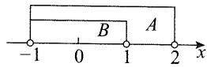

【提炼】①解一元二次不等式首先考虑因式分解；②对于连续取值的集合，可用数轴分析它们的关系.

【2】B 解析: $P=\{x \mid x<4\}$ , $Q=\{x \mid x^{2}<4\}=\{x \mid -2<x<2\}$ , 如图, $Q \subseteq P$ .

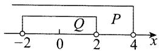

【3】3 解析: $3 \in A$ 且 $A \subseteq B \Rightarrow 3 \in B \Rightarrow a = 3$ .

【4】B 解析: 观察发现集合 A 中有元素 0, 故只需考虑 B 中的哪个元素是 0.

因为 $0 \in A, A \subseteq B$ ，所以 $0 \in B$ ，故 $a - 2 = 0$ 或 $2a - 2 = 0$ ，解得 $a = 2$ 或 1.

注意 $0 \in B$ 不能保证 $A \subseteq B$ , 故还需代回集合检验.

若 a=2，则 $A=\{0,-2\}$ ， $B=\{1,0,2\}$ ，不满足 $A\subseteq B$ ，不合题意；

若 $a = 1$ ，则 $A = \{0, - 1\} ,B = \{1, - 1,0\}$ ，满足 $A\subseteq B.$ 故选B.

【5】D 解析： $|x-a|<1\Rightarrow-1<x-a<1\Rightarrow a-1<x<a+1\Rightarrow A=\{x|a-1<x<a+1\}$ ,

$|x-b|>2\Rightarrow x-b<-2$ 或 $x-b>2\Rightarrow x<b-2$ 或 $x>b+2\Rightarrow B=\{x|x<b-2\text{或}x>b+2\}$ ,

满足 $A \subseteq B$ 的情形有图 1 和图 2 两种情况，
若为图 1，则 $b+2 \leqslant a-1$ ，所以 $a-b \geqslant 3$ ;

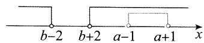  
图1

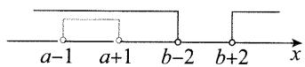  
图2

若为图2，则 $b - 2\geqslant a + 1$ ，所以 $a - b\leqslant -3.$ 综上所述， $\vert a - b\vert \geqslant 3.$

【提炼】分析连续取值的含参集合的包含关系,画数轴是常用方法.

【6】C 解析: 集合 $\left\{0, \frac{b}{a}, b\right\}$ 中的元素 0 比较特殊, 先看 $\{1, a + b, a\}$ 中谁是 0.

因为集合 $\{1, a + b, a\} = \left\{0, \frac{b}{a}, b\right\}$ ，且 $a$ 出现在分母上，所以 $a \neq 0$ ，从而 $a + b = 0$ ，故 $a = -b, \frac{b}{a} = -1$ ，

到此可将条件改写为 $\{1,0,a\} = \{0, - 1,b\}$ ，对比可得 $a = -1,b = 1$ ，所以 $b - a = 2$

【7】D 解析： $\{a,b\}=\{a^{2},b^{2}\}\Rightarrow\left\{\begin{aligned}a^{2}&=a,\\ b^{2}&=b\end{aligned}\right.$ 或 $\left\{\begin{aligned}a&=b^{2},\\ b&=a^{2}.\end{aligned}\right.$

若 $\left\{\begin{aligned}a=a^{2},\\ b=b^{2},\end{aligned}\right.$ 结合 $ab\neq0$ 可解得 a=b=1，此时不满足集合元素的互异性.

若 $\left\{\begin{aligned}a=b^{2},\\ b=a^{2},\end{aligned}\right.$ 两式相减得 $a-b=b^{2}-a^{2}$ ，所以 $a-b=(b+a)(b-a)$ ①.

因为 a, b 是互异的复数, 所以 $a - b \neq 0$ , 在式①两端除以 a - b 可得 $1 = -(b + a)$ , 故 $a + b = -1$ .

【提炼】根据集合相等求出参数的值后，务必代回去检验集合是否满足元素的互异性.

# 1.2 元素个数与子集个数

【8】B 解析:集合 $A=\{1,2,3,5,7,11\}$ , $B=\{x\mid3<x<15\}\Rightarrow A\cap B=\{5,7,11\}\Rightarrow A\cap B$ 中元素的个数为 3.

【9】D 解析: $A=\{x \mid x=3n+2, n \in N\}=\{2,5,8,11,14,17,\cdots\}$ ，所以 $A \cap B = \{8,14\}$ ，故 $A \cap B$ 中元素的个数为 2.

【提炼】当遇到不够直观的集合时,不妨列几个元素出来观察规律.

【10】B 解析: 将集合 M 中 a 和 b 所有可能的组合列表如下:

<table><tr><td>a+b a/b</td><td>1</td><td>2</td><td>3</td></tr><tr><td>4</td><td>5</td><td>6</td><td>7</td></tr><tr><td>5</td><td>6</td><td>7</td><td>8</td></tr></table>

由表可知， $M=\{5,6,7,8\}$ ，共4个元素.

【提炼】集合中元素互异,故列表后相同的元素只计一次.

【11】D 解析: 将集合 B 中 x, y 所有可能的组合及对应的 x - y 的值列表如下:

<table><tr><td>x-y/xy</td><td>1</td><td>2</td><td>3</td><td>4</td><td>5</td></tr><tr><td>1</td><td>0</td><td>1</td><td>2</td><td>3</td><td>4</td></tr><tr><td>2</td><td>-1</td><td>0</td><td>1</td><td>2</td><td>3</td></tr><tr><td>3</td><td>-2</td><td>-1</td><td>0</td><td>1</td><td>2</td></tr><tr><td>4</td><td>-3</td><td>-2</td><td>-1</td><td>0</td><td>1</td></tr><tr><td>5</td><td>-4</td><td>-3</td><td>-2</td><td>-1</td><td>0</td></tr></table>

由表可知， $B=\{(2,1),(3,1),(3,2),(4,1),(4,2),(4,3),(5,1),(5,2),(5,3),(5,4)\}$ ，所以B中的元素个数为10.

【12】A 解析:由题意,集合 A 是圆 $x^{2}+y^{2}=3$ 内(含边界)的整点(即横、纵坐标都为整数的点)构成的集合,如图,该圆内共有 9 个整点,所以集合 A 中有 9 个元素.

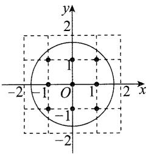

text_image

y
2
1
-2' -1 O 1 2 x
-1
-2

【13】B 解析:集合 A 是圆 $x^{2}+y^{2}=1$ 上的点组成的集合,集合 B 是直线 y=x 上的点组成的集合, $A\cap B$ 是直线与圆的交点组成的集合.

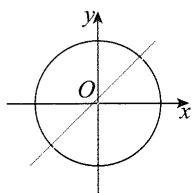

如图, 直线与圆有 2 个交点, 所以集合 $A \cap B$ 中有 2 个元素.

【14】C 解析: $A \cap B$ 的元素为满足 $\left\{\begin{aligned} x, & y \in N^{*}, \\ y & \geqslant x, \\ x + y & =8 \end{aligned}\right.$ 的 $(x, y)$ ,
所有可能的情形不多,不妨按 x 由小到大直接罗列.

由题意, $A\cap B=\{(x,y)\mid x,y\in N^{*},y\geqslant x,x+y=8\}=\{(1,7),(2,6),(3,5),(4,4)\}$ ，所以 $A\cap B$ 中元素的个数为4.

【15】8 解析: 集合 $\{-1,0,1\}$ 有 3 个元素, 有 $2^{3}=8$ 个子集.

【提炼】含 n 个元素的集合有 $2^{n}$ 个子集.

【16】C 解析: $A \cap B = \{1, 3\} \Rightarrow A \cap B$ 有两个元素 $\Rightarrow A \cap B$ 子集的个数为 $2^{2} = 4$ .

【17】B 解析: $P=M\cap N=\{1,3\}\Rightarrow P$ 有两个元素 $\Rightarrow P$ 的子集共有 $2^{2}=4$ 个.

【18】A 解析:集合 A 是椭圆 $\frac{x^{2}}{4} + \frac{y^{2}}{16} = 1$ 上的点构成的集合,集合 B 是函数 y = $3^{x}$ 图象上的点构成的集合.

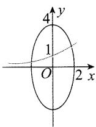

如图,两曲线有2个交点,所以集合 $A\cap B$ 有2个元素,故 $A\cap B$ 有 $2^{2}=4$ 个子集.

【19】B 解法 1: 集合元素不多, 故可直接列出集合 A 的所有包含元素 O 的子集.

在集合 A 的子集中, 含有元素 0 的子集有 $\{0\}$ , $\{0, 1\}$ , $\{0, -1\}$ , $\{-1, 0, 1\}$ , 共 4 个.

解法 2: 集合 $\{-1,1\}$ 的子集个数为 $2^{2}=4$ ，再把元素 0 放入这些子集即为 A 的含元素 0 的子集，故 A 的含元素 0 的子集有 4 个.

【20】D 解法 1: $x^{2} - 3x + 2 = 0 \Rightarrow x = 1$ 或 $2 \Rightarrow A = \{1, 2\}$ , $B = \{x \mid 0 < x < 5, x \in \mathbb{N}\} = \{1, 2, 3, 4\}$ .

因为 $A \subseteq C \subseteq B$ ，所以 $C$ 中必有元素 1 和 2，且 $C$ 中不能有除 1,2,3,4 外的元素，

故满足条件的集合 C 有 $\{1,2\},\{1,2,3\},\{1,2,4\}$ ， $\{1,2,3,4\}$ ，共 4 个.

解法 2: $x^{2}-3x+2=0 \Rightarrow x=1$ 或 $2 \Rightarrow A=\{1,2\}$ , $B=\{x\mid0<x<5,x\in\mathbf{N}\}=\{1,2,3,4\}$ .

集合 $\{3,4\}$ 的子集个数为 $2^{2}=4$ ，在这些子集中放入元素1,2即得满足条件 $A\subseteq C\subseteq B$ 的集合C，
所以满足条件 $A\subseteq C\subseteq B$ 的集合C的个数为4.

# 1.3 集合的并、交、补运算

【21】D 解析:由题意, $A\cup B=\{1,2,4,6\}$ .

【提炼】求两个集合的并集，只需把两个集合的元素合在一起，重复的元素只计一次。

【22】C 解析: $M \cup N = \{x \mid -3 < x < 1\} \cup \{x \mid -1 \leqslant x < 4\} = \{x \mid -3 < x < 4\}$ .

【23】B 解析:如图, $A\cup B=\{x|-1<x\leqslant2\}$ .

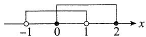

【24】A 解析:两集合的公共元素是 2 和 $4 \Rightarrow M \cap N = \{2, 4\}$ .

【提炼】两个集合的交集即选取两个集合的公共部分.

【25】B 解析:由题意,集合 A,B 的公共元素是 2,3,4,所以 $A \cap B = \{2,3,4\}$ .

【26】C 解析: $x^{2}-x-6\geqslant0\Leftrightarrow(x+2)(x-3)\geqslant0\Leftrightarrow x\leqslant$ -2 或 $x \geqslant 3$ ，所以 $N = (-\infty, -2] \cup [3, +\infty)$ ,
又 $M=\{-2,-1,0,1,2\}$ ，所以 $M \cap N = \{-2\}$ .

【27】B 解析: 两集合的公共元素是 2 和 $3 \Rightarrow A \cap B = \{2, 3\}$ .

【28】B 解析： $|x-1|\leqslant1\Rightarrow-1\leqslant x-1\leqslant1\Rightarrow0\leqslant x\leqslant2$ $\Rightarrow B=\{x|0\leqslant x\leqslant2\}$ ，又 $A=\{-1,1,2,4\}$ ，所以 $A\cap B=\{1,2\}$ .

【29】D 解析:集合 $A=\{x\mid|x|<3, x\in Z\}=\{x|-3<x<3, x\in Z\}=\{-2,-1,0,1,2\}, B=\{x\mid|x|>1, x\in Z\}=\{x|x<-1 \text{ 或 } x>1, x\in Z\}$ ，所以 $A\cap B=\{-2,2\}$ .

【30】D 解析:如图, $A\cap B=\{x\mid1\leqslant x<2\}$ .

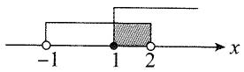

【31】B 解析: 如图, $M \cap N = \left\{ x \mid \frac{1}{3} \leqslant x < 4 \right\}$ .

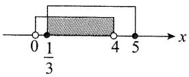

【32】D 解析: $\sqrt{x}<4\Rightarrow0\leqslant x<16\Rightarrow M=\{x\mid0\leqslant x<$

16}, $3x \geqslant 1 \Rightarrow x \geqslant \frac{1}{3} \Rightarrow N = \left\{ x \mid x \geqslant \frac{1}{3} \right\}$ .

如图， $M\cap N = \left\{x\mid \frac{1}{3}\leqslant x <   16\right\} .$

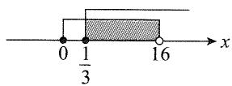

【33】C 解析: $M=\{x\mid-4<x<2\}$ , $x^{2}-x-6<0\Rightarrow(x-3)\cdot(x+2)<0\Rightarrow-2<x<3\Rightarrow N=\{x\mid-2<x<3\}$ ,
如图，所以 $M \cap N = \{x \mid -2 < x < 2\}$ .

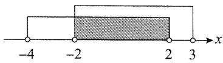

【34】A 解析:由 $-5 < x^{3} < 5$ 可得 $-\sqrt[3]{5} < x < \sqrt[3]{5}$ ,

所以 $A = \{x\mid -\sqrt[3]{5} < x <   \sqrt[3]{5}\} .$

因为 $1 < \sqrt[3]{5} < \sqrt[3]{8} = 2$ ，所以集合 $B$ 中的元素 $-1,0$ 也在集合 $A$ 中，其余元素不在 $A$ 中，故 $A \cap B = \{-1,0\}$ .

【35】A 解析: 正面求解不易, 直接验证选项.

A 项, 由题意, $M \cup N = \{x \mid x < 2\}$ , 所以 $\complement_U(M \cup N) = \{x \mid x \geqslant 2\}$ , 故选 A.

【36】C 解析: S 和 T 中的元素不明朗, 可列举一部分来看规律.

由题意,集合 S 中的元素为…,-7,-5,-3,-1,1,3,5,7,…,集合 T 中的元素为…,-11,-7,-3,1,5,9,…,所以 T 是 S 的真子集,故 $S \cap T = T$ .

【37】A 解析: 因为 $U=\{1,2,3,4,5\}$ , $B=\{1,2,4\}$ ，所以 $C_{U}B=\{3,5\}$ .

又 $A = \{1,3\}$ ，所以 $(\complement_U B) \cup A = \{1,3,5\}$ .

【38】A 解法 1: $A \cup B = \{x \mid x = 3k + 1 \text{ 或 } x = 3k + 2, k \in Z\}$ , $A \cup B$ 包括除以 3 后余数为 1 或 2 的整数，整数除以 3 余数只能是 0, 1, 2，所以取补集后剩余的即为余数为 0 的整数.

故 $\complement_U(A \cup B) = \{x \mid x = 3k, k \in \mathbf{Z}\}$ .

解法 2: 若想象不出 $\complement_{U}(A\cup B)$ 中的元素有哪些, 可罗列部分元素来看规律.

由题意,集合 $A=\{\cdots,-5,-2,1,4,7,\cdots\}$ ,集合 $B=\{\cdots,-4,-1,2,5,8,\cdots\}$ ,

所以 $A \cup B = \{\cdots, -5, -4, -2, -1, 1, 2, 4, 5, 7, 8, \cdots\}$ ，故 $\complement_{U}(A \cup B) = \{\cdots, -3, 0, 3, 6, \cdots\} = \{x \mid x = 3k, k \in \mathbf{Z}\}$ .

【39】D 解析:由题意,要使 $\sqrt{x}\in A$ ,则 $\sqrt{x}=1,2,3,4,5,9$ ,所以x=1,4,9,16,25,81,故 $B=\{1,4,9,16,25,81\}$ ,

所以 $A \cap B = \{1, 4, 9\}$ , 故 $\complement_A(A \cap B) = \{2, 3, 5\}$ .

【40】D 解析: 如图, 在全集 U 中把集合 A 的元素去掉, 可得 $\complement_{U}A = \{x \mid -3 < x \leqslant -2 \text{ 或 } 1 < x < 3\}$ . 故选 D.

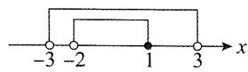

【提炼】求集合 A 在全集 U 中的补集, 只需在全集 U 中将集合 A 中的元素去掉, 取余下的部分, 尤其需要注意端点的情况.

【41】C 解析:由题意, $A\cap B=\{1\}$ ,所以 $(A\cap B)\cup C=\{1\}\cup\{0,2,4\}=\{0,1,2,4\}$ .

【42】D 解析: $x^{2}-4x+3=0\Rightarrow(x-1)(x-3)=0\Rightarrow$ x=1 或 $3 \Rightarrow B = \{1, 3\}$ ,

又 $A = \{-1,2\}$ ，所以 $A\cup B = \{-1,1,2,3\}$ ，所以 $\complement_U(A\cup B) = \{-2,0\}$

【43】A 解析: $A \cup B = \{-1, 0, 1, 2\}$ ，则 $\complement_{U}(A \cup B) = \{-2, 3\}$ .

【44】A 解析:由题意, $M\cup N=\{1,2,3,4\}$ ，所以 $\complement_{U}(M\cup N)=\{5\}$ .

【45】A 解析:由题意, $\complement_{U}N=\{2,4,8\}$ ,所以 $M\cup(\complement_{U}N)=\{0,2,4,6,8\}$ .

【46】A 解析:由题意, $C_{UB}=\{-2,0,1\}$ ,所以 $A\cap(C_{UB})=\{0,1\}$ .

【47】A 解析:由题意, $\complement_{U}M=\{2,3,5\}$ ，所以 $N\cup(\complement_{U}M)=\{2,3,5\}$ .

【48】A 解析: $x^{2}=x\Rightarrow x^{2}-x=0\Rightarrow x(x-1)=0\Rightarrow x=0$ 或 $1 \Rightarrow M = \{0, 1\}$ ;

$$
\lg x \leqslant 0 \Rightarrow \lg x \leqslant \lg 1 \Rightarrow 0 <   x \leqslant 1 \Rightarrow N = (0, 1 ].
$$

所以 $M \cup N = [0,1]$ .

【提炼】对数不等式隐含了对数的真数只能为正这一条件。

【49】A 解析: 由 $\log_{\frac{1}{2}}x \geqslant \frac{1}{2}$ 可得 $\log_{\frac{1}{2}}x \geqslant \log_{\frac{1}{2}}\left(\frac{1}{2}\right)^{\frac{1}{2}} = \log_{\frac{1}{2}}\frac{\sqrt{2}}{2}$ ，结合函数 $y = \log_{\frac{1}{2}}x$ 在 $(0, +\infty)$ 上可得 $0 < x \leqslant \frac{\sqrt{2}}{2}$ ，所以 $\complement_{R} A = (-\infty, 0] \cup \left(\frac{\sqrt{2}}{2}, +\infty\right)$ .

【50】C 解析: $A \cap B = \{1\} \Rightarrow 1 \in B$ , 所以 1 是方程 $x^{2} - 4x + m = 0$ 的解, 从而 $1^{2} - 4 \times 1 + m = 0$ , 故 m = 3.

此时方程 $x^{2}-4x+m=0$ 即为 $x^{2}-4x+3=0$ ，解得 x=1 或 3，所以 $B=\{1,3\}$ ，满足 $A\cap B=\{1\}$ .

【51】1 解析: $A \cap B = \{1\} \Rightarrow 1 \in B \Rightarrow a = 1$ 或 $a^{2} + 3 = 1$ .

当 $a = 1$ 时， $A = \{1,2\}$ ， $B = \{1,4\}$ ，满足题意；

当 $a^2 + 3 = 1$ 时，无解. 综上所述，实数 $a$ 的值为 1.

【52】B 解析: $x^{2}-4 \leqslant 0 \Rightarrow -2 \leqslant x \leqslant 2 \Rightarrow A = \{x \mid -2 \leqslant x \leqslant 2\}$ , $2x + a \leqslant 0 \Rightarrow x \leqslant -\frac{a}{2} \Rightarrow B = \left\{x \mid x \leqslant -\frac{a}{2}\right\}$ .

由题意, $A\cap B=\{x\mid-2\leqslant x\leqslant1\}$ ，如图，应有 $-\frac{a}{2}=$ 1,所以 a=-2.

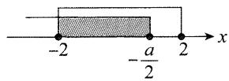

# 1.4 Venn图

【53】C 解析: 设只喜欢足球的百分比为 x, 只喜欢游泳的百分比为 y, 两个项目都喜欢的百分比为 z,

如图, 由题意可得 $x + y + z = 96\%$ , $x + z = 60\%$ , $y + z = 82\%$ , 解得 $z = 46\%$ ,

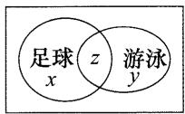

所以该中学既喜欢足球又喜欢游泳的学生数占该校学生总数的比例是 46%.

【54】C 解析:设阅读过《西游记》《红楼梦》的学生构成

的集合分别为 A, B, 如图,

$A(x)$ $z$ $B(y)$

设 A, B 中元素的个数分别为 x 和 y,

$A \cap B$ 中元素的个数为 $z$ , 则 $\left\{ \begin{array}{l} x + y - z = 90, \\ y = 80, \\ z = 60 \end{array} \right. \Rightarrow x = 70$

$$
\Rightarrow \frac {x}{1 0 0} = 0. 7.
$$

【55】A 解析:由所给条件直接推导 $M \cup N$ 的结果不易,可画 Venn 图依次验证选项.

A 项, $M \cup N = M \Leftrightarrow N \subsetneq M$ , 画出 Venn 图如图 1, 由图可知 A 项正确.

单选题到此已可结束,我们把 B 项也做个分析,其余两项类似分析即可.

B项, $M\cup N=N\Leftrightarrow M\not\subseteq N$ ,画出Venn图如图2, $N\cap$ $C_{I}M$ 即为图中阴影部分,不是∅,不合题意.

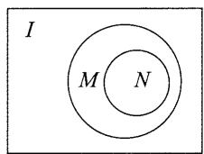

text_image

I
M N

图1

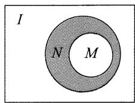

text_image

I
N M

图2

【56】B 解析: $-2 \leqslant x - 1 \leqslant 2 \Rightarrow -1 \leqslant x \leqslant 3 \Rightarrow M = [-1, 3]$ , $N = \{1, 3, 5, \cdots\}$ ，所以 $M \cap N = \{1, 3\}$ ，故阴影部分所示的集合的元素共有 2 个.

# 1.5 充分条件、必要条件

【57】A 解析: 若 x 为整数, 则 $2x+1$ 必为整数, 充分性成立; 当 $2x+1$ 为整数时, x 不一定为整数, 例如, $x=\frac{1}{2}$ 就满足 $2x+1$ 为整数, 但 x 不是整数, 必要性不成立. 故选 A.

【58】A 解析: 当 $\sin x=1$ 时, $\cos^{2}x=1-\sin^{2}x=0$ , 所以 $\cos x=0$ , 充分性成立;

当 $\cos x=0$ 时， $\sin^{2}x=1-\cos^{2}x=1$ ，所以 $\sin x=\pm1$ ，从而不一定有 $\sin x=1$ ，必要性不成立。故选 A.

【59】C 解析: 若 b=0, 则 $f(x)=\cos x$ , 满足 $f(x)$ 为偶函数, 充分性成立;

若 $f(x)$ 为偶函数，则 $f(-x)=f(x)$ ，所以 $\cos(-x)+b\sin(-x)=\cos x+b\sin x$ ，

从而 $\cos x - b\sin x = \cos x + b\sin x$ ，故 $b\sin x = 0$ ，所以 b = 0，必要性成立。故选 C.

【60】B 解析: 由 $a^{2}=b^{2}$ ，可得 $a=\pm b$ 。当 $a=-b\neq0$ 时， $a^{2}+b^{2}=2ab$ 不成立，所以“ $a^{2}=b^{2}$ ”不是“ $a^{2}+b^{2}=2ab$ ”的充分条件；由 $a^{2}+b^{2}=2ab$ ，可得 $(a-b)^{2}=0$ ，解得a=b，所以 $a^{2}=b^{2}$ 成立，所以“ $a^{2}=b^{2}$ ”是“ $a^{2}+b^{2}=2ab$ ”的必要条件.

综上，“ $a^{2}=b^{2}$ ”是“ $a^{2}+b^{2}=2ab$ ”的必要不充分条件.

【61】B 解析: 对比两个式子发现, 将 $\sin^{2}\beta$ 换成 $1-\cos^{2}\beta$ , 即可统一函数名.

$\sin^2\alpha + \sin^2\beta = 1 \Leftrightarrow \sin^2\alpha = 1 - \sin^2\beta \Leftrightarrow \sin^2\alpha = \cos^2\beta \Leftrightarrow$ $\sin \alpha = \pm \cos \beta \Leftrightarrow \sin \alpha \pm \cos \beta = 0$

所以“ $\sin^{2}\alpha+\sin^{2}\beta=1$ ”是“ $\sin\alpha+\cos\beta=0$ ”的必要不充分条件.

【62】B 解析: $f(x)$ 是奇函数 $\Rightarrow \varphi = k\pi + \frac{\pi}{2} (k \in \mathbf{Z})$ ，所以 $\varphi$ 不一定等于 $\frac{\pi}{2}$ ，充分性不成立；

当 $\varphi = \frac{\pi}{2}$ 时， $f(x) = A\cos \left(\omega x + \frac{\pi}{2}\right) = -A\sin \omega x$ ，所以 $f(-x) = -A\sin \omega (-x) = -A\sin (-\omega x) = A\sin \omega x = -f(x)$ ，从而 $f(x)$ 是奇函数，必要性成立。故选B.

【提炼】 $y = A \sin \omega x (A \neq 0, \omega \neq 0)$ 是奇函数， $y = A \cos \omega x (A \neq 0, \omega \neq 0)$ 是偶函数.

【63】B 解析: 取 $f(x)=x^{2}$ ，满足 $f(0)=0$ ，但 $f(x)$ 不是奇函数，充分性不成立；

函数 $y = f(x)$ 的定义域为 R，若函数 $f(x)$ 为奇函数，则 $f(-x) = -f(x)$ ，取 $x = 0$ 得 $f(0) = -f(0)$ ，所以 $f(0) = 0$ ，必要性成立。故选 B.

【64】A 解析: 若 $f(x)$ 在 $[0,1]$ 上 ↗，则 $f(x)_{\max} = f(1)$ ，充分性成立；

当 $f(x)_{\max} = f(1)$ 时， $f(x)$ 在 $[0,1]$ 上不一定单调递增，例如取 $f(x) = \left(x - \frac{1}{3}\right)^2 (0 \leqslant x \leqslant 1)$ ，容易验证 $f(x)$ 在 $x = 1$ 处取得最大值，但 $f(x)$ 在 $\left[0, \frac{1}{3}\right]$ 上 $\searrow$ ，在 $\left[\frac{1}{3}, 1\right]$ 上 $\nearrow$ ，所以必要性不成立。故选A.

【65】C 解析:极值处必有导数为 0, 导数为 0 处不一定是极值, 例如, $f(x)=x^{3}$ 满足 $f'(0)=0$ , 但 $f(0)$ 不是 $f(x)$ 的极值, 所以 p 是 q 的必要不充分条件.

【66】C 解析: 因为 $xy \neq 0$ ，且 $x + y = 0$ ，所以 x = -y，所以 $\frac{y}{x} + \frac{x}{y} = \frac{y}{-y} + \frac{-y}{y} = -2$ ，充分性成立；因为 $xy \neq$

0, 且 $\frac{y}{x} + \frac{x}{y} = -2$ , 所以 $x^{2} + y^{2} = -2xy$ , 即 $(x + y)^{2} = 0$ , 所以 $x + y = 0$ , 必要性成立, 所以“ $x + y = 0$ ”是 “ $\frac{y}{x} + \frac{x}{y} = -2$ ”的充要条件.

【67】B 解析: 由 ad=bc 只能得出 $\frac{b}{a}=\frac{d}{c}$ ，不能得出 $\frac{b}{a}=\frac{c}{b}=\frac{d}{c}$ ，所以 a,b,c,d 不一定成等比数列，举个反例，设 a=1,d=16,b=2,c=8，满足 ad=bc，但 a,b,c,d 不成等比数列，充分性不成立；

若 $a, b, c, d$ 成等比数列，则 $\frac{b}{a} = \frac{d}{c}$ ，所以 $ad = bc$ ，必要性成立。故选B.

【68】D 解析: 当 q>1 时, $\{a_{n}\}$ 不一定为递增数列, 例如, 取 $a_{n}=-2^{n}, q=2>1, \{a_{n}\}$ 为递减数列, 充分性不成立; 当 $\{a_{n}\}$ 为递增数列时, q 不一定大于 1, 例如, 取 $a_{n}=-\left(\frac{1}{2}\right)^{n}$ , 满足 $\{a_{n}\}$ 为递增数列, 但 $q=\frac{1}{2}<1$ , 必要性不成立.

【提炼】等比数列的单调性由首项和公比共同决定.
当 $a_{1}>0$ 时， $q>1\Leftrightarrow\{a_{n}\}$ 递增， $0<q<1\Leftrightarrow\{a_{n}\}$ 递减；
当 $a_{1}<0$ 时， $q>1\Leftrightarrow\{a_{n}\}$ 递减， $0<q<1\Leftrightarrow\{a_{n}\}$ 递增.

【69】C 解析：“存在正整数 $N_{0}$ ，当 $n > N_{0}$ 时， $a_{n} > 0$ ”的意思是“ $\{a_{n}\}$ 从某一项起全为正数”.

先看充分性，若 $\{a_{n}\}$ 是递增数列，则 $a_{n + 1} > a_n$ ，所以 $a_{n + 1} - a_n = d > 0$ ，由于 $a_{n} = a_{1} + (n - 1)d = dn + a_{1} - d,$ 所以 $a_{n}$ 是关于 $n$ 的一次函数，故 $\{a_{n}\}$ 中必存在一项，从该项起，后面的项全为正数，充分性成立；

再看必要性，若 $\{a_{n}\}$ 从某一项起全为正数，则必有 $d > 0$ ，因为如果 $d < 0$ ，那么当 $n\to +\infty$ 时， $a_{n}\rightarrow -\infty$ 这与 $\{a_n\}$ 从某一项起全为正数矛盾，所以必有 $d>$ 0，故 $\{a_{n}\}$ 是递增数列，必要性成立.故选C.

【70】A 解析: 直线 a 和直线 b 相交 $\Rightarrow$ 平面 $\alpha$ 与 $\beta$ 有公共部分 $\Rightarrow$ 平面 $\alpha$ 和平面 $\beta$ 相交, 充分性成立;

当平面 $\alpha$ 和平面 $\beta$ 相交时，如图，直线 $a$ 和直线 $b$ 相交、平行、异面都有可能，必要性不成立.

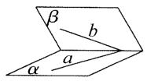

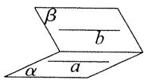

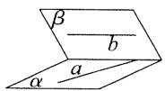

【71】C 解析:与向量的模有关的推理怎么进行?一般是通过把模平方,转化为数量积的运算来处理.

$$
\begin{array}{l} \mid \overrightarrow {A B} + \overrightarrow {A C} \mid > \mid \overrightarrow {B C} \mid \Leftrightarrow \mid \overrightarrow {A B} + \overrightarrow {A C} \mid > \mid \overrightarrow {A C} - \overrightarrow {A B} \mid \Leftrightarrow \\ \overrightarrow {A C ^ {2}} + \overrightarrow {A B ^ {2}} + 2 \overrightarrow {A C} \cdot \overrightarrow {A B} > \overrightarrow {A C ^ {2}} + \overrightarrow {A B ^ {2}} - 2 \overrightarrow {A C} \cdot \overrightarrow {A B} \\ \Leftrightarrow \overrightarrow {A C} \cdot \overrightarrow {A B} > 0, \end{array}
$$

又因为点 A, B, C 不共线，所以 $\overrightarrow{AC} \cdot \overrightarrow{AB} > 0 \Leftrightarrow \overrightarrow{AB}$ 与 $\overrightarrow{AC}$ 的夹角是锐角。故选 C.

【72】C 解析： $|a-3b|=|a+3b|\Leftrightarrow|a-3b|^{2}=|a+3b|^{2}$

$$
\Leftrightarrow a ^ {2} - 6 a \cdot b + 9 b ^ {2} = a ^ {2} + 6 a \cdot b + 9 b ^ {2} \quad ①,
$$

由题意， $|a|=|b|=1$ ，所以式①等价于 $10-6a\cdot b=10+6a\cdot b\Leftrightarrow a\cdot b=0\Leftrightarrow a\perp b$ 。故选C.

【73】B 解析: $a \cdot c = b \cdot c \Rightarrow a \cdot c - b \cdot c = (a - b) \cdot c = 0$

$\Rightarrow(a-b)\perp c$ , 无法得出 a=b, 充分性不成立;

若 a=b，则 $a \cdot c = b \cdot c$ ，必要性成立。故选 B.

【74】D 解析： $|a+b|=|a-b|\Leftrightarrow|a+b|^{2}=|a-b|^{2}\Leftrightarrow$

$$
\boldsymbol {a} ^ {2} + 2 \boldsymbol {a} \cdot \boldsymbol {b} + \boldsymbol {b} ^ {2} = \boldsymbol {a} ^ {2} - 2 \boldsymbol {a} \cdot \boldsymbol {b} + \boldsymbol {b} ^ {2} \Leftrightarrow \boldsymbol {a} \cdot \boldsymbol {b} = 0,
$$

而 $a \cdot b = 0$ 与 $|a| = |b|$ 没有什么关系，相互都不能推出，所以 $|a + b| = |a - b|$ 与 $|a| = |b|$ 也不能互推。故选 D.

【75】C 解析:选项涉及的不外乎向量的平行与垂直,可考虑先根据 a,b 平行、垂直分别求出 x,再判断选项.

$$
\begin{array}{r l} & {\pmb {a} \perp \pmb {b} \Leftrightarrow \pmb {a} \cdot \pmb {b} = (x + 1) x + 2 x = x ^ {2} + 3 x = 0 \Leftrightarrow x = - 3} \\ & {\text {或} 0 \quad ①.} \end{array}
$$

$$
\boldsymbol {a} / / \boldsymbol {b} \Leftrightarrow 2 (x + 1) = x ^ {2} \Leftrightarrow x ^ {2} - 2 x - 2 = 0 \Leftrightarrow x = 1 \pm \sqrt {3} \quad ②.
$$

A 项,由①可知“x=-3”是“ $a \perp b$ ”的充分不必要条件,故 A 项错误;

B 项, 由②可知“x = -3”是“a // b”的既不充分也不必要条件, 故 B 项错误;

C 项, 由①可知“x=0”是“ $a \perp b$ ”的充分不必要条件, 故 C 项正确;

D 项, 由②可知“ $x = -1 + \sqrt{3}$ ”是“ $a \parallel b$ ”的既不充分也不必要条件, 故 D 项错误.

【76】C 解析: 当 x > y 时, 设 x = 1, y = -2, 则 $x < |y|$ , 充分性不成立;

当 $x > |y|$ 时，因为 $|y| \geqslant y$ ，所以 $x > y$ ，必要性成立.故选C.

【77】A 解析: $a > b > 1 \Rightarrow \log_{2} a > \log_{2} b > \log_{2} 1 = 0$ ，充分性成立；若 $\log_{2} a > \log_{2} b > 0$ ，则 a > b > 1，必要性成立.

【78】A 解析: 当 $a+b \leqslant 4$ 时, 因为 a > 0, b > 0, 所以 $4 \geqslant$

$a+b\geqslant2\sqrt{ab}$ ，故 $ab\leqslant4$ ，充分性成立；

取 a=1, b=4 知满足 $ab \leqslant 4$ ，但 $a+b=5>4$ ，必要性不成立。故选 A.

【79】C 解析: 函数 $f(x)=x^{3}$ 在 R 上单调递增, 所以 $a^{3}=b^{3}\Leftrightarrow f(a)=f(b)\Leftrightarrow a=b.$

函数 $g(x) = 3^x$ 在 $\mathbf{R}$ 上单调递增，所以 $3^{a} = 3^{b} \Leftrightarrow g(a) = g(b) \Leftrightarrow a = b$ ，从而 $a^{3} = b^{3} \Leftrightarrow 3^{a} = 3^{b}$ .

【80】A 解析: 当 0 < ab < 1 时, 必有 a, b 同号,

若 $a, b$ 同正，则由 $ab < 1$ 知 $a < \frac{1}{b}$ ，

若 a, b 同负，则由 ab < 1 知 $b > \frac{1}{a}$ ，所以充分性成立；
当 $a<\frac{1}{b}$ 或 $b>\frac{1}{a}$ 时，取a=-1,b=1，不满足0<ab<1，所以必要性不成立.故选A.

【81】A 解析: 当 a > 6 时, $a^{2} > 36$ , 充分性成立; 当 $a^{2} > 36$ 时, a > 6 或 a < -6, 必要性不成立. 故选 A.

【82】B 解析: $x^{2} - 5x < 0 \Leftrightarrow 0 < x < 5, |x - 1| < 1 \Leftrightarrow 0 < x < 2, (0, 2) \subseteq (0, 5)$ , 由“菜菜讲方法”第2点, 小集合是大集合的充分不必要条件, 所以大集合是小集合的必要不充分条件. 故选 B.

【提炼】由“小”成立可以推出“大”成立，“大”成立不能推出“小”成立，小集合是大集合的充分不必要条件.

【83】B 解析: $\log_{\frac{1}{2}}(x+2)<0\Leftrightarrow x+2>1\Leftrightarrow x>-1$ ，因为 $(1,+\infty)\subsetneq(-1,+\infty)$ ，所以“x>1”是“ $\log_{\frac{1}{2}}(x+2)<0$ ”的充分不必要条件.

【84】A 解析: $x^{3}>8\Leftrightarrow x>2$ , $|x|>2\Leftrightarrow x<-2$ 或 x>2,

因为 $(2,+\infty)\subsetneq(-\infty,-2)\cup(2,+\infty)$ ，所以“ $x^{3}>8$ ”是“ $|x|>2$ ”的充分不必要条件.

【85】A 解析: $\left|x-2\right|<1\Leftrightarrow1<x<3, x^{2}+x-2>0\Leftrightarrow x<-2$ 或 x>1.

因为 $(1,3)\subsetneq(-\infty,-2)\cup(1,+\infty)$ ，所以“ $|x-2|<1$ ”是“ $x^{2}+x-2>0$ ”的充分不必要条件.

# 1.6 全称量词与存在量词

【86】C 解析: 否定全称量词命题, 将“∀”改为“∃”, 再否定结论. 所求命题的否定是“∃ $x_{0} \in R$ , $|x_{0}| + x_{0}^{2} < 0$ ”.

【提炼】在否定全称量词命题时,是否一定要将x换成 $x_{0}$ ?其实不一定,例如,本题所给命题的否定也可以写成“ $\exists x \in \mathbf{R}, |x| + x^2 < 0$ ”，只不过为了表示特指，所以存在量词命题中一般习惯于用 $x_0$ 而已。

【87】B 解析: 否定存在量词命题, 将“存在”改为“任意”, 再否定结论. 所给命题的否定是“任意一个无理数, 它的平方不是有理数”.

【提炼】①存在量词命题的否定是全称量词命题；②否定存在量词命题的方法是：“存在”改“任意”，否定结论.

【88】C 解析:由题意, $\neg p$ 为“ $\forall n\in N,n^{2}\leqslant2^{n}$ ”.

【89】C 解析: 所给命题的否定为“ $\forall x\in(0,+\infty)$ ， $\ln x\neq x-1$ ”.

【90】B 解析: A 项, 指数函数 $y=2^{x}$ 的值域为 $(0, +\infty)$ , 所以 $\forall x \in R, 2^{x-1} > 0$ , 故 A 项为真命题;

B项, 因为 $x \in N^{*}$ , 所以当 x = 1 时, $(x - 1)^{2} = 0$ , 故 B 项为假命题;

C 项, 当 x=1 时, $\lg x=\lg 1=0<1$ , 故 C 项为真命题;

D 项, 正切函数 $y = \tan x$ 的值域为 R, 所以存在实数 x, 使得 $\tan x = 2$ 成立, 故 D 项为真命题.

【提炼】对于全称量词命题，必须对所有情形结论都成立，才能判断为真，而要判断为假，则只需找一个反例；对于存在量词命题，只要找到一种情况使结论成立，即可判断为真，而要判断为假，必须说明所有情况下结论都不成立.

【91】B 解析: 对于命题 p, 取 x=0 可得 $\left|x+1\right|=\left|0+1\right|=1$ , 不满足 $\left|x+1\right|>1$ , 所以 p 为假命题, $\neg p$ 为真命题.

对于命题 $q, x^{3} = x \Leftrightarrow x^{3} - x = x(x^{2} - 1) = x(x + 1) \cdot (x - 1) = 0 \Leftrightarrow x = 0$ 或 -1 或 1，其中 1 > 0，所以命题 q 为真命题， $\neg q$ 为假命题。故选 B.

【92】1 解析: 函数 $y=\tan x$ 在 $\left[0,\frac{\pi}{4}\right]$ 上 ↗，由题意， $m \geqslant (\tan x)_{\max} = \tan \frac{\pi}{4} = 1$ ，所以实数 m 的最小值为 1.

# 第二章 一元二次函数、方程和不等式

# 2.1 不等式的性质

【93】D 解析: A 项, 当 a > 0 > b 时, $\frac{1}{a} > 0 > \frac{1}{b}$ , 不等式

$\frac{1}{a} < \frac{1}{b}$ 不成立，故A项错误；

B项,取a=0,b=-1,满足a>b,但 $a^{2}<b^{2}$ ,故B项错误;

C项，当 $c = 0$ 时， $a|c| = b|c|$ ，故C项错误；

D项, $\frac{1}{c^{2}+1}>0$ ,在a>b两端同乘 $\frac{1}{c^{2}+1}$ ,可得 $\frac{a}{c^{2}+1}>\frac{b}{c^{2}+1}$ ,故D项正确.

【提炼】在不等式两端同乘一个正数，不等式依然成立；同乘一个负数，则不等号要反向.

【94】A 解析: $ac < 0 \Rightarrow a, c$ 异号, 结合 c < b < a 知 c < 0, a > 0.

A 项, 因为 b > c, 两端同乘 a 得 ab > ac, 故 A 项正确;

B项, $b-a<0,c<0\Rightarrow c(b-a)>0$ ,故B项错误;

C项, 当 b=0 时, $cb^{2}=ab^{2}=0$ , 故 C 项错误;

D项, $a-c>0,c<0,a>0\Rightarrow ac(a-c)<0$ ,故D项错误.

【95】D 解法 1: A 项, $a < b < 0 \Rightarrow ab > 0$ , 在 $a < b$ 两端同除以 $ab$ 可得 $\frac{a}{ab} < \frac{b}{ab}$ , 即 $\frac{1}{b} < \frac{1}{a}$ , 故 A 项错误;

B项, 因为 b<0, 所以在 a<b 两端同时乘 b, 得 ab> $b^{2}$ , 故 B 项错误;

C 项, 因为 a<0, 所以 -a>0, 在 a<b 两端同时乘 -a, 得 $-a^{2}<-ab$ , 故 C 项错误;

D项,由A项的分析过程可知 $\frac{1}{b}<\frac{1}{a}$ ,所以 $-\frac{1}{b}>-\frac{1}{a}$ ,从而 $-\frac{1}{a}<-\frac{1}{b}$ ,故D项正确.

解法 2: 取 a = -2, b = -1, 代入选项可排除 A, B, C, 故选 D.

【提炼】像这种考查不等式性质的小题，特值法是好方法。若取一组特值代入选项发现不成立，则可排除该选项；但若成立，该选项不一定正确。因为不等式对这一组数据成立，对其他数据却不一定成立，因此特值法要结合排除法使用。

【96】D 解法 1: 取 a=1, b=0，则 b-a=-1<0，故 A 项错误； $a^{3}+b^{3}=1>0$ ，故 B 项错误； $a^{2}-b^{2}=1>0$ ，故 C 项错误。故选 D.

解法 2: $a - |b| > 0 \Rightarrow |b| < a \Rightarrow a > 0$ 且 $-a < b < a$ .

A项, 因为 b<a, 所以 b-a<0, 故 A 项错误;

B项， $-a<b\Rightarrow(-a)^{3}<b^{3}\Rightarrow-a^{3}<b^{3}\Rightarrow a^{3}+b^{3}>0$ 故 B 项错误；

C 项, $|b| < a \Rightarrow a > 0$ 且 $b^{2} < a^{2} \Rightarrow a^{2} - b^{2} > 0$ , 故 C 项错误;

D项， $-a<b\Rightarrow b+a>0$ ，故D项正确.

【提炼】 $|x|<a\Leftrightarrow a>0$ 且 $-a<x<a$ ，这是我们在解绝对值不等式时常用的一个结论。

【97】D 解法 1: 令 a = -1, b = 1, 可排除 A, B, C, 故选 D.

解法 2: A 项, a < 0 < b $\Rightarrow \left\{\begin{aligned}b-a&>0,\\ ab&<0\end{aligned}\right.$ $\Rightarrow\frac{1}{a}-\frac{1}{b}=$ $\frac{b-a}{ab}<0\Rightarrow\frac{1}{a}<\frac{1}{b}$ ，故A项错误；

B项, 已知 a<0<b, 但 $\left|a\right|$ 与 $\left|b\right|$ 谁大不确定, 所以 $a+b$ 的正负不确定, 无法得出 -a>b, 故 B 项错误;

C 项, $a^{2}>b^{2}\Leftrightarrow|a|>|b|$ ,而 $|a|$ 与 $|b|$ 谁大不确定,所以 $a^{2}$ 与 $b^{2}$ 的大小也不确定,故 C 项错误;

D项, $a<b\Rightarrow a^{3}<b^{3}$ ,故D项正确.

【提炼】当 $n$ 为正奇数时， $a < b$ 等价于 $a^n < b^n$ ，例如， $a < b \Leftrightarrow a^3 < b^3 \Leftrightarrow a^5 < b^5$ .

【98】D 解法 1: c < d < 0 $\Rightarrow$ -c > -d > 0, 又 a > b > 0,
所以-ac>-bd, 故 ac<bd, 又 cd>0, 所以在 ac<bd 两端同除以 cd, 可得 $\frac{a}{d}<\frac{b}{c}$ .

解法2: 取 a=4, b=1, c=-2, d=-1, 则 $\frac{a}{c}=-2<\frac{b}{d}=-1$ , $\frac{a}{d}=-4<\frac{b}{c}=-\frac{1}{2}$ , 故 A 项和 C 项错误;

取 a=2, b=1, c=-8, d=-1，则 $\frac{a}{c}=-\frac{1}{4}>\frac{b}{d}=-1$ ，故 B 项错误。故选 D.

【99】B 解析: $M-N=a_{1}a_{2}-a_{1}-a_{2}+1=(a_{1}-1)(a_{2}-1)>0\Rightarrow M>N.$

【提炼】作差比较法是判断两个数大小的重要方法， $\left\{ \begin{array}{l} a - b > 0 \Leftrightarrow a > b, \\ a - b < 0 \Leftrightarrow a < b. \end{array} \right.$ 其步骤是“作差，分解因式，判断各因式符号，判断整体符号，下结论”。

# 2.2 解不等式

【100】 $\left(-1,\frac{2}{3}\right)$ 解析: $3x^{2}+x-2<0\Leftrightarrow(x+1)(3x-2)<0$ , 如图, 由图可知 x 的取值范围是 -1<

$$
x <   \frac {2}{3}.
$$

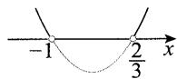

【提炼】熟练了就不用画图了，在平方项系数为正的情况下，记住一句口诀：“小于取中间，大于取两边”。而平方项系数为负的，可先在不等式两端乘-1将平方项系数化为正的。

【101】D 解析: $2x^{2}-x-1>0\Leftrightarrow(2x+1)(x-1)>0$ , 如图, 由图可知原不等式的解集是 $\left(-\infty,-\frac{1}{2}\right)\cup(1,+\infty)$ .

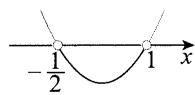

【102】 $(-4,1)$ 解析： $-x^{2}-3x+4>0\Leftrightarrow(x+4)(1-x)>0$ ，如图，由图可知 $x\in(-4,1)$ .

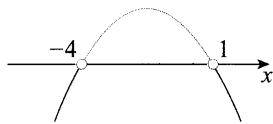

【103】C 解析： $\left\{\begin{aligned}x(x+2)>0,\\ |x|<1\end{aligned}\right.\Leftrightarrow\left\{\begin{aligned}x<-2\text{或}x>0,\\ -1<x<1,\end{aligned}\right.$ 所以 0 < x < 1.

【104】D 解析: $x^{2}+2x-3>0\Leftrightarrow(x-1)(x+3)>0\Leftrightarrow x>1$ 或 x<-3，所以 $f(x)$ 的定义域为 $(-∞,-3)∪(1,+∞)$ .

【105】C 解析: $\frac{x-1}{x+2}<0\Leftrightarrow(x-1)(x+2)<0\Leftrightarrow-2<x<1.$

【106】A 解析: $\frac{x-3}{x+2}<0\Leftrightarrow(x-3)(x+2)<0\Leftrightarrow-2<$ x<3.

【107】D 解析: $\frac{2-3x}{x-1}>0\Leftrightarrow\frac{3x-2}{x-1}<0\Leftrightarrow(x-1)(3x-2)<0\Leftrightarrow\frac{2}{3}<x<1.$

【108】 $(-∞,0)$ 解析: $\frac{x-1}{x}>1\Leftrightarrow1-\frac{1}{x}>1\Leftrightarrow\frac{1}{x}<0\Leftrightarrow x<0.$

【提炼】注意解集是一个集合,填空时务必写成集合或区间的形式.

【109】 $\{x\mid-3<x<2$ 或 $x>3\}$ 解析： $\frac{x^{2}-9}{x-2}>0\Leftrightarrow(x-$

2) $(x^{2}-9)>0\Leftrightarrow(x-2)(x+3)(x-3)>0\xrightarrow{穿针引线}$ $x \in \{x \mid -3 < x < 2 \text{ 或 } x > 3\}$ .

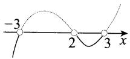

【110】C 解析: $\frac{x^{2}-x-6}{x-1}>0\Leftrightarrow\frac{(x-3)(x+2)}{(x-1)}>0\Leftrightarrow(x-3)\cdot(x+2)(x-1)>0\xrightarrow{穿针引线}x\in\{x|-2<x<1$ 或 x>3}.

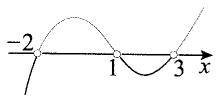

【111】 $\{x\mid -2 <   x <   - 1$ 或 $x > 2\}$ 解析： $\frac{x - 2}{x^2 + 3x + 2} >0$

$$
\Leftrightarrow \frac {x - 2}{(x + 2) (x + 1)} > 0 \Leftrightarrow (x - 2) \cdot (x + 2) (x + 1) > 0
$$

穿针引线 $x \in \{x \mid -2 < x < -1$ 或 $x > 2\}$ .

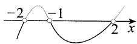

【112】B 解析: $\frac{x-1}{x^{2}-4}>0\Leftrightarrow\frac{x-1}{(x+2)(x-2)}>0\Leftrightarrow(x+2)(x-1)(x-2)>0\xrightarrow{穿针引线}x\in\{x|-2<x<1 或 x>2\}$ .

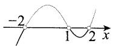

# 2.3 基本不等式的应用

【113】A 解析: 因为 $a+b \geqslant 2\sqrt{ab}$ ，取等条件是 a=b，而题干规定 a > b > 0，所以等号取不到，从而 $a + b > 2\sqrt{ab}$ ，故 A 项正确，B 项错误；

又 $\frac{a}{2} + 2b \geqslant 2\sqrt{\frac{a}{2} \cdot 2b} = 2\sqrt{ab}$ ，取等条件是 $\frac{a}{2} = 2b$ ，即 $a = 4b$ ，在 $a > b > 0$ 的条件下此等号能够取到，故C，D两项均错误.

【114】C 解析: A 项, $y = x^{2} + 2x + 4 = (x + 1)^{2} + 3 \geqslant 3$ , 当 x = -1 时取等号, 所以 $y_{\min} = 3$ , 故 A 项错误;

B项, $y=|\sin x|+\frac{4}{|\sin x|}\geqslant2\sqrt{|\sin x|\cdot\frac{4}{|\sin x|}}$ =4,取等条件是 $|\sin x|=\frac{4}{|\sin x|}$ ，此时 $\sin^{2}x=4$

显然等号无法成立,所以 y>4, 从而 $y=|\sin x|+\frac{4}{|\sin x|}$ 的最小值不是 4, 故 B 项错误;

C项, $y=2^{x}+2^{2-x}\geqslant2\sqrt{2^{x}\cdot2^{2-x}}=4$ ,当且仅当 $2^{x}=2^{2-x}$ ，即x=1时取等号，所以函数 $y=2^{x}+2^{2-x}$ 的最小值为4，故C项正确；

D项, 当 $x=e^{-1}$ 时, $y=\ln e^{-1}+\frac{4}{\ln e^{-1}}=-5<4$ , 所以函数 $y=\ln x+\frac{4}{\ln x}$ 的最小值不是 4, 故 D 项错误.

【115】 $2\sqrt{2}$ 解析：因为 xy=1，所以 $x^{2}+2y^{2}\geqslant2\sqrt{x^{2}\cdot2y^{2}}=2\sqrt{2}|xy|=2\sqrt{2}$ ，取等条件是 $x^{2}=2y^{2}$ ，
结合 xy=1 可得 $\left\{\begin{aligned}x=\sqrt[4]{2},\\ y=\frac{1}{\sqrt[4]{2}}\end{aligned}\right.$ 或 $\left\{\begin{aligned}x&=-\sqrt[4]{2},\\ y&=-\frac{1}{\sqrt[4]{2}},\end{aligned}\right.$ 故 $(x^{2}+2y^{2})_{\min}=2\sqrt{2}.$

【提炼】当两个正数 $a$ 和 $b$ 的积为定值时，可根据 $a + b \geqslant 2\sqrt{ab}$ 求 $a + b$ 的最小值，即“菜菜讲方法”中的口诀“积定和最小”.

【116】36 解析： $\left\{\begin{aligned}x&>0,\\ a&>0\end{aligned}\right.\Rightarrow f(x)=4x+\frac{a}{x}\geqslant2\sqrt{4x\cdot\frac{a}{x}}=4\sqrt{a}$ ，取等条件是 $4x=\frac{a}{x}$ ，此时 $x=\frac{\sqrt{a}}{2}$ ，所以当 $f(x)$ 取最小值时， $x=\frac{\sqrt{a}}{2}$ 。由题意， $\frac{\sqrt{a}}{2}=3$ ，所以a=36。

【117】B 解析：由题意， $\sqrt{(3-a)(a+6)}\leqslant\frac{3-a+a+6}{2}=\frac{9}{2}$ ，取等条件是 $3-a=a+6$ ，解得 $a=-\frac{3}{2}$ ，

所以 $\sqrt{(3 - a)(a + 6)}$ 的最大值为 $\frac{9}{2}$ .

【118】 $\frac{1}{4}$ 解析: 因为 $a+b=1$ ，所以 $ab \leqslant \left(\frac{a+b}{2}\right)^{2} = \frac{1}{4}$ ，
当且仅当 $a=b=\frac{1}{2}$ 时取等号，故 ab 的最大值是 $\frac{1}{4}$ .

【提炼】 $a+b=1$ 即 a,b 的和为定值，根据“菜菜讲方法”中的口诀“和定积最大”，可用不等式 $ab \leqslant \left(\frac{a+b}{2}\right)^{2}$ 求 ab 的最大值.

【119】 $\frac{9}{8}$ 解法1:已有 $\frac{1}{x}+2y=3$ 这一“和定”条件,故把 $\frac{y}{x}$ 向 $\frac{1}{x}\cdot2y$ 变形.

由题意， $\frac{y}{x}=\frac{1}{2}\cdot\frac{1}{x}\cdot2y\leqslant\frac{1}{2}\left(\frac{\frac{1}{x}+2y}{2}\right)^{2}=\frac{1}{2}\times\left(\frac{3}{2}\right)^{2}=\frac{9}{8}$ ，取等条件是 $\frac{1}{x}=2y$ ，结合 $\frac{1}{x}+2y=3$ 可得 $x=\frac{2}{3},y=\frac{3}{4}$ ，所以 $\frac{y}{x}$ 的最大值为 $\frac{9}{8}$ .

解法2: 观察发现 $\frac{1}{x}$ 和 2y 直接相乘, 就会产生 $\frac{y}{x}$ 这一目标结构, 故也可直接用 $a+b\geqslant2\sqrt{ab}$ 处理.

因为 $x, y \in \mathbf{R}_{+}$ , 所以 $\frac{1}{x} > 0, 2y > 0$ , 从而 $3 = \frac{1}{x} + 2y \geqslant 2\sqrt{\frac{1}{x} \cdot 2y} = 2\sqrt{2} \cdot \sqrt{\frac{y}{x}}$ , 故 $\frac{y}{x} \leqslant \frac{9}{8}$ , 取等条件是 $\frac{1}{x} = 2y$ , 结合 $\frac{1}{x} + 2y = 3$ 可得 $x = \frac{2}{3}, y = \frac{3}{4}$ , 所以 $\frac{y}{x}$ 的最大值为 $\frac{9}{8}$ .

【提炼】根据已知条件 $\frac{1}{x}+2y=3$ 对 $\frac{y}{x}$ 凑系数，变形成 $\frac{1}{2}\cdot\frac{1}{x}\cdot2y$ 是不等式求最值常用的技巧.

【120】C 解析: 要求和的最小值, 考虑凑积为定值, 把 $\frac{1}{a} + \frac{4}{b}$ 看成 $\left(\frac{1}{a} + \frac{4}{b}\right) \cdot 1$ , 其中 $1 = 2 \times \frac{1}{2}$ , 结合已知的等式, 2 又可代换成 $a + b$ , 这样展开就有积定了.

由题意, $y=\frac{1}{a}+\frac{4}{b}=\left(\frac{1}{a}+\frac{4}{b}\right)(a+b)\cdot\frac{1}{2}=\frac{1}{2}(5+\frac{b}{a}+\frac{4a}{b})\geqslant\frac{1}{2}\left(5+2\sqrt{\frac{b}{a}\cdot\frac{4a}{b}}\right)=\frac{9}{2},$

取等条件是 $\frac{b}{a} = \frac{4a}{b}$ , 结合 $a + b = 2$ 可得 $a = \frac{2}{3}, b = \frac{4}{3}$ , 所以 $y = \frac{1}{a} + \frac{4}{b}$ 的最小值是 $\frac{9}{2}$ .

【提炼】已知 $a + b = 2$ 求 $\frac{1}{a} +\frac{4}{b}$ 的最小值这种题型，可用常数代换法凑“积定”。系数可以调整，例如，已知 $a > 0,b > 0$ ，且 $a + 2b = 1$ ，求 $\frac{2}{a} +\frac{1}{b}$ 的最小值，处理方法类似.甚至条件跟问题交换也行，例如，已知 $a > 0,b > 0,\frac{2}{a} +\frac{1}{b} = 1$ ，求 $a + 2b$ 的最小值，也是按 $a + 2b = (a + 2b)\cdot \left(\frac{2}{a} +\frac{1}{b}\right)$ 凑出“积定”.

【121】8 解析:所给直线过点 $(1,2)\Rightarrow\frac{1}{a}+\frac{2}{b}=1$ ,所以

$2a+b=(2a+b)\left(\frac{1}{a}+\frac{2}{b}\right)=4+\frac{4a}{b}+\frac{b}{a}\geqslant4+$ $2\sqrt{\frac{4a}{b}\cdot\frac{b}{a}}=8$ ,取等条件是 $\frac{4a}{b}=\frac{b}{a}$ ，结合 $\frac{1}{a}+\frac{2}{b}=1$ 可得 $\left\{\begin{aligned}a=2,\\ b=4,\end{aligned}\right.$ 故 $2a+b$ 的最小值为 8.

【122】B 解析: $\sqrt{3}$ 是 $3^{a}$ 与 $3^{b}$ 的等比中项 $\Rightarrow 3^{a} \cdot 3^{b} = (\sqrt{3})^{2} \Rightarrow 3^{a+b} = 3 \Rightarrow a + b = 1$ ，所以 $\frac{1}{a} + \frac{1}{b} = \left(\frac{1}{a} + \frac{1}{b}\right)(a+b) = 2 + \frac{b}{a} + \frac{a}{b} \geqslant 2 + 2\sqrt{\frac{b}{a} \cdot \frac{a}{b}} = 4$ ，取等条件是 $a = b = \frac{1}{2}$ ，故 $\left(\frac{1}{a} + \frac{1}{b}\right)_{\min} = 4$ .

【123】C 解析: $x+3y=5xy\Rightarrow\frac{3}{x}+\frac{1}{y}=5\Rightarrow3x+4y=$ $\frac{1}{5}(3x+4y)\left(\frac{3}{x}+\frac{1}{y}\right)=\frac{1}{5}\left(13+\frac{3x}{y}+\frac{12y}{x}\right)\geqslant\frac{1}{5}\left(13+ \right.$ $2\sqrt{\frac{3x}{y}\cdot\frac{12y}{x}}$ =5,

取等条件是 $\frac{3x}{y}=\frac{12y}{x}$ ，结合 $\frac{3}{x}+\frac{1}{y}=5$ 可得x=1， $y=\frac{1}{2}$ ，所以 $3x+4y$ 的最小值为 5.

【124】C 解析: 分母为 x-2, 故把前面的 x 也变成 x-2, 即可凑出“积定”.

由题意， $f(x) = x + \frac{1}{x - 2} = x - 2 + \frac{1}{x - 2} + 2\geqslant$ $2\sqrt{(x - 2)\cdot\frac{1}{x - 2}} +2 = 4$ ，当且仅当 $x - 2 = \frac{1}{x - 2}$ 即 $x = 3$ 时等号成立，所以 $f(x)$ 取最小值时， $x = 3$ 故 $a = 3$

【125】 $\left[\frac{1}{5},+\infty\right)$ 解析： $\frac{x}{x^{2}+3x+1}=\frac{1}{x+\frac{1}{x}+3}\leqslant$ $\frac{1}{2\sqrt{x\cdot\frac{1}{x}+3}}=\frac{1}{5}$ ，取等条件是x=1，所以 $\left(\frac{x}{x^{2}+3x+1}\right)_{\max}=\frac{1}{5}$ ，故 $a\geqslant\frac{1}{5}$ .

【提炼】对于“ $\frac{\text{一次函数}}{\text{二次函数}}$ ”的形式。可将一次函数部分整体换元成 $t$ ，分式上、下同除以 $t$ 即可凑出分母局部的“积定”。

【126】D 解析：由题意， $f(x)=\frac{x^{2}-4x+5}{2x-4}$

$$
= \frac {(x - 2) ^ {2} + 1}{2 (x - 2)},
$$

设 t=x-2，则 $t \geqslant \frac{1}{2}$ ，且 $y=\frac{t^{2}+1}{2t}=\frac{1}{2}\left(t+\frac{1}{t}\right) \geqslant \frac{1}{2} \cdot 2\sqrt{t \cdot \frac{1}{t}}=1$ ，当且仅当 t=1，即 x=3 时等号成立，所以 $f(x)$ 有最小值 1.

【提炼】求“ $\frac{\text{二次函数}}{\text{一次函数}}$ ”形式的最值，可将一次函数部分整体换元为 $t$ ，拆分后利用基本不等式求最值。

【127】C 解析:本题没说 a, b 为正实数,但由 $\frac{1}{a} + \frac{2}{b} = \sqrt{ab}$ 可首先得出 a, b 均不等于 0 且同号,否则 ab < 0, $\sqrt{ab}$ 没有意义;其次,若 a, b 同负,则 $\frac{1}{a} + \frac{2}{b} < 0 < \sqrt{ab}$ , 等式 $\frac{1}{a} + \frac{2}{b} = \sqrt{ab}$ 不可能成立,所以 a, b 均为正实数.挖掘出隐藏的条件,就可对所给等式左侧的式子利用基本不等式,把结构统一为求最值的目标 ab.

因为 $a > 0, b > 0$ ，所以 $\frac{1}{a} > 0, \frac{2}{b} > 0$ ，从而 $\sqrt{ab} = \frac{1}{a} + \frac{2}{b} \geqslant 2\sqrt{\frac{1}{a} \cdot \frac{2}{b}} = \frac{2\sqrt{2}}{\sqrt{ab}}$ ，故 $ab \geqslant 2\sqrt{2}$ ，取等条件是 $\frac{1}{a} = \frac{2}{b}$ ，结合 $\frac{1}{a} + \frac{2}{b} = \sqrt{ab}$ 可得 $\left\{ \begin{array}{l} a = \sqrt[4]{2}, \\ b = 2\sqrt[4]{2}, \end{array} \right.$ 所以 $(ab)_{\min} = 2\sqrt{2}$ .

【提炼】当求最值的目标 ab 已经混在了已知的等式 $\frac{1}{a} + \frac{2}{b} = \sqrt{ab}$ 中时，可考虑用基本不等式把其余部分也变成关于 ab 的式子，从而统一结构.

【128】 $\frac{2\sqrt{3}}{3}$ 解析:所给等式中虽无目标结构 $x+y$ ，但配方即可产生这一结构. $x^{2}+y^{2}+xy=1\Rightarrow(x+y)^{2}-xy=1$ ，

其中 $x + y$ 是求最值的目标，只需再把 $xy$ 也变成关于 $x + y$ 的式子，就统一了结构，可用 $xy \leqslant \left(\frac{x + y}{2}\right)^2$ 实现.

$1 = (x + y)^{2} - xy \geqslant (x + y)^{2} - \left(\frac{x + y}{2}\right)^{2}$ , 整理得 $(x + y)^{2} \leqslant \frac{4}{3}$ , 故 $x + y \leqslant \frac{2\sqrt{3}}{3}$ , 取等条件是 $x = y =$

$\frac{\sqrt{3}}{3}$ , 所以 $(x + y)_{\max} = \frac{2\sqrt{3}}{3}$ .

【129】B 解析: 等式 $x+2y+2xy=8$ 中已有 $x+2y$ 这一目标, 只需把 2xy 也变成关于 $x+2y$ 的式子, 即可统一结构.

由题意， $8=x+2y+2xy=x+2y+x\cdot2y\leqslant x+2y+\left(\frac{x+2y}{2}\right)^{2}$ ，所以 $(x+2y)^{2}+4(x+2y)-32\geqslant0$ ①.

设 $t = x + 2y$ ，则不等式①即为 $t^2 +4t - 32\geqslant 0$ ，所以 $(t + 8)(t - 4)\geqslant 0$ ，解得 $t\geqslant 4$ 或 $t\leqslant -8$ （舍去），

故 $x + 2y \geqslant 4$ ，当且仅当 $x = 2, y = 1$ 时等号成立，所以 $x + 2y$ 的最小值是4.

【130】D 解析: 若能将所给等式中的 $2^{x} + 2^{y}$ 变成 $2^{x} \cdot 2^{y}$ ，即可产生 $x + y$ 这一结构，可用 $a + b \geqslant 2\sqrt{ab}$ 来实现.

由题意, $1=2^{x}+2^{y}\geqslant2\sqrt{2^{x}\cdot2^{y}}=2\times2^{\frac{x+y}{2}}$ ,所以 $2^{\frac{x+y}{2}}\leqslant\frac{1}{2}=2^{-1}$ ,从而 $\frac{x+y}{2}\leqslant-1$ ,故 $x+y\leqslant-2$ ,

取等条件是 $2^{x} = 2^{y}$ ，结合 $2^{x} + 2^{y} = 1$ 可得 $x = y = -1$ ，所以 $(x + y)_{\max} = -2.$

此时结合选项已可确定选D，若要分析 $x + y$ 的下限，怎么办呢？不妨对 $x$ 或 $y$ 取极限来看.

当 $x \to -\infty$ 时， $2^x \to 0$ ，要使 $2^x + 2^y = 1$ ，则 $y \to 0$ ，所以 $x + y \to -\infty$ .

综上所述， $x + y$ 的取值范围是 $(-\infty, -2]$

【131】 $\frac{1}{4}$ 解析: $a-3b+6=0\Rightarrow a-3b=-6$ ，目标式的 $\frac{1}{8^{b}}$ 可化为 $2^{-3b}$ ，于是只要将 $2^{a}$ 和 $2^{-3b}$ 相乘，就会产生 a-3b.

所以 $2^{a} + \frac{1}{8^{b}} = 2^{a} + 2^{-3b}\geqslant 2\sqrt{2^{a}\cdot 2^{-3b}} = 2\sqrt{2^{a - 3b}} =$ $2\sqrt{2^{-6}} = \frac{1}{4}$ ，取等条件是 $2^{a} = 2^{-3b}$ ，即 $a = -3b$ ，结合 $a - 3b + 6 = 0$ 可得 $a = -3,b = 1$ ，故 $\left(2^{a} + \frac{1}{8^{b}}\right)_{\min} = \frac{1}{4}.$

【132】 $\frac{9}{2}$ 解法1:分母是二次的,若能将分子也化为关于x,y的二次式,即可齐次化,拆分凑出“积定”.

因为 $x + 2y = 4$ ，所以 $\frac{(x + 1)(2y + 1)}{xy} = \frac{(4x + 4)(8y + 4)}{16xy}$

$$
\begin{array}{l} = \frac {(4 x + x + 2 y) (8 y + x + 2 y)}{1 6 x y} = \frac {(5 x + 2 y) (x + 1 0 y)}{1 6 x y} \\ = \frac {5 x ^ {2} + 5 2 x y + 2 0 y ^ {2}}{1 6 x y} = \frac {1}{1 6} \left(\frac {5 x}{y} + \frac {2 0 y}{x} + 5 2\right) \geqslant \\ \frac {1}{1 6} \left(2 \sqrt {\frac {5 x}{y} \cdot \frac {2 0 y}{x}} + 5 2\right) = \frac {9}{2}, \\ \end{array}
$$

取等条件是 $\frac{5x}{y}=\frac{20y}{x}$ ，结合 $x+2y=4$ 可得 $\left\{\begin{aligned}x&=2,\\ y&=1,\end{aligned}\right.$ 所以 $\frac{(x+1)(2y+1)}{xy}$ 的最小值为 $\frac{9}{2}$ .

解法 2: $\frac{(x+1)(2y+1)}{xy}=\frac{2xy+x+2y+1}{xy}=\frac{2xy+5}{xy}=$ $2+\frac{5}{xy}$ ,

所以欲求目标式的最小值, 只需求 xy 的最大值, 对 $x+2y=4$ 直接用 $a+b\geqslant2\sqrt{ab}$ 即可化和为积.

由题意, $4=x+2y\geqslant2\sqrt{x\cdot2y}$ ，所以 $xy\leqslant2$ ，取等条件是x=2y，结合 $x+2y=4$ 可得x=2,y=1，

所以 $xy$ 的最大值为2，故 $\frac{(x + 1)(2y + 1)}{xy}$ 的最小值为 $2 + \frac{5}{2} = \frac{9}{2}$ .

【提炼】求分式型最值，若分子、分母不是齐次的，可考虑结合已知条件将分子、分母齐次化，齐次化后，通过变形往往可凑出 $a \cdot \frac{x}{y} + b \cdot \frac{y}{x}$ 这种积为定值的形式.

【133】C 解法 1:a,b 之间没有等式条件, 故只能从目标式出发分析, 要求最小值, 应想办法凑“积定”, 观察发现只要对 $\frac{1}{a} + \frac{1}{b}$ 用 $\frac{1}{a} + \frac{1}{b} \geqslant 2\sqrt{\frac{1}{ab}} = \frac{2}{\sqrt{ab}}$ , 就能凑出 “积定”.

由题意， $\frac{1}{a} +\frac{1}{b} +2\sqrt{ab}\geqslant 2\sqrt{\frac{1}{a}\cdot\frac{1}{b}} +2\sqrt{ab} =$ $\frac{2}{\sqrt{ab}} +2\sqrt{ab}\geqslant 2\sqrt{\frac{2}{\sqrt{ab}}\cdot 2\sqrt{ab}} = 4,$

两个不等号的取等条件分别是 $\frac{1}{a} = \frac{1}{b}$ 和 $\frac{2}{\sqrt{ab}} = 2\sqrt{ab}$ , 解得 $a = b = 1$ , 所以 $\frac{1}{a} + \frac{1}{b} + 2\sqrt{ab}$ 的最小值是4.

解法 2: 能否直接凑出“积定”呢? 其实也能, 但技巧性更强, 目标式中的三项之积为 $\frac{2}{\sqrt{ab}}$ , 所以为了全部约分, 凑出“积定”, 可把 $2\sqrt{ab}$ 拆成两项.

由题意, $\frac{1}{a}+\frac{1}{b}+2\sqrt{ab}=\frac{1}{a}+\frac{1}{b}+\sqrt{ab}+\sqrt{ab}\geqslant4\sqrt[4]{\frac{1}{a}\cdot\frac{1}{b}\cdot\sqrt{ab}\cdot\sqrt{ab}}=4$ ,取等条件是 $\frac{1}{a}=\frac{1}{b}=\sqrt{ab}$ ,解得a=b=1,所以 $\frac{1}{a}+\frac{1}{b}+2\sqrt{ab}$ 的最小值是4.

【提炼】若变量间没有等式条件，也不易通过变形直接凑出定值时，可考虑先对目标中的某一部分用基本不等式，凑出定值，再用基本不等式，但需注意，凡是用了多次基本不等式的，务必保证等号能同时成立。

【134】 $2\sqrt{2}$ 解法1： $a,b$ 之间没有等式，故直接分析目标式，将 $\frac{1}{a}$ 与 $\frac{a}{b^2}$ 相乘可约去 $a$ ，故先对这两项用基本不等式.

由题意， $\frac{1}{a} +\frac{a}{b^2} +b\geqslant 2\sqrt{\frac{1}{a}\cdot\frac{a}{b^2}} +b = \frac{2}{b} +b,$

此式仍满足积为定值，可再用基本不等式。

又 $\frac{2}{b} + b \geqslant 2\sqrt{\frac{2}{b} \cdot b} = 2\sqrt{2}$ , 所以 $\frac{1}{a} + \frac{a}{b^2} + b \geqslant 2\sqrt{2}$ ,

取等条件是 $\left\{\begin{aligned}\frac{1}{a}&=\frac{a}{b^{2}},\\ \frac{2}{b}&=b,\end{aligned}\right.$ 解得 $\left\{\begin{aligned}a&=\sqrt{2},\\ b&=\sqrt{2},\end{aligned}\right.$ 故 $\left(\frac{1}{a}+\frac{a}{b^{2}}+b\right)_{\min}=2\sqrt{2}.$

解法 2: 涉及三项相加, 考虑用多元均值不等式求最小值, 但所给三项不满足积定, 故先凑定值, 观察发现相乘可约去 a, 所以只需通过配凑约去 b, 分母是 $b^{2}$ , 故把后面的 b 拆成 $\frac{b}{2} + \frac{b}{2}$ , 相乘即可约掉.

由题意， $\frac{1}{a}+\frac{a}{b^{2}}+b=\frac{1}{a}+\frac{a}{b^{2}}+\frac{b}{2}+\frac{b}{2}\geqslant4\sqrt[4]{\frac{1}{a}\cdot\frac{a}{b^{2}}\cdot\frac{b}{2}\cdot\frac{b}{2}}=4\sqrt[4]{\frac{1}{4}}=4\left[\left(\frac{1}{2}\right)^{2}\right]^{\frac{1}{4}}=4\left(\frac{1}{2}\right)^{\frac{1}{2}}=4\times\frac{\sqrt{2}}{2}=2\sqrt{2}$ ，当且仅当 $\frac{1}{a}=\frac{a}{b^{2}}=\frac{b}{2}$ 时取等号，结合a>0,b>0可得此时 $a=b=\sqrt{2}$ ，所以 $\left(\frac{1}{a}+\frac{a}{b^{2}}+b\right)_{\min}=2\sqrt{2}$ .

【提炼】设 a, b, c, d 均为正数，则 $a + b + c + d \geqslant 4\sqrt[4]{abcd}$ ，当且仅当 a = b = c = d 时取等号.

【135】4 解法 1:a,b 之间没有等式条件, 故只能从目标式出发分析, 要求最小值, 应想办法凑“积定”, 若

将分式拆成 $\frac{a^{4}+4b^{4}}{ab}+\frac{1}{ab}$ ，要想凑积定，应把 $\frac{a^{4}+4b^{4}}{ab}$ 化为ab这种结构，可对分子用不等式 $a^{2}+b^{2}\geqslant2ab$ .

由题意， $\frac{a^{4}+4b^{4}+1}{ab}=\frac{a^{4}+4b^{4}}{ab}+\frac{1}{ab}=\frac{(a^{2})^{2}+(2b^{2})^{2}}{ab}+\frac{1}{ab}\geqslant\frac{2a^{2}\cdot2b^{2}}{ab}+\frac{1}{ab}=4ab+\frac{1}{ab}\geqslant2\sqrt{4ab\cdot\frac{1}{ab}}=4,$

两个不等号的取等条件分别为 $a^2 = 2b^2$ 和 $4ab = \frac{1}{ab}$ 解得 $a^2 = \frac{\sqrt{2}}{2}, b^2 = \frac{\sqrt{2}}{4}$ ，所以 $\frac{a^4 + 4b^4 + 1}{ab}$ 的最小值为4.

解法 2: 本题能否直接凑出“积定”呢？其实也可以，但技巧性更强，先把分式拆开.

$$
\frac {a ^ {4} + 4 b ^ {4} + 1}{a b} = \frac {a ^ {3}}{b} + \frac {4 b ^ {3}}{a} + \frac {1}{a b},
$$

此时我们发现三项之积为 $4ab$ ，不是定值，若能多一个 $\frac{1}{ab}$ 这种项，就能凑出“积定”了，可把 $\frac{1}{ab}$ 再拆分.

所以 $\frac{a^4 + 4b^4 + 1}{ab} = \frac{a^3}{b} +\frac{4b^3}{a} +\frac{1}{ab} = \frac{a^3}{b} +\frac{4b^3}{a} +\frac{1}{2ab} +$ $\frac{1}{2ab}\geqslant 4\sqrt[4]{\frac{a^3}{b}\cdot\frac{4b^3}{a}\cdot\frac{1}{2ab}\cdot\frac{1}{2ab}} = 4$ ，取等条件是 $\frac{a^3}{b} =$ $\frac{4b^3}{a} = \frac{1}{2ab}$ ，解得 $a^2 = \frac{\sqrt{2}}{2},b^2 = \frac{\sqrt{2}}{4}$ 故 $\frac{a^4 + 4b^4 + 1}{ab}$ 的最小值为4.

# 第三章 函数与导数

# 3.1 定义域

【136】 $(-∞,0)∪(0,1]$ 解析:要使函数 $f(x)$ 有意义,
则 $\left\{\begin{aligned}x&\neq0,\\ 1-x&\geqslant0\end{aligned}\right.\Rightarrow x\leqslant1$ 且 $x\neq0$ . 所以函数 $f(x)$ 的定义
域是 $(-∞,0)∪(0,1]$ .

【137】 $\{x\mid x>0\}$ 解析:要使函数 $f(x)$ 有意义,则 $\left\{\begin{aligned}&x+1\neq0,\\&x>0\end{aligned}\right.\Rightarrow\left\{\begin{aligned}&x\neq-1,\\&x>0\end{aligned}\right.\Rightarrow x>0.$ 所以函数 $f(x)$ 的定义域是 $\{x\mid x>0\}$ .

【提炼】①分母不为0；②对数的真数大于0；③定义域写成区间或集合的形式.

【138】 $[-1,7]$ 解析: $7+6x-x^{2}\geqslant0\Rightarrow x^{2}-6x-7\leqslant0$ $\Rightarrow(x+1)(x-7)\leqslant0\Rightarrow-1\leqslant x\leqslant7$ , 所以已知函数的定义域为 $[-1,7]$ .

【提炼】①偶次根号下“非负”；②定义域写成区间或集合的形式.

【139】 $[2, +\infty)$ 解析： $\left\{ \begin{array}{l} \log_2 x - 1 \geqslant 0, \\ x > 0 \end{array} \right. \Rightarrow$ $\left\{ \begin{array}{l} \log_2 x \geqslant 1 = \log_2 2, \\ x > 0 \end{array} \right. \Rightarrow \left\{ \begin{array}{l} x \geqslant 2, \\ x > 0 \end{array} \right. \Rightarrow x \geqslant 2$ ，所以 $f(x)$ 的定义域为 $[2, +\infty)$ .

【140】A 解析： $\left\{\begin{aligned}1-2^{x}\geqslant&0,\\ x+3\geqslant&0,\\ \sqrt{x+3}\neq&0\end{aligned}\right.\Rightarrow\left\{\begin{aligned}2^{x}\leqslant&1=2^{0},\\ x\geqslant&-3,\\ x\neq&-3\end{aligned}\right.\Rightarrow$

$$
\left\{ \begin{array}{l} x \leqslant 0, \\ x \geqslant - 3, \Rightarrow x \in (- 3, 0 ]. \\ x \neq - 3 \end{array} \right.
$$

【141】 $[3, +\infty)$ 解析： $\left\{ \begin{array}{l} |x - 2| - 1 \geqslant 0, \\ x - 1 > 0, \\ \log_2(x - 1) \neq 0 \end{array} \right.\Rightarrow$

$$
\left\{ \begin{array}{l l} x \leqslant 1 \text {或} x \geqslant 3, \\ x > 1, & \Rightarrow x \geqslant 3. \\ x \neq 2 \end{array} \right.
$$

所以函数 $f(x)$ 的定义域为 $[3, +\infty)$ .

【142】C 解析: $\left\{\begin{aligned}(\log_{2}x)^{2}-1&>0,\\ x&>0\end{aligned}\right.\Rightarrow\left\{\begin{aligned}\log_{2}x&<-1\text{或}\log_{2}x>1,\\ x&>0\end{aligned}\right.$

$$
\begin{array}{l} {\Rightarrow \left\{ \begin{array}{l l} {\log_ {2} x <   \log_ {2} \frac {1}{2} \text {或} \log_ {2} x > \log_ {2} 2,} \\ {x > 0} \end{array} \right. \Rightarrow 0 <   x <   \frac {1}{2} \text {或}} \\ {x > 2.} \end{array}
$$

【提炼】解对数不等式，记住“化同底”三个字，把两端都化成同底数的对数，再利用对数函数的单调性便可快速解出.

【143】C 解析： $\left\{\begin{aligned}&4-|x|\geqslant0,\\&\frac{x^{2}-5x+6}{x-3}>0,\\&x-3\neq0\end{aligned}\right.\Rightarrow\left\{\begin{aligned}&-4\leqslant x\leqslant4,\\&\frac{(x-2)(x-3)}{x-3}>0,\\&x\neq3\end{aligned}\right.$

$$
\Rightarrow x \in (2, 3) \cup (3, 4 ].
$$

【144】D 解析: 因为函数 $y=10^{\lg x}$ 可化为 $y=x(x>0)$ ，
所以函数 $y=10^{lg x}$ 的定义域和值域都是 $(0,+\infty)$ .

A 项, y=x 的定义域和值域均为 R, 不合题意;
B 项, $y=\lg x$ 的定义域为 $(0,+\infty)$ , 值域为 R, 不合题意;

C项, $y=2^{x}$ 的定义域为R,值域为 $(0,+\infty)$ ,不合题意;

D项, $y=\frac{1}{\sqrt{x}}$ 的定义域和值域均为 $(0,+\infty)$ ，满足题意.

【提炼】 $a^{\log_{a}N}=N(a>0,$ 且 $a\neq1$ .

【145】D 解析: $\sqrt[3]{x} \neq 0 \Rightarrow x \neq 0 \Rightarrow y = \frac{1}{\sqrt[3]{x}}$ 的定义域为 $\{x \mid x \neq 0\}$ .

A 项, $\sin x\neq0\Rightarrow x\neq k\pi,k\in\mathbf{Z}$ ,所以 $y=\frac{1}{\sin x}$ 的定义域为 $\{x|x\neq k\pi,k\in\mathbf{Z}\}$ ，故 A 项不合题意；

B项, $\left\{\begin{aligned}x&>0,\\ x&\neq0\end{aligned}\right.\Rightarrow y=\frac{\ln x}{x}$ 的定义域为 $(0,+\infty)$ ，故B项不合题意；

C 项, $y = x e^{x}$ 的定义域为 R,故 C 项不合题意;

D项, $y=\frac{\sin x}{x}$ 的定义域为 $\{x\mid x\neq0\}$ ，故D项满足题意.

【146】B 解析: $f(x)$ 的定义域为 $(-1,0)\Rightarrow-1<x<0$ ，即 $f(\cdots)$ 括号内的范围是 $(-1,0)$ ，括号内的范围恒不变。所以在 $f(2x+1)$ 中，应满足 $-1<2x+1<0$ ，解得 $-1<x<-\frac{1}{2}$ ，定义域是自变量 x 的取值集合。故 $f(2x+1)$ 的定义域为 $\left(-1,-\frac{1}{2}\right)$ 。

【提炼】①定义域指自变量 x 的取值范围；② $f(\cdots)$ 括号内整体的范围始终不变.

【147】B 解析: $f(x)$ 的定义域为 $[0,2] \Rightarrow$ 在函数 $g(x) = \frac{f(2x)}{x-1}$ 中, 有 $\left\{\begin{aligned}0 &\leqslant 2x \leqslant 2, \\ x &-1 \neq 0\end{aligned}\right. \Rightarrow 0 \leqslant x < 1 \Rightarrow g(x)$ 的定义域是 $[0,1)$ .

【提炼】①定义域指自变量 x 的取值范围；② $f(\cdots)$ 括号内整体的范围始终不变；③ 分母不为 0.

【148】[0,1] 解析: 函数 $f(x)$ 的定义域为 $R \Rightarrow 2^{x^{2}-2ax+a} - 1 \geqslant 0$ 在 R 上恒成立, 所以 $2^{x^{2}-2ax+a} \geqslant 1 = 2^{0}$ 在 R 上恒成立, 从而 $x^{2}-2ax+a \geqslant 0$ 在 R 上恒成立, 故 $\Delta = 4a^{2}-4a \leqslant 0$ , 解得 $0 \leqslant a \leqslant 1$ .

【提炼】一元二次不等式在 R 上恒成立这类问题只需考虑图象开口方向和判别式就可以了.

# 3.2 分段函数: 求函数值、解方程与不等式

【149】B 解析:由题意, $f(10)=\lg 10=1$ ,所以 $f(f(10))=f(1)=1^{2}+1=2$ .

【150】4 解析:由题意, $f(-4)=\left(\frac{1}{2}\right)^{-4}=(2^{-1})^{-4}=$

$2^{4} = 16$ ，所以 $f(f(-4)) = f(16) = \sqrt{16} = 4.$

【151】-2 解析:由题意, $f(-2)=10^{-2}$ ,所以 $f(f(-2))=f(10^{-2})=\lg 10^{-2}=-2$ .

【152】B 解析: $g(\pi)=0 \Rightarrow f(g(\pi))=f(0)=0.$

【153】2 解析:由题意, $f(\sqrt{6})=(\sqrt{6})^{2}-4=2$ ,所以 $f(f(\sqrt{6}))=f(2)=|2-3|+a=1+a=3$ ,解得a=2.

【154】B 解析: a 与 0 的大小关系不确定, 所以代解析式算 $f(a)$ 前, 应分 $a \leqslant 0$ 和 a > 0 两种情况讨论.

若 $a \leqslant 0$ ，则 $f(a) = -a = 4$ ，故 $a = -4$ ；若 $a > 0$ ，则 $f(a) = a^2 = 4$ ，解得 $a = 2$ 或 $-2$ （舍去）.

综上所述， $a = -4$ 或2.

【155】A 解析:由题意, $f(1)=2$ , $f(a)+f(1)=0\Rightarrow$ $f(a)=-2.$

要代解析式算 $f(a)$ ，应讨论 a 与 0 的大小关系.

当 $a > 0$ 时， $f(a) = 2a = -2 \Rightarrow a = -1$ （舍去）；

当 $a \leqslant 0$ 时， $f(a) = a + 1 = -2 \Rightarrow a = -3$ .

【提炼】分段函数中，已知函数值求自变量，要讨论自变量位于分段函数的哪一段.

【156】A 解析: 要由 $f(a) = -3$ 求 a, 应讨论 a 与 1 的大小关系.

若 $a \leqslant 1$ ，则 $f(a) = 2^{a - 1} - 2 = -3$ ，故 $2^{a - 1} = -1$ ，无解；若 $a > 1$ ，则 $f(a) = -\log_2(a + 1) = -3$ ，解得 $a = 7$ 。故 $f(6 - a) = f(-1) = 2^{-1 - 1} - 2 = -\frac{7}{4}$ 。

【157】C 解析: 代解析式前应先判断 a 和 $a+1$ 分别在哪一段, 若不考虑其他信息, 则要讨论的情况较多. 注意到 $f(x)$ 的两段都是增函数, 若 a 和 $a+1$ 位于同一段, 则必有 $f(a)<f(a+1)$ , 所以 a 和 $a+1$ 不可能位于同一段. 由于 $a<a+1$ , 所以必有 $\left\{\begin{aligned}0<a<1,\\ a+1>1,\end{aligned}\right.$ 这样问题就明朗了.

$f(a) = f(a + 1)\Rightarrow \sqrt{a} = 2(a + 1 - 1)$ ，解得 $a = \frac{1}{4}$ ，所以 $f\left(\frac{1}{a}\right) = f(4) = 6.$

【提炼】分类讨论是分段函数问题的核心方法,若直接讨论分类较多,则可尝试运用一些辅助信息.看能否缩小讨论的范围.

【158】 $-\frac{3}{4}$ 解析： $1 - a$ 与 $1 + a$ 的大小关系不确定，因为 $f(x)$ 在两段上都单调，所以 $1 - a$ 和 $1 + a$ 不可能位于同一段.要把 $f(1 - a)$ 和 $f(1 + a)$ 代入解析式，还是需讨论 $1 - a,1 + a$ 与1的大小关系，即讨论 $a$ 与0的大小关系.

当 $a < 0$ 时， $1 - a > 1, 1 + a < 1$ ，所以 $f(1 - a) = f(1 + a)$ 即为 $-(1 - a) - 2a = 2(1 + a) + a$ ，故 $a = -\frac{3}{4}$ ；

当 $a > 0$ 时， $1 - a < 1, 1 + a > 1$ ，所以 $f(1 - a) = f(1 + a)$ 即为 $2(1 - a) + a = -(1 + a) - 2a$ ，故 $a = -\frac{3}{2}$ （舍去）.

综上， $a$ 的值为 $-\frac{3}{4}$

【159】D 解析: 要代解析式解 $f(x) \leqslant 2$ ，应讨论 x 位于哪一段.

当 $x \leqslant 1$ 时， $f(x) \leqslant 2$ 即为 $2^{1-x} \leqslant 2$ ，所以 $1 - x \leqslant 1$ ，解得 $x \geqslant 0$ ，故 $0 \leqslant x \leqslant 1$ ；

当 $x > 1$ 时， $f(x) \leqslant 2$ 即为 $1 - \log_2 x \leqslant 2$ ，也即 $\log_2 x \geqslant -1$ ，因为 $x > 1$ ，所以 $\log_2 x > \log_2 1 = 0 > -1$ ，故 $f(x) \leqslant 2$ 恒成立.

综上所述， $x$ 的取值范围是 $[0, +\infty)$ .

【160】 $(-∞,8]$ 解析: 当 x<1 时, $f(x)≤2$ 即为 $e^{x-1}≤2$ , 因为 x<1, 所以 $e^{x-1}<e^{1-1}=1<2$ , 故 $f(x)≤2$ 恒成立;

当 $x \geqslant 1$ 时， $f(x) \leqslant 2$ 即为 $x^{\frac{1}{3}} \leqslant 2$ ，解得 $x \leqslant 8$ ，所以 $1 \leqslant x \leqslant 8$ 。综上所述，x 的取值范围是 $(-∞, 8]$ 。

【161】 $[-3,1]$ 解析: 当 x<0 时, $|f(x)|=\left|\frac{1}{x}\right|=-\frac{1}{x}\geqslant\frac{1}{3}$ , 两端同乘 x 得 $-1\leqslant\frac{x}{3}$ , 所以 $x\geqslant-3$ , 故 $-3\leqslant x<0$ ;

当 $x \geqslant 0$ 时， $|f(x)| = \left|\left(\frac{1}{3}\right)^x\right| = \left(\frac{1}{3}\right)^x \geqslant \frac{1}{3} \Rightarrow x \leqslant 1$ ，所以 $0 \leqslant x \leqslant 1$ .

综上所述，不等式 $|f(x)| \geqslant \frac{1}{3}$ 的解集为[-3,1].

【162】D 解析: 本题若讨论, 则需讨论 $x+1$ 和 2x 与 0 的大小关系, 可能的情形较多, 故画图结合单调性来看.

函数 $y = f(x)$ 的大致图象如图，左端递减，右端平行于 $x$ 轴，要使 $f(x + 1) < f(2x)$ ，只需在

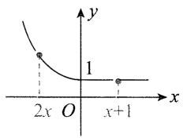

line

| x | y |
|---|---|
| 2x | 1 |
| x+1 | 0 |

2x<0 的前提下, 再满足 $2x<x+1$ 即可, 所以 $\left\{\begin{aligned}&2x<0,\\ &2x<x+1,\end{aligned}\right.$ 解得 x<0.

【提炼】分类讨论和数形结合是解决分段函数问题的两大方法.本题若讨论，需分 $\left\{ \begin{array}{l}x + 1\leqslant 0,\\ 2x\leqslant 0, \end{array} \right.$ $\left\{ \begin{array}{l}x + 1 > 0,\\ 2x > 0, \end{array} \right.$ $\left\{ \begin{array}{l}x + 1 > 0,\\ 2x\leqslant 0 \end{array} \right.$ 或 $\left\{ \begin{array}{l}x + 1\leqslant 0,\\ 2x > 0 \end{array} \right.$ 四种情况，较为复杂，故采用数形结合的方法.

【163】 $\left(-\frac{1}{4},+\infty\right)$ 解析: 此题需分类讨论, 分类的标准怎么找呢? 我们要将 $f(x)$ 和 $f\left(x-\frac{1}{2}\right)$ 代入函数的解析式, 那么必须讨论 $x, x-\frac{1}{2}$ 与 0 的大小关系, 故分界点就是 $\frac{1}{2}$ 和 0, 讨论的逻辑就有了.

当 $x \leqslant 0$ 时, $x - \frac{1}{2} \leqslant -\frac{1}{2} < 0$ , $f(x) + f\left(x - \frac{1}{2}\right) = x + 1 + \left(x - \frac{1}{2}\right) + 1 = 2x + \frac{3}{2} > 1 \Rightarrow x > -\frac{1}{4} \Rightarrow -\frac{1}{4} < x \leqslant 0$ ;

当 $0 < x \leqslant \frac{1}{2}$ 时， $x - \frac{1}{2} \leqslant 0$ ，所以 $f(x) + f\left(x - \frac{1}{2}\right) = 2^x + \left(x - \frac{1}{2}\right) + 1 = 2^x + x + \frac{1}{2}$ ，

注意到 $y=2^{x}+x+\frac{1}{2}$ 是增函数，所以 $y=2^{x}+x+\frac{1}{2}>2^{0}+\frac{1}{2}=\frac{3}{2}>1$ ，故 $f(x)+f\left(x-\frac{1}{2}\right)>1$ 恒成立；

当 $x > \frac{1}{2}$ 时， $f(x) + f\left(x - \frac{1}{2}\right) = 2^x + 2^{x - \frac{1}{2}} > 1$ 恒成立. 综上所述，满足 $f(x) + f\left(x - \frac{1}{2}\right) > 1$ 的 $x$ 的取值范围为 $\left(-\frac{1}{4}, +\infty\right)$ .

【提炼】本题讨论完 $x \leqslant 0$ 的情况后，若能观察出 $f(x)$ 在 $\mathbf{R}$ 上 $\nearrow$ ，于是 $y = f(x) + f\left(x - \frac{1}{2}\right)$ 在 $\mathbf{R}$ 上也 $\nearrow$ ，则后面两种情况就不用讨论了，原不等式肯定成立，从而直接得出结果.

【164】 $\frac{37}{28}\quad3+\sqrt{3}$ 解析:由题意, $f\left(\frac{1}{2}\right)=-\left(\frac{1}{2}\right)^{2}+2=\frac{7}{4}$ ，所以 $f\left(f\left(\frac{1}{2}\right)\right)=f\left(\frac{7}{4}\right)=\frac{7}{4}+\frac{4}{7}-1=\frac{37}{28}$ .

要分析 b-a 的最大值, 应先解 $1 \leqslant f(x) \leqslant 3$ , 可以通

过讨论代入解析式来解，但结

合图象来看更简单。

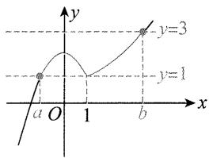

text_image

y
y=3
y=1
a O 1 b
x

如图, 满足 $1 \leqslant f(x) \leqslant 3$ 的是蓝色那一段实线,

要使 b-a 最大，应有 b 为右端点，a 为左端点，图中所画即为这种情况，下面分别计算图中的 b 和 a。

联立 $\left\{\begin{aligned}y=3,\\ y=x+\frac{1}{x}-1,\end{aligned}\right.$ 解得 $x=2\pm\sqrt{3}$ ，由图可知 b>

1, 所以 $b = 2 + \sqrt{3}$ .

联立 $\left\{\begin{aligned}y=1,\\ y=-x^{2}+2,\end{aligned}\right.$ 解得 $x=\pm1$ ，由图可知 a<0，所以 a=-1。故 $(b-a)_{\max}=2+\sqrt{3}-(-1)=3+\sqrt{3}$ 。

# 3.3 函数的单调性

【165】C 解析: 对于 A, 由于函数 $y = \ln x$ 在区间 $(0, +\infty)$ 上单调递增, 故 $f(x) = -\ln x$ 在区间 $(0, +\infty)$ 上单调递减;

对于 B, 由于函数 $y=2^{x}$ 在区间 $(0,+\infty)$ 上单调递增, 故 $f(x)=\frac{1}{2^{x}}$ 在区间 $(0,+\infty)$ 上单调递减;

对于C,由于函数 $y=\frac{1}{x}$ 在区间 $(0,+\infty)$ 上单调递减,故 $f(x)=-\frac{1}{x}$ 在区间 $(0,+\infty)$ 上单调递增;

对于 D, $f(x)=3^{|x-1|}=\left\{\begin{aligned}&3^{x-1},&x\geqslant1,\\ &3^{-x+1},&x<1,\end{aligned}\right.$ 当 $x\geqslant1$ 时， $f(x)$ 单调递增，当 x<1 时， $f(x)$ 单调递减，故 $f(x)=3^{|x-1|}$ 在区间 $(0,+\infty)$ 上先减后增.

【166】A 解析: 画出函数图象如图, 在区间 $(0, +\infty)$ 上单调递增的是函数 $y = x^{\frac{1}{2}}$ .

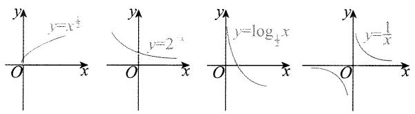

text_image

y
y=x²
y=2^x
y=log₁/₂x
y=1/x

【提炼】基本初等函数的图象同学们一定要熟练掌握！

【167】A 解析: 画出函数图象如图, 由图可知在区间 $(0, +\infty)$ 上为增函数的是 $y = \sqrt{x + 1}$ .

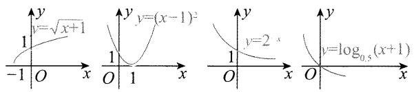

text_image

y
y=√x+1
1
-1 O x
y
y=(x-1)^2
1 O 1 x
y
y=2
1 O x
y=log_{0.5}(x+1)
O

【168】D 解析: 给的都是简单函数, 根据其图象即可判断单调性.

如图, 只有 $f(x)=\sqrt[3]{x}$ 为增函数, 故选 D.

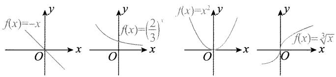

text_image

f(x)=-x
f(x)=(2/3)
f(x)=x²
f(x)=√[x]

【169】C 解析: A 项, $x, y \in R$ , 且 $x > y > 0 \Rightarrow \frac{1}{x} - \frac{1}{y} = \frac{y - x}{xy} < 0$ , 故 A 项错误;

B项, $f(x)=\sin x$ 不是单调函数 $\Rightarrow\sin x$ 与 $\sin y$ 的大小关系不确定,故B项错误;

C 项, $f(x)=\left(\frac{1}{2}\right)^x$ 是减函数且 $x>y\Rightarrow\left(\frac{1}{2}\right)^x<\left(\frac{1}{2}\right)^y\Rightarrow\left(\frac{1}{2}\right)^x-\left(\frac{1}{2}\right)^y<0$ ,故 C 项正确;

D 项, $\ln x + \ln y = \ln (xy)$ , 因为 $xy$ 与 1 的大小关系不确定, 所以 $\ln (xy)$ 与 0 的大小关系不确定, 故 D 项错误.

【170】D 解析:画出函数图象如图,由图可知选 D.

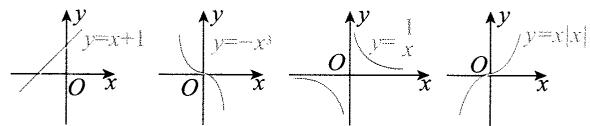

text_image

y
y=x+1
y=-x
y=1
y=x|x
O x O x O x
O x

【171】A 解析: B 项是增函数, C, D 两项是都非奇非偶函数. 故选 A.

【172】D 解析: A 项, $y=\frac{1}{1-x}$ 的图象可由 $y=-\frac{1}{x}$ 的图象向右平移 1 个单位长度得到, 其大致图象如图, 由图可知 $y=\frac{1}{1-x}$ 在 $(-1,1)$ 上为增函数, 故 A 项错误;

B项, $y=\cos x$ 在 $(-1,0)$ 上为增函数,在 $(0,1)$ 上为减函数,故B项错误;

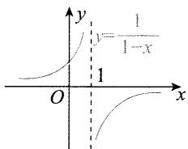

text_image

y
y=1/(1-x)
1
O
x

C项, $y=\ln(x+1)$ 的图象可由$y = \ln x$ 的图象向左平移1个单位长度得到，所以 $y = \ln (x + 1)$ 在 $(-1,1)$ 上为增函数，故C项错误；D项, $y=2^{-x}=\left(\frac{1}{2}\right)^{x}$ 在 $(-1,1)$ 上为减函数,故D项正确.

【173】A 解析:由题意知所求函数 $f(x)$ 在 $(0,+\infty)$ 上.

A 项, $f(x)=\frac{1}{x}$ 在 $(0,+\infty)$ 上↓,满足题意;

B项, $f(x)=(x-1)^{2}$ 在 $(0,1)$ 上 $\searrow$ ,在 $(1,+\infty)$ 上 $\nearrow$ ,不合题意;

C项, $f(x)=\mathrm{e}^{x}$ 在 $(0,+\infty)$ 上↗,不合题意;

D项, $f(x)=\ln(x+1)$ 在 $(0,+\infty)$ 上↗,不合题意.

【174】A 解析: 先看奇偶性, 可用奇函数的和差结论判断.

因为 $y=x^{3}$ 和 $y=\frac{1}{x^{3}}$ 都是奇函数, 所以 $f(x)$ 为奇函数.

再判断单调性, 可拆分成 $y = x^{3}$ 和 $y = -\frac{1}{x^{3}}$ 两部分来看.

由幂函数的性质， $y=x^{3}$ 在 $(0,+\infty)$ 上 $\nearrow$ ， $y=x^{-3}$ 在 $(0,+\infty)$ 上 $\searrow$ ，所以 $y=-x^{-3}$ 在 $(0,+\infty)$ 上 $\nearrow$ ，

而 $f(x)=x^{3}-\frac{1}{x^{3}}=x^{3}+(-x^{-3})$ ，所以 $f(x)$ 在 $(0,+\infty)$ 上 ↗. 故选 A.

【提炼】分析函数的单调性和奇偶性,可考虑拆分成几部分分别来看.

【175】D 解析:先求定义域, $x^{2}-2x-8>0\Rightarrow(x+2)(x-4)>0\Rightarrow x\in(-\infty,-2)\cup(4,+\infty)$ .

$f(x) = \ln (x^{2} - 2x - 8)$ 由 $y = \ln u$ 和 $u = x^2 - 2x - 8$ 复合而成，可根据同增异减原则分析单调性.

当 $x \in (-\infty, -2)$ 时， $u = x^2 - 2x - 8 \searrow$ ，又 $y = \ln u \nearrow$ 所以 $y = \ln (x^2 - 2x - 8) \searrow$

当 $x \in (4, +\infty)$ 时， $u = x^2 - 2x - 8\nearrow$ ，又 $y = \ln u\nearrow$ 所以 $y = \ln (x^2 - 2x - 8)\nearrow$ . 故选 D.

【176】D 解析: $x^{2} - 5x + 6 > 0 \Rightarrow x \in (-\infty, 2) \cup (3, +\infty)$ , 排除 A 和 C.

函数 $y = \log_{\frac{1}{2}}(x^2 - 5x + 6)$ 由 $y = \log_{\frac{1}{2}}u$ 和 $u = x^2 - 5x + 6$ 复合而成，可根据同增异减原则分析单调性.

因为 $y=\log_{\frac{1}{2}}u\searrow,u=x^{2}-5x+6$ 在 $(-∞,2)$ 上 $\searrow$ ，
在 $(3,+\infty)$ 上 $\nearrow$ ,

所以 $y=\log_{\frac{1}{2}}(x^{2}-5x+6)$ 在 $(-∞,2)$ 上 ↗，在 $(3,+∞)$ 上 ↘. 故选 D.

【177】D 解析: 先判断奇偶性, 可将解析式合并, 用定义判断. 由题意, $f(x) = \ln |2x + 1| - \ln |2x - 1| = \ln \left| \frac{2x + 1}{2x - 1} \right|$ ①,

所以 $f(-x) = \ln \left|\frac{-2x + 1}{-2x - 1}\right| = \ln \left|\frac{2x - 1}{2x + 1}\right| =$

$\ln\left|\frac{2x+1}{2x-1}\right|^{-1}=-\ln\left|\frac{2x+1}{2x-1}\right|=-f(x)$ ，故 $f(x)$ 为奇函数，排除选项A,C.

再判断单调性，B，D两个选项判断一个即可，不妨看选项B，可先结合 $x$ 的范围将解析式化简.

当 $x \in \left(-\frac{1}{2}, \frac{1}{2}\right)$ 时， $\frac{2x + 1}{2x - 1} < 0$ ，结合①可得 $f(x) = \ln \left(-\frac{2x + 1}{2x - 1}\right) = \ln \left(-\frac{2x - 1 + 2}{2x - 1}\right) = \ln \left(-1 - \frac{2}{2x - 1}\right)$ ，

函数 $f(x)$ 由 $y = \ln t$ 和 $t = -1 - \frac{2}{2x - 1}$ 复合而成，可用同增异减原则判断其单调性.

当 $x \in \left(-\frac{1}{2}, \frac{1}{2}\right)$ 时，若 $x$ 增大，则 $2x - 1$ 增大，所以 $\frac{2}{2x - 1}$ 减小，故 $t = -1 - \frac{2}{2x - 1}$ 增大，

所以 $t = -1 - \frac{2}{2x - 1}$ 单调递增，而 $y = \ln t$ 也单调递增，所以 $f(x)$ 单调递增，选项 B 错误。故选 D.

【提炼】上述判断单调性的方法不唯一，也可将解析式变形成 $f(x) = \ln (2x + 1) - \ln (1 - 2x)$ ，不难发现 $y = \ln (1 + 2x)$ 和 $y = -\ln (1 - 2x)$ 在 $\left(-\frac{1}{2}, \frac{1}{2}\right)$ 上都↗，所以 $f(x)$ 也↗.

【178】A 解析： $\left\{\begin{aligned}1+x&>0,\\ 1-x&>0\end{aligned}\right.\Rightarrow-1<x<1\Rightarrow f(x)$ 的定义域为 $(-1,1)$ ，又 $f(-x)=\ln(1-x)-\ln(1+x)=-f(x)$ ，所以 $f(x)$ 为奇函数.

$f'(x)=\frac{1}{1+x}-\frac{1}{1-x}\cdot(-1)=\frac{2}{1-x^{2}}>0\Rightarrow f(x)$ 在
(0,1)上是增函数.

【提炼】单调性的判断方法不是唯一的，本题也可拆分成 $y = \ln (1 + x)$ 和 $y = -\ln (1 - x)$ 分别来看，不难发现两函数都↗，所以 $f(x)$ 也↗.

【179】D 解析: $f(x)=(x-3)e^{x}\Rightarrow f'(x)=e^{x}+(x-3)e^{x}$ $=(x-2)e^{x}$ ，令 $f'(x)>0$ ，可得 x>2，

所以 $f(x)$ 的单调递增区间是 $(2, +\infty)$ .

【180】①④ 解析: 令 $g(x)=\mathrm{e}^{x}f(x)$ ，下面依次判断 $g(x)$ 的单调性.

对于①, $g(x)=\left(\frac{e}{2}\right)^{x},\frac{e}{2}>1\Rightarrow g(x)\nearrow$ ,故 $f(x)=2^{-x}$ 具有M性质;

对于②, $g(x)=\left(\frac{\mathrm{e}}{3}\right)^{x},0<\frac{\mathrm{e}}{3}<1\Rightarrow g(x)\searrow$ ,故 $f(x)=$

$3^{-x}$ 不具有M性质；

对于③, $g(x)=\mathrm{e}^{x}\cdot x^{3}$ ，所以 $g^{\prime}(x)=\mathrm{e}^{x}(x^{3}+3x^{2})=x^{2}\mathrm{e}^{x}(x+3)$ ，当x<-3时， $g^{\prime}(x)<0$ , $g(x)\searrow$ ，故 $f(x)=x^{3}$ 不具有M性质；

对于④, $g(x)=\mathrm{e}^{x}(x^{2}+2)$ ，所以 $g'(x)=\mathrm{e}^{x}(x^{2}+2x+2)=\mathrm{e}^{x}\left[(x+1)^{2}+1\right]>0$ ，从而 $g(x)\nearrow$ ，故 $f(x)=x^{2}+2$ 具有M性质.

【提炼】①②主要是考查指数函数的单调性，③④主要是考查利用导数判断函数的单调性.

【181】ACD 解析: A 项, $f'(x)=2(x-1)(x-4)+(x-1)^{2}=3(x-1)(x-3)$ , 所以 $f'(x)>0\Leftrightarrow x<1$ 或 x>3, $f'(x)<0\Leftrightarrow1<x<3$ ,

从而 $f(x)$ 在 $(-\infty, 1)$ 上 $\nearrow$ ，在 $(1,3)$ 上 $\searrow$ ，在 $(3,+\infty)$ 上 $\nearrow$ ，故 $x=3$ 是 $f(x)$ 的极小值点，故 A 正确；

B项, 当 0 < x < 1 时, x 与 $x^{2}$ 的大小容易判断, 故可考虑结合单调性来分析 $f(x) < f(x^{2})$ 是否成立.

由前面的分析可知 $f(x)$ 在 $(0,1)$ 上 $\nearrow$ ，又当 $0 < x < 1$ 时， $0 < x^2 < x < 1$ ，所以 $f(x^2) < f(x)$ ，故B错误；

C项，若把 $f(2x - 1)$ 代入解析式，则计算量较大，可考虑将 $2x - 1$ 整体换元成 $t$ ，化为 $f(t)$ 来分析.

令 t=2x-1，则 $f(2x-1)=f(t)$ ，当 1<x<2 时，1<t<3，由前面的分析可知 $f(t)$ 在 $(1,3)$ 上，

又因为 $f(1)=0, f(3)=-4$ ，所以 $-4<f(t)<0$ ，即 $-4<f(2x-1)<0$ ，故 C 正确；

D项, 当 -1 < x < 0 时, 1 < 2 - x < 3, 所以 x 和 2 - x 不在 $f(x)$ 的同一单调区间上, 不方便用单调性比较 $f(x)$ 与 $f(2 - x)$ 的大小, 故尝试用作差法来判断.

当-1<x<0时， $f(2-x)-f(x)=(2-x-1)^{2}(2-x-4)-(x-1)^{2}(x-4)=(x-1)^{2}(-x-2)-(x-1)^{2}(x-4)=(x-1)^{2}(2-2x)=-2(x-1)^{3}>0$ ，所以 $f(2-x)>f(x)$ ，故D正确.

【182】 $\left[\frac{\sqrt{5}-1}{2},1\right)$ 解析: 直接分析 $f(x)$ 的单调性不易, 可求导来看.

由题意， $f'(x)=a^{x}\ln a+(1+a)^{x}\ln(1+a)$ ，

因为 $f(x)$ 在 $(0, +\infty)$ 上 $\nearrow$ ，所以 $f'(x) \geqslant 0$ 在 $(0, +\infty)$ 上恒成立，即 $a^x \ln a + (1 + a)^x \ln (1 + a) \geqslant 0$

参数 a 较多, 没法集中, 但 x 只有两处, 且观察发现

可同除以 $a^x$ 把含 $x$ 的部分集中起来.

所以 $\ln a + \frac{(1 + a)^x}{a^x}\ln (1 + a)\geqslant 0,$

故 $\ln a + \left(1 + \frac{1}{a}\right)^x\ln (1 + a)\geqslant 0①.$

想让式①恒成立,只需左侧最小值≥0,故分析其单调性.

因为 $1 + \frac{1}{a} > 1, 1 + a > 1$ ，所以 $\ln (1 + a) > 0$

从而 $y = \ln a + \left(1 + \frac{1}{a}\right)^x\ln (1 + a)$ 在 $(0, + \infty)$ 上

故 $\ln a + \left(1 + \frac{1}{a}\right)^x\ln (1 + a) > \ln a + \left(1 + \frac{1}{a}\right)^0$

$$
\ln (1 + a) = \ln a + \ln (1 + a),
$$

所以①式恒成立 $\Leftrightarrow \ln a + \ln (1 + a)\geqslant 0$ ，从而 $\ln [a(1+$ $a)]\geqslant 0$

故 $a(1 + a)\geqslant 1$ ，结合 $0 <   a <   1$ ，解得 $\frac{\sqrt{5} - 1}{2}\leqslant a <   1.$

【183】B 解析: 分段函数在 R 上↗, 先考虑各段上分别↗.

当 $x < 0$ 时， $f(x) = -x^2 - 2ax - a$ ，如图1，要使 $f(x)$ 在 $(- \infty, 0)$ 上 $\nearrow$ ，应有 $-a \geqslant 0$ ，所以 $a \leqslant 0$ ①，

当 $x \geqslant 0$ 时，因为 $y = \mathrm{e}^{x}$ 和 $y = \ln (x + 1)$ 都 $\nearrow$ ，所以 $f(x) = \mathrm{e}^{x} + \ln (x + 1)$ 也 $\nearrow$

结束了吗？没有，还需考虑分段点处的拼接情况，图2的情形不满足 $f(x)$ 在 $\mathbb{R}$ 上 $\nearrow$ ，图3、图4满足.

要使 $f(x)$ 在 $\mathbf{R}$ 上 $\nearrow$ ，还应有 $-0^2 - 2a \cdot 0 - a \leqslant e^0 + \ln(0 + 1)$ ，解得 $a \geqslant -1$ ，结合①得实数 $a$ 的取值范围是 $[-1, 0]$ .

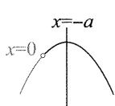  
图1

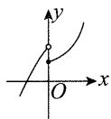  
图2

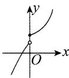  
图3

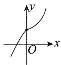  
图4

【184】D 解析: $f(x)$ 为复合函数, 可用同增异减原则分析单调性.

$x^{2}-4x-5>0\Rightarrow x<-1$ 或 x>5，所以 $f(x)$ 的定义域为 $(-∞,-1)∪(5,+∞)$ .

设 $u=x^{2}-4x-5$ ，则 $f(x)$ 由 $y=\lg u$ 和 $u=x^{2}-4x-5$ 复合而成.

当 $x \in (-\infty, -1)$ 时， $u = x^2 - 4x - 5\searrow$ ，又 $y = \lg u \nearrow$ 所以 $f(x) \searrow$ ；

当 $x \in (5, +\infty)$ 时， $u = x^2 - 4x - 5\nearrow$ ，又 $y = \lg u\nearrow$ ，所

以 $f(x)\nearrow$ 所以 $f(x)$ 的单调递增区间是 $(5, +\infty)$ .

因为 $f(x)$ 在 $(a, +\infty)$ 上 $\nearrow$ ，所以 $(a, +\infty) \subseteq (5, +\infty)$ ，故 $a \geqslant 5$ .

【185】D 解析: 函数 $y=f(x)$ 由 $y=2^{n}$ 和 $u=x(x-a)$ 复合而成, 可由同增异减准则分析单调性.

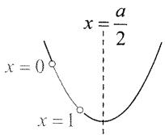

因为 $y = 2^u$ 在 $\mathbf{R}$ 上 $\nearrow$ ，所以要使

$f(x) = 2^{x(x - a)}$ 在 $(0,1)$ 上 $\searrow$ ，只需 $u = x(x - a)$ 在 $(0,$ 1)上

二次函数 $u = x(x - a) = x^2 - ax$ 图象的对称轴为 $x = \frac{a}{2}$ ，如图，由图可知应有 $\frac{a}{2} \geqslant 1$ ，解得 $a \geqslant 2$ .

【186】 $(-∞,2]$ 解法1: $\cos 2x$ 可化为 $1-2\sin^{2}x$ ，故若将 $\sin x$ 换元成t，则 $f(x)$ 可看成复合函数.

由题意, $f(x)=1-2\sin^{2}x+a\sin x$ ,设 $t=\sin x$ ,则当 $x\in\left(\frac{\pi}{6},\frac{\pi}{2}\right)$ 时, $t\in\left(\frac{1}{2},1\right)$ ,设 $y=-2t^{2}+at+1$ ,

函数 $t = \sin x$ 在 $\left(\frac{\pi}{6},\frac{\pi}{2}\right)$ 上 $\nearrow$ ，要使 $f(x)$ 在 $\left(\frac{\pi}{6},\frac{\pi}{2}\right)$ 上 $\searrow$ ，只需 $y = -2t^2 +at + 1$ 在 $\left(\frac{1}{2},1\right)$ 上 $\searrow$

二次函数研究区间单调性, 只需考虑对称轴与区间的位置关系.

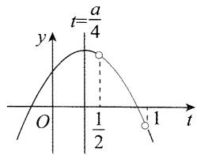

line

| t     | y     |
|-------|-------|
| 1/2   | 0.5   |
| 1     | 0.5   |

如图， $\frac{a}{4} \leqslant \frac{1}{2}$ ，解得 $a \leqslant 2$

解法 2: $f(x)$ 的解析式较复杂, 也可求导分析单调性.

由题意, $f'(x)=-2\sin 2x+a\cos x=-4\sin x\cos x+a\cos x=\cos x(a-4\sin x)$ ，函数 $f(x)$ 在 $\left(\frac{\pi}{6},\frac{\pi}{2}\right)$ 上是减函数 $\Leftrightarrow f'(x)\leqslant0$ 在 $\left(\frac{\pi}{6},\frac{\pi}{2}\right)$ 上恒成立.

因为 $\cos x > 0$ ，所以 $a - 4\sin x \leqslant 0$ ，故 $a \leqslant 4\sin x.$ 因为当 $x \in \left(\frac{\pi}{6}, \frac{\pi}{2}\right)$ 时， $4\sin x \in (2,4)$ ，所以 $a \leqslant 2$

【提炼】使用换元法解决问题时,一定注意换成的新元的范围.

【187】C 解析:研究分段函数的单调性,先考虑各段的单调性.

当 $x \leqslant 1$ 时， $f(x) = (3a - 1)x + 4a$ ，所以 $f(x) \searrow$ 等价于 3a - 1 < 0，解得 $a < \frac{1}{3}$ ;

当 $x > 1$ 时， $f(x) = \log_a x$ ，所以 $f(x) \searrow$ 等价于 $0 <$

$a < 1$ . 结合前面的 $a < \frac{1}{3}$ 可得 $0 < a < \frac{1}{3}$ .

两段都 $\searrow$ ，合在一起不一定 $\searrow$ ，如图1.要使 $f(x)$ 在R上 $\searrow$ ，分段点处的情况应如图2,3所示.

应有 $(3a - 1) \cdot 1 + 4a \geqslant \log_a 1$ ，即 $7a - 1 \geqslant 0 \Rightarrow a \geqslant \frac{1}{7}$ .

综上所述， $\frac{1}{7} \leqslant a < \frac{1}{3}$

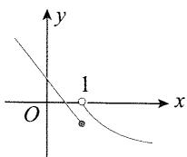  
图1

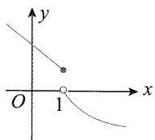  
图2

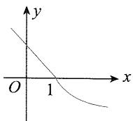  
图3

【提炼】①分段函数在整个定义域单调，则每段函数也单调；②注意分段点处的情况.

【188】D 解析: 因为 $f(x)$ 在区间 $(1, +\infty)$ 上 $\nearrow$ ，所以 $f'(x)=k-\frac{1}{x}\geqslant0$ 在 $(1,+\infty)$ 上恒成立，故 $k\geqslant\frac{1}{x}$ .

因为函数 $y=\frac{1}{x}$ 在 $(1,+\infty)$ 上的值域为 $(0,1)$ ，所以 $k\geqslant1$ .

【提炼】 $f(x)$ 在某区间上单调递增，则 $f'(x) \geqslant 0$ 在该区间上恒成立.

【189】-1 $(-∞,0]$ 解析: $f(x)$ 为奇函数 $\Rightarrow f(0)=1+a=0\Rightarrow a=-1.$

因为 $f(x)$ 在 R 上 $\nearrow$ ，所以 $f'(x)=\mathrm{e}^{x}-a\mathrm{e}^{-x}\geqslant0$ 恒成立，故 $a\leqslant e^{2x}$ . 因为 $e^{2x}>0$ ，所以 $a\leqslant0$ .

【190】D 解析: $f(x)$ 在 $[0, +\infty)$ 上 $\nearrow$ 且 $f(2x-1) < f\left(\frac{1}{3}\right)$ ,

一方面，2x-1要在定义域内，所以 $2x-1 \geqslant 0$ ，故 $x \geqslant \frac{1}{2}$ ;

另一方面，由单调性得 $2x - 1 < \frac{1}{3}$ ，所以 $x < \frac{2}{3}$ .

综上， $\frac{1}{2} \leqslant x < \frac{2}{3}$

【提炼】若规定了定义域，千万别忘了考虑定义域。

【191】D 解析： $\forall x_{1}\neq x_{2}$ 且 $x_{1},x_{2}\in[0,+\infty)$ ， $\frac{f(x_{2})-f(x_{1})}{x_{2}-x_{1}}<0\Rightarrow f(x)$ 在 $[0,+\infty)$ 上 $\Rightarrow f(3)<f(1)<f(0)$ .

【提炼】单调性不一定直接给出， $\frac{f(x_{2})-f(x_{1})}{x_{2}-x_{1}}<0$

或 $[f(x_1) - f(x_2)](x_1 - x_2) < 0$ 都是 $f(x)$ 的意思；同理，若 $\frac{f(x_2) - f(x_1)}{x_2 - x_1} > 0$ 或 $[f(x_1) - f(x_2)](x_1 - x_2) > 0$ ，则 $f(x)$

【192】D 解析: 因为 $f(x)$ 在 R 上 $\searrow$ ，所以 $f\left(\frac{1}{x}\right) > f(1) \Leftrightarrow \frac{1}{x} < 1 \Leftrightarrow \frac{x - 1}{x} > 0 \Leftrightarrow x (x - 1) > 0$ ，解得 x < 0 或 x > 1.

【193】A 解析:给出了 $f(x)$ 在 $[0,+\infty)$ 上的单调性，但 2x-1 不一定在 $[0,+\infty)$ 上，不能直接用单调性脱去 f，可结合 $f(x)$ 为偶函数将其化到 $[0,+\infty)$ 这一单调区间上来.

因为 $f(x)$ 为偶函数, 所以 $f(-x)=f(x)=f(|x|)$ ,
故 $f(2x-1)<f\left(\frac{1}{3}\right)\Leftrightarrow f(|2x-1|)<f\left(\frac{1}{3}\right)$ ,

结合 $f(x)$ 在 $[0, +\infty)$ 上单调递增知 $|2x - 1| < \frac{1}{3}$ , 所以 $-\frac{1}{3} < 2x - 1 < \frac{1}{3}$ , 故 $\frac{1}{3} < x < \frac{2}{3}$ .

【提炼】偶函数满足 $f(x) = f(-x) = f(|x|)$ ，故常在自变量上加绝对值，将自变量化到 $[0, +\infty)$ 上.

【194】C 解析: $f(x)$ 是偶函数 $\Rightarrow f(\log_{\frac{1}{2}}a)=f(\log_{2^{-1}}a)=f(-\log_{2}a)=f(\log_{2}a)$ ,

所以 $f(\log_2a) + f(\log_{\frac{1}{2}}a)\leqslant 2f(1)\Leftrightarrow f(\log_2a)\leqslant$ $f(1)\Leftrightarrow f(|\log_2a|)\leqslant f(1),$

又 $f(x)$ 在 $[0, +\infty)$ 上 $\nearrow$ ，所以 $|\log_2 a| \leqslant 1$ ，故 $-1 \leqslant \log_2 a \leqslant 1$ ，解得 $\frac{1}{2} \leqslant a \leqslant 2$ .

【195】D 解法 1: 因为 $f(2) = 0$ ，所以 $f(x) < 0$ 即为 $f(x) < f(2)$ ，又 $f(x)$ 是偶函数且在 $(- \infty, 0]$ 上 $\searrow$ ，所以 $f(x)$ 在 $[0, +\infty)$ 上 $\nearrow$ ，且 $f(x) < f(2) \Leftrightarrow f(|x|) < f(2) \Leftrightarrow |x| < 2$ ，解得 $-2 < x < 2$ .

解法 2:作出一个满足题意的 $f(x)$ 的图象如图,由图可知 $f(x)<0$ 的解为 -2<x<2.

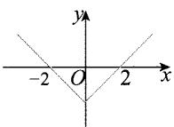

【提炼】①函数值不等式一般用单调性来解，若目标不等式中有纯数字，可将其替换成 $f(x_{0})$ 的形式，其中 $x_{0}$ 是一个确定的值；②偶函数满足 $f(x)=f(-x)=f(|x|)$ ，故常在自变量上加绝对值，将自变量化到 $[0,+\infty)$ 上.

【196】 $(-1,3)$ 解法1:因为 $f(2)=0$ ,所以 $f(x-1)>$

0 即为 $f(x-1) > f(2)$ ，又 $f(x)$ 是偶函数且在 $[0, +\infty)$ 上，

所以 $f(x - 1) > f(2)$ 等价于 $f(|x - 1|) > f(2)$ ，故 $|x - 1| < 2$ ，解得 $-1 < x < 3$ .

解法 2: 根据题干所给 $f(x)$ 的性质, 作出一个满足题意的 $f(x)$ 的图象, 如图, $f(x-1)>0\Rightarrow-2<x-1<2\Rightarrow-1<x<3$ .

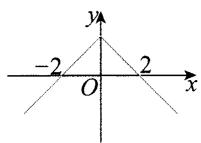

【197】D 解析: $f(1) = -1 \Rightarrow f(-1) = -f(1) = 1$ , 所以 $-1 \leqslant f(x - 2) \leqslant 1$ 即为 $f(1) \leqslant f(x - 2) \leqslant f(-1)$ .

结合 $f(x)$ 在 $\mathbf{R}$ 上 $\searrow$ 可知 $-1 \leqslant x - 2 \leqslant 1$ , 故 $1 \leqslant x \leqslant 3$ .

【198】C 解析: $f(x)$ 是偶函数且在 $(-∞,0)$ 上 $\nearrow \Rightarrow f(x)$ 在 $(0,+∞)$ 上 $\searrow$ ,

所以 $f(2^{|a - 1|}) > f(-\sqrt{2}) = f(\sqrt{2}) \Leftrightarrow 2^{|a - 1|} < \sqrt{2} = 2^{\frac{1}{2}}$ ，从而 $|a - 1| < \frac{1}{2}$ ，故 $\frac{1}{2} < a < \frac{3}{2}$ .

【提炼】用单调性解函数值不等式时，一定要将自变量化到同一个单调区间上.

【199】B 解析: 函数 $f(x)$ 的解析式有一定的复杂度, 不要把 $f(x)$ 和 $f(2x-1)$ 代入解析式再解不等式, 而应该从函数的单调性、奇偶性入手来考虑.

当 $x \geqslant 0$ 时, $f(x) = \ln (1 + x) - \frac{1}{1 + x^2}, f'(x) = \frac{1}{1 + x} + \frac{2x}{(1 + x^2)^2} > 0$ , 所以 $f(x)$ 在 $[0, +\infty)$ 上 $\nearrow$ .

易证 $f(x)$ 为偶函数，所以 $f(x) > f(2x - 1) \Leftrightarrow f(|x|) > f(|2x - 1|) \Leftrightarrow |x| > |2x - 1|$ ，

两端平方化简得 $3x^{2} - 4x + 1 < 0$ ，解得 $\frac{1}{3} < x < 1.$

【提炼】本题的难点在于没有直接给出 $f(x)$ 的奇偶性和单调性， $f(x)$ 的奇偶性和单调性不难判断，主要是得有通过判断奇偶性、单调性来解不等式 $f(x) > f(2x - 1)$ 的意识。

【200】D 解析: $f(x)$ 是奇函数 $\Rightarrow f(x) = -f(-x)$ ，所以 $\frac{f(x) - f(-x)}{x} < 0 \Leftrightarrow \frac{f(x) + f(x)}{x} < 0 \Leftrightarrow \frac{f(x)}{x} < 0$ ，

此不等式为两项之商，可讨论 $x$ 的正负，再看 $f(x)$ 的正负.

由题意，x=0 不是所求不等式的解. $f(x)$ 在 $(-∞,0)∪(0,+∞)$ 上的草图如图，当 x>0 时， $\frac{f(x)}{x}<0$ 等价于 $f(x)<0$ ，所以 0<x<1；

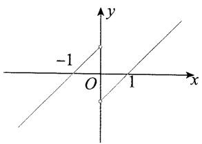

text_image

-1
O
1
x
y

当 $x < 0$ 时， $\frac{f(x)}{x} < 0$ 等价于 $f(x) > 0$ ，所以 $-1 < x < 0$ . 综上所述，原不等式的解集为 $(-1, 0) \cup (0, 1)$ .

【201】D 解析: $xf(x-1)$ 的正负由 x 和 $f(x-1)$ 共同决定, 可讨论 x 的正负, 得到 $f(x-1)$ 的正负, 再画图分析.

满足题意的 $y = f(x)$ 的一个草图如图， $xf(x - 1) \geqslant 0 \Leftrightarrow \begin{cases} x > 0, \\ f(x - 1) \geqslant 0 \end{cases}$ 或 $\begin{cases} x \leqslant 0, \\ f(x - 1) \leqslant 0, \end{cases}$ 下面分别考虑：

若 $x > 0$ ，则 $f(x - 1)\geqslant 0$ ，由图可知 $x - 1\leqslant -2$ 或 $0\leqslant x - 1\leqslant 2$

所以 $x \leqslant -1$ 或 $1 \leqslant x \leqslant 3$ , 结合 $x > 0$ 可得 $1 \leqslant x \leqslant 3$ ; 若 $x \leqslant 0$ , 则 $f(x - 1) \leqslant 0$ , 由图可知 $-2 \leqslant x - 1 \leqslant 0$ 或 $x - 1 \geqslant 2$ ,

所以 $-1\leqslant x\leqslant1$ 或 $x\geqslant3$ ，结合 $x\leqslant0$ 可得 $-1 \leqslant x \leqslant 0$ .

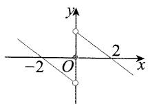

综上所述，满足 $xf(x - 1)\geqslant 0$ 的 $x$ 的取值范围是 $[-1,0]\cup [1,3]$

【202】 $\left[-1,\frac{1}{2}\right]$ 解析： $f(a-1)+f(2a^{2})\leqslant0\Leftrightarrow f(2a^{2})$ $\leqslant -f(a-1)$ ①,

$f(a - 1)$ 前面有个负号，不便运用单调性，若 $f(x)$ 为奇函数，则负号可以拿进括号，故先分析 $f(x)$ 的奇偶性.

$$
\begin{array}{l} {f (- x) = (- x) ^ {3} - 2 (- x) + \mathrm{e} ^ {- x} - \frac {1}{\mathrm{e} ^ {- x}} = - x ^ {3} +} \\ {2 x + \frac {1}{\mathrm{e} ^ {x}} - \mathrm{e} ^ {x} = - f (x) \Rightarrow f (x) \text {是奇函数},} \end{array}
$$

所以不等式①等价于 $f(2a^{2}) \leqslant f(1 - a)$ ②.

已化为标准的函数值不等式,可利用单调性求解. $f(x)$ 是奇函数, 故先看 $f(x)$ 在 $[0, +\infty)$ 上的单调性.

当 $x \geqslant 0$ 时， $f'(x) = 3x^2 - 2 + \mathrm{e}^x + \frac{1}{\mathrm{e}^x} \geqslant 3x^2 - 2 + 2\sqrt{\mathrm{e}^x \cdot \frac{1}{\mathrm{e}^x}} = 3x^2 \geqslant 0$ ，所以 $f(x)$ 在 $[0, +\infty)$ 上 $\nearrow$ .

由奇函数的对称性知 $f(x)$ 在 $\mathbf{R}$ 上 $\nearrow$ ，所以不等式②

等价于 $2a^{2} \leqslant 1 - a$ ，解得 $-1 \leqslant a \leqslant \frac{1}{2}$ .

【提炼】本题在求解的过程中要迈过两道坎儿，第一道是要有利用单调性将函数值不等式转化为自变量不等式的基本意识，这决定了解题的大方向是否正确；第二道是先判断 $f(x)$ 在 $[0, +\infty)$ 上的单调性，再根据奇偶性得出 $f(x)$ 在 $\mathbf{R}$ 上的单调性.

# 3.4 函数的奇偶性

【203】B 解析: 对于 A, 观察发现分子为非奇非偶函数, 所以可猜想分式整体不是偶函数, 可通过取特值来验证猜想.

记 $f(x) = \frac{\mathrm{e}^x - x^2}{x^2 + 1}$ , 则 $f(-1) = \frac{\mathrm{e}^{-1} - 1}{2}, f(1) = \frac{\mathrm{e} - 1}{2}$ , 所以 $f(-1) \neq f(1)$ , 从而 $f(x)$ 不是偶函数, 故 A 错误;

对于 B, 观察发现分子、分母均为偶函数, 整体应为偶函数, 下面我们用定义法证明.

记 $g(x) = \frac{\cos x + x^2}{x^2 + 1}$ , 则 $g(x)$ 的定义域为 $\mathbf{R}$ , 且 $g(-x) = \frac{\cos(-x) + (-x)^2}{(-x)^2 + 1} = \frac{\cos x + x^2}{x^2 + 1} = g(x)$ ,

所以 $g(x)$ 为偶函数, 故 B 正确;

对于 C, 由 $x+1 \neq 0$ , 解得 $x \neq -1$ , 所以函数 $y = \frac{e^{x} - x}{x + 1}$ 的定义域不关于原点对称, 所以该函数不是偶函数, 故 C 错误;

对于 D, 观察发现分子为奇函数, 分母为偶函数, 整体应为奇函数, 下面我们用定义法证明.

记 $h(x) = \frac{\sin x + 4x}{\mathrm{e}^{|x|}}$ ，则 $h(x)$ 的定义域为 $\mathbf{R}$ ，且 $h(-x) = \frac{\sin(-x) + 4(-x)}{\mathrm{e}^{| - x|}} = \frac{-\sin x - 4x}{\mathrm{e}^{|x|}} = -\frac{\sin x + 4x}{\mathrm{e}^{|x|}} = -h(x)$ ，所以 $h(x)$ 为奇函数，故D错误.

【204】A 解析: A 项, 设 $f(x)=x^{-2}$ , 则 $f(x)=\frac{1}{x^{2}}\Rightarrow f(-x)=\frac{1}{(-x)^{2}}=\frac{1}{x^{2}}=f(x)\Rightarrow f(x)$ 为偶函数, 故 A 项正确;

B项，设 $f(x)=x^{\frac{1}{3}}$ ，则 $f(x)=\sqrt[3]{x}\Rightarrow f(-x)=\sqrt[3]{-x}=$ $-\sqrt[3]{x}=-f(x)\Rightarrow f(x)$ 是奇函数，故 B 项错误；

C项，设 $f(x) = x^{-\frac{1}{2}} = \frac{1}{\sqrt{x}}$ ，则定义域为 $(0, + \infty)$ ，不

关于原点对称， $f(x)$ 是非奇非偶函数，故C项错误；

D项, 设 $f(x)=x^{3}$ ，则 $f(-x)=(-x)^{3}=-x^{3}=-f(x)\Rightarrow f(x)$ 是奇函数，故 D 项错误.

【提炼】① $f(x)=x^{n}\Rightarrow\left\{\begin{aligned}n& 为奇数 \Rightarrow f(x) 为奇函数,\\ n& 为偶数 \Rightarrow f(x) 为偶函数;\end{aligned}\right.$

② $f(x)=x^{\frac{n}{m}}\Rightarrow\left\{\begin{aligned}m 偶 n 奇 &\Rightarrow f(x) 非奇非偶,\\ m 奇 n 偶 &\Rightarrow f(x) 为偶函数,\\ m 奇 n 奇 &\Rightarrow f(x) 为奇函数;\end{aligned}\right.$

③判断奇偶性，应先关注定义域。

【205】B 解析: A 项, $y = x^{2} \sin x$ , 属于“偶×奇”的类型, 所以 $y = x^{2} \sin x$ 是奇函数, 故 A 项错误;

B项, $y=x^{2}\cos x$ ,属于“偶×偶”的类型,所以 $y=x^{2}\cos x$ 是偶函数,故B项正确;

C 项, $y = |\ln x|$ , 定义域为 $(0, +\infty)$ , 不关于原点对称, 所以 $y = |\ln x|$ 为非奇非偶函数, 故 C 项错误;

D项, $y=2^{-x}$ 为非奇非偶函数,故D项错误.

【206】D 解析: A 项, 对于 $y = x + \sin 2x$ , 属于“奇+奇”的类型, 所以 $y = x + \sin 2x$ 是奇函数, 故 A 项错误;

B项,对于 $y=x^{2}-\cos x$ ,属于“偶一偶”的类型,所以 $y=x^{2}-\cos x$ 是偶函数,故 B 项错误;

C项，设 $f(x) = 2^{x} + \frac{1}{2^{x}} = 2^{x} + 2^{-x}$ ，则 $f(-x) = 2^{-x}+$ $2^{x} = f(x)$ ，所以 $y = 2^{x} + \frac{1}{2^{x}}$ 为偶函数，故C项错误；

D项,对于 $y=x^{2}+\sin x$ ,属于“偶+奇”的类型,所以 $y=x^{2}+\sin x$ 为非奇非偶函数,故 D 项正确.

【提炼】①加减看自身，乘除看异同；②一些常见函数的奇偶性务必记住，解小题速度会很快，可参考本节“菜菜讲方法”中归纳的函数。

【207】A 解析: A 项, 设 $f(x)=2^{x}-\frac{1}{2^{x}}=2^{x}-2^{-x}$ , 则 $f(-x)=2^{-x}-2^{x}=-f(x)$ , 所以 $f(x)$ 为奇函数, 故 A 项正确;

B项, $y=x^{3}\sin x$ ,属于“奇×奇”的类型,所以 $y=x^{3}\sin x$ 是偶函数,故B项错误;

C 项, $y=2\cos x$ 和 y=1 都是偶函数,所以 $y=2\cos x+1$ 为偶函数,故 C 项错误;

D项, 设 $f(x)=x^{2}+2^{x}$ ，则 $f(-x)=(-x)^{2}+2^{-x}=x^{2}+2^{-x}$ ， $f(-x)\neq f(x)$ 且 $f(-x)\neq-f(x)$ ，所以

$f(x)$ 为非奇非偶函数,故D项错误.

【提炼】①加减看自身,乘除看异同;②y=C(C为常数)是偶函数.

【208】D 解析: $f(-x)=3^{-x}+3^{x}=f(x)\Rightarrow f(x)$ 为偶函数, $g(-x)=3^{-x}-3^{x}=-g(x)\Rightarrow g(x)$ 为奇函数.

【209】D 解析: A 项, $y=\sqrt{x}$ 的定义域为 $[0,+\infty)\Rightarrow y=\sqrt{x}$ 是非奇非偶函数, 故 A 项错误;

B项, 设 $f(x)=|\sin x|$ ，则 $f(-x)=|\sin(-x)|=|-\sin x|=|\sin x|=f(x)\Rightarrow y=|\sin x|$ 是偶函数，故 B 项错误；

C项，设 $f(x) = \cos x$ ，则 $f(-x) = \cos (-x) = \cos x = f(x)\Rightarrow y = \cos x$ 是偶函数，故C项错误；

D项, 设 $f(x)=\mathrm{e}^{x}-\mathrm{e}^{-x}$ ，则 $f(-x)=\mathrm{e}^{-x}-\mathrm{e}^{x}=-f(x)\Rightarrow y=\mathrm{e}^{x}-\mathrm{e}^{-x}$ 是奇函数，故 D 项正确.

【210】C 解析: $f(x)$ 是奇函数 $\Rightarrow f(-x) = -f(x)$ , $g(x)$ 是偶函数 $\Rightarrow g(-x)=g(x)$ .

A 项，“奇×偶=奇”，所以 $f(x) \cdot g(x)$ 是奇函数，故 A 项错误；

B项, $f(x)$ 是奇函数 $\Rightarrow |f(-x)|=|-f(x)|=|f(x)|\Rightarrow|f(x)|$ 是偶函数,所以 $|f(x)|\cdot g(x)$ 属于“偶×偶”的情况,从而 $|f(x)|\cdot g(x)$ 是偶函数,故B项错误;

C项, $g(x)$ 是偶函数 $\Rightarrow |g(-x)|=|g(x)|\Rightarrow|g(x)|$ 是偶函数,所以 $f(x)\cdot|g(x)|$ 属于“奇×偶”的情况,从而 $f(x)\cdot|g(x)|$ 是奇函数,故C项正确;

D项， $|f(-x)\cdot g(-x)| = |-f(x)\cdot g(x)| = |f(x)\cdot$ $g(x)|\Rightarrow |f(x)\cdot g(x)|$ 是偶函数，故D项错误.

【211】D 解析: A 项, $f(-1)=\cos(-1)=\cos1\neq f(1)=2$ , 所以 $f(x)$ 不是偶函数, 故 A 项错误;

B项, $y=\cos x$ 在 $(-∞,0)$ 上不单调,故B项错误;C项,当x>0时, $f(x)=x^{2}+1$ 不是周期函数,故C项错误;

D项, 当 x>0 时, $f(x)=x^{2}+1\in(1,+\infty)$ ; 当 $x\leqslant0$ 时, $f(x)=\cos x\in[-1,1]$ , 所以 $f(x)$ 的值域为 $[-1,+\infty)$ , 故 D 项正确.

【212】A 解析: A 项, $y = \cos x$ 是偶函数, 且存在零点, 故 A 项正确;

B项, $y=\sin x$ 是奇函数,故B项错误;

C项, $y=\ln x$ 是非奇非偶函数,故C项错误;

D项, $y=x^{2}+1\geqslant1>0$ ,所以 $y=x^{2}+1$ 不存在零点,故D项错误.

【213】4 解法 1: $f(x) = (x + a)(x - 4) = x^2 + (a - 4)x - 4a$ , $f(x)$ 为偶函数 $\Rightarrow f(x)$ 图象的对称轴是 $y$ 轴，所以 $-\frac{a - 4}{2} = 0$ ，故 $a = 4$ .

解法 2: $f(x)=(x+a)(x-4)\Rightarrow f(x)$ 的零点为 $x_{1}=-a, x_{2}=4.$

因为 $f(x)$ 是偶函数, 所以 $x_{1}$ 和 $x_{2}$ 关于 y 轴对称, 故 $-a+4=0$ , 解得 a=4.

【214】-2 解法 1: $f(x)$ 为奇函数 $\Rightarrow f(-x) = -f(x)$ $\Rightarrow\frac{(-x+2)(-x+m)}{-x}=-\frac{(x+2)(x+m)}{x},$

所以 $(x-2)(x-m)=(x+2)(x+m)$ ，整理得 $2(m+2)x=0$ ，故m=-2。

解法 2: $f(x)=\frac{(x+2)(x+m)}{x}=\frac{x^{2}+(m+2)x+2m}{x}$

是奇函数,注意到分母为奇函数,所以 $y=x^{2}+(m+2)x+2m$ 是偶函数,故 $m+2=0$ , 解得 m=-2.

解法3: 令 $f(x)=0$ ，得 x=-2 或 -m，又 $f(x)$ 是奇函数，所以非零的零点成对出现且关于原点对称，从而 $-2+(-m)=0$ ，故 m=-2。

【提炼】二次函数 $y=ax^{2}+bx+c(a\neq0)$ 为偶函数 $\Leftrightarrow b=0.$

【215】A 解法 1: $f(x)$ 为奇函数 $\Rightarrow f(-x) = -f(x) \Rightarrow \frac{-x}{(-2x+1)(-x-a)} = -\frac{x}{(2x+1)(x-a)}$ ,

所以 $(2x - 1)(x + a) = (2x + 1)(x - a)$ ，从而 $2(2a - 1)x = 0$ ，故 $a = \frac{1}{2}$ .

解法 2: $f(x)=\frac{x}{(2x+1)(x-a)}$ 为奇函数, 且分子为奇函数, 所以 $y=(2x+1)(x-a)$ 为偶函数,

其两根 $-\frac{1}{2}$ 和 $a$ 应关于原点对称，从而 $-\frac{1}{2} + a = 0$ 故 $a = \frac{1}{2}$ .

【216】2 解析:所给解析式可化为 $y=x^{2}+(a-2)x+1+\cos x$ ,

各部分奇偶性都能判断,故用奇偶性的加减法结论处理.

因为 $y = x^{2} + 1 + \cos x$ 为偶函数， $y = (a - 2)x$ 为奇

函数,所以要使二者之和为偶函数,只能a-2=0,故a=2.

【217】1 解法 1: 设 $f(x) = a \cdot 3^x + \frac{1}{3^x} = a \cdot 3^x + 3^{-x}$ , $f(x)$ 为偶函数 $\Rightarrow f(x) = f(-x) \Rightarrow a \cdot 3^x + 3^{-x} = a \cdot 3^{-x} + 3^x \Rightarrow (a - 1) \cdot 3^x - (a - 1) \cdot 3^{-x} = 0 \Rightarrow (a - 1) \cdot (3^x - 3^{-x}) = 0 \Rightarrow a = 1$ .

解法2: 在“菜菜讲方法”中提到, 形如 $f(x)=a^{x}+a^{-x}$ 的函数是偶函数, 取 a=3 得 $f(x)=3^{x}+3^{-x}$ 是偶函数.

因为 $y = a \cdot 3^x + \frac{1}{3^x} = a \cdot 3^x + 3^{-x}$ ，所以对比可得 $a = 1$ .

【提炼】这类题可以用定义法求解,但若出现了“菜菜讲方法”中的常见奇、偶函数,也可直接用结论.

【218】-1 解法 1: $f(x)$ 是偶函数 $\Rightarrow f(-x) = f(x) \Rightarrow -x(e^{-x} + ae^{x}) = x(e^{x} + ae^{-x}) \Rightarrow x(e^{-x} + ae^{x}) + x(e^{x} + ae^{-x}) = 0$ ,

约去 $x$ 可得 $\mathrm{e}^{-x} + a\mathrm{e}^{x} + \mathrm{e}^{x} + a\mathrm{e}^{-x} = 0$ ，所以 $\mathrm{e}^{-x}+$ $\mathrm{e}^x +a(\mathrm{e}^x +\mathrm{e}^{-x}) = 0$ ，从而 $(\mathrm{e}^{-x} + \mathrm{e}^{x})(1 + a) = 0$ ，故 $a = -1.$

解法 2: $f(x)$ 是偶函数, 且 y = x 是奇函数, 所以 $y = e^{x} + ae^{-x}$ 是奇函数.

由“菜菜讲方法”，形如 $y=a^{x}-a^{-x}$ 的函数是奇函数，所以 $y=e^{x}-e^{-x}$ 是奇函数，对比可得 a=-1.

【219】D 解法 1: 要求 a, 可结合偶函数的性质取特值建立方程.

由 $f(x)$ 为偶函数得 $f(-1)=f(1)$ ，故 $\frac{-e^{-1}}{e^{-a}-1}=\frac{e}{e^{a}-1}$ ①，

又 $\frac{-\mathrm{e}^{-1}}{\mathrm{e}^{-a} - 1} = \frac{\mathrm{e}^{-1}}{1 - \mathrm{e}^{-a}} = \frac{\mathrm{e}^{a - 1}}{\mathrm{e}^a - 1}$ ，代入 $①$ 得 $\frac{\mathrm{e}^{a - 1}}{\mathrm{e}^a - 1} =$ $\frac{\mathrm{e}}{\mathrm{e}^a - 1}$ 所以 $\mathrm{e}^{a - 1} = \mathrm{e}$ ，从而 $a - 1 = 1$ ，故 $a = 2$

经检验, 满足 $f(x)$ 为偶函数.

解法 2: 也可直接用偶函数的定义来分析.

因为 $f(x)$ 为偶函数，所以 $f(-x) = f(x)$ 恒成立，

从而 $\frac{-xe^{-x}}{\mathrm{e}^{-ax} - 1} = \frac{x\mathrm{e}^x}{\mathrm{e}^{ax} - 1}$ 故 $\frac{-\mathrm{e}^{-x}}{\mathrm{e}^{-ax} - 1} = \frac{\mathrm{e}^x}{\mathrm{e}^{ax} - 1},$

所以 $\frac{-\mathrm{e}^{-x}\cdot\mathrm{e}^{ax}}{1-\mathrm{e}^{ax}} = \frac{\mathrm{e}^x}{\mathrm{e}^{ax} - 1}$ ，从而 $\frac{\mathrm{e}^{ax - x}}{\mathrm{e}^{ax} - 1} = \frac{\mathrm{e}^x}{\mathrm{e}^{ax} - 1},$

故 $\mathrm{e}^{ax - x} = \mathrm{e}^x$

所以 ax-x=x，故 $(a-2)x=0$ ，此式要对定义域内任意的 x 都成立，只能 a-2=0，所以 a=2。

【220】1 解析: $f(x)$ 是偶函数 $\Rightarrow g(x)=a\cdot2^{x}-2^{-x}$ 是奇函数 $\Rightarrow g(0)=a-1=0\Rightarrow a=1$ .

【提炼】作为小题，本题观察可得 $g(x)$ 在 $x = 0$ 处有定义，故可由 $g(0) = 0$ 求出 $a$ 的值，但我们必须知道， $g(0) = 0$ 是 $g(x)$ 为奇函数的必要条件，不是充分条件，若要严格求解，可用奇函数的定义处理，即由 $g(-x) + g(x) = a \cdot 2^{-x} - 2^x + a \cdot 2^x - 2^{-x} = (a - 1) \cdot (2^{-x} + 2^x) = 0$ 求得 $a = 1$ .

【221】B 解法 1: 偶函数可抓住定义 $f(-x)=f(x)$ 来建立方程求参.

因为 $f(x)$ 为偶函数，所以 $f(-x) = f(x)$ ，即 $(-x + a)\ln \frac{-2x - 1}{-2x + 1} = (x + a)\ln \frac{2x - 1}{2x + 1}$ ①，

而 $\ln\frac{-2x-1}{-2x+1}=\ln\frac{2x+1}{2x-1}=\ln\left(\frac{2x-1}{2x+1}\right)^{-1}=-\ln\frac{2x-1}{2x+1},$ 代入①得 $(-x+a)\left(-\ln\frac{2x-1}{2x+1}\right)=(x+a)\cdot$ $\ln\frac{2x-1}{2x+1}$ ，化简得 $x-a=x+a$ ，所以a=0。

解法 2: 也可在定义域内取个特值快速求出答案.

因为 $f(x)$ 为偶函数，所以 $f(-1) = f(1)$ ，故 $(-1 + a)\ln 3 = (1 + a)\ln \frac{1}{3}$ ①，

而 $\ln \frac{1}{3} = \ln 3^{-1} = -\ln 3$ ，代入①得 $(-1 + a)\ln 3 = -(1 + a)\ln 3$ ，解得 $a = 0$ .

【222】1 解法 1: $f(x)$ 是偶函数 $\Rightarrow f(x)=f(-x)\Rightarrow x\ln(x+\sqrt{a+x^{2}})=-x\ln[-x+\sqrt{a+(-x)^{2}}]$ ,

整理可得 $x[\ln (x + \sqrt{a + x^2}) + \ln (-x + \sqrt{a + x^2})] = 0\Rightarrow x\ln (a + x^2 -x^2) = x\ln a = 0$ ，所以 $a = 1$

解法 2: $f(x)=x\ln(x+\sqrt{a+x^{2}})$ 是偶函数 $\Rightarrow y=\ln(x+\sqrt{a+x^{2}})$ 是奇函数，

由“菜菜讲方法”， $y=\ln(\sqrt{k^{2}x^{2}+1}\pm kx)$ 为奇函数，
取 k=1 可得 $y=\ln(\sqrt{x^{2}+1}\pm x)$ 是奇函数.

与 $y = \ln (x + \sqrt{a + x^2})$ 对比可得 $a = 1$ .

【提炼】①奇×奇=偶；② $y=\ln(\sqrt{k^{2}x^{2}+1}\pm kx)$ 为奇函数.

【223】B 解析: 奇函数 $f(x)$ 与偶函数 $g(x)$ 已有一个

方程, 将 x 换成 -x 还能再构建一个方程, 联立可求出函数解析式.

在 $f(x) + g(x) = a^x -a^{-x} + 2$ 中将 $x$ 换成 $-x$ ，可得 $f(-x) + g(-x) = -f(x) + g(x) = a^{-x} - a^{x} + 2,$

联立 $\left\{\begin{aligned}f(x)+g(x)&=a^{x}-a^{-x}+2,\\ -f(x)+g(x)&=a^{-x}-a^{x}+2,\end{aligned}\right.$

解得 $\left\{\begin{aligned}f(x)&=a^{x}-a^{-x},\\ g(x)&=2,\end{aligned}\right.$ 所以 $g(2)=a=2$ ，故 $f(2)=$ $a^{2}-a^{-2}=\frac{15}{4}.$

【224】 $-\frac{3}{2}$ 解析:本题没有结论可用,故考虑用偶函数定义处理.

$f(x)$ 是偶函数 $\Rightarrow f(-x) - f(x) = 0$ 恒成立，

$$
\begin{array}{l} f (- x) - f (x) = \ln \left(\mathrm{e} ^ {- 3 x} + 1\right) - a x - \ln \left(\mathrm{e} ^ {3 x} + 1\right) - \\ a x = \ln \frac {\mathrm{e} ^ {- 3 x} + 1}{\mathrm{e} ^ {3 x} + 1} - 2 a x = \ln \frac {(\mathrm{e} ^ {- 3 x} + 1) \mathrm{e} ^ {3 x}}{(\mathrm{e} ^ {3 x} + 1) \mathrm{e} ^ {3 x}} - 2 a x = \\ \ln \frac {1 + \mathrm{e} ^ {3 x}}{\left(\mathrm{e} ^ {3 x} + 1\right) \mathrm{e} ^ {3 x}} - 2 a x = \ln \frac {1}{\mathrm{e} ^ {3 x}} - 2 a x = \ln \mathrm{e} ^ {- 3 x} - 2 a x = \\ - 3 x - 2 a x = - (3 + 2 a) x = 0 \Rightarrow a = - \frac {3}{2}. \\ \end{array}
$$

【225】1 解法 1: 可由 $f(-x) = -f(x)$ 求 a, 但由于 $f(x)$ 是分段函数, 需分段讨论.

当 $x > 0$ 时， $-x <   0$ ，所以 $f(-x) = a^2 (-x) - 1 =$ $-a^{2}x - 1,f(x) = x + a,$

因为 $f(-x)=-f(x)$ ，所以 $-a^{2}x-1=-x-a$ ，所以 $\left\{\begin{aligned}-a^{2}&=-1,\\ -1&=-a,\end{aligned}\right.$ 解得 a=1；

当 $x < 0$ 时， $-x > 0$ ，所以 $f(-x) = -x + a, f(x) = a^2 x - 1$

因为 $f(-x)=-f(x)$ ，所以 $-x+a=-a^{2}x+1$ ，所以 $\left\{\begin{aligned}-1&=-a^{2},\\ a&=1,\end{aligned}\right.$ 解得 a=1。

综上所述,实数 a 的值为 1.

解法2:要由奇函数的性质求参数a,也可取特殊值计算.
因为 $f(x)$ 是奇函数, 所以 $f(-1) = -f(1)$ , 代入解析式可得 $-a^{2}-1=-(1+a)$ , 解得 a=1 或 0.

$f(-1)=-f(1)$ 只是 $f(x)$ 为奇函数的必要条件, 所以还需检验.

当 $a = 0$ 时， $f(x) = \begin{cases} -1, & x < 0, \\ x, & x > 0, \\ 0, & x = 0, \end{cases}$ $f(x)$ 不是奇函数，

不合题意；

当 $a = 1$ 时， $f(x) = \begin{cases} x - 1, & x < 0, \\ x + 1, & x > 0, \\ 0, & x = 0, \end{cases}$ 画出图象（图略）

可知 $f(x)$ 是奇函数, 满足题意. 所以 a=1.

【226】 $-\frac{1}{2}\quad\ln2$ 解法1: $f(x)$ 的解析式较复杂,不易发现该用奇偶性的哪个结论来求参,故考虑用定义处理.

$$
f (- x) + f (x) = \ln \left| a + \frac {1}{1 + x} \right| + b + \ln \left| a + \frac {1}{1 - x} \right| +
$$

$$
b = \ln \left| a ^ {2} + \frac {a}{1 - x} + \frac {a}{1 + x} + \frac {1}{1 - x ^ {2}} \right| + 2 b = \ln \left| a ^ {2} + \right.
$$

$$
\frac {2 a + 1}{1 - x ^ {2}} \Big | + 2 b = 0 \textcircled {1},
$$

注意到上式需对定义域内所有的 $x$ 恒成立，所以 $a^2 +\frac{2a + 1}{1 - x^2}$ 必定不随 $x$ 的变化而改变.

所以 $2a + 1 = 0$ ，解得 $a = -\frac{1}{2}$ ，代入①得 $\ln \frac{1}{4} + 2b = 0$ 故 $b = -\frac{1}{2}\ln \frac{1}{4} = -\frac{1}{2}\ln 2^{-2} = -\frac{1}{2}\times (-2)\ln 2 = \ln 2.$

解法 2: 涉及奇偶性, 不妨先考虑定义域.

要使 $f(x)$ 有定义，则 $\left\{ \begin{array}{ll}1 - x\neq 0 & ①,\\ a + \frac{1}{1 - x}\neq 0 & ②, \end{array} \right.$ 由 $①$ 可得 $x\neq 1$

奇函数的定义域关于原点对称, 故 -1 必定也不在 $f(x)$ 的定义域内, 于是由②解出的必为 $x \neq -1$ .

所以 $a + \frac{1}{1 - (-1)} = 0$ ，解得 $a = -\frac{1}{2}$ ，此时 $f(x)$ 的定义域为 $(- \infty, -1) \cup (-1, 1) \cup (1, +\infty)$ ，

所以 0 在 $f(x)$ 的定义域内，从而 $f(0)=\ln\frac{1}{2}+b=-\ln2+b=0$ ，故 $b=\ln2$ .

【提炼】如果所给的函数比较陌生,没有什么取巧的办法,那么抓住奇偶性的定义是解题的关键.

【227】12 解析:由题意, $f(-2)=2\times(-2)^{3}+(-2)^{2}$ =-12, 因为 $f(x)$ 为奇函数, 所以 $f(2) = -f(-2) = 12$ .

【提炼】利用奇偶性，可将 $(-∞,0)$ 和 $(0,+∞)$ 上的函数值进行相互转化.

【228】D 解析: 当 x > 0 时, $f(x) = x^{2} + \frac{1}{x} \Rightarrow f(1) = 2$ ,
又 $f(x)$ 为奇函数,所以 $f(-1)=-f(1)=-2.$

【229】C 解析: 在所给等式中取 x=1 只能求出 $f(1)-g(1)$ ，考虑到有奇偶性条件，所以 -1 与 1 处的函数值可以相互转化，故尝试取 x=-1.

因为 $f(x) - g(x) = x^3 +x^2 +1$ ，所以 $f(-1) - g(-1) = (-1)^{3} + (-1)^{2} + 1 = 1$ ①，

又 $f(x), g(x)$ 分别为偶函数和奇函数，所以 $f(-1) = f(1), g(-1) = -g(1)$ ，

代入①得 $f(1) - [-g(1)] = 1$ ，即 $f(1) + g(1) = 1.$

【230】B 解析: $f(x)$ 是奇函数, $g(x)$ 是偶函数, 所以 $\left\{\begin{aligned}f(-1)+g(1)&=-f(1)+g(1)=2,\\ f(1)+g(-1)&=f(1)+g(1)=4,\end{aligned}\right.$ 两式相加化
简得 $g(1)=3$ .

【231】-1 解析：要求 $g(-1)$ ，只需求 $f(-1)$ ，要求 $f(-1)$ ，又只需利用条件中的奇偶性构建关于 $f(-1)$ 与 $f(1)$ 的方程.

因为 $y = f(x) + x^2$ 是奇函数，所以 $f(-1) + (-1)^2 = -[f(1) + 1^2]$ ，

将 $f(1) = 1$ 代入可求得 $f(-1) = -3$ ，所以 $g(-1) = f(-1) + 2 = -1.$

【232】-3 解析: 给的是 $f(\ln 2)$ ，无法代入 x<0 的解析式去建立方程求 a，可先用奇偶性求 $f(-\ln 2)$ .
因为 $f(x)$ 为奇函数且 $f(\ln 2)=8$ ，所以 $f(-\ln 2)=-f(\ln 2)=-8$ .
因为 $-\ln2<0$ ，所以 $f(-\ln 2)=-\mathrm{e}^{-a\ln2}=-\mathrm{e}^{\ln2^{-a}}=-2^{-a}=-8$ ，故 $2^{-a}=8$ ，解得a=-3.

【233】D 解析: 当 x<0 时, -x>0, 因为 $f(x)$ 为奇函数, 所以 $f(x)=-f(-x)=-\left(\mathrm{e}^{-x}-1\right)=-\mathrm{e}^{-x}+1$ .

【234】3 解析: $f(x)$ 是奇函数 $\Rightarrow f(-x) + f(x) = 0 \Rightarrow g(-x) + g(x) = f(-x) + 2 + f(x) + 2 = 4,$ 所以 $g(-1)+g(1)=4$ ，又 $g(1)=1$ ，所以 $g(-1)=4-g(1)=3.$

【提炼】若 $f(x)$ 为奇函数， $g(x)=f(x)+a$ (a 为常数)，则 $g(-x)+g(x)=2a$ .

【235】-9 解析: 设 $g(x)=x^{3}\cos x$ ，则 $g(-x)=(-x)^{3}$ $\cos(-x)=-x^{3}\cos x=-g(x)\Rightarrow g(x)$ 为奇函数，

而 $f(x) = g(x) + 1$ ，所以 $f(a) + f(-a) = g(a) + 1+$ $g(-a) + 1 = 2$ ，故 $f(-a) = 2 - f(a) = 2 - 11 = -9.$

【236】B 解析: 设 $g(x)=x^{3}+\sin x$ ，则 $g(-x)=(-x)^{3}+\sin(-x)=-\left(x^{3}+\sin x\right)=-g(x)\Rightarrow g(x)$ 为奇函数，又 $f(x)=g(x)+1$ ，所以 $f(a)+f(-a)=2$ ，故 $f(-a)=2-f(a)=0$ 。

【提炼】利用“奇+奇=奇”这一性质也可判断出 $g(x)=x^{3}+\sin x$ 为奇函数.

【237】-2 解析: 设 $g(x)=\ln(\sqrt{1+x^{2}}-x)$ ，则 $g(x)$ 为奇函数且 $f(x)=g(x)+1$ ，所以 $\forall x\in R$ ，都有 $f(x)+f(-x)=2$ ，故 $f(a)+f(-a)=2$ 。因为 $f(a)=4$ ，所以 $f(-a)=2-f(a)=-2$ 。

【提炼】 $f(x)=$ 奇函数 $+k(k$ 为常数 $)\Rightarrow f(x)+f(-x)=2k.$

【238】D 解析:代入解析式来算目标式太麻烦,但若观察出 $y=\ln(\sqrt{1+9x^{2}}-3x)$ 为奇函数,且 $\lg2$ 与 $\lg\frac{1}{2}$ 相反,就可用“奇函数+常数”模型快速处理.

设 $g(x) = \ln (\sqrt{1 + 9x^2} -3x)$ ，则 $f(x) = g(x) + 1$ 且 $g(-x) + g(x) = \ln [\sqrt{1 + 9(-x)^2} +3x] +$ $\ln (\sqrt{1 + 9x^2} -3x) = \ln [( \sqrt{1 + 9x^2} +3x)(\sqrt{1 + 9x^2}$ $-3x)] = \ln (1 + 9x^{2} - 9x^{2}) = \ln 1 = 0\Rightarrow g(x)$ 是奇函数，故 $f(\lg 2) + f\left(\lg \frac{1}{2}\right) = f(\lg 2) + f(-\lg 2) = g(\lg 2)+$ $1 + g(-\lg 2) + 1 = 2.$

【提炼】务必熟悉 $y=\log_{a}(\sqrt{k^{2}x^{2}+1}\pm kx)$ (k 为常数，且 $k\neq0$ ) 这一常考奇函数.

【239】C 解析:由 $ax^{3}+bsin x$ 为奇函数可猜想本题为“奇函数+常数”模型,故分析 $\lg(\log_{2}10)$ 与 $\lg(\lg 2)$ 的关系.

设 $g(x) = ax^3 + b\sin x$ ，则 $g(-x) = a(-x)^3 + b\sin (-x) = -(ax^3 + b\sin x) = -g(x) \Rightarrow g(x)$ 为奇函数，

又 $f(x) = g(x) + 4$ ，所以 $\forall t\in \mathbf{R},f(t) + f(-t) = 8.$ 因为 $\lg (\log_210) = \lg \frac{1}{\lg 2} = \lg (\lg 2)^{-1} = -\lg (\lg 2),$

所以 $f(\lg (\log_210)) + f(\lg (\lg 2)) = f(-\lg (\lg 2)) + f(\lg (\lg 2)) = 8$ ，故 $f(\lg (\lg 2)) = 8 - f(\lg (\log_210)) = 3.$

【提炼】本题中 $\lg(\log_{2}10)$ 与 $\lg(\lg2)$ 互为相反数这

一关键信息隐藏得较深,识别出这一点,就是常规的“奇函数+常数”模型了.

# 3.5 对称性

【240】A 解析: $f(x)=\frac{4^{x}-1}{2^{x}}=\frac{4^{x}}{2^{x}}-\frac{1}{2^{x}}=2^{x}-2^{-x}\Rightarrow$ $f(-x)=2^{-x}-2^{x}=-f(x)\Rightarrow f(x)$ 为奇函数, 其图象关于原点对称.

【241】D 解析: $f(x)=\frac{4^{x}+1}{2^{x}}=2^{x}+2^{-x}\Rightarrow f(-x)=2^{-x}+$ $2^{x}=f(x)\Rightarrow f(x)$ 是偶函数，其图象关于 y 轴对称.

【242】C 解析: $f(x)=\ln x+\ln(2-x)=\ln[x(2-x)]$ ，设 $u=x(2-x)$ ，则 $f(x)$ 由 $y=\ln u$ 和 $u=x(2-x)$ 复合而成.

当 $x \in (0,1)$ 时， $u = x(2 - x) \nearrow$ ，又 $y = \ln u \nearrow$ ，由同增异减原则知 $f(x)$ 在 $(0,1)$ 上单调递增；

当 $x \in (1,2)$ 时， $u = x(2 - x) \searrow$ ，又 $y = \ln u \nearrow$ ，由同增异减原则知 $f(x)$ 在 $(1,2)$ 上单调递减，故 A, B 错误.

C项, 若 $f(x)$ 的图象关于直线 x=1 对称, 则将 $f(x)$ 的图象左移 1 个单位长度. 所得图象应关于 y 轴对称, 对应的函数为偶函数, 故可通过判断图象平移后对应的函数是否为偶函数来判断 C 项是否正确.

设 $g(x) = f(x + 1) = \ln (x + 1) + \ln [2 - (x + 1)] =$ $\ln (x + 1) + \ln (1 - x)$ ，则 $g(-x) = \ln (1 - x) +$ $\ln (1 + x) = g(x),$

所以 $g(x)$ 为偶函数, 从而 $f(x)$ 的图象关于直线 x=1 对称, 故 C 项正确, D 项错误.

【提炼】若熟悉“菜菜讲方法”第3点中的对称结论，也可通过验证 $f(x)$ 是否满足 $f(2 - x) = f(x)$ 来判断C选项是否正确。事实上， $f(2 - x) = \ln (2 - x) + \ln [2 - (2 - x)] = \ln (2 - x) + \ln x = f(x)$ ，所以 $f(x)$ 的图象关于直线 $x = 1$ 对称。

【243】A 解析:代入解析式计算较难,观察发现 $f(x)$ 有对称轴,故先分析对称性,以及对称轴两侧的单调性.

将 $y=e^{-x^{2}}$ 的图象向右平移 1 个单位长度, 可得到 $f(x)$ 的图象, 而 $y=e^{-x^{2}}$ 是偶函数, 图象关于 y 轴对称,

所以 $f(x)$ 的图象关于直线 x=1 对称，

又 $f(x)$ 由 $y = \mathrm{e}^u$ 和 $u = -(x - 1)^2$ 复合而成，外层 $y = \mathrm{e}^u$ 在 $\mathbf{R}$ 上 $\nearrow$ ，内层 $u = -(x - 1)^2$ 在 $(- \infty, 1)$ 上 $\nearrow$ ，在 $(1, +\infty)$ 上 $\searrow$ ，所以 $f(x)$ 的大致图象如图.

从图象看，离 $x = 1$ 越远的点，函数值越小，故只需比较 $a, b, c$ 的自变量离1的距离.

$$
\begin{array}{l} \left| \frac {\sqrt {2}}{2} - 1 \right| = 1 - \frac {\sqrt {2}}{2} \approx 1 - \frac {1 . 4 1 4}{2} = 0. 2 9 3, \left| \frac {\sqrt {3}}{2} - 1 \right| = \\ 1 - \frac {\sqrt {3}}{2} \approx 1 - \frac {1 . 7 3 2}{2} = 0. 1 3 4, \left| \frac {\sqrt {6}}{2} - 1 \right| = \frac {\sqrt {6}}{2} - 1, \\ \end{array}
$$

若不记得 $\sqrt{6}$ 的近似值，可简单估算一下。

因为 $2.4 = \sqrt{5.76} < \sqrt{6} < \sqrt{6.25} = 2.5$ ，所以 $0.2 < \frac{\sqrt{6}}{2} - 1 < 0.25$ ，从而 $\left|\frac{\sqrt{3}}{2} - 1\right| < \left|\frac{\sqrt{6}}{2} - 1\right| < \left|\frac{\sqrt{2}}{2} - 1\right|$ ，故 $b > c > a$ 。

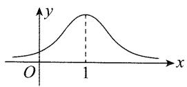

【244】(1)解:若b=0,则 $f(x)=\ln\frac{x}{2-x}+ax,f'(x)=$ $\frac{2-x}{x}\cdot\frac{2-x-(-1)\cdot x}{(2-x)^{2}}+a=\frac{2}{x(2-x)}+a,$

由 $\frac{x}{2 - x} > 0$ 可得 $x(2 - x) > 0$ ，所以 $x(x - 2) < 0$ ，从而 $0 < x < 2$ ，故 $f(x)$ 的定义域是 $(0, 2)$ .

由题意, $f'(x)\geqslant0$ ,所以 $\frac{2}{x(2-x)}+a\geqslant0$ 在 $(0,2)$ 上恒成立,

(参数 a 是孤立的, 不妨将它分离出来再看)

所以 $-a \leqslant \frac{2}{x(2 - x)}$ .

因为当 $x \in (0,2)$ 时， $0 < x(2 - x) \leqslant \left(\frac{x + 2 - x}{2}\right)^2 = 1$ （当 $x = 2 - x$ ，即 $x = 1$ 时取等号），所以 $\frac{2}{x(2 - x)} \geqslant 2$ ，故 $\frac{2}{x(2 - x)}$ 的最小值为 2.

又 $-a\leqslant\frac{2}{x(2-x)}$ 恒成立，所以 $-a\leqslant2$ ，从而 $a\geqslant-2$ ，故a的最小值为-2.

(2)证明:(没给对称中心,需要自己找到对称中心,再证明,怎么找?从整体来看显然较复杂,所以我们从局部出发分析.看到 $b(x-1)^{3}$ 这部分,想到它是由奇函数 $y=bx^{3}$ 的图象右移1个单位得来的,所以

它关于点(1,0)对称，于是我们就想，曲线 $y = f(x)$ 会不会也关于点(1,0)对称呢？或者即使曲线 $y = f(x)$ 不关于点(1,0)对称，但对称中心的横坐标会不会是1呢？为了验证此猜想，我们来计算 $f(2 - x) + f(x)$ ，看结果是不是常数）

由题意, $f(2-x)+f(x)=\ln\frac{2-x}{2-(2-x)}+a(2-x)+$

$$
\begin{array}{l} b (2 - x - 1) ^ {3} + \ln \frac {x}{2 - x} + a x + b (x - 1) ^ {3} \\ = \ln \frac {2 - x}{x} + a (2 - x) + b (1 - x) ^ {3} + \ln \frac {x}{2 - x} + a x + \\ b (x - 1) ^ {3} = \ln \left(\frac {2 - x}{x} \cdot \frac {x}{2 - x}\right) + 2 a = \ln 1 + 2 a = 2 a, \\ \end{array}
$$

所以曲线 $y=f(x)$ 关于点 $(1,a)$ 中心对称.

【245】D 解析: 设点 $(x,y)$ 在函数 $f(x)$ 的图象上, 则点 $(x,y)$ 关于原点的对称点 $(-x,-y)$ 在函数 $g(x)$ 的图象上, 代入 $g(x)$ 的解析式得 $-y=\log_{2}(-x)$ , 所以 $y=-\log_{2}(-x)$ , 故 $f(x)=-\log_{2}(-x)(x<0)$ .

【提炼】求对称函数解析式的步骤：①设点（求谁设谁）；②利用对称将点转移到已知解析式的函数上；③代入点，并解出 $y$ 。这种求解析式的方法叫做相关点法。本题也可直接套用“菜菜讲方法”第3点的结论，得出 $f(x) = -g(-x) = -\log_2(-x)(x < 0)$ 。

【246】D 解法1: 设点 $(x,y)$ 在函数 $f(x)$ 的图象上, 则点 $(x,y)$ 关于原点的对称点 $(-x,-y)$ 在函数 $g(x)=3-2x$ 的图象上,

代入该解析式得 $-y=3-2(-x)$ ，整理得 y=-2x-3，所以 $f(x)=-2x-3$ 。

解法2:套用“菜菜讲方法”第3点,与y=3-2x关于原点对称的函数为 $y=-[3-2(-x)]$ ,即 $f(x)=-2x-3$ .

【247】A 解析: 设点 $(x, y)$ 在所求的曲线上, 则点 $(x, y)$ 关于原点的对称点 $(-x, -y)$ 在函数 $y = \frac{1}{x-1}$ 的图象上,

所以 $-y = \frac{1}{-x - 1}$ , 整理得 $y = \frac{1}{1 + x}$ .

【248】B 解法1:作为选择题,可用特值法,在 $y=\ln x$ 的图象上取一个点,看看该点关于直线 x=1 的对称点不在哪些选项的函数图象上,即可排除该选项.

点(3, $\ln 3$ )在 $y=\ln x$ 的图象上 $\Rightarrow$ 点(3, $\ln 3$ )关于直线x=1的对称点(-1, $\ln 3$ )在所求函数图象上，逐一验证可得A,C,D都不满足，故选B.

解法 2: 按求对称函数解析式的通法(相关点法)处理, 先设点.

设点 $P(x,y)$ 为所求的函数图象上任意一点，则点 P 关于 x=1 的对称点 $P'(2-x,y)$ 在 $y=\ln x$ 的图象上，将点 $P'(2-x,y)$ 的坐标代入 $y=\ln x$ ，得 $y=\ln(2-x)$ .

【249】B 解析: $f(x)$ 没有解析式, 只给了 $f(x)=f(2-x)$ , 由它可推出对称性, 故考虑从对称性入手.

$f(x) = f(2 - x)\Rightarrow f(x)$ 的图象关于直线 $x = 1$ 对称，作出函数 $y = |x^{2} - 2x - 3|$ 的图象，如图1，由图可知该图象也关于直线 $x = 1$ 对称，所以两个函数图象的交点必然也关于直线 $x = 1$ 对称.

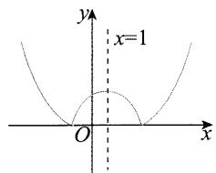

text_image

y
x=1
O
x

图1

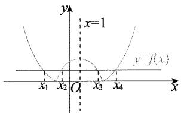

text_image

x=1
y=f(x)
x₁ x₂ O x₃ x₄

图2

图2给出了一个实例，不难发现求 $\sum_{i=1}^{m} x_i$ 时，应将对称的两个点组合，例如图2中的 $\frac{x_1 + x_4}{2} = 1, \frac{x_2 + x_3}{2} = 1$ ，但交点不一定是偶数个，需要讨论 $m$ 是奇数还是偶数吗？不需要，用倒序相加法即可。

不妨设 $x_{1}<x_{2}<\cdots<x_{m}$ ，记 $S=x_{1}+x_{2}+\cdots+x_{m}$ ①，则 $S=x_{m}+x_{m-1}+\cdots+x_{1}$ ②，

将式①和式②相加得 $2S=(x_{1}+x_{m})+(x_{2}+x_{m-1})+\cdots+(x_{m}+x_{1})=2+2+\cdots+2=2m$ ，所以 S=m.

【提炼】根据对称性判断两个函数图象具有相同的对称轴，故交点的横坐标之和 $=$ 交点个数 $\times$ 对称轴.这一结论可用上面的倒序相加法推导.

【250】B 解析:题目没给 $f(x)$ 的解析式, 只给了 $f(-x)=2-f(x)$ , 由它可推出对称性, 故考虑从对称性入手.

$f(-x) = 2 - f(x)\Rightarrow f(-x) + f(x) = 2\Rightarrow f(x)$ 的图象关于点(0,1)对称，

函数 $y=\frac{x+1}{x}=1+\frac{1}{x}$ 的图象也关于点 $(0,1)$ 对称，
所以两函数图象的交点也关于点 $(0,1)$ 对称.

不妨设 $x_{1}<x_{2}<\cdots<x_{m}, S_{1}=x_{1}+x_{2}+\cdots+x_{m}$ ①， $S_{2}=y_{1}+y_{2}+\cdots+y_{m}$ ②,

求和时应将对称的两个点组合，例如点 $(x_{1},y_{1})$ 和点 $(x_{m},y_{m})$ 关于点(0,1)对称，所以 $\frac{x_1 + x_m}{2} = 0,\frac{y_1 + y_m}{2}$ $= 1$ ，同理， $\frac{x_2 + x_{m - 1}}{2} = 0,\frac{y_2 + y_{m - 1}}{2} = 1$ ，以此类推，故采用倒序相加法即可两两组合，求出 $\sum_{i = 1}^{m}x_{i}$ 和 $\sum_{i = 1}^{m}y_{i}$

将①②倒序可得 $S_{1}=x_{m}+x_{m-1}+\cdots+x_{1}$ ③，

$$
S _ {2} = y _ {m} + y _ {m - 1} + \dots + y _ {1} \quad ④,
$$

将式①和式③相加得 $2S_{1} = (x_{1} + x_{m}) + (x_{2} + x_{m - 1})$

$$
+ \dots + (x _ {m} + x _ {1}) = 0 + 0 + \dots + 0 = 0 \Rightarrow S _ {1} = 0,
$$

将式②和式④相加得 $2S_{2} = (y_{1} + y_{m}) + (y_{2} + y_{m - 1})$

$$
+ \dots + (y _ {m} + y _ {1}) = 2 + 2 + \dots + 2 = 2 m \Rightarrow S _ {2} = m,
$$

所以 $\sum_{i=1}^{m}(x_{i}+y_{i})=(x_{1}+x_{2}+\cdots+x_{m})+(y_{1}+y_{2}+\cdots)$

$$
+ y _ {m}) = S _ {1} + S _ {2} = m.
$$

【提炼】根据对称性判断两个函数图象的交点关于点(0,1)中心对称，故交点的横坐标之和 $=$ 交点个数 $\times$ 对称中心的横坐标，交点的纵坐标之和 $=$ 交点个数 $\times$ 对称中心的纵坐标。这一结论的推导，可以用上面的倒序相加法。

# 3.6 周期性

【251】-1 解析: $f(x)$ 的周期为 $1 \Rightarrow f\left(\frac{3}{2}\right) = f\left(\frac{1}{2}\right) = \log_{2} \frac{1}{2} = -1$ .

【提炼】所求的函数值不在已知解析式的区间上，通过周期把自变量转化到该区间上来计算。

【252】1 解析: $f(x)$ 的周期为 $2 \Rightarrow f\left(\frac{3}{2}\right) = f\left(-\frac{1}{2}\right)$ $= -4 \times \left(-\frac{1}{2}\right)^{2} + 2 = 1.$

【253】 $\frac{\sqrt{2}}{2}$ 解析: $f(x+4)=f(x)\Rightarrow f(x)$ 的周期为 $4\Rightarrow f(15)=f(-1)=\left| -1+\frac{1}{2} \right|=\frac{1}{2}$ ,

所以 $f(f(15)) = f\left(\frac{1}{2}\right) = \cos \left(\frac{\pi}{2} \times \frac{1}{2}\right) = \frac{\sqrt{2}}{2}$ .

【254】-2 解析： $f(x)$ 的周期为 $2 \Rightarrow f\left(-\frac{5}{2}\right) = f\left(-\frac{1}{2}\right)$ ， $f(x)$ 为奇函数 $\Rightarrow f\left(-\frac{1}{2}\right) = -f\left(\frac{1}{2}\right) =$

$$
- 4 ^ {\frac {1}{2}} = - 2 \Rightarrow f \left(- \frac {5}{2}\right) = - 2.
$$

还要求 $f(1)$ ，注意1不在 $(0,1)$ 上，也无法通过周期转移到 $(0,1)$ 上，不能代解析式，怎么办呢？用周期可把 $f(1)$ 化为 $f(-1)$ ，而奇偶性又决定了 $f(1)$ 与 $f(-1)$ 有关系，两者结合即可求出 $f(1)$ .

$f(x)$ 为奇函数 $\Rightarrow f(1) = -f(-1)$ ①, $f(x)$ 的周期为 $2 \Rightarrow f(-1) = f(1)$ , 代入①得 $f(1) = -f(1)$ ,

所以 $f(1) = 0$ ，故 $f\left(-\frac{5}{2}\right) + f(1) = -2.$

【255】-10 解析: 要求 $a+3b$ ，需先求出 a 和 b，得建立两个方程，由 $f\left(\frac{1}{2}\right)=f\left(\frac{3}{2}\right)$ 利用周期转化，代入解析式可建立一个，另一个怎么建立呢？注意到已知解析式的区间是 $[-1,1]$ ，左、右端点都能取到，所以根据周期为 2，由 $f(1)=f(-1)$ ，代入解析式又可建立一个方程.

周期为 $2 \Rightarrow f(-1) = f(1) \Rightarrow -a + 1 = \frac{b + 2}{2}$ ①，

$$
\begin{array}{l} f \left(\frac {1}{2}\right) = f \left(\frac {3}{2}\right) \Rightarrow f \left(\frac {1}{2}\right) = f \left(- \frac {1}{2}\right) \Rightarrow \frac {\frac {1}{2} b + 2}{\frac {1}{2} + 1} = \\ - \frac {1}{2} a + 1 ②, \\ \end{array}
$$

联立①②解得 a=2, b=-4，故 $a+3b=-10$ .

【提炼】 $f(x)$ 的周期为 2，那么一个完整的周期是 $[-1,1)$ ，而不是 $[-1,1]$ ，解决本题一定要注意到 $f(1)$ 可转化为 $f(-1)$ ，才能挖掘出隐含的条件 $f(-1)=f(1)$ ，从而解决问题。

【256】B 解析: $f(x+6)=f(x)\Rightarrow f(x)$ 的周期为 6,

给定解析式的区间是 $[-3,-1)\cup[-1,3)=[-3,3)$ ，恰好是一个完整的周期，故直接代值计算.

由题意， $f(1) = 1, f(2) = 2, f(3) = f(-3) = -(-3 + 2)^{2} = -1, f(4) = f(-2) = -(-2 + 2)^{2} = 0, f(5) = f(-1) = -1, f(6) = f(0) = 0,$

所以 $f(1)+f(2)+\cdots+f(6)=1$ ,

根据周期为6，求目标式时，可按每6个一组，则每组和都是1，再看余几项即可， $2012=335\times6+2$ .

故 $f(1)+f(2)+f(3)+\cdots+f(2012)=335+f(1)+f(2)=338.$

【257】 $-\frac{1}{5}$ 解析： $f(x + 2) = \frac{1}{f(x)}\Rightarrow f(x + 4) =$

$\frac{1}{f(x+2)}=f(x)\Rightarrow$ 函数 $f(x)$ 是以 4 为周期的周期函数，

所以 $f(5) = f(1) = -5$ ，故 $f[f(5)] = f(-5) = f(3)$ 在 $f(x + 2) = \frac{1}{f(x)}$ 中取 $x = 1$ ，知 $f(3) = \frac{1}{f(1)} = -\frac{1}{5}$ 所以 $f[f(5)] = -\frac{1}{5}$

【提炼】 $f(x+a)=\frac{1}{f(x)}\Rightarrow T=2a.$

【258】C 解析: 在 $f(x)f(x+2)=13$ 中将 x 替换成 $x+2$ ，得到 $f(x+2)f(x+4)=13$ ，

两式相除得 $\frac{f(x + 2)f(x + 4)}{f(x)f(x + 2)} = \frac{13}{13}$ 所以 $f(x + 4) = f(x)$ ，故 $f(x)$ 是以4为周期的周期函数，

所以 $f(99)=f(24\times4+3)=f(3)$ ，在 $f(x)\cdot f(x+2)=13$ 中取 x=1 知 $f(1)f(3)=13$ ，

又 $f(1) = 2$ ，所以 $f(3) = \frac{13}{f(1)} = \frac{13}{2}$ 故 $f(99) = \frac{13}{2}$

【259】3 解析: $y=f(x)$ 为偶函数 $\Rightarrow$ 直线 x=0 是函数图象的一条对称轴，

$y = f(x)$ 的图象关于直线 $x = 2$ 和 $x = 0$ 对称 $\Rightarrow T = 2 \times (2 - 0) = 4 \Rightarrow f(-1) = f(-1 + 4) = f(3) = 3.$

【提炼】 $f(x)$ 图象的相邻对称轴方程为 $x=a, x=b \Rightarrow T=2|a-b|$ 。不懂的同学去看看视频吧，本题的视频中会给大家讲解这一结论的推导。

【260】D 解析: $f(x)$ 为奇函数 $\Rightarrow f(x)$ 的图象有对称中心 $(0,0)$ , $f(x+2)$ 为偶函数 $\Rightarrow f(x)$ 的图象有对称轴 x=2,

所以 $f(x)$ 是以 8 为周期的周期函数, 故 $f(8)+f(9)=f(0)+f(1)=0+1=1$ .

【261】C 解析: $f(1+x)=f(-x)\Rightarrow f(x)$ 的图象关于直线 $x=\frac{1}{2}$ 对称, 又 $f(x)$ 为奇函数, 所以 $f(x)$ 的图象关于原点对称, 所以 $f(x)$ 是以 2 为周期的周期函数, 故 $f\left(\frac{5}{3}\right)=f\left(-\frac{1}{3}\right)=\frac{1}{3}$ .

【262】C 解析: $f(x)$ 是奇函数 $\Rightarrow f(x)$ 的图象有对称中心 $(0,0)$ , $f(1-x)=f(1+x)\Rightarrow f(x)$ 的图象有对称轴 x=1,

所以 $f(x)$ 的周期为 4.

故求目标和式时，应每4项组合。先求 $f(2), f(3), f(4)$ 。

在 $f(1 - x) = f(1 + x)$ 中取 $x = 1$ ，知 $f(2) = f(0) =$

$$
0, f (3) = f (- 1) = - f (1) = - 2, f (4) = f (0) = 0,
$$

所以 $f(1)+f(2)+f(3)+f(4)=2+0+(-2)+0=0,$

故 $f(1)+f(2)+\cdots+f(50)=[f(1)+f(2)+f(3)+$

$$
f (4) ] + [ f (5) + f (6) + f (7) + f (8) ] + \dots + [ f (4 5) +
$$

$$
f (4 6) + f (4 7) + f (4 8) ] + f (4 9) + f (5 0) = f (4 9) +
$$

$$
f (5 0) = f (1) + f (2) = 2.
$$

【提炼】若 $f(x)$ 的图象有对称中心和对称轴，那么两者之间距离的4倍即为 $f(x)$ 的周期，去看看本题的视频吧，视频中会给出这一结论的推导.

# 3.7 指对运算

【263】C 解析: $2\log_{5}10 + \log_{5}0.25 = \log_{5}10^{2} + \log_{5}0.25$

$$
= \log_ {5} (1 0 ^ {2} \times 0. 2 5) = \log_ {5} 2 5 = 2.
$$

【264】1 解析: $\lg\sqrt{5}+\lg\sqrt{20}=\lg(\sqrt{5}\times\sqrt{20})=\lg10$

$$
= 1.
$$

【265】-20 解析: $\left(\lg\frac{1}{4}-\lg25\right)\div100^{-\frac{1}{2}}=\lg\frac{1}{100}\div$

$$
(1 0 ^ {2}) ^ {- \frac {1}{2}} = \lg 1 0 ^ {- 2} \div 1 0 ^ {- 1} = - 2 \times 1 0 = - 2 0.
$$

【266】-1 解析: $\lg \frac{5}{2} + 2 \lg 2 - \left( \frac{1}{2} \right)^{-1} = \lg 5 - \lg 2 +$

$$
2 \lg 2 - 2 = \lg 5 + \lg 2 - 2 = \lg 1 0 - 2 = 1 - 2 = - 1.
$$

【267】 $-\frac{1}{2}$ $3\sqrt{3}$ 解析： $\log_2\frac{\sqrt{2}}{2} = \log_2\frac{2^{\frac{1}{2}}}{2^1} = \log_22^{\frac{1}{2} -1} =$

$$
- \frac {1}{2}, 2 ^ {\log_ {2} 3 + \log_ {4} 3} = 2 ^ {\log_ {2} 3} \cdot 2 ^ {\log_ {4} 3} = 3 \times (4 ^ {\frac {1}{2}}) ^ {\log_ {4} 3} = 3 \times
$$

$$
(4 ^ {\log_ {4} 3}) ^ {\frac {1}{2}} = 3 \times 3 ^ {\frac {1}{2}} = 3 \sqrt {3}.
$$

【提炼】① $a^{\log_{a}N}=N$ ; ② $(a^{m})^{n}=(a^{n})^{m}=a^{mn}$ .

【268】D 解析: 底数不同, 先化同底.

$$
\log_ {2} 9 \times \log_ {3} 4 = \frac {\lg 9}{\lg 2} \times \frac {\lg 4}{\lg 3} = \frac {\lg 3 ^ {2}}{\lg 2} \times \frac {\lg 2 ^ {2}}{\lg 3} = \frac {2 \lg 3}{\lg 2} \times
$$

$$
\frac {2 \lg 2}{\lg 3} = 4.
$$

【提炼】① $\log_a b = \frac{\log_c b}{\log_c a}$ ; ② $\log_a b^n = n\log_a b$ .

【269】B 解析:第一个括号内的底数容易化为 2, 第二个括号内的底数容易化为 3.

原式 $= (2\log_{2^2}3 + \log_{2^3}3)(\log_32 + \log_3^22) = (\log_23 +$

$$
\left. \frac {1}{3} \log_ {2} 3\right) \left(\log_ {3} 2 + \frac {1}{2} \log_ {3} 2\right) = \left(\frac {4}{3} \log_ {2} 3\right) \times \left(\frac {3}{2} \log_ {3} 2\right) =
$$

$$
2 \log_ {2} 3 \times \log_ {3} 2 = 2 \log_ {2} 3 \times \frac {1}{\log_ {2} 3} = 2.
$$

【提炼】① $\log_{a^m}b^n = \frac{n}{m}\log_a b$ ；② $\log_a b = \frac{1}{\log_b a}$

【270】C 解析:由题意, $f(-x)+f(x)=\frac{1}{1+2^{-x}}+\frac{1}{1+2^{x}}=\frac{2^{x}}{2^{x}+1}+\frac{1}{1+2^{x}}=\frac{2^{x}+1}{2^{x}+1}=1$ . 故选 C.

【271】-7 解析: $f(3)=\log_{2}(9+a)=1\Rightarrow9+a=2\Rightarrow a=-7.$

【272】C 解析: $f(-2)=1+\log_{2}[2-(-2)]=1+\log_{2}4=1+2=3$ , $f(\log_{2}12)=2^{\log_{2}12-1}=2^{\log_{2}12}\times2^{-1}=12\times\frac{1}{2}=6$ ,

所以 $f(-2)+f(\log_{2}12)=9.$

【273】2 解析: $f(ab)=1 \Rightarrow \lg(ab)=1, f(a^{2}) + f(b^{2}) = \lg a^{2} + \lg b^{2} = \lg(ab)^{2} = 2 \lg(ab) = 2.$

【274】 $\sqrt{10}$ 解析: $4^{a}=2\Rightarrow a=\log_{4}2=\frac{1}{2}$ , $\lg x=a\Rightarrow x=10^{a}=\sqrt{10}$ .

【275】C 解析: 因为 $2^{a}=5^{b}=10\Rightarrow a=\log_{2}10, b=\log_{5}10$ ,
所以 $\frac{1}{a}+\frac{1}{b}=\frac{1}{\log_{2}10}+\frac{1}{\log_{5}10}=\lg2+\lg5=\lg(2\times5)=1.$

【276】A 解析: $2^{a}=5^{b}=m\Rightarrow a=\log_{2}m,b=\log_{5}m$ ，所以 $\frac{1}{a}+\frac{1}{b}=\frac{1}{\log_{2}m}+\frac{1}{\log_{5}m}=\log_{m}2+\log_{m}5=\log_{m}10.$

由题意, $\frac{1}{a}+\frac{1}{b}=2$ ,所以 $\log_{m}10=2$ ,故 $m^{2}=10$ ,又
由 $m=2^{a}$ 知 m>0，所以 $m=\sqrt{10}$ .

【提炼】当两个对数底数不同,真数相同时,常用公式 $\log_{a}b=\frac{1}{\log_{b}a}$ 化同底.

【277】B 解析: $a\log_{3}4=2\Rightarrow\log_{3}4^{a}=2\Rightarrow4^{a}=3^{2}=9$ ，所以 $4^{-a}=\frac{1}{4^{a}}=\frac{1}{9}.$

【278】 $\frac{4\sqrt{3}}{3}$ 解法 1: $a=\log_{4}3\Rightarrow4^{a}=3$ ，所以 $2^{a}=\sqrt{3},2^{-a}=\frac{\sqrt{3}}{3}$ ，故 $2^{a}+2^{-a}=\sqrt{3}+\frac{\sqrt{3}}{3}=\frac{4\sqrt{3}}{3}$ .

解法 2: $a=\log_{4}3\Rightarrow2^{a}=2^{\log_{4}3}=(4^{\frac{1}{2}})^{\log_{4}3}=(4^{\log_{4}3})^{\frac{1}{2}}=$ $3^{\frac{1}{2}}=\sqrt{3}$ ，所以 $2^{a}+2^{-a}=\sqrt{3}+\frac{1}{\sqrt{3}}=\frac{4\sqrt{3}}{3}$ .

【279】C 解析: a, b 都是对数, 要求 $4^{a-3b}$ , 故考虑把 a—

3b 化为以 4 为底的对数.

由题意， $a = \log_25 = \log_{2^2}5^2 = \log_425, b = \log_83 = \frac{1}{3}\log_23$ ，所以 $3b = \log_23 = \log_{2^2}3^2 = \log_49$

从而 $a - 3b = \log_425 - \log_49 = \log_4\frac{25}{9}$ 故 $4^{a - 3b} =$ $4^{\log_4\frac{25}{9}} = \frac{25}{9}$

【提炼】① $\log_{a^{m}}b^{n}=\frac{n}{m}\log_{a}b$ ; ② $a^{\log_{a}N}=N.$

【280】D 解析: $2^{\lg x} \cdot 2^{\lg y} = 2^{\lg x + \lg y} = 2^{\lg(xy)}$ . 故选 D.

【281】B 解析: 直接从题干推正确的结论, 方向不明, 故考虑逐个验证选项.

A 项, $5^{d} = 10 \Rightarrow d = \log_{5} 10$ , $ac = \log_{5} b \cdot \lg b = \log_{5} b \cdot \frac{\log_{5} b}{\log_{5} 10} = \frac{(\log_{5} b)^{2}}{\log_{5} 10}$ , 注意到 $b$ 的值可以变, 所以 $ac$ 不恒等于 $d$ , 故 A 项错误;

B项, $cd=\lg b\cdot\log_{5}10=\lg b\cdot\frac{1}{\lg5}=\log_{5}b=a$ ,故B项正确,其余两个选项不再验证了.

【282】4 2 解析: $\log_{b}a$ 可化为 $\frac{1}{\log_a b}$ , 故可求出 $\log_a b$ , 将 $a, b$ 的关系化简.

$\log_a b + \log_b a = \log_a b + \frac{1}{\log_a b} = \frac{5}{2} \Rightarrow \log_a b = 2$ 或 $\frac{1}{2}$ , 又 $a > b > 1$ , 所以 $\log_a b = \frac{1}{2}$ , 故 $b = \sqrt{a}$ .

将 $b = \sqrt{a}$ 直接代入 $a^b = b^a$ 即可消去 $b$ ，求出 $a$ .

又 $a^b = b^a$ ，所以 $a^{\sqrt{a}} = (\sqrt{a})^a$ ，从而 $a^{\sqrt{a}} = (a^{\frac{1}{2}})^a = a^{\frac{a}{2}}$ 故 $\sqrt{a} = \frac{a}{2}$ ，结合 $a > 1$ 可得 $a = 4$ ，所以 $b = \sqrt{a} = 2.$

【283】7 解析: $\log_{2}(x+1)=3=\log_{2}8\Rightarrow x+1=8\Rightarrow x=7.$

【284】2 解析： $\log_2(3^{x - 1} - 2) + 2 = \log_2(3^{x - 1} - 2) +$ $\log_24 = \log_2[4(3^{x - 1} - 2)]$ ，由题意， $\log_2(9^{x - 1} - 5) =$ $\log_2[4(3^{x - 1} - 2)],$

所以 $9^{x-1}-5=4(3^{x-1}-2)$ ，两端同乘9得 $9^{x}-45=4(3^{x+1}-18)$ ，即 $(3^{x})^{2}-12\times3^{x}+27=0$ ，

也即 $(3^{x}-9)(3^{x}-3)=0$ ，解得x=2或1，代回检验知当x=1时， $3^{x-1}-2<0$ ，不合题意，故x=2.

【提炼】看到 $9^{x}$ 和 $3^{x}$ ，想到将 $3^{x}$ 换元成 t.

【285】64 解析: 所给等式中两个对数不同底, 可考虑用换底公式化为同底, 由于有 8 和 4, 所以选择 2 为

底数较方便.

因为 $\frac{1}{\log_8a} -\frac{1}{\log_a4} = -\frac{5}{2}$ 所以 $\log_a8 - \log_4a = -\frac{5}{2}$

从而 $\frac{\log_28}{\log_2a} -\frac{\log_2a}{\log_24} = -\frac{5}{2}$ 故 $\frac{3}{\log_2a} -\frac{\log_2a}{2} = -\frac{5}{2},$

两端同乘 $2\log_{2}a$ 化简得 $(\log_{2}a)^{2}-5\log_{2}a-6=0$ ，所以 $(\log_{2}a-6)(\log_{2}a+1)=0$ ，

从而 $\log_2a = 6$ 或 $\log_2a = -1$ ，故 $a = 2^{6} = 64$ 或 $a = 2^{-1} = \frac{1}{2}$ .又由题意 $a > 1$ ，所以 $a = 64$

【286】 $(-2,2)$ 解析: 因为 $y=2^{x}$ 在 R 上 $\nearrow$ ，所以 $2^{x^{2}-2}<4\Leftrightarrow2^{x^{2}-2}<2^{2}\Leftrightarrow x^{2}-2<2\Leftrightarrow-2<x<2.$

【287】C 解析:由题意, $5+\lg V=4.9$ ,所以 $\lg V=-0.1$ ,故 $V=10^{-0.1}=\frac{1}{10^{0.1}}=\frac{1}{\sqrt[10]{10}}\approx\frac{1}{1.259}\approx0.8$ .

【288】D 解析:由题意, $\frac{M}{N}=\frac{3^{361}}{10^{80}}$ ,

涉及大数值指数式的计算,常取对数.

所以 $\lg \frac{M}{N} = \lg \frac{3^{361}}{10^{80}} = \lg 3^{361} - \lg 10^{80} = 361 \times \lg 3 - 80 \approx 361 \times 0.48 - 80 = 93.28$ ，故 $\frac{M}{N} \approx 10^{93.28}$ . 故选 D.

【289】A 解析: 设太阳、天狼星的星等分别 $m_{1}, m_{2}$ ，亮度分别为 $E_{1}, E_{2}$ ，

由题意, $m_{2}-m_{1}=\frac{5}{2}\lg\frac{E_{1}}{E_{2}}\Rightarrow\lg\frac{E_{1}}{E_{2}}=\frac{2}{5}(m_{2}-m_{1})=$ $\frac{2}{5}\times[-1.45-(-26.7)]=10.1\Rightarrow\frac{E_{1}}{E_{2}}=10^{10.1}.$

【290】24 解析:由题意, $\left\{\begin{aligned}e^{b}&=192,\\ e^{22k+b}&=48,\end{aligned}\right.$ 所以 $e^{22k}\cdot e^{b}=$ $e^{22k}\cdot192=48$ , 故 $e^{22k}=\frac{1}{4}$ , 所以 $e^{33k+b}=e^{33k}\cdot e^{b}=(e^{22k})^{\frac{3}{2}}\cdot e^{b}=\left(\frac{1}{4}\right)^{\frac{3}{2}}\times192=24.$

【291】C 解析： $I(t^{*})=0.95K\Rightarrow\frac{K}{1+\mathrm{e}^{-0.23(t^{*}-53)}}=$ 0.95K,所以 $e^{-0.23(t^{*}-53)}=\frac{1}{0.95}-1=\frac{1}{19}$ ，故-0.23· $(t^{*}-53)=\ln\frac{1}{19}=-\ln19$ ,解得 $t^{*}=53+\frac{\ln19}{0.23}\approx53+$ $\frac{3}{0.23}\approx66.$

【292】B 解析: $R_{0}=1+rT\Rightarrow r=\frac{R_{0}-1}{T}=\frac{3.28-1}{6}=0.38\Rightarrow I(t)=\mathrm{e}^{rt}=\mathrm{e}^{0.38t}$ ，当 t=0 时， $I(0)=1$ ，令 $e^{0.38t}=2$ ，解得 $t=\frac{\ln 2}{0.38}\approx\frac{0.69}{0.38}\approx1.8$ .

【293】D 解析: A 项, 当 T=220, P=1026 时, 3<lg P<4, 点 $(T, \lg P)$ 的大致位置如图中的点 A, 此时二氧化碳为固态, 故 A 项错误;

B项, 当 T=270, P=128 时, $2<\lg P<3$ , 点 $(T, \lg P)$ 的大致位置如图中的点 B, 此时二氧化碳为液态, 故 B 项错误;

C项, 当 T=300, P=9 987时, $3<\lg P<4$ ,且 $\lg P$ 非常接近4,所以点 $(T,\lg P)$ 的大致位置如图中的点C,此时二氧化碳为固态,故C项错误；

line

| T    | lg P (气态) | lg P (液态) | lg P (固态) |
|------|-------------|-------------|-------------|
| 200  | 0           | 0           | 0           |
| 250  | ~1          | ~1          | ~2          |
| 300  | ~2          | ~2          | ~3          |
| 350  | ~2          | ~2          | ~4          |
| 400  | ~2          | ~2          | ~4          |

D 项, 当 T=360, P=729 时, $2<\lg P<3$ , 点 $(T, \lg P)$ 的大致位置如图中的点 D, 此时二氧化碳为超临界状态, 故 D 项正确.

【294】ACD 解析: 因为我们要比较的是 $p_{1}, p_{2}, p_{3}$ 的一些大小情况, 所以先由所给等式解出 p.

由题意, $L_{P}=20\times\lg\frac{p}{p_{0}}$ ,所以 $\frac{L_{P}}{20}=\lg\frac{p}{p_{0}}$ ,从而 $\frac{p}{p_{0}}=10^{\frac{L_{P}}{20}}$ ,故 $p=p_{0}10^{\frac{L_{P}}{20}}$ ①.

A 项, 由式①可以看到, $L_{p}$ 越大, 则 $p$ 也越大.

由表中数据可知燃油汽车的声压级 $L_{P}$ 大于等于混合动力汽车的声压级，所以 $p_{1} \geqslant p_{2}$ ，故 A 项正确；

B项,由表中数据可知 $p_{0}10^{\frac{50}{20}}\leqslant p_{2}\leqslant p_{0}10^{\frac{60}{20}}$ , 所以 $100\sqrt{10}p_{0}\leqslant p_{2}\leqslant1000p_{0}$ ②,

又 $p_{3}=p_{0}10^{\frac{40}{20}}=100p_{0}$ ，所以 $p_{2}\leqslant10p_{3}$ ，故 B 项错误，C 项正确；

D项，由表中数据可知 $p_010^{\frac{60}{20}} \leqslant p_1 \leqslant p_010^{\frac{90}{20}}$ ，所以 $1000p_0 \leqslant p_1 \leqslant 10000\sqrt{10} p_0$ ，而由②可得 $10000\sqrt{10} p_0 \leqslant 100p_2 \leqslant 100000p_0$ ，所以 $p_1 \leqslant 100p_2$ ，故D项正确.

# 3.8 指数、对数、幂函数的图象与性质

【295】A 解析: $f(x) \searrow \Rightarrow 0 < a < 1$ , 由图象知 $f(0) = a^{-b} < 1$ , 所以 $a^{-b} < a^{0}$ , 从而 -b > 0, 故 b < 0.

【296】C 解析: 设 $f(x)=a^{x}+b-1$ ，由题意， $f(x)$ 的图象经过第二、三、四象限，如图，应有 $f(x)\searrow$ ，所以 0<a<1，由图象得 $f(0)<0$ ，从而 $a^{0}+b-1$

<0, 故b<0.

【297】C 解析: 当 x=1 时, $y=0 \Rightarrow$ 函数 $y=a^{x}-a$ 的图象过点 $(1,0)$ , 排除 A, B, D.

【298】 $\left(0,\frac{1}{2}\right)$ 解析:①当0<a<1时,如图1,若直线y=2a与函数 $y=|a^{x}-1|$ 的图象有两个公共点,则0<2a<1 $\Rightarrow0<a<\frac{1}{2}$ .

② 当 $a > 1$ 时，如图2，若直线 $y = 2a$ 与函数 $y = |a^x - 1|$ 的图象有两个公共点，则 $0 < 2a < 1$ ，结合 $a > 1$ 无解.

综上所述，a 的取值范围是 $\left(0, \frac{1}{2}\right)$ .

text_image

0<a<1
y
1
y=2a
O
x

图1

  
图2

【299】 $-\frac{3}{2}$ 解析: 给出 $f(x)$ 的值域, 就知道了 $f(x)$ 的最大值和最小值. 最值又与单调性有关, 于是讨论 a 与 1 的大小关系.

当 $0 < a < 1$ 时， $f(x)$ 在 $[-1, 0]$ 上 $\searrow$ ，所以 $\left\{ \begin{array}{l} f(x)_{\min} = f(0) = 1 + b = -1, \\ f(x)_{\max} = f(-1) = a^{-1} + b = 0 \end{array} \right. \Rightarrow a = \frac{1}{2}, b = -2$ ，故 $a + b = -\frac{3}{2}$ ;

当 $a > 1$ 时， $f(x)$ 在 $[-1, 0]$ 上 $\nearrow$ ，所以 $\left\{ \begin{array}{l} f(x)_{\min} = f(-1) = a^{-1} + b = -1, \\ f(x)_{\max} = f(0) = 1 + b = 0, \end{array} \right.$ 无解.

【300】D 解析: $0 < \ln 2 < 1 \Rightarrow (\ln 2)^{2} < \ln 2, \ln \sqrt{2} < \ln 2$ , 又 $\ln 2 < 2$ , 所以 $\ln (\ln 2) < \ln 2$ , 故 $\ln 2$ 最大.

【301】D 解析: $y=f(x)=\log_{a}(x+c)\searrow\Rightarrow0<a<1$ ,
由图象得 $f(0)>0\Rightarrow\log_{a}c>0$ ，结合 0<a<1 知 0<c<1.

【302】A 解析: $f(x)$ 由 $y=\log_{a}u$ 和 $u=2^{x}+b-1$ 复合而成, $u=2^{x}+b-1 \nearrow$ , 且由图可知 $f(x) \nearrow$ , 所以 $y=\log_{a}u \nearrow$ , 故 a>1.

看图发现 y 轴上还标了个刻度 -1，由此可得出 $f(0)$ 的范围.

由图象知 $-1 < f(0) < 0$ ，所以 $-1 < \log_a b < 0$ ，从而 $\log_a a^{-1} < \log_a b < \log_a 1$ ，故 $0 < a^{-1} < b < 1$ .

【303】A 解析: 画出 $f(x)$ 与 $y=|\lg x|$ 的图象, 如图.

text_image

y
O 1 10 x

注意到 $f(x) = x^2$ 在直线 $y = 1$ 上方没有图象，故画 $y = |\lg x|$ 的图象时，要特别注意它会经过 $y = |\lg x|$ 与 $y = 1$ 的交点 $\left(\frac{1}{10}, 1\right), (10, 1)$ ，由图可得有10个交点.

【提炼】数形结合往往是解决周期函数图象交点问题的好方法，作图时需抓住关键信息.

【304】 $\left(-\frac{1}{2},+\infty\right)$ 解析： $2x+1>0\Rightarrow x>-\frac{1}{2}\Rightarrow f(x)$ 的定义域为 $\left(-\frac{1}{2},+\infty\right)$ ， $y=\log_{5}u$ 和 u=2x+1 都为增函数，

由同增异减原则知， $f(x)$ 的单调递增区间是 $\left(-\frac{1}{2}, +\infty\right)$ .

【305】D 解析: $x^{2} - 4 > 0 \Rightarrow x < -2$ 或 $x > 2 \Rightarrow f(x)$ 的定义域为 $(- \infty, -2) \cup (2, +\infty), y = \log_{\frac{1}{2}} u \searrow, u = x^{2} - 4$ 在 $(- \infty, -2)$ 上 $\searrow$ , 在 $(2, +\infty)$ 上 $\nearrow$ , 所以 $f(x)$ 的单调递增区间为 $(- \infty, -2)$ .

【306】D 解析: $2x^{2}+x>0\Rightarrow x<-\frac{1}{2}$ 或 $x>0\Rightarrow f(x)$ 的定义域为 $\left(-\infty,-\frac{1}{2}\right)\cup(0,+\infty)$ ,

设 $u = 2x^{2} + x$ ，则 $f(x) = \log_a u$ ，当 $x \in \left(0, \frac{1}{2}\right)$ 时， $u \in (0,1)$ ，所以题干条件等价于 $\log_a u > 0$ 在 $(0,1)$ 上恒成立，故 $0 < a < 1$ ，所以 $y = \log_a u \searrow$

又 $u = 2x^{2} + x$ 在 $\left(-\infty, -\frac{1}{2}\right)$ 上 $\searrow$ ，在 $(0, +\infty)$ 上 $\nearrow$ ，故 $f(x)$ 的单调递增区间为 $\left(-\infty, -\frac{1}{2}\right)$ .

【307】A 解析: $0 < a < 1 \Rightarrow f(x)$ 在 $[a, 2a]$ 上，所以 $f(x)_{\max}=f(a)=1,f(x)_{\min}=f(2a)=\log_{a}(2a)=\log_{a}2+1,$

由题意， $3(\log_{a}2+1)=1$ ，所以 $\log_{a}2=-\frac{2}{3}$ ，即 $a^{-\frac{2}{3}}=2$ ，两边同时立方得 $a^{-2}=8$ ，即 $\frac{1}{a^{2}}=8$ ，故 $a=\frac{\sqrt{2}}{4}$ .

【308】(1,2] 解析: 当 $x \leqslant 2$ 时, $f(x) = -x + 6 \geqslant 4 \Rightarrow$

$f(x)$ 在 $(-\infty, 2]$ 上的值域是 $[4, +\infty)$ .

要使 $f(x)$ 的值域是 $[4, +\infty)$ ，则当 $x > 2$ 时， $f(x) = 3 + \log_a x \geqslant 4$ 恒成立，即 $\log_a x \geqslant 1$ 恒成立.

当 $0 < a < 1$ 时， $\log_a x \geqslant 1$ 不可能恒成立，不合题意；当 $a > 1$ 时， $\log_a x$ 在 $(2, +\infty)$ 上的取值范围是 $(\log_a 2, +\infty)$ ，所以 $\log_a 2 \geqslant 1 = \log_a a$ ，故 $1 < a \leqslant 2$ 。

综上所述，a 的取值范围是(1,2].

【309】B 解析: $y=x^{\frac{1}{3}}$ 为幂函数, 其图象必过点(1,1), 排除选项 A, D; 又 $0<\frac{1}{3}<1$ , 所以 $y=x^{\frac{1}{3}}$ 在第一象限的图象应为增长趋于平缓的情形, 故选 B.

【310】 $f(x)=x^{2}$ （答案不唯一）解析：幂函数具有性质 $f(x_{1}x_{2})=f(x_{1})f(x_{2})$ ，故可取 $f(x)=x^{\alpha}$ ，结合②③知可取 $\alpha$ 为正偶数，如 $f(x)=x^{2}$ .

【311】A 解析: $y=x^{2}$ 和 $y=x^{\frac{1}{2}}$ 在 $(0,+\infty)$ 上，容易判断 $C_{4}$ 是 $y=x^{2}$ ， $C_{3}$ 是 $y=x^{\frac{1}{2}}$ ；

$y=x^{-2}$ 和 $y=x^{-\frac{1}{2}}$ 在 $(0,+\infty)$ 上都，谁是 $C_{1}$ ，谁是 $C_{2}$ 呢？可比较同一自变量下的函数值来看.

直线 $x = 2$ 与 $C_1, C_2$ 的交点如图，由于 $2^{-2} = \frac{1}{4} < 2^{-\frac{1}{2}} = \frac{\sqrt{2}}{2}$ ，所以交点在上方的 $C_2$ 是 $y = x^{-\frac{1}{2}}$ ，交点在下方的 $C_1$ 是 $y = x^{-2}$ .

text_image

y
C₄
1
C₃
C₂
C₁
O
1
x=2

# 3.9 指、对、幂比大小

【312】C 解析:由题意,a>0,b>0,c<0,所以 c 最小,结合选项知选 C.

【313】D 解析:由题意, $a=\log_{2}0.3<0$ ,显然b和c都大于0,所以a最小,
又 $b=\log_{\frac{1}{2}}0.4>\log_{\frac{1}{2}}0.5=1,c=0.4^{0.3}<0.4^{0}=1$ ,
所以 a<c<b.

【314】D 解析: 观察发现 a, b 可化同底, $b=\left(\frac{1}{3}\right)^{-0.8}=3^{0.8}$ , 因为 $y=3^{x}$ ↗, 所以 $3^{0.8}>3^{0.7}>3^{0}$ , 故 b>a>1,

又 $y = \log_{0.7} x \searrow$ ，所以 $\log_{0.7} 0.8 < \log_{0.7} 0.7 = 1$ ，故 $c < a < b$ .

【提炼】①“1”是比大小的核心中间量之一；②若有底数相同，往往用单调性比大小.

【315】C 解析: $\log_{2}\pi > \log_{2}2 \Rightarrow a > 1; \log_{\frac{1}{2}}\pi < \log_{\frac{1}{2}}1 \Rightarrow b < 0; 0 < \pi^{-2} < \pi^{0} \Rightarrow 0 < c < 1$ ，所以 b < 0 < c < 1 < a.

【提炼】既有指数式，又有对数式的比大小，常选0,1作为中间量.

【316】D 解析: 因为函数 $y=1.01^{x}$ 在 R 上单调递增, 所以 $a=1.01^{0.5}<b=1.01^{0.6}$ .

因为函数 $y = x^{0.5}$ 在 $[0, +\infty)$ 上单调递增，所以 $a = 1.01^{0.5} > c = 0.6^{0.5}$ ，所以 $b > a > c$ .

【317】B 解析: $\log_{2}0.2<\log_{2}1\Rightarrow a<0;2^{0.2}>2^{0}\Rightarrow b>$ 1; $0 < 0.2^{0.3} < 0.2^{0} \Rightarrow 0 < c < 1$ ，所以 a < c < b.

【318】C 解析: $0 < 2^{-\frac{1}{3}} < 2^{0} \Rightarrow 0 < a < 1$ ; $\log_{2}\frac{1}{3} < \log_{2}1$ $\Rightarrow b < 0$ ; $\log_{\frac{1}{2}}\frac{1}{3} = \log_{2^{-1}}3^{-1} = \log_{2}3 > \log_{2}2 \Rightarrow c > 1$ ,

所以 b < a < c.

【319】A 解析:由 $\log_{2}7 > \log_{2}4 \Rightarrow a > 2$ ; 由 $\log_{3}3 < \log_{3}8 < \log_{3}9 \Rightarrow 1 < b < 2$ ; $0.3^{0.2} < 0.3^{0} = 1 \Rightarrow c < 1$ , 故 c < b < a.

【320】B 解析: $\log_{3}3<\log_{3}7<\log_{3}9\Rightarrow1<a<2;2^{3.3}>$ $2^{1}\Rightarrow b>2;0.8^{1.1}<0.8^{0}\Rightarrow c<1$ ，故 c<a<b.

【321】D 解析:由公式 $\log_{a}^{m}b^{n}=\frac{n}{m}\log_{a}b$ 可得 $c=\log_{\frac{1}{3}}\frac{1}{5}=\log_{3^{-1}}5^{-1}=\log_{3}5,\log_{3}5>\log_{3}\frac{7}{2}>\log_{3}3\Rightarrow c>a>1,$

又 $b = \left(\frac{1}{4}\right)^{\frac{1}{3}} < \left(\frac{1}{4}\right)^0 = 1$ ，所以 $b < a < c.$

【322】C 解析:由题意,a,b都在(0,1)上,c>1,所以c最大,要比较a和b,可再选取 $\frac{1}{2}$ 为中间量.

$a = \log_32 > \log_3\sqrt{3} = \frac{1}{2}, b = \log_52 < \log_5\sqrt{5} = \frac{1}{2}$ , 所以 $a > b$ , 故 $c > a > b$ .

【323】A 解析: $c = \frac{2}{3}$ 这个数值的大小很清晰, 故就以它为中间量, 只需将 $a, b$ 分别与 $c$ 比较, 要比较 $\log_3 2$ 与 $\frac{2}{3}$ , 可把 $\frac{2}{3}$ 化为与 $\log_3 2$ 同底的对数, 即把 $\frac{2}{3}$ 变成 $\log_3 3^{\frac{2}{3}}$ , 再比较 2 与 $3^{\frac{2}{3}}$ 的大小即可.

$$
\begin{array}{l} {2 ^ {3} = 8 <   (3 ^ {\frac {2}{3}}) ^ {3} = 3 ^ {2} = 9 \Rightarrow 2 <   3 ^ {\frac {2}{3}} \Rightarrow \log_ {3} 2 <   \log_ {3} 3 ^ {\frac {2}{3}} \Rightarrow} \\ {\log_ {3} 2 <   \frac {2}{3}, \text {所以} a <   c,} \end{array}
$$

同理，要比较 $\log_53$ 与 $\frac{2}{3}$ ，可把 $\frac{2}{3}$ 化为 $\log_55^{\frac{2}{3}}$ ，再比较3与 $5^{\frac{2}{3}}$ 的大小即可.

$3^{3} = 27 > (5^{\frac{2}{3}})^{3} = 5^{2} = 25 \Rightarrow 3 > 5^{\frac{2}{3}} \Rightarrow \log_{5} 3 > \log_{5} 5^{\frac{2}{3}} \Rightarrow$ $\log_{5} 3 > \frac{2}{3}$ , 所以 $b > c$ , 故 $a < c < b$ .

【提炼】要比较 $\frac{2}{3}$ 与对数 $\log_{a}b$ 的大小，只需要化同底。
把 $\frac{2}{3}$ 变为 $\log_{a}a^{\frac{2}{3}}$ ，结合对数函数的单调性来比较.

【324】B 解析: 观察发现 a, b, c 可化同底. 故化同底用函数单调性比较.

由题意, $a=\log_{\frac{1}{3}}\frac{1}{2}=\log_{3}2,b=\log_{\frac{1}{3}}\frac{2}{3}=\log_{3}\frac{3}{2},c=\log_{3}\frac{4}{3}.$ 因为 $y=\log_{3}x\nearrow$ ,所以 $\log_{3}\frac{4}{3}<\log_{3}\frac{3}{2}<\log_{3}2,$ 故c<b<a.

【325】A 解析: $y=2^{x}\Rightarrow2^{1.2}>2^{0.8}>2^{0}\Rightarrow a>b>1$ ，而 $c=2\log_{5}2=\log_{5}4<1$ ，所以 c<b<a。

【326】C 解析: a, b 同底, 可用指数函数的单调性比较, a, c 同指, 可用幂函数的单调性比较.

$y=0.6^{x}\searrow\Rightarrow0.6^{1.5}<0.6^{0.6}\Rightarrow b<a,y=x^{0.6}$ 在 $(0,+\infty)$ 上 $\nearrow\Rightarrow0.6^{0.6}<1.5^{0.6}\Rightarrow a<c$ ，所以b<a<c.

【327】A 解析: 观察发现 a, b 可化同底, a, c 可化同指, 故分别构造指数函数、幂函数来比较.

因为 $y = 2^x \nearrow$ ，且 $b = 4^{\frac{2}{5}} = 2^{\frac{4}{5}}$ ， $a = 2^{\frac{4}{3}}$ ，所以 $b < a$ .

$y=x^{\frac{4}{3}}$ 在 $(0,+\infty)$ 上 $\nearrow, c=25^{\frac{1}{3}}=(\sqrt{5})^{\frac{4}{3}}, a=2^{\frac{4}{3}}$ $\sqrt{5}>2\Rightarrow c>a$ ，所以 b<a<c.

【提炼】要善于观察，化“同底”可利用指数函数的单调性比大小，化“同指”可利用幂函数的单调性比大小.

【328】B 解析: 观察发现 a, b 的底数相同, 故可用指数函数的单调性来比较大小.

因为 4.2>1，所以 $f(x)=4.2^{x}$ 在 R 上单调递增，又 -0.3<0.3，所以 $0<f(-0.3)<f(0.3)$ ，

从而 $0 < 4.2^{-0.3} < 4.2^{0.3}$ ，故 $0 < a < b$ 。又因为 $c = \log_{4.2}0.2 < 0$ ，所以 $c < a < b$ ，故 $b > a > c$ 。

【329】C 解析:由题意, $c=\left(\frac{1}{5}\right)^{\log_{3}0.3}=(5^{-1})^{\log_{3}0.3}=5^{-\log_{3}0.3}=5^{\log_{3}\frac{10}{3}}$ ,

要比较 $a, b, c$ 的大小，只需比较 $\log_2 3.4, \log_1 3.6, \log_3 \frac{10}{3}$ 的大小，先简单估算.

$1<\log_{2}3.4<2,0<\log_{4}3.6<1,1<\log_{3}\frac{10}{3}<2$ ，所以 $\log_{4}3.6$ 最小，

另外两个都在区间(1,2)内，可尝试选取 $\frac{3}{2}$ 为中间量，再比较.

$$
\log_ {2} 3. 4 > \log_ {2} 2 ^ {\frac {3}{2}} \Rightarrow \log_ {2} 3. 4 > \frac {3}{2}, \log_ {3} \frac {1 0}{3} <   \log_ {3} 3 ^ {\frac {3}{2}} \Rightarrow
$$

$1 < \log_{3} \frac{10}{3} < \frac{3}{2}$ , 所以 $\log_{3} \frac{10}{3} < \log_{2} 3.4$ ,

从而 $\log_43.6 < \log_3\frac{10}{3} < \log_23.4$ ，故 $a > c > b$

【提炼】当数据都在两个相邻整数之间时，如都在区间(1,2)内，可考虑选取区间中点为中间量比较大小.

【330】D 解析: 观察发现 a, b, c 的真数都是底数的 2 倍, 所以同时减 1 即可化为真数相同的数据.

由题意, $a-1=\log_{3}6-\log_{3}3=\log_{3}2$ ,同理, $b-1=\log_{5}2,c-1=\log_{7}2.$

于是只需比较 $\log_{3}2,\log_{5}2,\log_{7}2$ 的大小，可用公式 $\log_{a}b=\frac{1}{\log_{b}a}$ 来化同底。

因为 $\log_32 = \frac{1}{\log_23},\log_52 = \frac{1}{\log_25},\log_72 = \frac{1}{\log_27}$ 且 $0 <   \log_{2}3 <   \log_{2}5 <   \log_{2}7,$

所以 $\frac{1}{\log_23} >\frac{1}{\log_25} >\frac{1}{\log_27}$ ，故 $a > b > c.$

【331】B 解析: A 项, 不等式左、右两侧真数相同, 可用公式 $\log_{a}b = \frac{1}{\log_{b}a}$ 化同底比较.

$\log_{a}c-\log_{b}c=\frac{1}{\log_{c}a}-\frac{1}{\log_{c}b}=\frac{\log_{c}b-\log_{c}a}{\log_{c}a\cdot\log_{c}b}$ ，因为 $\left\{\begin{aligned}&0<c<1,\\ &a>b>0,\end{aligned}\right.$ 所以 $\log_{c}b>\log_{c}a$ ，故 $\log_{c}b-\log_{c}a>0$ ，

分母是否一定小于0呢？不一定。

当 $1 > a > b > 0$ 时， $\log_c b > 0, \log_c a > 0,$

所以 $\log_{a}c - \log_{b}c = \frac{\log_{c}b - \log_{c}a}{\log_{c}a \cdot \log_{c}b} > 0$ ，从而 $\log_{a}c > \log_{b}c$ ，故 A 项错误；

B 项, $0 < c < 1 \Rightarrow y = \log_{c} x \searrow$ , 因为 $a > b$ , 所以 $\log_{c} a < \log_{c} b$ , 故 B 项正确;

C 项, $0 < c < 1 \Rightarrow y = x^{c}$ 在 $(0, +\infty)$ 上单调递增, $a > b > 0 \Rightarrow a^{c} > b^{c}$ , 故 C 项错误;

D 项, $0 < c < 1 \Rightarrow y = c^{x} \searrow, a > b > 0 \Rightarrow c^{a} < c^{b}$ , 故 D 项错误.

【332】C 解法 1: 取 a=4, b=2, $c=\frac{1}{2}$ ，代入选项可排

除 A, B, D, 故选 C.

解法 2: A 项, $0 < c < 1 \Rightarrow y = x^{c}$ 在 $(0, +\infty)$ 上 $\nearrow$ , 因为 a > b > 1, 所以 $a^{c} > b^{c}$ , 故 A 项错误;

B项, $ab^{c}<ba^{c}\Leftrightarrow b^{c-1}<a^{c-1}$ ，此不等式左、右两侧指数部分相同，可构造幂函数用单调性分析.

因为 0<c<1，所以 -1<c-1<0，故函数 $y=x^{c-1}$ 在 $(0,+\infty)$ 上，

因为 $a > b > 1$ ，所以 $b^{c - 1} > a^{c - 1}$ ，故B项错误；

C项, 不等式左、右两侧对数部分的真数相同, 考虑用公式 $\log_{a}b=\frac{1}{\log_{b}a}$ 化同底.

$a\log_b c < b\log_a c \Leftrightarrow \frac{a}{\log_c b} < \frac{b}{\log_c a} \Leftrightarrow a\log_c a < b\log_c b \Leftrightarrow \log_c a^a < \log_c b^b \Leftrightarrow a^a > b^b,$

$a^a, b^b$ 的底数与指数都不同，可引入中间量 $a^b$ 来搭桥比较，它与 $a^a$ 底数相同，与 $b^b$ 指数相同.

因为 $a > b > 1$ ，所以 $y = a^x\nearrow$ ，故 $a^a >a^b$ ，又 $y = x^{b}\nearrow$ 所以 $a^b >b^b$ ，从而 $a^a >a^b >b^b$ 成立，故C项正确；

D项, $\log_{a}c<\log_{b}c\Leftrightarrow\frac{1}{\log_{c}a}<\frac{1}{\log_{c}b}\Leftrightarrow\log_{c}b<\log_{c}a\Leftrightarrow$ b>a，与 a>b>1 不符，故 D 项错误.

【333】D 解析: ① $\left\{\begin{aligned}a&>b>1,\\ c&<0\end{aligned}\right.\Rightarrow\left\{\begin{aligned}b-a&<0,\\ ab&>0\end{aligned}\right.\Rightarrow\frac{c}{a}-\frac{c}{b}=$ $\frac{(b-a)c}{ab}>0\Rightarrow\frac{c}{a}>\frac{c}{b}$ ，故①正确；

②设 $f(x)=x^{c}$ ，由 c<0 知 $f(x)=x^{c}$ 在 $(0,+\infty)$ 上 $\searrow,a>b>1\Rightarrow f(a)<f(b)\Rightarrow a^{c}<b^{c}$ ，故②正确；

③ $\log_{b}(a-c)$ 和 $\log_{a}(b-c)$ 的底数、真数都不一样，怎么比较大小呢？可引入一个中间量 $\log_{b}(b-c)$ ，它与 $\log_{b}(a-c)$ 的底数相同，与 $\log_{a}(b-c)$ 的真数相同.

因为 $a > b > 1, c < 0$ ，所以 $a - c > b - c > 1, y = \log_b x$ ，所以 $\log_b(a - c) > \log_b(b - c)$ ，

而 $\log_b(b - c) = \frac{1}{\log_{b - c}b},\log_a(b - c) = \frac{1}{\log_{b - c}a}$ 易得 $0 <   \log_{b - c}b <   \log_{b - c}a$ ，所以 $\frac{1}{\log_{b - c}b} >\frac{1}{\log_{b - c}a},$

故 $\log_b(b - c) > \log_a(b - c)$ ，所以 $\log_b(a - c) > \log_b(b - c) > \log_a(b - c)$ ，故③正确.

【提炼】①真数相同底数不同的两个对数比大小,可用公式 $\log_{a}b=\frac{1}{\log_{b}a}$ 化同底;②本题

text_image

y
y=log_b x
y=log_a x
O
1 b-c a-c x

最后一个结论也可通过函数 $y=\log_{a}x$ 和 $y=\log_{b}x$ 的图象来判断，如图。

【334】C 解析: 给了函数 $f(x)$ 在 $(0, +\infty)$ 上的单调性, 可利用奇偶性把自变量全部转化到 $(0, +\infty)$ 上.

$f(x)$ 是偶函数 $\Rightarrow f\left(\log_3\frac{1}{4}\right) = f\left(-\log_3\frac{1}{4}\right) = f(\log_34),$

因为 $0 < 2^{-\frac{3}{2}} < 2^{-\frac{2}{3}} < 1 < \log_34$ ，且 $f(x)$ 在 $(0, +\infty)$

上 $\searrow$ ，所以 $f(2^{-\frac{3}{2}}) > f(2^{-\frac{2}{3}}) > f(\log_34)$ . 故选 C.

【335】C 解析: $f(x)$ 为偶函数 $\Rightarrow f(-x)=f(x)$ 恒成立, 所以 $2^{|-x-m|}-1=2^{|x-m|}-1$ , 化简得 $|x+m|=|x-m|$ , 此式要对 $\forall x\in R$ 都成立, 只能 m=0, 所以 $f(x)=2^{|x|}-1$ ,

我们发现 $f(x)$ 在 $[0, +\infty)$ 上，故把自变量全部转化到 $[0, +\infty)$ 上，用单调性比较.

由题意, $a=f(\log_{0.5}3)=f(\log_{2^{-1}}3)=f(-\log_{2}3)=f(\log_{2}3),c=f(0)$ ,

因为 $0 < \log_2 3 < \log_2 5$ ，所以 $f(0) < f(\log_2 3) < f(\log_2 5)$ ，故 $c < a < b$ .

【336】B 解析: $(x_{1},y_{1}),(x_{2},y_{2})$ 是函数 $y=2^{x}$ 的图象上两个不同的点,那么点的坐标满足函数解析式,即 $y_{1}=2^{x_{1}},y_{2}=2^{x_{2}}$ ,且 $x_{1}\neq x_{2},y_{1}\neq y_{2}$ .

由 $y_{1} = 2^{x_{1}}, y_{2} = 2^{x_{2}}$ ，得 $x_{1} = \log_{2}y_{1}, x_{2} = \log_{2}y_{2}$ ，

所以 $x_{1} + x_{2} = \log_{2}y_{1} + \log_{2}y_{2} = \log_{2}(y_{1}y_{2}),\frac{x_{1} + x_{2}}{2} =$ $\frac{\log_2(y_1y_2)}{2} = \log_2\sqrt{y_1y_2}.$

由基本不等式可知 $\frac{y_1 + y_2}{2} \geqslant \sqrt{y_1y_2}$ , 又 $y_1 \neq y_2$ , 所以等号取不到, 即 $\frac{y_1 + y_2}{2} > \sqrt{y_1y_2}$ .

因为函数 $y = \log_2 x$ 在 $(0, +\infty)$ 上单调递增，所以 $\log_2 \frac{y_1 + y_2}{2} > \log_2 \sqrt{y_1 y_2}$ ，即 $\log_2 \frac{y_1 + y_2}{2} > \frac{x_1 + x_2}{2}$ ，故A错误，B正确.

$\frac{y_{1}+y_{2}}{2}$ 与 $y_{1}y_{2}$ 的大小无法比较，故C,D错误.

【337】C 解析: $f(x)$ 是定义域为 R 的奇函数 $\Rightarrow f(0)=0$ 且 $g(x)=xf(x)$ 为偶函数.

要比较 $a, b, c$ 的大小，应先判断 $g(x)$ 在 $(0, +\infty)$ 上的单调性.

因为 $f(x)$ 在 $\mathbf{R}$ 上 $\nearrow$ ，所以当 $x > 0$ 时， $f(x) > f(0) = 0$ 当 $x$ 增大时， $f(x)$ 增大，且 $f(x) > 0$ ，所以 $x$ 和 $f(x)$

乘起来肯定变大,故 $g(x)$ 在 $(0,+\infty)$ 上 ↗.

由 $g(x)$ 为偶函数可得 $a = g(-\log_25.1) = g(\log_25.1)$ .

因为 $2^{0.8} < 2 < \log_25.1 < 3$ ，所以 $g(2^{0.8}) < g(\log_25.1) < g(3)$ ，故 $b < a < c$ .

# 3.10 函数图象变换

【338】A 解析: 将 $y=f(x)$ 的图象向左平移 1 个单位长度, 向下平移 2 个单位长度即得 $y=f(x+1)-2$ 的图象, 所以 $a=(-1,-2)$ .

【339】C 解析: $y=\lg\frac{x+3}{10}=\lg(x+3)-1$ , 所以将 $y=\lg x$ 的图象向左平移 3 个单位长度, 向下平移 1 个单位长度即得 $y=\lg\frac{x+3}{10}$ 的图象.

【340】B 解析: $f(x)=\frac{1-x}{1+x}=\frac{-(1+x)+2}{1+x}=-1+\frac{2}{1+x}$ ,

所以将 $f(x)$ 的图象向右平移1个单位长度，向上平移1个单位长度，可得奇函数 $y = f(x - 1) + 1 = \frac{2}{x}$ 的图象.故选B.

【341】D 解析: 把 $y=e^{x}$ 的图象按相反的操作变回去, 即可得到 $f(x)$ 的图象.

将 $y=e^{x}$ 的图象按 y 轴对称得到 $y=e^{-x}$ 的图象，再向左平移一个单位长度得到 $y=e^{-(x+1)}=e^{-x-1}$ 的图象，所以 $f(x)=e^{-x-1}$ .

【342】-6 解析: 将直线 $y=2x+a$ 位于 x 轴下方的部分沿 x 轴对称翻折到 x 轴上方, x 轴上方的部分不变, 即可得到函数 $f(x)=|2x+a|$ 的图象, 如图,

由图可知 $f(x)$ 的单调递增区间是 $\left[-\frac{a}{2}, +\infty\right)$ ，故 $-\frac{a}{2} = 3$ ，即 $a = -6$ 。

【343】 $(-∞,1]$ 解析: 将 $y=e^{|x|}$ 的图象向右平移 a 个单位长度 (a<0 时则为左移 |a| 个单位长度) 可得 $y=e^{|x-a|}$ 的图象.

易得 $y=e^{|x|}$ 是偶函数, 其图象关于 y 轴对称且在 $[0,+\infty)$ 上单调递增, 所以 $y=e^{|x-a|}$ 的图象关于直线 x=a 对称且在 $[a,+\infty)$ 上单调递增, 如图.

text_image

y
1
O a 1 x

由题意, $f(x)$ 在 $[1,+\infty)$ 上是增函数,所以 $a\leqslant1$ .

【344】D 解析: 将 $y=\ln x$ 的图象按 y 轴对称得到 $y=\ln(-x)$ 的图象, 再向右平移 2 个单位长度得到 $y=\ln[-(x-2)]=\ln(2-x)$ 的图象, 最后将 x 轴下方的图象翻折到 x 轴上方, 得到 $f(x)=|\ln(2-x)|$ 的图象, 如图, 由图可知选 D.

【345】D 解析: A 项, 极大值不一定是最大值, 故 A 项错误;

B项, $y=f(-x)$ 的图象与 $y=f(x)$ 的图象关于y轴对称 $\Rightarrow-x_{0}$ 是 $f(-x)$ 的极大值点,如图1,故B项错误;C项, $y=-f(x)$ 的图象与 $y=f(x)$ 的图象关于x轴对称 $\Rightarrow x_{0}$ 是 $-f(x)$ 的极小值点,如图2,故C项错误;D项,将 $y=f(x)$ 的图象先按y轴对称,再按x轴对称即得 $y=-f(-x)$ 的图象 $\Rightarrow-x_{0}$ 是 $y=-f(-x)$ 的极小值点,如图3,故D项正确.

  
图1

  
图2

  
图3

# 3.11 函数零点小题

【346】C 解析: $\left\{\begin{aligned}f(0)=-1&<0,\\ f(1)=1&>0\end{aligned}\right.\Rightarrow f(0)f(1)<0\Rightarrow$ $f(x)$ 在 $(0,1)$ 上有零点.

【提炼】 $f(a)\cdot f(b)<0\Rightarrow f(x)$ 在区间 $(a,b)$ 上存在零点，注意： $f(a)\cdot f(b)<0$ 可说明存在零点，但 $f(a)\cdot f(b)>0$ 无法得出 $f(x)$ 在区间 $(a,b)$ 上不存在零点.

【347】C 解析： $\left\{\begin{aligned}f(2)&=\frac{6}{2}-\log_{2}2=2>0,\\ f(4)&=\frac{6}{4}-\log_{2}4=-\frac{1}{2}<0\end{aligned}\right.\Rightarrow f(2)\cdot$

$f(4) < 0 \Rightarrow f(x)$ 在区间 $(2,4)$ 内存在零点.

【348】A 解析： $\left\{\begin{aligned}f\left(\frac{1}{2}\right)=\sqrt{\mathrm{e}}-1>0,\\ f\left(\frac{1}{4}\right)=\sqrt[4]{\mathrm{e}}-2=\sqrt[4]{\mathrm{e}}-\sqrt[4]{16}<0\end{aligned}\right.$

$f\left(\frac{1}{2}\right) \cdot f\left(\frac{1}{4}\right) < 0 \Rightarrow$ 函数 $f(x)$ 的零点所在的区间为 $\left(\frac{1}{4}, \frac{1}{2}\right)$ .

【349】B 解析: 令 $g(x)=x^{3}-\left(\frac{1}{2}\right)^{x-2}$ ，则 $x_{0}$ 是 $g(x)$ 的零点， $\left\{\begin{aligned}g(1)&=-1<0,\\ g(2)&=7>0\end{aligned}\right.\Rightarrow 函数 g(x) 的零点 x_{0} 所在的区间为 (1,2).$

【350】C 解析： $\left\{\begin{aligned}f(0)&=-1<0,\\ f(1)&=e-1>0\end{aligned}\right.\Rightarrow f(x)$ 在 $(0,1)$ 上有零点.

【351】A 解析：由题意，a < b < c，故 $\left\{\begin{aligned}f(a)=(a-b)(a-c)>0,\\ f(b)=(b-c)(b-a)<0\end{aligned}\right.\Rightarrow f(x)$ 在 $(a,b)$ 内有零点，

$\left\{ \begin{array}{l} f(b) = (b - c)(b - a) < 0, \\ f(c) = (c - a)(c - b) > 0 \end{array} \right. \Rightarrow f(x)$ 在 $(b, c)$ 内有零点.

【352】C 解析: $f(x)=x\cos x^{2}=0 \Rightarrow x=0$ 或 $\cos x^{2}=0$ , 设 $t=x^{2}$ , 则当 $x \in [0,4]$ 时, $t \in [0,16]$ ,

由 $\cos t=0$ ，可得 $t=\frac{\pi}{2},\frac{3\pi}{2},\frac{5\pi}{2},\frac{7\pi}{2},\frac{9\pi}{2}$ ，所以 $x=\sqrt{\frac{\pi}{2}},\sqrt{\frac{3\pi}{2}},\sqrt{\frac{5\pi}{2}},\sqrt{\frac{7\pi}{2}},\sqrt{\frac{9\pi}{2}}$ ，

故 $f(x) = x\cos x^2$ 在[0,4]上的零点个数为6.

【提炼】若方程 $f(x)=0$ 能直接求解，则通过求解该方程判断 $f(x)$ 的零点个数.

【353】3 解析: $f(x)=\cos\left(3x+\frac{\pi}{6}\right)=0\Rightarrow3x+\frac{\pi}{6}=\frac{\pi}{2}$ $+k\pi(k\in\mathbf{Z})\Rightarrow x=\frac{\pi}{9}+\frac{k\pi}{3}(k\in\mathbf{Z})$ ,

当且仅当 $k = 0,1,2$ 时， $\frac{\pi}{9} +\frac{k\pi}{3}$ 落在区间 $[0,\pi ]$ 上，所以 $f(x)$ 在 $[0,\pi ]$ 上的零点个数为3.

【354】B 解析: $f(x)=2\sin x-\sin 2x=2\sin x-2\sin x\cos x=2\sin x(1-\cos x)$ ,

所以 $f(x) = 0 \Leftrightarrow \sin x = 0$ 或 $1 - \cos x = 0$ ,

若 $\sin x = 0$ ，则 $x = 0, \pi$ 或 $2\pi$ ；若 $1 - \cos x = 0$ ，则 $\cos x = 1$ ，所以 $x = 0$ 或 $2\pi$ .

综上所述， $f(x)$ 在 $[0,2\pi ]$ 上有3个零点： $x_{1} = 0,x_{2} =$ $\pi ,x_3 = 2\pi .$

【提炼】先变形，再解方程，变形是这道题的核心。

【355】B 解析: 观察发现方程 $f(x)=0$ 无法直接求解, 故将该方程变形, 利用 $y=x^{\frac{1}{2}}$ 和 $y=\left(\frac{1}{2}\right)^{x}$ 的图象看交点.

$f(x) = 0 \Leftrightarrow x^{\frac{1}{2}} = \left(\frac{1}{2}\right)^x$ ，如图，

text_image

y=(1/2)²
y=x¹/²
1
O
x

$y = x^{\frac{1}{2}}$ 和 $y = \left(\frac{1}{2}\right)^x$ 的图象有一

个交点,所以 $f(x)$ 有一个零点.

【356】B 解析: $f(2)=2\ln 2=\ln 4$ , $g(2)=1$ , 所以 $f(2)>g(2)$ , 如图,
两图象有 2 个交点.

【357】2 解析： $f(x)$ 为分段函数，应

分段分析零点。观察发现 $(-∞,0]$ 这段零点可求出。当 $x≤0$ 时， $f(x)=0⇒x^{2}-2=0⇒x=-\sqrt{2}(\sqrt{2}舍去)$ ，所以 $f(x)$ 在 $(-∞,0]$ 上有1个零点；

当 $x > 0$ 时，零点无法直接求出，故先

变形,再作图看交点个数.

$$
f (x) = 0 \Leftrightarrow \ln x = 6 - 2 x,
$$

如图， $y=\ln x$ 和 y=6-2x 的图象有

1个交点，所以 $f(x)$ 在 $(0, +\infty)$ 上有1个零点.

综上所述， $f(x)$ 共有2个零点.

【358】B 解析:零点无法直接求出,应作图看交点,为了便于作图,把 $2^{t}$ 和 $\left|\log_{0.5}x\right|$ 分开.

由题意, $f(x)=0\Leftrightarrow2^{x}\left|\log_{0.5}x\right|$

$-1 = 0 \Leftrightarrow |\log_{0.5} x| = \left(\frac{1}{2}\right)^x$ ，函

数 $y=\left(\frac{1}{2}\right)^{x}$ 与 $y=|\log_{0.5}x|$ 的

图象如图所示,由图可知两图象有2个交点,所以 $f(x)$ 的零点个数为2.

【提炼】当方程 $f(x)=0$ 无法求解时，可将其变形，化为 $g(x)=h(x)$ ，再画图看交点个数.

【359】2 解析:由题意, $f(x)=2\sin x\sin\left(x+\frac{\pi}{2}\right)-x^{2}$ $=2\sin x\cos x-x^{2}=\sin 2x-x^{2}$ ，所以 $f(x)=0\Leftrightarrow\sin 2x$

$= x^{2}$ ，函数 $y = \sin 2x$ 和 $y = x^{2}$

的图象如图,由图可知两图象有2个交点,所以 $f(x)$ 有2个零点.

text_image

-π
O
π
x
y

【360】C 解析:由题意, $f(x)=\cos\left[2\left(x+\frac{\pi}{6}\right)+\frac{\pi}{6}\right]=\cos\left(2x+\frac{\pi}{2}\right)=-\sin 2x,f(x)$ 的最小正周期 $T=\pi$ .
如图,容易看出 y 轴左侧二者没有交点,而 y 轴右侧,y=- $\sin 2x$ 在直线y=1上方没有图象,故可抓住蓝色直线穿出y=1的位置来分析.

在 $y = \frac{1}{2} x - \frac{1}{2}$ 中令 $y = 1$ 可得 $x = 3$ ，如图， $\frac{3\pi}{4} < 3 <   \pi$ 所以直线 $y = \frac{1}{2} x - \frac{1}{2}$ 与 $f(x)$ 的图象共有3个交点.

line

| x       | y     |
| ------- | ----- |
| -π/4    | -3π/4 |
| 0       | 1     |
| π/2     | π/2   |
| 3π/4    | 3π/4  |
| π       | 3π    |

【361】2 解析:由题意, $f(x)=4\cos^{2}\frac{x}{2}\cos\left(\frac{\pi}{2}-x\right)-2\sin x-\left|\ln(x+1)\right|=4\cdot\frac{1+\cos x}{2}\sin x-2\sin x-$

$$
\begin{array}{l} \left| \ln (x + 1) \right| \\ = 2 \sin x + 2 \sin x \cos x - 2 \sin x - | \ln (x + 1) | = \sin 2 x \\ - \left| \ln (x + 1) \right| (x > - 1), \\ \end{array}
$$

所以 $f(x)=0\Leftrightarrow\sin2x=\left|\ln(x+1)\right|$ ，分别画出函数 $y=\sin2x$ 和 $y=\left|\ln(x+1)\right|$ 的图象，如图.

由图可知,两个函数图象有2个交点,所以 $f(x)$ 有2个零点.

【提炼】①出现了对数，一定要注

意定义域;②当题目中的函数形式比较复杂时,先化简,再将零点问题转化为函数图象交点问题来研究.

【362】(0,2) 解析: $f(x)=0 \Leftrightarrow |2^{x}-2|=b$ , 问题等价于直线 y=b 与函数 $y=|2^{x}-2|$ 的图象有 2 个交点,

如图，应有 $0 < b < 2$

【363】D 解法 1: 涉及交点, 可考虑画图分析, 直接画图比较麻烦, 观察发现将 $f(x)$ 的 $a(x+1)^{2}$ 展开, 与 $g(x)$ 有 $2ax$ 这一相同的项, 故先把这部分抵消掉再画图.

$$
\begin{array}{l} f (x) = g (x) \Leftrightarrow a (x + 1) ^ {2} - 1 = \cos x + 2 a x \Leftrightarrow a (x ^ {2} + \\ 1) = \cos x + 1, \end{array}
$$

所以题设条件等价于函数 $y = a(x^2 + 1)$ 与 $y = \cos x + 1$ 在 $(-1, 1)$ 上的图象恰有 1 个交点.

下面画图分析，a 的正负会影响 $y=a(x^{2}+1)$ 图象的开口方向，故据此讨论.

当 a<0 时, 如图 1, 两图象没有交点, 不合题意;

当 a=0 时, 如图 2, 两图象没有交点, 不合题意;

当 a>0 时，如图 3，要使两图象恰有 1 个交点，则交点只能在 x=0 处，所以 $a(0^{2}+1)=\cos0+1$ ，故 a=2。

综上所述， $a = 2$

  
图1

  
图2

  
图3

解法 2: 观察发现抵消掉 2ax 这部分后, 余下的全是偶函数, 故也可从奇偶性的角度来发现零点.

$$
\begin{array}{l} {f (x) = g (x) \Leftrightarrow a (x + 1) ^ {2} - 1 = \cos x + 2 a x \Leftrightarrow a (x ^ {2} +} \\ {1) - \cos x - 1 = 0, \text {令} h (x) = a (x ^ {2} + 1) - \cos x - 1,} \\ {- 1 <   x <   1,} \end{array}
$$

则题设条件等价于函数 $h(x)$ 恰有1个零点，注意到 $h(-x) = a[(-x)^2 +1] - \cos (-x) - 1 = a(x^2 +1) -$ $\cos x - 1 = h(x)$

所以 $h(x)$ 为偶函数, 其零点除 x=0 外, 必定以相反数形式成对出现, 故 $h(x)$ 的零点只能是 0, 即 $h(0)=a-2=0$ , 所以 a=2.

【364】C 解法1: 将方程 $g(x)=0$ 进行半分离, 研究函数图象交点.

$$
g (x) = 0 \Leftrightarrow f (x) = - x - a,
$$

所以问题等价于函数 $y=f(x)$ 的图象与直线 y=-x-a 有 2 个交点，作出图象如图 1，

当直线 $y = -x - a$ 位于直线 $l$ 下方（含重合的情形）时，与函数 $y = f(x)$ 的图象有2个交点，

故直线 y = -x - a 在 y 轴上的截距 $-a \leqslant 1$ ，解得 $a \geqslant -1$ .

解法 2: 将方程 $g(x)=0$ 进行全分离, 研究函数图象交点, 也是可行的.

$$
g (x) = 0 \Leftrightarrow - a = f (x) + x,
$$

设 $h(x)=f(x)+x$ ，则 $h(x)=\left\{\begin{aligned}\mathrm{e}^{x}+x,x&\leqslant0,\\ \ln x+x,x&>0,\end{aligned}\right.$ $h(x)$ 在 $(-∞,0]$ , $(0,+∞)$ 上均，函数 $y=h(x)$ 的大

致图象如图2，由图可知当且仅当 $-a \leqslant 1$ 时，直线 $y = -a$ 与函数 $y = h(x)$ 的图象有2个交点，所以 $a \geqslant -1$ .

text_image

y=-x-a
l
1
O
-a
1
x

图1

text_image

y
1
y=-a
O
x

图2

【365】 $(-∞,2\ln 2-2]$ 解析： $f(x)=0\Leftrightarrow a=2x-e^{x}$ ，设 $g(x)=2x-e^{x}$ ，则 $g'(x)=2-e^{x}, g'(x)>0\Leftrightarrow x<\ln 2, g'(x)<0\Leftrightarrow x>\ln 2$ ，所以 $g(x)$ 在 $(-∞, \ln 2)$ 上 $\nearrow$ ，在 $(\ln 2,+\infty)$ 上 $\searrow$ ，从而 $g(x)\leqslant g(\ln 2)=2\ln 2-e^{\ln 2}=2\ln 2-2$ ，故 $a\leqslant2\ln 2-2$ 。

【366】A 解析:问题等价于方程 $x^{3}-3x+c=0$ 有 2 个实根, $x^{3}-3x+c=0\Leftrightarrow c=3x-x^{3}$ ,

设 $f(x) = 3x - x^3$ ，则 $f^{\prime}(x) = 3 - 3x^{2} = 3(1 + x)\cdot$

$$
(1 - x), f ^ {\prime} (x) > 0 \Leftrightarrow - 1 <   x <   1, f ^ {\prime} (x) <   0 \Leftrightarrow x <   - 1
$$

或 $x > 1$ ，所以 $f(x)$ 在 $(- \infty, -1)$ 上 $\searrow$ ，在 $(-1, 1)$ 上 $\nearrow$ ，在 $(1, +\infty)$ 上 $\searrow$

$f(-1)=-2,f(1)=2$ ，作出 $y=f(x)$ 的大致图象如图，由图可知当且仅当 $c=\pm2$ 时，直线y=c与函数y

text_image

y=f(x)
y=2
O
x
y=-2

$= f(x)$ 的图象有2个交点，此时函数 $y = x^{3} - 3x + c$ 的图象与 $x$ 轴恰有两个公共点.

【367】(−2,1) 解析: 直接画图看交点不方便, 注意到参数 a 是孤立的, 可将其分离出来, 再画图看交点.

$$
\begin{array}{l} x ^ {3} - 3 x = - (x - 1) ^ {2} + a \Leftrightarrow x ^ {3} - 3 x + (x - 1) ^ {2} = a \Leftrightarrow \\ x ^ {3} + x ^ {2} - 5 x + 1 = a \quad ①, \end{array}
$$

所以题设条件等价于方程①在 $(0, +\infty)$ 上有两个不同的实根.

方程①无法求解，又转化为画图分析交点个数，要画 $y=x^{3}+x^{2}-5x+1$ 的图象，先求导分析单调性.

设 $f(x) = x^{3} + x^{2} - 5x + 1, x > 0$

则 $f^{\prime}(x) = 3x^{2} + 2x - 5 = (3x + 5)(x - 1)$

所以 $f'(x)>0\Leftrightarrow x>1$ , $f'(x)<0\Leftrightarrow0<x<1$ ,

故 $f(x)$ 在 $(0,1)$ 上 $\searrow$ ，在 $(1,+\infty)$ 上 $\nearrow$

又 $f(0) = 1, f(1) = -2$

所以 $f(x)$ 的大致图象如图，由图可知,要使方程①有两个不同的实根,应有-2<a<1.

line

| Point | x | y |
|---|---|---|
| 1 | 0 | 1 |
| 2 | 1 | -2 |
| 3 | 0 | 0 |

【368】(0,1) 解析:如图,当 0<k<1 时,符合题意.

line

| x | y |
|---|---|
| 0 | -1 |
| 1 | 0 |
| 2 | 1 |
| 3 | 0 |

【369】-3 解法1:应先由 $f(x)$ 在 $(0,+\infty)$ 上有一个零点求出 a，参数 a 容易全分离，故考虑全分离.

当 $x \in (0, +\infty)$ 时， $f(x) = 0 \Leftrightarrow a = \frac{2x^3 + 1}{x^2}$ ，设 $g(x) = \frac{2x^3 + 1}{x^2} (x > 0)$ ，则 $g'(x) = \frac{2(x^3 - 1)}{x^3}$ ，

所以 $g'(x) < 0 \Leftrightarrow 0 < x < 1, g'(x) > 0 \Leftrightarrow x > 1$ ，故 $g(x)$ 在 $(0,1)$ 上，在 $(1,+\infty)$ 上。

如图1，方程 $a = \frac{2x^3 + 1}{x^2}$ 仅有一个实根 $\Rightarrow a = 3\Rightarrow$ $f(x) = 2x^{3} - 3x^{2} + 1\Rightarrow f^{\prime}(x) = 6x(x - 1),$

所以当 $x \in [-1, 1]$ 时， $f'(x) \geqslant 0 \Leftrightarrow -1 \leqslant x \leqslant 0$ ， $f'(x) \leqslant 0 \Leftrightarrow 0 \leqslant x \leqslant 1$ ，故 $f(x)$ 在 $[-1, 0]$ 上 $\nearrow$ ，在 $[0, 1]$ 上 $\searrow$ ，

所以 $f(x)_{\max} = f(0) = 1, f(-1) = -4 < f(1) = 0 \Rightarrow$ $f(x)_{\min} = -4$ ，故 $f(x)_{\max} + f(x)_{\min} = -3$ .

解法 2: 在研究 $f(x)$ 的零点时, 也可将 $ax^{2}$ 移项, 直接画图看交点.

当 $x \in (0, +\infty)$ 时， $f(x) = 0 \Leftrightarrow 2x^3 + 1 = ax^2$ ，两曲线有唯一一个交点的情形如图2，

它们在点 $P$ 处应有公切线，设点 $P$ 的横坐标为 $x_0$ 则 $\left\{ \begin{array}{l} 2x_0^3 + 1 = ax_0^2, \\ 6x_0^2 = 2ax_0, \end{array} \right.$ 解得 $a = 3$ ，接下来同解法1.

解法3: $f(x)$ 的零点和在 $[-1,1]$ 上的最值都与单调性有关,故也可考虑直接求导讨论 $f(x)$ 的单调性.

$f^{\prime}(x) = 6x^{2} - 2ax = 2x(3x - a), f^{\prime}(x)$ 有0和 $\frac{a}{3}$ 两个零点，它们的大小对单调性有影响，故据此讨论.

当 $a \leqslant 0$ 时， $f'(x) > 0$ 在 $(0, +\infty)$ 上恒成立 $\Rightarrow f(x)$

在 $(0, +\infty)$ 上 $\nearrow$ ，结合 $f(0) = 1 > 0$ 知 $f(x) > 0$ 在 $(0, +\infty)$ 上恒成立，所以 $f(x)$ 在 $(0, +\infty)$ 上无零点，不合题意；

当 $a > 0$ 时， $f'(x) > 0 \Leftrightarrow x < 0$ 或 $x > \frac{a}{3}$ ， $f'(x) < 0 \Leftrightarrow 0 < x < \frac{a}{3}$ ，所以 $f(x)$ 在 $(- \infty, 0)$ 和 $\left(\frac{a}{3}, +\infty\right)$ 上 $\nearrow$ ，在 $\left(0, \frac{a}{3}\right)$ 上 $\searrow$

又 $f(0) = 1$ ，如图3， $f(x)$ 在 $(0, + \infty)$ 上有一个零点 $\Leftrightarrow f\left(\frac{a}{3}\right) = 2\left(\frac{a}{3}\right)^3 -a\left(\frac{a}{3}\right)^2 +1 = 0$ ，解得 $a = 3$

此时 $f(x)$ 在 $[-1,0]$ 上 $\nearrow$ ，在 $[0,1]$ 上 $\searrow$ ，所以在 $[-1,1]$ 上， $f(x)_{\mathrm{max}} = f(0) = 1$

又 $f(-1) = -4 < f(1) = 0$ ，所以 $f(x)_{\min} = f(-1) = -4$ ，故 $f(x)$ 的最大值、最小值之和为-3.

  
图1

  
图2

  
图3

【370】B 解法 1: 观察发现由 $x^{3} + ax + 2 = 0$ 容易分离出 a，故用全分离，先分析 x = 0 是否为零点.

因为 $f(0) = 2 \neq 0$ ，所以0不是 $f(x)$ 的零点；

当 $x \neq 0$ 时， $f(x) = 0 \Leftrightarrow x^3 + ax + 2 = 0 \Leftrightarrow ax = -x^3 - 2 \Leftrightarrow a = -x^2 - \frac{2}{x}$ ，所以直线 $y = a$ 与函数 $y = -x^2 - \frac{2}{x} (x \neq 0)$ 的图象有3个交点.

要画此函数的图象,需求导分析.

令 $g(x)=-x^{2}-\frac{2}{x}(x\neq0)$ ，则 $g'(x)=-2x+\frac{2}{x^{2}}=$ $\frac{2(1-x^{3})}{x^{2}}=\frac{2(1-x)(1+x+x^{2})}{x^{2}}$

因为 $1 + x + x^{2} = \left(x + \frac{1}{2}\right)^{2} + \frac{3}{4} >0$ ，所以 $g^{\prime}(x) > 0$ $\Leftrightarrow x <   0$ 或 $0 <   x <   1,g^{\prime}(x) <   0\Leftrightarrow x > 1,$

故 $g(x)$ 在 $(-\infty,0)$ 上 $\nearrow$ ，在 $(0,1)$ 上 $\nearrow$ ，在 $(1,+\infty)$ 上 $\searrow$

又 $\lim_{x\to -\infty}g(x) = -\infty$ ，当 $x$ 分别从 $y$ 轴左、右两侧趋近于0时， $g(x)$ 分别趋于 $+\infty , - \infty$

$g(1) = -3, \lim_{x \to +\infty} g(x) = -\infty$ ，所以 $g(x)$ 的大致图象如图1.

由图可知,要使直线 y=a 与 $y=g(x)$ 的图象有 3 个交点,应有 a<-3.

解法 2: 如图 2, 三次函数有 3 个零点等价于两个极值异号, 故也可直接求导分析极值.

由题意, $f'(x)=3x^{2}+a$ ,要使 $f(x)$ 有2个极值点,则 $f'(x)$ 有两个零点,所以 $\Delta=-12a>0$ ,故a<0,令 $f'(x)=0$ 可得 $x=\pm\sqrt{-\frac{a}{3}}$ ，所以两个极值分别为

$$
\begin{array}{l} f \left(\sqrt {- \frac {a}{3}}\right) = \left(\sqrt {- \frac {a}{3}}\right) ^ {3} + a \sqrt {- \frac {a}{3}} + 2 = \frac {2 a}{3} \sqrt {- \frac {a}{3}} + 2, \\ f \left(- \sqrt {- \frac {a}{3}}\right) = \left(- \sqrt {- \frac {a}{3}}\right) ^ {3} + a \left(- \sqrt {- \frac {a}{3}}\right) + 2 = \\ - \frac {2 a}{3} \sqrt {- \frac {a}{3}} + 2, \\ \end{array}
$$

故 $f\left(\sqrt{-\frac{a}{3}}\right)f\left(-\sqrt{-\frac{a}{3}}\right) = \left(\frac{2a}{3}\sqrt{-\frac{a}{3}} + 2\right)$ .

$\left(-\frac{2a}{3}\sqrt{-\frac{a}{3}} + 2\right) = 4 + \frac{4a^3}{27} < 0$ ，解得 $a < -3$ .

line

| x | y |
|---|---|
| -3 | -3 |
| 0 | 1 |
| 1 | 1 |
| 2 | 0.5 |

图1

  
图2

【371】C 解法1: 观察解析式发现可将其凑成关于 x-1 的整体结构, 故可通过换元将解析式化简再分析.令 $t = x - 1$ ，则 $f(x) = (x - 1)^2 - 1 + a[\mathrm{e}^{x - 1} + \mathrm{e}^{-(x - 1)}] = t^2 - 1 + a(\mathrm{e}^t + \mathrm{e}^{-t})$

函数 $f(x)$ 有唯一的零点等价于方程 $t^2 - 1 + a(\mathrm{e}^t + \mathrm{e}^{-t}) = 0$ 有唯一实根，即 $a(\mathrm{e}^t + \mathrm{e}^{-t}) = 1 - t^2$ 有唯一实根.

作出函数 $y = a(\mathrm{e}^t + \mathrm{e}^{-t})$ 和 $y =$ $1 - t^{2}$ 的图象，如图，它们有一个交点时, 交点必为 $(0,1)$ , 代入$y = a(\mathrm{e}^{t} + \mathrm{e}^{-t})$ 可得 $a = \frac{1}{2}$

text_image

y
y=a(e^{t}+e^{-t})
1
O
t
y=1-t^{2}

解法 2: 若给出函数 $y = x^{2} - 1 + a \left( e^{x} + e^{-x} \right)$ ，同学们应该可以通过观察发现它是一个偶函数.

而 $f(x) = (x - 1)^2 - 1 + a[\mathrm{e}^{x - 1} + \mathrm{e}^{-(x - 1)}]$ ，所以 $f(x)$ 的图象可由 $y = x^2 - 1 + a(\mathrm{e}^x + \mathrm{e}^{-x})$ 的图象向右平移1个单位长度得到，

所以 $f(x)$ 的图象关于直线 x=1 对称，故 $f(x)$ 的零点也关于直线 x=1 对称.

要使 $f(x)$ 只有 1 个零点, 零点只能是 1, 所以 $f(1) = -1 + 2a = 0$ , 解得 $a = \frac{1}{2}$ .

【提炼】对称函数的零点也是对称的，所以研究零点时若能注意到这些辅助信息，往往可使问题简化.

# 3.12 选解析式与选图象

【372】D 解析: $f(-x)=\frac{|(-x)^{2}-1|}{-x}=-\frac{|x^{2}-1|}{x}=$ $-f(x)\Rightarrow f(x)$ 为奇函数，排除 A；

当 x 从 y 轴右侧趋近于 0 时， $f(x)=\frac{|x^{2}-1|}{x}$ $+\infty$ , 排除 C;

此时观察 B 和 D, 发现可通过分析 $x \to +\infty$ 时的极限来辨别.

当 $x \to +\infty$ 时， $f(x) = \frac{|x^2 - 1|}{x} = \frac{x^2 - 1}{x} = x - \frac{1}{x} \to +\infty$ ，排除B，故选D.

【373】A 解析: 设 $f(x)=\frac{4x}{x^{2}+1}$ ，则 $f(-x)=\frac{4(-x)}{(-x)^{2}+1}=-\frac{4x}{x^{2}+1}=-f(x)\Rightarrow f(x)$ 为奇函数，排除 C, D,

当 $x > 0$ 时， $f(x) > 0$ ，排除B，故选A.

【374】A 解析: 记 $f(x)=(3^{x}-3^{-x})\cos x$ ，则 $f(-x)=(3^{-x}-3^{x})\cos(-x)=(3^{-x}-3^{x})\cos x=-f(x)$ ,

所以 $f(x)$ 是奇函数, 其图象关于原点对称, 排除选项 B, D;

又当 $0 < x < \frac{\pi}{2}$ 时， $3^{x} - 3^{-x} > 0, \cos x > 0$ ，从而 $f(x) > 0$ ，排除选项C.故选A.

【375】A 解析: 设 $f(x)=x\cos x+\sin x$ ，则 $f(-x)=(-x)\cdot\cos(-x)+\sin(-x)=-x\cos x-\sin x=-f(x)\Rightarrow f(x)$ 为奇函数，排除 C, D; 当 $x=\pi$ 时， $f(\pi)=\pi\cos\pi+\sin\pi=-\pi<0$ ，排除 B. 故选 A.

【376】B 解析: 设 $f(x)=\frac{2x^{3}}{2^{x}+2^{-x}}$ ，则 $f(-x)=\frac{2(-x)^{3}}{2^{-x}+2^{x}}=-\frac{2x^{3}}{2^{x}+2^{-x}}=-f(x)\Rightarrow f(x)$ 为奇函数，排除 C;

又 $f(4) = \frac{2\times 4^3}{2^4 + 2^{-4}} = \frac{2\times 4^3}{4^2 + 4^{-2}}\approx 8$ ，排除A，D.

【377】D 解析： $f(-x)=\frac{\sin(-x)+(-x)}{\cos(-x)+(-x)^{2}}=$ $\frac{-\sin x-x}{\cos x+x^{2}}=-f(x)\Rightarrow f(x)$ 为奇函数，排除 A; $f(\pi)=\frac{\pi}{\pi^{2}-1}>0$ ，排除 B,C.

【378】B 解析: $f(-x)=\frac{\mathrm{e}^{-x}-\mathrm{e}^{x}}{(-x)^{2}}=\frac{\mathrm{e}^{-x}-\mathrm{e}^{x}}{x^{2}}=-f(x)$ $\Rightarrow f(x)$ 为奇函数，排除 A; $f(1)=\mathrm{e}-\frac{1}{\mathrm{e}}>2$ ，排除 C, D.

【379】B 解析: 观察发现选项 A, C 中的图象关于原点对称, 选项 B, D 中的图象关于 y 轴对称, 故可通过判断函数的奇偶性排除 2 个选项.

因为 $f(x)=-x^{2}+(e^{x}-e^{-x})\sin x$ ，所以 $f(-x)=-(-x)^{2}+(e^{-x}-e^{x})\sin(-x)=-x^{2}+(e^{-x}-e^{x})\cdot(-\sin x)=-x^{2}+(e^{x}-e^{-x})\sin x=f(x)$ ，所以 $f(x)$ 为偶函数，其图象关于 y 轴对称，排除 A, C;

选项B，D中图象的差异主要是函数值的正负，故可通过代值计算排除一个选项，为了让 $\sin x$ 好算，我们算 $f\left(\frac{\pi}{2}\right)$

$$
\begin{array}{l} f \left(\frac {\pi}{2}\right) = - \left(\frac {\pi}{2}\right) ^ {2} + \left(\mathrm{e} ^ {\frac {\pi}{2}} - \mathrm{e} ^ {- \frac {\pi}{2}}\right) \sin \frac {\pi}{2} = - \frac {\pi^ {2}}{4} + \mathrm{e} ^ {\frac {\pi}{2}} - \\ \mathrm{e} ^ {- \frac {\pi}{2}} = \mathrm{e} ^ {\frac {\pi}{2}} - \left(\frac {\pi^ {2}}{4} + \mathrm{e} ^ {- \frac {\pi}{2}}\right), \end{array}
$$

直观感觉， $e^{\frac{\pi}{2}}$ 比 $\frac{\pi^{2}}{4}$ 大，而 $e^{-\frac{\pi}{2}}$ 比较小（接近 0），所以 $f\left(\frac{\pi}{2}\right)$ 为正，我们通过适度放缩来严格论证这一结论.

$e^{\frac{\pi}{2}}>e^{1.5}=e\sqrt{e}>e\times1.5>2.7\times1.5>4$ ，又 $\frac{\pi^{2}}{4}<3$ $e^{-\frac{\pi}{2}}<1$ ，所以 $\frac{\pi^{2}}{4}+e^{-\frac{\pi}{2}}<3+1=4$ ，故 $f\left(\frac{\pi}{2}\right)>0$ ，排除D.

【380】D 解析: 四个图象在 x=0 处的函数值不同.

当 x=0 时, y=2, 排除 A, B;

选项 C, D 的差异主要是 x=0 附近的单调性, 可求导判断.

$y'=-4x^{3}+2x=2x(1-2x^{2})\Rightarrow$ 当 $x\in\left(0,\frac{\sqrt{2}}{2}\right)$ 时， $y^{\prime}>0\Rightarrow y=-x^{4}+x^{2}+2$ 在 $\left(0,\frac{\sqrt{2}}{2}\right)$ 上↗，排除C.

【381】D 解析: 观察可得四个图象在 y 轴右侧附近函数值的正负不同.

当 $x \in (0, \pi)$ 时， $1 + x > 0, \frac{\sin x}{x^2} > 0$ ，所以 $f(x) > 0$ ，排除A,C；

对于选项 B, D, 当 $x \to +\infty$ 时, 函数值的变化趋势不同.

当 $x \to +\infty$ 时， $1 + x \to +\infty$ ， $\sin x \in [-1, 1]$ ， $x^2 \to +\infty$ ，所以 $\frac{\sin x}{x^2} \to 0$ ，故 $f(x) \to +\infty$ ，排除 B.

【382】C 解析: 设 $f(x)=\frac{\sin 2x}{1-\cos x}$ , $f(-x)=\frac{\sin 2(-x)}{1-\cos(-x)}=\frac{-\sin 2x}{1-\cos x}=-f(x)\Rightarrow f(x)$ 为奇函数, 排除 B;

$f(1)=\frac{\sin 2}{1-\cos 1}>0$ , 排除 A; $f(\pi)=\frac{\sin 2\pi}{1-\cos \pi}=0$ ,
排除 D. 故选 C.

【提炼】图象上标注了横坐标或纵坐标的那些位置，要重点关注，往往可以代点排除。

【383】D 解析: 观察可得四个图象在 x=2 处的函数值不同, 故先算该处的函数值.

设 $f(x)=2x^{2}-\mathrm{e}^{|x|}$ ，则 $f(2)=8-\mathrm{e}^{2}\in(0,1)$ ，排除 A,B;

选项 C, D 的主要差异是 x=0 附近的变化趋势, 可以从切线斜率入手加以区分.

当 x>0 时， $f(x)=2x^{2}-\mathrm{e}^{x}\Rightarrow f'(x)=4x-\mathrm{e}^{x}$ ，当 x=0 时， $4x-\mathrm{e}^{x}=-1$ ，

这就说明 $f(x)$ 在 y 轴右侧部分的图象在 x=0 处的切线斜率是 -1，排除 C.

【384】D 解析:本题是给的图象,让选解析式,我们应挖掘所给图象的性质,并用它们来验证选项是否与之吻合,这里图象反映的信息有奇偶性、 $\left(0,\frac{\pi}{4}\right)$ 上的单调性等方面.

A 项, $y=f(x)+g(x)-\frac{1}{4}=x^{2}+\sin x$ 为非奇非偶函数,与图象不符,故 A 项错误;

B项, $y=f(x)-g(x)-\frac{1}{4}=x^{2}-\sin x$ 为非奇非偶函数,与图象不符,故B项错误;

C项,令 $h(x)=f(x)g(x)$ ,则 $h(x)=\left(x^{2}+\frac{1}{4}\right)\cdot$

$\sin x$ , 所以 $h'(x)=2x\sin x+\left(x^{2}+\frac{1}{4}\right)\cos x$ ,

从而 $h^{\prime}\left(\frac{\pi}{4}\right) = \frac{\sqrt{2}\pi}{4} +\left(\frac{\pi^{2}}{16} +\frac{1}{4}\right)\times \frac{\sqrt{2}}{2} >0$ ，即 $h(x)$ 在 $x = \frac{\pi}{4}$ 处的切线斜率为正，与图象不符，排除C.故选D.也可直接分析选项C的函数在 $\left(0,\frac{\pi}{4}\right)$ 上的单调性，当 $x\in \left(0,\frac{\pi}{4}\right)$ 时， $f(x)$ 和 $g(x)$ 均↗，且 $f(x) > 0$ $g(x) > 0$ ，所以 $y = f(x)g(x)$ 在 $\left(0,\frac{\pi}{4}\right)$ 上为增函数，与图象不符，从而得出C项错误

【385】A 解析: 先看看能从所给图象上挖掘出一些什么样的性质, 再来验证选项是否满足这些性质.

从图象可以看出, 当 x=3 时, y<0, B, D 两个选项显然不满足这一点, 排除掉;

那A.C两个选项怎么选呢？图中还专门标了 $x = 1$ 这个位置，可以用区间(0,1)上函数值的情况来鉴别.

对于选项 C, 当 $0 < x \leqslant 1$ 时, $\frac{2x}{x^{2}+1} = \frac{2}{x + \frac{1}{x}} \leqslant \frac{2}{2\sqrt{x \cdot \frac{1}{x}}} = 1, 0 < \cos x < 1$ , 所以 $y = \frac{2x \cos x}{x^{2}+1} = \frac{2}{x + \frac{1}{x}} \cdot \cos x < 1$ , 与图象不符, 排除掉. 故选 A.

【386】D 解析:由题图可知,函数 $f(x)$ 的图象关于 y 轴对称,所以函数 $f(x)$ 为偶函数,且 $f(2)=f(-2)<0$ .

若 $f(x) = \frac{5(\mathrm{e}^x - \mathrm{e}^{-x})}{x^2 + 2}$ , 定义域为 $\mathbf{R}, f(-x) = \frac{5(\mathrm{e}^{-x} - \mathrm{e}^x)}{x^2 + 2} = -f(x)$ , 所以函数 $f(x)$ 为奇函数, A 不满足题意;

若 $f(x) = \frac{5\sin x}{x^2 + 1}$ , 定义域为 $\mathbf{R}, f(-x) = \frac{-5\sin x}{x^2 + 1} = -f(x)$ , 所以函数 $f(x)$ 为奇函数, B 不满足题意;

若 $f(x) = \frac{5(\mathrm{e}^x + \mathrm{e}^{-x})}{x^2 + 2}$ , 定义域为 $\mathbf{R}, f(-x) = \frac{5(\mathrm{e}^{-x} + \mathrm{e}^x)}{x^2 + 2} = f(x)$ , 所以函数 $f(x)$ 为偶函数, 但 $f(2) > 0$ , C 不满足题意;

若 $f(x) = \frac{5\cos x}{x^2 + 1}$ , 定义域为 $\mathbf{R}, f(-x) = \frac{5\cos x}{x^2 + 1} =$

$f(x)$ ，所以函数 $f(x)$ 为偶函数，且 $f(2)=f(-2)<0$ ，D 满足题意.

# 3.13 含参不等式小题

【387】(0,8) 解析: 函数 $y=x^{2}-ax+2a$ 的图象开口向上, 要使 $x^{2}-ax+2a>0$ 恒成立, 只需 $\Delta=a^{2}-8a<0$ , 解得 0<a<8.

【提炼】含参一元二次不等式在 $\mathbb{R}$ 上恒成立，一般考虑对应二次函数图象的开口方向和对应一元二次方程的判别式。具体来说，若 $ax^2 + bx + c > 0 (a \neq 0)$ 恒成立，则 $\left\{ \begin{array}{l} a > 0, \\ \Delta < 0; \end{array} \right.$ 若 $ax^2 + bx + c < 0 (a \neq 0)$ 恒成立，则 $\left\{ \begin{array}{l} a < 0, \\ \Delta < 0. \end{array} \right.$

【388】 $\left[\frac{1}{8},2\right]$ 解析： $f(x)$ 为分段函数，应分段考虑 $f(x)\leqslant|x|$ ，注意到两段上的参数 a 都是孤立的，故可全分离.

①当 $-3\leqslant x\leqslant0$ 时， $f(x)\leqslant|x|$ 即为 $x^{2}+2x+a-2\leqslant-x$ ，所以 $a\leqslant-x^{2}-3x+2$ .

函数 $y = -x^{2} - 3x + 2(-3 \leqslant x \leqslant 0)$ 在 $[-3, -\frac{3}{2}]$ 上 $\nearrow$ ，在 $[- \frac{3}{2}, 0]$ 上 $\searrow$ ，其最小值在 $x = -3$ 或 0 处取得，所以 $(-x^{2} - 3x + 2)_{\min} = 2$ 。

因为 $a \leqslant -x^2 - 3x + 2$ 恒成立，所以 $a \leqslant 2$ .

②当 x>0 时， $f(x)\leqslant|x|$ 即为 $-x^{2}+2x-2a\leqslant x$ ，
所以 $2a \geqslant -x^{2} + x.$

函数 $y = -x^2 + x (x > 0)$ 在 $\left(0, \frac{1}{2}\right)$ 上 $\nearrow$ ，在 $\left(\frac{1}{2}, +\infty\right)$ 上 $\searrow$ ，

所以 $(-x^{2} + x)_{\max} = -\left(\frac{1}{2}\right)^{2} + \frac{1}{2} = \frac{1}{4}$ .

因为 $2a \geqslant -x^2 + x$ 在 $(0, +\infty)$ 上恒成立，

所以 $2a \geqslant \frac{1}{4}$ , 故 $a \geqslant \frac{1}{8}$ .

综上所述， $a$ 的取值范围是 $\left[\frac{1}{8},2\right]$

【389】C 解析: $f(x)$ 的解析式较复杂, 不易直接分析单调性, 故求导.

由题意, $f'(x)=ae^{x}-\frac{1}{x}$ ，因为 $f(x)$ 在 $(1,2)$ 上 $\nearrow$

所以 $f^{\prime}(x)\geqslant 0$ 在(1,2)上恒成立，即 $a\mathrm{e}^{x} - \frac{1}{x}\geqslant$ 0①，

观察发现参数 a 容易全分离, 故将其分离出来再看.

不等式①等价于 $a \geqslant \frac{1}{x\mathrm{e}^x}$ , 令 $g(x) = x\mathrm{e}^x (1 < x < 2)$ , 则 $g'(x) = (x + 1)\mathrm{e}^x > 0$ , 所以 $g(x)$ 在(1,2)上 $\nearrow$ , 又 $g(1) = \mathrm{e}, g(2) = 2\mathrm{e}^2$ , 所以 $g(x) \in (\mathrm{e}, 2\mathrm{e}^2)$ ,

故 $\frac{1}{g(x)} = \frac{1}{xe^x}\in \left(\frac{1}{2\mathrm{e}^2},\frac{1}{\mathrm{e}}\right)$ 因为 $a\geqslant \frac{1}{xe^x}$ 在(1,2)上恒成立，所以 $a\geqslant \frac{1}{\mathrm{e}} = \mathrm{e}^{-1}$ ，故 $a$ 的最小值为 $\mathrm{e}^{-1}$

【390】C 解法 1: 研究 $f(x) \geqslant 0$ ，先看定义域，再确定考虑的范围.

由 $x + b > 0$ 可得 $x > -b$ ，所以 $f(x)$ 的定义域是 $(-b, +\infty)$

因为不确定 $a$ 与 $b$ 的关系，所以在 $(-b, +\infty)$ 上，显然 $\ln (x + b)$ 的正负更容易判断，故据此讨论.

当 $-b < x < 1 - b$ 时， $\ln (x + b) < 0$ ，又 $f(x) = (x + a) \cdot \ln (x + b) \geqslant 0$ ，所以 $x + a \leqslant 0$ ①.

当 $x > 1 - b$ 时， $\ln (x + b) > 0$ ，又 $f(x) = (x + a)\ln (x+$ $b)\geqslant 0$ ，所以 $x + a\geqslant 0$ ②.

结合①②可知当 x=1-b 时， $x+a=0$ ，即 $1-b+a=0$ ，所以 $b=a+1$ 。

故 $a^2 + b^2 = a^2 + (a + 1)^2 = 2a^2 + 2a + 1 = 2\left(a + \frac{1}{2}\right)^2 + \frac{1}{2} \geqslant \frac{1}{2}$ , 当且仅当 $a = -\frac{1}{2}$ 时取等号,

此时 $b = a + 1 = \frac{1}{2}, f(x) = \left(x - \frac{1}{2}\right)\ln \left(x + \frac{1}{2}\right)$ ，满足 $f(x) \geqslant 0$ 恒成立，所以 $(a^2 + b^2)_{\min} = \frac{1}{2}$ .

解法 2: $f(x)$ 的解析式中两项都含参, 可考虑通过换元, 将参数集中到一项上去, 便于分析.

令 $t = x + b$ ，则 $x = t - b, f(t) = (t - b + a)\ln t$ ，所以题设条件等价于 $(t - b + a)\ln t\geqslant 0$ 对任意的 $t > 0$ 成立.

注意到这里只关注 $(t - b + a)\ln t$ 的正负，不关注具体值，而 $\ln t$ 的正负与 $t - 1$ 相同，故可将其等效成 $t - 1$ 再看.

$(t-b+a)\ln t\geqslant0\Leftrightarrow(t-b+a)(t-1)\geqslant0$ ，根据b-a与1的大小不同，二次函数 $y=(t-b+a)(t-1)$ 的

图象有如图所示的三种情况, 只有图 3 能满足 $(t-b+a)(t-1) \geqslant 0$ 在 t > 0 时恒成立, 所以 b-a = 1, 接下来同解法 1.

  
图1

  
图2

  
图3

【391】D 解法 1: $f(x)$ 为分段函数, 故分段考虑 $\left|f(x)\right| \geqslant ax$ , 且只要两端除以 x, 即可将参数全分离.

当 $x > 0$ 时， $|f(x)| \geqslant ax$ 即为 $|\ln (x + 1)| \geqslant ax$ ，也即 $ax \leqslant \ln (x + 1)$ ，所以 $a \leqslant \frac{\ln (x + 1)}{x}$ ，

接下来可以求导分析 $y=\frac{\ln(x+1)}{x}$ 的值域,但更简单的做法是直接借助极限来看.

注意到 $\frac{\ln(x + 1)}{x} > 0$ ，且当 $x \to +\infty$ 时， $\frac{\ln(x + 1)}{x} \to 0$ ，所以要使 $a \leqslant \frac{\ln(x + 1)}{x}$ 恒成立，应有 $a \leqslant 0$ ；

当 $x = 0$ 时， $|f(x)| \geqslant ax$ 对任意的 $a$ 都成立；

当 $x < 0$ 时， $|f(x)| \geqslant ax$ 即为 $|-x^2 + 2x| \geqslant ax$ ，因为 $-x^2 + 2x < 0$ ，所以 $a \geqslant \frac{|-x^2 + 2x|}{x} = \frac{x^2 - 2x}{x} = x - 2,$

因为 x-2 的取值范围是 $(-∞,-2)$ ，所以要使 $a≥x-2$ 恒成立，应有 $a≥-2$ 。

综上所述，a 的取值范围是 $[-2,0]$ .

解法 2: $y=f(x)$ 和 y=ax 的图象都不难画, 可直接作图分析 $|f(x)| \geqslant ax$ 的临界状态.

不等式 $|f(x)| \geqslant ax$ 可以看成函数 $y = |f(x)|$ 的图象在直线 $y = ax$ 的上方，

直线 y=ax 是绕原点旋转的直线，a 的正负影响它经过的象限，故讨论 a 的正负.

当 a>0 时，如图 1，在 y 轴右侧， $y=|f(x)|$ 的图象不可能始终在直线 y=ax 的上方，不合题意；

当 $a \leqslant 0$ 时，如图2，在 $y$ 轴右侧必定满足 $|f(x)| \geqslant ax$ ，下面考虑 $y$ 轴左侧部分.

在 $(-∞,0]$ 上， $f'(x)=-2x+2\Rightarrow f'(0)=2\Rightarrow y=|f(x)|$ 的y轴左侧的图象在x=0处的切线斜率为-2，

由图可知当 $a \geqslant -2$ 时直线 $y = ax$ 始终位于 $y = |f(x)|$ 图象下方，故实数 $a$ 的取值范围为 $[-2,0]$ .

  
图1

text_image

y=-2x
y=ax
O

图2

【提炼】半分离的关键是分析并求解临界状态,本题解法2中y轴左侧的临界状态是相切.

【392】A 解析: 参数在绝对值内, 不易全分离, 故保持半分离, 直接分析 $f(x) \geqslant \left| \frac{x}{2} + a \right|$ 的临界状态.

如图, 当 a 变化时, $y = \left| \frac{x}{2} + a \right|$ 的图象可以看成 $y = \left| \frac{x}{2} \right|$ 的图象左右平移得到的, 临界状态是图中的①和②.

对于①,应有直线 $y=\frac{x}{2}+a$ 与曲线 $y=x+\frac{2}{x}$ 相切于点 P, 设 $P(x_{0},y_{0})(x_{0}>1)$ ,

因为 $\left(x + \frac{2}{x}\right)' = 1 - \frac{2}{x^2}$ ，所以

$\left\{ \begin{array}{l} 1 - \frac{2}{x_0^2} = \frac{1}{2} (\text{点 } P \text{ 处的导数等于切线斜率}), \\ \frac{x_0}{2} + a = x_0 + \frac{2}{x_0} (\text{点 } P \text{ 为切线与函数图象的交点}), \end{array} \right.$

结合 $x_0 > 1$ 可解得 $x_0 = 2, a = 2$ .

对于②,折线的左半部分 $y=-\frac{x}{2}-a$ 过点 $(0,2)\Rightarrow a=-2.$

满足不等式 $f(x) \geqslant \left|\frac{x}{2} + a\right|$ 的折线 $y = \left|\frac{x}{2} + a\right|$ 应介于①和②之间，所以 $-2 \leqslant a \leqslant 2$

text_image

y
y=f(x)
①
y=|x/2|
P
O
x
②

# 3.14 导数的计算

【393】e 解析: $f(x)=\mathrm{e}^{x}\ln x \Rightarrow f'(x)=(\mathrm{e}^{x})'\ln x+\mathrm{e}^{x}(\ln x)'$ $=\mathrm{e}^{x}\ln x+\frac{1}{x}\cdot\mathrm{e}^{x}\Rightarrow f'(1)=\mathrm{e}.$

【394】3 解析: $f(x)=(2x+1)\mathrm{e}^{x}\Rightarrow f'(x)=(2x+1)'\mathrm{e}^{x}$ $+(2x+1)(\mathrm{e}^{x})^{\prime}=2\mathrm{e}^{x}+(2x+1)\mathrm{e}^{x}=(2x+3)\mathrm{e}^{x}\Rightarrow$ $f'(0)=3.$

【395】C 解析: $f(x)$ 的定义域为 $(0, +\infty)$ , $f'(x) = 2x$

$$
\begin{array}{l} - 2 - \frac {4}{x}, f ^ {\prime} (x) > 0 \Rightarrow 2 x - 2 - \frac {4}{x} > 0 \Rightarrow x ^ {2} - x - 2 > 0 \\ \Rightarrow x > 2. \\ \end{array}
$$

【396】B 解析: $f'(x)=\ln x+x\cdot\frac{1}{x}=\ln x+1$ , 令 $f'(x_{0})=2\Rightarrow\ln x_{0}+1=2\Rightarrow\ln x_{0}=1$ , 解得 $x_{0}=e$ .

【397】1 解析： $f(x)=\frac{\mathrm{e}^{x}}{x+a}\Rightarrow f'(x)=$ $\frac{(e^{x})'(x+a)-(x+a)'e^{x}}{(x+a)^{2}}=\frac{(x+a-1)e^{x}}{(x+a)^{2}}\Rightarrow f'(1)=$ $\frac{ae}{(1+a)^{2}}=\frac{e}{4}\Rightarrow a=1.$

【398】3 解析： $f(x) = ax \ln x \Rightarrow f'(x) = a\left(\ln x + x \cdot \frac{1}{x}\right) = a (\ln x + 1) \Rightarrow f'(1) = a = 3.$

【399】B 解析: $f(x)=ax^{4}+bx^{2}+c\Rightarrow f'(x)=4ax^{3}+2bx\Rightarrow f'(1)=4a+2b=2\Rightarrow f'(-1)=-4a-2b=-2.$

【400】1 解析: $f'(x) = -f'\left(\frac{\pi}{4}\right) \cdot \sin x + \cos x$ , 令 $x = \frac{\pi}{4}$ , 得 $f'\left(\frac{\pi}{4}\right) = -f'\left(\frac{\pi}{4}\right) \cdot \sin \frac{\pi}{4} + \cos \frac{\pi}{4} \Rightarrow f'\left(\frac{\pi}{4}\right) = \sqrt{2} - 1$ ,

所以 $f(x) = (\sqrt{2} - 1)\cos x + \sin x$ ，故 $f\left(\frac{\pi}{4}\right) = (\sqrt{2} - 1)\cos \frac{\pi}{4} + \sin \frac{\pi}{4} = \frac{\sqrt{2}}{2} \times (\sqrt{2} - 1) + \frac{\sqrt{2}}{2} = 1.$

【提炼】特别注意,对所给的式子求导时, $f'\left(\frac{\pi}{4}\right)$ 要看成常数.

【401】2 解析: 在 $f(\mathrm{e}^{x})=x+\mathrm{e}^{x}$ 中, 令 $e^{x}=t$ , 则 $x=\ln t, f(t)=\ln t+t$ , 所以 $f'(t)=\frac{1}{t}+1$ , 故 $f'(1)=2$ .

【提炼】对于没有直接给出 $f(x)$ 解析式的题目, 首先要把 $f(x)$ 的解析式求出来.

# 3.15 切线方程

【402】 $2x-y-2=0$ 解析: $y'=\frac{2}{x}\Rightarrow$ 切线斜率 $k=y'\mid_{x=1}=2\Rightarrow$ 切线方程为 $y=2(x-1)$ ，整理得 $2x-y-2=0$ .

【403】y=2x 解析: $y'=\frac{2}{x+1}\Rightarrow y'\mid_{x=0}=2\Rightarrow$ 切线方程为 y=2x.

【404】 $y = 5x + 2$ 解析: $y' = \frac{2(x+2)-(2x-1)}{(x+2)^2} = \frac{5}{(x+2)^2} \Rightarrow y'|_{x=-1} = 5 \Rightarrow$ 所求切线方程为 $y-(-3) = 5[x-(-1)]$ , 即 $y = 5x + 2$ .

【405】y=3x 解析: $y'=3(x^{2}+3x+1)e^{x}\Rightarrow y'\mid_{x=0}=3$ $\Rightarrow$ 所求切线方程为 y=3x.

【406】B 解析: $f'(x)=4x^{3}-6x^{2}\Rightarrow f'(1)=-2$ , 又 $f(1)=-1$ , 故所求切线方程为 $y-(-1)=-2(x-1)$ , 即 $y=-2x+1$ .

【407】C 解析:由题意, $y'=\frac{\mathrm{e}^{x}(x+1)-\mathrm{e}^{x}}{(x+1)^{2}}=\frac{x\mathrm{e}^{x}}{(x+1)^{2}}$ 所以 $y^{\prime}|_{x=1}=\frac{e}{4}$ ，故所求切线方程为 $y-\frac{e}{2}=\frac{e}{4}(x-1)$ ，整理得 $y=\frac{e}{4}x+\frac{e}{4}$ .

【408】C 解析: $y' = 2\cos x - \sin x \Rightarrow y' \mid_{x=\pi} = -2 \Rightarrow$ 切线方程为 $y - (-1) = -2(x - \pi)$ ，整理得 $2x + y - 2\pi + 1 = 0$ .

【409】1 解析: $f'(x)=3ax^{2}+1\Rightarrow f'(1)=3a+1,f(1)=a+2$ ，所以 $f(x)$ 的图象在点 $(1,f(1))$ 处的切线方程为 $y-(a+2)=(3a+1)(x-1)$ ，

将点(2,7)的坐标代入，得 $7-(a+2)=(3a+1)\cdot(2-1)$ ，解得a=1.

【410】y=2x 解析: 虽未给切点坐标, 但给了切线斜率, 令导数等于该斜率, 即可求出切点坐标.

由题意, $y'=\frac{1}{x}+1$ ,令 $y'=\frac{1}{x}+1=2$ ,可得x=1,所以切点坐标为 $(1,2)\Rightarrow$ 切线方程为 $y-2=2(x-1)$ ,即y=2x.

【411】1 解析: $f(1)=a, f'(x)=a-\frac{1}{x}\Rightarrow f'(1)=a-1$ $\Rightarrow$ 切线 l 的方程为 $y - a = (a - 1)(x - 1)$ ，即 $y = (a - 1)x + 1$ ，

所以 l 在 y 轴上的截距为 1.

【412】A 解析:由题意,

$f^{\prime}(x) = \frac{(\mathrm{e}^{x} + 2\cos x)(1 + x^{2}) - 2x(\mathrm{e}^{x} + 2\sin x)}{(1 + x^{2})^{2}}$ ，所以 $f^{\prime}(0) = 3.$

又因为 $f(0)=1$ ，所以 $f(x)$ 在点 $(0,1)$ 处的切线方程为 $y-1=3(x-0)$ ，即 $y=3x+1$ ①，

在①中令 y=0，得 $3x+1=0$ ，所以 $x=-\frac{1}{3}$ ，故该直线与 x 轴的交点为 $A\left(-\frac{1}{3},0\right)$ .

在①中令 x=0，得 y=1，所以该直线与 y 轴的交点为 $B(0,1)$ ，如图， $S_{\triangle AOB}=\frac{1}{2}|OA|\cdot|OB|=\frac{1}{2}\times\frac{1}{3}\times1=\frac{1}{6}$ .

text_image

y
B
A O x

【413】A 解析: $y' = -2e^{-2x} \Rightarrow y'|_{x=0} = -2 \Rightarrow$ 切线方程为 $y = -2x + 2$ ,

如图，以 OA 为底，则底边长为点 A 的横坐标，高为点 B 的纵坐标，故先联立直线方程求交点坐标.

$$
\begin{array}{l} {\left\{ \begin{array}{l l} {y = x,} \\ {y = - 2 x + 2} \end{array} \right. \Rightarrow x = y = \frac {2}{3} \Rightarrow} \\ {B \Big (\frac {2}{3}, \frac {2}{3} \Big), \left\{ \begin{array}{l l} {y = 0,} \\ {y = - 2 x + 2} \end{array} \right. \Rightarrow x =} \\ {1 \Rightarrow A (1, 0), \text {所以} S _ {\triangle A O B} = \frac {1}{2} \times 1 \times \frac {2}{3} = \frac {1}{3}.} \end{array}
$$

【414】D 解析: 观察到 $y=x^{3}$ 和 y=ax 都是奇函数, $y=(a-1)x^{2}$ 是偶函数, 要使 $f(x)$ 为奇函数, 就不能有偶函数这部分.

因为 $f(x)$ 为奇函数，所以 a-1=0，故 a=1，所以 $f(x)=x^{3}+x$ ，从而 $f'(x)=3x^{2}+1, f'(0)=1$ ，
故所求切线方程为 y = x.

【提炼】设 $f(x)=a_{0}+a_{1}x+a_{2}x^{2}+\cdots+a_{n}x^{n}$ ,
则 $\left\{\begin{aligned}&f(x)\text{为奇函数}\Leftrightarrow a_{0}=a_{2}=\cdots=0,\\ &f(x)\text{为偶函数}\Leftrightarrow a_{1}=a_{3}=\cdots=0.\end{aligned}\right.$

【415】 $2x+y+1=0$ 解析: 给的是 x<0 的解析式, 让求的是点 $(1,-3)$ 处的切线方程, 不在 x<0 这段, 要先把 x>0 的解析式求出来, 再求导吗? 不用, 直接利用偶函数及其切线的对称性即可.

由题意, 当 x<0 时, $f'(x)=\frac{1}{-x}\cdot(-1)+3=\frac{1}{x}+3$ , 所以 $f'(-1)=2$ .

因为 $f(x)$ 为偶函数, 其图象关于 y 轴对称, 所以

$$
f ^ {\prime} (1) = - f ^ {\prime} (- 1) = - 2,
$$

故所求切线方程为 $y-(-3)=-2(x-1)\Rightarrow2x+y+1=0.$

【提炼】①偶函数的图象上关于 $y$ 轴对称的两个点处切线斜率相反，如图1；②奇函数的图象上关于原点对称的两个点处切线斜率相等，如图2.

text_image

y
O
x

图1

text_image

Mathematical graph showing a parabola and a line intersecting in a Cartesian coordinate system with labeled axes and intersection point O.

图2

【416】y=2x 解析:由题意,当 x<0 时, $f'(x)=-e^{-x-1}-1\Rightarrow f'(-1)=-2.$

因为 $f(x)$ 为偶函数, 其图象关于 y 轴对称, 所以 $f'(1) = -f'(-1) = 2$ , 故所求切线方程为 $y - 2 = 2(x - 1) \Rightarrow y = 2x$ .

【417】D 解析: 设 $f(x)=ax-\ln(x+1)$ ，则 $f'(x)=a-\frac{1}{x+1}$ ，由题意， $f'(0)=a-1=2$ ，解得 a=3。

【418】-3 解析: $y' = ae^{x} + (ax + 1)e^{x} = (ax + a + 1)e^{x}$ ,
所以 $y^{\prime}|_{x=0}=a+1=-2$ ，解得a=-3。

【419】D 解析: $y' = ae^{x} + \ln x + 1 \Rightarrow y' |_{x=1} = ae + 1 = 2$ $\Rightarrow a = e^{-1} \Rightarrow$ 切点坐标为 $(1, 1)$ ，切点也在直线 y = 2x

+ b 上 $\Rightarrow 2 + b = 1 \Rightarrow b = -1$ .

【420】ln 2 解析: $y = \mathrm{e}^{x} + x \Rightarrow y' = \mathrm{e}^{x} + 1 \Rightarrow y' \mid_{x=0} = \mathrm{e}^{0} + 1 = 2$ , 所以曲线 $y = \mathrm{e}^{x} + x$ 在点(0,1)处的切线方程为 $y - 1 = 2(x - 0)$ , 即 $y = 2x + 1$ , 由题意, 该直线与曲线 $y = \ln (x + 1) + a$ 也相切.

知道相切,但不知道切点,可考虑设切点横坐标,再翻译切点处满足的条件.

设切点的横坐标为 $x_{0}, y = \ln(x + 1) + a \Rightarrow y' = \frac{1}{x + 1}$ ,

$\left\{ \begin{array}{l} \ln (x_0 + 1) + a = 2x_0 + 1 \\ \frac{1}{x_0 + 1} = 2 \end{array} \right.$ ① $(x_0$ 处是切线与曲线的交点），

由②可得 $x_0 = -\frac{1}{2}$ ，代入①得 $\ln \left(-\frac{1}{2} + 1\right) + a = 2 \times \left(-\frac{1}{2}\right) + 1$ ，所以 $a = -\ln \frac{1}{2} = \ln 2$ .

【421】(e,1) 解析:不知道切点,先设切点坐标,写出切线方程,并把切线经过的点的坐标代入切线方程,求出切点坐标.

设 $A(x_0, \ln x_0)$ , 因为 $y' = \frac{1}{x}$ , 所以曲线 $y = \ln x$ 在点 $A$ 处的切线方程为 $y - \ln x_0 = \frac{1}{x_0} (x - x_0)$ ,

将点 $(-e,-1)$ 的坐标代入，得 $-1-\ln x_{0}=\frac{1}{x_{0}}(-e-x_{0})$ ，整理得 $x_{0}\ln x_{0}=e①$ .

观察发现 $x_0 = \mathrm{e}$ 是方程①的解，还有其他解吗？要搞清楚这个问题，可构造函数分析.

令 $g(x)=x\ln x$ ，则 $g'(x)=\ln x+1$ ，所以 $g'(x)<0\Leftrightarrow0<x<\mathrm{e}^{-1},g'(x)>0\Leftrightarrow x>\mathrm{e}^{-1}$ ，

故 $g(x)$ 在 $(0, \mathrm{e}^{-1})$ 上 $\searrow$ ，在 $(\mathrm{e}^{-1}, +\infty)$ 上 $\nearrow$ .

当 $x \in (0, \mathrm{e}^{-1})$ 时， $g(x) < 0$ ，所以方程①在 $(0, \mathrm{e}^{-1})$ 上无解；

当 $x \in (\mathrm{e}^{-1}, +\infty)$ 时, $g(\mathrm{e}) = \mathrm{e}$ , 结合 $g(x)$ 在 $(\mathrm{e}^{-1}, +\infty)$ 上 $\nearrow$ 知方程①只有一个解 $x_0 = \mathrm{e}$ , 所以 $A(\mathrm{e}, 1)$ .

【提炼】过点求切线，用“菜菜讲方法”中的“5步法”.

【422】 $(-∞,-4)∪(0,+∞)$ 解析:不知道切点,先设切点坐标,写出切线方程.

设切点坐标为 $P(x_{0},(x_{0}+a)e^{x_{0}}),y'=(x+a+1)e^{x}$ ,

所以切线的方程为 $y-(x_{0}+a)\mathrm{e}^{x_{0}}=(x_{0}+a+1)\mathrm{e}^{x_{0}}\cdot(x-x_{0})$ ,

将 $(0,0)$ 代入该切线方程可得 $-(x_0 + a)\mathrm{e}^{x_0} = (x_0 + a + 1)\mathrm{e}^{x_0}\cdot (-x_0)$ ，整理得 $x_0^2 +ax_0 - a = 0$

由题意,上述关于 $x_{0}$ 的方程有两个实数解,所以 $\Delta = a^{2} + 4a > 0$ , 解得 a < -4 或 a > 0.

【423】8 解析: $y=x+\ln x \Rightarrow y' = 1 + \frac{1}{x} \Rightarrow y' \mid_{x=1} = 2$ ,

所以曲线 $y=x+\ln x$ 在点(1,1)处的切线方程为 $y-1=2(x-1)$ ，整理得 y=2x-1。

由题意, 直线 y=2x-1 与曲线 $y=ax^{2}+(a+2)x+1$ 相切,

直线与二次函数图象相切,可联立二者的方程,消元用判别式处理.

联立 $\left\{\begin{aligned}y=2x-1,\\ y=ax^{2}+(a+2)x+1,\end{aligned}\right.$ 消去 y 可得 $ax^{2}+ax+2=0,$

显然 $a \neq 0$ ，二者相切 $\Rightarrow \Delta = a^2 - 8a = 0 \Rightarrow a = 8$ .

【提炼】直线与二次函数图象相切，只需联立方程后利用判别式 $\Delta=0$ 来处理即可.

【424】ln 2-1 解析: 如图, 设切点的横坐标为 $x_0$ , $y' = \frac{1}{x} \Rightarrow$ 在切点处,

有 $\left\{\begin{aligned}\frac{1}{x_{0}}&=\frac{1}{2}(\text{导数等于切线斜率}),\\ \frac{x_{0}}{2}&+b=\ln x_{0}(\text{切点是切线与函数图象的交点}),\end{aligned}\right.$ 解得 $\left\{\begin{aligned}x_{0}&=2,\\ b&=\ln2-1.\end{aligned}\right.$

text_image

y
y=\frac{1}{2}x+b
y=ln x
O
1
x₀
x

【提炼】已知某直线与函数图象相切求参，这类题需设切点坐标，并抓住两点建立方程：①切点处导数等于切线斜率；②切点是切线与函数图象的交点.

【425】解:(不知道 x 轴与 $f(x)$ 图象相切于何处, 故设切点坐标)

设 $x$ 轴与曲线 $y = f(x)$ 相切于点 $(x_0,0)$ ，如图，

由题意， $f^{\prime}(x) = 3x^{2} + a$ ，所以

$$
\left\{ \begin{array}{l} f (x _ {0}) = x _ {0} ^ {3} + a x _ {0} + \frac {1}{4} = 0, \\ f ^ {\prime} (x _ {0}) = 3 x _ {0} ^ {2} + a = 0, \end{array} \right.
$$

解得 $\left\{\begin{aligned}x_{0}&=\frac{1}{2},\\ a&=-\frac{3}{4}.\end{aligned}\right.$

# 3.16 导数与单调性、极值、最值

【426】A 解析: 如图, 穿过 x 轴的零点才是极值点, 且左正右负为极大值点, 左负右正为极小值点.

所以 $f(x)$ 在开区间 $(a, b)$ 内有 1 个极小值点.

text_image

极大值点
不是极值点
b x
a
O
不是极值点
极小值点

【提炼】 $f'(x_{0})=0$ 是 $x_{0}$ 为极值点的必要条件，不一定是充分条件， $x_{0}$ 必须是变号零点才是极值点.

【427】A 解析: 如图, $f(x)$ 在关于 y 轴对称的位置切线斜率相反, 所以 $f'(x)$ 应为奇函数, 排除 C, D;

另一方面，在 $(0, +\infty)$ 上， $f(x)$ 先 $\nearrow$ 后 $\searrow \Rightarrow f'(x)$ 先正后负，排除B.故选A.

text_image

y
O
x
y=f(x)

【提炼】奇函数的导函数是偶

函数,偶函数的导函数是奇函数,这一结论可通过想象图象来理解.

【428】A 解析: $f(x)$ 在 x = -2 处取得极小值 $\Rightarrow f'(x)$ 在 x = -2 附近的草图如图 1,

则在 $x = -2$ 的左侧附近，有 $\left\{ \begin{array}{l} x < 0, \\ f'(x) < 0 \end{array} \right. \Rightarrow xf'(x) > 0$ ，在 $x = -2$ 的右侧附近，有 $\left\{ \begin{array}{l} x < 0, \\ f'(x) > 0 \end{array} \right. \Rightarrow xf'(x) < 0$ ，即 $y = xf'(x)$ 在 $x = -2$ 附近的图象如图2所示，只有A选项吻合.

  
图1

  
图2

【429】D 解析:要分析 $f(x)$ 的极值,需要 $y=f'(x)$ 的正负示意图,给的是 $y=(1-x)f'(x)$ 的图象,可在此基础上结合 1-x 的正负求得 $f'(x)$ 的正负.

当 $x < 1$ 时， $1 - x > 0$ ，所以在这一段上， $f'(x)$ 的正负与 $(1 - x)f'(x)$ 的正负一致.

当 x>1 时，1-x<0，所以在这一段上， $f'(x)$ 的正负与 $(1-x)f'(x)$ 的正负相反.

据此可得到 $y=f'(x)$ 的正负示意

图如图,由图可知 $f(-2)$ 为极大值, $f(2)$ 为极小值, $f(1)$ 不是极值.

【430】D 解析: 所给图象中有关键信息 $f'(x_{0}) = g'(x_{0})$ ，导数的几何意义是切线的斜率，可据此分析.

函数 $f(x), g(x)$ 的图象在 $x_0$ 处切线斜率相同，排除B,C;A,D的差异主要是增长的快慢.

由所给图象知 $f'(x)$ 在减小, 所以 $f(x)$ 的切线斜率在变小, 排除 A, 故选 D.

【431】A 解析: $f'(x) = 3ax^2 + 2bx + c$ , 根据 $f(x)$ 的图象可画出 $f'(x)$ 的草图, 如图, 由图可知 $f'(x)$ 是图象开口向上的二次函数, 所以 $a > 0$ , 且 $f'(x)$ 的两个

零点 $x_{1}$ 和 $x_{2}$ 均为正数，

所以 $x_{1} + x_{2} = -\frac{2b}{3a} >0, x_{1}x_{2} = \frac{c}{3a} >0$ ，故 $b < 0, c >$

0. 由 $f(x)$ 的图象上的点 $P$ 知 $f(0) = d > 0$ .

text_image

y
y=f(x)
P
x₁
x₂
O
x₁
y=f'(x)
x₂
O
x₁

【提炼】由所给 $f(x)$ 的图象画出 $f'(x)$ 的图象是本题求解的关键.

【432】B 解析:由题意, $y^{\prime}=x-\frac{1}{x}(x>0)$ ,所以 $y^{\prime}\leqslant0$ $\Leftrightarrow x-\frac{1}{x}\leqslant0\Leftrightarrow\frac{(x+1)(x-1)}{x}\leqslant0$ , 结合 x>0 可得 0 $<x\leqslant1.$

【提炼】研究单调区间，先考虑定义域。

【433】B 解析: $y'=\cos x-x\sin x-\cos x=-x\sin x$ ,
注意到选项里的 x 都是正数, 所以要使 $y' > 0$ , 应有 $\sin x < 0$ , 只有 B 选项满足 $\sin x < 0$ , 故选 B.

【434】解：由题意， $f(x) = (1 - x^2)\mathrm{e}^x (x\in \mathbf{R})$

所以 $f'(x)=(1-2x-x^{2})\mathrm{e}^{x}$ ,

令 $f'(x)=0$ ，得 $x=-1\pm\sqrt{2}$ .

当 $x < -1 - \sqrt{2}$ 或 $x > -1 + \sqrt{2}$ 时， $f'(x) < 0$ ，所以 $f(x)$ 在 $(- \infty, -1 - \sqrt{2})$ ， $(-1 + \sqrt{2}, + \infty)$ 上单调递减；

当 $-1-\sqrt{2}<x<-1+\sqrt{2}$ 时， $f'(x)>0$ ，所以 $f(x)$ 在 $(-1-\sqrt{2},-1+\sqrt{2})$ 上单调递增.

【435】解: 若 $a=\frac{1}{2}$ ，则 $f(x)=x(\mathrm{e}^{x}-1)-\frac{1}{2}x^{2}$ ， $f'(x)=$ $e^{x}-1+x\cdot e^{x}-x=(x+1)(e^{x}-1)$ ,

所以 $f'(x) > 0 \Leftrightarrow x < -1$ 或 x > 0, $f'(x) < 0 \Leftrightarrow -1 < x < 0$ .

故 $f(x)$ 的单调递增区间为 $(-∞, -1)$ , $(0, +∞)$ ,
单调递减区间为 $(-1,0)$ .

【提炼】本题的导函数 $f'(x)=(x+1)(\mathrm{e}^{x}-1)$ 从正负来看，可以等效为 $f'(x)=(x+1)x$ .

【436】解: 当 a=1 时, $f(x)=\mathrm{e}^{x}+x^{2}-x$ , 故 $f'(x)=\mathrm{e}^{x}+2x-1$ , $f''(x)=\mathrm{e}^{x}+2>0$ ,

所以 $f'(x)$ 在 R 上单调递增，又 $f'(0)$

=0,如图,所以当x<0时, $f'(x)<0$ ;

当 $x > 0$ 时， $f'(x) > 0$ .

故 $f(x)$ 在 $(-\infty, 0)$ 上单调递减，在 $(0, +\infty)$ 上单调递增.

【437】解：由 $f(x) = \mathrm{e}^{x}\cos x$ 可得 $g(x) = f'(x) = \mathrm{e}^{x}(\cos x - \sin x)$ ，

当 $x \in \left(2k\pi + \frac{\pi}{4}, 2k\pi + \frac{5\pi}{4}\right) (k \in \mathbf{Z})$ 时，有 $\sin x > \cos x$ ，故 $g(x) < 0, f(x)$ 单调递减；

当 $x \in \left(2k\pi - \frac{3\pi}{4}, 2k\pi + \frac{\pi}{4}\right) (k \in \mathbf{Z})$ 时，有 $\sin x < \cos x$ ，故 $g(x) > 0, f(x)$ 单调递增.

所以 $f(x)$ 的单调递增区间为 $\left[2k\pi -\frac{3\pi}{4},2k\pi +\frac{\pi}{4}\right]$ $(k\in \mathbf{Z})$ ，单调递减区间为 $\left[2k\pi +\frac{\pi}{4},2k\pi +\frac{5\pi}{4}\right](k\in \mathbf{Z}).$

【提炼】①由于 $e^{x}>0$ 恒成立，因此只需要考虑 $\cos x-\sin x$ 的正负即可；②解 $\sin x>\cos x$ 这类不等式，可以画出两个函数的图象，先在一个周期内取解，再加上周期的整数倍即可，详见视频.

【438】解：当 $a = 1$ 时， $f(x) = x - \frac{\sin x}{\cos^2 x}, f'(x) =$

$$
\begin{array}{l} 1 - \frac {\cos x \cdot \cos^ {2} x - 2 \cos x \cdot (- \sin x) \sin x}{\cos^ {4} x} \\ = 1 - \frac {\cos^ {2} x + 2 \sin^ {2} x}{\cos^ {3} x} = \frac {\cos^ {3} x - \cos^ {2} x - 2 \sin^ {2} x}{\cos^ {3} x}, \\ \end{array}
$$

(观察发现将 $\sin^{2}x$ 换成 $1-\cos^{2}x$ ，可将函数名统一成余弦)

所以 $f'(x)=\frac{\cos^{3}x-\cos^{2}x-2(1-\cos^{2}x)}{\cos^{3}x}=$

$$
\frac {\cos^ {3} x + \cos^ {2} x - 2}{\cos^ {3} x},
$$

(我们将 $\cos x$ 看作整体, 注意到当 $\cos x = 1$ 时, $\cos^{3}x + \cos^{2}x - 2 = 0$ , 这就说明分子一定可以变形成 $(\cos x - 1)(\cdots)$ 这种结构, 于是因式分解就有了方向)

$$
\begin{array}{l} f ^ {\prime} (x) = \frac {\cos^ {3} x - \cos^ {2} x + 2 \cos^ {2} x - 2}{\cos^ {3} x} \\ = \frac {\cos^ {2} x (\cos x - 1) + 2 (\cos x + 1) (\cos x - 1)}{\cos^ {3} x} \\ = \frac {(\cos x - 1) (\cos^ {2} x + 2 \cos x + 2)}{\cos^ {3} x} \\ \end{array}
$$

$$
= \frac {(\cos x - 1) [ (\cos x + 1) ^ {2} + 1 ]}{\cos^ {3} x} <   0,
$$

所以 $f(x)$ 在 $\left(0, \frac{\pi}{2}\right)$ 上单调递减.

【439】D 解析: 因为 $f(x)$ 在 $\left(\frac{1}{2}, +\infty\right)$ 上 ↗, 所以

$f^{\prime}(x) = 2x + a - \frac{1}{x^{2}}\geqslant 0$ 在 $\left(\frac{1}{2}, + \infty\right)$ 上恒成立，

故 $a \geqslant \frac{1}{x^2} - 2x$ 在 $\left(\frac{1}{2}, +\infty\right)$ 上恒成立.

令 $h(x) = \frac{1}{x^2} - 2x\left(x > \frac{1}{2}\right)$ ，则 $h'(x) = -\frac{2}{x^3} - 2$

当 $x \in \left(\frac{1}{2}, +\infty\right)$ 时， $h'(x) < 0$ ，所以 $h(x) \searrow$

又 $h\left(\frac{1}{2}\right)=3$ ，所以 $h(x)$ 的值域为 $(-∞,3)$ .

因为 $a \geqslant h(x)$ 恒成立，所以 $a \geqslant 3$ .

【提炼】含参不等式问题常用参变分离法，即把参数和变量分离到不等式两侧，再对变量一侧求取值范围.

【440】C 解析: 解析式较复杂, 故求导分析单调性.

因为 $f(x)$ 在 $\mathbf{R}$ 上 $\nearrow$ ，所以 $f^{\prime}(x) = 1 - \frac{2}{3}\cos 2x+$ $a\cos x\geqslant 0$ 对任意的 $x\in \mathbf{R}$ 恒成立，

观察发现用二倍角公式可统一化为关于 $\cos x$ 的式子, 换元处理.

所以 $1 - \frac{2}{3} (2\cos^2 x - 1) + a\cos x \geqslant 0$ ，整理得 $\frac{4}{3}\cos^2 x - a\cos x - \frac{5}{3} \leqslant 0$ ①.

令 $t = \cos x$ ，则 $t\in [-1,1]$ ，不等式①对任意的 $x\in \mathbf{R}$ 恒成立 $\Leftrightarrow \frac{4}{3} t^2 -at - \frac{5}{3}\leqslant 0$ 对任意的 $t\in [-1,1]$ 恒成立.

图象开口向上的二次函数要在某区间函数值小于等于0恒成立，只需考虑端点，如图.

设 $\varphi(t) = \frac{4}{3} t^2 - at - \frac{5}{3}$ , 则 $\left\{ \begin{array}{l} \varphi(-1) = a - \frac{1}{3} \leqslant 0, \\ \varphi(1) = -a - \frac{1}{3} \leqslant 0, \end{array} \right.$ 解得 $-\frac{1}{3} \leqslant a \leqslant \frac{1}{3}$ .

【提炼】对于二次函数 $f(x) = ax^2 + bx + c (a \neq 0)$ ，若 $a > 0$ ，则 $f(x) \leqslant 0$ 在 $[m, n]$ 恒成立 $\Leftrightarrow \begin{cases} f(m) \leqslant 0, \\ f(n) \leqslant 0; \end{cases}$ 若

$a < 0$ ，则 $f(x) \geqslant 0$ 在 $[m, n]$ 恒成立 $\Leftrightarrow \left\{ \begin{array}{l} f(m) \geqslant 0, \\ f(n) \geqslant 0. \end{array} \right.$

【441】D 解析:由题意, $f'(x)=\frac{x-2}{x^{2}}(x>0)$ ,所以 $f'(x)>0\Leftrightarrow x>2,f'(x)<0\Leftrightarrow0<x<2$ ,从而 $f(x)$ 在 $(0,2)$ 上 $\searrow$ ,在 $(2,+\infty)$ 上 $\nearrow$ ,故x=2是 $f(x)$ 的极小值点.

【442】D 解析:由题意, $f'(x)=(x+1)e^{x}$ ,所以 $f'(x)>0\Leftrightarrow x>-1$ , $f'(x)<0\Leftrightarrow x<-1$ ,

从而 $f(x)$ 在 $(- \infty, -1)$ 上 $\searrow$ ，在 $(-1, +\infty)$ 上 $\nearrow$ ，故 $x = -1$ 是 $f(x)$ 的极小值点.

【443】D 解析:由题意, $f'(x)=3x^{2}-12=3(x+2)(x-2)$ ,所以 $f'(x)>0\Leftrightarrow x<-2$ 或 $x>2,f'(x)<0\Leftrightarrow -2<x<2$ ,故 $f(x)$ 在 $(-∞,-2)$ 上↗,在 $(-2,2)$ 上↘,在 $(2,+∞)$ 上↗,所以 $f(x)$ 的极小值点是2,故a=2.

【444】C 解析: 当 k=1 时, $f(x)=(\mathrm{e}^{x}-1)(x-1)$ , $f'(x)=\mathrm{e}^{x}(x-1)+\mathrm{e}^{x}-1=xe^{x}-1,$

所以 $f'(1)=\mathrm{e}-1\neq0$ ，从而 x=1 不是 $f(x)$ 的极值点，故 A 项、B 项均错误；

当 $k = 2$ 时， $f(x) = (\mathrm{e}^x - 1)(x - 1)^2, f'(x) = \mathrm{e}^x (x - 1)^2 + 2(x - 1)(\mathrm{e}^x - 1) = (x - 1)[(x + 1)\mathrm{e}^x - 2]$ ，

结合选项知只需判断 x=1 的极值情况, 可只考虑 $f'(x)$ 在 1 附近的正负情况, 观察发现当 $x \to 1$ 时, $(x+1)e^{x}-2 \to 2e-2 > 0$ , 所以 $f'(x)$ 的正负由 x-1 决定, 下面通过简单的放缩来严格论证.

在 $\left(\frac{1}{2},1\right)$ 上， $(x+1)\mathrm{e}^{x}-2>\frac{3}{2}\sqrt{\mathrm{e}}-2>0,x-1<0,$ 所以 $f'(x)<0,$

在 $(1,+\infty)$ 上， $(x+1)\mathrm{e}^{x}-2>2\mathrm{e}-2>0,x-1>0$ ，
所以 $f'(x)>0$ ,

从而 $f(x)$ 在 $\left(\frac{1}{2},1\right)$ 上，在 $(1,+\infty)$ 上，故 $f(x)$ 在 x=1 处取到极小值.

【提炼】本题只需判断 $f(x)$ 在 x=1 处的极值情况，故可将研究的区间收窄一些，便于判断 $(x+1)e^{x}-2$ 这部分的正负.

【445】证明： $f(x)$ 的定义域为 $(0, +\infty)$ ，且 $f'(x) = \ln x + \frac{x - 1}{x} - 1 = \ln x - \frac{1}{x}$ ， $f''(x) = \frac{1}{x} + \frac{1}{x^2} > 0$ ，

所以 $f'(x)$ 在 $(0, +\infty)$ 上单调递增，又 $f'(1) =$ -1<0, $f'(2)=\ln 2-\frac{1}{2}=\frac{\ln 4-1}{2}>0$ ,如图,

所以存在唯一的 $x_0 \in (1,2)$ ，使得

$f^{\prime}(x_{0}) = 0$ ，且当 $x\in (0,x_0)$ 时， $f^{\prime}(x)$

<0, 当 $x \in (x_{0}, +\infty)$ 时, $f'(x) > 0$ ,

所以 $f(x)$ 在 $(0, x_0)$ 上单调递减，在 $(x_0, +\infty)$ 上单调递增，故 $f(x)$ 存在唯一的极值点.

【446】解法1: 当 a = -2 时, $f(x) = (1 + 2x) \ln(1 + x)$

$$
- x, x > - 1,
$$

所以 $f^{\prime}(x) = 2\ln (1 + x) + (1 + 2x)\cdot \frac{1}{1 + x} -1 =$

$$
2 \ln (1 + x) + \frac {x}{1 + x},
$$

(观察发现 $f'(0)=0$ ，故可尝试直接分析 $f'(x)$ 在 x=0 两侧的正负)

当 $-1 < x < 0$ 时， $0 < x + 1 < 1$ ，所以 $2\ln (1 + x) < 0$

$\frac{x}{1+x}<0,$ 故 $f'(x)<0,$

当 $x > 0$ 时， $x + 1 > 1$ ，所以 $2\ln (1 + x) > 0, \frac{x}{1 + x} > 0,$

故 $f'(x)>0$ ,

所以 $f(x)$ 在 $(-1,0)$ 上单调递减，在 $(0, +\infty)$ 上单调递增，故 $f(x)$ 有极小值 $f(0) = 0$ ，无极大值.

解法 2: (按解法 1 求得 $f'(x)$ 后, 若没想到能直接判断它在 x=0 两侧的正负, 也可二次求导)

$$
f ^ {\prime \prime} (x) = \frac {2}{1 + x} + \frac {1 + x - x}{(1 + x) ^ {2}} = \frac {3 + 2 x}{(1 + x) ^ {2}} > 0,
$$

所以 $f'(x)$ 在 $(-1, +\infty)$ 上单调递增.

又因为 $f'(0)=0$ ，所以当 -1<x<0 时， $f'(x)<0$ ，当 x>0 时， $f'(x)>0$ ，接下来同解法 1.

【447】证明：由题意， $f'(x)=\cos x-\frac{1}{x+1},f''(x)=$

$$
- \sin x + \frac {1}{(x + 1) ^ {2}}, f ^ {\prime \prime \prime} (x) = - \cos x - \frac {2}{(x + 1) ^ {3}},
$$

当 $x \in \left(-1, \frac{\pi}{2}\right)$ 时， $f''(x) < 0$ ，故 $f''(x)$ 在

$\left(-1, \frac{\pi}{2}\right)$ 上单调递减，又 $f''(0) = 1 > 0, f''\left(\frac{\pi}{2}\right) =$

$$
- 1 + \frac {1}{\left(\frac {\pi}{2} + 1\right) ^ {2}} <   0,
$$

所以由函数零点存在定理可知 $f''(x)$ 在 $\left(0, \frac{\pi}{2}\right)$ 有唯一的零点 $x_0$ ，且当 $x \in (-1, x_0)$ 时， $f''(x) > 0, f'(x)$

单调递增，

当 $x \in \left(x_0, \frac{\pi}{2}\right)$ 时， $f''(x) < 0, f'(x)$ 单调递减，故 $f'(x)$ 在区间 $\left(-1, \frac{\pi}{2}\right)$ 存在唯一极大值点.

【448】A 解析:由题意, $f'(x)=\left[x^{2}+(a+2)x+a-\right.$ 1] $e^{x-1}$ , x = -2 是 $f(x)$ 的极值点 $\Rightarrow f'(-2) = (-a - 1)e^{-3} = 0 \Rightarrow a = -1$ ，所以 $f'(x) = (x^2 + x - 2)e^{x-1} = (x + 2) \cdot (x - 1)e^{x-1}$ ，如图，

忽略大于0的因式 $\mathrm{e}^{x - 1}$ ，只画 $(x + 2)(x - 1)$ 即可.

由图可知 $x = 1$ 为极小值点，极小值

为 $f(1) = a = -1$ .

【提炼】小题中可通过画 $f'(x)$ 的草图直接判断极值情况；画图时，像 $e^{x-1}$ 这种恒大于 0 的因式可以忽略.

【449】解:由题意, $f'(x)=3ax^{2}+2x$ ,因为 $f(x)$ 在x=$-\frac{4}{3}$ 处取得极值,所以 $f'\left(-\frac{4}{3}\right)=3a\cdot\left(-\frac{4}{3}\right)^{2}+$ $2\times\left(-\frac{4}{3}\right)=0$ , 解得 $a=\frac{1}{2}$ .

(注意导数为 0 是取得极值的必要条件, 不是充分条件, 所以还应检验)

此时 $f'(x) = \frac{3}{2} x^2 + 2x = \frac{3}{2} x\left(x + \frac{4}{3}\right)$ ，由 $f'(x) > 0$ 得 $x < -\frac{4}{3}$ 或 $x > 0$ ，由 $f'(x) < 0$ 得 $-\frac{4}{3} < x < 0$

所以 $f(x)$ 在 $\left(-\infty, -\frac{4}{3}\right)$ 上单调递增，在 $\left(-\frac{4}{3}, 0\right)$ 上单调递减，在 $(0,+\infty)$ 上单调递增.

故 $f(x)$ 在 $x = -\frac{4}{3}$ 处取得极大值，满足题意，所以

$$
a = \frac {1}{2}.
$$

【反思】在解答题中，由极值点处导数为0求出参数后，务必检验 $f(x)$ 是否在该处取得极值.

【450】解： $f(x)$ 的定义域为 $(-1, +\infty)$ ，且 $f'(x) =$ $\frac{a}{1 + x} + 2x - 10$ ，因为 $x = 3$ 是函数 $f(x)$ 的极值点，所以 $f'(3)=\frac{a}{4}-4=0$ ，解得 a=16。

此时 $f'(x)=\frac{16}{1+x}+2x-10=\frac{2(x-1)(x-3)}{1+x}$ ,

由 $f^{\prime}(x) > 0$ 得 $-1 < x < 1$ 或 $x > 3$

由 $f^{\prime}(x) < 0$ 得 $1 < x < 3$

所以 $f(x)$ 在 $(-1,1)$ 上单调递增，在 $(1,3)$ 上单调递减，在 $(3,+\infty)$ 上单调递增.

故 $x = 3$ 是 $f(x)$ 的极小值点，满足题意，所以 $a = 16$

【451】B 解析: 设 $f(x)=\mathrm{e}^{ax}+3x$ ，则 $f'(x)=ae^{ax}+3$ ，a 的正负决定了 $f'(x)$ 是否有零点，故据此讨论.

当 $a \geqslant 0$ 时， $f'(x) > 0$ 恒成立，故 $f(x)$ 在 $\mathbf{R}$ 上 $\nearrow$ ，所以 $f(x)$ 无极值点，不合题意；

当 $a < 0$ 时， $f'(x) > 0 \Leftrightarrow a\mathrm{e}^{ax} + 3 > 0 \Leftrightarrow a\mathrm{e}^{ax} > -3 \Leftrightarrow$ $\mathrm{e}^{ax} < -\frac{3}{a} \Leftrightarrow ax < \ln \left(-\frac{3}{a}\right) \Leftrightarrow x > \frac{1}{a}\ln \left(-\frac{3}{a}\right)$ ，

同理， $f^{\prime}(x) < 0 \Leftrightarrow x < \frac{1}{a} \ln \left(-\frac{3}{a}\right)$ ，所以 $f(x)$ 在 $\left(-\infty, \frac{1}{a} \ln \left(-\frac{3}{a}\right)\right)$ 上 $\searrow$ ，在 $\left(\frac{1}{a} \ln \left(-\frac{3}{a}\right), +\infty\right)$ 上 $\nearrow$

故 $f(x)$ 有唯一的极小值点 $\frac{1}{a}\ln \left(-\frac{3}{a}\right)$ ，要使函数 $f(x)$ 有大于零的极值点，应有 $\frac{1}{a}\ln \left(-\frac{3}{a}\right) > 0$

所以 $\ln \left(-\frac{3}{a}\right) < 0$ ，故 $-\frac{3}{a} < 1$ ，两端乘 $a$ 得 $a < -3$ .

【452】B 解析:由题意, $f'(x)=\ln x+1-2ax$ 在 $(0,+\infty)$ 上有两个零点,所以 $f'(x)=0$ 有两根,也即 $\ln x=2ax-1$ 有两根,

此方程根的情况可直接画函数图象看交点.

如图, $y=\ln x$ 在(1,0)处的切线方程为y=x-1,恰好过点(0,-1),

line

| Point | x | y |
|---|---|---|
| x₁ | -1 | |
| x₂ | 0 | y = ln x |
| y = x - 1 | 0.5 | y = 2ax - 1 |

所以当且仅当 $0 < 2a < 1$ 时，

方程 $\ln x=2ax-1$ 有两根, 此时 $f(x)$ 有 2 个极值点, 故 $0<a<\frac{1}{2}$ .

【提炼】 $y=\ln x$ 的图象有两条切线的方程须记住，一条是在点(1,0)处的切线 y=x-1，另一条是过原点的切线 $y=\frac{x}{e}$ .

【453】BCD 解析: 由题意, $f'(x) = \frac{a}{x} - \frac{b}{x^2} - \frac{2c}{x^3} = \frac{ax^2 - bx - 2c}{x^3} (x > 0)$ , 函数 $f(x)$ 既有极大值, 又有极小值, 所以 $f'(x)$ 在 $(0, +\infty)$ 上有 2 个变号零点,

故方程 $ax^{2}-bx-2c=0$ 在 $(0,+\infty)$ 上有两个不相等实根，

所以 $\left\{ \begin{array}{ll}\Delta = (-b)^2 -4a(-2c) > 0 & ① (\text{保证有两根}),\\ x_1x_2 = -\frac{2c}{a} >0 & ② (\text{保证两根同号}),\\ x_1 + x_2 = \frac{b}{a} >0 & ③ (\text{保证两根只能同正}), \end{array} \right.$

由①可得 $b^{2}+8ac>0$ ，故C项正确；

由②可得 $\frac{c}{a}<0$ ，所以a,c异号，从而ac<0，故D项正确；

由③可得 a, b 同号，所以 ab > 0，故 B 项正确；

因为 a, c 异号, a, b 同号, 所以 b, c 异号, 从而 bc < 0, 故 A 项错误.

【454】D 解法 1: 题干涉及极值点, 可先对函数求导.

由题意, $f'(x)=a[2(x-a)(x-b)+(x-a)^{2}]=a(x-a)(3x-a-2b)$ ,

因为 $f(x)$ 有极值，所以必有 $a \neq \frac{a + 2b}{3}$ .

a 的正负影响二次函数图象的开口方向, 故要判断导函数的正负, 得先讨论 a 的正负, 再由 x=a 是极大值点来判断 a 和 $\frac{a+2b}{3}$ 的大小关系.

当 $a > 0$ 时，因为 $x = a$ 是 $f(x)$ 的极大值点，所以 $f^{\prime}(x)$ 在 $x = a$ 附近应为左正右负， $f^{\prime}(x)$ 的图象如图1，从而 $a <   \frac{a + 2b}{3}$ ，故 $a <   b$ ，两端同乘 $a$ 可得 $a^2 < ab$ 当 $a <   0$ 时，因为 $x = a$ 是 $f(x)$ 的极大值点，所以 $f^{\prime}(x)$ 在 $x = a$ 附近应为左正右负， $f^{\prime}(x)$ 的图象如图2，从而 $a > \frac{a + 2b}{3}$ ，故 $a > b$ ，两端同乘 $a$ 可得 $a^2 < ab.$ 故选D.

解法 2: 注意到 a 和 b 是 $f(x)$ 的两个零点, 而 x=a 也是 $f(x)$ 的极大值点, 这些都是 $f(x)$ 图象上的关键信息, 据此已经可以把 $f(x)$ 的大致图象画出来了, 所以本题也可直接从 $f(x)$ 的图象来考虑, a 的正负不同会导致图象的整体趋势不同, 故讨论 a 的正负.

当 $a > 0$ 时， $f(x) = 0 \Leftrightarrow x = a$ 或 $b$ ，要使 $x = a$ 是 $f(x)$ 的极大值点，则 $f(x)$ 的大致图象如图3，由图可知 $a < b$ ，两端同乘 $a$ 可得 $a^2 < ab$ ；

当 $a < 0$ 时， $f(x) = 0 \Leftrightarrow x = a$ 或 $b$ ，要使 $x = a$ 是 $f(x)$ 的极大值点，则 $f(x)$ 的大致图象如图4，由图可知 $a > b$ ，两端同乘 $a$ 可得 $a^2 < ab$ . 故选D.

【455】解:(1)当a=1时, $f(x)=\mathrm{e}^{x}-x-1$ , $f'(x)=\mathrm{e}^{x}-1$ ,所以 $f'(1)=\mathrm{e}-1$ , $f(1)=\mathrm{e}-2$ ,

故曲线 $y=f(x)$ 在 $(1,f(1))$ 处的切线方程为 $y-(e-2)=(e-1)(x-1)$ ，化简得 $y=(e-1)x-1$ .

(2)由题意, $f'(x)=\mathrm{e}^{x}-a$ ,

(观察发现 $f'(x)=0 \Rightarrow x=\ln a$ ，但 $\ln a$ 只在 a>0 时才有意义，故据此讨论)

当 $a \leqslant 0$ 时， $f'(x) > 0$ ，所以 $f(x)$ 在 $\mathbf{R}$ 上单调递增，故 $f(x)$ 没有极值，不合题意.

当 $a > 0$ 时， $f'(x) > 0 \Leftrightarrow \mathrm{e}^x - a > 0 \Leftrightarrow \mathrm{e}^x > a \Leftrightarrow x > \ln a$ ， $f'(x) < 0 \Leftrightarrow x < \ln a$

所以 $f(x)$ 在 $(-\infty, \ln a)$ 上单调递减，在 $(\ln a, +\infty)$ 上单调递增，

故 $f(x)$ 有极小值 $f(\ln a) = \mathrm{e}^{\ln a} - a\ln a - a^3 = a - a\ln a - a^3 = a(1 - \ln a - a^2)$ ，

由题意， $a(1 - \ln a - a^2) < 0$ ，所以 $1 - \ln a - a^2 < 0.$

(上述不等式不方便直接求解,可再把 a 看成自变量,构造函数求导分析)

设 $g(a) = 1 - \ln a - a^2, a > 0$ ，则 $g'(a) = -\frac{1}{a} - 2a < 0$ ，所以 $g(a)$ 在 $(0, +\infty)$ 上单调递减，

又因为 $g(1) = 1 - \ln 1 - 1^2 = 0$ ，所以当且仅当 $a > 1$ 时， $g(a) < 0$ ，即 $1 - \ln a - a^2 < 0$ .

综上所述,实数 a 的取值范围是 $(1, +\infty)$ .

【456】32 解析:由题意, $f'(x)=3(x+2)(x-2)$ ，所以当 $x\in[-3,3]$ 时， $f'(x)>0\Leftrightarrow-3\leqslant x<-2$ 或2<x≤3，

$f^{\prime}(x) < 0 \Leftrightarrow -2 < x < 2$ ，故 $f(x)$ 在 $[-3, -2]$ 上 $\nearrow$ ，在 $[-2, 2]$ 上 $\searrow$ ，在 $[2, 3]$ 上 $\nearrow$ ，

所以 $m = \min \{f(-3), f(2)\}, M = \max \{f(-2), f(3)\}$ . 因为 $f(-3) = 17 > f(2) = -8$ , 所以 $m = -8$ , 又 $f(-2) = 24 > f(3) = -1$ , 所以 $M = 24$ , 故 $M - m = 32$ .

【457】1 解法 1: 由题意, $f(x)=\left\{\begin{aligned}&1-2x-2\ln x,0<x\leqslant\frac{1}{2},\\&2x-1-2\ln x,x>\frac{1}{2},\end{aligned}\right.$

分段函数求最值,应分段考虑,再比较各段的最值.

显然 $f(x)$ 在 $\left(0, \frac{1}{2}\right]$ 上 $\searrow$ ，所以 $f(x)$ 在 $\left(0, \frac{1}{2}\right]$ 上的最小值为 $f\left(\frac{1}{2}\right) = 1 - 2 \times \frac{1}{2} - 2\ln \frac{1}{2} = 2\ln 2$ ；

当 $x > \frac{1}{2}$ 时， $f'(x) = 2 - \frac{2}{x} = \frac{2(x - 1)}{x}$ ，所以 $f'(x) > 0 \Leftrightarrow x > 1, f'(x) < 0 \Leftrightarrow \frac{1}{2} < x < 1,$

从而 $f(x)$ 在 $\left(\frac{1}{2}, 1\right)$ 上 $\searrow$ ，在 $(1, +\infty)$ 上 $\nearrow$ ，故 $f(x)$ 在 $\left(\frac{1}{2}, +\infty\right)$ 上的最小值为 $f(1) = 1$ .

因为 $1 < 2\ln 2$ ，所以 $f(x)$ 的最小值为1.

解法 2: 我们有经典的切线放缩不等式 $\ln x \leqslant x - 1$ ，故也可尝试用此不等式来放缩，看能否凑成定值.

$$
\begin{array}{l} {f (x) = | 2 x - 1 | - 2 \ln x \geqslant 2 x - 1 - 2 \ln x \geqslant 2 x - 1 -} \\ {2 (x - 1) = 1, \text {又} f (1) = 1, \text {所以} f (x) _ {\min} = 1.} \end{array}
$$

【458】D 解析:由题意, $f'(x)=-\sin x+\sin x+(x+1)$

$$
\cos x = (x + 1) \cos x,
$$

所以 $f^{\prime}(x) > 0 \Leftrightarrow 0 \leqslant x < \frac{\pi}{2}$ 或 $\frac{3\pi}{2} < x \leqslant 2\pi, f^{\prime}(x) < 0 \Leftrightarrow \frac{\pi}{2} < x < \frac{3\pi}{2}$ , 从而 $f(x)$ 在 $\left[0, \frac{\pi}{2}\right)$ 上 $\nearrow$ , 在 $\left(\frac{\pi}{2}, \frac{3\pi}{2}\right)$ 上 $\searrow$ , 在 $\left(\frac{3\pi}{2}, 2\pi\right]$ 上 $\nearrow$ .

又 $f\left(\frac{\pi}{2}\right) = \frac{\pi}{2} + 2 > f(2\pi) = 2$ ，所以 $f(x)_{\max} = \frac{\pi}{2} + 2; f(0) = 2 > f\left(\frac{3\pi}{2}\right) = -\frac{3\pi}{2}$ ，所以 $f(x)_{\min} = -\frac{3\pi}{2}$ .

【459】解：由 $f(x) = 2x^{3} - 3x$ 可得 $f^{\prime}(x) = 6x^{2} - 3,$

所以当 $x \in [-2, 1]$ 时， $f'(x) > 0 \Leftrightarrow -2 \leqslant x < -\frac{\sqrt{2}}{2}$ 或 $\frac{\sqrt{2}}{2} < x \leqslant 1, f'(x) < 0 \Leftrightarrow -\frac{\sqrt{2}}{2} < x < \frac{\sqrt{2}}{2}$ ，

故 $f(x)$ 在 $\left[-2, -\frac{\sqrt{2}}{2}\right]$ 上单调递增，在 $\left[-\frac{\sqrt{2}}{2}, \frac{\sqrt{2}}{2}\right]$ 上单调递减，在 $\left[\frac{\sqrt{2}}{2}, 1\right]$ 上单调递增.

所以 $f(x)_{\max} = \max \left\{f\left(-\frac{\sqrt{2}}{2}\right), f(1)\right\}$ ，又 $f\left(-\frac{\sqrt{2}}{2}\right) = \sqrt{2} > f(1) = -1$ ，所以 $f(x)_{\max} = \sqrt{2}$ .

【460】解:(1)由题意, $f'(x)=\mathrm{e}^{x}\cos x-\mathrm{e}^{x}\sin x-1$ , $f'(0)=0,f(0)=1$ ,故所求切线的方程为y=1.

(2)由(1)知 $f'(x)=\mathrm{e}^{x}\cos x-\mathrm{e}^{x}\sin x-1$ ,

(不易判断 $f'(x)$ 的正负, 考虑二次求导)

所以 $f''(x)=-2\mathrm{e}^{x}\sin x$ ，当 $x\in\left[0,\frac{\pi}{2}\right]$ 时， $-2\mathrm{e}^{x}<0,\sin x\geqslant0$ ，所以 $f''(x)\leqslant0$ 恒成立，

故 $f'(x)$ 在 $\left[0, \frac{\pi}{2}\right]$ 上单调递减，又 $f'(0) = 0$ ，所以 $f'(x) \leqslant 0$ 恒成立，

从而 $f(x)$ 在 $\left[0, \frac{\pi}{2}\right]$ 上单调递减，故在 $\left[0, \frac{\pi}{2}\right]$ 上， $f(x)_{\max} = f(0) = 1, f(x)_{\min} = f\left(\frac{\pi}{2}\right) = -\frac{\pi}{2}$ .

【提炼】 $f'(x)$ 可以用来研究 $f(x)$ 的单调性，同理。 $f''(x)$ 可以用来研究 $f'(x)$ 的单调性。

【461】解:(1)若 a=0, 则 $f(x)=\frac{3-2x}{x^{2}}$ , 所以 $f'(x)=\frac{-2x^{2}-2x(3-2x)}{x^{4}}=\frac{2x-6}{x^{3}}$ ,

从而 $f'(1)=-4, f(1)=1$ ，故所求切线方程为 y-1 = -4(x-1)，整理得 $y=-4x+5$ .

(2) $f'(x)=\frac{-2(x^{2}+a)-2x(3-2x)}{(x^{2}+a)^{2}}=\frac{2x^{2}-6x-2a}{(x^{2}+a)^{2}}$

若 $f(x)$ 在 $x = -1$ 处取得极值，则 $f'(-1) = \frac{8 - 2a}{(1 + a)^2} = 0$ ，解得 $a = 4$

所以 $f(x)=\frac{3-2x}{x^{2}+4}, f'(x)=\frac{2x^{2}-6x-8}{(x^{2}+4)^{2}}=\frac{2(x+1)(x-4)}{(x^{2}+4)^{2}},$

从而 $f^{\prime}(x) > 0\Leftrightarrow x <   - 1$ 或 $x > 4,f^{\prime}(x) <   0\Leftrightarrow -1<$ $x <   4$ ，故 $f(x)$ 的单调递增区间是 $(-\infty , - 1),(4,$ $+\infty)$ ，单调递减区间是 $(-1,4)$

所以 $f(x)$ 有极大值 $f(-1)=1$ ，极小值 $f(4)=-\frac{1}{4}$ .

(可猜测它们就是最值,要证明,可用 $f(x)$ 的解析式与之作差,并判断正负)

因为 $f(x) - 1 = \frac{3 - 2x}{x^2 + 4} - 1 = \frac{3 - 2x - x^2 - 4}{x^2 + 4} =$ $-\frac{(x + 1)^2}{x^2 + 4}\leqslant 0$ ，所以 $f(x)\leqslant 1$ ，故 $f(x)_{\max} = 1.$

又 $f(x) - \left(-\frac{1}{4}\right) = \frac{3 - 2x}{x^2 + 4} -\left(-\frac{1}{4}\right) = \frac{4(3 - 2x) + x^2 + 4}{4(x^2 + 4)}$ $= \frac{(x - 4)^2}{4(x^2 + 4)}\geqslant 0$ ，所以 $f(x)\geqslant -\frac{1}{4}$ ，故 $f(x)_{\min} =$

$$
- \frac {1}{4}.
$$

【462】解:(1)当a=1时, $f(x)=\ln x+\ln(2-x)+x(0<x<2)$ ，所以 $f'(x)=\frac{1}{x}+\frac{1}{2-x}\cdot(-1)+1=\frac{2-x^{2}}{x(2-x)}$ ,

从而 $f^{\prime}(x) > 0 \Leftrightarrow 0 < x < \sqrt{2}, f^{\prime}(x) < 0 \Leftrightarrow \sqrt{2} < x < 2,$

故 $f(x)$ 的单调递增区间是 $(0, \sqrt{2}]$ ，单调递减区间是 $[\sqrt{2}, 2)$ .

(2)由题意, $f'(x)=\frac{1}{x}-\frac{1}{2-x}+a=\frac{2-2x}{x(2-x)}+a,$

因为 $x \in (0,1]$ , 所以 $2 - 2x > 0$ , $x(2 - x) > 0$ , 故 $\frac{2 - 2x}{x(2 - x)} > 0$ ,

又 a>0，所以 $f'(x)>0$ ，从而 $f(x)$ 在 $(0,1]$ 上单调递增，故 $f(x)_{\max}=f(1)=a$ .

因为 $f(x)$ 在 $(0,1]$ 上的最大值为 $\frac{1}{2}$ ，所以 $a = \frac{1}{2}$ .

【463】解： $f'(x)=a(\sin x+x\cos x)$ ，对任意的 $x\in\left[0,\frac{\pi}{2}\right]$ ，都有 $\sin x+x\cos x\geqslant0$ ，当且仅当 x=0 时取等号.

(所以 a 的正负就决定了 $f'(x)$ 的正负, 故据此讨论)

当 $a = 0$ 时， $f(x) = -\frac{3}{2}$ ，不合题意；

当 $a < 0$ 时， $f'(x) \leqslant 0$ ，所以 $f(x)$ 在 $\left[0, \frac{\pi}{2}\right]$ 上单调递减，故 $f(x)_{\max} = f(0) = -\frac{3}{2}$ ，不合题意；

当 $a > 0$ 时， $f'(x) \geqslant 0$ ，所以 $f(x)$ 在 $\left[0, \frac{\pi}{2}\right]$ 上单调递增，故 $f(x)_{\max} = f\left(\frac{\pi}{2}\right) = \frac{\pi}{2} a - \frac{3}{2}$ .

由题意， $\frac{\pi}{2} a - \frac{3}{2} = \frac{\pi - 3}{2}$ 解得 $a = 1$

综上所述， $f(x) = x\sin x - \frac{3}{2}$

# 3.17 用导数研究函数零点

【464】证明：由题意， $f'(x)=\mathrm{e}^{x}-1$ ，所以当 $x\in(0,+\infty)$ 时， $f'(x)>0$ 恒成立，故 $f(x)$ 在 $(0,+\infty)$ 上单调递增.

(论证了单调性,要得出 $f(x)$ 有唯一零点,还需取出函数值为正数、负数的点,才能下结论)

又 $1 < a \leqslant 2$ ，所以 $f(0) = 1 - a < 0, f(2) = \mathrm{e}^2 - 2 - a > 0$ ，故函数 $y = f(x)$ 在 $(0, +\infty)$ 上有唯一零点.

【提炼】证明 $f(x)$ 有唯一零点时，常在分析了单调性基础上进行取点论证.

【465】证明:由题意, $f'(x)=2\cos x-(\cos x-x\sin x)$

$$
- 1 = \cos x + x \sin x - 1,
$$

(不易判断正负,故二次求导)

所以 $f''(x) = -\sin x + \sin x + x\cos x = x\cos x.$

当 $x \in \left(0, \frac{\pi}{2}\right)$ 时， $f''(x) > 0$ ，所以 $f'(x)$ 单调递增；

当 $x \in \left(\frac{\pi}{2}, \pi\right)$ 时， $f''(x) < 0$ ，所以 $f'(x)$ 单调递减.

$(f'(x)$ 在 $(0, \pi)$ 上不单调，要论证它有唯一零点，可取点，画出草图来看）

又 $f'(0)=0, f'\left(\frac{\pi}{2}\right)=\frac{\pi}{2}-1>0,$ $\xrightarrow{y=f'(x)}$

$f'(\pi)=-2<0$ , 如图, 所以 $f'(x)$ 在区间 $(0,\pi)$ 上存在唯一零点.

【466】解：由题意， $f(x)$ 的定义域为 $(0,1)\cup (1, + \infty)$

$$
f ^ {\prime} (x) = \frac {1}{x} + \frac {2}{(x - 1) ^ {2}} > 0,
$$

所以 $f(x)$ 在 $(0,1)$ 上单调递增，在 $(1,+\infty)$ 上单调递增.

(要证 $f(x)$ 有两个零点, 需在两段上各自取点论证,
解析式中有 $\ln x$ , 取 $e^{a}$ 这种形式的点更易于计算)

又 $f(\mathrm{e}^{-2}) = -2 - \frac{\mathrm{e}^{-2} + 1}{\mathrm{e}^{-2} - 1} = \frac{3 - \mathrm{e}^2}{\mathrm{e}^2 - 1} < 0, f(\mathrm{e}^{-1}) =$

$-1-\frac{e^{-1}+1}{e^{-1}-1}=\frac{2}{e-1}>0$ ，所以 $f(x)$ 在 $(0,1)$ 上有一个零点.

$$
f (\mathrm{e}) = 1 - \frac {\mathrm{e} + 1}{\mathrm{e} - 1} = - \frac {2}{\mathrm{e} - 1} <   0, f (\mathrm{e} ^ {2}) = 2 - \frac {\mathrm{e} ^ {2} + 1}{\mathrm{e} ^ {2} - 1} =
$$

$\frac{\mathrm{e}^2 - 3}{\mathrm{e}^2 - 1} > 0$ ，所以 $f(x)$ 在 $(1, +\infty)$ 上有一个零点.

综上所述， $f(x)$ 有且仅有两个零点.

【提炼】观察到函数有 $\ln x$ ，故取点时考虑 $e^{a}$ 的形式.

【467】(1)解: $f'(x)=(x+1)^{2}e^{x}\geqslant0$ 恒成立,所以 $f(x)$ 的单调递增区间为 $(-∞,+∞)$ ,无单调递减区间.

(2) 证明: 因为 a > 1, 所以 $f(0) = 1 - a < 0$ .

（函数值为正的点怎么取？注意到后面有-a，不妨让 $e^{x}=a$ ，这样就能提公因式a，便于判断正负）

又 $f(\ln a) = (1 + \ln^2 a)\mathrm{e}^{\ln a} - a = (1 + \ln^2 a)a - a =$

$a\ln^{2}a>0$ , 所以 $f(x)$ 在 $(0,a)$ 上有一个零点.

结合(1)中 $f(x)$ 在 R 上单调递增可得 $f(x)$ 在 $(-\infty, +\infty)$ 上仅有一个零点.

【提炼】取点的方法不是唯一的，但由于 $a$ 的存在，所以取出的函数值为正数的点应与 $a$ 有关，例如，也可取

$$
f (a) = (1 + a ^ {2}) \mathrm{e} ^ {a} - a > 1 + a ^ {2} - a = \left(a - \frac {1}{2}\right) ^ {2} + \frac {3}{4} > 0.
$$

# 3.18 讨论单调性

【468】解： $f^{\prime}(x) = 2ae^{2x} + (a - 2)e^{x} - 1 = (2e^{x} + 1)(ae^{x} - 1)$

(只需看 $ae^{t}-1$ 这部分, 它是否变号由 a 的正负决定, 故据此讨论)

当 $a \leqslant 0$ 时， $2\mathrm{e}^{x} + 1 > 0, a\mathrm{e}^{x} - 1 < 0$ ，所以 $f'(x) < 0$ 恒成立，故 $f(x)$ 在 $\mathbf{R}$ 上单调递减；

当 $a > 0$ 时， $f'(x) > 0 \Leftrightarrow x > \ln \frac{1}{a}, f'(x) < 0 \Leftrightarrow x < \ln \frac{1}{a}$ .

所以 $f(x)$ 在 $\left(-\infty, \ln \frac{1}{a}\right)$ 上单调递减，在 $\left(\ln \frac{1}{a}, +\infty\right)$ 上单调递增.

【提炼】这道题就是“菜菜讲方法”中归纳的单零点类型，求导后发现只需考虑 $ae^{x}-1$ 这部分，讨论的依据是看这部分是否变号，通过分析发现 $a\leqslant0$ 时不变号，a>0时变号，讨论的逻辑就出来了.

【469】解：由题意， $f'(x)=2ax-\frac{1}{x}=\frac{2ax^{2}-1}{x},x>0,$

$(f'(x) \text{在 } (0, +\infty) \text{ 上是否变号由 } a \text{ 的正负决定，故据此讨论})$

当 $a \leqslant 0$ 时， $f'(x) < 0$ ，故 $f(x)$ 在 $(0, +\infty)$ 上单调递减；

当 $a > 0$ 时， $f'(x) > 0 \Leftrightarrow x > \sqrt{\frac{1}{2a}}$ ， $f'(x) < 0 \Leftrightarrow 0 < x < \sqrt{\frac{1}{2a}}$ .

所以 $f(x)$ 在 $\left(0, \sqrt{\frac{1}{2a}}\right)$ 上单调递减，在 $\left(\sqrt{\frac{1}{2a}}, +\infty\right)$ 上单调递增.

【提炼】本题属于单零点题型，求完导先看 $2ax^{2} - 1$ 在 $(0, +\infty)$ 上是否变号，什么时候变号，什么时候不变号，想清楚了，讨论的逻辑就有了.

【470】解:由题意, $f'(x)=2\mathrm{e}^{2x}-a\mathrm{e}^{x}-a^{2}=(2\mathrm{e}^{x}+a)\cdot(\mathrm{e}^{x}-a)$ ,

(因式 $2e^{x} + a$ 和 $e^{x} - a$ 是否变号都由 a 的正负决定, 故讨论 a 的正负)

当 $a < 0$ 时， $\mathrm{e}^x - a > 0$ ，所以 $f'(x) > 0 \Leftrightarrow 2\mathrm{e}^x + a > 0 \Leftrightarrow$

$$
x > \ln \left(- \frac {a}{2}\right), f ^ {\prime} (x) <   0 \Leftrightarrow 2 \mathrm{e} ^ {x} + a <   0 \Leftrightarrow x <
$$

$\ln\left(-\frac{a}{2}\right)$ ，故 $f(x)$ 在 $\left(-\infty,\ln\left(-\frac{a}{2}\right)\right)$ 上单调递减，
在 $\left(\ln\left(-\frac{a}{2}\right),+\infty\right)$ 上单调递增；

当 $a = 0$ 时， $f'(x) = 2\mathrm{e}^{2x} > 0$ ，所以 $f(x)$ 在 $\mathbf{R}$ 上单调递增；

当 $a > 0$ 时， $2\mathrm{e}^x + a > 0$ ，所以 $f'(x) > 0 \Leftrightarrow \mathrm{e}^x - a > 0 \Leftrightarrow$

$$
x > \ln a, f ^ {\prime} (x) <   0 \Leftrightarrow \mathrm{e} ^ {x} - a <   0 \Leftrightarrow x <   \ln a,
$$

故 $f(x)$ 在 $(-\infty, \ln a)$ 上单调递减，在 $(\ln a, +\infty)$

上单调递增.

【提炼】本题仍是单零点题型，不同的是此处 $f'(x)$ 中的 $2\mathrm{e}^x + a$ 和 $\mathrm{e}^x - a$ 至多有一个变号，且谁变号谁不变由 a 的正负决定, 所以通过看导函数的每个因子是否变号，仍然可以找到讨论的逻辑。

【471】解:由题意, $g(x)=f'(x)=\mathrm{e}^{x}-2ax-b$ ,所以 $g'(x)=\mathrm{e}^{x}-2a.$

(求最值应先讨论单调性, $g'(x)$ 是否变号?注意到当 $x\in[0,1]$ 时, $1\leqslant e^{x}\leqslant e$ ,所以2a与1和e的大小关系就决定了 $g'(x)$ 是否变号,故据此讨论)

当 $a \leqslant \frac{1}{2}$ 时， $g'(x) \geqslant 0$ 在 $[0, 1]$ 上恒成立，所以 $g(x)$ 在 $[0,1]$ 上单调递增， $g(x)_{\min} = g(0) = 1 - b$ ；

当 $a \geqslant \frac{\mathrm{e}}{2}$ 时， $g'(x) \leqslant 0$ 在 $[0,1]$ 上恒成立，所以 $g(x)$ 在[0,1]上单调递减， $g(x)_{\min} = g(1) = \mathrm{e} - 2a - b;$

当 $\frac{1}{2} < a < \frac{\mathrm{e}}{2}$ 时，令 $g'(x) = 0$ ，得 $x = \ln (2a)$ ，当 $x \in$ $[0, \ln(2a))$ 时， $g'(x) < 0$ ，当 $x \in (\ln(2a), 1]$ 时，$g^{\prime}(x) > 0$

所以 $g(x)$ 在 $[0, \ln(2a))$ 上单调递减，在 $(\ln(2a), 1]$ 上单调递增, $g(x)_{\min}=g(\ln(2a))=2a-2a\ln(2a)$ -b.

综上所述， $g(x)_{\min} = \left\{ \begin{array}{l} 1 - b, a \leqslant \frac{1}{2}, \\ 2a - 2a\ln (2a) - b, \frac{1}{2} < a < \frac{e}{2}, \\ e - 2a - b, a \geqslant \frac{e}{2}. \end{array} \right.$

【提炼】求最值，得先讨论单调性，本题 $g^{\prime}(x) = \mathrm{e}^{x} - 2a(0\leqslant x\leqslant 1)$ 仍是单零点题型，讨论的逻辑是 $g^{\prime}(x)$ 在[0,1]上是否变号，从这个角度出发去思考，可以找到分类讨论的分界点.

【472】解:(1)当a=2时, $f(x)=x-2\ln x$ , $f'(x)=1-\frac{2}{x}$ ，所以 $f(1)=1$ , $f'(1)=-1$ ,

故所求切线方程为 $y-1=-(x-1)$ ，整理得 $x+y-2=0$ 。

(2)由题意, $f'(x)=1-\frac{a}{x}=\frac{x-a}{x}(x>0)$ ,

$(f'(x)$ 在定义域内是否变号由 a 的正负决定, 故据此讨论)

当 $a \leqslant 0$ 时， $f'(x) > 0$ 恒成立，所以 $f(x)$ 在 $(0, +\infty)$ 上单调递增，故 $f(x)$ 无极值；

当 $a > 0$ 时， $f'(x) > 0 \Leftrightarrow x > a, f'(x) < 0 \Leftrightarrow 0 < x < a,$ 所以 $f(x)$ 在 $(0, a)$ 上单调递减，在 $(a, +\infty)$ 上单调递增，故 $f(x)$ 有极小值 $f(a) = a - a \ln a$ ，无极大值.综上所述，当 $a \leqslant 0$ 时， $f(x)$ 无极值；当 $a > 0$ 时， $f(x)$ 有极小值 $f(a) = a - a \ln a$ ，无极大值.

【473】解:由题意, $f'(x)=6x^{2}-2ax=2x(3x-a)$ , $(f'(x)$ 有零点0和 $\frac{a}{3}$ ，它们的大小关系不定，故讨论其大小关系）

当 $a < 0$ 时， $f'(x) > 0 \Leftrightarrow x < \frac{a}{3}$ 或 $x > 0, f'(x) < 0 \Leftrightarrow$ $\frac{a}{3}<x<0$ , 所以 $f(x)$ 在 $\left(-\infty, \frac{a}{3}\right)$ 上单调递增，在 $\left(\frac{a}{3}, 0\right)$ 上单调递减，在 $(0, +\infty)$ 上单调递增；

当 a=0 时， $f'(x)=6x^{2}\geqslant0$ ，所以 $f(x)$ 在 R 上单调递增；

当 $a > 0$ 时， $f'(x) > 0 \Leftrightarrow x < 0$ 或 $x > \frac{a}{3}, f'(x) < 0 \Leftrightarrow$ $0 < x < \frac{a}{3}$ , 所以 $f(x)$ 在 $(- \infty, 0)$ 上单调递增, 在$\left(0, \frac{a}{3}\right)$ 上单调递减，在 $\left(\frac{a}{3}, +\infty\right)$ 上单调递增.

【提炼】本题属于“菜菜讲方法”中归纳的双零点题型，讨论的逻辑是比较 $f'(x)$ 零点的大小.

【474】解：由题意， $f'(x)=\frac{(x-1)(ax^{2}-2)}{x^{3}},x>0,$

(只需看分子的两项,x-1 在 x=1 处变号, $ax^{2}-2$

是否变号由 a 的正负决定, 所以先讨论 a 的正负)

当 $a \leqslant 0$ 时， $ax^2 - 2 < 0, x^3 > 0$ ，所以 $f'(x) > 0 \Leftrightarrow 0 < x < 1, f'(x) < 0 \Leftrightarrow x - 1 > 0 \Leftrightarrow x > 1$

所以 $f(x)$ 在 $(0,1)$ 上单调递增，在 $(1,+\infty)$ 上单调递减.

(再看 a>0 的情况, 此时 $ax^{2}-2$ 要变号, 为了看出零点，可先将 $f^{\prime}(x)$ 化为 $\frac{a(x - 1)\left(x - \sqrt{\frac{2}{a}}\right)\left(x + \sqrt{\frac{2}{a}}\right)}{x^3},$ 只需关注 $(x - 1)\left(x - \sqrt{\frac{2}{a}}\right)$ 这部分，其余的全为正，两个零点是1和 $\sqrt{\frac{2}{a}}$ ，故讨论它们的大小关系）

当 $0 < a < 2$ 时， $\sqrt{\frac{2}{a}} > 1$ ，所以 $f'(x) > 0 \Leftrightarrow 0 < x < 1$ 或 $x > \sqrt{\frac{2}{a}}$ ， $f^{\prime}(x) <   0\Leftrightarrow 1 <   x <   \sqrt{\frac{2}{a}}$ ，故 $f(x)$ 在(0，1)上单调递增，在 $\left(1, \sqrt{\frac{2}{a}}\right)$ 上单调递减，在 $\left(\sqrt{\frac{2}{a}}, +\infty\right)$ 上单调递增；

当 $a = 2$ 时， $f'(x) = \frac{2(x + 1)(x - 1)^2}{x^3} \geqslant 0$ ，所以 $f(x)$ 在 $(0, +\infty)$ 上单调递增；

当 $a > 2$ 时， $0 < \sqrt{\frac{2}{a}} < 1$ ，所以 $f'(x) > 0 \Leftrightarrow 0 < x < \sqrt{\frac{2}{a}}$ 或 $x > 1, f'(x) < 0 \Leftrightarrow \sqrt{\frac{2}{a}} < x < 1$ ，故 $f(x)$ 在 $\left(0, \sqrt{\frac{2}{a}}\right)$ 上单调递增，在 $\left(\sqrt{\frac{2}{a}}, 1\right)$ 上单调递减，在 $(1, +\infty)$ 上单调递增.

【提炼】本题是双零点题型，还是按讨论的逻辑思考，先看 $f'(x)$ 中的x-1和 $ax^2 - 2$ 是否变号，x-1必定会在x=1左右两侧变号； $ax^2 - 2$ 是否变号不一定，当 $a \leqslant 0$ 时 $ax^2 - 2$ 不变号，始终为负，当a>0时 $ax^2 - 2$ 要变号，且此时 $ax^2 - 2$ 在 $x = \sqrt{\frac{2}{a}}$ 左右两侧变号，故讨论的逻辑又变成了比较x=1和 $x = \sqrt{\frac{2}{a}}$ 这两根的大小关系.

【475】解：(1) $f'(x)=3x^{2}-2ax$ ，由题意， $f'(1)=3-2a=3$ ，解得a=0，此时 $f(1)=1$ ，所以切点坐标为(1,1)，

故所求切线方程为 $y - 1 = 3(x - 1)$ ，即 $y = 3x - 2$ .

(2)由(1)知 $f'(x)=3x^{2}-2ax=3x\left(x-\frac{2a}{3}\right)$ ,

（此处由于考虑的区间是[0,2]，所以除了讨论两根的大小，还需讨论 $\frac{2a}{3}$ 是否在[0,2]内，两根大小由 $a$ 与0的大小决定， $\frac{2a}{3}$ 是否在[0,2]内由 $a$ 与0和3的大小决定，故讨论的分界点有0和3两个）

当 $a \leqslant 0$ 时， $f'(x) \geqslant 0$ 在 $[0,2]$ 上恒成立，所以 $f(x)$ 在 $[0,2]$ 上单调递增，故 $f(x)_{\max} = f(2) = 8 - 4a$ ；

当 $a \geqslant 3$ 时， $\frac{2a}{3} \geqslant 2, f'(x) \leqslant 0$ 在 $[0, 2]$ 上恒成立，所以 $f(x)$ 在 $[0, 2]$ 上单调递减，故 $f(x)_{\max} = f(0) = 0$ ；当 $0 < a < 3$ 时， $0 < \frac{2a}{3} < 2, f'(x) > 0 \Leftrightarrow \frac{2a}{3} < x \leqslant 2,$ $f^{\prime}(x) < 0 \Leftrightarrow 0 < x < \frac{2a}{3}$ , 所以 $f(x)$ 在 $\left[0, \frac{2a}{3}\right]$ 上单调递减，在 $\left[\frac{2a}{3}, 2\right]$ 上单调递增，故 $f(x)_{\max} = \max \{f(0), f(2)\} = \max \{0, 8 - 4a\}$ .

(0 与 8-4a 的大小关系不定, 所以又得细分讨论)若 $0 < a \leqslant 2$ ，则 $8 - 4a \geqslant 0$ ，所以 $f(x)_{\max} = 8 - 4a$ ；若 $2 < a < 3$ ，则 $8 - 4a < 0$ ，所以 $f(x)_{\max} = 0$

综上所述，在 $[0,2]$ 上， $f(x)_{\max} = \begin{cases} 0, & a > 2, \\ 8 - 4a, & a \leqslant 2. \end{cases}$

【476】解:由题意, $f'(x)=(x-1)\mathrm{e}^{x}+2a(x-1)=(x-1)(\mathrm{e}^{x}+2a)$ ,

(x-1 会在 x=1 处变号, $e^{x}+2a$ 是否变号由 a 的正负决定, 故据此讨论)

当 $a \geqslant 0$ 时， $\mathrm{e}^x + 2a > 0$ ，所以 $f'(x) > 0 \Leftrightarrow x - 1 > 0 \Leftrightarrow x > 1, f'(x) < 0 \Leftrightarrow x - 1 < 0 \Leftrightarrow x < 1,$

所以 $f(x)$ 在 $(-\infty, 1]$ 上单调递减，在 $[1, +\infty)$ 上单调递增；

(再看 a<0 的情况, 此时 $e^{x}+2a$ 也要变号, 且在只关注正负, 不关注具体大小的情况下, $e^{x}+2a$ 可等效成 $x-\ln(-2a)$ , 即 $f'(x)$ 可等效成 $(x-1)[x-\ln(-2a)]$ , 故又讨论 1 和 $\ln(-2a)$ 这两根的大小关系)

当 $-\frac{e}{2}<a<0$ 时， $\ln(-2a)<1,f'(x)>0\Leftrightarrow x<$ $\ln(-2a)$ 或 x>1, $f'(x)<0\Leftrightarrow\ln(-2a)<x<1$ ,

所以 $f(x)$ 在 $(-\infty, \ln(-2a)]$ , $[1, +\infty)$ 上单调递增, 在 $[\ln(-2a), 1]$ 上单调递减;

当 $a = -\frac{\mathrm{e}}{2}$ 时， $\ln (-2a) = 1,f^{\prime}(x)\geqslant 0$ 恒成立，当且仅当 $x = 1$ 时等号成立，所以 $f(x)$ 在 $\mathbf{R}$ 上单调递增；当 $a <   - \frac{\mathrm{e}}{2}$ 时， $\ln (-2a) > 1,f^{\prime}(x) > 0\Leftrightarrow x <   1$ 或 $x>$ $\ln (-2a),f'(x) <   0\Leftrightarrow 1 <   x <   \ln (-2a),$

所以 $f(x)$ 在 $(-\infty, 1]$ , $[\ln(-2a), +\infty)$ 上单调递增, 在 $[1, \ln(-2a)]$ 上单调递减.

【提炼】本题实质仍是双零点题型，不同的地方是 $f'(x)$ 中 $e^x + 2a$ 这个因子在 $a < 0$ 时可等效成 $x - \ln(-2a)$ ，也就是仅从正负的角度来看， $f'(x)$ 和 $(x-1)[x - \ln(-2a)]$ 是一样的，这个关键点需要一定的运算求解能力才能看出来，同学们不妨自己感悟一下这其中的细节。

【477】解:由题意, $f(x)$ 的定义域为 $(0,+\infty)$ , $f'(x)=$ $-\frac{1}{x^{2}}-1+\frac{a}{x}=-\frac{x^{2}-ax+1}{x^{2}}$

(观察发现不易分解因式,为了找到讨论的逻辑,可将参数 a 孤立,即将 $f'(x)$ 的分子化为 $x\left(x+\frac{1}{x}-a\right)$ ,重点关注 $x+\frac{1}{x}-a$ 这部分即可.注意到 $x+\frac{1}{x}\geqslant2\sqrt{x\cdot\frac{1}{x}}=2$ ,所以它是否变号由 a 与 2 的大小关系决定)

(i) 当 $a \leqslant 2$ 时, $x^{2} - ax + 1 \geqslant x^{2} - 2x + 1 = (x - 1)^{2} \geqslant 0$ , 所以 $f'(x) \leqslant 0$ , 当且仅当 $a = 2, x = 1$ 时 $f'(x) = 0$ , 所以 $f(x)$ 在 $(0, +\infty)$ 上单调递减.  
(ii) 当 $a > 2$ 时，令 $f'(x) = 0$ ，得 $x = \frac{a - \sqrt{a^2 - 4}}{2}$ 或 $x = \frac{a + \sqrt{a^2 - 4}}{2}$ ，

当 $x \in \left(0, \frac{a - \sqrt{a^2 - 4}}{2}\right) \cup \left(\frac{a + \sqrt{a^2 - 4}}{2}, +\infty\right)$ 时， $f'(x) < 0$ ；当 $x \in \left(\frac{a - \sqrt{a^2 - 4}}{2}, \frac{a + \sqrt{a^2 - 4}}{2}\right)$ 时， $f'(x) > 0.$

所以 $f(x)$ 在 $\left(0, \frac{a - \sqrt{a^2 - 4}}{2}\right), \left(\frac{a + \sqrt{a^2 - 4}}{2}, +\infty\right)$ 上单调递减，在 $\left(\frac{a - \sqrt{a^2 - 4}}{2}, \frac{a + \sqrt{a^2 - 4}}{2}\right)$ 上单调递增.

【提炼】本题中导函数的分子部分不便于分解因式，上述解法中采用的是孤立参数 $a$ 的方法来寻找讨论的分界点，其实也可以借助判别式 $\Delta$ 来分析二次函数的图象，寻找讨论的逻辑，本质上仍是分析 $f'(x)$ 在 $(0, +\infty)$ 上的零点个数.

# 3.19 不等式证明

【478】(1)解:由题意, $f'(x)=\mathrm{e}^{x}-a,A(0,1),f'(0)=$ 1-a=-1,所以a=2, $f'(x)=\mathrm{e}^{x}-2$ ,

从而 $f^{\prime}(x) < 0 \Leftrightarrow x < \ln 2, f^{\prime}(x) > 0 \Leftrightarrow x > \ln 2$ ，故 $f(x)$ 在 $(- \infty, \ln 2)$ 上单调递减，在 $(\ln 2, +\infty)$ 上单调递增.

所以 $f(x)$ 有极小值 $f(\ln 2)=\mathrm{e}^{\ln 2}-2\ln 2=2-2\ln 2$ ，无极大值.

(2)证法1:(要证的不等式结构简单,直接作差构造函数即可)

令 $g(x) = \mathrm{e}^{x} - x^{2}(x > 0), g'(x) = \mathrm{e}^{x} - 2x, g''(x) = \mathrm{e}^{x} - 2,$ 所以 $g''(x) > 0 \Leftrightarrow x > \ln 2, g''(x) < 0 \Leftrightarrow 0 < x < \ln 2,$ 故 $g'(x)$ 在 $(0, \ln 2)$ 上单调递减，在 $(\ln 2, +\infty)$ 上单调递增，

所以 $g'(x) \geqslant g'(\ln 2) = 2(1 - \ln 2) > 0$ ，故 $g(x)$ 在 $(0, +\infty)$ 上单调递增，

所以 $g(x) > g(0) = 1 > 0$ ，即 $e^{x} - x^{2} > 0$ ，所以 $x^{2} < e^{x}$ .

证法 2: (要证的不等式中有 $e^{x}$ ，两端同除以 $e^{x}$ 再证，说不定可以简化过程)

$x^{2} < \mathrm{e}^{x} \Leftrightarrow \frac{x^{2}}{\mathrm{e}^{x}} < 1$ ，所以只需证 $\frac{x^{2}}{\mathrm{e}^{x}} < 1$ ，设 $h(x) = \frac{x^{2}}{\mathrm{e}^{x}} (x > 0)$ ，则 $h'(x) = \frac{x(2 - x)}{\mathrm{e}^{x}}$ ，

所以 $h'(x)>0\Leftrightarrow0<x<2, h'(x)<0\Leftrightarrow x>2$ ，故 $h(x)$ 在 $(0,2)$ 上单调递增，在 $(2,+\infty)$ 上单调递减，
所以 $h(x)\leqslant h(2)=\frac{4}{\mathrm{e}^{2}}<1$ , 即 $\frac{x^{2}}{e^{x}}<1$ , 故 $x^{2}<e^{x}$

【提炼】第(2)问要证明的不等式较为简单,直接作差构造函数和等价转化再证,都不复杂.

【479】证明: 若 a=1，则 $f(x)=\mathrm{e}^{x}-x^{2}$ ，要证 $f(x)\geqslant1$ ，只需证 $e^{x}-x^{2}\geqslant1$ ，

(有 $e^{x}$ ，考虑变形成 $\varphi(x)e^{x}$ 或 $\frac{\varphi(x)}{e^{x}}$ 这种结构)

即证 $\mathrm{e}^x\geqslant x^2 +1$ ，也即证 $\frac{x^2 + 1}{\mathrm{e}^x}\leqslant 1.$

令 $g(x) = \frac{x^2 + 1}{\mathrm{e}^x} (x \geqslant 0)$ ，则 $g'(x) = \frac{2x\mathrm{e}^x - \mathrm{e}^x(x^2 + 1)}{(\mathrm{e}^x)^2} = -\frac{(x - 1)^2}{\mathrm{e}^x} \leqslant 0$ ，当且仅当 $x = 1$ 时 $g'(x) = 0$ ，

所以 $g(x)$ 在 $[0, +\infty)$ 上单调递减，又 $g(0) = 1$ ，所以 $g(x) \leqslant 1$ ，即 $\frac{x^2 + 1}{\mathrm{e}^x} \leqslant 1$ ，故 $f(x) \geqslant 1$ 成立.

【提炼】涉及 $\mathrm{e}^x$ 的不等式证明，常等价转化为 $\varphi (x)\mathrm{e}^x$ 或 $\frac{\varphi(x)}{\mathrm{e}^x}$ 这种结构来证．本题并不复杂，直接作差构造函数也是可行的.

【480】(1)解:由题意, $f'(x)=\frac{1-x}{1+x}\cdot\left(\frac{1+x}{1-x}\right)'=\frac{1-x}{1+x}\cdot\frac{1-x-(-1)\cdot(1+x)}{(1-x)^{2}}=\frac{2}{1-x^{2}}(-1<x<1)$ ,

所以 $f'(0)=2, f(0)=0$ ，故曲线 $y=f(x)$ 在点 $(0, f(0))$ 处的切线方程为 y=2x.

(2) 证明: 令 $F(x) = f(x) - 2\left(x + \frac{x^3}{3}\right), x \in (0,1)$ , 则 $F'(x) = f'(x) - 2(1 + x^2) = \frac{2}{1 - x^2} - 2(1 + x^2) = \frac{2x^4}{1 - x^2} > 0$ ,

所以 $F(x)$ 在 $(0,1)$ 上单调递增，故 $F(x) > F(0) = 0$ ，所以 $f(x) > 2\left(x + \frac{x^{3}}{3}\right)$ .

【481】(1)解:由题意, $y'=\frac{1-\ln x}{x^{2}}$ ,所以 $y'\mid_{x=1}=1$ ,故切线l的方程为y=x-1.

(2)证明:要证结论成立,只需证当x>0且 $x\neq1$ 时, $\frac{\ln x}{x}<x-1,$

(此不等式中有 $\ln x$ ，故将其等价变形成 $\ln x + \varphi(x)$ 这种结构再证)

即证 $\ln x < x^2 - x$ ，也即证 $\ln x - x^2 + x < 0$ .

令 $f(x) = \ln x - x^2 + x (x > 0)$ ，则 $f'(x) = \frac{1}{x} - 2x + 1 = \frac{(2x + 1)(1 - x)}{x}$ ，

所以 $f'(x)>0\Leftrightarrow0<x<1$ , $f'(x)<0\Leftrightarrow x>1$ , 故 $f(x)$ 在 $(0,1)$ 上单调递增，在 $(1,+\infty)$ 上单调递减，所以当 x>0 且 $x\neq1$ 时， $f(x)<f(1)=0$ ，即 $\ln x-x^{2}+x<0$ ，故结论成立.

【482】(1)解:由题意, $y=xf(x)=x\ln(a-x)$ , $y'=\ln(a-x)+x\cdot\frac{-1}{a-x}$ ,

因为 x=0 是函数 $y=xf(x)$ 的极值点，所以 $y'\mid_{x=0}=\ln a=0$ ，解得 a=1。

(注意还需检验 x=0 是 $y=xf(x)$ 的极值点)

此时 $xf(x) = x\ln (1 - x), x < 1$ ，且 $y' = \ln (1 - x) - \frac{x}{1 - x}$ ，

(0 是 $y'$ 的零点, 故尝试判断 $y'$ 在 0 左右两侧的正负)
当 x<0 时， $\ln(1-x)>0,-\frac{x}{1-x}>0$ ，所以 $y'>0$ ;
当 0<x<1 时， $\ln(1-x)<0,-\frac{x}{1-x}<0$ ，故 $y'<0$ .
所以 $y=xf(x)$ 在 $(-∞,0)$ 上单调递增，在 $(0,1)$ 上单调递减，满足 x=0 是 $y=xf(x)$ 的极值点，故 a=1.

(2)证法 $1:g(x)=\frac{x+f(x)}{xf(x)}=\frac{x+\ln(1-x)}{x\ln(1-x)},x<1$ 且 $x \neq 0$ ,

(直接求导较复杂,故尝试将 $g(x)<1$ 进行等价变形再证,先去分母,需判断分母 $x\ln(1-x)$ 的正负)

当 $x < 0$ 时， $\ln (1 - x) > 0$ ，所以 $x \ln (1 - x) < 0$ ；当 $0 < x < 1$ 时， $\ln (1 - x) < 0$ ，所以 $x \ln (1 - x) < 0$ ，

故 $g(x) < 1 \Leftrightarrow x + \ln (1 - x) > x \ln (1 - x) \Leftrightarrow x + (1 - x) \ln (1 - x) > 0.$

(到此结构已不复杂,可直接构造函数分析)

设 $h(x) = x + (1 - x)\ln (1 - x),x <   1$ 且 $x\neq 0$ ，则 $h^{\prime}(x) = 1 - \ln (1 - x) + (1 - x)\cdot \frac{-1}{1 - x} = -\ln (1 - x),$

所以 $h'(x) > 0 \Leftrightarrow 0 < x < 1, h'(x) < 0 \Leftrightarrow x < 0$ ，故 $h(x)$ 在 $(-∞, 0)$ 上单调递减，在 $(0, 1)$ 上单调递增，

所以 $h(x) > h(0) = 0$ ，即 $x + (1 - x)\ln(1 - x) > 0$ ，
所以 $g(x)<1.$

证法 2: $g(x)=\frac{x+f(x)}{xf(x)}=\frac{x+\ln(1-x)}{x\ln(1-x)}, x<1$ 且 $x\neq0$ ,

当 $x < 0$ 时， $\ln (1 - x) > 0$ ，所以 $x \ln (1 - x) < 0$ ；当 $0 < x < 1$ 时， $\ln (1 - x) < 0$ ，所以 $x \ln (1 - x) < 0$ ，

故 $g(x) < 1 \Leftrightarrow x + \ln (1 - x) > x \ln (1 - x)$ ①，

(注意到不等式①中有 $\ln(1-x)$ ，故也可考虑等价变形成 $\ln(1-x)+\varphi(x)$ 这种结构再证)

不等式①等价于 $x > (x - 1)\ln (1 - x)$ ，即 $\frac{x}{x - 1} < \ln (1 - x)$ ，也即 $\frac{x}{x - 1} -\ln (1 - x) <   0.$

设 $u(x) = \frac{x}{x - 1} -\ln (1 - x),x <   1$ 且 $x\neq 0$ ，则 $u^{\prime}(x) =$ $-\frac{1}{(x - 1)^2} +\frac{1}{1 - x} = -\frac{x}{(1 - x)^2},$

所以 $u^{\prime}(x) > 0\Leftrightarrow x <   0,u^{\prime}(x) <   0\Leftrightarrow 0 <   x <   1$ ，故 $u(x)$ 在 $(-\infty ,0)$ 上单调递增，在(0,1)上单调递减，

所以 $u(x) < u(0) = 0$ ，即 $\frac{x}{x - 1} - \ln (1 - x) < 0$ ，故 $g(x) < 1$ .

【483】(1)解:由题意, $f'(x)=\frac{-ax^{2}+(2a-1)x+2}{e^{x}}$ ,
所以 $f'(0)=2$ ,

故所求切线方程为 $y-(-1)=2(x-0)$ ，整理得 y=2x-1.

(2)证明: $(f(x)$ 含参,但给了参数范围,可先用它进行放缩,转化为不含参的不等式来证)

当 $a \geqslant 1$ 时， $f(x) + \mathrm{e} = \frac{ax^2 + x - 1}{\mathrm{e}^x} + \mathrm{e} \geqslant \frac{x^2 + x - 1}{\mathrm{e}^x} + \mathrm{e}$ ①，

(于是要证 $f(x)+\mathrm{e}\geqslant0$ ，只需证 $\frac{x^{2}+x-1}{e^{x}}+\mathrm{e}\geqslant0$ )

令 $g(x) = \frac{x^2 + x - 1}{\mathrm{e}^x} + \mathrm{e}$ , 则 $g'(x) = -\frac{(x + 1)(x - 2)}{\mathrm{e}^x}$ , 所以 $g'(x) < 0 \Leftrightarrow x < -1$ 或 $x > 2, g'(x) > 0 \Leftrightarrow -1 < x < 2$ ,

故 $g(x)$ 在 $(-\infty, -1)$ 上单调递减，在 $(-1, 2)$ 上单调递增，在 $(2, +\infty)$ 上单调递减.

如图，由 $g(-1) = 0$ 知当 $x\in (-\infty ,2]$ 时， $g(x)\geqslant 0$

(还需论证当 x>2 时 $g(x)$ $\geqslant0$ , 此时观察 $g(x)$ 的解析式发现两部分都为正，直接下结论即可）

另一方面，当 $x > 2$ 时， $g(x) = \frac{x^2 + x - 1}{\mathrm{e}^x} + \mathrm{e} > 0$ ，所以 $g(x) \geqslant 0$ 对任意的 $x \in \mathbf{R}$ 恒成立.

又由①知 $f(x) + \mathrm{e}\geqslant g(x)$ ，所以 $f(x) + \mathrm{e}\geqslant 0$

【提炼】本题在证明的过程中，对参数进行了放缩，也就是根据 $a \geqslant 1$ 得出 $f(x) + \mathrm{e} \geqslant \frac{x^2 + x - 1}{\mathrm{e}^x} + \mathrm{e}$ ，这一

line

| x   | y=g(x) |
| --- | ------ |
| -1  | 0      |
| 0   | 0      |
| 2   | 2      |

步可将含参的不等式转化为不含参的不等式来证，在已知参数范围的情况下，这是一个常用的技巧。

【484】(1)解:由题意, $f'(x)=\mathrm{e}^{x}-2$ ,所以 $f'(x)<0\Leftrightarrow x<\ln2,f'(x)>0\Leftrightarrow x>\ln2$ ,

所以 $f(x)$ 的单调递减区间是 $(-∞, ln2)$ ，单调递增区间是 $(\ln2, +∞)$ ，

故 $f(x)$ 有极小值 $f(\ln 2)=2-2\ln 2+2a$ ，无极大值.

(2)证明:(要证的不等式含参数a,但给了a的范围。可先用它进行放缩,转化为不含参的不等式来证)

当 $a > \ln 2 - 1$ 且 $x > 0$ 时， $\mathrm{e}^x - x^2 + 2ax - 1 > \mathrm{e}^x - x^2 + 2(\ln 2 - 1)x - 1$ ①，

设 $g(x) = \mathrm{e}^{x} - x^{2} + 2(\ln 2 - 1)x - 1(x > 0)$

则 $g^{\prime}(x) = \mathrm{e}^{x} - 2x + 2(\ln 2 - 1)$

(注意到 $g'(x)$ 与 $f(x)$ 仅常数项有差异, 故可直接由 (1) 中 $f(x)$ 的单调性, 得出 $g'(x)$ 的单调性)

由(1)可得 $g'(x)$ 在 $(0, \ln 2)$ 上单调递减，在 $(\ln 2, +\infty)$ 上单调递增，

所以 $g'(x) \geqslant g'(\ln 2) = 2 - 2\ln 2 + 2(\ln 2 - 1) = 0$ ，从而 $g(x)$ 在 $(0, +\infty)$ 上单调递增，故 $g(x) > g(0) = 0$ .

由①知 $\mathrm{e}^x - x^2 + 2ax - 1 > g(x)$ ，所以 $\mathrm{e}^x - x^2 + 2ax - 1 > 0$ ，故 $\mathrm{e}^x > x^2 - 2ax + 1$ .

【485】(1)解:由题意, $f'(x)=ae^{x}-1$ ,

$(f'(x)=0\Rightarrow x=\ln\frac{1}{a}$ ，但这个零点只在a>0时有意义，故据此讨论）

当 $a \leqslant 0$ 时, $f'(x) < 0$ 恒成立, 所以 $f(x)$ 在 $\mathbf{R}$ 上单调递减;

当 $a > 0$ 时， $f'(x) < 0 \Leftrightarrow a\mathrm{e}^x - 1 < 0 \Leftrightarrow \mathrm{e}^x < \frac{1}{a} \Leftrightarrow x < \ln \frac{1}{a}, f'(x) > 0 \Leftrightarrow x > \ln \frac{1}{a}$ ，

所以 $f(x)$ 在 $\left(-\infty, \ln \frac{1}{a}\right)$ 上单调递减，在 $\left(\ln \frac{1}{a}, +\infty\right)$ 上单调递增.

(2) 证明: 由 (1) 可得当 $a > 0$ 时, $f(x)$ 有最小值 $f\left(\ln \frac{1}{a}\right) = a \left(\mathrm{e}^{\ln \frac{1}{a}} + a\right) - \ln \frac{1}{a} = a\left(\frac{1}{a} + a\right) + \ln a = 1 + a^2 + \ln a$ ,

(要证 $f(x)>2\ln a+\frac{3}{2}$ ，只需证 $f\left(\ln\frac{1}{a}\right)>2\ln a+\frac{3}{2}$ ，
此不等式中 $\ln a$ 已孤立，故直接移项构造函数分析）

令 $g(a) = f\left(\ln \frac{1}{a}\right) - 2\ln a - \frac{3}{2} (a > 0)$ ，则 $g(a) = a^2 - \ln a - \frac{1}{2}$ ，

(接下来只需证 $g(a)>0$ ，故求导研究 $g(a)$ 的单调性) $g'(a)=2a-\frac{1}{a}=\frac{2a^{2}-1}{a}$ ，所以 $g'(a)>0\Leftrightarrow a>\frac{\sqrt{2}}{2}$ , $g'(a)<0\Leftrightarrow0<a<\frac{\sqrt{2}}{2}$ ，从而 $g(a)$ 在 $\left(0,\frac{\sqrt{2}}{2}\right)$ 上单调递减，在 $\left(\frac{\sqrt{2}}{2},+\infty\right)$ 上单调递增，

故 $g(a)\geqslant g\left(\frac{\sqrt{2}}{2}\right) = \frac{1}{2} -\ln \frac{\sqrt{2}}{2} -\frac{1}{2} = -\ln \frac{\sqrt{2}}{2} >0,$

所以 $f\left(\ln \frac{1}{a}\right) > 2\ln a + \frac{3}{2}$ .

又因为 $f\left(\ln \frac{1}{a}\right)$ 是 $f(x)$ 的最小值，

所以 $f(x) > 2\ln a + \frac{3}{2}$ .

【486】(1)解:由题意, $f'(x)=a-\frac{1}{x},x>0$ ,

当 $a \leqslant 0$ 时， $f'(x) = a - \frac{1}{x} < 0$ ，所以 $f(x)$ 的单调递减区间是 $(0, +\infty)$ ，无单调递增区间；

当 $a > 0$ 时， $f'(x) > 0 \Leftrightarrow a > \frac{1}{x} \Leftrightarrow x > \frac{1}{a}$ ， $f'(x) < 0 \Leftrightarrow 0 < x < \frac{1}{a}$ ，所以 $f(x)$ 的单调递增区间是 $\left(\frac{1}{a}, +\infty\right)$ ，单调递减区间是 $\left(0, \frac{1}{a}\right)$ .

(2)证明:(注意到x-1>0,所以可直接通过 $a\leqslant2$ 将 $f(x)$ 放缩成不含参的形式,再证明目标不等式)当x>1时,x-1>0,又因为 $a\leqslant2$ ,所以 $a(x-1)\leqslant2(x-1)$ ,故 $f(x)=a(x-1)-\ln x+1\leqslant2(x-1)-\ln x+1$ ①,

(所以要证 $f(x) < \mathrm{e}^{x-1}$ ，只需证 $2(x-1) - \ln x + 1 < \mathrm{e}^{x-1}$ ，此式不算复杂，可考虑直接移项构造函数求导分析)

设 $g(x) = 2(x - 1) - \ln x + 1 - \mathrm{e}^{x - 1}, x > 1$ ，则 $g'(x) = 2 - \frac{1}{x} - \mathrm{e}^{x - 1}$ ，（不易直接判断正负，考虑二次求导）

$g''(x)=\frac{1}{x^{2}}-\mathrm{e}^{x-1}$ ，因为 x>1，所以 $0<\frac{1}{x^{2}}<1, e^{x-1}>e^{0}=1$ ，从而 $g''(x)<0$ ，故 $g'(x)$ 在 $(1,+\infty)$ 上单调递减.

又因为 $g^{\prime}(1) = 2 - \frac{1}{1} -\mathrm{e}^{1 - 1} = 0$ ，所以 $g^{\prime}(x) <   0$

故 $g(x)$ 在 $(1, +\infty)$ 上单调递减.

因为 $g(1) = 2 \times (1 - 1) - \ln 1 + 1 - \mathrm{e}^{1 - 1} = 0$

所以 $g(x)<0$ ，从而 $2(x-1)-\ln x+1-\mathrm{e}^{x-1}<0$ ，

故 $2(x - 1) - \ln x + 1 <   \mathrm{e}^{x - 1},$

由①可知 $f(x)\leqslant 2(x - 1) - \ln x + 1$

所以 $f(x) < \mathrm{e}^{x - 1}$ .

# 第四章 三角函数与解三角形

# 4.1 同角三角函数基本关系与诱导公式

【487】D 解析: $r=\sqrt{(-4)^{2}+3^{2}}=5\Rightarrow\cos\alpha=\frac{x}{r}=$ $-\frac{4}{5}.$

【提炼】看到题干给了角终边上的点的坐标,马上联想到三角函数的定义.

【488】-8 解析:给出角的终边上一点的坐标,这是运用三角函数定义的标志.

由题意, $r=|OP|=\sqrt{16+y^{2}}$ ,由三角函数的定义, $\sin\theta=\frac{y}{r}=\frac{y}{\sqrt{16+y^{2}}}=-\frac{2\sqrt{5}}{5}$ ,解得 y=-8.

【489】B 解析: $\tan\alpha=\frac{a}{1}=\frac{b}{2}\Rightarrow b=2a\Rightarrow|a-b|=|a-2a|=|a|$ ，另一方面， $\cos2\alpha=2\cos^{2}\alpha-1=\frac{2}{3}\Rightarrow\cos^{2}\alpha=\frac{5}{6}$ ，而由三角函数的定义， $\cos\alpha=\frac{1}{\sqrt{a^{2}+1}}$ ，故 $\frac{1}{a^{2}+1}=\frac{5}{6}$ ，解得 $a=\pm\frac{\sqrt{5}}{5}$ ，即 $|a-b|=|a|=\frac{\sqrt{5}}{5}$ .

【490】B 解析: 可在角 $\theta$ 终边上任取一点 $P(a,2a)(a\neq0)$ ，则 $\tan\theta=\frac{2a}{a}=2$ ，故 $\cos2\theta=\frac{\cos^{2}\theta-\sin^{2}\theta}{\cos^{2}\theta+\sin^{2}\theta}=\frac{1-\tan^{2}\theta}{1+\tan^{2}\theta}=-\frac{3}{5}$ .

【491】 $-\frac{7}{9}$ 解析:由终边关于 y 轴对称可得到终边与单位圆交点的坐标关系,从而得到三角函数值的关系.

因为角 $\alpha$ 与角 $\beta$ 的终边关于 y 轴对称, 所以终边与单位圆的交点关于 y 轴对称, 即纵坐标相等, 横坐标相反,

从而 $\sin \beta = \sin \alpha, \cos \beta = -\cos \alpha,$

故 $\cos (\alpha -\beta) = \cos \alpha \cos \beta +\sin \alpha \sin \beta = -\cos^2\alpha +\sin^2\alpha$ $= 2\sin^2\alpha -1 = -\frac{7}{9}.$

【492】 $\frac{5\pi}{12}$ （答案不唯一，满足 $\theta=k\pi+\frac{5\pi}{12}(k\in\mathbf{Z})$ 的 $\theta$ 均可）

解法 1: 直接将 P, Q 两点关于 y 轴对称用坐标关系翻译出来.

由题意， $\left\{ \begin{array}{ll}\cos \theta = -\cos \left( \theta +\frac{\pi}{6} \right),\\ \sin \theta = \sin \left( \theta +\frac{\pi}{6} \right), \end{array} \right.$ 由诱导公式可知

$\left\{ \begin{array}{l} \cos \alpha = -\cos (\pi - \alpha), \\ \sin \alpha = \sin (\pi - \alpha), \end{array} \right.$ 对比上面的两组关系可令 $\left\{ \begin{array}{l}\theta = \alpha ,\\ \theta +\frac{\pi}{6} = \pi -\alpha , \end{array} \right.$ 解得 $\theta = \frac{5\pi}{12}.$

解法2: 得到 $\left\{\begin{aligned}\cos\theta&=-\cos\left(\theta+\frac{\pi}{6}\right),\\ \sin\theta&=\sin\left(\theta+\frac{\pi}{6}\right)\end{aligned}\right.$ 这一组关系式

后，解法1其实并没有求出所有满足要求的 $\theta$ ，若想进一步求出所有的 $\theta$ ，可将这两个式子的右侧展开来分析.

因为 $\cos \theta = -\cos \left(\theta +\frac{\pi}{6}\right)$ ，所以 $\cos \theta = -\left(\frac{\sqrt{3}}{2}\cos \theta -\right.$ $\frac{1}{2}\sin \theta \Big)$ ，整理得 $\tan \theta = 2 + \sqrt{3}.$

将 $\sin \theta = \sin \left(\theta +\frac{\pi}{6}\right)$ 的右侧展开，最终也得到 $\tan \theta =$ $2 + \sqrt{3}$ ，所以满足 $\tan \theta = 2 + \sqrt{3}$ 的 $\theta$ 都符合题意，

要由 $\tan \theta = 2 + \sqrt{3}$ 求出 $\theta$ ，可先在 $\left(0, \frac{\pi}{2}\right)$ 上考虑，显然 $\theta$ 不是特殊角，所以排除掉 $\frac{\pi}{6}, \frac{\pi}{4}, \frac{\pi}{3}$ ，那么在 $\left(0, \frac{\pi}{2}\right)$ 上，能求出正切值的角只有 $\frac{\pi}{12}$ 和 $\frac{5\pi}{12}$ 了.

事实上， $\tan \frac{5\pi}{12} = \tan \left(\frac{\pi}{6} + \frac{\pi}{4}\right) = \frac{\tan \frac{\pi}{6} + \tan \frac{\pi}{4}}{1 - \tan \frac{\pi}{6} \tan \frac{\pi}{4}} = 2 + \sqrt{3}$ ，所以 $\theta$ 可取 $\frac{5\pi}{12}$ ，

再结合 $\tan (k\pi +\theta) = \tan \theta (k\in \mathbf{Z})$ ，可得 $\theta = k\pi +\frac{5\pi}{12}$

$(k \in \mathbf{Z})$ .

解法 3: 由三角函数的定义, 点 P 和 Q 就是角 $\theta$ 和 $\theta + \frac{\pi}{6}$ 的终边分别与单位圆的交点, 故也可直接画图分析.

因为 P, Q 两点关于 y 轴对称, 所以 $\theta$ 和 $\theta + \frac{\pi}{6}$ 的终边也关于 y 轴对称.

如图，在 $[0,2\pi)$ 这个范围内， $\theta$ 可取 $\frac{5\pi}{12}$ 或 $\frac{17\pi}{12}$ ，

在这两个值上加 $2\pi$ 的整数倍，不改变终边的位置，所以 $\theta = \frac{5\pi}{12} + 2k\pi$ 或 $\frac{17\pi}{12} + 2k\pi (k \in \mathbf{Z})$

注意到 $\frac{17\pi}{12} = \frac{5\pi}{12} +\pi$ ，所以这两种结果也可以统一写成 $\theta = \frac{5\pi}{12} +k\pi (k\in \mathbf{Z}).$

text_image

θ+π/6 = 7π/12
θ=5π/12
O
P
O
1
x
y
O
1
x
Q
P
θ=17π/12
θ+π/6 = 19π/12

【提炼】本题将考查任意角的概念、三角函数的定义等基础知识，从数、形两个角度切入都能解题，虽然是概念题，但试题的命制不落俗套，有新意.

【493】B 解析:由题意,S 中的元素为 $\cos a_{1},\cos a_{2},\cos a_{3},\cdots,$

由于 $y = \cos x$ 的周期为 $2\pi$ ，恰为公差的3倍，所以 $\cos a_{n}$ 必以3为周期重复出现，故只需考虑前三个值．但题干却说 $S = \{a,b\}$ ，只有两个元素，为什么呢？这说明前三个值中恰有两个相等，若讨论是哪两个相等来求 $a_1$ ，则较烦琐，我们直接画单位圆，用余弦函数的定义来看.

如图,由三角函数定义可知,在终边不重合的前提下,余弦值相等的两个角终边关于 x 轴对称,所以要使 $\cos a_{1},\cos a_{2},\cos a_{3}$ 中有两个相等,则 $a_{1},a_{2},a_{3}$ 的终边只能是如图所示的两种情况,至于三个终边哪个是 $a_{1}$ ,不影响答案,只要它们逆时针排列即可.

若为图1，则 $\cos a_{1} = \cos a_{3} = \frac{1}{2},\cos a_{2} = -1$ ，所以 $S$ 中的元素是 $\frac{1}{2}$ 和-1，故 $ab = -\frac{1}{2}$

若为图2，则 $\cos a_{1} = 1, \cos a_{2} = \cos a_{3} = -\frac{1}{2}$ ，所以S中的元素是1和 $-\frac{1}{2}$ ，故 $ab = -\frac{1}{2}$ .

text_image

y
a₁
O
x
a₂
a₃

图1

text_image

a₂
O
a₁
x
a₃

图2

【494】D 解析: 由题意, $\sin 2\theta = 2\sin \theta \cos \theta < 0$ , 又 $\cos \theta > 0$ , 所以 $\sin \theta < 0$ , 故 $\theta$ 在第四象限.

【495】C 解析: $\cos\theta\cdot\tan\theta<0\Rightarrow\theta$ 在第三或第四象限.

【496】C 解析: $\tan \alpha = \frac{\sin \alpha}{\cos \alpha} > 0 \Rightarrow \sin \alpha$ 和 $\cos \alpha$ 同号 $\Rightarrow$ $\sin 2\alpha=2\sin\alpha\cos\alpha>0.$

【提炼】判断三角函数在各象限的符号的口诀：“一全正，二正弦，三正切，四余弦”.

【497】D 解法 1: 因为 $\alpha$ 为第四象限角, 所以 $\cos \alpha > 0$ ,

故 $\cos \alpha = \sqrt{1 - \sin^2\alpha} = \sqrt{1 - \left(-\frac{5}{13}\right)^2} = \frac{12}{13},$

所以 $\tan \alpha = \frac{\sin \alpha}{\cos \alpha} = -\frac{5}{12}$ .

解法2:先根据 $\sin\alpha=-\frac{5}{13}$ 画出三边长

分别为 5,12,13 的三角形, 如图, 图中

$\tan \alpha = \frac{5}{12}$ , 结合 $\alpha$ 为第四象限角知 $\tan \alpha = -\frac{5}{12}$ .

【498】A 解析: 先根据 $\sin \alpha = \frac{5}{13}$ 画出三

边长分别为 5,12,13 的三角形,如图,图

中 $\cos \alpha = \frac{12}{13}$ , 结合 $\alpha$ 为第二象限角知 $\cos \alpha = -\frac{12}{13}$ .

【499】 $\frac{4}{3}$ 解析: 先根据 $\cos\alpha=-\frac{3}{5}$ 画出三

边长分别为 3,4,5 的三角形, 如图, 图中

$\tan \alpha = \frac{4}{3}$ , 又 $\alpha \in \left( \pi, \frac{3\pi}{2} \right) \Rightarrow \tan \alpha = \frac{4}{3}$ .

【500】B 解析: 先根据 $\cos \alpha = \frac{12}{13}$ 画出三

边长分别为 5,12,13 的三角形, 如图,

图中 $\sin \alpha = \frac{5}{13}$ ，结合 $\alpha$ 为第四象限角知 $\sin \alpha = -\frac{5}{13}$ .

【501】 $-\frac{2\sqrt{5}}{5}$ 解析: 先根据 $\tan \alpha = -\frac{1}{2}$ 画 $\frac{\sqrt{5}}{2}$ 出三边长分别为 $1, 2, \sqrt{5}$ 的三角形, 如图, 图中 $\cos \alpha = \frac{2\sqrt{5}}{5}$ , 结合 $\alpha$ 为第二象限角知 $\cos \alpha = -\frac{2\sqrt{5}}{5}$ .

【502】 $-\frac{\sqrt{10}}{5}$ 解析: 已知 $\tan \theta$ , 可先求出 $\sin \theta$ 和 $\cos \theta$ .

由题意, $\tan\theta=\frac{\sin\theta}{\cos\theta}=\frac{1}{3}$ ，所以 $\cos\theta=3\sin\theta$ ，代入 $\cos^{2}\theta+\sin^{2}\theta=1$ 可得 $10\sin^{2}\theta=1$ ，

又 $\theta \in \left(0, \frac{\pi}{2}\right)$ , 所以 $\sin \theta = \frac{\sqrt{10}}{10}, \cos \theta = \frac{3\sqrt{10}}{10}$ ,

故 $\sin \theta -\cos \theta = -\frac{\sqrt{10}}{5}.$

【503】A 解析: $\cos^{2}\alpha=1-\sin^{2}\alpha=\frac{4}{5},\sin^{4}\alpha-\cos^{4}\alpha=$

$$
(\sin^ {2} \alpha + \cos^ {2} \alpha) (\sin^ {2} \alpha - \cos^ {2} \alpha) = \sin^ {2} \alpha - \cos^ {2} \alpha = \frac {1}{5} -
$$

$$
\frac {4}{5} = - \frac {3}{5}.
$$

【504】C 解析: 题干所给的式子中有 $\frac{5\pi}{2}$ ，这部分是 $\frac{\pi}{2}$ 的整数倍，可以用诱导公式将其化掉.

首先第一句口诀“奇变偶不变”， $\frac{5\pi}{2}$ 是 $\frac{\pi}{2}$ 的5倍，属“奇变”的情形，化完后函数名变为cos；

第二句口诀“符号看象限”，将 $\alpha$ 看成锐角， $\frac{5\pi}{2} + \alpha$ 位于第二象限，正弦值为正，故不添加负号，

所以 $\sin \left(\frac{5\pi}{2} +\alpha\right) = \cos \alpha$ ，故 $\cos \alpha = \frac{1}{5}$

【提炼】“奇变偶不变”的“奇偶”指的是要化掉的是 $\frac{\pi}{2}$ 的奇数倍还是偶数倍；“符号看象限”看的是原来的三角函数名在对应象限的符号.

【505】A 解析: $\sin 585^{\circ} = \sin (360^{\circ} + 225^{\circ}) = \sin 225^{\circ}$

$$
= \sin (1 8 0 ^ {\circ} + 4 5 ^ {\circ}) = - \sin 4 5 ^ {\circ} = - \frac {\sqrt {2}}{2}.
$$

【提炼】当角的绝对值较大时，先加上或减去 $360^{\circ}$ 的整数倍，将角化到 $[0^{\circ},360^{\circ})$ 上.

【506】C 解析: $\cos 300^{\circ} = \cos (360^{\circ} - 60^{\circ}) = \cos (-60^{\circ})$

$$
= \cos 6 0 ^ {\circ} = \frac {1}{2}.
$$

【507】D 解析: $\tan 255^{\circ} = \tan (180^{\circ} + 75^{\circ}) = \tan 75^{\circ} = \tan (30^{\circ} + 45^{\circ}) = \frac{\tan 30^{\circ} + \tan 45^{\circ}}{1 - \tan 30^{\circ} \tan 45^{\circ}} = \frac{\frac{\sqrt{3}}{3} + 1}{1 - \frac{\sqrt{3}}{3} \times 1} = 2 + \sqrt{3}.$

【508】B 解析: $\cos(-80^{\circ})=\cos80^{\circ}=k\Rightarrow\sin80^{\circ}=$ $\sqrt{1-\cos^{2}80^{\circ}}=\sqrt{1-k^{2}}$

$$
\begin{array}{l} \tan 1 0 0 ^ {\circ} = \tan (1 8 0 ^ {\circ} - 8 0 ^ {\circ}) = - \tan 8 0 ^ {\circ} = - \frac {\sin 8 0 ^ {\circ}}{\cos 8 0 ^ {\circ}} = \\ - \frac {\sqrt {1 - k ^ {2}}}{k}. \end{array}
$$

【509】C 解析: 函数名不同, 可先用诱导公式将函数名全部化为正弦, 且将角都化到 $\left[0^{\circ}, 90^{\circ}\right]$ 上, 再借助 $y = \sin x$ 的单调性来比较大小.

$$
\begin{array}{l} \cos 1 0 ^ {\circ} = \cos (9 0 ^ {\circ} - 8 0 ^ {\circ}) = \sin 8 0 ^ {\circ}, \sin 1 6 8 ^ {\circ} = \sin (1 8 0 ^ {\circ} - \\ 1 2 ^ {\circ}) = \sin 1 2 ^ {\circ}, \sin 1 1 ^ {\circ} <   \sin 1 2 ^ {\circ} <   \sin 8 0 ^ {\circ} \Rightarrow \sin 1 1 ^ {\circ} <   \\ \sin 1 6 8 ^ {\circ} <   \cos 1 0 ^ {\circ}. \end{array}
$$

【510】C 解析: $b=\cos55^{\circ}=\cos(90^{\circ}-35^{\circ})=\sin35^{\circ}, c=\tan35^{\circ}=\frac{\sin35^{\circ}}{\cos35^{\circ}}$ ，因为 $0<\cos35^{\circ}<1,0<\sin35^{\circ}<1$ ，

所以 $c = \frac{\sin 35^{\circ}}{\cos 35^{\circ}} >\sin 35^{\circ} = b > \sin 33^{\circ} = a.$

【511】 $-\frac{4}{3}$ 解析: 给值求值问题, 先观察求值的角与已知的角的关系.

因为 $\theta -\frac{\pi}{4} = \left(\theta +\frac{\pi}{4}\right) - \frac{\pi}{2}$ ，所以 $\tan \left(\theta -\frac{\pi}{4}\right) =$ $\frac{\sin\left(\theta - \frac{\pi}{4}\right)}{\cos\left(\theta - \frac{\pi}{4}\right)} = \frac{\sin\left(\theta + \frac{\pi}{4} - \frac{\pi}{2}\right)}{\cos\left(\theta + \frac{\pi}{4} - \frac{\pi}{2}\right)} = \frac{-\cos\left(\theta + \frac{\pi}{4}\right)}{\sin\left(\theta + \frac{\pi}{4}\right)}$ ①.

已知 $\sin \left(\theta +\frac{\pi}{4}\right)$ ，还差 $\cos \left(\theta +\frac{\pi}{4}\right)$ ，可用同角三角函数基本关系来求，先判断 $\theta +\frac{\pi}{4}$ 所在的象限.

$\theta$ 是第四象限角 $\Rightarrow \theta + \frac{\pi}{4}$ 在第四象限或第一象限，又 $\sin \left( \theta + \frac{\pi}{4} \right) = \frac{3}{5} > 0$ ，所以 $\theta + \frac{\pi}{4}$ 是第一象限角，故 $\cos \left( \theta + \frac{\pi}{4} \right) = \frac{4}{5}$ ，代入①得 $\tan \left( \theta - \frac{\pi}{4} \right) = -\frac{4}{3}$ .

【提炼】三角函数求值问题一定要注意已知的角和求值的角之间的关联，比如本题的 $\theta +\frac{\pi}{4}$ 和 $\theta -\frac{\pi}{4}$ ，两

者之差为 $\frac{\pi}{2}$ ，故可通过配凑利用诱导公式求值。

【512】 $-\frac{1}{2}$ 解析: 方法一: 如图所示, 阴影部分(含边界)是角 $\beta$ 的终边所在的区域. 不妨设 $\beta \in [0, 2\pi)$ , 则 $\alpha = \frac{\pi}{6}$ 对应的 $\beta = \frac{7\pi}{6}, \alpha = \frac{\pi}{3}$ 对应的 $\beta = \frac{4\pi}{3}$ . 函数 $f(x) = \cos x$ 在 $\left[\frac{7\pi}{6}, \frac{4\pi}{3}\right]$ 上的最大值为 $f\left(\frac{4\pi}{3}\right) = -\frac{1}{2}$ , 所以 $\cos \beta$ 的最大值为 $-\frac{1}{2}$ .

text_image

y
π/3
O
x
π/6

方法二:由题意可知 $\beta=\alpha+\pi+2k\pi,k\in Z$ ，所以 $\cos\beta=\cos(\alpha+\pi+2k\pi)=-\cos\alpha.$

因为 $\alpha \in \left[\frac{\pi}{6},\frac{\pi}{3}\right]$ ，所以 $\cos \alpha \in \left[\frac{1}{2},\frac{\sqrt{3}}{2}\right]$ ，所以 $\cos \beta \in$ $\left[-\frac{\sqrt{3}}{2}, - \frac{1}{2}\right]$ ，当且仅当 $\alpha = \frac{\pi}{3}$ 即 $\beta = \frac{4\pi}{3} +2k\pi ,k\in$ Z时，cosβ取得最大值，为一 $\frac{1}{2}$

# 4.2 和差角公式与二倍角公式

【513】 $\frac{3\sqrt{10}}{10}$ 解析: 将 $\cos\left(\alpha-\frac{\pi}{4}\right)$ 展开, 会出现 $\cos\alpha$ 和 $\sin\alpha$ . 已知 $\tan\alpha$ , 可用“三角形法”求它们.

先根据 $\tan \alpha = 2$ 画出三边长分别为 $1,2,\sqrt{5}$ 的三角形，如图，

由图可知 $\cos \alpha = \frac{\sqrt{5}}{5},\sin \alpha = \frac{2\sqrt{5}}{5}$ ，结合 $\alpha \in$ $\left(0,\frac{\pi}{2}\right)$ 知 $\sin \alpha = \frac{2\sqrt{5}}{5},\cos \alpha = \frac{\sqrt{5}}{5},$

所以 $\cos \left(\alpha -\frac{\pi}{4}\right) = \cos \alpha \cos \frac{\pi}{4} +\sin \alpha \sin \frac{\pi}{4} = \frac{\sqrt{5}}{5}\times$ $\frac{\sqrt{2}}{2} +\frac{2\sqrt{5}}{5}\times \frac{\sqrt{2}}{2} = \frac{3\sqrt{10}}{10}.$

【514】 $-\frac{1}{2}$ 解析:由题意, $\left\{\begin{aligned}\sin\alpha+\cos\beta=1,\\ \cos\alpha+\sin\beta=0,\end{aligned}\right.$

所以 $\left\{\begin{aligned}\sin^{2}\alpha+\cos^{2}\beta+2\sin\alpha\cos\beta=1,\\ \cos^{2}\alpha+\sin^{2}\beta+2\cos\alpha\sin\beta=0,\end{aligned}\right.$

两式相加得 $2 + 2\sin (\alpha +\beta) = 1$ ，故 $\sin (\alpha +\beta) = -\frac{1}{2}$

【515】A 解析: 所求为弦, 考虑把已知的 $\tan \alpha \tan \beta = 2$ 化弦, 观察它与所求的联系.

$\tan \alpha \tan \beta = 2 \Rightarrow \frac{\sin \alpha \sin \beta}{\cos \alpha \cos \beta} = 2 \Rightarrow \sin \alpha \sin \beta = 2 \cos \alpha \cos \beta$ ①,

此时看到 $\sin\alpha\sin\beta$ 和 $\cos\alpha\cos\beta$ ，想到把 $\cos(\alpha+\beta)$ 和 $\cos(\alpha-\beta)$ 展开，也会出现这两项.

由题意, $\cos(\alpha+\beta)=\cos\alpha\cos\beta-\sin\alpha\sin\beta=m$ ,结合
①可得 $\cos\alpha\cos\beta=-m,\sin\alpha\sin\beta=-2m,$

所以 $\cos(\alpha-\beta)=\cos\alpha\cos\beta+\sin\alpha\sin\beta=-m+(-2m)=-3m.$

【516】B 解析: 只要求出 $\cos(\alpha+\beta)$ 或 $\sin(\alpha+\beta)$ ，就能用二倍角公式算 $\cos(2\alpha+2\beta)$ 。而对于条件的处理，要么展开，要么整体分析角的关系，此处由于有 $\cos\alpha\sin\beta$ ，故展开。

由题意， $\sin (\alpha - \beta) = \sin \alpha \cos \beta - \cos \alpha \sin \beta = \frac{1}{3}$ ①，
又 $\cos \alpha \sin \beta = \frac{1}{6}$ ，代入①可求得 $\sin \alpha \cos \beta = \frac{1}{2}$ ，

所以 $\sin(\alpha+\beta)=\sin\alpha\cos\beta+\cos\alpha\sin\beta=\frac{1}{2}+\frac{1}{6}=\frac{2}{3}$ ,
故 $\cos(2\alpha+2\beta)=1-2\sin^{2}(\alpha+\beta)=1-2\times\left(\frac{2}{3}\right)^{2}$ $=\frac{1}{9}.$

【517】1 解法 1: 要求最大值, 先化简, 由解析式中 $\sin \varphi \cos (x + \varphi)$ 这部分想到把 $x + 2\varphi$ 拆成 $\varphi + (x + \varphi)$ . $f(x) = \sin (x + 2\varphi) - 2\sin \varphi \cos (x + \varphi) = \sin [(x + \varphi) + \varphi] - 2\sin \varphi \cos (x + \varphi) = \sin (x + \varphi) \cos \varphi + \cos (x + \varphi) \cdot \sin \varphi - 2\sin \varphi \cos (x + \varphi) = \sin (x + \varphi) \cos \varphi - \cos (x + \varphi) \sin \varphi = \sin x$ ,

所以 $f(x)$ 的最大值为1.

解法 2: 分析可发现题干没有条件可以求出 $\varphi$ , 所以 $f(x)$ 的最大值应与 $\varphi$ 无关, 故可随便对 $\varphi$ 取值.

取 $\varphi = 0$ ，得 $f(x) = \sin x$ ，所以 $f(x)$ 的最大值为1.

【518】 $-\frac{2\sqrt{2}}{3}$ 解析: 条件涉及 $\tan \alpha + \tan \beta$ 和 $\tan \alpha \cdot \tan \beta$ ，联想到正切的和角公式，故先求 $\tan(\alpha + \beta)$ .

由题意, $\tan(\alpha+\beta)=\frac{\tan\alpha+\tan\beta}{1-\tan\alpha\tan\beta}=\frac{4}{1-(\sqrt{2}+1)}=$

$-2\sqrt{2}$ ，所以 $\frac{\sin(\alpha+\beta)}{\cos(\alpha+\beta)}=-2\sqrt{2}$ ，

故 $\cos (\alpha +\beta) = -\frac{\sin(\alpha + \beta)}{2\sqrt{2}}$ ，代入 $\cos^2 (\alpha +\beta) +$

$\sin^2 (\alpha +\beta) = 1$ 可得 $\frac{\sin^2(\alpha + \beta)}{8} +\sin^2 (\alpha +\beta) = 1,$

所以 $\sin (\alpha +\beta) = \pm \frac{2\sqrt{2}}{3}.$

取正还是取负？由 $\alpha+\beta$ 的终边所在的象限决定，题干给了 $\alpha$ 和 $\beta$ 的终边所在的象限，可翻译成 $\alpha,\beta$ 的各自的范围，再研究 $\alpha+\beta$ 的范围.

因为 $\alpha, \beta$ 分别为第一象限角、第三象限角，所以

$\left\{ \begin{array}{l} 2m\pi < \alpha < 2m\pi + \frac{\pi}{2}, \\ 2n\pi + \pi < \beta < 2n\pi + \frac{3\pi}{2}, \end{array} \right.$ 其中 $m, n \in \mathbf{Z}$ ,

两式相加得 $2(m + n)\pi +\pi <  \alpha +\beta <  2(m + n)\pi +2\pi$ 记 $k = m + n$ ，则 $k\in \mathbf{Z}$ ，且 $2k\pi +\pi <  \alpha +\beta <  2k\pi +2\pi$ 所以 $\alpha +\beta$ 的终边在第三象限或 $y$ 轴非正半轴或第四象限，故 $\sin (\alpha +\beta) = -\frac{2\sqrt{2}}{3}.$

【519】D 解析: $2\tan\theta-\tan\left(\theta+\frac{\pi}{4}\right)=7\Rightarrow2\tan\theta-$ $\frac{\tan\theta+1}{1-\tan\theta}=7\Rightarrow\tan^{2}\theta-4\tan\theta+4=0\Rightarrow\tan\theta=2.$

【520】 $\frac{3}{2}$ 解析： $\tan\left(\alpha-\frac{5\pi}{4}\right)=\frac{\tan\alpha-\tan\frac{5\pi}{4}}{1+\tan\alpha\cdot\tan\frac{5\pi}{4}}=$ $\frac{\tan\alpha-1}{1+\tan\alpha}=\frac{1}{5}\Rightarrow5\tan\alpha-5=1+\tan\alpha\Rightarrow\tan\alpha=\frac{3}{2}.$

【521】 $-\frac{\sqrt{10}}{5}$ 解法1: 将 $\tan\left(\theta+\frac{\pi}{4}\right)$ 展开可求得 $\tan\theta$ ，进而由同角三角函数的基本关系求出 $\sin\theta$ 和 $\cos\theta$ . $\tan\left(\theta+\frac{\pi}{4}\right)=\frac{\tan\theta+1}{1-\tan\theta}=\frac{1}{2}$ ，解得 $\tan\theta=-\frac{1}{3}$ ，结合 $\theta$ 为第二象限角知 $\sin\theta=\frac{\sqrt{10}}{10},\cos\theta=-\frac{3\sqrt{10}}{10}$ ，所以 $\sin\theta+\cos\theta=-\frac{\sqrt{10}}{5}$ .

解法 2: 我们发现 $\sin\theta+\cos\theta$ 可合并为 $\sqrt{2}\sin\left(\theta+\frac{\pi}{4}\right)$ ，于是接下来就是已知正切值求同角正弦值的问题.

$\tan \left( \theta + \frac{\pi}{4} \right) = \frac{1}{2} \Rightarrow \frac{\sin \left( \theta + \frac{\pi}{4} \right)}{\cos \left( \theta + \frac{\pi}{4} \right)} = \frac{1}{2}$ , 结合 $\sin^2 \left( \theta + \frac{\pi}{4} \right)$ .

$\left.\frac{\pi}{4}\right)+\cos^{2}\left(\theta+\frac{\pi}{4}\right)=1$ 可解得 $\sin\left(\theta+\frac{\pi}{4}\right)=\pm\frac{\sqrt{5}}{5}$ ,

$\theta$ 为第二象限角 $\Rightarrow \theta +\frac{\pi}{4}$ 为第二象限或第三象限角，

又 $\tan \left(\theta +\frac{\pi}{4}\right) = \frac{1}{2} >0$ ，所以 $\theta +\frac{\pi}{4}$ 为第三象限角，

从而 $\sin \left(\theta +\frac{\pi}{4}\right) = -\frac{\sqrt{5}}{5}$ 故 $\sin \theta +\cos \theta = \sqrt{2}\sin \left(\theta +\right.$

$$
\left. \frac {\pi}{4}\right) = \sqrt {2} \times \left(- \frac {\sqrt {5}}{5}\right) = - \frac {\sqrt {1 0}}{5}.
$$

【522】A 解析:由韦达定理, $\left\{\begin{aligned}\tan\alpha+\tan\beta=3,\\\tan\alpha\tan\beta=2,\end{aligned}\right.$

所以 $\tan (\alpha +\beta) = \frac{\tan\alpha + \tan\beta}{1 - \tan\alpha\tan\beta} = -3.$

【523】B 解析:由题意, $\angle CED=\angle AED-\angle BEC=45^{\circ}-\angle BEC$ ,

因为 $BE = 2, CE = \sqrt{BE^2 + BC^2} = \sqrt{5}$ , 所以 $\sin \angle BEC$

$$
= \frac {B C}{C E} = \frac {\sqrt {5}}{5}, \cos \angle B E C = \frac {B E}{C E} = \frac {2 \sqrt {5}}{5},
$$

故 $\sin \angle CED = \sin (45^{\circ} - \angle BEC) = \sin 45^{\circ}\cos \angle BEC -$

$\cos 45^{\circ}\sin \angle BEC = \frac{\sqrt{2}}{2}\times \frac{2\sqrt{5}}{5} -\frac{\sqrt{2}}{2}\times \frac{\sqrt{5}}{5} = \frac{\sqrt{10}}{10}.$

【524】D 解法 1: 可尝试将题干所给等式左右两侧都展开, 看看能否进一步变形.

由题意， $\sin \alpha \cos \beta + \cos \alpha \sin \beta + \cos \alpha \cos \beta - \sin \alpha \sin \beta$

$$
= 2 \sqrt {2} \left(\frac {\sqrt {2}}{2} \cos \alpha - \frac {\sqrt {2}}{2} \sin \alpha\right) \sin \beta ,
$$

整理得 $(\sin \alpha \cos \beta - \cos \alpha \sin \beta) + (\cos \alpha \cos \beta + \sin \alpha \sin \beta) = 0$

此式恰好又凑成了正弦、余弦的差角公式，故再将其合并.

所以 $\sin (\alpha -\beta) + \cos (\alpha -\beta) = 0$ ，故 $\tan (\alpha -\beta) =$

$$
\frac {\sin (\alpha - \beta)}{\cos (\alpha - \beta)} = - 1.
$$

解法 2: 注意到左侧的 $\sin(\alpha+\beta)+\cos(\alpha+\beta)$ 可以合并, 所以先将其合并, 再看能否进一步变形.

因为 $\sin (\alpha +\beta) + \cos (\alpha +\beta) = \sqrt{2}\sin \left(\alpha +\beta +\frac{\pi}{4}\right),$

代入题干等式化简得 $\sin\left(\alpha+\beta+\frac{\pi}{4}\right)=2\cos\left(\alpha+\right.$

$\left.\frac{\pi}{4}\right)\sin\beta①,$

注意到右侧的两个角是 $\alpha + \frac{\pi}{4}$ 和 $\beta$ ，所以把左侧的 $\alpha + \beta + \frac{\pi}{4}$ 调整为 $\left(\alpha + \frac{\pi}{4}\right) + \beta$ ，再展开看看.

又 $\sin \left(\alpha +\beta +\frac{\pi}{4}\right) = \sin \left[\left(\alpha +\frac{\pi}{4}\right) + \beta \right] = \sin \left(\alpha +\frac{\pi}{4}\right)\cdot$ $\cos \beta +\cos \left(\alpha +\frac{\pi}{4}\right)\sin \beta ,$

代入式①可得 $\sin\left(\alpha+\frac{\pi}{4}\right)\cos\beta+\cos\left(\alpha+\frac{\pi}{4}\right)\sin\beta=$ $2\cos\left(\alpha+\frac{\pi}{4}\right)\sin\beta,$

整理得 $\sin \left(\alpha +\frac{\pi}{4}\right)\cos \beta -\cos \left(\alpha +\frac{\pi}{4}\right)\sin \beta = 0$ ，故 $\sin \left(\alpha +\frac{\pi}{4} -\beta\right) = 0,$

所以 $\alpha + \frac{\pi}{4} - \beta = k\pi (k \in \mathbf{Z})$ ，从而 $\alpha - \beta = k\pi - \frac{\pi}{4} (k \in \mathbf{Z})$ 故 $\tan (\alpha - \beta) = \tan \left(k\pi - \frac{\pi}{4}\right) = \tan \left(-\frac{\pi}{4}\right) = -\tan \frac{\pi}{4} = -1.$

【525】AC 解析: A 项, $\left|\overrightarrow{OP_{1}}\right|=\sqrt{\cos^{2}\alpha+\sin^{2}\alpha}=1$ , $\left|\overrightarrow{OP_{2}}\right|=\sqrt{\cos^{2}\beta+(-\sin\beta)^{2}}=1$ , 所以 $\left|\overrightarrow{OP_{1}}\right|=\left|\overrightarrow{OP_{2}}\right|$ , 故 A 项正确;

B项， $|\overrightarrow{AP_1}| = \sqrt{(\cos\alpha - 1)^2 + \sin^2\alpha} =$

$$
\sqrt {\cos^ {2} \alpha - 2 \cos \alpha + 1 + \sin^ {2} \alpha} = \sqrt {2 - 2 \cos \alpha}, | \overrightarrow {A P _ {2}} | =
$$

$$
\sqrt {(\cos \beta - 1) ^ {2} + (- \sin \beta) ^ {2}} = \sqrt {\cos^ {2} \beta - 2 \cos \beta + 1 + \sin^ {2} \beta}
$$

$= \sqrt{2 - 2\cos\beta}$ ，条件中没有 $\alpha$ 与 $\beta$ 的关系，所以 $|\overrightarrow{AP_1} |$ 和 $|\overrightarrow{AP_2} |$ 不一定相等，故B项错误；

C 项, $\overrightarrow{OA} \cdot \overrightarrow{OP_3} = \cos (\alpha + \beta), \overrightarrow{OP_1} \cdot \overrightarrow{OP_2} = \cos \alpha \cos \beta - \sin \alpha \sin \beta = \cos (\alpha + \beta)$ , 所以 $\overrightarrow{OA} \cdot \overrightarrow{OP_3} = \overrightarrow{OP_1} \cdot \overrightarrow{OP_2}$ , 故 C 项正确;

D项， $\overrightarrow{OA} \cdot \overrightarrow{OP_1} = \cos \alpha, \overrightarrow{OP_2} \cdot \overrightarrow{OP_3} = \cos \beta \cos (\alpha + \beta) - \sin \beta \sin (\alpha + \beta) = \cos (\alpha + 2\beta)$ ，所以 $\overrightarrow{OA} \cdot \overrightarrow{OP_1}$ 和 $\overrightarrow{OP_2} \cdot \overrightarrow{OP_3}$ 不一定相等，故 D 项错误.

【526】D 解析: $\alpha$ 为第四象限角 $\Rightarrow \sin \alpha < 0, \cos \alpha > 0$ ，所以 $\sin 2\alpha = 2\sin \alpha \cos \alpha < 0$ .

【527】B 解析: $\cos 2\alpha = 1 - 2\sin^{2}\alpha = 1 - 2 \times \left(\frac{1}{3}\right)^{2}$ $=\frac{7}{9}.$

【528】C 解析: $\cos\alpha=1-2\sin^{2}\frac{\alpha}{2}=1-2\times\left(\frac{\sqrt{3}}{3}\right)^{2}=\frac{1}{3}.$

【529】 $\frac{1}{9}$ 解析: $\cos 2x = 1 - 2\sin^{2}x = 1 - 2 \times \left(-\frac{2}{3}\right)^{2} = \frac{1}{9}$ .

【530】D 解析:看到平方差,想到余弦倍角公式,但显然不能直接用,可先用诱导公式化为同角.

因为 $\cos \frac{5\pi}{12} = \cos \left(\frac{\pi}{2} -\frac{\pi}{12}\right) = \sin \frac{\pi}{12}$ 所以 $\cos^2\frac{\pi}{12}-$ $\cos^2\frac{5\pi}{12} = \cos^2\frac{\pi}{12} -\sin^2\frac{\pi}{12} = \cos \frac{\pi}{6} = \frac{\sqrt{3}}{2}.$

【531】D 解析: $\cos \alpha = 1 - 2\sin^{2}\frac{\alpha}{2} = \frac{1 + \sqrt{5}}{4} \Rightarrow \sin^{2}\frac{\alpha}{2} = \frac{3 - \sqrt{5}}{8}$ ,

接下来开根号，若不会开，可将选项平方，进行对比；若直接开，则不妨上下同乘2，将分母化为 $4^{2}$ .

所以 $\sin^2\frac{\alpha}{2} = \frac{6 - 2\sqrt{5}}{16} = \frac{(\sqrt{5} - 1)^2}{4^2}$ 故 $\sin \frac{\alpha}{2} = \pm \frac{\sqrt{5} - 1}{4}$ ，又 $\alpha$ 为锐角，所以 $\frac{\alpha}{2} \in \left(0, \frac{\pi}{4}\right)$ ，故 $\sin \frac{\alpha}{2} = \frac{\sqrt{5} - 1}{4}$ .

【532】 $\frac{3\sqrt{10}}{10}$ $\frac{4}{5}$ 解析:要求 $\sin\alpha$ , 先由已知条件消去 $\beta$ .

$\alpha+\beta=\frac{\pi}{2}\Rightarrow\beta=\frac{\pi}{2}-\alpha,$ 代入 $3\sin\alpha-\sin\beta=\sqrt{10}$ 可得 $3\sin\alpha-\sin\left(\frac{\pi}{2}-\alpha\right)=3\sin\alpha-\cos\alpha=\sqrt{10}$

所以 $\cos\alpha=3\sin\alpha-\sqrt{10}$ ，又 $\sin^{2}\alpha+\cos^{2}\alpha=1$ ，所以 $\sin^{2}\alpha+(3\sin\alpha-\sqrt{10})^{2}=1$ ，整理得 $(\sqrt{10}\sin\alpha-3)^{2}=0$ ，
所以 $\sin\alpha=\frac{3\sqrt{10}}{10}$ ，故 $\cos2\beta=\cos(\pi-2\alpha)=-\cos2\alpha=2\sin^{2}\alpha-1=\frac{4}{5}$ .

【533】A 解析:所给等式中有 $\cos 2\alpha$ 和 $\cos \alpha$ ，可用 $\cos 2\alpha = 2\cos^{2}\alpha - 1$ 统一成 $\cos \alpha$ ，求出 $\cos \alpha$ ，再求 $\sin \alpha$ .

$3\cos 2\alpha - 8\cos \alpha = 5 \Rightarrow 3(2\cos^{2}\alpha - 1) - 8\cos \alpha - 5 = 0$ $\Rightarrow 3\cos^{2}\alpha - 4\cos \alpha - 4 = 0 \Rightarrow \cos \alpha = -\frac{2}{3}$ 或 2(舍).

又 $\alpha \in (0, \pi)$ , 所以 $\sin \alpha > 0$ , 故 $\sin \alpha = \sqrt{1 - \cos^2 \alpha} = \frac{\sqrt{5}}{3}$ .

【534】B 解析: 看到 $\cos 2\alpha + 1$ ，想到 $\cos^{2}\alpha = \frac{1 + \cos 2\alpha}{2}$ ，对 $\sin 2\alpha$ 也用倍角公式，把角度统一为 $\alpha$ 再看.

$2\sin 2\alpha=\cos 2\alpha+1\Rightarrow4\sin\alpha\cos\alpha=2\cos^{2}\alpha,$ 又 $\alpha\in(0,\frac{\pi}{2})$ ，所以 $\cos\alpha>0,$

约掉 $2\cos \alpha$ 得 $2\sin \alpha = \cos \alpha$ ，故 $\tan \alpha = \frac{1}{2}$ ，如图，利用“三角形法”可求得 $\sin \alpha = \frac{1}{\sqrt{5}} = \frac{\sqrt{5}}{5}$ .

【提炼】把“ $\cos 2\alpha + 1$ ”变成“ $2\cos^{2}\alpha$ ”，这是常见的处理方法.

【535】 $\sqrt{3}$ 解析： $\sin 2\alpha = -\sin \alpha \Rightarrow 2\sin \alpha \cos \alpha = -\sin \alpha$

因为 $\alpha \in \left(\frac{\pi}{2},\pi\right)$ ，所以 $\sin \alpha \neq 0$ ，故 $\cos \alpha = -\frac{1}{2}$

所以 $\alpha = \frac{2\pi}{3}$ , 从而 $\tan 2\alpha = \tan \frac{4\pi}{3} = \tan \left(\pi + \frac{\pi}{3}\right) = \tan \frac{\pi}{3} = \sqrt{3}$ .

【536】D 解析: 已知的是正切, 要求的是正弦, 故先将切化弦.

由题意, $\tan\theta+\frac{1}{\tan\theta}=\frac{\sin\theta}{\cos\theta}+\frac{\cos\theta}{\sin\theta}=\frac{\sin^{2}\theta+\cos^{2}\theta}{\sin\theta\cos\theta}=\frac{1}{\sin\theta\cos\theta}=4$ ,所以 $\sin\theta\cos\theta=\frac{1}{4}$ ,

故 $\sin 2\theta = 2\sin \theta \cos \theta = \frac{1}{2}$ .

【537】 $\frac{1}{3}$ 解析： $\sin^{2}\left(\frac{\pi}{4}+\alpha\right)=\frac{1-\cos\left(\frac{\pi}{2}+2\alpha\right)}{2}=$ $\frac{1+\sin 2\alpha}{2}=\frac{2}{3}$ ，所以 $\sin 2\alpha=\frac{1}{3}$ .

【提炼】看到 $\sin^{2}(\cdots)$ 或 $\cos^{2}(\cdots)$ ，马上想到用降幂公式降次.

【538】D 解析: $\cos 2\theta$ 可直接与 $\sin \theta$ 沟通, 故先由 $\sin 2\theta$ 求 $\cos 2\theta$ .

因为 $\theta \in \left[\frac{\pi}{4},\frac{\pi}{2}\right]$ ，所以 $2\theta \in \left[\frac{\pi}{2},\pi \right]$ ，故 $\cos 2\theta =$ $-\sqrt{1 - \sin^2 2\theta} = -\frac{1}{8},$

又 $\cos 2\theta = 1 - 2\sin^2\theta$ ，所以 $1 - 2\sin^2\theta = -\frac{1}{8}$ ，结合 $\theta \in \left[\frac{\pi}{4},\frac{\pi}{2}\right]$ 可得 $\sin \theta = \frac{3}{4}.$

【539】A 解析：由降幂公式， $\cos^{2}\left(\alpha+\frac{\pi}{4}\right)=\frac{1+\cos2\left(\alpha+\frac{\pi}{4}\right)}{2}=\frac{1+\cos\left(2\alpha+\frac{\pi}{2}\right)}{2}=\frac{1-\sin2\alpha}{2}=\frac{1}{6}.$

【提炼】看到 $\cos^{2}(\cdots)$ ，想到用降幂公式化简。

【540】A 解析:要将所给等式化简,可切化弦.

因为 $\tan 2\alpha = \frac{\cos \alpha}{2 - \sin \alpha}$ , 所以 $\frac{\sin 2\alpha}{\cos 2\alpha} = \frac{\cos \alpha}{2 - \sin \alpha}$ ①,

接下来为了统一角度,可对左侧用倍角公式,其中 $\cos2\alpha$ 该选哪个,方向性还不明确,可先化分子.

由①可得 $\frac{2\sin\alpha\cos\alpha}{\cos 2\alpha} = \frac{\cos\alpha}{2 - \sin\alpha},$

左右可约掉 $\cos\alpha$ ，先考虑 $\cos\alpha$ 是否可能为 0。

因为 $\alpha \in \left(0, \frac{\pi}{2}\right)$ , 所以 $\cos \alpha > 0$ , 故 $\frac{2\sin \alpha}{\cos 2\alpha} = \frac{1}{2 - \sin \alpha}$ ,

此时发现应将 $\cos 2\alpha$ 化为 $1 - 2\sin^2\alpha$ ，统一成 $\sin \alpha$

所以 $\frac{2\sin\alpha}{1 - 2\sin^2\alpha} = \frac{1}{2 - \sin\alpha}$ 解得 $\sin \alpha = \frac{1}{4}$

故 $\cos \alpha = \sqrt{1 - \sin^2\alpha} = \frac{\sqrt{15}}{4},\tan \alpha = \frac{\sin\alpha}{\cos\alpha} = \frac{\sqrt{15}}{15}.$

【541】解:(1)由题意, $f\left(-\frac{\pi}{6}\right)=\sqrt{2}\cos\left(-\frac{\pi}{6}-\frac{\pi}{12}\right)=$ $\sqrt{2}\cos\left(-\frac{\pi}{4}\right)=\sqrt{2}\cos\frac{\pi}{4}=\sqrt{2}\times\frac{\sqrt{2}}{2}=1.$

(2) $f\left(2\theta + \frac{\pi}{3}\right) = \sqrt{2} \cos \left(2\theta + \frac{\pi}{3} - \frac{\pi}{12}\right) = \sqrt{2} \cos \left(2\theta + \frac{\pi}{4}\right) = \sqrt{2}\left(\frac{\sqrt{2}}{2} \cos 2\theta - \frac{\sqrt{2}}{2} \sin 2\theta\right) = \cos 2\theta - \sin 2\theta$ ①,

(计算 $\cos 2\theta$ 和 $\sin 2\theta$ 需要用到 $\sin \theta$ 和 $\cos \theta$ ，其中 $\cos \theta$ 已知，故先由此求 $\sin \theta$ )

因为 $\cos \theta = \frac{3}{5},\theta \in \left(\frac{3\pi}{2},2\pi\right),$

所以 $\sin \theta = -\sqrt{1 - \cos^2\theta} = -\frac{4}{5}$

从而 $\sin 2\theta = 2\sin \theta \cos \theta = -\frac{24}{25}, \cos 2\theta = 2\cos^2\theta - 1 = -\frac{7}{25}$ , 代入①得 $f\left(2\theta + \frac{\pi}{3}\right) = -\frac{7}{25} - \left(-\frac{24}{25}\right) = \frac{17}{25}$ .

【542】 $\frac{\sqrt{6}}{2}$ 解法1: $15^{\circ}$ 和 $75^{\circ}$ 都不是特殊角, 但可按 $\left\{\begin{aligned}&15^{\circ}=45^{\circ}-30^{\circ},\\ &75^{\circ}=45^{\circ}+30^{\circ}\end{aligned}\right.$ 凑成特殊角.

原式 $= \sin (45^{\circ} - 30^{\circ}) + \sin (45^{\circ} + 30^{\circ}) = (\sin 45^{\circ}\cdot$ $\cos 30^{\circ} - \cos 45^{\circ}\sin 30^{\circ}) + (\sin 45^{\circ}\cos 30^{\circ}+$ $\cos 45^{\circ}\sin 30^{\circ}) = 2\sin 45^{\circ}\cos 30^{\circ} = 2\times \frac{\sqrt{2}}{2}\times \frac{\sqrt{3}}{2} = \frac{\sqrt{6}}{2}.$

解法 2: 注意到 $15^{\circ} + 75^{\circ} = 90^{\circ}$ ，故可用诱导公式将角统一起来再算.

$$
\begin{array}{l} \sin 1 5 ^ {\circ} + \sin 7 5 ^ {\circ} = \sin 1 5 ^ {\circ} + \cos 1 5 ^ {\circ} = \sqrt {2} \sin (1 5 ^ {\circ} + 4 5 ^ {\circ}) = \\ \sqrt {2} \sin 6 0 ^ {\circ} = \frac {\sqrt {6}}{2}. \end{array}
$$

【543】D 解析: $\sin 20^{\circ}\cos 10^{\circ}-\cos 160^{\circ}\sin 10^{\circ}=\sin 20^{\circ}\cos 10^{\circ}-\cos(180^{\circ}-20^{\circ})\sin 10^{\circ}=\sin 20^{\circ}\cos 10^{\circ}+\cos 20^{\circ}\sin 10^{\circ}=\sin(20^{\circ}+10^{\circ})=\sin 30^{\circ}=\frac{1}{2}.$

【544】 $-\frac{1}{2}$ 解析: 把 $77^{\circ}$ 和 $167^{\circ}$ 这两个角统一起来, 就能利用和差角公式计算, 可用 $167^{\circ}=90^{\circ}+77^{\circ}$ 来实现. $\cos 43^{\circ}\cos 77^{\circ}+\sin 43^{\circ}\cos 167^{\circ}=\cos 43^{\circ}\cos 77^{\circ}+\sin 43^{\circ}\cos(90^{\circ}+77^{\circ})=\cos 43^{\circ}\cos 77^{\circ}-\sin 43^{\circ}\sin 77^{\circ}=\cos(43^{\circ}+77^{\circ})=\cos 120^{\circ}=-\frac{1}{2}.$

【545】D 解析: $\sin 15^{\circ} \cos 75^{\circ} + \cos 15^{\circ} \sin 105^{\circ} = \sin 15^{\circ} \cos 75^{\circ} + \cos 15^{\circ} \sin (180^{\circ} - 75^{\circ}) = \sin 15^{\circ} \cos 75^{\circ} + \cos 15^{\circ} \sin 75^{\circ} = \sin (15^{\circ} + 75^{\circ}) = \sin 90^{\circ} = 1.$

【546】C 解析: 分母有 $\cos^{2}10^{\circ}$ ，降次后会出现 $\cos20^{\circ}$ ， $20^{\circ}$ 跟分子的 $70^{\circ}$ 相加等于 $90^{\circ}$ ，化简的思路就出来了.

原式 $= \frac{3 - \sin 70^{\circ}}{2 - \frac{1 + \cos 20^{\circ}}{2}} = \frac{3 - \sin(90^{\circ} - 20^{\circ})}{\frac{3}{2} - \frac{1}{2}\cos 20^{\circ}} =$ $\frac{3 - \cos 20^{\circ}}{\frac{1}{2}(3 - \cos 20^{\circ})} = 2.$

【547】C 解析: 本题涉及 $47^{\circ}, 17^{\circ}, 30^{\circ}$ 三个角, 它们之间的联系比较明显, $47^{\circ} = 17^{\circ} + 30^{\circ}$ , 原式中 $47^{\circ}$ 只出现一次, 故将其换掉.

$$
\begin{array}{l} = \frac {\sin 1 7 ^ {\circ} \cos 3 0 ^ {\circ} + \cos 1 7 ^ {\circ} \sin 3 0 ^ {\circ} - \sin 1 7 ^ {\circ} \cos 3 0 ^ {\circ}}{\cos 1 7 ^ {\circ}} \\ = \sin 3 0 ^ {\circ} = \frac {1}{2}. \\ \end{array}
$$

原式 $= \frac{\sin(17^{\circ} + 30^{\circ}) - \sin 17^{\circ}\cos 30^{\circ}}{\cos 17^{\circ}}$

【提炼】具体角(非特殊角)化简求值的方法是结合公式对三角代数式进行恒等变形,难点是必须观察出所给的非特殊角与特殊角之间的联系,借助这一联系,对角进行拆分,往往是解题的突破口.

【548】C 解析:首先,切化弦是基本的想法,化完之后再通分.

$$
\begin{array}{l} 4 \cos 5 0 ^ {\circ} - \tan 4 0 ^ {\circ} = 4 \cos 5 0 ^ {\circ} - \frac {\sin 4 0 ^ {\circ}}{\cos 4 0 ^ {\circ}} = \\ \frac {4 \sin 4 0 ^ {\circ} \cos 4 0 ^ {\circ} - \sin 4 0 ^ {\circ}}{\cos 4 0 ^ {\circ}} = \frac {2 \sin 8 0 ^ {\circ} - \sin 4 0 ^ {\circ}}{\cos 4 0 ^ {\circ}} ①, \end{array}
$$

不少同学做到这里就卡住了，式子中的 $80^{\circ}$ 和 $40^{\circ}$ 之间有一个二倍关系，但若用二倍角公式，则又还原回去了，无法继续化简，其实 $80^{\circ}$ 和 $40^{\circ}$ 之间还有 $80^{\circ} + 40^{\circ} = 120^{\circ}$ 这个重要的关系，所以这里必须要跳脱二倍关系的误导，才能继续往下化.

$$
\begin{array}{l} \text { 式① } = \frac {2 \sin (1 2 0 ^ {\circ} - 4 0 ^ {\circ}) - \sin 4 0 ^ {\circ}}{\cos 4 0 ^ {\circ}} \\ = \frac {2 \left(\frac {\sqrt {3}}{2} \cos 4 0 ^ {\circ} + \frac {1}{2} \sin 4 0 ^ {\circ}\right) - \sin 4 0 ^ {\circ}}{\cos 4 0 ^ {\circ}} = \frac {\sqrt {3} \cos 4 0 ^ {\circ}}{\cos 4 0 ^ {\circ}} = \sqrt {3}. \\ \end{array}
$$

【549】C 解析: 条件是 $\alpha$ 和 $\frac{\pi}{5}$ 的正切关系, 但要求的式子中除了这两个角, 还有 $\frac{3\pi}{10}$ , 那么它和 $\alpha$ 与 $\frac{\pi}{5}$ 有什么关系呢? 可以看到 $\frac{3\pi}{10} = \frac{\pi}{2} - \frac{\pi}{5}$ .

$$
\begin{array}{l} \frac {\cos \left(\alpha - \frac {3 \pi}{1 0}\right)}{\sin \left(\alpha - \frac {\pi}{5}\right)} = \frac {\cos \left[ \alpha - \left(\frac {\pi}{2} - \frac {\pi}{5}\right) \right]}{\sin \left(\alpha - \frac {\pi}{5}\right)} = \frac {\cos \left[ \left(\alpha + \frac {\pi}{5}\right) - \frac {\pi}{2} \right]}{\sin \left(\alpha - \frac {\pi}{5}\right)} \\ = \frac {\sin \left(\alpha + \frac {\pi}{5}\right)}{\sin \left(\alpha - \frac {\pi}{5}\right)} = \frac {\sin \alpha \cos \frac {\pi}{5} + \cos \alpha \sin \frac {\pi}{5}}{\sin \alpha \cos \frac {\pi}{5} - \cos \alpha \sin \frac {\pi}{5}} ①, \\ \end{array}
$$

化到这里该怎么办呢？条件是正切，故将式①化为正切，分子、分母同除以 $\cos \alpha \cos \frac{\pi}{5}$

所以 $\frac{\cos\left(\alpha - \frac{3\pi}{10}\right)}{\sin\left(\alpha - \frac{\pi}{5}\right)} = \frac{\tan\alpha + \tan\frac{\pi}{5}}{\tan\alpha - \tan\frac{\pi}{5}}$ ，结合 $\tan \alpha =$

$2\tan\frac{\pi}{5}$ ，可得 $\frac{\cos\left(\alpha-\frac{3\pi}{10}\right)}{\sin\left(\alpha-\frac{\pi}{5}\right)}=\frac{2\tan\frac{\pi}{5}+\tan\frac{\pi}{5}}{2\tan\frac{\pi}{5}-\tan\frac{\pi}{5}}=3.$

【提炼】观察出题干涉及的这些角的关系,是解决这

类较难的具体角化简求值问题的关键.

# 4.3 辅助角公式

【550】解： $f(x) = \sin^2 x - \cos^2 x - 2\sqrt{3}\sin x\cos x =$ $-\sqrt{3}\sin 2x - \cos 2x = \sqrt{(-\sqrt{3})^2 + (-1)^2}\sin (2x+$ $\varphi) = 2\sin (2x + \varphi),$

其中 $\tan \varphi = \frac{-1}{-\sqrt{3}} = \frac{\sqrt{3}}{3}$ , 故 $\varphi = \frac{\pi}{6}$ 或 $\frac{7\pi}{6}$ ,

(要进一步判断 $\varphi$ 的取值, 可观察 $\sin 2x$ 和 $\cos 2x$ 系数的正负)

又 $-\sqrt{3}<0,-1<0$ ，所以 $\varphi$ 在第三象限，故 $\varphi=\frac{7\pi}{6}$ ，
即 $f(x)=2\sin\left(2x+\frac{7\pi}{6}\right)=-2\sin\left(2x+\frac{\pi}{6}\right)$ .

【提炼】三角函数式化简的一般步骤是先降次，再利用辅助角公式合并.

【551】解: $f(x)=\sin\left(\frac{\pi}{2}-x\right)\sin x-\sqrt{3}\cos^{2}x=\cos x\sin x-$ $\sqrt{3}\cdot\frac{1+\cos2x}{2}=\frac{1}{2}\sin2x-\frac{\sqrt{3}}{2}\cos2x-\frac{\sqrt{3}}{2}=$ $\sin\left(2x-\frac{\pi}{3}\right)-\frac{\sqrt{3}}{2}.$

【提炼】化简时看到平方项,先利用降幂公式进行降幂,再利用辅助角公式合并.

$$
\begin{array}{l} 2 \cos^ {2} x + 1 = - \sqrt {2} \left(\frac {\sqrt {2}}{2} \sin 2 x + \frac {\sqrt {2}}{2} \cos 2 x\right) + 3 \sin 2 x \\ - \cos 2 x = - \sin 2 x - \cos 2 x + 3 \sin 2 x - \cos 2 x = \\ 2 \sin 2 x - 2 \cos 2 x = 2 \sqrt {2} \sin \left(2 x - \frac {\pi}{4}\right). \\ \end{array}
$$

【552】解： $f(x) = -\sqrt{2}\sin \left(2x + \frac{\pi}{4}\right) + 6\sin x\cos x -$

【553】解:(1)因为 $f(x+\theta)=\sin(x+\theta)$ 是偶函数,

所以 $\forall x\in \mathbf{R}$ ，都有 $\sin (x + \theta) = \sin (-x + \theta),$ 即 $\sin x\cos \theta +\cos x\sin \theta = -\sin x\cos \theta +\cos x\sin \theta ,$ 故 $2\sin x\cos \theta = 0$ ，所以 $\cos \theta = 0$

又 $\theta \in [0,2\pi)$ ，所以 $\theta = \frac{\pi}{2}$ 或 $\frac{3\pi}{2}$ .

(2) $y=\left[f\left(x+\frac{\pi}{12}\right)\right]^{2}+\left[f\left(x+\frac{\pi}{4}\right)\right]^{2}=\sin^{2}\left(x+\frac{\pi}{12}\right)+$

$$
\sin^ {2} \left(x + \frac {\pi}{4}\right) = \frac {1 - \cos \left(2 x + \frac {\pi}{6}\right)}{2} + \frac {1 - \cos \left(2 x + \frac {\pi}{2}\right)}{2}
$$

$$
\begin{array}{l} = 1 - \frac {1}{2} \left(\cos 2 x \cos \frac {\pi}{6} - \sin 2 x \sin \frac {\pi}{6}\right) - \frac {1}{2} (- \sin 2 x) \\ = 1 - \frac {1}{2} \left(\frac {\sqrt {3}}{2} \cos 2 x - \frac {1}{2} \sin 2 x\right) + \frac {1}{2} \sin 2 x \\ = 1 + \frac {\sqrt {3}}{2} \left(\frac {\sqrt {3}}{2} \sin 2 x - \frac {1}{2} \cos 2 x\right) = 1 + \frac {\sqrt {3}}{2} \sin \left(2 x - \frac {\pi}{6}\right), \\ \end{array}
$$

$$
\begin{array}{l} = 1 - \frac {1}{2} \left(\cos 2 x \cos \frac {\pi}{6} - \sin 2 x \sin \frac {\pi}{6}\right) - \frac {1}{2} (- \sin 2 x) \\ = 1 - \frac {1}{2} \left(\frac {\sqrt {3}}{2} \cos 2 x - \frac {1}{2} \sin 2 x\right) + \frac {1}{2} \sin 2 x \\ = 1 + \frac {\sqrt {3}}{2} \left(\frac {\sqrt {3}}{2} \sin 2 x - \frac {1}{2} \cos 2 x\right) = 1 + \frac {\sqrt {3}}{2} \sin \left(2 x - \frac {\pi}{6}\right), \\ \end{array}
$$

因为 $-1 \leqslant \sin \left(2x - \frac{\pi}{6}\right) \leqslant 1$ ，所以函数 $y = \left[f\left(x + \frac{\pi}{12}\right)\right]^2 + \left[f\left(x + \frac{\pi}{4}\right)\right]^2$ 的值域是 $\left[1 - \frac{\sqrt{3}}{2}, 1 + \frac{\sqrt{3}}{2}\right]$ .

【554】2 解析: 由题意, $f(x) = \sin x - \sqrt{3} \cos x = 2\sin \left( x - \frac{\pi}{3} \right)$ ,

当 $x \in [0, \pi]$ 时， $x - \frac{\pi}{3} \in \left[-\frac{\pi}{3}, \frac{2\pi}{3}\right]$ ，所以当 $x - \frac{\pi}{3} = \frac{\pi}{2}$ ，即 $x = \frac{5\pi}{6}$ 时， $f(x)$ 取得最大值2.

【555】1 $-\sqrt{2}$ 解析:由题意, $f\left(\frac{\pi}{3}\right)=\frac{\sqrt{3}}{2}A-\frac{\sqrt{3}}{2}=0$ ,
所以 A=1;

从而 $f(x) = \sin x - \sqrt{3}\cos x = 2\sin \left(x - \frac{\pi}{3}\right)$ ，故

$$
\begin{array}{l} f \left(\frac {\pi}{1 2}\right) = 2 \sin \left(\frac {\pi}{1 2} - \frac {\pi}{3}\right) = 2 \sin \left(- \frac {\pi}{4}\right) = - 2 \sin \frac {\pi}{4} = \\ - \sqrt {2}. \end{array}
$$

【556】A 解析:由题意, $\sin\alpha-\cos\alpha=\sqrt{2}\sin\left(\alpha-\frac{\pi}{4}\right)=\sqrt{2}$ ，所以 $\sin\left(\alpha-\frac{\pi}{4}\right)=1$ ，又 $\alpha\in(0,\pi)$ ，所以 $\alpha-\frac{\pi}{4}\in\left(-\frac{\pi}{4},\frac{3\pi}{4}\right)$ ，从而 $\alpha-\frac{\pi}{4}=\frac{\pi}{2}$ ，故 $\alpha=\frac{3\pi}{4}$ ，所以 $\tan\alpha=-1$ .

【557】B 解析: $\sin\theta+\sin\left(\theta+\frac{\pi}{3}\right)=\sin\theta+\frac{1}{2}\sin\theta+$ $\frac{\sqrt{3}}{2}\cos\theta=\frac{3}{2}\sin\theta+\frac{\sqrt{3}}{2}\cos\theta=\sqrt{3}\sin\left(\theta+\frac{\pi}{6}\right)=1\Rightarrow$ $\sin\left(\theta+\frac{\pi}{6}\right)=\frac{\sqrt{3}}{3}.$

【558】 $\sqrt{2}$ 1 解析: $2\cos^{2}x + \sin 2x = 1 + \cos 2x + \sin 2x = \sqrt{2}\sin\left(2x + \frac{\pi}{4}\right) + 1$ , 所以 $A = \sqrt{2}, b = 1$ .

【559】 $-\frac{2\sqrt{5}}{5}$ 解法1:由辅助角公式, $f(x)=$

$\sqrt{5}\sin (x + \varphi)$ ，其中 $\sin \varphi = -\frac{2\sqrt{5}}{5},\cos \varphi = \frac{\sqrt{5}}{5}.$

由 $f(\theta)$ 是最大值可求出角 $\theta$ ，进而求得 $\cos \theta$ 。

当 $x = \theta$ 时， $f(x)$ 取得最大值 $\Rightarrow \sin (\theta + \varphi) = 1$

所以 $\theta +\varphi = 2k\pi +\frac{\pi}{2} (k\in \mathbf{Z})$ ，故 $\theta = 2k\pi +\frac{\pi}{2} -\varphi ,$

故 $\cos \theta = \cos \left(2k\pi +\frac{\pi}{2} -\varphi\right) = \sin \varphi = -\frac{2\sqrt{5}}{5}.$

解法 2: 将 $f(x)$ 用辅助角公式合并, 即可求出最大值, 从而建立关于 $\theta$ 的方程.

由题意， $f(x) = \sin x - 2\cos x = \sqrt{5}\sin (x + \varphi),$

所以 $f(x)_{\max}=\sqrt{5}$ .

当 $x = \theta$ 时， $f(x)$ 取得最大值，所以 $f(\theta) = \sin \theta - 2\cos \theta = \sqrt{5}$ ，

与 $\sin^2\theta +\cos^2\theta = 1$ 联立，即可求出 $\cos \theta$

所以 $\sin\theta=2\cos\theta+\sqrt{5}$ ，代入 $\sin^{2}\theta+\cos^{2}\theta=1$ 可得 $(2\cos\theta+\sqrt{5})^{2}+\cos^{2}\theta=1,$

化简得 $(\sqrt{5}\cos \theta + 2)^2 = 0$ ，故 $\cos \theta = -\frac{2\sqrt{5}}{5}$ .

【560】 $\frac{\pi}{2}$ （答案不唯一，满足 $\varphi = 2k\pi +\frac{\pi}{2} (k\in \mathbf{Z})$ 即可）

解法 1: $f(x)=\sin(x+\varphi)+\cos x=\sin x\cos \varphi+\cos x\sin \varphi+\cos x=\cos \varphi\sin x+(1+\sin \varphi)\cos x,$ 此处 $\cos \varphi$ 和 $1 + \sin \varphi$ 分别充当了辅助角公式的 a 和 b.

所以 $f(x) = \sqrt{\cos^2\varphi + (1 + \sin\varphi)^2}\sin (x + \theta) =$ $\sqrt{2 + 2\sin\varphi}\sin (x + \theta)$ . 这里 $\theta$ 为辅助角.

因为 $f(x)$ 的最大值为2，所以 $\sqrt{2 + 2\sin\varphi} = 2$ ，从而 $\sin \varphi = 1$ ，故 $\varphi = 2k\pi +\frac{\pi}{2} (k\in \mathbf{Z}).$

解法 2: 观察发现 $f(x)$ 两部分各自的最大值都是 1，所以要使 $f(x)$ 的最大值为 2，只能两部分同时取 1，可由此建立关于 x 和 $\varphi$ 的方程并求解.

因为 $\sin (x + \varphi)\leqslant 1$ ，且 $\cos x\leqslant 1$ ，所以 $f(x) = \sin (x+$ $\varphi) + \cos x\leqslant 2$ ，故当 $f(x)$ 取最大值2时， $\sin (x + \varphi)$ $= 1$ 和 $\cos x = 1$ 同时成立.

由 $\cos x=1$ 可得 $x=2n\pi(n\in\mathbf{Z})$ ,

代入 $\sin (x + \varphi) = 1$ 中得 $\sin (2n\pi +\varphi) = 1(n\in \mathbf{Z})$

所以 $\sin \varphi = 1$ ，故 $\varphi = 2k\pi +\frac{\pi}{2} (k\in \mathbf{Z}).$

# 4.4 三种求值技巧

【561】 $\frac{7}{5}$ 解法 1: $\tan \left(\alpha -\frac{\pi}{4}\right) = \frac{\tan\alpha - \tan\frac{\pi}{4}}{1 + \tan\alpha\tan\frac{\pi}{4}} =$

$$
\frac {\tan \alpha - 1}{1 + \tan \alpha} = \frac {1}{6} \Rightarrow \tan \alpha = \frac {7}{5}.
$$

解法 2: 也可用配凑法, 将“求值的角” $\alpha$ 用“已知角” $\alpha=\frac{\pi}{4}$ 配凑出来.

$$
\begin{array}{l} \tan \alpha = \tan \left[ \left(\alpha - \frac {\pi}{4}\right) + \frac {\pi}{4} \right] = \frac {\tan \left(\alpha - \frac {\pi}{4}\right) + \tan \frac {\pi}{4}}{1 - \tan \left(\alpha - \frac {\pi}{4}\right) \tan \frac {\pi}{4}} = \\ \frac {\frac {1}{6} + 1}{1 - \frac {1}{6}} = \frac {7}{5}. \\ \end{array}
$$

【提炼】添项减项是配凑角时常用的方法.

【562】3 解法 1: “求值的角” $\beta$ 与“已知角” $\alpha, \alpha + \beta$ 的联系比较明显, 故直接配凑.

$$
\begin{array}{l} \tan \beta = \tan [ (\alpha + \beta) - \alpha ] = \frac {\tan (\alpha + \beta) - \tan \alpha}{1 + \tan (\alpha + \beta) \tan \alpha} = \\ \frac {\frac {1}{7} - (- 2)}{1 + \frac {1}{7} \times (- 2)} = 3. \\ \end{array}
$$

解法 2: 观察发现将 $\tan(\alpha+\beta)$ 展开, 再把 $\tan\alpha$ 代入, 也可求得 $\tan\beta$ .

由题意, $\tan(\alpha+\beta)=\frac{\tan\alpha+\tan\beta}{1-\tan\alpha\tan\beta}=\frac{-2+\tan\beta}{1+2\tan\beta}=$ $\frac{1}{7}$ ，解得 $\tan \beta = 3$ .

【提炼】角的关系不复杂. 直接观察即可完成配凑.

【563】A 解法 1: $\tan \beta = \tan [(\alpha + \beta) - \alpha] =$

$$
\frac {\tan (\alpha + \beta) - \tan \alpha}{1 + \tan (\alpha + \beta) \tan \alpha} = \frac {\frac {1}{2} - \frac {1}{3}}{1 + \frac {1}{2} \times \frac {1}{3}} = \frac {1}{7}.
$$

解法 2: $\tan(\alpha+\beta)=\frac{\tan\alpha+\tan\beta}{1-\tan\alpha\tan\beta}=\frac{\frac{1}{3}+\tan\beta}{1-\frac{1}{3}\tan\beta}=\frac{1}{2}$ $\Rightarrow\tan\beta=\frac{1}{7}.$

【564】C 解析：“已知角”是 $\frac{\pi}{4} + \alpha$ 和 $\frac{\pi}{4} - \frac{\beta}{2}$ ，“求值的角”是 $\alpha + \frac{\beta}{2}$ ，它们的联系是 $\left(\frac{\pi}{4} + \alpha\right) - \left(\frac{\pi}{4} - \frac{\beta}{2}\right) =$

$$
\begin{array}{l} \alpha + \frac {\beta}{2}. \\ \cos \left(\alpha + \frac {\beta}{2}\right) = \cos \left[ \left(\frac {\pi}{4} + \alpha\right) - \left(\frac {\pi}{4} - \frac {\beta}{2}\right) \right] = \cos \left(\frac {\pi}{4} + \right. \\ \alpha \Big) \cos \Big (\frac {\pi}{4} - \frac {\beta}{2} \Big) + \sin \Big (\frac {\pi}{4} + \alpha \Big) \sin \Big (\frac {\pi}{4} - \frac {\beta}{2} \Big) ①, \\ \end{array}
$$

式①中 $\cos \left(\frac{\pi}{4} + \alpha\right)$ 和 $\cos \left(\frac{\pi}{4} - \frac{\beta}{2}\right)$ 已知， $\sin \left(\frac{\pi}{4} + \alpha\right)$

$\alpha$ ）和 $\sin\left(\frac{\pi}{4}-\frac{\beta}{2}\right)$ 未知，可用同角三角函数关系求它们，需要先分析角的象限.

因为 $0 < \alpha < \frac{\pi}{2}$ , 所以 $\frac{\pi}{4} < \frac{\pi}{4} + \alpha < \frac{3\pi}{4}$ , 又 $\cos \left( \frac{\pi}{4} + \alpha \right)$

$= \frac{1}{3}$ ，所以 $\sin \left(\frac{\pi}{4} +\alpha\right) = \sqrt{1 - \left(\frac{1}{3}\right)^2} = \frac{2\sqrt{2}}{3}.$

因为 $-\frac{\pi}{2} < \beta < 0$ ，所以 $\frac{\pi}{4} < \frac{\pi}{4} - \frac{\beta}{2} < \frac{\pi}{2}$ ，又 $\cos \left(\frac{\pi}{4} - \right.$

$\left.\frac{\beta}{2}\right)=\frac{\sqrt{3}}{3}$ , 所以 $\sin\left(\frac{\pi}{4}-\frac{\beta}{2}\right)=\sqrt{1-\left(\frac{\sqrt{3}}{3}\right)^{2}}=\frac{\sqrt{6}}{3}$ ,

代入式①可得 $\cos\left(\alpha+\frac{\beta}{2}\right)=\frac{1}{3}\times\frac{\sqrt{3}}{3}+\frac{2\sqrt{2}}{3}\times\frac{\sqrt{6}}{3}=$ $\frac{5\sqrt{3}}{9}.$

【提炼】给值求值问题，先观察“已知角”和“求值的角”之间的关系.

【565】 $-\frac{56}{65}$ 解析：①配凑角： $(\alpha+\beta)-\left(\beta-\frac{\pi}{4}\right)=\alpha+\frac{\pi}{4}$ ,

② $\alpha, \beta \in \left(\frac{3\pi}{4}, \pi\right) \Rightarrow \begin{cases} \alpha + \beta \in \left(\frac{3\pi}{2}, 2\pi\right), \\ \beta - \frac{\pi}{4} \in \left(\frac{\pi}{2}, \frac{3\pi}{4}\right), \end{cases}$ 所以

$$
\cos (\alpha + \beta) = \sqrt {1 - \sin^ {2} (\alpha + \beta)} = \sqrt {1 - \left(- \frac {3}{5}\right) ^ {2}} = \frac {4}{5},
$$

$$
\cos \left(\beta - \frac {\pi}{4}\right) = - \sqrt {1 - \sin^ {2} \left(\beta - \frac {\pi}{4}\right)} = - \sqrt {1 - \left(\frac {1 2}{1 3}\right) ^ {2}} = - \frac {5}{1 3},
$$

③代入计算： $\cos \left(\alpha +\frac{\pi}{4}\right) = \cos \left[(\alpha +\beta) - \left(\beta -\frac{\pi}{4}\right)\right]$

$$
= \cos (\alpha + \beta) \cos \left(\beta - \frac {\pi}{4}\right) + \sin (\alpha + \beta) \sin \left(\beta - \frac {\pi}{4}\right)
$$

$$
= \frac {4}{5} \times \left(- \frac {5}{1 3}\right) + \left(- \frac {3}{5}\right) \times \frac {1 2}{1 3} = - \frac {5 6}{6 5}.
$$

【566】 $\frac{17\sqrt{2}}{50}$ 解析：这题的角 $\alpha+\frac{\pi}{6}$ 与 $2\alpha+\frac{\pi}{12}$ 之间有什

么关系？若看不出来，可以用换元法。

设 $x = \alpha +\frac{\pi}{6}$ ，则 $\alpha = x - \frac{\pi}{6}$ 故 $2\alpha +\frac{\pi}{12} = 2\left(x - \frac{\pi}{6}\right)+$ $\frac{\pi}{12} = 2x - \frac{\pi}{4}$ ，因为 $\alpha$ 为锐角，所以 $x\in \left(\frac{\pi}{6},\frac{2\pi}{3}\right)$

换元后问题就转化成了已知 $x \in \left(\frac{\pi}{6}, \frac{2\pi}{3}\right), \cos x = \frac{4}{5}$ ，求 $\sin \left(2x - \frac{\pi}{4}\right)$ 的问题，可展开结合倍角公式来算.

因为 $\cos x = \frac{4}{5}$ , 且 $x \in \left(\frac{\pi}{6}, \frac{2\pi}{3}\right)$ , 所以 $\sin x = \sqrt{1 - \cos^2 x} = \frac{3}{5}$ ,

故 $\sin 2x = 2\sin x\cos x = \frac{24}{25},\cos 2x = 2\cos^2 x - 1 = \frac{7}{25},$

所以 $\sin\left(2x-\frac{\pi}{4}\right)=\sin2x\cos\frac{\pi}{4}-\cos2x\sin\frac{\pi}{4}=$ $\frac{\sqrt{2}}{2}(\sin2x-\cos2x)=\frac{\sqrt{2}}{2}\times\left(\frac{24}{25}-\frac{7}{25}\right)=\frac{17\sqrt{2}}{50}$ ,

即 $\sin \left(2\alpha +\frac{\pi}{12}\right) = \frac{17\sqrt{2}}{50}.$

【提炼】若观察能力较强，本题也可直接配凑： $2\alpha+\frac{\pi}{12}=2\left(\alpha+\frac{\pi}{6}\right)-\frac{\pi}{4}$ .

【567】B 解析: 因为 $\frac{\cos \alpha}{\cos \alpha - \sin \alpha} = \sqrt{3}$ ，所以等号左边上、下同时除以 $\cos \alpha$ ，得 $\frac{1}{1 - \tan \alpha} = \sqrt{3}$ ，解得 $\tan \alpha = 1 - \frac{\sqrt{3}}{3}$ ，

所以 $\tan \left(\alpha +\frac{\pi}{4}\right) = \frac{\tan\alpha + \tan\frac{\pi}{4}}{1 - \tan\alpha\tan\frac{\pi}{4}} = \frac{1 - \frac{\sqrt{3}}{3} + 1}{1 - \left(1 - \frac{\sqrt{3}}{3}\right)\times 1} =$ $2\sqrt{3} -1.$

【568】B 解析: 所给等式左侧为关于 $\sin \alpha$ 和 $\cos \alpha$ 的齐次分式, 可上、下同除以 $\cos \alpha$ 化正切.

由题意, $\frac{\sin\alpha+\cos\alpha}{\sin\alpha-\cos\alpha}=\frac{\tan\alpha+1}{\tan\alpha-1}=\frac{1}{2}$ ，解得 $\tan\alpha=-3$ ，所以 $\tan2\alpha=\frac{2\tan\alpha}{1-\tan^{2}\alpha}=\frac{2\times(-3)}{1-(-3)^{2}}=\frac{3}{4}$ .

【569】A 解析: $3\sin \alpha + \cos \alpha = 0 \Rightarrow \tan \alpha = -\frac{1}{3}$ ，所求式虽不是齐次分式，但可通过 1 的代换化为齐次分式.

$\frac{1}{\cos^2\alpha + \sin 2\alpha} = \frac{\sin^2\alpha + \cos^2\alpha}{\cos^2\alpha + 2\sin\alpha\cos\alpha}$ ，化为了二次齐次分式，上、下同除以 $\cos^2\alpha$ 即可化正切.

所以 $\frac{1}{\cos^2\alpha + \sin 2\alpha} = \frac{\tan^2\alpha + 1}{1 + 2\tan\alpha} = \frac{\left(-\frac{1}{3}\right)^2 + 1}{1 + 2\times\left(-\frac{1}{3}\right)} =$ $\frac{10}{3}.$

【570】A 解析: 所求式不是分式, 可通过分母补 1, 化为齐次分式, 再化正切.

由题意， $\cos^2\alpha + 2\sin 2\alpha = \frac{\cos^2\alpha + 4\sin\alpha\cos\alpha}{1} = \frac{\cos^2\alpha + 4\sin\alpha\cos\alpha}{\sin^2\alpha + \cos^2\alpha} = \frac{1 + 4\tan\alpha}{\tan^2\alpha + 1} = \frac{1 + 4\times\frac{3}{4}}{\frac{9}{16} + 1} = \frac{64}{25}.$

【提炼】形如 $A\sin^{2}\alpha + B\sin\alpha\cos\alpha + C\cos^{2}\alpha$ 这种式子，都可以通过补 1，并将 1 换成 $\sin^{2}\alpha + \cos^{2}\alpha$ 化为齐次分式，再同除以 $\cos^{2}\alpha$ 化正切.

【571】-1 解析: $\sin\alpha+2\cos\alpha=0\Rightarrow\sin\alpha=-2\cos\alpha\Rightarrow$ $\tan\alpha=-2$ ，所以 $2\sin\alpha\cos\alpha-\cos^{2}\alpha=\frac{2\sin\alpha\cos\alpha-\cos^{2}\alpha}{\sin^{2}\alpha+\cos^{2}\alpha}=\frac{2\tan\alpha-1}{\tan^{2}\alpha+1}=-1.$

【572】C 解析: 将已知条件平方, 左侧会产生二次齐次式, 补分母 1 即可化正切, 求出 $\tan \alpha$ .

$(\sin \alpha + 2\cos \alpha)^{2} = \sin^{2}\alpha + 4\cos^{2}\alpha + 4\sin \alpha \cos \alpha = \frac{\sin^{2}\alpha + 4\cos^{2}\alpha + 4\sin \alpha \cos \alpha}{1} = \frac{\sin^{2}\alpha + 4\sin \alpha \cos \alpha + 4\cos^{2}\alpha}{\sin^{2}\alpha + \cos^{2}\alpha} = \frac{\tan^{2}\alpha + 4\tan \alpha + 4}{\tan^{2}\alpha + 1} = \frac{5}{2}$ , 解得 $\tan \alpha = 3$ 或 $-\frac{1}{3}$ , 所以 $\tan 2\alpha = \frac{2\tan \alpha}{1 - \tan^2\alpha} = -\frac{3}{4}$ .

【提炼】没有齐次式就构造齐次式，通过平方并把分母“1”换成 $\sin^{2}\alpha + \cos^{2}\alpha$ 得到齐次式.

【573】C 解析: 看到 $1 + \sin 2\theta$ ，想到 $1 \pm \sin 2\theta = (\sin \theta \pm \cos \theta)^{2}$ ，这样一化，可把角统一成 $\theta$ ，与已知联系起来. $\frac{\sin\theta(1+\sin2\theta)}{\sin\theta+\cos\theta}=\frac{\sin\theta(\sin\theta+\cos\theta)^{2}}{\sin\theta+\cos\theta}=\sin^{2}\theta+$ $\sin\theta\cos\theta,$

此式可通过凑分母 $\sin^{2}\theta + \cos^{2}\theta$ 来化齐次分式，再同除以 $\cos^{2}\theta$ 化正切.

$\sin^2\theta + \sin \theta \cos \theta = \frac{\sin^2\theta + \sin \theta \cos \theta}{\sin^2\theta + \cos^2\theta} = \frac{\tan^2\theta + \tan \theta}{\tan^2\theta + 1}$ $= \frac{2}{5}$ , 所以 $\frac{\sin \theta(1 + \sin 2\theta)}{\sin \theta + \cos \theta} = \frac{2}{5}$ .

【574】 $-\frac{3}{5}$ $\frac{1}{3}$ 解法 $1:\cos 2\theta = \frac{1 - \tan^2\theta}{1 + \tan^2\theta} = -\frac{3}{5},$

$$
\tan \left(\theta - \frac {\pi}{4}\right) = \frac {\tan \theta - \tan \frac {\pi}{4}}{1 + \tan \theta \tan \frac {\pi}{4}} = \frac {1}{3}.
$$

解法 2: $\tan\theta=2\Rightarrow\sin\theta=2\cos\theta\Rightarrow\sin^{2}\theta=4\cos^{2}\theta\Rightarrow$

$$
1 - \cos^ {2} \theta = 4 \cos^ {2} \theta \Rightarrow \cos^ {2} \theta = \frac {1}{5} \Rightarrow \cos 2 \theta = 2 \cos^ {2} \theta -
$$

$$
1 = - \frac {3}{5}, \tan \left(\theta - \frac {\pi}{4}\right) = \frac {\tan \theta - \tan \frac {\pi}{4}}{1 + \tan \theta \tan \frac {\pi}{4}} = \frac {1}{3}.
$$

【提炼】已知 $\tan\theta$ . 可由万能公式计算 $\cos2\theta,\sin2\theta$ , 推导过程见本节“菜菜讲方法”第3点.

【575】 $\frac{\sqrt{2}}{10}$ 解析: 观察发现将所给等式左侧的分母展开可求出 $\tan \alpha$ ，将目标式展开会有 $\sin 2\alpha$ 和 $\cos 2\alpha$ ，也能借助万能公式化成 $\tan \alpha$ ，思路就出来了.

由题意， $\frac{\tan\alpha}{\tan\left(\alpha + \frac{\pi}{4}\right)} = \frac{\tan\alpha}{\frac{\tan\alpha + \tan\frac{\pi}{4}}{1 - \tan\alpha\tan\frac{\pi}{4}}} = \frac{\tan\alpha(1 - \tan\alpha)}{\tan\alpha + 1}$

$= -\frac{2}{3}$ , 解得 $\tan \alpha = -\frac{1}{3}$ 或 2.

$$
\sin \left(2 \alpha + \frac {\pi}{4}\right) = \frac {\sqrt {2}}{2} (\sin 2 \alpha + \cos 2 \alpha) = \frac {\sqrt {2}}{2} \left(\frac {2 \tan \alpha}{1 + \tan^ {2} \alpha} + \right.
$$

$\frac{1 - \tan^2\alpha}{1 + \tan^2\alpha}$ ，将 $\tan \alpha = -\frac{1}{3}$ 和2分别代入均可得出 $\sin \left(2\alpha +\frac{\pi}{4}\right) = \frac{\sqrt{2}}{10}.$

【576】A 解析: 将 $\sin\alpha-\cos\alpha=\frac{4}{3}$ 平方可得 $\sin^{2}\alpha+\cos^{2}\alpha-2\sin\alpha\cos\alpha=1-\sin2\alpha=\frac{16}{9}$ ，所以 $\sin2\alpha=-\frac{7}{9}$ .

【提炼】 $(\sin \alpha \pm \cos \alpha)^2 = \sin^2\alpha +\cos^2\alpha \pm 2\sin \alpha \cos \alpha$ $= 1\pm \sin 2\alpha .$

【577】A 解法1: 将 $\sin\alpha-\cos\alpha=\sqrt{2}$ 平方可得 $(\sin\alpha-\cos\alpha)^{2}=1-\sin2\alpha=2$ ，所以 $\sin2\alpha=-1$ 。

解法 2: $\sin \alpha - \cos \alpha = \sqrt{2} \sin \left( \alpha - \frac{\pi}{4} \right) = \sqrt{2} \Rightarrow$ $\sin \left( \alpha - \frac{\pi}{4} \right) = 1$ , 结合 $\alpha \in (0, \pi)$ 可得 $\alpha = \frac{3\pi}{4}$ ,

所以 $\sin 2\alpha = \sin \frac{3\pi}{2} = -1.$

【578】A 解法1:由题意, $\sin\left(\frac{\pi}{4}+\theta\right)=\sin\frac{\pi}{4}\cos\theta+$

$$
\cos \frac {\pi}{4} \sin \theta = \frac {\sqrt {2}}{2} (\cos \theta + \sin \theta) = \frac {1}{3} \Rightarrow \cos \theta + \sin \theta =
$$

$\frac{\sqrt{2}}{3}$ 所以 $(\cos \theta + \sin \theta)^2 = 1 + \sin 2\theta = \frac{2}{9}$ ，故 $\sin 2\theta = -\frac{7}{9}$ .

解法 2: 本题是给值求值问题, 也可观察“求值的角”与“已知角”的联系, 用配凑法求解.

$$
\begin{array}{l} \sin 2 \theta = \sin \left[ 2 \left(\frac {\pi}{4} + \theta\right) - \frac {\pi}{2} \right] = - \cos 2 \left(\frac {\pi}{4} + \theta\right) = \\ - \left[ 1 - 2 \sin^ {2} \left(\frac {\pi}{4} + \theta\right) \right] = - \frac {7}{9}. \end{array}
$$

【579】D 解法 1: $\cos\left(\frac{\pi}{4}-\alpha\right)=\cos\frac{\pi}{4}\cos\alpha+\sin\frac{\pi}{4}\sin\alpha$

$= \frac{\sqrt{2}}{2} (\cos \alpha + \sin \alpha) = \frac{3}{5} \Rightarrow \cos \alpha + \sin \alpha = \frac{3\sqrt{2}}{5}$ , 所以 $(\sin \alpha + \cos \alpha)^{2} = 1 + \sin 2\alpha = \frac{18}{25}$ , 故 $\sin 2\alpha = -\frac{7}{25}$ .

解法 2: $\sin 2\alpha = \cos \left( \frac{\pi}{2} - 2\alpha \right) = \cos 2 \left( \frac{\pi}{4} - \alpha \right) = 2 \cos^2 \left( \frac{\pi}{4} - \alpha \right) - 1 = -\frac{7}{25}$ .

【580】A 解析: $\cos 2\alpha = \cos^{2}\alpha - \sin^{2}\alpha = (\cos \alpha - \sin \alpha)$

$$
(\cos \alpha + \sin \alpha) = \frac {\sqrt {3}}{3} (\cos \alpha - \sin \alpha),
$$

故只需求 $\cos\alpha-\sin\alpha$ ，可借助它与 $\cos\alpha+\sin\alpha$ 的平方和关系来求.

因为 $(\cos \alpha - \sin \alpha)^2 + (\cos \alpha + \sin \alpha)^2 = 2$ ，结合 $\sin \alpha + \cos \alpha = \frac{\sqrt{3}}{3}$ ，可得 $\cos \alpha - \sin \alpha = \pm \frac{\sqrt{15}}{3}$ ，

又 $\alpha$ 是第二象限角，所以 $\cos \alpha - \sin \alpha < 0$ ，从而 $\cos \alpha - \sin \alpha = -\frac{\sqrt{15}}{3}$ ，故 $\cos 2\alpha = \frac{\sqrt{3}}{3} \times \left(-\frac{\sqrt{15}}{3}\right) = -\frac{\sqrt{5}}{3}$ .

【581】A 解析: $(\sin A+\cos A)^{2}=1+\sin 2A=\frac{5}{3}\Rightarrow$

$$
\sin A + \cos A = \pm \frac {\sqrt {1 5}}{3},
$$

A 为 $\triangle ABC$ 的内角 $\Rightarrow 0 < A < \pi \Rightarrow \sin A > 0$ ，又 $\sin 2A = 2\sin A \cos A = \frac{2}{3} > 0$ ，所以 $\cos A > 0$ ，

从而 $\sin A + \cos A > 0$ ，故 $\sin A + \cos A = \frac{\sqrt{15}}{3}$

# 4.5 根据部分图象确定三角函数的解析式

【582】B 解析:由图象知函数的周期 $T=\frac{2\pi}{2}=\pi \Rightarrow \omega=\frac{2\pi}{T}=2.$

【583】A 解析: 图上 $x = -\frac{\pi}{3}$ , $x = \frac{5\pi}{12}$ 处是两个关键点, 可由此先求出周期.

由图可知， $\frac{5\pi}{12}-\left(-\frac{\pi}{3}\right)=\frac{3\pi}{4}=\frac{3}{4}T$ ，所以 $T=\pi$ 故 $\omega=\frac{2\pi}{T}=2.$

再代点求 $\varphi$ ，图中有 $\left(-\frac{\pi}{3}, 0\right)$ 和 $\left(\frac{5\pi}{12}, 2\right)$ 两个点可代，首选最值点.

将点 $\left(\frac{5\pi}{12},2\right)$ 代入解析式可得 $2\sin\left(2\times\frac{5\pi}{12}+\varphi\right)=2$ ,
所以 $\sin\left(\frac{5\pi}{6}+\varphi\right)=1$ ，结合 $-\frac{\pi}{2}<\varphi<\frac{\pi}{2}$ 可得 $\varphi=-\frac{\pi}{3}$ .

【584】A 解析:①确定 A: 由 $f(x)_{\max}=2\Rightarrow A=2$ ;

②确定 $\omega: \frac{T}{2} = \frac{\pi}{3} - \left(-\frac{\pi}{6}\right) = \frac{\pi}{2} \Rightarrow T = \pi \Rightarrow \omega = \frac{2\pi}{T} = 2;$ ③代点求 $\varphi$ ：图象过点 $\left(\frac{\pi}{3}, 2\right) \Rightarrow 2\sin \left(2 \times \frac{\pi}{3} + \varphi\right) = 2 \Rightarrow \frac{2\pi}{3} + \varphi = \frac{\pi}{2} + 2k\pi (k \in \mathbf{Z}) \Rightarrow \varphi = 2k\pi - \frac{\pi}{6} (k \in \mathbf{Z}) \Rightarrow f(x) = 2\sin \left(2x - \frac{\pi}{6}\right)$ .

【585】 $-\sqrt{3}$ 解析: 欲求 $f\left(\frac{\pi}{2}\right)$ ，先把解析式中的 $\omega$ 和 $\varphi$ 求出来，图上标了一个零点 $\frac{\pi}{3}$ ，一个最大值点 $\frac{13\pi}{12}$ ，由它们可求出 $f(x)$ 的最小正周期，从而求得 $\omega$ .

设 $f(x)$ 的最小正周期为 $T$ ，由图可知， $\frac{13\pi}{12} - \frac{\pi}{3} = \frac{3}{4} T$ ，所以 $T = \pi$ ，从而 $\frac{2\pi}{|\omega|} = \pi$ ，故 $\omega = \pm 2$ ，

不妨取 $\omega = 2$ ，则 $f(x) = 2\cos (2x + \varphi)$

要求 $\varphi$ ，首选代最值点，图中有 $x=\frac{13\pi}{12}$ 这个最大值点可代.

由图可知， $f\left(\frac{13\pi}{12}\right) = 2\cos \left(2\times \frac{13\pi}{12} +\varphi\right) = 2\Rightarrow \cos \left(\frac{13\pi}{6} +\right.$ $\varphi \Big) = 1\Rightarrow \frac{13\pi}{6} +\varphi = 2k\pi (k\in \mathbf{Z})\Rightarrow \varphi = 2k\pi -\frac{13\pi}{6} (k\in \mathbf{Z}),$

所以 $f(x) = 2\cos \left(2x + 2k\pi -\frac{13\pi}{6}\right) = 2\cos \left(2x-\right.$ $\frac{\pi}{6}\Big)$ ，故 $f\left(\frac{\pi}{2}\right) = 2\cos \frac{5\pi}{6} = -\sqrt{3}.$

【提炼】求出 $\omega=\pm2$ 后，也可取 $\omega=-2$ ，这样求出来的 $\varphi$ 会与 $\omega=2$ 的情形不同，但两种情况下的解析式可化为相同.

【586】A 解法1: 不妨设 $f(x)=A\sin(\omega x+\varphi)$ ，由图可知 $\frac{T}{2}=6-(-2)=8$ ，所以 T=16，从而 $\omega=\frac{2\pi}{T}=\frac{\pi}{8}$ ，故 $f(x)=A\sin\left(\frac{\pi}{8}x+\varphi\right)$ .

从图象能看出最大值为 4，最小值为 -4，但题干没规定 A 的正负，故需讨论.

当 $A > 0$ 时，由图可知 $f(x)_{\max} = 4$ ，所以 $A = 4$

再求 $\varphi$ ，图中虽未标最值点，但可以推断 x=-2 和 x=6 的中间 x=2 处为最小值点，故可代 $(2,-4)$ .

由图可推断 $f(2) = 4\sin \left(\frac{\pi}{4} +\varphi\right) = -4$ ，所以 $\sin \left(\frac{\pi}{4} +\right.$ $\varphi \Big) = -1$ ，结合 $|\varphi | <   \frac{\pi}{2}$ 知此方程无解；

当 $A < 0$ 时，由图可知 $f(x)_{\max} = 4$ ，所以 $A = -4$

由图可推断 $f(2) = -4\sin \left(\frac{\pi}{4} +\varphi\right) = -4,$

所以 $\sin \left(\frac{\pi}{4} +\varphi\right) = 1$ ，结合 $|\varphi | <   \frac{\pi}{2}$ 可得 $\varphi = \frac{\pi}{4}$

综上所述,函数的解析式为 $y=-4\sin\left(\frac{\pi}{8}x+\frac{\pi}{4}\right)$ .

解法 2: 对于单选题, 也可抓住图象上的一些特征来验证选项, 用排除法选答案.

把 x = -2 代入 B 选项得 y = -4，与所给图象不符，排除 B；

把 x=-2 代入 C 选项得 y=4，与所给图象不符，排除 C；

把 x=0 代入 D 选项得 $y=2\sqrt{2}$ ，与所给图象不符，
排除 D. 故选 A.

【提炼】若图中没有标注最值点，但可推断出最值点，求 $\varphi$ 仍然首选代最值点。

【587】BC 解析:本题是多选题,可先求出一个符合要求的解析式,再用诱导公式看其余选项是否能化为该解析式.

由图可知 $T = 2 \times \left(\frac{2\pi}{3} - \frac{\pi}{6}\right) = \pi \Rightarrow \omega = 2, \sin \left(2 \times \frac{5\pi}{12} + \varphi\right) = -1 \Rightarrow \varphi = \frac{2\pi}{3} \Rightarrow y = \sin \left(2x + \frac{2\pi}{3}\right)$ ,

A 项, 由于 x 的系数为 1, 无法化成 $y = \sin\left(2x + \frac{2\pi}{3}\right)$ , 故 A 项错误;

B项, $y=\sin\left(\frac{\pi}{3}-2x\right)=\sin\left[\pi-\left(2x+\frac{2\pi}{3}\right)\right]=\sin\left(2x+\frac{2\pi}{3}\right)$ ，故B项正确；

C 项, $y = \cos \left(2x + \frac{\pi}{6}\right) = \sin \left[\frac{\pi}{2} + \left(2x + \frac{\pi}{6}\right)\right] = \sin \left(2x + \frac{2\pi}{3}\right)$ , 故 C 项正确;

D 项, $y = \cos \left( \frac{5\pi}{6} - 2x \right) = \cos \left[ \frac{\pi}{2} - \left( 2x - \frac{\pi}{3} \right) \right] = \sin \left( 2x - \frac{\pi}{3} \right) = \sin \left( 2x + \frac{2\pi}{3} - \pi \right) = -\sin \left( 2x + \frac{2\pi}{3} \right)$ , 故 D 项错误.

【588】2 解析:由题图可知 $\frac{13\pi}{12}-\frac{\pi}{3}=\frac{3}{4}T$ ,

所以 $T = \pi$

不妨取 $\omega = \frac{2\pi}{T} = 2$ ，则 $f\left(\frac{13\pi}{12}\right) = 2\cos \left(2\times \frac{13\pi}{12} +\varphi\right) = 2,$

所以 $\cos \left(\frac{13\pi}{6} +\varphi\right) = 1$ ，可取 $\varphi = -\frac{\pi}{6}$ ，故 $f(x) =$ $2\cos \left(2x - \frac{\pi}{6}\right).$

因为 $\pi$ 是 $f(x)$ 的周期，所以 $f\left(-\frac{7\pi}{4}\right) = f\left(\frac{\pi}{4}\right) = 1,$ $f\left(\frac{4\pi}{3}\right) = f\left(\frac{\pi}{3}\right) = 0,$

故不等式 $\left(f(x) - f\left(-\frac{7\pi}{4}\right)\right)\left(f(x) - f\left(\frac{4\pi}{3}\right)\right) > 0$ 即为 $(f(x) - 1)f(x) > 0$ ，也即 $f(x) > 1$ 或 $f(x) < 0.$

由图可知满足 $f(x) > 1$ 或 $f(x) < 0$ 的最小正整数为2.

【589】 $-\frac{\sqrt{3}}{2}$ 解析： $|AB| = \frac{\pi}{6}$ 这个条件怎么翻译？可

用 $y=\frac{1}{2}$ 求出点 A, B 的横坐标, 再算 $|AB|$ , 从而建立方程求 $\omega$ .

令 $\sin(\omega x+\varphi)=\frac{1}{2}$ 可得 $\omega x+\varphi=2k\pi+\frac{\pi}{6}$ 或 $\omega x+\varphi=2k\pi+\frac{5\pi}{6}(k\in\mathbf{Z})$ ,

所以 $x = \frac{1}{\omega}\left(2k\pi +\frac{\pi}{6} -\varphi\right)$ 或 $x = \frac{1}{\omega}\left(2k\pi +\frac{5\pi}{6} -\varphi\right)$ $(k\in \mathbf{Z})$

为了求 $|AB|$ ，我们取两个k来看看上述交点的横坐标，取 $k=0,1,2,\cdots$ 算出一些交点的横坐标可发现相邻交点的距离只有 $\frac{2\pi}{3|\omega|}$ 和 $\frac{4\pi}{3|\omega|}$ 两种情况.

如图， $\frac{2\pi}{3|\omega|}$ 对应点A，B间的距离， $\frac{4\pi}{3|\omega|}$ 对应点B，C间的距离，所以 $|AB|=\frac{2\pi}{3|\omega|}$ .

text_image

1/2
A B C
O
2π/3
x
y

又由题意， $|AB|=\frac{\pi}{6}$ ，所以 $\frac{2\pi}{3|\omega|}=\frac{\pi}{6}$ ，解得 $\omega=\pm4$ ，不妨取 $\omega=4$ ，则 $f(x)=\sin(4x+\varphi)$ .

再求 $\varphi$ ，图中还有 $\frac{2\pi}{3}$ 是零点这个条件没用过，可代入解析式.

由图知 $f\left(\frac{2\pi}{3}\right) = \sin \left(4\times \frac{2\pi}{3} +\varphi\right) = 0$ ，所以 $\frac{8\pi}{3} +\varphi =$ $n\pi (n\in \mathbf{Z})$ ，故 $\varphi = n\pi -\frac{8\pi}{3} (n\in \mathbf{Z}),f(x) = \sin \left(4x+\right.$ $n\pi -\frac{8\pi}{3}\Big)$

我们发现 n 取奇数和偶数时，化掉 $n\pi$ 后解析式不同，差个负号，这必然导致算得的 $f(\pi)$ 也不同，而本题 $f(\pi)$ 显然是唯一的，问题出在哪里呢？事实上，我们只用了 $\frac{2\pi}{3}$ 是零点来求 $\varphi$ ，更确切地说，这个零点是“上升零点”，它和图中左边那个零点不是同类零点，上升零点可以更具体地表示为 $2n\pi$ 。

所以 $\frac{8\pi}{3} + \varphi = 2n\pi (n \in \mathbf{Z})$ ，从而 $\varphi = 2n\pi - \frac{8\pi}{3} (n \in \mathbf{Z})$ 故 $f(x) = \sin \left(4x + 2n\pi - \frac{8\pi}{3}\right) = \sin \left(4x - \frac{2\pi}{3}\right)$ .

所以 $f(\pi) = \sin \left(4\pi -\frac{2\pi}{3}\right) = \sin \left(-\frac{2\pi}{3}\right) = -\sin \frac{2\pi}{3} =$ $-\frac{\sqrt{3}}{2}$

【590】B 解析: 图中没有任何零点、最值点等关键点, 如何求周期呢? 注意到图上给出函数值相反的两个点, 故分析这两点之间的距离与周期的关系.

如图,由对称性,两段蓝色的曲线是相同的(将任何一段沿 x 轴翻折,就和另一段相同了),所以从点 A 到点 B 的横向距离，与从点 $C$ 到点 $D$ 的横向距离相等，都等于 $\frac{T}{2}$ ，故 $\frac{T}{2} = \left(x_0 + \frac{\pi}{4}\right) - x_0 = \frac{\pi}{4} \Rightarrow T = \frac{\pi}{2} \Rightarrow \omega = \frac{2\pi}{T} = 4.$

text_image

y
y₀
A
C
x₀+π/4
O
x₀
-y₀
B
D

【591】C 解析: 观察图象发现有 $x=\frac{7\pi}{12}$ 和 $x=\frac{11\pi}{12}$ 两个零点, 可由此求周期.

由图可知 $T = 2 \times \left(\frac{11\pi}{12} - \frac{7\pi}{12}\right) = \frac{2\pi}{3}$ .

接下来常规的想法是先推断出 $x = \frac{3\pi}{4}$ 为最大值点，并代入解析式求 $\varphi$ ，再把 $\left(\frac{\pi}{2}, -\frac{2}{3}\right)$ 代入解析式求 $A$ ，从而获得完整的解析式，求出 $f(0)$ ，这样做可行。更简单的做法是抓住点 $\left(\frac{7\pi}{12}, 0\right)$ 是对称中心来处理。由 $T = \frac{2\pi}{3}$ 可得 $f(0) = f\left(\frac{2\pi}{3}\right)$ ，注意到 $\frac{\pi}{2}$ 和 $\frac{2\pi}{3}$ 关于 $\frac{7\pi}{12}$ 对称，所以 $f\left(\frac{2\pi}{3}\right) = -f\left(\frac{\pi}{2}\right) = \frac{2}{3}$ ，故 $f(0) = \frac{2}{3}$ 。

【提炼】本题并没有求出 $f(x)$ 的解析式，求 $f(0)$ 的关键是抓住图象上点 $\left(\frac{7\pi}{12}, 0\right)$ 为对称中心这一特征.

【592】C 解析:要求最小正周期,可先求 $\omega$ , 图上只有 $\left(-\frac{4\pi}{9},0\right)$ 这一个点可代入解析式,所以把它代进去.

由图可知， $f\left(-\frac{4\pi}{9}\right) = \cos \left(-\frac{4\pi}{9}\omega +\frac{\pi}{6}\right) = 0$ ，所以 $-\frac{4\pi}{9}\omega +\frac{\pi}{6} = k\pi +\frac{\pi}{2}(k\in \mathbf{Z})$ ，解得 $\omega = -\frac{3 + 9k}{4}$ $(k\in \mathbf{Z})$ ①.

图中 x 轴上还标记了 $x = -\pi$ 和 $x = \pi$ 这两个位置，它们虽不能代入解析式，但可用于估算周期的范围，

从而得到 $\omega$ 的范围，例如， $-\frac{4\pi}{9}$ 与 $\pi$ 之间的部分超过1个周期， $-\pi$ 与 $-\frac{4\pi}{9}$ 之间的部分不足半个周期.

设 $f(x)$ 的最小正周期为 $T$

由图可知， $\frac{T}{2} > -\frac{4\pi}{9} - (-\pi)$ ，故 $T > \frac{10\pi}{9}$

另一方面， $\pi - \left(-\frac{4\pi}{9}\right) > T$ ，所以 $T < \frac{13\pi}{9}$ ，故 $\frac{10\pi}{9} < T < \frac{13\pi}{9}$ ，所以 $\frac{10\pi}{9} < \frac{2\pi}{|\omega|} < \frac{13\pi}{9}$ ，解得 $\frac{18}{13} < |\omega| < \frac{9}{5}$ .

结合式①, 可尝试 $k = \pm 2, \pm 1.0$ 等值, 可以发现只有 k = -1 才能满足上述范围.

所以 $\omega = -\frac{3 + 9\times(-1)}{4} = \frac{3}{2}$ , 故 $T = \frac{2\pi}{\omega} = \frac{4\pi}{3}$ .

# 4.6 三角函数图象的变换

【593】A 解析: $y = \sin x \xrightarrow{\text{向左平移} \frac{\pi}{3}\text{个单位长度}} y = \sin\left(x + \frac{\pi}{3}\right)$ .

【594】B 解析: 求平移时, 若 x 的系数不是 1, 要先提系数.

因为 $y = \sin \left(4x - \frac{\pi}{3}\right) = \sin 4\left(x - \frac{\pi}{12}\right)$ ,

所以在 $y = \sin 4x$ 中将 $x$ 换成 $x - \frac{\pi}{12}$ ，即向右平移 $\frac{\pi}{12}$ 个单位长度，可得到 $y = \sin \left(4x - \frac{\pi}{3}\right)$ .

【提炼】在求平移的有关问题中，当 $x$ 的系数不是1时，先把系数提出去，观察将 $x$ 变成什么可以得到目标解析式，就能找到平移的方法.

【595】D 解析: $y=2\sin\left(3x+\frac{\pi}{5}\right)=2\sin3\left(x+\frac{\pi}{15}\right)$ ，在解析式中将 x 换成 $x-\frac{\pi}{15}$ 即可得到 $y=2\sin3x$ ，
所以将 $y=2\sin\left(3x+\frac{\pi}{5}\right)$ 的图象向右平移 $\frac{\pi}{15}$ 个单位长度，可以得到 $y=2\sin3x$ 的图象. 故选 D.

【596】B 解析: $y=\sin\left(2x-\frac{\pi}{3}\right)=\sin2\left(x-\frac{\pi}{6}\right)$ , $y=\sin\left(2x+\frac{\pi}{6}\right)=\sin2\left(x+\frac{\pi}{12}\right)$ ，由 $y=\sin2\left(x+\frac{\pi}{12}\right)$ 到 $y=\sin2\left(x-\frac{\pi}{6}\right)$ ，只需将 x 换成 $x-\frac{\pi}{4}$ ，即向右平移 $\frac{\pi}{4}$ 个单位长度.

【597】B 解析: 先化同名, $y = \cos 2x$ 结构简单, 易于观察平移, 故不动它, 将 $y = \sin \left(2x - \frac{\pi}{6}\right)$ 化余弦, 为了保持 x 的系数相同, 可用公式 $\sin \alpha = \cos \left(\alpha - \frac{\pi}{2}\right)$ .

因为 $y = \sin \left(2x - \frac{\pi}{6}\right) = \cos \left[\left(2x - \frac{\pi}{6}\right) - \frac{\pi}{2}\right] = \cos \left(2x - \frac{2\pi}{3}\right) = \cos 2\left(x - \frac{\pi}{3}\right),$

所以在 $y = \cos 2x$ 中将 $x$ 换成 $x - \frac{\pi}{3}$ 即得 $y = \cos 2\left(x - \frac{\pi}{3}\right)$ ，即向右平移 $\frac{\pi}{3}$ 个单位长度.

【598】A 解析: 先化同名, $y = \sin 2x$ 结构简单, 易于观察平移, 故不动它, 将 $y = \cos\left(2x + \frac{\pi}{3}\right)$ 化正弦, 为了保持 x 的系数相同, 可用公式 $\cos \alpha = \sin\left(\alpha + \frac{\pi}{2}\right)$ .

$$
\begin{array}{l} y = \cos \left(2 x + \frac {\pi}{3}\right) = \sin \left(2 x + \frac {\pi}{3} + \frac {\pi}{2}\right) = \sin \left(2 x + \right. \\ \left. \frac {5 \pi}{6}\right) = \sin 2 \left(x + \frac {5 \pi}{1 2}\right), \end{array}
$$

在 $y = \sin 2x$ 中将 $x$ 换成 $x + \frac{5\pi}{12}$ 即得 $y = \sin 2\left(x + \frac{5\pi}{12}\right)$ ，即向左平移 $\frac{5\pi}{12}$ 个单位长度.

【599】D 解析: 函数名不同, 先用诱导公式化同名.

$$
\begin{array}{l} y = \sin \left(2 x + \frac {2 \pi}{3}\right) = \cos \left[ \left(2 x + \frac {2 \pi}{3}\right) - \frac {\pi}{2} \right] = \cos \left(2 x + \frac {\pi}{6}\right) = \cos 2 \left(x + \frac {\pi}{1 2}\right), \end{array}
$$

故只需看将 $y=\cos x$ 进行怎样的变换, 能得到 $y=\cos 2\left(x+\frac{\pi}{12}\right)$ , 结合选项知应先伸缩, 再平移.

所以将 $C_{1}: y = \cos x$ 的横坐标缩短到原来的 $\frac{1}{2}$ ，得到 $y = \cos 2x$ 的图象，再向左平移 $\frac{\pi}{12}$ 个单位长度，即可得到 $y = \cos 2\left(x + \frac{\pi}{12}\right)$ 的图象。故选 D.

【600】C 解析: 函数名并未统一, 故先统一函数名, $y = \sqrt{2} \cos 3x$ 的结构简单, 故将 $y = \sin 3x + \cos 3x$ 合并成余弦.

$$
\begin{array}{l} y = \sin 3 x + \cos 3 x = \sqrt {2} \left(\cos 3 x \cos \frac {\pi}{4} + \sin 3 x \sin \frac {\pi}{4}\right) \\ = \sqrt {2} \cos \left(3 x - \frac {\pi}{4}\right) = \sqrt {2} \cos 3 \left(x - \frac {\pi}{1 2}\right), \\ \end{array}
$$

$y=\sqrt{2}\cos3x\xrightarrow[\text{把}x\text{变成}x-\frac{\pi}{12}]{\text{向右平移}\frac{\pi}{12}\text{个单位长度}}y=\sqrt{2}\cos3\left(x-\frac{\pi}{12}\right).$ 故选 C.

【601】 $\frac{\pi}{3}$ 解析:由辅助角公式, $y=\sin x-\sqrt{3}\cos x=$ $2\sin\left(x-\frac{\pi}{3}\right),y=2\sin x\xrightarrow[\text{把 }x\text{ 变成 }x-\frac{\pi}{3}]{\text{向右平移 }\frac{\pi}{3}\text{个单位长度}}y=$ $2\sin\left(x-\frac{\pi}{3}\right).$

【602】D 解析:由题意, $T=\frac{2\pi}{2}=\pi$ ,所以 $y=2\sin\left(2x+\frac{\pi}{6}\right)\xrightarrow[\text{把 }x\text{ 变成 }x-\frac{\pi}{4}]{\text{向右平移 }\frac{\pi}{4}\text{ 个单位长度}}y=2\sin\left[2\left(x-\frac{\pi}{4}\right)+\frac{\pi}{6}\right]$ $=2\sin\left(2x-\frac{\pi}{3}\right).$

【603】B 解析: 给的是变换过程和变换后的函数解析式, 可反向操作得到原来函数的解析式.
由题意, 将 $y = \sin\left(x - \frac{\pi}{4}\right)$ 的图象向左平移 $\frac{\pi}{3}$ 个单位长度, 得到曲线 $y = \sin\left(x + \frac{\pi}{3} - \frac{\pi}{4}\right) = \sin\left(x + \frac{\pi}{12}\right)$ , 再将此曲线上所有点的横坐标伸长为原来的 2 倍, 得到 $f(x) = \sin\left(\frac{x}{2} + \frac{\pi}{12}\right)$ 的图象.

【604】 $\frac{\sqrt{2}}{2}$ 解析：给的是变换过程和变换后的函数解析式，可反向操作得到原来函数的解析式.

$$
y = \sin x \xrightarrow [ \text {把} x \text {变成} x + \frac {\pi}{6} ]{\text {向左平移} \frac {\pi}{6} \text {个单位长度}} y = \sin \left(x + \frac {\pi}{6}\right)
$$

$\xrightarrow[\text{把 }x\text{ 变成 }\frac{x}{2}]{\text{横坐标变为原来的 2 倍}} y=\sin\left(\frac{x}{2}+\frac{\pi}{6}\right),$

所以 $f(x) = \sin \left(\frac{x}{2} +\frac{\pi}{6}\right)$ ，故 $f\left(\frac{\pi}{6}\right) = \sin \left(\frac{\pi}{12} +\frac{\pi}{6}\right) =$ $\sin \frac{\pi}{4} = \frac{\sqrt{2}}{2}.$

【605】 $x = -\frac{5\pi}{24}$ 解析： $y = 3\sin \left(2x + \frac{\pi}{4}\right)$

$$
\begin{array}{l} \xrightarrow [ \text {把} x \text {变成} x - \frac {\pi}{6} ]{\text {向右平移} \frac {\pi}{6} \text {个单位长度}} g (x) = 3 \sin \Big [ 2 \left(x - \frac {\pi}{6}\right) + \frac {\pi}{4} \Big ] \\ = 3 \sin \left(2 x - \frac {\pi}{1 2}\right), \\ \end{array}
$$

由 $2x - \frac{\pi}{12} = k\pi +\frac{\pi}{2} (k\in \mathbf{Z})$ 可得 $g(x)$ 图象的对称轴方程为 $x = \frac{7\pi}{24} +\frac{k\pi}{2} (k\in \mathbf{Z})$

当 $k = 0$ 时， $x = \frac{7\pi}{24}$ ；当 $k = -1$ 时， $x = -\frac{5\pi}{24}$ . 所以 $g(x)$ 图象中与 $y$ 轴最近的对称轴的方程是 $x = -\frac{5\pi}{24}$ .

【提炼】请注意，向右平移 $\frac{\pi}{6}$ 个单位长度，应在原解析式中将 $x$ 替换成 $x - \frac{\pi}{6}$ ，得到的是 $y = 3\sin \left[2(x - \frac{\pi}{6}) + \frac{\pi}{4}\right]$ 的图象，而不是 $y = 3\sin \left(2x + \frac{\pi}{4} - \frac{\pi}{6}\right)$ 的图象.

【606】A 解析: $y=\sin\left(2x+\frac{\pi}{5}\right)\xrightarrow[\text{把 }x \text{ 变成 }x-\frac{\pi}{10}]{\text{向右平移 }\frac{\pi}{10}\text{个单位长度}}y$

$$
= \sin \left[ 2 \left(x - \frac {\pi}{1 0}\right) + \frac {\pi}{5} \right] = \sin 2 x,
$$

函数 $y = \sin 2x$ 的大致图象如图，由图可知 $y = \sin 2x$ 在 $\left[\frac{3\pi}{4}, \frac{5\pi}{4}\right]$ 上单调递增. 故选 A.

line

| x | y |
|---|---|
| 0 | 0 |
| π/4 | Peak value of ~1.25 |
| 3π/4 | Peak value of ~1.25 |
| 5π/4 | Peak value of ~1.25 |
| 7π/4 | Peak value of ~1.25 |

【607】C 解析: $f(x)$ 是奇函数 $\Rightarrow f(0)=A\sin\varphi=0\Rightarrow\varphi=k\pi(k\in\mathbf{Z})$ ，结合 $|\varphi|<\pi$ 知 $\varphi=0$ ，所以 $f(x)=A\sin\omega x$ ，

故 $g(x) = f\left(\frac{x}{2}\right) = A\sin \omega \cdot \frac{x}{2} = A\sin \frac{\omega}{2} x,$

$g(x)$ 的最小正周期为 $2\pi \Rightarrow \frac{\omega}{2} = 1 \Rightarrow \omega = 2$

所以 $g(x)=A\sin x, f(x)=A\sin 2x.$

由题意, $g\left(\frac{\pi}{4}\right)=A\sin\frac{\pi}{4}=\frac{\sqrt{2}}{2}A=\sqrt{2}$ ，所以A=2，

故 $f\left(\frac{3\pi}{8}\right) = A\sin \frac{3\pi}{4} = \frac{\sqrt{2}}{2} A = \sqrt{2}.$

【608】D 解析: 将 $f(x)$ 的图象向右平移 $\frac{\pi}{4}$ 个单位长度得到 $y = \sin \omega \left( x - \frac{\pi}{4} \right)$ 的图象, 将点 $\left( \frac{3\pi}{4}, 0 \right)$ 代入得 $\sin \omega \left( \frac{3\pi}{4} - \frac{\pi}{4} \right) = \sin \frac{\pi}{2} \omega = 0$ , 所以 $\frac{\pi}{2} \omega = k\pi (k \in \mathbf{Z}) \Rightarrow \omega = 2k (k \in \mathbf{Z})$ , 结合 $\omega > 0$ 可知 $\omega$ 的最小值是 2.

【609】B 解法1: 平移后的函数为 $y=\sin\left[2\left(x+\frac{\pi}{8}\right)+\varphi\right]=\sin\left(2x+\frac{\pi}{4}+\varphi\right)$ ,

该函数为偶函数 $\Rightarrow x = 0$ 是该函数的最值点 $\Rightarrow$ $\sin \left(\frac{\pi}{4} +\varphi\right) = \pm 1\Rightarrow \frac{\pi}{4} +\varphi = k\pi +\frac{\pi}{2} (k\in \mathbf{Z})\Rightarrow \varphi =$ $k\pi +\frac{\pi}{4} (k\in \mathbf{Z}),$ 当 $k = 0$ 时， $\varphi = \frac{\pi}{4}$ .故选B.

解法 2: 也可不求平移后的解析式, 直接由平移后的对称性反推平移前的对称性.

平移后的函数是偶函数,图象关于 y 轴对称,所以原来的函数图象必关于直线 $x=\frac{\pi}{8}$ 对称,

从而 $x = \frac{\pi}{8}$ 是 $y = \sin (2x + \varphi)$ 的最值点，故 $2\times \frac{\pi}{8}+$ $\varphi = k\pi +\frac{\pi}{2} (k\in \mathbf{Z})$

所以 $\varphi = k\pi +\frac{\pi}{4} (k\in \mathbf{Z})$ ，当 $k = 0$ 时， $\varphi = \frac{\pi}{4}$ .故选B.

【610】B 解法 1: $y = \sqrt{3} \cos x + \sin x = 2\sin \left( x + \frac{\pi}{3} \right)$ ，将其图象向左平移 $m$ 个单位长度后得到 $y = 2\sin \left( x + m + \frac{\pi}{3} \right)$ 的图象，该函数的图象关于 $y$ 轴对称 $\Rightarrow m + \frac{\pi}{3} = k\pi + \frac{\pi}{2} (k \in \mathbf{Z}) \Rightarrow m = k\pi + \frac{\pi}{6} (k \in \mathbf{Z})$ ，又 $m > 0$ ，所以 $m$ 的最小值是 $\frac{\pi}{6}$ .

解法 2: 由于平移时, 对称轴也跟着一起平移, 故只需找到原来的函数图象在 y 轴右侧的第一条对称轴即可.

$y=\sqrt{3}\cos x+\sin x=2\sin\left(x+\frac{\pi}{3}\right)$ ，令 $x+\frac{\pi}{3}=k\pi+\frac{\pi}{2}(k\in\mathbf{Z})$ ，得 $x=k\pi+\frac{\pi}{6}(k\in\mathbf{Z})$ ，所以其函数图象在$y$ 轴右侧的第一条对称轴方程为 $x = \frac{\pi}{6}$ , 故至少要向左平移 $\frac{\pi}{6}$ 个单位长度, 所得图象才会关于 $y$ 轴对称, 所以 $m$ 的最小值是 $\frac{\pi}{6}$ .

【611】 $\frac{3\pi}{8}$ 解法1: 将 $f(x)=\sin\left(2x+\frac{\pi}{4}\right)$ 的图象向右平移 $\varphi$ 个单位长度得到 $y=\sin\left[2(x-\varphi)+\frac{\pi}{4}\right]=\sin\left(2x+\frac{\pi}{4}-2\varphi\right)$ 的图象，该图象关于 y 轴对称，所以 $\frac{\pi}{4}-2\varphi=k\pi+\frac{\pi}{2}(k\in\mathbf{Z})$ ，故 $\varphi=-\frac{k\pi}{2}-\frac{\pi}{8}(k\in\mathbf{Z})$ ，当 k=-1 时， $\varphi$ 取得最小正值 $\frac{3\pi}{8}$ .

解法 2: 由于平移时, 对称轴也跟着一起平移, 故只需找到原来的函数图象在 y 轴左侧的第一条对称轴即可.

令 $2x + \frac{\pi}{4} = k\pi +\frac{\pi}{2} (k\in \mathbf{Z})$ ，得 $f(x) = \sin \left(2x + \frac{\pi}{4}\right)$ 图象的对称轴为 $x = \frac{k\pi}{2} +\frac{\pi}{8} (k\in \mathbf{Z})$ ，所以 $y$ 轴左侧的第一条对称轴为 $x = -\frac{3\pi}{8}$ 故至少要将 $f(x)$ 的图象向右平移 $\frac{3\pi}{8}$ 个单位长度，所得图象才会关于 $y$ 轴对称，所以 $\varphi$ 的最小正值是 $\frac{3\pi}{8}$

# 4.7 三角函数的图象性质基础题

【612】C 解析:要判断选项是否为对称轴,就看该处是否为最值点.

A 项, $f\left(\frac{\pi}{4}\right)=\sin\left(\frac{\pi}{4}-\frac{\pi}{4}\right)=0$ ,不是最值点,故 A 项错误;

B项, $f\left(\frac{\pi}{2}\right)=\sin\left(\frac{\pi}{2}-\frac{\pi}{4}\right)=\frac{\sqrt{2}}{2}$ ，不是最值点，故B项错误；

C 项, $f\left(-\frac{\pi}{4}\right)=\sin\left(-\frac{\pi}{4}-\frac{\pi}{4}\right)=\sin\left(-\frac{\pi}{2}\right)=-1$ ,
是最值点,故 C 项正确;

D 项, $f\left(-\frac{\pi}{2}\right) = \sin \left(-\frac{\pi}{2} - \frac{\pi}{4}\right) = \sin \left(-\frac{3\pi}{4}\right) = -\frac{\sqrt{2}}{2}$ , 不是最值点, 故 D 项错误.

【提炼】对称轴处函数 $y=A\sin(\omega x+\varphi)$ 应取得最值，故验证是否为对称轴，就是验证该处是否取最值.

【613】B 解法 1: $y=2\sin 2x$ $\xrightarrow{向左平移\frac{\pi}{12}个单位长度}y=$ 把 $x 变成 x + \frac{\pi}{12}$

$$
2 \sin 2 \left(x + \frac {\pi}{1 2}\right) = 2 \sin \left(2 x + \frac {\pi}{6}\right),
$$

$2x+\frac{\pi}{6}=k\pi+\frac{\pi}{2}(k\in\mathbf{Z})\Rightarrow$ 对称轴方程是 $x=\frac{k\pi}{2}+\frac{\pi}{6}(k\in\mathbf{Z})$ .

解法2:由 $2x=k\pi+\frac{\pi}{2}(k\in\mathbf{Z})$ 可得 $y=2\sin2x$ 图象的对称轴为 $x=\frac{k\pi}{2}+\frac{\pi}{4}(k\in\mathbf{Z})$ ,

对称轴会随着函数图象一起平移.

所以平移后的图象的对称轴方程为 $x=\frac{k\pi}{2}+\frac{\pi}{4}-\frac{\pi}{12}=$ $\frac{k\pi}{2}+\frac{\pi}{6}(k\in\mathbf{Z}).$

【614】A 解析: $f\left(\frac{\pi}{3}\right)=\sin\left(2\times\frac{\pi}{3}+\frac{\pi}{3}\right)=\sin\pi=0$ ,
所以点 $\left(\frac{\pi}{3},0\right)$ 是对称中心，故A项正确，D项错误； $f\left(\frac{\pi}{4}\right)=\sin\left(2\times\frac{\pi}{4}+\frac{\pi}{3}\right)=\cos\frac{\pi}{3}=\frac{1}{2}$ ，所以 $x=\frac{\pi}{4}$ 处既不是对称轴，也不是对称中心，故B项和C项错误.

【提炼】对称中心处 $y = A \sin (\omega x + \varphi)$ 应该等于 0，故验证是否为对称中心，就看函数值是否为 0.

【615】B 解析： $T=\frac{2\pi}{\omega}=\pi\Rightarrow\omega=2\Rightarrow f(x)=$ $\sin\left(2x+\frac{\pi}{3}\right),f\left(\frac{\pi}{3}\right)=\sin\left(2\times\frac{\pi}{3}+\frac{\pi}{3}\right)=0,$ 故 B 选项正确.

【提炼】对称中心处一定是 $\sin\left(\omega x+\frac{\pi}{3}\right)$ 等于 0 的地方，对称轴处一定是 $\sin\left(\omega x+\frac{\pi}{3}\right)$ 取 ±1 的地方.

【616】 $-\frac{\pi}{6}$ 解析: 函数图象关于直线 $x=\frac{\pi}{3}$ 对称 $\Rightarrow\frac{2\pi}{3}$ $+\varphi=k\pi+\frac{\pi}{2}(k\in\mathbf{Z})\Rightarrow\varphi=k\pi-\frac{\pi}{6}(k\in\mathbf{Z})$ ，结合 $-\frac{\pi}{2}$ $<\varphi<\frac{\pi}{2}$ 知 $\varphi=-\frac{\pi}{6}$ .

【617】C 解析: $f(x)$ 是偶函数 $\Rightarrow$ 直线 x=0 是函数 $f(x)$ 图象的一条对称轴 $\Rightarrow f(0)=\sin\frac{\varphi}{3}=\pm1\Rightarrow\frac{\varphi}{3}=k\pi+\frac{\pi}{2}(k\in\mathbf{Z})$ ，所以 $\varphi=3k\pi+\frac{3\pi}{2}(k\in\mathbf{Z})$ ，结合 $\varphi\in[0,2\pi]$ 知 $\varphi=\frac{3\pi}{2}$ .

【618】A 解析: 点 $\left(\frac{4\pi}{3},0\right)$ 是对称中心 $\Rightarrow2\times\frac{4\pi}{3}+\varphi=k\pi+\frac{\pi}{2}(k\in\mathbf{Z})\Rightarrow\varphi=k\pi-\frac{13\pi}{6}(k\in\mathbf{Z})$ ，所以当 k=2 时， $|\varphi|$ 取得最小值 $\frac{\pi}{6}$ .

【619】C 解析:由题意,曲线 C 为 $y=\sin\left[\omega\left(x+\frac{\pi}{2}\right)+\frac{\pi}{3}\right]$ ，因为 C 关于 y 轴对称，所以 $\frac{\pi}{2}\omega+\frac{\pi}{3}=k\pi+\frac{\pi}{2}$ $(k\in\mathbf{Z})$ ，
故 $\omega=2k+\frac{1}{3}(k\in\mathbf{Z})$ ，又 $\omega>0$ ，所以 $\omega$ 的最小值为 $\frac{1}{3}$ .

【620】A 解法 1: $F: y = \sin(x - \theta) \xrightarrow[\text{把 } x \text{ 变成 } x - \frac{\pi}{3}]{\text{向右平移 } \frac{\pi}{3} \text{ 个单位长度}} F'$ : $y = \sin\left(x - \frac{\pi}{3} - \theta\right)$ ,

$x = \frac{\pi}{4}$ 是 $F^{\prime}$ 的对称轴 $\Rightarrow \frac{\pi}{4} -\frac{\pi}{3} -\theta = k\pi +\frac{\pi}{2}(k\in \mathbf{Z})$ $\Rightarrow \theta = -\frac{7\pi}{12} -k\pi (k\in \mathbf{Z})$ ，当 $k = -1$ 时， $\theta = \frac{5\pi}{12}$ .故选A.

解法2: 向右平移 $\frac{\pi}{3}$ 个单位长度后的图象的一条对称轴是 $x=\frac{\pi}{4}\Rightarrow$ 平移前 $y=\sin(x-\theta)$ 图象的一条对称轴是 $x=-\frac{\pi}{12}$ ，所以 $-\frac{\pi}{12}-\theta=k\pi+\frac{\pi}{2}(k\in\mathbf{Z})$ ，即 $\theta=-k\pi-\frac{7\pi}{12}(k\in\mathbf{Z})$ ，当 k=-1 时， $\theta=\frac{5\pi}{12}$ 。故选 A.

【621】A 解析: 要求 $f\left(\frac{\pi}{2}\right)$ ，应先求 $\omega$ 和 b，题干所给 T 的范围可翻译成 $\omega$ 的范围.

因为 $\frac{2\pi}{3} < T < \pi$ ，所以 $\frac{2\pi}{3} < \frac{2\pi}{\omega} < \pi$ ，故 $2 < \omega < 3$ .

函数 $y = f(x)$ 的图象关于点 $\left(\frac{3\pi}{2}, 2\right)$ 中心对称 $\Rightarrow b = 2$ ,

原因: $y = A \sin(\omega x + \varphi) + B$ 的对称中心纵坐标是 B.
且 $\omega \cdot \frac{3\pi}{2} + \frac{\pi}{4} = k\pi (k \in \mathbf{Z})$ ，所以 $\omega = \frac{2}{3} k - \frac{1}{6} (k \in \mathbf{Z})$ ，
结合2< $\omega$ <3可得k=4, $\omega=\frac{5}{2}$ ，故 $f(x)=\sin\left(\frac{5}{2}x+\frac{\pi}{4}\right)+2$ ，所以 $f\left(\frac{\pi}{2}\right)=\sin\left(\frac{5}{2}\times\frac{\pi}{2}+\frac{\pi}{4}\right)+2=\sin\frac{3\pi}{2}+2=1.$

【622】 $\frac{\pi}{6}$ 解析:由题意, $f'(x)=-\sqrt{3}\sin(\sqrt{3}x+\varphi)$ ,

所以 $f(x)+f'(x)=\cos(\sqrt{3}x+\varphi)-\sqrt{3}\sin(\sqrt{3}x+\varphi)=-2\sin\left(\sqrt{3}x+\varphi-\frac{\pi}{6}\right).$

因为 $f(x) + f'(x)$ 是奇函数，所以其图象关于原点对称，故 $\sin \left(\varphi -\frac{\pi}{6}\right) = 0$ ，所以 $\varphi -\frac{\pi}{6} = k\pi (k\in \mathbf{Z})$ ，故 $\varphi = k\pi +\frac{\pi}{6}(k\in \mathbf{Z})$ ，结合 $0 <   \varphi <  \pi$ 知 $\varphi = \frac{\pi}{6}$

【623】C 解析: 平移后的对称中心纵坐标仍是 0, 说明只有横向的平移.

可设平移向量 $\boldsymbol{a}=(m,0)$ ，则 $y=\sin\left(2x+\frac{\pi}{3}\right)$ $\frac{按向量 a 平移}{把 x 变成 x-m}y=\sin\left[2(x-m)+\frac{\pi}{3}\right]=\sin\left(2x+\frac{\pi}{3}-2m\right)$ ,

该图象关于点 $\left(-\frac{\pi}{12},0\right)$ 中心对称 $\Rightarrow2\times\left(-\frac{\pi}{12}\right)+$ $\frac{\pi}{3}-2m=k\pi(k\in\mathbf{Z})\Rightarrow m=\frac{\pi}{12}-\frac{k\pi}{2}(k\in\mathbf{Z})$ ,

当 $k = 0$ 时， $m = \frac{\pi}{12}$ ，故向量 $\pmb{a}$ 的坐标可能为 $\left(\frac{\pi}{12}, 0\right)$ .

【624】D 解析: 条件中有两条对称轴, 以及它们之间的单调性, 据此可画出草图来分析.

如图， $\frac{2\pi}{3}-\frac{\pi}{6}=\frac{T}{2}\Rightarrow T=\pi$ ，所以 $|\omega|=\frac{2\pi}{T}=2$ ，故 $\omega=$ ±2, 不妨取 $\omega=2$ , 则 $f(x)=\sin(2x+\varphi)$ ,

再求 $\varphi$ ，代一个最值点即可.

由图可知， $f\left(\frac{\pi}{6}\right) = \sin \left(2\times \frac{\pi}{6} +\varphi\right) = \sin \left(\frac{\pi}{3} +\varphi\right) =$ -1，所以 $\frac{\pi}{3} +\varphi = 2k\pi -\frac{\pi}{2}(k\in \mathbf{Z})$ ，从而 $\varphi = 2k\pi -\frac{5\pi}{6}$ $(k\in \mathbf{Z})$

故 $f(x) = \sin \left(2x + 2k\pi -\frac{5\pi}{6}\right) = \sin \left(2x - \frac{5\pi}{6}\right)$ ，所以

$$
\begin{array}{l} f \left(- \frac {5 \pi}{1 2}\right) = \sin \left[ 2 \times \left(- \frac {5 \pi}{1 2}\right) - \frac {5 \pi}{6} \right] = \sin \left(- \frac {5 \pi}{3}\right) = \\ \sin \frac {\pi}{3} = \frac {\sqrt {3}}{2}. \\ \end{array}
$$

text_image

x = \frac{\pi}{6} \quad x = \frac{2\pi}{3}

【625】C 解析: $k\pi - \frac{\pi}{2} < x + \frac{\pi}{4} < k\pi + \frac{\pi}{2} (k \in \mathbf{Z}) \Rightarrow k\pi - \frac{3\pi}{4} < x < k\pi + \frac{\pi}{4} (k \in \mathbf{Z})$ .

【626】A 解析:由 $T=\pi$ 可得 $\omega=\frac{2\pi}{T}=2$ ，排除 C,D；
对于 A 选项， $y=\sin\left(2x+\frac{\pi}{2}\right)=\cos2x$ ，该函数在 $\left[0,\frac{\pi}{2}\right]$ 上 $\searrow,\left[\frac{\pi}{4},\frac{\pi}{2}\right]\subseteq\left[0,\frac{\pi}{2}\right]$ ，故 A 选项正确.

【627】A 解析: $y=\sin\left(2x+\frac{\pi}{5}\right)\xrightarrow[\text{把 }x \text{ 变成 }x-\frac{\pi}{10}]{\text{向右平移 }\frac{\pi}{10}\text{ 个单位长度}}y=$ $\sin\left[2\left(x-\frac{\pi}{10}\right)+\frac{\pi}{5}\right]=\sin2x,y=\sin2x$ 在 $\left[-\frac{\pi}{4},\right.$ $\frac{\pi}{4}$ ]上↗.故选A.

【628】C 解析: 由题意, $f(x)=\cos^{2}x-\sin^{2}x=\cos 2x$ , 所以 $y=f(x)$ 的部分图象如图, 由图可知选项 C 正确.

【629】A 解析: $y=3\sin\left(2x+\frac{\pi}{3}\right)\xrightarrow[\text{把 }x\text{ 变成 }x-\frac{\pi}{2}]{\text{向右平移 }\frac{\pi}{2}\text{ 个单位长度}}$ $y=3\sin\left[2\left(x-\frac{\pi}{2}\right)+\frac{\pi}{3}\right]=3\sin\left(2x-\frac{2\pi}{3}\right)$ ,

要判断各选项,可先求出该函数全部的单调递增区间.

令 $2k\pi - \frac{\pi}{2} \leqslant 2x - \frac{2\pi}{3} \leqslant 2k\pi + \frac{\pi}{2} (k \in \mathbf{Z})$ ，可得 $k\pi + \frac{\pi}{12} \leqslant x \leqslant k\pi + \frac{7\pi}{12} (k \in \mathbf{Z})$ ，所以函数 $y = 3\sin \left(2x - \frac{2\pi}{3}\right)$ 的单调递增区间是 $\left[k\pi + \frac{\pi}{12}, k\pi + \frac{7\pi}{12}\right] (k \in \mathbf{Z})$ ，

取 $k = 0$ ，知 $y = 3\sin \left(2x - \frac{2\pi}{3}\right)$ 在 $\left[\frac{\pi}{12},\frac{7\pi}{12}\right]$ 上单调递增.故选A.

【提炼】分析 $y = A \sin (\omega x + \varphi) + B$ 这类函数在某区间上的单调性，可先求出其全部的单调区间，再对 $k$

赋值,找到它与所给区间的关系.

【630】A 解析:要判断各选项,可先求出 $f(x)$ 全部的单调递增区间.

令 $2k\pi - \frac{\pi}{2} \leqslant x - \frac{\pi}{6} \leqslant 2k\pi + \frac{\pi}{2} (k \in \mathbf{Z})$ ，可得 $2k\pi - \frac{\pi}{3} \leqslant x \leqslant 2k\pi + \frac{2\pi}{3} (k \in \mathbf{Z})$ ，

所以 $f(x)$ 的单调递增区间是 $\left[2k\pi -\frac{\pi}{3},2k\pi +\frac{2\pi}{3}\right]$ $(k\in \mathbf{Z})$

取 $k = 0$ ，知 $f(x)$ 在 $\left[-\frac{\pi}{3},\frac{2\pi}{3}\right]$ 上，因为 $\left(0,\frac{\pi}{2}\right)\subseteq$ $\left[-\frac{\pi}{3},\frac{2\pi}{3}\right]$ ，所以 $f(x)$ 在 $\left(0,\frac{\pi}{2}\right)$ 上.故选A.

【631】D 解析： $f(x) = \sin x - \sqrt{3} \cos x = 2\sin \left( x - \frac{\pi}{3} \right)$ ,

要分析此函数在 $\left[-\pi,0\right]$ 上的单调性，可将 $x-\frac{\pi}{3}$ 换元，借助 $y=2\sin t$ 的图象来分析.

令 $t = x - \frac{\pi}{3}, y = 2\sin t$ ，当 $x \in [-\pi, 0]$ 时， $t \in \left[-\frac{4\pi}{3}, -\frac{\pi}{3}\right]$ ，

因为 $y = 2\sin t$ 在 $\left[-\frac{4\pi}{3}, -\frac{\pi}{2}\right]$ 上 $\searrow$ ，在 $\left[-\frac{\pi}{2}, -\frac{\pi}{3}\right]$ 上 $\nearrow$

我们要找增区间，所以关注 $\left[-\frac{\pi}{2}, -\frac{\pi}{3}\right]$ ，注意这是 $t$ 的范围，得换算成 $x$ 的范围.

令 $-\frac{\pi}{2} \leqslant x - \frac{\pi}{3} \leqslant -\frac{\pi}{3}$ , 可得 $-\frac{\pi}{6} \leqslant x \leqslant 0$ ,

所以 $f(x)$ 的单调递增区间是 $\left[-\frac{\pi}{6},0\right]$ .

【提炼】分析 $y=\sin(\omega x+\varphi)(\omega>0)$ 在某区间的单调性，可令 $t=\omega x+\varphi$ ，化为分析 $y=\sin t$ 的单调性；当然这类题也可以先求出该函数全部的单调区间，再分析它与给定区间的关系.

【632】C 解析: 解析式中 x 的系数为负, 为了便于处理, 先用诱导公式 $\sin(-\alpha) = -\sin \alpha$ 化负为正.

$$
y = 2 \sin \left(\frac {\pi}{6} - 2 x\right) = - 2 \sin \left(2 x - \frac {\pi}{6}\right),
$$

要求 $y = 2\sin \left(\frac{\pi}{6} - 2x\right)$ 的增区间，只需求 $y = \sin \left(2x - \frac{\pi}{6}\right)$ 的减区间.

令 $2k\pi + \frac{\pi}{2} \leqslant 2x - \frac{\pi}{6} \leqslant 2k\pi + \frac{3\pi}{2} (k \in \mathbf{Z})$ ，可得 $k\pi + \frac{\pi}{3} \leqslant x \leqslant k\pi + \frac{5\pi}{6} (k \in \mathbf{Z})$ ，取 $k = 0$ ，得 $\frac{\pi}{3} \leqslant x \leqslant \frac{5\pi}{6}$ . 故选 C.

【633】D 解析: 根据已有部分图象, 若能用它推断出关键点(最大、最小值点). 则可直接由图写出单调区间.

由图可知 $T = 2 \times \left(\frac{5}{4} - \frac{1}{4}\right) =$

line

| x | y |
|---|---|
| -1/4 | 0 |
| 0 | 1 |
| 1/4 | 0 |
| 3/4 | 0 |
| 5/4 | 1 |

2, 如图, 可推断出 $x = -\frac{1}{4}$ 为最

大值点, $x=\frac{3}{4}$ 为最小值点,

所以 $\left(-\frac{1}{4}, \frac{3}{4}\right)$ 是 $f(x)$ 的一个单调递减区间，

再加上周期的整数倍, 就是 $f(x)$ 全部的单调递减区间了.

故 $f(x)$ 的单调递减区间是 $\left(2k - \frac{1}{4}, 2k + \frac{3}{4}\right)(k \in \mathbf{Z})$ .

【提炼】对于给出部分图象让求单调区间这类题，不要急于根据图象求解析式，再求单调区间，先看能否由图象找到最大、最小值点，若能，则可直接由图象写出单调区间，跳过求解析式这一步.

【634】A 解析: 解析式中有平方项, 先降次. 由题意, $f(x)=\frac{1+\cos2x}{2}-2\cdot\frac{1+\cos x}{2}=\frac{1}{2}\cos2x-\cos x$ $-\frac{1}{2}$ ,

观察发现无法合并成 $y = A \sin (\omega x + \varphi) + B$ 这类结构，故考虑求导分析单调性.

所以 $f'(x) = -\sin 2x + \sin x = -2\sin x\cos x + \sin x = \sin x(1 - 2\cos x)$ ,

故只需看 $f'(x) \geqslant 0$ 在哪个选项所给的区间上恒成立即可.

当 $x \in \left(\frac{\pi}{3}, \frac{2\pi}{3}\right)$ 时， $\sin x > 0, -\frac{1}{2} < \cos x < \frac{1}{2}$ ，

所以 $1 - 2\cos x > 0$ ，从而 $f^{\prime}(x) > 0$ ，故 $f(x)$ 在 $\left(\frac{\pi}{3},\frac{2\pi}{3}\right)$ 上 $\nearrow$ .故选A.

【635】解：(1) 由题意， $f(x)=\sin^{2}x-\cos^{2}x-$ $2\sqrt{3}\sin x\cos x=-\cos 2x-\sqrt{3}\sin 2x=-2\sin\left(2x+\right.$

$\frac{\pi}{6}$ ），所以 $f\left(\frac{2\pi}{3}\right) = -2\sin \frac{3\pi}{2} = 2.$

(2)由(1)知 $f(x)$ 的最小正周期为 $\pi$ ，由 $2k\pi + \frac{\pi}{2} \leqslant 2x + \frac{\pi}{6} \leqslant 2k\pi + \frac{3\pi}{2} (k \in \mathbf{Z})$ ，解得 $k\pi + \frac{\pi}{6} \leqslant x \leqslant k\pi + \frac{2\pi}{3} (k \in \mathbf{Z})$ ，

所以 $f(x)$ 的单调递增区间为 $\left[k\pi + \frac{\pi}{6}, k\pi + \frac{2\pi}{3}\right]$ ( $k \in \mathbf{Z}$ ).

【636】解：(1) $f(x)$ 的定义域为 $\left\{x\mid x\neq k\pi+\frac{\pi}{2},k\in\mathbf{Z}\right\}$ ，
且 $f(x)=4\cdot\frac{\sin x}{\cos x}\cdot\cos x\left(\cos x\cos\frac{\pi}{3}+\sin x\sin\frac{\pi}{3}\right)-$ $\sqrt{3}=4\sin x\left(\frac{1}{2}\cos x+\frac{\sqrt{3}}{2}\sin x\right)-\sqrt{3}=2\sin x\cos x+$ $2\sqrt{3}\sin^{2}x-\sqrt{3}=\sin2x+\sqrt{3}(1-\cos2x)-\sqrt{3}=\sin2x-$ $\sqrt{3}\cos 2x=2\sin\left(2x-\frac{\pi}{3}\right)$ ,

所以 $f(x)$ 的最小正周期 $T = \frac{2\pi}{2} = \pi$

(2)由 $2k\pi-\frac{\pi}{2}\leqslant2x-\frac{\pi}{3}\leqslant2k\pi+\frac{\pi}{2}(k\in\mathbf{Z})$ ，得 $k\pi-\frac{\pi}{12}\leqslant x\leqslant k\pi+\frac{5\pi}{12}(k\in\mathbf{Z})$ ,

所以 $f(x)$ 的单调递增区间为 $\left[k\pi -\frac{\pi}{12},k\pi +\frac{5\pi}{12}\right]$ $(k\in \mathbf{Z})$ ，取 $k = 0$ ，得 $-\frac{\pi}{12}\leqslant x\leqslant \frac{5\pi}{12},$

从而 $\left[-\frac{\pi}{12}, \frac{5\pi}{12}\right]$ 是 $f(x)$ 的一个单调递增区间，

故当 $x \in \left[-\frac{\pi}{4}, \frac{\pi}{4}\right]$ 时， $f(x)$ 在 $\left[-\frac{\pi}{12}, \frac{\pi}{4}\right]$ 上单调递增，在 $\left[-\frac{\pi}{4}, -\frac{\pi}{12}\right]$ 上单调递减.

【637】π 解析: $T=\frac{2\pi}{\omega}=\frac{2\pi}{2}=\pi.$

【638】B 解析: $T=\frac{2\pi}{\omega}=\frac{2\pi}{2}=\pi.$

【639】C 解析: $T=\frac{2\pi}{\omega}=\frac{2\pi}{2}=\pi.$

【640】 $\frac{\pi}{2}$ 解析: $f(x)=\sin^{2}2x=\frac{1-\cos4x}{2}=-\frac{1}{2}\cos4x+\frac{1}{2}\Rightarrow T=\frac{2\pi}{4}=\frac{\pi}{2}.$

【641】C 解析: $y=\sqrt{3}\sin2x+\cos2x=2\sin\left(2x+\frac{\pi}{6}\right)$ $\Rightarrow T=\frac{2\pi}{2}=\pi.$

【642】C 解析： $f(x)=\frac{\tan x}{1+\tan^{2}x}=\frac{\frac{\sin x}{\cos x}}{1+\frac{\sin^{2}x}{\cos^{2}x}}=$ $\frac{\sin x\cos x}{\cos^{2}x+\sin^{2}x}=\sin x\cos x=\frac{1}{2}\sin 2x\Rightarrow T=\frac{2\pi}{2}=\pi.$

【643】B 解析:由题意, $f(x)=2\cos^{2}x-\sin^{2}x+2=$ $2 \cdot \frac{1 + \cos 2x}{2} - \frac{1 - \cos 2x}{2} + 2 = \frac{3}{2} \cos 2x + \frac{5}{2}$ ,
所以 $T=\frac{2\pi}{2}=\pi, f(x)_{\max}=\frac{3}{2}+\frac{5}{2}=4.$

【644】10 解析: $T=\frac{2\pi}{\omega}=\frac{\pi}{5}\Rightarrow\omega=10.$

【645】D 解析: $T=\frac{2\pi}{\omega}=\pi\Rightarrow\omega=2$ , $f(0)=\sqrt{3}\Rightarrow2\sin\varphi$ $=\sqrt{3}\Rightarrow\sin\varphi=\frac{\sqrt{3}}{2}$ ，又 $|\varphi|<\frac{\pi}{2}$ ，所以 $\varphi=\frac{\pi}{3}$ .

【646】A 解析: $x_{1}$ 和 $x_{2}$ 是 $f(x)$ 两个相邻极值点 $\Rightarrow$ 直线 $x = x_{1}$ 和 $x = x_{2}$ 是 $f(x)$ 图象相邻的两条对称轴, 所以 $T = 2 \times \left(\frac{3\pi}{4} - \frac{\pi}{4}\right) = \pi$ , 故 $\omega = \frac{2\pi}{T} = 2$ .

【提炼】 $y = A \sin (\omega x + \varphi)$ 图象相邻两条对称轴之间的距离为 $\frac{T}{2}$ ，相邻两个对称中心之间的距离为 $\frac{T}{2}$ ，相邻的对称轴和对称中心之间的距离为 $\frac{T}{4}$ .

【647】C 解析: 函数 $y=\sin\frac{x}{2}$ 和 $y=\left|\sin\frac{x}{2}\right|$ 的部分
图象分别如图1和图2，
由图可得 $y=\sin\frac{x}{2}$ 的最小正周期 $T=\frac{2\pi}{\frac{1}{2}}=4\pi, y=\left|\sin\frac{x}{2}\right|$ 的最小正周期减半，为 $T'=\frac{1}{2}\times4\pi=2\pi.$

text_image

y
y=sin\u00b7x/2
-4\u00b7 -2\u00b7 O 2\u00b7 4\u00b7 x

图1

text_image

y=|sin x/2|
-4π -2π O 2π 4π x

图2

【提炼】函数 $y=A\sin(\omega x+\varphi)$ 或 $y=A\cos(\omega x+\varphi)$ 整体加绝对值后，最小正周期减半，而函数 $y=Atan(\omega x+\varphi)$ 整体加绝对值，最小正周期不变，可结合它们的图象来理解这一结论.

【648】C 解析:由辅助角公式, $f(x)=\sqrt{2}\left|\sin\left(x+\frac{\pi}{4}\right)\right|$ ,对于 $y=\sqrt{2}\sin\left(x+\frac{\pi}{4}\right)$ ,最小正周期 $T=\frac{2\pi}{1}=2\pi$ ,

加绝对值后最小正周期减半(原理请参考上一题的图象),所以 $f(x)$ 的最小正周期为 $\pi$ .

【649】B 解法1: 绝对值是加在局部的, 没有周期公式可以代, 不妨画出 $y = \sin 3x$ 和 $y = |\sin 3x|$ 的部分图象, 再来观察 $y = \sin 3x + |\sin 3x|$ 的部分图象, 由图象直接看周期.

如图, $y=\sin3x$ 与 $y=|\sin3x|$ 相加后,仍是周期函数,周期与 $y=\sin3x$ 相同, $T=\frac{2\pi}{3}$ .

text_image

y=sin 3x
O
x
y=sin 3x|
O
x
y=sin 3x+|sin 3x|
O
x

解法 2:作为选择题,也可用周期的定义来验证选项.

$f\left(x+\frac{2\pi}{3}\right)=\sin3\left(x+\frac{2\pi}{3}\right)+\left|\sin3\left(x+\frac{2\pi}{3}\right)\right|=$ $\sin(3x+2\pi)+\left|\sin(3x+2\pi)\right|=\sin3x+\left|\sin3x\right|=$ $f(x)$ ，所以 $\frac{2\pi}{3}$ 是 $f(x)$ 的周期，排除C,D；

现在只需再判断 $\frac{\pi}{3}$ 是否为周期即可，不妨代个点来看.因为 $f\left(\frac{\pi}{6}\right) = 2\neq f\left(\frac{\pi}{2}\right) = 0$ ，所以 $f(x)$ 不满足 $f\left(x + \frac{\pi}{3}\right) = f(x)$ 恒成立，故 $\frac{\pi}{3}$ 不是 $f(x)$ 的周期，排除A.

【提炼】研究复杂函数的周期,可从图象上入手分析.

【650】A 解析: 本题可以将 $\sin\left(x+\frac{\pi}{3}\right)$ 和 $\cos\left(x-\frac{\pi}{6}\right)$ 展开, 再合并来化简解析式, 但若注意到 $x-\frac{\pi}{6}=\left(x+\frac{\pi}{3}\right)-\frac{\pi}{2}$ , 则会发现用诱导公式来化更简单.

$f(x) = \frac{1}{5}\sin \left(x + \frac{\pi}{3}\right) + \cos \left(x - \frac{\pi}{6}\right) = \frac{1}{5}\sin \left[\frac{\pi}{2} +\right.$ $\left(x - \frac{\pi}{6}\right]\Bigg] + \cos \left(x - \frac{\pi}{6}\right) = \frac{1}{5}\cos \left(x - \frac{\pi}{6}\right) + \cos \left(x - \right.$

$$
\left. \frac {\pi}{6}\right) = \frac {6}{5} \cos \left(x - \frac {\pi}{6}\right),
$$

因为 $\cos \left(x - \frac{\pi}{6}\right)$ 的最大值为1，所以 $f(x)_{\max} = \frac{6}{5}$

【提炼】形如 $y=A_{1}\sin(\omega x+\varphi_{1})+A_{2}\cos(\omega x+\varphi_{2})$ 这种结构的函数，都能化为 $y=A\sin(\omega x+\varphi)$ 的形式.

【651】B 解析: $f(x)=\sin x-\left(\cos x\cos\frac{\pi}{6}-\sin x\sin\frac{\pi}{6}\right)$ $=\frac{3}{2}\sin x-\frac{\sqrt{3}}{2}\cos x=\sqrt{3}\sin\left(x-\frac{\pi}{6}\right)\Rightarrow f(x)$ 的值域为 $[- \sqrt{3}, \sqrt{3}]$ .

【652】 $1 - \sqrt{2}$ 解析： $f(x) = 2\cdot \frac{1 + \cos 2x}{2} +\sin 2x = \sin 2x$ $+\cos 2x + 1 = \sqrt{2}\sin \left(2x + \frac{\pi}{4}\right) + 1\Rightarrow f(x)_{\min} = 1$ $-\sqrt{2}.$

【653】 $[2,+\infty)$ 解析： $|f(x)|\leqslant a$ 恒成立等价于 $a\geqslant |f(x)|_{\max}, f(x)=2\sin\left(3x+\frac{\pi}{6}\right)\Rightarrow|f(x)|_{\max}=2$ ，所以 $a\geqslant2$ .

【654】 $\sqrt{5}$ 解析:由辅助角公式, $f(x)=2\cos x+\sin x=\sqrt{5}\sin(x+\varphi)(\tan\varphi=2)$ ,所以 $f(x)_{\max}=\sqrt{5}$ .

【655】±3 解析:由辅助角公式, $f(x)=4\sin x+a\cos x$ $=\sqrt{16+a^{2}}\sin(x+\varphi)\left(\tan\varphi=\frac{a}{4}\right)\Rightarrow f(x)_{\max}=$ $\sqrt{16+a^{2}}=5$ , 解得 $a=\pm3$ .

【656】 $\frac{5\pi}{6}$ 解析: $y=\sin x-\sqrt{3}\cos x=2\sin\left(x-\frac{\pi}{3}\right)$ ，由 $0 \leqslant x < 2\pi$ 可得 $-\frac{\pi}{3} \leqslant x - \frac{\pi}{3} < \frac{5\pi}{3}$ ,
所以当 $x - \frac{\pi}{3} = \frac{\pi}{2}$ ，即 $x = \frac{5\pi}{6}$ 时，y 取得最大值 2.

【657】(1) 解: $f(x)=\sqrt{3}\left(\cos2x\cos\frac{\pi}{3}+\sin2x\sin\frac{\pi}{3}\right)-$ $\sin 2x=\frac{\sqrt{3}}{2}\cos 2x+\frac{1}{2}\sin 2x=\sin\left(2x+\frac{\pi}{3}\right)$ ,
所以 $f(x)$ 的最小正周期 $T=\frac{2\pi}{2}=\pi.$

(2) 证明: (要证 $f(x) \geqslant -\frac{1}{2}$ , 只需证 $f(x)_{\min} \geqslant -\frac{1}{2}$ , 可将 $2x + \frac{\pi}{3}$ 换元成 $t$ , 用 $y = \sin t$ 的图象来分析最值)

设 $t = 2x + \frac{\pi}{3}$ ，则 $y = \sin t$

当 $x \in \left[-\frac{\pi}{4}, \frac{\pi}{4}\right]$ 时， $t \in$

line

| t       | y=sin t |
| ------- | ------- |
| 0       | -π/6    |
| π/6     | 5π/6    |

$\left[-\frac{\pi}{6}, \frac{5\pi}{6}\right]$ , 如图, 当 $t = -\frac{\pi}{6}$ 时, $y = \sin t$ 取得最小值 $-\frac{1}{2}$ , 所以 $f(x) \geqslant -\frac{1}{2}$ .

【658】解：(1) $f(x)=\sin^{2}x-\sin^{2}\left(x-\frac{\pi}{6}\right)$

$$
\begin{array}{l} = \frac {1}{2} (1 - \cos 2 x) - \frac {1}{2} \left[ 1 - \cos \left(2 x - \frac {\pi}{3}\right) \right] \\ = \frac {1}{2} \left(1 - \cos 2 x - 1 + \frac {1}{2} \cos 2 x + \frac {\sqrt {3}}{2} \sin 2 x\right) \\ = \frac {1}{2} \left(- \frac {1}{2} \cos 2 x + \frac {\sqrt {3}}{2} \sin 2 x\right) = \frac {1}{2} \sin \left(2 x - \frac {\pi}{6}\right), \\ \end{array}
$$

所以 $f(x)$ 的最小正周期 $T = \frac{2\pi}{\omega} = \frac{2\pi}{2} = \pi .$

(2)令 $t = 2x - \frac{\pi}{6},y = \frac{1}{2}\sin t$ ，当 $x\in \left[-\frac{\pi}{3},\frac{\pi}{4}\right]$ 时， $t\in \left[-\frac{5\pi}{6},\frac{\pi}{3}\right],$

如图，当 $t = -\frac{\pi}{2}$ 时， $y = \sin t$ 取得最小值-1，当 $t = \frac{\pi}{3}$ 时， $y = \sin t$ 取得最大值 $\frac{\sqrt{3}}{2}$ ，

所以 $f(x)_{\min} = -\frac{1}{2}, f(x)_{\max} = \frac{\sqrt{3}}{4}$ .

line

| t         | y=sin t |
| --------- | ------- |
| -π/6      | -5π/6   |
| -π/2      | 0       |
| π/3       | π/3     |

【提炼】化简的步骤依次为降次、展开、辅助角合并.

【659】C 解析: 令 $t=\sin x$ ，则 $y=t^{2}+t-1=\left(t+\frac{1}{2}\right)^{2}-\frac{5}{4}(-1\leqslant t\leqslant1)$ ,

所以当 $t = -\frac{1}{2}$ 时， $y_{\min} = -\frac{5}{4}$ ；当 $t = 1$ 时， $y_{\max} = 1$ 故函数 $y = \sin^2 x + \sin x - 1$ 的值域为 $\left[-\frac{5}{4}, 1\right]$ .

【660】1 解析: 将 $\sin^{2}x$ 化为 $1 - \cos^{2}x$ ，即可将 $f(x)$ 化为关于 $\cos x$ 的一元二次函数.

$$
\begin{array}{l} f (x) = \sin^ {2} x + \sqrt {3} \cos x - \frac {3}{4} = 1 - \cos^ {2} x + \sqrt {3} \cos x - \\ \frac {3}{4} = - \cos^ {2} x + \sqrt {3} \cos x + \frac {1}{4}, \end{array}
$$

令 $t = \cos x$ ，则当 $x\in \left[0,\frac{\pi}{2}\right]$ 时， $t\in [0,1]$ ，且 $g(t) =$ $-t^2 +\sqrt{3} t + \frac{1}{4} = -\left(t - \frac{\sqrt{3}}{2}\right)^2 +1,$

所以当 $t = \frac{\sqrt{3}}{2}$ 时， $g(t)_{\max} = 1$ ，故 $f(x)_{\max} = 1$ .

【661】 $\frac{3}{2}$ 解析: $y=\cos 2x+2\sin x=1-2\sin^{2}x+2\sin x$ ,
令 $t=\sin x$ ，则 $y=-2t^{2}+2t+1=-2\left(t-\frac{1}{2}\right)^{2}+\frac{3}{2}$ $(-1\leqslant t\leqslant1)$ ，所以当 $t=\frac{1}{2}$ 时，y取得最大值 $\frac{3}{2}$ .

【662】D 解析: $f(-x)=\cos(-x)-\cos2(-x)=\cos x$ $-\cos 2x = f(x) \Rightarrow f(x)$ 为偶函数，

$$
\begin{array}{l} f (x) = \cos x - \cos 2 x = \cos x - (2 \cos^ {2} x - 1) = - 2 \cos^ {2} x + \\ \cos x + 1, \end{array}
$$

令 $t = \cos x$ ，则 $-1\leqslant t\leqslant 1$ ，设 $g(t) = -2t^2 +t + 1$ ，当 $t = \frac{1}{4}$ 时， $g(t)$ 取得最大值 $\frac{9}{8}$ .所以 $f(x)_{\max} = \frac{9}{8}$

【663】-4 解析： $f(x)=\sin\left(2x+\frac{3\pi}{2}\right)-3\cos x=-\cos 2x-3\cos x=-(2\cos^{2}x-1)-3\cos x=-2\cos^{2}x-3\cos x+1,$

令 $t = \cos x, g(t) = -2t^2 - 3t + 1 (-1 \leqslant t \leqslant 1)$ ，所以当 $t = 1$ 时， $g(t)$ 取得最小值-4。所以 $f(x)_{\min} = -4$ 。

【664】B 解析: $f(x)=\cos2x+6\cos\left(\frac{\pi}{2}-x\right)=1-$ $2\sin^{2}x+6\sin x$ , 令 $t=\sin x$ , 则 $-1 \leqslant t \leqslant 1$ ,

设 $g(t) = -2t^{2} + 6t + 1$ ，则 $g(t) = -2\left(t - \frac{3}{2}\right)^{2} + \frac{11}{2}$ ，所以 $g(t)$ 在 $[-1, 1]$ 上，故 $g(t)_{\max} = g(1) = 5$ .
所以 $f(x)_{\max}=5.$

【665】 $-\frac{3\sqrt{3}}{2}$ 解析: 观察可发现 $f(x)$ 无法化为 $y = A \sin(\omega x + \varphi) + B$ 的形式, 也不能通过换元化为二次函数, 可考虑求导分析, 注意到 $\sin x$ 和 $\sin 2x$ 的周期分别为 $2\pi$ 和 $\pi$ , 所以 $2\pi$ 必为 $f(x)$ 的周期, 下面先论证周期性.

$$
\begin{array}{l} {f (x + 2 \pi) = 2 \sin (x + 2 \pi) + \sin   2 (x + 2 \pi) = 2 \sin   x +} \\ {\sin   2 x = f (x) \Rightarrow f (x) \text {是周期为}   2 \pi   \text {的周期函数}.} \end{array}
$$

根据周期为 $2\pi$ ，可把研究的范围缩小到一个周期内，不妨在 $[0,2\pi]$ 上考虑.

$$
\begin{array}{l} f ^ {\prime} (x) = 2 \cos x + 2 \cos 2 x = 2 (\cos x + 2 \cos^ {2} x - 1) = \\ 2 (\cos x + 1) (2 \cos x - 1), \end{array}
$$

当 $x \in [0, 2\pi]$ 时， $f'(x) \geqslant 0 \Rightarrow 0 \leqslant x \leqslant \frac{\pi}{3}$ 或 $\frac{5\pi}{3} \leqslant x \leqslant 2\pi, f'(x) \leqslant 0 \Rightarrow \frac{\pi}{3} \leqslant x \leqslant \frac{5\pi}{3}$ ，

所以 $f(x)$ 在 $\left[0, \frac{\pi}{3}\right]$ 上 $\nearrow$ ，在 $\left[\frac{\pi}{3}, \frac{5\pi}{3}\right]$ 上 $\searrow$ ，在 $\left[\frac{5\pi}{3}, 2\pi\right]$ 上 $\nearrow$ ，故 $f(x)_{\min} = \min \left\{f(0), f\left(\frac{5\pi}{3}\right)\right\}$ .

因为 $f(0) = 0 > f\left(\frac{5\pi}{3}\right) = -\frac{3\sqrt{3}}{2}$ , 所以 $f(x)_{\min} = -\frac{3\sqrt{3}}{2}$ .

【提炼】较复杂的三角函数,可考虑用导数研究最值,若函数有周期,则可在一个周期内研究.

# 4.8 三角函数图象性质综合题

【666】C 解析: 如图, 结合 $f(x)=\sin \omega x$ 的图象知 $\frac{\pi}{2\omega}=\frac{\pi}{3}\Rightarrow\omega=\frac{3}{2}$ .

line

| x         | y     |
| --------- | ----- |
| 0         | 0     |
| π/2ω      | π/2ω  |
| 3π/2ω     | 3π/2ω |

【667】B 解析: $f(x)$ 的最小正周期 $T=\frac{2\pi}{\omega}$ ，其大致图象如图，

由图可发现,要使最小值为-2,只需y轴左侧的第一个最小值点 $-\frac{\pi}{2\omega}$ 在 $\left[-\frac{\pi}{3},\frac{\pi}{4}\right]$ 内.

所以 $-\frac{\pi}{3} \leqslant -\frac{\pi}{2\omega}$ , 解得 $\omega \geqslant \frac{3}{2}$ , 故 $\omega_{\min} = \frac{3}{2}$ .

line

| x | y |
|---|---|
| -π/3 | -π/2ω |
| -π/4 | (peak) |

【668】A 解析: $f(x)=\cos x-\sin x=\sqrt{2}\cos\left(x+\frac{\pi}{4}\right)$ , $2k\pi \leqslant x + \frac{\pi}{4} \leqslant 2k\pi + \pi (k \in \mathbf{Z}) \Rightarrow 2k\pi - \frac{\pi}{4} \leqslant x \leqslant 2k\pi + \frac{3\pi}{4}(k \in \mathbf{Z})$ ,

所以 $f(x)$ 的减区间是 $\left[2k\pi -\frac{\pi}{4},2k\pi +\frac{3\pi}{4}\right](k\in \mathbf{Z})$

从条件来看， $[-a,a]$ 应包含于上述减区间，但 $f(x)$ 有很多减区间， $[-a,a]$ 应包含于哪一个呢？观察发现0在 $[-a,a]$ 内，所以它必定包含于 $f(x)$ 的含0的那个减区间.

取 $k = 0$ ，知 $f(x)$ 的含0减区间是 $\left[-\frac{\pi}{4},\frac{3\pi}{4}\right]$ ，所以

$$
[ - a, a ] \subseteq \Bigl [ - \frac {\pi}{4}, \frac {3 \pi}{4} \Bigr ], \text {故} \left\{ \begin{array}{l l} {- a \geqslant - \frac {\pi}{4},} \\ {a \leqslant \frac {3 \pi}{4},} \end{array} \right.
$$

结合 $a > 0$ ，解得 $0 < a \leqslant \frac{\pi}{4}$ 所以 $a$ 的最大值为 $\frac{\pi}{4}$ .

【669】A 解法1:作为选择题,可取特值验证,观察选项,不妨先取 $\omega=1$ 来看.

当 $\omega = 1$ 时， $f(x) = \sin \left(x + \frac{\pi}{4}\right)$ 的一个减区间是 $\left(\frac{\pi}{4}, \frac{5\pi}{4}\right) \Rightarrow f(x)$ 在 $\left(\frac{\pi}{2}, \pi\right)$ 上 $\searrow$ ，满足题意，排除 B, C;

选项 A 中没有 2, D 中有 2, 故再取 $\omega=2$ 来看.

$$
\begin{array}{l} {\text {当} \omega = 2 \text {时}, f (x) = \sin \Big (2 x + \frac {\pi}{4} \Big), 2 k \pi + \frac {\pi}{2} \leqslant 2 x + \frac {\pi}{4} \leqslant} \\ {2 k \pi + \frac {3 \pi}{2} (k \in \mathbf {Z}) \Rightarrow k \pi + \frac {\pi}{8} \leqslant x \leqslant k \pi + \frac {5 \pi}{8} (k \in \mathbf {Z}),} \end{array}
$$

取 $k = 0$ ，知 $f(x)$ 的一个减区间是 $\left[\frac{\pi}{8},\frac{5\pi}{8}\right]$ ，所以 $f(x)$ 在 $\left(\frac{\pi}{2},\frac{5\pi}{8}\right)$ 上 $\searrow$ ，在 $\left(\frac{5\pi}{8},\pi\right)$ 上 $\nearrow$

与题意不符,排除 D,故选 A.

解法 2: 条件是 $f(x)$ 在 $\left(\frac{\pi}{2}, \pi\right)$ 上，故可先求出 $f(x)$ 全部的减区间，再由二者的包含关系求 $\omega$ 的取值范围.

$$
\begin{array}{r l} & {2 k \pi + \frac {\pi}{2} \leqslant \omega x + \frac {\pi}{4} \leqslant 2 k \pi + \frac {3 \pi}{2} (k \in \mathbf {Z}) \Rightarrow \frac {(8 k + 1) \pi}{4 \omega} \leqslant} \\ & {x \leqslant \frac {(8 k + 5) \pi}{4 \omega} (k \in \mathbf {Z}) \Rightarrow f (x) \text {的减区间为}} \\ & {\left[ \frac {(8 k + 1) \pi}{4 \omega}, \frac {(8 k + 5) \pi}{4 \omega} \right] (k \in \mathbf {Z}),} \end{array}
$$

因为 $f(x)$ 在 $\left(\frac{\pi}{2},\pi\right)$ 上 $\searrow$ ，所以 $\left(\frac{\pi}{2},\pi\right) \subseteq \left[\frac{(8k+1)\pi}{4\omega},\frac{(8k+5)\pi}{4\omega}\right](k \in \mathbf{Z})$ ，

故有 $\left\{\begin{aligned}\frac{\pi}{2}&\geqslant\frac{(8k+1)\pi}{4\omega},\\ \pi&\leqslant\frac{(8k+5)\pi}{4\omega},\end{aligned}\right.$ $k\in\mathbf{Z}$ ，解得 $\frac{8k+1}{2}\leqslant\omega\leqslant\frac{8k+5}{4}$ $(k\in\mathbf{Z})①,$

要由此进一步求 $\omega$ 的取值范围, 需筛选 k 的值, 可从两方面来约束 k, 一是左端点不超过右端点, 二是右端点必须为正, 否则 $\omega \leqslant 0$ , 与题意不符.

所以 $\left\{\begin{aligned}\frac{8k+1}{2}&\leqslant\frac{8k+5}{4},\\ \frac{8k+5}{4}&>0,\end{aligned}\right.$ 解得 $-\frac{5}{8}<k\leqslant\frac{3}{8}$ ，结合 $k\in Z$ 知 k 只能取 0，代入①得 $\frac{1}{2}\leqslant\omega\leqslant\frac{5}{4}$ .

【提炼】本题的区间 $\left(\frac{\pi}{2},\pi\right)$ 不含0，不能通过找 $f(x)$ 的含0那段减区间来求 $\omega$ 的取值范围，故而只能由全部减区间与 $\left(\frac{\pi}{2},\pi\right)$ 的包含关系建立不等式组，再筛选k。这是这类问题的通法。

【670】B 解析: ① 正确; $f\left(\frac{\pi}{2}\right)=\sin\left(\frac{\pi}{2}+\frac{\pi}{3}\right)=\frac{1}{2}\Rightarrow$ $f\left(\frac{\pi}{2}\right)$ 不是 $f(x)$ 的最大值, ② 错误; ③ 正确.

【671】A 解析:①项, $f(x)$ 的最小正周期 $T=\frac{2\pi}{2}=\pi$ ,
故①项错误；

②项, $f(x)$ 的大致图象如图,由图可知②项正确;

③项，如图，当 $x \in \left[-\frac{\pi}{6}, \frac{\pi}{3}\right]$ 时， $f(x)_{\min} = f\left(-\frac{\pi}{6}\right) = -\frac{\sqrt{3}}{4}, f(x)_{\max} = f\left(\frac{\pi}{4}\right) = \frac{1}{2}$ ，所以 $f(x)$ 的取值范围是 $\left[-\frac{\sqrt{3}}{4}, \frac{1}{2}\right]$ ，故③项错误；

④项, $g(x)=\frac{1}{2}\sin\left(2x+\frac{\pi}{4}\right)=\frac{1}{2}\sin2\left(x+\frac{\pi}{8}\right)$ ，在此解析式中将x换成 $x-\frac{\pi}{8}$ 可以得到 $f(x)$ 的解析式，所以将 $g(x)$ 的图象向右平移 $\frac{\pi}{8}$ 个单位长度，可以得到 $f(x)$ 的图象，故④项错误.

【672】D 解析: A 项, 不少同学拿不准, 感觉平时我们说的周期都是正数, 这就是典型的概念不清, 周期的定义是这样的: 若函数 $f(x)$ 的定义域为 D, 存在非零的常数 $T$ ，使得对每一个 $x\in D$ 都有 $x + T\in D$ ，且 $f(x + T) = f(x)$ 恒成立，则称 $T$ 为函数 $f(x)$ 的周期.

因为 $f(x - 2\pi) = \cos \left(x - 2\pi +\frac{\pi}{3}\right) = \cos \left(x + \frac{\pi}{3}\right) =$ $f(x)$ ，所以一 $2\pi$ 是 $f(x)$ 的一个周期，故A项正确；

B项，只需验证 $x = \frac{8\pi}{3}$ 处是否取最值. $f\left(\frac{8\pi}{3}\right) =$ $\cos \left(\frac{8\pi}{3} +\frac{\pi}{3}\right) = \cos 3\pi = -1$ ，是最值，故B项正确；

C项, $f(x+\pi)=\cos\left(x+\pi+\frac{\pi}{3}\right)=-\cos\left(x+\frac{\pi}{3}\right)$ ,

当 $x = \frac{\pi}{6}$ 时， $\cos \left(x + \frac{\pi}{3}\right) = \cos \frac{\pi}{2} = 0$ ，故C项正确；

D项, 设 $t = x + \frac{\pi}{3}$ , $y = \cos t$ , 当 $x \in \left(\frac{\pi}{2}, \pi\right)$ 时, $t \in \left(\frac{5\pi}{6}, \frac{4\pi}{3}\right)$ , $y = \cos t$ 在 $\left(\frac{5\pi}{6}, \frac{4\pi}{3}\right)$ 上先 $\searrow$ 后 $\nearrow$ ,

所以 $f(x)$ 在 $\left(\frac{\pi}{2},\pi\right)$ 上先 $\searrow$ 后 $\nearrow$ ，故D项错误.

【673】BC 解析: 对于 A, $f(x)=\sin 2x=0 \Leftrightarrow 2x=k\pi \Leftrightarrow x=\frac{k\pi}{2}$ ，其中 $k \in Z$ ，

$$
g (x) = \sin \left(2 x - \frac {\pi}{4}\right) = 0 \Leftrightarrow 2 x - \frac {\pi}{4} = k \pi \Leftrightarrow x = \frac {k \pi}{2} +
$$

$\frac{\pi}{8}$ ，其中 $k \in Z$ ，所以函数 $f(x)$ 与 $g(x)$ 的零点不同，
故 A 错误；

对于 B, $f(x)_{\max}=g(x)_{\max}=1$ , 故 B 正确;

对于 C, $f(x)$ 的最小正周期 $T_{1}=\frac{2\pi}{2}=\pi$ , $g(x)$ 的最小正周期 $T_{2}=\frac{2\pi}{2}=\pi$ , 所以 $f(x)$ 与 $g(x)$ 有相同的最小正周期, 故 C 正确;

对于 D, 由 $2x = k\pi + \frac{\pi}{2}$ 可得 $x = \frac{k\pi}{2} + \frac{\pi}{4}$ ，其中 $k \in Z$ ，
所以 $f(x)$ 图象的对称轴是 $x=\frac{k\pi}{2}+\frac{\pi}{4}$ ，其中 $k\in Z$ .

由 $2x-\frac{\pi}{4}=k\pi+\frac{\pi}{2}$ 可得 $x=\frac{k\pi}{2}+\frac{3\pi}{8}$ ，其中 $k\in Z$ ，所以 $g(x)$ 图象的对称轴是 $x=\frac{k\pi}{2}+\frac{3\pi}{8}$ ，其中 $k\in Z$ ，二者对称轴不同，故D错误.

【674】AD 解析: A 项, 由题意, $2 \times \frac{2\pi}{3} + \varphi = k\pi (k \in \mathbf{Z})$ , 所以 $\varphi = k\pi - \frac{4\pi}{3} (k \in \mathbf{Z})$ , 结合 $0 < \varphi < \pi$ 可得 $\varphi = \frac{2\pi}{3}$ ,

从而 $f(x) = \sin \left(2x + \frac{2\pi}{3}\right)$ ，设 $t = 2x + \frac{2\pi}{3}, y = \sin t$ ，当 $x \in \left(0, \frac{5\pi}{12}\right)$ 时， $t \in \left(\frac{2\pi}{3}, \frac{3\pi}{2}\right)$ ，

如图， $y = \sin t$ 在 $\left(\frac{2\pi}{3}, \frac{3\pi}{2}\right)$ 上 $\searrow$ ，所以 $f(x)$ 在 $\left(0, \frac{5\pi}{12}\right)$ 上 $\searrow$ ，故 A 项正确；

line

| t       | y     |
| ------- | ----- |
| 0       | 0     |
| π/2     | 3π/2  |
| 2π/3    | 3π/2  |
| 3π/2    | 0     |
| 5π/2    | 3π/2  |

B项, 当 $x \in \left(-\frac{\pi}{12}, \frac{11\pi}{12}\right)$ 时, $t \in \left(\frac{\pi}{2}, \frac{5\pi}{2}\right)$ , 易得 $y = \sin t$ 在 $\left(\frac{\pi}{2}, \frac{5\pi}{2}\right)$ 上有一个极值点, 所以 $f(x)$ 在 $\left(-\frac{\pi}{12}, \frac{11\pi}{12}\right)$ 上有 1 个极值点, 故 B 项错误;

C 项, $f\left(\frac{6\pi}{7}\right)=\sin\left(2\times\frac{6\pi}{7}+\frac{2\pi}{3}\right)=\sin\frac{50\pi}{21}\neq\pm1$ ,所以直线 $x=\frac{6\pi}{7}$ 不是曲线 $y=f(x)$ 的对称轴,故 C 项错误;

D项, $f'(x)=2\cos\left(2x+\frac{2\pi}{3}\right)$ ,

所给切线斜率为-1，故令 $f'(x)=-1$ 找到切点.

令 $f^{\prime}(x) = -1$ ，可得 $\cos \left(2x + \frac{2\pi}{3}\right) = -\frac{1}{2}$ 所以 $2x + \frac{2\pi}{3} = 2k\pi +\frac{2\pi}{3}$ 或 $2k\pi +\frac{4\pi}{3} (k\in \mathbf{Z})$ ，故 $x = k\pi$ 或 $k\pi +\frac{\pi}{3} (k\in \mathbf{Z}),$

$f(x)$ 图象上斜率为 -1 的切线很多, 我们先看最特殊的, 例如 x=0 处的.

取 k=0，可得 x=0，且 $f(0)=\frac{\sqrt{3}}{2}$ ，所以 $P\left(0,\frac{\sqrt{3}}{2}\right)$ 是曲线 $y=f(x)$ 上一点，曲线 $y=f(x)$ 在点 P 处的切线方程为 $y-\frac{\sqrt{3}}{2}=-x$ ，整理得 $y=\frac{\sqrt{3}}{2}-x$ ，故 D 项正确.

【675】②③ 解析: ①项, $f(-x) = \sin(-x) + \frac{1}{\sin(-x)} = -\sin x - \frac{1}{\sin x} = -f(x) \Rightarrow f(x)$ 为奇函数, 所以 $f(x)$ 的图象关于原点对称, 故①项错误, ②项正确; ③项, 如果 $f(x)$ 的图象关于直线 $x = \frac{\pi}{2}$ 对称, 那么

将 $f(x)$ 的图象向左平移 $\frac{\pi}{2}$ 个单位长度,得到的函数图象应关于y轴对称,即该函数为偶函数,故可通过判断平移后的图象对应的函数是否为偶函数来判断此选项是否正确.

将 $f(x)$ 的图象向左平移 $\frac{\pi}{2}$ 个单位长度，得到 $f\left(x + \frac{\pi}{2}\right) = \sin \left(x + \frac{\pi}{2}\right) + \frac{1}{\sin \left(x + \frac{\pi}{2}\right)} = \cos x + \frac{1}{\cos x}$ 的

图象，设 $g(x) = \cos x + \frac{1}{\cos x}$ ，由 $\cos x \neq 0$ 可得 $x \neq k\pi + \frac{\pi}{2} (k \in \mathbf{Z})$ ，所以 $g(x)$ 的定义域关于原点对称，

又 $g(-x) = \cos (-x) + \frac{1}{\cos (-x)} = \cos x + \frac{1}{\cos x} =$ $g(x)$ ，所以 $g(x)$ 为偶函数，故③项正确；

④项, 观察发现只要 $\sin x < 0$ , 则 $f(x) < 0$ , 所以 $f(x)$ 的最小值肯定不是 2, 下面举个具体的反例.

取 $x = -\frac{\pi}{2}$ , 得 $f\left(-\frac{\pi}{2}\right) = \sin \left(-\frac{\pi}{2}\right) + \frac{1}{\sin \left(-\frac{\pi}{2}\right)}$ $= -2 < 2$ , 所以 $f(x)$ 的最小值不是 2, 故④项错误.

【提炼】若熟悉轴对称函数满足的条件，本题也可通过判断 $f(\pi - x) = f(x)$ 是否恒成立来判断选项③.

【676】B 解析:对于 A, $y=\sin\left(\frac{\pi}{2}x\right)$ 的最小正周期为 T $=\frac{2\pi}{\frac{\pi}{2}}=4$ ，当 x=2 时， $y=\sin\left(\frac{\pi}{2}\times2\right)=0$ ，故直线 x
=2 不是 $f(x)$ 图象的对称轴，A 不满足题意；

对于 B, $y=\cos\left(\frac{\pi}{2}x\right)$ 的最小正周期为 $T=\frac{2\pi}{\frac{\pi}{2}}=4$ ，当 x=2 时， $y=\cos\left(\frac{\pi}{2}\times2\right)=-1$ ，故直线 x=2 是 $f(x)$ 图象的一条对称轴，B 满足题意；

对于 C, $y=\sin\left(\frac{\pi}{4}x\right)$ 的最小正周期为 $T=\frac{2\pi}{\frac{\pi}{4}}=8$ , C 不满足题意；

对于 D, $y=\cos\left(\frac{\pi}{4}x\right)$ 的最小正周期为 $T=\frac{2\pi}{\frac{\pi}{4}}=8$ , D 不满足题意.

【677】A 解析: 依次画出四个函数的图象, 如图, 由图

可知选A.

【提炼】画函数 $y=f(|x|)$ 的图象的方法是：先将 $y=f(x)$ 的图象在 y 轴左侧的部分去掉，再把 y 轴右侧的图象关于 y 轴对称翻折到 y 轴左侧来.

【678】C 解析: ①项, $f(-x)=\sin|-x|+|\sin(-x)|=\sin|x|+|- \sin x|= \sin|x|+|\sin x|=f(x)\Rightarrow f(x)$ 为偶函数, 故①项正确;

②项，当 $x \in \left(\frac{\pi}{2}, \pi\right)$ 时， $\sin x > 0 \Rightarrow f(x) = 2 \sin x \Rightarrow f(x)$ 在区间 $\left(\frac{\pi}{2}, \pi\right)$ 上 $\searrow$ ，故②项错误；  
③项, 已得到 $f(x)$ 为偶函数, 故由对称性, 不妨先分析 $[0, \pi]$ 上的零点, 此时可去掉绝对值再看.

当 $x \in [0, \pi]$ 时， $f(x) = 2\sin x = 0 \Leftrightarrow x = 0$ 或 $\pi$ ，结合 $f(x)$ 是偶函数可得 $f(x)$ 在 $[- \pi, \pi]$ 共有3个零点，故③项错误；

④项, 观察解析式可发现两部分最大值都是 1, 所以就看它们能否同时取 1, 即可判断最大值是否为 2.

$\left\{ \begin{array}{l} \sin |x| \leqslant 1, \\ |\sin x| \leqslant 1 \end{array} \right. \Rightarrow f(x) = \sin |x| + |\sin x| \leqslant 2$ ，且 $f\left(\frac{\pi}{2}\right) = 2$ ，所以 $f(x)$ 的最大值为 2，故④项正确.

【679】A 解析: 条件中有相邻对称轴之间的距离, 可由此求出周期, 进而得到 $\omega$ .

由题意， $T=2\times\left(\frac{5\pi}{4}-\frac{\pi}{4}\right)=2\pi\Rightarrow\omega=\frac{2\pi}{T}=1.$

再求 $\varphi$ ，可代最值点，对称轴处即为最值点，随便代哪个都行.

$f(x)$ 在 $x = \frac{\pi}{4}$ 处应取得最值 $\Rightarrow f\left(\frac{\pi}{4}\right) = \sin \left(\frac{\pi}{4} +\varphi\right) =$ $\pm 1$ ，所以 $\frac{\pi}{4} +\varphi = k\pi +\frac{\pi}{2}(k\in \mathbf{Z})$ ，故 $\varphi = k\pi +\frac{\pi}{4}$ $(k\in \mathbf{Z})$ ，结合 $0 <   \varphi <  \pi$ 知 $\varphi = \frac{\pi}{4}.$

【提炼】 $y=A\sin(\omega x+\varphi)+B$ 图象的相邻对称轴之间的距离为半个周期.

【680】 $\frac{2}{3}$ 解析： $f(x)\leqslant f\left(\frac{\pi}{4}\right)$ 恒成立 $\Rightarrow f\left(\frac{\pi}{4}\right) =$

$\cos \left(\frac{\pi}{4}\omega -\frac{\pi}{6}\right) = 1\Rightarrow \frac{\pi}{4}\omega -\frac{\pi}{6} = 2k\pi (k\in \mathbf{Z})\Rightarrow \omega = 8k$ $+\frac{2}{3} (k\in \mathbf{Z})$ ，又 $\omega >0$ ，所以当 $k = 0$ 时， $\omega$ 取得最小值 $\frac{2}{3}$

【681】3 解析: 因为 $T=\frac{2\pi}{\omega}$ ，所以 $f(T)=\cos(\omega T+\varphi)=$ $\cos\left(\omega\cdot\frac{2\pi}{\omega}+\varphi\right)=\cos(2\pi+\varphi)=\cos\varphi.$

由题意, $f(T)=\frac{\sqrt{3}}{2}$ ，所以 $\cos\varphi=\frac{\sqrt{3}}{2}$ ，结合 $0<\varphi<\pi$ 可得 $\varphi=\frac{\pi}{6}$ ，故 $f(x)=\cos\left(\omega x+\frac{\pi}{6}\right)$ ,

又 $x = \frac{\pi}{9}$ 为 $f(x)$ 的零点，所以 $\omega \cdot \frac{\pi}{9} +\frac{\pi}{6} = k\pi +\frac{\pi}{2}$ $(k\in \mathbf{Z})$ ，故 $\omega = 9k + 3(k\in \mathbf{Z})$ ，结合 $\omega >0$ 知 $\omega_{\mathrm{min}} = 3.$

【682】A 解法1: 观察发现给的两个函数值恰好分别对应最大值点和零点, 故两者之间的距离与周期有关, 可由此建立关于 $\omega$ 的方程, 求出 $\omega$ 的表达式.

由题意, $x=\frac{5\pi}{8}$ 是函数 $f(x)$ 的最大值点, $x=\frac{11\pi}{8}$ 是函数 $f(x)$ 的零点,

两者之间的距离必为 $\frac{T}{4}$ 的奇数倍，所以 $\frac{11\pi}{8} - \frac{5\pi}{8} = \frac{3\pi}{4} = (2k - 1) \cdot \frac{T}{4} (k \in \mathbf{N}^*)$ ，故 $T = \frac{3\pi}{2k - 1} (k \in \mathbf{N}^*)$ 题干还给了周期的范围，可用于约束 $k$ 的取值.

又 $T > 2\pi$ ，所以 $k$ 只能取1，从而 $T = 3\pi$ ，故 $\omega = \frac{2}{3}$ 最后求 $\varphi$ ，代入所给的最大值点 $\frac{5\pi}{8}$ 即可.

由题意, $f\left(\frac{5\pi}{8}\right)=2\sin\left(\frac{2}{3}\times\frac{5\pi}{8}+\varphi\right)=2$ ,

所以 $\sin \left(\frac{5\pi}{12} +\varphi\right) = 1$

又 $|\varphi| < \pi$ ，所以 $-\pi < \varphi < \pi$ ，故 $-\frac{7\pi}{12} < \frac{5\pi}{12} + \varphi < \frac{17\pi}{12}$ 所以 $\frac{5\pi}{12} + \varphi = \frac{\pi}{2}$ 故 $\varphi = \frac{\pi}{12}$ .

解法 2: 最大值点和零点都可以直接翻译出来, 故也可直接翻译它们, 建立关于 $\omega$ 的方程组.

由 $f\left(\frac{5\pi}{8}\right) = 2$ 和 $f\left(\frac{11\pi}{8}\right) = 0$ 可得

$\left\{ \begin{array}{ll}\omega \cdot \frac{5\pi}{8} +\varphi = 2k\pi +\frac{\pi}{2},\\ \omega \cdot \frac{11\pi}{8} +\varphi = m\pi , \end{array} \right.$ 其中 $k,m\in \mathbf{Z},$

观察两式发现作差可消去 $\varphi$ ，解出 $\omega$ .

两式相减得 $\frac{3\pi}{4}\omega = (m - 2k)\pi -\frac{\pi}{2} (k,m\in \mathbf{Z})$ ，所以 $\omega = \frac{4(m - 2k) - 2}{3}$ ，其中 $m - 2k$ 可以取任意整数.

又由题意, $T=\frac{2\pi}{\omega}>2\pi$ ,所以 $0<\omega<1$ ,从而m-2k
只能取1,故 $\omega=\frac{2}{3}$ ,接下来同解法1.

【提炼】函数 $y=A\sin(\omega x+\varphi)$ 图象上的对称轴和对称中心之间的距离为 $\frac{T}{4}$ 的奇数倍，对称轴与对称轴、对称中心与对称中心之间的距离为 $\frac{T}{4}$ 的偶数倍，即 $\frac{T}{2}$ 的整数倍.

【683】B 解析:由 $f(x_{1})=-1, f(x_{2})=1$ ，可知 $x_{1}$ 为最小值点， $x_{2}$ 为最大值点，

又 $|x_{1} - x_{2}|$ 的最小值为 $\frac{\pi}{2}$ ，所以 $\frac{T}{2} = \frac{1}{2} \cdot \frac{2\pi}{\omega} = \frac{\pi}{2}$ ，解得 $\omega = 2$ 。

【684】解:(1)由题意, $f(x)=\frac{1-\cos 2x}{2}+\frac{\sqrt{3}}{2}\sin 2x=$ $\sin\left(2x-\frac{\pi}{6}\right)+\frac{1}{2}$ ，所以 $f(x)$ 的最小正周期 $T=\pi.$

(2) $f(x)=\frac{3}{2}\Leftrightarrow\sin\left(2x-\frac{\pi}{6}\right)=1$ ，所以 $2x-\frac{\pi}{6}=$ $2k\pi+\frac{\pi}{2}(k\in\mathbf{Z})$ ，故 $x=k\pi+\frac{\pi}{3}(k\in\mathbf{Z})$ ①，

（要使 $f(x)$ 在 $\left[-\frac{\pi}{3}, m\right]$ 上的最大值为 $\frac{3}{2}$ ，只需式①中的 $x$ 至少有1个在 $\left[-\frac{\pi}{3}, m\right]$ 内）

取 $k = 0$ ，得 $x = \frac{\pi}{3}$ ，若 $f(x)$ 在 $\left[-\frac{\pi}{3},m\right]$ 上的最大值为 $\frac{3}{2}$ ，则 $m\geqslant \frac{\pi}{3}$ 所以 $m$ 的最小值为 $\frac{\pi}{3}$

【685】解：(1) $f(x)=\sin\omega x\cos\frac{\pi}{6}-\cos\omega x\sin\frac{\pi}{6}-\cos\omega x$ $=\frac{\sqrt{3}}{2}\sin\omega x-\frac{3}{2}\cos\omega x=\sqrt{3}\sin\left(\omega x-\frac{\pi}{3}\right),$

因为 $f\left(\frac{\pi}{6}\right) = \sqrt{3}\sin \left(\frac{\pi}{6}\omega -\frac{\pi}{3}\right) = 0$ ，所以 $\frac{\pi}{6}\omega -\frac{\pi}{3} =$

$k\pi(k\in\mathbf{Z})$ ，故 $\omega=6k+2(k\in\mathbf{Z})$ .

因为 $0 < \omega < 3$ ，所以 $\omega = 2$

(2)由(1)知 $f(x) = \sqrt{3}\sin \left(2x - \frac{\pi}{3}\right)$ ，横坐标伸长为原来的2倍得到 $y = \sqrt{3}\sin \left(x - \frac{\pi}{3}\right)$ 的图象，再向左平移 $\frac{\pi}{4}$ 个单位长度得到 $g(x) = \sqrt{3}\sin \left(x - \frac{\pi}{12}\right)$ 的图象，

设 $t = x - \frac{\pi}{12}, y = \sqrt{3}\sin t$ ，且当 $x \in \left[-\frac{\pi}{4}, \frac{3\pi}{4}\right]$ 时， $t \in \left[-\frac{\pi}{3}, \frac{2\pi}{3}\right], y_{\min} = \sqrt{3}\sin \left(-\frac{\pi}{3}\right) = -\frac{3}{2}$ ，

所以 $g(x)_{\min} = -\frac{3}{2}$ .

【686】解:(1)因为 $0<\alpha<\frac{\pi}{2}$ ，且 $\sin\alpha=\frac{\sqrt{2}}{2}$ ，所以 $\alpha=\frac{\pi}{4}$ ，故 $f(\alpha)=f\left(\frac{\pi}{4}\right)=\cos\frac{\pi}{4}\left(\sin\frac{\pi}{4}+\cos\frac{\pi}{4}\right)-\frac{1}{2}=\frac{1}{2}$ .

(2)由题意, $f(x)=\sin x\cos x+\cos^{2}x-\frac{1}{2}=\frac{1}{2}\sin 2x+$ $\frac{1+\cos 2x}{2}-\frac{1}{2}=\frac{1}{2}\left(\sin 2x+\cos 2x\right)=$ $\frac{\sqrt{2}}{2}\sin\left(2x+\frac{\pi}{4}\right)$ ，所以 $f(x)$ 的最小正周期为 $\pi$ .

由 $2k\pi - \frac{\pi}{2} \leqslant 2x + \frac{\pi}{4} \leqslant 2k\pi + \frac{\pi}{2} (k \in \mathbf{Z})$ ，解得 $k\pi - \frac{3\pi}{8} \leqslant x \leqslant k\pi + \frac{\pi}{8} (k \in \mathbf{Z})$ ，

故 $f(x)$ 的单调递增区间为 $\left[k\pi -\frac{3\pi}{8},k\pi +\frac{\pi}{8}\right]$ $(k\in \mathbf{Z})$

【687】解：(1) $f(t)=10-\sqrt{3}\cos\frac{\pi}{12}t-\sin\frac{\pi}{12}t=10-2\sin\left(\frac{\pi}{12}t+\frac{\pi}{3}\right)$ ，所以 $f(t)$ 的最小正周期为 $T=\frac{2\pi}{\frac{\pi}{12}}=24$ ，实验室这一天的最大温差为 $f(t)_{\max}-f(t)_{\min}=12-8=4(^{\circ}\mathrm{C})$ .

(2)(高于 $11^{\circ}C$ 就需要降温, 故应令 $f(t)>11$ , 求解 t 的取值范围)

由 $f(t) = 10 - 2\sin \left(\frac{\pi}{12} t + \frac{\pi}{3}\right) > 11$ ，得 $\sin \left(\frac{\pi}{12} t + \frac{\pi}{3}\right) < -\frac{1}{2}$ ①，

(要由此求 t 的取值范围, 可将 $\frac{\pi}{12}t + \frac{\pi}{3}$ 换元来看)

令 $u = \frac{\pi}{12} t + \frac{\pi}{3}$ , 则不等式①即为 $\sin u < -\frac{1}{2}$ , 且当 $t \in [0, 24)$ 时, $u = \frac{\pi}{12} t + \frac{\pi}{3} \in \left[\frac{\pi}{3}, \frac{7\pi}{3}\right)$ ,

如图，当且仅当 $\frac{7\pi}{6} < u < \frac{11\pi}{6}$ 时， $\sin u < -\frac{1}{2}$ ，

所以 $\frac{7\pi}{6} < \frac{\pi}{12} t + \frac{\pi}{3} < \frac{11\pi}{6}$ , 解得 $10 < t < 18$ .

故在 10 h 到 18 h, 实验室需要降温.

line

| x       | y         |
| ------- | --------- |
| -1/2    | 0         |
| π/3     | π/6       |
| 7π/3    | 0         |
| 7π/6    | π/6       |
| 11π/6   | 0         |
| 7π/3    | π/6       |

# 4.9 解三角形常见模型

【688】C 解析:由余弦定理, $AC^{2}=AB^{2}+BC^{2}-2AB\cdot BC\cdot\cos\angle ABC=5\Rightarrow AC=\sqrt{5}$ ,

由正弦定理, $\frac{BC}{\sin\angle BAC}=\frac{AC}{\sin\angle ABC}$ ，故 $\sin\angle BAC=$ $\frac{BC\cdot\sin\angle ABC}{AC}=\frac{3\sqrt{10}}{10}.$

【提炼】已知两边及夹角，先用余弦定理求第三边，再用正弦定理或余弦定理推论求角.

【689】A 解析: $AB^{2}=AC^{2}+BC^{2}-2AC\cdot BC\cdot\cos C$ $=9\Rightarrow AB=3$ ，由余弦定理推论， $\cos B=\frac{AB^{2}+BC^{2}-AC^{2}}{2AB\cdot BC}=\frac{1}{9}$ .

【690】A 解析:给了 $\cos\frac{C}{2}$ ，可求出 $\cos C$ ，故本题仍是已知两边及夹角模型.

$$
\cos \frac {C}{2} = \frac {\sqrt {5}}{5} \Rightarrow \cos C = 2 \cos^ {2} \frac {C}{2} - 1 = - \frac {3}{5},
$$

由余弦定理, $AB^{2}=AC^{2}+BC^{2}-2AC\cdot BC\cdot\cos C=5^{2}+1^{2}-2\times5\times1\times\left(-\frac{3}{5}\right)=32$ ,所以 $AB=4\sqrt{2}$ .

【691】7 解析:给出了三角形面积,结合已知 AB, AC, 故选择公式 $S=\frac{1}{2}AB \cdot AC \cdot \sin A$ 算面积,从而求得角 A.

由题意, $S_{\triangle ABC}=\frac{1}{2}AB\cdot AC\cdot\sin A=20\sin A=$ $10\sqrt{3}\Rightarrow\sin A=\frac{\sqrt{3}}{2}$ ，结合 $\triangle ABC$ 为锐角三角形知 $A=\frac{\pi}{3}$ ,

已知两边及夹角了，可由余弦定理求第三边。

$$
B C ^ {2} = A B ^ {2} + A C ^ {2} - 2 A B \cdot A C \cdot \cos A = 4 9, \text {所以} B C = 7.
$$

【692】B 解析: $S_{\triangle ABC} = \frac{1}{2} AB \cdot BC \cdot \sin B = \frac{\sqrt{2}}{2} \sin B = \frac{1}{2} \Rightarrow \sin B = \frac{\sqrt{2}}{2} \Rightarrow B = \frac{\pi}{4}$ 或 $\frac{3\pi}{4}$ .

尽管规定了 $\triangle ABC$ 是钝角三角形，但钝角不一定是 $B$ ，所以上述两种情况都可能正确，需讨论.

若 $B = \frac{\pi}{4}$ 则由余弦定理， $AC^2 = AB^2 + BC^2 - 2AB \cdot BC \cdot \cos B = 1$ ，所以 $AC^2 + AB^2 = 2 = BC^2$ ，故 $\triangle ABC$ 为直角三角形，不合题意；

若 $B = \frac{3\pi}{4}$ ，则由余弦定理， $AC^2 = AB^2 +BC^2 -2AB\cdot$ $BC\cdot \cos B = 5$ ，所以 $AC = \sqrt{5}$

【693】解:(1)(所给等式两边齐次,要求的是角,考虑用正弦定理边化角)

由 $b\sin A = a\cos \left(B - \frac{\pi}{6}\right)$ ，可得 $\sin B\sin A =$ $\sin A\cos \left(B - \frac{\pi}{6}\right)$ ，又 $0 < A < \pi$ ，所以 $\sin A > 0$

从而 $\sin B = \cos \left(B - \frac{\pi}{6}\right)$ ，故 $\sin B = \cos B\cos \frac{\pi}{6} + \sin B\sin \frac{\pi}{6} = \frac{\sqrt{3}}{2}\cos B + \frac{1}{2}\sin B$ ，整理得 $\tan B = \sqrt{3}$ ，结合 $0 < B < \pi$ 可得 $B = \frac{\pi}{3}$ .

(2)由余弦定理, $b^{2}=a^{2}+c^{2}-2ac\cos B=7$ ,

所以 $b=\sqrt{7}$ ，

$$
\begin{array}{l} \sin (2 A - B) = \sin 2 A \cos B - \cos 2 A \sin B = \frac {1}{2} \sin 2 A - \\ \frac {\sqrt {3}}{2} \cos 2 A = \sin A \cos A - \frac {\sqrt {3}}{2} (2 \cos^ {2} A - 1) ①, \end{array}
$$

(还差 $\sin A$ 和 $\cos A$ ，现已知三边，可用余弦定理推论先求 $\cos A$ ，再求 $\sin A$ )

由余弦定理推论， $\cos A = \frac{b^2 + c^2 - a^2}{2bc} = \frac{2}{\sqrt{7}}$ ，又 $0 < A < \pi$ ，所以 $\sin A = \sqrt{1 - \cos^2A} = \frac{\sqrt{3}}{\sqrt{7}}$

代入①得 $\sin (2A - B) = \frac{\sqrt{3}}{\sqrt{7}}\times \frac{2}{\sqrt{7}} -\frac{\sqrt{3}}{2}\times \left[2\times$ $\left(\frac{2}{\sqrt{7}}\right)^2 -1\Big] = \frac{3\sqrt{3}}{14}.$

【694】解:(1)设 $\triangle ABC$ 内角A,B,C的对边分别为a, b,c,由题意,c=2,b=3,

由余弦定理， $a^2 = b^2 + c^2 - 2bc\cos A = 3^2 + 2^2 - 2 \times 3 \times 2 \times \cos 60^\circ = 7$ ，所以 $BC = a = \sqrt{7}$

(2)解法1:由(1)知 $\cos C=\frac{a^{2}+b^{2}-c^{2}}{2ab}=\frac{2}{\sqrt{7}}$ ,

所以 $\sin C = \sqrt{1 - \cos^2C} = \sqrt{\frac{3}{7}}$

所以 $\sin 2C = 2\sin C\cos C = \frac{4\sqrt{3}}{7}$

解法2:由正弦定理, $\frac{a}{\sin A}=\frac{c}{\sin C}$ ,

故 $\sin C = \frac{c\sin A}{a} = \frac{\sqrt{21}}{7}$ 又 $c < b$ ，所以 $C < B$

从而 $C$ 为锐角，故 $\cos C = \sqrt{1 - \sin^2 C} = \frac{2\sqrt{7}}{7}$

所以 $\sin 2C = 2\sin C\cos C = \frac{4\sqrt{3}}{7}$

【695】解:(1)因为a>b,所以A>B,从而B为锐角,
故 $\cos B=\sqrt{1-\sin^{2}B}=\frac{4}{5}$ .

由余弦定理, $b^{2}=a^{2}+c^{2}-2ac\cos B=13$ ,

所以 $b=\sqrt{13}$ .

由正弦定理， $\frac{b}{\sin B}=\frac{a}{\sin A}$ ，所以 $\sin A=\frac{a\sin B}{b}=$ $\frac{3\sqrt{13}}{13}.$

(2)由余弦定理推论, $\cos A=\frac{b^{2}+c^{2}-a^{2}}{2bc}=\frac{2\sqrt{13}}{13}$ ,

所以 $\sin 2A=2\sin A\cos A=\frac{12}{13},\cos 2A=2\cos^{2}A-1=-\frac{5}{13},$

故 $\sin \left(2A + \frac{\pi}{4}\right) = \sin 2A\cos \frac{\pi}{4} +\cos 2A\sin \frac{\pi}{4} = \frac{12}{13}\times$ $\frac{\sqrt{2}}{2} +\left(-\frac{5}{13}\right)\times \frac{\sqrt{2}}{2} = \frac{7\sqrt{2}}{26}.$

【696】 $\sqrt{2}$ 解析: $A=45^{\circ}, C=75^{\circ}\Rightarrow B=180^{\circ}-45^{\circ}-75^{\circ}=60^{\circ}$ ，由正弦定理， $\frac{BC}{\sin A}=\frac{AC}{\sin B}$ ，故 $BC=\frac{AC\sin A}{\sin B}=\sqrt{2}$ .

【提炼】已知两角及一边，先由内角和为 $180^{\circ}$ 求第三个内角，再由正弦定理求边.

【697】1 解析: $\sin B=\frac{1}{2}\Rightarrow B=\frac{\pi}{6}$ 或 $\frac{5\pi}{6}$ (舍去, 否则 $B+C=\pi$ ), 所以 $A=\pi-B-C=\frac{2\pi}{3}$ ,

由正弦定理, $\frac{a}{\sin A}=\frac{b}{\sin B}$ ，故 $b=\frac{a\sin B}{\sin A}=1$ .

【698】 $\frac{2\sqrt{5}}{5}\quad2\sqrt{10}$ 解析: $\tan A=2>0\Rightarrow A$ 为锐角, 且 $\frac{\sin A}{\cos A}=2$ , 所以 $\cos A=\frac{1}{2}\sin A$ , 代入 $\sin^{2}A+\cos^{2}A=1$ 得 $\frac{5}{4}\sin^{2}A=1$ , 又 A 为锐角, 所以 $\sin A=\frac{2\sqrt{5}}{5}$ . 由正弦定理, $\frac{a}{\sin A}=\frac{b}{\sin B}$ , 所以 $a=\frac{b\sin A}{\sin B}=2\sqrt{10}$ .

【提炼】给出 $\tan A$ ，等同于给出角 A，故仍属已知两角及一边模型，但本题由于已知的和要求的刚好是两边两对角，所以直接用正弦定理求解即可，无须先求第三个内角。

【699】 $\frac{\sqrt{10}}{2}$ 解析: 观察发现已知的和要求的一起刚好是两边两对角, 故直接用正弦定理求解即可, 先求 $\sin A$ .

$\tan A=\frac{1}{3}\Rightarrow\frac{\sin A}{\cos A}=\frac{1}{3}\Rightarrow\cos A=3\sin A,$ 代入 $\sin^{2}A+$ $\cos^{2}A=1$ 可得 $10\sin^{2}A=1$ ，又 $A\in(0,\pi)$ ，所以 $\sin A>0,$

故 $\sin A = \frac{\sqrt{10}}{10}$ . 由正弦定理, $\frac{AB}{\sin C} = \frac{BC}{\sin A}$ , 所以 $AB = \frac{BC \cdot \sin C}{\sin A} = \frac{\sqrt{10}}{2}$ .

【700】 $\frac{21}{13}$ 解析: 已知的是两角及一边, 要求的是第三个内角的对边, 故先用内角和求第三个内角.

因为 $0 < A < \pi, \cos A = \frac{4}{5}$ , 所以 $\sin A = \sqrt{1 - \cos^2 A} = \frac{3}{5}$ , 同理, $\sin C = \sqrt{1 - \cos^2 C} = \frac{12}{13}$ ,

所以 $\sin B = \sin [\pi - (A + C)] = \sin (A + C) =$ $\sin A\cos C + \cos A\sin C = \frac{3}{5} \times \frac{5}{13} + \frac{4}{5} \times \frac{12}{13} = \frac{63}{65}$ .

由正弦定理, $\frac{a}{\sin A}=\frac{b}{\sin B}$ ,所以 $b=\frac{a\sin B}{\sin A}=\frac{21}{13}$ .

【提炼】给出 $\cos A$ 和 $\cos C$ ，等同于给出 A 和 C，虽然 A, C 不是特殊角，但仍可用内角和为 $\pi$ 来求 $\sin B$ .

【701】 $\frac{14}{5}$ 解析: 因为 $0 < A < \pi, \cos A = \frac{3}{5}$ ，所以 $\sin A = \sqrt{1 - \cos^{2}A} = \frac{4}{5}$ ，同理， $\sin B = \sqrt{1 - \cos^{2}B} = \frac{12}{13}$ ，

所以 $\sin C = \sin [\pi - (A + B)] = \sin (A + B) =$ $\sin A\cos B + \cos A\sin B = \frac{4}{5} \times \frac{5}{13} + \frac{3}{5} \times \frac{12}{13} = \frac{56}{65}$ .

由正弦定理， $\frac{b}{\sin B} = \frac{c}{\sin C}$ 所以 $c = \frac{b\sin C}{\sin B} = \frac{14}{5}$

【702】60 解析:如图,可考虑在 $\triangle ABC$ 中求BC,观察发现 $\angle BAC$ 可由标注的两角相减来求,由 $AE\parallel BC$ 也可求得 $\angle ACB$ .已知两角,还差一边,可在 $\triangle ABD$ 中由AD求AB.

由图可得， $\angle ABD = \angle BAE = 67^{\circ}$ ，所以 $AB = \frac{AD}{\sin \angle ABD} = \frac{46}{\sin 67^{\circ}} \approx \frac{46}{0.92} = 50(\mathrm{m})$ 。

在 $\triangle ABC$ 中， $\angle BAC = 67^{\circ} - 30^{\circ} = 37^{\circ}$ ， $\angle ACB = \angle EAC = 30^{\circ}$ ，

text_image

A
30°
67°
E
46 m
B
C
D

由正弦定理, $\frac{AB}{\sin\angle ACB}=$

$\frac{BC}{\sin\angle BAC}$ ，所以 $BC=\frac{AB\cdot\sin\angle BAC}{\sin\angle ACB}=\frac{50\sin37^{\circ}}{\sin30^{\circ}}\approx60(m)$ .

【703】解:(1)(已知的和要求的刚好是两边两对角,故用正弦定理求AB)

由 $\cos B=\frac{4}{5}$ 结合 $B\in(0,\pi)$ ,

得 $\sin B = \sqrt{1 - \cos^2B} = \frac{3}{5}$

由正弦定理, $\frac{AB}{\sin C}=\frac{AC}{\sin B}$ ,

所以 $AB = \frac{AC\cdot\sin C}{\sin B} = 5\sqrt{2}.$

(2)(将 $\cos\left(A-\frac{\pi}{6}\right)$ 展开会出现 $\cos A$ 和 $\sin A$ ，已知角 B 和角 C，故用内角和为 $\pi$ 求角 A)

$$
\begin{array}{l} \cos A = \cos [ \pi - (B + C) ] = - \cos (B + C) = \\ - \cos B \cos C + \sin B \sin C = - \frac {\sqrt {2}}{1 0}, \\ \end{array}
$$

又 $0 < A < \pi$ ，所以 $\sin A = \sqrt{1 - \cos^2 A} = \frac{7\sqrt{2}}{10}$

故 $\cos \left(A - \frac{\pi}{6}\right) = \cos A\cos \frac{\pi}{6} +\sin A\sin \frac{\pi}{6} = \left(-\frac{\sqrt{2}}{10}\right)\times$

$$
\frac {\sqrt {3}}{2} + \frac {7 \sqrt {2}}{1 0} \times \frac {1}{2} = \frac {7 \sqrt {2} - \sqrt {6}}{2 0}.
$$

【704】解:(1)因为 $\cos A=\frac{4}{5}, A\in(0,\pi)$ ,

所以 $\sin A = \sqrt{1 - \cos^2A} = \frac{3}{5}$

又 $B = \frac{\pi}{3}$ 故 $\sin C = \sin [\pi - (A + B)] = \sin (A + B) =$ $\sin A\cos B + \cos A\sin B = \frac{3}{5} \times \frac{1}{2} + \frac{4}{5} \times \frac{\sqrt{3}}{2} = \frac{3 + 4\sqrt{3}}{10}$ .

(2)(已知两角及一边,求面积还差一边,不妨用正弦定理求边 a)

由(1)知 $\sin A=\frac{3}{5},\sin B=\frac{\sqrt{3}}{2}$ ，由正弦定理， $\frac{a}{\sin A}=$ $\frac{b}{\sin B}$ ，所以 $a=\frac{b\sin A}{\sin B}=\frac{\sqrt{3}\times\frac{3}{5}}{\frac{\sqrt{3}}{2}}=\frac{6}{5}$

故 $S_{\triangle ABC} = \frac{1}{2} ab\sin C = \frac{1}{2}\times \frac{6}{5}\times \sqrt{3}\times \frac{3 + 4\sqrt{3}}{10} =$ $\frac{36 + 9\sqrt{3}}{50}.$

【705】解:(1)由题意, $A+B=\pi-C=3C$ ,所以 $C=\frac{\pi}{4}$ ,
(要求的是 $\sin A$ ，故用 $C=\frac{\pi}{4}$ 和 $A+B=\frac{3\pi}{4}$ 将 $2\sin(A-C)=\sin B$ 消元，把变量统一成 A)

由 $A + B = 3C = \frac{3\pi}{4}$ 可得 $B = \frac{3\pi}{4} - A$ ，代入 $2\sin (A - C) = \sin B$ 可得 $2\sin \left(A - \frac{\pi}{4}\right) = \sin \left(\frac{3\pi}{4} - A\right)$ ，

所以 $2\left(\sin A \cos \frac{\pi}{4} - \cos A \sin \frac{\pi}{4}\right) = \sin \frac{3\pi}{4} \cos A - \cos \frac{3\pi}{4} \sin A$ ，整理得 $\cos A = \frac{1}{3} \sin A$

代入 $\sin^2 A + \cos^2 A = 1$ 可得 $\sin^2 A + \frac{1}{9}\sin^2 A = 1$

所以 $\sin A = \pm \frac{3\sqrt{10}}{10}$ ，结合 $0 < A < \pi$ 可得 $\sin A = \frac{3\sqrt{10}}{10}$ .

(2) 设内角 $A, B, C$ 的对边分别为 $a, b, c$ , 则 $c = AB = 5$ ,

如图，作 $CD \perp AB$ 于点 $D$ ，则 $AB$ 边上的高 $CD = b\sin A$

$$
= \frac {3 \sqrt {1 0}}{1 0} b ①,
$$

(接下来求 b. 已知 A, C, 可用内角和为 $\pi$ 求 B, 题干又给了 c, 故已知三角一边, 用正弦定理求 b)

text_image

C
b
A D c = 5 B

$\sin B = \sin \left(\frac{3\pi}{4} - A\right) = \frac{\sqrt{2}}{2}\cos A + \frac{\sqrt{2}}{2}\sin A = \frac{2}{\sqrt{5}}$ ，由正弦定理， $\frac{b}{\sin B} = \frac{c}{\sin C}$ ，所以 $b = \frac{c\sin B}{\sin C} = 2\sqrt{10}$ ，

代入①得 $CD = \frac{3\sqrt{10}}{10}\times 2\sqrt{10} = 6$ ，故 $AB$ 边上的高为6.

【706】解:(1)因为 $\cos^{2}A-\cos^{2}B=\sqrt{3}\sin A\cos A-\sqrt{3}\sin B\cos B,$

所以 $\frac{1 + \cos 2A}{2} -\frac{1 + \cos 2B}{2} = \frac{\sqrt{3}}{2}\sin 2A - \frac{\sqrt{3}}{2}\sin 2B,$

从而 $\frac{\sqrt{3}}{2}\sin 2A - \frac{1}{2}\cos 2A = \frac{\sqrt{3}}{2}\sin 2B - \frac{1}{2}\cos 2B,$

故 $\sin \left(2A - \frac{\pi}{6}\right) = \sin \left(2B - \frac{\pi}{6}\right)$ ①.

(要由式①分析 A, B 的关系, 应先求 $2A - \frac{\pi}{6}$ 和 $2B - \frac{\pi}{6}$ 的范围, 再结合正弦函数 $y = \sin x$ 的图象来看)

由 $a \neq b$ 知 $A \neq B$ , 又 $A, B \in (0, \pi)$ , 所以 $2A - \frac{\pi}{6} \in \left(-\frac{\pi}{6}, \frac{11\pi}{6}\right), 2B - \frac{\pi}{6} \in \left(-\frac{\pi}{6}, \frac{11\pi}{6}\right)$ .

如图,要使式①成立,则 $2A-\frac{\pi}{6}$ 与 $2B-\frac{\pi}{6}$ 关于 $\frac{\pi}{2}$ 或 $\frac{3\pi}{2}$ 对称,即 $2A-\frac{\pi}{6}+2B-\frac{\pi}{6}=\pi$ 或 $3\pi$ .

若 $2A - \frac{\pi}{6} + 2B - \frac{\pi}{6} = 3\pi$ ，则 $A + B = \frac{5\pi}{3} > \pi$ ，不合题意，所以 $2A - \frac{\pi}{6} + 2B - \frac{\pi}{6} = \pi$ ，从而 $A + B = \frac{2\pi}{3}$ ，故 $C = \pi - (A + B) = \frac{\pi}{3}$ .

line

| x       | y        |
| ------- | -------- |
| 0       | -π/6     |
| π/2     | π/2      |
| 3π/2    | 3π/2     |
| 11π/6   | 11π/6    |

(2)(已知两角及一边,求面积还差一边,不妨用正弦定理求边 a)

由正弦定理， $\frac{a}{\sin A}=\frac{c}{\sin C}$ ，所以 $a=\frac{c\sin A}{\sin C}=$ $\frac{\sqrt{3}\times\frac{4}{5}}{\frac{\sqrt{3}}{2}}=\frac{8}{5}.$

(求面积还要用 $\sin B$ ，可用内角和为 $\pi$ 来算)

由 $a < c$ 知 $A < C$ , 所以 $A$ 为锐角, 故 $\cos A = \sqrt{1 - \sin^2 A} = \frac{3}{5}$ ,

所以 $\sin B = \sin [\pi - (A + C)] = \sin (A + C) = \sin A\cos C$

$$
+ \cos A \sin C = \frac {4}{5} \times \frac {1}{2} + \frac {3}{5} \times \frac {\sqrt {3}}{2} = \frac {4 + 3 \sqrt {3}}{1 0},
$$

故 $S_{\triangle ABC} = \frac{1}{2} ac\sin B = \frac{8\sqrt{3} + 18}{25}$ .

【707】 $\frac{5\pi}{6}$ 解析: $\cos B=\frac{a^{2}+c^{2}-b^{2}}{2ac}=\frac{1+3-7}{2\sqrt{3}}=-\frac{\sqrt{3}}{2}\Rightarrow$ $B=\frac{5\pi}{6}.$

【708】1 解析: 已知三边, 可用余弦定理推论求内角余弦值.

由余弦定理推论， $\cos A = \frac{b^2 + c^2 - a^2}{2bc} = \frac{3}{4}$ 所以 $\frac{\sin 2A}{\sin C} = \frac{2\sin A\cos A}{\sin C} = \frac{2a\cos A}{c} = \frac{2\times 4\times\frac{3}{4}}{6} = 1.$

【709】C 解析: 设角 A, B, C 的对边分别为 a, b, c, 由正弦定理, $\sin A : \sin B : \sin C = 5 : 11 : 13 \Rightarrow a : b : c = 5 : 11 : 13$ .

要判断三角形的形状,只需分析最大内角的范围,有三边比值,可由余弦定理推论求内角余弦来看.

设 $a = 5k, b = 11k, c = 13k$ ，其中 $k > 0$ ，由余弦定理推论， $\cos C = \frac{a^2 + b^2 - c^2}{2ab} = \frac{25k^2 + 121k^2 - 169k^2}{2 \times 5k \times 11k} = -\frac{23}{110} < 0$ ，结合 $0 < C < \pi$ 知 $C$ 为钝角，所以 $\triangle ABC$ 为钝角三角形.

【提炼】①在△ABC中，内角正弦值之比等于所对的边长之比，即 $\sin A:\sin B:\sin C=a:b:c$ ;②连比或连等问题采用设k的方法处理.

【710】D 解析:设角 A, B, C 的对边分别为 a, b, c,

$6\sin A=4\sin B=3\sin C\Rightarrow6a=4b=3c.$ 设 $6a=4b=3c=12k$ ，则 $a=2k,b=3k,c=4k$ ，其中 k>0，

所以 $\cos B = \frac{a^2 + c^2 - b^2}{2ac} = \frac{4k^2 + 16k^2 - 9k^2}{2\times 2k\times 4k} = \frac{11}{16}.$

【提炼】请同学们记住，连比或连等问题一般采用设k的方法处理，本题即为连等问题.

【711】 $\frac{7\sqrt{3}}{3}$ 解析: 已知三边, 可先用余弦定理推论求一个角, 再用正弦定理求外接圆半径.

设角 $A, B, C$ 的对边分别为 $a, b, c$ , 不妨设 $a = 3, b = 5, c = 7$ , 则 $\cos A = \frac{b^2 + c^2 - a^2}{2bc} = \frac{25 + 49 - 9}{2 \times 5 \times 7} = \frac{13}{14}$ , 故 $\sin A = \sqrt{1 - \cos^2 A} = \frac{3\sqrt{3}}{14}$ .

设 $\triangle ABC$ 外接圆半径为 $R$ ,由正弦定理, $\frac{a}{\sin A}=\frac{14\sqrt{3}}{3}=2R$ ,所以 $R=\frac{7\sqrt{3}}{3}$ .

【提炼】在解三角形这个部分,一般用正弦定理计算三角形外接圆半径.

【712】B 解析: a, b, c 成等比数列 $\Rightarrow b^{2} = ac$ ，又 c = 2a，
所以 $b=\sqrt{2}a$ ，故 $\cos B=\frac{a^{2}+c^{2}-b^{2}}{2ac}=\frac{a^{2}+4a^{2}-2a^{2}}{4a^{2}}=\frac{3}{4}.$

【提炼】本题用到了消元的思想，将 $a, b, c$ 看成三个未知数，若有2个等式约束它们的关系，常可将变量归一化，本题就把 $b, c$ 统一用 $a$ 来表示，消元思想在很多题中都会用到。

【713】B 解析： $\cos C = \frac{AC^2 + BC^2 - AB^2}{2AC \cdot BC} = \frac{16 + 13 - 9}{2 \times 4 \times \sqrt{13}} = \frac{5}{2\sqrt{13}} \Rightarrow \sin C = \sqrt{1 - \cos^2 C} = \frac{3\sqrt{3}}{2\sqrt{13}}.$

如图,AC 边上的高 $h=BC\sin C$ $=\sqrt{13}\times\frac{3\sqrt{3}}{2\sqrt{13}}=\frac{3\sqrt{3}}{2}.$

text_image

B
h
C
A

【714】 $\frac{\sqrt{21}}{7}$ 3 解析:由正弦定理, $\frac{a}{\sin A}=\frac{b}{\sin B}$ ,所以 $\sin B=\frac{b\sin A}{a}=\frac{2\times\frac{\sqrt{3}}{2}}{\sqrt{7}}=\frac{\sqrt{21}}{7}$ .由余弦定理, $a^{2}=b^{2}+c^{2}-2bc\cos A$ ,将已知条件代入整理得 $c^{2}-2c-3=0$ ,故c=3或-1(舍去).

【715】 $75^{\circ}$ 解法1:由正弦定理, $\frac{c}{\sin C}=\frac{b}{\sin B}\Rightarrow\sin B=\frac{b\sin C}{c}=\frac{\sqrt{2}}{2}$ ，所以 $B=45^{\circ}$ ，故 $A=180^{\circ}-B-C=75^{\circ}$ .

解法 2: 已知两边一角, 也可用余弦定理求第三边, 再由余弦定理推论求角.

由余弦定理, $c^{2}=a^{2}+b^{2}-2ab\cos C$ ,将已知条件代入整理得 $a^{2}-\sqrt{6}a-3=0$ ,

解得 $a = \frac{\sqrt{6} + 3\sqrt{2}}{2}$ 或 $\frac{\sqrt{6} - 3\sqrt{2}}{2}$ （舍去），所以 $\cos A = \frac{b^2 + c^2 - a^2}{2bc} = \frac{\sqrt{6} - \sqrt{2}}{4}$ ，故 $A = 75^\circ$

【提炼】①已知两边一对角，求剩下的角用正弦定理解较方便;② $\left\{\begin{aligned}\sin15^{\circ}=\cos75^{\circ}=\frac{\sqrt{6}-\sqrt{2}}{4},\\ \cos15^{\circ}=\sin75^{\circ}=\frac{\sqrt{6}+\sqrt{2}}{4}\end{aligned}\right.$ 是需要记住的数据.

【716】D 解析:由余弦定理, $AC^{2}=AB^{2}+BC^{2}-2AB\cdot BC\cdot\cos B$ ,将已知条件代入得 $19=4+BC^{2}-2\times2\cdot BC\cdot\left(-\frac{1}{2}\right)$ ,解得BC=3或-5(舍去).

【717】 $\frac{\pi}{2}$ 解法 1: $a^{2}=b^{2}+c^{2}-2bc\cos A\Rightarrow c^{2}-\sqrt{3}c-6$ $=0\Rightarrow c=2\sqrt{3}$ 或 $-\sqrt{3}$ (舍去) $\Rightarrow a^{2}+b^{2}=c^{2}\Rightarrow C=\frac{\pi}{2}.$

解法 2: $\frac{a}{\sin A} = \frac{b}{\sin B} \Rightarrow \sin B = \frac{b \sin A}{a} = \frac{1}{2} \Rightarrow B = \frac{\pi}{6}$ 或 $\frac{5\pi}{6}$ (舍去, 否则 $A + B > \pi$ ), 故 $C = \pi - A - B = \frac{\pi}{2}$ .

【718】A 解析:由余弦定理, $AB^{2}=AC^{2}+BC^{2}-2AC\cdot BC\cdot\cos C$ ,将已知条件代入上式整理得 $AC^{2}+3AC-4=0$ ,解得AC=1或-4(舍去).

【提炼】已知两边一对角，求第三边，用余弦定理求解较为方便.

【719】D 解析:由余弦定理, $a^{2}=b^{2}+c^{2}-2bc\cos A$ ,将已知条件代入整理得 $3b^{2}-8b-3=0$ ,解得 b=3 或 $-\frac{1}{3}$ (舍去).

【720】 $2\sqrt{3}$ 解法1：再求一边，就能代公式算面积，已知两边一对角，可用余弦定理求第三边.

由余弦定理, $BC^{2}=AB^{2}+AC^{2}-2AB\cdot AC\cdot\cos A$ ,
将已知条件代入整理得 $AB^{2}-4AB+4=0$ ，解得
AB=2，所以 $S_{\triangle ABC}=\frac{1}{2}AB\cdot AC\cdot\sin A=2\sqrt{3}.$

解法 2: 已知两边一对角, 也可先用正弦定理求另一边对角.

由正弦定理, $\frac{BC}{\sin A}=\frac{AC}{\sin B}$ ,所以 $\sin B=\frac{AC\sin A}{BC}=1$ ,从而 $B=90^{\circ}$ ,故 $AB=\sqrt{AC^{2}-BC^{2}}=2$ ,

所以 $S_{\triangle ABC}=\frac{1}{2}AB\cdot BC=2\sqrt{3}.$

【721】 $\frac{\pi}{6}$ 解析: $\sin B + \cos B = \sqrt{2} \sin\left(B + \frac{\pi}{4}\right) = \sqrt{2} \Rightarrow$ $\sin\left(B+\frac{\pi}{4}\right)=1\Rightarrow B=\frac{\pi}{4}.$

由正弦定理, $\frac{a}{\sin A}=\frac{b}{\sin B}$ ,

所以 $\sin A=\frac{a\sin B}{b}=\frac{1}{2}$ ，从而 $A=\frac{\pi}{6}$ 或 $\frac{5\pi}{6}$ （舍去，否则 $A+B>\pi$ ），故 $A=\frac{\pi}{6}$ .

【提炼】本题由 $\sin B + \cos B = \sqrt{2}$ 求出角 B，问题就转化成已知两边一对角的解三角形问题.

【722】B 解析: 所给角的等式涉及三个内角, 可考虑用内角和为 $\pi$ 消去一个, 由于将该式展开会产生 $\sin A \cos C$ , 故拆 $\sin B$ 可进一步化简.

$$
\begin{array}{l} \sin B = \sin [ \pi - (A + C) ] = \sin (A + C) = \sin A \cos C + \\ \cos A \sin C, \end{array}
$$

代入 $\sin B + \sin A(\sin C - \cos C) = 0$ ，得 $\sin A\cos C+$ $\cos A\sin C + \sin A(\sin C - \cos C) = \sin C(\cos A+$ $\sin A) = 0.$

因为 $A, C \in (0, \pi)$ , 所以 $\sin C > 0$ , 从而 $\sin A + \cos A = 0$ , 故 $\tan A = -1$ , 所以 $A = \frac{3\pi}{4}$ .

此时可发现已知的 a, c, A 和要求的 C 恰好是两边两对角，故用正弦定理求 C.

由正弦定理， $\frac{a}{\sin A}=\frac{c}{\sin C}$ ，所以 $\sin C=\frac{c\sin A}{a}=\frac{1}{2}$ ，故 $C=\frac{\pi}{6}$ 或 $\frac{5\pi}{6}$ （舍去）.

【提炼】在 $\sin B + \sin A (\sin C - \cos C) = 0$ 这个式子中，用 $A + B + C = \pi$ 将 B 换掉以减少变元个数，这是常用的处理方法.

【723】解:(1)(已知的和要求的是两边两对角,故用正弦定理)

由 $\cos B = -\frac{1}{7}$ 知 $B$ 为钝角，所以 $A, C$ 为锐角，故

$$
\sin B = \sqrt {1 - \cos^ {2} B} = \frac {4 \sqrt {3}}{7}.
$$

由正弦定理, $\frac{a}{\sin A}=\frac{b}{\sin B}$ ,所以 $\sin A=\frac{a\sin B}{b}=\frac{\sqrt{3}}{2}$ ,结合A为锐角可得 $A=\frac{\pi}{3}$ .

(2)(边 AC 上的高可表示为 $c \sin A$ ，故需求 c，已知两边一角求第三边，用余弦定理)

由余弦定理， $b^{2}=a^{2}+c^{2}-2ac\cos B$ ，所以 $64=49+c^{2}-2\times7\times c\times\left(-\frac{1}{7}\right)$ ，整理得 $c^{2}+2c-15=0$ ，

解得 c=3 或 -5(舍去)，所以 AC 边上的高 $h=c\sin A=$ $3\times\frac{\sqrt{3}}{2}=\frac{3\sqrt{3}}{2}.$

【724】解:(1)由正弦定理可得 $\frac{a}{\sin A}=\frac{b}{\sin B}$ ,

所以 $\sin B = \frac{b\sin A}{a} = \frac{\sqrt{13}}{13}$

(2)由余弦定理可得 $a^2 = b^2 + c^2 - 2bc\cos A$ ，即 $39 = 4 + c^2 - 2 \times 2c \cdot \left(-\frac{1}{2}\right)$ ，解得 $c = 5$ 或 $-7$ （舍去）.

(3)由正弦定理可得 $\frac{a}{\sin A} = \frac{c}{\sin C}$ , 即 $\frac{\sqrt{39}}{\sin 120^\circ} = \frac{5}{\sin C}$ , 解得 $\sin C = \frac{5\sqrt{13}}{26}$ .

因为 $A = 120^{\circ}$ ，所以角 $B,C$ 都是锐角，所以 $\cos C =$ $\sqrt{1 - \frac{25}{52}} = \frac{3\sqrt{39}}{26},\cos B = \sqrt{1 - \frac{1}{13}} = \frac{2\sqrt{39}}{13},$

所以 $\sin(B-C)=\sin B\cos C-\cos B\sin C=\frac{\sqrt{13}}{13}\times\frac{3\sqrt{39}}{26}-\frac{2\sqrt{39}}{13}\times\frac{5\sqrt{13}}{26}=-\frac{7\sqrt{3}}{26}.$

【725】解:(1)因为 $m \parallel n$ ，所以 $a \sin B = \sqrt{3} b \cos A$ ，

（此式左右有齐次的边，要求的是角 A，故用正弦定理边化角）

所以 $\sin A\sin B = \sqrt{3}\sin B\cos A.$ 因为 $B\in (0,\pi)$ ，所以 $\sin B > 0$ ，故 $\sin A = \sqrt{3}\cos A$

所以 $\tan A = \sqrt{3}$ ，又 $A\in (0,\pi)$ ，所以 $A = \frac{\pi}{3}$

(2)(只要求出边 c, 就能代公式算面积, 已知两边一对角, 用余弦定理求第三边 c 较方便)

由余弦定理, $a^{2}=b^{2}+c^{2}-2bc\cos A$ ,所以 $7=4+c^{2}-2\times2\times c\times\frac{1}{2}$ ,整理得 $c^{2}-2c-3=0$ ,解得c=3

或-1(舍去)，所以 $S_{\triangle ABC} = \frac{1}{2} bc\sin A = \frac{3\sqrt{3}}{2}$

【726】解:(1)(已知 a, 又有 b=2c, 只需再建立一个边的方程, 就可求出 b 和 c, 可对 A 用余弦定理)

由余弦定理, $a^{2}=b^{2}+c^{2}-2bc\cos A$ ,将 $A=\frac{2\pi}{3}$ 和a=3代入可得 $b^{2}+c^{2}+bc=9$ .

将 $b = 2c$ 代入上式可得 $7c^{2} = 9$ ，所以 $c = \frac{3\sqrt{7}}{7}, b = \frac{6\sqrt{7}}{7}$ 故 $S_{\triangle ABC} = \frac{1}{2} bc\sin A = \frac{1}{2} \times \frac{6\sqrt{7}}{7} \times \frac{3\sqrt{7}}{7} \times \frac{\sqrt{3}}{2} = \frac{9\sqrt{3}}{14}$ .

(2)(只要求出一个角,就能如第(1)问那样建立一个边的方程,求出b和c,可将已知的b=2c边化角,与 $2\sin B-\sin C=1$ 联立求角)

因为 b=2c，所以 $\sin B=2\sin C$ ，结合 $2\sin B-\sin C=1$ 可得 $\sin C=\frac{1}{3}$ .

(要用余弦定理建立边的方程,需要求 $\cos C$ , 先判断 C 是钝角还是锐角)

由 $b = 2c$ 知 $b > c$ ，所以 $B > C$ ，从而 $C$ 为锐角，故 $\cos C = \sqrt{1 - \sin^2 C} = \frac{2\sqrt{2}}{3}$

由余弦定理, $c^{2}=a^{2}+b^{2}-2ab\cos C$ ,

将 $\cos C = \frac{2\sqrt{2}}{3}, a = 3$ 和 $b = 2c$ 代入上式整理得 $3c^2 - 8\sqrt{2} c + 9 = 0$ ，解得 $c = \frac{4\sqrt{2} \pm \sqrt{5}}{3}$ .

当 $c = \frac{4\sqrt{2} + \sqrt{5}}{3}$ 时， $b = \frac{8\sqrt{2} + 2\sqrt{5}}{3}$ ，所以 $\triangle ABC$ 的周长 $a + b + c = 3 + 4\sqrt{2} + \sqrt{5}$ ；

当 $c = \frac{4\sqrt{2} - \sqrt{5}}{3}$ 时， $b = \frac{8\sqrt{2} - 2\sqrt{5}}{3}$ ，所以 $\triangle ABC$ 的周长 $a + b + c = 3 + 4\sqrt{2} - \sqrt{5}$ .

【727】C 解析:要求的是角的正弦值,故可考虑将齐次式 $b^{2}=\frac{9}{4}ac$ 中的边化为角的正弦值分析.

因为 $b^{2} = \frac{9}{4} ac$ ，所以 $\sin^2 B = \frac{9}{4}\sin A\sin C$ ，结合 $B = \frac{\pi}{3}$ 可得 $\sin A\sin C = \frac{1}{3}$ .

到此容易想到利用 $A+C=\frac{2\pi}{3}$ 将上式消元，求出 A，

再得到 C. 但经尝试, A, C 不是特殊角, 怎么办呢? 看到已求得的 $\sin A \sin C$ 和所求的 $\sin A + \sin C$ , 想到配方, 需要 $\sin^{2}A + \sin^{2}C$ , 有平方, 于是又想到对 B 用余弦定理.

由余弦定理得 $b^{2}=a^{2}+c^{2}-2ac\cos B$ ，结合 $B=\frac{\pi}{3}$ 可得 $b^{2}=a^{2}+c^{2}-ac$ ，

所以 $\sin^{2}B = \sin^{2}A + \sin^{2}C - \sin A\sin C,$ 从而 $(\sin A+\sin C)^{2}-3\sin A\sin C=\sin^{2}B=\frac{3}{4},$

故 $(\sin A + \sin C)^2 = \frac{3}{4} + 3\sin A\sin C = \frac{7}{4}$ .

又因为 $A, C \in (0, \pi)$ , 所以 $\sin A + \sin C > 0$ , 故 $\sin A + \sin C = \frac{\sqrt{7}}{2}$ .

【728】 $6\sqrt{3}$ 解析:两个边的条件和一个角的条件,可对该角用余弦定理,再建立一个边的方程求边.

由余弦定理, $b^{2}=a^{2}+c^{2}-2ac\cos B$ ,将 $\left\{\begin{aligned}b&=6,\\ a&=2c\end{aligned}\right.$ 代入
可求得 $c=2\sqrt{3},a=4\sqrt{3}$ ，所以 $S_{\triangle ABC}=\frac{1}{2}ac\sin B=\frac{1}{2}\times4\sqrt{3}\times2\sqrt{3}\times\frac{\sqrt{3}}{2}=6\sqrt{3}.$

【729】4 解析:两个边的条件和一个角的条件,可对该角用余弦定理,再建立一个边的方程求边.

由余弦定理, $b^{2}=a^{2}+c^{2}-2ac\cos B$ ,将a=2, $\cos B=-\frac{1}{4}$ 代入得 $b^{2}=4+c^{2}+c$ ,又 $b+c=7$ ,所以c=7-b,
故 $b^{2}=4+(7-b)^{2}+(7-b)$ ，解得b=4.

【730】A 解析: 条件中有数量积, 先把它翻译成边角关系.

不妨设 $c = AB = 2, b = AC = 3, a = BC$ ，则 $\overrightarrow{AB} \cdot \overrightarrow{BC} = c \cdot a \cdot \cos (\pi - B) = -ac\cos B = -2a\cos B = 1$ ①.

观察可知现有条件涉及的是三边一角,故用余弦定理推论将 $\cos B$ 角化边,把式①也化为边的方程求边.

由题意, $\cos B = \frac{a^2 + c^2 - b^2}{2ac} = \frac{a^2 - 5}{4a}$ , 代入式①得 $-2a \cdot \frac{a^2 - 5}{4a} = 1$ , 解得 $a = \sqrt{3}$ , 即 $BC = \sqrt{3}$ .

【731】解:(1)(条件涉及三边一角,考虑对该角用余弦定理建立方程求边)

由余弦定理, $a^{2}=b^{2}+c^{2}-2bc\cos A$ ,将 $a=\sqrt{6}$ , $\cos A=$

$-\frac{1}{4}$ 代入整理得 $b^{2}+c^{2}+\frac{1}{2}bc=6$ ,

结合 $b = 2c$ 可得 $b = 2, c = 1$ .

(2)(现三边都已知,可先用余弦定理推论求 $\cos B$ , 再求 $\sin B$ )

由余弦定理推论, $\cos B=\frac{a^{2}+c^{2}-b^{2}}{2ac}=\frac{(\sqrt{6})^{2}+1^{2}-2^{2}}{2\times\sqrt{6}\times1}$ $=\frac{\sqrt{6}}{4}$ ，又0<B<π，所以 $\sin B=\sqrt{1-\cos^{2}B}=\frac{\sqrt{10}}{4}$ .

(3) 因为 $\cos A = -\frac{1}{4}$ , 且 $0 < A < \pi$ ,

所以 $\sin A = \sqrt{1 - \cos^2A} = \frac{\sqrt{15}}{4}$

故 $\sin 2A = 2\sin A\cos A = 2\times \frac{\sqrt{15}}{4}\times \left(-\frac{1}{4}\right) =$ $-\frac{\sqrt{15}}{8},\cos 2A = 2\cos^2 A - 1 = -\frac{7}{8},$

所以 $\sin (2A - B) = \sin 2A\cos B - \cos 2A\sin B =$ $-\frac{\sqrt{15}}{8}\times \frac{\sqrt{6}}{4} -\left(-\frac{7}{8}\right)\times \frac{\sqrt{10}}{4} = \frac{\sqrt{10}}{8}.$

【732】解:(1)(条件涉及三边一角,考虑对该角用余弦定理建立方程求边)

由余弦定理， $b^{2}=a^{2}+c^{2}-2ac\cos B$ ，将 $b=2\sqrt{7},B=150^{\circ}$ 代入可得 $a^{2}+c^{2}+\sqrt{3}ac=28$ ，

结合 $a = \sqrt{3} c$ 解得 $c = 2, a = 2\sqrt{3}$ ,

所以 $S_{\triangle ABC}=\frac{1}{2}ac\sin B=\frac{1}{2}\times2\sqrt{3}\times2\times\frac{1}{2}=\sqrt{3}.$

(2)(已知 B, 可找到 A, C 的关系, 要求的是 C, 故考虑用该关系消去所给方程中的 A)

由 $B = 150^{\circ}$ 可得 $A + C = 180^{\circ} - B = 30^{\circ}$

所以 $0^{\circ} < C < 30^{\circ}$ , 且 $A = 30^{\circ} - C$ ,

代入 $\sin A + \sqrt{3}\sin C = \frac{\sqrt{2}}{2}$ ，得 $\sin(30^{\circ} - C) + \sqrt{3}\sin C =$ $\sin 30^{\circ}\cos C - \cos 30^{\circ}\sin C + \sqrt{3}\sin C = \frac{1}{2}\cos C - \frac{\sqrt{3}}{2}\sin C + \sqrt{3}\sin C = \frac{1}{2}\cos C + \frac{\sqrt{3}}{2}\sin C = \sin (C + 30^{\circ}) = \frac{\sqrt{2}}{2}.$

因为 $0^{\circ} < C < 30^{\circ}$ , 所以 $30^{\circ} < C + 30^{\circ} < 60^{\circ}$ , 结合 $\sin (C + 30^{\circ}) = \frac{\sqrt{2}}{2}$ 可得 $C + 30^{\circ} = 45^{\circ}$ , 故 $C = 15^{\circ}$ .

【733】解法 1:(1)(已知的和要求的涉及两边两对角,用正弦定理)

因为 $\cos C = \frac{3}{5}$ , 且 $0 < C < \pi$ , 所以 $\sin C = \sqrt{1 - \cos^2 C} = \frac{4}{5}$ .

由正弦定理, $\frac{a}{\sin A}=\frac{c}{\sin C}$ ,所以 $\sin A=\frac{a\sin C}{c}$ ,

又 $4a=\sqrt{5}c$ ，所以 $\frac{a}{c}=\frac{\sqrt{5}}{4}$ ，

故 $\sin A = \frac{a\sin C}{c} = \frac{\sqrt{5}}{4}\times \frac{4}{5} = \frac{\sqrt{5}}{5}.$

(2)(当前已知两角及一边,可用内角和为 $\pi$ 求第三个内角,再用正弦定理求边)

由 $4a = \sqrt{5} c$ 可知 $a < c$ ，所以 $A < C$ ，从而 $A$ 为锐角，故 $\cos A = \sqrt{1 - \sin^2 A} = \frac{2\sqrt{5}}{5}$

所以 $\sin B = \sin [\pi - (A + C)] = \sin (A + C) = \sin A\cos C + \cos A\sin C = \frac{\sqrt{5}}{5} \times \frac{3}{5} + \frac{2\sqrt{5}}{5} \times \frac{4}{5} = \frac{11\sqrt{5}}{25}$ ,

由正弦定理， $\frac{a}{\sin A}=\frac{b}{\sin B}$ ，所以 $a=\frac{b\sin A}{\sin B}=$ $\frac{11\times\frac{\sqrt{5}}{5}}{\frac{11\sqrt{5}}{25}}=5$ ，故 $S_{\triangle ABC}=\frac{1}{2}ab\sin C=\frac{1}{2}\times5\times11\times\frac{4}{5}=22.$

解法 2:(1)(条件为两边比例和一角,可对该角用余弦定理推论,再建立一个边的关系,找到三边比值)

因为 $4a = \sqrt{5} c$ ，所以可设 $a = \sqrt{5} k, c = 4k$ ，其中 $k > 0$

由题意， $\cos C = \frac{a^2 + b^2 - c^2}{2ab} = \frac{5k^2 + b^2 - 16k^2}{2\sqrt{5}kb} =$ $\frac{b^2 - 11k^2}{2\sqrt{5}kb} = \frac{3}{5}$ 整理得 $(\sqrt{5} b - 11k)(b + \sqrt{5} k) = 0,$

所以 $b = \frac{11k}{\sqrt{5}}$ 或 $b = -\sqrt{5} k$ （舍去），故 $\cos A = \frac{b^2 + c^2 - a^2}{2bc} = \frac{\frac{121}{5}k^2 + 16k^2 - 5k^2}{2\times\frac{11k}{\sqrt{5}}\times 4k} = \frac{2\sqrt{5}}{5},$

结合 $0 < A < \pi$ 可得 $\sin A = \sqrt{1 - \cos^2 A} = \frac{\sqrt{5}}{5}$ .

(2)(已有三边比值,可由已知的b求k,再求其余边)

由题意, $b=\frac{11k}{\sqrt{5}}=11$ ,所以 $k=\sqrt{5}$ ,从而 $c=4k=4\sqrt{5}$ ,

故 $S_{\triangle ABC} = \frac{1}{2} bc\sin A = \frac{1}{2}\times 11\times 4\sqrt{5}\times \frac{\sqrt{5}}{5} = 22.$

# 4.10 正弦定理边角转化

【734】 $\frac{3\pi}{4}$ 解析: 等式中每一项都有一条边长, 结合要求的是角, 故考虑用正弦定理边化角.

因为 $b\sin A + a\cos B = 0$ ,

所以 $\sin B\sin A + \sin A\cos B = 0.$

因为 $A \in (0, \pi)$ , 所以 $\sin A > 0$ , 从而 $\sin B + \cos B = 0$ , 故 $\tan B = -1$ , 又 $B \in (0, \pi)$ , 所以 $B = \frac{3\pi}{4}$ .

【提炼】若等式中每项都有齐次的边，则可由正弦定理将这些边换成所对角的正弦值，等式依然成立.

【735】A 解析: 所给等式左右都有齐次的边, 结合要求的是角, 考虑用正弦定理边化角.

$2a\sin B = \sqrt{3} b \Rightarrow 2\sin A\sin B = \sqrt{3}\sin B$ ，因为 $B \in (0, \pi)$ ，所以 $\sin B > 0$ ，所以 $\sin A = \frac{\sqrt{3}}{2}$ 。因为 $\triangle ABC$ 为锐角三角形，所以 $A = \frac{\pi}{3}$ 。

【736】C 解法 1: 所给边角等式每一项都有齐次的边, 要求的是角, 故用正弦定理边化角分析.

因为 $a\cos B - b\cos A = c$ ，所以 $\sin A\cos B - \sin B\cos A = \sin C$ ，故 $\sin (A - B) = \sin C$ ①.

已知 C，先将 C 代入，再利用 $A + B + C = \pi$ 将①中的 A 换成 B 消元.

因为 $C = \frac{\pi}{5}$ , 所以 $A + B = \pi - C = \frac{4\pi}{5}$ , 故 $A = \frac{4\pi}{5} - B$ , 代入①得 $\sin \left(\frac{4\pi}{5} - 2B\right) = \sin \frac{\pi}{5}$ ②.

因为 $A + B = \frac{4\pi}{5}$ , 所以 $0 < B < \frac{4\pi}{5}$ , 故 $-\frac{4\pi}{5} < \frac{4\pi}{5} - 2B < \frac{4\pi}{5}$ , 结合②可得 $\frac{4\pi}{5} - 2B = \frac{\pi}{5}$ , 所以 $B = \frac{3\pi}{10}$ .

解法 2: 按解法 1 得到 $\sin A\cos B - \sin B\cos A = \sin C$ 后, 观察发现若将右侧 $\sin C$ 拆开, 也能出现左边的两项, 故拆开来看.

$\sin C=\sin[\pi-(A+B)]=\sin(A+B)=\sin A\cos B+\cos A\sin B,$ 代入 $\sin A\cos B-\sin B\cos A=\sin C$ 得 $\sin A\cos B-\sin B\cos A=\sin A\cos B+\sin B\cos A,$ 化简得 $\sin B\cos A=0.$

因为 $0 < B < \pi$ ，所以 $\sin B > 0$ ，故 $\cos A = 0$ ，结合 $0 < A < \pi$ 可得 $A = \frac{\pi}{2}$ ，所以 $B = \frac{4\pi}{5} - A = \frac{3\pi}{10}$ .

【737】D 解析: 所给等式左右都有齐次的边, 可先用正弦定理边化角再看.

$$
\begin{array}{l} a \sin A \sin B + b \cos^ {2} A = \sqrt {2} a \Rightarrow \sin^ {2} A \sin B + \sin B \cos^ {2} A \\ = \sqrt {2} \sin A \Rightarrow \sin B = \sqrt {2} \sin A, \\ \end{array}
$$

此时等式左右变成了齐次的内角正弦值，结合要求的是边的比值，故再用正弦定理角化边.

所以 $b = \sqrt{2} a$ ，故 $\frac{b}{a} = \sqrt{2}$

【738】A 解析:要求的是角,可先将 8b=5c 边化角,再结合 C=2B 来消元求角.

因为 $8b = 5c$ ，所以 $8\sin B = 5\sin C$ ，将 $C = 2B$ 代入可得 $8\sin B = 5\sin 2B = 10\sin B\cos B,$

又 $B \in (0, \pi)$ , 所以 $\sin B > 0$ , 从而 $\cos B = \frac{4}{5}$ , 故 $\cos C = \cos 2B = 2\cos^2 B - 1 = \frac{7}{25}$ .

【739】(1)解:由题意, $\cos^{2}\left(\frac{\pi}{2}+A\right)+\cos A=\sin^{2}A+$ $\cos A=1-\cos^{2}A+\cos A=\frac{5}{4}$ , 解得 $\cos A=\frac{1}{2}$ ,
结合 $0 < A < \pi$ 知 $A = \frac{\pi}{3}$ .

(2)证法1:(证明直角三角形可看成求角,故考虑将所给条件边化角)

因为 $b - c = \frac{\sqrt{3}}{3} a$ ，所以 $\sin B - \sin C = \frac{\sqrt{3}}{3}\sin A,$

将 $A = \frac{\pi}{3}$ 代入可得 $\sin B - \sin C = \frac{1}{2}$ ①.

(此式有两个变量,但已知 A, 可利用 B 和 C 的关系来消元)

$$
\begin{array}{l} \sin B - \sin C = \sin B - \sin \left(\frac {2 \pi}{3} - B\right) = \sin B - \left(\frac {\sqrt {3}}{2} \cos B + \right. \\ \left. \frac {1}{2} \sin B\right) = \frac {1}{2} \sin B - \frac {\sqrt {3}}{2} \cos B = \sin \left(B - \frac {\pi}{3}\right) = \frac {1}{2}. \\ \end{array}
$$

又 $B + C = \pi - A = \frac{2\pi}{3}$ , 所以 $C = \frac{2\pi}{3} - B$ , 代入式①得

因为 $B + C = \frac{2\pi}{3}$ 所以 $0 < B < \frac{2\pi}{3}$ 故 $-\frac{\pi}{3} < B - \frac{\pi}{3} < \frac{\pi}{3}$ ,

所以 $B - \frac{\pi}{3} = \frac{\pi}{6}$ ，从而 $B = \frac{\pi}{2}$ 故 $\triangle ABC$ 是直角三角形

证法2:(给了一个关于边的齐次方程,又已知A,可对A用余弦定理,再建立一个边的方程,将三边归一化)

由(1)知 $A = \frac{\pi}{3}$ ，由余弦定理， $a^2 = b^2 + c^2 - 2bc\cos A$ 所以 $a^2 = b^2 + c^2 - bc$ ①.

因为 $b - c = \frac{\sqrt{3}}{3} a$ ，所以 $a = \sqrt{3}(b - c)$ ，代入式①得 $3(b - c)^2 = b^2 + c^2 - bc$ ，整理得 $2b^{2} - 5bc + 2c^{2} = 0$

所以 b=2c 或 c=2b，又 $b-c=\frac{\sqrt{3}}{3}a>0$ ，所以 b>c，
故 $b=2c, a=\sqrt{3}(b-c)=\sqrt{3}c,$

(三边都用 c 表示了, 可直接验证三边满足勾股定理即可证得该三角形为直角三角形)

所以 $a^2 + c^2 = 4c^2 = b^2$ ，故 $\triangle ABC$ 是直角三角形.

【提炼】证明三角形的形状,思路不外乎两种,要么通过已知条件推出边的关系,要么推出角的特征,本题两种解法均可.

【740】B 解析:由 $(a+c)(\sin A-\sin C)=b(\sin A-\sin B)$ ，结合正弦定理，得 $(a+c)(a-c)=b(a-b)$ ，整理得 $a^{2}+b^{2}-c^{2}=ab$ ，由余弦定理的推论得 $\cos C=\frac{a^{2}+b^{2}-c^{2}}{2ab}=\frac{ab}{2ab}=\frac{1}{2}$ 。又0<C<π，所以 $C=\frac{\pi}{3}$ 。

【741】 $\frac{2\pi}{3}$ 解析:本题若将 $b+c=2a$ 边化角,则下一步按角化简不易,故考虑将 $3\sin A=5\sin B$ 角化边.

$3\sin A=5\sin B\Rightarrow3a=5b$ ，设 $a=5k(k>0)$ ，则b=3k，又 $b+c=2a$ ，所以c=2a-b=7k.

由余弦定理推论, $\cos C=\frac{25k^{2}+9k^{2}-49k^{2}}{2\times5k\cdot3k}=-\frac{1}{2}$ ,
结合 $0 < C < \pi$ 可得 $C = \frac{2\pi}{3}$ .

【742】 $\sqrt{10}$ 解析:设角 A, B, C 的对边分别为 a, b, c,
AC=3 即 b=3, $3\sin A=2\sin B\Rightarrow3a=2b\Rightarrow a=\frac{2}{3}b=2.$

由余弦定理, $c^{2}=a^{2}+b^{2}-2ab\cos C=10$ ,所以AB=c= $\sqrt{10}$ .

【743】A 解析:所给等式边角都齐次,应该边化角还是角化边呢?若边化角,则会得到 $\sin^{2}A - \sin^{2}B = 4\sin^{2}C$ ,下一步按角化简不易,同时注意到我们要求的是 $\frac{b}{c}$ ,所以这里应该角化边.

因为 $a \sin A - b \sin B = 4c \sin C$ ，所以 $a^{2} - b^{2} = 4c^{2}$ ， $a^{2}=b^{2}+4c^{2}$ ①.

得到了边的平方关系,又想到用余弦定理,条件中刚好还有 $\cos A$ .

由余弦定理, $a^{2}=b^{2}+c^{2}-2bc\cos A=b^{2}+c^{2}+\frac{1}{2}bc$ ,

代入式①得 $b^{2} + c^{2} + \frac{1}{2} bc = b^{2} + 4c^{2}$ ，化简得 $\frac{b}{c} = 6$ .

【744】C 解析: 题干所给的是不等式, 还可以角化边吗? 当然可以, 其原理与等式中的角化边一样.

设 $\triangle ABC$ 外接圆的半径为 $R$

$$
\sin^ {2} A + \sin^ {2} B <   \sin^ {2} C \Rightarrow \left(\frac {a}{2 R}\right) ^ {2} + \left(\frac {b}{2 R}\right) ^ {2} <   \left(\frac {c}{2 R}\right) ^ {2} \Rightarrow
$$

$$
a ^ {2} + b ^ {2} <   c ^ {2} \Rightarrow a ^ {2} + b ^ {2} - c ^ {2} <   0 \Rightarrow \cos C = \frac {a ^ {2} + b ^ {2} - c ^ {2}}{2 a b} <
$$

0, 结合 $0 < C < \pi$ 知 $C$ 为钝角, 所以 $\triangle ABC$ 是钝角三角形.

【提炼】判断三角形的形状,思路不外乎两种,要么通过已知条件推出边的关系,要么推出角的特征,本题采用的是后者.

【745】解:(1)(将 $3c\sin B=4a\sin C$ 角化边, 结合 $b+c=2a$ 可将边归一化, 用余弦定理推论求 $\cos B$ )

由 $3c\sin B = 4a\sin C$ 可得 $3cb = 4ac$ ，所以 $b = \frac{4}{3} a$

又 $b+c=2a$ ，所以 $c=2a-b=2a-\frac{4}{3}a=\frac{2}{3}a.$

由余弦定理推论, $\cos B=\frac{a^{2}+c^{2}-b^{2}}{2ac}=\frac{a^{2}+\frac{4}{9}a^{2}-\frac{16}{9}a^{2}}{2\cdot a\cdot\frac{2}{3}a}$

$$
= - \frac {1}{4}.
$$

(2)由(1)知 $\cos B = -\frac{1}{4}$ , 又 $0 < B < \pi$ ,

所以 $\sin B = \sqrt{1 - \cos^2B} = \frac{\sqrt{15}}{4}$

故 $\sin 2B = 2\sin B\cos B = -\frac{\sqrt{15}}{8},\cos 2B = \cos^2 B-$

$$
\sin^ {2} B = - \frac {7}{8},
$$

所以 $\sin \left(2B + \frac{\pi}{6}\right) = \sin 2B\cos \frac{\pi}{6} +\cos 2B\sin \frac{\pi}{6} =$

$$
- \frac {\sqrt {1 5}}{8} \times \frac {\sqrt {3}}{2} - \frac {7}{8} \times \frac {1}{2} = - \frac {3 \sqrt {5} + 7}{1 6}.
$$

【746】解:(1)由已知得 $\sin^{2}B+\sin^{2}C-\sin^{2}A=\sin B\sin C$ ,
所以 $b^{2}+c^{2}-a^{2}=bc.$

由余弦定理推论, $\cos A=\frac{b^{2}+c^{2}-a^{2}}{2bc}=\frac{bc}{2bc}=\frac{1}{2}$ ,

因为 $0^{\circ} < A < 180^{\circ}$ , 所以 $A = 60^{\circ}$ .

(2)(已有 A, 可建立 B, C 的关系, 故将 $\sqrt{2}a + b = 2c$ 边化角, 结合上述关系消去 B 来求 C)

由(1)知 $B+C=180^{\circ}-A=120^{\circ}$ ，故 $B=120^{\circ}-C$ ，

又 $\sqrt{2} a + b = 2\dot{c}$ ，所以 $\sqrt{2}\sin A + \sin B = 2\sin C,$

从而 $\sqrt{2}\sin 60^{\circ} + \sin (120^{\circ} - C) = 2\sin C,$

故 $\frac{\sqrt{6}}{2} +\frac{\sqrt{3}}{2}\cos C + \frac{1}{2}\sin C = 2\sin C,$

整理得 $\cos (C + 60^{\circ}) = -\frac{\sqrt{2}}{2}$

因为 $B+C=120^{\circ}$ ，所以 $0^{\circ}<C<120^{\circ}$ ，从而 $60^{\circ}<C+60^{\circ}<180^{\circ}$ ，故 $C+60^{\circ}=135^{\circ}$ ，所以 $C=75^{\circ}$ ，

故 $\sin C = \sin 75^{\circ} = \sin (45^{\circ} + 30^{\circ}) = \sin 45^{\circ}\cos 30^{\circ}+$

$\cos 45^{\circ}\sin 30^{\circ} = \frac{\sqrt{6} + \sqrt{2}}{4}.$

【提炼】看到内角正弦值的二次齐次方程，想到用正弦定理化为边的二次齐次方程，再用余弦定理求角.

【747】解:(1)由题意, $\sin A+\sqrt{3}\cos A=2\sin\left(A+\frac{\pi}{3}\right)=$ 2,所以 $\sin\left(A+\frac{\pi}{3}\right)=1$ ①,

又因为 $0 < A < \pi$ ，所以 $\frac{\pi}{3} < A + \frac{\pi}{3} < \frac{4\pi}{3}$ ，结合式①可得 $A + \frac{\pi}{3} = \frac{\pi}{2}$ ，故 $A = \frac{\pi}{6}$ .

(2) 解法 1: (条件 $\sqrt{2}b\sin C = c\sin 2B$ 怎样处理? 左右有齐次的边, 可考虑边化角分析)

因为 $\sqrt{2} b\sin C = c\sin 2B$ ，所以 $\sqrt{2}\sin B\sin C =$ $\sin C\sin 2B$ ，故 $\sqrt{2}\sin B\sin C = 2\sin C\sin B\cos B$ ②.

又因为 $B, C \in (0, \pi)$ , 所以 $\sin B > 0, \sin C > 0$ , 从而式②可化为 $\sqrt{2} = 2\cos B$ , 故 $\cos B = \frac{\sqrt{2}}{2}$ .

结合 $B \in (0, \pi)$ 可得 $B = \frac{\pi}{4}$ , 所以 $C = \pi - A - B = \pi - \frac{\pi}{6} - \frac{\pi}{4} = \frac{7\pi}{12}$ .

(现已知三角一边,可用正弦定理求另外两边)

由正弦定理， $\frac{b}{\sin B}=\frac{c}{\sin C}=\frac{a}{\sin A}=\frac{2}{\sin\frac{\pi}{6}}=4,$

所以 $b=4\sin B=4\sin\frac{\pi}{4}=2\sqrt{2}$ ,

$$
\begin{array}{l} c = 4 \sin C = 4 \sin \frac {7 \pi}{1 2} = 4 \sin \left(\frac {\pi}{4} + \frac {\pi}{3}\right) = 4 \left(\sin \frac {\pi}{4} \cos \frac {\pi}{3} + \right. \\ \cos \frac {\pi}{4} \sin \frac {\pi}{3}) = 4 \left(\frac {\sqrt {2}}{2} \times \frac {1}{2} + \frac {\sqrt {2}}{2} \times \frac {\sqrt {3}}{2}\right) = \sqrt {2} + \sqrt {6}, \\ \end{array}
$$

故 $\triangle ABC$ 的周长 $L = 2 + 2\sqrt{2} +\sqrt{2} +\sqrt{6} = 2 + 3\sqrt{2} +$ $\sqrt{6}$

解法 2: (对于 $\sqrt{2}b\sin C=c\sin 2B$ ，观察发现若将 $\sin 2B$ 用二倍角公式展开，则左右有齐次的内角正弦值，故也可考虑用正弦定理角化边分析)

因为 $\sqrt{2} b\sin C = c\sin 2B$ ，所以 $\sqrt{2} b\sin C = 2c\sin B\cos B,$ 从而 $\sqrt{2} bc = 2cb\cos B$ ，故 $\cos B = \frac{\sqrt{2}}{2}$ ，接下来同解法1.

【748】 $\frac{\pi}{3}$ 解法1:所给等式左右都有齐次的边,考虑用正弦定理边化角分析.

$$
\begin{array}{l} 2 b \cos B = a \cos C + c \cos A \Rightarrow 2 \sin B \cos B = \sin A \cos C + \\ \sin C \cos A = \sin (A + C) = \sin (\pi - B) = \sin B, \end{array}
$$

即 $2\sin B\cos B = \sin B$ ，因为 $0 < B < \pi$ ，所以 $\sin B > 0$ ，从而 $\cos B = \frac{1}{2}$ 故 $B = \frac{\pi}{3}$

解法 2: 看到等式右侧的 $a \cos C + c \cos A$ ，想到用射影定理快速化简.

由射影定理, $a\cos C+c\cos A=b$ ,代入所给等式可得 $2b\cos B=b$ ,所以 $\cos B=\frac{1}{2}$ ,结合 $0<B<\pi$ 知 $B=\frac{\pi}{3}$ .

【提炼】能用射影定理快速化简的标志是条件中有 $a\cos C + c\cos A, a\cos B + b\cos A, b\cos C + c\cos B$ 这类结构.

$$
\begin{array}{l} \text {   【749】2   } \text {   解法   } 1: b \cos C + c \cos B = 2 b \Rightarrow \sin B \cos C + \\ \sin C \cos B = 2 \sin B \Rightarrow \sin (B + C) = 2 \sin B \Rightarrow \sin (\pi - \\ A) = \sin A = 2 \sin B \Rightarrow a = 2 b \Rightarrow \frac {a}{b} = 2. \\ \end{array}
$$

解法 2: 由射影定理, $b \cos C + c \cos B = a$ , 代入所给等式可得 a = 2b, 所以 $\frac{a}{b} = 2$ .

$$
\begin{array}{l} \text {【750】} \frac {\pi}{6} \text {解法} 1: m \perp n \Rightarrow m \cdot n = \sqrt {3} \cos A - \sin A = 0 \\ \Rightarrow \tan A = \sqrt {3}  , \text { 结合 }   0 <   A <   \pi   \text { 知 }   A = \frac {\pi}{3}. \\ \end{array}
$$

$$
a \cos B + b \cos A = c \sin C \Rightarrow \sin A \cos B + \sin B \cos A
$$

$$
= \sin^ {2} C \quad ①,
$$

又 $\sin A\cos B + \sin B\cos A = \sin (A + B) = \sin (\pi -C)$

$= \sin C$ ，代入式①得 $\sin C = \sin^2 C.$

因为 $0 < C < \pi$ ，所以 $\sin C > 0$ ，从而 $\sin C = 1$ ，故 $C = \frac{\pi}{2}$ 所以 $B = \pi - A - C = \frac{\pi}{6}$ .

解法 2: $m \perp n \Rightarrow m \cdot n = \sqrt{3} \cos A - \sin A = 0 \Rightarrow \tan A = \sqrt{3}$ ，结合 $0 < A < \pi$ 知 $A = \frac{\pi}{3}$ .

由射影定理, $a\cos B+b\cos A=c$ ,代入 $a\cos B+b\cos A=c\sin C$ 可得 $c=c\sin C$ ,

所以 $\sin C = 1$ ，从而 $C = \frac{\pi}{2}$ 故 $B = \pi - A - C = \frac{\pi}{6}$ .

【751】B 解法 1: 等式中每一项都有齐次的边, 可考虑边化角分析.

由题意, $\sin B\cos C+\sin C\cos B=\sin^{2}A$ ,

所以 $\sin (B + C) = \sin (\pi - A) = \sin A = \sin^2 A$ ，结合 $A \in (0, \pi)$ 知 $\sin A > 0$ ，从而 $\sin A = 1$ ，所以 $A = \frac{\pi}{2}$ . 故选 B.

解法 2:由射影定理, $b\cos C+c\cos B=a$ ,代入所给等式可得 $a=a\sin A$ ,所以 $\sin A=1$ ,从而 $A=\frac{\pi}{2}$ ,故 $\triangle ABC$ 为直角三角形.

【752】A 解法 1: 所给等式的边是齐次的, 可考虑边化角分析.

$$
\begin{array}{l} a \sin B \cos C + c \sin B \cos A = \frac {1}{2} b \Rightarrow \sin A \sin B \cos C + \\ \sin C \sin B \cos A = \frac {1}{2} \sin B ①. \end{array}
$$

因为 $0 < B < \pi$ ，所以 $\sin B > 0$ ，故在式①中约去 $\sin B$ 可得 $\sin A \cos C + \sin C \cos A = \frac{1}{2}$ .

又 $\sin A\cos C + \sin C\cos A = \sin (A + C) = \sin (\pi -B) =$ $\sin B$ ，所以 $\sin B = \frac{1}{2}$

角 $B$ 该取 $\frac{\pi}{6}$ 还是 $\frac{5\pi}{6}$ 呢？观察发现 $a > b$ 这个条件还没用，可由它判断 $A$ 和 $B$ 的大小，从而得出 $B$ 的范围.

由 $a > b$ 知 $A > B$ ，所以 $B$ 为锐角，故 $B = \frac{\pi}{6}$

解法 2: 观察发现, 若将等式左侧提公因式 $\sin B$ , 则

余下部分是 $a\cos C + c\cos A$ ，故想到射影定理.

由射影定理, $a\sin B\cos C+c\sin B\cos A=(a\cos C+c\cos A)\sin B=b\sin B$ ,代入所给等式得 $b\sin B=\frac{1}{2}b$ ,所以 $\sin B=\frac{1}{2}$ ,又a>b,所以A>B,从而B为锐角,故 $B=\frac{\pi}{6}$ .

【提炼】射影定理的结构有时候隐藏在所给等式中，发现这些结构，可以快速化简边角等式.

【753】A 解法1: 观察发现所给等式中只有 $\sin B$ 是单独的一项, 其余均为两项之积, 故用内角和为 $\pi$ 拆 $\sin B$ .

$$
\begin{array}{l} \sin B = \sin [ \pi - (A + C) ] = \sin (A + C) = \sin A \cos C + \\ \cos A \sin C ①, \end{array}
$$

因为 $\sin B(1+2\cos C)=2\sin A\cos C+\cos A\sin C$ ，所以 $\sin B+2\sin B\cos C=2\sin A\cos C+\cos A\sin C$ ②.

用式①替换式②左侧第1个sin B可得sin Acos C+cos Asin C+2sin Bcos C=2sin Acos C+cos Asin C,

化简得 $2\sin B\cos C = \sin A\cos C.$ 由 $\triangle ABC$ 为锐角三角形可得 $\cos C > 0$ ，所以 $2\sin B = \sin A$ ，故 $2b = a.$

解法 2: 所给等式的内角正弦值是齐次的, 故也可考虑先角化边再看.

$$
\begin{array}{l} \sin B (1 + 2 \cos C) = 2 \sin A \cos C + \cos A \sin C \Rightarrow b (1 + \\ 2 \cos C) = 2 a \cos C + c \cos A, \end{array}
$$

我们发现只需调整右侧的系数,即可凑出射影定理的标志性结构 $a\cos C + c\cos A$ .

而 $2a\cos C + c\cos A = a\cos C + (a\cos C + c\cos A) = a\cos C + b$ ，所以 $b(1 + 2\cos C) = a\cos C + b$ ，

化简得 $2b\cos C = a\cos C$ . 因为 $\triangle ABC$ 为锐角三角形, 所以 $\cos C > 0$ , 故 b = a.

# 4.11 公式、综合

【754】 $\frac{2\pi}{3}$ 解析:由题意, $(a+b-c)(a+b+c)=(a+b)^{2}-c^{2}=a^{2}+b^{2}-c^{2}+2ab=ab$ ,所以 $a^{2}+b^{2}-c^{2}=-ab$ ,

从而 $\cos C = \frac{a^2 + b^2 - c^2}{2ab} = \frac{-ab}{2ab} = -\frac{1}{2}$ 故 $C = \frac{2\pi}{3}$ .

【755】C 解析: $\frac{a^{2}+b^{2}-c^{2}}{4}$ 的分子部分是余弦定理中的结构, 先把公式写出来.

由余弦定理, $c^{2}=a^{2}+b^{2}-2ab\cos C$ ,所以 $a^{2}+b^{2}-c^{2}=$

2abcos C.

由题意, $S_{\triangle ABC}=\frac{a^{2}+b^{2}-c^{2}}{4}=\frac{2ab\cos C}{4}=\frac{1}{2}ab\cos C①$ ,

又 $S_{\triangle ABC} = \frac{1}{2} ab\sin C$ ，与式①比较可得 $\frac{1}{2} ab\cos C = \frac{1}{2} ab\sin C$ ，所以 $\tan C = 1$ ，结合 $0 < C < \pi$ ，得 $C = \frac{\pi}{4}$

【提炼】根据已知条件的特征,联想出对应的公式,是分析问题的一种常用思路.

【756】C 解析: 条件中有边的平方, 联想到余弦定理.

由余弦定理, $a^{2}=b^{2}+c^{2}-2bc\cos A$ ,代入 $a^{2}=2b^{2}(1-\sin A)$ 得 $b^{2}+c^{2}-2bc\cos A=2b^{2}(1-\sin A)$ ,

结合 b=c 可得 $2b^{2}-2b^{2}\cos A=2b^{2}(1-\sin A)$ ，整理得 $\sin A=\cos A$ ，所以 $\tan A=1$ ，故 $A=\frac{\pi}{4}$ .

【757】C 解析: 条件中有边的平方, 联想到余弦定理.

$$
c ^ {2} = (a - b) ^ {2} + 6 \Rightarrow a ^ {2} + b ^ {2} - c ^ {2} = 2 a b - 6, \text {又} a ^ {2} + b ^ {2} -
$$

$c^2 = 2ab\cos C = 2ab\cos \frac{\pi}{3} = ab$ ，所以 $2ab - 6 = ab$

从而 $ab = 6$ ，故 $S_{\triangle ABC} = \frac{1}{2} ab\sin C = \frac{3\sqrt{3}}{2}$

【758】 $\frac{2\sqrt{3}}{3}$ 解析: $b\sin C + c\sin B = 4a\sin B\sin C$ 左右的边齐次, 可考虑边化角.

因为 $b\sin C + c\sin B = 4a\sin B\sin C$ ，所以 $\sin B\sin C + \sin C\sin B = 4\sin A\sin B\sin C$ ，

从而 $\sin A = \frac{1}{2}$ , 故 $A = \frac{\pi}{6}$ 或 $\frac{5\pi}{6}$ .

角 A 有两个解, 先判断该取哪个, 由 $b^{2} + c^{2} - a^{2} = 8$ 的形式想到余弦定理.

由余弦定理推论, $\cos A=\frac{b^{2}+c^{2}-a^{2}}{2bc}=\frac{8}{2bc}=\frac{4}{bc}>0,$

所以 $A = \frac{\pi}{6}$ ，从而 $\cos \frac{\pi}{6} = \frac{4}{bc}$ ，故 $bc = \frac{4}{\cos \frac{\pi}{6}} = \frac{8\sqrt{3}}{3}$ ，

所以 $S_{\triangle ABC} = \frac{1}{2} bc\sin A = \frac{2\sqrt{3}}{3}$ .

【759】解:(1)(条件等式中有 $b^{2}+c^{2}-a^{2}$ 。想到余弦定理)

由余弦定理， $a^2 = b^2 + c^2 - 2bc\cos A$ ，所以 $b^2 + c^2 - a^2 = 2bc\cos A$ ，代入 $\frac{b^2 + c^2 - a^2}{\cos A} = 2$ 可得 $\frac{2bc\cos A}{\cos A} = 2$ ，故 $bc = 1$

(2) 解法 1: (已有 bc, 求面积还差 A, 条件的两个分式的边都是齐次的, 故考虑用正弦定理边化角分析)

由题意， $\frac{a\cos B - b\cos A}{a\cos B + b\cos A} -\frac{b}{c} = 1,$

所以 $\frac{\sin A\cos B - \sin B\cos A}{\sin A\cos B + \sin B\cos A} -\frac{\sin B}{\sin C} = 1$ ①，

(观察发现上式中两个分母可互化,那到底是保留 $\sin C$ ,还是保留 $\sin A\cos B+\sin B\cos A$ 呢?经尝试,若保留 $\sin C$ ,则下一步继续化简不易,故只能将 $\sin C$ 拆掉)

$$
\begin{array}{l} \sin C = \sin [ \pi - (A + B) ] = \sin (A + B) = \sin A \cos B + \\ \sin B \cos A, \end{array}
$$

所以代入①得 $\frac{\sin A\cos B - \cos A\sin B - \sin B}{\sin A\cos B + \sin B\cos A} = 1,$

化简得 $\sin B(2\cos A + 1) = 0$ ，由 $0 < B < \pi$ 得 $\sin B > 0$

所以 $2\cos A+1=0$ ，故 $\cos A=-\frac{1}{2}$ ，结合 $0<A<\pi$ 知 $A=\frac{2\pi}{3}$ ,

所以 $S_{\triangle ABC} = \frac{1}{2} bc\sin A = \frac{1}{2}\times 1\times \sin \frac{2\pi}{3} = \frac{\sqrt{3}}{4}.$

解法 2: (注意到已有 bc, 且所给等式的角都是余弦, 故也可考虑用余弦定理推论将其化边来看)

由题意， $\frac{a\cos B - b\cos A}{a\cos B + b\cos A} -\frac{b}{c} = 1,$

所以 $\frac{a\cdot\frac{a^2+c^2-b^2}{2ac}-b\cdot\frac{b^2+c^2-a^2}{2bc}}{a\cdot\frac{a^2+c^2-b^2}{2ac}+b\cdot\frac{b^2+c^2-a^2}{2bc}}-\frac{b}{c}=1,$

化简得 $\frac{a^2 - b^2}{c^2} -\frac{b}{c} = 1$ ，所以 $a^2 -b^2 -bc = c^2$ ，从而 $b^{2}+$ $c^2 -a^2 = -bc$ ，故 $\cos A = \frac{b^2 + c^2 - a^2}{2bc} = \frac{-bc}{2bc} = -\frac{1}{2},$

结合 $0 < A < \pi$ 可得 $A = \frac{2\pi}{3}$ , 所以 $S_{\triangle ABC} = \frac{1}{2} bc \sin A = \frac{1}{2} \times 1 \times \sin \frac{2\pi}{3} = \frac{\sqrt{3}}{4}$ .

【760】解:(1)(看到 $a^{2}+b^{2}-c^{2}$ ,想到余弦定理及其推论)

由余弦定理的推论, $\cos C=\frac{a^{2}+b^{2}-c^{2}}{2ab}$ ①,

由题意, $a^{2}+b^{2}-c^{2}=\sqrt{2}ab$ ,代入①得 $\cos C=\frac{\sqrt{2}ab}{2ab}=\frac{\sqrt{2}}{2}$ ,结合 $0<C<\pi$ 可得 $C=\frac{\pi}{4}$ .

又因为 $\sin C = \sqrt{2}\cos B$ ，所以 $\cos B = \frac{\sqrt{2}}{2}\sin C = \frac{\sqrt{2}}{2}\sin \frac{\pi}{4}$

$= \frac{\sqrt{2}}{2}\times \frac{\sqrt{2}}{2} = \frac{1}{2}$ ，结合 $0 <   B <   \pi$ 可得 $B = \frac{\pi}{3}$

(2)(现已知 B, C, 可先求 A, 则三个内角都有了, 可用正弦定理建立边的关系, 将边统一成所求的 c)

由(1)知 $B = \frac{\pi}{3}, C = \frac{\pi}{4}$ , 所以 $A = \pi - B - C = \frac{5\pi}{12}$ .

由正弦定理， $\frac{b}{\sin B}=\frac{c}{\sin C}$ ，所以 $b=\frac{c\sin B}{\sin C}=\frac{c\sin\frac{\pi}{3}}{\sin\frac{\pi}{4}}=$

$\frac{\sqrt{6}}{2} c$ ，故 $S_{\triangle ABC} = \frac{1}{2} bc\sin A = \frac{1}{2}\times \frac{\sqrt{6}}{2} c\cdot c\cdot \sin \frac{5\pi}{12} =$

$$
\frac {\sqrt {6}}{4} c ^ {2} \sin \left(\frac {\pi}{4} + \frac {\pi}{6}\right) = \frac {\sqrt {6}}{4} c ^ {2} \left(\sin \frac {\pi}{4} \cos \frac {\pi}{6} + \cos \frac {\pi}{4} \sin \frac {\pi}{6}\right)
$$

$$
= \frac {\sqrt {6}}{4} c ^ {2} \left(\frac {\sqrt {2}}{2} \times \frac {\sqrt {3}}{2} + \frac {\sqrt {2}}{2} \times \frac {1}{2}\right) = \frac {\sqrt {6}}{4} c ^ {2} \cdot \frac {\sqrt {6} + \sqrt {2}}{4} =
$$

$$
\frac {2 \sqrt {3} (\sqrt {3} + 1)}{1 6} c ^ {2}.
$$

由题意， $S_{\triangle ABC} = 3 + \sqrt{3}$ ，所以 $\frac{2\sqrt{3}(\sqrt{3} + 1)}{16} c^2 = 3+$ $\sqrt{3}$ ，故 $c = 2\sqrt{2}$

【761】8 解析: 给的是 b 和 c 的关系以及角 A, 求面积用 $S = \frac{1}{2} b c \sin A$ .

$\cos A = -\frac{1}{4} \Rightarrow \sin A = \frac{\sqrt{15}}{4}$ , 所以 $S_{\triangle ABC} = \frac{1}{2} bc \sin A$

$$
= \frac {\sqrt {1 5}}{8} b c = 3 \sqrt {1 5} \Rightarrow b c = 2 4.
$$

看到 b-c 和 bc，想到对角 A 用余弦定理，通过配方求 a.

由余弦定理, $a^{2}=b^{2}+c^{2}-2bc\cos A=(b-c)^{2}+$ $2bc-2bc\cos A=2^{2}+2\times24-2\times24\times\left(-\frac{1}{4}\right)=64,$

所以 $a = 8$

【提炼】有 $b - c$ （或 $b + c$ ）和 $bc$ ，不一定要把 $b, c$ 都求出来，再代入 $a^2 = b^2 + c^2 - 2bc\cos A$ 去算 $a$ ，可用余弦定理建立 $a$ 与 $b, c$ 的关系，再配方处理.

【762】 $2\sqrt{2}$ 解析: 已知角 B, 且条件中又涉及了 ac, 求面积用 $S=\frac{1}{2}ac\sin B$ .

由题意, $S_{\triangle ABC}=\frac{1}{2}ac\sin B=\frac{\sqrt{3}}{4}ac=\sqrt{3}\Rightarrow ac=4$ ,

又 $a^{2}+c^{2}=3ac$ ，所以 $a^{2}+c^{2}=12$ 。

由余弦定理， $b^{2}=a^{2}+c^{2}-2ac\cos B=12-2\times4\times$ $\frac{1}{2}=8$ , 所以 $b=2\sqrt{2}$ .

【763】解:(1)(条件涉及三边一角,考虑用余弦定理建立方程求边)

由余弦定理, $b^{2}=a^{2}+c^{2}-2ac\cos B$ ,将 $b=2,\cos B=\frac{7}{9}$ 代入可得 $4=a^{2}+c^{2}-\frac{14}{9}ac=(a+c)^{2}-\frac{32}{9}ac$ ,

又 $a + c = 6$ ，所以 $4 = 6^{2} - \frac{32}{9} ac$ ，故 $ac = 9$

结合 $a + c = 6$ 可解得 $a = c = 3$ .

(2) 因为 $\cos B = \frac{7}{9}, B \in (0, \pi)$ ,

所以 $\sin B = \sqrt{1 - \cos^2B} = \frac{4\sqrt{2}}{9}$

由余弦定理推论, $\cos A=\frac{b^{2}+c^{2}-a^{2}}{2bc}=\frac{1}{3}$ ,

又 $A \in (0, \pi)$ , 所以 $\sin A = \frac{2\sqrt{2}}{3}$ ,

故 $\sin (A - B) = \sin A\cos B - \cos A\sin B = \frac{2\sqrt{2}}{3}\times \frac{7}{9}$

$$
- \frac {1}{3} \times \frac {4 \sqrt {2}}{9} = \frac {1 0 \sqrt {2}}{2 7}.
$$

【764】解:(1)(要求的是B,故将所给等式中的 $A+C$ 换成 $\pi-B$ ,再化简求 $\cos B$ )

因为 $\sin (A + C) = 8\sin^2{\frac{B}{2}}$

所以 $\sin (\pi - B) = 8 \cdot \frac{1 - \cos B}{2}$ ,

从而 $\sin B = 4(1 - \cos B)$ ，故 $\sin^2 B = 16(1 - 2\cos B + \cos^2 B)$ ，

又 $\sin^{2}B=1-\cos^{2}B$ ，所以 $1-\cos^{2}B=16(1-2\cos B+\cos^{2}B)$ ，解得 $\cos B=\frac{15}{17}$ 或 1.

因为 $0 < B < \pi$ ，所以 $\cos B \neq 1$ ，故 $\cos B = \frac{15}{17}$ .

(2)由(1)可得 $\sin B = \sqrt{1 - \cos^2B} = \frac{8}{17}$

所以 $S_{\triangle ABC} = \frac{1}{2} ac\sin B = 2$ ，故 $ac = \frac{17}{2}$

(有 $a+c$ 和 $ac$ ，故想到对角 B 用余弦定理，通过配方求 b)

由余弦定理, $b^{2}=a^{2}+c^{2}-2ac\cos B=a^{2}+c^{2}-\frac{30}{17}ac=$ $(a+c)^{2}-\frac{64}{17}ac=6^{2}-\frac{64}{17}\times\frac{17}{2}=4$ ,故b=2.

【提炼】看到 $a + c$ 和角 $B$ 这两个条件组合在一起，马

上联想到余弦定理与配方的处理模式。

【765】解:(1)因为 $2\cos C(a\cos B+b\cos A)=c$ ,

所以 $2\cos C(\sin A\cos B+\sin B\cos A)=\sin C,$

从而 $2\cos C\sin (A + B) = \sin C,$

故 $2\cos C\sin C = \sin C.$

因为 $C \in (0, \pi)$ , 所以 $\sin C > 0$ ,

从而 $\cos C = \frac{1}{2}$ , 故 $C = \frac{\pi}{3}$ .

(2)(求周长还差 $a+b$ , 由于已知 c 和 C, 故想到用余弦定理, 并配方来求 $a+b$ )

由题意, $S_{\triangle ABC}=\frac{1}{2}ab\sin C=\frac{\sqrt{3}}{4}ab=\frac{3\sqrt{3}}{2}$ ，所以ab=6.

由余弦定理, $c^{2}=a^{2}+b^{2}-2ab\cos C$ ,将 $c=\sqrt{7},C=$ $\frac{\pi}{3}$ 代入可得 $7=a^{2}+b^{2}-ab=(a+b)^{2}-3ab$

所以 $a + b = \sqrt{7 + 3ab} = \sqrt{7 + 3\times 6} = 5,$

故 $\triangle ABC$ 的周长为 $a + b + c = 5 + \sqrt{7}$ .

【766】(1)证明:(要证的是边的关系,故考虑角化边,但若直接将所给等式角化边,则不易继续推进,故先把 $\sin(A-B)$ 和 $\sin(C-A)$ 展开)

由 $\sin C\sin(A-B)=\sin B\sin(C-A)$ 可得 $\sin C\cdot(\sin A\cos B-\cos A\sin B)=\sin B(\sin C\cos A-\cos C\cdot\sin A)$ ,

(观察发现等式左右两边都有 $\sin B\sin C\cos A$ ，故移项重组)

所以 $\sin C\sin A\cos B+\sin B\cos C\sin A=\sin C\cos A\cdot\sin B+\sin B\sin C\cos A,$

从而 $\sin A (\sin C \cos B + \cos C \sin B) = 2 \sin B \cdot \sin C \cos A$ ，故 $\sin A \sin (B + C) = 2 \sin B \sin C \cos A$ ①，又 $\sin (B + C) = \sin (\pi - A) = \sin A$ ，代入式 ① 可得 $\sin^2 A = 2 \sin B \sin C \cos A$

(要证的是边的关系,故将上式角化边)

所以 $a^{2}=2bc\cos A=2bc\cdot\frac{b^{2}+c^{2}-a^{2}}{2bc}=b^{2}+c^{2}-a^{2}$ 故 $2a^{2}=b^{2}+c^{2}$ .

(2) 解: (已知 a, 求周长还差 $b + c$ , 结合第(1)问的结果可发现 $b^{2} + c^{2}$ 也已知, 故配方沟通它与 $b + c$ )

若 $a = 5$ ，所以 $b^{2} + c^{2} = 2a^{2} = 50$ ，由(1)可得 $a^2 = 2bc\cos A$ ，结合 $\cos A = \frac{25}{31}$ 可得 $2bc = \frac{a^2}{\cos A} = 31$

所以 $(b+c)^{2}=b^{2}+c^{2}+2bc=50+31=81$ ，从而 $b+c=9$ ，故 $\triangle ABC$ 的周长为 $a+b+c=5+9=14$ 。

【767】解:(1)由题意, $S_{\triangle ABC}=\frac{1}{2}bc\sin A=\frac{a^{2}}{3\sin A}$ ,

所以 $bc = \frac{2a^2}{3\sin^2A}$ 故 $\sin B\sin C = \frac{2\sin^2A}{3\sin^2A} = \frac{2}{3}$ .

(2)(由 $\sin B\sin C$ 和 $\cos B\cos C$ 想到求 $\cos(B+C)$ ，进而可得到角 A)

因为 $6\cos B\cos C = 1$ ，所以 $\cos B\cos C = \frac{1}{6}$ 故 $\cos (B + C) = \cos B\cos C - \sin B\sin C = \frac{1}{6} -\frac{2}{3} = -\frac{1}{2},$

又 $\cos (B + C) = \cos (\pi -A) = -\cos A$ ，所以 $-\cos A = -\frac{1}{2}$ ，故 $\cos A = \frac{1}{2}$ ，结合 $0 < A < \pi$ 可得 $A = \frac{\pi}{3}$

由(1)知 $bc=\frac{2a^{2}}{3\sin^{2}A}=8$ ，由余弦定理， $a^{2}=b^{2}+c^{2}-2bc\cos A=b^{2}+c^{2}-bc=(b+c)^{2}-3bc$ ，

代入数据得 $b + c = \sqrt{33}$ ，所以 $\triangle ABC$ 的周长为 $3 + \sqrt{33}$ .

【768】 $\frac{1}{6}$ 解析:设角 A, B, C 的对边分别为 a, b, c, $\overrightarrow{AB} \cdot \overrightarrow{AC} = bccos A = \tan A$ , 结合 $A = \frac{\pi}{6}$ 知 $bc = \frac{2}{3}$ , 所以 $S_{\triangle ABC} = \frac{1}{2}bc\sin A = \frac{1}{6}$ .

【769】 $15\sqrt{3}$ 解析: 设三边长分别为 x-4, x, x+4, 其中 x>4,

涉及三边一角，用余弦定理建立方程求边， $120^{\circ}$ 必为最长边所对角.

由余弦定理推论, $\cos120^{\circ}=\frac{(x-4)^{2}+x^{2}-(x+4)^{2}}{2(x-4)x}=$ $-\frac{1}{2}$ , 解得 x=10 或 0(舍去),

所以 $S_{\triangle ABC} = \frac{1}{2} x(x - 4)\sin 120^{\circ} = 15\sqrt{3}$

【770】解:(1)由正弦定理, $\frac{a}{\sin A}=\frac{c}{\sin C}$ ,故 $\sin C=\frac{c\sin A}{a}=\frac{3}{7}\times\sin60^{\circ}=\frac{3}{7}\times\frac{\sqrt{3}}{2}=\frac{3\sqrt{3}}{14}$ .

(2) 当 $a = 7$ 时, $c = \frac{3}{7} a = 3$ , (已知 $a, c$ , 用 $S = \frac{1}{2} ac \sin B$ 算面积, 还差 $\sin B$ , 可用内角和为 $\pi$ 来求)

由(1)知 $\sin C = \frac{3\sqrt{3}}{14}$ , 因为 $c < a$ , 所以 $C < A$ , 从而 $C$ 为锐角, 故 $\cos C = \sqrt{1 - \sin^2 C} = \frac{13}{14}$ ,

所以 $\sin B = \sin [\pi - (A + C)] = \sin (A + C) = \sin A\cos C + \cos A\sin C = \frac{\sqrt{3}}{2} \times \frac{13}{14} + \frac{1}{2} \times \frac{3\sqrt{3}}{14} = \frac{4\sqrt{3}}{7}$ ,

故 $S_{\triangle ABC} = \frac{1}{2} ac\sin B = \frac{1}{2}\times 7\times 3\times \frac{4\sqrt{3}}{7} = 6\sqrt{3}.$

【771】解:(1)因为 $\sin 2C=\sqrt{3}\sin C$ ，所以 $2\sin C\cos C=\sqrt{3}\sin C$ ，又 $0<C<\pi$ ，所以 $\sin C>0$ ，

从而 $2\cos C = \sqrt{3}$ ，故 $\cos C = \frac{\sqrt{3}}{2}$ 所以 $C = \frac{\pi}{6}$

(2)（已知 b, C 和三角形面积，可用公式 $S = \frac{1}{2} ab \sin C$ 算面积，从而建立方程求 a）

由题意, $S_{\triangle ABC}=\frac{1}{2}ab\sin C=\frac{1}{2}a\cdot6\sin\frac{\pi}{6}=6\sqrt{3}$ ,

解得 $a = 4\sqrt{3}$

(求周长还差 c, 此时已知 a, b 和 C, 可用余弦定理求 c)

由余弦定理, $c^{2}=a^{2}+b^{2}-2ab\cos C=48+36-2\times$ $4\sqrt{3}\times6\times\frac{\sqrt{3}}{2}=12$ ,所以 $c=2\sqrt{3}$ ,

故 $\triangle ABC$ 的周长为 $a + b + c = 6 + 6\sqrt{3}$ .

【772】解:(1)(所给等式有齐次的边,结合要求的是角,故考虑用正弦定理边化角分析)

由 $a\cos C + \sqrt{3} a\sin C - b - c = 0$ 得 $\sin A\cos C + \sqrt{3}\sin A\sin C - \sin B - \sin C = 0$ ①，

(要进一步化简,应拆掉后面的 $\sin B$ 或 $\sin C$ ,由于前面有 $\sin A\cos C$ ,故拆 $\sin B$ 可进一步化简)

又 $\sin B = \sin [\pi - (A + C)] = \sin (A + C) = \sin A \cos C + \cos A \sin C,$

代入式①整理得 $\sqrt{3}\sin A\sin C-\cos A\sin C-\sin C=0.$

因为 $0 < C < \pi$ ，所以 $\sin C > 0$ ，从而 $\sqrt{3} \sin A - \cos A - 1 = 0$ ，故 $2 \sin \left(A - \frac{\pi}{6}\right) - 1 = 0$ ，所以 $\sin \left(A - \frac{\pi}{6}\right) = \frac{1}{2}$ .

因为 $0 < A < \pi$ ，所以 $-\frac{\pi}{6} < A - \frac{\pi}{6} < \frac{5\pi}{6}$ ，从而 $A - \frac{\pi}{6} = \frac{\pi}{6}$ ，故 $A = \frac{\pi}{3}$ .

(2)(要求 b 和 c, 应建立关于它们的方程, 为了不引

入额外的变量,求面积用公式 $S=\frac{1}{2}bc\sin A)$

由 $S_{\triangle ABC} = \frac{1}{2} bc\sin A = \frac{\sqrt{3}}{4} bc = \sqrt{3}$ 可得 $bc = 4$ ②，

(还差一个方程,可对角 A 用余弦定理)

由余弦定理， $a^2 = b^2 + c^2 - 2bc\cos A$ ，所以 $b^2 + c^2 - bc = 4$

从而 $(b+c)^{2}-3bc=4$ ，结合②可得 $(b+c)^{2}=3bc+4=16$ ，故 $b+c=4$ ③.

联立②③解得 b=c=2.

【773】解:(1)(已知角A,可用内角和为 $\pi$ 消去 $\sin B=\sqrt{5}\cos C$ 中的 $\sin B$ ,得到关于C的方程)

因为 $\cos A = \frac{2}{3}$ , 且 $A \in (0, \pi)$ ,

所以 $\sin A = \sqrt{1 - \cos^2A} = \frac{\sqrt{5}}{3}$

故 $\sin B = \sin [\pi - (A + C)] = \sin (A + C) = \sin A\cos C + \cos A\sin C = \frac{\sqrt{5}}{3}\cos C + \frac{2}{3}\sin C,$

代入 $\sin B = \sqrt{5}\cos C$ 可得 $\frac{\sqrt{5}}{3}\cos C + \frac{2}{3}\sin C =$ $\sqrt{5}\cos C$ ，整理得 $\sin C = \sqrt{5}\cos C$ ，所以 $\tan C = \sqrt{5}$

(2)(当前已知 a, A, C, 可先用正弦定理求 c, 用公式 $S = \frac{1}{2} ac \sin B$ 算面积)

由(1)知 $\tan C=\frac{\sin C}{\cos C}=\sqrt{5}>0,$

所以 C 为锐角, 且 $\sin^{2}C=5\cos^{2}C$ ,

从而 $1 - \cos^2 C = 5\cos^2 C$ ，故 $\cos C = \frac{\sqrt{6}}{6}$

所以 $\sin C = \sqrt{5}\cos C = \frac{\sqrt{30}}{6}.$

由正弦定理， $\frac{a}{\sin A} = \frac{c}{\sin C},$

所以 $c = \frac{a\sin C}{\sin A} = \frac{\sqrt{2}\times\frac{\sqrt{30}}{6}}{\frac{\sqrt{5}}{3}} = \sqrt{3}.$

由题意, $\sin B=\sqrt{5}\cos C=\sqrt{5}\times\frac{\sqrt{6}}{6}=\frac{\sqrt{30}}{6}$ ，所以 $S_{\triangle ABC}=$

$$
\frac {1}{2} a c \sin B = \frac {1}{2} \times \sqrt {2} \times \sqrt {3} \times \frac {\sqrt {3 0}}{6} = \frac {\sqrt {5}}{2}.
$$

【774】C 解法 1: 题干涉及 BC 边上的高, 先画出图形, 分析几何关系.

如图, $B=\frac{\pi}{4}\Rightarrow\triangle ABD$ 为等腰

直角三角形 $\Rightarrow AD = BD$ ，又

$BC$ 边上的高 $AD = \frac{1}{3} BC$ ，故 $CD = 2AD.$

分析图形知所有线段的长都能用 AD 来表示, 故将其设为 x.

设 $AD = x(x > 0)$ ，则 $BD = x, CD = 2x, AB = \sqrt{2} x,$ $AC = \sqrt{AD^2 + CD^2} = \sqrt{5} x, BC = 3x,$

所以 $\cos A=\frac{AB^{2}+AC^{2}-BC^{2}}{2AB\cdot AC}=\frac{2x^{2}+5x^{2}-9x^{2}}{2\sqrt{2}x\cdot\sqrt{5}x}=$ $-\frac{\sqrt{10}}{10}.$

解法 2: 题干涉及 BC 边上的高, 先把它用 $\triangle ABC$ 的边角表示出来.

如图, BC 边上的高 $AD = AB \cdot \sin B = c \sin B$ , 由题意, $c\sin B=\frac{1}{3}BC=\frac{1}{3}a$ , 所以 $3c\sin B=a$ ,

要求的是 $\cos A$ ，故将上式边化角，且随后将角全部化为 A。所以 $3\sin C\sin B=\sin A$ ①。

因为 $B = \frac{\pi}{4}$ 所以 $C = \pi - A - B = \frac{3\pi}{4} - A$ ，代入式①可得 $\frac{3\sqrt{2}}{2}\sin \left(\frac{3\pi}{4} - A\right) = \sin A$

故 $\frac{3\sqrt{2}}{2}\left(\frac{\sqrt{2}}{2}\cos A+\frac{\sqrt{2}}{2}\sin A\right)=\sin A$ ，整理得 $\sin A=-3\cos A$ ②，又 $0<A<\pi$ ，所以A为钝角.

将式②平方可得 $\sin^{2}A=9\cos^{2}A$ ,

所以 $1 - \cos^2 A = 9\cos^2 A$ ，故 $\cos A = -\frac{\sqrt{10}}{10}$

【775】解:(1)因为 $2\sin C=3\sin A$ ，所以 2c=3a，结合 $b=a+1, c=a+2$ 可解得 a=4, b=5, c=6，

所以 $\cos C = \frac{a^2 + b^2 - c^2}{2ab} = \frac{1}{8}$

又 $0 < C < \pi$ ，所以 $\sin C = \sqrt{1 - \cos^2 C} = \frac{3\sqrt{7}}{8}$

$$
S _ {\triangle A B C} = \frac {1}{2} a b \sin C = \frac {1}{2} \times 4 \times 5 \times \frac {3 \sqrt {7}}{8} = \frac {1 5 \sqrt {7}}{4}.
$$

(2)(本题只需求 a 的范围即可, 故先将钝角三角形这一条件用边翻译出来)

由 $b=a+1, c=a+2$ 知 c>b>a，所以 C>B>A，故 $\triangle ABC$ 为钝角三角形等价于 C 为钝角，

所以 $\cos C=\frac{a^{2}+b^{2}-c^{2}}{2ab}<0$ ，从而 $a^{2}+b^{2}-c^{2}<0$ ，故 $a^{2}+(a+1)^{2}-(a+2)^{2}<0$ , 解得 -1<a<3,

又 a>0，所以 0<a<3。

(在此基础上,还应考虑两边之和大于第三边)

另一方面， $a+b>c$ ，所以 $a+a+1>a+2$ ，从而 a>1，故 1<a<3。

所以存在正整数 $a = 2$ ，使得 $\triangle ABC$ 为钝角三角形

【776】解法1:选①作为条件,则已知条件为 $ac=\sqrt{3}$ , $\sin A=\sqrt{3}\sin B,C=\frac{\pi}{6}.$

由 $\sin A = \sqrt{3}\sin B$ 知 $a = \sqrt{3} b$

(此时可发现条件涉及三边一角,考虑用余弦定理求边)

由余弦定理, $c^{2}=a^{2}+b^{2}-2ab\cos C$ ,

所以 $a^2 + b^2 - \sqrt{3} ab = c^2$

结合 $a = \sqrt{3} b$ 知 $b = c$ ，所以 $a = \sqrt{3} c$ ，所以 $ac = \sqrt{3} c^2 = \sqrt{3}$ ，故 $c = 1, b = 1, a = \sqrt{3}$ .

所以符合条件的三角形存在，且 c=1.

解法 2: 选②作为条件, 则已知条件为 $c \sin A = 3$ , $\sin A=\sqrt{3}\sin B,C=\frac{\pi}{6}.$

由 $\sin A = \sqrt{3}\sin B$ 知 $a = \sqrt{3} b$ ，由余弦定理， $c^2 = a^2 +$ $b^{2} - 2ab\cos C$ ，所以 $a^2 +b^2 -\sqrt{3} ab = c^2$

结合 $a = \sqrt{3} b$ 知 $b = c$ ，所以 $a = \sqrt{3} c$ ，所以 $B = C = \frac{\pi}{6}$ $A = \frac{2\pi}{3}$ .由 $c\sin A = 3$ 知 $c = \frac{3}{\sin A} = 2\sqrt{3}$

故符合条件的三角形存在，且 $c=2\sqrt{3}$ .

解法3:选③作为已知条件,则已知条件为 $c=\sqrt{3}b$ , $\sin A=\sqrt{3}\sin B,C=\frac{\pi}{6}$ .

由 $\sin A = \sqrt{3}\sin B$ 知 $a = \sqrt{3} b$ ，由余弦定理， $c^2 = a^2 +$ $b^{2} - 2ab\cos C$ ，所以 $a^2 +b^2 -\sqrt{3} ab = c^2$

结合 $a=\sqrt{3}b$ 知 b=c，与 $c=\sqrt{3}b$ 矛盾，故符合条件的三角形不存在.

【777】解法1:选条件①,则已知条件为 $a+b=11$ , c=7, $\cos A=-\frac{1}{7}$ .

(1)由余弦定理, $a^{2}=b^{2}+c^{2}-2bc\cos A=b^{2}+c^{2}+\frac{2}{7}bc$ ,将b=11-a和c=7代入解得a=8.

(2)由(1)知 $b = 11 - a = 3, \sin A = \sqrt{1 - \cos^2 A} = \frac{4\sqrt{3}}{7}$ .

由正弦定理， $\frac{a}{\sin A}=\frac{c}{\sin C}$ ，所以 $\sin C=\frac{c\sin A}{a}=$ $\frac{\sqrt{3}}{2}, S_{\triangle ABC} = \frac{1}{2} bc \sin A = \frac{1}{2} \times 3 \times 7 \times \frac{4\sqrt{3}}{7} = 6\sqrt{3}.$

解法 2: 选条件②, 则已知条件为 $a + b = 11$ , $\cos A = \frac{1}{8}$ , $\cos B = \frac{9}{16}$ .

(1) 因为 $A, B \in (0, \pi)$ , 所以 $\sin A = \sqrt{1 - \cos^2 A} = \frac{3\sqrt{7}}{8}, \sin B = \sqrt{1 - \cos^2 B} = \frac{5\sqrt{7}}{16}$ .

由正弦定理, $\frac{a}{\sin A}=\frac{b}{\sin B}$ ,又 $a+b=11$ ,所以b=11-a,故 $\frac{a}{\frac{3\sqrt{7}}{8}}=\frac{11-a}{\frac{5\sqrt{7}}{16}}$ ,解得a=6.

(2) $\sin C = \sin [\pi - (A + B)] = \sin (A + B) =$ $\sin A\cos B + \cos A\sin B = \frac{\sqrt{7}}{4}$ .

由(1)知 b=11-a=5，故 $S_{\triangle ABC}=\frac{1}{2}ab\sin C=\frac{1}{2}\times6\times5\times\frac{\sqrt{7}}{4}=\frac{15\sqrt{7}}{4}.$

# 4.12 多三角形联解

【778】 $\sqrt{3}$ 解析: 图形由两个小三角形组成, 在 $\triangle ABD$ 中, 已有 AB 和 AD 的长度, 欲求 BD, 还差 $\angle BAD$ , 分析条件发现 $\angle BAD$ 可由 $\angle BAC$ 和 $AD \perp AC$ 求出, 所以在 $\triangle ABD$ 中就是已知两边及夹角的情况.

由题意， $\angle BAD = \angle BAC - \angle DAC = \angle BAC - \frac{\pi}{2}$ ，所以 $\cos \angle BAD = \cos \left( \angle BAC - \frac{\pi}{2} \right) = \sin \angle BAC = \frac{2\sqrt{2}}{3}$ .

由余弦定理, $BD^{2}=AB^{2}+AD^{2}-2AB\cdot AD\cdot\cos\angle BAD=3$ ,所以 $BD=\sqrt{3}$ .

【779】 $\sqrt{2}$ 解析: $\triangle ABC$ 已知三边, 可求得角 C, 此时结合图形可知 $\triangle ACD$ 已知两角及一边, 可用正弦定理求 AD.

在 $\triangle ABC$ 中， $\cos C = \frac{AC^2 + BC^2 - AB^2}{2AC \cdot BC} = \frac{\sqrt{3}}{2}$ ，结合

$0^{\circ} < C < 180^{\circ}$ 可得 $C = 30^{\circ}$ .

text_image

A
45°
B D C

在 $\triangle ACD$ 中，由正弦定

理, $\frac{AD}{\sin C}=\frac{AC}{\sin\angle ADC}$ ,所以 $AD=\frac{AC\sin C}{\sin\angle ADC}=\sqrt{2}$ .

【提炼】像这种多三角形联解问题,往往先观察已知条件最多的是哪个三角形,从它出发求解需要的量,再考虑解其他三角形.

【780】 $\frac{\sqrt{15}}{2}$ $\frac{\sqrt{10}}{4}$ 解析: $\triangle BDC$ 中已知 BC 和 BD，
求面积还差 $\angle CBD,\angle CBD$ 和 $\angle ABC$ 互补，故先在 $\triangle ABC$ 中算 $\angle ABC.$

如图，在 $\triangle ABC$ 中， $\cos \angle ABC = \frac{AB^2 + BC^2 - AC^2}{2AB \cdot BC} = \frac{4^2 + 2^2 - 4^2}{2 \times 4 \times 2} = \frac{1}{4}$ ，所以

$$
\sin \angle A B C = \sqrt {1 - \cos^ {2} \angle A B C} = \frac {\sqrt {1 5}}{4},
$$

从而 $\sin \angle CBD = \sin (\pi -\angle ABC) = \sin \angle ABC =$ $\frac{\sqrt{15}}{4}$ ，故 $S_{\triangle BDC} = \frac{1}{2} BC\cdot BD\cdot \sin \angle CBD = \frac{\sqrt{15}}{2}.$

到此， $\triangle BDC$ 已知了两边及夹角，可先求出第三边 CD，再由余弦定理推论求 $\cos\angle BDC$ .

$\cos \angle CBD = \cos (\pi -\angle ABC) = -\cos \angle ABC = -\frac{1}{4}$ 所以 $CD^2 = BD^2 +BC^2 -2BD\cdot BC\cdot \cos \angle CBD = 10$ 从而 $CD = \sqrt{10}$ ，故 $\cos \angle BDC = \frac{BD^2 + CD^2 - BC^2}{2BD\cdot CD}$ $= \frac{\sqrt{10}}{4}.$

【781】 $\frac{12\sqrt{2}}{5}\quad\frac{7\sqrt{2}}{10}$ 解析: 要求 BD，
考虑在 $\triangle BCD$ 中求解，现已知BC和 $\angle BDC$ ，只要求出角C，就能用正弦定理求BD.

$$
\begin{array}{l} \angle A B C = 9 0 ^ {\circ} \Rightarrow A C = \sqrt {A B ^ {2} + B C ^ {2}} = 5, \sin C = \frac {A B}{A C} = \\ \frac {4}{5}. \end{array}
$$

在 $\triangle BCD$ 中，由正弦定理， $\frac{BC}{\sin \angle BDC} = \frac{BD}{\sin C} \Rightarrow BD = \frac{BC \cdot \sin C}{\sin \angle BDC} = \frac{3 \times \frac{4}{5}}{\frac{\sqrt{2}}{2}} = \frac{12\sqrt{2}}{5}$ .

再求 $\cos\angle ABD$ ，注意到 $\angle ABD + A = \angle BDC$ ，而 $\angle BDC$ 已知，角 A 也好求，故可求得 $\cos\angle ABD$ 。

因为 $\sin A = \frac{BC}{AC} = \frac{3}{5}$ 且 $\angle ABD = 45^{\circ} - A$

所以 $\cos \angle ABD = \cos (45^{\circ} - A) = \cos 45^{\circ}\cos A+$

$$
\sin 4 5 ^ {\circ} \sin A = \frac {\sqrt {2}}{2} \times \frac {4}{5} + \frac {\sqrt {2}}{2} \times \frac {3}{5} = \frac {7 \sqrt {2}}{1 0}.
$$

【782】 $100\sqrt{6}$ 解析:如图,设 E 为 AB 延长线上一点,由题意,在点 A 处测得点 D 在西偏北 $30^{\circ}$ 方向上,所以 $\angle BAC=30^{\circ}$ . 在点 B 处测得点 D 在西偏北 $75^{\circ}$ 方向上,所以 $\angle EBC=75^{\circ}$ ,从而 $\angle ABC=105^{\circ}$ ,所以 $\angle ACB=180^{\circ}-30^{\circ}-105^{\circ}=45^{\circ}$ . 因为 AB=600,在 $\triangle ABC$ 中,由正弦定理得, $\frac{BC}{\sin\angle BAC}=\frac{AB}{\sin\angle ACB}$ ,所以 $BC=\frac{AB\cdot\sin\angle BAC}{\sin\angle ACB}=300\sqrt{2}$ . 又在点 B 处测得山顶仰角为 $30^{\circ}$ ,所以 $\angle DBC=30^{\circ}$ ,故 $CD=BC\cdot\tan\angle DBC=300\sqrt{2}\times\frac{\sqrt{3}}{3}=100\sqrt{6}$ .

text_image

Geometric diagram showing a pyramid with labeled points and lines, including a dashed line from point E to A.

【783】解:(1)因为 $\cos\angle ADC=\frac{1}{7}$ ,

所以 $\sin \angle ADC = \sqrt{1 - \cos^2\angle ADC} = \frac{4\sqrt{3}}{7}$

又 $\angle ADC = B + \angle BAD$ ，所以 $\sin \angle BAD = \sin (\angle ADC -$

$$
B) = \sin \left(\angle A D C - \frac {\pi}{3}\right) = \sin \angle A D C \cos \frac {\pi}{3} -
$$

$$
\cos \angle A D C \sin \frac {\pi}{3} = \frac {4 \sqrt {3}}{7} \times \frac {1}{2} - \frac {1}{7} \times \frac {\sqrt {3}}{2} = \frac {3 \sqrt {3}}{1 4}.
$$

(2)因为 $\angle ADC + \angle ADB = \pi$

所以 $\sin \angle ADB = \sin \angle ADC = \frac{4\sqrt{3}}{7}$

在 $\triangle ABD$ 中，由正弦定理， $\frac{BD}{\sin\angle BAD} = \frac{AB}{\sin\angle ADB}$

所以 $BD=\frac{AB\cdot\sin\angle BAD}{\sin\angle ADB}=\frac{8\times\frac{3\sqrt{3}}{14}}{\frac{4\sqrt{3}}{7}}=3.$

在 $\triangle ABC$ 中，由余弦定理， $AC^{2}=AB^{2}+BC^{2}-2AB\cdot BC\cdot\cos B=49$ ，所以AC=7.

【784】解:(1)(已知两边及夹角,可先用余弦定理求第三边,再用正弦定理求角)

由余弦定理， $BC^{2}=AB^{2}+AC^{2}-2AB\cdot AC\cdot$ $\cos\angle BAC=2^{2}+1^{2}-2\times2\times1\times\cos120^{\circ}=7,$

所以 $BC=\sqrt{7}$ ,

由正弦定理， $\frac{AC}{\sin\angle ABC} = \frac{BC}{\sin\angle BAC}$ 所以 $\sin \angle ABC =$ $\frac{AC\cdot\sin\angle BAC}{BC} = \frac{1\times\sin 120^{\circ}}{\sqrt{7}} = \frac{\sqrt{21}}{14}.$

(2)如图,因为 $\angle BAC=120^{\circ},\angle BAD=90^{\circ}$ ,
所以 $\angle CAD=30^{\circ}$ .

(求 $S_{\triangle ADC}$ 还差 AD，只要求出 $\angle ABC$ ，就能在 $\triangle ABD$ 中求 AD， $\angle ABC$ 可放到 $\triangle ABC$ 中来求)

由余弦定理推论， $\cos \angle ABC = \frac{AB^2 + BC^2 - AC^2}{2AB\cdot BC} =$ $\frac{2^2 + (\sqrt{7})^2 - 1^2}{2\times 2\times\sqrt{7}} = \frac{5}{2\sqrt{7}}$ ，所以 $BD = \frac{AB}{\cos\angle ABC} = \frac{4\sqrt{7}}{5},$ $AD = \sqrt{BD^2 - AB^2} = \frac{2\sqrt{3}}{5},$

故 $S_{\triangle ADC} = \frac{1}{2} AC\cdot AD\cdot \sin \angle CAD = \frac{1}{2}\times 1\times \frac{2\sqrt{3}}{5}\times$ $\sin 30^{\circ} = \frac{\sqrt{3}}{10}.$

text_image

C D
√7
1
A 2 B

【785】解:(1)由 $\sin A+\sqrt{3}\cos A=0$ 知 $\tan A=-\sqrt{3}$ ，
结合 $A \in (0, \pi)$ 可得 $A = \frac{2\pi}{3}$ .

(已知两边一对角,求第三边可用余弦定理)

由余弦定理， $a^2 = b^2 + c^2 - 2bc\cos A$ ，所以 $28 = 4 + c^2 - 2 \times 2 \times c \times \left(-\frac{1}{2}\right)$ ，解得 $c = 4$ 或-6（舍去）.

(2)(如图,已有AB,∠BAD也易求,故只需再求出AD即可求得面积,AD可到Rt△ACD中求)

由余弦定理推论, $\cos C=\frac{a^{2}+b^{2}-c^{2}}{2ab}=\frac{28+4-16}{2\times2\sqrt{7}\times2}=\frac{2}{\sqrt{7}}$ ,所以 $\sin C=\sqrt{1-\cos^{2}C}=\frac{\sqrt{3}}{\sqrt{7}}$ ,

从而 $\tan C = \frac{\sin C}{\cos C} = \frac{\sqrt{3}}{2}$

故 $AD = AC \cdot \tan C = 2 \times \frac{\sqrt{3}}{2} = \sqrt{3}$ ,

又 $\angle BAD = \angle BAC - \angle CAD = \frac{2\pi}{3} -\frac{\pi}{2} = \frac{\pi}{6},$

所以 $S_{\triangle ABD}=\frac{1}{2}AD\cdot AB\cdot\sin\angle BAD=\frac{1}{2}\times\sqrt{3}\times4\times\sin\frac{\pi}{6}=\sqrt{3}.$

【786】解法1：（如图1，已知 $\triangle ABC$ 两边及一角，可求得 $BC$ 与角 $B$ ，再到 $\triangle ABD$ 中求 $AD$ ）

由余弦定理, $BC^{2}=AB^{2}+AC^{2}-2AB\cdot AC\cdot\cos A=90$ ,所以 $BC=3\sqrt{10}$ .

由余弦定理推论, $\cos B=\frac{BC^{2}+BA^{2}-AC^{2}}{2BC\cdot BA}=\frac{3\sqrt{10}}{10}$ .

取 $AB$ 的中点为 $E$ , 连接 $DE$ , 则 $BE = \frac{1}{2} AB = 3$ .

因为 AD=BD，所以 $DE \perp AB$ ，

从而 $BD = \frac{BE}{\cos B} = \sqrt{10}$ ，故 $AD = \sqrt{10}$

解法 2: 由余弦定理, $BC^{2} = AB^{2} + AC^{2} - 2AB \cdot AC \cdot \cos A = 90$ , 所以 $BC = 3\sqrt{10}$ .

(如图1,可将AD设为未知数,在 $\triangle ABC$ 和 $\triangle ABD$ 中分别求 $\cos B$ ,从而建立方程求AD)

设 $AD = BD = x (x > 0)$ , 在 $\triangle ABC$ 中, $\cos B = \frac{AB^2 + BC^2 - AC^2}{2AB \cdot BC} = \frac{3\sqrt{10}}{10}$ .

在 $\triangle ABD$ 中， $\cos B = \frac{AB^2 + BD^2 - AD^2}{2AB \cdot BD} = \frac{3}{x}$ ，

所以 $\frac{3}{x} = \frac{3\sqrt{10}}{10}$ ，解得 $x = \sqrt{10}$ ，故 $AD = \sqrt{10}$

解法 3: 以 A 为原点建立如图 2 所示的平面直角坐标系, 则 $C(-3,3)$ , $B(6,0)$ ,

因为 AD=BD，所以 BC 与线段 AB 的垂直平分线的交点即为点 D.

直线 BC 的方程为 $x + 3y - 6 = 0$ ，线段 AB 的垂直平分线的方程为 x = 3，

联立 $\left\{\begin{aligned}x+3y-6=0,\\ x=3,\end{aligned}\right.$ 解得 $\left\{\begin{aligned}x=3,\\ y=1,\end{aligned}\right.$ 所以D(3,1)，故
AD= $\sqrt{3^{2}+1^{2}}=\sqrt{10}$ .

  
图1

  
图2

【787】(1)证明:因为 $BD\sin\angle ABC=a\sin C$ ，所以 $BD\cdot b=ac$ ，又 $b^{2}=ac$ ，所以 $BD\cdot b=b^{2}$ ，所以 BD=b.

(2) 解法 1: (如图, 在 $\triangle BCD$ 和 $\triangle ABC$ 中分别计算 $\cos C$ 可建立一个关于边的方程, 结合题干的 $b^{2} = ac$ , 可将边统一起来, 从而求得 $\cos \angle ABC$ )

因为 $AD = 2DC$ ，所以 $AD = \frac{2b}{3}, CD = \frac{b}{3}$

由(1)知 $BD = b$

在 $\triangle BCD$ 中， $\cos C = \frac{CD^2 + BC^2 - BD^2}{2CD \cdot BC} = \frac{\frac{b^2}{9} + a^2 - b^2}{2 \cdot \frac{b}{3} \cdot a}$ ，

在 $\triangle ABC$ 中， $\cos C=\frac{a^{2}+b^{2}-c^{2}}{2ab}$ ，所以 $\frac{\frac{b^{2}}{9}+a^{2}-b^{2}}{2\cdot\frac{b}{3}\cdot a}=\frac{a^{2}+b^{2}-c^{2}}{2ab}$ ，整理得 $6a^{2}-11b^{2}+3c^{2}=0$ ，

将 $b^{2} = ac$ 代入上式整理得 $6a^{2} - 11ac + 3c^{2} = 0$ ，即 $(3a - c)(2a - 3c) = 0$ ，所以 $a = \frac{c}{3}$ 或 $a = \frac{3}{2} c.$

(有两种情况,需检验,可用较小的两边之和大于最长边来检验)

若 $a = \frac{c}{3}$ ，则 $b = \sqrt{ac} = \frac{\sqrt{3}}{3} c$ ，此时 $a + b = \frac{1 + \sqrt{3}}{3} c < c$

不合题意,所以 $a=\frac{3}{2}c, b=\sqrt{ac}=\frac{\sqrt{6}}{2}c$ ,

从而 $\cos \angle ABC = \frac{a^2 + c^2 - b^2}{2ac} = \frac{\frac{9}{4}c^2 + c^2 - \frac{3}{2}c^2}{2\cdot\frac{3}{2}c\cdot c} = \frac{7}{12}.$

解法 2: (知道 AD 和 DC 的比值, 可将 $\overrightarrow{BD}$ 用 $\overrightarrow{BA}$ 和 $\overrightarrow{BC}$ 表示, 通过平方来建立边的关系)

因为 AD=2DC，所以 $\overrightarrow{BD}=\overrightarrow{BC}+\overrightarrow{CD}=\overrightarrow{BC}+\frac{1}{3}\overrightarrow{CA}=$ $\overrightarrow{BC}+\frac{1}{3}(\overrightarrow{BA}-\overrightarrow{BC})=\frac{2}{3}\overrightarrow{BC}+\frac{1}{3}\overrightarrow{BA},$

故 $|\overrightarrow{BD}|^2 = \frac{4}{9} |\overrightarrow{BC}|^2 +\frac{1}{9} |\overrightarrow{BA}|^2 +\frac{4}{9}\overrightarrow{BC}\cdot \overrightarrow{BA},$ 又 $BD = b$ ，所以 $b^{2} = \frac{4}{9} a^{2} + \frac{1}{9} c^{2} + \frac{4}{9} accos\angle ABC.$

将 $b^{2} = ac$ 代入上式整理得 $\cos \angle ABC =$

$$
\frac {9 a c - c ^ {2} - 4 a ^ {2}}{4 a c} \tag {①.}
$$

(由余弦定理推论也可求出 $\cos\angle ABC$ ，结合式①消去 $\cos\angle ABC$ 即可找到 a, c 的关系)

又 $\cos \angle ABC = \frac{a^2 + c^2 - b^2}{2ac}$ , 将 $b^2 = ac$ 代入可得 $\cos \angle ABC = \frac{a^2 + c^2 - ac}{2ac}$ ②.

由①②可得 $\frac{9ac - c^2 - 4a^2}{4ac} = \frac{a^2 + c^2 - ac}{2ac}$ ，整理得 $6a^{2} - 11ac + 3c^{2} = 0$ ，接下来同解法1.

text_image

A
2b/3
c
b
D b/3
B
a
C

【提炼】当几个三角形构成的图形中,没有一个三角形具备求解条件时,往往可设一个或几个未知数,分析图形寻找等量关系,建立方程来求解.

【788】解:(1)(观察发现 $\triangle CDE$ 已知两边一对角,可用正弦定理求另一边对角正弦值)

在 $\triangle CDE$ 中，由正弦定理， $\frac{CE}{\sin \angle CDE} = \frac{DE}{\sin \angle DCE}$ ，故 $\sin \angle DCE = \frac{DE \cdot \sin \angle CDE}{CE} = \frac{\sqrt{3}}{2\sqrt{7}}.$

由 $\angle ADC = \frac{2\pi}{3}$ 知 $\angle DCE$ 为锐角，所以 $\cos \angle DCE = \sqrt{1 - \sin^2\angle DCE} = \frac{5}{2\sqrt{7}}$

(到此已经知道了 $\triangle CDE$ 的两个内角,可由内角和为 $\pi$ 求 $\sin\angle CED$ )

故 $\sin \angle CED = \sin (\pi -\angle ADC - \angle DCE) = \sin \left(\frac{\pi}{3} -\right.$ $\angle DCE)\bigg) = \sin \frac{\pi}{3}\cos \angle DCE - \cos \frac{\pi}{3}\sin \angle DCE = \frac{\sqrt{3}}{2}\times$ $\frac{5}{2\sqrt{7}} -\frac{1}{2}\times \frac{\sqrt{3}}{2\sqrt{7}} = \frac{\sqrt{21}}{7}.$

(2)（已知 AE，只需求得 $\cos \angle AEB$ ，就能在 Rt△AEB 中求 BE，∠AEB 可按 $\pi - \angle CED - \angle BEC$ 来求）

由(1)知 $\sin\angle CED=\frac{\sqrt{21}}{7}$ ，且 $\angle CED$ 为锐角，

所以 $\cos \angle CED = \sqrt{1 - \sin^2\angle CED} = \frac{2\sqrt{7}}{7}$

而 $\angle AEB = \pi -\angle CED - \angle BEC = \frac{2\pi}{3} -\angle CED,$

所以 $\cos \angle AEB = \cos \left(\frac{2\pi}{3} -\angle CED\right) = \cos \frac{2\pi}{3}\cos \angle CED$ $+\sin \frac{2\pi}{3}\sin \angle CED = -\frac{1}{2}\times \frac{2\sqrt{7}}{7} +\frac{\sqrt{3}}{2}\times \frac{\sqrt{21}}{7} = \frac{1}{2\sqrt{7}}.$

在 $\triangle ABE$ 中， $BE \cdot \cos \angle AEB = EA$ ，所以 $BE = \frac{EA}{\cos \angle AEB} = \frac{2}{\frac{1}{2\sqrt{7}}} = 4\sqrt{7}$ .

【提炼】当四边形内部已有连线时，往往先分析具备求解条件的一个三角形，求出需要的量，再求解其余三角形。例如本题△CDE已知两边一对角，具备求解条件，故先求解该三角形。

【789】解：（1）由余弦定理推论， $\cos \angle CAD = \frac{AC^2 + AD^2 - CD^2}{2AC \cdot AD} = \frac{(\sqrt{7})^2 + 1^2 - 2^2}{2 \times \sqrt{7} \times 1} = \frac{2\sqrt{7}}{7}$ .

(2)(如图, $\triangle ABC$ 中已知AC, $\angle CBA$ ,而 $\angle BAC$ 可由 $\angle BAD-\angle CAD$ 来求,一旦求出,已知量和要求的刚好为两边两对角,用正弦定理即可求解BC)

text_image

A
1
D
√7
2
B
C

由(1)可得 $\sin \angle CAD = \sqrt{1 - \cos^2\angle CAD} = \frac{\sqrt{21}}{7}$

又 $\cos \angle BAD = -\frac{\sqrt{7}}{14}$ ，所以 $\sin \angle BAD = \sqrt{1 - \cos^2\angle BAD} = \frac{3\sqrt{21}}{14}$ ，

故 $\sin \angle BAC = \sin (\angle BAD - \angle CAD)$

$$
\begin{array}{l} = \sin \angle B A D \cos \angle C A D - \cos \angle B A D \sin \angle C A D \\ = \frac {3 \sqrt {2 1}}{1 4} \times \frac {2 \sqrt {7}}{7} - \left(- \frac {\sqrt {7}}{1 4}\right) \times \frac {\sqrt {2 1}}{7} = \frac {\sqrt {3}}{2}. \\ \end{array}
$$

由正弦定理, $\frac{BC}{\sin\angle BAC}=\frac{AC}{\sin\angle CBA}$ ，所以 BC=

$$
\frac {A C \cdot \sin \angle B A C}{\sin \angle C B A} = \frac {\sqrt {7} \times \frac {\sqrt {3}}{2}}{\frac {\sqrt {2 1}}{6}} = 3.
$$

【790】解:(1)(如图,分析可知两个小三角形中求 BD 的条件都不完备, 故考虑寻找等量关系, 建立方程求 BD, 由角 A 和 C 互补知可在 $\triangle ABD$ 和 $\triangle BCD$ 中分别计算它们的余弦值，二者应相反，从而建立方程）

因为内角 $A$ 与 $C$ 互补，

text_image

1
2
A
B
3
C
2
D

所以 $\cos A = \cos (\pi - C) = -\cos C$ ①.

在 $\triangle ABD$ 中，由余弦定理推论， $\cos A = \frac{AB^2 + AD^2 - BD^2}{2AB \cdot AD} = \frac{1^2 + 2^2 - BD^2}{2 \times 1 \times 2} = \frac{5 - BD^2}{4}$ ②.

在 $\triangle BCD$ 中，由余弦定理推论， $\cos C = \frac{BC^2 + CD^2 - BD^2}{2BC \cdot CD} = \frac{3^2 + 2^2 - BD^2}{2 \times 3 \times 2} = \frac{13 - BD^2}{12}$ ③.

将②③代入①可得 $\frac{5 - BD^2}{4} = -\frac{13 - BD^2}{12}$ ，解得 $BD = \sqrt{7}$ ，代入③得 $\cos C = \frac{1}{2}$ 所以 $C = \frac{\pi}{3}$

(2)由(1)知 $C = \frac{\pi}{3}$ , 所以 $A = \pi - C = \frac{2\pi}{3}$ ,

故四边形 ABCD 的面积 $S = S_{\triangle ABD} + S_{\triangle CBD} = \frac{1}{2} \times 2 \times 1 \times \sin \frac{2\pi}{3} + \frac{1}{2} \times 2 \times 3 \times \sin \frac{\pi}{3} = 2\sqrt{3}$ .

【提炼】①本题第(1)问求 BD, 相当于用对角线 BD 将四边形进行了划分; ②诸多解三角形问题的题干都不配图, 而作图对能力的要求较高, 所以同学们需要刻意地训练, 养成规范作图的好习惯.

【791】解:(1)(观察发现△ABD中,已知量和要求的合在一起是两边两对角,故用正弦定理)

如图1, 在 $\triangle ABD$ 中, 由正弦定理, $\frac{AB}{\sin\angle ADB} = \frac{BD}{\sin A}$ , 故 $\sin \angle ADB = \frac{AB \cdot \sin A}{BD} = \frac{2 \times \frac{\sqrt{2}}{2}}{5} = \frac{\sqrt{2}}{5}$ ,

又 $AB < BD$ ，所以 $\angle ADB < A$ ，故 $\angle ADB$ 为锐角，

所以 $\cos \angle ADB = \sqrt{1 - \sin^2\angle ADB} = \frac{\sqrt{23}}{5}$

(2) $(\angle BDC \text{ 可用 } 90^{\circ}-\angle ADB \text{ 来求, 故 } \triangle BCD \text{ 已知两边及夹角, 可用余弦定理求 } BC)$

如图2，因为 $\angle ADC = 90^{\circ}$ ，所以 $\angle BDC = 90^{\circ} -$ $\angle ADB$ ，故cos $\angle BDC = \cos (90^{\circ} - \angle ADB) =$ $\sin \angle ADB = \frac{\sqrt{2}}{5}.$

在 $\triangle BCD$ 中，由余弦定理， $BC^{2}=BD^{2}+CD^{2}-2BD\cdot CD\cdot\cos\angle BDC=25$ ，所以BC=5.

text_image

A
45°
2
B
5
D
C

图1

text_image

A 45°
2
B 5
C
D
2√2

图2

【792】(1)证明： $\frac{1-\cos A}{\sin A}=\frac{2\sin^{2}\frac{A}{2}}{2\sin\frac{A}{2}\cos\frac{A}{2}}=\tan\frac{A}{2}.$

(2) 解: (第(1)问的结论中有 $\tan\frac{A}{2}$ ，故想到把目标式中的正切用(1)的结论替换)

由 $A + C = 180^{\circ}$ 知 $B + D = 180^{\circ}$ ，故 $C = 180^{\circ} - A, D = 180^{\circ} - B$

所以 $\sin C=\sin A,\cos C=-\cos A,\sin D=\sin B,$ $\cos D = -\cos B.$

由(1)知 $\tan \frac{A}{2} +\tan \frac{B}{2} +\tan \frac{C}{2} +\tan \frac{D}{2}$

$$
\begin{array}{l} = \frac {1 - \cos A}{\sin A} + \frac {1 - \cos B}{\sin B} + \frac {1 - \cos C}{\sin C} + \frac {1 - \cos D}{\sin D} \\ = \frac {1 - \cos A}{\sin A} + \frac {1 + \cos A}{\sin A} + \frac {1 - \cos B}{\sin B} + \frac {1 + \cos B}{\sin B} \\ = \frac {2}{\sin A} + \frac {2}{\sin B}. \\ \end{array}
$$

(关键是求角 A 和角 B，以求角 A 为例，题干的四边形内部本无连线，我们可连接 BD，在 $\triangle ABD$ 和 $\triangle BCD$ 中分别由余弦定理求 BD，根据二者相等得到关于角 A 和角 C 的方程，再利用角 A，C 的关系消元)

如图, 连接 BD, 在 $\triangle ABD$ 和 $\triangle CBD$ 中, 由余弦定理,

$$
\begin{array}{l} B D ^ {2} = A D ^ {2} + A B ^ {2} - 2 A D \cdot A B \cdot \cos A = 6 1 - \\ 6 0 \cos A \textcircled {1}, \end{array}
$$

$$
B D ^ {2} = C B ^ {2} + C D ^ {2} - 2 C B \cdot C D \cdot
$$

$$
\cos C = 2 5 - 2 4 \cos C \textcircled {2}.
$$

由①②可得 $61-60\cos A=25-$ $24\cos C$ ，将 $\cos C = -\cos A$ 代入

text_image

D
4
5
C
3
A
6
B

可求得 $\cos A=\frac{3}{7}$ ，所以 $\sin A=\frac{2\sqrt{10}}{7}$ .

同理, 连接 AC 可求得 $\cos B = \frac{1}{19}$ ,

所以 $\sin B = \frac{6\sqrt{10}}{19}$

故 $\tan \frac{A}{2} +\tan \frac{B}{2} +\tan \frac{C}{2} +\tan \frac{D}{2} = \frac{2}{\sin A} +\frac{2}{\sin B}$

$$
= \frac {4 \sqrt {1 0}}{3}.
$$

【提炼】当四边形内部没有连线时,常借助对角线将四边形划分成三角形求解.

# 4.13 解三角形中的最值问题

【793】 $2\sqrt{7}$ 解析: 已知的 B 和 AC 是一角及对边, 可用正弦定理将 AB, BC 化角, 把目标化为三角函数分析最值.

由正弦定理, $\frac{AC}{\sin B}=\frac{\sqrt{3}}{\sin60^{\circ}}=2=\frac{BC}{\sin A}=\frac{AB}{\sin C}$ ,

所以 $BC = 2\sin A, AB = 2\sin C,$

故 $AB + 2BC = 2\sin C + 4\sin A$ ①.

式①中有角 A 和角 C 两个变量, 已知角 B, 可求得 $A + C$ , 故可用来消元.

因为 $B = 60^{\circ} = \frac{\pi}{3}$ 所以 $A + C = \pi - B = \frac{2\pi}{3}$ ，故 $C = \frac{2\pi}{3} - A$ ，且 $0 < A < \frac{2\pi}{3}$ ，

代入 ① 得 $AB + 2BC = 2\sin \left(\frac{2\pi}{3} - A\right) + 4\sin A = 2\left(\frac{\sqrt{3}}{2}\cos A + \frac{1}{2}\sin A\right) + 4\sin A = 5\sin A + \sqrt{3}\cos A = 2\sqrt{7}\sin (A + \varphi), A \in \left(0, \frac{2\pi}{3}\right)$ ，其中 $\tan \varphi = \frac{\sqrt{3}}{5}$ ，且 $\varphi \in \left(0, \frac{\pi}{2}\right)$ ，

所以当 $A = \frac{\pi}{2} -\varphi$ 时， $AB + 2BC$ 取最大值 $2\sqrt{7}$

【794】 $\sqrt{3}$ 解法1: 观察发现 $(2+b)(\sin A-\sin B)=(c-b)\sin C$ 的每一项都有齐次的内角正弦值, 可角化边分析.

由 $(2+b)(\sin A-\sin B)=(c-b)\sin C$ 可得 $(2+b)\cdot(a-b)=(c-b)c$ ①,

此式的边不齐次，但若将2替换成a，则可化为齐次式.

将式①中的2换成a可得 $(a+b)(a-b)=(c-b)c$ ,
所以 $a^{2}-b^{2}=c^{2}-bc$ ，从而 $c^{2}+b^{2}-a^{2}=bc$ ，

故 $\cos A = \frac{c^2 + b^2 - a^2}{2bc} = \frac{bc}{2bc} = \frac{1}{2}$ ，所以 $A = \frac{\pi}{3}$ .

此时我们发现已知角 A 及其对边 a，先用 b，c 表示面积。

$$
S _ {\triangle A B C} = \frac {1}{2} b c \sin A = \frac {\sqrt {3}}{4} b c ②,
$$

故只需求 bc 的最大值, 先找 b, c 的关系, 可对角 A 用余弦定理.

由余弦定理， $a^2 = b^2 + c^2 - 2bc\cos A$ ，所以 $4 = b^2 + c^2 - bc \geqslant 2bc - bc = bc$ ，故 $bc \leqslant 4$ ，取等条件是 $b = c$

结合②得 $S_{\triangle ABC} = \frac{\sqrt{3}}{4} bc \leqslant \sqrt{3}$ , 所以 $(S_{\triangle ABC})_{\max} = \sqrt{3}$ .

解法 2: 求得 $A=\frac{\pi}{3}$ 的过程同解法 1, 已知 A 和 a, 也可画外接圆分析面积的最大值.

如图, 圆 O 为 $\triangle ABC$ 的外接圆, 由正弦定理, $\frac{a}{\sin A} = \frac{2}{\sin \frac{\pi}{3}} = \frac{4\sqrt{3}}{3} = 2R \Rightarrow R = \frac{2\sqrt{3}}{3}$ , 故圆 O 是不变的.

因为 BC=a=2，所以可假定 B,C 两点也不动，当点 A 在 BC 所对的优弧上运动时，总有 $A=\frac{\pi}{3}$ .

以 BC 作为 $\triangle ABC$ 的底边, 高最大时, $S_{\triangle ABC}$ 也就最大. 由图可知, 当点 A 与 $A_{0}$ 重合时, 高最大,

图中 $A_0B = A_0C$ ，结合 $A_0 = A = \frac{\pi}{3}$ 知 $\triangle A_0BC$ 为正三角形，所以 $(S_{\triangle ABC})_{\max} = \frac{1}{2}\times 2\times 2\times \frac{\sqrt{3}}{2} = \sqrt{3}.$

【提炼】已知一角及对边，由正弦定理可求得外接圆半径，故而该三角形的外接圆是不变的，可用它来分析问题，但这种解法只能在小题中用，大题可使用正弦定理边化角处理的通法，在诸如求面积、周长等的最值问题中，也可将目标表示成边，用不等式求最值.

【795】B 解析: 图中阴影区域由 $\triangle APB$ 和面积不变的弓形 AB 组成.

如图, 设圆心为 O, $\angle APB = \beta \Rightarrow \angle AOB = 2\beta$ , 弓形 AB 的面积记作 $S_{1}$ ,

则 $S_{1} = \frac{1}{2}\times 2\beta \times 2^{2} - \frac{1}{2}\times 2^{2}\times \sin 2\beta = 4\beta -2\sin 2\beta .$

再求 $S_{\triangle APB}$ 的最大值，由 $\angle APB = \beta$ 可知 AB 的长为定值，已知外接圆半径 R = 2 和 $\angle APB$ ，可由正弦定理求 AB.

由正弦定理, $\frac{AB}{\sin\beta}=2R=4$ ,所以 $AB=4\sin\beta$ ,故要使 $S_{\triangle APB}$ 最大,只需边AB上的高最大,

此时点 P 位于图中 $P_{0}$ 处， $P_{0}$ 满足 $P_{0}A = P_{0}B$ ，记 $\triangle AP_{0}B$ 的面积为 $S_{2}$ .

延长 $P_{0}O$ 交 AB 于点 Q，则 $OQ \perp AB$ ，且 $\angle AOQ = \beta$ ，故 $OQ = OA \cdot \cos \angle AOQ = 2\cos \beta, P_{0}Q = OP_{0} + OQ = 2 + 2\cos \beta,$

所以 $S_{2}=\frac{1}{2}AB\cdot P_{0}Q=\frac{1}{2}\times4\sin\beta\times(2+2\cos\beta)=$ $4\sin\beta+2\sin2\beta,$ 故 $S_{1}+S_{2}=4\beta+4\sin\beta.$

所以阴影区域面积的最大值为 $4\beta+4\sin\beta$ .

【提炼】本题若单独考虑 $\triangle PAB$ ，仍属一角及对边模型，熟悉了这类问题的解法，思路也就清晰了。

【796】解:(1)因为 $a=b\cos C+c\sin B$ ,

所以 $\sin A = \sin B\cos C + \sin C\sin B$ ①，

又 $\sin A = \sin (B + C) = \sin B\cos C + \cos B\sin C$ ，代入式①得 $\sin B\cos C + \cos B\sin C = \sin B\cos C+$ $\sin C\sin B,$

整理得 $\cos B\sin C=\sin C\sin B.$

因为 $C \in (0, \pi)$ , 所以 $\sin C > 0$ , 从而 $\cos B = \sin B$ , 故 $\tan B = 1$ ,

又 $0 < B < \pi$ ，所以 $B = \frac{\pi}{4}$

(2) 解法 1: (已知 B, 可将面积用边 a 和 c 表示)

由(1)可得 $S_{\triangle ABC} = \frac{1}{2} ac\sin B = \frac{1}{2} ac\sin \frac{\pi}{4} = \frac{\sqrt{2}}{4} ac.$

(故只需求 ac 的最大值,需先找 a,c 的关系,可对角 B 用余弦定理)

由余弦定理, $b^{2}=a^{2}+c^{2}-2ac\cos B$ ,所以 $4=a^{2}+c^{2}-\sqrt{2}ac\geqslant2ac-\sqrt{2}ac$ ,故 $ac\leqslant2(2+\sqrt{2})$ ,

当且仅当 $a = c$ 时等号成立，所以 $S_{\triangle ABC} = \frac{\sqrt{2}}{4} ac \leqslant 1 + \sqrt{2}$ ，故 $(S_{\triangle ABC})_{\max} = 1 + \sqrt{2}$ .

解法 2: (已知 B 和 b, 也可用正弦定理将边 a, c 化角, 用角来表示面积)

由正弦定理， $\frac{b}{\sin B} = 2\sqrt{2} = \frac{a}{\sin A} = \frac{c}{\sin C},$

所以 $a = 2\sqrt{2}\sin A, c = 2\sqrt{2}\sin C,$

故 $S_{\triangle ABC} = \frac{1}{2} ac\sin B = \frac{1}{2}\times 2\sqrt{2}\sin A\times 2\sqrt{2}\sin C\times$ $\sin \frac{\pi}{4} = 2\sqrt{2}\sin A\sin C.$

(有两个变量,应考虑消元,已知 B,可求得 $A+C$ )

因为 $A + C = \pi - B = \frac{3\pi}{4}$ ,

所以 $C=\frac{3\pi}{4}-A$ ，且 $0<A<\frac{3\pi}{4}$ ，

故 $S_{\triangle ABC} = 2\sqrt{2}\sin A\sin C = 2\sqrt{2}\sin A\sin \left(\frac{3\pi}{4} -A\right) =$

$$
\begin{array}{l} 2 \sqrt {2} \sin A \left(\frac {\sqrt {2}}{2} \cos A + \frac {\sqrt {2}}{2} \sin A\right) = 2 \sin A \cos A + \\ 2 \sin^ {2} A = \sin 2 A + 1 - \cos 2 A = \sqrt {2} \sin \left(2 A - \frac {\pi}{4}\right) + 1, \\ \end{array}
$$

所以当 $A = \frac{3\pi}{8}$ 时， $S_{\triangle ABC}$ 取得最大值 $1 + \sqrt{2}$ .

【提炼】①用不等式求最值，必须验证等号能取到；②在解答题中，可采用“菜菜讲方法”中的方法1和方法2求解，不宜采用方法3作答，相比较而言，求最值用不等式方法，书写的复杂度较低。

【797】解：（1）由题意， $f(x)=\frac{1}{2}\sin 2x-\frac{1+\cos\left(2x+\frac{\pi}{2}\right)}{2}=\frac{1}{2}\sin 2x-\frac{1-\sin 2x}{2}=\sin 2x-\frac{1}{2}$

由 $2k\pi - \frac{\pi}{2} \leqslant 2x \leqslant 2k\pi + \frac{\pi}{2} (k \in \mathbf{Z})$ ，得 $k\pi - \frac{\pi}{4} \leqslant x \leqslant k\pi + \frac{\pi}{4} (k \in \mathbf{Z})$ ，所以 $f(x)$ 的单调递增区间为 $\left[k\pi - \frac{\pi}{4}, k\pi + \frac{\pi}{4}\right] (k \in \mathbf{Z})$ 。

由 $2k\pi + \frac{\pi}{2} \leqslant 2x \leqslant 2k\pi + \frac{3\pi}{2}(k \in \mathbf{Z})$ ，得 $k\pi + \frac{\pi}{4} \leqslant x \leqslant k\pi + \frac{3\pi}{4}(k \in \mathbf{Z})$ ，故 $f(x)$ 的单调递减区间为 $\left[k\pi + \frac{\pi}{4}, k\pi + \frac{3\pi}{4}\right]$ ，其中 $k \in \mathbf{Z}$ .

(2)解法 1: $f\left(\frac{A}{2}\right)=\sin A-\frac{1}{2}=0$ , 所以 $\sin A=\frac{1}{2}$ , 又 $\triangle ABC$ 为锐角三角形,所以 $A\in\left(0,\frac{\pi}{2}\right)$ ,故 $A=\frac{\pi}{6}$ .

由余弦定理， $a^2 = b^2 + c^2 - 2bc\cos A$ ，所以 $1 = b^2 + c^2 - \sqrt{3} bc \geqslant 2bc - \sqrt{3} bc$ ，故 $bc \leqslant \frac{1}{2 - \sqrt{3}} = 2 + \sqrt{3}$

取等条件是 b=c，此时 B=C，结合 $A=\frac{\pi}{6}$ 知 B=C= $\frac{5\pi}{12}$ ，满足 $\triangle ABC$ 为锐角三角形，

所以 $S_{\triangle ABC}=\frac{1}{2}bc\sin A=\frac{bc}{4}\leqslant\frac{2+\sqrt{3}}{4}$ ，故 $(S_{\triangle ABC})_{\max}=\frac{2+\sqrt{3}}{4}$ .

解法 2: $f\left(\frac{A}{2}\right)=\sin A-\frac{1}{2}=0$ ，所以 $\sin A=\frac{1}{2}$ ，又 $\triangle ABC$ 为锐角三角形，所以 $A \in \left(0, \frac{\pi}{2}\right)$ ，故 $A = \frac{\pi}{6}$ ，

所以 $B + C = \pi - A = \frac{5\pi}{6}$ , 故 $C = \frac{5\pi}{6} - B$ .

由正弦定理, $\frac{a}{\sin A}=2=\frac{b}{\sin B}=\frac{c}{\sin C}$ ,

所以 $b = 2\sin B, c = 2\sin C,$

$$
\begin{array}{l} \text {   故   } S _ {\triangle A B C} = \frac {1}{2} b c \sin A = \sin B \sin C = \sin B \sin \left(\frac {5 \pi}{6} - B\right) = \\ \sin B \left(\frac {1}{2} \cos B + \frac {\sqrt {3}}{2} \sin B\right) = \frac {1}{2} \sin B \cos B + \frac {\sqrt {3}}{2} \sin^ {2} B \\ = \frac {1}{4} \sin 2 B + \frac {\sqrt {3}}{2} \cdot \frac {1 - \cos 2 B}{2} = \frac {1}{2} \sin \left(2 B - \frac {\pi}{3}\right) + \frac {\sqrt {3}}{4}. \\ \end{array}
$$

因为 $\triangle ABC$ 为锐角三角形,所以 $\left\{\begin{aligned}0&B<B<\frac{\pi}{2},\\ 0&C=\frac{5\pi}{6}-B<\frac{\pi}{2},\end{aligned}\right.$

解得 $\frac{\pi}{3} < B < \frac{\pi}{2}$ .

当 $B = \frac{5\pi}{12}$ 时， $\sin \left(2B - \frac{\pi}{3}\right) = \sin \frac{\pi}{2} = 1$ ，此时 $\triangle ABC$ 的面积取得最大值 $\frac{2 + \sqrt{3}}{4}$ .

【提炼】在已知 A 的情况下, 若规定了 $\triangle ABC$ 为锐角三角形, 则只需由 B, C 均为锐角来建立不等式组求角的范围.

【798】解:(1)由 $\sin^{2}A-\sin^{2}B-\sin^{2}C=\sin B\sin C$ 可得 $a^{2}-b^{2}-c^{2}=bc$ ，所以 $b^{2}+c^{2}-a^{2}=-bc$ ，

故 $\cos A = \frac{b^2 + c^2 - a^2}{2bc} = -\frac{1}{2}$ , 结合 $A \in (0, \pi)$ 知 $A = \frac{2\pi}{3}$ .

(2) 解法 1: 设内角 A, B, C 的对边分别为 a, b, c, 因为 a = 3, 所以 $\triangle ABC$ 的周长 $L = 3 + b + c$ .

由余弦定理, $a^{2}=b^{2}+c^{2}-2bc\cos A$ ,

所以 $9 = b^{2} + c^{2} + bc = (b + c)^{2} - bc \geqslant (b + c)^{2} - \left(\frac{b + c}{2}\right)^{2} = \frac{3}{4}(b + c)^{2}$ ,

故 $b + c \leqslant 2\sqrt{3}$ , 当且仅当 $b = c = \sqrt{3}$ 时等号成立, 所以 $\triangle ABC$ 周长的最大值为 $3 + 2\sqrt{3}$ .

解法 2: 设内角 A, B, C 的对边分别为 a, b, c, 由题意, a = 3,

由正弦定理, $\frac{a}{\sin A}=2\sqrt{3}=\frac{b}{\sin B}=\frac{c}{\sin C}$ ，所以b= $2\sqrt{3}\sin B,c=2\sqrt{3}\sin C$ ,

故 $\triangle ABC$ 的周长 $L = a + b + c = 3 + 2\sqrt{3}\sin B + 2\sqrt{3}\sin C,$

又 $B + C = \pi - A = \frac{\pi}{3}$ , 所以 $C = \frac{\pi}{3} - B$ , 且 $B \in \left(0, \frac{\pi}{3}\right)$ , 故 $L = 3 + 2\sqrt{3} \sin B + 2\sqrt{3} \sin \left(\frac{\pi}{3} - B\right) = 3 + 2\sqrt{3} \sin B + 2\sqrt{3} \left(\frac{\sqrt{3}}{2} \cos B - \frac{1}{2} \sin B\right) = 3 + \sqrt{3} \sin B + 3 \cos B = 3 + 2\sqrt{3} \sin \left(B + \frac{\pi}{3}\right)$ ,

当 $B = \frac{\pi}{6}$ 时， $\sin \left(B + \frac{\pi}{3}\right) = 1$ ，此时 $\triangle ABC$ 的周长 $L$ 取得最大值 $3 + 2\sqrt{3}$ .

【799】解:(1)由 $a\sin\frac{A+C}{2}=b\sin A$ 知 $\sin A\sin\frac{A+C}{2}=$ $\sin B\sin A$ ①,

因为 $A \in (0, \pi)$ , 所以 $\sin A > 0$ , 故在式①中约去 $\sin A$ 可得 $\sin \frac{A + C}{2} = \sin B$ ②,

又 $\sin \frac{A + C}{2} = \sin \left(\frac{\pi}{2} -\frac{B}{2}\right) = \cos \frac{B}{2}$ ，所以代入式②得 $\cos \frac{B}{2} = \sin B = 2\sin \frac{B}{2}\cos \frac{B}{2}.$

由 $B \in (0, \pi)$ 知 $\frac{B}{2} \in \left(0, \frac{\pi}{2}\right)$ , 所以 $\cos \frac{B}{2} > 0$ , 从而 $\sin \frac{B}{2} = \frac{1}{2}$ , 故 $\frac{B}{2} = \frac{\pi}{6}$ , 所以 $B = \frac{\pi}{3}$ .

(2)解法1:(已知B和c,求面积把它们都用起来)

由题意, $S_{\triangle ABC}=\frac{1}{2}ac\sin B=\frac{\sqrt{3}}{4}a$ ,

(所以只需求 a 的范围, 可将 a 边化角, 先借助角来分析)

因为 $\frac{a}{\sin A}=\frac{c}{\sin C}$ ，所以 $a=\frac{c\sin A}{\sin C}=\frac{\sin A}{\sin C}$ .

(变量有 A, C 两个, 可用它们的关系消元)

$$
\begin{array}{l} S _ {\triangle A B C} = \frac {\sqrt {3} \sin A}{4 \sin C} = \frac {\sqrt {3} \sin (\pi - B - C)}{4 \sin C} = \frac {\sqrt {3} \sin \left(\frac {2 \pi}{3} - C\right)}{4 \sin C} = \\ \frac {\sqrt {3} \left(\frac {\sqrt {3}}{2} \cos C + \frac {1}{2} \sin C\right)}{4 \sin C} = \frac {3}{8 \tan C} + \frac {\sqrt {3}}{8}. \end{array}
$$

由 $\triangle ABC$ 为锐角三角形知 $\left\{\begin{aligned}0&<C<\frac{\pi}{2},\\ 0&<A=\frac{2\pi}{3}-C<\frac{\pi}{2},\end{aligned}\right.$

解得 $\frac{\pi}{6} < C < \frac{\pi}{2}$ , 所以 $\tan C > \frac{\sqrt{3}}{3}$ ,

从而 $0 < \frac{1}{\tan C} < \sqrt{3}$ , 故 $\frac{\sqrt{3}}{8} < \frac{3}{8\tan C} + \frac{\sqrt{3}}{8} < \frac{\sqrt{3}}{2}$ ,

所以 $\triangle ABC$ 的面积的取值范围为 $\left(\frac{\sqrt{3}}{8}, \frac{\sqrt{3}}{2}\right)$ .

解法 2: (按解法 1 得到 $S_{\triangle ABC} = \frac{\sqrt{3}}{4} a$ 后, 也可直接从边入手, 分析 a 的范围, 先把 b 也用 a 表示)

由余弦定理, $b^{2}=a^{2}+c^{2}-2ac\cos B$ ,将 $B=\frac{\pi}{3},c=1$ 代入得 $b^{2}=a^{2}-a+1$ .

因为 $\triangle ABC$ 为锐角三角形，所以 $\left\{ \begin{array}{l}a^2 +b^2 -c^2 >0,\\ a^2 +c^2 -b^2 >0,\\ b^2 +c^2 -a^2 >0, \end{array} \right.$

故 $\left\{\begin{aligned}a^{2}+a^{2}-a+1-1&>0,\\ a^{2}+1-(a^{2}-a+1)&>0,\end{aligned}\right.$ 解得 $\frac{1}{2}<a<2,$ $a^{2}-a+1+1-a^{2}>0,$

所以 $S_{\triangle ABC} = \frac{\sqrt{3}}{4} a \in \left(\frac{\sqrt{3}}{8}, \frac{\sqrt{3}}{2}\right)$ .

【提炼】①三角形为锐角三角形等价于任意两边平方的和大于第三边的平方；②本题属一角及邻边模型，问题有典型的几何背景，去看看视频吧.

【800】8 解析: 因为 $\sin A = 2\sin B\sin C$ ，又 $\sin A = \sin[\pi - (B + C)] = \sin(B + C) = \sin B\cos C + \cos B\sin C$ ,

所以 $\sin B\cos C + \cos B\sin C = 2\sin B\sin C$ ，易得 $\sin B\sin C > 0$ ，两端同除以 $\sin B\sin C$ 可得 $\frac{1}{\tan C}+$ $\frac{1}{\tan B} = 2$ ，从而 $\tan B + \tan C = 2\tan B\tan C$ ①.

所以 $\tan A\tan B\tan C = -\tan (B + C)\tan B\tan C =$ $-\frac{\tan B + \tan C}{1 - \tan B\tan C}\cdot \tan B\tan C = -\frac{2(\tan B\tan C)^2}{1 - \tan B\tan C}.$

由 $\frac{1}{\tan B} + \frac{1}{\tan C} = 2 \geqslant 2\sqrt{\frac{1}{\tan B\tan C}}$ 知 $\tan B\tan C \geqslant 1$ ，取等号的条件是 $\tan B = \tan C = 1$ ，即 $B = C = \frac{\pi}{4}$ ，所以 $A = \frac{\pi}{2}$ ，不合题意，故 $\tan B\tan C > 1$ 。

令 $u=\tan B\tan C$ ，则 u>1，则 $\tan A\tan B\tan C=-\frac{2u^{2}}{1-u}$ ，

再令 $t = u - 1$ ，则 $t > 0$ ，则 $\tan A\tan B\tan C = \frac{2(t + 1)^2}{t} = 2\left(t + \frac{1}{t} +2\right)\geqslant 2\left(2\sqrt{t\cdot\frac{1}{t}} +2\right) = 8,$ 当且仅当 t=1 时等号成立, 此时 u=2, 即 $\tan B\tan C=2$ .

此时结合式①可得 $\tan B + \tan C = 4$ ，故 $\tan B > 0$ ， $\tan C>0$ ，即 B,C 为锐角.

另一方面， $\tan A = -\tan (B + C) = -\frac{\tan B + \tan C}{1 - \tan B\tan C} = 4 > 0$ ，故 $A$ 为锐角，所以满足 $\triangle ABC$ 为锐角三角形.综上所述， $\tan A\tan B\tan C$ 的最小值是8.

【801】C 解析: $\cos C$ 可用边表示, 条件中刚好有边的关系, 可用于消元.

由余弦定理推论, $\cos C=\frac{a^{2}+b^{2}-c^{2}}{2ab}$ ①,

式①中 c 只有平方项，故消 c.

因为 $a^2 + b^2 = 2c^2$ ，所以 $c^2 = \frac{a^2 + b^2}{2}$ ，

代入式①得 $\cos C = \frac{a^2 + b^2 - \frac{a^2 + b^2}{2}}{2ab} = \frac{a^2 + b^2}{4ab} \geqslant \frac{2ab}{4ab} = \frac{1}{2}$ ，当且仅当 $a = b$ 时等号成立，所以 $(\cos C)_{\min} = \frac{1}{2}$ .

【802】 $\frac{\pi}{3}$ （2，+∞）解析：由条件中的 $a^{2}+c^{2}-b^{2}$ 想到角 B 的余弦定理，故求面积用角 B.

由余弦定理， $b^{2}=a^{2}+c^{2}-2ac\cos B$ ，所以 $a^{2}+c^{2}-b^{2}=2ac\cos B$ .

由题意， $S_{\triangle ABC}=\frac{1}{2}ac\sin B=\frac{\sqrt{3}}{4}(a^{2}+c^{2}-b^{2})=\frac{\sqrt{3}}{4}\cdot$ $2accos B, 整理得 \tan B = \sqrt{3}, 所以 B = \frac{\pi}{3}.$

再求 $\frac{c}{a}$ 的范围,注意到 $\frac{c}{a}$ 是边的齐次分式,可用正弦定理边化角.由正弦定理, $\frac{c}{a}=\frac{\sin C}{\sin A}$ ①,

式①中有两个变量,已知角 B, 可找到角 A 与角 C 的关系,用于消元,为了让分母更简单,消掉 C.

因为 $B = \frac{\pi}{3}$ ，所以 $A + C = \frac{2\pi}{3}$ 故 $C = \frac{2\pi}{3} - A$

代入式①得 $\frac{c}{a} = \frac{\sin C}{\sin A} = \frac{\sin\left(\frac{2\pi}{3} - A\right)}{\sin A} = \frac{\frac{\sqrt{3}}{2}\cos A + \frac{1}{2}\sin A}{\sin A}$ $= \frac{\sqrt{3}}{2\tan A} +\frac{1}{2}.$

需研究角 A 的范围, 题干说 C 为钝角, 故可由此建

立不等式。

因为 C 为钝角，所以 $\frac{\pi}{2}<C=\frac{2\pi}{3}-A<\pi$ ，故 0<A< $\frac{\pi}{6}$ ，所以 $0<\tan A<\frac{\sqrt{3}}{3}$ ，从而 $\frac{1}{\tan A}>\sqrt{3}$ ，故 $\frac{c}{a}=\frac{\sqrt{3}}{2\tan A}+\frac{1}{2}>2$ .

【提炼】边的齐次分式可用正弦定理化角，再用三角函数求范围.

【803】2 $(\sqrt{2},\sqrt{3})$ 解析: 设 $\triangle ABC$ 的内角 A, B, C 的对边分别为 a, b, c，则 a=BC=1，

$B=2A\Rightarrow\sin B=\sin 2A=2\sin A\cos A$ ，所以 $b=2a\cdot\cos A$ ，故 $\frac{AC}{\cos A}=\frac{b}{\cos A}=2a=2.$

再求 AC 的取值范围, 由前面的结果可将其化为 $2\cos A$ , 故关键是求角 A 的范围.

$\triangle ABC$ 是锐角三角形 $\Rightarrow \left\{ \begin{array}{l}0 < A < \frac{\pi}{2},\\ 0 < B = 2A < \frac{\pi}{2},\\ 0 < C = \pi -A - 2A < \frac{\pi}{2} \end{array} \right.\Rightarrow$

$$
\frac {\pi}{6} <   A <   \frac {\pi}{4} \Rightarrow \frac {\sqrt {2}}{2} <   \cos A <   \frac {\sqrt {3}}{2},
$$

所以 $AC=2\cos A\in(\sqrt{2},\sqrt{3})$ .

【提炼】当题干给出△ABC是锐角三角形时，一定要由A,B,C均为锐角来建立不等式组求角的范围.

【804】 $\sqrt{3}-1$ 解析:如图, $\frac{AC}{AB}=\frac{b}{c}$ ,若设 $BD=x(x>0)$ ,则CD=2x,则可在 $\triangle ABD$ 和 $\triangle ACD$ 中用余弦定理分别建立c和b与x的关系,从而将 $\frac{b}{c}$ 用x表示,化为单变量函数求最值.

在 $\triangle ABD$ 中，由余弦定理， $c^{2}=x^{2}+2^{2}-2x\cdot2\times\cos120^{\circ}=x^{2}+2x+4$ ，

在 $\triangle ACD$ 中， $\angle ADC=180^{\circ}-\angle ADB=60^{\circ}$ ，由余弦定理， $b^{2}=(2x)^{2}+2^{2}-2\times2x\times2\times\cos60^{\circ}=4x^{2}-4x+4.$

我们发现 $\frac{b^{2}}{c^{2}}$ 是一个“二次函数”的结构,可通过拆项化为“一次函数”的结构.

所以 $\frac{b^2}{c^2} = \frac{4x^2 - 4x + 4}{x^2 + 2x + 4} = \frac{4(x^2 + 2x + 4) - 12x - 12}{x^2 + 2x + 4} =$

$$
4 - \frac {1 2 (x + 1)}{x ^ {2} + 2 x + 4} = 4 - \frac {1 2 (x + 1)}{(x + 1) ^ {2} + 3} = 4 - \frac {1 2}{(x + 1) + \frac {3}{x + 1}} \geqslant
$$

$$
4 - \frac {1 2}{2 \sqrt {(x + 1) \cdot \frac {3}{x + 1}}} = 4 - 2 \sqrt {3},
$$

当且仅当 $x + 1 = \frac{3}{x + 1}$ 时取等号，此时 $x = \sqrt{3} - 1$ ，故当 $\frac{b}{c}$ 取得最小值时， $BD = \sqrt{3} - 1$ .

text_image

A
b
c
120°
2
B
D
x
2x
C

【805】解:(1)由题意, $a^{2}+c^{2}-b^{2}=\sqrt{2}ac$ ,所以 $\cos B=\frac{a^{2}+c^{2}-b^{2}}{2ac}=\frac{\sqrt{2}ac}{2ac}=\frac{\sqrt{2}}{2}$ ,又 $B\in(0,\pi)$ ,故 $B=\frac{\pi}{4}$ .

(2)(已知角 B, 可找到角 A 和角 C 的关系, 并用它将目标式消元再分析最大值)

因为 $B = \frac{\pi}{4}$ 所以 $A + C = \pi - B = \frac{3\pi}{4}$ ，从而 $C = \frac{3\pi}{4} - A$

$$
\begin{array}{l} \text {   故   } \sqrt {2} \cos A + \cos C = \sqrt {2} \cos A + \cos \left(\frac {3 \pi}{4} - A\right) = \sqrt {2} \cos A \\ + \left(- \frac {\sqrt {2}}{2}\right) \cos A + \frac {\sqrt {2}}{2} \sin A = \sin \left(A + \frac {\pi}{4}\right). \\ \end{array}
$$

因为 $A+C=\frac{3\pi}{4}$ ，所以 $A\in\left(0,\frac{3\pi}{4}\right)$ ，故当 $A=\frac{\pi}{4}$ 时， $\sqrt{2}\cos A+\cos C$ 取最大值 1.

【806】解:(1)由 $2b\sin A=\sqrt{3}a$ 得 $2\sin B\sin A=\sqrt{3}\sin A$ ,
又 $\triangle ABC$ 为锐角三角形,所以 $0<A<\frac{\pi}{2},0<B<$ $\frac{\pi}{2}$ ，从而 $\sin A>0$ ，故 $\sin B=\frac{\sqrt{3}}{2}$ ，所以 $B=\frac{\pi}{3}$ .

(2)因为 $B=\frac{\pi}{3}$ ，所以 $A+C=\pi-B=\frac{2\pi}{3}$ ，故 $C=\frac{2\pi}{3}-A$ ，

所以 $\cos A + \cos B + \cos C = \cos A + \frac{1}{2} +\cos \left(\frac{2\pi}{3} -\right.$

$$
A) = \cos A + \frac {1}{2} + \left(- \frac {1}{2}\right) \cos A + \frac {\sqrt {3}}{2} \sin A =
$$

$$
\sin \left(A + \frac {\pi}{6}\right) + \frac {1}{2}.
$$

因为 $\triangle ABC$ 是锐角三角形，

所以 $\left\{\begin{aligned}0&A<\frac{\pi}{2},\\ 0&C=\frac{2\pi}{3}-A<\frac{\pi}{2},\end{aligned}\right.$ 解得 $\frac{\pi}{6}<A<\frac{\pi}{2},$

所以 $\frac{\pi}{3} < A + \frac{\pi}{6} < \frac{2\pi}{3}$ , 从而 $\frac{\sqrt{3}}{2} < \sin \left(A + \frac{\pi}{6}\right) \leqslant 1$ , 故 $\frac{1 + \sqrt{3}}{2} < \sin \left(A + \frac{\pi}{6}\right) + \frac{1}{2} \leqslant \frac{3}{2}$ ,

所以 $\cos A + \cos B + \cos C$ 的取值范围是 $\left(\frac{1+\sqrt{3}}{2}, \frac{3}{2}\right]$ .

【807】(1)证明： $2(\tan A + \tan B) = 2\left(\frac{\sin A}{\cos A} + \frac{\sin B}{\cos B}\right) = \frac{2(\sin A \cos B + \sin B \cos A)}{\cos A \cos B} = \frac{2 \sin(A + B)}{\cos A \cos B} = \frac{2 \sin C}{\cos A \cos B}$

$$
\frac {\tan A}{\cos B} + \frac {\tan B}{\cos A} = \frac {\sin A}{\cos A \cos B} + \frac {\sin B}{\cos A \cos B} =
$$

$\frac{\sin A+\sin B}{\cos A\cos B}$ ，由题意， $\frac{2\sin C}{\cos A\cos B}=\frac{\sin A+\sin B}{\cos A\cos B}$

所以 $2\sin C=\sin A+\sin B$ ，故 $2c=a+b$ 。

(2) 解: $(\cos C \text{ 能用边 } a, b, c \text{ 表示, 故可结合 (1) 的结论将表示的结果消元再分析最值})$

由余弦定理推论, $\cos C=\frac{a^{2}+b^{2}-c^{2}}{2ab}$ ①,

(边 c 只出现 1 次, 故消 c 更方便)

由（1）可得 $c = \frac{a + b}{2}$ ，代入式 ① 得 $\cos C = \frac{a^2 + b^2 - \left(\frac{a + b}{2}\right)^2}{2ab} = \frac{3a^2 + 3b^2 - 2ab}{8ab} = \frac{3}{8}\left(\frac{a}{b} + \frac{b}{a}\right) - \frac{1}{4} \geqslant \frac{3}{8} \times 2\sqrt{\frac{a}{b} \cdot \frac{b}{a}} - \frac{1}{4} = \frac{1}{2}$ ，当且仅当 $\frac{a}{b} = \frac{b}{a}$ ，即 $a = b$ 时取等号，

此时 $\triangle ABC$ 为正三角形,所以 $\cos C$ 的最小值为 $\frac{1}{2}$ .

【808】解:(1)(所给等式中 $\cos C$ 是单独的一项,拆掉它可进一步化简)

在 $\triangle ABC$ 中， $\cos C = \cos [\pi - (A + B)] = -\cos (A + B) = -\cos A \cos B + \sin A \sin B,$

代入题干等式可得 $-\cos A\cos B + \sin A\sin B + \cos A\cos B - \sqrt{3}\sin A\cos B = 0,$

整理得 $\sin A(\sin B-\sqrt{3}\cos B)=0.$

因为 $A \in (0, \pi)$ , 所以 $\sin A > 0$ , 故 $\sin B - \sqrt{3} \cos B = 0$ , 所以 $\tan B = \sqrt{3}$ , 又 $B \in (0, \pi)$ , 所以 $B = \frac{\pi}{3}$ .

(2)(给出了 $a+c=1$ ,故先把b用a和c表示)

由余弦定理， $b^{2}=a^{2}+c^{2}-2ac\cos B=a^{2}+c^{2}-ac$ ①.

(式①有两个变量,可利用它们的关系来消元)

因为 $a + c = 1$ ，所以 $c = 1 - a$ ，代入式①得 $b^{2} = 3a^{2} - 3a + 1.$

由 $a + c = 1$ 可得 $0 < a < 1$ ，设 $f(a) = 3a^2 - 3a + 1 (0 < a < 1)$ ，则 $f(a)$ 在 $\left(0, \frac{1}{2}\right)$ 上单调递减，在 $\left(\frac{1}{2}, 1\right)$ 上单调递增，

所以 $f(a)_{\min} = f\left(\frac{1}{2}\right) = \frac{1}{4}$ ，又 $f(0) = f(1) = 1$ ，所以 $\frac{1}{4} \leqslant b^2 = f(a) < 1$ ，故 $b$ 的取值范围是 $\left[\frac{1}{2}, 1\right)$ .

【809】解:(1) $\frac{\sin 2B}{1+\cos 2B}=\frac{2\sin B\cos B}{2\cos^{2}B}=\frac{\sin B}{\cos B},$

由题意， $\frac{\cos A}{1 + \sin A} = \frac{\sin 2B}{1 + \cos 2B}$

所以 $\frac{\cos A}{1 + \sin A} = \frac{\sin B}{\cos B}$ , 从而 $\cos A\cos B = \sin B + \sin A\sin B$ , 故 $\cos A\cos B - \sin A\sin B = \sin B$ ,

所以 $\cos(A+B)=\sin B.$

又 $C = \frac{2\pi}{3}$ 所以 $A + B = \pi - C = \frac{\pi}{3}$ ，从而 $\sin B = \cos \frac{\pi}{3} = \frac{1}{2}$ .

因为 $C = \frac{2\pi}{3}$ 所以 $0 < B < \frac{\pi}{3}$ 故 $B = \frac{\pi}{6}$ .

(2)由(1)可得 $\sin B = -\cos C$

所以 $\sin B = \sin \left(C - \frac{\pi}{2}\right)$ ①.

因为 $0 < B < \pi$ ，所以 $\sin B > 0$ ，从而 $\cos C < 0$ ，故 $C$ 为钝角， $A,B$ 均为锐角，所以 $C - \frac{\pi}{2}$ 为锐角，

所以式①等价于 $B = C - \frac{\pi}{2}$ ，故 $A = \pi - B - C = \pi -$ $\left(C - \frac{\pi}{2}\right) - C = \frac{3\pi}{2} - 2C,$

(这样角就统一为 C 了, 可将齐次分式 $\frac{a^{2}+b^{2}}{c^{2}}$ 边化角, 再消元)

$$
\begin{array}{l} = \frac {\cos^ {2} 2 C + \cos^ {2} C}{\sin^ {2} C} = \frac {(1 - 2 \sin^ {2} C) ^ {2} + 1 - \sin^ {2} C}{\sin^ {2} C} \\ = \frac {2 - 5 \sin^ {2} C + 4 \sin^ {4} C}{\sin^ {2} C} = \frac {2}{\sin^ {2} C} + 4 \sin^ {2} C - 5 \geqslant \\ \end{array}
$$

所以 $\frac{a^2 + b^2}{c^2} = \frac{\sin^2A + \sin^2B}{\sin^2C} = \frac{\sin^2\left(\frac{3\pi}{2} - 2C\right) + \sin^2\left(C - \frac{\pi}{2}\right)}{\sin^2C}$

$2\sqrt{\frac{2}{\sin^2C} \cdot 4\sin^2 C} - 5 = 4\sqrt{2} - 5,$

当且仅当 $\frac{2}{\sin^{2}C}=4\sin^{2}C$ 时取等号，此时 $\sin C=\frac{1}{\sqrt[4]{2}}$ ，故 $\frac{a^{2}+b^{2}}{c^{2}}$ 的最小值为 $4\sqrt{2}-5$ .

# 4.14 角平分线与中线

【810】 $\sqrt{6}$ 解析：如图， $\triangle ADB$ 中已知两边一对角，可先用正弦定理求 $\sin\angle ADB$ .

text_image

A
√2
√3
120°
B D C

在 $\triangle ADB$ 中，由正弦定理， $\frac{AB}{\sin\angle ADB}=\frac{AD}{\sin B}\Rightarrow\sin\angle ADB=\frac{AB\cdot\sin B}{AD}=\frac{\sqrt{2}}{2}\Rightarrow\angle ADB=45^{\circ}$ 或 $135^{\circ}$ （舍去），

所以 $\angle BAD = \frac{1}{2}\angle BAC = 180^{\circ} - 120^{\circ} - 45^{\circ} = 15^{\circ}$ ，从而 $\angle BAC = 30^{\circ}$ ，故 $C = 30^{\circ}$

在 $\triangle ABC$ 中,由正弦定理, $\frac{AC}{\sin B}=\frac{AB}{\sin C}$ ,所以 $AC=\frac{AB\cdot\sin B}{\sin C}=\sqrt{6}$ .

【811】2 解析: 如图, 只要求出 AC, 就能利用等面积法建立方程求 AD, 已知两边一角, 可用余弦定理求第三边.

由余弦定理， $BC^{2}=AB^{2}+AC^{2}-2AB\cdot AC\cdot\cos\angle BAC,$

将已知条件代入可得 $6=4+AC^{2}-2\times2\cdot AC\cdot$ $\cos 60^{\circ}$ ，解得 $AC=1+\sqrt{3}$ 或 $1-\sqrt{3}$ （舍去）.

因为 $S_{\triangle ABD} + S_{\triangle ACD} = S_{\triangle ABC}$ ，所以 $\frac{1}{2}\times 2\cdot AD\cdot \sin 30^{\circ}+$ $\frac{1}{2}\times (1 + \sqrt{3})\cdot AD\cdot \sin 30^{\circ} = \frac{1}{2}\times 2\times (1 + \sqrt{3})\times$ $\sin 60^{\circ}$ ，解得 $AD = 2$

【812】9 解法1: 要求 $4a+c$ 的最小值, 应先找到 a 和 c 的关系, 注意到 BD 是 $\angle ABC$ 的平分线, 又已知 $\angle ABC$ , 故可用“等面积法”来建立方程.

由图1可知， $S_{\triangle ABC} = S_{\triangle ABD} + S_{\triangle BCD}$

所以 $\frac{1}{2} ac\sin 120^{\circ} = \frac{1}{2} a\sin 60^{\circ} + \frac{1}{2} c\sin 60^{\circ},$ 化简得 $ac = a + c$ ，所以 $\frac{1}{a} +\frac{1}{c} = 1$ ，故 $4a + c = (4a+$ $c)\left(\frac{1}{a} +\frac{1}{c}\right) = \frac{c}{a} +\frac{4a}{c} +5\geqslant 2\sqrt{\frac{c}{a}\cdot\frac{4a}{c}} +5 = 4+$ $5 = 9,$

取等条件是 $\frac{c}{a}=\frac{4a}{c}$ ，结合 $ac=a+c$ 可得 $a=\frac{3}{2}$ ，c=3，所以 $4a+c$ 的最小值为9.

解法2:以 B 为原点建立如图2所示的平面直角坐标系,由题意, $\angle CBD=60^{\circ},BD=1$ ,所以 $D\left(\frac{1}{2},\frac{\sqrt{3}}{2}\right)$ .

设直线 $AC$ 的方程为 $y - \frac{\sqrt{3}}{2} = k\left(x - \frac{1}{2}\right), k \in (-\sqrt{3}, 0)$ ,

联立 $\left\{\begin{aligned}y=0,\\ y-\frac{\sqrt{3}}{2}&=k\left(x-\frac{1}{2}\right),\end{aligned}\right.$ 解得 $x=\frac{1}{2}-\frac{\sqrt{3}}{2k}$ ，所以 $a=\frac{1}{2}-\frac{\sqrt{3}}{2k}.$

直线 $AB$ 的方程为 $y = -\sqrt{3} x$ ，联立 $\left\{ \begin{array}{l} y = -\sqrt{3} x, \\ y - \frac{\sqrt{3}}{2} = k\left(x - \frac{1}{2}\right), \end{array} \right.$ 解得 $x = \frac{k - \sqrt{3}}{2(k + \sqrt{3})}$ ，所以 $c = \frac{\sqrt{3} - k}{k + \sqrt{3}}.$

故 $4a + c = 2 - \frac{2\sqrt{3}}{k} +\frac{\sqrt{3} - k}{k + \sqrt{3}} = 2 - \frac{2\sqrt{3}}{k} +\frac{2\sqrt{3} - (k + \sqrt{3})}{k + \sqrt{3}}$ $= 1 - \frac{2\sqrt{3}}{k} +\frac{2\sqrt{3}}{k + \sqrt{3}} = 1 + \frac{6}{(k + \sqrt{3})(-k)}.$

因为 $(k + \sqrt{3})(-k) \leqslant \left(\frac{k + \sqrt{3} - k}{2}\right)^2 = \frac{3}{4}$ , 所以 $4a + c \geqslant 1 + \frac{6}{\frac{3}{4}} = 9$ , 当且仅当 $k = -\frac{\sqrt{3}}{2}$ 时等号成立, 故 $(4a + c)_{\min} = 9$ .

text_image

A
c
1
D
B
a
C

图1

text_image

A
y
D
1
c
60°
B
a
C x

图2

【提炼】①遇到角平分线，用“等面积法”找等量关系是常用的方法；②解法2较难算，但这一解法揭示了问题的图形特征，也有其价值.

【813】解:(1)(不难发现 $\angle BAD=\angle CAD$ ,故翻译面积之比的条件时,把这两个角用上)

因为 AD 是 $\angle BAC$ 的平分线, 所以 $\angle BAD = \angle CAD$ ,

故 $\triangle ABD$ 与 $\triangle ADC$ 面积之比 $\frac{S_{\triangle ABD}}{S_{\triangle ADC}} = \frac{\frac{1}{2} AB \cdot AD \cdot \sin \angle BAD}{\frac{1}{2} AC \cdot AD \cdot \sin \angle CAD} = \frac{AB}{AC} = 2$ ，由正弦定理， $\frac{\sin B}{\sin C} = \frac{AC}{AB} = \frac{1}{2}$ .

(2)(由角平分线性质定理, $\frac{AB}{AC}=\frac{BD}{DC}$ ,故可求得BD,但大题中不能直接用此结论,可仿照此结论的面积证法来处理问题)

设 $\triangle ABC$ 的边 $BC$ 上的高为 $h$ ，角 $A,B,C$ 的对边分别为 $a,b,c$ ，则 $\frac{S_{\triangle ABD}}{S_{\triangle ADC}} = \frac{\frac{1}{2} BD\cdot h}{\frac{1}{2} DC\cdot h} = \frac{BD}{DC} = 2$ ，所以 $BD$ $= 2DC = \sqrt{2}$

(如图, 现仅 AB, AC 未知, 且有它们的比值, 故可只设一个未知数, 用“双余弦法”建立方程求解)

text_image

A
B
D
C

在 $\triangle ABD$ 和 $\triangle ACD$ 中，由余弦定理，

$$
\left\{ \begin{array}{l} \cos \angle A D B = \frac {D A ^ {2} + D B ^ {2} - A B ^ {2}}{2 D A \cdot D B} = \frac {3 - 4 b ^ {2}}{2 \sqrt {2}}, \\ \cos \angle A D C = \frac {D A ^ {2} + D C ^ {2} - A C ^ {2}}{2 D A \cdot D C} = \frac {\frac {3}{2} - b ^ {2}}{\sqrt {2}}, \end{array} \right.
$$

而 $\angle ADB + \angle ADC = \pi$ ，故 $\cos \angle ADB = -\cos \angle ADC,$ 即 $\frac{3 - 4b^2}{2\sqrt{2}} = -\frac{\frac{3}{2} - b^2}{\sqrt{2}}$ ，解得 $b = 1$ ，即 $AC = 1$

【提炼】在这种两个小三角形组成大三角形的图形中，“双余弦法”是建立等量关系的常用方法.

【814】 $\sqrt{3}$ 解析: A, B, C 成等差数列 $\Rightarrow 2B = A + C = \pi - B \Rightarrow B = \frac{\pi}{3}$ ，又 BC = 4, D 为 BC 的中点，所以 BD = 2.

如图, 在 $\triangle ABD$ 中, 由余弦定理, $AD^{2}=AB^{2}+BD^{2}-2AB\cdot BD\cdot\cos B=3$ , 所以 $AD=\sqrt{3}$ .

【提炼】中线会把△ABC划分成两个小三角形，故常先看小三角形中是否具备求中线的条件.

【815】 $2\sqrt{13}$ 解析:如图,已知 $\triangle ABM$ 的两边一对角,可由余弦定理求BM,进而得到BC,再到 $\triangle ABC$ 中求AC.

在 $\triangle ABM$ 中,由余弦定理, $AM^{2}=AB^{2}+BM^{2}-2AB\cdot BM\cdot\cos B$ ,即 $12=4+$

$$
B M ^ {2} - 2 \times 2 \cdot B M \cdot \frac {1}{2},
$$

解得 BM=4 或 -2(舍去)，所以 BC=2BM=8.

在 $\triangle ABC$ 中，由余弦定理， $AC^2 = AB^2 +BC^2 -$ $2AB\cdot BC\cdot \cos B = 52$ ，所以 $AC = 2\sqrt{13}$

【816】解:(1) $2\sin B\cos A=\sin A\cos C+\cos A\sin C\Rightarrow$ $2\sin B\cos A=\sin(A+C)=\sin(\pi-B)=\sin B.$

因为 $0 < B < \pi$ ，所以 $\sin B > 0$ ，故 $\cos A = \frac{1}{2}$ ，又 $0 < A < \pi$ ，所以 $A = \frac{\pi}{3}$ .

(2)(已知 b, c 和 A, 可先由余弦定理求 a, 再看 $\triangle ABC$ 的特征)

由余弦定理, $a^{2}=b^{2}+c^{2}-2bc\cos A=2^{2}+1^{2}-2\times2\times$

$\frac{1}{2} = 3$ ，所以 $b^{2} = a^{2} + c^{2}$ ，故

$B = \frac{\pi}{2}$

text_image

A
B
D
C

如图， $D$ 为 $BC$ 的中点，所以 $BD = \frac{\sqrt{3}}{2}$

在 Rt△ABD 中， $AD=\sqrt{AB^{2}+BD^{2}}=\frac{\sqrt{7}}{2}$ .

【817】解:(1)(已知两角及一边,可先由内角和为 $180^{\circ}$ 求第三个内角,再由正弦定理求边)

由 $\cos C = \frac{2\sqrt{5}}{5}$ 及 $0^{\circ} < C < 180^{\circ}$ 可得 $\sin C = \sqrt{1 - \cos^2 C} = \frac{\sqrt{5}}{5}$ ,

所以 $\sin A = \sin (180^{\circ} - 45^{\circ} - C) = \sin (135^{\circ} - C) =$ $\frac{\sqrt{2}}{2} (\cos C + \sin C) = \frac{3\sqrt{10}}{10}.$

由正弦定理， $\frac{BC}{\sin A}=\frac{AC}{\sin B}$ ，所以 $BC=\frac{AC\cdot\sin A}{\sin B}=$ $\frac{\sqrt{10}\times\frac{3\sqrt{10}}{10}}{\frac{\sqrt{2}}{2}}=3\sqrt{2}.$

(2) 解法 1: (如图 1, $\triangle ABC$ 已知三角两边, 可先求 AB, 再到 $\triangle BCD$ 中由余弦定理求 CD)

由余弦定理, $AB^{2}=AC^{2}+BC^{2}-2AC\cdot BC\cdot\cos\angle ACB=4$ ,所以AB=2,故BD=1.

在 $\triangle BCD$ 中,由余弦定理, $CD^{2}=BC^{2}+BD^{2}-2BC\cdot BD\cdot\cos B=13$ ,所以 $CD=\sqrt{13}$ .

解法 2: (如图 1, 已知 $\overrightarrow{CA}$ 和 $\overrightarrow{CB}$ 的长度及夹角, 可用它们表示 $\overrightarrow{CD}$ , 通过平方求模)

因为 $D$ 为 $AB$ 的中点，所以 $\overrightarrow{CD} = \frac{1}{2} (\overrightarrow{CA} +\overrightarrow{CB})$ ，故 $|\overrightarrow{CD}|^2 = \frac{1}{4} (\overrightarrow{CA} +\overrightarrow{CB})^2 = \frac{1}{4} (|\overrightarrow{CA}|^2 +|\overrightarrow{CB}|^2 +$

$2|\overrightarrow{CA}|\cdot|\overrightarrow{CB}|\cdot\cos\angle ACB)=\frac{1}{4}\times(10+18+2\times\sqrt{10}\times3\sqrt{2}\times\frac{2\sqrt{5}}{5})=13$ ，所以 $CD=\sqrt{13}$ .

解法 3: (求中线, 也可考虑将图形补全为平行四边形, 转移到另一个三角形中去算)

如图2，将图形补成平行四边形ACBE，则 $BE = AC = \sqrt{10},\angle CBE = 180^{\circ} - \angle ACB$ ，所以 $\cos \angle CBE$ $= -\frac{2\sqrt{5}}{5}$

在 $\triangle BCE$ 中，由余弦定理， $CE^2 = BC^2 +BE^2 -2BC\cdot$ $BE\cdot \cos \angle CBE = 18 + 10 - 2\times 3\sqrt{2}\times \sqrt{10}\times$ $\left(-\frac{2\sqrt{5}}{5}\right) = 52,$

所以 $CE = 2\sqrt{13}$ ，又 $CE = 2CD$ ，所以 $CD = \sqrt{13}$

  
图1

text_image

√10
A
D
45°
C
3√2
B
E

图2

【提炼】已知两边及夹角，求第三边上的中线长，通过补形为平行四边形来计算较方便。同学们可以自行对比一下上面的几种解法，求中线长是一个基本的计算单元，在其他综合性问题中也会用到。

【818】解:(1)解法1:如图1,因为 $\angle ADC=\frac{\pi}{3}$ ,

所以 $\angle ADB = \frac{2\pi}{3}$

(要求 $\tan B$ , 可到 $\triangle ABD$ 中来分析, 所给面积怎么用? 可以用它求出 $S_{\triangle ABD}$ , 从而得到 BD)

因为 D 是 BC 的中点, 所以 $S_{\triangle ABC}=2S_{\triangle ABD}$ ,

又 $S_{\triangle ABC} = \sqrt{3}$ ，所以 $S_{\triangle ABD} = \frac{\sqrt{3}}{2}$

由图1可知 $S_{\triangle ABD} = \frac{1}{2} AD\cdot BD\cdot \sin \angle ADB = \frac{1}{2}\times$ $1\cdot BD\cdot \sin \frac{2\pi}{3} = \frac{\sqrt{3}}{4} BD,$ 所以 $\frac{\sqrt{3}}{4} BD = \frac{\sqrt{3}}{2},$ 故 $BD = 2.$

(此时 $\triangle ABD$ 已知两边及夹角,可先用余弦定理求第三边AB,再用正弦定理求角B)

在 $\triangle ABD$ 中，由余弦定理， $AB^{2} = AD^{2} + BD^{2} - 2AD\cdot$

$$
B D \cdot \cos \angle A D B = 1 ^ {2} + 2 ^ {2} - 2 \times 1 \times 2 \times \left(- \frac {1}{2}\right) = 7,
$$

所以 $AB = \sqrt{7}$

由正弦定理， $\frac{AB}{\sin\angle ADB} = \frac{AD}{\sin B}$ ，所以 $\sin B =$

$$
\frac {A D \cdot \sin \angle A D B}{A B} = \frac {1 \times \frac {\sqrt {3}}{2}}{\sqrt {7}} = \frac {\sqrt {3}}{2 \sqrt {7}}.
$$

由 $\angle ADB = \frac{2\pi}{3}$ 可知 $B$ 为锐角，从而 $\cos B = \sqrt{1 - \sin^2 B} = \frac{5}{2\sqrt{7}}$ 故 $\tan B = \frac{\sin B}{\cos B} = \frac{\sqrt{3}}{5}$ .

解法2：（如图2，已知 $AD$ 和 $\angle ADC$ ，容易求出BC边上的高，故可用它来算面积，建立方程求BC）

作 $AE \perp BC$ 于点 $E$ , 因为 $AD = 1, \angle ADC = \frac{\pi}{3}$ ,

所以 $AE = AD \cdot \sin \angle ADC = \frac{\sqrt{3}}{2}$ ,

故 $S_{\triangle ABC} = \frac{1}{2} BC\cdot AE = \frac{\sqrt{3}}{4} BC,$

又由题意, $S_{\triangle ABC}=\sqrt{3}$ ，所以 $\frac{\sqrt{3}}{4}BC=\sqrt{3}$ ，故BC=4.

(再求 $\tan B$ ，观察发现图中有 $Rt\triangle ABE$ ，故考虑计算 B 的对边和邻边，已有对边 AE，只需求邻边 BE)

因为 $BD = \frac{1}{2} BC = 2, DE = AD \cdot \cos \angle ADC = \frac{1}{2}$ ,

所以 $BE = BD + DE = \frac{5}{2}$ 故 $\tan B = \frac{AE}{BE} = \frac{\sqrt{3}}{5}$ .

(2)(已有关于 b, c 的一个方程, 若再建立一个方程, 就能求 b 和 c, 故把面积和中线都用 b, c 表示)

由题意, $S_{\triangle ABC}=\frac{1}{2}bc\sin\angle BAC=\sqrt{3}$ ,

所以 $bc\sin \angle BAC = 2\sqrt{3}$ ①.

(中线 AD 怎样用 b, c 表示？可用向量处理)

因为 $D$ 为 $BC$ 的中点，所以 $\overrightarrow{AD} = \frac{1}{2} (\overrightarrow{AB} +\overrightarrow{AC})$

从而 $2 \overrightarrow{AD} = \overrightarrow{AB} + \overrightarrow{AC}$ ，故 $4 \overrightarrow{AD^{2}} = \overrightarrow{AB^{2}} + \overrightarrow{AC^{2}} + 2 \overrightarrow{AB} \cdot \overrightarrow{AC}$ ,

所以 $c^2 + b^2 + 2cb\cos \angle BAC = 4.$

将 $b^{2} + c^{2} = 8$ 代入上式化简得 $bccos\angle BAC = -2$ ②.

(我们希望找的是 b, c 的方程, 故由①②消去 $\angle BAC$ , 平方相加即可)

由①②得 $b^{2}c^{2}\sin^{2}\angle BAC + b^{2}c^{2}\cos^{2}\angle BAC = 16$

所以 $bc = 4$ ③.

由 $b^{2} + c^{2} = 8$ 可得 $(b + c)^{2} - 2bc = 8,$

所以 $b + c = \sqrt{2bc + 8} = 4$ ，结合式③可得 $b = c = 2$

  
图1

  
图2

# 第五章 平面向量

# 5.1 平面向量的概念及运算

【819】2 解析: 如图, 四边形 ABCD 是平行四边形 $\Rightarrow O$ 为 AC 的中点 $\Rightarrow \overrightarrow{AB} + \overrightarrow{AD} = \overrightarrow{AC} = 2 \overrightarrow{AO} \Rightarrow \lambda = 2.$

【820】D 解析: ABCDEF 为正六边形 $\Rightarrow \overrightarrow{BA} = \overrightarrow{DE}$ ，所以 $\overrightarrow{BA} + \overrightarrow{CD} + \overrightarrow{EF} = \overrightarrow{DE} + \overrightarrow{CD} + \overrightarrow{EF} = \overrightarrow{CD} + \overrightarrow{DE} + \overrightarrow{EF} = \overrightarrow{CF}$ .

【提炼】把所有的向量平移成“首尾相接”的形式，则由三角形法则可知这些向量加起来等于从第一个向量的起点指向最后一个向量终点的向量.

【821】A 解析: 如图, $\overrightarrow{EB} + \overrightarrow{FC} = \overrightarrow{EA}$

$$
+ \overrightarrow {A B} + \overrightarrow {F A} + \overrightarrow {A C} = - \frac {1}{2} \overrightarrow {A C} + \overrightarrow {A B} -
$$

$$
\frac {1}{2} \overrightarrow {A B} + \overrightarrow {A C} = \frac {1}{2} \overrightarrow {A B} + \frac {1}{2} \overrightarrow {A C} = \overrightarrow {A D}.
$$

【822】D 解析:如图, $\overrightarrow{OA}+\overrightarrow{OB}$

$$
+ \overrightarrow {O C} + \overrightarrow {O D} = (\overrightarrow {O A} + \overrightarrow {O C}) +
$$

$$
(\overrightarrow {O B} + \overrightarrow {O D}) = 2 \overrightarrow {O M} + 2 \overrightarrow {O M}
$$

$$
= 4 \overrightarrow {O M}.
$$

text_image

D
C
M
A
B

【提炼】设 C 为 AB 的中点，则对于平面内任意的点 O，都有 $\overrightarrow{OA} + \overrightarrow{OB} = 2\overrightarrow{OC}$ .

【823】A 解析: $\overrightarrow{BD} = \overrightarrow{BC} + \overrightarrow{CD} = -5a + 6b + 7a - 2b = 2a + 4b = 2\overrightarrow{AB} \Rightarrow \overrightarrow{AB} // \overrightarrow{BD} \Rightarrow A, B, D$ 三点共线.

【提炼】要看 A, B, C 三点是否共线，就看 $\overrightarrow{AB}$ 与 $\overrightarrow{AC}$ （或 $\overrightarrow{BC}$ ）是否共线.

【824】A 解析:看到模的关系,常将其平方,转化为数量积来进一步推理.

$$
\begin{array}{l} \vert a + b \vert = \vert a - b \vert \Rightarrow \vert a + b \vert^ {2} = \vert a - b \vert^ {2} \Rightarrow a ^ {2} + b ^ {2} + \\ 2 a \cdot b = a ^ {2} + b ^ {2} - 2 a \cdot b \Rightarrow a \cdot b = 0 \Rightarrow a \perp b. \\ \end{array}
$$

【提炼】像这种没有给向量坐标的情形,看到模一般把模平方,转化为向量的数量积处理.

【825】A 解析: 将给的两个模平方, 都能产生 $a \cdot b$ .

$\left\{ \begin{array}{l} |a + b|^2 = a^2 + b^2 + 2a \cdot b = 10, \\ |a - b|^2 = a^2 + b^2 - 2a \cdot b = 6, \end{array} \right.$ 两式相减整理得

$$
\boldsymbol {a} \cdot \boldsymbol {b} = 1.
$$

【826】 $2\sqrt{3}$ 解析:知道向量 a, b 的长度和夹角,能算出它们的数量积,故将 $\left|a+2b\right|$ 平方,转化为数量积来算.

$$
\vert a + 2 b \vert^ {2} = a ^ {2} + 4 b ^ {2} + 4 a \cdot b = 4 + 4 + 4 \vert a \vert \cdot \vert b \vert \cdot
$$

$$
\cos \langle \boldsymbol {a}, \boldsymbol {b} \rangle = 8 + 4 \times 2 \times 1 \times \frac {1}{2} = 1 2 \Rightarrow | \boldsymbol {a} + 2 \boldsymbol {b} | = 2 \sqrt {3}.
$$

【827】 $\sqrt{3}$ 解析:条件涉及两个模的等式,想到把它们平方来看.

由题意， $|a-b|^{2}=a^{2}+b^{2}-2a\cdot b=3$ ①，

又 $|a+b|=|2a-b|$ ，所以 $|a+b|^{2}=|2a-b|^{2}$ ，故 $a^{2}+b^{2}+2a\cdot b=4a^{2}+b^{2}-4a\cdot b$ ，整理得 $a^{2}-2a\cdot b=0$ ，代入①可得 $b^{2}=3$ ，即 $|b|^{2}=3$ ，所以 $|b|=\sqrt{3}$ .

【828】B 解析:看到 $|a+2b|=2$ ，想到将其平方，转化为数量积，另一条件 $(b-2a)\perp b$ 也可用数量积翻译，故把它们翻译出来，再观察联系.

由题意， $|a+2b|^{2}=a^{2}+4b^{2}+4a\cdot b=1+4b^{2}+4a\cdot b=4$ ，所以 $4b^{2}+4a\cdot b=3$ ①.

又因为 $(\pmb{b} - 2\pmb{a})\perp \pmb{b}$

所以 $(b-2a)\cdot b=b^{2}-2a\cdot b=0$ ②.

考虑到要求的是 $|b|$ ，所以把 $a \cdot b$ 消掉。

①+2×②，可得 $6b^{2}=3$ ，所以 $b^{2}=\frac{1}{2}$ ，即 $|b|^{2}=\frac{1}{2}$ ，
故 $|b|=\frac{\sqrt{2}}{2}$ .

【829】 $\sqrt{3}$ 解析： $\left|2e_{1}-e_{2}\right|^{2}=4e_{1}^{2}+e_{2}^{2}-4e_{1}\cdot e_{2}=5-4\cos60^{\circ}=3\Rightarrow\left|2e_{1}-e_{2}\right|=\sqrt{3}.$

【830】B 解析： $|a+2b|^{2}=a^{2}+4b^{2}+4a\cdot b=1+4+4$

$$
\times \left(- \frac {1}{2}\right) = 3 \Rightarrow | \boldsymbol {a} + 2 \boldsymbol {b} | = \sqrt {3}.
$$

【831】 $\sqrt{3}$ 解析： $|a+b|=1\Rightarrow|a+b|^{2}=a^{2}+b^{2}+2a\cdot b=2+2a\cdot b=1\Rightarrow a\cdot b=-\frac{1}{2}$

所以 $|a - b|^2 = a^2 + b^2 - 2a \cdot b = 3 \Rightarrow |a - b| = \sqrt{3}$ .

【832】D 解析： $|a-b|=2\Rightarrow|a-b|^{2}=a^{2}+b^{2}-2a\cdot b$ $=5-2a\cdot b=4\Rightarrow a\cdot b=\frac{1}{2}$

所以 $|a+b|^{2}=a^{2}+b^{2}+2a\cdot b=5+2\times\frac{1}{2}=6$ ，故 $|a+b|=\sqrt{6}$ .

【833】 $3\sqrt{2}$ 解析： $\left|2a-b\right|^{2}=4a^{2}+b^{2}-4a\cdot b=4+\left|b\right|^{2}-4\left|a\right|\cdot\left|b\right|\cos45^{\circ}=4+\left|b\right|^{2}-2\sqrt{2}\left|b\right|=10,$

解得 $|\pmb{b}| = 3\sqrt{2}$ 或 $-\sqrt{2}$ （舍去）.

【834】C 解析:由题意, $|a+b|^{2}=a^{2}+b^{2}+2a\cdot b=5$ $+|b|^{2}+20=50\Rightarrow|b|=5.$

【835】 $3\sqrt{2}$ 解析： $|a-b|=5\Rightarrow|a-b|^{2}=a^{2}+b^{2}-2a\cdot b=9+|b|^{2}-2=25\Rightarrow|b|=3\sqrt{2}$ .

【836】B 解析:由题意, $a\cdot b=|a|\cdot|b|\cdot\cos60^{\circ}=1$ ,
所以 $|a+2b|^{2}=a^{2}+4b^{2}+4a\cdot b=4+4+4\times1=12$ $\Rightarrow|a+2b|=2\sqrt{3}.$

【837】 $\sqrt{10}$ 解析: 将 $\left|2\alpha+\beta\right|$ 平方, 除了会用到 $\left|\alpha\right|^{2}$ 和 $\left|\beta\right|^{2}$ 外, 还要用 $\alpha\cdot\beta$ . 翻译 $\alpha\perp(\alpha-2\beta)$ 即可得到 $\alpha\cdot\beta$ .

$$
\begin{array}{l} \alpha \perp (\alpha - 2 \beta) \Rightarrow \alpha \cdot (\alpha - 2 \beta) = \alpha^ {2} - 2 \alpha \cdot \beta = 1 - 2 \alpha \cdot \\ \boldsymbol {\beta} = 0 \Rightarrow \boldsymbol {\alpha} \cdot \boldsymbol {\beta} = \frac {1}{2}, \\ \end{array}
$$

所以 $|2\alpha+\beta|^{2}=4\alpha^{2}+\beta^{2}+4\alpha\cdot\beta=4+4+4\times\frac{1}{2}=$ 10, 故 $|2\alpha + \beta| = \sqrt{10}$ .

【838】 $-\frac{9}{2}$ 解法1:涉及三个向量的关系,且已知模长,考虑消去一个,可用移项再平方的方法.

由 $a+b+c=0$ 可得 c=-a-b，所以 $c^{2}=(-a-b)^{2}=a^{2}+b^{2}+2a\cdot b$ ，

又 $|a|=1,|b|=|c|=2$ ，所以 $4=1+4+2a\cdot b$ ，故 $a \cdot b = -\frac{1}{2}$ .

同理, 将 b = -a - c 和 a = -b - c 分别平方可得 $a \cdot$

$$
c = - \frac {1}{2}, b \cdot c = - \frac {7}{2},
$$

所以 $a \cdot b + b \cdot c + c \cdot a = -\frac{1}{2} - \frac{1}{2} - \frac{7}{2} = -\frac{9}{2}.$

解法2：观察发现直接将 $a + b + c = 0$ 平方，就会产生目标式 $a \cdot b + b \cdot c + c \cdot a$ .

$$
a + b + c = 0 \Rightarrow (a + b + c) ^ {2} = | a | ^ {2} + | b | ^ {2} + | c | ^ {2} + 2 (a \cdot
$$

$$
\boldsymbol {b} + \boldsymbol {b} \cdot \boldsymbol {c} + \boldsymbol {c} \cdot \boldsymbol {a}) = 9 + 2 (\boldsymbol {a} \cdot \boldsymbol {b} + \boldsymbol {b} \cdot \boldsymbol {c} + \boldsymbol {c} \cdot \boldsymbol {a}) = 0,
$$

所以 $a \cdot b + b \cdot c + c \cdot a = -\frac{9}{2}$ .

【839】B 解析: 设向量 a, b 的夹角为 $\theta$ ，因为 $(a - b) \perp b$ ，所以 $(a - b) \cdot b = a \cdot b - b^{2} = |a| \cdot |b| \cdot \cos \theta - |b|^{2} = 0$ ，

故 $\cos \theta = \frac{|b|}{|a|} = \frac{1}{2}$ , 又 $0 \leqslant \theta \leqslant \pi$ , 所以 $\theta = \frac{\pi}{3}$ .

【提炼】向量垂直常用数量积为0来翻译.

【840】D 解析: 判断向量是否垂直, 只需判断它们的数量积是否等于 0.

由题意， $a, b$ 是单位向量且夹角为 $60^{\circ}$ ，所以 $|a| = |b| = 1$ ，故 $a \cdot b = |a| \cdot |b| \cos 60^{\circ} = \frac{1}{2}$ .

A 项, $(a+2b)\cdot b=a\cdot b+2b^{2}=\frac{1}{2}+2=\frac{5}{2}\neq0\Rightarrow$ $a+2b$ 与 b 不垂直，故 A 项错误；

B项， $(2a + b)\cdot b = 2a\cdot b + a^2 = 2\times \frac{1}{2} +1 = 2\neq 0\Rightarrow$ $2a + b$ 与 $\pmb{b}$ 不垂直，故B项错误；

C项， $(a - 2b)\cdot b = a\cdot b - 2b^{2} = \frac{1}{2} -2 = -\frac{3}{2}\neq 0\Rightarrow$ $a - 2b$ 与 $b$ 不垂直，故C项错误；

D项， $(2a - b)\cdot b = 2a\cdot b - b^2 = 2\times \frac{1}{2} -1 = 0\Rightarrow$ $2a - b$ 与 $\pmb{b}$ 垂直，故D项正确.

【841】 $\frac{\sqrt{2}}{2}$ 解析:a,b为单位向量且夹角为 $45^{\circ}\Rightarrow a\cdot b=$ $|a|\cdot|b|\cos45^{\circ}=1\times1\times\frac{\sqrt{2}}{2}=\frac{\sqrt{2}}{2}$ . 因为 $(ka-b)\perp a$ ,
所以 $(ka-b)\cdot a=k|a|^{2}-a\cdot b=k-\frac{\sqrt{2}}{2}=0$ , 解得k $=\frac{\sqrt{2}}{2}.$

【842】B 解析: $n \perp (tm + n) \Rightarrow n \cdot (tm + n) = tn \cdot m + n^{2} = t |n| \cdot |m| \cos \langle m, n \rangle + |n|^{2} = 0 \Rightarrow t =$

$$
- \frac {| n |}{| m | \cos \langle m , n \rangle} = - 4.
$$

【843】A 解析: 设a与b的夹角为 $\theta$ ,

因为 $(a - b) \perp (3a + 2b)$ ,

所以 $(a - b) \cdot (3a + 2b) = 3|a|^2 - a \cdot b - 2|b|^2 =$

$$
3 \left| \boldsymbol {a} \right| ^ {2} - \left| \boldsymbol {a} \right| \cdot \left| \boldsymbol {b} \right| \cos \theta - 2 \left| \boldsymbol {b} \right| ^ {2} = 0 (1),
$$

又 $|a|=\frac{2\sqrt{2}}{3}|b|$ ，代入式①得 $3\times\frac{8}{9}|b|^{2}-\frac{2\sqrt{2}}{3}|b|^{2}$

$$
\cos \theta - 2 | \boldsymbol {b} | ^ {2} = 0,
$$

化简得 $\cos \theta = \frac{\sqrt{2}}{2}$ ，结合 $0 \leqslant \theta \leqslant \pi$ ，可得 $\theta = \frac{\pi}{4}$ .

# 5.2 平面向量基本定理及坐标表示

【844】A 解析:如图, $\overrightarrow{AD}=\overrightarrow{AC}$

$$
+ \overrightarrow {C D} = \overrightarrow {A C} + \frac {1}{3} \overrightarrow {B C} = \overrightarrow {A C} +
$$

$$
\frac {1}{3} (\overrightarrow {A C} - \overrightarrow {A B}) = \frac {4}{3} \overrightarrow {A C} - \frac {1}{3} \overrightarrow {A B}.
$$

text_image

A
B
C
D

【提炼】基底表示的方法是“换路走”，换路的方法是尽可能往与基向量关联较强的向量转化.

【845】B 解析:如图,由题意, $\overrightarrow{CB}=\overrightarrow{CA}$

$$
+ \overrightarrow {A B} = \overrightarrow {C A} + 3 \overrightarrow {A D} = \overrightarrow {C A} + 3 (\overrightarrow {C D} -
$$

$$
\overrightarrow {C A}) = - 2 \overrightarrow {C A} + 3 \overrightarrow {C D} = - 2 m + 3 n.
$$

【846】A 解析: 如图, $2 \overrightarrow{AC} +$

$$
\overrightarrow {C B} = \mathbf {0} \Rightarrow \overrightarrow {B C} = 2   \overrightarrow {A C}, \text {所以} \overrightarrow {O C}
$$

$$
= \overrightarrow {O B} + \overrightarrow {B C} = \overrightarrow {O B} + 2 \overrightarrow {B A} =
$$

$$
\overrightarrow {O B} + 2 (\overrightarrow {O A} - \overrightarrow {O B}) = 2 \overrightarrow {O A} - \overrightarrow {O B}.
$$

text_image

C A B
O

【847】A 解析:如图, $\overrightarrow{AD}=\overrightarrow{AB}+\overrightarrow{BD}$

$$
= \overrightarrow {A B} + \frac {2}{3} \overrightarrow {B C} = \overrightarrow {A B} + \frac {2}{3} (\overrightarrow {A C} -
$$

$$
\overrightarrow {A B}) = \frac {1}{3} \overrightarrow {A B} + \frac {2}{3} \overrightarrow {A C} = \frac {1}{3} c + \frac {2}{3} b.
$$

【848】 $\frac{1}{2}$ 解析:如图, $\overrightarrow{DE}=\overrightarrow{DB}+\overrightarrow{BE}$

$$
= \frac {1}{2} \overrightarrow {A B} + \frac {2}{3} \overrightarrow {B C} = \frac {1}{2} \overrightarrow {A B} + \frac {2}{3} (\overrightarrow {A C}
$$

$-\overrightarrow{AB}) = -\frac{1}{6}\overrightarrow{AB} + \frac{2}{3}\overrightarrow{AC}$ , 所以

$$
\lambda_ {1} + \lambda_ {2} = - \frac {1}{6} + \frac {2}{3} = \frac {1}{2}.
$$

【849】A 解析:如图, $\overrightarrow{EB}=\overrightarrow{EA}+\overrightarrow{AB}$

$$
= - \frac {1}{2} \overrightarrow {A D} + \overrightarrow {A B} = - \frac {1}{2} \times \frac {1}{2} (\overrightarrow {A B}
$$

$$
+ \overrightarrow {A C}) + \overrightarrow {A B} = \frac {3}{4} \overrightarrow {A B} - \frac {1}{4} \overrightarrow {A C}.
$$

【850】 $\frac{1}{2}$ $-\frac{1}{6}$ 解析:如图, $\overrightarrow{MN}=$

$$
\overrightarrow {M C} + \overrightarrow {C N} = \frac {1}{3} \overrightarrow {A C} + \frac {1}{2} \overrightarrow {C B} = B \bigotimes_ {N} ^ {M}
$$

$\frac{1}{3}\overrightarrow{AC} + \frac{1}{2} (\overrightarrow{AB} - \overrightarrow{AC}) = \frac{1}{2}\overrightarrow{AB} - \frac{1}{6}\overrightarrow{AC}$ , 即 $x = \frac{1}{2}$ ,

$$
y = - \frac {1}{6}.
$$

【851】 $-\frac{1}{4} a + \frac{1}{4} b$ 解析：如图，

$$
\begin{array}{l} \overrightarrow {M N} = \overrightarrow {M C} + \overrightarrow {C N} = \frac {1}{2} \overrightarrow {A D} - \frac {1}{4} \overrightarrow {A C} \\ = \frac {1}{2} \overrightarrow {A D} - \frac {1}{4} (\overrightarrow {A B} + \overrightarrow {A D}) = - \frac {1}{4} \overrightarrow {A B} + \frac {1}{4} \overrightarrow {A D} = - \frac {1}{4} a \\ + \frac {1}{4} b. \\ \end{array}
$$

【852】A 解法 1: 如图, $\overrightarrow{CD} = \overrightarrow{CA} +$

$$
\begin{array}{l} \overrightarrow {A D} = \overrightarrow {C A} + \frac {2}{3} \overrightarrow {A B} = \overrightarrow {C A} + \frac {2}{3} (\overrightarrow {A C} \\ + \overrightarrow {C B}) = \frac {1}{3} \overrightarrow {C A} + \frac {2}{3} \overrightarrow {C B}, \\ \end{array}
$$

又由题意， $\overrightarrow{CD} = \frac{1}{3}\overrightarrow{CA} +\lambda \overrightarrow{CB}$ ，所以 $\lambda = \frac{2}{3}$

解法 2: 由 A, B, D 三点共线可得 $\frac{1}{3} + \lambda = 1$ ，所以 $\lambda = \frac{2}{3}$ .

【提炼】设点 O 不在直线 AB 上，点 C 满足 $\overrightarrow{OC} = \lambda \overrightarrow{OA} + \mu \overrightarrow{OB}$ ，则 A, B, C 三点共线 $\Leftrightarrow \lambda + \mu = 1$ .

【853】 $\frac{4}{3}-\frac{5}{18}$ 解法1:如图1,过点E作EH⊥AB于点H,则四边形BCEH是矩形,所以 $\overrightarrow{BE}=\overrightarrow{BH}+\overrightarrow{BC}=\frac{1}{3}\overrightarrow{BA}+\overrightarrow{BC}.$

又因为 $\overrightarrow{BE} = \lambda \overrightarrow{BA} +\mu \overrightarrow{BC},$

所以 $\lambda = \frac{1}{3},\mu = 1$ ，故 $\lambda +\mu = \frac{4}{3}$

怎样计算 $\overrightarrow{AF}\cdot\overrightarrow{DG}$ ? 观察发现 $\overrightarrow{BA},\overrightarrow{BC}$ 的长度和夹角已知,且其他向量容易用它们表示,故可选择它们为基底,表示出 $\overrightarrow{AF},\overrightarrow{DG}$ ,再计算 $\overrightarrow{AF}\cdot\overrightarrow{DG}$ .

因为 F 为线段 BE 上的动点, 所以可设 $\overrightarrow{BF}=m\overrightarrow{BE}$ $(0\leqslant m\leqslant1)$ ,

则 $\overrightarrow{AF} = \overrightarrow{AB} +\overrightarrow{BF} = -\overrightarrow{BA} +m\overrightarrow{BE} = -\overrightarrow{BA}+$ $m\left(\frac{1}{3}\overrightarrow{BA} +\overrightarrow{BC}\right) = \left(\frac{m}{3} -1\right)\overrightarrow{BA} +m\overrightarrow{BC},$

$$
\overrightarrow {D G} = \overrightarrow {D A} + \overrightarrow {A G} = - \overrightarrow {B C} + \frac {1}{2} \overrightarrow {A F} = - \overrightarrow {B C} + \frac {1}{2} \left[ \left(\frac {m}{3} - \right. \right.
$$

$$
1) \overrightarrow {B A} + m \overrightarrow {B C} ] = \frac {1}{2} \left(\frac {m}{3} - 1\right) \overrightarrow {B A} + \left(\frac {m}{2} - 1\right) \overrightarrow {B C},
$$

所以 $\overrightarrow{AF} \cdot \overrightarrow{DG} = \left[\left(\frac{m}{3} - 1\right) \overrightarrow{BA} + m \overrightarrow{BC}\right] \cdot \left[\frac{1}{2}\left(\frac{m}{3} - \right.\right.$

$$
1) \overrightarrow {B A} + \left(\frac {m}{2} - 1\right) \overrightarrow {B C} ]
$$

$$
= \frac {1}{2} \left(\frac {m}{3} - 1\right) ^ {2} \overrightarrow {B A ^ {2}} + \left(\frac {m}{3} - 1\right) \left(\frac {m}{2} - 1\right) \overrightarrow {B A} \cdot \overrightarrow {B C} +
$$

$$
\frac {m}{2} \left(\frac {m}{3} - 1\right) \overrightarrow {B C} \cdot \overrightarrow {B A} + m \left(\frac {m}{2} - 1\right) \overrightarrow {B C ^ {2}}
$$

$$
= \frac {1}{2} \left(\frac {m}{3} - 1\right) ^ {2} \overrightarrow {B A ^ {2}} + m \left(\frac {m}{2} - 1\right) \overrightarrow {B C ^ {2}} = \frac {1}{2} \left(\frac {m}{3} - 1\right) ^ {2} +
$$

$$
m \left(\frac {m}{2} - 1\right) = \frac {5}{9} m ^ {2} - \frac {4}{3} m + \frac {1}{2} = \frac {5}{9} \left(m - \frac {6}{5}\right) ^ {2} - \frac {3}{1 0}.
$$

因为函数 $f(m) = \frac{5}{9}\left(m - \frac{6}{5}\right)^2 -\frac{3}{10}$ 在[0,1]上单调递减，所以当 $m = 1$ 时， $\overrightarrow{AF}\cdot \overrightarrow{DG}$ 取得最小值 $-\frac{5}{18}.$

解法 2: 图形主体是正方形. 可考虑建系处理.

如图2，建立平面直角坐标系，则 $B(1,0),C(1,1)$ $E\left(\frac{2}{3},1\right),A(0,0)$ ，所以 $\overrightarrow{BE} = \left(-\frac{1}{3},1\right),\overrightarrow{BA} = (-1,$ $0),\overrightarrow{BC} = (0,1).$ 因为 $\overrightarrow{BE} = \lambda \overrightarrow{BA} +\mu \overrightarrow{BC}$ ，所以 $\left\{ \begin{array}{ll} - \frac{1}{3} = -\lambda ,\\ 1 = \mu , \end{array} \right.$ 解得 $\lambda = \frac{1}{3},\mu = 1$ ，故 $\lambda +\mu = \frac{4}{3}.$

求 $\overrightarrow{AF}\cdot\overrightarrow{DG}$ 需要点F的坐标,怎样求它?由于点F在线段BE上,故可先写出直线BE的方程,由该方程将点F的坐标设为单变量形式.

因为 $k_{BE} = \frac{0 - 1}{1 - \frac{2}{3}} = -3$ ，所以直线 $BE$ 的方程为 $y = -3(x - 1)$ ，即 $y = 3 - 3x$

因为点 $F$ 在线段 $BE$ 上，所以可设 $F(x,3 - 3x)$ $\frac{2}{3}\leqslant x\leqslant 1$ ，则 $G\left(\frac{x}{2},\frac{3 - 3x}{2}\right)$ ，所以 $\overrightarrow{AF} = (x,3 - 3x).$

又 $D(0,1)$ ，所以 $\overrightarrow{DG} = \left(\frac{x}{2},\frac{1 - 3x}{2}\right)$ 故 $\overrightarrow{AF}\cdot \overrightarrow{DG} =$ $x\cdot \frac{x}{2} +(3 - 3x)\cdot \frac{1 - 3x}{2} = 5x^{2} - 6x + \frac{3}{2} =$ $5\left(x - \frac{3}{5}\right)^2 -\frac{3}{10}.$

因为函数 $g(x) = 5\left(x - \frac{3}{5}\right)^2 - \frac{3}{10}$ 在 $\left[\frac{2}{3}, 1\right]$ 上单调

递增,所以当 $x=\frac{2}{3}$ 时, $\overrightarrow{AF}\cdot\overrightarrow{DG}$ 取得最小值 $-\frac{5}{18}$ .

解法3:求 $\lambda+\mu$ 的过程同解法一或解法二, 对于 $\overrightarrow{AF} \cdot \overrightarrow{DG}$ , 注意到 $\overrightarrow{AF}=2\overrightarrow{AG}$ , 故可将其转化为 $2\overrightarrow{AG} \cdot \overrightarrow{DG}$ , 即 $2\overrightarrow{GA} \cdot \overrightarrow{GD}$ , 这是共起点且底边长已知的两向量的数量积, 可考虑用极化恒等式计算.

如图3，取 $AD$ 的中点 $I$ ，连接 $GI$ ，则 $\overrightarrow{AF} \cdot \overrightarrow{DG} = 2\overrightarrow{AG} \cdot \overrightarrow{DG} = 2\overrightarrow{GA} \cdot \overrightarrow{GD}$ ①，

由极化恒等式，得 $\overrightarrow{GA} \cdot \overrightarrow{GD} = |GI|^2 - |ID|^2 = |GI|^2 - \frac{1}{4}$ ，代入①得 $\overrightarrow{AF} \cdot \overrightarrow{DG} = 2|GI|^2 - \frac{1}{2}$ ②，

故只需求 $|GI|$ 的最小值,于是考虑分析点G的运动轨迹,G为AF的中点,当然想到中位线.

过点 G 作 BE 的平行线分别交 AB, AE 于点 $G_{1}, G_{2}$ ，则当点 F 从点 B 运动到点 E 时，点 G 就从点 $G_{1}$ 运动到点 $G_{2}$ ，连接 $G_{2}I$ ，由图 3 可知，当点 G 与点 $G_{2}$ 重合时，GI 取得最小值 $G_{2}I = \frac{1}{2}DE = \frac{1}{3}$ ，代入②得

$$
(\overrightarrow {A F} \cdot \overrightarrow {D G}) _ {\min} = 2 \times \left(\frac {1}{3}\right) ^ {2} - \frac {1}{2} = - \frac {5}{1 8}.
$$

【854】22 解析: 由题意, $\overrightarrow{AP} = \overrightarrow{AD} + \overrightarrow{DP} = \overrightarrow{AD} + \frac{1}{4}\overrightarrow{AB}, \overrightarrow{BP} = \overrightarrow{BC} + \overrightarrow{CP} = \overrightarrow{AD} - \frac{3}{4}\overrightarrow{AB},$

所以 $\overrightarrow{AP} \cdot \overrightarrow{BP} = (\overrightarrow{AD} + \frac{1}{4}\overrightarrow{AB}) \cdot (\overrightarrow{AD} - \frac{3}{4}\overrightarrow{AB}) = \overrightarrow{AD^2} - \frac{3}{16}\overrightarrow{AB^2} - \frac{1}{2}\overrightarrow{AD} \cdot \overrightarrow{AB} = 25 - \frac{3}{16} \times 64 - \frac{1}{2}\overrightarrow{AD} \cdot \overrightarrow{AB} = 2.$

故 $\overrightarrow{AB}\cdot\overrightarrow{AD}=22.$

【855】B 解析: 由题意, $b-a=(3-1,1-2)=(2,-1)$ .

【856】A 解析:由题意, $2a-b=(4,8)-(-1,1)=(5,7)$ .

【857】A 解析:由题意, $a-2b=(3,5)-(-4,2)=(7,3)$ .

【858】B 解析:由题意, $\overrightarrow{BC}=\overrightarrow{AC}-\overrightarrow{AB}=(1-2,3-4)=(-1,-1)$ .

【859】A 解析: $A(0,1)$ , $B(3,2)\Rightarrow\overrightarrow{BA}=(-3,-1)$ , 又 $\overrightarrow{AC}=(-4,-3)$ , 所以 $\overrightarrow{BC}=\overrightarrow{BA}+\overrightarrow{AC}=(-7,-4)$ .

【860】A 解析:由题意, $\overrightarrow{BC}=\overrightarrow{BA}+\overrightarrow{AC}=\overrightarrow{BA}-\overrightarrow{CA}=$ (2,3)-(4,7)=(-2,-4).

【861】-3 解析： $\left\{\begin{aligned}a=(2,1),\\ b=(1,-2)\end{aligned}\right.\Rightarrow ma+nb=(2m+n,$ $m-2n)$ ，由题意， $ma+nb=(9,-8)$

所以 $\left\{\begin{aligned}&2m+n=9,\\ &m-2n=-8,\end{aligned}\right.$ 从而 $\left\{\begin{aligned}&m=2,\\ &n=5,\end{aligned}\right.$ 故m-n=-3.

【862】4 解析: 网格纸中容易写点的坐标, 故可建系把 a, b, c 坐标化, 条件 $c = \lambda a + \mu b$ 也容易用坐标翻译.

建立如图所示的平面直角坐标系, 则 $A(-1,1)$ , $B(5,3), C(4,0)$ ,

所以 $a=\overrightarrow{OA}=(-1,1)$ , $b=\overrightarrow{AB}=(5-(-1),3-1)$ $=(6,2)$ , $c=\overrightarrow{BC}=(4-5,0-3)=(-1,-3)$ ,

故 $\lambda a + \mu b = \lambda (-1,1) + \mu (6,2) = (-\lambda +6\mu ,\lambda +$

$2\mu)$ . 由题意, $c = \lambda a + \mu b$ , 所以 $\left\{ \begin{array}{l} -\lambda + 6\mu = -1, \\ \lambda + 2\mu = -3, \end{array} \right.$

解得 $\left\{\begin{aligned}\lambda&=-2,\\ \mu&=-\frac{1}{2},\end{aligned}\right.$ 所以 $\frac{\lambda}{\mu}=4.$

text_image

y
b
A
a
O
C
x
b
c

【863】A 解析: 设 $D(x, y)$ ，则 $\overrightarrow{BC} = (4, 3)$ ， $\overrightarrow{AD} = (x, y - 2)$ ， $\overrightarrow{BC} = 2 \overrightarrow{AD} \Rightarrow \left\{\begin{aligned}&2x=4,\\ &2y-4=3\end{aligned}\right. \Rightarrow \left\{\begin{aligned}&x=2,\\ &y=\frac{7}{2}\end{aligned}\right. \Rightarrow D\left(2, \frac{7}{2}\right).$

【864】(5,4) 解析: 设 $B(x,y)$ ，则 $\overrightarrow{AB}=(x+1,y+5)$ ，
因为 $\overrightarrow{AB}=3a$ ，所以 $\left\{\begin{aligned}x+1=6,\\ y+5=9,\end{aligned}\right.$ 解得 $\left\{\begin{aligned}x=5,\\ y=4,\end{aligned}\right.$ 故B(5,4).

【865】-3 解析: 设 $E(0, a)$ , $F(0, b)$ ，则 $\left|\overrightarrow{EF}\right| = |a - b| = 2 \Rightarrow a - b = \pm 2 \Rightarrow a = b \pm 2$ ，而 $\overrightarrow{AE} = (1, a)$ ， $\overrightarrow{BF} = (-2, b)$ ，所以 $\overrightarrow{AE} \cdot \overrightarrow{BF} = ab - 2 = (b \pm 2)b - 2 = b^2 \pm 2b - 2 = (b \pm 1)^2 - 3$ ，所以 $\overrightarrow{AE} \cdot \overrightarrow{BF}$ 的最小值为 -3.

【866】 $\frac{1}{6}\quad\frac{13}{2}$ 解法1: $\overrightarrow{AD}=\lambda\overrightarrow{BC}\Rightarrow AD$ 与 BC 平行，
因为 $B=60^{\circ}$ ，所以 $A=120^{\circ}$ ，

从而 $\overrightarrow{AD}\cdot\overrightarrow{AB}=|\overrightarrow{AD}|\cdot|\overrightarrow{AB}|\cdot\cos A=-\frac{3}{2}|\overrightarrow{AD}|=-\frac{3}{2}$ ，故 $|\overrightarrow{AD}|=1$ ，所以 $\overrightarrow{AD}=\frac{1}{6}\overrightarrow{BC}$ ，即 $\lambda=\frac{1}{6}$ .

建立如图1所示的平面直角坐标系，作 $AE \perp BC$ 于 $E$ ，则 $|\overrightarrow{BE}| = |\overrightarrow{AB}| \cdot \cos B = \frac{3}{2}, |\overrightarrow{AE}| = |\overrightarrow{AB}|\cdot$ $\sin B = \frac{3\sqrt{3}}{2}$ 故 $D\left(\frac{5}{2}, \frac{3\sqrt{3}}{2}\right)$ ，可设 $M(a,0)$

因为 $|\overrightarrow{MN}| = 1$ ，所以 $N(a + 1,0)$

由 M, N 在线段 BC 上可得 $\left\{\begin{aligned}0&\leqslant a\leqslant6,\\ 0&\leqslant a+1\leqslant6,\end{aligned}\right.$

所以 $0 \leqslant a \leqslant 5$

从而 $\overrightarrow{DM} = \left(a - \frac{5}{2}, -\frac{3\sqrt{3}}{2}\right),\overrightarrow{DN} = \left(a - \frac{3}{2}, - \frac{3\sqrt{3}}{2}\right),$

所以 $\overrightarrow{DM} \cdot \overrightarrow{DN} = \left(a - \frac{5}{2}\right)\left(a - \frac{3}{2}\right) + \frac{27}{4} = a^2 - 4a + \frac{21}{2} = (a - 2)^2 + \frac{13}{2}$ , 故当 $a = 2$ 时, $\overrightarrow{DM} \cdot \overrightarrow{DN}$ 取得最小值 $\frac{13}{2}$ .

解法2:求 $\lambda$ 的过程同解法1. 设 MN 的中点为 T, 连接 DT, 如图2, 由极化恒等式, $\overrightarrow{DM} \cdot \overrightarrow{DN} = |DT|^{2} - |MT|^{2} = |DT|^{2} - \frac{1}{4}$ , 显然当 M, N 在线段 BC 上运动时, $|DT|$ 的最小值等于 $|\overrightarrow{AB}| \cdot \sin B = \frac{3\sqrt{3}}{2}$ , 所以 $\overrightarrow{DM} \cdot \overrightarrow{DN}$ 的最小值为 $\left(\frac{3\sqrt{3}}{2}\right)^{2} - \frac{1}{4} = \frac{13}{2}$ .

  
图1

  
图2

【867】A 解析:不妨设 $e=(1,0)$ ，因为向量 a 与 e 的夹角为 $\frac{\pi}{3}$ ，可设 $a=\overrightarrow{OA}$ ，且点 A 在射线 $y=\sqrt{3}x(x>0)$ 上运动，设 $b=(x,y)$ ，因为 $b^{2}-4e\cdot b+3=0$ ，所以 $x^{2}+y^{2}-4x+3=0$ ，即 $(x-2)^{2}+y^{2}=1$ ，记 $b=\overrightarrow{OB}$ ，则点 B 在圆 $C:(x-2)^{2}+y^{2}=1$ 上运动，所以 $|a-b|=|\overrightarrow{OA}-\overrightarrow{OB}|=|\overrightarrow{BA}|$ ，所以 $|a-b|$ 的最小值等于射线上的动点 A 和圆 C 上的动点 B 之间距离

的最小值,如图即为该距离最小的情形,易得 $\angle AOC=60^{\circ},|OC|=2$ ,所以 $|AC|=|OC|\sin\angle AOC=\sqrt{3}$ ,
从而 $\left|AB\right|_{\min}=\sqrt{3}-1$ .

text_image

y
A
B
O
C
x

【868】B 解析: 向量 a, b 满足 $a + b = (2, 3)$ , $a - b = (-2, 1)$ , 所以 $|a|^{2} - |b|^{2} = a^{2} - b^{2} = (a + b) \cdot (a - b) = (2, 3) \cdot (-2, 1) = 2 \times (-2) + 3 \times 1 = -1$ .

【869】A 解析: $a-b=(2,3)-(3,2)=(-1,1)\Rightarrow$ $|a-b|=\sqrt{(-1)^{2}+1^{2}}=\sqrt{2}.$

【870】C 解析: 由题意, $|a + b| = |(3, 2 + k)| = \sqrt{9 + (2 + k)^2}$ , 由 $|a + b| \leqslant 5$ 可得 $\sqrt{9 + (2 + k)^2} \leqslant 5$ , 所以 $-6 \leqslant k \leqslant 2$ .

【871】 $\sqrt{5}$ 解析: a 只有模, 没有坐标, 而 b 有坐标, 能求模, 故将条件 $\lambda a + b = 0$ 翻译成模.

$$
\begin{array}{l} \lambda a + b = 0 \Rightarrow b = - \lambda a \Rightarrow | b | = | \lambda | \cdot | a | \Rightarrow | \lambda | = \frac {| b |}{| a |} \\ = \sqrt {5}. \end{array}
$$

【872】 $8\sqrt{2}$ 解析:由题意, $a\cdot b=2\times(-1)+4\times2=6$ ,
所以 $c=a-(a\cdot b)b=a-6b=(8,-8)$ ，故 $|c|=\sqrt{8^{2}+(-8)^{2}}=8\sqrt{2}$ .

【873】 $\sqrt{2}$ 解析: $a-b=(0,\sin\theta-\cos\theta)\Rightarrow|a-b|=$ $\sqrt{(\sin\theta-\cos\theta)^{2}}=\sqrt{\sin^{2}\theta+\cos^{2}\theta-2\sin\theta\cos\theta}=$ $\sqrt{1-\sin2\theta}$ ，所以当 $\sin2\theta=-1$ 时， $|a-b|$ 取得最大值 $\sqrt{2}$ .

【874】A 解析: $\overrightarrow{AB}=(3,-4)\Rightarrow|\overrightarrow{AB}|=\sqrt{3^{2}+(-4)^{2}}=5$ ，与向量 $\overrightarrow{AB}$ 同方向的单位向量为 $\pm\frac{\overrightarrow{AB}}{|\overrightarrow{AB}|}=\pm\left(\frac{3}{5},-\frac{4}{5}\right)$ .

【提炼】与非零向量 a 共线的单位向量为士 $\frac{a}{|a|}$ .

【875】-2 解析: 直接算 $\left|a+b\right|^{2}$ , $\left|a\right|^{2}$ 和 $\left|b\right|^{2}$ 可以建立方程求 m, 但先把 $\left|a+b\right|^{2}$ 展开, 化简所给等式再看更简单.

$|a+b|^{2}=|a|^{2}+|b|^{2}+2a\cdot b$ ，代入所给等式得 $|a|^{2}+$

$$
| \pmb {b} | ^ {2} + 2 \pmb {a} \cdot \pmb {b} = | \pmb {a} | ^ {2} + | \pmb {b} | ^ {2}, \text {所以} \pmb {a} \cdot \pmb {b} = 0,
$$

又 $a \cdot b = m \cdot 1 + 1 \times 2 = m + 2$ ，所以 $m + 2 = 0$ ，故 m = -2。

【876】-6 解析: $a \parallel b \Rightarrow m \cdot (-2) = 3 \times 4 \Rightarrow m = -6.$

【877】B 解析: $a=(2,4)$ 与 $b=(x,6)$ 共线 $\Rightarrow 2 \times 6 = 4x$ $\Rightarrow x=3.$

【提炼】向量的共线和平行是一个意思，请记住向量共线的坐标公式 $x_{1}y_{2} = x_{2}y_{1}$

【878】 $\frac{1}{2}$ 解析: $a \parallel b \Rightarrow \sin 2\theta = \cos^{2}\theta \Rightarrow 2\sin \theta \cos \theta = \cos^{2}\theta.$

因为 $0 < \theta < \frac{\pi}{2}$ , 所以 $\cos \theta > 0$ , 从而 $2 \sin \theta = \cos \theta$ , 故 $\tan \theta = \frac{\sin \theta}{\cos \theta} = \frac{1}{2}$ .

【879】B 解析: $a=(1,2)$ , $b=(1,0)\Rightarrow a+\lambda b=(1+\lambda,2)$ ，由题意， $(a+\lambda b)\parallel c$ ，所以 $4(1+\lambda)=3\times2\Rightarrow\lambda=\frac{1}{2}$ .

【880】1 解析: $a-2b=(\sqrt{3},3)$ ，因为a-2b与c共线，
所以 $\sqrt{3}\times\sqrt{3}=3k$ ，故k=1.

【881】 $-\frac{2}{3}$ 解析:由题意, $\overrightarrow{AB}=\overrightarrow{OB}-\overrightarrow{OA}=(4-k,-7),\overrightarrow{AC}=\overrightarrow{OC}-\overrightarrow{OA}=(-2k,-2)$ ,

因为 A, B, C 三点共线，所以 $\overrightarrow{AB} \parallel \overrightarrow{AC}$ ，从而 $(4-k) \cdot (-2)=(-2k) \cdot (-7)$ ，故 $k=-\frac{2}{3}$ .

【提炼】三点共线问题往往用向量共线来处理，如 A, B, C 三点共线 $\Leftrightarrow AB$ 与 AC 共线.

【882】8 解析: $a \perp b \Rightarrow a \cdot b = -4 \times 6 + 3m = 0 \Rightarrow m = 8.$

【883】 $-\frac{3}{4}$ 解析: $a \perp b \Rightarrow a \cdot b = m + 3 (m + 1) = 0 \Rightarrow m = -\frac{3}{4}.$

【884】B 解析: 因为 $a \perp b$ ，所以 $a \cdot b = x - 2 = 0 \Rightarrow x = 2$ ，从而 $a = (2, 1)$ ，故 $a + b = (3, -1)$ ，所以 $|a + b| = \sqrt{10}$ .

【885】7 解析:由题意, $a+b=(-1+m,3)$ ,又 $(a+b)$ $\perp a$ ,所以 $(a+b)\cdot a=(-1+m)\cdot(-1)+3\times2=0$ $\Rightarrow m=7.$

【886】C 解析:由题意, $2a-b=(3,n),(2a-b)\perp b\Rightarrow(2a-b)\cdot b=-3+n^{2}=0\Rightarrow n^{2}=3\Rightarrow|a|=\sqrt{1+n^{2}}$

$$
= 2.
$$

【887】-1 解析:由题意, $ma-b=(m+1,-m)$ , $a\perp(ma-b)\Rightarrow a\cdot(ma-b)=m+1=0\Rightarrow m=-1.$

【888】D 解析:由题意, $b-4a=(2,x)-(0,4)=(2,x-4)$ ,又 $b\perp(b-4a)$ ,所以 $b\cdot(b-4a)=2\times2+x(x-4)=(x-2)^{2}=0$ ,故x=2.

【889】-5 解析:由题意, $ta+b=(t+6,-t-4)$ , $a\perp$ $(ta+b)\Rightarrow a\cdot(ta+b)=t+6+t+4=0\Rightarrow t=-5.$

【890】 $-\frac{10}{3}$ 解析:由题意, $c=a+kb=(3,1)+(k,0)$ $=(3+k,1)$ , $a\perp c\Rightarrow a\cdot c=3(3+k)+1=0\Rightarrow k=-\frac{10}{3}.$

【891】 $\frac{3}{5}$ 解析:由题意, $a-\lambda b=(1,3)-(3\lambda,4\lambda)=(1-3\lambda,3-4\lambda)$ ，又 $(a-\lambda b)\perp b$ ，所以 $(a-\lambda b)\cdot b=3(1-3\lambda)+4(3-4\lambda)=0$ ，解得 $\lambda=\frac{3}{5}$ .

【892】D 解析: 向量垂直可用数量积为 0 来翻译, 此处可先求两个向量的坐标. 再算数量积, 但若注意到 $a \cdot b = 0$ , 则会发现直接展开计算量更小.

因为 $(a + \lambda b) \perp (a + \mu b)$ ，所以 $(a + \lambda b) \cdot (a + \mu b) = a^2 + (\lambda + \mu)a \cdot b + \lambda \mu b^2 = 0$ ①，

又 $a = (1,1), b = (1, -1)$ ，所以 $a^2 = 1^2 + 1^2 = 2, b^2 = 1^2 + (-1)^2 = 2, a \cdot b = 1 \times 1 + 1 \times (-1) = 0$

代入①得 $2 + 2\lambda \mu = 0$ ，所以 $\lambda \mu = -1$

【893】4 解析: 如图, 要求 k, 可抓住 $OA \perp AB$ 来建立方程.

natural_image

Geometric diagram of a rectangle with diagonal BD and point O on the base (no text or labels)

由题意， $\overrightarrow{AB} = \overrightarrow{OB} - \overrightarrow{OA} = (1, k-1)$ ，由图可知 $\overrightarrow{OA} \perp \overrightarrow{AB}$ ，所以 $\overrightarrow{OA} \cdot \overrightarrow{AB} = -3 + k-1 = 0$ ，故 $k = 4$ 。

# 5.3 数量积

【894】11 解析:由题意, $(2a+b)\cdot b=2a\cdot b+b\cdot b=$ $2|a|\cdot|b|\cdot\cos\langle a,b\rangle+|b|^{2}=2\times1\times3\times\frac{1}{3}+3^{2}$ =11.

【895】B 解析： $|a|=1, a \cdot b=-1 \Rightarrow a \cdot (2a-b)=2a^{2}$ $-a \cdot b = 2 + 1 = 3.$

【896】C 解析: $\cos\langle a,b\rangle=\frac{a\cdot b}{|a|\cdot|b|}=\frac{1}{2}\Rightarrow\langle a,b\rangle=$ $=\frac{\pi}{3}.$

【897】D 解析: 求向量的夹角余弦, 考虑夹角余弦公式, 要用到数量积和模, 先算 $\left|a+b\right|$ , 可通过平方来算.

由题意， $|a|=5,|b|=6,a\cdot b=-6$ ，所以 $|a+b|^{2}=$ $|a|^{2}+|b|^{2}+2a\cdot b=25+36-12=49$

故 $|a+b|=7.$

又 $a \cdot (a + b) = a^2 + a \cdot b = 5^2 + (-6) = 19$

所以 $\cos \langle a, a + b \rangle = \frac{a \cdot (a + b)}{|a| \cdot |a + b|} = \frac{19}{5 \times 7} = \frac{19}{35}$ .

【提炼】计算向量的夹角.往往用夹角余弦公式 $\cos\langle a,b\rangle=\frac{a\cdot b}{|a|\cdot|b|}$ ，关键是计算数量积和两个向量的模.

【898】C 解析: $a=(1,2)$ , $b=(-2,-4)\Rightarrow b=-2a\Rightarrow(a+b)\cdot c=-a\cdot c=\frac{5}{2}\Rightarrow a\cdot c=-\frac{5}{2}$ ，所以 $\cos\langle a,c\rangle=\frac{a\cdot c}{|a|\cdot|c|}=\frac{-\frac{5}{2}}{\sqrt{5}\times\sqrt{5}}=-\frac{1}{2}$ ，故 a 与 c 的夹角为 $120^{\circ}$ .

【899】 $\frac{\pi}{3}$ 解析: 设 a 与 b 的夹角为 $\theta$ , 则 $(a+2b) \cdot (a - b) = a^{2} - 2b^{2} + a \cdot b = 4 - 8 + 2 \times 2 \times \cos \theta = -4 + 4 \cos \theta = -2$ , 所以 $\cos \theta = \frac{1}{2}$ , 故 $\theta = \frac{\pi}{3}$ .

【900】 $\frac{2}{3}$ 解析: $a \cdot c = a \cdot (2a - \sqrt{5}b) = 2a^{2} - \sqrt{5}a \cdot b = 2$ , 又 $c^{2} = (2a - \sqrt{5}b)^{2} = 4a^{2} - 4\sqrt{5}a \cdot b + 5b^{2} = 9 \Rightarrow |c| = 3$ ,

所以 $\cos \langle a, c \rangle = \frac{a \cdot c}{|a| \cdot |c|} = \frac{2}{3}$ .

【901】 $\frac{2\sqrt{2}}{3}$ 解析:算 $\cos\beta$ 要用 $|a|$ , $|b|$ 和 $a\cdot b$ , 先通过平方求模.

由题意, $e_{1}\cdot e_{2}=|e_{1}|\cdot|e_{2}|\cdot\cos\alpha=\frac{1}{3}$ ,

所以 $|\boldsymbol{a}|^2 = (3\boldsymbol{e}_1 - 2\boldsymbol{e}_2)^2 = 9\boldsymbol{e}_1^2 +4\boldsymbol{e}_2^2 -12\boldsymbol{e}_1\cdot \boldsymbol{e}_2 = 9+$ $4 - 12\times \frac{1}{3} = 9,\left|\boldsymbol {b}\right|^{2} = (3\boldsymbol {e}_{1} - \boldsymbol{e}_{2})^{2} = 9\boldsymbol{e}_{1}^{2} + \boldsymbol{e}_{2}^{2} - 6\boldsymbol{e}_{1}\cdot$

$e_{2}=9+1-6\times\frac{1}{3}=8$ ,所以 $|a|=3,|b|=2\sqrt{2}$ .

又 $a \cdot b = (3e_1 - 2e_2) \cdot (3e_1 - e_2) = 9e_1^2 + 2e_2^2 - 9e_1 \cdot e_2 = 9 + 2 - 9 \times \frac{1}{3} = 8$ , 所以 $\cos \beta = \frac{a \cdot b}{|a| \cdot |b|} = \frac{8}{3 \times 2\sqrt{2}} = \frac{2\sqrt{2}}{3}$ .

【902】C 解法 1: 夹角相等等价于夹角的余弦值相等, 故用夹角余弦公式处理.

因为 $\langle a,c\rangle=\langle b,c\rangle$ ，所以 $\cos\langle a,c\rangle=\cos\langle b,c\rangle$ ，从而 $\frac{a\cdot c}{|a|\cdot|c|}=\frac{b\cdot c}{|b|\cdot|c|}$ ，故 $\frac{a\cdot c}{|a|}=\frac{b\cdot c}{|b|}$ ①.

由题意, $c=a+tb=(3+t,4)$ ，所以 $a\cdot c=3(3+t)+4\times4=3t+25,b\cdot c=3+t.$

又 $|a|=\sqrt{3^{2}+4^{2}}=5,|b|=1$ ，将上述结果代入式①
可得 $\frac{3t+25}{5}=\frac{3+t}{1}$ ，解得t=5.

解法 2: 向量 a 和 b 的坐标还算特殊, 故可考虑画图分析.

由题意, $c=a+tb=(3+t,4)$ ，设 $\overrightarrow{OA}=a,\overrightarrow{OB}=b,\overrightarrow{OC}=c$ ，则 $A(3,4),C(3+t,4)$ .

由 A, C 两点的纵坐标相等可知 $AC \perp y$ 轴，当 t 变化时，不难发现点 C 可在直线 y = 4 上运动.

怎样能使 $\langle a,c\rangle=\langle b,c\rangle$ 成立？只需 $\angle AOC=\angle BOC$ ，故联想到菱形的对角线也是角平分线.

因为 $\langle a,c\rangle=\langle b,c\rangle$ ，所以点C必在 $\angle AOB$ 的平分线上，作 $CD\parallel OA$ 交x轴于点D，则四边形OACD为菱形.

如图， $|OA|=|a|=\sqrt{3^{2}+4^{2}}=5$ ，所以 $|AC|=5$ ，从而点C的横坐标为8，即 $3+t=8$ ，故t=5.

text_image

y
A
C
O
B
D
x

【903】D 解析: $a=(1,-1)$ , $b=(2,x)\Rightarrow a\cdot b=2-x$ $=1\Rightarrow x=1.$

【904】0 3 解析: 向量 $a+b$ 如图所示, $(a+b)\perp c$ , 所以 $(a+b)\cdot c=0$ .

建立如图所示的平面直角坐标系，则 $\boldsymbol{a}=(2,1)$ , $\boldsymbol{b}=(2,-1)$ ，所以 $a \cdot b = 2 \times 2 + 1 \times (-1) = 3$ .

text_image

y
a
a+b
c
O
b
x

【905】C 解析: 已知 $\overrightarrow{AB}, \overrightarrow{AC}$ 的坐标可求得 $\overrightarrow{BC}$ 的坐标, 已知 $\left|\overrightarrow{BC}\right|$ , 故可建立方程求出 t.

由题意， $\left\{\begin{aligned}\overrightarrow{AB}=(2,3),\\ \overrightarrow{AC}=(3,t)\end{aligned}\right.\Rightarrow\overrightarrow{BC}=\overrightarrow{AC}-\overrightarrow{AB}=(1,t-$

3), 又 $|\overrightarrow{BC}| = 1$ , 所以 $\sqrt{1 + (t - 3)^2} = 1$ , 故 $t = 3$ ,

所以 $\overrightarrow{BC} = (1,0)$ ，故 $\overrightarrow{AB}\cdot \overrightarrow{BC} = 2\times 1 + 3\times 0 = 2.$

【906】2 解析: 本题选择 $\overrightarrow{AB}, \overrightarrow{AD}$ 为基底, 用基底法求 $\overrightarrow{AE} \cdot \overrightarrow{BD}$ 可行, 但在正方形中, 建系显然更简单.

建立如图所示的平面直角坐标系，则 $A(0,0),E(1,2),B(2,0),D(0,$ 2)，

text_image

y
D	E	C
A	B
x

所以 $\overrightarrow{AE} = (1,2),\overrightarrow{BD} = (-2,2)$ ，故 $\overrightarrow{AE}\cdot \overrightarrow{BD} = 1\times (-2) + 2\times 2 = 2.$

【提炼】有的题没给坐标，但若图形比较特殊，我们也可自行建立坐标系，用坐标法求数量积.

【907】B 解析:由题意, $a+b=(5,3)$ ,a-b=(1,-1),
所以 $\cos\langle a+b,a-b\rangle=\frac{(a+b)\cdot(a-b)}{|a+b|\cdot|a-b|}=$ $\frac{5\times1+3\times(-1)}{\sqrt{5^{2}+3^{2}}\times\sqrt{1^{2}+(-1)^{2}}}=\frac{\sqrt{17}}{17}.$

【908】 $\frac{19}{4}$ 解析: 已知 $\triangle ABC$ 三边, 容易求角, 故可选择 $\overrightarrow{AB}, \overrightarrow{AC}$ 为基底表示 $\overrightarrow{AD}$ , 再求数量积.

在 $\triangle ABC$ 中，由余弦定理， $\cos \angle BAC = \frac{AB^2 + AC^2 - BC^2}{2AB \cdot AC} = \frac{4 + 16 - 9}{2 \times 2 \times 4} = \frac{11}{16}$ ，

所以 $\overrightarrow{AB} \cdot \overrightarrow{AC} = |\overrightarrow{AB}| \cdot |\overrightarrow{AC}|\cos \angle BAC = 2 \times 4 \times \frac{11}{16} = \frac{11}{2}$ . 因为 $D$ 是 $BC$ 的中点, 所以 $\overrightarrow{AD} = \frac{1}{2} (\overrightarrow{AB} + \overrightarrow{AC})$ , 故 $\overrightarrow{AD} \cdot \overrightarrow{AB} = \frac{1}{2} (\overrightarrow{AB} + A)$

$$
\overrightarrow {A C}) \cdot \overrightarrow {A B} = \frac {1}{2} (\overrightarrow {A B ^ {2}} + \overrightarrow {A B} \cdot
$$

text_image

A
B D C

$$
\overrightarrow {A C}) = \frac {1}{2} \times \left(4 + \frac {1 1}{2}\right) = \frac {1 9}{4}.
$$

【909】C 解析: 观察发现知道长度和夹角的向量是 $\overrightarrow{OM}$ 和 $\overrightarrow{ON}$ ，故选择它们作为基底，用基底法求数量积.

连接 $MN$ ，由题意， $\overrightarrow{BC} = 3\overrightarrow{MN} = 3\overrightarrow{ON} -3\overrightarrow{OM}$ ，所以 $\overrightarrow{BC}\cdot \overrightarrow{OM} = (3\overrightarrow{ON} -3\overrightarrow{OM})\cdot \overrightarrow{OM} = 3\overrightarrow{OM}\cdot \overrightarrow{ON}-$ $3\overrightarrow{OM}^2 = 3\times 1\times 2\times \left(-\frac{1}{2}\right) - 3\times 1^2 = -6.$

【提炼】选择已知长度和夹角的两个向量作为基底，并将求数量积的向量用它们表示，可把问题转化为基向量的数量积，这种方法叫做基底法.

【910】 $\frac{1}{2}$ 解析: 条件中有 $\overrightarrow{AC} \cdot \overrightarrow{BE}$ ，可选择 $\overrightarrow{AB}, \overrightarrow{AD}$ 为基底，用基底法求出 $\overrightarrow{AC} \cdot \overrightarrow{BE}$ ，从而建立方程

解 $|\overrightarrow{AB}|$ 。

$$
\overrightarrow {A C} = \overrightarrow {A B} + \overrightarrow {A D}, \overrightarrow {B E} = \overrightarrow {B C} + \overrightarrow {C E} = - \frac {1}{2} \overrightarrow {A B} + \overrightarrow {A D},
$$

设 $|\overrightarrow{AB}|=a(a>0)$ ,

则 $\overrightarrow{AC} \cdot \overrightarrow{BE} = (\overrightarrow{AB} + \overrightarrow{AD}) \cdot$

$$
\left(- \frac {1}{2} \overrightarrow {A B} + \overrightarrow {A D}\right) = - \frac {1}{2} \overrightarrow {A B ^ {2}} +
$$

$$
\overrightarrow {A D ^ {2}} + \frac {1}{2} \overrightarrow {A B} \cdot \overrightarrow {A D} = - \frac {1}{2} a ^ {2} +
$$

$$
1 + \frac {1}{2} \cdot a \cdot 1 \cdot \cos 6 0 ^ {\circ} = 1,
$$

text_image

D E C
A B

解得 $a = \frac{1}{2}$ 或0（舍去），所以 $AB$ 的长为 $\frac{1}{2}$ .

【911】B 解析: $\triangle ABC$ 的边角均已知, 故把 $\overrightarrow{AF}$ 往 $\triangle ABC$ 的边所在的向量转化, 就能求出 $\overrightarrow{AF} \cdot \overrightarrow{BC}$ .

text_image

Geometric diagram of triangle ABC with internal points D, E, F and connecting lines forming smaller triangles

$$
\overrightarrow {A F} \cdot \overrightarrow {B C} = (\overrightarrow {A E} + \overrightarrow {E F}) \cdot \overrightarrow {B C} = \overrightarrow {A E} \cdot
$$

$$
\overrightarrow {B C} + \overrightarrow {E F} \cdot \overrightarrow {B C} = \overrightarrow {E F} \cdot \overrightarrow {B C} = \frac {1}{4} \overrightarrow {A C} \cdot \overrightarrow {B C} = \frac {1}{4} \times 1 \times
$$

$$
1 \times \frac {1}{2} = \frac {1}{8}.
$$

【提炼】基底法的核心思想是把不易直接求数量积的两个向量分解成容易求数量积的向量，抓住这一核心思想，我们在分解的时候，不一定分解成共起点的两个向量，只要分解后的这些向量能求数量积就行。如本题，我们把 $\overrightarrow{AF}$ 分解成 $\overrightarrow{AE} +\overrightarrow{EF}$ ，观察发现这两个向量与 $\overrightarrow{BC}$ 的数量积都好算，问题就解决了。

【912】 $\frac{7}{12}$ 解法1: 观察发现已知 $\overrightarrow{AB}, \overrightarrow{AC}$ 的长度和它们的夹角, 故选择它们为基底, 用数量积来翻译 $\overrightarrow{AP} \perp \overrightarrow{BC}$ .

$$
\begin{array}{l} \overrightarrow {B C} = \overrightarrow {A C} - \overrightarrow {A B}, \overrightarrow {A P} \perp \overrightarrow {B C} \Rightarrow \overrightarrow {A P} \cdot \overrightarrow {B C} = (\lambda \overrightarrow {A B} + \overrightarrow {A C}) \cdot \\ (\overrightarrow {A C} - \overrightarrow {A B}) = - \lambda \overrightarrow {A B ^ {2}} + \overrightarrow {A C ^ {2}} + (\lambda - 1) \overrightarrow {A B} \cdot \overrightarrow {A C} = \\ - 9 \lambda + 4 + (\lambda - 1) \times 3 \times 2 \times \left(- \frac {1}{2}\right) = 0 \Rightarrow \lambda = \frac {7}{1 2}. \\ \end{array}
$$

解法 2: $120^{\circ}$ 是特殊角, 建系后有关点的坐标容易求得, 故可建系, 用向量的坐标运算来解决问题.

建立如图所示的平面直角坐标系, 则 $A(0,0)$ , $B(3,0)$ , 作 $CD \perp y$ 轴于点 D, 由题意, $\angle BAC = 120^{\circ}$ ,

所以 $\angle DAC = 30^{\circ}$ ，从而 $|\overrightarrow{AD}| = |\overrightarrow{AC}|\cos \angle DAC =$ $2\cos 30^{\circ} = \sqrt{3},|\overrightarrow{CD}| = |\overrightarrow{AC}|\sin \angle DAC = 2\sin 30^{\circ} = 1,$

故 $C(-1, \sqrt{3})$ ，所以 $\overrightarrow{BC} = (-4, \sqrt{3}), \overrightarrow{AB} = (3, 0)$ ， $\overrightarrow{AC} = (-1, \sqrt{3})$ ，

故 $\overrightarrow{AP} = \lambda \overrightarrow{AB} +\overrightarrow{AC} = \lambda (3,0) + (-1,\sqrt{3}) = (3\lambda -1,$ $\sqrt{3}).$

因为 $\overrightarrow{AP} \perp \overrightarrow{BC}$ , 所以 $\overrightarrow{AP} \cdot \overrightarrow{BC} =$

$-4(3\lambda-1)+3=0$ , 故 $\lambda=\frac{7}{12}$ .

【913】 $\frac{3}{11}$ 解法1:知道 $\overrightarrow{AB},\overrightarrow{AC}$ 的

长度和它们的夹角,故选它们为基底,用基底法来算 $\overrightarrow{AD}\cdot\overrightarrow{AE}.$

由题意， $\overrightarrow{AD} = \overrightarrow{AB} + \overrightarrow{BD} = \overrightarrow{AB} + \frac{2}{3}\overrightarrow{BC} = \overrightarrow{AB} + \frac{2}{3} (\overrightarrow{AC} - \overrightarrow{AB}) = \frac{1}{3}\overrightarrow{AB} + \frac{2}{3}\overrightarrow{AC},$

所以 $\overrightarrow{AD} \cdot \overrightarrow{AE} = \left(\frac{1}{3}\overrightarrow{AB} + \frac{2}{3}\overrightarrow{AC}\right) \cdot (\lambda \overrightarrow{AC} - \overrightarrow{AB}) =$

$$
- \frac {1}{3} \overrightarrow {A B ^ {2}} + \frac {2}{3} \lambda \overrightarrow {A C ^ {2}} + \frac {\lambda - 2}{3} \overrightarrow {A B} \cdot \overrightarrow {A C} = - \frac {1}{3} \times 3 ^ {2} +
$$

$$
\frac {2}{3} \lambda \cdot 2 ^ {2} + \frac {\lambda - 2}{3} \times 3 \times 2 \times \frac {1}{2} = \frac {1 1 \lambda}{3} - 5 = - 4 \Rightarrow \lambda = \frac {3}{1 1}.
$$

解法 2:60° 是特殊角. 建系后有关点的坐标容易求得, 故可建系, 用向量的坐标运算来解决问题.

建立如图所示的平面直角坐标系，则 $A(0,0),B(3,0)$ ，作 $CG\bot x$ 轴于点 $G, DF \perp x$ 轴于点 $F$ ,

则 $|AG|=|AC|\cdot\cos\angle CAG=2\cos60^{\circ}=1,|CG|=|AC|\cdot\sin\angle CAG=2\sin60^{\circ}=\sqrt{3}$ ，所以 $C(1,\sqrt{3})$ .

又 $\overrightarrow{BD} = 2\overrightarrow{DC}$ ，所以 $\frac{|DF|}{|CG|} = \frac{|BF|}{|BG|} = \frac{|BD|}{|BC|} = \frac{2}{3}$ ，从而 $|DF| = \frac{2}{3} |CG| = \frac{2\sqrt{3}}{3}, |BF| = \frac{2}{3} |BG| =$

$$
\frac {2}{3} (| A B | - | A G |) = \frac {4}{3}, | A F | = | A B | - | B F | = \frac {5}{3},
$$

故 $D\left(\frac{5}{3}, \frac{2\sqrt{3}}{3}\right)$ .

所以 $\overrightarrow{AB} = (3,0),\overrightarrow{AC} = (1,\sqrt{3}),\overrightarrow{AD} = \left(\frac{5}{3},\frac{2\sqrt{3}}{3}\right).$

由题意， $\overrightarrow{AE} = \lambda \overrightarrow{AC} -\overrightarrow{AB} = \lambda (1,\sqrt{3}) - (3,0) = (\lambda -$ $3, \sqrt{3} \lambda)$ , 故 $\overrightarrow{AD} \cdot \overrightarrow{AE} = \frac{5}{3} (\lambda - 3) + \frac{2\sqrt{3}}{3} \times \sqrt{3} \lambda = -4$ ,解得 $\lambda = \frac{3}{11}$ .

【914】1 $\frac{11}{20}$ 解法1: 观察图形发现 $\overrightarrow{BE}$ 和 $\overrightarrow{DF}$ 同向, 故只需分析它们的长度关系, 即可求得 $\left|2\overrightarrow{BE}+\overrightarrow{DF}\right|$ .

如图 1, 设 $BD = x (0 < x < 1)$ ，则 CD = 1 - x，BE = $BD \cdot \cos B = \frac{x}{2}$ .

因为 $DF \parallel AB$ ，所以 $\triangle CDF$ 是正三角形，故 $DF = 1 - x$ .

由 $DF \parallel AB$ 可知 $\overrightarrow{BE}$ 与 $\overrightarrow{DF}$ 同向，所以 $|2\overrightarrow{BE} + \overrightarrow{DF}| = |2\overrightarrow{BE}| + |\overrightarrow{DF}| = 2 \cdot \frac{x}{2} + 1 - x = 1.$

作 $FG \perp AB$ 于点 $G$ , 连接 $EF, DG$ , 则 $FG \parallel DE$ , 结合 $DF \parallel EG$ 可得四边形 $DEGF$ 为平行四边形,

所以 $\overrightarrow{DE} +\overrightarrow{DF} = \overrightarrow{DG}$ ，故 $(\overrightarrow{DE} +\overrightarrow{DF})\cdot \overrightarrow{DA} = \overrightarrow{DG}$ · $\overrightarrow{DA}$ ①.

由于已知 $\overrightarrow{BA},\overrightarrow{BC}$ 的长度和它们的夹角,所以若能把 $\overrightarrow{DG},\overrightarrow{DA}$ 分别用 $\overrightarrow{BA}$ 和 $\overrightarrow{BC}$ 表示,就能求出数量积,而要表示 $\overrightarrow{DG}$ ,需先算BG,找到BG与BA的比例关系.

因为 $BG = BE + EG = BE + DF = \frac{x}{2} + 1 - x = 1 -$ $\frac{x}{2}$ , 所以 $\overrightarrow{DG} = \overrightarrow{DB} + \overrightarrow{BG} = -x\overrightarrow{BC} + \left(1 - \frac{x}{2}\right)\overrightarrow{BA}$ ,

$\overrightarrow{DA} = \overrightarrow{DB} +\overrightarrow{BA} = -x\overrightarrow{BC} +\overrightarrow{BA}$ ，代入式①得 $(\overrightarrow{DE} +$ $\overrightarrow{DF}) \cdot \overrightarrow{DA} = \left[-x \overrightarrow{BC} + \left(1 - \frac{x}{2}\right) \overrightarrow{BA}\right] \cdot (-x \overrightarrow{BC} +$

$\overrightarrow{BA}) = x^2\overrightarrow{BC}^2 +\left(\frac{x^2}{2} -2x\right)\overrightarrow{BC}\cdot \overrightarrow{BA} +\left(1 - \frac{x}{2}\right)\overrightarrow{BA}^2$

$$
= x ^ {2} + \left(\frac {x ^ {2}}{2} - 2 x\right) \cdot | \overrightarrow {B C} | \cdot | \overrightarrow {B A} | \cdot \cos B + 1 - \frac {x}{2}
$$

$$
= \frac {5 x ^ {2}}{4} - \frac {3}{2} x + 1 = \frac {5}{4} \left(x - \frac {3}{5}\right) ^ {2} + \frac {1 1}{2 0},
$$

所以当 $x=\frac{3}{5}$ 时， $(\overrightarrow{DE}+\overrightarrow{DF})\cdot\overrightarrow{DA}$ 取得最小值 $\frac{11}{20}$ .

  
图1

text_image

y
A
E
F
B
I
D
H
C
x

图2

解法 2: 利用正三角形建系比较容易, 故也可建系求解.

建立如图 2 所示的平面直角坐标系, 设 $BD = x (0 < x < 1)$ , 则 $BE = BD \cdot \cos B = \frac{x}{2}$ .

因为 $DF \parallel AB$ ，所以 $\triangle CDF$ 是正三角形，故 $DF = 1 - x$ .

要写出相关的点的坐标,需计算一些长度.

作 $EI \perp BD$ 于点 $I, FH \perp CD$ 于点 $H$ , 则 $|BI| = |BE|$

$$
\begin{array}{l} \cos B = \frac {x}{4}, | E I | = | B E | \cdot \sin B = \frac {\sqrt {3} x}{4}, | F H | = \frac {\sqrt {3}}{2} | C F | = \\ \frac {\sqrt {3} (1 - x)}{2}, | D H | = \frac {1}{2} | D C | = \frac {1 - x}{2}, | B H | = | B D | + \\ | D H | = \frac {1 + x}{2}, \\ \end{array}
$$

所以 $B(0,0), E\left(\frac{x}{4}, \frac{\sqrt{3}x}{4}\right), D(x,0), F\left(\frac{1 + x}{2}, \frac{\sqrt{3}(1 - x)}{2}\right)$ ，故 $\overrightarrow{BE} = \left(\frac{x}{4}, \frac{\sqrt{3}x}{4}\right), \overrightarrow{DF} = \left(\frac{1 - x}{2}, \frac{\sqrt{3}(1 - x)}{2}\right)$ ，

所以 $2\overrightarrow{BE} + \overrightarrow{DF} = \left(\frac{1}{2},\frac{\sqrt{3}}{2}\right)$ ，故 $|2\overrightarrow{BE} + \overrightarrow{DF}| =$ $\sqrt{\left(\frac{1}{2}\right)^2 + \left(\frac{\sqrt{3}}{2}\right)^2} = 1.$

易得 $A\left(\frac{1}{2},\frac{\sqrt{3}}{2}\right)$ ，所以 $\overrightarrow{DA} = \left(\frac{1}{2} -x,\frac{\sqrt{3}}{2}\right)$ 又 $\overrightarrow{DE} =$ $\left(-\frac{3x}{4},\frac{\sqrt{3}x}{4}\right)$ 所以 $\overrightarrow{DE} +\overrightarrow{DF} = \left(\frac{2 - 5x}{4},\frac{2\sqrt{3} - \sqrt{3}x}{4}\right),$

故 $(\overrightarrow{DE}+\overrightarrow{DF})\cdot\overrightarrow{DA}=\left(\frac{1}{2}-x\right)\cdot\frac{2-5x}{4}+\frac{\sqrt{3}}{2}\cdot\frac{2\sqrt{3}-\sqrt{3}x}{4}=\frac{5}{4}x^{2}-\frac{3}{2}x+1$ ，接下来同解法1.

解法3:第1空的做法同解法1,下面算 $(\overrightarrow{DE}+\overrightarrow{DF})\cdot\overrightarrow{DA}$ ,注意到 $DE\perp DF$ 和 $DE\perp EA$ ,故若将 $\overrightarrow{DA}$ 分解成 $\overrightarrow{DE}+\overrightarrow{EA}$ ,则分解后的向量与 $\overrightarrow{DE}$ 和 $\overrightarrow{DF}$ 垂直或共线,容易求数量积,于是按此分解.

$$
\begin{array}{l} (\overrightarrow {D E} + \overrightarrow {D F}) \cdot \overrightarrow {D A} = (\overrightarrow {D E} + \overrightarrow {D F}) \cdot (\overrightarrow {D E} + \overrightarrow {E A}) = \\ \overrightarrow {D E} ^ {2} + \overrightarrow {D E} \cdot \overrightarrow {E A} + \overrightarrow {D F} \cdot \overrightarrow {D E} + \overrightarrow {D F} \cdot \overrightarrow {E A} = \left(\frac {\sqrt {3}}{2} x\right) ^ {2} + \\ \begin{array}{r l} & {\mid \overrightarrow {D F} \mid \bullet \mid \overrightarrow {E A} \mid \bullet \cos 0 ^ {\circ} = \frac {3}{4} x ^ {2} + (1 - x) \left(1 - \frac {x}{2}\right) =} \\ & {\frac {5}{4} x ^ {2} - \frac {3}{2} x + 1, \text {接下来同解法} 1.} \end{array} \\ \end{array}
$$

解法 4: 第 1 空的做法同解法 1, 下面算 $(\overrightarrow{DE} + \overrightarrow{DF}) \cdot \overrightarrow{DA}$ .

$$
(\overrightarrow {D E} + \overrightarrow {D F}) \cdot \overrightarrow {D A} = \overrightarrow {D E} \cdot \overrightarrow {D A} + \overrightarrow {D F} \cdot \overrightarrow {D A} \quad ②,
$$

观察图1可发现 $\overrightarrow{DA}$ 在 $\overrightarrow{DE}$ 上的投影向量是 $\overrightarrow{DE}$ ，而 $DF \parallel AB$ ，所以 $\overrightarrow{DA}$ 在 $\overrightarrow{DF}$ 和 $\overrightarrow{BA}$ 上的投影向量相等，都是 $\overrightarrow{EA}$ ，故用投影法算数量积较方便。

$$
\overrightarrow {D E} \cdot \overrightarrow {D A} = \overrightarrow {D E ^ {2}} = \frac {3}{4} x ^ {2}, \overrightarrow {D F} \cdot \overrightarrow {D A} = \overrightarrow {D F} \cdot \overrightarrow {E A} = | \overrightarrow {D F} |.
$$

$$
| \overrightarrow {E A} | = (1 - x) \left(1 - \frac {x}{2}\right) = 1 - \frac {3}{2} x + \frac {x ^ {2}}{2},
$$

代入式②得 $(\overrightarrow{DE} + \overrightarrow{DF}) \cdot \overrightarrow{DA} = \frac{5}{4} x^2 - \frac{3}{2} x + 1 = \frac{5}{4}\left(x - \frac{3}{5}\right)^2 + \frac{11}{20}$ ,

故当 $x = \frac{3}{5}$ 时， $(\overrightarrow{DE} +\overrightarrow{DF})\cdot \overrightarrow{DA}$ 取得最小值 $\frac{11}{20}$

【915】 $-\frac{1}{2} a + \frac{3}{2} b$ $\frac{\pi}{6}$ 解析：如图， $\overrightarrow{DE} = \overrightarrow{DC} +\overrightarrow{CE} =$

$$
- \frac {1}{2} \overrightarrow {C A} + \frac {3}{2} \overrightarrow {C B} = - \frac {1}{2} a + \frac {3}{2} b.
$$

C即为a,b的夹角，故把AB也用 $a, b$ 表示，用数量积翻译 $\overrightarrow{AB} \perp \overrightarrow{DE}$ 即可产生 $a, b$ 夹角的余弦.

$\overrightarrow{AB} = \overrightarrow{CB} -\overrightarrow{CA} = \boldsymbol {b} - \boldsymbol {a}$ ，因为 $\overrightarrow{AB}\bot \overrightarrow{DE}$ ，所以 $\overrightarrow{AB}\cdot \overrightarrow{DE} =$

$$
(b - a) \cdot \left(- \frac {1}{2} a + \frac {3}{2} b\right) = - 2 a \cdot b + \frac {1}{2} a ^ {2} + \frac {3}{2} b ^ {2}
$$

$$
= - 2 | \boldsymbol {a} | \cdot | \boldsymbol {b} | \cdot \cos C + \frac {1}{2} | \boldsymbol {a} | ^ {2} + \frac {3}{2} | \boldsymbol {b} | ^ {2} = 0,
$$

故 $\cos C = \frac{|a|^2 + 3|b|^2}{4|a|\cdot|b|} = \frac{1}{4}\left(\frac{|a|}{|b|} +\frac{3|b|}{|a|}\right)\geqslant \frac{1}{4}\times$

$$
2 \sqrt {\frac {| a |}{| b |} \cdot \frac {3 | b |}{| a |}} = \frac {\sqrt {3}}{2},
$$

当且仅当 $\frac{|a|}{|b|} = \frac{3|b|}{|a|}$ 时取等号，此时 $|a| = \sqrt{3}|b|$ ，

所以 $\cos C$ 的最小值为 $\frac{\sqrt{3}}{2}$ .

结合 $C \in (0, \pi)$ 可得角 $C$ 的最大值为 $\frac{\pi}{6}$ .

【916】1 1 解法 1: 正方形中容易建系, 用向量的坐标运算解决问题.

建立如图所示的平面直角坐标系，可设 $E(a,1)(0\leqslant a\leqslant 1)$ ，则 $\overrightarrow{DE} = (a,1)$ $\overrightarrow{CB} = (0,1)$ ，所以 $\overrightarrow{DE}\cdot \overrightarrow{CB} = 1.$

又 $\overrightarrow{DC}=(1,0)$ ，所以 $\overrightarrow{DE}\cdot\overrightarrow{DC}=a$ ，故 $\overrightarrow{DE}\cdot\overrightarrow{DC}$ 的最大值为1.

解法 2: $\overrightarrow{CB} = \overrightarrow{DA} \Rightarrow \overrightarrow{DE} \cdot \overrightarrow{CB} = \overrightarrow{DE} \cdot \overrightarrow{DA} = |\overrightarrow{DE}| \cdot |\overrightarrow{DA}| \cos \angle ADE = |\overrightarrow{DA}|^{2} = 1.$

观察图形发现 $\overrightarrow{DE}$ 在 $\overrightarrow{DC}$ 上的投影向量容易找到,故可用投影法来分析问题.

如图，作 $EF \perp CD$ 于点 $F$ ，则 $\overrightarrow{DE}$ 在 $\overrightarrow{DC}$ 上的投影向量为 $\overrightarrow{DF}$ ，所以 $\overrightarrow{DE} \cdot \overrightarrow{DC} = \overrightarrow{DF} \cdot \overrightarrow{DC}$ .

当点 E 在 AB 上运动时, 点 F 在 CD 上运动, 所以当点 E 与点 B 重合时, $\overrightarrow{DF} = \overrightarrow{DC}, \overrightarrow{DE} \cdot \overrightarrow{DC}$ 取得最大值 1.

【提炼】当图形容易分析投影向量的变化过程时,用投影法计算数量积很方便.

【917】6 解法 1: 观察图形发现 $\overrightarrow{AP}$ 在 $\overrightarrow{AO}$ 上的投影向量容易找到, 故可用投影法分析数量积的最大值.

如图, 当点 P 与 $P_{0}(1,0)$ 重合时, $\overrightarrow{AP}$ 在 $\overrightarrow{AO}$ 方向上的投影向量的模最长, 且与 $\overrightarrow{AO}$ 同向, 此时 $\overrightarrow{AO} \cdot \overrightarrow{AP}$ 最大,

text_image

y
P
A O P₀ x

所以 $(\overrightarrow{AO} \cdot \overrightarrow{AP})_{\max} = \overrightarrow{AO} \cdot \overrightarrow{AP_0} = |\overrightarrow{AO}| \cdot |\overrightarrow{AP_0}| = 2 \times 3 = 6.$

解法 2: 涉及点 P 在圆上运动, 可将点 P 的坐标设为三角形式, 用坐标运算来分析 $\overrightarrow{AO} \cdot \overrightarrow{AP}$ .

由题意, 可设 $P(\cos \alpha, \sin \alpha)$ , $\alpha \in [0, 2\pi)$ , 则 $\overrightarrow{AO} = (2, 0)$ , $\overrightarrow{AP} = (\cos \alpha + 2, \sin \alpha)$ ,

所以 $\overrightarrow{AO}\cdot\overrightarrow{AP}=2(\cos\alpha+2)$ ，当 $\alpha=0$ 时， $\cos\alpha=1$ ， $\overrightarrow{AO}\cdot\overrightarrow{AP}$ 取得最大值6.

【提炼】当点 $P$ 在圆 $(x - a)^2 + (y - b)^2 = r^2 (r > 0)$ 上运动时，可将圆的方程化为 $\left(\frac{x - a}{r}\right)^2 + \left(\frac{y - b}{r}\right)^2 = 1$ 根据 $\cos^{2}\theta + \sin^{2}\theta = 1$ ，令 $\left\{\begin{aligned}\frac{x-a}{r} &= \cos\theta, \\ \frac{y-b}{r} &= \sin\theta,\end{aligned}\right.$ 得到

$\left\{ \begin{array}{l} x = a + r\cos \theta, \\ y = b + r\sin \theta, \end{array} \right.$ 故点 $P$ 的坐标可设为 $(a + r\cos \theta, b + r\sin \theta)$ .

【918】B 解析: 向量 $\overrightarrow{A_{1}A_{3}}$ 固定, 故考虑 $\overrightarrow{AP}$ 在 $\overrightarrow{A_{1}A_{3}}$ 上的投影向量, 用投影法分析数量积的最值.

当点 P 与点 $A_{8}$ 重合时，投影向量与 $\overrightarrow{A_{1}A_{3}}$ 反向且模最长，此时 $\overrightarrow{A_{1}A_{3}} \cdot \overrightarrow{A_{1}P}$ 最小.

计算 $\overrightarrow{A_{1}A_{8}}\cdot\overrightarrow{A_{1}A_{3}}$ 还差 $\left|\overrightarrow{A_{1}A_{3}}\right|$ 和 $\cos\angle A_{8}A_{1}A_{3}$ ，下面分别计算.

正八边形的内角为 $135^{\circ} \Rightarrow \angle A_{2}A_{1}A_{3} = \frac{180^{\circ} - 135^{\circ}}{2} = 22.5^{\circ} \Rightarrow \angle A_{8}A_{1}A_{3} = 135^{\circ} - 22.5^{\circ} = 112.5^{\circ}$ .

如图，作 $A_{3}G \perp A_{1}A_{2}$ 的延长线于点 $G$ ，则 $\triangle A_{2}A_{3}G$ 是等腰直角三角形，所以 $A_{2}G = A_{3}G = \sqrt{2}$

从而 $A_{1}G = A_{1}A_{2} + A_{2}G = 2 + \sqrt{2}$ ，故 $A_{1}A_{3} =$

$$
\begin{array}{l} \sqrt {A _ {1} G ^ {2} + A _ {3} G ^ {2}} \quad = \\ \sqrt {(2 + \sqrt {2}) ^ {2} + (\sqrt {2}) ^ {2}} = \sqrt {8 + 4 \sqrt {2}} \\ = 2 \sqrt {2 + \sqrt {2}}, \\ \end{array}
$$

又 $\cos \angle A_8A_1A_3 = \cos 112.5^\circ =$ $\cos (90^{\circ} + 22.5^{\circ}) = -\sin 22.5^{\circ}$ ，而 $\cos 45^{\circ} = 1-$ $2\sin^{2}22.5^{\circ} = \frac{\sqrt{2}}{2},$

text_image

A₆
A₅
P
A₇
A₄
N
M
A₈
A₁
A₂
G
A₃

解得 $\sin 22.5^{\circ} = \frac{\sqrt{2 - \sqrt{2}}}{2}$ 所以 $\cos \angle A_8A_1A_3 =$ $-\sin 22.5^{\circ} = -\frac{\sqrt{2 - \sqrt{2}}}{2},$

故 $(\overrightarrow{A_1A_3} \cdot \overrightarrow{A_1P})_{\min} = \overrightarrow{A_1A_3} \cdot \overrightarrow{A_1A_8} = 2\sqrt{2 + \sqrt{2}} \times 2 \times \left(-\frac{\sqrt{2 - \sqrt{2}}}{2}\right) = -2\sqrt{2}$ .

此时结合选项已可知选 B, 若要计算最大值, 可由图再看何时投影向量与 $\overrightarrow{A_{1}A_{3}}$ 同向且模最长.

由图可知，当 $P$ 与 $A_{4}$ 重合时， $\overrightarrow{A_1P}$ 在 $\overrightarrow{A_1A_3}$ 上的投影向量与 $\overrightarrow{A_1A_3}$ 同向且模最长，此时 $\overrightarrow{A_1A_3} \cdot \overrightarrow{A_1P}$ 最大.下面计算 $\overrightarrow{A_1A_3} \cdot \overrightarrow{A_1A_4}$ , 观察图形可发现把 $\overrightarrow{A_1A_3}$ 往 $\overrightarrow{A_1A_4}$ 上投影更好算.

在正八边形中， $A_{1}A_{4} / / A_{2}A_{3}$ ，故 $\angle A_4A_1A_2 = 180^\circ -$ $\angle A_1A_2A_3 = 180^\circ -135^\circ = 45^\circ .$

作 $A_{2}M \perp A_{1}A_{4}$ 于点 $M$ ，作 $A_{3}N \perp A_{1}A_{4}$ 于点 $N$ ，则由对称性可知 $\triangle A_{1}A_{2}M$ 和 $\triangle A_{3}A_{4}N$ 均为等腰直角三角形，

所以 $A_{1}M=A_{4}N=\sqrt{2}$ ， $MN=A_{2}A_{3}=2$ ，从而 $A_{1}A_{4}=2\sqrt{2}+2$ ，

故 $(\overrightarrow{A_1A_3} \cdot \overrightarrow{A_1P})_{\max} = \overrightarrow{A_1A_3} \cdot \overrightarrow{A_1A_4} = \overrightarrow{A_1N} \cdot \overrightarrow{A_1A_4} = (2 + \sqrt{2}) \times (2\sqrt{2} + 2) = 6\sqrt{2} + 8.$

# 5.4 平面向量解题技巧

【919】 $\sqrt{2}$ 解析：在长方形中建系后点的坐标容易求得，数量积也容易用坐标翻译，故建系处理.

建立如图所示的平面直角坐标系,则$A(0,0),B(\sqrt{2},0),E(\sqrt{2},1).$

可设 $F(a,2)(0\leqslant a\leqslant\sqrt{2})$ ,

则 $\overrightarrow{AB} = (\sqrt{2},0),\overrightarrow{AF} = (a,2)$ ，所以

text_image

y
D
F
C
E
A
B
x

$\overrightarrow{AB} \cdot \overrightarrow{AF} = \sqrt{2}a = \sqrt{2}$ ，解得 a = 1，

所以 $\overrightarrow{AE} = (\sqrt{2}, 1), \overrightarrow{BF} = (a - \sqrt{2}, 2) = (1 - \sqrt{2}, 2)$ ,

故 $\overrightarrow{AE} \cdot \overrightarrow{BF} = \sqrt{2} \times (1 - \sqrt{2}) + 1 \times 2 = \sqrt{2}$ .

【920】C 解法 1: 给的是 $\left|AB\right|$ 和 $\left|AD\right|$ ，故考虑把 $\overrightarrow{AM}, \overrightarrow{NM}$ 用 $\overrightarrow{AB}$ 和 $\overrightarrow{AD}$ 表示，再求数量积.

如图 1, $\overrightarrow{AM} = \overrightarrow{AB} + \overrightarrow{BM} = \overrightarrow{AB} + \frac{3}{4}\overrightarrow{AD}, \overrightarrow{NM} = \overrightarrow{NC} + \overrightarrow{CM} = \frac{1}{3}\overrightarrow{AB} - \frac{1}{4}\overrightarrow{AD},$

故 $\overrightarrow{AM} \cdot \overrightarrow{NM} = (\overrightarrow{AB} + \frac{3}{4}\overrightarrow{AD}) \cdot (\frac{1}{3}\overrightarrow{AB} - \frac{1}{4}\overrightarrow{AD}) = \frac{1}{3}\overrightarrow{AB}^2 - \frac{3}{16}\overrightarrow{AD}^2 = \frac{1}{3} \times 6^2 - \frac{3}{16} \times 4^2 = 9.$

解法 2: 观察发现平行四边形 ABCD 的各边长已知, 角未知, 也没有条件能约束角, 说明问题的结果不受角的影响, 故可将其特殊化为矩形, 建系处理.

由题意,可假设四边形 ABCD 为矩形,建立如图 2 所示的平面直角坐标系,则 $A(0,0)$ , $M(6,3)$ , $N(4,4)$ , 所以 $\overrightarrow{AM} = (6,3)$ , $\overrightarrow{NM} = (2,-1)$ , 故 $\overrightarrow{AM} \cdot \overrightarrow{NM} = 6 \times 2 + 3 \times (-1) = 9$ .

  
图1

text_image

y
D N C
A M
B x

图2

【提炼】有的题目没有完全限定图形的具体形状，但通过分析可将其特殊化为像长方形这类规则的图形，考虑建系处理.

【921】 $\frac{5}{2}$ 解法1:已知AB和AC的长度,不知道它们的夹角,也没有能约束夹角的条件,所以问题的结论与夹角无关,不妨假设AB与AC的夹角为 $90^{\circ}$ ,可以方便建系处理.

假设 $AB \perp AC$ ，建立如图所示平面直角坐标系，则 $A(0,0), C(3,$

0), $B(0,2),D\left(\frac{3}{2},1\right)$

text_image

y
B
D
A
C x

故 $\overrightarrow{AD} = \left(\frac{3}{2}, 1\right), \overrightarrow{BC} = (3, -2)$ ，所以 $\overrightarrow{AD} \cdot \overrightarrow{BC} = \frac{3}{2} \times 3 + 1 \times (-2) = \frac{5}{2}$ .

解法 2: 给的是 AB 和 AC 的长度, 故可考虑先把求数量积的向量用 $\overrightarrow{AB}$ 和 $\overrightarrow{AC}$ 表示, 再看怎么计算.

由题意， $\overrightarrow{AD} = \frac{1}{2} (\overrightarrow{AC} +\overrightarrow{AB}),\overrightarrow{BC} = \overrightarrow{AC} -\overrightarrow{AB},$

所以 $\overrightarrow{AD} \cdot \overrightarrow{BC} = \frac{1}{2} (\overrightarrow{AC} + \overrightarrow{AB}) \cdot (\overrightarrow{AC} - \overrightarrow{AB}) = \frac{1}{2} (\overrightarrow{AC^2} - \overrightarrow{AB^2}) = \frac{1}{2} \times (3^2 - 2^2) = \frac{5}{2}$ .

【922】A 解析: 正六边形的形状比较规则, 建系后各点坐标都能写出, 动点 P 的坐标范围也易求, 故可建系处理.

以 A 为原点建立如图所示的平面直角坐标系，设 $P(x,y)$ ，则 $\overrightarrow{AP} = (x, y)$ ， $\overrightarrow{AB} = (2, 0)$ ，所以 $\overrightarrow{AP} \cdot \overrightarrow{AB} = 2x$ .

由图可知点 P 的横坐标 x 应介于点 F 和点 C 的横坐标之间, 故只需求点 F 和点 C 的横坐标.

text_image

y
E
D
F
G
P
C
A
B
H
x

过点 $F$ 作 $FG \perp AE$ 于点 $G$ , 过点 C 作 $CH \perp x$ 轴于点 H，六边形 ABCDEF 为正六边形 $\Rightarrow \angle FAB = 120^{\circ} \Rightarrow \angle FAG = 30^{\circ}$ ,

所以 $\left|FG\right|=\left|FA\right|\cdot\sin\angle FAG=2\sin30^{\circ}=1$ ，故点 F 的横坐标为 -1，

$$
\angle A B C = 1 2 0 ^ {\circ} \Rightarrow \angle C B H = 6 0 ^ {\circ} \Rightarrow | B H | = | B C | \cdot
$$

$\cos \angle CBH = 2\cos 60^{\circ} = 1 \Rightarrow |AH| = 3$ ，故点 $C$ 的横坐标为 3，

所以-1<x<3，故 $-2<\overrightarrow{AP}\cdot\overrightarrow{AB}=2x<6.$

【提炼】向量的坐标运算是流程化的过程，故当图形比较规则时，可考虑建系，用坐标运算解决问题.

【923】D 解析: 建立如图所示的平面直角坐标系, 则 $A(0,0)$ , $B(2,0)$ , $C(1,\sqrt{3})$ , 所以 $\overrightarrow{AB} = (2,0)$ , $\overrightarrow{AC} = (1,\sqrt{3})$ ,

text_image

y
C
A
B x

从而 $a=\frac{1}{2}\overrightarrow{AB}=(1,0)$ ， $b=\overrightarrow{AC}-2a=(-1,\sqrt{3})$ ，故 $|b|=\sqrt{(-1)^{2}+(\sqrt{3})^{2}}=2\neq1$ ，所以A项错误；

又 $a \cdot b = -1 \neq 0$ ，所以a与b不垂直，且 $a \cdot b \neq 1$ ，故B项和C项错误；

而 $\overrightarrow{BC} = (-1, \sqrt{3}), 4a + b = (3, \sqrt{3}), (4a + b) \cdot \overrightarrow{BC} = 0$ ，所以 $(4a + b) \perp \overrightarrow{BC}$ ，故 D 项正确.

【924】B 解法 1: 分析可得求出 $\overrightarrow{BQ} \cdot \overrightarrow{CP}$ ，就能建立方程求 $\lambda$ ，知道 $\overrightarrow{AB}$ 和 $\overrightarrow{AC}$ 的长度和它们的夹角，故把 $\overrightarrow{BQ}$ 和 $\overrightarrow{CP}$ 用它们表示出来,再算数量积.

由题意， $\overrightarrow{BQ}=\overrightarrow{BA}+\overrightarrow{AQ}=-\overrightarrow{AB}+(1-\lambda)\overrightarrow{AC},\overrightarrow{CP}=$ $\overrightarrow{CA}+\overrightarrow{AP}=\lambda\overrightarrow{AB}-\overrightarrow{AC},$

所以 $\overrightarrow{BQ} \cdot \overrightarrow{CP} = [-\overrightarrow{AB} + (1 - \lambda)\overrightarrow{AC}] \cdot (\lambda \overrightarrow{AB} - \overrightarrow{AC}) = -\lambda \overrightarrow{AB}^2 + (\lambda - 1)\overrightarrow{AC}^2 + (1 + \lambda - \lambda^2)\overrightarrow{AB} \cdot \overrightarrow{AC} = -\lambda \cdot 1^2 + (\lambda - 1) \cdot 2^2 = 3\lambda - 4.$

由题意， $\overrightarrow{BQ}\cdot \overrightarrow{CP} = -2$ ，所以 $3\lambda -4 = -2$ ，故 $\lambda = \frac{2}{3}$

解法 2: 建立如图所示的平面直角坐标系, 则 $A(0,0)$ , $B(0,1)$ , $C(2,0)$ ,

text_image

y
B
P
A Q C x

由 $\left\{\begin{aligned}\overrightarrow{AP}&=\lambda\overrightarrow{AB},\\\overrightarrow{AQ}&=(1-\lambda)\overrightarrow{AC},\end{aligned}\right.$ 可得 $P(0,$

$\lambda), Q(2(1 - \lambda), 0)$ , 所以 $\overrightarrow{BQ} = (2(1 - \lambda), -1), \overrightarrow{CP} = (-2, \lambda)$ ,

故 $\overrightarrow{BQ} \cdot \overrightarrow{CP} = -4(1 - \lambda) - \lambda = -2$ ，解得 $\lambda = \frac{2}{3}$ .

【925】5 解析: 建立如图所示的平面直角坐标系, 设 $\left|CD\right|=a, P(0,y)$ , 则 $A(2,0), B(1,a)$ ,

所以 $\overrightarrow{PA} = (2, -y), \overrightarrow{PB} = (1, a - y)$ ，故 $\overrightarrow{PA} + 3\overrightarrow{PB} = (5, 3a - 4y)$ ，

所以 $|\overrightarrow{PA} + 3\overrightarrow{PB}| = \sqrt{25 + (3a - 4y)^2}$ ，故当 $y = \frac{3}{4} a$ 时， $|\overrightarrow{PA} + 3\overrightarrow{PB}|$ 取得最小值5.

【926】A 解法 1: 图形为等边三角形, 不妨选 $\overrightarrow{AB}, \overrightarrow{AC}$ 为基底, 用基底法求 $\overrightarrow{BQ} \cdot \overrightarrow{CP}$ .

由题意, $\overrightarrow{BQ}=\overrightarrow{BA}+\overrightarrow{AQ}=-\overrightarrow{AB}+(1-\lambda)\overrightarrow{AC},\overrightarrow{CP}=$ $\overrightarrow{CA}+\overrightarrow{AP}=\lambda\overrightarrow{AB}-\overrightarrow{AC},$

$$
\begin{array}{l} \overrightarrow {B Q} \cdot \overrightarrow {C P} = [ - \overrightarrow {A B} + (1 - \lambda) \overrightarrow {A C} ] \cdot (\lambda \overrightarrow {A B} - \overrightarrow {A C}) = \\ - \lambda \overrightarrow {A B ^ {2}} + (\lambda - 1) \overrightarrow {A C ^ {2}} + (1 + \lambda - \lambda^ {2}) \overrightarrow {A B} \cdot \overrightarrow {A C} \\ = - \lambda \cdot 2 ^ {2} + (\lambda - 1) \cdot 2 ^ {2} + (1 + \lambda - \lambda^ {2}) \cdot 2 \times 2 \times \\ \cos 6 0 ^ {\circ} = - 2 \lambda^ {2} + 2 \lambda - 2. \\ \end{array}
$$

由题意， $\overrightarrow{BQ}\cdot\overrightarrow{CP}=-\frac{3}{2}$ ，所以 $-2\lambda^{2}+2\lambda-2=-\frac{3}{2}$ ，
解得 $\lambda=\frac{1}{2}$ .

解法 2: 建立如图所示的平面直角坐标系, 则 $A(0,0)$ , $B(2,0)$ , $C(1, \sqrt{3})$ ,

$$
\begin{array}{l} \overrightarrow {A P} = \lambda \overrightarrow {A B} \Rightarrow P (2 \lambda , 0), \overrightarrow {A Q} = (1 - \lambda) \overrightarrow {A C} \Rightarrow Q (1 - \lambda , \\ \sqrt {3} (1 - \lambda)), \end{array}
$$

所以 $\overrightarrow{BQ} = (-1 - \lambda, \sqrt{3}(1 - \lambda)), \overrightarrow{CP} = (2\lambda - 1, -\sqrt{3})$

故 $\overrightarrow{BQ}\cdot\overrightarrow{CP}=(-1-\lambda)(2\lambda-1)+\sqrt{3}(1-\lambda)(-\sqrt{3})=-2\lambda^{2}+2\lambda-2,$

由题意， $\overrightarrow{BQ}\cdot\overrightarrow{CP}=-\frac{3}{2}$ ，所以 $-2\lambda^{2}+2\lambda-2=-\frac{3}{2}$ ，
解得 $\lambda=\frac{1}{2}$ .

【927】D 解析: 涉及三个向量和为零向量, 常考虑移项平方, 考虑到 a, b 模相等, 是对称的, 故移 c.

$a+b+c=0\Rightarrow c=-(a+b)$ ，所以 $c^{2}=a^{2}+b^{2}+2a\cdot b$ ，故 $2=1+1+2a\cdot b$ ，所以 $a\cdot b=0$ ，故 $a\perp b$ ，

到此可发现 a, b 的模和夹角均已知, 如果搬进坐标系可以很方便地写出坐标, 故建系处理.

如图,为了方便,可设 $a=(1,0)$ , $b=(0,1)$ ，则 $c=-(a+b)=$ $(-1,-1)$ ，故 $a-c=(2,1)$ , $b-c=(1,2)$ ,

text_image

y
a + b
b
a
x
O
c

所以 $\cos\langle a-c,b-c\rangle=\frac{(a-c)\cdot(b-c)}{|a-c|\cdot|b-c|}=$ $\frac{2\times1+1\times2}{\sqrt{2^{2}+1^{2}}\times\sqrt{1^{2}+2^{2}}}=\frac{4}{5}.$

【928】 $\sqrt[4]{5}$ 解法1:所给条件中有 $a\cdot b=0$ ,可以把向量搬进坐标系,故设坐标求解.

由题意, 可设 $\boldsymbol{a}=(\lambda,0)$ , $\boldsymbol{b}=(0,\lambda)$ , $\boldsymbol{c}=(x,y)$ ,

有 $\lambda, x, y$ 共 3 个未知数，翻译已知条件建立 3 个方程即可，上述设法已体现了 $|a| = |b| = \lambda, a \cdot b = 0$ ，故只需再看 $|c| = \lambda, a \cdot c = 2$ 和 $b \cdot c = 1$ .

由题意， $\left\{\begin{aligned}|c|&=\lambda,\\ a\cdot c&=2,\\ b\cdot c&=1\end{aligned}\right.\Rightarrow\left\{\begin{aligned}\sqrt{x^{2}+y^{2}}&=\lambda\quad①,\\ \lambda x&=2\quad②,\\ \lambda y&=1\quad③,\end{aligned}\right.$

我们要解的是 $\lambda$ ，故想办法消去 x 和 y。

由②③可得 $\left\{\begin{aligned}x&=\frac{2}{\lambda},\\ y&=\frac{1}{\lambda},\end{aligned}\right.$ 平方相加可得 $x^{2}+y^{2}=\frac{5}{\lambda^{2}}$ ，代

入①得 $\sqrt{\frac{5}{\lambda^{2}}}=\lambda$ ，结合 $\lambda>0$ 可得 $\lambda=\sqrt[4]{5}$ .

解法 2: 由于 a, b, c 长度相等, 所以 $a \cdot c$ 和 $b \cdot c$ 的倍数关系约束了 c 在 a 和 b 上投影向量的模长的倍数, 故也可考虑画图分析投影.

由 $a \cdot b = 0$ 可知 $a \perp b, \begin{cases} a \cdot c = 2, \\ b \cdot c = 1 \end{cases} \Rightarrow c$ 在 a 上的投影向量模长是 c 在 b 上的投影向量模长的 2 倍.

如图， $a=\overrightarrow{OA},b=\overrightarrow{OB},c=\overrightarrow{OC},$ $CE \perp OA$ 于点 E, $CF \perp OB$ 于点 F, 记 $\angle COE = \theta$ ,

则 $|\overrightarrow{OE}| = 2|\overrightarrow{OF}|$ ，所以 $|\overrightarrow{OE}| = 2|\overrightarrow{CE}|$ .

不妨设 $|\overrightarrow{CE}| = m (m > 0)$ ，则 $|\overrightarrow{OE}| = 2m, |\overrightarrow{OC}| = \sqrt{5}m$

所以 $\cos \theta = \frac{|\overrightarrow{OE}|}{|\overrightarrow{OC}|} = \frac{2\sqrt{5}}{5}$ , 故 $a \cdot c = |a| \cdot |c| \cdot \cos \theta = \frac{2\sqrt{5}}{5}\lambda^2 = 2$ , 结合 $\lambda > 0$ 可得 $\lambda = \sqrt[4]{5}$ .

【提炼】像这种不涉及具体图形，只给出 a, b, c 满足的条件的向量题，可以考虑根据所给条件把 a, b, c 搬进坐标系中，用坐标运算解决问题.

【929】B 解析: 如图, $\overrightarrow{EC}, \overrightarrow{ED}$ 共起点, 且中线、底边长均已知, 可用极化恒等式求数量积.

由极化恒等式， $\overrightarrow{EC}\cdot\overrightarrow{ED}=|EF|^{2}-|CF|^{2}=3.$

【930】—16 解法1: 已知的是AM和BC的长, 故尝试把AB, AC用AM和BC表示, 再求数量积.

由题意， $\overrightarrow{AB} = \overrightarrow{AM} +\overrightarrow{MB} =$

$$
\begin{array}{l} \overrightarrow {A M} - \frac {1}{2} \overrightarrow {B C}, \overrightarrow {A C} = \overrightarrow {A M} + \overrightarrow {M C} B \xrightarrow [ M ]{\bigtriangledown} C \\ = \overrightarrow {A M} + \frac {1}{2} \overrightarrow {B C}, \\ \end{array}
$$

所以 $\overrightarrow{AB} \cdot \overrightarrow{AC} = (\overrightarrow{AM} - \frac{1}{2}\overrightarrow{BC}) \cdot (\overrightarrow{AM} + \frac{1}{2}\overrightarrow{BC}) = \overrightarrow{AM^2} - \frac{1}{4}\overrightarrow{BC^2} = 3^2 - \frac{1}{4} \times 10^2 = -16.$

解法 2: 刚好知道所在三角形的中线和底边, 故可由极化恒等式直接求 $\overrightarrow{AB} \cdot \overrightarrow{AC}$ .

由极化恒等式， $\overrightarrow{AB} \cdot \overrightarrow{AC} = AM^2 - BM^2 = 3^2 - 5^2 = -16.$

【提炼】涉及共起点的两个向量的数量积，先看看所在三角形的中线与底边是否好求，若是，则可用极化恒等式.

【931】 $\frac{7}{8}$ 解析:条件与结论的数量积共用底边 BC, 所以底边固定, 又有中线的比例, 可用极化恒等式算数量积.

设 $AE = EF = FD = x, BD = CD = y$ ，由极化恒等式，

$$
\left\{ \begin{array}{l} \overrightarrow {B A} \cdot \overrightarrow {C A} = A D ^ {2} - B D ^ {2} = 9 x ^ {2} - y ^ {2} = 4, \\ \overrightarrow {B F} \cdot \overrightarrow {C F} = F D ^ {2} - B D ^ {2} = x ^ {2} - y ^ {2} = - 1 \end{array} \Rightarrow \right.
$$

$\left\{ \begin{array}{l} x^{2} = \frac{5}{8}, \\ y^{2} = \frac{13}{8}, \end{array} \right.$ 所以 $\overrightarrow{BE} \cdot \overrightarrow{CE} = ED^{2} - BD^{2} = 4x^{2} - y^{2}$

$$
= \frac {7}{8}.
$$

【提炼】看到涉及中点及两边的数量积,先考虑极化恒等式.

【932】B 解法 1: 如图, 设 BC 的中

点为 $O, OA$ 的中点为 $D$ , 则 $|OD|$

$$
= \frac {\sqrt {3}}{2}, \text {且} \overrightarrow {P B} + \overrightarrow {P C} = 2 \overrightarrow {P O},
$$

所以 $\overrightarrow{PA} \cdot (\overrightarrow{PB} + \overrightarrow{PC}) = 2\overrightarrow{PA} \cdot \overrightarrow{PO}$ ①.

text_image

y
A
P
D
B O C x

观察发现 $\overrightarrow{PA},\overrightarrow{PO}$ 共起点，且底边长AO不变，故可考虑用极化恒等式求 $\overrightarrow{PA}\cdot\overrightarrow{PO}$ .

由极化恒等式， $\overrightarrow{PA} \cdot \overrightarrow{PO} = PD^2 - OD^2 = PD^2 - \frac{3}{4}$ ，代入式①得 $\overrightarrow{PA} \cdot (\overrightarrow{PB} + \overrightarrow{PC}) = 2PD^2 - \frac{3}{2}$ ，

故当 $PD = 0$ ，即点 $P$ 与点 $D$ 重合时， $\overrightarrow{PA}\cdot (\overrightarrow{PB} +$ $\overrightarrow{PC})$ 取得最小值 $-\frac{3}{2}$

解法 2: 正三角形容易建系, 故考虑建系, 用坐标运算来分析 $\overrightarrow{PA} \cdot (\overrightarrow{PB} + \overrightarrow{PC})$ 的最值.

建立如图所示的平面直角坐标系，设 $P(x,y)$ ，则 $B(-1,0),C(1,0),A(0,\sqrt{3})$

所以 $\overrightarrow{PA} = (-x, \sqrt{3} - y), \overrightarrow{PB} = (-1 - x, -y), \overrightarrow{PC} = (1 - x, -y), \overrightarrow{PB} + \overrightarrow{PC} = (-2x, -2y)$ ,

从而 $\overrightarrow{PA} \cdot (\overrightarrow{PB} + \overrightarrow{PC}) = 2x^2 + (\sqrt{3} - y)(-2y) = 2x^2 + 2\left(y - \frac{\sqrt{3}}{2}\right)^2 - \frac{3}{2}$ , 故当 $x = 0$ 且 $y = \frac{\sqrt{3}}{2}$ 时, $\overrightarrow{PA} \cdot$

$(\overrightarrow{PB} + \overrightarrow{PC})$ 取得最小值 $-\frac{3}{2}$ .

【933】D 解法 1: 因为 PC=1, 所以点 P 在以 C 为圆

心,1为半径的圆上运动.

涉及点在圆上运动,可考虑建系,将动点坐标设为三角形式.

建立如图所示的平面直角坐标系,则 $A(0,3)$ , $B(4,0)$ , 可设 $P(\cos \alpha, \sin \alpha)$ ,

所以 $\overrightarrow{PA} = (-\cos \alpha, 3 - \sin \alpha), \overrightarrow{PB} = (4 - \cos \alpha, -\sin \alpha)$ ,

从而 $\overrightarrow{PA}\cdot\overrightarrow{PB}=-\cos\alpha(4-\cos\alpha)+(3-\sin\alpha)(-\sin\alpha)$ $=-4\cos\alpha+\cos^{2}\alpha-3\sin\alpha+\sin^{2}\alpha=1-5\sin(\alpha+\varphi).$

因为 $-1 \leqslant \sin (\alpha + \varphi) \leqslant 1$ ，所以 $-4 \leqslant \overrightarrow{PA} \cdot \overrightarrow{PB} \leqslant 6$ .

解法 2: 如图, 因为 $\left|PC\right|=$ 1, 所以点 P 在以 C 为圆心,
1 为半径的圆上运动.

注意到 $\overrightarrow{PA},\overrightarrow{PB}$ 共起点，且底边AB不变，故可考虑用极化恒等式求 $\overrightarrow{PA}\cdot\overrightarrow{PB}$ .

text_image

y
A
Q
P
C
B
x

设 $AB$ 的中点为 $Q$ , 由极化恒等式, $\overrightarrow{PA} \cdot \overrightarrow{PB} = |PQ|^2 - |AQ|^2 = |PQ|^2 - \frac{25}{4}$ ①.

这样问题就转化成了求圆上动点 P 与圆外定点 Q 的距离的取值范围.

由题意， $|CQ| = \frac{1}{2} |AB| = \frac{5}{2}$ ，所以 $|PQ|_{\min} = |CQ| - 1 = \frac{3}{2}, |PQ|_{\max} = |CQ| + 1 = \frac{7}{2}$ ，结合①可得 $-4 \leqslant \overrightarrow{PA} \cdot \overrightarrow{PB} \leqslant 6.$

【934】A 解法 1: 图形有一定的复杂度, 先分析几何特征.

连接 AC, 因为 AB = AD = 1, 且由题意, $\angle ADC = \angle ABC = 90^{\circ}$ , 所以 $\triangle ACD \cong \triangle ACB$ ,

又 $\angle BAD=120^{\circ}$ , 所以 $\angle CAD=\angle CAB=60^{\circ}$ , 故 $CD=AD\cdot\tan\angle CAD=\sqrt{3}$ .

到此长度就都求出来了,由于 $\angle ADC=90^{\circ}$ ,建系好找坐标,故可建系处理.

以 D 为原点建立如图 1 所示的平面直角坐标系, 过点 B 作 $BT \perp x$ 轴于点 T, 则 $\angle BAT = 60^{\circ}$ ,

所以 $|AT|=|AB|\cdot\cos\angle BAT=$ $\frac{1}{2}, |DT| = |AD| + |DT| = \frac{3}{2}$ ,

text_image

C
y
E
D
A
B
x
T

图1

$$
\vert B T \vert = \vert A B \vert \cdot \sin \angle B A T = \frac {\sqrt {3}}{2},
$$

故 $A(1,0),B\left(\frac{3}{2},\frac{\sqrt{3}}{2}\right),C(0,\sqrt{3})$ ，设 $E(0,m),0\leqslant m\leqslant \sqrt{3}$ ，则 $\overrightarrow{AE} = (-1,m),\overrightarrow{BE} = \left(-\frac{3}{2},m - \frac{\sqrt{3}}{2}\right),$

所以 $\overrightarrow{AE} \cdot \overrightarrow{BE} = \frac{3}{2} + m^2 - \frac{\sqrt{3}}{2} m = \left(m - \frac{\sqrt{3}}{4}\right)^2 + \frac{21}{16}$ , 故当 $m = \frac{\sqrt{3}}{4}$ 时, $\overrightarrow{AE} \cdot \overrightarrow{BE}$ 取得最小值 $\frac{21}{16}$ .

解法 2: $\overrightarrow{AE} \cdot \overrightarrow{BE} = \overrightarrow{EA} \cdot \overrightarrow{EB}$ ,

求共起点的向量的数量积,且底边AB的长已知,故可考虑用极化恒等式.

text_image

Geometric diagram of a tetrahedron with labeled vertices and internal points, showing edges and dashed lines for spatial relationships.

图2

如图 2, 取 AB 的中点 F, 连接 EF, 由极化恒等式, $\overrightarrow{AE}\cdot\overrightarrow{BE}=\overrightarrow{EA}\cdot\overrightarrow{EB}=EF^{2}-FA^{2}=EF^{2}-\frac{1}{4}$ ①.

故只需求 EF 的最小值, 而 EF 的最小值即为点 F 到直线 CD 的距离, 故用几何的方法求此距离.

连接 BD, 因为 AB = AD = 1, $\angle BAD = 120^{\circ}$ ,

所以 $\angle ABD = \angle ADB = 30^{\circ}$

又 $AD \perp CD, AB \perp BC$ ，所以 $\angle CBD = \angle CDB = 60^{\circ}$ ，故 $\triangle BCD$ 为正三角形.

由余弦定理, $BD^{2}=AB^{2}+AD^{2}-2AB\cdot AD\cdot\cos\angle BAD=3$ ,所以 $BD=\sqrt{3}$ .

取 CD 的中点 G，连接 BG，则 $BG \perp CD, BG \parallel AD$ ，且 $BG = \sqrt{3} \times \frac{\sqrt{3}}{2} = \frac{3}{2}$ .

过 $F$ 作 $FH \perp CD$ 于点 $H$ , 则 $FH \parallel BG \parallel AD$ .

因为 $F$ 是 $AB$ 的中点，

所以 FH 是梯形 ABGD 的中位线，

从而 $FH = \frac{1}{2}(AD + BG) = \frac{1}{2} \times \left(1 + \frac{3}{2}\right) = \frac{5}{4}$ , 故 $EF_{\min} = \frac{5}{4}$ , 结合①可得 $(\overrightarrow{AE} \cdot \overrightarrow{BE})_{\min} = \left(\frac{5}{4}\right)^2 - \frac{1}{4} = \frac{21}{16}$ .

【提炼】本题除考查数量积之外，还融入了平面几何，综合性较强。解法1建立坐标系，用坐标运算解决问题，是一个很好的常规方法；解法2则利用极化恒等式将数量积的最值问题转化为计算 $AB$ 的中点到直线 CD 距离的最值问题, 较为巧妙.

【935】 $\left[-1,\sqrt{2}\right]$ 解析： $y=\sqrt{1-x^{2}}\Rightarrow x^{2}+y^{2}=1$ $(y \geqslant 0)$ ,

我们发现该曲线是半圆,故可将动点 P 的坐标设为三角形式.

设 $P(\cos \theta, \sin \theta), 0 \leqslant \theta \leqslant \pi$ ，则 $\overrightarrow{OP} = (\cos \theta, \sin \theta)$ ， $\overrightarrow{BA} = (1, 1)$ ，

所以 $\overrightarrow{OP} \cdot \overrightarrow{BA} = \cos \theta + \sin \theta = \sqrt{2} \sin \left( \theta + \frac{\pi}{4} \right), 0 \leqslant$

$$
\theta \leqslant \pi \Rightarrow \frac {\pi}{4} \leqslant \theta + \frac {\pi}{4} \leqslant \frac {5 \pi}{4} \Rightarrow - \frac {\sqrt {2}}{2} \leqslant \sin \left(\theta + \frac {\pi}{4}\right) \leqslant 1,
$$

故 $\overrightarrow{OP}\cdot\overrightarrow{BA}$ 的取值范围是 $[-1,\sqrt{2}]$ .

【提炼】当点在圆（或圆的一部分）上运动时，可考虑将动点坐标设为三角形式，用三角函数分析最值.

【936】B 解法 1: $\left|\overrightarrow{PA}+\overrightarrow{PB}+\overrightarrow{PC}\right|$ 中, 点 A, B, C 都在动, 应先尝试通过变形将动点个数减少.

$AB \perp BC \Rightarrow AC$ 是圆的直径，设圆心 $O$ 为原点，则 $\overrightarrow{PA} + \overrightarrow{PC} = 2\overrightarrow{PO}$ ，所以 $|\overrightarrow{PA} + \overrightarrow{PB} + \overrightarrow{PC}| = |\overrightarrow{PB} + 2\overrightarrow{PO}|$ .

只有 B 是动点了, 可根据 B 在圆上运动, 将其坐标设为三角形式, 再分析 $\left|\overrightarrow{PB} + 2\overrightarrow{PO}\right|$ 的最值.

可设 $B(\cos \alpha, \sin \alpha)$ ，则 $\overrightarrow{PB} = (\cos \alpha - 2, \sin \alpha)$ ， $\overrightarrow{PO} = (-2, 0)$ ，所以 $\overrightarrow{PB} + 2\overrightarrow{PO} = (\cos \alpha - 6, \sin \alpha)$ ，

从而 $|\overrightarrow{PA} +\overrightarrow{PB} +\overrightarrow{PC}| = |\overrightarrow{PB} +2\overrightarrow{PO}|$

$$
= \sqrt {(\cos \alpha - 6) ^ {2} + \sin^ {2} \alpha} = \sqrt {3 7 - 1 2 \cos \alpha},
$$

故当 $\cos \alpha = -1$ 时， $|\overrightarrow{PA} + \overrightarrow{PB} + \overrightarrow{PC}|$ 取得最大值7.

解法2：得到 $|\overrightarrow{PA} +\overrightarrow{PB} +\overrightarrow{PC}| = |\overrightarrow{PB} +2\overrightarrow{PO} |$ 的过程同解法1，接下来也可直接画图分析最大值.

如图, 当点 B 与 $E(-1,0)$

重合时， $\overrightarrow{PB}$ 长度最大，且恰好与 $2 \overrightarrow{PO}$ 同向，此时 $|\overrightarrow{PB} + 2 \overrightarrow{PO}|$ 取得最大值7.

text_image

y
B
E O P x

【提炼】涉及多动点的最值问题,应先考虑向单动点转化.

【937】 $\sqrt{7}+1$ 解法1： $|\overrightarrow{CD}|=1\Rightarrow$ 点D在圆 $(x-3)^{2}+y^{2}=1$ 上，

故可设 $D(3 + \cos \theta, \sin \theta)$ ，则 $\overrightarrow{OA} + \overrightarrow{OB} + \overrightarrow{OD} = (2 + \cos \theta, \sqrt{3} + \sin \theta)$ ，

所以 $|\overrightarrow{OA} +\overrightarrow{OB} +\overrightarrow{OD}| = \sqrt{(2 + \cos\theta)^2 + (\sqrt{3} +\sin\theta)^2} =$

$$
\sqrt {8 + 4 \cos \theta + 2 \sqrt {3} \sin \theta} = \sqrt {8 + 2 \sqrt {7} \sin (\theta + \varphi)},
$$

故当 $\sin(\theta+\varphi)=1$ 时， $|\overrightarrow{OA}+\overrightarrow{OB}+\overrightarrow{OD}|$ 取得最大值 $\sqrt{8+2\sqrt{7}}=\sqrt{(\sqrt{7}+1)^{2}}=\sqrt{7}+1.$

解法 2: 涉及 $\overrightarrow{OA}, \overrightarrow{OB}, \overrightarrow{OD}$ 三个向量相加, 可先把不变的 $\overrightarrow{OA}, \overrightarrow{OB}$ 加起来.

如图，设 $\overrightarrow{OA} +\overrightarrow{OB} = \overrightarrow{OE}$ ，则 $E(-1,\sqrt{3})$

设 $F(1, -\sqrt{3})$ ，则 $\overrightarrow{OE} = -\overrightarrow{OF}$

所以 $\overrightarrow{OA} +\overrightarrow{OB} +\overrightarrow{OD} = \overrightarrow{OE} +\overrightarrow{OD} = \overrightarrow{OD} -\overrightarrow{OF} = \overrightarrow{FD}$ ，故 $|\overrightarrow{OA} +\overrightarrow{OB} +\overrightarrow{OD}| = |\overrightarrow{FD} |.$

由 $|\overrightarrow{CD}| = 1$ 知点 $D$ 的轨迹是以 $C$ 为圆心，1为半径的圆.

于是问题转化成了求圆上动点 D 到定点 F 距离的最大值.

由图可知， $|\overrightarrow{FD}|_{\max} = |FC|$

$+1=\sqrt{7}+1$ , 所以 $\left|\overrightarrow{OA}+\overrightarrow{OB}+\overrightarrow{OD}\right|$ 的最大值是 $\sqrt{7}+1$ .

text_image

E
B
y
O
A
D
C
x
F

【938】A 解法 1: 向量 a, b 的模为 1 且垂直, 容易建坐标系.

由题意,不妨设 $a=(1,0)$ , $b=(0,1)$ , $c=(x,y)$ ,

则 $c - a - b = (x - 1, y - 1), |c - a - b| = 1 \Rightarrow (x - 1)^2 + (y - 1)^2 = 1$

故可设 $\left\{\begin{aligned}x&=1+\cos\theta,\\ y&=1+\sin\theta,\end{aligned}\right.$ 则 $|c|=\sqrt{(1+\cos\theta)^{2}+(1+\sin\theta)^{2}}$ $=\sqrt{3+2\sin\theta+2\cos\theta}=\sqrt{3+2\sqrt{2}\sin\left(\theta+\frac{\pi}{4}\right)}$ .

因为 $-1 \leqslant \sin \left( \theta + \frac{\pi}{4} \right) \leqslant 1$ ，所以 $\sqrt{2} - 1 \leqslant |c| \leqslant \sqrt{2} + 1$ .

解法 2: a, b 的图形特征很清晰, 故考虑画图, 为了便于分析, 仍先把 $a + b$ 算出来, 看作整体.

$a \cdot b = 0 \Rightarrow a \perp b$ , 设 $d = a + b$ , 则 $|d| = \sqrt{2}$ , $|c - a - b| = 1$ 即为 $|c - d| = 1$ .

如图, 设 $\left|OD\right|=\sqrt{2}$ , $d=\overrightarrow{OD}$ , $c=\overrightarrow{OC}$ ,
以 D 为圆心，1 为半径作圆，

当点 C 在圆 D 上运动时, 总可以满足 $\left|c-d\right|=\left|\overrightarrow{OC}-\overrightarrow{OD}\right|=\left|\overrightarrow{DC}\right|=1$ ,

而 $|c|=|OC|$ ，故只需分析点C在圆D上运动时 $|OC|$ 的取值范围即可.

因为 $|OD|=\sqrt{2}$ ，所以 $|OD|-1\leqslant|OC|\leqslant|OD|+1$ 故 $|c|\in[\sqrt{2}-1,\sqrt{2}+1]$ .

【939】B 解析:涉及的点较多,先画出图形.

由 $|\overrightarrow{AP}| = 1$ 可知点 $P$ 在以 $A$ 为圆心，1为半径的圆上运动，

又 $\overrightarrow{PM}=\overrightarrow{MC}$ ，所以M为PC的中点，故问题的大致图形如图.

text_image

y
C
M
P
A
B
x

由于 P 为圆上动点, 所以可建系, 并将 P 的坐标设为三角形式,就能表示 $\left|\overrightarrow{BM}\right|^{2}$ ,并分析最大值.

建立如图所示的平面直角坐标系，则 $A(0,0)$ ， $B(2\sqrt{3}$ ，0）， $C(\sqrt{3},3)$ ，

设 $P(\cos \theta, \sin \theta)$ , 则 $M\left(\frac{\sqrt{3} + \cos \theta}{2}, \frac{3 + \sin \theta}{2}\right)$ , 所以 $\overrightarrow{BM} = \left(\frac{\cos \theta - 3\sqrt{3}}{2}, \frac{3 + \sin \theta}{2}\right)$ ,

所以 $|\overrightarrow{BM}|^2 = \frac{\cos^2\theta - 6\sqrt{3}\cos\theta + 27}{4} + \frac{9 + 6\sin\theta + \sin^2\theta}{4}$

$$
= \frac {3 7 + 6 \sin \theta - 6 \sqrt {3} \cos \theta}{4} = \frac {3 7 + 1 2 \sin \left(\theta - \frac {\pi}{3}\right)}{4},
$$

故当 $\sin \left(\theta -\frac{\pi}{3}\right) = 1$ 时， $|\overrightarrow{BM}|^2$ 取得最大值 $\frac{49}{4}$

# 第六章 复数

# 6 复数

【940】C 解析: $\frac{z}{z-1}=1+i\Rightarrow z=(1+i)z-(1+i)\Rightarrow iz$

$$
= 1 + \mathrm{i} \Rightarrow z = \frac {1 + \mathrm{i}}{\mathrm{i}} = \frac {(1 + \mathrm{i}) (- \mathrm{i})}{\mathrm{i} (- \mathrm{i})} = - \mathrm{i} - \mathrm{i} ^ {2} = 1 - \mathrm{i}.
$$

【941】D 解析: $(1+i)(2-i)=2-i+2i-i^{2}=3+i.$

【提炼】两个复数相乘，只需将括号打开，结合 $i^{2}=-1$ 化简即可.

【942】B 解析: $(1+2\mathrm{i})(2+\mathrm{i})=2+\mathrm{i}+4\mathrm{i}+2\mathrm{i}^{2}=2+5\mathrm{i}-2=5\mathrm{i}.$

【943】 $7 - \sqrt{5}\mathrm{i}$ 解析： $(\sqrt{5} +\mathrm{i})(\sqrt{5} -2\mathrm{i}) = 5 - 2\sqrt{5}\mathrm{i} + \sqrt{5}\mathrm{i}$ $-2\mathrm{i}^2 = 7 - \sqrt{5}\mathrm{i}.$

【944】A 解析: $(1-\mathrm{i})^{4}=[(1-\mathrm{i})^{2}]^{2}=(1-2\mathrm{i}+\mathrm{i}^{2})^{2}=$ $(-2\mathrm{i})^{2}=4\mathrm{i}^{2}=-4.$

【提炼】本题考查的是4次方，若遇到次数更高的，也

是先从低次的算起，例如， $i^{100}=(i^{2})^{50}=(-1)^{50}=1$

【945】D 解析: $\frac{2-i}{1+2i}=\frac{(2-i)(1-2i)}{(1+2i)(1-2i)}=\frac{2-4i-i+2i^{2}}{1-4i^{2}}=$ -i.

【提炼】复数除法的计算规则是分子、分母同乘分母的共轭复数，这样做可以将分母实数化.

【946】2 解析： $z + \frac{2}{z} = 1 + i + \frac{2}{1 + i} = 1 + i + \frac{2(1 - i)}{(1 + i)(1 - i)} = 1 + i + \frac{2(1 - i)}{2} = 1 + i + 1 - i = 2.$

【947】C 解析: $i^{3}-\frac{2}{i}=i^{2}\cdot i-\frac{2(-i)}{i(-i)}=-i-(-2i)$ =i.

【948】-i 解析: $\frac{1-2i}{2+i}=\frac{(1-2i)(2-i)}{(2+i)(2-i)}=\frac{2-i-4i+2i^{2}}{4-i^{2}}=\frac{-5i}{5}=-i.$

【949】4-i 解析:由题意, $\frac{9+2i}{2+i}=\frac{(9+2i)(2-i)}{(2+i)(2-i)}=\frac{18-9i+4i-2i^{2}}{4-i^{2}}=\frac{20-5i}{5}=4-i.$

【950】1 - 5i 解析: $\frac{11 - 3\mathrm{i}}{1 + 2\mathrm{i}} = \frac{(11 - 3\mathrm{i})(1 - 2\mathrm{i})}{(1 + 2\mathrm{i})(1 - 2\mathrm{i})} = \frac{11 - 22\mathrm{i} - 3\mathrm{i} + 6\mathrm{i}^2}{1 - 4\mathrm{i}^2} = \frac{5 - 25\mathrm{i}}{5} = 1 - 5\mathrm{i}$ .

【951】 $4 + \mathrm{i}$ 解析： $\frac{5 + 14\mathrm{i}}{2 + 3\mathrm{i}} = \frac{(5 + 14\mathrm{i})(2 - 3\mathrm{i})}{(2 + 3\mathrm{i})(2 - 3\mathrm{i})} = \frac{52 + 13\mathrm{i}}{13}$ $= 4 + \mathrm{i}.$

【952】D 解析： $\frac{(1+i)^{3}}{(1-i)^{2}}=\frac{(1+2i+i^{2})(1+i)}{1-2i+i^{2}}=\frac{2i(1+i)}{-2i}=-1-i.$

【953】D 解析: $(1-\mathrm{i})z=2\Rightarrow z=\frac{2}{1-\mathrm{i}}=\frac{2(1+\mathrm{i})}{(1-\mathrm{i})(1+\mathrm{i})}=\frac{2(1+\mathrm{i})}{1-\mathrm{i}^{2}}=\frac{2(1+\mathrm{i})}{2}=1+\mathrm{i}.$

【954】D 解析: $z=\frac{2i}{1+i}=\frac{2i(1-i)}{(1+i)(1-i)}=\frac{2i(1-i)}{2}=$ $1+i.$

【提炼】复数 z 没有直接给出，而是混在一个方程中，则考虑先把 z 分离出来，再进行计算.

【955】A 解析: $zi = 1 + i \Rightarrow z = \frac{1 + i}{i} \Rightarrow z^{2} = \frac{(1 + i)^{2}}{i^{2}} = \frac{1 + 2i + i^{2}}{-1} = -2i.$

【956】C 解析: $\frac{5(1+i^{3})}{(2+i)(2-i)}=\frac{5(1+i^{2}\times i)}{4-i^{2}}=\frac{5(1-i)}{5}=1-i.$

【957】C 解析:由 $\frac{z}{i}=-1-i$ ,得 $z=i(-1-i)=-i-i^{2}=1-i.$

【958】B 解析： $(1-\mathrm{i})^{2}z=3+2\mathrm{i}\Rightarrow z=\frac{3+2\mathrm{i}}{(1-\mathrm{i})^{2}}=$ $\frac{3+2\mathrm{i}}{1-2\mathrm{i}+\mathrm{i}^{2}}=\frac{3+2\mathrm{i}}{-2\mathrm{i}}=\frac{(3+2\mathrm{i})\mathrm{i}}{-2\mathrm{i}^{2}}=\frac{-2+3\mathrm{i}}{2}=-1+\frac{3}{2}\mathrm{i}.$

【提炼】若分母是纯虚数 $b_{i}(b \neq 0)$ ，则分子、分母同乘 $i$ 即可将分母实数化，无须乘共轭复数一 $b_{i}$ .

【959】3 解析: $z=(1+i)(2-i)=2-i+2i-i^{2}=3+i$ $\Rightarrow z$ 的实部是 3.

【960】D 解析: $\frac{1}{1-3i}=\frac{1+3i}{(1-3i)(1+3i)}=\frac{1}{10}+\frac{3}{10}i\Rightarrow$ 虚部是 $\frac{3}{10}$ .

【提炼】注意虚部的概念,本题所给复数的虚部是 $\frac{3}{10}$ ,
不是 $\frac{3}{10}$ i.

【961】1 解析: $\mathrm{i}(z+1)=-3+2\mathrm{i}\Rightarrow z=\frac{-3+2\mathrm{i}}{\mathrm{i}}-1=$ $\frac{(-3+2\mathrm{i})\mathrm{i}}{\mathrm{i}^{2}}-1=\frac{-3\mathrm{i}+2\mathrm{i}^{2}}{-1}-1=\frac{-3\mathrm{i}-2}{-1}-1=3\mathrm{i}+$ $2-1=1+3i\Rightarrow z$ 的实部为 1.

【962】A 解析: $(1+2i)(a+i)=a-2+(2a+1)i$ , 实部与虚部相等 $\Rightarrow a-2=2a+1\Rightarrow a=-3$ .

【963】A 解析: 由条件知 $z = -1 + 2i$ ，所以 $\frac{5i}{z} = \frac{5i}{-1 + 2i} = \frac{5i(-1 - 2i)}{(-1 + 2i)(-1 - 2i)} = \frac{-5i - 10i^{2}}{1 - 4i^{2}} = \frac{-5i + 10}{5} = 2 - i.$

【964】C 解析: $a-1+(a-2)i$ 是实数 $\Rightarrow a-2=0\Rightarrow a=2.$

【965】-2 解析： $\frac{a-i}{2+i}=\frac{(a-i)(2-i)}{(2+i)(2-i)}=$ $\frac{2a-1-(2+a)i}{4-i^{2}}=\frac{2a-1}{5}-\frac{2+a}{5}i$ 为实数 $\Rightarrow-\frac{2+a}{5}=0\Rightarrow a=-2.$

【966】4+2i 解析： $(z_{1}-2)(1+\mathrm{i})=1-\mathrm{i}\Rightarrow z_{1}-2=$ $\frac{1-\mathrm{i}}{1+\mathrm{i}}=\frac{(1-\mathrm{i})^{2}}{(1+\mathrm{i})(1-\mathrm{i})}=\frac{1-2\mathrm{i}+\mathrm{i}^{2}}{2}=-\mathrm{i}\Rightarrow z_{1}=2-\mathrm{i}.$ 设 $z_{2}=a+2\mathrm{i}(a\in\mathbb{R})$ ，则 $z_{1}\cdot z_{2}=(2-\mathrm{i})(a+2\mathrm{i})=(2a+2)+(4-a)\mathrm{i},z_{1}\cdot z_{2}$ 为实数 $\Rightarrow 4-a=0\Rightarrow a=$ $4\Rightarrow z_{2}=4+2i.$

【提炼】当复数 z 的值不确定时，可采用待定系数法，把复数设为 $z = a + bi (a, b \in \mathbb{R})$ ，分别求出 a 和 b 即可.

【967】2 解析: 设 $z=(a+2\mathrm{i})(1+\mathrm{i})=(a-2)+(a+2)\mathrm{i}, z$ 的实部为 $0 \Rightarrow a-2=0$ ，解得 a=2。

【968】-2 解析: $(1-2\mathrm{i})(a+\mathrm{i})=a+\mathrm{i}-2\mathrm{ai}-2\mathrm{i}^{2}=(a+2)+(1-2a)\mathrm{i}$ ，由 $(1-2\mathrm{i})(a+\mathrm{i})$ 是纯虚数 $\Rightarrow$ $\left\{\begin{aligned}&a+2=0,\\ &1-2a\neq0\end{aligned}\right.\Rightarrow a=-2.$

【提炼】 $z=a+bi(a,b\in\mathbb{R})$ 是纯虚数 $\Leftrightarrow\left\{\begin{aligned}a&=0,\\ b&\neq0.\end{aligned}\right.$

【969】A 解析: $\frac{1+ai}{2-i}=\frac{(1+ai)(2+i)}{(2-i)(2+i)}=\frac{2+i+2ai+ai^{2}}{4-i^{2}}$ $=\frac{2-a}{5}+\frac{2a+1}{5}i$ , 该复数为纯虚数 $\Rightarrow\left\{\begin{aligned}\frac{2-a}{5}&=0,\\ \frac{2a+1}{5}&\neq0\end{aligned}\right.\Rightarrow$ a=2.

【970】C 解析: A 项, $i(1+i)^{2}=i(1+2i+i^{2})=2i^{2}=-2$ , 是实数, 故 A 项错误;
B 项, $i^{2}(1-i) = -(1-i) = -1 + i$ , 不是纯虚数, 故 B 项错误;
C 项, $(1+i)^{2}=1+2i+i^{2}=2i$ , 是纯虚数, 故 C 项正确;
D 项, $i(1+i)=i-1$ , 不是纯虚数, 故 D 项错误.

【971】A 解析: $(1+i)+(2-3i)=3-2i=a+bi$ $\Rightarrow\left\{\begin{aligned}a=3,\\ b=-2.\end{aligned}\right.$

【提炼】两个复数相等 $\Leftrightarrow$ 它们的实部、虚部均对应相等.

【972】B 解析: $a+3i=(b+i)i\Rightarrow a+3i=bi+i^{2}=-1+$ $bi\Rightarrow\left\{\begin{aligned}a&=-1,\\ b&=3.\end{aligned}\right.$

【973】C 解析: $(1+ai)i=i+ai^{2}=-a+i$ , 代入 $(1+ai)i=3+i$ 可得 $-a+i=3+i$ , 所以-a=3, 故 a=-3.

【974】D 解析: 因为 $\frac{2+ai}{1+i}=3+i$ ，所以 $2+ai=(1+i)(3+i)=3+i+3i+i^{2}=2+4i$ ，故 a=4.

【975】2-2i 解析: $z=1+i\Rightarrow\bar{z}=1-i\Rightarrow2\bar{z}=2-2i.$

【976】D 解析: $z=\mathrm{i}(2+\mathrm{i})=2\mathrm{i}+\mathrm{i}^{2}=-1+2\mathrm{i}\Rightarrow\bar{z}=-1-2\mathrm{i}.$

【977】B 解析:由题意, $z=\frac{2+i}{1+i^{2}+i^{5}}=\frac{2+i}{1-1+(i^{2})^{2}i}=$ $\frac{2+i}{i}=\frac{(2+i)i}{i^{2}}=-i^{2}-2i=1-2i$ ,所以 $\bar{z}=1+2i$ .

【978】D 解析: $z=2+i\Rightarrow\bar{z}=2-i\Rightarrow z\cdot\bar{z}=(2+i)\cdot(2-i)=4-i^{2}=4-(-1)=5.$

【提炼】对任意的复数 $z$ ，都有 $z \cdot z = |z|^2$ .

【979】A 解析:由题意, $z=\frac{1-\mathrm{i}}{2+2\mathrm{i}}=\frac{(1-\mathrm{i})(2-2\mathrm{i})}{(2+2\mathrm{i})(2-2\mathrm{i})}=\frac{2-2\mathrm{i}-2\mathrm{i}+2\mathrm{i}^{2}}{4-4\mathrm{i}^{2}}=\frac{-4\mathrm{i}}{8}=-\frac{1}{2}\mathrm{i}$ ，所以 $\bar{z}=\frac{1}{2}\mathrm{i}$ ，故 $z-\bar{z}=-\frac{1}{2}\mathrm{i}-\frac{1}{2}\mathrm{i}=-\mathrm{i}$ .

【980】A 解析: 因为 $z=5+i$ ，所以 $\overline{z}=5-i$ ，故 $i(\overline{z}+z)=i(5-i+5+i)=10i.$

【981】A 解析: $z=a+\sqrt{3}i\Rightarrow z\cdot\bar{z}=|z|^{2}=a^{2}+3=4\Rightarrow a=\pm1.$

【982】C 解析:由题意, $z\cdot\bar{z}=|z|^{2}=4$ ,所以 $\frac{z}{z\cdot\bar{z}-1}=\frac{-1+\sqrt{3}i}{4-1}=-\frac{1}{3}+\frac{\sqrt{3}}{3}i.$

【983】D 解析: $\mathrm{i}(1-z)=1\Rightarrow1-z=\frac{1}{\mathrm{i}}=\frac{\mathrm{i}}{\mathrm{i}^{2}}=-\mathrm{i}\Rightarrow z=1+\mathrm{i}$ ，所以 $\bar{z}=1-\mathrm{i}$ ，故 $z+\bar{z}=(1+\mathrm{i})+(1-\mathrm{i})=2$ .

【984】C 解析: $z=2-\mathrm{i}\Rightarrow\bar{z}=2+\mathrm{i}\Rightarrow z(\bar{z}+\mathrm{i})=(2-\mathrm{i})(2+2\mathrm{i})=4+4\mathrm{i}-2\mathrm{i}-2\mathrm{i}^{2}=6+2\mathrm{i}.$

【985】C 解析: $2(z+\bar{z})+3(z-\bar{z})=4+6i\Rightarrow5z-\bar{z}=4+6i$ ①,

设 $z = a + bi (a, b \in \mathbf{R})$ ，则 $\bar{z} = a - bi$ ，代入式①得 $5(a + bi) - (a - bi) = 4 + 6i$

所以 $4a + 6bi = 4 + 6i$ ，从而 $a = b = 1$ ，故 $z = 1 + i$

【986】D 解析： $\bar{z}(1+i)=1-i\Rightarrow\bar{z}=\frac{1-i}{1+i}=$ $\frac{(1-i)^{2}}{(1+i)(1-i)}=\frac{1-2i+i^{2}}{1-i^{2}}=-i\Rightarrow z=i.$

【987】2 解析: 设复数 $z=a+bi(a,b\in\mathbf{R})$ ，则 $\overline{z}=a-bi$ ，
所以 $z+2\overline{z}=(a+bi)+2(a-bi)=3a-bi.$

由题意, $z+2\bar{z}=6+i$ ,所以 $3a-bi=6+i\Rightarrow\begin{cases}3a=6,\\-b=1\end{cases}$ $\Rightarrow\left\{\begin{aligned}a=2,\\ b=-1\end{aligned}\right.\Rightarrow z$ 的实部为2.

【提炼】当由所给方程无法分离出 z 时，就设成 $z = a + bi (a, b \in \mathbb{R})$ 代入求解.

【988】B 解析: 设复数 $z=a+bi(a,b\in\mathbf{R})$ ，则 $\bar{z}=a-bi$ ，所以 $2z+\bar{z}=2(a+bi)+a-bi=3a+bi.$

由题意， $2z + \bar{z} = 3 - 2i$ ，所以 $3a + bi = 3 - 2i$ ，故 $\left\{\begin{aligned}&3a=3,\\ &b=-2,\end{aligned}\right.$ 解得 $\left\{\begin{aligned}&a=1,\\ &b=-2,\end{aligned}\right.$ 所以 z=1-2i.

【989】C 解析: $(a+i)(1-ai)=a-a^{2}i+i-ai^{2}=2a+(1-a^{2})i$ ，又由题意， $(a+i)(1-ai)=2$ ，所以 $2a+(1-a^{2})i=2$ ，故 $\left\{\begin{aligned}&2a=2,\\ &1-a^{2}=0,\end{aligned}\right.$ 解得a=1.

【990】A 解析: 因为 z=1-2i, 所以 $\bar{z}=1+2i$ , 又 $z+a\bar{z}+b=0$ , 所以 $1-2i+a(1+2i)+b=0$ ,

整理得 $(1 + a + b) + (2a - 2)\mathrm{i} = 0$ ，从而 $\left\{ \begin{array}{ll}1 + a + b = 0,\\ 2a - 2 = 0, \end{array} \right.$ 故 $a = 1,b = -2.$

【991】C 解析: 由题意, $|z| = \sqrt{(-1)^{2} + (-1)^{2}} = \sqrt{2}$ .

【992】C 解析: $z=1+2i+i^{3}=1+2i+i^{2}\cdot i=1+2i-i$ $=1+i\Rightarrow|z|=\sqrt{1^{2}+1^{2}}=\sqrt{2}$ .

【993】C 解析： $|2+i^{2}+2i^{3}|=|2-1+2\times i^{2}\times i|=|2-1+2\times(-1)\times i|=|1-2i|=\sqrt{1^{2}+(-2)^{2}}=\sqrt{5}$

【994】D 解析: $z^{2}-2z=(1+i)^{2}-2(1+i)=1+2i+i^{2}-2-2i=-2\Rightarrow|z^{2}-2z|=2.$

【995】C 解析: $z=\frac{1-i}{1+i}+2i=\frac{(1-i)(1-i)}{(1+i)(1-i)}+2i=-i$ $+2i=i\Rightarrow|z|=1.$

【996】D 解析:由题意, $z=1+i$ ,所以 $\bar{z}=1-i$ ,从而 $iz+3\bar{z}=i(1+i)+3(1-i)=i+i^{2}+3-3i=2-2i$ ,
故 $|iz+3\bar{z}|=|2-2i|=\sqrt{2^{2}+(-2)^{2}}=2\sqrt{2}$ .

【997】D 解析: $z=4+3i \Rightarrow \left\{\begin{aligned}\bar{z}&=4-3i,\\ |z|&=\sqrt{4^{2}+3^{2}}=5\end{aligned}\right. \Rightarrow \frac{\bar{z}}{|z|}$ $=\frac{4}{5}-\frac{3}{5}i.$

【998】C 解法 1: $z = \frac{3 - \mathrm{i}}{1 + 2\mathrm{i}} = \frac{(3 - \mathrm{i})(1 - 2\mathrm{i})}{(1 + 2\mathrm{i})(1 - 2\mathrm{i})} = \frac{3 - 6\mathrm{i} - \mathrm{i} + 2\mathrm{i}^2}{1 - 4\mathrm{i}^2} = \frac{1 - 7\mathrm{i}}{5} = \frac{1}{5} - \frac{7}{5}\mathrm{i} \Rightarrow |\mathbf{z}| = \sqrt{\left(\frac{1}{5}\right)^2 + \left(-\frac{7}{5}\right)^2} = \sqrt{2}$ .

解法 2: $z=\frac{3-i}{1+2i}\Rightarrow|z|=\frac{|3-i|}{|1+2i|}=\frac{\sqrt{3^{2}+(-1)^{2}}}{\sqrt{1^{2}+2^{2}}}=\frac{\sqrt{10}}{\sqrt{5}}=\sqrt{2}.$

【提炼】对任意两个复数 $z_{1}, z_{2}$ ，都有 $\left|\frac{z_1}{z_2}\right| = \frac{|z_1|}{|z_2|}$ 。 $|z_1z_2| = |z_1| \cdot |z_2|$ ，用此结论可速算一些复数的模。

【999】B 解析: $i \cdot z = 3 - 4i \Rightarrow z = \frac{3 - 4i}{i} \Rightarrow |z| = \frac{|3 - 4i|}{|i|} = \frac{\sqrt{3^{2} + (-4)^{2}}}{1} = 5.$

【1000】C 解析: $(1+\mathrm{i})z=2\mathrm{i}\Rightarrow z=\frac{2\mathrm{i}}{1+\mathrm{i}}$ ，所以 $|z|=$ $\left|\frac{2\mathrm{i}}{1+\mathrm{i}}\right|=\frac{|2\mathrm{i}|}{|1+\mathrm{i}|}=\frac{2}{\sqrt{1^{2}+1^{2}}}=\sqrt{2}.$

【1001】A 解析: $\frac{1+z}{1-z}=i\Rightarrow1+z=i-zi\Rightarrow z(1+i)=i$ $-1\Rightarrow z=\frac{i-1}{1+i}$ ，所以 $|z|=\left|\frac{i-1}{1+i}\right|=\frac{|i-1|}{|1+i|}=$ $\frac{\sqrt{1^{2}+(-1)^{2}}}{\sqrt{1^{2}+1^{2}}} = 1.$

【1002】D 解析: A 项, $z - \bar{z} = x + yi - (x - yi) = 2yi \Rightarrow |z - \bar{z}| = |2y|$ , 故 A 项错误;

B项, $z^{2}=(x+yi)^{2}=x^{2}+2xyi+y^{2}i^{2}=x^{2}-y^{2}+2xyi$ ,故B项错误;

C 项， $|z-\bar{z}|=|2y|$ ，与 2x 的大小关系不确定，故 C 项错误；

D项， $|z| = \sqrt{x^2 + y^2}$

要比较 $|z|$ 与 $|x| + |y|$ 的大小，注意到二者都非负，可先平方去掉 $|z|$ 中的根号，再作差比较.

$|z|^{2}-(|x|+|y|)^{2}=x^{2}+y^{2}-(x^{2}+y^{2}+2|x|\cdot|y|)=-2|x|\cdot|y|\leqslant0$ ，所以 $|z|^{2}\leqslant(|x|+|y|)^{2}$ ，故 $|z|\leqslant|x|+|y|$ ，故D项正确.

【1003】 $2\sqrt{3}$ 解法1: 涉及 $z_{1}, z_{2}$ 两个复数, 但有 $z_{1} + z_{2} = \sqrt{3} + i$ 这一关系, 故若设 $z_{1}$ 的代数形式, 则 $z_{2}$ 也能表示.

设 $z_{1} = x + yi(x,y\in \mathbf{R})$ ，则由 $z_{1} + z_{2} = \sqrt{3} +\mathrm{i}$ 可得 $z_{2} = \sqrt{3} -x + (1 - y)\mathrm{i},$

所以 $z_{1} - z_{2} = 2x - \sqrt{3} + (2y - 1)\mathrm{i}$ ，故 $|z_1 - z_2| =$

$$
\sqrt {(2 x - \sqrt {3}) ^ {2} + (2 y - 1) ^ {2}} = \sqrt {4 (x ^ {2} + y ^ {2}) - 4 (\sqrt {3} x + y) + 4} \tag {①.}
$$

条件中还有 $|z_1| = |z_2| = 2$ 没用到，把它翻译出来.

因为 $|z_1| = |z_2| = 2$ ，所以 $|z_1|^2 = |z_2|^2 = 4$

故 $\left\{\begin{aligned}x^{2}+y^{2}&=4\\ (\sqrt{3}-x)^{2}+(1-y)^{2}&=4\end{aligned}\right.$ ②，③，

由②③可以解出 x 和 y，再来算 $\left|z_{1}-z_{2}\right|$ ，但计算量较大，故尝试把式③化简，看能否整体计算式①.

由③得 $3-2\sqrt{3}x+x^{2}+1-2y+y^{2}=4$ ，结合式②整理得 $\sqrt{3}x+y=2$ ④.

此时我们发现把②④整体代入式①恰好可求得 $|z_1 - z_2|$ 所以 $|z_1 - z_2| = \sqrt{4(x^2 + y^2) - 4(\sqrt{3}x + y) + 4} = \sqrt{4\times 4 - 4\times 2 + 4} = 2\sqrt{3}$ .

解法 2: 求模也可借助图形来分析, 先把复数 $z_{1}, z_{2}$ 在复平面内对应的点设出来.

设复数 $z_{1}, z_{2}$ 在复平面内对应的点分别为 $Z_{1}, Z_{2}$ ，从条件来看， $\overrightarrow{OZ_1}$ 和 $\overrightarrow{OZ_2}$ 的模是已知的，但夹角不知道，夹角由条件 $z_{1} + z_{2} = \sqrt{3} + i$ 决定.

因为 $z_{1} + z_{2} = \sqrt{3} +\mathrm{i}$ ，所以 $\overrightarrow{OZ_1} +\overrightarrow{OZ_2} = (\sqrt{3},1)$ ，故 $|\overrightarrow{OZ_1} +\overrightarrow{OZ_2}| = 2.$

于是问题变成了在 $|\overrightarrow{OZ_1}| = |\overrightarrow{OZ_2}| = |\overrightarrow{OZ_4} + \overrightarrow{OZ_2}| = 2$ 的条件下，求 $|\overrightarrow{OZ_1} - \overrightarrow{OZ_2}|$ ，这样图形就能画出来了。

如图， $\triangle OZZ_{1}$ 和 $\triangle OZZ_{2}$ 都是边长为 2 的正三角形，所以 $|z_{1} - z_{2}| = |\overrightarrow{OZ_{1}} - \overrightarrow{OZ_{2}}| = |\overrightarrow{Z_{2}Z_{1}}| = 2\sqrt{3}$ .

text_image

y
2 Z₂
Z
-2 O 2 x
Z₁
-2

【提炼】对于模的处理,有代数和几何两种思路.本题是填

空题倒数第二题，画图分析显然更优于代数计算，在分析模的时候，可把复数的加减法和向量的加减法对应起来，即 $|z_1 \pm z_2| = |\overrightarrow{OZ_1} \pm \overrightarrow{OZ_2}|$ .

【1004】D 解析: 复数 z 在复平面内对应的点的坐标是 $(-1, \sqrt{3})$ ，由复数的几何意义可知 $z = -1 + \sqrt{3}i$ ，所以 z 的共轭复数 $\bar{z} = -1 - \sqrt{3}i$ .

【1005】C 解析: $z = -3 + 2i \Rightarrow \bar{z} = -3 - 2i \Rightarrow \bar{z}$ 在复平面内对应的点为 $(-3, -2)$ ，在第三象限.

【1006】A 解析: $(1+3i)(3-i)=3-i+9i-3i^{2}=6+8i$ ，所以该复数对应的点为 $(6,8)$ ，位于第一象限.

【1007】A 解析: $z=(m+3)+(m-1)$ i 对应的点 $(m+3, m-1)$ 在第四象限 $\Rightarrow\left\{\begin{aligned}m+3&>0,\\ m-1&<0\end{aligned}\right.\Rightarrow-3<m<1.$

【1008】C 解析: 复数 $z = \mathrm{i}(-2 + \mathrm{i}) = -1 - 2\mathrm{i}$ 对应的点为 $(-1, -2)$ ，位于第三象限.

【提炼】当复数不是 $z = a + bi(a, b \in \mathbb{R})$ 这种代数形式时，需先将其化成该形式，才能看出它在复平面上对应的点.

【1009】B 解析: z 对应的点的坐标是 $(1,2)\Rightarrow z=1+2i$ $\Rightarrow i \cdot z = i(1 + 2i) = i + 2i^{2} = -2 + i.$

【1010】B 解析: $\frac{2i}{1-i}=\frac{2i(1+i)}{(1-i)(1+i)}=\frac{2i+2i^{2}}{1-i^{2}}=-1+i\Rightarrow\frac{2i}{1-i}$ 对应的点为 $(-1,1)$ ，该点位于第二象限.

【1011】-1 解析: 复数 $(1+i)(a+i)=a+i+ai+i^{2}=(a-1)+(a+1)i$ 对应的点为 $(a-1,a+1)$ . 由题意，点 $(a-1,a+1)$ 位于实轴上，所以 $a+1=0$ ，故a=-1.

【1012】A 解析: 关于虚轴对称的两个点对应的复数实部相反, 虚部相等, 故可由此求 $z_{2}$ .

由题意, $z_{1}=2+i$ 对应的点为 $Z_{1}(2,1)$ , $z_{2}$ 对应的点为 $Z_{2}(-2,1)$ ，所以 $z_{2}=-2+i$ ，

故 $z_{1}z_{2} = (2 + \mathrm{i})(-2 + \mathrm{i}) = \mathrm{i}^{2} - 4 = -5.$

【1013】B 解析: $(1-\mathrm{i})(a+\mathrm{i})=a+1+(1-a)\mathrm{i}$ 对应的点 $(a+1,1-a)$ 在第二象限 $\Rightarrow\left\{\begin{aligned}a+1&<0,\\ 1-a&>0\end{aligned}\right.\Rightarrow a\in(-\infty,-1)$ .

【1014】C 解析:由题意, $z=x+yi$ ,故 $|z-i|=|x+yi-i|=|x+(y-1)i|=\sqrt{x^{2}+(y-1)^{2}}=1\Rightarrow x^{2}+(y-1)^{2}=1.$

# 第七章 立体几何与空间向量

# 7.1 球的截面

【1015】B 解析: 由题意, 球的半径 $R = \sqrt{r^{2} + d^{2}} = \sqrt{1^{2} + (\sqrt{2})^{2}} = \sqrt{3} \Rightarrow V = \frac{4}{3}\pi R^{3} = 4\sqrt{3}\pi.$

【提炼】球的截面模型的核心方程是 $R^{2}=r^{2}+d^{2}$ .

【1016】1:3 解析:设圆 $O_{1}$ 的半径为 r，则 $\frac{\pi r^{2}}{4\pi R^{2}}=\frac{2}{9}$ ，所以 $r=\frac{2\sqrt{2}}{3}R$ ，所以 $OO_{1}=\sqrt{R^{2}-r^{2}}=\frac{R}{3}$ ，故 $OO_{1}:R=1:3$ .

【1017】D 解析: 如图, $\triangle ABC$ 的外接圆即为球的截面小圆, 可由所给条件求得小圆半径 r, 再由 $R^{2}=r^{2}+$

$d^{2}$ 求 $d$ .

两直角边的长分别为6和 $8\Rightarrow$ 斜边长为 $10\Rightarrow$ 截面小圆的半径r=5，

text_image

B
C
A
r
d
R
O

所以球心到平面 $ABC$ 的距离 $d = \sqrt{R^2 - r^2} = 12$ .

【提炼】①直角三角形外接圆半径等于斜边长的一半；②球的截面模型的核心方程是 $R^{2}=r^{2}+d^{2}$ .

【1018】A 解析:如图,由题意, $AB=\sqrt{2}$ ,设D为 $\triangle ABC$ 的外心,则AD $=\frac{1}{2}AB=\frac{\sqrt{2}}{2},OD=\sqrt{OA^{2}-AD^{2}}$ $=\frac{\sqrt{2}}{2}$ ,

text_image

B
C
D
A
O

所以 $V_{O-ABC}=\frac{1}{3}S_{\triangle ABC}\cdot OD=\frac{1}{3}\times\frac{1}{2}\times1\times1\times\frac{\sqrt{2}}{2}=$ $\frac{\sqrt{2}}{12}.$

【1019】A 解析: 如图, 球的表面积 S $=4\pi R^{2}=20\pi\Rightarrow R=\sqrt{5}$ .

由球面上三点想到 $\triangle ABC$ ，故先求 $\triangle ABC$ 外接圆半径r， $\triangle ABC$ 是等边三角形，用正弦定理求r很方便.

由正弦定理, $\frac{AB}{\sin C}=4=2r\Rightarrow r=2$ ,所以球心到平面ABC的距离 $d=\sqrt{R^{2}-r^{2}}=1$ .

【1020】A 解析: 如图, 模型的核心方程是 $R^{2}=r^{2}+d^{2}$ , 给了圆 $O_{1}$ 的面积, 可先求其半径 r.

圆 $O_{1}$ 的面积为 $4\pi \Rightarrow$ 圆 $O_{1}$ 的半径 $r = 2$ .

再求 d，即图中的 $OO_{1}$ ，从条件来看，它等于正 $\triangle ABC$ 的边长，已知 r，可用正弦定理求边长.

在 $\triangle ABC$ 中，由正弦定理， $\frac{AB}{\sin C}=\frac{AB}{\sin 60^{\circ}}=2r=4$ ，所以 $AB=4\sin 60^{\circ}=2\sqrt{3}$ ，故 $OO_{1}=2\sqrt{3}$ ，

所以 $R=\sqrt{OO_{1}^{2}+r^{2}}=4$ ，故球 O 的表面积 $S=4\pi R^{2}=64\pi$ .

【1021】C 解析: 球心到截面的距离即为球心和截面圆圆心之间的线段长, 故连接球心 O 和 $\triangle ABC$ 的外心 $O_{1}$ .

如图， $\triangle ABC$ 是面积为 $\frac{9\sqrt{3}}{4}$ 的等边三角形，设其边长为 $x$ ，则 $\frac{1}{2} x^2 \sin 60^\circ = \frac{\sqrt{3}}{4} x^2 = \frac{9\sqrt{3}}{4}$ ，解得 $x = 3$ ，所以其外接圆半径 $r=3\times\frac{\sqrt{3}}{2}\times\frac{2}{3}=\sqrt{3}$ .

由球的性质, $OO_{1}\perp$ 平面ABC,所以 $OO_{1}\perp O_{1}A$ .

因为球 O 的表面积 $S=4\pi R^{2}=16\pi$ ，所以 R=2，故 O 到平面 ABC 的距离 $d=\sqrt{OA^{2}-O_{1}A^{2}}=\sqrt{R^{2}-r^{2}}=1$ .

【提炼】正三角形的外接圆半径等于边长的 $\frac{\sqrt{3}}{3}$ 倍，等于高的 $\frac{2}{3}$ 倍，当然，也可由正弦定理求此半径.

【1022】 $8\sqrt{3}$ 解析: 如图, 求目标体积还差高, 即球心到截面的距离 d, 可根据核心方程 $R^{2}=r^{2}+d^{2}$ 来求, 先算矩形 ABCD 外接圆半径 r.

设矩形ABCD外接圆半径为 $r,\left\{ \begin{array}{l}AB = 6,\\ BC = 2\sqrt{3} \end{array} \right.\Rightarrow AC =$ $2r = 4\sqrt{3}\Rightarrow r = 2\sqrt{3}$ ，所以 $d = \sqrt{R^2 - r^2} = 2,$ 故 $V_{O - ABCD} = \frac{1}{3}\times 6\times 2\sqrt{3}\times 2 = 8\sqrt{3}.$

【1023】A 解析: 如图, 由题意, 四边形 ABCD 是正方形, 其外接圆是球的截面小圆, 小圆半径 $r=\frac{3\sqrt{2}}{2}$ . 设

球的半径为 R，球心到截面的距离 $d=\frac{R}{2}$ ，所以 $\frac{R^{2}}{4}+\frac{9}{2}=R^{2}$ ，解得 $R=\sqrt{6}$ ，故球的体积 $V=\frac{4}{3}\pi(\sqrt{6})^{3}=8\sqrt{6}\pi.$

【提炼】这里由 AB=BC=CD=DA=3 为什么可以得出四边形 ABCD 是正方形，而不是一般的菱形呢？因为除正方形外，一般的菱形是没有外接圆的。

【1024】 $\frac{9\pi}{2}$ 解析:如图,截面面积为 $\pi\Rightarrow$ 截面半径 r=1.

因为 $AH:HB=1:2$ ，所以 $AH=\frac{1}{3}AB=\frac{2}{3}R$ ，

text_image

A
H r C
O R
B

故 $OH = OA - AH = R - \frac{2}{3} R = \frac{R}{3}$ . 因为 $OH^2 + r^2 =$

$R^2$ ，所以 $\frac{R^2}{9} + 1 = R^2$ ，从而 $R^2 = \frac{9}{8}$

故球 O 的表面积 $S=4\pi R^{2}=4\pi \times \frac{9}{8}=\frac{9\pi}{2}$ .

【1025】C 解析: 如图, $S_{\triangle ABC}$ 易求, 算三棱锥的体积还差高, 可根据 O 为 SC 中点转化为球心 O 到平面 ABC 的距离来算.

text_image

Geometric diagram of a sphere with labeled points and lines, including center O, points A, B, C, S, and dashed construction lines.

$\triangle ABC$ 是边长为1的正三角形 $\Rightarrow$ 其外接圆半径 $r = O_{1}C = \frac{\sqrt{3}}{3}, SC = 2 \Rightarrow$ 球的半径 $R = 1$ ，所以 $OC = 1$

在 $\triangle OO_{1}C$ 中, $OO_{1}=\sqrt{OC^{2}-O_{1}C^{2}}=\frac{\sqrt{6}}{3}$ ,所以球心 $O$ 到平面 $ABC$ 的距离为 $\frac{\sqrt{6}}{3}$ .

因为 O 为 SC 的中点, 所以点 S 到平面 ABC 的距离为 $\frac{2\sqrt{6}}{3}$ , 故 $V_{S-ABC} = \frac{1}{3} \times \frac{1}{2} \times 1 \times 1 \times \sin 60^{\circ} \times \frac{2\sqrt{6}}{3} = \frac{\sqrt{2}}{6}$ .

【提炼】本题解题的关键是抓住 O 为 SC 的中点，将点 S 到平面 ABC 的距离转化为点 O 到平面 ABC 的距离来计算，这个距离就可以运用球的截面模型的核心方程 $R^{2}=r^{2}+d^{2}$ 来处理.

【1026】 $\frac{\sqrt{2}}{2}\pi$ 解析:研究球面与侧面 $BCC_{1}B_{1}$ 的交线属球的截面问题,故过球心作截面的垂线,找到截面圆圆心.

text_image

Geometric diagram of a cube with labeled vertices and internal points, used for spatial geometry problems.

如图，取 $B_{1}C_{1}$ 的中点 $O$ ，连接 $OD_{1}$ ，由题设可知 $\triangle B_1C_1D_1$ 是正三角形，所以 $OD_{1}\bot B_{1}C_{1}$

又 $ABCD - A_{1}B_{1}C_{1}D_{1}$ 是直四棱柱，所以 $BB_{1}\perp$ 平面 $A_{1}B_{1}C_{1}D_{1}$ ，从而 $OD_{1}\perp BB_{1}$ ，又 $B_{1}C_{1}\cap BB_{1} = B_{1}$ ，故 $OD_{1}\perp$ 平面 $BB_{1}C_{1}C$

所以点 O 就是截面圆的圆心，且 $OD_{1}=\sqrt{3}$ ，故球心到截面的距离为 $\sqrt{3}$ .

因为球的半径 $R = \sqrt{5}$ ，所以截面圆半径 $r = \sqrt{R^2 - OD_1^2} = \sqrt{2}$ .

到此问题就转化成在正方形 $BB_{1}C_{1}C$ 内，以 O 为圆心， $\sqrt{2}$ 为半径作圆弧，求该圆弧弧长的问题.

设该圆与 $BB_{1}$ 和 $CC_{1}$ 分别交于 $P, Q$ 两点，因为

$$
O B _ {1} = 1, O P = \sqrt {2}, \text {所以} B _ {1} P = 1, \angle P O B _ {1} = 4 5 ^ {\circ}.
$$

由对称性可知 $\angle QOC_{1} = 45^{\circ}$ ，所以 $\angle POQ = 90^{\circ}$

故该球面与侧面 $BCC_{1}B_{1}$ 的交线长为 $\frac{1}{4} \times 2\pi \times \sqrt{2} = \frac{\sqrt{2}\pi}{2}$ .

# 7.2 外接球与内切球

【1027】 $\frac{9\pi}{2}$ 解析:设正方体的棱长为 a, 则 $6a^{2}=18$ ,

所以 $a = \sqrt{3}$ ，外接球半径 $R = \frac{\sqrt{3}}{2} a = \frac{3}{2}$ ，其体积 $V = \frac{4}{3}\pi R^3 = \frac{9\pi}{2}$

【提炼】正方体棱长 a 与其外接球半径 R 之间的关系为 $R=\frac{\sqrt{3}}{2}a$ .

【1028】 $14\pi$ 解析：长方体的外接球半径 $R=\frac{1}{2}\sqrt{a^{2}+b^{2}+c^{2}}$ ，其中 a, b, c 分别为长方体的长、宽、高.

由题意, 球 O 的半径 $R=\frac{\sqrt{3^{2}+2^{2}+1^{2}}}{2}=\frac{\sqrt{14}}{2}$ ，故球 O 的表面积 $S=4\pi R^{2}=14\pi$ .

【1029】D 解析: 正四棱柱指的是底面为正方形, 侧棱与底面垂直的四棱柱. 是一种特殊的长方体, 故可代公式 $R=\frac{1}{2}\sqrt{a^{2}+b^{2}+c^{2}}$ 计算其外接球半径.

由题意,正四棱柱的外接球半径 $R=\frac{\sqrt{1^{2}+1^{2}+(\sqrt{2})^{2}}}{2}=1$ , 所以该球的体积 $V=\frac{4}{3}\pi R^{3}=\frac{4\pi}{3}$ .

【1030】C 解析: 设正四棱柱底面边长为 a，则 $4a^{2}=$ 16，所以 a=2，其外接球的半径 $R=\frac{\sqrt{2^{2}+2^{2}+4^{2}}}{2}=\sqrt{6}$ ，

故外接球的表面积 $S=4\pi R^{2}=24\pi$ .

【1031】 $2+4\sqrt{2}$ 解析: 设正四棱柱的高为 h，则 $\frac{\sqrt{1^{2}+1^{2}+h^{2}}}{2}=1$ ，所以 $h=\sqrt{2}$ cm，故该棱柱的表面积 $S=2\times1\times1+4\times1\times\sqrt{2}=2+4\sqrt{2}\left(\mathrm{cm}^{2}\right)$ .

【1032】C 解析: 可能有同学会有这么一个困惑: 题干没说三棱柱 $ABC-A_{1}B_{1}C_{1}$ 为直三棱柱, 是不是条件

不足？当然不是，事实上，斜棱柱是没有外接球的（原因请看视频），所以题干的说法本身就隐含了 $ABC-A_{1}B_{1}C_{1}$ 为直三棱柱。由于本题直三棱柱底面是直角三角形，故可通过补形为长方体来处理。

如图,三棱柱 $ABC-A_{1}B_{1}C_{1}$ 与长方体有相同的外接球,该球的半径 R = $\frac{\sqrt{3^{2}+4^{2}+12^{2}}}{2}=\frac{13}{2}$ .

【1033】9π 解析:本模型一般称为墙角三棱锥,可补形为正方体(或长方体)来处理.

如图, 将三棱锥 A-BCD 补形为正方体, 并放到了球中, 可以看到二者有相同的外接球. 正方体的棱长为 $\sqrt{3} \Rightarrow$ 外接球半径 $R = \frac{\sqrt{3}}{2} \times \sqrt{3} =$ $\frac{3}{2}$ , 所以外接球的表面积 $S = 4\pi R^2 = 9\pi$ .

【提炼】三条侧棱两两垂直的三棱锥(墙角三棱锥)可补形为长方体(或正方体)来计算外接球半径.

【1034】 $\frac{9\pi}{2}$ 解析: 几何体可看成过直角三角形斜边端点作三角形所在平面的垂线段产生的, 属于“菜菜讲方法”中图3的模型, 可补形为长方体(或正方体)处理.

如图,三棱锥 A-BCD 与正方体应有相同的外接球, $DA=AB=BC=\sqrt{3}\Rightarrow$ 正方体的棱长为 $\sqrt{3}$ ,

所以其外接球半径 $R=\frac{\sqrt{3}}{2}\times\sqrt{3}=$ $\frac{3}{2}$ ，故外接球体积 $V=\frac{4}{3}\pi R^{3}=\frac{9\pi}{2}$ .

【提炼】过直角三角形的任意一个顶点作该三角形所在平面的垂线段，由此产生的三棱锥模型都可补形为长方体处理，注意模型的识别方法。

【1035】A 解析: 条件有 $SA \perp$ 平面 ABC, $AB \perp BC$ , 所以模型可看成过直角 $\triangle ABC$ 的斜边端点 A 作平面 ABC 的垂线段 SA 产生的, 故补形为长方体处理.

如图,长方体的长、宽、高分别为 $\sqrt{2},1,1$ ,所以其外接球半径 $R=\frac{1}{2}\sqrt{1^{2}+1^{2}+(\sqrt{2})^{2}}=1$ ,

故球 O 的表面积 $S=4\pi$ .

【1036】C 解析:由图可猜测 $\triangle ADE,\triangle CDE,\triangle BCE$ 都是正三角形,下面先给出一种平面几何的解释.

在原平面图形中，延长 $AD, BC$ 交于点 $G$ （此图未画出，同学们可自己画一下），结合已知条件不难发现 $\triangle ABG$ 是边长为2的正三角形，且被 $CD, DE, EC$ 划分成了4个边长为1的小正三角形，所以折叠后的三棱锥如图1，它的所有棱长都为1，是正四面体.

正四面体是特殊的正三棱锥，可按“菜菜讲方法”第3点的圆锥模型处理，正四面体还满足对棱相等，按长方体模型处理更方便。由于正四面体所有棱长都相等，故对应的长方体的长、宽、高都相等，即为正方体。

将正四面体 P-DCE 补形为正方体, 如图 2, 正四面体的棱长为 $1 \Rightarrow$ 正方体的棱长为 $\frac{\sqrt{2}}{2}$ ,

所以正方体的外接球半径 $R=\frac{\sqrt{3}}{2}\times\frac{\sqrt{2}}{2}=\frac{\sqrt{6}}{4}$ ，故外接球的体积 $V=\frac{4}{3}\pi R^{3}=\frac{\sqrt{6}\pi}{8}$ .

text_image

P(A,B)
C
D
E

图1

natural_image

3D geometric diagram of a cube with labeled vertices (C, D, E, P) and internal diagonals (no text or symbols beyond labels)

图2

【提炼】若正四面体棱长为 $a$ ，则其外接球半径为 $\frac{\sqrt{6}}{4} a$ ，内切球半径为 $\frac{\sqrt{6}}{12} a$ ，证明方法可参考附赠的小册子《高考数学常用二级结论》.

【1037】B 解析:如图,圆柱模型的核心方程是 $r^2 + \left(\frac{h}{2}\right)^2 = R^2$ .

由题意, $OA = 1, OO_{1} = \frac{1}{2}$ , 故 $O_{1}A =$ $\frac{\sqrt{3}}{2}$ , 圆柱体积 $V = \pi \left( \frac{\sqrt{3}}{2} \right)^{2} \cdot 1 = \frac{3\pi}{4}$ .

text_image

h
O
R
O₁
r
A

【提炼】圆柱外接球半径 $R=\sqrt{\left(\frac{h}{2}\right)^{2}+r^{2}}$ ，其中 r 为底面圆半径，h 为圆柱的母线长。

【1038】 $2\pi R^2$ 解析：由圆柱的外接球想到核心方程 $r^2 + \frac{h^2}{4} = R^2$ .

设圆柱的底面半径为 r，高为 h，侧面积为 S，则 $r^{2} + \frac{h^{2}}{4} = R^{2}$ ①，且 $S = 2\pi rh$ ②.

由①我们发现已有和为定值,故直接用 $a + b \geqslant 2\sqrt{ab}$ 就能求出②中的积的最大值.

所以 $R^{2}=r^{2}+\frac{h^{2}}{4}\geqslant2\sqrt{r^{2}\cdot\frac{h^{2}}{4}}=rh$ ，故 $S=2\pi rh\leqslant2\pi R^{2}$ ，当且仅当 h=2r 时取等号，

所以圆柱的侧面积的最大值 $S_{max}=2\pi R^{2}$ ，且当 S 最大时，球的表面积与 S 之差为 $4\pi R^{2}-2\pi R^{2}=2\pi R^{2}$ .

【1039】B 解析: 分析题意可知图形为正三棱柱, 可按圆柱模型处理.

如图，设 G 为 $\triangle ABC$ 的中心， $\triangle ABC$ 外接圆半径 $r = AG = \frac{2}{3} \times \frac{\sqrt{3}}{2} a = \frac{\sqrt{3}}{3} a, OG = \frac{1}{2} AA_{1} = \frac{a}{2}$ ,

text_image

C₁
A₁ O B₁
C
G
A B

所以球 O 的半径 $R = \sqrt{AG^{2} + OG^{2}} = \sqrt{\frac{7}{12}} a$ ，故球 O 的表面积 $S = 4\pi R^{2} = \frac{7}{3}\pi a^{2}$ .

【提炼】设直三棱柱底面外接圆半径为 r，高为 h，则其外接球半径 $R=\sqrt{\left(\frac{h}{2}\right)^{2}+r^{2}}$ ，与圆柱模型一致。

【1040】2 解析:有线面垂直,且 $\triangle ABC$ 是等边三角形,属外接球的圆柱模型,核心方程是 $r^{2}+\left(\frac{h}{2}\right)^{2}=R^{2}$ .

如图, 圆柱的高 h=SA, 底面半径 r 即为 $\triangle ABC$ 的外接圆半径, 所以 $r=3\times\frac{\sqrt{3}}{2}\times\frac{2}{3}=\sqrt{3}$ .

text_image

S
O
A
B
C

由题意, 球的半径 R=2, 因为 $r^{2}+\left(\frac{h}{2}\right)^{2}=R^{2}$ , 所以 $3+\left(\frac{h}{2}\right)^{2}=4$ , 解得 h=2, 故 SA=2.

【1041】20π 解析: 直三棱柱可按圆柱模型处理, 核心方程是 $r^{2} + \left(\frac{h}{2}\right)^{2} = R^{2}$ , h 已知, 故先求 r, 可用正弦定理来算.

如图,在 $\triangle ABC$ 中,由余弦定理, $BC^{2}=2^{2}+2^{2}-2\times2\times2\times$ $\left(-\frac{1}{2}\right) = 12$ ，所以 $BC = 2\sqrt{3}$

text_image

A₁
B₁
O
C
G
A
B

由正弦定理， $\frac{BC}{\sin\angle BAC} = 4 = 2r\Rightarrow r = 2$ ，而 $\frac{h}{2} = OG =$ $\frac{1}{2} AA_{1} = 1$ ，所以球 $O$ 的半径 $R = \sqrt{r^2 + \left(\frac{h}{2}\right)^2} =$ $\sqrt{2^2 + 1^2} = \sqrt{5}$ ，故球 $O$ 的表面积 $S = 4\pi R^2 = 20\pi .$

【1042】B 解析: 如图, 当三棱锥体积最大时, 应为正三棱锥, 可按圆锥模型处理, 方法是在 $\triangle AOG$ 中用勾股定理计算有关量, 下面先算 $\triangle ABC$ 的外接圆半径 r.

text_image

D
O
C
G
A
B

设△ABC 的边长为 a，则 $\frac{1}{2} \cdot a^{2} \cdot \frac{\sqrt{3}}{2} = 9\sqrt{3} \Rightarrow a = 6$ ， $\frac{6}{\sin60^{\circ}}=2r\Rightarrow r=2\sqrt{3}\Rightarrow OG=\sqrt{R^{2}-r^{2}}=2,$

所以 $(V_{D - ABC})_{\max} = \frac{1}{3}\times 9\sqrt{3}\times (2 + 4) = 18\sqrt{3}.$

【提炼】正三棱锥外接球问题可按圆锥模型处理，本题解题的关键是构建△AOG，在这个三角形中用勾股定理建立方程，求解需要的量.

【1043】B 解析:如图,设球 O 的半径为 R,G 为圆锥的底面圆心,则球 O 的体积 $V=\frac{4}{3}\pi R^{3}=\frac{32\pi}{3}\Rightarrow R=2\Rightarrow AB=4$ .

要求圆锥的体积之和,需要算出底面半径,可在Rt△OGC中由勾股定理计算,先求OG.

由题意, $AG:BG=1:3$ ,所以 $AG=\frac{1}{4}AB=1$ ,故OG=AO-

text_image

A
G
C
O
B

$$
A G = 1, G C = \sqrt {O C ^ {2} - O G ^ {2}} = \sqrt {3},
$$

所以两个圆锥的体积之和为 $\frac{1}{3}\pi GC^{2}(AG+BG)=\frac{1}{3}\pi GC^{2}\cdot AB=\frac{1}{3}\pi\times(\sqrt{3})^{2}\times4=4\pi.$

【1044】A 解析:如图, $PO_{1}=4,AB=2\Rightarrow AO_{1}=\sqrt{2}$ ，设外接球的半径为R，则OA=OP=R, $OO_{1}=4-R$ .

在 $\mathrm{Rt}\triangle OO_1A$ 中， $AO_{1}^{2} + OO_{1}^{2} = AO^{2}$

text_image

P
O
D
A
O
B
C

所以 $2+(4-R)^{2}=R^{2}$ ，解得 $R=\frac{9}{4}$ ，故球 O 的表面积 $S=4\pi R^{2}=\frac{81\pi}{4}.$

【提炼】正四棱锥外接球有关计算，关键是构建图中的 $\mathrm{Rt}\triangle AOO_{1}$ ，在这个三角形中用 $OA^2 = AO_1^2 + OO_1^2$ 建立等量关系，这与圆锥模型的处理方法是一致的。

【1045】 $\frac{4\pi}{3}$ 解法1:如图1,设正方形ABCD的中心为 $O_{1}$ ,正四棱锥模型的核心是在 $\triangle AOO_{1}$ 中用勾股定理建立等量关系.

由题意, $AO_{1}=1$ , $SO_{1}=\sqrt{SA^{2}-AO_{1}^{2}}=1$ .

设正四棱锥外接球球心为 O，半径为 R，则 OA=R， $OO_{1}=|1-R|$ ，在 $Rt\triangle AOO_{1}$ 中， $OO_{1}^{2}+AO_{1}^{2}=AO^{2}$ ，
所以 $|1-R|^{2}+1=R^{2}$ ，解得 R=1，故外接球体积为 $V=\frac{4}{3}\pi R^{3}=\frac{4\pi}{3}$ .

解法 2: 设正方形 ABCD 的中心为 $O_{1}$ ，由题意， $AO_{1}=1, SO_{1}=\sqrt{SA^{2}-AO_{1}^{2}}=1.$

其实算到这里,细致的同学可能已经发现了, $O_{1}$ 到四棱锥各顶点的距离都为1,所以 $O_{1}$ 就是球心.

因为 $SO_{1}=AO_{1}$ ，所以 $O_{1}$ 即为球心，球的半径为 1，
体积 $V=\frac{4}{3}\pi R^{3}=\frac{4\pi}{3}$ ，本题实际的图形是图2.

text_image

S
D
O
A
O₁
B
C

图1

  
图2

【1046】A 解析:棱台的上、下底面半径分别为 $KA_{1}=3\sqrt{3}\times\frac{\sqrt{3}}{2}\times\frac{2}{3}=3$ , $GA=4\sqrt{3}\times\frac{\sqrt{3}}{2}\times\frac{2}{3}=4$ , 高 KG=1.

我们发现棱台的高相对于上、下底面的半径较小，故可猜想外接球是图1所示的情形，先按图1计算.

如图1,应有 $OK - OG = \sqrt{OA_1^2 - KA_1^2} -\sqrt{OA^2 - AG^2} =$ $\sqrt{R^2 - 9} -\sqrt{R^2 - 16} = 1$ ，所以 $\sqrt{R^2 - 9} = \sqrt{R^2 - 16} +$ 1，同时平方可得 $R^2 -9 = R^2 -16 + 2\sqrt{R^2 - 16} +1,$ 化简得 $\sqrt{R^2 - 16} = 3$ ，解得 $R = 5$ ，所以球 $O$ 的表面积 $S = 4\pi R^2 = 100\pi .$ 故选A.

至于为什么不会是图 2 的情形, 我们可以在截面 $AA_{1}KG$ 中来看.

若为图2，则 $OA_{1} = \sqrt{A_{1}K^{2} + OK^{2}} = \sqrt{9 + OK^{2}}\leqslant$ $\sqrt{9 + KG^2} = \sqrt{10}$ ，而 $OA = \sqrt{AG^2 + OG^2} =$ $\sqrt{16 + OG^2}\geqslant 4$ ，所以 $OA > OA_{1}$ ，与 $OA = OA_{1}$ 矛盾，故不可能是图2的情形.

text_image

C₁
A₁ K B₁
C
G
A O B

图1

text_image

C₁
A₁ K B₁
O C
G
A B

图2

【反思】设圆台的上、下底面半径分别为 $r_1, r_2 (r_1 < r_2)$ ，高为 $h$ ，当 $r_1^2 + h^2 = r_2^2$ 时，球心恰为下底面圆心；当 $r_1^2 + h^2 < r_2^2$ 时，球心在台体外；当 $r_1^2 + h^2 > r_2^2$ 时，球心在台体内。本题即为 $r_1^2 + h^2 < r_2^2$ 的情形。

【1047】C 解析: 设正方体的棱长为 a, 则其内切球、外接球的半径分别为 $R_{1}=\frac{a}{2}, R_{2}=\frac{\sqrt{3}}{2}a$ , 故正方体的内切球与其外接球的体积之比 $\frac{V_{1}}{V_{2}}=\frac{\frac{4}{3}\pi R_{1}^{3}}{\frac{4}{3}\pi R_{2}^{3}}=\frac{1}{3\sqrt{3}}$ .

【提炼】设正方体的棱长为 $a$ ，则其内切球的半径 $R = \frac{a}{2}$ 。

【1048】 $\frac{3}{2}$ 解析:球和圆柱都是旋转体,分析任意过轴的截面都行,不妨考虑图中的蓝色截面.

如图,设球的半径为 R, 则圆柱的底面半径为 R, 高为 2R, 所以 $\frac{V_{1}}{V_{2}} = \frac{\pi R^{2} \cdot 2R}{\frac{4}{3}\pi R^{3}} = \frac{3}{2}$ .

text_image

O₂
R
O
R
R
O₁

【1049】 $\frac{\sqrt{2}}{3}\pi$ 解析:由于球和圆锥都是旋转体,分析过轴的任意截面都行,不妨在截面 PGA 中来考虑.

如图,该圆锥内半径最大的球即 圆锥的内切球, 设球心为 O, 半径为 R, 则 OB = OG = R, AB = AG = 1.

由题意, $PG=\sqrt{PA^{2}-AG^{2}}=2\sqrt{2}$ ，所以 $OP=2\sqrt{2}-$

$$
R, P B = P A - A B = 2.
$$

在 Rt△POB 中， $OB^{2}+PB^{2}=OP^{2}$ ，所以 $R^{2}+4=(2\sqrt{2}-R)^{2}$ ，解得 $R=\frac{\sqrt{2}}{2}$ ，故球的体积 $V=\frac{4}{3}\pi R^{3}=\frac{\sqrt{2}}{3}\pi$ .

【1050】B 解析: 我们首先得弄清楚一件事, 那就是最大的球到底是和棱柱的侧面相切, 还是与底面相切. 可把两种情况下的球的半径都求出来, 取较小的一个. 下面先用剖面图分析球与三个侧面相切的情形. 如图 1(内部的球未画出), 其中 $\triangle A_{2}B_{2}C_{2}\cong\triangle ABC$ , 由题意, $AC=\sqrt{AB^{2}+BC^{2}}=10$ .

过三个切点的剖面图如图2，图2中 $B_{2}P = NQ = r$ 所以 $PC_{2} = 8 - r$ ，由切线长相等， $C_2M = PC_2 = 8 - r,$ 又 $B_{2}Q = PN = r$ ，所以 $A_{2}Q = 6 - r.$

由切线长相等, $A_{2}M=A_{2}Q=6-r$ ,

所以 $A_{2}C_{2}=C_{2}M+A_{2}M=8-r+6-r=14-2r=$ $10\Rightarrow r=2$ ，故当球与三个侧面相切时，球的半径为2.
再看球与两个底面相切的情形，此时球的直径应等于三棱柱的高.

当球与两个底面相切时，其半径为 $r'=\frac{1}{2}AA_{1}=\frac{3}{2}$ .
因为 $r' < r$ ，所以最大的球应与两个底面相切，故其体积为 $V = \frac{4}{3}\pi \times \left(\frac{3}{2}\right)^{3} = \frac{9\pi}{2}$ .

text_image

C₁
C₂
8
10
B₁
B₂
6
A₁
A₂
A

图1

text_image

C₂
8-r
P r r N M
r
B₂ r Q 6-r A₂
6-r

图2

【1051】C 解析: 当 C 点位于如图所示的位置 (OC⊥平面 AOB) 时, 三棱锥 O-ABC 的体积最大, 最大值为 $\frac{1}{3} \times \frac{1}{2} R^{2} \cdot R = \frac{R^{3}}{6} =$ 36, 所以 $R = 6$ , 故球 $O$ 的表面积 $S = 4\pi R^2 = 144\pi$ .

text_image

C
O
A
B

【1052】 $36\pi$ 解析：如图，由题意， $\triangle SAC, \triangle SBC$ 都是以 $SC$ 为斜边的等腰直角三角形，

所以 $AO \perp SC$ ，结合平面 $SCA \perp$ 平面 SCB 可得 $AO \perp$ 平面 SCB，

text_image

A
S
O
B
C

从而 $V_{S-ABC}=V_{A-SBC}=\frac{1}{3}\times\frac{1}{2}\times2R\cdot R\cdot R=\frac{R^{3}}{3}=9$ ,
解得R=3, 故球O的表面积 $S=4\pi R^{2}=36\pi$ .

【1053】A 解析:要求解本题,应先想象球面与正方体的棱的切点在哪里.

如图, 设 B 为水面与球的切点, 由对称性知切点 A 应为正方体所在棱的中点, 作 $AC \perp OB$ 于点 C, 则 AC = 4 cm.

要计算球的半径,可到 $Rt\triangle AOC$ 中用勾股定理建立方程求解,目前还差 OC.

设球的半径为 R cm，则 OA=OB=R cm, BC=8-6=2(cm)，所以 OC=OB-BC=(R-2) cm.

在 Rt△AOC 中， $OC^{2}+AC^{2}=OA^{2}$ ，所以 $(R-2)^{2}+16=R^{2}$ ，解得 R=5，故球的体积 $V=\frac{4}{3}\pi R^{3}=\frac{500\pi}{3}cm^{3}$ .

【1054】12 解析: 如图, EF 的中点 O 为正方体的中心, 也是题设中的球面的球心,

由对称性,每条棱与球 O 的球面的交点个数相同,故任选一条棱来分析均可,不妨选棱 CD,

text_image

A₁
F
B₁
C₁
O
A
B
C
D
E
D₁

判断直线与球的位置关系,和判断直线与圆的位置关系类似,将球心到直线的距离与球的半径比较即可.

由正方体的对称性不难得出 OC=OD，所以 $OE \perp CD$ ，故点 O 到直线 CD 的距离等于 OE，

而 OE 即为球的半径, 所以直线 CD 与球 O 相切, 切点为 E, 从而棱 CD 与球 O 只有 1 个交点,

故每条棱与球 O 都只有 1 个交点, 所以交点总数为 12.

【1055】 $[2\sqrt{2}, 2\sqrt{3}]$ 解析: 要求半径的取值范围, 我们不妨想象半径由小逐步增大时, 图形的变化过程.

当半径较小时,如图1,球O位于正方体内部,棱和球面没有交点;

随着半径增大,棱与球面恰好产生交点时,应为棱与球面相切的情形,如图2,此时球心到棱的距离即为球的半径,所以 $R=\frac{1}{2}A_{1}B=\frac{1}{2}\times4\sqrt{2}=2\sqrt{2}$ ;

若继续增大半径,那么最后一个与棱有交点的情形应为球 O 恰为正方体外接球的情形. 因为此时若继

续增大半径,正方体就完全位于球内了,棱与球面不再有交点,正方体外接球的半径 $R=4\times\frac{\sqrt{3}}{2}=2\sqrt{3}$ .
所以球 O 的半径的取值范围是 $[2\sqrt{2}, 2\sqrt{3}]$ .

text_image

D₁
A₁ B₁ C₁
D C
A B

图1

text_image

D₁
A₁ B₁ C₁
D
A B C

图2

【1056】C 解析: 如图, 设四边形 ABCD 所在的球的截面圆的半径为 r, 则该圆的内接四边形的面积的最大值为 $kr^{2}$ , 其中 k > 0 且 k 为与 r 无关的常数, 球心 O 到平面 ABCD 的距离 $d = OO_{1} = \sqrt{OA^{2} - O_{1}A^{2}} = \sqrt{1 - r^{2}}$ ,

所以 $V_{O-ABCD}=\frac{1}{3}kr^{2}\sqrt{1-r^{2}}=\frac{\sqrt{2}k}{6}\sqrt{r^{2}\cdot r^{2}\cdot(2-2r^{2})}$ $\leqslant\frac{\sqrt{2}k}{6}\sqrt{\left(\frac{r^{2}+r^{2}+2-2r^{2}}{3}\right)^{3}}=\frac{2\sqrt{3}k}{27}$

当且仅当 $r^2 = 2 - 2r^2$ ，即 $r = \frac{\sqrt{6}}{3}$ 时取等号，此时该四棱锥的高 $OO_{1} = \sqrt{1 - r^{2}} = \frac{\sqrt{3}}{3}$

text_image

O
C
B
O₁
D
A

【1057】C 解析: 如图, 设正四棱锥为 P-ABCD, 其外接球球心为 O, E 为底面中心, 则 $PE \perp$ 平面 ABCD. 设 PE = h, 球的半径为 R, 则 $\frac{4}{3}\pi R^{3} = 36\pi \Rightarrow R = 3$ , $AE = \sqrt{PA^{2} - PE^{2}} = \sqrt{l^{2} - h^{2}}$ ,

$$
O E = | P E - O P | = | h - 3 |.
$$

在 $\triangle AOE$ 中， $OE^2 +AE^2 = OA^2$

所以 $(h - 3)^2 + l^2 - h^2 = 9$ ，整理得 $h = \frac{l^2}{6}$ ，

故 $AE = \sqrt{l^2 - \frac{l^4}{36}}$ , $AD = \sqrt{2l^2 - \frac{l^4}{18}}$ , 四棱锥 $P-ABCD$ 的体积 $V = \frac{1}{3} \times \left(2l^2 - \frac{l^4}{18}\right) \times \frac{l^2}{6} = \frac{2}{3} \times \left(6 \times \frac{l^2}{6} - \right.$

$\left.\frac{l^{4}}{36}\right)\times\frac{l^{2}}{6}.$

设 $t = \frac{l^2}{6}$ ，则 $V = \frac{2}{3} (6t - t^2)t = \frac{2}{3} (6t^2 -t^3),$

因为 $3 \leqslant l \leqslant 3\sqrt{3}$ , 所以 $\frac{3}{2} \leqslant t \leqslant \frac{9}{2}$ ,

令 $f(t) = \frac{2}{3} (6t^2 - t^3), \frac{3}{2} \leqslant t \leqslant \frac{9}{2}$ ,

则 $f^{\prime}(t) = \frac{2}{3} (12t - 3t^{2}) = 2t(4 - t)$

所以 $f^{\prime}(t) > 0\Rightarrow \frac{3}{2}\leqslant t <   4,f^{\prime}(t) <   0\Rightarrow 4 <   t\leqslant \frac{9}{2},$ 从而 $f(t)$ 在 $\left[\frac{3}{2},4\right)$ 上，在 $\left(4,\frac{9}{2}\right]$ 上

故 $f(t)_{\max} = f(4) = \frac{64}{3}$ , 又 $f\left(\frac{3}{2}\right) = \frac{27}{4}, f\left(\frac{9}{2}\right) = \frac{81}{4}$ ,

所以 $f(t)_{\min} = \frac{27}{4}$ ，故 $V \in \left[\frac{27}{4}, \frac{64}{3}\right]$ .

text_image

P
O
B
E
A
C
D

# 7.3 空间点、线、面的位置关系

【1058】B 解析:由图 1 知 A 项、D 项错误,由图 2 知 C 项错误,故选 B.

  
图1

  
图2

【提炼】判定线面平行时，一定要注意线在面内这种特殊情况，本题C选项若规定 $n$ 不在 $\alpha$ 内，则C选项是正确的.

【1059】C 解析: 对于 A, 如图 1, 当 $m \parallel \alpha, n \parallel \alpha$ 时, m 与 n 不一定垂直, 故 A 错误;

对于 B, 如图 2, 当 $m \parallel \alpha, n \parallel \alpha$ 时, m 与 n 不一定平行, 故 B 错误;

对于 C, 如图 3, 直观想象可以得出 $m \perp n$ , 若要严格证明, 可考虑把直线 m 移到平面 $\alpha$ 内来分析.

若 $m \parallel \alpha$ ，则在 $\alpha$ 内存在直线 $m'$ ，使 $m \parallel m'$ .

又因为 $n \perp \alpha$ ，所以 $n \perp m'$ ，结合 $m \parallel m'$ ，可得 $m \perp n$ ，故 C 正确；

对于 D, 如图 4, 当 $m \parallel \alpha, n \perp \alpha$ 时, $m$ 与 $n$ 可以异面, 故 D 错误.

  
图1

  
图2

  
图3

  
图4

【1060】B 解析:由图 1 知 A 项错误,由图 2 知 C 项错误,由图 3 知 D 项错误,故选 B.

  
图1

  
图2

  
图3

【提炼】画图时，有面面关系的，先画面面，再画线面，最后添线。例如本题C选项，可先画出两个互相垂直的平面，再往里面添加直线 $l$ ，使其垂直于 $\alpha$ ，最后观察 $l$ 与 $\beta$ 的位置关系即可判断。

【1061】C 解析:由图1知A项、D项错误,由图2知B项错误,而 $\left\{\begin{aligned}n\perp\beta,\\ l\subset\beta\end{aligned}\right.\Rightarrow n\perp l.$ 故选C.

  
图1

  
图2

【1062】D 解析:由图 1 知 A 项错误,由图 2 知 B 项错误,由图 3 知 C 项错误,故选 D.

  
图1

  
图2

  
图3

【1063】D 解析:题干垂直关系较多,可放到正方体中考虑.

如图, 只要 $l_{4}$ 在由 $l_{1}$ 和 $l_{2}$ 所确定的平面内, 都能满足题干条件, 故选 D.

text_image

l₁
l₄
l₂
l₃

【1064】D 解析:由图 1 知 A 项错误,由图 2 知 B 项、C 项错误,故选 D.

  
图1

  
图2

【1065】D 解析:由图可知选 D.

text_image

β
l
n
m
α

【1066】B 解析:由图 1 知 $\alpha$ 内有 a, b, c 等无数条平行线均与 $\beta$ 平行,但 $\alpha$ 与 $\beta$ 不平行,故 A 项错误;

由图 2 知 $\alpha$ 和 $\beta$ 都与直线 a 平行，但 $\alpha$ 与 $\beta$ 不平行，故 C 项错误；

由图 3 知 $\alpha$ 和 $\beta$ 都与 $\gamma$ 垂直，但 $\alpha$ 与 $\beta$ 不平行，故 D 项错误。故选 B.

  
图1

  
图2

  
图3

【1067】A 解析: 当 $m \parallel n$ 时, 结合 $m \not\subset \alpha, n \subset \alpha$ , 由线面平行的判定定理, 有 $m \parallel \alpha$ , 充分性成立; 而必要性不成立, 如图. 故选 A.

text_image

m
α
n

【1068】B 解析: 当 $l \perp m$ 时, l 可能在 $\alpha$ 内, 如图 1, 故充分性不成立; 当 $l \parallel \alpha$ 时, 必有 $l \perp m$ , 如图 2, 故必要性成立.

  
图1

  
图2

【1069】A 解析: 如图 1, 由面面垂直的性质定理,

$\left\{ \begin{array}{l} \alpha \perp \beta, \\ b \subset \beta, \\ b \perp m, \\ \alpha \cap \beta = m \end{array} \right. \Rightarrow b \perp \alpha \Rightarrow a \perp b$ ，故充分性成立；

而 $\left\{\begin{aligned}a\perp b,\\ a\subset\alpha,\end{aligned}\right.$ $\Rightarrow\alpha\perp\beta$ ,如图2,必要性不成立.故选A. $b \perp m,$ $\alpha \cap \beta = m$

text_image

β
b
m
a
α

图1

text_image

β
b
m
a
α

图2

【1070】B 解析: 如图 1, 当 $m \parallel \beta$ 时, $\alpha$ 可能与 $\beta$ 不平行, 充分性不成立; 如图 2, 当 $\alpha \parallel \beta$ 时, $m \subset \alpha$ , 必有 $m \parallel \beta$ , 必要性成立. 故选 B.

  
图1

  
图2

【1071】若 $l \perp \alpha, l \perp m$ ，则 $m \parallel \alpha$ （或若 $m \parallel \alpha, l \perp \alpha$ ，则 $l \perp m$ ）解析：如图1，若 $l \perp \alpha, l \perp m$ ，则 $m \parallel \alpha$ ；如图1，若 $m \parallel \alpha, l \perp \alpha$ ，则 $l \perp m$ ；如图2，若 $l \perp m, m \parallel \alpha$ ，则无法得出 $l \perp \alpha$ .

text_image

l
m
α

图1

text_image

l
m
α

图2

【1072】A 解析:对于①,若 $m \parallel n$ , 则 n 的位置有图 1 和图 2 两种情况, 图 1 中, $n \parallel \alpha$ , 图 2 中, $n \subset \alpha$ 且 $n \parallel m$ , 所以 $n \parallel \beta$ , 从而 $n \parallel \alpha$ 或 $n \parallel \beta$ , 故①正确;

对于②,如图3,当 $m\perp n$ 时,n可以不与 $\alpha,\beta$ 垂直,故②错误;

对于③, 若 $n \parallel \alpha$ , 且 $n \parallel \beta$ , 则 n 的位置如图 1, 必有 $m \parallel n$ , 故③正确;

对于④,如图1,n与 $\alpha,\beta$ 所成的角相等,都是 $0^{\circ}$ ,但m不与n垂直,故④错误.

  
图1

  
图2

  
图3

【1073】②③④ 解析:由图1知①错,由图2,3,4分别可得出②③④正确.

text_image

m
n
β
α

图1

  
图2

  
图3

text_image

n
β
m
α

图4

# 7.4 空间判断、计算综合小题

【1074】A 解析: 判断线面是否平

行, 就看直线能否平移至平面内.
如图,A 项中,将直线 AB 平移至直线 QT 的位置,QT 和平面 MNQ 相交,故 AB 与平面 MNQ 相交.

text_image

A
Q
N
T
M
B

【提炼】两条平行线中有一条与平面 $\alpha$ 相交，则另一条也与 $\alpha$ 相交.

【1075】D 解析: 直线 $B_{1}C_{1}$ 与直线 EF 都在平面 $BCC_{1}B_{1}$ 内, 且它们不平行, 故为相交直线.

【1076】C 解析: 如图, 连接 $B_{1}C$ , $A_{1}D$ , 由正方体结构特征知 $BC_{1} \perp B_{1}C$ , $BC_{1} \perp CD$ , 所以 $BC_{1} \perp$ 平面 $A_{1}B_{1}CD$ , 而 $A_{1}E \subset$ 平面 $A_{1}B_{1}CD$ , 故 $A_{1}E \perp BC_{1}$ .

text_image

A₁
B₁
C₁
D₁
A
B
C
E
D

【1077】A 解析: 如图, A 项, 看图可发现 $BD_{1}$ 在 $A_{1}D$ 所在的平面 $ADD_{1}A_{1}$ 内的射影好找, 故可用三垂线定理判断垂直.

text_image

D₁
A₁
M
D
A
B
C₁
B₁
N

由图可知， $BD_{1}$ 在平面 $ADD_{1}A_{1}$ 内的射影为 $AD_{1}$ ， $A_{1}D\perp AD_{1}$ ，所以由三垂线定理可得 $A_{1}D\perp BD_{1}$ ，再看 MN 与平面 ABCD 是否平行，由图可猜测 $MN//AB$ ，故尝试证明.

连接 $AD_{1}$ ，则 $A_{1}D$ 与 $AD_{1}$ 的交点就是 M，且 M 也是 $AD_{1}$ 的中点，又 N 为 $D_{1}B$ 的中点，所以 $MN \parallel AB$ ，从而 $MN \parallel$ 平面 ABCD，故 A 项正确；

显然 AB 与 BD 不垂直, 所以 MN 与 BD 不垂直, 那么 MN 与平面 $BDD_{1}B_{1}$ 不垂直, 故 B, D 选项错误; 由图可知, $A_{1}D$ 与 $D_{1}B$ 是异面直线, 故 C 选项错误.

【提炼】三垂线定理是判定异面直线垂直的利器，核心是将其中一条直线 $a$ 向另一条直线 $b$ 所在的某个平面投影，将问题转化为判断投影与直线 $b$ 是否垂直，所以当投影好找时，用三垂线定理很方便。当然，本题也可直接由 $A_{1}D \perp AD_{1}$ 和 $A_{1}D \perp AB$ 得出

$A_{1}D \perp$ 平面 $ABC_{1}D_{1}$ , 进而得到 $A_{1}D \perp BD_{1}$ .

【1078】B 解法 1: 因为四边形 ABCD 是正方形, 所以 B, N, D 三点共线, 故 BM, EN 都是平面 BDE 内的直线,

且显然 BM, EN 不平行, 所以直线 BM, EN 是相交直线.

要判断 BM, EN 是否相等, 可构造直角三角形, 用勾股定理来求它们.

如图1, 取 $CD$ 的中点 $F, FD$ 的中点 $G$ , 连接 $EF$ , $FN, MG, BG$ , 则 $EF \perp CD, MG \perp CD$ ,

又平面 $ECD \perp$ 平面 ABCD，且交线为 CD，所以 $EF \perp$ 平面 ABCD， $MG \perp$ 平面 ABCD，故 $EF \perp FN, MG \perp BG.$

设 $AB = 4$ ，则可求得 $EF = 2\sqrt{3}, MG = \sqrt{3}, FN = 2,$

所以 $EN=\sqrt{EF^{2}+FN^{2}}=4, BG^{2}=BC^{2}+CG^{2}=$ 25, $BM = \sqrt{MG^{2} + BG^{2}} = 2\sqrt{7}$ ，故 $BM \neq EN$ .

解法 2: 判断 BM, EN 相交的过程同解法 1, 而对于 BM 和 EN 的长, 也可建系用两点间距离公式来算.

如图 2 所示建系, 设正方形的边长为 4, 则 $E(2,0,2\sqrt{3})$ , $N(2,2,0)$ , $B(0,4,0)$ , $M(3,0,\sqrt{3})$ ,

所以 $EN=\sqrt{(2-2)^{2}+(2-0)^{2}+(0-2\sqrt{3})^{2}}=4$ , $BM=\sqrt{(3-0)^{2}+(0-4)^{2}+(\sqrt{3}-0)^{2}}=2\sqrt{7}$ ，故 $BM \neq EN.$

  
图1

text_image

E
z
M
C
B
y
D
N
A
x

图2

【1079】B 解析: 三棱锥 P-ABC 与三棱锥 P-AMN 以 A 为顶点时, 高相同, 底面积不同, 需要确定底面积间的关系, 从而求得两个三棱锥的体积之比.

如图所示,设点 A 到平面 PBC 的距离为 h, $V_{P-ABC} = V_{A-PBC} = \frac{1}{3} \cdot h \cdot S_{\triangle PBC}, V_{P-AMN} = V_{A-PMN} = \frac{1}{3} \cdot h \cdot S_{\triangle PMN}$ ,

所以 $\frac{V_{P - AMN}}{V_{P - ABC}} = \frac{S_{\triangle PMN}}{S_{\triangle PBC}} = \frac{\frac{1}{2}PN\cdot PM\cdot\sin\angle MPN}{\frac{1}{2}PB\cdot PC\cdot\sin\angle BPC} =$

$$
\frac {P N \cdot P M}{P B \cdot P C} = \frac {2}{3} \times \frac {1}{3} = \frac {2}{9}.
$$

text_image

P
M
C
N
A
B

【1080】 $\frac{\sqrt{6}}{4}$ 解析:已知上、下底面半径,求体积还差高,
不妨先设出高,表示出体积之比.

由题意，两个圆台的上、下底面半径对应相等，所以它们的上、下底面面积也相等，分别设为 $S_{1}$ 和 $S_{2}$ ，设圆台甲、乙的高分别为 $h_{\text{甲}}$ ， $h_{\text{乙}}$ ，则 $\frac{V_{\text{甲}}}{V_{\text{乙}}} = \frac{\frac{1}{3}(S_1 + S_2 + \sqrt{S_1S_2})h_{\text{甲}}}{\frac{1}{3}(S_1 + S_2 + \sqrt{S_1S_2})h_{\text{乙}}} = \frac{h_{\text{甲}}}{h_{\text{乙}}} \quad ①.$

故只需求高之比,怎样求?圆台是旋转体,可考虑任选一个过轴的截面来分析.

圆台甲如图，作 $AD \perp O_2B$ 于点 $D$ ，则 $O_1A = r_1, O_2B = r_2, BD = O_2B - O_2D = O_2B - O_1A = r_2 - r_1.$

又因为圆台甲的母线长 $AB = 2(r_{2} - r_{1})$ ，所以 $AD = \sqrt{AB^2 - BD^2} = \sqrt{4(r_2 - r_1)^2 - (r_2 - r_1)^2} = \sqrt{3}(r_2 - r_1)$

故圆台甲的高 $h_{\text{甲}} = \sqrt{3}(r_2 - r_1)$ ，同理，圆台乙的高 $h_{\text{乙}} = 2\sqrt{2}(r_2 - r_1)$ ，

代入①得 $\frac{V_{\text{甲}}}{V_{\text{乙}}} = \frac{h_{\text{甲}}}{h_{\text{乙}}} = \frac{\sqrt{3}(r_2 - r_1)}{2\sqrt{2}(r_2 - r_1)} = \frac{\sqrt{6}}{4}$ .

text_image

O₁
r₁
A
hₐ
O₂
r₂ D
B

【1081】 $\frac{1}{4}$ 解析:如图, $V_{1}=\frac{1}{3}S_{\triangle ABD}$ $h_{1}, V_{2}=\frac{1}{3}S_{\triangle PAB}\cdot h_{2}$ ，其中 $h_{1}, h_{2}$ 分别是 E, C 到平面 PAB 的距离.因为 $D, E$ 分别为 $PB, PC$ 的中点，所以 $h_2 = 2h_1, S_{\triangle PAB} = 2S_{\triangle ABD}$ , 故 $\frac{V_1}{V_2} = \frac{1}{4}$ .

text_image

P
D
E
A
B
C

【1082】C 解析:图形不规则,考虑通过分割法求其体积,可分割为四棱锥 D-BEFC 和三棱锥 C-ABD 两部分,先看四棱锥 D-BEFC,题干说 AD,BE,CF 平行且两两等距,所以我们不妨把平行线间的垂线段

作出来。

如图，作 $DG \perp BE$ 于点 $G, DH \perp CF$ 于点 $H$ ，连接 $GH$ ，因为 $BE \parallel CF, DH \perp CF$ ，所以 $DH \perp BE$ 又 $DG \perp BE, DH \cap DG = D, DH, DG \subset$ 平面 $DGH$ 所以 $BE \perp$ 平面 $DGH$ .

又因为 $GH \subset$ 平面 DGH，所以 $GH \perp BE$ ，又 $BE \parallel CF$ ，所以 $GH \perp CF$ ，

故 $S_{\text{四边形}BEFC} = \frac{1}{2}(BE + CF) \cdot GH = \frac{1}{2} \times (2 + 3) \times$ $1 = \frac{5}{2}$ .

求 $V_{D-BEFC}$ 还差高, 已有 $BE \perp$ 平面 DGH, 四棱锥 D-BEFC 的高容易作出, 故先作高.

取 GH 的中点 I，连接 DI，由题意可知 DG=DH=GH=1，所以 $\triangle DGH$ 是边长为 1 的正三角形，

故 $DI \perp GH$ ，且 $DI = \frac{\sqrt{3}}{2}$ . 又因为 $BE \perp$ 平面 $DGH$ ， $DI \subset$ 平面 $DGH$ ，所以 $BE \perp DI$ ，

又 $DI \perp GH, BE \cap GH = G, BE, GH \subset$ 平面BEFC，所以 $DI \perp$ 平面BEFC，

所以 $V_{D-BEFC} = \frac{1}{3} S_{四边形BEFC} \cdot DI = \frac{1}{3} \times \frac{5}{2} \times \frac{\sqrt{3}}{2}$ $= \frac{5\sqrt{3}}{12}$ .

再看三棱锥 C-ABD, $S_{\triangle ABD}$ 好求，求 $V_{CABD}$ 只差高，注意到 CF// 平面 ABD，故可将点 C 到平面 ABD 的距离转化为点 H 到该平面的距离来计算.

$S_{\triangle ABD}=\frac{1}{2}AD\cdot DG=\frac{1}{2}\times1\times1=\frac{1}{2}$ ，取DG的中点J，连接HJ，则 $HJ=\frac{\sqrt{3}}{2}$ ，且 $HJ\perp DG$ .

又因为 $BE \perp$ 平面 $DGH, HJ \subset$ 平面 $DGH$ , 所以 $HJ \perp BE$ ,

又 $HJ \perp DG, DG \cap BE = G, DG, BE \subset$ 平面 ABD，
所以 $HJ \perp$ 平面 ABD.

由 $CH \parallel AD, AD \subset$ 平面 $ABD, CH \not\subset$ 平面 $ABD$ , 可得 $CH \parallel$ 平面 $ABD$ , 所以点 $C$ 到平面 $ABD$ 的距离 $d = HJ = \frac{\sqrt{3}}{2}$ ,

从而 $V_{C - ABD} = \frac{1}{3} S_{\triangle ABD}\cdot d = \frac{1}{3}\times \frac{1}{2}\times \frac{\sqrt{3}}{2} = \frac{\sqrt{3}}{12}$ ，故

$$
V _ {A B C - D E F} = V _ {D - B E F C} + V _ {C - A B D} = \frac {5 \sqrt {3}}{1 2} + \frac {\sqrt {3}}{1 2} = \frac {\sqrt {3}}{2}.
$$

text_image

Geometric diagram of a polyhedron with labeled vertices and internal points, showing edges and dashed lines for hidden edges.

【1083】B 解析: 求圆锥的体积还差底面半径 r, 我们先翻译已知的侧面积相等, 建立方程求 r.

如图，圆柱和圆锥的高都为 $h = \sqrt{3}$ ，底面半径都是 $r$ ，则圆锥的母线长 $l = \sqrt{h^2 + r^2} = \sqrt{3 + r^2}$ 。

因为它们的侧面积相等，所以 $2\pi rh = \pi rl$ ，从而 $2\pi r\cdot$ $\sqrt{3} = \pi r\sqrt{3 + r^2}$ ，故 $r = 3$

所以圆锥的体积 $V = \frac{1}{3}\pi r^2 h = \frac{1}{3}\pi \times 3^2 \times \sqrt{3} = 3\sqrt{3}\pi.$

【1084】118.8 解析: 模型的体积等于长方体体积减去四棱锥O-EFGH的体积, 下面先算四棱锥的体积.

因为点 O 到平面 EFGH 的距离为 3 cm,

所以四棱锥的高为 $3 \, cm$ ，

又底面 EFGH 是菱形, 对角线长分别为 GE=4 cm,
HF=6 cm, 所以底面积为 $\frac{1}{2}\times4\times6=12(cm^{2})$ ,

从而 $V_{O-EFGH}=\frac{1}{3}\times12\times3=12(\mathrm{~cm}^{3})$ ，故模型的体积 $V=6\times6\times4-12=132(\mathrm{~cm}^{3})$ ，故其质量为 $132\times0.9=118.8(\mathrm{~g})$ .

【1085】 $\frac{4}{3}$ 解析: 多面体是由上、下两个全等的正四棱锥组成.

正四棱锥的底面正方形边长为 $\sqrt{2}$ ，高为1，所以该多面体的体积 $V=2\times\frac{1}{3}\times\sqrt{2}\times\sqrt{2}\times1=\frac{4}{3}$ .

【1086】 $\frac{\pi}{4}$ 解析:由条件可分析出四棱锥为正四棱锥,故先作四棱锥的高.已知侧棱长,所以分析侧棱与高构成的截面 SAO.

如图1，由题意， $AB = \sqrt{2}, SA = \sqrt{5}$ ，所以 $OA = \frac{\sqrt{2}}{2} AB = 1, SO = \sqrt{SA^2 - OA^2} = 2$ ，故圆柱的高 $h = 1$

圆柱的一个底面圆为正方形 $A_{1}B_{1}C_{1}D_{1}$ 的外接圆，如图2.

因为 $A_{1}B_{1} = \frac{1}{2} AB = \frac{\sqrt{2}}{2}$ 所以圆柱的底面半径 $r = O_{1}A_{1} = \frac{\sqrt{2}}{2} A_{1}B_{1} = \frac{1}{2}$ 故圆柱的体积 $V = \pi r^2 h = \frac{\pi}{4}$ .

text_image

S
D₁
A₁
C₁
B₁
D
O
A
B
C

图1

text_image

D₁
C₁
O₁
A₁
B₁

图2

【1087】C 解析: 算棱台的体积, 代公式即可, 先找到 S 和 $S'$ , 以及棱台的高 h.

如图,该棱台的两个底面面积分别为 $S=140\ km^{2}$ , $S'=180\ km^{2}$ , 高 h=157.5-148.5=9(m)=9×10 $^{-3}$ (km),

text_image

180 km²
140 km²
h

所以棱台的体积 $V=\frac{1}{3}(S+S'+\sqrt{SS'})h=\frac{1}{3}\times(140+180+\sqrt{140\times180})\times9\times10^{-3}=3\times(320+60\sqrt{7})\times10^{-3}\approx3\times(320+60\times2.65)\times10^{-3}=1.437(\mathrm{km}^{3})\approx1.4\times10^{9}(\mathrm{m}^{3}).$

【提炼】棱台的体积公式 $V=\frac{1}{3}(S+S'+\sqrt{SS'})h.$

【1088】 $\frac{7\sqrt{6}}{6}$ 解析: 求正四

text_image

A₁
D₁
C₁
A
B₁
D
E
F
C
A
B

棱台的体积只差高,由于知道侧棱长,故在包含高和侧棱的截面 $AA_{1}C_{1}C$ 中

设正四棱台的高为 h，如图，作 $A_{1}E \perp AC$ 于点 E， $C_{1}F \perp AC$ 于点 F，则 $A_{1}E = C_{1}F = h$ .

因为 $A_{1}B_{1} = 1, AB = 2$ ，所以 $EF = A_{1}C_{1} = \sqrt{2}, AC = 2\sqrt{2}, AE = \frac{1}{2}(AC - EF) = \frac{\sqrt{2}}{2}$ ，

又 $AA_{1}=\sqrt{2}$ ，所以 $A_{1}E=\sqrt{AA_{1}^{2}-AE^{2}}=\frac{\sqrt{6}}{2}$ ，故h= $\frac{\sqrt{6}}{2}$ ，正四棱台的上、下底面积分别为 $S'=1,S=4$ ，

所以正四棱台的体积 $V=\frac{1}{3}(S+S'+\sqrt{SS'})h=\frac{7\sqrt{6}}{6}$ .

【1089】28 解法 1: 如图, 由题意, 棱台的上底面积 $S' = 2 \times 2 = 4$ , 下底面积 $S = 4 \times 4 = 16$ .

求体积还差高,已知截去的四棱锥的高,可由相似比来算棱台的高.

text_image

P
D₁
A₁
2
B₁
C₁
D
O
A
4
B
C

设 $A_{1}C_{1}\cap B_{1}D_{1} = I$ ，则由题意， $PI = 3$ ，由图可知，$\triangle PA_{1}I \sim \triangle PAO$ ，所以 $\frac{PI}{PO} = \frac{A_{1}I}{AO} = \frac{\sqrt{2}}{2\sqrt{2}} = \frac{1}{2}$ ，

从而 $PO = 2PI = 6$ ，故 $OI = 3$

所以四棱台的体积 $V=\frac{1}{3}(S+S'+\sqrt{SS'})$ OI=28.

解法2:如图,四棱锥 $P-A_{1}B_{1}C_{1}D_{1}$ 与 P-ABCD 相似,它们的体积之比等于对应棱长之比的立方,故只需求四棱锥 $P-A_{1}B_{1}C_{1}D_{1}$ 的体积.

$\frac{A_{1}B_{1}}{AB}=\frac{2}{4}=\frac{1}{2}\Rightarrow\frac{V_{P-A_{1}B_{1}C_{1}D_{1}}}{V_{P-ABCD}}=\left(\frac{1}{2}\right)^{3}=\frac{1}{8}$ ，所以 $V_{P-ABCD}=8V_{P-A_{1}B_{1}C_{1}D_{1}}$ ，故所求四棱台的体积 $V=7V_{P-A_{1}B_{1}C_{1}D_{1}}$

由题意, $V_{P-A_{1}B_{1}C_{1}D_{1}}=\frac{1}{3}\times2^{2}\times3=4$ ,所以 $V=7\times4=28.$

【提炼】相似立体图形的对应侧面积(或表面积)之比等于相似比的平方,体积之比等于相似比的立方.

【1090】CD 解析:为了让图形更直观,易于计算有关体积,可将其补形为正方体,如图.

text_image

Geometric diagram of a cube with labeled vertices and internal points, used for spatial geometry problems.

不妨设 $AB = 2$ ，则 $DE = 2$

$BF=1$ , 则三棱锥 E-ABC 的体积 $V_{1}=\frac{1}{3}\times\frac{1}{2}\times2\times2\times2\times2=\frac{4}{3}$ ,

三棱锥 F-ABC 的体积 $V_{2}=\frac{1}{3}\times\frac{1}{2}\times2\times2\times1=\frac{2}{3}$ .
易得 $\triangle ACE$ 是边长为 $2\sqrt{2}$ 的正三角形，所以 $S_{\triangle AEC}=\frac{1}{2}\times2\sqrt{2}\times2\sqrt{2}\times\frac{\sqrt{3}}{2}=2\sqrt{3}$ .

在正方体中，有 $DG \perp$ 平面 $ACE, OF \parallel DG$ ，所以

$OF \perp$ 平面 ACE, 且 $OF = \frac{1}{2} DG = \sqrt{3}$ ,

从而三棱锥 E-ACF 的体积 $V_{3}=\frac{1}{3}\times2\sqrt{3}\times\sqrt{3}=2$ ，
进一步可得出选项 C, D 正确.

【提炼】如上图,在正方体中, $DG \perp$ 平面ACE,且DG与平面ACE的交点是DG的靠近D的三等分点,这是求解正方体有关小题的常用结论.

【1091】C 解析: 如图, 因为 SC 是球的直径, A, B 两点在球面上, 所以 $\angle SAC = \angle SBC = 90^{\circ}$ .

又 $\angle ASC=\angle BSC=30^{\circ}$ , 所以 $\triangle SAC\cong\triangle SBC$ , 作 $AD\perp SC$ 于点 $D$ , 连接 $BD$ , 则 $BD\perp SC$ , 所以 $SC\perp$ 平面 $ABD$ . 因为 $SC=4$ , 所以 $SA=SB=2\sqrt{3}$ , $AC=BC=2$ , 从而 $AD=SA\cdot\sin\angle ASD=\sqrt{3}$ , $BD=AD=\sqrt{3}$ . 又 $AB=\sqrt{3}$ , 所以 $\triangle ABD$ 是正三角形, 故 $V_{S-ABC}=\frac{1}{3}S_{\triangle ABD}\cdot SC=\frac{1}{3}\times\frac{1}{2}\times\sqrt{3}\times\sqrt{3}\times\frac{\sqrt{3}}{2}\times4=\sqrt{3}$ .

text_image

A
S
D
C
B

【1092】B 解析: 点 Q 在 $\triangle ABC$ 内, 故考虑把 $PQ \leqslant 5$ 转换成点 Q 与平面 ABC 内某点的关系, 由正棱锥想到选底面中心.

如图, 设 O 为 $\triangle ABC$ 的中心, 则 $PO \perp$ 平面 ABC, 当 Q 在 $\triangle ABC$ 内部运动时, 总有 $OQ \perp PO$ , 所以 $PQ = \sqrt{PO^{2} + OQ^{2}}$ , 故 $PQ \leqslant 5$ 即为 $\sqrt{PO^{2} + OQ^{2}} \leqslant 5$ ①,

text_image

P
C
O
A
Q
B

又 $AO = 6 \times \frac{\sqrt{3}}{2} \times \frac{2}{3} = 2\sqrt{3}$ , 所以 $PO = \sqrt{PA^2 - AO^2} = 2\sqrt{6}$ , 代入①得 $OQ \leqslant 1$ ,

所以集合 T 表示的区域是 $\triangle ABC$ 内以 O 为圆心，1 为半径的圆及其内部，其面积为 $\pi$ .

【提炼】空间中到某定点距离为定值的点的轨迹是球面，若该点还在空间的某个平面上，则轨迹就是圆.

【1093】 $-\frac{1}{4}$ 解析: 要求 $\cos\angle FCB$ ，可考虑求出 $\triangle BCF$ 的三边，用余弦定理的推论求 $\cos\angle FCB$ ，下

面先算 BC.

在 $\triangle ABC$ 中， $AB = \sqrt{3},AC = 1,AB\bot AC,$

所以 $BC = \sqrt{AB^2 + AC^2} = 2.$

接下来算 CF，可转化为 CE 来算，已知 $\triangle ACE$ 的两边及夹角，可用余弦定理求第三边 CE.

如图,从展开过程可得 CE=
CF, AE=AD= $\sqrt{3}$ .

text_image

D(P)
√3
A
√3
30°
√3
1
B
C
E(P)
F(P)

在 $\triangle ACE$ 中，由余弦定理， $CE^{2} = AE^{2} + AC^{2} - 2AE\cdot$

$$
A C \cdot \cos \angle C A E = 3 + 1 - 2 \times \sqrt {3} \times 1 \times \cos 3 0 ^ {\circ} = 1,
$$

所以 $CE = 1$ ，故 $CF = 1$

最后算 BF, 可转化为 BD 来算.

由展开过程知 $BD = BF$ ，在 $\triangle ABD$ 中， $AB = AD = \sqrt{3},AB\bot AD,$

所以 $BD = \sqrt{AB^2 + AD^2} = \sqrt{6}$ ，故 $BF = \sqrt{6}$

到此， $\triangle BCF$ 的三边就都已求出，可用余弦定理的推论求 $\cos \angle FCB$ .

在 $\triangle BCF$ 中， $\cos \angle FCB = \frac{CF^2 + BC^2 - BF^2}{2CF \cdot BC} = \frac{1 + 4 - 6}{2 \times 1 \times 2} = -\frac{1}{4}$ .

【1094】 $2\sqrt{3}$ 解析:如图,设△ABC为等腰直角三角形,A为直角顶点,

已知的长度只有正三棱柱的底面边长，故过 B 和 A 作侧棱的垂线，可产生与底面边长相等的线段.

设图中 $BD \perp AD, BE \perp CE, AF \perp CE$ ，则 $BD = DE = BE = AF = 2$ .

观察发现只要求出 $AD$ ，就能求得

text_image

C
h
F
A 2 h
h
E 2
D 2 B

AB, 进而求出 BC, 故设 AD 为未知数, 并用它表示 AB, AC, BC 的长, 根据 $\triangle ABC$ 为等腰直角三角形来建立方程求解未知数.

设 AD=h，则 EF=h, $AB=\sqrt{h^{2}+4}$ ，因为 $\left\{\begin{aligned}AB&=AC,\\ BD&=AF,\end{aligned}\right.$ 所以 Rt△ADB 与 Rt△CFA 全等，

从而 $CF = AD = h, CE = 2h$ ，故 $BC = \sqrt{BE^2 + CE^2} = \sqrt{4 + 4h^2}$ .

因为 $\triangle ABC$ 为等腰直角三角形,所以 $BC=\sqrt{2}AB$ ,

故 $\sqrt{4 + 4h^2} = \sqrt{2}\cdot \sqrt{4 + h^2}$ ，解得 $h = \sqrt{2}$ ，所以斜边 $BC = 2\sqrt{3}$

【1095】D 解析: 如图, 取 AB 的中点 E, CD 的中点 F, 连接 PE, EF, PF,

在 $\triangle PAB$ 中，由PA=PB,E为AB的中点，可知 $PE\perp AB$ ，同理可得 $PF\perp CD$ .

因为 $AB \parallel CD$ ，所以 $PF \perp AB$ ，又 $PE \cap PF = P$ ， $PE, PF \subset$ 平面 $PEF$ ，所以 $AB \perp$ 平面 $PEF$ .

因为 $AB \subset$ 平面 ABCD，所以平面 ABCD ⊥ 平面 PEF.

过点 $P$ 作 $PG \perp EF$ 于点 $G$ , 因为平面 $ABCD \cap$ 平面 $PEF = EF, PG \subset$ 平面 $PEF$ , 所以 $PG \perp$ 平面 $ABCD$ , 即 $PG$ 为四棱锥 $P - ABCD$ 的高. 在 $\triangle PEF$ 中, $EF = BC = 4$ , 经计算可得 $PE = 2\sqrt{3}, PF = 2$ , 由余弦定理的推论可得 $\cos \angle PEF = \frac{PE^2 + EF^2 - PF^2}{2PE \cdot EF} = \frac{\sqrt{3}}{2}$ , 所以 $\sin \angle PEF = \frac{1}{2}$ , 所以 $PG = PE \cdot \sin \angle PEF = \sqrt{3}$ , 所以该四棱锥的高为 $\sqrt{3}$ .

text_image

P
4
2√2
A
4
D
2√2
E
G
B
C

【1096】B 解析: 如图, 作 $CE \perp BB'$ 于 E, $CF \perp AA'$ 于 F, 连接 EF, 作 $BG \perp AA'$ 于 G, 则 $\triangle CEF \cong \triangle CB'A'$ .

text_image

Geometric diagram of a triangular pyramid with labeled vertices and internal points, including dashed lines indicating hidden edges.

由题意， $\angle BCE = 15^{\circ},\angle ABG =$

$45^{\circ}, BB'$ 与 $CC'$ 的差 $BE = 100$ ，所以 $CE = \frac{BE}{\tan \angle BCE}$ $= \frac{100}{\tan 15^{\circ}}.$

在 $\triangle CEF$ 中， $\angle ECF = \angle A'C'B' = 45^\circ$ ， $\angle FEC = \angle A'B'C' = 60^\circ$ ，所以 $\angle EFC = 75^\circ$ ，

由正弦定理， $\frac{CE}{\sin\angle EFC}=\frac{EF}{\sin\angle ECF}$ ，故 $EF=\frac{CE\sin\angle ECF}{\sin\angle EFC}=\frac{100}{\tan15^{\circ}}\cdot\frac{\sqrt{2}}{2\sin75^{\circ}}=\frac{50\sqrt{2}}{\tan15^{\circ}\sin75^{\circ}}=\frac{50\sqrt{2}}{\sin15^{\circ}}.$

因为 $\angle ABG = 45^{\circ}$ ，所以 $AG = GB = EF = \frac{50\sqrt{2}}{\sin 15^{\circ}} =$ $\frac{50\sqrt{2}}{\frac{\sqrt{6} - \sqrt{2}}{4}} = \frac{200}{\sqrt{3} - 1}\approx \frac{200}{0.732}\approx 273,$

故 $A, C$ 两点到水平面 $A'B'C'$ 的高度差 $AA' - CC' = AG + FG = AG + BE \approx 373$ .

【1097】B 解析: 如图, 可设圆柱的底面半径为 r, 则高为 2r 且 $2r \cdot 2r = 8$ , 故 $r = \sqrt{2}$ ,

故圆柱的表面积 $S=2\pi r^{2}+2\pi r \cdot 2r=12\pi.$

text_image

O₁
2r
r
O₂

【1098】B 解析: 如图, 设圆锥的母线长为 l, 则展开的半圆的弧长等于圆锥底面圆周长, 所以 $\pi l = 2\pi r$ , 故 l = 2r = $2\sqrt{2}$ .

【1099】1 解析: 设圆锥的底面半径为 r, 母线长为 l, 由题意, 圆锥的侧面积 $S = \pi rl = 2\pi$ , 故 rl = 2,
又侧面展开后为半圆, 所以 $2\pi r = \pi l$ , 故 2r = l, 联立 $\left\{\begin{aligned}rl=2,\\ 2r=l,\end{aligned}\right.$ 解得 $\left\{\begin{aligned}r=1,\\ l=2.\end{aligned}\right.$

【提炼】①圆锥的侧面积公式为 $S=\pi rl$ ，其中 r 为底面圆半径，l 为母线长；②圆锥侧面展开为扇形。其弧长等于底面圆周长。

【1100】 $39\pi$ 解析：如图，设圆锥的高为 $h$ ，母线长为 $l$ ，则其体积 $V = \frac{1}{3}\pi$

text_image

h
l
r

$\times 6^{2} \times h = 30\pi$ ，故 $h = \frac{5}{2}, l = \sqrt{6^{2} + \left(\frac{5}{2}\right)^{2}} = \frac{13}{2}$ ，所以该圆锥的侧面积 $S = \pi rl = 39\pi$ .

【1101】 $[2,\sqrt{5} ]$ 解析：由于 $AB$ 的长不变，所以分析 $S_{\triangle ABC}$ 的取值范围时，以 $AB$ 为底，研究高的范围即可.

text_image

A
O
I
B
O
C

如图，作 $CI \perp AB$ 于 $I$ ，由题意， $OO_{1} = 2, O_{1}C = 1$ ，所以 $OC = \sqrt{OO_{1}^{2} + O_{1}C^{2}} = \sqrt{5}$

因为 $IC = \sqrt{OC^2 - OI^2} = \sqrt{5 - OI^2}$ ，且 $0 \leqslant OI \leqslant 1$ ，所以 $2 \leqslant IC \leqslant \sqrt{5}$ ，

又 $S_{\triangle ABC} = \frac{1}{2} AB \cdot IC = \frac{1}{2} \times 2IC = IC$ ，所以 $2 \leqslant S_{\triangle ABC} \leqslant \sqrt{5}$ .

【1102】8π 解析: 如图, 设 SO = h, SA 与圆锥底面所成角为 $30^{\circ} \Rightarrow \angle SAO = 30^{\circ} \Rightarrow SA = 2h, SB = 2h, AO = \sqrt{3}h.$

text_image

l=2h
h
A
O
B
S

由 $SA \perp SB$ 知 $S_{\triangle SAB} = \frac{1}{2}(2h)^2 = 2h^2 = 8$ ，所以 $h = 2$ ，故圆锥的体积 $V = \frac{1}{3}\pi (\sqrt{3} h)^2 \cdot h = 8\pi$ .

【1103】B 解析: 求圆锥的体积只差高, 我们先翻译条件中的 $S_{\triangle PAB}$ , 因为 PA, PB 和 $\angle APB$ 都未知, 所以不易通过 $S_{\triangle PAB} = \frac{1}{2} PA \cdot PB \cdot \sin \angle APB$ 求 PA, 再求 PO, 故选择 AB 为底边来算 $S_{\triangle PAB}$ , 需作高 PQ, 而 AB 可在 $\triangle AOB$ 中求得.

在 $\triangle AOB$ 中，由余弦定理， $AB^{2}=OA^{2}+OB^{2}-2OA\cdot OB\cdot\cos\angle AOB=9$ ，所以AB=3，

如图, 取 AB 的中点 Q, 连接 PQ, OQ, 则 $OQ \perp AB$ , $PQ \perp AB$ , 所以 $S_{\triangle PAB} = \frac{1}{2} AB \cdot PQ = \frac{1}{2} \times 3 \cdot PQ = \frac{3}{2} PQ$ ,

text_image

P
A
O
B
Q

又 $S_{\triangle PAB}=\frac{9\sqrt{3}}{4}$ ，所以 $\frac{3}{2}PQ=\frac{9\sqrt{3}}{4}$ ，故 $PQ=\frac{3\sqrt{3}}{2}$ .
在 $\triangle AOQ$ 中， $\angle AOQ=\frac{1}{2}\angle AOB=60^{\circ}$

所以 $OQ = OA \cdot \cos \angle AOQ = \frac{\sqrt{3}}{2}$ ，故 $OP = \sqrt{PQ^{2} - OQ^{2}} = \sqrt{6}$ ，

所以圆锥 $PO$ 的体积 $V = \frac{1}{3}\pi \times (\sqrt{3})^2 \times \sqrt{6} = \sqrt{6}\pi$ .

【1104】C 解析:要求体积之比,需找底面半径和高的比值关系,条件中有母线长相等,故设母线长和底面半径.

设甲、乙两个圆锥的母线长为 l，底面半径分别为 $r_{1}$ ， $r_{2}$ ，

由题意, $\frac{S_{甲}}{S_{乙}}=\frac{\pi r_{1}l}{\pi r_{2}l}=2$ ,所以 $r_{1}=2r_{2}$ ,不妨设 $r_{2}=m$ ,
则 $r_{1}=2m$ ，其中 m>0.

只需把两个圆锥的高也用 m 表示, 就能算 $\frac{V_{甲}}{V_{乙}}$ 了, 还有侧面展开图圆心角之和为 $2\pi$ 这个条件没用.

如图，设甲、乙圆锥的侧面展开图的圆心角分别为 $\alpha_{1},\alpha_{2}$ ，则 $\left\{ \begin{array}{l}\alpha_{1}l = 2\pi r_{1},\\ \alpha_{2}l = 2\pi r_{2}, \end{array} \right.$ 所以 $\alpha_{1} = \frac{2\pi r_{1}}{l},\alpha_{2} = \frac{2\pi r_{2}}{l}.$

由题意, $\alpha_{1}+\alpha_{2}=2\pi$ ,所以 $\frac{2\pi r_{1}}{l}+\frac{2\pi r_{2}}{l}=2\pi$ ,故 $l=r_{1}+r_{2}=3m$ ,

所以甲、乙两个圆锥的高分别为 $h_1 = \sqrt{l^2 - r_1^2} = \sqrt{5} m, h_2 = \sqrt{l^2 - r_2^2} = 2\sqrt{2} m,$

故 $\frac{V_{甲}}{V_{乙}}=\frac{\frac{1}{3}\pi r_{1}^{2}h_{1}}{\frac{1}{3}\pi r_{2}^{2}h_{2}}=\frac{\frac{1}{3}\pi\cdot4m^{2}\cdot\sqrt{5}m}{\frac{1}{3}\pi\cdot m^{2}\cdot2\sqrt{2}m}=\sqrt{10}.$

text_image

a₁
h₁
l
r₁
α₂
h₂
l
r₂

【1105】B 解析: 求出图中的液体圆锥的体积, 换算成与容器同底的圆柱, 并求出该圆柱的高, 即为积水厚度.

由图可知圆锥形容器底面积为 $\pi \times 100^{2} = 10000\pi (\mathrm{mm}^{2})$ 液体圆锥的底面半径是容器底面半径的一半，

所以液体圆锥的底面积为 $\frac{1}{4}\times10\ 000\pi=2\ 500\pi(mm^{2})$ ,
故雨水的体积为 $V=\frac{1}{3}\times2\ 500\pi\times150(mm^{3})$ .

将雨水的体积换算成底面积为 $10\ 000\pi\ mm^{2}$ 的圆柱，设该圆柱的高为 h mm，则 $10\ 000\pi \cdot h = \frac{1}{3} \times 2\ 500\pi \times 150$ ，

解得 h=12.5，所以这一天的雨水属于中雨。

【1106】AC 解析:如图,

A 项, 因为 PA = 2, $\angle APB = 120^{\circ}$ , 所以 $\angle APO = 60^{\circ}, OP=$

$AP\cdot \cos \angle APO = 1,OA = AP\cdot \sin \angle APO = \sqrt{3}$ ，从而

text_image

P
A
Q
C
O
B

圆锥的体积 $V=\frac{1}{3}Sh=\frac{1}{3}\times\pi\times(\sqrt{3})^{2}\times1=\pi$ ，故 A 项正确；

B项,圆锥的侧面积 $S=\pi rl=\pi\times\sqrt{3}\times2=2\sqrt{3}\pi$ , 故 B项错误;

C项,要求AC的长,条件中的二面角P-AC-O还没用,观察发现△PAC和△OAC都是等腰三角形,故取底边中点即可构造棱的垂线,作出二面角的平面角.

取 AC 的中点 Q，连接 PQ, OQ，因为 OA = OC, PA = PC，所以 $AC \perp OQ, AC \perp PQ$ ,

故 $\angle PQO$ 即为二面角 $P-AC-O$ 的平面角,由题意, $\angle PQO=45^{\circ}$ ,所以 $OQ=OP=1$ ,

故 $AQ=\sqrt{OA^{2}-OQ^{2}}=\sqrt{2}$ ，所以 $AC=2AQ=2\sqrt{2}$ ，故 C 项正确；

D 项, $PQ = \sqrt{OP^2 + OQ^2} = \sqrt{2}$ , 所以 $S_{\triangle PAC} = \frac{1}{2} AC \cdot PQ = \frac{1}{2} \times 2\sqrt{2} \times \sqrt{2} = 2$ , 故 D 项错误.

【1107】A 解析: 分析发现 $\triangle PAB$ 和 $\triangle ABC$ 都是正三角形, 由图形的对称性想到取 AB 中点, 构造与 AB 垂直的截面.

如图,取 AB 的中点 O, 连接 OC,
OP, 则 $AB \perp OP, AB \perp OC,$

text_image

P
A
O
B
C

又 $OP \cap OC = O$ ，所以 $AB \perp$ 平面 $POC$

故 $V_{P - ABC} = V_{A - POC} + V_{B - POC} = \frac{1}{3} S_{\triangle POC}\cdot OA+$ $\frac{1}{3} S_{\triangle POC}\cdot OB = \frac{1}{3} S_{\triangle POC}\cdot AB = \frac{2}{3} S_{\triangle POC}$ ①.

于是只需求 $S_{\triangle POC}$ ，我们先来看 $\triangle POC$ 的三边。

因为 $\triangle PAB$ 和 $\triangle ABC$ 的边长都是2，所以 $OP = OC = \sqrt{3}$ ，又 $PC = \sqrt{6}$ ，所以 $OP^2 + OC^2 = 6 = PC^2$

从而 $OP \perp OC$ ，故 $S_{\triangle POC} = \frac{1}{2} OP \cdot OC = \frac{3}{2}$ ，代入①得 $V_{P-ABC} = \frac{2}{3} \times \frac{3}{2} = 1$ .

【提炼】本题的模型很常见,我们一般称之为“双等腰三角形”模型.取公共底边中点,构造与底边垂直的截面,是这一模型中常用的添加辅助线的方法.

【1108】C 解析: $\triangle PCD$ 为等腰三角形, 底面 ABCD 是正方形, 由它们的对称性想到取 CD 的中点 F, 构造线面垂直.

如图, 取 AB 的中点 E, CD 的中点 F, 连接 PE, PF, EF, 则 $CD \perp PF$ , $CD \perp EF$ , $PF \cap EF = F$ , 所以 $CD \perp$ 平面 PEF,

text_image

P
D
F
C
A
E
B

又 $AB \parallel CD$ ，所以 $AB \perp$ 平面 $PEF$ ，故 $AB \perp PE$ ，结合 $E$ 为 $AB$ 的中点可得 $PB = PA$ .

我们发现 $\triangle PBC$ 已知两边，而角都不易直接求，故考虑先求第三边 $PB$ ，可转化为 $PA$ 来算，还有 $\angle PCA$ 这个条件没用过，刚好可以到 $\triangle PAC$ 中用余弦定理求 $PA$

在 $\triangle PAC$ 中， $AC=4\sqrt{2}$ ，由余弦定理， $PA^{2}=PC^{2}+AC^{2}-2PC\cdot AC\cdot\cos\angle PCA=17$ ，

又 $PB = PA$ ，所以 $PB^{2} = 17$

在 $\triangle PBC$ 中，由余弦定理推论， $\cos \angle PCB = \frac{PC^2 + BC^2 - PB^2}{2PC \cdot BC} = \frac{9 + 16 - 17}{2 \times 3 \times 4} = \frac{1}{3}$ ，

所以 $\sin \angle PCB = \sqrt{1 - \cos^2\angle PCB} = \frac{2\sqrt{2}}{3}$ 故 $S_{\triangle PBC}$ $= \frac{1}{2} PC\cdot BC\cdot \sin \angle PCB = \frac{1}{2}\times 3\times 4\times \frac{2\sqrt{2}}{3} = 4\sqrt{2}.$

【1109】C 解析:两个等腰三角形有公共的底边,这种情况常取底边中点构造线面垂直.

text_image

Geometric diagram of a tetrahedron with labeled vertices and internal points, used for spatial geometry problems.

如图, 取 AB 的中点 E, 连接

DE, CE, 由题意, DA = DB, AC = BC, 所以 $AB \perp DE$ , $AB \perp CE$ ,

故 $\angle DEC$ 即为二面角 $C-AB-D$ 的平面角，且 $AB\perp$ 平面 $CDE$ ，所以 $\angle DEC=150^{\circ}$ 。

作 $DO \perp CE$ ，交 $CE$ 的延长线于点 $O$ ，则 $DO \subset$ 平面 $CDE$

所以 $DO \perp AB$ ，故 $DO \perp$ 平面 ABC，
所以 $\angle DCO$ 即为直线 CD 与平面 ABC 所成的角.

不妨设 $AB = 2$ ，则 $CE = 1, DE = \sqrt{3}$

因为 $\angle DEC = 150^{\circ}$ ，所以 $\angle DEO = 30^{\circ}$

故 $OE = DE \cdot \cos \angle DEO = \frac{3}{2}, OD = DE \cdot \sin \angle DEO =$ $\frac{\sqrt{3}}{2}, OC = OE + CE = \frac{5}{2}$ , 所以 $\tan \angle DCO = \frac{OD}{OC} = \frac{\sqrt{3}}{5}$ .

【反思】两个等腰三角形有公共底边这类图形，常取

底边中点，构造两个线线垂直，进而得出线面垂直。

# 7.5 平行关系的证明

【1110】证明: 因为 E, F 分别是 AC, $B_{1}C$ 的中点, 所以 $EF \parallel AB_{1}$ ,

又 $EF \not\subset$ 平面 $AB_{1}C_{1}, AB_{1} \subset$ 平面 $AB_{1}C_{1}$ , 所以 $EF \parallel$ 平面 $AB_{1}C_{1}$ .

【1111】证明:如图,连接BD,因为四边形ABCD为平行四边形,所以BD与AC交于点H,H为BD的中点,

text_image

Geometric diagram of a pyramid with labeled vertices and internal points, used in spatial geometry problems.

又 G 为 BP 的中点, 所以 GH // PD.

因为 $GH \not\subset$ 平面 $PAD, PD \subset$ 平面 $PAD$ , 所以 $GH \parallel$ 平面 $PAD$ .

【提炼】证明线面平行,关键是寻找线线平行,通过构造三角形中位线来得出线线平行是常用的方法.

【1112】证明:如图,连接 BD 交 AC 于点 O, 连接 EO, 因为四边形 ABCD 为矩形, 所以 O 为 BD 的中点,

text_image

Geometric diagram of a pyramid with labeled vertices and internal points, used for spatial geometry problems.

又 E 为 PD 的中点, 所以 $PB \parallel EO$ , 又 $PB \not\subset$ 平面 AEC, $EO \subset$ 平面 AEC, 所以 $PB \parallel$ 平面 AEC.

【1113】证明:如图,连接 $AC_{1}$ 交 $A_{1}C$ 于点 O, 连接 OD, 则 O 为 $AC_{1}$ 的中点, 又 D 是 AB 的中点, 所以 $BC_{1} \parallel OD$ .

又 $OD \subset$ 平面 $A_{1}CD, BC_{1} \not\subset$ 平面 $A_{1}CD$ , 所以 $BC_{1} //$ 平面 $A_{1}CD$ .

text_image

A₁
B
O
C₁
E
A
D
B
C

【1114】证明:由题意, $ABC-A_{1}B_{1}C_{1}$ 为正三棱柱,D在CB延长线上且BD=BC,所以 $BD\parallel B_{1}C_{1}$ ,且 $BD=B_{1}C_{1}$ ,即四边形 $BDB_{1}C_{1}$ 为平行四边形,

所以 $BC_{1} \parallel B_{1}D,$ 又 $BC_{1} \not\subset$ 平面 $AB_{1}D, B_{1}D \subset$ 平面 $AB_{1}D,$ 所以 $BC_{1} \parallel$ 平面 $AB_{1}D.$

【1115】证明:如图,取 AE 的中点 H, 连接 GH, DH,
因为 G 是 BE 的中点, 所以 $HG \parallel AB$ 且 $HG = \frac{1}{2} AB$ ,

又四边形 ABCD 是矩形, F 是 CD 的中点, 所以 $DF \parallel$

AB 且 $DF = \frac{1}{2} AB$ ，故 $DF \parallel HG$ 且 $DF = HG$ ，

即四边形 DFGH 是平行四边形, 故 $GF \parallel HD$ .

又 $GF \not\subset$ 平面 $ADE, DH \subset$ 平面 $ADE$ ,

所以 $GF \parallel$ 平面 $ADE$ .

text_image

Geometric diagram with labeled points and lines, likely from a math problem or proof

【提炼】构造平行四边形证线线平行，进而得出线面平行，是高考证明线面平行常用的方法.

【1116】证明:如图,取AB的中点G,连接EG,FG,

因为 F 是 BC 的中点, 所以 $GF \parallel AC$ 且 $GF = \frac{1}{2} AC$ .

又 E 为 $A_{1}C_{1}$ 的中点, 所以 $EC_{1} \parallel$

text_image

A₁
E
C₁
B₁
A
G
B
F
C

AC 且 $EC_{1}=\frac{1}{2}AC$ ，即 $EC_{1}\parallel GF$ ，且 $EC_{1}=GF$ ，

故四边形 $EGFC_{1}$ 是平行四边形，所以 $C_1F \parallel EG$ .

又 $C_1F \not\subset$ 平面 $ABE, EG \subset$ 平面 $ABE$ , 故 $C_1F \parallel$ 平面 $ABE$ .

【1117】证明：如图，取 $PB$ 的

中点 $G$ ，连接 $AG,FG,$

因为 $F$ 是棱 $PC$ 的中点，

所以 $FG \parallel BC$ 且 $FG = \frac{1}{2} BC$ .

text_image

Geometric diagram of a pyramid with labeled vertices and internal points, used for spatial geometry problems.

因为四边形 ABCD 是平行四边形, E 为棱 AD 的中点, 所以 $AE \parallel BC$ 且 $AE = \frac{1}{2} BC$ , 故 $FG \parallel AE$ 且 FG = AE,

即四边形 AEFG 是平行四边形, 故 $EF \parallel AG$ .

又 $EF \not\subset$ 平面 PAB, $AG \subset$ 平面 PAB, 故 $EF \parallel$ 平面 PAB.

【1118】证明:如图,取 SD 的中点 G, 连接 AG, FG,

因为 $F$ 是 $SC$ 的中点，

所以 $FG \parallel CD$ 且 $FG = \frac{1}{2} CD$ .

text_image

S
G
F
D
A
E
B
C

因为四边形 ABCD 为正方形, E 为 AB 的中点,

所以 $AE \parallel CD$ 且 $AE = \frac{1}{2} CD$ ，从而 $FG \parallel AE$ 且 FG =

AE, 故四边形 AEFG 为平行四边形, 所以 EF // AG.
又 EF ∉ 平面 SAD, AG ⊆ 平面 SAD, 所以 EF // 平面 SAD.

【提炼】证线面平行的核心是找线线平行，若实在看不出该找哪条直线，可尝试把平面外的直线平移到平面内来看。例如，本题将 $EF$ 平移到平面 $SAD$ 内，就会发现应取 $SD$ 的中点 $G$ ，连接 $AG$ 即为目标直线。

【1119】证明：因为 $AS = AB$ ，且 $AF \perp SB$ 于 $F$

所以 $F$ 为 $SB$ 的中点.

又 $E, G$ 分别是棱 $SA, SC$ 的中点，

所以 $EF \parallel AB, EG \parallel AC$ .

因为 $EF \not\subset$ 平面 ABC, $EG \not\subset$ 平面 ABC, $AB \subset$ 平面 ABC, $AC \subset$ 平面 ABC,

所以 $EF \parallel$ 平面 $ABC, EG \parallel$ 平面 $ABC$ .

又 $EF, EG \subset$ 平面 $EFG, EF \cap EG = E$ ,

所以平面 $EFG \parallel$ 平面 $ABC$ .

【提炼】证明面面平行,根据面面平行的判定定理,需要证明一个平面内有两条相交直线平行于另一平面,特别是相交这个条件,不能忽略.

【1120】证明: 如图, 连接 $A_{1}B, A_{1}D, CB_{1}, CD_{1}$ , 因为 $ABCD-A_{1}B_{1}C_{1}D_{1}$ 为四棱柱, 且底面 ABCD 是正方形,

text_image

Geometric diagram of a polyhedron with labeled vertices and internal points, used in spatial geometry problems.

所以 $A_{1}D_{1} \parallel AD \parallel BC$ ，且 $A_{1}D_{1} = AD = BC$ ，

故四边形 $A_{1}BCD_{1}$ 为平行四边形，所以 $A_{1}B \parallel CD_{1}$ .

又 $A_{1}B \not\subset$ 平面 $CD_{1}B_{1}, CD_{1} \subset$ 平面 $CD_{1}B_{1}$ ,

所以 $A_{1}B \parallel$ 平面 $CD_{1}B_{1}$ .

由 $ABCD - A_{1}B_{1}C_{1}D_{1}$ 为四棱柱知 $BB_{1} / / DD_{1}$ 且 $BB_{1} = DD_{1}$ ，所以四边形 $BB_{1}D_{1}D$ 为平行四边形，

故 $BD \parallel B_{1}D_{1}$ , 又 $BD \not\subset$ 平面 $CD_{1}B_{1}, B_{1}D_{1} \subset$ 平面 $CD_{1}B_{1}$ , 所以 $BD \parallel$ 平面 $CD_{1}B_{1}$ .

又 $A_{1}B, BD \subset$ 平面 $A_{1}BD, A_{1}B \cap BD = B$ ，所以平面 $A_{1}BD \parallel$ 平面 $CD_{1}B_{1}$ .

【1121】证明：（已知 $PD / /$ 平面MAC，且显然就是此条件约束了 $M$ 的位置，故想到线面平行的性质定理）

如图, 设 AC 与 BD 交于点 O, 连接 OM,

因为四边形 ABCD 为正方形, 所以 O 为 BD 的中点.

因为 $PD \parallel$ 平面 $MAC, PD \subset$ 平面 $PBD$ , 平面 $PBD \cap$

平面 $MAC=OM$ , 所以 $PD \parallel OM$ .

因为 O 为 BD 的中点, 所以 M 为 PB 的中点.

text_image

Geometric diagram of a polyhedron with labeled vertices and internal points, including dashed lines indicating hidden edges.

【提炼】当条件中有线面平行时, 要想到可用线面平行的性质定理证线线平行.

【1122】证法1: 因为 E, F 分别是 PA, PB 的中点,

所以 $EF \parallel AB$ ，同理 $CD \parallel AB$ ，所以 $EF \parallel CD$ .

又 $EF \not\subset$ 平面 $PCD, CD \subset$ 平面 $PCD$ ,

所以 $EF \parallel$ 平面 $PCD$ .

因为 $EF \subset$ 平面 $QEF$ , 平面 $QEF \cap$ 平面 $PCD = GH$ ,

所以 $EF \parallel GH$ , 所以 $AB \parallel GH$ .

证法 2: 由题意, PD, QE 为 $\triangle PAQ$ 的两条中线,

所以 G 为 $\triangle PAQ$ 的重心, 故 $\frac{PG}{PD} = \frac{2}{3}$ ,

同理, $\frac{PH}{PC}=\frac{2}{3}$ ,所以 $\frac{PG}{PD}=\frac{PH}{PC}$ ,故GH//CD.

又 C, D 分别为 QB, QA 的中点, 所以 CD // AB, 故 AB // GH.

【提炼】通过分析可发现本题中直线 GH 是平面 PCD 和平面 QEF 的交线，属于“菜菜讲方法”中提到的三特征之一，可以用线面平行的性质定理，但条件中并无线面平行，所以需自行证明 EF// 平面 PCD.

【1123】证法 1: (点 F 是以线面交点的形式给出的, 可考虑用线面平行的性质定理处理)

因为四边形 $AA_{1}B_{1}B$ 为正方形，所以 $A_{1}B_{1} \parallel AB$ 且 $A_{1}B_{1} = AB$ ，又四边形 ABCD 为正方形，所以 $AB \parallel CD$ 且 AB = CD，

故 $A_{1}B_{1} \parallel CD$ 且 $A_{1}B_{1} = CD$ ，即四边形 $A_{1}B_{1}CD$ 为平行四边形，所以 $A_{1}D \parallel B_{1}C$ .

因为 $A_{1}D \not\subset$ 平面 $B_{1}CD_{1}, B_{1}C \subset$ 平面 $B_{1}CD_{1}$ ,

所以 $A_{1}D \parallel$ 平面 $B_{1}CD_{1}$ ,

又 $A_{1}D \subset$ 平面 $A_{1}DE$ , 平面 $A_{1}DE \cap$ 平面 $B_{1}CD_{1} = EF$ , 所以 $A_{1}D \parallel EF$ , 故 $EF \parallel B_{1}C$ .

证法2:(注意到E为 $B_{1}D_{1}$ 的中点,则只需证F为 $D_{1}C$ 的中点,可设 $\overrightarrow{D_{1}F}=\lambda\overrightarrow{D_{1}C}$ ,并由此求出 $\overrightarrow{DF}$ 的坐标,根据 $\overrightarrow{DF}$ 是平面 $A_{1}DE$ 内的向量,应与该平面的法向量垂直,从而求出 $\lambda$ ,即可得到F为 $D_{1}C$ 的中点)

由题意, AB, AD, $AA_{1}$ 两两垂直, 以 A 为原点建立如图所示的空间直角坐标系,

设 AB=2，则 $A_{1}(0,0,2)$ ， $D(0,2,0)$ ， $E(1,1,2)$ ， $C(2,2,0)$ ， $D_{1}(0,2,2)$ ，

text_image

z
A₁
E
D₁
B₁
F
A
D
y
B
C
x

所以 $\overrightarrow{A_1E} = (1,1,0),\overrightarrow{A_1D} = (0,2, - 2),\overrightarrow{D_1C} = (2,0,$ $-2),\overrightarrow{DD_1} = (0,0,2).$

设平面 $A_{1}DE$ 的法向量为 $\boldsymbol{m}=(x,y,z)$ ，则 $\left\{\begin{aligned}&m\cdot\overrightarrow{A_{1}E}=x+y=0,\\ &m\cdot\overrightarrow{A_{1}D}=2y-2z=0,\end{aligned}\right.$ 令 x=1，则 $\left\{\begin{aligned}y=-1,\\ z=-1,\end{aligned}\right.$

所以 $\boldsymbol{m}=(1,-1,-1)$ 是平面 $A_{1}DE$ 的一个法向量.
设 $\overrightarrow{D_{1}F}=\lambda\overrightarrow{D_{1}C}=(2\lambda,0,-2\lambda)$ ，则 $\overrightarrow{DF}=\overrightarrow{DD_{1}}+\overrightarrow{D_{1}F}=(2\lambda,0,2-2\lambda)$ .

因为 $F$ 是直线 $CD_{1}$ 与平面 $A_{1}DE$ 的交点，所以 $D, F$ 都在平面 $A_{1}DE$ 内，故 $\overrightarrow{DF}$ 是平面 $A_{1}DE$ 内的向量，所以 $\pmb{m} \cdot \overrightarrow{DF} = 2\lambda - (2 - 2\lambda) = 0$ ，解得 $\lambda = \frac{1}{2}$ ，故 $F$ 为 $D_{1}C$ 的中点，又 $E$ 为 $B_{1}D_{1}$ 的中点，所以 $EF \parallel B_{1}C$ .

【提炼】本题点 F 是平面 $A_{1}DE$ 与 $CD_{1}$ 的交点，属于“菜菜讲方法”中提到的三特征之一，可以用线面平行的性质定理.

# 7.6 垂直关系的证明

【1124】证明: 因为 $PA \perp$ 平面 ABCD, $BD \subset$ 平面 ABCD, 所以 $BD \perp PA$ .

又四边形 ABCD 是菱形, 所以 $BD \perp AC$ .

因为 $PA, AC \subset$ 平面 $PAC, PA \cap AC = A$ ,

所以 $BD \perp$ 平面 PAC.

【提炼】看到菱形，马上联想到对角线互相垂直。

【1125】证明: 因为 AB=AD, CB=CD, O 为 BD 的中点,
所以 $BD \perp AO, BD \perp CO,$

所以 $AO^{2}=AB^{2}-OB^{2}=1, CO^{2}=BC^{2}-OB^{2}=3,$

故 $AO^2 + CO^2 = 4 = AC^2$ ，所以 $AO \perp OC$ .

又 $BD, OC \subset$ 平面 $BCD, BD \cap OC = O$ ,

所以 $AO \perp$ 平面 BCD.

【提炼】①证线面垂直,就是要证明直线垂直于平面内的两条相交直线;②出现等腰三角形及底边中点,通常用三线合一证垂直;③给长度证垂直,考虑勾股定理.

【1126】证明：由题意， $CD^{2}+DE^{2}=4=CE^{2}$ ，

所以 $DE \perp CD$ ，又 $PC \perp$ 平面 ABC， $DE \subset$ 平面 ABC，
所以 $DE \perp PC$ .

因为 $CD, PC \subset$ 平面 $PCD, CD \cap PC = C$ ,

所以 $DE \perp$ 平面 PCD.

【1127】证明:如图,连接OA,设AB=2,

因为 $\triangle SAB$ 和 $\triangle SAC$ 均是正三角形，

text_image

S
O
B
A
C

所以 $SB = SC = SA = AC = 2$

又 O 为 BC 的中点, 所以 $SO \perp BC$ .

因为 $\angle BAC = 90^{\circ}$ ，所以 $BC = 2\sqrt{2},OB = \sqrt{2},OA =$ $\sqrt{2}$ ，故 $SO^2 = SB^2 -OB^2 = 2$

所以 $SO^{2}+OA^{2}=4=SA^{2}$ ，故 $SO\perp OA$ .

因为 $BC, OA \subset$ 平面 $ABC, BC \cap OA = O$ ,

所以 $SO \perp$ 平面 ABC.

【1128】证法1：（需证 $PC$ 与平面BEF内的两条相交直线垂直，不外乎就在 $BE, BF, EF$ 中选，注意到 $PC$ 与 $BF$ 和 $EF$ 是共面直线，不妨选 $BF$ 与 $EF$ ，怎么证垂直呢？结合所给条件我们发现所有线段的长度都能算，于是可通过求 $PB, PE, CE$ 的长，来证明 $\triangle PBC$ 和 $\triangle PEC$ 都是等腰三角形，从而证得垂直）

如图, 连接 $PE, CE$ , 因为 $PA \perp$ 平面 $ABCD$ ,

所以 $PA \perp AD, PA \perp AB,$

又 $AP = AB = 2, BC = 2\sqrt{2}$ ， $E$ 是 $AD$ 的中点，

text_image

P
z
A
F
E
B
O
C
D
y
x

所以 $PE = \sqrt{PA^2 + AE^2} = \sqrt{6}$ .

因为四边形 ABCD 是矩形, 所以 $CE = \sqrt{CD^{2} + DE^{2}} = \sqrt{6}$ , 故 PE = CE, 又 F 是 PC 的中点, 所以 $PC \perp EF$ .

在 $\triangle PAB$ 中， $PB=\sqrt{PA^{2}+AB^{2}}=2\sqrt{2}$ ，
所以 PB=BC，故 $PC \perp BF$ .

因为 $BF, EF \subset$ 平面 $BEF, BF \cap EF = F$ , 所以 $PC \perp$ 平面 $BEF$ .

证法2:(也可选BF和BE,其中 $PC\perp BF$ 的证法前面已分析,那怎么证 $PC\perp BE$ 呢?注意到它们异面,故可转化为证线面垂直,那这个平面怎么找呢?我们可以逆向思考,假设 $PC\perp BE$ ,再由题干的 $PA\perp$ 平面

ABCD, 可得出 $PA \perp BE$ , 于是 $BE \perp$ 平面 PAC, 故可通过证 $BE \perp$ 平面 PAC 来证 $PC \perp BE$ )

如图, 连接 AC 交 BE 于点 O, 易证 $\triangle AOE \sim \triangle COB$ ,

所以 $\frac{AE}{BC} = \frac{OE}{OB} = \frac{OA}{OC} = \frac{1}{2}$ .

由题意, $AC=\sqrt{AB^{2}+BC^{2}}=2\sqrt{3}$ , $BE=\sqrt{AB^{2}+AE^{2}}=\sqrt{6}$ ,

所以 $AO=\frac{1}{3}AC=\frac{2\sqrt{3}}{3}, OB=\frac{2}{3}BE=\frac{2\sqrt{6}}{3}$ ,

所以 $OA^{2}+OB^{2}=4=AB^{2}$ ，故 $BE\perp AC$ ，又 $PA\perp$ 平面 ABCD， $BE\subset$ 平面 ABCD，所以 $BE\perp PA$ 。

因为 $PA, AC \subset$ 平面 $PAC, PA \cap AC = A$ , 所以 $BE \perp$ 平面 $PAC$ , 又 $PC \subset$ 平面 $PAC$ , 所以 $PC \perp BE$ .

因为 $PA \perp$ 平面 ABCD，所以 $PA \perp AB$ ，故 PB = $\sqrt{AP^{2} + AB^{2}} = 2\sqrt{2} = BC$ ，

又 $F$ 是 $PC$ 的中点，所以 $PC \perp BF$ .

因为 $BE, BF \subset$ 平面 $BEF, BE \cap BF = B$ , 所以 $PC \perp$ 平面 $BEF$ .

证法 3: (本题条件中就有三条两两垂直的直线, 故也可建系, 用向量法证线线垂直, 再得出线面垂直) 以 A 为原点建立如图所示的空间直角坐标系,

则 $P(0,0,2)$ , $C(2,2\sqrt{2},0)$ , $B(2,0,0)$ , $E(0,\sqrt{2},0)$ , $F(1,\sqrt{2},1)$ ,

所以 $\overrightarrow{PC} = (2, 2\sqrt{2}, -2), \overrightarrow{BE} = (-2, \sqrt{2}, 0), \overrightarrow{BF} = (-1, \sqrt{2}, 1)$ ,

故 $\overrightarrow{PC}\cdot\overrightarrow{BE}=2\times(-2)+2\sqrt{2}\times\sqrt{2}+(-2)\times0=0,$ $\overrightarrow{PC}\cdot\overrightarrow{BF}=2\times(-1)+2\sqrt{2}\times\sqrt{2}+(-2)\times1=0,$

所以 $PC \perp BE, PC \perp BF,$ 又 BE, $BF \subset$ 平面 BEF, $BE \cap BF = B$ , 所以 $PC \perp$ 平面 BEF.

【提炼】几何体的底面 ABCD 就是长宽比为 $\sqrt{2}:1$ 的矩形, 若熟悉“菜菜讲方法”中图 7 的基本图形几何性质, 就可以快速发现 $BE \perp AC$ , 找到证明的思路.

【1129】证法1:(需证 $AB_{1}$ 与平面 $A_{1}BD$ 内的两条相交直线垂直,其中 $A_{1}B$ 较明显,另一条选谁呢?可考虑BD, $AB_{1}$ 与BD是异面直线,应转化为证线面垂直,平面怎么选呢?可逆向思考,假设 $BD\perp AB_{1}$ ,由于四边形 $BB_{1}C_{1}C$ 是正方形,所以取BC的中点O,有 $BD\perp OB_{1}$ ,于是 $BD\perp$ 平面 $AOB_{1}$ ,故可通过证

$BD \perp$ 平面 $AOB_{1}$ 来证 $BD \perp AB_{1}$

如图, 取 BC 的中点 O, 连接 $AO, OB_{1}$ ,

因为 $ABC-A_{1}B_{1}C_{1}$ 是正三棱柱，且所有棱长都为 2，
所以 $BC \perp AO.$

text_image

z
A
A₁
C
D
O
C₁
B
B₁
y
x

因为 $BB_{1} \perp$ 平面 $ABC, AO \subset$ 平面 $ABC$ ,

所以 $AO \perp BB_{1}$

又 $BC, BB_{1} \subset$ 平面 $BB_{1}C_{1}C, BC \cap BB_{1} = B$ ,

所以 $AO \perp$ 平面 $BB_{1}C_{1}C$ .

因为 $BD \subset$ 平面 $BB_{1}C_{1}C$ , 所以 $BD \perp AO$ .

易求得 $BD = OB_{1} = \sqrt{5}$ ，所以 $\sin \angle BOB_{1} = \frac{BB_{1}}{OB_{1}} =$ $\frac{2\sqrt{5}}{5},\cos \angle CBD = \frac{BC}{BD} = \frac{2\sqrt{5}}{5},$

故 $\sin\angle BOB_{1}=\cos\angle CBD$ ，所以 $\angle BOB_{1}+\angle CBD=90^{\circ}$ ，故 $BD\perp OB_{1}$ .

又 $AO, OB_{1} \subset$ 平面 $AOB_{1}, AO \cap OB_{1} = O$ ,

所以 $BD \perp$ 平面 $AOB_{1}$ .

因为 $AB_{1} \subset$ 平面 $AOB_{1}$ , 所以 $AB_{1} \perp BD$ .

由题意,四边形 $ABB_{1}A_{1}$ 为正方形,所以 $AB_{1} \perp A_{1}B$ .

因为 $A_{1}B, BD \subset$ 平面 $A_{1}BD, A_{1}B \cap BD = B$ ,

所以 $AB_{1} \perp$ 平面 $A_{1}BD$ .

证法 2: (本题图形比较规则, 容易建系, 故也可建系处理)

如图,取 BC 的中点 O, 连接 AO, 由题意, $\triangle ABC$ 是正三角形, 所以 $AO \perp BC$ .

又 $BB_{1} \perp$ 平面 $ABC, AO \subset$ 平面 $ABC$ ,

所以 $AO \perp BB_{1}$ .

因为 $BC, BB_{1} \subset$ 平面 $BCC_{1}B_{1}, BC \cap BB_{1} = B$ ,

所以 $AO \perp$ 平面 $BCC_{1}B_{1}$ .

以 O 为原点建立如图所示的空间直角坐标系，易求得 $AO=\sqrt{3}$ ， $A(0,0,\sqrt{3})$ ， $B_{1}(1,2,0)$ ， $B(1,0,0)$ ，

$$
D (- 1, 1, 0), A _ {1} (0, 2, \sqrt {3}),
$$

所以 $\overrightarrow{AB_1} = (1,2, - \sqrt{3}),\overrightarrow{BD} = (-2,1,0),\overrightarrow{BA_1} =$ $(-1,2,\sqrt{3})$

故 $\overrightarrow{AB_1} \cdot \overrightarrow{BD} = 1 \times (-2) + 2 \times 1 + (-\sqrt{3}) \times 0 = 0,$ $\overrightarrow{AB_1} \cdot \overrightarrow{BA_1} = 1 \times (-1) + 2 \times 2 + (-\sqrt{3}) \times \sqrt{3} = 0,$

所以 $AB_{1} \perp BD, AB_{1} \perp BA_{1}$ , 又 $BD, BA_{1} \subset$ 平面 $A_{1}BD$ ,

$BD \cap BA_{1} = B$ , 所以 $AB_{1} \perp$ 平面 $A_{1}BD$ .

【提炼】几何体中的四边形 $BB_{1}C_{1}C$ 是“菜菜讲方法”中归纳的图6的基本图形，若熟悉这一图形的几何性质，就可以快速取 $BC$ 的中点 $O$ ，证 $BD \perp$ 平面 $AOB_{1}$ ，找到证法1的思路.

【1130】证法1： $(A_{1}C$ 与BD，BE，DE都异面，随便选哪两条都行，以证 $A_{1}C\perp BE$ 为例，由于是证异面直线垂直，所以得先找线面垂直，可结合三垂线定理来找，在长方体中， $A_{1}C$ 在平面 $BCC_{1}B_{1}$ 内的射影是 $B_{1}C$ ，故可通过证 $BE\perp$ 平面 $A_{1}B_{1}C$ 来证 $BE\perp A_{1}C$

如图, 连接 $B_{1}C$ , 由题意, $CD \perp$ 平面 $BB_{1}C_{1}C$ , $BE \subset$ 平面 $BB_{1}C_{1}C$ ,
所以 $BE \perp CD$ .

text_image

D
z
A₁
B₁
C₁
E
D
A
B
C
y
x

易求得 $B_{1}C = 2\sqrt{5}, BE = \sqrt{5}$ ，所以 $\sin \angle EBC = \frac{CE}{BE} = \frac{\sqrt{5}}{5}, \cos \angle BCB_{1} =$

$$
\frac {B C}{B _ {1} C} = \frac {2}{2 \sqrt {5}} = \frac {\sqrt {5}}{5},
$$

从而 $\sin\angle EBC=\cos\angle BCB_{1}$ ，故 $\angle EBC+\angle BCB_{1}=90^{\circ}$ ，所以 $BE\perp B_{1}C$ ，

又 $B_{1}C, CD \subset$ 平面 $A_{1}B_{1}CD, B_{1}C \cap CD = C$ ,

所以 $BE \perp$ 平面 $A_{1}B_{1}CD$ .

因为 $A_{1}C \subset$ 平面 $A_{1}B_{1}CD$ , 所以 $A_{1}C \perp BE$ ①.

(再证 $A_{1}C \perp BD$ ，方法和前面类似，由于 $A_{1}C$ 在平面 ABCD 内的射影是 AC，所以根据三垂线定理，可通过证 $BD \perp$ 平面 $AA_{1}C_{1}C$ 来证 $BD \perp A_{1}C$ )

连接 $AC, A_{1}C_{1}$ , 则 $BD \perp AC$ , 又 $AA_{1} \perp$ 平面 $ABCD$ , $BD \subset$ 平面 $ABCD$ , 所以 $BD \perp AA_{1}$ .

因为 $AC, AA_{1} \subset$ 平面 $AA_{1}C_{1}C, AC \cap AA_{1} = A,$

所以 $BD \perp$ 平面 $AA_{1}C_{1}C$ ,

又 $A_{1}C \subset$ 平面 $AA_{1}C_{1}C$ , 所以 $A_{1}C \perp BD$ ②.

由①②以及 BE, BD 是平面 BED 内的相交直线可得 $A_{1}C \perp$ 平面 BED.

证法 2: 以 D 为原点建立如图所示的坐标系, 则 $A_{1}(2,0,4)$ , $C(0,2,0)$ , $D(0,0,0)$ , $B(2,2,0)$ , $E(0,2,1)$ ,

所以 $\overrightarrow{CA_1} = (2, -2, 4), \overrightarrow{DB} = (2, 2, 0), \overrightarrow{DE} = (0, 2, 1)$ ，故 $\overrightarrow{CA_1} \cdot \overrightarrow{DB} = 2 \times 2 + (-2) \times 2 + 4 \times 0 = 0$

$\overrightarrow{CA_{1}} \cdot \overrightarrow{DE} = 2 \times 0 + (-2) \times 2 + 4 \times 1 = 0$ ，即 $A_{1}C \perp$

$BD, A_{1}C \perp DE.$

又 $BD \subset$ 平面 $BED, DE \subset$ 平面 $BED, BD \cap DE = D$ , 所以 $A_{1}C \perp$ 平面 $BED$ .

【提炼】异面直线垂直常转化为线面垂直来证，怎样用三垂线定理找这个平面呢？如图，假设我们要证 $\alpha$ 内的直线 $a$ 与 $\alpha$ 外的直线 $l$ 垂直，则根据三垂线定理，我们知道 $a \perp l \Leftrightarrow a \perp$ 射影 $b$ ，所以 $a \perp$ 直线 $l$ 与射影 $b$ 构成的平面（图中的蓝色三角形所在平面），此平面就是我们要找的，可通过证明 $a$ 与该平面垂直来证 $a \perp l$ ，所以证异面直线垂直时，用三垂线定理找平面的核心是找一条直线在另一直线所在的某个平面内的射影。

【1131】证明:因为侧棱垂直于底面,所以 $BB_{1} \perp$ 平面 ABC,又 $AB \subset$ 平面 ABC,所以 $AB \perp BB_{1}$ .

又 $AB \perp BC$ ，且 $BB_{1}, BC \subset$ 平面 $B_{1}BCC_{1}, BB_{1} \cap BC = B$ ，所以 $AB \perp$ 平面 $B_{1}BCC_{1}$ .

因为 $AB \subset$ 平面 $ABE$ ,

所以平面 $ABE \perp$ 平面 $B_{1}BCC_{1}$ .

【提炼】证明面面垂直，可通过对图形的直观感知，结合已知条件，在一个平面内选一条直线，证明该直线垂直于另一个平面.

【1132】证明: 因为 $PA \perp$ 平面 ABC, 所以 $PA \perp BC$ .

因为 AB 是圆的直径, 点 C 在圆上, 所以 $AC \perp BC$ .

因为 $PA, AC \subset$ 平面 $PAC, PA \cap AC = A$ ,

所以 $BC \perp$ 平面 $PAC$ ,

又 $BC \subset$ 平面 $PBC$ , 所以平面 $PAC \perp$ 平面 $PBC$ .

【1133】证明:因为 AC=BC,D 是 AB 的中点,

所以 $AB \perp CD$

又 $VC \perp$ 平面 ABC, $AB \subset$ 平面 ABC, 所以 $AB \perp VC$ .

因为 $VC, CD \subset$ 平面 $VCD, VC \cap CD = C$ ,

所以 $AB \perp$ 平面 VCD，

又 $AB \subset$ 平面 $VAB$ , 所以平面 $VAB \perp$ 平面 $VCD$ .

【1134】(1)解: 因为 $C_{1}D_{1} \parallel A_{1}B_{1}$ ，所以 $\angle MA_{1}B_{1}$ 等于直线 $A_{1}M$ 和 $C_{1}D_{1}$ 所成的角.

由题意， $B_{1}M = \sqrt{B_{1}C_{1}^{2} + C_{1}M^{2}} = \sqrt{2}$

所以 $\tan \angle MA_{1}B_{1} = \frac{B_{1}M}{A_{1}B_{1}} = \sqrt{2}$

故异面直线 $A_{1}M$ 和 $C_{1}D_{1}$ 所成角的正切值为 $\sqrt{2}$ .

(2)证明:由题意, $A_{1}B_{1}\perp$ 平面 $BCC_{1}B_{1},BM\subset$ 平面 $BCC_{1}B_{1}$ ，所以 $BM\perp A_{1}B_{1}$ ，

又 $BM^2 = BC^2 + CM^2 = 2$ ，所以 $BM^2 + B_1M^2 = 4 = BB_1^2$ ，故 $BM \perp B_1M$ .

因为 $A_{1}B_{1}, B_{1}M \subset$ 平面 $A_{1}B_{1}M, A_{1}B_{1} \cap B_{1}M = B_{1}$ ，
所以 $BM \perp$ 平面 $A_{1}B_{1}M$ ,

又 $BM \subset$ 平面 $ABM$ , 所以平面 $ABM \perp$ 平面 $A_{1}B_{1}M$ .

【1135】证明：因为四边形 $BCC_{1}B_{1}$ 是菱形，所以 $B_{1}C \perp BC_{1}$ ，又 $B_{1}C \perp A_{1}B$ ，且 $BC_{1}, A_{1}B \subset$ 平面 $A_{1}BC_{1}, A_{1}B \cap BC_{1} = B$

所以 $B_{1}C \perp$ 平面 $A_{1}BC_{1}$ .

因为 $B_{1}C \subset$ 平面 $AB_{1}C$ ,

所以平面 $AB_{1}C \perp$ 平面 $A_{1}BC_{1}$ .

【1136】证明:如图,取AB的中点O,连接OP,OC,

因为 $AP = BP$ ，所以 $AB \perp OP$ 又 $AC = BC$ ，所以 $AB \perp OC$ .

text_image

P
A	O	B
C

因为 $OP, OC \subset$ 平面 $POC, OP \cap OC = O$ , 所以 $AB \perp$ 平面 $POC$ , 又 $PC \subset$ 平面 $POC$ , 所以 $PC \perp AB$ .

【提炼】共底边双等腰三角形模型中,添加辅助线的方法一般是取底边中点,再连线.

【1137】证明:如图,取AB的

中点O,连接OC, $A_{1}O$ ,

因为 CA=CB，

所以 $CO \perp AB$

text_image

C
C₁
O
B'
A
A₁
B₁

又 $AB = AA_{1},\angle BAA_{1} = 60^{\circ},$

所以 $\triangle BAA_{1}$ 为正三角形，故 $A_{1}O\perp AB$

因为 $CO, A_{1}O \subset$ 平面 $A_{1}OC, CO \cap A_{1}O = O$ ,

所以 $AB \perp$ 平面 $A_{1}OC$ ,

又 $A_{1}C \subset$ 平面 $A_{1}OC$ , 所以 $AB \perp A_{1}C$ .

【1138】证明: 设 $AD = a (a > 0)$ ，则 $AB = 2a, BD^{2} = a^{2} + 4a^{2} - 2a \cdot 2a \cdot \cos 60^{\circ} = 3a^{2}$ ，所以 $AD^{2} + BD^{2} = AB^{2}$ ，故 $BD \perp AD$ .

因为 $PD \perp$ 底面 ABCD, $BD \subset$ 平面 ABCD,
所以 $BD \perp PD.$

因为 $AD, PD \subset$ 平面 $PAD, AD \cap PD = D$ ,

所以 $BD \perp$ 平面 PAD.

因为 $PA \subset$ 平面 $PAD$ , 所以 $PA \perp BD$ .

【1139】证明：设 $AC = BC = 1, AA_{1} = 2$ ，则 $CD = \sqrt{AC^{2} + AD^{2}} = \sqrt{2}, C_{1}D = \sqrt{A_{1}D^{2} + A_{1}C_{1}^{2}} = \sqrt{2}$ ，

所以 $CD^2 + C_1D^2 = 4 = CC_1^2$ ，故 $DC_1 \perp CD$

又 $DC_{1} \perp BD$ ，且 $CD, BD \subset$ 平面 $BCD, CD \cap BD = D$ ，所以 $DC_{1} \perp$ 平面 $BCD$ .

因为 $BC \subset$ 平面 $BCD$ , 所以 $DC_{1} \perp BC$ .

【1140】证明: 如图, 连接 AC 交 BD 于点 O, 连接 PO, 因为四边形 ABCD 是菱形,

所以 $BD \perp AC$ 且 $O$ 是 $BD$ 的中点，

text_image

Geometric diagram of a pyramid with labeled vertices and internal points, used in spatial geometry problems.

又 $PB = PD = 2$ ，所以 $BD \perp OP$ .

因为 $AC, OP \subset$ 平面 $PAC, AC \cap OP = O,$

所以 $BD \perp$ 平面 PAC.

因为 $PC \subset$ 平面 $PAC$ , 所以 $PC \perp BD$ .

【1141】证明：由题意， $CF^{2}=BF^{2}+BC^{2}=6,FC_{1}^{2}=FB_{1}^{2}+$ $B_{1}C_{1}^{2}=12$ ，所以 $CF^{2}+FC_{1}^{2}=18=CC_{1}^{2}$ ，故 $FC \perp FC_{1}$ .

如图,取 AE 的中点 M, 连接 BM, 则 $BF \parallel ME$ 且 BF = ME, 所以四边形 EFBM 是平行四边形, 故 EF = BM.

又 $BM^{2} = AB^{2} + AM^{2} = 6$

所以 $EF^{2}=6$ ，而 $EC^{2}=AE^{2}+AC^{2}=12$ ，
所以 $EF^{2} + FC^{2} = EC^{2}$ ，故 $CF \perp EF$ .

因为 $EF, FC_{1} \subset$ 平面 $EFC_{1}, EF \cap FC_{1} = F$ ,

所以 $CF \perp$ 平面 $EFC_{1}$ ,

又 $EC_{1}\subset$ 平面 $EFC_{1}$ ，所以 $CF\bot C_1E.$

text_image

A₁
B₁
C₁
E
M
F
A
B
C

【1142】证法 1: (因为平面 ABC⊥平面 BCDE, 所以作 AO⊥BC 于点 O, 则 AO⊥平面 BCDE, 故 AD 在平面 BCDE 内的射影是 OD, CE 也在平面 BCDE 内, 由三垂线定理, 我们知道可通过证 CE⊥平面 AOD 来证 AD⊥CE)

如图, 取 BC 的中点 O, 连接 AO, OD, 设 $OD \cap CE = F$ , 因为 AB = AC, 所以 $AO \perp BC$ .

因为平面 $ABC \perp$ 平面 $BCDE$ , 平面 $ABC \cap$ 平面

$BCDE = BC$ ，且 $AO\subset$ 平面 $ABC$

所以 $AO \perp$ 平面 BCDE.

因为 $CE \subset$ 平面 $BCDE$ ,

所以 $CE \perp AO$ ①.

又因为 $BC = 2, CD = \sqrt{2}$ , 所以

$$
C O = 1, O D = \sqrt {C O ^ {2} + C D ^ {2}} =
$$

$$
\sqrt {3}, C E = \sqrt {C D ^ {2} + D E ^ {2}} = \sqrt {6},
$$

text_image

A
z
B
O
F
C
x
D
E y

所以 $\sin\angle DCE=\frac{DE}{CE}=\frac{\sqrt{6}}{3},\cos\angle ODC=\frac{CD}{OD}=\frac{\sqrt{6}}{3},$

从而 $\sin \angle DCE = \cos \angle ODC$

故 $\angle DCE + \angle ODC = 90^{\circ}$ ，所以 $CE\bot OD$ ②.

由①②以及 AO, OD 是平面 AOD 内的相交直线可得 $CE \perp$ 平面 AOD,

又 $AD \subset$ 平面 $AOD$ , 所以 $AD \perp CE$ .

证法 2: (有平面 ABC⊥平面 BCDE, 所以 A 在平面 BCDE 内的射影好找, 故也可建系, 用向量法处理) 以 B 为原点建立如图所示的空间直角坐标系, 取 BC 的中点 O, 连接 AO,

因为 $AB = AC$ ，所以 $AO \perp BC$

又平面 $ABC \perp$ 平面 BCDE, 平面 $ABC \cap$ 平面 BCDE = BC, 且 AO⊂平面 ABC, 所以 AO⊥平面 BCDE.

(由题设无法求出 AO 的长,说明要证的结论不受 AO 的影响,可将其设为未知数,写出 A 的坐标)

设 $AO = a(a > 0)$ ，则 $A(1,0,a),D(2,\sqrt{2},0),C(2,$ $0,0),E(0,\sqrt{2},0),$

所以 $\overrightarrow{AD} = (1, \sqrt{2}, -a), \overrightarrow{CE} = (-2, \sqrt{2}, 0)$ ，从而 $\overrightarrow{AD} \cdot \overrightarrow{CE} = 1 \times (-2) + \sqrt{2} \times \sqrt{2} + (-a) \cdot 0 = 0$ ，故 $AD \perp CE$ .

【1143】证明：(由已知可分析出 $BC \perp AC, BC \perp A_1D$ ，所以 $BC \perp$ 平面 $ACC_1A_1$ ，故 $A_1B$ 在平面 $ACC_1A_1$ 内的射影是 $A_1C$ ，由三垂线定理知可通过证明 $AC_1 \perp$ 平面 $A_1BC$ 来证 $AC_1 \perp A_1B$ )

连接 $A_{1}C$ ，由题意， $A_{1}D \perp$ 平面 ABC，所以 $A_{1}D \perp BC$ ，又 $\angle ACB = 90^{\circ}$ ，所以 $AC \perp BC$ .

因为 $A_{1}D, AC \subset$ 平面 $ACC_{1}A_{1}, A_{1}D \cap AC = D$ ,

所以 $BC \perp$ 平面 $ACC_{1}A_{1}$ , 故 $BC \perp AC_{1}$ .

又 $AC = CC_{1} = 2$ ，所以平行四边形 $ACC_{1}A_{1}$ 为菱形，故 $AC_{1} \perp A_{1}C$ .

因为 $A_{1}C, BC \subset$ 平面 $A_{1}BC, A_{1}C \cap BC = C,$

所以 $AC_{1} \perp$ 平面 $A_{1}BC$ ，故 $AC_{1} \perp A_{1}B$ .

【1144】证明: 因为 $\triangle AEF$ 为等边三角形, O 为 EF 的中点, 所以 $AO \perp EF$ .

又平面 $AEF \perp$ 平面 $EFCB$ , 平面 $AEF \cap$ 平面 $EFCB = EF, AO \subset$ 平面 $AEF$ , 所以 $AO \perp$ 平面 $EFCB$ .

因为 $BE \subset$ 平面 $EFCB$ , 所以 $AO \perp BE$ .

【提炼】题干给出了平面 $AEF \perp$ 平面 EFCB，这是用面面垂直的性质定理来构造线面垂直的标志。

【1145】证明：由题意，底面ABCD为矩形，

所以 $AB \perp AD.$

因为平面 $PAD \perp$ 平面 ABCD, 平面 $PAD \cap$ 平面 ABCD = AD, $AB \subset$ 平面 ABCD,

所以 $AB \perp$ 平面 $PAD$ ,

又 $PD \subset$ 平面 $PAD$ , 所以 $AB \perp PD$ .

【1146】证明:(要证线面垂直,需在平面内找两条相交直线与PA垂直,只给了 $PA\perp CD$ ,另一条怎么找?

看到面面垂直的条件,想到过点 A 或点 D 作两个平面交线 PC 的垂线,思路就有了)

如图, 取 PC 的中点 T, 连接 DT,

因为 $\triangle PCD$ 为等边三角形，所以 $DT \perp PC$

又平面 $PAC \perp$ 平面 PCD, 平面 $PAC \cap$ 平面 $PCD = PC, DT \subset$ 平面 PCD, 所以 $DT \perp$ 平面 PAC.

因为 $PA \subset$ 平面 $PAC$ , 所以 $PA \perp DT$ ,

又 $PA \perp CD$ ，且 DT, CD 是平面 PCD 内的相交直线，所以 $PA \perp$ 平面 PCD.

text_image

Geometric diagram of a tetrahedron with labeled vertices and internal points, used for spatial geometry problems.

【1147】证明:(已有 $DE \perp CD$ , 证结论还差一条直线, 观察图形可猜测 $AC \perp$ 平面 BCDE, 故另一条选 AC, 注意到有平面 $ABC \perp$ 平面 BCDE, 所以要证 $AC \perp$ 平面 BCDE, 只需证 $AC \perp BC$ , 有大量长度条件, 故通过验证 $\triangle ABC$ 满足勾股定理来证 $AC \perp BC$ )

由题意, $DE=EB=1,\angle BED=90^{\circ}$ ,

所以 $BD = \sqrt{2},\angle EDB = 45^{\circ}$

又 $\angle CDE=90^{\circ}$ ,所以 $\angle BDC=45^{\circ}$ .

在 $\triangle BCD$ 中，由余弦定理， $BC^{2} = BD^{2} + CD^{2} - 2BD\cdot$

$$
C D \cdot \cos \angle B D C = 2.
$$

因为 AB=2, $AC=\sqrt{2}$ ，所以 $BC^{2}+AC^{2}=4=AB^{2}$ ，故 $AC\perp BC$ ，

又平面 $ABC \perp$ 平面 BCDE, 平面 $ABC \cap$ 平面 $BCDE = BC, AC \subset$ 平面 ABC, 所以 $AC \perp$ 平面 BCDE.

因为 $DE \subset$ 平面 $BCDE$ , 所以 $DE \perp AC$ ,

又 $\angle CDE = 90^{\circ}$ ，所以 $DE\bot CD.$

因为 $CD, AC \subset$ 平面 $ACD$ 且 $CD \cap AC = C$ ,

所以 $DE \perp$ 平面 ACD.

【1148】证明:(1)由题意,PA=PD,E为AD的中点,所以 $PE\perp AD$ ,

又四边形 ABCD 为矩形, 所以 AD∥BC, 故 PE⊥BC.

(2)(条件中有平面 PAD⊥平面 ABCD, 想到用面面垂直的性质定理构造线面垂直, 结合四边形 ABCD 为矩形, 不妨先证 CD⊥平面 PAD)

因为四边形 ABCD 为矩形, 所以 $CD \perp AD$ ,

又平面 $PAD \perp$ 平面 ABCD，平面 $PAD \cap$ 平面 ABCD = AD，且 $CD \subset$ 平面 ABCD，

所以 $CD \perp$ 平面 PAD.

因为 $PA \subset$ 平面 $PAD$ , 所以 $PA \perp CD$ ,

又 $PA \perp PD$ ，且 $PD, CD \subset$ 平面 $PCD, PD \cap CD = D$ ，所以 $PA \perp$ 平面 $PCD$ .

因为 $PA \subset$ 平面 $PAB$ , 所以平面 $PAB \perp$ 平面 $PCD$ .

# 7.7 线线角的计算

【1149】B 解析:(看到中点,常用中位线构造平行线,找线线角)

如图, 取 AD 的中点 F, 连接 EF, CF, 则 $BD \parallel EF$ , 设正四面体的棱长为 2, 则 $CE = CF = \sqrt{3}$ , EF = 1,

text_image

Geometric diagram of a tetrahedron with labeled vertices and internal points, including dashed lines indicating hidden edges.

在 $\triangle CEF$ 中， $\cos \angle CEF = \frac{CE^2 + EF^2 - CF^2}{2CE \cdot EF} = \frac{\sqrt{3}}{6}$ ，

所以异面直线 CE 与 BD 所成角的余弦值为 $\frac{\sqrt{3}}{6}$ .

【提炼】计算线线角,首选思路是平移成相交直线,而借助中位线平移是常用的方法.

【1150】D 解析: 如图, 连接 $A_{1}C_{1}, BC_{1}, A_{1}B$ , 由正方体的结构特征可知 $AD_{1} \parallel BC_{1}$ , 所以 $\angle PBC_{1}$ 等于直线 PB 与 $AD_{1}$ 所成的角,

易证 $\triangle A_{1}BC_{1}$ 为正三角形，结合 $P$ 为 $B_{1}D_{1}$ 的中点知 $P$ 也是 $A_{1}C_{1}$ 的中点，所以 $\angle PBC_1 = \frac{\pi}{6}$

text_image

D₁
P
C₁
A₁
B₁
D
A
B
C

【1151】 $\frac{3}{5}$ 解法1:如图,连接DF,易得 $DF\parallel AE$ ,所以 $\angle DFD_{1}$ 等于直线AE与 $D_{1}F$ 所成的角.

设正方体的棱长为2，则 $DF = FD_{1} = \sqrt{5}$

所以 $\cos\angle DFD_{1}=\frac{FD^{2}+FD_{1}^{2}-DD_{1}^{2}}{2FD\cdot FD_{1}}=\frac{5+5-4}{2\times\sqrt{5}\times\sqrt{5}}=$ $\frac{3}{5}$ ，故异面直线 AE 与 $D_{1}F$ 所成角的余弦值为 $\frac{3}{5}$ .

解法 2: 以 A 为原点建立如图所示的空间直角坐标系, 设 AB=2, 则 $A(0,0,0)$ , $E(2,0,1)$ , $D_{1}(0,2,2)$ , $F(2,2,1)$ ,

所以 $\overrightarrow{AE} = (2,0,1),\overrightarrow{D_1F} = (2,0, - 1).$

设直线 AE 与 $D_{1}F$ 所成角为 $\theta$ ，

则 $\cos \theta = |\cos \langle \overrightarrow{AE},\overrightarrow{D_1F}\rangle | = \frac{|\overrightarrow{AE}\cdot\overrightarrow{D_1F}|}{|\overrightarrow{AE}|\cdot|\overrightarrow{D_1F}|} = \frac{3}{5}.$

text_image

z
A₁
B₁
C₁
E
A
F
B
x
C
D
y
D₁

【1152】C 解法 1: 如图 1, 设 M, N, P 分别为棱 $A_{1}C_{1}$ , $A_{1}A$ , AB 的中点, 连接 MN, MP, NP, $A_{1}P$ , 则 $MN \parallel AC_{1}$ , $NP \parallel A_{1}B$ .

设 $AB = AC = AA_{1} = 2$ ，可求得 $MN = NP = \sqrt{2}, A_{1}P = \sqrt{AA_{1}^{2} + AP^{2}} = \sqrt{5}, MP = \sqrt{A_{1}M^{2} + A_{1}P^{2}} = \sqrt{6}$ .

在 $\triangle MNP$ 中，由余弦定理， $\cos \angle MNP = \frac{MN^2 + NP^2 - MP^2}{2MN \cdot NP} = \frac{2 + 2 - 6}{2 \times \sqrt{2} \times \sqrt{2}} = -\frac{1}{2}$ ，即 $\angle MNP = 120^\circ$

故异面直线 $BA_{1}$ 与 $AC_{1}$ 所成角等于 $60^{\circ}$ .

解法 2: (分析条件可发现所给三棱柱是正方体的一半, 故可补形为正方体来看, 这样结构更清晰)

将三棱柱补形为正方体,如图 2, $C_{1}D \parallel A_{1}B$ ,所以

$\angle AC_{1}D$ 等于 $BA_{1}$ 与 $AC_{1}$ 所成的角. 因为 $\triangle AC_{1}D$ 为正三角形, 所以 $\angle AC_{1}D = 60^{\circ}$ . 故选 C.

  
图1

  
图2

【1153】C 解析: 本题向量法也能做, 只是别忘了最后求的是正切, 得转换一下, 所以几何法更简单. 如图, 连接 BE, 由 $AB \parallel CD$ 知 $\angle BAE$ 即为异面直线 AE 与 CD 所成角.

text_image

D₁
A₁ B₁ C₁
E
D
C
A B

设正方体的棱长为2，则 $AB = BC = 2, CE = 1$ ，所以 $BE = \sqrt{BC^2 + CE^2} = \sqrt{5}.$

因为 $AB \perp BE$ ，所以 $\tan \angle BAE = \frac{BE}{AB} = \frac{\sqrt{5}}{2}$ .

【1154】 $90^{\circ}$ 解法1:如图,取CN的中点Q,连接MQ, $AM,A_{1}Q,A_{1}C_{1}$ ,

设 AB=4，则 CQ=1, CM=DM=2，

所以 $MQ=\sqrt{CM^{2}+CQ^{2}}=\sqrt{5}, AM=\sqrt{AD^{2}+DM^{2}}=2\sqrt{5}, A_{1}M=\sqrt{AA_{1}^{2}+AM^{2}}=6, C_{1}Q=3, A_{1}C_{1}=4\sqrt{2}, A_{1}Q=\sqrt{A_{1}C_{1}^{2}+C_{1}Q^{2}}=\sqrt{41}$ . 在 $\triangle A_{1}MQ$ 中， $A_{1}M^{2}+MQ^{2}=A_{1}Q^{2}$ ，所以 $A_{1}M\perp MQ$ ，

故异面直线 $A_{1}M$ 与 DN 所成角为 $90^{\circ}$ .

解法 2: 以 D 为原点建立坐标系, 如图, 设 AB=2, 则 $A_{1}(2,0,2)$ , $M(0,1,0)$ , $D(0,0,0)$ , $N(0,2,1)$ ,

所以 $\overrightarrow{A_1M} = (-2,1, - 2),\overrightarrow{DN} = (0,2,1)$

故 $\overrightarrow{A_{1}M}\cdot\overrightarrow{DN}=-2\times0+1\times2+(-2)\times1=0,$

所以 $A_{1}M \perp DN$ ，即异面直线 $A_{1}M$ 与 DN 所成角为 $90^{\circ}$ .

text_image

D₁
z
C₁
A₁
B₁
N
Q
D
M
A
x
B
Cy

【1155】C 解法 1: 如图, 以 AD, $AD_{1}$ 为邻边作一个平行四边形 $ADED_{1}$ , 则 $DE = AD_{1} = 2$ , $D_{1}E = AD = 1$ , $B_{1}E = \sqrt{A_{1}B_{1}^{2} + A_{1}E^{2}} = \sqrt{5}$ , $BD = \sqrt{2}$ , $B_{1}D =$

$$
\sqrt {B B _ {1} ^ {2} + B D ^ {2}} = \sqrt {5}.
$$

在 $\triangle B_{1}DE$ 中， $\cos \angle B_{1}DE = \frac{B_{1}D^{2} + DE^{2} - B_{1}E^{2}}{2B_{1}D \cdot DE} = \frac{5 + 4 - 5}{2\sqrt{5} \times 2} = \frac{\sqrt{5}}{5}$ ，

所以异面直线 $AD_{1}$ 与 $DB_{1}$ 所成角的余弦值为 $\frac{\sqrt{5}}{5}$ .

解法 2: 以 A 为原点建立如图所示的空间直角坐标系, 则 $B_{1}(1,0,\sqrt{3})$ , $D(0,1,0)$ , $A(0,0,0)$ , $D_{1}(0,1,\sqrt{3})$ ,

所以 $\overrightarrow{B_1D} = (-1,1, - \sqrt{3}),\overrightarrow{AD_1} = (0,1,\sqrt{3})$ ，从而 $\cos \langle \overrightarrow{B_1D},\overrightarrow{AD_1}\rangle = \frac{\overrightarrow{B_1D}\cdot\overrightarrow{AD_1}}{|\overrightarrow{B_1D}|\cdot|\overrightarrow{AD_1}|} = -\frac{\sqrt{5}}{5},$

故异面直线 $AD_{1}$ 与 $DB_{1}$ 所成角的余弦值为 $\frac{\sqrt{5}}{5}$ .

text_image

A₁
z
D₁
B₁
C₁
E
A
B
C
D
y
x

【提炼】几何法计算线线角的核心是通过平移使其相交，而借助平行四边形的对边平行来平移是一种常用的手段.

【1156】C 解析:如图,取 BC 的中点 Q, 连接 AQ, QN,
MN, 则 $MN \parallel B_{1} C_{1}$ 且 $MN = \frac{1}{2} B_{1} C_{1}$ ,

又 $QB \parallel B_{1}C_{1}$ 且 $QB = \frac{1}{2} B_{1}C_{1}$ ,

所以 $MN \parallel QB$ 且 $MN = QB$ ,

故四边形 MNQB 为平行四边形，

所以 $BM \parallel NQ$ ，故 $\angle ANQ$ 即为直线 $BM$ 与 $AN$ 所成角.

设 BC=CA=CC\_{1}=2，

则可求得 $AN = AQ = \sqrt{5}, NQ = BM = \sqrt{6}$ ，所以

$$
\cos \angle A N Q = \frac {A N ^ {2} + N Q ^ {2} - A Q ^ {2}}{2 A N \cdot N Q} = \frac {\sqrt {3 0}}{1 0}.
$$

【1157】C 解法 1: 如图 1, 连接 $A_{1}B$ 交 $AB_{1}$ 于点 $O$ , 取 $A_{1}C_{1}$ 的中点 $P$ , 连接 $OP, B_{1}P$ , 则 $OP \parallel BC_{1}$ ,

$$
O P = \frac {1}{2} B C _ {1} = \frac {\sqrt {2}}{2}, O B _ {1} = \frac {1}{2} A B _ {1} = \frac {\sqrt {5}}{2}.
$$

还需计算 $B_{1}P$ ，才能在 $\triangle OPB_{1}$ 中算所求线线角， $B_{1}P$ 是 $\triangle A_{1}B_{1}C_{1}$ 的一条中线，中线的求法较多，这里给出一种相对较简单的做法，补平行四边形法.

如图2，以 $A_{1}B_{1}, B_{1}C_{1}$ 为邻边作平行四边形 $A_{1}B_{1}C_{1}D_{1}$ ，由 $\angle ABC = 120^{\circ}$ 可知 $\angle B_1A_1D_1 = 60^\circ$ 在 $\triangle B_1A_1D_1$ 中，由余弦定理， $B_{1}D_{1}^{2} = A_{1}B_{1}^{2} + A_{1}D_{1}^{2}-$ $2A_{1}B_{1}\cdot A_{1}D_{1}\cdot \cos \angle B_{1}A_{1}D_{1} = 3$ ，所以 $B_{1}D_{1} = \sqrt{3}$ 故 $B_{1}P = \frac{1}{2} B_{1}D_{1} = \frac{\sqrt{3}}{2}.$

在 $\triangle OPB_{1}$ 中， $\cos \angle POB_{1} = \frac{OP^{2} + OB_{1}^{2} - B_{1}P^{2}}{2OP\cdot OB_{1}} = \frac{\sqrt{10}}{5},$

所以异面直线 $AB_{1}$ 与 $BC_{1}$ 所成角的余弦值为 $\frac{\sqrt{10}}{5}$ .

解法 2: 如图 3, 以 B 为原点建立如图所示的空间直角坐标系, 则 $A(\sqrt{3}, -1, 0)$ , $B_{1}(0, 0, 1)$ , $B(0, 0, 0)$ , $C_{1}(0, 1, 1)$ ,

所以 $\overrightarrow{AB_1} = (-\sqrt{3}, 1, 1), \overrightarrow{BC_1} = (0, 1, 1)$ ，从而 $\cos \langle \overrightarrow{AB_1}, \overrightarrow{BC_1} \rangle = \frac{\overrightarrow{AB_1} \cdot \overrightarrow{BC_1}}{|\overrightarrow{AB_1}| \cdot |\overrightarrow{BC_1}|} = \frac{\sqrt{10}}{5}$ ，

故异面直线 $AB_{1}$ 与 $BC_{1}$ 所成角的余弦值为 $\frac{\sqrt{10}}{5}$ .

解法 3: (注意到 $\overrightarrow{BA}, \overrightarrow{BC}, \overrightarrow{BB_{1}}$ 的长度和夹角已给出, 故可选择它们作为空间向量的一组基底, 用于表示 $\overrightarrow{AB_{1}}$ 和 $\overrightarrow{BC_{1}}$ , 并求它们的夹角余弦)

由题意， $\overrightarrow{AB_{1}}=-\overrightarrow{BA}+\overrightarrow{BB_{1}},\overrightarrow{BC_{1}}=\overrightarrow{BB_{1}}+\overrightarrow{BC},$

所以 $\overrightarrow{AB_{1}}\cdot\overrightarrow{BC_{1}}=(-\overrightarrow{BA}+\overrightarrow{BB_{1}})\cdot(\overrightarrow{BB_{1}}+\overrightarrow{BC})=-\overrightarrow{BA}\cdot\overrightarrow{BB_{1}}-\overrightarrow{BA}\cdot\overrightarrow{BC}+\overrightarrow{BB_{1}}^{2}+\overrightarrow{BB_{1}}\cdot\overrightarrow{BC}=-2\times1\times\cos120^{\circ}+1=2,$

又 $|\overrightarrow{AB_1}| = \sqrt{|\overrightarrow{AB}|^2 + |\overrightarrow{BB_1}|^2} = \sqrt{5}, |\overrightarrow{BC_1}| = \sqrt{|\overrightarrow{BC}|^2 + |\overrightarrow{CC_1}|^2} = \sqrt{2}$ ,

所以 $\left|\cos\langle\overrightarrow{AB_{1}},\overrightarrow{BC_{1}}\rangle\right|=\frac{\left|\overrightarrow{AB_{1}}\cdot\overrightarrow{BC_{1}}\right|}{\left|\overrightarrow{AB_{1}}\right|\cdot\left|\overrightarrow{BC_{1}}\right|}=\frac{2}{\sqrt{2}\times\sqrt{5}}$ $=\frac{\sqrt{10}}{5}$ ,

故异面直线 $AB_{1}$ 与 $BC_{1}$ 所成角的余弦值为 $\frac{\sqrt{10}}{5}$ .

解法 4: 如图 4, 将三棱柱补形为四棱柱, 其中四边形 ABCD 为平行四边形, 则 $AB_{1} \parallel C_{1}D$ ,

易求得 $C_1D = AB_1 = \sqrt{5}, BC_1 = \sqrt{2}$ .

在 $\triangle ABD$ 中， $\angle BAD = 60^{\circ}$ ，

所以 $BD^{2}=AB^{2}+AD^{2}-2AB\cdot AD\cdot\cos\angle BAD=3.$

在 $\triangle BDC_{1}$ 中， $\cos \angle BC_{1}D = \frac{BC_{1}^{2} + C_{1}D^{2} - BD^{2}}{2BC_{1} \cdot C_{1}D} = \frac{\sqrt{10}}{5}$ ，故异面直线 $AB_{1}$ 与 $BC_{1}$ 所成角的余弦值为 $\frac{\sqrt{10}}{5}$ .

  
图1

  
图2

  
图3

  
图4

【1158】 $\frac{7}{8}$ 解析:如图,连接 ND,取 ND 的中点 O,连接 OM,OC,则 $OM \parallel AN, \angle CMO$ 为异面直线 AN,CM 所成的角.

因为 AB=AC=BD=CD 且 N 为 BC 的中点，
所以 $AN \perp BC, DN \perp BC.$

因为 AC=CD, M 是 AD 的中点, 所以 $CM \perp AD$ ,

从而 $AN = \sqrt{AB^2 - BN^2} = 2\sqrt{2}$ ，故 $OM = \sqrt{2}, CM = \sqrt{AC^2 - AM^2} = 2\sqrt{2}, ND = \sqrt{CD^2 - CN^2} = 2\sqrt{2},$ $ON = \sqrt{2}, OC = \sqrt{ON^2 + NC^2} = \sqrt{3}.$

在 $\triangle COM$ 中， $\cos \angle CMO = \frac{CM^2 + OM^2 - OC^2}{2CM \cdot OM} = \frac{7}{8}$ .

text_image

Geometric diagram of a triangular pyramid with labeled vertices and internal points

# 7.8 线面角的计算

【1159】B 解析:已知体积和上、下底边长,可建立方程求出正三棱台的高.

设正三棱台的高为 h，由题意，上底面面积 $S'=\frac{1}{2}\times2\times2\times\sin\frac{\pi}{3}=\sqrt{3}$ ，下底面面积 $S=\frac{1}{2}\times6\times6\times\sin\frac{\pi}{3}=$

$9\sqrt{3}$ ,

所以正三棱台的体积 $V=\frac{1}{3}(S'+S+\sqrt{SS'})h=\frac{1}{3}\times$ $(\sqrt{3}+9\sqrt{3}+\sqrt{\sqrt{3}\times9\sqrt{3}})h=\frac{13\sqrt{3}}{3}h.$

又由题意,三棱台的体积为 $\frac{52}{3}$ ,所以 $\frac{13\sqrt{3}}{3}h=\frac{52}{3}$ ,解得 $h=\frac{4\sqrt{3}}{3}$ .

正三棱台是规则几何体,常在包含高的截面中分析问题,结合所求可知应选取包含高和 $A_{1}A$ 的截面来分析.

如图, $O_{1},O$ 分别是上、下底面中心,作 $A_{1}I\perp OA$ 于点I,则 $A_{1}I\perp$ 平面ABC, $A_{1}I=OO_{1}=h=\frac{4\sqrt{3}}{3}$ ,

又因为 $OA=\frac{2}{3}\times6\times\frac{\sqrt{3}}{2}=2\sqrt{3}, O_{1}A_{1}=\frac{2}{3}\times2\times\frac{\sqrt{3}}{2}=$ $\frac{2\sqrt{3}}{3}$ ，所以 $IA=OA-OI=OA-O_{1}A_{1}=\frac{4\sqrt{3}}{3}$

从而 $\tan\angle A_{1}AI=\frac{A_{1}I}{IA}=1$ ，故直线 $A_{1}A$ 与平面 ABC 所成角的正切值为 1.

text_image

A₁
O₁
C₁
B₁
C
I
O
A
B

【1160】C 解析: 如图, 设 $AA_{1}=x$ , 易知 $\angle AC_{1}B$ 即为 $AC_{1}$ 与平面 $BB_{1}C_{1}C$ 所成的角, 所以 $\angle AC_{1}B=30^{\circ}$ , 故 $\tan\angle AC_{1}B=\frac{AB}{BC_{1}}=\frac{2}{\sqrt{x^{2}+4}}=\frac{\sqrt{3}}{3}$ , 解得 $x=2\sqrt{2}$ , 所以长方体的体积 $V=2\times2\times2\sqrt{2}=8\sqrt{2}$ .

text_image

D₁
A₁ B₁ C₁
x
D
A 2 B 2 C

【1161】A 解析: 如图, 取 $A_{1}C_{1}$ 的中点 O, 连接 AO, $B_{1}O$ , 则 $B_{1}O \perp A_{1}C_{1}$ , 正三棱柱中有 $AA_{1} \perp$ 平面 $A_{1}B_{1}C_{1}$ , 所以 $B_{1}O \perp AA_{1}$ ,

从而 $B_{1}O \perp$ 平面 $ACC_{1}A_{1}$ ，故 $\angle B_{1}AO$ 即为直线 $AB_{1}$ 与侧面 $ACC_{1}A_{1}$ 所成的角.

设 AB=2，则 $OB_{1}=\sqrt{3}$ ， $AO=\sqrt{5}$ ，所以 $AB_{1}=2\sqrt{2}$ ，
故 $\sin\angle B_{1}AO=\frac{B_{1}O}{AB_{1}}=\frac{\sqrt{6}}{4}.$

text_image

Geometric diagram of a triangular prism with labeled vertices and internal diagonals

【提炼】在图形中作出线面角，关键是作出平面的垂线，如本题中， $OB_{1}$ 即为作出的平面 $ACC_{1}A_{1}$ 的垂线.

【1162】 $\frac{\pi}{6}$ 解析: 如图, 取 AC 的中点 O, 连接 OB, $OC_{1}$ , 则 $OB \perp AC$ ,

又 $AA_{1} \perp$ 平面 ABC，所以 $OB \perp AA_{1}$ ，从而 $OB \perp$ 平面 $ACC_{1}A_{1}$ ，

故 $\angle OC_{1}B$ 即为 $BC_{1}$ 与侧面 $ACC_{1}A_{1}$ 所成的角.

易求得 $OB = \frac{\sqrt{3}}{2}, OC_1 = \sqrt{OC^2 + CC_1^2} = \frac{3}{2}$ ,

所以 $\tan \angle OC_1B = \frac{OB}{OC_1} = \frac{\sqrt{3}}{3}$ 故 $\angle OC_1B = \frac{\pi}{6}$ .

text_image

C₁
A₁ B₁
O C
A B

【1163】B 解析:由题意, $V=\frac{1}{2}\times\sqrt{3}\times\sqrt{3}\times\frac{\sqrt{3}}{2}\cdot AA_{1}=\frac{9}{4}$ ,解得 $AA_{1}=\sqrt{3}$ ,取 $\triangle ABC$ 的中心Q,连接PQ,AQ,

则 $PQ \perp$ 平面 ABC, 所以 $\angle PAQ$ 即为直线 PA 与平面 ABC 所成角.

易求得 $AQ=\frac{2}{3}\times\sqrt{3}\times\frac{\sqrt{3}}{2}=1, PQ=\sqrt{3}, \tan\angle PAQ=$ $\frac{PQ}{AQ}=\sqrt{3}$ ，所以 $\angle PAQ=\frac{\pi}{3}$ .

text_image

C₁
A₁ P B₁
C
Q
A B

【1164】ABD 解析: A 项, 如图 1, 易证 $A_{1}D \parallel B_{1}C$ , 显然 $BC_{1} \perp B_{1}C$ , 所以 $BC_{1} \perp A_{1}D$ , 故 A 项正确;

B项，如图1，因为 $BC_{1} \perp B_{1}C, BC_{1} \perp A_{1}B_{1}$ ，所以 $BC_{1} \perp$ 平面 $A_{1}B_{1}CD$ ，从而 $BC_{1} \perp A_{1}C$ ，故B项正确；C项，如图2，设 $A_{1}C_{1} \cap B_{1}D_{1} = O$ ，则 $C_{1}O \perp B_{1}D_{1}, C_{1}O \perp BB_{1}$ ，所以 $C_{1}O \perp$ 平面 $BB_{1}D_{1}D$ ，从而 $\angle C_{1}BO$ 即为直线 $BC_{1}$ 与平面 $BB_{1}D_{1}D$ 所成的角，易证 $\triangle A_{1}BC_{1}$ 为正三角形，又 $O$ 为 $A_{1}C_{1}$ 的中点，所以 $\angle C_{1}BO = 30^{\circ}$ ，故C项错误；

D项,由图2可知 $\angle C_{1}BC$ 即为直线 $BC_{1}$ 与平面ABCD所成的角,且 $\angle C_{1}BC=45^{\circ}$ ,故D项正确.

text_image

A₁
B₁
C₁
D₁
A
B
C
D

图1

text_image

A₁
O
B₁
C₁
A
B
C
D₁
D

图2

【1165】D 解析：长方体的长、宽、高都没给，故设出长、宽、高，用所给的两个线面角建立长、宽、高之间的关系.

如图，设 $AB = a, BC = b, BB_{1} = c$ ，由图可知 $\angle BDB_{1}$ 是 $B_{1}D$ 与平面ABCD所成的角，

所以 $\angle BDB_{1} = 30^{\circ}$ ，易求得 $BD = \sqrt{a^{2} + b^{2}}$ ，所以 $\tan \angle BDB_1 = \frac{BB_1}{BD} = \frac{c}{\sqrt{a^2 + b^2}} = \frac{\sqrt{3}}{3}$ ①.

又 $\angle AB_{1}D$ 是 $B_{1}D$ 与平面 $AA_{1}B_{1}B$ 所成的角，所以 $\angle AB_1D = 30^\circ$ ，易求得 $AB_{1} = \sqrt{a^{2} + c^{2}}$

从而 $\tan \angle AB_{1}D = \frac{AD}{AB_{1}} = \frac{b}{\sqrt{a^{2} + c^{2}}} = \frac{\sqrt{3}}{3}$ ②.

联立①②可得 $b = c, a = \sqrt{2}c$ ，故A项错误；

又 $AC=\sqrt{a^{2}+b^{2}}=\sqrt{3}c, CB_{1}=\sqrt{b^{2}+c^{2}}=\sqrt{2}c$ ，所以 $AC\neq CB_{1}$ ，故 C 项错误；

作 $BE \perp AB_{1}$ 于点 E，显然 $BE \perp AD$ ，所以 $BE \perp$ 平面 $AB_{1}C_{1}D$ ，故 $\angle BAE$ 即为直线 AB 与平面 $AB_{1}C_{1}D$ 所成的角， $\tan\angle BAE=\frac{BB_{1}}{AB}=\frac{c}{a}=\frac{\sqrt{2}}{2}$ ，所以 $\angle BAE \neq30^{\circ}$ ，故 B 项错误；

显然 $\angle CB_{1}D$ 即为直线 $B_{1}D$ 与平面 $BB_{1}C_{1}C$ 所成的角，易求得 $CB_{1} = \sqrt{2} c = CD$ ，所以 $\angle CB_{1}D = 45^{\circ}$ ，故D

项正确.

text_image

A₁
B₁
C₁
D₁
E
c
a
A
B
b
C

【1166】A 解法 1: 如图 1, 连接 AC 交 BD 于点 O, 连接 $OC_{1}$ , $ABCD-A_{1}B_{1}C_{1}D_{1}$ 为正四棱柱 $\Rightarrow$ 四边形 ABCD 为正方形,

所以 $BD \perp OC$ ，而 $CC_{1} \perp$ 平面 $ABCD \Rightarrow BD \perp CC_{1} \Rightarrow BD \perp$ 平面 $OCC_{1}$ .

作 $CF \perp OC_{1}$ 于点 $F$ , 则 $CF \perp BD$ , 所以 $CF \perp$ 平面 $BDC_{1}$ , 连接 $DF$ , 则 $\angle CDF$ 即为 $CD$ 与平面 $BDC_{1}$ 所成角.

设 $AB = 2$ ，则 $AA_{1} = 4,OC = \sqrt{2},OC_{1} = \sqrt{OC^{2} + CC_{1}^{2}} =$ $3\sqrt{2},CF = \frac{OC\cdot CC_1}{OC_1} = \frac{4}{3}$ ，所以 $\sin \angle CDF = \frac{CF}{CD} = \frac{2}{3}.$

解法 2: 设 AB=1，则 $AA_{1}=2$ ，由题意可求得 $BC_{1}=DC_{1}=\sqrt{5}, BD=\sqrt{2}$ .

在 $\triangle BC_{1}D$ 中，由余弦定理， $\cos \angle BC_{1}D = \frac{BC_{1}^{2} + DC_{1}^{2} - BD^{2}}{2BC_{1} \cdot DC_{1}} = \frac{4}{5}$ ，即 $\sin \angle BC_{1}D = \frac{3}{5}$ ，

所以 $S_{\triangle BC_1D} = \frac{1}{2} BC_1\cdot DC_1\cdot \sin \angle BC_1D = \frac{3}{2}.$

设点 C 到平面 $BC_{1}D$ 的距离为 d，则 $\frac{1}{3} \cdot S_{\triangle BC_{1}D} \cdot d = \frac{1}{3} \cdot S_{\triangle BCD} \cdot CC_{1}$ ，即 $\frac{1}{3} \times \frac{3}{2}d = \frac{1}{3} \times \frac{1}{2} \times 1 \times 1 \times 2$ ，解得 $d = \frac{2}{3}$ ，设 CD 与平面 $BDC_{1}$ 所成角为 $\theta$ ，则 $\sin \theta = \frac{d}{CD} = \frac{2}{3}$ .

解法 3: 设 AB=1，则 $AA_{1}=2$ ，建立如图 2 所示的坐标系，则 $B(0,1,0)$ ， $D(1,0,0)$ ， $C_{1}(0,0,2)$ ， $C(0,0,0)$ ，

所以 $\overrightarrow{BD} = (1, -1, 0), \overrightarrow{BC_1} = (0, -1, 2)$ .

设平面 $BDC_{1}$ 的法向量为 $\boldsymbol{n}=(x,y,z)$ ，则 $\left\{\begin{aligned}&n\cdot\overrightarrow{BD}=x-y=0,\\ &n\cdot\overrightarrow{BC_{1}}=-y+2z=0,\end{aligned}\right.$ 令 x=2，则 $\left\{\begin{aligned}y=2,\\ z=1,\end{aligned}\right.$

所以 $n=(2,2,1)$ 是平面 $BDC_{1}$ 的一个法向量.

又 $\overrightarrow{CD} = (1,0,0)$ ，设 $CD$ 与平面 $BDC_{1}$ 所成角为 $\theta$

所以 $\sin \theta = |\cos \langle n, \overrightarrow{CD}\rangle| = \frac{|n \cdot \overrightarrow{CD}|}{|n| \cdot |\overrightarrow{CD}|} = \frac{2}{3}$ .

text_image

A₁
B₁
C₁
D₁
F
A
O
C
D

图1

text_image

A₁
B₁
C₁
D₁
A
B
C
D
x
y
z

图2

【提炼】①线面角的计算，关键是作出平面的垂线，本题作图的关键是利用现有的垂直关系，即 $BD \perp$ 平面 $OCC_{1}$ ，故只需在平面 $OCC_{1}$ 内作 $CF \perp OC_{1}$ 即可；②线面角的计算，也可以转化成计算点到平面的距离，而点到平面的距离又可以用等体积法来算.

【1167】D 解法 1: 取 BC 的中点 O, 连接 OS, 易求得 $SB = SC = \sqrt{13}, OS = \sqrt{SC^{2} - OC^{2}} = 2\sqrt{3}$ ,

设 $A$ 到平面 $SBC$ 的距离为 $d$ , 则 $\frac{1}{3} S_{\triangle SBC} \cdot d = \frac{1}{3} S_{\triangle ABC} \cdot SA$ , 即 $\frac{1}{3} \times \frac{1}{2} \times 2 \times 2\sqrt{3} d = \frac{1}{3} \times \frac{1}{2} \times 2 \times 2 \times \frac{\sqrt{3}}{2} \times 3$ , 解得 $d = \frac{3}{2}$ ,

故直线 $AB$ 与平面 $SBC$ 所成角 $\theta$ 的正弦值为 $\sin \theta = \frac{d}{AB} = \frac{3}{4}$ .

解法 2: 如图, 取 BC 的中点 O, 连接 OS, OA, 作 $AD \perp SO$ 于点 D, 连接 BD,

因为 $SA \perp$ 平面 $ABC$ , 所以 $SA \perp AC, SA \perp AB$ , 所以 $SC = \sqrt{SA^2 + AC^2} = \sqrt{13}, SB = \sqrt{SA^2 + AB^2} = \sqrt{13}$ ,

所以 SB=SC，故 $BC \perp SO$ ，

又 $\triangle ABC$ 是正三角形,所以 $BC\perp OA$ .

因为 $SO, OA \subset$ 平面 $SOA, SO \cap OA = O$ ,

所以 $BC \perp$ 平面 SOA, 故 $BC \perp AD$ .

结合 $AD \perp SO$ 知 $AD \perp$ 平面 SBC，所以 $\angle ABD$ 即为直线 AB 与平面 SBC 所成角.

易求得 $OA=\sqrt{3}$ ， $SO=\sqrt{SA^{2}+OA^{2}}=2\sqrt{3}$ ，所以 $AD=\frac{SA\cdot OA}{SO}=\frac{3}{2}$ ，故 $\sin\angle ABD=\frac{AD}{AB}=\frac{3}{4}$ .

text_image

S
D
C
O
A
B

【提炼】解法2的关键是发现图形中 $BC \perp$ 平面SAO，那么作 $AD \perp SO$ 就可以得出 $AD \perp$ 平面SBC，从而作出线面角.

【1168】(1)证明:因为平面 $ABD \perp$ 平面 BCD, 平面 $ABD \cap$ 平面 BCD = BD, $AB \subset$ 平面 ABD, $AB \perp BD$ ,

所以 $AB \perp$ 平面 $BCD$ ,

又 $CD \subset$ 平面 $BCD$ , 所以 $AB \perp CD$ .

(2) 解: 以 D 为原点建立如图所示的空间直角坐标系, 则 $D(0,0,0)$ , $A(1,0,1)$ , $B(1,0,0)$ ,

$M\left(\frac{1}{2},0,\frac{1}{2}\right),C(0,1,0)$ ，故 $\overrightarrow{DA}=(1,0,1),\overrightarrow{BM}=$ $\left(-\frac{1}{2},0,\frac{1}{2}\right),\overrightarrow{BC}=(-1,1,0).$

设平面 BMC 的法向量为 $\boldsymbol{n}=(x,y,z)$ ,

则 $\left\{\begin{aligned}n\cdot\overrightarrow{BM}&=-\frac{1}{2}x+\frac{1}{2}z=0,\\ n\cdot\overrightarrow{BC}&=-x+y=0,\end{aligned}\right.$ 令x=1，则 $\left\{\begin{aligned}y&=1,\\ z&=1,\end{aligned}\right.$

所以 $n = (1,1,1)$ 是平面BMC的一个法向量，

从而 $\cos\langle\overrightarrow{DA},n\rangle=\frac{\overrightarrow{DA}\cdot n}{|\overrightarrow{DA}|\cdot|n|}=\frac{\sqrt{6}}{3}$ ，故直线 AD
与平面 MBC 所成角的正弦值为 $\frac{\sqrt{6}}{3}$ .

text_image

A
M
x
B
C
y
z
D

【1169】(1)证明:如图,取 BC 的中点 T, 连接 $B_{1}T$ , TN, 因为 N 是 AC 的中点, 所以 $TN \parallel AB$ 且 $TN = \frac{1}{2}AB$ ,

又 $M$ 是 $A_{1}B_{1}$ 的中点，所以 $B_{1}M \parallel AB$ 且 $B_{1}M = \frac{1}{2} AB$ ，故 $TN \parallel B_{1}M$ 且 $TN = B_{1}M$

所以四边形 $B_{1}MNT$ 为平行四边形，

所以 $MN \parallel B_{1}T$ .

因为 $MN \not\subset$ 平面 $BCC_{1}B_{1}, B_{1}T \subset$ 平面 $BCC_{1}B_{1}$ , 所以 $MN \parallel$ 平面 $BCC_{1}B_{1}$ .

(2)(观察图形可猜测 BC, BA, $BB_{1}$ 两两垂直, 怎样印证这一猜想? 条件中有面面垂直, 可由面面垂直

的性质定理得出 $CB \perp$ 平面 $ABB_{1}A_{1}$ , 但 $AB$ 与 $BB_{1}$ 是否垂直不确定, 所以要选的①和②应该就是用于约束这两条直线的垂直关系的, 于是朝此方向去找理由)

解法 1: 若选①, 则 $AB \perp MN$ .

因为侧面 $BCC_{1}B_{1}$ 为正方形，所以 $BC \perp BB_{1}$ .

又平面 $BCC_{1}B_{1}\perp$ 平面 $ABB_{1}A_{1}$ ，平面 $BCC_{1}B_{1}\cap$ 平面 $ABB_{1}A_{1} = BB_{1},BC\subset$ 平面 $BCC_{1}B_{1}$

所以 $BC \perp$ 平面 $ABB_{1}A_{1}$ , 所以 $AB \perp BC$ .

又 $MN \parallel B_{1}T, AB \perp MN$ , 所以 $AB \perp B_{1}T$ , 所以 $AB \perp$ 平面 $BCC_{1}B_{1}$ ,

所以 $BC, BA, BB_{1}$ 两两垂直，以 $B$ 为原点建立如图所示的空间直角坐标系，则 $B(0,0,0), A(0,2,0), M(0,1,2), N(1,1,0)$ ，所以 $\overrightarrow{BA} = (0,2,0), \overrightarrow{BM} = (0,1,2), \overrightarrow{BN} = (1,1,0)$ .

设平面 BMN 的法向量为 $\boldsymbol{n} = (x, y, z)$ ，则 $\left\{\begin{aligned}&n\cdot\overrightarrow{BM}=y+2z=0,\\ &n\cdot\overrightarrow{BN}=x+y=0,\end{aligned}\right.$ 令 x=2，则 $\left\{\begin{aligned}y=-2,\\ z=1,\end{aligned}\right.$

所以 $n = (2, -2, 1)$ 是平面 $BMN$ 的一个法向量，从而 $|\cos \langle \overrightarrow{BA}, n \rangle| = \frac{|\overrightarrow{BA} \cdot n|}{|\overrightarrow{BA}| \cdot |n|} = \frac{2}{3}$ ，

故直线 $AB$ 与平面 $BMN$ 所成角的正弦值为 $\frac{2}{3}$ .

解法 2: 若选②,

则 BM=MN，由(1)知 $MN=B_{1}T$ ，所以 $BM=B_{1}T$ ，又 $B_{1}M=BT=1, BB_{1}=BB_{1}$ ，

所以 $\triangle BB_{1}M\cong \triangle B_{1}BT.$

因为侧面 $BCC_{1}B_{1}$ 是正方形，

所以 $BT \perp BB_{1}$ , 故 $B_{1}M \perp BB_{1}$ , 所以 $AB \perp BB_{1}$ .

接下来只需像解法1那样证出 $BC \perp$ 平面 $ABB_{1}A_{1}$ ，即可建系求解，此处不再赘述.

text_image

z
B₁
M
A₁
C₁
B₂
T
N
C
x
A
y

【1170】(1)证明:取 AC 的中点 O, 连接 OB, 则 $AC \perp OB$ , 以 O 为原点建立如图所示的空间直角坐标系, 则 $A(0, -\sqrt{3}, 0)$ , $A_{1}(0, -\sqrt{3}, 4)$ , $B_{1}(1, 0, 2)$ , $C_{1}(0,$

$\sqrt{3},1)$ ,

所以 $\overrightarrow{AB_1} = (1,\sqrt{3},2),\overrightarrow{A_1B_1} = (1,\sqrt{3}, - 2),\overrightarrow{A_1C_1} =$ $(0,2\sqrt{3}, - 3)$

从而 $\overrightarrow{AB_1} \cdot \overrightarrow{A_1B_1} = 1 \times 1 + \sqrt{3} \times \sqrt{3} + 2 \times (-2) = 0,$ $\overrightarrow{AB_1} \cdot \overrightarrow{A_1C_1} = 1 \times 0 + \sqrt{3} \times 2\sqrt{3} + 2 \times (-3) = 0,$

故 $AB_{1} \perp A_{1}B_{1}, AB_{1} \perp A_{1}C_{1}$ .

因为 $A_{1}B_{1}\subset$ 平面 $A_{1}B_{1}C_{1},A_{1}C_{1}\subset$ 平面 $A_{1}B_{1}C_{1}$ $A_{1}B_{1}\cap A_{1}C_{1} = A_{1}$

所以 $AB_{1} \perp$ 平面 $A_{1}B_{1}C_{1}$ .

(2) 解: 由(1)知 $B(1,0,0)$ , $\overrightarrow{AB}=(1,\sqrt{3},0)$ , $\overrightarrow{BB_{1}}=(0,0,2)$ , $\overrightarrow{AC_{1}}=(0,2\sqrt{3},1)$ ,

设平面 $ABB_{1}$ 的法向量为 $\boldsymbol{n}=(x,y,z)$ ，则 $\left\{\begin{aligned}\boldsymbol{n}\cdot\overrightarrow{AB}&=x+\sqrt{3}y=0,\\ \boldsymbol{n}\cdot\overrightarrow{BB_{1}}&=2z=0,\end{aligned}\right.$ 令 $x=\sqrt{3}$ ，则 $\left\{\begin{aligned}y&=-1,\\ z&=0,\end{aligned}\right.$

所以 $n=(\sqrt{3},-1,0)$ 是平面 $ABB_{1}$ 的一个法向量，从而 $\left|\cos\langle n,\overrightarrow{AC_{1}}\rangle\right|=\frac{\left|n\cdot\overrightarrow{AC_{1}}\right|}{\left|n\right|\cdot\left|\overrightarrow{AC_{1}}\right|}=\frac{\sqrt{39}}{13}$ ,

故直线 $AC_{1}$ 与平面 $ABB_{1}$ 所成的角的正弦值为 $\frac{\sqrt{39}}{13}$ .

text_image

A₁
z
B₁
C₁
A
O
B
C
y
x

【1171】(1)证明：（把MN平移到平面PAB内，使其过点A，就会发现应构造平行四边形来证线线平行）

如图,取 PB 的中点 Q, 连接 AQ, NQ, 因为 N 是 PC 的中点, 所以 $NQ \parallel BC$ 且 $NQ = \frac{1}{2} BC$ ,

又 $AD \parallel BC$ ，所以 $AM \parallel BC$ ，且 $AM = \frac{2}{3} AD = 2 = \frac{1}{2} BC$ ，故 $AM \parallel NQ$ 且 $AM = NQ$ ，

所以四边形 AMNQ 为平行四边形, 故 MN//AQ.
又 MN⊂平面 PAB, AQ⊂平面 PAB,

所以 $MN / /$ 平面PAB.

(2) 解: 取 BC 的中点 O, 连接 AO, 因为 AB = AC, 所

以 $AO \perp BC$ ，又 $AD \parallel BC$ ，所以 $AO \perp AD$ .

以 A 为原点建立如图所示的空间直角坐标系，则 $A(0,0,0)$ , $P(0,0,4)$ , $M(0,2,0)$ , $C(\sqrt{5},2,0)$ ,

因为 N 是 PC 的中点, 所以 $N\left(\frac{\sqrt{5}}{2},1,2\right)$ , 故 $\overrightarrow{AN}=$ $\left(\frac{\sqrt{5}}{2},1,2\right),\overrightarrow{PM}=(0,2,-4),\overrightarrow{MN}=\left(\frac{\sqrt{5}}{2},-1,2\right).$

设平面 PMN 的法向量为 $\boldsymbol{n} = (x, y, z)$ ，则 $\left\{\begin{aligned}&n\cdot\overrightarrow{PM}=2y-4z=0,\\ &n\cdot\overrightarrow{MN}=\frac{\sqrt{5}}{2}x-y+2z=0,\end{aligned}\right.$ 令 y=2，则 $\left\{\begin{aligned}x=0,\\ z=1,\end{aligned}\right.$

所以 $n = (0,2,1)$ 是平面PMN的一个法向量，

所以 $|\cos \langle n, \overrightarrow{AN} \rangle| = \frac{|n \cdot \overrightarrow{AN}|}{|n| \cdot |\overrightarrow{AN}|} = \frac{8\sqrt{5}}{25}$ ,

故直线 AN 与平面 PMN 所成角的正弦值为 $\frac{8\sqrt{5}}{25}$ .

text_image

z
P
Q
N
A
M
B
O'
C
D
y
x

【1172】(1)证明:(要证面面垂直,先找线面垂直,观察图形发现不外乎证 $BE \perp$ 平面 ACD,或证 $AC \perp$ 平面 BED,若选 $BE \perp$ 平面 ACD,则由所给条件只能证出 $BE \perp AC$ ,不足以证明面面垂直,故选 $AC \perp$ 平面 BED)因为 AD=CD,E 为 AC 的中点,

所以 $AC \perp DE$ ①.

又 $\angle ADB = \angle BDC, AD = CD, BD = BD$ ，所以 $\triangle ADB \cong \triangle CDB$ ，从而 $AB = BC$ ，故 $AC \perp BE$ ②.

由①②结合 DE, BE 是平面 BED 内的相交直线可得 $AC \perp$ 平面 BED,

又 $AC \subset$ 平面 $ACD$ , 所以平面 $BED \perp$ 平面 $ACD$ .

(2) 解: 因为 $\angle ACB = 60^{\circ}, AB = BC,$

所以 $\triangle ABC$ 为正三角形，

又 $AB = BD = 2$ ，所以 $AC = 2, BE = \sqrt{3}$

因为 $AD \perp CD$ ，所以 $DE = 1$

从而 $DE^{2} + BE^{2} = 4 = BD^{2}$ ，故 $DE \perp BE$

以 E 为原点建立如图所示的空间直角坐标系，则 $A(1,0,0)$ , $B(0,\sqrt{3},0)$ , $D(0,0,1)$ , $C(-1,0,0)$ ,

易证 $\triangle ABF \cong \triangle CBF$ ，所以 $AF = CF$ ，从而 $EF \perp AC$ ，当 $\triangle AFC$ 的面积最小时， $EF$ 应最小，所以 $EF \perp BD$ . 在 $\triangle BED$ 中，易求得 $\angle EDB = 60^\circ, DF = DE \cdot \cos \angle EDB = \frac{1}{2} = \frac{1}{4} BD$ ，所以 $F\left(0, \frac{\sqrt{3}}{4}, \frac{3}{4}\right)$ ，

故 $\overrightarrow{CF}=\left(1,\frac{\sqrt{3}}{4},\frac{3}{4}\right),\overrightarrow{AB}=(-1,\sqrt{3},0),\overrightarrow{AD}=(-1,0,1)$ .

设平面 ABD 的法向量为 $m = (x, y, z)$ ，则 $\left\{\begin{aligned}&m\cdot\overrightarrow{AB}=-x+\sqrt{3}y=0,\\ &m\cdot\overrightarrow{AD}=-x+z=0,\end{aligned}\right.$ 令 $x=\sqrt{3}$ ，则 $\left\{\begin{aligned}y=1,\\ z=\sqrt{3},\end{aligned}\right.$

所以 $m=(\sqrt{3},1,\sqrt{3})$ 是平面 ABD 的一个法向量，

从而 $|\cos \langle m, \overrightarrow{CF} \rangle| = \frac{|m \cdot \overrightarrow{CF}|}{|m| \cdot |\overrightarrow{CF}|} = \frac{4\sqrt{3}}{7}$ , 故直线 $CF$ 与平面 $ABD$ 所成角的正弦值为 $\frac{4\sqrt{3}}{7}$ .

text_image

z
D
F
C
E
A
B
y
x

【1173】(1)证明:因为 $ABCD-A_{1}B_{1}C_{1}D_{1}$ 是正方体,所以 $AB\parallel C_{1}D_{1}$ 且 $AB=C_{1}D_{1}$ ,故四边形 $ABC_{1}D_{1}$ 为平行四边形,

所以 $BC_{1} \parallel AD_{1}$ ，又 $BC_{1} \not\subset$ 平面 $AD_{1}E, AD_{1} \subset$ 平面 $AD_{1}E$ ，故 $BC_{1} \parallel$ 平面 $AD_{1}E$ .

(2) 解法 1: 以 A 为原点建立如图所示的空间直角坐标系, 设正方体的棱长为 2,

则 $A_{1}(0,0,2), A(0,0,0), D_{1}(2,0,2), E(0,2,1)$ ，故 $\overrightarrow{AA_1} = (0,0,2), \overrightarrow{AD_1} = (2,0,2), \overrightarrow{AE} = (0,2,1)$ .

设平面 $AD_{1}E$ 的法向量为 $\boldsymbol{n}=(x,y,z)$ ，则 $\left\{\begin{aligned}&n\cdot\overrightarrow{AD_{1}}=2x+2z=0,\\ &n\cdot\overrightarrow{AE}=2y+z=0,\end{aligned}\right.$ 令 x=2，则 $\left\{\begin{aligned}y=1,\\ z=-2,\end{aligned}\right.$

所以 $n = (2,1, - 2)$ 是平面 $AD_{1}E$ 的一个法向量，

从而 $|\cos \langle \overrightarrow{AA_1},\pmb {n}\rangle | = \frac{|\overrightarrow{AA_1}\cdot\pmb{n}|}{|\overrightarrow{AA_1}|\cdot|\pmb{n}|} = \frac{2}{3}$ 故直线 $AA_{1}$ 与平面 $AD_{1}E$ 所成角的正弦值为 $\frac{2}{3}$

解法2:(观察图形发现点E到平面 $AA_{1}D_{1}$ 的距离好找,故也可先用等体积法求点 $A_{1}$ 到平面 $AD_{1}E$ 的距

离，再用此距离算线面角的正弦值）

由题意, 可设正方体棱长为 2, 则 $AD_{1}=2\sqrt{2}$ , AE= $\sqrt{5}$ , $D_{1}E=\sqrt{B_{1}D_{1}^{2}+B_{1}E^{2}}=3$ .

在 $\triangle AD_{1}E$ 中， $\cos \angle D_{1}AE = \frac{AD_{1}^{2} + AE^{2} - D_{1}E^{2}}{2AD_{1}\cdot AE} = \frac{\sqrt{10}}{10},$

所以 $\sin \angle D_{1}AE = \frac{3\sqrt{10}}{10}$ 故 $S_{\triangle AD_1E} = \frac{1}{2}\times 2\sqrt{2}\times \sqrt{5}\times$ $\frac{3\sqrt{10}}{10} = 3,S_{\triangle AA_1D_1} = \frac{1}{2}\times 2\times 2 = 2.$

设点 $A_{1}$ 到平面 $AD_{1}E$ 的距离为 d，由 $V_{A_{1}-AD_{1}E}=V_{E-AA_{1}D_{1}}$ 得 $\frac{1}{3}\times3d=\frac{1}{3}\times2\times2$ ，所以 $d=\frac{4}{3}$ ，

故直线 $AA_{1}$ 与平面 $AD_{1}E$ 所成角 $\theta$ 的正弦值 $\sin\theta=\frac{d}{AA_{1}}=\frac{2}{3}$ .

text_image

z
A₁
B₁
D₁
C₁
E
A
B
y
x
D
C

【提炼】在解答题中，也可以将线面角的计算问题转化为点到平面距离的计算问题来处理.

【1174】(1)证明:(图中没给交线 l, 需先把它画出来, 注意到 BC//AD, 故画交线可用线面平行的性质定理)由四边形 ABCD 是正方形知 BC//AD, 又 BC⊂平面 PAD, AD⊂平面 PAD, 所以 BC//平面 PAD, 而 BC⊂平面 PBC, 平面 $PBC \cap$ 平面 PAD = l, 所以 BC//l, 如图.

(在平面 PDC 内不易直接找到两条与 l 垂直的直线, 故考虑将 BC∥l 转化为证 BC⊥平面 PDC)

因为 $PD \perp$ 底面 ABCD, BC ⊆ 底面 ABCD,
所以 $BC\perp PD$ ,

又 $BC \perp CD$ ，且 $PD, CD \subset$ 平面 $PCD, PD \cap CD = D$ ，所以 $BC \perp$ 平面 $PCD$ .

结合 $BC \parallel l$ 可得 $l \perp$ 平面 $PCD$ .

(2) 解: 以 D 为原点建立如图所示的空间直角坐标系, 则 $P(0,0,1)$ , $B(1,1,0)$ , $C(0,1,0)$ , $D(0,0,0)$ . 因为点 Q 在直线 l 上, 所以可设 $Q(a,0,1)$ , 则 $\overrightarrow{DQ}=$

$$
(a, 0, 1), \overrightarrow {D C} = (0, 1, 0), \overrightarrow {P B} = (1, 1, - 1).
$$

设平面 QCD 的法向量为 $\boldsymbol{n} = (x, y, z)$ ，则 $\left\{\begin{aligned}&n\cdot\overrightarrow{DQ}=ax+z=0,\\ &n\cdot\overrightarrow{DC}=y=0,\end{aligned}\right.$ 令 x=1，则 $\left\{\begin{aligned}y=0,\\ z=-a,\end{aligned}\right.$

所以 $n=(1,0,-a)$ 是平面 QCD 的一个法向量.

设 $PB$ 与平面 $QCD$ 所成角为 $\theta$ ，则 $\sin \theta = |\cos \langle \overrightarrow{PB}, n\rangle| = \frac{|\overrightarrow{PB} \cdot n|}{|\overrightarrow{PB}| \cdot |n|} = \frac{|1 + a|}{\sqrt{3} \cdot \sqrt{a^2 + 1}} = \frac{\sqrt{3}}{3}$

$\sqrt{\frac{a^{2}+2a+1}{a^{2}+1}}=\frac{\sqrt{3}}{3}\cdot\sqrt{1+\frac{2a}{a^{2}+1}}$ ，显然 $\sin\theta$ 的最大值在 a>0 时取得，

此时 $\sin \theta = \frac{\sqrt{3}}{3} \cdot \sqrt{1 + \frac{2}{a + \frac{1}{a}}} \leqslant \frac{\sqrt{3}}{3} \cdot \sqrt{1 + \frac{2}{2\sqrt{a} \cdot \frac{1}{a}}} = \frac{\sqrt{6}}{3}$ , 当且仅当 $a = 1$ 时取等号,

所以 $PB$ 与平面 $QCD$ 所成角的正弦值的最大值为 $\frac{\sqrt{6}}{3}$ .

text_image

z
P
l
A
D
C
B
x
y

【提炼】本题第(1)问的直线 l 是以面面交线形式给出的, 看到这一特征应该想到用线面平行的性质定理.

【1175】(1)证明:(题干给出 $A_{1}$ 到平面 $BCC_{1}B_{1}$ 的距离为1,此条件怎么用?由题意不难发现 $BC\perp$ 平面 $ACC_{1}A_{1}$ ,于是平面 $BCC_{1}B_{1}\perp$ 平面 $ACC_{1}A_{1}$ ,故由面面垂直的性质定理,过 $A_{1}$ 易作平面 $BCC_{1}B_{1}$ 的垂线,只需作交线 $CC_{1}$ 的垂线即可)

如图 1, 作 $A_{1}D \perp CC_{1}$ 于点 D, 由题意, $A_{1}C \perp$ 平面 ABC, BC ⊂ 平面 ABC, 所以 $BC \perp A_{1}C$ ,

又 $BC \perp AC$ ，且 $AC, A_1C \subset$ 平面 $ACC_1A_1, AC \cap A_1C = C$ ，所以 $BC \perp$ 平面 $ACC_1A_1$ .

因为 $A_{1}D \subset$ 平面 $ACC_{1}A_{1}$ , 所以 $A_{1}D \perp BC$ , 结合 $A_{1}D \perp CC_{1}, BC \cap CC_{1} = C$ , 可得 $A_{1}D \perp$ 平面 $BCC_{1}B_{1}$ .

(由 $A_{1}D$ 的长恰为 $CC_{1}$ 的一半可联想到直角三角形斜边上的中线等于斜边的一半, 由此能证 $A_{1}D$ 是中

线,根据三线合一就可证得 $A_{1}C = A_{1}C_{1}$ ，故结论成立）

因为 $A_{1}$ 到平面 $BCC_{1}B_{1}$ 的距离为 1，所以 $A_{1}D=1$ ，又 $AA_{1}=2$ ，所以 $CC_{1}=2$ 。

由 $A_{1}C \perp$ 平面 $ABC$ 可得 $A_{1}C \perp AC$ ,

又 $A_{1}C_{1} // AC$ ，所以 $A_{1}C \perp A_{1}C_{1}$

结合 $A_{1}D = \frac{1}{2} CC_{1}$ 可得 $D$ 为 $CC_{1}$ 的中点，

又 $A_{1}D \perp CC_{1}$ , 所以 $A_{1}C = A_{1}C_{1}$ .

因为 $AC = A_{1}C_{1}$ ，所以 $A_{1}C = AC$ 。

(2) 解法 1: (条件中本身就有三条两两垂直的直线, 故可直接建系处理)

以 $C$ 为原点建立如图1所示的空间直角坐标系，

由(1)的结论可得 $\triangle AA_{1}C$ 是等腰直角三角形，

因为 $AA_{1}=2$ ，所以 $AC=A_{1}C=\sqrt{2}$ ，

(要写涉及的点的坐标,还差 BC 的长,可设为未知数,用直线 $AA_{1}$ 与 $BB_{1}$ 的距离为 2 来求解)

设 $BC = a(a > 0)$ ，则 $A(\sqrt{2},0,0),A_{1}(0,0,\sqrt{2}),B(0,$ $a,0)$ ，所以 $\overrightarrow{AA_1} = (-\sqrt{2},0,\sqrt{2}),\overrightarrow{AB} = (-\sqrt{2},a,0),$

故直线 $AA_{1}$ 的单位方向向量为 $\boldsymbol{u}=\left(-\frac{\sqrt{2}}{2},0,\frac{\sqrt{2}}{2}\right)$ ，它也是直线 $BB_{1}$ 的方向向量，

所以点 A 到直线 $BB_{1}$ 的距离 $d=\sqrt{\overrightarrow{AB^{2}}-(\overrightarrow{AB}\cdot\boldsymbol{u})^{2}}=\sqrt{2+a^{2}-1}=\sqrt{a^{2}+1}$ .

因为直线 $AA_{1}$ 与 $BB_{1}$ 的距离为 2，所以点 A 到直线 $BB_{1}$ 的距离为 2，即 $\sqrt{a^{2}+1}=2$ ，从而 $a=\sqrt{3}$ ，故 $B(0,\sqrt{3},0)$ ，

(求目标需用 $B_{1}, C_{1}$ 的坐标, 找它们在平面 ABC 的投影较麻烦, 可用向量的线性运算来回避这一难点)

所以 $\overrightarrow{CB} = (0, \sqrt{3}, 0), \overrightarrow{CC_1} = \overrightarrow{AA_1} = (-\sqrt{2}, 0, \sqrt{2})$

$$
\begin{array}{l} \overrightarrow {A B _ {1}} = \overrightarrow {A B} + \overrightarrow {B B _ {1}} = \overrightarrow {A B} + \overrightarrow {A A _ {1}} = (- \sqrt {2}, \sqrt {3}, 0) + \\ (- \sqrt {2}, 0, \sqrt {2}) = (- 2 \sqrt {2}, \sqrt {3}, \sqrt {2}), \end{array}
$$

设平面 $BCC_{1}B_{1}$ 的法向量为 $\boldsymbol{n}=(x,y,z)$ ，则 $\left\{\begin{aligned}&n\cdot\overrightarrow{CB}=\sqrt{3}y=0,\\ &n\cdot\overrightarrow{CC_{1}}=-\sqrt{2}x+\sqrt{2}z=0,\end{aligned}\right.$ 令 x=1，则 $\left\{\begin{aligned}y=0,\\ z=1,\end{aligned}\right.$

所以 $n=(1,0,1)$ 是平面 $BCC_{1}B_{1}$ 的一个法向量，

从而 $|\cos \langle \overrightarrow{AB_1},\pmb {n}\rangle | = \frac{|\overrightarrow{AB_1}\cdot\pmb{n}|}{|\overrightarrow{AB_1}|\cdot|\pmb{n}|} = \frac{\sqrt{13}}{13}$ 故直线

$AB_{1}$ 与平面 $BCC_{1}B_{1}$ 所成角的正弦值为 $\frac{\sqrt{13}}{13}$ .

解法 2: (注意到 $AA_{1} \parallel$ 平面 $BCC_{1}B_{1}$ ，所以 $A_{1}$ 到平面 $BCC_{1}B_{1}$ 的距离等于 A 到该面的距离，距离已知，可由 $\sin\theta=\frac{d}{AB_{1}}$ 来求线面角的正弦值，故只需求 $AB_{1}$ ，而要求 $AB_{1}$ ，可到 $Rt\triangle AB_{1}C_{1}$ 中由勾股定理算，故先求 $AC_{1}$ 和 $B_{1}C_{1}$ )

如图2，设 $AC_{1}\cap A_{1}C = I$ ，则 $I$ 为 $A_{1}C$ 和 $AC_{1}$ 的中点，所以 $CI = \frac{\sqrt{2}}{2},AI = \sqrt{AC^2 + CI^2} = \frac{\sqrt{10}}{2},AC_1 = 2AI = \sqrt{10}.$

(再求 $B_{1}C_{1}$ ，条件中的 $AA_{1}$ 与 $BB_{1}$ 的距离还没用，第(1)问证明了 $A_{1}C = AC$ ，由此可发现 $\triangle A_{1}CB \cong \triangle ACB$ ，于是 $A_{1}B = AB$ ，故而 $AA_{1}$ 与 $BB_{1}$ 的距离容易作出)

因为 $A_{1}C=AC,\angle A_{1}CB=\angle ACB=90^{\circ},BC=BC,$ 所以 $\triangle A_{1}CB\cong\triangle ACB$ ，故 $A_{1}B=AB.$

取 $AA_{1}$ 的中点 E，连接 BE, CE，则 $BE \perp AA_{1}$ ,

因为直线 $AA_{1}$ 与 $BB_{1}$ 的距离为 2，所以 BE=2。

又 $CE = \frac{1}{2} AA_{1} = 1$ ，且由(1)知 $BC\bot$ 平面 $ACC_1A_1$

所以 $BC \perp CE$ ，故 $BC = \sqrt{BE^2 - CE^2} = \sqrt{3}$ ，

所以 $B_{1}C_{1}=\sqrt{3}$ .

因为 $B_{1}C_{1} // BC$ ，所以 $B_{1}C_{1} \perp$ 平面 $ACC_{1}A_{1}$

故 $B_{1}C_{1}\perp AC_{1}$ ，所以 $AB_{1} = \sqrt{AC_{1}^{2} + B_{1}C_{1}^{2}} = \sqrt{13}$

又 $AA_{1} // CC_{1}$ ，所以 $AA_{1} //$ 平面 $BCC_{1}B_{1}$ .

由题意, 点 $A_{1}$ 到平面 $BCC_{1}B_{1}$ 的距离为 1,

所以点 A 到平面 $BCC_{1}B_{1}$ 的距离 d=1，

故直线 $AB_{1}$ 与平面 $BCC_{1}B_{1}$ 所成角的正弦值为 $\frac{d}{AB_{1}} = \frac{\sqrt{13}}{13}$ .

解法 3: (证 $A_{1}B = AB$ ，得到 BE = 2 的过程同解法 2，接下来求 $AB_{1}$ 也可只在平行四边形 $ABB_{1}A_{1}$ 中完成)

如图 2, $AB=\sqrt{AE^{2}+BE^{2}}=\sqrt{5}$ , $\cos\angle EAB=\frac{AE}{AB}=\frac{\sqrt{5}}{5}$ ,
由四边形 $ABB_{1}A_{1}$ 是平行四边形可得 $\cos\angle AA_{1}B_{1}=-\frac{\sqrt{5}}{5}$ .

在 $\triangle AA_{1}B_{1}$ 中， $A_{1}B_{1} = AB = \sqrt{5}$ ，由余弦定理，

$AB_{1}^{2}=AA_{1}^{2}+A_{1}B_{1}^{2}-2AA_{1}\cdot A_{1}B_{1}\cdot\cos\angle AA_{1}B_{1}=13,$ 所以 $AB_{1}=\sqrt{13}$ ，接下来同解法 2.

text_image

z
C₁
A₁
D
B₁
C
A
x
y
B

图1

text_image

C₁
A₁
B₁
I
E
C*
A
B

图2

# 7.9 二面角的计算

【1176】(1)证明:(用几何法能证明,取AB的中点K,先证 $EK\parallel A_{1}C_{1}$ ,得出 $A_{1},K,E,C_{1}$ 四点共面,再证四边形 $A_{1}D_{1}FK$ 为平行四边形即可.但观察发现后面两问要用平面 $A_{1}EC_{1}$ 的法向量,故不妨第(1)问就用向量法证)

以 A 为原点建立如图所示的空间直角坐标系，则 $A_{1}(0,0,2)$ , $E(2,1,0)$ , $C_{1}(2,2,2)$ , $D_{1}(0,2,2)$ , $F(1,2,0)$ ,

所以 $\overrightarrow{A_1C_1} = (2,2,0),\overrightarrow{EC_1} =$ $(0,1,2),\overrightarrow{D_1F} = (1,0, - 2),$

text_image

z
A
B₁
C₁
D₁
A
B
E
C
F
D
y
x

设平面 $A_{1}EC_{1}$ 的法向量为 $\boldsymbol{n}=(x,y,z)$ ,

则 $\left\{\begin{aligned}n\cdot\overrightarrow{A_{1}C_{1}}=2x+2y=0,\\ n\cdot\overrightarrow{EC_{1}}=y+2z=0,\end{aligned}\right.$ 令x=2，则 $\left\{\begin{aligned}y=-2,\\ z=1,\end{aligned}\right.$

所以 $n=(2,-2,1)$ 是平面 $A_{1}EC_{1}$ 的一个法向量.

因为 $\overrightarrow{D_{1}F}\cdot n=1\times2+0\times(-2)+(-2)\times1=0$ ，且 $D_{1}F\not\subset$ 平面 $A_{1}EC_{1}$ ，所以 $D_{1}F//$ 平面 $A_{1}EC_{1}$ .

(2) 解: 由(1)知 $\overrightarrow{AC_{1}}=(2,2,2)$ , $n=(2,-2,1)$ 是平面 $A_{1}EC_{1}$ 的一个法向量.

因为 $|\cos \langle \overrightarrow{AC_1},\pmb {n}\rangle | = \frac{|\overrightarrow{AC_1}\cdot\pmb{n}|}{|\overrightarrow{AC_1}|\cdot|\pmb{n}|} = \frac{2}{2\sqrt{3}\times 3} = \frac{\sqrt{3}}{9},$

所以直线 $AC_{1}$ 与平面 $A_{1}EC_{1}$ 所成角的正弦值为 $\frac{\sqrt{3}}{9}$ .

(3)解:由(1)知 $\overrightarrow{AA_{1}}=(0,0,2)$ ，设平面 $AA_{1}C_{1}$ 的法向量为 $m=(x',y',z')$ ，则 $\left\{\begin{aligned}&m\cdot\overrightarrow{AA_{1}}=2z'=0,\\ &m\cdot\overrightarrow{AC_{1}}=2x'+2y'+2z'=0,\end{aligned}\right.$

令 $x' = 1$ ，则 $\left\{\begin{aligned} y' &= -1, \\ z' &= 0, \end{aligned}\right.$ 所以 $m = (1, -1, 0)$ 是平面 $AA_{1}C_{1}$ 的一个法向量，

从而 $|\cos \langle m, n\rangle| = \frac{|m \cdot n|}{|m| \cdot |n|} = \frac{4}{\sqrt{2} \times 3} = \frac{2\sqrt{2}}{3}$ , 故二面角 $A - A_{1}C_{1} - E$ 的正弦值为 $\sqrt{1 - \left(\frac{2\sqrt{2}}{3}\right)^{2}} = \frac{1}{3}$ .

【1177】(1)证明:因为 $\angle BAP=\angle CDP=90^{\circ}$ ，所以 $AB\perp PA,CD\perp PD$ ，又 $AB\parallel CD$ ，所以 $AB\perp PD$ .

因为 $PA, PD \subset$ 平面 $PAD, PA \cap PD = P$ , 所以 $AB \perp$ 平面 $PAD$ ,

又 $AB \subset$ 平面 $PAB$ , 所以平面 $PAB \perp$ 平面 $PAD$ .

(2) 解: 取 AD 的中点 O, BC 的中点 E, 连接 PO, OE, 则 $OE \parallel AB$ .

由(1)知 $AB \perp$ 平面 $PAD$ , 所以 $OE \perp$ 平面 $PAD$ ,

又 $PA = PD$ ，所以 $PO \perp AD$ ，故 $PO, OE, OA$ 三条直线两两垂直.

以 O 为原点建立如图所示的空间直角坐标系, 设 PA = AB = 2, 则 $AD = 2\sqrt{2}$ ,

所以 $A(\sqrt{2},0,0)$ , $P(0,0,\sqrt{2})$ , $B(\sqrt{2},2,0)$ , $C(-\sqrt{2},2,0)$ , 故 $\overrightarrow{AB}=(0,2,0)$ , $\overrightarrow{PB}=(\sqrt{2},2,-\sqrt{2})$ , $\overrightarrow{CB}=(2\sqrt{2},0,0)$ .

设平面 $APB, CPB$ 的法向量分别为 $\pmb{m} = (x_1, y_1, z_1), \pmb{n} = (x_2, y_2, z_2)$ ,

则 $\left\{ \begin{array}{l} m \cdot \overrightarrow{AB} = 2y_1 = 0, \\ m \cdot \overrightarrow{PB} = \sqrt{2} x_1 + 2y_1 - \sqrt{2} z_1 = 0, \end{array} \right.$ 令 $x_{1} = 1$ ，则

$\left\{ \begin{array}{l} y_{1} = 0, \\ z_{1} = 1, \end{array} \right.$ 所以 $m = (1,0,1)$ 是平面 $APB$ 的一个法向量.

$\left\{ \begin{array}{l} n \cdot \overrightarrow{PB} = \sqrt{2} x_2 + 2y_2 - \sqrt{2} z_2 = 0, \\ n \cdot \overrightarrow{CB} = 2\sqrt{2} x_2 = 0, \end{array} \right.$ 令 $y_2 = 1$ ，则

$\left\{ \begin{array}{l} x_{2} = 0, \\ z_{2} = \sqrt{2}, \end{array} \right.$ 所以 $n = (0,1,\sqrt{2})$ 是平面 $CPB$ 的一个法向量.

从而 $\cos\langle m,n\rangle=\frac{m\cdot n}{|m|\cdot|n|}=\frac{\sqrt{2}}{\sqrt{2}\times\sqrt{3}}=\frac{\sqrt{3}}{3}$ ，由图知
二面角 A-PB-C 为钝角，故其余弦值为 $-\frac{\sqrt{3}}{3}$ .

text_image

z
P
D
O
A
x
B
C
E
y

【1178】(1)证明:(要证面面垂直,先找线面垂直,只需在一个面内找与交线垂直的直线,由于有QD=QA,所以想到取AD的中点,构造中线垂直于底边)

取 AD 的中点 O, 连接 OQ, OC,

因为 $QD=QA=\sqrt{5}$ ，所以 $OQ\perp AD$ 。

(余下条件皆为长度了, 可验证 $\triangle QOC$ 满足勾股定理来证 $OQ \perp OC$ )

因为 $AD = 2$ ，所以 $OA = 1, OQ = \sqrt{QA^2 - OA^2} = 2,$

又 $OC = \sqrt{OD^2 + CD^2} = \sqrt{5}, QC = 3,$

所以 $OQ^{2} + OC^{2} = 9 = QC^{2}$ ，故 $OQ \perp OC$ .

因为 $AD, OC \subset$ 平面 $ABCD, AD \cap OC = O$ ,

所以 $OQ \perp$ 平面ABCD.

因为 $OQ \subset$ 平面 QAD, 所以平面 $QAD \perp$ 平面 ABCD.

(2)解法1:以A为原点建立如图1所示的空间直角坐标系,则 $Q(0,1,2)$ , $B(2,0,0)$ , $D(0,2,0)$ ,

所以 $\overrightarrow{Q D} = (0,1, - 2),\overrightarrow{B D} = (-2,2,0).$

设平面 QBD 的法向量为 $\boldsymbol{u}=(x,y,z)$ ,

则 $\left\{\begin{aligned}\boldsymbol{u}\cdot\overrightarrow{BD}&=-2x+2y=0,\\ \boldsymbol{u}\cdot\overrightarrow{QD}&=y-2z=0,\end{aligned}\right.$ 令x=2，则 $\left\{\begin{aligned}y&=2,\\ z&=1,\end{aligned}\right.$ 所

以 $u=(2,2,1)$ 是平面 QBD 的一个法向量.

显然平面 ADQ 的一个法向量是 $v=(1,0,0)$ ，从而 $\cos\langle u,v\rangle=\frac{u\cdot v}{|u|\cdot|v|}=\frac{2}{3}$

由图可知二面角 B-QD-A 为锐角, 故其余弦值为 $\frac{2}{3}$ .

解法 2: (分析可知 AB 上平面 QAD, 所以可用三垂线法作出二面角的平面角)

如图 2, 过 A 作 $AE \perp QD$ 于点 E, 连接 BE,

由(1)知平面 $QAD \perp$ 平面 ABCD,

又 $AB \perp AD, AB \subset$ 平面 ABCD，平面 $ABCD \cap$ 平面 QAD = AD，所以 $AB \perp$ 平面 QAD.

因为 $QD \subset$ 平面 QAD, 所以 $QD \perp AB$ .

因为 $AB, AE \subset$ 平面 $ABE, AB \cap AE = A$ ,

所以 $QD \perp$ 平面 ABE,

又 $BE \subset$ 平面 ABE, 所以 $QD \perp BE$ , 故 $\angle AEB$ 即为二面角 B-QD-A 的平面角.

因为 $S_{\triangle QAD}=\frac{1}{2}QD\cdot AE=\frac{1}{2}AD\cdot OQ$ ，所以 AE=

$\frac{AD \cdot OQ}{QD} = \frac{4}{\sqrt{5}}$ ，故 $BE = \sqrt{AB^2 + AE^2} = \frac{6}{\sqrt{5}}$ 所以 $\cos\angle AEB=\frac{AE}{BE}=\frac{2}{3}$ ，故二面角 B-QD-A 的平面角的余弦值为 $\frac{2}{3}$ .

text_image

Q
z
A
O
B
C
D
y
x

图1

text_image

Geometric diagram of a tetrahedron with labeled vertices and internal points, used for spatial geometry problems.

图2

【提炼】三垂线法是找二面角的平面角最常用的作法.

【1179】(1)证明:因为四边形 ABEF 为正方形,

所以 $AF \perp EF$ .

又 $\angle AFD = 90^{\circ}$ ，所以 $AF\bot FD.$

因为 $EF, FD \subset$ 平面 $EFDC, EF \cap FD = F$ ,

所以 $AF \perp$ 平面 $EFDC$ .

又 $AF \subset$ 平面 $ABEF$ ,

所以平面 $ABEF \perp$ 平面 $EFDC$ .

(2) 解: 由(1)可得 $AF \perp EF, AF \perp FD,$

所以 $\angle DFE$ 即为二面角 $D - AF - E$ 的平面角.

由题意， $\angle DFE = 60^{\circ}$

因为 $AF \perp$ 平面 $CDFE, BE \parallel AF$ ,

所以 $BE \perp$ 平面 CDFE,

而 $CE \subset$ 平面 $CDFE$ , 所以 $BE \perp CE$ .

又 $BE \perp EF$

所以 $\angle CEF$ 即为二面角 $C - BE - F$ 的平面角.

由题意， $\angle CEF = 60^{\circ}$

因为四边形 $ABEF$ 为正方形, 所以 $AB \parallel EF$ .

又 $EF \not\subset$ 平面 $ABCD, AB \subset$ 平面 $ABCD,$

所以 $EF \parallel$ 平面ABCD.

又 $EF \subset$ 平面 CDFE, 且平面 $CDFE \cap$ 平面 ABCD = CD,

所以 $EF \parallel CD$ ，故四边形 $CDFE$ 为等腰梯形.

如图,作 $DP \perp EF$ 于点 P, $CQ \perp EF$ 于点 Q, 设 AF = 4, 因为 AF = 2FD, 所以 FD = 2,

故 $FP = FD \cdot \cos \angle DFE = 1, DP = FD \cdot \sin \angle DFE = \sqrt{3}$ ，从而 $CQ = DP = \sqrt{3}, QE = FP = 1$ ，所以 $FQ = 3$ .

以点 F 为原点建立如图所示的空间直角坐标系，则 $C(0,3,\sqrt{3})$ , $B(4,4,0)$ , $A(4,0,0)$ , $E(0,4,0)$ ,

所以 $\overrightarrow{AB} = (0,4,0),\overrightarrow{BC} = (-4, - 1,\sqrt{3}),\overrightarrow{EB} = (4,$

0,0).

设平面 ABC 和平面 BCE 的法向量分别为 $\boldsymbol{m}=(x_{1},y_{1},z_{1}),\boldsymbol{n}=(x_{2},y_{2},z_{2})$ ,

则 $\left\{ \begin{array}{l} m \cdot \overrightarrow{AB} = 4y_1 = 0, \\ m \cdot \overrightarrow{BC} = -4x_1 - y_1 + \sqrt{3}z_1 = 0, \end{array} \right.$ 取 $x_{1} = \sqrt{3}$ , 得 $m = (\sqrt{3}, 0, 4)$ ,

$\left\{ \begin{array}{l} n \cdot \overrightarrow{BC} = -4x_2 - y_2 + \sqrt{3}z_2 = 0, \\ n \cdot \overrightarrow{EB} = 4x_2 = 0, \end{array} \right.$ 取 $z_2 = 1$ ，得 $n = (0, \sqrt{3}, 1)$ ，

从而 $\cos\langle m,n\rangle=\frac{m\cdot n}{|m|\cdot|n|}=\frac{2\sqrt{19}}{19}$ . 由图可知二面角 E-BC-A 为钝角，故其余弦值为 $-\frac{2\sqrt{19}}{19}$ .

【1180】解:(1)(约束 BC 长的条件是 $PB \perp AM$ , 可用向量来翻译垂直关系, 故建系处理)

以 D 为原点建立如图所示的空间直角坐标系, 设 BC=2a(a>0),

则 $P(0,0,1),B(2a,1,0),A(2a,0,0),M(a,1,0)$ 所以 $\overrightarrow{AM} = (-a,1,0),\overrightarrow{PB} = (2a,1,-1).$

因为 $PB \perp AM$ ，所以 $\overrightarrow{AM} \cdot \overrightarrow{PB} = -2a^2 + 1 = 0$ ，解得 $a = \frac{\sqrt{2}}{2}$ ，故 $BC = \sqrt{2}$ .

(2)由(1)可得 $A(\sqrt{2},0,0),B(\sqrt{2},1,0),M\left(\frac{\sqrt{2}}{2},1,0\right)$ 所以 $\overrightarrow{AP} = (-\sqrt{2},0,1),\overrightarrow{PM} = \left(\frac{\sqrt{2}}{2},1, - 1\right),\overrightarrow{MB} =$ $\left(\frac{\sqrt{2}}{2},0,0\right).$

设平面 APM 和平面 PBM 的法向量分别为 $m = (x_{1}, y_{1}, z_{1}), n = (x_{2}, y_{2}, z_{2})$ ,

则 $\left\{\begin{aligned}m\cdot\overrightarrow{AP}&=-\sqrt{2}x_{1}+z_{1}=0,\\ m\cdot\overrightarrow{PM}&=\frac{\sqrt{2}}{2}x_{1}+y_{1}-z_{1}=0,\end{aligned}\right.$ 令 $x_{1}=\sqrt{2}$ ，则 $\left\{\begin{aligned}y_{1}&=1,\\ z_{1}&=2,\end{aligned}\right.$

所以 $m=(\sqrt{2},1,2)$ 是平面 APM 的一个法向量.

$\left\{ \begin{array}{l} n \cdot \overrightarrow{PM} = \frac{\sqrt{2}}{2} x_2 + y_2 - z_2 = 0, \\ n \cdot \overrightarrow{MB} = \frac{\sqrt{2}}{2} x_2 = 0, \end{array} \right.$ 令 $y_{2} = 1$ ，则 $\left\{ \begin{array}{l} x_{2} = 0, \\ z_{2} = 1, \end{array} \right.$

所以 $n=(0,1,1)$ 是平面 PBM 的一个法向量.

从而 $\cos\langle m,n\rangle=\frac{m\cdot n}{|m|\cdot|n|}=\frac{3}{\sqrt{7}\times\sqrt{2}}=\frac{3}{\sqrt{14}}$ ，故二面角 A-PM-B 的正弦值为 $\sqrt{1-\left(\frac{3}{\sqrt{14}}\right)^{2}}=\frac{\sqrt{70}}{14}$ .

text_image

z
P
D
C
y
A
M
B
x

【1181】(1)证明:(证线面平行,先找线线平行,观察图形可猜测AD//BC,故尝试找理由)

因为 $PA \perp$ 平面ABCD, $AD \subset$ 平面ABCD,

所以 $AD \perp PA.$

又 $AD \perp PB$ , 且 $PA, PB \subset$ 平面 $PAB, PA \cap PB = P$ , 所以 $AD \perp$ 平面 $PAB$ .

因为 $AB \subset$ 平面 PAB, 所以 $AD \perp AB$ ①.

由题意, $BC=1,AB=\sqrt{3},AC=2$ ,所以 $BC^{2}+AB^{2}=AC^{2}$ ,故 $BC\perp AB$ ②.

由①②以及 AD, BC, AB 都是平面 ABCD 内的直线可得 $AD \parallel BC$ ,

又因为 $AD \not\subset$ 平面 $PBC, BC \subset$ 平面 $PBC,$

所以 $AD \parallel$ 平面 PBC.

(2) 解法 1: (有 $AD \perp DC$ , 则可以点 $D$ 为原点建系, 方便写 $A, C$ 两点的坐标, 用向量法计算二面角 $A - CP - D$ 的余弦值)

以 $D$ 为原点建立如图1所示的空间直角坐标系，设 $AD = a(0 < a < 2)$ ，则 $CD = \sqrt{AC^2 - AD^2} = \sqrt{4 - a^2}$ 所以 $D(0,0,0),P(a,0,2),A(a,0,0),C(0,$ $\sqrt{4 - a^2},0)$ ，故 $\overrightarrow{DP} = (a,0,2),\overrightarrow{CP} = (a, - \sqrt{4 - a^2},$ $2),\overrightarrow{AP} = (0,0,2).$

设平面 DCP 和平面 ACP 的法向量分别为 $\boldsymbol{m}=(x_{1},y_{1},z_{1}),\boldsymbol{n}=(x_{2},y_{2},z_{2})$ ,

则 $\left\{\begin{aligned}m\cdot\overrightarrow{DP}=ax_{1}+2z_{1}&=0,\\ m\cdot\overrightarrow{CP}=ax_{1}-\sqrt{4-a^{2}}y_{1}+2z_{1}&=0,\end{aligned}\right.$ 令 $x_{1}=2,$

则 $\left\{\begin{aligned}y_{1}&=0,\\ z_{1}&=-a,\end{aligned}\right.$ 所以 $m=(2,0,-a)$ 是平面DCP的一个法向量.

又 $\left\{\begin{aligned}n\cdot\overrightarrow{CP}=ax_{2}-\sqrt{4-a^{2}}y_{2}+2z_{2}&=0,\\ n\cdot\overrightarrow{AP}=2z_{2}&=0,\end{aligned}\right.$ 令 $x_{2}=$

$\sqrt{4-a^{2}}$ ，则 $\left\{\begin{aligned}y_{2}&=a,\\ z_{2}&=0,\end{aligned}\right.$ 所以 $n=(\sqrt{4-a^{2}},a,0)$ 是平面ACP的一个法向量.

设二面角 $A - CP - D$ 的大小为 $\theta$ ，则 $|\cos \theta | = |\cos \langle m, n\rangle|$ $= \frac{|m\cdot n|}{|m|\cdot|n|} = \frac{2\sqrt{4 - a^2}}{\sqrt{4 + a^2}\cdot\sqrt{4 - a^2 + a^2}} = \frac{\sqrt{4 - a^2}}{\sqrt{4 + a^2}}.$

由题意， $\sin \theta = \frac{\sqrt{42}}{7}$ ，所以 $|\cos \theta| = \sqrt{1 - \sin^2\theta} = \frac{1}{\sqrt{7}}$ ，故 $\frac{\sqrt{4 - a^2}}{\sqrt{4 + a^2}} = \frac{1}{\sqrt{7}}$ ，解得 $a = \sqrt{3}$ ，所以 $AD = \sqrt{3}$ .

text_image

P
z
A
x
D
C
y
B

图1

text_image

Geometric diagram of a pyramid with labeled vertices and internal points, used in spatial geometry problems.

图2

解法 2: (注意到 PA⊥平面 ABCD, 所以过点 D 容易作出平面 PAC 的垂线, 故也可考虑用三垂线法作出二面角 A-CP-D 的平面角来分析)

如图2，作 $DG \perp AC$ 于点G，因为 $PA \perp$ 平面ABCD， $DG \subset$ 平面ABCD，所以 $DG \perp PA$ .

结合 $DG \perp AC$ ，以及 PA, AC 是平面 PAC 内的相交直线可得 $DG \perp$ 平面 PAC.

因为 $PC \subset$ 平面 $PAC$ , 所以 $PC \perp DG$ .

过点 G 作 $GH \perp PC$ 于点 H，连接 DH，则由 $PC \perp DG, PC \perp GH$ ，以及 DG, GH 是平面 DGH 内的相交直线可得 $PC \perp$ 平面 DGH.

又 $DH \subset$ 平面 $DGH$ , 所以 $PC \perp DH$ , 故 $\angle DHG$ 即为二面角 $A - CP - D$ 的平面角.

设 $AD = a(0 < a < 2)$ ，则 $CD = \sqrt{AC^2 - AD^2} = \sqrt{4 - a^2}$ ，

由 $S_{\triangle ACD} = \frac{1}{2} AD\cdot CD = \frac{1}{2} AC\cdot DG$ 可得 $DG =$ $\frac{AD\cdot CD}{AC} = \frac{a\sqrt{4 - a^2}}{2},$

所以 $CG = \sqrt{CD^{2} - DG^{2}} = \sqrt{4 - a^{2} - \frac{a^{2}(4 - a^{2})}{4}} = \frac{4 - a^{2}}{2}.$

因为 $\triangle PAC$ 是等腰直角三角形,所以 $\angle PCA=45^{\circ}$ ,
从而 $\triangle GHC$ 也是等腰直角三角形,故 $GH=\frac{\sqrt{2}}{2}CG=\frac{\sqrt{2}(4-a^{2})}{4}$ .

由题意， $\sin\angle DHG=\frac{\sqrt{42}}{7}$ ，所以 $\cos\angle DHG=\sqrt{1-\sin^{2}\angle DHG}=\frac{\sqrt{7}}{7}$ ， $\tan\angle DHG=\frac{\sin\angle DHG}{\cos\angle DHG}=\sqrt{6}$ .

又 $\tan \angle DHG = \frac{DG}{GH}$ 所以 $\frac{DG}{GH} = \frac{\frac{a\sqrt{4 - a^2}}{2}}{\frac{\sqrt{2}(4 - a^2)}{4}} = \sqrt{6}$ 解得 $a = \sqrt{3}$ 故 $AD = \sqrt{3}$ .

【1182】解:(1)(正四棱柱底面为正方形,侧棱垂直于底面,故天然就有三条两两垂直的直线,可建系证明)

以 C 为原点建立如图所示的空间直角坐标系，则 $B_{2}(0,2,2)$ , $C_{2}(0,0,3)$ , $A_{2}(2,2,1)$ , $D_{2}(2,0,2)$ ,

所以 $\overrightarrow{B_2C_2} = (0, - 2,1),\overrightarrow{A_2D_2} = (0, - 2,1),$

故 $\overrightarrow{B_{2}C_{2}}=\overrightarrow{A_{2}D_{2}}$ ,

由图可知直线 $B_{2}C_{2}$ 与 $A_{2}D_{2}$ 不重合，

所以 $B_{2}C_{2} / / A_{2}D_{2}$

(2)(点 P 在棱 $BB_{1}$ 上运动时, 只有 z 坐标会变, 故可直接设其坐标, 用于计算平面 $PA_{2}C_{2}$ 的法向量)

设 $P(0,2,a)(0\leqslant a\leqslant 4)$ ，则 $\overrightarrow{A_2C_2} = (-2, - 2,2),$ $\overrightarrow{C_2P} = (0,2,a - 3),\overrightarrow{C_2D_2} = (2,0, - 1),$

设平面 $PA_{2}C_{2}$ 和平面 $A_{2}C_{2}D_{2}$ 的法向量分别为 $m=(x_{1},y_{1},z_{1}),n=(x_{2},y_{2},z_{2})$ ,

则 $\left\{\begin{aligned}m\cdot\overrightarrow{A_{2}C_{2}}&=-2x_{1}-2y_{1}+2z_{1}=0,\\ m\cdot\overrightarrow{C_{2}P}&=2y_{1}+(a-3)z_{1}=0,\end{aligned}\right.$

令 $y_{1} = a - 3$ ，则 $\left\{ \begin{array}{l}x_{1} = 1 - a,\\ z_{1} = -2, \end{array} \right.$

所以 $\boldsymbol{m}=(1-a,a-3,-2)$ 是平面 $PA_{2}C_{2}$ 的一个法向量.

$\left\{ \begin{array}{l} n \cdot \overrightarrow{A_2C_2} = -2x_2 - 2y_2 + 2z_2 = 0, \\ n \cdot \overrightarrow{C_2D_2} = 2x_2 - z_2 = 0, \end{array} \right.$ 令 $x_2 = 1$

则 $\left\{\begin{aligned}y_{2}&=1,\\ z_{2}&=2,\end{aligned}\right.$

所以 $n=(1,1,2)$ 是平面 $A_{2}C_{2}D_{2}$ 的一个法向量.

因为二面角 $P - A_{2}C_{2} - D_{2}$ 为 $150^{\circ}$

所以 $|\cos \langle m, n\rangle| = \frac{|m \cdot n|}{|m| \cdot |n|} = \frac{|1 - a + a - 3 - 4|}{\sqrt{(1 - a)^2 + (a - 3)^2 + 4} \cdot \sqrt{6}} = \frac{\sqrt{3}}{2}$ , 解得 $a = 3$ 或 1, 所以 $B_2P = |a - 2| = 1$ .

text_image

z
C₁
A₁
B₁
D₁
C₂
P
B₂
D₂
C
A₂
y
x
A
B

【1183】(1)证明:(证线面平行,先找线线平行.如图,将 $ND_{1}$ 移至MG处,则四边形 $MGND_{1}$ 像平行四边形,思路就有了)

如图, 取 $B_{1}C$ 的中点 G, 连接 NG, MG, 因为 N 是 $B_{1}C_{1}$ 的中点, 所以 $NG \parallel CC_{1}$ 且 $NG = \frac{1}{2}CC_{1}$ .

又 $ABCD - A_{1}B_{1}C_{1}D_{1}$ 为四棱柱，且 $M$ 是 $DD_{1}$ 的中点，所以 $D_{1}M / / CC_{1}$ 且 $D_{1}M = \frac{1}{2} CC_{1}$ ，

从而 $D_{1}M \parallel NG$ ，且 $D_{1}M = NG$ ，故四边形 $MGND_{1}$ 是平行四边形，所以 $ND_{1} \parallel MG$ .

因为 $ND_{1} \not\subset$ 平面 $CB_{1}M, MG \subset$ 平面 $CB_{1}M,$

所以 $ND_{1} \parallel$ 平面 $CB_{1}M.$

(2) 解: (算夹角的余弦值, 考虑建系, 图形本身就有 AB, AD, AA; 两两垂直, 可直接建系)

以 A 为原点建立如图所示的空间直角坐标系，则 $B_{1}(2,0,2)$ , $B(2,0,0)$ , $C(1,1,0)$ , $M(0,1,1)$ ,

所以 $\overrightarrow{BB_1} = (0,0,2),\overrightarrow{CB_1} = (1, - 1,2),\overrightarrow{MC} = (1,0,$ $-1)$

text_image

z
A₁
D₁
N
C₁
B₁
M
G
A
C
D
y
B
x

设平面 $BB_{1}C_{1}C$ 和平面 $CB_{1}M$ 的法向量分别为 $m=(x_{1},y_{1},z_{1}),n=(x_{2},y_{2},z_{2})$ ,

则 $\left\{\begin{aligned}&m\cdot\overrightarrow{BB_{1}}=2z_{1}=0,\\ &m\cdot\overrightarrow{CB_{1}}=x_{1}-y_{1}+2z_{1}=0,\end{aligned}\right.$ 令 $x_{1}=1$ ，则 $\left\{\begin{aligned}&y_{1}=1,\\ &z_{1}=0,\end{aligned}\right.$ 所以 $m=(1,1,0)$ 是平面 $BB_{1}C_{1}C$ 的一个法向量；

$$
\left\{ \begin{array}{l l} \boldsymbol {n} \cdot \overrightarrow {C B _ {1}} = x _ {2} - y _ {2} + 2 z _ {2} = 0, \\ \boldsymbol {n} \cdot \overrightarrow {M C} = x _ {2} - z _ {2} = 0, \end{array} \right. \text {令} x _ {2} = 1, \text {则} \left\{ \begin{array}{l l} y _ {2} = 3, \\ z _ {2} = 1, \end{array} \right. \text {所}
$$

以 $n = (1,3,1)$ 是平面 $CB_{1}M$ 的一个法向量.

设平面 $CB_{1}M$ 与平面 $BB_{1}C_{1}C$ 的夹角为 $\theta$ ，则 $\cos \theta =$

$$
\left| \cos \langle \boldsymbol {m}, \boldsymbol {n} \rangle \right| = \frac {\left| \boldsymbol {m} \cdot \boldsymbol {n} \right|}{\left| \boldsymbol {m} \right| \cdot \left| \boldsymbol {n} \right|} = \frac {4}{\sqrt {2} \times \sqrt {1 1}} = \frac {2 \sqrt {2 2}}{1 1},
$$

所以平面 $CB_{1}M$ 与平面 $BB_{1}C_{1}C$ 的夹角的余弦值为 $\frac{2\sqrt{22}}{11}$ .

(3) 解: (已有 $BB_{1}$ 和平面 $CB_{1}M$ 的法向量, 可直接代入公式求点 B 到平面 $CB_{1}M$ 的距离)

设点 B 到平面 $CB_{1}M$ 的距离为 d，则 $d=\frac{|\overrightarrow{BB_{1}}\cdot n|}{|n|}=$ $\frac{2}{\sqrt{11}}=\frac{2\sqrt{11}}{11}.$

【1184】(1)证明:取AD的中点F,连接NF,BF,因为N为 $A_{1}D$ 的中点,所以 $NF\parallel AA_{1}$ 且 $NF=\frac{1}{2}AA_{1}$ .

又 $BM \parallel AA_{1}$ 且 $BM = \frac{1}{2} AA_{1}$ , 所以 $NF \parallel BM$ 且 $NF = BM$ , 故四边形 $BMNF$ 为平行四边形, 所以 $MN \parallel BF$ .

显然 $BE \parallel DF$ 且 BE = DF，故四边形 BEDF 为平行四边形，所以 $BF \parallel DE$ ，故 $MN \parallel DE$ 。

又 $MN \not\subset$ 平面 $C_1DE, DE \subset$ 平面 $C_1DE$ , 所以 $MN \parallel$ 平面 $C_1DE$ .

(2) 解: 取 AB 的中点 O, 连接 DO, BD, 由题意, 四边形 ABCD 是菱形, $\angle BAD = 60^{\circ}$ , 所以 $\triangle ABD$ 为正三角形, 故 $DO \perp AB$ .

以 $D$ 为原点建立如图所示的空间直角坐标系，则 $A_{1}(\sqrt{3}, - 1,4),M(\sqrt{3},1,2),N\left(\frac{\sqrt{3}}{2}, - \frac{1}{2},2\right),$

所以 $\overrightarrow{NM} = \left(\frac{\sqrt{3}}{2},\frac{3}{2},0\right),\overrightarrow{A_1M} = (0,2, - 2).$

设平面 $A_{1}MN$ 的法向量为 $\pmb {m} = (x,y,z)$

则 $\left\{\begin{aligned}m\cdot\overrightarrow{NM}&=\frac{\sqrt{3}}{2}x+\frac{3}{2}y=0,\\ m\cdot\overrightarrow{A_{1}M}&=2y-2z=0,\end{aligned}\right.$ 令 $x=\sqrt{3}$ ，则 $\left\{\begin{aligned}y&=-1,\\ z&=-1,\end{aligned}\right.$

所以 $\boldsymbol{m}=(\sqrt{3},-1,-1)$ 是平面 $A_{1}MN$ 的一个法向量.

显然平面 $AMA_{1}$ 的法向量可取 $n=(1,0,0)$ ,

所以 $\cos \langle m, n \rangle = \frac{m \cdot n}{|m| \cdot |n|} = \frac{\sqrt{15}}{5}$ ,

故二面角 $A - MA_{1} - N$ 的正弦值为 $\sqrt{1 - \left(\frac{\sqrt{15}}{5}\right)^2} = \frac{\sqrt{10}}{5}$ .

text_image

z
D₁
A₁
B₁
C₁
N
M
D
E
A
O
B
E
C
y
x

【1185】(1)证明:因为 $ABCD-A_{1}B_{1}C_{1}D_{1}$ 是长方体，所以 $B_{1}C_{1}\perp$ 平面 $ABB_{1}A_{1}$ ，又 $BE\subset$ 平面 $ABB_{1}A_{1}$ ，所以 $BE\perp B_{1}C_{1}$ .

因为 $BE \perp EC_1$ ，且 $EC_1, B_1C_1 \subset$ 平面 $EB_1C_1, B_1C_1 \cap EC_1 = C_1$ ，所以 $BE \perp$ 平面 $EB_1C_1$ .

(2) 解: 设 AB=1, AE=a，则 $BE=EB_{1}=\sqrt{a^{2}+1}$ ，
由(1)知 $BE \perp$ 平面 $EB_{1}C_{1}$ ，所以 $BE \perp EB_{1}$ ，

故 $BE^{2} + EB_{1}^{2} = BB_{1}^{2}$ ，即 $a^2 + 1 + a^2 + 1 = 4a^2$ ，解得 $a = 1$ ，所以 $AA_{1} = 2$ .

以 C 为原点建立如图所示的空间直角坐标系，则 $C(0,0,0)$ , $B(0,1,0)$ , $E(1,1,1)$ , $C_{1}(0,0,2)$ ,

所以 $\overrightarrow{CE} = (1,1,1),\overrightarrow{CB} = (0,1,0),\overrightarrow{CC_1} = (0,0,2).$

设平面 BCE，平面 $CC_{1}E$ 的法向量分别为 $\boldsymbol{m}=(x_{1},y_{1},z_{1}),\boldsymbol{n}=(x_{2},y_{2},z_{2})$ ,

则 $\left\{\begin{aligned}&m\cdot\overrightarrow{CE}=x_{1}+y_{1}+z_{1}=0,\\ &m\cdot\overrightarrow{CB}=y_{1}=0,\end{aligned}\right.$ 令 $x_{1}=1$ ，则 $\left\{\begin{aligned}&y_{1}=0,\\ &z_{1}=-1,\end{aligned}\right.$

所以 $m=(1,0,-1)$ 是平面 BCE 的一个法向量.

$\left\{ \begin{array}{l} n \cdot \overrightarrow{CC_1} = 2z_2 = 0, \\ n \cdot \overrightarrow{CE} = x_2 + y_2 + z_2 = 0, \end{array} \right.$ 令 $x_{2} = 1$ ，则 $\left\{ \begin{array}{l} y_2 = -1, \\ z_2 = 0, \end{array} \right.$

所以 $\boldsymbol{n}=(1,-1,0)$ 是平面 $CC_{1}E$ 的一个法向量.

从而 $\cos\langle m,n\rangle=\frac{m\cdot n}{|m|\cdot|n|}=\frac{1}{2}$ ，故二面角 $B-EC-C_{1}$ 的正弦值为 $\sqrt{1-\left(\frac{1}{2}\right)^{2}}=\frac{\sqrt{3}}{2}$ .

text_image

z
C₁
D₁
A₁
B₁
E
D
x
C
y
A
B

【1186】(1)证明:因为四棱柱 $ABCD-A_{1}B_{1}C_{1}D_{1}$ 的所有棱长都相等,

所以四边形 ABCD 和四边形 $A_{1}B_{1}C_{1}D_{1}$ 均为菱形，故 O 为 AC 和 BD 的中点， $O_{1}$ 为 $A_{1}C_{1}$ 和 $B_{1}D_{1}$ 的中点.

又四边形 $ACC_{1}A_{1}$ 和四边形 $BDD_{1}B_{1}$ 均为矩形，

所以 $O_{1}O \perp AC, O_{1}O \perp BD.$

因为 $AC, BD \subset$ 平面 $ABCD, AC \cap BD = O$ ,

所以 $O_{1}O \perp$ 底面ABCD.

(2) 解法 1: 因为四边形 ABCD 为菱形,

所以 $AC \perp BD.$

由(1)知 $O_{1}O \perp$ 平面 ABCD，所以 OB, OC, $OO_{1}$ 两两垂直.

以 $O$ 为原点建立如图1所示的空间直角坐标系，

因为 $\angle CBA = 60^{\circ}$ ，且 $AB = BC$

所以 $\triangle ABC$ 为正三角形.

设 AB=2，则 $OC=\frac{1}{2}AC=1, OB=\sqrt{3}, BB_{1}=CC_{1}=$

2, 所以 $O(0,0,0), C_1(0,1,2), B_1(\sqrt{3}, 0, 2)$ ,

故 $\overrightarrow{OC_1} = (0,1,2),\overrightarrow{OB_1} = (\sqrt{3},0,2)$

设平面 $C_{1}OB_{1}$ 的法向量为 $\boldsymbol{m}=(x,y,z)$ ,

则 $\left\{\begin{aligned}m\cdot\overrightarrow{OC_{1}}&=y+2z=0,\\ m\cdot\overrightarrow{OB_{1}}&=\sqrt{3}x+2z=0,\end{aligned}\right.$ 取 x=2，得 $m=(2,$

$2\sqrt{3}, -\sqrt{3}$ ), 显然平面 $OB_{1}D$ 的法向量可取 $n = (0, 1, 0)$ ,

所以 $\cos \langle m, n \rangle = \frac{m \cdot n}{|m| \cdot |n|} = \frac{2\sqrt{57}}{19}$ .

由图可知二面角 $C_{1}-OB_{1}-D$ 为锐角，故其余弦值为 $\frac{2\sqrt{57}}{19}$ .

解法 2: 由题意, 四边形 $A_{1}B_{1}C_{1}D_{1}$ 为菱形, 所以 $O_{1}C_{1} \perp O_{1}B_{1}$ ,

又 $O, O_{1}$ 分别为矩形 $AA_{1}C_{1}C$ 的边 $AC, A_{1}C_{1}$ 的中点，所以 $O_{1}C_{1} \perp O_{1}O$ .

因为 $O_{1}B_{1}, O_{1}O \subset$ 平面 $BB_{1}D_{1}D, O_{1}B_{1} \cap O_{1}O = O_{1}$ ，所以 $O_{1}C_{1} \perp$ 平面 $BB_{1}D_{1}D.$

因为 $OB_{1} \subset$ 平面 $BB_{1}D_{1}D$ , 所以 $OB_{1} \perp O_{1}C_{1}$ .

如图2，作 $O_{1}G\bot OB_{1}$ 于 $G$ ，连接 $C_1G$

因为 $O_{1}G, O_{1}C_{1} \subset$ 平面 $O_{1}C_{1}G, O_{1}G \cap O_{1}C_{1} = O_{1}$ ,

所以 $OB_{1} \perp$ 平面 $O_{1}C_{1}G$ .

因为 $GC_{1} \subset$ 平面 $O_{1}C_{1}G$ , 所以 $OB_{1} \perp GC_{1}$ ,

故 $\angle O_{1}GC_{1}$ 即为二面角 $C_1 - OB_1 - D$ 的平面角.

因为 $\angle CBA = 60^{\circ}$ ，且 $AB = BC$ ，所以 $\triangle ABC$ 为正三角形，故 $\triangle A_{1}B_{1}C_{1}$ 也是正三角形.

设 $AB = 2$ ，则 $\triangle A_{1}B_{1}C_{1}$ 是边长为2的正三角形，

$$
\begin{array}{l} O _ {1} B _ {1} = \sqrt {3}, O _ {1} O = B B _ {1} = 2, O B _ {1} = \sqrt {O _ {1} B _ {1} ^ {2} + O _ {1} O ^ {2}} \\ = \sqrt {7}, \end{array}
$$

所以 $O_{1}G = \frac{O_{1}B_{1}\cdot O_{1}O}{OB_{1}} = \frac{2\sqrt{3}}{\sqrt{7}}$ ，而 $O_{1}C_{1} = \frac{1}{2} A_{1}C_{1} =$

1, 所以 $C_{1}G = \sqrt{O_{1}C_{1}^{2} + O_{1}G^{2}} = \frac{\sqrt{19}}{\sqrt{7}}$ .

从而 $\cos \angle O_1GC_1 = \frac{O_1G}{C_1G} = \frac{2\sqrt{57}}{19}$ 即二面角 $C_1 - OB_1 - D$ 的余弦值为 $\frac{2\sqrt{57}}{19}$ .

text_image

A₁
z
O₁
B₁
C₁
D₁
A
O
B
C
y
x
D

图1

text_image

A₁
O₁
D₁
B₁
C₁
G
A
O
D
B
C

图2

【1187】(1)证法1:(观察发现不易直接在平面ABC内找到与EF平行的直线,故尝试转化为证明面面平行,可先过点F找BC的平行线,则应取BD的中点)

如图, 连接 BD, 取 BD 的中点 I, 连接 FI, EI,

因为 F 是 CD 的中点, 所以 $FI \parallel BC$ ,

又 $FI \not\subset$ 平面 $ABC, BC \subset$ 平面 $ABC$ ,

所以 $FI / /$ 平面 $ABC$ ①.

因为 E 是 $AA_{1}$ 的中点，

所以 $EI$ 是梯形 $AA_{1}DB$ 的中位线，所以 $EI \parallel AB$ 又 $EI \not\subset$ 平面 $ABC, AB \subset$ 平面 $ABC$

所以 $EI \parallel$ 平面 $ABC$ ②.

由①②结合 FI, EI 是平面 EFI 内的相交直线, 可得平面 $EFI \parallel$ 平面 ABC.

因为 $EF \subset$ 平面 $EFI$ , 所以 $EF \parallel$ 平面 $ABC$ .

证法 2: (从条件来看, AB, AC, AA) 两两垂直, 所以第(1)问建系证也很方便)

因为 $ABC-A_{1}B_{1}C_{1}$ 是直三棱柱，所以 $AA_{1}\perp$ 平面 ABC，所以 $AA_{1}\perp AB, AA_{1}\perp AC$ ，

又 $AC \perp AB$ ，所以 $AB, AC, AA_{1}$ 两两垂直.

以 A 为原点建立如图所示的空间直角坐标系，则 $E(0,1,0)$ , $C(0,0,2)$ , $D(1,2,0)$ .

因为 $F$ 是 $CD$ 的中点，

所以 $F\left(\frac{1}{2}, 1, 1\right)$ , 故 $\overrightarrow{EF} = \left(\frac{1}{2}, 0, 1\right)$ .

由图可知 $u=(0,1,0)$ 是平面 ABC 的一个法向量.

因为 $\overrightarrow{EF}\cdot u=\frac{1}{2}\times0+0\times1+1\times0=0$ ，且 $EF\not\subset$ 平面ABC，

所以 $EF \parallel$ 平面 $ABC$ .

(2) 解: 由 (1) 知 $B(2,0,0), C_1(0,2,2)$ , 所以 $\overrightarrow{CC_1} = (0,2,0), \overrightarrow{CD} = (1,2,-2), \overrightarrow{BE} = (-2,1,0)$ .

设平面 $CC_{1}D$ 的法向量为 $\pmb {m} = (x_1,y_1,z_1)$ ，则 $\left\{ \begin{array}{ll}\pmb {m}\cdot \overrightarrow{CC_1} = 2y_1 = 0,\\ \pmb {m}\cdot \overrightarrow{CD} = x_1 + 2y_1 - 2z_1 = 0, \end{array} \right.$ 令 $x_{1} = 2$ ，则 $\left\{ \begin{array}{ll}y_{1} = 0,\\ z_{1} = 1, \end{array} \right.$

所以 $m=(2,0,1)$ 是平面 $CC_{1}D$ 的一个法向量.

又 $|\cos \langle \overrightarrow{BE}, m\rangle| = \frac{|\overrightarrow{BE} \cdot m|}{|\overrightarrow{BE}| \cdot |m|} = \frac{4}{\sqrt{5} \times \sqrt{5}} = \frac{4}{5}$ ,

所以直线 BE 与平面 $CC_{1}D$ 所成角的正弦值为 $\frac{4}{5}$ .

(3) 解: $A_{1}(0,2,0), \overrightarrow{A_{1}C}=(0,-2,2)$ ，设平面 $A_{1}CD$ 的法

向量为 $n=(x_{2},y_{2},z_{2})$ ，则 $\left\{\begin{aligned}&n\cdot\overrightarrow{A_{1}C}=-2y_{2}+2z_{2}=0,\\ &n\cdot\overrightarrow{CD}=x_{2}+2y_{2}-2z_{2}=0,\end{aligned}\right.$

令 $y_{2}=1$ ，则 $\left\{\begin{aligned}x_{2}&=0,\\ z_{2}&=1,\end{aligned}\right.$ 所以 $\boldsymbol{n}=(0,1,1)$ 是平面 $A_{1}CD$ 的一个法向量.

因为 $|\cos \langle m, n\rangle| = \frac{|m \cdot n|}{|m| \cdot |n|} = \frac{1}{\sqrt{5} \times \sqrt{2}} = \frac{\sqrt{10}}{10}$ ,

所以平面 $A_{1}CD$ 与平面 $CC_{1}D$ 的夹角的余弦值是 $\frac{\sqrt{10}}{10}$ .

text_image

z
C₁
C
F
y
E
A₁
D
I
B₁
A
B
x

【1188】(1)证明:(要证面面垂直,得找线面垂直,先分析已有的垂直关系,首先直径所对圆周角是直角,所以 $DM\perp CM$ ,故尝试证 $DM\perp$ 平面BCM,还差一条直线,找哪一条直线呢?此时可再结合题干的面面垂直来得到 $BC\perp$ 平面CDM,于是又有 $DM\perp BC$ )

因为 CD 是半圆的直径, 点 M 在 $\widehat{CD}$ 上,
所以 $DM \perp MC$ ①.

因为四边形 ABCD 为正方形, 所以 BC⊥CD,

又平面 $ABCD \perp$ 平面 $CDM$ , 平面 $ABCD \cap$ 平面 $CDM = CD, BC \subset$ 平面 $ABCD$ ,

所以 $BC \perp$ 平面 $CDM$ .

因为 $DM \subset$ 平面 CDM, 所以 $DM \perp BC$ ②.

由①②结合 BC, MC 是平面 BMC 内的相交直线可得 $DM \perp$ 平面 BMC.

因为 $DM \subset$ 平面AMD，

所以平面 $AMD \perp$ 平面 BMC.

(2) 解: (因为 $S_{\triangle ABC}$ 不变, 所以三棱锥 M-ABC 的高最大时 $V_{M-ABC}$ 就最大, 结合图形可发现 M 应为圆弧中点)

当三棱锥 M-ABC 体积最大时, 点 M 是 $\widehat{CD}$ 的中点, 以 D 为原点建立如图所示的空间直角坐标系,

则 $M(0,1,1)$ , $A(2,0,0)$ , $B(2,2,0)$ ，所以 $\overrightarrow{MA}=(2,-1,-1)$ , $\overrightarrow{AB}=(0,2,0)$ .

设平面 MAB 的法向量为 $\boldsymbol{m} = (x, y, z)$ ，则 $\left\{\begin{aligned}&\boldsymbol{m}\cdot\overrightarrow{MA}=2x-y-z=0,\\ &\boldsymbol{m}\cdot\overrightarrow{AB}=2y=0,\end{aligned}\right.$ 令 x=1，则 $\left\{\begin{aligned}y=0,\\ z=2,\end{aligned}\right.$

所以 $m=(1,0,2)$ 是平面 MAB 的一个法向量，由图可知平面 MCD 的法向量可取 $n=(1,0,0)$ ，

从而 $\cos\langle m,n\rangle=\frac{m\cdot n}{|m|\cdot|n|}=\frac{\sqrt{5}}{5}$ ，故平面 MAB 与平面 MCD 所成二面角的正弦值为 $\sqrt{1-\left(\frac{\sqrt{5}}{5}\right)^{2}}=\frac{2\sqrt{5}}{5}$ .

text_image

z
M
D
y
C
A
B
x

【1189】(1)证明:因为 AB=AD,O 为 BD 的中点,

所以 $OA \perp BD$ ，又平面 $ABD \perp$ 平面 $BCD, AO \subset$ 平面 $ABD$ ，且平面 $ABD \cap$ 平面 $BCD = BD$ ，所以 $OA \perp$ 平面 $BCD$ ，又 $CD \subset$ 平面 $BCD$ ，所以 $OA \perp CD$ .

(2) 解法 1: (题干的条件没有约束 $\triangle BCD$ 的形状, 所以第 (2) 问新增了 $\triangle OCD$ 是边长为 1 的正三角形这个条件, 故先用它分析 $\triangle BCD$ 的形状)

因为 $\triangle OCD$ 是边长为1的正三角形，O为BD的中点，所以 $OC=OD=1=\frac{1}{2}BD$ ，从而 $BC\perp CD$ ，

故 $BC = \sqrt{BD^2 - CD^2} = \sqrt{3}$ .

以 $C$ 为原点建立如图1所示的空间直角坐标系，

(要写点的坐标,还差等腰 $\triangle ABD$ 的高AO,算目标体积差的刚好也就是AO,故将其设为变量,并用二面角E-BC-D的大小来求它)

设 $OA = a(a > 0)$ ，则 $D(1,0,0),B(0,\sqrt{3},0)$ $O\left(\frac{1}{2},\frac{\sqrt{3}}{2},0\right),A\left(\frac{1}{2},\frac{\sqrt{3}}{2},a\right),$

所以 $\overrightarrow{CB}=(0,\sqrt{3},0)$ ， $\overrightarrow{DA}=\left(-\frac{1}{2},\frac{\sqrt{3}}{2},a\right)$ ， $\overrightarrow{CD}=(1,0,0)$ .

因为 $DE = 2EA$ ，所以 $\overrightarrow{CE} = \overrightarrow{CD} +\overrightarrow{DE} = \overrightarrow{CD} +\frac{2}{3}\overrightarrow{DA} =$ $(1,0,0) + \left(-\frac{1}{3},\frac{\sqrt{3}}{3},\frac{2}{3} a\right) = \left(\frac{2}{3},\frac{\sqrt{3}}{3},\frac{2}{3} a\right).$

设平面 BCE 的法向量为 $\boldsymbol{u}=(x,y,z)$ ,

则 $\left\{\begin{aligned}\boldsymbol{u}\cdot\overrightarrow{CB}&=\sqrt{3}y=0\quad①,\\ \boldsymbol{u}\cdot\overrightarrow{CE}&=\frac{2}{3}x+\frac{\sqrt{3}}{3}y+\frac{2}{3}az=0\quad②,\end{aligned}\right.$

由①可得 y=0，代入②化简可得 $x+az=0$ ，令 x=a，则 z=-1，

所以 $\boldsymbol{u}=(a,0,-1)$ 是平面 BCE 的一个法向量.

由图可知, $v=(0,0,1)$ 是平面 BCD 的一个法向量.
因为二面角 E-BC-D 的大小为 $45^{\circ}$ ,

所以 $|\cos \langle u, v\rangle| = \frac{|u \cdot v|}{|u| \cdot |v|} = \frac{1}{\sqrt{a^2 + 1}} = \frac{\sqrt{2}}{2}$ , 解得 $a = 1$ 或 $-1$ (舍去).

所以三棱锥 A-BCD 的体积 $V=\frac{1}{3}\times\frac{1}{2}\times\sqrt{3}\times1\times1=\frac{\sqrt{3}}{6}$ .

解法 2: (看图可发现由点 E 容易作平面 BCD 的垂线, 故也可用三垂线法作出二面角 E-BC-D 的平面角)

因为 $\triangle OCD$ 是边长为 1 的正三角形, $O$ 为 $BD$ 的中点, 所以 $OC = OD = 1 = \frac{1}{2} BD$ , 故 $BC \perp CD$ , 且 $BC = \sqrt{3}$ .

如图2,作 $EF \parallel AO$ 交BD于点F,因为DE=2EA,所以DF=2FO,作 $FG \parallel CD$ 交BC于点G,则 $FG \perp BC$ .由(1)知 $OA \perp$ 平面BCD,所以 $EF \perp$ 平面BCD,又 $BC \subset$ 平面BCD,所以 $BC \perp EF$ .

因为 $GF, EF \subset$ 平面 $GEF, GF \cap EF = F$ , 所以 $BC \perp$ 平面 $GEF$ , 又 $GE \subset$ 平面 $GEF$ , 所以 $BC \perp GE$ , 故 $\angle EGF$ 即为二面角 $E - BC - D$ 的平面角.

由题意， $\angle EGF = 45^{\circ}$ ，所以 $\triangle GEF$ 是等腰直角三角形.

因为 $DF = 2FO$ ，所以 $DF = \frac{2}{3} DO = \frac{2}{3}, BF = BD - DF = \frac{4}{3}$ 所以 $\frac{BF}{BD} = \frac{2}{3}$ .

由 $FG / / CD$ 可得 $\frac{GF}{CD} = \frac{BF}{BD} = \frac{2}{3}$ , 所以 $GF = \frac{2}{3} CD = \frac{2}{3}$ . 因为 $EF = GF$ , 所以 $EF = \frac{2}{3}$ ,

又 $EF \parallel AO$ ，所以 $\frac{EF}{AO} = \frac{DF}{DO} = \frac{2}{3}$ ，所以 $AO = \frac{3}{2} EF = 1$ ，故 $V_{A-BCD} = \frac{1}{3} S_{\triangle BCD} \cdot AO = \frac{1}{3} \times \frac{1}{2} \times \sqrt{3} \times 1 \times 1 = \frac{\sqrt{3}}{6}$ .

text_image

z
A
E
y
B
O
C
D
x

图1

text_image

Geometric diagram of a pyramid with labeled vertices and internal points, used for spatial geometry problems.

图2

【1190】(1)证法 1: (若将直线 BF 平移到平面 ADE内,不易发现作辅助线的思路,故尝试找面面平行)

因为 $CF \parallel AE, CF \not\subset$ 平面 $ADE, AE \subset$ 平面 $ADE$ , 所以 $CF \parallel$ 平面 $ADE$ .

因为 $AD \parallel BC, BC \not\subset$ 平面 $ADE, AD \subset$ 平面 $ADE$ , 所以 $BC \parallel$ 平面 $ADE$ .

又 $CF \subset$ 平面 $BCF, BC \subset$ 平面 $BCF, CF \cap BC = C$ , 所以平面 $BCF \parallel$ 平面 $ADE$ .

因为 $BF \subset$ 平面 $BCF$ , 所以 $BF \parallel$ 平面 $ADE$ .

证法 2: (AB, AD, AE 两两垂直, 故可建系, 用向量法证线面平行, 写 F 的坐标要用 CF 的长, 题干又没给, 可把它设为未知数)

设 $CF=a(a>0)$ ，以 A 为原点建立如图所示的空间直角坐标系，则 $B(1,0,0)$ ， $F(1,2,a)$ ，所以 $\overrightarrow{BF}=(0,2,a)$ ，

平面 ADE 的一个法向量为 $v=(1,0,0)$ ，故 $\overrightarrow{BF} \cdot v = 0$ ，结合 $BF \not\subset$ 平面 ADE 知 $BF \parallel$ 平面 ADE.

(2) 解: 由(1)知 $C(1,2,0)$ , $E(0,0,2)$ , $D(0,1,0)$ ，则 $\overrightarrow{CE} = (-1, -2, 2)$ , $\overrightarrow{BD} = (-1, 1, 0)$ , $\overrightarrow{BE} = (-1, 0, 2)$ .

设平面 BDE 的法向量为 $\boldsymbol{m} = (x_{1}, y_{1}, z_{1})$ ，则 $\left\{\begin{aligned}&\boldsymbol{m}\cdot\overrightarrow{BD}=-x_{1}+y_{1}=0,\\ &\boldsymbol{m}\cdot\overrightarrow{BE}=-x_{1}+2z_{1}=0,\end{aligned}\right.$ 令 $x_{1}=2$ ，则 $\left\{\begin{aligned}y_{1}=2,\\ z_{1}=1,\end{aligned}\right.$

所以 $m = (2,2,1)$ 是平面 $BDE$ 的一个法向量，从而 $\left|\cos \langle m,\overrightarrow{CE}\rangle \right| = \frac{\left|m\cdot\overrightarrow{CE}\right|}{\left|m\right|\cdot\left|\overrightarrow{CE}\right|} = \frac{4}{9},$

故直线 CE 与平面 BDE 所成角的正弦值为 $\frac{4}{9}$ .

(3) 解: 设平面 BDF 的法向量为 $\boldsymbol{n} = (x_{2}, y_{2}, z_{2})$ ，则 $\left\{\begin{aligned}\boldsymbol{n}\cdot\overrightarrow{BD}&=-x_{2}+y_{2}=0,\\ \boldsymbol{n}\cdot\overrightarrow{BF}&=2y_{2}+az_{2}=0,\end{aligned}\right.$ 取 $\boldsymbol{n}=(a,a,-2)$ .

由题意， $|\cos \langle m,n\rangle | = \frac{|m\cdot n|}{|m|\cdot|n|} = \frac{|4a - 2|}{\sqrt{2a^2 + 4}\cdot3} = \frac{1}{3},$

解得 $a = \frac{8}{7}$ 或0（舍去），即 $CF = \frac{8}{7}$

text_image

z
E
F
y
D
C
A
B
x

【提炼】若两个平面平行，则其中一个平面内的任意直线都平行于另一平面，可用这一性质来证线面平行.

【1191】(1)证明:(证线面平行,先找线线平行.观察发现四边形 BCDM 像平行四边形,若是,则 BM // CD,故尝试找理由)

由题意, $BC \parallel AD$ ,且 $BC = \frac{1}{2} AD$ .又因为M为AD的中点,所以 $BC \parallel MD$ ,且BC=MD,

从而四边形 $BCDM$ 是平行四边形，故 $BM \parallel CD$ .

因为 $BM \not\subset$ 平面 $CDE, CD \subset$ 平面 $CDE$ ,

所以 $BM \parallel$ 平面 $CDE$ .

(2) 解: (求二面角考虑建系, 怎样建? 观察图形可发现 $\triangle FAM$ 和 $\triangle BAM$ 是有公共底边的等腰三角形, 这种双等腰三角形模型中, 常取公共底边中点, 作辅助线)

如图, 取 AM 的中点 O, 连接 FO, BO, 由(1)可得 BM = CD, 又 CD = AB = 2, $AM = \frac{1}{2}AD = 2$ ,

所以 AB=BM=AM=2，结合 O 为 AM 的中点可得 OB⊥AM.

由题意可得 $EF \parallel DM$ ，且 EF = DM，所以四边形 EFMD 为平行四边形，故 FM = ED。

又因为四边形 ADEF 为等腰梯形, 所以 ED = AF, 故 FM = AF, 结合 O 为 AM 的中点可得 $FO \perp AM$ .

(此时观察图形可猜测 $FO \perp OB$ ，若猜想成立，则可以 O 为原点建系处理，故尝试找理由。由题设条件有大量长度，故考虑通过验证 $\triangle FOB$ 满足勾股定理逆定理来证明 $FO \perp OB$ )

由题意, $AF=ED=\sqrt{10},OA=1$ ,

所以 $FO = \sqrt{AF^2 - OA^2} = 3.$

前面已证 $\triangle ABM$ 是边长为2的正三角形，

所以 $OB = \sqrt{3}$

又 $FB=2\sqrt{3}$ ，所以 $FO^{2}+OB^{2}=12=FB^{2}$ ，故 $FO\perp OB$ 。以 O 为原点建立如图所示的空间直角坐标系，则 $M(0,1,0)$ ， $F(0,0,3)$ ， $B(\sqrt{3},0,0)$ ， $E(0,2,3)$ ，

所以 $\overrightarrow{FB} = (\sqrt{3}, 0, -3), \overrightarrow{MB} = (\sqrt{3}, -1, 0), \overrightarrow{ME} = (0, 1, 3)$ .

设平面 FBM 和平面 BME 的法向量分别为 m =

$$
(x _ {1}, y _ {1}, z _ {1}), \boldsymbol {n} = (x _ {2}, y _ {2}, z _ {2}),
$$

则 $\left\{\begin{aligned}m\cdot\overrightarrow{FB}&=\sqrt{3}x_{1}-3z_{1}=0,\\ m\cdot\overrightarrow{MB}&=\sqrt{3}x_{1}-y_{1}=0,\end{aligned}\right.$ 令 $x_{1}=\sqrt{3}$ ，则 $\left\{\begin{aligned}y_{1}&=3,\\ z_{1}&=1,\end{aligned}\right.$

所以 $m=(\sqrt{3},3,1)$ 是平面 FBM 的一个法向量.

又 $\left\{\begin{aligned}\boldsymbol{n}\cdot\overrightarrow{MB}&=\sqrt{3}x_{2}-y_{2}=0,\\ \boldsymbol{n}\cdot\overrightarrow{ME}&=y_{2}+3z_{2}=0,\end{aligned}\right.$ 令 $y_{2}=3$ ，则 $\left\{\begin{aligned}x_{2}&=\sqrt{3},\\ z_{2}&=-1,\end{aligned}\right.$

所以 $n=(\sqrt{3},3,-1)$ 是平面 BME 的一个法向量.

设二面角 $F - BM - E$ 的大小为 $\theta$ ，则 $|\cos \theta| = |\cos \langle m, n \rangle| = \frac{|m \cdot n|}{|m| \cdot |n|} = \frac{11}{13}$ ，所以 $\sin \theta = \sqrt{1 - \cos^2 \theta} = \frac{4\sqrt{3}}{13}$ ，

故二面角 $F - BM - E$ 的正弦值为 $\frac{4\sqrt{3}}{13}$ .

text_image

z
F
E
A
O
M
B
C
D
y
x

【1192】(1)证明：（要证面面垂直，先找线面垂直，此处两个面的交线是AC，所以在一个面内找与交线垂直的直线即可，不妨选过D与AC垂直的直线）

因为 $AB = BC, \angle ABD = \angle CBD, BD = BD,$

所以 $\triangle ABD\cong \triangle CBD$ ，故 $AD = CD$

又 $\triangle ACD$ 是直角三角形,所以 $AD\perp CD$ .

如图, 取 AC 的中点 O, 连接 DO, BO, 则 $OD \perp AC$ .

(要证 $OD \perp$ 平面 ABC 还差一条直线, 由已知条件还可分析出 $\triangle BOD$ 的三边长, 故选 OB, 通过证明 $\triangle BOD$ 满足勾股定理来证 $OD \perp OB$ )

设 $AB = 2$ ，则 $BD = AC = 2,DO = 1,BO = \sqrt{3}$

所以 $DO^{2} + BO^{2} = DB^{2}$ ，故 $OD \perp OB$

又 $OB, AC \subset$ 平面 $ABC, OB \cap AC = O$ ,

所以 $OD \perp$ 平面 ABC.

因为 $OD \subset$ 平面 ACD，所以平面 $ACD \perp$ 平面 ABC.

(2) 解: 因为平面 AEC 把四面体 ABCD 分成体积相等的两部分, 所以 $V_{D-ACE} = V_{B-ACE}$ .

(可由此确定点 E 的位置, 先分析两个三棱锥底面积、高的关系)

三棱锥 $D - ACE$ 和 $B - ACE$ 有相同的底面 $\triangle ACE$

所以要使体积相等,只需高相等,

所以 B, D 两点到平面 ACE 的距离相等, 故 E 为 BD 的中点.

以 O 为原点建立如图所示的空间直角坐标系, 设 AC=2, 则 $A(1,0,0)$ , $B(0,\sqrt{3},0)$ , $D(0,0,1)$ , $C(-1,$

$$
0, 0), E \left(0, \frac {\sqrt {3}}{2}, \frac {1}{2}\right),
$$

故 $\overrightarrow{DA}=(1,0,-1),\overrightarrow{AE}=\left(-1,\frac{\sqrt{3}}{2},\frac{1}{2}\right),\overrightarrow{CA}=(2,0,0)$ .

设平面 ADE, 平面 CAE 的法向量分别为 $\boldsymbol{m} = (x_{1}, y_{1}, z_{1}), \boldsymbol{n} = (x_{2}, y_{2}, z_{2})$ ,

则 $\left\{\begin{aligned}m\cdot\overrightarrow{DA}&=x_{1}-z_{1}=0,\\ m\cdot\overrightarrow{AE}&=-x_{1}+\frac{\sqrt{3}}{2}y_{1}+\frac{1}{2}z_{1}=0,\end{aligned}\right.$ 令 $x_{1}=\sqrt{3}$ ，则

$\left\{ \begin{array}{l} y_{1} = 1, \\ z_{1} = \sqrt{3}, \end{array} \right.$ 所以 $m = (\sqrt{3}, 1, \sqrt{3})$ 是平面 $ADE$ 的一个法向量.

$$
\left\{ \begin{array}{l l} {\pmb {n} \cdot \overrightarrow {A E} = - x _ {2} + \frac {\sqrt {3}}{2} y _ {2} + \frac {1}{2} z _ {2} = 0} & {\textcircled {1},} \\ {\pmb {n} \cdot \overrightarrow {C A} = 2 x _ {2} = 0} & {\textcircled {2},} \end{array} \right. \text {由②得} x _ {2} =
$$

0, 代入①化简得 $\sqrt{3} y_2 + z_2 = 0$

可取 $y_{2} = 1$ ，则 $z_{2} = -\sqrt{3}$ ，所以 $\pmb {n} = (0,1, - \sqrt{3})$ 是平面CAE的一个法向量.

从而 $\cos\langle m,n\rangle=\frac{m\cdot n}{|m|\cdot|n|}=-\frac{\sqrt{7}}{7}$ ，由图可知二面角 D-AE-C 为锐角，故其余弦值为 $\frac{\sqrt{7}}{7}$ .

text_image

z
D
C
E
O
A
x
y
B

【1193】解:(1)(△ABC的数据没给,不便建系,故考虑用等体积法算点到平面的距离,先求三棱锥 $A_{1}-ABC$ 的体积,给的是直三棱柱的体积,故应分析二者的体积关系)

记 $\triangle ABC$ 的面积为S，点 $A_{1}$ 到平面ABC的距离为h，则三棱柱 $ABC-A_{1}B_{1}C_{1}$ 的体积V=Sh=4，

所以三棱锥 $A_{1}-ABC$ 的体积 $V_{A_{1}-ABC}=\frac{1}{3}S_{\triangle ABC}\cdot h=\frac{1}{3}Sh=\frac{4}{3}.$

另一方面，设所求距离为 $d$ ，则 $V_{A - A_1BC} = \frac{1}{3} S_{\triangle A_1BC}\cdot$ $d = \frac{1}{3}\times 2\sqrt{2}\cdot d = \frac{2\sqrt{2}}{3} d.$

因为 $V_{A_{1}-ABC}=V_{AA_{1}BC}$ ，所以 $\frac{2\sqrt{2}}{3}d=\frac{4}{3}$ ，解得 $d=\sqrt{2}$ ，
故点 A 到平面 $A_{1}BC$ 的距离为 $\sqrt{2}$ .

(2)(看图可猜想 $AB \perp BC$ , 若能证出它, 即可建系, 故尝试找理由, 观察发现条件中有面面垂直, 想到作交线的垂线, 构造线面垂直. 由 $AA_{1} = AB$ 知四边形 $ABB_{1}A_{1}$ 是正方形, $AB_{1}$ 就与交线 $A_{1}B$ 垂直, 思路就有了)

如图, 连接 $AB_{1}$ 交 $A_{1}B$ 于点 O, 因为 $AA_{1}=AB$ , 结合 $ABC-A_{1}B_{1}C_{1}$ 为直三棱柱知四边形 $ABB_{1}A_{1}$ 是正方形, 故 $AO\perp A_{1}B$ ,

又平面 $A_{1}BC \perp$ 平面 $ABB_{1}A_{1}$ ，平面 $A_{1}BC \cap$ 平面 $ABB_{1}A_{1} = A_{1}B, AO \subset$ 平面 $ABB_{1}A_{1}$ ，
所以 $AO \perp$ 平面 $A_{1}BC$ .

因为 $BC \subset$ 平面 $A_{1}BC$ , 所以 $BC \perp AO$ ,

又 $ABC - A_{1}B_{1}C_{1}$ 是直三棱柱，所以 $BB_{1}\perp$ 平面 $ABC$ 而 $BC\subset$ 平面 $ABC$ ，所以 $BC\bot BB_{1}$

因为 $AO, BB_{1} \subset$ 平面 $ABB_{1}A_{1}, AO \cap BB_{1} = B_{1}$ ,
所以 $BC \perp$ 平面 $ABB_{1}A_{1}$ ,

又 $A_{1}B, AB \subset$ 平面 $ABB_{1}A_{1}$ , 所以 $BC \perp A_{1}B, BC \perp AB$ , 故 $AB, BC, BB_{1}$ 两两垂直.

（题干没给棱长，需先求出棱长，才能建系写点的坐标，可设出棱长，用题干的体积、面积来建立方程）

设 AB=a, BC=b，则 $AA_{1}=a, A_{1}B=\sqrt{2}a$ ，由题意，
三棱柱 $ABC-A_{1}B_{1}C_{1}$ 的体积 $V=\frac{1}{2}a^{2}b=4$

$S_{\triangle A_{1}BC}=\frac{1}{2}A_{1}B\cdot BC=\frac{1}{2}\times\sqrt{2}a\cdot b=2\sqrt{2}$ ，解得 $a=b=2$ .

以 B 为原点建立如图所示的空间直角坐标系，则 $A(0,2,0)$ , $B(0,0,0)$ , $C(2,0,0)$ , $D(1,1,1)$ ,

所以 $\overrightarrow{BA} = (0,2,0),\overrightarrow{BD} = (1,1,1),\overrightarrow{BC} = (2,0,0).$

设平面 ABD 和平面 BCD 的法向量分别为 m =

$$
(x _ {1}, y _ {1}, z _ {1}), \boldsymbol {n} = (x _ {2}, y _ {2}, z _ {2}),
$$

则 $\left\{\begin{aligned}&m\cdot\overrightarrow{BA}=2y_{1}=0,\\ &m\cdot\overrightarrow{BD}=x_{1}+y_{1}+z_{1}=0,\end{aligned}\right.$ 令 $x_{1}=1$ ，可得 $\left\{\begin{aligned}y_{1}=0,\\ z_{1}=-1,\end{aligned}\right.$

所以 $m=(1,0,-1)$ 是平面 ABD 的一个法向量.

$\left\{ \begin{array}{l} n \cdot \overrightarrow{BD} = x_2 + y_2 + z_2 = 0, \\ n \cdot \overrightarrow{BC} = 2x_2 = 0, \end{array} \right.$ 令 $y_2 = 1$ ，可得 $\left\{ \begin{array}{l} x_2 = 0, \\ z_2 = -1, \end{array} \right.$

所以 $n=(0,1,-1)$ 是平面 BCD 的一个法向量.

从而 $\cos \langle m, n \rangle = \frac{m \cdot n}{|m| \cdot |n|} = \frac{1}{2}$ , 故二面角 $A - BD - C$ 的正弦值为 $\sqrt{1 - \left(\frac{1}{2}\right)^2} = \frac{\sqrt{3}}{2}$ .

text_image

A
B₁
C₁
O
D
A
B
C
x
y
z

# 7.10 斜棱柱技法

【1194】(1)证明:(不难发现要证 $AC=AB_{1}$ ，只需证 $B_{1}C\perp AO$ ，怎么证呢？若找不到思路，可尝试逆向思考，假设 $B_{1}C\perp AO$ ，结合已知的 $B_{1}C\perp AB$ 可得 $B_{1}C\perp$ 平面 AOB，故可通过证 $B_{1}C\perp$ 平面 AOB 来证 $B_{1}C\perp AO$ )

因为四边形 $BB_{1}C_{1}C$ 为菱形, 所以 $B_{1}C \perp BC_{1}$ , 且 O 为 $B_{1}C, BC_{1}$ 的中点,

又 $AB \perp B_{1}C, AB \subset$ 平面 $AOB, BC_{1} \subset$ 平面 $AOB$ , $AB \cap BC_{1} = B$ , 所以 $B_{1}C \perp$ 平面 $AOB$ .

因为 $OA \subset$ 平面 AOB, 所以 $B_{1}C \perp OA$ .

又 O 为 $B_{1}C$ 中点, 所以 $AC = AB_{1}$ .

(2)解:(先结合条件分析图形中的一些单元,由 $AC \perp AB_{1}$ 知 $\triangle ACB_{1}$ 是等腰直角三角形, $\angle CBB_{1} = 60^{\circ}$ 结合菱形 $BB_{1}C_{1}C$ 可得 $\triangle BCB_{1}$ 是正三角形, 这两个三角形所在平面的位置关系是怎样的呢? 看图可猜测它们垂直, 怎样验证? 我们发现还有条件 AB = BC 没用, 它就是约束 $\triangle ACB_{1}$ 和 $\triangle BCB_{1}$ 所在平面位置关系的)

设 BC=2，则 AB=2，四边形 $BB_{1}C_{1}C$ 为菱形且 $\angle CBB_{1}=60^{\circ}$ ，所以 $\triangle BCB_{1}$ 为正三角形，故 $B_{1}C=2, OB=\sqrt{3}$ .

在 $\triangle ACB_{1}$ 中， $AC\bot AB_{1},AC = AB_{1}$ ，所以 $\triangle ACB_{1}$ 为

等腰直角三角形，故 $AO = \frac{1}{2} B_{1}C = 1$

所以 $OA^2 + OB^2 = 4 = AB^2$ ，故 $AO \perp OB$

所以 $OA, OB, OB_1$ 两两垂直.

以 O 为原点建立如图所示的空间直角坐标系，

(图中点 $A_{1}$ 的坐标相对较难找, 所以与 $A_{1}$ 有关的向量, 都用向量的平移或线性运算法则来间接计算)

则 $A(0,0,1)$ , $B(\sqrt{3},0,0)$ , $B_{1}(0,1,0)$ , $C_{1}(-\sqrt{3},0,0)$ , $C(0,-1,0)$ ,

所以 $\overrightarrow{AB_1} = (0,1, - 1),\overrightarrow{B_1A_1} = \overrightarrow{BA} = (-\sqrt{3},0,1),$ $\overrightarrow{B_1C_1} = (-\sqrt{3}, - 1,0).$

设平面 $AA_{1}B_{1}$ 和平面 $A_{1}B_{1}C_{1}$ 的法向量分别为 $\pmb {m} = (x_1,y_1,z_1),\pmb {n} = (x_2,y_2,z_2)$

则 $\left\{\begin{aligned}&m\cdot\overrightarrow{AB_{1}}=y_{1}-z_{1}=0,\\ &m\cdot\overrightarrow{B_{1}A_{1}}=-\sqrt{3}x_{1}+z_{1}=0,\end{aligned}\right.$ 令 $x_{1}=1$ ，则 $\left\{\begin{aligned}&y_{1}=\sqrt{3},\\ &z_{1}=\sqrt{3},\end{aligned}\right.$

所以 $m=(1,\sqrt{3},\sqrt{3})$ 是平面 $AA_{1}B_{1}$ 的一个法向量.

$\left\{ \begin{array}{l} n \cdot \overrightarrow{B_1A_1} = -\sqrt{3} x_2 + z_2 = 0, \\ n \cdot \overrightarrow{B_1C_1} = -\sqrt{3} x_2 - y_2 = 0, \end{array} \right.$ 令 $x_{2} = 1$ ，则 $\left\{ \begin{array}{l} y_{2} = -\sqrt{3}, \\ z_{2} = \sqrt{3}, \end{array} \right.$

所以 $\boldsymbol{n}=(1,-\sqrt{3},\sqrt{3})$ 是平面 $A_{1}B_{1}C_{1}$ 的一个法向量.

从而 $\cos \langle m, n \rangle = \frac{m \cdot n}{|m| \cdot |n|} = \frac{1 - 3 + 3}{\sqrt{7} \times \sqrt{7}} = \frac{1}{7}$ .

由图可知二面角 $A-A_{1}B_{1}-C_{1}$ 为锐角，故其余弦值为 $\frac{1}{7}$ .

text_image

A
z
A₁
C
B
O
C₁
B₁
y
x

【提炼】本题点 $A_{1}$ 的坐标直接写出相对较难，故而在求 $\overrightarrow{B_1A_1}$ 坐标时，利用在棱柱之中 $\overrightarrow{B_1A_1} = \overrightarrow{BA}$ ，将之转化为写点 $B$ 和 $A$ 的坐标即可，从而避免了写点 $A_{1}$ 的坐标，使问题简化。在斜棱柱问题中，如果遇到了“困难点”的坐标不好写，这一技巧很好用。

【1195】(1)证明:由题意, $A_{1}O\perp$ 平面ABCD,BD⊂平面ABCD,所以 $BD\perp A_{1}O$ .

因为四边形 ABCD 是正方形, 所以 $BD \perp AC$ ,

又 $A_{1}O \subset$ 平面 $AA_{1}C, AC \subset$ 平面 $AA_{1}C, A_{1}O \cap AC = O$ ,

所以 $BD \perp$ 平面 $AA_{1}C$ , 又 $A_{1}C \subset$ 平面 $AA_{1}C$ ,

所以 $BD \perp A_{1}C$ ①，

因为 $AB = AA_{1} = \sqrt{2}$ ，所以 $AC = 2, AO = 1, A_{1}O = \sqrt{AA_{1}^{2} - AO^{2}} = 1$ ，即 $A_{1}O = \frac{1}{2} AC.$

结合 O 为 AC 的中点可得 $A_{1}C \perp AA_{1}$ ,

又 $DD_{1} \parallel AA_{1}$ ，所以 $A_{1}C \perp DD_{1}$ ②.

由①②结合 $DD_{1}, BD \subset$ 平面 $BB_{1}D_{1}D, BD \cap DD_{1} = D$ , 可得 $A_{1}C \perp$ 平面 $BB_{1}D_{1}D$ .

(2) 解: 以 O 为原点建立如图所示的空间直角坐标系, 则 $A_{1}(0,0,1)$ , $C(-1,0,0)$ , $A(1,0,0)$ , $B(0,1,0)$ ,

所以 $\overrightarrow{OC} = (-1,0,0),\overrightarrow{OB_1} = \overrightarrow{OB} +\overrightarrow{BB_1} = \overrightarrow{OB} +\overrightarrow{AA_1} =$ $(0,1,0) + (-1,0,1) = (-1,1,1).$

设平面 $OCB_{1}$ 的法向量为 $\boldsymbol{n} = (x, y, z)$ ，则 $\left\{\begin{aligned}&n\cdot\overrightarrow{OC}=-x=0\quad③,\\ &n\cdot\overrightarrow{OB_{1}}=-x+y+z=0\quad④,\end{aligned}\right.$ 由③可得 x=0，

代入④得 $y+z=0$ ，令 $y=1$ ，则 $z=-1$ ，所以 $n=(0,1,-1)$ 是平面 $OCB_{1}$ 的一个法向量.

由(1)知 $\overrightarrow{A_{1}C}=(-1,0,-1)$ 为平面 $BB_{1}D_{1}D$ 的一个法向量，所以 $\cos\theta=|\cos\langle\overrightarrow{A_{1}C},n\rangle|=\frac{|\overrightarrow{A_{1}C}\cdot n|}{|\overrightarrow{A_{1}C}|\cdot|n|}=\frac{1}{2}$ ，故 $\theta=\frac{\pi}{3}$ .

text_image

z
A₁
D₁
B₁
C₁
D₂
O
x
A
B
y
C

【提炼】本题点 $B_{1}$ 的坐标较难写，故用 $\overrightarrow{OB_1} = \overrightarrow{OB} +$ $\overrightarrow{BB_1} = \overrightarrow{OB} +\overrightarrow{AA_1}$ 来计算 $\overrightarrow{OB_1}$ 的坐标，巧妙地绕过了难点.

【1196】(1)证明:连接 $AD_{1}$ ，由题意， $C_{1}D_{1} \parallel CD$ 且 $C_{1}D_{1} = CD, AM \parallel CD$ 且 AM = CD,

所以 $AM \parallel C_{1}D_{1}$ 且 $AM = C_{1}D_{1}$ ，从而四边形 $AMC_{1}D_{1}$ 是平行四边形，故 $C_{1}M \parallel AD_{1}$ .

又 $C_1M \not\subset$ 平面 $A_1ADD_1, AD_1 \subset$ 平面 $A_1ADD_1$ 所以 $C_1M //$ 平面 $A_1ADD_1$ .

(2) 解: 连接 CM, 取 BM 的中点 O, 连接 OC, 由题意, CD // AM 且 CD = AM,

所以四边形 AMCD 为平行四边形, 故 AD = CM.

又四边形 ABCD 为等腰梯形, $\angle DAB=60^{\circ}$ ,

所以 AD = BC 且 $\angle ABC = 60^{\circ}$ ，从而 BC = CM，故 $\triangle BCM$ 为正三角形，所以 $CO \perp BM$ .

以 $C$ 为原点建立如图所示的空间直角坐标系，则

$$
C (0, 0, 0), D (1, 0, 0), D _ {1} (0, 0, \sqrt {3}), M \left(\frac {1}{2}, \frac {\sqrt {3}}{2}, 0\right),
$$

所以 $\overrightarrow{D_1M} = \left(\frac{1}{2},\frac{\sqrt{3}}{2}, - \sqrt{3}\right),\overrightarrow{C_1D_1} = \overrightarrow{CD} = (1,0,0).$

设平面 $C_1D_1M$ 的法向量为 $\pmb {m} = (x,y,z)$

则 $\left\{\begin{aligned}&m\cdot\overrightarrow{D_{1}M}=\frac{1}{2}x+\frac{\sqrt{3}}{2}y-\sqrt{3}z=0\\ &m\cdot\overrightarrow{C_{1}D_{1}}=x=0\end{aligned}\right.$ ①，由②知

x=0, 代入①整理得 y-2z=0,

令 $y = 2$ ，则 $z = 1$ ，所以 $\pmb {m} = (0,2,1)$ 是平面 $C_1D_1M$ 的一个法向量.

由图可知平面 ABCD 的一个法向量为 $\boldsymbol{n}=(0,0,1)$ ，
所以 $\cos\langle\boldsymbol{m},\boldsymbol{n}\rangle=\frac{\boldsymbol{m}\cdot\boldsymbol{n}}{|\boldsymbol{m}|\cdot|\boldsymbol{n}|}=\frac{\sqrt{5}}{5}$ ，故平面 $C_{1}D_{1}M$ 和平面 ABCD 所成的角(锐角)的余弦值为 $\frac{\sqrt{5}}{5}$ .

text_image

z
D₁ C₁
A₁ B₁
x D C
A M O B
y

【1197】(1)证明:(BC和DA是异面直线,要证垂直,需找线面垂直,可用逆推法,假设 $BC\perp DA$ ,注意到条件中还有DB=DC,所以 $BC\perp DE$ ,二者结合可得到 $BC\perp$ 平面ADE,故可通过证此线面垂直来证 $BC\perp DA$ )

连接 AE, DE, 因为 DA = DB = DC, $\angle ADB = \angle ADC = 60^{\circ}$ , 所以 $\triangle ADB$ 和 $\triangle ADC$ 是全等的正三角形, 故 AB = AC.

又 E 为 BC 的中点, 所以 $BC \perp AE, BC \perp DE.$

因为 $AE, DE \subset$ 平面 $ADE, AE \cap DE = E$ ,

所以 $BC \perp$ 平面 $ADE$ ,

又 $DA \subset$ 平面 $ADE$ , 所以 $BC \perp DA$ .

(2) 解: (由图可猜想 EA, EB, ED 两两垂直, 若能证

出这一结果,就能建系处理,故先尝试证明)

不妨设 $DA = DB = DC = 2$ ，则 $AB = AC = 2$

因为 $BD \perp CD$ ，所以 $BC = \sqrt{DB^2 + DC^2} = 2\sqrt{2}$ ，

故 $DE = CE = BE = \frac{1}{2} BC = \sqrt{2}, AE = \sqrt{AC^2 - CE^2} = \sqrt{2}$ ,

所以 $AE^{2}+DE^{2}=4=AD^{2}$ ，故 $AE\perp DE$ ，所以 EA，EB, ED 两两垂直.

以 E 为原点建立如图所示的空间直角坐标系，则 $A(0,0,\sqrt{2})$ , $D(\sqrt{2},0,0)$ , $B(0,\sqrt{2},0)$ ,

所以 $\overrightarrow{DA} = (-\sqrt{2}, 0, \sqrt{2}), \overrightarrow{AB} = (0, \sqrt{2}, -\sqrt{2})$ .

由 $\overrightarrow{EF} = \overrightarrow{DA}$ 可知四边形 $ADEF$ 是平行四边形，

所以 $\overrightarrow{FA} = \overrightarrow{ED} = (\sqrt{2}, 0, 0)$ .

设平面 DAB 和平面 ABF 的法向量分别为 $m = (x_{1}, y_{1}, z_{1}), n = (x_{2}, y_{2}, z_{2})$ ,

则 $\left\{\begin{aligned}m\cdot\overrightarrow{DA}&=-\sqrt{2}x_{1}+\sqrt{2}z_{1}=0,\\ m\cdot\overrightarrow{AB}&=\sqrt{2}y_{1}-\sqrt{2}z_{1}=0,\end{aligned}\right.$ 令 $x_{1}=1$ ，则

$\left\{ \begin{array}{l} y_{1} = 1, \\ z_{1} = 1, \end{array} \right.$ 所以 $m = (1,1,1)$ 是平面 $DAB$ 的一个法向量.

$\left\{ \begin{array}{l} n \cdot \overrightarrow{AB} = \sqrt{2} y_2 - \sqrt{2} z_2 = 0, \\ n \cdot \overrightarrow{FA} = \sqrt{2} x_2 = 0, \end{array} \right.$ 令 $y_{2} = 1$ ，则 $\left\{ \begin{array}{l} x_{2} = 0, \\ z_{2} = 1, \end{array} \right.$ 所以 $n = (0,1,1)$ 是平面 $ABF$ 的一个法向量.

从而 $\cos\langle m,n\rangle=\frac{m\cdot n}{|m|\cdot|n|}=\frac{2}{\sqrt{3}\times\sqrt{2}}=\frac{\sqrt{6}}{3}$ ，故二面角 D-AB-F 的正弦值为 $\sqrt{1-\left(\frac{\sqrt{6}}{3}\right)^{2}}=\frac{\sqrt{3}}{3}$ .

text_image

z
A
F
C
D
E
B
x
y

【提炼】尽管本题的图形不是标准的斜棱柱，但处理涉及 $F$ 的向量时，用到的方法和斜棱柱是一致的.

【1198】(1) 证明: 如图, 取 BC 的中点 O, 连接 OA, $OD, OA_{1}$ ,

因为 D 为 $B_{1}C_{1}$ 的中点，

所以 $OD \parallel BB_{1}$ 且 $OD = BB_{1}$ ,

又 $AA_{1} // BB_{1}$ 且 $AA_{1} = BB_{1}$ ，所以 $OD // AA_{1}$ 且 $OD = AA_{1}$ ，故四边形 $AA_{1} DO$ 为平行四边形，故 $AO // A_{1} D$ .

因为 AB=AC，所以 $AO \perp BC$ ，又 $A_{1}$ 在底面 ABC 的射影为 BC 的中点，所以 $A_{1}O \perp$ 平面 ABC.

因为 $AO \subset$ 平面 $ABC$ , 所以 $AO \perp A_1O$ , 又 $A_1O, BC \subset$ 平面 $A_1BC, A_1O \cap BC = O$ , 所以 $AO \perp$ 平面 $A_1BC$ .

因为 $AO \parallel A_{1}D$ ，所以 $A_{1}D \perp$ 平面 $A_{1}BC$ .

(2) 解: 以 O 为原点建立如图所示的空间直角坐标系, 由题意, $AO = \sqrt{2}$ , $A_{1}O = \sqrt{14}$ ,

所以 $A(\sqrt{2},0,0),A_{1}(0,0,\sqrt{14}),B(0,\sqrt{2},0)$ ，故 $\overrightarrow{DA_1} = \overrightarrow{OA} = (\sqrt{2},0,0),\overrightarrow{AA_1} = (-\sqrt{2},0,\sqrt{14})$

$$
\overrightarrow {B D} = \overrightarrow {B O} + \overrightarrow {O D} = \overrightarrow {B O} + \overrightarrow {A A _ {1}} = (0, - \sqrt {2}, 0) + (- \sqrt {2}, 0,
$$

$$
\begin{array}{l} {\sqrt {1 4}) = (- \sqrt {2}, - \sqrt {2}, \sqrt {1 4}), \overrightarrow {B B _ {1}} = \overrightarrow {A A _ {1}} = (- \sqrt {2}, 0,} \\ {\sqrt {1 4}).} \end{array}
$$

设平面 $A_{1}BD$ 和平面 $BB_{1}D$ 的法向量分别为 $m=(x_{1},y_{1},z_{1}),n=(x_{2},y_{2},z_{2})$ ,

则 $\left\{\begin{aligned}m\cdot\overrightarrow{DA_{1}}&=\sqrt{2}x_{1}=0\quad①,\\ m\cdot\overrightarrow{BD}&=-\sqrt{2}x_{1}-\sqrt{2}y_{1}+\sqrt{14}z_{1}=0\quad②,\end{aligned}\right.$

由①可得 $x_{1} = 0$ ，代入②化简得 $y_{1} - \sqrt{7} z_{1} = 0$

令 $y_{1} = \sqrt{7}$ ，则 $z_{1} = 1$ ，所以 $\pmb {m} = (0,\sqrt{7},1)$ 是平面 $A_{1}BD$ 的一个法向量.

$$
\left\{ \begin{array}{l l} \boldsymbol {n} \cdot \overrightarrow {B B _ {1}} = - \sqrt {2} x _ {2} + \sqrt {1 4} z _ {2} = 0, \\ \boldsymbol {n} \cdot \overrightarrow {B D} = - \sqrt {2} x _ {2} - \sqrt {2} y _ {2} + \sqrt {1 4} z _ {2} = 0, \end{array} \right. \text {令} x _ {2} = \sqrt {7},
$$

则 $\left\{\begin{aligned}y_{2}&=0,\\ z_{2}&=1,\end{aligned}\right.$ 所以 $\boldsymbol{n}=(\sqrt{7},0,1)$ 是平面 $BB_{1}D$ 的一个法向量.

从而 $\cos\langle m,n\rangle=\frac{m\cdot n}{|m|\cdot|n|}=\frac{1}{8}$ ，由图可知二面角 $A_{1}-BD-B_{1}$ 为钝角，故其余弦值为 $-\frac{1}{8}$ .

text_image

C
z
A₁
D
B₁
C
O
A
B
x
y

【1199】方法 1:(1)证明: 连接 $A_{1}E$ ，因为 $A_{1}A = A_{1}C = AC$ ，所以 $A_{1}E \perp AC$ ，

又因为平面 $AA_{1}C_{1}C \perp$ 平面 ABC, $A_{1}E \subset$ 平面 $AA_{1}C_{1}C$ ,
平面 $AA_{1}C_{1}C \cap$ 平面 ABC = AC,

所以 $A_{1}E \perp$ 平面 ABC.

以 $A$ 为原点建立如图1所示的空间直角坐标系，

设 AC=2，则 $A(0,0,0)$ , $A_{1}(0,1,\sqrt{3})$ , $E(0,1,0)$ ,

$$
B \left(\frac {\sqrt {3}}{2}, \frac {3}{2}, 0\right), C (0, 2, 0),
$$

所以 $\overrightarrow{CB} = \left(\frac{\sqrt{3}}{2}, -\frac{1}{2}, 0\right), \overrightarrow{EA_1} = (0, 0, \sqrt{3}), \overrightarrow{AB} =$

$\left(\frac{\sqrt{3}}{2}, \frac{3}{2}, 0\right)$ , 故 $\overrightarrow{EF} = \overrightarrow{EA_1} + \overrightarrow{A_1F} = \overrightarrow{EA_1} + \frac{1}{2}\overrightarrow{AB} =$

$$
\left(\frac {\sqrt {3}}{4}, \frac {3}{4}, \sqrt {3}\right),
$$

所以 $\overrightarrow{CB}\cdot\overrightarrow{EF}=\frac{\sqrt{3}}{2}\times\frac{\sqrt{3}}{4}+\left(-\frac{1}{2}\right)\times\frac{3}{4}+0\times\sqrt{3}=0,$ 故 $EF \perp BC.$

(2) 解: $\overrightarrow{A_{1}B}=\left(\frac{\sqrt{3}}{2},\frac{1}{2},-\sqrt{3}\right)$ ，设平面 $A_{1}BC$ 的法向量为 $\boldsymbol{m}=(x,y,z)$ ,

则 $\left\{\begin{aligned}m\cdot\overrightarrow{A_{1}B}=\frac{\sqrt{3}}{2}x+\frac{1}{2}y-\sqrt{3}z=0,\\ m\cdot\overrightarrow{CB}=\frac{\sqrt{3}}{2}x-\frac{1}{2}y=0,\end{aligned}\right.$ 令 x=1，则

$\left\{ \begin{array}{l} y = \sqrt{3}, \\ z = 1, \end{array} \right.$ 所以 $m = (1, \sqrt{3}, 1)$ 是平面 $A_{1}BC$ 的一个法向量.

从而 $|\cos \langle \overrightarrow{EF}, m\rangle| = \frac{|\overrightarrow{EF} \cdot m|}{|\overrightarrow{EF}| \cdot |m|} = \frac{4}{5}$ , 故直线 $EF$ 与平面 $A_{1}BC$ 所成角的余弦值为 $\frac{3}{5}$ .

方法 2:(1)证明:如图 2, 连接 $A_{1}E$ , 因为 $A_{1}A = A_{1}C = AC$ , 所以 $A_{1}E \perp AC$ , 又平面 $AA_{1}C_{1}C \perp$ 平面 ABC,

$A_{1}E \subset$ 平面 $AA_{1}C_{1}C$ , 平面 $AA_{1}C_{1}C \cap$ 平面 $ABC = AC$ , 所以 $A_{1}E \perp$ 平面 $ABC$ ,

又 $BC \subset$ 平面 $ABC$ , 所以 $BC \perp A_{1}E$ .

由题意， $\angle ABC = 90^{\circ}$ ，所以 $AB \perp BC$

又 $A_{1}B_{1} // AB$ ，所以 $BC \perp A_{1}B_{1}$

因为 $A_{1}B_{1}, A_{1}E \subset$ 平面 $A_{1}EF, A_{1}B_{1} \cap A_{1}E = A_{1}$ ，
所以 BC⊥平面 $A_{1}EF$ ，

又 $EF \subset$ 平面 $A_{1}EF$ , 所以 $EF \perp BC$ .

(2) 解: 取 BC 的中点 G, 连接 EG, FG,

因为 E 为 AC 的中点, 所以 $EG \parallel AB$ 且 $EG = \frac{1}{2} AB$ ,

又 F 为 $A_{1}B_{1}$ 的中点, 所以 $A_{1}F \parallel AB$ 且 $A_{1}F = \frac{1}{2} AB$ ,从而 $A_{1}F \parallel EG$ 且 $A_{1}F = EG$ ，故四边形 $A_{1}EGF$ 为平行四边形.

由(1)知 $A_{1}E \perp$ 平面 ABC，所以 $A_{1}E \perp EG$ ，故四边形 $A_{1}EGF$ 为矩形.

连接 $A_{1}G$ 交 $EF$ 于点 $O$ , 过 $E$ 作 $ES \perp A_{1}G$ 于点 $S$ , 由(1)知 $BC \perp$ 平面 $A_{1}EGF$ , 所以 $ES \perp BC$ ,

又 $A_{1}G \cap BC = G$ ，故 $ES \perp$ 平面 $A_{1}BC$ ，所以 $\angle EOS$ 即为 $EF$ 与平面 $A_{1}BC$ 所成的角.

不妨设 $AA_{1} = A_{1}C = AC = 2$ ，则 $A_{1}E = \sqrt{3}, AB = AC \cdot \cos \angle BAC = \sqrt{3}, EG = \frac{1}{2} AB = \frac{\sqrt{3}}{2}$

$$
A _ {1} G = E F = \sqrt {A _ {1} E ^ {2} + A _ {1} F ^ {2}} = \sqrt {(\sqrt {3}) ^ {2} + \left(\frac {\sqrt {3}}{2}\right) ^ {2}} =
$$

$$
\frac {\sqrt {1 5}}{2}, O E = \frac {\sqrt {1 5}}{4}, E S = \frac {A _ {1} E \cdot E G}{A _ {1} G} = \frac {\sqrt {1 5}}{5},
$$

$OS = \sqrt{OE^2 - ES^2} = \frac{3\sqrt{3}}{4\sqrt{5}}$ ，所以 $\cos \angle EOS = \frac{OS}{OE} =$

$\frac{3}{5}$ , 故直线 $EF$ 与平面 $A_{1}BC$ 所成角的余弦值为 $\frac{3}{5}$ .

text_image

A₁
F
B₁
C₁
z
A
E
C
y
x
B

图1

text_image

A₁
F
B
C₁
A
E
S
G
C
B

图2

# 7.11 向量法解决线上动点问题

【1200】(1)证明:在折叠前的 $\triangle ABC$ 中, $AC\perp BC$ ,

因为 $DE \parallel BC$ , 所以 $DE \perp AC$ .

折叠后的几何体中， $DE \perp A_{1}D, DE \perp CD$ ，又 $A_{1}D$ ，
CD⊂平面 $A_{1}CD, A_{1}D \cap CD = D$ ,

所以 $DE \perp$ 平面 $A_{1}CD$ .

因为 $A_{1}C \subset$ 平面 $A_{1}CD$ , 所以 $DE \perp A_{1}C$ .

因为 $A_{1}C \perp CD, A_{1}C \perp DE, DE, CD \subset$ 平面 BCDE, $DE \cap CD = D$ , 所以 $A_{1}C \perp$ 平面 BCDE.

(2) 解: 以 C 为原点建立如图所示的空间直角坐标系, 则 $M(0,1,\sqrt{3})$ , $A_{1}(0,0,2\sqrt{3})$ , $B(3,0,0)$ , $E(2,2,0)$ ,

所以 $\overrightarrow{CM} = (0,1,\sqrt{3}),\overrightarrow{A_1B} = (3,0, - 2\sqrt{3}),\overrightarrow{BE} =$ $(-1,2,0)$

设平面 $A_{1}BE$ 的法向量为 $\boldsymbol{m}=(x_{1},y_{1},z_{1})$ ,

则 $\left\{\begin{aligned}m\cdot\overrightarrow{A_{1}B}=3x_{1}-2\sqrt{3}z_{1}=0,\\ m\cdot\overrightarrow{BE}=-x_{1}+2y_{1}=0,\end{aligned}\right.$ 令 $x_{1}=2$ ，则 $\left\{\begin{aligned}y_{1}=1,\\ z_{1}=\sqrt{3},\end{aligned}\right.$

所以 $m=(2,1,\sqrt{3})$ 是平面 $A_{1}BE$ 的一个法向量.

从而 $|\cos \langle m, \overrightarrow{CM} \rangle| = \frac{|\boldsymbol{m} \cdot \overrightarrow{CM}|}{|\boldsymbol{m}| \cdot |\overrightarrow{CM}|} = \frac{\sqrt{2}}{2}$ , 故直线 $CM$ 与平面 $A_{1}BE$ 所成角的大小为 $45^{\circ}$ .

(3) 解: (点 P 在 BC 上, 它的坐标只有 x 分量会发生变化, 故可直接设其坐标)

假设线段 BC 上存在点 P，使平面 $A_{1}DP$ 与平面 $A_{1}BE$ 垂直，设 $P(a,0,0), a \in [0,3]$ ，

又 $D(0,2,0)$ ，所以 $\overrightarrow{A_1D} = (0,2, - 2\sqrt{3}),\overrightarrow{DP} = (a,$ $-2,0)$ .设平面 $A_{1}DP$ 的法向量为 $\pmb {n} = (x_2,y_2,z_2)$

则 $\left\{\begin{aligned}\boldsymbol{n}\cdot\overrightarrow{A_{1}D}=2y_{2}-2\sqrt{3}z_{2}=0,\\ \boldsymbol{n}\cdot\overrightarrow{DP}=ax_{2}-2y_{2}=0,\end{aligned}\right.$ 令 $x_{2}=2$ ，则 $\left\{\begin{aligned}y_{2}=a,\\ z_{2}=\frac{a}{\sqrt{3}},\end{aligned}\right.$

所以 $\boldsymbol{n}=\left(2,a,\frac{a}{\sqrt{3}}\right)$ 是平面 $A_{1}DP$ 的一个法向量.

由平面 $A_{1}DP \perp$ 平面 $A_{1}BE$ 得 $m \cdot n = 4 + 2a = 0$ ，解得 a = -2。

因为 $-2\notin [0,3]$ ，所以线段 $BC$ 上不存在点 $P$ ，使平面 $A_{1}DP$ 与平面 $A_{1}BE$ 垂直.

text_image

z
A₁
y
M
D
E
C
B
x

【提炼】对于特殊直线上的动点,若能看出其坐标的变化规律,则可直接设动点坐标.

【1201】(1)证明:(点 F 是以线面交点的形式给出的,这种情况一般想到线面平行或面面平行的性质定理)

由题意, $C_{1}D_{1}\parallel CD$ ,且 $C_{1}D_{1}\not\subset$ 平面CDEF,CD⊂平面CDEF,所以 $C_{1}D_{1}\parallel$ 平面CDEF,

又 $C_{1}D_{1}\subset$ 平面 $A_{1}B_{1}C_{1}D_{1}$ ，平面 $A_{1}B_{1}C_{1}D_{1}\cap$ 平面 CDEF=EF，所以 $C_{1}D_{1}\parallel EF$ .

因为 E 为 $A_{1}D_{1}$ 的中点, 所以 F 为 $B_{1}C_{1}$ 的中点.

(2) 解: 以 D 为原点建立如图所示的空间直角坐标系, 不妨设正方体的棱长为 2,

（当 M 在 $A_{1}B_{1}$ 上运动时，x 分量和 z 分量都始终为 2，只有 y 分量会随 $A_{1}M$ 的变化而改变，故设 $A_{1}M$ 的长为变量，即可写出 M 的坐标）

设 $A_{1}M = a(0\leqslant a\leqslant 2)$ ，则 $M(2,a,2),C(0,2,0)$ $F(1,2,2),E(1,0,2),$

所以 $\overrightarrow{FM}=(1,a-2,0),\overrightarrow{CF}=(1,0,2),\overrightarrow{EF}=(0,2,0)$ .

设平面 MCF 和平面 CEF 的法向量分别为 $\boldsymbol{m}=(x_{1},y_{1},z_{1}),\boldsymbol{n}=(x_{2},y_{2},z_{2})$ ,

则 $\left\{ \begin{array}{l} m \cdot \overrightarrow{FM} = x_1 + (a - 2)y_1 = 0, \\ m \cdot \overrightarrow{CF} = x_1 + 2z_1 = 0, \end{array} \right.$ 令 $x_{1} = 2(a - 2)$ ,

则 $\left\{\begin{aligned}y_{1}&=-2,\\ z_{1}&=2-a,\end{aligned}\right.$ 所以 $m=(2(a-2),-2,2-a)$ 是平面MCF的一个法向量.

$\left\{ \begin{array}{l} n \cdot \overrightarrow{CF} = x_2 + 2z_2 = 0, \\ n \cdot \overrightarrow{EF} = 2y_2 = 0, \end{array} \right.$ 令 $x_2 = 2$ ，则 $\left\{ \begin{array}{l} y_2 = 0, \\ z_2 = -1, \end{array} \right.$ 所以 $n = (2,0,-1)$ 是平面 $CEF$ 的一个法向量.

由题意,二面角 M-CF-E 的余弦值为 $\frac{\sqrt{5}}{3}$ ,

所以 $|\cos \langle m, n\rangle| = \frac{|m \cdot n|}{|m| \cdot |n|}$

$= \frac{|4(a - 2) - (2 - a)|}{\sqrt{4(a - 2)^2 + 4 + (2 - a)^2} \cdot \sqrt{5}} = \frac{\sqrt{5}}{3}$ , 解得 $a = 1$ 或 3(舍去), 故 $\frac{A_1M}{A_1B_1} = \frac{1}{2}$ .

text_image

z
D₁
E
C₁
A₁
M
B₁
F
D
A
x
y
B
C

【1202】(1) 证明: 如图, 取 BC 的中点 P, 连接 MP, DP, 因为 M 为 $B_{1}C$ 的中点,

所以 $MP \parallel BB_{1}, MP = \frac{1}{2} BB_{1}$ ,

又 N 为 $D_{1}D$ 的中点，所以 $DN \parallel BB_{1}, DN = \frac{1}{2}BB_{1}$ ，从而 $DN \parallel MP$ 且 DN = MP，故四边形 MNDP 为平行四边形，

所以 $MN \parallel DP$ ，又 $MN \not\subset$ 平面 ABCD， $DP \subset$ 平面 ABCD，所以 $MN \parallel$ 平面 ABCD.

(2) 解: 以 A 为原点建立如图所示的空间直角坐标系, 则 $C(2,0,0)$ , $D_{1}(1,-2,2)$ , $B_{1}(0,1,2)$ ,

所以 $\overrightarrow{AD_1} = (1, -2, 2), \overrightarrow{AC} = (2, 0, 0), \overrightarrow{AB_1} = (0, 1,$

2).

设平面 $ACD_{1}$ 和平面 $ACB_{1}$ 的法向量分别为 $m=(x_{1},y_{1},z_{1}),n=(x_{2},y_{2},z_{2})$ ,

则 $\left\{\begin{aligned}m\cdot\overrightarrow{AC}&=2x_{1}=0,\\ m\cdot\overrightarrow{AD_{1}}&=x_{1}-2y_{1}+2z_{1}=0,\end{aligned}\right.$ 令 $y_{1}=1$ ，则 $\left\{\begin{aligned}x_{1}&=0,\\ z_{1}&=1,\end{aligned}\right.$ 所以 $m=(0,1,1)$ 是平面 $ACD_{1}$ 的一个法向量.

$\left\{ \begin{array}{l} n \cdot \overrightarrow{AB_1} = y_2 + 2z_2 = 0, \\ n \cdot \overrightarrow{AC} = 2x_2 = 0, \end{array} \right.$ 令 $y_2 = 2$ ，则 $\left\{ \begin{array}{l} x_2 = 0, \\ z_2 = -1, \end{array} \right.$ 所以 $n = (0,2, - 1)$ 是平面 $ACB_{1}$ 的一个法向量.

从而 $\cos \langle m, n \rangle = \frac{m \cdot n}{|m| \cdot |n|} = \frac{\sqrt{10}}{10}$ , 故二面角 $D_{1} - AC - B_{1}$ 的正弦值为 $\sqrt{1 - \left(\frac{\sqrt{10}}{10}\right)^2} = \frac{3\sqrt{10}}{10}$ .

(3) 解: 设 $A_{1}E = a (0 \leqslant a \leqslant 1)$ ，则 $E(0, a, 2)$ ， $N(1, -2, 1)$ ，所以 $\overrightarrow{NE} = (-1, a + 2, 1)$ .

由图可知平面ABCD的一个法向量为 $p = (0,0,1)$ 由题意， $\left|\cos \langle \overrightarrow{NE},\pmb {p}\rangle \right| = \frac{\left|\overrightarrow{NE}\cdot\pmb{p}\right|}{\left|\overrightarrow{NE}\right|\cdot\left|\pmb{p}\right|} = \frac{1}{\sqrt{(a + 2)^2 + 2}} =$ $\frac{1}{3}$ ，解得 $a = \sqrt{7} -2$ 或 $-\sqrt{7} -2$ （舍去），

所以 $A_{1}E = \sqrt{7} - 2$ .

text_image

D
C
A₁
B₁
N
M
D
A
P
B
y
x
C

【提炼】本题点 E 在 $A_{1}B_{1}$ 上运动的过程中，也只有 y 分量会发生变化，故可直接设其坐标为 $E(0, a, 2)$ .

【1203】(1)证明:因为四边形 $AA_{1}C_{1}C$ 为正方形,所以 $AA_{1}\perp AC$ ,

又平面 $AA_{1}C_{1}C \perp$ 平面 $ABC$ , 平面 $AA_{1}C_{1}C \cap$ 平面 $ABC = AC, AA_{1} \subset$ 平面 $AA_{1}C_{1}C$ ,

所以 $AA_{1} \perp$ 平面 ABC.

(2) 解: 因为 AC=4, AB=3, BC=5,

所以 $AC^{2}+AB^{2}=BC^{2}$ ，即 $AC \perp AB$ ，

所以 AB, AC, $AA_{1}$ 两两垂直.

以 A 为原点建立如图所示的空间直角坐标系，

则 $A_{1}(0,0,4),B(0,3,0),C_{1}(4,0,4),B_{1}(0,3,4)$

所以 $\overrightarrow{A_1C_1} = (4,0,0),\overrightarrow{A_1B} = (0,3, - 4),\overrightarrow{BB_1} = (0,$

$$
0, 4), \overrightarrow {B _ {1} C _ {1}} = (4, - 3, 0).
$$

设平面 $A_{1}BC_{1}$ 的法向量为 $\boldsymbol{m}=(x_{1},y_{1},z_{1})$ ，则

$$
\left\{ \begin{array}{l l} {\pmb {m} \cdot \overrightarrow {A _ {1} C _ {1}} = 4 x _ {1} = 0,} \\ {\pmb {m} \cdot \overrightarrow {A _ {1} B} = 3 y _ {1} - 4 z _ {1} = 0,} \end{array} \right. \text {令} y _ {1} = 4, \text {则} \left\{ \begin{array}{l l} {x _ {1} = 0,} \\ {z _ {1} = 3,} \end{array} \right.
$$

所以 $m=(0,4,3)$ 是平面 $A_{1}BC_{1}$ 的一个法向量.

设平面 $BB_{1}C_{1}$ 的法向量为 $\pmb {n} = (x_2,y_2,z_2)$ ，则

$$
\left\{ \begin{array}{l} \boldsymbol {n} \cdot \overrightarrow {B B _ {1}} = 4 z _ {2} = 0, \\ \boldsymbol {n} \cdot \overrightarrow {B _ {1} C _ {1}} = 4 x _ {2} - 3 y _ {2} = 0, \end{array} \right. \text {令} x _ {2} = 3, \text {则} \left\{ \begin{array}{l} y _ {2} = 4, \\ z _ {2} = 0, \end{array} \right.
$$

所以 $\boldsymbol{n}=(3,4,0)$ 是平面 $BB_{1}C_{1}$ 的一个法向量.

从而 $\cos \langle m, n \rangle = \frac{m \cdot n}{|m| \cdot |n|} = \frac{16}{25}$ ,

由图可知二面角 $A_{1}-BC_{1}-B_{1}$ 是锐角，故其余弦值为 $\frac{16}{25}$ .

(3)证明:(要找的点D在 $BC_{1}$ 上,这是一条非特殊直线,不易看出它上面的点的坐标规律,故由 $\overrightarrow{BD}=\lambda\overrightarrow{BC_{1}}$ 把点D的坐标用 $\lambda$ 表示)

设 $\overrightarrow{BD} = \lambda \overrightarrow{BC_1}(0\leqslant \lambda \leqslant 1),D(x,y,z)$ ，则 $\overrightarrow{BD} = (x,$ $y - 3,z),\overrightarrow{BC_1} = (4, - 3,4)$ ，所以 $\left\{ \begin{array}{l}x = 4\lambda ,\\ y - 3 = -3\lambda ,\\ z = 4\lambda , \end{array} \right.$

解得 $D(4\lambda, 3 - 3\lambda, 4\lambda)$ , 所以 $\overrightarrow{AD} = (4\lambda, 3 - 3\lambda, 4\lambda)$ , 又 $\overrightarrow{A_1B} = (0, 3, -4)$ , 所以 $AD \perp A_1B \Leftrightarrow \overrightarrow{AD} \cdot \overrightarrow{A_1B} = 3(3 - 3\lambda) + 4\lambda \cdot (-4) = 9 - 25\lambda = 0$ , 解得 $\lambda = \frac{9}{25}$ .

故在线段 $BC_{1}$ 上存在点 $D$ ，使得 $AD \perp A_{1}B$ ，且 $\frac{BD}{BC_1} = \frac{9}{25}$ .

注：也可按下述方法快速计算 $\overrightarrow{AD}$ 的坐标.

$$
\overrightarrow {B C _ {1}} = (4, - 3, 4), \overrightarrow {A B} = (0, 3, 0), \text {设} \overrightarrow {B D} = \lambda \overrightarrow {B C _ {1}}, \text {则}
$$

$$
\overrightarrow {A D} = \overrightarrow {A B} + \overrightarrow {B D} = \overrightarrow {A B} + \lambda \overrightarrow {B C _ {1}} = (4 \lambda , 3 - 3 \lambda , 4 \lambda).
$$

text_image

y
A₁
B₁
C₁
A′
B
y
x
C

【提炼】①点 D 在线段 $BC_{1}$ 上运动，其坐标规律不易直接看出，此时可设 $\overrightarrow{BD} = \lambda \overrightarrow{BC_{1}} (0 \leqslant \lambda \leqslant 1)$ ，并由此解出点 D 的坐标，再进行后续计算；②也可通过 $\overrightarrow{AD} = \overrightarrow{AB} + \overrightarrow{BD} = \overrightarrow{AB} + \lambda \overrightarrow{BC_{1}}$ 直接求得 $\overrightarrow{AD}$ 的坐标.

【1204】(1)证明:取 PA 的中点 F, 连接 EF, BF, 则 $EF \parallel AD$ 且 $EF = \frac{1}{2} AD$ ,

又 $\angle BAD = \angle ABC = 90^{\circ}$ 且 $AB = BC = \frac{1}{2} AD,$

所以 $BC \parallel AD$ 且 $BC = \frac{1}{2} AD$ ,

从而 $EF \parallel BC$ 且 $EF = BC$ , 故四边形 $BCEF$ 是平行四边形, 所以 $CE \parallel BF$ .

又 $CE \not\subset$ 平面 $PAB, BF \subset$ 平面 $PAB$ ,

故 $CE \parallel$ 平面 $PAB$ .

(2) 解: 以 A 为原点建立如图所示的空间直角坐标系, 设 AD=2,

则 $P(0,1,\sqrt{3}),C(1,1,0),B(1,0,0),D(0,2,0)$

故 $\overrightarrow{AP} = (0,1,\sqrt{3}),\overrightarrow{PC} = (1,0, - \sqrt{3}),\overrightarrow{AB} = (1,0,$

0), $\overrightarrow{BP} = (-1, 1, \sqrt{3})$ .

设 $\overrightarrow{PM} = \lambda \overrightarrow{PC} (0\leqslant \lambda \leqslant 1)$ ，则 $\overrightarrow{BM} = \overrightarrow{BP} +\overrightarrow{PM} = \overrightarrow{BP} +$ $\lambda \overrightarrow{PC} = (\lambda -1,1,\sqrt{3}(1 - \lambda))$

由图可知平面 ABCD 的一个法向量为 $m=(0,0,1)$ ,

所以 $|\cos \langle \overrightarrow{BM}, m\rangle| = \frac{|\overrightarrow{BM} \cdot m|}{|\overrightarrow{BM}| \cdot |m|}$

$= \frac{\sqrt{3} |1 - \lambda|}{\sqrt{(\lambda - 1)^2 + 1 + 3(1 - \lambda)^2}} = \frac{\sqrt{2}}{2}$ , 解得 $\lambda = 1 - \frac{\sqrt{2}}{2}$ 或 $1 + \frac{\sqrt{2}}{2}$ (舍去),

故 $\overrightarrow{BM} = \left(-\frac{\sqrt{2}}{2}, 1, \frac{\sqrt{6}}{2}\right)$ .

设平面 ABM 的法向量为 $\boldsymbol{n}=(x,y,z)$ ,

则 $\left\{\begin{aligned}n\cdot\overrightarrow{AB}&=x=0,\\ n\cdot\overrightarrow{BM}&=-\frac{\sqrt{2}}{2}x+y+\frac{\sqrt{6}}{2}z=0,\end{aligned}\right.$ 令 $y=-\sqrt{6}$ ，则

$\left\{ \begin{array}{l} x = 0, \\ z = 2, \end{array} \right.$ 所以 $n = (0, -\sqrt{6}, 2)$ 是平面ABM的一个法向量.

从而 $\cos \langle m, n \rangle = \frac{m \cdot n}{|m| \cdot |n|} = \frac{2}{\sqrt{10}} = \frac{\sqrt{10}}{5}$ , 由图可

知二面角 $M - AB - D$ 为锐角，故其余弦值为 $\frac{\sqrt{10}}{5}$

text_image

z
P
F
M
E
A
B
C
D
x
y

【提炼】点 M 在棱 PC 上，位置待定，故可设 $\overrightarrow{PM} = \lambda \overrightarrow{PC} (0 \leqslant \lambda \leqslant 1)$ ，由 $\overrightarrow{BM} = \overrightarrow{BP} + \overrightarrow{PM} = \overrightarrow{BP} + \lambda \overrightarrow{PC}$ 求出 $\overrightarrow{BM}$ 的坐标，参与后续的计算.

【1205】(1)证明:(条件中有面面垂直,可通过找与交线垂直的直线构造线面垂直,AB就是与交线AD垂直的直线)

因为平面 $PAD \perp$ 平面 ABCD，平面 $PAD \cap$ 平面 ABCD = AD, AB ⊂ 平面 ABCD, $AB \perp AD$ ,

所以 $AB \perp$ 平面 PAD.

因为 $PD \subset$ 平面 $PAD$ , 所以 $PD \perp AB$ .

又 $PD \perp PA$ ，且 $PA, AB \subset$ 平面 $PAB, PA \cap AB = A$ ，所以 $PD \perp$ 平面 $PAB$ .

(2) 解: 取 AD 的中点 O, 连接 PO, CO, 由题意, PA = PD, AC = CD, 所以 $PO \perp AD, CO \perp AD$ ,

又平面 $PAD \perp$ 平面 $ABCD$ , 平面 $PAD \cap$ 平面 $ABCD = AD, PO \subset$ 平面 $PAD$ , 所以 $PO \perp$ 平面 $ABCD$ .

以 O 为原点建立如图所示的空间直角坐标系, 由题意, $OC = \sqrt{AC^{2} - OA^{2}} = 2$ , $OP = \frac{1}{2} AD = 1$ ,

所以 $P(0,0,1),B(1,1,0),C(2,0,0),D(0,-1,0)$ ，故 $\overrightarrow{PB} = (1,1, - 1),\overrightarrow{PC} = (2,0, - 1),\overrightarrow{DC} = (2,1,0).$

设平面 PCD 的法向量为 $\boldsymbol{m} = (x, y, z)$ ，则 $\left\{\begin{aligned}&\boldsymbol{m}\cdot\overrightarrow{PC}=2x-z=0,\\ &\boldsymbol{m}\cdot\overrightarrow{DC}=2x+y=0,\end{aligned}\right.$ 令 x=1，则 $\left\{\begin{aligned}&y=-2,\\ &z=2,\end{aligned}\right.$

所以 $m=(1,-2,2)$ 是平面 PCD 的一个法向量.

从而 $|\cos \langle m, \overrightarrow{PB} \rangle| = \frac{|m \cdot \overrightarrow{PB}|}{|m| \cdot |\overrightarrow{PB}|} = \frac{\sqrt{3}}{3}$ ,

故直线 $PB$ 与平面 $PCD$ 所成角的正弦值为 $\frac{\sqrt{3}}{3}$ .

(3)解法1:由图可知 $A(0,1,0)$ , 所以 $\overrightarrow{AP} = (0, -1, 1)$ , 设 $\overrightarrow{AM} = \lambda \overrightarrow{AP} (0 \leqslant \lambda \leqslant 1)$ ,

则 $\overrightarrow{BM} = \overrightarrow{BA} +\overrightarrow{AM} = \overrightarrow{BA} +\lambda \overrightarrow{AP} = (-1,0,0) + \lambda (0,$ $-1,1) = (-1, - \lambda ,\lambda)$

若在棱 $PA$ 上存在点 $M$ , 使得 $BM \parallel$ 平面 $PCD$ , 则 $\overrightarrow{BM} \cdot m = -1 + 2\lambda + 2\lambda = 0$ , 解得 $\lambda = \frac{1}{4}$ .

所以在棱 $PA$ 上存在点 $M$ , 使得 $BM \parallel$ 平面 $PCD$ , 且 $\frac{AM}{AP} = \frac{1}{4}$ .

解法 2: (也可考虑用几何法来寻找点 M, 基本思路是过点 B 作一个与平面 PCD 平行的平面, 找到该平面与 PA 的交点, 该交点即为点 M, 所以我们先过点 B 作 CD 的平行线)

过点 B 作 $BQ \parallel CD$ 交 AD 于点 Q，过点 Q 作 $QM \parallel PD$ 交 PA 于点 M，

因为 $BQ, QM \not\subset$ 平面 $PCD, CD, PD \subset$ 平面 $PCD$ , 所以 $BQ \parallel$ 平面 $PCD, QM \parallel$ 平面 $PCD$ .

又 $BQ, QM \subset$ 平面 $BQM, BQ \cap QM = Q$ ,

所以平面 BQM// 平面 PCD.

因为 $BM \subset$ 平面 $BQM$ , 所以 $BM \parallel$ 平面 $PCD$ .

(要确定点 M 在 PA 上的位置, 需先找点 Q 在 AD 上的位置)

在四边形ABCD中， $\tan \angle CDO = \frac{OC}{OD} = 2$ ，由 $BQ / /$ CD知 $\angle BQA = \angle CDO$ ，所以 $\tan \angle BQA = \frac{AB}{QA} = 2,$

从而 $QA=\frac{1}{2}$ ，故 $QA=\frac{1}{4}AD$ ，又 $QM\parallel PD$ ，所以 $\frac{AM}{AP}=\frac{AQ}{AD}=\frac{1}{4}.$

所以在棱 PA 上存在点 M，使得 $BM \parallel$ 平面 PCD，且 $\frac{AM}{AP} = \frac{1}{4}$ .

text_image

z
P
D
O
Q
M
A
y
B
C
x

# 7.12 平面图形折叠成空间图形

【1206】 $\left(\frac{1}{2},1\right)$ 解法1:作 $DO \perp AF$ 于点 O, 连接 OK,如图 2 所示, 平面 $ABD \perp$ 平面 ABC 且 $DK \perp AB \Rightarrow DK \perp$ 平面 ABC, 故 $AF \perp DK$ . 又 $AF \perp DO$ , 所以 $AF \perp$ 平面 DOK, 从而 $AF \perp OK$ .

所以在图1中，应有 $D, O, K$ 三点共线，且 $DO \perp AF$ .

设 $DF = x(1 < x < 2)$ ，则 $AF = \sqrt{x^2 + 1},OD =$ $\frac{AD\cdot DF}{AF} = \frac{x}{\sqrt{x^2 + 1}},AO = \sqrt{AD^2 - OD^2} = \frac{1}{\sqrt{x^2 + 1}},$

所以 $OF = AF - AO = \sqrt{x^2 + 1} - \frac{1}{\sqrt{x^2 + 1}} = \frac{x^2}{\sqrt{x^2 + 1}}.$

易证 $\triangle AOK\sim \triangle FOD$ ，所以 $\frac{AK}{DF} = \frac{AO}{OF}$ ，从而 $t =$ $AK = \frac{AO\cdot DF}{OF} = \frac{1}{x}\in \left(\frac{1}{2},1\right).$

解法 2: 作 $DO \perp AF$ 于 O, 连接 OK, 如图 2 所示, 平面 $ABD \perp$ 平面 ABC 且 $DK \perp AB \Rightarrow DK \perp$ 平面 ABC, 故 $AF \perp DK$ . 又 $AF \perp DO$ , 所以 $AF \perp$ 平面 DOK, 从而 $AF \perp OK$ .

所以在图1中，应有 $D, O, K$ 三点共线，且 $DO \perp AF$ . 分析 $F$ 在 $EC$ 上的运动过程知，当 $F$ 无限接近 $E$ 时， $K$ 则无限接近 $AB$ 的中点，此时 $t$ 无限接近1，当点 $F$ 与 $C$ 重合时，如图3，易求得 $AC = \sqrt{5}, AO = AD \cdot \cos \angle DAO = AD \cdot \frac{AD}{AC} = \frac{\sqrt{5}}{5} = \frac{1}{5} AC,$

所以 $\frac{AO}{OC} = \frac{1}{4}$ , 显然 $\triangle AOK \sim \triangle COD$ , 从而 $\frac{AK}{CD} = \frac{AO}{OC} = \frac{1}{4}$ , 故 $AK = \frac{1}{4} CD = \frac{1}{2}$ , 所以 $t$ 的取值范围为 $(\frac{1}{2}, 1)$ .

text_image

D E F C
A O B
K
⇒
D
O
A K B
C
F
D E C(F)
A K B

图1

【1207】 $4\sqrt{15}$ 解法1:如图,在图1中,设AB=AC=BC=x,则 $OM=\frac{\sqrt{3}}{2}x\cdot\frac{1}{3}=\frac{\sqrt{3}}{6}x,EM=5-\frac{\sqrt{3}}{6}x,$

故在图2中， $PM=5-\frac{\sqrt{3}}{6}x,OM=\frac{\sqrt{3}}{6}x$ ，显然 $PO\perp$ 平面ABC，所以 $PO\perp OM$ ，

故 $PO = \sqrt{PM^2 - OM^2} = \sqrt{(5 - \frac{\sqrt{3}}{6}x)^2 - \left(\frac{\sqrt{3}}{6}x\right)^2} =$

$$
\sqrt {2 5 - \frac {5}{\sqrt {3}} x},
$$

所以 $V_{P-ABC}=\frac{1}{3}\times\frac{1}{2}x^{2}\cdot\frac{\sqrt{3}}{2}\cdot\sqrt{25-\frac{5}{\sqrt{3}}x}=\frac{\sqrt{3}}{12}\cdot\sqrt{(25-\frac{5}{\sqrt{3}}x)x^{4}}$ .

由 $PM > OM$ 可得 $5 - \frac{\sqrt{3}}{6} x > \frac{\sqrt{3}}{6} x$ ，所以 $0 < x < 5\sqrt{3}$ .

设 $f(x) = \left(25 - \frac{5}{\sqrt{3}} x\right)x^4 (0 < x < 5\sqrt{3})$ ，则 $f^{\prime}(x) =$ $-\frac{5}{\sqrt{3}} x^{4} + \left(25 - \frac{5}{\sqrt{3}} x\right)\cdot 4x^{3} = 25x^{3}\left(4 - \frac{x}{\sqrt{3}}\right),$

所以 $f'(x)>0\Leftrightarrow0<x<4\sqrt{3}$ ， $f'(x)<0\Leftrightarrow4\sqrt{3}<x<5\sqrt{3}$ ，从而 $f(x)$ 在 $(0,4\sqrt{3})$ 上 $\nearrow$ ，在 $(4\sqrt{3},5\sqrt{3})$ 上 $\searrow$ ，

故 $f(x)_{\max} = f(4\sqrt{3}) = 5 \times (4\sqrt{3})^4$ ，所以 $V_{P - ABC}$ 的最大值为 $\frac{\sqrt{3}}{12} \times \sqrt{5 \times (4\sqrt{3})^4} = 4\sqrt{15}$ .

解法 2: 如图, 在图 1 中, 设 OM = x, 则 EM = 5 - x,
因为 $AB \cdot \frac{\sqrt{3}}{2} \times \frac{1}{3} = OM$ , 所以 $AB = 2\sqrt{3}x$ .

故在图 2 中, $PM=5-x$ ,OM=x,由PM>OM可得
5-x>x,所以0<x< $\frac{5}{2}$ .

显然 $PO \perp$ 平面 $ABC$ , 所以 $PO \perp OM$ , 所以 $PO = \sqrt{PM^2 - OM^2} = \sqrt{(5 - x)^2 - x^2} = \sqrt{25 - 10x}$ ,

$$
\begin{array}{l} = \sqrt {(7 5 - 3 0 x) x ^ {4}} \\ = \sqrt {\frac {1 5}{2} (1 0 - 4 x) \cdot x \cdot x \cdot x \cdot x} \\ \leqslant \sqrt {\frac {1 5}{2} \cdot \left(\frac {1 0 - 4 x + x + x + x + x}{5}\right) ^ {5}} = 4 \sqrt {1 5}, \\ \end{array}
$$

故 $V_{P - ABC} = \frac{1}{3}\times \frac{1}{2}\cdot (2\sqrt{3} x)^{2}\cdot \frac{\sqrt{3}}{2}\cdot \sqrt{25 - 10x}$

当且仅当 $10 - 4x = x$ ，即 $x = 2$ 时等号成立，故三棱锥 $P - ABC$ 体积的最大值为 $4\sqrt{15}$

text_image

Geometric diagram showing a circle with inscribed triangle ABC and auxiliary points D, E, F, M, O, including dashed lines for auxiliary constructions.

图1

text_image

P
M
O
A
C
B

图2

【1208】(1)证明:(证异面直线垂直,常考虑先证线面垂直.结合图形直观感觉有 $EF\perp$ 平面PED,故尝试找理由.怎么证?若无思路,可尝试逆推,假设 $EF\perp$ 平面PED,则 $EF\perp ED$ ,所以 $EF\perp AE$ ,故分析 $\triangle AEF$ )

因为 $\overrightarrow{AE} = \frac{2}{5}\overrightarrow{AD}$ 所以 $AE = \frac{2}{5} AD = 2\sqrt{3}$ .

因为 $\overrightarrow{AF} = \frac{1}{2}\overrightarrow{AB}$ ，所以 $AF = \frac{1}{2} AB = 4.$

又 $\angle BAD = 30^{\circ}$ ，所以由余弦定理得， $EF^{2} = AE^{2} + AF^{2}-$ $2AE\cdot AF\cdot \cos \angle EAF = 12 + 16 - 2\times 2\sqrt{3}\times 4\times$ $\cos 30^{\circ} = 4,$

从而 $AE^{2} + EF^{2} = 12 + 4 = 16 = AF^{2}$ ，故 $EF \perp AE$ ，
所以 $EF \perp ED$ ，且折叠后 $EF \perp PE$ .

又因为 $PE, ED \subset$ 平面 $PED, PE \cap ED = E$ , 所以 $EF \perp$ 平面 $PED$ .

因为 $PD \subset$ 平面 $PED$ , 所以 $EF \perp PD$ .

(2) 解: (求二面角考虑建系, 观察图形可猜想 EF, ED, EP 两两垂直, 若猜想成立, 则可以 E 为原点建系, 下面尝试证明)

由(1)可得 $ED = AD - AE = 3\sqrt{3}$ ，因为 $CD = 3$ ， $\angle ADC = 90^{\circ}$ ，所以 $CE = \sqrt{ED^{2} + CD^{2}} = 6$ .

又因为 $PE = AE = 2\sqrt{3}$ ，所以 $PE^{2} + CE^{2} = 12 + 36 = 48 = PC^{2}$ ，故 $PE \perp CE$ .

结合 $PE \perp EF, EF \subset$ 平面ABCD, $CE \subset$ 平面ABCD, $EF \cap CE = E$ , 可得 $PE \perp$ 平面ABCD.

因为 $ED \subset$ 平面 ABCD，所以 $PE \perp ED$ ，故 PE, ED, EF 两两垂直.

以 E 为原点建立如图所示的空间直角坐标系，则 $P(0,0,2\sqrt{3})$ , $D(0,3\sqrt{3},0)$ , $C(3,3\sqrt{3},0)$ , $F(2,0,0)$ ,

又 $A(0, -2\sqrt{3}, 0)$ , 且 $F$ 是 $AB$ 的中点, 所以 $B(4, 2\sqrt{3}, 0)$ , 故 $\overrightarrow{PD} = (0, 3\sqrt{3}, -2\sqrt{3}), \overrightarrow{DC} = (3, 0, 0)$ , $\overrightarrow{PF} = (2, 0, -2\sqrt{3}), \overrightarrow{FB} = (2, 2\sqrt{3}, 0)$ .

设平面 PCD, 平面 PBF 的法向量分别为 $\boldsymbol{m} = (x_{1}, y_{1}, z_{1})$ , $\boldsymbol{n} = (x_{2}, y_{2}, z_{2})$ ,

则 $\left\{ \begin{array}{l} m \cdot \overrightarrow{PD} = 3\sqrt{3} y_1 - 2\sqrt{3} z_1 = 0, \\ m \cdot \overrightarrow{DC} = 3x_1 = 0, \end{array} \right.$ 令 $y_1 = 2$ ，则

$\left\{ \begin{array}{l} x_{1} = 0, \\ z_{1} = 3, \end{array} \right.$ 所以 $m = (0,2,3)$ 是平面 $PCD$ 的一个法

向量.

又 $\left\{\begin{aligned}n\cdot\overrightarrow{PF}&=2x_{2}-2\sqrt{3}z_{2}=0,\\ n\cdot\overrightarrow{FB}&=2x_{2}+2\sqrt{3}y_{2}=0,\end{aligned}\right.$ 令 $x_{2}=\sqrt{3}$ ，则

$\left\{ \begin{array}{l} y_{2} = -1, \\ z_{2} = 1, \end{array} \right.$ 所以 $n = (\sqrt{3}, -1, 1)$ 是平面 $PBF$ 的一个法向量.

设平面 PCD 与平面 PBF 所成的二面角为 $\theta$ ，则 $\left|\cos\theta\right|=\left|\cos\langle m,n\rangle\right|=\frac{\left|m\cdot n\right|}{\left|m\right|\cdot\left|n\right|}=\frac{1}{\sqrt{65}}$

所以 $\sin\theta=\sqrt{1-\cos^{2}\theta}=\sqrt{1-\frac{1}{65}}=\frac{8\sqrt{65}}{65}$ ，故平面 PCD 与平面 PBF 所成的二面角的正弦值为 $\frac{8\sqrt{65}}{65}$ .

text_image

z
P
A
E
x
F
B
C
D
y

【1209】(1)证明:(由于是沿 BE 折叠,所以不会破坏 $\triangle ABE$ 和四边形 BCDE 及其内部的一些几何性质,可据此分析折叠后的几何体的特征)

由题意,在题图1和题图2中, $BC\parallel DE$ 且BC=DE,所以四边形BCDE为平行四边形,故 $CD\parallel BE$ ①.

在题图 1 中, 易证四边形 ABCE 为正方形, 所以 $AC \perp BE$ , 故在题图 2 中, $BE \perp OA_{1}, BE \perp OC$ .

又 $OA_{1}, OC \subset$ 平面 $A_{1}OC, OA_{1} \cap OC = O$ , 所以 $BE \perp$ 平面 $A_{1}OC$ , 结合①可得 $CD \perp$ 平面 $A_{1}OC$ .

(2) 解: (分析发现控制折叠位置的是平面 $A_{1}BE \perp$ 平面 BCDE, 可用它构造线面垂直, 建系处理)

因为平面 $A_{1}BE \perp$ 平面 BCDE, $A_{1}O \perp BE$ , $A_{1}O \subset$ 平面 $A_{1}BE$ , 平面 $A_{1}BE \cap$ 平面 BCDE = BE,

所以 $A_{1}O \perp$ 平面 BCDE.

以 O 为原点建立如图所示的空间直角坐标系，则 $A_{1}\left(0,0,\frac{\sqrt{2}}{2}\right), B\left(\frac{\sqrt{2}}{2},0,0\right), C\left(0,\frac{\sqrt{2}}{2},0\right), D\left(-\sqrt{2},\frac{\sqrt{2}}{2},0\right)$ ,

所以 $\overrightarrow{BC} = \left(-\frac{\sqrt{2}}{2},\frac{\sqrt{2}}{2},0\right),\overrightarrow{A_1C} = \left(0,\frac{\sqrt{2}}{2}, - \frac{\sqrt{2}}{2}\right),\overrightarrow{DC} =$ $(\sqrt{2},0,0)$

设平面 $A_{1}BC$ 和平面 $A_{1}CD$ 的法向量分别为 $m=(x_{1},y_{1},z_{1}),n=(x_{2},y_{2},z_{2})$ ,

则 $\left\{\begin{aligned}m\cdot\overrightarrow{BC}&=-\frac{\sqrt{2}}{2}x_{1}+\frac{\sqrt{2}}{2}y_{1}=0,\\ m\cdot\overrightarrow{A_{1}C}&=\frac{\sqrt{2}}{2}y_{1}-\frac{\sqrt{2}}{2}z_{1}=0,\end{aligned}\right.$ 令 $x_{1}=1$ ，则

$\left\{ \begin{array}{l} y_{1} = 1, \\ z_{1} = 1, \end{array} \right.$ 所以 $m = (1,1,1)$ 是平面 $A_{1}BC$ 的一个法向量.

$\left\{ \begin{array}{l} n \cdot \overrightarrow{A_1C} = \frac{\sqrt{2}}{2} y_2 - \frac{\sqrt{2}}{2} z_2 = 0, \\ n \cdot \overrightarrow{DC} = \sqrt{2} x_2 = 0, \end{array} \right.$ 令 $y_{2} = 1$ ，则 $\left\{ \begin{array}{l} x_{2} = 0, \\ z_{2} = 1, \end{array} \right.$

所以 $\boldsymbol{n}=(0,1,1)$ 是平面 $A_{1}CD$ 的一个法向量.

从而 $|\cos \langle m, n \rangle| = \frac{|m \cdot n|}{|m| \cdot |n|} = \frac{\sqrt{6}}{3}$ , 故平面 $A_{1}BC$ 与平面 $A_{1}CD$ 夹角的余弦值为 $\frac{\sqrt{6}}{3}$ .

text_image

z
A
E
O
D
x
B
C
y

【1210】(1)证法1:在图1中, $\triangle ABC$ 为等腰直角三角形,BC=6,所以 $AB=AC=3\sqrt{2}$ .

连接 AO 交 DE 于点 F，则 $AO \perp BC$ ，连接 OD，OE，
因为 $CD=BE=\sqrt{2}$ ，所以 $DE \parallel BC$ ，故 $AO \perp DE$ ，

易求得 $AD = AE = 2\sqrt{2}$ , AF = 2, OF = 1, DF = EF = 2,
所以 $OD = \sqrt{OF^{2} + FD^{2}} = \sqrt{5}$ , $OE = \sqrt{OF^{2} + EF^{2}} = \sqrt{5}$ .

(控制折叠位置的条件是 $A'O=\sqrt{3}$ ，所以证目标结论要用它，长度类条件用于证垂直要想到勾股定理)

在图2中， $A^{\prime}D = A^{\prime}E = 2\sqrt{2},OD = OE = \sqrt{5}$

又 $A^{\prime}O = \sqrt{3}$ ，所以 $A^{\prime}O^{2} + OD^{2} = 8 = A^{\prime}D^{2},A^{\prime}O^{2}+$ $OE^2 = 8 = A'E^2$

故 $A^{\prime}O \perp OD, A^{\prime}O \perp OE,$ 又 $OD, OE \subset$ 平面 BCDE, $OD \cap OE = O$ , 所以 $A'O \perp$ 平面 BCDE.

证法 2: 在图 1 中, 连接 AO 交 DE 于点 F, 则 $AO \perp BC$ ,

因为 $CD = BE = \sqrt{2}$ ，所以 $DE / / BC$ ，故 $AO \perp DE$

易求得 $AD = AE = 2\sqrt{2}$ , AF = 2, OF = 1,

所以在图 2 中， $DE \perp OF, DE \perp A'F$ ，又 $A'F, OF \subset$ 平面 $A'OF, A'F \cap OF = F$ ，

所以 $DE \perp$ 平面 $A'OF$ .

又 $A^{\prime}O \subset$ 平面 $A^{\prime}OF$ , 所以 $A^{\prime}O \perp DE$ .

因为 $A^{\prime}F = 2,OF = 1,A^{\prime}O = \sqrt{3}$

所以 $A^{\prime}F^{2} = OF^{2} + A^{\prime}O^{2}$ ，故 $A^{\prime}O\bot OF.$

因为 $OF, DE \subset$ 平面 $BCDE, OF \cap DE = F$ , 所以 $A'O \perp$ 平面 $BCDE$ .

(2) 解: 以 O 为原点建立如图 2 所示的空间直角坐标系, 则 $A'(0,0,\sqrt{3})$ , $C(0,-3,0)$ , $D(1,-2,0)$ ,

所以 $\overrightarrow{CA'} = (0,3,\sqrt{3}),\overrightarrow{CD} = (1,1,0)$

设平面 $A^{\prime}CD$ 的法向量为 $\boldsymbol{m}=(x,y,z)$ ,

则 $\left\{\begin{aligned}m\cdot\overrightarrow{CA}&=3y+\sqrt{3}z=0,\\ m\cdot\overrightarrow{CD}&=x+y=0,\end{aligned}\right.$ 令 x=1，则 $\left\{\begin{aligned}y&=-1,\\ z&=\sqrt{3},\end{aligned}\right.$

所以 $\boldsymbol{m}=(1,-1,\sqrt{3})$ 是平面 $A^{\prime}CD$ 的一个法向量.
由图可知 $\boldsymbol{n}=(0,0,1)$ 是平面 BCD 的一个法向量，

所以 $\cos\langle m,n\rangle=\frac{m\cdot n}{|m|\cdot|n|}=\frac{\sqrt{15}}{5}$ ，由图可知二面角 $A^{\prime}-CD-B$ 为锐角，故其平面角的余弦值为 $\frac{\sqrt{15}}{5}$ .

text_image

C
O
B
D
F
E
A

图1

text_image

z
A'
C
O
B
y
D
F
E
x

图2

【提炼】折叠问题要抓住两点:①分析折叠前后未发生变化的几何关系;②找到控制折叠位置的条件.

【1211】(1)证明:因为四边形ABCD为正方形,E,F分别为AD,BC的中点,所以 $BF\perp EF$ ,

又 $PF \perp BF$ ，且 $PF, EF \subset$ 平面 $PEF, PF \cap EF = F$ 所以 $BF \perp$ 平面 $PEF$ .

因为 $BF \subset$ 平面ABFD，

所以平面 $PEF \perp$ 平面 ABFD.

(2) 解: (结合(1)的证明过程, 过点 P 作平面 ABFD 的垂线, 故考虑作出所求线面角, 用几何法求解)

如图, 过点 P 作 $PQ \perp EF$ 于点 Q, 因为 $BF \perp$ 平面 PEF, $PQ \subset$ 平面 PEF, 所以 $PQ \perp BF$ ,

又 $EF, BF \subset$ 平面 $ABFD, EF \cap BF = F$ ,

所以 $PQ \perp$ 平面ABFD.

连接 DQ, 则 $\angle PDQ$ 即为直线 DP 与平面 ABFD 所成角.

(要求其正弦值, 只需求 PQ 和 PD, 其中 PQ 可在 $\triangle PEF$ 中来算, 故先分析 $\triangle PEF$ 的情况)

设 $AB = 2$ ，则 $DE = 1, PD = CD = 2$

由(1)知 $BF \perp$ 平面PEF，又 $ED \parallel BF$ ，所以 $ED \perp$ 平面PEF，故 $ED \perp PE$ ，

所以 $PE = \sqrt{PD^2 - DE^2} = \sqrt{3}$ ，又 $PF = CF = 1, EF = AB = 2$ ，所以 $PE^2 + PF^2 = 4 = EF^2$ ，故 $PE \perp PF$

所以 $PQ = \frac{PE\cdot PF}{EF} = \frac{\sqrt{3}}{2}$ ，故 $\sin \angle PDQ = \frac{PQ}{PD} = \frac{\sqrt{3}}{4},$

即直线 DP 与平面 ABFD 所成角的正弦值为 $\frac{\sqrt{3}}{4}$ .

text_image

Geometric diagram of a pyramid with labeled vertices and internal points, used in spatial geometry problems.

【提炼】①本题折叠后的 $\triangle PDF$ 即为折叠前的 $\triangle CDF$ ；② $PF\bot BF$ 这一条件是用于控制折叠位置的.

【1212】(1)证明:因为四边形 ABCD 为菱形,AE=CF $=\frac{5}{4}$ ,所以 $EF\parallel AC$ ,

折叠前， $AC \perp BD$ ，所以 $EF \perp DH$ ，故折叠后， $D'H \perp EF$ .

(本题无论折到哪儿, 都会满足 $D^{\prime}H \perp EF$ , 但证 $D^{\prime}H \perp$ 平面 ABCD 还差一条直线, 选哪一条直线呢? 注意到控制折叠位置的条件应为 $OD' = \sqrt{10}$ , 所以可通过验证 $\triangle D^{\prime}OH$ 满足勾股定理来证 $D^{\prime}H \perp OH$ )

易求得 $OA = OC = 3, OB = OD = 4$

因为 $\frac{AE}{AD}=\frac{1}{4}$ ，所以 $\frac{OH}{OD}=\frac{1}{4}$ ，故 $OH=\frac{1}{4}OD=1$ ，

又 $D^{\prime}H = DH = \frac{3}{4} OD = 3,OD^{\prime} = \sqrt{10},$

所以 $OH^2 + D'H^2 = D'O^2$ ，故 $D'H \perp OH$ .

因为 $OH, EF \subset$ 平面 $ABCD, OH \cap EF = H$ ,

所以 $D^{\prime}H \perp$ 平面ABCD.

(2) 解: 以 H 为原点建立如图所示的空间直角坐标系, 则 $B(5,0,0)$ , $A(1,-3,0)$ , $D'(0,0,3)$ , $C(1,3,0)$ , 所以 $\overrightarrow{AB}=(4,3,0)$ , $\overrightarrow{AD'}=(-1,3,3)$ , $\overrightarrow{AC}=(0,6,0)$ .

设平面 $ABD'$ 和平面 $ACD'$ 的法向量分别为 $\pmb{m} = (x_{1},y_{1},z_{1})$ 和 $\pmb {n} = (x_2,y_2,z_2)$

则 $\left\{ \begin{array}{l} m \cdot \overrightarrow{AB} = 4x_1 + 3y_1 = 0, \\ m \cdot \overrightarrow{AD'} = -x_1 + 3y_1 + 3z_1 = 0, \end{array} \right.$ 令 $x_1 = 3$ ，则

$\left\{ \begin{array}{l} y_{1} = -4, \\ z_{1} = 5, \end{array} \right.$ 所以 $m = (3, -4, 5)$ 是平面 $ABD'$ 的一个法向量.

$\left\{ \begin{array}{l} n \cdot \overrightarrow{AD'} = -x_2 + 3y_2 + 3z_2 = 0, \\ n \cdot \overrightarrow{AC} = 6y_2 = 0, \end{array} \right.$ 令 $x_2 = 3$ ，则

$\left\{ \begin{array}{l} y_{2} = 0, \\ z_{2} = 1, \end{array} \right.$ 所以 $n = (3,0,1)$ 是平面 $ACD'$ 的一个法向量.

从而 $\cos \langle m, n \rangle = \frac{m \cdot n}{|m| \cdot |n|} = \frac{7\sqrt{5}}{25}$ , 故二面角 $B - D' A - C$ 的正弦值为 $\sqrt{1 - \left(\frac{7\sqrt{5}}{25}\right)^2} = \frac{2\sqrt{95}}{25}$ .

text_image

z
D'
A
E
D
x
B
O
H
C
F
y

【提炼】①本题折叠后的 $\triangle D^{\prime}EF$ 即为折叠前的 $\triangle DEF$ ; ② $OD^{\prime}=\sqrt{10}$ 这一条件是用于控制折叠位置的, 长度类条件用于证垂直, 立马想到勾股定理.

【1213】(1)证明:(由题图2猜测直线 $AD//CG$ ,若能证出这一平行关系,则A,C,G,D四点共面,题图1中的矩形和菱形两个部分都有平行性质,故看看折叠后这些平行关系是否依然存在)

由题意,题图 2 中四边形 ABED 为矩形,四边形 BCGE 为菱形,

所以 $AD \parallel BE, BE \parallel CG$ , 故 $AD \parallel CG$ ,

所以题图 2 中的 A, C, G, D 四点共面.

在题图 1 中, $AB \perp BC$ , $AB \perp BE$ , 故题图 2 中仍有 $AB \perp BC$ , $AB \perp BE$ ,

又 $BC, BE \subset$ 平面 $BCGE, BC \cap BE = B$ ,

所以 $AB \perp$ 平面 $BCGE$ .

因为 $AB \subset$ 平面 ABC，所以平面 $ABC \perp$ 平面 BCGE.

(2)解:如图,取 BC 的中点 Q, 连接 EQ,

因为四边形 BCGE 为菱形，且 $\angle EBC = 60^{\circ}$ ，

所以 $\triangle BCE$ 为正三角形，

故 $EQ \perp BC, EQ = \sqrt{3}$ .

由(1)知平面 $ABC \perp$ 平面 BCGE，且平面 $ABC \cap$ 平面 $BCGE = BC, EQ \subset$ 平面 BCGE，

所以 $EQ \perp$ 平面 $ABC$ .

以 B 为原点建立如图所示的空间直角坐标系，则 $A(0,1,0)$ , $C(2,0,0)$ , $E(1,0,\sqrt{3})$ ,

所以 $\overrightarrow{AC} = (2, -1, 0), \overrightarrow{CG} = \overrightarrow{BE} = (1, 0, \sqrt{3})$ .

设平面 ACG 的法向量为 $\boldsymbol{m}=(x,y,z)$ ,

则 $\left\{\begin{aligned}m\cdot\overrightarrow{AC}&=2x-y=0,\\ m\cdot\overrightarrow{CG}&=x+\sqrt{3}z=0,\end{aligned}\right.$ 令 $x=\sqrt{3}$ ，则 $\left\{\begin{aligned}y&=2\sqrt{3},\\ z&=-1,\end{aligned}\right.$

所以 $m=(\sqrt{3},2\sqrt{3},-1)$ 是平面 ACG 的一个法向量.

由图可知 $n=(0,1,0)$ 是平面 BCGE 的一个法向量，所以 $\cos\langle m,n\rangle=\frac{m\cdot n}{|m|\cdot|n|}=\frac{\sqrt{3}}{2}$ ，由图可知二面角 B-CG-A 为锐角，故其大小为 $30^{\circ}$ .

text_image

z
D
E(F)
G
y
A
B
Q
C
x

【提炼】①立体几何大题中一般通过证明线线平行来证四点共面；②本题折叠前后△ABC，矩形ABED和菱形BCGF的几何性质未变；③折起后使得BE与BF重合，这一条件控制了折叠位置，折叠后的图形为斜棱柱；④第(2)问计算 $\overrightarrow{CG}$ 坐标时，用到了斜棱柱技法，将 $\overrightarrow{CG}$ 转化为 $\overrightarrow{BE}$ 来计算，其实这里的点 $G$ 的坐标直接写也不困难.

# 7.13 空间向量综合应用新题型

【1214】(1)证明:在三棱柱 $ABC-A_{1}B_{1}C_{1}$ 中, E, F 分别为 $AC, A_{1}C_{1}$ 的中点, 所以 $EF \parallel CC_{1}$ .

因为 $CC_{1} \perp$ 平面 ABC，所以 $EF \perp$ 平面 ABC，
又 $AC \subset$ 平面 ABC，所以 $AC \perp EF$ .

因为 $AB=BC=\sqrt{5}$ ，所以 $AC\perp BE.$

因为 $BE, EF \subset$ 平面 $BEF$ 且 $BE \cap EF = E$ ,

所以 $AC \perp$ 平面 BEF.

(2) 解: 以 E 为原点建立如图所示的空间直角坐标系, 则 $C(-1,0,0)$ , $B(0,2,0)$ , $D(1,0,1)$ ,

所以 $\overrightarrow{CB} = (1,2,0),\overrightarrow{CD} = (2,0,1)$

设平面 BCD 的法向量为 $m = (x, y, z)$ ，则 $\left\{\begin{aligned}&m\cdot\overrightarrow{CB}=x+2y=0,\\ &m\cdot\overrightarrow{CD}=2x+z=0,\end{aligned}\right.$ 令 x=2，则 $\left\{\begin{aligned}y&=-1,\\ z&=-4,\end{aligned}\right.$ 所以 $m=(2,-1,-4)$ 是平面 BCD 的一个法向量.

由图可知 $n=(0,1,0)$ 是平面 $CDC_{1}$ 的一个法向量，
所以 $\cos\langle m,n\rangle=\frac{m\cdot n}{|m|\cdot|n|}=-\frac{\sqrt{21}}{21}.$

由图可知二面角 $B-CD-C_{1}$ 为钝角，故其余弦值为 $-\frac{\sqrt{21}}{21}$ .

(3)证明:(要证直线与平面相交,只需证直线的方向向量与平面的法向量不垂直)

$F(0,0,2),G(0,2,1),\overrightarrow{FG}=(0,2,-1)$ ，故 $\overrightarrow{FG}\cdot m=2\neq0$ ，结合 $FG\not\subset$ 平面BCD知FG与平面BCD相交.

text_image

z
F
C₁
A
B₁
D
G
E
C
x A
y
B

【提炼】直线与平面有线在面内、线面平行、线面相交三种位置关系，可通过计算直线方向向量 s 与平面法向量 n 的数量积来判断二者的位置关系， $s \cdot n = 0 \Leftrightarrow$ 线面平行或线在面内， $s \cdot n \neq 0 \Leftrightarrow$ 线面相交.

【1215】(1) 证明: 因为 $PA \perp$ 平面 $ABCD, CD \subset$ 平面 $ABCD$ , 所以 $CD \perp PA$ ,

又 $AD \perp CD$ ，且 $PA, AD \subset$ 平面 $PAD, PA \cap AD = A$ ，所以 $CD \perp$ 平面 $PAD$ .

(2) 解: 以 A 为原点建立如图所示的空间直角坐标系, 则 $A(0,0,0)$ , $P(0,0,2)$ , $C(2,2,0)$ , $E(0,1,1)$ , $F\left(\frac{2}{3},\frac{2}{3},\frac{4}{3}\right)$ ,

所以 $\overrightarrow{AF} = \left(\frac{2}{3},\frac{2}{3},\frac{4}{3}\right),\overrightarrow{AE} = (0,1,1).$

设平面 AEF 的法向量为 $\boldsymbol{m}=(x,y,z)$ ,

则 $\left\{\begin{aligned}m\cdot\overrightarrow{AE}=y+z=0,\\ m\cdot\overrightarrow{AF}=\frac{2}{3}x+\frac{2}{3}y+\frac{4}{3}z=0,\end{aligned}\right.$ 令 y=1，则 $\left\{\begin{aligned}x=1,\\ z=-1,\end{aligned}\right.$ 所以 $m=(1,1,-1)$ 是平面 AEF 的一个法向量.

显然 $n=(1,0,0)$ 是平面 AEP 的一个法向量，

所以 $\cos \langle m, n \rangle = \frac{m \cdot n}{|m| \cdot |n|} = \frac{\sqrt{3}}{3}$ .

由图可知二面角 $F - AE - P$ 为锐角，故其余弦值为 $\frac{\sqrt{3}}{3}$

(3) 解: (点 A 在平面 AEF 内, 所以直线 AG 与平面 AEF 的位置关系只可能为线在面内或线面相交, 可通过计算直线的方向向量与平面法向量的数量积, 来判断是哪一种位置关系)

由图可知， $B(2, - 1,0)$ ，所以 $\overrightarrow{PB} = (2, - 1, - 2),\overrightarrow{AP} =$ $(0,0,2)$ ，故 $\overrightarrow{AG} = \overrightarrow{AP} +\overrightarrow{PG} = \overrightarrow{AP} +\frac{2}{3}\overrightarrow{PB} =$ $\left(\frac{4}{3}, - \frac{2}{3},\frac{2}{3}\right).$

因为 $\overrightarrow{AG} \cdot m = \frac{4}{3} - \frac{2}{3} - \frac{2}{3} = 0$ ，所以直线 $AG$ 在平面 $AEF$ 内.

text_image

z
P
F
E
G
A
B
x
C
D
y

【提炼】当已经确定直线 l 上有一个点 P 在平面 $\alpha$ 内时，要判断直线 l 是否在 $\alpha$ 内，只需看直线 l 的方向向量与平面 $\alpha$ 的法向量是否垂直.

【1216】(1)证明：（点 $G$ 是以线面交点的形式给出的，考虑线面平行的性质定理）

因为四边形 AMDE 为正方形, 所以 AB // DE,又 $AB \not\subset$ 平面 $PED, DE \subset$ 平面 $PED,$ 所以 $AB \parallel$ 平面PED.

因为 $AB \subset$ 平面 ABF，平面 $ABF \cap$ 平面 PED = FG，
所以 $AB \parallel FG.$

(2) 解: 以 A 为原点建立如图所示的空间直角坐标系, 则 $B(1,0,0)$ , $C(2,1,0)$ , $F(0,1,1)$ , $P(0,0,2)$ ,

所以 $\overrightarrow{BC} = (1,1,0),\overrightarrow{AB} = (1,0,0),\overrightarrow{AF} = (0,1,1),$ $\overrightarrow{PC} = (2,1, - 2).$

设平面 $ABF$ 的法向量为 $\pmb {n} = (x,y,z)$

则 $\left\{\begin{aligned}n\cdot\overrightarrow{AF}=y+z=0,\\ n\cdot\overrightarrow{AB}=x=0,\end{aligned}\right.$ 令y=1，则 $\left\{\begin{aligned}x=0,\\ z=-1,\end{aligned}\right.$ 所以 $n=(0,1,-1)$ 是平面ABF的一个法向量.

从而 $\cos\langle\overrightarrow{BC},n\rangle=\frac{\overrightarrow{BC}\cdot n}{|\overrightarrow{BC}|\cdot|n|}=\frac{1}{2}$ ，故直线 BC 与平面 ABF 所成角的大小为 $30^{\circ}$ .

(要求 PH 的长, 需先找到 H 在 PC 上的位置, 可设 $\overrightarrow{PH} = \lambda \overrightarrow{PC}$ , 怎样求解 $\lambda$ 呢? 注意到 H 是平面 ABF 与 PC 的交点, 所以 $\overrightarrow{AH}$ 为平面 ABF 内的向量, 应与法向量 n 垂直, 故可由此求解 $\lambda$ )

设 $\overrightarrow{PH}=\lambda\overrightarrow{PC}$ ，则 $\overrightarrow{AH}=\overrightarrow{AP}+\overrightarrow{PH}=(0,0,2)+\lambda(2,1,-2)=(2\lambda,\lambda,2-2\lambda)$ ,

因为点 $H$ 在平面 $ABF$ 上，所以 $\overrightarrow{AH} \cdot n = 3\lambda - 2 = 0$ 解得 $\lambda = \frac{2}{3}$ ，故 $PH = \frac{2}{3} PC = \frac{2}{3} \times \sqrt{2^2 + 1^2 + (-2)^2} = 2.$

综上所述, 直线 BC 与平面 ABF 所成角的大小为 $30^{\circ}$ , 线段 PH 的长为 2.

text_image

z
P
G
y
F
E
H
A
B
C
M
x
D

【提炼】用向量法处理点在面内的问题,核心是抓住此点与平面内另一点连线构成的向量是平面内的向量,且该向量应与平面的法向量垂直.

【1217】(1)证法1：（观察图形发现 $EC_{1} // AF$ ，故可通过证明这一平行关系，证得 $A, E, C_{1}, F$ 四点共面）在 $AA_{1}$ 上取点 $G$ ，使得 $A_{1} G = 2AG$ ，连接 $B_{1} G, EG, EC_{1}$ ，则 $AG // B_{1} F$ 且 $AG = B_{1} F$

所以四边形 $AGB_{1}F$ 为平行四边形，故 $AF \parallel B_{1}G$ ，又 $2DE = ED_{1}$ ，所以 $EG \parallel A_{1}D_{1} \parallel B_{1}C_{1}$ 且 $EG = A_{1}D_{1} = B_{1}C_{1}$ ，故四边形 $EGB_{1}C_{1}$ 为平行四边形，所以 $EC_{1} \parallel B_{1}G$ ，从而 $EC_{1} \parallel AF$ ，故 A, E, $C_{1}$ , F 四点共面，所以点 $C_{1}$ 在平面 AEF 内.

证法2：（点 $C_1$ 在平面 $AEF$ 内 $\Leftrightarrow C_1A$ 是平面 $AEF$ 内的向量 $\Leftrightarrow \overrightarrow{C_1A} \perp$ 平面 $AEF$ 的法向量，故也可通过证明 $\overrightarrow{C_1A} \perp$ 平面 $AEF$ 的法向量来证点 $C_1$ 在平面 $AEF$ 内）以 $C_1$ 为原点建立如图所示的空间直角坐标系，设 $AD = 1, CD = a, CC_1 = 3b$

则 $A(a,1,3b),E(a,0,2b),F(0,1,b),C_1(0,0,0)$ 所以 $\overrightarrow{C_1A} = (a,1,3b),\overrightarrow{EA} = (0,1,b),\overrightarrow{FA} = (a,0,2b).$

设平面 AEF 的法向量为 $\boldsymbol{m}=(x_{1},y_{1},z_{1})$ ，则 $\left\{\begin{aligned}&m\cdot\overrightarrow{EA}=y_{1}+bz_{1}=0,\\ &m\cdot\overrightarrow{FA}=ax_{1}+2bz_{1}=0,\end{aligned}\right.$ 令 $x_{1}=2b$ ，则 $\left\{\begin{aligned}y_{1}=ab,\\ z_{1}=-a,\end{aligned}\right.$

所以 $m=(2b,ab,-a)$ 是平面 AEF 的一个法向量.

从而 $\overrightarrow{C_{1}A}\cdot m=a\cdot2b+ab+3b(-a)=0$ ，故点 $C_{1}$ 在平面AEF内.

(2) 解: 因为 AB=2, AD=1, $AA_{1}=3$ , 所以 a=2, b=1, 即 $m=(2,2,-2)$ , $A_{1}(2,1,0)$ , $E(2,0,2)$ , $F(0,1,1)$ ,

所以 $\overrightarrow{A_1E} = (0, - 1,2),\overrightarrow{A_1F} = (-2,0,1).$

设平面 $A_{1}EF$ 的法向量为 $\pmb {n} = (x_2,y_2,z_2)$ ，则 $\left\{ \begin{array}{l}\pmb {n}\cdot \overrightarrow{A_1E} = -y_2 + 2z_2 = 0,\\ \pmb {n}\cdot \overrightarrow{A_1F} = -2x_2 + z_2 = 0, \end{array} \right.$ 令 $x_{2} = 1$ ，则 $\left\{ \begin{array}{l}y_{2} = 4,\\ z_{2} = 2, \end{array} \right.$

所以 $n=(1,4,2)$ 是平面 $A_{1}EF$ 的一个法向量，从而 $\cos\langle m,n\rangle=\frac{m\cdot n}{|m|\cdot|n|}=\frac{\sqrt{7}}{7}$ ,

故二面角 $A - EF - A_{1}$ 的正弦值为

$$
\sqrt {1 - \left(\frac {\sqrt {7}}{7}\right) ^ {2}} = \frac {\sqrt {4 2}}{7}.
$$

text_image

z
C
B
D
A
E
F
C₁
D₁
A₁
B₁
y
x

# 7.14 直角三棱锥模型

【1218】(1)证明:如图,连接AC交BD于点O,连接OE,因为四边形ABCD为正方形,所以O为AC的中点.又E为PC的中点,所以PA//OE.

因为 $PA \subset$ 平面 $EDB, OE \subset$ 平面 $EDB$ , 所以 $PA \parallel$ 平面 $EDB$ .

(2)证明:(要证结论,需证 $PB \perp$ 平面DEF内的两条相交直线,已有一条EF,另一条选DE还是DF呢?由于点F在PB上的位置还没求出,所以考虑DE,怎么证 $PB \perp DE$ 呢?若没有思路,可尝试逆向思考,假设 $PB \perp DE$ ,由已知条件不难发现 $DE \perp PC$ ,所以 $DE \perp$ 平面PBC,故可通过证 $DE \perp$ 平面PBC来证

$PB \perp DE$

由题意, $PD \perp$ 底面 ABCD, $BC \subset$ 底面 ABCD,
所以 $PD \perp BC$ ,

又四边形 ABCD 是正方形, 所以 $BC \perp CD$ .

因为 $PD, CD \subset$ 平面 $PCD, PD \cap CD = D$ ,
所以 $BC\perp$ 平面PCD.

因为 $DE \subset$ 平面 $PCD$ , 所以 $DE \perp BC$ .

因为 E 为 PC 的中点且 PD = CD，所以 $DE \perp PC$ ，又 PC, BC ⊂ 平面 PBC, $PC \cap BC = C$ ,

所以 $DE \perp$ 平面PCB.

因为 $PB \subset$ 平面 $PCB$ , 所以 $DE \perp PB$ .

因为 $PB \perp EF$ ，且 DE, $EF \subset$ 平面 EFD, $DE \cap EF = E$ ，所以 $PB \perp$ 平面 EFD.

(3)解法1:以D为原点建立如图所示的空间直角坐标系,设AD=2,则 $D(0,0,0)$ , $B(2,2,0)$ , $P(0,0,2)$ , $E(0,1,1)$ ,

所以 $\overrightarrow{DP} = (0,0,2),\overrightarrow{DB} = (2,2,0)$

设平面 PBD 的法向量为 $\boldsymbol{n}=(x,y,z)$ ,

则 $\left\{\begin{aligned}n\cdot\overrightarrow{DP}&=2z=0,\\ n\cdot\overrightarrow{DB}&=2x+2y=0,\end{aligned}\right.$ 令x=1，则 $\left\{\begin{aligned}y&=-1,\\ z&=0,\end{aligned}\right.$

所以 $n=(1,-1,0)$ 是平面 PBD 的一个法向量.

由(2)知 $\overrightarrow{DE}=(0,1,1)$ 为平面PBC的一个法向量，
所以 $\cos\langle n,\overrightarrow{DE}\rangle=\frac{n\cdot\overrightarrow{DE}}{|n|\cdot|\overrightarrow{DE}|}=-\frac{1}{2}$ ，由图可知二面角 C-PB-D 为锐角，故其大小为 $60^{\circ}$ .

解法 2:(已经证明了 $PB \perp$ 平面 DEF, 由此能看出二面角的平面角, 故也可用几何法来算)

由(2)知 $PB \perp$ 平面 $DEF$ , 所以 $PB \perp DF$ , 又 $PB \perp EF$ , 所以 $\angle DFE$ 即为二面角 $C - PB - D$ 的平面角. 设 $AB = 2$ , 则 $PD = CD = 2, DE = \sqrt{2}, BD = 2\sqrt{2}$ , $DF = \frac{PD \cdot BD}{PB} = \frac{2\sqrt{6}}{3}$ ,

所以 $\sin\angle DFE=\frac{DE}{DF}=\frac{\sqrt{3}}{2}$ ，从而 $\angle DFE=60^{\circ}$ ，故二面角 C-PB-D 的大小为 $60^{\circ}$ .

text_image

z
P
F
E
D
O
A
x
B
C
y

【提炼】本题整个图形不是直角三棱锥，但 P-BCD，P-DEF 都是直角三棱锥，这种局部考查经典模型的试题也很多，高考常考直角三棱锥中诸多垂直关系的证明，故需熟悉这一模型的结构特征.

【1219】解:(1)由题意, $PD\perp$ 底面ABCD, $BC\subset$ 底面ABCD,所以 $PD\perp BC$ ,

又四边形 ABCD 为长方形, 所以 BC⊥CD.

因为 $PD, CD \subset$ 平面 $PCD, PD \cap CD = D$ ,

所以 $BC \perp$ 平面 $PCD$ .

因为 $DE \subset$ 平面 $PCD$ , 所以 $DE \perp BC$ ,

又 E 为 PC 的中点且 PD = CD，所以 $DE \perp PC$ .

因为 $PC, BC \subset$ 平面 $PBC, PC \cap BC = C$ ,

所以 $DE \perp$ 平面 $PBC$ .

因为 $PB \subset$ 平面 $PBC$ , 所以 $DE \perp PB$ ,

又 $PB \perp EF$ ，且 $DE, EF \subset$ 平面 $DEF, DE \cap EF = E$ ，所以 $PB \perp$ 平面 $DEF$ .

四面体 DBEF 是一个鳖臑, 其四个面的直角分别为 $\angle DEB, \angle DEF, \angle EFB, \angle DFB.$

(2)以 D 为原点建立如图所示的空间直角坐标系，设 PD=CD=2, BC=a(a>0),

则 $P(0,0,2)$ , $B(a,2,0)$ .

由(1)知 $\overrightarrow{PB} = (a,2, - 2)$ 是平面DEF的一个法向量，

显然 $n=(0,0,1)$ 是平面 ABCD 的一个法向量.

由题意， $|\cos \langle \overrightarrow{PB},\pmb {n}\rangle | = \frac{|\overrightarrow{PB}\cdot\pmb{n}|}{|\overrightarrow{PB}|\cdot|\pmb{n}|} = \frac{2}{\sqrt{a^2 + 8}} = \frac{1}{2},$

解得 $a = 2\sqrt{2}$ ，所以 $\frac{DC}{BC} = \frac{2}{2\sqrt{2}} = \frac{\sqrt{2}}{2}$

text_image

z
P
F
E
D
C y
A
B
x

【1220】(1)证明:因为 $PA \perp$ 底面 ABC, BC ⊆ 平面 ABC, 所以 $BC \perp PA$ ,

又 $\angle BCA = 90^{\circ}$ ，所以 $BC\bot AC.$

因为 PA, AC ⊆ 平面 PAC, $PA \cap AC = A$ ,

所以 $BC \perp$ 平面 $PAC$ .

(2) 解: 由(1)知 $BC \perp$ 平面 PAC, DE // BC,

所以 $DE \perp$ 平面 PAC, 故 $\angle EAD$ 即为 AD 与平面 PAC 所成角.

设 $PA = AB = 2$ ，则 $PB = 2\sqrt{2}, AD = \frac{1}{2} PB = \sqrt{2}$ $BC = 1, DE = \frac{1}{2}$ 所以 $\sin \angle EAD = \frac{DE}{AD} = \frac{\sqrt{2}}{4}$

(3) 解: (二面角 A-DE-P 为直二面角等价于平面 $AED \perp$ 平面 PED, 分析面面垂直, 先找线面垂直, 前面已证 $DE \perp$ 平面 PAC, 所以 $AE \perp DE$ , 故只需 $AE \perp PC$ , 就有 $AE \perp$ 平面 PED)

存在点 E 使得二面角 A-DE-P 为直二面角, 理由如下:

过 A 作 $AE \perp PC$ 于 E(图略)，由(2)知 $DE \perp$ 平面 PAC, $AE \subset$ 平面 PAC，所以 $AE \perp DE$ ,

又 $AE \perp PC$ ，且 $PC, DE \subset$ 平面 PED, $PC \cap DE = E$ ，所以 $AE \perp$ 平面 PED.

因为 $AE \subset$ 平面 AED, 所以平面 $AED \perp$ 平面 PED, 故存在点 E 使得二面角 A-DE-P 为直二面角.

# 第八章 直线和圆的方程

# 8.1 直线的方程

【1221】A 解析: 所求直线与直线 x-2y-2=0 平行, 故可设所求直线为 $l: x-2y+c=0 (c \neq -2)$ ,

又 l 经过点 $(1,0)$ ，所以 $1-2\times0+c=0$ ，解得 c=-1，故 l 的方程为 x-2y-1=0。

【提炼】若 l 与直线 $ax + by + c_{1} = 0$ 平行，可设 l 的方程为 $ax + by + c_{2} = 0 (c_{2} \neq c_{1})$ .

【1222】 $-\frac{2}{3}$ 解析：两直线平行，可用 $A_{1}B_{2} = A_{2}B_{1}$ 来求参，再检验它们不重合即可.

将 $l_{2}$ 的方程化为 3x-y-1=0，因为 $l_{1} \parallel l_{2}$ ，所以 $2 \times (-1)=3 \cdot m$ ，解得 $m=-\frac{2}{3}$ ，经检验，满足 $l_{1} \parallel l_{2}$ .

【提炼】上面求出 m 后，为什么要检验？因为两直线重合时也满足 $A_{1}B_{2}=A_{2}B_{1}$ ，检验就是为了排除重合的情况。

【1223】B 解析: 直线 $2x + y - 1 = 0$ 的斜率为 -2，两直线平行 $\Rightarrow$ 斜率相等 $\Rightarrow \frac{m - 4}{-2 - m} = -2 \Rightarrow m = -8.$

【1224】(2, +∞) 解析: 要求 $a + b$ 的取值范围, 应先找 a, b 满足的条件.

方程组 $\left\{\begin{aligned}ax+y=1,\\ x+by=1\end{aligned}\right.$ 无解 $\Leftrightarrow$ 直线 $ax+y=1$ 与直线 $x+by=1$ 没有交点，即它们平行.

两直线的斜率分别为 $-a$ 和 $-\frac{1}{b}$ , 所以 $-a = -\frac{1}{b}$ 且 $a, b$ 不同时为 1, 所以 $ab = 1$ ,

又 $a > 0, b > 0$ ，所以 $a + b \geqslant 2\sqrt{ab} = 2$

结合 a, b 不同时为 1 知等号不能成立, 所以 $a + b$ 的取值范围为 $(2, +\infty)$ .

【1225】C 解析: $l_{1} \parallel l_{2} \Rightarrow (k-3) \cdot (-2) = 2(k-3) \cdot (4-k)$ ，解得 k = 3 或 5，经检验，均满足两直线平行.

【提炼】参数有两解时，需检验两直线是否重合，检验的方法是将参数代回两直线的方程，化简观察.

【1226】A 解析: 当 a=1 时, $l_{1}: x+2y-1=0$ , $l_{2}: x+2y+4=0$ , 满足 $l_{1} \parallel l_{2}$ , 充分性成立; 当 $l_{1} \parallel l_{2}$ 时, $a \cdot (a+1)=1 \times 2$ , 解得 a=-2 或 1, 经检验, 都满足 $l_{1} \parallel l_{2}$ , 必要性不成立. 故选 A.

【1227】1 解析: 两直线垂直 $\Rightarrow 1 \times 2 + (-2) \cdot m = 0$ ,
解得m=1.

【提炼】根据两直线垂直求参数这类题，直接用 $A_{1}A_{2} + B_{1}B_{2} = 0$ 建立方程求解即可.

【1228】A 解析: $x-2y+3=0 \Rightarrow y=\frac{1}{2}x+\frac{3}{2} \Rightarrow$ 该直线的斜率为 $\frac{1}{2}$ ，所求直线与其垂直，故所求直线的斜率为-2，

又所求直线过点 $P(-1,3)$ ，所以其方程为 $y-3=-2[x-(-1)]$ ，整理得 $2x+y-1=0$ 。

【1229】D 解析: 两直线垂直 $\Rightarrow$ 斜率之积 $a(a+2)=-1\Rightarrow a=-1$ .

【提炼】对于斜率都存在的两条直线，它们垂直的充要条件是斜率之积等于-1.

【1230】B 解析: AB 中点为 $\left(2, \frac{3}{2}\right)$ , $k_{AB} = \frac{2 - 1}{1 - 3} = -\frac{1}{2}$ $\Rightarrow AB$ 中垂线斜率为 $2 \Rightarrow$ 其方程为 $y - \frac{3}{2} = 2 (x - 2)$ ，即 4x - 2y = 5.

【1231】A 解析: 将直线 y=3x 绕原点逆时针旋转 $90^{\circ}$ ，得到的直线与原来的直线垂直且过原点，其方程为 $y=-\frac{1}{3}x$ ，再向右平移 1 个单位长度，得到直

线的方程为 $y = -\frac{1}{3} (x - 1)$ ，即 $y = -\frac{1}{3} x + \frac{1}{3}$ .

【提炼】将直线向右平移1个单位长度，只需在直线的方程中将x替换成x-1.

【1232】 $2\sqrt{2}$ 解析:由点到直线的距离公式, $d=\frac{|-4|}{\sqrt{1^{2}+1^{2}}}=2\sqrt{2}$ .

【1233】D 解析: $x^{2} + y^{2} - 2x + 6y = 0$ 可整理为 $(x - 1)^{2} + (y + 3)^{2} = 10$ , 所以该圆的圆心为 $(1, -3)$ , 故圆心到直线 $x - y + 2 = 0$ 的距离为 $d = \frac{|1 - (-3) + 2|}{\sqrt{1^2 + (-1)^2}} = 3\sqrt{2}$ .

【1234】3 解析: $x^{2} + y^{2} - 2x - 4y + 4 = 0 \Rightarrow (x - 1)^{2} + (y - 2)^{2} = 1$ , 所以圆心为 $C(1,2)$ , 故圆心 $C$ 到所给直线的距离 $d = \frac{|3 \times 1 + 4 \times 2 + 4|}{\sqrt{3^2 + 4^2}} = 3$ .

【1235】C 解析: $x^{2} + y^{2} - 2x - 4y = 0 \Rightarrow (x - 1)^{2} + (y - 2)^{2} = 5$ ,

所以圆心(1,2)到直线 $x-y+a=0$ 的距离 d= $\frac{|1-2+a|}{\sqrt{1^{2}+(-1)^{2}}}=\frac{\sqrt{2}}{2}\Rightarrow a=2$ 或 0.

【1236】 $\frac{2\sqrt{5}}{5}$ 解析： $l_{1}, l_{2}$ 的距离 $d = \frac{| - 1 - 1|}{\sqrt{2^2 + 1^2}} = \frac{2\sqrt{5}}{5}$ .

【1237】 $\sqrt{2}$ 解析: $l_{1} // l_{2} \Rightarrow 1 \times 1 = a \cdot a \Rightarrow a = -1$ 或 1, 当 a = 1 时, 两直线重合, 不合题意, 所以 a = -1, 从而 $l_{1}: x - y - 1 = 0, l_{2}: x - y + 1 = 0$ , 故 $l_{1}$ 与 $l_{2}$ 的距离 $d = \frac{|-1 - 1|}{\sqrt{1^{2} + (-1)^{2}}} = \sqrt{2}$ .

【提炼】①两直线平行用 $A_{1}B_{2}=A_{2}B_{1}$ 处理；②注意排除直线重合的情况.

【1238】B 解法 1: 注意到直线过定点, 故可尝试画图分析直线运动时, 所求距离怎样变化.

如图, 直线 $y = k(x + 1)$ 过定点 Q(-1,0), 设 P(0, -1), 则当直线 $y = k(x + 1)$ 与 PQ 垂直时, 点 P 到直线距离最大,

(不垂直时的距离 $d < |PQ|$ )

故所求最大距离为 $|PQ|=\sqrt{2}$ .

解法 2: 点和直线都已知, 故也可用点到直线的距离公式将距离表示成关于 k 的函数, 再分析最值.

点(0,-1)到直线 $y=k(x+1)$ 的距离 $d=\frac{|1+k|}{\sqrt{k^{2}+1}}$ $=\sqrt{\frac{k^{2}+2k+1}{k^{2}+1}}=\sqrt{1+\frac{2k}{k^{2}+1}}$ ,

显然 $d$ 最大时应有 $k > 0$ ，此时 $d = \sqrt{1 + \frac{2k}{k^2 + 1}} = \sqrt{1 + \frac{2}{k + \frac{1}{k}}} \leqslant \sqrt{2}$ ，当且仅当 $k = 1$ 时取等号，所以 $d_{\max} = \sqrt{2}$ .

【1239】 $\frac{4}{5}$ 解析:由题意, $F(1,0)$ ,又因为抛物线 $y^{2}=2px(p>0)$ 的焦点坐标为 $\left(\frac{p}{2},0\right)$ ,所以 $\frac{p}{2}=1$ ,故p=2.

如图, 求点 O 到直线 AF 的距离, 需要直线 AF 的方程, 已知点 F 的坐标, 求该方程还差点 A 的坐标, 故联立圆和抛物线的方程求点 A 的坐标.

联立 $\left\{\begin{aligned}(x-1)^{2}+y^{2}&=25,\\ y^{2}&=4x,\end{aligned}\right.$ 消去y，整理得 $x^{2}+2x-24=0$ ，解得x=4或-6（舍去），所以 $y=\pm2\sqrt{4}=\pm4$ .

由对称性,不妨设 $A(4,4)$ , 则 $k_{AF}=\frac{4-0}{4-1}=\frac{4}{3}$ , 直线 AF 的方程为 $y=\frac{4}{3}(x-1)$ , 即 4x-3y-4=0,

所以原点到直线 $AF$ 的距离为 $d = \frac{| - 4|}{\sqrt{4^2 + (-3)^2}}$ $= \frac{4}{5}$

text_image

y
A
O F
x

【1240】A 解析: 圆心 $(-2,0)$ 关于原点 $(0,0)$ 的对称点为 $(2,0)$ ，故所求圆的圆心为 $(2,0)$ ，其方程为 $(x-2)^{2}+y^{2}=5$ .

【提炼】两圆关于点 P 对称，则两圆的圆心关于点 P 对称，且两圆半径相等.

【1241】A 解析: 圆的对称轴必过圆心. 由题意, 圆心 $(a,0)$ 在直线 $2x+y-1=0$ 上, 所以 2a-1=0, 解得 $a=\frac{1}{2}$ .

【1242】B 解析: 如图, 圆 $C_{1}$ 的圆心 $C_{1}(-1,1)$ 关于直线 x-y-1=0 的对称点为 $C_{2}$ ,

先求 $C_{2}$ 的坐标, 注意到对称轴的斜率为 1, 故可根据 “菜菜讲方法” 第 3 点的结论快速求出结果.

由 $x - y - 1 = 0$ 可得 $\left\{ \begin{array}{l} x = y + 1, \\ y = x - 1, \end{array} \right.$ 将 $C_1(-1,1)$ 代入此二式右侧可得 $\left\{ \begin{array}{l} x = 1 + 1 = 2, \\ y = -1 - 1 = -2, \end{array} \right.$ 所以 $C_2(2, -2)$ ,

故圆 $C_2$ 的方程为 $(x - 2)^2 + (y + 2)^2 = 1$ .

text_image

y
C₁
O
x
C₂

【提炼】两圆关于直线 l 对称，则它们的圆心关于直线 l 对称，半径相等.

【1243】D 解析: 如图, $\left\{\begin{aligned}x=1,\\ x-2y+1=0\end{aligned}\right.\Rightarrow\left\{\begin{aligned}x=1,\\ y=1\end{aligned}\right.\Rightarrow$ $P(1,1)$ ，两直线关于 x=1 对称 $\Rightarrow$ 它们的倾斜角互补 $\Rightarrow$ 斜率互为相反数 $\Rightarrow$ 所求直线斜率为 $-\frac{1}{2}\Rightarrow$ 所求直线方程为 $y-1=-\frac{1}{2}(x-1)$ ，整理得 $x+2y-3=0$ .

text_image

x=1
P
x-2y+1=0
O
x
y

【提炼】当两直线关于某竖直直线 x=a 或某水平直线 y=b 对称时，两直线的倾斜角互补，斜率（若斜率存在）互为相反数.

【1244】B 解析： $\left\{\begin{aligned}x-y-1&=0,\\ 2x-y-2&=0\end{aligned}\right.\Rightarrow\left\{\begin{aligned}x&=1,\\ y&=0\end{aligned}\right.\Rightarrow l$ 与 $l_{1}$ 的交点为 $P(1,0)$ ， $l_{2}$ 过点 P，设 $l_{2}$ 的斜率为 k，则其方程为 $y=k(x-1)$ .

在 $l$ 上取一点 $Q(0, -1)$ ，该点到 $l_{1}$ 和 $l_{2}$ 的距离相等，所以 $\frac{|-(-1)-2|}{\sqrt{5}} = \frac{|-(-1)-k|}{\sqrt{k^2 + 1}}$ ，解得 $k = \frac{1}{2}$ 或 2（舍去），

故直线 $l_{2}$ 的方程为 $y = \frac{1}{2} (x - 1)$ ，即 $x - 2y - 1 = 0$

# 8.2 圆的方程

【1245】(1,2) 解析: $x^{2} + y^{2} - 2x - 4y = 0 \Rightarrow (x - 1)^{2} + (y - 2)^{2} = 5$ , 所以该圆的圆心坐标为(1,2).

【1246】D 解析: 圆心为 $(1,1)$ 且过原点 $\Rightarrow$ 圆的半径 r = $\sqrt{2}$ ，所以圆的标准方程为 $(x-1)^{2}+(y-1)^{2}=2$ .

【1247】A 解析: $x^{2} + y^{2} - 2x - 8y + 13 = 0 \Rightarrow (x - 1)^{2} + (y - 4)^{2} = 4 \Rightarrow$ 圆心为(1,4)，

所以圆心到直线 $ax + y - 1 = 0$ 的距离 $d = \frac{|a + 4 - 1|}{\sqrt{a^2 + 1}} = 1$ ，解得 $a = -\frac{4}{3}$

【1248】（-2，-4）5 解析：圆的一般式方程中平方项系数相等.

所给方程表示圆 $\Rightarrow a^2 = a + 2\Rightarrow a = -1$ 或2.

当 a = -1 时，原方程即为 $x^{2} + y^{2} + 4x + 8y - 5 = 0$ ，配方得 $(x + 2)^{2} + (y + 4)^{2} = 25$ ，该方程表示圆，且圆心为 $(-2, -4)$ ，半径为 5；

当 $a = 2$ 时，原方程即为 $x^{2} + y^{2} + x + 2y + \frac{5}{2} = 0$ ， $D^2 + E^2 - 4F = 1 + 4 - 4 \times \frac{5}{2} = -5 < 0$ ，该方程不表示圆.

【提炼】方程 $x^{2}+y^{2}+Dx+Ey+F=0$ 表示圆的充要条件是 $D^{2}+E^{2}-4F>0$ .

【1249】A 解析: 设 $A(-a,0)$ , $B(a,0)$ , $C(x,y)$ , 则 $\overrightarrow{AC} = (x + a, y)$ , $\overrightarrow{BC} = (x - a, y)$ ,

所以 $\overrightarrow{AC}\cdot\overrightarrow{BC}=(x+a)(x-a)+y^{2}=x^{2}+y^{2}-a^{2}=1$ ，故 $x^{2}+y^{2}=a^{2}+1$ ，

所以点 C 的轨迹是以原点为圆心， $\sqrt{a^{2}+1}$ 为半径的圆.

【1250】 $x^{2} + y^{2} - 2x = 0$ （或 $(x - 1)^{2} + y^{2} = 1)$

解法1:设所求圆的方程为 $x^{2}+y^{2}+Dx+Ey+F=$ 0, 则 $\left\{\begin{aligned} F &= 0, \\ D+E+F+2 &= 0, \\ 2D+F+4 &= 0 \end{aligned}\right. \Rightarrow\left\{\begin{aligned} D &= -2, \\ E &= 0, \\ F &= 0, \end{aligned}\right.$ 故所求圆的

方程为 $x^{2} + y^{2} - 2x = 0$

解法 2: 若能注意到所给三点的位置关系的特殊性, 还能快速求得圆的方程.

如图,不难发现 $O(0,0)$ , $A(1,1)$ , $B(2,0)$ 三点可构成等腰直角三角形, 故所求圆即为以 OB 为直径的圆, 其圆心为 $C(1,0)$ , 半径为 1, 方程为 $(x-1)^{2}+$

$$
y ^ {2} = 1.
$$

text_image

y
A
O
C
B
x

【提炼】当已知圆上三点的坐标时，可设圆的一般式方程，将三点坐标代入解方程组即可.

【1251】B 解法 1: 设所求圆的方程为 $x^{2} + y^{2} + Dx +$

Ey + F = 0, 则 $\left\{\begin{aligned}1+D+F=0,\\ 3+\sqrt{3}E+F=0,\\ 7+2D+\sqrt{3}E+F=0\end{aligned}\right.$

$$
\Rightarrow \left\{ \begin{array}{l} D = - 2, \\ E = - \frac {4 \sqrt {3}}{3}, \\ F = 1, \end{array} \right.
$$

所以 $\triangle ABC$ 的外接圆方程为 $x^{2} + y^{2} - 2x - \frac{4\sqrt{3}}{3} y + 1 = 0$ ，其圆心 $\left(1, \frac{2\sqrt{3}}{3}\right)$ 到原点的距离 $d = \sqrt{1^2 + \left(\frac{2\sqrt{3}}{3}\right)^2} = \frac{\sqrt{21}}{3}$ .

解法 2: 本题只需找圆心, 也可用弦的中垂线过圆心这一性质来处理.

弦 $BC$ 的中垂线方程为 $x = 1$ ，故可设圆心为 $M(1,$ $b),|MA| = |MB|\Rightarrow b^2 = 1 + (b - \sqrt{3})^2\Rightarrow b = \frac{2\sqrt{3}}{3},$

所以圆心 $M$ 到原点的距离 $d = \sqrt{1 + b^2} = \frac{\sqrt{21}}{3}$ .

【提炼】①圆的任意弦的中垂线都会过圆心；②本题尽管也是已知三点求圆，但弦 BC 的中垂线很容易看出来，故可直接据此设圆心的坐标，计算量更小.

【1252】 $(x - 2)^{2} + y^{2} = 10$ 解析：圆心 $C$ 在 $x$ 轴上，可设 $C(a,0)$ ，则 $|CA| = |CB|$ ，所以 $\sqrt{(a - 5)^2 + 1} = \sqrt{(a - 1)^2 + 9}$ ，解得 $a = 2$ ，从而圆心为 $C(2,0)$ ，半径为 $r = |CA| = \sqrt{10}$ ，故圆 $C$ 的方程为 $(x - 2)^{2} + y^{2} = 10.$

【1253】 $(x-1)^{2}+(y+1)^{2}=5$ 解法1:已知圆上两点，则圆心在两点连线的中垂线上，该中垂线与 $2x+y-1=0$ 的交点即为圆心.

记 $A(3,0), B(0,1)$ ，则 $AB$ 的中点为 $\left(\frac{3}{2}, \frac{1}{2}\right)$ ，直线 $AB$ 的斜率为 $-\frac{1}{3}$ ，所以 $AB$ 的中垂线的斜率为 3，

故中垂线的方程为 $y - \frac{1}{2} = 3 \left( x - \frac{3}{2} \right)$ ，即 y = 3x - 4.

联立 $\left\{\begin{aligned}y=3x-4,\\ 2x+y-1=0,\end{aligned}\right.$ 解得 $\left\{\begin{aligned}x=1,\\ y=-1,\end{aligned}\right.$ 所以圆心M的坐标为(1,-1)，半径 $r=|MB|=\sqrt{(1-0)^{2}+(-1-1)^{2}}=\sqrt{5}$ ，

故圆 M 的方程为 $(x-1)^{2}+(y+1)^{2}=5$ .

解法 2: 由题意, 可设 $M(a,1-2a)$ , 点 $(3,0)$ 和 $(0,1)$ 均在 $\odot M$ 上,

所以 $\sqrt{(a-3)^{2}+(1-2a)^{2}}=\sqrt{a^{2}+(1-2a-1)^{2}}$ 解得 a=1，所以圆心为 $M(1,-1)$ ，

半径 $r = \sqrt{(a - 3)^2 + (1 - 2a)^2} = \sqrt{5}$ ，故圆 $M$ 的方程为 $(x - 1)^2 + (y + 1)^2 = 5$ .

【1254】B 解析: 如图, 圆既要过点 $(2,1)$ 又要和两坐标轴都相切, 则圆心 C 在第一象限且位于直线 y = x 上,

可设圆心为 $C(a, a), a > 0$ ，则半径为 $a$

所以圆的方程为 $(x - a)^2 + (y - a)^2 = a^2$

将(2,1)代入解得 a=5 或 1,

故圆心为 $(5,5)$ 或 $(1,1)$ ,

所以圆心 C 到直线 2x - y - 3 = 0 的距离为 $d = \frac{|2 \times 5 - 5 - 3|}{\sqrt{2^{2} + 1^{2}}} = \frac{2\sqrt{5}}{5}$ 或 $d = \frac{|2 \times 1 - 1 - 3|}{\sqrt{2^{2} + 1^{2}}} = \frac{2\sqrt{5}}{5}$ .

text_image

y
C
O
x

【提炼】与两坐标轴都相切的圆，其圆心必在直线y=x或y=-x上.

【1255】 $(x-2)^{2}+\left(y+\frac{3}{2}\right)^{2}=\frac{25}{4}$ 解析:如图,圆心C
在直线 x=2 上, 设 $C(2,b)$ , 则 $\sqrt{2^{2}+b^{2}}=|b-1|=r$ , 解得 $b=-\frac{3}{2}$ ,

所以圆心为 $C\left(2, -\frac{3}{2}\right)$ , 半径 $r = \frac{5}{2}$ , 故圆 $C$ 的方程

为 $(x - 2)^{2} + \left(y + \frac{3}{2}\right)^{2} = \frac{25}{4}$ .

text_image

y
y = 1
O
r
r
4
x
C

【1256】 $\left(x-\frac{3}{2}\right)^{2}+y^{2}=\frac{25}{4}$ 解析:由题意,圆应经过短轴的两个端点及右顶点,如图,记 $A(4,0)$ , $B_{1}(0,2)$ , $B_{2}(0,-2)$ ,

则线段 $AB_{1}$ 的中点为 $(2,1)$ ，直线 $AB_{1}$ 的斜率为 $-\frac{1}{2}$ ，
所以线段 $AB_{1}$ 的中垂线的方程为 $y-1=2(x-2)$ ,

线段 $B_{1}B_{2}$ 的中垂线即为 x 轴，联立 $\left\{\begin{aligned}y=0,\\ y-1=2(x-2),\end{aligned}\right.$ 解得 $x=\frac{3}{2}$ ,

所以圆心为 $\left(\frac{3}{2}, 0\right)$ ，半径 $r = |CA| = 4 - \frac{3}{2} = \frac{5}{2}$ ，故圆 $C$ 的方程为 $\left(x - \frac{3}{2}\right)^2 + y^2 = \frac{25}{4}$ .

text_image

B₁
y
O
C
A x
B₂

【反思】上述解法是通过两条弦的中垂线求交点来找圆心，也可设圆的一般式方程，把 $A, B_1, B_2$ 的坐标代入求解.

【1257】 $(x-2)^{2}+(y-2)^{2}=2$ 解析： $x^{2}+y^{2}-12x-12y+54=0\Rightarrow(x-6)^{2}+(y-6)^{2}=18$ ，该方程表示圆心为 $C(6,6)$ ，半径 $r=3\sqrt{2}$ 的圆。设与已知直线l和圆C都相切的圆为圆D，当圆D半径最小时，应有 $CD\perp l$ ，如图，

易求得圆心 C 到直线 $x + y - 2 = 0$ 的距离 $d = 5\sqrt{2}$ ，
由图可知 $d-r=2\sqrt{2}$ ，所以圆 D 的半径为 $\sqrt{2}$ .

再来求圆心 D 的坐标, 已知圆心 C 的坐标, 且 CD 斜率显然为 1, 故可结合 CD 的长来求 D 的坐标.

过 C, D 分别作竖直直线和水平直线交于点 E，由 l 的斜率为 -1 可得直线 CD 的斜率为 1，其倾斜角为 $45^{\circ}$ ，

所以 $\triangle CDE$ 为等腰直角三角形.

因为 $|CD|=4\sqrt{2}$ ，所以 $|CE|=|DE|=4$ ，

又 $C(6,6)$ ，所以 $D(2,2)$ ，故所求圆的方程为 $(x - 2)^2 + (y - 2)^2 = 2$ .

text_image

y
l
C
r
D
E
O
x

# 8.3 直线与圆的位置关系

【1258】A 解析: 将 $P(3,0)$ 的坐标代入圆 C 的方程得 $3^{2}+0^{2}-4\times3<0\Rightarrow$ 点 P 在圆 C 内, 又直线 l 过点 P, 则 l 与圆 C 相交.

【提炼】当直线过圆内一点时，直线与圆必定相交，有2个交点。

【1259】C 解析: 直线 $y=kx+1$ 恒过定点 $(0,1)$ 且斜率存在, 因为 $0^{2}+1^{2}<2$ , 所以点 $(0,1)$ 在圆 $x^{2}+y^{2}=2$ 内, 故直线与圆相交但直线不过圆心.

(过圆心 $O(0,0)$ 和 $(0,1)$ 的直线斜率不存在，y=kx+1 不包含该直线)

【1260】D 解析: 直线 $l: y = k \left( x + \frac{1}{2} \right)$ 恒过定点 $\left( -\frac{1}{2}, 0 \right), \left( -\frac{1}{2} \right)^{2} + 0^{2} < 1 \Rightarrow$ 该点在圆内, 所以直线 l 与圆 C 相交.

【1261】B 解析: 点 $M(a,b)$ 在圆 O 外 $\Rightarrow a^{2}+b^{2}>1\Rightarrow$ 圆心 O 到直线 $ax+by=1$ 的距离 $d=\frac{|-1|}{\sqrt{a^{2}+b^{2}}}=\frac{1}{\sqrt{a^{2}+b^{2}}}<1,$

所以直线 $ax + by = 1$ 与圆 $O$ 相交.

【1262】ABD 解析: 直线 l 不过定点, 故只能比较 d 和 r.

由题意，圆心到直线 $l$ 的距离 $d = \frac{| - r^2|}{\sqrt{a^2 + b^2}} = \frac{r^2}{\sqrt{a^2 + b^2}}$ ①.

A 项, 点 A 在圆 C 上 $\Rightarrow a^{2} + b^{2} = r^{2}$ , 代入①得 $d = \frac{r^{2}}{\sqrt{r^{2}}} = r$ , 所以直线 $l$ 与圆 C 相切, 故 A 项正确;

B项,点 A 在圆 C 内 $\Rightarrow a^{2} + b^{2} < r^{2}$ , 结合①得 d >

$\frac{r^{2}}{\sqrt{r^{2}}} = r$ , 所以直线 l 与圆 C 相离, 故 B 项正确;

C 项, 点 A 在圆 C 外 $\Rightarrow a^{2} + b^{2} > r^{2}$ , 结合①得 d < $\frac{r^{2}}{\sqrt{r^{2}}} = r$ , 所以直线 l 与圆 C 相交, 故 C 项错误;

D项，点 $A$ 在直线 $l$ 上 $\Rightarrow a^2 + b^2 - r^2 = 0 \Rightarrow a^2 + b^2 = r^2$ ，代入①得 $d = \frac{r^2}{\sqrt{r^2}} = r$ ，所以直线 $l$ 与圆 $C$ 相切，故 D 项正确.

【1263】 $x^{2}+y^{2}=2$ 解析:已知圆心求圆的方程还差半径,因为直线与圆相切,所以圆心到直线的距离即为半径.

由题意, $r=d=\frac{|-2|}{\sqrt{2}}=\sqrt{2}\Rightarrow$ 圆的方程为 $x^{2}+y^{2}=2.$

【1264】 $(x-1)^{2}+y^{2}=4$ 解析:由题意, $F(1,0),l:x=-1,F$ 到 l 的距离为 $2\Rightarrow$ 所求圆的半径 $r=2\Rightarrow$ 圆的方程为 $(x-1)^{2}+y^{2}=4$ .

【1265】-2 $\sqrt{5}$ 解析:如图,由题意,应有 $AC \perp l$ ,所以 $2 \cdot \frac{m+1}{2} = -1$ ,解得 m = -2,故 $r = \frac{|-m+3|}{\sqrt{2^{2} + (-1)^{2}}} = \sqrt{5}$ .

【1266】 $\frac{\sqrt{3}}{3}$ 解析: 双曲线的渐近线为 $y=\pm\frac{1}{m}x$ ，即 $x\pm my=0, x^{2}+y^{2}-4y+3=0\Rightarrow x^{2}+(y-2)^{2}=1$ ，

由题意，圆心(0,2)到渐近线的距离 $d = \frac{|\pm 2m|}{\sqrt{1 + m^2}} = 1$ ，解得 $m = \pm \frac{\sqrt{3}}{3}$ ，又 $m > 0$ ，所以 $m = \frac{\sqrt{3}}{3}$

【1267】D 解析: 圆心 $(1,1)$ 到直线 $(m+1)x+(n+1)y-2=0$ 的距离 $d=\frac{|m+n|}{\sqrt{(m+1)^{2}+(n+1)^{2}}}=1$ ，化简得 $m+n+1=mn$ .

目标是 $m + n$ ，故把右侧的mn也化为 $m + n$ ，统一结构，可用 $mn \leqslant \left(\frac{m + n}{2}\right)^2$ 来实现.

因为 $mn \leqslant \left(\frac{m + n}{2}\right)^2$ ，所以 $m + n + 1 = mn \leqslant$

$\left(\frac{m + n}{2}\right)^2$ ①,

设 $t = m + n$ ，则不等式①即为 $t + 1 \leqslant \left(\frac{t}{2}\right)^2$

解得 $t \geqslant 2 + 2\sqrt{2}$ 或 $t \leqslant 2 - 2\sqrt{2}$ ,

取等条件分别是 $m = n = 1 + \sqrt{2}$ 和 $m = n = 1 - \sqrt{2}$ ，

故 $m + n$ 的取值范围是 $(- \infty, 2 - 2\sqrt{2}] \cup [2 + 2\sqrt{2}, + \infty)$ .

【1268】 $\frac{\sqrt{2}}{2}$ 解析：记 $A(1,\sqrt{2})$ ，圆心为 $C(2,0)$

劣弧所对圆心角最小时， $l$ 被圆截得的弦长也最小，而弦长 $L = 2\sqrt{r^2 - d^2}$ ，所以圆心 $C$ 到 $l$ 的距离最大.

如图, 当劣弧所对圆心角最小时, 应有 $l \perp AC, k_{AC} = \frac{\sqrt{2} - 0}{1 - 2} = -\sqrt{2}$ , 所以直线 l 的斜率 $k = \frac{\sqrt{2}}{2}$ .

text_image

y
l
A
O
C
x

【1269】 $(x - 1)^{2} + y^{2} = 2$ 解法1：半径 $r$ 即为圆心到所给直线的距离，故可用点到直线的距离公式来求 $r$ 再分析最值.

由题意, $r=\frac{|-m-1|}{\sqrt{m^{2}+1}}=\sqrt{\frac{m^{2}+2m+1}{m^{2}+1}}=\sqrt{1+\frac{2m}{m^{2}+1}}$ ,
当圆半径最大时，显然应有 m>0，

此时 $r = \sqrt{1 + \frac{2}{m + \frac{1}{m}}} \leqslant \sqrt{1 + \frac{2}{2\sqrt{m \cdot \frac{1}{m}}}} = \sqrt{2}$ , 当且

仅当 m=1 时等号成立，所以 $r_{\max}=\sqrt{2}$ ，

故所求圆的方程为 $(x-1)^{2}+y^{2}=2$ .

解法 2: 注意到所给直线过定点, 故也可考虑画图分析圆心到该直线距离的最大值.

记所给直线为 $l, mx - y - 2m - 1 = 0 \Rightarrow m(x - 2) - (y + 1) = 0 \Rightarrow$ 直线 $l$ 过定点 $P(2, -1)$ .

因为 l 与圆相切, 所以圆心 C 到直线的距离 d=r, 如图, 由图可知当 $l \perp CP$ 时, d 最大, 且 $d_{\max} = |CP| = \sqrt{2}$ , 故所求圆的方程为 $(x-1)^{2} + y^{2} = 2$ .

text_image

y
C
O
x
l
P

【1270】D 解析: 要求倾斜角的范围, 先求斜率的范围, 需要讨论斜率不存在的情况.

当直线 l 的斜率不存在时, 其方程为 $x = -\sqrt{3}$ , 经检验, l 与圆 $x^{2} + y^{2} = 1$ 没有公共点, 不合题意;

当直线 l 的斜率存在时, 设斜率为 k, 则 l 的方程为 $y + 1 = k(x + \sqrt{3})$ , 整理得 $kx - y + \sqrt{3}k - 1 = 0$ ,

直线 $l$ 与圆 $x^{2} + y^{2} = 1$ 有公共点 $\Rightarrow d = \frac{|0 - 0 + \sqrt{3}k - 1|}{\sqrt{k^2 + 1}}\leqslant 1\Rightarrow 0\leqslant k\leqslant \sqrt{3}$ ，所以直线 $l$ 的倾斜角 $\alpha \in \left[0,\frac{\pi}{3}\right].$

【提炼】直线与圆有公共点 $\Leftrightarrow$ 圆心到直线的距离 $d \leqslant r$ .

【1271】 $(-∞,0)∪(10,+∞)$ 解析: $x^{2}+y^{2}-2x+4y+4=0⇒(x-1)^{2}+(y+2)^{2}=1⇒$ 圆心为 $(1,-2)$ ，半径为r=1，

直线与圆没有公共点 $\Leftrightarrow$ 圆心到直线 $3x + 4y + m = 0$ 的距离 $d = \frac{|3 + 4\times(-2) + m|}{\sqrt{3^2 + 4^2}} >1$ ，解得 $m > 10$ 或 $m < 0$

【提炼】直线与圆没有交点 $\Leftrightarrow$ 直线与圆相离 $\Leftrightarrow d > r$ .

【1272】C 解析: $x^{2} + y^{2} = 2x \Rightarrow (x - 1)^{2} + y^{2} = 1 \Rightarrow$ 圆心为 $(1,0)$ ，半径 r = 1，直线 l 的方程为 $kx - y + 2k = 0$ ，

直线 l 与圆有两个交点 $\Rightarrow$ 圆心到直线 l 的距离 d = $\frac{3|k|}{\sqrt{k^{2}+1}} < 1$ ，解得 $-\frac{\sqrt{2}}{4} < k < \frac{\sqrt{2}}{4}$ .

【1273】 $\left[\frac{1}{3},\frac{3}{2}\right]$ 解析: y=a 是水平线, 关于水平线对称的两直线倾斜角互补, 斜率相反, 所以直线 l 的方程易求出.

如图, 注意到点 B 在直线 y=a 上, 所以直线 l 也过点 B.

因为 $k_{AB} = \frac{3 - a}{-2 - 0} = \frac{a - 3}{2}$ ，所以 $l$ 的斜率为 $\frac{3 - a}{2}$ 故 $l$ 的方程为 $y = \frac{3 - a}{2} x + a$ ，即 $(3 - a)x - 2y + 2a = 0.$

再翻译直线 l 与圆 C 有公共点, 即可求得 a 的范围.

因为 $l$ 与圆 $C$ 有公共点，所以圆心 $C(-3, -2)$ 到 $l$ 的距离 $d = \frac{|(3 - a) \times (-3) - 2 \times (-2) + 2a|}{\sqrt{(3 - a)^2 + 4}} \leqslant 1,$

解得 $\frac{1}{3} \leqslant a \leqslant \frac{3}{2}$ .

text_image

A
B
y = a
l
C

【1274】 $2\sqrt{2}$ 解析: $x^{2}+y^{2}+2y-3=0\Rightarrow x^{2}+(y+1)^{2}=4\Rightarrow$ 圆心 $(0,-1)$ ，半径 r=2, $y=x+1\Rightarrow x-y+1=0$ ，故圆心到直线 $x-y+1=0$ 的距离 $d=\frac{|0-(-1)+1|}{\sqrt{2}}=\sqrt{2}\Rightarrow|AB|=2\sqrt{r^{2}-d^{2}}=2\sqrt{2}$ .

【提炼】直线被圆截得的弦长公式 $|AB|=2\sqrt{r^{2}-d^{2}}$ .

【1275】2 解析：圆心（1，1）到直线的距离 $d = \frac{|1 - 1 + m|}{\sqrt{1^2 + (-1)^2}} = \frac{m}{\sqrt{2}}$ ，所以弦长 $L = 2\sqrt{3 - d^2} = 2\sqrt{3 - \frac{m^2}{2}}$

由题意, $2\sqrt{3-\frac{m^{2}}{2}}=m$ ,解得m=2.

【1276】4π 解析: $x^{2} + y^{2} - 2ay - 2 = 0 \Rightarrow x^{2} + (y - a)^{2} = a^{2} + 2$ , 所以圆 $C$ 的圆心为 $C(0, a)$ , 半径为 $r = \sqrt{a^{2} + 2}$ ,

圆心到直线 $y = x + 2a$ 的距离 $d = \frac{|a|}{\sqrt{2}}$ ，所以 $|AB| = 2\sqrt{3} \Rightarrow 2\sqrt{a^2 + 2 - \frac{a^2}{2}} = 2\sqrt{3}$ ，解得 $a^2 = 2$

所以圆 C 的面积 $S=\pi r^{2}=\pi(a^{2}+2)=4\pi.$

【1277】5 解析: 圆心为 $(0,0)$ ，半径为 $r \Rightarrow$ 圆心到直线 x $-\sqrt{3}y+8=0$ 的距离 $d=\frac{8}{\sqrt{1+(-\sqrt{3})^{2}}}=4$ ,

所以 $|AB|=2\sqrt{r^{2}-d^{2}}=2\sqrt{r^{2}-16}=6$ ，故r=5。

【1278】A 解析:由题意,圆心(3,2)到直线 $y=kx+3$ 的距离 $d=\frac{|3k-2+3|}{\sqrt{k^{2}+1}}=\frac{|3k+1|}{\sqrt{k^{2}+1}}$ ,

又 $|MN| = 2\sqrt{4 - d^2} \geqslant 2\sqrt{3}$ , 所以 $0 \leqslant d \leqslant 1$ , 从而 $0 \leqslant \frac{|3k + 1|}{\sqrt{k^2 + 1}} \leqslant 1$ , 故 $|3k + 1| \leqslant \sqrt{k^2 + 1}$ ,

所以 $9k^{2} + 6k + 1 \leqslant k^{2} + 1$ ，解得 $-\frac{3}{4} \leqslant k \leqslant 0$ .

【1279】2 解析: 如图, $\angle AOB = 120^{\circ} \Rightarrow \angle AOD = 60^{\circ} \Rightarrow$ 圆心 $O(0,0)$ 到直线

AB 的距离 $d=|OD|=r\cos60^{\circ}=\frac{r}{2}$ ,

又由题意, $d=\frac{|5|}{\sqrt{3^{2}+(-4)^{2}}}=1$ ,所以 $\frac{r}{2}=1$ ,故r=2.

【1280】 $4\pm\sqrt{15}$ 解析:如图,由题意,圆C的半径为 $2\Rightarrow\triangle ABC$ 是边长为2的等边三角形 $\Rightarrow C(1,a)$ 到直线 $ax+y-$

$2 = 0$ 的距离 $d = \frac{|a + a - 2|}{\sqrt{a^2 + 1}} = \sqrt{3} \Rightarrow a = 4 \pm \sqrt{15}$ .

【1281】2(答案不唯一,也可填-2或 $\frac{1}{2}$ 或 $-\frac{1}{2}$ )

解法1:如图,设圆心 $C(1,0)$ 到直线 AB 的距离为 $d(d>0)$ , 则 $S_{\triangle ABC}=\frac{1}{2}|AB|\cdot d$ ,

注意到 $|AB|$ 也可用d表示，故先由 $S_{\triangle ABC}=\frac{8}{5}$ 求d，
再将 d 用 m 表示，建立关于 m 的方程.

又 $|AB|=2\sqrt{r^{2}-d^{2}}=2\sqrt{4-d^{2}}$ ，所以 $S_{\triangle ABC}=\frac{1}{2}\times2\sqrt{4-d^{2}}\cdot d=\sqrt{(4-d^{2})d^{2}}$

由题意, $S_{\triangle ABC}=\frac{8}{5}$ ,所以 $\sqrt{(4-d^{2})d^{2}}=\frac{8}{5}$ ,结合d>0解得 $d=\frac{2}{\sqrt{5}}$ 或 $\frac{4}{\sqrt{5}}$ ,

又 $d = \frac{|1 + 1|}{\sqrt{1 + m^2}} = \frac{2}{\sqrt{1 + m^2}}$ ，所以 $\frac{2}{\sqrt{1 + m^2}} = \frac{2}{\sqrt{5}}$ 或 $\frac{2}{\sqrt{1 + m^2}} = \frac{4}{\sqrt{5}}$ ，解得 $m = \pm 2$ 或 $\pm \frac{1}{2}$

解法 2: 若注意到直线过的定点 $(-1,0)$ 恰好在圆上, 那么也可用 $\frac{1}{2}|AC| \cdot |y_{B}|$ 来求 B 的纵坐标, 再代入圆的方程求得横坐标, 有了 B 的坐标, 代回直线的方程即可求出 m.

如图， $|AC|=2$ ，所以 $S_{\triangle ABC}=\frac{1}{2}|AC|\cdot|y_{B}|=|y_{B}|=\frac{8}{5}$ ，又 $(x_{B}-1)^{2}+y_{B}^{2}=4$ ，所以 $x_{B}=\frac{11}{5}$ 或 $-\frac{1}{5}$ ，

故点 B 的坐标为 $\left(\frac{11}{5},\frac{8}{5}\right),\left(\frac{11}{5},-\frac{8}{5}\right),\left(-\frac{1}{5},\frac{8}{5}\right)$ 或 $\left(-\frac{1}{5},-\frac{8}{5}\right)$ ,

依次代入直线的方程可求得 m 的值分别为 2, -2, $\frac{1}{2},-\frac{1}{2}.$

text_image

y
A
O
C
x
B
r
d

【1282】4 解析: 如图, CD 是直角梯形 ABDC 的斜腰, 要求 $\left|CD\right|$ , 可作 $CE \perp BD$ 于点 E, 在 $\triangle CDE$ 中计算.

由题意, 圆心 O 到直线 l 的距离 $d=\frac{|6|}{\sqrt{1^{2}+(-\sqrt{3})^{2}}}=3$ ,
所以 $\left|AB\right|=2\sqrt{12-9}=2\sqrt{3}$ .

由图可知 $|CE|=|AB|$ ，所以 $|CE|=2\sqrt{3}$ ，

$x - \sqrt{3} y + 6 = 0 \Rightarrow y = \frac{\sqrt{3}}{3} x + 2\sqrt{3} \Rightarrow l$ 的斜率为 $\frac{\sqrt{3}}{3}$ ,

所以 l 的倾斜角为 $30^{\circ}$ ，故 $\angle AFC = 30^{\circ}$ .

因为 BF 和 CE 都与 BD 垂直, 所以 $BF \parallel CE$ ,
故 $\angle ECD=\angle AFC=30^{\circ}$ ,

所以 $|CD|\cdot\cos30^{\circ}=|CE|$ ，故 $|CD|=\frac{|CE|}{\cos30^{\circ}}=4.$

text_image

y
B
A
E
F
C O D
x

# 8.4 圆的切线

【1283】1 解法 $1: x^{2} + y^{2} + 4x - 2y + 3 = 0 \Rightarrow (x + 2)^{2} + (y - 1)^{2} = 2 \Rightarrow$ 圆心为 $C(-2, 1)$ ,

注意到点 P 在圆上, $k_{PC} = -1$ , 所以切线斜率为 1, 切线方程为 $y = x + 1$ , 故切线在 y 轴上的截距是 1.

解法 2: 用“菜菜讲方法”第 1 点中的结论, 所求切线为 $-1 \cdot x + 0 \cdot y + 4 \cdot \frac{x - 1}{2} - 2 \cdot \frac{y + 0}{2} + 3 = 0$ ,

整理得 $y=x+1$ ，该切线在 y 轴上的截距是 1.

【1284】 $\frac{25}{4}$ 解析: 注意到点 A 在圆 O 上, 所以圆 O 的过 A 的切线方程为 $1 \cdot x + 2 \cdot y = 5$ , 即 $x + 2y = 5$ ,

如图，联立 $\left\{ \begin{array}{l} x = 0, \\ x + 2y = 5, \end{array} \right.$ 解得 $\left\{ \begin{array}{l} x = 0, \\ y = \frac{5}{2}, \end{array} \right.$ 所以 $P\left(0, \frac{5}{2}\right)$ ，

联立 $\left\{\begin{aligned}y=0,\\ x+2y=5,\end{aligned}\right.$ 解得 $\left\{\begin{aligned}x=5,\\ y=0,\end{aligned}\right.$ 所以 $Q(5,0)$ ,

故 $S_{\triangle OPQ} = \frac{1}{2}|OP|\cdot |OQ| = \frac{1}{2}\times \frac{5}{2}\times 5 = \frac{25}{4}.$

text_image

P
y
A
O
Q
x

【1285】 $(x-1)^{2}+y^{2}=1\pm\frac{\sqrt{3}}{3}$ 解析:由题意, $C(1,0)$ ,圆 $C:(x-1)^{2}+y^{2}=1$ ,如图,过点 $(3,0)$ 与圆C相切的直线l斜率存在.

设 $l:y = k(x - 3)$ ，即 $kx - y - 3k = 0$ ，则圆心 $C$ 到 $l$ 的距离 $d = \frac{|k - 3k|}{\sqrt{k^2 + 1}} = 1$ ，解得 $k = \pm \frac{\sqrt{3}}{3}$

text_image

y
O C 3 x

【1286】A 解析: $x^{2} + y^{2} - 4x + 2y + \frac{5}{2} = 0 \Rightarrow (x - 2)^{2} + (y + 1)^{2} = \frac{5}{2}$ , 所以圆心为 $C(2, -1)$ , 半径 $r = \frac{\sqrt{10}}{2}$ , 易得原点在圆 $C$ 外, 且过原点斜率不存在的直线 $x = 0$ 与圆 $C$ 不相切, 所以切线斜率存在, 设为 $k$ , 则切线的方程为 $y = kx$ , 即 $kx - y = 0$ , 所以 $\frac{|2k - (-1)|}{\sqrt{k^2 + 1}} = \frac{\sqrt{10}}{2}$ , 解得 $k = -3$ 或 $\frac{1}{3}$ . 故选 A.

【1287】C 解析: $x^{2}+y^{2}-4x-2y+1=0\Rightarrow(x-2)^{2}+(y-1)^{2}=4\Rightarrow$ 圆心 C(2,1)，半径 r=2.

由题意, 直线 l 过圆心, 所以 $2 + a - 1 = 0$ , 从而 a = -1, 故 A(-4, -1),

所以 $|AC|^{2}=40$ ，故切线长 $|AB|=\sqrt{|AC|^{2}-r^{2}}=6$ .

【提炼】求切线长，需先算圆外的点到圆心的距离.

【1288】 $\frac{3}{2}$ 解析:如图,设 $\angle APO=\theta$ ,由题意, $|OP|=$ $\sqrt{1^{2}+(\sqrt{3})^{2}}=2,\left|OB\right|=\left|OA\right|=1$ ,所以 $\left|PA\right|=\left|PB\right|=\sqrt{3}.$

$\cos \theta = \frac{|PA|}{|OP|} = \frac{\sqrt{3}}{2} \Rightarrow \theta = 30^{\circ} \Rightarrow \angle APB = 60^{\circ}$ , 从而 $\overrightarrow{PA} \cdot$

$\overrightarrow{PB} = |\overrightarrow{PA}| \cdot |\overrightarrow{PB}| \cdot \cos \angle APB = \frac{3}{2}$ .

text_image

y
P
B
θ
O
A
x

【1289】 $\sqrt{3}$ 解析: 如图, 要求 $\left|AB\right|$ , 只需求 $\left|AC\right|$ , 而 $\left|AC\right|$ 与 A, C 的纵坐标有关, 故设 A 的坐标, 用直线 AB 与圆 C 相切建立方程求解设的未知数.

设 $A(0,b)$ ，由题意，直线 AB 的方程为 $y=\sqrt{3}x+b$ ，即 $\sqrt{3}x-y+b=0$ 。

由题意，圆心 $C(0,1)$ 到直线 $AB$ 的距离 $d = \frac{|-1 + b|}{\sqrt{(\sqrt{3})^2 + (-1)^2}} = 1$ ，所以 $|b - 1| = 2$ ，即 $|AC| = 2.$

由图可知， $|AB| = \sqrt{|AC|^2 - |BC|^2} = \sqrt{2^2 - 1^2} = \sqrt{3}$

text_image

y
C
B
O
x
A

【1290】C 解析: 涉及切线长, 用圆外点到圆心的距离来算.

如图，切线长 $|PA|=\sqrt{|OP|^{2}-|OA|^{2}}=\sqrt{|OP|^{2}-1}$ .
故 $|PA|$ 最小即 $|OP|$ 最小。此时应有 OP 垂直于已知直线。

因为 $|OP|_{\min} = \frac{|3 + 1|}{\sqrt{2}} = 2\sqrt{2}$ ，所以 $|PA|_{\min} = \sqrt{7}$ .

text_image

P
A
O

【1291】B 解析: 如图, 设 A, B 是切点, C 是圆心, $x^{2}-2x+y^{2}-2y+1=0 \Rightarrow (x-1)^{2}+(y-1)^{2}=1$ ,

所以圆 C 的圆心为 $C(1,1)$ ，半径 r=1。

要求 $\cos\angle APB$ ，可先求切线长 $\left|PA\right|$ ，再求 $\cos\angle APC$ ，最后用二倍角公式算 $\cos\angle APB$ 。

$|PC|=\sqrt{(3-1)^{2}+(2-1)^{2}}=\sqrt{5}$ ，所以 $|AP|=$ $\sqrt{|PC|^{2}-r^{2}}=2$ ，故 $\cos\angle APC=\frac{|AP|}{|PC|}=\frac{2}{\sqrt{5}}$

所以 $\cos \angle APB = \cos 2\angle APC = 2\cos^2\angle APC - 1 = \frac{3}{5}$

【提炼】如上图，切线的夹角与 P, C 的距离有关，所以与切线夹角有关的计算，常转化到计算 $\left|PC\right|$ 上来.

【1292】B 解析: $x^{2} + y^{2} - 4x - 1 = 0 \Rightarrow (x - 2)^{2} + y^{2} = 5$ , 圆心为 $C(2,0), r = \sqrt{5}$ , 记 $P(0, -2)$ , 两切点分别为 $A, B$ ,

如图， $PA, PB$ 的夹角 $\alpha = \pi - \angle APB$ ，所以 $\sin \alpha = \sin (\pi - \angle APB) = \sin \angle APB,$

注意到 $\angle APB = 2\angle APC$ ，故要求 $\sin \angle APB$ ，可先在 Rt△PAC 中求 $\sin \angle APC$ 和 $\cos \angle APC$ ，再用二倍角公式.

因为 $|PC|=\sqrt{(0-2)^{2}+(-2-0)^{2}}=2\sqrt{2},|AC|=r=\sqrt{5}$ ，所以 $|PA|=\sqrt{|PC|^{2}-|AC|^{2}}=\sqrt{3}$ ，

从而 $\cos\angle APC=\frac{|PA|}{|PC|}=\frac{\sqrt{3}}{2\sqrt{2}},\sin\angle APC=\frac{|AC|}{|PC|}=\frac{\sqrt{5}}{2\sqrt{2}},$

故 $\sin \angle APB = \sin 2\angle APC = 2\sin \angle APC\cos \angle APC =$ $2\times \frac{\sqrt{5}}{2\sqrt{2}}\times \frac{\sqrt{3}}{2\sqrt{2}} = \frac{\sqrt{15}}{4}.$

text_image

y
C
O
x
B
r
P
A

【1293】 $\frac{4}{3}$ 解析：如图， $\angle APB = 2\angle APO$ ，要求 $\tan\angle APB$ ，可先算 $\tan\angle APO$ ，故而需求切线长 $|PA|$ .

记 $P(1,3)$ ，两切点为 $A,B$ ，则 $|PO| = \sqrt{10}$ ， $|PA| = \sqrt{|PO|^2 - |OA|^2} = 2\sqrt{2}$ ，所以 $\tan \angle APO = \frac{|AO|}{|PA|} = \frac{1}{2}$ .

故 $\tan \angle APB = \tan 2\angle APO = \frac{2\tan\angle APO}{1 - \tan^2\angle APO} = \frac{4}{3}$

【1294】 $(\sqrt{2},\sqrt{2})$ 解析：如图， $\angle APB$ 的大小与 $|OP|$ 有关，故可求出 $|OP|$ ，建立关于点 P 坐标的方程.

设 $P(x_0, y_0)$ ，两切点为 $A, B$ ，由题意， $\angle APB = 60^\circ$ 所以 $\angle APO = 30^\circ$ ，从而 $|OP| = 2 |OA| = 2$ ，故 $x_0^2 + y_0^2 = 4$ ①，

又点 $P$ 在直线 $x + y - 2\sqrt{2} = 0$ 上，所以 $x_0 + y_0 - 2\sqrt{2} = 0$ ，与①联立可解得 $x_0 = y_0 = \sqrt{2}$ ，故 $P(\sqrt{2},\sqrt{2})$

【1295】A 解析: $(x-1)^{2}+y^{2}=1\Rightarrow x^{2}+y^{2}-2x=0$ ,
由切点弦结论知 AB 的方程为 $3x+y-2\cdot\frac{3+x}{2}=0$ ，即 $2x+y-3=0$ 。

【提炼】请熟记圆的切线和切点弦方程结论，见“菜菜讲方法”。

【1296】ACD 解析: 要判断 A, B 选项, 可直接画图来分析点 P 到直线 AB 距离的取值范围, 先求直线 AB 的方程.

由题意, 直线 AB 的方程为 $\frac{x}{4} + \frac{y}{2} = 1$ , 整理得 $x + 2y - 4 = 0$ .

如图 1, 点 P 到直线 AB 的距离 d 的最大、最小值分别在 $P_{1}, P_{2}$ 处取得.

因为圆心 $C(5,5)$ 到直线 $AB$ 的距离为 $\frac{|5 + 2\times 5 - 4|}{\sqrt{1^2 + 2^2}} = \frac{11\sqrt{5}}{5},$

所以 $d_{\mathrm{max}} = \frac{11\sqrt{5}}{5} +4,d_{\mathrm{min}} = \frac{11\sqrt{5}}{5} -4,$

故 $d$ 的取值范围是 $\left[\frac{11\sqrt{5}}{5} - 4, \frac{11\sqrt{5}}{5} + 4\right]$ . 因为 $\frac{11\sqrt{5}}{5} - 4 < 2, \frac{11\sqrt{5}}{5} + 4 < 10$ , 所以 A 项正确, B 项错误.

对于 C, D 选项, 如图 2, 当 $\angle PBA$ 最小时, P 位于 $P_{3}$ 处, 当 $\angle PBA$ 最大时, P 位于 $P_{4}$ 处,

其中 $P_{3}B$ 和 $P_{4}B$ 均与圆 $C$ 相切，且 $|P_{3}B| = |P_{4}B|$

$|P_{3}B|$ 和 $|P_{4}B|$ 都是切线长，可先求 $|BC|$ ，再由勾股定理求它们.

因为 $|BC|=\sqrt{(5-0)^{2}+(5-2)^{2}}=\sqrt{34}$ ，所以 $|P_{3}B|=$

$|P_{4}B|=\sqrt{|BC|^{2}-16}=3\sqrt{2}$ ，故C项和D项均正确.

text_image

y
P₁
C
P₂
B
O
A
x

图1

text_image

y
P₄
C
B
O
A
x
P₃

图2

【1297】D 解析: $x^{2}+y^{2}-2x-2y-2=0\Rightarrow(x-1)^{2}+(y-1)^{2}=4\Rightarrow$ 圆心为 $M(1,1)$ ，半径r=2.

要求直线 AB 的方程, 只需求出点 P 的坐标, 代切点弦结论即可, 注意到 $\left|AB\right|$ 与 $\left|PM\right|$ 有关系, 所以为了分析 $\left|PM\right| \cdot \left|AB\right|$ 何时最小, 先把 $\left|AB\right|$ 也用 $\left|PM\right|$ 表示.

如图1, 设 $AB$ 与 $PM$ 交于点 $N$ , 则 $AN \perp PM$ , 下面先求 $|AN|$ , 可在 $\triangle PAM$ 中用等面积法.

因为 $S_{\triangle PAM} = \frac{1}{2}|PA|\cdot |AM| = \frac{1}{2}|PM|\cdot |AN|$ ，所以 $|AN| = \frac{|PA|\cdot|AM|}{|PM|} = \frac{2|PA|}{|PM|} = \frac{2\sqrt{|PM|^2 - 4}}{|PM|} = 2\sqrt{1 - \frac{4}{|PM|^2}},$

从而 $|AB|=2|AN|=4\sqrt{1-\frac{4}{|PM|^{2}}}$ ，故 $|PM|\cdot AB|=|PM|\cdot4\sqrt{1-\frac{4}{|PM|^{2}}}=4\sqrt{|PM|^{2}-4}$

所以当 $|PM|$ 最小时， $|PM|\cdot|AB|$ 也最小，而 $|PM|$ 最小时应有 $PM\perp l$ ，如图2.

可由此垂直关系求得 PM 的斜率, 结合点 M 写出其方程, 并与 l 的方程联立求出点 P 的坐标.

因为直线 l 的斜率为 -2，所以 PM 的斜率为 $\frac{1}{2}$ ，故 PM 的方程为 $y-1=\frac{1}{2}(x-1)$ ，整理得 $x-2y+1=0$ ，

联立 $\left\{\begin{aligned}x-2y+1=0,\\ 2x+y+2=0,\end{aligned}\right.$ 解得 $\left\{\begin{aligned}x=-1,\\ y=0,\end{aligned}\right.$ 所以 $P(-1,0)$ .

由切点弦结论知直线 AB 的方程为 $-x+0 \cdot y-2 \cdot \frac{-1+x}{2}-2 \cdot \frac{0+y}{2}-2=0$ ，即 $2x+y+1=0$ 。

text_image

l
A
P
N
M
B

图1

text_image

l
A
M
N
P
B

图2

【1298】 $\frac{3}{2}$ 解析: 若先求 A, B 的坐标, 再算数量积, 则较麻烦, 故考虑用定义来求数量积.

$$
\begin{array}{l} \cos 2 \theta = | \overrightarrow {P A} | ^ {2} (1 - 2 \sin^ {2} \theta) = (| O P | ^ {2} - 1) \cdot \\ \left(1 - 2 \cdot \frac {1}{| O P | ^ {2}}\right) = | O P | ^ {2} + \frac {2}{| O P | ^ {2}} - 3 = 4 + \frac {2}{4} - \\ 3 = \frac {3}{2}. \\ \end{array}
$$

如图，设 $\angle APO = \theta$ ，则 $\overrightarrow{PA} \cdot \overrightarrow{PB} = |\overrightarrow{PA}| \cdot |\overrightarrow{PB}|$

text_image

y
P
B
θ
O
A
x

$$
\begin{array}{l} | \overrightarrow {P A} | \cdot | \overrightarrow {P B} | \cdot \cos 2 \theta = | \overrightarrow {P A} | ^ {2} (1 - 2 \sin^ {2} \theta) = (| O P | ^ {2} \\ - 1) \cdot \left(1 - 2 \cdot \frac {1}{| O P | ^ {2}}\right) = | O P | ^ {2} + \frac {2}{| O P | ^ {2}} - 3 \geqslant \\ 2 \sqrt {| O P | ^ {2} \cdot \frac {2}{| O P | ^ {2}}} - 3 = 2 \sqrt {2} - 3, \\ \end{array}
$$

【1299】D 解析: 如图, 设 $\angle APO = \theta$ , 则 $\overrightarrow{PA} \cdot \overrightarrow{PB} =$

当且仅当 $|OP|^{2} = \frac{2}{|OP|^{2}}$ ，即 $|OP| = \sqrt[4]{2}$ 时等号成立，

所以 $\overrightarrow{PA} \cdot \overrightarrow{PB}$ 的最小值为 $2\sqrt{2} - 3$ .

text_image

P
θ
A
O
B

# 8.5 圆与圆的位置关系

【1300】B 解析: 两圆圆心分别为 $C_{1}(-2,0)$ , $C_{2}(2,1)$ , 半径分别为 $r_{1}=2, r_{2}=3$ ,

所以 $\left|C_{1}C_{2}\right|=\sqrt{(-2-2)^{2}+(0-1)^{2}}=\sqrt{17}$ ，因为 $1=|r_{1}-r_{2}|<|C_{1}C_{2}|=\sqrt{17}<r_{1}+r_{2}=5$ ，所以两圆相交.

【提炼】判断两圆的位置关系,先求圆心距,再与半径的和差比较.

【1301】B 解析: $O_{1}: (x - 1)^{2} + y^{2} = 1 \Rightarrow O_{1}(1,0), r_{1} =$

$$
1, O _ {2}: x ^ {2} + (y - 2) ^ {2} = 4 \Rightarrow O _ {2} (0, 2), r _ {2} = 2,
$$

所以 $1=|r_{1}-r_{2}|<|O_{1}O_{2}|=\sqrt{5}<r_{1}+r_{2}=3$ ，故两圆相交.

【1302】B 解析: 公切线条数由两圆的位置关系决定, 故先判断两圆的位置关系.

$$
\begin{array}{l} {C _ {1}: x ^ {2} + y ^ {2} + 2 x + 2 y - 2 = 0 \Rightarrow (x + 1) ^ {2} + (y + 1) ^ {2} =} \\ {4 \Rightarrow C _ {1} (- 1, - 1), \text {半径} r _ {1} = 2,} \end{array}
$$

$$
\begin{array}{l} {C _ {2}: x ^ {2} + y ^ {2} - 4 x - 2 y + 1 = 0 \Rightarrow (x - 2) ^ {2} + (y - 1) ^ {2} =} \\ {4 \Rightarrow C _ {2} (2, 1), \text {半径} r _ {2} = 2,} \end{array}
$$

$$
\left| C _ {1} C _ {2} \right| = \sqrt {(- 1 - 2) ^ {2} + (- 1 - 1) ^ {2}} = \sqrt {1 3} \Rightarrow \left| r _ {1} - \right.
$$

$r_{2}|<|C_{1}C_{2}|<r_{1}+r_{2}\Rightarrow C_{1}$ 与 $C_{2}$ 相交，有 2 条公切线.

【提炼】判断两圆公切线的条数,就是判断两圆的位置关系.

【1303】B 解析:由所给的圆 M 的弦长可求出 a, 进而找到圆心和半径, 再判断圆 M 与圆 N 的位置关系.

$$
\begin{array}{l} {M: x ^ {2} + y ^ {2} - 2 a y = 0   (a > 0) \Rightarrow x ^ {2} + (y - a) ^ {2} = a ^ {2} \Rightarrow} \\ {M (0, a), \text {半径} r _ {1} = a.} \end{array}
$$

点 M 到直线 $x + y = 0$ 的距离 $d = \frac{a}{\sqrt{2}}$ ，由题意， $2\sqrt{a^{2}-\frac{a^{2}}{2}}=2\sqrt{2}$ ，结合 a>0 可得 a=2，所以 $M(0,2)$ ， $r_{1}=2$ 。

圆 N 的圆心为 $N(1,1)$ ，半径 $r_{2}=1$ ，

所以 $|MN| = \sqrt{2}$

从而 $1 = \left|r_{1} - r_{2}\right| < \left|MN\right| < r_{1} + r_{2} = 3$ ，故两圆相交.

【1304】C 解析: $x^{2}+y^{2}-6x-8y+m=0\Rightarrow(x-3)^{2}+(y-4)^{2}=25-m\Rightarrow$ 圆心 $C_{2}(3,4)$ ，半径 $r_{2}=\sqrt{25-m}$

两圆外切 $\Rightarrow |C_1C_2| = r_1 + r_2\Rightarrow \sqrt{3^2 + 4^2} = \sqrt{25 - m} +$ $1\Rightarrow m = 9.$

【提炼】两圆外切 $\Leftrightarrow |C_1C_2| = r_1 + r_2$

【1305】解:由题意,圆M的方程可化为 $(x-6)^{2}+(y-7)^{2}=25$ ,所以圆心为 $M(6,7)$ ,半径r=5.

圆 N 的圆心在直线 x=6 上，所以可设 $N(6,b)$ ，如图，由图可知 b>0，由圆 N 与 x 轴相切可得圆 N 的半径为 b，

又圆 M 与圆 N 外切，所以 $\left|MN\right|=\left|7-b\right|=5+b$ ，解得 b=1，故圆 N 的标准方程为 $(x-6)^{2}+(y-1)^{2}=1$ .

text_image

y
M
N
O
x

【1306】 $x + 3y = 0$ 解析： $(x - 1)^2 +(y - 3)^2 = 20\Rightarrow x^2$

$+y^{2}-2x-6y=10$ ，由 $\left\{\begin{aligned}x^{2}+y^{2}=10,\\ x^{2}+y^{2}-2x-6y=10\end{aligned}\right.$ 两式
作差可得公共弦所在直线 AB 的方程为 $x+3y=0$ .

【提炼】求两圆公共弦所在直线的方程,可用两圆的方程作差整理即可.

【1307】1 解析: 涉及两圆的公共弦长, 可先用两圆方程作差, 找到公共弦方程, 再按直线被圆截得的弦长处理.

如图,用两圆的方程作差得公共弦所在直线的方程为 $y=\frac{1}{a}$ , 所以原点到公共弦的距离为 $d=\frac{1}{a}$ ,

故 $2\sqrt{4 - \frac{1}{a^2}} = 2\sqrt{3}$ ，结合 $a > 0$ 解得 $a = 1$

text_image

y
d
O
x

【1308】 $\frac{\sqrt{3}}{3}-\frac{2\sqrt{3}}{3}$ 解析:先画图看两圆的位置关系.

如图,两圆相离,有4条公切线,

又 $k > 0$ ，所以直线 $y = kx + b (k > 0)$ 是图中蓝线，注意到 $k = \tan \angle DCC_2$ ，故尝试分析 $\triangle DCC_2$ 的三边长.

在 $\triangle ACC_{1}$ 和 $\triangle DCC_{2}$ 中，有 $\left\{ \begin{array}{l} \angle CAC_{1} = \angle CDC_{2} = 90^{\circ}, \\ \angle ACC_{1} = \angle DCC_{2}, \\ |AC_{1}| = |DC_{2}| = 1 \end{array} \right.$

$\Rightarrow \triangle ACC_{1} \cong \triangle DCC_{2}$ , 所以 $|CC_{1}| = |CC_{2}|$ , 故 $C$ 为 $C_{1}C_{2}$ 的中点.

由题意， $C_1(0,0),C_2(4,0)$ ，所以 $\mid CC_2\mid = 2$ ，从而 $|CD| = \sqrt{|CC_2|^2 - |DC_2|^2} = \sqrt{3}$

故直线 $l$ 的斜率 $k = \tan \angle DCC_{2} = \frac{|DC_{2}|}{|CD|} = \frac{\sqrt{3}}{3}$ .

若再求出点 C 的坐标, 就可写出 l 的方程, 求得 b.

由 C 为 $C_{1}C_{2}$ 的中点知 $C(2,0)$ ，所以 l 的方程为 $y=\frac{\sqrt{3}}{3}(x-2)$ ，即 $y=\frac{\sqrt{3}}{3}x-\frac{2\sqrt{3}}{3}$ ，故 $b=-\frac{2\sqrt{3}}{3}$ .

text_image

y
C₁
A
C
D
l
x
C₂

【提炼】本题当然也可由点 $C_1, C_2$ 到 $l$ 的距离都等于 1 来建立方程组求解 $k$ 和 $b$ , 但此法计算量大, 所以在图形比较特殊的情况下, 运用几何关系来计算公切线更简单.

【1309】x=-1(答案不唯一,也可填 $3x+4y-5=0$ ,
或 7x-24y-25=0)

解析:两个圆如图,它们的半径分别为1和4,圆心分别为原点O和 $M(3,4)$ ,

所以圆心距 $|OM| = \sqrt{3^2 + 4^2} = 5 = 1 + 4$ ，从而两圆外切，故两圆共有三条公切线，如图中的 $l_{1}, l_{2}, l_{3}$

求公切线方程可设斜率,先考虑斜率不存在的情况.
若公切线的斜率不存在,则可设其方程为 x=a,

要求 a, 可用两圆的圆心到该直线的距离等于各自的半径来建立方程组.

由于该直线与两圆都相切，所以 $\left\{ \begin{array}{l} |a| = 1, \\ |3 - a| = 4, \end{array} \right.$ 解得 $a = -1$ ，所以直线 $x = -1$ 是其中一条公切线.

本题只需填一条公切线的方程,做到这里已经可以结束了,但我们把另外两条公切线的方程也求一下.若公切线的斜率存在,则可设其方程为 $y=kx+b$ , 即 $kx-y+b=0$ ①.

因为该直线与两圆都相切,所以 $\left\{\begin{aligned}\frac{|b|}{\sqrt{k^{2}+1}}=1&②,\\\frac{|3k-4+b|}{\sqrt{k^{2}+1}}=4&③,\end{aligned}\right.$

故 $|3k-4+b|=4|b|$ ，所以 $3k-4+b=4b$ 或 $3k-4+b=-4b$ ，整理得 $b=k-\frac{4}{3}$ 或 $b=\frac{4}{5}-\frac{3}{5}k$ .

若 $b=k-\frac{4}{3}$ ，代入式②解得 $k=\frac{7}{24}$ ，所以 $b=-\frac{25}{24}$ ，代入式①整理得7x-24y-25=0；

若 $b = \frac{4}{5} -\frac{3}{5} k$ ，代入式②解得 $k = -\frac{3}{4}$ 所以 $b = \frac{5}{4}$

代入式①整理得 $3x+4y-5=0$ .

text_image

l₁
y
M
l₃
O
P
x
l₂

【提炼】求两圆公切线方程的步骤:①判断两圆的位置关系,确定公切线条数;②设公切线方程为 $y=kx+b$ (要讨论斜率不存在的情形);③利用两圆圆心到公切线的距离等于各自半径,建立方程组求 k 和 b.

# 8.6 最值问题

【1310】A 解析:本题圆心是动点,先求出圆心的运动轨迹.

设圆心坐标为 $(x,y)$ ，由题意， $\sqrt{(x-3)^{2}+(y-4)^{2}}=1$ ，

所以 $(x-3)^{2}+(y-4)^{2}=1$ ，故圆心可在以 $M(3,4)$ 为圆心，1为半径的圆上运动.

如图,原点在该圆外,属于“菜菜讲方法”第1点的模型①.

因为 $|OM|=\sqrt{3^{2}+4^{2}}=5$ ，所以圆心到原点距离的最小值为 $|OM|-1=4$ 。

text_image

y
M
O
x

【1311】B 解析:由题意,圆心 $(3,-1)$ 到直线x=-3的距离为6,圆的半径为2,故 $|PQ|_{\min}=6-2=4$ .

text_image

x=-3
y
Q O P x

【提炼】本题属于“菜菜讲方法”中图3对应的模型.

【1312】D 解析: $x^{2} + y^{2} - 4x - 4y - 10 = 0 \Rightarrow (x - 2)^{2} + (y - 2)^{2} = 18$ , 所以圆心为 $C(2, 2)$ , 半径 $r = 3\sqrt{2}$ ,

从而圆心到已知直线的距离 $d = \frac{|2 + 2 - 14|}{\sqrt{1^2 + 1^2}} = 5\sqrt{2} >$

r, 故直线与圆相离, 属于“菜菜讲方法”图 3 的模型, 所以圆上动点到已知直线的距离的最大值为 $d + r$ , 最小值为 d - r, 它们的差为 $2r = 6\sqrt{2}$ .

【1313】2 解析: $x^{2} + y^{2} - 2x - 2y + 1 = 0 \Rightarrow (x - 1)^{2} + (y - 1)^{2} = 1$ , 所以圆心为 $C(1,1)$ , 半径 $r = 1$ .

圆心 C 到直线 $3x + 4y + 8 = 0$ 的距离为 $d = \frac{|3 \times 1 + 4 \times 1 + 8|}{\sqrt{3^{2} + 4^{2}}} = 3$ ，如图，所以点 Q 到该直线距离的最小值为 2.

text_image

3x+4y+8=0
C
Q

【1314】 $\sqrt{2}$ 解析:由题意,圆 C 的圆心为 $C(1,1)$ , 半径 $r=\sqrt{2}$ , 圆心 C 到直线 l 的距离 $d=\frac{|1-1+4|}{\sqrt{1^{2}+(-1)^{2}}} = 2\sqrt{2}$ ,

所以 C 上各点到 l 的距离的最小值为 $d - r = \sqrt{2}$ .

【1315】A 解法 1: 在 $x + y + 2 = 0$ 中, 令 $x = 0$ 得 $y = -2$ , 令 $y = 0$ 得 $x = -2$ , 所以 $A(-2,0), B(0,-2)$ , 故 $|AB| = 2\sqrt{2}$ . 记 $\triangle ABP$ 的 $AB$ 边上的高为 $h$ , 则 $S_{\triangle ABP} = \frac{1}{2}|AB| \cdot h = \sqrt{2}h$ .

下面先分析 h 的范围, 如图, 直线 AB 与圆 C 相离, 属于“菜菜讲方法”中图 3 的模型.

圆心 $C(2,0)$ 到直线 $AB$ 的距离 $d = \frac{|2 + 2|}{\sqrt{1^2 + 1^2}} = 2\sqrt{2}$ ，当 $P$ 在圆 $C$ 上运动时，有 $d - r \leqslant h \leqslant d + r$ 所以 $\sqrt{2} \leqslant h \leqslant 3\sqrt{2}$ ，故 $2 \leqslant S_{\triangle ABP} = \sqrt{2}h \leqslant 6$ .

text_image

y
P
A O C x
B

解法 2: 由题意, $A(-2,0), B(0,-2)$ , 故 $|AB|=2\sqrt{2}$ ,

点 P 在圆上运动, 也可将其坐标设为三角形式.

设 $P(2+\sqrt{2}\cos\theta,\sqrt{2}\sin\theta)$ ，则点 P 到直线 AB 的距离

$$
\begin{array}{l} d = \frac {\left| 2 + \sqrt {2} \cos \theta + \sqrt {2} \sin \theta + 2 \right|}{\sqrt {2}} = \frac {\left| 2 \sin \left(\theta + \frac {\pi}{4}\right) + 4 \right|}{\sqrt {2}} \\ = \left| \sqrt {2} \sin \left(\theta + \frac {\pi}{4}\right) + 2 \sqrt {2} \right| \in [ \sqrt {2}, 3 \sqrt {2} ], \\ \end{array}
$$

所以 $\triangle ABP$ 的面积 $S = \frac{1}{2} |AB| \cdot d = \sqrt{2} d \in [2,6]$ .

【提炼】①本题虽然是求△ABP面积的取值范围，但△ABP的底边长|AB|不变，所以只需研究高的范围，从而转化成研究圆上动点到定直线距离的取值范围问题，可借助“菜菜讲方法”中图3的模型处理；②当动点在圆上运动时，可按“菜菜讲方法”中的代数法，将动点设成三角的形式.

【1316】C 解法 1: 由题意, 当 $\theta$ 变化时, $P$ 在圆 $x^{2} + y^{2} = 1$ 上运动, 当 $m$ 变化时, 直线 $x - my - 2 = 0$ 绕点 $T(2,0)$ 旋转.

两个量可以独立变化,这种情况一般先取定一个量,
考虑另一个量变化时,怎样能使 d 最大.

记 $x - my - 2 = 0$ 为直线 $l$ ，不妨先假设直线 $l$ 不动，当点 $P$ 在圆上运动时，如图，作 $OQ \perp l$

则点 P 到直线 l 的距离 $d_{\max}=|OQ|+r=|OQ|+1$ .
再考虑直线 l 绕点 T 旋转, 此时 $|OQ|$ 会改变.

由图可知 $|OQ|\leqslant |OT| = 2$ ，当且仅当 $l$ 与图中 $l^{\prime}$ 重合时取等号，其中 $l^{\prime}\bot OT$ ，所以 $d_{\mathrm{max}} = 2 + 1 = 3.$

text_image

y
P
O
l'
l
x
T
Q

解法 2: 有点的坐标和直线的方程, 可用点到直线的距离公式将 d 用 $\theta$ 和 m 来表示, 再分析最值.

由点到直线的距离公式, 得点 P 到直线 x-my-2=0 的距离

$$
d = \frac {\left| \cos \theta - m \sin \theta - 2 \right|}{\sqrt {1 + m ^ {2}}} = \frac {\left| \sqrt {1 + m ^ {2}} \sin (\theta + \varphi) - 2 \right|}{\sqrt {1 + m ^ {2}}} ①,
$$

上式中我们将 $\varphi$ 看成常数, 变量是 $\theta$ 和 m, 两个变量是独立的, 可用主元法分析最值, 不妨先考虑 $\theta$ .

要使式①最大,应有 $\sin(\theta+\varphi)=-1$ ,

即 $d \leqslant \frac{\left| -\sqrt{1 + m^2} - 2 \right|}{\sqrt{1 + m^2}} = \frac{\sqrt{1 + m^2} + 2}{\sqrt{1 + m^2}} = 1 + \frac{2}{\sqrt{1 + m^2}}$

再考虑变量 m。

当 $m$ 变化时， $1 + \frac{2}{\sqrt{1 + m^2}} \leqslant 1 + 2 = 3$ ，所以 $d \leqslant 3$ .

当 $\sin (\theta +\varphi) = -1$ 且 $m = 0$ 时， $d = 3$ ，故 $d$ 的最大值为3.

【提炼】①二元函数分析最值，可考虑主元法；②求最值时若用了多次不等式，一定要验证这些不等号能否同时取等.

【1317】B 解析: $x^{2} + y^{2} - 6x = 0 \Rightarrow (x - 3)^{2} + y^{2} = 9 \Rightarrow$ 圆心为 $C(3,0)$ , 半径 $r = 3$ , 记 $P(1,2)$ , 可知点 $P$ 在圆内,

直线被圆截得的弦长公式是 $L=2\sqrt{r^{2}-d^{2}}$ ，其中 d 是圆心到直线的距离，故要使 L 最小，d 应最大.

如图，由图可知当 $AB \perp PC$ 时 $d$ 最大，所以 $d_{\max} = |PC| = 2\sqrt{2}$ ，故弦长 $L_{\min} = 2\sqrt{9 - (2\sqrt{2})^2} = 2$ .

text_image

B
P
A
d
C

【1318】A 解析: 如图, 由于圆被分成的两部分的面积之和为定值, 所以要使面积之差最大, 则较小那部分的面积应最小, 此时应有弦长 $\left|AB\right|$ 最短, 过定点 P 的最短弦即为与 OP 垂直的弦.

因为 $k_{OP} = 1$ ，所以 $k_{AB} = -1$

故直线 AB 的方程为 $y-1=-(x-1)$ ，整理得 $x+y-2=0$ 。

text_image

y
A
P
O
B
x

【1319】B 解析: 如图, $x^{2} + y^{2} - 2x - 6y = 0 \Rightarrow (x - 1)^{2} + (y - 3)^{2} = 10 \Rightarrow$ 圆心为 $F(1, 3)$ , 半径 $r = \sqrt{10}$ ,

最长弦 $|AC|=2r=2\sqrt{10}$ ， $|EF|=\sqrt{(0-1)^{2}+(1-3)^{2}}=\sqrt{5}$ ，最短弦 $|BD|=2\sqrt{r^{2}-|EF|^{2}}=2\sqrt{5}$ ，

故四边形 ABCD 的面积 $S=\frac{1}{2}|AC|\cdot|BD|=\frac{1}{2}\times2\sqrt{10}\times2\sqrt{5}=10\sqrt{2}$ .

【1320】C 解法 1: 注意到 m 为常数, 故所给直线是过定点 $P(0, m)$ 的直线, 先分析点 P 与圆的位置关系. 如图, 点 P 必在圆内, 否则 M, N 可以重合, $|MN|$ 的最小值不是 2.

此时问题就变成了过圆内定点的最短弦问题，可由“菜菜讲方法”图5的模型直接求 $|MN|$ 的最小值。当 $MN \perp OP$ 时， $|MN|$ 最小，所以 $|MN|_{\min} = 2\sqrt{r^2 - |OP|^2} = 2\sqrt{4 - m^2}$ ，由题意， $|MN|_{\min} = 2$ ，所以 $2\sqrt{4 - m^2} = 2$ ，解得 $m = \pm \sqrt{3}$ 。

text_image

M
P
N
O
x
y

解法 2: 涉及圆的弦长, 可用公式 $L = 2 \sqrt{r^{2} - d^{2}}$ 计算.

设圆心 $O$ 到直线 $l$ 的距离为 $d$ , 则 $|MN| = 2\sqrt{4 - d^2}$ ,

我们发现 d 最大时， $|MN|$ 最小，而 d 可由点到直线的距离公式计算，故先计算，再分析其最大值.

由题意, $d=\frac{|m|}{\sqrt{k^{2}+(-1)^{2}}}=\frac{|m|}{\sqrt{k^{2}+1}}$ ,

注意到题干说 $m$ 为常数，所以上式的变量是 $k$ 。

当 $k = 0$ 时， $d$ 取最大值 $|m|$ ，所以 $|MN|_{\min} = 2\sqrt{4 - |m|^2}$ .

由题意， $|MN|_{\min}=2$ ，所以 $2\sqrt{4-\left|m\right|^{2}}=2$ ，故 $m=\pm\sqrt{3}$ .

【1321】5 解析: 如图, 因为 $AC \perp BD$ , 所以 $S_{四边形ABCD} = \frac{1}{2}|AC| \cdot |BD|$ ,

AC 和 BD 都是圆的弦, 可用公式 $L = 2\sqrt{r^{2} - d^{2}}$ 来算弦长, 故先把 d 作出来再看.

作 $OP \perp AC$ 于点 $P, OQ \perp BD$ 于点 $Q$ , 则 $|AC| = 2\sqrt{4 - |OP|^2}$ , $|BD| = 2\sqrt{4 - |OQ|^2}$ ,

所以 $S_{四边形ABCD} = \frac{1}{2} |AC| \cdot |BD| = 2\sqrt{(4-|OP|^{2})(4-|OQ|^{2})}$ ①.

要分析式①的最大值,需找 $|OP|$ 和 $|OQ|$ 的关系.

由图知四边形 OPMQ 为矩形, 故 $\left|OP\right|^{2} + \left|OQ\right|^{2} =$

$$
\left| O M \right| ^ {2} = 3,
$$

结合式①可得

$$
\begin{array}{l} S _ {\text {四边形} A B C D} = 2 \sqrt {1 6 - 4 (| O P | ^ {2} + | O Q | ^ {2}) + | O P | ^ {2} \cdot | O Q | ^ {2}} \\ = 2 \sqrt {4 + | O P | ^ {2} \cdot | O Q | ^ {2}} \leqslant 2 \sqrt {4 + \left(\frac {| O P | ^ {2} + | O Q | ^ {2}}{2}\right) ^ {2}} \\ = 5, \\ \end{array}
$$

当且仅当 $|OP| = |OQ| = \frac{\sqrt{6}}{2}$ 时取等号，所以 $(S_{\text{四边形}ABCD})_{\max} = 5.$

text_image

y
Q
A
D
B
M
P
O
x
C

【1322】 $10\sqrt{5}$ 解析： $|PA|=|PB|\Rightarrow$ 点 P 在线段 AB 的中垂线上，圆的弦的中垂线必过圆心，所以 $PC\perp AB$ .

如图 1, 当 $\triangle PAB$ 面积最大时, AB 应与点 P 在圆心的两侧, 不会是图 2 的情形.

要求 $S_{\triangle PAB}$ , 需求 $|AB|$ 和 $|PE|$ , 它们都可用圆心 $C$ 到直线 $AB$ 的距离 $d$ 表示, 故引入变量 $d$ 表示 $S_{\triangle PAB}$ .

易求得 $|PC|=1$ ，设圆心C到直线AB的距离为 $d(0\leqslant d<6)$ ，则 $|AB|=2\sqrt{36-d^{2}}$ ，

点 P 到直线 AB 的距离为 $d + |PC| = d + 1$ ,

所以 $S_{\triangle PAB}=\frac{1}{2}|AB|\cdot(d+1)=\sqrt{36-d^{2}}\cdot(d+1)=\sqrt{(36-d^{2})(d+1)^{2}}$ ,

设 $f(d) = (36 - d^2)(d + 1)^2 (0\leqslant d <   6)$

则 $f^{\prime}(d) = -2d(d + 1)^{2} + (36 - d^{2})\cdot 2(d + 1)$

$$
= - 2 (d + 1) (2 d + 9) (d - 4),
$$

$$
f ^ {\prime} (d) > 0 \Rightarrow 0 \leqslant d <   4, f ^ {\prime} (d) <   0 \Rightarrow 4 <   d <   6,
$$

所以 $f(d)$ 在 $[0,4)$ 上 $\nearrow$ ，在 $(4,6)$ 上 $\searrow$

从而 $f(d)_{\max} = f(4) = 500$ ，故 $(S_{\triangle PAB})_{\max} = 10\sqrt{5}$ 【1323】C 解法 1: 涉及直线被圆截得的弦长, 考虑用公式 $L=2\sqrt{r^{2}-d^{2}}$ 计算, 下面分别求 r 和 d.

text_image

B
D
E
C
P
A

图1

text_image

D
C
P
B
E
A

图2

$x^{2} + y^{2} + 4y - 1 = 0 \Rightarrow x^{2} + (y + 2)^{2} = 5$ ，所以圆的圆心为 $(0, -2)$ ，半径 $r = \sqrt{5}$ ，

圆心到直线 $ax + by + c = 0$ 的距离 $d = \frac{| - 2b + c|}{\sqrt{a^2 + b^2}}$

所以 $|AB| = 2\sqrt{r^2 - d^2} = 2\sqrt{5 - \frac{(-2b + c)^2}{a^2 + b^2}} = 2\sqrt{\frac{5a^2 + b^2 + 4bc - c^2}{a^2 + b^2}}$ ①，

涉及的变量较多，考虑消元，还有 $b$ 是 $a, c$ 的等差中项没翻译，先翻译它，建立 $a, b, c$ 的关系.

由题意得 $2b = a + c$ ，所以 $c = 2b - a$ ，代入①得 $\vert AB\vert = 2\sqrt{\frac{5a^2 + b^2 + 4b(2b - a) - (2b - a)^2}{a^2 + b^2}} = 2\sqrt{\frac{4a^2 + 5b^2}{a^2 + b^2}}$ $= 2\sqrt{\frac{4(a^2 + b^2) + b^2}{a^2 + b^2}} = 2\sqrt{4 + \frac{b^2}{a^2 + b^2}}\geqslant 2\sqrt{4} = 4,$

取等条件是 b=0，满足题意，所以 $\left|AB\right|$ 的最小值为 4.

解法 2: 所给直线含参, 也可先翻译 b 是 a, c 的等差中项, 找到参数的关系, 看看直线有什么特征.

因为 b 是 a, c 的等差中项，所以 $2b = a + c$ ，故 c = 2b - a，

代入 $ax + by + c = 0$ 得 $ax + by + 2b - a = 0$ ，即 $a(x - 1) + b(y + 2) = 0$ ②，

我们发现该直线过定点,有明显的图形特征,故接下来可考虑画图分析,分析圆心和半径的过程同解法1.

由②知直线过定点 $P(1, -2)$ ，根据 $|AB| = 2\sqrt{r^2 - d^2} = 2\sqrt{5 - d^2}$ ，要使 $|AB|$ 最小，只需 $d$ 最大，

如图，当 $AB$ 绕点 $P$ 旋转时，总有 $d \leqslant d'$ ，当且仅当 $AB$ 与图中 $A'B'$ 重合时取等号，此时， $AB \perp CP$ 所以 $d_{\max} = |CP| = 1$ ，故 $|AB|_{\min} = 2\sqrt{5 - 1^2} = 4$ .

text_image

y
O
A'
x
A
C
d'
P
d
B
B'

【1324】C 解法 1: 条件可配方化为平方和结构, 故考虑三角换元.

$$
x ^ {2} + y ^ {2} - 4 x - 2 y - 4 = 0 \Rightarrow (x - 2) ^ {2} + (y - 1) ^ {2} = 9,
$$

令 $\left\{\begin{aligned}x&=2+3\cos\theta,\\ y&=1+3\sin\theta,\end{aligned}\right.$ 则 $x-y=2+3\cos\theta-1-3\sin\theta=$ $1-3\sqrt{2}\sin\left(\theta-\frac{\pi}{4}\right),\theta\in\mathbf{R}$ ，所以当 $\sin\left(\theta-\frac{\pi}{4}\right)=-1$ 时，x-y 取得最大值 $1+3\sqrt{2}$ .

解法2：所给方程表示圆，故要求 $x - y$ 的最大值，也可设其为 $t$ ，看成直线，用直线与圆的位置关系处理. $x^{2} + y^{2} - 4x - 2y - 4 = 0\Rightarrow (x - 2)^{2} + (y - 1)^{2} = 9$ ①，

设 t=x-y，则 x-y-t=0，因为 x,y 还满足①，所以直线 x-y-t=0 与该圆有交点，

从而圆心(2,1)到直线的距离 $d=\frac{|2-1-t|}{\sqrt{1^{2}+(-1)^{2}}}\leqslant$ 3, 解得 $1 - 3\sqrt{2} \leqslant t \leqslant 1 + 3\sqrt{2}$ ，故 $(x - y)_{\max} = 1 + 3\sqrt{2}$ .

# 第九章 圆锥曲线的方程

# 9.1 椭双抛基础概念小题

【1325】D 解析: 椭圆的长半轴长 a=4, 短半轴长 b=2√2, 半焦距 $c=\sqrt{a^{2}-b^{2}}=2\sqrt{2}$ , 故离心率 $e=\frac{c}{a}=\frac{\sqrt{2}}{2}$ .

【1326】B 解析:由题意,椭圆离心率 $e=\frac{\sqrt{2-m}}{\sqrt{2}}=\frac{1}{2}$ $\Rightarrow m=\frac{3}{2}.$

【1327】C 解析: 椭圆的一个焦点为 $(2,0) \Rightarrow$ 半焦距 c $=2\Rightarrow a^{2}-4=2^{2}\Rightarrow a=2\sqrt{2}\Rightarrow e=\frac{c}{a}=\frac{2}{2\sqrt{2}}=\frac{\sqrt{2}}{2}.$

【1328】 $\frac{x^{2}}{80}+\frac{y^{2}}{20}=1$ 解析:由题设条件知 $\left\{\begin{aligned}a&=2b,\\ c&=2\sqrt{15},\\ a^{2}&-b^{2}=c^{2},\end{aligned}\right.$ 解得 $b^{2}=20, a^{2}=80$ ，所以椭圆的标准方程是 $\frac{x^{2}}{80}+\frac{y^{2}}{20}=1$ .

【1329】D 解析: 右焦点为 $F(1,0) \Rightarrow c = 1$ ，又离心率 $e = \frac{c}{a} = \frac{1}{2}$ ，所以 a = 2，从而 $b^{2} = a^{2} - c^{2} = 3$ ，故椭圆方程

为 $\frac{x^2}{4} +\frac{y^2}{3} = 1.$

【提炼】椭圆中，a,b,c三者a最大， $a^{2}=b^{2}+c^{2}$

【1330】D 解析: 因为 $\frac{x^{2}}{10-m} + \frac{y^{2}}{m-2} = 1$ 的长轴在 y 轴上, 所以 m-2 > 10 - m > 0, 故 6 < m < 10,

又椭圆的焦距为 4，所以半焦距 c=2，故 $(m-2)-(10-m)=c^{2}=4\Rightarrow m=8$ .

【1331】C 解法 1: 由题意, 可设椭圆 $C: \frac{x^2}{a^2} + \frac{y^2}{b^2} = 1 (a > b > 0)$ , 则 $a^2 - b^2 = 1$ ①.

联立 $\left\{\begin{aligned}x=1,\\ \frac{x^{2}}{a^{2}}+\frac{y^{2}}{b^{2}}=1,\end{aligned}\right.$ 可得 $y^{2}=b^{2}\left(1-\frac{1}{a^{2}}\right)=\frac{b^{2}(a^{2}-1)}{a^{2}}=$ $\frac{b^{4}}{a^{2}}$ ,所以 $y=\pm\frac{b^{2}}{a}$ ，故 $|AB|=\frac{2b^{2}}{a}=3$ ②.

由①②可解得 $a=2, b=\sqrt{3}$ ，所以 C 的方程为 $\frac{x^{2}}{4}+\frac{y^{2}}{3}=1$ .

解法2:由题意,知 $a^{2}-b^{2}=1$ ,由通径公式,知 $|AB|=$ $\frac{2b^{2}}{a}=3$ , 解得 $\left\{\begin{aligned}a=2,\\ b=\sqrt{3},\end{aligned}\right.$ 所以 C 的方程为 $\frac{x^{2}}{4}+\frac{y^{2}}{3}=1$ .

【提炼】垂直于长轴的焦点弦称为椭圆的通径，其长度为 $\frac{2b^{2}}{a}$ .

【1332】B 解析:由题意,知 $\frac{c}{a}=\frac{1}{3}$ ,所以a=3c,b= $\sqrt{a^{2}-c^{2}}=2\sqrt{2}c$ ,易得 $A_{1}(-3c,0)$ , $A_{2}(3c,0)$ , $B(0,2\sqrt{2}c)$ ,

所以 $\overrightarrow{BA_1} = (-3c, -2\sqrt{2} c), \overrightarrow{BA_2} = (3c, -2\sqrt{2} c)$ 故 $\overrightarrow{BA_1} \cdot \overrightarrow{BA_2} = -3c \cdot 3c + (-2\sqrt{2} c)^2 = -c^2.$

因为 $\overrightarrow{BA_1} \cdot \overrightarrow{BA_2} = -1$ ，所以 $-c^2 = -1$ ，从而 $c^2 = 1$ ，故 $a^2 = 9c^2 = 9, b^2 = 8c^2 = 8$ ，所以 $C$ 的方程为 $\frac{x^2}{9} + \frac{y^2}{8} = 1$ .

【1333】6 解析: $\frac{x^{2}}{9}-y^{2}=1\Rightarrow a^{2}=9\Rightarrow a=3$ ，所以双曲线的实轴长为2a=6.

【1334】B 解析: 设双曲线的半焦距为 c，则 $c^{2}=3+1=4$ ，所以 c=2，故焦点坐标为 $(-2,0)$ 和 $(2,0)$ .

【提炼】双曲线中， $a, b, c$ 三者 $c$ 最大， $c^2 = a^2 + b^2$

【1335】 $2\sqrt{10}$ 解析：设双曲线的半焦距为 $c$ ，则 $c^2 = 7 + 3 = 10$ ，所以 $c = \sqrt{10}$ ，故双曲线的焦距为 $2c = 2\sqrt{10}$

【提炼】务必注意，焦距是2c，半焦距才是c。

【1336】 $2\sqrt{3}\quad y=\pm\frac{\sqrt{2}}{2}x$ 解析: $a^{2}=2,b^{2}=1\Rightarrow c^{2}=a^{2}+b^{2}=3\Rightarrow c=\sqrt{3}$ ，所以焦距为 $2\sqrt{3}$ ，渐近线方程为 $y=\pm\frac{\sqrt{2}}{2}x$ .

【提炼】焦点在 x 轴上的双曲线的渐近线方程为 $y = \pm \frac{b}{a} x$ ，焦点在 y 轴上的双曲线的渐近线方程为 $y = \pm \frac{a}{b} x$ .

【1337】B 解析:由题意, $c=5,e=\frac{c}{a}=\frac{5}{4}$ ,所以a=4, $b^{2}=c^{2}-a^{2}=9$ ,故C的方程为 $\frac{x^{2}}{16}-\frac{y^{2}}{9}=1$ .

【1338】B 解析: 离心率为 $2 \Rightarrow \frac{c}{a} = \frac{\sqrt{a^{2} + b^{2}}}{a} = 2$ ，双曲线过点 $(\sqrt{2}, \sqrt{3}) \Rightarrow \frac{2}{a^{2}} - \frac{3}{b^{2}} = 1$ ，解得 $\left\{\begin{aligned} a^{2} &= 1, \\ b^{2} &= 3, \end{aligned}\right.$ 所以双曲线的方程为 $x^{2} - \frac{y^{2}}{3} = 1$ .

【1339】4 解析: $e=\frac{\sqrt{a^{2}+4}}{a}=\frac{\sqrt{5}}{2}\Rightarrow a=4.$

【1340】5 解析: 双曲线 $\frac{x^{2}}{a^{2}} - \frac{y^{2}}{9} = 1 (a > 0)$ 的渐近线方程为 $y = \pm \frac{3}{a} x$ ，由题意， $\frac{3}{a} = \frac{3}{5}$ ，故 a = 5.

【1341】-3 解析:所给方程要表示双曲线,应有 m<0, 则其方程可化为 $y^{2}-\frac{x^{2}}{-m}=1$ ,

该方程表示焦点在 $y$ 轴上的双曲线，所以 $a = 1, b = \sqrt{-m}$ ，渐近线方程为 $y = \pm \frac{1}{\sqrt{-m}} x$

所以 $\frac{1}{\sqrt{-m}} = \frac{\sqrt{3}}{3}$ ，解得 $m = -3$

【1342】 $y=\pm\sqrt{2}x$ 解析: 双曲线经过点 $(3,4)\Rightarrow9-\frac{16}{b^{2}}=1\Rightarrow b=\sqrt{2}$ ，所以双曲线的渐近线方程为 $y=\pm\sqrt{2}x$ .

【1343】4 解析:由题意,双曲线的渐近线斜率为

$\pm \frac{1}{\sqrt{m}}$ ，所以 $-\frac{1}{\sqrt{m}} = -\frac{\sqrt{3}}{m}$ 解得 $m = 3$ ，故 $c^2 = m + 1$ $= 4$ ，所以 $c = 2$ ，故 $C$ 的焦距为4.

【1344】A 解析: 双曲线过第一象限的渐近线方程为 $y = \frac{b}{a}x$ ，将点 $P(2,1)$ 代入得 a = 2b，又焦距 2c = 10，所以 c = 5，

从而 $a^2 + b^2 = 25$ ，解得 $a = 2\sqrt{5}, b = \sqrt{5}$ ，故双曲线 $C$ 的方程为 $\frac{x^2}{20} - \frac{y^2}{5} = 1$ .

【1345】D 解析: 如图, 由题意, 双曲线的实半轴长为 2, 渐近线方程为 $y = \pm \frac{b}{2} x$ ,

$$
\left\{ \begin{array}{l} y = \frac {b}{2} x, \\ x ^ {2} + y ^ {2} = 4 \end{array} \Rightarrow \left\{ \begin{array}{l} | x | = \frac {4}{\sqrt {b ^ {2} + 4}}, \\ | y | = \frac {2 b}{\sqrt {b ^ {2} + 4}} \end{array} \Rightarrow S _ {\text {四边形} A B C D} = 4 | x | \cdot \right. \right.
$$

$|y|=\frac{32b}{b^{2}+4}=2b\Rightarrow b^{2}=12\Rightarrow$ 双曲线的方程为 $\frac{x^{2}}{4}-\frac{y^{2}}{12}=1.$

text_image

y
B A
O
x
C D

【1346】B 解析: 设 $F(-c,0)$ ，则 $\frac{4-0}{0-(-c)}=\frac{b}{a}$ ，化简得 4a=bc，又 $e=\frac{c}{a}=\sqrt{2}$ ，所以 $c=\sqrt{2}a$ ，

代入 $4a = bc$ ，得 $4a = b\cdot \sqrt{2} a$ ，故 $b = 2\sqrt{2}$ ，又 $a^2 +$ $b^{2} = c^{2}$ ，所以 $a^2 +8 = (\sqrt{2} a)^2$ ，解得 $a = 2\sqrt{2}$

故双曲线的方程为 $\frac{x^2}{8} -\frac{y^2}{8} = 1.$

【1347】A 解析: $\frac{x^{2}}{k-3}-\frac{y^{2}}{k+3}=1$ 表示双曲线 $\Leftrightarrow(k-3)$ $(k+3)>0$ , 解得 k>3 或 k<-3, 所以“k>3”是“方程 $\frac{x^{2}}{k-3}-\frac{y^{2}}{k+3}=1$ 表示双曲线”的充分不必要条件.

【1348】A 解法 1: 不知道双曲线焦点在哪个坐标轴，故讨论.

两焦点间的距离为 $4 \Rightarrow$ 半焦距 $c = 2$

当双曲线的焦点在 x 轴上时， $(m^{2}+n)+(3m^{2}-n)=c^{2}=4$ ，所以 $m^{2}=1$ ，

故 $\frac{x^2}{m^2 + n} -\frac{y^2}{3m^2 - n} = 1$ 即为 $\frac{x^2}{1 + n} -\frac{y^2}{3 - n} = 1.$

双曲线的焦点在 x 轴上 $\Rightarrow\left\{\begin{aligned}1+n&>0,\\ 3-n&>0\end{aligned}\right.\Rightarrow-1<n<3.$ 当焦点在 y 轴上时，可将 $\frac{x^{2}}{m^{2}+n}-\frac{y^{2}}{3m^{2}-n}=1$ 变形成 $\frac{y^{2}}{n-3m^{2}}-\frac{x^{2}}{-m^{2}-n}=1$ ，

则 $n - 3m^2 + (-m^2 - n) = c^2 = 4 \Rightarrow m^2 = -1$ ，无解。综上所述， $n$ 的取值范围是 $(-1, 3)$ 。

解法2:首先注意到只有 $m^{2}+n$ 和 $3m^{2}-n$ 同号时，
方程 $\frac{x^{2}}{m^{2}+n}-\frac{y^{2}}{3m^{2}-n}=1$ 才表示双曲线，

又 $(m^2 + n) + (3m^2 - n) = 4m^2 \geqslant 0$ ，所以 $m^2 + n$ 和 $3m^2 - n$ 只能同正，故双曲线的焦点在 $x$ 轴上.

由题意,双曲线两焦点间的距离为4,所以半焦距c=2,从而 $4m^{2}=2^{2}$ ,故 $m^{2}=1$ ,

所以 $\frac{x^2}{m^2 + n} -\frac{y^2}{3m^2 - n} = 1$ 即为 $\frac{x^2}{1 + n} -\frac{y^2}{3 - n} = 1$ ，故 $\left\{ \begin{array}{ll}1 + n > 0,\\ 3 - n > 0, \end{array} \right.$ 解得-1<n<3.

【提炼】①当不确定双曲线的焦点在哪个坐标轴时，可分类讨论；②解法2采取的做法是先判断出焦点在x轴上，再求n的范围.

【1349】A 解析: $0 < k < 9 \Rightarrow 0 < 9 - k < 9, 16 < 25 - k < 25$ ,

所以曲线 $\frac{x^2}{25} -\frac{y^2}{9 - k} = 1$ 表示焦点在 $x$ 轴上的双曲线，且半焦距为 $\sqrt{25 + (9 - k)} = \sqrt{34 - k}$

曲线 $\frac{x^2}{25 - k} -\frac{y^2}{9} = 1$ 表示焦点在 $x$ 轴上的双曲线，且半焦距为 $\sqrt{25 - k + 9} = \sqrt{34 - k}$

所以两个双曲线的焦距相等.

【1350】D 解析:由题意知焦点 F 的坐标为 $(2,0)$ ，准线方程为 x=-2。若点 M 到直线 x=-3 的距离为 5，则点 M 到直线 x=-2 的距离为 4。由抛物线的定义可知 $|MF|=4$ 。

【1351】B 解析: 准线方程为 $x = -2 \Rightarrow$ 抛物线开口向右, 可设其方程为 $y^{2} = 2px (p > 0)$ , 则准线方程为 $x = -\frac{p}{2}$ ,

所以 $-\frac{p}{2} = -2 \Rightarrow p = 4 \Rightarrow$ 抛物线的方程是 $y^{2} = 8x$ .

【1352】C 解析: 将 $y^{2}=2px$ 与 $y^{2}=4x$ 对比可得 2p=4，所以 p=2，故焦点坐标为 $(1,0)$ .

【1353】(4,0) 解析: 将 $y^{2}=16x$ 与 $y^{2}=2px$ 对比可得 2p=16，所以 p=8，从而 $\frac{p}{2}=4$ ，故焦点坐标为 (4,0).

【1354】A 解析: $y=\frac{1}{4}x^{2}\Rightarrow x^{2}=4y\Rightarrow$ 准线方程为 y=-1.

【提炼】看抛物线的准线、焦点时，一定要先把方程化为标准方程。

【1355】B 解析: 准线方程是 $y=2 \Rightarrow$ 抛物线开口向下, 可设抛物线的方程为 $x^{2}=-2py(p>0)$ , 则其准线方程为 $y=\frac{p}{2}$ , 与 y=2 对比可得 p=4, 所以抛物线的方程为 $x^{2}=-8y$ . 又抛物线的方程为 $y=ax^{2}$ , 即 $x^{2}=\frac{1}{a}y$ ,

与 $x^{2} = -8y$ 对比可得 $\frac{1}{a} = -8$ ，解得 $a = -\frac{1}{8}$

【1356】C 解析: 如图, 不妨设抛物线 $C: y^{2} = 2px (p > 0)$ , 则其焦点为 $F\left(\frac{p}{2}, 0\right)$ , 准线为 $x = -\frac{p}{2}$ , $l: x = \frac{p}{2}$ ,

联立 $\left\{\begin{aligned}x&=\frac{p}{2},\\ y^{2}&=2px,\end{aligned}\right.$ 解得 $y=\pm p$ ，所以 $|AB|=2p=12$ ，从
而 p=6，故 $S_{\triangle ABP}=\frac{1}{2}|AB|\cdot p=\frac{1}{2}\times12\times6=36.$

text_image

y
A
l
P
O
x
F
B

【提炼】过抛物线焦点且垂直于抛物线对称轴的弦叫做抛物线的通径,其长度为2p.

【1357】A 解析:由题意, $e_{1}=\frac{\sqrt{a^{2}-1}}{a}$ , $e_{2}=\frac{\sqrt{4-1}}{2}=$ $\frac{\sqrt{3}}{2}$ ，因为 $e_{2}=\sqrt{3}e_{1}$ ，所以 $\frac{\sqrt{3}}{2}=\sqrt{3}\cdot\frac{\sqrt{a^{2}-1}}{a}$ ，解得 a $=\frac{2\sqrt{3}}{3}.$

【1358】 $2\sqrt{2}$ 解析:由题意,抛物线的准线 $x=-\frac{p}{2}$ 经

过双曲线的左焦点 $(- \sqrt{2}, 0)$ ，所以 $-\frac{p}{2} = -\sqrt{2}$ ，解得 $p = 2\sqrt{2}$ .

【1359】C 解析: 设 $C: x^{2} - y^{2} = a^{2} (a > 0)$ ，抛物线 $y^{2} = 16x$ 的准线为 x = -4，

$$
\begin{array}{l} {\left\{ \begin{array}{l l} {x = - 4,} \\ {x ^ {2} - y ^ {2} = a ^ {2}} \end{array} \right. \Rightarrow y = \pm \sqrt {1 6 - a ^ {2}} \Rightarrow | A B | = 2   \sqrt {1 6 - a ^ {2}} =} \\ {4 \sqrt {3}, \text {解得} a = 2, \text {所以} C \text {的实轴长} 2 a = 4.} \end{array}
$$

【提炼】等轴双曲线，就是实轴长和虚轴长相等的双曲线.

【1360】D 解析: 抛物线的焦点为 $\left(\frac{p}{2},0\right)$ ，设椭圆的半焦距为 c，则 $3p-p=c^{2}$ ，所以 $c=\sqrt{2p}$ ，故椭圆的右焦点为 $(\sqrt{2p},0)$ 。由题意，椭圆的右焦点也是抛物线的焦点，所以 $\frac{p}{2}=\sqrt{2p}$ ，解得 p=8。

【1361】 $\frac{x^{2}}{9}+\frac{y^{2}}{4}=1$ 解析: 双曲线 $\frac{x^{2}}{5}-\frac{y^{2}}{4}=1$ 的顶点为 $(\pm\sqrt{5},0)$ ，焦点为 $(\pm3,0)$ ，所以椭圆的焦点为 $(\pm\sqrt{5},0)$ ，顶点为 $(\pm3,0)$ 。设椭圆的方程为 $\frac{x^{2}}{a^{2}}+\frac{y^{2}}{b^{2}}=1(a>b>0)$ ，则 a=3，半焦距 $c=\sqrt{5}$ ，所以 $b^{2}=a^{2}-c^{2}=4$ ，故椭圆方程为 $\frac{x^{2}}{9}+\frac{y^{2}}{4}=1$ 。

【1362】B 解析: 抛物线 $y^{2}=8x$ 的焦点为 $(2,0)$ ，它也是椭圆的右焦点，所以椭圆的焦点在 x 轴上，且 m>n，半焦距 c=2，所以离心率 $e=\frac{c}{m}=\frac{1}{2}\Rightarrow m=4, n^{2}=m^{2}-c^{2}=12$ ，故椭圆的方程为 $\frac{x^{2}}{16}+\frac{y^{2}}{12}=1$ 。

【1363】x=-2 解析:椭圆 $\frac{x^{2}}{9}+\frac{y^{2}}{5}=1$ 的右焦点为(2,0)⇒抛物线 $y^{2}=2px$ 的焦点为(2,0)⇒准线方程为x=-2.

【1364】 $x^{2}-\frac{y^{2}}{3}=1$ 解析:抛物线的准线方程为 x=-2,由题意,双曲线 $\frac{x^{2}}{a^{2}}-\frac{y^{2}}{b^{2}}=1$ 的左焦点为 $(-2,0)$ ,所以半焦距 c=2.

又双曲线的离心率为 $2 \Rightarrow \frac{c}{a} = 2 \Rightarrow a = 1$ ，所以 $b^2 = c^2 - a^2 = 3$ ，故双曲线的方程为 $x^2 - \frac{y^2}{3} = 1$ .

【1365】B 解析:椭圆 $\frac{x^{2}}{12}+\frac{y^{2}}{3}=1$ 的焦点为(±3,0)，由题意，它们也是双曲线C的焦点，所以 $a^{2}+b^{2}=9$ ①.

又双曲线 C 的一条渐近线方程为 $y=\frac{\sqrt{5}}{2}x$ ，所以 $\frac{b}{a}=\frac{\sqrt{5}}{2}$ ，结合①解得 $a=2, b=\sqrt{5}$ ，故 C 的方程为 $\frac{x^{2}}{4}-\frac{y^{2}}{5}=1$ 。

【1366】C 解析: 双曲线的离心率 $e=\frac{\sqrt{a^{2}+b^{2}}}{a}=2\Rightarrow\frac{b}{a}$ $=\sqrt{3}$ ，所以双曲线的渐近线方程为 $y=\pm\sqrt{3}x$ .

由题意,抛物线的准线方程为 x=

$-\frac{p}{2}$ ，联立 $\left\{\begin{aligned}y&=\pm\sqrt{3}x,\\ x&=-\frac{p}{2},\end{aligned}\right.$ 解得 $y=\pm\frac{\sqrt{3}p}{2}.$

如图, $S_{\triangle AOB}=\frac{1}{2}\cdot\frac{p}{2}\cdot\sqrt{3}p=\frac{\sqrt{3}}{4}p^{2}=$

$\sqrt{3}$ , 解得 p=2.

【1367】D 解析: 双曲线的渐近线方程为 $y=\pm\frac{b}{a}x$ ，由题意，点 $(2,\sqrt{3})$ 在 $y=\frac{b}{a}x$ 上，所以 $\frac{2b}{a}=\sqrt{3}$ ①.

又抛物线 $y^{2} = 4\sqrt{7} x$ 的准线 $x = -\sqrt{7}$ 过双曲线的一个焦点，

所以双曲线的半焦距 $c = \sqrt{7}$ ，故 $a^2 + b^2 = 7$ ②.

联立①②解得 $a=2, b=\sqrt{3}$ ，所以双曲线的方程为 $\frac{x^{2}}{4}-\frac{y^{2}}{3}=1$ .

【1368】D 解析: 抛物线 $y^{2}=4x$ 的焦点为 $(1,0)$ ，由题意， $\frac{b-0}{0-1}=-\frac{b}{a}\Rightarrow a=1$ ，且 $\frac{b-0}{0-1}\cdot\frac{b}{a}=-1\Rightarrow b^{2}=1\Rightarrow C:x^{2}-y^{2}=1$ .

# 9.2 圆锥曲线定义的应用

【1369】B 解析: 点 P 在双曲线 E 上 $\Rightarrow \left| \left| PF_{1} \right| - \left| PF_{2} \right| \right| = 6$ , 又 $\left| PF_{1} \right| = 3$ , 所以 $\left| 3 - \left| PF_{2} \right| \right| = 6$ , 故 $\left| PF_{2} \right| = 9$ 或 -3 (舍去).

【1370】B 解析: 如图, 由抛物线定义, $\left|PF\right| = \left|PQ\right|$ , 所以 $\triangle PQF$ 为等腰三角形, 线段 FQ 的垂直平分线过点 P.

【1371】 $\frac{x^{2}}{36}+\frac{y^{2}}{9}=1$ 解析:由椭圆定义,2a=12,所以a=6.又 $e=\frac{c}{a}=\frac{\sqrt{3}}{2}$ ,所以 $c=3\sqrt{3}$ ,故 $b^{2}=a^{2}-c^{2}=9$ ,所以椭圆G的方程为 $\frac{x^{2}}{36}+\frac{y^{2}}{9}=1$ .

【1372】A 解析: 如图, 由椭圆的定义知 $\triangle AF_{1}B$ 的周长 $L = |AF_{1}| + |AF_{2}| + |BF_{1}| + |BF_{2}| = 4a = 4\sqrt{3} \Rightarrow a = \sqrt{3}$ .

text_image

y
A
F₁ O F₂ x
B

又 $e = \frac{c}{a} = \frac{\sqrt{3}}{3}\Rightarrow c = 1\Rightarrow b^2 = a^2 -c^2 = 2\Rightarrow$ 椭圆 $C$ 的方程为 $\frac{x^2}{3} +\frac{y^2}{2} = 1.$

【1373】 $\frac{x^{2}}{16}+\frac{y^{2}}{8}=1$ 解析:设椭圆C的方程为 $\frac{x^{2}}{a^{2}}+\frac{y^{2}}{b^{2}}=1(a>b>0)$ ，如图， $\triangle ABF_{2}$ 的周长

text_image

y
A
F₁ O F₂
x
B

$$
\begin{array}{l} L = | A F _ {1} | + | A F _ {2} | + | B F _ {1} | + | B F _ {2} | = 4 a = 1 6 \Rightarrow a \\ = 4. \end{array}
$$

又 $e = \frac{c}{a} = \frac{\sqrt{2}}{2}\Rightarrow c = 2\sqrt{2}\Rightarrow b^2 = a^2 -c^2 = 8\Rightarrow C$ 的方程为 $\frac{x^2}{16} +\frac{y^2}{8} = 1.$

【1374】C 解析:由椭圆定义, $\left|MF_{1}\right|$ 与 $\left|MF_{2}\right|$ 的和为定值.故可用不等式 $mn\leqslant\left(\frac{m+n}{2}\right)^{2}$ 来求积的最大值.

由题意， $a = 3$ ，所以 $\mid MF_1\mid +\mid MF_2\mid = 2a = 6$ ，故 $\mid MF_1\mid \cdot \mid MF_2\mid \leqslant \left(\frac{\mid MF_1\mid + \mid MF_2\mid}{2}\right)^2 = 9,$

当且仅当 $|MF_1| = |MF_2| = 3$ 时等号成立，所以 $|MF_1| \cdot |MF_2|$ 的最大值为9.

【提炼】涉及椭圆上的点到两焦点距离的问题，可优先往椭圆定义上思考.

【1375】C 解法 1: 由题意, 双曲线的焦点 $(0, \pm4)$ 在 y 轴上, 可设其方程为 $\frac{y^{2}}{a^{2}} - \frac{x^{2}}{b^{2}} = 1 (a > 0, b > 0)$ , 则 $a^{2} +$

$$
b ^ {2} = 4 ^ {2} = 1 6 \quad ①,
$$

又点 $(-6,4)$ 在该双曲线上，所以 $\frac{4^{2}}{a^{2}}-\frac{(-6)^{2}}{b^{2}}=1$ ②，

联立①②解得 $a=2, b=2\sqrt{3}, c=\sqrt{a^{2}+b^{2}}=4$ ，所以双曲线的离心率 $e=\frac{c}{a}=\frac{4}{2}=2$ .

解法 2: 观察发现 $(-6,4)$ 到两个焦点的距离易求。故可用双曲线的定义快速求得 a.

记 $F_{1}(0,4), F_{2}(0,-4), P(-6,4)$ ，则 $|PF_{1}| = 6$ ， $|PF_{2}| = \sqrt{[0-(-6)]^{2} + (-4-4)^{2}} = 10$

所以 $\left|PF_{2}\right|-\left|PF_{1}\right|=4=2a$ ，故a=2，又由题意，

双曲线的半焦距 $c = 4$ ，所以其离心率 $e = \frac{c}{a} = \frac{4}{2} = 2.$

【1376】A 解析: 已知离心率, 可将 a, b, c 统一起来.

双曲线 C 的离心率为 $2 \Rightarrow e = \frac{c}{a} = 2 \Rightarrow c = 2a$ .

条件中有 $|F_{1}A|=2|F_{2}A|$ ，想到结合定义将 $|F_{1}A|$ 和 $|F_{2}A|$ 用a表示.

由题意， $\left\{\begin{aligned}|F_{1}A|=2|F_{2}A|,\\ |F_{1}A|-|F_{2}A|=2a\end{aligned}\right.\Rightarrow\left\{\begin{aligned}|F_{1}A|=4a,\\ |F_{2}A|=2a,\end{aligned}\right.$ $|F_{1}F_{2}|=2c=4a.$

在 $\triangle AF_{1}F_{2}$ 中，由余弦定理的推论，

$$
\begin{array}{l} \cos \angle A F _ {2} F _ {1} = \frac {\left| F _ {2} A \right| ^ {2} + \left| F _ {1} F _ {2} \right| ^ {2} - \left| F _ {1} A \right| ^ {2}}{2 \left| F _ {2} A \right| \cdot \left| F _ {1} F _ {2} \right|} = \\ \frac {4 a ^ {2} + 1 6 a ^ {2} - 1 6 a ^ {2}}{2 \times 2 a \times 4 a} = \frac {1}{4}. \\ \end{array}
$$

【1377】D 解析:由 $A(-2,0)$ , $B(2,0)$ , $|PA| - |PB| = 2$ 可得点 P 在以 A, B 为焦点的双曲线 $x^{2} - \frac{y^{2}}{3} = 1$ 的右支上.

要求 $|OP|$ ，需先求点P，可联立方程求解，双曲线中x和y都是平方项，于是把 $y=3\sqrt{4-x^{2}}$ 平方.

由 $y = 3\sqrt{4 - x^2}$ 可得 $y^{2} = 9(4 - x^{2})$ ，整理得 $x^{2} + \frac{y^{2}}{9} = 4(y \geqslant 0)$ .

设 $P(x,y)$ ，联立 $\left\{ \begin{array}{l}x^{2} - \frac{y^{2}}{3} = 1,\\ x^{2} + \frac{y^{2}}{9} = 4, \end{array} \right.$ 解得 $\left\{ \begin{array}{l}x^2 = \frac{13}{4},\\ y^2 = \frac{27}{4}, \end{array} \right.$ 所以 $|OP| = \sqrt{x^2 + y^2} = \sqrt{10}.$

【1378】B 解法 1: A, B 两点都在椭圆上, 先利用椭圆

的定义和已知的线段长度关系来研究有关线段的长.

设椭圆 $C: \frac{x^2}{a^2} + \frac{y^2}{b^2} = 1 (a > b > 0)$ ，设 $|BF_2| = m$ ，则 $|AF_2| = 2m, |BF_1| = |AB| = 3m,$

$|BF_{1}|+|BF_{2}|=4m=2a\Rightarrow m=\frac{a}{2}\Rightarrow|AF_{2}|=a$ ，故A为短轴端点.

到此可写出点 A 的坐标, 而对于 $\left|AF_{2}\right|=2\left|F_{2}B\right|$ 这种条件, 常通过构造相似三角形, 将斜边之比转化为直角边之比, 进而写出点 B 的坐标.

如图， $A(0,b),F_{2}(1,0)$ ，作 $BI\bot x$ 轴于点 $I$ ，则 $\triangle AOF_2\sim \triangle BIF_2$ ，所以 $\frac{|F_2I|}{|OF_2|} = \frac{|BI|}{|OA|} = \frac{|BF_2|}{|AF_2|} =$ $\frac{1}{2}$ ，从而 $|F_{2}I| = \frac{1}{2}|OF_{2}| = \frac{1}{2},|OI| = |OF_{2}|+$ $|F_2I| = \frac{3}{2},|BI| = \frac{1}{2}|OA| = \frac{b}{2}$ ，故 $B\left(\frac{3}{2}, - \frac{b}{2}\right)$

代入 $\frac{x^2}{a^2} +\frac{y^2}{b^2} = 1$ ，解得 $a^2 = 3$ ，所以 $b^{2} = a^{2} - 1 = 2$ ，故椭圆 $C$ 的方程为 $\frac{x^2}{3} +\frac{y^2}{2} = 1.$

解法2:得到 $m=\frac{a}{2}$ 的过程同解法1,于是 $\left|AF_{2}\right|=2m=a,\left|BF_{2}\right|=m=\frac{a}{2},\left|BF_{1}\right|=3m=\frac{3a}{2},\left|F_{1}F_{2}\right|=2.$

接下来可利用 $\angle AF_2O$ 和 $\angle BF_2F_1$ 互补，在 $\triangle AOF_2$ 和 $\triangle BF_1F_2$ 中分别计算它们的余弦，建立方程求 $a$ .

在 $\triangle AOF_{2}$ 中， $\cos \angle AF_{2}O = \frac{|OF_{2}|}{|AF_{2}|} = \frac{1}{a}$ ，

在 $\triangle BF_{1}F_{2}$ 中， $\cos \angle BF_{2}F_{1} = \frac{|F_{1}F_{2}|^{2} + |BF_{2}|^{2} - |BF_{1}|^{2}}{2|F_{1}F_{2}| \cdot |BF_{2}|}$ $= \frac{4 + \frac{a^2}{4} - \frac{9a^2}{4}}{2 \times 2 \times \frac{a}{2}} = \frac{2 - a^2}{a}$ .

如图，由图可知 $\angle AF_2O = \pi -\angle BF_2F_1$ ，所以 $\cos \angle AF_2O$ $= \cos (\pi -\angle BF_2F_1) = -\cos \angle BF_2F_1$ ，即 $\frac{1}{a} =$ $-\frac{2 - a^2}{a}$ ，从而 $a^2 = 3$ ，故 $b^{2} = a^{2} - 1 = 2$

所以椭圆 $C$ 的方程为 $\frac{x^2}{3} +\frac{y^2}{2} = 1.$

text_image

y
A
2m
O
F₁
F₂
I
m
3m
x
B

【提炼】当解析几何中出现线段比例式的时候,可以考虑利用相似化斜边比例为直角边比例,从而得到点坐标或其他几何关系.

【1379】A 解析: 如图, 两个三角形有相同的高 (点 F 到直线 AC 的距离), 故只需分析底边之比 $\frac{|BC|}{|AC|}$ , 选项中有 $|AF|$ 和 $|BF|$ , 由此想到抛物线的定义, 故过 A, B 向准线作垂线, 作出来就发现可用相似比来分析 $\frac{|BC|}{|AC|}$ .

过点 A, B 分别作抛物线准线 x = -1 的垂线，分别交 y 轴于点 M, N，垂足分别为点 D, E，则 $\triangle CBN \sim \triangle CAM$ ，

所以 $\frac{|BC|}{|AC|} = \frac{|BN|}{|AM|} = \frac{|BE| - 1}{|AD| - 1}$ ①.

由抛物线定义， $|BE|=|BF|$ ， $|AD|=|AF|$ ，

代入式 ① 得 $\frac{|BC|}{|AC|} = \frac{|BF| - 1}{|AF| - 1}$ , 所以 $\frac{S_{\triangle BCF}}{S_{\triangle ACF}} = \frac{|BF| - 1}{|AF| - 1}$ .

text_image

D
y
M
A
O
F
E
N
C
B
x

【1380】3 解析:椭圆中涉及左焦点,一定要关注右焦点,联系椭圆定义,直线 AB 恰好过右焦点是一种最特殊的情况,故将它与不过右焦点时的情形进行比较.

如图, 设椭圆的弦 AB 过点 $F_{1}$ , 弦 $A^{\prime}B^{\prime}$ 不过点 $F_{1}$ 且与 x 轴交于点 I,

text_image

y
A
A'
O
F
F
I
x
B
B'

$\triangle FAB$ 的周长 $L = 2(|FA| + |AF_1|) = 4a$

$\triangle FA'B'$ 的周长 $L' = 2(|FA'| + |A'I|) < 2(|FA'| + |A'F_1|) = 4a$

所以 $\triangle FAB$ 的周长最大时， $AB$ 过点 $F_{1}$ ，易求得此

时 $|AB|=3$ ，又 $|FF_{1}|=2$ ，所以 $S_{\triangle FAB}=\frac{1}{2}|AB|$ 。 $|FF_{1}|=3.$

【提炼】将 x=m 过右焦点 $F_{1}$ 和不过右焦点 $F_{1}$ 时的情形比较，是解决本题的关键.

【1381】A 解析: 如图, 设抛物线的焦点为 $F(1,0)$ , 准线为 l: x = -1.

直接分析 $\left|PQ\right|+\left|PF\right|$ 的最值不易，涉及 $\left|PF\right|$ ，考虑用定义来转化.

text_image

l
y
O
F
x
M
Q
N
P

作 $PN \perp l$ 于点 $N, QM \perp l$ 于点 $M$ , 由抛物线定义, $|PF| = |PN|$ , 所以 $|PQ| + |PF| = |PQ| + |PN| \geqslant |QM| = 3$ , 取等条件是 $P$ 为线段 $MQ$ 与抛物线的交点, 此时 $|PQ| + |PF|$ 取得最小值.

直线 $MQ$ 的方程为 $y = -1$ ，代入 $y^2 = 4x$ ，解得 $x = \frac{1}{4}$ ，所以当 $|PQ| + |PF|$ 取得最小值时，点 $P$ 的坐标为 $\left(\frac{1}{4}, -1\right)$ .

【提炼】①点 P 到抛物线焦点的距离等于点 P 到抛物线准线的距离；②涉及 $\left|PF\right|$ 的最值问题，用定义将 $\left|PF\right|$ 转化为点 P 到准线的距离来研究.

【1382】A 解析: 由题意, 抛物线 $y^{2}=4x$ 的焦点为 $F(1,0), l_{2}: x=-1$ 是抛物线的准线,

要分析问题的答案,先把两个距离在图中作出来.

如图，作 $PQ \perp l_{1}$ 于点 $Q, FT \perp l_{1}$ 于点 $T, PA \perp l_{2}$ 于点 $A$ ，则所求距离之和即为 $|PQ| + |PA|$ .

不易直接分析上式最值,涉及抛物线上的点到准线的距离 $|PA|$ ,可尝试用定义转化为点到焦点的距离再看.

由抛物线定义， $|PA| = |PF|$ ，所以 $|PQ| + |PA| =$ $|PQ| + |PF|\geqslant |FT| = \frac{|4 + 6|}{\sqrt{4^2 + (-3)^2}} = 2,$

当且仅当 P 位于图中 $P_{0}$ 处时取等号，故所求距离之和的最小值为 2.

text_image

l₂
y
Q
l₁
A
T
P₀
O
F
x

【提炼】涉及抛物线上的点到准线距离的最值问题。常用定义转化为点与焦点的距离来研究。

【1383】9 解析: 不易直接分析 $\left|PF\right| + \left|PA\right|$ 的最值, 涉及 $\left|PF\right|$ , 不妨用双曲线的定义转化到右焦点来看.

text_image

y
A
P
F O F₁ x

如图,设双曲线的右焦点为 $F_{1}$ ,则 $F_{1}(4,0)$ ，且 $\left|PF\right|-\left|PF_{1}\right|=2a=4$ ，所以 $\left|PF\right|=\left|PF_{1}\right|+4$ ，

从而 $|PF|+|PA|=|PF_{1}|+|PA|+4\geqslant|AF_{1}|+4=$ $\sqrt{(1-4)^{2}+(4-0)^{2}}+4=9$ （三角形两边之和大于第三边），

当且仅当点 P 为线段 $AF_{1}$ 与双曲线右支的交点时取等号，故 $\left|PF\right| + \left|PA\right|$ 的最小值为 9.

【提炼】涉及双曲线上的点与左焦点距离的最值问题，常用定义转化为双曲线上的点与右焦点的距离问题来分析。

【1384】 $12\sqrt{6}$ 解析: 如图, $|AF|$ 已知, 关键是分析 $|PA| + |PF|$ 何时最小, 不易直接分析, 涉及 $|PF|$ , 考虑向左焦点转化.

text_image

y
A
P
F₁ O F x

设 $F_{1}$ 是双曲线的左焦点，则 $F_{1}(-3,0),F(3,0)$

由双曲线的定义， $|PF|-|PF_{1}|=2$ ，

所以 $|PF|=|PF_{1}|+2.$

因为 $A(0,6\sqrt{6})$

所以 $|AF|=\sqrt{(0-3)^{2}+(6\sqrt{6}-0)^{2}}=15,$

故 $\triangle APF$ 的周长 $L = |AF| + |AP| + |PF| = 15+$ $|AP| + |PF_1| + 2 = |AP| + |PF_1| + 17\geqslant |AF_1|+$ $17 = \sqrt{(-3 - 0)^2 + (0 - 6\sqrt{6})^2} +17 = 32,$

当且仅当 P 为线段 $AF_{1}$ 与双曲线左支的交点时取等号，所以 $\triangle APF$ 周长的最小值为 32.

再求 $S_{\text{平}}$ ，可根据 $S_{\text{平}1}$ 、 $S_{\text{平}2}$ 来算，还差点 $P$ 的纵坐标，故联立直线 $AF_1$ 和双曲线方程求解交点坐标.

直线 $AF_{1}$ 的方程为 $\frac{x}{-3} + \frac{y}{6\sqrt{6}} = 1$ (截距式)，与 $x^{2} - \frac{y^{2}}{8} = 1$ 联立，消去 x 可得 $y^{2} + 6\sqrt{6}y - 96 = 0$ ，

解得 $y = 2\sqrt{6}$ 或 $-8\sqrt{6}$ (舍去)，所以 $y_{P} = 2\sqrt{6}$ ，

故 $S_{\triangle APF} = S_{\triangle AFF_1} - S_{\triangle PFF_1} = \frac{1}{2}\times 6\times 6\sqrt{6} -\frac{1}{2}\times 6\times$ $2\sqrt{6} = 12\sqrt{6}.$

【1385】D 解析: 如图, 当点 P 在双曲线右支上的某个位置时, 要使 $\left|PM\right| - \left|PN\right|$ 最大, 则 $\left|PM\right|$ 最大且 $\left|PN\right|$ 最小.

设双曲线的左、右焦点分别为 $F_{1}(-5,0)$ , $F_{2}(5,0)$ ，则 $F_{1}, F_{2}$ 恰为两圆的圆心，

所以 $|PM|$ 的最大值为 $|PF_{1}| + 2, |PN|$ 的最小值为 $|PF_{2}| - 1$ ，

故 $|PM|-|PN|$ 的最大值为 $|PF_{1}|+2-(|PF_{2}|-1)=|PF_{1}|-|PF_{2}|+3=9.$

text_image

y
P
M
F₁
O
N
x
F₂

【提炼】本题的本质是综合双曲线的定义，考查圆外一点到圆上动点距离的最大、最小值.

# 9.3 渐近线基础题

[1386] $y = \pm \frac{3}{4} x$

[1387] C

[1388] $\frac{\sqrt{3}}{3}$

【1389】C 解析: 双曲线的顶点为 $(\pm2,0)$ ，渐近线方程为 $y=\pm\frac{1}{2}x$ ，即 $x\pm2y=0$ ，顶点到渐近线的距离 $d=\frac{|\pm2|}{\sqrt{5}}=\frac{2\sqrt{5}}{5}$ .

【1390】B 解析: 抛物线的焦点为 $F(1,0)$ ，双曲线的渐近线方程为 $y=\pm\sqrt{3}x$ ，即 $\sqrt{3}x\pm y=0$ ，所以点 F 到渐近线的距离 $d=\frac{\left|\sqrt{3}\right|}{\sqrt{(\sqrt{3})^{2}+(\pm1)^{2}}}=\frac{\sqrt{3}}{2}$ .

【1391】 $\frac{x^{2}}{3}-\frac{y^{2}}{12}=1\quad y=\pm2x$ 解析: 双曲线 $\frac{y^{2}}{4}-x^{2}=$ 1 的渐近线方程为 $y=\pm2x$ ，设双曲线 $C:\frac{y^{2}}{4}-x^{2}=\lambda$ $(\lambda\neq0)$ ，将点 $(2,2)$ 代入得 $\lambda=-3$ ，即 $C:\frac{x^{2}}{3}-\frac{y^{2}}{12}=1$ ，

其渐近线方程为 $y = \pm 2x$

【提炼】与 $\frac{x^{2}}{a^{2}}-\frac{y^{2}}{b^{2}}=1(a>0,b>0)$ 共渐近线的双曲线方程可设为 $\frac{x^{2}}{a^{2}}-\frac{y^{2}}{b^{2}}=\lambda$ ，其中 $\lambda\neq0$ ；与 $\frac{y^{2}}{a^{2}}-\frac{x^{2}}{b^{2}}=1(a>0,b>0)$ 共渐近线的双曲线方程可设为 $\frac{y^{2}}{a^{2}}-\frac{x^{2}}{b^{2}}=\lambda$ ，其中 $\lambda\neq0$ 。

【1392】A 解析:由题意, $\frac{\sqrt{a^{2}-b^{2}}}{a}\cdot\frac{\sqrt{a^{2}+b^{2}}}{a}=\frac{\sqrt{3}}{2}$ ,
所以 $\frac{b}{a}=\frac{\sqrt{2}}{2}$ ，故 $C_{2}$ 的渐近线方程为 $y=\pm\frac{\sqrt{2}}{2}x$ ，即 $x\pm\sqrt{2}y=0.$

【1393】A 解法 1: $x^{2} - my^{2} = 3m \Rightarrow \frac{x^{2}}{3m} - \frac{y^{2}}{3} = 1 \Rightarrow$ $F(\pm \sqrt{3m + 3},0)$ , 渐近线方程为 $y = \pm \sqrt{\frac{1}{m}} x$ , 即 $\sqrt{\frac{1}{m}} x \pm y = 0$ , 所以 $F$ 到渐近线的距离 $d = \frac{\left|\pm \sqrt{\frac{1}{m}} \cdot \sqrt{3m + 3}\right|}{\sqrt{1 + \frac{1}{m}}} = \sqrt{3}$ .

解法 2: $x^{2} - my^{2} = 3m \Rightarrow \frac{x^{2}}{3m} - \frac{y^{2}}{3} = 1$ ，双曲线的焦点到渐近线的距离等于 $b$ 。故所求距离为 $\sqrt{3}$ 。

【提炼】双曲线的焦点到渐近线的距离等于虚半轴长 b.

【1394】C 解法 1: 由题意, $e=\frac{c}{a}=\frac{\sqrt{5}}{2}$ , 所以 $2c=\sqrt{5}a$ ,
从而 $4c^{2}=5a^{2}$ ，故 $4a^{2}+4b^{2}=5a^{2}$ ，整理得 $\frac{b}{a}=\frac{1}{2}$ ，所以 C 的渐近线方程为 $y=\pm\frac{1}{2}x$ .

解法2:由题意, $e=\frac{c}{a}=\frac{\sqrt{5}}{2}$ ，可设 $a=2,c=\sqrt{5}$ ，则 $b=\sqrt{c^{2}-a^{2}}=1\Rightarrow C$ 的渐近线方程为 $y=\pm\frac{1}{2}x$ .

【提炼】已知离心率求渐近线，可直接对 $a$ 和 $c$ 赋值，再求出 $b$ ，迅速得出渐近线斜率。但需注意，若条件能求出 $a, b, c$ 的值，则不能这样做。

【1395】A 解析: $e=\frac{c}{a}=\sqrt{3}$ ，可设 $a=1, c=\sqrt{3}$ ，则 $b=\sqrt{c^{2}-a^{2}}=\sqrt{2}$ ，所以 $\frac{b}{a}=\sqrt{2}$ ，故渐近线方程为 $y=\pm\sqrt{2}x$ .

【1396】 $y=\pm\sqrt{3}x$ 解析: $e=\frac{c}{a}=2$ , 不妨设 a=1, 则 c=2, $b=\sqrt{c^{2}-a^{2}}=\sqrt{3}$ , 所以 $\frac{b}{a}=\sqrt{3}$ , 故渐近线方程为 $y=\pm\sqrt{3}x$ .

【1397】 $\sqrt{3}$ 解法1:由题意,渐近线斜率 $\frac{b}{a}=\sqrt{2}$ ,所以b= $\sqrt{2}$ a,从而 $b^{2}=2a^{2}$ ,故 $c^{2}-a^{2}=2a^{2}$ ,整理得 $e=\frac{c}{a}=\sqrt{3}$ .

解法2:由题意,渐近线斜率 $\frac{b}{a}=\sqrt{2}$ ,可设a=1,b= $\sqrt{2}$ ,则 $c=\sqrt{a^{2}+b^{2}}=\sqrt{3}$ ,所以 $e=\frac{c}{a}=\sqrt{3}$ .

【提炼】已知渐近线求离心率，可直接对 $a$ 和 $b$ 赋值，再求出 $c$ ，迅速得出渐近线斜率。但需注意，若条件能求出 $a, b, c$ 的值，则不能这样做。

【1398】C 解析:本题没给双曲线的焦点在哪个坐标轴上,而焦点位置不同,渐近线的形式也不一样,要讨论吗?其实不用,本题比较特殊,所给渐近线斜率为±1,对应的双曲线必为等轴双曲线.

由题意,渐近线斜率为 $\pm1$ ,可设a=b=1,则 $c=\sqrt{2}$ ,
所以离心率 $e=\frac{c}{a}=\sqrt{2}$ .

【提炼】①等轴双曲线的离心率为√2；②若本题给出的渐近线斜率不是±1，则需讨论焦点的位置.

【1399】 $\frac{3}{2}$ 解析:由题意,渐近线斜率 $\frac{\sqrt{5}}{a}=\frac{\sqrt{5}}{2}\Rightarrow a=2\Rightarrow e=\frac{c}{a}=\frac{\sqrt{a^{2}+5}}{a}=\frac{3}{2}.$

【提炼】由于本题的已知条件是可以求出 $a$ 的，一定要注意，这种情况下，不能对 $a, b, c$ 随意赋值.

【1400】D 解析: 条件给出了渐近线的夹角, 可由此分析渐近线的倾斜角, 进而得到斜率.

如图, $a>\sqrt{2}\Rightarrow\frac{\sqrt{2}}{a}<1$ ,所以图中 $\angle AOx<\frac{\pi}{4}$ ,故两条渐近线的夹角为图中的 $\angle AOB$ .

由题意, $\angle AOB=\frac{\pi}{3}$ ，所以 $\angle AOx=\frac{\pi}{6}$ ，故渐近线OA的斜率为 $\frac{\sqrt{3}}{3}$ ，即 $\frac{\sqrt{2}}{a}=\frac{\sqrt{3}}{3}$ ，解得 $a=\sqrt{6}$ ，

所以 $c = \sqrt{a^2 + 2} = 2\sqrt{2}$ ，故 $e = \frac{c}{a} = \frac{2\sqrt{3}}{3}$ .

text_image

y
A
O
x
B

【提炼】两直线的夹角是它们相交形成的较小的那一对对顶角，所以双曲线渐近线的夹角不一定等于上图中的 $\angle AOB$ ，也可能等于 $\angle AOy$ 的2倍，由 $\angle AOx$ 与 $45^{\circ}$ 的大小关系决定.

【1401】D 解析:由题意,设双曲线的标准方程为 $\frac{x^{2}}{a^{2}}-\frac{y^{2}}{b^{2}}=1(a>0,b>0)$ ，则一条渐近线的斜率为 $-\frac{b}{a}=-\frac{1}{2}$ ，可设a=2,b=1，则 $c=\sqrt{5}$ ，所以 $e=\frac{c}{a}=\frac{\sqrt{5}}{2}$ .

【1402】A 解析:由题意,设双曲线的标准方程为 $\frac{y^{2}}{a^{2}}-\frac{x^{2}}{b^{2}}=1\quad(a>0,b>0)$ ，则 $\frac{a}{b}=\frac{1}{2}$ ，可设a=1,b=2，则 $c=\sqrt{a^{2}+b^{2}}=\sqrt{5}$ ，所以离心率 $e=\frac{c}{a}=\sqrt{5}$ .

【1403】D 解析: 倾斜角为 $130^{\circ}$ 的渐近线斜率 $-\frac{b}{a}=$ $\tan 130^{\circ} = \tan (180^{\circ} - 50^{\circ}) = -\tan 50^{\circ}$ ，所以 $\frac{b}{a} =$ $\tan 50^{\circ}$ ,

$$
\begin{array}{r l} & {\text {可设} a = 1, b = \tan 5 0 ^ {\circ}, \text {则} e = \frac {c}{a} = c = \sqrt {1 + \tan^ {2} 5 0 ^ {\circ}}} \\ & {= \sqrt {1 + \frac {\sin^ {2} 5 0 ^ {\circ}}{\cos^ {2} 5 0 ^ {\circ}}} = \sqrt {\frac {\cos^ {2} 5 0 ^ {\circ} + \sin^ {2} 5 0 ^ {\circ}}{\cos^ {2} 5 0 ^ {\circ}}} = \frac {1}{\cos 5 0 ^ {\circ}}.} \end{array}
$$

# 9.4 离心率问题

【1404】D 解法 1: 由题意, $2a = 2 \times 2b$ , 所以 $a = 2b$ , 故 $a^2 = 4b^2 = 4(a^2 - c^2)$ , 化简得离心率 $e = \frac{c}{a} = \frac{\sqrt{3}}{2}$ .

解法 2: $2a = 2 \times 2b \Rightarrow a = 2b$ ，不妨设 a = 2, b = 1，则 $c=\sqrt{a^{2}-b^{2}}=\sqrt{3}$ ，所以离心率 $e=\frac{c}{a}=\frac{\sqrt{3}}{2}$ .

【提炼】建立 a, b, c 的齐次方程后，可据此对 a, b, c 赋值，快速求出离心率。

【1405】B 解析:由题意,2a,2b,2c 成等差数列,所以 $4b=2a+2c$ ,从而 $a+c=2b$ ,故 $(a+c)^{2}=4b^{2}=4a^{2}-4c^{2}$ ,

设 a=1，则 $5c^{2}+2c-3=0$ ，解得 $c=\frac{3}{5}$ 或 -1（舍去），所以离心率 $e=\frac{c}{a}=\frac{3}{5}$ .

【提炼】在已知条件只能研究 a, b, c 的比值，不能求出具体值的情况下，建立 a 和 c 的齐次方程后，可设 a=1，解出 c 即为离心率。

【1406】 $\frac{\sqrt{5}}{5}$ 解析:由题意, $|AF_{1}|=a-c,\left|F_{1}F_{2}\right|=2c$ , $|F_{1}B|=a+c$ ,且 $4c^{2}=(a-c)(a+c)$ ,整理得 $e=\frac{c}{a}$ $=\frac{\sqrt{5}}{5}.$

【1407】B 解析: 如图, 不妨设 l 经过椭圆的上顶点 A 和右焦点 F, 则 $\left|OA\right|=b,\left|OF\right|=c,\left|AF\right|=a$ ,

text_image

y
A
O
F
x
l

由题意,椭圆中心到 l 的距离 $d=\frac{bc}{a}=\frac{1}{4}\times2b$ , 所以椭圆的离心率 $e=\frac{c}{a}=\frac{1}{2}$ .

【提炼】直角三角形斜边上的高等于直角边之积除以斜边，这一小结论可由等面积法来证明.

【1408】C 解析: AB // OP 怎样翻译? 可用斜率相等翻译, 求斜率要用坐标, 故先求坐标.

如图， $PF_{1} \perp x$ 轴 $\Rightarrow PF_{1}$ 的方程为

$x = -c$ ，联立 $\left\{ \begin{array}{l} x = -c, \\ \frac{x^2}{a^2} + \frac{y^2}{b^2} = 1, \end{array} \right.$ 可得 $y^{2} = \frac{b^{2}(a^{2} - c^{2})}{a^{2}} = \frac{b^{4}}{a^{2}}$ ，解得 $y = \pm \frac{b^2}{a}$ ，所以 $P\left(-c, \frac{b^2}{a}\right)$ ，

又 $A(a,0),B(0,b)$ ，所以 $k_{AB} = -\frac{b}{a},k_{OP} = -\frac{b^2}{ac}.$

因为 $AB \parallel OP$ ，所以 $k_{AB} = k_{OP}$ ，从而 $-\frac{b}{a} = -\frac{b^2}{ac}$ ，故 $b = c$ .

设 $b = c = 1$ ，则 $a = \sqrt{b^2 + c^2} = \sqrt{2}$ ，所以 $e = \frac{c}{a} = \frac{\sqrt{2}}{2}$

【1409】C 解析:如图,由题意,

$$
\begin{array}{l} {\angle P F _ {2} F _ {1} = 1 2 0 ^ {\circ}, \angle P F _ {2} Q =} \\ {6 0 ^ {\circ}, \text {且} | P F _ {2} | = | F _ {1} F _ {2} | = 2 c,} \end{array}
$$

所以 $\cos \angle PF_2Q = \frac{|F_2Q|}{|PF_2|} =$

$$
\frac {\frac {3 a}{2} - c}{2 c} = \frac {1}{2}, \text {故} e = \frac {c}{a} = \frac {3}{4}.
$$

text_image

y
P
F₁ O F₂ Q x

【1410】A 解析:由题意, $\frac{2ab}{\sqrt{b^{2}+a^{2}}}=a$ ,整理得 $a^{2}=3b^{2}$

$$
= 3 a ^ {2} - 3 c ^ {2}, \text {所以} e = \frac {\sqrt {6}}{3}.
$$

【1411】 $\frac{\sqrt{6}}{3}$ 解析: 垂直关系可用直线斜率积为 -1 翻译, 求直线斜率需要点 B, C 的坐标, 故联立方程求坐标, 离心率只由 a, b, c 的比值决定, 为了方便计算, 不妨将 a 设为 1.

设 $a = 1$ ，由 $\left\{ \begin{array}{l} y = \frac{b}{2}, \\ x^2 + \frac{y^2}{b^2} = 1 \end{array} \right.$ 解得 $x = \pm \frac{\sqrt{3}}{2}$

所以 $B\left(-\frac{\sqrt{3}}{2},\frac{b}{2}\right),C\left(\frac{\sqrt{3}}{2},\frac{b}{2}\right).$

又 $F(c,0)$ ，且 $\angle BFC = 90^{\circ}$ ，所以 $k_{BF} \cdot k_{CF} = \frac{\frac{b}{2}}{-\frac{\sqrt{3}}{2} - c} \cdot \frac{\frac{b}{2}}{\frac{\sqrt{3}}{2} - c} = -1$ ，化简得 $b^{2} = 3 - 4c^{2}$

所以 $1 - c^2 = 3 - 4c^2$ ，从而 $c = \frac{\sqrt{6}}{3}$ 故 $e = \frac{c}{a} = \frac{\sqrt{6}}{3}$

【提炼】①求离心率一般可设 a=1，解出 c 即为离心率；②垂直关系可用斜率积、数量积来翻译，小题中常用斜率积等于 -1 来翻译.

【1412】D 解析: 如图, 观察发现由关于 $\triangle PF_{1}F_{2}$ 的条件可表示 P 的坐标, 再由 PA 的斜率即可建立方程求离心率.作 $PQ \perp x$ 轴于 $Q$ , 由题意， $\left\{\begin{aligned}|PF_{2}|&=|F_{1}F_{2}|=2c,\\ \angle F_{1}F_{2}P&=120^{\circ},\end{aligned}\right.$

text_image

y
P
A F₁ O F₂ Q x

所以 $\angle PF_{2}Q = 60^{\circ}$ ，故 $|F_{2}Q| = |PF_{2}|\cos 60^{\circ} = c,$ $|PQ|=|PF_{2}|\sin60^{\circ}=\sqrt{3}c$ ，所以 $P(2c,\sqrt{3}c)$ ,又 $A(-a,0)$ ，所以 $k_{PA} = \frac{\sqrt{3}c}{2c - (-a)} = \frac{\sqrt{3}}{6}$ 故 $e = \frac{c}{a}$ $= \frac{1}{4}.$

【1413】A 解法 1: 如图 1, 分析发现点 M 在线段 PF 上运动, 只要设 M 的坐标, 就能表示 E, T 的坐标, 进而利用 B, T, M 三点共线建立方程求离心率.

不妨设点 P 位于 x 轴上方，设 $M(-c, y_{0})(y_{0}>0)$ ，
则由 $\frac{|AF|}{|AO|}=\frac{|MF|}{|OE|}$ ，得 $\frac{a-c}{a}=\frac{y_{0}}{|OE|}$ ，解得 $|OE|=$

$\frac{ay_0}{a - c}$ ，所以 $E\left(0,\frac{ay_0}{a - c}\right),OE$ 的中点为 $T\left(0,\frac{ay_0}{2(a - c)}\right)$

由题意，B,T,M三点共线，所以 $k_{BT}=k_{BM}$ ，

即 $\frac{\frac{ay_0}{2(a - c)}}{-a} = \frac{y_0}{-c - a}$ ，化简得 $a = 3c$ ，所以 $e = \frac{1}{3}$

解法 2: 分析题意不难发现, 本题无法由已知条件确定点 M 在 PF 上的具体位置, 故可用特值法.

不妨设点 M 与点 P 重合, 如图 2, 由通径公式可得 $M\left(-c, \frac{b^{2}}{a}\right)$ ,

由 $\triangle AFM\sim \triangle AOE$ 可得 $\frac{|AF|}{|OA|} = \frac{|MF|}{|OE|}$ 所以 $|OE| =$ $\frac{|OA|\cdot|MF|}{|AF|} = \frac{a\cdot\frac{b^2}{a}}{a - c} = \frac{b^2}{a - c}$ 故 $E\left(0,\frac{b^2}{a - c}\right),$

所以 OE 的中点为 $T\left(0,\frac{b^{2}}{2(a-c)}\right)$ ，又 $\triangle BOT \sim \triangle BFP$ ，所以 $\frac{|BO|}{|BF|} = \frac{|OT|}{|PF|}$ ，即 $\frac{a}{a+c} = \frac{\frac{b^{2}}{2(a-c)}}{\frac{b^{2}}{a}}$ ，

化简得 $a = 3c$ ，所以 $e = \frac{1}{3}$

text_image

P
l
M
E
T
A
F
O
B
x
y

图1

text_image

P(M)
E
l
T
A
F
O
B
x
y

图2

【1414】D 解法 1: 条件涉及焦点 $\triangle PF_{1}F_{2}$ ，可尝试分析三边比值，用公式 $e=\frac{|F_{1}F_{2}|}{|PF_{1}|+|PF_{2}|}$ 求离心率.

如图，由题意， $\left\{\begin{aligned}PF_{1}\perp PF_{2},\\ \angle PF_{2}F_{1}&=60^{\circ},\end{aligned}\right.$ 设 $|F_{1}F_{2}|=2c$ ，则 $|PF_{1}|=\sqrt{3}c$ ， $|PF_{2}|=c$ ，所以 $e=\frac{2c}{\sqrt{3}c+c}=$ $\sqrt{3}-1.$

text_image

y
P
F₁ O F₂ x

解法2: 条件涉及 $\triangle PF_{1}F_{2}$ 两个内角, 也可先求第三个内角, 用 $e=\frac{\sin\angle F_{1}PF_{2}}{\sin\angle PF_{1}F_{2}+\sin\angle PF_{2}F_{1}}$ 求离心率.因为 $\left\{\begin{aligned}\angle PF_{2}F_{1}&=60^{\circ},\\ PF_{1}\perp PF_{2},\end{aligned}\right.$ 所以 $\angle PF_{1}F_{2}=30^{\circ}$ ，故e= $\frac{\sin90^{\circ}}{\sin30^{\circ}+\sin60^{\circ}}=\sqrt{3}-1.$

【提炼】在焦点三角形条件下求离心率。可研究焦点三角形的三边比值，或三个内角正弦值求得离心率。

【1415】D 解法 1: 如图, 由题意, 可设 $|PF_{2}| = |F_{1}F_{2}|$ $= 1$ , 则 $|PF_{1}| = \sqrt{2}$ , 所以 $e = \frac{|F_{1}F_{2}|}{|PF_{1}| + |PF_{2}|} = \frac{1}{\sqrt{2} + 1} = \sqrt{2} - 1$ .

解法2:如图, $\triangle F_{1}PF_{2}$ 为等腰直角三角形,所以e= $\frac{\sin\angle F_{1}PF_{2}}{\sin\angle PF_{1}F_{2}+\sin\angle PF_{2}F_{1}}=\frac{\sin45^{\circ}}{\sin90^{\circ}+\sin45^{\circ}}=\sqrt{2}-1.$

text_image

P
F₂ O F₁
x
y

【1416】B 解法 1: 如图, $\left\{ \begin{array}{l} PF_{1} \perp F_{1}F_{2}, \\ \angle F_{1}PF_{2} = 60^{\circ}, \end{array} \right.$ 可设 $|PF_{2}|$

=2, 则 $\left|PF_{1}\right|=1,\left|F_{1}F_{2}\right|=$ $\sqrt{3}$ ，所以 $e=\frac{\left|F_{1}F_{2}\right|}{\left|PF_{1}\right|+\left|PF_{2}\right|}=$ $\frac{\sqrt{3}}{2+1}=\frac{\sqrt{3}}{3}.$

text_image

P
F₁ O F₂
x
y

解法2: $\left\{\begin{aligned}PF_{1}\perp F_{1}F_{2},\\\angle F_{1}PF_{2}&=60^{\circ}\end{aligned}\right.\Rightarrow\angle PF_{2}F_{1}=30^{\circ}$ ，所以e= $\frac{\sin\angle F_{1}PF_{2}}{\sin\angle PF_{1}F_{2}+\sin\angle PF_{2}F_{1}}=\frac{\sin60^{\circ}}{\sin90^{\circ}+\sin30^{\circ}}=\frac{\sqrt{3}}{3}.$

【1417】D 解法 1: 如图, 由题意, 可设 $\left|PF_{2}\right|=1$ , 则 $\left|PF_{1}\right|=2, \left|F_{1}F_{2}\right|=\sqrt{3}$ , 所以 $e=\frac{\left|F_{1}F_{2}\right|}{\left|PF_{1}\right|+\left|PF_{2}\right|}=\frac{\sqrt{3}}{2+1}=\frac{\sqrt{3}}{3}$ .

解法2:如图, $\left\{\begin{aligned}PF_{2}\perp F_{1}F_{2},\\\angle PF_{1}F_{2}&=30^{\circ}\end{aligned}\right.\Rightarrow\angle F_{1}PF_{2}=60^{\circ}$ ，所以 $e=\frac{\sin\angle F_{1}PF_{2}}{\sin\angle PF_{1}F_{2}+\sin\angle PF_{2}F_{1}}=\frac{\sin60^{\circ}}{\sin30^{\circ}+\sin90^{\circ}}=\frac{\sqrt{3}}{3}.$

text_image

y
P
F₁ O F₂ x

【1418】 $\sqrt{3} - 1$ 解法1：如图， $y = \sqrt{3}(x + c)$ 的斜率为 $\sqrt{3}$

$\Rightarrow \angle MF_{1}F_{2} = 60^{\circ}$ ，又 $\angle MF_1F_2 = 2\angle MF_2F_1$ ，所以 $\angle MF_2F_1 = 30^\circ ,\angle F_1MF_2 = 90^\circ .$

设 $|F_{1}F_{2}|=2$ ，则 $|MF_{1}|=1,|MF_{2}|=\sqrt{3}$ ，所以e= $\frac{|F_{1}F_{2}|}{|MF_{1}|+|MF_{2}|}=\frac{2}{\sqrt{3}+1}=\sqrt{3}-1.$

解法2:如图, $y=\sqrt{3}(x+c)$ 的斜率为 $\sqrt{3}\Rightarrow\angle MF_{1}F_{2}=60^{\circ}$ ，又 $\angle MF_{1}F_{2}=2\angle MF_{2}F_{1}$ ，所以 $\angle MF_{2}F_{1}=30^{\circ},\angle F_{1}MF_{2}=$

text_image

M
60°
F₁ O F₂ x
y

$90^{\circ}$ ，故 $e = \frac{\sin\angle F_1MF_2}{\sin\angle MF_1F_2 + \sin\angle MF_2F_1} = \frac{\sin 90^{\circ}}{\sin 30^{\circ} + \sin 60^{\circ}}$ $= \sqrt{3} -1.$

【1419】 $\frac{1}{2}$ 解析: B 不是特殊角, 分析内角正弦值较麻烦, 所以找三边比值.

如图，由 $A = 90^{\circ}$ 且 $\tan B = \frac{3}{4}$ 可设 $|AC| = 3, |AB| = 4$ ，则 $|BC| = 5$ ，故 $e = \frac{|AB|}{|AC| + |BC|} = \frac{1}{2}$ .

text_image

C
3
5
A O 4 B
x
y

【提炼】当焦点三角形内角不是特殊角时，研究边长比值求离心率较为方便.

【1420】 $\sqrt{2}-1$ 解法1:如图,条件看似没提焦点三角形,但我们发现局部的 $\triangle ABC$ 就是焦点三角形,故也可通过分析它的三边比值来求离心率.

text_image

D
C
A O B
x
y

因为四边形 ABCD 为正方形, 所以 $\triangle ABC$ 为等腰直角三角形, 可设 $|AB| = |BC| = 1$ , 则 $|AC| = \sqrt{2}$ ,
所以离心率 $e=\frac{|AB|}{|AC|+|BC|}=\frac{1}{\sqrt{2}+1}=\sqrt{2}-1.$

解法2:如图,因为四边形ABCD为正方形,所以 $e=\frac{\sin\angle ACB}{\sin\angle CAB+\sin\angle CBA}=\frac{\sin45^{\circ}}{\sin45^{\circ}+\sin90^{\circ}}=\sqrt{2}-1.$

【提炼】有时焦点三角形没直接给出,而是隐藏在图形中,若能发现它,则可快速求出离心率.

【1421】B 解析: 观察发现 $\triangle AF_{1}F_{2}$ 是隐藏的焦点三角形, 故分析其三边比值求离心率.

如图， $\triangle ABF_{2}$ 是正三角形，可设 $|AF_{1}| = 1$ ，则 $|AF_{2}| = 2, |F_{1}F_{2}|$ $= \sqrt{3}$ ，所以 $e = \frac{|F_1F_2|}{|AF_1| + |AF_2|}$ $= \frac{\sqrt{3}}{1 + 2} = \frac{\sqrt{3}}{3}$ .

text_image

A
y
F₁ O F₂ x
B

【1422】 $\frac{3}{8}$ 解析: 如图, 不妨设 $|AB|=|BC|=1$ , 则 $|AC|^{2}=$ $|AB|^{2}+|BC|^{2}-2|AB| \cdot$ $|BC|\cdot\cos B=\frac{25}{9}$ ，所以 $|AC|=\frac{5}{3}$ ，故 $e=\frac{|AB|}{|AC|+|BC|}=\frac{3}{8}$ .

text_image

y
C
A O B x

【1423】 $\frac{5}{7}$ 解析：如图，已知 $\triangle ABF$ 两边一对角，可先由正弦定理求另一边对角.

text_image

y
B
F
O
F₁
x
A

由题意, $\cos\angle ABF=\frac{4}{5}$ ,

所以 $\sin \angle ABF = \frac{3}{5}$ .

在 $\triangle ABF$ 中，由正弦定理， $\frac{|AF|}{\sin\angle ABF} = \frac{|AB|}{\sin\angle AFB}$

所以 $\sin \angle AFB = \frac{|AB| \cdot \sin \angle ABF}{|AF|} = 1$ ，从而 $\angle AFB = 90^{\circ}$ ，故 $|BF| = \sqrt{|AB|^2 - |AF|^2} = 8$ .

△ABF不是焦点三角形，但椭圆中涉及左焦点，常取右焦点一起分析，故可由此构造焦点三角形.

设 $F_{1}$ 为右焦点，连接 $AF_{1}, BF_{1}$ ，则四边形 $AFBF_{1}$ 为矩形，所以 $\left|FF_{1}\right| = \left|AB\right| = 10, \left|BF_{1}\right| = \left|AF\right| = 6$ ，故离心率 $e = \frac{\left|FF_{1}\right|}{\left|BF\right| + \left|BF_{1}\right|} = \frac{5}{7}$ .

【1424】 $\frac{2\sqrt{5}}{5}\quad\frac{\sqrt{5}}{5}$ 解法1:条件涉及直线与圆相切,可用圆心到直线的距离等于半径来翻译.

如图, 设直线 $PF_{1}$ 的斜率为 $k (k > 0)$ , 则其方程为 $y = k(x + c)$ , 即 $kx - y + kc = 0$ ,

圆心 $\left(\frac{c}{2}, 0\right)$ 到直线 $PF_{1}$ 的距离 $d = \frac{\left|k \cdot \frac{c}{2} + kc\right|}{\sqrt{k^{2} + 1}} = c$ ，解得 $k = \frac{2\sqrt{5}}{5}$ ，所以 $\tan \angle PF_{1}F_{2} = \frac{|PF_{2}|}{|F_{1}F_{2}|} = \frac{2\sqrt{5}}{5}$ .

有了这一正切值，就可分析焦点 $\triangle PF_{1}F_{2}$ 的三边比

值，进而求得离心率。

可设 $\left|PF_{2}\right|=2t(t>0)$ ，则 $\left|F_{1}F_{2}\right|=\sqrt{5}t$

所以 $\left|PF_{1}\right|=\sqrt{\left|PF_{2}\right|^{2}+\left|F_{1}F_{2}\right|^{2}}=3t,$

故椭圆的离心率 $e = \frac{|F_1F_2|}{|PF_1| + |PF_2|} = \frac{\sqrt{5}t}{3t + 2t} = \frac{\sqrt{5}}{5}.$

解法2: 如图, 注意到 $\left|QT\right|$ , $\left|F_{1}T\right|$ 都能用 c 表示, 可尝试通过分析几何关系, 将 $\left|PF_{1}\right|$ , $\left|PF_{2}\right|$ 也用 c 表示, 利用椭圆定义建立 a, c 的关系求离心率.

设所给圆的圆心为 $T\left(\frac{c}{2},0\right)$ ，切点为 $Q$ ，则 $|QT| = c,|F_1T| = \frac{3c}{2},|QF_1| = \sqrt{|F_1T|^2 - |QT|^2} = \frac{\sqrt{5}}{2} c,$

所以 $\tan \angle QF_{1}T = \frac{|QT|}{|QF_{1}|} = \frac{2\sqrt{5}}{5}$ 即直线 $PF_{1}$ 的斜率为 $\frac{2\sqrt{5}}{5}$ .

又因为 $PF_{2} \perp x$ 轴，所以 $\tan \angle QF_{1}T = \frac{|PF_{2}|}{|F_{1}F_{2}|} = \frac{2\sqrt{5}}{5}$ ，

故 $\left|PF_{2}\right|=\frac{2\sqrt{5}}{5}\left|F_{1}F_{2}\right|=\frac{4\sqrt{5}}{5}c,$

$$
\mid P F _ {1} \mid = \sqrt {\mid P F _ {2} \mid^ {2} + \mid F _ {1} F _ {2} \mid^ {2}} = \frac {6 \sqrt {5}}{5} c,
$$

所以 $\left|PF_{1}\right|+\left|PF_{2}\right|=2\sqrt{5}c=2a$ ，故离心率 $e=\frac{c}{a}=\frac{\sqrt{5}}{5}$ .

text_image

y
P
Q
F₁ O T F₂
x

【1425】B 解析:由通径公式, $|AB|=\frac{2b^{2}}{a}$ ,又由题意, $|AB|=4a$ ,所以 $\frac{2b^{2}}{a}=4a$ .不妨设a=1,则 $b=\sqrt{2}$ , $c=\sqrt{3}$ ，所以 $e=\frac{c}{a}=\sqrt{3}$ .

【提炼】①双曲线垂直于实轴的焦点弦叫做通径，其长度为 $\frac{2b^{2}}{a}$ ；②小题中若建立了关于a,b,c的齐次方程，可通过赋值求离心率.

【1426】2 解析: 双曲线的渐近线方程为 $y=\pm\frac{b}{a}x$ ，即 $bx\pm ay=0$ ，所以点 F 到渐近线的距离 $d=\frac{|bc|}{\sqrt{b^{2}+a^{2}}}=\frac{bc}{c}=b$ 。由题意， $b=\frac{\sqrt{3}}{2}c$ ，可设 c=2，则 $b=\sqrt{3}$ ， $a=\sqrt{c^{2}-b^{2}}=1$ ，故 $e=\frac{c}{a}=2$ 。

【提炼】双曲线的焦点到渐近线的距离等于b,

【1427】2 解法 1: 如图, 可设 $B\left(x_0, \frac{b}{a} x_0\right), F_1(-c, 0)$ , $F_2(c, 0)$ , 则 $\overrightarrow{F_1B} = \left(x_0 + c, \frac{b}{a} x_0\right), \overrightarrow{F_2B} = \left(x_0 - c, \frac{b}{a} x_0\right)$ ,

所以 $\overrightarrow{F_{1}B} \cdot \overrightarrow{F_{2}B} = (x_{0} + c)(x_{0} - c) + \frac{b^{2}}{a^{2}} x_{0}^{2} = \left(1 + \frac{b^{2}}{a^{2}}\right)x_{0}^{2} - c^{2} = \frac{c^{2}}{a^{2}} x_{0}^{2} - c^{2} = 0$ ，解得 $x_{0} = a$ 或 -a （舍去），

从而 $B(a,b)$ . 由 $\overrightarrow{F_1A} = \overrightarrow{AB}$ 知 $A$ 为 $F_{1}B$ 的中点, 所以 $A\left(\frac{a - c}{2}, \frac{b}{2}\right)$ , 代入 $y = -\frac{b}{a} x$ , 得 $\frac{b}{2} = -\frac{b}{a} \cdot \frac{a - c}{2}$ , 整理得 $c = 2a$ , 即双曲线 $C$ 的离心率 $e = \frac{c}{a} = 2$ .

解法2:如图,由 $\overrightarrow{F_{1}B}\cdot\overrightarrow{F_{2}B}=0$ 知 $BF_{1}\perp BF_{2}$ ，又O为 $F_{1}F_{2}$ 的中点，所以 $|OB|=\frac{1}{2}|F_{1}F_{2}|=|OF_{1}|$ .
由 $\overrightarrow{F_{1}A}=\overrightarrow{AB}$ 知A为 $F_{1}B$ 的中点，所以 $\angle AOB=\angle AOF_{1}$ .

又 $\angle AOF_{1} = \angle BOF_{2}$ ，所以 $\angle AOB = \angle AOF_{1} =$ $\angle BOF_{2} = 60^{\circ}$

从而双曲线 C 的一条渐近线的斜率 $\frac{b}{a} = \tan \angle BOF_{2} = \tan 60^{\circ} = \sqrt{3}$ ，即 $b = \sqrt{3} a$ ，

所以 $b^{2} = 3a^{2}$ ，故 $c^2 - a^2 = 3a^2$ ，即 $e = \frac{c}{a} = 2.$

【1428】A 解析:弦长为 $2 \Rightarrow$ 圆心 $(2,0)$ 到渐近线 $bx \pm ay = 0$ 的距离为 $d = \sqrt{2^{2} - 1^{2}} = \sqrt{3}$ ,

又 $d = \frac{|2b|}{\sqrt{b^2 + a^2}} = \frac{2b}{c}$ , 所以 $\frac{2b}{c} = \sqrt{3}$ , 可取 $c = 2$ , 则 $b =$

$\sqrt{3}, a = \sqrt{c^2 - b^2} = 1$ ，故 $e = \frac{c}{a} = 2$ .

【1429】2 解析:由题意, $A(a,0)$ ,不妨令 $B\left(c,\frac{b^{2}}{a}\right)$ ,因为AB的斜率为3,所以 $\frac{\frac{b^{2}}{a}-0}{c-a}=3$ ,整理得 $b^{2}=3a(c-a)$ ,

又 $b^{2}=c^{2}-a^{2}$ ，所以 $c^{2}-a^{2}=3a(c-a)$ ，故 $(c+a)(c-a)=3a(c-a)$ ，即 $c+a=3a,c=2a$ ，所以e=2.

【1430】D 解析: 抛物线 $y^{2}=4x$ 的准线为 l:x=-1,
焦点为 $F(1,0),\left\{\begin{aligned}x&=-1,\\ y&=\pm\frac{b}{a}x\end{aligned}\right.\Rightarrow y=\pm\frac{b}{a}\Rightarrow|AB|$ $=\frac{2b}{a}$ ,

又 $|AB|=4|OF|$ ，所以 $\frac{2b}{a}=4$ ，可设a=1，则b=2， $c=\sqrt{a^{2}+b^{2}}=\sqrt{5}$ ，故 $e=\frac{c}{a}=\sqrt{5}$ .

【1431】A 解析:由题意可得抛物线的准线为 x=-c，
所以 AB 是双曲线的通径，如图，由通径公式， $|AB|=\frac{2b^{2}}{a}$ .

双曲线 $\frac{x^2}{a^2} -\frac{y^2}{b^2} = 1$ 的渐近线方程为 $y = \pm \frac{b}{a} x$

将 $x = -c$ 代入 $y = \pm \frac{b}{a} x$ 可得 $y = \pm \frac{bc}{a}$

所以 $|CD|=\frac{2bc}{a}$ .

因为 $|CD|=\sqrt{2}|AB|$ ，所以 $\frac{2bc}{a}=\sqrt{2}\cdot\frac{2b^{2}}{a}$ ，整理得 $c=\sqrt{2}b$ ，所以 $c^{2}=2b^{2}=2c^{2}-2a^{2}$ ，故双曲线的离心率 $e=\frac{c}{a}=\sqrt{2}$ .

text_image

y
D
B
A
O
x
C

【1432】2 解析: 如图, AB 是双曲线的通径, 所以 $\left|AB\right| = \frac{2b^{2}}{a}$ , $\left|BC\right| = 2c$ .

$$
2 \mid A B \mid = 3 \mid B C \mid \Rightarrow 2 \cdot \frac {2 b ^ {2}}{a} = 3 \times 2 c,
$$

text_image

y
A
D
O
x
B
C

所以 $2b^{2} - 3ac = 0$ ，从而 $2c^{2} - 2a^{2} - 3ac = 0$ ，故 $2e^{2} - 3e - 2 = 0$ ，解得 $e = 2$ 或 $-\frac{1}{2}$ （舍去）.

【1433】 $\frac{3\sqrt{2}}{4}$ 解析: 如图, 设直线 y $=\frac{b}{3a}x$ 的倾斜角为 $\alpha$ , 则 $\alpha=$ $\angle POF_{1}$ 且 $\tan \alpha = \frac{b}{3a}$ . 因为 $PF_{1} \perp x$

text_image

F₁
P
O
x
y

轴，所以 $\left|PF_{1}\right|=\frac{b^{2}}{a}$ ，故 $\tan\angle POF_{1}=\frac{\left|PF_{1}\right|}{\left|OF_{1}\right|}=\frac{b^{2}}{ac}$ ，所以 $\frac{b^{2}}{ac}=\frac{b}{3a}$ ，故c=3b。不妨取b=1，则 $c=3,a=2\sqrt{2}$ ，所以 $e=\frac{c}{a}=\frac{3\sqrt{2}}{4}$ 。

【1434】 $\frac{2\sqrt{3}}{3}$ 解析:如图,由题意,A(a,0),不妨考虑双曲线的渐近线 $y=\frac{b}{a}x$ ,即bx-ay=0,点A到该渐近线的距离 $d=\frac{|ba-a\cdot0|}{\sqrt{b^{2}+(-a)^{2}}}=\frac{ab}{c}$ .

$\angle MAN = 60^{\circ} \Rightarrow \triangle AMN$ 是边长为 $b$ 的正三角形，所以圆心 $A$ 到该渐近线的距离 $d = \frac{\sqrt{3}}{2} b$ 所以 $\frac{ab}{c} = \frac{\sqrt{3}}{2} b$ 故 $e = \frac{c}{a} = \frac{2\sqrt{3}}{3}$ .

text_image

y
O
M
N
A
x

【1435】 $\sqrt{5}$ 解法1:如图, $F(c,0)$ , $F_{1}(-c,0)$ , $Q(0,b)$ ,
由于Q是PF的中点，O是 $F_{1}F$ 的中点，所以 $OQ//PF_{1}$ ，故 $PF_{1}\perp x$ 轴，所以 $P(-c,2b)$ ，代入双曲线方程得 $\frac{c^{2}}{a^{2}}-\frac{4b^{2}}{b^{2}}=1$ ，故 $e=\sqrt{5}$ .

解法2:如图,设双曲线的左、右焦点分别为 $F_{1},F$ ,由题意Q,O分别为PF, $F_{1}F$ 的中点,所以 $PF_{1}//OQ$ ,故 $PF_{1}\perp x$ 轴且 $|PF_{1}|=2|OQ|=2b$ .又由通径公式, $|PF_{1}|=\frac{b^{2}}{a}$ ,所以 $\frac{b^{2}}{a}=2b$ .不妨设a=1,则b=2,c= $\sqrt{5}$ ,所以 $e=\frac{c}{a}=\sqrt{5}$ .

text_image

P
Q
F₁ O F
x
y

【1436】A 解法 1: 观察发现 $\left|PQ\right|$ 是两圆的公共弦长，故可先求出公共弦方程，再按直线被圆截得的弦长求 $\left|PQ\right|$ .

由题意，以 $OF$ 为直径的圆的方程为 $x^{2} + y^{2} - cx = 0$ 与 $x^{2} + y^{2} = a^{2}$ 作差可得直线 $PQ$ 的方程为 $x = \frac{a^2}{c}$ ，

所以 $|PQ| = 2\sqrt{a^2 - \frac{a^4}{c^2}} = 2\sqrt{\frac{a^2(c^2 - a^2)}{c^2}} = 2\sqrt{\frac{a^2b^2}{c^2}}$ $= \frac{2ab}{c}$ . 因为 $|PQ| = |OF|$ , 所以 $\frac{2ab}{c} = c$ , 故 $c^2 = 2ab$ ,

若把 b 换成 $\sqrt{c^{2}-a^{2}}$ ，则得到的式子较复杂，可考虑把 $c^{2}$ 换成 $a^{2}+b^{2}$ ，先找 a, b 的关系，再求离心率.

所以 $a^2 + b^2 = 2ab$ ，从而 $(a - b)^2 = 0$ ，故 $a = b$ 。不妨设 $a = b = 1$ ，则 $c = \sqrt{2}$ ，离心率 $e = \frac{c}{a} = \sqrt{2}$ 。

解法 2: 如图, 记 OF 的中点为 T, $\left|PQ\right| = \left|OF\right| \Rightarrow PQ$ 也是圆 T 的直径,

显然 $PQ \perp OF$ ，所以 $\triangle OPT$ 为等腰直角三角形，故 $|OP| = \sqrt{2} |OT|$ ，即 $a = \sqrt{2} \cdot \frac{c}{2}$ ，所以 $e = \frac{c}{a} = \sqrt{2}$ .

text_image

y
P
O T F
x
Q

【提炼】①计算两圆公共弦长，可先用两圆方程作差，求得公共弦所在直线方程，再计算直线被圆截得的弦长；②多挖掘图形的几何关系，可以简化计算.

【1437】B 解析：不妨设 $P$ 在右支上，则

$$
\left\{ \begin{array}{l} | P F _ {1} | - | P F _ {2} | = 2 a, \\ | P F _ {1} | + | P F _ {2} | = 3 b \end{array} \right. \Rightarrow \left\{ \begin{array}{l} | P F _ {1} | = \frac {3}{2} b + a, \\ | P F _ {2} | = \frac {3}{2} b - a \end{array} \right. \Rightarrow
$$

$$
\mid P F _ {1} \mid \bullet \mid P F _ {2} \mid = \frac {9}{4} b ^ {2} - a ^ {2}.
$$

又 $\left|PF_{1}\right|\cdot\left|PF_{2}\right|=\frac{9}{4}ab$ ，所以 $\frac{9}{4}b^{2}-a^{2}=\frac{9}{4}ab$ ，故 $9b^{2}-9ab-4a^{2}=0$ ，整理得 $(3b-4a)(3b+a)=0$ ，

所以 $3b = 4a$ 可设 $a = 3$ ，则 $b = 4, c = \sqrt{a^2 + b^2} = 5$ 所以离心率 $e = \frac{c}{a} = \frac{5}{3}$

【1438】A 解法 1: 如图, 由双曲线定义, $|PF_1| - |PF_2|| = 2a$ , 结合 $|PF_1| = 3|PF_2|$ 可得 $|PF_1| = 3a, |PF_2| = a$ .

又 $|F_{1}F_{2}|=2c$ ，在 $\triangle PF_{1}F_{2}$ 中，由余弦定理， $|F_{1}F_{2}|^{2}=|PF_{1}|^{2}+|PF_{2}|^{2}-2|PF_{1}|\cdot|PF_{2}|\cdot\cos\angle F_{1}PF_{2}$

所以 $4c^{2} = 9a^{2} + a^{2} - 2 \times 3a \cdot a \cdot \frac{1}{2}$ , 整理得离心率 $e = \frac{c}{a} = \frac{\sqrt{7}}{2}$ .

解法2:如图,由双曲线定义, $\left|\left|PF_{1}\right|-\left|PF_{2}\right|\right|=2a$ ,
结合 $\left|PF_{1}\right|=3\left|PF_{2}\right|$ 可得 $\left|PF_{1}\right|=3a,\left|PF_{2}\right|=a.$

已知两边及夹角，容易求 $S_{\triangle PF_1F_2}$ ，刚好由 $\angle F_{1}PF_{2}$ $= 60^{\circ}$ 可代公式算 $S_{\triangle PF_1F_2}$ ，从而建立方程求离心率.

由焦点三角形面积公式， $S_{\triangle PF_1F_2} = \frac{b^2}{\tan\frac{\angle F_1PF_2}{2}} =$ $\sqrt{3} b^2$ ，又 $S_{\triangle PF_1F_2} = \frac{1}{2}|PF_1|\cdot |PF_2|\cdot \sin \angle F_1PF_2 =$ $\frac{1}{2}\times 3a\cdot a\cdot \frac{\sqrt{3}}{2} = \frac{3\sqrt{3}}{4} a^2,$

所以 $\sqrt{3} b^2 = \frac{3\sqrt{3} a^2}{4}$ 故 $b^{2} = \frac{3}{4} a^{2}$ . 不妨设 $a = 2$ ，则 $b = \sqrt{3}, c = \sqrt{a^2 + b^2} = \sqrt{7}$ ，所以离心率 $e = \frac{c}{a} = \frac{\sqrt{7}}{2}$ .

text_image

y
P
F₁ O F₂ x

【提炼】双曲线的焦点三角形面积公式为 $S=\frac{b^{2}}{\tan\frac{\theta}{2}}$ 后续小节会归纳与之相关的考题.

【1439】 $\sqrt{3}-1$ 2 解析:如图,正六边形中隐藏了焦点三角形 $AF_{1}F_{2}$ ,可通过分析它的三边比值来求椭圆的离心率.

设 $\left|OF_{2}\right|=c$ ，由 $ABF_{1}CDF_{2}$ 为正六边形知 $\triangle AOF_{2}$ 为正三角形，且 $\angle AF_{1}F_{2}=30^{\circ},\angle F_{1}AF_{2}=90^{\circ}$

所以 $|AF_{2}| = c$ 且 $|AF_{1}| = \sqrt{3}c$ ，所以椭圆的离心率

$e_1 = \frac{|F_1F_2|}{|AF_1| + |AF_2|} = \frac{2c}{c + \sqrt{3}c} = \sqrt{3} - 1.$

又 $\angle AOF_{2} = 60^{\circ}$ ，所以渐近线的斜率 $\frac{n}{m} = \tan \angle AOF_{2} =$ $\sqrt{3}$ ，故双曲线的离心率 $e_2 = \frac{\sqrt{m^2 + n^2}}{m} = \sqrt{1 + \left(\frac{n}{m}\right)^2}$ $= 2.$

text_image

y
B
A
F₁ O F₂ x
C D

【1440】C 解析: 如图, 设 $F_{2}(c,0)$ , $F_{2}$ 到渐近线 bx-ay=0 的距离

$$
\begin{array}{l} \mid P F _ {2} \mid = \frac {\mid b c \mid}{\sqrt {a ^ {2} + b ^ {2}}} = \frac {b c}{c} = b, \mid O P \mid \\ = \sqrt {\left| O F _ {2} \right| ^ {2} - \left| P F _ {2} \right| ^ {2}} = a, \left| P F _ {1} \right| \\ = \sqrt {6} | O P | = \sqrt {6} a, | O F _ {1} | = | O F _ {2} | = c. \\ \end{array}
$$

text_image

y
√6a
P
a
b
F₁ c O c F₂ x
c

在 $\triangle POF_{2}$ 中， $\cos \angle PF_{2}O = \frac{|PF_{2}|}{|OF_{2}|} = \frac{b}{c}$ ，

在 $\triangle PF_{1}F_{2}$ 中，由余弦定理， $\cos \angle PF_{2}F_{1} = \frac{|PF_{2}|^{2} + |F_{1}F_{2}|^{2} - |PF_{1}|^{2}}{2|PF_{2}|\cdot|F_{1}F_{2}|} = \frac{b^{2} + 4c^{2} - 6a^{2}}{2b\cdot 2c}$ ，

所以 $\frac{b^2 + 4c^2 - 6a^2}{2b\cdot 2c} = \frac{b}{c}$ 整理得 $4c^{2} - 6a^{2} - 3b^{2} = 0$ 结合 $b^{2} = c^{2} - a^{2}$ 可求得 $e = \frac{c}{a} = \sqrt{3}$

【1441】 $\frac{3\sqrt{5}}{5}$ 解析:如图,条件中有 $\overrightarrow{F_{2}A}=-\frac{2}{3}\overrightarrow{F_{2}B}$ ,不妨设一段长度,看能否表示其余线段的长.

设 $|AF_{2}|=2m$ ，因为 $\overrightarrow{F_{2}A}=-\frac{2}{3}\overrightarrow{F_{2}B}$ ，所以 $|BF_{2}|=3m$ ，故 $|AB|=|AF_{2}|+|BF_{2}|=5m.$

由对称性， $\left|BF_{1}\right|=\left|BF_{2}\right|=3m$

又 $\overrightarrow{F_{1}A}\perp\overrightarrow{F_{1}B}$ ，所以 $|AF_{1}|=\sqrt{|AB|^{2}-|BF_{1}|^{2}}=4m.$ $|AF_{1}|$ 和 $|AF_{2}|$ 都有了，结合双曲线的定义可计算 $\triangle ABF_{1}$ 的各边，则可用“双余弦法”建立方程.

由图可知点 A 在双曲线 C 的右支上，所以 $\left|AF_{1}\right| - \left|AF_{2}\right| = 2m = 2a$ ，从而 m = a，故 $\left|BF_{1}\right| = \left|BF_{2}\right| = 3a$ .

又 $\left|F_{1}F_{2}\right|=2c$ ，所以在 $\triangle BF_{1}F_{2}$ 中，由余弦定理推论， $\cos \angle F_1BF_2 = \frac{|BF_1|^2 + |BF_2|^2 - |F_1F_2|^2}{2|BF_1|\cdot|BF_2|} =$ $\frac{9a^2 + 9a^2 - 4c^2}{2\times 3a\times 3a} = \frac{9a^2 - 2c^2}{9a^2},$

在 $\triangle ABF_{1}$ 中， $\cos \angle ABF_{1} = \frac{|BF_{1}|}{|AB|} = \frac{3m}{5m} = \frac{3}{5}$ .

因为 $\angle ABF_{1} = \angle F_{1}BF_{2}$ ，所以 $\frac{9a^2 - 2c^2}{9a^2} = \frac{3}{5}$

故双曲线 C 的离心率 $e=\frac{c}{a}=\frac{3\sqrt{5}}{5}$ .

text_image

y
4m
A
2m
x
F₁ O
F₂
3m
3m
B

【1442】B 解法 1: 如图, $\triangle MF_{1}F_{2}$ 是焦点三角形, 可尝试分析三边

比值，用 $e = \frac{|F_1F_2|}{||MF_1| - |MF_2||}$ 求离心率.

text_image

y
M
F₁ O F₂ x

由题意， $\angle MF_{1}F_{2}=30^{\circ},MF_{2}\perp x$ 轴，可设 $|MF_{1}|=2,|MF_{2}|=1,|F_{1}F_{2}|=\sqrt{3}$ ，

则离心率 $e = \frac{|F_1F_2|}{||MF_1| - |MF_2||} = \frac{\sqrt{3}}{|2 - 1|} = \sqrt{3}.$

解法2:如图,由所给条件容易分析 $\triangle MF_{1}F_{2}$ 的三内角,故也可按 $e=\frac{\sin\angle F_{1}MF_{2}}{|\sin\angle MF_{1}F_{2}-\sin\angle MF_{2}F_{1}|}$ 求离心率.

由题意， $\angle MF_{1}F_{2}=30^{\circ},MF_{2}\perp x$ 轴，所以 $e=\frac{\sin\angle F_{1}MF_{2}}{|\sin\angle MF_{1}F_{2}-\sin\angle MF_{2}F_{1}|}=\frac{\sin60^{\circ}}{|\sin30^{\circ}-\sin90^{\circ}|}=\sqrt{3}$ .

【提炼】在双曲线的焦点三角形下求离心率，可研究焦点三角形的三边比值，或三个内角的正弦值.

【1443】 $\sqrt{3}+1$ 解法1:如图,由题意,可设 $|PF_{2}|=1,|PF_{1}|=\sqrt{3},|F_{1}F_{2}|=2$ ,则e= $\frac{|F_{1}F_{2}|}{||PF_{1}|-|PF_{2}||}=\frac{2}{|\sqrt{3}-1|}=\sqrt{3}+1.$

text_image

y
P
F₁ O F₂ x

解法2:如图, $PF_{1}\perp PF_{2},\angle PF_{1}F_{2}=30^{\circ}\Rightarrow\angle PF_{2}F_{1}$

$= 60^{\circ}$ ，所以 $e = \frac{\sin\angle F_1PF_2}{|\sin\angle PF_1F_2 - \sin\angle PF_2F_1|} =$ $\frac{\sin 90^{\circ}}{|\sin 30^{\circ} - \sin 60^{\circ}|} = \sqrt{3} +1.$

【1444】A 解析: 如图, 由题意, 不妨设 $\left|MF_{1}\right|=1,\left|MF_{2}\right|=3$ , 则 $\left|F_{1}F_{2}\right|=2\sqrt{2}$ , 所以 e= $\frac{\left|F_{1}F_{2}\right|}{\left|\left|MF_{1}\right|-\left|MF_{2}\right|\right|}=\frac{2\sqrt{2}}{\left|1-3\right|}=\sqrt{2}$ .

text_image

M
F₁ O F₂
y
x

【1445】 $\sqrt{3}$ 解法1:如图,不妨设点P在双曲线右支上,则 $\left\{\begin{aligned}|PF_{1}|-|PF_{2}|&=2a,\\ |PF_{1}|+|PF_{2}|&=6a\end{aligned}\right.\Rightarrow\left\{\begin{aligned}|PF_{1}|&=4a,\\ |PF_{2}|&=2a\end{aligned}\right.\Rightarrow\triangle PF_{1}F_{2}$ 的最短边为 $PF_{2}\Rightarrow\angle PF_{1}F_{2}=30^{\circ}$ .

在 $\triangle PF_{1}F_{2}$ 中，由正弦定理， $\frac{|PF_1|}{\sin\angle PF_2F_1} = \frac{|PF_2|}{\sin\angle PF_1F_2}$ ，所以 $\sin \angle PF_2F_1 = \frac{|PF_1| \cdot \sin \angle PF_1F_2}{|PF_2|}$ $= \frac{4a\sin 30^\circ}{2a} = 1$

text_image

y
P
F₁ O F₂ x

从而 $\angle PF_{2}F_{1} = 90^{\circ},\angle F_{1}PF_{2} = 60^{\circ}$ ，故 $e =$ $\frac{\sin\angle F_1PF_2}{|\sin\angle PF_2F_1 - \sin\angle PF_1F_2|} = \sqrt{3}.$

解法 2: 如图, 不妨设 P 在双曲线右支上, 则 $\left\{\begin{aligned}|PF_{1}|-|PF_{2}|&=2a,\\ |PF_{1}|+|PF_{2}|&=6a\end{aligned}\right.\Rightarrow\left\{\begin{aligned}|PF_{1}|&=4a,\\ |PF_{2}|&=2a,\end{aligned}\right.$

而 $|F_{1}F_{2}|=2c$ ，显然 $\triangle PF_{1}F_{2}$ 的最短边为 $PF_{2}$ ，所以 $\angle PF_{1}F_{2}=30^{\circ}$ .

由余弦定理， $\cos \angle PF_{1}F_{2} = \frac{16a^{2} + 4c^{2} - 4a^{2}}{2\times 4a\times 2c} = \frac{\sqrt{3}}{2},$ 整理得 $(c - \sqrt{3} a)^{2} = 0$ ，故 $c = \sqrt{3} a$ ，所以 $e = \frac{c}{a} = \sqrt{3}$

【1446】B 解析:如图,由题意,可设 $\left|AF_{1}\right|=3,\left|AF_{2}\right|=1$ , 则 $\left|F_{1}F_{2}\right|=\sqrt{10}$ , 所以 $e=\frac{\left|F_{1}F_{2}\right|}{\left|\left|AF_{1}\right|-\left|AF_{2}\right|\right|}=\frac{\sqrt{10}}{2}$ .

text_image

y
A
F₁ O F₂ x

【1447】B 解析: 如图, 由题意, $\angle CAB = \angle ACB = 30^{\circ}$ ,
所以 $e=\frac{\sin\angle ACB}{|\sin\angle CAB-\sin\angle CBA|}=\frac{\sin30^{\circ}}{|\sin30^{\circ}-\sin120^{\circ}|}$

$$
= \frac {\sqrt {3} + 1}{2}.
$$

【1448】A 解析: 如图, 设椭圆 E 的左焦点为 $F_{1}$ , 连接 $AF_{1}$ , $BF_{1}$ , 由对称性易得四边形 $AFBF_{1}$ 为平行四边形,

text_image

y
B
F₁ O F x
A

所以 $|AF_{1}| = |BF|$ ，从而 $|AF| + |BF| = |AF| + |AF_{1}| = 2a = 4$ ，故 $a = 2$ .

不妨设 $M(0,b)$ ，点 $M$ 到直线 $l$ 的距离不小于 $\frac{4}{5}$ 所以 $\frac{| - 4b|}{\sqrt{3^2 + 4^2}} = \frac{4b}{5} \geqslant \frac{4}{5}$ 故 $b \geqslant 1$

所以 $e = \frac{c}{a} = \sqrt{\frac{c^2}{a^2}} = \sqrt{\frac{a^2 - b^2}{a^2}} = \sqrt{1 - \frac{b^2}{a^2}} = \sqrt{1 - \frac{b^2}{4}} \leqslant$ $\sqrt{1 - \frac{1}{4}} = \frac{\sqrt{3}}{2}$ , 又 $0 < e < 1$ , 所以 $e \in \left(0, \frac{\sqrt{3}}{2}\right]$ .

【1449】C 解析: 如图, $\overrightarrow{MF_{1}} \cdot \overrightarrow{MF_{2}} = 0 \Rightarrow$ 点 M 的轨迹是以原点 O 为圆心, 半焦距 c 为半径的圆.

text_image

y
M
F₁ O F₂ x

点 M 总在椭圆内部 $\Rightarrow$ 该圆内含于椭圆，所以 c < b，
从而 $c^{2}<b^{2}=a^{2}-c^{2}$ ，故 $0<e=\frac{c}{a}<\frac{\sqrt{2}}{2}$ .

【提炼】 $\overrightarrow{MF_{1}}\cdot\overrightarrow{MF_{2}}=0\Leftrightarrow$ 点M在以 $F_{1}F_{2}$ 为直径的圆上.

【1450】C 解析: 如图, 虚线表示过右焦点 F 且与渐近线 $y = \frac{b}{a}x$ 平行的直线, 该直线与双曲线右支仅有一个交点.

text_image

y
O
60°
x
F

要使过点 $F$ 且倾斜角为 $60^{\circ}$ 的

直线与双曲线的右支有且只有一个交点，则该直线的斜率不超过虚线的斜率，

所以 $\tan 60^{\circ} = \sqrt{3}\leqslant \frac{b}{a}$ ，从而 $b\geqslant \sqrt{3} a$ ，故 $b^{2} = c^{2}-$ $a^2\geqslant 3a^2$ ，所以 $c^2\geqslant 4a^2$ ，故 $e = \frac{c}{a}\geqslant 2.$

【提炼】直线与双曲线的交点个数，往往借助双曲线

渐近线来进行分析,最终转化为二者斜率的关系.

【1451】 $\sqrt{5}$ （答案不唯一，满足 $1 < e \leqslant \sqrt{5}$ 的 $e$ 均可）

解析:由于只需填 e 的一个值,所以可把 y=2x 当成渐近线,用来求离心率即可.

若 $y = 2x$ 为一条渐近线，则 $\frac{b}{a} = 2$ ，所以 $b = 2a$ ，从而 $b^{2} = c^{2} - a^{2} = 4a^{2}$ ，故 $\frac{c^2}{a^2} = 5$ ，所以 $e = \sqrt{5}$

若想进一步求出 e 的准确范围, 可画图比较 y=2x 和渐近线 $y=\frac{b}{a}x$ 的斜率.

如图，直线 $y = 2x$ 与 $C$ 无公共点 $\Leftrightarrow \frac{b}{a} \leqslant 2 \Leftrightarrow b \leqslant 2a \Leftrightarrow b^2 \leqslant 4a^2 \Leftrightarrow c^2 - a^2 \leqslant 4a^2 \Leftrightarrow \frac{c^2}{a^2} \leqslant 5$ ，所以 $e = \frac{c}{a} \leqslant \sqrt{5}$ ，结合 $e > 1$ 可得 $1 < e \leqslant \sqrt{5}$ .

text_image

y
y = 2x
y = \frac{b}{a}x
O
x

【1452】B 解析: 条件涉及 $\left|PF_{1}\right|$ 和 $\left|PF_{2}\right|$ ，想到双曲线的定义.

因为 $|PF_{1}|=2|PF_{2}|$ ，所以 $|PF_{1}|>|PF_{2}|$ 。由双曲线定义， $|PF_{1}|-|PF_{2}|=2a$ ，所以 $|PF_{1}|=4a$ ， $|PF_{2}|=2a$ 。

到此好像条件已经翻译完了,怎么求离心率范围呢?其实上面的结果可以看成“双曲线上存在点P,使 $\left|PF_{1}\right|=4a$ ”,故而4a应在当P运动时 $\left|PF_{1}\right|$ 的取值范围内,于是分析 $\left|PF_{1}\right|$ 的取值范围.

不妨设左焦点为 $F_{1}$ ，则 P 在右支上，双曲线右支上的点到左焦点距离的最小值为 $a+c$ （右顶点处取得）.

因为 $\left|PF_{1}\right|=4a$ ，所以 $a+c\leqslant4a$ ，进一步可求得 $e=\frac{c}{a}\leqslant3$ ，结合e>1知 $e\in(1,3]$ .

【提炼】本题的不等关系很隐蔽，求出 $\left|PF_{1}\right|=4a$ 后，需挖掘双曲线右支上的点到左焦点距离的取值范围，且4a应该在这个范围内，从而建立不等式，求出离心率范围.

【1453】B 解析: 点 P 在双曲线的右支上 $\Rightarrow |PF_{1}| -$

$$
| P F _ {2} | = 2 a, \text {又} | P F _ {1} | = 4 | P F _ {2} |, \text {所以} | P F _ {1} | = \frac {8 a}{3}.
$$

显然当点 $P$ 在双曲线右支上运动时， $|PF_1|$ 的取值范围为 $[a + c, +\infty)$ ，所以 $\frac{8a}{3}$ 应该在这个范围内，

从而 $a + c \leqslant \frac{8a}{3}$ , 故 $e = \frac{c}{a} \leqslant \frac{5}{3}$ , 所以 $e$ 的最大值为 $\frac{5}{3}$ .

【1454】C 解法 1: $|PB| \leqslant 2b$ 恒成立, 即 $|PB|_{\max} \leqslant 2b$ , 所以先分析 $|PB|$ 的最大值, 可设点 $P$ 的坐标.

由题意， $B(0,b)$ ，设 $P(x_0,y_0)$ ，则 $\mid PB\mid^2 = x_0^2 +$ $(y_0 - b)^2$ ①.

有两个变量,可利用椭圆的方程消元.

因为点 $P$ 在椭圆 $C$ 上，所以 $\frac{x_0^2}{a^2} +\frac{y_0^2}{b^2} = 1$ ，故 $x_0^2 = a^2 -$ $\frac{a^2}{b^2} y_0^2$ ，代入①得 $|PB|^2 = a^2 -\frac{a^2}{b^2} y_0^2 +y_0^2 -2by_0 + b^2 =$ $-\frac{c^2}{b^2} y_0^2 -2by_0 + a^2 +b^2, - b\leqslant y_0\leqslant b.$

这个关于 $y_0$ 的二次函数含参，直接求最值的话，需讨论区间 $[-b, b]$ 与对称轴的位置关系，较麻烦，但若注意到 $|PB| \leqslant 2b$ 中的 $2b$ 恰好是短轴长，使 $|PB|$ 等于 $2b$ 的点 $P$ 容易找到，则可简化分析过程.

当 P 为椭圆下顶点时， $|PB|=2b$ ，结合 $|PB|\leqslant2b$ 恒成立知 $|PB|$ 的最大值在下顶点处取得，

即当 $y_{0}=-b$ 时， $|PB|^{2}=-\frac{c^{2}}{b^{2}}y_{0}^{2}-2by_{0}+a^{2}+b^{2}$ 取得最大值.

可由此约束对称轴与区间的位置关系,建立不等式求离心率的范围.

上述关于 $y_0$ 的二次函数图象的对称轴为 $y_0 = -\frac{b^3}{c^2}$ 如图1，应有 $-b \geqslant -\frac{b^3}{c^2}$ ，所以 $c^2 \leqslant b^2 = a^2 - c^2$ ，故 $\frac{c^2}{a^2} \leqslant \frac{1}{2}$ ，结合 $0 < e < 1$ 可得 $e \in \left(0, \frac{\sqrt{2}}{2}\right]$ .

解法2: 将点 P 的坐标设为三角形式, 分析 $\left|PB\right|$ 的最值. 设 $P(a\cos\theta, b\sin\theta)$ , 则 $\left|PB\right|^{2}=a^{2}\cos^{2}\theta+(b\sin\theta-b)^{2}=a^{2}\cos^{2}\theta+b^{2}\sin^{2}\theta-2b^{2}\sin\theta+b^{2}$ ,

为了统一函数名，将 $\cos^{2}\theta$ 换成 $1-\sin^{2}\theta$ .

所以 $|PB|^2 = a^2 - a^2\sin^2\theta + b^2\sin^2\theta - 2b^2\sin \theta + b^2 = -c^2\sin^2\theta - 2b^2\sin \theta + a^2 + b^2.$

只需将 $\sin\theta$ 换元成 t，即可转化成二次函数分析最值，接下来的求解过程和解法 1 类似.

令 $t = \sin \theta$ ，则 $|PB|^2 = -c^2 t^2 - 2b^2 t + a^2 + b^2 (-1 \leqslant t \leqslant 1)$

因为 $|PB|\leqslant2b$ ，且当P为下顶点 $(0,-b)$ 时， $|PB|=2b$ ，此时 $\left\{\begin{aligned}\cos\theta&=0,\\ \sin\theta&=-1,\end{aligned}\right.$ 即t=-1，

所以上述关于 t 的二次函数应在 t = -1 处取得最大值.
可由此约束对称轴与区间的位置关系,建立不等式求离心率的范围.

如图2，应有 $-\frac{b^2}{c^2} \leqslant -1$ ，所以 $c^2 \leqslant b^2 = a^2 - c^2$ ，故 $\frac{c^2}{a^2} \leqslant \frac{1}{2}$ ，结合 $0 < e < 1$ 可得 $e \in \left(0, \frac{\sqrt{2}}{2}\right]$ .

  
图1

  
图2

# 9.5 椭圆、双曲线的焦点三角形问题

【1455】 $\frac{3}{2}$ 解析: 如图, 由 $|AB|=10$ 结合对称性可知 $\left|AF_{2}\right|=\frac{1}{2}\left|AB\right|=5$ , 又 $\left|F_{1}A\right|=13$ , 所以 $\left|F_{1}A\right|-\left|F_{2}A\right|=13-5=8=2a$ , 故 a=4,

由图可知，焦距 $2c = |F_{1}F_{2}| = \sqrt{|F_{1}A|^{2} - |F_{2}A|^{2}} = \sqrt{13^{2} - 5^{2}} = 12$ ，所以 $c = 6$ ，故离心率 $e = \frac{c}{a} = \frac{6}{4} = \frac{3}{2}$

text_image

y
13
A
5
x
F₁ O F₂
B

【1456】C 解析:由椭圆通径公式,半通径 $|PF_{1}|=\frac{b^{2}}{a}$ $=\frac{1}{2}$ ，又 $|PF_{1}|+|PF_{2}|=4$ ，所以 $|\overrightarrow{PF_{2}}|=|PF_{2}|=4-|PF_{1}|=\frac{7}{2}$ .

【1457】C 解析: 由题意, $\frac{3}{a} = \frac{3}{2}$ , 所以 $a = 2$ , $|PF_1| - |PF_2| = 2a = 4 \Rightarrow |3 - |PF_2| = 4 \Rightarrow |PF_2| = 7$ 或-1(舍去).

【1458】C 解析: 如图, $\triangle ABC$ 的周长 $L = |AB| + |BF| + |AC| + |CF| = 4\sqrt{3}$ .

text_image

y
C
O
F
A
x
B

【1459】8 解析:如图,由题意,长半轴长a=5,由椭圆的定义,

$$
\vert F _ {2} A \vert + \vert F _ {2} B \vert + \vert A B \vert = 1 2 +
$$

$$
| A B | = 4 a = 2 0, \text {所以} | A B | = 8.
$$

text_image

A
F₁ O
B
F₂
x
y

【1460】8 解析：如图，由双曲线的定义，$\left\{ \begin{array}{l} |MF_2| - |MF_1| = 4, \\ |NF_2| - |NF_1| = 4, \end{array} \right.$ 两式相加得 $|MF_2| + |NF_2|$

$$
\begin{array}{l} {- (| M F _ {1} | + | N F _ {1} |) = | M F _ {2} | + | N F _ {2} | - | M N |} \\ {= 8.} \end{array}
$$

text_image

y
M
F₁ O F₂ x
N

【1461】44 解析: 如图, 由题意, A(5,0) 是双曲线 C 的右焦点, C 的虚轴长 $2b=8 \Rightarrow |PQ|=16$ .所求三角形的周长与 $|PF|$ 。$|PA|$ , $|QF|$ , $|QA|$ 等有关, 可联系双曲线的定义.

text_image

y
P
O
A
x
F
Q

由双曲线的定义， $\left\{\begin{aligned}|PF|-|PA|=6,\\ |QF|-|QA|=6,\end{aligned}\right.$ 两式相加得

$$
\begin{array}{l} \vert P F \vert + \vert Q F \vert - (\vert P A \vert + \vert Q A \vert) = \vert P F \vert + \vert Q F \vert - \\ | P Q | = 1 2, \text {所以} | P F | + | Q F | = 1 2 + | P Q | = 2 8, \text {故} \\ \triangle P Q F \text {的周长} L = | P F | + | Q F | + | P Q | = 2 8 + 1 6 \\ = 4 4. \\ \end{array}
$$

$$
\begin{array}{l} | P Q | = 1 2, \text {所以} | P F | + | Q F | = 1 2 + | P Q | = 2 8, \text {故} \\ \triangle P Q F \text {的周长} L = | P F | + | Q F | + | P Q | = 2 8 + 1 6 \\ = 4 4. \\ \end{array}
$$

$$
\begin{array}{l} \triangle P Q F \text {的周长} L = | P F | + | Q F | + | P Q | = 2 8 + 1 6 \\ = 4 4. \\ \end{array}
$$

【提炼】①抓住双曲线的定义是解题的关键；②本题审题时容易忽略点 A 在线段 PQ 上这一隐含条件，若没有解读出“线段”二字背后的含义，则会考虑点 P, Q 分别位于左、右两支的情形，造成困扰.

【1462】2 $120^{\circ}$ 解析:由题意,椭圆的长半轴长 a=3,半焦距 $c = \sqrt{7}$ ，所以 $\left|PF_1\right| + \left|PF_2\right| = 6$ ，故 $\left|PF_2\right| = 6 - \left|PF_1\right| = 2,$

又 $\mid F_1 F_2 \mid = 2\sqrt{7}$ ，所以 $\cos \angle F_1 PF_2 =$

$\frac{|PF_{1}|^{2}+|PF_{2}|^{2}-|F_{1}F_{2}|^{2}}{2|PF_{1}|\cdot|PF_{2}|}=\frac{16+4-28}{2\times4\times2}=-\frac{1}{2}$ ，故 $\angle F_{1}PF_{2}=120^{\circ}.$

【1463】C 解析: $x^{2} - y^{2} = 2 \Rightarrow \frac{x^{2}}{2} - \frac{y^{2}}{2} = 1 \Rightarrow$ 双曲线的实半轴长 $a = \sqrt{2}$ , 焦距 $|F_{1}F_{2}| = 4$ .

由题意， $\left\{ \begin{array}{l} |PF_1| = 2|PF_2|, \\ |PF_1| - |PF_2| = 2\sqrt{2} \end{array} \right. \Rightarrow \left\{ \begin{array}{l} |PF_1| = 4\sqrt{2}, \\ |PF_2| = 2\sqrt{2}, \end{array} \right.$ 在 $\triangle PF_{1}F_{2}$ 中， $\cos \angle F_{1}PF_{2} = \frac{|PF_{1}|^{2} + |PF_{2}|^{2} - |F_{1}F_{2}|^{2}}{2|PF_{1}| \cdot |PF_{2}|}$ $= \frac{3}{4}$ .

【1464】B 解法 1: 求双曲线中焦点三角形面积可考虑公式 $S=\frac{b^{2}}{\tan\frac{\theta}{2}}$ ，但本题未给 $\angle F_{1}PF_{2}$ ，故先求它.

如图, 双曲线 C 的半焦距 $c = \sqrt{1 + 3} = 2 \Rightarrow |F_{1} F_{2}| = 4$ . 因为 $|OP| = 2$ , 所以 $|OP| = \frac{1}{2} |F_{1} F_{2}|$ ,从而 $\angle F_{1}PF_{2} = 90^{\circ}$ ，故 $S_{\triangle PF_1F_2} =$ $\frac{b^2}{\tan\frac{\theta}{2}} = \frac{3}{\tan45^\circ} = 3.$

text_image

y
P
F₁ O F₂ x

解法 2: 也可考虑用公式 $S = c \mid y_{P}$ 求 $\triangle PF_{1}F_{2}$ 的面积, 于是先算 $y_{P}$ .

因为 $|OP|=2$ ，所以 $\sqrt{x_{P}^{2}+y_{P}^{2}}=2$ ①.

又点 P 在双曲线 C 上, 所以 $x_{P}^{2}-\frac{y_{P}^{2}}{3}=1$ ②.

联立①②解得 $y_{P}=\pm\frac{3}{2}$ ，又双曲线 C 的半焦距 c= $\sqrt{1+3}=2$ ，所以 $S_{\triangle PF_{1}F_{2}}=c|y_{P}|=3$ .

【提炼】在双曲线中，焦点三角形面积公式为 $S = \frac{b^2}{\tan\frac{\theta}{2}}$

【1465】C 解析: 条件涉及 $PF_{2}$ 的斜率, 怎样翻译? $\triangle PF_{1}F_{2}$ 为直角三角形, 当然到此三角形中研究边的关系.

设直线 $PF_{2}$ 的倾斜角为 $\alpha$ ，则 $\angle PF_{2}F_{1} = \alpha$ ，由题意， $k_{PF_2} = \tan \alpha = 2$ .

又因为 $\triangle PF_{1}F_{2}$ 是直角三角形，如图，只能 $\angle F_{1}PF_{2} =$

$90^{\circ}$ , 所以 $\tan \alpha = \frac{|PF_{1}|}{|PF_{2}|}$ , 故 $\frac{|PF_{1}|}{|PF_{2}|} = 2$ .

设 $|PF_2| = m$ ，则 $|PF_1| = 2m$ ， $|F_1F_2| = \sqrt{|PF_1|^2 + |PF_2|^2} = \sqrt{5}m$ .

还剩 $\triangle PF_{1}F_{2}$ 的面积为8没翻译，由此可求出 $m$ ，进而得到 $\triangle PF_{1}F_{2}$ 的三边长.

由题意， $S_{\triangle PF_1F_2} = \frac{1}{2}|PF_1|\cdot |PF_2| = \frac{1}{2}\times 2m$ · $m = m^2 = 8$ ，所以 $m = 2\sqrt{2}$

由双曲线的定义, 得 $\left|PF_{1}\right|-\left|PF_{2}\right|=2a$ ,

所以 $2m - m = 2a$ ，故 $a = \frac{m}{2} = \sqrt{2}$

又因为 $\left|F_{1}F_{2}\right|=2c=\sqrt{5}m$ ，所以 $c=\frac{\sqrt{5}}{2}m=\sqrt{10}$ ，
故 $b^{2}=c^{2}-a^{2}=8$

所以双曲线的方程为 $\frac{x^{2}}{2}-\frac{y^{2}}{8}=1.$

text_image

y
√5m
F₁ O F₂ x
2m α m
P

【1466】A 解析: 设 $\angle F_{1}PF_{2}=\theta$ , 则

$$
S _ {\triangle P F _ {1} F _ {2}} = \frac {b ^ {2}}{\tan \frac {\theta}{2}} = \frac {b ^ {2}}{\tan 4 5 ^ {\circ}} = b ^ {2} = 4,
$$

text_image

y
P
F₁ O F₂ x

所以 $b = 2$ ，又 $e = \frac{c}{a} = \frac{\sqrt{a^2 + b^2}}{a} =$

$\sqrt{5}$ , 所以 a=1.

【1467】B 解法 1: 涉及 $PF_{1}$ 和 $PF_{2}$ ，想到椭圆的定义.

由题意， $a = \sqrt{5}, b = 1, c = \sqrt{a^2 - b^2} = 2, |F_1F_2| = 2c = 4$ ，设 $|PF_1| = m, |PF_2| = n,$

因为 $\overrightarrow{PF_1} \cdot \overrightarrow{PF_2} = 0$ ，所以 $PF_1 \perp PF_2$

结合椭圆定义可得 $\left\{\begin{aligned}m+n&=2a=2\sqrt{5}\\ m^{2}+n^{2}&=|F_{1}F_{2}|^{2}=16\end{aligned}\right.$ ①,②,

怎样由①②求 mn？我们发现配方即可。

由②可得 $(m+n)^{2}-2mn=16$ ，将①代入可求得mn=2.

解法 2: 因为 $\overrightarrow{PF_{1}} \cdot \overrightarrow{PF_{2}} = 0$ ，所以 $\angle F_{1}PF_{2} = 90^{\circ}$ ，

已知 $\angle F_{1}PF_{2}$ ，也可先算 $\triangle PF_{1}F_{2}$ 的面积，用面积建立方程求 $|PF_1|\cdot |PF_2|$

由焦点三角形面积公式， $S_{\triangle PF_{1}F_{2}}=b^{2}\tan\frac{\theta}{2}=1\times$ $\tan 45^{\circ}=1$ ，又因为 $\angle F_{1}PF_{2}=90^{\circ}$ ，所以 $S_{\triangle PF_{1}F_{2}}=\frac{1}{2}|PF_{1}|\cdot|PF_{2}|$ ，从而 $\frac{1}{2}|PF_{1}|\cdot|PF_{2}|=1$ ，故 $|PF_{1}|\cdot|PF_{2}|=2.$

【1468】C 解析: 如图, $\left|PF_{2}\right|=$ $\left|F_{1}F_{2}\right|=10,\left|PF_{1}\right|-\left|PF_{2}\right|=$ $6\Rightarrow\left|PF_{1}\right|=16$ , 取 $PF_{1}$ 的中点 Q, 连接 $F_{2}Q$ , 则 $F_{2}Q \perp PF_{1}$ , $\left|QF_{2}\right|=\sqrt{\left|PF_{2}\right|^{2}-\left|PQ\right|^{2}}=$

text_image

y
Q
P
x
F₁ O F₂

6, 所以 $S_{\triangle PF_{1}F_{2}} = \frac{1}{2} |PF_{1}| \cdot |F_{2}Q| = \frac{1}{2} \times 16 \times 6 = 48.$

【1469】B 解析: 双曲线的实半轴长 a=1，半焦距 $c=\sqrt{13}$ ，

设 $\left|PF_{1}\right|=3t,\left|PF_{2}\right|=2t$ ，则 $\left|PF_{1}\right|-\left|PF_{2}\right|=t$

由双曲线定义， $\left|PF_{1}\right|-\left|PF_{2}\right|=2a=2$ ，所以 t=2，
故 $\left|PF_{1}\right|=6,\left|PF_{2}\right|=4.$

又 $\left|F_{1}F_{2}\right|=2\sqrt{13}$ ，所以 $\left|PF_{1}\right|^{2}+\left|PF_{2}\right|^{2}=52=\left|F_{1}F_{2}\right|^{2}$ ，从而 $PF_{1}\perp PF_{2}$ ，故 $S_{\triangle PF_{1}F_{2}}=\frac{1}{2}\left|PF_{1}\right|\cdot\left|PF_{2}\right|=12.$

【1470】B 解析:由题意, $|F_{1}F_{2}|=2\sqrt{2}$ ,设点P的纵坐标为 $y_{0}$ ,则 $S_{\triangle PF_{1}F_{2}}=\frac{1}{2}|F_{1}F_{2}|\cdot|y_{0}|=\frac{1}{\tan30^{\circ}}$ ,解得 $|y_{0}|=\frac{\sqrt{6}}{2}$ ,所以点P到x轴的距离为 $\frac{\sqrt{6}}{2}$ .

【1471】3 解析： $\overrightarrow{PF_{1}}\perp\overrightarrow{PF_{2}}\Rightarrow\angle F_{1}PF_{2}=90^{\circ}$ ，所以 $S_{\triangle PF_{1}F_{2}}=b^{2}\tan\frac{\angle F_{1}PF_{2}}{2}=b^{2}\tan45^{\circ}=b^{2}$

又由题意， $S_{\triangle PF_1F_2} = 9$ ，所以 $b^{2} = 9$ ，故 $b = 3$

【1472】8 解法 1: 设 $P(x_0, y_0)$ , 易求得 $|F_1F_2| = 4\sqrt{3}$ , 所以 $|OP| = 2\sqrt{3}$ , 故 $x_0^2 + y_0^2 = 12$ , 结合 $\frac{x_0^2}{16} + \frac{y_0^2}{4} = 1$ 可解得 $|y_0| = \frac{2\sqrt{3}}{3}$ , 所以四边形 $PF_1QF_2$ 的面积 $S = 2S_{\triangle PF_1F_2} = 2 \times \frac{1}{2} \times 4\sqrt{3} \times \frac{2\sqrt{3}}{3} = 8$ .

解法2:如图,由题意, $|PQ|=|F_{1}F_{2}|$ ,所以 $|OP|=$ $\frac{1}{2}|F_{1}F_{2}|$ ，故 $\angle F_{1}PF_{2}=90^{\circ}$ ，所以 $S_{\triangle PF_{1}F_{2}}=b^{2}\tan\frac{\theta}{2}$ $= 4 \times \tan 45^{\circ} = 4$ ，故四边形 $PF_{1}QF_{2}$ 的面积 $S = 2S_{\triangle PF_{1}F_{2}} = 8$ .

text_image

F₁
O
P
F₂
x
y
Q

【1473】B 解法 1: 由题意, $a=3,b=\sqrt{6}$ , $c=\sqrt{a^{2}-b^{2}}=\sqrt{3}$ ,
涉及椭圆上的点和两个焦点，考虑椭圆的定义.

如图，设 $|PF_{1}| = m, |PF_{2}| = n$ ，则 $m + n = 2a = 6$ ①.

$\cos \angle F_{1}PF_{2}$ 这个条件怎么用？可在 $\triangle PF_{1}F_{2}$ 中用余弦定理.

由余弦定理， $m^2 + n^2 - 2mn\cos \angle F_1PF_2 = |F_1F_2|^2$ 将 $|F_{1}F_{2}| = 2\sqrt{3}, \cos \angle F_{1}PF_{2} = \frac{3}{5}$ 代入得 $m^2 + n^2 - \frac{6}{5} mn = 12$ ，所以 $(m + n)^2 - \frac{16}{5} mn = 12$ ，将①代入可得 $mn = \frac{15}{2}$ ②.

要求的 $|OP|$ 怎样用m,n表示呢？注意到O是 $F_{1}F_{2}$ 的中点，所以可将 $\triangle PF_{1}F_{2}$ 补全为平行四边形来看。延长PO交椭圆于另一点Q，由对称性，O为PQ的中点，所以四边形 $PF_{1}QF_{2}$ 是平行四边形，

故 $\left|QF_{1}\right|=\left|PF_{2}\right|=n,\cos\angle PF_{1}Q=\cos(\pi-\angle F_{1}PF_{2})=-\cos\angle F_{1}PF_{2}=-\frac{3}{5},$

在 $\triangle PF_{1}Q$ 中，由余弦定理， $|PQ|^{2}=m^{2}+n^{2}-2mn\cos\angle PF_{1}Q=m^{2}+n^{2}+\frac{6}{5}mn=(m+n)^{2}-\frac{4}{5}mn.$ 结合①②得 $|PQ|^{2}=30$ ，所以 $|PQ|=\sqrt{30}$ ，故 $|OP|=\frac{\sqrt{30}}{2}$ .

解法2:由题意, $a=3,b=\sqrt{6},c=\sqrt{a^{2}-b^{2}}=\sqrt{3}$ ,

如图，已知 $\angle F_{1}PF_{2}$ ，可由焦点三角形面积公式求 $S_{\triangle PF_1F_2}$ ，而 $S_{\triangle PF_1F_2} = \frac{1}{2}|F_1F_2|\cdot y_P$ ，故可建立方程求 $y_{P}$

记 $\angle F_{1}PF_{2} = \theta$ ，则由题意， $\cos \theta = \frac{3}{5}$ 又 $\cos \theta =$ $\cos^2\frac{\theta}{2} -\sin^2\frac{\theta}{2} = \frac{\cos^2\frac{\theta}{2} - \sin^2\frac{\theta}{2}}{\cos^2\frac{\theta}{2} + \sin^2\frac{\theta}{2}} = \frac{1 - \tan^2\frac{\theta}{2}}{1 + \tan^2\frac{\theta}{2}},$

所以 $\frac{1 - \tan^2\frac{\theta}{2}}{1 + \tan^2\frac{\theta}{2}} = \frac{3}{5}$ ，结合 $\frac{\theta}{2}$ 为锐角可解得 $\tan \frac{\theta}{2} =$ $\frac{1}{2}$ ，所以 $S_{\triangle PF_1F_2} = b^2\tan \frac{\theta}{2} = 3,$

又 $S_{\triangle PF_1F_2} = \frac{1}{2}|F_1F_2|\cdot |y_P| = \frac{1}{2}\times 2\sqrt{3}|y_P| = \sqrt{3}|y_P|$ 所以 $\sqrt{3}|y_P| = 3$ ，故 $|y_P| = \sqrt{3}$

代入椭圆方程可求得 $|x_P| = \frac{3\sqrt{2}}{2}$ , 所以 $|OP| = \sqrt{x_P^2 + y_P^2} = \frac{\sqrt{30}}{2}$ .

text_image

y
P
m
F₁
n
O
x
F₂
Q
n

【1474】(1)解法1:(由 $\triangle POF_{2}$ 为等边三角形可将点P的坐标用c表示,再代入椭圆方程即可建立方程求离心率)

设半焦距为 c，由 $\triangle POF_{2}$ 为等边三角形知 $P\left(\frac{c}{2}, \pm\frac{\sqrt{3}}{2}c\right)$ ，代入椭圆方程得 $\frac{c^{2}}{4a^{2}} + \frac{3c^{2}}{4b^{2}} = 1$ ，

所以 $\frac{e^2}{4} +\frac{3c^2}{4(a^2 - c^2)} = 1$ ，故 $\frac{e^2}{4} +\frac{3e^2}{4(1 - e^2)} = 1$ ，解得 $e = \sqrt{3} -1$ 或 $\sqrt{3} +1$ （舍去）.

解法 2: (若能由 $\triangle POF_{2}$ 为正三角形分析 $\triangle PF_{1}F_{2}$ 的三边, 则可代焦点三角形离心率公式速解)

如图，连接 $PF_{1}$ ，由 $\triangle POF_2$ 为等边三角形知 $|OP| = |OF_2| = c = \frac{1}{2}|F_1F_2|$ ，所以 $PF_{1}\bot PF_{2}$

text_image

y
P
F₁ O F₂ x

又 $\angle PF_{2}F_{1} = 60^{\circ}$ ，所以 $|PF_1| = \sqrt{3} c, |PF_2| = c$ ，故 $|PF_1| + |PF_2| = (\sqrt{3} + 1)c = 2a$ ，所以 $e = \frac{c}{a} = \frac{2}{\sqrt{3} + 1} = \sqrt{3} - 1.$

(2) 解法 1: (已知 $\angle F_{1}PF_{2}=90^{\circ}$ , 若是小题, 则可由 $S_{\triangle PF_{1}F_{2}}=b^{2}\tan45^{\circ}=16$ 求得 $b$ , 但解答题不宜直接代公式, 故由椭圆定义结合勾股定理来求该面积)

设 $\left|PF_{1}\right|=m,\left|PF_{2}\right|=n$ ，则 $m+n=2a$ ①，

又 $PF_{1} \perp PF_{2}$ , 所以 $m^{2} + n^{2} = 4c^{2}$ ②.

由 $\triangle F_{1}PF_{2}$ 的面积等于16知 $S_{\triangle F_{1}PF_{2}}=\frac{1}{2}mn=16$ ,
即 mn=32 ③.

(要求的是 b, 应消去 m 和 n, 观察发现将式②配方, 再将①③代入即可消去 m, n)

由②得 $m^2 + n^2 = (m + n)^2 - 2mn = 4c^2$ ，结合①③可得 $4a^2 - 64 = 4c^2$ ，所以 $a^2 - c^2 = b^2 = 16$ ，故 $b = 4$ .

(再求 a 的范围, 观察式①和式③可发现这就是在 mn 为定值的条件下求 $m+n$ 的取值范围的问题, 直接用基本不等式即可)

由①③可得 $2a=m+n\geqslant2\sqrt{mn}=8\sqrt{2}$ ，所以 $a\geqslant4\sqrt{2}$ ，取等条件是 m=n，故 a 的取值范围为 $[4\sqrt{2},+\infty)$ .

解法2:(注意到 $S_{\triangle PF_{1}F_{2}}$ 可由点P的坐标来算, $PF_{1}\perp PF_{2}$ 也能坐标化,故可设点P的坐标,并翻译已知条件,建立方程组来分析)

设 $P(x,y)$ ，则 $\left\{ \begin{array}{ll}\frac{x^2}{a^2} +\frac{y^2}{b^2} = 1 & ①,\\ \frac{y}{x + c}\cdot \frac{y}{x - c} = -1 & ②,\\ \frac{1}{2}\cdot 2c\cdot |y| = 16 & ③, \end{array} \right.$

(我们的目标是求 b，而 $a^{2}=b^{2}+c^{2}$ ，故应消去 x，y，
可先由①②解出 y，再代入③）

由②得 $x^{2} + y^{2} = c^{2}$ ，与①联立可解得 $|y| = \frac{b^2}{c}$

代入③可得 $c \cdot \frac{b^2}{c} = 16$ ，解得 $b = 4$ .

(再来求 a 的范围, 观察发现式③有 c 和 y 的关系, 由点 P 在椭圆上可得到 y 的范围, 自然就可求得 c 的范围, 而 b 又已知, 故可再由 $a = \sqrt{b^{2} + c^{2}}$ 得到 a 的范围)

因为点 $P$ 在椭圆上，所以 $|y|\leqslant b = 4$ ，代入③得 $16 = c|y|\leqslant 4c$ ，所以 $c\geqslant 4$ ，故 $a = \sqrt{b^2 + c^2} = \sqrt{16 + c^2}\geqslant$ $4\sqrt{2}$ ，取等条件是 $|y| = b = 4$ ，所以 $a$ 的取值范围为 $[4\sqrt{2}, + \infty)$

【提炼】在解答题中，焦点三角形的面积公式需要推导，不宜直接使用.

# 9.6 椭圆、双曲线的两个斜率积结论、点差法

【1475】D 解法 1: 如图, 可通过分析几何特征, 求得点 M 的坐标, 代入双曲线方程求离心率.

设双曲线 $E: \frac{x^{2}}{a^{2}} - \frac{y^{2}}{b^{2}} = 1 (a > 0, b > 0)$ ，不妨设点 M 在第一象限，过点 M 作 $MN \perp x$ 轴于点 N，

由题意， $\angle ABM = 120^{\circ}$ ， $|AB| = |BM| = 2a$ ，所以 $\angle MBN = 180^{\circ} - \angle ABM = 60^{\circ}$ ，

$$
\begin{array}{l} \vert B N \vert = \vert B M \vert \cdot \cos \angle M B N = 2 a \cos 6 0 ^ {\circ} = a, \vert O N \vert = \\ \vert O B \vert + \vert B N \vert = 2 a, \vert M N \vert = \vert B M \vert \cdot \sin \angle M B N = \\ 2 a \sin 6 0 ^ {\circ} = \sqrt {3} a, \\ \end{array}
$$

故 $M(2a, \sqrt{3} a)$ , 代入双曲线方程得 $\frac{(2a)^2}{a^2} - \frac{(\sqrt{3} a)^2}{b^2} = 1$ , 整理得 $a = b$ , 所以 $E$ 为等轴双曲线, 其离心率为 $\sqrt{2}$ .

解法2: 注意到 A, B 为两个顶点, 点 M 在双曲线 E 上, 故可用第三定义斜率积结论建立 a, b, c 的关系.

设双曲线 $E: \frac{x^{2}}{a^{2}} - \frac{y^{2}}{b^{2}} = 1 (a > 0, b > 0)$ ，由题意， $\angle ABM=120^{\circ},\angle BAM=\angle BMA=30^{\circ},$

$\angle MBx = 180^{\circ} - \angle ABM = 60^{\circ}$ 所以 $k_{MA} = \tan \angle BAM = \frac{\sqrt{3}}{3}, k_{MB} = \tan \angle MBx = \sqrt{3}$ .

由第三定义斜率积结论， $k_{MA} \cdot k_{MB} = \frac{\sqrt{3}}{3} \times \sqrt{3} = \frac{b^2}{a^2}$ ，
所以 $a^{2}=b^{2}=c^{2}-a^{2}$ ，从而 $\frac{c^{2}}{a^{2}}=2$ ，故 $e=\frac{c}{a}=\sqrt{2}$ .

text_image

y
M
A O B N x

【提炼】涉及双曲线上的点与左、右顶点的连线斜率，考虑第三定义斜率积结论.

【1476】B 解析: 设 $PA_{1}, PA_{2}$ 的斜率分别为 $k_{1}, k_{2}$ ，由椭圆第三定义， $k_{1}k_{2} = -\frac{3}{4}$ ，所以 $k_{1} = -\frac{3}{4k_{2}}$ ，

又 $k_{2} \in [-2, -1]$ , 所以 $-1 \leqslant \frac{1}{k_{2}} \leqslant -\frac{1}{2}$ , 从而 $\frac{3}{8} \leqslant -\frac{3}{4k_{2}} \leqslant \frac{3}{4}$ , 故 $k_{1} \in \left[\frac{3}{8}, \frac{3}{4}\right]$ .

【提炼】看到椭圆左、右顶点与椭圆上另外一点的连线斜率，想到椭圆第三定义的斜率积结论.

【1477】A 解法 1: 条件涉及斜率积, 可尝试用第三定义斜率积结论, 如图, P, Q 关于 y 轴对称, 不能直接用结论, 但作其中一个点关于 x 轴的对称点, 就可产

生关于原点对称的两点。

如图，设点 Q 关于 x 轴的对称点为 $Q_{1}$ ，则 P, $Q_{1}$ 关于原点对称，且 $k_{AQ_{1}} = -k_{AQ}$ ①.

text_image

P
y
Q
O
A
x
Q₁

由椭圆第三定义斜率积结论的推广知 $k_{AP} \cdot k_{AQ_1} = -\frac{b^2}{a^2}$ , 将式①代入上式得 $k_{AP} \cdot (-k_{AQ}) = -\frac{b^2}{a^2}$ , 所以 $k_{AP} \cdot k_{AQ} = \frac{b^2}{a^2}$ , 又 $k_{AP} \cdot k_{AQ} = \frac{1}{4}$ , 所以 $\frac{b^2}{a^2} = \frac{1}{4}$ .

不妨设 $a = 2, b = 1$ ，则 $c = \sqrt{3}$ ，所以 $C$ 的离心率 $e = \frac{c}{a} = \frac{\sqrt{3}}{2}$ .

解法 2: 也可直接设点的坐标来算 AP, AQ 的斜率积.设 $P(x_0,y_0)$ ，则 $Q(-x_0,y_0)$ ，由题意， $A(-a,0)$ 所以 $k_{AP} \cdot k_{AQ} = \frac{y_{0}}{x_{0} + a} \cdot \frac{y_{0}}{-x_{0} + a} = \frac{y_{0}^{2}}{a^{2} - x_{0}^{2}}$ ①.

有 $x_0, y_0$ 两个变量，可用椭圆方程消元。

因为点 P 在椭圆 C 上，所以 $\frac{x_{0}^{2}}{a^{2}} + \frac{y_{0}^{2}}{b^{2}} = 1$ ，故 $y_{0}^{2} = b^{2}\left(1 - \frac{x_{0}^{2}}{a^{2}}\right) = \frac{b^{2}}{a^{2}} (a^{2} - x_{0}^{2})$ ，

代入①得 $k_{AP} \cdot k_{AQ} = \frac{b^2}{a^2}$ , 接下来同解法 1.

【1478】(1)解:由题意, $2a+2c=4(\sqrt{2}+1)$ , $\frac{c}{a}=\frac{\sqrt{2}}{2}$ , $a^{2}-b^{2}=c^{2}$ ，解得 $a=2\sqrt{2},b=c=2$

所以椭圆的方程为 $\frac{x^{2}}{8}+\frac{y^{2}}{4}=1$ 。又 $F_{1}(-2,0)$ ， $F_{2}(2,0)$ 分别是等轴双曲线的顶点，故双曲线的标准方程为 $\frac{x^{2}}{4}-\frac{y^{2}}{4}=1$ 。

(2)证明:设 $P(x_{0},y_{0})(x_{0}\neq\pm2)$ ，则 $k_{1}k_{2}=\frac{y_{0}}{x_{0}+2}\cdot\frac{y_{0}}{x_{0}-2}=\frac{y_{0}^{2}}{x_{0}^{2}-4}$ ①.

(式①中有 $x_{0}, y_{0}$ 两个变量, 可用双曲线方程消元)

因为点 $P$ 在双曲线上，所以 $\frac{x_0^2}{4} -\frac{y_0^2}{4} = 1$ ，故 $y_0^2 = x_0^2 -$ 4，代入①得 $k_{1}k_{2} = \frac{x_{0}^{2} - 4}{x_{0}^{2} - 4} = 1.$

【提炼】大题中涉及第三定义斜率积,不能直接代结论,可设点的坐标.用坐标表示斜率积,结合椭圆、双

曲线的方程消元进行计算。

【1479】解:由题意, $M(-a,0)$ , $N(a,0)$ , $\frac{x_{0}^{2}}{a^{2}}-\frac{y_{0}^{2}}{b^{2}}=1$ ,
所以 $y_{0}^{2}=\frac{b^{2}}{a^{2}}(x_{0}^{2}-a^{2})$ ,

所以 $k_{PM} \cdot k_{PN} = \frac{y_0}{x_0 + a} \cdot \frac{y_0}{x_0 - a} = \frac{y_0^2}{x_0^2 - a^2} = \frac{b^2}{a^2}(x_0^2 - a^2) = \frac{b^2}{a^2} = \frac{1}{5}$ , 从而 $a^2 = 5b^2$ , 故 $a^2 = 5c^2 - 5a^2$ , 所以双曲线的离心率 $e = \frac{c}{a} = \frac{\sqrt{30}}{5}$ .

【1480】解:由题意, $A(-a,0)$ , $B(a,0)$ ,设 $P(x_{0},y_{0})$ $(x_{0}\neq\pm a)$ ，则 $\frac{x_{0}^{2}}{a^{2}}+\frac{y_{0}^{2}}{b^{2}}=1$ ，所以 $y_{0}^{2}=-\frac{b^{2}}{a^{2}}(x_{0}^{2}-a^{2})$ ①.

直线 $AP$ 与 $BP$ 的斜率之积为 $\frac{y_0}{x_0 + a} \cdot \frac{y_0}{x_0 - a} = -\frac{1}{2}$ , 所以 $\frac{y_0^2}{x_0^2 - a^2} = -\frac{1}{2}$ ,

将式①代入上式整理得 $-\frac{b^{2}}{a^{2}}=-\frac{1}{2}$ ，所以 $a^{2}=2b^{2}$ .
设椭圆半焦距为 c，则 $a^{2}=2(a^{2}-c^{2})$ ，从而 $a^{2}=2c^{2}$ ，
故椭圆的离心率 $e=\frac{c}{a}=\frac{\sqrt{2}}{2}$ .

【1481】D 解析: 涉及弦 AB 的中点, 想到中点弦斜率积结论.

记 $M(1, - 1)$ ，由中点弦斜率积结论, $k_{AB}\cdot k_{OM}=-\frac{b^{2}}{a^{2}}$ .如图,由图可知, $k_{AB}=k_{MF}=\frac{0-(-1)}{3-1}=\frac{1}{2}$ ,

text_image

y
O
A
x
M
F
B

所以 $\frac{1}{2} \times (-1) = -\frac{b^2}{a^2}$ , 故 $a^2 = 2b^2$ ①.

因为椭圆 E 的右焦点为 $F(3,0)$ ，所以 $a^{2}-b^{2}=c^{2}=9$ ，

结合①可得 $a^2 = 18, b^2 = 9$

所以椭圆 E 的方程为 $\frac{x^{2}}{18} + \frac{y^{2}}{9} = 1$ .

【提炼】看到椭圆的弦中点，联想到中点弦斜率积结论 $k_{AB} \cdot k_{OM} = -\frac{b^{2}}{a^{2}}$ .

【1482】B 解析:条件涉及弦中点,想到中点弦斜率积

结论.

设双曲线 $E: \frac{x^{2}}{a^{2}} - \frac{y^{2}}{b^{2}} = 1 (a > 0, b > 0)$ ， $F(3, 0)$ 是 E 的焦点 $\Rightarrow a^{2} + b^{2} = 9$ ①.

由中点弦斜率积结论， $k_{ON} \cdot k_{AB} = \frac{b^{2}}{a^{2}}$ ，又 $k_{ON} = \frac{-15}{-12} = \frac{5}{4}$ ， $k_{AB} = k_{NF} = \frac{-15 - 0}{-12 - 3} = 1$ ，所以 $\frac{b^{2}}{a^{2}} = \frac{5}{4} \times 1$ ，

结合式①可解得 $a^{2}=4, b^{2}=5$ ，所以 E 的方程为 $\frac{x^{2}}{4}-\frac{y^{2}}{5}=1$ .

【1483】 $\frac{\sqrt{2}}{2}$ 解析:由中点弦斜率积结论, $k_{AB}\cdot k_{OM}=-\frac{1}{2}\times1=-\frac{b^{2}}{a^{2}}$ ,所以 $a^{2}=2b^{2}$ .不妨设b=1,则 $a=\sqrt{2},c=1$ ,

所以椭圆 C 的离心率 $e=\frac{c}{a}=\frac{\sqrt{2}}{2}$ .

【1484】D 解析: 涉及弦中点, 考虑中点弦斜率积结论.

A 项, 记 $M(1,1)$ , 由中点弦斜率积结论, $k_{AB} \cdot k_{OM} = 9$ , 因为 $k_{OM} = 1$ , 所以 $k_{AB} = 9$ ,

又直线 AB 过点 M，所以 AB 的方程为 $y-1=9(x-1)$ ，即 y=9x-8 ①.

只要该直线与双曲线有2个交点，那么A项就正确，可将直线的方程代入双曲线方程，算判别式.

将①代入 $x^{2} - \frac{y^{2}}{9} = 1$ ，整理得 $72x^{2} - 144x + 73 = 0$

$$
\begin{array}{l} \Delta_ {1} = (- 1 4 4) ^ {2} - 4 \times 7 2 \times 7 3 = 1 4 4 \times (1 4 4 - 2 \times 7 3) = \\ - 2 8 8 <   0, \end{array}
$$

所以该直线与双曲线没有两个交点, 故 A 项错误.
同理可判断 B,C 也错误,此处不再赘述.

D项, 记 $N(-1, -4)$ , 则 $k_{ON} = 4$ , 由中点弦斜率积结论, $k_{AB} \cdot k_{ON} = 9$ , 所以 $k_{AB} = \frac{9}{4}$ ,

又直线 AB 过点 N，所以 AB 的方程为 $y+4=\frac{9}{4}(x+1)$ ，整理得 $y=\frac{9}{4}x-\frac{7}{4}$ ②.

将②代入 $x^{2} - \frac{y^{2}}{9} = 1$ ，整理得 $63x^{2} + 126x - 193 = 0$ 判别式 $\Delta_2 = 126^2 -4\times 63\times (-193) > 0$ 所以该直线与双曲线有两个交点，故D项正确.

【1485】解:(若是小题,则直接由中点弦斜率积结论处理.但解答题不宜直接用结论,可按点差法处理)

设 $B(x_{1},y_{1}),D(x_{2},y_{2})$ ，则 $\left\{ \begin{array}{l} \frac{x_1^2}{a^2} -\frac{y_1^2}{b^2} = 1,\\ \frac{x_2^2}{a^2} -\frac{y_2^2}{b^2} = 1, \end{array} \right.$ 两式作差

得 $\frac{x_1^2 - x_2^2}{a^2} -\frac{y_1^2 - y_2^2}{b^2} = 0,$

整理得 $\frac{y_{1}+y_{2}}{x_{1}+x_{2}}\cdot\frac{y_{1}-y_{2}}{x_{1}-x_{2}}=\frac{b^{2}}{a^{2}}$ ，所以 $k_{OM}\cdot k_{BD}=\frac{b^{2}}{a^{2}}$ 又 $k_{OM}=3, k_{BD}=1$ ，所以 $\frac{b^{2}}{a^{2}}=3$ ，故 $b^{2}=3a^{2}$ .

又 $b^{2} = c^{2} - a^{2}$ ，所以 $c^2 -a^2 = 3a^2$ ，从而 $c = 2a$ ，故C的离心率 $e = \frac{c}{a} = 2.$

【提炼】大题中涉及中点弦问题，常用点差法处理.

【1486】(1) 解: 由题意, $\left\{ \begin{array}{l} \frac{\sqrt{a^2 - b^2}}{a} = \frac{\sqrt{2}}{2}, \\ \frac{2^2}{a^2} + \frac{(\sqrt{2})^2}{b^2} = 1, \end{array} \right.$ 解得 $a = 2\sqrt{2}, b = 2$ , 所以椭圆 $C$ 的标准方程为 $\frac{x^2}{8} + \frac{y^2}{4} = 1$ .

(2)证明:设直线 l, OM 的斜率分别为 k, $k_{OM}$ ，设 $A(x_{1}, y_{1})$ , $B(x_{2}, y_{2})$ , $M(x_{0}, y_{0})$ ，则 $\left\{\begin{aligned}&2x_{0}=x_{1}+x_{2}\\ &2y_{0}=y_{1}+y_{2}\end{aligned}\right.$ ①，

因为点 A, B 都在椭圆 C 上, 所以 $\left\{\begin{aligned}\frac{x_{1}^{2}}{8}+\frac{y_{1}^{2}}{4}&=1,\\ \frac{x_{2}^{2}}{8}+\frac{y_{2}^{2}}{4}&=1,\end{aligned}\right.$ 两式

作差得 $\frac{x_1^2 - x_2^2}{8} +\frac{y_1^2 - y_2^2}{4} = 0$ ，故 $\frac{y_1 + y_2}{x_1 + x_2}\cdot \frac{y_1 - y_2}{x_1 - x_2} =$ $-\frac{1}{2}.$

将①②代入上式可得 $\frac{2y_{0}}{2x_{0}}\cdot\frac{y_{1}-y_{2}}{x_{1}-x_{2}}=-\frac{1}{2}$ ，所以 $\frac{y_{0}}{x_{0}}\cdot\frac{y_{1}-y_{2}}{x_{1}-x_{2}}=-\frac{1}{2}$ ，故 $k_{OM}\cdot k=-\frac{1}{2}$ ，

即直线 $OM$ 的斜率与直线 $l$ 的斜率之积为定值 $-\frac{1}{2}$ .

【1487】y=x 解析:焦点为 $F(1,0)\Rightarrow$ 抛物线方程为 $y^{2}=4x$ ,

求 l 的方程还差斜率, 条件涉及弦中点, 可由点差法求斜率.

设直线 l 的斜率为 $k, A(x_{1}, y_{1}), B(x_{2}, y_{2})$ ，则 $k = \frac{y_{1} - y_{2}}{x_{1} - x_{2}}$ ，因为 A, B 在抛物线上，所以 $\left\{\begin{aligned} y_{1}^{2} &= 4x_{1}, \\ y_{2}^{2} &= 4x_{2}, \end{aligned}\right.$

两式作差得 $(y_{1} + y_{2})(y_{1} - y_{2}) = 4(x_{1} - x_{2})$

所以 $(y_{1} + y_{2})\cdot \frac{y_{1} - y_{2}}{x_{1} - x_{2}} = 4$ ，故 $(y_{1} + y_{2})k = 4$ ①.

由 $AB$ 的中点为 $(2,2)$ 知 $\frac{y_1 + y_2}{2} = 2$ ，所以 $y_1 + y_2 = 4$ ，代入式①得 $k = 1$ ，所以直线 $l$ 的方程为 $y - 2 = x - 2$ ，即 $y = x$ .

【提炼】本题中 AB 为抛物线的弦，又给出了弦中点坐标，这类问题就是中点弦问题，用点差法求解.

【1488】2 解析: 条件涉及弦 AB 的中点, 考虑用点差法求出直线 AB 的斜率, 得到其方程, 再看怎样算面积.

由题意， $F(1,0)$ ，设 $A(x_{1},y_{1})$ ， $B(x_{2},y_{2})$ ，则 $\left\{\begin{aligned}y_{1}^{2}&=4x_{1},\\ y_{2}^{2}&=4x_{2},\end{aligned}\right.$ 两式作差得 $(y_{1}+y_{2})(y_{1}-y_{2})=4(x_{1}-x_{2})$

所以 $(y_{1} + y_{2})\cdot \frac{y_{1} - y_{2}}{x_{1} - x_{2}} = 4$ ①.

由 $AB$ 的中点为 $M(2,2)$ 可得 $\frac{y_1 + y_2}{2} = 2$ ，所以 $y_1 + y_2 = 4$ ，代入式①得 $4k_{AB} = 4$ ，所以 $k_{AB} = 1$ ，

故直线 AB 的方程为 y = x.

如图, 直线 AB 与抛物线的交点坐标容易求得, 故先求 A, B 两点的坐标, 再算面积.

text_image

y
A(O)
F
x
B

联立 $\left\{\begin{aligned}y=x,\\ y^{2}=4x,\end{aligned}\right.$ 解得 $\left\{\begin{aligned}x=0,\\ y=0\end{aligned}\right.$ 或

$\left\{ \begin{array}{l} x = 4, \\ y = 4, \end{array} \right.$ 不妨设 $A(0,0), B(4,4)$ ，则 $S_{\triangle ABF} = \frac{1}{2} \times 1 \times 4 = 2.$

【1489】B 解析: 设 $A(x_{1}, y_{1}), B(x_{2}, y_{2})$ ，因为线段 AB 中点的纵坐标为 2，所以 $y_{1} + y_{2} = 4$ ①.

又 A, B 在抛物线上，所以 $\left\{\begin{aligned}y_{1}^{2}&=2px_{1},\\ y_{2}^{2}&=2px_{2}\end{aligned}\right.$ 两式作差得 $(y_{1}+y_{2})(y_{1}-y_{2})=2p(x_{1}-x_{2})$ ,

所以 $(y_{1} + y_{2})\cdot \frac{y_{1} - y_{2}}{x_{1} - x_{2}} = 2p$ ，结合式 $①$ 可得 $4k_{AB} =$ $2p$ ，又 $k_{AB} = 1$ ，所以 $2p = 4$ ，故 $p = 2$

所以该抛物线的准线方程为 x = -1.

【1490】证法 1: (条件涉及弦中点, 可考虑用点差法处理)

设 $A(x_{1},y_{1}),B(x_{2},y_{2})$ ，则 $\left\{ \begin{array}{ll}\frac{x_1^2}{4} +\frac{y_1^2}{3} = 1,\\ \frac{x_2^2}{4} +\frac{y_2^2}{3} = 1, \end{array} \right.$ 两式作差

得 $\frac{x_1^2 - x_2^2}{4} +\frac{y_1^2 - y_2^2}{3} = 0,$

整理得 $\frac{y_1 + y_2}{x_1 + x_2} \cdot \frac{y_1 - y_2}{x_1 - x_2} = -\frac{3}{4}$ .

因为 $AB$ 的中点为 $M(1,m)$

所以 $m \cdot k = -\frac{3}{4}$ , 故 $m = -\frac{3}{4k}$ .

(有了 m 和 k 的关系式, 只要找到 m 的范围, 就能证得结论, 怎样找呢? 注意到 $M(1, m)$ 是弦中点, 它必定在椭圆内部, 可由此建立关于 m 的不等式)

因为 $M(1,m)$ 为 AB 的中点, 所以 M 在椭圆内,

故 $\frac{1}{4}+\frac{m^{2}}{3}<1$ ，结合m>0可得 $0<m<\frac{3}{2}$ ，

又 $m = -\frac{3}{4k}$ 所以 $0 < -\frac{3}{4k} < \frac{3}{2}$ 故 $k < -\frac{1}{2}$ .

证法 2: (若没想到点差法, 也可设直线 l 的方程, 与椭圆方程联立, 结合韦达定理来翻译中点条件)

设直线 $l: y = kx + t, A(x_{1}, y_{1}), B(x_{2}, y_{2})$ ,

联立 $\left\{\begin{aligned}y&=kx+t,\\ \frac{x^{2}}{4}&+\frac{y^{2}}{3}=1,\end{aligned}\right.$ 消去 y 整理得 $(3+4k^{2})x^{2}+8ktx+4t^{2}-12=0,$

判别式 $\Delta=64k^{2}t^{2}-4(3+4k^{2})(4t^{2}-12)>0$ ，整理得 $t^{2}-(3+4k^{2})<0$ ①，

由韦达定理, $x_{1}+x_{2}=-\frac{8kt}{3+4k^{2}}$ ,所以 $y_{1}+y_{2}=k(x_{1}+x_{2})+2t=\frac{6t}{3+4k^{2}}$ .

因为 $M(1,m)$ 是 AB 的中点，所以 $\left\{\begin{aligned}x_{1}+x_{2}&=2,\\ y_{1}+y_{2}&=2m,\end{aligned}\right.$

故 $\left\{\begin{aligned}-\frac{8kt}{3+4k^{2}}&=2\\ \frac{6t}{3+4k^{2}}&=2m\end{aligned}\right.$ ②，③，

(我们的目标是证关于 k 的不等式, 现在我们得到的不等关系只有①, 观察发现可由②反解出 t, 代入①即可将①化为关于 k 的不等式, 求得 k 的范围)

由②得 $t = -\frac{3 + 4k^2}{4k}$ ，代入①得 $\frac{(3 + 4k^2)^2}{16k^2} - (3 + 4k^2) < 0$ ，解得 $k < -\frac{1}{2}$ 或 $k > \frac{1}{2}$ .

(和结论相比,还多了个 $k > \frac{1}{2}$ , 我们还有式③没用过, 故考虑用它舍掉 $k > \frac{1}{2}$ 这部分)

由③结合 m>0 知 t>0，又 $t=-\frac{3+4k^{2}}{4k}$ ，所以 k<0，
故 $k < -\frac{1}{2}$ .

【提炼】点差法解决求范围问题，常用弦中点在圆锥曲线内部建立不等式，这类条件比较隐蔽，不易发现.

【1491】解：设 $A(x_{1},y_{1}),B(x_{2},y_{2}),AB$ 的中点为$C(x_0,y_0)$ ，则 $\left\{ \begin{array}{l} \frac{x_1^2}{2} +y_1^2 = 1,\\ \frac{x_2^2}{2} +y_2^2 = 1, \end{array} \right.$

两式作差得 $\frac{x_1^2 - x_2^2}{2} + (y_1^2 - y_2^2) = 0$ ，所以 $(y_1 + y_2) \cdot (y_1 - y_2) = -\frac{(x_1 + x_2)(x_1 - x_2)}{2}$ ①.

(将 $x_{1}-x_{2}$ 除过去, 就可结合斜率公式、中点公式将其化简, 但它可能为 0, 故先讨论这种情况)

当 m=0 时, 直线 l 的方程为 $y=\frac{1}{2}$ , 显然椭圆上不存在关于 l 对称的两点, 不合题意;

当 $m \neq 0$ 时， $x_{1} \neq x_{2}$ ，结合 $\left\{ \begin{array}{l} x_{1} + x_{2} = 2x_{0}, \\ y_{1} + y_{2} = 2y_{0} \end{array} \right.$ 可将式①
变形成 $y_{0} \cdot \frac{y_{1} - y_{2}}{x_{1} - x_{2}} = -\frac{1}{2} x_{0}$ ②.

因为 $AB \perp l$ ，所以 $\frac{y_1 - y_2}{x_1 - x_2} = -\frac{1}{m}$ ，代入式②得 $y_0\left(-\frac{1}{m}\right) = -\frac{1}{2} x_0$ ，所以 $y_0 = \frac{mx_0}{2}$ ③.

(目标是求 m 的范围, 所以想办法把 $x_{0}, y_{0}$ 求出来或用 m 表示, 根据点 C 在椭圆内建立不等式, 式③可看成一个关于 $x_{0}, y_{0}$ 的方程, 故需再建立一个)

又 AB 的中点 C 在直线 l 上, 所以 $y_{0}=mx_{0}+\frac{1}{2}$ ④.

联立③④解得 $x_0 = -\frac{1}{m}, y_0 = -\frac{1}{2}$ . 又点 $C$ 在椭圆内部, 所以 $\frac{x_0^2}{2} + y_0^2 < 1$ , 故 $\frac{1}{2m^2} + \frac{1}{4} < 1$ ,

解得 $m < -\frac{\sqrt{6}}{3}$ 或 $m > \frac{\sqrt{6}}{3}$ .

【提炼】本题题干虽未直接提到椭圆的弦 $AB$ 的中点，但点 $A, B$ 关于直线 $l$ 对称，其实也涉及了 $AB$ 的中点需在直线 $l$ 上，故仍可用点差法求解，建立不等关系的方法还是用弦中点在椭圆内部。

【1492】解:(1)由题意, $\frac{bc}{\sqrt{b^{2}+c^{2}}}=\frac{c}{2}$ ,所以 $\frac{bc}{a}=\frac{c}{2}$ ,

从而 $a = 2b$ ，故 $a^2 = 4b^2 = 4a^2 - 4c^2$

化简得椭圆 $E$ 的离心率 $e = \frac{c}{a} = \frac{\sqrt{3}}{2}$ .

(2)(有了离心率,不妨先把a,b,c统一起来)

将 $a = 2b$ 代入椭圆的方程可得 $x^{2} + 4y^{2} = 4b^{2}$

(椭圆的弦 AB 是圆 M 的直径, 则圆心为 AB 的中点, 且圆心 M 已知, 属中点弦问题, 故考虑点差法)

设 $A(x_{1},y_{1}),B(x_{2},y_{2})$ ，因为 $AB$ 是圆 $M$ 的直径，所以 $AB$ 的中点为 $M(-2,1)$ ，故 $\left\{ \begin{array}{ll}x_1 + x_2 = -4 & ①,\\ y_1 + y_2 = 2 & ②. \end{array} \right.$

又点 A, B 在椭圆上，所以 $\left\{\begin{aligned}x_{1}^{2}+4y_{1}^{2}&=4b^{2},\\ x_{2}^{2}+4y_{2}^{2}&=4b^{2},\end{aligned}\right.$ 两式作差得 $(x_{1}+x_{2})(x_{1}-x_{2})+4(y_{1}+y_{2})(y_{1}-y_{2})=0,$

结合①②可得 $-4(x_{1} - x_{2}) + 8(y_{1} - y_{2}) = 0$

所以 $k_{AB} = \frac{y_1 - y_2}{x_1 - x_2} = \frac{1}{2}$

故直线 $AB$ 的方程为 $y - 1 = \frac{1}{2} (x + 2)$ ，即 $x = 2y - 4$ .

(注意到 $|AB|$ 是已知的,故可将直线AB的方程代入椭圆方程,计算弦长,从而建立方程求b)

联立 $\left\{\begin{aligned}x=2y-4,\\ x^{2}+4y^{2}=4b^{2},\end{aligned}\right.$ 消去x整理得 $2y^{2}-4y+4-b^{2}=0$ ，判别式 $\Delta=8b^{2}-16$ ，

所以 $|AB|=\sqrt{1+2^{2}}\cdot|y_{1}-y_{2}|=\sqrt{5}\cdot\frac{\sqrt{8b^{2}-16}}{2}$ .
由圆的方程知 $|AB|=2r=\sqrt{10}$ ,

所以 $\sqrt{5} \cdot \frac{\sqrt{8b^2 - 16}}{2} = \sqrt{10}$ , 解得 $b^2 = 3$ , 从而 $a^2 = 4b^2 = 12$ , 故椭圆 $E$ 的方程为 $\frac{x^2}{12} + \frac{y^2}{3} = 1$ .

# 9.7 抛物线的焦半径与焦点弦公式

【1493】A 解析： $|AF|=x_{0}+\frac{1}{4}=\frac{5}{4}x_{0}\Rightarrow x_{0}=1.$

【1494】 $\frac{9}{4}$ 解析：点 $A(1,\sqrt{5})$ 在抛物线上 $\Rightarrow(\sqrt{5})^{2}=2p\cdot1\Rightarrow p=\frac{5}{2}$ ，所以抛物线的准线为 $x=-\frac{5}{4}$ ，故 A 到该准线的距离 $d=1-\left(-\frac{5}{4}\right)=\frac{9}{4}$ .

【1495】5 $4\sqrt{5}$ 解析:由题意, $|FM|=x_{M}+1=6$ ,所以 $x_{M}=5$ .

如图， $y_{M}^{2} = 4x_{M} = 20\Rightarrow |y_{M}| = 2\sqrt{5}$

$$
S _ {\triangle F M N} = \frac {1}{2} | N F | \cdot | M N | = \frac {1}{2} \times (5 -
$$

1) $\times 2\sqrt{5} = 4\sqrt{5}$ .

【1496】C 解析: 点 A 到 y 轴的距离为

$9 \Rightarrow$ 点 $A$ 的横坐标 $x_{A} = 9$ . 由焦半径公式, 点 $A$ 到焦点 $F$ 的距离 $|AF| = x_{A} + \frac{p}{2} = 9 + \frac{p}{2}$ , 由题意, $|AF| = 12$ , 所以 $9 + \frac{p}{2} = 12$ , 解得 $p = 6$ .

【提炼】给出抛物线上点的坐标.计算焦半径,用“菜菜讲方法”第1点的焦半径公式.

【1497】B 解析: 可设抛物线方程为 $y^{2}=2px(p>0)$ ,
焦点为 F，则 $\left|MF\right|=2+\frac{p}{2}=3$ ，解得 p=2.

将点 $M(2, y_0)$ 的坐标代入 $y^2 = 2px$ 得 $y_0^2 = 4p = 8$ 所以 $|OM| = \sqrt{4 + y_0^2} = 2\sqrt{3}$ .

【1498】C 解析: 已知和所求都容易用 A, B 的横坐标翻译, 故设 A, B 的横坐标.

设 $A, B$ 两点的横坐标分别为 $x_{1}$ 和 $x_{2}$ ，则 $|AF| + |BF| = x_{1} + \frac{1}{4} + x_{2} + \frac{1}{4} = x_{1} + x_{2} + \frac{1}{2} = 3$ ，所以 $x_{1} + x_{2} = \frac{5}{2}$ ，故线段 $AB$ 的中点到 $y$ 轴的距离 $d = \frac{x_1 + x_2}{2} = \frac{5}{4}$ .

【1499】B 解法 1: 如图, 只要求出 $\left|AF\right|$ , 就可结合抛物线定义求得点 A 的坐标, 进而求出 $\left|AB\right|$ .

由题意， $F(1,0)$ ， $B(3,0)$ ，所以 $|BF|=2$ ，因为 $|AF|=|BF|$ ，所以 $|AF|=2$ ，又 $|AF|=x_{A}+1$ ，所以 $x_{A}+1=2$ ，解得 $x_{A}=1$ ，从而 $y_{A}^{2}=4x_{A}=4$ ，故 $|AB|=\sqrt{(x_{A}-3)^{2}+y_{A}^{2}}=2\sqrt{2}$ .

解法 2: 如图, 由题意, $F(1,0)$ , 所以 $|BF|=2$ , 显然抛物线的半通径长 p 也是 2, 所以 AF 是半通径,

故 $AF \perp BF$ ，结合 $|AF| = |BF| = 2$ 可得 $\triangle AFB$ 为等腰直角三角形，所以 $|AB| = \sqrt{2}|BF| = 2\sqrt{2}$ .

【提炼】抛物线的垂直于对称轴的焦点弦叫做通径,其长度为2p.

【1500】2 解析: 设 $Q(x_{0}, y_{0}) (x_{0} \geqslant 0)$ ，则动点 Q 到焦点的距离 $d = x_{0} + \frac{p}{2} \geqslant \frac{p}{2}$ ，当且仅当 $x_{0} = 0$ 时取等号，所以 $d_{\min} = \frac{p}{2}$ 。由题意， $\frac{p}{2} = 1$ ，解得 p = 2。

【1501】 $\frac{16}{3}$ 解法1:过焦点且已知斜率,可写出直线AB的方程,与抛物线方程联立,用坐标版焦点弦公式求 $|AB|$ .

设 $A(x_{1},y_{1}),B(x_{2},y_{2})$ ，抛物线 $C$ 的焦点为 $F(1,$ 0)，过 $F$ 且斜率为 $\sqrt{3}$ 的直线为 $y = \sqrt{3} (x - 1)$

联立 $\left\{\begin{aligned}y&=\sqrt{3}(x-1),\\ y^{2}&=4x,\end{aligned}\right.$ 消去 y 整理得 $3x^{2}-10x+3=$ 0,所以 $x_{1}+x_{2}=\frac{10}{3}$ ，故 $\left|AB\right|=x_{1}+x_{2}+2=\frac{16}{3}$ .

解法 2: 由斜率能求出倾斜角, 故也可用角版焦点弦公式算 $\left|AB\right|$ .

由题意, p=2, 直线 AB 的斜率为 $\sqrt{3} \Rightarrow$ 其倾斜角 $\alpha = 60^{\circ}$ , 所以 $|AB| = \frac{2p}{\sin^{2}\alpha} = \frac{4}{\sin^{2}60^{\circ}} = \frac{16}{3}$ .

【提炼】已知(或易求出)倾斜角,用“菜菜讲方法”第2点的公式计算焦半径和焦点弦较为方便.

【1502】C 解析:倾斜角为 $30^{\circ} \Rightarrow |AB| = \frac{3}{\sin^{2}30^{\circ}} = 12$ .

【1503】2 解析： $|AB|=\frac{2p}{\sin^{2}45^{\circ}}=4p=8\Rightarrow p=2.$

【1504】C 解法 1: 如图, 已知 $\left|PF\right|$ 可求点 P 的坐标, 有了坐标就能求 $S_{\triangle POF}$ .

由题意， $F(\sqrt{2},0)$ ，设 $P(x_{0},y_{0})$ ，则 $|PF|=x_{0}+\sqrt{2}=4\sqrt{2}$ ，所以 $x_{0}=3\sqrt{2}$ .

又点 $P$ 在抛物线 $C$ 上，所以 $y_0^2 =$ $4\sqrt{2}x_{0}=24$ , 故 $\left|y_{0}\right|=2\sqrt{6}$ ，所以 $S_{\triangle POF}=\frac{1}{2}\cdot\left|OF\right|\cdot\left|y_{0}\right|=2\sqrt{3}$ .

解法 2: 如图, 已知 $\left|PF\right|$ 和 $\left|OF\right|$ , 求 $S_{\triangle POF}$ 只差 $\angle PFO$ , 由角版焦半径公式翻译 $\left|PF\right|=4\sqrt{2}$ 恰好可

text_image

y
P
O F x

求该角.

由题意， $F(\sqrt{2},0)$ ， $|PF|=\frac{2\sqrt{2}}{1+\cos\angle PFO}=4\sqrt{2}$

所以 $\cos \angle PFO = -\frac{1}{2}$ 故 $\angle PFO = 120^{\circ}$

所以 $S_{\triangle FOF}=\frac{1}{2}|OF|\cdot|PF|\cdot\sin\angle PFO=\frac{1}{2}\times\sqrt{2}\times4\sqrt{2}\times\frac{\sqrt{3}}{2}=2\sqrt{3}.$

【1505】 $\sqrt{3}$ 解析: 直线 l 的倾斜角为 $60^{\circ} \Rightarrow \angle AFO = 120^{\circ}$ ，由焦半径公式，

$|AF|=\frac{2}{1+\cos120^{\circ}}=4$ , 又 $|OF|=1$ ,

所以 $S_{\triangle OAF} = \frac{1}{2}|OF|\cdot |AF|$

$$
\sin \angle A F O = \frac {1}{2} \times 1 \times 4 \times \frac {\sqrt {3}}{2} = \sqrt {3}.
$$

【1506】 $\frac{5}{6}$ 解析: 已知 $\left|AB\right|$ ，可由角版焦点弦公式求倾斜角 $\alpha$ ，再由角版焦半径公式求 $\left|AF\right|$ .

如图,不妨设直线的倾斜角为 $\alpha$

$\left(0 < \alpha < \frac{\pi}{2}\right)$ , 则 $\angle AFO = \alpha, |AB| =$

$\frac{2}{\sin^2\alpha} = \frac{25}{12}$ 所以 $\sin \alpha = \frac{2\sqrt{6}}{5}$ ，从而

$\cos \alpha = \sqrt{1 - \sin^2\alpha} = \frac{1}{5}$ 故 $|AF| = \frac{1}{1 + \cos\alpha} = \frac{5}{6}$ .

【提炼】已知焦点弦，可先用角版焦点弦公式计算 $\alpha$ ，再用角版焦半径公式求焦半径.

【1507】C 解法 1: 题干没规定 A, B 两点谁在 x 轴上方, 这对问题的答案有影响, 故需讨论.

当点 A 位于 x 轴上方时, 如图, 由题意, $F(1,0)$ .

已知点 $F$ 的坐标，求 $l$ 的方程还差斜率，可用角版焦半径公式翻译 $\vert AF\vert = 3\vert BF\vert$ ，求得直线 $l$ 的倾斜角.

设 $\angle AFO = \alpha$ ，则 $\angle BFO = 180^{\circ} - \alpha$ ，所以 $|AF| = \frac{2}{1 + \cos\alpha}, |BF| = \frac{2}{1 + \cos(180^{\circ} - \alpha)} = \frac{2}{1 - \cos\alpha}$ .

因为 $|AF|=3|BF|$ ，所以 $\frac{2}{1+\cos\alpha}=3\cdot\frac{2}{1-\cos\alpha}$

从而 $\cos \alpha = -\frac{1}{2}$ 故 $\alpha = 120^{\circ}$

所以直线 l 的倾斜角为 $60^{\circ}$ ，其斜率 $k=\tan60^{\circ}=\sqrt{3}$ ，故 l 的方程为 $y=\sqrt{3}(x-1)$ .

由对称性知当 A 位于 x 轴下方时直线 l 的方程为

$$
y = - \sqrt {3} (x - 1).
$$

解法2: 如图, 由 $\left|AF\right|=3\left|BF\right|$ 可得 $\overrightarrow{AF}=3\overrightarrow{FB}$ , 这一向量关系又可用坐标翻译, 故可设 A, B 的坐标.

设 $A(x_{1},y_{1}),B(x_{2},y_{2})$ ，由题意， $F(1,$ 0)，所以 $\overrightarrow{AF} = (1 - x_1, - y_1),\overrightarrow{FB} =$ $(x_{2} - 1,y_{2})$

因为 $|AF|=3|BF|$ ，所以 $\overrightarrow{AF}=3\overrightarrow{FB}$

故 $\left\{\begin{aligned}1-x_{1}&=3(x_{2}-1)\\ -y_{1}&=3y_{2}\end{aligned}\right.$ ①,

式②明显更简单,故选择它参与后续运算,仅由②无法求解问题的答案,需再建立关于 $y_{1},y_{2}$ 的方程,故想到设直线的方程,代入抛物线方程,写出韦达定理,直线l过x轴上定点且不与y轴垂直,故设横截式.

设 $l: x = my + 1$ ，代入 $y^{2} = 4x$ 消去 $x$ 整理得 $y^{2} - 4my - 4 = 0$ ，由韦达定理， $\left\{ \begin{array}{ll} y_{1} + y_{2} = 4m & ③, \\ y_{1}y_{2} = -4 & ④. \end{array} \right.$

由式 ② 可得 $y_1 = -3y_2$ ，代入式 ③ ④ 可得 $\begin{cases} -2y_2 = 4m & ⑤, \\ -3y_2^2 = -4 & ⑥, \end{cases}$ 由式⑤可得 $y_2 = -2m$ ，代入式⑥

消去 $y_{2}$ 解得 $m=\pm\frac{\sqrt{3}}{3}$ ，所以 l 的方程为 $x=\pm\frac{\sqrt{3}}{3}y+1$ ，整理得 $y=\pm\sqrt{3}(x-1)$ .

【提炼】①像这种已知两段焦半径的长度之比，或已知一段焦半径求另一段焦半径的问题，用坐标版焦半径公式处理非常方便；②当直线过 $x$ 轴上定点 $(t,0)$ 时，常设横截式方程 $x = my + t$ ，但它不能表示垂直于 $y$ 轴的直线；当直线过 $y$ 轴上定点 $(0,b)$ 时，常设斜截式方程 $y = kx + b$ ，但它不能表示垂直于 $x$ 轴的直线.

【1508】C 解法 1: 由 $\left|AF\right|=3$ 可求得点 A 的坐标, 结合点 F 能写出直线 AB 的方程.

由题意, $F(1,0)$ , $|AF|=x_{A}+1=3$ ,所以 $x_{A}=2$ .

不妨设点 A 在 x 轴上方，则 $y_{A}=2\sqrt{x_{A}}=2\sqrt{2}$ ,

所以 $A(2,2\sqrt{2})$ ，从而 $k_{AF} = \frac{2\sqrt{2} - 0}{2 - 1} = 2\sqrt{2}$ ，故直线 $AF$ 的方程为 $y = 2\sqrt{2}(x - 1)$ ，即 $4x = \sqrt{2} y + 4.$

把直线 AF 的方程与抛物线方程联立, 可求点 B 的

坐标，按 $S = \frac{1}{2} |OF| * |y_A - y_B|$ 来算面积.

将 $4x = \sqrt{2} y + 4$ 代入 $y^{2} = 4x$ ，整理得 $y^{2} - \sqrt{2} y - 4 = 0$ ，解得 $y = 2\sqrt{2}$ 或 $-\sqrt{2}$ ，所以 $y_{B} = -\sqrt{2}$

故 $S_{\triangle AOB} = \frac{1}{2} |OF| \cdot |y_A - y_B| = \frac{1}{2} \times 1 \times$ $|2\sqrt{2} - (-\sqrt{2})| = \frac{3\sqrt{2}}{2}$ .

解法 2: 由 $\left|AF\right|=3$ 可求得 $\angle AFO$ ，直接代公式 $S=\frac{p^{2}}{2\sin\alpha}$ 算面积即可.

如图，由题意， $p = 2$ ，设 $\angle AFO = \alpha$ ，则$|AF|=\frac{2}{1+\cos\alpha}=3$ , 解得 $\cos\alpha=$

$-\frac{1}{3}$ , 所以 $\sin \alpha = \sqrt{1 - \cos^2 \alpha} = \frac{2\sqrt{2}}{3}$ ,

故 $S_{\triangle AOB} = \frac{p^2}{2\sin\alpha} = \frac{4}{2\times\frac{2\sqrt{2}}{3}} = \frac{3\sqrt{2}}{2}$

# 9.8 椭圆、双曲线、抛物线综合小题

【1509】D 解析: 对椭圆上任意一点 $Q, |PQ| \leqslant |CQ| + \sqrt{2}$ , 设$Q(x_{0},y_{0})$ ，则 $\frac{x_{0}^{2}}{10}+y_{0}^{2}=1$ ，所以$x_0^2 = 10 - 10y_0^2$ ，所以 $|CQ|^2 = x_0^2$ $+ (y_{0}-6)^{2}=10-10y_{0}^{2}+(y_{0}-6)^{2}=-9y_{0}^{2}-12y_{0}+46(-1\leqslant y_{0}\leqslant1)$ ,

text_image

y
P
C
O
x
Q

故当 $y_0 = -\frac{2}{3}$ 时， $|CQ|$ 取得最大值 $5\sqrt{2}$ ，即 $|CQ| \leqslant 5\sqrt{2}$ ，从而 $|PQ| \leqslant |CQ| + \sqrt{2} \leqslant 5\sqrt{2} + \sqrt{2} = 6\sqrt{2}$ .当 $y_0 = -\frac{2}{3}$ 且点 $P$ 在 $QC$ 延长线上时， $|PQ| = 6\sqrt{2}$ ，如图，所以 $P, Q$ 两点间的最大距离为 $6\sqrt{2}$ .

【1510】D 解析: 如图, 椭圆 C 的离心率为 $\frac{\sqrt{3}}{2} \Rightarrow \frac{\sqrt{a^{2}-b^{2}}}{a} = \frac{\sqrt{3}}{2} \Rightarrow a = 2b$ , 双曲线 $x^{2} - y^{2} = 1$ 的渐近线方程为 $y = \pm x$ , 由对称性易得四边形 ABCD 为正方形, 其面积为 $16 \Rightarrow A(2, 2)$ , 代入椭圆 C 的方程得 $\frac{4}{a^{2}} + \frac{4}{b^{2}} = 1$ , 结合 a = 2b 可得 $a^{2} = 20, b^{2} = 5$ , 故选 D.

text_image

B
A
O
C
D
x
y

【1511】ACD 解析: A 项, 当 m > n > 0 时, $0 < \frac{1}{m} < \frac{1}{n}$ ,
接下来把曲线 C 的方程化为标准方程, 看焦点在哪里.

由 $mx^{2} + ny^{2} = 1$ 可得 $\frac{x^2}{\frac{1}{m}} +\frac{y^2}{\frac{1}{n}} = 1$ ，所以 $C$ 是焦点在

y 轴上的椭圆, 故 A 项正确;

B项, 若 m=n>0, 则 $mx^{2}+ny^{2}=1$ 即为 $x^{2}+y^{2}=\frac{1}{n}$ , 它表示半径为 $\sqrt{\frac{1}{n}}$ 的圆, 故 B 项错误;

C项, 若 mn<0, 则 C 是双曲线,

此处不清楚焦点在哪条坐标轴上,可用求渐近线的统一方法.

在所给方程中将 1 换成 0 得 $mx^{2} + ny^{2} = 0$ ，所以 $y^{2} = -\frac{m}{n}x^{2}$ ，从而渐近线方程为 $y = \pm \sqrt{-\frac{m}{n}}x$ ，故 C 项正确；

D项, 若 m=0, n>0, 则所给方程可化为 $y^{2}=\frac{1}{n}$ , 即 $y=\pm\sqrt{\frac{1}{n}}$ , 所以 C 是两条直线, 故 D 项正确.

【1512】 $x^{2}+\frac{3y^{2}}{2}=1$ 解析：如图，条件中有 $\left|AF_{1}\right|=3\left|F_{1}B\right|$ ，可用它构造相似三角形，通过相似比求点B的坐标.

由题意，长半轴长 $a = 1$ ，作 $BM \perp x$ 轴于点 $M$ ，则 $\triangle BMF_{1} \sim \triangle AF_{2}F_{1}$ ，所以 $\frac{|MF_1|}{|F_1F_2|} = \frac{|BM|}{|AF_2|} = \frac{|BF_1|}{|AF_1|} = \frac{1}{3}$ ，

又 $\left|F_{1}F_{2}\right|=2c,\left|AF_{2}\right|=b^{2}$ （半通径），所以 $\left|MF_{1}\right|=\frac{2c}{3},\left|BM\right|=\frac{b^{2}}{3}$ ，故 $B\left(-\frac{5c}{3},-\frac{b^{2}}{3}\right)$

代入椭圆方程得 $\frac{25c^2}{9} +\frac{b^2}{9} = 1$ ，结合 $b^{2} + c^{2} = 1$ 解得 $b^{2} = \frac{2}{3}$ ，所以椭圆 $E$ 的方程为 $x^{2} + \frac{3y^{2}}{2} = 1.$

text_image

y
A
M
F₁ O F₂ x
B

【提炼】像 $|AF_{1}| = 3|F_{1}B|$ 这类条件，通过构造相似三

角形,将斜边之比转化为直角边之比是常用的方法.

【1513】C 解析: 如图, 观察发现两个三角形有公共的底边 AB, 故只需分析高的关系.

作 $F_{1}G \perp AB$ 于点 $G, F_{2}I \perp AB$ 于点 $I$ , 设 $AB$ 与 $x$ 轴交于点 $K$ ，由题意， $\frac{S_{\triangle F_1AB}}{S_{\triangle F_2AB}} = \frac{\frac{1}{2}|AB|\cdot|F_1G|}{\frac{1}{2}|AB|\cdot|F_2I|} = 2,$

所以 $\frac{|F_1G|}{|F_2I|} = 2$ ，由图可知 $\triangle F_{1}KG\sim \triangle F_{2}KI$ ，所以 $\frac{|F_1K|}{|F_2K|} = \frac{|F_1G|}{|F_2I|} = 2,$ 故 $|F_{1}K| = 2|F_{2}K|$

又椭圆的半焦距 $c = \sqrt{3 - 1} = \sqrt{2}$ ，所以 $\mid F_1F_2\mid =$ $2c = 2\sqrt{2}$ ，从而 $\mid F_2K\mid = \frac{1}{3}\mid F_1F_2\mid = \frac{2\sqrt{2}}{3},$

故 $|OK|=|OF_{2}|-|F_{2}K|=\frac{\sqrt{2}}{3}$ ，所以 $K\left(\frac{\sqrt{2}}{3},0\right)$ ，代入 $y=x+m$ 可得 $0=\frac{\sqrt{2}}{3}+m$ ，解得 $m=-\frac{\sqrt{2}}{3}$ .

text_image

y
B
I
F₁ O K F₂ x
G
A

【1514】C 解法 1: 点 P 在椭圆上运动, 可设其坐标, 表示 $\overrightarrow{OP} \cdot \overrightarrow{FP}$ .

由题意， $F(-1,0)$ ，设 $P(x_{0},y_{0})(-2\leqslant x_{0}\leqslant2)$ ，则 $\overrightarrow{OP}=(x_{0},y_{0}),\overrightarrow{FP}=(x_{0}+1,y_{0})$

所以 $\overrightarrow{OP} \cdot \overrightarrow{FP} = x_0(x_0 + 1) + y_0^2$ ①.

此式有两个变量，可利用椭圆方程来消元， $y_{0}$ 只有平方项，故消 $y_{0}$ .

因为点 $P$ 在椭圆上，所以 $\frac{x_0^2}{4} +\frac{y_0^2}{3} = 1$ ，故 $y_0^2 =$ $3\left(1 - \frac{x_0^2}{4}\right)$ ，代入①得 $\overrightarrow{OP}\cdot \overrightarrow{FP} = x_0(x_0 + 1) +$ $3\left(1 - \frac{x_0^2}{4}\right) = \frac{1}{4} (x_0 + 2)^2 +2,$

所以当 $x_0 = 2$ 时， $\overrightarrow{OP}\cdot \overrightarrow{FP}$ 取得最大值6.

解法 2: 对于椭圆上的动点, 也可将其坐标设为三角形式.

由题意， $F(-1,0)$ ，可设 $P(2\cos\theta,\sqrt{3}\sin\theta)$ ，则 $\overrightarrow{OP}=(2\cos\theta,\sqrt{3}\sin\theta),\overrightarrow{FP}=(2\cos\theta+1,\sqrt{3}\sin\theta)$ ，

所以 $\overrightarrow{OP} \cdot \overrightarrow{FP} = 2\cos \theta (2\cos \theta + 1) + 3\sin^2 \theta = 4\cos^2 \theta +$

$$
2 \cos \theta + 3 \sin^ {2} \theta = \cos^ {2} \theta + 2 \cos \theta + 3 = (\cos \theta + 1) ^ {2} + 2,
$$

故当 $\cos\theta=1$ 时， $\overrightarrow{OP}\cdot\overrightarrow{FP}$ 取得最大值 6.

【提炼】与椭圆 $\frac{x^2}{a^2} +\frac{y^2}{b^2} = 1$ 上动点 $P$ 有关的最值问题，可以将 $P$ 的坐标设为 $(x_0,y_0)$ ，用椭圆方程来消元；也可以设为 $(a\cos \theta ,b\sin \theta)$ ，化为三角函数求最值.

【1515】A 解法 1: |PB| 可由两点间距离公式来算, 故设点 P 的坐标.

由题意， $B(0,1)$ ，设 $P(x_0,y_0)$ ，则 $|PB|^2 = x_0^2 +(y_0 - 1)^2$ ①.

有 $x_0$ 和 $y_0$ 两个变量，可利用椭圆方程消元， $x_0$ 只有平方项，故消 $x_0$ .

点 $P$ 在椭圆 $C$ 上，所以 $\frac{x_0^2}{5} + y_0^2 = 1$ ，故 $x_0^2 = 5 - 5y_0^2$

代入式①得 $|PB|^{2}=5-5y_{0}^{2}+y_{0}^{2}-2y_{0}+1=-4y_{0}^{2}-$

$$
2 y _ {0} + 6 = - 4 \left(y _ {0} + \frac {1}{4}\right) ^ {2} + \frac {2 5}{4}, - 1 \leqslant y _ {0} \leqslant 1,
$$

所以当 $y_0 = -\frac{1}{4}$ 时， $|PB|^2$ 取得最大值 $\frac{25}{4}$ ，故 $|PB|_{\max} = \frac{5}{2}$ .

解法 2: 点 P 在椭圆上运动, 也可设三角形式的坐标.
由题意, $B(0,1)$ , 设 $P(\sqrt{5}\cos\theta,\sin\theta)$ ,

则 $|PB| = \sqrt{(\sqrt{5}\cos\theta)^2 + (\sin\theta - 1)^2}$

$$
= \sqrt {5 \cos^ {2} \theta + \sin^ {2} \theta - 2 \sin \theta + 1}
$$

$$
= \sqrt {5 (1 - \sin^ {2} \theta) + \sin^ {2} \theta - 2 \sin \theta + 1}
$$

$$
= \sqrt {- 4 \sin^ {2} \theta - 2 \sin \theta + 6} = \sqrt {- 4 \left(\sin \theta + \frac {1}{4}\right) ^ {2} + \frac {2 5}{4}},
$$

所以当 $\sin \theta = -\frac{1}{4}$ 时， $|PB|$ 取得最大值 $\frac{5}{2}$ .

【1516】(3, $\sqrt{15}$ ) 解法 1: 由题意, a=6, $b=2\sqrt{5}$ , c= $\sqrt{a^{2}-b^{2}}=4$ ,

题干给出 $\triangle MF_{1}F_{2}$ 为等腰三角形，应先判断谁是底，谁是腰，可通过比较三边的长来判断.

如图，点 $M$ 在第一象限 $\Rightarrow$

$$
| M F _ {1} | > | M F _ {2} |, \text {又} | M F _ {1} | +
$$

$$
| M F _ {2} | = 2 a = 1 2, \text {所以} | M F _ {2} |
$$

<6, 而 $\left|F_{1}F_{2}\right|=2c=8$ , 所以$\left|MF_{2}\right|<\left|F_{1}F_{2}\right|$ ，故只能

text_image

y
M
F₁ O F₂ x

$$
\left| M F _ {1} \right| = \left| F _ {1} F _ {2} \right| = 8.
$$

接下来可设点 M 的坐标, 由 $\left|MF_{1}\right|=8$ 和点 M 在椭圆 C 上建立方程组求解坐标.

设 $M(x_0,y_0)(x_0 > 0,y_0 > 0)$ ，则 $\left\{ \begin{array}{l}\sqrt{(x_0 + 4)^2 + y_0^2} = 8,\\ \frac{x_0^2}{36} +\frac{y_0^2}{20} = 1, \end{array} \right.$

结合 $\left\{\begin{aligned}x_{0}&>0,\\ y_{0}&>0,\end{aligned}\right.$ 解得 $\left\{\begin{aligned}x_{0}&=3,\\ y_{0}&=\sqrt{15},\end{aligned}\right.$ 故 $M(3,\sqrt{15})$ .

解法 2: 判断 $\triangle MF_{1}F_{2}$ 腰的过程同解法 1, 得到 $\left|MF_{1}\right|=8$ 后, 也可用焦半径公式来求点 M 的坐标.

椭圆 C 的离心率 $e=\frac{c}{a}=\frac{2}{3}$ ，设 $M(x_{0},y_{0})(x_{0}>0, y_{0}>0)$ ，由焦半径公式， $\left|MF_{1}\right|=6+\frac{2}{3}x_{0}=8$ ，所以 $x_{0}=3$ 。

又点 M 在椭圆 C 上，所以 $\frac{x_{0}^{2}}{36} + \frac{y_{0}^{2}}{20} = 1$ ，结合 $\left\{\begin{aligned} x_{0} &= 3, \\ y_{0} &= 0, \end{aligned}\right.$ 可得 $y_{0}=\sqrt{15}$ ，故 $M(3,\sqrt{15})$ .

【提炼】椭圆焦半径公式：设 $M(x_0,y_0)$ 是椭圆 $\frac{x^2}{a^2} +$ $\frac{y^2}{b^2} = 1(a > b > 0)$ 上一点， $e$ 是椭圆的离心率， $F_{1},F_{2}$ 是椭圆的左、右焦点，则左焦半径 $|MF_1| = a + ex_0$ 右焦半径 $|MF_2| = a - ex_0$ ，简记：“左加右减”.

【1517】 $\sqrt{15}$ 解法1:要求 PF 的斜率,需求点 P,可设其坐标,用 P 在椭圆上和 PF 中点在圆上来建立方程求坐标.

如图， $F(-2,0)$ ，设 $P(x,y)(y > 0),PF$ 的中点为 $Q$ ，则 $Q\left(\frac{x - 2}{2},\frac{y}{2}\right)$

由题意，点 $Q$ 在圆 $x^{2} + y^{2} = 4$ 上，所以 $\frac{(x - 2)^2}{4} + \frac{y^2}{4} = 4$ ，故 $y^{2} = 16 - (x - 2)^{2}$ ①.

又点 $P$ 在椭圆上，所以 $\frac{x^2}{9} +\frac{y^2}{5} = 1$ ，将①代入整理得 $4x^{2} - 36x - 63 = 0$ ，解得 $x = -\frac{3}{2}$ 或 $\frac{21}{2}$ （舍去）.

将 $x = -\frac{3}{2}$ 代入 $\frac{x^2}{9} +\frac{y^2}{5} = 1$ ，结合 $y > 0$ 可解得 $y =$ $\frac{\sqrt{15}}{2}$ 所以点 $P$ 的坐标为 $\left(-\frac{3}{2},\frac{\sqrt{15}}{2}\right)$

故直线 $PF$ 的斜率 $k = \frac{\frac{\sqrt{15}}{2} - 0}{-\frac{3}{2} - (-2)} = \sqrt{15}$ .

解法 2: 如图, 涉及中点, 也可尝试构造中位线.

由题意, $a=3,c=2$ ,离心率 $e=\frac{2}{3},F(-2,0)$ ,记右焦点为 $F_{1}(2,0)$ ,设 $P(x,y)(y>0)$ ,

记 PF 的中点为 Q，结合 O 为 $FF_{1}$ 的中点知 OQ 为 $\triangle PFF_{1}$ 的中位线，

由于 $|OQ|$ 是圆 $O$ 的半径，是已知的，于是可求得 $|PF_1|$ ，再由焦半径公式来求点 $P$ 的坐标.

所以 $|PF_{1}|=2|OQ|=4$ ，又由焦半径公式， $|PF_{1}|=3-\frac{2}{3}x$ ，所以 $3-\frac{2}{3}x=4$ ，故 $x=-\frac{3}{2}$ ，

代入椭圆方程结合 y>0，解得 $y=\frac{\sqrt{15}}{2}$ ，所以点 P 的坐标为 $\left(-\frac{3}{2},\frac{\sqrt{15}}{2}\right)$ ，

故直线 $PF$ 的斜率 $k = \frac{\frac{\sqrt{15}}{2} - 0}{-\frac{3}{2} - (-2)} = \sqrt{15}$ .

解法 3: 如图, 涉及中点, 也可尝试构造中位线.

由题意, $a=3,c=2$ ,记右焦点为 $F_{1}$ ,PF的中点为Q,
因为 O 是 $FF_{1}$ 的中点,所以 $\left|PF_{1}\right|=2\left|OQ\right|=4.$

有了 $\left|PF_{1}\right|$ ，就能求 $\left|PF\right|$ ，于是 $\triangle PFF_{1}$ 已知三边，可用余弦定理推论求 $\cos\angle PFF_{1}$ ，再求 $\tan\angle PFF_{1}$ .

$$
| P F | + | P F _ {1} | = 2 a \Rightarrow | P F | = 2 a - | P F _ {1} | = 6 - 4 = 2,
$$

又 $|FF_1| = 2c = 4$ ，所以 $\cos \angle PFF_1 = \frac{|PF|^2 + |FF_1|^2 - |PF_1|^2}{2|PF| \cdot |FF_1|} = \frac{4 + 16 - 16}{2 \times 2 \times 4} = \frac{1}{4}$ ，

从而 $\sin \angle PFF_{1} = \sqrt{1 - \cos^{2}\angle PFF_{1}} = \frac{\sqrt{15}}{4}$ 故 $\tan \angle PFF_{1}$ $= \frac{\sin\angle PFF_1}{\cos\angle PFF_1} = \sqrt{15}$ ，即直线 $PF$ 的斜率为 $\sqrt{15}$

解法4:如图,按解法3求得 $|PF_{1}|=4,|PF|=2$ 后,也可连接 $QF_{1}$ ,在 $\triangle QFF_{1}$ 中来算 $\tan\angle QFF_{1}$ .

$FF_{1}$ 是圆 $O$ 的直径 $\Rightarrow QF \perp QF_{1}$ , 又 $|QF| = \frac{1}{2} |PF| = 1, |FF_{1}| = 4$ , 所以 $|QF_{1}| = \sqrt{|FF_{1}|^{2} - |QF|^{2}} = \sqrt{15}$ , 故 $\tan \angle QFF_{1} = \frac{|QF_{1}|}{|QF|} = \sqrt{15}$ , 即直线 $PF$ 的斜率为 $\sqrt{15}$ .

text_image

P
Q
F
O
F₁
x
y

【1518】D 解析: 双曲线的右焦点为(2,0)，渐近线方程为 $y=\pm\sqrt{3}x$ ，联立 $\left\{\begin{aligned}x=2,\\ y=\pm\sqrt{3}x,\end{aligned}\right.$ 解得 $y=\pm2\sqrt{3}$ ，所以 $|AB|=4\sqrt{3}$ .

【1519】D 解析: 如图, 求面积可用 PF 为底, A 到直线 PF 的距离为高, 其中 $\left|PF\right|$ 是半通径, 可用结论算.

text_image

y
A
P
O
F
x

由双曲线的通径公式， $|PF| = \frac{b^2}{a} = 3$ ，又 $F(2,0)$ ，所以直线 $PF:x = 2$ ，故 $S_{\triangle APF} = \frac{1}{2}\cdot |PF|\cdot |2 - 1| = \frac{3}{2}.$

【1520】D 解析: 由题意, 双曲线的离心率 $e=\frac{c}{a}=\frac{\sqrt{a^{2}+b^{2}}}{a}=\sqrt{5}$ , 所以 $\frac{b}{a}=2$ , 故双曲线的渐近线方程为 $y=\pm2x$ ,

如图，与所给圆交于 $A, B$ 两点的是渐近线 $y = 2x$ 求圆的弦长用公式 $L = 2\sqrt{r^2 - d^2}$ ，先求 $d$ .

圆心为 $C(2,3)$ ，半径 $r = 1, y = 2x$ 可化为 $2x - y = 0$ ，所以 $C$ 到该渐近线的距离 $d = \frac{|2 \times 2 - 3|}{\sqrt{2^2 + (-1)^2}} = \frac{1}{\sqrt{5}}$ ，故 $|AB| = 2\sqrt{r^2 - d^2} = 2\sqrt{1 - \frac{1}{5}} = \frac{4\sqrt{5}}{5}$ .

text_image

y
B
A>C
O
x

【1521】C 解析: 抛物线的准线 $x = -\sqrt{5}$ 过双曲线的左焦点 $F_{1} \Rightarrow$ 双曲线的半焦距 $c = \sqrt{5} \Rightarrow a^{2} + b^{2} = 5$ ①.

如图,不妨令点 A 在渐近线 $y=-\frac{b}{a}x$

text_image

A
F₁ O F₂
y
x

上， $\angle F_{1}F_{2}A = \frac{\pi}{4}\Rightarrow \triangle AF_{1}F_{2}$ 是等腰直角三角形，所

以 $|AF_{1}| = |F_{1}F_{2}| = 2\sqrt{5}$ ，故 $A(-\sqrt{5}, 2\sqrt{5})$ .

因为点 A 在渐近线 $y = -\frac{b}{a}x$ 上，所以 $2\sqrt{5} = -\frac{b}{a} \cdot (-\sqrt{5})$ ②.

联立①②解得 $\left\{\begin{aligned}a=1,\\ b=2,\end{aligned}\right.$ 故双曲线的方程为 $x^{2}-\frac{y^{2}}{4}=1.$

【1522】A 解析:由题意, $F_{1}(-\sqrt{3},0)$ , $F_{2}(\sqrt{3},0)$ ,

所以 $\overrightarrow{MF_1} = (-\sqrt{3} - x_0, -y_0), \overrightarrow{MF_2} = (\sqrt{3} - x_0, -y_0)$ ，故 $\overrightarrow{MF_1} \cdot \overrightarrow{MF_2} = x_0^2 + y_0^2 - 3.$

目标是求 $y_0$ 的范围，故利用双曲线的方程消去 $x_0$ .

由点 M 在双曲线 C 上得 $\frac{x_{0}^{2}}{2}-y_{0}^{2}=1$ ，所以 $x_{0}^{2}=2+2y_{0}^{2}$ ，故 $\overrightarrow{MF_{1}}\cdot\overrightarrow{MF_{2}}=x_{0}^{2}+y_{0}^{2}-3=2+2y_{0}^{2}+y_{0}^{2}-3=3y_{0}^{2}-1<0$ ，解得 $-\frac{\sqrt{3}}{3}<y_{0}<\frac{\sqrt{3}}{3}$ .

【1523】C 解法 1: 有离心率, 可将 $a, b, c$ 统一起来.

由题意, $e=\frac{c}{a}=2$ ,所以 $c=2a,b=\sqrt{3}a$ ,双曲线的渐近线方程为 $y=\pm\sqrt{3}x$ .

过右焦点且垂直于 x 轴的直线为 x=c，即 x=2a.

点 A, B, F 到渐近线的距离可用点到直线的距离公式计算, 故可先求 A, B 的坐标.

联立 $\left\{\begin{aligned}x=2a,\\ 3x^{2}-y^{2}=3a^{2},\end{aligned}\right.$ 解得 $y=\pm3a$ ，不妨设 $A(2a,3a),B(2a,-3a)$ ，由对称性，渐近线不妨取 $\sqrt{3}x-y=0$ ，

则 $d_{1} + d_{2} = \frac{|2\sqrt{3}a - 3a|}{2} +\frac{|2\sqrt{3}a + 3a|}{2} = 2\sqrt{3} a =$ 6，所以 $a = \sqrt{3},b = \sqrt{3} a = 3$ ，故双曲线的方程为 $\frac{x^2}{3}-$ $\frac{y^2}{9} = 1.$

解法 2: 如图, 若能注意到 F 为 AB 的中点, 则可利用梯形的中位线将已知条件转化为 F 到渐近线的距离, 这一距离又有结论, 故可迅速求得答案.

由对称性,AB中点为右焦点 $F,d_{1}+d_{2}=6\Rightarrow F$ 到渐近线的距离为3,

而双曲线焦点到渐近线的距离为 $b$ ，所以 $b = 3$

又 $e = \frac{c}{a} = \frac{\sqrt{a^2 + b^2}}{a} = \frac{\sqrt{a^2 + 9}}{a} = 2$ ，所以 $a = \sqrt{3}$

故双曲线的方程为 $\frac{x^2}{3} -\frac{y^2}{9} = 1.$

text_image

y
A
O
F
x
B

【提炼】①梯形中位线的长度等于 $\frac{上底+下底}{2}$ ; ②双曲线焦点到渐近线的距离等于虚半轴长b.

【1524】2 解析:如图,由题意,双曲线渐近线的斜率为 $\pm1$ , 所以 $\frac{b}{a}=1$ , 故 a=b, 又 $|OB|=c=2\sqrt{2}$ , 所以 a=b=2.

text_image

y
A
O
x
B
C

【1525】A 解析:由题意, $F(\sqrt{6},0)$ ,渐近线方程为 $y=\pm\frac{\sqrt{2}}{2}x,\left|PO\right|=\left|PF\right|\Rightarrow P$ 在 OF 的中垂线 $x=\frac{\sqrt{6}}{2}$ 上,

$$
\begin{array}{l} \left\{ \begin{array}{l} x = \frac {\sqrt {6}}{2}, \\ y = \pm \frac {\sqrt {2}}{2} x \end{array} \Rightarrow y = \pm \frac {\sqrt {3}}{2} \Rightarrow S _ {\triangle P F O} = \frac {1}{2} | O F | \cdot \frac {\sqrt {3}}{2} \right. \\ = \frac {3 \sqrt {2}}{4}. \\ \end{array}
$$

text_image

y
P
O
x
F

【提炼】 $|PO|=|PF|\Leftrightarrow$ 点P在线段OF的中垂线上.

【1526】B 解法 1: 不妨设 F 为右焦点 $(3,0)$ ，则 $|OP|=|OF|=3$ .

如图，求 $S_{\triangle OPF}$ 可以 $OF$ 为底，以 $\left|y_P\right|$ 为高，故可设 $P$ 的坐标，翻译已知条件建立方程组求解.

设 $P(x_0,y_0)$ ，则 $\left\{ \begin{array}{l}x_0^2 +y_0^2 = 9,\\ \frac{x_0^2}{4} -\frac{y_0^2}{5} = 1, \end{array} \right.$ 解得 $|y_0| = \frac{5}{3}$ ，所以

$$
S _ {\triangle O P F} = \frac {1}{2} | O F | \cdot | y _ {0} | = \frac {5}{2}.
$$

解法 2: 如图, 若能关注到另一焦点 $F_{1}$ , 则可将 $\triangle OPF$ 的面积转化成焦点三角形 $PF_{1}F$ 的面积来算, 而根据焦点三角形的面积公式, 只需分析 $\angle F_{1}PF$ 的大小.

设左焦点为 $F_{1}$ ，右焦点为 F，由题意， $|OP| = |OF|$ ，
所以 $|OP|=\frac{1}{2}|F_{1}F|$ ，故 $\angle F_{1}PF=90^{\circ}$

所以 $S_{\triangle PF_1F} = \frac{b^2}{\tan\frac{\theta}{2}} = \frac{5}{\tan 45^\circ} = 5$ ，又 $S_{\triangle PF_1F} = 2S_{\triangle OPF}$ ，所以 $S_{\triangle OPF} = \frac{5}{2}$

text_image

F₁
O
P
F
x
y

【1527】B 解析:由对称性不妨设 $\angle OMN=90^{\circ}$ ，如图，
双曲线的渐近线方程为 $y=\pm\frac{\sqrt{3}}{3}x,\left|OF\right|=2,$ $\angle MOF = \angle NOF = 30^{\circ}$ ,

所以 $|OM| = |OF| \cdot \cos \angle MOF = \sqrt{3}$ , $\angle MON = 60^\circ$ , 故 $|MN| = |OM| \cdot \tan \angle MON = 3$ .

text_image

y
M
F
O
x
N

【提炼】本题可根据MN垂直于渐近线把直线MN的方程写出来，与渐近线方程联立解出M,N的坐标，求出 $|MN|$ ，但这样做计算量相对较大，通过分析几何关系计算更简便。

【1528】6 解析：如图， $F\left(0, \frac{p}{2}\right)$ ，抛物线准线方程为 $y = -\frac{p}{2}$ ，设 $AB$ 中点为 $T$ ，则 $|FT| = p$ .

text_image

y
F
O
x
A T B

$\triangle ABF$ 为正三角形 $\Rightarrow |AB| \cdot \frac{\sqrt{3}}{2} = |FT| = p \Rightarrow |AB|$ $= \frac{2p}{\sqrt{3}}$ ，所以 $B\left(\frac{p}{\sqrt{3}}, -\frac{p}{2}\right)$ ，代入 $\frac{x^2}{3} - \frac{y^2}{3} = 1$ ，解得 $p = 6$ .

【1529】B 解析:由题意,双曲线 C 的焦距 $2c=2\sqrt{a^{2}+b^{2}}$ ①,

要求焦距的最值, 得先找 a, b 的关系, 如图, 给了 $S_{\triangle ODE}$ , 可通过联立方程求 D, E 坐标来算底边 $\left|DE\right|$ ，高即为 a.

text_image

y
D
a
x
O
E

联立 $\left\{\begin{aligned}x=a,\\ y=\pm\frac{b}{a}x,\end{aligned}\right.$ 解得 $y=\pm b$ ，所以 $|DE|=2b$ ， $S_{\triangle ODE}=\frac{1}{2}|DE|\cdot a=ab$ ，由题意， $S_{\triangle ODE}=8$ ，故ab=8.

在此条件下求①的最小值，可用不等式 $a^2 + b^2 \geqslant 2ab$ .

由①可得 $2c = 2\sqrt{a^2 + b^2} \geqslant 2\sqrt{2ab} = 8$ ，当且仅当 $a = b = 2\sqrt{2}$ 时取等号，所以焦距的最小值为8.

【1530】B 解析: 由题意, $a^2 + 1 = 4$ , 所以 $a = \sqrt{3}$ , 设 $P(x_0, y_0)(x_0 \geqslant \sqrt{3})$ , 则 $\frac{x_0^2}{3} - y_0^2 = 1$ , 故 $y_0^2 = \frac{x_0^2}{3} - 1$ , $\overrightarrow{OP} = (x_0, y_0)$ , $\overrightarrow{FP} = (x_0 + 2, y_0)$ , 则 $\overrightarrow{OP} \cdot \overrightarrow{FP} = x_0(x_0 + 2) + y_0^2 = x_0^2 + 2x_0 + \frac{x_0^2}{3} - 1 = \frac{4}{3}x_0^2 + 2x_0 - 1$ .

因为二次函数 $f(x) = \frac{4}{3} x^2 + 2x - 1$ 在 $[\sqrt{3}, +\infty)$ 上 $\nearrow$ 所以 $f(x)$ 在 $[\sqrt{3}, +\infty)$ 上的最小值为 $f(\sqrt{3}) = 3 + 2\sqrt{3}$ ，

故 $\overrightarrow{OP}\cdot\overrightarrow{FP}$ 的取值范围为 $[3+2\sqrt{3},+\infty)$ .

【1531】 $\frac{3\sqrt{6}}{4}$ 解析: 如图, 点 B 的坐标可通过联立直线 AB 和渐近线方程来求, 故先求点 B 的坐标.

text_image

y
A
B
F D O E x

由题意， $F(-c,0)$ ，直线 $AB$ 的方程为 $y = \frac{b}{4a} (x + c)$ ，联立 $\left\{ \begin{array}{l} y = \frac{b}{4a} (x + c), \\ y = \frac{b}{a} x, \end{array} \right.$ 解得 $\left\{ \begin{array}{l} x = \frac{c}{3}, \\ y = \frac{bc}{3a}, \end{array} \right.$ 所以 $B\left(\frac{c}{3},\frac{bc}{3a}\right)$ .

题干给出 $|FB|=3|FA|$ ，可由此构造相似三角形求得点A的坐标，代入双曲线方程即可求得离心率.

作 $AD \perp x$ 轴于点 $D, BE \perp x$ 轴于点 $E$ , 则 $\triangle FAD \sim$

$\triangle FBE$ ，且 $E\left(\frac{c}{3},0\right),|EF| = \frac{4c}{3},|BE| = \frac{bc}{3a}.$

因为 $|FB|=3|FA|$ ，所以 $\frac{|FD|}{|EF|}=\frac{|AD|}{|BE|}=\frac{1}{3}$ ，故 $|FD|=\frac{1}{3}|EF|=\frac{4c}{9},\quad|OD|=|OF|-|FD|=\frac{5c}{9},$ $|AD|=\frac{1}{3}|BE|=\frac{bc}{9a},$

所以 $A\left(-\frac{5c}{9}, \frac{bc}{9a}\right)$ , 代入 $\frac{x^2}{a^2} - \frac{y^2}{b^2} = 1$ , 可得 $\frac{25c^2}{81a^2} - \frac{b^2c^2}{81a^2b^2} = 1$ , 整理得 $\frac{c^2}{a^2} = \frac{27}{8}$ , 故离心率 $e = \frac{c}{a} = \frac{3\sqrt{6}}{4}$ .

【1532】6 解析:由题意可知,该切线的斜率存在,故设切线方程为 y=kx.

因为与圆 C 相切的直线过原点, 所以圆心 $C(-2,0)$ 到切线的距离为 $\frac{|-2k|}{\sqrt{1+k^{2}}}=\sqrt{3}$ , 解得 $k=\pm\sqrt{3}$ .

当 $k = \sqrt{3}$ 时，联立 $\left\{ \begin{array}{l} y^2 = 2px, \\ y = \sqrt{3}x, \end{array} \right.$ 消去 $y$ 整理得 $3x^{2} - 2px = 0$ ，解得 $x_{1} = 0, x_{2} = \frac{2p}{3}$ .

由题意知，直线与曲线 $y^{2} = 2px (p > 0)$ 交于点 $P$ 和原点，所以 $|OP| = \sqrt{1 + k^2} |x_1 - x_2| = \frac{4}{3} p$ ，

又 $|OP|=8$ ，所以 $\frac{4}{3}p=8$ ，解得p=6。

当 $k = -\sqrt{3}$ 时，同理可得 $p = 6$ 综上， $p = 6$

【1533】(1,0) 解析: $\left\{\begin{aligned}x=1,\\ y^{2}=4ax\end{aligned}\right.\Rightarrow y=\pm2\sqrt{a}$ ，由题意， $4\sqrt{a}=4$ ，所以 a=1，故抛物线的焦点坐标为(1,0).

【1534】 $\frac{3\sqrt{2}}{4}$ 解析:由题意, $F\left(\frac{p}{2},0\right)$ ,由B为FA中点知 $B\left(\frac{p}{4},1\right)$ ，代入 $y^{2}=2px$ ，得 $1^{2}=2p\cdot\frac{p}{4}$ ，解得 $p=\sqrt{2}$ ，

所以 $B$ 到该抛物线的准线的距离 $d = \frac{p}{4} +\frac{p}{2} = \frac{3\sqrt{2}}{4}.$

【1535】B 解法 1: 如图, 可联立直线 DE 和抛物线的方程求得 D, E 坐标, 用斜率积来翻译 $OD \perp OE$ .

联立 $\left\{\begin{aligned}x=2,\\ y^{2}=2px,\end{aligned}\right.$ 解得 $\left\{\begin{aligned}x=2,\\ y=\pm2\sqrt{p},\end{aligned}\right.$ 所以 $D(2,2\sqrt{p})$ , $E(2,-2\sqrt{p})$ .

因为 $OD \perp OE$ ，所以 $k_{OD} \cdot k_{OE} = \frac{2\sqrt{p}}{2} \cdot \frac{-2\sqrt{p}}{2} = -1$ ，解得 $p = 1$ ，故 $C$ 的焦点为 $\left(\frac{1}{2}, 0\right)$ .

解法 2: 如图, 可通过分析几何关系得到点 D 的坐标, 代入抛物线方程求 p.

设直线 $x = 2$ 与 $x$ 轴交于点 $T$ 则 $|OT| = 2$ ，由题意， $OD \perp OE$

text_image

y
D
x=2
O
T
x
E

结合对称性可得 $\triangle DOE$ 为等腰直角三角形， $\triangle DOT$ 也是等腰直角三角形，所以 $|DT| = |OT| = 2$

从而点 D 的坐标为 $(2,2)$ ，代入 $y^{2}=2px$ ，得 $2^{2}=2p\cdot2$ ，解得 p=1，故 C 的焦点为 $\left(\frac{1}{2},0\right)$ .

【提炼】本题的背后有一个经典结论：设 $A, B$ 是抛物线 $y^{2} = 2px (p > 0)$ 上两个动点，且 $OA \perp OB, O$ 为坐标原点，则直线 $AB$ 过定点 $(2p, 0)$ 。若熟悉此结论，则本题可直接根据 $OD \perp OE$ 得出直线 $DE$ 过定点 $(2p, 0)$ ，从而得出 $2p = 2$ 。

【1536】 $x=-\frac{3}{2}$ 解法1:如图,由 $PF\perp x$ 轴和 $|FQ|=6$ 可分别求出P,Q的坐标,再翻译 $PQ\perp OP$ 即可建立方程求p.

由题意, $F\left(\frac{p}{2},0\right)$ ，将 $x=\frac{p}{2}$ 代入 $y^{2}=2px$ ，解得 $y=$ $\pm p$ ，不妨设 $P\left(\frac{p}{2},p\right),|FQ|=6\Rightarrow Q\left(\frac{p}{2}+6,0\right).$

因为 $PQ \perp OP$ ，所以 $k_{OP} \cdot k_{PQ} = \frac{p}{\frac{p}{2}} \cdot \frac{p}{\frac{p}{2} - (\frac{p}{2} + 6)} = -1$ ，解得 $p = 3$ ，故 $C$ 的准线方程为 $x = -\frac{3}{2}$ .

解法2:如图. $|OF|$ , $|PF|$ 都好求, $|FQ|$ 又已知, 可直接抓住 $\angle POF = \angle FPQ$ 建立方程求解p.

由题意, $F\left(\frac{p}{2},0\right)$ ,将 $x=\frac{p}{2}$ 代入 $y^{2}=2px$ ,解得 $y=\pm p$ ,所以 $|PF|=p$ .

因为 $PQ \perp OP, PF \perp OQ,$ 所以 $\angle POF + \angle OPF = \angle FPQ + \angle OPF = 90^{\circ},$ 故 $\angle POF = \angle FPQ,$

所以 $\tan \angle POF = \tan \angle FPQ$ ，从而 $\frac{|PF|}{|OF|} = \frac{|FQ|}{|PF|}$ 即 $\frac{p}{\frac{p}{2}} = \frac{6}{p}$ 解得 $p = 3$ ，故 $C$ 的准线方程为 $x = -\frac{3}{2}$

【1537】ABD 解法 1: 对于 A, 抛物线的准线为 $l: x = -1$ , 圆 $A$ 的半径 $r = 1$ , 圆心 $A(0,4)$ 到 $l$ 的距离 $d = 1 = r$ , 所以准线 $l$ 与 $\odot A$ 相切, 故 A 正确;

对于 B, $\left|PQ\right|$ 是切线长, 故求 $\left|PQ\right|$ 的核心是求 $\left|PA\right|$ , 我们画图来看.

当 $P, A, B$ 三点共线时，如图1， $PA \perp y$ 轴，所以直线 $PA$ 的方程为 $y = 4$ ，代入 $y^2 = 4x$ 可得 $x = 4$ ，所以 $|PA| = 4$ ，又因为 $|AQ| = 1$ ，所以 $|PQ| = \sqrt{|PA|^2 - |AQ|^2} = \sqrt{15}$ ，故B正确；

对于 C, $\left|PB\right|=x_{P}+1=2\Rightarrow x_{P}=1$ , 如图 2, 满足条件的点 P 有 $P_{1}, P_{2}$ 两个, 显然 $P_{1}A$ 和 $P_{2}A$ 不可能都与 AB 垂直, 故 C 错误;

对于 D, 怎样翻译 $\left|PA\right| = \left|PB\right|$ ? 这些长度都能用坐标方便地计算, 故可考虑设坐标, 直接用坐标翻译它.

设 $P\left(\frac{t^2}{4}, t\right)$ , 则 $B(-1, t)$ , 因为 $|PA| = |PB|$ , 所以 $\sqrt{\frac{t^4}{16} + (t - 4)^2} = \frac{t^2}{4} + 1$ , 解得 $t = 8 \pm \sqrt{34}$ , 所以满足题意的 $P$ 有且仅有 2 个, 故 D 正确.

解法 2: A, B, C 三项的分析同解法 1, 对于 D 项, 在 $\left|PA\right| = \left|PB\right|$ 中, P, B 都是动点, 不方便分析, 但若注意到 $\left|PB\right|$ 是点 P 到准线 l 的距离, 则可转化为点 P 到焦点的距离, 那么动点就只有 P 了, 也可按此考虑.

由题意,抛物线的焦点为 $F(1,0)$ , 因为 $\left|PA\right|=\left|PB\right|$ , 所以 $\left|PA\right|=\left|PF\right|$ , 故点 P 在 AF 的中垂线上,

于是 $AF$ 的中垂线与抛物线有几个交点，满足题意的点 $P$ 就有几个，故可求出该中垂线，与抛物线联立，

$k_{AF}=\frac{4-0}{0-1}=-4$ ，所以线段AF中垂线的斜率为 $\frac{1}{4}$ .
又线段 AF 的中点为 $\left(\frac{1}{2},2\right)$ ，所以线段 AF 的中垂线方程为 $y-2=\frac{1}{4}\left(x-\frac{1}{2}\right)$ ,

即 $x = 4y - \frac{15}{2}$ , 代入 $y^{2} = 4x$ , 整理得 $y^{2} - 16y + 30 = 0$ , 解得 $y = 8 \pm \sqrt{34}$ ,

所以满足题意的点 P 有且仅有 2 个, 故 D 正确.

text_image

l
y
B
A
Q
P
O
x

图1

text_image

l
y
A
B
P₁
O
x
P₂

图2

【1538】D 解析: 求 $\overrightarrow{FM} \cdot \overrightarrow{FN}$ 要用 M, N 的坐标, 直线和抛物线都无参, 故直接联立方程, 看是否方便求交点坐标.

由题意， $F(1,0)$ ，直线 MN 的方程为 $y=\frac{2}{3}(x+2)$ ，
即 $x=\frac{3}{2}y-2$ ，代入 $y^{2}=4x$ 整理得 $y^{2}-6y+8=0$ ，
解得 y=2 或 4，分别代入直线方程可求得 x=1 或 4，
不妨设 $M(1,2)$ , $N(4,4)$ ，则 $\overrightarrow{FM}=(0,2)$ , $\overrightarrow{FN}=(3,4)$ ，所以 $\overrightarrow{FM} \cdot \overrightarrow{FN}=8$ .

【1539】B 解析:如图,设 l 与 x 轴交于点 B, 则 $\left|BF\right|=4$ , 直线 AF 的斜率为 $-\sqrt{3} \Rightarrow \angle AFO = 60^{\circ} \Rightarrow \angle FAP = 60^{\circ}$ ,

又 $|PA|=|PF|$ ，所以 $\triangle APF$ 为正三角形，故 $|PF|=|AF|=2|BF|=8.$

text_image

y
A
P
B O F x

【1540】C 解法 1: 由题意, $F(1,0)$ , $l: x = -1$ , 直线 FM 的方程为 $y = \sqrt{3}(x - 1)$ ,

联立 $\left\{\begin{aligned}y&=\sqrt{3}(x-1),\\ y^{2}&=4x\end{aligned}\right.\Rightarrow3x^{2}-10x+3=0$ ，解得x=3
或 $\frac{1}{3}$ ，所以 $M(3,2\sqrt{3})$ ，故 $N(-1,2\sqrt{3})$ ，

所以 $|NF| = \sqrt{(-1 - 1)^2 + (2\sqrt{3})^2} = 4, |MN| = 4,$ 故 $|MN| = |NF|$ .

由抛物线定义， $|MN| = |MF|$ ，所以 $\triangle MNF$ 为正三角形，故 $M$ 到直线 $NF$ 的距离 $d = 4\times \frac{\sqrt{3}}{2} = 2\sqrt{3}$

解法 2: 如图, 由题意, MF 的斜率为 $\sqrt{3}$ , 所以 $\angle MFx = 60^{\circ}$ , 故 $\angle NMF = 60^{\circ}$ .

由抛物线定义， $|MN| = |MF|$ ，所以 $\triangle MNF$ 为正三角形，

由角版焦半径公式， $|MF|=\frac{p}{1+\cos\angle MFO}=$

$\frac{2}{1 + \cos 120^{\circ}} = 4$ ，所以 $M$ 到直线 $NF$ 的距离 $d = 4\times$ $\frac{\sqrt{3}}{2} = 2\sqrt{3}.$

text_image

l
y
N
M
T O F x

【提炼】在本题的图形中有大量的边、角关系，若能充分挖掘图形中的这些几何关系，计算过程更简便.

【1541】C 解析: 条件中有 $\overrightarrow{FP}=4\overrightarrow{FQ}$ ，可考虑向 x 轴作垂线，利用三角形相似将斜边之比转化为直角边之比，而直角边之比又可由 $x_{Q}$ 表示，从而求出 $x_{Q}$ ，得到 $|QF|$ .

如图,设准线 l 与 x 轴交于点 G,作 $QI \perp x$ 轴于点 I,

由题意， $F(2,0)$ ，由图可知， $\triangle FIQ \sim \triangle FGP$ ，所以 $\frac{|FI|}{|FG|} = \frac{|FQ|}{|FP|}$ ，故 $\frac{2 - x_Q}{4} = \frac{1}{4}$ ，

text_image

P
l
G O I F
x
y
Q

所以 $x_{Q} = 1$ ，故 $|QF| = x_{Q} + 2 = 3.$

【提炼】看到 $\overrightarrow{FP} = 4\overrightarrow{FQ}$ 这类条件，除了将向量用坐标表示，建立等量关系外，也可以用它得出 $\frac{|FQ|}{|FP|} = \frac{1}{4}$ ，构造相似三角形处理.

【1542】 $1+\sqrt{2}$ 解析:由于 C,F 在抛物线上,故可通过分析两个正方形,将 C,F 的坐标用 a,b 表示,代入抛物线方程.

由题意， $C\left(\frac{a}{2}, - a\right), F\left(\frac{a}{2} + b, b\right)$ ，代入抛物线方程得 $\left\{ \begin{array}{l} (-a)^2 = 2p \cdot \frac{a}{2} \\ b^2 = 2p\left(\frac{a}{2} + b\right) \end{array} \right.$ ①，用式②除以式①整理得

$\frac{b^2}{a^2} = 1 + \frac{2b}{a}$ 故 $\frac{b}{a} = 1 + \sqrt{2}$ .

【1543】6 解析: 要求 $\left|FN\right|$ ，需要 N 的坐标，故设 N 的坐标，用它可表示 M 的坐标，代入抛物线方程求解.

如图，设 $N(0, y_0), F(2, 0)$ ，所以 $M\left(1, \frac{y_0}{2}\right)$ ，代入 $y^2 = 8x$ 得 $\frac{y_0^2}{4} = 8$ ，从而 $y_0^2 = 32$ ，故 $|FN| = \sqrt{4 + y_0^2} = 6$ .

【1544】D 解法 1: 由题意, $F\left(\frac{3}{4},0\right)$ , 直线的方程为 y $=\frac{\sqrt{3}}{3}\left(x-\frac{3}{4}\right)$ ，设 $A(x_{1},y_{1}),B(x_{2},y_{2})$

将 $y = \frac{\sqrt{3}}{3}\left(x - \frac{3}{4}\right)$ 代入 $y^{2} = 3x$ ，整理得 $x^{2} - \frac{21}{2} x + \frac{9}{16} = 0$ ，由根与系数的关系， $x_{1} + x_{2} = \frac{21}{2}$ ，

所以 $|AB|=x_{1}+x_{2}+\frac{3}{2}=12$ ，又原点到直线AB的

距离 $d = \frac{\left| -\frac{\sqrt{3}}{4} \right|}{\sqrt{\left(\frac{\sqrt{3}}{3}\right)^2 + 1}} = \frac{3}{8}$ , 所以 $S_{\triangle OAB} = \frac{1}{2} |AB|$

$$
d = \frac {9}{4}.
$$

解法 2: $\triangle AOB$ 的面积也可拆成 $\triangle AOF$ 和 $\triangle BOF$ 的面积之和, 按 $S_{\triangle AOB} = \frac{1}{2} |OF| \cdot |y_1 - y_2|$ 来算.

由题意, $F\left(\frac{3}{4},0\right)$ ，直线的方程为 $x=\sqrt{3}y+\frac{3}{4}$ ，设 $A(x_{1},y_{1}),B(x_{2},y_{2})$ ,

将 $x = \sqrt{3} y + \frac{3}{4}$ 代入 $y^{2} = 3x$ ，整理得 $y^{2} - 3\sqrt{3} y - \frac{9}{4}$ $= 0$ ，判别式 $\Delta = (-3\sqrt{3})^2 -4\times 1\times \left(-\frac{9}{4}\right) = 36,$

由根与系数的关系的推论， $|y_1 - y_2| = \frac{\sqrt{36}}{1} = 6$ ，所以 $S_{\triangle OAB} = \frac{1}{2}\cdot |OF|\cdot |y_1 - y_2| = \frac{1}{2}\times \frac{3}{4}\times 6 = \frac{9}{4}.$

解法 3: 有直线 AB 的倾斜角, 也可直接代角版的面积公式算 $S_{\triangle AOB}$ .

由题意, $S_{\triangle AOB}=\frac{p^{2}}{2\sin\alpha}=\frac{\frac{9}{4}}{2\times\frac{1}{2}}=\frac{9}{4}.$

text_image

y
A
O
F
x
B

【提炼】本题 AB 恰为焦点弦, 按解法 3 的公式计算

面积很方便，若不是焦点弦，则不能用此法。

【1545】 $\frac{\sqrt{5}}{2}$ 解法1:设 $A(x_{1},y_{1}),B(x_{2},y_{2}),x_{1}<x_{2},y_{1}<y_{2}$ ，则 $|AF|=x_{1}+\frac{p}{2}=2,|BF|=x_{2}+\frac{p}{2}=4$ ,

所以 $|AF| - |BF| = x_1 - x_2 = -2$ ，又 $|AB| = \sqrt{(x_1 - x_2)^2 + (y_1 - y_2)^2} = 3$ ，所以 $y_1 - y_2 = -\sqrt{5}$ ，

故直线 $AB$ 的斜率 $k = \frac{y_1 - y_2}{x_1 - x_2} = \frac{-\sqrt{5}}{-2} = \frac{\sqrt{5}}{2}$ .

解法 2: 如图, 过点 A 作 $AM \perp$ 准线于点 M, 过点 B 作 $BN \perp$ 准线于点 N, 作 $AC \perp BN$ 于点 C,

则 $|AM|=|AF|=2,|BN|=|BF|=4$ ，所以 $|BC|=|BN|-|AM|=2$ ，又 $|AB|=3$ ，所以 $|AC|=\sqrt{|AB|^{2}-|BC|^{2}}=\sqrt{5}$ ，

易证直线 $AB$ 的倾斜角等于 $\angle CBA, \tan \angle CBA = \frac{|AC|}{|BC|} = \frac{\sqrt{5}}{2}$ , 故直线 $AB$ 的斜率为 $\frac{\sqrt{5}}{2}$ .

text_image

N
y
C
B
M
A
O
F
x

【1546】C 解法 1: 由题意, $Q(-2,0)$ , 可设 $l: y = k(x + 2)$ , 显然当 $k = 0$ 时直线 $l$ 与抛物线有公共点.

当 $k \neq 0$ 时， $\left\{ \begin{array}{l} y = k(x + 2), \\ y^2 = 8x \end{array} \right. \Rightarrow k^2 x^2 + (4k^2 - 8)x + 4k^2 = 0$ ，判别式 $\Delta = (4k^2 - 8)^2 - 4k^2 \cdot 4k^2 \geqslant 0$

解得 $-1 \leqslant k \leqslant 1$ 且 $k \neq 0$ . 综上所述, $k \in [-1, 1]$ .

解法 2: 任意抛物线 $y^{2}=2px(p>0)$ 的准线与 x 轴交于点 Q，过 Q 作抛物线的切线，则切线斜率必为 $\pm1$ .

所以本题中, 当 l 的斜率 $k \in [-1, 1]$ 时, 直线 l 与抛物线有公共点.

【提炼】解法2中用到的结论，可参考附赠的小册子《高考数学常用二级结论》里的“抛物线中的等腰直角三角形”.

【1547】B 解析: 条件涉及 $\left|AF\right|$ ，考虑向准线作垂线，结合抛物线定义来分析.

如图，作 $AM \perp$ 准线于点 $M$ ，则 $|AM| = |AF|$ ，因为 $|AK| = \sqrt{2} |AF|$ ，所以 $|AK| = \sqrt{2} |AM|$ ，

故 $\triangle AMK$ 为等腰直角三角形,所以 $\angle AKM=45^{\circ},\angle AKF=45^{\circ}$ ①.

要求 $S_{\triangle AFK}$ ，需分析其形状，已知 $|AK| = \sqrt{2} |AF|$ ，故可用正弦定理建立它们所对角的关系，由此求角。在 $\triangle AKF$ 中，由正弦定理， $\frac{|AF|}{\sin \angle AKF} = \frac{|AK|}{\sin \angle AFK}$ ，所以 $\sin \angle AFK = \frac{|AK| \sin \angle AKF}{|AF|} = \sqrt{2} \sin 45^\circ = 1$ ，从而 $\angle AFK = 90^\circ$ ，故 $\triangle AFK$ 也是等腰直角三角形。由抛物线方程可得 $|KF| = 4$ ，所以 $S_{\triangle AFK} = \frac{1}{2} \times 4 \times 4 = 8$ 。

【提炼】本题背后有一个二级结论：设抛物线 $y^{2} = 2px (p > 0)$ 的焦点为 $F$ ，准线与 $x$ 轴的交点为 $K$ ，过 $K$ 作抛物线的切线，其中一个切点为 $A$ ，则 $\triangle AKF$ 为等腰直角三角形。若熟悉此结论，本题在得到①后，就能发现 $\triangle AKF$ 是等腰直角三角形。

【1548】AC 解析: 如图, A 项, 在 $y = -\sqrt{3}(x - 1)$ 中令 y = 0 可得 x = 1, 由题意, 抛物线的焦点为 $F(1, 0)$ , 所以 $\frac{p}{2} = 1$ ,

从而 p=2，故 A 项正确；

B项,此处可以由直线MN的斜率求得 $\angle MFO$ ,再代角版焦点弦公式 $|MN|=\frac{2p}{\sin^{2}\alpha}$ 求 $|MN|$ ,但观察发现后续选项可能需要用M,N的坐标,所以直接联立直线与抛物线,用坐标版焦点弦公式来算.

设 $M(x_{1},y_{1}),N(x_{2},y_{2})$ ，将 $y = -\sqrt{3} (x - 1)$ 代入 $y^{2} = 4x$ ，消去 $y$ 整理得 $3x^{2} - 10x + 3 = 0$ ，解得 $x = \frac{1}{3}$ 或3，对应的 $y$ 分别为 $\frac{2\sqrt{3}}{3}$ 和 $-2\sqrt{3}$ ，所以图中 $M(3, - 2\sqrt{3}),N\left(\frac{1}{3},\frac{2\sqrt{3}}{3}\right)$ ，从而 $|MN| = x_1 + x_2 + p =$ $\frac{1}{3} +3 + 2 = \frac{16}{3}$ ，故B项错误；

C项,判断直线与圆的位置关系,只需将圆心到直线的距离d和半径比较.

$\frac{x_{1}+x_{2}}{2}=\frac{5}{3}\Rightarrow MN$ 的中点 Q 到准线 l:x=-1 的距离 $d=\frac{8}{3}=\frac{1}{2}|MN|$ ，从而以 MN 为直径的圆与准线 l 相切，故 C 项正确；

D项, M, N 的坐标都有了, 算出 $\left|OM\right|$ , $\left|ON\right|$ 即可判断.

$$
\vert O M \vert = \sqrt {3 ^ {2} + (- 2 \sqrt {3}) ^ {2}} = \sqrt {2 1},
$$

$$
\vert O N \vert = \sqrt {\left(\frac {1}{3}\right) ^ {2} + \left(\frac {2 \sqrt {3}}{3}\right) ^ {2}} = \frac {\sqrt {1 3}}{3},
$$

所以 $|OM|$ ， $|ON|$ ， $|MN|$ 均不相等，故D项错误.

text_image

l
y
N
F
O
x
Q
d
M

【1549】A 解法 1: |AB| 和 |DE| 都是焦点弦, 故可联立直线和抛物线的方程, 用坐标版的焦点弦公式计算它们.

由题意,两直线的斜率都存在,且不为0,

不妨设 $l_{1}$ 的方程为 $y=k(x-1)(k\neq0)$ , $A(x_{1},y_{1})$ , $B(x_{2},y_{2})$ ,

由 $\left\{\begin{aligned}y=k(x-1),\\ y^{2}=4x\end{aligned}\right.$ 消去 y 整理得 $k^{2}x^{2}-(2k^{2}+4)x+$ $k^{2}=0$ ，由根与系数的关系， $x_{1}+x_{2}=\frac{2k^{2}+4}{k^{2}}=2+\frac{4}{k^{2}}$ 所以 $\left|AB\right|=x_{1}+x_{2}+2=4+\frac{4}{k^{2}}$ ①.

求 $|DE|$ 要重复上述过程吗？其实不用，注意到直线DE与AB相比，仅斜率变成 $-\frac{1}{k}$ ，其他都一样，故在求得的 $|AB|$ 中将k换成 $-\frac{1}{k}$ ，即得 $|DE|$ .

用 $-\frac{1}{k}$ 代换式①中的 $k$ ，得 $|DE| = 4 + 4k^2$

所以 $|AB|+|DE|=8+\frac{4}{k^{2}}+4k^{2}\geqslant8+2\sqrt{\frac{4}{k^{2}}\cdot4k^{2}}$ =16, 当且仅当 $\frac{4}{k^{2}}=4k^{2}$ ，即 $k=\pm1$ 时等号成立，

故 $|AB|+|DE|$ 的最小值为16.

解法 2: 两直线垂直, 它们的倾斜角相差 $90^{\circ}$ , 故也可引入角度为变量, 用角版焦点弦公式算 $|AB|$ 和 $|DE|$ .

如图，设直线 $l_{1}$ 的倾斜角为 $\alpha \left(0 < \alpha < \frac{\pi}{2}\right)$ ，则 $l_{2}$ 的倾斜角为 $\frac{\pi}{2} + \alpha$ ，所以 $|AB| + |DE| = \frac{4}{\sin^2\alpha} + \frac{4}{\sin^2\left(\frac{\pi}{2} + \alpha\right)} = \frac{16}{\sin^2 2\alpha} \geqslant 16$ ，取等条件是 $\alpha = \frac{\pi}{4}$ ，故 $|AB| + |DE|$ 的最小值为16.

text_image

y
A
l₁
D
F
O
x
B
E
l₂

【提炼】①变量函数思想是解决求最值问题的基本思想，但选取的变量不同，求解的复杂程度可能不一样；②在已知倾斜角或倾斜角关系的情况下，由公式 $|AB|=\frac{2p}{\sin^{2}\alpha}$ 计算焦点弦比较方便.

【1550】C 解法 1: 点 P 在抛物线上运动, 可设其坐标, 并由 $\left|PM\right|=2\left|MF\right|$ 求得点 M 的坐标, 表示 OM 的斜率. 为了方便起见, 我们将点 P 的坐标设成单变量形式.

如图 1, $F\left(\frac{p}{2},0\right)$ ，设 $P\left(\frac{y_{0}^{2}}{2p},y_{0}\right)$ , $M(x,y)$ ，则 $\overrightarrow{PM}=$ $\left(x-\frac{y_{0}^{2}}{2p},y-y_{0}\right),\overrightarrow{PF}=\left(\frac{p}{2}-\frac{y_{0}^{2}}{2p},-y_{0}\right)$ ,

由 $\overrightarrow{PM} = \frac{2}{3} \overrightarrow{PF}$ 得 $\left\{\begin{aligned} x - \frac{y_{0}^{2}}{2p} &= \frac{2}{3}\left(\frac{p}{2} - \frac{y_{0}^{2}}{2p}\right), \\ y - y_{0} &= \frac{2}{3}(-y_{0}), \end{aligned}\right.$ 所以

$M\left(\frac{p}{3} + \frac{y_0^2}{6p}, \frac{y_0}{3}\right)$ , 故 $k_{OM} = \frac{\frac{y_0}{3}}{\frac{p}{3} + \frac{y_0^2}{6p}} = \frac{2y_0}{2p + \frac{y_0^2}{p}}$ ,

显然 $k_{OM}$ 最大时应有 $y_0 > 0$ ，故只考虑 $y_0 > 0$ 的情形，

此时 $k_{OM} = \frac{2y_0}{2p + \frac{y_0^2}{p}} = \frac{2}{\frac{2p}{y_0} + \frac{y_0}{p}} \leqslant \frac{2}{2\sqrt{\frac{2p}{y_0} \cdot \frac{y_0}{p}}} = \frac{\sqrt{2}}{2}$ ,

取等条件是 $\frac{2p}{y_{0}}=\frac{y_{0}}{p}$ ，即 $y_{0}=\sqrt{2}p$ ，所以 $(k_{OM})_{\max}=\frac{\sqrt{2}}{2}$ .

注：点 $M$ 的坐标也可直接由 $\overrightarrow{OM} = \overrightarrow{OF} +\frac{1}{3}\overrightarrow{FP} =$ $\left(\frac{p}{2},0\right) + \frac{1}{3}\left(\frac{y_0^2}{2p} -\frac{p}{2},y_0\right) = \left(\frac{p}{3} +\frac{y_0^2}{6p},\frac{y_0}{3}\right)$ 得到，更为简便；另外由于本题的结论显然与 $p$ 的值无关，故

可直接令 p=2，这些技巧都可以简化计算。

解法 2: 由 $\left|PM\right|=2\left|MF\right|$ 可联想到平行线分线段成比例, 要求的是 $k_{OM}$ 的最值, 故构造 OM 的平行线.

如图 2, $F\left(\frac{p}{2},0\right)$ ，取 $Q(-p,0)$ ，连接 PQ，则 $\frac{|FM|}{|FP|} = \frac{|FO|}{|FQ|} = \frac{1}{3}$ ，所以 $OM \parallel PQ$ ，故 $k_{OM} = k_{PQ}$ .

求 $k_{PQ}$ 的最大值, Q 是定点, 显然如图 2 所示的相切的情形时, $k_{PQ}$ 最大.

设图 2 中的切线 PQ 的方程为 $x=my-p(m>0)$ ，代入 $y^{2}=2px$ 整理得 $y^{2}-2pmy+2p^{2}=0$ ，

判别式 $\Delta = 4p^{2}m^{2} - 8p^{2} = 0$ ，解得 $m = \sqrt{2}$

所以 $k_{PQ}=\frac{1}{m}=\frac{\sqrt{2}}{2}$ ，故 $(k_{OM})_{\max}=\frac{\sqrt{2}}{2}$ .

  
图1

text_image

y
P
M
Q O F x

图2

【1551】 $\frac{9}{4}$ 解法 1: $C_{2}$ 是定圆, 它上面的点到直线 l 的最小距离易求, 先求此距离.

易求得圆心 $C_{2}(0,-4)$ 到直线 l: y = x 的距离为 $2\sqrt{2}$ ，所以由题意，曲线 $C_{2}$ 到直线 l 的距离为 $\sqrt{2}$ .

再来求曲线 $C_{1}$ 上的点到直线 l 的距离的最小值, 可借助切线来分析.

如图1, 设曲线 $C_1$ 在点 $P$ 处的切线与 $l$ 平行, 则 $P$ 到直线 $l$ 的距离即为曲线 $C_1$ 到直线 $l$ 的距离.

由 $y=x^{2}+a$ ，得 $y'=2x$ ，令 $y'=1$ ，得 $x=\frac{1}{2}$ ，所以 $y=\left(\frac{1}{2}\right)^{2}+a=\frac{1}{4}+a$ ，故 $P\left(\frac{1}{2},\frac{1}{4}+a\right)$ ，

点 $P$ 到直线 $l$ 的距离 $d = \frac{\left|\frac{1}{2} - \frac{1}{4} - a\right|}{\sqrt{2}} = \frac{\left|\frac{1}{4} - a\right|}{\sqrt{2}}.$

因为曲线 $C_1$ 和 $C_2$ 到直线 $l$ 的距离相等，所以 $\frac{\left|\frac{1}{4} - a\right|}{\sqrt{2}} = \sqrt{2}$ ，解得 $a = \frac{9}{4}$ 或 $-\frac{7}{4}$ ，由图可知 $a > 0$ 故 $a = \frac{9}{4}$ .

解法 2: 如图 2, 两曲线到直线 l 的距离相等, 可理解成图中两条平行于 l 的切线 $l_{1}$ 和 $l_{2}$ 关于 l 对称, 观察发现 $l_{1}$ 的方程可通过找切点 Q，结合斜率来求，故先求它.

设图 2 中直线 $l_{1}$ 的斜率为 1 且与 $C_{2}$ 相切于点 Q，作 $QT \perp y$ 轴于点 T，则 $\triangle QTC_{2}$ 为等腰直角三角形，

又 $C_2(0, -4), |C_2Q| = \sqrt{2}$ ，所以 $|QT| = |TC_2| = 1$ 故 $Q(-1, -3)$ ，

所以 $l_{1}$ 的方程为 $y-(-3)=x-(-1)$ ，整理得 y=x-2.

有了 $l_{1}$ 的方程, 可根据 $l_{2}$ 与它关于直线 l 对称求 $l_{2}$ 的方程, 再由 $l_{2}$ 与抛物线 $C_{1}$ 相切求 a.

由对称性可得直线 $l_{2}$ 的方程为 $y = x + 2$ ，联立 $\left\{\begin{aligned}y&=x+2,\\ y&=x^{2}+a,\end{aligned}\right.$ 消去 y 整理得 $x^{2}-x+a-2=0$ ,

判别式 $\Delta=(-1)^{2}-4(a-2)=0$ , 解得 $a=\frac{9}{4}$ .

  
图1

text_image

y
l₂
l
l₁
x
O
Q
C₂
T

图2

【提炼】抛物线上的点到直线距离的最小值,可借助切线进行研究.

# 9.9 求轨迹方程

【1552】解:如图,因为 $M\left(1,\frac{3}{2}\right)$ , $MF \perp x$ 轴,所以 $F(1,0)$ , 故 $a^{2}-b^{2}=1$ ①.

又因为点 M 在椭圆 C 上，所以 $\frac{1}{a^{2}} + \frac{9}{4b^{2}} = 1$ . 结合①
解得 $a=2, b=\sqrt{3}$ ，所以 C 的方程为 $\frac{x^{2}}{4}+\frac{y^{2}}{3}=1$ .

【1553】解法1:设椭圆C的方程为 $\frac{x^{2}}{a^{2}}+\frac{y^{2}}{b^{2}}=1(a>b>0)$ ，由椭圆C的两个焦点为 $(-1,0)$ 和 $(1,0)$ 得 $a^{2}-b^{2}=1$ ①，

又椭圆 C 过点 $A\left(1,\frac{3}{2}\right)$ ，所以 $\frac{1}{a^{2}}+\frac{9}{4b^{2}}=1$ ②.

联立①②解得 $a=2, b=\sqrt{3}$ ，故椭圆 C 的方程为 $\frac{x^{2}}{4}+\frac{y^{2}}{3}=1$ .

解法2:设椭圆 C 的方程为 $\frac{x^{2}}{a^{2}} + \frac{y^{2}}{b^{2}} = 1 (a > b > 0)$ ,

由题意, $a^{2}-b^{2}=1$ ,且点A到两个焦点的距离之和 $\sqrt{(-1-1)^{2}+\left(0-\frac{3}{2}\right)^{2}}+\sqrt{(1-1)^{2}+\left(0-\frac{3}{2}\right)^{2}}=4=2a$ ,所以a=2,

从而 $b^{2} = a^{2} - 1 = 3$ ，故椭圆 $C$ 的方程为 $\frac{x^2}{4} +\frac{y^2}{3} = 1.$

【提炼】注意椭圆中隐含了 $a, b, c$ 的关系 $a^2 - b^2 = c^2$ .

【1554】解: 设 $F(c,0)$ ，当 l 的斜率为 1 时，直线 l 的方程为 x-y-c=0，

由题意, 原点 O 到 l 的距离 $d=\frac{c}{\sqrt{2}}=\frac{\sqrt{2}}{2}$ ，所以 c=1，
又 $e=\frac{c}{a}=\frac{\sqrt{3}}{3}$ ，所以 $a=\sqrt{3}$ ，故 $b=\sqrt{a^{2}-c^{2}}=\sqrt{2}$ .

【1555】解: 因为椭圆的离心率 $e=\frac{\sqrt{a^{2}-b^{2}}}{a}=\frac{\sqrt{5}}{3}$ ,

所以 $a = \frac{3}{2} b, c = \sqrt{a^2 - b^2} = \frac{\sqrt{5}}{2} b.$

由题意， $|FB|=a=\frac{3}{2}b,|AB|=\sqrt{2}b$ ，所以 $|FB|\cdot AB|=\frac{3}{2}b\cdot\sqrt{2}b=6\sqrt{2}$ ，解得b=2,a=3，

故椭圆的方程为 $\frac{x^{2}}{9}+\frac{y^{2}}{4}=1.$

【1556】解:由题意, $\left\{\begin{aligned}\frac{4}{a^{2}}+\frac{2}{b^{2}}=1,\\ \frac{6}{a^{2}}+\frac{1}{b^{2}}=1,\end{aligned}\right.$ 解得 $\left\{\begin{aligned}a=2\sqrt{2},\\ b=2,\end{aligned}\right.$ 所以椭圆E的方程为 $\frac{x^{2}}{8}+\frac{y^{2}}{4}=1.$

【1557】解：由题意， $b = 1$ ，设 $c^2 = a^2 - b^2, \left\{ \begin{array}{l} y = \pm c, \\ \frac{y^2}{a^2} + \frac{x^2}{b^2} = 1 \end{array} \right.\Rightarrow x = \pm \frac{b^2}{a} = \pm \frac{1}{a}$ ，所以 $\frac{2}{a} = 1$ ，解得 $a = 2$

故椭圆 $C_1$ 的方程为 $\frac{y^2}{4} + x^2 = 1$ .

【1558】 $x=\frac{3}{2}$ 解析:由题意, $\odot O:x^{2}+y^{2}=2,\odot O^{\prime}:(x-4)^{2}+y^{2}=6$ ,如图,由题意,切线长 $|PA|=|PB|$ ,而 $|PA| = \sqrt{|OP|^2 - |OA|^2} = \sqrt{|OP|^2 - 2}$ ,

$$
\mid P B \mid = \sqrt {\mid O ^ {\prime} P \mid^ {2} - \mid O ^ {\prime} B \mid^ {2}} = \sqrt {\mid O ^ {\prime} P \mid^ {2} - 6},
$$

所以 $\sqrt{|OP|^2 - 2} = \sqrt{|OP|^2 - 6}$ ，故 $|OP|^2 = |OP|^2 - 4$ ，设 $P(x,y)$ ，则 $x^{2} + y^{2} = (x - 4)^{2} + y^{2} - 4$

整理得 $x = \frac{3}{2}$ , 所以动点 $P$ 的轨迹方程为 $x = \frac{3}{2}$ .

text_image

y
P
A
O
B
x
O'

【1559】解：由题意， $\frac{y}{x+2}\cdot\frac{y}{x-2}=-\frac{1}{2}$ ，整理得 $\frac{x^{2}}{4}+\frac{y^{2}}{2}=1$ ，所以C的方程为 $\frac{x^{2}}{4}+\frac{y^{2}}{2}=1(x\neq\pm2)$ ，

曲线 C 是以 A, B 为顶点， $(\pm\sqrt{2},0)$ 为焦点的椭圆，不含 A, B 两点.

【1560】解:设 $M(x,y),\overrightarrow{OA}=(0,-1)$ ,

因为 $\overrightarrow{MB} // \overrightarrow{OA}$ , 所以 $B(x, -3)$ ,

故 $\overrightarrow{MA} = (-x, -1 - y), \overrightarrow{MB} = (0, -3 - y), \overrightarrow{AB} = (x, -2)$ .

由 $\overrightarrow{MA} \cdot \overrightarrow{AB} = \overrightarrow{MB} \cdot \overrightarrow{BA}$ 知 $-x^{2} + (-1 - y) \cdot (-2)$ $= 2(-3 - y)$ , 整理得 $C$ 的方程为 $y = \frac{1}{4} x^{2} - 2$ .

【1561】解: 设 $M(x, y) (y \neq 0)$ ，则 $\frac{y}{x+1} \cdot \frac{y}{x-1} = 4$ ，整理得轨迹 C 的方程为 $x^{2} - \frac{y^{2}}{4} = 1 (y \neq 0)$ .

【1562】解:由题意, $B(1,-1)$ ,设 $P(x,y)$ ,则 $\frac{y-1}{x-(-1)}\cdot\frac{y-(-1)}{x-1}=-\frac{1}{3}$ ,整理得 $x^{2}+3y^{2}=4(x\neq\pm1)$ ,

所以动点 P 的轨迹方程为 $x^{2}+3y^{2}=4(x\neq\pm1)$ .

【1563】解: $\overrightarrow{MA}=(-2-x,1-y)$ , $\overrightarrow{MB}=(2-x,1-y)$ , 所以 $\overrightarrow{MA}+\overrightarrow{MB}=(-2x,2-2y)$ ,

$$
\begin{array}{l} \overrightarrow {O M} = (x, y), \overrightarrow {O A} = (- 2, 1), \overrightarrow {O B} = (2, 1), \overrightarrow {O A} + \overrightarrow {O B} \\ = (0, 2), \end{array}
$$

由题意， $|\overrightarrow{MA} +\overrightarrow{MB}| = \overrightarrow{OM}\cdot (\overrightarrow{OA} +\overrightarrow{OB}) + 2$ ，即 $\sqrt{(-2x)^2 + (2 - 2y)^2} = 2y + 2$ ，整理得曲线 $C$ 的方程为 $x^{2} = 4y.$

【1564】解：（如图，涉及圆的弦长，可取弦中点，构造直

角三角形求 $|O_{1}M|$ ，利用 $|O_{1}M|$ 和 $|O_{1}A|$ 都等于半径建立方程）

如图, 设动圆圆心为 $O_{1}(x,y)$ , 由题意, $|O_{1}A|=|O_{1}M|$ ,

过 $O_{1}$ 作 $O_{1}H \perp MN$ 于 $H$ , 则 $H$ 是 $MN$ 的中点, 所以 $|O_{1}M| = \sqrt{|O_{1}H|^{2} + |HM|^{2}} = \sqrt{x^{2} + 16}$ ,

又 $|O_1A| = \sqrt{(x - 4)^2 + y^2}$ ，所以 $\sqrt{(x - 4)^2 + y^2} =$ $\sqrt{x^2 + 16}$ ，化简得 $y^{2} = 8x$

故动圆圆心的轨迹 C 的方程为 $y^{2}=8x$ .

text_image

y
N
H
O₁
M
O
A
x

【1565】解:(条件 $\angle MBA=2\angle MAB$ 怎样翻译?不外乎通过两端取某三角函数值来建立关于点M坐标的方程.可发现若过点M作x轴的垂线,则由此求两角的正切较容易,故两端取正切,但需讨论正切不存在的情况)

设 $M(x,y)$ ，因为 $\angle MBA = 2\angle MAB$

所以 $\angle MBA > \angle MAB$ ，故 $|MA| > |MB|$

所以点 M 在线段 AB 中垂线 $x=\frac{1}{2}$ 的右侧，故 $x>\frac{1}{2}$ ，且 $y\neq0$ .

当 $\angle MBA=90^{\circ}$ 时, $\angle MAB=45^{\circ},\triangle MAB$ 是等腰直角三角形,易求得 $M(2,\pm3)$ .

当 $\angle MBA \neq 90^{\circ}$ 时， $x \neq 2$ ，由 $\angle MBA = 2\angle MAB$ 知 $\tan \angle MBA = \tan 2\angle MAB$ ，所以 $\tan \angle MBA = \frac{2\tan\angle MAB}{1 - \tan^{2}\angle MAB}$ .

过点 M 作 $MN \perp x$ 轴于点 N，

(点 N 在点 A, B 之间和点 N 在 AB 延长线上的情况不同, 故又需讨论)

若 $\frac{1}{2} < x < 2$ ，如图1， $\tan \angle MBA = \frac{|MN|}{|NB|} = \frac{|y|}{2 - x},$

$$
\tan \angle M A B = \frac {| M N |}{| A N |} = \frac {| y |}{x - (- 1)} = \frac {| y |}{x + 1},
$$

所以 $\frac{|y|}{2-x}=\frac{2\cdot\frac{|y|}{x+1}}{1-\left(\frac{|y|}{x+1}\right)^{2}}$ ，化简得 $3x^{2}-y^{2}-3=0$ ;

若 $x > 2$ ，如图2， $\tan \angle MBA = -\tan \angle MBN =$ $-\frac{|MN|}{|NB|} = -\frac{|y|}{x - 2} = \frac{|y|}{2 - x},$

$\tan \angle MAB = \frac{|MN|}{|AN|} = \frac{|y|}{x - (-1)} = \frac{|y|}{x + 1}$ , 所以 $\frac{|y|}{2 - x} = \frac{2 \cdot \frac{|y|}{x + 1}}{1 - \left(\frac{|y|}{x + 1}\right)^2}$ , 化简得 $3x^2 - y^2 - 3 = 0$ .

又点 $(2,\pm3)$ 也满足 $3x^{2}-y^{2}-3=0$ ，所以C的方程为 $3x^{2}-y^{2}-3=0(x>1)$ .

  
图1

text_image

y
M
A O
B N
x

图2

【提炼】本题的主要难点在于 $\angle MBA = 2\angle MAB$ 这个条件的翻译，这里采取的做法是两端同时取正切，进而建立点 $M$ 坐标的等量关系，求得点 $M$ 的轨迹方程.

【1566】A 解析: 如图, 由于点 M 始终为线段 $PP'$ 的中点, 故可以想象半圆被压缩一半. 变成了半椭圆, 其长半轴长 a=4, 短半轴长 b=2, 方程为 $\frac{x^{2}}{16}+\frac{y^{2}}{4}=1(y>0)$ . 下面我们严格求一下, 要求点 M 的轨迹方程, 考虑设点 M 的坐标.

设 $M(x,y)$ , y>0, 由题意, $P'(x,0)$ ,

因为 M 是 $PP'$ 的中点, 所以 $P(x, 2y)$ .

又因为点 P 在曲线 C 上, 所以 $x^{2}+(2y)^{2}=16$ , 化简得 $\frac{x^{2}}{16}+\frac{y^{2}}{4}=1(y>0)$ .

【1567】解:(点 M 在已知的曲线上运动,由 $\overrightarrow{NP}=\sqrt{2}\overrightarrow{NM}$ 也容易建立点 P 和 M 的坐标关系,满足相关点法求轨迹方程的使用场景,先设出点 P 和 M 的坐标)

设 $P(x,y),M(x_0,y_0)$ ，则 $N(x_0,0)$ ，所以 $\overrightarrow{NP} = (x - x_0,y),\overrightarrow{NM} = (0,y_0)$

因为点 M 在椭圆 C 上, 所以 $\frac{x_{0}^{2}}{2} + y_{0}^{2} = 1$ ①.

又由题意， $\overrightarrow{NP} = \sqrt{2}\overrightarrow{NM}$ ，所以 $\left\{ \begin{array}{l}x - x_0 = 0,\\ y = \sqrt{2} y_0, \end{array} \right.$ 故 $\left\{ \begin{array}{ll}x_0 = x,\\ y_0 = \frac{\sqrt{2}}{2} y, \end{array} \right.$ 代入式①整理得 $x^{2} + y^{2} = 2$

所以点 $P$ 的轨迹方程为 $x^{2} + y^{2} = 2$ .

【提炼】本题中 P 是求轨迹的点，设为 $(x, y)$ ，M 是相关点，设为 $(x_{0}, y_{0})$ ，通过 $\overrightarrow{NP} = \sqrt{2} \overrightarrow{NM}$ 将 $x_{0}, y_{0}$ 用 x 和 y 表示，代入 $\frac{x_{0}^{2}}{2} + y_{0}^{2} = 1$ 建立关于 x 和 y 的方程.

【1568】解:如图,由题意,设 $A(x_{0},y_{0})$ , $M(x,y)$ , 则 $D(x_{0},0)$ , 由点M在直线l上知 $x=x_{0}$ ①,
又 $|DM|=m|DA|$ ，所以 $|y|=m|y_{0}|$ ，故 $y_{0}^{2}=\frac{y^{2}}{m^{2}}$ ②.

text_image

y
A
M
O D x

因为 A 在圆 $x^{2} + y^{2} = 1$ 上，所以 $x_{0}^{2} + y_{0}^{2} = 1$ ，将式①
②代入得曲线 C 的方程为 $x^{2}+\frac{y^{2}}{m^{2}}=1$ .

当 0 < m < 1 时， $x^{2} + \frac{y^{2}}{m^{2}} = 1$ 表示焦点在 x 轴上的椭圆，其焦点坐标为 $(\pm \sqrt{1 - m^{2}}, 0)$ ;

当 $m > 1$ 时， $x^{2} + \frac{y^{2}}{m^{2}} = 1$ 表示焦点在 $y$ 轴上的椭圆，其焦点坐标为 $(0, \pm \sqrt{m^{2} - 1})$ .

【1569】解:(短杆ON绕O转动.由于ON长度不变,所以点N在以原点为圆心的定圆上运动,M随之一起运动,且将题干所给长度转换成向量的等式,容易建立M,N的坐标关系,故满足相关点法的运用场景)设 $N(x_{0},y_{0})$ , $M(x,y)$ ,因为DN=ON=1,所以 $D(2x_{0},0)$ ,且 $x_{0}^{2}+y_{0}^{2}=1$ ①,

又 $MN = 3$ ，所以 $\overrightarrow{DM} = -2\overrightarrow{DN},\overrightarrow{DM} = (x - 2x_0,y),$ $\overrightarrow{DN} = (-x_0,y_0),$

故 $\left\{\begin{aligned}x-2x_{0}&=-2(-x_{0}),\\ y&=-2y_{0},\end{aligned}\right.$ 所以 $\left\{\begin{aligned}x_{0}&=\frac{x}{4},\\ y_{0}&=-\frac{y}{2},\end{aligned}\right.$ 代入式

①得 $\frac{x^{2}}{16}+\frac{y^{2}}{4}=1$ ，故曲线C的方程为 $\frac{x^{2}}{16}+\frac{y^{2}}{4}=1$ .

【1570】 $y^{2}=8x$ 解析:由抛物线定义知 P 的轨迹是以 $F(2,0)$ 为焦点, x=-2 为准线的抛物线, 其方程为 $y^{2}=8x$ .

【1571】 $\frac{x^{2}}{4}+\frac{y^{2}}{3}=1$ 解析:由题意,点P满足椭圆的定义,设其轨迹方程为 $\frac{x^{2}}{a^{2}}+\frac{y^{2}}{b^{2}}=1(a>b>0)$ ,则2a=4,所以 $a=2,b=\sqrt{a^{2}-1^{2}}=\sqrt{3}$ ,故点P的轨迹方程为 $\frac{x^{2}}{4}+\frac{y^{2}}{3}=1$ .

【1572】 $x^{2}+y^{2}=4$ 解析：（如图，切线夹角 $\angle APB$ 与点P到圆心O的距离有关，故由此分析PO的长）如图， $\angle APB=60^{\circ}\Rightarrow\angle OPA=30^{\circ}\Rightarrow|OP|=2|OA|=2$ ，所以点P的轨迹是以O为圆心，2为半径的圆，故动点P的轨迹方程为 $x^{2}+y^{2}=4$ .

text_image

y
A
P
O
x
B

【1573】解:由椭圆定义知动点 P 的轨迹是以 M, N 为焦点的椭圆, 可设其方程为 $\frac{x^{2}}{a^{2}} + \frac{y^{2}}{b^{2}} = 1 (a > b > 0)$ , 则 $|PM| + |PN| = 2a = 6$ , 所以 $a = 3, b^{2} = a^{2} - 2^{2} = 5$ , 故点 P 的轨迹方程为 $\frac{x^{2}}{9} + \frac{y^{2}}{5} = 1$ .

【1574】解法1：(条件 $\overrightarrow{QP}\cdot\overrightarrow{QF}=\overrightarrow{FP}\cdot\overrightarrow{FQ}$ 容易用P的坐标翻译，故可用直译法求P的轨迹方程)
设 $P(x,y)$ ，则 $Q(-1,y)$ ，故 $\overrightarrow{QP}=(x+1,0)$ ， $\overrightarrow{QF}=(2,-y)$ ， $\overrightarrow{FP}=(x-1,y)$ ， $\overrightarrow{FQ}=(-2,y)$ ，
由 $\overrightarrow{QP}\cdot\overrightarrow{QF}=\overrightarrow{FP}\cdot\overrightarrow{FQ}$ ，得 $2(x+1)=-2(x-1)+y^{2}$ ，整理得动点P的轨迹C的方程为 $y^{2}=4x$ .

解法2:(观察发现所给向量等式两边的 $\overrightarrow{QF}$ 和 $\overrightarrow{FQ}$ 是相反向量,故该式能化简,于是先化简再看)
由 $\overrightarrow{QP}\cdot\overrightarrow{QF}=\overrightarrow{FP}\cdot\overrightarrow{FQ}$ ，得 $\overrightarrow{FQ}\cdot(\overrightarrow{PQ}+\overrightarrow{PF})=0$ ，所以 $(\overrightarrow{PQ}-\overrightarrow{PF})\cdot(\overrightarrow{PQ}+\overrightarrow{PF})=0$ ，从而 $\overrightarrow{PQ^{2}}=\overrightarrow{PF^{2}}$ ，
故 $|\overrightarrow{PQ}|=|\overrightarrow{PF}|$ ，所以点P的轨迹C是以F为焦点，l为准线的抛物线，其方程为 $y^{2}=4x$ .

【1575】解:(两圆外切、内切应翻译成两圆圆心距与半径和差的关系,圆C的半径未知,故设半径)
设圆 C 的半径为 r, 设 $C_{1}:(x+\sqrt{5})^{2}+y^{2}=4$ , $C_{2}:(x-\sqrt{5})^{2}+y^{2}=4$ , 则 $C_{1}(-\sqrt{5},0)$ , $C_{2}(\sqrt{5},0)$ ,
如图 1，当圆 C 与 $C_{1}$ 外切，与 $C_{2}$ 内切时，

有 $\left\{\begin{aligned}|CC_{1}|&=r+2,\\ |CC_{2}|&=r-2,\end{aligned}\right.$

(目标是求点 C 的轨迹方程, 故应消 r, 可两式作差)
两式作差得 $\left|CC_{1}\right|-\left|CC_{2}\right|=4$ , 由双曲线定义, 点 C 的轨迹为双曲线 $\frac{x^{2}}{4}-y^{2}=1$ 的右支;

如图2，当圆 $C$ 与 $C_1$ 内切，与 $C_2$ 外切时，有 $\left\{ \begin{array}{l} |CC_1| = r - 2, \\ |CC_2| = r + 2, \end{array} \right.$ 两式作差得 $|CC_2| - |CC_1| = 4,$ 由双曲线定义，点 $C$ 的轨迹为双曲线 $\frac{x^2}{4} - y^2 = 1$ 的左支.综上所述，圆心 $C$ 的轨迹 $L$ 的方程为 $\frac{x^2}{4} - y^2 = 1.$

text_image

C
C₁ O C₂
x
y

图1

text_image

C
C₁ O C₂
y
x

图2

【提炼】凡是给出动圆与定圆1外切(或内切)，与定圆2外切(或内切)这些类似的条件，马上想到用定义法求动圆圆心轨迹方程.

【1576】解:如图,设圆 P 的半径为
r, 则 $\left\{\begin{aligned}|PM|=r+1,\\ |PN|=3-r,\end{aligned}\right.$ 两式相加
得 $\left|PM\right| + \left|PN\right| = 4$ ,

所以点 $P$ 的轨迹 $C$ 是以 $M, N$ 为焦点的椭圆, 可设其方程为 $\frac{x^{2}}{a^{2}} + \frac{y^{2}}{b^{2}} = 1 (a > b > 0)$ ,
则 2a=4，故 $a=2, b^{2}=a^{2}-1=3$ ，所以 C 的方程为 $\frac{x^{2}}{4}+\frac{y^{2}}{3}=1(x\neq-2)$ .

【1577】证明：（如图，D 在圆上运动时， $|DA|$ 是定值，故尝试证明 $|EA| + |EB| = |DA|$ ，观察发现只需证 $|EB| = |ED|$ 将圆 A 化为标准方程得 $(x + 1)^{2} + y^{2} = 16$ ，所以 $A(-1,0)$ ，

text_image

y
P
N
M
O
x

text_image

y
E
D
A O B x
C

如图,由题意, $BE \parallel AC$ ,所以 $\triangle DBE \sim \triangle DCA$ ,故 $\frac{|BE|}{|AC|}=\frac{|DE|}{|DA|}$ .

因为 $|AC|=|DA|=r=4$ ，所以 $|BE|=|DE|$ ，

故 $|EA|+|EB|=|EA|+|ED|=4$ 为定值，

所以点 E 的轨迹方程为 $\frac{x^{2}}{4} + \frac{y^{2}}{3} = 1$ . 由 l 不与 x 轴重合可知 $x \neq \pm 2$ .

# 9.10 弦长公式

【1578】 $\frac{5}{3}$ 解析:如图,由题意,椭圆右焦点为(1,0),

所以直线 AB 的方程为 y=2x
-2, 设 $A(x_{1}, y_{1}), B(x_{2}, y_{2})$ ,

text_image

y
A
O
x
B

联立 $\left\{\begin{aligned}y=2x-2,\\ \frac{x^{2}}{5}+\frac{y^{2}}{4}=1,\end{aligned}\right.$ 消去 y 整理

得 $3x^{2} - 5x = 0$ ，解得 $x = 0$ 或 $\frac{5}{3}$

已有 A, B 的横坐标, 故可用 $\left|AB\right|=\sqrt{1+k^{2}}\cdot\left|x_{1}-x_{2}\right|$ 求出 $\left|AB\right|$ 作为底边, 高即为原点到直线 AB 的距离.

所以 $|AB|=\sqrt{1+2^{2}}\cdot|x_{1}-x_{2}|=\frac{5\sqrt{5}}{3}$ ，原点到直线AB的距离 $d=\frac{2}{\sqrt{5}}$ ，故 $S_{\triangle OAB}=\frac{1}{2}|AB|\cdot d=\frac{5}{3}$ .

【提炼】有横坐标时，代公式 $|AB|=\sqrt{1+k^{2}}\cdot|x_{1}-x_{2}|$ 计算弦长 $|AB|$ 较方便.

【1579】C 解析: A, B 关于 $x + y = 0$ 对称, 则直线 AB 的斜率已知, 考虑用 $|AB| = \sqrt{1 + k^{2}} \cdot |x_{1} - x_{2}|$ 求 $|AB|$ , 先设坐标.

如图，设 $A(x_{1},3 - x_{1}^{2}),B(x_{2},3-$ $x_{2}^{2})$ ，AB的中点为C，不妨设 $x_{1} <   x_{2}$ ，则AB的中点C的坐标为 $\left(\frac{x_1 + x_2}{2},3 - \frac{x_1^2 + x_2^2}{2}\right),$

text_image

y
B
C
A
O
x

要算 $|AB|$ ，关键是求 $|x_{1}-x_{2}|$ ，故需建立关于 $x_{1}$ 和 $x_{2}$ 的方程.

一方面，直线 $AB$ 的斜率为 $\frac{3 - x_1^2 - (3 - x_2^2)}{x_1 - x_2} = -(x_1 + x_2) = 1$ ，所以 $x_{1} + x_{2} = -1$ ①.

另一方面，AB 的中点 C 在直线 $x + y = 0$ 上，所以 $\frac{x_{1} + x_{2}}{2} + 3 - \frac{x_{1}^{2} + x_{2}^{2}}{2} = 0$ ，结合 $x_{1} + x_{2} = -1$ 可得 $x_{1}^{2} + x_{2}^{2} = 5$ ，

又 $x_{1}^{2} + x_{2}^{2} = (x_{1} + x_{2})^{2} - 2x_{1}x_{2} = 1 - 2x_{1}x_{2}$ ，所以 $1-$ $2x_{1}x_{2} = 5$ ，故 $x_{1}x_{2} = -2$ ②.

由 ① ② 知 $|AB| = \sqrt{2} \cdot |x_1 - x_2| = \sqrt{2} \cdot \sqrt{(x_1 + x_2)^2 - 4x_1x_2} = 3\sqrt{2}$ .

【1580】解:(1)由题意,点A(0,3)在椭圆C上,所以b=3,又 $P\left(3,\frac{3}{2}\right)$ 在椭圆C上,所以 $\frac{9}{a^{2}}+\frac{9}{4b^{2}}=1$ ,

结合 $b = 3$ 可得 $a = 2\sqrt{3}$

所以椭圆 C 的离心率 $e=\frac{\sqrt{a^{2}-b^{2}}}{a}=\frac{1}{2}$ .

(2) 解法 1: (计算 $S_{\triangle ABP}$ 可以 $BP$ 为底, 点 $A$ 到直线 $BP$ 的距离为高, 故设直线 $BP$ 的斜率, 用弦长公式计算 $|BP|$ , 下面先考虑斜率不存在的情况)

当直线 l 的斜率不存在时，其方程为 x=3，所以点 A 到直线 BP 的距离为 3，又由对称性可知 $B\left(3, -\frac{3}{2}\right)$ ，所以 $\left|BP\right|=\frac{3}{2}-\left(-\frac{3}{2}\right)=3$ ，故 $S_{\triangle ABP}=\frac{1}{2}\times3\times3=\frac{9}{2}\neq9$ ，不合题意；

当直线 l 的斜率存在时，设其方程为 $y - \frac{3}{2} = k(x - 3)$ ，即 $y = kx + \frac{3}{2} - 3k$ ①，

代入 $\frac{x^{2}}{12}+\frac{y^{2}}{9}=1$ ，整理得 $(3+4k^{2})x^{2}+4k(3-6k)x+36k^{2}-36k-27=0$ ，

(注意到点 P 的坐标是已知的, 故结合韦达定理, 可以求点 B 的坐标)

由韦达定理， $x_{P}x_{B} = 3x_{B} = \frac{36k^{2} - 36k - 27}{3 + 4k^{2}}$ ，所以 $x_{B} = \frac{12k^{2} - 12k - 9}{3 + 4k^{2}}.$

由弦长公式， $|BP| = \sqrt{1 + k^2}\cdot |x_P - x_B| = \sqrt{1 + k^2}$ $\left|\frac{12k^2 - 12k - 9}{3 + 4k^2} -3\right| = \sqrt{1 + k^2}\cdot \frac{6|2k + 3|}{3 + 4k^2},$

式①可化为 $2kx - 2y + 3 - 6k = 0$ ，所以点 $A$ 到直线 $BP$ 的距离 $d = \frac{| - 2\times 3 + 3 - 6k|}{\sqrt{4k^2 + 4}} = \frac{3|1 + 2k|}{2\sqrt{k^2 + 1}}$

故 $S_{\triangle ABP} = \frac{1}{2}|BP|\cdot d = \frac{1}{2}\sqrt{1 + k^2}\cdot \frac{6|2k + 3|}{3 + 4k^2}$ $\frac{3|1 + 2k|}{2\sqrt{k^2 + 1}} = \frac{9|4k^2 + 8k + 3|}{2(3 + 4k^2)}.$

由题意， $\frac{9\left|4k^{2}+8k+3\right|}{2(3+4k^{2})}=9$ ，所以 $4k^{2}+8k+3=2(3+$

$4k^{2}$ 或 $4k^{2}+8k+3=-2(3+4k^{2})$ ，解得 $k=\frac{1}{2}$ 或 $\frac{3}{2}$ ，代入①化简得直线l的方程为x-2y=0或3x-2y-6=0.

解法2:(如图,仔细观察会发现.当点B与图中点 $B_{1}$ 重合时, $\triangle ABP$ 的面积恰好为9,所以这是满足题意的一种情况,我们先求解此时的直线BP的方程)

由题意, 当点 B 与椭圆的下顶点 $B_{1}(0,-3)$ 重合时, $S_{\triangle ABP}=\frac{1}{2}\left|AB_{1}\right|\cdot d_{P-AB_{1}}=\frac{1}{2}\times6\times3=9$ (其中 $d_{P-AB_{1}}$ 表示点 P 到直线 $AB_{1}$ 的距离), 满足题意,

此时直线 l 的斜率 $k=\frac{\frac{3}{2}-(-3)}{3-0}=\frac{3}{2}$ ，其方程为 $y-\frac{3}{2}=\frac{3}{2}(x-3)$ ，化简得 3x-2y-6=0。

（那其他情况怎么找呢？因为 $AP$ 的长是固定的，所以换个角度，我们以 $AP$ 为底，则高也是固定的，这意味着点 $B$ 只能在过点 $B_{1}$ 且与 $AP$ 平行的直线上，该直线与椭圆 $C$ 还有一个交点 $B_{2}$ ，所以点 $B$ 与点 $B_{2}$ 重合也可以）

如图，过点 $B_{1}$ 作 $AP$ 的平行线交椭圆 $C$ 于另一点 $B_{2}$ ，则当点 $B$ 与点 $B_{2}$ 重合时，也有 $S_{\triangle ABP} = 9$

由对称性, $B_{2}\left(-3,-\frac{3}{2}\right)$ ，此时直线l过原点，其斜率 $k=\frac{1}{2}$ ，所以直线l的方程为 $y=\frac{1}{2}x$ ，化简得x-2y=0.

结合图形可知满足 $S_{\triangle ABP}=9$ 的点 B 只有 $B_{1}, B_{2}$ 两种情况，所以直线 l 的方程为 3x-2y-6=0 或 x-2y=0.

text_image

A
y
P
O
x
B₂
B₁

【1581】解:(1)(点 P 在已知曲线上运动,M 随之一起动,且由 $\left|MD\right|=\frac{4}{5}\left|PD\right|$ 容易建立 M 与 P 的坐标关系,故用相关点法求点 M 的轨迹方程)

设 $P(x_0,y_0),M(x,y)$ ，则 $D(x_0,0)$ ，因为点 $P$ 在圆

$x^{2} + y^{2} = 25$ 上，所以 $x_0^2 +y_0^2 = 25$ ①.

因为 M 为 PD 上一点， $\left|MD\right|=\frac{4}{5}\left|PD\right|$ ，所以 $\left\{\begin{aligned}x&=x_{0},\\ y&=\frac{4}{5}y_{0},\end{aligned}\right.$ 即 $\left\{\begin{aligned}x_{0}&=x,\\ y_{0}&=\frac{5}{4}y,\end{aligned}\right.$ 代入①整理得 $\frac{x^{2}}{25}+\frac{y^{2}}{16}=1.$

所以点 M 的轨迹 C 的方程为 $\frac{x^{2}}{25} + \frac{y^{2}}{16} = 1$ .

(2)由题意,直线的方程为 $y=\frac{4}{5}(x-3)$ , 设直线与 C 交于 A, B 两点, $A(x_{1},y_{1}), B(x_{2},y_{2})$ ,

联立 $\left\{\begin{aligned}y&=\frac{4}{5}(x-3),\\ \frac{x^{2}}{25}+\frac{y^{2}}{16}&=1,\end{aligned}\right.$ 消去 y 整理得 $x^{2}-3x-8=0$ ,

判别式 $\Delta=(-3)^{2}-4\times(-8)=41>0$

所以 $|AB|=\sqrt{1+\left(\frac{4}{5}\right)^{2}}\cdot|x_{1}-x_{2}|=\frac{\sqrt{41}}{5}\times\frac{\sqrt{41}}{1}$ $=\frac{41}{5}.$

【提炼】第(2)问采用了设而不求的思想计算弦长，虽然设了A,B两点的坐标，但是并没有求出它们，而是直接根据公式 $|AB|=\sqrt{1+k^{2}}\cdot\frac{\sqrt{\Delta}}{|a|}$ 计算弦长 $|AB|$ .

【1582】解:由题意,椭圆的方程为 $\frac{y^{2}}{2}+x^{2}=1$ ,

易得直线 l 不与两坐标轴垂直，故可设 l 的方程为 $y = kx + 1 (k \neq 0, k \neq \pm 1)$ ，设 $C(x_{1}, y_{1}), D(x_{2}, y_{2})$ ，
由 $\left\{\begin{aligned}y=kx+1,\\ \frac{y^{2}}{2}+x^{2}=1\end{aligned}\right.$ 消去y整理得 $(k^{2}+2)x^{2}+2kx-1=0$ ，判别式 $\Delta=8(k^{2}+1)>0$ ，

所以 $|CD| = \sqrt{1 + k^2} \cdot |x_1 - x_2| = \sqrt{1 + k^2} \cdot \frac{\sqrt{8(k^2 + 1)}}{k^2 + 2} = \frac{3\sqrt{2}}{2}$ ，解得 $k = \pm \sqrt{2}$ ，所以直线 $l$ 的方程为 $y = \pm \sqrt{2} x + 1$ .

【1583】解:(1)由题意,焦距 $2c=2\sqrt{2}$ , 所以 $c=\sqrt{2}$ ,
又离心率 $e=\frac{c}{a}=\frac{\sqrt{6}}{3}$ ，所以 $a=\sqrt{3}$ ，

从而 $b^{2} = a^{2} - c^{2} = 1$ ，故椭圆 $M$ 的方程为 $\frac{x^2}{3} +y^2 = 1.$

(2) 若 $k = 1$ , 则可设 $l: y = x + m$ , 设 $A(x_1, y_1)$ , $B(x_2, y_2)$ ,

联立 $\left\{\begin{aligned}y&=x+m,\\ \frac{x^{2}}{3}&+y^{2}=1,\end{aligned}\right.$ 消去 y 整理得 $4x^{2}+6mx+3m^{2}-3=0$ ，判别式 $\Delta=48-12m^{2}>0$ ，所以 -2<m<2，

故 $|AB|=\sqrt{2}\cdot|x_{1}-x_{2}|=\sqrt{2}\cdot\frac{\sqrt{48-12m^{2}}}{4}\leqslant\sqrt{2}$

$\frac{\sqrt{48}}{4} = \sqrt{6}$ ，取等条件是 $m = 0$ ，所以 $|AB|$ 的最大值为 $\sqrt{6}$

【1584】解:由题意知 $B(0,2)$ ，故直线 AB 的方程为 $y = -x + 2$ .

联立 $\left\{\begin{aligned}y=kx,\\ y=-x+2,\end{aligned}\right.$ 解得 $x=\frac{2}{k+1},$

所以 $|AQ| = \sqrt{1 + (-1)^2} \cdot \left|\frac{2}{k + 1} - 2\right| = \frac{2\sqrt{2}k}{k + 1}$ .

联立 $\left\{ \begin{array}{l} y = kx, \\ \frac{x^2}{9} + \frac{y^2}{4} = 1, \end{array} \right.$ 解得 $x = \pm \frac{6}{\sqrt{4 + 9k^2}}, x_P = \frac{6}{\sqrt{4 + 9k^2}}$

所以 $|PQ| = \sqrt{1 + k^2} \cdot \left|\frac{6}{\sqrt{4 + 9k^2}} - \frac{2}{k + 1}\right|$ .

设 $\angle AOQ = \theta$ ，则 $k = \tan \theta$ ，故 $\frac{\sin\theta}{\cos\theta} = k$ ，即 $\sin \theta = k\cos \theta ,$

所以 $\sin^{2}\theta=k^{2}\cos^{2}\theta=k^{2}(1-\sin^{2}\theta)$ .

结合 $\sin \theta > 0$ 可得 $\sin \theta = \frac{k}{\sqrt{1 + k^2}}$ ，即 $\sin \angle AOQ = \frac{k}{\sqrt{1 + k^2}}$ .

由 $\frac{|AQ|}{|PQ|} = \frac{5\sqrt{2}}{4}\sin \angle AOQ,$

得 $\frac{\frac{2\sqrt{2}k}{k + 1}}{\sqrt{1 + k^2}\cdot\left|\frac{6}{\sqrt{4 + 9k^2}} - \frac{2}{k + 1}\right|} = \frac{5\sqrt{2}}{4}\cdot \frac{k}{\sqrt{1 + k^2}},$

化简得 $\left|\frac{3(k + 1)}{\sqrt{4 + 9k^2}} -1\right| = \frac{4}{5}.$

易证 $3(k + 1) > \sqrt{4 + 9k^2}$ ，所以 $\frac{3(k + 1)}{\sqrt{4 + 9k^2}} - 1 > 0$

故 $\frac{3(k + 1)}{\sqrt{4 + 9k^2}} - 1 = \frac{4}{5}$ , 进一步可解得 $k = \frac{1}{2}$ 或 $\frac{11}{28}$ .

# 第十章 数列

# 10.1 等差、等比数列的通项公式与前 $n$ 项和公式

【1585】 $a_{n}=6n-3$ 解析：已知 $a_{1}$ ，可将 $a_{2}+a_{3}=36$ 用通项公式翻译，求出公差 d.

$$
\begin{array}{l} a _ {2} + a _ {5} = a _ {1} + d + a _ {1} + 4 d = 2 a _ {1} + 5 d = 6 + 5 d = 3 6 \Rightarrow \\ d = 6, \text {所以} a _ {n} = 3 + (n - 1) \cdot 6 = 6 n - 3. \\ \end{array}
$$

【1586】B 解析： $\left\{\begin{aligned}a_{1}&=2,\\ a_{3}&+a_{5}=(a_{1}+2d)+(a_{1}+4d)=10\end{aligned}\right.$

$$
\Rightarrow \left\{ \begin{array}{l} a _ {1} = 2, \\ d = 1 \end{array} \right. \Rightarrow a _ {7} = a _ {1} + 6 d = 8.
$$

【1587】B 解析: $\left\{\begin{aligned}a_{1}+a_{5}&=2a_{1}+4d=10,\\ a_{4}&=a_{1}+3d=7\end{aligned}\right.\Rightarrow\left\{\begin{aligned}a_{1}&=1,\\ d&=2.\end{aligned}\right.$

【1588】25 解析: $a_{2}+a_{6}=2\Rightarrow a_{1}+d+a_{1}+5d=2a_{1}+6d=2$ ，结合 $a_{1}=-2$ 可得d=1，所以 $S_{10}=10a_{1}+45d=25$ .

【1589】100 解析： $\left\{\begin{aligned}a_{3}&=5,\\ a_{7}&=13\end{aligned}\right.\Rightarrow\left\{\begin{aligned}a_{1}&+2d=5,\\ a_{1}&+6d=13\end{aligned}\right.\Rightarrow\left\{\begin{aligned}a_{1}&=1,\\ d&=2\end{aligned}\right.$ $\Rightarrow S_{10}=10a_{1}+\frac{10\times9}{2}d=100.$

【1590】B 解析: $3S_{3}=S_{2}+S_{4}\Rightarrow3(3a_{1}+3d)=(2a_{1}+d)+(4a_{1}+6d)$ ，结合 $a_{1}=2$ 可得 d=-3，所以 $a_{5}=a_{1}+4d=-10$ 。

【1591】B 解析: 已知条件容易用公式翻译, 可考虑直接代公式, 建立关于 $a_{1}$ 和 d 的方程组, 求出 $a_{1}$ .

由 $\left\{\begin{aligned}S_{5}&=S_{10},\\ a_{5}&=1,\end{aligned}\right.$ 得 $\left\{\begin{aligned}5a_{1}&+10d=10a_{1}+45d,\\ a_{1}&+4d=1,\end{aligned}\right.$ 解得 $a_{1}=\frac{7}{3}.$

【1592】C 解析: 已知和要求的都容易代公式, 故直接用公式翻译.

设数列 $\{a_{n}\}$ 的公差为 $d$

因为 $a_2 + a_6 = a_1 + d + a_1 + 5d = 10$

所以 $a_1 + 3d = 5$ ①，

又 $a_4a_8 = 45$ ，所以 $(a_{1} + 3d)(a_{1} + 7d) = 45$ ，与①联立解得 $a_1 = 2,d = 1$ ，所以 $S_{5} = 5a_{1} + 10d = 20.$

【1593】95 解析: 已知条件容易代公式翻译, 故直接代公式, 建立关于 $a_{1}$ 和 d 的方程组.

设 $\{a_{n}\}$ 的公差为 $d$ ，由题意，$\left\{ \begin{array}{l}a_{3} + a_{4} = a_{1} + 2d + a_{1} + 3d = 7,\\ 3a_{2} + a_{5} = 3(a_{1} + d) + a_{1} + 4d = 5, \end{array} \right.$ 解得 $\left\{ \begin{array}{l}a_1 = -4,\\ d = 3, \end{array} \right.$ 所

以 $S_{10} = 10a_{1} + \frac{10\times 9}{2} d = 95.$

【1594】C 解析: $\left\{\begin{aligned}a_{4}+a_{5}&=24,\\ S_{6}&=48\end{aligned}\right.\Rightarrow\left\{\begin{aligned}(a_{1}+3d)+(a_{1}+4d)&=24,\\ 6a_{1}+15d&=48\end{aligned}\right.$

$$
\Rightarrow d = 4.
$$

【1595】20 解析: $\left\{\begin{aligned}a_{1}+a_{2}^{2}&=-3,\\ S_{5}&=10\end{aligned}\right.\Rightarrow\left\{\begin{aligned}a_{1}+(a_{1}+d)^{2}&=-3,\\ 5a_{1}+10d&=10\end{aligned}\right.\Rightarrow$

$\left\{ \begin{array}{l}a_{1} = -4,\\ d = 3, \end{array} \right.$ 所以 $a_9 = a_1 + 8d = 20$

【1596】A 解析: $\left\{\begin{aligned}S_{8}&=4a_{3},\\ a_{7}&=-2\end{aligned}\right.\Rightarrow\left\{\begin{aligned}8a_{1}&+28d=4(a_{1}+2d),\\ a_{1}&+6d=-2\end{aligned}\right.\Rightarrow$

$\left\{ \begin{array}{l}a_{1} = 10,\\ d = -2, \end{array} \right.$ 所以 $a_9 = a_1 + 8d = -6$

【1597】2n-1 解析： $\{a_{n}\}$ 是单调递增的等差数列 $\Rightarrow d$

$$
> 0, \left\{ \begin{array}{l} a _ {1} = 1, \\ a _ {3} = a _ {2} ^ {2} - 4 \end{array} \Rightarrow \left\{ \begin{array}{l} a _ {1} = 1, \\ a _ {1} + 2 d = (a _ {1} + d) ^ {2} - 4 \end{array} \Rightarrow d = 2 \right. \right.
$$

或-2(舍)，所以 $a_{n} = a_{1} + (n - 1)d = 1 + (n - 1)\times 2$ $= 2n - 1.$

【提炼】对等差数列 $\{a_{n}\}$ 来说， $\{a_{n}\}$ 递增 $\Leftrightarrow d>0,\{a_{n}\}$ 递减 $\Leftrightarrow d<0.$

【1598】A 解析： $\left\{\begin{aligned}S_{4}&=4a_{1}+6d=0,\\ a_{5}&=a_{1}+4d=5\end{aligned}\right.\Rightarrow\left\{\begin{aligned}a_{1}&=-3,\\ d&=2,\end{aligned}\right.$ 所

以 $a_{n} = -3 + (n - 1)\cdot 2 = 2n - 5,S_{n} = -3n+$ $\frac{n(n - 1)}{2}\cdot 2 = n^2 -4n.$

【1599】B 解析:由题意, $\frac{a_{1}}{b_{1}}=\frac{a_{5}}{b_{5}}$ ,所以 $b_{5}=\frac{a_{5}b_{1}}{a_{1}}=$

$\frac{96\times 192}{288} = 64$ ，结合 $\{b_n\}$ 为等差数列知 $b_{3} = \frac{b_{1} + b_{5}}{2}$ $= 128.$

【1600】C 解析: 判断是否为等差数列, 就看通项是否为 $pn + q$ 或前 n 项和是否为 $An^{2} + Bn$ 的形式, 故直接设形式来分析, 先看充分性.

若 $\{a_{n}\}$ 为等差数列，则可设 $S_{n}=An^{2}+Bn$ ，此时 $\frac{S_{n}}{n}=$ An+B, 满足等差数列的形式特征, 所以 $\left\{\frac{S_{n}}{n}\right\}$ 是等差数列, 故充分性成立;

再看必要性,此时可将 $\frac{S_{n}}{n}$ 设为等差数列的通项形式,
看看 $S_{n}$ 是否满足等差数列的形式特征.

若 $\left\{\frac{S_n}{n}\right\}$ 是等差数列，则可设 $\frac{S_n}{n} = pn + q$ ，所以 $S_{n} = pn^{2} + qn$ ，满足等差数列前 $n$ 项和的形式特征，从而 $\{a_{n}\}$ 是等差数列，必要性成立.故选C.

【反思】 $\{a_{n}\}$ 是等差数列的充要条件是通项为 $pn+q$ 的形式，或前n项和 $S_{n}$ 为 $An^{2}+Bn$ 的形式，熟悉这一特征可巧解一些等差数列的概念判断题.

【1601】解:(1)设 $\{a_{n}\}$ 的公差为d,由题意, $\left\{\begin{aligned}&S_{9}=-a_{5},\\&a_{3}=4,\end{aligned}\right.$

所以 $\left\{\begin{aligned}9a_{1}+36d&=-(a_{1}+4d),\\ a_{1}+2d&=4,\end{aligned}\right.$ 解得 $\left\{\begin{aligned}a_{1}&=8,\\ d&=-2,\end{aligned}\right.$

所以 $a_{n} = a_{1} + (n - 1)d = 10 - 2n.$

(2)(现在只有 $S_{9}=-a_{5}$ 这一个条件了, 没法求出 $a_{1}$ 和 d, 但可用它建立二者的关系, 用于消元)

由(1)知 $9a_{1} + 36d = -(a_{1} + 4d)$ ，所以 $a_1 = -4d$

由 $a_1 > 0$ 知 $d < 0$ ,

$$
a _ {n} = a _ {1} + (n - 1) d = (n - 5) d, S _ {n} = n a _ {1} + \frac {n (n - 1)}{2} d =
$$

$\frac{n^{2}-9n}{2}d$ ，故 $S_{n}\geqslant a_{n}$ 即为 $\frac{n^{2}-9n}{2}d\geqslant(n-5)d$ ，

也即 $\frac{n^2 - 9n}{2} \leqslant n - 5$ ，解得 $1 \leqslant n \leqslant 10$ ，所以 $n$ 的取值范围为 $\{n \mid 1 \leqslant n \leqslant 10, n \in \mathbf{N}^*\}$ .

【1602】解:(1)设 $\{a_{n}\}$ 的公差为 $d(d\neq0)$ ，由 $\left\{\begin{aligned}a_{3}&=S_{5},\\ a_{2}a_{4}&=S_{4}\end{aligned}\right.$

得 $\left\{\begin{aligned}a_{1}+2d&=5a_{1}+10d,\\ (a_{1}+d)(a_{1}+3d)&=4a_{1}+6d,\end{aligned}\right.$ 解得 $\left\{\begin{aligned}a_{1}&=-4,\\ d&=2,\end{aligned}\right.$

所以 $a_{n} = a_{1} + (n - 1)d = -4 + (n - 1)\times 2 = 2n - 6.$

(2)由(1)可得 $S_{n} = \frac{n(a_{1} + a_{n})}{2} = \frac{n(-4 + 2n - 6)}{2} = n^{2} - 5n$ ，所以 $S_{n} > a_{n}$ 即为 $n^2 - 5n > 2n - 6$

解得 $n < 1$ 或 $n > 6$ , 结合 $n \in \mathbf{N}^*$ 知 $n$ 的最小值为 7.

【1603】C 解析:设等比数列 $\{a_{n}\}$ 的公比为 $q(q\neq0)$ .

由题意知, 当 n=1 时, $a_{2}=2a_{1}+2$ , 即 $a_{1}q=2a_{1}+2$ , ①

当 $n = 2$ 时， $a_3 = 2(a_1 + a_2) + 2$ ，即 $a_1q^2 = 2(a_1 + a_1q) +$

2,②

联立①②，解得 $a_1 = 2, q = 3$ ，则 $a_4 = a_1q^3 = 54$ .

【1604】B 解析： $\left\{\begin{aligned}a_{5}-a_{3}&=12,\\ a_{6}-a_{4}&=24\end{aligned}\right.\Rightarrow\left\{\begin{aligned}a_{1}q^{4}-a_{1}q^{2}&=12,\\ a_{1}q^{5}-a_{1}q^{3}&=24,\end{aligned}\right.$ 两式相除得 $\frac{a_{1}q^{4}-a_{1}q^{2}}{a_{1}q^{5}-a_{1}q^{3}}=\frac{1}{q}=\frac{1}{2}$ ，所以 q=2，故 $a_{1}=1$ ，所以 $S_{n}=\frac{1-2^{n}}{1-2}=2^{n}-1,a_{n}=2^{n-1}$ ，故 $\frac{S_{n}}{a_{n}}=\frac{2^{n}-1}{2^{n-1}}=2-2^{1-n}$ .

【提炼】将已知条件全部用 $a_1$ 和 $q$ 表示，解出 $a_1$ 和 $q$ 是等比数列问题的常规做法.

【1605】-8 解析:由题意, $\left\{\begin{aligned}a_{1}+a_{2}&=a_{1}(1+q)=-1,\\ a_{1}-a_{3}&=a_{1}(1-q^{2})=-3,\end{aligned}\right.$ 两式相除得 $\frac{1+q}{1-q^{2}}=\frac{1}{1-q}=\frac{1}{3}$ ，解得q=-2，所以 $a_{1}=1$ ，故 $a_{4}=a_{1}q^{3}=-8$ .

【1606】 $\frac{121}{3}$ 解析: $a_{4}^{2}=a_{6}\Rightarrow a_{1}^{2}q^{6}=a_{1}q^{5}\Rightarrow q=\frac{1}{a_{1}}=3$ ，所以 $S_{5}=\frac{a_{1}(1-q^{5})}{1-q}=\frac{\frac{1}{3}\times(1-3^{5})}{1-3}=\frac{121}{3}$ .

【1607】-2 解析: 已知和要求的都容易用通项公式翻译, 故直接翻译它们.

设数列 $\{a_{n}\}$ 的公比为q，

$$
a _ {2} a _ {4} a _ {5} = a _ {3} a _ {6} \Rightarrow a _ {1} q \cdot a _ {1} q ^ {3} \cdot a _ {1} q ^ {4} = a _ {1} q ^ {2} \cdot a _ {1} q ^ {5},
$$

化简得 $a_1q = 1$ ①，

$$
a _ {9} a _ {1 0} = - 8 \Rightarrow a _ {1} q ^ {8} \cdot a _ {1} q ^ {9} = a _ {1} ^ {2} q ^ {1 7} = - 8 \textcircled {2}.
$$

由①可得 $a_{1}=\frac{1}{q}$ ，代入②得 $q^{15}=-8$ ，所以 $q^{5}=-2$ ③.

结合①③可得 $a_7 = a_1q^6 = a_1q\cdot q^5 = q^5 = -2.$

【1608】D 解析: 将已知条件直接用公式翻译, 即可求出 $a_{1}$ 和 q, 进而求得 $a_{6}$ .

设 $\{a_{n}\}$ 的公比为q，由题意，

$$
\left\{ \begin{array}{l} a _ {1} + a _ {2} + a _ {3} = a _ {1} (1 + q + q ^ {2}) = 1 6 8, \\ a _ {2} - a _ {5} = a _ {1} q (1 - q ^ {3}) = a _ {1} q (1 - q) (1 + q + q ^ {2}) = 4 2, \end{array} \right.
$$

两式相除得 $\frac{1}{q(1 - q)} = 4$ ，解得 $q = \frac{1}{2}$ 所以 $a_1 = 96$ 故 $a_6 = 96\times \left(\frac{1}{2}\right)^5 = 3.$

【1609】C 解析: $a_{5}=3a_{3}+4a_{1}\Rightarrow a_{1}q^{4}=3a_{1}q^{2}+4a_{1}$ ，所以 $q^{4}-3q^{2}-4=0$ ，故 $q^{2}=4$ 或-1（舍去），所以q=2

或-2.

又 $\{a_{n}\}$ 的各项均为正数，所以 $q = 2$ ，故 $S_{4} = \frac{a_{1}(1 - q^{4})}{1 - q} = 15a_{1}$

由题意, $S_{4}=15$ ,所以 $15a_{1}=15$ ,从而 $a_{1}=1$ ,故 $a_{3}=a_{1}q^{2}=4$ .

【1610】 $-\frac{1}{2}$ 解析: 已知条件容易直接代公式, 故用公式翻译.

设数列 $\{a_{n}\}$ 的公比为q，

若公比 $q = 1$ ，则 $S_{6} = 6a_{1}, S_{3} = 3a_{1}$ ，不满足 $8S_{6} = 7S_{3}$ ，所以 $q \neq 1$ ，故 $8S_{6} = 7S_{3}$ 即为 $8 \cdot \frac{a_{1}(1 - q^{6})}{1 - q} = 7 \cdot \frac{a_{1}(1 - q^{3})}{1 - q}$

所以 $8(1 - q^6) = 7(1 - q^3)$ ，从而 $8(1 + q^3)(1 - q^3) = 7(1 - q^3)$ ，故 $8(1 + q^3) = 7$ ，解得 $q = -\frac{1}{2}$ .

【1611】C 解析: 条件涉及 $S_{3}$ ，要代前 n 项和公式吗？一般当下标数字较小时，可直接列出求和的项处理。 $S_{3}=a_{2}+10a_{1}\Rightarrow a_{1}+a_{2}+a_{3}=a_{2}+10a_{1}$ ，所以 $a_{3}=9a_{1}$ ，从而 $a_{1}q^{2}=9a_{1}$ ，故 $q^{2}=9$ ，所以 $a_{1}=\frac{a_{5}}{q^{4}}=\frac{9}{9^{2}}=\frac{1}{9}$ .

【1612】 $\frac{5}{8}$ 解析： $S_{3}=a_{1}+a_{2}+a_{3}=a_{1}(1+q+q^{2})=$ $1+q+q^{2}=\frac{3}{4}$ ，所以 $q=-\frac{1}{2}$ ，故 $S_{4}=$ $\frac{1\times\left[1-\left(-\frac{1}{2}\right)^{4}\right]}{1-\left(-\frac{1}{2}\right)}=\frac{5}{8}.$

【1613】C 解析: 所给条件为前 n 项和, 容易代公式, 故直接代公式翻译, 但需讨论公比为 1 的情况.

若 q=1，则 $a_{n}=1, S_{5}=5, 5S_{3}-4=5 \times 3-4=11$ ，不满足 $S_{5}=5S_{3}-4$ ，所以 $q \neq 1$ ，

结合 $a_1 = 1, S_5 = 5S_3 - 4$ 即为 $\frac{1 - q^5}{1 - q} = 5 \cdot \frac{1 - q^3}{1 - q} - 4$ ，化简得 $q^4 - 5q^2 + 4 = 0$

结合 $\{a_{n}\}$ 是正项数列且 $q\neq1$ 可解得q=2，所以 $S_{4}=\frac{1-q^{4}}{1-q}=15.$

【1614】C 解析: 取 m=1 知 $a_{n+1}=a_{1}a_{n}=2a_{n}$ ，所以 $\{a_{n}\}$ 是以 2 为首项，2 为公比的等比数列，故 $a_{n}=2^{n}$ ，则 $a_{k+1}, a_{k+2}, \cdots, a_{k+10}$ 是以 $a_{k+1}$ 为首项，2 为公比的等比数列,共10项,所以 $a_{k+1}+a_{k+2}+\cdots+a_{k+10}=$ $\frac{2^{k+1}(1-2^{10})}{1-2}=2^{11+k}-2^{k+1}=2^{15}-2^{5}$ ，故 k=4.

【提炼】公比 $q \neq 1$ 的等比数列求和公式可记作
首项 $\times(1-q^{\text{项数}})$ $\frac{1-q}{1-q}$ .

【1615】32 解析: (两个条件都与 $S_{n}$ 有关, 可代公式处理, 先考虑 q 是否为 1)

若公比 $q = 1$ ，则 $S_{6} = 2S_{3}$ ，与题设不符，所以 $q\neq 1$ ，故 $S_{3} = \frac{a_{1}(1 - q^{3})}{1 - q} = \frac{7}{4},S_{6} = \frac{a_{1}(1 - q^{6})}{1 - q} = \frac{63}{4},$

所以 $\frac{S_6}{S_3} = \frac{1 - q^6}{1 - q^3} = \frac{(1 + q^3)(1 - q^3)}{1 - q^3} = 1 + q^3 = 9$ ，解得 $q = 2$ ，所以 $a_1 = \frac{1}{4}$ ，故 $a_8 = a_1q^7 = 32.$

【提炼】等比数列中，若题干给出 $S_{n}$ 的两个值，则可以考虑把它们相除解出q.

【1616】B 解析:由题意, $a_{1}+a_{3}+a_{5}=a_{1}(1+q^{2}+q^{4})=3(1+q^{2}+q^{4})=21\Rightarrow q^{2}=2$ 或-3(舍去),

所以 $a_{3}+a_{5}+a_{7}=a_{1}q^{2}+a_{3}q^{2}+a_{5}q^{2}=(a_{1}+a_{3}+a_{5})q^{2}=$ $21\times2=42.$

【1617】4 解析:由 $a_{8}=a_{6}+2a_{4}$ 两端除以 $a_{4}$ 得 $q^{4}=q^{2}+2\Rightarrow q^{4}-q^{2}-2=0\Rightarrow q^{2}=2$ 或 -1(舍去),所以 $a_{6}=a_{2}q^{4}=4$ .

【提炼】像 $a_8 = a_6 + 2a_4$ 这种关于等比数列 $\{a_n\}$ 中的项的齐次式，全部用通项公式翻译可以求出 $q$ ，但更简单的做法是两端同除以下标最小的一项，直接得到关于 $q$ 的方程，解出 $q$ 即可.

【1618】2 解析: 已知 $a_{2}$ ，故直接用 $a_{2}$ 和 q 翻译 $a_{4}-a_{3}=4$ .

由题意, $a_{4}-a_{3}=a_{2}q^{2}-a_{2}q=2q^{2}-2q=4$ ,解得q=2或-1,又 $\{a_{n}\}$ 是递增等比数列,所以q=2.

【提炼】在等比数列 $\{a_{n}\}$ 中，若 $q < 0$ ，则 $\{a_{n}\}$ 正负交替，不单调；若 $\left\{ \begin{array}{l}a_1 > 0,\\ q > 1 \end{array} \right.$ 或 $\left\{ \begin{array}{ll}a_1 <   0,\\ 0 <   q <   1, \end{array} \right.$ 则 $\{a_{n}\}$ 单调递

增；若 $\left\{\begin{aligned}a_{1}&>0,\\ 0&<q<1\end{aligned}\right.$ 或 $\left\{\begin{aligned}a_{1}&<0,\\ q&>1,\end{aligned}\right.$ 则 $\{a_{n}\}$ 单调递减；若q=

1. 则 $\{a_{n}\}$ 是常数数列。

【1619】解:(1)设 $\{a_{n}\}$ 的公比为q,因为 $a_{5}=4a_{3}$ ,所以 $\frac{a_{5}}{a_{3}}=q^{2}=4$ ,故 $q=\pm2$ .

当 $q = 2$ 时， $a_{n} = a_{1}q^{n - 1} = 2^{n - 1}$ ；当 $q = -2$ 时， $a_{n} = a_{1}q^{n - 1} = (-2)^{n - 1}$ .

(2) 由 (1) 知 $q = \pm 2$ , 若 $q = -2$ , 则 $S_{m} = \frac{1 \times [1 - (-2)^{m}]}{1 - (-2)} = \frac{1 - (-2)^{m}}{3} = 63$ ,

所以 $(-2)^{m} = -188, m \in \mathbb{N}^{*}$ , 无解, 故 $q = 2$ ,

此时， $S_{m} = \frac{1\times(1 - 2^{m})}{1 - 2} = 2^{m} - 1 = 63$ ，解得 $m = 6$

【1620】解:(1)设 $\{a_{n}\}$ 的公比为q,由题意, $2q^{2}=4q+16$ ,所以 $q^{2}-2q-8=0$ ,解得q=4或-2(舍去),故 $a_{n}=2\times4^{n-1}=2\times(2^{2})^{n-1}=2\times2^{2n-2}=2^{2n-1}$ .

(2)由(1)知 $b_{n}=\log_{2}2^{2n-1}=2n-1$ ，所以 $\{b_{n}\}$ 的前 n
项和为 $S_{n}=1+3+\cdots+(2n-1)=\frac{n(1+2n-1)}{2}=n^{2}$ .

# 10.2 等差、等比数列的基本性质

【1621】B 解析: $a_{2}+a_{6}=2a_{4}\Rightarrow a_{6}=2a_{4}-a_{2}=0.$

【1622】B 解析: $a_{2}+a_{10}=a_{4}+a_{8}=16.$

【1623】15 解析: $a_{2}+a_{8}=2a_{5}=10\Rightarrow a_{5}=5\Rightarrow a_{3}+a_{5}+a_{7}=3a_{5}=15.$

【1624】10 解析: $a_{3}+a_{4}+a_{5}+a_{6}+a_{7}=5a_{5}=25\Rightarrow a_{5}=5$ ，所以 $a_{2}+a_{8}=2a_{5}=10$ .

【1625】C 解析:由题意, $\frac{a_{1}}{b_{1}}=\frac{a_{2}}{b_{2}}=\frac{a_{3}}{b_{3}}=\frac{a_{4}}{b_{4}}=\frac{a_{5}}{b_{5}}$ ,
只要求出 $a_{3}$ ，结合已知，就能由 $\frac{a_{1}}{b_{1}}=\frac{a_{3}}{b_{3}}$ 求出 $b_{3}$

因为 $\{a_{n}\}$ 是等差数列，所以 $a_{3}=\frac{a_{1}+a_{5}}{2}=192$ ，
又 $\frac{a_{1}}{b_{1}}=\frac{a_{3}}{b_{3}}$ ，所以 $b_{3}=\frac{a_{3}b_{1}}{a_{1}}=\frac{192\times192}{288}=128.$

【1626】B 解析: $a_{2}=1,a_{4}=5\Rightarrow a_{3}=\frac{a_{2}+a_{4}}{2}=3$ ,所以 $S_{5}=5a_{3}=5\times3=15.$

【提炼】本题用已知条件建立方程组解 $a_1$ 和 $d$ 也能求，但运用性质计算明显更快，口算都能得出结果.

【1627】20 解法 1: 由题意, $3a_{5} + a_{7} = 2a_{5} + (a_{5} + a_{7}) = 2a_{5} + 2a_{6} = 2(a_{5} + a_{6}) = 2(a_{3} + a_{8}) = 20$ .

解法 2: 一个条件无法将 $a_{1}$ 和 d 都求出来, 故本题 $\{a_{n}\}$ 不定, 可假设 $\{a_{n}\}$ 为常数数列, 用特值法求解. 假设 $a_{n}=x$ , 则 $a_{3}+a_{8}=2x=10$ , 所以 x=5, 故 $3a_{5}+a_{7}=3\times5+5=20$ .

【提炼】像这种单条件等差数列问题,可考虑假设该数列为常数数列,用特值法解决问题.

【1628】B 解法 $1:a_{4}+a_{8}=2a_{6}=16\Rightarrow a_{6}=8$ ，所以 $S_{11}=11a_{6}=88$ .

解法 2: 假设 $\{a_{n}\}$ 为常数数列, 则由 $a_{4} + a_{8} = 16$ 可得 $a_{n} = 8$ , 所以 $S_{11} = 11 \times 8 = 88$ .

【1629】C 解法 $1:a_{3}+a_{4}+a_{5}=12\Rightarrow3a_{4}=12\Rightarrow a_{4}=4$ $\Rightarrow a_{1}+a_{2}+\cdots+a_{7}=7a_{4}=28.$

解法2: 令 $a_{1}=a_{2}=a_{3}=\cdots=a_{n}=x$ ，则 $a_{3}+a_{4}+a_{5}=3x=12\Rightarrow x=4$ ，所以 $a_{1}+a_{2}+\cdots+a_{7}=7x=28$ 。

【1630】C 解析: $S_{9}=9a_{5}=27\Rightarrow a_{5}=3$ , 又 $a_{10}=8$ , 所以 $d=\frac{a_{10}-a_{5}}{10-5}=\frac{8-3}{5}=1$ , 故 $a_{100}=a_{5}+95d=98.$

【1631】D 解析: 给出 $A_{n}$ 与 $B_{n}$ 的比值, 可利用 $A_{2n-1} = (2n-1)a_{n}, B_{2n-1} = (2n-1)b_{n}$ 转换成 $a_{n}$ 与 $b_{n}$ 的比值.

由等差数列性质, $A_{2n-1}=(2n-1)a_{n},B_{2n-1}=(2n-1)b_{n}$ ，所以 $\frac{A_{2n-1}}{B_{2n-1}}=\frac{a_{n}}{b_{n}}$

由题意， $\frac{A_{2n-1}}{B_{2n-1}}=\frac{7(2n-1)+45}{(2n-1)+3}=\frac{7n+19}{n+1}=$ $\frac{7(n+1)+12}{n+1}=7+\frac{12}{n+1}$ ，所以 $\frac{a_{n}}{b_{n}}=7+\frac{12}{n+1}$

要使 $\frac{a_n}{b_n}$ 为整数，只需 $\frac{12}{n + 1}$ 是整数，可逐个代值观察.

经检验，当且仅当 $n = 1,2,3,5,11$ 时， $\frac{a_n}{b_n}$ 为整数

【1632】B 解析: 注意到 $a_{7} + a_{8} + a_{9} = S_{9} - S_{6}$ ，于是涉及的 $S_{3}, S_{6}, S_{9}$ 下标均为 3 的倍数，故想到片段和性质.

由题意, $S_{3}=9,S_{6}-S_{3}=36-9=27$ ,由片段和性质, $S_{3},S_{6}-S_{3},S_{9}-S_{6}$ 也成等差数列，

其公差为 27-9=18，所以 $S_{9}-S_{6}=9+2\times18=45$ ，
即 $a_{7} + a_{8} + a_{9} = 45$ .

【提炼】是否符合片段和性质的使用场景，就看涉及的 $S_{n}$ 的下标是否都为某正整数的整数倍.

【1633】A 解析: 观察发现下标均为 3 的倍数, 故想到片段和性质.

设 $S_{3}=m(m\neq0)$ ，由题意， $S_{6}=3m$ ，所以 $S_{6}-S_{3}=2m, S_{9}-S_{6}=3m, S_{12}-S_{9}=4m$ ，

从而 $S_{6}+(S_{9}-S_{6})+(S_{12}-S_{9})=S_{12}=10m$ ，所以 $\frac{S_{6}}{S_{12}}=\frac{3m}{10m}=\frac{3}{10}.$

【1634】C 解析: $S_{2} = 2, S_{4} - S_{2} = 10 - 2 = 8$ , 由片段和

性质， $S_{2}, S_{4} - S_{2}, S_{6} - S_{4}$ 成等差数列，

其公差为 8-2=6，所以 $S_{6}-S_{4}=2+2\times6=14$ ，故 $S_{6}=(S_{6}-S_{4})+S_{4}=14+10=24.$

【1635】C 解法1:先把文字信息翻译成数列问题,建立数学模型.

由题意,可设上层从内到外每一环的扇形石板块数分别为 $a_{1}, a_{2}, \cdots, a_{m}$ ，中层分别为 $a_{m+1}, a_{m+2}, \cdots, a_{2m}$ ，下层分别为 $a_{2m+1}, a_{2m+2}, \cdots, a_{3m}$ ，则 $a_{1}, a_{2}, \cdots, a_{3m}$ 构成首项 $a_{1}=9$ ，公差 d=9 的等差数列，

只要求出 m，就能求出该数列的和，可翻译条件“下层比中层多 729 块”来求 m.

由题意， $(a_{2m+1} + a_{2m+2} + \cdots + a_{3m}) - (a_{m+1} + a_{m+2} + \cdots + a_{2m}) = 729$

而 $(a_{2m + 1} + a_{2m + 2} + \dots +a_{3m}) - (a_{m + 1} + a_{m + 2} + \dots +$

$$
a _ {2 m}) = \left(a _ {2 m + 1} - a _ {m + 1}\right) + \left(a _ {2 m + 2} - a _ {m + 2}\right) + \dots + \left(a _ {3 m} - \right.
$$

$a_{2m})=md+md+\cdots+md=m^{2}d=9m^{2}$ ，所以 $9m^{2}=729$ ，解得m=9.

于是每层有9环，三层共有27环，代等差数列前n项和公式即可求得问题答案.

所以三层共有扇面形石板的块数为 $S_{27}=27\times9+\frac{27\times26}{2}\times9=3\ 402.$

解法 2: 先把文字信息翻译成数列问题, 建立数学模型.

由题意,可设上层从内到外每一环的扇形石板块数分别为 $a_{1}, a_{2}, \cdots, a_{m}$ ，中层分别为 $a_{m+1}, a_{m+2}, \cdots, a_{2m}$ ，下层分别为 $a_{2m+1}, a_{2m+2}, \cdots, a_{3m}$ ，则 $a_{1}, a_{2}, \cdots, a_{3m}$ 构成首项 $a_{1}=9$ ，公差 d=9 的等差数列，设 $\{a_{n}\}$ 的前 n 项和为 $S_{n}$ ，

注意到上、中、下三层扇形石板块数之和分别为 $S_{m}$ ， $S_{2m} - S_{m}, S_{3m} - S_{2m}$ ，故联想到等差数列片段和性质.

因为 $\{a_{n}\}$ 是等差数列，所以 $S_{m}, S_{2m} - S_{m}, S_{3m} - S_{2m}$ 构成公差为 $m^{2}d$ 的等差数列，

因为下层比中层多729块，所以 $(S_{3m} - S_{2m}) - (S_{2m} - S_m) = m^2\times 9 = 729$ ，故 $m = 9$ ，接下来同解法1.

【提炼】解法1其实就是给出了性质“等差数列 $S_{m}$ ， $S_{2m}-S_{m},S_{3m}-S_{2m}$ 的公差为 $m^{2}d$ ”的推导过程，所以熟悉这一性质，可以提升解题速度.

【1636】解:(1)由题意, $\left\{\begin{aligned}a_{1}&=25,\\ (a_{1}+10d)^{2}&=a_{1}(a_{1}+12d),\end{aligned}\right.$

解得 $d = -2$ 或0(舍去)，故 $a_{n} = a_{1} + (n - 1)d = 27 - 2n.$

(2)(由等间距抽样性质,我们知道 $a_{1},a_{4},a_{7},\cdots,a_{3n-2}$ 仍构成等差数列,作为解答题,应先论证此结论)

设 $b_{n} = a_{3n - 2}$ ，则 $b_{n} = 27 - 2(3n - 2) = 31 - 6n$ ，所以 $b_{n + 1} - b_n = 31 - 6(n + 1) - (31 - 6n) = -6,$

从而 $\{b_{n}\}$ 是等差数列，故 $a_{1}+a_{4}+a_{7}+\cdots+a_{3n-2}=b_{1}+b_{2}+b_{3}+\cdots+b_{n}=\frac{n(25+31-6n)}{2}=28n-3n^{2}$ .

【1637】D 解析： $\{a_{n}\}$ 是等比数列 $\Rightarrow a_{6}^{2}=a_{3}a_{9}\Rightarrow a_{3},a_{6}$ ， $a_{9}$ 成等比数列.

【1638】 $\frac{1}{4}$ 解析:由题意, $a_{2}a_{4}=a_{3}^{2}=\frac{1}{2}$ ，所以 $a_{1}a_{3}^{2}a_{5}=a_{3}^{4}=\frac{1}{4}$ .

【1639】5 解析: $a_{1}a_{5}=a_{3}^{2}=4$ , 又 $\{a_{n}\}$ 的各项均为正数, 所以 $a_{3}=2$ ,

故 $\log_2a_1 + \log_2a_2 + \log_2a_3 + \log_2a_4 + \log_2a_5 =$ $\log_2(a_1a_2a_3a_4a_5) = \log_2a_3^5 = \log_22^5 = 5.$

【1640】50 解析:由题意, $a_{10}a_{11}+a_{9}a_{12}=a_{10}a_{11}+a_{10}a_{11}=2e^{5}\Rightarrow a_{10}a_{11}=e^{5}$ ,

所以 $\ln a_{1} + \ln a_{2} + \cdots + \ln a_{20} = \ln (a_{1} a_{2} \cdots a_{20}) = \ln (a_{10} a_{11})^{10} = \ln (\mathrm{e}^{5})^{10} = \ln \mathrm{e}^{50} = 50.$

【1641】C 解析:由题意, $a_{4}a_{5}=10$ ,所以 $\lg a_{1}+\lg a_{2}+\cdots+\lg a_{8}=\lg(a_{1}a_{2}\cdots a_{8})=\lg(a_{4}a_{5})^{4}=\lg10^{4}=4.$

【1642】 $2^{n}-1$ 解析: $a_{2}a_{3}=a_{1}a_{4}=8$ , 结合 $a_{1}+a_{4}=9$ 可
解得 $\left\{\begin{aligned}a_{1}&=1,\\ a_{4}&=8\end{aligned}\right.$ 或 $\left\{\begin{aligned}a_{1}&=8,\\ a_{4}&=1,\end{aligned}\right.$ 又 $\{a_{n}\}$ 是递增的等比数列，
所以 $\left\{\begin{aligned}a_{1}&=1,\\ a_{4}&=8,\end{aligned}\right.$

从而 $\frac{a_4}{a_1} = q^3 = 8$ ，故 $q = 2$ ，所以 $S_{n} = \frac{1\times(1 - 2^{n})}{1 - 2} = 2^{n} - 1.$

【1643】A 解析:给出了等比数列前 3 项,可由等比中项来建立方程求 x.

由题意， $(3x + 3)^2 = x(6x + 6) \Rightarrow x = -3$ 或 $-1$ （舍去，此时 $3x + 3 = 0$ ），

所以 $q=\frac{3x+3}{x}=2$ ，故该数列的第四项为 $x\cdot q^{3}=-24$ .

【1644】D 解析： $\{a_{n}\}$ 为等比数列 $\Rightarrow a_{5}a_{6}=a_{4}a_{7}=-8$ ，
结合 $a_{4}+a_{7}=2$ 可解得 $\left\{\begin{aligned}a_{4}&=4,\\ a_{7}&=-2\end{aligned}\right.$ 或 $\left\{\begin{aligned}a_{4}&=-2,\\ a_{7}&=4.\end{aligned}\right.$

若 $\left\{\begin{aligned}a_{4}&=4,\\ a_{7}&=-2,\end{aligned}\right.$ 则 $\frac{a_{7}}{a_{4}}=q^{3}=-\frac{1}{2}$ ，所以 $a_{1}+a_{10}=\frac{a_{4}}{q^{3}}+a_{7}q^{3}=-8+1=-7;$

若 $\left\{\begin{aligned}a_{4}&=-2,\\ a_{7}&=4,\end{aligned}\right.$ 则 $\frac{a_{7}}{a_{4}}=q^{3}=-2$ ，所以 $a_{1}+a_{10}=\frac{a_{4}}{q^{3}}+a_{7}q^{3}=1+(-8)=-7$ .

综上， $a_1 + a_{10} = -7.$

【1645】C 解法 1: 由下标均为 2 的整数倍想到片段和性质.

显然 $\{a_{n}\}$ 的公比 $q\neq-1$ ，否则 $S_{2}=S_{4}=0$ ，所以 $S_{2}$ ， $S_{4}-S_{2}$ ， $S_{6}-S_{4}$ 也成等比数列，

故 $(S_{4}-S_{2})^{2}=S_{2}(S_{6}-S_{4})$ ，又 $S_{2}=3,S_{4}-S_{2}=12$ ， $S_{6}-S_{4}=S_{6}-15$ ，所以 $144=3(S_{6}-15)$ ，故 $S_{6}=63$ .

解法 2: 若没想到片段和性质, 也可直接用公式翻译已知条件来看, 先判断公比 q 是否为 1.

$S_{4} \neq 2S_{2} \Rightarrow q \neq 1$ ，所以 $\left\{ \begin{array}{l} S_{2} = \frac{a_{1}(1 - q^{2})}{1 - q} = 3, \\ S_{4} = \frac{a_{1}(1 - q^{4})}{1 - q} = 15, \end{array} \right.$ 故 $\frac{S_{4}}{S_{2}} = \frac{1 - q^{4}}{1 - q^{2}} = \frac{(1 + q^{2})(1 - q^{2})}{1 - q^{2}} = 1 + q^{2} = 5 \Rightarrow q^{2} = 4,$

将 $q^2 = 4$ 代入 $\frac{a_1(1 - q^2)}{1 - q} = 3$ 中可求得 $\frac{a_1}{1 - q} = -1$ ，所以 $S_{6} = \frac{a_{1}(1 - q^{6})}{1 - q} = q^{6} - 1 = (q^{2})^{3} - 1 = 63.$

【提炼】若等比数列 $\{a_{n}\}$ 满足公比 $q\neq-1$ （或q=-1且m为奇数），则其前n项和 $S_{n}$ 满足 $S_{m},S_{2m}-S_{m},S_{3m}-S_{2m},\cdots$ 也构成等比数列，公比为 $q^{m}$ .

【1646】A 解析： $\{a_{n}\}$ 为等比数列且此处显然公比 $q \neq -1$ ，否则 $S_{2} = S_{4} = 0$ ，所以 $S_{2}, S_{4} - S_{2}, S_{6} - S_{4}$ 成等比数列，故 $(S_{4} - S_{2})^{2} = S_{2}(S_{6} - S_{4})$ ，将题干数据代入可求得 $S_{6} - S_{4} = 1$ ，所以 $S_{6} = 1 + S_{4} = 7$ 。

【1647】C 解法 1: 观察发现 $S_{2}, S_{4}, S_{6}, S_{8}$ 的下标都是 2 的整数倍, 故可考虑片段和性质, 先考虑 q 是否为 -1.

若 $\{a_{n}\}$ 的公比q=-1，则 $S_{4}=\frac{a_{1}[1-(-1)^{4}]}{1-(-1)}=0$ ，
与题意不符，所以 $q \neq -1$ ，

故 $S_{2}, S_{4} - S_{2}, S_{6} - S_{4}, S_{8} - S_{6}$ 成等比数列 ①.

条件中有 $S_{6} = 21S_{2}$ ，不妨由此设个未知数.

设 $S_{2} = m$ ，则 $S_{6} = 21m$ ，所以 $S_{4} - S_{2} = -5 - m,S_{6}-$

$S_{4} = 21m + 5$ ，由①可得 $(S_4 - S_2)^2 = S_2(S_6 - S_4)$

所以 $(-5-m)^{2}=m(21m+5)$ ，解得m=-1或 $\frac{5}{4}$ .

若 $m = -1$ ，则 $S_{2} = -1, S_{4} - S_{2} = -4, S_{6} - S_{4} = -16$ ，所以 $S_{8} - S_{6} = -64$ ，故 $S_{8} = S_{6} - 64 = 21m - 64 = -85$

到此结合选项已可确定选 C, 另一种情况我们也算一下.

若 $m = \frac{5}{4}$ , 则 $S_{2} = \frac{5}{4} > 0$ , 而 $S_{4} = a_{1} + a_{2} + a_{3} + a_{4} = a_{1} + a_{2} + a_{1}q^{2} + a_{2}q^{2} = (a_{1} + a_{2})(1 + q^{2}) = S_{2}(1 + q^{2})$ ,

所以 $S_{4}$ 与 $S_{2}$ 同号，故 $S_{4}>0$ ，与题意不符.

综上所述， $m$ 只能取-1，此时 $S_{8} = -85$

解法 2: 已知和要求的都只涉及前 n 项和, 故也可直接代公式翻译, 先看公比是否为 1.

若 $\{a_{n}\}$ 的公比q=1，则 $S_{6}=6a_{1}\neq21S_{2}=42a_{1}$ ，不合题意，所以 $q\neq1$ ，故 $S_{4}=\frac{a_{1}(1-q^{4})}{1-q}=-5$ ①.

又 $S_{6} = 21S_{2}$ ，所以 $\frac{a_1(1 - q^6)}{1 - q} = 21\cdot \frac{a_1(1 - q^2)}{1 - q}$ ，化简得 $1 - q^{6} = 21(1 - q^{2})$ ②.

又 $1 - q^{6} = 1 - (q^{2})^{3} = (1 - q^{2})(1 + q^{2} + q^{4})$ ，代入②可得 $(1 - q^{2})(1 + q^{2} + q^{4}) = 21(1 - q^{2})$ ③.

两端有公因式可约，但需分析 $1 - q^2$ 是否可能为0，已经有 $q \neq 1$ 了，只需再看 $q$ 是否可能等于-1.

若 $q = -1$ ，则 $S_{4} = \frac{a_{1}[1 - (-1)^{4}]}{1 - (-1)} = 0$ ，与题意不符，所以 $q\neq -1$ ，故式③可化为 $1 + q^{2} + q^{4} = 21$

整理得 $q^4 + q^2 - 20 = 0$ ，所以 $q^2 = 4$ 或 $-5$ （舍去），故 $S_8 = \frac{a_1(1 - q^8)}{1 - q} = \frac{a_1[1 - (q^2)^4]}{1 - q} = -255 \cdot \frac{a_1}{1 - q}$ ④.

只差 $\frac{a_1}{1 - q}$ 了，该结构式①中也有，可由 $q^2 = 4$ 整体计算它.

将 $q^2 = 4$ 代入①可得 $\frac{a_1(1 - 4^2)}{1 - q} = -5$ ，所以 $\frac{a_1}{1 - q} = \frac{1}{3}$ ，代入④得 $S_{8} = -255\times \frac{1}{3} = -85.$

【1648】解:(1)由题意, $a_{2}+a_{4}=2a_{3}=10$ ,所以 $a_{3}=5$ ,
设 $\{a_{n}\}$ 的公差为d，则 $a_{3}-a_{1}=2d=4$ ，所以d=2，故 $a_{n}=a_{1}+(n-1)d=2n-1.$

(2)由(1)知 $a_{5}=9$ ，所以 $b_{2}b_{4}=b_{3}^{2}=a_{5}=9$ ，故 $b_{3}=\pm3$ ，因为 $b_{3}=b_{1}q^{2}=q^{2}>0$ ，所以 $b_{3}=3$ ，故 $q^{2}=3$ ，
所以 $b_{1}+b_{3}+b_{5}+\cdots+b_{2n-1}=b_{1}(1+q^{2}+q^{4}+\cdots+q^{2n-2})=1+3+3^{2}+\cdots+3^{n-1}=\frac{1-3^{n}}{1-3}=\frac{3^{n}-1}{2}.$

【提炼】从等比数列 $\{a_{n}\}$ 中提取一系列项出来，若这些项的下标构成等差数列，则提取的这些项仍构成等比数列.

# 10.3 等差、等比数列综合题

【1649】A 解析: $a_{2}, a_{3}, a_{6}$ 成等比数列 $\Rightarrow a_{3}^{2} = a_{2}a_{6} \Rightarrow (1 + 2d)^{2} = (1 + d)(1 + 5d) \Rightarrow d = -2$ 或 0(舍去), 所以 $S_{6} = 6a_{1} + \frac{6 \times (6 - 1)}{2} \cdot d = 6a_{1} + 15d = -24$ .

【提炼】若 $a, b, c$ 成等比数列，则 $b^{2} = ac$ .

【1650】64 解析: $a_{1},a_{2},a_{5}$ 成等比数列 $\Rightarrow a_{2}^{2}=a_{1}a_{5}\Rightarrow(1+d)^{2}=1+4d$ ，解得d=2或0（舍去），所以 $S_{8}=8a_{1}+28d=64$ .

【1651】A 解析:由题意, $d=2,a_{2}a_{8}=a_{4}^{2}$ ,所以 $(a_{1}+d)\cdot(a_{1}+7d)=(a_{1}+3d)^{2}$ ,故 $(a_{1}+2)(a_{1}+14)=(a_{1}+6)^{2}$ ,
解得 $a_{1}=2$ ，所以 $S_{n}=na_{1}+\frac{n(n-1)}{2}d=n(n+1)$ .

【1652】B 解析: 已知条件和选项都容易代公式, 故先用公式翻译已知条件, 找到 $a_{1}$ 和 d 的关系, 再判断选项. $a_{3}, a_{4}, a_{8}$ 成等比数列 $\Rightarrow a_{4}^{2} = a_{3}a_{8}$ , 所以 $(a_{1} + 3d)^{2} = (a_{1} + 2d)(a_{1} + 7d) \Rightarrow a_{1} = -\frac{5}{3}d$ 或 d = 0 (舍去),

故 $a_{1}d = -\frac{5}{3}d^{2} < 0, dS_{4} = d(4a_{1} + 6d) = -\frac{2}{3}d^{2} < 0.$

【1653】 $3^{n-1}$ 解析： $3S_{1},2S_{2},S_{3}$ 成等差数列 $\Rightarrow4S_{2}=3S_{1}+S_{3}$ ，所以 $4(a_{1}+a_{2})=3a_{1}+a_{1}+a_{2}+a_{3}$ ，整理得 $a_{3}=3a_{2}$ ，
所以 q=3，故 $a_{n}=3^{n-1}$ .

【提炼】当 $S_{n}$ 的下标较小时, 可直接列项分析, 无须代公式.

【1654】B 解析: $\{a_{n}\}$ 的单调性由 $a_{1}$ 和 q 共同决定,故可想象甲无法推出乙,充分性不成立,我们可以举个反例.
设 $a_{n} = -2^{n}$ ，易得 q = 2 > 0，此时 $\{a_{n}\}$ 是递减数列，所以甲不是乙的充分条件；

而当 $q < 0$ 时，等比数列 $\{a_{n}\}$ 的奇数项与偶数项异号，数列 $\{a_{n}\}$ 必定不是单调数列，故若 $\{a_{n}\}$ 是递增数列，必有 $q > 0$ ，所以甲是乙的必要条件.故选B.

【提炼】等比数列 $\{a_{n}\}$ 的单调性应由 $a_1$ 和 $q$ 共同决定，当 $\left\{ \begin{array}{l}a_1 > 0,\\ q > 1 \end{array} \right.$ 或 $\left\{ \begin{array}{l}a_1 <   0,\\ 0 <   q <   1 \end{array} \right.$ 时， $\{a_{n}\}$ 为递增数列；当 $\left\{ \begin{array}{l}a_1 > 0,\\ 0 <   q <   1 \end{array} \right.$ 或 $\left\{ \begin{array}{l}a_1 <   0,\\ q > 1 \end{array} \right.$ 时， $\{a_{n}\}$ 为递减数列；当 $q = 1$ 时， $\{a_n\}$ 为常数数列；当 $q <   0$ 时， $\{a_{n}\}$ 为正负交替的摆动数列.

【1655】解:(1)设 $\{a_{n}\}$ 的公差为d,由题意, $a_{1}=2$ 且 $a_{2}^{2}=a_{1}a_{5}$ ,所以 $(2+d)^{2}=2(2+4d)$ ,解得d=0或4.

当 $d = 0$ 时， $a_{n} = 2$ ；

当 $d = 4$ 时， $a_{n} = 2 + (n - 1) \times 4 = 4n - 2$ .

(2) 当 $a_{n}=2$ 时, $S_{n}=2n<60n+800$ , 所以不存在正整数 n, 使得 $S_{n}>60n+800$ ;

当 $a_{n} = 4n - 2$ 时， $S_{n} = \frac{n(2 + 4n - 2)}{2} = 2n^{2}, S_{n} > 60n + 800$ 即 $2n^{2} > 60n + 800$

解得 $n < -10$ 或 $n > 40$ ，结合 $n \in \mathbf{N}^*$ 知 $n$ 的最小值为41.

【提炼】本题第(1)问容易犯舍掉 d=0 这个解的错误, 当方程有两个解的时候, 是否需要舍掉一个, 一定仔细考虑, 舍解必有因.

【1656】解:(1)(条件涉及 $S_{n}$ 与 $a_{n}$ 混搭的关系式,要求的是 $a_{n}$ , 可进 n 相减,消去 $S_{n}$ )

因为 $S_{n} = 2a_{n} - a_{1}$ ，所以 $S_{n + 1} = 2a_{n + 1} - a_1$ ，所以 $S_{n + 1} - S_n = a_{n + 1} = 2a_{n + 1} - 2a_n$ ，故 $a_{n + 1} = 2a_{n}$

又 $a_1, a_2 + 1, a_3$ 成等差数列，所以 $2(a_2 + 1) = a_1 + a_3$ ，故 $2(2a_1 + 1) = a_1 + 4a_1$ ，解得 $a_1 = 2$

所以 $\{a_{n}\}$ 为等比数列，首项和公比都是2，故 $a_{n} = 2^{n}$

(2)由(1)知 $\frac{1}{a_n} = \left(\frac{1}{2}\right)^n$ ，所以 $T_{n} = \frac{\frac{1}{2}\left[1 - \left(\frac{1}{2}\right)^n\right]}{1 - \frac{1}{2}} = 1 - \left(\frac{1}{2}\right)^n$ ，故 $|T_{n} - 1| < \frac{1}{1000}$ 可化为 $\left(\frac{1}{2}\right)^n < \frac{1}{1000}$ ，所以 $2^n > 1000$ ，解得 $n \geqslant 10 (n \in \mathbb{N}^*)$ ，故 $n$ 的最小值为 10.

【1657】证法1:选①②为条件.(要证的是 $a_{2}=3a_{1}$ ，故直接由已知条件对n赋值来论证)

因为 $\{a_{n}\}$ 是等差数列，

所以 $a_1 + a_3 = 2a_2$ ，故 $a_3 = 2a_2 - a_1(i)$

又 $\{\sqrt{S_n}\}$ 是等差数列，所以 $\sqrt{S_1} +\sqrt{S_3} = 2\sqrt{S_2}$ ，即 $\sqrt{a_1} +\sqrt{a_1 + a_2 + a_3} = 2\sqrt{a_1 + a_2}$ (ii)，

(要证的是 $a_{2}$ 与 $a_{1}$ 的关系, 故应消去 $a_{3}$ )

将式(i)代入式(ii)整理得 $\sqrt{a_1} +\sqrt{3a_2} = 2\sqrt{a_1 + a_2}$

所以 $a_1 + 3a_2 + 2\sqrt{3a_1a_2} = 4a_1 + 4a_2$ ，从而 $2\sqrt{3a_1a_2}$ $= 3a_{1} + a_{2}$ ，故 $12a_{1}a_{2} = 9a_{1}^{2} + a_{2}^{2} + 6a_{1}a_{2}$

整理得 $(3a_{1} - a_{2})^{2} = 0$ ，所以 $3a_{1} - a_{2} = 0$ ，从而 $a_2 = 3a_1$ ，故③成立.

证法2:选①③为条件.(由 $a_{2}=3a_{1}$ 可建立 $a_{1}$ 和公差d的关系,若把d用 $a_{1}$ 表示,则 $S_{n}$ 也能用 $a_{1}$ 表示)

因为 $\{a_{n}\}$ 是等差数列，且 $a_2 = 3a_1$ ，设 $\{a_{n}\}$ 的公差为 $d$ ，则 $d = a_{2} - a_{1} = 2a_{1}$

所以 $S_{n} = na_{1} + \frac{n(n - 1)}{2} d = na_{1} + \frac{n(n - 1)}{2}\cdot 2a_{1} =$ $n^2 a_1$ ，故 $\sqrt{S_n} = \sqrt{n^2a_1} = \sqrt{a_1}\cdot n,$

所以 $\sqrt{S_{n + 1}} -\sqrt{S_n} = \sqrt{a_1}\cdot (n + 1) - \sqrt{a_1}\cdot n =$ $\sqrt{a_1}$ ，从而 $\{\sqrt{S_n}\}$ 是等差数列，故 $②$ 成立.

证法3:选②③为条件.(由 $a_{2}=3a_{1}$ 可把 $\sqrt{S_{2}}-\sqrt{S_{1}}$ 用 $a_{1}$ 表示,从而求出 $\sqrt{S_{n}}$ )

因为 $a_2 = 3a_1$

所以 $\sqrt{S_2} = \sqrt{a_1 + a_2} = \sqrt{a_1 + 3a_1} = 2\sqrt{a_1}$

又 $\{\sqrt{S_{n}}\}$ 是等差数列，故其公差为 $\sqrt{S_{2}}-\sqrt{S_{1}}=\sqrt{a_{1}}$ ，
所以 $\sqrt{S_{n}}=\sqrt{S_{1}}+(n-1)\cdot\sqrt{a_{1}}=\sqrt{a_{1}}+(n-1)\cdot\sqrt{a_{1}}=n\sqrt{a_{1}}$ ，故 $S_{n}=n^{2}a_{1}$

(有了 $S_{n}$ ，当然可求出 $a_{n}$ ，再证 $\{a_{n}\}$ 为等差数列)

当 $n \geqslant 2$ 时， $a_{n} = S_{n} - S_{n-1} = n^{2} a_{1} - (n-1)^{2} a_{1} = (2n-1)a_{1}$ ，又当 $n = 1$ 时， $a_{n} = (2n-1)a_{1}$ 也成立，

所以 $\forall n\in \mathbf{N}^*$ ，都有 $a_{n} = (2n - 1)a_{1}$ ，从而 $a_{n + 1} - a_n = (2n + 1)a_1 - (2n - 1)a_1 = 2a_1$ ，故 $\{a_n\}$ 是等差数列.

【反思】上面的证法2,3，核心思想都是消元，根据 $a_{2}=3a_{1}$ 把其他有关的量全部用 $a_{1}$ 表示，证出结论.

【1658】(1)解:因为 $P_{1}(5,4)$ 在双曲线 C 上,所以 $5^{2}-4^{2}=m$ ,从而 m=9,故双曲线 C 的方程为 $x^{2}-y^{2}=9$ .

$(x_{2},y_{2}$ 分别是 $P_{2}$ 的横、纵坐标， $P_{2}$ 是 $Q_{1}$ 关于 y 轴的对称点,故先求点 $Q_{1}$ 的坐标,可用过点 $P_{1}$ 且斜率 $k=\frac{1}{2}$ 的直线方程与双曲线方程联立来求)

由题意, 过点 $P_{1}(5,4)$ 且斜率为 $\frac{1}{2}$ 的直线方程为 y - 4 = $\frac{1}{2}(x - 5)$ , 即 $y = \frac{1}{2}x + \frac{3}{2}$ ①,

代入 $x^{2}-y^{2}=9$ ，整理得 $x^{2}-2x-15=0$ ，解得 x=-3 或 5.

将 $x = -3$ 代入①得 $y = 0$ ，所以 $Q_{1}(-3,0)$

由题意, $P_{2}$ 与 $Q_{1}$ 关于y轴对称,所以 $P_{2}(3,0)$ ,故 $x_{2}=3,y_{2}=0$ .

(2) 证明: (要证明结论, 需要建立数列 $\{x_{n} - y_{n}\}$ 的递推公式, 于是我们从点 $P_{n}$ 出发, 去求点 $P_{n+1}$ 的坐标)

过点 $P_{n}(x_{n},y_{n})$ 且斜率为 $k$ 的直线的方程为 $y - y_{n} = k(x - x_{n})$ ，即 $y = kx + y_{n} - kx_{n}$ ②，

代入 $x^{2} - y^{2} = 9$ ，整理得 $(1 - k^2)x^2 -2k(y_n - kx_n)x-$ $(y_{n} - kx_{n})^{2} - 9 = 0.$

(注意到该直线与双曲线的两个交点中, $P_{n}$ 的坐标已知,故可用韦达定理求另一个交点 $Q_{n}$ 的坐标,进而由点 $Q_{n}$ 与点 $P_{n+1}$ 关于y轴对称得到点 $P_{n+1}$ 的坐标)

因为上述直线与双曲线 C 的两个交点分别为 $P_{n}$ 和 $Q_{n}$ ，所以 $x_{n} + x_{Q_{n}} = \frac{2k(y_{n} - kx_{n})}{1 - k^{2}}$ ，

故 $x_{Q_n} = \frac{2k(y_n - kx_n)}{1 - k^2} - x_n = \frac{2ky_n - (1 + k^2)x_n}{1 - k^2}$ ，代入

② 得 $y_{Q_n} = k \cdot \frac{2ky_n - (1 + k^2)x_n}{1 - k^2} + y_n - kx_n = \frac{(1 + k^2)y_n - 2kx_n}{1 - k^2},$

所以 $Q_{n}\left(\frac{2ky_{n} - (1 + k^{2})x_{n}}{1 - k^{2}},\frac{(1 + k^{2})y_{n} - 2k x_{n}}{1 - k^{2}}\right)$ ，故 $P_{n + 1}\left(\frac{(1 + k^2)x_n - 2ky_n}{1 - k^2},\frac{(1 + k^2)y_n - 2k x_n}{1 - k^2}\right),$

所以 $x_{n + 1} = \frac{(1 + k^2)x_n - 2ky_n}{1 - k^2}$

$$
y _ {n + 1} = \frac {(1 + k ^ {2}) y _ {n} - 2 k x _ {n}}{1 - k ^ {2}},
$$

(求出了 $x_{n+1}$ 和 $y_{n+1}$ ，怎样由此证 $\{x_{n}-y_{n}\}$ 是等比数列？可用 $x_{n+1}$ 与 $y_{n+1}$ 作差，并寻找差值与 $x_{n}-y_{n}$ 的关系)

所以 $x_{n + 1} - y_{n + 1} = \frac{(1 + k^2)x_n - 2ky_n}{1 - k^2} -\frac{(1 + k^2)y_n - 2kx_n}{1 - k^2}$ $= \frac{(1 + k)^2x_n - (1 + k)^2y_n}{1 - k^2} = \frac{(1 + k)^2}{1 - k^2} (x_n - y_n) =$ $\frac{1 + k}{1 - k} (x_n - y_n).$

因为 0<k<1，所以 $\frac{1+k}{1-k}>0.$

（只要再说明 $\{x_{n} - y_{n}\}$ 的首项 $x_{1} - y_{1} \neq 0$ 就大功告成了， $y_{1}$ 和 $x_{1}$ 是已知的）

又因为 $P_{1}(5,4)$ ，所以 $x_{1} - y_{1} = 5 - 4 = 1 \neq 0$ ，故 $\{x_{n} - y_{n}\}$ 是首项为1，公比为 $\frac{1 + k}{1 - k}$ 的等比数列.

【1659】1 解析: $a_{4}=a_{1}+3d=-1+3d=8\Rightarrow d=3\Rightarrow a_{2}=-1+3=2,b_{4}=b_{1}q^{3}=-q^{3}=8\Rightarrow q=-2\Rightarrow b_{2}=2,$ 所以 $\frac{a_{2}}{b_{2}}=1.$

【1660】 $3n^{2} - 2n$ 解析：作为填空题，可列出两个数列前面的若干项，看看公共项是哪些，总结规律即可.

数列 $\{2n-1\}$ 中的项为1,3,5,7,9,11,13,15,17,19,…,

数列 $\{3n-2\}$ 中的项为1,4,7,10,13,16,19,…,

观察可得两个数列的公共项为 1,7,13,19,…,

所以 $\{a_{n}\}$ 构成首项为1，公差为6的等差数列，

故 $\{a_{n}\}$ 的前 $n$ 项和 $S_{n} = n\times 1 + \frac{n(n - 1)}{2}\times 6 = 3n^{2} - 2n.$

上面的解法是观察归纳出来的,若要严格论证,可用通项来建立等量关系.

设数列 $\{2n-1\}$ 的第n项与数列 $\{3n-2\}$ 的第m项相等，
即 2n-1=3m-2，整理得 $n=\frac{3m-1}{2}(m,n\in\mathbb{N}^{*})$ ,

因为当且仅当 m 为正奇数时,3m-1 才能被 2 整除,此时 n 为正整数,即 m 可取 1,3,5,…,

所以数列 $\{3n-2\}$ 的奇数项即为两个数列的公共项，若设 $b_{n}=3n-2$ ，则 $\{a_{n}\}$ 的前n项和 $S_{n}=b_{1}+b_{3}+b_{5}+\cdots+b_{2n-1}$ .

因为 $b_{1}, b_{3}, b_{5}, \cdots, b_{2n-1}$ 仍构成等差数列，所以 $S_{n} = \frac{n(b_{1} + b_{2n-1})}{2} = \frac{n[1 + 3(2n - 1) - 2]}{2} = 3n^{2} - 2n.$

【提炼】数列 $\{a_{n}\}$ 和 $\{b_{n}\}$ 的公共项问题，有限罗列总结规律是小题中常用的方法之一。若要严格论证，可设 $a_{m} = b_{n}$ ，建立 $m$ 和 $n$ 的关系，再结合 $m, n \in \mathbb{N}^{*}$ 来分析各自的取值情况，从而解决问题。

【1661】解: 设 $\{a_{n}\}$ 的公差为 d, $\{b_{n}\}$ 的公比为 q, 由题意, $a_{n}=4+(n-1)d, b_{n}=6q^{n-1}$ ,

所以由 $\left\{\begin{aligned}b_{2}&=2a_{2}-2,\\ b_{3}&=2a_{3}+4\end{aligned}\right.$ 得 $\left\{\begin{aligned}6q&=2(4+d)-2,\\ 6q^{2}&=2(4+2d)+4,\end{aligned}\right.$ 解得 $\left\{\begin{aligned}q=2,\\ d=3,\end{aligned}\right.$ 故 $a_{n}=3n+1,b_{n}=6\times2^{n-1}=3\times2^{n}.$

【1662】解:(1)(已知等差数列 $\{a_{n}\}$ 的公差,求出其任何一项,都能求得通项,注意到 $b_{1},b_{2}$ 也是已知的,故可在 $a_{n}b_{n+1}+b_{n-1}=nb_{n}$ 中取n=1来建立方程求 $a_{1}$ )

因为 $a_{n}b_{n + 1} + b_{n + 1} = nb_{n}$ ，所以 $a_1b_2 + b_2 = b_1$ ，将 $b_{1} = 1, b_{2} = \frac{1}{3}$ 代入可得 $\frac{1}{3} a_1 + \frac{1}{3} = 1$ ，解得 $a_1 = 2$

结合 $\{a_{n}\}$ 的公差d=3可得 $a_{n}=a_{1}+(n-1)d=3n-1.$

(2)由(1)知 $a_{n} = 3n - 1$ ，代入 $a_{n}b_{n + 1} + b_{n + 1} = nb_{n}$ 可得 $(3n - 1)b_{n + 1} + b_{n + 1} = nb_n$ ，整理得 $b_{n + 1} = \frac{1}{3} b_n$

所以 $\{b_n\}$ 是以1为首项， $\frac{1}{3}$ 为公比的等比数列，故 $\{b_{n}\}$ 的前 $n$ 项和为 $S_{n} = \frac{1 - \left(\frac{1}{3}\right)^{n}}{1 - \frac{1}{3}} = \frac{3}{2}\Big[1 - \left(\frac{1}{3}\right)^{n}\Big].$

【1663】(1)证明：（要证 $a_1 = b_1$ ，可以把 $a_2 - b_2 = a_3 - b_3$ $= b_{4} - a_{4}$ 用 $a_1, b_1$ ，公差 $d$ 来表示）

设 $\{a_{n}\}$ 的公差为d，因为 $a_{2}-b_{2}=a_{3}-b_{3}=b_{4}-a_{4}$ ，所以 $\left\{\begin{aligned}a_{1}+d-2b_{1}&=a_{1}+2d-4b_{1},\\ a_{1}+2d-4b_{1}&=8b_{1}-a_{1}-3d,\end{aligned}\right.$ 故 $\left\{\begin{aligned}d&=2b_{1},\\ 5d&=12b_{1}-2a_{1},\end{aligned}\right.$

（要证的是 $a_1 = b_1$ ，所以应该用上面两个式子消去 $d$ ，得出 $a_1$ 和 $b_{1}$ 的关系）

将 $d = 2b_{1}$ 代入 $5d = 12b_{1} - 2a_{1}$ 可得 $5 \times 2b_{1} = 12b_{1} - 2a_{1}$ ，整理得 $a_{1} = b_{1}$ .

(2) 解: (所给集合中涉及 $b_{k}=a_{m}+a_{1}$ ，所以需计算 $b_{k}$ 和 $a_{m}$ ，故先求出 $\{a_{n}\}$ 和 $\{b_{n}\}$ 的通项公式)

设 $a_1 = b_1 = x (x \neq 0)$ , 由(1)可得 $d = 2x$ , 所以 $a_n = x + (n - 1) \cdot 2x = (2n - 1)x, b_n = x \cdot 2^{n - 1}$ ,

(有了通项, 可由 $b_{k}=a_{m}+a_{1}$ 建立 k 和 m 的等量关系, 结合 $1 \leqslant m \leqslant 500$ 求出 k 的取值范围)

由 $b_{k} = a_{m} + a_{1}$ 可得 $x\cdot 2^{k - 1} = (2m - 1)x + x$ ，化简得 $2^{k - 2} = m,$

又 $1 \leqslant m \leqslant 500$ ，所以 $1 \leqslant 2^{k-2} \leqslant 500$ . 因为 $2^8 = 256 <$

$500, 2^{9} = 512 > 500$ ，所以 $0 \leqslant k - 2 \leqslant 8$

从而 $2 \leqslant k \leqslant 10 (k \in \mathbf{N}^{*})$ ，故集合 $\{k \mid b_{k} = a_{m} + a_{1}, 1 \leqslant m \leqslant 500\}$ 中元素的个数为9.

【1664】解:(1)(所给条件容易用公式翻译,故直接代公式,建立关于 $a_{1}$ 和d的方程组并求解)

因为 $3a_{2} = 3a_{1} + a_{3}$ ，所以 $3(a_{1} + d) = 3a_{1} + (a_{1} + 2d)$ ，整理得 $a_1 = d$ ①.

又 $S_{3} = 3a_{1} + \frac{3\times 2}{2} d = 3a_{1} + 3d,T_{3} = b_{1} + b_{2} + b_{3} =$ $\frac{2}{a_1} +\frac{6}{a_2} +\frac{12}{a_3} = \frac{2}{a_1} +\frac{6}{a_1 + d} +\frac{12}{a_1 + 2d},$

代入 $S_{3} + T_{3} = 21$ 可得 $3a_{1} + 3d + \frac{2}{a_{1}} + \frac{6}{a_{1} + d} + \frac{12}{a_{1} + 2d} = 21$ ②.

将①代入②整理得 $2d + \frac{3}{d} = 7$ ，解得 $d = 3$ 或 $\frac{1}{2}$

又由题意， $d > 1$ ，所以 $d = 3$ ，结合①可得 $a_1 = 3$

所以 $a_{n} = a_{1} + (n - 1)d = 3n.$

(2)（条件 $\{b_{n}\}$ 为等差数列怎样翻译？可先由 $b_{1}, b_{2}, b_{3}$ 为等差数列建立方程找 $a_{1}$ 和 $d$ 的关系）

由题意, $b_{1}=\frac{2}{a_{1}},b_{2}=\frac{6}{a_{1}+d},b_{3}=\frac{12}{a_{1}+2d},$

因为 $\{b_n\}$ 为等差数列，

所以 $2b_{2} = b_{1} + b_{3}$ ，故 $\frac{12}{a_1 + d} = \frac{2}{a_1} +\frac{12}{a_1 + 2d},$

(上式要化简, 同乘 3 个分母即可)

所以 $12a_{1}(a_{1} + 2d) = 2(a_{1} + d)(a_{1} + 2d) + 12a_{1}(a_{1} + d)$ ，整理得 $(a_{1} - d)(a_{1} - 2d) = 0$ ，所以 $a_{1} = d$ 或 $a_{1} = 2d$ .

(求 d 肯定要由 $S_{99}-T_{99}=99$ 来建立方程, 故讨论上述两种情况, 分别求出 $S_{n}$ 和 $T_{n}$ )

若 $a_1 = d$ ，则 $a_{n} = a_{1} + (n - 1)d = nd,S_{n} = \frac{n(a_{1} + a_{n})}{2}$ $= \frac{n(d + nd)}{2} = \frac{n(n + 1)}{2} d,b_n = \frac{n^2 + n}{nd} = \frac{n + 1}{d},$

所以 $T_{n}=\frac{n(b_{1}+b_{n})}{2}=\frac{n\left(\frac{2}{d}+\frac{n+1}{d}\right)}{2}=\frac{n(n+3)}{2d}$ ,

故 $S_{99} - T_{99} = 99$ 即为 $99 \times 50d - \frac{99 \times 51}{d} = 99$ ，解得 $d = \frac{51}{50}$ 或 $-1$ （舍去）；

$$
\begin{array}{l} \frac {n (a _ {1} + a _ {n})}{2} = \frac {n [ 2 d + (n + 1) d ]}{2} = \frac {n (n + 3)}{2} d, b _ {n} = \\ \frac {n ^ {2} + n}{(n + 1) d} = \frac {n}{d}, \\ \end{array}
$$

若 $a_1 = 2d$ ，则 $a_{n} = a_{1} + (n - 1)d = (n + 1)d,S_{n} =$

所以 $T_{n}=\frac{n(b_{1}+b_{n})}{2}=\frac{n\left(\frac{1}{d}+\frac{n}{d}\right)}{2}=\frac{n(n+1)}{2d}$ ,

故 $S_{99} - T_{99} = 99$ 即为 $99 \times 51d - \frac{99 \times 50}{d} = 99$ ，解得 $d = -\frac{50}{51}$ 或 1，均不满足 $d > 1$ ，舍去.

综上所述， $d$ 的值为 $\frac{51}{50}$

【1665】解：(1)设 $\{a_{n}\}$ 的公差为 $d$ ，由题意， $a_2 + a_3 =$ $a_1 + d + a_1 + 2d = 2\ln 2 + 3d = 5\ln 2$ ，所以 $d = \ln 2$ 故 $a_{n} = \ln 2 + (n - 1)\ln 2 = n\ln 2.$

(2)由(1)可得 $e^{a_{n}}=e^{n\ln2}=e^{\ln2^{n}}=2^{n}$ ，所以 $e^{a_{1}}+e^{a_{2}}+\cdots+e^{a_{n}}=2+2^{2}+\cdots+2^{n}=\frac{2(1-2^{n})}{1-2}=2^{n+1}-2.$

【提炼】第(2)间的 $e^{a_{n}}$ 中，等差数列出现在了指数部分， $\{e^{a_{n}}\}$ 就是等比数列.

【1666】解:(1)设 $\{a_{n}\}$ 的公比为q,由题意, $a_{1}+a_{2}=a_{1}(1+q)=4$ ,由 $a_{3}-a_{1}=8$ 知 $a_{1}(q^{2}-1)=a_{1}(q+1)(q-1)=8$ ,将 $a_{1}(1+q)=4$ 代入可得 $4(q-1)=8$ ,解得q=3, $a_{1}=1$ ,所以 $a_{n}=3^{n-1}$ .

(2)由(1)知 $\log_3a_n = n - 1$ ，所以数列 $\{\log_3a_n\}$ 是等差数列，故 $S_{n} = \frac{n(n - 1)}{2}$

所以 $S_{m} + S_{m+1} = S_{m+3}$ 即为 $\frac{m(m-1)}{2} + \frac{(m+1)m}{2} = \frac{(m+3)(m+2)}{2}$ ，解得 m = 6 或 -1（舍去）.

【提炼】正项等比数列取对数后，变成等差数列，如本题的 $\{a_{n}\}$ 是正项等比数列， $\{\log_3 a_n\}$ 即为等差数列.

# 10.4 求通项: 累加法和累乘法

【1667】解法1：(看到 $a_{n + 1} - a_n = f(n)$ ，想到用累加法求通项）

因为 $a_{n + 1} - a_n = 3\times 2^{2n - 1}$

$$
\text {所以当} n \geqslant 2 \text {时,} \left\{ \begin{array}{l l} a _ {n} - a _ {n - 1} = 3 \times 2 ^ {2 n - 3}, \\ a _ {n - 1} - a _ {n - 2} = 3 \times 2 ^ {2 n - 5}, \\ \dots \dots \\ a _ {3} - a _ {2} = 3 \times 2 ^ {3}, \\ a _ {2} - a _ {1} = 3 \times 2 ^ {1}, \end{array} \right.
$$

$$
\begin{array}{l} {\text {   各式相加得   } a _ {n} - a _ {1} = 3 (2 ^ {1} + 2 ^ {3} + 2 ^ {5} + \dots + 2 ^ {2 n - 3}) = 3 \cdot} \\ {\frac {2 (1 - 4 ^ {n - 1})}{1 - 4} = 2 (4 ^ {n - 1} - 1),} \end{array}
$$

所以 $a_{n} = a_{1} + 2(4^{n - 1} - 1) = 2 \times 4^{n - 1}$ ,

显然 $a_1 = 2$ 也满足上式，所以 $a_n = 2 \times 4^{n-1} (n \in \mathbf{N}^*)$ .

解法 2: (累加法还有一种更简洁的书写方法)

$$
\begin{array}{l} (a _ {n - 2} - a _ {n - 3}) + \dots + (a _ {3} - a _ {2}) + (a _ {2} - a _ {1}) + a _ {1} \\ \begin{array}{l} = 3 \times 2 ^ {2 n - 3} + 3 \times 2 ^ {2 n - 5} + 3 \times 2 ^ {2 n - 7} + \dots + 3 \times 2 ^ {3} + 3 \times \\ 2 ^ {1} + 2 \end{array} \\ \begin{array}{l} = \frac {3 \times 2 ^ {1} \times (1 - 4 ^ {n - 1})}{1 - 4} + 2 = 2 (4 ^ {n - 1} - 1) + 2 = \\ 2 \times 4 ^ {n - 1}, \end{array} \\ \end{array}
$$

由题意，当 $n \geqslant 2$ 时， $a_{n} = (a_{n} - a_{n-1}) + (a_{n-1} - a_{n-2})+$

显然 $a_1 = 2$ 也满足上式，所以 $a_{n} = 2\times 4^{n - 1}(n\in \mathbf{N}^{*})$

【提炼】①出现了 $a_{n+1} - a_n = f(n)$ 这类结构，可以采用累加法求 $a_n$ ；②不要忘了单独验证 $a_1$ ；③上述两种解法本质是一样的，只是书写格式不同。

【1668】 $\frac{n(n+1)}{2}+1$ 解析: $a_{n+1}=a_{n}+n+1\Rightarrow a_{n+1}-a_{n}=n+1$ ，故当 $n\geqslant2$ 时，

$$
\left\{ \begin{array}{l} a _ {n} - a _ {n - 1} = n, \\ a _ {n - 1} - a _ {n - 2} = n - 1, \\ \dots \dots \quad \Rightarrow a _ {n} - a _ {1} = 2 + 3 + \dots + \\ a _ {3} - a _ {2} = 3, \\ a _ {2} - a _ {1} = 2 \end{array} \right.
$$

$$
n = \frac {(n - 1) (2 + n)}{2},
$$

所以 $a_{n} = a_{1} + \frac{(n - 1)(n + 2)}{2} = \frac{n^{2} + n + 2}{2}$ 又 $a_1 = 2$ 也满足该式，所以 $a_{n} = \frac{n^{2} + n + 2}{2} = \frac{n(n + 1)}{2} +1(n\in \mathbf{N}^{*})$

【1669】A 解析: $a_{n+1}=a_n+\ln\left(1+\frac{1}{n}\right)\Rightarrow a_{n+1}-a_n=\ln\frac{n+1}{n}$ ,

$$
\begin{array}{l} (a _ {3} - a _ {2}) + (a _ {2} - a _ {1}) + a _ {1} \\ = \ln \frac {n}{n - 1} + \ln \frac {n - 1}{n - 2} + \dots + \ln \frac {3}{2} + \ln \frac {2}{1} + 2 \\ = \ln \left(\frac {n}{n - 1} \cdot \frac {n - 1}{n - 2} \cdot \dots \cdot \frac {3}{2} \cdot \frac {2}{1}\right) + 2 = 2 + \ln n, \\ \end{array}
$$

所以当 $n \geqslant 2$ 时， $a_{n} = (a_{n} - a_{n-1}) + (a_{n-1} - a_{n-2}) + \cdots +$

$$
\begin{array}{l} (a _ {3} - a _ {2}) + (a _ {2} - a _ {1}) + a _ {1} \\ = \ln \frac {n}{n - 1} + \ln \frac {n - 1}{n - 2} + \dots + \ln \frac {3}{2} + \ln \frac {2}{1} + 2 \\ = \ln \left(\frac {n}{n - 1} \cdot \frac {n - 1}{n - 2} \cdot \dots \cdot \frac {3}{2} \cdot \frac {2}{1}\right) + 2 = 2 + \ln n, \\ \end{array}
$$

又 $a_1 = 2$ 也满足上式，所以 $a_n = 2 + \ln n (n \in \mathbf{N}^*)$ .

【1670】 $\frac{20}{11}$ 解析：由题意，当 $n\geqslant 2$ 时， $a_{n} = (a_{n} - a_{n - 1})$

$$
+ (a _ {n - 1} - a _ {n - 2}) + \dots + (a _ {3} - a _ {2}) + (a _ {2} - a _ {1}) + a _ {1} = n +
$$

$$
(n - 1) + (n - 2) + \dots + 2 + 1 = \frac {n (n + 1)}{2},
$$

又 $a_1 = 1$ 也满足上式，所以 $a_n = \frac{n(n + 1)}{2} (n\in \mathbf{N}^*)$

故 $\frac{1}{a_{n}}=\frac{2}{n(n+1)}=2\left(\frac{1}{n}-\frac{1}{n+1}\right)$ ，所以 $\frac{1}{a_{1}}+\frac{1}{a_{2}}+\cdots+\frac{1}{a_{10}}$

$$
= 2 \times \left(1 - \frac {1}{2} + \frac {1}{2} - \frac {1}{3} + \frac {1}{3} - \frac {1}{4} + \dots + \frac {1}{1 0} - \frac {1}{1 1}\right) = \frac {2 0}{1 1}.
$$

【1671】B 解析：设数列 $\{b_n\}$ 的公差为 $d$ ，则

$$
\left\{ \begin{array}{l} b _ {3} = b _ {1} + 2 d = - 2, \\ b _ {1 0} = b _ {1} + 9 d = 1 2 \end{array} \Rightarrow \left\{ \begin{array}{l} b _ {1} = - 6, \\ d = 2 \end{array} \Rightarrow b _ {n} = - 6 + (n - \right. \right.
$$

1) $\cdot 2 = 2n - 8$

所以 $a_{n + 1} - a_n = 2n - 8(n\in \mathbf{N}^*)$ ，故 $a_8 = (a_8 - a_7) +$

$$
(a _ {7} - a _ {6}) + (a _ {6} - a _ {5}) + \dots + (a _ {2} - a _ {1}) + a _ {1} = 6 + 4 +
$$

$$
2 + \dots + (- 6) + 3 = \frac {7 \times [ 6 + (- 6) ]}{2} + 3 = 3.
$$

【1672】 $\frac{21}{2}$ 解析:由题意,当 $n\geqslant2$ 时, $\left\{\begin{aligned}a_{n}-a_{n-1}&=2n-2,\\ a_{n-1}-a_{n-2}&=2n-4,\end{aligned}\right.$ $\cdots\cdots$ $a_{3}-a_{2}=4,$ $a_{2}-a_{1}=2,$

以上各式相加得 $a_{n}-a_{1}=2+4+\cdots+(2n-2)=$

$$
\frac {(n - 1) (2 + 2 n - 2)}{2} = n (n - 1),
$$

所以 $a_{n} = a_{1} + n(n - 1) = n^{2} - n + 33,$

又 $a_1 = 33$ 也满足上式，所以 $a_{n} = n^{2} - n + 33(n\in \mathbf{N}^{*})$ 故 $\frac{a_n}{n} = n + \frac{33}{n} - 1$ .

设 $f(x) = x + \frac{33}{x} - 1 (x > 0)$ ，则 $f'(x) = 1 - \frac{33}{x^2} =$ $\frac{x^2 - 33}{x^2}$ , 所以 $f'(x) > 0 \Leftrightarrow x > \sqrt{33}$ , $f'(x) < 0 \Leftrightarrow 0 <$ $x <   \sqrt{33}$

故 $f(x)$ 在 $(0, \sqrt{33})$ 上单调递减，在 $(\sqrt{33}, +\infty)$ 上单调递增.

因为 $f(5) = \frac{53}{5} > f(6) = \frac{21}{2}$ , 所以 $\frac{a_n}{n}$ 的最小值为 $\frac{21}{2}$ .

【提炼】数列可以看成定义在 $\mathbf{N}^{*}$ 上的函数，可用函数的单调性研究数列的最值.

【1673】(1)证明: $b_{n+1}=a_{n+2}-a_{n+1}=\frac{a_{n}+a_{n+1}}{2}-a_{n+1}=$

$$
\frac {a _ {n} - a _ {n + 1}}{2} = - \frac {1}{2} b _ {n},
$$

又 $b_{1} = a_{2} - a_{1} = 1$ ，所以 $\{b_n\}$ 是以1为首项， $-\frac{1}{2}$ 为公比的等比数列.

(2) 解: 由 (1) 知 $b_{n} = a_{n+1} - a_{n} = \left(-\frac{1}{2}\right)^{n-1}$ ,

所以当 $n \geqslant 2$ 时， $a_{n} = (a_{n} - a_{n-1}) + (a_{n-1} - a_{n-2})$

$$
+ \dots + (a _ {3} - a _ {2}) + (a _ {2} - a _ {1}) + a _ {1} = \left(- \frac {1}{2}\right) ^ {n - 2} +
$$

$$
\left(- \frac {1}{2}\right) ^ {n - 3} + \dots + \left(- \frac {1}{2}\right) ^ {0} + 1 = \frac {1 - \left(- \frac {1}{2}\right) ^ {n - 1}}{1 - \left(- \frac {1}{2}\right)} + 1 =
$$

$$
\frac {2}{3} \left[ 1 - \left(- \frac {1}{2}\right) ^ {n - 1} \right] + 1 = \frac {5}{3} - \frac {2}{3} \left(- \frac {1}{2}\right) ^ {n - 1},
$$

又 $a_1 = 1$ 也满足上式，所以 $a_{n} = \frac{5}{3} -\frac{2}{3}\left(-\frac{1}{2}\right)^{n - 1}$

$(n \in \mathbf{N}^{*})$

【1674】(1)证明:由题意, $b_{n+1}-b_{n}=a_{n+2}-a_{n+1}-(a_{n+1}-$

$$
a _ {n}) = (2 a _ {n + 1} - a _ {n} + 2) - 2 a _ {n + 1} + a _ {n} = 2,
$$

所以 $\{b_n\}$ 是等差数列.

(2)解:由(1)知 $\{b_{n}\}$ 的公差d=2,首项 $b_{1}=a_{2}-a_{1}=1$ ,

所以 $b_{n} = 1 + (n - 1)\times 2 = 2n - 1$ ，故 $a_{n + 1} - a_n = 2n - 1$

所以当 $n \geqslant 2$ 时， $\left\{ \begin{array}{l} a_n - a_{n-1} = 2n - 3, \\ a_{n-1} - a_{n-2} = 2n - 5, \\ \cdots \\ a_3 - a_2 = 3, \\ a_2 - a_1 = 1, \end{array} \right.$

以上各式相加得 $a_{n}-a_{1}=1+3+\cdots+(2n-3)=$

$$
\frac {(n - 1) (1 + 2 n - 3)}{2} = n ^ {2} - 2 n + 1,
$$

所以 $a_{n} = n^{2} - 2n + 2$ ，又 $a_1 = 1$ 也满足上式，所以 $a_{n} =$ $n^2 - 2n + 2 (n \in \mathbf{N}^*)$ .

【1675】解:(1)因为 $S_{n}=\frac{n+2}{3}a_{n}$ ,

所以 $S_{2} = a_{1} + a_{2} = 1 + a_{2} = \frac{4}{3} a_{2}$ 故 $a_2 = 3$

$$
S _ {3} = a _ {1} + a _ {2} + a _ {3} = 1 + 3 + a _ {3} = \frac {5}{3} a _ {3}, \text {故} a _ {3} = 6.
$$

(2) 解法 1: (条件有 $S_{n}$ 与 $a_{n}$ 混搭的关系式, 要求的是 $a_{n}$ , 故退 $n$ 相减, 消去 $S_{n}$ )

因为 $S_{n} = \frac{n + 2}{3} a_{n}$ ，所以当 $n\geqslant 2$ 时， $S_{n - 1} = \frac{n + 1}{3} a_{n - 1},$

故 $S_{n} - S_{n - 1} = a_{n} = \frac{n + 2}{3} a_{n} - \frac{n + 1}{3} a_{n - 1}$

整理得 $\frac{a_n}{a_{n-1}} = \frac{n+1}{n-1}$ , 所以当 $n \geqslant 2$ 时, $\frac{a_n}{a_{n-1}} = \frac{n+1}{n-1}$ ,

$$
\frac {a _ {n - 1}}{a _ {n - 2}} = \frac {n}{n - 2}, \dots , \frac {a _ {3}}{a _ {2}} = \frac {4}{2}, \frac {a _ {2}}{a _ {1}} = \frac {3}{1},
$$

以上各式相乘得 $\frac{a_n}{a_{n-1}}\cdot \frac{a_{n-1}}{a_{n-2}}\cdot \frac{a_{n-2}}{a_{n-3}}\cdot \dots \cdot \frac{a_3}{a_2}\cdot \frac{a_2}{a_1} =$

$$
\frac {n + 1}{n - 1} \cdot \frac {n}{n - 2} \cdot \frac {n - 1}{n - 3} \cdot \dots \cdot \frac {4}{2} \cdot \frac {3}{1} = \frac {(n + 1) n}{2},
$$

化简得 $\frac{a_n}{a_1} = \frac{(n + 1)n}{2}$ 又 $a_1 = 1$ ，所以 $a_{n} = \frac{(n + 1)n}{2}$

显然 $a_1 = 1$ 也符合上式，所以 $\forall n\in \mathbf{N}^*$ ， $a_{n} = \frac{(n + 1)n}{2}$

解法2: 因为 $S_{n}=\frac{n+2}{3}a_{n}$ ，所以当 $n\geqslant2$ 时， $S_{n-1}=$

$\frac{n + 1}{3} a_{n - 1}$ ，从而 $S_{n} - S_{n - 1} = a_{n} = \frac{n + 2}{3} a_{n} - \frac{n + 1}{3} a_{n - 1},$

故 $(n - 1)a_{n} = (n + 1)a_{n - 1}$ ，两端同乘 $n$ 得 $n(n - 1)a_{n} =$

$n(n + 1)a_{n - 1}$ ，所以 $\frac{a_n}{n(n + 1)} = \frac{a_{n - 1}}{n(n - 1)} (n\geqslant 2),$

故数列 $\left\{\frac{a_n}{n(n + 1)}\right\}$ 为常数数列，又 $\frac{a_1}{1\times 2} = \frac{1}{2}$ ，所以

$\frac{a_n}{n(n + 1)} = \frac{1}{2}$ 故 $a_{n} = \frac{(n + 1)n}{2} (n\in \mathbf{N}^{*})$

【提炼】①形如 $\frac{a_{n}}{a_{n-1}}=f(n)(n\geqslant2)$ 的递推公式，可用

累乘法求通项;②解法2用构造法求通项,有一定的技巧性.

【1676】(1)解:(先翻译已知条件,将 $\frac{S_{n}}{a_{n}}$ 整体求出,得到 $S_{n}$ 与 $a_{n}$ 混搭的关系式)

由题意, $\frac{S_{1}}{a_{1}}=\frac{a_{1}}{a_{1}}=1$ ,数列 $\left\{\frac{S_{n}}{a_{n}}\right\}$ 是首项为1,公差为 $\frac{1}{3}$ 的等差数列,

所以 $\frac{S_n}{a_n} = 1 + (n - 1) \cdot \frac{1}{3} = \frac{n + 2}{3}$ , 故 $3S_{n} = (n + 2)a_{n}$ ,

(要求的是 $a_{n}$ ，故考虑退n相减，消去 $S_{n}$ )

所以当 $n \geqslant 2$ 时， $3S_{n-1} = (n + 1)a_{n-1}$ ，从而 $3S_n -$

$3S_{n-1}=(n+2)a_{n}-(n+1)a_{n-1}$ ，故 $3a_{n}=(n+2)a_{n}-$

$$
(n + 1) a _ {n - 1},
$$

整理得 $\frac{a_{n}}{a_{n-1}}=\frac{n+1}{n-1}$ ,

(看到 $\frac{a_{n}}{a_{n-1}}=f(n)$ 这种结构,想到用累乘法求 $a_{n}$ )

所以当 $n \geqslant 2$ 时， $\frac{a_2}{a_1} = \frac{3}{1}, \frac{a_3}{a_2} = \frac{4}{2}, \frac{a_4}{a_3} = \frac{5}{3}, \dots, \frac{a_{n-1}}{a_{n-2}} =$

$$
\frac {n}{n - 2}, \frac {a _ {n}}{a _ {n - 1}} = \frac {n + 1}{n - 1},
$$

以上各式相乘可得 $\frac{a_n}{a_1} = \frac{3}{1} \times \frac{4}{2} \times \frac{5}{3} \times \cdots \times \frac{n}{n - 2} \times$

$\frac{n + 1}{n - 1} = \frac{n(n + 1)}{2}$ 结合 $a_1 = 1$ 可得 $a_{n} = \frac{n(n + 1)}{2}$

显然 $a_1 = 1$ 也满足上式，所以 $a_{n} = \frac{n(n + 1)}{2} (n\in \mathbf{N}^{*})$

(2)证明:由(1)可得 $\frac{1}{a_{n}}=\frac{2}{n(n+1)}=2\left(\frac{1}{n}-\frac{1}{n+1}\right)$ ,

所以 $\frac{1}{a_1} +\frac{1}{a_2} +\dots +\frac{1}{a_n} = 2\left(1 - \frac{1}{2} +\frac{1}{2} -\frac{1}{3} +\dots +\right.$

$$
\left. \frac {1}{n} - \frac {1}{n + 1}\right) = 2 - \frac {2}{n + 1} <   2.
$$

# 10.5 求通项:构造法

【1677】C 解析:要判断是否为“保等比数列函数”,就看变换后的数列 $\{f(a_{n})\}$ 是否为等比数列,可用定义判断.

设等比数列 $\{a_{n}\}$ 的公比为 $q$

①项， $\frac{f(a_{n+1})}{f(a_{n})}=\frac{a_{n+1}^{2}}{a_{n}^{2}}=q^{2}\Rightarrow\{f(a_{n})\}$ 仍是等比数列，
故①项正确；

②项， $\frac{f(a_{n+1})}{f(a_{n})}=\frac{2^{a_{n+1}}}{2^{a_{n}}}=2^{a_{n+1}-a_{n}},a_{n+1}-a_{n}$ 不一定是常数，所以 $\{f(a_{n})\}$ 不一定是等比数列，故②项错误；

③项， $\frac{f(a_{n+1})}{f(a_{n})}=\frac{\sqrt{|a_{n+1}|}}{\sqrt{|a_{n}|}}=\sqrt{\left|\frac{a_{n+1}}{a_{n}}\right|}=\sqrt{|q|}\Rightarrow$ $\{f(a_{n})\}$ 仍是等比数列，故③项正确；

④项, $\frac{f(a_{n+1})}{f(a_{n})}=\frac{\ln|a_{n+1}|}{\ln|a_{n}|}$ 不一定是常数,所以 $\{f(a_{n})\}$ 不一定是等比数列,故④项错误.

【1678】证明：（要证结论成立，只需证 $\frac{a_{n+1}}{n+1} -\frac{a_n}{n}$ 为常数，观察发现在所给递推式两端除以 $n(n + 1)$ 可凑出该结构）

因为 $na_{n + 1} = (n + 1)a_n + n(n + 1)$ ，所以 $\frac{a_{n + 1}}{n + 1} = \frac{a_n}{n} +$

1, 从而 $\frac{a_{n+1}}{n+1} - \frac{a_n}{n} = 1$ , 故数列 $\left\{\frac{a_n}{n}\right\}$ 是等差数列.

【提炼】证明一个数列是等差数列,就是证明该数列的后一项与前一项的差值等于常数.

【1679】证明：（要证结论成立，只需证 $\frac{a_{n + 1} + \frac{1}{2}}{a_n + \frac{1}{2}}$ 为常数，

故先由所给递推公式凑结构,可两端加 $\frac{1}{2}$ 凑出分子)
因为 $a_{n+1}=3a_{n}+1$ ，所以 $a_{n+1}+\frac{1}{2}=3a_{n}+1+\frac{1}{2}=3\left(a_{n}+\frac{1}{2}\right)$ ①.

(不要急于把 $a_{n}+\frac{1}{2}$ 除过去, 还需论证首项非零)

又 $a_1 + \frac{1}{2} = \frac{3}{2} \neq 0$ ，结合①可得 $\left\{a_n + \frac{1}{2}\right\}$ 的所有项都不为 0，所以 $\frac{a_{n+1} + \frac{1}{2}}{a_n + \frac{1}{2}} = 3$

从而 $\left\{a_{n} + \frac{1}{2}\right\}$ 是首项为 $\frac{3}{2}$ ，公比为3的等比数列，故 $a_{n} + \frac{1}{2} = \frac{3}{2} \times 3^{n-1} = \frac{3^{n}}{2}$ ，所以 $a_{n} = \frac{3^{n} - 1}{2}$ .

【提炼】证明等比数列，不要忘了声明首项不为0.

【1680】(1)证明:由题意, $a_{n+1}-(n+1)=(4a_{n}-3n+1)-$

$$
(n + 1) = 4 a _ {n} - 4 n = 4 (a _ {n} - n),
$$

又 $a_1 = 2$ ，所以 $a_1 - 1 = 1 \neq 0$ ，故数列 $\{a_n - n\}$ 是以1为首项，4为公比的等比数列.

(2) 解: 由(1)知 $a_{n} - n = 4^{n-1}$ , 所以 $a_{n} = n + 4^{n-1}$ ,

故 $S_{n} = a_{1} + a_{2} + \dots +a_{n} = 1 + 4^{0} + 2 + 4^{1} + 3 + 4^{2} + \dots +$

$$
\begin{array}{l} n + 4 ^ {n - 1} = (1 + 2 + \dots + n) + (4 ^ {0} + 4 ^ {1} + \dots + 4 ^ {n - 1}) \\ = \frac {n (1 + n)}{2} + \frac {1 - 4 ^ {n}}{1 - 4} = \frac {n (n + 1)}{2} + \frac {4 ^ {n} - 1}{3}. \\ \end{array}
$$

【提炼】①设 $c_{n} = a_{n} + b_{n}$ ，则 $\{c_{n}\}$ 的前 $n$ 项和等于 $\{a_{n}\}, \{b_{n}\}$ 分别求和再相加，这种求和方法叫做分组求和法，后续小节中有专门归纳；②本题第(1)问是证明题，相当于题干已经给出 $\{a_{n} - n\}$ 这么一个等比数列，那么如果题干没有给出这一构造，我们自己怎么得出这一构造呢？可以采用“菜菜讲方法”第2点中的模型③的处理方法，即针对题干所给出的递推公式 $a_{n+1} = 4a_{n} - 3n + 1$ ，可设 $a_{n+1} + x(n+1) + y = 4(a_{n} + xn + y)$ ，整理可得 $a_{n+1} = 4a_{n} + 3xn - x + 3y$

比较系数得 $\left\{\begin{aligned}3x&=-3,\\ -x+3y&=1,\end{aligned}\right.$ 即 $\left\{\begin{aligned}x&=-1,\\ y&=0,\end{aligned}\right.$ 所以 $a_{n+1}-(n+1)=4(a_{n}-n)$ ，这样等比数列 $\{a_{n}-n\}$ 就构造出来了。

【1681】证明：当 $b = 2$ 时， $ba_{n} - 2^{n} = (b - 1)S_{n}$ 即为 $S_{n} = 2a_{n} - 2^{n}$ ，所以 $S_{1} = a_{1} = 2a_{1} - 2$ ，故 $a_{1} = 2$ .

当 $n \geqslant 2$ 时， $S_{n-1} = 2a_{n-1} - 2^{n-1}$ ，所以 $S_n - S_{n-1} = a_n = 2a_n - 2^n - (2a_{n-1} - 2^{n-1})$ ，整理得 $a_n = 2a_{n-1} + 2^{n-1}$ ，所以 $a_n - n \cdot 2^{n-1} = 2a_{n-1} + 2^{n-1} - n \cdot 2^{n-1} = 2[a_{n-1} - (n-1) \cdot 2^{n-2}]$ .

又 $a_1 - 1 \times 2^0 = 1$ ，所以 $\{a_n - n \cdot 2^{n-1}\}$ 是首项为 1，公比为 2 的等比数列.

【1682】解：(1)由 $na_{n + 1} = 2(n + 1)a_n$ 得 $a_{n + 1} = \frac{2(n + 1)a_n}{n}$ ，所以 $a_2 = \frac{2\times(1 + 1)a_1}{1} = 4, a_3 = \frac{2\times(2 + 1)a_2}{2} = 12,$

故 $b_{1}=\frac{a_{1}}{1}=1,b_{2}=\frac{a_{2}}{2}=2,b_{3}=\frac{a_{3}}{3}=4.$

(2) 因为 $na_{n+1}=2(n+1)a_{n}$ ，所以 $\frac{a_{n+1}}{n+1}=2\cdot\frac{a_{n}}{n}$ ，故 $b_{n+1}=2b_{n}$ ，又 $b_{1}=1$ ，所以 $\{b_{n}\}$ 是等比数列.  
(3)由(2)可知,数列 $\{b_{n}\}$ 是首项为1,公比为2的等比数列,所以 $b_{n}=\frac{a_{n}}{n}=2^{n-1}$ ,故 $a_{n}=n\cdot2^{n-1}$ .

【1683】(1)解:由题意, $a_{1}=\frac{a_{3}}{q^{2}}=1$ ,故 $S_{n}=\frac{1-\left(-\frac{1}{2}\right)^{n}}{1-\left(-\frac{1}{2}\right)}=$ $\frac{2}{3}\left[1-\left(-\frac{1}{2}\right)^{n}\right].$

(2)证明：（要证结论成立，只需证 $a_{k + 2} - a_k = a_{k + 1} -$ $a_{k + 2}$ ，即证 $2a_{k + 2} = a_k + a_{k + 1}$ ，可将左右作差来证）

$$
\begin{array}{l} 2 a _ {k + 2} - a _ {k} - a _ {k + 1} = 2 a _ {k} q ^ {2} - a _ {k} - a _ {k} q = a _ {k} (2 q ^ {2} - 1 - q) = \\ a _ {k} \left[ 2 \cdot \left(- \frac {1}{2}\right) ^ {2} - 1 - \left(- \frac {1}{2}\right) \right] = 0, \end{array}
$$

所以 $2a_{k + 2} = a_k + a_{k + 1}$ ，故 $a_{k}, a_{k + 2}, a_{k + 1}$ 成等差数列.

【提炼】要证明 a, b, c 成等差数列，只需通过计算得出 $2b - (a + c) = 0$ 即可.

【1684】解：(1)设 $\{a_{n}\}$ 的公比为q，由题意， $S_{2}=a_{1}+a_{2}=a_{1}(1+q)=2,S_{3}=a_{1}+a_{2}+a_{3}=a_{1}(1+q+q^{2})=-6,$

所以 $\frac{S_3}{S_2} = \frac{1 + q + q^2}{1 + q} = -3$ ，解得 $q = -2$ ，故 $a_1 = \frac{2}{1 + q} = -2$ ，所以 $a_{n} = (-2)^{n}$

(2)解法1:由(1)可得 $S_{n}=\frac{-2[1-(-2)^{n}]}{1-(-2)}=-\frac{2}{3}[1-$

$$
(- 2) ^ {n} ],
$$

$$
\begin{array}{l} (- 2) ^ {n + 1} ] + \frac {2}{3} [ 1 - (- 2) ^ {n + 2} ] = \frac {4}{3} (- 2) ^ {n} - \frac {2}{3} (- 2) ^ {n + 1} - \\ \frac {2}{3} (- 2) ^ {n + 2} = (- 2) ^ {n} \left[ \frac {4}{3} - \frac {2}{3} \times (- 2) - \frac {2}{3} \times (- 2) ^ {2} \right] \\ = 0, \\ \end{array}
$$

所以 $2S_{n} - S_{n + 1} - S_{n + 2} = -\frac{4}{3}[1 - (-2)^{n}] + \frac{2}{3}[1 -$

从而 $2S_{n} = S_{n + 1} + S_{n + 2}$ ，故 $S_{n + 1}, S_n, S_{n + 2}$ 成等差数列.

解法2: $(S_{n+1}+S_{n+2})-2S_{n}=S_{n+1}-S_{n}+S_{n+2}-S_{n}=$

$$
a _ {n + 1} + a _ {n + 1} + a _ {n + 2} = 2 a _ {n + 1} + a _ {n + 2} = a _ {n + 1} (2 + q) = 0,
$$

所以 $S_{n+1} + S_{n+2} = 2S_{n}$ ，故 $S_{n+1}, S_{n}, S_{n+2}$ 成等差数列.

【1685】(1)证明：（要证结论，先凑结构，观察发现把所给两式相加、相减可分别凑出 $a_{n + 1} + b_{n + 1}, a_{n + 1} - b_{n + 1}$ 这两个与要证的结论有关的结构，思路就出来了）

由题意， $\left\{\begin{aligned}4a_{n+1}&=3a_{n}-b_{n}+4\\ 4b_{n+1}&=3b_{n}-a_{n}-4\end{aligned}\right.$ ①，②得 $4(a_{n+1}+b_{n+1})=2(a_{n}+b_{n})$ ，所以 $a_{n+1}+b_{n+1}=\frac{1}{2}(a_{n}+b_{n})$

又 $a_1 + b_1 = 1$ ，所以 $\{a_n + b_n\}$ 是以1为首项， $\frac{1}{2}$ 为公比的等比数列.

由①-②得 $4(a_{n + 1} - b_{n + 1}) = 4(a_n - b_n) + 8,$

所以 $(a_{n + 1} - b_{n + 1}) - (a_n - b_n) = 2$

又 $a_1 - b_1 = 1$ ，所以 $\{a_n - b_n\}$ 是首项为1，公差为2的等差数列.

(2) 解: 由(1)可得 $a_{n} + b_{n} = \frac{1}{2^{n-1}}$ , $a_{n} - b_{n} = 2n - 1$ ,

上述两式相加整理得 $a_{n} = \frac{1}{2}\left(\frac{1}{2^{n - 1}} + 2n - 1\right) = \frac{1}{2^{n}} + n - \frac{1}{2},$

两式相减整理得 $b_{n} = \frac{1}{2}\left[\frac{1}{2^{n - 1}} -(2n - 1)\right] = \frac{1}{2^{n}} - n + \frac{1}{2}$ .

【提炼】本题的两个 $a_{n}, b_{n}$ 的混合关系式较为复杂，解题时一定要观察我们要证明的结论，想办法用已知的两个等式将 $a_{n} + b_{n}, a_{n} - b_{n}$ 变出来，才能快速地找到解决问题的思路.

【1686】解:(本题属于“菜菜讲方法”第2点中的模型①,可构造等比数列 $\{a_{n}+\lambda\}$ 来求通项,先用待定系数法找 $\lambda$ )

设 $a_{n+1} + \lambda = 2(a_n + \lambda) \Rightarrow a_{n+1} = 2a_n + \lambda$ , 与 $a_{n+1} = 2a_n + 1$ 比较系数可得 $\lambda = 1$ , 所以 $a_{n+1} + 1 = 2(a_n + 1)$ , 又 $a_1 + 1 = 2$ , 所以 $\{a_n + 1\}$ 是以 2 为首项, 2 为公比的等比数列, 从而 $a_n + 1 = 2^n$ , 故 $a_n = 2^n - 1$ .

【提炼】形如 $a_{n+1} = A a_n + B$ 的递推公式，可设 $a_{n+1} + \lambda = A (a_n + \lambda)$ ，用待定系数法求得 $\lambda$ ，构造等比数列求出通项公式.

【1687】解：设 $a_{n + 1} + \lambda = (\sqrt{2} -1)(a_n + \lambda)$ ，则 $a_{n + 1} =$ $(\sqrt{2} -1)a_n + (\sqrt{2} -2)\lambda ,$

由 $a_{n + 1} = (\sqrt{2} -1)(a_n + 2)$ 得 $a_{n + 1} = (\sqrt{2} -1)a_n+$ $2(\sqrt{2} -1)$

比较系数得 $(\sqrt{2} - 2)\lambda = 2(\sqrt{2} - 1)$ ，所以 $\lambda = -\sqrt{2}$ ，

故 $a_{n + 1} - \sqrt{2} = (\sqrt{2} -1)(a_n - \sqrt{2})$

又 $a_1 - \sqrt{2} = 2 - \sqrt{2}$ ，所以 $\{a_n - \sqrt{2}\}$ 是以 $2 - \sqrt{2}$ 为首项， $\sqrt{2} - 1$ 为公比的等比数列，

故 $a_{n} - \sqrt{2} = (2 - \sqrt{2})\cdot (\sqrt{2} -1)^{n - 1} = \sqrt{2}\cdot (\sqrt{2}-$ $1)^{n}$ ，所以 $a_{n} = \sqrt{2}\cdot (\sqrt{2} -1)^{n} + \sqrt{2}.$

【1688】(1)证明:因为 $S_{n+1}=4a_{n}+2$ ，所以 $S_{n+2}=4a_{n+1}+2$ ，故 $S_{n+2}-S_{n+1}=a_{n+2}=4a_{n+1}+2-4a_{n}-2$ ，

整理得 $a_{n + 2} = 4a_{n + 1} - 4a_n$ ，故 $b_{n + 1} = a_{n + 2} - 2a_{n + 1} = (4a_{n + 1} - 4a_n) - 2a_{n + 1} = 2a_{n + 1} - 4a_n = 2(a_{n + 1} - 2a_n)$ $= 2b_{n}$

又 $S_{2} = a_{1} + a_{2} = 4a_{1} + 2$ ，所以 $a_2 = 3a_1 + 2 = 5$ ，故 $b_{1} = a_{2} - 2a_{1} = 3\neq 0$

所以 $\{b_n\}$ 是以3为首项，2为公比的等比数列.

(2) 解: 由(1)知 $b_{n} = a_{n+1} - 2a_{n} = 3 \times 2^{n-1}$ ,

所以 $a_{n + 1} = 2a_n + 3\times 2^{n - 1}$ ，两端同除以 $2^{n + 1}$ 得 $\frac{a_{n + 1}}{2^{n + 1}} =$ $\frac{2a_n + 3\times 2^{n - 1}}{2^{n + 1}},$

所以 $\frac{a_{n + 1}}{2^{n + 1}} = \frac{a_n}{2^n} +\frac{3}{4}$ ，从而 $\frac{a_{n + 1}}{2^{n + 1}} -\frac{a_n}{2^n} = \frac{3}{4}$ 故数列 $\left\{\frac{a_n}{2^n}\right\}$ 为等差数列，首项为 $\frac{a_1}{2} = \frac{1}{2}$ ，公差为 $\frac{3}{4}$

所以 $\frac{a_n}{2^n} = \frac{1}{2} + (n - 1) \cdot \frac{3}{4} = \frac{3n - 1}{4}$ , 故 $a_n = (3n - 1) \cdot 2^{n - 2}$ .

【提炼】本题对 $a_{n+1}=2a_{n}+3\times2^{n-1}$ 的处理，采用了两端同除以 $2^{n+1}$ 的做法，参见“菜菜讲方法”第2点中的模型②.

【1689】解：因为 $S_{n} = \frac{4}{3} a_{n} - \frac{1}{3}\times 2^{n + 1} + \frac{2}{3},$

所以 $S_{1} = a_{1} = \frac{4}{3} a_{1} - \frac{4}{3} +\frac{2}{3}$ ，解得 $a_1 = 2$

当 $n \geqslant 2$ 时， $S_{n-1} = \frac{4}{3} a_{n-1} - \frac{1}{3} \times 2^n + \frac{2}{3}$ ，所以 $S_n - S_{n-1} = a_n = \frac{4}{3} a_n - \frac{1}{3} \times 2^{n+1} + \frac{2}{3} - \left(\frac{4}{3} a_{n-1} - \frac{1}{3} \times 2^n + \frac{2}{3}\right)$ ，

整理得 $a_{n} = 4a_{n - 1} + 2^{n}$ ，所以 $\frac{a_n}{2^n} = \frac{4a_{n - 1}}{2^n} +1$ ，故 $\frac{a_n}{2^n} =$ $2\cdot \frac{a_{n - 1}}{2^{n - 1}} +1$ ，设 $b_{n} = \frac{a_{n}}{2^{n}}$ ，则 $b_{n} = 2b_{n - 1} + 1$

所以 $b_{n}+1=2(b_{n-1}+1)$ ，又 $b_{1}+1=\frac{a_{1}}{2}+1=2$ ，故 $\{b_{n}+1\}$ 是以 2 为首项，2 为公比的等比数列，

即 $b_{n} + 1 = 2^{n}$ ，所以 $b_{n} = 2^{n} - 1$ ，即 $\frac{a_n}{2^n} = 2^n -1$ ，也即 $a_{n} = 4^{n} - 2^{n}$

【提炼】本题对递推公式 $a_{n} = 4a_{n - 1} + 2^{n}$ 的处理，用到了同除以 $2^{n}$ 的做法，参见“菜菜讲方法”第2点中的模型②.

# 10.6 求通项:其他方法

【1690】解:由 $a_{n+1}=\frac{3a_{n}}{2a_{n}+1}$ 得 $2a_{n+1}a_{n}+a_{n+1}=3a_{n}$ ,
(出现 $a_{n}a_{n+1}$ ，属于手拉手模型，考虑两端同时除以 $a_{n}a_{n+1}$ )

两端同时除以 $a_{n}a_{n + 1}$ 得 $2 + \frac{1}{a_n} = \frac{3}{a_{n + 1}}.$

(把 $\frac{1}{a_{n}}$ 看成 $b_{n}$ ，则此式即为 $2+b_{n}=3b_{n+1}$ ，可用待定系数法构造)

设 $b_{n} = \frac{1}{a_{n}}$ ，则 $2 + b_{n} = 3b_{n + 1}$ ，所以 $b_{n + 1} = \frac{1}{3} b_n + \frac{2}{3}$

(可设 $b_{n+1}+\lambda=\frac{1}{3}(b_{n}+\lambda)$ . 则 $b_{n+1}=\frac{1}{3}b_{n}-\frac{2}{3}\lambda$ . 与 $b_{n+1}=\frac{1}{3}b_{n}+\frac{2}{3}$ 对比可得 $-\frac{2}{3}\lambda=\frac{2}{3}$ ，所以 $\lambda=-1$

故 $b_{n+1}-1=\frac{1}{3}(b_{n}-1)$ .

又 $b_{1} - 1 = \frac{1}{a_{1}} - 1 = \frac{2}{3}$ , 所以 $\{b_{n} - 1\}$ 是等比数列, 首项为 $\frac{2}{3}$ , 公比为 $\frac{1}{3}$ , 故 $b_{n} - 1 = \frac{2}{3} \cdot \left(\frac{1}{3}\right)^{n - 1}$ ,

所以 $b_{n} = 1 + \frac{2}{3}\cdot \left(\frac{1}{3}\right)^{n - 1}$ ，从而 $\frac{1}{a_n} = 1 + \frac{2}{3}\cdot$ $\left(\frac{1}{3}\right)^{n - 1}$ 故 $a_{n} = \frac{3^{n}}{3^{n} + 2}$

【提炼】综合性数列大题经常会融合两个及以上母题题型，本题的求通项融合了手拉手模型与构造法。

【1691】解：(1)（所给递推式中有 $a_{n}^{2}$ 和 $a_{n}a_{n + 1}$ ，结构较复杂，直接处理不易，先试试因式分解，看能否化简） $a_{n}^{2} - (2a_{n + 1} - 1)a_{n} - 2a_{n + 1} = a_{n}^{2} - 2a_{n + 1}a_{n} + a_{n} - 2a_{n + 1} =$ $a_{n}(a_{n} + 1) - 2a_{n + 1}(a_{n} + 1) = (a_{n} + 1)(a_{n} - 2a_{n + 1}) = 0,$

又数列 $\{a_{n}\}$ 各项都为正数，所以 $a_{n} + 1 > 0$ ，从而 $a_{n} - 2a_{n + 1} = 0$ ，故 $a_{n + 1} = \frac{1}{2} a_n$

所以 $a_2 = \frac{1}{2} a_1 = \frac{1}{2}, a_3 = \frac{1}{2} a_2 = \frac{1}{4}$ .

(2)由(1)知数列 $\{a_{n}\}$ 是首项为1,公比为 $\frac{1}{2}$ 的等比数列,所以 $a_{n}=\left(\frac{1}{2}\right)^{n-1}$ .

【提炼】看到题干所给关系式中有 $a_{n}^{2}, a_{n}a_{n+1}$ ，首先尝试能否分解因式.

【1692】解：由 $S_{n}^{2} - (n^{2} + n - 1)S_{n} - (n^{2} + n) = 0$ 得 $[S_n - (n^2 + n)](S_n + 1) = 0$

又 $\{a_{n}\}$ 是正项数列，所以 $a_{n}>0$ ，故 $S_{n}+1>0$ ，所以 $S_{n}-(n^{2}+n)=0$ ，即 $S_{n}=n^{2}+n$ ，

故 $a_1 = S_1 = 2$ ，当 $n\geqslant 2$ 时， $a_{n} = S_{n} - S_{n - 1} = n^{2} + n-$ $\left[(n - 1)^{2} + (n - 1)\right] = 2n,$

显然 $a_1 = 2$ 也满足上式，所以 $a_{n} = 2n$

【提炼】看到题干所给关系式中有 $S_{n}^{2}$ 和 $S_{n}$ ，首先尝试能否分解因式.

【1693】解:(1)(观察发现只含 $S_{n}$ 且有平方项,考虑因式分解,将所给递推式化简)

由题意, $S_{n}^{2}-(n^{2}+n-3)S_{n}-3(n^{2}+n)=0$ ,取n=1,
得 $S_{1}^{2} + S_{1} - 6 = 0$ ，所以 $S_{1} = 2$ 或 -3，

又 $\{a_{n}\}$ 的各项均为正数,所以 $S_{1}=2$ ,即 $a_{1}=2$ .

(2)由 $S_{n}^{2} - (n^{2} + n - 3)S_{n} - 3(n^{2} + n) = 0$ 得 $(S_{n} + 3)[S_{n} - (n^{2} + n)] = 0,$

因为 $S_{n} + 3 > 0$ ，所以 $S_{n} - (n^{2} + n) = 0$ 故 $S_{n} = n^{2} + n$ ，当 $n\geqslant 2$ 时， $a_{n} = S_{n} - S_{n - 1} = n^{2} + n-$ $\left[(n - 1)^{2} + (n - 1)\right] = 2n,$

显然 $a_1 = 2$ 也满足上式，所以 $a_{n} = 2n$

【1694】解：(1) 解法 1: 由题意， $a_{2}=3a_{1}-4=5$ ， $a_{3}=3a_{2}-8=7$ ，由此可猜想 $a_{n}=2n+1$ ，下面给出证明：
（要证 $a_{n}=2n+1$ ，只需证 $a_{n}-2n-1=0$ ，即证 $\{a_{n}-2n-1\}$ 是所有项都为 0 的常数列，于是我们设 $b_{n}=a_{n}-2n-1$ ，再分析 $b_{n+1}$ 和 $b_{n}$ 的关系）

设 $b_{n} = a_{n} - (2n + 1)$ ，则 $b_{n + 1} = a_{n + 1} - (2n + 3) = 3a_{n} - 4n - (2n + 3) = 3[a_n - (2n + 1)] = 3b_n$

又 $b_{1} = a_{1} - 3 = 0$ ，所以 $\{b_n\}$ 是所有项均为0的常数数列，从而 $b_{n} = 0$ ，故 $a_{n} = 2n + 1$

解法 2: 由题意, $a_{2}=3a_{1}-4=5$ , $a_{3}=3a_{2}-8=7$ , 故可猜想 $a_{n}=2n+1$ , 下面给出证明:

(若没有想到解法1的证明思路,也可直接用数学归纳法来论证上述猜想)

①当 n=1 时， $a_{1}=3$ ，满足 $a_{n}=2n+1$ ;
②假设当 $n=k(k\geqslant1)$ 时结论成立，即 $a_{k}=2k+1$ ，
则当 $n=k+1$ 时，由题意， $a_{k+1}=3a_{k}-4k=3(2k+1)-4k=2k+3=2(k+1)+1$ ，即当 $n=k+1$ 时结论也成立.

由数学归纳法原理知 $a_{n} = 2n + 1$ 对任意的 $n\in \mathbf{N}^*$ 都成立.

(2)由(1)知 $2^{n}a_{n}=(2n+1)\cdot2^{n}$ ，故 $S_{n}=3\times2^{1}+5\times2^{2}+7\times2^{3}+\cdots+(2n+1)\times2^{n}$ ①，

所以 $2S_{n}=3\times2^{2}+5\times2^{3}+\cdots+(2n-1)\times2^{n}+(2n+1)\times2^{n+1}$ ②，

①一②得 $-S_{n}=6+2\times2^{2}+2\times2^{3}+\cdots+2\times2^{n}-$ $(2n+1)\times2^{n+1}=6+\frac{2^{3}(1-2^{n-1})}{1-2}-(2n+1)\times2^{n+1}$ $=6+2^{3}\times2^{n-1}-2^{3}-(2n+1)\times2^{n+1}=-2+2^{n+2}-$ $(2n+1)\times2^{n+1}=-2+(1-2n)\times2^{n+1},$

所以 $S_{n} = 2 + (2n - 1)\times 2^{n + 1}$

【提炼】①观察→归纳→猜想→数学归纳法证明，这是一种重要的求数列通项的方法；②本题第(1)问不用数学归纳法，按解法1来做也行，但考场上很多同学不一定能想到这种构造常数列 $\{a_{n}-(2n+1)\}$ 的变通解法，若熟悉数学归纳法，则本题几乎是手到擒来。

【1695】解：（递推式结构复杂，不易处理，可先求出前

几项,看能否观察出规律,若能,则可总结出通项公式,再用数学归纳法证明)

由题意， $a_2 = \lambda a_1 + \lambda^2 + (2 - \lambda) \cdot 2 = \lambda^2 + 4, a_3 = \lambda a_2 + \lambda^3 + (2 - \lambda) \cdot 4 = \lambda (\lambda^2 + 4) + \lambda^3 + 4(2 - \lambda) = 2\lambda^3 + 8,$ $a_4 = \lambda a_3 + \lambda^4 + (2 - \lambda) \cdot 8 = \lambda (2\lambda^3 + 8) + \lambda^4 + 8(2 - \lambda) = 3\lambda^4 + 16,$

由此可猜想 $a_{n} = (n - 1)\lambda^{n} + 2^{n}$ ，下面用数学归纳法证明：

①当 n=1 时， $a_{1}=2$ 满足 $a_{n}=(n-1)\lambda^{n}+2^{n}$ ，结论成立；
②假设当 $n=k(k\geqslant1)$ 时结论成立，即 $a_{k}=(k-1)\lambda^{k}+2^{k}$

则当 $n = k + 1$ 时， $a_{k + 1} = \lambda a_k + \lambda^{k + 1} + (2 - \lambda)2^k = \lambda [(k - 1)\lambda^k + 2^k] + \lambda^{k + 1} + (2 - \lambda)2^k = (k - 1)\lambda^{k + 1} + \lambda \cdot 2^k + \lambda^{k + 1} + 2^{k + 1} - \lambda \cdot 2^k = k \cdot \lambda^{k + 1} + 2^{k + 1}$ ，所以当 $n = k + 1$ 时，结论也成立.

由数学归纳法原理知 $a_{n} = (n - 1)\lambda^{n} + 2^{n}$ 对任意的 $n\in \mathbf{N}^*$ 都成立.

【提炼】对于比较复杂的递推公式，若想不到构造法求通项，那么先算出前几项，观察规律，猜想出数列的通项公式，再用数学归纳法证明，也是一种不错的方法.

【1696】证明：（本题不是要求通项 $a_{n}$ ，而是证明与 $a_{n}$ 有关的不等式，但仍可用数学归纳法证明。由于要证的是 $a_{n} \geqslant 2$ 在 $n \geqslant 2$ 时成立，故应先验证 $n = 2$ 时结论成立）

由题意, $a_{n+1}=\left(1+\frac{1}{n^{2}+n}\right)a_{n}+\frac{1}{2^{n}}(n\geqslant1)$ ，取n=1，
得 $a_{2}=\frac{3}{2}a_{1}+\frac{1}{2}$ ，又 $a_{1}=1$ ，所以 $a_{2}=2$ ，

下面用数学归纳法证明当 $n \geqslant 2$ 时, $a_{n} \geqslant 2$ 恒成立.

①当 n=2 时， $a_{2}=2$ ，结论成立；
②假设当 $n=k(k\geqslant2)$ 时，结论成立，即 $a_{k}\geqslant2$ 则当 $n = k + 1$ 时， $a_{k+1} = \left(1 + \frac{1}{k^2 + k}\right)a_k + \frac{1}{2^k} \geqslant \left(1 + \frac{1}{k^2 + k}\right) \cdot 2 + \frac{1}{2^k} = 2 + \frac{2}{k^2 + k} + \frac{1}{2^k} > 2$ ,

所以当 $n = k + 1$ 时，结论也成立.

由数学归纳法原理知 $a_{n} \geqslant 2$ 对任意的 $n \geqslant 2$ 都成立.

【提炼】①本题要证明的是 $a_{n} \geqslant 2$ 对任意的 $n \geqslant 2$ 成立，所以用数学归纳法证明时，应该首先验证当 $n =$

2 时该不等式成立；②数学归纳法不仅可以用于求通项(证明等式)，也可以用于证明不等式.

# 10.7 $a_{n}$ 与 $S_{n}$ 关系的应用

【1697】A 解析: $a_{8}=S_{8}-S_{7}=64-49=15.$

【1698】B 解析: (已知 $S_{n}$ ，可先按 $a_{n}=\left\{\begin{aligned}S_{1},&n=1,\\ S_{n}-S_{n-1},&n\geqslant2\end{aligned}\right.$ 求出 $a_{n}$

由题意, $a_{1}=S_{1}=-8$ ;当 $n\geqslant2$ 时, $a_{n}=S_{n}-S_{n-1}=$ $n^{2}-9n-\left[(n-1)^{2}-9(n-1)\right]=2n-10,$

又 $a_1 = -8$ 也满足上式，所以 $a_n = 2n - 10(n \in \mathbf{N}^*)$ 故 $5 < a_k < 8$ 即为 $5 < 2k - 10 < 8$

解得 $\frac{15}{2} < k < 9$ ，结合 $k \in \mathbb{N}^*$ 可得 $k = 8$ .

【1699】解:由题意, $a_{1}=S_{1}=3$ ;当 $n\geqslant2$ 时, $a_{n}=S_{n}-S_{n-1}=2n^{2}+n-2(n-1)^{2}-(n-1)=4n-1$ ,

又 $a_1 = 3$ 也满足上式，所以对 $\forall n\in \mathbf{N}^*$ ，都有 $a_{n} = 4n - 1$ ，从而 $4\log_2b_n + 3 = a_n = 4n - 1$ ，故 $b_{n} = 2^{n - 1}$

【提炼】解答题中，已知 $S_{n}$ 求 $a_{n}$ 必须分 $n = 1$ 和 $n\geqslant 2$ 两种情况分别计算.

【1700】解:(1)(观察发现所给等式左侧为数列 $\{na_{n}\}$ 的前n项和,故本题仍是已知前n项和求通项的问题)

设 $b_{n}=na_{n}$ ，则 $a_{1}+2a_{2}+\cdots+na_{n}=4-\frac{n+2}{2^{n-1}}$ 即为 $b_{1}+b_{2}+\cdots+b_{n}=4-\frac{n+2}{2^{n-1}}①,$

所以当 n=1 时， $b_{1}=1$ ; 当 $n\geqslant2$ 时， $b_{1}+b_{2}+\cdots+b_{n-1}=4-\frac{n+1}{2^{n-2}}$ ②，

由①-②得 $b_{n} = 4 - \frac{n + 2}{2^{n - 1}} -\left(4 - \frac{n + 1}{2^{n - 2}}\right) = \frac{n + 1}{2^{n - 2}} -$

$$
\frac {n + 2}{2 ^ {n - 1}} = \frac {2 n + 2}{2 ^ {n - 1}} - \frac {n + 2}{2 ^ {n - 1}} = \frac {n}{2 ^ {n - 1}} (n \geqslant 2),
$$

显然 $b_{1} = 1$ 也满足上式，所以 $b_{n} = \frac{n}{2^{n - 1}} (n\in \mathbf{N}^{*})$ ，从而 $na_{n} = \frac{n}{2^{n - 1}}$ ，故 $a_{n} = \left(\frac{1}{2}\right)^{n - 1}$ ，所以 $a_3 = \frac{1}{4}$

(2)由(1)知数列 $\{a_{n}\}$ 为等比数列,首项为1,公比为 $\frac{1}{2}$ ,
所以 $T_{n}=\frac{1-\left(\frac{1}{2}\right)^{n}}{1-\frac{1}{2}}=2\left[1-\left(\frac{1}{2}\right)^{n}\right]=2-\left(\frac{1}{2}\right)^{n-1}.$

【1701】解:(1)令 $b_{n}=(2n-1)a_{n}$ ，设 $T_{n}=b_{1}+b_{2}+\cdots+$

$b_{n}$ ，则 $a_{1}+3a_{2}+\cdots+(2n-1)a_{n}=2n$ 即为 $T_{n}=2n$ ，
所以当 $n \geqslant 2$ 时， $b_{n} = T_{n} - T_{n-1} = 2n - 2(n-1) = 2$ 又 $b_{1}=T_{1}=2$ 也满足上式，故 $b_{n}=2$ ，

即 $(2n - 1)a_{n} = 2$ ，所以 $a_{n} = \frac{2}{2n - 1}$

(2) 由 (1) 知 $\frac{a_n}{2n+1} = \frac{2}{(2n-1)(2n+1)} = \frac{1}{2n-1} - \frac{1}{2n+1}$ , 所以 $S_n = 1 - \frac{1}{3} + \frac{1}{3} - \frac{1}{5} + \cdots + \frac{1}{2n-1} - \frac{1}{2n+1} = 1 - \frac{1}{2n+1} = \frac{2n}{2n+1}$ .

【1702】-63 解析: $S_{n} = 2a_{n} + 1 \Rightarrow$ 当 $n \geqslant 2$ 时, $S_{n-1} = 2a_{n-1} + 1$ , 所以 $S_{n} - S_{n-1} = a_{n} = 2a_{n} - 2a_{n-1}$ , 故 $a_{n} = 2a_{n-1}$ ,

又 $S_{1} = a_{1} = 2a_{1} + 1$ ，所以 $a_1 = -1$ ，从而 $\{a_n\}$ 是以-1为首项，2为公比的等比数列，故 $S_{6} = \frac{-(1 - 2^{6})}{1 - 2} = -63.$

【提炼】看到 $S_{n}, a_{n}$ 混在一个等式中，可考虑退 n 相减化掉 $S_{n}$ ，得到关于 $a_{n}$ 和 $a_{n-1}$ 的递推公式，再求 $a_{n}$ .

【1703】 $(-2)^{n-1}$ 解析： $S_{n}=\frac{2}{3}a_{n}+\frac{1}{3}\Rightarrow$ 当 $n\geqslant2$ 时， $S_{n-1}=\frac{2}{3}a_{n-1}+\frac{1}{3}$ ，所以 $S_{n}-S_{n-1}=a_{n}=\frac{2}{3}a_{n}-\frac{2}{3}a_{n-1}$ ，故 $a_{n}=-2a_{n-1}$ ，

又 $S_{1} = a_{1} = \frac{2}{3} a_{1} + \frac{1}{3}$ 所以 $a_1 = 1$ ，从而 $\{a_n\}$ 是首项为1，公比为-2的等比数列，故 $a_{n} = (-2)^{n - 1}$

【1704】解：(所给等式中有 $a_{n}, S_{n}$ ，考虑到要求的是 $a_{n}$ ，故尝试退 $n$ 相减，消去 $S_{n}$ )

由 $2a_{n} - a_{1} = S_{1}S_{n}$ 知当 $n = 1$ 时， $2a_{1} - a_{1} = S_{1}^{2}$ ，所以 $a_1 = a_1^2$ ，结合 $a_1 \neq 0$ 知 $a_1 = 1$ ，故 $S_{n} = 2a_{n} - 1$ ，

当 $n \geqslant 2$ 时， $S_{n-1} = 2a_{n-1} - 1$ ，所以 $S_n - S_{n-1} = a_n = 2a_n - 1 - (2a_{n-1} - 1)$ ，整理得 $a_n = 2a_{n-1}$ ，

所以 $a_2 = 2a_1 = 2$ ，且 $\{a_n\}$ 是以1为首项，2为公比的等比数列，故 $a_{n} = 2^{n - 1}$

【1705】(1)证明:由题意, $S_{1}=a_{1}=1+\lambda a_{1}$ ，所以 $a_{1}=\frac{1}{1-\lambda}(\lambda\neq0,\lambda\neq1)$ ,

当 $n \geqslant 2$ 时， $S_{n-1} = 1 + \lambda a_{n-1}$ ，所以 $S_n - S_{n-1} = a_n = 1 + \lambda a_n - 1 - \lambda a_{n-1}$ ，故 $a_n = \frac{\lambda}{\lambda - 1} a_{n-1}$ ，

所以 $\{a_{n}\}$ 是以 $\frac{1}{1 - \lambda}$ 为首项， $\frac{\lambda}{\lambda - 1}$ 为公比的等比数列，

故 $a_{n} = \frac{1}{1 - \lambda}\cdot \left(\frac{\lambda}{\lambda - 1}\right)^{n - 1}(n\in \mathbf{N}^{*})$

(2) 解: 由题知公比 $\frac{\lambda}{\lambda - 1} \neq 1$ , 所以 $S_{5} = \frac{\frac{1}{1 - \lambda}\left[1 - \left(\frac{\lambda}{\lambda - 1}\right)^{5}\right]}{1 - \frac{\lambda}{\lambda - 1}} = 1 - \left(\frac{\lambda}{\lambda - 1}\right)^{5} = \frac{31}{32}$ , 故 $\left(\frac{\lambda}{\lambda - 1}\right)^{5} = \frac{1}{32}$ , 解得 $\lambda = -1$ .

【1706】解:由题意, $\{a_{n}\}$ 是以2为首项,2为公比的等比数列,所以 $a_{n}=2^{n}$ .

（观察发现题干所给的与 $b_{n}$ 有关的等式左侧是 $\left\{\frac{b_n}{n}\right\}$ 的前 $n$ 项和，故将其整体换元，再退 $n$ 相减）

令 $c_{n}=\frac{b_{n}}{n}$ ，设数列 $\{c_{n}\}$ 的前 n 项和为 $T_{n}$ ，则 $b_{1}+\frac{1}{2}b_{2}+\frac{1}{3}b_{3}+\cdots+\frac{1}{n}b_{n}=b_{n+1}-1$ 即为 $T_{n}=(n+1)c_{n+1}-1$ ①，

故当 $n \geqslant 2$ 时， $T_{n-1} = nc_n - 1$ ，两式作差得 $T_n - T_{n-1} = c_n = (n + 1)c_{n+1} - nc_n$ ，整理得 $c_{n+1} = c_n (n \geqslant 2)$ ，

又 $c_{1} = \frac{b_{1}}{1} = 1$ ，在①中取 $n = 1$ 得 $T_{1} = 2c_{2} - 1$ ，所以 $c_{2} =$ $\frac{T_1 + 1}{2} = \frac{c_1 + 1}{2} = \frac{b_1 + 1}{2} = 1$ ，故 $c_{2} = c_{1}$

所以 $c_{n + 1} = c_n$ 对任意的 $n\in \mathbf{N}^*$ 都成立，从而 $\{c_n\}$ 为常数数列，且 $c_{n} = 1$ ，即 $\frac{b_n}{n} = 1$ ，故 $b_{n} = n$

【提炼】本题求 $b_{n}$ 的关键是看出 $b_{1}+\frac{1}{2}b_{2}+\frac{1}{3}b_{3}+\cdots+\frac{1}{n}b_{n}=b_{n+1}-1(n\in\mathbb{N}^{*})$ 的左侧就是数列 $\left\{\frac{b_{n}}{n}\right\}$ 的前n项和，进而采用退n相减的方法构造递推公式.

【1707】解:(1)在 $T_{n}=2S_{n}-n^{2}$ 中取 n=1 得 $T_{1}=2S_{1}-1$ ，又 $T_{1}=S_{1}=a_{1}$ ，所以 $a_{1}=2a_{1}-1$ ，故 $a_{1}=1$ 。

(2) $(T_{n}$ 是 $\{S_{n}\}$ 的前 n 项和, 可先将所给关系式退 n 相减, 消去 $T_{n}$

当 $n \geqslant 2$ 时， $T_{n-1} = 2S_{n-1} - (n-1)^2$ ，所以 $T_n - T_{n-1} = S_n = 2S_n - n^2 - 2S_{n-1} + (n-1)^2$ ，故 $S_n = 2a_n - 2n + 1$ ①.

由 $a_1 = 1$ 知当 $n = 1$ 时式①也成立，所以 $S_{n} = 2a_{n} - 2n + 1$ 对任意的 $n\in \mathbf{N}^*$ 都成立.

(要求的是 $a_{n}$ ，故将上式再退n相减，消去 $S_{n}$ )

当 $n \geqslant 2$ 时，有 $S_{n-1} = 2a_{n-1} - 2n + 3$ ，所以 $S_n - S_{n-1} = a_n = 2a_n - 2n + 1 - (2a_{n-1} - 2n + 3)$ ，

整理得 $a_{n} = 2a_{n - 1} + 2$ ，故 $a_{n} + 2 = 2(a_{n - 1} + 2)$ ，结合 $a_1 + 2 = 3$ 知 $\{a_n + 2\}$ 是首项为3，公比为2的等比数列，所以 $a_{n} + 2 = 3\times 2^{n - 1}$ ，故 $a_{n} = 3\times 2^{n - 1} - 2.$

【提炼】①退 $n$ 相减后同学们一定要关注得到的递推公式到底是在 $n \geqslant 2$ 时成立，还是对任意的 $n \in \mathbb{N}^*$ 成立，若有需要，可单独验证当 $n = 1$ 时该递推公式是否成立；②本题根据 $a_n = 2a_{n-1} + 2$ 求 $a_n$ 用到了构造法.

【1708】B 解析：（考虑到要求的是 $S_{n}$ ，故不妨用 $a_{n+1}=S_{n+1}-S_{n}$ 消去 $a_{n+1}$ 再看）

$$
S _ {n} = 2 a _ {n + 1} \Rightarrow S _ {n} = 2 (S _ {n + 1} - S _ {n}) \Rightarrow S _ {n + 1} = \frac {3}{2} S _ {n},
$$

结合 $S_{1} = a_{1} = 1$ 知数列 $\{S_n\}$ 是以1为首项， $\frac{3}{2}$ 为公比的等比数列，所以 $S_{n} = \left(\frac{3}{2}\right)^{n - 1}$

【提炼】若要求的是 $S_{n}$ ，则常考虑将 $a_{n+1}$ 换成 $S_{n+1} - S_{n}$ ，构造出数列 $\{S_{n}\}$ 的递推公式来处理.

【1709】A 解析: $a_{n+1}=3S_n\Rightarrow S_{n+1}-S_n=3S_n\Rightarrow S_{n+1}=4S_n$ ，又 $S_1=a_1=1$ ，所以 $\{S_n\}$ 是等比数列，首项为1，公比为4，从而 $S_n=4^{n-1}$ ，故 $a_6=S_6-S_5=4^5-4^4=4\times4^4-4^4=3\times4^4$ .

【1710】 $-\frac{1}{n}$ 解析：（要求的是 $S_{n}$ ，故考虑用 $a_{n+1}=S_{n+1}-S_{n}$ 将 $a_{n+1}$ 换掉）

$a_{n + 1} = S_nS_{n + 1}\Rightarrow S_{n + 1} - S_n = S_nS_{n + 1},$ 两端同除以 $S_{n}S_{n + 1}$ 得 $\frac{1}{S_n} -\frac{1}{S_{n + 1}} = 1$ ，所以 $\frac{1}{S_{n + 1}} -\frac{1}{S_n} = -1,$

从而 $\left\{\frac{1}{S_{n}}\right\}$ 是等差数列，首项 $\frac{1}{S_{1}}=\frac{1}{a_{1}}=-1$ ，公差为-1，故 $\frac{1}{S_{n}}=-1+(n-1)\cdot(-1)=-n$ ，所以 $S_{n}=-\frac{1}{n}$ .

【提炼】本题 $S_{n+1}-S_{n}=S_{n}S_{n+1}$ 中出现了 $S_{n}S_{n+1}$ ，这是前面小节总结过的手拉手模型。

【1711】 $\frac{31}{16}$ 解法 1:（注意到要求的是 $S_{5}$ ，故先尝试将 $a_{n}$ 换成 $S_{n}-S_{n-1}$ ）

$S_{n} + a_{n} = 2\Rightarrow S_{1} + a_{1} = 2a_{1} = 2\Rightarrow a_{1} = 1$ ，且当 $n\geqslant 2$ 时，

$$
S _ {n} + (S _ {n} - S _ {n - 1}) = 2 \Rightarrow S _ {n} = \frac {1}{2} S _ {n - 1} + 1,
$$

所以 $S_{n} - 2 = \frac{1}{2} (S_{n - 1} - 2)$ ，又 $S_{1} - 2 = a_{1} - 2 = -1$ 所以 $\{S_n - 2\}$ 是等比数列，首项为-1，公比为 $\frac{1}{2}$ ，

从而 $S_{n} - 2 = -\left(\frac{1}{2}\right)^{n - 1}$ ，故 $S_{n} = 2 - \left(\frac{1}{2}\right)^{n - 1}$ ，所以 $S_{5} = 2 - \left(\frac{1}{2}\right)^{4} = \frac{31}{16}.$

解法 2: (也可试试退 n 相减消 $S_{n}$ ，先求 $a_{n}$ )

$S_{n} + a_{n} = 2 \Rightarrow S_{1} + a_{1} = 2a_{1} = 2 \Rightarrow a_{1} = 1$ ，且当 $n \geqslant 2$ 时， $S_{n-1} + a_{n-1} = 2$ ，所以 $S_{n} + a_{n} - S_{n-1} - a_{n-1} = 0$ ，从而 $2a_{n} - a_{n-1} = 0$ ，故 $a_{n} = \frac{1}{2}a_{n-1}$ ，

结合 $a_1 = 1$ 可得 $\{a_n\}$ 是以1为首项， $\frac{1}{2}$ 为公比的等比数列，所以 $S_5 = \frac{1 - \left(\frac{1}{2}\right)^5}{1 - \frac{1}{2}} = \frac{31}{16}$ .

【1712】1 121 解法 $1: a_{n+1} = 2S_n + 1 \Rightarrow S_{n+1} - S_n =$

$$
2 S _ {n} + 1 \Rightarrow S _ {n + 1} = 3 S _ {n} + 1 \Rightarrow S _ {n + 1} + \frac {1}{2} = 3 \left(S _ {n} + \frac {1}{2}\right),
$$

在 $S_{n + 1} = 3S_n + 1$ 中，取 $n = 1$ 得 $S_{2} = 3S_{1} + 1$ ，又 $S_{2} = 4$ ，所以 $4 = 3S_{1} + 1$ ，故 $S_{1} = 1, S_{1} + \frac{1}{2} = \frac{3}{2}$ 所以 $\left\{S_{n}+\frac{1}{2}\right\}$ 是以 $\frac{3}{2}$ 为首项，3 为公比的等比数列，
从而 $S_{n} + \frac{1}{2} = \frac{3}{2} \times 3^{n-1} = \frac{3^{n}}{2}$ ,

故 $S_{n} = \frac{3^{n} - 1}{2}$ ，所以 $a_1 = S_1 = 1, S_5 = 121.$

解法2: 在 $a_{n+1}=2S_{n}+1$ 中, 取 n=1, 得 $a_{2}=2S_{1}+1$ , 所以 $a_{2}=2a_{1}+1$ , 结合 $S_{2}=a_{1}+a_{2}=4$ 可解得 $\left\{\begin{aligned}a_{1}&=1,\\ a_{2}&=3,\end{aligned}\right.$ 当 $n \geqslant 2$ 时， $a_{n} = 2S_{n-1} + 1$ ，所以 $a_{n+1} - a_{n} = 2S_{n} + 1 - (2S_{n-1} + 1)$ ，从而 $a_{n+1} - a_{n} = 2a_{n}$ ，故 $a_{n+1} = 3a_{n}$ ( $n \geqslant 2$ )

又 $a_2 = 3a_1$ ，所以 $a_{n + 1} = 3a_n$ 对任意的 $n\in \mathbf{N}^*$ 都成立，故 $\{a_n\}$ 是首项为1，公比为3的等比数列，

所以 $S_{5} = \frac{1 - 3^{5}}{1 - 3} = 121.$

【1713】证明:(1)(要证的是与 $S_{n}$ 有关的结论,所以考虑用 $a_{n+1}=S_{n+1}-S_{n}$ 消 $a_{n+1}$ )

由题意, $a_{n+1}=S_{n+1}-S_{n}=\frac{n+2}{n}S_{n}$ ,

整理得 $\frac{S_{n+1}}{n+1}=2\cdot\frac{S_{n}}{n}$ ,

又 $\frac{S_1}{1} = a_1 = 1 \neq 0$ ，所以 $\left\{\frac{S_n}{n}\right\}$ 是等比数列.

(2)由(1)知 $\left\{\frac{S_n}{n}\right\}$ 是以1为首项，2为公比的等比数列，所以 $\frac{S_{n}}{n}=2^{n-1}$ ，从而 $S_{n}=n\cdot2^{n-1}$ ，故 $S_{n+1}=(n+1)\cdot2^{n}$ ①.

又 $a_{n + 1} = \frac{n + 2}{n} S_n$ ，所以 $a_{n + 1} = \frac{n + 2}{n}\cdot n\cdot 2^{n - 1} = (n+$ $2)\cdot 2^{n - 1},$

(在此式中将 n 换成 n-1 即得 $n \geqslant 2$ 时的 $a_{n}$ )

故当 $n \geqslant 2$ 时, $a_{n} = (n + 1) \cdot 2^{n - 2}$ , 显然 $a_{1} = 1$ 也满足上式, 所以 $a_{n} = (n + 1) \cdot 2^{n - 2} (n \in \mathbf{N}^{*})$ ,

由①可得 $S_{n + 1} = (n + 1)\cdot 2^n = (n + 1)\cdot 2^{n - 2}\cdot 2^2 =$ $4(n + 1)\cdot 2^{n - 2} = 4a_{n}$

【1714】解：由 $a_{n + 1} = 2S_n$ 得 $S_{n + 1} - S_n = 2S_n$

所以 $S_{n + 1} = 3S_n$

又 $S_{1} = a_{1} = 1$ ，所以 $\{S_n\}$ 是等比数列，首项为1，公比为3，从而 $S_{n} = 3^{n - 1}$ ，故 $a_{n + 1} = 2S_n = 2\times 3^{n - 1}$

所以当 $n \geqslant 2$ 时， $a_{n} = 2 \times 3^{n-2}$ ，故 $a_{n} = \begin{cases} 1, & n = 1, \\ 2 \times 3^{n-2}, & n \geqslant 2. \end{cases}$

【1715】解: 当 $n \geqslant 2$ 时, $a_{n} = S_{n} - S_{n-1}$ , 代入条件等式可得 $S_{n} = n^{2}a_{n} - n(n-1) = n^{2}(S_{n} - S_{n-1}) - n(n-1)$ ,

整理得 $(n^{2}-1)S_{n}-n^{2}S_{n-1}=n(n-1)$ ，两端同除以 $n(n-1)$ ，化简得 $\frac{n+1}{n}S_{n}-\frac{n}{n-1}S_{n-1}=1$

所以 $\left\{\frac{n + 1}{n} S_n\right\}$ 是等差数列，首项为 $\frac{1 + 1}{1} S_1 = 2a_1 = 1$ 公差为1，从而 $\frac{n + 1}{n} S_n = 1 + (n - 1)\times 1 = n$ ，故 $S_{n} = \frac{n^{2}}{n + 1}$

【提炼】本题得到 $(n^{2} - 1)S_{n} - n^{2}S_{n - 1} = n(n - 1)$ 后，由于右侧有 $n(n - 1)$ ，故运用了手拉手模型的处理方法.

【1716】解:(1)因为 $a_{n+1}=\frac{1}{3}S_{n},a_{1}=1$ ，所以 $a_{2}=\frac{1}{3}S_{1}=$ $\frac{1}{3}a_{1}=\frac{1}{3},a_{3}=\frac{1}{3}S_{2}=\frac{1}{3}(a_{1}+a_{2})=\frac{4}{9}$

$a_4 = \frac{1}{3} S_3 = \frac{1}{3} (a_1 + a_2 + a_3) = \frac{16}{27}$ , 在 $a_{n+1} = \frac{1}{3} S_n$ 中

将 $a_{n + 1}$ 换成 $S_{n + 1} - S_n$ 可得 $S_{n + 1} - S_n = \frac{1}{3} S_n$ ，所以 $S_{n + 1} = \frac{4}{3} S_n,$

从而数列 $\{S_{n}\}$ 是以1为首项, $\frac{4}{3}$ 为公比的等比数列,
故 $S_{n}=\left(\frac{4}{3}\right)^{n-1}$ ，所以 $a_{n+1}=\frac{1}{3}S_{n}=\frac{1}{3}\cdot\left(\frac{4}{3}\right)^{n-1}$

从而当 $n \geqslant 2$ 时， $a_{n} = \frac{1}{3} \cdot \left(\frac{4}{3}\right)^{n - 2}$ ，故 $a_{n} = \begin{cases} 1, n = 1, \\ \frac{1}{3} \cdot \left(\frac{4}{3}\right)^{n - 2}, n \geqslant 2. \end{cases}$

(2)由(1)易得 $a_{2},a_{4},a_{6},\cdots,a_{2n}$ 构成以 $\frac{1}{3}$ 为首项, $\frac{16}{9}$ 为公比的等比数列,所以 $a_{2}+a_{4}+a_{6}+\cdots+a_{2n}=\frac{\frac{1}{3}\left[1-\left(\frac{16}{9}\right)^{n}\right]}{1-\frac{16}{9}}=\frac{3}{7}\left[\left(\frac{16}{9}\right)^{n}-1\right].$

【1717】(1)证明：（本题 $b_{n}$ 是数列 $\{S_n\}$ 的前 $n$ 项积，其处理方法与前 $n$ 项和类似，要证的是 $\{b_n\}$ 为等差数列，故可由 $S_{n} = \frac{b_{n}}{b_{n - 1}} (n\geqslant 2)$ 消去 $S_{n}$ ，得到数列 $\{b_n\}$ 的递推公式）

因为 $b_{n}$ 为数列 $\{S_n\}$ 的前 $n$ 项积，

所以当 $n \geqslant 2$ 时, $S_{n} = \frac{b_{n}}{b_{n - 1}}$ ,

代入 $\frac{2}{S_{n}}+\frac{1}{b_{n}}=2$ 得 $\frac{2}{\frac{b_{n}}{b_{n-1}}}+\frac{1}{b_{n}}=2$ ，整理得 $b_{n}-b_{n-1}=\frac{1}{2}$ ，故数列 $\{b_{n}\}$ 是公差为 $\frac{1}{2}$ 的等差数列.

(2) 解: (要求 $a_{n}$ ，可先由第(1)问证得的结果求出 $b_{n}$ ，再代入 $\frac{2}{S_{n}} + \frac{1}{b_{n}} = 2$ 求 $S_{n}$ )

由题意, $b_{1}=S_{1}=a_{1},\frac{2}{S_{1}}+\frac{1}{b_{1}}=2$ ,所以 $b_{1}=S_{1}=a_{1}=\frac{3}{2}$ ,

由(1)知 $\{b_{n}\}$ 为等差数列，公差为 $\frac{1}{2}$ ，所以 $b_{n}=\frac{3}{2}+(n-1)\cdot\frac{1}{2}=\frac{n+2}{2}$ ，代入 $\frac{2}{S_{n}}+\frac{1}{b_{n}}=2$ 可求得 $S_{n}=\frac{n+2}{n+1}$ ，

(接下来就是已知 $S_{n}$ 求 $a_{n}$ 的问题, $a_{1}$ 已求出, 只需由

$a_{n} = S_{n} - S_{n}$ 求出 $n\geqslant 2$ 时的结果即可）

所以当 $n \geqslant 2$ 时， $a_n = S_n - S_{n-1} = \frac{n+2}{n+1} - \frac{n+1}{n} = -\frac{1}{n(n+1)}$ ，故 $a_n = \begin{cases} \frac{3}{2}, & n=1, \\ -\frac{1}{n(n+1)}, & n \geqslant 2. \end{cases}$

【提炼】前 n 项积问题与前 n 项和类似, 常用的处理方法是退 n 相除.

# 10.8 常见的数列求和方法

【1718】解:(1)设 $\{a_{n}\}$ 的公比为q,由题意, $2a_{1}=a_{2}+a_{3}$ ,两端同除以 $a_{1}$ 得 $2=q+q^{2}$ ,解得q=-2或1(舍去).

(2) 若 $a_{1}=1$ ，则 $a_{n}=(-2)^{n-1}$ ， $na_{n}=n\cdot(-2)^{n-1}$ ，设数列 $\{na_{n}\}$ 的前 n 项和为 $S_{n}$ ，

则 $S_{n}=1\times(-2)^{0}+2\times(-2)^{1}+3\times(-2)^{2}+\cdots+n\cdot(-2)^{n-1}$ ①， $-2S_{n}=1\times(-2)^{1}+2\times(-2)^{2}+\cdots+(n-1)\cdot(-2)^{n-1}+n\cdot(-2)^{n}$ ②,

①一②得 $3S_{n}=(-2)^{0}+(-2)^{1}+(-2)^{2}+\cdots+(-2)^{n-1}$ $-n\cdot(-2)^{n}=\frac{1\times[1-(-2)^{n}]}{1-(-2)}-n\cdot(-2)^{n}=\frac{1}{3}-$ $\frac{1}{3}\cdot(-2)^{n}-n\cdot(-2)^{n}=\frac{1}{3}-\frac{3n+1}{3}\cdot(-2)^{n},$

所以 $S_{n} = \frac{1}{9} -\frac{3n + 1}{9}\cdot (-2)^{n}.$

【提炼】①等差数列入等比数列求和，用错位相减法；②注意书写习惯和检验.

【1719】(1)解:设 $\{a_{n}\}$ 的公比为q,则 $a_{n}=a_{1}q^{n-1}=q^{n-1}$ ,
由题意， $6a_{2}=a_{1}+9a_{3}$ ，即 $6q=1+9q^{2}$ ，解得 $q=\frac{1}{3}$ ，
所以 $a_{n}=\left(\frac{1}{3}\right)^{n-1}, b_{n}=\frac{na_{n}}{3}=n\cdot\left(\frac{1}{3}\right)^{n}$ .

(2) 证明: 由 (1) 可得 $S_{n} = \frac{1 - \left(\frac{1}{3}\right)^{n}}{1 - \frac{1}{3}} = \frac{3}{2}\left[1 - \left(\frac{1}{3}\right)^{n}\right]$ ,

$T_{n} = 1\cdot \left(\frac{1}{3}\right)^{1} + 2\cdot \left(\frac{1}{3}\right)^{2} + 3\cdot \left(\frac{1}{3}\right)^{3} + \dots +$ $n\cdot \left(\frac{1}{3}\right)^{n},$ $\frac{1}{3} T_n = 1\cdot \left(\frac{1}{3}\right)^2 +2\cdot \left(\frac{1}{3}\right)^3 +\dots +(n - 1)\cdot \left(\frac{1}{3}\right)^n +$

$$
n \cdot \left(\frac {1}{3}\right) ^ {n + 1},
$$

两式作差得 $\frac{2}{3} T_n = \frac{1}{3} +\left(\frac{1}{3}\right)^2 +\left(\frac{1}{3}\right)^3 +\dots +\left(\frac{1}{3}\right)^n -$

$$
n \cdot \left(\frac {1}{3}\right) ^ {n + 1} = \frac {\frac {1}{3} \left[ 1 - \left(\frac {1}{3}\right) ^ {n} \right]}{1 - \frac {1}{3}} - n \cdot \left(\frac {1}{3}\right) ^ {n + 1} = \frac {1}{2} \left[ 1 - \right.
$$

$$
\left(\frac {1}{3}\right) ^ {n} \Big ] - n \cdot \left(\frac {1}{3}\right) ^ {n + 1} = \frac {1}{2} - \frac {1}{2} \cdot \left(\frac {1}{3}\right) ^ {n} - \frac {n}{3} \cdot \left(\frac {1}{3}\right) ^ {n} =
$$

$$
\frac {1}{2} - \frac {2 n + 3}{6} \cdot \left(\frac {1}{3}\right) ^ {n},
$$

所以 $T_{n} = \frac{3}{4} -\frac{2n + 3}{4}\cdot \left(\frac{1}{3}\right)^{n},$

故 $2T_{n} - S_{n} = \frac{3}{2} -\frac{2n + 3}{2}\cdot \left(\frac{1}{3}\right)^{n} - \frac{3}{2}\Big[1 - \left(\frac{1}{3}\right)^{n}\Big] =$

$$
\frac {3}{2} - \frac {2 n + 3}{2} \cdot \left(\frac {1}{3}\right) ^ {n} - \frac {3}{2} + \frac {3}{2} \cdot \left(\frac {1}{3}\right) ^ {n} = \left(- \frac {2 n + 3}{2} + \right.
$$

$\left.\frac{3}{2}\right)\cdot\left(\frac{1}{3}\right)^{n}=-n\cdot\left(\frac{1}{3}\right)^{n}<0,$ 即 $T_{n}<\frac{S_{n}}{2}.$

【1720】解:(1)(条件给出 $S_{n}$ 与 $a_{n}$ 混搭的关系式,要求 $a_{n}$ ,可考虑退n相减,消去 $S_{n}$ )

因为 $4S_{n} = 3a_{n} + 4$ ，所以当 $n\geqslant 2$ 时， $4S_{n - 1} = 3a_{n - 1}+$ 4，从而 $4S_{n} - 4S_{n - 1} = 3a_{n} + 4 - (3a_{n - 1} + 4)$

故 $4a_{n} = 3a_{n} - 3a_{n - 1}$ ，所以 $a_{n} = -3a_{n - 1}$ ①.

(由此可猜想 $\{a_{n}\}$ 是公比为-3的等比数列,求通项还差 $a_{1}$ ,可在题干关系式中取n=1求它)

在 $4S_{n} = 3a_{n} + 4$ 中取 $n = 1$ ，得 $4S_{1} = 3a_{1} + 4$ ，所以 $4a_{1} = 3a_{1} + 4$ ，故 $a_1 = 4$

结合①可得 $\{a_{n}\}$ 是首项为4，公比为-3的等比数列，所以 $a_{n} = 4\times (-3)^{n - 1}$

(2) $b_{n}=(-1)^{n-1}na_{n}=(-1)^{n-1}n\cdot4\times(-3)^{n-1}=$ $4n\times3^{n-1}$ ,

(此为“等差入等比”结构,可用错位相减法求和)

所以 $T_{n}=4\times3^{0}+8\times3^{1}+12\times3^{2}+\cdots+4(n-1)\times3^{n-2}+4n\times3^{n-1}$ ②，

$$
\begin{array}{l} {3 T _ {n} = 4 \times 3 ^ {1} + 8 \times 3 ^ {2} + 1 2 \times 3 ^ {3} + \dots + 4 (n - 1) \times 3 ^ {n - 1} +} \\ {4 n \times 3 ^ {n} \quad \textcircled {3},} \end{array}
$$

②-③得 $-2T_{n}=4\times3^{0}+4\times3^{1}+4\times3^{2}+\cdots+4\times$

$$
3 ^ {n - 1} - 4 n \times 3 ^ {n} = \frac {4 (1 - 3 ^ {n})}{1 - 3} - 4 n \times 3 ^ {n} = 2 (3 ^ {n} - 1) -
$$

$$
4 n \times 3 ^ {n} = (2 - 4 n) \times 3 ^ {n} - 2,
$$

所以 $T_{n} = (2n - 1)\times 3^{n} + 1.$

【1721】解:(1)(题干有 $S_{n}$ 与 $a_{n}$ 混搭的关系式,要求的是 $a_{n}$ ,故退 n 相减,消去 $S_{n}$ )

因为 $2S_{n} = na_{n}$ ，所以 $2S_{1} = a_{1}$ ，从而 $2a_{1} = a_{1}$ ，故 $a_1 = 0$ ，且当 $n\geqslant 2$ 时， $2S_{n - 1} = (n - 1)a_{n - 1}$

所以 $2S_{n} - 2S_{n - 1} = na_{n} - (n - 1)a_{n - 1}$ ，故 $2a_{n} = na_{n} - (n - 1)a_{n - 1}$ ，整理得 $(n - 2)a_{n} = (n - 1)a_{n - 1}$ ①.

(上式可变为 $\frac{a_{n}}{a_{n-1}}$ 的结构,用累乘法求通项.注意,由于有n-2,故 $n\geqslant3$ 时才能除过去,即只能累乘到 $\frac{a_{3}}{a_{2}}$ )

由①可得 $a_3 = 2a_2 = 2$ ，当 $n\geqslant 3$ 时， $\frac{a_n}{a_{n - 1}} = \frac{n - 1}{n - 2},$

所以 $a_{n} = \frac{a_{n}}{a_{n - 1}}\times \frac{a_{n - 1}}{a_{n - 2}}\times \frac{a_{n - 2}}{a_{n - 3}}\times \dots \times \frac{a_4}{a_3}\times \frac{a_3}{a_2}\times a_2$

$$
= \frac {n - 1}{n - 2} \times \frac {n - 2}{n - 3} \times \frac {n - 3}{n - 4} \times \dots \times \frac {3}{2} \times \frac {2}{1} \times 1 = n - 1,
$$

又 $a_1 = 0, a_2 = 1$ 也满足上式，所以对 $\forall n \in \mathbf{N}^*, a_n = n - 1$ .

(2)由(1)可得 $\frac{a_n + 1}{2^n} = \frac{n}{2^n}$ ,

(此为“等差÷等比”结构,可用错位相减法求和)

$$
T _ {n} = \frac {1}{2 ^ {1}} + \frac {2}{2 ^ {2}} + \frac {3}{2 ^ {3}} + \dots + \frac {n - 1}{2 ^ {n - 1}} + \frac {n}{2 ^ {n}} ②,
$$

所以 $2T_{n}=1+\frac{2}{2^{1}}+\frac{3}{2^{2}}+\cdots+\frac{n-1}{2^{n-2}}+\frac{n}{2^{n-1}}$ ③，

②-③可得 $-T_{n}=-1-\frac{1}{2}-\frac{1}{2^{2}}-\cdots-\frac{1}{2^{n-1}}+\frac{n}{2^{n}}=$ $-\frac{1-\left(\frac{1}{2}\right)^{n}}{1-\frac{1}{2}}+\frac{n}{2^{n}}=-2+\frac{2}{2^{n}}+\frac{n}{2^{n}}=-2+\frac{n+2}{2^{n}}$ ，故

$$
T _ {n} = 2 - \frac {n + 2}{2 ^ {n}}.
$$

【1722】解:(1)设 $\{a_{n}\}$ 的公差为d, $\{b_{n}\}$ 的公比为q,则由题意, $b_{2}+b_{3}=b_{1}q+b_{1}q^{2}=2q+2q^{2}=12$ ,

解得 q=2 或 -3，又 q>0，

所以 $q = 2$ ，故 $b_{n} = b_{1}q^{n - 1} = 2^{n}$

而 $a_4 - 2a_1 = a_1 + 3d - 2a_1 = -a_1 + 3d$ ，由题意， $b_{3} = a_{4} - 2a_{1}$ ，所以 $-a_{1} + 3d = 8$ ①，

$S_{11}=11a_{1}+\frac{11\times10}{2}\cdot d=11a_{1}+55d.$ 因为 $S_{11}=11b_{4}$ ，所以 $11a_{1}+55d=11\times16$ ，故 $a_{1}+5d=16$ ②，

联立①②可解得 $\left\{\begin{aligned}a_{1}&=1,\\ d&=3,\end{aligned}\right.$ 所以 $a_{n}=a_{1}+(n-1)d=$

$$
3 n - 2.
$$

(2)由(1)可得 $a_{2n}b_{2n - 1} = (6n - 2)\cdot 2^{2n - 1} = 2(3n - 1)\cdot$

$$
2 ^ {2 n - 1} = (3 n - 1) \cdot 4 ^ {n},
$$

设数列 $\{a_{2n}b_{2n - 1}\}$ 的前 $n$ 项和为 $T_{n}$

则 $T_{n}=2\times4+5\times4^{2}+8\times4^{3}+\cdots+(3n-1)\times4^{n}$ ③,

$$
4 T _ {n} = 2 \times 4 ^ {2} + 5 \times 4 ^ {3} + \dots + (3 n - 4) \times 4 ^ {n} + (3 n - 1) \times
$$

$$
4 ^ {n + 1} \quad ④,
$$

③一④得 $-3T_{n}=2\times4+3\times4^{2}+3\times4^{3}+\cdots+3\times4^{n}-$

$$
(3 n - 1) \cdot 4 ^ {n + 1} = 8 + \frac {3 \times 4 ^ {2} (1 - 4 ^ {n - 1})}{1 - 4} - (3 n - 1) \cdot
$$

$$
4 ^ {n + 1} = 8 - 1 6 (1 - 4 ^ {n - 1}) - (3 n - 1) \cdot 4 ^ {n + 1} = 8 - 1 6 +
$$

$$
4 ^ {2} \cdot 4 ^ {n - 1} - (3 n - 1) \cdot 4 ^ {n + 1} = - 8 + 4 ^ {n + 1} - (3 n - 1) \cdot
$$

$$
4 ^ {n + 1} = - (3 n - 2) \cdot 4 ^ {n + 1} - 8,
$$

所以 $T_{n}=\frac{(3n-2)\cdot4^{n+1}+8}{3}$ ，即数列 $\{a_{2n}b_{2n-1}\}$ 的前 n 项和为 $\frac{(3n-2)\cdot4^{n+1}+8}{3}$ .

【1723】解：(1)设 $\{a_{n}\}$ 的公比为q，由 $\left\{\begin{aligned}a_{1}+a_{2}&=6,\\ a_{1}a_{2}&=a_{3}\end{aligned}\right.$ 得 $\left\{\begin{aligned}a_{1}+a_{1}q&=6,\\ a_{1}\cdot a_{1}q&=a_{1}q^{2},\end{aligned}\right.$ 解得 $a_{1}=q=2$ 或 $a_{1}=q=-3$ .

又 $\{a_{n}\}$ 各项都为正数，所以 $a_1 = q = 2$ ，即 $a_{n} = 2^{n}$

(2) 因为 $\{b_{n}\}$ 是等差数列，

所以 $S_{2n+1}=\frac{(2n+1)(b_{1}+b_{2n+1})}{2}=\frac{(2n+1)\cdot2b_{n+1}}{2}=$ (2n+1) $b_{n+1}$ ,

由题意， $S_{2n+1}=b_{n}b_{n+1}$ ，所以 $(2n+1)b_{n+1}=b_{n}b_{n+1}$ ，

结合 $\{b_n\}$ 各项非零可得 $b_{n} = 2n + 1$

所以 $\frac{b_n}{a_n} = \frac{2n + 1}{2^n}$

故 $T_{n} = \frac{3}{2^{1}} +\frac{5}{2^{2}} +\frac{7}{2^{3}} +\dots +\frac{2n + 1}{2^{n}}$ ①，

$$
\frac {1}{2} T _ {n} = \frac {3}{2 ^ {2}} + \frac {5}{2 ^ {3}} + \dots + \frac {2 n - 1}{2 ^ {n}} + \frac {2 n + 1}{2 ^ {n + 1}} \quad ②.
$$

①-②得 $\frac{1}{2} T_n = \frac{3}{2^1} +\frac{2}{2^2} +\frac{2}{2^3} +\dots +\frac{2}{2^n} -\frac{2n + 1}{2^{n + 1}} =$

$$
\frac {3}{2} + \frac {\frac {1}{2} \left[ 1 - \left(\frac {1}{2}\right) ^ {n - 1} \right]}{1 - \frac {1}{2}} - \frac {2 n + 1}{2 ^ {n + 1}} = \frac {3}{2} + 1 - \left(\frac {1}{2}\right) ^ {n - 1} -
$$

$$
\begin{array}{l} \frac {2 n + 1}{2 ^ {n + 1}} = \frac {5}{2} - \frac {1}{2 ^ {n - 1}} - \frac {2 n + 1}{2 ^ {n + 1}} = \frac {5}{2} - \frac {2 ^ {2}}{2 ^ {n - 1} \cdot 2 ^ {2}} - \frac {2 n + 1}{2 ^ {n + 1}} = \\ \frac {5}{2} - \frac {4}{2 ^ {n + 1}} - \frac {2 n + 1}{2 ^ {n + 1}} = \frac {5}{2} - \frac {2 n + 5}{2 ^ {n + 1}}, \\ \end{array}
$$

故 $T_{n} = 2 \times \left(\frac{5}{2} - \frac{2n + 5}{2^{n + 1}}\right) = 5 - \frac{2n + 5}{2^{n}}.$

【提炼】等差也可以看作等差×等比，采用错位相减法求前n项和.

【1724】解:(1)因为 $b_{1}=a_{1},q=d$ ,所以 $b_{2}=b_{1}q=a_{1}d=$ 2, $S_{10}=10a_{1}+45d=100$ ,

解得 $\left\{ \begin{array}{l}a_{1} = 1,\\ d = 2, \end{array} \right.$ 或 $\left\{ \begin{array}{l}a_1 = 9,\\ d = \frac{2}{9}, \end{array} \right.$ 故

$$
\left\{ \begin{array}{l} {a _ {n} = 2 n - 1,} \\ {b _ {n} = 2 ^ {n - 1}} \end{array} \text {或} \left\{ \begin{array}{l} a _ {n} = \frac {1}{9} (2 n + 7 9), \\ b _ {n} = 9 \cdot \left(\frac {2}{9}\right) ^ {n - 1}. \end{array} \right. \right.
$$

(2) 当 $d > 1$ 时, $a_{n} = 2n - 1$ , $b_{n} = 2^{n - 1}$ , $c_{n} = (2n - 1) \cdot \left(\frac{1}{2}\right)^{n - 1}$ ,

故 $T_{n}=1+3\times\left(\frac{1}{2}\right)^{1}+5\times\left(\frac{1}{2}\right)^{2}+\cdots+(2n-1)\times\left(\frac{1}{2}\right)^{n-1}$ ①,

$\frac{1}{2} T_{n} = 1 \times \left(\frac{1}{2}\right)^{1} + 3 \times \left(\frac{1}{2}\right)^{2} + \cdots + (2n - 3) \times \left(\frac{1}{2}\right)^{n-1} + (2n - 1) \times \left(\frac{1}{2}\right)^{n}$ ②,

①一②得 $\frac{1}{2}T_{n}=1+2\times\left(\frac{1}{2}\right)^{1}+2\times\left(\frac{1}{2}\right)^{2}+\cdots+2\times\left(\frac{1}{2}\right)^{n-1}-(2n-1)\times\left(\frac{1}{2}\right)^{n}$

$$
= 1 + \frac {1 \times \left[ 1 - \left(\frac {1}{2}\right) ^ {n - 1} \right]}{1 - \frac {1}{2}} - (2 n - 1) \times \left(\frac {1}{2}\right) ^ {n}
$$

$$
= 1 + 2 \left[ 1 - \left(\frac {1}{2}\right) ^ {n - 1} \right] - (2 n - 1) \times \left(\frac {1}{2}\right) ^ {n}
$$

$$
= 1 + 2 - 2 \times \left(\frac {1}{2}\right) ^ {n - 1} - (2 n - 1) \times \left(\frac {1}{2}\right) ^ {n}
$$

$$
= 3 - 4 \times \left(\frac {1}{2}\right) ^ {n} - (2 n - 1) \times \left(\frac {1}{2}\right) ^ {n}
$$

$$
= 3 - (2 n + 3) \times \left(\frac {1}{2}\right) ^ {n},
$$

所以 $T_{n} = 2\left[3 - (2n + 3)\times \left(\frac{1}{2}\right)^{n}\right] = 6 - (2n + 3)\times$ $\left(\frac{1}{2}\right)^{n - 1}.$

【1725】解:(1)设数列 $\{a_{n}\}$ 的公差为d,由 $x^{2}-5x+6=0$ 解得x=2或3,因为 $\{a_{n}\}$ 是递增的等差数列,

所以 $a_2 = 2, a_4 = 3$ .

故 $a_4 - a_2 = 2d = 1$ ，即公差 $d = \frac{1}{2}$ ，所以 $a_{n} = a_{2} + (n-$ 2) $d = 2 + \frac{n - 2}{2} = \frac{n + 2}{2}$

(2)由(1)知 $\frac{a_n}{2^n} = \frac{n + 2}{2^{n + 1}} = (n + 2)\cdot \left(\frac{1}{2}\right)^{n + 1},$

设 $\left\{\frac{a_n}{2^n}\right\}$ 的前 $n$ 项和为 $S_{n}$

则 $S_{n} = 3\cdot \left(\frac{1}{2}\right)^{2} + 4\cdot \left(\frac{1}{2}\right)^{3} + 5\cdot \left(\frac{1}{2}\right)^{4} + \dots +$

$$
(n + 2) \cdot \left(\frac {1}{2}\right) ^ {n + 1} \quad ①,
$$

$$
\frac {1}{2} S _ {n} = 3 \cdot \left(\frac {1}{2}\right) ^ {3} + 4 \cdot \left(\frac {1}{2}\right) ^ {4} + \dots + (n + 1) \cdot
$$

$$
\left(\frac {1}{2}\right) ^ {n + 1} + (n + 2) \cdot \left(\frac {1}{2}\right) ^ {n + 2} \quad ②,
$$

①-②得 $\frac{1}{2} S_n = 3 \cdot \left(\frac{1}{2}\right)^2 + \left(\frac{1}{2}\right)^3 + \left(\frac{1}{2}\right)^4 + \cdots +$

$$
\begin{array}{l} \left(\frac {1}{2}\right) ^ {n + 1} - (n + 2) \cdot \left(\frac {1}{2}\right) ^ {n + 2} \\ = \frac {3}{4} + \frac {\left(\frac {1}{2}\right) ^ {3} \cdot \left[ 1 - \left(\frac {1}{2}\right) ^ {n - 1} \right]}{1 - \frac {1}{2}} - (n + 2) \cdot \left(\frac {1}{2}\right) ^ {n + 2} \\ = \frac {3}{4} + \frac {1}{4} \left[ 1 - \left(\frac {1}{2}\right) ^ {n - 1} \right] - (n + 2) \cdot \left(\frac {1}{2}\right) ^ {n + 2} \\ = \frac {3}{4} + \frac {1}{4} - \frac {1}{4} \cdot \left(\frac {1}{2}\right) ^ {n - 1} - (n + 2) \cdot \left(\frac {1}{2}\right) ^ {n + 2} \\ = 1 - \left(\frac {1}{2}\right) ^ {n + 1} - (n + 2) \cdot \left(\frac {1}{2}\right) ^ {n + 2} \\ = 1 - 2 \cdot \left(\frac {1}{2}\right) ^ {n + 2} - (n + 2) \cdot \left(\frac {1}{2}\right) ^ {n + 2} \\ = 1 - (n + 4) \cdot \left(\frac {1}{2}\right) ^ {n + 2}, \\ \end{array}
$$

所以 $S_{n} = 2\left[1 - (n + 4)\cdot \left(\frac{1}{2}\right)^{n + 2}\right] = 2 - (n + 4)$

$$
\left(\frac {1}{2}\right) ^ {n + 1}.
$$

【1726】解:(1)因为 $a_{n}b_{n+1}-a_{n+1}b_{n}+2b_{n+1}b_{n}=0, b_{n}\neq$

0,两边同时除以 $b_{n}b_{n + 1}$ ，得 $\frac{a_n}{b_n} -\frac{a_{n + 1}}{b_{n + 1}} +2 = 0$

故 $\frac{a_{n+1}}{b_{n+1}}-\frac{a_{n}}{b_{n}}=2$ ，即 $c_{n+1}-c_{n}=2$ ，所以 $\{c_{n}\}$ 是首项为 $\frac{a_{1}}{b_{1}}=1$ ，公差为2的等差数列，故 $c_{n}=2n-1$ 。

(2)由(1)知, $c_{n}=\frac{a_{n}}{b_{n}}=2n-1,a_{n}=(2n-1)b_{n}=(2n-$

1) $\cdot 3^{n - 1}$

所以 $S_{n}=1\times3^{0}+3\times3^{1}+5\times3^{2}+\cdots+(2n-1)\cdot3^{n-1}$ ①，

$$
3 S _ {n} = 1 \times 3 ^ {1} + 3 \times 3 ^ {2} + \dots + (2 n - 3) \cdot 3 ^ {n - 1} + (2 n - 1) \cdot
$$

$3^{n}$ ②，

①-②得 $-2S_{n}=1\times3^{0}+2\times3^{1}+2\times3^{2}+\cdots+2\times$

$$
3 ^ {n - 1} - (2 n - 1) \cdot 3 ^ {n} = 1 + \frac {2 \times 3 \cdot (1 - 3 ^ {n - 1})}{1 - 3} - (2 n -
$$

1) $\cdot 3^{n} = 1 - 3(1 - 3^{n - 1}) - (2n - 1)\cdot 3^{n} = 1 - 3+$

$$
3 ^ {n} - (2 n - 1) \cdot 3 ^ {n} = (2 - 2 n) \cdot 3 ^ {n} - 2,
$$

故 $S_{n} = -\frac{1}{2} [(2 - 2n)\cdot 3^{n} - 2] = (n - 1)\cdot 3^{n} + 1.$

【提炼】看到 $a_{n}b_{n + 1} - a_{n + 1}b_{n} + 2b_{n + 1}b_{n} = 0$ 中的 $b_{n}b_{n + 1}$ 想到手拉手模型.

【1727】解:(1)设数列 $\{a_{n}\}$ 的公差为d,由题意, $S_{4}=4a_{1}+6d=4S_{2}=4(2a_{1}+d)$ ,整理得 $d=2a_{1}$ ,

又 $a_{2n} = 2a_n + 1$

所以 $a_1 + (2n - 1)d = 2[a_1 + (n - 1)d] + 1,$

故 $2dn + a_{1} - d = 2dn + 2a_{1} - 2d + 1$ ，即 $a_1 - d = 2a_1 - 2d + 1$ ，所以 $a_1 - d + 1 = 0$

联立 $\left\{\begin{aligned}d&=2a_{1},\\ a_{1}&-d+1=0,\end{aligned}\right.$ 解得 $a_{1}=1,d=2$ ，所以 $a_{n}=a_{1}+(n-1)d=2n-1$ .

(2)由题意, $\frac{b_{1}}{a_{1}}=1-\frac{1}{2}=\frac{1}{2}$ ，故 $b_{1}=\frac{a_{1}}{2}=\frac{1}{2}$ ,

当 $n \geqslant 2$ 时， $\left\{\begin{aligned}\frac{b_{1}}{a_{1}}+\frac{b_{2}}{a_{2}}+\cdots+\frac{b_{n}}{a_{n}}&=1-\frac{1}{2^{n}},\\ \frac{b_{1}}{a_{1}}+\frac{b_{2}}{a_{2}}+\cdots+\frac{b_{n-1}}{a_{n-1}}&=1-\frac{1}{2^{n-1}},\end{aligned}\right.$ 两式作

差得 $\frac{b_n}{a_n} = \frac{1}{2^n}$ 故 $b_{n} = \frac{a_{n}}{2^{n}} = \frac{2n - 1}{2^{n}}$

显然 $b_{1} = \frac{1}{2}$ 也满足上式，所以 $b_{n} = \frac{2n - 1}{2^{n}}$

故 $T_{n} = \frac{1}{2^{1}} +\frac{3}{2^{2}} +\frac{5}{2^{3}} +\dots +\frac{2n - 1}{2^{n}}$ ①，

$$
\frac {1}{2} T _ {n} = \frac {1}{2 ^ {2}} + \frac {3}{2 ^ {3}} + \dots + \frac {2 n - 3}{2 ^ {n}} + \frac {2 n - 1}{2 ^ {n + 1}} \quad ②,
$$

①-②得 $\frac{1}{2} T_n = \frac{1}{2} +\frac{2}{2^2} +\frac{2}{2^3} +\dots +\frac{2}{2^n} -\frac{2n - 1}{2^{n + 1}} = \frac{1}{2} +$

$$
\left(\frac {1}{2} + \frac {1}{2 ^ {2}} + \dots + \frac {1}{2 ^ {n - 1}}\right) - \frac {2 n - 1}{2 ^ {n + 1}} = \frac {1}{2} + \frac {\frac {1}{2} \left[ 1 - \left(\frac {1}{2}\right) ^ {n - 1} \right]}{1 - \frac {1}{2}}
$$

$$
- \frac {2 n - 1}{2 ^ {n + 1}} = \frac {1}{2} + 1 - \left(\frac {1}{2}\right) ^ {n - 1} - \frac {2 n - 1}{2 ^ {n + 1}} = \frac {3}{2} - \frac {1}{2 ^ {n - 1}} -
$$

$$
\frac {2 n - 1}{2 ^ {n + 1}} = \frac {3}{2} - \frac {4}{2 ^ {n + 1}} - \frac {2 n - 1}{2 ^ {n + 1}} = \frac {3}{2} - \frac {2 n + 3}{2 ^ {n + 1}},
$$

所以 $T_{n} = 2\left(\frac{3}{2} -\frac{2n + 3}{2^{n + 1}}\right) = 3 - \frac{2n + 3}{2^{n}}.$

【提炼】 $\frac{b_{1}}{a_{1}}+\frac{b_{2}}{a_{2}}+\cdots+\frac{b_{n}}{a_{n}}=1-\frac{1}{2^{n}}$ 这个式子的左侧是数列 $\left\{\frac{b_{n}}{a_{n}}\right\}$ 的前 n 项和，这就是一个已知前 n 项和求通项的问题.

【1728】解:(1)(有 $a_{n},S_{n}$ 混搭的关系式,要求的是 $a_{n}$ ,故退n相减消 $S_{n}$ )

因为 $a_{n}^{2} + 2a_{n} = 4S_{n} + 3$ ，所以当 $n = 1$ 时， $a_1^2 +2a_1 =$ $4S_{1} + 3 = 4a_{1} + 3$ ，解得 $a_1 = 3$ 或-1.

因为 $a_{n} > 0$ ，所以 $a_1 = 3$ ，当 $n\geqslant 2$ 时， $a_{n - 1}^2 +2a_{n - 1} =$ $4S_{n - 1} + 3$ ，故 $a_{n}^{2} + 2a_{n} - (a_{n - 1}^{2} + 2a_{n - 1}) = 4S_{n} + 3-$ $(4S_{n - 1} + 3)$

所以 $a_{n}^{2} + 2a_{n} - (a_{n - 1}^{2} + 2a_{n - 1}) = 4a_{n}$ ，从而 $a_{n}^{2} - a_{n - 1}^{2} - 2a_{n} - 2a_{n - 1} = 0$ ，故 $(a_{n} + a_{n - 1})(a_{n} - a_{n - 1}) - 2(a_{n} + a_{n - 1}) = 0,$

所以 $(a_{n} + a_{n - 1})(a_{n} - a_{n - 1} - 2) = 0.$

因为 $a_{n} > 0$ ，所以 $a_{n} + a_{n - 1} > 0$ ，从而 $a_{n} - a_{n - 1} - 2 = 0$ ，故 $a_{n} - a_{n - 1} = 2$

所以数列 $\{a_{n}\}$ 是以3为首项，2为公差的等差数列，故 $a_{n} = 3 + (n - 1)\times 2 = 2n + 1$

(2) 由 (1) 知 $b_n = \frac{1}{(2n+1)(2n+3)} = \frac{1}{2}\left(\frac{1}{2n+1} - \frac{1}{2n+3}\right)$ ，设数列 $\{b_n\}$ 的前 $n$ 项和为 $T_n$ ，

所以 $T_{n}=\frac{1}{2}\left(\frac{1}{3}-\frac{1}{5}+\frac{1}{5}-\frac{1}{7}+\cdots+\frac{1}{2n+1}-\right.$ $\left.\frac{1}{2n+3}\right)=\frac{1}{2}\left(\frac{1}{3}-\frac{1}{2n+3}\right)=\frac{n}{3(2n+3)}.$

【提炼】设 $\{a_{n}\}$ 是各项均不为0且公差 $d\neq 0$ 的等差数列，则可按 $\frac{1}{a_n a_{n+1}} = \frac{1}{d}\left(\frac{1}{a_n} -\frac{1}{a_{n+1}}\right)$ 裂项，求数列 $\left\{\frac{1}{a_na_{n+1}}\right\}$ 的前 $n$ 项和，这是裂项相消法求和最常见的一种题型.

【1729】解:(1)设 $\{a_{n}\}$ 的公差为d,则 $\left\{\begin{aligned}&S_{3}=3a_{1}+3d=0,\\&S_{5}=5a_{1}+10d=-5,\end{aligned}\right.$ 解得 $a_{1}=1, d=-1$ ，所以 $a_{n}=1+(n-1)\times(-1)=2-n$ .

(2) 由 (1) 知 $\frac{1}{a_{2n-1}a_{2n+1}} = \frac{1}{(3-2n)(1-2n)} = \frac{1}{(2n-3)(2n-1)} = \frac{1}{2}\left(\frac{1}{2n-3} - \frac{1}{2n-1}\right)$ ,

所以 $T_{n}=\frac{1}{2}\left(-1-1+1-\frac{1}{3}+\frac{1}{3}-\frac{1}{5}+\cdots+\frac{1}{2n-3}-\right.$ $\frac{1}{2n-1}=\frac{1}{2}\left(-1-\frac{1}{2n-1}\right)=\frac{n}{1-2n}.$

【1730】解:(1)由 $a_{n}^{2}-(2n-1)a_{n}-2n=0$ 得 $(a_{n}-2n)\cdot(a_{n}+1)=0$ ，又 $a_{n}>0$ ，所以 $a_{n}=2n$ .

(2)由(1)知 $b_{n} = \frac{1}{a_{n}(n + 1)} = \frac{1}{2n(n + 1)} = \frac{1}{2}\left(\frac{1}{n} - \frac{1}{n + 1}\right),$

所以 $T_{n}=\frac{1}{2}\left[\left(\frac{1}{1}-\frac{1}{2}\right)+\left(\frac{1}{2}-\frac{1}{3}\right)+\cdots+\right.$ $\left(\frac{1}{n-1}-\frac{1}{n}\right)+\left(\frac{1}{n}-\frac{1}{n+1}\right)\bigg]=\frac{1}{2}\left(1-\frac{1}{n+1}\right)=$ $\frac{n}{2(n+1)}.$

【1731】解:(1)设 $\{a_{n}\}$ 的公差为d,

由 $\left\{\begin{aligned}a_{7}&=4,\\ a_{19}&=2a_{9}\end{aligned}\right.$ 得 $\left\{\begin{aligned}a_{1}&+6d=4,\\ a_{1}&+18d=2(a_{1}+8d),\end{aligned}\right.$

解得 $a_1 = 1, d = \frac{1}{2}$ , 所以 $a_n = a_1 + (n - 1)d = \frac{n + 1}{2}$ .

(2)由(1)知 $b_{n} = \frac{1}{na_{n}} = \frac{2}{n(n + 1)} = 2\left(\frac{1}{n} - \frac{1}{n + 1}\right)$ ,

所以 $S_{n}=2\left[\left(\frac{1}{1}-\frac{1}{2}\right)+\left(\frac{1}{2}-\frac{1}{3}\right)+\cdots+\right.$ $\left(\frac{1}{n-1}-\frac{1}{n}\right)+\left(\frac{1}{n}-\frac{1}{n+1}\right)\right]=2\left(1-\frac{1}{n+1}\right)=\frac{2n}{n+1}.$

【1732】解:(1)设 $\{a_{n}\}$ 的公差为d,因为 $S_{n}\leqslant S_{4}$ ，所以 $\left\{\begin{aligned}&a_{4}\geqslant0,\\ &a_{5}\leqslant0,\end{aligned}\right.$ 从而 $\left\{\begin{aligned}&10+3d\geqslant0,\\ &10+4d\leqslant0,\end{aligned}\right.$ 故 $-\frac{10}{3}\leqslant d\leqslant-\frac{5}{2}.$

由 $a_1 = 10, a_2$ 为整数知 $d$ 为整数，所以 $d = -3$ 故 $a_n = 10 + (n - 1) \times (-3) = 13 - 3n.$

(2) $b_{n}=\frac{1}{a_{n}a_{n+1}}=\frac{1}{d}\left(\frac{1}{a_{n}}-\frac{1}{a_{n+1}}\right)$ ，所以 $T_{n}=\frac{1}{d}\left(\frac{1}{a_{1}}-\frac{1}{a_{2}}+\frac{1}{a_{2}}-\frac{1}{a_{3}}+\cdots+\frac{1}{a_{n}}-\frac{1}{a_{n+1}}\right)=\frac{1}{d}\left(\frac{1}{a_{1}}-\frac{1}{a_{n+1}}\right)=-\frac{1}{3}\left(\frac{1}{10}-\frac{1}{10-3n}\right)=\frac{n}{10(10-3n)}.$

【1733】（1）解：因为 $\frac{1}{1 - a_{n + 1}} -\frac{1}{1 - a_n} = 1$ ，所以

$\left\{\frac{1}{1 - a_n}\right\}$ 是等差数列，首项为 $\frac{1}{1 - a_1} = 1$ ，公差 $d = 1$ 故 $\frac{1}{1 - a_n} = 1 + (n - 1)\times 1 = n$ ，所以 $a_{n} = 1 - \frac{1}{n}$

(2) 证明: $b_n = \frac{1 - \sqrt{1 - \frac{1}{n + 1}}}{\sqrt{n}} = \frac{1 - \sqrt{\frac{n}{n + 1}}}{\sqrt{n}} = \frac{1}{\sqrt{n}} - \frac{\sqrt{\frac{n}{n + 1}}}{\sqrt{n}} = \frac{1}{\sqrt{n}} - \frac{1}{\sqrt{n + 1}}$ ,

所以 $S_{n}=1-\frac{1}{\sqrt{2}}+\frac{1}{\sqrt{2}}-\frac{1}{\sqrt{3}}+\frac{1}{\sqrt{3}}-\frac{1}{\sqrt{4}}+\cdots+\frac{1}{\sqrt{n}}-$ $\frac{1}{\sqrt{n+1}}=1-\frac{1}{\sqrt{n+1}}<1.$

【1734】(1)解:由 $S_{n}^{2}-(n^{2}+n-1)S_{n}-(n^{2}+n)=0$ 得 $\left[S_{n}-(n^{2}+n)\right](S_{n}+1)=0,$

又 $\{a_{n}\}$ 是正项数列，所以 $S_{n}>0$ ，故 $S_{n}+1>0$ ，所以 $S_{n}=n^{2}+n$ ，则 $a_{1}=2$ ，

当 $n \geqslant 2$ 时, $a_{n} = S_{n} - S_{n-1} = n^{2} + n - (n-1)^{2} - (n-1) = 2n$ , 而 $a_{1} = 2$ 也满足此式, 故 $a_{n} = 2n (n \in \mathbf{N}^{*})$ .

(2) 证明: $b_{n} = \frac{n + 1}{(n + 2)^{2} a_{n}^{2}} = \frac{n + 1}{(n + 2)^{2} (2n)^{2}}$ ,

（怎样对 $b_{n}$ 求和？观察发现分母的 $n^2$ 和 $(n + 2)^2$ 是隔项的关系，故考虑裂项，先计算 $\frac{1}{n^2} -\frac{1}{(n + 2)^2}$ ，可发现通分后其结果为 $\frac{4n + 4}{n^2(n + 2)^2}$ ，故乘 $\frac{1}{16}$ 即可调整为 $b_{n}$ ）

所以 $b_{n} = \frac{n + 1}{(n + 2)^{2}(2n)^{2}} = \frac{1}{16}\left[\frac{1}{n^{2}} -\frac{1}{(n + 2)^{2}}\right]$ 故 $T_{n} =$

$$
\begin{array}{l} \frac {1}{1 6} \left[ 1 - \frac {1}{3 ^ {2}} + \frac {1}{2 ^ {2}} - \frac {1}{4 ^ {2}} + \frac {1}{3 ^ {2}} - \frac {1}{5 ^ {2}} + \dots + \frac {1}{n ^ {2}} - \frac {1}{(n + 2) ^ {2}} \right] \\ = \frac {1}{1 6} \left\{\left(1 + \frac {1}{2 ^ {2}} + \frac {1}{3 ^ {2}} + \dots + \frac {1}{n ^ {2}}\right) - \left[ \frac {1}{3 ^ {2}} + \frac {1}{4 ^ {2}} + \dots + \right. \right. \\ \left. \frac {1}{(n + 2) ^ {2}} \right] \Bigg \} = \frac {1}{1 6} \left[ 1 + \frac {1}{4} - \frac {1}{(n + 1) ^ {2}} - \frac {1}{(n + 2) ^ {2}} \right] = \\ \frac {5}{6 4} - \frac {1}{1 6} \left[ \frac {1}{(n + 1) ^ {2}} + \frac {1}{(n + 2) ^ {2}} \right] <   \frac {5}{6 4}. \\ \end{array}
$$

【提炼】①看到 $S_{n}^{2}$ 和 $S_{n}$ 混迹于一个式子中，先考虑分解因式；②若隔项相消看不出来最后剩哪些，可以分组观察，将所有加的组合到一起，所有减的组合到一起，再对比即可。

【1735】解:(1)设数列 $\{a_{n}\}$ 的公比为q,因为 $\{a_{n}\}$ 是等比数列,所以 $a_{2}a_{3}=a_{1}a_{4}=8$ ,又 $a_{1}+a_{4}=9$ ,解得

$$
\left\{ \begin{array}{l} a _ {1} = 1, \\ a _ {4} = 8 \end{array} \text {或} \left\{ \begin{array}{l} a _ {1} = 8, \\ a _ {4} = 1, \end{array} \right. \right.
$$

结合 $\{a_{n}\}$ 是递增数列知 $\left\{\begin{aligned}a_{1}&=1,\\ a_{4}&=8,\end{aligned}\right.$ 所以 $\frac{a_{4}}{a_{1}}=q^{3}=8$ ，从而q=2，故 $a_{n}=2^{n-1}$ .

(2) 由 (1) 知 $S_{n} = \frac{1 - 2^{n}}{1 - 2} = 2^{n} - 1, b_{n} = \frac{a_{n+1}}{S_{n}S_{n+1}} = \frac{S_{n+1} - S_{n}}{S_{n}S_{n+1}} = \frac{1}{S_{n}} - \frac{1}{S_{n+1}}$ ,

所以 $T_{n}=\frac{1}{S_{1}}-\frac{1}{S_{2}}+\frac{1}{S_{2}}-\frac{1}{S_{3}}+\frac{1}{S_{3}}-\frac{1}{S_{4}}+\cdots+\frac{1}{S_{n}}-\frac{1}{S_{n+1}}=\frac{1}{S_{1}}-\frac{1}{S_{n+1}}=1-\frac{1}{2^{n+1}-1}.$

【提炼】 $\frac{a_{n+1}}{S_n S_{n+1}} - \frac{S_{n+1} - S_n}{S_n S_{n+1}} = \frac{1}{S_n} - \frac{1}{S_{n+1}}$ ，这一裂项模式可以积累下来。本题若先求出 $b_n$ 的表达式，则是属于“菜菜讲方法”中第2点模型③的情形。

【1736】解:(1)设 $\{a_{n}\}$ 的公差为d, $\{b_{n}\}$ 的公比为q,则由 $\left\{\begin{aligned}b_{2}&=3,\\ b_{3}&=9\end{aligned}\right.$ 得 $q=\frac{b_{3}}{b_{2}}=3$ ,所以 $b_{1}=\frac{b_{2}}{q}=1,b_{n}=b_{1}q^{n-1}=3^{n-1}.$

由 $\left\{\begin{aligned}a_{1}&=b_{1},\\ a_{14}&=b_{4}\end{aligned}\right.$ 得 $\left\{\begin{aligned}a_{1}&=1,\\ a_{1}&+13d=27,\end{aligned}\right.$ 所以 $a_{1}=1,d=2,$ 故 $a_{n}=a_{1}+(n-1)d=1+(n-1)\times2=2n-1.$

(2)由(1)知 $c_{n} = a_{n} + b_{n} = (2n - 1) + 3^{n - 1}$ , 设 $\{c_{n}\}$ 的前 $n$ 项和为 $S_{n}$ ,

则 $S_{n}=1+3^{0}+3+3^{1}+\cdots+(2n-1)+3^{n-1}$

$$
= [ 1 + 3 + \dots + (2 n - 1) ] + (3 ^ {0} + 3 ^ {1} + \dots + 3 ^ {n - 1})
$$

$$
= \frac {n (1 + 2 n - 1)}{2} + \frac {1 - 3 ^ {n}}{1 - 3} = n ^ {2} + \frac {3 ^ {n} - 1}{2}.
$$

【提炼】当 $c_{n} - a_{n} + b_{n}$ 时，可对数列 $\{a_{n}\}$ 和 $\{b_{n}\}$ 分别求和再相加，得出数列 $\{c_{n}\}$ 的前 $n$ 项和，上述求解过程其实展示了这样做的原理.

【1737】解：（1）设 $\{a_{n}\}$ 的公差为 $d$ ，由题意， $\left\{ \begin{array}{l}a_{2} = a_{1} + d = 4,\\ a_{4} + a_{7} = 2a_{1} + 9d = 15, \end{array} \right.$ 解得 $\left\{ \begin{array}{ll}a_1 = 3,\\ d = 1, \end{array} \right.$ 所以 $a_{n} = a_{1}+$ $(n - 1)d = n + 2.$

$$
\begin{array}{l} 2 ^ {1} + 1 + 2 ^ {2} + 2 + 2 ^ {3} + 3 + \dots + 2 ^ {1 0} + 1 0 = (2 ^ {1} + 2 ^ {2} + \dots \\ + 2 ^ {1 0}) + (1 + 2 + \dots + 1 0) = \frac {2 \times \left(1 - 2 ^ {1 0}\right)}{1 - 2} + \\ \end{array}
$$

(2)由(1)知 $b_{n}=2^{n}+n$ ，所以 $b_{1}+b_{2}+b_{3}+\cdots+b_{10}=$

$$
\frac {1 0 \times (1 + 1 0)}{2} = 2 ^ {1 1} - 2 + 5 5 = 2 1 0 1.
$$

【1738】解:(1)由题意, $a_{1}=19$ ,公差d=-4,

所以 $a_{n} = a_{1} + (n - 1)d = 23 - 4n, S_{n} = \frac{n(a_{1} + a_{n})}{2} = -2n^{2} + 21n.$

(2) $\{b_{n}-a_{n}\}$ 是首项为1,公比为2的等比数列,所以 $b_{n}-a_{n}=2^{n-1}$ ,故 $b_{n}=2^{n-1}+a_{n}=2^{n-1}+23-4n$ ,

所以 $T_{n}=2^{0}+19+2^{1}+15+\cdots+2^{n-1}+(23-4n)=(2^{0}+2^{1}+\cdots+2^{n-1})+[19+15+\cdots+(23-4n)]=\frac{1-2^{n}}{1-2}+\frac{n(19+23-4n)}{2}=2^{n}-1+n(21-2n)=2^{n}-2n^{2}+21n-1.$

【1739】解:(1)设 $\{a_{n}\}$ 的公差为d, $\{b_{n}\}$ 的公比为q,则q>0,因为 $b_{3}=b_{2}+2$ ,所以 $b_{1}q^{2}=b_{1}q+2$ ,

结合 $b_{1}=1$ 解得 q=2 或 -1，又 q>0，所以 q=2，故 $b_{n}=2^{n-1}, T_{n}=\frac{1-2^{n}}{1-2}=2^{n}-1.$

又 $\left\{\begin{aligned}a_{3}+a_{5}&=b_{4}=8,\\ a_{4}+2a_{6}&=b_{5}=16,\end{aligned}\right.$ 所以 $\left\{\begin{aligned}2a_{1}+6d&=8,\\ 3a_{1}+13d&=16,\end{aligned}\right.$ 解得 $a_{1}=1,d=1,$

故 $a_{n} = n, S_{n} = \frac{n(a_{1} + a_{n})}{2} = \frac{n(n + 1)}{2}$ .

(2)由(1)知 $T_{1} + T_{2} + \cdots + T_{n} = (2 - 1) + (2^{2} - 1)$

$$
\begin{array}{l} {+ \dots + (2 ^ {n} - 1) = (2 + 2 ^ {2} + \dots + 2 ^ {n}) - n = \frac {2 (1 - 2 ^ {n})}{1 - 2}} \\ {- n = 2 ^ {n + 1} - 2 - n,} \end{array}
$$

所以 $S_{n}+(T_{1}+T_{2}+\cdots+T_{n})=\frac{n(n+1)}{2}+2^{n+1}-2-n,$

又 $a_{n}+4b_{n}=n+2^{n+1}$ ，所以 $S_{n}+(T_{1}+T_{2}+\cdots+T_{n})=$ $a_{n}+4b_{n}$ 即为 $\frac{n(n+1)}{2}+2^{n+1}-2-n=n+2^{n+1}$ ,

解得 n=4 或 -1(舍去).

【1740】A 解析:由题意, $\left\{\begin{aligned}a_{1}+a_{2}&=-1+4=3,\\ a_{3}+a_{4}&=-7+10=3,\\ \cdots\cdots\\ a_{9}+a_{10}&=-25+28=3\end{aligned}\right.\Rightarrow$ $a_{1}+a_{2}+\cdots+a_{10}=3\times5=15.$

【提炼】设 $\{a_{n}\}$ 为等差数列， $b_{n}=(-1)^{n}a_{n}$ ，则对 $\{b_{n}\}$ 求和时，常按相邻项分组求和.

【1741】3018 解析: 先对 $n\cos\frac{n\pi}{2}$ 这个部分求和, 眼睛

一直盯着它，也看不出怎么求和，所以列出前几项观察规律吧.

设 $b_{n}=n\cos\frac{n\pi}{2}$ ，则 $b_{1}=0, b_{2}=-2, b_{3}=0, b_{4}=4,$ $b_{5}=0,b_{6}=-6,b_{7}=0,b_{8}=8,\cdots,$

规律出来了,下标为奇数的项全部为0,下标为偶数的项正负交替,如果每四项分一组,会有下面的效果.

$b_{1}+b_{2}+b_{3}+b_{4}=2,b_{5}+b_{6}+b_{7}+b_{8}=2,\cdots,b_{2009}+b_{2010}+b_{2011}+b_{2012}=2$ ，共503组，求和结果为 $503\times2=1006$ ，

又 $a_{n} = b_{n} + 1$ ，所以 $\{a_n\}$ 的前2012项和 $S_{2012} = 1006 + 2012 = 3018.$

【提炼】①当找不到求和思路时，不妨列出数列的前几项观察规律；②本题综合了两种类型的分组求和，对 $n\cos\frac{n\pi}{2}$ 求和采用项数分组，对 $a_{n}=n\cos\frac{n\pi}{2}+1$ 求和采用分别求和再相加.

【1742】解:(1)因为 $S_{n}=\frac{n^{2}+n}{2}$ ，所以 $a_{1}=S_{1}=1$ ，当 $n\geqslant2$ 时， $a_{n}=S_{n}-S_{n-1}=\frac{n^{2}+n}{2}-\frac{(n-1)^{2}+(n-1)}{2}=n,$ 显然 $a_{1}=1$ 也满足 $a_{n}=n$ ，所以 $a_{n}=n(n\in\mathbf{N}^{*})$ .

(2)由(1)知 $b_{n}=2^{n}+(-1)^{n}\cdot n,$

设数列 $\{b_n\}$ 的前 $2n$ 项和为 $T_{2n}$ ，

则 $T_{2n} = 2^{1} + (-1)^{1}\cdot 1 + 2^{2} + (-1)^{2}\cdot 2 + 2^{3} + (-1)^{3}$

$$
3 + 2 ^ {4} + (- 1) ^ {4} \cdot 4 + \dots + 2 ^ {2 n - 1} + (- 1) ^ {2 n - 1} \cdot (2 n -
$$

$$
\begin{array}{l} 1) + 2 ^ {2 n} + (- 1) ^ {2 n} \cdot 2 n \\ = (2 ^ {1} + 2 ^ {2} + \dots + 2 ^ {2 n}) + [ - 1 + 2 - 3 + 4 - \dots - (2 n - \\ 1) + 2 n ] \\ = \frac {2 (1 - 2 ^ {2 n})}{1 - 2} + \{(- 1 + 2) + (- 3 + 4) + \dots + [ - (2 n - \\ 1) + 2 n ] \} = 2 \times 4 ^ {n} - 2 + n. \\ \end{array}
$$

【1743】解：（1）设 $\{a_{n}\}$ 的公差为 $d$ ，由题意， $\left\{ \begin{array}{l}a_3 + a_4 = 2a_1 + 5d = 4,\\ a_5 + a_7 = 2a_1 + 10d = 6, \end{array} \right.$ 解得 $a_1 = 1,d = \frac{2}{5},$

所以 $a_{n} = a_{1} + (n - 1)d = \frac{2n + 3}{5}$

(2)由(1)知 $a_{n} = \frac{2n + 3}{5}$ , 所以 $b_{n} = \left[\frac{2n + 3}{5}\right]$ ,

当 $n = 1,2,3$ 时， $1\leqslant \frac{2n + 3}{5} < 2$ ，即 $b_{1} = b_{2} = b_{3} = 1$ 当 $n = 4,5$ 时， $2\leqslant \frac{2n + 3}{5} < 3$ ，即 $b_{4} = b_{5} = 2$

当 $n = 6,7,8$ 时， $3\leqslant \frac{2n + 3}{5} < 4$ ，即 $b_{6} = b_{7} = b_{8} = 3;$

当 $n = 9,10$ 时， $4\leqslant \frac{2n + 3}{5} < 5$ ，即 $b_{9} = b_{10} = 4.$

故 $b_{1}+b_{2}+\cdots+b_{10}=3\times1+2\times2+3\times3+2\times4=24$ ,

即数列 $\{b_n\}$ 的前10项和为24.

【1744】解：(1)设 $\{a_{n}\}$ 的公差为 $d$ ，由题意， $S_{7} = 7a_{4} =$ 28，故 $a_4 = 4,a_4 - a_1 = 3d = 3$ ，所以 $d = 1$

即 $a_{n} = a_{1} + (n - 1)d = n$ ，所以 $b_{n} = [\lg n]$ ，即 $b_{1} = [\lg 1] = 0,b_{11} = [\lg 11] = 1,b_{101} = [\lg 101] = 2.$

(2)由(1)知 $b_{n}=\left[\lg a_{n}\right]=\left[\lg n\right]$ ,

(要求 $\{b_{n}\}$ 的前1000项和,可先分析 $b_{n}$ 的取值情况)当 $1\leqslant n\leqslant9$ 时, $0\leqslant\lg n<1$ ,所以 $b_{n}=0$ ;当 $10\leqslant n\leqslant99$ 时, $1\leqslant\lg n<2$ ,所以 $b_{n}=1$ ;

当 $100 \leqslant n \leqslant 999$ 时， $2 \leqslant \lg n < 3$ ，所以 $b_{n} = 2$ ；当 $n = 1000$ 时， $\lg n = \lg 1000 = 3$ ，所以 $b_{1000} = 3$ .

(将 $\{b_{n}\}$ 中的项按取值的不同进行分组,可以求出前1000项和)

$$
\begin{array}{l} \text {所以} b _ {1} + b _ {2} + \dots + b _ {1 0 0 0} = (b _ {1} + b _ {2} + \dots + b _ {9}) + (b _ {1 0} \\ + \dots + b _ {9 9}) + (b _ {1 0 0} + \dots + b _ {9 9 9}) + b _ {1 0 0 0} = 0 \times 9 + 1 \times 9 0 \\ + 2 \times 9 0 0 + 3 = 1 8 9 3. \\ \end{array}
$$

【提炼】①在数列求和问题中，看到取整符号 $[x]$ ，可先列一些项出来观察规律；②注意在每一段里面，项数不要数错了。

【1745】解：(1)设 $\{a_{n}\}$ 的公比为 $q(q>1)$ ，由题意， $a_{2}+a_{4}=a_{2}(1+q^{2})=20,a_{3}=a_{2}q=8$

两式相除得 $\frac{1 + q^2}{q} = \frac{5}{2}$ ，解得 $q = 2$ 或 $\frac{1}{2}$ ，又 $q > 1$ ，所以 $q = 2$ ，故 $a_{n} = a_{3}q^{n - 3} = 8\times 2^{n - 3} = 2^{n}$ .

(2)由(1)知数列 $\{a_{n}\}$ 中的项为2,4,8,16,32,…,

当 $m = 1$ 时， $\{a_{n}\}$ 没有在(0,1]内的项，所以 $b_{1} = 0$

当 $2 \leqslant m \leqslant 3$ 时， $\{a_n\}$ 在 $(0, m]$ 内有1项，即 $b_2 = b_3 = 1$ ；

当 $4 \leqslant m \leqslant 7$ 时， $\{a_{n}\}$ 在 $(0, m]$ 内有 2 项，即 $b_{4} = b_{5} = \cdots = b_{7} = 2$ ;

当 $8 \leqslant m \leqslant 15$ 时， $\{a_{n}\}$ 在 $(0, m]$ 内有 3 项，即 $b_{8} = b_{9} = \cdots = b_{15} = 3$ ;

当 $16 \leqslant m \leqslant 31$ 时， $\{a_n\}$ 在 $(0, m]$ 内有4项，即 $b_{16} =$

$$
b _ {1 7} = \dots = b _ {3 1} = 4;
$$

当 $32 \leqslant m \leqslant 63$ 时， $\{a_{n}\}$ 在 $(0, m]$ 内有 5 项，即 $b_{32} = b_{33} = \cdots = b_{63} = 5$ ;

当 $64 \leqslant m \leqslant 100$ 时， $\{a_{n}\}$ 在 $(0, m]$ 内有 6 项，即 $b_{64} = b_{65} = \cdots = b_{100} = 6$ .

所以 $S_{100}=1\times2+2\times4+3\times8+4\times16+5\times32+$ $6 \times 37 = 480$ ，故数列 $\{b_{m}\}$ 的前100项和为480.

【1746】解:(1)由题意, $(2a_{2}+2)^{2}=a_{1}\cdot5a_{3}$ ,即 $[2(10+d)+2]^{2}=10\times5(10+2d)$ ,解得d=4或-1.

当 $d = 4$ 时， $a_{n} = a_{1} + (n - 1)d = 10 + (n - 1) \cdot 4 = 4n + 6$ ;

当 $d = -1$ 时， $a_{n} = a_{1} + (n - 1)d = 10 + (n - 1) \cdot (-1) = 11 - n.$

(2) 若 $d < 0$ , 则 $a_{n} = 11 - n$ , 当 $n \leqslant 11$ 时, $a_{n} \geqslant 0$ ; 当 $n \geqslant 12$ 时, $a_{n} < 0$ .

(对 $\{|a_{n}|\}$ 求和,应去掉绝对值, $\{a_{n}\}$ 的前11项和第12项及以后的项符号不同,故据此分类讨论)

当 $n \leqslant 11$ 时， $|a_1| + |a_2| + |a_3| + \dots + |a_n| = a_1 + a_2 + \dots + a_n = \frac{n(a_1 + a_n)}{2} = \frac{n(10 + 11 - n)}{2} = \frac{21n - n^2}{2}$ ;

当 $n \geqslant 12$ 时， $|a_1| + |a_2| + |a_3| + \cdots + |a_n| = a_1 + a_2 + \cdots + a_{11} - a_{12} - a_{13} - \cdots - a_n = 2(a_1 + a_2 + \cdots +$

$$
a _ {1 1}) - (a _ {1} + a _ {2} + \dots + a _ {n}) = 2 \times \frac {1 1 \times (1 0 + 0)}{2} -
$$

$$
\frac {n (1 0 + 1 1 - n)}{2} = 1 1 0 - \frac {2 1 n - n ^ {2}}{2} = \frac {n ^ {2} - 2 1 n + 2 2 0}{2}.
$$

综上所述， $|a_1| + |a_2| + |a_3| + \dots + |a_n| =$ $\left\{ \begin{array}{l} \frac{21n - n^2}{2}, n \leqslant 11, \\ \frac{n^2 - 21n + 220}{2}, n \geqslant 12. \end{array} \right.$

【提炼】①对 $\{|a_{n}|\}$ 求和，基本思想是去绝对值；②若数列 $\{a_{n}\}$ 的项有正有负，则对 $\{|a_{n}|\}$ 求和时需分类讨论.

【1747】解:(1)(已知条件都容易代公式,故直接用公式翻译,求出 $a_{1}$ 和d)

设 $\{a_{n}\}$ 的公差为d，则 $a_{2}=a_{1}+d=11$ ①，

$$
S _ {1 0} = 1 0 a _ {1} + 4 5 d = 4 0 \textcircled {2},
$$

联立①②解得 $a_1 = 13, d = -2$

所以 $a_{n}=a_{1}+(n-1)d=13+(n-1)\times(-2)=15-2n.$

(2)(通项含绝对值,要求和,先去绝对值,观察发现 $\{a_{n}\}$ 前7项为正,从第8项起为负,故据此讨论)

$$
\begin{array}{l} \text { 当 } n \leqslant 7 \text {   时,   } a _ {n} > 0, \text {   所以   } T _ {n} = | a _ {1} | + | a _ {2} | + \dots + | a _ {n} | \\ = a _ {1} + a _ {2} + \dots + a _ {n} = \frac {n (a _ {1} + a _ {n})}{2} = \frac {n (1 3 + 1 5 - 2 n)}{2} = \\ 1 4 n - n ^ {2}; \\ \end{array}
$$

$$
\text { 当 } n \geqslant 8 \text {   时,   } T _ {n} = | a _ {1} | + | a _ {2} | + \dots + | a _ {n} |
$$

$$
= a _ {1} + a _ {2} + \dots + a _ {7} - a _ {8} - a _ {9} - \dots - a _ {n}
$$

$$
= 2 (a _ {1} + a _ {2} + \dots + a _ {7}) - (a _ {1} + a _ {2} + \dots + a _ {n})
$$

$$
= 2 \times \frac {7 \times (1 3 + 1)}{2} - \frac {n (1 3 + 1 5 - 2 n)}{2} = n ^ {2} - 1 4 n + 9 8.
$$

综上所述， $T_{n}=\begin{cases}14n-n^{2},n\leqslant7,\\n^{2}-14n+98,n\geqslant8.\end{cases}$

【1748】解：(1)设 $\{a_{n}\}$ 的公差为 $d$ ，由题意， $a_1 + a_2+$ $a_3 = 3a_2 = -3$ ，所以 $a_2 = -1$

又 $a_1a_2a_3 = 8$ ，所以 $(-1 - d)\cdot (-1)\cdot (-1 + d) = 8$ ，解得 $d = \pm 3$

当 d=3 时， $a_{n}=a_{2}+(n-2)d=-1+(n-2)\cdot3=$ 3n-7;

当 $d = -3$ 时， $a_{n} = a_{2} + (n - 2)d = -1 + (n - 2)\cdot (-3) = 5 - 3n.$

(2) 当 $a_{n} = 5 - 3n$ 时, $a_{2} = -1$ , $a_{3} = -4$ , $a_{1} = 2$ , 不满足 $a_{2}, a_{3}, a_{1}$ 成等比数列.

所以 $a_{n} = 3n - 7, |a_{n}| = |3n - 7|$ ，记数列 $\{|a_{n}|\}$ 的前 $n$ 项和为 $S_{n}$ ，

当 $n \leqslant 2$ 时, $S_{n} = -a_{1} - a_{2} - \dots - a_{n} = -\frac{n(-4 + 3n - 7)}{2} = \frac{n(11 - 3n)}{2}$ ;

$$
\begin{array}{l} \text {当} n \geqslant 3 \text {时,} S _ {n} = - a _ {1} - a _ {2} + a _ {3} + \dots + a _ {n} = - 2 (a _ {1} + a _ {2}) \\ + (a _ {1} + a _ {2} + \dots + a _ {n}) = - 2 (- 4 - 1) + \frac {n (- 4 + 3 n - 7)}{2} \\ = \frac {3 n ^ {2} - 1 1 n + 2 0}{2}. \\ \end{array}
$$

所以数列 $\{\mid a_n\mid \}$ 的前 $n$ 项和 $S_{n} =$

$$
\left\{ \begin{array}{l} \frac {n (1 1 - 3 n)}{2}, n \leqslant 2, \\ \frac {3 n ^ {2} - 1 1 n + 2 0}{2}, n \geqslant 3. \end{array} \right.
$$

【1749】解：(1)因为 $a_{n + 1} = 2S_n + 1$ ，所以 $a_2 = 2S_1 + 1$ 即 $a_2 = 2a_1 + 1$ ，又 $S_{2} = 4$ ，所以 $a_1 + a_2 = 4$

联立 $\left\{\begin{aligned}a_{2}&=2a_{1}+1,\\ a_{1}+a_{2}&=4,\end{aligned}\right.$ 解得 $a_{1}=1,a_{2}=3$ ，当 $n\geqslant2$ 时， $a_{n}=$

$2S_{n-1}+1$ ，所以 $a_{n+1}-a_{n}=2S_{n}+1-(2S_{n-1}+1)=2a_{n}$ ，故 $a_{n+1}=3a_{n}(n\geqslant2)$ ，

又 $a_2 = 3a_1$ ，所以 $a_{n + 1} = 3a_n$ 对任意的 $n\in \mathbf{N}^*$ 都成立，从而 $\{a_n\}$ 为等比数列，故 $a_{n} = 3^{n - 1}$

(2)设 $b_{n}=a_{n}-n-2$ ，由(1)知 $b_{n}=3^{n-1}-n-2$ ，

(要对 $\{b_{n}\}$ 求和,需先判断 $b_{n}$ 的正负情况,不易直接看出,可研究 $b_{n+1}-b_{n}$ 的正负,来分析数列的单调性)

$$
b _ {n + 1} - b _ {n} = 3 ^ {n} - (n + 1) - 2 - \left(3 ^ {n - 1} - n - 2\right) = 2 \times 3 ^ {n - 1} -
$$

$1 > 0$ ，所以 $b_{n + 1} > b_n$ ，故 $\{b_n\}$ 为递增数列，

又 $b_{1} = -2, b_{2} = -1, b_{3} = 4$ ，所以当 $n \geqslant 3$ 时， $b_{n} > 0$ 恒成立.

设数列 $\{|a_{n}-n-2|\}$ 的前n项和为 $T_{n}$ ，则 $T_{1}=|b_{1}|=2,T_{2}=|b_{1}|+|b_{2}|=3.$

当 $n \geqslant 3$ 时， $T_{n} = |b_{1}| + |b_{2}| + |b_{3}| + \dots + |b_{n}|$

$$
= - b _ {1} - b _ {2} + b _ {3} + b _ {4} + \dots + b _ {n}
$$

$$
= (b _ {1} + b _ {2} + \dots + b _ {n}) - 2 (b _ {1} + b _ {2})
$$

$$
= 3 ^ {0} - 3 + 3 ^ {1} - 4 + \dots + 3 ^ {n - 1} - (n + 2) - 2 \times (- 2 - 1)
$$

$$
= (3 ^ {0} + 3 ^ {1} + \dots + 3 ^ {n - 1}) - [ 3 + 4 + \dots + (n + 2) ] + 6
$$

$$
= \frac {1 - 3 ^ {n}}{1 - 3} - \frac {n (3 + n + 2)}{2} + 6
$$

$$
= \frac {3 ^ {n} - 1}{2} - \frac {n (n + 5)}{2} + 6
$$

$$
= \frac {3 ^ {n} - n ^ {2} - 5 n + 1 1}{2},
$$

又 $T_{2} = 3$ 也满足 $T_{n} = \frac{3^{n} - n^{2} - 5n + 11}{2}$ 所以数列 $\{|a_n - n - 2|\}$ 的前 $n$ 项和 $T_{n} = \left\{ \begin{array}{l}2,n = 1,\\ \frac{3^n - n^2 - 5n + 11}{2},n\geqslant 2. \end{array} \right.$

【提炼】①绝对值数列求和，基本思想是去绝对值；②当数列中的项的正负不易看出时，还可通过分析数列的单调性来寻找变化规律，进而判断正负.

# 10.9 数列中的最值问题

【1750】0 -10 解法 1: 设数列 $\{a_{n}\}$ 的公差为 d，则 $\left\{\begin{aligned}&a_{2}=-3,\\&S_{5}=-10\end{aligned}\right.\Rightarrow\left\{\begin{aligned}&a_{1}+d=-3,\\&5a_{1}+10d=-10\end{aligned}\right.\Rightarrow\left\{\begin{aligned}&a_{1}=-4,\\&d=1,\end{aligned}\right.$ 所以 $a_{n}=n-5$ , 故 $a_{5}=0$ .

再来看 $S_{n}$ 的最小值，可先求出 $S_{n}$ ，看成关于 $n$ 的函数，用函数的方法求最值.

$S_{n} = -4n + \frac{n(n - 1)}{2}\times 1 = \frac{1}{2}\left(n - \frac{9}{2}\right)^{2} - \frac{81}{8}$ ，所以当 $n = 4$ 或5时， $S_{n}$ 取得最小值-10.

解法 2: 求得 $a_{n}=n-5$ 和 $a_{5}=0$ 的过程同解法 1, 要求 $S_{n}$ 的最小值, 也可先分析 $a_{n}$ 中的项的正负情况.

当 $n \leqslant 4$ 时， $a_n < 0$ ；当 $n \geqslant 6$ 时， $a_n > 0$ ，结合 $a_5 = 0$ 知 $S_n$ 的最小值为 $S_4 = S_5 = -10$ .

【提炼】①等差数列前 $n$ 项和的形式为 $S_{n} = An^{2} + Bn$ ，往往可利用二次函数研究最值，需注意的是 $n$ 只能取正整数，故若对称轴处不是正整数，需在对称轴附近找最值；②等差数列前 $n$ 项和的最值也可用邻项变号法研究，即找到正负交替的位置，若等差数列中间恰好有一项等于0，则 $S_{n}$ 取得最值时的 $n$ 有2个。

【1751】A 解析:设数列 $\{a_{n}\}$ 的公差为d,

则 $\left\{\begin{aligned}a_{1}&=-11,\\ a_{4}+a_{6}&=a_{1}+3d+a_{1}+5d=-6\end{aligned}\right.\Rightarrow d=2,$

所以 $a_{n} = a_{1} + (n - 1)d = 2n - 13,$

从而当 $n \leqslant 6$ 时， $a_{n} < 0$ ；当 $n \geqslant 7$ 时， $a_{n} > 0$ ，故当 $S_{n}$ 取最小值时， $n$ 等于6.

【1752】B 解析: 设数列 $\{a_{n}\}$ 的公差为 d，则 $a_{1} + a_{3} + a_{5} = 3a_{3} = 105 \Rightarrow a_{3} = 35, a_{2} + a_{4} + a_{6} = 3a_{4} = 99 \Rightarrow a_{4} = 33$ ,

所以公差 $d = a_{4} - a_{3} = -2, a_{n} = a_{3} + (n - 3)d = 41 - 2n$ ，当 $n \leqslant 20$ 时， $a_{n} > 0$ ；当 $n \geqslant 21$ 时， $a_{n} < 0$ ，所以 $S_{20}$ 最大.

【1753】8 解析: $a_{7}+a_{8}+a_{9}=3a_{8}>0\Rightarrow a_{8}>0,a_{7}+a_{10}=a_{8}+a_{9}<0\Rightarrow a_{9}<0\Rightarrow S_{8}$ 最大.

【提炼】公差 $d \neq 0$ 的等差数列一定是单调数列，当 $d > 0$ 时单调递增，当 $d < 0$ 时单调递减，故本题得出 $a_{8} > 0$ 和 $a_{9} < 0$ 后，可得出 $d = a_{9} - a_{8} < 0$ ，进而判断出 $\{a_{n}\}$ 是递减数列，那么前8项全为正，从第9项开始全为负，故得出前8项和最大。

【1754】B 解析: 条件中有 $a_{2003} + a_{2004} > 0$ ，可用下标和性质转化为 $a_{1} + a_{4006} > 0$ ，与 $S_{4006}$ 联系起来.

因为 $a_1 > 0$ ，若 $d \geqslant 0$ ，则数列 $\{a_n\}$ 是正项数列，与 $a_{2003} \cdot a_{2004} < 0$ 矛盾，所以 $d < 0$

故 $\{a_{n}\}$ 是递减的等差数列.

因为 $a_{2003} \cdot a_{2004} < 0$ ，所以 $a_{2003} > 0, a_{2004} < 0$

$$
a _ {2 0 0 3} + a _ {2 0 0 4} > 0 \Rightarrow S _ {4 0 0 6} = \frac {4 0 0 6 (a _ {1} + a _ {4 0 0 6})}{2} = 2 0 0 3 (a _ {2 0 0 3} +
$$

$$
\left. a _ {2 0 0 4}\right) > 0,
$$

$S_{4\ 007}=\frac{4\ 007(a_{1}+a_{4\ 007})}{2}=4\ 007a_{2\ 004}<0$ , 故使 $S_{n}>0$ 成立的最大自然数 n 是 4\ 006.

【提炼】本题不是求 $S_{n}$ 的最大值，而是求使得 $S_{n}>0$ 成立的n的最大值，故需找到 $S_{n}$ 由正转负的临界位置。

【1755】C 解析: $S_{5}<S_{6}\Rightarrow S_{6}-S_{5}=a_{6}>0$ , $S_{6}=S_{7}\Rightarrow S_{7}-S_{6}=a_{7}=0$ , $S_{7}>S_{8}\Rightarrow S_{8}-S_{7}=a_{8}<0$ ,

所以 $a_7 - a_6 = d < 0, \begin{cases} a_6 > 0, \\ a_7 = 0, \\ a_8 < 0 \end{cases} \Rightarrow S_6$ 和 $S_7$ 均为 $S_n$ 的最

大值,故 A,B,D 均正确;

对于 C 项, $S_{9}-S_{5}=a_{6}+a_{7}+a_{8}+a_{9}=2(a_{7}+a_{8})=2a_{8}<0$ ,所以 $S_{9}<S_{5}$ ,故 C 项错误.

【1756】解：(1) 设数列 $\{a_{n}\}$ 的公差为 d，由题意， $\left\{\begin{aligned}&a_{1}=-7,\\ &S_{3}=3a_{1}+3d=-15,\end{aligned}\right.$ 解得 d=2，所以 $a_{n}=a_{1}+(n-1)d=2n-9.$

(2) 由 (1) 知 $S_{n} = \frac{n(a_{1} + a_{n})}{2} = \frac{n(-7 + 2n - 9)}{2} = n^{2} - 8n = (n - 4)^{2} - 16$ ,

所以当 n=4 时， $S_{n}$ 取得最小值 -16.

【1757】解:(1)设数列 $\{a_{n}\}$ 的公差为d,由题意, $(a_{3}+8)^{2}=(a_{2}+10)(a_{4}+6)$ ,所以 $(a_{1}+2d+8)^{2}=(a_{1}+d+10)(a_{1}+3d+6)$ ,

又 $a_1 = -10$ ，所以 $(-2 + 2d)^2 = d(-4 + 3d)$ ，解得 $d = 2$ ，故 $a_{n} = a_{1} + (n - 1)d = -10 + (n - 1)\cdot 2 =$ $2n - 12.$

(2)解法1:由(1)知 $a_{n}=2n-12$ ，故当 $n\leqslant5$ 时， $a_{n}<0;a_{6}=0$ ；当 $n\geqslant7$ 时， $a_{n}>0$ .

所以当 n=5 或 6 时， $S_{n}$ 取得最小值，最小值为 $S_{5}=S_{6}=5a_{1}+10d=-30$ .

解法2:由(1)知 $S_{n}=\frac{n(a_{1}+a_{n})}{2}=\frac{n(-10+2n-12)}{2}=$ $n^{2}-11n=\left(n-\frac{11}{2}\right)^{2}-\frac{121}{4}$ ,

所以当 n=5 或 6 时， $S_{n}$ 取得最小值 -30.

【1758】(1)证明：（要证的是 $\{a_{n}\}$ 为等差数列，故考虑消 $S_{n}$ ，可把 $S_{n}$ 的系数化为常数，再退n相减）

因为 $\frac{2S_n}{n} + n = 2a_n + 1$ ，所以 $2S_n + n^2 = 2na_n + n$ ①，故当 $n \geqslant 2$ 时， $2S_{n-1} + (n-1)^2 = 2(n-1)a_{n-1} + n - 1$ ②.

(两式相减即可把 $2S_{n}-2S_{n-1}$ 化为 $2a_{n}$ ，从而消去 $S_{n}$ )

①一②可得 $2S_{n} + n^{2} - 2S_{n - 1} - (n - 1)^{2} = 2na_{n} + n - 2(n - 1)a_{n - 1} - (n - 1)$ ，所以 $2a_{n} + 2n - 1 = 2na_{n} - 2(n - 1)a_{n - 1} + 1,$

整理得 $(n - 1)a_{n} - (n - 1)a_{n - 1} = n - 1$ ③.

因为 $n \geqslant 2$ ，所以 $n - 1 \geqslant 1$

故在③中约去 n-1 可得 $a_{n}-a_{n-1}=1$ ，所以 $\{a_{n}\}$ 是公差为 1 的等差数列.

(2) 解: 若 $a_{4}, a_{7}, a_{9}$ 成等比数列, 则 $a_{7}^{2} = a_{4} a_{9}$ , 所以 $(a_{1} + 6)^{2} = (a_{1} + 3)(a_{1} + 8)$ , 解得 $a_{1} = -12$ .

从而 $a_{n} = -12 + (n - 1)\times 1 = n - 13.$

故当 $n \leqslant 12$ 时, $a_{n} < 0$ ; $a_{13} = 0$ ; 当 $n \geqslant 14$ 时, $a_{n} > 0$ .

所以 $S_{n}$ 的最小值为 $S_{12}$ 和 $S_{13}$ ，易求得 $S_{12} = S_{13} = 12 \times (-12) + \frac{12 \times 11}{2} \times 1 = -78$ ，故 $S_{n}$ 的最小值为-78.

【1759】4 解析:通项结构复杂,不易通过简单方法研究最值,可考虑作差比较或作商比较,由于有 $\left(\frac{2}{3}\right)^{n}$ ,作商易于化简,故不妨考虑作商比较.

设 $a_{n} = n(n + 4)\left(\frac{2}{3}\right)^{n}$ ，则 $a_{n} > 0$ 且 $\frac{a_{n + 1}}{a_n} = \frac{(n + 1)(n + 5)\left(\frac{2}{3}\right)^{n + 1}}{n(n + 4)\left(\frac{2}{3}\right)^n} = \frac{2(n + 1)(n + 5)}{3n(n + 4)}$

令 $\frac{a_{n + 1}}{a_n} > 1$ ，解得 $n < \sqrt{10}$ ，结合 $n \in \mathbf{N}^*$ 知 $n = 1,2,3;$

令 $\frac{a_{n + 1}}{a_n} < 1$ ，解得 $n > \sqrt{10}$ ，结合 $n\in \mathbf{N}^*$ 知 $n\geqslant 4$ $(n\in \mathbf{N}^{*})$

所以 $a_{1}<a_{2}<a_{3}<a_{4}>a_{5}>a_{6}>\cdots$ ，故数列 $\{a_{n}\}$ 中 $a_{4}$ 最大.

【提炼】①对于复杂数列，可采用作差比较法或作商比较法（常用于正项数列）研究数列的单调性，进而得出最大项或最小项；②本题用作差比较法也可行.

【1760】-49 解析: 因为 $\{a_{n}\}$ 为等差数列, 所以可设 $S_{n}=An^{2}+Bn$ , 则 $\left\{\begin{aligned}S_{10}&=100A+10B=0,\\ S_{15}&=225A+15B=25,\end{aligned}\right.$ 解得 $A=\frac{1}{3}$ ,

$$
B = - \frac {1 0}{3},
$$

所以 $S_{n} = \frac{1}{3} n^{2} - \frac{10}{3} n, n S_{n} = \frac{1}{3} n^{3} - \frac{10}{3} n^{2}$

观察发现 $nS_{n}$ 是关于 n 的三次函数, 可求导分析最值.

令 $f(x) = \frac{1}{3} x^3 -\frac{10}{3} x^2$ ，则 $f^{\prime}(x) = x^{2} - \frac{20}{3} x =$ $x\left(x - \frac{20}{3}\right),$

当 $0 < x < \frac{20}{3}$ 时， $f'(x) < 0$ ；当 $x > \frac{20}{3}$ 时， $f'(x) > 0$

所以 $f(x)$ 在 $\left(0, \frac{20}{3}\right)$ 上单调递减，在 $\left(\frac{20}{3}, +\infty\right)$ 上单调递增，故 $(nS_n)_{\min} = \min \{f(6), f(7)\}$ .

因为 $f(6) = -48 > f(7) = -49$

所以 $(nS_{n})_{\min} = -49.$

【提炼】①若 $\{a_{n}\}$ 是等差数列，则通项可设为 $a_{n}=pn+q$ ，前n项和可设为 $S_{n}=An^{2}+Bn$ ；②在数列问题中用函数的方法研究最值，一定要注意n只能取正整数.

# 第十一章 计数原理、二项式定理

# 11.1 计数原理、排列组合

【1761】C 解析: 按照甲、乙、丙各场馆的人数要求, 分三步从 6 人中依次选出对应的人进行安排即可.

第一步,从 6 名同学中选 1 名安排到甲场馆,有 $C_{6}^{1}$ 种方法;

第二步,从余下的 5 名同学中选 2 名安排到乙场馆,有 $C_{5}^{2}$ 种选法;

第三步，从余下的3名同学中选3名安排到丙场馆，有 $C_{3}^{3}$ 种选法.

由分步乘法计数原理,不同的安排方法共有 $C_{6}^{1}C_{5}^{2}C_{3}^{3}=60$ 种.

【1762】D 解析:应先找到两层中各抽多少人,因为是比例分配的分层抽取,故各层的抽取率都等于总体的抽取率.

设初中部抽取 x 人，则 $\frac{x}{400} = \frac{60}{400 + 200}$ ，解得 x = 40，
所以初中部抽 40 人，高中部抽 20 人.

故不同的抽样结果共有 $C_{400}^{40} \cdot C_{200}^{20}$ 种.

【1763】C 解析: 甲有 $C_{4}^{2}$ 种选法, 乙、丙各有 $C_{4}^{3}$ 种选法, 由分步乘法计数原理, 不同的选修方案共有 $C_{4}^{2}C_{4}^{3}C_{4}^{3}=96$ 种.

【1764】C 解析: 第一步, 从 6 名男医生中选 2 名, 有 $C_{6}^{2}$ 种选法; 第二步, 从 5 名女医生中选 1 名, 有 $C_{5}^{1}$ 种选法. 由分步乘法计数原理知共有 $C_{6}^{2}C_{5}^{1}=75$ 种不同的选法.

【1765】64 解析:由于一共可以选2门或3门,所以据此分类.

若选 2 门，则只能体育类、艺术类各选 1 门，有 $C_{4}^{1}C_{4}^{1}=16$ 种选法；

若选3门，则可以体育1门，艺术2门，或体育2门，艺术1门，有 $\mathrm{C}_4^1\mathrm{C}_4^2 +\mathrm{C}_4^2\mathrm{C}_4^1 = 48$ 种选法.

由分类加法计数原理, 不同的选课方案共有 $16 + 48 = 64$ 种.

【1766】B 解法 1: 第一步, 先从 4 种蔬菜中选出 3 种, 黄瓜必须选, 故有 $C_{3}^{2}$ 种选法; 第二步, 将选出的 3 种蔬菜种植到三块不同的土地上, 有 $A_{3}^{3}$ 种种植方法, 由分步乘法计数原理知共有 $C_{3}^{2}A_{3}^{3}=18$ 种不同的种植方法.

解法 2: 第一步, 先从三块地中选一块种黄瓜, 有 $C_{3}^{1}$ 种选法; 第二步, 从剩下的 3 种蔬菜中选 2 种种植到剩下的两块土地上, 有 $A_{3}^{2}$ 种种植方法, 由分步乘法计数原理知不同的种植方法共有 $C_{3}^{1}A_{3}^{2}=18$ 种.

【1767】D 解析: 和为偶数, 则奇数的个数只能为偶数个, 可据此分三类考虑.

第一类,全为偶数,有 $C_{4}^{4}=1$ 种;

第二类,两奇两偶,有 $C_{4}^{2}C_{5}^{2}=60$ 种;

第三类,全为奇数,有 $C_{5}^{4}=5$ 种.

由分类加法计数原理,不同的取法共有 $1+60+5=$ 66 种.

【1768】A 解法 1: 第一步, 安排老师, 有 $A_{2}^{2}$ 种安排方案; 第二步, 安排学生, 从 4 名学生中选出 2 名安排到甲地社会实践, 有 $C_{4}^{2}$ 种安排方案, 剩下的 2 人安排到乙地, 有 $C_{2}^{2}$ 种安排方案. 由分步乘法计数原理知不同的安排方案共有 $A_{2}^{2}C_{4}^{2}C_{2}^{2}=12$ 种.

解法 2: 站在甲、乙两地考虑. 第一步, 先考虑甲地, 老师有 $C_{2}^{1}$ 种选法, 学生有 $C_{4}^{2}$ 种选法, 共有 $C_{2}^{1}C_{4}^{2}=12$ 种安排方案; 第二步, 考虑乙地, 其实剩下的 1 名老师和 2 名学生到乙地即可, 只有 1 种安排方案. 故不同的安排方案共有 $12\times1=12$ 种.

【1769】660 解法1: 女生至少1人, 所以女生的人数为1或2, 故可先确定选出的是哪4人, 再来安排职位. 第一步, 先从8名学生中选出4人, 有 $C_{2}^{1}C_{6}^{3}+C_{2}^{2}C_{6}^{2}=55$ (或 $C_{8}^{4}-C_{6}^{4}=55$ ) 种选法;

第二步,从上述 4 人中选出 2 人分别当队长和副队长,有 $A_{4}^{2}=12$ 种选法;

第三步,选出剩下的2人当普通队员,有 $C_{2}^{2}=1$ 种选法.由分步乘法计数原理,共有 $55\times12\times1=660$ 种不同的选法.

解法 2: 也可用间接法, 先不考虑至少有 1 名女生这个要求.

第一步,从8名学生中选2人分别担任队长和副队长,有 $A_{8}^{2}$ 种方法;

第二步,从剩下的6名学生中选2人当普通队员,有 $C_{6}^{2}$ 种选法.

由分步乘法计数原理知共有 $A_{8}^{2}C_{6}^{2}$ 种安排方法.

再计算不符合要求的共有多少种, 即选出的 4 人全是男生, 有 $A_{6}^{2}C_{4}^{2}$ 种.

故满足要求的选法共有 $\mathrm{A}_8^2\mathrm{C}_6^2 -\mathrm{A}_6^2\mathrm{C}_4^2 = 660$ 种.

【1770】C 解析: 恰有 1 种课外读物相同, 可先把相同的课外读物选出来, 再选不同的.

由题意,先从6种课外读物中选1种,作为甲、乙两人相同的课外读物,有 $C_{6}^{1}$ 种选法,

再从余下 5 种课外读物中选 2 种, 分别安排给甲、乙两人, 有 $A_{5}^{2}$ 种选法.

由分步乘法计数原理, 满足题意的选法共 $C_{6}^{1}A_{5}^{2}=$ 120 种.

【1771】B 解法 1: 甲是有特殊要求的元素, 优先考虑. 第一步, 从除 1 号子项目外剩下的 4 个子项目中选 1 个由甲承建, 有 $C_{4}^{1}$ 种选法;

第二步,安排剩下的4个子项目,有 $A_{4}^{4}$ 种承建方案.由分步乘法计数原理知不同的承建方案共有 $C_{4}^{1}A_{4}^{4}$ 种.

解法 2: 也可将 1 号子项目看成有特殊要求的元素, 优先考虑.

第一步,先从除甲外的 4 个工程队选 1 个来承建 1 号子项目,有 $C_{4}^{1}$ 种选法;

第二步,剩下的4个工程队分别承建4个子项目,有 $A_{4}^{4}$ 种承建方案.

由分步乘法计数原理知不同的承建方案共有 $C_{4}^{1}A_{4}^{4}$ 种.

【1772】B 解析: 连续服务的人比较特殊, 特殊元素优先考虑, 故我们先选出连续服务的人.

由题意, 连续服务的 1 人有 $C_{5}^{1}$ 种选法, 再从余下 4 人中选 2 人, 并安排到星期六和星期天即可, 有 $A_{4}^{2}$ 种安排方法. 由分步乘法计数原理, 满足题意的选择种数为 $C_{5}^{1}A_{4}^{2}=60$ .

【1773】36 解析：文娱委员是有特殊要求的职位，优先安排文娱委员.

第一步，从除甲、乙外的3人中选1人担任文娱委员，有 $C_{3}^{1}$ 种选法；

第二步,从剩下的 4 人中选 2 人分别担任学习委员和体育委员,有 $A_{4}^{2}$ 种选法.

由分步乘法计数原理知不同的选法共有 $C_{3}^{1}A_{4}^{2}=$ 36 种.

【1774】B 解析: 巴黎是有特殊要求的城市, 优先考虑.
第一步,从除甲、乙外的4人中选1人去巴黎,有 $A_{4}^{1}$ 种选法;

第二步，从剩下的5人中选3人分别去伦敦、悉尼、莫斯科，有 $\mathrm{A}_5^3$ 种选法.

由分步乘法计数原理知不同的选择方案共有 $A_{4}^{1}A_{5}^{3}=240$ 种.

【1775】288 解析: 数学和英语是有特殊要求的元素, 优先考虑.

第一步,在前 3 节中选 1 节排数学,有 $A_{3}^{1}$ 种选法;

第二步,从除第6节和数学占掉的那1节外,剩下的4节中选1节排英语,有 $A_{4}^{1}$ 种选法;

第三步, 排剩下的 4 门课, 有 $A_{4}^{4}$ 种排法.

由分步乘法计数原理知共有 $A_{3}^{1}A_{4}^{1}A_{4}^{4}=288$ 种不同的排法.

【1776】B 解析: 最左端只能排甲或乙, 应优先考虑, 因为还要满足最右端不能排甲, 所以最左端排甲还是乙, 接下来的排法不同, 故据此分类考虑.

当最左端排甲时,其余位置可随便排,共有 $A_{5}^{5}$ 种排法;

当最左端排乙时,还需考虑最右端不能排甲,故从除甲、乙外的4人中选1人排最右端,有 $A_{4}^{1}$ 种排法,剩下的4个位置可随便排,有 $A_{4}^{4}$ 种排法,所以共有 $A_{4}^{1}A_{4}^{4}$ 种排法.

由分类加法计数原理知不同的排法共有 $A_{5}^{5} + A_{4}^{1} A_{4}^{4} =$

$120 + 96 = 216$ 种.

【1777】16 解析: 由题意, 共 $C_{6}^{3}-C_{4}^{3}=16$ 种不同的选法.

【提炼】当题干出现“至少”字眼时，常考虑用间接法。

【1778】140 解析:由题意,有 $C_{10}^{4}-C_{8}^{4}=140$ 种选法.

【提炼】题干出现“至少”字眼，用间接法较为方便，若直接考虑，则需要按甲乙恰有1人参加、甲乙均参加分类.

【1779】100 解析:由题意,有 $C_{10}^{3}-C_{6}^{3}=100$ 种不同的选法.

【1780】B 解析: 先确定选出来的是哪 3 人, 要求是至少有 1 名女生, 可用间接法.

由题意,选人的方法有 $C_{7}^{3}-C_{4}^{3}$ 种;再把选出的 3 人安排到三项不同的工作,有 $A_{3}^{3}$ 种排法.所以不同的选派方案共有 $(C_{7}^{3}-C_{4}^{3})A_{3}^{3}=186$ 种.

【1781】120 解析: 男女教师都有, 则男女人数的构成情况较多, 可考虑间接法, 先随便选, 再将单一性别的减去.

若不考虑选出的 5 人的性别, 则有 $C_{9}^{5}$ 种选法;

再考虑不符合要求的,本题只可能为全是女教师,有 $C_{6}^{5}$ 种. 所以符合要求的不同选法有 $C_{9}^{5}-C_{6}^{5}=120$ 种.

【1782】B 解析: 先确定选出来的是哪 3 位教师, 可用间接法. 由题意, 教师的选法有 $C_{9}^{3}-C_{5}^{3}-C_{4}^{3}$ 种; 再来安排班级, 有 $A_{3}^{3}$ 种安排方法. 所以共有 $(C_{9}^{3}-C_{5}^{3}-C_{4}^{3})A_{3}^{3}=420$ 种不同的选派方案.

【1783】B 解析: 有重复数字, 可以恰有 2 个重复数字, 也可以 3 个数字都相同, 分类较麻烦, 不妨用间接法, 先不考虑有无重复数字, 再将没有重复数字的减去.

若不管有无重复数字,则百位不能是0,有9种,十位和个位都有10种,可组成三位数 $9 \times 10 \times 10 = 900$ 个;

若没有重复数字,则百位有9种,十位不能用百位的数字,也有9种,个位不能用百位、十位的数字,有8种,所以共有 $9\times9\times8=648$ 个三位数.

故可以组成有重复数字的三位数的个数为 900 - 648 = 252.

【1784】78 解法 1: 设不第一个出场的歌手是甲, 不最后一个出场的歌手是乙,

①先不考虑任何限制，有 $A_{5}^{5}$ 种安排方法；  
②再考虑甲第一个出场的情况,有 $A_{4}^{4}$ 种;  
③同理,歌手乙最后一个出场的情况也有 $A_{4}^{4}$ 种;  
④甲第一个出场且乙最后一个出场的情况有 $A_{3}^{3}$ 种.

所以共有 $\mathrm{A}_5^5 -\mathrm{A}_4^4 -\mathrm{A}_4^4 +\mathrm{A}_3^3 = 78$ 种不同的排法.

解法 2: 设不第一个出场的歌手是甲, 不最后一个出场的歌手是乙,

接下来也可直接考虑，甲、乙是有特殊要求的歌手，不妨先考虑甲，甲是否最后一个出场，对乙的安排有影响，故据此分类.

第一类，甲最后一个出场，则其余歌手可随便安排，共有 $A_{4}^{4}$ 种排法；

第二类，甲不最后一个出场，那么甲有 $\mathrm{A}_3^1$ 种，排好后再考虑乙，乙不能最后一个出场，也有 $\mathrm{A}_3^1$ 种，剩下3人可随便排，所以共有 $\mathrm{A}_3^1\mathrm{A}_3^1\mathrm{A}_3^3$ 种排法.

由分类加法计数原理,满足要求的不同的排法种数是 $A_{4}^{4} + A_{3}^{1}A_{3}^{1}A_{3}^{3} = 24 + 54 = 78$ .

【提炼】解法1中最后为什么要加 $\mathrm{A}_3^3$ ？因为这种情况在②③中都有，减了2遍，应该加1遍补回来。

【1785】C 解法 1: 先不考虑限制条件, 有 $C_{6}^{2}C_{4}^{2}C_{2}^{2}$ 种排法;

接下来考虑甲值14日的情形，有 $\mathrm{C}_5^1\mathrm{C}_4^2\mathrm{C}_2^2$ 种排法；再考虑乙值16日的情形，有 $\mathrm{C}_5^1\mathrm{C}_4^2\mathrm{C}_2^2$ 种排法；

最后考虑甲值14日且乙值16日的情形，有 $\mathrm{C}_4^1\mathrm{C}_3^1$ 种.所以符合要求的不同安排方法共有 $\mathrm{C}_6^2\mathrm{C}_4^2\mathrm{C}_2^2 -\mathrm{C}_5^1\mathrm{C}_4^2\mathrm{C}_2^2-$ $\mathrm{C}_5^1\mathrm{C}_4^2\mathrm{C}_2^2 +\mathrm{C}_4^1\mathrm{C}_3^1 = 42$ 种.

解法 2: 甲、乙是有特殊要求的人, 可先排他们, 甲、乙是否同组, 对接下来的安排影响不同, 故据此分类.

若甲、乙同组，则甲、乙只能值15日，剩下的4人2天值班的方法有 $C_{4}^{2}C_{2}^{2}$ 种；

若甲、乙不同组，则先将人员分组，可从余下4人中选1人和甲一组，有 $C_{4}^{1}$ 种选法，再从余下3人中选1人和乙一组，有 $C_{3}^{1}$ 种选法，最后的2人分一组，所以共有 $C_{4}^{1}C_{3}^{1}$ 种分法，分好组后，值班的方法有 $A_{2}^{2}+1$ 种.故符合要求的不同安排方法共有 $C_{4}^{2}C_{2}^{2}+C_{4}^{1}C_{3}^{1}\cdot(A_{2}^{2}+1)=6+36=42$ 种.

【1786】C 解析: 先不考虑任何条件, 有 $C_{16}^{3}$ 种选法;

再考虑选出的 3 张卡片同色的情形,有 $C_{4}^{1}C_{4}^{3}$ 种;

最后考虑红色卡片不止1张的情形,由于3张全是

红色的情况刚才已经减过了,故只需考虑红色卡片有2张的情况,有 $C_{4}^{2}C_{12}^{1}$ 种选法.

所以符合要求的取法种数有 $C_{16}^{3}-C_{4}^{1}C_{4}^{3}-C_{4}^{2}C_{12}^{1}=$ 472 种.

【1787】C 解析: 甲、乙必须相邻, 故用捆绑法.

第一步，将甲、乙两人捆绑在一起，他们内部可交换顺序，有 $\mathrm{A}_2^2$ 种；第二步，捆绑后甲、乙看成一个元素，和剩下的4个人一起排列，有 $\mathrm{A}_5^5$ 种排法.所以共有 $\mathrm{A}_2^2\mathrm{A}_5^5 = 240$ 种排法.

【提炼】排列组合时,若某些元素必须相邻,则将它们捆绑在一起,看成一个元素,需注意捆绑的元素内部可以交换顺序.

【1788】B 解析:丙和丁相邻,将其捆绑看成1个人,与剩下的3人一起排列,排列时由于甲不站两端,故先考虑甲.

如图1，甲可在中间两个位置选1个，有 $\mathrm{A}_2^1$ 种排法，剩下3人(丙、丁看成1人)有 $\mathrm{A}_3^3$ 种排法；如图2，丙、丁可交换，交换的方法有 $\mathrm{A}_2^2$ 种.由分步乘法计数原理，不同的排列方式共有 $\mathrm{A}_2^1\mathrm{A}_3^3\mathrm{A}_2^2 = 24$ 种.

  
图1  
图2

【1789】B 解析:第一步,将2位老人捆绑,有 $A_{2}^{2}$ 种;第二步,捆绑的2位老人和5名志愿者一共看成6个人进行排列,老人不排两端,有 $A_{4}^{1}$ 种排法;第三步,排5名志愿者,有 $A_{5}^{5}$ 种排法.所以共 $A_{2}^{2}A_{4}^{1}A_{5}^{5}=960$ 种排法.

【1790】A 解析:元素不相邻用插空法.

先把学生排好，有 $\mathrm{A}_8^8$ 种，排好后，算上左、右两端的空位，共有9个空位，再把老师插到其中两个空位，有 $\mathrm{A}_9^2$ 种，故共有 $\mathrm{A}_8^8\mathrm{A}_9^2$ 种排法.

【提炼】排列组合时，若某些元素不能相邻，则先把其余元素排好，再将这些不能相邻的元素插到空位中.

【1791】B 解法 1: 先排 3 个歌舞节目, 有 $A_{3}^{3}$ 种; 接下来分 2 类, 即 2 个小品和 1 个相声只插 2 个空和插 3 个空, 若插 2 个空, 有 $C_{2}^{1}A_{2}^{2}A_{2}^{2}$ 种, 若插 3 个空, 有 $A_{3}^{2}C_{2}^{1}$ 种. 故符合要求的排法有 $A_{3}^{3}(C_{2}^{1}A_{2}^{2}A_{2}^{2}+A_{3}^{2}C_{2}^{1})=120$ 种.

解法 2: 先排 2 个小品和 1 个相声, 然后将 3 个歌舞节目插空. 分两类: 相声排中间和相声排两边. 若相声排中间，有 $A_{2}^{2}A_{4}^{3}$ 种；若相声排两边，有 $A_{2}^{2}C_{2}^{1}C_{3}^{1}A_{3}^{2}$ 种。故符合要求的排法有 $A_{2}^{2}A_{4}^{3}+A_{2}^{2}C_{2}^{1}C_{3}^{1}A_{3}^{2}=120$ 种。

【1792】36 解法 1: 先将 A 和 B 捆绑, 内部可交换顺序, 有 $A_{2}^{2}$ 种, 再把捆绑的 A 和 B 看成一件产品, 与除 C 外剩下的两件产品排列, 有 $A_{3}^{3}$ 种, 排好后, 产生 4 个空位, 但 C 不能插入 A 旁边的空位, 所以将 C 插入剩下的 3 个空位之一即可, 有 $A_{3}^{1}$ 种, 故共有 $A_{2}^{2}A_{3}^{3}A_{3}^{1}=36$ 种不同的摆法.

解法2: 先不考虑 A, C 不相邻这一要求, 将 A、B 捆绑再和其余三件产品排列, 有 $A_{2}^{2}A_{4}^{4}$ 种排法; 再考虑不符合要求的, 即 A, B 相邻且 A, C 相邻, 那么相当于 A, B, C 捆绑且 A 只能排 B 和 C 中间, B, C 可以交换, 有 $A_{2}^{2}$ 种, A, B, C 捆绑后再和剩下的两件产品排列, 有 $A_{3}^{3}$ 种, 共有 $A_{2}^{2}A_{3}^{3}$ 种. 故符合要求的不同的摆法有 $A_{2}^{2}A_{4}^{4}-A_{2}^{2}A_{3}^{3}=36$ 种.

【1793】576 解析: 1 和 2、3 与 4、5 与 6 各自捆绑后排好, 有 $A_{2}^{2}A_{2}^{2} \cdot A_{2}^{2}A_{3}^{3}$ 种, 再将 7 和 8 插空, 有 $A_{4}^{2}$ 种, 故符合要求的八位数共有 $A_{2}^{2}A_{2}^{2}A_{2}^{2}A_{3}^{3}A_{4}^{2}=576$ 个.

【1794】20 解析:先排除丁外的5项工程,由于甲、乙、丙三项工程顺序固定,属定序问题,有 $\frac{A_{5}^{5}}{A_{3}^{3}}=20$ 种排法;再排丁,由于丁必须在丙完成后立即进行,故只有1种排法,即安排这6项工程的不同排法种数是20.

【1795】A 解法 1: 甲安排在另外两位的前面, 定序问题, 用缩倍法.

由题意,共有 $\frac{A_{5}^{3}}{3}=20$ 种排法.

解法 2: 也可先确定是哪三天, 再来安排人.

先从 5 天中选 3 天，有 $C_{5}^{3}$ 种选法，再把甲、乙、丙排到这三天，甲只能排选出来的第一天，乙、丙有 $A_{2}^{2}$ 种排法，故共有 $C_{5}^{3}A_{2}^{2}=20$ 种不同的安排方法.

【1796】480 解法 1: 不考虑任何限制条件, 有 $A_{6}^{6}$ 种排法; 再考虑 A, B, C 的相对顺序, 有 $A_{3}^{3}$ 种, 其中 A, B 均在 C 的同侧的情形有 $A_{2}^{2}A_{2}^{1}$ 种, 故符合要求的排法有 $A_{6}^{6} \cdot \frac{A_{2}^{2}A_{2}^{1}}{A_{3}^{3}} = 480$ 种.

解法 2: 先从 6 个位置中选 3 个, 有 $C_{6}^{3}$ 种, 再把 A, B, C 排到这三个位置, 由于 A, B 均在 C 的同侧, 故有 $A_{2}^{1}A_{2}^{2}$ 种排法, 余下三个位置可随便排, 有 $A_{3}^{3}$ 种, 故

共有 $\mathrm{C}_6^3\mathrm{A}_2^1\mathrm{A}_2^2\mathrm{A}_3^3 = 480$ 种排法.

【1797】1260 解法 1: 同色球相互交换是相同的排法，类似于定序问题，用缩倍法.

由题意,共有 $\frac{A_{9}^{9}}{A_{2}^{2}A_{3}^{3}A_{4}^{4}}=1\ 260$ 种不同的排法.

解法 2: 第一步, 从 9 个位置中选 2 个排红球, 有 $C_{9}^{2}$ 种;第二步，从余下的7个位置中选3个排黄球，有 $\mathbf{C}_7^3$ 种；第三步，从剩下的4个位置中选4个排白球，有 $\mathbf{C}_4^4$ 种.由分步乘法计数原理, 共有 $C_{9}^{2}C_{7}^{3}C_{4}^{4}=1\ 260$ 种不同的排法.

【1798】36 解析: 学生人数比小区数多, 故可先将学生进行分组, 使组数与小区个数相等, 便于安排.

第一步,先将4名同学分成 $2+1+1$ 的三组,可以这么来分,先从4人中选2人为一组,再从剩下的2人中选1人为一组,最后把余下的1人选出来作为1组,选法数为 $C_{4}^{2}C_{2}^{1}C_{1}^{1}$ ,但注意,后面选出的两个人交换,不改变分组的结果,所以为了消序,应除以 $A_{2}^{2}$ ,即分组的方法共有 $\frac{C_{4}^{2}C_{2}^{1}C_{1}^{1}}{A_{2}^{2}}$ 种;

第二步, 将分好的三组同学派到 3 个小区, 有 $A_{3}^{3}$ 种派法.

由分步乘法计数原理,不同的安排方法有 $\frac{C_{4}^{2}C_{2}^{1}C_{1}^{1}}{A_{2}^{2}}\cdot A_{3}^{3}=36$ 种.

【1799】D 解析: 先将 4 项工作分 3 组, 有 $\frac{C_{4}^{2}C_{2}^{1}C_{1}^{1}}{A_{2}^{2}}$ 种分法, 再将分好的 3 组工作排给 3 名志愿者, 有 $A_{3}^{3}$ 种排法, 故不同的安排方式共有 $\frac{C_{4}^{2}C_{2}^{1}C_{1}^{1}}{A_{2}^{2}}\cdot A_{3}^{3}=36$ 种.

【1800】B 解析: 先将 5 名实习教师分成 $2+2+1$ 的三组, 有 $\frac{C_{5}^{2}C_{3}^{2}C_{1}^{1}}{A_{2}^{2}}$ 种分法, 再将分好的三组教师安排到 3 个班, 有 $A_{3}^{3}$ 种排法, 故不同的分配方案有 $\frac{C_{5}^{2}C_{3}^{2}C_{1}^{1}}{A_{2}^{2}}\cdot A_{3}^{3}=90$ 种.

【1801】A 解析: 先将五名志愿者分成三组, 有 $2+2+1$ 和 $3+1+1$ 两类分法, 故分组的方法有 $\frac{C_{5}^{2}C_{3}^{2}C_{1}^{1}}{A_{2}^{2}}+\frac{C_{5}^{3}C_{2}^{1}C_{1}^{1}}{A_{2}^{2}}$ 种, 再将分好的三组志愿者安排到 3 所学校, 有 $A_{3}^{3}$ 种排法, 故不同的分法共有 $\left(\frac{C_{5}^{2}C_{3}^{2}C_{1}^{1}}{A_{2}^{2}}+\frac{C_{5}^{3}C_{2}^{1}C_{1}^{1}}{A_{2}^{2}}\right)A_{3}^{3}=150$ 种.

【1802】B 解析: 先将 4 名学生按人数平均分成两组, 有 $\frac{C_{4}^{2}}{A_{2}^{2}} = \frac{C_{4}^{2}}{2}$ 种, 再将分好的两组学生安排到六个班级的两个中去, 有 $A_{6}^{2}$ 种, 由分步乘法计数原理知不同的安排方案种数为 $\frac{1}{2} A_{6}^{2} C_{4}^{2}$ .

【1803】C 解法 1: 志愿者人数比项目数多, 故可先将志愿者进行分组, 使组数与项目个数相等, 便于安排.

将5名志愿者分成4组，人数设置只能为 $2 + 1 + 1+$ 1，有 $\frac{\mathrm{C}_5^2\mathrm{C}_3^1\mathrm{C}_2^1\mathrm{C}_1^1}{\mathrm{A}_3^3} = 10$ 种分法；

再将 4 组志愿者派到 4 个项目, 有 $A_{4}^{4}=24$ 种派法.
由分步乘法计数原理, 不同的分配方案有 $10 \times 24 = 240$ 种.

解法 2: 由题意, 有 1 个项目要分配 2 名志愿者, 可先把这个项目和分配的 2 名志愿者确定下来.

从4个项目中选1个出来，从5名志愿者中选2名分配到刚才的项目中，有 $\mathrm{C}_4^1\mathrm{C}_5^2 = 40$ 种，剩下的3名志愿者分到剩下的3个项目，有 $\mathrm{A}_3^3 = 6$ 种，由分步乘法计数原理知不同的分配方案共有 $40\times 6 =$ 240种.

【1804】C 解析: 先将学生分成 3 组, 由于甲、乙不分到同一组, 故有 $\frac{C_{4}^{2}C_{2}^{1}C_{1}^{1}}{A_{2}^{2}}-1$ 种分法, 再将分好的 3 组学生安排到三个班, 有 $A_{3}^{3}$ 种排法, 故共有 $\left(\frac{C_{4}^{2}C_{2}^{1}C_{1}^{1}}{A_{2}^{2}}-1\right)A_{3}^{3}=30$ 种不同的分法.

【1805】96 解析: 先将 5 张参观券分成 4 组, 由于 2 张一组的参观券必须连号, 故共有 4 种分法, 再将分好的 4 组参观券派给 4 个人, 有 $A_{4}^{4}$ 种派法, 故不同的分法种数是 $4A_{4}^{4}=96$ 种.

【1806】B 解析: 按甲乙同组和甲乙不同组分类, 先分后排.

第一类，甲乙同组，有 $C_{3}^{1}A_{3}^{3}=18$ 种；

第二类，甲乙不同组，先分组，从5个人中任选2人作为一组，有 $C_{5}^{2}$ 种选法，余下的3人各自一组，只有1种分法，因为需减掉甲乙分到同一组的情况，故共有 $C_{5}^{2}-1$ 种分组方法，再派工作，先安排甲乙所在的那两组，可以从除了司机外的三项工作中选两项分

别派给甲乙所在的两组，有 $A_{3}^{2}$ 种，余下的两项工作和两组同学可以任意安排，有 $A_{2}^{2}$ 种，故共有 $(C_{5}^{2}-1)\cdot A_{3}^{2}A_{2}^{2}=108$ 种安排方法.

综上所述,不同安排方案的种数是 $18+108=126$ .

【1807】D 解析: 分投资 2 个城市 3 个项目、3 个城市 3 个项目两类.

若投资 2 个城市, 则先将项目分 2 组, 有 $C_{3}^{2}C_{1}^{1}$ 种分法, 再安排到 4 个城市之中的 2 个, 有 $A_{4}^{2}$ 种排法; 若投资 3 个城市, 则有 $A_{4}^{3}$ 种排法.

故该外商不同的投资方案有 $C_{3}^{2}C_{1}^{1}A_{4}^{2}+A_{4}^{3}=60$ 种.

【1808】60 解析: 先将 8 张奖券分成 4 组, 3 张有奖的奖券至少 2 人拿, 最多 3 人拿, 可据此分类.

第一类,3 张有奖的奖券被 3 人拿,分组方法有 1 种,即四组奖券分别为 1 等+无奖、2 等+无奖、3 等+无奖、无奖+无奖,再将分好的 4 组奖券派给 4 个人,由于任意两组奖券获奖情况都不同,故有 A $_{4}^{4}$ 种不同的获奖情况;

第二类，3张有奖的奖券被2人拿，分组方法有 $C_{3}^{2}$ 种，如分好的四组奖券可能为1等+2等、3等+无奖、无奖+无奖、无奖+无奖，再将分好的4组奖券派给4个人，由于有2组奖券都是没有获奖的，共有 $A_{4}^{2}$ 种不同的获奖情况.

综上所述,不同的获奖情况有 $A_{4}^{4} + C_{3}^{2}A_{4}^{2} = 60$ 种.

【1809】D 解析: 奇数要求个位必须是奇数数字, 故把个位看成特殊元素, 应优先考虑, 先排个位.

由题意,个位的排法有 $A_{3}^{1}$ 种,再排剩下四位,有 $A_{4}^{4}$ 种,故共有 $A_{3}^{1}A_{4}^{4}=72$ 个符合要求的五位数.

【提炼】若要求排出的数字是奇数或偶数，这类问题一般先排末位。

【1810】B 解析:选到 0 和选到 2, 排最高位时的方法不同, 故分类考虑.

若选到 0，则再确定奇数数字，有 $C_{3}^{2}$ 种选法，最后排序，因为 0 只能排中间，所以有 $A_{2}^{2}$ 种排法，故一共有 $C_{3}^{2}A_{2}^{2}=6$ 种；

若选到 2, 则再确定奇数数字, 有 $C_{3}^{2}$ 种选法, 最后排序, 末位只能排奇数, 所以有 $A_{2}^{1}A_{2}^{2}$ 种排法, 故共有 $C_{3}^{2}A_{2}^{1}A_{2}^{2}=12$ 种.

由分类加法计数原理,符合要求的奇数的个数为 18.

【1811】1080 解析: 至多有一个数字是偶数, 于是偶数数字的个数可以是 0 或 1, 故据此分类考虑.

第一类,没有偶数数字,有 $A_{5}^{4}$ 种;

第二类,有一个偶数数字,先把4个数字选出来,有 $C_{4}^{1}C_{5}^{3}$ 种,再排成4位数,有 $A_{4}^{4}$ 种排法.

综上所述,共有 $A_{5}^{4} + C_{4}^{1}C_{5}^{3}A_{4}^{4} = 1080$ 个符合要求的四位数.

【1812】B 解析: 比 40 000 大, 首位数字只能为 4 或 5, 可据此分类.

若首位为 4，再从 0 和 2 中选一个排在个位，有 $A_{2}^{1}$ 种排法，剩下三位有 $A_{4}^{3}$ 种排法，共 $A_{2}^{1}A_{4}^{3}=48$ 种；

若首位为5，再从0,2,4中选一个排在个位，有 $\mathrm{A}_3^1$ 种排法，剩下的三位有 $\mathrm{A}_4^3$ 种排法，共 $\mathrm{A}_3^1\mathrm{A}_4^3 = 72$ 种.

综上所述，比 40 000 大的偶数共有 $48 + 72 = 120$ 个.

【提炼】像这种要求排出来的数比某个数大的题型，一般先排首位，按首位数字进行分类.

【1813】B 解析: 比 20 000 大, 最高位可以为 2, 3, 4, 5, 由于还要求排出的是五位偶数, 故最高位的奇偶对最低位的排法有影响, 应据此分类.

若最高位为 2 或 4，有 $A_{2}^{1}A_{2}^{1}A_{4}^{3}=96$ 个；

若最高位为3或5，有 $\mathrm{A}_2^1\mathrm{A}_3^1\mathrm{A}_4^3 = 144$ 个.

综上所述，比20000大的五位偶数共有 $96+144=$ 240个.

【1814】1260 解析: 所选数字是否有 0 决定接下来排位时是否需要考虑 0 不能排最高位, 故据此分类.

若有 0，先确定数字，有 $C_{5}^{2}C_{3}^{1}$ 种，再排数字，0 不能排首位，有 $A_{3}^{1}A_{3}^{3}$ 种，共 $C_{5}^{2}C_{3}^{1}A_{3}^{1}A_{3}^{3}=540$ 种排法；

若没有 0，先确定数字，有 $C_{5}^{2}C_{3}^{2}$ 种，再排数字，有 $A_{4}^{4}$ 种，共 $C_{5}^{2}C_{3}^{2}A_{4}^{4}=720$ 种排法.

综上所述,符合要求的四位数共有 $540 + 720 = 1260$ 个.

【1815】C 解析: 可以分两步完成, 先确定数字, 再排数字, 数字是否有 0, 排数字的方法不同, 故据此分类.

若取到 0，则数字有 $C_{2}^{1}C_{3}^{2}$ 种，再排成四位数，因为 0 不能排首位，所以有 $A_{3}^{1}A_{3}^{3}$ 种排法，故这一类共有 $C_{2}^{1}C_{3}^{2}A_{3}^{1}A_{3}^{3}=108$ 个；

若没有取到 0，则数字有 $C_{2}^{2}C_{3}^{2}$ 种，再排成四位数，有 $A_{4}^{4}$ 种排法，故这一类共有 $C_{2}^{2}C_{3}^{2}A_{4}^{4}=72$ 个.

综上所述,符合要求的四位数共有 $72 + 108 = 180$ 个.

【1816】324 解析: 末三位数字有特殊要求, 先考虑它们, 由于末三位数字是否有 0 对最高位排法有影响, 故分类.

第一类,末三位含0,先确定余下的2个数字,可以均为偶数数字或均为奇数数字,有 $C_{3}^{2}+C_{3}^{2}$ 种,

再排序，有 $\mathrm{A}_3^3$ 种，首位可从余下的4个数字中任选1个排过去，有 $\mathrm{A}_4^1$ 种，故共有 $(\mathrm{C}_3^2 +\mathrm{C}_3^2)\mathrm{A}_3^3\mathrm{A}_4^1 = 144$ 种；

第二类，末三位不含0，先确定末三位的数字，可以全偶或一偶两奇，有 $C_{3}^{3}+C_{3}^{1}C_{3}^{2}$ 种，再排序，有 $A_{3}^{3}$ 种，首位不能为0，有 $A_{3}^{1}$ 种，故共有 $(C_{3}^{3}+C_{3}^{1}C_{3}^{2})A_{3}^{3}A_{3}^{1}=180$ 种.

综上所述, 符合要求的四位数共有 $144 + 180 = 324$ 个.

【1817】D 解析: 取出的 1 名女同学可能来自甲组, 也可能来自乙组, 可据此分类.

第一类,女同学来自甲组,有 $C_{5}^{1}C_{3}^{1}C_{6}^{2}$ 种;

第二类,女同学来自乙组,有 $C_{5}^{2}C_{6}^{1}C_{2}^{1}$ 种.

综上所述，不同选法共有 $C_{5}^{1}C_{3}^{1}C_{6}^{2}+C_{5}^{2}C_{6}^{1}C_{2}^{1}=$ 345 种.

【1818】B 解析:由于画册是相同的,集邮册也是相同的,故我们只关注画册、集邮册各自取出几本,而不关注各自取出的是哪几本,于是可按画册、集邮册的本数进行分类,不外乎 $1+3$ 和 $2+2$ 两种情况.

第一类,1本画册3本集邮册,只需从4位朋友中选1人赠送画册,有 $C_{4}^{1}$ 种选法,另外3人均赠送集邮册,只有1种方法,所以这一类共 $C_{4}^{1}=4$ 种赠送方法;

第二类,2本画册2本集邮册,从4位朋友中选2人赠送画册,有 $C_{4}^{2}$ 种选法,另外2人赠送集邮册,只有1种方法,所以这一类共 $C_{4}^{2}=6$ 种赠送方法.

综上所述,不同的赠送方法共有 $4+6=10$ 种.

【1819】C 解析:由先赢3局者获胜知比赛的总局数可能为3,4,5,故据此分类,由于甲、乙地位对等,故我们不妨假设甲获胜,那么乙获胜的情形与之一样多.

第一类,共比赛 3 局甲获胜,则甲 3 连胜,有 1 种情形;

第二类,共比赛4局甲获胜,则前3局甲2胜1败,第4局甲获胜,有 $C_{3}^{2}$ 种情形;

第三类,共比赛 5 局甲获胜,则前 4 局甲 2 胜 2 败,
第 5 局甲获胜,有 $C_{4}^{2}$ 种情形.

所以共有 $1+C_{3}^{2}+C_{4}^{2}=10$ 种情形.

同理,乙获胜的情形也有10种,故所有可能出现的情形共有20种.

【1820】B 解析: 先考虑从 E 到 F, 可以理解成 4 步从 E 走到 F, 其中两步向右, 两步向上, 至于哪两步向右、哪两步向上, 可以自由安排, 故只需从四步中选两步向右, 另外两步向上即可, 共有 $C_{4}^{2}$ 种走法; 同理, 从 F 到 G 有 $C_{3}^{2}$ 种走法. 由分步乘法计数原理知共有 $C_{4}^{2}C_{3}^{2}=18$ 种走法.

【1821】B 解析:甲排第一位还是第二位,对接下来乙的安排有影响,故按甲的排位进行分类.

第一类,甲排第一位,丙排最后一位,所以余下四个节目可随意排,有 $A_{4}^{4}$ 种排法;

第二类，甲排第二位，丙排最后一位，此时再考虑乙，乙不能排第一位以及甲、丙已占的两个位置，所以乙有 $\mathrm{A}_3^1$ 种排法，剩下的三人可随意排，有 $\mathrm{A}_3^3$ 种排法，故这一类共有 $\mathrm{A}_3^1\mathrm{A}_3^3$ 种排法.

综上所述，共有 $\mathrm{A}_4^4 +\mathrm{A}_3^1\mathrm{A}_3^3 = 24 + 18 = 42$ 种编排方案.

【1822】96 解析:第一棒火炬手是不是丙,对最后一棒火炬手的安排有影响,故据此分类.

若第一棒火炬手是丙，则最后一棒是甲或乙，有 $A_{2}^{1}$ 种，中间 4 棒可随意安排，有 $A_{4}^{4}$ 种，所以这一类共有 $A_{2}^{1}A_{4}^{4}=48$ 种方案；

若第一棒火炬手不是丙，则只能是甲或乙，最后一棒火炬手也只能是甲或乙，所以第一棒和最后一棒安排甲、乙，可交换，有 $A_{2}^{2}$ 种排法，中间 4 棒随意排，有 $A_{4}^{4}$ 种，所以这一类共有 $A_{2}^{2}A_{4}^{4}=48$ 种方案.

综上所述,不同的传递方案共有 $48+48=96$ 种.

【1823】B 解法 1: 先种 A, 有 $C_{4}^{1}$ 种, 再种 B, 可从剩下的 3 种花中选一种, 有 $C_{3}^{1}$ 种, 再种 C,

由于 C 和 A 种相同的花和不同的花, 接下来考虑 D 的情形不同, 故需分类.

若 C 和 A 种相同的花, 则 C 只有 1 种种法, D 有 $C_{3}^{1}$ 种;

若 C 和 A 种不同的花，则 C 有 $C_{2}^{1}$ 种，D 有 $C_{2}^{1}$ 种.

综上所述，不同的种法总数为 $\mathrm{C}_4^1\mathrm{C}_3^1 (\mathrm{C}_3^1 +\mathrm{C}_2^1\mathrm{C}_2^1) =$ 84种.

解法 2: 观察不难发现至少要用 2 种花, 最多用 4 种花, 故也可按用了几种花来分类考虑.

第一类,一共只用 2 种花,则 A,C 相同且 B,D 相同,故只需从 4 种花里选 2 种,分别种到 AC 和 BD 即可,有 $A_{4}^{2}=12$ 种种法;

第二类,一共只用3种花,则A与C相同,或B与D相同,不妨考虑A,C相同的情形,只需从4种花里选出3种,分别种到AC,B,D即可,有 $A_{4}^{3}=24$ 种种法,同理,B与D相同时也有24种种法,所以这一类共有48种种法;

第三类，4种花全部用上，显然有 $A_{4}^{4}=24$ 种.

综上所述,全部的种法总数为 $12+48+24=84$ 种.

【1824】D 解析:由 $x_{i}$ 的取值只能为 -1,0,1,以及 $1 \leqslant |x_{1}| + |x_{2}| + |x_{3}| + |x_{4}| + |x_{5}| \leqslant 3$ 知 $x_{1}, x_{2}, x_{3}, x_{4}, x_{5}$ 中至少一个至多三个非零, 故可按非零数的个数进行分类.

第一类, $x_{1},x_{2},x_{3},x_{4},x_{5}$ 中恰有一个不是0,先把不是0的那一个选出来,有 $C_{5}^{1}$ 种,不是0的这个数可以是-1或1,剩下的4个数都是0,所以这一类共有 $C_{5}^{1}\cdot2=10$ 种;

同理，当 $x_{1}, x_{2}, x_{3}, x_{4}, x_{5}$ 中恰有两个不是 0 时，有 $C_{5}^{2} \cdot 2^{2} = 40$ 种；

当 $x_{1}, x_{2}, x_{3}, x_{4}, x_{5}$ 中恰有三个不是0时，有 $\mathrm{C}_5^2 \cdot 2^3 = 80$ 种.

综上所述，集合 A 中满足条件“ $1 \leqslant |x_{1}| + |x_{2}| + |x_{3}| + |x_{4}| + |x_{5}| \leqslant 3$ ”的元素个数为 $10 + 40 + 80 = 130$ .

【1825】C 解析:由正方体的对称性,不妨任取一条对角线,再考虑其余对角线与之成 $60^{\circ}$ 角的有几条.

如图, 正方体一共有 12 条面对角线, 考虑 $A_{1}B$ 这条面对角线, 左、右两个面的其余对角线与 $A_{1}B$ 都不成 $60^{\circ}$ 角, 前、后、上、下四个面的共 8 条面对角线与 $A_{1}B$ 都成 $60^{\circ}$ 角, 故共有 $\mathrm{C}_{12}^{1} \times 8 = 96$ 对.

答案是 96 吗？不是！我们来分析其中一对成 $60^{\circ}$ 角的面对角线.

例如 $A_{1}B$ 和 $A_{1}C_{1}$ ，在考虑与 $A_{1}B$ 成 $60^{\circ}$ 角的面对角线时计算了 $A_{1}C_{1}$ 这条，同理，在考虑与 $A_{1}C_{1}$ 成 $60^{\circ}$

角的面对角线时也计算了 $A_{1}B$ 这条, 所以这一对计算了 2 次, 其实每一对都计算了 2 次, 故正确答案为 48 对.

text_image

A₁
B₁
C₁
D₁
A
B
C
D

# 11.2 二项式定理

【1826】40 解析:由题意, $T_{k+1}=C_{5}^{k}2^{5-k}x^{k}(k=0,1,\cdots,5)$ ,

令 k=3，得 $T_{4}=C_{5}^{3}\cdot2^{2}\cdot x^{3}=40x^{3}$ ，所以 $x^{3}$ 的系数为 40.

【提炼】求二项展开式含 $x^{\alpha}$ 项系数一般的解题流程是“写出通项 $\rightarrow$ 化简整理 $\rightarrow$ 令 $x$ 的指数部分等于 $\alpha \rightarrow$ 解出 $k\to$ 代回通项求得 $x^{\alpha}$ 的系数”.

【1827】80 解析: $T_{k+1} = \mathrm{C}_5^k x^{5-k} 2^k = 2^k \mathrm{C}_5^k x^{5-k} (k=0,1, \cdots, 5)$ ,

令 $5 - k = 2$ ，得 $k = 3$ ，所以 $T_{4} = 2^{3}\mathrm{C}_{5}^{3}x^{2} = 80x^{2}$ ，故 $x^{2}$ 的系数为80.

【1828】60 解析: $T_{k+1} = C_6^k \cdot 1^{6-k} \cdot (-2x)^k = (-2)^k \cdot C_6^k x^k (k=0,1,\cdots,6)$ , 令 $k=2$ , 得 $T_3 = (-2)^2 C_6^2 x^2 = 60x^2$ , 故 $x^2$ 的系数为 60.

【1829】160 解析: 要求展开式中某项的系数, 先把通项写出来.

$$
\begin{array}{l} {T _ {r + 1} = \mathrm{C} _ {6} ^ {r} (2 x ^ {3}) ^ {6 - r} \left(\frac {1}{x}\right) ^ {r} = 2 ^ {6 - r} \mathrm{C} _ {6} ^ {r} x ^ {1 8 - 4 r} (r = 0, 1, \dots ,} \\ {6),} \end{array}
$$

由于要求的是 $x^{6}$ 的系数, 故应令 x 的指数等于 6.

令 18-4r=6，可得 r=3，所以 $T_{4}=2^{3}C_{6}^{3}x^{6}=160x^{6}$ ，故展开式中 $x^{6}$ 的系数为 160.

【1830】60 解析: $\left(2x^{3}-\frac{1}{x}\right)^{6}$ 展开式的通项为 $T_{r+1}=$ $C_{6}^{r}\cdot(2x^{3})^{6-r}\left(-\frac{1}{x}\right)^{r}=(-1)^{r}C_{6}^{r}2^{6-r}x^{18-4r},r=0,$

1,2,…,6,令 $18-4r=2$ , 解得 r=4, 所以展开式中 $x^{2}$ 项的系数为 $(-1)^{4}\times\mathrm{C}_{6}^{4}\times2^{6-4}=60$ .

【1831】C 解析: $T_{k+1} = C_5^k (x^2)^{5-k}\left(-\frac{2}{x^3}\right)^k = (-2)^k C_5^k \cdot x^{10-5k} (k=0,1,\cdots,5)$ , 令 $10-5k=0$ , 得 $k=2$ , 故常数项为 $T_3 = (-2)^2 C_5^2 = 40$ .

【1832】240 解析: $T_{k+1} = C_6^k (x^2)^{6-k}\left(\frac{2}{x}\right)^k = 2^k C_6^k x^{12-3k}$ $(k=0,1,\cdots,6)$ ，令12-3k=0，得k=4，故常数项为

$$
T _ {5} = 2 ^ {4} \mathrm{C} _ {6} ^ {4} = 2 4 0.
$$

【1833】-4 解析: $T_{r+1} = C_4^r (x^3)^{4-r}\left(-\frac{1}{x}\right)^r = (-1)^r \cdot C_4^r x^{12-4r} (r=0,1,2,3,4)$ , 令 $12-4r=0$ , 可得 $r=3$ , 所以展开式中的常数项为 $T_4 = (-1)^3 C_4^3 = -4$ .

【1834】15 解析: $T_{r+1} = \mathrm{C}_5^r (\sqrt{x})^{5-r}\left(\frac{3}{x^2}\right)^r = 3^r\mathrm{C}_5^r x^{\frac{5-5r}{2}}$ $(r=0,1,\cdots,5)$ , 令 $\frac{5-5r}{2}=0$ , 可得 $r=1$ , 所以展开式中的常数项为 $T_2 = 3\mathrm{C}_5^1 = 15$ .

【1835】20 解析: 求二项展开式中的常数项, 先写出通项.

$\left(\frac{3}{x^{3}}+\frac{x^{3}}{3}\right)^{6}$ 的展开式的通项为 $T_{r+1}=C_{6}^{r}\left(\frac{3}{x^{3}}\right)^{6-r}\cdot\left(\frac{x^{3}}{3}\right)^{r}=3^{6-2r}C_{6}^{r}x^{6r-18},r=0,1,\cdots,6,$

令 6r-18=0，解得 r=3，所以展开式中的常数项为 $T_{4}=3^{6-2\times3}\times C_{6}^{3}=20$ .

【1836】35 解析: $T_{k+1} = \mathrm{C}_7^k (x^3)^{7-k}\left(\frac{1}{x}\right)^k = \mathrm{C}_7^k x^{21-4k} (k=0,1,\cdots,7)$ , 令 $21-4k=5$ , 得 $k=4$ , 所以 $T_5 = \mathrm{C}_7^4 x^5 = 35x^5$ , 故 $x^5$ 的系数是 35.

【1837】D 解析: $\left(2x-\frac{1}{x}\right)^{5}$ 的展开式的通项为 $T_{r+1}=C_{5}^{r}(2x)^{5-r}\left(-\frac{1}{x}\right)^{r}=(-1)^{r}2^{5-r}C_{5}^{r}x^{5-2r}(r=0,1,2,\cdots,5)$ ，令 5-2r=1，可得 r=2，所以 x 的系数为 $(-1)^{2}\times2^{5-2}\times C_{5}^{2}=80$ .

【1838】10 解析: $T_{k+1} = C_5^k x^{5-k}\left(\frac{2}{x^2}\right)^k = 2^k C_5^k x^{5-3k} (k = 0, 1, \cdots, 5)$ , 令 $5 - 3k = 2$ , 得 $k = 1$ , 所以 $T_2 = 2C_5^1 x^2 = 10x^2$ , 故 $x^2$ 的系数是 10.

【1839】6 解析: $T_{k+1} = C_4^k (\sqrt{x})^{4-k} (-1)^k = (-1)^k C_4^k x^{\frac{4-k}{2}}$ $(k=0,1,\cdots,4)$ ，令 $\frac{4-k}{2}=1$ ，得k=2，所以 $T_{3}=(-1)^{2}C_{4}^{2}x=6x$ ，故x的系数为6.

【1840】10 解析: $T_{k+1} = \mathrm{C}_5^k (2x)^{5-k} (\sqrt{x})^k = 2^{5-k} \mathrm{C}_5^k x^{5-\frac{k}{2}}$ $(k=0,1,\cdots,5)$ , 令 $5 - \frac{k}{2} = 3$ , 得 $k=4$ , 所以 $T_5 = 2\mathrm{C}_5^4 x^3 = 10x^3$ , 故展开式中 $x^3$ 的系数是 10.

【1841】A 解析: 求二项展开式中特定项的系数, 考虑用通项分析.

通项为 $T_{r+1} = C_{4}^{r} x^{4-r} (-\sqrt{x})^{r} = (-1)^{r} C_{4}^{r} x^{4-\frac{r}{2}}$ , r = 0, 1, 2, 3, 4,

令 $4 - \frac{r}{2} = 3$ ，解得 $r = 2$ ，所以展开式中 $x^{3}$ 的系数为 $(-1)^{2}\times \mathrm{C}_{4}^{2} = 6.$

【1842】10 解析:右侧不是按 x 展开的,而是按 $1 + x$ 展开的,这种情况常将 $1 + x$ 换元,化为我们熟悉的形式.

设 $t=1+x$ ，则 $x=t-1, x^{5}=a_{0}+a_{1}(1+x)+a_{2}(1+x)^{2}+\cdots+a_{5}(1+x)^{5}$ 即为 $(t-1)^{5}=a_{0}+a_{1}t+a_{2}t^{2}+\cdots+a_{5}t^{5}$

我们要求的 $a_{3}$ 其实就是 $t^{4}$ 的系数，故写出通项来看。通项 $T_{k+1} = C_{5}^{k} t^{5-k} (-1)^{k} (k = 0, 1, \cdots, 5)$ ，令 5 - k = 3，可得 k = 2，所以 $T_{3} = C_{5}^{2} t^{3} (-1)^{2} = 10 t^{3}$ ，故 $a_{3} = 10$ 。

【1843】7 解析:要研究展开式中的常数项,先写出通项.

展开式的通项为 $T_{r+1} = C_{n}^{r}(2x^{3})^{n-r}\left(\frac{1}{\sqrt{x}}\right)^{r} = 2^{n-r}C_{n}^{r}x^{3n-\frac{7r}{2}}(r=0,1,\cdots,n)$ ,

存在常数项即存在 $r=0,1,\cdots,n$ 使 $3n-\frac{7r}{2}$ 等于 0，
可由此反解出 r，根据 r 为整数来确定 n 的取值.

令 $3n - \frac{7r}{2} = 0$ ，得 $r = \frac{6n}{7}$ ，因为 $r$ 只能取非负整数，所以 $6n$ 能被7整除，故正整数 $n$ 的最小值为7.

【1844】2 解析: 通项 $T_{r+1}=C_{5}^{r}x^{5-r}a^{r}=a^{r}C_{5}^{r}x^{5-r}(r=0,1,2,3,4,5)$ ，令 5-r=2，可得 r=3，所以 $T_{4}=a^{3}C_{5}^{3}x^{2}=10a^{3}x^{2}$ ，故展开式中 $x^{2}$ 的系数为 $10a^{3}$ ，由题意， $10a^{3}=80$ ，所以 a=2。

【1845】-2 解析: $T_{k+1}=C_{5}^{k}(ax^{2})^{5-k}\left(\frac{1}{\sqrt{x}}\right)^{k}=a^{5-k}C_{5}^{k}x^{10-\frac{5k}{2}}$ $(k=0,1,\cdots,5)$ ，令 $10-\frac{5k}{2}=5$ ，得k=2，故 $T_{3}=10a^{3}x^{5}$ ，由题意， $x^{5}$ 的系数 $10a^{3}=-80$ ，即a=-2.

【1846】4 解析： $T_{k+1}=C_{n}^{k}\cdot1^{n-k}\cdot(3x)^{k}=3^{k}C_{n}^{k}x^{k}(k=0,1,\cdots,n)\Rightarrow T_{3}=9C_{n}^{2}x^{2}$ ，由题意， $9C_{n}^{2}=54$ ，即 $9\cdot\frac{n(n-1)}{2}=54$ ，解得n=4或-3（舍去）.

【1847】10 解析:由题意,通项 $T_{r+1}=C_{n}^{r}3^{n-r}x^{r}(r=0,1,\cdots,n)$ , 所以展开式中 $x^{2}$ 的系数为 $C_{n}^{2}\cdot3^{n-2}$ , 常数项为 $C_{n}^{0}\cdot3^{n}$ .

由题意, $C_{n}^{2}\cdot3^{n-2}=5C_{n}^{0}\cdot3^{n}$ ，所以 $C_{n}^{2}=45$ ，故n=10.

【1848】C 解析: 涉及两项之积, 且 $1 + \frac{1}{x^{2}}$ 是一次的, 可

用乘法分配律展开，化为两项分别研究。

由题意， $\left(1+\frac{1}{x^{2}}\right)(1+x)^{6}=(1+x)^{6}+\frac{1}{x^{2}}(1+x)^{6}$ ， $(1+x)^{6}$ 展开式的通项为 $T_{k+1}=C_{6}^{k}x^{k}(k=0,1,\cdots,6)$ ①，

先看 $(1+x)^{6}$ 的展开式中含 $x^{2}$ 的项，直接取k=2即可.
所以 $T_{3}=C_{6}^{2}x^{2}=15x^{2}$

再看 $\frac{1}{x^2} (1 + x)^6$ 的展开式中含 $x^{2}$ 的项，这部分应取 $(1 + x)^6$ 的展开式中含 $x^4$ 的项.

由①知 $T_{5} = \mathrm{C}_{6}^{4}x^{4} = 15x^{4}$ ，所以 $\left(1 + \frac{1}{x^2}\right)(1 + x)^6$ 展开式中含 $x^{2}$ 的项为 $T_{3} + \frac{1}{x^{2}} T_{5} = 30x^{2}$ ，其系数为30.

【提炼】求像 $\left(1 + \frac{1}{x^2}\right)(1 + x)^9$ 这种两项之积（其中一项次数较低）的展开式中某一项的系数，一般先拆分成 $(1 + x)^6$ 和 $\frac{1}{x^2}(1 + x)^6$ ，分别求各自的该特定项系数，再相加即可.

【1849】C 解析： $(x + y)(2x - y)^5 = x(2x - y)^5 + y(2x - y)^5$ ①，

只需分别考虑两项各自含 $x^3 y^3$ 项的系数，再相加.

$(2x-y)^{5}$ 展开式的通项 $T_{k+1}=C_{5}^{k}(2x)^{5-k}(-y)^{k}=$ $(-1)^{k}2^{5-k}C_{5}^{k}x^{5-k}y^{k}(k=0,1,\cdots,5)$ ,

对于 $x(2x - y)^{5}$ 和 $y(2x - y)^{3}$ ，要产生 $x^{4}y^{3}$ ，应分别考虑 $(2x - y)^{5}$ 的含 $x^{2}y^{3}, x^{3}y^{2}$ 的项.

所以 $T_{4} = -40x^{2}y^{3}, T_{3} = 80x^{3}y^{2}$

结合①可得 $(x + y)(2x - y)^5$ 的展开式中含 $x^{3}y^{3}$ 的项为 $xT_{4} + yT_{3} = 40x^{3}y^{3}$ ，其系数为40.

【1850】-20 解析: $(x-y)(x+y)^{8}=x(x+y)^{8}-y(x+y)^{8}$ ，其中 $(x+y)^{8}$ 展开式的通项 $T_{k+1}=C_{8}^{k}x^{8-k}y^{k}$ $(k=0,1,\cdots,8)$ ，所以 $T_{8}=8xy^{7},T_{7}=28x^{2}y^{6}$ .

因为 $xT_{8} - yT_{7} = -20x^{2}y^{7}$ ，所以 $x^{2}y^{7}$ 的系数为-20.

【1851】-28 解析： $\left(1-\frac{y}{x}\right)(x+y)^{8}=(x+y)^{8}-\frac{y}{x}(x+y)^{8}$ ，其中 $(x+y)^{8}$ 的展开式的通项 $T_{r+1}=C_{8}^{r}x^{8-r}y^{r}(r=0,1,\cdots,8)$ ,

接下来应先分别求出 $(x + y)^{5}$ 和 $\frac{y}{x} (x + y)^{5}$ 各自的含 $x^{2}y^{6}$ 的项，再作差即可.

在上述通项中令 $\left\{\begin{aligned}8-r=2,\\ r=6,\end{aligned}\right.$ 可得r=6，所以 $(x+y)^{8}$

的展开式中含 $x^{2}y^{6}$ 的项为 $\mathrm{C}_8^6 x^2 y^6 = 28x^2 y^6$

对于 $\frac{y}{x}(x+y)^{8}$ ，要产生 $x^{2}y^{6}$ ，应取 $(x+y)^{8}$ 的展开式含 $x^{3}y^{5}$ 的这一项.

在上述通项中令 $\left\{\begin{aligned}8-r=3,\\ r=5,\end{aligned}\right.$ 可得r=5，所以 $\frac{y}{x}(x+y)^{8}$ 的展开式中含 $x^{2}y^{6}$ 的项为 $\frac{y}{x}C_{8}^{5}x^{3}y^{5}=56x^{2}y^{6}$ ，

所以 $\left(1 - \frac{y}{x}\right)(x + y)^8$ 的展开式中 $x^{2}y^{6}$ 的系数为 $28 - 56 = -28.$

【1852】C 解析: $\left(x+\frac{y^{2}}{x}\right)$ 这部分次数较低, 可用乘法分配律拆成两部分, 分别求含 $x^{3}y^{3}$ 的项.

$\left(x+\frac{y^{2}}{x}\right)(x+y)^{5}=x(x+y)^{5}+\frac{y^{2}}{x}(x+y)^{5}$ ，其中 $(x+y)^{5}$ 展开式的通项 $T_{k+1}=C_{5}^{k}x^{5-k}y^{k}(k=0,1,\cdots,5)$ ①.

先看 $x(x+y)^{3}$ 这部分，要产生 $x^{3}y^{3}$ ，应取 $(x+y)^{5}$ 的展开式中含 $x^{2}y^{3}$ 的这一项.

令 $\left\{\begin{aligned}5-k=2,\\ k=3,\end{aligned}\right.$ 可得 k=3，代入①得 $T_{4}=C_{5}^{3}x^{2}y^{3}=10x^{2}y^{3}$ ，所以 $x(x+y)^{5}$ 的展开式中含 $x^{3}y^{3}$ 的项为 $xT_{4}=10x^{3}y^{3}$ .

再看 $\frac{y^{2}}{x}(x+y)^{3}$ 这部分，要产生 $x^{3}y^{3}$ ，应取 $(x+y)^{3}$ 的展开式中含 $x^{4}y$ 这一项.

令 $\left\{\begin{aligned}5-k=4,\\ k=1,\end{aligned}\right.$ 可得k=1，代入①得 $T_{2}=C_{5}^{1}x^{4}y=5x^{4}y$ ，
所以 $\frac{y^{2}}{x}(x+y)^{5}$ 的展开式中含 $x^{3}y^{3}$ 的项为 $\frac{y^{2}}{x}T_{2}=5x^{3}y^{3}$ .

综上所述， $\left(x + \frac{y^2}{x}\right)(x + y)^5$ 的展开式中 $x^{3}y^{3}$ 的系数为 $10 + 5 = 15$

【1853】16 4 解析： $(x+1)^{3}$ 展开式的通项 $T_{k+1}=C_{3}^{k}x^{3-k}(k=0,1,2,3)$ ， $T_{1}=x^{3}$ ， $T_{2}=3x^{2}$ ， $T_{3}=3x$ ， $T_{4}=1$ ，

$$
(x + 1) ^ {3} (x + 2) ^ {2} = x ^ {2} (x + 1) ^ {3} + 4 x (x + 1) ^ {3} + 4 (x + 1) ^ {3},
$$

因为 $4xT_{4} + 4T_{3} = 16x$ ，所以 $a_4 = 16$

又 $4T_{4} = 4$ ，所以 $a_5 = 4$

【1854】5 10 解析: $(x-1)^{3}=C_{3}^{0}x^{3}+C_{3}^{1}x^{2}\cdot(-1)+$

$$
\mathrm{C} _ {3} ^ {2} x \cdot (- 1) ^ {2} + \mathrm{C} _ {3} ^ {3} \cdot (- 1) ^ {3} = x ^ {3} - 3 x ^ {2} + 3 x - 1,
$$

$$
(x + 1) ^ {4} = \mathrm{C} _ {4} ^ {0} x ^ {4} + \mathrm{C} _ {4} ^ {1} x ^ {3} + \mathrm{C} _ {4} ^ {2} x ^ {2} + \mathrm{C} _ {4} ^ {3} x + \mathrm{C} _ {4} ^ {4} = x ^ {4} + 4 x ^ {3} +
$$

$$
6 x ^ {2} + 4 x + 1,
$$

所以 $(x-1)^{3}+(x+1)^{4}=x^{4}+5x^{3}+3x^{2}+7x$ ，故 $a_{1}=5,a_{2}+a_{3}+a_{4}=3+7+0=10.$

【1855】C 解析： $(x^{2}+x+y)^{3}$ 无法化为二项式，故类比二项式展开的原理，分析 $x^{2}, x, y$ 各取几个，可产生 $x^{5}y^{2}$ .

$$
(x ^ {2} + x + y) ^ {5} = (x ^ {2} + x + y) (x ^ {2} + x + y) (x ^ {2} + x + y) \cdot
$$

$$
(x ^ {2} + x + y) (x ^ {2} + x + y) \textcircled {1},
$$

由于 $x^{2} + x + y$ 中 $y$ 只出现一次，要产生 $y^{2}$ ，则①中的5个 $x^{2} + x + y$ 必有2个取 $y$ ，余下的3个 $x^{2} + x + y$ 应有2个取 $x^{2}$ ，1个取 $x$ ，乘起来得到的项即为 $x^{5}y^{2}$ .

所以展开式中含 $x^{5}y^{2}$ 的项为 $\mathrm{C}_{5}^{2}y^{2}\cdot\mathrm{C}_{3}^{2}(x^{2})^{2}\cdot\mathrm{C}_{1}^{1}x=30x^{5}y^{2}$ .

【1856】45 解析:要产生 $x^{2}$ 项, 只能 10 个 $1 + x + \frac{1}{x^{2015}}$ 中 2 个取 x, 其余 8 个都取 1, 所以含 $x^{2}$ 的项为 $C_{10}^{2}x^{2} \cdot C_{8}^{8} \cdot 1^{8} = 45x^{2}$ .

【1857】B 解析: 涉及二项式系数的最大值, 直接分析展开式最中间的项是哪一项或哪两项.

$(x+y)^{2m}$ 的展开式共有 $2m+1$ 项，最中间的一项是第 $m+1$ 项，它的二项式系数为 $C_{2m}^{m}$ ，所以 $a=C_{2m}^{m}$ ， $(x+y)^{2m+1}$ 的展开式共有 $2m+2$ 项，最中间的两项是第 $m+1$ 项和第 $m+2$ 项，

它们的二项式系数分别为 $C_{2m+1}^{m}$ 和 $C_{2m+1}^{m+1}$ ，故 b = $C_{2m+1}^{m} = C_{2m+1}^{m+1}$ ，由题意，13a = 7b，

所以 $13C_{2m}^{m}=7C_{2m+1}^{m}$ ，从而 $13\cdot\frac{(2m)!}{m!\times m!}=7\cdot\frac{(2m+1)!}{m!\times(m+1)!}$ ，故 $13=7\cdot\frac{2m+1}{m+1}$ ，解得 m=6.

【提炼】①二项式系数越往中间越大，越往两边越小；②组合数计算公式 $C_{n}^{m}=\frac{n!}{m!(n-m)!}$

【1858】112 解析:二项式系数和为 $256 \Rightarrow 2^{n} = 256 \Rightarrow n = 8$ ，通项 $T_{k+1} = C_{8}^{k} (\sqrt[3]{x})^{8-k} \left(-\frac{2}{x}\right)^{k} = (-2)^{k} C_{8}^{k} \cdot x^{\frac{8-4k}{3}} (k = 0, 1, \cdots, 8)$ ，令 $\frac{8-4k}{3} = 0$ ，得 k = 2，故常数项为 $T_{3} = (-2)^{2} C_{8}^{2} = 112$ .

【提炼】二项式系数和 $C_{n}^{0}+C_{n}^{1}+C_{n}^{2}+\cdots+C_{n}^{n}=2^{n}$ ，且

奇数项、偶数项的二项式和相等，都为 $2^{n - 1}$

【1859】D 解析: 第 4 项与第 8 项的二项式系数相等 $\Rightarrow C_{n}^{3}=C_{n}^{7}\Rightarrow n=10\Rightarrow$ 奇数项的二项式系数和为 $2^{10-1}=2^{9}$ .

【提炼】①二项式系数满足对称性，即 $C_{n}^{m}=C_{n}^{n-m}$ ；②本题容易误认为 $C_{n}^{4}=C_{n}^{8}$ ，得出n=12。事实上，因为二项式系数是从 $C_{n}^{0}$ 开始的，所以第4项与第8项的二项式系数分别是 $C_{n}^{3}$ 和 $C_{n}^{7}$ ，此处务必小心。

【1860】56 解析:第3项与第7项的二项式系数相等\$\Rightarrow\$ \$C\_{n}^{2}=C\_{n}^{6}\Rightarrow n=8\$,所以 \$T\_{k+1}=C\_{8}^{k}x^{8-k}\left(\frac{1}{x}\right)^{k}=C\_{8}^{k}x^{8-2k}\$ \$(k=0,1,\cdots,8)\$,令 8-2k=-2,得 k=5\$,从而 \$T\_{6}=C\_{8}^{5}x^{-2}=\frac{56}{x^{2}}\$,故该展开式中 \$\frac{1}{x^{2}}\$ 的系数为 56.

【1861】C 解析: 求展开式的系数和, 将 x 赋值为 1 即可.

令 x=1，得各项系数和为 $4^{n}$ ，各二项式系数的和为 $2^{n}$ ，由题意， $\frac{4^{n}}{2^{n}}=64$ ，所以 $2^{n}=64$ ，故 n=6。

【1862】D 解析: 令 x=1, 得各项系数和为 $1+a=2 \Rightarrow a=1$ ,

所以 $\left(x + \frac{a}{x}\right)\left(2x - \frac{1}{x}\right)^5 = \left(x + \frac{1}{x}\right)\left(2x - \frac{1}{x}\right)^5 = x\left(2x - \frac{1}{x}\right)^5 + \frac{1}{x}\left(2x - \frac{1}{x}\right)^5,$

$\left(2x-\frac{1}{x}\right)^{5}$ 展开式的通项 $T_{k+1}=C_{5}^{k}(2x)^{5-k}\left(-\frac{1}{x}\right)^{k}$ $=(-1)^{k}2^{5-k}C_{5}^{k}x^{5-2k}(k=0,1,\cdots,5)$ ,

所以 $T_{4}=-\frac{40}{x}, T_{3}=80x, xT_{4}+\frac{1}{x}T_{3}=-40+80=$ 40，故所求常数项为40.

【1863】B 解析: 可以先用赋值法求出系数和, 再减去含 $x^{4}$ 项的系数即为所求.

令 x=1，得展开式系数和为 1，又 $T_{k+1}=C_{8}^{k}2^{8-k}(-\sqrt{x})^{k}$ $=(-1)^{k}2^{8-k}C_{8}^{k}x^{\frac{k}{2}}(k=0,1,\cdots,8)$ ，所以 $T_{9}=x^{4}$ ，

从而 $x^{4}$ 的系数是 1，故原展开式中不含 $x^{4}$ 项的系数的和为 0.

【1864】3 解析: 设 $(a+x)(1+x)^{4}=a_{0}+a_{1}x+a_{2}x^{2}+a_{3}x^{3}+a_{4}x^{4}+a_{5}x^{5}$ ,

令 x=1，得 $a_{0}+a_{1}+a_{2}+a_{3}+a_{4}+a_{5}=16(a+1)$ ①，

令 $x = -1$ ，得 $a_0 - a_1 + a_2 - a_3 + a_4 - a_5 = 0$ ②，

由①-②整理得 $a_1 + a_3 + a_5 = 8(a + 1) = 32$ ，故

$$
a = 3.
$$

【提炼】求奇数次幂项或偶数次幂项系数和，可分别令x=1和x=-1，将两式相加或相减，即可求得结果.

【1865】8 -2 解析: $(x+2)(x-1)^{4}=x(x-1)^{4}+2(x-1)^{4}$ ,

其中 $(x-1)^{4}$ 的展开式的通项为 $T_{r+1}=C_{4}^{r}x^{4-r}(-1)^{r}=(-1)^{r}C_{4}^{r}x^{4-r}(r=0,1,2,3,4)$ ,

令 $4 - r = 1$ ，可得 $r = 3$ ，所以 $x(x - 1)^4$ 的展开式中含 $x^{2}$ 的项为 $xT_{4} = x\cdot (-1)^{3}\mathrm{C}_{4}^{3}x = -4x^{2}$

令 $4 - r = 2$ ，可得 $r = 2$ ，所以 $2(x - 1)^4$ 的展开式中含 $x^{2}$ 的项为 $2T_{3} = 2(-1)^{2}\mathrm{C}_{4}^{2}x^{2} = 12x^{2}$

故 $a_2 = -4 + 12 = 8$

在原式中令 x=0，可得 $a_{0}=2$ ，

令 $x = 1$ ，可得 $a_0 + a_1 + a_2 + a_3 + a_4 + a_5 = 0$

所以 $a_1 + a_2 + a_3 + a_4 + a_5 = -a_0 = -2.$

【1866】B 解析: 令 x=1，可得 $a_{4}+a_{3}+a_{2}+a_{1}+a_{0}=1$ ，

令 $x = -1$ ，可得 $a_4 - a_3 + a_2 - a_1 + a_0 = 81$

两式相加得 $2(a_{4} + a_{2} + a_{0}) = 82$ ，所以 $a_0 + a_2 + a_4 = 41.$

【1867】-256 解析: 令 x=1, 得 $a_{0}+a_{1}+a_{2}+a_{3}+a_{4}+a_{5}=0$ ①,

令 $x = -1$ ，得 $a_0 - a_1 + a_2 - a_3 + a_4 - a_5 = 32$ ②.

由①+②，得 $2(a_0 + a_2 + a_4) = 32 \Rightarrow a_0 + a_2 + a_4 = 16.$

由①一②，得 $2(a_{1} + a_{3} + a_{5}) = -32 \Rightarrow a_{1} + a_{3} + a_{5} = -16.$

所以 $(a_0 + a_2 + a_4)(a_1 + a_3 + a_5) = -256.$

【1868】A 解析: 右侧不是按 x 展开的, 而是按 $x+2$ 展开的, 但求系数和的原理不变, 只需令 $x+2=1$ 即可.

令 $x+2=1$ ，得 x=-1，代入所给等式可得 $a_{0}+a_{1}+a_{2}+\cdots+a_{11}=-2$ .

【提炼】像这种右侧是按 $x + 2$ 展开的情形，令 $x + 2$ 整体等于1，即可获得展开式系数和.

【1869】C 解析: 令 x=0, 得 $a_{0}=1$ , 令 $x=\frac{1}{2}$ , 得 $a_{0}+\frac{a_{1}}{2}+\frac{a_{2}}{2^{2}}+\cdots+\frac{a_{2009}}{2^{2009}}=0$ , 所以 $\frac{a_{1}}{2}+\frac{a_{2}}{2^{2}}+\cdots+\frac{a_{2009}}{2^{2009}}=-a_{0}=-1$ .

# 第十二章 概率统计、随机变量及其分布列

# 12.1 统计图表小题

【1870】A 解析:由折线图可以看到,月接待游客量不是逐月增加,例如2014年9月就比2014年8月少.故选A.

【1871】D 解析:由题图可知,2006 年以来,我国二氧化硫年排放量随年份的增长呈减少趋势,即二氧化硫年排放量与年份负相关,故 D 项不正确.

【1872】D 解析:由雷达图可看出,平均最高气温高于20℃的月份有七月、八月,六月比较可疑,即使算上六月,也才3个.故选D.

【1873】A 解析: 设新农村建设前经济收入为 a, 则建设后为 2a, 由饼状图知新农村建设前后种植收入分别为 0.6a 和 $2a \cdot 0.37 = 0.74a$ , 故种植收入并未减少, A 选项不正确.

【1874】B 解析:由表中数据知进入立定跳远决赛的学生序号是1\~8,这八名学生中有6人进入30秒跳绳决赛,若5号学生没进入30秒跳绳决赛,则1号和4号也没进入30秒跳绳决赛,矛盾,故5号学生必定进入了30秒跳绳决赛.

【1875】C 解析: $\frac{30}{30+40+100+80+50}\times30\%=3\%$ .

【1876】(1) $Q_{1}$ (2) $p_{2}$ 解析: 如图, 连接 $A_{1}B_{1}, A_{2}B_{2}$ , $A_{3}B_{3}$ , 并取它们的中点 $M_{1}, M_{2}, M_{3}$ , 设 $A_{1}(x_{1}, y_{1})$ , $B_{1}(x_{2}, y_{2})$ , 则 $Q_{1}=y_{1}+y_{2}=2y_{M_{1}}$ ,

同理, $Q_{2}=2y_{M_{2}}$ , $Q_{3}=2y_{M_{3}}$ ，由图可知 $M_{1}$ 的纵坐标比 $M_{2}$ 和 $M_{3}$ 的都大，故 $Q_{1}$ 最大；

第1名工人这一天中平均每小时加工的零件数为 $\frac{y_2 + y_1}{x_2 + x_1}$ 而 $\frac{y_2 + y_1}{x_2 + x_1} = \frac{2y_{M_1}}{2x_{M_1}} = \frac{y_{M_1}}{x_{M_1}}$

这个式子的几何意义是直线 $OM_{1}$ 的斜率，即 $p_{1}=k_{OM_{1}}$ ，同理， $p_{2}=k_{OM_{2}}$ ， $p_{3}=k_{OM_{3}}$ 。

由图观察可得出 $k_{OM_{2}}$ 最大, 即 $p_{2}$ 最大.

scatter

| Point | 工作时间(小时) | 零件数(件) |
|-------|----------------|------------|
| A₁    | 0              | 1          |
| A₂    | 0              | 0.5        |
| A₃    | 0              | 0.2        |
| B₁    | 0              | 0.8        |
| B₂    | 0              | 0.6        |
| B₃    | 0              | 1          |

# 12.2 用样本估计总体

【1877】D 解析: 求频数, 用样本量×频率即可, 故先

算频率,即小矩形的面积和.

由题图可知样本中每周的自习时间不少于22.5小时的频率为 $(0.16 + 0.08 + 0.04)\times 2.5 = 0.7$ 故所求人数为 $0.7\times 200 = 140.$

【1878】D 解析:由题图可知, $[82,86)$ 这一组的频率为 $0.05\times4=0.2$ ,又样本量为400,所以频数为 $0.2\times400=80$ .

【1879】B 解析:由题图可知前两组的频率为 0.24+0.16=0.4, 所以样本量 $n=\frac{20}{0.4}=50$ ,

第三组的人数为 $50 \times 0.36 = 18$ ，其中没有疗效的有 6 人，所以有疗效的有 18 - 6 = 12 人。

【1880】C 解析: A 项, 该地农户家庭年收入低于 4.5 万元的农户比率估计为 $(0.02 + 0.04) \times 1 \times 100\% = 6\%$ , 故 A 项正确;

B项,该地农户家庭年收入不低于10.5万元的农户比率估计为 $(0.04+0.02+0.02+0.02)\times1\times100\%=10\%$ ,故B项正确;

C项，由频率分布直方图可估计该地农户家庭年收入的平均值 $\bar{x}=3\times0.02+4\times0.04+5\times0.1+6\times0.14+7\times0.2+8\times0.2+9\times0.1+10\times0.1+11\times0.04+12\times0.02+13\times0.02+14\times0.02=7.68$ 万元，故C项错误；

D项,由频率分布直方图知样本家庭年收入介于4.5万元至8.5万元之间的频率为 $(0.1+0.14+0.2+0.2)\times1=0.64$ ,据此可估计该地有一半以上的农户,其家庭年收入介于4.5万元至8.5万元之间,故D项正确.

【1881】1.76 解析: 将数据按从小到大排序为 1.69, 1.72, 1.75, 1.77, 1.78, 1.80, 中位数为 $\frac{1.75 + 1.77}{2} = 1.76$ .

【1882】2 解析: $\frac{4+2a+(3-a)+5+6}{5}=4\Rightarrow a=2.$

【1883】A 解析: 将 9 个原始评分按从小到大排列, 去掉一个最高分、一个最低分, 最中间的评分未变, 故不变的数字特征是中位数.

【1884】B 解析: 方差、标准差可以评估数据的稳定程度.

【1885】A 解析:由平均数、方差的性质可得 $y_{1}, y_{2}, \cdots, y_{10}$ 的均值为 $1 + a$ ，方差为 4.

【1886】11 解析:根据平均数的性质,所求样本数据的均值为 $2\overline{x}+1=11$ .

【提炼】“菜菜讲方法”中的平均数、方差、标准差的性质需熟悉。

【1887】0.98 解析:所有车次的平均正点率的估计值为 $\frac{10\times0.97+20\times0.98+10\times0.99}{40}=0.98.$

【1888】B 解析: A 项, 由题图可知讲座前 10 位居民问卷答题的正确率按从小到大排列, 第 5, 6 位分别 70%, 75%, 所以中位数为 72.5%, 故 A 项错误;

B项,由题图可知讲座后问卷答题的正确率的平均数为 $\frac{0.8+0.85\times4+0.9\times2+0.95+1\times2}{10}>0.85$ ,

故B项正确；

C项，计算标准差较复杂，故直接看图，观察波动情况，结合标准差的统计意义来分析.

由题图可知讲座前问卷答题的正确率的数据比讲座后更分散,波动更大,所以讲座前问卷答题的正确率的标准差更大,故 C 项错误;

D项,由题图可知讲座后问卷答题的正确率的极差为 $100\%-80\%=20\%$ ,讲座前为 $95\%-60\%=35\%$ ,故D项错误.

【1889】D 解析:由题图可知,按得分从低到高排列,第15、16个分数分别是5分和6分,故中位数 $m_{e}=$

5.5, 众数 $m_0 = 5$ , 平均值 $\overline{x} = \frac{1}{30} \times (2 \times 3 + 3 \times 4 + 10 \times 5 + 6 \times 6 + 3 \times 7 + 2 \times 8 + 2 \times 9 + 2 \times 10) = \frac{179}{30}$ , 故 $m_0 < m_e < \overline{x}$ .

【1890】 $\frac{5}{3}$ 解析：该组数据的平均数 $\overline{x} = \frac{6 + 7 + 8 + 8 + 9 + 10}{6} = 8$ ，方差 $s^2 = \frac{1}{6}\times [(6 - 8)^2 +(7$

$$
- 8) ^ {2} + (9 - 8) ^ {2} + (1 0 - 8) ^ {2} ] = \frac {5}{3}.
$$

【1891】C 解析:由方差的性质可得数据 $10x_{1}, 10x_{2}, \cdots, 10x_{n}$ 的方差为 $10^{2} \times 0.01 = 1$ .

【1892】C 解析:样本数据 $x_{1}, x_{2}, \cdots, x_{10}$ 的标准差为 8 $\Rightarrow$ 数据 $2x_{i}-1(i=1,2,\cdots,10)$ 的标准差为 $2\times8=16$ .

【1893】CD 解析: A 项, 设 $x_{1}, x_{2}, \cdots, x_{n}$ 和 $y_{1}, y_{2}, \cdots, y_{n}$ 的平均数分别为 $\bar{x}$ 和 $\bar{y}$ , 因为 $c \neq 0$ , 所以 $\bar{y} = \bar{x} + c \neq \bar{x}$ , 故 A 项错误.

分析中位数、极差要用数据的大小关系，先做个假设。

不妨设 $x_{1} \leqslant x_{2} \leqslant x_{3} \leqslant \cdots \leqslant x_{n}$ ，则 $y_{1} \leqslant y_{2} \leqslant y_{3} \leqslant \cdots \leqslant y_{n}$ ，

B项, 直观感觉, 在一组数据的每个数上加 c, 中位数必定也加 c, 若要严格论证, 可对 n 分奇偶讨论.

当 n 为奇数时，数据 $x_{1}, x_{2}, \cdots, x_{n}$ 和 $y_{1}, y_{2}, \cdots, y_{n}$ 的中位数分别为 $x^{\frac{n+1}{2}}$ 和 $y^{\frac{n+1}{2}}$ ，且 $y^{\frac{n+1}{2}} = x^{\frac{n+1}{2}} + c \neq x^{\frac{n+1}{2}}$ ;

当 n 为偶数时，数据 $x_{1}, x_{2}, \cdots, x_{n}$ 和 $y_{1}, y_{2}, \cdots, y_{n}$ 的中位数分别为 $\frac{x_{\frac{n}{2}} + x_{\frac{n}{2}+1}}{2}$ 和 $\frac{y_{\frac{n}{2}} + y_{\frac{n}{2}+1}}{2}$ ，且 $\frac{y_{\frac{n}{2}} + y_{\frac{n}{2}+1}}{2} = \frac{x_{\frac{n}{2}} + c + x_{\frac{n}{2}+1} + c}{2} = \frac{x_{\frac{n}{2}} + x_{\frac{n}{2}+1}}{2} + c \neq \frac{x_{\frac{n}{2}} + x_{\frac{n}{2}+1}}{2}$ ，所

以两组数据的中位数必定不同,故 B 项错误.

C 项, 由方差、标准差性质知两组数据的标准差相同, 故 C 项正确.

D项, 数据 $x_{1}, x_{2}, \cdots, x_{n}$ 的极差为 $x_{n} - x_{1}$ , 数据 $y_{1}, y_{2}, \cdots, y_{n}$ 的极差为 $y_{n} - y_{1} = (x_{n} + c) - (x_{1} + c) = x_{n} - x_{1}$ , 故 D 项正确.

【1894】BD 解析: A 项, $x_{1}$ 和 $x_{6}$ 偏离平均数的程度不一定相同, 所以去掉它们后, 平均数可能发生变化, 故能想象 A 项错误, 我们举个例子.

不妨设这组数据为 0,2,3,4,5,6，则原平均数 $\overline{x}=\frac{0+2+3+4+5+6}{6}=\frac{10}{3}$ ,

去掉0和6之后的平均数 $\overline{x}^{\prime} = \frac{2 + 3 + 4 + 5}{4} = \frac{7}{2}\neq$ $\overline{x}$ ，故A项错误；

B项,不妨假设 $x_{1}\leqslant x_{2}\leqslant\cdots\leqslant x_{6}$ ，则 $x_{2},x_{3},x_{4},x_{5}$ 和 $x_{1},x_{2},\cdots,x_{6}$ 的中位数都是 $\frac{x_{3}+x_{4}}{2}$ ，故 B 项正确；

C项， $x_{1}$ 和 $x_{6}$ 偏离平均数较大，去掉它们后，标准差可能减小，故通过直观想象能得出C项错误，

举个例子，不妨设这组数据为1,2,3,5,6,7，则 $\overline{x} = \frac{1 + 2 + 3 + 5 + 6 + 7}{6} = 4,s^2 = \frac{1}{6}\times [(1 - 4)^2 +(2 -$

$$
4) ^ {2} + (3 - 4) ^ {2} + (5 - 4) ^ {2} + (6 - 4) ^ {2} + (7 - 4) ^ {2} ] = \frac {1 4}{3},
$$

去掉1和7后， $\overline{x}^{\prime}=\frac{2+3+5+6}{4}=4,s^{\prime2}=\frac{1}{4}\left[(2-\right.$

$$
4) ^ {2} + (3 - 4) ^ {2} + (5 - 4) ^ {2} + (6 - 4) ^ {2} ] = \frac {5}{2},
$$

所以 $s'^{2}<s^{2}$ ，从而 $s'<s$ ，故 C 项错误；

D项,沿用B项的假设,则 $x_{2},x_{3},x_{4},x_{5}$ 的极差为

$x_{5}-x_{2},x_{1},x_{2},\cdots,x_{6}$ 的极差为 $x_{6}-x_{1}$ ,

要比较两个极差的大小,可再将它们作差判断正负.

因为 $(x_{6} - x_{1}) - (x_{5} - x_{2}) = (x_{6} - x_{5}) + (x_{2} - x_{1})\geqslant$

0, 所以 $x_{5} - x_{2} \leqslant x_{6} - x_{1}$ , 故 D 项正确.

【1895】B 解法 1: 数据不多, 可逐个选项计算标准差, 再比较.

A 项, 平均数 $\bar{x}=1\times0.1+2\times0.4+3\times0.4+4\times0.1=2.5$ ,

方差 $s^2 = 0.1 \times (1 - 2.5)^2 + 0.4 \times (2 - 2.5)^2 + 0.4 \times (3 - 2.5)^2 + 0.1 \times (4 - 2.5)^2 = 0.65$ ，标准差 $s = \sqrt{0.65}$ ；

B项,平均数 $\bar{x}=1\times0.4+2\times0.1+3\times0.1+4\times0.4=2.5$ ,

方差 $s^{2}=0.4\times(1-2.5)^{2}+0.1\times(2-2.5)^{2}+0.1\times(3-2.5)^{2}+0.4\times(4-2.5)^{2}=1.85$ ，标准差 $s=\sqrt{1.85}$ ;

C项,平均数 $\bar{x}=1\times0.2+2\times0.3+3\times0.3+4\times0.2=2.5$ ,

方差 $s^2 = 0.2 \times (1 - 2.5)^2 + 0.3 \times (2 - 2.5)^2 + 0.3 \times (3 - 2.5)^2 + 0.2 \times (4 - 2.5)^2 = 1.05$ ，标准差 $s = \sqrt{1.05}$ ；

D项，平均数 $\bar{x} = 1\times 0.3 + 2\times 0.2 + 3\times 0.2 + 4\times$ $0.3 = 2.5$

方差 $s^2 = 0.3 \times (1 - 2.5)^2 + 0.2 \times (2 - 2.5)^2 + 0.2 \times (3 - 2.5)^2 + 0.3 \times (4 - 2.5)^2 = 1.45$ ，标准差 $s = \sqrt{1.45}$ . 故选 B.

解法 2: 也可从标准差的统计意义来分析, 标准差可刻画数据的波动程度, 波动程度越大, 标准差越大.

由所给数据的等间距性和对应频率的对称性可知四个选项求得的样本平均数都是 2.5，

远离平均数的数据越多,则数据波动程度越大,标准差也就越大.

而 1,2,3,4 四个数据中 1 和 4 偏离样本平均数较大, 它们出现的频率越高, 标准差越大, 故选 B.

【提炼】由标准差的计算公式 $s = \sqrt{(x_1 - \bar{x})^2 f_1 + (x_2 - \bar{x})^2 f_2 + \cdots + (x_n - \bar{x})^2 f_n}$ （其中 $f_i (i = 1, 2, \cdots, n)$ 表示数据 $x_i$ 出现的频率）知，远离平均数的数据越多，标准差越大。

【1896】解:(1)由题意, $z_{i}(i=1,2,\cdots,10)$ 的值依次为

9,6,8,-8,15,11,19,18,20,12,

所以 $\bar{z}=\frac{1}{10}\sum_{i=1}^{10}z_{i}=\frac{1}{10}\times(9+6+8-8+15+11+19+18+20+12)=11,$

$s^2 = \frac{1}{10}\sum_{i = 1}^{10}(z_i - \overline{z})^2 = \frac{1}{10}\times [(9 - 11)^2 +(6 - 11)^2 +$ $(8 - 11)^2 +( - 8 - 11)^2 +(15 - 11)^2 +(11 - 11)^2 +$ $(19 - 11)^2 +(18 - 11)^2 +(20 - 11)^2 +(12 - 11)^2 ] = 61.$

(2)由(1)可得 $2\sqrt{\frac{s^{2}}{10}}=2\sqrt{\frac{61}{10}}<\overline{z}$ ,

所以甲工艺处理后的橡胶产品的伸缩率较乙工艺处理后的橡胶产品的伸缩率有显著提高.

【1897】解:(1)(计算平均数前,最好先将数据排序,梳理出重复数据,例如旧设备的数据可整理为9.7,2个9.8,9.9,2个10,10.1,2个10.2,10.3,这样计算时就不会遗漏或看错)

由表中数据可得, $\bar{x}=\frac{1}{10}\times(9.7+9.8\times2+9.9+10\times2+10.1+10.2\times2+10.3)=10$ ,

$\bar{y}=\frac{1}{10}\times(10+10.1\times3+10.3+10.4\times2+10.5\times2+10.6)=10.3,$

$s_1^2 = \frac{1}{10}\times [(9.7 - 10)^2 + 2\times (9.8 - 10)^2 +(9.9-$ $10)^{2} + 2\times (10 - 10)^{2} + (10.1 - 10)^{2} + 2\times (10.2-$ $10)^{2} + (10.3 - 10)^{2}] = 0.036,$

$s_2^2 = \frac{1}{10}\times [(10 - 10.3)^2 + 3\times (10.1 - 10.3)^2 +(10.3-$ $10.3)^{2} + 2\times (10.4 - 10.3)^{2} + 2\times (10.5 - 10.3)^{2}+$ $(10.6 - 10.3)^{2}] = 0.04.$

(2)(读完题可发现,只需结合(1)的结果计算 $y = x$ 和 $2\sqrt{\frac{s_1^2 + s_2^2}{10}}$ ,并加以比较,即可解决问题)

由(1)知 $\bar{y}-\bar{x}=0.3,2\sqrt{\frac{s_{1}^{2}+s_{2}^{2}}{10}}=2\sqrt{\frac{0.036+0.04}{10}}=2\sqrt{0.0076}$ ,

(要比较大小,简单估算一下即可)

因为 $2\sqrt{0.0076} < 2\sqrt{0.01} = 2 \times 0.1 = 0.2 < 0.3$ 所以 $\overline{y} - \overline{x} > 2\sqrt{\frac{s_1^2 + s_2^2}{10}}$

故新设备生产产品的该项指标的均值较旧设备有显著提高.

【1898】解:(1)由题意,

$$
\begin{array}{l} {\left\{ \begin{array}{l l} {0. 0 5 + b + 0. 1 5 + a + 0. 2 + 0. 1 5 = 1,} \\ {a + 0. 2 + 0. 1 5 = 0. 7,} \end{array} \right. \text {解得} a = 0. 3 5,} \\ {b = 0. 1.} \end{array}
$$

(2)设甲、乙离子残留百分比的平均值分别为 $\overline{x}_1$ ， $\overline{x}_2$ ，则

$$
\begin{array}{l} \overline {{{x}}} _ {1} = 2 \times 0. 1 5 + 3 \times 0. 2 + 4 \times 0. 3 + 5 \times 0. 2 + 6 \times \\ 0. 1 + 7 \times 0. 0 5 = 4. 0 5, \\ \overline {{{x}}} _ {2} = 3 \times 0. 0 5 + 4 \times 0. 1 + 5 \times 0. 1 5 + 6 \times 0. 3 5 + 7 \times \\ 0. 2 + 8 \times 0. 1 5 = 6, \\ \end{array}
$$

即估计甲、乙离子残留百分比的平均值分别为4.05,6.

【提炼】由频率分布直方图估计平均数，用每组区间中点乘该组频率，再求和.

【1899】解:(1)频率分布直方图如图所示.

histogram

| 日用水量 / m³ | 频率/组距 |
| :--- | :--- |
| 0.1 | 0.2 |
| 0.2 | 2.6 |
| 0.3 | 2.0 |
| 0.4 | 3.2 |
| 0.5 | 1.0 |

(2)估计使用节水龙头后,日用水量小于 $0.35 \, m^{3}$ 的概率为 $0.02 + 0.1 + 0.26 + 0.2 \times 0.5 = 0.48$ .  
(3)由表中数据可估计使用节水龙头前日均用水量为 $\bar{x}_{1}=\frac{1}{50}\times(0.05\times1+0.15\times3+0.25\times2+0.35\times4+0.45\times9+0.55\times26+0.65\times5)=0.48,$

使用节水龙头后日均用水量为 $\bar{x}_{2}=\frac{1}{50}\times(0.05\times1+0.15\times5+0.25\times13+0.35\times10+0.45\times16+0.55\times5)=0.35$ ,

故可估计该家庭使用节水龙头后，一年能节省的用水量为 $365 \times (0.48 - 0.35) = 47.45 \, (\text{m}^3)$ .

【1900】解:(1)由题图知“旧养殖法的箱产量低于50 kg”的频率为 $(0.012+0.014+0.024+0.034+0.04)\times5=0.62$ ,

“新养殖法的箱产量不低于 50 kg”的频率为(0.068+

$$
0. 0 4 6 + 0. 0 1 + 0. 0 0 8) \times 5 = 0. 6 6,
$$

故 $P(A) = 0.62 \times 0.66 = 0.4092$ .

(2)由新养殖法箱产量的频率分布直方图可知从左到右前三组的频率和为 $0.02 + 0.1 + 0.22 = 0.34 < 0.5$ ，前四组的频率和为 $0.02 + 0.1 + 0.22 + 0.34 = 0.68 > 0.5$ ，故中位数位于区间[50,55)，

设中位数为 x，则 $0.34 + 0.068 \cdot (x - 50) = 0.5$ ，解得 $x \approx 52.35$ .

故新养殖法箱产量的中位数的估计值为 52.35 kg.

【提炼】由频率分布直方图估计样本中位数,就是要在横轴上找到一个位置,使得该处左侧、右侧小矩形的面积之和均为0.5.

【1901】解:(1)由题意, $(0.08+0.16+a+0.4+0.52+a+0.12+0.08+0.04)\times0.5=1$ ,解得a=0.3.

(2)由频率分布直方图知样本中月均用水量不低于3吨的频率为 $(0.12+0.08+0.04)\times0.5=0.12$ ，

故可以估计全市居民中月均用水量不低于3吨的人数为 $0.12 \times 300000 = 36000$

(3)由题图可知月均用水量低于2.5吨的频率为 $(0.08+0.16+0.3+0.4+0.52)\times0.5=0.73<0.85$ ,

月均用水量低于3吨的频率为 $(0.08 + 0.16 + 0.3 + 0.4 + 0.52 + 0.3)\times 0.5 = 0.88 > 0.85$

故 $x \in [2.5, 3)$ , 所以 $(0.12 + 0.08 + 0.04) \times 0.5 + (3 - x) \times 0.3 = 1 - 0.85$ , 解得 $x = 2.9$ .

【提炼】第(3)问考查由频率分布直方图估计百分位数,其原理与估计中位数类似.

【1902】解：(1)由题意，当 $100 \leqslant X < 130$ 时， $T = 500X - 300(130 - X) = 800X - 39000$

当 $130 \leqslant X \leqslant 150$ 时， $T = 130 \times 500 = 65000$ .

综上所述， $T=\begin{cases}800X-39\ 000,100\leqslant X<130,\\65\ 000,130\leqslant X\leqslant150.\end{cases}$

(2) 令 $800X - 39000 \geqslant 57000$ ，解得 $X \geqslant 120$ ，故 $P(T \geqslant 57000) = P(X \geqslant 120) = 0.3 + 0.25 + 0.15 = 0.7$ .

(3)由题意, 当 $X \in [100, 110)$ 时, $T = 800 \times 105 - 39000 = 45000$ , 即 $P(T = 45000) = 0.1$ ,

当 $X \in [110, 120)$ 时， $T = 800 \times 115 - 39000 = 53000$ ，即 $P(T = 53000) = 0.2$

当 $X \in [120, 130)$ 时， $T = 800 \times 125 - 39000 = 61000$ ，即 $P(T = 61000) = 0.3$

当 $130 \leqslant X \leqslant 150$ 时， $T = 65000$ ，即 $P(T = 65000) = 0.4$ ，

故随机变量 $T$ 的分布列为

<table><tr><td>T</td><td>45 000</td><td>53 000</td><td>61 000</td><td>65 000</td></tr><tr><td>P</td><td>0.1</td><td>0.2</td><td>0.3</td><td>0.4</td></tr></table>

所以 $E(T)=45\ 000\times0.1+53\ 000\times0.2+61\ 000\times0.3+65\ 000\times0.4=59\ 400.$

【1903】解:(1)(给的是漏诊率,故先看患病者的图,漏诊率为0.5%即小于或等于c的频率为0.5%,可由此求c)

由患病者的图可知，[95,100)这组的频率为 $5\times0.002=0.01>0.005$ ，所以c在[95,100)内，

且 $(c-95)\times0.002=0.005$ ，解得c=97.5。

(要求 $q(c)$ ，再来看未患病者的图， $q(c)$ 是误诊率，也即未患病者判定为阳性(指标大于 c)的概率)

由未患病者的图可知指标大于97.5的概率为(100-97.5)×0.01+5×0.002=0.035，所以 $q(c)=3.5\%$ .

(2) $[95,105]$ 包含两个分组，故应分类讨论

当 $95 \leqslant c < 100$ 时， $p(c) = (c - 95) \times 0.002$

$$
q (c) = (1 0 0 - c) \times 0. 0 1 + 5 \times 0. 0 0 2,
$$

所以 $f(c) = p(c) + q(c) = -0.008c + 0.82$

故 $f(c) > -0.008 \times 100 + 0.82 = 0.02$ ①;

当 $100 \leqslant c \leqslant 105$ 时， $p(c) = 5 \times 0.002 + (c - 100) \times 0.012, q(c) = (105 - c) \times 0.002,$

所以 $f(c)=p(c)+q(c)=0.01c-0.98$ ，故 $f(c)\geqslant f(100)=0.01\times100-0.98=0.02$ ②.

所以 $f(c)=\left\{\begin{aligned}-0.008c+0.82,95&\leqslant c<100,\\0.01c-0.98,100&\leqslant c\leqslant105,\end{aligned}\right.$ 且由①

②可得 $f(c)_{\min}=0.02$ .

# 12.3 随机事件的概率、事件的独立性

【1904】B 解析:由题意, $n(\Omega)=C_{5}^{2}=10$ ,其中甲被选中的选法有 $C_{1}^{1}C_{4}^{1}=4$ 种,故所求概率 $P=\frac{4}{10}=\frac{2}{5}$ .

【提炼】在古典概率模型下计算事件 A 的概率, 就是要计算基本事件总数和事件 A 所包含的基本事件数.

【1905】D 解析:由题意, $n(\Omega)=C_{4}^{2}=6$ ,记选到的2名学生来自不同年级为事件A,则 $n(A)=C_{2}^{1}C_{2}^{1}=4$ ,
由古典概型概率公式, $P(A)=\frac{n(A)}{n(\Omega)}=\frac{4}{6}=\frac{2}{3}$ .

【1906】 $\frac{3}{7}$ 解析:由题意,全部的抽法有 $n(\Omega)=C_{8}^{4}=70$ 种,记每一类都被抽到为事件 A,

则游泳类的1项必定被抽到，剩下的3项可能是球类1项、田径类2项，也可能是球类2项、田径类1项，所以 $n(A) = \mathrm{C}_3^1\mathrm{C}_4^2 +\mathrm{C}_3^2\mathrm{C}_4^1 = 30$ ，故 $P(A) =$ $\frac{n(A)}{n(\Omega)} = \frac{3}{7}.$

【1907】 $\frac{3}{5}\quad\frac{1}{2}$ 解析:甲全部的选法有 $C_{5}^{3}=10$ 种,若选到 A,则只需从余下四种活动中再选两种,有 $C_{4}^{2}=6$ 种选法,所以甲选到 A 的概率为 $\frac{6}{10}=\frac{3}{5}$ .

已知乙选了 A 活动, 则乙的选法共有 $C_{4}^{2}=6$ 种, 若乙再选到 B, 则乙只需从 C, D, E 中选 1 种, 有 $C_{3}^{1}=3$ 种选法, 故所求概率为 $\frac{3}{6}=\frac{1}{2}$ .

【1908】 $\frac{1}{5}$ 解析:从编号互不相同的五个砝码中取出三个砝码,不同的取法有 $C_{5}^{3}=10$ 种,取出的三个砝码总质量为 9 克的取法有 $5+3+1$ 和 $5+2+2$ 两种,故所求概率 $P=\frac{2}{10}=\frac{1}{5}$ .

【1909】A 解析: 甲、乙各自都有 3 种选法, 共有 $3^{2}=9$ 种选法, 而甲、乙参加同一个兴趣小组有 3 种, 故 $P=\frac{3}{9}=\frac{1}{3}$ .

【1910】 $\frac{1}{9}$ 解析:骰子先后抛掷2次,第1次有6种可能的结果,第2次也有6种可能的结果,
由分步乘法计数原理知 $n(\Omega)=6\times6=36$ ,

而点数和为 5 有 $(1,4)$ ， $(2,3)$ ， $(3,2)$ ， $(4,1)$ ，共 4 种情况。故所求概率 $P=\frac{4}{36}=\frac{1}{9}$ 。

【1911】C 解析:由题意, $n(\Omega)=A_{9}^{2}$ 种,抽到的2张卡片上的数奇偶性不同的取法有 $C_{5}^{1}C_{4}^{1}A_{2}^{2}$ 种,故 $P=\frac{C_{5}^{1}C_{4}^{1}A_{2}^{2}}{A_{9}^{2}}=\frac{5}{9}$ .

【1912】8 解析:由题意, $n(\Omega)=C_{n}^{2}$ ,若取出的2个数和为5,则有取到1和4,2和3两种取法,

由题意, $\frac{2}{C_{n}^{2}}=\frac{1}{14}$ ，即 $C_{n}^{2}=\frac{n(n-1)}{2}=28$ ，解得n=8或-7(舍去).

【1913】 $\frac{7}{15}$ 解析:可以想象所求为古典概型的概率,但所有可能的情况较多,逐一罗列考虑比较麻烦,我们先建立合适的数学模型,寻找分类计数的依据.

假设前三次取球的数字分别为 a, b, c，则由题意， $m=\frac{a+b}{2}, n=\frac{a+b+c}{3}$ ,

所以 $|m - n|\leqslant \frac{1}{2}\Leftrightarrow \left|\frac{a + b}{2} -\frac{a + b + c}{3}\right|\leqslant \frac{1}{2}\Leftrightarrow$

$$
\mid 3 (a + b) - 2 (a + b + c) \mid \leqslant 3 \Leftrightarrow \mid a + b - 2 c \mid \leqslant 3 \Leftrightarrow
$$

$$
- 3 \leqslant a + b - 2 c \leqslant 3 \Leftrightarrow 2 c - 3 \leqslant a + b \leqslant 2 c + 3 \quad ①.
$$

满足①的 $a, b, c$ 的可能取值组合有几种？观察发现可通过讨论 $c$ 的值，来列举 $a, b$ 可能的情况.

当 $c = 1$ 时，不等式①即为 $-1 \leqslant a + b \leqslant 5$ ，所以 $a, b$ 只能从2和3中选，考虑到 $a, b$ 可以交换，即 $(a, b)$ 可以为(2,3)，也可以为(3,2)，所以共2种；

当 c=2 时，不等式①即为 $1 \leqslant a + b \leqslant 7$ ，所以 a, b 可以从 1 和 3, 1 和 4, 1 和 5, 1 和 6, 3 和 4 中选，与上面 c=1 的情形同理，a, b 可以交换，共有 $5 \times 2 = 10$ （种）；

当 c=3 时，不等式①即为 $3 \leqslant a + b \leqslant 9$ ，所以 a, b 可以从 1 和 2, 1 和 4, 1 和 5, 1 和 6, 2 和 4, 2 和 5, 2 和 6, 4 和 5 中选，共有 $8 \times 2 = 16$ （种）；

当 $c = 4$ 时，不等式①即为 $5 \leqslant a + b \leqslant 11$ ，所以 $a, b$ 可以从1和5,1和6,2和3,2和5,2和6,3和5,3和6,5和6中选，共有 $8 \times 2 = 16$ （种）；

当 c=5 时，不等式①即为 $7 \leqslant a + b \leqslant 13$ ，所以 a, b 可以从 1 和 6, 2 和 6, 3 和 4, 3 和 6, 4 和 6 中选，共有 $5 \times 2 = 10$ （种）；

当 $c = 6$ 时，不等式①即为 $9 \leqslant a + b \leqslant 15$ ，所以 $a, b$ 只能从4和5中选，共有 $1 \times 2 = 2$ （种）.

综上所述,满足 m 与 n 之差的绝对值不大于 $\frac{1}{2}$ 的取法共有 $2+10+16+16+10+2=56$ (种),

又 $a, b, c$ 全部的取法有 $\mathrm{A}_6^3 = 120$ 种，

故所求概率 $P=\frac{56}{120}=\frac{7}{15}.$

【1914】 $\frac{6}{35}$ 解析:由题意, $n(\Omega)=C_{8}^{4}$ ,选出的4个点在同一平面,则该面为正方体的面,共有6个,或者像 $A_{1}BCD_{1}$ 这样的截面,如图,这类情况

text_image

A₁
B₁
C₁
D₁
A
B
C
D

共有6种，故所求概率 $P = \frac{6 + 6}{\mathrm{C}_8^4} = \frac{6}{35}$

【1915】A 解析:从下到上的每个爻都有阳爻和阴爻两种情况,由分步乘法计数原理知重卦总共有 $2^{6}$ 个,而恰有 3 个阳爻的重卦,只需从 6 个爻中选 3 个为阳爻,剩下的 3 个为阴爻即可,有 $C_{6}^{3}$ 个,故所求概率 $P=\frac{C_{6}^{3}}{2^{6}}=\frac{5}{16}$ .

【1916】D 解析:由题意, $n(\Omega)=2^{4}=16$ ,

周六、周日都有同学参加公益活动的可能情形较多，但其对立面只有4位同学都在周六、都在周日参加公益活动两种情况，故用对立事件求概率。

记周六、周日都有同学参加公益活动为事件 A，则 $n(\overline{A})=2$ ，所以 $P(A)=1-P(\overline{A})=1-\frac{n(\overline{A})}{n(\Omega)}=1-\frac{2}{16}=\frac{7}{8}$ .

【提炼】当正面计算事件 A 的概率较难时，可考虑计算其对立事件 $\bar{A}$ 的概率，由 $P(A)=1-P(\bar{A})$ 求 $P(A)$ .

【1917】 $\frac{2}{3}$ 解析:由题意, $n(\Omega)=(C_{3}^{2})^{3}=27$ ,若有且仅有两人选择的项目完全相同,则可先从3人中选出2人(选出选择的项目完全相同的2人),有 $C_{3}^{2}$ 种选法,再确定他们选择的项目,有 $C_{3}^{2}$ 种,最后考虑剩下的那个人,他选择的项目要和前2人不完全相同,那么应在前两人选择的两个项目中选1个,再把前两人没选的项目选上,有 $C_{2}^{1}C_{1}^{1}$ 种,所以共有 $C_{3}^{2}C_{3}^{2}C_{2}^{1}C_{1}^{1}=18$ 种,故所求概率 $P=\frac{18}{27}=\frac{2}{3}$ .

【1918】 $\frac{1}{6}$ 解析:由题意, $n(\Omega)=C_{10}^{7}=120$ ,若取出的七个数的中位数是6,则应该取到6,且应从0,1,2,3,4,5中取3个数,从7,8,9中取3个数,有 $C_{1}^{1}C_{6}^{3}C_{3}^{3}=20$ 种取法,故所求概率 $P=\frac{20}{120}=\frac{1}{6}$ .

【1919】 $\frac{2}{3}$ 解析：由题意， $n(\Omega) = \mathrm{C}_4^2\mathrm{C}_4^2 = 36$ 种，

若甲、乙恰好有一个馆相同,可先从四个博物馆中选一个作为甲、乙相同的馆,有 $C_{4}^{1}$ 种,

剩下的 3 个馆选 2 个分别安排给甲、乙，有 $A_{3}^{2}$ 种，所以共有 $C_{4}^{1}A_{3}^{2}=24$ 种，故所求概率 $P=\frac{24}{36}=\frac{2}{3}$ .

【1920】C 解析: 若随便排, 则从 6 个位置中选 2 个排 0, 剩下的排 1 即可, 所以 $n(\Omega) = C_{6}^{2} = 15$ .

若要使得2个0不相邻，则可将1排好，将2个0插空，由于0是一样的，所以只需从5个空中选2个插入0即可，有 $C_{5}^{2}=10$ 种.故所求概率 $P=\frac{10}{15}=\frac{2}{3}$ .

【提炼】不相邻用插空法，但要注意本题先排4个1时，只有1种排法，而不是 $A_{4}^{1}$ 种，因为1和1交换不改变排法，插空时也不能用 $A_{5}^{2}$ ，因为交换两个0的位置，也不改变排法.

【1921】C 解析: 不超过 30 的素数有 2, 3, 5, 7, 11, 13, 17, 19, 23, 29, 共 10 个, 从中任选 2 个有 $C_{10}^{2}$ 种选法, 选出的 2 个和为 30 的有 7 和 23, 11 和 19, 13 和 17, 共 3 种选法, 故 $P = \frac{3}{C_{10}^{2}} = \frac{1}{15}$ .

【提炼】这道题很多同学考场上会卡在素数的概念上,其实素数就是咱们小学学过的质数,即大于1的自然数中,除了1和它本身以外,不再有其他因数的数.

【1922】D 解析:由题意, $n(\Omega)=C_{7}^{2}=21$ ,若取出的两个数互质,则取法有 $\{2,3\},\{2,5\},\{2,7\},\{3,4\},\{3,5\},\{3,7\},\{3,8\},\{4,5\},\{4,7\},\{5,6\},\{5,7\},\{5,8\},\{6,7\},\{7,8\}$ ,共14种,故所求概率 $P=\frac{14}{21}=\frac{2}{3}$ .

【1923】 $\frac{1}{2}$ 解析:各卡片的相遇情况可以用下面的表格来概括：

<table><tr><td></td><td>1</td><td>3</td><td>5</td><td>7</td></tr><tr><td>2</td><td>0</td><td>1</td><td>1</td><td>1</td></tr><tr><td>4</td><td>0</td><td>0</td><td>1</td><td>1</td></tr><tr><td>6</td><td>0</td><td>0</td><td>0</td><td>1</td></tr><tr><td>8</td><td>0</td><td>0</td><td>0</td><td>0</td></tr></table>

以第 2 行第 3 列的“1”为例, 它表示甲的 3 号卡片与乙的 2 号卡片相遇, 甲得 1 分, 其他类似.

问题可以等效成从表中所有的蓝色数字中选4个出来,要求任意两个既不同行也不同列,求选到1的个数不小于2个的概率.我们举个整体的例子,如图1所示的选法代表的是卡片1和2相遇,3和4相遇,5和6相遇,7和8相遇,甲得0分,

不难发现所求概率是古典概型的概率,我们先来分析样本空间包含几个样本点.

先从第1列选1个数字，有 $\mathbf{C}_4^1$ 种，再从第2列选1

个数字, 注意, 不能选与刚才同行的数字, 所以有 $C_{3}^{1}$ 种,

同理,第3列、第4列分别有 $C_{2}^{1}, C_{1}^{1}$ 种选法,所以 $n(\Omega)=C_{4}^{1}C_{3}^{1}C_{2}^{1}C_{1}^{1}=24$ ,

再看满足甲的总得分不小于2的选法有几种，注意到甲出1时必得0分，所以甲最多只能得3分，故可按甲得3分、2分来分类考虑.为了便于阐述，我们把中间方格进行编号，如图2.

若甲得3分，则只能选 $a_2b_3c_4d_1$ ，共1种选法；

若甲得2分，此时又可按得1分的数字是哪两个来分类，有3和5,3和7,5和7三类，分别考虑即可。当甲出数字3和5均得1分时，则 $a_2$ 和 $b_{3}$ 必选，为了看清余下的怎么选，我们把 $a_2, b_3$ 所在的行列去掉，得到图3，由图3可知为了保证既不同行也不同列，且都选数字0，那么剩下的两个位置只能选 $c_{1}d_{4}$ ，所以3和5得1分时只有 $a_2b_3c_1d_4$ 这1种选法，

同理，当甲出数字3和7均得1分时，有 $a_2b_4c_1d_3$ ， $a_2b_4c_3d_1, a_2c_4b_1d_3$ ，共3种选法，

当甲出数字 5 和 7 均得 1 分时，有 $a_{3}b_{4}c_{1}d_{2}, a_{3}b_{4}c_{2}d_{1}, a_{3}c_{4}b_{1}d_{2}, a_{3}c_{4}b_{2}d_{1}, b_{3}a_{4}c_{1}d_{2}, b_{3}a_{4}c_{2}d_{1}, b_{3}c_{4}a_{1}d_{2}$ ，共 7 种选法.

综上所述,满足甲得分不低于2分的选法共有1+1+3+7=12(种),故所求概率 $P=\frac{12}{24}=\frac{1}{2}$ .

<table><tr><td></td><td>1</td><td>3</td><td>5</td><td>7</td></tr><tr><td>2</td><td>0</td><td>1</td><td>1</td><td>1</td></tr><tr><td>4</td><td>0</td><td>0</td><td>1</td><td>1</td></tr><tr><td>6</td><td>0</td><td>0</td><td>0</td><td>1</td></tr><tr><td>8</td><td>0</td><td>0</td><td>0</td><td>0</td></tr></table>

图1

<table><tr><td></td><td>1</td><td>3</td><td>5</td><td>7</td></tr><tr><td>2</td><td> $a_{10}$ </td><td> $a_{21}$ </td><td> $a_{31}$ </td><td> $a_{41}$ </td></tr><tr><td>4</td><td> $b_{10}$ </td><td> $b_{20}$ </td><td> $b_{31}$ </td><td> $b_{41}$ </td></tr><tr><td>6</td><td> $c_{10}$ </td><td> $c_{20}$ </td><td> $c_{30}$ </td><td> $c_{41}$ </td></tr><tr><td>8</td><td> $d_{10}$ </td><td> $d_{20}$ </td><td> $d_{30}$ </td><td> $d_{40}$ </td></tr></table>

图2

<table><tr><td></td><td>1</td><td>3</td><td>5</td><td>7</td></tr><tr><td>2</td><td></td><td></td><td></td><td></td></tr><tr><td>4</td><td></td><td></td><td></td><td></td></tr><tr><td>6</td><td> $c_{1}$ 0</td><td></td><td></td><td> $c_{4}$ 1</td></tr><tr><td>8</td><td> $d_{1}$ 0</td><td></td><td></td><td> $d_{4}$ 0</td></tr></table>

图3

【1924】0.24 0.96 解析:三人都达标的概率为 $0.8 \times 0.6 \times 0.5 = 0.24$ ,

至少有一人达标,可能的情形较多,但其对立面只有三人均不达标一种情况,故用对立事件求概率.

至少有一人达标的概率为 $1-(1-0.8)\times(1-0.6)\times(1-0.5)=0.96$ .

【提炼】当正面计算事件 A 的概率较为麻烦时，可以考虑计算其对立事件 $\overline{A}$ 的概率， $P(A)=1-P(\overline{A})$ .

【1925】B 解析: 若甲解决乙未解决, 概率为 $p_{1}(1-p_{2})$ ; 若乙解决甲未解决, 概率为 $(1-p_{1})p_{2}$ . 所以恰好有 1 人解决这个问题的概率是 $p_{1}(1-p_{2})+p_{2}(1-p_{1})$ .

【1926】D 解析：“至少有一位同学通过测试”与“没有人通过测试”为对立事件，记“至少有一位同学通过测试”为事件 A，则 $\overline{A}$ 为“没有人通过测试”，由题意， $P(\overline{A})=(1-p)^{n}$ ，所以 $P(A)=1-P(\overline{A})=1-(1-p)^{n}$ .

【提炼】正难则反，看到“至少”字眼，想到先求对立事件的概率。

【1927】0.18 解析:甲队以 4:1 获胜,则甲队前四场三胜一败,第五场获胜,甲的胜败情形有四种:

<table><tr><td>甲队的胜败情形</td><td>概率</td></tr><tr><td>败胜胜胜胜</td><td>(1-0.6)×0.6×0.5×0.5×0.6=0.036</td></tr><tr><td>胜败胜胜胜</td><td>0.6×(1-0.6)×0.5×0.5×0.6=0.036</td></tr><tr><td>胜胜败胜胜</td><td>0.6×0.6×(1-0.5)×0.5×0.6=0.054</td></tr><tr><td>胜胜胜败胜</td><td>0.6×0.6×0.5×(1-0.5)×0.6=0.054</td></tr></table>

所以甲队以 4:1 获胜的概率 $P=0.036+0.036+0.054+0.054=0.18$ .

【1928】 $\frac{3}{70}$ 解析：“加工出次品”与“加工出正品”为对立事件，加工出正品的概率为 $\left(1-\frac{1}{70}\right)\times\left(1-\frac{1}{69}\right)\times\left(1-\frac{1}{68}\right)$ ,

所以加工出次品的概率为 $1 - \left(1 - \frac{1}{70}\right) \times \left(1 - \frac{1}{69}\right) \times$ $\left(1 - \frac{1}{68}\right) = 1 - \frac{69}{70} \times \frac{68}{69} \times \frac{67}{68} = \frac{3}{70}$ .

【1929】D 解析: 记甲、乙相遇为事件 A, 甲、乙在同一组为事件 B, 甲、乙在不同组且均胜出为事件 C, 则 $A = B \cup C$ 且 B, C 为互斥事件, 考虑甲的分组, 有甲乙、甲丙、甲丁三种情况,

故 $P(B) = \frac{1}{3}, P(C) = \left(1 - \frac{1}{3}\right) \times \frac{1}{2} \times \frac{1}{2} = \frac{1}{6}$ , 所以甲、乙相遇的概率 $P(A) = P(B \cup C) = P(B) + P(C) = \frac{1}{3} + \frac{1}{6} = \frac{1}{2}$ .

【1930】 $\frac{1}{6}\quad\frac{2}{3}$ 解析:设甲、乙落入盒子分别为事件A,
B,则两球都落入盒子的概率为 $P(AB)=P(A)\cdot P(B)=\frac{1}{2}\times\frac{1}{3}=\frac{1}{6}$ ;

两球至少有一个落入盒子有 AB, AB, AB 三种情况，其对立事件只有 AB 一种情况，故考虑对立事件.

甲、乙两球至少有一个落入盒子的概率为 $1 - P(\overline{A}\overline{B})$

$$
= 1 - P (\overline {{{A}}}) P (\overline {{{B}}}) = 1 - \left(1 - \frac {1}{2}\right) \times \left(1 - \frac {1}{3}\right) = \frac {2}{3}.
$$

【1931】D 解析: 记该棋手在第二盘与甲、乙、丙比赛, 其连胜两盘的概率分别为 $p_{甲}, p_{乙}, p_{丙}$ ,

接下来应把 $p_{\text{甲}}, p_{\text{乙}}, p_{\text{丙}}$ 用 $p_1, p_2, p_3$ 表示，再比较大小，以 $p_{\text{甲}}$ 为例，要连胜两盘，则第二盘必须获胜，第一、三盘一胜一败，第一、三盘的顺序未知，怎么办呢？其实此处可不考虑一、三盘的顺序，我们站在与乙、丙两人比赛的角度来看，反正只需一胜一败即可，其概率为 $p_2(1 - p_3) + p_3(1 - p_2)$ 。（此问题的进一步阐释见本题反思）

所以 $p_{\text{甲}} = p_1[p_2(1 - p_3) + (1 - p_2)p_3] = p_1p_2 + p_1p_3 - 2p_1p_2p_3$ ①，

同理， $p_{乙}=p_{1}p_{2}+p_{2}p_{3}-2p_{1}p_{2}p_{3},p_{丙}=p_{1}p_{3}+$ $p_{2}p_{3}-2p_{1}p_{2}p_{3}.$

要比较 $p_{\text{甲}}, p_{\text{乙}}, p_{\text{丙}}$ 的大小，可作差来看.

因为 $p_{\text{丙}} - p_{\text{甲}} = p_1 p_3 + p_2 p_3 - 2p_1 p_2 p_3 - (p_1 p_2 + p_1 p_3 - 2p_1 p_2 p_3) = p_2 (p_3 - p_1) > 0$ ，所以 $p_{\text{丙}} > p_{\text{甲}}$ 。

又 $p_{\text{丙}} - p_{\text{乙}} = p_1p_3 + p_2p_3 - 2p_1p_2p_3 - (p_1p_2 + p_2p_3 - 2p_1p_2p_3) = p_1(p_3 - p_2) > 0$ ，所以 $p_{\text{丙}} > p_{\text{乙}}$ 。故选D.

【反思】若难以理解上述分析过程中为什么可以不考虑一、三盘的顺序，我们不妨从另一个角度来看，若该棋手在第二场与甲比赛，假设一、三场两种比赛的顺序都有可能发生，把“比赛顺序为乙甲丙”记作事件 $A_{1}$ ，“比赛顺序为丙甲乙”记作事件 $A_{2}$ ，它们发生的概率分别为p和1-p，则由全概率公式，

$P_{甲}=P(A_{1})P(\text{连胜两场}|A_{1})+P(A_{2})P(\text{连胜两场}|A_{2})$ $=P(A_{1})P(\text{胜胜败}+\text{败胜胜}|A_{1})+P(A_{2})P(\text{胜胜败}+\text{败胜胜}|A_{2})$

$$
\begin{array}{r l} & = p \left[ p _ {2} p _ {1} (1 - p _ {3}) + (1 - p _ {2}) p _ {1} p _ {3} \right] + (1 - p) \left[ p _ {3} p _ {1} \cdot (1 - p _ {2}) + (1 - p _ {3}) p _ {1} p _ {2} \right] = p _ {1} p _ {2} + p _ {1} p _ {3} - 2 p _ {1} p _ {2} p _ {3}, \end{array}
$$

这一结果和上面的式①是一样的。另外，若误认为一、三场两种比赛顺序下连胜两场的概率应直接相加，则会得到 $P_{甲}=2(p_{1}p_{2}+p_{1}p_{3}-2p_{1}p_{2}p_{3})$ ，虽不影响本题的比较大小，但这一结果是错误的。

【1932】B 解析: 因为是有放回地抽取两次, 所以每次都有 6 种结果, 故 $n(\Omega)=6\times6=36$ .

样本空间中样本点个数多,罗列较为烦琐,但观察发现甲、乙、丙、丁的样本点不多,故只列它们.

事件甲 \(= \{(1,1),(1,2),(1,3),(1,4),(1,5),(1,\) 6)}\) ，乙 \(= \{(1,2),(2,2),(3,2),(4,2),(5,2),(6,\)

2) $\}$ ，丙 $=\{(2,6),(3,5),(4,4),(5,3),(6,2)\}$ ，丁 $=\{(1,6),(2,5),(3,4),(4,3),(5,2),(6,1)\}$ ,

所以 $P(\text{甲})=\frac{n(\text{甲})}{n(\Omega)}=\frac{6}{36}=\frac{1}{6}, P(\text{乙})=\frac{n(\text{乙})}{n(\Omega)}=\frac{6}{36}=$ $\frac{1}{6}, P(\text{丙}) = \frac{n(\text{丙})}{n(\Omega)} = \frac{5}{36}, P(\text{丁}) = \frac{n(\text{丁})}{n(\Omega)} = \frac{6}{36} = \frac{1}{6},$

A 项, 甲 $\cap$ 丙 = ∅, 所以 P(甲 $\cap$ 丙) = 0 ≠ P(甲) P(丙), 从而甲与丙不独立, 故 A 项错误;

B项，甲∩丁 $= \{(1,6)\}$ ，所以 $P(\text{甲} \cap \text{丁}) = \frac{1}{36} = P(\text{甲})P(\text{丁})$ ，从而甲与丁相互独立，故B项正确；

C项，乙∩丙 $= \{(6,2)\}$ ，所以 $P(\text{乙} \cap \text{丙}) = \frac{1}{36}$ ，而 $P(\text{乙})P(\text{丙}) = \frac{1}{6}\times \frac{5}{36} = \frac{5}{216}$ ，所以 $P(\text{乙} \cap \text{丙})\neq$ $P(\text{乙})P(\text{丙})$ ，从而乙与丙不独立，故C项错误；

D项, 丙∩丁=∅, 所以 P(丙∩丁)=0≠P(丙)P(丁), 从而丙与丁不独立, 故 D项错误.

【提炼】判断两个事件 A 和 B 是否相互独立，就看它们是否满足 $P(A \cap B) = P(A)P(B)$ .

【1933】解:(1)(成绩不少于5分,则第一阶段甲至少投中1个球,第二阶段乙至少投中1个球,正面计算这两个概率需考虑的情况较多,而它们的反面又都只有3个球均没投中这一种情况,故用对立事件求它们的概率)

由题意,第一阶段甲3次投篮均未投中的概率为 $(1-p)^{3}=(1-0.4)^{3}=0.216$ ,第二阶段乙3次投篮均未投中的概率为 $(1-q)^{3}=(1-0.5)^{3}=0.125$ ,所以甲、乙所在队的比赛成绩不少于5分的概率为 $(1-0.216)\times(1-0.125)=0.686$ .

(2)(i)(两种情况下,该队得15分的概率都可求,故先求此概率,再进行比较)

设甲参加第一阶段的比赛,该队得15分的概率为 $p_{甲}$ ,则 $p_{甲}=\left[1-(1-p)^{3}\right]q^{3}$ ,

设乙参加第一阶段的比赛,该队得15分的概率为 $p_{乙}$ ,则 $p_{乙}=\left[1-(1-q)^{3}\right]p^{3}$ .

（直接观察不易看出 $p_{\text{甲}}$ 和 $p_{\text{乙}}$ 谁大，怎样比较？可考虑将它们作差来看）

$$
\begin{array}{l} p _ {\text {甲}} - p _ {\text {乙}} = [ 1 - (1 - p) ^ {3} ] q ^ {3} - [ 1 - (1 - q) ^ {3} ] p ^ {3} = q ^ {3} - \\ \begin{array}{l} (q - p q) ^ {3} - p ^ {3} + (p - p q) ^ {3} = (q ^ {3} - p ^ {3}) + [ (p - p q) ^ {3} - \\ (q - p q) ^ {3} ] \end{array} \\ = (q - p) \left(q ^ {2} + p q + p ^ {2}\right) + (p - p q - q + p q) \cdot \\ \end{array}
$$

$$
\begin{array}{l} [ (p - p q) ^ {2} + (p - p q) (q - p q) + (q - p q) ^ {2} ] \\ = (q - p) \left(q ^ {2} + p q + p ^ {2}\right) + (p - q) \left(p ^ {2} - 2 p ^ {2} q + p ^ {2} q ^ {2} + \right. \\ p q - p ^ {2} q - p q ^ {2} + p ^ {2} q ^ {2} + q ^ {2} - 2 p q ^ {2} + p ^ {2} q ^ {2}) \\ = (q - p) \left(q ^ {2} + p q + p ^ {2}\right) + (p - q) \left(p ^ {2} + q ^ {2} - 3 p ^ {2} q - \right. \\ 3 p q ^ {2} + 3 p ^ {2} q ^ {2} + p q) \\ = (p - q) \left(p ^ {2} + q ^ {2} - 3 p ^ {2} q - 3 p q ^ {2} + 3 p ^ {2} q ^ {2} + p q - q ^ {2} - \right. \\ p q - p ^ {2}) = (p - q) (- 3 p ^ {2} q - 3 p q ^ {2} + 3 p ^ {2} q ^ {2}) \\ = 3 (p - q) \left(p ^ {2} q ^ {2} - p ^ {2} q - p q ^ {2}\right) = 3 p q (p - q) (p q - \\ p - q) = 3 p q (p - q) [ (p - 1) (q - 1) - 1 ], \\ \end{array}
$$

因为 $0 < p < q$ ，所以 $0 < p < q < 1$ ，从而 $p - q < 0, (p - 1)(q - 1) - 1 < 0$ ，故 $p_{\text{甲}} - p_{\text{乙}} > 0$

所以 $p_{甲} > p_{乙}$ ，故应由甲参加第一阶段的比赛。

(ii)（怎样求两种情况下比赛成绩的数学期望？要逐个计算每种得分的概率，再求期望吗？以甲参加第一阶段比赛为例，注意到第二阶段乙投中的次数显然服从二项分布，而得分又与投中次数成倍数关系，所以可用二项分布的期望公式和期望的线性性质快速求得结果）

若甲参加第一阶段的比赛,则该队能进入第二阶段比赛的概率为 $1-(1-p)^{3}$ ,

设乙第二阶段投中的个数为 X，得分为 Y，则 Y=5X，且 $X \sim B(3, q)$ ，

所以 $E(Y) = E(5X) = 5E(X) = 5 \times 3q = 15q,$

$$
\begin{array}{l} 1 5 [ 1 - (1 - p) ] [ 1 + 1 - p + (1 - p) ^ {2} ] q = 1 5 (3 p - \\ 3 p ^ {2} + p ^ {3}) q. \\ \end{array}
$$

故该队的得分期望为 $E_{1} = [1 - (1 - p)^{3}] \cdot 15q =$

(要按上面相同的方法求 $E_{2}$ 吗? 不用, 仔细思考会发现, 这种情况与甲参加第一场比赛相比, 不外乎就是甲和乙角色互换, 其他都是一样的, 所以在 $E_{1}$ 中将 p, q 交换, 就能得到新的得分期望)

同理，当乙参加第一阶段的比赛时，该队的得分期望为 $E_{2} = 15(3q - 3q^{2} + q^{3})p$

$$
\begin{array}{l} q ^ {3}) p = 4 5 p q - 4 5 p ^ {2} q + 1 5 p ^ {3} q - (4 5 p q - 4 5 p q ^ {2} + \\ 1 5 p q ^ {3}) = - 4 5 p ^ {2} q + 1 5 p ^ {3} q + 4 5 p q ^ {2} - 1 5 p q ^ {3} = 4 5 p q (q - \\ p) + 1 5 p q (p + q) (p - q) = 1 5 p q (q - p) (3 - p - q). \\ \end{array}
$$

所以 $E_{1} - E_{2} = 15(3p - 3p^{2} + p^{3})q - 15(3q - 3q^{2}+$

因为 0 < p < q < 1，所以 q - p > 0, 3 - p - q > 0，从而 $E_{1} - E_{2} > 0$ ，故 $E_{1} > E_{2}$ ，

所以应由甲参加第一阶段的比赛.

【1934】解:(1)X=2 指甲连赢两个球或乙连赢两个球， $P(X = 2) = 0.5\times 0.4 + (1 - 0.5)\times (1 - 0.4) =$ 0.5.

(2) X=4 且甲获胜按甲的胜负情况看有两种: 胜负胜胜、负胜胜胜,

其概率分别为 $p_1 = 0.5 \times (1 - 0.4) \times 0.5 \times 0.4 = 0.06, p_2 = (1 - 0.5) \times 0.4 \times 0.5 \times 0.4 = 0.04,$

所以事件“X=4 且甲获胜”的概率为 $p_{1}+p_{2}=0.1$ .

# 12.4 条件概率公式与全概率公式

【1935】 $\frac{1}{221}$ $\frac{1}{17}$ 解析：记两次都抽到A为事件 $M$

由题意， $n(\Omega) = \mathrm{C}_{52}^{1}\mathrm{C}_{51}^{1} = 52\times 51,n(M) = \mathrm{C}_4^1\mathrm{C}_3^1 = 12,$

所以 $P(M) = \frac{n(M)}{n(\Omega)} = \frac{12}{52\times 51} = \frac{1}{221}$ .

以第一次抽到的是 A 为新的样本空间, 则第二次抽取时, 共 51 张牌, 其中 A 还剩 3 张,

所以第二次抽到 A 的概率为 $\frac{C_{3}^{1}}{C_{51}^{1}} = \frac{1}{17}$ .

【1936】B 解法 1: 由题意, A, B 同时发生表示取到 2

和4，其概率 $P(AB) = \frac{1}{C_5^2} = \frac{1}{10}, P(A) = \frac{C_2^2 + C_3^2}{C_5^2} = \frac{2}{5}$ ，

由条件概率公式, $P(B|A)=\frac{P(AB)}{P(A)}=\frac{1}{4}$ .

解法2:从1,2,3,4,5中任取2个不同的数,试验的结果有 $\{1,2\},\{1,3\},\{1,4\},\{1,5\},\{2,3\},\{2,4\},\{2,5\},\{3,4\},\{3,5\},\{4,5\}$ ，共10种，若事件A发生，则取到的2个数之和为偶数，有 $\{1,3\},\{1,5\},\{2,4\},\{3,5\}$ ，共4种，这4种之中，只有 $\{2,4\}$ 是事件B的，所以 $P(B|A)=\frac{1}{4}$ .

【提炼】当试验结果可一一罗列时，计算条件概率可以套用条件概率公式 $P(B|A)=\frac{P(AB)}{P(A)}$ ，也可以分析条件对试验可能结果的限制，按古典概型概率计算。

【1937】A 解析: 设题干考虑的两天中, 第一天空气质量优良为事件 A, 第二天空气质量优良为事件 B, 则所求概率为 $P(B|A)=\frac{P(AB)}{P(A)}=\frac{0.6}{0.75}=0.8$ .

【1938】A 解法 1: 所求概率为条件概率, 不妨以条件爱好滑雪为新的样本空间, 考虑其中爱好滑冰的人数. 题干的文字描述较抽象, 可画 Venn 图来分析.

设总人数为 x，则爱好滑冰的有 0.6x 人，记为集合

A, 爱好滑雪的有 0.5x 人, 记为集合 B, 爱好滑冰或爱好滑雪的有 0.7x 人, 如图, 爱好滑雪的 0.5x 人中有 0.4x 人爱好滑冰, 故所求概率 $P=\frac{0.4x}{0.5x}=0.8$ .

解法 2: 所求为条件概率, 也可套公式计算, 先设事件.

设“该同学爱好滑雪”为事件 A，“该同学爱好滑冰”
为事件 B，则所求概率为 $P(B|A)=\frac{P(AB)}{P(A)}$ ①，

由题意， $P(A) = 0.5, P(B) = 0.6, P(A \cup B) = 0.7$ 所以 $P(AB) = P(A) + P(B) - P(A \cup B) = 0.5 + 0.6 - 0.7 = 0.4$ ，代入①得 $P(B|A) = \frac{0.4}{0.5} = 0.8.$

【1939】解:(1)由表中数据知一续保人本年度的保费高于基本保费的概率为 $0.2 + 0.2 + 0.1 + 0.05 = 0.55$ .

(2)记一续保人本年度的保费高于基本保费为事件A,比基本保费高出60%为事件B,

则 $P(A)=0.55, P(AB)=0.1+0.05=0.15$ ，故所求概率为 $P(B|A)=\frac{P(AB)}{P(A)}=\frac{0.15}{0.55}=\frac{3}{11}$ .

(3)续保人本年度的平均保费为 $0.85a \times 0.3 + a \times 0.15 + 1.25a \times 0.2 + 1.5a \times 0.2 + 1.75a \times 0.1 + 2a \times 0.05 = 1.23a$ ,

故续保人本年度的平均保费与基本保费的比值为1.23.

【1940】解:(1)由题图可知,从左至右,各组的频率依次为0.01,0.02,0.12,0.17,0.23,0.2,0.17,0.06,0.02,

所以 $\bar{x}=5\times0.01+15\times0.02+25\times0.12+35\times0.17+45\times0.23+55\times0.2+65\times0.17+75\times0.06+85\times0.02=47.9,$

故该地区这种疾病患者的平均年龄约为 47.9 岁.

(2)由题图可知该地区一位这种疾病患者年龄位于区间[20,70)的概率 $P=1-(0.01+0.02+0.06+0.02)=0.89$ .

(3)(读完题可知要算的是年龄位于[40,50)的条件下患这种疾病的概率,求条件概率,当然考虑套用条件概率公式,先把作为条件的事件和求概率的事件设出来)

设事件 A 为“任选一人年龄位于 $[40, 50)$ ”，事件 B 为“任选一人患这种疾病”，

则所求概率为 $P(B|A)=\frac{P(AB)}{P(A)}$ ，由题意， $P(A)=16\%=0.16$ ，所以 $P(B|A)=\frac{P(AB)}{0.16}$ ①，

（由频率分布直方图能得到的是患病者的年龄分布，所以在患病的条件下，年龄位于各区间的概率都已知，即 $P(A|B)$ 已知，故应转换条件为 $B$ ，用乘法公式 $P(AB) = P(B)P(A|B)$ 求 $P(AB))$

由题意, $P(B)=0.1\%$ ,由频率分布直方图可知 $P(A|B)=0.23$ ,所以 $P(AB)=P(B)P(A|B)=0.1\%\times0.23$ ,

代入①得 $P(B|A) = \frac{0.1\% \times 0.23}{0.16} \approx 0.0014.$

【1941】(1)解: X 的所有可能取值为 -1, 0, 1, 且 $P(X$

$$
= - 1) = (1 - \alpha) \beta , P (X = 0) = \alpha \beta + (1 - \alpha) (1 - \beta),
$$

$P(X=1)=\alpha(1-\beta)$ ，所以 X 的分布列为

<table><tr><td>X</td><td>-1</td><td>0</td><td>1</td></tr><tr><td>P</td><td>(1-α)β</td><td>αβ+(1-α)(1-β)</td><td>α(1-β)</td></tr></table>

(2)(i)证明:由(1)知 a=0.4, b=0.5, c=0.1,

所以 $p_i = 0.4p_{i - 1} + 0.5p_i + 0.1p_{i + 1}$ ，从而 $0.1(p_{i + 1} - p_i) = 0.4(p_i - p_{i - 1})$ ，即 $p_{i + 1} - p_i = 4(p_i - p_{i - 1})$

又因为 $p_{1}-p_{0}=p_{1}\neq0$ ，所以 $\{p_{i+1}-p_{i}\}(i=0,1,2,\cdots,7)$ 是公比为 4，首项为 $p_{1}$ 的等比数列.

(ii) 解: 由(i)可得 $\{p_{i+1}-p_{i}\}(i=0,1,\cdots,7)$ 是以 $p_{1}$ 为首项, 4 为公比的等比数列,

所以 $p_{8}=p_{8}-p_{7}+p_{7}-p_{6}+\cdots+p_{1}-p_{0}+p_{0}=(p_{8}-p_{7})+(p_{7}-p_{6})+\cdots+(p_{1}-p_{0})=\frac{p_{1}(1-4^{8})}{1-4}=$ $\frac{4^{8}-1}{3}p_{1}.$

$$
\begin{array}{l} p _ {2}) + (p _ {2} - p _ {1}) + (p _ {1} - p _ {0}) + p _ {0} \\ = (p _ {4} - p _ {3}) + (p _ {3} - p _ {2}) + (p _ {2} - p _ {1}) + (p _ {1} - p _ {0}) = \\ \frac {p _ {1} (1 - 4 ^ {4})}{1 - 4} = \frac {4 ^ {4} - 1}{3} p _ {1} = \frac {1}{2 5 7}. \\ \end{array}
$$

因为 $p_8 = 1$ ，所以 $p_1 = \frac{3}{4^8 - 1}$ 故 $p_4 = (p_4 - p_3) + (p_3 -$

由题意,两种药初始赋分都为4分, $p_{4}$ 表示甲药累计得分为4分时,最终认为甲药更有效的概率.

由计算结果可以看出,在甲药治愈率为0.5,乙药治愈率为0.8时,认为甲药更有效的概率为 $p_{4}=\frac{1}{257}\approx$

0.0039,此时得出错误结论的概率非常小,说明这种试验方案合理.

【反思】本题的递推公式 $p_{i}=ap_{i+1}+bp_{i}+cp_{i+1}(i=1,2,\cdots,7)$ 就是基于全概率公式得出的结论，但由于2019年参加高考的考生并未学习全概率公式，所以题干直接给出了这个递推关系式，无需考生自己去发现。而如今新版教材已经加入了全概率公式这一内容，所以若再涉及这类考题，该递推关系式可以不给出，由考生自己去发现，这类题的难度往往更大。

【1942】解:(1)(第一次投篮的人可能是甲,也可能是乙,两种情况下第二次投篮的人是乙的概率都是已知的,故按第一次投篮的人是谁划分样本空间,套用全概率公式)

记第 $i(i=1,2,3,\cdots)$ 次投篮的人是甲为事件 $A_{i}$ ，第 2 次投篮的人是乙为事件 B，

由全概率公式， $P(B)=P(A_{1})P(B|A_{1})+P(\overline{A}_{1})\cdot$ $P(B|\overline{A}_{1})=0.5\times(1-0.6)+0.5\times0.8=0.6.$

(2)(从第i-1次到第i次的投篮情况,我们可画图辅助理解,如图,第i-1次两种情况下第i次投篮的人是甲的概率都已知,故根据第i-1次由谁投篮划分样本空间,套用全概率公式来建立递推公式)

当 $i \geqslant 2$ 时，由全概率公式，得

$$
\begin{array}{l} P \left(A _ {i}\right) = P \left(A _ {i - 1}\right) P \left(A _ {i} \mid A _ {i - 1}\right) + P \left(\bar {A} _ {i - 1}\right) P \left(A _ {i} \mid \right. \\ \overline {{{A}}} _ {i - 1}) = P \left(A _ {i - 1}\right) \times 0. 6 + [ 1 - P \left(A _ {i - 1}\right) ] \times 0. 2, \end{array}
$$

整理得 $P(A_{i})=\frac{2}{5}P(A_{i-1})+\frac{1}{5}$ ①,

(要由此递推公式求 $P(A_{i})$ ，可用待定系数法构造等比数列，设 $P(A_{i}) + \lambda = \frac{2}{5} [P(A_{i-1}) + \lambda]$ ，展开化简得 $P(A_{i}) = \frac{2}{5} P(A_{i-1}) - \frac{3}{5} \lambda$ ，与 $P(A_{i}) = \frac{2}{5} P(A_{i-1}) + \frac{1}{5}$ 对比可得 $-\frac{3}{5} \lambda = \frac{1}{5}$ ，所以 $\lambda = -\frac{1}{3}$ )

由①可得 $P(A_{i}) - \frac{1}{3} = \frac{2}{5}\left[P(A_{i - 1}) - \frac{1}{3}\right]$ 又 $P(A_{1}) = 0.5 = \frac{1}{2}$ ，所以 $P(A_{1}) - \frac{1}{3} = \frac{1}{6}$ 故 $\left\{P(A_i) - \frac{1}{3}\right\}$ 是首项为 $\frac{1}{6}$ ，公比为 $\frac{2}{5}$ 的等比数列，

所以 $P(A_{i})-\frac{1}{3}=\frac{1}{6}\times\left(\frac{2}{5}\right)^{i-1}$ ，故 $P(A_{i})=\frac{1}{6}\times\left(\frac{2}{5}\right)^{i-1}+\frac{1}{3}$ ,

即第 $i$ 次投篮的人是甲的概率为 $\frac{1}{6} \times \left(\frac{2}{5}\right)^{i-1} + \frac{1}{3}$ .

flowchart

(3)(题干给出了一个期望的结论,我们先把它和本题的背景对应起来.所给结论涉及两点分布,那本题背景下有没有两点分布呢?有的,在第i次的投篮中,若设甲投篮的次数为 $X_{i}$ ,则 $X_{i}$ 的取值为1(表示第i次投篮的是甲)或0(表示第i次投篮的是乙),所以 $X_{i}$ 就服从两点分布,且前n次投篮的总次数即为 $\sum_{i=1}^{n}X_{i}$ ,故直接套用所给的期望公式就能求得答案)

设第 i 次投篮中，甲投篮的次数为 $X_{i}$ ，则 $P(X_{i}=1)=P(A_{i})$ ，且 $Y=X_{1}+X_{2}+\cdots+X_{n}$ ，

所以 $E(Y)=E(X_{1}+X_{2}+\cdots+X_{n})$ .

由所给结论,可得

$$
\begin{array}{l} E (Y) = P (A _ {1}) + P (A _ {2}) + \dots + P (A _ {n}) = \frac {1}{6} \times \left(\frac {2}{5}\right) ^ {0} + \\ \frac {1}{3} + \frac {1}{6} \times \left(\frac {2}{5}\right) ^ {1} + \frac {1}{3} + \dots + \frac {1}{6} \times \left(\frac {2}{5}\right) ^ {n - 1} + \frac {1}{3} \\ = \frac {1}{6} \left[ \left(\frac {2}{5}\right) ^ {0} + \left(\frac {2}{5}\right) ^ {1} + \dots + \left(\frac {2}{5}\right) ^ {n - 1} \right] + \frac {n}{3} = \frac {1}{6} \times \\ \frac {1 - \left(\frac {2}{5}\right) ^ {n}}{1 - \frac {2}{5}} + \frac {n}{3} = \frac {5}{1 8} \left[ 1 - \left(\frac {2}{5}\right) ^ {n} \right] + \frac {n}{3}. \\ \end{array}
$$

# 12.5 离散型随机变量的分布列与数字特征

【1943】A 解析:由题意, $E(X)=1\times\frac{3}{5}+2\times\frac{3}{10}+3\times\frac{1}{10}=\frac{3}{2}$ .

【1944】 $\frac{2}{5}$ 解析: 概率分布还差 $P(\xi=1)$ 和 $P(\xi=2)$ ,
可由概率和为1,期望为1建立方程组求它们.

设 $P(\xi = 1) = a, P(\xi = 2) = b$ ，则 $\frac{1}{5} + a + b = 1$ ，且 $E(\xi) = 0 \times \frac{1}{5} + a + 2b = 1$ ，解得 $a = \frac{3}{5}, b = \frac{1}{5}$ ，

所以 $D(\xi)=(0-1)^{2}\times\frac{1}{5}+(1-1)^{2}\times\frac{3}{5}+(2-1)^{2}\times\frac{1}{5}=\frac{2}{5}.$

【1945】D 解析: 用公式 $\sum_{i=1}^{n}\left[x_{i}-E(X)\right]^{2}p_{i}$ 计算方差

当然可以，但用 $D(X) = \sum_{i=1}^{n} x_i^2 p_i - [E(X)]^2$ 更简单.

由题意, $E(X)=0\times\frac{1}{3}+a\cdot\frac{1}{3}+1\times\frac{1}{3}=\frac{a+1}{3},$ $D(X)=0^{2}\times\frac{1}{3}+a^{2}\cdot\frac{1}{3}+1^{2}\times\frac{1}{3}-\left(\frac{a+1}{3}\right)^{2}=$ $\frac{2}{9}\left(a-\frac{1}{2}\right)^{2}+\frac{1}{6},$

函数 $f(a) = \frac{2}{9}\left(a - \frac{1}{2}\right)^2 +\frac{1}{6}$ 在 $\left(0,\frac{1}{2}\right)$ 上 $\searrow$ ，在 $\left(\frac{1}{2},1\right)$ 上 $\nearrow$ ，所以当 $a$ 在(0,1)内增大时， $D(X)$ 先减小后增大.

【1946】D 解析: $E(\xi)=0\times\frac{1-p}{2}+1\times\frac{1}{2}+2\times\frac{p}{2}$ $=\frac{1+2p}{2}$ ,

$$
\begin{array}{l} D (\xi) = E (X ^ {2}) - [ E (X) ] ^ {2} = 0 ^ {2} \times \frac {1 - p}{2} + 1 ^ {2} \times \frac {1}{2} + 2 ^ {2} \times \\ \frac {p}{2} - \left(\frac {1 + 2 p}{2}\right) ^ {2} = - p ^ {2} + p + \frac {1}{4} = - \left(p - \frac {1}{2}\right) ^ {2} + \frac {1}{2}, \\ \end{array}
$$

故当 $p$ 在 $(0,1)$ 内增大时， $D(\xi)$ 先增大后减小.

【提炼】有时用方差的简化公式 $D(X) = E(X^2) - [E(X)]^2$ 来求方差更简单，一定要预判计算量再做出选择.

【1947】 $\frac{1}{3}$ 1 解析: $\xi$ 可能的取值为 0, 1, 2, 其中 $\xi=0$ 的试验结果是“红”“绿红”, 故 $P(\xi=0)=\frac{C_{1}^{1}}{C_{4}^{1}}+\frac{C_{1}^{1}C_{1}^{1}}{A_{4}^{2}}=\frac{1}{3}$ ;

$\xi = 1$ 的试验结果是“黄红”“绿黄红”“黄绿红”，故 $P(\xi = 1) = \frac{\mathrm{C}_2^1\mathrm{C}_1^1}{\mathrm{A}_4^2} +\frac{\mathrm{C}_2^1\mathrm{A}_2^2\mathrm{C}_1^1}{\mathrm{A}_4^3} = \frac{1}{3};$

$\xi = 2$ 的试验结果是“黄黄红”“绿黄黄红”“黄绿黄红”“黄黄绿红”，故 $P(\xi = 2) = \frac{\mathrm{A}_2^2\mathrm{C}_1^1}{\mathrm{A}_4^3} +\frac{\mathrm{A}_3^3\mathrm{C}_1^1}{\mathrm{A}_4^4} = \frac{1}{3}.$

所以 $E(\xi) = 0 \times \frac{1}{3} + 1 \times \frac{1}{3} + 2 \times \frac{1}{3} = 1.$

【1948】 $\frac{16}{35}\quad\frac{12}{7}$ 解析:由题意, $n(\Omega)=C_{7}^{3}=35$ ,要使 $\xi=2$ ,则1不能取到,余下的6张卡片至少取1张2即可,

所以 $n(\xi=2)=C_{6}^{3}-C_{4}^{3}=16$ ,

故 $P(\xi = 2) = \frac{n(\xi = 2)}{n(\Omega)} = \frac{16}{35}.$

由题意， $\xi$ 可能的取值有 1,2,3,4，

要使 $\xi = 1$ ，只需取到1即可，所以 $P(\xi = 1) = \frac{C_6^2}{35} = \frac{3}{7}$

要使 $\xi = 3$ ，只需取到3，并在4,5,6中取2张，所以

$$
P (\xi = 3) = \frac {\mathrm{C} _ {3} ^ {2}}{3 5} = \frac {3}{3 5};
$$

要使 $\xi = 4$ ，则只能取到4,5,6，所以 $P(\xi = 4) = \frac{1}{35}$ 故 $E(\xi) = 1 \times \frac{3}{7} + 2 \times \frac{16}{35} + 3 \times \frac{3}{35} + 4 \times \frac{1}{35} = \frac{12}{7}$ .

【提炼】在计算 $n(\xi = 2)$ 时，若先从两张2中取1张，再从余下的2,3,4,5,6中取2张，则有 $\mathrm{C}_2^1\mathrm{C}_5^2 = 20$ 种取法，这种算法有重复。例如，将两张标2记为 $2A$ 和 $2B$ ，那么 $\mathrm{C}_2^1$ 取到 $2A,\mathrm{C}_5^2$ 取到 $2B$ 和3是一种取法，这种取法和 $\mathrm{C}_2^1$ 取到 $2B,\mathrm{C}_5^2$ 取到 $2A$ 和3是相同的取法，但按照 $\mathrm{C}_2^1\mathrm{C}_5^2$ 来算，就计了2次，重复了；如果不用解析中的间接法，要直接考虑，也可讨论取到的是1张2，或2张2，有 $\mathrm{C}_2^1\mathrm{C}_4^2 +\mathrm{C}_2^2\mathrm{C}_4^1 = 16$ 种取法。

【1949】解:(1)(得分 X 与每次回答问题的正误有关, 可分错误, 正确、错误, 正确、正确三类分别考虑)

当小明先回答 A 类问题时, 若 A 类问题答错, 则 X=0, 所以 $P(X=0)=1-0.8=0.2$ ;

若 A 类问题答对, B 类问题答错, 则 X=20, 所以 $P(X=20)=0.8\times(1-0.6)=0.32$ ;

若 A 类问题和 B 类问题都答对, 则 X=100, 所以 $P(X=100)=0.8\times0.6=0.48$ .

故 $X$ 的分布列为

<table><tr><td>X</td><td>0</td><td>20</td><td>100</td></tr><tr><td>P</td><td>0.2</td><td>0.32</td><td>0.48</td></tr></table>

(2)(应计算两种选择下各自得分的期望,其中先回答 A 类问题的期望已可直接计算)

若小明先回答 A 类问题, 由(1)知 $E(X)=0\times0.2+20\times0.32+100\times0.48=54.4$ .

(再计算先回答 B 类问题时得分的期望,需求出概率分布,求法与第(1)问类似)

若小明先回答 B 类问题, 记小明的累计得分为 Y,
若 B 类问题答错, 则 Y=0, 所以 $P(Y=0)=1-0.6=0.4$ ;

若 B 类问题答对, A 类问题答错, 则 Y=80, 所以 $P(Y=80)=0.6\times(1-0.8)=0.12$ ;

若 B 类问题和 A 类问题都答对, 则 Y=100, 所以

$P(Y = 100) = 0.6\times 0.8 = 0.48.$

故 $E(Y)=0\times0.4+80\times0.12+100\times0.48=57.6$ .
因为 $E(Y) > E(X)$ ，所以小明应选择先回答 B 类问题.

【1950】解:(1)由题图知1台机器在使用期内更换易损零件数为8,9,10,11的概率分别为0.2,0.4,0.2,0.2,

所以 $X$ 可能的取值为16,17,18,19,20,21,22,

$$
P (X = 1 6) = 0. 2 \times 0. 2 = 0. 0 4,
$$

$$
P (X = 1 7) = \mathrm{C} _ {2} ^ {1} \times 0. 2 \times 0. 4 = 0. 1 6,
$$

$$
P (X = 1 8) = \mathrm{C} _ {2} ^ {1} \times 0. 2 \times 0. 2 + 0. 4 \times 0. 4 = 0. 2 4,
$$

$$
P (X = 1 9) = \mathrm{C} _ {2} ^ {1} \times 0. 2 \times 0. 2 + \mathrm{C} _ {2} ^ {1} \times 0. 4 \times 0. 2 = 0. 2 4,
$$

$$
P (X = 2 0) = \mathrm{C} _ {2} ^ {1} \times 0. 4 \times 0. 2 + 0. 2 \times 0. 2 = 0. 2,
$$

$$
P (X = 2 1) = \mathrm{C} _ {2} ^ {1} \times 0. 2 \times 0. 2 = 0. 0 8,
$$

$$
P (X = 2 2) = 0. 2 \times 0. 2 = 0. 0 4,
$$

故 $X$ 的分布列为

<table><tr><td>X</td><td>16</td><td>17</td><td>18</td><td>19</td><td>20</td><td>21</td><td>22</td></tr><tr><td>P</td><td>0.04</td><td>0.16</td><td>0.24</td><td>0.24</td><td>0.2</td><td>0.08</td><td>0.04</td></tr></table>

(2)由(1)知 $P(X \leqslant 18) = 0.44, P(X \leqslant 19) = 0.68$ 所以 $n$ 的最小值为19.

(3)当 $n = 19$ 时，记购买易损零件的总费用为随机变量 $Y$ ，则 $Y$ 可能的取值有3800,4300,4800,5300，且 $P(Y = 3800) = P(X\leqslant 19) = 0.04 + 0.16 + 0.24$ $+0.24 = 0.68,P(Y = 4300) = P(X = 20) = 0.2,$

$$
\begin{array}{l} {P (Y = 4 8 0 0) = P (X = 2 1) = 0. 0 8, P (Y = 5 3 0 0) =} \\ {P (X = 2 2) = 0. 0 4, \text {所以} Y \text {的分布列为}} \end{array}
$$

<table><tr><td>Y</td><td>3 800</td><td>4 300</td><td>4 800</td><td>5 300</td></tr><tr><td>P</td><td>0.68</td><td>0.2</td><td>0.08</td><td>0.04</td></tr></table>

故 $E(Y)=3\ 800\times0.68+4\ 300\times0.2+4\ 800\times0.08+5\ 300\times0.04=4\ 040.$

当 n=20 时，记购买易损零件所需总费用为随机变量 Z，则 Z 可能的取值有 4 000, 4 500, 5 000,

且 $P(Z = 4000) = P(X \leqslant 20) = 0.04 + 0.16 + 0.24 + 0.24 + 0.2 = 0.88, P(Z = 4500) = P(X = 21) = 0.08, P(Z = 5000) = P(X = 22) = 0.04$ ，所以 $Z$ 的分布列为

<table><tr><td>Z</td><td>4 000</td><td>4 500</td><td>5 000</td></tr><tr><td>P</td><td>0.88</td><td>0.08</td><td>0.04</td></tr></table>

故 $E(Z)=4\ 000\times0.88+4\ 500\times0.08+5\ 000\times0.04$

$$
= 4 0 8 0.
$$

因为 $E(Y) < E(Z)$ ，所以应购买 19 个易损零件。

【提炼】方案评估问题解题的关键在于审清题意，找准评估的依据（往往从期望、方差等统计量的角度进行评估），将题干涉及的各种可能的方案逐一考虑，通过计算、比较，得出最佳的方案。这类问题的难点在于需评估的方案可能较多、阅读理解能力要求较高等。

【1951】解:(1)由题意,每一年的年入流量超过120的概率为 $p_{0}=\frac{5}{50}=0.1$ ,

所以未来4年中，至多1年的年入流量超过120的概率为 $P = \mathrm{C}_4^0 (1 - 0.1)^4 +\mathrm{C}_4^1\times 0.1\times (1 - 0.1)^3 =$ 0.9477.

(2)记水电站年总利润为 Y(单位:万元),下面分别讨论安装 1,2,3 台发电机的情形:

若安装 1 台发电机, 则年利润 Y=5 000;

若安装 2 台发电机, 则当 $40 < X < 80$ 时, 可运行 1 台发电机, $Y = 5000 - 800 = 4200$ ,

当 $X \geqslant 80$ 时，可运行 2 台发电机， $Y = 5\ 000 \times 2 = 10\ 000$ ，

由题意， $P(Y=42\ 00)=0.2, P(Y=10\ 000)=0.8$ ，
所以 $E(Y)=4\ 200\times0.2+10\ 000\times0.8=8\ 840;$

若安装 3 台发电机, 则当 40 < X < 80 时, 可运行 1 台发电机, $Y = 5\ 000 - 800 \times 2 = 3\ 400$ ,

当 $80 \leqslant X \leqslant 120$ 时，可运行 2 台发电机， $Y = 5\ 000 \times 2 - 800 = 9\ 200$ ，

当 X>120 时, 可运行 3 台发电机, $Y=5\ 000 \times 3=15\ 000$ ,

由题意， $P(Y = 3400) = 0.2, P(Y = 9200) = 0.7,$ $P(Y = 15000) = 0.1,$

所以 $E(Y)=3\ 400\times0.2+9\ 200\times0.7+15\ 000\times0.1=8\ 620.$

综上所述,要使水电站年总利润的均值达到最大,应安装2台发电机.

【1952】解:(1)由题意,X 可能的取值为 200,300,500,
由表格数据知

$$
P (X = 2 0 0) = \frac {2 + 1 6}{9 0} = \frac {1}{5}, P (X = 3 0 0) = \frac {3 6}{9 0} = \frac {2}{5},
$$

$$
P (X = 5 0 0) = \frac {2 5 + 7 + 4}{9 0} = \frac {2}{5},
$$

所以 $X$ 的分布列为

<table><tr><td>X</td><td>200</td><td>300</td><td>500</td></tr><tr><td>P</td><td> $\frac{1}{5}$ </td><td> $\frac{2}{5}$ </td><td> $\frac{2}{5}$ </td></tr></table>

(2)由题意,需求量的最小值为 200,最大值为 500,所以只需考虑 $200 \leqslant n \leqslant 500$ 的情形,

当 $300 \leqslant n \leqslant 500$ 时，若最高气温不低于25，则 $Y = 6n - 4n = 2n$ ；

若最高气温位于[20,25)，则 $Y = 2\times 300 - 2\times (n-$ $300) = 1200 - 2n$

若最高气温低于20，则 $Y=2\times200-2\times(n-200)=800-2n.$

故 $E(Y)=\frac{2}{5}\times2n+\frac{2}{5}(1\ 200-2n)+\frac{1}{5}(800-2n)$ $=640-\frac{2}{5}n$ ，所以当 n=300 时， $E(Y)$ 最大，为 520.

当 $200 \leqslant n < 300$ 时，若最高气温不低于20，则 $Y = 6n - 4n = 2n$ ；

若最高气温低于 20，则 $Y=2\times200-2(n-200)=800-2n.$

故 $E(Y) = \frac{4}{5}\times 2n + \frac{1}{5} (800 - 2n) = 160 + \frac{6}{5} n <   160 + \frac{6}{5}\times 300 = 520.$

综上所述, 当 n=300 时, Y 的数学期望达到最大值 520.

# 12.6 二项分布与超几何分布

【1953】A 解析:3 次投篮可以看成 3 重伯努利试验, 投中的次数应服从二项分布.

记 3 次投篮投中的次数为随机变量 X，由题意，每次投中的概率 p=0.6，所以 $X \sim B(3,0.6)$ ，

故通过测试的概率为 $P(X \geqslant 2) = P(X = 2) + P(X = 3) = \mathrm{C}_3^2 \times 0.6^2 \times (1 - 0.6) + \mathrm{C}_3^3 \times 0.6^3 = 0.648$ .

【1954】 $\frac{2}{3}\quad\frac{20}{27}$ 解析:一次活动中甲获胜,即甲猜对
且乙未猜对,其概率为 $\frac{5}{6}\times\left(1-\frac{1}{5}\right)=\frac{2}{3}$ ;

3 次活动中, 甲获胜的次数 $X \sim B\left(3, \frac{2}{3}\right)$ ,

所以甲至少获胜2次的概率 $P(X\geqslant 2) = P(X = 2) +$

$$
P (X = 3) = \mathrm{C} _ {3} ^ {2} \times \left(\frac {2}{3}\right) ^ {2} \times \left(1 - \frac {2}{3}\right) + \mathrm{C} _ {3} ^ {3} \times \left(\frac {2}{3}\right) ^ {3} = \frac {2 0}{2 7}.
$$

【1955】1.96 解析:有放回地抽取,说明下一次抽取时不受上一次抽取结果的影响,抽取100次可以看成100次独立重复试验,抽中二等品的件数应服从二项分布.

由题意,二等品率为 0.02, 即每次试验的成功概率为 0.02, 所以 $X \sim B(100, 0.02)$ ,

故 $D(X) = 100 \times 0.02 \times (1 - 0.02) = 1.96$ .

【提炼】①识别二项分布有两个关键，一是独立重复试验，二是随机变量一定是某事件发生的次数。例如本题中抽到二等品的件数，实际上就是100次独立重复抽取中，抽到二等品这一事件发生的次数；②若随机变量 $X\sim B(n,p)$ ，则期望 $E(X)=np$ ，方差 $D(X)=np(1-p)$ 。

【1956】 $\frac{3}{2}$ 解析:本题规定了抛两枚硬币为一次试验,故应通过分析求一次试验成功的概率.

同时抛掷两枚质地均匀的硬币可能出现的结果有“正正”“正反”“反正”“反反”4种，

当至少有一枚硬币正面向上时试验成功,显然4种情况中前3种均为试验成功,所以成功概率 $p=\frac{3}{4}$ ,从而2次试验中成功次数 $X\sim B\left(2,\frac{3}{4}\right)$ ,故 $E(X)=2\times\frac{3}{4}=\frac{3}{2}$ .

【提炼】①一次试验不一定是抛一枚硬币，也可以是抛两枚硬币，但看题目怎样规定；②二项分布由n和p两个参数决定，n一般会给出，所以研究二项分布，关键是把一次试验分析清楚，求得成功概率p.

【1957】B 解析:题干说“各成员的支付方式相互独立”且每位成员使用移动支付的概率都为 p,那么 10 位成员就可以看成 10 次独立重复试验,某一位成员使用移动支付则该次试验成功,成功概率为 p,所以 $X \sim B(10, p)$ ,故 $D(X) = 10p(1 - p) = 2.4$ ,解得 p = 0.6 或 0.4.

若 p=0.4，则 $P(X=4)=C_{10}^{4}\times0.4^{4}\times0.6^{6}>P(X=6)=C_{10}^{6}\times0.4^{6}\times0.6^{4}$ ，不合题意，所以 p=0.6。

【1958】解:(1)(得分 X 由出现音乐的次数 Y 决定,显然 Y 服从二项分布,故将 X 与 Y 对应起来即可)

设每盘游戏出现音乐的次数为 Y，则 $Y \sim B\left(3, \frac{1}{2}\right)$ ，
由题意，当 Y 分别取 0, 1, 2, 3 时，X 的值对应为

-200,10,20,100,

所以 $P(X=-200)=P(Y=0)=C_{3}^{0}\times\left(1-\frac{1}{2}\right)^{3}=\frac{1}{8}$ ,

$$
P (X = 1 0) = P (Y = 1) = \mathrm{C} _ {3} ^ {1} \times \frac {1}{2} \times \left(1 - \frac {1}{2}\right) ^ {2} = \frac {3}{8},
$$

$$
P (X = 2 0) = P (Y = 2) = \mathrm{C} _ {3} ^ {2} \times \left(\frac {1}{2}\right) ^ {2} \times \left(1 - \frac {1}{2}\right) =
$$

$$
\frac {3}{8}, P (X = 1 0 0) = P (Y = 3) = \mathrm{C} _ {3} ^ {3} \times \left(\frac {1}{2}\right) ^ {3} = \frac {1}{8},
$$

所以 $X$ 的分布列为

<table><tr><td>X</td><td>-200</td><td>10</td><td>20</td><td>100</td></tr><tr><td>P</td><td> $\frac{1}{8}$ </td><td> $\frac{3}{8}$ </td><td> $\frac{3}{8}$ </td><td> $\frac{1}{8}$ </td></tr></table>

(2)(玩三盘游戏,可看成三重伯努利试验,出现音乐的盘数也服从二项分布,我们先算成功概率)

由(1)知玩一盘游戏,不出现音乐的概率为 $\frac{1}{8}$ ,则玩三盘游戏,不出现音乐的盘数 $Z\sim B\left(3,\frac{1}{8}\right)$ ,

(至少有一盘出现音乐情况较多,而其对立事件只有三盘都不出现音乐1种,故用对立事件求概率)

三盘都不出现音乐的概率为 $P(Z=3)=\mathrm{C}_{3}^{3}\times\left(\frac{1}{8}\right)^{3}=\frac{1}{512}$ ，故所求概率为 $1-\left(\frac{1}{8}\right)^{3}=\frac{511}{512}$ .

(3)(多次游戏后,得分会向均值靠拢,故用随机变量X的期望来回答这一问题)

由(1)得 $E(X)=(-200)\times\frac{1}{8}+10\times\frac{3}{8}+20\times\frac{3}{8}+100\times\frac{1}{8}=-\frac{5}{4}<0$ ，所以多次游戏后分数减少的可能性更大.

【1959】解:(1)(三天可以看成三重伯努利试验,7:30前到校的天数即为成功次数,应服从二项分布)

由题意, $X\sim B\left(3,\frac{2}{3}\right)$ ,

所以 $P(X = 0) = \mathrm{C}_3^0\times \left(1 - \frac{2}{3}\right)^3 = \frac{1}{27},$

$$
P (X = 1) = \mathrm{C} _ {3} ^ {1} \times \frac {2}{3} \times \left(1 - \frac {2}{3}\right) ^ {2} = \frac {2}{9},
$$

$$
P (X = 2) = \mathrm{C} _ {3} ^ {2} \times \left(\frac {2}{3}\right) ^ {2} \times \left(1 - \frac {2}{3}\right) = \frac {4}{9},
$$

$$
P (X = 3) = \mathrm{C} _ {3} ^ {3} \times \left(\frac {2}{3}\right) ^ {3} = \frac {8}{2 7},
$$

故 $X$ 的分布列为

<table><tr><td>X</td><td>0</td><td>1</td><td>2</td><td>3</td></tr><tr><td>P</td><td> $\frac{1}{27}$ </td><td> $\frac{2}{9}$ </td><td> $\frac{4}{9}$ </td><td> $\frac{8}{27}$ </td></tr></table>

因为 $X \sim B\left(3, \frac{2}{3}\right)$ , 所以 $E(X) = 3 \times \frac{2}{3} = 2$ .

(2)设三天中乙在7:30之前到校的天数为 $Y$ ，则 $Y\sim B\left(3,\frac{2}{3}\right),Y$ 的概率分布与 $X$ 相同，

(求概率的事件可分两种情况,三天中7:30前到校的天数为:甲2天乙0天,甲3天乙1天)

所以 $P(M)=P(X=2)\cdot P(Y=0)+P(X=3)\cdot$ $P(Y=1)=\frac{4}{9}\times\frac{1}{27}+\frac{8}{27}\times\frac{2}{9}=\frac{20}{243}.$

【提炼】题干说“任一同学每天到校情况相互独立”，只要看到相互独立四个字，就要想到独立重复试验和二项分布.

【1960】 $\frac{1}{2}$ 解析:从10件产品中任取4件,有 $C_{10}^{4}$ 种取法,若恰好取到1件次品,则有 $C_{3}^{1}C_{7}^{3}$ 种取法,

由古典概型概率计算公式,所求概率 $P=\frac{C_{3}^{1}C_{7}^{3}}{C_{10}^{4}}=\frac{1}{2}$ .

【1961】1 $\frac{8}{9}$ 解析：由题意，取出的两个球都是红球的概率为 $\frac{\mathrm{C}_4^2}{\mathrm{C}_{4 + m + n}^2} = \frac{6}{\frac{(4 + m + n)(3 + m + n)}{2}} = \frac{1}{6}$ ①，

取出一红一黄的概率为 $\frac{C_{4}^{1}C_{m}^{1}}{C_{4+m+n}^{2}}=\frac{4m}{\frac{(4+m+n)(3+m+n)}{2}}$ $=\frac{1}{3}$ ②,

联立①②解得 m=3, n=2，所以 m-n=1。

由题意, $\xi$ 服从超几何分布,所以 $E(\xi)=2\times\frac{4}{9}=\frac{8}{9}$ .

【提炼】设随机变量 X 服从超几何分布，三个参数分别为 n, N, M，则 $E(X) = n \cdot \frac{M}{N}$ .

【1962】解:(1)由题意,从10个粽子中任取3个, $n(\Omega)=C_{10}^{3}$ ,而取到三种粽子各1个有 $C_{2}^{1}C_{3}^{1}C_{5}^{1}$ 种取法,

由古典概型概率计算公式,所求概率 $P=\frac{C_{2}^{1}C_{3}^{1}C_{5}^{1}}{C_{10}^{3}}=\frac{1}{4}.$

(2)由题意, $X$ 可能的取值为0,1,2,

且 $P(X = 0) = \frac{\mathrm{C}_8^3}{\mathrm{C}_{10}^3} = \frac{7}{15}, P(X = 1) = \frac{\mathrm{C}_2^1\mathrm{C}_8^2}{\mathrm{C}_{10}^3} = \frac{7}{15},$

$$
P (X = 2) = \frac {\mathrm{C} _ {2} ^ {2} \mathrm{C} _ {8} ^ {1}}{\mathrm{C} _ {1 0} ^ {3}} = \frac {1}{1 5},
$$

所以 $X$ 的分布列为

<table><tr><td>X</td><td>0</td><td>1</td><td>2</td></tr><tr><td>P</td><td>7/15</td><td>7/15</td><td>1/15</td></tr></table>

故 $E(X) = 0 \times \frac{7}{15} + 1 \times \frac{7}{15} + 2 \times \frac{1}{15} = \frac{3}{5}$ .

【提炼】本题也可按超几何分布的期望公式 $E(X) = n \cdot \frac{M}{N} = 3 \times \frac{2}{10} = \frac{3}{5}$ 来算期望.

【1963】解:(1)由题意,应从甲、乙、丙三个部门的员工中分别抽取3人、2人、2人.

(2)(i)(从7人中抽3人,抽到睡眠不足的人数应服从超几何分布,按古典概型概率计算分布列即可)由题意,X可能的取值有0,1,2,3,且 $P(X=0)=\frac{C_{3}^{3}}{C_{7}^{3}}=\frac{1}{35},P(X=1)=\frac{C_{3}^{2}C_{4}^{1}}{C_{7}^{3}}=\frac{12}{35},P(X=2)=\frac{C_{3}^{1}C_{4}^{2}}{C_{7}^{3}}=\frac{18}{35},P(X=3)=\frac{C_{4}^{3}}{C_{7}^{3}}=\frac{4}{35}$ ,

所以 $X$ 的分布列为

<table><tr><td>X</td><td>0</td><td>1</td><td>2</td><td>3</td></tr><tr><td>P</td><td> $\frac{1}{35}$ </td><td> $\frac{12}{35}$ </td><td> $\frac{18}{35}$ </td><td> $\frac{4}{35}$ </td></tr></table>

故 $E(X) = 0 \times \frac{1}{35} + 1 \times \frac{12}{35} + 2 \times \frac{18}{35} + 3 \times \frac{4}{35} = \frac{12}{7}$ .

(ii)由(i)知 $P(A) = P(X = 1) + P(X = 2) = \frac{6}{7}$ .

【1964】解:(1)由题意,A中学至少有一名学生入选代表队的概率为 $1-\frac{C_{3}^{3}}{C_{6}^{3}}\cdot\frac{C_{4}^{3}}{C_{6}^{3}}=\frac{99}{100}$ .

(2)由题意, $X$ 可能的取值有1,2,3,

且 $P(X = 1) = \frac{\mathrm{C}_3^1\mathrm{C}_3^3}{\mathrm{C}_6^4} = \frac{1}{5}, P(X = 2) = \frac{\mathrm{C}_3^2\mathrm{C}_3^2}{\mathrm{C}_6^4} = \frac{3}{5},$

$$
P (X = 3) = \frac {\mathrm{C} _ {3} ^ {3} \mathrm{C} _ {3} ^ {1}}{\mathrm{C} _ {6} ^ {4}} = \frac {1}{5},
$$

所以 $X$ 的分布列为

<table><tr><td>X</td><td>1</td><td>2</td><td>3</td></tr><tr><td>P</td><td> $\frac{1}{5}$ </td><td> $\frac{3}{5}$ </td><td> $\frac{1}{5}$ </td></tr></table>

故 $E(X) = 1 \times \frac{1}{5} + 2 \times \frac{3}{5} + 3 \times \frac{1}{5} = 2.$

# 12.7 正态分布

【1965】A 解析:从正态曲线对称轴的位置看, $\mu_{1}<\mu_{2}$ ; $\sigma$ 越小,正态曲线越瘦高,取值越集中,所以 $\sigma_{1}>\sigma_{2}$ .

【1966】C 解析: 求正态分布的区间取值概率, 先画出正态曲线, 再利用对称性来分析.

正态曲线如图， $P(\xi > 2) = 0.023 \Rightarrow P(\xi < -2) = 0.023$ ，故 $P(-2 \leqslant \xi \leqslant 2) = 1 - P(\xi > 2) - P(\xi < -2) = 0.954.$

text_image

-2
0
2
x

【提炼】计算服从正态分布的随机变量在某区间取值的概率,一般需画出正态曲线,标注对称轴以及区间端点,利用正态曲线的对称性分析概率.

【1967】0.14 解析: 画出正态曲线如图, 由图可知 $P(X>2.5)=0.5-P(2<X\leqslant2.5)=0.5-0.36=0.14.$

area

| x    | y     |
| ---- | ----- |
| 2.0  | Peak  |
| 2.5  | Shaded (shaded) |

【1968】BC 解析: 涉及正态分布区间取值概率, 可画正态曲线来看.

由题意， $X \sim N(1.8, 0.1^{2})$ ，所以 X 的均值为 $\mu_{0} = 1.8$ ，标准差为 $\sigma_{0} = 0.1$ ，故随机变量 X 的正态曲线如图 1，

由图可知， $P(X>2)<P(X>1.9)=1-P(X<1.9)=1-P(X<\mu_{0}+\sigma_{0})\approx1-0.8413=0.1587<0.2$ ，故A错误，B正确；

又 $Y \sim N(\overline{x}, s^2), \overline{x} = 2.1, s^2 = 0.01$ ，所以 $Y$ 的正态曲线如图2，由图形的对称性可知， $P(Y > 2) = P(Y < 2.2) = P(Y < \overline{x} + s) \approx 0.8413 > 0.8$ ，故C正确，D错误.

line

| x    | y     |
| ---- | ----- |
| 1.8  | 1.8   |
| 1.9  | 1.9   |
| 2    | 2     |

图1

line

| x    | Value |
| ---- | ----- |
| 2    | 2     |
| 2.1  | 2.1   |
| 2.2  | 2.2   |

图2

【1969】B 解析: 正态曲线如图, $P(2 \leqslant X \leqslant 4) = 0.6826$

$$
\Rightarrow P (X > 4) = \frac {1 - P (2 \leqslant X \leqslant 4)}{2} = 0. 1 5 8 7.
$$

area

| x    | Area Under Curve |
| ---- | ---------------- |
| 2    | Low              |
| 3    | Peak (dashed line) |
| 4    | Shaded (shaded area) |

【1970】C 解析: 正态曲线如图, $P(\xi<4)=0.8\Rightarrow P(\xi\geqslant4)=1-0.8=0.2$ , 所以 $P(\xi\leqslant0)=0.2$ , 从而 $P(0$

$$
<   \xi <   4) = 1 - P (\xi \leqslant 0) - P (\xi \geqslant 4) = 1 - 0. 2 - 0. 2 =
$$

0.6, 故 $P(0 < \xi < 2) = \frac{1}{2} P(0 < \xi < 4) = 0.3$ .

text_image

0
2
4
x

【1971】 $\frac{3}{8}$ 解析:由题意,正态分布的均值 $\mu=1\ 000$ , 所以每个元件的使用寿命超过 1 000 小时的概率均为 $\frac{1}{2}$ , 要使该部件使用寿命超过 1 000 小时, 则元件 1 和 2 至少有 1 个使用寿命超过 1 000 小时, 其概率为 $1-\left(1-\frac{1}{2}\right)^{2}=\frac{3}{4}$ , 且元件 3 使用寿命超过 1 000 小时, 其概率为 $\frac{1}{2}$ , 故该部件的使用寿命超过 1 000 小时的概率为 $\frac{3}{4}\times\frac{1}{2}=\frac{3}{8}$ .

【1972】B 解析: 正态曲线如图, $\mu=0,\sigma=3$ , 故 $P(3<\xi<6)=P(\mu+\sigma<\xi<\mu+2\sigma)=\frac{95.44\%-68.26\%}{2}=13.59\%$ .

area

| x    | y     |
| ---- | ----- |
| -6   | Low   |
| -3   | Medium|
| 0    | High  |
| 3    | Medium|
| 6    | Low   |

【提炼】与 $3\sigma$ 概率有关的计算，仍然是画出正态曲线，利用正态曲线的对称性求解.

【1973】C 解析: 曲线 C 为正态分布 $N(0,1)$ 的密度曲线, 所以 $P(0<X<1)=P(\mu<X<\mu+\sigma)=\frac{1}{2}\times0.6826=0.3413$ , 故落入阴影部分的点的个数的估计值为 $0.3413\times10000=3413$ .

【1974】解：(1) $\bar{x}=170\times0.02+180\times0.09+190\times0.22+200\times0.33+210\times0.24+220\times0.08+230\times0.02=200,$ $s^{2}=(170-200)^{2}\times0.02+(180-200)^{2}\times0.09+(190-200)^{2}\times0.22+(210-200)^{2}\times0.24+(220-200)^{2}\times0.08+(230-200)^{2}\times0.02=150.$

(2)(i)由题意, $Z\sim N(200,150),\mu=200,\sigma=\sqrt{150}\approx12.2$ ,

所以 $P(187.8 < Z < 212.2) = P(200 - 12.2 < Z < 200 + 12.2) = P(\mu - \sigma < Z < \mu + \sigma) = 0.6826.$

(ii)(购买100件产品看成100重伯努利试验,所以X服从二项分布,且成功概率(每件产品质量指标值位于区间(187.8,212.2)的概率)在(i)中已经求出)

由(i)可得 $X \sim B(100, 0.6826)$ ，所以 $E(X) = 100 \times 0.6826 = 68.26$ .

【提炼】本题综合性较强，考查了频率分布直方图估计平均数和方差、正态分布 $3\sigma$ 区间概率计算、二项分布等知识点.

# 12.8 一元线性回归模型及其应用

【1975】C 解析:根据散点的集中程度可知,花瓣长度和花萼长度有相关性,故 A 错误;

散点的分布是从左下到右上,从而可知花瓣长度和花萼长度呈现正相关,故 B 错误,C 正确;

因为 $r = 0.8245$ 是样本数据的相关系数，取出来一部分数据，相关性可能变强，也可能变弱，即取出的数据的相关系数不一定是0.8245，故D错误.

【1976】C 解析: $\bar{x} = \frac{1}{10} \sum_{i=1}^{10} x_i = 22.5, \bar{y} = \frac{1}{10} \sum_{i=1}^{10} y_i = 160$ , 所以 $\hat{a} = \bar{y} - \hat{b}\bar{x} = 160 - 4 \times 22.5 = 70$ , 故 $\hat{y} = 4x + 70$ ,

当 $x = 24$ 时， $\hat{y} = 4 \times 24 + 70 = 166.$

【提炼】样本点的中心 $(\bar{x},y)$ 一定会落在回归直线 $\hat{y}=\bar{b}x+\hat{a}$ 上，所以求 $\hat{a}$ 需将 $(\bar{x},\bar{y})$ 代入方程，即 $\hat{a}=\bar{y}-\hat{b}\bar{x}$ .

【1977】B 解析:由表格数据可求得 $\bar{x}=10,\bar{y}=8$ ，所以 $\hat{a}=\bar{y}-\hat{b}\bar{x}=8-10\times0.76=0.4$ ，故 $\hat{y}=0.76x+0.4$ ，所以当 x=15 时， $\hat{y}=0.76\times15+0.4=11.8$ .

【提炼】千万不要从表格中随便选一组数据代入回归直线方程求 $\hat{a}$ ，因为样本点不一定在回归直线上，样本点的中心 $(\bar{x},\bar{y})$ 一定在回归直线上，所以只能代样本点的中心去求 $\hat{a}$ .

【1978】解:(1)由表格数据可知 $\bar{t}=\frac{1+2+3+4+5+6+7}{7}$

$$
= 4, \bar {y} = \frac {2 . 9 + 3 . 3 + 3 . 6 + 4 . 4 + 4 . 8 + 5 . 2 + 5 . 9}{7} = 4. 3,
$$

所以 $\sum_{i=1}^{7}(t_i - \bar{t})(y_i - \bar{y}) = -3 \times (-1.4) - 2 \times (-1)$

$$
- (- 0. 7) + 0. 5 + 2 \times 0. 9 + 3 \times 1. 6 = 1 4,
$$

$$
\sum_ {i = 1} ^ {7} (t _ {i} - \bar {t}) ^ {2} = (1 - 4) ^ {2} + (2 - 4) ^ {2} + (3 - 4) ^ {2} +
$$

$$
(4 - 4) ^ {2} + (5 - 4) ^ {2} + (6 - 4) ^ {2} + (7 - 4) ^ {2} = 2 8,
$$

从而 $\hat{b} = \frac{\sum_{i=1}^{7}(t_i - \bar{t})(y_i - \bar{y})}{\sum_{i=1}^{7}(t_i - \bar{t})^2} = 0.5, \hat{a} = \bar{y} - \hat{b}\bar{t} =$

4.3-0.5×4=2.3, 故 y 关于 t 的线性回归方程为 $\hat{y}=0.5t+2.3$ .

(2)由 $\hat{b}>0$ 知 2007 年至 2015 年该地区农村居民家庭人均纯收入稳步增长，

该地区2015年对应 $t = 9$ ，代入(1)中的回归方程可得 $\hat{y} = 0.5\times 9 + 2.3 = 6.8$

所以可预测该地区 2015 年农村居民家庭人均纯收入为 6800 元.

【1979】解：(1)由题意， $\bar{t}=\frac{1+2+3+4+5+6+7}{7}=4$ ，

$$
\sum_ {i = 1} ^ {7} (t _ {i} - \bar {t}) ^ {2} = (1 - 4) ^ {2} + (2 - 4) ^ {2} + (3 - 4) ^ {2} +
$$

$$
(4 - 4) ^ {2} + (5 - 4) ^ {2} + (6 - 4) ^ {2} + (7 - 4) ^ {2} = 2 8,
$$

所以 $\sum_{i=1}^{7}(t_i - \bar{t})(y_i - \bar{y}) = \sum_{i=1}^{7}(t_i y_i - \bar{y} t_i - \bar{t} y_i + \bar{t}\cdot$

$$
\bar {y}) = \sum_ {i = 1} ^ {7} t _ {i} y _ {i} - 7 \bar {t} \cdot \bar {y} = 4 0. 1 7 - 7 \times 4 \times \frac {9 . 3 2}{7} =
$$

2.89,

相关系数 $r = \frac{\sum_{i=1}^{7}(t_i - \bar{t})(y_i - \bar{y})}{\sqrt{\sum_{i=1}^{7}(t_i - \bar{t})^2\sum_{i=1}^{7}(y_i - \bar{y})^2}} = \frac{2.89}{\sqrt{28}\times 0.55}$

$$
\approx 0. 9 9.
$$

因为 r 很接近 1, 所以 y 与 t 具有很强的线性相关关系, 可用线性回归模型拟合 y 与 t 的关系.

(2) 由(1)知 $\hat{b} = \frac{\sum_{i=1}^{7}(t_i - \bar{t})(y_i - \bar{y})}{\sum_{i=1}^{7}(t_i - \bar{t})^2} = \frac{2.89}{28} \approx$

$$
0. 1 0, \hat {a} = \bar {y} - \hat {b t} = \frac {9 . 3 2}{7} - \frac {2 . 8 9}{2 8} \times 4 \approx 0. 9 2,
$$

所以 $\hat{y}=0.10t+0.92$ ，可据此预测 2016 年我国生活垃圾无害化处理量为 $0.10\times9+0.92=1.82$ 亿吨.

【提炼】用相关系数 r 衡量两个变量线性相关关系的强弱，当 r > 0 时，两变量正相关，当 r < 0 时，两变量负相关；当 $|r|$ 越接近 1 时，线性相关程度越强，当 $|r|$ 越接近 0 时，线性相关程度越弱。

【1980】解:(1)利用模型①,该地区2018年的环境基础设施投资额的预测值为 $\hat{y}=-30.4+13.5\times19=226.1$ 亿元;

利用模型②,该地区2018年的环境基础设施投资额的预测值为 $\hat{y}=99+17.5\times9=256.5$ 亿元.

(2)利用模型②得到的预测值更可靠. 理由如下:

(i)从折线图可以看出,2000年至2016年的数据对应的点没有随机散布在直线 $\hat{y}=-30.4+13.5t$ 上下,这说明利用2000年至2016年的数据建立的线性模型①不能很好地描述环境基础设施投资额的变化趋势;2010年相对2009年的环境基础设施投资额有明显增加,2010年至2016年的数据对应的点位于一条直线的附近,这说明从2010年开始环境基础设施投资额的变化规律呈线性增长趋势,利用2010年至2016年的数据建立的线性模型 $\hat{y}=99+17.5t$ 可以较好地描述2010年以后的环境基础设施投资额的变化趋势,因此利用模型②得到的预测值更可靠.

(ii)从计算结果看,相对于2016年的环境基础设施投资额220亿元,由模型①得到的预测值226.1亿元的增幅明显偏低,而利用模型②得到的预测值的增幅比较合理,说明利用模型②得到的预测值更可靠.

【提炼】本题第(2)问是开放性试题,以上给出了2种理由,答出其中任意一种或其他合理理由均可得分,这类题只要对统计有深刻的理解,就能准确地作答.

【1981】解:(1)由题意,一个样区这种野生动物数量的平均数为 $\frac{1200}{20}=60$ ,故该地区这种野生动物数量的估计值为 $60\times200=12000$ .

(2) 相关系数 $r = \frac{\sum_{i=1}^{20}(x_i - \bar{x})(y_i - \bar{y})}{\sqrt{\sum_{i=1}^{20}(x_i - \bar{x})^2\sum_{i=1}^{20}(y_i - \bar{y})^2}} = \frac{800}{\sqrt{80 \times 9000}} = \frac{8}{6\sqrt{2}} \approx 0.94.$

(3)应该用分层抽样,理由如下:由(2)知各样区的这种野生动物数量与植物覆盖面积有很强的正的线性相关关系,由于各地块间植物覆盖面积差异很大,从而各地块间这种野生动物数量的差异也很大,采用分层抽样的方法能较好地保持样本结构与总体结构的一致性,提高样本的代表性,从而获得该地区这种野生动物数量更准确的估计.

【1982】D 解析: 沿着散点图的走势画出一条光滑的曲线, 可以看出该曲线与 $y = a + b \ln x$ 的图象接近. 故选 D.

【1983】解:(1)由散点图可以判断, $y=c+d\sqrt{x}$ 适宜作为年销售量y关于年宣传费x的回归方程类型.

(2)令 $w=\sqrt{x}$ ，则 $y=c+dw$ ，先建立y关于w的线性回归方程，

由所给数据, $\hat{d}=\frac{\sum_{i=1}^{8}(w_{i}-\overline{w})(y_{i}-\overline{y})}{\sum_{i=1}^{8}(w_{i}-\overline{w})^{2}}=\frac{108.8}{1.6}=$

$$
6 8, \hat {c} = \bar {y} - \hat {d w} = 5 6 3 - 6 8 \times 6. 8 = 1 0 0. 6,
$$

所以 y 关于 w 的线性回归方程为 $\hat{y}=100.6+68w$ ，故 y 关于 x 的回归方程为 $\hat{y}=100.6+68\sqrt{x}$ .

(3)(i)由(2)知,当 x=49 时,年销售量 y 的预报值 $\hat{y}=100.6+68\sqrt{49}=576.6$ ,

年利润 z 的预报值 $\hat{z}=576.6\times0.2-49=66.32$ .

(ii)由(2)知年利润 z 的预报值 $\hat{z}=0.2(100.6+68\sqrt{x})-x=-x+13.6\sqrt{x}+20.12=-(\sqrt{x}-6.8)^{2}+66.36$ ,

所以当 $\sqrt{x}=6.8$ ，即x=46.24时， $\hat{z}$ 取得最大值，故当年宣传费为46.24千元时，年利润的预报值最大.

【提炼】非线性回归问题，常通过变换转化为线性回归问题处理。例如本题就是将 $x_{i}$ 变换成 $\omega_{i} = \sqrt{x_{i}}$ 就将 $y$ 与 $x$ 的非线性回归问题转化成了 $y$ 与 $\omega$ 的线性回归问题。

# 12.9 独立性检验

【1984】解:(1)(此为独立性检验大题,作答分三步,第一步,写出零假设)

零假设为 $H_{0}$ : 南方学生和北方学生在选用甜品的饮食习惯方面没有差异，

（第二步，由列联表计算 $\chi^2$ 的值，并与 $\alpha$ 临界值 $x_{0}$ 比较）由列联表数据， $\chi^2 = \frac{100\times(60\times 10 - 20\times 10)^2}{70\times 30\times 80\times 20} =$ $\frac{100}{21}\approx 4.762 > 3.841,$

(第三步,结合比较的结果作答)

根据小概率值 $\alpha=0.05$ 的独立性检验, 我们推断 $H_{0}$ 不成立, 所以能认为南方学生和北方学生在选用甜品的饮食习惯方面有差异.

(2)记至多有1人喜欢甜品为事件A，

由题意, $n(\Omega)=C_{5}^{3}$ ,

若至多有 1 人喜欢甜品，则包含“取到的 3 人均不喜欢甜品”和“取到的 3 人中有 2 人不喜欢甜品，1 人喜欢甜品”两种情况，共有 $\mathrm{C}_3^3 +\mathrm{C}_3^2\mathrm{C}_2^1$ 种取法，所以 $P(A) = \frac{n(A)}{n(\Omega)} = \frac{\mathrm{C}_3^3 + \mathrm{C}_3^2\mathrm{C}_2^1}{\mathrm{C}_5^3} = \frac{7}{10}.$

【提炼】①独立性检验问题作答流程是“写出零假设 $H_{0}\rightarrow$ 代公式计算 $\chi^{2}$ 的观测值→查表与临界值 $x_{a}$ 比较→下结论”;②这类问题的难点在于 $\chi^{2}$ 的计算可能数字较大,所以计算需仔细,如需近似,通常保留到小数点后三位.

【1985】解:(1)由表格数据知甲机床生产的产品中一级品的频率为 $\frac{150}{200}=0.75$ ，乙机床生产的产品中一级品的频率为 $\frac{120}{200}=0.6$ .

(2)零假设为 $H_{0}$ : 甲机床的产品质量与乙机床的产品质量没有差异,

由列联表数据， $\chi^{2}=\frac{400\times(150\times80-120\times50)^{2}}{270\times130\times200\times200}\approx$ 10.256>6.635,

根据小概率值 $\alpha=0.01$ 的独立性检验, 我们推断 $H_{0}$ 不成立, 所以能认为甲机床的产品质量与乙机床的产品质量有差异.

【1986】解:(1)由表中数据可估计该市一天的空气质量等级为1,2,3,4的概率分别为

$$
\begin{array}{l} P _ {1} = \frac {2 + 1 6 + 2 5}{1 0 0} = 0. 4 3, P _ {2} = \frac {5 + 1 0 + 1 2}{1 0 0} = 0. 2 7, \\ P _ {3} = \frac {6 + 7 + 8}{1 0 0} = 0. 2 1, P _ {4} = \frac {7 + 2}{1 0 0} = 0. 0 9. \end{array}
$$

(2)一天中到该公园锻炼的平均人次

$$
\begin{array}{l} \overline {{x}} = \frac {1}{1 0 0} \times [ 1 0 0 \times (2 + 5 + 6 + 7) + 3 0 0 \times (1 6 + 1 0 + 7 + \\ 2) + 5 0 0 \times (2 5 + 1 2 + 8) ] = 3 5 0. \end{array}
$$

(3)列联表如下：

<table><tr><td></td><td>人次≤400</td><td>人次&gt;400</td></tr><tr><td>空气质量好</td><td>33</td><td>37</td></tr><tr><td>空气质量不好</td><td>22</td><td>8</td></tr></table>

零假设为 $H_{0}$ : 一天中到该公园锻炼的人次与该市当天的空气质量无关,

由列联表数据， $\chi^{2}=\frac{100\times(33\times8-37\times22)^{2}}{55\times45\times70\times30}\approx$ 5.820>3.841,

根据小概率值 $\alpha=0.05$ 的独立性检验, 我们推断 $H_{0}$ 不成立, 所以能认为一天中到该公园锻炼的人次与该市当天的空气质量有关.

【1987】解:(1)由调查数据,男顾客中对该商场服务满

意的频率为 $\frac{40}{50}=0.8$ ，因此男顾客对该商场服务满意的概率的估计值为0.8；女顾客中对该商场服务满意的频率为 $\frac{30}{50}=0.6$ ，因此女顾客对该商场服务满意的概率的估计值为0.6。

(2)零假设为 $H_{0}$ : 男、女顾客对该商场服务的评价没有差异，

由列联表数据， $\chi^{2}=\frac{100\times(40\times20-30\times10)^{2}}{50\times50\times70\times30}\approx$ 4.762>3.841,

根据小概率值 $\alpha=0.05$ 的独立性检验, 我们推断 $H_{0}$ 不成立, 所以能认为男、女顾客对该商场服务的评价有差异.

【1988】解:(1)由所给表格中数据,可估计所求概率为 $P=\frac{32+18+6+8}{100}=0.64.$

(2)列联表如下：

<table><tr><td>PM2.5\SO2</td><td>[0,150]</td><td>(150,475]</td></tr><tr><td>[0,75]</td><td>64</td><td>16</td></tr><tr><td>(75,115]</td><td>10</td><td>10</td></tr></table>

(3)零假设为 $H_{0}$ : 该市一天空气中 PM2.5 浓度与 $SO_{2}$ 浓度无关,

由(2)中的列联表数据, $\chi^{2}=\frac{100\times(10\times64-16\times10)^{2}}{80\times20\times26\times74}\approx7.484>3.841,$

根据小概率值 $\alpha=0.05$ 的独立性检验, 我们推断 $H_{0}$ 不成立, 所以能认为该市一天空气中 PM2.5 浓度与 $SO_{2}$ 浓度有关.

# 第十三章 数学文化

# 13 数学文化

【1989】 $\frac{\sqrt{23}}{4}$ 解析: 将所给边长代入

$$
S = \sqrt {\frac {1}{4} \left[ c ^ {2} a ^ {2} - \left(\frac {c ^ {2} + a ^ {2} - b ^ {2}}{2}\right) ^ {2} \right]} \text {可得}
$$

$$
S = \sqrt {\frac {1}{4} \times \left[ 4 \times 2 - \left(\frac {4 + 2 - 3}{2}\right) ^ {2} \right]} = \frac {\sqrt {2 3}}{4}.
$$

【1990】B 解析: 设塔从上到下每一层的灯数分别为 $a_{1}, a_{2}, \cdots, a_{7}$ ，由题意， $a_{1}, a_{2}, \cdots, a_{7}$ 构成公比为 2 的等比数列，

且 $a_1 + a_2 + \dots + a_7 = \frac{a_1(1 - 2^7)}{1 - 2} = 127a_1 = 381$ ，解得 $a_1 = 3$ .

【1991】 $\frac{67}{66}$ 解析:设竹子自上而下各节的容积分别为 $a_{1},a_{2},\cdots,a_{9}$ ，由题意， $\left\{\begin{aligned}a_{1}+a_{2}+a_{3}+a_{4}&=4a_{1}+6d=3,\\ a_{7}+a_{8}+a_{9}&=3a_{1}+21d=4,\end{aligned}\right.$ 解得 $a_{1}=\frac{13}{22}, d=\frac{7}{66}$ ，故 $a_{5}=a_{1}+4d=\frac{67}{66}$ .

【1992】C 解析: 涉及正四棱锥, 常作高分析, 且要求的是斜高(侧面三角形底边上的高)与底面边长的比值, 故设出这两个量, 通过分析过高的截面来研究它们的关系.

如图，设正四棱锥 P-ABCD 的底面边长为 a，斜高 PE=h，其中 E 为 AB 的中点， $S_{\triangle PAB}=\frac{1}{2}AB\cdot PE=\frac{1}{2}ah.$

text_image

P
C
D
O
A
E
B

在 $\triangle POE$ 中， $OE = \frac{1}{2} AD = \frac{a}{2}$ ，所以四棱锥的高 $OP = \sqrt{PE^2 - OE^2} = \sqrt{h^2 - \frac{a^2}{4}}.$

由题意,以 OP 为边长的正方形面积与 $\triangle PAB$ 的面积相等,所以 $h^{2}-\frac{a^{2}}{4}=\frac{1}{2}ah$ ,

整理得 $4h^{2} - 2ah - a^{2} = 0$ ，所以 $4\left(\frac{h}{a}\right)^{2} - 2 \cdot \frac{h}{a} - 1 = 0$ ，解得 $\frac{h}{a} = \frac{1 + \sqrt{5}}{4}$ 或 $\frac{1 - \sqrt{5}}{4}$ （舍去）.

【1993】B 解析: 设圆锥的底面半径为 r, 米堆底部的弧长为 8 尺 $\Rightarrow \frac{1}{4} \cdot 2\pi r = 8 \Rightarrow r = \frac{16}{\pi} \Rightarrow V = \frac{1}{4} \cdot \frac{1}{3}\pi r^{2} h = \frac{1}{12}\pi \cdot \frac{16^{2}}{\pi^{2}} \cdot 5 = \frac{320}{3\pi}$ 立方尺 $\approx 22$ 斜.

【1994】25 解析: 由题图可知大正方形的边长为 $\sqrt{3^{2}+4^{2}}=5$ ，小正方形的边长为 4-3=1，所以 $\frac{S_{1}}{S_{2}}=\frac{5^{2}}{1^{2}}=25$ .

【1995】 $\frac{7}{25}$ 解析:设直角三角形的较长直角边和较短直角边分别为 a 和 b, 则大正方形的边长为 $\sqrt{a^{2}+b^{2}}$ , 中间小正方形的边长为 a-b, 由题意, $\left\{\begin{aligned}(a-b)^{2}&=1,\\ a^{2}+b^{2}&=25,\end{aligned}\right.$ 解得 $\left\{\begin{aligned}a&=4,\\ b&=3,\end{aligned}\right.$ 所以 $\cos\theta=\frac{4}{5},\cos2\theta=2\cos^{2}\theta-1=\frac{7}{25}.$

【1996】B 解析: 如图, 由题意, $\triangle AOB$ 是边长为 2 的正三角形, 所以 AB=2.

因为 C 是 AB 的中点, $CD \perp AB$ , 所以 D 为 $\widehat{AB}$ 的中点, 从而 D, C, O 三点共线，故 $CD = OD - OC = 2 - \sqrt{3}$ ，所以 $s = AB + \frac{CD^{2}}{OA} = 2 + \frac{(2 - \sqrt{3})^{2}}{2} = \frac{11 - 4\sqrt{3}}{2}$ .

text_image

A
C
D
B
O

【1997】B 解析: 本题信息较复杂, 完整的图形不好画, 可通过直观想象画出剖面图来看.

如图, 晕针为 AB(晷面与赤道所在平面平行 $\Rightarrow$ 暑针与赤道平面垂直），A 处的纬度为北纬 $40^{\circ} \Rightarrow \angle AOE = 40^{\circ} \Rightarrow \angle OAC = 40^{\circ} \Rightarrow \angle CAD = 90^{\circ} - \angle OAC = 50^{\circ} \Rightarrow \angle BAD = 90^{\circ} - \angle CAD = 40^{\circ}$ ，即晷针与点 A 处的水平面所成角为 $40^{\circ}$ .

text_image

D
B
C
A
水平面
40°
O
E

【1998】B 解析:读完题会感觉解题的方向不明,故先画出图形,翻译已知条件再看.

如图，由题意， $\frac{AC}{CD}=\frac{\sqrt{5}-1}{2},\frac{AB}{BC}=$ $\frac{\sqrt{5}-1}{2}$ ,条件中还有腿长和头顶至脖子下端的长度,但这两段长度都不是以 A, B, C, D 为端点的线段长,故只能再翻译成不等关系,用于估计 AD 的范围.

text_image

头顶
A
咽喉
B
肚脐
C
D
足底

腿长为 $105\mathrm{cm}\Rightarrow CD > 105\Rightarrow AC = \frac{\sqrt{5} - 1}{2} CD > 64.89$ $\Rightarrow AD = AC + CD > 64.89 + 105 = 169.89,$

头顶至脖子下端的长度为 $26 \, cm \Rightarrow AB < 26 \Rightarrow BC = \frac{AB}{\sqrt{5} - 1} < 42.07 \Rightarrow AC = AB + BC < 68.07$ ,

$$
C D = \frac {A C}{\frac {\sqrt {5} - 1}{2}} <   1 1 0. 1 5 \Rightarrow A C + C D <   6 8. 0 7 + 1 1 0. 1 5 =
$$

178.22, 即 AD<178.22.

综上所述，169.89<AD<178.22.故选B.

【提炼】将题干的条件翻译成不等关系，估算身高的范围，是解决本题的关键。

【1999】A 解法 1: 为了方便观察, 先把题干涉及的线段用字母表示, 并在图中标注出来.

如图,设表目距 CG=x, 表目距 EH=y, 表距 EG=z, 表高 DE=FG=h,

从图形来看,有两组三角形相似,可用相似比建立这些边长的关系.

因为 $\triangle FGC \sim \triangle BAC$ ，所以 $\frac{FG}{AB} = \frac{CG}{AC}$ ，故 $\frac{h}{AB} = \frac{x}{x + z + AE}$

四个选项都涉及表目距的差,所以由上式反解出 x,用于和接下来的 y 作差.

所以 $x = \frac{h\cdot(x + z + AE)}{AB}$ ①.

又 $\triangle DEH \sim \triangle BAH$ ，所以 $\frac{DE}{AB} = \frac{EH}{AH}$ ，从而 $\frac{h}{AB} = \frac{y}{y + AE}$ ，故 $y = \frac{h \cdot (y + AE)}{AB}$ ②.

所以 ① - ② 得 $x - y = \frac{h(x + z - y)}{AB}$ , 故 $AB = \frac{h(x - y + z)}{x - y} = h + \frac{hz}{x - y}$ , 即 $AB =$ 表高 $+$ 表高 $\times$ 表距表目距的差.

text_image

B
D
F
h
h
A
E y H G x C
z

解法2:如图,连接FD并延长交AB于点M,则 $FM\perp AB$ ,设 $\angle BDM=\angle DHE=\alpha,\angle BFM=\angle FCG=\beta$ ,则 $BM=MD\tan\alpha=MD\cdot\frac{DE}{EH}$ ,所以 $MD=\frac{BM\cdot EH}{DE}$ .又 $BM=MF\tan\beta=MF\cdot\frac{FG}{GC}$ ,所以 $MF=\frac{BM\cdot GC}{FG}$ .

故 $MF - MD = DF = EG = \frac{BM\cdot GC}{FG} -\frac{BM\cdot EH}{DE},$

又由题意, $FG=DE$ ,所以 $EG=\frac{BM(GC-EH)}{DE}$ ,

即 $BM=\frac{EG\cdot DE}{GC-EH}$ ，所以 $AB=AM+BM=DE+\frac{EG\cdot DE}{GC-EH}=$ 表高 $+\frac{表高\times 表距}{表目距的差}$ .

text_image

B
M
D
F
A
E
H
G
C

【2000】26 $\sqrt{2}-1$ 解析:从上到下按层数,可得该多面体的面数为 $1+8+8+8+1=26$ .

图形较复杂,计算的关键是抓截面,要求的是半正多面体的棱长,故考虑找一个包含该棱长的截面,为了方便阐释,在图中标几个点,如图1,并将这些点所在的截面单独画出来,如图2.

该截面是正八边形,由正方体的棱长为1可得AE=1,设半正多面体的棱长为a,即正八边形的边长为a,

接下来可把 AE 用 a 表示, 从而建立方程求 a, 可拆分成 AC, CF, EF 三段分别计算.

由对称性知 $\triangle ABC$ 为等腰直角三角形，所以 $AC = \frac{\sqrt{2}}{2} a$ ，同理， $EF = \frac{\sqrt{2}}{2} a.$

又 $CF = BG = a$ ，所以 $AE = AC + CF + EF = \frac{\sqrt{2}}{2} a + a + \frac{\sqrt{2}}{2} a = 1$ ，解得 $a = \sqrt{2} - 1$ .

text_image

A
B
C
F
G
E

图1

text_image

A
B
C
G
F
E
a
a

图2