# 第六讲 最值、范围问题

# 真题篇

1. (2019·全国卷Ⅱ理)

已知点 $A(-2,0), B(2,0)$ , 动点 $M(x,y)$ 满足直线 $AM$ 与 $BM$ 的斜率之积为 $-\frac{1}{2}$ . 记 $M$ 的轨迹为曲线 $C$ .

(Ⅰ)求 C 的方程,并说明 C 是什么曲线;
(Ⅱ)过坐标原点的直线交 C 于 P, Q 两点, 点 P 在第一象限, $PE \perp x$ 轴,垂足为 E,连接 QE 并延长交 C 于点 G.

(i) 证明: $\triangle PQG$ 是直角三角形; (ii) 求 $\triangle PQG$ 面积的最大值.

2. (2019·浙江卷)

如图, 已知点 $F(1,0)$ 为抛物线 $y^{2} = 2px (p > 0)$ 的焦点. 过点 $F$ 的直线交抛物线于 $A, B$ 两点, 点 $C$ 在抛物线上, 使得 $\triangle ABC$ 的重心 $G$ 在 $x$ 轴上, 直线 $AC$ 交 $x$ 轴于点 $Q$ , 且 $Q$ 在点 $F$ 的右侧. 记 $\triangle AFG, \triangle CQG$ 的面积分别为 $S_{1}, S_{2}$ .

(I) 求 p 的值及抛物线的准线方程；

(Ⅱ)求 $\frac{S_{1}}{S_{2}}$ 的最小值及此时点G的坐标.

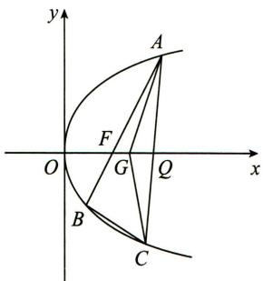

text_image

y
A
F
O
G
Q
x
B
C

3.(2016·全国卷Ⅰ理)

设圆 $x^{2}+y^{2}+2x-15=0$ 的圆心为 A，直线 l 过点 B(1,0) 且与 x 轴不重合，l 交圆 A 于 C, D 两点，过 B 作 AC 的平行线交 AD 于点 E.

(I)证明 $|EA|+|EB|$ 为定值,并写出点E的轨迹方程;  
(Ⅱ)设点 E 的轨迹为曲线 $C_{1}$ ，直线 l 交 $C_{1}$ 于 M, N 两点，过 B 且与 l 垂直的直线与圆 A 交于 P, Q 两点，求四边形 MPNQ 面积的取值范围.

4. (2016·全国卷Ⅱ理)

已知椭圆 $E: \frac{x^{2}}{t} + \frac{y^{2}}{3} = 1$ 的焦点在 x 轴上, A 是 E 的左顶点, 斜率为 $k (k > 0)$ 的直线交 E 于 A, M 两点, 点 N 在 E 上, $MA \perp NA$ .

(Ⅰ) 当 t=4, $|AM|=|AN|$ 时, 求 $\triangle AMN$ 的面积;

(Ⅱ) 当 $2|AM|=|AN|$ 时, 求 k 的取值范围.

5.(2016·天津卷理)

设椭圆 $\frac{x^2}{a^2} +\frac{y^2}{3} = 1(a > \sqrt{3})$ 的右焦点为 $F$ ，右顶点为 $A$ .已知 $\frac{1}{|OF|} +\frac{1}{|OA|} = \frac{3e}{|FA|}$ ，其中 $O$ 为原点， $e$ 为椭圆的离心率.

(I)求椭圆的方程;

(Ⅱ)设过点 A 的直线 l 与椭圆交于点 B (B 不在 x 轴上)，垂直于 l 的直线与 l 交于点 M，与 y 轴交于点 H。若 $BF \perp HF$ ，且 $\angle MOA \leqslant \angle MAO$ ，求直线 l 的斜率的取值范围。

6.(2021·全国乙卷理)

已知抛物线 $C: x^{2} = 2py (p > 0)$ 的焦点为 F，且 F 与圆 $M: x^{2} + (y + 4)^{2} = 1$ 上点的距离的最小值为 4.

(I)求 $p$ ;

(Ⅱ)若点 P 在 M 上, PA, PB 是 C 的两条切线, A, B 是切点, 求 $\triangle PAB$ 面积的最大值.

# 模拟篇

1. 已知椭圆 $C: \frac{x^2}{a^2} + \frac{y^2}{b^2} = 1 (a > b > 0)$ 的离心率为 $\frac{\sqrt{2}}{2}$ , 且过点 $(2, \sqrt{2})$ .

（Ⅰ）求椭圆 C 的标准方程；
（Ⅱ）设 A, B 为椭圆 C 的左、右顶点，过 C 的右焦点 F 作直线 l 交椭圆于 M, N 两点，分别记 $\triangle ABM, \triangle ABN$ 的面积为 $S_{1}, S_{2}$ ，求 $|S_{1}-S_{2}|$ 的最大值.

2. 已知椭圆 $C: \frac{x^2}{a^2} + \frac{y^2}{b^2} = 1 (a > b > 0)$ 的离心率为 $\frac{1}{2}$ , 点 $P\left(\sqrt{3}, \frac{\sqrt{3}}{2}\right)$ 在 $C$ 上.

(I)求椭圆 C 的方程；

(Ⅱ)设 $F_{1}, F_{2}$ 分别是椭圆 C 的左、右焦点，过 $F_{2}$ 的直线 l 与椭圆 C 交于不同的两点 A, B，求 $\triangle F_{1}AB$ 的内切圆的半径的最大值.

3. 已知椭圆 $M: \frac{x^2}{b^2} + \frac{y^2}{a^2} = 1 (a > b > 0)$ 的焦距为 $4\sqrt{2}$ , 点 $P\left(-\frac{1}{3}, 2\sqrt{2}\right)$ 为椭圆 $M$ 上一点.

(I)求 M 的方程;

(Ⅱ) 直线 $l: y = kx + m (m \neq 0)$ 交椭圆 M 于 A, B 两点，若直线 l 的斜率是直线 OA, OB 斜率的等比中项，求 $\triangle AOB$ 面积的取值范围.

4. 已知椭圆 $C: \frac{x^2}{a^2} + \frac{y^2}{b^2} = 1 (a > b > 0)$ 的左焦点为 $F$ , 短轴的两端点分别为 $A, B$ , 离心率为 $\frac{\sqrt{3}}{2}, S_{\triangle ABF} = \sqrt{3}$ .

(I)求椭圆 C 的方程;  
(Ⅱ)过点 $(-3,0)$ 的直线l与椭圆C交于不同的两点M,N,O为坐标原点,若 $\overrightarrow{OM}\cdot\overrightarrow{ON}>0$ ,求直线l的斜率的取值范围.

5. 已知椭圆 $C: \frac{x^2}{a^2} + \frac{y^2}{b^2} = 1 (a > b > 0)$ 的离心率 $e = \frac{1}{2}$ , 直线 $x + y - \sqrt{6} = 0$ 与圆 $x^2 + y^2 = b^2$ 相切.

(Ⅰ)求椭圆的方程；  
(Ⅱ) 过点 $N(4,0)$ 的直线 l 与椭圆交于不同两点 A, B, 线段 AB 的中垂线为 $l'$ , 求直线 $l'$ 在 y 轴上的截距 m 的取值范围.

6. 已知抛物线 $C: y^{2} = 2px (p > 0)$ 上一点 $P(x_{0}, 2)$ 到焦点 $F$ 的距离 $|PF| = 2x_{0}$ .

(I)求抛物线 C 的方程;

(Ⅱ) 过点 P 引圆 $M: (x-3)^{2} + y^{2} = r^{2} (0 < r \leqslant \sqrt{2})$ 的两条切线 PA, PB, 切线 PA, PB 与抛物线 C 的另一交点分别为 A, B, 线段 AB 中点的横坐标记为 t, 求 t 的取值范围.

# 第七讲 焦点弦问题

# 真题篇

1. (2020·全国卷Ⅰ理)

已知 A 为抛物线 $C: y^{2} = 2px (p > 0)$ 上一点，点 A 到 C 的焦点的距离为 12，到 y 轴的距离为 9，则 p = ()

A. 2

B. 3

C. 6

D. 9

2.(2020·新高考全国卷Ⅰ)

斜率为 $\sqrt{3}$ 的直线过抛物线 C: $y^{2}=4x$ 的焦点，且与 C 交于 A, B 两点，则 $|AB|=$ \_\_\_\_.

3.(2018·全国卷Ⅱ理)

设抛物线 $C: y^{2} = 4x$ 的焦点为 F，过 F 且斜率为 $k (k > 0)$ 的直线 l 与 C 交于 A, B 两点， $|AB| = 8$ .

(I)求 l 的方程;  
(Ⅱ)求过点 A, B 且与 C 的准线相切的圆的方程.

# 模拟篇

1. 长为 11 的线段 AB 的两端点都在双曲线 $\frac{x^{2}}{9}-\frac{y^{2}}{16}=1$ 的右支上，则线段 AB 的中点 M 的横坐标的最小值为（）

A. $\frac{7}{5}$

B. $\frac{51}{10}$

C. $\frac{33}{10}$

D. $\frac{3}{2}$

2. 已知椭圆 $C: \frac{x^2}{a^2} + \frac{y^2}{b^2} = 1$ 的右焦点为 $F$ , 过 $F$ 的直线与椭圆相交于 $A, B$ 两点. 若 $|\overrightarrow{BF}| = 2 |\overrightarrow{AF}|$ , 则椭圆离心率 $e$ 的取值范围是 ( )

A. $\left(0,\frac{1}{2}\right]$

B. $\left(0,\frac{\sqrt{2}}{2}\right]$

C. $\left[\frac{1}{2},1\right)$

D. $\left[\frac{1}{3},1\right)$

3. 过抛物线 $x^{2} = 2py (p > 0)$ 的焦点 $F$ 作倾斜角为 $30^{\circ}$ 的直线, 与抛物线交于 $A, B$ 两点 (点 $A$ 在 $y$ 轴左侧), 则 $\frac{|AF|}{|FB|} =$ \_\_\_\_.

4. 在抛物线 $C: y^{2} = 4x$ 上, 已知点 $F_{1}(-1,0), F_{2}(1,0)$ , 过点 $F_{2}$ 作直线 $l$ 交曲线 $C$ 于两个不同的点 $P, Q$ , 设 $\overrightarrow{PF_{2}} = \lambda \overrightarrow{F_{2}Q}$ , 若 $\lambda \in [2,3]$ , 则 $\overrightarrow{F_{1}P} \cdot \overrightarrow{F_{1}Q}$ 的取值范围是 \_\_\_\_.

5. 已知双曲线 $\frac{x^2}{a^2} - \frac{y^2}{b^2} = 1$ 的右焦点为 $F$ , 过 $F$ 且斜率为 $\sqrt{3}$ 的直线与双曲线交于 $A, B$ 两点 (全部都在右支上), 若 $\overrightarrow{AF} = \overrightarrow{4FB}$ , 求双曲线的离心率.

6. 设椭圆 $C: \frac{x^2}{a^2} + \frac{y^2}{b^2} = 1 (a > b > 0)$ 的左焦点为 $F$ , 过点 $F$ 的直线与椭圆 $C$ 相交于 $A, B$ 两点, 直线 $l$ 的倾斜角为 $60^\circ$ , $\overrightarrow{AF} = 2\overrightarrow{FB}$ .

(I)求椭圆 C 的离心率;  
(Ⅱ)如果 $|AB|=\frac{15}{4}$ ，求椭圆C的方程.

7. 如图, 椭圆 $\frac{x^2}{a^2} + \frac{y^2}{b^2} = 1 (a > b > 0)$ 的左、右焦点分别为 $F_1$ , $F_2$ , 过 $F_2$ 的直线交椭圆于 $P, Q$ 两点, 且 $PQ \perp PF_1$ .

(Ⅰ) 若 $\left|PF_{1}\right|=2+\sqrt{2},\left|PF_{2}\right|=2-\sqrt{2}$ ，求椭圆的标准方程；
(Ⅱ) 若 $\left|PF_{1}\right|=\left|PQ\right|$ ，求椭圆的离心率 e.

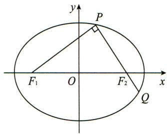

text_image

y
P
F₁ O F₂ x
Q

# 第八讲 几何性质问题

# 真题篇

1. (2018·全国卷Ⅰ文)

设抛物线 $C:y^{2} = 2x$ ，点 $A(2,0),B(-2,0)$ ，过点 $A$ 的直线 $l$ 与 $C$ 交于 $M,N$ 两点.

(I) 当 l 与 x 轴垂直时, 求直线 BM 的方程;

(Ⅱ)证明: $\angle ABM=\angle ABN.$

2. (2020·全国卷Ⅱ理)

已知椭圆 $C_{1}:\frac{x^{2}}{a^{2}}+\frac{y^{2}}{b^{2}}=1(a>b>0)$ 的右焦点 F 与抛物线 $C_{2}$ 的焦点重合， $C_{1}$ 的中心与 $C_{2}$ 的顶点重合。过 F 且与 x 轴垂直的直线交 $C_{1}$ 于 A, B 两点，交 $C_{2}$ 于 C, D 两点，且 $|CD|=\frac{4}{3}|AB|$ 。

(I)求 $C_1$ 的离心率；

(Ⅱ)设 M 是 $C_{1}$ 与 $C_{2}$ 的公共点. 若 $|MF|=5$ , 求 $C_{1}$ 与 $C_{2}$ 的标准方程.

3.(2021·新高考全国卷Ⅰ)

在平面直角坐标系 $xOy$ 中，已知点 $F_{1}(-\sqrt{17},0), F_{2}(\sqrt{17},0)$ ，点 $M$ 满足 $|MF_{1}| - |MF_{2}| = 2$ 。记 $M$ 的轨迹为 $C$ 。

(I)求 C 的方程;

(Ⅱ)设点 T 在直线 $x=\frac{1}{2}$ 上, 过 T 的两条直线分别交 C 于 A, B 两点和 P, Q 两点, 且 $\left|TA\right|\cdot\left|TB\right|=\left|TP\right|\cdot\left|TQ\right|$ , 求直线 AB 的斜率与直线 PQ 的斜率之和.

# 模拟篇

1. 已知 A, B 分别为 x 轴和 y 轴上的点， $|AB|=3$ ，点 P 满足 $\overrightarrow{BP}=2\overrightarrow{PA}$ .

(I) 当 A, B 分别在 x 轴和 y 轴上运动时, 求动点 P 的轨迹 E 的方程;

(Ⅱ) 过点 $F(-\sqrt{3},0)$ 的直线 l 与 E 交于 M, N 两点，当 $|MN|=2$ 时，求线段 MN 的垂直平分线方程.

2. 已知椭圆 $C: \frac{x^2}{a^2} + \frac{y^2}{b^2} = 1 (a > b > 0)$ 的离心率为 $\frac{1}{3}$ , 左、右焦点分别为 $F_1, F_2, A$ 为椭圆 $C$ 上一点, $AF_1$ 与 $y$ 轴相交于 $B$ , $|AB| = |F_2B|$ , $|OB| = \frac{4}{3}$ ( $O$ 为坐标原点).

(I)求椭圆 C 的方程;

(Ⅱ)设椭圆 C 的左、右顶点分别为 $A_{1}, A_{2}$ ，过 $A_{1}, A_{2}$ 分别作 x 轴的垂线 $l_{1}, l_{2}$ ，椭圆 C 的一条切线 $l: y = kx + m (k \neq 0)$ 分别与 $l_{1}, l_{2}$ 交于点 M, N，求证： $\angle MF_{1}N = \angle MF_{2}N$ .

3. 已知椭圆 $C: \frac{x^2}{a^2} + \frac{y^2}{b^2} = 1 (a > b > 0)$ 过点 $P(2,1)$ , 其左、右焦点分别为 $F_1, F_2, \triangle PF_1F_2$ 的面积为 $\sqrt{3}$ .

(I)求椭圆 C 的方程;  
(Ⅱ)已知 A, B 是椭圆 C 上的两个动点且不与坐标原点 O 共线, 若 $\angle APB$ 的角平分线总垂直于 x 轴, 求证: 直线 AB 与两坐标轴围成的三角形一定是等腰三角形.

4. 设椭圆 $E: \frac{x^2}{a^2} + \frac{y^2}{b^2} = 1 (a > b > 0)$ 的左、右焦点分别为 $F_1, F_2$ ,

过 $F_{1}$ 的直线交椭圆于 $A, B$ 两点. 若椭圆 $E$ 的离心率为 $\frac{\sqrt{2}}{2}$ ,

$\triangle ABF_{2}$ 的周长为 $4\sqrt{6}$ .

(I)求椭圆 E 的方程；

(Ⅱ)设不经过椭圆的中心而平行于弦 AB 的直线交椭圆 E 于点 C, D, 设弦 AB, CD 的中点分别为 M, N, 证明: O, M, N 三点共线.

5. 如图, $A, B$ 分别是椭圆 $C: \frac{x^2}{a^2} + \frac{y^2}{b^2} = 1 (a > b > 0)$ 的左、右顶点, $F$ 为其右焦点, 2 是 $|AF|$ , $|FB|$ 的等差中项, $\sqrt{3}$ 是 $|AF|$ , $|FB|$ 的等比中项.

(Ⅰ)求椭圆 C 的方程；
(Ⅱ)已知 P 是椭圆 C 上异于 A, B 的动点, 直线 l 过点 A 且垂直于 x 轴, 若过 F 作直线 $FQ \perp AP$ , 并交直线 l 于点 Q. 证明: Q, P, B 三点共线.

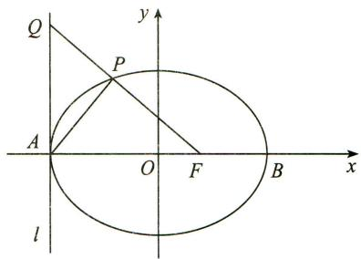

text_image

Q
y
P
A
O
F
B
x
l

6. 如图, $C, D$ 是离心率为 $\frac{1}{2}$ 的椭圆的左、右顶点, $F_{1}, F_{2}$ 是该椭圆的左、右焦点, $A, B$ 是直线 $x = -4$ 上的两个动点, 连接 $AD$ 和 $BD$ , 它们分别与椭圆交于 $E, F$ 两点, 且线段 $EF$ 恰好过椭圆的左焦点 $F_{1}$ . 当 $EF \perp CD$ 时, $E$ 恰为线段 $AD$ 的中点.

(Ⅰ)求该椭圆的方程；  
(Ⅱ)求证:以 AB 为直径的圆始终与直线 EF 相切.

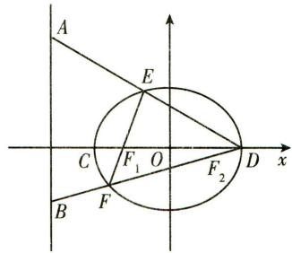

text_image

A
E
C F₁ O F₂ D x
B F

# 第九讲 探索性问题

# 真题篇

# 1.(2021·全国甲卷理)

抛物线 C 的顶点为坐标原点 O，焦点在 x 轴上，直线 l: x=1 交 C 于 P, Q 两点，且 $OP \perp OQ$ . 已知点 M(2,0)，且 $\odot M$ 与 l 相切.

(I) 求 $C, \odot M$ 的方程；  
(Ⅱ)设 $A_{1},A_{2},A_{3}$ 是C上的三个点，直线 $A_{1}A_{2},A_{1}A_{3}$ 均与 $\odot M$ 相切.判断直线 $A_{2}A_{3}$ 与 $\odot M$ 的位置关系，并说明理由.

2.(2019·全国卷Ⅰ文)

已知点 A, B 关于坐标原点 O 对称, $\left|AB\right|=4$ , $\odot M$ 过点 A, B 且与直线 $x+2=0$ 相切.

(I) 若 A 在直线 $x + y = 0$ 上, 求 $\odot M$ 的半径;

(Ⅱ)是否存在定点 P，使得当 A 运动时， $|MA| - |MP|$ 为定值？并说明理由.

3.(2015·全国卷Ⅱ理)

已知椭圆 $C:9x^{2}+y^{2}=m^{2}(m>0)$ ，直线 l 不过原点 O 且不平行于坐标轴，l 与 C 有两个交点 A, B，线段 AB 的中点为 M.

(Ⅰ)证明: 直线 OM 的斜率与 l 的斜率的乘积为定值;  
(Ⅱ) 若 l 过点 $\left(\frac{m}{3}, m\right)$ ，延长线段 OM 与 C 交于点 P，四边形 OAPB 能否为平行四边形？若能，求此时 l 的斜率；若不能，说明理由.

4.(2016·四川卷理)

已知椭圆 $E:\frac{x^{2}}{a^{2}}+\frac{y^{2}}{b^{2}}=1(a>b>0)$ 的两个焦点与短轴的一个端点是直角三角形的三个顶点，直线 $l:y=-x+3$ 与椭圆 E 有且只有一个公共点 T.

(I)求椭圆 E 的方程及点 T 的坐标；

(Ⅱ)设 O 是坐标原点, 直线 $l'$ 平行于 OT, 与椭圆 E 交于不同的两点 A, B, 且与直线 l 交于点 P. 证明: 存在常数 $\lambda$ , 使得 $|PT|^{2} = \lambda |PA| \cdot |PB|$ , 并求 $\lambda$ 的值.

5.(2015·北京卷理)

已知椭圆 $C: \frac{x^{2}}{a^{2}} + \frac{y^{2}}{b^{2}} = 1 (a > b > 0)$ 的离心率为 $\frac{\sqrt{2}}{2}$ ，点 $P(0,1)$ 和点 $A(m,n) (m \neq 0)$ 都在椭圆 C 上，直线 PA 交 x 轴于点 M.

(Ⅰ)求椭圆 C 的方程,并求点 M 的坐标(用 m,n 表示); (Ⅱ)设 O 为原点,点 B 与点 A 关于 x 轴对称,直线 PB 交 x 轴于点 N,问:y 轴上是否存在点 Q 的坐标,使得 $\angle OQM = \angle ONQ$ ? 若存在,求点 Q 的坐标;若不存在,请说明理由.

# 模拟篇

1. 如图, 曲线 $C$ 由上半椭圆 $C_{1}: \frac{y^{2}}{a^{2}} + \frac{x^{2}}{b^{2}} = 1 (a > b > 0, y \geqslant 0)$ 和部分抛物线 $C_{2}: y = -x^{2} + 1 (y \leqslant 0)$ 连接而成, $C_{1}$ 与 $C_{2}$ 的公共点为 $A, B$ , 其中 $C_{1}$ 的离心率为 $\frac{\sqrt{3}}{2}$ .

(I)求 $a, b$ 的值；  
(Ⅱ)过点 B 的直线 l 与 $C_{1}, C_{2}$ 分别交于点 P, Q (均异于点 A, B), 是否存在直线 l, 使得以 PQ 为直径的圆恰好过点 A? 若存在, 求出直线 l 的方程; 若不存在, 请说明理由.

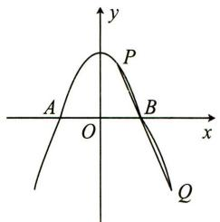

text_image

y
P
A O B x
Q

2. 如图, $O$ 为坐标原点, 抛物线 $C_{1}: y^{2} = 2px (p > 0)$ 的焦点是椭圆 $C_{2}: \frac{x^{2}}{a^{2}} + \frac{y^{2}}{b^{2}} = 1 (a > b > 0)$ 的右焦点, $A$ 为椭圆 $C_{2}$ 的右顶点, 椭圆 $C_{2}$ 的长轴长 $|AB| = 8$ , 离心率 $e = \frac{1}{2}$ .

(I)求抛物线 $C_1$ 和椭圆 $C_2$ 的方程；

(Ⅱ) 过 A 点作直线 l 交 $C_{1}$ 于 C, D 两点，射线 OC, OD 分别交 $C_{2}$ 于 E, F 两点，记 $\triangle OEF$ 和 $\triangle OCD$ 的面积分别为 $S_{1}$ 和 $S_{2}$ ，问是否存在直线 l，使得 $S_{1}: S_{2}=3:13?$ 若存在，求出直线 l 的方程；若不存在，请说明理由.

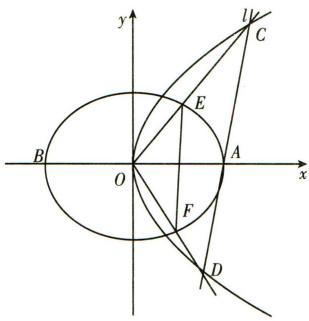

text_image

y
B
O
x
E
F
D
C
U

3. 已知直线 $y = 2x$ 与抛物线 $\Gamma: y^2 = 2px (p > 0)$ 交于 $O$ 和 $E$ 两点，且 $|OE| = \sqrt{5}$ .

(I)求抛物线 $\Gamma$ 的方程；  
(Ⅱ)过点 $Q(2,0)$ 的直线交抛物线 $\Gamma$ 于 A, B 两点, P 为直线 x = -2 上一点, PA, PB 分别与 x 轴相交于 M, N 两点, 问 M, N 两点的横坐标的乘积 $x_{M} \cdot x_{N}$ 是否为定值? 如果是定值, 求出该定值; 否则, 请说明理由.

4. 已知椭圆 $C: \frac{x^2}{a^2} + \frac{y^2}{b^2} = 1 (a > b > 0)$ 的离心率为 $\frac{\sqrt{3}}{2}$ , 且经过点 $(-1, \frac{\sqrt{3}}{2})$ .

(I)求椭圆 C 的方程；  
(Ⅱ) 过点 $(\sqrt{3},0)$ 作直线 l 与椭圆 C 交于不同的两点 A, B，试问在 x 轴上是否存在定点 Q，使得直线 QA 与直线 QB 恰关于 x 轴对称？若存在，求出点 Q 的坐标；若不存在，说明理由.

5. 给出下列条件: ①焦点在 $x$ 轴上; ②焦点在 $y$ 轴上; ③抛物线上横坐标为 1 的点 $A$ 到其焦点 $F$ 的距离等于 2; ④抛物线的准线方程是 $x = -2$ .

(I)对于顶点在原点 O 的抛物线 C, 从以上四个条件中选出两个适当的条件, 使得抛物线 C 的方程是 $y^{2}=4x$ , 并说明理由;

(Ⅱ) 过点 $(4,0)$ 的任意一条直线 l 与抛物线 $C: y^{2} = 4x$ 交于 A, B 两点，试探究是否总有 $\overrightarrow{OA} \perp \overrightarrow{OB}$ ？请说明理由.

6. 如图, 椭圆 $E: \frac{x^2}{a^2} + \frac{y^2}{b^2} = 1 (a > b > 0)$ 的离心率是 $\frac{\sqrt{2}}{2}$ , 过点 $P(0,1)$ 的动直线 $l$ 与椭圆相交于 $A, B$ 两点. 当直线 $l$ 平行于 $x$ 轴时, 直线 $l$ 被椭圆 $E$ 截得的线段长为 $2\sqrt{2}$ .

(Ⅰ)求椭圆 E 的方程；
(Ⅱ)在平面直角坐标系 xOy 中, 是否存在与点 P 不同的定点 Q, 使得 $\frac{|QA|}{|QB|} = \frac{|PA|}{|PB|}$ 恒成立? 若存在, 求出点 Q 的坐标; 若不存在, 请说明理由.

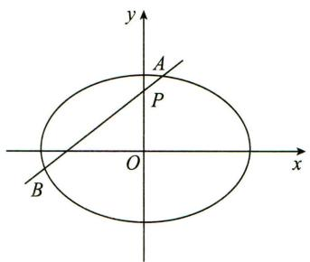

text_image

y
A
P
O
x
B

7. 在①离心率 $e = \frac{1}{2}$ ，②椭圆 $C$ 过点 $\left(1, \frac{3}{2}\right)$ ，③ $\triangle PF_{1}F_{2}$ 面积的最大值为 $\sqrt{3}$ ，这三个条件中任选一个，补充在下面（横线处）问题中，解决下面两个问题。

设椭圆 $C: \frac{x^{2}}{a^{2}} + \frac{y^{2}}{b^{2}} = 1 (a > b > 0)$ 的左、右焦点分别为 $F_{1}$ ， $F_{2}$ ，过 $F_{1}$ 且斜率为 k 的直线 l 交椭圆于 P, Q 两点，已知椭圆 C 的短轴长为 $2\sqrt{3}$ ，\_\_\_\_.

(I)求椭圆 C 的方程;

注:如果选择多个条件分别解答,按第一个解答计分.

(Ⅱ)若线段 PQ 的中垂线与 x 轴交于点 N，求证： $\frac{|PQ|}{|NF_{1}|}$ 为定值.

# 实战篇答案

# 第一讲 轨迹问题

# 真题篇

1.【答案】 B

【解析一】

由双曲线的渐近线方程可设双曲线方程为 $\frac{x^2}{4} -\frac{y^2}{5} = k(k > 0)$

即 $\frac{x^{2}}{4k}-\frac{y^{2}}{5k}=1$ ，∵双曲线与椭圆 $\frac{x^{2}}{12}+\frac{y^{2}}{3}=1$ 有公共焦点，

∴ $4k + 5k = 12 - 3$ ，解得 k = 1，故双曲线 C 的方程为 $\frac{x^{2}}{4} - \frac{y^{2}}{5} = 1$ ，故选 B.

【解析二】

∵椭圆 $\frac{x^{2}}{12}+\frac{y^{2}}{3}=1$ 的焦点为(±3,0)，双曲线与椭圆 $\frac{x^{2}}{12}+\frac{y^{2}}{3}=1$ 有公共焦点，

$\therefore a^{2} + b^{2} = 3^{2} = 9$ ①， $\because$ 双曲线的一条渐近线方程为 $y = \frac{\sqrt{5}}{2} x, \therefore \frac{b}{a} = \frac{\sqrt{5}}{2}$ ②，联立①②可解得 $a^{2} = 4, b^{2} = 5, \therefore$ 双曲线 $C$ 的方程为 $\frac{x^2}{4} - \frac{y^2}{5} = 1$ ，故选B.

2.【答案】 B

【解析】

设 $\left|F_{2}B\right|=x(x>0)$ ,

则 $\left|AF_{2}\right|=2x,\left|AB\right|=3x,\left|BF_{1}\right|=3x,$

$$
\left| A F _ {1} \right| = 4 a - \left(\left| A B \right| + \left| B F _ {1} \right|\right) = 4 a - 6 x,
$$

由椭圆的定义知 $\left|BF_{1}\right|+\left|BF_{2}\right|=2a=4x$ ，所以 $\left|AF_{1}\right|=4x-\left|AF_{2}\right|=2x$ 。

在 $\triangle BF_{1}F_{2}$ 中,由余弦定理得

$$
\mid B F _ {1} \mid^ {2} = \mid B F _ {2} \mid^ {2} + \mid F _ {1} F _ {2} \mid^ {2} - 2 \mid F _ {2} B \mid \bullet \mid F _ {1} F _ {2} \mid \cos \angle B F _ {2} F _ {1},
$$

即 $9x^{2}=x^{2}+2^{2}-4x\cdot\cos\angle BF_{2}F_{1}$ ①，

在 $\triangle AF_{1}F_{2}$ 中,由余弦定理可得

$$
\left| A F _ {1} \right| ^ {2} = \left| A F _ {2} \right| ^ {2} + \left| F _ {1} F _ {2} \right| ^ {2} - 2 \left| A F _ {2} \right| \cdot \left| F _ {1} F _ {2} \right| \cos \angle A F _ {2} F _ {1},
$$

即 $4x^{2} = 4x^{2} + 2^{2} + 8x\cdot \cos \angle BF_{2}F_{1}$ ②，

联立①②解得 $x=\frac{\sqrt{3}}{2}$ ，所以 $a=2x=\sqrt{3}$ ，所以 $b^{2}=a^{2}-c^{2}=2$ 。

所以 C 的方程为 $\frac{x^{2}}{3}+\frac{y^{2}}{2}=1$ ，故选 B.

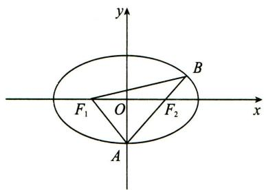

text_image

y
B
F₁ O F₂ x
A

# 3.【解析】

(I)设椭圆的半焦距为 c，由已知有 $\sqrt{3}a = 2b$ .

又由 $a^2 = b^2 + c^2$ ，消去 $b$ 得 $a^2 = \left(\frac{\sqrt{3}}{2} a\right)^2 + c^2$ ，解得 $\frac{c}{a} = \frac{1}{2}$ .

所以,椭圆的离心率为 $\frac{1}{2}$ .

(Ⅱ)由(Ⅰ)知, $a=2c,b=\sqrt{3}c$ ,故椭圆方程为 $\frac{x^{2}}{4c^{2}}+\frac{y^{2}}{3c^{2}}=1$ .

由题意, $F(-c,0)$ ,则直线l的方程为 $y=\frac{3}{4}(x+c)$ .

点 $P$ 的坐标满足 $\left\{ \begin{array}{l} \frac{x^2}{4c^2} + \frac{y^2}{3c^2} = 1, \\ y = \frac{3}{4}(x + c), \end{array} \right.$ 消去 $y$ 并化简，得到 $7x^{2} + 6cx - 13c^{2} = 0$

解得 $x_{1} = c, x_{2} = -\frac{13c}{7}$ . 代入到 $l$ 的方程，解得 $y_{1} = \frac{3}{2} c, y_{2} = -\frac{9}{14} c$ .

因为点 P 在 x 轴上方, 所以 $P\left(c, \frac{3}{2}c\right)$ . 由圆心 C 在直线 x=4 上, 可设 $C(4, t)$ .

因为 $OC \parallel AP$ ，且由（I）知 $A(-2c, 0)$ ，故 $\frac{t}{4} = \frac{\frac{3}{2}c}{c + 2c}$ ，解得 $t = 2$ 。则 $C(4, 2)$ 。

因为圆 C 与 x 轴相切, 所以圆 C 的半径长为 2,

又由圆 $C$ 与 $l$ 相切，得 $\frac{\left|\frac{3}{4}(4 + c) - 2\right|}{\sqrt{1 + \left(\frac{3}{4}\right)^2}} = 2$ ，解得 $c = 2$

所以，椭圆的方程为 $\frac{x^{2}}{16}+\frac{y^{2}}{12}=1.$

# 4.【解析】

由题设知 $F\left(\frac{1}{2},0\right)$ .设 $l_{1}:y = a,l_{2}:y = b$ ，易知 $ab\neq 0$

且 $A\left(\frac{a^2}{2}, a\right), B\left(\frac{b^2}{2}, b\right), P\left(-\frac{1}{2}, a\right), Q\left(-\frac{1}{2}, b\right), R\left(-\frac{1}{2}, \frac{a + b}{2}\right)$ .

记过 A, B 两点的直线为 l，则 l 的方程为 $2x - (a + b)y + ab = 0$ .

(Ⅰ)由于 F 在线段 AB 上, 故 $1+ab=0$ . 记 AR 的斜率为 $k_{1}$ , FQ 的斜率为 $k_{2}$ ,

则 $k_{1} = \frac{a - b}{1 + a^{2}} = \frac{a - b}{a^{2} - ab} = \frac{1}{a} = \frac{-ab}{a} = -b = k_{2}$ . 所以 $AR // FQ$ .

(Ⅱ)设 l 与 x 轴的交点为 $D(x_{1},0)$ ,

则 $S_{\triangle ABF} = \frac{1}{2}|b - a|\cdot |FD| = \frac{1}{2}|b - a|\left|x_1 - \frac{1}{2}\right|,S_{\triangle PQF} = \frac{|a - b|}{2},$

由题设可得 $2 \times \frac{1}{2} |b - a| \left|x_{1} - \frac{1}{2}\right| = \frac{|a - b|}{2}$ , 所以 $x_{1} = 0$ (舍去) 或 $x_{1} = 1$ .

设满足条件的 AB 的中点为 $E(x, y)$ .

当 $AB$ 与 $x$ 轴不垂直时，由 $k_{AB} = k_{DE}$ 可得 $\frac{2}{a + b} = \frac{y}{x - 1} (x\neq 1)$

而 $\frac{a + b}{2} = y$ ，所以 $y^{2} = x - 1(x\neq 1)$ .当 $AB$ 与 $x$ 轴垂直时， $E$ 与 $D$ 重合.

所以,所求轨迹方程为 $y^{2}=x-1$ .

# 模拟篇

# 1.【答案】 C

# 【解析】

由题意知 $F_{1}(-1,0), F_{2}(1,0)$ ，设 $P(x_0, y_0)(y_0 \neq 0), G(x, y)$ ，

则由三角形重心的坐标公式得 $\left\{\begin{aligned}x&=\frac{x_{0}-1+1}{3},\\ y&=\frac{y_{0}}{3},\end{aligned}\right.$ 整理得 $\left\{\begin{aligned}x_{0}&=3x,\\ y_{0}&=3y,\end{aligned}\right.$ 又 $P(x_{0},y_{0})$ 在

椭圆 C 上, 代入得重心 G 的轨迹方程为 $\frac{9x^{2}}{4} + 3y^{2} = 1 (y \neq 0)$ , 故选 C.

# 2.【答案】 C

# 【解析】

设 $A, B$ 两点到直线 $l$ 的距离分别为 $d_{1}, d_{2}$ , 则 $d_{1} + d_{2} = 2 \times 3 = 6$ ,

又 A, B 两点在抛物线上，

由抛物线定义可知 $|AF| + |BF| = d_{1} + d_{2} = 6 > |AB|$ ,

所以由椭圆定义可知,动点 F 的轨迹是以 A, B 为焦点,长轴长为 6 的椭圆(不包括与 $x$ 轴的交点). 则抛物线焦点 $F$ 的轨迹方程为 $\frac{x^2}{9} + \frac{y^2}{5} = 1 (y \neq 0)$ , 故选 C.

# 3.【答案】 A

# 【解析】

设双曲线的焦距为 $2c$ ，由 $\left|PF_1\right|, \left|F_1F_2\right|, \left|PF_2\right|$ 成等差数列可知，

$2|F_{1}F_{2}| = |PF_{1}| + |PF_{2}|$ ，即 $4c = |PF_{1}| + |PF_{2}|$

由双曲线的定义可知 $\left|PF_{1}\right|-\left|PF_{2}\right|=2a$ ，解得 $\left|PF_{1}\right|=a+2c$ ，

由双曲线的第二定义可得 $\frac{a + 2c}{2 + \frac{a^2}{c}} = \frac{c}{a}$ ，解得 $a = 1$ ，又点 $P(2, \sqrt{3})$ 在该双曲线上，

所以 $4 - \frac{3}{b^2} = 1$ ，解得 $b = 1$ ，所以该双曲线的方程为 $x^{2} - y^{2} = 1$ ，故选A.

# 4.【答案】 D

# 【解析】

由 OAFB 是菱形得 OA = AF，则 c = 2a，设双曲线的左焦点是 $F'$ ，连接 $PF'$ ，则 $OF' = OF = OP = c, PF' \perp PF, |PF'| = 2a + |PF| = 2a + \sqrt{7} - 1$ ，

在 Rt△PF'F 中，由勾股定理，得 $(2a+\sqrt{7}-1)^{2}+(\sqrt{7}-1)^{2}=4c^{2}=16a^{2}$

解得 $a = 1$ ，则 $c = 2, b = \sqrt{c^2 - a^2} = \sqrt{3}$

则双曲线 E 的方程是 $x^{2}-\frac{y^{2}}{3}=1$ ，故选 D.

5.【答案】 $\frac{x^2}{4} +\frac{y^3}{3} = 1$

# 【解析】

如图所示, 连接 $MF_{2}$ , 由题意知 $F_{1}(-1,0)$ , $F_{2}(1,0)$ .

∵直线 m 是线段 $PF_{2}$ 的垂直平分线，∴ $\left|MP\right|=\left|MF_{2}\right|$

又 $|MP| + |MF_{1}| = |PF_{1}| = 4, \therefore |MF_{1}| + |MF_{2}| = 4 > |F_{1}F_{2}| = 2.$

∴点 M 的轨迹是以 $F_{1}, F_{2}$ 为焦点的椭圆，且 a=2, c=1. ∴ $b=\sqrt{a^{2}-c^{2}}=\sqrt{3}$ .

∴点 M 的轨迹方程为 $\frac{x^{2}}{4} + \frac{y^{2}}{3} = 1$ .

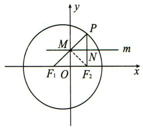

text_image

y
P
M
m
N
F₁ O F₂ x

6.【答案】 $y^{2}=4x$

# 【解析】

设 $M(x_{0},0)$ , $P(0,y_{0})$ , $N(x,y)$ ,

由 $\overrightarrow{MN}=2\overrightarrow{MP}$ 得 $\left\{\begin{aligned}x-x_{0}&=-2x_{0}\\ y&=2y_{0}\end{aligned}\right.$ ，即 $\left\{\begin{aligned}x_{0}&=-x,\\ y_{0}&=\frac{1}{2}y,\end{aligned}\right.$

因为 $\overrightarrow{PM} \perp \overrightarrow{PF}, \overrightarrow{PM} = (x_0, -y_0), \overrightarrow{PF} = (1, -y_0)$ ,

所以 $(x_0, -y_0) \cdot (1, -y_0) = 0$ ，即 $x_0 + y_0^2 = 0$ ，即 $-x + \frac{1}{4} y^2 = 0$

所以点 N 的轨迹方程为 $y^{2}=4x$ .

# 7.【解析】

设点 $Q(x,y)$ , $D(x_{0},y_{0})$ ,

因为 $2|EQ|=\sqrt{3}|ED|$ ，点 Q 在直线 m 上，所以 $x_{0}=x, |y_{0}|=\frac{2}{\sqrt{3}}|y|$ ①.

又因为点 D 在圆 $O: x^{2} + y^{2} = 16$ 上运动，所以 $x_{0}^{2} + y_{0}^{2} = 16$ ②.

将①式代入②式,得曲线 C 的方程为 $\frac{x^{2}}{16} + \frac{y^{2}}{12} = 1$ .

# 第二讲 位置关系问题

# 真题篇

1.【答案】 A

# 【解析】

以线段 $A_{1}A_{2}$ 为直径的圆的方程为 $x^{2}+y^{2}=a^{2}$ ,

∵该圆与直线 $bx - ay + 2ab = 0$ 相切，

$\therefore \frac{|b\times 0 - a\times 0 + 2ab|}{\sqrt{b^2 + (-a)^2}} = a$ ，即 $2b = \sqrt{a^2 + b^2}$

$\therefore a^{2} = 3b^{2}$ ，又 $\because a^2 = b^2 +c^2,\therefore \frac{c^2}{a^2} = \frac{2}{3},\therefore C$ 的离心率 $e = \frac{c}{a} = \frac{\sqrt{6}}{3}$ 故选A.

2.【答案】 $\sqrt{15}$

# 【解析】

由题意得椭圆的焦距 $2c = 2\sqrt{9 - 5} = 4$

设线段 PF 的中点为 M，则 $c = |OF| = |OM| = 2$ ，

设椭圆的右焦点为 $F_{2}(2,0)$ , 点 $P(x,y)$ , 又因为 $OM$ 为 $\triangle F_{2}FP$ 的中位线,

所以 $\left|PF_{2}\right|=2\left|OM\right|=4$ ，即 $\sqrt{(x-2)^{2}+y^{2}}=4$ ，

所以点 $P$ 在 $(x - 2)^{2} + y^{2} = 16$ 的圆上，

与椭圆方程 $\frac{x^{2}}{9}+\frac{y^{2}}{5}=1$ 联立,解得 $x=-\frac{3}{2}$ 或 $x=\frac{21}{2}$ (舍去),

又因为点 $P$ 在 $x$ 轴上方，所以点 $P$ 的坐标为 $\left(-\frac{3}{2}, \frac{\sqrt{15}}{2}\right)$ ，

又点 $F(-2,0)$ ，则直线 $PF$ 的斜率 $k_{PF} = \frac{\frac{\sqrt{15}}{2} - 0}{-\frac{3}{2} - (-2)} = \sqrt{15}$ .

# 3.【解析】

(I)由抛物线 $C:y^{2} = 2px$ 过点 $P(1,1)$ ，得 $p = \frac{1}{2}$

所以抛物线 C 的方程 $y^{2}=x$ .

抛物线 C 的焦点坐标为 $\left(\frac{1}{4},0\right)$ ，准线方程为 $x=-\frac{1}{4}$ .

(Ⅱ)由题意,设直线 l 的方程为 $y=kx+\frac{1}{2}(k\neq0)$ ,

$l$ 与抛物线 $C$ 的交点为 $M(x_{1},y_{1}),N(x_{2},y_{2})$

由 $\left\{\begin{aligned}y&=kx+\frac{1}{2},\\ y^{2}&=x\end{aligned}\right.$ 得 $4k^{2}x^{2}+(4k-4)x+1=0.$ 则 $x_{1}+x_{2}=\frac{1-k}{k^{2}},x_{1}x_{2}=\frac{1}{4k^{2}}.$

因为点 P 的坐标为 $(1,1)$ ，所以直线 OP 的方程为 y=x，点 A 的坐标为 $(x_{1},x_{1})$ .直线 ON 的方程为 $y=\frac{y_{2}}{x_{2}}x$ ，点 B 的坐标为 $\left(x_{1},\frac{y_{2}x_{1}}{x_{2}}\right)$ .

因为 $y_{1} + \frac{y_{2}x_{1}}{x_{2}} - 2x_{1} = \frac{y_{1}x_{2} + y_{2}x_{1} - 2x_{1}x_{2}}{x_{2}}$

$$
= \frac {\left(k x _ {1} + \frac {1}{2}\right) x _ {2} + \left(k x _ {2} + \frac {1}{2}\right) x _ {1} - 2 x _ {1} x _ {2}}{x _ {2}}
$$

$$
= \frac {(2 k - 2) x _ {1} x _ {2} + \frac {1}{2} (x _ {2} + x _ {1})}{x _ {2}} = \frac {(2 k - 2) \times \frac {1}{4 k ^ {2}} + \frac {1 - k}{2 k ^ {2}}}{x _ {2}} = 0,
$$

所以 $y_{1} + \frac{y_{2}x_{1}}{x_{2}} = 2x_{1}$ 故 $A$ 为线段 $BM$ 的中点.

# 4.【解析】

(I)设椭圆的半焦距为 c，依题意， $2b=4,\frac{c}{a}=\frac{\sqrt{5}}{5}$

又 $a^2 = b^2 + c^2$ ，可得 $a = \sqrt{5}, b = 2, c = 1$ .

所以，椭圆的方程为 $\frac{x^{2}}{5}+\frac{y^{2}}{4}=1$ .

(Ⅱ)由题意,设 $P(x_{P},y_{P})(x_{P}\neq0)$ , $M(x_{M},0)$ .

设直线 PB 的斜率为 $k(k \neq 0)$ ，又 $B(0,2)$ ，则直线 PB 的方程为 $y = kx + 2$ ，

与椭圆方程联立 $\left\{\begin{aligned}y&=kx+2,\\ \frac{x^{2}}{5}&+\frac{y^{2}}{4}=1,\end{aligned}\right.$ 整理得 $(4+5k^{2})x^{2}+20kx=0,$

可得 $x_{P} = -\frac{20k}{4 + 5k^{2}}$ ，代入 $y = kx + 2$ 得 $y_{P} = \frac{8 - 10k^{2}}{4 + 5k^{2}}$

进而直线 OP 的斜率 $\frac{y_{P}}{x_{P}} = \frac{4 - 5k^{2}}{-10k}$ .

在 $y = kx + 2$ 中，令 $y = 0$ ，得 $x_{M} = -\frac{2}{k}$

由题意得 $N(0,-1)$ ，所以直线 MN 的斜率为 $-\frac{k}{2}$ .

由 $OP \perp MN$ ，得 $\frac{4 - 5k^2}{-10k} \cdot \left(-\frac{k}{2}\right) = -1$ ，化简得 $k^2 = \frac{24}{5}$ ，从而 $k = \pm \frac{2\sqrt{30}}{5}$ .

所以，直线 $PB$ 的斜率为 $\frac{2\sqrt{30}}{5}$ 或 $-\frac{2\sqrt{30}}{5}$ .

# 5.【解析】

(I)设椭圆的焦距为 $2c$ ，由已知有 $\frac{c^2}{a^2} = \frac{5}{9}$ ，又由 $a^2 = b^2 + c^2$ ，可得 $2a = 3b$ .

由已知可得， $|FB|=a,|AB|=\sqrt{2}b$ ，由 $|FB|\cdot|AB|=6\sqrt{2}$ ，可得ab=6，从而a=3,b=2.

所以,椭圆的方程为 $\frac{x^{2}}{9}+\frac{y^{2}}{4}=1$ .

(Ⅱ)设点 P 的坐标为 $(x_{1}, y_{1})$ ，点 Q 的坐标为 $(x_{2}, y_{2})$ .

由已知有 $y_{1}>y_{2}>0$ ，故 $\left|PQ\right|\sin\angle AOQ=y_{1}-y_{2}$

又因为 $|AQ| = \frac{y_2}{\sin\angle OAB}$ ，而 $\angle OAB = \frac{\pi}{4}$ 故 $|AQ| = \sqrt{2} y_2$

由 $\frac{|AQ|}{|PQ|} = \frac{5\sqrt{2}}{4}\sin \angle AOQ$ 得 $5y_{1} = 9y_{2}$

由方程组 $\left\{\begin{aligned}y=kx,\\ \frac{x^{2}}{9}+\frac{y^{2}}{4}=1,\end{aligned}\right.$ 消去x，可得 $y_{1}=\frac{6k}{\sqrt{9k^{2}+4}}$ .

易知直线 AB 的方程为 $x + y - 2 = 0$ ，

由方程组 $\left\{\begin{aligned}y=kx,\\ x+y-2=0,\end{aligned}\right.$ 消去x，可得 $y_{2}=\frac{2k}{k+1}$ .

由 $5y_{1}=9y_{2}$ 得 $5(k+1)=3\sqrt{9k^{2}+4}$ ，两边平方，整理得 $56k^{2}-50k+11=0$ ，解得 $k=\frac{1}{2}$ 或 $k=\frac{11}{28}$ .

所以 k 的值为 $\frac{1}{2}$ 或 $\frac{11}{28}$ .

# 模拟篇

# 1.【答案】 C

# 【解析】

设 $P\left(\frac{y_0^2}{4}, y_0\right)$ ，则点 $P$ 到直线 $l$ 的距离为 $\frac{|y_0^2 - 3y_0 + 6|}{5} = \frac{y_0^2 - 3y_0 + 6}{5}$ ，

由点 P 到抛物线焦点的距离等于其到准线的距离得 $\frac{y_{0}^{2}-3y_{0}+6}{5}=\frac{y_{0}^{2}}{4}+1$ ，化简得 $y_{0}^{2}+12y_{0}-4=0,\Delta>0$ ，则该方程有两个不同的实数根，所以这样的点 P 有 2 个，故选 C.

# 2.【答案】 A

# 【解析】

设一条直线为 $y=\frac{1}{4}x+m$ ，直线与椭圆 C 相交于 $A(x_{1},y_{1}), B(x_{2},y_{2})$ 两点，弦 AB 的中点坐标为 $M(x,y)$ ，

由 $\left\{\begin{aligned}y&=\frac{1}{4}x+m,\\ \frac{x^{2}}{2}+y^{2}&=1\end{aligned}\right.$ 消去 y 得 $9x^{2}+8mx+16m^{2}-16=0$ ,

由 $\Delta = 64m^2 - 4 \times 9 \times (16m^2 - 16) > 0$ ，解得 $-\frac{3\sqrt{2}}{4} < m < \frac{3\sqrt{2}}{4}$ ，

$$
\therefore x _ {1} + x _ {2} = - \frac {8 m}{9}, x _ {1} x _ {2} = \frac {1 6 m ^ {2} - 1 6}{9},
$$

$\because M(x,y)$ 为弦AB的中点， $\therefore x=\frac{x_{1}+x_{2}}{2}=-\frac{4m}{9}$

$\because m \in \left(-\frac{3\sqrt{2}}{4}, \frac{3\sqrt{2}}{4}\right)$ , 则 $x \in \left(-\frac{\sqrt{2}}{3}, \frac{\sqrt{2}}{3}\right)$ ,

由 $\left\{\begin{aligned}y&=\frac{1}{4}x+m,\\ x&=-\frac{4m}{9}\end{aligned}\right.$ 消去 m 得 y=-2x，

则直线 $l$ 的方程为 $y = -2x, x \in \left(-\frac{\sqrt{2}}{3}, \frac{\sqrt{2}}{3}\right)$ ,

∴直线 l 的斜率为 -2，故选 A.

# 3.【答案】 B

# 【解析】

设此双曲线的方程为 $\frac{x^{2}}{a^{2}}-\frac{y^{2}}{b^{2}}=1(a>0,b>0)$ . 将 y=x-1 代入 $\frac{x^{2}}{a^{2}}-\frac{y^{2}}{b^{2}}=1$ ，整理得 $(b^{2}-a^{2})x^{2}+2a^{2}x-a^{2}-a^{2}b^{2}=0$ .

设 $M(x_{1},y_{1}),N(x_{2},y_{2})$ ，由根与系数的关系得 $x_{1} + x_{2} = \frac{2a^{2}}{a^{2} - b^{2}}$

结合已知条件得 $\frac{x_1 + x_2}{2} = \frac{a^2}{a^2 - b^2} = -\frac{2}{3}$ .

又 $c^2 = a^2 + b^2 = 7$ ，联立解得 $a^2 = 2, b^2 = 5$

所以此双曲线的方程是 $\frac{x^{2}}{2}-\frac{y^{2}}{5}=1$ ，故选B.

# 4.【答案】 D

# 【解析】

$\because m, n, s, t \in \mathbf{R}^{+}, m + n = 3, \frac{m}{s} + \frac{n}{t} = 1, s + t$ 的最小值是 $3 + 2\sqrt{2}$ ,

$$
\therefore s + t \geqslant 3 + 2 \sqrt {2},
$$

又 $(s + t)\left(\frac{m}{s} +\frac{n}{t}\right) = m + n + \frac{mt}{s} +\frac{ns}{t}\geqslant m + n + 2\sqrt{mn} = 3 + 2\sqrt{mn},$

当且仅当 $\frac{mt}{s} = \frac{ns}{t}$ 时等号成立， $\therefore 2\sqrt{mn} = 2\sqrt{2}$ ，解得 $mn = 2$

又 $m + n = 3, m < n, \therefore m = 1, n = 2.$

设以(1,2)为中点的弦交椭圆 $\frac{x^{2}}{4}+\frac{y^{2}}{16}=1$ 于 $A(x_{1},y_{1}),B(x_{2},y_{2})$ ,

则 $x_{1} + x_{2} = 2, y_{1} + y_{2} = 4$ ，且 $\left\{ \begin{array}{l} 4x_{1}^{2} + y_{1}^{2} = 16, \\ 4x_{2}^{2} + y_{2}^{2} = 16, \end{array} \right.$

两式相减并整理得 $2(x_{1} - x_{2}) + (y_{1} - y_{2}) = 0$

∴直线 AB 的斜率 $k=\frac{y_{2}-y_{1}}{x_{2}-x_{1}}=-2$ ,

∴此弦所在的直线方程为 $y-2=-2(x-1)$ ,

即 $2x + y - 4 = 0$ ，故选 D.

# 5.【答案】 D

# 【解析】

由题意知 $y = \frac{2x}{x - 1} = 2 + \frac{2}{x - 1}$ ，所以曲线 $y = \frac{2x}{x - 1}$ 的对称中心为(1,2)，

代入抛物线方程得 $4 = 2p$ ，得 $p = 2$ ，所以抛物线 $C$ 的方程为 $y^{2} = 4x$

设直线 l 的方程为 $x = my + 1$ ，由 $\left\{\begin{aligned}x &= my + 1,\\ y^{2} &= 4x\end{aligned}\right.$ 得 $y^{2} - 4my - 4 = 0$ ，

设 $A\left(\frac{y_1^2}{4}, y_1\right), B\left(\frac{y_2^2}{4}, y_2\right)$ ，则 $y_1y_2 = -4$

由抛物线定义可知 $|AF| + 2|BF| = \frac{y_1^2}{4} + 1 + 2\left(\frac{y_2^2}{4} + 1\right) = \frac{y_1^2}{4} + \frac{y_2^2}{2} + 3 \geqslant 2\sqrt{\frac{(y_1y_2)^2}{8}} + 3 = 2\sqrt{2} + 3,$

当且仅当 $\frac{y_1^2}{4} = \frac{y_2^2}{2}$ ，即 $y_1^2 = 2y_2^2$ 时，等号成立，故选D.

# 6.【答案】 C

# 【解析】

设 $A(x_{1},y_{1}),B(x_{2},y_{2})$ ，抛物线 $y^{2} = 4x$ 的焦点 $F(1,0)$

由直线 AB 的倾斜角为 $60^{\circ}$ ，可得直线 AB 的方程为 $y=\sqrt{3}(x-1)$ .

因为以 AF, BF 为直径的圆分别与 y 轴相切于点 M, N,

所以 $|OM| = \frac{1}{2} |y_1|$ , $|ON| = \frac{1}{2} |y_2|$ , 所以 $|MN| = \frac{1}{2} |y_1 - y_2|$ ,

将直线 $AB$ 的方程 $y = \sqrt{3} (x - 1)$ 代入 $y^{2} = 4x$ 中，整理得 $\sqrt{3} y^2 - 4y - 4\sqrt{3} = 0$

解得 $y_{1} = 2\sqrt{3}, y_{2} = -\frac{2\sqrt{3}}{3}$ ，则 $|MN| = \frac{1}{2}\left|2\sqrt{3} + \frac{2\sqrt{3}}{3}\right| = \frac{4\sqrt{3}}{3}$ ，故选C.

# 7.【解析】

(Ⅰ)由已知可得 $|PN| = |PM|$ , 即点 $P$ 到定点 $N$ 的距离等于到直线 $l_{1}$ 的距离, 故 $P$ 点的轨迹是以 $N$ 为焦点, $l_{1}$ 为准线的抛物线,

所以曲线 C 的方程为 $y^{2}=4x$ .

(Ⅱ)设 $A(x_{1},y_{1}), B(x_{2},y_{2}), D(x_{0},y_{0})$ ，直线 $l_{2}$ 的斜率为 k，显然 $k \neq 0$ ，

由 $\left\{ \begin{array}{l} y = kx + m, \\ y^2 = 4x \end{array} \right.$ 得 $k^2 x^2 + (2km - 4)x + m^2 = 0$ ，即 $x_1 + x_2 = \frac{4 - 2km}{k^2}$ .

所以 $x_0 = \frac{x_1 + x_2}{2} = \frac{2 - km}{k^2}, y_0 = kx_0 + m = \frac{2}{k}$ , 即 $D\left(\frac{2 - km}{k^2}, \frac{2}{k}\right)$ .

因为直线 $l_{2}$ 与圆 $E:(x-3)^{2}+y^{2}=6$ 相切于点 D，所以 $|DE|^{2}=6$ 且 $DE\perp l_{2}$

则 $\left\{\begin{aligned}\left(\frac{2-km}{k^{2}}-3\right)^{2}+\left(\frac{2}{k}\right)^{2}&=6,\\ \frac{2}{k}\\ \frac{2-km}{k^{2}}-3\end{aligned}\right.$ 解得 $\left\{\begin{aligned}k&=\pm\sqrt{2},\\ m&=0,\end{aligned}\right.$

故直线 $l_{2}$ 的方程为 $y=\sqrt{2}x$ 或 $y=-\sqrt{2}x$ .

# 8.【解析】

(I) 当 p<0 时, 抛物线 C 不过点 $P(4, y_{0})$ , 故 p>0.

由抛物线的定义有 $4+\frac{p}{2}=5$ ，解得 p=2，

所以抛物线 C 的方程为 $y^{2}=4x$ .

(Ⅱ)设 $A(x_{1},y_{1}), B(x_{2},y_{2})$ ，直线 l 的方程为 x=my-1，

由 $\left\{\begin{aligned}x&=my-1,\\ y^{2}&=4x\end{aligned}\right.$ 消去x，整理得 $y^{2}-4my+4=0$ ，所以 $y_{1}+y_{2}=4m,y_{1}y_{2}=4$

由题意知, $\Delta=16m^{2}-16>0$ ,所以 $m^{2}>1$ ,

以线段 AB 为直径的圆过点 F，所以 $FA \perp FB$ ，所以 $\overrightarrow{FA} \cdot \overrightarrow{FB} = 0$ ，

所以 $(x_{1}-1)(x_{2}-1)+y_{1}y_{2}=0$ ，

又 $x_{1}=my_{1}-1, x_{2}=my_{2}-1,$

所以 $(x_{1} - 1)(x_{2} - 1) + y_{1}y_{2} = (my_{1} - 2)(my_{2} - 2) + y_{1}y_{2} = (m^{2} + 1)y_{1}y_{2} -$

$$
2 m \left(y _ {1} + y _ {2}\right) + 4 = 0,
$$

所以 $4(m^{2}+1)-8m^{2}+4=0$ ，解得 $m^{2}=2$ ，满足题意。

所以 $|AB| = \sqrt{(m^2 + 1)[(y_1 + y_2)^2 - 4y_1y_2]} = 4\sqrt{3}$ .

# 9.【解析】

(Ⅰ)由题意知,当点 P 是椭圆的上顶点或下顶点时, $\triangle PF_{1}F_{2}$ 面积取得最大值,此时, $S_{\triangle PF_{1}F_{2}}=\frac{1}{2}\cdot2c\cdot b=4\sqrt{3}$ ,

又 $e = \frac{c}{a} = \frac{1}{2}$ 结合 $a^2 = b^2 + c^2$ ，解得 $a = 4, b = 2\sqrt{3}, c = 2$

所以椭圆的方程为 $\frac{x^{2}}{16}+\frac{y^{2}}{12}=1.$

(Ⅱ)由(Ⅰ)知 $F_{1}(-2,0)$ ，由 $\overrightarrow{AC}\cdot\overrightarrow{BD}=0$ 得 $AC\perp BD.$

①当直线 AC 与 BD 有一条直线的斜率不存在时, 易得 $\left|\overrightarrow{AC}\right| + \left|\overrightarrow{BD}\right| = 14$ , 不符合题意;

②设直线 AC 的斜率为 k (k 存在且不为 0)，则直线 BD 的斜率为 $-\frac{1}{k}$ .

直线 AC 的方程为 $y=k(x+2)$ ,

联立 $\left\{\begin{aligned}y&=k(x+2),\\ \frac{x^{2}}{16}&+\frac{y^{2}}{12}=1,\end{aligned}\right.$ 消去 y 得 $(3+4k^{2})x^{2}+16k^{2}x+16k^{2}-48=0,$

设 $A(x_{1},y_{1}),C(x_{2},y_{2})$ ，则 $x_{1} + x_{2} = -\frac{16k^{2}}{3 + 4k^{2}},x_{1}x_{2} = \frac{16k^{2} - 48}{3 + 4k^{2}},$

所以 $|\overrightarrow{AC}| = \sqrt{1 + k^2} |x_1 - x_2| = \sqrt{1 + k^2}\cdot \sqrt{(x_1 + x_2)^2 - 4x_1x_2} = \frac{24(1 + k^2)}{3 + 4k^2}.$

同理可得 $|\overrightarrow{BD}| = \frac{24(1 + k^2)}{4 + 3k^2}$

由 $|\overrightarrow{AC}| + |\overrightarrow{BD}| = \frac{168(1 + k^2)^2}{(4 + 3k^2)(3 + 4k^2)} = \frac{96}{7}$ , 解得 $k = \pm 1$ ,

故直线 AC 的方程为 $y=\pm(x+2)$ .

# 第三讲 弦长、面积问题

# 真题篇

# 1.【解析】

设直线 $l:y = \frac{3}{2} x + t,A(x_1,y_1),B(x_2,y_2).$

(I)由题设得 $F\left(\frac{3}{4},0\right)$ ，故 $\vert AF\vert +\vert BF\vert = x_1 + x_2 + \frac{3}{2}$

由题设可得 $x_{1} + x_{2} = \frac{5}{2}$ . 由 $\left\{ \begin{array}{l} y = \frac{3}{2} x + t, \\ y^{2} = 3x, \end{array} \right.$ 可得 $9x^{2} + 12(t - 1)x + 4t^{2} = 0$

则 $x_{1} + x_{2} = -\frac{4(t - 1)}{3}$ . 从而 $-\frac{4(t - 1)}{3} = \frac{5}{2}$ , 得 $t = -\frac{7}{8}$ .

所以 l 的方程为 $y=\frac{3}{2}x-\frac{7}{8}$ .

(Ⅱ)由 $\overrightarrow{AP}=3\overrightarrow{PB}$ 可得 $y_{1}=-3y_{2}$ . 由 $\left\{\begin{aligned}y&=\frac{3}{2}x+t,\\ y^{2}&=3x,\end{aligned}\right.$ 可得 $y^{2}-2y+2t=0$ .

所以 $y_{1}+y_{2}=2$ . 从而 $-3y_{2}+y_{2}=2$ , 故 $y_{2}=-1, y_{1}=3$ .

代入 C 的方程得 $x_{1}=3, x_{2}=\frac{1}{3}$ . 故 $\left|AB\right|=\frac{4\sqrt{13}}{3}$ .

# 2.【解析】

(I) 设 $D\left(t, -\frac{1}{2}\right), A(x_1, y_1)$ , 则 $x_1^2 = 2y_1$ .

由于 $y' = x$ ，所以切线 DA 的斜率为 $x_{1}$ ，故 $\frac{y_{1} + \frac{1}{2}}{x_{1} - t} = x_{1}$ 。整理得 $2tx_{1} - 2y_{1} + 1 = 0$ 。设 $B(x_{2}, y_{2})$ ，同理可得 $2tx_{2} - 2y_{2} + 1 = 0$ 。故直线 AB 的方程为 $2tx - 2y + 1 = 0$ 。所以直线 AB 过定点 $\left(0, \frac{1}{2}\right)$ 。

(Ⅱ)由(Ⅰ)得直线 AB 的方程为 $y=tx+\frac{1}{2}$ .

由 $\left\{\begin{aligned}y&=tx+\frac{1}{2},\\ y&=\frac{x^{2}}{2}\end{aligned}\right.$ 得 $x^{2}-2tx-1=0.$

于是 $x_{1} + x_{2} = 2t, x_{1}x_{2} = -1, y_{1} + y_{2} = t(x_{1} + x_{2}) + 1 = 2t^{2} + 1,$

$$
\vert A B \vert = \sqrt {1 + t ^ {2}} \left| x _ {1} - x _ {2} \right| = \sqrt {1 + t ^ {2}} \times \sqrt {\left(x _ {1} + x _ {2}\right) ^ {2} - 4 x _ {1} x _ {2}} = 2 (t ^ {2} + 1).
$$

设 $d_{1}, d_{2}$ , 分别为点 $D, E$ 到直线 $AB$ 的距离, 则 $d_{1} = \sqrt{t^{2} + 1}, d_{2} = \frac{2}{\sqrt{t^{2} + 1}}$ .

因此，四边形 ADBE 的面积 $S=\frac{1}{2}|AB|(d_{1}+d_{2})=(t^{2}+3)\sqrt{t^{2}+1}$ .

设 M 为线段 AB 的中点，则 $M\left(t, t^{2} + \frac{1}{2}\right)$ .

由于 $\overrightarrow{EM} \perp \overrightarrow{AB}$ , 而 $\overrightarrow{EM} = (t, t^2 - 2), \overrightarrow{AB}$ 与向量 $(1, t)$ 平行,

所以 $t+(t^{2}-2)t=0$ . 解得 t=0 或 $t=\pm1$ .

当 t=0 时, S=3; 当 $t=\pm1$ 时, $S=4\sqrt{2}$ .

因此,四边形 ADBE 的面积为 3 或 $4\sqrt{2}$ .

# 3.【解析】

(I) 设 $P(x_0, y_0), A\left(\frac{1}{4} y_1^2, y_1\right), B\left(\frac{1}{4} y_2^2, y_2\right)$ ,

因为 $PA, PB$ 的中点在抛物线上，所以 $y_{1}, y_{2}$ 为方程 $\left(\frac{y + y_0}{2}\right)^2 = 4 \cdot \frac{\frac{1}{4}y^2 + x_0}{2}$ ，即 $y^{2} - 2y_{0}y + 8x_{0} - y_{0}^{2} = 0$ 的两个不同的实根，所以 $y_{1} + y_{2} = 2y_{0}$ .

因此,PM 垂直于 y 轴.

(Ⅱ)由(Ⅰ)可知 $\left\{\begin{aligned}y_{1}+y_{2}&=2y_{0},\\ y_{1}y_{2}&=8x_{0}-y_{0}^{2},\end{aligned}\right.$ 所以 $|PM|=\frac{1}{8}(y_{1}^{2}+y_{2}^{2})-x_{0}=\frac{3}{4}y_{0}^{2}-3x_{0}$

$$
\mid y _ {1} - y _ {2} \mid = 2 \sqrt {2 (y _ {0} ^ {2} - 4 x _ {0})}.
$$

因此， $\triangle PAB$ 的面积 $S_{\triangle PAB} = \frac{1}{2}|PM| \cdot |y_1 - y_2| = \frac{3\sqrt{2}}{4}(y_0^2 - 4x_0)^{\frac{3}{2}}$

因为 $x_0^2 +\frac{y_0^2}{4} = 1(-1\leqslant x_0 <   0)$ ，所以 $y_{0}^{2} - 4x_{0} = -4x_{0}^{2} - 4x_{0} + 4\in [4,5],$

因此， $\triangle PAB$ 面积的取值范围是 $\left[6\sqrt{2}, \frac{15\sqrt{10}}{4}\right]$ .

# 4.【解析】

(I) 将点 $A$ 代入双曲线方程得 $\frac{4}{a^2} - \frac{1}{a^2 - 1} = 1$ ,

化简得 $a^4 - 4a^2 + 4 = 0, \therefore a^2 = 2$ ，故双曲线方程为 $\frac{x^2}{2} - y^2 = 1$ .

由题意显然直线 l 的斜率存在, 设直线 $l: y = kx + m$ , $P(x_{1}, y_{1})$ , $Q(x_{2}, y_{2})$ ,

联立直线与双曲线方程 $\left\{ \begin{array}{l} y = kx + m, \\ \frac{x^2}{2} - y^2 = 1, \end{array} \right.$ 化简得 $(2k^2 - 1)x^2 + 4kmx + 2m^2 + 2 = 0,$

由韦达定理得 $x_{1} + x_{2} = -\frac{4km}{2k^{2} - 1}, x_{1}x_{2} = \frac{2m^{2} + 2}{2k^{2} - 1}$

则 $k_{AP} + k_{AQ} = \frac{y_1 - 1}{x_1 - 2} +\frac{y_2 - 1}{x_2 - 2} = \frac{kx_1 + m - 1}{x_1 - 2} +\frac{kx_2 + m - 1}{x_2 - 2} = 0$ ，化简得

$$
2 k x _ {1} x _ {2} + (m - 1 - 2 k) \left(x _ {1} + x _ {2}\right) - 4 (m - 1) = 0,
$$

故 $\frac{2k(2m^2 + 2)}{2k^2 - 1} +(m - 1 - 2k)\left(-\frac{4km}{2k^2 - 1}\right) - 4(m - 1) = 0,$

得 $(k + 1)(m + 2k - 1) = 0$ ，又直线 $l$ 不过 $A$ 点，故 $k = -1$

(Ⅱ)设直线 AP 的倾斜角为 $\alpha$ ,

$\because \tan \angle PAQ = 2\sqrt{2}, \therefore \frac{2\tan\frac{\angle PAQ}{2}}{1 - \tan^2\frac{\angle PAQ}{2}} = 2\sqrt{2}$ , 解得 $\tan \frac{\angle PAQ}{2} = \frac{\sqrt{2}}{2}$ .

由 $2\alpha + \angle PAQ = \pi, \therefore \alpha = \frac{\pi - \angle PAQ}{2}$ , 得 $k_{AP} = \tan \alpha = \sqrt{2}$ , 即 $\frac{y_1 - 1}{x_1 - 2} = \sqrt{2}$ .

联立 $\frac{y_1 - 1}{x_1 - 2} = \sqrt{2}$ 及 $\frac{x_1^2}{2} - y_1^2 = 1$ ，得 $x_{1} = \frac{10 - 4\sqrt{2}}{3},y_{1} = \frac{4\sqrt{2} - 5}{3},$

代入直线 $l$ 得 $m = \frac{5}{3}$ 故 $x_{1} + x_{2} = \frac{20}{3}, x_{1}x_{2} = \frac{68}{9}$

而 $|AP| = \sqrt{3}|x_1 - 2|, |AQ| = \sqrt{3}|x_2 - 2|$ ,

由 $\tan \angle PAQ = 2\sqrt{2}$ ，得 $\sin \angle PAQ = \frac{2\sqrt{2}}{3}$

故 $S_{\triangle PAQ} = \frac{1}{2}|AP||AQ|\sin \angle PAQ = \sqrt{2}|x_1x_2 - 2(x_1 + x_2) + 4| = \frac{16\sqrt{2}}{9}.$

# 5.【解析】

(I)由题设可得 $\frac{\sqrt{25 - m^2}}{5} = \frac{\sqrt{15}}{4}$ , 得 $m^2 = \frac{25}{16}$ , 所以 $C$ 的方程为 $\frac{x^2}{25} + \frac{y^2}{\frac{25}{16}} = 1$ .

(Ⅱ)设 $P(x_{P},y_{P})$ , $Q(6,y_{Q})$ , 根据对称性可设 $y_{Q}>0$ , 由题意知 $y_{P}>0$ .

由已知可得 $B(5,0)$ ，直线 $BP$ 的方程为 $y = -\frac{1}{y_Q}(x - 5)$ ，

所以 $|BP|=y_{P}\sqrt{1+y_{Q}^{2}}$ ， $|BQ|=\sqrt{1+y_{Q}^{2}}$

因为 $|BP|=|BQ|$ ，所以 $y_{P}=1$ ，将 $y_{P}=1$ 代入C的方程，解得 $x_{P}=3$ 或-3.

由直线 BP 的方程得 $y_{Q}=2$ 或 8.

所以点 $P, Q$ 的坐标分别为 $P_{1}(3,1), Q_{1}(6,2); P_{2}(-3,1), Q_{2}(6,8)$ .

$|P_{1}Q_{1}|=\sqrt{10}$ ，直线 $P_{1}Q_{1}$ 的方程为 $y=\frac{1}{3}x$ ，

点 $A(-5,0)$ 到直线 $P_{1}Q_{1}$ 的距离为 $\frac{\sqrt{10}}{2}$ ,

故 $\triangle AP_{1}Q_{1}$ 的面积为 $\frac{1}{2} \times \frac{\sqrt{10}}{2} \times \sqrt{10} = \frac{5}{2}$ .

$|P_{2}Q_{2}|=\sqrt{130}$ ，直线 $P_{2}Q_{2}$ 的方程为 $y=\frac{7}{9}x+\frac{10}{3}$

点 A 到直线 $P_{2}Q_{2}$ 的距离为 $\frac{\sqrt{130}}{26}$ ,

故 $\triangle AP_{2}Q_{2}$ 的面积为 $\frac{1}{2} \times \frac{\sqrt{130}}{26} \times \sqrt{130} = \frac{5}{2}$ .

综上, $\triangle APQ$ 的面积为 $\frac{5}{2}$ .

# 6.【解析】

(I)由题意得 $\left\{\begin{aligned}\frac{4}{a^{2}}+\frac{1}{b^{2}}=1,\\ a=2b,\end{aligned}\right.$ 解得 $\left\{\begin{aligned}a^{2}=8,\\ b^{2}=2,\end{aligned}\right.$ 故椭圆C的方程 $\frac{x^{2}}{8}+\frac{y^{2}}{2}=1.$   
(Ⅱ)设 $M(x_{1},y_{1}), N(x_{2},y_{2})$ ，直线 MN 的方程为 $y=k(x+4)$ ，

与椭圆方程 $\frac{x^2}{8} +\frac{y^2}{2} = 1$ 联立并化简可得 $(4k^{2} + 1)x^{2} + 32k^{2}x + (64k^{2} - 8) = 0,$

则 $x_{1} + x_{2} = \frac{-32k^{2}}{4k^{2} + 1}, x_{1}x_{2} = \frac{64k^{2} - 8}{4k^{2} + 1}$ .

直线 $MA$ 的方程为 $y + 1 = \frac{y_1 + 1}{x_1 + 2} (x + 2)$

令 $x = -4$ 得 $y_{P} = -2 \times \frac{y_{1} + 1}{x_{1} + 2} - 1 = -2 \times \frac{k(x_{1} + 4) + 1}{x_{1} + 2} - \frac{x_{1} + 2}{x_{1} + 2}$

$$
= \frac {- (2 k + 1) (x _ {1} + 4)}{x _ {1} + 2},
$$

同理可得 $y_{Q} = \frac{(-2k + 1)(x_{2} + 4)}{x_{2} + 2}$ .

很明显 $y_{P}y_{Q}<0$ ，且 $\frac{|PB|}{|BQ|} = \left|\frac{y_P}{y_Q}\right|$

注意到： $y_{P} + y_{Q} = -(2k + 1)\left(\frac{x_{1} + 4}{x_{1} + 2} +\frac{x_{2} + 4}{x_{2} + 2}\right)$

$$
= - (2 k + 1) \frac {(x _ {1} + 4) (x _ {2} + 2) + (x _ {2} + 4) (x _ {1} + 2)}{(x _ {1} + 2) (x _ {2} + 2)},
$$

而 $(x_{1} + 4)(x_{2} + 2) + (x_{2} + 4)(x_{1} + 2)$

$$
= 2 \left[ x _ {1} x _ {2} + 3 \left(x _ {1} + x _ {2}\right) + 8 \right]
$$

$$
= 2 \left[ \frac {6 4 k ^ {2} - 8}{4 k ^ {2} + 1} + 3 \times \left(\frac {- 3 2 k ^ {2}}{4 k ^ {2} + 1}\right) + 8 \right]
$$

$$
= 2 \times \frac {(6 4 k ^ {2} - 8) + 3 \times (- 3 2 k ^ {2}) + 8 (4 k ^ {2} + 1)}{4 k ^ {2} + 1} = 0,
$$

故 $y_{P} + y_{Q} = 0, y_{P} = -y_{Q}$ . 所以 $\frac{|PB|}{|BQ|} = \left|\frac{y_P}{y_Q}\right| = 1$ .

# 模拟篇

# 1.【解析】

(I)由题意知 $\left\{\begin{aligned}b&=\sqrt{3},\\ \frac{c}{a}&=\frac{1}{2},\\ b^{2}&=a^{2}-c^{2},\end{aligned}\right.$ 解得 $\left\{\begin{aligned}a&=2,\\ b&=\sqrt{3},\\ c&=1,\end{aligned}\right.$

所以椭圆的方程为 $\frac{x^{2}}{4}+\frac{y^{2}}{3}=1.$

(Ⅱ)由(Ⅰ)知,以 $F_{1}F_{2}$ 为直径的圆的方程为 $x^{2}+y^{2}=1$ ,

所以圆心到直线 $l$ 的距离 $d = \frac{2|m|}{\sqrt{5}}$

由 $d < 1$ ，得 $|m| < \frac{\sqrt{5}}{2}$ 所以 $|CD| = 2\sqrt{1 - d^2} = 2\sqrt{1 - \frac{4}{5}m^2} = \frac{2}{\sqrt{5}}\sqrt{5 - 4m^2}$

设 $A(x_{1},y_{1}),B(x_{2},y_{2})$ ，联立 $\left\{ \begin{array}{l} \frac{x^2}{4} +\frac{y^2}{3} = 1,\\ y = -\frac{1}{2} x + m, \end{array} \right.$ 得 $x^{2} - mx + m^{2} - 3 = 0,$

则 $\left\{ \begin{array}{l} x_{1} + x_{2} = m, \\ x_{1} \cdot x_{2} = m^{2} - 3, \end{array} \right.$

所以 $|AB| = \sqrt{1 + \left(-\frac{1}{2}\right)^2} |x_2 - x_1| = \sqrt{1 + \left(-\frac{1}{2}\right)^2}\sqrt{(x_2 + x_1)^2 - 4x_2x_1}$

$$
= \frac {\sqrt {1 5}}{2} \sqrt {4 - m ^ {2}}.
$$

由 $\frac{|AB|}{|CD|} = \frac{5\sqrt{3}}{4}$ 得 $\sqrt{\frac{4 - m^2}{5 - 4m^2}} = 1$ ，解得 $m = \pm \frac{\sqrt{3}}{3}$ ，满足 $|m| < \frac{\sqrt{5}}{2}$ .

所以直线 $l$ 的方程为 $y = -\frac{1}{2} x + \frac{\sqrt{3}}{3}$ 或 $y = -\frac{1}{2} x - \frac{\sqrt{3}}{3}$ .

# 2.【解析】

(I)由题意知, $|PE|=|PF|$ ,设l交x轴于点D,则 $PE\perp l,PE\parallel DF$ ,又 $\triangle PEF$ 是边长为8的等边三角形, $\angle PEF=60^{\circ}$ ,所以 $\angle EFD=60^{\circ}$ , $|DF|=|EF|\cos\angle EFD=4$ ,即p=4.

故抛物线 C 的方程为 $y^{2}=8x$ .

(Ⅱ)由(Ⅰ)知， $F(2,0)$ ，设直线 $n:x=my+1$ ，

联立 $\left\{\begin{aligned}x&=my+1,\\ y^{2}&=8x,\end{aligned}\right.$ 得 $y^{2}-8my-8=0,$

设 $A(x_{1},y_{1}),B(x_{2},y_{2})$ ，则 $y_{1} + y_{2} = 8m,y_{1}y_{2} = -8,$

所以 $\triangle FAB$ 的面积为 $S = \frac{1}{2} |y_1 - y_2| = \frac{1}{2}\sqrt{(y_1 + y_2)^2 - 4y_1y_2}$

$$
= 2 \sqrt {2 (2 m ^ {2} + 1)}.
$$

又 $\overrightarrow{FA} \cdot \overrightarrow{FB} = (x_{1} - 2, y_{1}) \cdot (x_{2} - 2, y_{2}) = (x_{1} - 2)(x_{2} - 2) + y_{1}y_{2}$

$$
= \left(m y _ {1} - 1\right) \left(m y _ {2} - 1\right) + y _ {1} y _ {1}
$$

$$
= \left(m ^ {2} + 1\right) y _ {1} y _ {2} - m \left(y _ {1} + y _ {2}\right) + 1
$$

$$
= - 1 6 m ^ {2} - 7 = - 2 3,
$$

解得 $m^{2}=1$ . 代入 $S=2\sqrt{2(2m^{2}+1)}=2\sqrt{6}$ 所以 $\triangle FAB$ 的面积为 $2\sqrt{6}$ .

# 3.【解析】

(I) 抛物线 $y^{2}=4x$ 的焦点为 $F(1,0)$ ，则 $F_{1}(-1,0)$ ， $F_{2}(1,0)$ .

又点 $P\left(-1, \frac{\sqrt{2}}{2}\right)$ 在椭圆 $E$ 上，所以 $2a = |PF_{1}| + |PF_{2}| = 2\sqrt{2}$ ，

解得 $a = \sqrt{2}, c = 1, b = 1$

所以椭圆 E 的标准方程为 $\frac{x^{2}}{2} + y^{2} = 1$ .

(Ⅱ)由(Ⅰ)知,圆的方程为 $x^{2}+y^{2}=3$ ,
设直线 l 的方程为 $x=ty+1, A(x_{1},y_{1}), B(x_{2},y_{2})$ .

联立 $\left\{\begin{aligned}x&=ty+1,\\ x^{2}&+y^{2}=3,\end{aligned}\right.$ 得 $(t^{2}+1)y^{2}+2ty-2=0,$

易知 $\Delta > 0$ ，则 $\left\{ \begin{array}{l} y_{1} + y_{2} = -\frac{2t}{t^{2} + 1}, \\ y_{1}y_{2} = -\frac{2}{t^{2} + 1}, \end{array} \right.$

$$
\begin{array}{l} \overrightarrow {F _ {1} A} \cdot \overrightarrow {F _ {1} B} = (x _ {1} + 1) (x _ {2} + 1) + y _ {1} y _ {2} = (t y _ {1} + 2) (t y _ {2} + 2) + y _ {1} y _ {2} \\ = (t ^ {2} + 1) y _ {1} y _ {2} + 2 t \left(y _ {1} + y _ {2}\right) + 4 = \frac {2 - 2 t ^ {2}}{t ^ {2} + 1}. \\ \end{array}
$$

因为 $\overrightarrow{F_1A} \cdot \overrightarrow{F_1B} = 1$ ，所以 $\frac{2 - 2t^2}{t^2 + 1} = 1$ ，解得 $t^2 = \frac{1}{3}$ .

联立 $\left\{\begin{aligned}x&=ty+1,\\ \frac{x^{2}}{2}&+y^{2}=1,\end{aligned}\right.$ 得 $(t^{2}+2)y^{2}+2ty-1=0,\Delta=8(t^{2}+1)>0,$

设 $C(x_{3},y_{3}),D(x_{4},y_{4})$ ，则 $\left\{ \begin{array}{l}y_3 + y_4 = -\frac{2t}{t^2 + 2},\\ y_3y_4 = -\frac{1}{t^2 + 2}. \end{array} \right.$

则 $S_{\triangle F_1CD} = \frac{1}{2}|F_1F_2|\cdot |y_3 - y_4| = \sqrt{(y_3 + y_4)^2 - 4y_3y_4} = \frac{\sqrt{8(t^2 + 1)}}{t^2 + 2}$

$$
= \frac {\sqrt {8 \times \frac {4}{3}}}{\frac {7}{3}} = \frac {4 \sqrt {6}}{7}.
$$

# 4.【解析】

(Ⅰ)【解法一】

由题意得 $\left\{\begin{aligned}c&=\sqrt{3},\\ \frac{3}{a^{2}}+\frac{1}{4b^{2}}=1,\end{aligned}\right.$ 解得 $\left\{\begin{aligned}a&=2,\\ b&=1,\end{aligned}\right.$ 故椭圆C的方程为 $\frac{x^{2}}{4}+y^{2}=1.$

# 【解法二】

易知椭圆 C 的左焦点 $F'(-\sqrt{3},0)$ ,

由椭圆定义有 $2a = |PF'| + |PF| = 4$ ，则 $a = 2, b = \sqrt{a^2 - c^2} = 1$

故椭圆 C 的方程为 $\frac{x^{2}}{4} + y^{2} = 1$ .

(Ⅱ)易知直线 l 的斜率不为 0，

设直线 l 的方程为 $x=my+\sqrt{3}$ , $A(x_{1},y_{1})$ , $B(x_{2},y_{2})$ ,

代入椭圆 C 的方程整理得 $(m^{2}+4)y^{2}+2\sqrt{3}my-1=0$ ,

则 $y_{1} + y_{2} = -\frac{2\sqrt{3}m}{m^{2} + 4},y_{1}\cdot y_{2} = \frac{-1}{m^{2} + 4},$

所以 $|AB| = \sqrt{1 + m^2} \cdot \sqrt{(y_1 + y_2)^2 - 4y_1y_2} = \frac{4(m^2 + 1)}{m^2 + 4}$ ,

因为 O 是 MA 的中点, 设点 O 到 AB 的距离为 d, 则 $d=\frac{\sqrt{3}}{\sqrt{m^{2}+1}}$ ,

所以 $S_{\triangle MAB} = \frac{1}{2}|AB|\cdot 2d = \frac{4\sqrt{3}\cdot\sqrt{m^2 + 1}}{(m^2 + 1) + 3} = \frac{4\sqrt{3}}{\sqrt{m^2 + 1} + \frac{3}{\sqrt{m^2 + 1}}} \leqslant 2.$

当且仅当 $\sqrt{m^2 + 1} = \frac{3}{\sqrt{m^2 + 1}}$ ，即 $m = \pm \sqrt{2}$ 时等号成立.

所以当 $\triangle MAB$ 的面积取得最大值时,直线 $l$ 的方程为 $x=\pm\sqrt{2}y+\sqrt{3}$ .

# 第四讲 向量问题

# 真题篇

1.【答案】 D

【解析】

设 $M(x_{1},y_{1}),N(x_{2},y_{2})$ ，由已知可得直线的方程为 $y = \frac{2}{3} (x + 2)$ ，即 $x = \frac{3}{2} y - 2,$ 由 $\left\{ \begin{array}{l}y^{2} = 4x,\\ x = \frac{3}{2} y - 2 \end{array} \right.$ 得 $y^{2} - 6y + 8 = 0.$ 由根与系数的关系可得 $y_{1} + y_{2} = 6,y_{1}y_{2} = 8,$

$$
\therefore x _ {1} + x _ {2} = \frac {3}{2} (y _ {1} + y _ {2}) - 4 = 5, x _ {1} x _ {2} = \frac {(y _ {1} y _ {2}) ^ {2}}{1 6} = 4,
$$

$$
\because F (1, 0),
$$

$$
\begin{array}{r l} \therefore \overrightarrow {F M} \cdot \overrightarrow {F N} & = (x _ {1} - 1) \cdot (x _ {2} - 1) + y _ {1} y _ {2} = x _ {1} x _ {2} - (x _ {1} + x _ {2}) + 1 + y _ {1} y _ {2} \\ & = 4 - 5 + 1 + 8 = 8, \end{array}
$$

故选 D.

2.【答案】 2

【解析一】

双曲线 $\frac{x^2}{a^2} -\frac{y^2}{b^2} = 1(a > 0,b > 0)$ 的渐近线方程为 $y = \pm \frac{b}{a} x$

$\because \overrightarrow{F_1B} \cdot \overrightarrow{F_2B} = 0, \therefore F_1B \perp F_2B, \therefore$ 点 $B$ 在 $\odot O: x^2 + y^2 = c^2$ 上，如图所示，不妨设点 B 在第一象限，由 $\left\{\begin{aligned}y&=\frac{b}{a}x,\\ x^{2}+y^{2}&=c^{2},\\ a^{2}+b^{2}&=c^{2},\\ x&>0\end{aligned}\right.$ 得点 $B(a,b)$ ,

$\because\overrightarrow{F_{1}A}=\overrightarrow{AB},\therefore$ 点 A 为线段 $F_{1}B$ 的中点， $\therefore A\left(\frac{a-c}{2},\frac{b}{2}\right)$

将其代入 $y = -\frac{b}{a} x$ 得 $\frac{b}{2} = \left(-\frac{b}{a}\right) \times \frac{a - c}{2}$ ，解得 $c = 2a$ ，

故 C 的离心率为 $e=\frac{c}{a}=2$ .

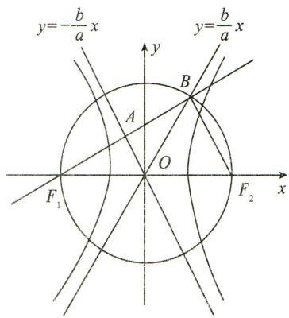

text_image

y=-\frac{b}{a}x
y=\frac{b}{a}x
A
B
O
F₁
F₂
x
y

# 【解析二】

如图，由 $\overrightarrow{F_{1}A}=\overrightarrow{AB}$ 知 A 为线段 $F_{1}B$ 的中点，

∵O为线段 $F_{1}F_{2}$ 的中点，∴ $OA\parallel F_{2}B$ ，

$\because \overrightarrow{F_1B} \cdot \overrightarrow{F_2B} = 0, \therefore F_1B \perp F_2B, \therefore OA \perp F_1A$ 且 $\angle F_1OA = \angle OF_2B,$

$\because \angle BOF_{2} = \angle AOF_{1},\therefore \angle BOF_{2} = \angle OF_{2}B,\therefore |OB| = |OF_{2}| = |BF_{2}| = c,$

∴ $\triangle OBF_{2}$ 为正三角形，∴ $\frac{b}{a}=\tan60^{\circ}=\sqrt{3}$ ，

∴ C 的离心率 $e=\frac{c}{a}=\sqrt{1+\frac{b^{2}}{a^{2}}}=2.$

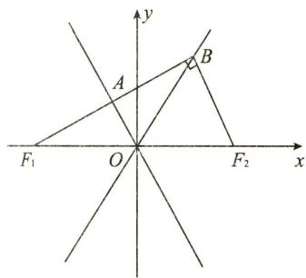

text_image

y
A
B
F₁ O F₂ x

# 3.【解析】

(Ⅰ)由已知可得 b=3 。记半焦距为 c ，

由 $|OF|=|OA|$ 可得c=b=3.又由 $a^{2}=b^{2}+c^{2}$ ，可得 $a^{2}=18$ .

所以椭圆的方程为 $\frac{x^{2}}{18}+\frac{y^{2}}{9}=1.$

(Ⅱ)因为直线 AB 与以 C 为圆心的圆相切于点 P, 所以 $AB \perp CP$ .

依题意, 直线 AB 和直线 CP 的斜率均存在.

设直线 AB 的方程为 y=kx-3.

由方程组 $\left\{\begin{aligned}y&=kx-3,\\ \frac{x^{2}}{18}+\frac{y^{2}}{9}&=1,\end{aligned}\right.$ 消去 y，可得 $(2k^{2}+1)x^{2}-12kx=0$ ，

解得 $x = 0$ 或 $x = \frac{12k}{2k^2 + 1}$ .

依题意,可得点 B 的坐标为 $\left(\frac{12k}{2k^{2}+1},\frac{6k^{2}-3}{2k^{2}+1}\right)$ .

因为 P 为线段 AB 的中点, 点 A 的坐标为 $(0, -3)$ ,

所以点 $P$ 的坐标为 $\left(\frac{6k}{2k^2 + 1},\frac{-3}{2k^2 + 1}\right)$

由 $3\overrightarrow{OC}=\overrightarrow{OF}$ ，得点 C 的坐标为 $(1,0)$ ，

故直线 $CP$ 的斜率为 $\frac{\frac{-3}{2k^2 + 1} - 0}{\frac{6k}{2k^2 + 1} - 1}$ , 即 $\frac{3}{2k^2 - 6k + 1}$ .

又因为 $AB \perp CP$ ，所以 $k \cdot \frac{3}{2k^2 - 6k + 1} = -1$

整理得 $2k^{2}-3k+1=0$ ，解得 $k=\frac{1}{2}$ 或 k=1。

所以直线 AB 的方程为 $y=\frac{1}{2}x-3$ 或 y=x-3.

# 4.【解析】

(I)在抛物线中,焦点F到准线的距离为p,故p=2,则 $y^{2}=4x$ .

(Ⅱ)设点 $P(x_{1},y_{1}), Q(x_{2},y_{2}), F(1,0)$ ,

则 $\overrightarrow{PQ} = (x_{2} - x_{1},y_{2} - y_{1}),\overrightarrow{QF} = (1 - x_{2}, - y_{2}).$

因为 $\overrightarrow{PQ} = 9\overrightarrow{QF}$ ，所以 $x_{2} - x_{1} = 9(1 - x_{2}),y_{2} - y_{1} = -9y_{2}$

那么 $x_{1}=10x_{2}-9, y_{1}=10y_{2}$ .

又因为点在 $P$ 抛物线上， $y_1^2 = 4x_1$ ，所以 $(10y_2)^2 = 4(10x_2 - 9)$ ，

则点 Q 的轨迹方程为 $y^{2}=\frac{2}{5}x-\frac{9}{25}$ .

设直线 OQ 的方程为 y=kx，当直线 OQ 和曲线 $y^{2}=\frac{2}{5}x-\frac{9}{25}$ 相切时，斜率最大，联立直线与曲线方程,此时 $k^{2}x^{2}=\frac{2}{5}x-\frac{9}{25}$ , 得 $k^{2}x^{2}-\frac{2}{5}x+\frac{9}{25}=0$ ,

相切时 $\Delta=\left(-\frac{2}{5}\right)^{2}-4k^{2}\cdot\frac{9}{25}=0$ , 解得 $k=\pm\frac{1}{3}$ .

所以直线 OQ 斜率的最大值为 $\frac{1}{3}$ .

# 模拟篇

# 1.【答案】 B

# 【解析】

由题意知双曲线 C 的长轴长为 2a=8，焦距为 2c=16，

由 $\left|PF_{1}\right|=10<a+c=12$ 得点 P 在双曲线的左支上，

由双曲线定义得 $\left|PF_{2}\right|-\left|PF_{1}\right|=2a=8$ ，则 $\left|PF_{2}\right|=18$ ，

由 $\overrightarrow{F_{1}Q}=\overrightarrow{QP}$ 得点 Q 是线段 $F_{1}P$ 的中点，

又 O 为 $F_{1}F_{2}$ 的中点，则 $\left|OQ\right|=\frac{1}{2}\left|PF_{2}\right|=9$ ，故选 B.

# 2.【答案】 C

# 【解析】

设直线 MN 的方程为 $x = ty + m$ , $M(x_{1}, y_{1})$ , $N(x_{2}, y_{2})$ , 则 $P\left(0, -\frac{m}{t}\right)$ ,

联立 $\left\{ \begin{array}{l} y^{2} = 2px, \\ x = ty + m, \end{array} \right.$ 整理得 $y^{2} - 2pty - 2pm = 0, \Delta = 4p^{2}t^{2} + 8pm > 0,$

则 $y_{1}+y_{2}=2pt, y_{1}y_{2}=-2pm,$

又 $\overrightarrow{PM} = \lambda \overrightarrow{ME}$ ，得 $\left(x_{1},y_{1} + \frac{m}{t}\right) = \lambda (m - x_{1}, - y_{1})$

则 $\lambda = -1 - \frac{m}{ty_1}$ , 同理由 $\overrightarrow{PN} = \mu \overrightarrow{NE}$ 得 $\mu = -1 - \frac{m}{ty_2}$ ,

故 $\lambda +\mu = -1 - \frac{m}{ty_1} +\left(-1 - \frac{m}{ty_2}\right) = -2 - \frac{m}{t}\cdot \frac{y_1 + y_2}{y_1y_2} = -2 - \frac{m}{t}\cdot \frac{2pt}{-2pm} = -1,$

故选 C.

# 3.【答案】 A

# 【解析】

因为 FP 与圆相切于点 E，所以 $OE \perp FP$ ，且 $|OE| = \frac{a}{3}$ .

设双曲线的右焦点为 $F'$ , 由 $\overrightarrow{FP} = 2\overrightarrow{FE}$ , 知点 $E$ 为线段 $FP$ 的中点.

又点 O 为 $FF'$ 的中点，所以 $\left|PF'\right|=2\left|OE\right|=\frac{2a}{3}$ ， $PF'\parallel OE$ ，则 $PF'\perp PF$ .

由双曲线的定义知， $|PF|-|PF'|=2a$ ，所以 $|PF|=\frac{8a}{3}$

所以由 $|PF|^{2}+|PF'|^{2}=|FF'|^{2}$ ，即 $\left(\frac{8a}{3}\right)^{2}+\left(\frac{2a}{3}\right)^{2}=(2c)^{2}$ ，得 $\frac{17}{9}a^{2}=c^{2}$ 所以双曲线的离心率 $e=\frac{c}{a}=\frac{\sqrt{17}}{3}$ ，故选 A.

4.【答案】 $\frac{\sqrt{5}}{2}$

# 【解析】

由对称性不妨设点 P 在第一象限, 联立 $\left\{\begin{aligned}y&=-\frac{a}{b}(x-c),\\ y&=\frac{b}{a}x,\end{aligned}\right.$ 解得 $P\left(\frac{a^{2}}{c},\frac{ab}{c}\right)$ ,

设 $Q(x,y)$ ，又 $F(c,0)$ ，由 $5\overrightarrow{PF} = 3\overrightarrow{FQ}$ ，得 $5\left(c - \frac{a^2}{c}, - \frac{ab}{c}\right) = 3(x - c,y)$

解得 $\left\{\begin{aligned}x&=\frac{8c^{2}-5a^{2}}{3c},\\ y&=-\frac{5ab}{3c},\end{aligned}\right.$ 又点Q在渐近线 $y=-\frac{b}{a}x$ 上，则 $-\frac{5ab}{3c}=-\frac{b}{a}\cdot\frac{8c^{2}-5a^{2}}{3c}$

化简得 $5a^{2} = 4c^{2},\sqrt{5} a = 2c$ ，则双曲线 $E$ 的离心率 $e = \frac{c}{a} = \frac{\sqrt{5}}{2}$

# 5.【解析】

(I)在双曲线 $M: \frac{x^2}{9} - \frac{y^2}{7} = 1$ 中, $c^2 = 9 + 7 = 16$ , $\therefore c = 4$ ,

∴双曲线的右焦点为 $F(4,0)$ ,

由 $\frac{p}{2}=4$ ，得p=8，∴抛物线N的方程为 $y^{2}=16x$ .

(Ⅱ)由题得 $C(-3,0)$ , $D(3,0)$ ,

直线 x=4 与抛物线 $y^{2}=16x$ 的交点坐标分别为 $(4,8)$ , $(4,-8)$ ,

当 $A(4,8), B(4,-8)$ 时，

$$
\therefore \overrightarrow {A C} = (- 7, - 8), \overrightarrow {B D} = (- 1, 8),
$$

$$
\therefore \overrightarrow {A C} \cdot \overrightarrow {B D} = - 7 \times (- 1) + (- 8) \times 8 = - 5 7;
$$

当 $A(4,-8)$ , $B(4,8)$ 时，

$$
\overrightarrow {A C} = (- 7, 8), \overrightarrow {B D} = (- 1, - 8),
$$

$$
\therefore \overrightarrow {A C} \cdot \overrightarrow {B D} = - 7 \times (- 1) + 8 \times (- 8) = - 5 7.
$$

综上， $\overrightarrow{AC} \cdot \overrightarrow{BD} = -57.$

# 6.【解析】

(Ⅰ)设 $M(0,m)$ , $N(n,0)$ , $P(x,y)$ ,

由 $|MN| = 1$ 得 $m^2 + n^2 = 1$ . 由 $\overrightarrow{MP} = 3\overrightarrow{MN}$ 得 $(x, y - m) = 3(n, -m)$ ,

则 $\left\{ \begin{array}{l} x = 3n, \\ y - m = -3m, \end{array} \right.$ 所以 $\left\{ \begin{array}{l} n = \frac{x}{3}, \\ m = -\frac{y}{2}, \end{array} \right.$ 所以曲线 $E$ 的方程为 $\frac{x^2}{9} + \frac{y^2}{4} = 1$ .

(Ⅱ)由题意得直线 MN 的方程为 $y=kx+m$ ，所以 $n=-\frac{m}{k}$ ①.

设 $P(x_{1},y_{1}),Q(x_{2},y_{2})$

联立 $\left\{\begin{aligned}y&=kx+m,\\ \frac{x^{2}}{9}&+\frac{y^{2}}{4}=1,\end{aligned}\right.$ 可得 $(4+9k^{2})x^{2}+18kmx+9m^{2}-36=0,$

所以 $x_{1} + x_{2} = \frac{-18km}{4 + 9k^{2}}.$

因为 $|PN|=|MQ|$ ，所以MN和PQ的中点重合，所以 $\frac{-9km}{4+9k^{2}}=\frac{n}{2}$ ②，

联立①②可得 $k^{2}=\frac{4}{9}$ ，故 $k=\pm\frac{2}{3}$ .

# 7.【解析】

(Ⅰ)设椭圆的半焦距为 c，由 $y^{2}=4x$ ，得 2c=2, c=1，

设椭圆 C 的标准方程为 $\frac{x^{2}}{a^{2}} + \frac{y^{2}}{b^{2}} = 1 (a > b > 0)$ ,

∵椭圆 C 过点 $\left(1,\frac{\sqrt{2}}{2}\right),\therefore\frac{1}{a^{2}}+\frac{\frac{1}{2}}{b^{2}}=1$ ，又 $a^{2}=b^{2}+1$ ，解得 $b^{2}=1,a^{2}=2$ ，

故椭圆 C 的标准方程为 $\frac{x^{2}}{2} + y^{2} = 1$ .

(Ⅱ)当直线 l 的斜率不存在, 即 $\lambda = -1$ 时, 直线 l 与椭圆交点的坐标分别为 $\left(1, \frac{\sqrt{2}}{2}\right), \left(1, -\frac{\sqrt{2}}{2}\right)$ ,

又 $T(2,0), \therefore |\overrightarrow{TA} + \overrightarrow{TB}| = \left|(-1, \frac{\sqrt{2}}{2}) + (-1, -\frac{\sqrt{2}}{2})\right| = 2.$

当直线 l 的斜率存在, 即 $\lambda \in [-2, -1)$ 时,

设直线 l 的方程为 $y=k(x-1)$ ,

由 $\left\{\begin{aligned}y=k(x-1),\\ \frac{x^{2}}{2}+y^{2}=1,\end{aligned}\right.$ 得 $(1+2k^{2})x^{2}-4k^{2}x+2k^{2}-2=0,$

设 $A(x_{1},y_{1}), B(x_{2},y_{2})$ ，显然 $y_{1} \neq 0, y_{2} \neq 0$ ，

则由根与系数的关系得 $x_{1} + x_{2} = \frac{4k^{2}}{1 + 2k^{2}}, x_{1}x_{2} = \frac{2k^{2} - 2}{1 + 2k^{2}}$

$$
\therefore y _ {1} + y _ {2} = k (x _ {1} + x _ {2}) - 2 k = \frac {- 2 k}{1 + 2 k ^ {2}}, \quad ①
$$

$$
y _ {1} y _ {2} = k ^ {2} [ x _ {1} x _ {2} - (x _ {1} + x _ {2}) + 1 ] = \frac {- k ^ {2}}{1 + 2 k ^ {2}}, \quad ②
$$

$$
\because \overrightarrow {F _ {2} A} = \lambda \overrightarrow {F _ {2} B}, \therefore \frac {y _ {1}}{y _ {2}} = \lambda , \text {且} \lambda <   0.
$$

将①式平方除以②式，得 $\lambda + \frac{1}{\lambda} + 2 = \frac{-4}{1 + 2k^{2}}$ ,

由 $\lambda \in [-2, -1)$ , 得 $\lambda + \frac{1}{\lambda} \in \left[-\frac{5}{2}, -2\right)$ ,

$\therefore \lambda + \frac{1}{\lambda} + 2 \in \left[-\frac{1}{2}, 0\right). \therefore -\frac{1}{2} \leqslant \frac{-4}{1 + 2k^2} < 0$ ，解得 $k^2 \geqslant \frac{7}{2}$ .

$$
\because \overrightarrow {T A} = (x _ {1} - 2, y _ {1}), \overrightarrow {T B} = (x _ {2} - 2, y _ {2}), \therefore \overrightarrow {T A} + \overrightarrow {T B} = (x _ {1} + x _ {2} - 4, y _ {1} + y _ {2}),
$$

又 $x_{1} + x_{2} - 4 = \frac{-4(1 + k^{2})}{1 + 2k^{2}}$

$$
\begin{array}{l} \therefore | \overrightarrow {T A} + \overrightarrow {T B} | ^ {2} = (x _ {1} + x _ {2} - 4) ^ {2} + (y _ {1} + y _ {2}) ^ {2} = \frac {1 6 (1 + k ^ {2}) ^ {2}}{(1 + 2 k ^ {2}) ^ {2}} + \frac {4 k ^ {2}}{(1 + 2 k ^ {2}) ^ {2}} \\ = \frac {4 (1 + 2 k ^ {2}) ^ {2} + 1 0 (1 + 2 k ^ {2}) + 2}{(1 + 2 k ^ {2}) ^ {2}} = 4 + \frac {1 0}{1 + 2 k ^ {2}} + \frac {2}{(1 + 2 k ^ {2}) ^ {2}}, \\ \end{array}
$$

令 $t = \frac{1}{1 + 2k^2},\because k^2\geqslant \frac{7}{2},\therefore 0 <   \frac{1}{1 + 2k^2}\leqslant \frac{1}{8}$ 即 $t\in (0,\frac{1}{8} ]$

$$
\therefore | \overrightarrow {T A} + \overrightarrow {T B} | ^ {2} = 2 t ^ {2} + 1 0 t + 4 = 2 \left(t + \frac {5}{2}\right) ^ {2} - \frac {1 7}{2} \in \left(4, \frac {1 6 9}{3 2} \right]
$$

$$
\therefore | \overrightarrow {T A} + \overrightarrow {T B} | \in (2, \frac {1 3 \sqrt {2}}{8} ].
$$

综上所述， $|\overrightarrow{TA} +\overrightarrow{TB} |\in \left[2,\frac{13\sqrt{2}}{8}\right].$

# 第五讲 定点、定值问题

# 真题篇

# 1.【解析】

(I)由抛物线 $C: x^{2} = -2py$ 经过点 $(2, -1)$ ，得 p = 2.

所以抛物线 C 的方程为 $x^{2} = -4y$ ，其准线方程为 y = 1。

(Ⅱ)抛物线 C 的焦点为 $F(0,-1)$ .

设直线 l 的方程为 $y=kx-1(k\neq1)$ .

由 $\left\{ \begin{array}{l} y = kx - 1, \\ x^2 = -4y, \end{array} \right.$ 得 $x^{2} + 4kx - 4 = 0$ .

设 $M(x_{1},y_{1}),N(x_{2},y_{2})$ ，则 $x_{1}x_{2} = -4.$ 直线OM的方程为 $y = \frac{y_1}{x_1} x.$

令 $y = -1$ ，得点 $A$ 的横坐标 $x_{A} = -\frac{x_{1}}{y_{1}}.$

同理得点 B 的横坐标 $x_{B} = -\frac{x_{2}}{y_{2}}$ .

设点 $D(0,n)$ ，则 $\overrightarrow{DA} = \left(-\frac{x_1}{y_1}, - 1 - n\right),\overrightarrow{DB} = \left(-\frac{x_2}{y_2}, - 1 - n\right),$

$$
\begin{array}{l} \overrightarrow {D A} \cdot \overrightarrow {D B} = \frac {x _ {1} x _ {2}}{y _ {1} y _ {2}} + (n + 1) ^ {2} = \frac {x _ {1} x _ {2}}{\left(- \frac {x _ {1} ^ {2}}{4}\right) \left(- \frac {x _ {2} ^ {2}}{4}\right)} + (n + 1) ^ {2} = \frac {1 6}{x _ {1} x _ {2}} + (n + 1) ^ {2} \\ = - 4 + (n + 1) ^ {2}. \\ \end{array}
$$

令 $\overrightarrow{DA} \cdot \overrightarrow{DB} = 0$ ，即 $-4 + (n + 1)^2 = 0$ ，解得 $n = 1$ 或 $n = -3$ .

综上,以 AB 为直径的圆经过 y 轴上的定点 $(0,1)$ 和 $(0,-3)$ .

# 2.【解析】

(Ⅰ)由题意得 $b^{2}=1, c=1$ ，所以 $a^{2}=b^{2}+c^{2}=2$ .

所以椭圆 C 的方程为 $\frac{x^{2}}{2} + y^{2} = 1$ .

(Ⅱ) 设 $P(x_{1}, y_{1})$ , $Q(x_{2}, y_{2})$ ，则直线 AP 的方程为 $y = \frac{y_{1} - 1}{x_{1}} x + 1$ .

令 $y = 0$ ，得点 $M$ 的横坐标 $x_{M} = -\frac{x_{1}}{y_{1} - 1}$

又 $y_{1} = kx_{1} + t$ ，从而 $\vert OM\vert = \vert x_M\vert = \left|\frac{x_1}{kx_1 + t - 1}\right|$

同理， $|ON| = \left|\frac{x_2}{kx_2 + t - 1}\right|$

由 $\left\{\begin{aligned}y=kx+t,\\ \frac{x^{2}}{2}+y^{2}=1\end{aligned}\right.$ 得 $(1+2k^{2})x^{2}+4ktx+2t^{2}-2=0.$

则 $x_{1} + x_{2} = -\frac{4kt}{1 + 2k^{2}}, x_{1}x_{2} = \frac{2t^{2} - 2}{1 + 2k^{2}}.$

$$
\begin{array}{l} = \left| \frac {x _ {1} x _ {2}}{k ^ {2} x _ {1} x _ {2} + k (t - 1) \left(x _ {1} + x _ {2}\right) + (t - 1) ^ {2}} \right| \\ = \left| \frac {\frac {2 t ^ {2} - 2}{1 + 2 k ^ {2}}}{k ^ {2} \cdot \frac {2 t ^ {2} - 2}{1 + 2 k ^ {2}} + k (t - 1) \cdot \left(- \frac {4 k t}{1 + 2 k ^ {2}}\right) + (t - 1) ^ {2}} \right| \\ = 2 \left| \frac {1 + t}{1 - t} \right|. \\ \end{array}
$$

所以 $|OM| \cdot |ON| = \left|\frac{x_1}{kx_1 + t - 1}\right| \cdot \left|\frac{x_2}{kx_2 + t - 1}\right|$

又 $|OM| \cdot |ON| = 2$ ，所以 $2\left|\frac{1 + t}{1 - t}\right| = 2$ . 解得 $t = 0$ ，所以直线 $l$ 经过定点 $(0,0)$ .

# 3.【解析】

（I）由题设得 $\frac{4}{a^2} +\frac{1}{b^2} = 1,\frac{a^2 - b^2}{a^2} = \frac{1}{2}$ ，解得 $a^2 = 6,b^2 = 3.$

所以 C 的方程为 $\frac{x^{2}}{6} + \frac{y^{2}}{3} = 1$ .

(Ⅱ)设 $M(x_{1},y_{1}), N(x_{2},y_{2})$ . 若直线 MN 与 x 轴不垂直,

设直线 MN 的方程为 $y=kx+m$ ，代入 $\frac{x^{2}}{6}+\frac{y^{2}}{3}=1$

得 $(1+2k^{2})x^{2}+4kmx+2m^{2}-6=0.$

于是 $x_{1} + x_{2} = -\frac{4km}{1 + 2k^{2}}, x_{1}x_{2} = \frac{2m^{2} - 6}{1 + 2k^{2}}.$ ①

由 $AM \perp AN$ 知 $\overrightarrow{AM} \cdot \overrightarrow{AN} = 0$ ,

故 $(x_{1}-2)(x_{2}-2)+(y_{1}-1)(y_{2}-1)=0,$

可得 $(k^2 + 1)x_1x_2 + (km - k - 2)(x_1 + x_2) + (m - 1)^2 + 4 = 0.$

将①代入上式可得 $(k^2 + 1)\frac{2m^2 - 6}{1 + 2k^2} - (km - k - 2)\frac{4km}{1 + 2k^2} + (m - 1)^2 + 4 = 0.$

整理得 $(2k+3m+1)(2k+m-1)=0.$

因为 $A(2,1)$ 不在直线 MN 上，所以 $2k+m-1\neq0$ ，故 $2k+3m+1=0, k\neq1$ .

于是 $MN$ 的方程为 $y = k\left(x - \frac{2}{3}\right) - \frac{1}{3} (k \neq 1)$ .

所以直线 MN 过点 $P\left(\frac{2}{3}, -\frac{1}{3}\right)$ .

若直线 MN 与 x 轴垂直, 可得 $N(x_{1}, -y_{1})$ .

由 $\overrightarrow{AM} \cdot \overrightarrow{AN} = 0$ ，得 $(x_{1} - 2)(x_{1} - 2) + (y_{1} - 1)(-y_{1} - 1) = 0.$

又 $\frac{x_1^2}{6} +\frac{y_1^2}{3} = 1$ ，可得 $3x_{1}^{2} - 8x_{1} + 4 = 0.$ 解得 $x_{1} = 2$ （舍去）， $x_{1} = \frac{2}{3}$

此时直线 MN 过点 $P\left(\frac{2}{3}, -\frac{1}{3}\right)$ . 令 Q 为 AP 的中点, 即 $Q\left(\frac{4}{3}, \frac{1}{3}\right)$ .

若 D 与 P 不重合, 则由题设知 AP 是 Rt△ADP 的斜边,

故 $|DQ|=\frac{1}{2}|AP|=\frac{2\sqrt{2}}{3}$ . 若 D 与 P 重合，则 $|DQ|=\frac{1}{2}|AP|$ .

综上,存在点 $Q\left(\frac{4}{3},\frac{1}{3}\right)$ , 使得 $|DQ|$ 为定值.

# 4.【解析】

(I) 设 E 的方程为 $\frac{x^{2}}{a^{2}} + \frac{y^{2}}{b^{2}} = 1 (a > 0, b > 0)$ ,

将 $A(0, -2), B\left(\frac{3}{2}, -1\right)$ 两点代入得 $\left\{ \begin{array}{l} \frac{4}{b^2} = 1, \\ \frac{9}{4a^2} + \frac{1}{b^2} = 1, \end{array} \right.$ 解得 $a^2 = 3, b^2 = 4$

故 E 的方程为 $\frac{y^{2}}{4} + \frac{x^{2}}{3} = 1$ .

(Ⅱ)证明:由 $A(0,-2)$ , $B\left(\frac{3}{2},-1\right)$ 可得直线 AB: $y=\frac{2}{3}x-2$ .

①若过 $P(1,-2)$ 的直线的斜率不存在, 直线为 x=1.

代入 $\frac{y^2}{4} +\frac{x^2}{3} = 1$ ，可得 $M\left(1,\frac{2\sqrt{6}}{3}\right),N\left(1, - \frac{2\sqrt{6}}{3}\right),$

将 $y = \frac{2\sqrt{6}}{3}$ 代入 $AB:y = \frac{2}{3} x - 2$ ，可得 $T\left(\sqrt{6} +3,\frac{2\sqrt{6}}{3}\right)$ ，由 $\overrightarrow{MT} = \overrightarrow{TH}$ 得 $H\left(2\sqrt{6} +5,\frac{2\sqrt{6}}{3}\right)$

易求得此时直线 $HN:y = \left(2 - \frac{2\sqrt{6}}{3}\right)x - 2.$ 过点 $(0, - 2)$

②若过 $P(1,-2)$ 的直线的斜率存在，

设 $kx - y - (k + 2) = 0, M(x_1, y_1), N(x_2, y_2)$ .

联立 $\left\{\begin{aligned}kx-y-(k+2)=0,\\ \frac{y^{2}}{4}+\frac{x^{2}}{3}=1,\end{aligned}\right.$ 得 $(3k^{2}+4)x^{2}-6k(k+2)x+3k(k+4)=0.$

故有 $\left\{\begin{aligned}x_{1}+x_{2}&=\frac{6k(k+2)}{3k^{2}+4},\\ x_{1}x_{2}&=\frac{3k(k+4)}{3k^{2}+4},\end{aligned}\right.$ $\left\{\begin{aligned}y_{1}+y_{2}&=\frac{-8(k+2)}{3k^{2}+4},\\ y_{1}y_{2}&=\frac{4(4k-2k^{2}+4)}{3k^{2}+4},\end{aligned}\right.$ 且 $x_{1}y_{2}+x_{2}y_{1}=\frac{-24k}{3k^{2}+4}.$ （\*）

联立 $\left\{\begin{aligned}y&=y_{1},\\ y&=\frac{2}{3}x-2\end{aligned}\right.$ 可得 $T\left(\frac{3y_{1}}{2}+3,y_{1}\right),H(3y_{1}+6-x_{1},y_{1})$ ,

可得此时 $HN:y - y_2 = \frac{y_1 - y_2}{3y_1 + 6 - x_1 - x_2} (x - x_2).$

将(0,-2)代入,整理得 $2(x_{1}+x_{2})-6(y_{1}+y_{2})+x_{1}y_{2}+x_{2}y_{1}-3y_{1}y_{2}-12=0.$

将 $(\ast)$ 式代入，得 $24k + 12k^2 + 96 + 48k - 24k - 48 - 48k + 24k^2 - 36k^2 - 48 = 0$

显然成立.

综上, 直线 HN 过定点 $(0, -2)$ .

# 模拟篇

# 1.【解析】

(I)由题意可得直线 AB 的方程为 $y = x - \frac{p}{2}$ ,

联立 $\left\{\begin{aligned}y&=x-\frac{p}{2},\\ y^{2}&=2px,\end{aligned}\right.$ 消去 y 并整理得 $x^{2}-3px+\frac{p^{2}}{4}=0$ ,

设 $A(x_{1},y_{1}),B(x_{2},y_{2})$ ，则 $x_{1} + x_{2} = 3p$

由抛物线的定义得 $|AB|=x_{1}+x_{2}+p=4p=8$ ,

∴ p=2, ∴ 抛物线 $\Gamma$ 的方程为 $y^{2}=4x$ .

(Ⅱ)设直线 $l_{1}, l_{2}$ 的倾斜角分别为 $\alpha, \beta$ ，直线 $l_{1}$ 的斜率为 k，

则 $k=\tan\alpha$ . 则直线 CD 的方程为 $y-8=k(x-12)$ ，即 $y=k(x-12)+8$ ，

联立 $\left\{\begin{aligned}y&=k(x-12)+8,\\ y^{2}&=4x,\end{aligned}\right.$ 消去 x 并整理得 $ky^{2}-4y+32-48k=0$ ,

$$
\therefore y _ {C} + y _ {D} = \frac {4}{k}, \therefore x _ {C} + x _ {D} = 2 4 + \frac {4}{k ^ {2}} - \frac {1 6}{k},
$$

∴点 M 的坐标为 $\left(12+\frac{2}{k^{2}}-\frac{8}{k},\frac{2}{k}\right)$ .

又∵直线 $l_{1}$ 与 $l_{2}$ 的倾斜角互余，

$\therefore \tan \beta = \tan \left(\frac{\pi}{2} - \alpha\right) = \frac{\sin \left(\frac{\pi}{2} - \alpha\right)}{\cos \left(\frac{\pi}{2} - \alpha\right)} = \frac{\cos \alpha}{\sin \alpha} = \frac{1}{\frac{\sin \alpha}{\cos \alpha}} = \frac{1}{\tan \alpha}, \therefore$ 直线 $l_{2}$ 的斜率为 $\frac{1}{k}$ .

同理可得点 N 的坐标为 $(12+2k^{2}-8k,2k)$ ,

$$
\therefore k _ {M N} = \frac {2 \left(\frac {1}{k} - k\right)}{2 \left(\frac {1}{k ^ {2}} - k ^ {2}\right) - 8 \left(\frac {1}{k} - k\right)} = \frac {1}{\frac {1}{k} + k - 4}.
$$

∴直线 MN 的方程为 $y-2k=\frac{1}{\frac{1}{k}+k-4}[x-(12+2k^{2}-8k)]$ ,

即 $\left(\frac{1}{k}+k-4\right)y=x-10$ ，显然当x=10时，y=0。

∴直线 MN 经过定点(10,0).

# 2.【解析】

(I)联立 $\left\{\begin{aligned}x&=my+2,\\ y^{2}&=4x,\end{aligned}\right.$ 消去x，整理得 $y^{2}-4my-8=0$ ，显然 $\Delta=16m^{2}+32>0$ ，设 $A(x_{1},y_{1}),B(x_{2},y_{2})$ ，根据韦达定理 $y_{1}+y_{2}=4m,y_{1}\cdot y_{2}=-8$ ，

$$
\because | A B | = \sqrt {m ^ {2} + 1} \cdot | y _ {1} - y _ {2} | = \sqrt {m ^ {2} + 1} \cdot \sqrt {(y _ {1} + y _ {2}) ^ {2} - 4 y _ {1} y _ {2}},
$$

$\therefore |AB| = 4\sqrt{m^2 + 1} \cdot \sqrt{m^2 + 2} = 4\sqrt{6}$ , 解得 $m^2 = 1, \therefore m = \pm 1$ ,

∴直线 l 的方程为 x-y-2=0 或 $x+y-2=0$ .

(Ⅱ)设 AB 的中点 M 的坐标为 $(x_{M}, y_{M})$ ，则由(Ⅰ)知 $y_{M} = \frac{y_{1} + y_{2}}{2} = 2m$ ，
又∵ $x_{1}+x_{2}=m(y_{1}+y_{2})+4=4m^{2}+4$

$$
\therefore x _ {M} = \frac {x _ {1} + x _ {2}}{2} = 2 m ^ {2} + 2, \therefore M (2 m ^ {2} + 2, 2 m),
$$

由题意可得 $N(0,2m)$ ,

设以 MN 为直径的圆经过点 $P(x_{0}, y_{0})$ ，则 $\overrightarrow{PM} = (2m^{2} + 2 - x_{0}, 2m - y_{0})$ ， $\overrightarrow{PN} = (-x_{0}, 2m - y_{0})$ ，

则有 $\overrightarrow{PM} \cdot \overrightarrow{PN} = 0$ ，即 $(4 - 2x_0)m^2 - 4y_0m + x_0^2 + y_0^2 - 2x_0 = 0$

由题意可知 $\left\{ \begin{array}{l} 4 - 2x_0 = 0, \\ -4y_0 = 0, \\ x_0^2 + y_0^2 - 2x_0 = 0, \end{array} \right.$ 解得 $x_0 = 2, y_0 = 0$

∴定点 $(2,0)$ 即为所求.

# 3.【解析】

(I)椭圆 $E$ 的焦点在 $x$ 轴上，则 $a^2 > 1 - a^2$ ，即 $a > \frac{\sqrt{2}}{2}$ .

又 $2c = 1, a^2 = 1 - a^2 + c^2$ ，得 $a^2 = \frac{5}{8}$ ，

所以椭圆 $E$ 的方程为 $\frac{8x^2}{5} +\frac{8y^2}{3} = 1.$

(Ⅱ)设 $F_{1}(-c,0)$ , $F_{2}(c,0)$ , $P(x,y)$ , $Q(0,m)$ ,

则 $\overrightarrow{F_2P} = (x - c,y),\overrightarrow{QF_2} = (c, - m),\overrightarrow{F_1P} = (x + c,y),\overrightarrow{F_1Q} = (c,m),$

由 $1 - a^2 > 0 \Rightarrow a \in (0,1) \Rightarrow x \in (0,1), y \in (0,1)$ .

由 $\overrightarrow{F_2P} // \overrightarrow{QF_2}, \overrightarrow{F_1P} \perp \overrightarrow{F_1Q}$ , 得 $\left\{ \begin{array}{l} m \cdot (c - x) = y \cdot c, \\ c \cdot (x + c) + m \cdot y = 0. \end{array} \right.$

所以 $(x - c)(x + c) = y^{2}$ ，即 $x^{2} - y^{2} = c^{2}$

联立 $\left\{\begin{aligned}\frac{x^{2}}{a^{2}}+\frac{y^{2}}{1-a^{2}}=1,\\ x^{2}-y^{2}=c^{2},\\ a^{2}=1-a^{2}+c^{2},\end{aligned}\right.$ 解得 $\frac{2x^{2}}{1+x^{2}-y^{2}}+\frac{2y^{2}}{1-x^{2}+y^{2}}=1$ ，即 $x^{2}=(y\pm1)^{2}$ .

因为 $x \in (0,1), y \in (0,1)$ , 所以 $x = 1 - y$ .

所以当 $\alpha$ 变化时，点 $P$ 在定直线 $x + y - 1 = 0$ 上.

# 4.【解析】

(I)设椭圆的焦距为 $2c$ ，由题可知 $e = \frac{c}{a} = \frac{\sqrt{5}}{3}$

联立 $\left\{\begin{aligned}\frac{c}{a}&=\frac{\sqrt{5}}{3},\\2a+2b&=10,\end{aligned}\right.$ 解得 $\left\{\begin{aligned}a&=3,\\ b&=2.\end{aligned}\right.$ 故椭圆E的标准方程为 $\frac{x^{2}}{9}+\frac{y^{2}}{4}=1.$

# (Ⅱ)【证法一】

设 $P(x_0,y_0),C(0,y_1),D(0,y_2)$

因为点 $P$ 在椭圆上，所以 $\frac{x_0^2}{9} +\frac{y_0^2}{4} = 1$ ，即 $\frac{9y_0^2}{9 - x_0^2} = 4.$

易知 $\overrightarrow{OC}$ 与 $\overrightarrow{OD}$ 同向，故 $\overrightarrow{OC} \cdot \overrightarrow{OD} = y_1 \cdot y_2$ .

因为 $A(-3,0), B(3,0)$

所以直线 $PA$ 的方程为 $y = \frac{y_0}{x_0 + 3} (x + 3)$ ，令 $x = 0$ ，得 $y_{1} = \frac{3y_{0}}{3 + x_{0}}$

直线 $PB$ 的方程为 $y = \frac{y_0}{x_0 - 3} (x - 3)$ ，令 $x = 0$ ，得 $y_{2} = \frac{3y_{0}}{3 - x_{0}}$

所以 $\overrightarrow{OC} \cdot \overrightarrow{OD} = y_1 \cdot y_2 = \frac{9y_0^2}{9 - x_0^2} = 4$ ，为定值.

# 【证法二】

椭圆 $E: \frac{x^2}{a^2} + \frac{y^2}{b^2} = 1 (a > b > 0)$ 的左、右顶点分别为 $A, B$ ，则有 $k_{PA} \cdot k_{PB} = -\frac{b^2}{a^2}$ ，设直线 $PA, PB$ 的斜率分别为 $k_1, k_2$ ，则由（I）知， $k_1 \cdot k_2 = -\frac{4}{9}$ .

设 $C(0,y_{1}),D(0,y_{2})$

直线 $PA$ 的方程为 $y = k_{1}(x + 3)$ ，令 $x = 0$ ，得 $y_{1} = 3k_{1}$

直线 $PB$ 的方程为 $y = k_{2}(x - 3)$ ，令 $x = 0$ ，得 $y_{2} = -3k_{2}$ ，

所以 $\overrightarrow{OC} \cdot \overrightarrow{OD} = y_1y_2 = -9k_1k_2 = 4$ ，为定值.

# 5.【解析】

(I)依题意得 $\left\{\begin{aligned}&2a=4,\\&b=c,\\&a^{2}=b^{2}+c^{2},\end{aligned}\right.$ 解得 $a=2,b=c=\sqrt{2}.$

所以圆 $O$ 的方程为 $x^{2} + y^{2} = 2$ ，椭圆 $C$ 的方程为 $\frac{x^2}{4} +\frac{y^2}{2} = 1.$

# (Ⅱ)【证法一】

如图，设 $P(x_0,y_0),Q(x_Q,y_0),(y_0\neq 0)$ ，则 $\left\{ \begin{array}{l} \frac{x_0^2}{4} +\frac{y_0^2}{2} = 1,\\ x_Q^2 +y_0^2 = 2, \end{array} \right.$ 即 $\left\{ \begin{array}{l} x_0^2 = 4 - 2y_0^2,\\ x_Q^2 = 2 - y_0^2. \end{array} \right.$

又直线 $AP$ 的方程为 $y = \frac{y_0}{x_0 + 2} (x + 2)$ ，令 $x = 0$ ，得 $M\left(0, \frac{2y_0}{x_0 + 2}\right)$ ，

直线 $BP$ 的方程为 $y = \frac{y_0}{x_0 - 2} (x - 2)$ ，令 $x = 0$ ，得 $N\left(0, -\frac{2y_0}{x_0 - 2}\right)$ ，

所以 $\overrightarrow{QM} = \left(-x_{Q},\frac{2y_{0}}{x_{0} + 2} -y_{0}\right) = \left(-x_{Q}, - \frac{x_{0}y_{0}}{x_{0} + 2}\right),$

$$
\overrightarrow {Q N} = \left(- x _ {Q}, - \frac {2 y _ {0}}{x _ {0} - 2} - y _ {0}\right) = \left(- x _ {Q}, - \frac {x _ {0} y _ {0}}{x _ {0} - 2}\right).
$$

所以 $\overrightarrow{QM} \cdot \overrightarrow{QN} = x_{Q}^{2} + \frac{x_{0}^{2}y_{0}^{2}}{x_{0}^{2} - 4} = 2 - y_{0}^{2} + \frac{(4 - 2y_{0}^{2})y_{0}^{2}}{-2y_{0}^{2}} = 0,$

所以 $QM \perp QN$ ，即 $\angle MQN = 90^{\circ}$ ，所以 $\angle MQN$ 为定值。

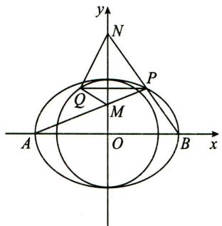

text_image

y
N
P
Q
M
A
O
B
x

# 【证法二】

如图, 设 $P(x_0, y_0)$ , 直线 $AP$ 的方程为 $y = k(x + 2) (k \neq 0)$ .

联立 $\left\{\begin{aligned}\frac{x^{2}}{4}+\frac{y^{2}}{2}&=1,\\ y=k(x+2),\end{aligned}\right.$ 得 $(2k^{2}+1)x^{2}+8k^{2}x+8k^{2}-4=0,$

所以 $-2x_{0} = \frac{8k^{2} - 4}{2k^{2} + 1}$ 即 $x_0 = \frac{2 - 4k^2}{2k^2 + 1}$

所以 $y_0 = \frac{4k}{2k^2 + 1}$ 即 $P\left(\frac{2 - 4k^2}{2k^2 + 1},\frac{4k}{2k^2 + 1}\right)$

所以直线 $BP$ 的斜率为 $\frac{\frac{4k}{2k^2 + 1}}{\frac{2 - 4k^2}{2k^2 + 1} - 2} = -\frac{1}{2k}$

所以直线 $BP$ 的方程为 $y = -\frac{1}{2k} (x - 2)$ ，令 $x = 0$ ，得 $N\left(0, \frac{1}{k}\right)$ ，

由 $y=k(x+2)$ ，令 x=0，得 $M(0,2k)$ .

设 $Q(x_{Q},y_{0})$ ，则 $\overrightarrow{QM} = (-x_{Q},2k - y_{0}),\overrightarrow{QN} = \left(-x_{Q},\frac{1}{k} -y_{0}\right),$

所以 $\overrightarrow{QM} \cdot \overrightarrow{QN} = x_{Q}^{2} + (2k - y_{0}) \cdot \left(\frac{1}{k} - y_{0}\right) = x_{Q}^{2} + y_{0}^{2} + 2 - \frac{2k^{2} + 1}{k} \cdot y_{0}$ .

因为 $x_{Q}^{2} + y_{0}^{2} = 2, y_{0} = \frac{4k}{2k^{2} + 1}$ , 所以 $\overrightarrow{QM} \cdot \overrightarrow{QN} = 0$ .

所以 $QM \perp QN$ ，即 $\angle MQN = 90^{\circ}$ .

所以 $\angle MQN$ 为定值.

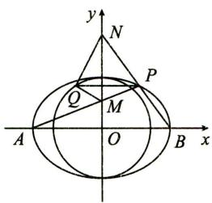

text_image

y
N
P
Q
M
A
O
B
x

# 第六讲 最值、范围问题

# 真题篇

# 1.【解析】

(Ⅰ)由题设得 $\frac{y}{x+2}\cdot\frac{y}{x-2}=-\frac{1}{2}$ ，化简得 $\frac{x^{2}}{4}+\frac{y^{2}}{2}=1(|x|\neq2)$ ，所以C为中心在坐标原点，焦点在x轴上的椭圆，不含左右顶点.
(Ⅱ)(i)设直线 PQ 的斜率为 k，则其方程为 $y=kx (k>0)$ .

由 $\left\{\begin{aligned}y=kx,\\ \frac{x^{2}}{4}+\frac{y^{2}}{2}=1\end{aligned}\right.$ 得 $x=\pm\frac{2}{\sqrt{1+2k^{2}}}$ .

记 $u = \frac{2}{\sqrt{1 + 2k^2}}$ ，则 $P(u,uk),Q(-u, - uk),E(u,0).$

于是直线 $QG$ 的斜率为 $\frac{k}{2}$ ，方程为 $y = \frac{k}{2} (x - u)$ .

由 $\left\{\begin{aligned}y&=\frac{k}{2}(x-u),\\ \frac{x^{2}}{4}&+\frac{y^{2}}{2}=1\end{aligned}\right.$ 得 $(2+k^{2})x^{2}-2uk^{2}x+k^{2}u^{2}-8=0$ ①.

设 $G(x_{G},y_{G})$ ，则 $-u$ 和 $x_{G}$ 是方程①的解，

故 $x_{G} = \frac{u(3k^{2} + 2)}{2 + k^{2}}$ ，由此得 $y_{G} = \frac{uk^{3}}{2 + k^{2}}.$

从而直线 $PG$ 的斜率为 $\frac{\frac{uk^3}{2 + k^2} - uk}{\frac{u(3k^2 + 2)}{2 + k^2} - u} = -\frac{1}{k}$ .

所以 $PQ \perp PG$ ，即 $\triangle PQG$ 是直角三角形.

(ii) 由 (i) 得 $|PQ| = 2u\sqrt{1 + k^2}$ , $|PG| = \frac{2uk\sqrt{k^2 + 1}}{2 + k^2}$ ,

所以 $\triangle PQG$ 的面积 $S = \frac{1}{2} |PQ||PG| = \frac{8k(1 + k^2)}{(1 + 2k^2)(2 + k^2)} = \frac{8\left(\frac{1}{k} + k\right)}{1 + 2\left(\frac{1}{k} + k\right)^2}.$

设 $t = k + \frac{1}{k}$ ，则由 $k > 0$ 得 $t \geqslant 2$ ，当且仅当 $k = 1$ 时取等号.

因为 $S = \frac{8t}{1 + 2t^2}$ ，在 $[2, + \infty)$ 上单调递减，

所以当 t=2，即 k=1 时，S 取得最大值，最大值为 $\frac{16}{9}$ .

因此, $\triangle PQG$ 面积的最大值为 $\frac{16}{9}$ .

# 2.【解析】

（Ⅰ）由题意得 $\frac{p}{2}=1$ ，即p=2。所以，抛物线的准线方程为x=-1。  
(Ⅱ)设 $A(x_{A},y_{A})$ , $B(x_{B},y_{B})$ , $C(x_{C},y_{C})$ , 重心 $G(x_{G},y_{G})$ .

令 $y_{A}=2t, t\neq0$ ，则 $x_{A}=t^{2}$ .

由于直线 $AB$ 过 $F$ , 故直线 $AB$ 的方程为 $x = \frac{t^2 - 1}{2t} y + 1$ ,

代入 $y^{2} = 4x$ ，得 $y^{2} - \frac{2(t^{2} - 1)}{t} y - 4 = 0.$

故 $2ty_{B} = -4$ ，即 $y_{B} = -\frac{2}{t}$ 所以 $B\left(\frac{1}{t^2}, - \frac{2}{t}\right)$

又由于 $x_{G} = \frac{1}{3} (x_{A} + x_{B} + x_{C}), y_{G} = \frac{1}{3} (y_{A} + y_{B} + y_{C})$ 及重心 $G$ 在 $x$ 轴上，

故 $2t - \frac{2}{t} + y_{c} = 0$ ，得 $C\left(\left(\frac{1}{t} - t\right)^2, 2\left(\frac{1}{t} - t\right)\right), G\left(\frac{2t^4 - 2t^2 + 2}{3t^2}, 0\right)$ .

所以直线 AC 的方程为 $y-2t=2t(x-t^{2})$ ，得 $Q(t^{2}-1,0)$ .

由于 Q 在焦点 F 的右侧, 故 $t^{2}-1>1$ , 即 $t^{2}>2$ .

从而 $\frac{S_1}{S_2} = \frac{\frac{1}{2}|FG||y_A|}{\frac{1}{2}|QG||y_C|} = \frac{\left|\frac{2t^4 - 2t^2 + 2}{3t^2} - 1\right|\cdot |2t|}{\left|t^2 - 1 - \frac{2t^4 - 2t^2 + 2}{3t^2}\right|\cdot \left|\frac{2}{t} - 2t\right|} = \frac{2t^4 - t^2}{t^4 - 1}$

$$
= 2 - \frac {t ^ {2} - 2}{t ^ {4} - 1}.
$$

令 $m = t^2 - 2$ ，则 $m > 0$

$$
\frac {S _ {1}}{S _ {2}} = 2 - \frac {m}{m ^ {2} + 4 m + 3} = 2 - \frac {1}{m + \frac {3}{m} + 4} \geqslant 2 - \frac {1}{2 \sqrt {m \cdot \frac {3}{m}} + 4} = 1 + \frac {\sqrt {3}}{2}.
$$

当 $m = \sqrt{3}$ 时， $\frac{S_1}{S_2}$ 取得最小值 $1 + \frac{\sqrt{3}}{2}$ ，此时 $G(2,0)$

# 3.【解析】

(Ⅰ) 因为 $\left|AD\right|=\left|AC\right|$ , $EB \parallel AC$ , 故 $\angle EBD = \angle ACD = \angle ADC$ .

所以 $|EB|=|ED|$ ，故 $|EA|+|EB|=|EA|+|ED|=|AD|$ .

又圆 A 的标准方程为 $(x+1)^{2}+y^{2}=16$ ，从而 $|AD|=4$ ，所以 $|EA|+|EB|=4$ 。

由题设得 $A(-1,0)$ , $B(1,0)$ , $|AB|=2$ ,

由椭圆定义可得点 E 的轨迹方程为 $\frac{x^{2}}{4} + \frac{y^{2}}{3} = 1 (y \neq 0)$ .

(Ⅱ)当 l 与 x 轴不垂直时，

设 l 的方程为 $y=k(x-1)(k\neq0)$ , $M(x_{1},y_{1})$ , $N(x_{2},y_{2})$ .

由 $\left\{\begin{aligned}y&=k(x-1),\\ \frac{x^{2}}{4}&+\frac{y^{2}}{3}=1\end{aligned}\right.$ 得 $(4k^{2}+3)x^{2}-8k^{2}x+4k^{2}-12=0.$

则 $x_{1} + x_{2} = \frac{8k^{2}}{4k^{2} + 3}, x_{1}x_{2} = \frac{4k^{2} - 12}{4k^{2} + 3}$ .

所以 $|MN| = \sqrt{1 + k^2} |x_1 - x_2| = \frac{12(k^2 + 1)}{4k^2 + 3}$ .

过点 $B(1,0)$ 且与 $l$ 垂直的直线 $m:y = -\frac{1}{k} (x - 1)$

$A$ 到 $m$ 的距离为 $\frac{2}{\sqrt{k^2 + 1}}$ ，所以 $|PQ| = 2\sqrt{4^2 - \left(\frac{2}{\sqrt{k^2 + 1}}\right)^2} = 4\sqrt{\frac{4k^2 + 3}{k^2 + 1}}.$

故四边形 MPNQ 的面积 $S=\frac{1}{2}|MN||PQ|=12\sqrt{1+\frac{1}{4k^{2}+3}}$ .

可得当 l 与 x 轴不垂直时, 四边形 MPNQ 面积的取值范围为 $(12,8\sqrt{3})$ .

当 l 与 x 轴垂直时, 其方程为 x=1, $\left|MN\right|=3$ , $\left|PQ\right|=8$ ,

四边形 MPNQ 的面积为 12.

综上,四边形 MPNQ 面积的取值范围为 $[12,8\sqrt{3})$ .

# 4.【解析】

(I) 设 $M(x_{1}, y_{1})$ ，则由题意知 $y_{1} > 0$ .

当 t=4 时，E 的方程为 $\frac{x^{2}}{4}+\frac{y^{2}}{3}=1, A(-2,0)$ .

由已知及椭圆的对称性知, 直线 AM 的倾斜角为 $\frac{\pi}{4}$ .

因此直线 AM 的方程为 $y = x + 2$ .

将 $x = y - 2$ 代入 $\frac{x^2}{4} +\frac{y^2}{3} = 1$ 得 $7y^{2} - 12y = 0.$

解得 y=0 或 $y=\frac{12}{7}$ ，所以 $y_{1}=\frac{12}{7}$ .

因此 $\triangle AMN$ 的面积 $S_{\triangle AMN} = 2 \times \frac{1}{2} \times \frac{12}{7} \times \frac{12}{7} = \frac{144}{49}$ .

(Ⅱ)由题意, $t>3,k>0,A(-\sqrt{t},0)$ .

将直线 AM 的方程 $y=k(x+\sqrt{t})$ 代入 $\frac{x^{2}}{t}+\frac{y^{2}}{3}=1$ ,

得 $(3+tk^{2})x^{2}+2\sqrt{t}\cdot tk^{2}x+t^{2}k^{2}-3t=0.$

由 $x_{1} \cdot (-\sqrt{t}) = \frac{t^{2}k^{2} - 3t}{3 + tk^{2}}$ 得 $x_{1} = \frac{\sqrt{t}(3 - tk^{2})}{3 + tk^{2}}$

故 $|AM| = |x_1 + \sqrt{t} |\sqrt{1 + k^2} = \frac{6\sqrt{t(1 + k^2)}}{3 + tk^2}$ .

由题设, 直线 AN 的方程为 $y = -\frac{1}{k} (x + \sqrt{t})$ ,

故同理可得 $|AN| = \frac{6k\sqrt{t(1 + k^2)}}{3k^2 + t}$ .

由 $2|AM| = |AN|$ 得 $\frac{2}{3 + tk^2} = \frac{k}{3k^2 + t}$ , 即 $(k^3 - 2)t = 3k(2k - 1)$ .

当 $k = \sqrt[3]{2}$ 时上式不成立，因此 $t = \frac{3k(2k - 1)}{k^3 - 2}$ ，

$t > 3$ 等价于 $\frac{k^3 - 2k^2 + k - 2}{k^3 - 2} = \frac{(k - 2)(k^2 + 1)}{k^3 - 2} < 0$ ，即 $\frac{k - 2}{k^3 - 2} < 0.$

由此得 $\left\{ \begin{array}{l} k - 2 > 0, \\ k^3 - 2 < 0 \end{array} \right.$ 或 $\left\{ \begin{array}{l} k - 2 < 0, \\ k^3 - 2 > 0, \end{array} \right.$ 解得 $\sqrt[3]{2} < k < 2$ .

因此 k 的取值范围是( $\sqrt[3]{2}$ , 2).

# 5.【解析】

(I) 设 $F(c,0)$ , 由 $\frac{1}{|OF|} + \frac{1}{|OA|} = \frac{3e}{|FA|}$ , 即 $\frac{1}{c} + \frac{1}{a} = \frac{3c}{a(a - c)}$ ,

可得 $a^2 - c^2 = 3c^2$

又 $a^2 - c^2 = b^2 = 3$ ，所以 $c^2 = 1$ ，因此 $a^2 = 4$ .

所以,椭圆的方程为 $\frac{x^{2}}{4}+\frac{y^{2}}{3}=1$ .

(Ⅱ)设直线 l 的斜率为 $k(k \neq 0)$ ，则直线 l 的方程为 $y = k(x - 2)$ .

设 $B(x_{B},y_{B})$ ，由方程组 $\left\{ \begin{array}{l} \frac{x^2}{4} +\frac{y^2}{3} = 1,\\ y = k(x - 2) \end{array} \right.$ 消去 $y$

整理得 $(4k^{2} + 3)x^{2} - 16k^{2}x + 16k^{2} - 12 = 0.$ 解得 $x = 2$ ，或 $x = \frac{8k^2 - 6}{4k^2 + 3}$

由题意得 $x_{B} = \frac{8k^{2} - 6}{4k^{2} + 3}$ ，从而 $y_{B} = \frac{-12k}{4k^{2} + 3}$

由（Ⅰ）知， $F(1,0)$ ，设 $H(0,y_{H})$ ，有 $\overrightarrow{FH}=(-1,y_{H}),\overrightarrow{BF}=\left(\frac{9-4k^{2}}{4k^{2}+3},\frac{12k}{4k^{2}+3}\right)$ .

由 $BF \perp HF$ ，得 $\overrightarrow{BF} \cdot \overrightarrow{FH} = 0$ ，所以 $\frac{4k^2 - 9}{4k^2 + 3} + \frac{12ky_H}{4k^2 + 3} = 0$ ，解得 $y_H = \frac{9 - 4k^2}{12k}$ .

因此直线 MH 的方程为 $y = -\frac{1}{k}x + \frac{9 - 4k^{2}}{12k}$ .

设 $M(x_{M}, y_{M})$ ，由方程组 $\left\{\begin{aligned}y &= k(x - 2), \\ y &= -\frac{1}{k}x + \frac{9 - 4k^{2}}{12k}\end{aligned}\right.$ ，消去 y 得 $x_{M} = \frac{20k^{2} + 9}{12(k^{2} + 1)}$ .

在 $\triangle MAO$ 中， $\angle MOA \leqslant \angle MAO \Leftrightarrow |MA| \leqslant |MO|$ ，

即 $(x_{M} - 2)^{2} + y_{M}^{2}\leqslant x_{M}^{2} + y_{M}^{2}$ ，化简得 $x_{M}\geqslant 1$ ，即 $\frac{20k^2 + 9}{12(k^2 + 1)}\geqslant 1,$

解得 $k \leqslant -\frac{\sqrt{6}}{4}$ , 或 $k \geqslant \frac{\sqrt{6}}{4}$ .

所以, 直线 l 的斜率的取值范围为 $\left(-\infty, -\frac{\sqrt{6}}{4}\right] \cup \left[\frac{\sqrt{6}}{4}, +\infty\right)$ .

# 6.【解析】

(I)焦点 $F\left(0, \frac{p}{2}\right)$ 到 $x^{2} + (y + 4)^{2} = 1$ 的最短距离为 $\frac{p}{2} + 3 = 4$ ，所以 $p = 2$ .

(Ⅱ)抛物线 $y=\frac{1}{4}x^{2}$ . 设 $A(x_{1},y_{1}), B(x_{2},y_{2}), P(x_{0},y_{0})$ ，则

$$
l _ {P A}: y = \frac {1}{2} x _ {1} (x - x _ {1}) + y _ {1} = \frac {1}{2} x _ {1} x - \frac {1}{4} x _ {1} ^ {2} = \frac {1}{2} x _ {1} x - y _ {1},
$$

$l_{PB}:y=\frac{1}{2}x_{2}x-y_{2}$ ，且 $x_{0}^{2}=-y_{0}^{2}-8y_{0}-15.$

$l_{PA}, l_{PB}$ 都过点 $P(x_{0}, y_{0})$ ，则 $\left\{\begin{aligned}y_{0}&=\frac{1}{2}x_{1}x_{0}-y_{1},\\ y_{0}&=\frac{1}{2}x_{2}x_{0}-y_{2}.\end{aligned}\right.$

故 $l_{AB}: y_0 = \frac{1}{2} x_0 x - y$ , 即 $y = \frac{1}{2} x_0 x - y_0$ .

联立 $\left\{\begin{aligned}y&=\frac{1}{2}x_{0}x-y_{0},\\ x^{2}&=4y,\end{aligned}\right.$ 得 $x^{2}-2x_{0}x+4y_{0}=0,\Delta=4x_{0}^{2}-16y_{0}.$

所以 $|AB| = \sqrt{1 + \frac{x_0^2}{4}} \cdot \sqrt{4x_0^2 - 16y_0} = \sqrt{4 + x_0^2} \cdot \sqrt{x_0^2 - 4y_0}$ ,

点 $P$ 到 $AB$ 的距离 $d = \frac{|x_0^2 - 4y_0|}{\sqrt{x_0^2 + 4}}.$

所以 $S_{\triangle PAB} = \frac{1}{2}|AB|\cdot d = \frac{1}{2}|x_0^2 -4y_0|\cdot \sqrt{x_0^2 - 4y_0}$

$$
= \frac {1}{2} (x _ {0} ^ {2} - 4 y _ {0}) ^ {\frac {3}{2}} = \frac {1}{2} (- y _ {0} ^ {2} - 1 2 y _ {0} - 1 5) ^ {\frac {3}{2}}.
$$

而 $y_0 \in [-5, -3]$ . 故当 $y_0 = -5$ 时, $S_{\triangle PAB}$ 达到最大, 最大值为 $20\sqrt{5}$ .

# 模拟篇

# 1.【解析】

(I)根据题意可得 $\left\{\begin{aligned}\frac{c}{a}&=\frac{\sqrt{2}}{2},\\\frac{4}{a^{2}}&+\frac{2}{b^{2}}=1,\end{aligned}\right.$ 解得 $a^{2}=8,b^{2}=4.$ $a^{2}=b^{2}+c^{2}$ 故椭圆 C 的标准方程为 $\frac{x^{2}}{8} + \frac{y^{2}}{4} = 1$ .

(Ⅱ)由(Ⅰ)知 $F(2,0)$ ，当直线 l 的斜率不存在时， $S_{1}=S_{2}$ ，于是 $\left|S_{1}-S_{2}\right|=0$ ；当直线 l 的斜率存在时，设直线 $l:y=k(x-2)(k\neq0)$ ，设 $M(x_{1},y_{1})$ ， $N(x_{2},y_{2})$ ，联立 $\left\{\begin{aligned}y=k(x-2),\\ \frac{x^{2}}{8}+\frac{y^{2}}{4}=1,\end{aligned}\right.$ 化简得 $(1+2k^{2})x^{2}-8k^{2}x+8k^{2}-8=0$ ，

根据韦达定理得 $x_{1} + x_{2} = \frac{8k^{2}}{1 + 2k^{2}}, x_{1}x_{2} = \frac{8k^{2} - 8}{1 + 2k^{2}}$

所以 $|S_1 - S_2| = \frac{1}{2}\times 4\sqrt{2}\times |y_1 + y_2| = 2\sqrt{2}|k(x_1 + x_2) - 4k|$

$$
= 2 \sqrt {2} \left| k \times \frac {8 k ^ {2}}{1 + 2 k ^ {2}} - 4 k \right| = \frac {8 \sqrt {2} | k |}{1 + 2 k ^ {2}} = \frac {8 \sqrt {2}}{\frac {1}{| k |} + 2 | k |} \leqslant \frac {8 \sqrt {2}}{2 \sqrt {2}} = 4.
$$

当且仅当 $k = \pm \frac{\sqrt{2}}{2}$ 时，等号成立，此时 $\left|S_{1} - S_{2}\right|$ 取得最大值4.

综上， $|S_1 - S_2|$ 的最大值为4.

# 2.【解析】

(I)根据题意得 $\left\{\begin{aligned}\frac{c}{a}&=\frac{1}{2},\\ a^{2}&=b^{2}+c^{2},\end{aligned}\right.$ 解得 $\left\{\begin{aligned}a&=2,\\ b&=\sqrt{3},\\ c&=1,\end{aligned}\right.$

所以椭圆 C 的方程为 $\frac{x^{2}}{4} + \frac{y^{2}}{3} = 1$ .

(Ⅱ)设 $A(x_{1},y_{1}), B(x_{2},y_{2}), \triangle F_{1}AB$ 的内切圆半径为 r，

由题意知 $\triangle F_{1}AB$ 的周长为 $|AF_{1}| + |AF_{2}| + |BF_{1}| + |BF_{2}| = 4a = 8,$

所以 $S_{\triangle F_1AB} = \frac{1}{2}\times 4a\times r = 4r.$

所以求 r 的最大值即为求 $S_{\triangle F_{1}AB}$ 的最大值.

# 【解法一】

根据题意知, 直线 l 的斜率不为零, 设直线 l 的方程为 $x = my + 1$ ,

由 $\left\{\begin{aligned}\frac{x^{2}}{4}+\frac{y^{2}}{3}&=1,\\ x&=my+1,\end{aligned}\right.$ 得 $(3m^{2}+4)y^{2}+6my-9=0,$

$$
\Delta = (6 m) ^ {2} + 3 6 (3 m ^ {2} + 4) > 0, m \in \mathbf {R},
$$

由韦达定理得 $y_{1} + y_{2} = \frac{-6m}{3m^{2} + 4}, y_{1}y_{2} = \frac{-9}{3m^{2} + 4}$ ,

所以 $S_{\triangle F_1AB} = \frac{1}{2}|F_1F_2||y_1 - y_2| = |y_1 - y_2| = \sqrt{(y_1 + y_2)^2 - 4y_1y_2}$

$$
= \frac {1 2 \sqrt {m ^ {2} + 1}}{3 m ^ {2} + 4},
$$

令 $t = \sqrt{m^2 + 1}$ ，则 $t\geqslant 1,S_{\triangle F_1AB} = \frac{12t}{3t^2 + 1} = \frac{4}{t + \frac{1}{3t}}.$

令 $f(t) = t + \frac{1}{3t}$ ，则当 $t \geqslant 1$ 时， $f'(t) = 1 - \frac{1}{3t^2} > 0, f(t)$ 单调递增，

所以 $f(t)\geqslant f(1) = \frac{4}{3}$ 即 $S_{\triangle F_1AB}\leqslant 3$

即当 t=1, m=0 时， $S_{\triangle F_{1}AB}$ 取得最大值 3，此时 $r_{max}=\frac{3}{4}$ .

所以当直线 l 的方程为 x=1 时， $\triangle F_{1}AB$ 的内切圆的半径取得最大值 $\frac{3}{4}$ .

# 【解法二】

当直线 $l \perp x$ 轴时，可取 $A\left(1, \frac{3}{2}\right), B\left(1, -\frac{3}{2}\right)$ ，

则 $S_{\triangle F_1AB} = \frac{1}{2}|F_1F_2||AB| = 3.$

当直线 l 不垂直于 x 轴时, 设直线 l 的方程为 $y = k(x - 1)$ ,由 $\left\{\begin{aligned}\frac{x^{2}}{4}+\frac{y^{2}}{3}=1,\\ y=k(x-1),\end{aligned}\right.$ 得 $(4k^{2}+3)x^{2}-8k^{2}x+4k^{2}-12=0.$

$$
\Delta = (- 8 k ^ {2}) ^ {2} - 4 (4 k ^ {2} + 3) (4 k ^ {2} - 1 2) = 1 4 4 (k ^ {2} + 1) > 0,
$$

由韦达定理得 $x_{1} + x_{2} = \frac{8k^{2}}{4k^{2} + 3}, x_{1}x_{2} = \frac{4k^{2} - 12}{4k^{2} + 3}$

所以 $S_{\triangle F_1AB} = \frac{1}{2}|F_1F_2||y_1 - y_2| = |y_1 - y_2| = |k(x_1 - x_2)|$

$$
= \sqrt {k ^ {2} \left[ (x _ {1} + x _ {2}) ^ {2} - 4 x _ {1} x _ {2} \right]} = \sqrt {\frac {1 4 4 k ^ {2} (k ^ {2} + 1)}{(4 k ^ {2} + 3) ^ {2}}}.
$$

令 $t = 4k^2 +3$ ，则 $t\geqslant 3,0 <   \frac{1}{t}\leqslant \frac{1}{3},$

所以 $S_{\triangle F_1AB} = \sqrt{\frac{144\left(\frac{t - 3}{4}\right)\left(\frac{t + 1}{4}\right)}{t^2}} = \sqrt{\frac{9(t - 3)(t + 1)}{t^2}} = \sqrt{9\left(1 - \frac{2}{t} - \frac{3}{t^2}\right)}$

$$
= \sqrt {- 2 7 \times \left(\frac {1}{t} + \frac {1}{3}\right) ^ {2} + 1 2} <   \sqrt {- 2 7 \times \left(\frac {1}{3}\right) ^ {2} + 1 2} = 3.
$$

综上, 当 $S_{\triangle F_{1}AB}$ 取得最大值 3 时, $\triangle F_{1}AB$ 的内切圆的半径取得最大值 $\frac{3}{4}$ .

# 3.【解析】

(I)设椭圆 M 的上、下焦点分别为 $F_{1}, F_{2}$ .

由题知 $2c = 4\sqrt{2}$ ，即 $c = 2\sqrt{2},\therefore F_1(0,2\sqrt{2}),F_2(0, - 2\sqrt{2})$

$$
\mid P F _ {1} \mid + \mid P F _ {2} \mid = \sqrt {\left(- \frac {1}{3}\right) ^ {2} + 0 ^ {2}} + \sqrt {\left(- \frac {1}{3}\right) ^ {2} + (4 \sqrt {2}) ^ {2}} = 6 = 2 a,
$$

$$
\therefore a = 3, b = \sqrt {9 - 8} = 1,
$$

∴椭圆 M 的方程为 $x^{2}+\frac{y^{2}}{9}=1$ .

(Ⅱ)设 $A(x_{1},y_{1}),B(x_{2},y_{2})$ ，联立 $\left\{ \begin{array}{l}y = kx + m,\\ x^2 +\frac{y^2}{9} = 1, \end{array} \right.$ 得 $(k^{2} + 9)x^{2} + 2kmx + m^{2} - 9 = 0,$

由韦达定理得 $\left\{\begin{aligned}x_{1}+x_{2}&=-\frac{2km}{k^{2}+9},\\ x_{1}x_{2}&=\frac{m^{2}-9}{k^{2}+9},\end{aligned}\right.$ $\because k_{OA}k_{OB}=k^{2},$

$$
\therefore \frac {y _ {1} y _ {2}}{x _ {1} x _ {2}} = \frac {(k x _ {1} + m) (k x _ {2} + m)}{x _ {1} x _ {2}} = \frac {k ^ {2} x _ {1} x _ {2} + k m (x _ {1} + x _ {2}) + m ^ {2}}{x _ {1} x _ {2}} = k ^ {2},
$$

代入并化简得 $\frac{9m^2 - 9k^2}{m^2 - 9} = k^2$ ，即 $9m^{2} = m^{2}k^{2}$

$$
\because m \neq 0, \therefore k ^ {2} = 9.
$$

$$
\because \Delta = (2 k m) ^ {2} - 4 \left(k ^ {2} + 9\right) \left(m ^ {2} - 9\right) > 0, \therefore - 3 6 m ^ {2} + 6 4 8 > 0, \therefore m ^ {2} <   1 8.
$$

$$
\begin{array}{l} \because S _ {\triangle A O B} = \frac {1}{2} \frac {| m |}{\sqrt {1 + k ^ {2}}} \sqrt {1 + k ^ {2}} | x _ {1} - x _ {2} | = \frac {| m |}{2} \sqrt {(x _ {1} + x _ {2}) ^ {2} - 4 x _ {1} x _ {2}} \\ = \frac {| m |}{2} \sqrt {\frac {1 8 - m ^ {2}}{9}} = \frac {\sqrt {- m ^ {4} + 1 8 m ^ {2}}}{6} = \frac {\sqrt {- (m ^ {2} - 9) ^ {2} + 8 1}}{6}, \\ \end{array}
$$

$$
\because m ^ {2} \in (0, 1 8), \therefore S _ {\triangle A O B} \in \left(0, \frac {3}{2} \right],
$$

∴△AOB 面积的取值范围是 $\left(0,\frac{3}{2}\right]$ .

# 4.【解析】

(I)由题意得 $\left\{\begin{aligned}\frac{c}{a}&=\frac{\sqrt{3}}{2},\\ a^{2}&=b^{2}+c^{2},\end{aligned}\right.$ 解得 $\left\{\begin{aligned}a&=2,\\ b&=1.\end{aligned}\right.$ ∴椭圆C的方程为 $\frac{x^{2}}{4}+y^{2}=1.$ $\frac{1}{2}\cdot c\cdot2b=\sqrt{3}.$

(Ⅱ)由题意知直线 l 的斜率存在，

设直线 l 的方程为 $y=k(x+3)$ , $M(x_{1},y_{1})$ , $N(x_{2},y_{2})$ .

联立 $\left\{\begin{aligned}\frac{x^{2}}{4}+y^{2}=1,\\ y=k(x+3),\end{aligned}\right.$ 整理得 $(1+4k^{2})x^{2}+24k^{2}x+36k^{2}-4=0,$

由 $\Delta = (24k^2)^2 - 4 \times (1 + 4k^2)(36k^2 - 4) > 0$ ，解得 $k^2 < \frac{1}{5}$ ，即 $-\frac{\sqrt{5}}{5} < k < \frac{\sqrt{5}}{5}$ .

$$
\therefore x _ {1} + x _ {2} = - \frac {2 4 k ^ {2}}{1 + 4 k ^ {2}}, x _ {1} x _ {2} = \frac {3 6 k ^ {2} - 4}{1 + 4 k ^ {2}},
$$

$$
y _ {1} y _ {2} = k (x _ {1} + 3) \cdot k (x _ {2} + 3) = k ^ {2} [ x _ {1} x _ {2} + 3 (x _ {1} + x _ {2}) + 9 ],
$$

$$
\begin{array}{l} \therefore \overrightarrow {O M} \cdot \overrightarrow {O N} = x _ {1} x _ {2} + y _ {1} y _ {2} = (1 + k ^ {2}) x _ {1} x _ {2} + 3 k ^ {2} (x _ {1} + x _ {2}) + 9 k ^ {2} \\ = (1 + k ^ {2}) \cdot \frac {3 6 k ^ {2} - 4}{1 + 4 k ^ {2}} + 3 k ^ {2} \cdot \left(- \frac {2 4 k ^ {2}}{1 + 4 k ^ {2}}\right) + 9 k ^ {2} = \frac {4 1 k ^ {2} - 4}{1 + 4 k ^ {2}} > 0, \\ \end{array}
$$

解得 $k<-\frac{2\sqrt{41}}{41}$ 或 $k>\frac{2\sqrt{41}}{41}$ ,

又 $\because -\frac{\sqrt{5}}{5} < k < \frac{\sqrt{5}}{5}, \therefore -\frac{\sqrt{5}}{5} < k < -\frac{2\sqrt{41}}{41}$ 或 $\frac{2\sqrt{41}}{41} < k < \frac{\sqrt{5}}{5}$ .

∴直线 l 的斜率的取值范围为 $\left(-\frac{\sqrt{5}}{5}, -\frac{2\sqrt{41}}{41}\right) \cup \left(\frac{2\sqrt{41}}{41}, \frac{\sqrt{5}}{5}\right)$ .

# 5.【解析】

(I)由题意得 $e^2 = \frac{c^2}{a^2} = \frac{a^2 - b^2}{a^2} = \frac{1}{4}$ , 即 $a^2 = \frac{4}{3} b^2$ ,

由直线 $x + y - \sqrt{6} = 0$ 与圆 $x^{2} + y^{2} = b^{2}$ 相切得 $b = \frac{\sqrt{6}}{\sqrt{2}} = \sqrt{3}$ ，则 $a = 2$

故椭圆的方程是 $\frac{x^{2}}{4}+\frac{y^{2}}{3}=1.$

(Ⅱ)由题意得直线 l 的斜率 k 存在且不为零，

设 $l:y = k(x - 4),k\neq 0,A(x_1,y_1),B(x_2,y_2),AB$ 的中点 $Q(x_0,y_0)$

联立 $\left\{\begin{aligned}y&=k(x-4),\\ \frac{x^{2}}{4}&+\frac{y^{2}}{3}=1,\end{aligned}\right.$ 消去 y 并整理得 $(3+4k^{2})x^{2}-32k^{2}x+64k^{2}-12=0,$

$$
x _ {1} + x _ {2} = \frac {3 2 k ^ {2}}{3 + 4 k ^ {2}},
$$

由 $\Delta = (-32k^2)^2 - 4(3 + 4k^2)(64k^2 - 12) > 0$

解得 $-\frac{1}{2} < k < \frac{1}{2}$ , 故 $-\frac{1}{2} < k < \frac{1}{2}$ 且 $k \neq 0$ .

$x_0 = \frac{x_1 + x_2}{2} = \frac{16k^2}{3 + 4k^2}, y_0 = k(x_0 - 4) = -\frac{12k}{3 + 4k^2}$ , 所以 $Q\left(\frac{16k^2}{3 + 4k^2}, -\frac{12k}{3 + 4k^2}\right)$ ,

由 $l^{\prime}:y - y_{0} = -\frac{1}{k} (x - x_{0})$ ，即 $y + \frac{12k}{3 + 4k^2} = -\frac{1}{k}\left(x - \frac{16k^2}{3 + 4k^2}\right),$

化简得 $y=-\frac{1}{k}x+\frac{4k}{3+4k^{2}}$ ,

令 x=0，得 $m=\frac{4k}{3+4k^{2}}$ .

因为 $-\frac{1}{2} < k < \frac{1}{2}$ 且 $k \neq 0$ ，所以 $m = \frac{4k}{3 + 4k^2} = \frac{4}{\frac{3}{k} + 4k}$ ，

当 $0 < k < \frac{1}{2}$ 时， $4k + \frac{3}{k} > 8$ ；当 $-\frac{1}{2} < k < 0$ 时， $4k + \frac{3}{k} < -8$ .

所以 $-\frac{1}{2} < m < \frac{1}{2}$ 且 $m \neq 0$

综上, 直线 $l'$ 在 y 轴上的截距 m 的取值范围为 $\left\{m\mid-\frac{1}{2}<m<\frac{1}{2}\text{且}m\neq0\right\}$ .

# 6.【解析】

(I)由抛物线定义得 $|PF|=x_{0}+\frac{p}{2}$ ，则根据题意得 $\left\{\begin{aligned}&2x_{0}=x_{0}+\frac{p}{2},\\ &2px_{0}=4,\\ &p>0,\end{aligned}\right.$ 解得 $\left\{\begin{aligned}p=2,\\ x_{0}=1,\end{aligned}\right.$ 所以抛物线 C 的方程为 $y^{2}=4x$ .

(Ⅱ)由题意知,过 P 引圆 $(x-3)^{2}+y^{2}=r^{2}(0<r\leqslant\sqrt{2})$ 的切线斜率存在且不为 0,设切线 PA 的方程为 $y=k_{1}(x-1)+2$ ,

则圆心 $M(3,0)$ 到切线 $PA$ 的距离 $d = \frac{|2k_1 + 2|}{\sqrt{k_1^2 + 1}} = r$

整理得 $(r^{2}-4)k_{1}^{2}-8k_{1}+r^{2}-4=0.$

设切线 $PB$ 的方程为 $y = k_{2}(x - 1) + 2$ ，同理可得 $(r^2 -4)k_2^2 -8k_2 + r^2 -4 = 0.$

所以 $k_{1}, k_{2}$ 是方程 $(r^{2} - 4)k^{2} - 8k + r^{2} - 4 = 0$ 的两根， $k_{1} + k_{2} = \frac{8}{r^{2} - 4}, k_{1}k_{2} = 1.$

设 $A(x_{1},y_{1}),B(x_{2},y_{2})$ ，由 $\left\{ \begin{array}{l}y = k_1(x - 1) + 2,\\ y^2 = 4x \end{array} \right.$ 得 $k_{1}y^{2} - 4y - 4k_{1} + 8 = 0,$

由韦达定理得 $2y_{1} = \frac{8 - 4k_{1}}{k_{1}}$ ，所以 $y_{1} = \frac{4 - 2k_{1}}{k_{1}} = \frac{4}{k_{1}} -2 = 4k_{2} - 2,$

同理可得 $y_{2}=4k_{1}-2$ .

则 $t = \frac{x_1 + x_2}{2} = \frac{y_1^2 + y_2^2}{8} = \frac{(4k_2 - 2)^2 + (4k_1 - 2)^2}{8} = 2(k_1^2 + k_2^2) - 2(k_1 + k_2) + 1$

$$
= 2 \left(k _ {1} + k _ {2}\right) ^ {2} - 2 \left(k _ {1} + k _ {2}\right) - 3,
$$

设 $\lambda = k_{1} + k_{2}$ ，则 $\lambda = \frac{8}{r^2 - 4}\in [-4, - 2)$

所以 $t=2\lambda^{2}-2\lambda-3$ ，在 $[-4,-2)$ 区间内由二次函数图象易得 $9<t\leqslant37$ .

# 第七讲 焦点弦问题

# 真题篇

# 1.【答案】 C

# 【解析】

抛物线的准线为 $x = -\frac{p}{2}$ , 则由抛物线上的点 $A$ 到焦点的距离为 12, 并结合抛

物线的焦点弦公式知 $9+\frac{p}{2}=12$ ，解得 p=6，故选 C.

2.【答案】 $\frac{16}{3}$

# 【解析】

由题意得抛物线焦点 $F(1,0)$ ，直线 l 的方程为 $y=\sqrt{3}(x-1)$ ，代入 $y^{2}=4x$ 并化简得 $3x^{2}-10x+3=0$ ，设 $A(x_{1},y_{1})$ ， $B(x_{2},y_{2})$ ，则 $x_{1}+x_{2}=\frac{10}{3}$ ，

所以可得 $|AB|=x_{1}+x_{2}+p=\frac{10}{3}+2=\frac{16}{3}.$

# 3.【解析】

(I)由题意得 $F(1,0)$ , l 的方程为 $y=k(x-1)(k>0)$ ,

设 $A(x_{1},y_{1}),B(x_{2},y_{2})$ .由 $\left\{ \begin{array}{l}y = k(x - 1),\\ y^2 = 4x \end{array} \right.$ 得 $k^2 x^2 -(2k^2 +4)x + k^2 = 0.$

$\Delta=16k^{2}+16>0$ , 故 $x_{1}+x_{2}=\frac{2k^{2}+4}{k^{2}}$ ,

所以 $|AB|=|AF|+|BF|=(x_{1}+1)+(x_{2}+1)=\frac{4k^{2}+4}{k^{2}}.$

由题设知 $\frac{4k^2 + 4}{k^2} = 8$ ，解得 $k = -1$ （舍去），或 $k = 1$

因此 l 的方程为 y = x - 1.

(Ⅱ)由(Ⅰ)得AB的中点坐标为(3,2)，

所以 AB 的垂直平分线方程为 $y-2=-(x-3)$ ，即 $y=-x+5$ 。

设所求圆的圆心坐标为 $(x_{0},y_{0})$ ,

则 $\left\{ \begin{array}{l} y_{0} = -x_{0} + 5, \\ (x_{0} + 1)^{2} = \frac{(y_{0} - x_{0} + 1)^{2}}{2} + 16. \end{array} \right.$ 解得 $\left\{ \begin{array}{l} x_{0} = 3, \\ y_{0} = 2, \end{array} \right.$ 或 $\left\{ \begin{array}{l} x_{0} = 11, \\ y_{0} = -6. \end{array} \right.$

因此所求圆的方程为 $(x - 3)^2 +(y - 2)^2 = 16$ 或 $(x - 11)^2 +(y + 6)^2 = 144.$

# 模拟篇

# 1.【答案】 B

# 【解析】

设右焦点为 $F, A(x_{1}, y_{1}), B(x_{2}, y_{2})$ ，则 $|FA| + |FB| \geqslant |AB|$ ①，

根据焦半径公式知 $\left|FA\right|=ex_{1}-a,\left|FB\right|=ex_{2}-a$ ②.

综合①和②得出 $(x_{1}+x_{2})\cdot e-2a\geqslant|AB|=11$ ，其中 $a=3,e=\frac{5}{3}$

化简得 $x_{1}+x_{2}\geqslant\frac{51}{5}$ ，于是 M 的横坐标满足 $\frac{x_{1}+x_{2}}{2}\geqslant\frac{51}{10}$ ，故选 B.

# 2.【答案】 D

# 【解析】

设 l 的倾斜角为 $\theta\left(\theta\neq\frac{\pi}{2}\right)$ ,

因为 $F$ 是椭圆右焦点，于是 $\vert \overrightarrow{AF}\vert = \frac{b^2}{a + c\cos\theta},\vert \overrightarrow{BF}\vert = \frac{b^2}{a - c\cos\theta},$

由 $|\overrightarrow{BF}| = 2|\overrightarrow{AF}|$ 得 $a = 3c\cos \theta ,\cos \theta = \frac{a}{3c} = \frac{1}{3e}.$

于是由 $-1 \leqslant \cos \theta \leqslant 1$ ，且 $\cos \theta \neq 0$ ，得到 $e \geqslant \frac{1}{3}$ ，又 $e < 1$ ，所以 $\frac{1}{3} \leqslant e < 1$ ，故选 D.

3.【答案】 $\frac{1}{3}$

# 【解析】

如图,题目中 $\angle BCO=30^{\circ}$ ,因为 $\theta$ 是直线与对称轴的正方向所成的锐角,故 $\theta=60^{\circ}$ ,

由题意知 $|BF| > |AF|$ ，设 $\frac{|FB|}{|AF|} = \lambda (\lambda > 1)$ ，则套公式 $|e\cos\theta| = \left|\frac{\lambda - 1}{\lambda + 1}\right|$ ，

可知 $\lambda=3$ ，即 $\frac{|FB|}{|AF|}=3$ ，所以 $\frac{|AF|}{|FB|}=\frac{1}{3}$ .

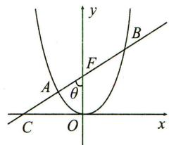

text_image

y
B
F
A
θ
C O x

4.【答案】 $\left[\frac{1}{2},\frac{4}{3}\right]$

# 【解析】

设 $P(x_{1},y_{1}), Q(x_{2},y_{2})$ ，直线 PQ 的方程为 $y=k(x-1)$ ，

联立 $\left\{ \begin{array}{l} y = k(x - 1), \\ y^2 = 4x, \end{array} \right.$ 消去 $x$ 整理得 $ky^2 - 4y - 4k = 0$ ，由韦达定理可

知 $\left\{\begin{aligned}y_{1}+y_{2}&=\frac{4}{k},\\ y_{1}y_{2}&=-4,\end{aligned}\right.$

则 $\overrightarrow{F_1P} \cdot \overrightarrow{F_1Q} = (x_1 + 1)(x_2 + 1) + y_1y_2 = \left(\frac{y_1^2}{4} + 1\right)\left(\frac{y_2^2}{4} + 1\right) + y_1y_2$

$$
= \frac {(y _ {1} y _ {2}) ^ {2}}{1 6} + \frac {(y _ {1} + y _ {2}) ^ {2} + 2 y _ {1} y _ {2}}{4} + 1 = \frac {4}{k ^ {2}},
$$

根据公式 $e = \sqrt{1 + k^2}\left|\frac{\lambda - 1}{\lambda + 1}\right|$ ，此处 $e = 1$ ，则 $k^2 = \frac{4\lambda}{(\lambda - 1)^2}$ ，

所以 $\overrightarrow{F_1P} \cdot \overrightarrow{F_1Q} = \frac{4}{k^2} = \frac{(\lambda - 1)^2}{\lambda} = \lambda + \frac{1}{\lambda} - 2,$

又因为 $\lambda \in [2,3]$ ，所以 $\frac{1}{2} \leqslant \lambda + \frac{1}{\lambda} - 2 \leqslant \frac{4}{3}$

所以 $\overrightarrow{F_{1}P} \cdot \overrightarrow{F_{1}Q}$ 的取值范围是 $\left[\frac{1}{2}, \frac{4}{3}\right]$ .

# 5.【解析】

由题可知 $AB$ 斜率为 $\sqrt{3}$ , 直线 $AB$ 的倾斜角 $\theta = 60^{\circ}$ , 且 $\frac{|\overrightarrow{AF}|}{|\overrightarrow{FB}|} = 4$ ,

代入公式 $|e\cos \theta | = \left|\frac{\lambda - 1}{\lambda + 1}\right| \Rightarrow e = \left|\frac{\lambda - 1}{\lambda + 1}\right| \cdot \frac{1}{\cos \theta} = \pm \frac{6}{5},$

又 $e > 1$ ，所以该双曲线的离心率为 $\frac{6}{5}$

# 6.【解析】

(I)由题可知直线 l 的倾斜角 $\theta$ 为 $60^{\circ}$ ,

由 $|e\cos \theta | = \left|\frac{\lambda - 1}{\lambda + 1}\right|$ 得 $e \cdot \cos 60^{\circ} = \pm \frac{2 - 1}{2 + 1}$ , 即 $e = \pm \frac{2}{3}$ . 又 $e \in (0,1)$ ,

所以椭圆 C 的离心率 $e=\frac{2}{3}$ .

(Ⅱ)由(Ⅰ)可知, $e=\frac{c}{a}=\frac{2}{3}$ ，则设a=3k,c=2k,b= $\sqrt{5}$ k，

又 $|AB|=\frac{2ab^{2}}{a^{2}-c^{2}\cdot\cos^{2}\theta}=\frac{2\cdot3k\cdot5k^{2}}{9k^{2}-4k^{2}\cdot\frac{1}{4}}=\frac{15k}{4}=\frac{15}{4}$

解得 k=1，所以 $a=3, b=\sqrt{5}$ ，

所以椭圆 C 的方程为 $\frac{x^{2}}{9} + \frac{y^{2}}{5} = 1$ .

# 7.【解析】

（I）由椭圆的定义得 $2a = |PF_{1}| + |PF_{2}| = 2 + \sqrt{2} + 2 - \sqrt{2} = 4$ ，故 $a = 2$ . 设椭圆的半焦距为 $c$ ，由已知 $PF_{1} \perp PF_{2}$ ，

因此 $2c = |F_{1}F_{2}| = \sqrt{|PF_{1}|^{2} + |PF_{2}|^{2}} = \sqrt{(2 + \sqrt{2})^{2} + (2 - \sqrt{2})^{2}} = 2\sqrt{3}$ 即 $c = \sqrt{3}$ ，从而 $b = \sqrt{a^2 - c^2} = 1$ 。

故所求椭圆的标准方程为 $\frac{x^2}{4} + y^2 = 1$ .

# (Ⅱ)【解法一】

如图，设点 $P(x_0, y_0)$ 在椭圆上，且 $PF_{1} \perp PF_{2}$ ，则 $\frac{x_0^2}{a^2} + \frac{y_0^2}{b^2} = 1, x_0^2 + y_0^2 = c^2$ 求得 $x_0 = \pm \frac{a}{c} \sqrt{a^2 - 2b^2}, y_0 = \pm \frac{b^2}{c}$ .

由 $|PF_{1}| = |PQ| > |PF_{2}|$ 得 $x_{0} > 0$ ,

从而 $\left|PF_{1}\right|^{2}=\left(\frac{a\sqrt{a^{2}-2b^{2}}}{c}+c\right)^{2}+\frac{b^{4}}{c^{2}}=2(a^{2}-b^{2})+2a\sqrt{a^{2}-2b^{2}}$

$$
= (a + \sqrt {a ^ {2} - 2 b ^ {2}}) ^ {2}.
$$

由椭圆的定义， $\left|PF_{1}\right|+\left|PF_{2}\right|=2a,\left|QF_{1}\right|+\left|QF_{2}\right|=2a.$

从而由 $|PF_{1}| = |PQ| = |PF_{2}| + |QF_{2}|$ ，有 $|QF_{1}| = 4a - 2|PF_{1}|$

又由 $PF_{1} \perp PF_{2}, |PF_{1}| = |PQ|$ , 知 $|QF_{1}| = \sqrt{2} |PF_{1}|$ ,

因此 $(2 + \sqrt{2})|PF_{1}| = 4a$

即 $(2 + \sqrt{2})(a + \sqrt{a^2 - 2b^2}) = 4a$ ，于是 $(2 + \sqrt{2})(1 + \sqrt{2e^2 - 1}) = 4,$

解得 $e = \sqrt{\frac{1}{2}\left[1 + \left(\frac{4}{2 + \sqrt{2}} - 1\right)^2\right]} = \sqrt{6} - \sqrt{3}$ .

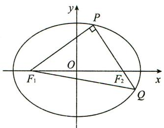

text_image

y
P
O
F₁
F₂
Q
x

# 【解法二】

如图，由椭圆的定义， $\left|PF_{1}\right|+\left|PF_{2}\right|=2a,\left|QF_{1}\right|+\left|QF_{2}\right|=2a.$

从而由 $|PF_{1}| = |PQ| = |PF_{2}| + |QF_{2}|$ ，有 $|QF_{1}| = 4a - 2|PF_{1}|$

又由 $PF_{1} \perp PQ, |PF_{1}| = |PQ|$ , 知 $|QF_{1}| = \sqrt{2} |PF_{1}|$ ,

因此， $4a - 2|PF_{1}| = \sqrt{2}|PF_{1}|$ ，得 $|PF_{1}| = 2(2 - \sqrt{2})a$

从而 $\left|PF_{2}\right|=2a-\left|PF_{1}\right|=2a-2(2-\sqrt{2})a=2(\sqrt{2}-1)a.$

由 $PF_{1} \perp PF_{2}$ , 知 $|PF_{1}|^{2} + |PF_{2}|^{2} = |F_{1}F_{2}|^{2} = (2c)^{2}$ ,

因此 $e = \frac{c}{a} = \frac{\sqrt{|PF_1|^2 + |PF_2|^2}}{2a} = \sqrt{(2 - \sqrt{2})^2 + (\sqrt{2} - 1)^2} = \sqrt{9 - 6\sqrt{2}} = \sqrt{6} - \sqrt{3}$ .

# 第八讲 几何性质问题

# 真题篇

# 1.【解析】

(I) 当 l 与 x 轴垂直时, l 的方程为 x=2, 可得 M 的坐标为 $(2,2)$ 或 $(2,-2)$ .

所以直线 BM 的方程为 $y=\frac{1}{2}x+1$ 或 $y=-\frac{1}{2}x-1$ .

(Ⅱ)当 l 与 x 轴垂直时, AB 为 MN 的垂直平分线, 所以 $\angle ABM = \angle ABN$ . 当 l 与 x 轴不垂直时, 设 l 的方程为 $y = k(x - 2)(k \neq 0)$ , $M(x_{1}, y_{1})$ , $N(x_{2}, y_{2})$ , 则 $x_{1} > 0$ , $x_{2} > 0$ .

由 $\left\{ \begin{array}{l} y = k(x - 2), \\ y^2 = 2x \end{array} \right.$ 得 $ky^2 - 2y - 4k = 0$ ，可知 $y_1 + y_2 = \frac{2}{k}, y_1y_2 = -4.$

直线 $BM, BN$ 的斜率之和为

$$
k _ {B M} + k _ {B N} = \frac {y _ {1}}{x _ {1} + 2} + \frac {y _ {2}}{x _ {2} + 2} = \frac {x _ {2} y _ {1} + x _ {1} y _ {2} + 2 (y _ {1} + y _ {2})}{(x _ {1} + 2) (x _ {2} + 2)} \quad ①.
$$

将 $x_{1} = \frac{y_{1}}{k} +2,x_{2} = \frac{y_{2}}{k} +2$ 及 $y_{1} + y_{2},y_{1}y_{2}$ 的表达式代入①式分子，

可得 $x_{2}y_{1} + x_{1}y_{2} + 2(y_{1} + y_{2}) = \frac{2y_{1}y_{2} + 4k(y_{1} + y_{2})}{k} = \frac{-8 + 8}{k} = 0.$

所以 $k_{BM} + k_{BN} = 0$ ，

可知 BM, BN 的倾斜角互补, 所以 $\angle ABM = \angle ABN$ .

综上， $\angle ABM=\angle ABN.$

# 2.【解析】

(I)由已知可设 $C_2$ 的方程为 $y^2 = 4cx$ ，其中 $c = \sqrt{a^2 - b^2}$ .

不妨设 A, C 在第一象限, 由题设得 A, B 的纵坐标分别为 $\frac{b^{2}}{a}, -\frac{b^{2}}{a}$ ; C, D 的纵坐标分别为 2c, -2c,

故 $|AB|=\frac{2b^{2}}{a},|CD|=4c.$

由 $|CD|=\frac{4}{3}|AB|$ 得 $4c=\frac{8b^{2}}{3a}$ ，即 $3\times\frac{c}{a}=2-2\left(\frac{c}{a}\right)^{2}$ . 解得 $\frac{c}{a}=-2$ （舍去）， $\frac{c}{a}=\frac{1}{2}$ .
所以 $C_{1}$ 的离心率为 $\frac{1}{2}$ .

(Ⅱ)由(Ⅰ)知 $a=2c, b=\sqrt{3}c$ ，故 $C_{1}:\frac{x^{2}}{4c^{2}}+\frac{y^{2}}{3c^{2}}=1.$

设 $M(x_{0}, y_{0})$ ，则 $\frac{x_{0}^{2}}{4c^{2}} + \frac{y_{0}^{2}}{3c^{2}} = 1, y_{0}^{2} = 4cx_{0}$ ，故 $\frac{x_{0}^{2}}{4c^{2}} + \frac{4x_{0}}{3c} = 1.$ ①

由于 $C_{2}$ 的准线为 x = -c，所以 $\left|MF\right| = x_{0} + c$ ，而 $\left|MF\right| = 5$ ，

故 $x_0 = 5 - c$ ，代入①得 $\frac{(5 - c)^2}{4c^2} +\frac{4(5 - c)}{3c} = 1,$

即 $c^{2}-2c-3=0$ ，解得 c=-1（舍去），c=3。

所以 $C_{1}$ 的标准方程为 $\frac{x^{2}}{36} + \frac{y^{2}}{27} = 1$ ,

$C_{2}$ 的标准方程为 $y^{2}=12x$ .

# 3.【解析】

(I) $\because |MF_{1}| - |MF_{2}| = 2, \therefore$ 轨迹 C 为双曲线右半支, $c^{2} = 17, 2a = 2,$ $\therefore a^{2}=1, b^{2}=16,$

∴ C 的方程为 $x^{2}-\frac{y^{2}}{16}=1(x>0)$ .

(Ⅱ)解法一:设 $T\left(\frac{1}{2},n\right)$ , $A(x_{1},y_{1})$ , $B(x_{2},y_{2})$ , AB: $y-n=k_{1}\left(x-\frac{1}{2}\right)$ ,

联立 $\left\{\begin{aligned}y-n&=k_{1}\left(x-\frac{1}{2}\right),\\ x^{2}-\frac{y^{2}}{16}&=1.\end{aligned}\right.$ 消去 y 并化简，得

$$
(1 6 - k _ {1} ^ {2}) x ^ {2} + (k _ {1} ^ {2} - 2 k _ {1} n) x - \frac {1}{4} k _ {1} ^ {2} - n ^ {2} + k _ {1} n - 1 6 = 0,
$$

$$
\therefore x _ {1} + x _ {2} = \frac {k _ {1} ^ {2} - 2 k _ {1} n}{k _ {1} ^ {2} - 1 6}, x _ {1} \cdot x _ {2} = \frac {\frac {1}{4} k _ {1} ^ {2} + n ^ {2} - k _ {1} n + 1 6}{k _ {1} ^ {2} - 1 6},
$$

$$
\mid T A \mid = \sqrt {1 + k _ {1} ^ {2}} \left(x _ {1} - \frac {1}{2}\right), \mid T B \mid = \sqrt {1 + k _ {1} ^ {2}} \left(x _ {2} - \frac {1}{2}\right),
$$

$$
\therefore | T A | \cdot | T B | = (1 + k _ {1} ^ {2}) \left(x _ {1} - \frac {1}{2}\right) \left(x _ {2} - \frac {1}{2}\right) = \frac {(n ^ {2} + 1 2) (1 + k _ {1} ^ {2})}{k _ {1} ^ {2} - 1 6},
$$

设 $PQ:y - n = k_{2}\left(x - \frac{1}{2}\right)$ ，同理 $\mid TP\mid \cdot \mid TQ\mid = \frac{(n^2 + 12)(1 + k_2^2)}{k_2^2 - 16},$

$$
\because | T A | \cdot | T B | = | T P | \cdot | T Q |, \therefore \frac {1 + k _ {1} ^ {2}}{k _ {1} ^ {2} - 1 6} = \frac {1 + k _ {2} ^ {2}}{k _ {2} ^ {2} - 1 6}, 1 + \frac {1 7}{k _ {1} ^ {2} - 1 6} = 1 + \frac {1 7}{k _ {2} ^ {2} - 1 6},
$$

$\therefore k_{1}^{2}-16=k_{2}^{2}-16$ ，即 $k_{1}^{2}=k_{2}^{2}$ ，

$$
\because k _ {1} \neq k _ {2}, \therefore k _ {1} + k _ {2} = 0.
$$

解法二: 设 $T\left(\frac{1}{2}, m\right)$ ，直线 AB 的参数方程为 $\left\{\begin{aligned} x &= \frac{1}{2} + t \cos \theta, \\ y &= m + t \sin \theta, \end{aligned}\right.$

将其代入 $C$ 的方程并整理可得

$$
(1 6 \cos^ {2} \theta - \sin^ {2} \theta) t ^ {2} + (1 6 \cos \theta - 2 m \sin \theta) t - (m ^ {2} + 1 2) = 0,
$$

由参数的几何意义可知， $|TA|=t_{1}$ ， $|TB|=t_{2}$ ，

则 $t_1t_2 = \frac{m^2 + 12}{\sin^2\theta - 16\cos^2\theta} = \frac{m^2 + 12}{1 - 17\cos^2\theta},$

设直线 $PQ$ 的参数方程为 $\left\{ \begin{array}{l} x = \frac{1}{2} + \lambda \cos \beta, \\ y = m + \lambda \sin \beta, \end{array} \right.$ $|TP| = \lambda_1, |TQ| = \lambda_2,$

同理可得 $\lambda_1\lambda_2 = \frac{m^2 + 12}{1 - 17\cos^2\beta},$

依题意， $\frac{m^2 + 12}{1 - 17\cos^2\theta} = \frac{m^2 + 12}{1 - 17\cos^2\beta}$ 则 $\cos^2\theta = \cos^2\beta$

又 $\theta \neq \beta$ ，故 $\cos \theta = -\cos \beta$ ，则 $\cos \theta +\cos \beta = 0$

即直线 AB 的斜率与直线 PQ 的斜率之和为 0.

# 模拟篇

# 1.【解析】

(I) 设 $P(x, y)$ , $A(m, 0)$ , $B(0, n)$ ,

由 $\overrightarrow{BP}=2\overrightarrow{PA}$ 得 $(x,y-n)=2(m-x,-y)$ ，所以 $\left\{\begin{aligned}m&=\frac{3}{2}x,\\ n&=3y,\end{aligned}\right.$

因为 $|AB|=3$ ，所以 $\sqrt{\left(\frac{3}{2}x\right)^{2}+(3y)^{2}}=3$ ，

化简得点 $P$ 的轨迹 $E$ 的方程为 $\frac{x^2}{4} + y^2 = 1$ .

(Ⅱ)设直线 l 的方程为 $x=my-\sqrt{3}$ ，由 $\left\{\begin{aligned}x&=my-\sqrt{3},\\ \frac{x^{2}}{4}&+y^{2}=1,\end{aligned}\right.$ 得 $(m^{2}+4)y^{2}-2\sqrt{3}my-1=0,$

设 $M(x_{1},y_{1}),N(x_{2},y_{2})$ ，则根据韦达定理有 $\left\{ \begin{array}{l} y_1 + y_2 = \frac{2\sqrt{3}m}{m^2 + 4},\\ y_1\cdot y_2 = -\frac{1}{m^2 + 4}, \end{array} \right.$

$$
\vert M N \vert = \sqrt {1 + m ^ {2}} \vert y _ {1} - y _ {2} \vert = \sqrt {1 + m ^ {2}} \sqrt {(y _ {1} + y _ {2}) ^ {2} - 4 y _ {1} y _ {2}} = \frac {4 (m ^ {2} + 1)}{m ^ {2} + 4} = 2,
$$

解得 $m = \pm \sqrt{2}$ . 设 $MN$ 中点坐标为 $(x_0, y_0)$ ,

当 $m = \sqrt{2}$ 时，线段 $MN$ 中点的纵坐标 $y_0 = \frac{y_1 + y_2}{2} = \frac{\sqrt{6}}{6}$ ，

代入 $x = my - \sqrt{3}$ 得中点横坐标 $x_0 = -\frac{2\sqrt{3}}{3}$ ,

线段 MN 的垂直平分线的斜率 $k = -\sqrt{2}$ ，

故线段 MN 的垂直平分线方程为 $2x + \sqrt{2}y + \sqrt{3} = 0$ .

当 $m = -\sqrt{2}$ 时，同理可得线段 MN 的垂直平分线方程为 $2x - \sqrt{2}y + \sqrt{3} = 0$ ，所以线段 MN 的垂直平分线方程为 $2x + \sqrt{2}y + \sqrt{3} = 0$ 或 $2x - \sqrt{2}y + \sqrt{3} = 0$ .

# 2.【解析】

（Ⅰ）如图，连接 $AF_{2}$ ，由题意得 $|AB| = |F_{2}B| = |F_{1}B|$ ，所以 $BO$ 为 $\triangle F_{1}AF_{2}$ 的中位线，又 $BO \perp F_{1}F_{2}$ ，所以 $AF_{2} \perp F_{1}F_{2}$ ，且 $|AF_{2}| = 2|BO| = \frac{b^{2}}{a} = \frac{8}{3}$ ，又 $e = \frac{c}{a} = \frac{1}{3}, a^{2} = b^{2} + c^{2}$ ，所以 $a^{2} = 9, b^{2} = 8$ ，故所求椭圆 $C$ 的方程为 $\frac{x^2}{9} + \frac{y^2}{8} = 1$ .

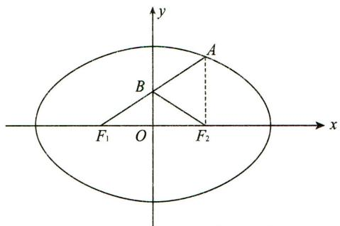

text_image

y
A
B
F₁ O F₂
x

(Ⅱ)由(Ⅰ)可得 $F_{1}(-1,0)$ , $F_{2}(1,0)$ , $l_{1}$ 的方程为 x=-3, $l_{2}$ 的方程为 x=3. $l_{1}$ , $l_{2}$ 与 l 的交点为 $M(-3,-3k+m)$ , $N(3,3k+m)$ ,

所以 $\overrightarrow{F_1M} = (-2, - 3k + m),\overrightarrow{F_1N} = (4,3k + m),$

所以 $\overrightarrow{F_1M} \cdot \overrightarrow{F_1N} = -8 + m^2 - 9k^2$ .

联立 $\left\{\begin{aligned}\frac{x^{2}}{9}+\frac{y^{2}}{8}&=1,\\ y=kx+m,\end{aligned}\right.$ 得 $(9k^{2}+8)x^{2}+18kmx+9m^{2}-72=0.$

因为直线 l 与椭圆 C 相切, 所以 $\Delta=(18km)^{2}-4(9k^{2}+8)(9m^{2}-72)=0$ ,

化简得 $m^2 = 9k^2 + 8$ . 所以 $\overrightarrow{F_1M} \cdot \overrightarrow{F_1N} = -8 + m^2 - 9k^2 = 0$ ,

所以 $\overrightarrow{F_1M} \perp \overrightarrow{F_1N}$ , 故 $\angle MF_1N = \frac{\pi}{2}$ .

同理可得 $\overrightarrow{F_2M} \perp \overrightarrow{F_2N}, \angle MF_2N = \frac{\pi}{2}$ , 故 $\angle MF_1N = \angle MF_2N$ .

# 3.【解析】

(I) 令 $|F_{1}F_{2}| = 2c$ ，则 $S_{\triangle PF_{1}F_{2}} = \frac{1}{2} |F_{1}F_{2}| \times 1 = c = \sqrt{3}$ ，所以 $a^{2} - b^{2} = 3$ .

又因为椭圆过点 $P(2,1)$ ，代入得 $\frac{4}{a^{2}} + \frac{1}{b^{2}} = 1$ ，

联立 $\left\{\begin{aligned}a^{2}-b^{2}&=3,\\ \frac{4}{a^{2}}+\frac{1}{b^{2}}&=1,\end{aligned}\right.$ 解得 $a^{2}=6,b^{2}=3,$

故椭圆 C 的方程为 $\frac{x^{2}}{6} + \frac{y^{2}}{3} = 1$ .

(Ⅱ)由题意知直线 AP 的斜率与直线 BP 的斜率互为相反数.

设直线 AP 的斜率为 k，则直线 BP 的斜率为 -k，设 $A(x_{1}, y_{1})$ ， $B(x_{2}, y_{2})$ ，直线 PA 的方程为 $y - 1 = k(x - 2)$ ，即 $y = kx + 1 - 2k$ 。

联立 $\left\{\begin{aligned}y&=kx+1-2k,\\ \frac{x^{2}}{6}&+\frac{y^{2}}{3}=1,\end{aligned}\right.$ 得 $(1+2k^{2})x^{2}+4(k-2k^{2})x+8k^{2}-8k-4=0,$

所以 $2x_{1} = \frac{8k^{2} - 8k - 4}{1 + 2k^{2}}$ ，即 $x_{1} = \frac{4k^{2} - 4k - 2}{1 + 2k^{2}}$

设直线 $PB$ 的方程为 $y - 1 = -k(x - 2)$ ，同理求得 $x_{2} = \frac{4k^{2} + 4k - 2}{1 + 2k^{2}}$

所以 $x_{2} - x_{1} = \frac{8k}{1 + 2k^{2}}, x_{1} + x_{2} = \frac{8k^{2} - 4}{1 + 2k^{2}}$

所以 $y_{1} - y_{2} = k(x_{1} + x_{2} - 4) = -\frac{8k}{1 + 2k^{2}}$ ，所以 $y_{2} - y_{1} = \frac{8k}{1 + 2k^{2}}$

所以直线 $AB$ 的斜率 $k_{AB} = \frac{y_2 - y_1}{x_2 - x_1} = \frac{\frac{8k}{1 + 2k^2}}{\frac{8k}{1 + 2k^2}} = 1,$

则直线 AB 与在两坐标轴上的截距绝对值相等且都不为 0，所以直线 AB 与两坐标轴围成的三角形一定是等腰三角形.

# 4.【解析】

（Ⅰ）由题意知 $4a=4\sqrt{6}, a=\sqrt{6}$ ，又离心率 $e=\frac{\sqrt{2}}{2}, \therefore c=\sqrt{3}, b=\sqrt{3}$ ，

∴椭圆 E 的方程为 $\frac{x^{2}}{6} + \frac{y^{2}}{3} = 1$ .

(Ⅱ)显然,当直线 AB, CD 的斜率不存在时,由椭圆 C 的对称性知,中点 M, N 在 x 轴上,故 O, M, N 三点共线;

当直线 AB, CD 的斜率存在时，

设其斜率为 $k, A(x_1, y_1), B(x_2, y_2), M(x_0, y_0)$ ,

联立 $\left\{\begin{aligned}\frac{x_{1}^{2}}{6}+\frac{y_{1}^{2}}{3}&=1,\\ \frac{x_{2}^{2}}{6}+\frac{y_{2}^{2}}{3}&=1,\end{aligned}\right.$ 相减得 $\frac{x_{1}^{2}}{6}+\frac{y_{1}^{2}}{3}-\left(\frac{x_{2}^{2}}{6}+\frac{y_{2}^{2}}{3}\right)=0,$

$\therefore \frac{x_1^2 - x_2^2}{6} = -\frac{y_1^2 - y_2^2}{3}$ , 即 $\frac{(x_1 - x_2)(x_1 + x_2)}{6} = -\frac{(y_1 - y_2)(y_1 + y_2)}{3}$ ,

$\therefore \frac{y_1 - y_2}{x_1 - x_2} \cdot \frac{y_1 + y_2}{x_1 + x_2} = -\frac{1}{2}, \frac{y_1 - y_2}{x_1 - x_2} \cdot \frac{y_0}{x_0} = -\frac{1}{2}$ , 即 $k \cdot k_{OM} = -\frac{1}{2}$ .

$\therefore k_{OM} = -\frac{1}{2k}$ . 同理可得 $k_{ON} = -\frac{1}{2k}, \therefore k_{OM} = k_{ON}$ .

$\therefore O,M,N$ 三点共线.

# 5.【解析】

(Ⅰ)由题意得 $A(-a,0)$ , $B(a,0)$ , $F(c,0)$ ，所以 $|AF|=c+a$ , $|FB|=a-c$ ，因为 2 是 $|AF|$ , $|FB|$ 的等差中项，所以 $4=|AF|+|FB|=2a$ ，解得 a=2.

因为 $\sqrt{3}$ 是 $|AF|$ , $|FB|$ 的等比中项,

所以 $(\sqrt{3})^{2}=|AF|\cdot|FB|=(a+c)(a-c)=a^{2}-c^{2}=b^{2},b^{2}=3.$

所以椭圆 C 的方程为 $\frac{x^{2}}{4} + \frac{y^{2}}{3} = 1$ .

(Ⅱ)由(Ⅰ)可得 $A(-2,0)$ , $B(2,0)$ , $F(1,0)$ ,

设 $AP: y = k(x + 2)$ , $P(x_{1}, y_{1})$ ,

联立直线 $AP$ 与椭圆方程 $\left\{ \begin{array}{l} \frac{x^2}{4} + \frac{y^2}{3} = 1, \\ y = k(x + 2), \end{array} \right.$

消去 y 并整理得 $(4k^{2}+3)x^{2}+16k^{2}x+4(4k^{2}-3)=0$ ,

则 $x_{A} \cdot x_{1} = -2x_{1} = \frac{16k^{2} - 12}{4k^{2} + 3}$ ,

所以 $x_{1} = \frac{6 - 8k^{2}}{4k^{2} + 3},y_{1} = k(x_{1} + 2) = \frac{12k}{4k^{2} + 3}$ 所以 $P\left(\frac{6 - 8k^2}{4k^2 + 3},\frac{12k}{4k^2 + 3}\right)$

又因为 $FQ \perp AP$ ，所以 $k_{FQ} = -\frac{1}{k}$ ，所以 $FQ: y = -\frac{1}{k}(x - 1)$ ，

令 $x = -2$ ，解得 $y = \frac{3}{k}$ 即 $Q\left(-2,\frac{3}{k}\right)$

又 $B(2,0)$ ，所以 $k_{BQ} = \frac{0 - \frac{3}{k}}{2 - (-2)} = -\frac{3}{4k}, k_{BP} = \frac{0 - \frac{12k}{4k^2 + 3}}{2 - \frac{6 - 8k^2}{4k^2 + 3}} = \frac{-12k}{16k^2} = -\frac{3}{4k}$

故 $k_{BQ} = k_{BP}$ ，所以 $Q,P,B$ 三点共线.

# 6.【解析】

(I)∵当EF⊥CD时,点E恰为线段AD的中点,∴a+c=4-c,

又 $e = \frac{c}{a} = \frac{1}{2}$ 即 $a = 2c, \therefore c = 1, a = 2, \therefore b = \sqrt{3}$ ,

∴该椭圆的方程为 $\frac{x^{2}}{4}+\frac{y^{2}}{3}=1$ .

(Ⅱ)设直线 EF 的方程为 x=my-1, $E(x_{1},y_{1})$ , $F(x_{2},y_{2})$ .

联立 $\left\{\begin{aligned}\frac{x^{2}}{4}+\frac{y^{2}}{3}&=1,\\ x&=my-1,\end{aligned}\right.$ 得 $(3m^{2}+4)y^{2}-6my-9=0,$

$$
\therefore y _ {1} + y _ {2} = \frac {6 m}{3 m ^ {2} + 4}, y _ {1} y _ {2} = \frac {- 9}{3 m ^ {2} + 4},
$$

设 $A(-4, y_A)$ ，由 $A, E, D$ 三点共线，得 $\frac{y_A - 0}{-4 - 2} = \frac{y_1 - 0}{x_1 - 2}$ ，

$\therefore y_{A} = \frac{-6y_{1}}{x_{1} - 2} = \frac{-6y_{1}}{my_{1} - 3}$ ，同理可得 $y_{B} = \frac{-6y_{2}}{my_{2} - 3}$

$$
\therefore y _ {A} + y _ {B} = \frac {- 6 y _ {1}}{m y _ {1} - 3} + \frac {- 6 y _ {2}}{m y _ {2} - 3} = - 6 \cdot \frac {2 m y _ {1} y _ {2} - 3 \left(y _ {1} + y _ {2}\right)}{m ^ {2} y _ {1} y _ {2} - 3 m \left(y _ {1} + y _ {2}\right) + 9}
$$

$$
= - 6 \cdot \frac {2 m \cdot \frac {- 9}{3 m ^ {2} + 4} - 3 \cdot \frac {6 m}{3 m ^ {2} + 4}}{m ^ {2} \cdot \frac {- 9}{3 m ^ {2} + 4} - 3 m \cdot \frac {6 m}{3 m ^ {2} + 4} + 9} = 6 m.
$$

$$
\therefore \left| y _ {A} - y _ {B} \right| = \left| \frac {- 6 y _ {1}}{m y _ {1} - 3} - \frac {- 6 y _ {2}}{m y _ {2} - 3} \right| = 1 8 \cdot \frac {\left| y _ {1} - y _ {2} \right|}{\left| m ^ {2} y _ {1} y _ {2} - 3 m \left(y _ {1} + y _ {2}\right) + 9 \right|}
$$

$$
= 1 8 \cdot \frac {\sqrt {\left(\frac {6 m}{3 m ^ {2} + 4}\right) ^ {2} - 4 \cdot \frac {- 9}{3 m ^ {2} + 4}}}{\left| m ^ {2} \cdot \frac {- 9}{3 m ^ {2} + 4} - 3 m \cdot \frac {6 m}{3 m ^ {2} + 4} + 9 \right|} = 6 \sqrt {m ^ {2} + 1}.
$$

设 AB 中点为 M，则 M 坐标为 $(-4,3m)$ ，

∴点 M 到直线 EF 的距离 $d=\frac{|-4-3m^{2}+1|}{\sqrt{1+m^{2}}}=3\sqrt{m^{2}+1}=\frac{1}{2}|y_{A}-y_{B}|=\frac{1}{2}|AB|$ ，故以 AB 为直径的圆始终与直线 EF 相切.

# 第九讲 探索性问题

# 真题篇

# 1.【解析】

(I)易知点(1,1)在 C 上,则 $C: y^{2} = x$ ;

易知 $\odot M$ 的半径 $r = 1$ ，则 $\odot M:(x - 2)^{2} + y^{2} = 1.$

(Ⅱ)设 $A_{1}(a^{2},a)$ , $A_{2}(b^{2},b)$ , $A_{3}(c^{2},c)$ .

$$
l _ {A _ {1} A _ {2}}: y - a = \frac {1}{a + b} (x - a ^ {2}) \Rightarrow x - (a + b) y + a b = 0,
$$

所以圆心 M 到直线 $A_{1}A_{2}$ 的距离 $d_{1}=r\Rightarrow\frac{|2+ab|}{\sqrt{1+(a+b)^{2}}}=1.$ ①

$$
l _ {A _ {1} A _ {3}}: y - a = \frac {1}{a + c} (x - a ^ {2}) \Rightarrow x - (a + c) y + a c = 0,
$$

所以圆心 M 到直线 $A_{1}A_{3}$ 的距离 $d_{2}=r\Rightarrow\frac{|2+ac|}{\sqrt{1+(a+c)^{2}}}=1.$ ②

所以 b, c 是方程 $\frac{|2+ax|}{\sqrt{1+(a+x)^{2}}}=1$ ，即 $(a^{2}-1)x^{2}+2ax-a^{2}+3=0$ 的两根.

又 $l_{A_{2}A_{3}}:x-(b+c)y+bc=0$ ，所以圆心 M 到直线 $A_{2}A_{3}$ 的距离

$$
d _ {3} = \frac {| 2 + b c |}{\sqrt {1 + (b + c) ^ {2}}} = \frac {\left| 2 + \frac {3 - a ^ {2}}{a ^ {2} - 1} \right|}{\sqrt {1 + \left(\frac {2 a}{a ^ {2} - 1}\right) ^ {2}}} = \frac {| a ^ {2} + 1 |}{\sqrt {a ^ {4} + 2 a ^ {2} + 1}} = 1.
$$

所以 $d_{3}=r$ ，即直线 $A_{2}A_{3}$ 与 $\odot M$ 相切。

# 2.【解析】

(Ⅰ)因为 $\odot M$ 过点A,B,所以圆心M在AB的垂直平分线上.

由已知 A 在直线 $x + y = 0$ 上，且 A, B 关于坐标原点 O 对称，

所以 M 在直线 y = x 上，故可设 $M(a, a)$ ，即 $|OM| = \sqrt{2} a$ .

因为 $\odot M$ 与直线 $x + 2 = 0$ 相切，所以 $\odot M$ 的半径为 $r = |a + 2|$

由已知得 $|AO|=2$ ，又 $\overrightarrow{MO}\perp\overrightarrow{AO}$ ，故可得 $2a^{2}+4=(a+2)^{2}$ ，解得a=0或a=4。

故 $\odot M$ 的半径 $r = 2$ 或 $r = 6$ .

(Ⅱ)存在定点 $P(1,0)$ , 使得 $|MA| - |MP|$ 为定值. 理由如下:

设 $M(x,y)$ ，由已知得 $\odot M$ 的半径为 $r = |x + 2|,|AO| = 2,$

由于 $\overrightarrow{MO} \perp \overrightarrow{AO}$ , 故可得 $x^{2} + y^{2} + 4 = (x + 2)^{2}$ , 化简得 $M$ 的轨迹方程为 $y^{2} = 4x$ . 因为曲线 $C: y^{2} = 4x$ 是以点 $P(1,0)$ 为焦点,

以直线 $x = -1$ 为准线的抛物线，所以 $|MP| = x + 1$

因为 $|MA|-|MP|=r-|MP|=x+2-(x+1)=1$ ，所以存在满足条件的定点P.

# 3.【解析】

(I) 设直线 $l: y = kx + b (k \neq 0, b \neq 0), A(x_1, y_1), B(x_2, y_2), M(x_M, y_M)$ .

将 $y = kx + b$ 代入 $9x^{2} + y^{2} = m^{2}$ 得 $(k^2 + 9)x^2 + 2kbx + b^2 - m^2 = 0$

故 $x_{M} = \frac{x_{1} + x_{2}}{2} = \frac{-kb}{k^{2} + 9},y_{M} = kx_{M} + b = \frac{9b}{k^{2} + 9}.$

于是直线 $OM$ 的斜率 $k_{OM} = \frac{y_M}{x_M} = -\frac{9}{k}$ , 即 $k_{OM} \cdot k = -9$ .

所以直线 $OM$ 的斜率与 $l$ 的斜率的乘积为定值.

(Ⅱ)四边形 OAPB 能为平行四边形.

因为直线 l 过点 $\left(\frac{m}{3}, m\right)$ ,

所以 l 不过原点且与 C 有两个交点的充要条件是 $k > 0, k \neq 3$ .

由(Ⅰ)得 OM 的方程为 $y = -\frac{9}{k}x$ . 设点 P 的横坐标为 $x_{P}$ .

由 $\left\{\begin{aligned}y&=-\frac{9x}{k},\\ 9x^{2}+y^{2}&=m^{2}\end{aligned}\right.$ 得 $x_{P}^{2}=\frac{k^{2}m^{2}}{9k^{2}+81}$ ，即 $x_{P}=\frac{\pm km}{3\sqrt{k^{2}+9}}$ .

将点 $\left(\frac{m}{3}, m\right)$ 的坐标代入 $l$ 的方程得 $b = \frac{m(3 - k)}{3}$ , 因此 $x_{M} = \frac{k(k - 3)m}{3(k^{2} + 9)}$ .

四边形 OAPB 为平行四边形当且仅当线段 AB 与线段 OP 互相平分，

即 $x_{P} = 2x_{M}$ .于是 $\frac{\pm km}{3\sqrt{k^2 + 9}} = 2\times \frac{k(k - 3)m}{3(k^2 + 9)}$ ，解得 $k_{1} = 4 - \sqrt{7},k_{2} = 4 + \sqrt{7}$

因为 $k_{i} > 0, k_{i} \neq 3, i = 1, 2,$

所以当 l 的斜率为 $4 - \sqrt{7}$ 或 $4 + \sqrt{7}$ 时，四边形 OAPB 为平行四边形.

# 4.【解析】

(I)由已知, $a=\sqrt{2}b$ ,则椭圆E的方程为 $\frac{x^{2}}{2b^{2}}+\frac{y^{2}}{b^{2}}=1$ .

由方程组 $\left\{\begin{aligned}\frac{x^{2}}{2b^{2}}+\frac{y^{2}}{b^{2}}=1,\\ y=-x+3\end{aligned}\right.$ 得 $3x^{2}-12x+18-2b^{2}=0$ ①.

方程①的判别式为 $\Delta=24(b^{2}-3)$ ，由 $\Delta=0$ 得 $b^{2}=3$ ，此时方程①的解为 x=2，所以椭圆 E 的方程为 $\frac{x^{2}}{6}+\frac{y^{2}}{3}=1$ ，点 T 坐标为 $(2,1)$ .

(Ⅱ)由已知可设直线 $l'$ 的方程为 $y=\frac{1}{2}x+m(m\neq0)$ ,

由方程组 $\left\{\begin{aligned}y&=\frac{1}{2}x+m,\\ y&=-x+3,\end{aligned}\right.$ 可得 $\left\{\begin{aligned}x&=2-\frac{2m}{3},\\ y&=1+\frac{2m}{3},\end{aligned}\right.$

所以 $P$ 点坐标为 $\left(2 - \frac{2m}{3}, 1 + \frac{2m}{3}\right), |PT|^2 = \frac{8}{9} m^2$ .

设 A, B 的坐标分别为 $A(x_{1}, y_{1})$ , $B(x_{2}, y_{2})$ .

由方程组 $\left\{\begin{aligned}\frac{x^{2}}{6}+\frac{y^{2}}{3}&=1,\\ y&=\frac{1}{2}x+m,\end{aligned}\right.$ 可得 $3x^{2}+4mx+4m^{2}-12=0$ ②.

方程②的判别式为 $\Delta=16(9-2m^{2})$ ,

由 $\Delta > 0$ ，解得 $-\frac{3\sqrt{2}}{2} < m < \frac{3\sqrt{2}}{2}$ . 由②得 $x_{1} + x_{2} = -\frac{4m}{3}, x_{1}x_{2} = \frac{4m^{2} - 12}{3}$ ，

所以 $|PA| = \sqrt{\left(2 - \frac{2m}{3} - x_1\right)^2 + \left(1 + \frac{2m}{3} - y_1\right)^2} = \frac{\sqrt{5}}{2}\left|2 - \frac{2m}{3} - x_1\right|$ ,

同理 $|PB| = \frac{\sqrt{5}}{2}\left|2 - \frac{2m}{3} - x_2\right|$ .

$$
\begin{array}{l} = \frac {5}{4} \left| \left(2 - \frac {2 m}{3}\right) ^ {2} - \left(2 - \frac {2 m}{3}\right) \left(x _ {1} + x _ {2}\right) + x _ {1} x _ {2} \right| \\ = \frac {5}{4} \left| \left(2 - \frac {2 m}{3}\right) ^ {2} - \left(2 - \frac {2 m}{3}\right) \left(- \frac {4 m}{3}\right) + \frac {4 m ^ {2} - 1 2}{3} \right| \\ = \frac {1 0}{9} m ^ {2}. \\ \end{array}
$$

所以 $|PA|\cdot|PB|=\frac{5}{4}\left|\left(2-\frac{2m}{3}-x_{1}\right)\left(2-\frac{2m}{3}-x_{2}\right)\right|$

故存在常数 $\lambda = \frac{4}{5}$ , 使得 $|PT|^2 = \lambda |PA| \cdot |PB|$ .

# 5.【解析】

(I)由题意得 $\left\{\begin{aligned}b&=1,\\ \frac{c}{a}&=\frac{\sqrt{2}}{2},\\ a^{2}&=b^{2}+c^{2},\end{aligned}\right.$ 解得 $a^{2}=2$ . 故椭圆C的方程为 $\frac{x^{2}}{2}+y^{2}=1$ .

设 $M(x_{M},0)$ .因为 $m\neq 0$ ，所以 $-1 <   n <   1$

直线 PA 的方程为 $y-1=\frac{n-1}{m}x$ ，所以 $x_{M}=\frac{m}{1-n}$ ，即 $M\left(\frac{m}{1-n},0\right)$ .

(Ⅱ)因为点 B 与点 A 关于 x 轴对称,所以 $B(m,-n)$ .

设 $N(x_{N},0)$ ，则 $x_{N} = \frac{m}{1 + n}$

“存在点 $Q(0, y_{Q})$ ，使得 $\angle OQM = \angle ONQ$ ”等价于“存在点 $Q(0, y_{Q})$ ，使得 $\frac{|OM|}{|OQ|} = \frac{|OQ|}{|ON|}$ ”，

即 $y_{Q}$ 满足 $y_{Q}^{2}=|x_{M}||x_{N}|$ .

因为 $x_{M} = \frac{m}{1 - n}, x_{N} = \frac{m}{1 + n}, \frac{m^{2}}{2} + n^{2} = 1$ ，所以 $y_{Q}^{2} = |x_{M}| |x_{N}| = \frac{m^{2}}{1 - n^{2}} = 2$ .

所以 $y_{Q}=\sqrt{2}$ 或 $y_{Q}=-\sqrt{2}$ .

故在 y 轴上存在点 Q，使得 $\angle OQM = \angle ONQ$ 。点 Q 的坐标为 $(0, \sqrt{2})$ 或 $(0, -\sqrt{2})$ 。

# 模拟篇

# 1.【解析】

(I)联立 $\left\{\begin{aligned}\frac{y^{2}}{a^{2}}+\frac{x^{2}}{b^{2}}=1,\\ y=-x^{2}+1,\end{aligned}\right.$ 令y=0，得 $b=1,\therefore A(-1,0),B(1,0).$

由 $e = \frac{c}{a} = \frac{\sqrt{3}}{2}$ 及 $a^2 - c^2 = b^2 = 1$ 得 $a = 2$ . $\therefore a = 2, b = 1$ .

(Ⅱ)存在.

由（I）知，上半椭圆 $C_1$ 的方程为 $\frac{y^2}{4} + x^2 = 1 (y \geqslant 0)$ .

由题易知, 直线 l 不垂直于坐标轴, 设其方程为 $y = k(x - 1) (k \neq 0)$ .

代入 $C_{1}$ 的方程并整理得 $(k^{2}+4)x^{2}-2k^{2}x+k^{2}-4=0$ （\*）.

设点 P 的坐标为 $(x_{p}, y_{p})$ ，由求根公式得 $1 \times x_{P} = \frac{k^{2} - 4}{k^{2} + 4}, \therefore y_{P} = \frac{-8k}{k^{2} + 4}$ ,

∴点 P 的坐标为 $\left(\frac{k^{2}-4}{k^{2}+4},\frac{-8k}{k^{2}+4}\right)$ .

同理，由 $\left\{ \begin{array}{l} y = k(x - 1)(k \neq 0), \\ y = -x^2 + 1 (y \leqslant 0) \end{array} \right.$ 得点 $Q$ 的坐标为 $(-k - 1, -k^2 - 2k)$ .

$$
\therefore \overrightarrow {A P} = \left(\frac {2 k ^ {2}}{k ^ {2} + 4}, \frac {- 8 k}{k ^ {2} + 4}\right), \overrightarrow {A Q} = (- k, - k ^ {2} - 2 k).
$$

连接 $AP, AQ$ ，依题意可知 $AP \perp AQ, \therefore \overrightarrow{AP} \cdot \overrightarrow{AQ} = 0$ ，即 $\frac{-2k^2}{k^2 + 4}[k - 4(k + 2)] = 0$ $\because k\neq0,\therefore k-4(k+2)=0,$ 解得 $k=-\frac{8}{3}.$

经检验, $k=-\frac{8}{3}$ 符合题意,

∴直线 l 的方程为 $y=-\frac{8}{3}(x-1)$ .

# 2.【解析】

(I) 因为 $C_{2}$ 中 $2a = 8, e = \frac{1}{2}$ , 所以 $a = 4, c = 2$ , 故 $b = 2\sqrt{3}, p = 4$ ,

所以 $C_{1}: y^{2}=8x, C_{2}:\frac{x^{2}}{16}+\frac{y^{2}}{12}=1.$

(Ⅱ) 显然直线 l 不垂直于 y 轴, 故直线 l 的方程可设为 $x = my + 4$ ,

由 $\left\{\begin{aligned}x&=my+4,\\ y^{2}&=8x,\end{aligned}\right.$ 得 $y^{2}-8my-32=0,$

设 $C(x_{1},y_{1}),D(x_{2},y_{2})$ ，则 $y_{1} + y_{2} = 8m,y_{1}y_{2} = -32,$

所以 $\frac{S_2}{S_1} = \frac{\frac{1}{2}|OC|\cdot|OD|\sin\angle COD}{\frac{1}{2}|OE|\cdot|OF|\sin\angle EOF} = \frac{|OC|\cdot|OD|}{|OE|\cdot|OF|} = \frac{|y_1|\cdot|y_2|}{|y_E|\cdot|y_F|}$

$$
= \frac {3 2}{| y _ {E} | \cdot | y _ {F} |}.
$$

直线 OC 的斜率为 $\frac{y_{1}}{x_{1}} = \frac{y_{1}}{\frac{y_{1}^{2}}{8}} = \frac{8}{y_{1}}$ ，故直线 OC 的方程为 $y = \frac{8}{y_{1}} x$ ，

由 $\left\{\begin{aligned}y&=\frac{8}{y_{1}}x,\\ \frac{x^{2}}{16}&+\frac{y^{2}}{12}=1,\end{aligned}\right.$ 得 $y^{2}\left(\frac{y_{1}^{2}}{64\times16}+\frac{1}{12}\right)=1$ ，则 $y_{E}^{2}\left(\frac{y_{1}^{2}}{64\times16}+\frac{1}{12}\right)=1$ ，

同理可得 $y_{F}^{2}\left(\frac{y_{2}^{2}}{64\times16}+\frac{1}{12}\right)=1$ ,

所以 $y_{E}^{2}y_{F}^{2}\left(\frac{y_{1}^{2}}{64\times 16} +\frac{1}{12}\right)\left(\frac{y_{2}^{2}}{64\times 16} +\frac{1}{12}\right) = 1$ ，可得 $y_{E}^{2}y_{F}^{2} = \frac{36\times 256}{121 + 48m^{2}}.$

要使 $S_{1}: S_{2} = 3:13$ ，只需 $\frac{32^{2}(121 + 48m^{2})}{36 \times 256} = \left(\frac{13}{3}\right)^{2}$ ，解得 $m = \pm 1$

所以存在直线 $l: x \pm y - 4 = 0$ 符合条件.

# 3.【解析】

(I)由 $y^{2} = 2px$ 与 $y = 2x$ ，解得交点 $O(0,0),E\left(\frac{p}{2},p\right)$

所以 $|OE| = \sqrt{\left(\frac{p}{2}\right)^2 + p^2} = \sqrt{5}$ ，得 $p = 2$ ，所以抛物线 $\Gamma$ 的方程为 $y^2 = 4x$ .

(Ⅱ)设直线 AB 的方程为 $x=ty+2$ ，代入 $y^{2}=4x$ 中，得 $y^{2}-4ty-8=0$ ，

设 $A(x_{1},y_{1}), B(x_{2},y_{2})$ ，所以 $\left\{\begin{aligned} y_{1}+y_{2}=4t, \\ y_{1}\cdot y_{2}=-8. \end{aligned}\right.$ ①

设 $P(-2, y_0)$ , 则直线 $PA$ 的方程为 $y - y_0 = \frac{y_1 - y_0}{x_1 + 2} \cdot (x + 2)$ ,

令 y=0，得 $(y_{0}-y_{1})x_{M}=y_{0}x_{1}+2y_{1}$ ，③

同理可得 $(y_0 - y_2)x_N = y_0x_2 + 2y_2$ ，④

由③×④得 $(y_{0}-y_{1})(y_{0}-y_{2})x_{M}\cdot x_{N}=(y_{0}x_{1}+2y_{1})(y_{0}x_{2}+2y_{2})$

即 $[y_0^2 -(y_1 + y_2)y_0 + y_1y_2]x_M\cdot x_N$

$$
= y _ {0} ^ {2} x _ {1} x _ {2} + 2 y _ {0} \left(y _ {1} x _ {2} + y _ {2} x _ {1}\right) + 4 y _ {1} y _ {2}
$$

$$
= y _ {0} ^ {2} \times \frac {y _ {1} ^ {2} y _ {2} ^ {2}}{4 \times 4} + 2 y _ {0} \cdot \left(y _ {1} \times \frac {y _ {2} ^ {2}}{4} + y _ {2} \times \frac {y _ {1} ^ {2}}{4}\right) + 4 y _ {1} y _ {2}
$$

$$
= y _ {0} ^ {2} \times \frac {1}{1 6} y _ {1} ^ {2} y _ {2} ^ {2} + y _ {0} y _ {1} y _ {2} \times \frac {y _ {1} + y _ {2}}{2} + 4 y _ {1} y _ {2},
$$

由①②可得 $(y_0^2 - 4ty_0 - 8)x_M \cdot x_N = 4(y_0^2 - 4ty_0 - 8)$ ，

当点 P 不在直线 AB 上时， $y_{0}^{2}-4ty_{0}-8\neq0$ ，所以 $x_{M}\cdot x_{N}=4$ ；

当点 P 在直线 AB 上时, $x_{M}=x_{N}=x_{Q}=2$ , 所以 $x_{M}\cdot x_{N}=4$ .

综上, $x_{M}\cdot x_{N}$ 为定值,且定值为4.

# 4.【解析】

(I)由题意得 $\frac{c}{a} = \frac{\sqrt{3}}{2}, \frac{1}{a^2} + \frac{3}{4b^2} = 1$ ，又 $a^2 - b^2 = c^2$ ，所以 $a^2 = 4, b^2 = 1$ .

所以椭圆 C 的方程为 $\frac{x^{2}}{4} + y^{2} = 1$ .

(Ⅱ) 存在定点 $Q\left(\frac{4\sqrt{3}}{3},0\right)$ ，满足直线 QA 与直线 QB 恰关于 x 轴对称.

设直线 l 的方程为 $x + my - \sqrt{3} = 0$ ，

联立椭圆方程与直线得 $\left\{\begin{aligned}x+my-\sqrt{3}&=0,\\ \frac{x^{2}}{4}+y^{2}&=1,\end{aligned}\right.$ 整理得 $(4+m^{2})y^{2}-2\sqrt{3}my-1=0.$

设 $A(x_{1},y_{1}), B(x_{2},y_{2})$ ，定点 $Q(t,0)$ （依题意 $t \neq x_{1}, t \neq x_{2}$ ）.

由根与系数的关系可得， $y_{1} + y_{2} = \frac{2\sqrt{3}m}{4 + m^{2}},y_{1}y_{2} = \frac{-1}{4 + m^{2}}.$

直线 QA 与直线 QB 恰关于 x 轴对称, 则直线 QA 与直线 QB 的斜率互为相反数, 所以 $\frac{y_{1}}{x_{1}-t} + \frac{y_{2}}{x_{2}-t} = 0$ , 即 $y_{1}(x_{2}-t) + y_{2}(x_{1}-t) = 0$ .

又 $x_{1} + my_{1} - \sqrt{3} = 0, x_{2} + my_{2} - \sqrt{3} = 0,$

所以 $y_{1}(\sqrt{3} -my_{2} - t) + y_{2}(\sqrt{3} -my_{1} - t) = 0,$

整理得 $(\sqrt{3}-t)(y_{1}+y_{2})-2my_{1}y_{2}=0$ ，

所以 $(\sqrt{3} - t) \cdot \frac{2\sqrt{3}m}{4 + m^2} - 2m \cdot \frac{-1}{4 + m^2} = 0$ ，即 $2m(4 - \sqrt{3}t) = 0$

所以当 $t = \frac{4\sqrt{3}}{3}$ ，即 $Q\left(\frac{4\sqrt{3}}{3},0\right)$ 时，直线QA与直线QB恰关于 $x$ 轴对称.

特别地，当直线 l 为 x 轴时， $Q\left(\frac{4\sqrt{3}}{3},0\right)$ 也符合题意.

综上, 在 x 轴上存在定点 $Q\left(\frac{4\sqrt{3}}{3},0\right)$ ，使得直线 QA 与直线 QB 恰关于 x 轴对称.

# 5.【解析】

(I)因为抛物线 $C: y^{2} = 4x$ 的焦点 $F(1,0)$ 在 x 轴上，所以条件①适合，条件②不适合；

又因为抛物线 $C: y^{2} = 4x$ 的准线方程为 x = -1，所以条件④不适合题意；

当选择条件③时， $|AF|=x_{A}+1=1+1=2$ ，此时符合题意，

故选择条件①③时,可得抛物线 C 的方程是 $y^{2}=4x$ .

(Ⅱ)假设总有 $\overrightarrow{OA} \perp \overrightarrow{OB}$ ，由题意得直线 l 的斜率不为 0，

设直线 l 的方程为 $x = ty + 4$ ，由 $\left\{\begin{aligned} y^{2} &= 4x, \\ x &= ty + 4, \end{aligned}\right.$ 得 $y^{2} - 4ty - 16 = 0, \Delta > 0$ 恒成立.

设 $A(x_{1},y_{1}),B(x_{2},y_{2})$ ，所以 $y_{1} + y_{2} = 4t,y_{1}y_{2} = -16,$

则 $x_{1}x_{2} = (ty_{1} + 4)(ty_{2} + 4) = t^{2}y_{1}y_{2} + 4t(y_{1} + y_{2}) + 16 = -16t^{2} + 16t^{2} + 16 = 16,$

所以 $\overrightarrow{OA} \cdot \overrightarrow{OB} = x_{1}x_{2} + y_{1}y_{2} = 16 - 16 = 0$ ，所以 $\overrightarrow{OA} \perp \overrightarrow{OB}$ ，

综上所述,无论 l 如何变化,总有 $\overrightarrow{OA} \perp \overrightarrow{OB}$ .

# 6.【解析】

(I)由已知得,点 $(\sqrt{2},1)$ 在椭圆E上.

因此， $\left\{ \begin{array}{l} \frac{2}{a^2} + \frac{1}{b^2} = 1, \\ a^2 - b^2 = c^2, \\ \frac{c}{a} = \frac{\sqrt{2}}{2}, \end{array} \right.$ 解得 $a = 2, b = \sqrt{2}$ ，所以椭圆 $E$ 的方程为 $\frac{x^2}{4} + \frac{y^2}{2} = 1$ .

(Ⅱ)当直线 l 与 x 轴平行时,设直线 l 与椭圆相交于 C,D 两点.

如果存在定点 $Q$ 满足条件, 则有 $\frac{|QC|}{|QD|} = \frac{|PC|}{|PD|} = 1$ . 即 $|QC| = |QD|$ .

所以 Q 点在 y 轴上, 可设 Q 点的坐标为 $(0, y_{0})$ .

当直线 l 与 x 轴垂直时, 设直线 l 与椭圆相交于 M, N 两点,

则 M, N 的坐标分别为 $(0, \sqrt{2})$ , $(0, -\sqrt{2})$ .

由 $\frac{|QM|}{|QN|}=\frac{|PM|}{|PN|}$ ，有 $\frac{|y_{0}-\sqrt{2}|}{|y_{0}+\sqrt{2}|}=\frac{\sqrt{2}-1}{\sqrt{2}+1}$ ，解得 $y_{0}=1$ 或 $y_{0}=2$ .

所以,若存在不同于点 P 的定点 Q 满足条件,则 Q 点坐标只可能为 $(0,2)$ .

下面证明: 当 Q 的坐标为 $(0,2)$ 时, 对任意直线 l, 均有 $\frac{|QA|}{|QB|} = \frac{|PA|}{|PB|}$ .

当直线 l 的斜率不存在时,由上可知,结论成立.

当直线 l 的斜率存在时, 可设直线 l 的方程为 $y = kx + 1$ ,

A, B 的坐标分别为 $(x_{1}, y_{1})$ , $(x_{2}, y_{2})$ .

联立 $\left\{\begin{aligned}\frac{x^{2}}{4}+\frac{y^{2}}{2}&=1,\\ y=kx+1,\end{aligned}\right.$ 得 $(2k^{2}+1)x^{2}+4kx-2=0.$

其判别式 $\Delta=(4k)^{2}+8(2k^{2}+1)>0$

所以， $x_{1} + x_{2} = -\frac{4k}{2k^{2} + 1},x_{1}x_{2} = -\frac{2}{2k^{2} + 1}$ 因此 $\frac{1}{x_1} +\frac{1}{x_2} = \frac{x_1 + x_2}{x_1x_2} = 2k.$

易知, 点 B 关于 y 轴对称的点 $B'$ 的坐标为 $(-x_{2}, y_{2})$ .

又 $k_{QA} = \frac{y_1 - 2}{x_1} = \frac{kx_1 - 1}{x_1} = k - \frac{1}{x_1}, k_{QB'} = \frac{y_2 - 2}{-x_2} = \frac{kx_2 - 1}{-x_2} = -k + \frac{1}{x_2} = k - \frac{1}{x_1}$

所以 $k_{QA} = k_{QB'}$ ，即 $Q,A,B'$ 三点共线.所以 $\frac{|QA|}{|QB|} = \frac{|QA|}{|QB'|} = \frac{|x_1|}{|x_2|} = \frac{|PA|}{|PB|}$

故存在与 $P$ 不同的定点 $Q(0,2)$ , 使得 $\frac{|QA|}{|QB|} = \frac{|PA|}{|PB|}$ 恒成立.

# 7.【解析】

(I)选①,由题得 $\left\{\begin{aligned}a^{2}&=b^{2}+c^{2},\\ 2b&=2\sqrt{3},\\ \frac{c}{a}&=\frac{1}{2},\end{aligned}\right.$ 解得 $\left\{\begin{aligned}a&=2,\\ b&=\sqrt{3},\\ c&=1,\end{aligned}\right.$ ∴椭圆C的方程为 $\frac{x^{2}}{4}+\frac{y^{2}}{3}=1.$

选②，由题得 $\left\{\begin{aligned}a^{2}&=b^{2}+c^{2},\\ 2b&=2\sqrt{3},\\ \frac{1}{a^{2}}+\frac{9}{4b^{2}}&=1,\end{aligned}\right.$ 解得 $\left\{\begin{aligned}a&=2,\\ b&=\sqrt{3},\\ c&=1,\end{aligned}\right.$ ∴椭圆C的方程为 $\frac{x^{2}}{4}+\frac{y^{2}}{3}=1.$

选③，由题得 $\left\{\begin{aligned}a^{2}&=b^{2}+c^{2},\\ 2b&=2\sqrt{3},\\ \frac{1}{2}\cdot b\cdot2c&=\sqrt{3},\end{aligned}\right.$ 解得 $\left\{\begin{aligned}a&=2,\\ b&=\sqrt{3},\\ c&=1,\end{aligned}\right.$ ∴椭圆C的方程为 $\frac{x^{2}}{4}+\frac{y^{2}}{3}=1.$

(Ⅱ)(i)当 $k = 0$ 时， $\vert PQ\vert = 2a = 4,\vert NF_1\vert = c = 1,\therefore \frac{\vert PQ\vert}{\vert NF_1\vert} = 4.$

(ii) 当 $k \neq 0$ 时，由题意得 $F_{1}(-1,0)$ .

设直线 $PF_{1}$ 的方程为 $y=k(x+1)$ , $P(x_{1},y_{1})$ , $Q(x_{2},y_{2})$ ,

由 $\left\{\begin{aligned}y&=k(x+1),\\ \frac{x^{2}}{4}&+\frac{y^{2}}{3}=1,\end{aligned}\right.$ 整理得 $(3+4k^{2})x^{2}+8k^{2}x+4k^{2}-12=0,$

显然 $\Delta > 0$ ，且 $x_{1} + x_{2} = -\frac{8k^{2}}{3 + 4k^{2}}, x_{1}x_{2} = \frac{4k^{2} - 12}{3 + 4k^{2}}$

$$
\therefore | P Q | = \sqrt {1 + k ^ {2}} \cdot \sqrt {(x _ {1} + x _ {2}) ^ {2} - 4 x _ {1} x _ {2}} = \sqrt {1 + k ^ {2}} \cdot \sqrt {\left(- \frac {8 k ^ {2}}{3 + 4 k ^ {2}}\right) ^ {2} - 4 \cdot \frac {4 k ^ {2} - 1 2}{3 + 4 k ^ {2}}} = \frac {1 2 + 1 2 k ^ {2}}{3 + 4 k ^ {2}},
$$

$$
\begin{array}{l} \therefore y _ {1} + y _ {2} = k (x _ {1} + 1) + k (x _ {2} + 1) = k (x _ {1} + x _ {2}) + 2 k \\ = \frac {- 8 k ^ {3}}{3 + 4 k ^ {2}} + 2 k = \frac {6 k}{3 + 4 k ^ {2}}, \\ \end{array}
$$

∴线段 PQ 的中点 $M\left(-\frac{4k^{2}}{3+4k^{2}},\frac{3k}{3+4k^{2}}\right)$ ,

则线段 $PQ$ 的中垂线方程为 $y - \frac{3k}{3 + 4k^2} = -\frac{1}{k}\left(x + \frac{4k^2}{3 + 4k^2}\right)$

令 $y = 0$ ，得 $x = -\frac{k^2}{3 + 4k^2}$ ，即 $N\left(-\frac{k^2}{3 + 4k^2},0\right)$ ，又 $F_{1}(-1,0)$

$$
\therefore | N F _ {1} | = - \frac {k ^ {2}}{3 + 4 k ^ {2}} + 1 = \frac {3 k ^ {2} + 3}{3 + 4 k ^ {2}}, \therefore \frac {| P Q |}{| N F _ {1} |} = \frac {\frac {1 2 + 1 2 k ^ {2}}{3 + 4 k ^ {2}}}{\frac {3 k ^ {2} + 3}{3 + 4 k ^ {2}}} = 4, \text {即} \frac {| P Q |}{| N F _ {1} |} = 4.
$$

综上， $\frac{|PQ|}{|NF_{1}|}$ 为定值.