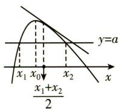
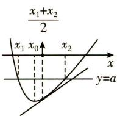
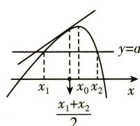
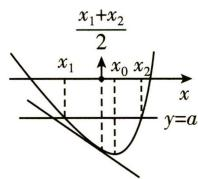
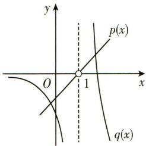

由（Ⅰ）知，当 $a \leqslant 0$ 时， $h(x)$ 在 $(0, +\infty)$ 上单调递增，不可能有两个零点；

当 a > 0 时， $h(x)$ 在 $\left(0, \frac{1}{a}\right)$ 上单调递增，在 $\left(\frac{1}{a}, +\infty\right)$ 上单调递减.

∴ $h\left(\frac{1}{a}\right)$ 是函数 $h(x)$ 的最大值，

∵当 $h\left(\frac{1}{a}\right)\leqslant0$ 时， $h(x)$ 最多有一个零点，

∴由 $h\left(\frac{1}{a}\right)=\ln\left(\frac{1}{a}\right)>0$ , 得 0<a<1.

又∵此时 $\frac{1}{e}<\frac{1}{a}<\frac{e^{2}}{a^{2}}$ ，且 $h\left(\frac{1}{e}\right)=-1-\frac{a}{e}+1=-\frac{a}{e}<0$ ，

$$
h \left(\frac {\mathrm{e} ^ {2}}{a ^ {2}}\right) = 2 - 2 \ln a - \frac {\mathrm{e} ^ {2}}{a} + 1 = 3 - 2 \ln a - \frac {\mathrm{e} ^ {2}}{a} (0 <   a <   1),
$$

令 $F(a) = 3 - 2\ln a - \frac{\mathrm{e}^2}{a}$ ，则 $F'(a) = -\frac{2}{a} + \frac{\mathrm{e}^2}{a^2} = \frac{\mathrm{e}^2 - 2a}{a^2} > 0.$

∴ $F(a)$ 在 $(0,1)$ 上单调递增，

∴ $F(a) < F(1) = 3 - e^{2} < 0$ ，即 $h\left(\frac{e^{2}}{a^{2}}\right) < 0$ ，

∴当 0 < a < 1 时， $h(x)$ 在 $\left(\frac{1}{\mathrm{e}}, \frac{1}{a}\right)$ 和 $\left(\frac{1}{a}, \frac{\mathrm{e}^{2}}{a^{2}}\right)$ 上各有一个零点，
∴a 的取值范围是(0,1).

(ii) 由 (i) 可知函数 $h(x) = \ln x - ax + 1$ 在 $\left(0, \frac{1}{a}\right)$ 上单调递增，在 $\left(\frac{1}{a}, +\infty\right)$ 上单调递减，且 $h\left(\frac{1}{e}\right) = -1 - \frac{a}{e} + 1 = -\frac{a}{e} < 0, h(1) = 1 - a > 0,$

$\therefore \frac{1}{\mathrm{e}} < x_{1} < 1$ ，即 $-1 < f(x_{1}) < 0, \therefore -1 < y_{1} < 0,$

令 $G(x) = h\left(\frac{2}{a} - x\right) - h(x)$

$$
= \ln \left(\frac {2}{a} - x\right) - a \left(\frac {2}{a} - x\right) - (\ln x - a x) \left(0 <   x \leqslant \frac {1}{a}\right),
$$

则 $G^{\prime}(x) = \frac{1}{x - \frac{2}{a}} -\frac{1}{x} +2a = \frac{2a\left(x - \frac{1}{a}\right)^{2}}{x\left(x - \frac{2}{a}\right)} < 0,$

∴ $G(x)$ 在 $\left(0, \frac{1}{a}\right]$ 上单调递减，

$$
\because 0 <   x _ {1} <   \frac {1}{a}, \therefore G (x _ {1}) > G \left(\frac {1}{a}\right) = 0,
$$

又 $\because h(x_{1}) = 0$ ，且 $\ln x_{1} = ax_{1} - 1$

$$
\begin{array}{l} \therefore h \left(\frac {2}{a} - x _ {1}\right) = \ln \left(\frac {2}{a} - x _ {1}\right) - a \left(\frac {2}{a} - x _ {1}\right) + 1 - h (x _ {1}) = G (x _ {1}) > 0 \\ = h \left(x _ {2}\right). \\ \end{array}
$$

由（I）知 $x_{2} > \frac{2}{a} - x_{1}$ ，即 $\mathrm{e}^{y_1} + \mathrm{e}^{y_2} > \frac{2}{a} > 2, \therefore \mathrm{e}^{y_1} + \mathrm{e}^{y_2} > 2.$

# 典例 10

已知函数 $f(x)=\ln(x+1)+\frac{a}{x}$ 在 $\left(-1,-\frac{1}{e}\right)$ 内有极值 (e 为自然对数的底数).

(I)求 $a$ 的取值范围；

(Ⅱ) 若 $x_{1} \in (-1,0)$ , $x_{2} \in (0,+\infty)$ ，求证： $f(x_{2}) - f(x_{1}) > 2\left(\frac{1}{e} + \ln \frac{e}{e-1}\right)$ .

# 【解析】

(I) $f(x)$ 的定义域为 $x\in(-1,0)\cup(0,+\infty)$ ，当 $a\leqslant0$ 时， $f(x)$ 在 $(-1,0)$ 内单调递增，与题设不符，故 $a>0.f'(x)=\frac{1}{x+1}-\frac{a}{x^{2}}=\frac{x^{2}-ax-a}{x^{2}(x+1)}$

令 $g(x)=x^{2}-ax-a$ ,

因为函数 $f(x)$ 在 $\left(-1, -\frac{1}{\mathrm{e}}\right)$ 上有极值，

所以 $g(x)$ 在 $\left(-1, -\frac{1}{\mathrm{e}}\right)$ 上有零点，

设 $g(x)=(x-\alpha)(x-\beta)$ ，其中 $\alpha\in\left(-1,-\frac{1}{e}\right)$ .

因为 $\alpha + \beta = a, \alpha \cdot \beta = -a$ ,

所以 $\frac{1}{\alpha} +\frac{1}{\beta} = -1,0 <   \frac{1}{\beta} = -1 - \frac{1}{\alpha} <  \mathrm{e} - 1,$

所以 $\beta \in \left(\frac{1}{\mathrm{e} - 1}, +\infty\right)$

因为 $g(-1) = 1 > 0$ ，所以 $g\left(-\frac{1}{\mathrm{e}}\right) = \frac{1}{\mathrm{e}^2} +\frac{a}{\mathrm{e}} -a <   0,$

解得 $a > \frac{1}{\mathrm{e}(\mathrm{e}-1)}$ ,

综上，a 的取值范围是 $\left(\frac{1}{\mathrm{e}(\mathrm{e}-1)}, +\infty\right)$ .

(Ⅱ)由 $f'(x)>0$ 得 $-1<x<\alpha$ 或 $x>\beta$ ,

由 $f'(x)<0$ 得 $\alpha<x<0$ 或 $0<x<\beta$ ,

所以 $f(x)$ 在 $(-1, \alpha)$ , $(\beta, +\infty)$ 上单调递增，在 $(\alpha, 0)$ , $(0, \beta)$ 上单调递减.

又因为 $x_{1}\in(-1,0)$ , $x_{2}\in(0,+\infty)$ ,

所以 $f(x_{1})\leqslant f(\alpha) = \ln (\alpha +1) + \frac{a}{\alpha},$

$$
f (x _ {2}) \geqslant f (\beta) = \ln (\beta + 1) + \frac {a}{\beta},
$$

由（I）可知， $\alpha +\beta +\alpha \cdot \beta = 0$ ，所以 $(\alpha +1)(\beta +1) = 1$

所以 $f(x_{2}) - f(x_{1})\geqslant f(\beta) - f(\alpha)$

$$
= \ln \frac {\beta + 1}{\alpha + 1} + \frac {a (\alpha - \beta)}{\alpha \cdot \beta}
$$

$$
= 2 \ln (\beta + 1) - \frac {1}{\beta + 1} + \beta + 1,
$$

令 $h(x)=2\ln(x+1)-\frac{1}{x+1}+x+1\left(x>\frac{1}{e-1}\right)$ ,

则 $h'(x)=\frac{2}{x+1}+\frac{1}{(x+1)^{2}}+1=\left(\frac{1}{x+1}+1\right)^{2}>0,$

所以 $h(x)$ 在 $\left(\frac{1}{\mathrm{e}-1}, +\infty\right)$ 上单调递增，

所以 $f(x_{2}) - f(x_{1})\geqslant f(\beta) - f(\alpha)$

$$
= 2 \ln (\beta + 1) - \frac {1}{\beta + 1} + \beta + 1
$$

$$
> 2 \ln \frac {\mathrm{e}}{\mathrm{e} - 1} - \frac {\mathrm{e} - 1}{\mathrm{e}} + \frac {\mathrm{e}}{\mathrm{e} - 1}
$$

$$
= 2 \ln \frac {\mathrm{e}}{\mathrm{e} - 1} + \frac {2 \mathrm{e} - 1}{\mathrm{e} (\mathrm{e} - 1)}
$$

$$
\begin{array}{l} > \frac {2}{\mathrm{e}} + 2 \ln \frac {\mathrm{e}}{\mathrm{e} - 1} \\ = 2 \left(\frac {1}{\mathrm{e}} + \ln \frac {\mathrm{e}}{\mathrm{e} - 1}\right). \\ \end{array}
$$

# 典例 11

已知函数 $f(x)=\frac{\mathrm{e}^{x}-a}{x}-a\ln x$ ，其中 $a\in[0,e]$ ， $e=2.71828\cdots$ ，是自然对数的底数。

(I) 若曲线 $y = f(x)$ 在点 $(2, f(2))$ 处的切线为 $e^{2}x - 4y = 0$ ，求 a 的值；

(Ⅱ)求函数 $y=f(x)$ 的极大值；

(Ⅲ)设函数 $g(x)=\frac{1+x\ln x}{\mathrm{e}^{x}}$ ，求证： $0<g(x)<1$ .

# 【解析】

(I) $f'(x)=\frac{x\mathrm{e}^{x}-(\mathrm{e}^{x}-a)}{x^{2}}-\frac{a}{x}=\frac{(\mathrm{e}^{x}-a)(x-1)}{x^{2}},$

由题意得 $f'(2)=\frac{\mathrm{e}^{2}}{4}$ ，解得 a=0。

(Ⅱ) 函数 $f(x)$ 的定义域为 $(0, +\infty)$ , $f'(x) = \frac{(\mathrm{e}^x - a)(x - 1)}{x^2}$ .

①当 $0 \leqslant a \leqslant 1$ 时， $f(x)$ 在 $(0,1)$ 上单调递减，在 $(1,+\infty)$ 上单调递增，函数没有极大值；

②当 1<a<e 时，令 $f'(x)=0$ ，得 $x=\ln a$ 或 x=1。

于是 $f(x)$ 在 $(0, \ln a)$ , $(1, +\infty)$ 上单调递增，在 $(\ln a, 1)$ 上单调递减，

函数的极大值为 $f(\ln a) = -a \ln (\ln a)$ ;

③当 a=e 时， $f'(x) \geqslant 0, f(x)$ 在 $(0, +\infty)$ 上单调递增，没有极大值.

(Ⅲ)①要证 $g(x)>0$ ，只要证 $1+x\ln x>0$ .

令 $h(x)=1+x\ln x$ ，则由 $h'(x)=\ln x+1=0$ ，得 $x=\frac{1}{e}$ ，

∴ $h(x)$ 在 $\left(0, \frac{1}{\mathrm{e}}\right)$ 上单调递减，在 $\left(\frac{1}{\mathrm{e}}, +\infty\right)$ 上单调递增，

$$
\therefore h \left(x\right) \geqslant h \left(\frac {1}{\mathrm{e}}\right) = 1 - \frac {1}{\mathrm{e}} > 0, \text {即} g \left(x\right) > 0.
$$

②要证 $g(x)<1$ ，只要证 $1+x\ln x<e^{x}$ ，即 $\frac{e^{x}-1}{x}-\ln x>0$ .

由(Ⅱ)知,当a=1时, $f(x)=\frac{\mathrm{e}^{x}-1}{x}-\ln x$ ,

此时 $f(x)$ 在 $(0,1)$ 上单调递减，在 $(1,+\infty)$ 上单调递增，

$$
\therefore f (x) \geqslant f (1) = \mathrm{e} - 1 > 0, \therefore g (x) <   1.
$$

综上, $0<g(x)<1$ .

# 典例 12

已知定义域为 $(0, +\infty)$ 的函数 $f(x) = mx^2 + \mathrm{e}^x$ 的图象为曲线 $C$ ，曲线 $C$ 在点 $(1, f(1))$ 的切线为 $y = (e-2)x + n$ （其中 $m, n \in \mathbf{R}$ ）.

(Ⅰ)求实数 m, n 的值;

(Ⅱ)证明：(i) $\ln x\leqslant x-1$ ;(ii) $\frac{e^{x}+(2-e)x-1}{x}\geqslant\ln x+1.$

# 【解析】

(I) $f'(x)=2mx+e^{x}$ ，根据题意 $f'(1)=2m+e$ ，

所以曲线 C 在 x=1 处的切线方程为

$$
y - (m + \mathrm{e}) = (2 m + \mathrm{e}) (x - 1),
$$

整理得 $y=(2m+e)x-m$ ，由对应系数相等得 m=-1, n=1.

(Ⅱ)(i)令 $h(x)=\ln x-x+1(x>0)$ ,

则 $h'(x)=\frac{1-x}{x}$ ，易知当 0<x<1 时， $h(x)$ 单调递增；

当 x>1 时， $h(x)$ 单调递减，所以 $h(x)\leqslant h(1)=0$ ，

即 $\ln x \leqslant x - 1$ .

(ii) 由 (I) 得 $f'(x) = \mathrm{e}^x - 2x$ ,

令 $n(x)=\mathrm{e}^{x}-2x$ ，则 $n'(x)=\mathrm{e}^{x}-2$ ，

所以 $f'(x)$ 在 $(0, \ln 2)$ 上单调递减，在 $(\ln 2, +\infty)$ 上单调递增，

所以 $f'(x) \geqslant f'(\ln 2) = 2 - 2 \ln 2 > 0$ ,

即 $f(x)$ 在 $(0,1]$ 上单调递增，

所以 $f(x)_{\max}=f(1)=\mathrm{e}-1,x\in(0,1]$ .

因为 $f(x)$ 过点 $(1, e-1)$ ,

且 $y = f(x)$ 在 $x = 1$ 处的切线方程为 $y = (\mathrm{e} - 2)x + 1$

故可猜测：

当 $x > 0, x \neq 1$ 时， $f(x)$ 的图象恒在切线 $y = (e - 2)x + 1$ 的上方.

下面证明: 当 x > 0 时, $f(x) \geqslant (e-2)x + 1$ .

设 $g(x) = f(x) - (\mathrm{e} - 2)x - 1 = -x^2 +\mathrm{e}^x -\mathrm{e}x + 2x - 1,$

则 $g'(x)=\mathrm{e}^{x}-2x-(\mathrm{e}-2)$ ,

令 $G(x) = \mathrm{e}^{x} - 2x - (\mathrm{e} - 2)$ ，则 $G^{\prime}(x) = \mathrm{e}^{x} - 2$

所以 $g'(x)$ 在 $(0, \ln 2)$ 上单调递减，在 $(\ln 2, +\infty)$ 上单调递增，

又 $g^{\prime}(0) = 3 - \mathrm{e} > 0, g^{\prime}(1) = 0, 0 < \ln 2 < 1$ ，所以 $g^{\prime}(\ln 2) < 0$

所以存在 $x_0 \in (0, \ln 2)$ ，使得 $g'(x_0) = 0$ 。

所以当 $x \in (0, x_{0}) \cup (1, +\infty)$ 时， $g'(x) > 0, g(x)$ 单调递增；

当 $x \in (x_{0}, 1)$ 时， $g'(x) < 0, g(x)$ 单调递减，

又 $g(0) = g(1) = 0$ ，所以 $g(x) = \mathrm{e}^{x} - x^{2} - (\mathrm{e} - 2)x - 1\geqslant 0$ ，当且仅

当 $x = 1$ 时取等号，所以 $\frac{\mathrm{e}^x + (2 - \mathrm{e})x - 1}{x}\geqslant x,x > 0.$

又由(i)可得 $x \geqslant \ln x + 1$ ，即 $\frac{\mathrm{e}^{x} + (2 - \mathrm{e})x - 1}{x} \geqslant \ln x + 1$ ，当且仅当 x = 1 时，等号成立.

(注: $\ln x \leqslant x - 1 (x > 0)$ 是高中导数不等式部分的常见不等式,应熟记并合理利用)

# 典例 13

已知函数 $f(x)=\ln(x+1)-\sqrt{2x+1}$ .

(I)求函数 $f(x)$ 的单调区间；

(Ⅱ)求证: $f(x)\geqslant-\frac{x^{2}}{2}-1.$

# 【解析】

(I) $f(x)$ 的定义域为 $\left[-\frac{1}{2}, +\infty\right), f'(x) = \frac{1}{x + 1} - \frac{1}{\sqrt{2x + 1}}$

$$
\because x ^ {2} + 2 x + 1 \geqslant 2 x + 1, \therefore (x + 1) ^ {2} \geqslant 2 x + 1,
$$

$$
\therefore x + 1 \geqslant \sqrt {2 x + 1}, \therefore \frac {1}{x + 1} \leqslant \frac {1}{\sqrt {2 x + 1}},
$$

$\therefore f'(x) \leqslant 0$ （当且仅当 x = 0 时取等号），

∴ $f(x)$ 的单调递减区间为 $\left[-\frac{1}{2}, +\infty\right)$ ，无单调递增区间.

(Ⅱ)【证法一】

令函数 $f(x) = \ln (x + 1) - \sqrt{2x + 1} +\frac{x^2}{2} +1,$

则 $F'(x)=\frac{1}{x+1}-\frac{1}{\sqrt{2x+1}}+x=\frac{(x^{2}+x+1)\sqrt{2x+1}-(x+1)}{(x+1)\sqrt{2x+1}}$ ,

显然 $F'(0)=0$ . 令函数 $H(x)=(x^{2}+x+1)\sqrt{2x+1}-(x+1)$ ,

则 $H'(x)=\frac{5x^{2}+5x+2-\sqrt{2x+1}}{\sqrt{2x+1}}$ ,

由（I）知 $x + 1 \geqslant \sqrt{2x + 1}, \therefore -\sqrt{2x + 1} \geqslant -(x + 1)$ ，

$$
\begin{array}{l} \therefore 5 x ^ {2} + 5 x + 2 - \sqrt {2 x + 1} \geqslant 5 x ^ {2} + 5 x + 2 - (x + 1) \\ = 5 x ^ {2} + 4 x + 1 = 5 \left(x + \frac {2}{5}\right) ^ {2} + \frac {1}{5} > 0, \\ \end{array}
$$

∴ $H(x)$ 在 $\left[-\frac{1}{2}, +\infty\right)$ 上单调递增，且 $H(0)=0, H\left(-\frac{1}{2}\right)=-\frac{1}{2}<0,$

∴当 $x \in \left[-\frac{1}{2}, 0\right)$ 时， $H(x) < 0, F'(x) < 0, F(x)$ 单调递减，
当 $x \in (0, +\infty)$ 时， $H(x) > 0, F'(x) > 0, F(x)$ 单调递增.

∴ $F(x)$ 的最小值为 $F(0)=0, \therefore F(x) \geqslant 0$ ，即 $f(x) \geqslant -\frac{x^{2}}{2} - 1$ .

【证法二】

令函数 $F(x) = \ln (x + 1) + \frac{x^2}{2} - x, x \in [0, +\infty)$ ,

$$
\because F ^ {\prime} (x) = \frac {1}{x + 1} + x - 1 = \frac {x ^ {2}}{x + 1} > 0,
$$

∴函数 $F(x)$ 在 $[0, +\infty)$ 上单调递增， $F(x) \geqslant F(0) = 0$ ，

$$
\therefore \ln (x + 1) \geqslant x - \frac {x ^ {2}}{2} \quad ①,
$$

又 $-\sqrt{2x+1}\geqslant-(x+1)$ ②，

由①+②得 $\ln (x + 1) - \sqrt{2x + 1}\geqslant -\frac{x^2}{2} -1,$

即当 $x \in [0, +\infty)$ 时， $f(x) \geqslant -\frac{x^2}{2} - 1$ .

另外，当 $x \in \left[-\frac{1}{2}, 0\right)$ 时，由(I)可知函数 $f(x)$ 在 $\left[-\frac{1}{2}, 0\right)$ 上单调递减，

$$
\therefore f (x) > f (0) = - 1 > - \frac {x ^ {2}}{2} - 1, \therefore f (x) > - \frac {x ^ {2}}{2} - 1.
$$

综上，对 $x \in \left[-\frac{1}{2}, +\infty\right), f(x) \geqslant -\frac{x^2}{2} - 1.$

# 02 极值点偏移问题

# 知识导航：

1. 已知函数 $y = f(x)$ 是连续函数，在区间 $(x_{1}, x_{2})$ 上有且只有一个极值点 $x_{0}$ ，且 $f(x_{1}) = f(x_{2})$ . 若在极值点 $x_{0}$ 的左右，函数 $y = f(x)$ 的“增减速度”不同，则函数 $y = f(x)$ 的图象具有不对称性，即有 $x_{0} \neq \frac{x_{1} + x_{2}}{2}$ 的情况，这种状态为极值点偏移.

极值点左偏： $\frac{x_{1}+x_{2}}{2}>x_{0}$ ；极值点右偏： $\frac{x_{1}+x_{2}}{2}<x_{0}$

(1)产生原因:函数极值点左右两边图象升降速度不一样,导致极值点发生了偏移.  
(2)极值点 $x_0$ 左偏: 极值点附近图象左陡右缓, $f(x_1) = f(x_2)$ , 则 $x_1 + x_2 > 2x_0$ , $x = \frac{x_1 + x_2}{2}$ 处切线与 $x$ 轴不平行. 若 $f(x)$ 的图象上凸, 则 $f'\left(\frac{x_1 + x_2}{2}\right) < f'(x_0) = 0$ ; 若 $f(x)$ 的图象下凹, 则 $f'\left(\frac{x_1 + x_2}{2}\right) > f'(x_0) = 0$ .

text_image

y=a
x₁ x₀
x₂
x
(x₁+x₂)/2

text_image

x₁+x₂
2
x₁ x₀ x₂
y=a

极值点左偏

text_image

y=a
x₁
x₀
x₂
x
\frac{x₁+x₂}{2}

text_image

x₁+x₂
  2
x₁   x₀   x₂
y=a

极值点右偏

(3)极值点 $x_0$ 右偏: 极值点附近图象左缓右陡, $f(x_1) = f(x_2)$ , 则 $x_1 + x_2 < 2x_0$ , $x = \frac{x_1 + x_2}{2}$ 处切线与 $x$ 轴不平行. 若 $f(x)$ 的图象上凸, 则 $f'\left(\frac{x_1 + x_2}{2}\right) > f'(x_0) = 0$ ; 若 $f(x)$ 的图象下凹, 则 $f'\left(\frac{x_1 + x_2}{2}\right) < f'(x_0) = 0$ .

2. 处理极值点偏移类问题通常有两种方法.

(1)对称函数法

根据题意,合理构造辅助函数 $F(x)=f(x_{0}+x)-f(x_{0}-x)$ 并对其求导数,从而确定 $F(x)$ 的单调性,再通过 $f(x)$ 的单调性得出 $\frac{x_{1}+x_{2}}{2}$ 与 $x_{0}$ 的大小;

(2)对数平均值不等式法

首先根据 $f(x_{1}) = f(x_{2})$ 建立等式，对等式两边同时取自然对数，配凑出 $\ln x_{1} - \ln x_{2}$ 和 $x_{1} - x_{2}$ 。然后等式两边同时除以 $\ln x_{1} - \ln x_{2}$ ，构造对数平均值 $\frac{x_{1} - x_{2}}{\ln x_{1} - \ln x_{2}}$ ，从而证明对数平均值不等式 $\frac{x_{1} - x_{2}}{\ln x_{1} - \ln x_{2}} > \sqrt{x_{1}x_{2}}$ 或 $\frac{x_{1} - x_{2}}{\ln x_{1} - \ln x_{2}} < \frac{x_{1} + x_{2}}{2}$ ，最后利用对数平均值不等式处理即可。

当 0 < a < b 时, 对数平均值不等式可拓展为:

$$
a <   \frac {2}{\frac {1}{a} + \frac {1}{b}} <   \sqrt {a b} <   \frac {b - a}{\ln b - \ln a} <   \frac {a + b}{2} <   \sqrt {\frac {a ^ {2} + b ^ {2}}{2}} <   b.
$$

以上两种方法偏向于技巧解题,也可以将极值点代入,求解 $f(x_{1}), f(x_{2})$ , 并根据题意合理转化,利用差值(或比值)设参,从而构造新函数,再利用导数求解新函数的单调性来解决相关问题.

# 典例1

已知函数 $f(x)=x^{2}-(a-2)x-a\ln x$ ，若方程 $f(x)=c$ 有两个不相等的实数根 $x_{1}, x_{2}$ ，求证： $f'\left(\frac{x_{1}+x_{2}}{2}\right)>0.$

# 【解析一】

$$
f ^ {\prime} (x) = 2 x - (a - 2) - \frac {a}{x} = \frac {2 x ^ {2} - (a - 2) x - a}{x} = \frac {(2 x - a) (x + 1)}{x},
$$

易知, 只有当 a > 0 时, 方程 $f(x) = c$ 才有两个不相等的实数根 $x_{1}, x_{2}$ .

不妨设 $x_{1} < x_{2}$ ，则 $0 < x_{1} < \frac{a}{2} < x_{2}$ ，

则 $\left\{ \begin{array}{l}x_{1}^{2} - (a - 2)x_{1} - a\ln x_{1} = c,\\ x_{2}^{2} - (a - 2)x_{2} - a\ln x_{2} = c, \end{array} \right.$

两式相减得 $x_{1}^{2}-(a-2)x_{1}-a\ln x_{1}-x_{2}^{2}+(a-2)x_{2}+a\ln x_{2}=0$

化简得 $(x_{1} + x_{2})(x_{1} - x_{2}) - (a - 2)(x_{1} - x_{2}) - a\ln \frac{x_{1}}{x_{2}} = 0,$

即 $(x_{1} + x_{2}) - (a - 2) - \frac{a\ln\frac{x_{1}}{x_{2}}}{x_{1} - x_{2}} = 0.$

则 $f^{\prime}\left(\frac{x_{1} + x_{2}}{2}\right) = (x_{1} + x_{2}) - (a - 2) - \frac{2a}{x_{1} + x_{2}}$

$$
\begin{array}{l} = \frac {a \ln \frac {x _ {1}}{x _ {2}}}{x _ {1} - x _ {2}} - \frac {2 a}{x _ {1} + x _ {2}} \\ = \frac {a}{x _ {1} - x _ {2}} \left[ \ln \frac {x _ {1}}{x _ {2}} - \frac {2 \left(x _ {1} - x _ {2}\right)}{x _ {1} + x _ {2}} \right] \\ = \frac {a}{x _ {1} - x _ {2}} \left[ \ln \frac {x _ {1}}{x _ {2}} - \frac {2 \left(\frac {x _ {1}}{x _ {2}} - 1\right)}{\frac {x _ {1}}{x _ {2}} + 1} \right]. \\ \end{array}
$$

要证 $f^{\prime}\left(\frac{x_{1} + x_{2}}{2}\right) > 0$ ，即证 $\frac{a}{x_1 - x_2}\left[\ln \frac{x_1}{x_2} -\frac{2\left(\frac{x_1}{x_2} - 1\right)}{\frac{x_1}{x_2} + 1}\right] > 0,$

令 $t = \frac{x_1}{x_2} (0 < t < 1)$ ，构造函数 $m(t) = \ln t - \frac{2(t - 1)}{t + 1} (0 < t < 1)$ .

$$
m ^ {\prime} (t) = \frac {1}{t} - \frac {4}{(t + 1) ^ {2}} = \frac {(t - 1) ^ {2}}{t (t + 1) ^ {2}} > 0,
$$

所以 $m(t)$ 在 $(0,1)$ 上单调递增，所以 $m(t)<m(1)=0$ .

又因为 $a > 0, x_{1} - x_{2} < 0$ ，所以 $f'\left(\frac{x_1 + x_2}{2}\right) > 0$ 成立.

# 【解析二】

构造函数 $h(x) = f\left(\frac{a}{2} - x\right) - f\left(\frac{a}{2} + x\right)\left(0 <   x <   \frac{a}{2}\right),$

则 $h'(x)=-f'\left(\frac{a}{2}-x\right)-f'\left(\frac{a}{2}+x\right)=\frac{4x^{2}}{\left(\frac{a}{2}+x\right)\left(\frac{a}{2}-x\right)}>0,$

易知 $h(x)$ 在 $\left(0, \frac{a}{2}\right)$ 上单调递增，所以 $h(x) > h(0) = 0$ ，

即 $f\left(\frac{a}{2} - x\right) > f\left(\frac{a}{2} + x\right)$ 对 $x \in \left(0, \frac{a}{2}\right)$ 恒成立，

从而有 $f(x) > f(a - x)\left(0 <   x <   \frac{a}{2}\right).$

即 $f(x_{2})=f(x_{1})>f(a-x_{1})$ .

由 $x_{2}, a - x_{1} \in \left(\frac{a}{2}, +\infty\right)$ , 且 $f(x)$ 在 $\left(\frac{a}{2}, +\infty\right)$ 上单调递增,

得 $x_{2} > a - x_{1}$ ，即 $\frac{x_1 + x_2}{2} >\frac{a}{2}.$

所以 $f'\left(\frac{x_{1}+x_{2}}{2}\right)>0$ 成立.

# 典例 2

已知函数 $f(x)=\mathrm{e}^{x}-ax^{2}(a>0)$ (其中 $e=2.718\cdots$ 是自然对数的底数).

(I) 若 $f(x)$ 在 R 上单调递增, 求正数 a 的取值范围;

(Ⅱ) 若 $f(x)$ 在 $x = x_{1}, x_{2} (x_{1} < x_{2})$ 处导数相等，证明： $x_{1} + x_{2} < 2\ln(2a)$ .

# 【解析】

(I) $f'(x)=\mathrm{e}^{x}-2ax,$

令 $g(x) = \mathrm{e}^{x} - 2ax$ ，则根据题意得 $g(x)\geqslant 0$ 恒成立，

$$
g ^ {\prime} (x) = \mathrm{e} ^ {x} - 2 a,
$$

当 $g'(x)>0$ 时，得 $x>\ln(2a)$ ， $g(x)$ 单调递增，

$g'(x)<0$ 时，得 $x<\ln(2a)$ ， $g(x)$ 单调递减，

所以 $g(x)_{\min} = g(\ln (2a)) = 2a(1 - \ln (2a))\geqslant 0$

因为 a > 0，所以 $1 - \ln(2a) \geqslant 0$ ，解得 $a \leqslant \frac{e}{2}$ ，

所以 a 的取值范围是 $\left(0, \frac{e}{2}\right]$ .

(Ⅱ)由(Ⅰ)知 $g(x)$ 在 $(-∞, \ln(2a))$ 上单调递减，在 $(\ln(2a), +∞)$ 上单调递增，故 $x_{1} < \ln(2a) < x_{2}$ ，

令 $h(m) = g(\ln (2a) - m) - g(\ln (2a) + m) = 2a(\mathrm{e}^{-m} - \mathrm{e}^{m} + 2m)$

$$
= i (m), m > 0,
$$

则 $i(m)<i(0)=0$ , 令 $x_{1}=\ln(2a)-m$

则 $g(x_{2})=g(x_{1})=g(\ln(2a)-m)<g(\ln(2a)+m)$ ,

$$
x _ {2} <   \ln (2 a) + m,
$$

所以 $x_{1}+x_{2}<2\ln(2a)$ .

# 典例 3

已知函数 $f(x)=x\ln x, g(x)=ax^{2}+bx-1(a,b\in\mathbf{R})$ ，当 a=0 时，曲线 $y=f(x)$ 与直线 $y=g(x)$ 相切.

(I)求b的值；

(Ⅱ)若函数 $F(x)=f(x)-g(x)$ 有两个不同的极值点 $x_{1}$ ， $x_{2}$ ，且 $x_{1}<x_{2}$ ，证明： $x_{1}\cdot x_{2}^{n}>\mathrm{e}^{n+1}(n\in\mathbf{N}^{*})$ .

# 【解析】

(I) $f(x)=x\ln x$ ，所以 $f'(x)=1+\ln x$ .

设切点为 $P(x_0, y_0)$ ，则 $\left\{ \begin{array}{l} 1 + \ln x_0 = b, \\ x_0 \ln x_0 = bx_0 - 1, \end{array} \right.$

整理得 $bx_{0}-1=x_{0}(b-1)$ ，所以 $x_{0}=1, b=1$ .

(Ⅱ)由题意得 $F(x)=x\ln x-ax^{2}+1-x$ ,

则 $F'(x)=\ln x-2ax.$

因为 $F(x)$ 有两个极值点 $x_{1}, x_{2}$ ,

所以 $\ln x_{1}=2ax_{1},\ln x_{2}=2ax_{2}.$

欲证 $x_{1} \cdot x_{2}^{n} > \mathrm{e}^{n + 1}$ , 只需证 $\ln (x_{1} \cdot x_{2}^{n}) > \mathrm{ln} \mathrm{e}^{n + 1} = n + 1$ ,

即证 $\ln x_{1} + n\ln x_{2} > n + 1$ ，即证 $ax_{1} + nax_{2} > \frac{n + 1}{2}$

因为 $0 < x_{1} < x_{2}$ ,

所以 $ax_{1} + nax_{2} > \frac{n + 1}{2}$ 等价于 $a > \frac{n + 1}{2x_1 + 2nx_2}$ .

由 $\ln x_{1} = 2ax_{1},\ln x_{2} = 2ax_{2}$ ，得 $\ln \frac{x_2}{x_1} = 2a(x_2 - x_1)$

则 $a = \frac{\ln\frac{x_2}{x_1}}{2(x_2 - x_1)}.$

则 $a > \frac{n + 1}{2x_1 + 2nx_2}$ 可化为 $\frac{\ln\frac{x_2}{x_1}}{x_2 - x_1} >\frac{n + 1}{x_1 + nx_2},$

即 $\ln \frac{x_2}{x_1} >\frac{(n + 1)(x_2 - x_1)}{x_1 + nx_2} = \frac{(n + 1)\left(\frac{x_2}{x_1} - 1\right)}{1 + \frac{nx_2}{x_1}}.$

设 $t = \frac{x_2}{x_1} (t > 1)$ ，则上式等价于 $\ln t > \frac{(n + 1)(t - 1)}{1 + nt} (t > 1)$ .

令 $h(t)=\ln t-\frac{(n+1)(t-1)}{1+nt}$ ,

则 $h^{\prime}(t) = \frac{1}{t} -\frac{(n + 1)^{2}}{(1 + nt)^{2}} = \frac{(t - 1)(n^{2}t - 1)}{t(1 + nt)^{2}}.$

因为 $n \in N^{*}$ ，且 t > 1，所以 $h'(t) > 0, h(t)$ 在区间 $(1, +\infty)$ 上单调递增， $h(t) > h(1) = 0$ ，

即 $\ln t > \frac{(n + 1)(t - 1)}{1 + nt}$ , 所以 $x_{1} \cdot x_{2}^{n} > \mathrm{e}^{n + 1}$ .

# 典例4

已知函数 $f(x)=(a\cdot\mathrm{e}^{x}-2x^{2}-2x)\cdot\mathrm{e}^{x}$ ，其中 e 为自然对数的底数.

(I) 若 $-e^{2}<a<0$ ，证明： $f(x)$ 恰有两个极值点 $x_{1}, x_{2} (x_{1}<x_{2})$ ;  
(Ⅱ)在(Ⅰ)的条件下,证明: $-4<x_{1}+x_{2}<-3$ .

# 【解析】

(I)由题知 $f'(x)=2\mathrm{e}^{x}(a \cdot \mathrm{e}^{x}-x^{2}-3x-1)$ ,

令 $f^{\prime}(x) = 0$ ，则有 $a\cdot \mathrm{e}^{x} - x^{2} - 3x - 1 = 0$ ，即 $a = \frac{x^2 + 3x + 1}{\mathrm{e}^x}$

令 $g(x) = \frac{x^2 + 3x + 1}{\mathrm{e}^x}$ , 则只需证明函数 $h(x) = g(x) - a$ 恰有两个左、右异号的零点.

$g'(x)=-\mathrm{e}^{-x}(x+2)(x-1)$ ，易知 $g(x)$ 在 $(-∞,-2)$ ， $(1,+∞)$ 上单调递减，在 $(-2,1)$ 上单调递增，且 $g(-2)=-\mathrm{e}^{2}$ ，当

$x > 1$ 时， $g(x) = \frac{x^2 + 3x + 1}{\mathrm{e}^x} >0,g(1) = \frac{5}{\mathrm{e}}$ ，所以 $g(x)\geqslant$ $g(-2) = -\mathrm{e}^2.$

当 $-e^{2}<a<0$ 时，令 $g(x)=0$ ，设两根分别为m,n，且m<n，

则 $m = \frac{-\sqrt{5} - 3}{2} < n = \frac{\sqrt{5} - 3}{2} < 0, g(m) > a, g(-2) < a, g(n) > a,$

则 $h(m)>0, h(-2)<0, h(n)>0,$

所以 $h(m)h(-2) < 0, h(n)h(-2) < 0$ ，因为 $h(x)$ 的图象是连续的，所以根据零点存在性定理知，存在 $x_1 \in (m, -2), x_2 \in (-2, n)$ ，使得 $g(x_1) = g(x_2) = a$ ，故 $h(x) = g(x) - a$ 有两个左、右异号的零点，即 $f(x)$ 恰有两个极值点 $x_1, x_2$ .

(Ⅱ) 因为 $f'(x)=2\mathrm{e}^{x}(a \cdot \mathrm{e}^{x}-x^{2}-3x-1)$ ,

由 $a \cdot \mathrm{e}^{x_1} - (x_1^2 + 3x_1 + 1) = 0, a \cdot \mathrm{e}^{x_2} - (x_2^2 + 3x_2 + 1) = 0,$

可得 $a(\mathrm{e}^{x_1} - \mathrm{e}^{x_2}) - (x_1 - x_2)(x_1 + x_2 + 3) = 0,$

$x_{1} + x_{2} + 3 = a\cdot \frac{\mathrm{e}^{x_{1}} - \mathrm{e}^{x_{2}}}{x_{1} - x_{2}} < 0$ ，所以 $x_{1} + x_{2} <   - 3.$

由（I）知 $m < x_{1} < -2 < x_{2} < n$

要证 $x_{1} + x_{2} > -4$ ，只需证 $x_{2} > -4 - x_{1}$

由 $-4 - x_{1}\in (-2,1)$ ，知 $-4 - x_{1}$ 与 $x_{2}$ 在 $g(x)$ 的增区间内，令 $\varphi (x) = g(x) - g(-4 - x)(x <   - 2)$

则 $\varphi'(x) = g'(x) + g'(-4 - x)$

$$
\begin{array}{l} = - (x + 2) \left[ (x - 1) \cdot \mathrm{e} ^ {- x} + (x + 5) \cdot \mathrm{e} ^ {x + 4} \right] \\ <   - (x + 2) \left[ (x - 1) \mathrm{e} ^ {x + 4} + (x + 5) \mathrm{e} ^ {x + 4} \right] \\ = - (x + 2) [ 2 (x + 2) \cdot \mathrm{e} ^ {x + 4} ] <   0, \\ \end{array}
$$

故 $\varphi(x)$ 在 $(-∞,-2)$ 上单调递减.

所以 $\varphi(x)>\varphi(-2)=g(-2)-g(-2)=0,$

即 $g(x) > g(-4 - x)$ . 由 $x_{1} < -2$ , 知 $g(x_{2}) = g(x_{1}) > g(-4 - x_{1})$ , 所以 $x_{2} > -4 - x_{1}$ , 即 $x_{1} + x_{2} > -4$ .

综上， $-4<x_{1}+x_{2}<-3.$

# 典例 5

已知函数 $f(x)=(x-2)\mathrm{e}^{x}+a(x-1)^{2}$ 有两个零点.

(I)求 a 的取值范围;

(Ⅱ)若 $x_{1}, x_{2}$ 是 $f(x)$ 的两个零点，求证： $x_{1} + x_{2} < 2$ .

# 【解析】

(Ⅰ)易知 x=1 不是零点，

则 $f(x) = (x - 2)\mathrm{e}^{x} + a(x - 1)^{2} = 0$ 有两个零点，

即方程 $a(x - 1) = \frac{(2 - x)\mathrm{e}^x}{x - 1}$ 有两根，

令 $p(x) = a(x - 1), q(x) = \frac{(2 - x)\mathrm{e}^x}{x - 1} = \left(\frac{1}{x - 1} - 1\right)\mathrm{e}^x,$

则两函数 $p(x), q(x)$ 的图象有两个交点.

$q^{\prime}(x) = -\frac{(x^{2} - 3x + 3)\mathrm{e}^{x}}{(x - 1)^{2}}$ ，易知 $q^{\prime}(x) <   0$ 恒成立，

当 x<1 时， $q(x)$ 在 $(-∞,1)$ 上单调递减，而当 $x→-∞$ 时， $q(x)→0$ ;

当 $x \to 1^{-}$ 时， $q(x) \to -\infty$ ，则 $q(x)$ 在 $(-∞, 1)$ 上的值域为 $(-∞, 0)$ .

当 $x > 1$ 时， $q(x)$ 在 $(1, +\infty)$ 上单调递减，而当 $x \to +\infty$ 时， $q(x) \to -\infty$ ；

当 $x \to 1^{+}$ 时， $q(x) \to +\infty$ ，则 $q(x)$ 在 $(1, +\infty)$ 上的值域为 $(-\infty, +\infty)$ .

$p(x)=a(x-1)$ 的图象是过点 $(1,0)$ ，斜率为a的直线，不包括 $(1,0)$ 点.

画出两函数的大致图象,如图.

两函数 $p(x)=a(x-1)$ 与 $q(x)=\frac{(2-x)\mathrm{e}^{x}}{x-1}$ 的图象要有两个交点，则 a>0.

即 $f(x)$ 若有两个零点, a 的取值范围为 $(0, +\infty)$ .

text_image

y
p(x)
O
1
x
q(x)

# (Ⅱ)【证法一】

设 $x_{1} < 1 < x_{2}, f(x) = (x - 2)\mathrm{e}^{x} + a(x - 1)^{2}$ ,

$$
f ^ {\prime} (x) = (x - 1) \left(\mathrm{e} ^ {x} + 2 a\right).
$$

由（Ⅰ）知 a > 0，当 x > 1 时， $f'(x) > 0$ ， $f(x)$ 在 $(1, +\infty)$ 上单

调递增；

当 $x < 1$ 时， $f'(x) < 0, f(x)$ 在 $(- \infty, 1)$ 上单调递减.

所以 $f(x)_{\min} = f(1) = -\mathrm{e}$

构造对称函数 $F(x) = f(1 + x) - f(1 - x)$

$$
= (x - 1) \mathrm{e} ^ {1 + x} + a x ^ {2} - \left[ - (1 + x) \mathrm{e} ^ {1 - x} + a x ^ {2} \right]
$$

$$
= (x - 1) \mathrm{e} ^ {1 + x} + (1 + x) \mathrm{e} ^ {1 - x} (x > 0),
$$

则 $F'(x)=\mathrm{e}x(\mathrm{e}^{x}-\mathrm{e}^{-x})$ .

当 $x > 0$ 时， $F'(x) > 0$ ，所以 $F(x)$ 在 $(0, +\infty)$ 上单调递增，

即 $F(x) > F(0) = 0$ ，则有 $f(1 + x) > f(1 - x)$

令 $x_{1} = 1 - x$

则 $f(x_{2}) = f(x_{1}) = f(1 - (1 - x_{1})) <   f(1 + (1 - x_{1})) = f(2 - x_{1}).$

因为 $2 - x_{1},x_{2}\in (1, + \infty)$ ，而 $f(x)$ 在 $(1, + \infty)$ 上单调递增，

所以 $x_{2} < 2 - x_{1}$ ，所以 $x_{1} + x_{2} < 2$

# 【证法二】

由(I)可设 $x_{1} < 1 < x_{2} < 2$

根据题意得 $(x_{1} - 2)\mathrm{e}^{x_{1}} + a(x_{1} - 1)^{2} = 0$

$$
(x _ {2} - 2) \mathrm{e} ^ {x _ {2}} + a (x _ {2} - 1) ^ {2} = 0.
$$

两式相减得 $(x_{1} - 2)\mathrm{e}^{x_{1}} - (x_{2} - 2)\mathrm{e}^{x_{2}} = -a(x_{1} - x_{2})(x_{1} + x_{2} - 2).$

若 $x_{1} + x_{2} - 2\geqslant 0$ ，则 $-a(x_{1} - x_{2})(x_{1} + x_{2} - 2)\geqslant 0$

所以 $(2 - x_{1})\mathrm{e}^{x_{1}}\leqslant (2 - x_{2})\mathrm{e}^{x_{2}}$

两边同时取自然对数，得 $\ln (2 - x_1) + x_1\leqslant \ln (2 - x_2) + x_2$

即 $\frac{x_2 - x_1}{\ln(2 - x_1) - \ln(2 - x_2)} \geqslant 1$ ①.

（联想到对数平均值不等式 $\frac{b - a}{\ln b - \ln a} < \frac{b + a}{2}, b > a > 0$ ）

因为 $\frac{(2 - x_1) - (2 - x_2)}{\ln(2 - x_1) - \ln(2 - x_2)} < \frac{(2 - x_1) + (2 - x_2)}{2},$

所以 $\frac{x_2 - x_1}{\ln(2 - x_1) - \ln(2 - x_2)} = \frac{(2 - x_1) - (2 - x_2)}{\ln(2 - x_1) - \ln(2 - x_2)}$

$$
<   \frac {(2 - x _ {1}) + (2 - x _ {2})}{2} \leqslant 1 \quad ②.
$$

①②两式矛盾,所以 $x_{1}+x_{2}<2$ .

# 典例 6

已知函数 $f(x) = (ax - x^2)\mathrm{e}^x (a\geqslant 0)$ .

(I) 若函数 $f(x)$ 在 $[2, +\infty)$ 上单调递减，求实数 $a$ 的取值范围；  
(Ⅱ)设 $f(x)$ 的两个极值点为 $x_{1}, x_{2} (x_{2} > x_{1})$ ，证明：当 $a \geqslant \frac{2\sqrt{11}}{5}$ 时， $f(x_{1}) + f(x_{2}) > 0.$ （附注： $\ln 11 \approx 2.398$ ）

# 【解析】

(I) $f(x) = (ax - x^2)\mathrm{e}^x (a\geqslant 0),$

则 $f^{\prime}(x) = (a - 2x)\mathrm{e}^{x} + (ax - x^{2})\mathrm{e}^{x} = -[x^{2} - (a - 2)x - a]\mathrm{e}^{x},$

令 $x^{2} - (a - 2)x - a = 0$ ，则 $\Delta = (a - 2)^{2} - 4(-a) = a^{2} + 4 > 0$

∴方程有两个不相等的实根 $x_{1}, x_{2} (x_{1} < x_{2})$ ,

且 $x_{1} = \frac{a - 2 - \sqrt{a^{2} + 4}}{2}, x_{2} = \frac{a - 2 + \sqrt{a^{2} + 4}}{2}$ ,

∴函数 $f(x)$ 在 $(-∞, x_{1})$ 上单调递减，在 $(x_{1}, x_{2})$ 上单调递增，在 $(x_{2}, +∞)$ 上单调递减，

∴要使 $f(x)$ 在 $[2,+\infty)$ 上单调递减，只需 $x_{2}\leqslant2$ ，

即 $\frac{a - 2 + \sqrt{a^2 + 4}}{2} \leqslant 2$ ，即 $\sqrt{a^2 + 4} \leqslant 6 - a$ ，解得 $a \leqslant \frac{8}{3}$ ，

∴实数 a 的取值范围为 $\left[0, \frac{8}{3}\right]$ .

(Ⅱ) $f'(x)=-\left[x^{2}-(a-2)x-a\right]e^{x}$ ,

$\because x_{1},x_{2}$ 是 $f(x)$ 的两个极值点 $(x_{1}<x_{2})$ ,

$\therefore x_{1}, x_{2}$ 是方程 $x^{2} - (a - 2)x - a = 0$ 的两个根，

$$
\therefore x _ {1} + x _ {2} = a - 2, x _ {1} \cdot x _ {2} = - a,
$$

由 $x_{1}^{2}-(a-2)x_{1}-a=0$ ，化简得 $ax_{1}-x_{1}^{2}=x_{1}-x_{2}-2$

同理， $ax_{2} - x_{2}^{2} = x_{2} - x_{1} - 2,$

$$
\begin{array}{l} \therefore f \left(x _ {1}\right) + f \left(x _ {2}\right) = \left(a x _ {1} - x _ {1} ^ {2}\right) \mathrm{e} ^ {x _ {1}} + \left(a x _ {2} - x _ {2} ^ {2}\right) \mathrm{e} ^ {x _ {2}} \\ = \left(x _ {1} - x _ {2} - 2\right) \mathrm{e} ^ {x _ {1}} + \left(x _ {2} - x _ {1} - 2\right) \mathrm{e} ^ {x _ {2}}. \\ \end{array}
$$

∴要证 $f(x_{1})+f(x_{2})>0$ ,

即证 $(x_{1} - x_{2} - 2)\mathrm{e}^{x_{1}} + (x_{2} - x_{1} - 2)\mathrm{e}^{x_{2}} > 0$

即证 $(x_{1} - x_{2} - 2) + (x_{2} - x_{1} - 2)\mathrm{e}^{x_{2} - x_{1}} > 0$

(利用差值设参法)令 $t = x_{2} - x_{1}$ ,

则 $t = x_{2} - x_{1} = \sqrt{(x_{2} + x_{1})^{2} - 4x_{1}x_{2}} = \sqrt{a^{2} + 4}\geqslant \frac{12}{5},$

从而，只需证明 $-(t + 2) + (t - 2)\mathrm{e}^t >0$ 对 $t\geqslant \frac{12}{5}$ 恒成立即可，

设 $h(t) = -(t + 2) + (t - 2)\mathrm{e}^t$

而 $h^{\prime}(t) = -1 + (t - 1)\mathrm{e}^{t}$ 在 $\left[\frac{12}{5}, + \infty\right)$ 上单调递增，

$$
\therefore h ^ {\prime} (t) \geqslant h ^ {\prime} \left(\frac {1 2}{5}\right) = - 1 + \frac {7}{5} \mathrm{e} ^ {\frac {1 2}{5}} > 0,
$$

$$
\therefore h (t) \geqslant h \left(\frac {1 2}{5}\right) = \frac {2}{5} (\mathrm{e} ^ {\frac {1 2}{5}} - 1 1),
$$

又 $\ln 11\approx 2.398 <   2.4 = \frac{12}{5},\therefore 11 <   \mathrm{e}^{\frac{12}{5}},$

∴ $h(t) > 0$ 在 $\left[\frac{12}{5}, +\infty\right)$ 上恒成立，

$$
\therefore f (x _ {1}) + f (x _ {2}) > 0.
$$

# 典例7

已知函数 $f(x)=\mathrm{e}^{x}\left(x-\frac{a}{x}-2\right)$ ，其定义域为 $(0,+\infty)$ .（其中常数 $e=2.71828\cdots$ ，是自然对数的底数）

(I)求函数 $f(x)$ 的单调递增区间；

(Ⅱ)若函数 $f(x)$ 为定义域上的增函数，且 $f(x_{1}) + f(x_{2}) = -4e$ ，证明： $x_{1} + x_{2} \geqslant 2$ .

# 【解析】

(I)由题意,得 $f'(x)=\frac{\mathrm{e}^{x}(x-1)(x^{2}-a)}{x^{2}}$ ,

①若 $a \leqslant 0$ ，由 $f'(x) > 0$ ，得 $x > 1$

∴函数 $f(x)$ 的单调递增区间为 $(1, +\infty)$ ;

②若 0 < a < 1，则

<table><tr><td>x</td><td>(0,√a)</td><td> $\sqrt{a}$ </td><td>(√a,1)</td><td>1</td><td>(1,+∞)</td></tr><tr><td>f&#x27;(x)</td><td>+</td><td>0</td><td>-</td><td>0</td><td>+</td></tr><tr><td>f(x)</td><td>↗</td><td>极大值</td><td>↘</td><td>极小值</td><td>↗</td></tr></table>

∴函数 $f(x)$ 的单调递增区间为 $(0, \sqrt{a})$ 和 $(1, +\infty)$ ;

③若 $a = 1$ ，则 $f^{\prime}(x) = \frac{\mathrm{e}^{x}(x - 1)^{2}(x + 1)}{x^{2}}\geqslant 0,$

∴函数 $f(x)$ 的单调递增区间为 $(0, +\infty)$ ;

④若 a > 1，则

<table><tr><td>x</td><td>(0,1)</td><td>1</td><td>(1, $\sqrt{a}$ )</td><td> $\sqrt{a}$ </td><td> $(\sqrt{a},+\infty)$ </td></tr><tr><td>f&#x27;(x)</td><td>+</td><td>0</td><td>-</td><td>0</td><td>+</td></tr><tr><td>f(x)</td><td>↗</td><td>极大值</td><td>↘</td><td>极小值</td><td>↗</td></tr></table>

∴函数 $f(x)$ 的单调递增区间为 $(0,1)$ 和 $(\sqrt{a},+\infty)$ .

综上, 当 $a \leqslant 0$ 时, 函数 $f(x)$ 的单调递增区间为 $(1, +\infty)$ ;

当 0 < a < 1 时，函数 $f(x)$ 的单调递增区间为 $(0, \sqrt{a})$ 和 $(1, +\infty)$ ;

当 a=1 时, 函数 $f(x)$ 的单调递增区间为 $(0,+\infty)$ ;

当 a > 1 时，函数 $f(x)$ 的单调递增区间为 $(0, 1)$ 和 $(\sqrt{a}, +\infty)$ .

(Ⅱ)∵函数 $f(x)$ 为 $(0,+\infty)$ 上的增函数，

由（Ⅰ）知 a=1，即 $f(x)=\mathrm{e}^{x}\left(x-\frac{1}{x}-2\right)$ ,

注意到 $f(1)=-2e$ ，且 $f(x_{1})+f(x_{2})=-4e=2f(1)$ ，

不妨设 $0 < x_{1} \leqslant 1 \leqslant x_{2}$ ,

欲证 $x_{1}+x_{2}\geqslant2$ ，只需证 $x_{2}\geqslant2-x_{1}$ ，

只需证 $f(x_{2})\geqslant f(2-x_{1})$ ，即证 $-4e-f(x_{1})\geqslant f(2-x_{1})$ ，

即证 $f(x_{1}) + f(2 - x_{1})\leqslant -4\mathrm{e} = 2f(1)$

令 $\varphi(x)=f(x)+f(2-x)$ , $0<x\leqslant1$ , 只需证 $\varphi(x)\leqslant\varphi(1)$ ,

$$
\begin{array}{l} \varphi^ {\prime} (x) = f ^ {\prime} (x) - f ^ {\prime} (2 - x) \\ = \mathrm{e} ^ {2 - x} (x - 1) ^ {2} \left[ \frac {\mathrm{e} ^ {2 x - 2} (x + 1)}{x ^ {2}} - \frac {3 - x}{(2 - x) ^ {2}} \right], \\ \end{array}
$$

设 $\mu (x) = \frac{\mathrm{e}^{2x - 2}(x + 1)}{x^2} -\frac{3 - x}{(2 - x)^2},$

由不等式 $\mathrm{e}^x\geqslant 1 + x$ ，得 $\mathrm{e}^{2x - 2} = (\mathrm{e}^{x - 1})^2\geqslant (1 + x - 1)^2 = x^2,$

即当 $0 < x \leqslant 1$ 时， $\frac{\mathrm{e}^{2x - 2}}{x^2} \geqslant 1$

$$
\therefore \frac {\mathrm{e} ^ {2 x - 2} (x + 1)}{x ^ {2}} - \frac {3 - x}{(2 - x) ^ {2}} \geqslant x + 1 - \frac {3 - x}{(x - 2) ^ {2}} = \frac {x ^ {3} - 3 x ^ {2} + x + 1}{(x - 2) ^ {2}},
$$

易知当 $0 < x \leqslant 1$ 时， $x^{2} - 2x - 1 < 0$ ，

$$
\therefore x ^ {3} - 3 x ^ {2} + x + 1 = (x - 1) \left(x ^ {2} - 2 x - 1\right) \geqslant 0,
$$

$$
\therefore \frac {\mathrm{e} ^ {2 x - 2} (x + 1)}{x ^ {2}} - \frac {3 - x}{(2 - x) ^ {2}} \geqslant 0,
$$

$\therefore \mu (x)\geqslant 0$ ，即 $\varphi^{\prime}(x)\geqslant 0$ ，即 $\varphi (x)$ 在(0,1]上单调递增，即 $\varphi (x)\leqslant \varphi (1)$

从而 $x_{1} + x_{2}\geqslant 2$ 得证.

# 典例8

已知函数 $f(x)=\ln x$ .

(I) 当 $x > 1$ 时, 不等式 $f(x) > \frac{a(x - 1)}{x + 1}$ 恒成立, 求实数 $a$ 的取值范围;

(Ⅱ)若 $g(x)=a\ln x+x^{3}-3ax(a\in\mathbf{R})$ 有两个极值点 $x_{1},x_{2}$ ，求证： $\frac{g(x_{1})-g(x_{2})}{x_{1}-x_{2}}>\sqrt{3a}-2a.$

# 【解析】

(I)由题意知 $f(x)$ 的定义域为 $(0, +\infty)$ ,

令 $g(x)=f(x)-\frac{a(x-1)}{x+1}=\ln x-\frac{a(x-1)}{x+1},g(1)=0,$

$$
g ^ {\prime} (x) = \frac {1}{x} - \frac {2 a}{(x + 1) ^ {2}} = \frac {x ^ {2} - 2 (a - 1) x + 1}{x (x + 1) ^ {2}},
$$

令 $\varphi(x)=x^{2}-2(a-1)x+1$ ，当 $a\leqslant2$ 时， $\varphi(1)=4-2a\geqslant0$ ，且对称轴 $x=a-1\leqslant1$ ，

所以当 x>1 时， $g'(x)>0$ ， $g(x)$ 在 $(1,+\infty)$ 上单调递增，

所以 $f(x) > \frac{a(x-1)}{x+1}$ 恒成立；

当 a > 2 时， $\varphi(1) = 4 - 2a < 0$ ，可知必存在区间 $(1, x_{0})$ ，使得 $\varphi(x) < 0$ ，

当 $x \in (1, x_{0})$ 时， $g'(x) < 0, g(x)$ 在 $(1, x_{0})$ 上单调递减，此时 $g(x) < g(1) = 0$ ，不符合题意，

综上,实数 a 的取值范围为 $(-∞,2]$ .

(Ⅱ) $g'(x)=\frac{a}{x}+3x^{2}-3a=\frac{3x^{3}-3ax+a}{x}$ ,

令 $h(x)=3x^{3}-3ax+a$

则 $h(x)$ 在 $(0, +\infty)$ 上有两个不同零点， $h'(x) = 9x^{2} - 3a$ ，

若 $a \leqslant 0$ ，则 $h'(x) > 0, h(x)$ 单调递增，不符合题意；

若 $a > 0$ ，设两个零点分别为 $x_{1}, x_{2}$ 且 $x_{1} > x_{2}$

则 $3x_{1}^{3} - 3ax_{1} + a = 3x_{2}^{3} - 3ax_{2} + a$

化简得 $a=x_{1}^{2}+x_{1}x_{2}+x_{2}^{2}$ ,

则 $\frac{g(x_1) - g(x_2)}{x_1 - x_2} = \frac{a(\ln x_1 - \ln x_2)}{x_1 - x_2} + x_1^2 + x_1x_2 + x_2^2 - 3a$

$$
= \frac {a (\ln x _ {1} - \ln x _ {2})}{x _ {1} - x _ {2}} - 2 a,
$$

要证 $\frac{g(x_1) - g(x_2)}{x_1 - x_2} >\sqrt{3a} -2a$ ，即证 $\frac{a(\ln x_1 - \ln x_2)}{x_1 - x_2} -2a>$

$$
\sqrt {3 a} - 2 a,
$$

即证 $\frac{\ln x_1 - \ln x_2}{x_1 - x_2} >\frac{\sqrt{3}}{\sqrt{a}}$ ，即证 $\frac{\ln x_1 - \ln x_2}{x_1 - x_2} >\frac{\sqrt{3}}{\sqrt{x_1^2 + x_1x_2 + x_2^2}},$

即证 $\ln x_{1} - \ln x_{2} > \frac{\sqrt{3(x_{1} - x_{2})^{2}}}{\sqrt{x_{1}^{2} + x_{1}x_{2} + x_{2}^{2}}},$

即证 $\ln \frac{x_1}{x_2} >\frac{\sqrt{3\left(\frac{x_1}{x_2} - 1\right)^2}}{\sqrt{\left(\frac{x_1}{x_2}\right)^2 + \frac{x_1}{x_2} + 1}}.$

令 $t = \frac{x_1}{x_2} > 1$ ，即证 $\ln t > \frac{\sqrt{3(t - 1)^2}}{\sqrt{t^2 + t + 1}}$

由(I)可得当 $t > 1$ 时， $\ln t > \frac{2(t - 1)}{t + 1}$

则只需证 $\frac{2(t - 1)}{t + 1} >\frac{\sqrt{3(t - 1)^2}}{\sqrt{t^2 + t + 1}},$

即证 $4(t^{2} + t + 1) > 3(t + 1)^{2}$ ，即证 $(t - 1)^{2} > 0$ ，又 $t > 1$ 故原不等式得证.

# 典例 9

已知 $f(x)=4\mathrm{e}^{x}-\mathrm{e}^{-2x}-ax.$

(Ⅰ)若 $f(x)$ 在 R 上单调递增, 求 a 的取值范围;

(Ⅱ) 若 $f(x)$ 有两个极值点 $x_{1}, x_{2}, x_{1} < x_{2}$ ,

证明：(i) $x_{1}+x_{2}>0$ ; (ii) $f(x_{1})+f(x_{2})<6$ .

# 【解析】

(I) $f'(x)=4e^{x}+2e^{-2x}-a$ ,

令 $g(x) = 4\mathrm{e}^{x} + 2\mathrm{e}^{-2x} - a$ ，则 $g^{\prime}(x) = 4\mathrm{e}^{x} - 4\mathrm{e}^{-2x}$

显然 $g'(x)$ 在 $(-∞,+∞)$ 上单调递增，且 $g'(0)=0$ ，

所以当 $x \in (-\infty, 0)$ 时， $g'(x) < 0, g(x)$ 单调递减；

当 $x \in (0, +\infty)$ 时， $g'(x) > 0, g(x)$ 单调递增.

所以 $g(x)$ 的最小值为 $g(0)=6-a$ ，即 $f'(x)$ 的最小值为 6-a，

要使 $f(x)$ 在 R 上单调递增，则有 $f'(x) \geqslant 0$ ，即 $6 - a \geqslant 0$ ，得 $a \leqslant 6$ ，

所以 a 的取值范围为 $(-∞,6]$ .

(Ⅱ)(i)由(Ⅰ)得 $g(x)$ 的两个零点分别为 $x_{1}, x_{2}$ ，且 $x_{1} < 0 < x_{2}, a > 6$ .

$f(x)$ 在 $(-\infty, x_1)$ 和 $(x_2, +\infty)$ 上单调递增，在 $(x_1, x_2)$ 上单调递减.

令 $h(x)=g(x)-g(-x)$ , x>0,

则 $h'(x)=g'(x)+g'(-x)$

$$
\begin{array}{l} = 4 \mathrm{e} ^ {x} - 4 \mathrm{e} ^ {- 2 x} + 4 \mathrm{e} ^ {- x} - 4 \mathrm{e} ^ {2 x} \\ = 4 \left[ - \left(\mathrm{e} ^ {x} + \mathrm{e} ^ {- x}\right) ^ {2} + \left(\mathrm{e} ^ {x} + \mathrm{e} ^ {- x}\right) + 2 \right] \\ = 4 \left[ 2 - \left(\mathrm{e} ^ {x} + \mathrm{e} ^ {- x}\right) \right] \left[ 1 + \left(\mathrm{e} ^ {x} + \mathrm{e} ^ {- x}\right) \right] <   0, \\ \end{array}
$$

所以 $h(x)$ 在 $(0, +\infty)$ 上单调递减，

当 x>0 时， $h(x)<h(0)=0$ .

所以 $g(x_{2})-g(-x_{2})<0$ ，即 $g(x_{2})<g(-x_{2})$

又 $g(x_{2}) = g(x_{1}) = 0$ ，所以 $g(x_{1}) <   g(-x_{2})$

因为 $g(x)$ 在 $(-∞,0)$ 上单调递减，且 $x_{1}, -x_{2} \in (-∞,0)$ ,

所以 $x_{1}>-x_{2}$ ，即 $x_{1}+x_{2}>0$ 。

$$
\begin{array}{l} (\text {   ii   }) f (x) + f (- x) = 4 \mathrm{e} ^ {x} - \mathrm{e} ^ {- 2 x} + 4 \mathrm{e} ^ {- x} - \mathrm{e} ^ {2 x} \\ = - \left(\mathrm{e} ^ {x} + \mathrm{e} ^ {- x}\right) ^ {2} + 4 \left(\mathrm{e} ^ {x} + \mathrm{e} ^ {- x}\right) + 2 \\ = - (\mathrm{e} ^ {x} + \mathrm{e} ^ {- x} - 2) ^ {2} + 6 \leqslant 6 (\text {当且仅当} x = 0 \text {时}, \\ \end{array}
$$

取等号).

由(i)得 $x_{1}+x_{2}>0$ ，所以 $x_{2}>-x_{1}>0$ ，

因为 $f(x)$ 在 $(x_{1}, x_{2})$ 上单调递减，所以 $f(x_{2}) < f(-x_{1})$ ，

所以 $f(x_{1})+f(x_{2})<f(x_{1})+f(-x_{1})<6$ ，所以 $f(x_{1})+f(x_{2})<6$ 。

# 典例 10

已知 $f(x) = x\ln x - \frac{1}{2} mx^2 -x,x\in \mathbf{R}.$

(Ⅰ) 当 m = -2 时, 求函数 $f(x)$ 的所有零点;  
(Ⅱ) 若 $f(x)$ 有两个极值点 $x_{1}, x_{2}$ ，且 $x_{1} < x_{2}$ ，求证： $x_{1}x_{2} > e^{2}$ （e 为自然对数的底数）.

# 【解析】

(Ⅰ)当 m=-2 时， $f(x)=x\ln x+x^{2}-x=x(\ln x+x-1)$ ，x>0.

设 $g(x) = \ln x + x - 1, x > 0$ ，则 $g'(x) = \frac{1}{x} + 1 > 0$

于是 $g(x)$ 在 $(0, +\infty)$ 上为增函数.

又 $g(1)=0,\therefore g(x)$ 有唯一零点 x=1.

故函数 $f(x)$ 有唯一零点 x=1.

(Ⅱ)要证 $x_{1}x_{2} > e^{2}$ ，只需证 $\ln x_{1} + \ln x_{2} > 2$ .

若 $f(x)$ 有两个极值点 $x_{1}, x_{2}$ ，则函数 $f'(x)$ 有两个零点.

$\therefore x_{1},x_{2}$ 是方程 $f^{\prime}(x)=0$ 的两个不同实根.

又 $f'(x)=\ln x-mx,\therefore\left\{\begin{aligned}\ln x_{1}-mx_{1}&=0,\\ \ln x_{2}-mx_{2}&=0,\end{aligned}\right.$

$$
\therefore \ln x _ {1} + \ln x _ {2} = m \left(x _ {1} + x _ {2}\right), \ln x _ {2} - \ln x _ {1} = m \left(x _ {2} - x _ {1}\right),
$$

从而 $\frac{\ln x_2 - \ln x_1}{x_2 - x_1} = \frac{\ln x_1 + \ln x_2}{x_1 + x_2}$ .

于是 $\ln x_{1} + \ln x_{2} = \frac{\left(1 + \frac{x_{2}}{x_{1}}\right)\ln\frac{x_{2}}{x_{1}}}{\frac{x_{2}}{x_{1}} - 1}.$

又 $0 < x_{1} < x_{2}$ , 设 $t = \frac{x_{2}}{x_{1}}$ , 则 $t > 1$ .

因此， $\ln x_{1} + \ln x_{2} = \frac{(1 + t)\ln t}{t - 1},t > 1.$

要证 $\ln x_{1} + \ln x_{2} > 2$ ，即证 $\frac{(t + 1)\ln t}{t - 1} >2,t > 1$ ，即证当 $t > 1$ 时，有 $\ln t > \frac{2(t - 1)}{t + 1}$ .（通过构造，将问题转化是解题的关键）

设函数 $h(t) = \ln t - \frac{2(t - 1)}{t + 1}, t > 1.$

则 $h'(t)=\frac{1}{t}-\frac{2(t+1)-2(t-1)}{(t+1)^{2}}=\frac{(t-1)^{2}}{t(t+1)^{2}}>0,$

∴ $h(t)$ 为 $(1, +\infty)$ 上的增函数. (注意到 $h(1)=0$ )

因此， $h(t)>h(1)=0.$

故当 t>1 时, 有 $\ln t>\frac{2(t-1)}{t+1}$ .

∴ $\ln x_{1} + \ln x_{2} > 2$ 成立，即 $x_{1}x_{2} > e^{2}$ .

# 【方法技巧】

求解本题的关键点有两个:一是消参,把极值点转化为导函数零点之后,需要利用两个变量把参数表示出来,这是解决问题的基础,若只用一个极值点表示参数,如得到 $m=\frac{\ln x_{1}}{x_{1}}$ 后,代入第二个方程,则无法建立两个极值点的关系,本题中利用两个方程相加减之后再消参,巧妙地把两个极值点与参数之间的关系建立起来;二是消“变”,即减少变量的个数,只有把方程转化为一个“变量”的式子后,才能建立与之相应的函数,转化为函数问题求解,本题建立方程后,利用对数运算的性质,将方程转化为关于 $\frac{x_{2}}{x_{1}}$ 的方程,通过建立函数模型求解该问题,这体现了对数学建模等核心素养的考查.

# 典例11

已知 $f(x)=\ln x$ , $g(x)=f(x)+ax^{2}+bx$ ，其中 $g(x)$ 的图象在 $(1,g(1))$ 处的切线平行于 x 轴.

(I)确定 a 与 b 的关系；

(Ⅱ)设斜率为 k 的直线与 $f(x)$ 的图象交于 $A(x_{1}, y_{1})$ , $B(x_{2})$ ,

$y_{2})(x_{1}<x_{2})$ ，求证： $\frac{1}{x_{2}}<k<\frac{1}{x_{1}}$

# 【解析】

(I)由题意得 $g(x)=\ln x+ax^{2}+bx$ ，则 $g'(x)=\frac{1}{x}+2ax+b$ ，
依题意 $g'(1)=1+2a+b=0$ ，解得 $b=-(2a+1)$ .

(Ⅱ)依题意得 $k=\frac{y_{2}-y_{1}}{x_{2}-x_{1}}=\frac{\ln x_{2}-\ln x_{1}}{x_{2}-x_{1}}$ ,

欲证 $\frac{1}{x_2} < k < \frac{1}{x_1}$ , 即证 $\frac{1}{x_2} < \frac{\ln x_2 - \ln x_1}{x_2 - x_1} < \frac{1}{x_1}$ ,

即证 $1 - \frac{x_1}{x_2} < \ln \frac{x_2}{x_1} < \frac{x_2}{x_1} - 1.$

令 $t = \frac{x_2}{x_1} (t > 1)$ ，则只需证 $1 - \frac{1}{t} < \ln t < t - 1$

左边不等式 $1 - \frac{1}{t} < \ln t \Leftrightarrow \ln t + \frac{1}{t} - 1 > 0$

令 $h(t) = \ln t + \frac{1}{t} - 1 (t > 1)$ ，则 $h'(t) = \frac{1}{t} - \frac{1}{t^2} = \frac{t - 1}{t^2} > 0$

∴ $h(t)$ 在 $(1, +\infty)$ 上单调递增，∴ $h(t) > h(1) = 0$ .

右边不等式 $\ln t < t - 1 \Leftrightarrow \ln t - t + 1 < 0$

设 $\varphi(t) = \ln t - t + 1 (t > 1)$ , 则 $\varphi'(t) = \frac{1}{t} - 1 = \frac{1 - t}{t} < 0$ ,

∴ $\varphi(t)$ 在 $(1, +\infty)$ 上单调递减，

$\therefore \varphi(t)<\varphi(1)=0$ , 即 $\ln t-t+1<0$ .

综上， $\frac{1}{x_{2}}<k<\frac{1}{x_{1}}.$

# 典例12

已知函数 $f(x)=\ln(x+a)-\frac{b}{x}(a<0,b\in\mathbf{R})$ ，且曲线 $y=f(x)$ 在点 $(2,f(2))$ 处的切线方程为 y=x-2.

（Ⅰ）求实数 a, b 的值；
（Ⅱ）函数 $g(x)=f(x+1)-mx(m\in\mathbf{R})$ 有两个不同的零点 $x_{1}, x_{2}$ ，求证： $x_{1} \cdot x_{2} > e^{2}$ .

# 【解析】

(I) $f'(x)=\frac{1}{x+a}+\frac{b}{x^{2}}$ ，由曲线 $y=f(x)$ 在点(2, $f(2)$ )处的切线方程为y=x-2，

得 $\left\{\begin{aligned}f(2)=2-2=0,\\ f'(2)=1,\end{aligned}\right.$ 所以 $\left\{\begin{aligned}\ln(2+a)-\frac{b}{2}=0,\\ \frac{1}{2+a}+\frac{b}{4}=1,\end{aligned}\right.$ 解得a=-1,b=0.

(Ⅱ)由(Ⅰ)知, $f(x)=\ln(x-1)$ ,故 $f(x+1)=\ln x$ ,

所以 $g(x)=\ln x-mx(m\in\mathbf{R})$ ,

$g(x)=\ln x-mx$ 的两个不同的零点为 $x_{1}, x_{2}$ ,

不妨设 $x_{1} > x_{2} > 0$ ，则 $g(x_{1}) = g(x_{2}) = 0$ ，所以 $\ln x_1 = mx_1$ $\ln x_2 = mx_2$

要证 $x_{1} \cdot x_{2} > \mathrm{e}^{2}$ , 即证 $\ln (x_{1}x_{2}) > \mathrm{lne}^{2} = 2$ , 而 $\ln (x_{1}x_{2}) = m(x_{1} + x_{2})$ ,

故只需证 $m(x_{1} + x_{2}) > 2$ ，即证 $m > \frac{2}{x_1 + x_2}$

又 $\ln x_{1} - \ln x_{2} = mx_{1} - mx_{2}$ ，所以 $m = \frac{\ln x_1 - \ln x_2}{x_1 - x_2},$

故只需证 $\frac{\ln x_1 - \ln x_2}{x_1 - x_2} >\frac{2}{x_1 + x_2},$

只需证 $\ln x_{1} - \ln x_{2} > \frac{2(x_{1} - x_{2})}{x_{1} + x_{2}}$

即证 $\ln \frac{x_1}{x_2} >\frac{2\left(\frac{x_1}{x_2} - 1\right)}{\frac{x_1}{x_2} + 1}$ 即证 $\ln \frac{x_1}{x_2} -\frac{2\left(\frac{x_1}{x_2} - 1\right)}{\frac{x_1}{x_2} + 1} >0,$

令 $t=\frac{x_{1}}{x_{2}}$ ，因为 $x_{1}>x_{2}>0$ ，所以 t>1。

设 $F(t) = \ln t - \frac{2(t - 1)}{t + 1} (t > 1)$

$$
F ^ {\prime} (t) = \frac {1}{t} - \frac {4}{(t + 1) ^ {2}} = \frac {(t - 1) ^ {2}}{t (t + 1) ^ {2}} (t > 1),
$$

显然 $F'(t)>0$ ，所以 $F(t)$ 在 $(1,+\infty)$ 上单调递增，

所以 $F(t) > F(1) = 0$ ，所以 $F(t) = \ln t - \frac{2(t - 1)}{t + 1} >0$ 恒成立，

即 $\ln \frac{x_1}{x_2} -\frac{2\left(\frac{x_1}{x_2} - 1\right)}{\frac{x_1}{x_2} + 1} >0$ 恒成立，

所以 $x_{1} \cdot x_{2} > \mathrm{e}^{2}$ .

# 典例 13

已知 $f(x) = \frac{1}{6} x^3 - ax + \ln x$ .

(I) 若 $f(x)$ 在定义域上单调递增, 求 a 的取值范围;  
(Ⅱ)若 $f(x)$ 存在两个极值点 $x_{1}, x_{2}$ ，求证： $x_{1} + x_{2} > 2$ .

# 【解析】

(I) $f(x)$ 的定义域为 $(0,+\infty)$ ,

由题意知 $f^{\prime}(x) = \frac{1}{2} x^{2} - a + \frac{1}{x}\geqslant 0$ 在 $(0, + \infty)$ 上恒成立，

即 $a \leqslant \frac{1}{2} x^2 + \frac{1}{x}$ 在 $(0, +\infty)$ 上恒成立，

令 $g(x) = \frac{1}{2} x^2 +\frac{1}{x},x > 0$ ，则 $g^{\prime}(x) = x - \frac{1}{x^{2}} = \frac{x^{3} - 1}{x^{2}},$

所以当 x>1 时， $g'(x)>0$ ， $g(x)$ 单调递增；

当 0 < x < 1 时， $g'(x) < 0$ ， $g(x)$ 单调递减，

即当 $x = 1$ 时， $g(x)$ 有最小值 $g(1) = \frac{3}{2}$ ，所以 $a \leqslant \frac{3}{2}$ .

# (Ⅱ)【证法一】

因为 $f^{\prime}(x) = \frac{1}{2} x^{2} - a + \frac{1}{x}$ ，由 $f^{\prime}(x) = 0$ 得 $a = \frac{1}{2} x^2 +\frac{1}{x},$

设 $g(x) = \frac{1}{2} x^2 +\frac{1}{x},x > 0,$

令 $x_{1}<x_{2}$ ，因为 $g(x_{1})=g(x_{2})$ ，且由（Ⅰ）知 $g(x)$ 在 $(1,+\infty)$ 上单调递增，在 $(0,1)$ 上单调递减，所以 $0<x_{1}<1<x_{2}$ .

设 $h(x)=g(1+x)-g(1-x),x\in(-1,0)$ ,

则 $h'(x)=g'(1+x)+g'(1-x)$

$$
\begin{array}{l} = 1 + x - \frac {1}{(1 + x) ^ {2}} + 1 - x - \frac {1}{(1 - x) ^ {2}} \\ = \frac {2 x ^ {2} (x + \sqrt {3}) (x - \sqrt {3})}{(1 + x) ^ {2} (1 - x) ^ {2}} \\ = \frac {2 x ^ {2} \left(x ^ {2} - 3\right)}{(1 + x) ^ {2} (1 - x) ^ {2}} <   0, \\ \end{array}
$$

所以 $h(x)$ 在 $(-1,0)$ 上单调递减，且 $h(0)=0$ ，

所以当 $x \in (-1,0)$ 时， $h(x) > h(0) = 0$ ，

又 $x_{1} \in (0,1)$ , 所以 $x_{1} - 1 \in (-1,0)$ , 所以 $h(x_{1} - 1) > 0$ ,

即 $g(x_{1})-g(2-x_{1})>0$ ，所以 $g(x_{2})=g(x_{1})>g(2-x_{1})$ ，

因为 $x_{1}<1,2-x_{1}>1,x_{2}>1$ ，且 $g(x)$ 在 $(1,+\infty)$ 上单调递增，

所以 $x_{2}>2-x_{1}$ ，即 $x_{1}+x_{2}>2$ 。

# 【证法二】

因为 $f^{\prime}(x) = \frac{1}{2} x^{2} - a + \frac{1}{x}$ ，由 $f^{\prime}(x) = 0$ 得 $a = \frac{1}{2} x^2 +\frac{1}{x},$

设 $g(x) = \frac{1}{2} x^2 +\frac{1}{x},x > 0$ ，令 $x_{1} <   x_{2}$

因为 $g(x_{1})=g(x_{2})$ ，且由(I)知 $g(x)$ 在 $(1,+\infty)$ 上单调递增，在 $(0,1)$ 上单调递减，所以 $0<x_{1}<1<x_{2}$ .

设 $h(x)=g(x)-g(2-x)$ , $x\in(0,1)$ ,

则 $h'(x)=g'(x)+g'(2-x)$

$$
= x - \frac {1}{x ^ {2}} + 2 - x - \frac {1}{(2 - x) ^ {2}}
$$

$$
= \frac {2 (x - 1) ^ {2} [ (x - 1) ^ {2} - 3 ]}{x ^ {2} (2 - x) ^ {2}} <   0,
$$

所以 $h(x)$ 在 $(0,1)$ 上单调递减，又 $h(1)=0$ ，故 $h(x)>h(1)=0$ 恒成立，

所以 $g(x) > g(2 - x)$ 在 $(0,1)$ 上恒成立，

因为 $0 < x_{1} < 1$ ，所以 $g(x_{1}) > g(2 - x_{1})$ ，

因为 $g(x_{1})=g(x_{2})$ ，所以 $g(x_{2})>g(2-x_{1})$ ，

又 $x_{2} > 1,2 - x_{1} > 1$ ，且 $g(x)$ 在 $(1, + \infty)$ 上单调递增，

所以 $x_{2}>2-x_{1}$ ，即 $x_{1}+x_{2}>2$ 。

# 典例14

已知函数 $f(x) = a\mathrm{e}^{x} - x^{2},a\in \mathbf{R},g(x) = \frac{\ln x}{x}.$

(Ⅰ)若关于 x 的不等式 $f(x)+x^{2}g(x)\geqslant0$ 恒成立,求实数 a 的取值范围;  
(Ⅱ) 若 $f(x)$ 在 $(0, +\infty)$ 上有两个零点 $x_{1}, x_{2} (x_{1} \neq x_{2})$ ，证明： $g(x_{1}) + g(x_{2}) < \ln 2.$

# 【解析】

(I) $f(x)+x^{2}g(x)\geqslant0$ ，即 $a\mathrm{e}^{x}-x^{2}+x^{2}\cdot\frac{\ln x}{x}\geqslant0$

即 $a \geqslant \frac{x^2 - x \ln x}{\mathrm{e}^x}$ ,

令 $F(x)=\frac{x^{2}-x\ln x}{e^{x}}$ ,

$$
F ^ {\prime} (x) = \frac {2 x - \ln x - 1 - x ^ {2} + x \ln x}{\mathrm{e} ^ {x}} = \frac {(x - 1) (\ln x - x + 1)}{\mathrm{e} ^ {x}},
$$

当 $x \in (0, +\infty)$ 时，易证 $\ln x - x + 1 \leqslant 0$ ，当且仅当 $x = 1$ 时取等号，

∴当 $x \in (0,1)$ 时， $F'(x) > 0, F(x)$ 单调递增；

当 $x \in (1, +\infty)$ 时， $F'(x) < 0, F(x)$ 单调递减，

∴ $F(x)$ 的最大值是 $F(1)=\frac{1}{\mathrm{e}}, \therefore a \geqslant \frac{1}{\mathrm{e}}.$

(Ⅱ) $\because x_{1},x_{2}$ 是 $f(x)$ 在 $(0,+\infty)$ 上的两个零点，

$\therefore \left\{ \begin{array}{l} a \mathrm{e}^{x_1} - x_1^2 = 0, \\ a \mathrm{e}^{x_2} - x_2^2 = 0, \end{array} \right.$ 即 $\left\{ \begin{array}{l} \ln a + x_1 = 2\ln x_1, \\ \ln a + x_2 = 2\ln x_2, \end{array} \right.$ 即 $\left\{ \begin{array}{l} \frac{\ln a}{x_1} + 1 = \frac{2\ln x_1}{x_1}, \\ \frac{\ln a}{x_2} + 1 = \frac{2\ln x_2}{x_2}, \end{array} \right.$

即 $\left\{ \begin{array}{l} \ln a = \ln x_{1} + \ln x_{2} - \frac{x_{1} + x_{2}}{2}, \\ \frac{x_{1} - x_{2}}{\ln x_{1} - \ln x_{2}} = 2, \end{array} \right.$ 由对数平均数（或极值点偏

移), 得 $\sqrt{x_{1}x_{2}} < \frac{x_{1}-x_{2}}{\ln x_{1}-\ln x_{2}} = 2 < \frac{x_{1}+x_{2}}{2}$ ,

$$
\therefore 0 <   x _ {1} x _ {2} <   4, x _ {1} + x _ {2} > 4,
$$

$$
\begin{array}{l} \therefore g \left(x _ {1}\right) + g \left(x _ {2}\right) = \frac {\ln x _ {1}}{x _ {1}} + \frac {\ln x _ {2}}{x _ {2}} \\ = 1 + \frac {\ln a}{2} \left(\frac {1}{x _ {1}} + \frac {1}{x _ {2}}\right) \\ = 1 + \frac {1}{2} \left(\ln x _ {1} + \ln x _ {2} - \frac {x _ {1} + x _ {2}}{2}\right) \left(\frac {1}{x _ {1}} + \frac {1}{x _ {2}}\right) \\ <   1 + \frac {1}{2} \left(\ln 4 - \frac {x _ {1} + x _ {2}}{2}\right) \cdot \frac {x _ {1} + x _ {2}}{x _ {1} x _ {2}} \\ = 1 + \frac {4 \ln 2 \left(x _ {1} + x _ {2}\right) - \left(x _ {1} + x _ {2}\right) ^ {2}}{4 x _ {1} x _ {2}}, \\ \end{array}
$$

令 $t = x_{1} + x_{2}\in (4, + \infty)$

$$
\begin{array}{l} \therefore g \left(x _ {1}\right) + g \left(x _ {2}\right) = 1 + \frac {4 t \ln 2 - t ^ {2}}{4 x _ {1} x _ {2}} \\ = 1 + \frac {- (t - 2 \ln 2) ^ {2} + 4 \ln^ {2} 2}{4 x _ {1} x _ {2}} \\ <   1 + \frac {1 6 \ln 2 - 1 6}{4 x _ {1} x _ {2}} \\ = 1 + \frac {4 \ln 2 - 4}{x _ {1} x _ {2}} \\ \end{array}
$$

$<1+\frac{4\ln2-4}{4}=\ln2$ , 得证.

# 典例 15

已知函数 $f(x) = x\ln x - \frac{1}{2} ax^2 - x$ 恰有两个极值点 $x_1, x_2$ ( $x_1 < x_2$ ).

(Ⅰ)求实数 a 的取值范围；  
(Ⅱ)求证: $2\left(1-\frac{1}{x_{2}^{2}}\right)\geqslant a$ ;   
(Ⅲ)求证: $\frac{1}{\ln x_{1}}+\frac{1}{\ln x_{2}}>2ae$ (其中e为自然对数的底数).

# 【解析】

(I)由题意得 $f'(x)=\ln x-ax=0$ ，故 $a=\frac{\ln x}{x}$ ，即 $a=\frac{\ln x}{x}$ 有两个解.

设 $g(x) = \frac{\ln x}{x} (x > 0), g'(x) = \frac{1 - \ln x}{x^2}$ ,

故当 $0 < x < \mathrm{e}$ 时， $g'(x) > 0$ ，当 $x > \mathrm{e}$ 时， $g'(x) < 0$

所以 $g(x)$ 在 $(0, \mathrm{e})$ 上单调递增，在 $(\mathrm{e}, +\infty)$ 上单调递减，

又 $g(1) = 0, g(\mathrm{e}) = \frac{1}{\mathrm{e}}$

当 $x > \mathrm{e}$ 时， $g(x) > 0$ ，当 $x \to +\infty$ 时， $g(x) \to 0$

所以实数 a 的取值范围为 $\left(0, \frac{1}{\mathrm{e}}\right)$ .

(Ⅱ)由(Ⅰ)得 $\ln x_{2}-ax_{2}=0$ ，且 $x_{2}>e$ ，故 $a=\frac{\ln x_{2}}{x_{2}}$

要证 $2\left(1 - \frac{1}{x_2^2}\right) \geqslant a$ ，即证 $2\left(1 - \frac{1}{x_2^2}\right) \geqslant \frac{\ln x_2}{x_2}$ ，

即证 $2\left(x_{2} - \frac{1}{x_{2}}\right) \geqslant \ln x_{2}$ .

设 $h(x)=2x-\frac{2}{x}-\ln x(x>\mathrm{e})$ ,

则 $h^{\prime}(x) = 2 + \frac{2}{x^{2}} -\frac{1}{x} = \frac{x(2x - 1) + 2}{x^{2}} >0,$

所以 $h(x)$ 在 $(\mathrm{e}, + \infty)$ 上单调递增，

所以 $h(x)>h(e)=2e-\frac{2}{e}-1>0$ ,

所以 $2\left(1 - \frac{1}{x_2^2}\right) \geqslant a$ 成立.

（Ⅲ）（利用对数平均值不等式： $\sqrt{x_1x_2} < \frac{x_2 - x_1}{\ln x_2 - \ln x_1} < \frac{x_1 + x_2}{2}$

由（I）得 $\ln x_{1} - ax_{1} = 0, \ln x_{2} - ax_{2} = 0$ ，且 $1 < x_{1} < e < x_{2}$ ，

故 $\frac{1}{a} = \frac{x_2 - x_1}{\ln x_2 - \ln x_1} >\sqrt{x_1x_2}$ ，所以 $a^2 < \frac{1}{x_1x_2}$

要证 $\frac{1}{\ln x_1} +\frac{1}{\ln x_2} >2ae$ ，即证 $\frac{1}{x_1} +\frac{1}{x_2} >2a^2 e,$

即证 $\frac{1}{x_1} +\frac{1}{x_2} >2\frac{1}{x_1x_2}\mathrm{e}$ ，即证 $x_{1} + x_{2} > 2\mathrm{e}$ ，即证 $x_{1}x_{2} > \mathrm{e}^{2}$

因为 $\left\{ \begin{array}{l} \ln x_{1} - ax_{1} = 0, \\ \ln x_{2} - ax_{2} = 0, \end{array} \right.$ 所以 $\left\{ \begin{array}{l} \ln x_{1} + \ln x_{2} = a(x_{1} + x_{2}), \\ \ln x_{1} - \ln x_{2} = a(x_{1} - x_{2}), \end{array} \right.$

所以 $\frac{x_1 - x_2}{\ln x_1 - \ln x_2} = \frac{x_1 + x_2}{\ln x_1 + \ln x_2} < \frac{x_1 + x_2}{2}$ , 得 $\ln x_1 + \ln x_2 > 2$ ,

即 $x_{1}x_{2} > \mathrm{e}^{2}$ . 所以 $\frac{1}{\ln x_1} + \frac{1}{\ln x_2} > 2a\mathrm{e}$ .

# 典例 16

已知函数 $f(x)=x^{2}+ax+b\ln x$ ，曲线 $y=f(x)$ 在点(1, f(1))处的切线方程为 y=2x.

(I)求实数 a, b 的值;  
(Ⅱ)设 $F(x)=f(x)-x^{2}+mx(m\in\mathbf{R}), x_{1}, x_{2}(0<x_{1}<x_{2})$

分别是函数 $F(x)$ 的两个零点, 求证: $F'(\sqrt{x_{1}x_{2}})<0$ .

# 【解析】

(I)由题得 $f'(x)=2x+a+\frac{b}{x}$ ，所以 $f'(1)=2+a+b,f(1)=1+a$ .

因为 $y = f(x)$ 在点 $(1, f(1))$ 处的切线方程为 $y = 2x$

所以 $\left\{\begin{aligned}2+a+b=2,\\ 1+a=2,\end{aligned}\right.$ 所以a=1,b=-1.

(Ⅱ) $f(x)=x^{2}+x-\ln x,F(x)=(1+m)x-\ln x,F'(x)=m+1-\frac{1}{x},$

因为 $x_{1}, x_{2}$ 分别是函数 $F(x)$ 的两个零点，

所以 $\left\{ \begin{array}{l}(1 + m)x_1 = \ln x_1,\\ (1 + m)x_2 = \ln x_2, \end{array} \right.$

两式相减, 得 $m+1=\frac{\ln x_{1}-\ln x_{2}}{x_{1}-x_{2}}$ ,

$$
F ^ {\prime} (\sqrt {x _ {1} x _ {2}}) = m + 1 - \frac {1}{\sqrt {x _ {1} x _ {2}}} = \frac {\ln x _ {1} - \ln x _ {2}}{x _ {1} - x _ {2}} - \frac {1}{\sqrt {x _ {1} x _ {2}}},
$$

要证 $F^{\prime}(\sqrt{x_{1}x_{2}}) < 0$ ，只需证 $\frac{\ln x_1 - \ln x_2}{x_1 - x_2} < \frac{1}{\sqrt{x_1x_2}}.$

# 【解法一】

因为 $0 < x_{1} < x_{2}$ ,

只需证 $\ln x_{1} - \ln x_{2} > \frac{x_{1} - x_{2}}{\sqrt{x_{1}x_{2}}} \Leftrightarrow \ln \frac{x_{1}}{x_{2}} - \sqrt{\frac{x_{1}}{x_{2}}} + \frac{1}{\sqrt{\frac{x_{1}}{x_{2}}}} > 0.$

令 $t = \sqrt{\frac{x_1}{x_2}}\in (0,1)$ ，即证 $2\ln t - t + \frac{1}{t} >0.$

令 $h(t)=2\ln t-t+\frac{1}{t}(0<t<1)$ ,

则 $h'(t)=\frac{2}{t}-1-\frac{1}{t^{2}}=-\frac{(t-1)^{2}}{t^{2}}<0,$

所以函数 $h(t)$ 在 $(0,1)$ 上单调递减， $h(t)>h(1)=0$ ，

即 $2\ln t - t + \frac{1}{t} > 0.$

综上所述， $F'(\sqrt{x_{1}x_{2}})<0.$

# 【方法技巧】

这是极值点偏移问题,此类问题往往利用换元把 $x_{1}, x_{2}$ 的关系式转化为 t 的函数, 把 $x_{1}, x_{2}$ 的关系变形为齐次式, 设 $t = \frac{x_{1}}{x_{2}}, t = \ln \frac{x_{1}}{x_{2}}, t = x_{1} - x_{2}, t = e^{x_{1} - x_{2}}$ 等, 构造函数来解题, 此方法称之为构造比较函数法.

# 【解法二】

因为 $0 < x_{1} < x_{2}$ , 只需证 $\ln x_{1} - \ln x_{2} - \frac{x_{1} - x_{2}}{\sqrt{x_{1}x_{2}}} > 0$ ,

设 $Q(x) = \ln x - \ln x_{2} - \frac{x - x_{2}}{\sqrt{x_{2}x}} (0 <   x <   x_{2})$ ，则

$$
Q ^ {\prime} (x) = \frac {1}{x} - \frac {\sqrt {x _ {2} x} - (x - x _ {2}) \frac {\sqrt {x _ {2}}}{2 \sqrt {x}}}{x _ {2} x} = \frac {1}{x} - \frac {x + x _ {2}}{2 \sqrt {x _ {2}} x \sqrt {x}}
$$

$$
= \frac {2 \sqrt {x _ {2} x} - x - x _ {2}}{2 \sqrt {x _ {2}} x \sqrt {x}} = - \frac {(\sqrt {x _ {2}} - \sqrt {x}) ^ {2}}{2 \sqrt {x _ {2}} x \sqrt {x}} <   0,
$$

所以函数 $Q(x)$ 在 $(0, x_{2})$ 上单调递减， $Q(x) > Q(x_{2}) = 0$ ，

即 $\ln x - \ln x_{2} > \frac{x - x_{2}}{\sqrt{x_{2}x}}.$

综上所述， $F'(x_{1}x_{2})<0.$

# 【方法技巧】

极值点偏移问题中,由于两个变量的地位相同,将待证不等式进行变形,可以构造关于 $x_{1}$ 或 $x_{2}$ 的一元函数来处理.应用导数研究其单调性,并借助于单调性,达到待证不等式的证明,此方法称之为主元法.

# 【解法三】

只需证 $\frac{x_1 - x_2}{\ln x_1 - \ln x_2} > \sqrt{x_1x_2} (0 < x_1 < x_2)$ ，由对数平均数易证得结论.

# 【方法技巧】

极值点偏移问题中,若关系式含有参数,则消参,有指数的则两边取对数,转化为对数式,通过恒等变换转化为对数平均问题,利用对数平均不等式求解,此方法称之为对数平均法.

# 03 数列不等式问题

# 知识导航：

数列不等式问题比较新颖也比较复杂,常与导数、函数、方程、不等式、数列等知识点交织在一起.解决此类问题的关键在于仔细观察,探究规律,最终归一到导数模型上,同时结合数列的知识来求解.在解题过程中常常会用到通项分析法、放缩法等方法.

# 类型一:简单的导数及数列问题

# 典例 1 (2017·全国卷Ⅲ理)

已知函数 $f(x) = x - 1 - a\ln x$

(I) 若 $f(x) \geqslant 0$ , 求 $a$ 的值;  
(Ⅱ) 设 m 为整数, 且对于任意正整数 $n, \left(1 + \frac{1}{2}\right)\left(1 + \frac{1}{2^{2}}\right) \cdots \left(1 + \frac{1}{2^{n}}\right) < m$ , 求 m 的最小值.

# 【解析】

(I) $f(x)=x-1-a\ln x(x>0)$ ，则 $f'(x)=1-\frac{a}{x}=\frac{x-a}{x}$ ，且 $f(1)=0.$

若 $a \leqslant 0$ ，则 $f'(x) > 0, f(x)$ 在 $(0, +\infty)$ 上单调递增，所以当 $0 < x < 1$ 时， $f(x) < 0$ ，不符合题意。

若 a>0，当 0<x<a 时， $f'(x)<0$ ，则 $f(x)$ 在 $(0,a)$ 上单调递减；

当 $x > a$ 时， $f'(x) > 0$ ，则 $f(x)$ 在 $(a, +\infty)$ 上单调递增.

所以 $x = a$ 是 $f(x)$ 在 $(0, +\infty)$ 的最小值点，

由于 $f(1)=0$ ，所以当且仅当 a=1 时， $f(x)\geqslant0$ ，故 a=1。

(Ⅱ)当 a=1 时， $f(x)=x-1-\ln x\geqslant0$ ，即 $\ln x\leqslant x-1$ ，

则 $\ln(x+1)\leqslant x$ ,

当且仅当 $x = 0$ 时等号成立. 所以 $\ln \left(1 + \frac{1}{2^k}\right) < \frac{1}{2^k}, k \in \mathbf{N}^*$ .

即 $\ln\left(1+\frac{1}{2}\right)+\ln\left(1+\frac{1}{2^{2}}\right)+\cdots+\ln\left(1+\frac{1}{2^{n}}\right)<\frac{1}{2}+\frac{1}{2^{2}}+\cdots+\frac{1}{2^{n}}=1-\frac{1}{2^{n}}<1,$

即 $\left(1 + \frac{1}{2}\right)\left(1 + \frac{1}{2^2}\right)\dots \left(1 + \frac{1}{2^n}\right) <   \mathrm{e};$

当 $n \geqslant 3$ 时，

$$
\left(1 + \frac {1}{2}\right) \left(1 + \frac {1}{2 ^ {2}}\right) \dots \left(1 + \frac {1}{2 ^ {n}}\right) \geqslant \left(1 + \frac {1}{2}\right) \left(1 + \frac {1}{2 ^ {2}}\right) \left(1 + \frac {1}{2 ^ {3}}\right) = \frac {1 3 5}{6 4} > 2.
$$

所以当 $n \geqslant 3$ 时， $\left(1 + \frac{1}{2}\right)\left(1 + \frac{1}{2^2}\right) \cdots \left(1 + \frac{1}{2^n}\right) \in (2, e)$ .

因为 $m \in N^{*}$ ，且 $\left(1 + \frac{1}{2}\right)\left(1 + \frac{1}{2^{2}}\right) \cdots \left(1 + \frac{1}{2^{n}}\right) < m$ ，

所以 $m$ 的最小值为3.

# 典例 2 (2022·新高考全国卷Ⅰ)

已知函数 $f(x) = \mathrm{e}^x - ax$ 和 $g(x) = ax - \ln x$ 有相同的最小值.

(I)求 $a$ ;

(Ⅱ)证明:存在直线 y=b, 其与两条曲线 $y=f(x)$ 和 $y=g(x)$ 共有三个不同的交点, 并且从左到右的三个交点的横坐标成等差数列.

# 【解析】

(I) $\because f(x)=\mathrm{e}^{x}-ax,g(x)=ax-\ln x,$

$$
\therefore f ^ {\prime} (x) = \mathrm{e} ^ {x} - a, g ^ {\prime} (x) = a - \frac {1}{x}.
$$

$\because y=e^{x}$ 在 $x\in R$ 上单调递增, 函数 $y=-\frac{1}{x}$ 在 $x\in(0,+\infty)$ 上单调递增,

∴函数 $f'(x)$ 和函数 $g'(x)$ 在各自定义域上单调递增，

而当 $f'(x)=0$ 时， $x=\ln a$ ，

当 $g'(x)=0$ 时， $x=\frac{1}{a}$ ,

∴函数 $f(x)$ 在 $(-∞, \ln a)$ 上单调递减，在 $(\ln a, +∞)$ 上单调递增，函数 $g(x)$ 在 $\left(0, \frac{1}{a}\right)$ 上单调递减，在 $\left(\frac{1}{a}, +∞\right)$ 上单调递增，

$$
\therefore f (x) _ {\min} = f (\ln a) = a - a \ln a, g (x) _ {\min} = g \left(\frac {1}{a}\right) = 1 + \ln a.
$$

∵函数 $f(x)=\mathrm{e}^{x}-ax$ 和 $g(x)=ax-\ln x$ 有相同的最小值，

$\therefore a-a\ln a=1+\ln a$ , 解得 a=1.

(Ⅱ)证明:设三个交点的横坐标从小到大依次为 $x_{1}, x_{2}, x_{3}$ ,

由(Ⅰ)得,函数 $f(x)$ 在 $(-∞,0)$ 上单调递减,在 $(0,+∞)$ 上单调递增,

函数 $g(x)$ 在 $(0,1)$ 上单调递减，在 $(1,+\infty)$ 上单调递增.

$$
\therefore x _ {1} \in (- \infty , 0), x _ {2} \in (0, 1), x _ {3} \in (1, + \infty),
$$

$$
b = \mathrm{e} ^ {x _ {1}} - x _ {1} = \mathrm{e} ^ {x _ {2}} - x _ {2} = x _ {2} - \ln x _ {2} = x _ {3} - \ln x _ {3},
$$

$$
\therefore 2 x _ {2} = \mathrm{e} ^ {x _ {2}} + \ln x _ {2}, \mathrm{e} ^ {x _ {1}} - x _ {1} = x _ {2} - \ln x _ {2}, \mathrm{e} ^ {x _ {2}} - x _ {2} = x _ {3} - \ln x _ {3},
$$

$$
\therefore \mathrm{e} ^ {x _ {1}} - x _ {1} = \mathrm{e} ^ {\ln x _ {2}} - \ln x _ {2}, \mathrm{e} ^ {x _ {2}} - x _ {2} = \mathrm{e} ^ {\ln x _ {3}} - \ln x _ {3},
$$

$$
\therefore f \left(x _ {1}\right) = f \left(\ln x _ {2}\right), f \left(x _ {2}\right) = f \left(\ln x _ {3}\right),
$$

$$
\because \ln x _ {2} \in (- \infty , 0), \ln x _ {3} \in (0, + \infty),
$$

$$
\therefore x _ {1} = \ln x _ {2}, x _ {2} = \ln x _ {3}, \therefore x _ {3} = \mathrm{e} ^ {x _ {2}},
$$

$$
\therefore x _ {1} + x _ {3} = \ln x _ {2} + \mathrm{e} ^ {x _ {2}} = 2 x _ {2},
$$

$\therefore x_{1},x_{2},x_{3}$ 成等差数列.

# 典例 3

设函数 $f(x) = \ln (x + 1)(x\geqslant 0),g(x) = \frac{x(x + a + 1)}{x + 1} (x\geqslant 0).$

(I)证明: $f(x)\geqslant x-x^{2}$ ;   
(Ⅱ)若 $f(x)+x \geqslant g(x)$ 恒成立,求 a 的取值范围;  
(Ⅲ)证明: 当 $n \in N^{*}$ 时, $\ln(n^{2} + 3n + 2) > \frac{1}{4} + \frac{2}{9} + \cdots + \frac{n - 1}{n^{2}}$ .

# 【解析】

(Ⅰ) 令 $h(x)=f(x)-x+x^{2}=\ln(x+1)-x+x^{2}$ , $x \in [0, +\infty)$ ,

$$
h ^ {\prime} (x) = \frac {1}{1 + x} + 2 x - 1 = \frac {2 x ^ {2} + x}{1 + x} \geqslant 0,
$$

所以函数 $h(x)$ 在 $[0, +\infty)$ 上单调递增， $h(x) \geqslant h(0) = 0$ ，
所以 $f(x) \geqslant x - x^{2}$ .

(Ⅱ) $f(x)+x\geqslant g(x)$ ，即 $\ln(x+1)\geqslant\frac{ax}{1+x}$

令 $\varphi(x) = \ln (x + 1) - \frac{ax}{1 + x} (x\geqslant 0)$ , 即 $\varphi(x)\geqslant 0$ 恒成立,

$$
\varphi^ {\prime} (x) = \frac {1}{x + 1} - \frac {a (1 + x) - a x}{(1 + x) ^ {2}} = \frac {x + 1 - a}{(1 + x) ^ {2}},
$$

令 $\varphi'(x)>0$ , 即 $x+1-a>0$ , 得 x>a-1.

当 $a - 1 \leqslant 0$ ，即 $a \leqslant 1$ 时， $\varphi(x)$ 在 $[0, +\infty)$ 上单调递增， $\varphi(x) \geqslant \varphi(0) = 0$ ，

所以当 $a \leqslant 1$ 时， $\varphi(x) \geqslant 0$ 在 $[0, +\infty)$ 上恒成立；

当 $a - 1 > 0$ ，即 $a > 1$ 时， $\varphi (x)$ 在 $(a - 1, + \infty)$ 上单调递增，

在 $[0, a - 1]$ 上单调递减，

所以 $\varphi(x)_{\min}=\varphi(a-1)<\varphi(0)=0,$

所以 $\varphi(x)\geqslant0$ 不恒成立.

综上，a 的取值范围为 $(-∞,1]$ .

(Ⅲ)由(Ⅰ)知 $\ln(x+1)\geqslant x-x^{2}$ ,

令 $x = \frac{1}{n}, n \in \mathbf{N}^{*}, x \in (0,1]$ ,

则 $\ln \frac{n + 1}{n} >\frac{n - 1}{n^2}$ ，即 $\ln (n + 1) - \ln n >\frac{n - 1}{n^2},$

故有 $\ln 2 - \ln 1 > 0, \ln 3 - \ln 2 > \frac{1}{4}, \dots, \ln (n + 1) - \ln n > \frac{n - 1}{n^2}$ ,

上述各式相加可得 $\ln(n+1)>\frac{1}{4}+\frac{2}{9}+\cdots+\frac{n-1}{n^{2}}.$

因为 $n^2 + 3n + 2 - (n + 1) = (n + 1)^2 > 0$

所以 $n^2 + 3n + 2 > n + 1$ ，即 $\ln (n^2 + 3n + 2) > \ln (n + 1)$ ，

所以当 $n \in N^{*}$ 时， $\ln(n^{2} + 3n + 2) > \frac{1}{4} + \frac{2}{9} + \cdots + \frac{n - 1}{n^{2}}.$

# 典例4

已知函数 $f(x) = \ln x - \frac{a(x - 1)}{x + 1} (a > 0)$ .

(I)求函数 $f(x)$ 的单调区间；  
(Ⅱ)求证: $\ln(n+1)>\frac{1}{3}+\frac{1}{5}+\frac{1}{7}+\cdots+\frac{1}{2n+1}.$

# 【解析】

(I) $f'(x)=\frac{1}{x}-\frac{2a}{(x+1)^{2}}=\frac{x^{2}+(2-2a)x+1}{x(x+1)^{2}}(x>0,a>0)$ ,

令 $g(x)=x^{2}+(2-2a)x+1(x>0,a>0)$ ,

则其对应的方程的根的判别式 $\Delta=(2-2a)^{2}-4=4a(a-2)$ .

当 $\Delta=4a(a-2)\leqslant0$ ，即 $0<a\leqslant2$ 时， $f'(x)\geqslant0$ 在 $(0,+\infty)$ 上恒成立，此时 $f(x)$ 单调递增.

当 $\Delta=4a(a-2)>0$ , 即 a>2 时, 由 $f'(x)>0$

得 $x \in (0, a - 1 - \sqrt{a(a - 2)})$ 或 $x \in (a - 1 + \sqrt{a(a - 2)}, +\infty)$ ,

此时 $f(x)$ 单调递增；

由 $f^{\prime}(x) < 0$ ，得 $x\in (a - 1 - \sqrt{a(a - 2)},a - 1 + \sqrt{a(a - 2)})$

此时 $f(x)$ 单调递减.

综上，当 $0 < a \leqslant 2$ 时， $f(x)$ 的单调递增区间为 $(0, +\infty)$ ，无单调递减区间；当 $a > 2$ 时， $f(x)$ 的单调递增区间为 $(0, a - 1 - \sqrt{a(a - 2)})$ 和 $(a - 1 + \sqrt{a(a - 2)}, +\infty)$ ， $f(x)$ 的单调递减区间为 $(a - 1 - \sqrt{a(a - 2)}, a - 1 + \sqrt{a(a - 2)})$ 。

(Ⅱ)由(Ⅰ)知,当a=1时, $f(x)=\ln x-\frac{x-1}{x+1}$ 在区间 $(0,+\infty)$ 上单调递增,因为 $f(1)=0$ ,所以当x>1时, $f(x)>f(1)=0$ ,

即 $\ln x > \frac{x - 1}{x + 1}$ .

令 $x = 1 + \frac{1}{n} (n > 0)$ ，则 $\ln \left(\frac{1}{n} + 1\right) > \frac{\frac{1}{n}}{\frac{1}{n} + 2} = \frac{1}{2n + 1}$ ，

即 $\ln \frac{n + 1}{n} >\frac{1}{2n + 1},$

即 $\ln \frac{n}{n - 1} >\frac{1}{2n - 1},\ln \frac{n - 1}{n - 2} >\frac{1}{2n - 3},\dots ,\ln \frac{4}{3} >\frac{1}{7},\ln \frac{3}{2} >\frac{1}{5},$

$\ln\frac{2}{1}>\frac{1}{3},$

所以 $\ln\frac{n+1}{n}+\ln\frac{n}{n-1}+\ln\frac{n-1}{n-2}+\cdots+\ln\frac{4}{3}+\ln\frac{3}{2}+\ln\frac{2}{1}>$

$$
\frac {1}{2 n + 1} + \frac {1}{2 n - 1} + \frac {1}{2 n - 3} + \dots + \frac {1}{7} + \frac {1}{5} + \frac {1}{3}.
$$

所以 $\ln(n+1)>\frac{1}{3}+\frac{1}{5}+\frac{1}{7}+\cdots+\frac{1}{2n+1}.$

# 典例5

已知函数 $f(x) = \frac{1}{\ln(x^2 + 1) - 2\ln x} - x^2 - ax$ .

(I) 当 a=0 时, 求证: $f(x)>0$ ;  
(Ⅱ)若 x>0 时, $f(x)>0$ ,求 a 的取值范围;  
(Ⅲ)求证: $\ln\left[(1+2^{2})(1+3^{2})\cdots(1+n^{2})\right]<1+2\ln(2\times3\times\cdots\times n)$ , $n\geqslant2$ 且 $n\in N^{*}$ .

# 【解析】

(I) 当 $a = 0$ 时, $f(x) = \frac{1}{\ln (x^2 + 1) - 2\ln x} - x^2 (x > 0)$ , 易知 $\ln (1 + x) \leqslant x$ (常见不等式, 应熟记), 当 $x = 0$ 时, 等号成立,

所以 $\ln \left(1 + \frac{1}{x^2}\right) < \frac{1}{x^2}$ ，即 $\ln \frac{x^2 + 1}{x^2} < \frac{1}{x^2}$ ，即 $\frac{1}{\ln\left(\frac{x^2 + 1}{x^2}\right)} > x^2$

即 $\frac{1}{\ln\left(\frac{x^2 + 1}{x^2}\right)} - x^2 > 0$ ，即 $\frac{1}{\ln(x^2 + 1) - 2\ln x} - x^2 > 0$ ，即 $f(x) > 0$ .

# (Ⅱ)【解法一】

由（I）知显然 $a \leqslant 0$ 成立.

当 a>0 时, 易知 $\ln x \geqslant 1 - \frac{1}{x}$ (常见不等式, 应熟记), 当 x=1 时, 等号成立,

所以 $\ln \left(\frac{x^2 + 1}{x^2}\right) > 1 - \frac{1}{\frac{x^2 + 1}{x^2}} = \frac{1}{x^2 + 1}$ , 即 $\frac{1}{\ln \left(\frac{x^2 + 1}{x^2}\right)} < x^2 + 1$ ,

由 $f(x) > 0$ ，得 $x^{2} + ax < \frac{1}{\ln\left(\frac{x^{2} + 1}{x^{2}}\right)}.$ 所以 $x^{2} + ax < x^{2} + 1$ 对一

切 $x > 0$ 成立，显然，当 $a > 0$ 时，不等式不恒成立，故不符合题意.

综上，a 的取值范围为 $(-∞,0]$ .

# 【解法二】

由（I）知显然 $a \leqslant 0$ 成立，

当 $a > 0$ 时，易知 $\frac{c - b}{\ln c - \ln b} < \frac{c + b}{2}$ （常见不等式，应熟记），

令 $x^{2} + 1 = c, x^{2} = b$

则有 $\frac{1}{\ln(x^2 + 1) - \ln x^2} < \frac{2x^2 + 1}{2}$ , 即 $\frac{1}{\ln\left(\frac{x^2 + 1}{x^2}\right)} < \frac{2x^2 + 1}{2}$ ,

由 $f(x) > 0$ ，得 $x^{2} + ax < \frac{1}{\ln\left(\frac{x^{2} + 1}{x^{2}}\right)}$

所以 $x^{2}+ax<\frac{2x^{2}+1}{2}=x^{2}+\frac{1}{2}$ 对一切 x>0 成立，显然当 a>0 时，不等式不恒成立，故不符合题意，

综上，a 的取值范围为 $(-∞,0]$ .

(Ⅲ)由(Ⅱ)可知当 $a \leqslant 0$ 时, $\frac{1}{\ln(x^2 + 1) - 2\ln x} > x^2 + ax$ ,

取 $a = -1, n \geqslant 2$ ，则有 $\frac{1}{\ln(n^2 + 1) - 2\ln n} > n^2 - n > 0$

所以 $\ln (n^2 + 1) - 2\ln n < \frac{1}{n^2 - n} = \frac{1}{n - 1} - \frac{1}{n}$ ,

所以 $\ln(2^{2}+1)-2\ln2<\frac{1}{1}-\frac{1}{2},\ln(3^{2}+1)-2\ln3<\frac{1}{2}-\frac{1}{3},\cdots,$

$\ln (n^2 + 1) - 2\ln n < \frac{1}{n - 1} - \frac{1}{n}$ , 累加得

$$
\ln \left[ (1 + 2 ^ {2}) (1 + 3 ^ {2}) (1 + 4 ^ {2}) \dots (1 + n ^ {2}) \right] <   1 - \frac {1}{n} + 2 \ln (2 \times 3 \times
$$

$$
4 \times \dots \times n) <   1 + 2 \ln (2 \times 3 \times 4 \times \dots \times n).
$$

# 典例6

已知函数 $f(x) = \frac{\ln(ax) + 1}{x} (a > 0)$ .

(I)求函数 $f(x)$ 的最大值；

(Ⅱ)如果关于 x 的方程 $\ln x + 1 = bx$ 有两解, 写出 b 的取值范围(只需写出结论);

(Ⅲ)证明: 当 $k \in N^{*}$ 且 $k \geqslant 2$ 时, $\ln \frac{k}{2} < \frac{1}{2} + \frac{1}{3} + \frac{1}{4} + \cdots + \frac{1}{k} < \ln k$ .

# 【解析】

(I)函数 $f(x)$ 的定义域为 $(0, +\infty)$ ,

因为 $f(x)=\frac{\ln(ax)+1}{x}$ ，所以 $f'(x)=\frac{-\ln(ax)}{x^{2}}$ 。由 $f'(x)=0$ ，得 $x=\frac{1}{a}$ ，

因为 a > 0，所以当 $x \in \left(0, \frac{1}{a}\right)$ 时， $f'(x) > 0, f(x)$ 在 $\left(0, \frac{1}{a}\right)$ 上单调递增；当 $x \in \left(\frac{1}{a}, +\infty\right)$ 时， $f'(x) < 0, f(x)$ 在 $\left(\frac{1}{a}, +\infty\right)$ 上单调递减.

所以当 $x = \frac{1}{a}$ 时， $f(x)_{\max} = f\left(\frac{1}{a}\right) = a.$

(Ⅱ)方程 $\ln x + 1 = bx$ 有两解, 此时 0 < b < 1.

(Ⅲ)由(Ⅰ)知,当a=1时 $\frac{\ln x+1}{x}\leqslant1$ ,即 $1-x\leqslant\ln\frac{1}{x}$ .当x=1

时等号成立,所以 $1-\frac{1}{2}<\ln2,1-\frac{2}{3}<\ln\frac{3}{2},\cdots,1-\frac{k-1}{k}<$

$$
\ln \frac {k}{k - 1},
$$

所以当 $k \in N^{*}$ 且 $k \geqslant 2$ 时，有 $\frac{1}{2} + \frac{1}{3} + \frac{1}{4} + \cdots + \frac{1}{k} < \ln k$ .

又 $\frac{\ln x + 1}{x} \leqslant 1$ ，即 $\ln x \leqslant x - 1$ .

当 $x = 1$ 时等号成立，所以 $\ln \frac{3}{2} < \frac{3}{2} - 1$

$$
\ln \frac {4}{3} <   \frac {4}{3} - 1, \ln \frac {5}{4} <   \frac {5}{4} - 1, \dots , \ln \frac {k + 1}{k} <   \frac {k + 1}{k} - 1.
$$

所以当 $k \in N^{*}$ 且 $k \geqslant 2$ 时， $\ln \frac{k+1}{2} < \frac{1}{2} + \frac{1}{3} + \frac{1}{4} + \cdots + \frac{1}{k}$ ,

因为 $\ln \frac{k}{2} < \ln \frac{k + 1}{2}$ ,

所以当 $k \in N^{*}$ 且 $k \geqslant 2$ 时， $\ln \frac{k}{2} < \frac{1}{2} + \frac{1}{3} + \frac{1}{4} + \cdots + \frac{1}{k} < \ln k$ ，得证.

# 类型二: 导数与数列相结合的问题

# 典例1

已知函数 $f(x) = \mathrm{e}^{x} - x$ ，其中 $\mathbf{e}$ 是自然对数的底数.

(I) 若函数 $F(x)=f(x)-ax^{2}-1$ 的导函数 $F'(x)$ 在 $[0,+\infty)$ 上是增函数，求实数 a 的最大值；

（Ⅱ）求证： $f\left(\frac{1}{2}\right)+f\left(\frac{1}{3}\right)+f\left(\frac{1}{4}\right)+\cdots+f\left(\frac{1}{n+1}\right)>n+\frac{n}{4(n+2)},n\in\mathbf{N}^{*}$

# 【解析】

(I) $F(x)=\mathrm{e}^{x}-x-ax^{2}-1$ ,则 $F'(x)=\mathrm{e}^{x}-2ax-1$ ,

令 $G(x) = F'(x) = \mathrm{e}^x - 2ax - 1 (x \geqslant 0)$ ，则 $G'(x) = \mathrm{e}^x - 2a$ 因为 $F'(x)$ 在 $[0,+\infty)$ 上是增函数，所以 $G'(x)\geqslant0$ 在 $[0,+\infty)$ 上恒成立，即 $G'(x)_{\min}\geqslant0$ ，所以 $e^{0}-2a\geqslant0$ ，得 $a\leqslant\frac{1}{2}$ ，即实数 a 的最大值是 $\frac{1}{2}$ .

(Ⅱ)根据(Ⅰ)，令 $a=\frac{1}{2}$ ，则 $F(x)=\mathrm{e}^{x}-\frac{1}{2}x^{2}-x-1$ .

则 $F'(x) \geqslant F'(0) = 0 (x \geqslant 0)$ ，即函数 $F(x)$ 在 $[0, +\infty)$ 上是增函数，所以 $F(x) \geqslant F(0) = 0 (x \geqslant 0)$ ，即 $f(x) \geqslant \frac{1}{2} x^{2} + 1 (x \geqslant 0)$ .

分别令 $x=\frac{1}{2},\frac{1}{3},\cdots,\frac{1}{n+1}$ 并相加，得

$$
\begin{array}{l} f \left(\frac {1}{2}\right) + f \left(\frac {1}{3}\right) + f \left(\frac {1}{4}\right) + \dots + f \left(\frac {1}{n + 1}\right) \\ > \frac {1}{2} \left[ \frac {1}{2 ^ {2}} + \frac {1}{3 ^ {2}} + \dots + \frac {1}{(n + 1) ^ {2}} \right] + n \\ > \frac {1}{2} \left[ \frac {1}{2 \cdot 3} + \frac {1}{3 \cdot 4} + \dots + \frac {1}{(n + 1) (n + 2)} \right] + n \\ = \frac {1}{2} \left(\frac {1}{2} - \frac {1}{n + 2}\right) + n = n + \frac {n}{4 (n + 2)} (n \in \mathbf {N} ^ {*}). \\ \end{array}
$$

# 典例2

已知函数 $f(x)=x\ln x+ax+1,a\in\mathbf{R}.$

(Ⅰ)当 x>0 时, 若关于 x 的不等式 $f(x)\geqslant0$ 恒成立, 求 a 的取值范围;  
(Ⅱ)当 $n\in \mathbf{N}^*$ 时，证明： $\frac{n}{2n + 4} < \ln^2 2 + \ln^2\frac{3}{2} +\dots +\ln^2\frac{n + 1}{n} <   \frac{n}{n + 1}.$

# 【解析】

(I)由 $f(x)\geqslant 0$ ，得 $x\ln x + ax + 1\geqslant 0(x > 0)$ ，即 $-a\leqslant \ln x+$ $\frac{1}{x}$ 恒成立, 即 $-a \leqslant \left( \ln x + \frac{1}{x} \right)_{\min}$ .

令 $F(x) = \ln x + \frac{1}{x}$ ，则 $F'(x) = \frac{1}{x} - \frac{1}{x^2} = \frac{x - 1}{x^2}$ .

∴函数 $F(x)$ 在 $(0,1)$ 上单调递减，在 $(1,+\infty)$ 上单调递增.

∴函数 $F(x)$ 的最小值为 $F(1)=1$ . ∴ $-a \leqslant 1$ , 即 $a \geqslant -1$ .

∴a 的取值范围是 $[-1,+\infty)$ .

(Ⅱ) $\because\frac{n}{2n+4}$ 为数列 $\left\{\frac{1}{(n+1)(n+2)}\right\}$ 的前n项和, $\frac{n}{n+1}$ 为数列 $\left\{\frac{1}{n(n+1)}\right\}$ 的前n项和,

∴只需证明 $\frac{1}{(n+1)(n+2)}<\ln^{2}\frac{n+1}{n}<\frac{1}{n(n+1)}$ 即可.

先证明不等式左边， $\frac{1}{(n+1)(n+2)}<\ln^{2}\frac{n+1}{n}$

由（I）知，当 $a = -1$ 时，有 $x\ln x - x + 1 \geqslant 0$ ，即 $\ln x \geqslant 1 - \frac{1}{x}$ .

令 $x = \frac{n + 1}{n} > 1$ ，即得 $\ln \frac{n + 1}{n} > 1 - \frac{n}{n + 1} = \frac{1}{n + 1}$ .

$$
\therefore \ln^ {2} \frac {n + 1}{n} > \left(\frac {1}{n + 1}\right) ^ {2} > \frac {1}{(n + 1) (n + 2)}.
$$

下面证明不等式右边,要证明 $\ln^{2}\frac{n+1}{n}<\frac{1}{n(n+1)}$ ,

即证 $2\ln \sqrt{\frac{n + 1}{n}} < \frac{1}{\sqrt{n} \cdot \sqrt{n + 1}} = \frac{n + 1 - n}{\sqrt{n} \cdot \sqrt{n + 1}} = \sqrt{\frac{n + 1}{n}} - \sqrt{\frac{n}{n + 1}}$ （\*）.

现证明 $2\ln x < x - \frac{1}{x} (x > 1)$ .

构造函数 $G(x)=x-\frac{1}{x}-2\ln x(x \geqslant 1)$ ,

则 $G^{\prime}(x) = 1 + \frac{1}{x^{2}} -\frac{2}{x} = \frac{x^{2} - 2x + 1}{x^{2}} = \frac{(x - 1)^{2}}{x^{2}}\geqslant 0.$

∴函数 $G(x)$ 在 $[1, +\infty)$ 上是增函数，即 $G(x) \geqslant G(1) = 0$ .

∴当 x>1 时，有 $G(x)>0$ ，即 $2\ln x<x-\frac{1}{x}$ 成立.

令 $x = \sqrt{\frac{n + 1}{n}}$ ，则 $(\ast)$ 式成立.

综上，得 $\frac{1}{(n + 1)(n + 2)} < \ln^2\frac{n + 1}{n} < \frac{1}{n(n + 1)}.$

对数列 $\left\{\frac{1}{(n+1)(n+2)}\right\},\left\{\ln^{2}\frac{n+1}{n}\right\},\left\{\frac{1}{n(n+1)}\right\}$ 分别求前n项和，得 $\frac{n}{2n+4}<\ln^{2}2+\ln^{2}\frac{3}{2}+\cdots+\ln^{2}\frac{n+1}{n}<\frac{n}{n+1}.$

# 【方法归纳】

待证数列不等式的一端是 $n$ 项之和(或积)的结构, 另一端含有变量 $n$ 时, 可以将它们分别视为两个数列的前 $n$ 项的和 (或积), 从而将不等式的证明转化为两个数列对应项之间的大小关系的证明.

# 典例3

已知函数 $f(x) = \ln x + x^2 - ax$ .

(Ⅰ)若函数 $f(x)$ 在其定义域上为增函数, 求 a 的取值范围;  
(Ⅱ)设 $a_{n}=1+\frac{1}{n}(n\in\mathbf{N}^{*})$ ，求证： $3(a_{1}+a_{2}+\cdots+a_{n})-a_{1}^{2}-a_{2}^{2}-\cdots-a_{n}^{2}<\ln(n+1)+2n.$

# 【解析】

(I) 函数 $f(x)=\ln x+x^{2}-ax(x>0)$ ,

则 $f'(x)=\frac{1}{x}+2x-a(x>0)$ .

因为函数 $f(x)$ 在 $(0, +\infty)$ 上是增函数，所以 $f'(x) \geqslant 0$ 在 $(0, +\infty)$ 上恒成立。所以 $\frac{1}{x} + 2x \geqslant a$ 在 $(0, +\infty)$ 上恒成立。

因为当 x>0 时， $\frac{1}{x}+2x\geqslant2\sqrt{2}$ ，当且仅当 $\frac{1}{x}=2x$ ，即 $x=\frac{\sqrt{2}}{2}$ 时等号成立.

所以 $a \leqslant 2\sqrt{2}$ 时， $f'(x) \geqslant 0$ 在 $(0, +\infty)$ 上恒成立.

所以实数 a 的取值范围是 $(-∞, 2\sqrt{2}]$ .

(Ⅱ)令 a=3，则 $f(x)=\ln x+x^{2}-3x$ .

$$
f ^ {\prime} (x) = \frac {1}{x} + 2 x - 3 = \frac {2 x ^ {2} - 3 x + 1}{x} = \frac {(2 x - 1) (x - 1)}{x}.
$$

当 x>1 时， $f'(x)>0$ ，所以 $f(x)$ 在 $(1,+\infty)$ 上是增函数.

所以 $f\left(1 + \frac{1}{n}\right) > f(1) = -2.$

即 $\ln \left(1 + \frac{1}{n}\right) + \left(1 + \frac{1}{n}\right)^2 - 3\left(1 + \frac{1}{n}\right) > -2.$

即 $3\left(1 + \frac{1}{n}\right) - \left(1 + \frac{1}{n}\right)^2 < 2 + \ln \left(1 + \frac{1}{n}\right)$ .

即 $3a_{n} - a_{n}^{2} < 2 + \ln \left(1 + \frac{1}{n}\right)$ .

所以 $3a_{1}-a_{1}^{2}<2+\ln(1+1)$ ， $3a_{2}-a_{2}^{2}<2+\ln\left(1+\frac{1}{2}\right)$ ，

$$
3 a _ {3} - a _ {3} ^ {2} <   2 + \ln \left(1 + \frac {1}{3}\right), \dots , 3 a _ {n} - a _ {n} ^ {2} <   2 + \ln \left(1 + \frac {1}{n}\right).
$$

累加得 $3(a_{1}+a_{2}+\cdots+a_{n})-a_{1}^{2}-a_{2}^{2}-\cdots-a_{n}^{2}$

$$
= \left(3 a _ {1} - a _ {1} ^ {2}\right) + \left(3 a _ {2} - a _ {2} ^ {2}\right) + \dots + \left(3 a _ {n} - a _ {n} ^ {2}\right)
$$

$$
<   \left(2 + \ln \frac {2}{1}\right) + \left(2 + \ln \frac {3}{2}\right) + \dots + \left(2 + \ln \frac {n + 1}{n}\right)
$$

$$
<   2 n + \ln (n + 1).
$$

故所证不等式成立.

# 典例4

已知函数 $f(x) = (x + 1)\ln x$ ，曲线 $y = f(x)$ 在 $x = 1$ 处的切线方程为 $y = ax + b$ .

(I)求证: x > 1 时, $f(x) > ax + b$ ;

(Ⅱ) 求证: $\frac{\ln2}{1} + \frac{\ln7}{6} + \cdots + \frac{\ln(n^{2}-2)}{n^{2}-3} + \frac{2}{n} > \frac{3}{2} (n \geqslant 2, n \in \mathbf{N}^{*})$ .

# 【解析】

(I) 函数 $f(x)$ 的定义域为 $(0, +\infty)$ , $f'(x) = \ln x + \frac{x + 1}{x}$ ,

又 $f'(1)=2, f(1)=0$ ，所以该切线方程为 $y=2(x-1)$ .

设 $F(x)=(x+1)\ln x-2x+2(x>1)$ ，则 $F'(x)=\ln x+\frac{1}{x}-1$ ，

令 $g(x) = F'(x)$ ，则 $g'(x) = \frac{1}{x} - \frac{1}{x^2} = \frac{x - 1}{x^2}$ ，

当 x>1 时， $g'(x)>0$ ，所以 $g(x)=F'(x)$ 在 $(1,+\infty)$ 上单调递增，

所以 $F'(x) > F'(1) = 0$ ，即 $F(x)$ 在 $(1, +\infty)$ 上单调递增，

所以 $F(x) > F(1) = 0$ ，故 x > 1 时， $f(x) > ax + b$ 。

(Ⅱ)由(Ⅰ)知,当x>1时,(x+1) $\ln x>\geq2(x-1)$ .

令 $x = n^2 - 2 (n \geqslant 2, n \in \mathbf{N}^*)$ ，则 $(n^2 - 1) \ln (n^2 - 2) > 2 (n^2 - 3)$ .

所以 $\frac{\ln(n^2 - 2)}{n^2 - 3} > \frac{2}{n^2 - 1} = \frac{2}{(n - 1)(n + 1)} = \frac{1}{n - 1} - \frac{1}{n + 1}$ ,

所以 $\sum_{k=2}^{n}\frac{\ln(k^2-2)}{k^2-3} >\left(1-\frac{1}{3}\right)+\left(\frac{1}{2}-\frac{1}{4}\right)+\left(\frac{1}{3}-\frac{1}{5}\right)+\left(\frac{1}{4}-\frac{1}{6}\right)$

$$
+ \dots + \left(\frac {1}{n - 2} - \frac {1}{n}\right) + \left(\frac {1}{n - 1} - \frac {1}{n + 1}\right),
$$

所以 $\sum_{k=2}^{n}\frac{\ln(k^2-2)}{k^2-3}>1+\frac{1}{2}-\frac{1}{n}-\frac{1}{n+1}>\frac{3}{2}-\frac{2}{n}$ ,

所以 $\frac{\ln 2}{1} +\frac{\ln 7}{6} +\dots +\frac{\ln(n^2 - 2)}{n^2 - 3} +\frac{2}{n} >\frac{3}{2} (n\geqslant 2,n\in \mathbf{N}^*)$

# 典例 5

已知函数 $f(x)=a(x+1)\ln(x+1)-x^{2}-ax(a>0)$ 是减函数.

(Ⅰ)试确定a的值；

(Ⅱ)已知数列 $\{a_{n}\}, a_{n}=\frac{\ln(n+1)}{n+1}, T_{n}=a_{1}a_{2}a_{3}\cdots a_{n}(n\in$

$N^{*}$ ), 求证: $\ln[(n+2)T_{n}]<1-\frac{n}{2}.$

# 【解析】

(I) $f(x)$ 的定义域为 $(-1, +\infty)$ , $f'(x) = a \ln (x + 1) - 2x$ .

$\because f(x)$ 是减函数, $\therefore$ 对任意的 $x\in(-1,+\infty)$ ,

都有 $f'(x)=a\ln(x+1)-2x\leqslant0$ 恒成立.

设 $g(x)=a\ln(x+1)-2x.$

则 $g^{\prime}(x) = \frac{-2\left[x - \left(\frac{a}{2} - 1\right)\right]}{x + 1},$

由 a>0 知， $\frac{a}{2}-1>-1$ ，∴当 $x\in\left(-1,\frac{a}{2}-1\right)$ 时， $g'(x)>0$ ;

当 $x \in \left(\frac{a}{2} - 1, +\infty\right)$ 时， $g'(x) < 0$

∴ $g(x)$ 在 $\left(-1, \frac{a}{2}-1\right)$ 上单调递增，在 $\left(\frac{a}{2}-1, +\infty\right)$ 上单调递减，

∴ $g(x)$ 在 $x=\frac{a}{2}-1$ 处取得最大值. ∴ $g\left(\frac{a}{2}-1\right)\leqslant0$ 恒成立,

又∵ $g(0)=0,\therefore\frac{a}{2}-1=0$ ,解得a=2.

(Ⅱ)由 $f(x)$ 是减函数,且 $f(0)=0$ 可知,

当 x>0 时， $f(x)<0,\therefore f(n)<0,$

即 $2(n+1)\ln(1+n)<n^{2}+2n.$

两边同除以 $2(n + 1)^{2}$ ，得 $\frac{\ln(n + 1)}{n + 1} < \frac{1}{2} \cdot \frac{n}{n + 1} \cdot \frac{n + 2}{n + 1}$

即 $a_{n} <   \frac{1}{2}\cdot \frac{n}{n + 1}\cdot \frac{n + 2}{n + 1}.$

从而 $T_{n}=a_{1}a_{2}a_{3}\cdots a_{n}$

$$
<   \frac {1}{2 ^ {n}} \cdot \left(\frac {1}{2} \cdot \frac {2}{3} \cdot \frac {3}{4} \cdot \dots \cdot \frac {n}{n + 1}\right) \left(\frac {3}{2} \cdot \frac {4}{3} \cdot \frac {5}{4} \cdot \dots \cdot \frac {n + 2}{n + 1}\right)
$$

$$
= \frac {1}{2 ^ {n + 1}} \cdot \frac {n + 2}{n + 1},
$$

$$
\begin{array}{l} \therefore \ln [ (n + 2) T _ {n} ] <   \ln \left[ \frac {(n + 2) ^ {2}}{2 ^ {n + 1} (n + 1)} \right] \\ = 2 \ln (n + 2) - \ln (n + 1) - (n + 1) \ln 2 \quad ①. \\ \end{array}
$$

下面证 $2\ln (n + 2) - \ln (n + 1) - (n + 1)\ln 2 + \frac{n}{2} -1 <   0.$

令 $h(x) = 2\ln (x + 2) - \ln (x + 1) - (x + 1)\ln 2 + \frac{x}{2} -1,$

$$
x \in [ 1, + \infty),
$$

$$
\begin{array}{l} \therefore h ^ {\prime} (x) = \frac {2}{x + 2} - \frac {1}{x + 1} - \ln 2 + \frac {1}{2} = \frac {x}{x ^ {2} + 3 x + 2} - \ln 2 + \frac {1}{2} \\ = \frac {1}{x + \frac {2}{x} + 3} - \ln 2 + \frac {1}{2}, \\ \end{array}
$$

$\because y=x+\frac{2}{x}$ 在 $[2,+\infty)$ 上单调递增，

∴ $h'(x)$ 在 $[2,+\infty)$ 上单调递减，

$$
h ^ {\prime} (2) = \frac {1}{6} - \ln 2 + \frac {1}{2} = \frac {1}{3} (2 - 3 \ln 2) = \frac {1}{3} (2 - \ln 8) <   0,
$$

∴当 $x \in [2, +\infty)$ 时， $h'(x) < 0$ 恒成立，

∴ $h(x)$ 在 $[2,+\infty)$ 上单调递减，

即当 $x \in [2, +\infty)$ 时， $h(x) \leqslant h(2) = 2\ln 4 - \ln 3 - 3\ln 2 = \ln 2 - \ln 3 < 0$

∴当 $n \geqslant 2$ 且 $n \in N^{*}$ 时, $h(n) < 0$ .

$$
\because h (1) = 2 \ln 3 - \ln 2 - 2 \ln 2 - \frac {1}{2} = \ln \frac {9}{8} - \ln \sqrt {\mathrm{e}} <   0,
$$

∴当 $n \in N^{*}$ 时, $h(n) < 0$ ,

即 $2\ln (n + 2) - \ln (n + 1) - (n + 1)\ln 2 <   1 - \frac{n}{2}$ ②.

综合①②, 可得 $\ln[(n+2)T_{n}]<1-\frac{n}{2}.$

# 典例6

函数 $f(x) = \sqrt[n]{x} (n - \ln x)$ ，其中 $n \in \mathbf{N}^*$ ， $x \in (0, +\infty)$ .

(I) 若 n 为定值, 求 $f(x)$ 的最大值;

(Ⅱ)求证:对任意 $m \in N^{*}$ ，有 $\ln1 + \ln2 + \ln3 + \cdots + \ln(m+1) > 2(\sqrt{m+1} - 1)^{2}$ ;

(Ⅲ)若 $n=2,\ln a\geqslant1$ , 求证: 对任意 k>0 , 直线 $y=-kx+a$ 与曲线 $y=f(x)$ 有唯一公共点.

# 【解析】

(I) $f^{\prime}(x) = x^{\frac{1}{n} -1} - \frac{\sqrt[n]{x}}{x} -\frac{1}{n} x^{\frac{1}{n} -1}\ln x = -\frac{1}{n} x^{\frac{1}{n} -1}\ln x,$

由 $f'(x)=0$ 得 x=1，所以当 $x\in(0,1)$ 时， $f(x)$ 单调递增，

当 $x \in (1, +\infty)$ 时， $f(x)$ 单调递减，所以 $f(x)_{\max} = f(1) = n$ .

(Ⅱ)由(Ⅰ)可知 $\sqrt[n]{x}(n-\ln x)\leqslant n$ ，即 $\ln x\geqslant n-\frac{n}{\sqrt[n]{x}}$

取 $n = 2$ ，得 $\ln x\geqslant 2 - \frac{2}{\sqrt{x}}$

于是 $\sum_{i=1}^{m+1}\ln i\geqslant\sum_{i=2}^{m+1}\left(2-\frac{2}{\sqrt{i}}\right)>2m-4\sum_{i=2}^{m+1}\frac{1}{\sqrt{i}+\sqrt{i-1}}=2m-4\sum_{i=2}^{m+1}(\sqrt{i}-$

$$
\sqrt {i - 1}) = 2 m - 4 \sqrt {m + 1} + 4 = 2 (\sqrt {m + 1} - 1) ^ {2},
$$

即 $\ln1+\ln2+\ln3+\cdots+\ln(m+1)>2(\sqrt{m+1}-1)^{2}$ .

(Ⅲ)要证明当 $a \geqslant e, k > 0$ 时，关于 x 的方程 $\sqrt{x}(2 - \ln x) = -kx + a$ 有唯一解，

令 $t=\sqrt{x}$ ，即证明 $g(t)=kt^{2}+2t-2t\ln t-a$ 有唯一零点.

由不等式 $\ln (1 + x)\geqslant \frac{x}{1 + x} (x > - 1)$ 得 $\ln x\geqslant 1 - \frac{1}{x},$

则 $g(t)\leqslant kt^2 +2t - 2t\left(1 - \frac{1}{t}\right) - a = kt^2 +2 - a.$

令 $t = \sqrt{\frac{a - 2}{k}}$ ，可知 $g(t)\leqslant 0.$

由不等式 $\ln x \leqslant x - 1$ ，得 $\ln x < x$ ，

则 $g(t) = t(kt - 4\ln \sqrt{t}) + (2t - a) > t\sqrt{t}(k\sqrt{t} - 4) + (2t - a)$ .

令 $t > \frac{16}{k^{2}}$ ，且 $t > \frac{a}{2}$ ，可知 $g(t) > 0$ 。

由函数的连续性可知函数 $g(t)$ 一定存在零点.

下面证明函数 $g(t)$ 最多只能有一个零点，

$$
g ^ {\prime} (t) = 2 k t - 2 \ln t = 2 t \left(k - \frac {\ln t}{t}\right).
$$

令 $h(t)=\frac{\ln t}{t}$ ，则 $h'(t)=\frac{1-\ln t}{t^{2}}$ ，

则 $h(t)$ 在 $(0, \mathrm{e})$ 上单调递增，在 $(\mathrm{e}, +\infty)$ 上单调递减，

即 $h(t)_{\mathrm{max}} = h(\mathrm{e}) = \frac{1}{\mathrm{e}}$ ，则当 $k\geqslant \frac{1}{\mathrm{e}}$ 时，有 $g^{\prime}(t)\geqslant 0$ 恒成立，

$g(t)$ 在 $(0, +\infty)$ 上单调递增，所以函数 $g(t)$ 最多只有一个零点.

当 $0 < k < \frac{1}{\mathrm{e}}$ 时，令 $g'(t_1) = g'(t_2) = 0$ ，且 $t_1 < \mathrm{e} < t_2$

即 $\ln t_{1} = kt_{1}, k = \frac{\ln t_{1}}{t_{1}}$

于是 $g(t_{1}) = t_{1}\ln t_{1} + 2t_{1} - 2t_{1}\ln t_{1} - a = t_{1}(2 - \ln t_{1}) - a.$

再令 $t_1 = \mathrm{e}T(0 < T < 1)$ ，则 $g(t_1) = \mathrm{e}T(1 - \ln T) - a$

由不等式 $\ln x \geqslant 1 - \frac{1}{x}$ , 得 $x(1 - \ln x) \leqslant 1$ ,

即 $g(t_{1}) = \mathrm{e}T(1 - \ln T) - a <   \mathrm{e}\times 1 - a\leqslant 0.$

因此函数 $g(t)$ 在 $(0, t_{1})$ 上单调递增，在 $(t_{1}, t_{2})$ 上单调递减，在 $(t_{2}, +\infty)$ 上单调递增.

当 $t=t_{1}$ 时， $g(t)$ 有极大值，此时极大值 $g(t_{1})<0$ ，

所以函数 $g(t)$ 最多只有一个零点.

综上，当 $k > 0, a \geqslant \mathrm{e}$ 时，直线 $y = -kx + a$ 与曲线 $y = f(x)$ 有唯一公共点.

# 第三部分 实战篇

cos α

$$
\log_ {a} (M \cdot N)
$$

$$
N) = \log_ {a} M + \log_ {a}
$$

$$
\cos \beta - \sin \alpha \sin \beta \cos (\alpha
$$

$$
= \frac {\tan \alpha + \tan \beta}{1 - \tan \alpha \tan \beta} \tan (\alpha - \beta) 2 \alpha
$$

$$
f (x) = \left(x ^ {2} + x\right) \ln \frac {1}{- a x} (a \in \mathbb {R}) \Delta = b ^ {2} - 4 a c
$$

$$
4 a c (\ln x) = \frac {1}{x} [ f (x) \pm g (x) ] = f ^ {\prime} (x) \pm g ^ {\prime} (x)
$$

$$
\beta \frac {1}{2} [ \sin (\alpha + \beta) + \sin (\alpha - \beta) ] \cos \alpha
$$

$$
f (x) = a x ^ {3} + b x ^ {2} + c (x \in \mathbf {R}) \sin \alpha + \sin
$$

$$
\cos \frac {\alpha - \beta}{2} \cos \alpha - \cos \beta = - 2 \sin \frac {\alpha + \beta}{2} \sin \frac {\alpha - \beta}{2}
$$

$$
n - 1) d a _ {n} = a _ {1} q ^ {n - 1} \left(a _ {1}, q \neq 0\right) S _ {n} = \frac {n (q)}{2}
$$

$$
(1 + k ^ {2}) (x _ {1} - x _ {2}) ^ {2} = \sqrt {1 + k ^ {2}} \cdot \sqrt {(x _ {1} + x _ {2})}
$$

$$
\left[ f (x) \pm g (x) \right] ^ {\prime} = f ^ {\prime} (x) \pm g ^ {\prime} (x), \Delta = b ^ {2} - 4 a c [ f (x) \cdot g (x) ] = f ^ {\prime} (x) \cdot g (x) + f (x) \cdot g (x)
$$

$$
\cos (\alpha - \beta) = \cos \alpha \cos \beta + \sin \alpha \sin \beta (x ^ {a}) = a x ^ {a - 1} f (x) = a x ^ {2} + b x ^ {2} + c (x \in \mathbb {R})
$$

$$
\left(a ^ {x}\right) = a ^ {x} \ln a [ f (x) \cdot g (x) ] = f ^ {\prime} (x) \cdot g (x) + f (x) \cdot g ^ {\prime} (x) f ^ {\prime} (x) = e ^ {x} + a (x \in \mathbb {R}, a \in \mathbb {R}) = \sin a \cos \beta + \cos a \sin \beta
$$

$$
\left(x _ {1} ^ {\prime} - x _ {2} ^ {\prime} \ln x _ {1} ^ {\prime} - \frac {1}{x _ {2}} \int_ {0} ^ {x _ {1}} f (x) g (x) - f (x) g (x) \right. \sin 2 \alpha = 2 \sin \alpha \cos \alpha \cos 2 \alpha = \cos^ {2} \alpha - \sin
$$

$$
\sqrt {1 + \frac {2}{\pi}} \frac {\sqrt {x} \left[ e (x) \right]}{\sqrt {(y _ {1} + y _ {2}) ^ {2} - 4 y _ {1} y _ {2}}} \tan 2 \alpha = \frac {2 \tan \alpha}{1 - \tan^ {2} \alpha} \quad \sin \frac {\alpha}{2} = \pm \sqrt {\frac {1 - \cos \alpha}{2}} \cos \frac {\alpha}{2} = \pm \sqrt {\frac {1 + \cos \alpha}{2}} \left(\log_ {2}\right) = \frac {1 - \cos \alpha}{\tan \alpha}
$$

$$
\begin{array}{l} \left[ f (x) \pm g (x) \right] = f ^ {\prime} (x) \pm g (x) \left(x ^ {2}\right) = a x ^ {- 1} (\sin x) = \cos x \\ \left(\cos x\right) = - \sin x / (x) g (x) = f (x) g (x) + f (x) g (x) \end{array} \quad \begin{array}{l} a \sin x \\ n a _ {1} \end{array} \quad \beta) - \sin (\alpha - \beta) (e ^ {-}) = e ^ {- \frac {f (x)}{2}} g (y) (\sin x)
$$

$$
(\alpha + \beta) - \cos (\alpha - \beta) ] \sin \alpha +
$$

$$
\alpha - \cos \beta = - 2 \sin \frac {\alpha + \beta}{2} \sin
$$

$$
\begin{array}{l} f (x) = e ^ {x} + a (x \in R, n \in M), \\ f (x) = a ^ {2} + b ^ {2} + c (x \in R). \end{array} \Delta = b ^ {2} - 4 a c
$$

$$
\sin \alpha \sin \beta (\sin x) = \cos x
$$

$$
\mathbf {1 0}
$$

$$
M +
$$

$$
\log_ {a}
$$

$$
\sin \alpha
$$

$$
\left(\log_ {a} x\right) ^ {\prime} = \frac {1}{x \ln a}
$$

$$
[ f (x) \pm g (x) ] = f ^ {\prime} (x) \pm g ^ {\prime} (x)
$$

$$
\cos \alpha \sin \beta \sin (\alpha - \beta) = \sin
$$

$$
f ^ {\prime \prime} (x) = e ^ {x} + a (x \in \mathbf {R}, a \in \mathbf {R})
$$

$$
[ f (x) \cdot g (x) ] = f ^ {\prime} (x) \cdot g (x) + f (x) \cdot g ^ {\prime} (x)
$$

$$
\cos \frac {\alpha}{2} = \pm \sqrt {\frac {1 + \cos \alpha}{2}} \tan \frac {\alpha}{2} = \pm \sqrt {\frac {1 - \cos \alpha}{1 + \cos \alpha}}
$$

$$
\sin (\alpha - \beta) \cos \alpha \cos \beta = \frac {1}{2} [ \cos (\alpha + \beta)
$$

$$
\cos \alpha \cos \beta \sin \alpha - \sin \beta = 2 \cos \frac {\alpha + \beta}{a} \sin \frac {a - \beta}{a}
$$

$$
\beta = 2 \sin \cos (x ^ {\alpha}) = a x ^ {\alpha - 1} (\sin x) = \cos x (\cos x) = - \sin x
$$

$$
a \sin x + b \cos x = \sqrt {a ^ {2} + b ^ {2}} (\sin x \cdot \frac {a}{\sqrt {a ^ {2} + b ^ {2}}} + \cos x \cdot \frac {b}{\sqrt {a ^ {2} + b ^ {2}}})
$$

$$
S _ {n} (\ln x) = \frac {1}{x} \left(\log_ {a} ^ {x}\right) = \frac {1}{\mathrm{d} \rho a} \left(\mathrm{e} ^ {x}\right) ^ {n} = \mathrm{e} ^ {x} \left(a ^ {x}\right) ^ {r} = a ^ {x} \ln a ^ {a _ {1}}
$$

$$
\sin (\alpha + \beta) = \sin \alpha \cos \beta + \cos \quad \sin \beta \sin (\alpha
$$

$$
c [ f (x) \cdot g (x) ] = f ^ {\prime} (x) \cdot g (x) + f (x) \cdot g ^ {\prime} (x)
$$

$$
= a x ^ {3} + b x ^ {2} + c (x \in \mathbf {R})
$$

$$
\mathrm{R}, a \in \mathrm{R}) = \sin \alpha \cos \beta + \cos \alpha \sin \beta
$$

$$
\sin \alpha \cos \alpha \cos 2 \alpha = \cos^ {2} \alpha - \sin
$$

$$
\frac {1 - \cos \alpha}{2} \cos \frac {\alpha}{2} = \pm \sqrt {\frac {1 + \cos \alpha}{2}} (\log^ {2}) = \frac {1}{x \ln a}
$$

$$
\beta) - \sin (\alpha - \beta) (e ^ {x}) = e ^ {x} \left[ \frac {f (x)}{g (x)} \right] (\sin x)
$$

$$
\alpha + \beta \cos \alpha - \beta \sin (\alpha + \beta) = \sin \alpha \cos \beta + \cos \alpha \sin \beta
$$

$$
\cos \frac {1}{2} \sin \alpha - \sin \beta = 2 \cos
$$

$$
\left(\sin x\right) = \cos x f (x) = a x ^ {3} + b x ^ {2} + c (x \in \mathbb {R})
$$

$$
(\cos x) = - \sin x [ f (x) + g (x) ] ^ {2} - f ^ {\prime} (x) + g ^ {\prime} (x)
$$

$$
\frac {4 a c}{2} \left[ \frac {f (x)}{g (x)} \right] = f ^ {\prime} (x) \cdot g (x) - f ^ {\prime} (x) \cdot g ^ {\prime} (x) \quad (m (x) \neq 0)
$$

$$
\frac {1}{2}
$$

$$
\mathrm{定} _ {1}
$$

$$
\log_ {b}
$$

$$
(a)
$$

$$
\sin
$$

# 第一讲 函数的单调性、极(最)值问题

1. 已知函数 $f(x)=x\ln x$ .

(I)求 $f(x)$ 的最小值；

(Ⅱ)若对所有 $x \geqslant 1$ 都有 $f(x) \geqslant ax - 1$ ，求实数 a 的取值范围.

2.(2019·北京卷理)

已知函数 $f(x) = \frac{1}{4} x^3 - x^2 + x$ .

(Ⅰ)求曲线 $y=f(x)$ 的斜率为 1 的切线方程；

(Ⅱ) 当 $x \in [-2, 4]$ 时，求证： $x - 6 \leqslant f(x) \leqslant x$ ;

(Ⅲ)设 $F(x)=|f(x)-(x+a)|(a\in\mathbf{R})$ ，记 $F(x)$ 在区间 $[-2,4]$ 上的最大值为 $M(a)$ 。当 $M(a)$ 最小时，求 a 的值。

3. 已知函数 $f(x) = \frac{1}{3} x^3 - \frac{1}{4} x^2 - \frac{1}{2} x^2 \ln x$ ，设 $f(x)$ 的导函数为 $g(x)$ .

(I) 求证: $g(x) \geqslant 0$ ;   
(Ⅱ)设 $g(x)$ 的极大值点为 $x_{0}$ ，求证： $e^{-2}<g(x_{0})<\frac{1}{4}$ .（其中 e=2.718 28…）

4. 已知 $a > 0$ ，函数 $f(x) = x^3 - 6x^2 + (9 + 3a)x - 3a$ ， $x \in [1,3]$ .

(I)求函数 $f(x)$ 在 x=2 处的切线；  
(Ⅱ) 若函数 $y = f(x)$ 在 x = 3 处有最大值, 求实数 a 的取值范围.

5. 已知函数 $f(x)=\ln x+ax^{2}-(2a+1)x$ (其中常数 $a\neq0$ ).

(I) 当 a=1 时, 求 $f(x)$ 的单调区间;  
(Ⅱ) 若 $f(x)$ 在 x=1 处取得极值，且在 $(0, e]$ 上的最大值为 1，求实数 a 的值.

6.(2017·江苏卷)

已知函数 $f(x)=x^{3}+ax^{2}+bx+1(a>0,b\in\mathbb{R})$ 有极值，且导函数 $f'(x)$ 的极值点是 $f(x)$ 的零点。（极值点是指函数取极值时对应的自变量的值）

(I)求 $b$ 关于 $a$ 的函数关系式，并写出定义域；

(Ⅱ)证明: $b^{2}>3a$ ;

(Ⅲ) 若 $f(x)$ , $f'(x)$ 这两个函数的所有极值之和不小于 $-\frac{7}{2}$ ，求 a 的取值范围.

7. 已知函数 $f(x) = \frac{1}{2} x^2 + \frac{a - 1}{x} - a\ln x, a \in \mathbf{R}$ .

(I) 当 a=1 时, 求函数 $y=f(x)$ 的单调区间;  
(Ⅱ)设函数 $g(x)=f(x)+\frac{1}{x}$ ，若函数 $g(x)$ 在 $(0,1)$ 上存在极值点 $x_{0}$ ，证明： $g(x_{0})<1+\frac{1}{4e}$ .

8. 已知函数 $f(x) = \ln x + \frac{a}{x} - 1, a \in \mathbf{R}$ .

(I) 若关于 $x$ 的不等式 $f(x) > -x + 1$ 对 $\forall x \in [1, +\infty)$ 恒成立，求 $a$ 的取值范围；

(Ⅱ)设函数 $g(x)=\frac{f(x)}{x}$ ，在(Ⅰ)的条件下，试判断 $g(x)$ 在区间 $[1,e^{2}]$ 上是否存在极值，若存在，判断极值的正负；若不存在，请说明理由.

# 第二讲 切线问题

1. 已知函数 $f(x) = \ln x^2 - \frac{2ax}{\mathrm{e}}, a \in \mathbf{R}, \mathrm{e}$ 为自然对数的底数.

（Ⅰ）求函数 $f(x)$ 的递增区间；  
（Ⅱ）当 $a = 1$ 时，过点 $P(0,t)(t\in \mathbf{R})$ 作曲线 $y = f(x)$ 的两条切线，设两切点为 $P_{1}(x_{1},f(x_{1})),P_{2}(x_{2},f(x_{2}))(x_{1}\neq x_{2})$ 求证： $x_{1} + x_{2} = 0$

2. 已知函数 $f(x) = x^3 + x, x \in \mathbf{R}$ .

(I) 设 $y = f(x)$ 的图象在点 $x = 1$ 处的切线为 $l$ ，求证：存在实数 $x_0$ ，使得当 $x > x_0$ 时， $y = f(x)$ 的图象在切线 $l$ 的上方；当 $x < x_0$ 时， $y = f(x)$ 的图象在切线 $l$ 的下方；

(Ⅱ) 过点 $Q(a, b) (b \geqslant a \geqslant 0)$ 作曲线 $y = f(x)$ 的切线，讨论切线的条数，并证明.

3. 设函数 $f(x) = \frac{1}{3} x^3 - \frac{a}{2} x^2 + bx + c$ ，其中 $a > 0$ ，曲线 $y = f(x)$ 在点 $P(0, f(0))$ 处的切线方程为 $y = 1$ .

(I)确定 $b, c$ 的值；  
(Ⅱ)设曲线 $y=f(x)$ 在点 $(x_{1},f(x_{1}))$ 和 $(x_{2},f(x_{2}))$ 处的切线都过点 $(0,2)$ ，求证：当 $x_{1}\neq x_{2}$ 时， $f'(x_{1})\neq f'(x_{2})$ ;  
(Ⅲ)若过点(0,2)可作曲线 $y=f(x)$ 的三条不同的切线, 求 a 的取值范围.

4. 已知函数 $f(x)=x(x-a)(x-b)$ ，其中 0<a<b， $f(x)$ 在 x=s 及 x=t 处取得极值，其中 s<t。

(I) 求证: 0 < s < a < t < b;

(Ⅱ) 若 $a + b < 2\sqrt{2}$ ，求证：过原点且与曲线 $y = f(x)$ 相切的两条直线不可能垂直.

# 5.(2022·全国甲卷文)

已知函数 $f(x)=x^{3}-x$ , $g(x)=x^{2}+a$ ，曲线 $y=f(x)$ 在点 $(x_{1},f(x_{1})$ 处的切线也是曲线 $y=g(x)$ 的切线.

(I) 若 $x_{1} = -1$ , 求 $a$ ;

(Ⅱ)求 a 的取值范围.

# 6.(2021·全国乙卷文)

已知函数 $f(x)=x^{3}-x^{2}+ax+1$ .

(I) 讨论 $f(x)$ 的单调性；

(Ⅱ)求曲线 $y=f(x)$ 过坐标原点的切线与曲线 $y=f(x)$ 的公共点的坐标.

7. 设 $a, b \in \mathbf{R}, |a| \leqslant 1$ . 已知函数 $f(x) = x^3 - 6x^2 - 3a(a - 4)x + b$ , $g(x) = \mathrm{e}^x f(x)$ .

(I)求 $f(x)$ 的单调区间；  
(Ⅱ)已知函数 $y=g(x)$ 和 $y=e^{x}$ 的图象在公共点 $(x_{0},y_{0})$ 处有相同的切线，  
(i) 求证: $f(x)$ 在 $x = x_{0}$ 处的导数等于 0;  
(ii) 若关于 $x$ 的不等式 $g(x) \leqslant \mathrm{e}^{x}$ 在区间 $[x_0 - 1, x_0 + 1]$ 上恒成立，求 $b$ 的取值范围.

8. (I) 已知函数 $F(x) = x \mathrm{e}^{x} - a \ln (x + 1) (a \geqslant 1)$ ，函数 $y = \ln (x + 1)$ 的导函数为 $y' = \frac{1}{x + 1} (x > -1)$ .

(i) 求函数 $F(x)$ 的定义域；

(ii) 求函数 $F(x)$ 的零点个数.

(Ⅱ)给出如下定义:如果 M 是曲线 $C_{1}$ 和曲线 $C_{2}$ 的公共点,并且曲线 $C_{1}$ 在点 M 处的切线与曲线 $C_{2}$ 在点 M 处的切线重合,则称曲线 $C_{1}$ 与曲线 $C_{2}$ 在点 M 处相切,M 叫曲线 $C_{1}$ 和曲线 $C_{2}$ 的一个切点.试判断曲线 $C_{1}:f(x)=xe^{x}$ 与曲线 $C_{2}:g(x)=e^{x}+e\ln x$ 是否在某点处相切?若是,求出所有切点的坐标;若不是,请说明理由.

# 第三讲 函数零点问题

1. 设函数 $f(x)=(x-a)\mathrm{e}^{x}+a+1, a \in \mathbb{R}$ .

(I) 当 a > 0 时, 求函数 $f(x)$ 在 $(-∞, 0]$ 上的最小值;

(Ⅱ)若函数 $f(x)$ 在 $(0, +\infty)$ 上存在零点，证明：a > 2.

2.(2022·全国甲卷理)

已知函数 $f(x) = \frac{\mathrm{e}^x}{x} -\ln x + x - a.$

(I) 若 $f(x) \geqslant 0$ ，求 a 的取值范围；

(Ⅱ)证明:若 $f(x)$ 有两个零点 $x_{1}, x_{2}$ ，则 $x_{1}x_{2}<1$ .

3.(2020·全国卷Ⅰ文)

已知函数 $f(x)=\mathrm{e}^{x}-a(x+2)$ .

(Ⅰ)当 a=1 时, 讨论 $f(x)$ 的单调性;

(Ⅱ)若 $f(x)$ 有两个零点, 求 a 的取值范围.

4. 已知函数 $f(x) = \mathrm{e}^{x}$ (e 为自然对数的底数), $g(x) = ax (a \in \mathbb{R})$ .

(Ⅰ)当 a=e 时, 求函数 $t(x)=f(x)-g(x)$ 的极小值;

(Ⅱ)若当 $x \geqslant 1$ 时, 关于 x 的方程 $f(x) + \ln x - e = g(x) - a$ 有且只有一个实数解, 求 a 的取值范围.

5. 已知函数 $f(x)=(x-1)\mathrm{e}^{x}$ .

(I)求函数 $f(x)$ 的单调递增区间；  
(Ⅱ)若方程 $f(x)=ax+b(a,b\in\mathbb{R})$ 有非负实数解，求 $a^{2}+4b$ 的最小值.

6.(2020·全国卷Ⅲ理)

设函数 $f(x)=x^{3}+bx+c$ ，曲线 $y=f(x)$ 在点 $\left(\frac{1}{2},f\left(\frac{1}{2}\right)\right)$ 处的切线与 y 轴垂直.

(I)求b;

(Ⅱ) 若 $f(x)$ 有一个绝对值不大于 1 的零点, 证明: $f(x)$ 所有零点的绝对值都不大于 1.

7. 已知函数 $f(x)=\mathrm{e}^{x}-a\mathrm{e}^{-x}-(a+1)x$ .

(Ⅰ) 讨论函数 $f(x)$ 的单调性；  
(Ⅱ)若 a>0 ，证明：函数 $f(x)$ 有且仅有一个零点.

8. 已知函数 $f(x) = \frac{1}{2} x^2 - (a^2 + a + 2)x + a^2 (a + 2)\ln x$ , $a \in \mathbf{R}$ .

(I) 当 a = -1 时, 求函数 $y = f(x)$ 的单调区间;  
(Ⅱ)试判断当 $a \in (-2,1]$ 时，函数 $y = f(x)$ 的零点的个数，并说明理由.

# 第四讲 恒成立问题

1. 已知函数 $f(x)=x\ln x+(1-k)x+k, k \in \mathbb{R}$ .

(I) 当 k=1 时, 求函数 $f(x)$ 的单调区间;  
(Ⅱ)当 x>1 时, 求使不等式 $f(x)>0$ 恒成立的 k 的最大整数值.

2. 已知函数 $f(x) = n - \frac{m}{x} - \ln x (m, n$ 为常数).

(Ⅰ) 讨论 $f(x)$ 的单调性；

(Ⅱ)若对 $\forall x\in(0,+\infty)$ 有 $f(x)\leqslant n-m$ 恒成立，且 $g(x)=f(x)+3x-n$ 在 $x=x_{1},x_{2}(x_{1}\neq x_{2})$ 处的导数相等，求证： $g(x_{1})+g(x_{2})>11-2\ln2.$

3. 已知函数 $f(x)=\mathrm{e}^{x}(x+\sin x+a\cos x)(a\in\mathbf{R})$ 的图象在点 $(0, f(0))$ 处切线的斜率为 1.

(I)求 $a$ 的值；

(Ⅱ) 设 $g(x)=1-\sin x$ ，若对任意 $x \geqslant 0$ ，都有 $f(x)+mg(x) \geqslant 0$ ，求实数 m 的取值范围.

4. 已知函数 $f(x)=x\ln x-2ax^{2}+3x-a, a \in \mathbf{Z}.$

(I) 当 a=1 时, 判断 x=1 是否是函数 $f(x)$ 的极值点, 并说明理由;

(Ⅱ)当 x>0 时, 不等式 $f(x)\leqslant0$ 恒成立, 求整数 a 的最小值.

5. 已知函数 $f(x)=x\ln x$ .

(I)求曲线 $y=f(x)$ 在点 $P(1,f(1))$ 处的切线方程；

(Ⅱ) 当 a > 1 时, 求证: 存在 $c \in \left(0, \frac{1}{a}\right)$ , 使得对任意的 $x \in (c, 1)$ , 恒有 $f(x) > ax(x - 1)$ .

6. 已知函数 $f(x)=ax^{2}-(a+2)x+\ln x+2$ , $g(x)=(a-1)\ln x$ .

(I) 若 a > 0，讨论函数 $f(x)$ 的单调性；  
(Ⅱ)若对任意的 $x \in [1, +\infty)$ ，都有 $f(x) \geqslant g(x)$ ，求实数 a 的取值范围.

7. 已知函数 $f(x) = x - a\ln x + \frac{b}{x}$ 在 $x = 1$ 处取得极值.

(I) 若 $a > 1$ , 求函数 $f(x)$ 的单调区间;

(Ⅱ) 若 a > 3，函数 $g(x) = a^{2}x^{2} + 3$ ，若存在 $m_{1}, m_{2} \in \left[\frac{1}{2}, 2\right]$ ，使得 $\left|f(m_{1}) - g(m_{2})\right| < 9$ 成立，求 a 的取值范围.

8. 已知 $x = \frac{1}{\sqrt[3]{\mathrm{e}}}$ 是函数 $f(x) = x^n \ln x$ 的极值点.

(Ⅰ)求 $f(x)$ 的最小值；  
(Ⅱ)设函数 $g(x)=\frac{mx}{\mathrm{e}^{x}}$ ，若对任意 $x_{1}\in(0,+\infty)$ ，存在 $x_{2}\in$   
R, 使得 $f(x_{1}) > g(x_{2})$ ，求实数 m 的取值范围.

# 第五讲 不等式问题

1. 已知函数 $f(x)=\ln(1+\mathrm{e}^{x})-2x$ , $g(x)=\mathrm{e}^{x}$ .

(I)求 $f(x)$ 的单调区间；

(Ⅱ) $F(x)=f(x)+g(x)$ ，记 $M=F(x)_{\min}$ ，求证： $M>\sqrt{2}$ .

2. 已知函数 $f(x) = a\ln x + \frac{2}{\sqrt{x}} (x > 1)$ .

(I) 若 $f(x)$ 在 $(1, +\infty)$ 上不单调, 求实数 $a$ 的取值范围;

(Ⅱ)当 a=1 时, 证明: $f(x)<\frac{x^{2}}{2}-x+3$ .

3. 已知函数 $f(x) = \frac{\mathrm{e}^{x - 1}}{1 + \ln x}$ .

(I)求函数 $f(x)$ 的单调区间；  
(Ⅱ)解关于 x 的不等式 $f(x) > \frac{1}{2} \left( x + \frac{1}{x} \right)$ .

4. 已知函数 $f(x) = x \ln x, g(x) = \frac{1}{2} mx^2 + x$ .

(I) 若函数 $f(x)$ 与 $g(x)$ 的图象上存在关于原点对称的点，求实数 $m$ 的取值范围；

(Ⅱ) 设 $F(x)=f(x)-g(x)$ ，已知 $F(x)$ 在 $(0,+\infty)$ 上存在两个极值点 $x_{1}, x_{2}$ ，且 $x_{1}<x_{2}$ ，求证： $x_{1}x_{2}>\mathrm{e}^{2}$ （其中 e 为自然对数的底数）.

5. 已知函数 $f(x) = \frac{\ln x + 1}{x - 1}$ , $f'(x)$ 为 $f(x)$ 的导函数, $f(x_1) = f(x_2)$ 且 $x_1 < x_2$ . 证明:

(I) $f'(x)<0;$   
(Ⅱ) $x_{2}-x_{1}>1.$

6. 已知函数 $f(x)=\ln x-tx+t$ .

(I) 讨论 $f(x)$ 的单调性；

(Ⅱ)当 t=2 时, 方程 $f(x)=m-ax$ 恰有两个不相等的实数根 $x_{1}, x_{2}$ , 证明: $\frac{x_{1}+x_{2}}{2x_{1}x_{2}}>2-a$ .

7. 已知函数 $f(x)=2a\ln(1+x)-x(a>0)$ .

(I)求 $f(x)$ 的单调区间和极值；

(Ⅱ)求证: $4\lg e+\frac{\lg e}{2}+\frac{\lg e}{3}+\cdots+\frac{\lg e}{n}>\lg\left[e^{\frac{(1+n)^{n}}{n^{n}}}(n+1)\right](n\in\mathbf{N}^{*})$ .

8. 已知 $a > 0$ ，函数 $f(x) = \mathrm{e}^{ax}\sin x (x \in [0, +\infty))$ ，记 $x_{n}$ 为 $f(x)$ 的从小到大的第 $n (n \in \mathbf{N}^{*})$ 个极值点，证明：

(I)数列 $\{f(x_{n})\}$ 是等比数列；

(Ⅱ) 若 $a \geqslant \frac{1}{\sqrt{\mathrm{e}^2 - 1}}$ ，则对一切 $n \in \mathbb{N}^*$ ， $x_n < |f(x_n)|$ 恒成立.

# 实战篇答案

# 第一讲 函数的单调性、极(最)值问题

# 1.【解析】

(I) $f(x)$ 的定义域为 $(0,+\infty)$ , $f'(x)=1+\ln x$ . 令 $f'(x)>0$ , 解得 $x>\frac{1}{e}$ ;

令 $f'(x)<0$ , 解得 $0<x<\frac{1}{e}$ . 所以 $f(x)$ 在 $\left(0,\frac{1}{e}\right)$ 上单调递减，在 $\left(\frac{1}{e},+\infty\right)$ 上单调递增.

即当 $x=\frac{1}{e}$ 时， $f(x)$ 取得最小值 $-\frac{1}{e}$ .

# (Ⅱ)【解法一】

$f(x)\geqslant ax - 1$ 在 $[1, + \infty)$ 上恒成立，即不等式 $a\leqslant \ln x + \frac{1}{x}$ 对于 $x\in [1, + \infty)$ 恒成立.

令 $g(x) = \ln x + \frac{1}{x}$ ，则 $g'(x) = \frac{1}{x} - \frac{1}{x^2} = \frac{1}{x}\left(1 - \frac{1}{x}\right)$ .

当 x>1 时， $g'(x)=\frac{1}{x}\left(1-\frac{1}{x}\right)>0$ ，故 $g(x)$ 是 $(1,+\infty)$ 上的增函数，

所以 $g(x)$ 的最小值是 $g(1)=1$ ，所以 a 的取值范围是 $(-∞,1]$ .

# 【解法二】

令 $g(x) = f(x) - (ax - 1)$ ，则 $g'(x) = f'(x) - a = 1 - a + \ln x$

(1) 若 $a \leqslant 1$ ，当 $x > 1$ 时， $g'(x) = 1 - a + \ln x > 1 - a \geqslant 0$

所以 $g(x)$ 在 $(1, +\infty)$ 上为增函数，

所以 $x \geqslant 1$ 时， $g(x) \geqslant g(1) = 1 - a \geqslant 0$ ，即 $f(x) \geqslant ax - 1$ .

(2) 若 a > 1，方程 $g'(x) = 0$ 的根为 $x_{0} = e^{a - 1}$ ，此时，若 $x \in (1, x_{0})$ ，则 $g'(x) < 0$ ，故 $g(x)$ 在该区间为减函数，所以 $x \in (1, x_{0})$ 时， $g(x) < g(1) = 1 - a < 0$ ，即 $f(x) < ax - 1$ ，与题设 $f(x) \geqslant ax - 1$ 相矛盾.

综上,满足条件的 a 的取值范围是 $(-∞,1]$ .

# 2.【解析】

(I)由 $f(x) = \frac{1}{4} x^3 - x^2 + x$ 得 $f'(x) = \frac{3}{4} x^2 - 2x + 1$ .

令 $f^{\prime}(x) = 1$ ，即 $\frac{3}{4} x^2 -2x + 1 = 1$ ，得 $x = 0$ 或 $x = \frac{8}{3}$ 又 $f(0) = 0,f\left(\frac{8}{3}\right) = \frac{8}{27},$

所以曲线 $y = f(x)$ 的斜率为1的切线方程是 $y = x$ 与 $y - \frac{8}{27} = x - \frac{8}{3}$ ,

即 $y = x$ 与 $y = x - \frac{64}{27}$ .

(Ⅱ)令 $g(x)=f(x)-x,x\in[-2,4]$ .

由 $g(x) = \frac{1}{4} x^3 - x^2$ 得 $g'(x) = \frac{3}{4} x^2 - 2x$ .

令 $g^{\prime}(x) = 0$ ，得 $x = 0$ 或 $x = \frac{8}{3}.g^{\prime}(x),g(x)$ 的情况如下表所示：

<table><tr><td>x</td><td>-2</td><td>(-2,0)</td><td>0</td><td>(0,8/3)</td><td> $\frac{8}{3}$ </td><td>(8/3,4)</td><td>4</td></tr><tr><td>g&#x27;(x)</td><td></td><td>+</td><td></td><td>-</td><td></td><td>+</td><td></td></tr><tr><td>g(x)</td><td>-6</td><td>↗</td><td>0</td><td>↘</td><td>-64/27</td><td>↗</td><td>0</td></tr></table>

所以当 $x \in [-2, 4]$ 时， $g(x)$ 的最小值为 -6，最大值为 0.

故 $-6\leqslant g(x)\leqslant0$ ，即 $x-6\leqslant f(x)\leqslant x$ .

(Ⅲ)由(Ⅱ)知,当a<-3时, $M(a)\geqslant F(0)=|g(0)-a|=-a>3$ ;

当 $a > -3$ 时， $M(a) \geqslant F(-2) = |g(-2) - a| = 6 + a > 3$ ;

当 a = -3 时, $M(a) = 3$ .

综上, 当 $M(a)$ 最小时, a = -3.

# 3.【解析】

(I)由题意得 $g(x)=x^{2}-x-x\ln x(x>0)$ .

要证 $g(x) \geqslant 0$ ，只需证明 $x - 1 - \ln x \geqslant 0$ .

设 $h(x) = x - 1 - \ln x$ ，则 $h^{\prime}(x) = \frac{x - 1}{x}$

所以 $h(x)$ 在 $(0,1)$ 上单调递减，在 $(1,+\infty)$ 上单调递增，

故 $h(x) = x - 1 - \ln x\geqslant h(1) = 0$ ，即 $g(x) = x^{2} - x - x\ln x\geqslant 0$ ，得证.

(Ⅱ) 因为 $g(x)=x^{2}-x-x\ln x$ ，所以 $g'(x)=2x-2-\ln x$ .

令 $\varphi(x)=2x-2-\ln x$ ，则 $\varphi'(x)=2-\frac{1}{x}=\frac{2\left(x-\frac{1}{2}\right)}{x}$ .

则易知, 当 $x \in \left(0, \frac{1}{2}\right)$ 时, $\varphi(x)$ 单调递减, 当 $x \in \left(\frac{1}{2}, +\infty\right)$ 时, $\varphi(x)$ 单调递增,

又因为 $\varphi (\mathrm{e}^{-2}) > 0,\varphi \left(\frac{1}{2}\right) <   0,\varphi (1) = 0$ ，所以 $\varphi (x)$ 在 $\left(0,\frac{1}{2}\right)$ 上有唯一零点 $x_0$

在 $\left(\frac{1}{2},+\infty\right)$ 上有唯一零点1.且当 $x\in(0,x_{0})$ 时, $\varphi(x)>0,x\in(x_{0},1)$ 时, $\varphi(x)<0$ ,所以 $x=x_{0}$ 是 $g(x)$ 的唯一极大值点,

故 $\varphi(x_0) = 2x_0 - 2 - \ln x_0 = 0, x_0 \in \left(\mathrm{e}^{-2}, \frac{1}{2}\right)$ .

所以 $g(x)$ 的极大值为 $g(x_{0})=x_{0}^{2}-x_{0}-x_{0}\ln x_{0}=-x_{0}^{2}+x_{0}<\frac{1}{4}.$

因为 $\mathrm{e}^{-1}\in \left(\mathrm{e}^{-2},\frac{1}{2}\right)$ ，所以 $g(x_0) > g(\mathrm{e}^{-1}) = \mathrm{e}^{-2}$ .即 $\mathrm{e}^{-2} <   g(x_0) <   \frac{1}{4}$ 得证

# 4.【解析】

(I) $f'(x)=3x^{2}-12x+9+3a$ ，则 $f'(2)=3a-3$ ，又 $f(2)=3a+2$ ，

所以函数 $f(x)$ 在 x=2 处的切线为 $y-(3a+2)=(3a-3)(x-2)$ ,

化简得 $y=(3a-3)x-3a+8.$

(Ⅱ) $f(x)=x^{3}-6x^{2}+(9+3a)x-3a$ ，易知函数 $y=f(x)$ 的图象恒过定点(1,4)， $f'(x)=3x^{2}-12x+9+3a=3[(x-2)^{2}+a-1]$ ，

因为函数 $y=f(x)$ 在 x=3 处有最大值, 所以有 $f(1)\leqslant f(3)$ , 即 $a\geqslant\frac{2}{3}$ .

当 $a \geqslant 1$ 时， $f'(x) \geqslant 0$ 在 [1,3] 上恒成立，即 $f(x)$ 在 [1,3] 上单调递增，所以 $y = f(x)$ 在 x = 3 处有最大值，符合题意；

当 $\frac{2}{3} \leqslant a < 1$ 时， $f'(1) = f'(3) = 3a > 0$ ，令 $f'(x) = 0$ 的两根分别为 $x_1, x_2$ ，

则 $x_{1} = 2 - \sqrt{1 - a}\in (1,2),x_{2} = 2 + \sqrt{1 - a}\in (2,3),$

则 $f(x)$ 在 $(1, x_{1})$ 上单调递增，在 $(x_{1}, x_{2})$ 上单调递减，在 $(x_{2}, 3)$ 上单调递增，函数 $y = f(x)$ 在 [1, 3] 上的最大值为 $f(x_{1})$ 或 $f(3)$ .

因为 $f(x_{1})=2+3a+(2-2a)\sqrt{1-a}$ ， $f(3)=6a$ ，

所以 $2+3a+(2-2a)\sqrt{1-a}\leqslant6a$ ，即 $2(1-a)\sqrt{1-a}+3(1-a)\leqslant1$ ，

设 $1 - a = t \in \left(0, \frac{1}{3}\right]$ ，则 $g(t) = 2t\sqrt{t} + 3t$ 在 $\left(0, \frac{1}{3}\right]$ 上单调递增，

当 $g(t) = 1$ 时，解得 $t = \frac{1}{4}$ ，即 $1 - a = t \leqslant \frac{1}{4}$ ，所以 $\frac{3}{4} \leqslant a < 1$ .

综上,实数 a 的取值范围为 $\left[\frac{3}{4}, +\infty\right)$ .

# 5.【解析】

(Ⅰ)当 a=1 时， $f(x)=\ln x+x^{2}-3x,x>0$

$$
f ^ {\prime} (x) = \frac {1}{x} + 2 x - 3 = \frac {2 x ^ {2} - 3 x + 1}{x},
$$

令 $f'(x)=0$ , 解得 $x_{1}=\frac{1}{2}$ , $x_{2}=1$ ,

当 $0 < x < \frac{1}{2}$ 时， $f'(x) > 0$ ，函数 $f(x)$ 在 $\left(0, \frac{1}{2}\right)$ 上单调递增；

当 $\frac{1}{2}<x<1$ 时， $f'(x)<0$ ，函数 $f(x)$ 在 $\left(\frac{1}{2},1\right)$ 上单调递减；

当 x>1 时， $f'(x)>0$ ，函数 $f(x)$ 在 $(1,+\infty)$ 上单调递增.

所以 $f(x)$ 的单调递增区间为 $\left(0, \frac{1}{2}\right)$ , $(1, +\infty)$ ，单调递减区间为 $\left(\frac{1}{2}, 1\right)$ .

(Ⅱ) $f'(x)=\frac{2ax^{2}-(2a+1)x+1}{x}=\frac{(2ax-1)(x-1)}{x},$

令 $f'(x)=0$ , 得 $x_{3}=1, x_{4}=\frac{1}{2a}$

因为 $f(x)$ 在 $x = 1$ 处取得极值，所以 $x_{4} = \frac{1}{2a}\neq x_{3} = 1$

当 $\frac{1}{2a}<0$ 时， $f(x)$ 在 $(0,1)$ 上单调递增，在 $(1,e]$ 上单调递减，

所以 $f(x)$ 在 $(0, e]$ 上的最大值为 $f(1)$ ，令 $f(1)=1$ ，得 a=-2。

当 $0 < \frac{1}{2a} < 1$ 时， $f(x)$ 在 $\left(0, \frac{1}{2a}\right)$ 上单调递增，在 $\left(\frac{1}{2a}, 1\right)$ 上单调递减，在 $(1, e]$ 上单调递增，

所以 $f(x)$ 可能在 $x = \frac{1}{2a}$ 或 $x = \mathrm{e}$ 处取得最大值，

又 $f\left(\frac{1}{2a}\right) = \ln \frac{1}{2a} + a\left(\frac{1}{2a}\right)^2 -(2a + 1)\times \frac{1}{2a} = \ln \frac{1}{2a} -\frac{1}{4a} -1 <   0,$

所以 $f(\mathrm{e}) = \ln \mathrm{e} + a\mathrm{e}^2 -(2a + 1)\mathrm{e} = 1$ ，解得 $a = \frac{1}{\mathrm{e} - 2}$

当 $1 < \frac{1}{2a} < e$ 时， $f(x)$ 在 $(0,1)$ 上单调递增，在 $\left(1, \frac{1}{2a}\right)$ 上单调递减，在 $\left(\frac{1}{2a}, e\right]$ 上单调递增

调递增，

所以 $f(x)$ 可能在 x=1 或 x=e 处取得最大值 1, $f(1)=\ln1+a-(2a+1)<0$ ,

所以 $f(\mathrm{e}) = \ln \mathrm{e} + a\mathrm{e}^2 -(2a + 1)\mathrm{e} = 1$ ，解得 $a = \frac{1}{\mathrm{e} - 2}$ ，与 $1 <   \frac{1}{2a} <  \mathrm{e}$ 矛盾.

当 $\frac{1}{2a}\geqslant e$ 时， $f(x)$ 在 $(0,1)$ 上单调递增，在 $(1,e]$ 上单调递减，

所以最大值 1 在 x=1 处取得，而 $f(1)=\ln1+a-(2a+1)<0$ ，矛盾.

综上, $a=\frac{1}{e-2}$ 或a=-2.

# 6.【解析】

(I)由 $f(x)=x^{3}+ax^{2}+bx+1$ ,

得 $f^{\prime}(x) = 3x^{2} + 2ax + b = 3\left(x + \frac{a}{3}\right)^{2} + b - \frac{a^{2}}{3}.$

当 $x=-\frac{a}{3}$ 时， $f'(x)$ 有极小值 $b-\frac{a^{2}}{3}$ .

因为 $f'(x)$ 的极值点是 $f(x)$ 的零点，所以 $f\left(-\frac{a}{3}\right)=-\frac{a^{3}}{27}+\frac{a^{3}}{9}-\frac{ab}{3}+1=0$ ，

又 a > 0，故 $b = \frac{2a^{2}}{9} + \frac{3}{a}$ .

因为 $f(x)$ 有极值，故 $f'(x)=0$ 有实根，从而 $b-\frac{a^{2}}{3}=\frac{1}{9a}(27-a^{3})\leqslant0$ ，即 $a\geqslant3$ .

当 a=3 时， $f'(x)>0(x\neq-1)$ ，故 $f(x)$ 在 R 上是增函数， $f(x)$ 没有极值；

当 a>3 时， $f'(x)=0$ 有两个相异的实根 $x_{1}=\frac{-a-\sqrt{a^{2}-3b}}{3}$ ,

$$
x _ {2} = \frac {- a + \sqrt {a ^ {2} - 3 b}}{3}.
$$

列表如下：

<table><tr><td>x</td><td> $(-∞,x_1)$ </td><td> $x_1$ </td><td> $(x_1,x_2)$ </td><td> $x_2$ </td><td> $(x_2,+∞)$ </td></tr><tr><td> $f'(x)$ </td><td>+</td><td>0</td><td>-</td><td>0</td><td>+</td></tr><tr><td> $f(x)$ </td><td>↗</td><td>极大值</td><td>↘</td><td>极小值</td><td>↗</td></tr></table>

故 $f(x)$ 的极值点是 $x_{1}, x_{2}$ ，从而 a > 3。

因此 $b = \frac{2a^2}{9} +\frac{3}{a}$ ，定义域 $a\in (3, + \infty)$

(Ⅱ)由(Ⅰ)知, $\frac{b}{\sqrt{a}}=\frac{2a\sqrt{a}}{9}+\frac{3}{a\sqrt{a}}.$

设 $g(t) = \frac{2t}{9} +\frac{3}{t}$ ，则 $g^{\prime}(t) = \frac{2}{9} -\frac{3}{t^{2}} = \frac{2t^{2} - 27}{9t^{2}}.$

当 $t \in \left(\frac{3\sqrt{6}}{2}, +\infty\right)$ 时， $g'(t) > 0$ ，从而 $g(t)$ 在 $\left(\frac{3\sqrt{6}}{2}, +\infty\right)$ 上单调递增，

因为 $a > 3$ ，所以 $a\sqrt{a} > 3\sqrt{3}$ ，故 $g(a\sqrt{a}) > g(3\sqrt{3}) = \sqrt{3}$ ，即 $\frac{b}{\sqrt{a}} >\sqrt{3}$

因此 $b^{2} > 3a$

(Ⅲ)由(Ⅰ)知, $f(x)$ 的极值点是 $x_{1},x_{2}$ ,

且 $x_{1} + x_{2} = -\frac{2}{3} a, x_{1} \cdot x_{2} = \frac{b}{3}$ , 所以 $x_{1}^{2} + x_{2}^{2} = \frac{4a^{2} - 6b}{9}$ .

从而 $f(x_{1}) + f(x_{2}) = x_{1}^{3} + ax_{1}^{2} + bx_{1} + 1 + x_{2}^{3} + ax_{2}^{2} + bx_{2} + 1$

$$
= \frac {x _ {1}}{3} (3 x _ {1} ^ {2} + 2 a x _ {1} + b) + \frac {x _ {2}}{3} (3 x _ {2} ^ {2} + 2 a x _ {2} + b) + \frac {1}{3} a (x _ {1} ^ {2} + x _ {2} ^ {2}) +
$$

$$
\frac {2}{3} b (x _ {1} + x _ {2}) + 2
$$

$$
= \frac {4 a ^ {3} - 6 a b}{2 7} - \frac {4 a b}{9} + 2 = 0.
$$

记 $f(x), f'(x)$ 所有极值之和为 $h(a)$ ,

因为 $f'(x)$ 的极值为 $b-\frac{a^{2}}{3}=-\frac{1}{9}a^{2}+\frac{3}{a}$ ，所以 $h(a)=-\frac{1}{9}a^{2}+\frac{3}{a}, a>3.$

因为 $h'(a)=-\frac{2}{9}a-\frac{3}{a^{2}}<0$ ，于是 $h(a)$ 在 $(3,+\infty)$ 上单调递减.

因为 $h(6) = -\frac{7}{2}$ , 于是 $h(a) \geqslant h(6)$ , 故 $a \leqslant 6$ . 因此 $a$ 的取值范围为 $(3,6]$ .

# 7.【解析】

(Ⅰ)当 a=1 时， $f(x)=\frac{1}{2}x^{2}-\ln x,x>0,\therefore f'(x)=x-\frac{1}{x}=\frac{x^{2}-1}{x}$

令 $f'(x)<0$ , 得 0<x<1 , 令 $f'(x)>0$ , 得 x>1 ,

∴ $f(x)$ 在 $(0,1)$ 上单调递减，在 $(1,+\infty)$ 上单调递增.

(Ⅱ)由题意得 $g(x)=f(x)+\frac{1}{x}=\frac{1}{2}x^{2}+\frac{a}{x}-a\ln x,x>0,$

$$
g ^ {\prime} (x) = x - \frac {a}{x ^ {2}} - \frac {a}{x}, \therefore g ^ {\prime} (x _ {0}) = x _ {0} - \frac {a}{x _ {0} ^ {2}} - \frac {a}{x _ {0}} = 0, \therefore a = \frac {x _ {0} ^ {3}}{x _ {0} + 1}, 0 <   x _ {0} <   1,
$$

$$
\therefore g (x _ {0}) = \frac {1}{2} x _ {0} ^ {2} + \frac {a}{x _ {0}} - a \ln x _ {0} = \frac {1}{2} x _ {0} ^ {2} + \frac {x _ {0} ^ {2}}{x _ {0} + 1} - \frac {x _ {0} ^ {3} \ln x _ {0}}{x _ {0} + 1},
$$

$$
\because 0 <   x _ {0} <   1, \therefore x _ {0} + 1 > 2 x _ {0}, \ln x _ {0} <   0,
$$

$$
\begin{array}{l} \therefore g \left(x _ {0}\right) = \frac {1}{2} x _ {0} ^ {2} + \frac {x _ {0} ^ {2}}{x _ {0} + 1} - \frac {x _ {0} ^ {3} \ln x _ {0}}{x _ {0} + 1} <   \frac {1}{2} x _ {0} ^ {2} + \frac {x _ {0} ^ {2}}{2 x _ {0}} - \frac {x _ {0} ^ {3} \ln x _ {0}}{2 x _ {0}} \\ = \frac {1}{2} x _ {0} ^ {2} + \frac {x _ {0}}{2} - \frac {x _ {0} ^ {2} \ln x _ {0}}{2}, \\ \end{array}
$$

设 $h(x_{0})=x_{0}^{2}\ln x_{0}$ ，则 $h'(x_{0})=x_{0}(2\ln x_{0}+1)$ ，由 $h'(x_{0})=0$ ，得 $x_{0}=\frac{1}{\sqrt{e}}$ ，

∴ $h(x_{0})$ 在 $\left(0, \frac{1}{\sqrt{\mathrm{e}}}\right]$ 上单调递减，在 $\left[\frac{1}{\sqrt{\mathrm{e}}}, 1\right)$ 上单调递增，∴ $h(x_{0}) \geqslant h\left(\frac{1}{\sqrt{\mathrm{e}}}\right) = -\frac{1}{2\mathrm{e}}$ ,

$$
\therefore g \left(x _ {0}\right) <   \frac {1}{2} x _ {0} ^ {2} + \frac {x _ {0}}{2} - \frac {x _ {0} ^ {2} \ln x _ {0}}{2} \leqslant \frac {1}{2} x _ {0} ^ {2} + \frac {x _ {0}}{2} + \frac {1}{4 \mathrm{e}} <   1 + \frac {1}{4 \mathrm{e}}.
$$

# 8.【解析】

(I)由题知 $x > 0, \ln x + \frac{a}{x} - 1 > -x + 1$ 对 $\forall x \in [1, +\infty)$ 恒成立，等价于 $a > -x \ln x - x^2 + 2x$ 对 $\forall x \in [1, +\infty)$ 恒成立.

设 $m(x)=-x\ln x-x^{2}+2x(x\geqslant1)$ ，则 $m'(x)=-\ln x-2x+1$ .

由 $x \in [1, +\infty)$ ，易知 $m'(x) = -\ln x - 2x + 1 < 0$ ，

故 $m(x)$ 在 $[1, +\infty)$ 上单调递减，则 $m(x) \leqslant m(1) = 1$ ，即 $a > 1$

所以 a 的取值范围是 $(1, +\infty)$ .

(Ⅱ)由题意得 $g(x)=\frac{\ln x}{x}-\frac{1}{x}+\frac{a}{x^{2}}$ ,

则 $g^{\prime}(x) = \frac{1 - \ln x}{x^{2}} +\frac{1}{x^{2}} -\frac{2a}{x^{3}} = \frac{2x - x\ln x - 2a}{x^{3}},$

设 $h(x)=2x-x\ln x-2a(x\in[1,e^{2}])$ ，则 $h'(x)=2-(1+\ln x)=1-\ln x$ ，

由 $h'(x)=0$ , 得 x=e , 所以当 $x \in [1, e)$ 时, $h'(x) > 0$ , $h(x)$ 单调递增;

当 $x \in (\mathrm{e}, \mathrm{e}^2]$ 时， $h'(x) < 0, h(x)$ 单调递减，

又 $h(1)=2-2a, h(e)=e-2a, h(e^{2})=-2a$ ,

由(Ⅰ)知 a>1，所以 $h(e^{2})<h(1)<0$ ，

①当 $h(\mathrm{e})=\mathrm{e}-2a\leqslant0$ ，即 $a\geqslant\frac{e}{2}$ 时， $h(x)\leqslant0$

即 $g^{\prime}(x)\leqslant 0$ ，所以 $g(x)$ 在 $[1,\mathrm{e}^2 ]$ 上单调递减，

所以当 $a \geqslant \frac{\mathrm{e}}{2}$ 时， $g(x)$ 在 $[1, \mathrm{e}^2]$ 上不存在极值；

②当 $h(\mathrm{e}) = \mathrm{e} - 2a > 0$ ，即 $1 < a < \frac{\mathrm{e}}{2}$ 时，

则必定 $\exists x_{1},x_{2}\in [1,\mathrm{e}^{2}]$ ，使得 $h(x_{1}) = h(x_{2}) = 0$

设 $1 < x_{1} < \mathrm{e} < x_{2} < \mathrm{e}^{2}$

则当 x 变化时, $h(x)$ , $g'(x)$ , $g(x)$ 的变化情况如下表:

<table><tr><td>x</td><td>[1,x1)</td><td>x1</td><td>(x1,x2)</td><td>x2</td><td>(x2,e2]</td></tr><tr><td>h(x)</td><td>-</td><td>0</td><td>+</td><td>0</td><td>-</td></tr><tr><td>g&#x27;(x)</td><td>-</td><td>0</td><td>+</td><td>0</td><td>-</td></tr><tr><td>g(x)</td><td>↓</td><td>极小值</td><td>↑</td><td>极大值</td><td>↓</td></tr></table>

所以当 $1 < a < \frac{\mathrm{e}}{2}$ 时， $g(x)$ 在 $[1, \mathrm{e}^2]$ 上的极值为 $g(x_1), g(x_2)$ ，且 $g(x_1) < g(x_2)$ .

$$
g (x _ {1}) = \frac {\ln x _ {1}}{x _ {1}} + \frac {a}{x _ {1} ^ {2}} - \frac {1}{x _ {1}} = \frac {x _ {1} \ln x _ {1} - x _ {1} + a}{x _ {1} ^ {2}}.
$$

设 $\varphi (x) = x\ln x - x + a$ ，其中 $1 < a < \frac{\mathrm{e}}{2}, 1 < x < \mathrm{e}$

因为 $\varphi'(x)=\ln x>0$ ，所以 $\varphi(x)$ 在 $(1,\mathrm{e})$ 上单调递增，所以 $\varphi(x)>\varphi(1)=a-1>0$ ，因为 $1<x_{1}<e$ ，所以 $g(x_{1})>0$ ，

所以当 $1 < a < \frac{\mathrm{e}}{2}$ 时， $g(x)$ 在 $[1, \mathrm{e}^2]$ 上的极值 $g(x_2) > g(x_1) > 0$

综上, 当 $a \geqslant \frac{\mathrm{e}}{2}$ 时, $g(x)$ 在 $[1, \mathrm{e}^2]$ 上不存在极值; 当 $1 < a < \frac{\mathrm{e}}{2}$ 时, $g(x)$ 在 $[1, \mathrm{e}^2]$ 上存在极值, 且极值均为正.

# 第二讲 切线问题

# 1.【解析】

(I) 函数的定义域是 $(-∞,0)∪(0,+∞)$ , $f'(x)=\frac{2}{x}-\frac{2a}{e}=\frac{2(e-ax)}{ex}$ .

当 a=0 时，由 $f'(x)=\frac{2}{x}>0$ ，得 x>0；

当 $a > 0$ 时，由 $f^{\prime}(x) = \frac{2(\mathrm{e} - ax)}{\mathrm{e}x} > 0$ ，得 $0 < x < \frac{\mathrm{e}}{a}$

当 $a < 0$ 时，由 $f'(x) = \frac{2(\mathrm{e} - ax)}{\mathrm{e}x} > 0$ ，得 $x > 0$ 或 $x < \frac{\mathrm{e}}{a}$ .

所以当 a=0 时, 函数 $f(x)$ 的递增区间是 $(0,+\infty)$ ;

当 a>0 时, 函数 $f(x)$ 的递增区间是 $\left(0,\frac{\mathrm{e}}{a}\right)$ ;

当 $a < 0$ 时，函数 $f(x)$ 的递增区间是 $\left(-\infty, \frac{\mathrm{e}}{a}\right), (0, +\infty)$ .

(Ⅱ) 因为 $f'(x)=\frac{2}{x}-\frac{2}{e}=\frac{2(e-x)}{ex}$ ,

所以，以点 $P_{1}(x_{1},f(x_{1}))$ 为切点的切线的斜率 $k_{P_1} = \frac{2(\mathrm{e} - x_1)}{\mathrm{e}x_1}$

同理 $k_{P_2} = \frac{2(\mathrm{e} - x_2)}{\mathrm{e}x_2}$

又因为切线过点 $P(0,t)$ ，所以 $\left\{ \begin{array}{l}t - \ln x_1^2 +\frac{2x_1}{\mathrm{e}} = \frac{2(\mathrm{e} - x_1)}{\mathrm{e}x_1} (0 - x_1),\\ t - \ln x_2^2 +\frac{2x_2}{\mathrm{e}} = \frac{2(\mathrm{e} - x_2)}{\mathrm{e}x_2} (0 - x_2), \end{array} \right.$

解得 $x_{1}^{2} = \mathrm{e}^{t + 2}, x_{2}^{2} = \mathrm{e}^{t + 2}$ ，即 $x_{1}^{2} = x_{2}^{2}$ . 由已知 $x_{1} \neq x_{2}$ ，所以 $x_{1} + x_{2} = 0$ .

# 2.【解析】

(I) $f'(x)=3x^{2}+1$ ，所以 $f'(1)=4$ ，又 $f(1)=2$ ，

所以切线 l 的方程为 $y-2=4(x-1)$ ，即 y=4x-2。

因为 $(x^{3} + x) - (4x - 2) = x^{3} - 3x + 2 = (x + 2)(x - 1)^{2}$

即当 $x > -2$ 时， $x^3 + x \geqslant 4x - 2, x < -2$ 时， $x^3 + x < 4x - 2$ .

所以存在 $x_{0}=-2$ ，使得当 $x>x_{0}$ 时，函数 $y=f(x)$ 的图象在切线 l 的上方；当 $x<x_{0}$ 时，函数 $y=f(x)$ 的图象在切线 l 的下方.

(Ⅱ)设切点为 $T(x_{0},y_{0})$ ，则切线方程为 $y-(x_{0}^{3}+x_{0})=(3x_{0}^{2}+1)(x-x_{0})$ .

又切线过点 $Q(a,b)(b \geqslant a \geqslant 0)$ ，将 $(a,b)$ 代入并整理得

$2x_{0}^{3} - 3ax_{0}^{2} + b - a = 0$ ，该方程的实根个数即为所求切线的条数.

令 $g(x) = 2x^{3} - 3ax^{2} + b - a (b \geqslant a \geqslant 0)$ ，则 $g'(x) = 6x^{2} - 6ax = 6x(x - a)$ ，

令 $g'(x)=0$ , 得 x=0 或 x=a .

(1) 若 $a = 0$ , 则 $g'(x) \geqslant 0$ , 所以 $g(x)$ 在 $\mathbf{R}$ 上单调递增.

当 $g(x) = 0$ 时， $x = \sqrt[3]{-\frac{b}{2}}$ ，所以 $g\left(\sqrt[3]{-\frac{b}{2}}\right) = 0,$

故 $g(x)$ 存在唯一零点, 即切线条数为 1.

(2) 若 $a > 0$ , 则当 $x$ 变化时, $g'(x)$ 和 $g(x)$ 的变化情况如下表:

<table><tr><td>x</td><td> $(-\infty,0)$ </td><td>0</td><td> $(0,a)$ </td><td>a</td><td> $(a,+\infty)$ </td></tr><tr><td> $g'(x)$ </td><td>+</td><td>0</td><td>-</td><td>0</td><td>+</td></tr><tr><td> $g(x)$ </td><td>↗</td><td>极大值 $b-a$ </td><td>↘</td><td>极小值 $b-a-a^{3}$ </td><td>↗</td></tr></table>

因为 $b \geqslant a$ ，所以 $b - a \geqslant 0$ ，即 $g(0) \geqslant 0$ 。

①当 $g(0)=0$ ，即 b=a 时， $g(2a)=4a^{3}+b-a=4a^{3}>0$ ，

结合零点存在性定理知, $g(x)$ 共有2个零点,即切线条数为2.

②当 $g(a) < 0 < g(0)$ ，即 $a < b < a + a^3$ 时， $g(2a) = 4a^3 + b - a > 4a^3 > 0$

$$
g (- a) = - 5 a ^ {3} + b - a <   - 5 a ^ {3} + (a + a ^ {3}) - a = - 4 a ^ {3} <   0,
$$

结合零点存在性定理知, $g(x)$ 共有3个零点,即切线条数为3.

③当 $g(a)=0$ ，即 $b=a+a^{3}$ 时，

$$
g (- a) = - 5 a ^ {3} + b - a = - 5 a ^ {3} + (a + a ^ {3}) - a = - 4 a ^ {3} <   0,
$$

结合零点存在性定理知, $g(x)$ 共有2个零点,即切线条数为2.

④当 $g(a) > 0$ ，即 $b > a + a^3$ 时， $g\left(\sqrt[3]{-\frac{b}{2}}\right) = -3a\left(\sqrt[3]{-\frac{b}{2}}\right)^2 - a < 0$

且 $\sqrt[3]{-\frac{b}{2}} < 0$ ，结合零点存在性定理知， $g(x)$ 共有1个零点，即切线条数为1.综上，当 $a = 0$ 或 $\left\{ \begin{array}{l}a > 0,\\ b > a + a^3 \end{array} \right.$ 时，切线条数为1；

当 $\left\{\begin{aligned}a&>0,\\ b=a&\text{或}b=a+a^{3}\end{aligned}\right.$ 时，切线条数为2；

当 $\left\{\begin{aligned}a&>0,\\ a&<b<a+a^{3}\end{aligned}\right.$ 时，切线条数为3.

# 3.【解析】

(I) 由 $f(x) = \frac{1}{3} x^3 - \frac{a}{2} x^2 + bx + c$ ，得 $f(0) = c, f'(x) = x^2 - ax + b, f'(0) = b$ .

又曲线 $y=f(x)$ 在点 $P(0,f(0))$ 处的切线方程为 y=1，

所以 $f(0)=1, f'(0)=0$ ，所以 b=0, c=1。

(Ⅱ)由 $f(x)=\frac{1}{3}x^{3}-\frac{a}{2}x^{2}+1$ , 得 $f'(x)=x^{2}-ax$

又 $f(x)$ 在点 $(t, f(t))$ 处的切线方程为 $y - f(t) = f'(t)(x - t)$ ,

而点 $(0,2)$ 在切线上,所以 $2-f(t)=f'(t)(0-t)$ ,

化简得 $\frac{2}{3}t^{3}-\frac{a}{2}t^{2}+1=0$ ，即t满足的方程为 $\frac{2}{3}x^{3}-\frac{a}{2}x^{2}+1=0$ .

假设当 $x_{1} \neq x_{2}$ 时， $f'(x_{1}) = f'(x_{2})$ 。则由题意有 $\left\{ \begin{array}{l} \frac{2}{3} x_{1}^{3} - \frac{a}{2} x_{1}^{2} + 1 = 0 \\ \frac{2}{3} x_{2}^{3} - \frac{a}{2} x_{2}^{2} + 1 = 0 \\ x_{1}^{2} - ax_{1} = x_{2}^{2} - ax_{2} \end{array} \right.$ ①，②，③，

由③得 $x_{1} + x_{2} = a$ ，由①②得 $x_{1}^{2} + x_{1}x_{2} + x_{2}^{2} = \frac{3a^{2}}{4}$ 则 $\frac{3a^2}{4} = x_1^2 +x_1x_2 + x_2^2 = (x_1 + x_2)^2 -x_1x_2 = a^2 -x_1(a - x_1)$

$$
= \left(x _ {1} - \frac {a}{2}\right) ^ {2} + \frac {3 a ^ {2}}{4} \geqslant \frac {3 a ^ {2}}{4},
$$

当且仅当 $x_{1} = \frac{a}{2}$ 且 $x_{2} = \frac{a}{2}$ 时等号成立，这与 $x_{1} \neq x_{2}$ 矛盾.

所以当 $x_{1} \neq x_{2}$ 时， $f'(x_{1}) \neq f'(x_{2})$ .

(Ⅲ)由(Ⅱ)知,过点(0,2)可作 $y=f(x)$ 的三条不同的切线,

等价于方程 $2-f(t)=f'(t)(0-t)$ 有三个相异的实根，

即等价于方程 $\frac{2}{3}t^{3}-\frac{a}{2}t^{2}+1=0$ 有三个相异的实根.

设 $g(t) = \frac{2}{3} t^3 -\frac{a}{2} t^2 +1$ ，则 $g^{\prime}(t) = 2t^{2} - at.$

令 $g^{\prime}(t) = 2t^{2} - at = 0$ ，得 $t = 0$ 或 $t = \frac{a}{2} (a > 0)$ ，可知 $t, g^{\prime}(t)$ 和 $g(t)$ 的变化如下表：

<table><tr><td>t</td><td> $(-\infty,0)$ </td><td>0</td><td> $\left(0,\frac{a}{2}\right)$ </td><td> $\frac{a}{2}$ </td><td> $\left(\frac{a}{2},+\infty\right)$ </td></tr><tr><td>g&#x27;(t)</td><td>+</td><td>0</td><td>-</td><td>0</td><td>+</td></tr><tr><td>g(t)</td><td>↗</td><td>极大值1</td><td>↘</td><td>极小值 $1-\frac{a^{3}}{24}$ </td><td>↗</td></tr></table>

由已知并结合 $g(t)$ 的图象知，当且仅当 $g(0) \cdot g\left(\frac{a}{2}\right) = 1 - \frac{a^3}{24} < 0$

即 $a > 2\sqrt[3]{3}$ 时， $g(t) = \frac{2}{3} t^3 - \frac{a}{2} t^2 + 1 = 0$ 有三个相异的实根.

所以，a 的取值范围是 $(2\sqrt[3]{3},+\infty)$ .

# 4.【解析】

(I) $f(x)=x(x-a)(x-b)=x^{3}-(a+b)x^{2}+abx$

则 $f^{\prime}(x) = 3x^{2} - 2(a + b)x + ab$

由题意知 s, t 为方程 $f'(x)=0$ 的两个根，

$f^{\prime}(a) = 3a^{2} - 2(a + b)a + ab = a^{2} - ab = a(a - b) <   0$ ，由根的分布得 $s <   a <   t$ $f^{\prime}(b) = 3b^{2} - 2(a + b)b + ab = b^{2} - ab = b(b - a) > 0,\therefore b > t$ 或 $b <   s$

又∵0<a<b且a>s,∴s<t<b;∴0<s<a<t<b.

# (Ⅱ)【证法一】

设切线的切点为 $(x_0, y_0)$ ，则 $y_0 = f(x_0) = x_0(x_0 - a)(x_0 - b)$ ，

斜率 $k=f'(x_{0})=3x_{0}^{2}-2(a+b)x_{0}+ab$ ,

∴切线方程为 $y-y_{0}=k(x-x_{0})$ ,

即 $y - x_0(x_0 - a)(x_0 - b) = [3x_0^2 - 2(a + b)x_0 + ab](x - x_0)$ ，

∵切线过原点，则有 $0-x_{0}(x_{0}-a)(x_{0}-b)=[3x_{0}^{2}-2(a+b)x_{0}+ab](0-x_{0})$

解得 $x_0 = \frac{a + b}{2}$ 或 $x_0 = 0$ ，则两个切点的横坐标为 $x_0 = \frac{a + b}{2}$ 或 $x_0 = 0$ .

当 $x_0 = 0$ 时， $k_1 = ab$ ；当 $x_0 = \frac{a + b}{2}$ 时， $k_2 = -\frac{(a - b)^2}{4}$ .

如果两切线垂直,则有 $k_{1} \cdot k_{2} = -1$ , 即 $ab \cdot \frac{(a - b)^{2}}{4} = 1$ ,

化简得 $(a+b)^{2}-4ab=\frac{4}{ab}$ ,

$$
\because 0 <   a <   b, \therefore a b > 0, \therefore (a + b) ^ {2} = 4 a b + \frac {4}{a b} \geqslant 8,
$$

$\because 0 < a + b < 2\sqrt{2}$ , 即 $(a + b)^{2} < 8, \therefore (a + b)^{2} < 8$ 与 $(a + b)^{2} \geqslant 8$ 矛盾.

∴过原点且与曲线 $y=f(x)$ 相切的两条直线不可能垂直.

# 【证法二】

设切点为 $(m,f(m))$ ，则 $f(m)=m(m-a)(m-b)$ ，

∵直线过原点，∴ $k=\frac{f(m)}{m}=(m-a)(m-b)$ .

又 $k=f'(m)=3m^{2}-2(a+b)m+ab$ ,

$$
\therefore (m - a) (m - b) = 3 m ^ {2} - 2 (a + b) m + a b,
$$

化简得 $2m^{2} - (a + b)m = 0$ ，解得 $m = 0$ 或 $m = \frac{a + b}{2}$

∴当 m=0 时， $k_{1}=ab$ ; 当 $m=\frac{a+b}{2}$ 时， $k_{2}=-\frac{(a-b)^{2}}{4}$ .

如果两切线垂直,则 $k_{1} \cdot k_{2} = -1$ , 则 $ab \cdot \frac{(a - b)^{2}}{4} = 1$ ,

化简得 $(a+b)^{2}-4ab=\frac{4}{ab}$ ,

$$
\because 0 <   a <   b, \therefore a b > 0, \therefore (a + b) ^ {2} = 4 a b + \frac {4}{a b} \geqslant 8,
$$

$\because 0 < a + b < 2\sqrt{2}$ , 即 $(a + b)^{2} < 8, \therefore (a + b)^{2} < 8$ 与 $(a + b)^{2} \geqslant 8$ 矛盾.

∴过原点且与曲线 $y=f(x)$ 相切的两条直线不可能垂直.

# 5.【解析】

(I) 当 $x_{1} = -1$ 时, $f(-1) = 0$ , 所以切点坐标为 $(-1, 0)$ .

又 $f'(x)=3x^{2}-1$ ，所以切线斜率 $k=f'(-1)=2$ ，

所以切线的方程为 $y=2(x+1)$ ，即 $y=2x+2$ 。

由 $y=2x+2$ ，代入 $y=x^{2}+a$ ，得 $x^{2}-2x+a-2=0$ 。

因为直线 $y=2x+2$ 与曲线 $y=g(x)$ 相切，

所以 $\Delta=(-2)^{2}-4(a-2)=0$ , 解得 a=3 .

(Ⅱ)由（Ⅰ）可得曲线 $y=f(x)$ 在点 $(x_{1},f(x_{1}))$ 处的切线方程为

$$
y - \left(x _ {1} ^ {3} - x _ {1}\right) = \left(3 x _ {1} ^ {2} - 1\right) \left(x - x _ {1}\right),
$$

整理得 $y=(3x_{1}^{2}-1)x-2x_{1}^{3}$ .

设该切线与曲线 $y=g(x)$ 切于点 $(x_{2},g(x_{2}))$ ,

因为 $g'(x)=2x$ ，所以该切线的方程又为 $y-(x_{2}^{2}+a)=2x_{2}(x-x_{2})$ ，

整理得 $y=2x_{2}x-x_{2}^{2}+a$ ，所以 $\left\{\begin{aligned}&3x_{1}^{2}-1=2x_{2},\\&-2x_{1}^{3}=-x_{2}^{2}+a,\end{aligned}\right.$

所以 $a = x_2^2 - 2x_1^3 = \left(\frac{3x_1^2}{2} - \frac{1}{2}\right)^2 - 2x_1^3 = \frac{9}{4} x_1^4 - 2x_1^3 - \frac{3}{2} x_1^2 + \frac{1}{4}$ .

令 $h(x)=\frac{9}{4}x^{4}-2x^{3}-\frac{3}{2}x^{2}+\frac{1}{4}$ ,

则 $h'(x)=9x^{3}-6x^{2}-3x=3x(3x+1)(x-1)$ ,

所以当 $x \in \left(-\frac{1}{3}, 0\right) \cup (1, +\infty)$ 时， $h'(x) > 0$ ; 当 $x \in \left(-\infty, -\frac{1}{3}\right) \cup (0, 1)$ 时， $h'(x) < 0$ .

则 x 变化时, $h'(x)$ , $h(x)$ 的变化情况如下表:

<table><tr><td>x</td><td> $(-\infty,-\frac{1}{3})$ </td><td> $-\frac{1}{3}$ </td><td> $(-\frac{1}{3},0)$ </td><td>0</td><td>(0,1)</td><td>1</td><td>(1,+∞)</td></tr><tr><td>h&#x27;(x)</td><td>-</td><td>0</td><td>+</td><td>0</td><td>-</td><td>0</td><td>+</td></tr><tr><td>h(x)</td><td>↘</td><td>极小值 $\frac{5}{27}$ </td><td>↗</td><td>极大值 $\frac{1}{4}$ </td><td>↘</td><td>极小值-1</td><td>↗.</td></tr></table>

易知当 $x \to +\infty$ 或 $-\infty$ 时， $h(x) \to +\infty$

所以 $h(x)$ 的值域为 $[-1, +\infty)$ ，所以 a 的取值范围为 $[-1, +\infty)$ .

# 6.【解析】

(Ⅰ) 函数 $f(x)=x^{3}-x^{2}+ax+1$ 的定义域为 R, 其导数为 $f'(x)=3x^{2}-2x+a$ .

①当 $a \geqslant \frac{1}{3}$ 时，方程 $f'(x) = 0$ 至多有一解， $f'(x) \geqslant 0, f(x)$ 在 $\mathbf{R}$ 上单调递增；

②当 $a < \frac{1}{3}$ 时，若 $f'(x) = 0$ ，即 $3x^{2} - 2x + a = 0$ ，

此时方程 $3x^{2} - 2x + a = 0$ 有两根： $x_{1} = \frac{1 - \sqrt{1 - 3a}}{3}, x_{2} = \frac{1 + \sqrt{1 - 3a}}{3}$

$f'(x)>0$ 时， $x<x_{1}$ 或 $x>x_{2}$ ; $f'(x)<0$ 时， $x_{1}<x<x_{2}$ .

$f(x)$ 在 $(-∞, x_{1})$ 上单调递增，在 $(x_{1}, x_{2})$ 上单调递减，在 $(x_{2}, +∞)$ 上单调递增.

所以, 当 $a \geqslant \frac{1}{3}$ 时, $f(x)$ 在 R 上单调递增;

当 $a < \frac{1}{3}$ 时， $f(x)$ 在 $\left(-\infty, \frac{1 - \sqrt{1 - 3a}}{3}\right)$ 上单调递增，在 $\left(\frac{1 - \sqrt{1 - 3a}}{3}, \frac{1 + \sqrt{1 - 3a}}{3}\right)$ 上单调递减，在 $\left(\frac{1 + \sqrt{1 - 3a}}{3}, +\infty\right)$ 上单调递增.

(Ⅱ)记曲线 $y=f(x)$ 过坐标原点的切线为 l，切点为 $P(x_{0},x_{0}^{3}-x_{0}^{2}+ax_{0}+1)$ . $f'(x_{0})=3x_{0}^{2}-2x_{0}+a$ ，所以切线 l 的方程为

$$
y - \left(x _ {0} ^ {3} - x _ {0} ^ {2} + a x _ {0} + 1\right) = \left(3 x _ {0} ^ {2} - 2 x _ {0} + a\right) \left(x - x _ {0}\right),
$$

又 $l$ 过坐标原点，则 $2x_0^3 - x_0^2 - 1 = 0$ ，解得 $x_0 = 1$

所以切线 l 的方程为 $y=(1+a)x$ .

若 $x^{3}-x^{2}+ax+1=(1+a)x$ ，则有方程 $x^{3}-x^{2}-x+1=0$ ，

解得 x=1 或 x=-1.

所以曲线 $y = f(x)$ 过坐标原点的切线与曲线 $y = f(x)$ 的公共点的坐标为 $(1, 1 + a)$ 和 $(-1, -1 - a)$ .

# 7.【解析】

(I)由 $f(x)=x^{3}-6x^{2}-3a(a-4)x+b$ ,

可得 $f'(x)=3x^{2}-12x-3a(a-4)=3(x-a)[x-(4-a)]$ ,

令 $f'(x)=0$ , 解得 x=a 或 x=4-a . 由 $|a|\leqslant1$ , 得 a<4-a .

当 x 变化时, $f'(x)$ , $f(x)$ 的变化情况如下表:

<table><tr><td>x</td><td> $(-\infty,a)$ </td><td> $(a,4-a)$ </td><td> $(4-a,+\infty)$ </td></tr><tr><td> $f'(x)$ </td><td>+</td><td>-</td><td>+</td></tr><tr><td> $f(x)$ </td><td>↗</td><td>↘</td><td>↗</td></tr></table>

所以, $f(x)$ 的单调递增区间为 $(-∞,a),(4-a,+∞)$ ，单调递减区间为 $(a,4-a)$ .

(Ⅱ)(i)因为 $g'(x)=\mathrm{e}^{x}(f(x)+f'(x))$ ,

由题意知 $\left\{ \begin{array}{l} g(x_0) = \mathrm{e}^{x_0}, \\ g'(x_0) = \mathrm{e}^{x_0}, \end{array} \right.$ 所以 $\left\{ \begin{array}{l} f(x_0)\mathrm{e}^{x_0} = \mathrm{e}^{x_0}, \\ \mathrm{e}^{x_0}(f(x_0) + f'(x_0)) = \mathrm{e}^{x_0}, \end{array} \right.$ 解得 $\left\{ \begin{array}{l} f(x_0) = 1, \\ f'(x_0) = 0. \end{array} \right.$

所以 $f(x)$ 在 $x=x_{0}$ 处的导数等于 0.

(ii) 因为 $g(x) \leqslant e^{x}, x \in [x_{0} - 1, x_{0} + 1]$ ,

由 $e^{x}>0$ , 可得 $f(x)\leqslant1$ . 又因为 $f(x_{0})=1, f'(x_{0})=0$

故 $x_{0}$ 为 $f(x)$ 的极大值点，由（Ⅰ）知 $x_{0}=a$ .

另一方面，由于 $|a|\leqslant1$ ，故 $a+1<4-a$ ，

由(Ⅰ)知 $f(x)$ 在 $(a-1,a)$ 内单调递增，在 $(a,a+1)$ 内单调递减，

故当 $x_0 = a$ 时， $f(x) \leqslant f(a) = 1$ 在 $[a - 1, a + 1]$ 上恒成立，

从而 $g(x)\leqslant \mathrm{e}^{x}$ 在 $[x_0 - 1,x_0 + 1]$ 上恒成立.

由 $f(a) = a^3 - 6a^2 - 3a(a - 4)a + b = 1$ ，得 $b = 2a^3 - 6a^2 + 1, -1 \leqslant a \leqslant 1$

令 $t(x)=2x^{3}-6x^{2}+1, x\in[-1,1]$ ，所以 $t'(x)=6x^{2}-12x$ ，

令 $t'(x)=0$ ，解得 x=2（舍去）或 x=0。因为 $t(-1)=-7, t(1)=-3, t(0)=1$ ，

因此, $t(x)$ 的值域为 $[-7,1]$ .所以,b的取值范围是 $[-7,1]$ .

# 8.【解析】

(I)(i)令 $x+1>0$ ，得x>-1，即函数 $F(x)$ 的定义域为 $(-1,+\infty)$ ，

(ii) 由题意得 $F'(x) = \mathrm{e}^x + x\mathrm{e}^x - a \cdot \frac{1}{x + 1} = \frac{(x + 1)^2\mathrm{e}^x - a}{x + 1} (x > -1)$ ,

令 $G(x)=(x+1)^{2}\mathrm{e}^{x}-a(x>-1)$ ，若 a=1，则有下表：

<table><tr><td>x</td><td>(-1,0)</td><td>0</td><td>(0,+∞)</td></tr><tr><td>G(x)</td><td>-</td><td>0</td><td>+</td></tr><tr><td>F&#x27;(x)</td><td>-</td><td>0</td><td>+</td></tr><tr><td>F(x)</td><td>↘</td><td>极小值0</td><td>↗</td></tr></table>

∴ $F(x)$ 在定义域 $(-1, +\infty)$ 上有且只有一个零点；

若 $a > 1, \because G(x) = (x + 1)^2\mathrm{e}^x - a$ 在 $(-1, +\infty)$ 上是增函数，

且 $G(0)=1-a<0, G(a)=(a+1)^{2}e^{a}-a>(a+1)^{2}-a=a^{2}+a+1>0,$

∴存在唯一的 $x_{0}\in(0,a)$ ，使得 $G(x_{0})=(x_{0}+1)^{2}\mathrm{e}^{x_{0}}-a=0$ ，则有下表：

<table><tr><td>x</td><td>(-1,x0)</td><td>x0</td><td>(x0,+∞)</td></tr><tr><td>G(x)</td><td>-</td><td>0</td><td>+</td></tr><tr><td>F&#x27;(x)</td><td>-</td><td>0</td><td>+</td></tr><tr><td>F(x)</td><td>↘</td><td>极小值</td><td>↗</td></tr></table>

$\therefore F(0) = 0 > F(x_0)$ ①，令 $h(x) = \mathrm{e}^x - x - 1$ ，则 $h'(x) = \mathrm{e}^x - 1$

<table><tr><td>x</td><td>(-∞,0)</td><td>0</td><td>(0,+∞)</td></tr><tr><td>h&#x27;(x)</td><td>-</td><td>0</td><td>+</td></tr><tr><td>h(x)</td><td>↓</td><td>极小值0</td><td>↑</td></tr></table>

$\therefore \forall x\in R,h(x)=e^{x}-x-1\geqslant0,$

即 $\forall x\in \mathbf{R},\mathrm{e}^{x}\geqslant x + 1,\forall x\in (-1, + \infty),x\geqslant \ln (x + 1),$

$$
\therefore F (a) = a \mathrm{e} ^ {a} - a \ln (a + 1) \geqslant a (a + 1) - a \cdot a > 0 \quad ②,
$$

由①②得 $F(x)$ 在定义域 $(-1, +\infty)$ 上有且仅有两个零点.

综上, 当 a=1 时, 函数 $F(x)$ 在定义域 $(-1, +\infty)$ 上的零点个数为 1;

当 a > 1 时, 函数 $F(x)$ 在定义域 $(-1, +\infty)$ 上的零点个数为 2.

(Ⅱ)由(Ⅰ)中(Ⅱ)知 $F(x)=x\mathrm{e}^{x}-\ln(x+1)$ 在定义域 $(-1,+\infty)$ 上有且只有 0 这一个零点，

∴方程 $(x-1)\mathrm{e}^{x-1}-\ln[(x-1)+1]=0$ 在定义域 $(0,+\infty)$ 上有且只有1这一个解.

又∵ $f(1)=g(1)=e$ ,∴曲线 $C_{1}$ 与曲线 $C_{2}$ 有且只有一个公共点 $M(1,e)$ .

又 $\because f'(x) = \mathrm{e}^x + x\mathrm{e}^x = (x + 1)\mathrm{e}^x, g'(x) = \mathrm{e}^x + \frac{\mathrm{e}}{x}, \therefore f'(1) = 2\mathrm{e}, g'(1) = 2\mathrm{e},$

∴曲线 $C_{1}$ 与曲线 $C_{2}$ 在 $(1, e)$ 处的切线方程均为 $y - e = 2e(x - 1)$ ,

即 $2ex - y - e = 0$ ,

∴曲线 $C_{1}$ 与曲线 $C_{2}$ 仅在一个点处相切，切点的坐标为 $(1, e)$ .

# 第三讲 函数零点问题

# 1.【解析】

(I) $f'(x)=(x+1-a)e^{x}$ . 当 a>1 时, 因为 $x\in(-\infty,0]$ , 所以 $f'(x)<0$ , 则函数 $f(x)$ 在 $(-∞,0]$ 上单调递减,

所以 $f(x)$ 在 $(-∞,0]$ 上的最小值为 $f(0)=1$ ;

当 $0 < a \leqslant 1$ 时，若 $x \in (-\infty, a - 1]$ ，则 $f'(x) \leqslant 0$ ，若 $x \in (a - 1, 0]$ ，则 $f'(x) > 0$ ，

所以函数 $f(x)$ 在 $(-∞, a-1]$ 上单调递减，在 $(a-1,0]$ 上单调递增，所以 $f(x)$ 在 $(-∞,0]$ 上的最小值为 $f(a-1)=a+1-e^{a-1}$ .

综上, 当 a > 1 时, 函数 $f(x)$ 在 $(-∞, 0]$ 上的最小值为 1;

当 $0 < a \leqslant 1$ 时，函数 $f(x)$ 在 $(-∞, 0]$ 上的最小值为 $a + 1 - e^{a - 1}$ .

(Ⅱ)由题意可知,当x>0时, $f(x)=0$ 有解,

即 $a = \frac{x\mathrm{e}^x + 1}{\mathrm{e}^x - 1} = x + \frac{x + 1}{\mathrm{e}^x - 1}$ 有解.

令 $g(x)=x+\frac{x+1}{\mathrm{e}^{x}-1}(x>0)$ ,

则 $g^{\prime}(x) = 1 + \frac{-xe^{x} - 1}{(e^{x} - 1)^{2}} = \frac{e^{x}(e^{x} - x - 2)}{(e^{x} - 1)^{2}}.$

设 $h(x) = \mathrm{e}^{x} - x - 2(x > 0)$ ，则 $h'(x) = \mathrm{e}^x - 1 > 0$

所以 $h(x)=\mathrm{e}^{x}-x-2$ 在 $(0,+\infty)$ 上单调递增，

又 $h(1)=\mathrm{e}-3<0,h(2)=\mathrm{e}^{2}-4>0,$

所以 $h(x)$ 在 $(0, +\infty)$ 上有唯一的零点，

即 $g'(x)$ 在 $(0, +\infty)$ 上有唯一的零点，

设为 k，则 $k \in (1,2)$ ，当 $x \in (0,k)$ 时， $g'(x) < 0$ ，故 $g(x)$ 在 $(0,k)$ 上单调递减，

当 $x \in (k, +\infty)$ 时， $g'(x) > 0$ ，故 $g(x)$ 在 $(k, +\infty)$ 上单调递增，

所以 $g(x)$ 在 $(0, +\infty)$ 上的最小值为 $g(k)$ ，

又 $g^{\prime}(k) = 0$ ，即 $\mathrm{e}^k = k + 2$ ，所以 $g(k) = k + \frac{k + 1}{\mathrm{e}^k - 1} = k + 1\in (2,3)$

因为 $a=g(x)$ 在 $(0,+\infty)$ 上有解，

所以 $a \geqslant g(k) > 2$ ，即 a > 2。

# 2.【解析】

(I)由题意知,函数 $f(x)$ 的定义域为 $(0, +\infty)$ ,

$$
f ^ {\prime} (x) = \left(\frac {1}{x} - \frac {1}{x ^ {2}}\right) \mathrm{e} ^ {x} - \frac {1}{x} + 1 = \frac {x - 1}{x} \left(\frac {\mathrm{e} ^ {x}}{x} + 1\right).
$$

当 0 < x < 1, $f'(x) < 0$ , $f(x)$ 单调递减; 当 x > 1, $f'(x) > 0$ , $f(x)$ 单调递增,

所以 $f(x)\geqslant f(1) = \mathrm{e} + 1 - a$ ，则由 $\mathrm{e} + 1 - a\geqslant 0$ ，得 $a\leqslant \mathrm{e} + 1$

即 a 的取值范围为 $(-∞, e+1]$ .

(Ⅱ)证明:由（Ⅰ）中函数的单调性知,函数 $f(x)$ 的一个零点小于 1,另一个零点大于 1.

不妨设 $0 < x_{1} < 1 < x_{2}$ , 要证 $x_{1}x_{2} < 1$ ,

只需证 $x_{1} < \frac{1}{x_{2}}$ ，即证 $f(x_{1}) > f\left(\frac{1}{x_{2}}\right)$ .

因为 $f(x_{1}) = f(x_{2})$ ，只需证 $f(x_{2}) > f\left(\frac{1}{x_{2}}\right)$

即证 $\frac{\mathrm{e}^x}{x} -\ln x + x - x\mathrm{e}^{\frac{1}{x}} - \ln x - \frac{1}{x} >0(x > 1),$

即证 $\frac{\mathrm{e}^x}{x} - x\mathrm{e}^{\frac{1}{x}} - 2\left[\ln x - \frac{1}{2}\left(x - \frac{1}{x}\right)\right] > 0 (x > 1)$ .

下面证明 $x > 1$ 时， $\frac{\mathrm{e}^x}{x} -x\mathrm{e}^{\frac{1}{x}} > 0,\ln x - \frac{1}{2}\left(x - \frac{1}{x}\right) <   0.$

设 $g(x)=\frac{\mathrm{e}^{x}}{x}-x\mathrm{e}^{\frac{1}{x}}(x>1)$ ,

则 $g^{\prime}(x) = \left(\frac{1}{x} -\frac{1}{x^{2}}\right)\mathrm{e}^{x} - \left[\mathrm{e}^{\frac{1}{x}} + x\mathrm{e}^{\frac{1}{x}}\bullet \left(-\frac{1}{x^{2}}\right)\right] = \frac{x - 1}{x}\Bigl (\frac{\mathrm{e}^x}{x} -\mathrm{e}^{\frac{1}{x}}\Bigr).$

设 $\varphi (x) = \frac{\mathrm{e}^x}{x} (x > 1)$ ，则 $\varphi^{\prime}(x) = \left(\frac{1}{x} -\frac{1}{x^{2}}\right)\mathrm{e}^{x} = \frac{x - 1}{x^{2}}\mathrm{e}^{x} > 0,$

所以函数 $\varphi(x)$ 在 $(1,+\infty)$ 上单调递增，所以 $\varphi(x)>\varphi(1)=\mathrm{e}$

所以当 $x > 1$ 时， $\frac{\mathrm{e}^x}{x} -\mathrm{e}^{\frac{1}{x}} > 0$ ，所以 $g^{\prime}(x) > 0$ ，所以 $g(x)$ 在 $(1, + \infty)$ 单调递增，

所以 $g(x) > g(1) = 0$ ，即 $\frac{\mathrm{e}^x}{x} - x\mathrm{e}^{\frac{1}{x}} > 0.$

令 $h(x)=\ln x-\frac{1}{2}\left(x-\frac{1}{x}\right)(x>1)$ ,

则 $h^{\prime}(x) = \frac{1}{x} -\frac{1}{2}\Big(1 + \frac{1}{x^{2}}\Big) = \frac{-(x - 1)^{2}}{2x^{2}} < 0,$

所以 $h(x)$ 在 $(1, +\infty)$ 单调递减，所以 $h(x) < h(1) = 0$ ，即 $\ln x - \frac{1}{2} \left( x - \frac{1}{x} \right) < 0$ .

综上， $\frac{e^{x}}{x}-xe^{\frac{1}{x}}-2\left[\ln x-\frac{1}{2}\left(x-\frac{1}{x}\right)\right]>0(x>1)$ ，所以 $x_{1}x_{2}<1$ .

# 3.【解析】

(Ⅰ)当 a=1 时， $f(x)=\mathrm{e}^{x}-x-2$ ，则 $f'(x)=\mathrm{e}^{x}-1$ .

当 x<0 时， $f'(x)<0$ ; 当 x>0 时， $f'(x)>0$ .

所以 $f(x)$ 在 $(-∞,0)$ 单调递减，在 $(0,+∞)$ 单调递增.

(Ⅱ) $f'(x)=\mathrm{e}^{x}-a.$

当 $a \leqslant 0$ 时， $f'(x) > 0$ ，所以 $f(x)$ 在 $(- \infty, + \infty)$ 单调递增，

故 $f(x)$ 至多存在 1 个零点, 不合题意.

当 $a > 0$ 时，由 $f^{\prime}(x) = 0$ 可得 $x = \ln a$

当 $x \in (-\infty, \ln a)$ 时， $f'(x) < 0$ ;

当 $x \in (\ln a, +\infty)$ 时， $f'(x) > 0$ .

所以 $f(x)$ 在 $(-∞, \ln a)$ 单调递减，在 $(\ln a, +∞)$ 单调递增，

故当 $x=\ln a$ 时， $f(x)$ 取得最小值，

最小值为 $f(\ln a) = -a(1 + \ln a)$ .

(i) 若 $0 < a \leqslant \frac{1}{e}$ ，则 $f(\ln a) \geqslant 0, f(x)$ 在 $(-∞, +∞)$ 至多存在 1 个零点，不合题意.

(ii) 若 $a > \frac{1}{\mathrm{e}}$ ，则 $f(\ln a) < 0$ .

由于 $f(-2)=\mathrm{e}^{-2}>0$

所以 $f(x)$ 在 $(-∞, \ln a)$ 存在唯一零点.

由（I）知，当 $x \geq 2$ 时， $\mathrm{e}^{x} - x - 2 > 0$ 。

所以当 $x > 4$ 且 $x > 2\ln (2a)$ 时，

$$
f (x) = \mathrm{e} ^ {\frac {x}{2}} \cdot \mathrm{e} ^ {\frac {x}{2}} - a (x + 2) > \mathrm{e} ^ {\ln (2 a)} \cdot \left(\frac {x}{2} + 2\right) - a (x + 2) = 2 a > 0.
$$

故 $f(x)$ 在 $(\ln a, +\infty)$ 存在唯一零点，从而 $f(x)$ 在 $(- \infty, + \infty)$ 有两个零点.

综上， $a$ 的取值范围是 $\left(\frac{1}{\mathrm{e}}, + \infty\right)$

# 4.【解析】

(Ⅰ)当 a=e 时, $t(x)=\mathrm{e}^{x}-\mathrm{e}x,t^{\prime}(x)=\mathrm{e}^{x}-\mathrm{e}$ ,令 $t^{\prime}(x)=0$ ,则 x=1 ,列表如下:

<table><tr><td>x</td><td>(-∞,1)</td><td>1</td><td>(1,+∞)</td></tr><tr><td>t&#x27;(x)</td><td>-</td><td>0</td><td>+</td></tr><tr><td>t(x)</td><td>↓</td><td>极小值</td><td>↑</td></tr></table>

所以 $t(x)_{\text{极小值}} = t(1) = \mathrm{e} - \mathrm{e} = 0.$

(Ⅱ)设 $F(x)=f(x)-g(x)+\ln x-e+a=e^{x}-ax+\ln x-e+a(x\geqslant1)$ ,

$$
F ^ {\prime} (x) = \mathrm{e} ^ {x} - a + \frac {1}{x} (x \geqslant 1),
$$

设 $h(x) = \mathrm{e}^{x} - a + \frac{1}{x}, h'(x) = \mathrm{e}^{x} - \frac{1}{x^{2}} = \frac{x^{2} \cdot \mathrm{e}^{x} - 1}{x^{2}}$

由 $x \geqslant 1$ 得 $x^{2} \mathrm{e}^{x} - 1 > 0, h'(x) > 0$ ,

所以 $h(x)$ 在 $(1, +\infty)$ 上单调递增，

即 $F'(x)$ 在 $(1, +\infty)$ 上单调递增， $F'(1) = e + 1 - a$ ，

①当 $e+1-a\geqslant0$ ，即 $a\leqslant e+1, x\in(1,+\infty)$ 时， $F'(x)>0, F(x)$ 在 $(1,+\infty)$ 上单调递增，

又 $F(1)=0$ ，故当 $x \geqslant 1$ 时，关于 x 的方程 $f(x) + \ln x - e = g(x) - a$ 有且只有一个实数解.

②当 $e+1-a<0$ ，即 $a>e+1$ 时，由（I）可知 $e^{x}\geqslant ex$ ，

所以 $F^{\prime}(x) = \mathrm{e}^{x} + \frac{1}{x} -a\geqslant \mathrm{e}x + \frac{1}{x} -a,F^{\prime}\left(\frac{a}{\mathrm{e}}\right)\geqslant \mathrm{e}\cdot \frac{a}{\mathrm{e}} +\frac{\mathrm{e}}{a} -a = \frac{\mathrm{e}}{a} >0,$

又 $\frac{a}{e}>\frac{1}{e}+1$ ,

所以 $\exists x_0\in \left(1,\frac{a}{\mathrm{e}}\right),F'(x_0) = 0$ ，当 $x\in (1,x_0)$ 时， $F^{\prime}(x) <   0,F(x)$ 单调递减，

又 $F(1) = 0$ ，所以当 $x\in (1,x_0]$ 时， $F(x) <   0$

在 $[1, x_0)$ 内，关于 $x$ 的方程 $f(x) + \ln x - e = g(x) - a$ 有一个实数解 $x = 1$ .

又 $x \in (x_0, +\infty)$ 时， $F'(x) > 0$ ， $F(x)$ 单调递增，

且 $F(a) = \mathrm{e}^{a} + \ln a - a^{2} + a - \mathrm{e} > \mathrm{e}^{a} - a^{2} + 1,$

令 $k(x)=\mathrm{e}^{x}-x^{2}+1(x\geqslant1)$ , $s(x)=k'(x)=\mathrm{e}^{x}-2x$ , $s'(x)=\mathrm{e}^{x}-2\geqslant\mathrm{e}-2>0$ ,

所以 $k'(x)$ 在 $[1, +\infty)$ 上单调递增，

又 $k'(1)>0$ ，所以当 $x\geqslant1$ 时， $k'(x)>0$ ，

所以 $k(x)$ 在 $[1, +\infty)$ 上单调递增，所以 $k(a) > k(1) > 0, F(a) > 0,$

又 $a > \frac{a}{\mathrm{e}} > x_0$ ，由零点存在性定理可知， $\exists x_{1}\in (x_{0},a),F(x_{1}) = 0,$

所以在 $(x_{0},a)$ 内，关于x的方程 $f(x)+\ln x-\mathrm{e}=g(x)-a$ 有一个实数解 $x=x_{1}$ .

在 $[1, x_0)$ 内，关于 $x$ 的方程 $f(x) + \ln x - e = g(x) - a$ 有一个实数解 $x = 1$ .

综上，a 的取值范围为 $(-∞, e+1]$ .

# 5.【解析】

(I) $f'(x)=xe^{x}$ ，当 $f'(x)>0$ 时，x>0.

所以函数 $f(x)$ 的单调递增区间为 $(0, +\infty)$ .

(Ⅱ)设 $g(x)=(x-1)\mathrm{e}^{x}-ax-b,x\in[0,+\infty)$ ,

则 $g'(x)=xe^{x}-a,x\in[0,+\infty)$ .

①当 $a \leqslant 0$ 时， $g'(x)$ 恒大于等于 0，所以 $g(x)$ 在 $[0, +\infty)$ 上单调递增，

所以 $g(0) = -1 - b \leqslant 0$ ，得 $b \geqslant -1$ ，故 $a^2 + 4b \geqslant -4$ .

②当 a>0 时,依题意易知,存在 $x_{0}>0$ 使 $g'(x_{0})=0$ ,

此时 $a=x_{0}e^{x_{0}}$ ，且 $g(x)$ 在 $[0,x_{0}]$ 上单调递减，在 $[x_{0},+\infty)$ 上单调递增.

所以 $g(x_{0})=(x_{0}-1)\mathrm{e}^{x_{0}}-ax_{0}-b\leqslant0$

解得 $b \geqslant (x_0 - 1)\mathrm{e}^{x_0} - ax_0 = (x_0 - 1)\mathrm{e}^{x_0} - x_0^2\mathrm{e}^{x_0}$

所以 $a^{2}+4b\geqslant x_{0}^{2}e^{2x_{0}}-4(x_{0}^{2}-x_{0}+1)e^{x_{0}}$

设 $h(x) = x^{2}\mathrm{e}^{2x} - 4(x^{2} - x + 1)\mathrm{e}^{x}$ ，则 $h^{\prime}(x) = 2(x^{2} + x)\mathrm{e}^{x}(\mathrm{e}^{x} - 2)$ ，

易知 $h(x)$ 在 $[0, \ln2]$ 上单调递减，在 $[\ln2, +\infty)$ 上单调递增，

所以 $h(\ln2) < h(0) = -4, h(x) \geqslant h(\ln2) = -4\ln^{2}2 + 8\ln2 - 8.$

所以当 $a=2\ln2, b=-2\ln^{2}2+2\ln2-2$ 时， $a^{2}+4b$ 取到最小值 $-4(\ln2-1)^{2}-4$ ，

此时方程 $f(x)=ax+b$ 有零点 $\ln2$ .

# 6.【解析】

(I) $f'(x)=3x^{2}+b.$

依题意得 $f'\left(\frac{1}{2}\right)=0$ ，即 $\frac{3}{4}+b=0$ 。故 $b=-\frac{3}{4}$ 。

(Ⅱ)由(Ⅰ)知 $f(x)=x^{3}-\frac{3}{4}x+c$ , $f'(x)=3x^{2}-\frac{3}{4}$ .

令 $f^{\prime}(x) = 0$ ，解得 $x = -\frac{1}{2}$ 或 $x = \frac{1}{2}.f^{\prime}(x)$ 与 $f(x)$ 的情况为：

<table><tr><td>x</td><td> $(-\infty,-\frac{1}{2})$ </td><td> $-\frac{1}{2}$ </td><td> $(-\frac{1}{2},\frac{1}{2})$ </td><td> $\frac{1}{2}$ </td><td> $(\frac{1}{2},+\infty)$ </td></tr><tr><td>f&#x27;(x)</td><td>+</td><td>0</td><td>-</td><td>0</td><td>+</td></tr><tr><td>f(x)</td><td>↗</td><td> $c+\frac{1}{4}$ </td><td>↘</td><td> $c-\frac{1}{4}$ </td><td>↗</td></tr></table>

因为 $f(1)=f\left(-\frac{1}{2}\right)=c+\frac{1}{4}$ ，所以当 $c<-\frac{1}{4}$ 时， $f(x)$ 只有大于 1 的零点.

因为 $f(-1)=f\left(\frac{1}{2}\right)=c-\frac{1}{4}$ ，所以当 $c>\frac{1}{4}$ 时， $f(x)$ 只有小于 -1 的零点.

由题设可知 $-\frac{1}{4}\leqslant c\leqslant\frac{1}{4}.$

当 $c = -\frac{1}{4}$ 时， $f(x)$ 只有两个零点 $-\frac{1}{2}$ 和 1.

当 $c = \frac{1}{4}$ 时， $f(x)$ 只有两个零点-1和 $\frac{1}{2}$ .

当 $-\frac{1}{4} < c < \frac{1}{4}$ 时， $f(x)$ 有三个零点 $x_{1}, x_{2}, x_{3}$ ，且 $x_{1} \in \left(-1, -\frac{1}{2}\right), x_{2} \in \left(-\frac{1}{2}, \frac{1}{2}\right), x_{3} \in \left(\frac{1}{2}, 1\right)$ .

综上, 若 $f(x)$ 有一个绝对值不大于 1 的零点, 则 $f(x)$ 所有零点的绝对值都不大于 1.

# 7.【解析】

(I) $f'(x)=\mathrm{e}^{x}+a\mathrm{e}^{-x}-(a+1)=\mathrm{e}^{-x}(\mathrm{e}^{x}-1)(\mathrm{e}^{x}-a).$

下面分情况讨论.

(1) $a\leqslant0$ 时, $e^{x}-a>0,x\in(-\infty,0)$ 时, $f'(x)<0,f(x)$ 单调递减;

$x\in(0,+\infty)$ 时， $f'(x)>0,f(x)$ 单调递增.

(2)0<a<1时, $x\in(-\infty,\ln a)$ 和 $(0,+\infty)$ 时, $f'(x)>0,f(x)$ 单调递增;

$x \in (\ln a, 0)$ 时， $f'(x) < 0, f(x)$ 单调递减.

(3) $a = 1$ 时， $f'(x) \geqslant 0, f(x)$ 单调递增.

(4) $a > 1$ 时， $x \in (-\infty, 0)$ 和 $(\ln a, +\infty)$ 时， $f'(x) > 0, f(x)$ 单调递增；

$x\in(0,\ln a)$ 时, $f'(x)<0,f(x)$ 单调递减.

(Ⅱ)由(Ⅰ)可知，

(1) $a = 1$ 时， $f(x) = \mathrm{e}^{x} - \mathrm{e}^{-x} - 2x$

因为 $f(0)=0$ ，且 $f(x)$ 单调递增，所以 $f(x)$ 仅有一个零点.

且 x>0 时， $f(x)>f(0)=0$ ，即 $e^{x}>e^{-x}+2x>2x$ 。

(2)0<a<1时,因为 $f(0)=1-a>0$ ,

所以 $f(x)$ 在 $(\ln a, +\infty)$ 内没有零点，且 $f(\ln a) > 0$ .

由 x>0 时， $e^{x}>2x$ 得 $e^{2x}>4x^{2}$ ， $x>\ln x$ 。

当 $x = -\frac{4}{a}$ 时， $\mathrm{e}^x < 1, \mathrm{e}^{-x} > \frac{16}{a^2}$ ，从而 $-a\mathrm{e}^{-x} < -\frac{16}{a}$ .

所以 $f\left(-\frac{4}{a}\right) < 1 - \frac{16}{a} -(a + 1)\left(-\frac{4}{a}\right) = 5 - \frac{12}{a} < 0,$

又 $\ln a = -\ln \frac{1}{a} > -\frac{1}{a} > -\frac{4}{a}$ ，所以 $f(x)$ 在 $\left(-\frac{4}{a}, \ln a\right)$ 内有一个零点，

即当 0 < a < 1 时， $f(x)$ 仅在 $\left(-\frac{4}{a}, \ln a\right)$ 内有一个零点.

(3) $a > 1$ 时，当 $x = 4a$ 时， $\mathrm{e}^{-x} <   1, - a\mathrm{e}^{-x} > - a,\mathrm{e}^{x} = \mathrm{e}^{4a} > 16a^{2},$

从而 $f(4a) > 16a^2 - a - (a + 1)(4a) = a(12a - 5) > 0$

又 $\ln a < a < 4a, f(0) = 1 - a < 0$ ，所以 $f(x)$ 在 $(- \infty, 0)$ 内没有零点，

又因为 $f(x)$ 在 $(0, \ln a)$ 上单调递减，所以 $f(\ln a) < 0$ ，所以 $f(x)$ 在 $(\ln a, 4a)$ 内有一个零点，

即当 $a > 1$ 时， $f(x)$ 仅在 $(\ln a, 4a)$ 内有一个零点.

综上, 当 a > 0 时, $f(x)$ 有且仅有一个零点.

# 8.【解析】

(I)易知函数 $f(x)$ 的定义域为 $(0, +\infty)$ ,

当 $a = -1$ 时， $f(x) = \frac{1}{2} x^2 - 2x + \ln x$

所以 $f^{\prime}(x) = x - 2 + \frac{1}{x} = \frac{x^{2} - 2x + 1}{x} = \frac{(x - 1)^{2}}{x}\geqslant 0,$

所以函数 $y=f(x)$ 在其定义域内为增函数, 单调递增区间为 $(0,+\infty)$ , 无单调递减区间.

(Ⅱ)(1)当 a=0 时， $f(x)=\frac{1}{2}x^{2}-2x=\frac{1}{2}(x-2)^{2}-2(x>0)$ ,

当 $f(x) = 0$ 时，得 $x = 4$ ，所以函数有且只有一个零点.

(2) 当 $a = -1$ 时, 由 (I) 知函数 $y = f(x)$ 在其定义域内为增函数,

由于 $f(\mathrm{e}) = \frac{\mathrm{e}^2}{2} - 2\mathrm{e} + 1 = \frac{(\mathrm{e} - 2)^2 - 2}{2} < 0, f(\mathrm{e}^2) = \frac{\mathrm{e}^4}{2} - 2\mathrm{e}^2 + 2 = \frac{(\mathrm{e}^2 - 2)^2}{2} > 0,$

所以函数有且只有一个零点.

(3) 当 -2 < a < -1 时, $f'(x) = x - (a^{2} + a + 2) + \frac{a^{2}(a + 2)}{x}$

$$
= \frac {(x - a ^ {2}) [ x - (a + 2) ]}{x},
$$

因为 $4 > a^{2} > 1 > a + 2 > 0$ ，所以当 $x \in (0, a + 2)$ 时， $f'(x) > 0$ ，函数为增函数；

当 $x \in (a + 2, a^2)$ 时， $f'(x) < 0$ ，函数为减函数；

当 $x \in (a^{2}, +\infty)$ 时， $f'(x) > 0$ ，函数为增函数.

即当 $x = a + 2$ 时，

函数有极大值 $f(a + 2) = \frac{1}{2} (a + 2)[(a + 2) - 2(a^2 + a + 2) + 2a^2\ln (a + 2)]$

$$
= \frac {1}{2} (a + 2) \left[ - 2 a ^ {2} - (a + 2) + 2 a ^ {2} \ln (a + 2) \right] <   0.
$$

又因为 $f(\mathrm{e}^3) = \frac{\mathrm{e}^6}{2} -\mathrm{e}^3 (a^2 +a + 2) + 3a^2 (a + 2)$

$$
= \mathrm{e} ^ {3} \left[ \frac {\mathrm{e} ^ {3}}{2} - (a ^ {2} + a + 2) \right] + 3 a ^ {2} (a + 2)
$$

$$
> \mathrm{e} ^ {3} \left(\frac {\mathrm{e} ^ {3}}{2} - 4\right) + 3 a ^ {2} (a + 2) > 0,
$$

所以函数有且只有一个零点.

(4) 当 -1 < a < 0 或 $0 < a \leqslant 1$ 时, $a + 2 > a^{2} > 0$ ,

可得当 $x \in (0, a^{2})$ 时， $f'(x) > 0$ ，函数为增函数；

当 $x \in (a^{2}, a + 2)$ 时， $f'(x) < 0$ ，函数为减函数；

当 $x \in (a + 2, +\infty)$ 时， $f'(x) > 0$ ，函数为增函数.

所以当 $x=a^{2}$ 时, 函数有极大值

$$
\begin{array}{l} f \left(a ^ {2}\right) = \frac {1}{2} a ^ {2} \left[ a ^ {2} - 2 \left(a ^ {2} + a + 2\right) + 2 (a + 2) \ln a ^ {2} \right] \\ = \frac {1}{2} a ^ {2} \left[ - a ^ {2} - 2 (a + 2) + 2 (a + 2) \ln a ^ {2} \right], \\ \end{array}
$$

当-1<a<0 或 $0<a\leqslant1$ 时， $a^{2}\leqslant1$ ，所以 $f(a^{2})<0$ ，

又 $f(\mathrm{e}^{3})>0$ ，所以函数有且只有一个零点.

综上, 当 $a \in (-2,1]$ 时, 函数 $y = f(x)$ 有且只有一个零点.

# 第四讲 恒成立问题

# 1.【解析】

(I) 当 k=1 时， $f(x)=x\ln x+1$ ，所以 $f'(x)=\ln x+1$ ，

由 $f'(x)>0$ , 得 $x>\frac{1}{e}$ ; 由 $f'(x)<0$ , 得 $0<x<\frac{1}{e}$ .

所以 $f(x)$ 的单调递增区间为 $\left(\frac{1}{\mathrm{e}}, +\infty\right)$ ，单调递减区间为 $\left(0, \frac{1}{\mathrm{e}}\right)$ .

(Ⅱ)当 x>1 时, $f(x)>0$ 恒成立, 可得 x>1 时 $x\ln x+(1-k)x+k>0$ 恒成立,

所以 $(x-1)k<x\ln x+x$ ，即 $k<\frac{x\ln x+x}{x-1}$ 对x>1恒成立.

令 $g(x) = \frac{x\ln x + x}{x - 1} (x > 1)$ ，则 $g'(x) = \frac{-\ln x + x - 2}{(x - 1)^2}$ ，

令 $\mu (x) = -\ln x + x - 2(x > 1)$ ，则 $\mu^{\prime}(x) = -\frac{1}{x} +1$

所以当 x>1 时， $\mu'(x)>0,\mu(x)$ 在 $(1,+\infty)$ 上单调递增，

而 $\mu(3)=1-\ln3<0,\mu(4)=2-\ln4>0,$

所以存在 $x_0 \in (3,4)$ ，使 $\mu(x_0) = 0$ ，即 $x_0 - 2 = \ln x_0$

所以当 $x \in (1, x_{0})$ 时， $g'(x) < 0$ ，此时函数 $g(x)$ 单调递减，

当 $x \in (x_{0}, +\infty)$ 时， $g'(x) > 0$ ，此时函数 $g(x)$ 单调递增，

所以 $g(x)$ 在 $x=x_{0}$ 处有极小值(也是最小值)，

所以 $g(x)_{\min} = g(x_0) = \frac{x_0\ln x_0 + x_0}{x_0 - 1} = \frac{x_0(x_0 - 2) + x_0}{x_0 - 1} = x_0,$

因为 $x_{0}\in(3,4)$ ，所以 $k<g(x)_{\min}=x_{0}$ ，即 k 的最大整数值为 3.

# 2.【解析】

(I) $f'(x)=\frac{m}{x^{2}}-\frac{1}{x}=\frac{m-x}{x^{2}},x>0,$

当 $m \leqslant 0$ 时， $f'(x) < 0$ 在 x > 0 时恒成立，即 $f(x)$ 在 $(0, +\infty)$ 上单调递减；

当 $m > 0$ 时，由 $f^{\prime}(x) > 0$ ，得 $x < m$ ，由 $f^{\prime}(x) < 0$ ，得 $x > m$ ，所以 $f(x)$ 在 $(0,m)$

上单调递增,在 $(m,+\infty)$ 上单调递减.

(Ⅱ) 因为 $f(1)=n-m$ ，而任意 x>0 有 $f(x)\leqslant f(1)=n-m$ 恒成立，

所以当 x=1 时， $f(x)$ 取最大值 $f(1)$ .

由(Ⅰ)知 m=1.

所以 $f(x) = n - \ln x - \frac{1}{x}, g(x) = f(x) + 3x - n = 3x - \ln x - \frac{1}{x}$ ,

$$
g ^ {\prime} (x) = 3 + \frac {1}{x ^ {2}} - \frac {1}{x}.
$$

依题意设 $g^{\prime}(x_{1}) = g^{\prime}(x_{2}) = k$ ，即 $\left\{ \begin{array}{l} \frac{1}{x_1^2} - \frac{1}{x_1} + 3 - k = 0, \\ \frac{1}{x_2^2} - \frac{1}{x_2} + 3 - k = 0, \end{array} \right.$

所以 $\frac{1}{x_1} +\frac{1}{x_2} = 1$ ，所以 $x_{1} + x_{2} = x_{1}x_{2}\geqslant 2\sqrt{x_{1}x_{2}}$

因为 $x_{1} \neq x_{2}$ ，故 $x_{1}x_{2} > 4$ ，

所以 $g(x_{1}) + g(x_{2}) = 3(x_{1} + x_{2}) - \left(\frac{1}{x_{1}} +\frac{1}{x_{2}}\right) - (\ln x_{1} + \ln x_{2})$

$$
= 3 x _ {1} x _ {2} - 1 - \ln (x _ {1} x _ {2}),
$$

令 $t=x_{1}x_{2}>4$ , $m(t)=3t-1-\ln t$ ,

则 $m'(t)=3-\frac{1}{t}>0(t>4)$ ，所以 $m(t)$ 在 $(4,+\infty)$ 上单调递增，

所以 $m(t) > m(4) = 11 - 2\ln 2$ ，故 $g(x_{1}) + g(x_{2}) > 11 - 2\ln 2$ .

# 3.【解析】

(I)由题得, $f'(x)=\mathrm{e}^{x}(x+\sin x+a\cos x+1+\cos x-a\sin x)$ ,

根据题意有 $f'(0)=1$ ，所以 $a+2=1$ ，即 a=-1。

(Ⅱ)由题意得,当 x=0 时, $f(0)+mg(0)=m-1\geqslant0$ ,则 $m\geqslant1$ .

下面证明当 $m \geqslant 1$ 时，对任意 $x \geqslant 0$ ，都有 $f(x) + mg(x) \geqslant 0$ .

由于 $g(x)=1-\sin x \geqslant 0, m \geqslant 1$ ，所以 $f(x)+mg(x) \geqslant f(x)+1-\sin x$ .

只需证明对任意 $x \geqslant 0$ ，都有 $f(x) + 1 - \sin x \geqslant 0$ .

设 $h(x)=x-\sin x$ ，则 $h'(x)=1-\cos x\geqslant0$ ，

所以 $h(x)$ 在 $[0, +\infty)$ 上单调递增，

所以当 $x \geqslant 0$ 时， $h(x) \geqslant h(0) = 0$ ，即 $x \geqslant \sin x$ ，所以 $1 - x \leqslant 1 - \sin x$ ，

则 $f(x)+1-\sin x \geqslant f(x)+1-x.$

设 $F(x) = \mathrm{e}^{x}(x + \sin x - \cos x) + 1 - x, x \geqslant 0, F'(x) = \mathrm{e}^{x}(x + 2\sin x + 1) - 1.$

设 $p(x)=\mathrm{e}^{x}(x+2\sin x+1)-1,x\geqslant0,p'(x)=\mathrm{e}^{x}(x+2\sin x+2\cos x+2)$ .

由于当 $0 \leqslant x \leqslant \pi$ 时， $x + 2 \sin x \geqslant 0$ ，当 $x > \pi$ 时， $x + 2 \sin x > \pi - 2 > 0$ ，

所以当 $x \geqslant 0$ 时， $x + 2\sin x \geqslant 0$ .

又 $x \geqslant 0$ 时， $2\cos x + 2 \geqslant 0$ ，所以 $p'(x) > 0, p(x)$ 在 $[0, +\infty)$ 上单调递增，

所以当 $x \geqslant 0$ 时， $p(x) \geqslant p(0) = 0$ ，即 $F'(x) \geqslant 0, F(x)$ 在 $[0, +\infty)$ 上单调递增.

所以当 $x \geqslant 0$ 时， $F(x) \geqslant F(0) = 0$ .

所以对任意 $x \geqslant 0$ ，都有 $f(x) + 1 - \sin x \geqslant f(x) + 1 - x \geqslant 0$ .

即当 $m \geqslant 1$ 时，对任意 $x \geqslant 0$ ，都有 $f(x) + mg(x) \geqslant 0$ ，

因此 m 的取值范围为 $[1, +\infty)$ .

# 4.【解析】

(I) 当 $a = 1$ 时, $f'(x) = \ln x - 4x + 4$ .

令 $F(x) = f'(x) = \ln x - 4x + 4$ ，则 $F^{\prime}(x) = \frac{1}{x} -4 = \frac{1 - 4x}{x}$

∴当 $x > \frac{1}{4}$ 时， $F'(x) < 0, f'(x)$ 在 $\left(\frac{1}{4}, +\infty\right)$ 上为减函数，

又 $f^{\prime}(1) = 0,\therefore$ 当 $x\in \left(\frac{1}{4},1\right)$ 时， $f^{\prime}(x) > 0$ ；当 $x\in (1, + \infty)$ 时， $f^{\prime}(x) <   0$

∴ $f(x)$ 在 $\left(\frac{1}{4},1\right)$ 上是增函数，在 $(1,+\infty)$ 上是减函数.

∴x=1 是函数 $f(x)$ 的极大值点.

(Ⅱ)由题意,得 $f(1)\leqslant0$ , 即 $-3a+3\leqslant0$ , 解得 $a\geqslant1$ .

现证明当 $a = 1$ 时，不等式 $f(x)\leqslant 0$ 恒成立，即 $x\ln x - 2x^{2} + 3x - 1\leqslant 0$ 成立，即 $\ln x - 2x + 3 - \frac{1}{x} \leqslant 0$ 成立.

令 $g(x) = \ln x - 2x + 3 - \frac{1}{x}$

则 $g^{\prime}(x) = \frac{1}{x} -2 + \frac{1}{x^{2}} = \frac{-2x^{2} + x + 1}{x^{2}} = \frac{-(2x + 1)(x - 1)}{x^{2}}.$

∴当 $x \in (0,1)$ 时， $g'(x) > 0, g(x)$ 在 $(0,1)$ 上单调递增；

当 $x \in (1, +\infty)$ 时， $g'(x) < 0, g(x)$ 在 $(1, +\infty)$ 上单调递减.

∴ $g(x)$ 的极大值, 也是最大值为 $g(1)=0$ .

∴当 x>0 时， $\ln x-2x+3-\frac{1}{x}\leqslant0$ ，即当 a=1 时，不等式 $f(x)\leqslant0$ 恒成立.

综上,整数 a 的最小值为 1.

# 5.【解析】

(I) 由 $f(x) = x \ln x$ ，得 $f'(x) = \ln x + 1, x \in (0, +\infty)$ . 所以 $f'(1) = 1$ .

又 $f(1)=0$ ，故所求切线的方程为 $y-0=1\times(x-1)$ ，即 x-y-1=0。

(Ⅱ)由 $f(x)>ax(x-1)$ ，得 $x\ln x>ax(x-1)$ ，

因为 x>0，所以有 $\ln x>a(x-1)$ .

设 $g(x) = \ln x - a(x - 1)$ ，则 $g'(x) = \frac{1}{x} - a = -\frac{a(x - \frac{1}{a})}{x}$ .

当 $x \in \left(0, \frac{1}{a}\right)$ 时， $g'(x) > 0, g(x)$ 在 $\left(0, \frac{1}{a}\right)$ 上单调递增；

当 $x \in \left(\frac{1}{a}, +\infty\right)$ 时， $g'(x) < 0, g(x)$ 在 $\left(\frac{1}{a}, +\infty\right)$ 上单调递减.

由 $g(x)$ 在区间 $\left(\frac{1}{a}, 1\right)$ 上是减函数及 $g(1) = 0$

得当 $x \in \left(\frac{1}{a}, 1\right)$ 时, $g(x) > 0$ ①.

又 $g(\mathrm{e}^{-a}) = \ln \mathrm{e}^{-a} - a(\mathrm{e}^{-a} - 1) = -a\mathrm{e}^{-a} <   0,$

所以存在 $x_0 \in \left(\mathrm{e}^{-a}, \frac{1}{a}\right)$ , 即存在 $x_0 \in \left(0, \frac{1}{a}\right)$ , 使得 $g(x_0) = 0$ .

因为 $g(x)$ 在区间 $\left(x_{0},\frac{1}{a}\right)$ 上是增函数，所以当 $x\in\left(x_{0},\frac{1}{a}\right)$ 时， $g(x)>0$ ②.

由①②知，存在 $c \in \left(x_0, \frac{1}{a}\right)$ ，使 $g(x) > 0$ 恒成立，

即存在 $c \in \left(0, \frac{1}{a}\right)$ , 使得对任意的 $x \in (c, 1)$ , 恒有 $f(x) > ax(x - 1)$ .

6.【解析】

(I) $f'(x)=2ax-(a+2)+\frac{1}{x}=\frac{(2x-1)(ax-1)}{x}(x>0).$

①若 0 < a < 2，由 $f'(x) > 0$ ，得 $0 < x < \frac{1}{2}$ 或 $x > \frac{1}{a}$ ，

由 $f'(x)<0$ , 得 $\frac{1}{2}<x<\frac{1}{a}$

∴ $f(x)$ 的单调递增区间为 $\left(0, \frac{1}{2}\right), \left(\frac{1}{a}, +\infty\right)$ ，单调递减区间为 $\left(\frac{1}{2}, \frac{1}{a}\right)$ ;

②若 a=2，则 $f'(x)=\frac{(2x-1)^{2}}{x}\geqslant0$ ，

此时 $f(x)$ 的单调递增区间为 $(0, +\infty)$ ，无单调递减区间；

③若 $a > 2$ ，由 $f^{\prime}(x) > 0$ ，得 $0 < x < \frac{1}{a}$ 或 $x > \frac{1}{2}$ ，由 $f^{\prime}(x) < 0$ ，得 $\frac{1}{a} < x < \frac{1}{2}$ 时，

∴ $f(x)$ 的单调递增区间为 $\left(0, \frac{1}{a}\right), \left(\frac{1}{2}, +\infty\right)$ ，单调递减区间为 $\left(\frac{1}{a}, \frac{1}{2}\right)$ .

综上，0<a<2 时， $f(x)$ 在 $\left(0,\frac{1}{2}\right),\left(\frac{1}{a},+\infty\right)$ 上单调递增，在 $\left(\frac{1}{2},\frac{1}{a}\right)$ 上单调递减；

a=2 时， $f(x)$ 在 $(0,+\infty)$ 上单调递增；

a>2 时， $f(x)$ 在 $\left(0,\frac{1}{a}\right),\left(\frac{1}{2},+\infty\right)$ 上单调递增，在 $\left(\frac{1}{a},\frac{1}{2}\right)$ 上单调递减.

(Ⅱ)令 $h(x)=f(x)-g(x)$ ,

则 $h(x)=ax^{2}-(a+2)x+(2-a)\ln x+2,h(1)=0,$

若对任意的 $x \in [1, +\infty)$ , 都有 $f(x) \geqslant g(x)$ , 即都有 $h(x) \geqslant 0$ .

$$
\begin{array}{l} h ^ {\prime} (x) = 2 a x - (a + 2) + \frac {2 - a}{x} = \frac {2 a x ^ {2} - (a + 2) x + 2 - a}{x} \\ = \frac {(x - 1) (2 a x + a - 2)}{x}. \\ \end{array}
$$

(此时需要对 a 分类讨论, $\because x \geqslant 1, h(1) = 0, \therefore$ 由 $h'(1) \geqslant 0$ , 可得 $2a \times 1 + a - 2 \geqslant 0$ , 即 $a \geqslant \frac{2}{3}$ , 同时, 对于 x 前的系数 2a 的正负也应分类讨论, 故分 3 类)

①当 $a \geqslant \frac{2}{3}$ 时， $\because x \geqslant 1, \therefore 2ax + a - 2 \geqslant 2a + a - 2 = 3a - 2 \geqslant 3 \times \frac{2}{3} - 2 = 0,$

∴ $h'(x) \geqslant 0$ ，此时 $h(x)$ 在 $[1, +\infty)$ 上单调递增， $h(x) \geqslant h(1) = 0$ ，符合要求；

②当 $0 < a < \frac{2}{3}$ 时， $\frac{2 - a}{2a} > 1, \because x \geqslant 1, x - 1 \geqslant 0, \therefore$ 由 $h'(x) < 0$ ，得 $1 < x < \frac{2 - a}{2a}$ ，

此时 $h(x)$ 在 $\left(1, \frac{2-a}{2a}\right)$ 上单调递减，

∴当 $x \in \left(1, \frac{2-a}{2a}\right)$ 时， $h(x) < h(1) = 0$ ，不符合要求，舍去；

③当 $a \leqslant 0$ 时， $2ax + a - 2 < 0$ ，

∴当 $x \in (1, +\infty)$ 时， $h'(x) < 0, h(x) < h(1) = 0$ ，不符合要求，舍去.

综上,实数 a 的取值范围是 $\left[\frac{2}{3}, +\infty\right)$ .

# 7.【解析】

(I) $f'(x)=1-\frac{a}{x}-\frac{b}{x^{2}}$ ，函数 $f(x)$ 的定义域为 $(0,+\infty)$ ,

由题意得 $f'(1)=0$ ，即 b=1-a。

则 $f'(x)=1-\frac{a}{x}-\frac{1-a}{x^{2}}=\frac{(x-1)[x-(a-1)]}{x^{2}}$ ,

令 $f'(x)=0$ , 得 $x_{1}=1, x_{2}=a-1$ . 由 $a-1 \neq 1$ 得 $a \neq 2$

若 1<a<2，函数 $f(x)$ 的单调递增区间为 $(0,a-1),(1,+\infty)$ ，单调递减区间为 $(a-1,1)$ .

若 a>2，函数 $f(x)$ 的单调递增区间为 $(0,1)$ ， $(a-1,+\infty)$ ，单调递减区间为 $(1,a-1)$ .

(Ⅱ)当 a>3 时， $f(x)$ 在 $\left[\frac{1}{2},1\right)$ 上单调递增，在 $(1,2]$ 上单调递减，

所以 $f(x)$ 的最大值为 $f(1) = 2 - a < 0$ .

因为函数 $g(x)$ 在 $\left[\frac{1}{2},2\right]$ 上单调递增，所以 $g(x)$ 的最小值为 $g\left(\frac{1}{2}\right)=\frac{1}{4}a^{2}+3>0.$

所以 $g(x) > f(x)$ 在 $\left[\frac{1}{2}, 2\right]$ 上恒成立.

根据题意,若存在 $m_{1}, m_{2} \in \left[\frac{1}{2}, 2\right]$ ，使得 $\left|f(m_{1}) - g(m_{2})\right| < 9$ 成立，

则只需 $g\left(\frac{1}{2}\right) - f(1) < 9$ ，即 $\frac{1}{4} a^2 + 3 - (2 - a) < 9$ ，解得 $-8 < a < 4$ .

又因为 a > 3，所以 a 的取值范围是 $(3, 4)$ .

# 8.【解析】

(I) $f(x)=x^{n}\ln x$ 的定义域为 $(0,+\infty)$ . $f'(x)=nx^{n-1}\ln x+x^{n-1}=x^{n-1}(n\ln x+1)$ .

$\because x=\frac{1}{\sqrt[3]{e}}$ 是函数 $f(x)=x^{n}\ln x$ 的极值点，

$\therefore f^{\prime}\left(\frac{1}{\sqrt[3]{\mathrm{e}}}\right) = \mathrm{e}^{-\frac{n - 1}{3}}\left(-n\times \frac{1}{3} +1\right) = 0$ ，解得 $n = 3$

易得 $x=\frac{1}{\sqrt[3]{e}}$ 时函数 $f(x)$ 取得最小值.

$$
\therefore f (x) = x ^ {3} \ln x, f \left(\frac {1}{\sqrt [ 3 ]{\mathrm{e}}}\right) = \frac {1}{\mathrm{e}} \times \left(- \frac {1}{3}\right) = - \frac {1}{3 \mathrm{e}}.
$$

∴ $f(x)$ 的最小值为 $-\frac{1}{3e}$ .

(Ⅱ)对任意 $x_{1}\in(0,+\infty)$ ，存在 $x_{2}\in R$ ，

使得 $f(x_{1})>g(x_{2})\Leftrightarrow$ 对 $f(x_{1})_{\min}>g(x_{2})_{\min}, x_{1}\in(0,+\infty), x_{2}\in\mathbf{R}.$

由(I)可得 $f(x_{1})_{\min}=-\frac{1}{3e}$ .

①m=0 时， $g(x)=0,-\frac{1}{3e}<0$ ，不适合题意，舍去.

②若 $m > 0, g\left(-\frac{1}{m}\right) = -\mathrm{e}^{\frac{1}{m}} < -1$ ，又 $-\frac{1}{3\mathrm{e}} > -1, \therefore -\frac{1}{3\mathrm{e}} > g\left(-\frac{1}{m}\right)$ ，适合题意.

③若 $m<0, g'(x)=\frac{m(1-x)}{\mathrm{e}^{x}}$ ，可得 $x\in(-\infty,1)$ 时， $g'(x)<0$ ，函数 $g(x)$ 单调递减； $x\in(1,+\infty)$ 时， $g'(x)>0$ ，函数 $g(x)$ 单调递增.

∴x=1时,函数 $g(x)$ 取得最小值 $g(1)=\frac{m}{e}$ .

$\therefore -\frac{1}{3e}>\frac{m}{e}$ ，解得 $m<-\frac{1}{3}$ .

综上,实数 m 的取值范围是 $\left(-\infty, -\frac{1}{3}\right) \cup (0, +\infty)$ .

# 第五讲 不等式问题

# 1.【解析】

(I) $\because f'(x) = \frac{\mathrm{e}^x}{1 + \mathrm{e}^x} - 2 = \frac{-2 - \mathrm{e}^x}{1 + \mathrm{e}^x}, \therefore f'(x) < 0,$

∴ $f(x)$ 的单调递减区间是 $(-∞, +∞)$ ，无单调递增区间.

(Ⅱ) $\because F(x)=\ln(1+\mathrm{e}^{x})-2x+\mathrm{e}^{x},\therefore F'(x)=\frac{-2-\mathrm{e}^{x}}{1+\mathrm{e}^{x}}+\mathrm{e}^{x}=\frac{\mathrm{e}^{2x}-2}{1+\mathrm{e}^{x}},$

令 $F'(x)=0$ , 得 $x=\ln\sqrt{2}$

∴当 $x \in (-\infty, \ln \sqrt{2})$ 时， $F'(x) < 0, F(x)$ 单调递减，

当 $x \in (\ln \sqrt{2}, +\infty)$ 时， $F'(x) > 0, F(x)$ 单调递增，

$$
\therefore M = F (x) _ {\min} = F (\ln \sqrt {2}) = \ln (1 + \sqrt {2}) - 2 \ln \sqrt {2} + \sqrt {2} = \ln \frac {1 + \sqrt {2}}{2} + \sqrt {2} > \sqrt {2}.
$$

# 2.【解析】

(I) $f'(x)=\frac{a}{x}-\frac{1}{x\sqrt{x}}=\frac{a\sqrt{x}-1}{x\sqrt{x}}$ ，要使 $f(x)$ 在 $(1,+\infty)$ 上不单调，

则 $f'(x)=0$ 在 $(1,+\infty)$ 上有解，

即 $a\sqrt{x}-1=0$ 在 $(1,+\infty)$ 上有解，此时 $a=\frac{1}{\sqrt{x}}$ ,

所以实数 a 的取值范围是 $(0,1)$ .

(Ⅱ)当 a=1 时, 设 $g(x)=\ln x+\frac{2}{\sqrt{x}}-\frac{x^{2}}{2}+x-3$ ,

$$
g ^ {\prime} (x) = \frac {\sqrt {x} - 1}{x \sqrt {x}} - (x - 1) = \frac {(\sqrt {x} - 1) (1 - x ^ {2} - x \sqrt {x})}{x \sqrt {x}}.
$$

因为 x>1，所以 $\sqrt{x}-1>0,1-x^{2}-x\sqrt{x}<0$ ，所以 $g'(x)<0$ ，

即 $g(x)$ 在 $(1, +\infty)$ 上单调递减，

所以 $g(x) < g(1) = -\frac{1}{2} < 0$ ，即 $f(x) < \frac{x^2}{2} - x + 3$ ，得证.

# 3.【解析】

(I)依题意有 $x > 0$ 且 $x \neq \frac{1}{\mathrm{e}}, f'(x) = \frac{\mathrm{e}^{x - 1}\left(1 + \ln x - \frac{1}{x}\right)}{(1 + \ln x)^2}, f'(1) = 0.$

令 $g(x)=1+\ln x-\frac{1}{x}, g'(x)=\frac{1}{x}+\frac{1}{x^{2}}>0,$

∴ $g(x)$ 在定义域上单调递增，且 $f(x)$ 的定义域为 $\left(0, \frac{1}{\mathrm{e}}\right), \left(\frac{1}{\mathrm{e}}, +\infty\right)$ ,

∴当 $0 < x < \frac{1}{e}$ 或 $\frac{1}{e} < x < 1$ 时， $f'(x) < 0, f(x)$ 单调递减，

当 x>1 时， $f'(x)>0$ ， $f(x)$ 单调递增。

# (Ⅱ)【解法一】

当 $0 < x < \frac{1}{\mathrm{e}}$ 时， $f(x) < 0, \frac{1}{2} \left(x + \frac{1}{x}\right) > 0$ ，不符合题意；

当 x=1 时, 不等式左右相等, 不符合题意;

当 $\frac{1}{e}<x<1$ 时, 易证 $e^{x-1}>x$ ,

现证 $\frac{x}{1 + \ln x} >\frac{1}{2}\Big(x + \frac{1}{x}\Big)\Leftrightarrow \frac{2x^2}{1 + x^2} >1 + \ln x.$

令 $F(x) = \frac{2x^2}{1 + x^2} -(1 + \ln x), F'(x) = \frac{-(x^2 - 1)^2}{x(1 + x^2)^2} < 0,$

∴ $F(x)$ 在 $\left(\frac{1}{\mathrm{e}},1\right)$ 上单调递减，∴ $F(x)>F(1)=0,\therefore\frac{1}{\mathrm{e}}<x<1$ 符合题意；

当 $x > 1$ 时， $f(x) > \frac{1}{2}\left(x + \frac{1}{x}\right) \Leftrightarrow \frac{2\mathrm{e}^{x - 1}}{1 + x^2} > \frac{1 + \ln x}{x}$ ，

令 $h(x) = \frac{2\mathrm{e}^{x - 1}}{1 + x^2},\mu (x) = \frac{1 + \ln x}{x},$

易证 $\ln x < x - 1$ 在 $(1, +\infty)$ 上恒成立，

$$
\therefore \mu (x) <   \frac {1 + (x - 1)}{x} = 1, h ^ {\prime} (x) = \frac {2 \mathrm{e} ^ {x - 1} (x - 1) ^ {2}}{(1 + x ^ {2}) ^ {2}} > 0,
$$

∴ $h(x)$ 在 $(1,+\infty)$ 上单调递增，

$$
\therefore h (x) > h (1) = 1, \therefore h (x) > \mu (x).
$$

综上可得 $x \in \left(\frac{1}{\mathrm{e}}, 1\right) \cup (1, +\infty)$ .

# 【解法二】

当 $0 < x < \frac{1}{\mathrm{e}}$ 时， $f(x) < 0, \frac{1}{2} \left( x + \frac{1}{x} \right) > 0$ ，不符合题意；

当 x=1 时, 不等式左右相等, 不符合题意;

当 $\frac{1}{e}<x<1$ 时, 易证 $e^{x-1}>x$ ,

现证 $\frac{x}{1 + \ln x} >\frac{1}{2}\left(x + \frac{1}{x}\right)\Leftrightarrow \frac{2x^2}{1 + x^2} >1 + \ln x\Leftrightarrow \frac{x^2 - 1}{1 + x^2} >\ln x\Leftrightarrow 2\left(\frac{t - 1}{1 + t}\right) > \ln t(t = x^2),$

令 $F(t) = 2\left(\frac{t - 1}{1 + t}\right) - \ln t, F'(t) = \frac{-(t - 1)^2}{t(1 + t)^2} < 0,$

$\therefore F(t)$ 在 $\left(\frac{1}{\mathrm{e}^2}, 1\right)$ 上单调递减， $\therefore F(t) > F(1) = 0, \therefore \frac{1}{\mathrm{e}} < x < 1$ 符合题意；

当 $x > 1$ 时， $f(x) > \frac{1}{2}\left(x + \frac{1}{x}\right) \Leftrightarrow \frac{2x\mathrm{e}^{x - 1}}{1 + x^2} > 1 + \ln x$

易证 $\ln x < x - 1$ 在 $(1, +\infty)$ 上恒成立，

则证 $\frac{2x\mathrm{e}^{x - 1}}{1 + x^2} >1 + x - 1\Leftrightarrow$ 证 $2\mathrm{e}^{x - 1} > 1 + x^2\Leftrightarrow$ 证 $\ln 2 + x - 1 > \ln (1 + x^2)$

令 $g(x) = \ln 2 + x - 1 - \ln (1 + x^2), g'(x) = \frac{(x - 1)^2}{1 + x^2} > 0,$

∴ $g(x)$ 在 $(1, +\infty)$ 上单调递增，∴ $g(x) > g(1) = 0$ .

综上可得 $x \in \left(\frac{1}{\mathrm{e}}, 1\right) \cup (1, +\infty)$ .

# 4.【解析】

(I)函数 $f(x)$ 与 $g(x)$ 的图象上存在关于原点对称的点，

即 $g(x) = \frac{1}{2} mx^2 + x$ 的图象与函数 $y = -f(-x) = x\ln (-x)$ 的图象有交点，

即 $\frac{1}{2} mx^2 + x = x\ln (-x)$ 在 $(-\infty, 0)$ 上有解，

即 $\frac{1}{2} m = \frac{\ln(-x) - 1}{x}$ 在 $(- \infty, 0)$ 上有解.

设 $\varphi (x) = \frac{\ln(-x) - 1}{x}, x < 0$ ，则 $\varphi'(x) = \frac{2 - \ln(-x)}{x^2}$ ，

令 $\varphi'(x)=0$ , 得 $x=-e^{2}$

∴当 $x \in (-\infty, -\mathrm{e}^{2})$ 时， $\varphi(x)$ 为减函数，

当 $x \in (-\mathrm{e}^2, 0)$ 时， $\varphi(x)$ 为增函数，

即 $\varphi (x)_{\min} = \varphi (-\mathrm{e}^2) = -\frac{1}{\mathrm{e}^2},\therefore m\geqslant -\frac{2}{\mathrm{e}^2}.$

(Ⅱ)由题意得 $F(x)=f(x)-g(x)=x\ln x-\frac{1}{2}mx^{2}-x,F'(x)=\ln x-mx$ ,

$\because F(x)$ 在 $(0, +\infty)$ 上存在两个极值点 $x_{1}, x_{2}$ , 且 $x_{1} < x_{2}$ ,

$$
\therefore \left\{ \begin{array}{l} \ln x _ {1} - m x _ {1} = 0, \\ \ln x _ {2} - m x _ {2} = 0, \end{array} \right. \therefore m = \frac {\ln x _ {1} + \ln x _ {2}}{x _ {1} + x _ {2}} = \frac {\ln x _ {1} - \ln x _ {2}}{x _ {1} - x _ {2}},
$$

即 $\ln x_{1} + \ln x_{2} = \frac{x_{1} + x_{2}}{x_{1} - x_{2}}\cdot \ln \frac{x_{1}}{x_{2}} = \frac{\left(\frac{x_1}{x_2} + 1\right)\ln\frac{x_1}{x_2}}{\frac{x_1}{x_2} - 1}.$

设 $t = \frac{x_1}{x_2}\in (0,1)$ ，则 $\ln x_{1} + \ln x_{2} = \frac{(t + 1)\ln t}{t - 1}.$

要证 $x_{1}x_{2} > \mathrm{e}^{2}$ ，即证 $\ln x_{1} + \ln x_{2} > 2$

只需证 $\frac{(t + 1)\ln t}{t - 1} >2$ ，即证 $\ln t - \frac{2(t - 1)}{t + 1} < 0.$

设 $h(t) = \ln t - \frac{2(t - 1)}{t + 1}$ ，则 $h'(t) = \frac{1}{t} - \frac{4}{(t + 1)^2} = \frac{(t - 1)^2}{t(t + 1)^2} > 0 (0 < t < 1)$ ，

∴h(t)在(0,1)上单调递增，

故当 $t \in (0,1)$ 时， $h(t) < h(1) = 0$

$$
\therefore x _ {1} x _ {2} > \mathrm{e} ^ {2}.
$$

# 5.【解析】

(I) $f(x)=\frac{\ln x+1}{x-1}$ 的定义域为 $(0,1)\cup(1,+\infty)$ .

$f^{\prime}(x) = \frac{-\frac{1}{x} - \ln x}{(x - 1)^{2}}$ ，令 $g(x) = -\frac{1}{x} -\ln x$ ，则 $g^{\prime}(x) = \frac{1}{x^{2}} -\frac{1}{x} = \frac{1 - x}{x^{2}}.$

∴当0<x<1时, $g'(x)>0$ ;当x>1时, $g'(x)<0$ .

∴ $g(x)$ 在 $(0,1)$ 上单调递增，在 $(1,+\infty)$ 上单调递减，

$$
\therefore g (x) \leqslant g (1) = - 1 <   0.
$$

在 $f'(x)$ 中， $x \neq 1, \therefore f'(x) < 0.$

(Ⅱ)由(Ⅰ)可得 $f(x)$ 在 $(0,1)$ ， $(1,+\infty)$ 上单调递减.

$$
\therefore 0 <   x _ {1} <   1 <   x _ {2}.
$$

$$
f (x + 1) - f (x) = \frac {\ln (x + 1) + 1}{x} - \frac {\ln x + 1}{x - 1} = \frac {x \ln (x + 1) - x \ln x - 1 - \ln (x + 1)}{x (x - 1)} =
$$

$$
\frac {\frac {1}{x} - \ln \left(1 + \frac {1}{x}\right)}{1 - x} + \frac {\ln (x + 1)}{x (1 - x)}.
$$

由（I）得 $g(x) = -\frac{1}{x} - \ln x \leqslant -1$ ，当且仅当 $x = 1$ 时，取等号.

∴ $\ln \frac{1}{x} \leqslant \frac{1}{x} - 1$ ，即 $\ln x \leqslant x - 1$ ，当且仅当 x = 1 时，取等号.

又 $x > 0$ 时， $1 + \frac{1}{x} > 1$ ，因此 $\ln \left(1 + \frac{1}{x}\right) < \frac{1}{x}$ .

∴0<x<1时, $\frac{\frac{1}{x}-\ln\left(1+\frac{1}{x}\right)}{1-x}>0$ ,且 $\frac{\ln(x+1)}{x(1-x)}>0.$

$$
\therefore f (x _ {1} + 1) > f (x _ {1}) = f (x _ {2}),
$$

$\because f(x)$ 在 $(1,+\infty)$ 上单调递减，且 $x_{1}+1>1, x_{2}>1$

$\therefore x_{2}>x_{1}+1$ , 即 $x_{2}-x_{1}>1$ .

# 6.【解析】

(I) $f(x)$ 的定义域为 $(0,+\infty)$ , $f'(x)=\frac{1}{x}-t$ ,

当 $t \leqslant 0$ 时， $f'(x) > 0$ 恒成立， $f(x)$ 在 $(0, +\infty)$ 上单调递增，

当 t>0 时，令 $f'(x)>0$ ，得 $0<x<\frac{1}{t}$ ，令 $f'(x)<0$ ，得 $x>\frac{1}{t}$ .

∴ $f(x)$ 在 $\left(0, \frac{1}{t}\right)$ 上单调递增，在 $\left(\frac{1}{t}, +\infty\right)$ 上单调递减.

综上所述, 当 $t \leqslant 0$ 时, $f(x)$ 在 $(0, +\infty)$ 上单调递增;

当 $t > 0$ 时， $f(x)$ 在 $\left(0, \frac{1}{t}\right)$ 上单调递增，在 $\left(\frac{1}{t}, +\infty\right)$ 上单调递减.

(Ⅱ)由 $f(x)=m-ax$ , 得 $\ln x+(a-2)x+2-m=0$ .

令 $g(x) = \ln x + (a - 2)x + 2$ ，则 $g(x_{1}) = g(x_{2}) = m.$

即 $\ln x_{1} + (a - 2)x_{1} = \ln x_{2} + (a - 2)x_{2},\therefore a - 2 = \frac{\ln\frac{x_2}{x_1}}{x_1 - x_2}.$

不妨设 $0 < x_{1} < x_{2}$ , 要证 $\frac{x_{1} + x_{2}}{2x_{1}x_{2}} > 2 - a$ ,

只需证 $\frac{x_1 + x_2}{x_1x_2} > 2(2 - a) = \frac{-2\ln\frac{x_2}{x_1}}{x_1 - x_2}$ ，即证 $\frac{x_1}{x_2} - \frac{x_2}{x_1} < -2\ln \frac{x_2}{x_1}$ .

令 $\frac{x_{2}}{x_{1}}=c(c>1)$ , $g(c)=2\ln c-c+\frac{1}{c}$ ,

$$
\because g ^ {\prime} (c) = \frac {2}{c} - 1 - \frac {1}{c ^ {2}} = - \left(\frac {1}{c} - 1\right) ^ {2} <   0,
$$

∴ $g(c)$ 在 $(1, +\infty)$ 上单调递减，则 $g(c) < g(1) = 0$ .

故 $\frac{x_{1}+x_{2}}{2x_{1}x_{2}}>2-a$ 成立.

# 7.【解析】

(I) 函数 $f(x)$ 的定义域为 $(-1, +\infty), f'(x) = \frac{2a}{1 + x} - 1,$

由 $f'(x)>0$ 得 -1<x<2a-1，由 $f'(x)<0$ 得 x>2a-1，
故 $f(x)$ 的单调递增区间为 $(-1, 2a-1)$ ，

$f(x)$ 的单调递减区间为 $(2a-1,+\infty)$ ,

$f(x)$ 的极大值为 $f(2a-1)=2a\ln(2a)-2a+1$ ，无极小值.

(Ⅱ)要证 $4\lg e + \frac{\lg e}{2} + \frac{\lg e}{3} + \cdots + \frac{\lg e}{n} > \lg \left[ e^{\frac{(1+n)^{n}}{n^{n}}} (n+1) \right]$ ,

即证 $4 + \frac{1}{2} +\frac{1}{3} +\dots +\frac{1}{n} >\frac{\lg\left[\mathrm{e}^{\frac{(1 + n)^n}{n^n}}(n + 1)\right]}{\mathrm{lge}},$

只需证 $4 + \frac{1}{2} +\frac{1}{3} +\dots +\frac{1}{n} >\ln \left[\mathrm{e}^{\frac{(1 + n)^n}{n^n}}(n + 1)\right]$

即证 $1 + \frac{1}{2} +\frac{1}{3} +\dots +\frac{1}{n} +3 > \ln (n + 1) + \left(1 + \frac{1}{n}\right)^{n},$

令 $a = \frac{1}{2}$ ，由（I）可知 $f(x)$ 在 $(0, +\infty)$ 上单调递减，

故当 $x > 0$ 时， $f(x) < f(0) = 0$ ，即 $\ln (1 + x) < x$

令 $x = \frac{1}{n} (n \in \mathbf{N}^*)$ ，故 $\ln \left(1 + \frac{1}{n}\right) = \ln \frac{n + 1}{n} = \ln (n + 1) - \ln n < \frac{1}{n}$ ，

累加得, $\ln(n+1)<1+\frac{1}{2}+\frac{1}{3}+\cdots+\frac{1}{n}$ ,

$$
\ln \left(1 + \frac {1}{n}\right) <   \frac {1}{n} \Rightarrow \ln \left(1 + \frac {1}{n}\right) ^ {n} <   1 \Rightarrow \left(1 + \frac {1}{n}\right) ^ {n} <   \mathrm{e} <   3,
$$

故 $1 + \frac{1}{2} +\frac{1}{3} +\dots +\frac{1}{n} +3 > \ln (n + 1) + \left(1 + \frac{1}{n}\right)^{n},$

即 $4\lg e + \frac{\lg e}{2} + \frac{\lg e}{3} + \cdots + \frac{\lg e}{n} > \lg \left[ e^{\frac{(1+n)^{n}}{n^{n}}} (n+1) \right] (n \in \mathbf{N}^{*})$ .

# 8.【解析】

$$
(I) f ^ {\prime} (x) = a \mathrm{e} ^ {a x} \sin x + \mathrm{e} ^ {a x} \cos x = \mathrm{e} ^ {a x} (a \sin x + \cos x) = \sqrt {a ^ {2} + 1} \mathrm{e} ^ {a x} \sin (x + \varphi)
$$

其中 $\tan\varphi=\frac{1}{a},0<\varphi<\frac{\pi}{2}.$

因为 $x \geqslant 0$ ，由 $f'(x) = 0$ 得 $x + \varphi = m\pi$ ，即 $x = m\pi - \varphi, m \in N^{*}$ ，

对 $k \in N$ ，若 $2k\pi < x + \varphi < 2k\pi + \pi$ ，即 $2k\pi - \varphi < x < 2k\pi + \pi - \varphi$ ，则 $f'(x) > 0$ ；

若 $2k\pi + \pi < x + \varphi < 2k\pi + 2\pi$ ，即 $2k\pi + \pi - \varphi < x < 2k\pi + 2\pi - \varphi$ ，则 $f'(x) < 0$ 。

因此,在区间 $((m-1)\pi,m\pi-\varphi)$ 与 $(m\pi-\varphi,m\pi)$ 上, $f'(x)$ 的符号总相反.

于是当 $x=m\pi-\varphi(m\in\mathbf{N}^{*})$ 时， $f(x)$ 取得极值，所以 $x_{n}=n\pi-\varphi(n\in\mathbf{N}^{*})$

$$
f \left(x _ {n}\right) = \mathrm{e} ^ {a (n \pi - \varphi)} \sin (n \pi - \varphi) = (- 1) ^ {n + 1} \mathrm{e} ^ {a (n \pi - \varphi)} \sin \varphi .
$$

已知 $f(x_{n})\neq 0$ ，而 $\frac{f(x_{n + 1})}{f(x_n)} = \frac{(-1)^{n + 2}\mathrm{e}^a[(n + 1)\pi -\varphi]\sin\varphi}{(-1)^{n + 1}\mathrm{e}^{a(n\pi -\varphi)}\sin\varphi} = -\mathrm{e}^{a\pi}$ 是常数，

所以数列 $\{f(x_{n})\}$ 是首项为 $f(x_{1}) = \mathrm{e}^{a(\pi -\varphi)}\sin \varphi$ ，公比为 $-\mathrm{e}^{a\pi}$ 的等比数列.

(Ⅱ)由(Ⅰ)知, $\sin\varphi=\frac{1}{\sqrt{a^{2}+1}}$ ,于是对一切 $n\in N^{*},x_{n}<|f(x_{n})|$ 恒成立,

即 $n\pi - \varphi < \frac{1}{\sqrt{a^2 + 1}}\mathrm{e}^{a(n\pi - \varphi)}$ 恒成立，

因为 $a > 0$ ，所以 $\frac{\sqrt{a^2 + 1}}{a} < \frac{\mathrm{e}^{a(n\pi - \varphi)}}{a(n\pi - \varphi)}$ （\*）恒成立.

设 $g(t) = \frac{\mathrm{e}^t}{t} (t > 0)$ ，则 $g'(t) = \frac{\mathrm{e}^t(t - 1)}{t^2}$ ，

令 $g'(t)=0$ 得 t=1，

当 0 < t < 1 时， $g'(t) < 0$ ， $g(t)$ 在 $(0,1)$ 上单调递减；

当 t>1 时， $g'(t)>0$ ， $g(t)$ 在 $(1,+\infty)$ 上单调递增.

所以当 t=1 时, 函数 $g(t)$ 取得最小值 $g(1)=\mathrm{e}$ .

要使 $(\ast)$ 式恒成立，只需 $\frac{\sqrt{a^2 + 1}}{a} < g(1) = \mathrm{e}$ ，即只需 $a > \frac{1}{\sqrt{\mathrm{e}^2 - 1}}$

而当 $a = \frac{1}{\sqrt{\mathrm{e}^2 - 1}}$ 时，因为 $\tan \varphi = \frac{1}{a} = \sqrt{\mathrm{e}^2 - 1} >\sqrt{3}$ 且 $0 <   \varphi <  \frac{\pi}{2},$

所以 $\frac{\pi}{3} < \varphi < \frac{\pi}{2}$ ,

于是 $\pi -\varphi <  \frac{2\pi}{3} <   \sqrt{\mathrm{e}^2 - 1}$ ，且当 $n\geqslant 2$ 时， $n\pi -\varphi \geqslant 2\pi -\varphi >\frac{3\pi}{2} >\sqrt{\mathrm{e}^2 - 1}$

因此对一切 $n \in \mathbf{N}^*$ , $ax_n = \frac{n\pi - \varphi}{\sqrt{\mathrm{e}^2 - 1}} \neq 1$ ,

所以 $g(ax_{n}) > g(1) = \mathrm{e} = \frac{\sqrt{a^{2} + 1}}{a}$

故 $(\ast)$ 式亦恒成立.

综上，若 $a \geqslant \frac{1}{\sqrt{\mathrm{e}^2 - 1}}$ ，则对一切 $n \in \mathbf{N}^*$ ， $x_n < |f(x_n)|$ 恒成立.