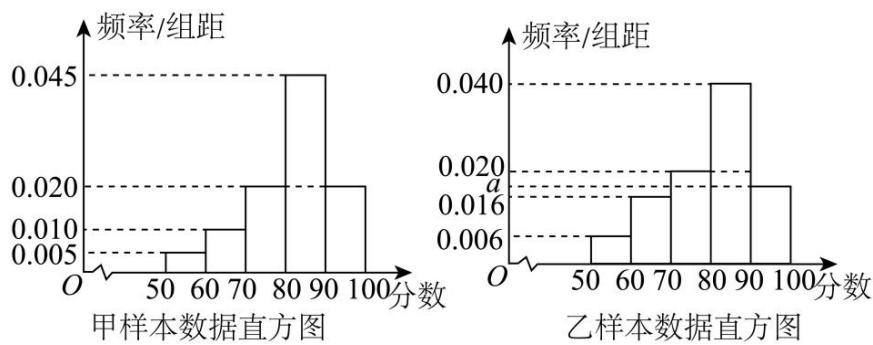

# 第一节跟踪训练

### 题型1

【训练 1】在 12 件同类产品中，有 10 件正品和 2 件次品，从中任意抽出 3 件。其中为必然事件的是（）。

$\quad$A. 3件都是正品

$\quad$B. 至少有 1 件是次品

$\quad$C. 3件都是次品

$\quad$D. 至少有 1 件是正品

【训练2】给出下列四个命题：①“三个球全部放入两个盒子，其中必有一个盒子有一个以上的球”是必然事件；②“当 $x$ 为某一实数时可使 $x^{2} < 0$ ”是不可能事件；③“明年的国庆节是晴天”是必然事件；④“从100个灯泡（有10个次品）中取出5个，5个都是次品”是随机事件.其中正确命题的个数是（）.

$\quad$A. 4

$\quad$B. 3

$\quad$C. 2

$\quad$D. 1

### 题型 2

【训练 1】随机事件“连续掷一颗筛子直到出现 5 点停止，观察掷的次数”的样本空间是（）

$\quad$A. 5

$\quad$B. 1 到 6 的正整数

$\quad$C. 6

$\quad$D. 一切正整数

【训练 2】体育彩票摇奖时, 将 10 个质地和大小完全相同, 分别标有号码 0, 1, 2, ..., 9 的球放入摇奖器中, 经过充分搅拌后摇出一个球. 记“摇到的球的号码小于 6”为事件 $A$ , 则事件 $A$ 包含的样本点的个数为 ( )

$\quad$A. 4

$\quad$B. 5

$\quad$C. 6

$\quad$D. 7

# 题型3

【训练 1】某种彩票的中奖概率为 $\frac{1}{100000}$ ，则以下理解正确的是（）

$\quad$A. 购买这种彩票 100000 张，一定能中奖一次

$\quad$B. 购买这种彩票 100000 张，可能一次也没中奖

$\quad$C. 购买这种彩票 1 张, 一定不能中奖

$\quad$D. 购买这种彩票 100000 张，至少能中奖一次

【训练 2】气象台预报“本市明天降水的概率是 30%”，对于这句话的理解，下列说法正确的是（）

$\quad$A. 本市明天将有 $30\%$ 的地区降水  
$\quad$B. 本市明天将有 $30\%$ 的时间降水  
$\quad$C. 本市明天有可能降水  
$\quad$D. 本市明天肯定不降水

【训练 3】根据某市疾控中心的健康监测，该市在校中学生的近视率约为 78.7%. 某眼镜厂商要到中学给近视学生配送滴眼液，每人一瓶，已知该校学生总数为 600 人，则眼镜商应带滴眼液的瓶数为（）

$\quad$A. 600

$\quad$B. 787

$\quad$C. 不少于 473

$\quad$D. 不多于 473

【训练 4】下列说法正确的是（）

$\quad$A. 某厂一批产品的次品率为 $\frac{1}{10}$ , 则任意抽取其中 10 件产品一定会发现一件次品  
$\quad$B. 掷一枚硬币，连续出现 5 次正面向上，第六次出现反面向上的概率与正面向上的概率仍然都为 0.5  
$\quad$C. 某医院治疗一种疾病的治愈率为 $10\%$ ，那么前9个病人都没有治愈，第10个人就一定能治愈  
$\quad$D. 气象部门预报明天下雨的概率是 $90\%$ ，说明明天该地区 $90\%$ 的地方要下雨，其余 $10\%$ 的地方不会下雨

### 题型 4

【训练 1】抛掷一颗质地均匀的骰子，有如下随机事件： $C_{i}=$ “点数为i”，其中i=1,2,3,4,5,6； $D_{1}=$ “点数不大于2”， $D_{2}=$ “点数大于2”， $D_{3}=$ “点数大于4”下列结论是判断错误的是（）

$\quad$A. $C_1$ 与 $C_2$ 互斥

$\quad$B. $D_{1} \cup D_{2} = \Omega$ , $D_{1}D_{2} = \emptyset$

$\quad$C. $D_{3} \subseteq D_{2}$

$\quad$D. $C_2, C_3$ 为对立事件

考向2

### 题型 1

【训练 1】第 31 届世界大学生夏季运动会于 2023 年 7 月 28 日至 8 月 8 日在中国四川省成都市举行，是中国西部第一次举办的世界性综合运动会。该届赛事共设篮球、排球、田径、游泳等 18 个大项，269 个小项。甲同学准备在体操、跳水、羽毛球三个比赛项目中选择一个前去观看，乙同学准备在跳水和羽毛球中选择一个前去观看，则甲、乙观看同一比赛的概率是（）

$\quad$A. $\frac{1}{6}$

$\quad$B. $\frac{2}{3}$

$\quad$C. $\frac{3}{5}$

$\quad$D. $\frac{1}{3}$

【训练 2】“142857”这一串数字被称为走马灯数，是世界上著名的几个数之一，当 142857 与 1 至 6 中任意一个数字相乘，乘积中仍然是 1, 4, 2, 8, 5, 7 这 6 个数字轮流出现。若从 1, 4, 2, 8, 5, 7 这 6 个数字中任选 2 个数字组成无重复数字的两位数，从这些两位数中随机选取 1 个，这个两位数大于 72 的概率为（）

$\quad$A. $\frac{3}{10}$

$\quad$B. $\frac{3}{5}$

$\quad$C. $\frac{4}{15}$

$\quad$D. $\frac{1}{3}$

【训练 3】（2024•甲卷）有 6 个相同的球，分别标有数字 1、2、3、4、5、6，从中不放回地随机抽取 3 次，每次取 1 个球．记 m 表示前两个球号码的平均数，记 n 表示前三个球号码的平均数，则 m 与 n 差的绝对值不超过 $\frac{1}{2}$ 的概率是 \_\_\_\_．

### 题型 2

【训练 1】已知事件A与事件B互斥，记事件 $\overline{B}$ 为事件B对立事件.若 $P(A)=0.6,\ P(B)=0.2$ ，则 $P(A+\overline{B})=$ （）

$\quad$A. 0.6

$\quad$B. 0.8

$\quad$C. 0.2

$\quad$D. 0.48

【训练2】已知随机事件A和B互斥，A和C对立，且 $P(A \cup B) = 0.5, P(B) = 0.2$ ，则 $P(C) = (\quad)$

$\quad$A. 0.8

$\quad$B. 0.7

$\quad$C. 0.6

$\quad$D. 0.5

### 题型 3

【训练 1】用掷两枚硬币做胜负游戏，规定：两枚硬币同时出现正面或同时出现反面算甲胜，一个正面、一个反面算乙胜.这个游戏公平吗？

【训练 2】一天，甲拿出一个装有三张卡片的盒子（一张卡片的两面都是绿色，一张卡片的两面都是蓝色，还有一张卡片一面是绿色，另一面是蓝色），跟乙说玩一个游戏，规则是：甲将盒子里的卡片顺序打乱后，由乙随机抽出一张卡片放在桌子上，然后卡片朝下的面的颜色决定胜负，如果朝下的面的颜色与朝上的面的颜色一致，则甲赢，否则甲输。乙对游戏的公平性提出了质疑，但是甲说：“当然公平！你看，如果朝上的面的颜色为绿色，则这张卡片不可能两面都是蓝色，因此朝下的面要么是绿色，要么是蓝色，因此，你赢的概率为 $\frac{1}{2}$ ，我赢的概率也是 $\frac{1}{2}$ ，怎么不公平？”分析这个游戏是否公平。

### 题型 4

【训练 1】某学校开设了街舞、围棋、武术三个社团，三个社团参加的人数如下表所示：

<table><tr><td>社团</td><td>街舞</td><td>围棋</td><td>武术</td></tr><tr><td>人数</td><td>48</td><td>42</td><td>30</td></tr></table>

为调查社团活动开展情况，学校社团管理部采用分层随机抽样的方法从中抽取一个样本，已知从围棋社团抽取的同学比从街舞社团抽取的同学少1人.

（1）求三个社团分别抽取了多少同学;   
（2）已知从围棋社团抽取的同学中有 2 名女生，若从围棋社团被抽取的同学中随机选出 2 人担任该社团活动监督的职务，求至少有 1 名女同学担任监督职务的概率.

【训练 2】某学校为了解本校历史、物理方向学生的学业水平模拟测试数学成绩情况，分别从物理方向的学生中随机抽取 60 人的成绩得到样本甲，从历史方向的学生中随机抽取 n 人的成绩得到样本乙，根据两个样本数据分别得到如下直方图：

已知乙样本中数据在[70,80)的有10个.

（1）求n和乙样本直方图中a的值:   
（2）试估计该校物理方向的学生本次模拟测试数学成绩的平均值和历史方向的学生本次模拟测试数学成绩的中位数（同一组中的数据用该组区间中点值为代表）.  
（3）采用分层抽样的方法从甲样本数据中分数在[60,70)和[70,80)的学生中抽取6人,并从这6人中任取2人,求这两人分数都在[70,80)中的概率.

