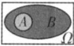
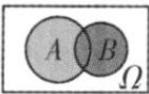
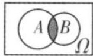
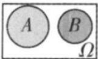
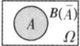
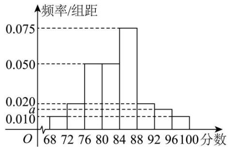

# 第一节 随机事件与概率

# 知识点1. 有限样本空间

# （1）随机试验

我们把对随机现象的实现和对它的观察称为随机试验，简称试验，常用字母 E 表示. 我们感兴趣的是具有以下特点的随机试验：

①试验可以在相同条件下重复进行；  
②试验的所有可能结果是明确可知的，并且不止一个；  
③每次试验总是恰好出现这些可能结果中的一个，但事先不能确定出现哪一个结果.

# （2）有限样本空间

我们把随机试验 E 的每个可能的基本结果称为样本点，全体样本点的集合称为试验 E 的样本空间.

一般地，我们用 $\Omega$ 表示样本空间，用 $\omega$ 表示样本点。如果一个随机试验有 n 个可能结果 $\omega_{1}, \omega_{2}, \cdots, \omega_{n}$ ，则称样本空间 $\Omega = \{\omega_{1}, \omega_{2}, \cdots, \omega_{n}\}$ 为有限样本空间。

# 知识点2. 事件

# （1）随机事件

一般地，随机试验中的每个随机事件都可以用这个试验的样本空间的子集来表示.为了叙述方便，我们将样本空间 $\Omega$ 的子集称为随机事件，简称事件，并把只包含一个样本点的事件称为基本事件.随机事件一般用大写字母A，B，C，…表示.在每次试验中，当且仅当A中某个样本点出现时，称为事件A发生.

# （2）必然事件

A 作为自身的子集，包含了所有的样本点，在每次试验中总有一个样本点发生，所以 $\Omega$ 总会发生，我们称 $\Omega$ 为必然事件.

# （3）不可能事件

空集 $\varnothing$ 不包含任何样本点，在每次试验中都不会发生，我们称 $\varnothing$ 为不可能事件.

# 知识点3. 事件的关系和运算

（1）两个事件的关系和运算 

<table><tr><td>事件的关系或运算</td><td>含义</td><td>符号表示</td><td>图形表示</td></tr><tr><td>包含</td><td>A发生导致B发生</td><td>A⊆B</td><td></td></tr><tr><td>并事件(和事件)</td><td>A与B至少一个发生</td><td>A∪B或A+B</td><td></td></tr><tr><td>交事件(积事件)</td><td>A与B同时发生</td><td>A∩B或AB</td><td></td></tr><tr><td>互斥(互不相容)</td><td>A与B不能同时发生</td><td>A∩B=∅</td><td></td></tr><tr><td>互为对立</td><td>A与B有且仅有一个发生</td><td> $A \cap B = \varnothing$ , $A \cup B = \Omega$ </td><td></td></tr></table>

（2）多个事件的和事件、积事件

类似地，我们可以定义多个事件的和事件以及积事件.对于多个事件 A, B, C, $\cdots$ , $A \cup B \cup C \cup \cdots$ (或 $A + B + C + \cdots$ ) 发生当且仅当 A, B, C, $\cdots$ 中至少一个发生， $A \cap B \cap C \cap \cdots$ (或 ABC $\cdots$ ) 发生当且仅当 A, B, C, $\cdots$ 同时发生.

（3）互斥事件与对立事件的关系

①互斥事件是不可能同时发生的两个事件，而对立事件除要求这两个事件不同时发生外，还要求二者之一必须有一个发生.  
②对立事件是互斥事件的特殊情况，而互斥事件未必是对立事件，即“互斥”是“对立”的必要不充分条件，而“对立”则是“互斥”的充分不必要条件.
### 知识点  4. 用集合观点看事件间的关系

<table><tr><td>符号</td><td>概率角度</td><td>集合角度</td></tr><tr><td>Ω</td><td>必然事件</td><td>全集</td></tr><tr><td>∅</td><td>不可能事件</td><td>空集</td></tr><tr><td>ω</td><td>试验的可能结果</td><td>Ω中的元素</td></tr><tr><td>A</td><td>事件</td><td>Ω的子集</td></tr><tr><td> $\overline{A}$ </td><td>A的对立事件</td><td>A的补集</td></tr><tr><td>A⊆B</td><td>事件A包含于事件B</td><td>集合A是集合B的子集</td></tr><tr><td>A=B</td><td>事件A等于事件B</td><td>集合A等于集合B</td></tr><tr><td>A∪B或A+B</td><td>事件A与事件B的并(和)事件</td><td>集合A与B的并集</td></tr><tr><td>A∩B或AB</td><td>事件A与事件B的交(积)事件</td><td>集合A与B的交集</td></tr><tr><td>A∩B=∅</td><td>事件A与事件B互斥</td><td>集合A与B的交集为空集</td></tr><tr><td>A∩B=∅,且A∪B=Ω</td><td>事件A与事件B对立</td><td>集合A与B互为补集</td></tr></table>

# 知识点5. 概率与频率

（1）频率：在 $n$ 次重复试验中，事件 $A$ 发生的次数 $k$ 称为事件 $A$ 发生的频数，频数 $k$ 与总次数 $n$ 的比值 $\frac{k}{n}$ ，叫做事件 $A$ 发生的频率.  
（2）概率：在大量重复尽心同一试验时，事件 $A$ 发生的频率 $\frac{k}{n}$ 总是接近于某个常数，并且在它附近摆动，这时，就把这个常数叫做事件 $A$ 的概率，记作 $P(A)$ 。

（3）概率与频率的关系：对于给定的随机事件 $A$ ，由于事件 $A$ 发生的频率 $\frac{k}{n}$ 随着试验次数的增加稳定于概率 $P(A)$ ，因此可以用频率 $\frac{k}{n}$ 来估计概率 $P(A)$ ：

# 知识点6. 古典概型

# （1）事件的概率

对随机事件发生可能性大小的度量(数值)称为事件的概率，事件 A 的概率用 $P(A)$ 表示.

# （2）古典概型的定义

我们将具有以下两个特征的试验称为古典概型试验，其数学模型称为古典概率模型，简称古典概型.

①有限性：样本空间的样本点只有有限个；

②等可能性：每个样本点发生的可能性相等.

# （3）古典概型的判断标准

一个试验是否为古典概型，在于这个试验是否具有古典概型的两个特点：有限性和等可能性.并不是所有的试验都是古典概型.

下列三类试验都不是古典概型：

①样本点(基本事件)个数有限，但非等可能;  
②样本点(基本事件)个数无限，但等可能；  
③样本点(基本事件)个数无限，也不等可能.

# 知识点7．古典概型的概率计算公式

一般地，设试验 E 是古典概型，样本空间 A 包含 n 个样本点，事件 A 包含其中的 k 个样本点，则定义事件 A 的概率 $P(A)=\frac{k}{n}=\frac{n(A)}{n(\Omega)}$ ，其中， $n(A)$ 和 $n(\Omega)$ 分别表示事件 A 和样本空间 $\Omega$ 包含的样本点个数.

# 知识点8. 概率的基本性质

（1）对于任意事件 A 都有: $0 \leq P(A) \leq 1$ .  
（2）必然事件的概率为1，即 $P(\Omega)=1$ ；不可能事概率为0，即 $P(\varnothing)=0$ 。  
（3）概率的加法公式:若事件 A 与事件 B 互斥，则 $P(A \cup B) = P(A) + P(B)$ .

推广 一般地，若事件 $A_{1}$ ， $A_{2}$ ，…， $A_{n}$ 彼此互斥，则事件发生（即 $A_{1}$ ， $A_{2}$ ，…， $A_{n}$ 中有一个发生）的概率等于这 n 个事件分别发生的概率之和，即： $P(A_{1} + A_{2} + \ldots + A_{n}) = P(A_{1}) + P(A_{2}) + \ldots + P(A_{n})$ .

（4）对立事件的概率:若事件 A 与事件 B 互为对立事件，则 $P(A)=1-P(B)$ ， $P(B)=1-P(A)$ ，且 $P(A\cup B)=P(A)+P(B)=1$ 。  
（5）概率的单调性: 若 $A \subseteq B$ ，则 $P(A) \leq P(B)$ .  
（6）若 A，B 是一次随机实验中的两个事件，则 $P(A \cup B) = P(A) + P(B) - P(A \cap B)$ .

# 考向一 有限样本空间与事件

# 题型一 事件的分类

【例 1】下列事件中，随机事件的个数为（）

①甲，乙两人下棋，甲获胜；  
②小明过马路，遇见车的车牌号尾号是奇数；  
③某种彩票的中奖率为99%，某人买一张此种彩票中奖；  
④用任意平面截球体，所得截面图形是椭圆形.

$\quad$A. 1 个

$\quad$B. 2 个

$\quad$C. 3 个

$\quad$D. 4 个

【例 2】（22-23 高二下·河南信阳·期末）已知袋中有大小、形状完全相同的 4 个红色、3 个白色的乒乓球，从中任取 4 个，则下列判断错误的是（）

$\quad$A. 事件“都是红色球”是随机事件  
$\quad$B. 事件“都是白色球”是不可能事件  
$\quad$C. 事件“至少有一个白色球”是必然事件  
$\quad$D. 事件“有 3 个红色球和 1 个白色球”是随机事件

# 题型二 事件与样本空间

【例 1】抛掷两枚硬币，观察它们落地时朝上的面的情况，该试验的样本空间中样本点的个数为（）

$\quad$A. 1

$\quad$B. 2

$\quad$C. 4

$\quad$D. 8

【例 2】在试验：连续射击一个目标 10 次，观察命中的次数中，事件 A=“至少命中 6 次”，则下列说法正确的是（）

$\quad$A. 样本空间中共有 10 个样本点  
$\quad$B. 事件 $A$ 中有6个样本点  
$\quad$C. 样本点 6 在事件 $A$ 内  
$\quad$D. 事件 $A$ 中包含样本点11

# 题型三 生活中的概率

【例 1】气象台预报“本市明天降雨概率是 70%”，下列说法正确的是（）

$\quad$A. 本市明天将有 $70\%$ 的地区降雨

$\quad$B. 本市有天将有 $70\%$ 的时间降雨

$\quad$C. 明天出行不带雨具淋雨的可能性很大

$\quad$D. 明天出行不带雨具肯定要淋雨

【例 2】三国时期，诸葛亮曾经利用自身丰富的气象观测经验，提前三天准确地预报出一场大雾，并在大雾的掩护下，演出了一场“草船借箭”的好戏，令世人惊叹。诸葛亮应用的是（）

$\quad$A. 动力学方程的知识

$\quad$B. 概率与统计的知识

$\quad$C. 气象预报模型的知识

$\quad$D. 迷信求助于神灵

【例 3】老师讲一道数学题，李峰能听懂的概率是 0.8，是指（）

$\quad$A. 老师每讲一题，该题有 $80 \%$ 的部分能听懂， $20 \%$ 的部分听不懂

$\quad$B. 老师在讲的 10 道题中, 李峰能听懂 8 道

$\quad$C. 李峰听懂老师所讲这道题的可能性为 $80 \%$

$\quad$D. 以上解释都不对

# 题型四 事件的关系和运算

【例 1】掷一枚骰子，设事件A：落地时向上的点数是奇数；B：落地时向上的点数是3的倍数；C：落地时向上的点数是2；D：落地时向上的点数是2的倍数，则下列说法中，错误的是（）

$\quad$A. $A$ 和 $B$ 有可能同时发生

$\quad$B. $A$ 和 $D$ 是对立事件

$\quad$C. B和C是对立事件

$\quad$D. $A$ 和 $C$ 是互斥事件

【例 2】从 1, 2, 3, 4, 5 中任取 2 个数，设事件 A = “2 个数都为偶数”，B = “2 个数都为奇数”，C = “至少 1 个数为奇数”，D = “至多 1 个数为奇数”，则下列结论正确的是（）

$\quad$A. $A$ 与 $B$ 是互斥事件

$\quad$B. $A$ 与 $C$ 是互斥但不对立事件

$\quad$C. B与D是互斥但不对立事件

$\quad$D. $C$ 与 $D$ 是对立事件

【例 2】如果A，B是互斥事件，下列选项正确的是（）

$\quad$A. 事件 $\overline{A}$ 与 $\overline{B}$ 不互斥

$\quad$B. $P(\overline{A} \cup \overline{B}) = 1$

$\quad$C. A与 $\overline{B}$ 互斥

$\quad$D. $P(A \cup B) = 1$

# 考向二 古典概型与概率的基本性质

# 题型一 古典概型

【例 1】一个箱子中装有 6 个红球和 4 个白球，从中随机取出三个球，则取出的三个球中至少有一个红球的概率（）

$\quad$A. $\frac{29}{30}$

$\quad$B. $\frac{13}{15}$

$\quad$C. $\frac{1}{6}$

$\quad$D. $\frac{3}{5}$

【例 2】（2024·新高考 I）甲、乙两人各有四张卡片，每张卡片上标有一个数字，甲的卡片上分别标有数字 1, 3, 5, 7，乙的卡片上分别标有数字 2, 4, 6, 8，两人进行四轮比赛，在每轮比赛中，两人各自从自己持有的卡片中随机选一张，并比较所选卡片上数字的大小，数字大的人得 1 分，数字小的人得 0 分，然后各自弃置此轮所选的卡片（弃置的卡片在此后轮次中不能使用）。则四轮比赛后，甲的总得分不小于 2 的概率为 \_\_\_\_。

# 题型二 概率的基本性质

【例 1】（2023•上海）已知事件 A 的对立事件为 $\overline{A}$ ，若 P（A）=0.5，则 $P(\overline{A})=$ \_\_\_\_.

##### 【例2】已知事件 $A$ ， $B$ 是互斥事件， $P(A) = \frac{1}{6}$ ， $P(\overline{B}) = \frac{2}{3}$ ，则 $P(A\cup B) = (\quad)$

$\quad$A. $\frac{1}{18}$

$\quad$B. $\frac{4}{9}$

$\quad$C. $\frac{1}{2}$

$\quad$D. $\frac{2}{3}$

【例 3】若事件A, B为两个互斥事件，且 $P(A) > 0, P(B) > 0$ ，有以下四个结论，其中正确的结论是（）

① $P(AB)=0$

② $P(\overline{A}B)=[1-P(A)]P(B)$

③ $P(\overline{A} \cup \overline{B}) = 1$

④ $P(A \cup B) = P(A) + P(B)$

$\quad$A. ①③④

$\quad$B. ②③④

$\quad$C. ①②④

$\quad$D. ①②③

# 题型三 游戏的公平性问题

【例 1】下面的三个游戏都是在袋子中装球，然后从袋子中不放同地取球，分别计算三个游戏中甲获胜的概率，你认为哪个游戏是公平的？

<table><tr><td></td><td>游戏1</td><td>游戏2</td><td>游戏3</td></tr><tr><td>袋子中球的数量和颜色</td><td>1个红球和1个白球</td><td>2个红球和2个白球</td><td>3个红球和1个白球</td></tr><tr><td>取球规则</td><td>取1个球</td><td>依次取出2个球</td><td>依次取出2个球</td></tr><tr><td rowspan="2">获胜规则</td><td>取到红球→甲胜</td><td>两个球同色→甲胜</td><td>两个球同色→甲胜</td></tr><tr><td>取到白球→乙胜</td><td>两个球不同色→乙胜</td><td>两个球不同色→乙胜</td></tr></table>

【例 2】已知 n 是一个三位正整数，若 n 的个位数字大于十位数字，十位数字大于百位数字，则称 n 为“三位递增数”（如 135, 256, 345 等）现要从甲乙两名同学中，选出一个参加某市组织的数学竞赛，选取的规则如下：从由 1, 2, 3, 4, 5, 6 组成的所有“三位递增数”中随机抽取 1 个数，且只抽取 1 次，若抽取的“三位递增数”是偶数，则甲参加数学竞赛；否则，乙参加数学竞赛.

（1）由 1，2，3，4，5，6 可组成多少“三位递增数”？并一一列举出来.  
（2）这种选取规则对甲乙两名学生公平吗？并说明理由.

# 题型四 古典概型与其他知识的综合

【例 1】辽宁省朝阳市妇联发挥阵地优势，在市妇女儿童活动中心开展了“萌童成长”寒假公益课堂，涵盖了创意美术、传统文化、科学小实验、“亲子阅读”等丰富的活动。公益课堂共开设 24 期，近 200 名少年儿童受益。从参加公益课堂的少年儿童中随机抽取 50 名少年儿童进行问卷调查（满分 100 分），将问卷调查结果按[68,72)，[72,76)，[76,80)，[80,84)，[84,88)，[88,92)，[92,96)，[96,100]分成八组，并绘制成频率分布直方图，如图所示。

（1）求a的值，并估计被抽取的50名少年儿童问卷调查结果的平均数（同一组数据用该组区间的中点值作代表）；  
（2）若从样本中问卷调查结果在[88,92)和[96,100]内的少年儿童中随机抽取2名少年儿童，求随机抽取的这2名少年儿童在同一组的概率.

【例 2】甲、乙两射击队（每队有 7 名队员）进行射击比赛，每名队员均射击 20 次且每次射击中目标得 1 分，未击中目标得 0 分．假设所有队员的得分相互独立．现统计每队队员的得分情况如下：

甲队：14,13,10,15,12,16,11.

乙队：17,15,16,12,14,13,m.

（1）现从甲、乙两队各随机选 1 人，甲队选出的队员记为 A，乙队选出的队员记为 B，若 m = 20，求队员 A 的得分不少于队员 B 的得分的概率.  
（2）是否存在 $m(m \in N^{*})$ 使得甲、乙两队队员的得分的方差相等．若存在，请写出m的值，不用说明理由；若不存在，请说明理由.

