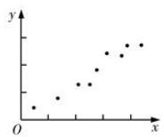
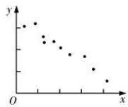
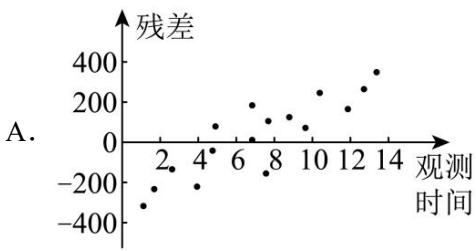
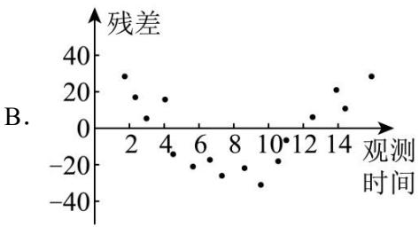
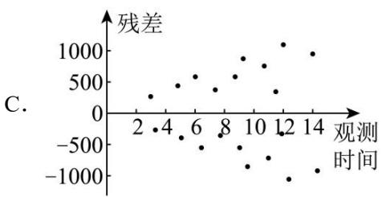
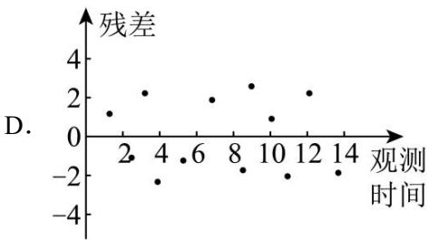
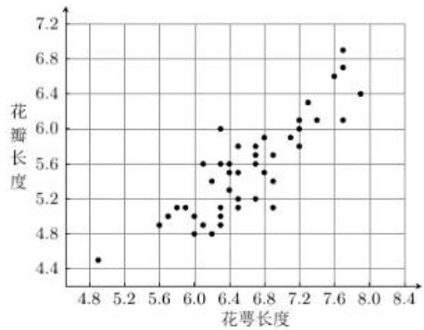
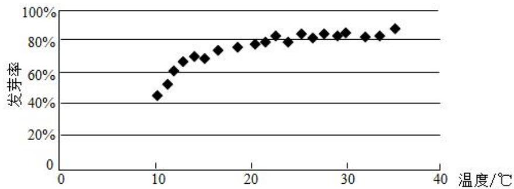
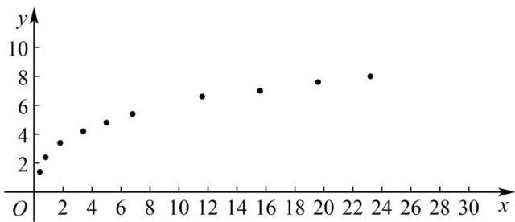

# 第 6 节 成对数据的统计分析

# 知识点一、变量间的相关关系

# 1、变量之间的相关关系

当自变量取值一定时，因变量的取值带有一定的随机性，则这两个变量之间的关系叫相关关系。由于相关关系的不确定性，在寻找变量之间相关关系的过程中，统计发挥着非常重要的作用。我们可以通过收集大量的数据，在对数据进行统计分析的基础上，发现其中的规律，对它们的关系作出判断。

注意：相关关系与函数关系是不同的，相关关系是一种非确定的关系，函数关系是一种确定的关系，而且函数关系是一种因果关系，但相关关系不一定是因果关系，也可能是伴随关系.

# 2、散点图

将样本中的 n 个数据点 $(x_{i}, y_{i}) (i = 1, 2, \cdots, n)$ 描在平面直角坐标系中，所得图形叫做散点图．根据散点图中点的分布可以直观地判断两个变量之间的关系.

（1）如果散点图中的点散布在从左下角到右上角的区域内，对于两个变量的这种相关关系，我们将它称为正相关，如图（1）所示；  
（2）如果散点图中的点散布在从左上角到右下角的区域内，对于两个变量的这种相关关系，我们将它称为负相关，如图（2）所示.

  
（1）

  
（2）

# 3、相关系数

若相应于变量 $x$ 的取值 $x_{i}$ ，变量 $y$ 的观测值为 $y_{i} (1 \leq i \leq n)$ ，则变量 $x$ 与 $y$ 的相关系数

$r = \frac {\sum_ {i = 1} ^ {n} \left(x _ {i} - \bar {x}\right) \left(y _ {i} - \bar {y}\right)}{\sqrt {\sum_ {i = 1} ^ {n} \left(x _ {i} - \bar {x}\right) ^ {2} \sum_ {i = 1} ^ {n} \left(y _ {i} - \bar {y}\right) ^ {2}}} = \frac {\sum_ {i = 1} ^ {n} x _ {i} y _ {i} - n \overline {{{x}}} \overline {{{y}}}}\sqrt {\sum_ {i = 1} ^ {n} x _ {i} ^ {2} - n \overline {{{x}}} ^ {- 2}} \sqrt {\sum_ {i = 1} ^ {n} y _ {i} ^ {2} - n \overline {{{y}}} ^ {- 2}}, \text {通常用} r \text {来衡量} x \text {与} y \text {之间的线性关系的强弱，} r$

的范围为 $-1 \leq r \leq 1$ .

（1）当 r > 0 时，表示两个变量正相关；当 r < 0 时，表示两个变量负相关.  
（2） $|r|$ 越接近1，表示两个变量的线性相关性越强； $|r|$ 越接近0，表示两个变量间几乎不存在线性相关关系．当 $|r| = 1$ 时，所有数据点都在一条直线上.  
（3）通常当 $|r|>0.75$ 时，认为两个变量具有很强的线性相关关系.

# 知识点二、线性回归

# 1、线性回归

线性回归是研究不具备确定的函数关系的两个变量之间的关系（相关关系）的方法.

对于一组具有线性相关关系的数据 $(x_{1}, y_{1}), (x_{2}, y_{2}), \ldots, (x_{n}, y_{n})$ ，其回归方程 $\hat{y} = \hat{b}x + \hat{a}$ 的求法为

$\left\{ \begin{array}{l} \hat {b} = \frac {\sum_ {i = 1} ^ {n} \left(x _ {i} - \bar {x}\right) \left(y _ {i} - \bar {y}\right)}{\sum_ {i = 1} ^ {n} \left(x _ {i} - \bar {x}\right) ^ {2}} = \frac {\sum_ {i = 1} ^ {n} x _ {i} y _ {i} - n \bar {x} \bar {y}}{\sum_ {i = 1} ^ {n} x _ {i} ^ {2} - n \bar {x} ^ {2}} \\ \hat {a} = \bar {y} - \hat {b} \bar {x} \end{array} \right.$

其中， $\overline{x}=\frac{1}{n}\sum_{i=1}^{n}x_{i}$ ， $\overline{y}=\frac{1}{n}\sum_{i=1}^{n}y_{i}$ ， $(\overline{x},\overline{y})$ 称为样本点的中心.

# 2、残差分析

对于预报变量 $y$ ，通过观测得到的数据称为观测值 $y_{i}$ ，通过回归方程得到的 $\hat{y}$ 称为预测值，观测值减去预测值等于残差， $\hat{e}_{i}$ 称为相应于点 $(x_{i}, y_{i})$ 的残差，即有 $\hat{e}_{i} = y_{i} - \hat{y}_{i}$ 。残差是随机误差的估计结果，通过对残差的分析可以判断模型刻画数据的效果以及判断原始数据中是否存在可疑数据等，这方面工作称为残差分析。

# （1） 残差图

通过残差分析，残差点 $\left(x_{i},\hat{e}_{i}\right)$ 比较均匀地落在水平的带状区域中，说明选用的模型比较合适，其中这样的带状区域的宽度越窄，说明模型拟合精确度越高；反之，不合适.

（2）通过残差平方和 $Q = \sum_{i=1}^{n}(y_i - \hat{y}_i)^2$ 分析，如果残差平方和越小，则说明选用的模型的拟合效果越好；反之，不合适.

# （3）相关指数

用相关指数来刻画回归的效果，其计算公式是： $R^{2}=1-\frac{\sum_{i=1}^{n}(y_{i}-\hat{y}_{i})^{2}}{\sum_{i=1}^{n}(y_{i}-\bar{y})^{2}}$ .

$R^{2}$ 越接近于1，说明残差的平方和越小，也表示回归的效果越好.

# 知识点三、非线性回归

解答非线性拟合问题，要先根据散点图选择合适的函数类型，设出回归方程，通过换元将陌生的非线性回归方程化归转化为我们熟悉的线性回归方程.

求出样本数据换元后的值，然后根据线性回归方程的计算方法计算变换后的线性回归方程系数，还原后即可求出非线性回归方程，再利用回归方程进行预报预测，注意计算要细心，避免计算错误.

# 1、建立非线性回归模型的基本步骤：

（1）确定研究对象，明确哪个是解释变量，哪个是预报变量；

（2） 画出确定好的解释变量和预报变量的散点图, 观察它们之间的关系 (是否存在非线性关系);

（3）由经验确定非线性回归方程的类型（如我们观察到数据呈非线性关系，一般选用反比例函数、二次函数、指数函数、对数函数、幂函数模型等）；

（4）通过换元，将非线性回归方程模型转化为线性回归方程模型；  
（5）按照公式计算线性回归方程中的参数（如最小二乘法），得到线性回归方程；  
（6） 消去新元, 得到非线性回归方程;  
（7）得出结果后分析残差图是否有异常．若存在异常，则检查数据是否有误，或模型是否合适等.

# 知识点四、独立性检验

# 1、分类变量和列联表

# （1） 分类变量:

变量的不同“值”表示个体所属的不同类别，像这样的变量称为分类变量.

# （2） 列联表:

①定义: 列出的两个分类变量的频数表称为列联表.  
② $2\times2$ 列联表.

一般地，假设有两个分类变量 X 和 Y，它们的取值分别为 $\{x_{1}, x_{2}\}$ 和 $\{y_{1}, y_{2}\}$ ，其样本频数列联表（称为 $2 \times 2$ 列联表）为

<table><tr><td></td><td> $y_1$ </td><td> $y_2$ </td><td>总计</td></tr><tr><td> $x_1$ </td><td>a</td><td>b</td><td>a+b</td></tr><tr><td> $x_2$ </td><td>c</td><td>d</td><td>c+d</td></tr><tr><td>总计</td><td>a+c</td><td>b+d</td><td>n=a+b+c+d</td></tr></table>

从 $2 \times 2$ 列表中，依据 $\frac{a}{a + b}$ 与 $\frac{c}{c + d}$ 的值可直观得出结论：两个变量是否有关系.

# 2、等高条形图

（1）等高条形图和表格相比，更能直观地反映出两个分类变量间是否相互影响，常用等高条形图表示列联表数据的频率特征.  
（2） 观察等高条形图发现 $\frac{a}{a + b}$ 与 $\frac{c}{c + d}$ 相差很大, 就判断两个分类变量之间有关系.

# 3、独立性检验

计算随机变量 $\chi^2 = \frac{n(ad - bc)^2}{(a + b)(c + d)(a + c)(b + d)}$ 利用 $\chi^2$ 的取值推断分类变量 $X$ 和 $Y$ 是否独立的方法称为 $\chi^2$ 独立性检验.

<table><tr><td> $\alpha$ </td><td>0.10</td><td>0.05</td><td>0.010</td><td>0.005</td><td>0.001</td></tr><tr><td> $x_{\alpha}$ </td><td>2.706</td><td>3.841</td><td>6.635</td><td>7.879</td><td>10.828</td></tr></table>

# 【解题方法总结】

常见的非线性回归模型

（1）指数函数型 $y = ca^{x}$ （a > 0 且 $a \neq 1$ ，c > 0）

两边取自然对数， $\ln y = \ln (ca^x)$ ，即 $\ln y = \ln c + x\ln a$

令 $\left\{ \begin{array}{l} y' = \ln y \\ x' = x \end{array} \right.$ ，原方程变为 $y' = \ln c + x' \ln a$ ，然后按线性回归模型求出 $\ln a$ ， $\ln c$ 。

（2）对数函数型 $y = b \ln x + a$

令 $\left\{\begin{aligned}y'=y\\ x'=\ln x\end{aligned}\right.$ ，原方程变为 $y'=bx'+a$ ，然后按线性回归模型求出b，a。

（3）幂函数型 $y=ax^{n}$

两边取常用对数， $\lg y = \lg (ax^n)$ ，即 $\lg y = n\lg x + \lg a$

令 $\left\{ \begin{array}{l} y' = \lg y \\ x' = \lg x \end{array} \right.$ ，原方程变为 $y' = nx' + \lg a$ ，然后按线性回归模型求出 $n$ ， $\lg a$ 。

（4） 二次函数型 $y = bx^{2} + a$

令 $\left\{\begin{aligned}y'=y\\ x'=x^{2}\end{aligned}\right.$ ，原方程变为 $y'=bx'+a$ ，然后按线性回归模型求出b，a。

（5）反比例函数型 $y=a+\frac{b}{x}$ 型

令 $\left\{\begin{aligned}y'&=y\\ x'&=\frac{1}{x}\end{aligned}\right.$ ，原方程变为 $y'=bx'+a$ ，然后按线性回归模型求出b，a。

# 题型一 变量间的相关关系

【例 1】下列四幅残差分析图中，与一元线性回归模型拟合精度最高的是（）

【例 2】（2023·天津）鸢是鹰科的一种鸟，《诗经·大雅·旱麓》曰“鸢飞戾天，鱼跃于渊”。鸢尾花因花瓣形如鸢尾而得名（图1），寓意鹏程万里、前途无量。通过随机抽样，收集了若干朵某品种鸢尾花的花萼长度和花瓣长度（单位：cm），绘制对应散点图（图2）如下：

图1

图2

计算得样本相关系数为 0.8642，利用最小二乘法求得相应的经验回归方程为 $\hat{y} = 0.7501x + 0.6105$ 。根据以上信息，如下判断正确的为（）

$\quad$A. 花萼长度和花瓣长度不存在相关关系  
$\quad$B. 花萼长度和花瓣长度负相关  
$\quad$C. 花萼长度为 $7 \mathrm{~cm}$ 的该品种鸢尾花的花瓣长度的平均值约为 $5.8612 \mathrm{~cm}$   
$\quad$D. 若选取其他品种鸢尾花进行抽样, 所得花萼长度与花瓣长度的样本相关系数一定为 0.8642

【例 3】（2020·新课标Ⅱ）某沙漠地区经过治理，生态系统得到很大改善，野生动物数量有所增加．为调查该地区某种野生动物的数量，将其分成面积相近的 200 个地块，从这些地块中用简单随机抽样的方法抽取 20 个作为样区，调查得到样本数据 $(x_{i}, y_{i})(i=1, 2, \ldots, 20)$ ，其中 $x_{i}$ 和 $y_{i}$ 分别表示第 i 个样区的植物覆盖面积（单位：公顷）和这种野生动物的数量，并计算得 $\sum_{i=1}^{20} x_{i} = 60$ ， $\sum_{i=1}^{20} y_{i} = 1200$ ， $\sum_{i=1}^{20} (x_{i} - \overline{x})^{2} = 80$ ， $\sum_{i=1}^{20} (y_{i} - \overline{y})^{2} = 9000$ ， $\sum_{i=1}^{20} (x_{i} - \overline{x})(y_{i} - \overline{y}) = 800$ 。

（1）求该地区这种野生动物数量的估计值（这种野生动物数量的估计值等于样区这种野生动物数量的平均数乘以地块数）；  
（2）求样本 $(x_{i}, y_{i})(i=1, 2, \ldots, 20)$ 的相关系数（精确到0.01）；  
（3）根据现有统计资料，各地块间植物覆盖面积差异很大。为提高样本的代表性以获得该地区这种野生动物数量更准确地估计，请给出一种你认为更合理的抽样方法，并说明理由。

附：相关系数 $r = \frac{\sum_{i=1}^{n}(x_i - \overline{x})(y_i - \overline{y})}{\sqrt{\sum_{i=1}^{n}(x_i - \overline{x})^2\sum_{i=1}^{n}(y_i - \overline{y})^2}}$ ， $\sqrt{2}\approx 1.414$ ：

# 题型二 一元线性回归模型

【例 1】为研究某种细菌在特定环境下，随时间变化的繁殖情况，得到如下实验数据：

<table><tr><td>天数x(天)</td><td>3</td><td>4</td><td>5</td><td>6</td></tr><tr><td>繁殖个数y(千个)</td><td>2.5</td><td>3</td><td>4</td><td>4.5</td></tr></table>

由最小二乘法得 y 与 x 的线性回归方程为 $\hat{y}=0.7x+\hat{a}$ ，则当 x=7 时，繁殖个数 y 的预测值为（）

$\quad$A. 4.9

$\quad$B. 5.25

$\quad$C. 5.95

$\quad$D. 6.15

【例 2】某社区为了丰富退休人员的业余文化生活，自 2018 年以来，始终坚持开展“悦读小屋读书活动”。下表是对 2018 年以来近 5 年该社区退休人员的年人均借阅量的数据统计：

<table><tr><td>年份</td><td>2018</td><td>2019</td><td>2020</td><td>2021</td><td>2022</td></tr><tr><td>年份代码x</td><td>1</td><td>2</td><td>3</td><td>4</td><td>5</td></tr><tr><td>年人均借阅量y(册)</td><td> $y_1$ </td><td> $y_2$ </td><td>16</td><td>22</td><td>28</td></tr></table>

（参考数据： $\sum_{i=1}^{5}y_{i}=90$ ）通过分析散点图的特征后，年人均借阅量y关于年份代码x的回归分析模型为 $\hat{y}=5x+m$ ，则2023年的年人均借阅量约为（）

$\quad$A. 31

$\quad$B. 32

$\quad$C. 33

$\quad$D. 34

【例 3】某单位在当地定点帮扶某村种植一种草莓，并把这种原本露天种植的草莓搬到了大棚里，获得了很好的经济效益。根据资料显示，产出的草莓的箱数 x（单位：箱）与成本 y（单位：千元）的关系如下：

<table><tr><td>x</td><td>10</td><td>20</td><td>30</td><td>40</td><td>60</td><td>80</td></tr><tr><td>y</td><td> $y_1$ </td><td> $y_2$ </td><td> $y_3$ </td><td> $y_4$ </td><td> $y_5$ </td><td> $y_6$ </td></tr></table>

（1）根据散点图可以认为 x 与 y 之间存在线性相关关系，请用最小二乘法求出线性回归方程 $\hat{y} = \hat{b}x + \hat{a}$ （ $\hat{a}, \hat{b}$ 用分数表示）

（2）某农户种植的草莓主要以 300 元/箱的价格给当地大型商超供货, 多余的草莓全部以 200 元/箱的价格销售给当地小商贩. 据统计, 往年 1 月份当地大型商超草莓的需求量为 50 箱、100 箱、150 箱、200 箱的概率分别为 $\frac{1}{10}$ , $\frac{1}{5}$ , $\frac{1}{2}$ , $\frac{1}{5}$ , 根据回归方程以及往年商超草莓的需求情况进行预测, 求今年 1 月份农户草莓的种植量为 200 箱时所获得的利润情况. (最后结果精确到个位)

附： $\sum_{i = 1}^{6}\big(x_i - \overline{x}\big)(y_i - \overline{y}) = 790$ ， $\sum_{i = 1}^{6}y_{i} = 54$ ，在线性回归直线方程 $\hat{y} = \hat{b} x + \hat{a}$ 中 $\hat{b} = \frac{\sum_{i = 1}^{n}\big(x_i - \overline{x}\big)(y_i - \overline{y}\big)}{\sum_{i = 1}^{n}\big(x_i - \overline{x}\big)^2},\hat{a} = \overline{y} -\hat{b}\overline{x}.$

# 题型三 非线性回归

【例 1】（2020·新课标 I）某校一个课外学习小组为研究某作物种子的发芽率 y 和温度 x （单位：°C）的关系，在 20 个不同的温度条件下进行种子发芽实验，由实验数据 $(x_{i}, y_{i})(i=1, 2, \ldots, 20)$ 得到下面的散点图：

由此散点图，在 $10^{\circ} \mathrm{C}$ 至 $40^{\circ} \mathrm{C}$ 之间，下面四个回归方程类型中最适宜作为发芽率 $y$ 和温度 $x$ 的回归方程类型的是（）

$\quad$A. $y = a + bx$

$\quad$B. $y = a + bx^{2}$

$\quad$C. $y = a + be^{x}$

$\quad$D. $y = a + b\ln x$

【例 2】若需要刻画预报变量 w 和解释变量 x 的相关关系，且从已知数据中知道预报变量 w 随着解释变量 x 的增大而减小，并且随着解释变量 x 的增大，预报变量 w 大致趋于一个确定的值，为拟合 w 和 x 之间的关系，应使用以下回归方程中的（b > 0，e 为自然对数的底数）（）

$\quad$A. $w = bx + a$

$\quad$B. $w = -b\ln x + a$

$\quad$C. $w = -b\sqrt{x} + a$

$\quad$D. $w = b\mathrm{e}^{-x} + a$

【例 3】在正常生产条件下，根据经验，可以认为化肥的有效利用率近似服从正态分布 $N(0.54,0.02^{2})$ ，而化肥施肥量因农作物的种类不同每亩也存在差异.

（1）假设生产条件正常，记 X 表示化肥的有效利用率，求 $P(X \geq 0.56)$ ;  
（2）课题组为研究每亩化肥施用量与某农作物亩产量之间的关系，收集了10组数据，并对这些数据作了初步处理，得到了如图所示的散点图及一些统计量的值.其中每亩化肥施用量为 $x$ （单位：公斤），粮食亩产量为 $y$ （单位：百公斤）

参考数据:

<table><tr><td> $\sum_{i=1}^{10}x_iy_i$ </td><td> $\sum_{i=1}^{10}x_i$ </td><td> $\sum_{i=1}^{10}y_i$ </td><td> $\sum_{i=1}^{10}x_i^2$ </td><td> $\sum_{i=1}^{10}t_iz_i$ </td><td> $\sum_{i=1}^{10}t_i$ </td><td> $\sum_{i=1}^{10}z_i$ </td><td> $\sum_{i=1}^{10}t_i^2$ </td></tr><tr><td>650</td><td>91.5</td><td>52.5</td><td>1478.6</td><td>30.5</td><td>15</td><td>15</td><td>46.5</td></tr></table>

$t _ {i} = \ln x _ {i}, z i = \ln y _ {i} (i = 1, 2, \dots , 1 0).$

（i）根据散点图判断， $y=a+bx$ 与 $y=cx^{d}$ ，哪一个适宜作为该农作物亩产量 y 关于每亩化肥施用量 x 的回归方程（给出判断即可，不必说明理由）；  
（ii）根据（i）的判断结果及表中数据，建立 $y$ 关于 $x$ 的回归方程；并预测每亩化肥施用量为27公斤时，粮食亩产量 $y$ 的值. $(\mathrm{e} \approx 2.7)$

附：①对于一组数据 $(u_{i},v_{i})(i=1,2,3,\cdots,n)$ ，其回归直线 $\hat{v}=\hat{\beta}u+\hat{\alpha}$ 的斜率和截距的最小二乘估计分别

为 $\hat{\beta}=\frac{\sum_{i=1}^{n}u_{i}v_{i}-n\overline{uv}}{\sum_{i=1}^{n}u_{i}^{2}-n\overline{u}^{2}}$ ， $\hat{\alpha}=\hat{v}-\hat{\beta}\overline{u}$ ;

②若随机变量 $X \sim N(\mu, \sigma^2)$ ，则 $P(\mu - \sigma < X < \mu + \sigma) \approx 0.6827$ ， $P(\mu - 2\sigma < X < \mu + 2\sigma) \approx 0.9545$ 。

# 题型四 列联表与独立性检验

【例 1】在新高考改革中，浙江省新高考实行的是 7 选 3 的 3+3 模式，即语数外三门为必考科目，然后从物理、化学、生物、政治、历史、地理、技术（含信息技术和通用技术）7 门课中选考 3 门.某校高二学生选课情况如下列联表一和列联表二（单位:人）

<table><tr><td></td><td>选物理</td><td>不选物理</td><td>总计</td></tr><tr><td>男生</td><td>340</td><td>110</td><td>450</td></tr><tr><td>女生</td><td>140</td><td>210</td><td>350</td></tr><tr><td>总计</td><td>480</td><td>320</td><td>800</td></tr><tr><td colspan="4">表一</td></tr><tr><td></td><td>选生物</td><td>不选生物</td><td>总计</td></tr><tr><td>男生</td><td>150</td><td>300</td><td>450</td></tr><tr><td>女生</td><td>150</td><td>200</td><td>350</td></tr><tr><td>总计</td><td>300</td><td>500</td><td>800</td></tr><tr><td colspan="4">表二</td></tr></table>

试根据小概率值 $\alpha = 0.005$ 的独立性检验，分析物理和生物选课与性别是否有关（）

附: $\chi^{2}=\frac{n(ad-bc)^{2}}{(a+b)(c+d)(a+c)(b+d)},\quad n=a+b+c+d.\alpha=P\left(\chi^{2}\geq x_{\alpha}\right)$

<table><tr><td> $\alpha$ </td><td>0.15</td><td>0.10</td><td>0.05</td><td>0.025</td><td>0.01</td><td>0.005</td><td>0.001</td></tr><tr><td> $x_a$ </td><td>2.072</td><td>2.706</td><td>3.841</td><td>5.024</td><td>6.635</td><td>7.879</td><td>10.828</td></tr></table>

$\quad$A. 选物理与性别有关，选生物与性别有关   
$\quad$B. 选物理与性别无关，选生物与性别有关   
$\quad$C. 选物理与性别有关, 选生物与性别无关   
$\quad$D. 选物理与性别无关，选生物与性别无关

【例 2】2022 年卡塔尔世界杯决赛圈共有 32 支球队参加，欧洲球队有 13 支：其中有 5 支欧洲球队闯入 8 强.比赛进入淘汰赛阶段后，必须要分出胜负.淘汰赛规则如下：在比赛常规时间 90 分钟内分出胜负；比赛结束，若比分相同.则进入 30 分钟的加时赛.在加时赛分出胜负，比赛结束，若加时赛比分依然相同，就要通过点球大战来分出最后的胜负.点球大战分为 2 个阶段，第一阶段：共 5 轮，双方每轮各派 1 名球员，依次踢点球，以 5 轮的总进球数作为标准，5 轮合计踢进点球数更多的球队获得比赛的胜利.如果第一阶段的 5 轮还是平局，则进入第二阶段：在该阶段双方每轮各派 1 名球员，依次踢点球，如果在一轮里，双方都进球或者双方都不进球，则继续下一轮，直到某一轮里，一方罚进点球，另一方没罚进，比赛结束，罚进点球的一方获得最终的胜利.

（1）根据题意填写下面的 $2 \times 2$ 列联表，并根据小概率值 $\alpha = 0.01$ 的独立性检验，判断32支决赛圈球队“闯入8强”与“是欧洲球队”是否有关.

<table><tr><td></td><td>欧洲球队</td><td>其他球队</td><td>合计</td></tr><tr><td>闯入8强</td><td></td><td></td><td></td></tr><tr><td>未闯入8强</td><td></td><td></td><td></td></tr><tr><td>合计</td><td></td><td></td><td></td></tr></table>

（2）甲、乙两队在淘汰赛相遇，经过120分钟比赛未分出胜负，双方进入点球大战.已知甲队球员每轮踢进点球的概率为 $\frac{1}{3}$ ，乙队球员每轮踢进点球的概率为 $\frac{2}{3}$ ，每轮每队是否进球相互独立，在点球大战中，两队前3轮比分为3:3，试求出甲队在第二阶段第一轮结束后获得最终胜利的概率.

参考公式： $\chi^2 = \frac{n(ad - bc)^2}{(a + b)(c + d)(a + c)(b + d)}, n = a + b + c + d$ 【例 3】（2022·新高考 I）一医疗团队为研究某地的一种地方性疾病与当地居民的卫生习惯（卫生习惯分为良好和不够良好两类）的关系，在已患该疾病的病例中随机调查了 100 例（称为病例组），同时在未患该疾病的人群中随机调查了 100 人（称为对照组），得到如下数据：

<table><tr><td> $P(\chi^{2} \geq \alpha)$ </td><td>0.1</td><td>0.05</td><td>0.01</td><td>0.005</td><td>0.001</td></tr><tr><td> $\alpha$ </td><td>2.706</td><td>3.841</td><td>6.635</td><td>7.879</td><td>10.828</td></tr></table>

<table><tr><td></td><td>不够良好</td><td>良好</td></tr><tr><td>病例组</td><td>40</td><td>60</td></tr><tr><td>对照组</td><td>10</td><td>90</td></tr></table>

（1）能否有 $99\%$ 的把握认为患该疾病群体与未患该疾病群体的卫生习惯有差异？

（2）从该地的人群中任选一人，A 表示事件 “选到的人卫生习惯不够良好”，B 表示事件 “选到的人患有该疾病”， $\frac{P(B|A)}{P(\overline{B}|A)}$ 与 $\frac{P(B|\overline{A})}{P(\overline{B}|\overline{A})}$ 的比值是卫生习惯不够良好对患该疾病风险程度的一项度量指标，记该指标为 R．

（i）证明： $R = \frac{P(A \mid B)}{P(\overline{A} \mid B)} \cdot \frac{P(\overline{A} \mid \overline{B})}{P(A \mid \overline{B})}$ ;

（ii）利用该调查数据，给出 $P(A|B)$ ， $P(A|\overline{B})$ 的估计值，并利用（i）的结果给出R的估计值.

附： $K^2 = \frac{n(ad - bc)^2}{(a + b)(c + d)(a + c)(b + d)}.$

<table><tr><td> $P(K^{2} \geqslant k)$ </td><td>0.050</td><td>0.010</td><td>0.001</td></tr><tr><td>k</td><td>3.841</td><td>6.635</td><td>10.828</td></tr></table>

# 题型五 误差分析

【例 1】已知一组样本数据 $\left(x_{1},y_{1}\right)$ ， $\left(x_{2},y_{2}\right)$ ， $\left(x_{n},y_{n}\right)$ ，根据这组数据的散点图分析 x 与 y 之间的线性相关关系，若求得其线性回归方程为 $\hat{y} = -30.4 + 13.5x$ ，则在样本点 $(9,53)$ 处的残差为（）

$\quad$A. 38.1

$\quad$B. 22.6

$\quad$C. -38.1

$\quad$D. 91.1

【例 2】某新能源汽车生产公司，为了研究某生产环节中两个变量 x, y 之间的相关关系，统计样本数据得到如下表格：

<table><tr><td> $x_{i}$ </td><td>20</td><td>23</td><td>25</td><td>27</td><td>30</td></tr><tr><td> $y_{i}$ </td><td>2</td><td>2.4</td><td>3</td><td>3</td><td>4.6</td></tr></table>

由表格中的数据可以得到 $y$ 与 $x$ 的经验回归方程为 $\hat{y} = \frac{1}{4} x + a$ ，据此计算，下列选项中残差的绝对值最小的样本数据是（）

$\quad$A. $(30,4.6)$

$\quad$B. $(27,3)$

$\quad$C. $(25,3)$

$\quad$D. $(23,2.4)$

