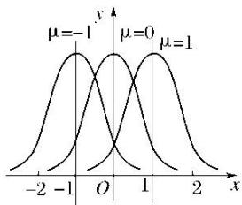
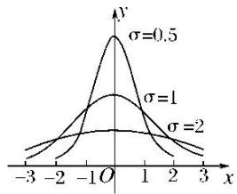
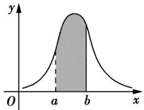
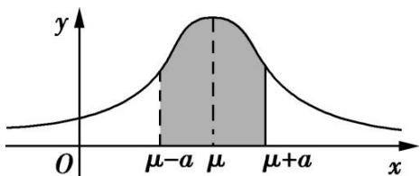
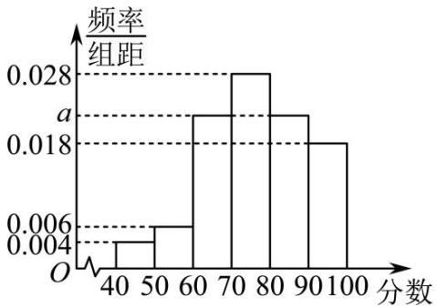
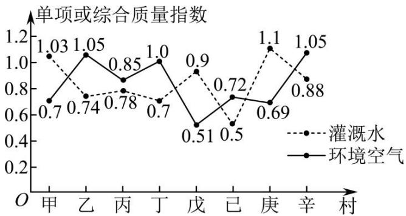
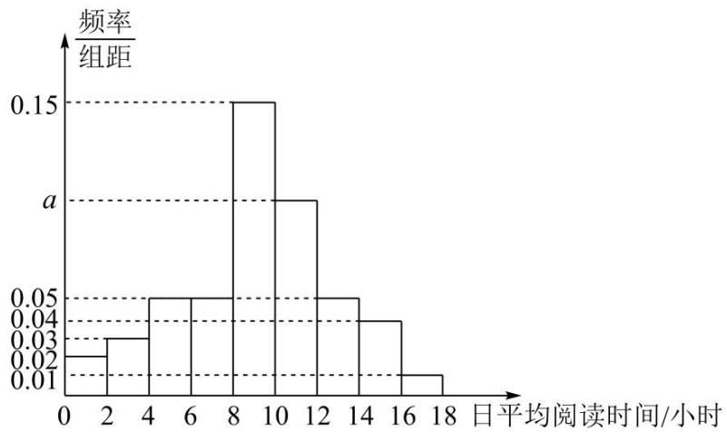
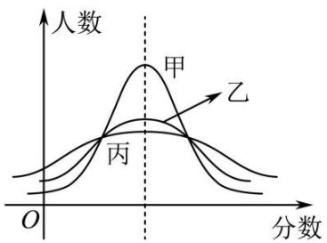
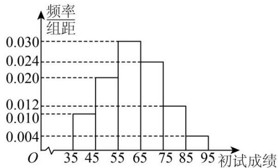

# 第4节 两点分布、二项分布、超几何分布与正态分布

# 知识点一．两点分布

1、若随机变量 X 服从两点分布，即其分布列为

<table><tr><td>X</td><td>0</td><td>1</td></tr><tr><td>P</td><td>1-p</td><td>p</td></tr></table>

其中 0 < p < 1，则称离散型随机变量 X 服从参数为 p 的两点分布．其中 $P(X = 1)$ 称为成功概率.

# 注意：

（1）两点分布的试验结果只有两个可能性，且其概率之和为1；  
（2） 两点分布又称 0-1 分布、伯努利分布, 其应用十分广泛.

2、两点分布的均值与方差：若随机变量 $X$ 服从参数为 $p$ 的两点分布，则 $(\cdot) = 1 \times p + 0 \times (1 - p) = p$ ， $D(X) = p(1 - p)$ .

# 知识点二．n 次独立重复试验

# 1、定义

一般地，在相同条件下重复做的 $n$ 次试验称为 $n$ 次独立重复试验.

注意：独立重复试验的条件：①每次试验在同样条件下进行；②各次试验是相互独立的；③每次试验都只有两种结果，即事件要么发生，要么不发生.

# 2、特点

（1）每次试验中，事件发生的概率是相同的；  
（2） 每次试验中的事件是相互独立的, 其实质是相互独立事件的特例.

# 知识点三．二项分布

# 1、定义

一般地，在 $n$ 次独立重复试验中，用 $X$ 表示事件 $A$ 发生的次数，设每次试验中事件 $A$ 发生的概率为 $p$ ，不发生的概率 $q = 1 - p$ ，那么事件 $A$ 恰好发生 $k$ 次的概率是 $P(X = k) = \mathrm{C}_n^k p^k q^{n - k}$ （ $k = 0, 1, 2, \ldots, n$ ）于是得到 $X$ 的分布列

<table><tr><td>X</td><td>0</td><td>1</td><td>...</td><td>k</td><td>...</td><td>n</td></tr><tr><td>p</td><td> $C_{n}^{0} p^{0} q^{n}$ </td><td> $C_{n}^{1} p^{1} q^{n-1}$ </td><td>...</td><td> $C_{n}^{k} p^{k} q^{n-k}$ </td><td>...</td><td> $C_{n}^{n} p^{n} q^{0}$ </td></tr></table>

由于表中第二行恰好是二项式展开式

$(q+p)^{n}=\mathrm{C}_{n}^{0}p^{0}q^{n}+\mathrm{C}_{n}^{1}p^{1}q^{n-1}+\cdots+\mathrm{C}_{n}^{k}p^{k}q^{n-k}+\cdots+\mathrm{C}_{n}^{n}p^{n}q^{0}$ 各对应项的值，称这样的离散型随机变量 X 服从参数为 n，p 的二项分布，记作 $X\sim B(n,p)$ ，并称 p 为成功概率.

注意：由二项分布的定义可以发现，两点分布是一种特殊的二项分布，即 $n = 1$ 时的二项分布，所以二项分布可以看成是两点分布的一般形式.

# 2、二项分布的适用范围及本质

# （1） 适用范围:

①各次试验中的事件是相互独立的；  
②每次试验只有两种结果：事件要么发生，要么不发生；  
③随机变量是这 n 次独立重复试验中事件发生的次数.

（2） 本质: 二项分布是放回抽样问题, 在每次试验中某一事件发生的概率是相同的.

# 3、二项分布的期望、方差

若 $X \sim B(n, p)$ ，则 $E(X) = np$ ， $D(X) = np(1 - p)$ .

# 知识点四．超几何分布

# 1、定义

在含有 M 件次品的 N 件产品中，任取 n 件，其中恰有 X 件次品，则事件 $\{X=k\}$ 发生的概率为 $P(X=k)=\frac{C_{M}^{k}C_{N-M}^{n-k}}{C_{N}^{n}},\quad k=0,\quad1,\quad2,\quad\ldots,\quad m$ ，其中 $m=\min\left\{M,n\right\}$ ，且 $n\leq N,\quad M\leq N,\quad n,\quad M,\quad N\in N^{*}$ 称分布列为超几何分布列．如果随机变量 X 的分布列为超几何分布列，则称随机变量 X 服从超几何分布.

<table><tr><td>X</td><td>0</td><td>1</td><td>...</td><td>m</td></tr><tr><td>P</td><td> $\frac{C_{M}^{0} C_{N-M}^{n-0}}{C_{N}^{n}}$ </td><td> $\frac{C_{M}^{1} C_{N-M}^{n-1}}{C_{N}^{n}}$ </td><td>...</td><td> $\frac{C_{M}^{m} C_{N-M}^{n-m}}{C_{N}^{n}}$ </td></tr></table>

# 2、超几何分布的适用范围件及本质

（1）适用范围：

①考察对象分两类;   
②已知各类对象的个数；  
③从中抽取若干个个体，考察某类个体个数 Y 的概率分布.

（2）本质：超几何分布是不放回抽样问题，在每次试验中某一事件发生的概率是不相同的.

# 知识点四、正态曲线

1、定义：我们把函数 $\varphi_{\mu,\sigma}(x)=\frac{1}{\sqrt{2\pi}\sigma}\mathrm{e}^{-\frac{(x-\mu)^{2}}{2\sigma^{2}}}$ ， $x\in(-\infty,+\infty)$ （其中 $\mu$ 是样本均值， $\sigma$ 是样本标准差）的图象称为正态分布密度曲线，简称正态曲线．正态曲线呈钟形，即中间高，两边低．

# 2、正态曲线的性质

（1）曲线位于x轴上方，与x轴不相交；  
（2）曲线是单峰的，它关于直线 $x = \mu$ 对称；  
（3）曲线在 $x = \mu$ 处达到峰值（最大值） $\frac{1}{\sqrt{2\pi}\sigma}$ ;

（4）曲线与x轴之间的面积为1；

（5）当 $\sigma$ 一定时，曲线的位置由 $\mu$ 确定，曲线随着 $\mu$ 的变化而沿 x 轴平移，如图甲所示：

（6） 当 $\mu$ 一定时, 曲线的形状由 $\sigma$ 确定. $\sigma$ 越小, 曲线越“高瘦”, 表示总体的分布越集中; $\sigma$ 越大, 曲线越“矮胖”, 表示总体的分布越分散, 如图乙所示: :

甲

乙

# 知识点五、正态分布

# 1、定义

随机变量 X 落在区间 $(a, b]$ 的概率为 $P(a < X \leq b) = \int_{a}^{b} \varphi_{\mu,\sigma}(x) \, dx$ ，即由正态曲线，过点 $(a, 0)$ 和点 $(b, 0)$ 的两条 x 轴的垂线，及 x 轴所围成的平面图形的面积，如下图中阴影部分所示，就是 X 落在区间 $(a, b]$ 的概率的近似值.

一般地，如果对于任何实数 $a$ ， $b(a < b)$ ，随机变量 $X$ 满足 $P(a < X \leq b) = \int_{a}^{b} \varphi_{\mu, \sigma}(x) \mathrm{d}x$ ，则称随机变量 $X$ 服从正态分布．正态分布完全由参数 $\mu$ ， $\sigma$ 确定，因此正态分布常记作 $N(\mu, \sigma^2)$ ．如果随机变量 $X$ 服从正态分布，则记为 $X \sim N(\mu, \sigma^2)$ ：

其中，参数 $\mu$ 是反映随机变量取值的平均水平的特征数，可以用样本的均值去估计； $\sigma$ 是衡量随机变量总体波动大小的特征数，可以用样本的标准差去估计.

# 2、 $3\sigma$ 原则

若 $X \sim N(\mu, \sigma^2)$ ，则对于任意的实数 $a > 0$ ， $P(\mu - a < X \leq \mu + a) = \int_{\mu - a}^{\mu + a} \varphi_{\mu, \sigma}(x) \mathrm{d}x$ 为下图中阴影部分的面积，对于固定的 $\mu$ 和 $a$ 而言，该面积随着 $\sigma$ 的减小而变大。这说明 $\sigma$ 越小， $X$ 落在区间 $(\mu - a, \mu + a]$ 的概率越大，即 $X$ 集中在 $\mu$ 周围的概率越大

特别地，有 $P(\mu - \sigma < X \leq \mu + \sigma) = 0.6826$ ; $P(\mu - 2\sigma < X \leq \mu + 2\sigma) = 0.9544$ ;

$P (\mu - 3 \sigma <   X \leq \mu + 3 \sigma) = 0. 9 9 7 4.$

由 $P(\mu-3\sigma<X\leq\mu+3\sigma)=0.9974$ ，知正态总体几乎总取值于区间 $(\mu-3\sigma,\mu+3\sigma)$ 之内。而在此区间以外取值的概率只有 0.0026，通常认为这种情况在一次试验中几乎不可能发生，即为小概率事件。在实际应用中，通常认为服从于正态分布 $N(\mu,\sigma^{2})$ 的随机变量 X 只取 $(\mu-3\sigma,\mu+3\sigma)$ 之间的值，并简称之为 $3\sigma$ 原则。

# 【解题方法总结】

# 1、超几何分布和二项分布的区别

（1）超几何分布需要知道总体的容量，而二项分布不需要；  
（2）超几何分布是“不放回”抽取，在每次试验中某一事件发生的概率是不相同的；

而二项分布是“有放回”抽取（独立重复），在每次试验中某一事件发生的概率是相同的.

2、在解决有关问题时，通常认为服从正态分布 $N(\mu, \sigma^{2})$ 的随机变量 x 只取 $(\mu - 3\sigma, \mu + 3\sigma)$ 之间的值．如果服从正态分布的随机变量的某些取值超出了这个范围就说明出现了意外情况．  
3、求正态变量 x 在某区间内取值的概率的基本方法:

（1）根据题目中给出的条件确定 $\mu$ 与 $\sigma$ 的值.

（2）将待求问题向 $(\mu-\sigma,\mu+\sigma]$ ， $(\mu-2\sigma,\mu+2\sigma]$ ， $(\mu-3\sigma,\mu+3\sigma]$ 这三个区间进行转化；

（3）利用 x 在上述区间的概率、正态曲线的对称性和曲线与 x 轴之间的面积为 1 求出最后结果.

# 4、假设检验的思想

（1）统计中假设检验的基本思想：根据小概率事件在一次试验中几乎不可能发生的原则和从总体中抽测的个体的数值，对事先所作的统计假设作出判断：是拒绝假设，还是接受假设.  
（2）若随机变量 $\xi$ 服从正态分布 $N(\mu, \sigma^2)$ ，则 $\xi$ 落在区间 $(\mu - 3\sigma, \mu + 3\sigma]$ 内的概率为0.9974，亦即落在区间 $(\mu - 3\sigma, \mu + 3\sigma]$ 之外的概率为0.0026，此为小概率事件。如果此事件发生了，就说明 $\xi$ 不服从正态分布。

（3）对于小概率事件要有一个正确的理解：

小概率事件是指发生的概率小于 $3\%$ 的事件。对于这类事件来说，在大量重复试验中，平均每试验大约33次，才发生1次，所以认为在一次试验中该事件是几乎不可能发生的。不过应注意两点：一是这里的“几乎不可能发生”是针对“一次试验”来说的，如果试验次数多了，该事件当然是很可能发生的；二是当我们运用“小概率事件几乎不可能发生的原理”进行推断时，也有 $3\%$ 犯错的可能性。

# 题型一 两点分布

##### 【例1】设随机变量 $X$ 服从两点分布，若 $P(X = 1) - P(X = 0) = 0.4$ ，则 $E(X) =$ （）

$\quad$A. 0.3

$\quad$B. 0.4

$\quad$C. 0.6

$\quad$D. 0.7

【例 2】若随机变量 X 服从两点分布，其中 $P(X=0)=\frac{1}{3}$ ， $E(X)$ ， $D(X)$ 分别为随机变量 X 的均值与方差，则下列结论不正确的是（）

$\quad$A. $P(X=1)=E(X)$

$\quad$B. $E(3X+2)=4$

$\quad$C. $D(3X+2)=4$

$\quad$D. $D(X)=\frac{2}{9}$

【例 3】某工厂生产某种电子产品，每件产品不合格的概率均为 p，现工厂为提高产品声誉，要求在交付用户前每件产品都通过合格检验，已知该工厂的检验仪器一次最多可检验 5 件该产品，且每件产品检验合格与否相互独立。若每件产品均检验一次，所需检验费用较多，该工厂提出以下检验方案：将产品每 k 个 $(k \leq 5)$ 一组进行分组检验，如果某一组产品检验合格，则说明该组内产品均合格，若检验不合格，则说明该组内有不合格产品，再对该组内每一件产品单独进行检验，如此，每一组产品只需检验 1 次或 $1 + k$ 次。设该工厂生产 1000 件该产品，记每件产品的平均检验次数为 X。

（1）求 X 的分布列及其期望；

（2） (i) 试说明, 当 $p$ 越小时, 该方案越合理, 即所需平均检验次数越少;

（ii）当 p=0.1 时，求使该方案最合理时 k 的值及 1000 件该产品的平均检验次数.

# 题型二 $n$ 次独立重复试验

【例 1】甲、乙两名运动员进行五局三胜制的乒乓球比赛，先赢得 3 局的运动员获胜，并结束比赛．设各局比赛的结果相互独立，每局比赛甲赢的概率为 $\frac{2}{3}$ ，乙赢的概率为 $\frac{1}{3}$ .

（1）求甲获胜的概率;

（2）设 X 为结束比赛所需要的局数，求随机变量 X 的分布列及数学期望.

【例 2】为落实立德树人根本任务，坚持五育并举全面推进素质教育，某学校举行了乒乓球比赛，其中参加男子乒乓球决赛的 12 名队员来自 3 个不同校区，三个校区的队员人数分别是 3, 4, 5.本次决赛的比赛赛制采取单循环方式，即每名队员进行 11 场比赛（每场比赛都采取 5 局 3 胜制），最后根据积分选出最后的冠军.积分规则如下：比赛中以 3:0 或 3:1 取胜的队员积 3 分，失败的队员积 0 分；而在比赛中以 3:2 取胜的队员积 2 分，失败的队员的队员积 1 分.已知第 10 轮张三对抗李四，设每局比赛张三取胜的概率均为 $p(0 < p < 1)$ .

（1）比赛结束后冠亚军(没有并列)恰好来自不同校区的概率是多少?  
（2）第 10 轮比赛中，记张三 3:1 取胜的概率为 $f(p)$ ，求出 $f(p)$ 的最大值点 $p_{0}$ .

# 题型三 二项分布

【例 1】已知随机变量 $\xi$ 服从二项分布 $\xi \sim B\left(4, \frac{1}{3}\right)$ ，则 $P(\xi = 2) =$ \_\_\_\_ .

【例 2】银川市唐徕中学一研究性学习小组为了解银川市民每年旅游消费支出费用（单位：千元），春节期间对游览某网红景区的 100 名银川市游客进行随机问卷调查，并把数据整理成如下表所示的频数分布表：

<table><tr><td>组别(支出费用)</td><td>[0,2)</td><td>[2,4)</td><td>[4,6)</td><td>[6,8)</td><td>[8,10)</td><td>[10,12)</td><td>[12,14)</td><td>[14,16)</td></tr><tr><td>频数</td><td>3</td><td>4</td><td>8</td><td>11</td><td>41</td><td>20</td><td>8</td><td>5</td></tr></table>

（1）从样本中随机抽取两位市民的支出数据，求两人旅游支出不低于 10000 元的概率；  
（2）若市民的旅游支出费用 X 近似服从正态分布 $N(\mu, \sigma^{2})$ ， $\mu$ 近似为样本平均数 $\overline{x}$ （同一组中的数据用该组区间的中间值代表）， $\sigma$ 近似为样本标准差 s，并已求得 $s \approx 3$ ，利用所得正态分布模型解决以下问题：

①假定银川市常住人口为300万人，试估计银川市有多少市民每年旅游费用支出在15000元以上；  
②若在银川市随机抽取 3 位市民, 设其中旅游费用在 9000 元以上的人数为 $\xi$ , 求随机变量的 $\xi$ 分布列和均值.

附：若 $X \sim N(\mu, \sigma^2)$ ，则 $P(\mu - \sigma \leqslant X \leqslant \mu + \sigma) \approx 0.6827$ ， $P(\mu - 2\sigma \leqslant x \leqslant \mu + 2\sigma) \approx 0.9545$ ， $P(\mu - 3\sigma \leqslant X \leqslant \mu + 3\sigma) \approx 0.9973$

【例 3】第四届应急管理普法知识竞赛线上启动仪式在 3 月 21 日上午举行，为普及应急管理知识，某高校开展了“应急管理普法知识竞赛”活动，现从参加该竞赛的学生中随机抽取 100 名，统计他们的成绩（满分 100 分），其中成绩不低于 80 分的学生被评为“普法王者”，将数据整理后绘制成如图所示的频率分布直方图.

（1）若该校参赛人数达 20000 人，请估计其中有多少名“普法王者”；  
（2）随机从该高校参加竞赛的学生中抽取3名学生，记其中“普法王者”人数为 $\xi$ ，用频率估计概率，请你写出 $\xi$ 的分布列.

【例 4】甲、乙两位同学决定进行一次投篮比赛，他们每次投中的概率均为 P，且每次投篮相互独立，经商定共设定 5 个投篮点，每个投篮点投球一次，确立的比赛规则如下：甲分别在 5 个投篮点投球，且每投中一次可获得 1 分；乙按约定的投篮点顺序依次投球，如投中可继续进行下一次投篮，如没有投中，投篮中止，且每投中一次可获得 2 分.按累计得分高低确定胜负.

（1）若乙得6分的概率 $\frac{1 - p}{8}$ ，求 $p$ ；  
（2）由（1）问中求得的 $p$ 值，判断甲、乙两位选手谁获胜的可能性大？

# 题型四 超几何分布

【例 1】厂家在产品出厂前，需对产品做检验，厂家将一批产品发给商家时，商家按合同规定也需随机抽取一定数量的产品做检验，以决定是否接收这批产品。若厂家发给商家 20 件产品，其中有 3 件不合格，按合同规定该商家从中任取 2 件，都进行检验，只有 2 件都合格时才接收这批产品，否则拒收。则该商家拒收这批产品的概率是\_\_\_\_。

【例 2】袋中装有 10 个除颜色外完全一样的黑球和白球，已知从袋中任意摸出 2 个球，至少得到 1 个白球的概率是 $\frac{7}{9}$ 。现从该袋中任意摸出 3 个球，记得到白球的个数为 $X$ ，则 $E(X)=$ \_\_\_\_.

【例 3】温室是以采光覆盖材料作为全部或部分围护结构材料，具有透光、避雨、保温、控温等功能，可在冬季或其他不适宜露地植物生长的季节供栽培植物的建筑，而温室蔬菜种植技术是一种比较常见的技术，它具有较好的保温性能，使人们在任何时间都可吃到反季节的蔬菜，深受大众喜爱.温室蔬菜生长和蔬菜产品卫生质量要求的温室内土壤、灌溉水、环境空气等环境质量指标，其温室蔬菜产地环境质量等级划定如表所示.

<table><tr><td>环境质量等级</td><td>土壤各单项或综合质量指数</td><td>灌溉水各单项或综合质量指数</td><td>环境空气各单项或综合质量指数</td><td>等级名称</td></tr><tr><td>1</td><td>≤0.7</td><td>≤0.5</td><td>≤0.6</td><td>清洁</td></tr><tr><td>2</td><td>0.7~1.0</td><td>0.5~1.0</td><td>0.6~1.0</td><td>尚清洁</td></tr><tr><td>3</td><td>&gt;1.0</td><td>&gt;1.0</td><td>&gt;1.0</td><td>超标</td></tr></table>

各环境要素的综合质量指数超标，灌溉水、环境空气可认为污染，土壤则应做进一步调研，若确对其所影响的植物（生长发育、可食部分超标或用作饮料部分超标）或周围环境（地下水、地表水、大气等）有危害，方能确定为污染。某乡政府计划对所管辖的甲、乙、丙、丁、戊、己、庚、辛，共8个村发展温室蔬菜种植，对各村试验温室蔬菜环境产地质量监测得到的相关数据如下：

（1）若从这8个村中随机抽取2个进行调查，求抽取的2个村应对土壤做进一步调研的概率；  
（2）现有一技术人员在这8个村中随机选取3个进行技术指导，记 $\xi$ 为技术员选中村的环境空气等级为尚清洁的个数，求 $\xi$ 的分布列和数学期望.

# 题型五：二项分布与超几何分布的综合应用

【例 1】袋中有 8 个白球、2 个黑球，从中随机地连续抽取 3 次，每次取 1 个球.求：

（1）有放回抽样时，取到黑球的个数 $X$ 的分布列、数学期望和方差；  
（2）不放回抽样时，取到黑球的个数Y的分布列、数学期望和方差.

【例 2】4 月 23 日是联合国教科文组织确定的“世界读书日”。为了解某地区高一学生阅读时间的分配情况，从该地区随机抽取了 500 名高一学生进行在线调查，得到了这 500 名学生的日平均阅读时间（单位：小时），并将样本数据分成 [0,2]，(2,4]，(4,6]，(6,8]，(8,10]，(10,12]，(12,14]，(14,16]，(16,18]九组，绘制成如图所示的频率分布直方图。

（1）从这 500 名学生中随机抽取一人，日平均阅读时间在 $(10,12]$ 内的概率；

（2）为进一步了解这 500 名学生数字媒体阅读时间和纸质图书阅读时间的分配情况, 从日平均阅读时间在 $(12,14]$ , $(14,16]$ , $(16,18]$ 三组内的学生中, 采用分层抽样的方法抽取了 10 人, 现从这 10 人中随机抽取 3 人, 记日平均阅读时间在 $(14,16]$ 内的学生人数为 $X$ , 求 $X$ 的分布列和数学期望;

（3）以样本的频率估计概率，从该地区所有高一学生中随机抽取10名学生，用 $P(k)$ 表示这10名学生中恰有k名学生日平均阅读时间在 $(8,12]$ 内的概率，其中k=0，1，2，…，10．当 $P(k)$ 最大时，写出k的值．（只需写出结论）

# 题型六 正态密度函数及正态曲线的性质

##### 【例1】设随机变量 $X$ 的正态分布密度函数为 $f(x) = \frac{1}{2\sqrt{\pi}}\cdot \mathrm{e}^{-\frac{(x + 3)^2}{4}}, x\in (-\infty , + \infty)$ ，则参数 $\mu$ ， $\sigma$ 的值分别是（）

$\quad$A. $\mu = 3$ ， $\sigma = 2$

$\quad$B. $\mu = -3$ ， $\sigma = 2$

$\quad$C. $\mu = 3$ ， $\sigma = \sqrt{2}$

$\quad$D. $\mu = -3$ ， $\sigma = \sqrt{2}$

【例 2】某市期末教学质量检测，甲、乙、丙三科考试成绩近似服从正态分布，则由如图曲线可得下列说法中正确的是（）

$\quad$A. 甲学科总体的均值最小  
$\quad$B. 乙学科总体的方差及均值都居中  
$\quad$C. 丙学科总体的方差最大  
$\quad$D. 甲、乙、丙的总体的均值不相同

【例 3】若随机变量 $X \sim N(10, 2^{2})$ ，则下列选项错误的是（）

$\quad$A. $P(X \geq 10) = 0.5$

$\quad$B. $P(X \leq 8) + P(X \leq 12) = 1$

$\quad$C. $P(8 \leq X \leq 12) = 2P(8 \leq X \leq 10)$

$\quad$D. $D(2X + 1) = 8$

【例 4】设 $\xi \sim N(0,1)$ ，且 $P(\xi < 1.623) = p$ ，那么 $P(-1.623 \leq \xi < 0)$ 的值是（）

$\quad$A. p

$\quad$B. -p

$\quad$C. p - 0.5

$\quad$D. 0.5-p

【例 5】已知随机变量 $X \sim N(2, \sigma^{2})$ ，且 $P(X \leq a) = P(X \geq b)$ ，则 $a^{2} + b^{2}$ 的最小值为 \_\_\_\_.

【例 6】已知随机变量 $X_{1} \sim N\left(\mu_{1}, \frac{1}{4}\right)$ , $X_{2} \sim N\left(\mu_{2}, \frac{1}{9}\right)$ ，则（）

$\quad$A. $P\left(\left|X_{1}-\mu_{1}\right|<1\right)<P\left(\left|X_{2}-\mu_{2}\right|<1\right)$

$\quad$B. $P\left(\left|X_1 - \mu_1\right| < 1\right) > P\left(\left|X_2 - \mu_2\right| < 1\right)$

$\quad$C. $P\left(\left|X_{1}-\mu_{1}\right|<\frac{1}{2}\right)<P\left(\left|X_{2}-\mu_{2}\right|<\frac{1}{3}\right)$

$\quad$D. $P\left(\left|X_{1} - \mu_{1}\right| <   \frac{1}{2}\right) > P\left(\left|X_{2} - \mu_{2}\right| <   \frac{1}{3}\right)$

# 题型七：正态分布的实际应用

【例 1】法国数学家庞加莱是个喜欢吃面包的人，他每天都会到同一家面包店购买一个面包。该面包店的面包师声称自己所出售的面包的平均质量是1000g，上下浮动不超过50g。这句话用数学语言来表达就是：每个面包的质量服从期望为1000g，标准差为50g的正态分布。

（1）已知如下结论：若 $X \sim N\left(\mu, \sigma^2\right)$ ，从 $X$ 的取值中随机抽取 $k(k \in N^*, k \geq 2)$ 个数据，记这 $k$ 个数据的平均值为 $Y$ ，则随机变量 $Y \sim N\left(\mu, \frac{\sigma^2}{k}\right)$ ，利用该结论解决下面问题.

(i) 假设面包师的说法是真实的, 随机购买 25 个面包, 记随机购买 25 个面包的平均值为 $Y$ , 求 $P(Y < 980)$ ; (ii) 庞加莱每天都会将买来的面包称重并记录, 25 天后, 得到的数据都落在 $(950,1050)$ 上, 并经计算 25 个面包质量的平均值为 $978.72\mathrm{g}$ . 庞加莱通过分析举报了该面包师, 从概率角度说明庞加莱举报该面包师的理由;

（2）假设有两箱面包（面包除颜色外，其他都一样），已知第一箱中共装有6个面包，其中黑色面包有2个；第二箱中共装有8个面包，其中黑色面包有3个.现随机挑选一箱，然后从该箱中随机取出2个面包.求取出黑色面包个数的分布列及数学期望.

附：①随机变量 $\eta$ 服从正态分布 $N\left(\mu, \sigma^2\right)$ ，则 $P\left(\mu - \sigma \leq \eta \leq \mu + \sigma\right) = 0.6827$ ， $P\left(\mu - 2\sigma \leq \eta \leq \mu + 2\sigma\right) = 0.9545$ ， $P\left(\mu - 3\sigma \leq \eta \leq \mu + 3\sigma\right) = 0.9973$ ；

②通常把发生概率小于0.05的事件称为小概率事件，小概率事件基本不会发生.

【例 2】某校数学组老师为了解学生数学学科核心素养整体发展水平，组织本校 8000 名学生进行针对性检测（检测分为初试和复试），并随机抽取了 100 名学生的初试成绩，绘制了频率分布直方图，如图所示.

（1）根据频率分布直方图，求样本平均数的估计值和80%分位数；

（2）若所有学生的初试成绩 X 近似服从正态分布 $N\left(\mu,\sigma^{2}\right)$ ，其中 $\mu$ 为样本平均数的估计值， $\sigma\approx14$ ．初试成绩不低于 90 分的学生才能参加复试，试估计能参加复试的人数；

（3）复试共三道题，规定：全部答对获得一等奖;答对两道题获得二等奖;答对一道题获得三等奖;全部答错不获奖．已知某学生进入了复试，他在复试中前两道题答对的概率均为a，第三道题答对的概率为b．若他获得一等奖的概率为 $\frac{1}{8}$ ，设他获得二等奖的概率为P，求P的最小值.

附：若随机变量 X 服从正态分布 $N(\mu, \sigma^{2})$ ，则 $P(\mu - \sigma < X \leq \mu + \sigma) \approx 0.6827$ ，

$P (\mu - 2 \sigma <   X \leq \mu + 2 \sigma) \approx 0. 9 5 4 5, P (\mu - 3 \sigma <   X \leq \mu + 3 \sigma) \approx 0. 9 9 7 3.$

