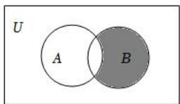
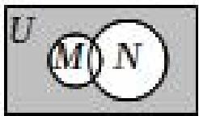

# 第一节 集合

# 考向 1 跟踪训练

【训练 1】下列关系中正确的个数为( )

① $\frac{1}{2} \notin R$ ，② $\sqrt{2} \notin Q$ ，③ $|-3| \notin N^{*}$ ，④ $|- \sqrt{3}| \in Q$ 。

$\quad$A. 1 个

$\quad$B. 2 个

$\quad$C. 3 个

$\quad$D. 4 个

【训练 2】（2020•新课标Ⅲ）已知集合 $A=\{1,2,3,5,7,11\}$ ， $B=\{x\mid3<x<15\}$ ，则 $A\bigcap B$ 中元素的个数为（）

$\quad$A. 2

$\quad$B. 3

$\quad$C. 4

$\quad$D. 5

【训练 3】若 $a \in \{1, a^{2} - 2a + 2\}$ ，则实数 a 的值为（）

$\quad$A. 1

$\quad$B. 2

$\quad$C. 0

$\quad$D. 1 或 2

【训练 4】已知 A 是由 0, m, $m^{2}-3m+2$ 三个元素组成的集合，且 $2 \in A$ ，则实数 m 为()

$\quad$A. 2

$\quad$B. 3

$\quad$C. 0 或 3

$\quad$D. 0, 2, 3 均可

# 考向 2 跟踪训练

【训练 1】设集合 $M = \{1, a\}$ ， $N = \{-1, b\}$ ，若 M = N，则 $a + b = (\quad)$

$\quad$A. 0

$\quad$B. 1

$\quad$C. 2

$\quad$D. -1

【训练 2】已知实数集合 $A=\{1, a, b\}$ ， $B=\{a^{2}, a, ab\}$ ，若 A=B，则 $a^{2023}+b^{2023}=(\quad)$

$\quad$A.-1

$\quad$B. 0

$\quad$C. 1

$\quad$D. 2

【训练 3】已知集合 $A = \{-2, 3, 1\}$ ，集合 $B = \{3, m^{2}\}$ ，若 $B \subseteq A$ ，则实数 m 的取值集合为（）

$\quad$A. $\{1\}$

$\quad$B. $\{\sqrt{3}\}$

$\quad$C. $\{1, -1\}$

$\quad$D. $\{\sqrt{3},-\sqrt{3}\}$

【训练 4】设 $A=\left\{x\mid\frac{1}{2}<x<5,x\in Z\right\}$ ， $B=\{x\mid x>a\}$ ，若 $A\subseteq B$ ，则实数 a 的取值范围是（）

$\quad$A. $a < \frac{1}{2}$

$\quad$B. $a \leqslant \frac{1}{2}$

$\quad$C. $a \leqslant 1$

$\quad$D. a < 1

【训练 5】已知集合 $M=\{x \mid ax^{2}+2x-3=0\}$ 至多有 1 个真子集，则 a 的取值范围是（）

$\quad$A. $a \leqslant -\frac{1}{3}$

$\quad$B. $a \geqslant -\frac{1}{3}$

$\quad$C. $a = 0$

$\quad$D. $a = 0$ 或 $a \leqslant -\frac{1}{3}$

【训练 6】（2020·全国）若集合 A 共有 5 个元素，则 A 的真子集的个数为( )

$\quad$A. 32

$\quad$B. 31

$\quad$C. 16

$\quad$D. 15

# 考向 3 跟踪训练

【训练 1】（2022·乙卷）集合 $M = \{2, 4, 6, 8, 10\}$ ， $N = \{x \mid -1 < x < 6\}$ ，则 $M \bigcap N = (\quad)$

$\quad$A. $\{2, 4\}$

$\quad$B. $\{2, 4, 6\}$

$\quad$C. $\{2, 4, 6, 8\}$

$\quad$D. $\{2, 4, 6, 8, 10\}$

【训练 2】（2021·北京）已知集合 $A=\{x\mid-1<x<1\}$ ， $B=\{x\mid0\leqslant x\leqslant2\}$ ，则 $A\bigcup B=(\quad)$

$\quad$A. $\{x\mid -1 <   x <   2\}$

$\quad$B. $\{x\mid-1<x\leqslant2\}$

$\quad$C. $\{x\mid 0\leqslant x <   1\}$

$\quad$D. $\{x \mid 0 \leqslant x \leqslant 2\}$

【训练 3】（2023·天津）已知集合 $U = \{1, 2, 3, 4, 5\}$ ， $A = \{1, 3\}$ ， $B = \{1, 2, 4\}$ ，则 $C_{U}B \cup A = (\quad)$

$\quad$A. $\{1, 3, 5\}$

$\quad$B. $\{1, 3\}$

$\quad$C. $\{1, 2, 4\}$

$\quad$D. $\{1, 2, 4, 5\}$

【训练 4】如图，阴影部分所表示的集合为( )

$\quad$A. $(\complement_U B) \bigcap A$

$\quad$B. $(\complement_U A) \bigcap B$

$\quad$C. $\complement_U(B\bigcap A)$

$\quad$D. $\complement_U(A\bigcup B)$

【训练 5】已知 M，N 都是 U 的子集，则图中的阴影部分表示( )

$\quad$A. $M \cup N$

$\quad$B. $\complement_U(M\bigcup N)$

$\quad$C. $(\complement_U M) \bigcap N$

$\quad$D. $\complement_U(M\bigcap N)$

