# 1.1 集合

# 考向 1 集合的概念

# 题型 1 元素与集合关系的判断

# 1. 集合与元素

某些指定的对象集在一起就成为一个集合，简称集，通常用大写字母 $A$ ， $B$ ， $C$ ，...表示．集合中的每个对象叫做这个集合的元素，通常用小写字母 $a$ ， $b$ ， $c$ ，...表示.

# 2. 元素与集合之间的关系

元素与集合之间用“∈”或“∉”连接，元素与集合之间是个体与整体的关系，不存在大小或相等关系。3. 集合表示方法：列举法、描述法、图象法。

# 4. 常用集合符号

R: 实数集; Z: 整数集; N: 自然数集（含有 0）; $\mathbf{N}_{+}$ 或 $\mathbf{N}^{*}$ : 正整数集（没有 0）; Q: 有理数集.

【例 1】（2023·上海）已知 $P = \{1, 2\}$ , $Q = \{2, 3\}$ , 若 $M = \{x \mid x \in P, x \notin Q\}$ , 则 $M = (\quad)$

$\quad$A. $\{1\}$

$\quad$B. $\{2\}$

$\quad$C. $\{3\}$

$\quad$D. $\{1, 2, 3\}$

【例 2】（2020•新课标Ⅲ）已知集合 $A=\{(x,y)\mid x,\quad y\in N^{*},\quad y\geqslant x\}$ ， $B=\{(x,y)\mid x+y=8\}$ ，则 $A\bigcap B$ 中元素的个数为（）

$\quad$A. 2

$\quad$B. 3

$\quad$C. 4

$\quad$D. 6

# 题型 2 利用集合的三要素求参

# 1. 集合中元素的性质

对于一个给定的集合，它的元素具有确定性、互异性、无序性.

# 2. 集合的分类

集合按元素多少可分为：有限集（元素个数有限）、无限集（元素个数无限）、空集（不含任何元素）；也可按元素的属性分，如：数集（元素是数），点集（元素是点）等.

【例 1】若 $-1 \in \{2, a^{2} - a - 1, a^{2} + 1\}$ ，则 $a = (\quad)$

$\quad$A.-1

$\quad$B. 0

$\quad$C. 1

$\quad$D. 0 或 1

【例 2】（多选）由 $a^{2}$ ，2-a，4 组成一个集合 A，A 中含有 3 个元素，则实数 a 的取值可以是（）

$\quad$A.-1

$\quad$B.-2

$\quad$C. 6

$\quad$D. 2

# 考向 2 集合的关系

# 题型 1 利用集合相等求参

##### 1. 集合与集合之间的关系

（1）包含关系:如果对任意 $x\in A$ ,都有 $x\in B$ ,则称集合A是集合B的子集,记作 $A\subseteq B$ ,显然 $A\subseteq A,\varnothing\subseteq A$ ;  
（2）相等关系：对于集合 A 、 B ，如果 $A \subseteq B$ ，同时 $A \supseteq B$ ，那么称集合 A 等于集合 B ，记作 A = B ；  
（3）真包含关系:对于集合A、B,如果 $A\subseteq B$ ,并且 $A\neq B$ ,我们就说集合A是集合B的真子集,记作 $A\subsetneqq B$ ;  
（4） 空集是任何非空集合的真子集.

【例 1】（2023·上海）已知集合 $A=\{1, 2\}$ ， $B=\{1, a\}$ ，且 A=B，则 a= \_\_\_\_.

【例 2】已知 $a \in R$ ， $b \in R$ ，若集合 $\{a, \frac{b}{a}, 1\} = \{a^{2}, a + b, 0\}$ ，则 $a^{2023} + b^{2024}$ 的值为（）

$\quad$A.-2

$\quad$B.-1

$\quad$C. 1

$\quad$D. 2

# 题型 2 利用子集/真子集/空集关系求参

##### 1. 集合元素数量与子集、真子集和非空真子集数量之间的关系（集合含有 $n$ 个元素）

（1） 子集的数量: $-2^{n}-$   
（2） 真子集的数量: $-2^{n} - 1 -$   
（3） 非空真子集的数量: $-2^{n} - 2 -$

【例 1】（2023·新高考Ⅱ）设集合 $A=\{0, -a\}$ ， $B=\{1, a-2, 2a-2\}$ ，若 $A \subseteq B$ ，则 $a=(\quad)$

$\quad$A. 2

$\quad$B. 1

$\quad$C. $\frac{2}{3}$

$\quad$D. -1

【例 2】已知 $A=\{x\mid\frac{1}{x-1}<-1\}$ ， $B=\{x\mid x^{2}-4x-m\geqslant0\}$ ，若 $A\subseteq B$ ，则实数 m 的取值范围（）

$\quad$A. $[0, +\infty)$

$\quad$B. $(- \infty, -3]$

$\quad$C. $[-3, 0]$

$\quad$D. $(-∞, -3]∪[0, +∞)$

【例 3】已知 $\varnothing \subsetneq \{x \mid x^{2} - x + a = 0\}$ ，则实数 a 的取值范围是（）

$\quad$A. $a < \frac{1}{4}$

$\quad$B. $a \leqslant \frac{1}{4}$

$\quad$C. $a \geqslant \frac{1}{4}$

$\quad$D. $a > \frac{1}{4}$

【例 4】已知集合 $A=\{x\in N \mid 0\leqslant x<m\}$ 有 8 个子集，则实数 m 的取值范围为（）

$\quad$A. $\{m\mid 2 <   m\leqslant 3\}$

$\quad$B. $\{m\mid 2\leqslant m <   3\}$

$\quad$C. $\{m\mid 2\leqslant m\leqslant 3\}$

$\quad$D. $\{m\mid 2 <   m <   3\}$

# 考向 3 集合的运算

# 题型 1 交集、并集、补集及其混合运算

# 1. 集合之间的运算性质

（1）交集： $A\cap B = B\cap A$ ， $A\cap B\subseteq A$ ， $A\cap B\subseteq B$ ， $A\cap A = A$ ， $A\cap \emptyset = \emptyset$ ， $A\subseteq B\Leftrightarrow A\cap B = A$ ：  
（2） 并集： $A \cup B = B \cup A$ ， $A \cup B \supseteq A$ ， $A \cup B \supseteq B$ ， $A \cup A = A$ ， $A \cup \varnothing = A$ ， $A \subseteq B \Leftrightarrow A \cup B = B$ .  
（3）补集的运算性质： $C_{U}(C_{U}A)=A$ ， $C_{U}\varnothing=U$ ， $C_{U}U=\varnothing$ ， $A\bigcap(C_{U}A)=\varnothing$ ， $A\bigcup(C_{U}A)=U$ 。

【例 1】（2024•新高考 I）已知集合 $A=\{x\mid-5<x^{3}<5\}$ ， $B=\{-3,-1,0,2,3\}$ ，则 $A\bigcap B=()$

$\quad$A. $\{-1, 0\}$

$\quad$B. $\{2, 3\}$

$\quad$C. $\{-3, -1, 0\}$

$\quad$D. $\{-1, 0, 2\}$

【例 2】（2024·北京）已知集合 $M = \{x \mid -3 < x < 1\}$ ， $N = \{x \mid -1 \leqslant x < 4\}$ ，则 $M \bigcup N = (\quad)$

$\quad$A. $\{x\mid -1\leqslant x <   1\}$

$\quad$B. $\{x\mid x > - 3\}$

$\quad$C. $\{x\mid -3 <   x <   4\}$

$\quad$D. $\{x\mid x <   4\}$

【例 3】（2024•甲卷）集合 $A=\{1,2,3,4,5,9\}$ ， $B=\{x\mid\sqrt{x}\in A\}$ ，则 $\complement_{A}(A\bigcap B)=(\quad)$

$\quad$A. $\{1, 4, 9\}$

$\quad$B. $\{3, 4, 9\}$

$\quad$C. $\{1, 2, 3\}$

$\quad$D. $\{2, 3, 5\}$

# 题型 2 韦恩图表达集合的关系及运算

##### 1. Venn图：用平面上一条封闭的曲线（通常情况下是矩形）的内部代表集合，这个图形就叫做韦恩图。集合中图形语言具有直观形象的特点，将集合问题图形化，利用Venn图的直观性，可以深刻理解集合有关概念、运算公式，而且有助于显示集合间的关系。

（1） 交集:

<table><tr><td></td><td>子集</td><td>集合相等</td><td>真子集</td></tr><tr><td>读法</td><td>A包含于B(或B包含A)</td><td>A等于B</td><td>A真包含于B(或B真包含A)</td></tr><tr><td>图示</td><td>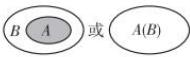</td><td>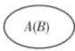</td><td></td></tr></table>

<table><tr><td>自然语言</td><td>符号语言</td><td>图形语言</td></tr><tr><td>一般地,由所有属于集合A或属于集合B的元素组成的集合,称为集合A与B的并集,记作A∪B(读作“A并B”).</td><td> $A∪B = \{ x|x ∈ A, 或x ∈ B\}$ </td><td>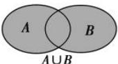</td></tr></table>

<table><tr><td>自然语言</td><td>符号语言</td><td>图形语言</td></tr><tr><td>一般地,由所有属于集合A且属于集合B的元素组成的集合,称为集合A与B的交集,记作A∩B(读作“A交B”).</td><td>A∩B={x|x∈A,且x∈B}</td><td>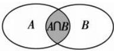</td></tr></table>

<table><tr><td>自然语言</td><td>对于一个集合A,由全集U中不属于集合A的所有元素组成的集合称为集合A相对于全集U的补集,简称为集合A的补集,记作 $\complement_{U}A.$ </td></tr><tr><td>符号语言</td><td> $\complement_{U}A = \{x|x\in U,且x\notin A\}$ </td></tr><tr><td>图形语言</td><td>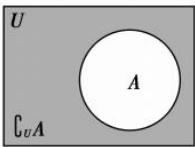</td></tr></table>

① $\complement_{U}(A\cap B)=(\complement_{U}A)\cup(\complement_{U}B)$ ，利用Venn图表示如图

##### 1.3-2 所示. (有限集的混合运算可用 Venn 图解决)

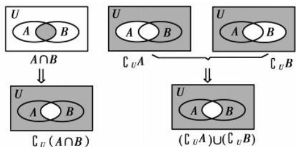

图1.3-2

② $\complement_{U}(A\cup B)=(\complement_{U}A)\cap(\complement_{U}B)$ ，利用Venn图表示如图

##### 1.3-3所示.

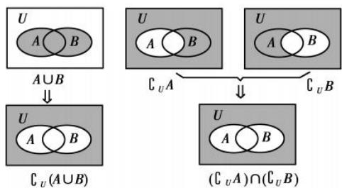

图1.3-3

【例 1】集合 $A = \{-1, 0, 1, 2\}$ ， $B = \{0, 2, 4\}$ ，则图中阴影部分所表示的集合为（）

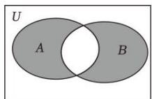

$\quad$A. $\{0, 2\}$

$\quad$B. $\{-1, 0, 1, 2, 4\}$

$\quad$C. $\{-1, 0, 2, 4\}$

$\quad$D. $\{-1, 1, 4\}$

【例 2】已知全集 $U = \{1, 2, 3, 4, 5\}$ ， $M = \{1, 2\}$ ， $N = \{2, 5\}$ ，如图所示，则阴影部分表示的集合是（）

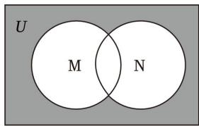

$\quad$A. $\{3, 4, 5\}$

$\quad$B. $\{1, 3, 4\}$

$\quad$C. $\{1, 2, 5\}$

$\quad$D. $\{3, 4\}$

# 拓展思维

# 容斥问题

两个集合的容斥原理，可以用下面的韦恩图表示：

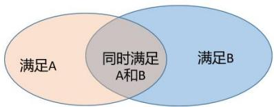

为了计算具有性质 A 或性质 B 的元素个数，我们使用下面的公式：

$\left| A \cup B \right| = \left| A \right| + \left| B \right| - \left| A \cap B \right|$

三个集合的容斥原理，画成韦恩图如下所示：

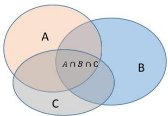

为了计算至少具有性质 A、B、C 之一的元素个数，我们使用下面的公式：

$\left| A \cup B \cup C \right| = \left| A \right| + \left| B \right| + \left| C \right| - \left| A \cap B \right| - \left| A \cap C \right| - \left| B \cap C \right| + \left| A \cap B \cap C \right|$

【例 1】我们把含有有限个元素的集合 A 叫做有限集，用 card（A）表示有限集合 A 中元素的个数．例如， $A=\{a, b, c\}$ ，则 card（A）=3．容斥原理告诉我们，如果被计数的事物有 A，B，C 三类，那么， $card(A \cup B \cup C) = cardA + cardB + cardC - card(A \cap B) - card(B \cap C) - card(A \cap C) + card(A \cap B \cap C)$ ．某校初一四班学生 46 人，寒假参加体育训练，其中足球队 25 人，排球队 22 人，游泳队 24 人，足球排球都参加的有 12 人，足球游泳都参加的有 9 人，排球游泳都参加的有 8 人，问：三项都参加的有多少人？（教材阅读与思考改编）（）

$\quad$A. 2

$\quad$B. 3

$\quad$C. 4

$\quad$D. 5

# 跟踪训练

【训练 1】（2020·海南）某中学的学生积极参加体育锻炼，其中有96%的学生喜欢足球或游泳，60%的学生喜欢足球，82%的学生喜欢游泳，则该中学既喜欢足球又喜欢游泳的学生数占该校学生总数的比例是( )

$\quad$A. 62%

$\quad$B. 56%

$\quad$C. 46%

$\quad$D. 42%

【训练 2】（2019•新课标III）《西游记》《三国演义》《水浒传》和《红楼梦》是中国古典文学瑰宝，并称为中国古典小说四大名著．某中学为了解本校学生阅读四大名著的情况，随机调查了100位学生，其中阅读过《西游记》或《红楼梦》的学生共有90位，阅读过《红楼梦》的学生共有80位，阅读过《西游记》且阅读过《红楼梦》的学生共有60位，则该校阅读过《西游记》的学生人数与该学校学生总数比值的估计值为( )

$\quad$A. 0.5

$\quad$B. 0.6

$\quad$C. 0.7

$\quad$D. 0.8

