# 1.4 一元二次方程、函数和不等式的关系

# 考向 1 等式性质与不等式性质

# 题型 1 利用基本性质判断不等式对错

# 1. 等式与不等式的性质

# （1）等式基本性质

##### 1. 如果 a=b，那么 b=a.  
##### 2. 如果 $a = b, b = c$ ，那么 $a = c$ .  
##### 3. 如果 $a = b$ ，那么 $a \pm c = b \pm c$ .  
##### 4. 如果 a=b，那么 ac=bc.  
##### 5. 如果 $a = b, c \neq 0$ ，那么 $\frac{a}{c} = \frac{b}{c}$ .

# （2）不等式基本性质

<table><tr><td>性质</td><td>性质内容</td><td>注意</td></tr><tr><td>对称性</td><td> $a > b \Leftrightarrow b < a; a < b \Leftrightarrow b > a$ </td><td>可逆</td></tr><tr><td>传递性</td><td> $a > b, b > c \Rightarrow a > c; a < b, b < c \Rightarrow a < c$ </td><td>同向</td></tr><tr><td>可加性</td><td> $a > b \Leftrightarrow a + c > b + c$ </td><td>可逆</td></tr><tr><td>可乘性</td><td> $a > b, c > 0 \Rightarrow ac > bc; a > b, c < 0 \Rightarrow ac < bc$ </td><td>c的正负</td></tr><tr><td>同向可加性</td><td> $a > b, c > d \Rightarrow a + c > b + d$ </td><td>同向</td></tr><tr><td>同向同正可乘性</td><td> $a > b > 0, c > d > 0 \Rightarrow ac > bd$ </td><td>同向同正</td></tr><tr><td>可乘方性</td><td> $a > b > 0, n \in N^{*} \Rightarrow a^{n} > b^{n}$ </td><td>同正</td></tr><tr><td>可开方性</td><td> $a > b > 0, n \in N^{*} \Rightarrow \sqrt[n]{a} > \sqrt[n]{b}$ </td><td>同正</td></tr></table>

# （3）倒数性质

① a > b, ab > 0 $\Rightarrow \frac{1}{a} < \frac{1}{b}$ ; ② a < 0 < b $\Rightarrow \frac{1}{a} < \frac{1}{b}$ ;   
③ a > b > 0, d > c > 0 $\Rightarrow \frac{a}{c} > \frac{b}{d}$ ; ④ 0 < a < x < b 或 a < x < b < 0 $\Rightarrow \frac{1}{b} < \frac{1}{x} < \frac{1}{a}$ .

【例 1】（2024•上海）a，b， $c \in R$ ，b > c，下列不等式恒成立的是()

$\quad$A. $a + b^{2} > a + c^{2}$

$\quad$B. $a^2 + b > a^2 + c$

$\quad$C. $ab^{2} > ac^{2}$

$\quad$D. $a^2 b > a^2 c$

【例 2】（2019•新课标Ⅱ）若 a > b，则（）

$\quad$A. $\ln (a - b) > 0$

$\quad$B. $3^{a} < 3^{b}$

$\quad$C. $a^{3}-b^{3}>0$

$\quad$D. $|a| > |b|$

# 题型 2 比较不等式大小关系的三种方法

##### 1. 比较大小基本方法

<table><tr><td rowspan="2">关系</td><td colspan="2">方法</td></tr><tr><td>作差法与0比较</td><td>作商法与1比较</td></tr><tr><td>a&gt;b</td><td>a-b&gt;0</td><td> $\frac{a}{b} >1(a,b>0)$ 或 $\frac{a}{b}<1(a,b<0)$ </td></tr><tr><td>a=b</td><td>a-b=0</td><td> $\frac{a}{b}=1(b\neq0)$ </td></tr><tr><td>a&lt;a-b&lt;0 $\frac{a}{b}<1(a,b>0)$ 或 $\frac{a}{b}>1(a,b<0)$ </td><td>a-b&lt;0</td><td> $\frac{a}{b}<1(a,b>0)$ 或 $\frac{a}{b}>1(a,b<0)$ </td></tr></table>

##### 2. 糖水不等式

若 $a > b > 0$ ， $m > 0$ ，则一定有 $\frac{b + m}{a + m} >\frac{b}{a}$ ，或者 $\frac{a + m}{b + m} <  \frac{a}{b}$

理解：通俗的理解就是 $a$ 克的不饱和糖水里含有 $b$ 克糖，往糖水里面加入 $m$ 克糖，则糖水更甜.

证明： $\frac{b + m}{a + m} -\frac{b}{a} = \frac{ab + am - ab - bm}{a^2 + am} = \frac{(a - b)m}{a^2 + am} >0$ ； $\frac{a + m}{b + m} -\frac{a}{b} = \frac{ab + bm - ab - am}{b^2 + bm} = -\frac{(a - b)m}{b^2 + bm} < 0.$

【例 1】已知 $a, b \in R$ ，设 $m = 4a - b^{2}, n = a^{2} - 2b + 5$ ，则（）

$\quad$A. $m \geqslant n$

$\quad$B. $m > n$

$\quad$C. $m \leqslant n$

$\quad$D. $m < n$

【例 2】设 a>0, b>0，且 $a \neq b$ ，则 $a^{b}b^{a}$ 和 $a^{a}b^{b}$ 的大小关系是 \_\_\_\_.

【例 3】若 $P = \sqrt{a} + \sqrt{a + 5}$ ， $Q = \sqrt{a + 2} + \sqrt{a + 3} (a \geq 0)$ ，则 $P$ 、 $Q$ 的大小关系是（）

$\quad$A. P>Q

$\quad$B. P=Q

$\quad$C. P < Q

$\quad$D. 不能确定

【例 4】已知 x > y > 0 且 m > 0，则 $\frac{y}{x}$ 与 $\frac{y + m}{x + m}$ 的大小关系为 \_\_\_\_.

# 考向 2 一元二次方程、函数和不等式的关系

# 题型 1 一元二次不等式的解法

# 1. 一元二次不等式的解法

# （1） 常规一元二次不等式的解法

$ax^{2}+bx+c>0$ 意味着 $y=ax^{2}+bx+c$ 中 y>0 部分， $ax^{2}+bx+c<0$ 意味着 $y=ax^{2}+bx+c$ 中 y<0 部分，

$ax^{2}+bx+c=a(x-x_{1})(x-x_{2})=0$ ，求出两个根 $x_{1}$ ， $x_{2}$ ；根据图像可知：开口向上时，大于取两边，小于取中间，反之亦然.

# （2） 一元二次不等式与韦达定理

模型一 已知关于 $x$ 的不等式 $ax^2 + bx + c > 0$ 的解集为 $(m, n)$ （其中 $mn > 0$ ），解关于 $x$ 的不等式 $cx^2 + bx + a > 0$ 。

由 $ax^2 + bx + c > 0$ 的解集为 $(m, n)$ ，得： $a\left(\frac{1}{x}\right)^2 + b\frac{1}{x} + c > 0$ 的解集为 $\left(\frac{1}{n}, \frac{1}{m}\right)$ ，即关于 $x$ 的不等式 $cx^2 + bx + a > 0$ 的解集为 $\left(\frac{1}{n}, \frac{1}{m}\right)$ .

已知关于 $x$ 的不等式 $ax^2 + bx + c > 0$ 的解集为 $(m, n)$ ，解关于 $x$ 的不等式 $cx^2 + bx + a \leq 0$ 。

由 $ax^{2} + bx + c > 0$ 的解集为 $(m, n)$ ，得： $a\left(\frac{1}{x}\right)^{2} + b\frac{1}{x} + c \leq 0$ 的解集为 $(-\infty, \frac{1}{n}] \cup [\frac{1}{m}, +\infty)$ ，即关于 x 的不等式 $cx^{2} + bx + a \leq 0$ 的解集为 $(-\infty, \frac{1}{n}] \cup [\frac{1}{m}, +\infty)$ .

模型二 已知关于 $x$ 的不等式 $ax^2 + bx + c > 0$ 的解集为 $(m, n)$ （其中 $n > m > 0$ ），解关于 $x$ 的不等式 $cx^2 - bx + a > 0$ 。

由 $ax^2 + bx + c > 0$ 的解集为 $(m, n)$ ，得： $a(\frac{1}{x})^2 - b\frac{1}{x} + c > 0$ 的解集为 $(- \frac{1}{m}, -\frac{1}{n})$ 即关于 $x$ 的不等式 $cx^2 - bx + a > 0$ 的解集为 $(- \frac{1}{m}, -\frac{1}{n})$ 。

已知关于 x 的不等式 $ax^{2} + bx + c > 0$ 的解集为 $(m, n)$ ，解关于 x 的不等式 $cx^{2} - bx + a \leq 0$ 。

由 $ax^2 + bx + c > 0$ 的解集为 $(m, n)$ ，得： $a(\frac{1}{x})^2 - b\frac{1}{x} + c \leq 0$ 的解集为 $(- \infty, -\frac{1}{m}] \cup [-\frac{1}{n}, +\infty)$ 即关于 $x$ 的不等式 $cx^2 - bx + a \leq 0$ 的解集为 $(- \infty, -\frac{1}{m}] \cup [-\frac{1}{n}, +\infty)$ ，以此类推.

# （3）一元二次不等式与判别式

已知关于 $x$ 的一元二次不等式 $ax^2 + bx + c > 0$ 的解集为 $\mathbf{R}$ ，则一定满足 $\left\{ \begin{array}{l} a > 0 \\ \Delta < 0 \end{array} \right.$

已知关于 $x$ 的一元二次不等式 $ax^2 + bx + c > 0$ 的解集为 $\varnothing$ ，则一定满足 $\left\{ \begin{array}{l}a <   0\\ \Delta \leqslant 0 \end{array} \right.$

已知关于 $x$ 的一元二次不等式 $ax^2 + bx + c < 0$ 的解集为 $\mathbf{R}$ ，则一定满足 $\left\{ \begin{array}{l} a < 0 \\ \Delta < 0 \end{array} \right.$ ;

已知关于 $x$ 的一元二次不等式 $ax^2 + bx + c < 0$ 的解集为 $\varnothing$ ，则一定满足 $\left\{ \begin{array}{l}a > 0\\ \Delta \leq 0 \end{array} \right.$

【例 1】（2024•上海）已知 $x \in R$ ，则不等式 $x^{2} - 2x - 3 < 0$ 的解集为 \_\_\_\_.

【例 2】解关于 x 的一元二次不等式： $-3x^{2}+2ax+a^{2}<0(a\in R)$ .

【例 3】已知不等式 $ax^{2} + bx + c > 0$ 的解集为 $\{x \mid -\frac{1}{4} < x < 3\}$ ，则不等式 $cx^{2} + bx + a < 0$ 的解为（）

$\quad$A. $\{x\mid-3<x<\frac{1}{4}\}$

$\quad$B. $\{x\mid x <   - 4$ 或 $x > \frac{1}{3}\}$

$\quad$C. $\{x \mid -4 < x < \frac{1}{3}\}$

$\quad$D. $\{x\mid x <   - 3$ 或 $x > \frac{1}{4}\}$

【例 4】已知不等式 $ax^{2} + bx + c \leqslant 0$ 的解集为 $\{x \mid x \leqslant -3 \text{ 或 } x \geqslant 4\}$ ，则（）

$\quad$A. c < 0

$\quad$B. $a - b + c > 0$

$\quad$C. 不等式 $\frac{12ax - c}{x - 2} > 0$ 的解集为 $\{x \mid -1 < x < 2\}$

$\quad$D. 不等式 $bx^{2} + 2ax - c - 3b \leqslant 0$ 的解集为 $\{x \mid -3 \leqslant x \leqslant 5\}$

# 题型 2 一元二次不等式求参

##### 1. 二次函数与一元二次方程、不等式的解的对应关系

<table><tr><td>判别式 $\Delta = b^{2} - 4ac$ </td><td> $\Delta >0$ </td><td> $\Delta = 0$ </td><td> $\Delta < 0$ </td></tr><tr><td>二次函数 $y=ax^{2}+bx+c(a>0)$ 的图象</td><td>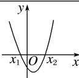</td><td>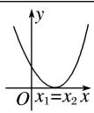</td><td>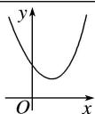</td></tr><tr><td>一元二次方程 $ax^{2}+bx+c=0(a>0)$ 的根</td><td>有两个不相等的实数根 $x_{1}, x_{2}(x_{1}有两个相等的实数根\( x_{1}=x_{2}=-\frac{b}{2a}没有实数根</td><td>有两个相等的实数根\( x_{1}=x_{2}=-\frac{b}{2a}$ </td><td>没有实数根</td></tr><tr><td> $ax^{2}+bx+c>0(a>0)$ 的解集</td><td> $\{x|x\( \{x|x\neq-\frac{b}{2a}\}$ R</td><td> $\{x|x\neq-\frac{b}{2a}\}$ </td><td>R</td></tr><tr><td> $ax^{2}+bx+c<0(a>0)$ 的解集</td><td> $\{x|x_{1}\( \emptyset$  $\emptyset$ </td><td> $\emptyset$ </td><td> $\emptyset$ </td></tr></table>

$ax^{2}+bx+c>0$ 意味着 $y=ax^{2}+bx+c$ 中 y>0 的部分， $ax^{2}+bx+c<0$ 意味着 $y=ax^{2}+bx+c$ 中 y<0 的部分， $ax^{2}+bx+c=a(x-x_{1})(x-x_{2})=0$ ，求出两个根 $x_{1}$ ， $x_{2}$ ；根据图象可知：开口向上时，大于取两边，小于取中间，反之亦然.

##### 2. 一元二次不等式参数问题之定海神针

二次函数涉及参数和变量的问题，很关键的一点就是参数的位置，到底是在二次项、一次项还是在常数项？然后参数是一次出现还是多处出现，这个问题值得探讨。二次函数的定海神针主要处理对称轴是变量，区间是定区间的类型（轴动区间定），或者是对称轴不变，区间是动区间的类型（轴定区间动）。遵循对称轴从区间的左边、中间和右边的顺序进行分类讨论。

口诀：轴在区间内，顶点定；轴在区间外，单调定.

##### 3. 二次函数的参变分离

当决定抛物线开口符号的 a 与恒成立（能成立）的符号一致时，即 $ax^{2} + bx + c \geq 0 (a > 0)$ ，此类型题目基本上都是分类讨论复杂，且注意参数此时尽量为一次，那么我们把式子的参数分离出来，转化为求对勾函数的最值问题.

【例 1】已知函数 $f(x)=x^{2}+2(a-1)x+2$ 。若 $f(x)$ 满足：对于任意的 $x_{1},\quad x_{2}\in[4,+\infty)$ ，且 $x_{1}\neq x_{2}$ ，都有 $\frac{f(x_{2})-f(x_{1})}{x_{2}-x_{1}}>0$ ，则实数a的取值范围是()

$\quad$A. $a \geqslant 3$

$\quad$B. $a \geqslant -3$

$\quad$C. $a \leqslant -3$

$\quad$D. $a \leqslant 5$

【例 2】已知函数 $f(x)=mx^{2}+2x+m$ 在 $(-1,+\infty)$ 上单调递增，则实数 m 的取值范围是（）

$\quad$A. $(0, 1]$

$\quad$B. $[0, 1]$

$\quad$C. $[1, +\infty)$

$\quad$D. $(-∞, 1]$

【例 3】已知二次函数 $y = -x^{2} + 2x + 3$ ，当 $t \leqslant x \leqslant t + 2$ 时，若该函数的最大值为 m，最小值为 -5，则 m 等于（）

$\quad$A. 1

$\quad$B. 2

$\quad$C. 3

$\quad$D. 4

【例 4】已知二次函数 $f(x)=ax^{2}+bx+c(a\neq0)$ ，恒有 $f(x+2)-f(x)=4x$ ， $f(0)=3$ 。

（1）求函数 $f(x)$ 的解析式；  
（2）设 $g(x)=f(x)-mx$ ，若函数 $g(x)$ 在区间 [1, 2] 上的最大值为 3，求实数 m 的值.

【例 5】二次函数 $f(x)$ 满足 $f(x+1)-f(x)=2x$ 且 $f(0)=1$ .

（1）求 $f(x)$ 的解析式；  
（2）设函数 $f(x)$ 在区间 $[a, a+1]$ 上的最小值为 g（a），求 g（a）的表达式.

# 题型 3 一元二次函数根的分布问题

# 1. 二次函数的根与定值的位置关系

两根与 $k$ 的大小比较（以 $a > 0$ 为例）

<table><tr><td>文字描述</td><td>两根都小于k,即 $x_1 < k$ ,  $x_2 < k$ </td><td>两根都大于k,即 $x_1 > k$ ,  $x_2 > k$ </td><td>一根小于k,一根大于k,即 $x_1 < k < x_2$ </td></tr><tr><td>图像表达</td><td>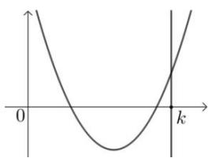</td><td>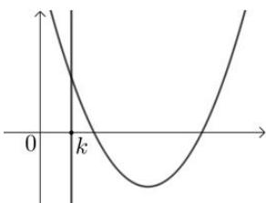</td><td>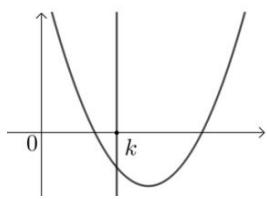</td></tr><tr><td>数学语言</td><td> $\begin{cases} \Delta > 0 \\ -\frac{b}{2a} < k \\ f(k) > 0 \end{cases}$ </td><td> $\begin{cases} \Delta > 0 \\ -\frac{b}{2a} > k \\ f(k) > 0 \end{cases}$ </td><td> $f(k) < 0$ </td></tr></table>

# 2. 二次函数的根与区间的位置关系

（1） 两根分别在区间 $(m, n)$ 外

<table><tr><td></td><td>a&gt;0</td><td>a&lt;0</td></tr><tr><td>图像表达</td><td>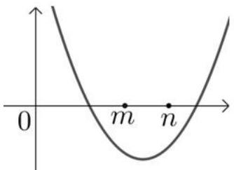</td><td>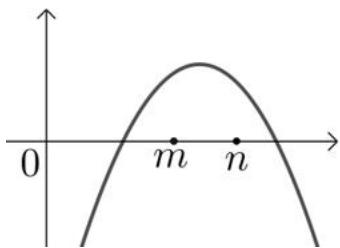</td></tr><tr><td>数学语言</td><td> $\begin{cases} f(m) < 0 \\ f(n) < 0 \end{cases}$ </td><td> $\begin{cases} f(m) > 0 \\ f(n) > 0 \end{cases}$ </td></tr></table>

（2） 根在区间上的分布 (以 $a > 0$ 为例)

<table><tr><td>文字描述</td><td>两根都在(m,n)内</td><td>两根有且仅有一根在(m,n)内</td><td>一根(m,n)内,另一根在(p,q)内</td></tr><tr><td>图像表达</td><td>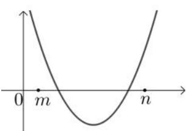</td><td>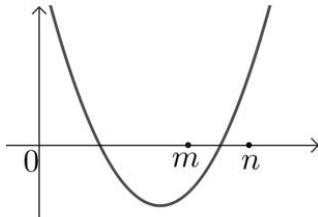</td><td>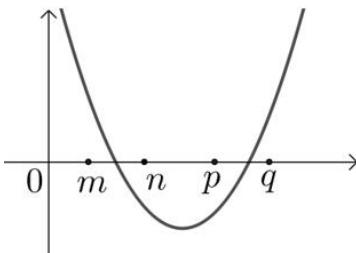</td></tr><tr><td>数学语言</td><td> $\left\{\begin{array}{l}\Delta>0\\f(m)>0\\f(n)>0\\m<-\frac{b}{2a}<n\end{array}\right.$ </td><td> $f(m)f(n)<0$ </td><td> $\left\{\begin{array}{l}f(m)>0\\f(n)<0\\f(p)<0\\f(q)>0\end{array}\right.$  or  $\left\{\begin{array}{l}f(m)f(n)<0\\f(p)f(q)<0\end{array}\right.$ </td></tr></table>

【例 1】方程 $(2m+1)x^{2}-2mx+(m-1)=0$ 有一正根和一负根的充分不必要条件是()

$\quad$A. $-\frac{1}{2} < m < 1$

$\quad$B. $m < -\frac{1}{2}$

$\quad$C. $0 < m < 1$

$\quad$D. -2 < m < 1

【例 2】若命题 “关于 x 的二次方程 $x^{2} + 2mx + 2m + 1 = 0$ 在 $(-1,3)$ 上至多有一个解” 是假命题，则 m 的取值范围是（）

$\quad$A. $(-3,-\frac{5}{4})$

$\quad$B. $(-3,1 - \sqrt{2})$

$\quad$C. $(- \frac{5}{4}, 1)$

$\quad$D. $\left(-\frac{5}{4},1-\sqrt{2}\right)$

【例 3】已知关于 x 的二次方程 $x^{2} + 2mx + 2m + 1 = 0$ ，若方程有两根，其中一根在区间 $(-1,0)$ 内，另一根在区间 $(1,2)$ 内，m 的范围是 \_\_\_\_.

# 拓展思维

# 拓展 1 高次方程和绝对值不等式的解法

# 1. 一元高次不等式的解法

一元高次不等式通常先进行因式分解, 化为 $(x - x_{1})(x - x_{2})\ldots (x - x_{n}) > 0$ (或 $< 0$ ) 的形式, 然后用穿针引线法求解. 首先保证每个因式中 $x$ 的系数为正, 然后从右侧画起, 右侧第一个区间为正, 从右向左依次正负出现, 特别要注意 “奇穿偶切”, “奇” (“偶”) 指的是某个因式的次数.

数轴穿根法的注意点：当不等式中含有 $(x-a)^{2n}$ 时，运用标根法不穿过a点，而 $(x-a)^{2n-1}$ 则穿过a点，俗称“奇穿偶不穿”.

Eg 解 $(x+1)(x-2)(x-3)(x-4)\geq0$ ，如图所示，解集为 $\{x|x\geq4$ 或 $2\leq x\leq3$ 或 $x\leq-1\}$ .

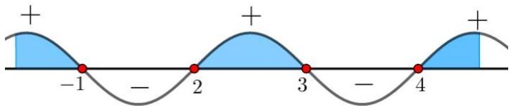

解 $(x+1)(x-2)^{2}(x-3)(x-4)^{3}\leq0$ ，如图所示，解集为 $\{x|x\leq-1$ 或x=2或 $3\leq x\leq4\}$ .

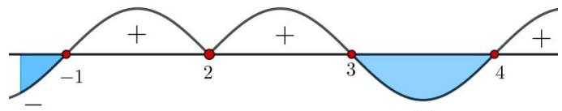

# 2. 绝对值不等式的解法

与分式不等式类似的是，求解绝对值不等式也是要将不等式的绝对值去掉，进行同解变形.

一般的， $\left|f(x)\right|>g(x)$ 与 $f(x)>g(x)$ 或 $f(x)<-g(x)$ 同解； $\left|f(x)\right|<g(x)$ 与 $-g(x)<f(x)<g(x)$ 同解.

一般的， $\left|f(x)\right|>\left|g(x)\right|\Leftrightarrow\left|f(x)\right|^{2}>\left|g(x)\right|^{2}\Leftrightarrow f(x)^{2}>g(x)^{2}$ ，需要注意的是，如果不等式中有多个绝对值，那么就需要对每个绝对值号进行讨论.

【例 1】 $\frac{x+2}{x^{2}-3x+2}\geqslant1$ 的解集是()

$\quad$A. $(1, 2]$

$\quad$B. $[-1, 0) \cup (2, 3]$ 
$\quad$C. $[0, 4]$

$\quad$D. $[0, 1) \cup (2, 4]$

【例 2】不等式 $|x-1|+|x-2|\geqslant3$ 的解集是()

$\quad$A. $(-∞, 1]∪[2, +∞)$

$\quad$B. $[1, 2]$

$\quad$C. $(- \infty, 0] \cup [3, +\infty)$

$\quad$D. $[0,3]$

【例 3】(2025·九省联考)已知函数 $f(x)=x\left|x-a\right|-2a^{2}$ . 若当 x>2 时， $f(x)>0$ ，则 a 的取值范围是()

$\quad$A. $(- \infty, 1]$

$\quad$B. $[-2, 1]$

$\quad$C. $[-1, 2]$

$\quad$D. $[-1, +\infty)$

