# 第七章 立体几何第二节 大题篇

# 考点一 平行的判定

# 1. 直线与平面平行

<table><tr><td></td><td>文字语言</td><td>图形语言</td><td>符号语言</td></tr><tr><td>判定定理</td><td>平面外一条直线与此平面内的一条直线平行,则直线与此平面平行.</td><td>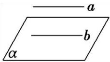</td><td> $\left.\begin{array}{l}\frac{a\not\subset a}{b\subset a}\\ \underline{b//a}\end{array}\right\} \Rightarrow a//a$ </td></tr><tr><td>性质定理</td><td>如果一条直线和一个平面平行,经过这条直线的平面和这个平面相交,那么这条直线就和交线平行.</td><td>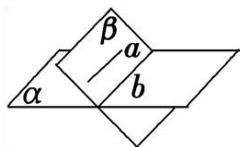</td><td> $\left.\begin{array}{l}\frac{a//a}{a\subset\beta}\\ \underline{a\cap\beta=b}\end{array}\right\} \Rightarrow a//b$ </td></tr></table>

# 2. 平面与平面平行

<table><tr><td></td><td>文字语言</td><td>图形语言</td><td>符号语言</td></tr><tr><td>判定定理</td><td>一个平面内有两条相交直线与另一个平面平行,则这两个平面平行</td><td>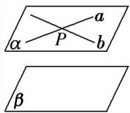</td><td> $\left.\begin{array}{l}\underline{a\subset a}\\ \underline{b\subset a}\\ \underline{a\cap b=P}\\ \underline{a//\beta}\\ \underline{b//\beta}\end{array}\right\} \Rightarrow \alpha //\beta$ </td></tr><tr><td>性质定理</td><td>如果两个平行平面时与第三个平面相交,那么它们的交线平行</td><td>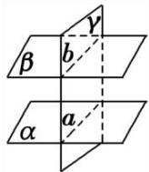</td><td> $\left.\begin{array}{l}\underline{a//\beta}\\ \underline{a\cap\gamma=a}\\ \underline{\beta\cap\gamma=b}\end{array}\right\} \Rightarrow a//b$ </td></tr></table>

# 法一 线面平行构造之三角形中位线法（又称“A”型平行）

【例 1】四棱椎 P-ABCD 底面为平行四边形，E、F 分别为 PD、BC 中点，证明：PB// 平面 ACE

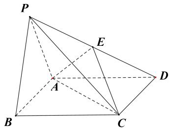

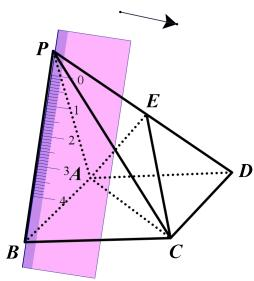

图一

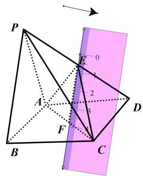

图二

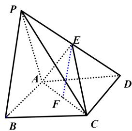

图三

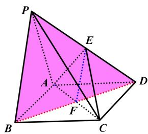

图四

# 法二 线面平行构造之平行四边形法（又称“□”型平行）

【例 2】四棱椎 P-ABCD 底面为平行四边形，E、F 分别为 PD、BC 中点，证明：EF// 平面 PAB

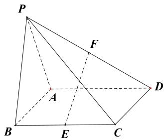

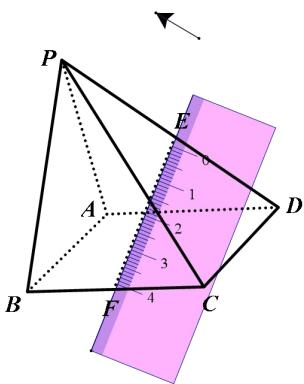

图一

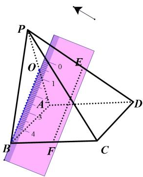

图二

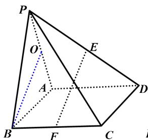

图三

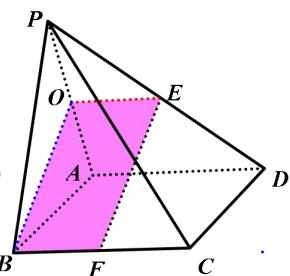

图四

# 法三 线面平行构造之面面平行推导法（做一个辅助平行平面）

【例 3】四棱椎 P-ABCD 底面为平行四边形，E、F 分别为 PD、BC 中点，证明：EF || 平面 PAB

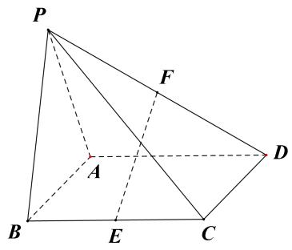

【例 4】如图，在四棱锥 P-ABCD 中， $AB \parallel CD, AB \perp BC, 2AB = 2BC = CD = PD = PC$ ，设 E, F, M 分列为棱 AB, PC, CD 的中点，证明：EF // 平面 PAM。

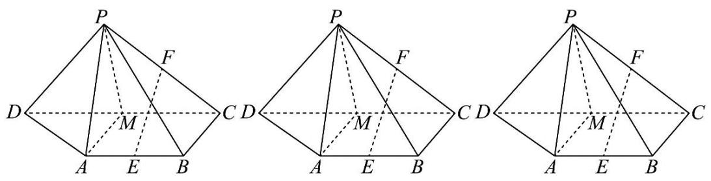

# 考点二 垂直的判定

# 1. 直线和平面垂直的定义

直线 l 与平面 a 内的任意一条直线都垂直，就说直线 l 与平面 a 互相垂直

# 2. 性质定理与判定定理

<table><tr><td></td><td>文字语言</td><td>图形语言</td><td>符号语言</td></tr><tr><td>判定定理</td><td>一条直线与平面内的两条相交直线都垂直,则该直线与此平面垂直</td><td>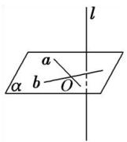</td><td> $\left.\begin{array}{l}\underline{a,b\subset\alpha}\\ \underline{a\cap b=0}\\ \underline{l\perp a}\\ \underline{l\perp b}\end{array}\right\} \Rightarrow l\perp\alpha$ </td></tr><tr><td>推论</td><td>如果在两条平行直线中,有一条垂直于平面,那么另一条直线也垂直这个平面</td><td>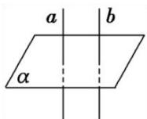</td><td> $\left.\frac{a//b}{a\perp a}\right\} \Rightarrow b\perp a$ </td></tr><tr><td>性质定理</td><td>垂直于同一个平面的两条直线平行</td><td>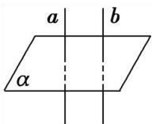</td><td> $\left.\frac{a\perp a}{b\perp a}\right\} \Rightarrow a//b$ </td></tr></table>

# 3. 平面与平面垂直

<table><tr><td></td><td>文字语言</td><td>图形语言</td><td>符号语言</td></tr><tr><td>判定定理</td><td>一个平面过另一个平面的一条垂线,则这两个平面互相垂直</td><td>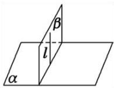</td><td> $\left.\frac{l\subset\beta}{l\perp a}\right\} \Rightarrow a\perp\beta$ </td></tr><tr><td>性质定理</td><td>两个平面互相垂直,则一个平面内垂直于交线的直线垂直于另一个平面</td><td>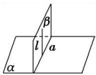</td><td> $\left.\frac{a\perp\beta}{l\subset\beta}\right\}_{\substack{a\cap\beta=a\\ l\perp a}} \Rightarrow l\perp a$ </td></tr></table>

# 题型 1 线面垂直与面面垂直的判定定理

【例 1】图 1 是由矩形 ADEB，RtΔABC 和菱形 BFGC 组成的一个平面图形，其中 AB = 1，BE = BF = 2， $\angle FBC = 60^{\circ}$ 。将其沿 AB，BC 折起使得 BE 与 BF 重合，连结 DG，如图 2。证明：图 2 中的 A，C，G，D 四点共面，且平面 ABC ⊥ 平面 BCGE

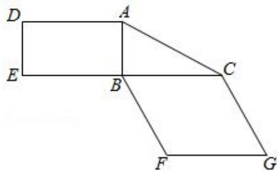

图1

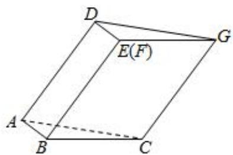

图2

【例 2】如图，在四棱锥 P-ABCD 中，底面 ABCD 为正方形， $PA \perp$ 底面 ABCD，PA = AB = 2，E 为线段 PB 的中点，F 为线段 BC 上的动点，证明：平面 AEF ⊥ 平面 PBC

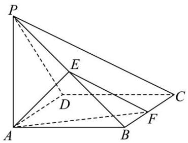

# 题型 2 异面直线垂直

【例 3】如图，在长方体 $ABCD-A_{1}B_{1}C_{1}D_{1}$ 中，点 E，F 分别在棱 $DD_{1}$ ， $BB_{1}$ 上，且 $2DE=ED_{1}$ ， $BF=2FB_{1}$ .
证明：（1）当 AB = BC 时， $EF \perp AC$ ；（2）点 $C_{1}$ 在平面 AEF 内.

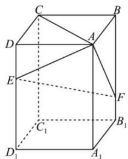

# 题型 3 等腰三角形三线合一构造法

在没有特殊的重垂线和水平面，证一些线面垂直则需要一些特殊的几何性质,由有着共底边的两个等腰三角形构成的立体图形，则两个顶点的连线一定垂直于底边.

【例 4】如图，已知空间四边形 ABCD 中，BC = AC，AD = BD，E 是 AB 的中点.

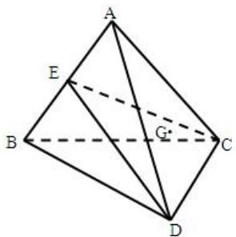

求证：（1） $AB \perp$ 平面 CDE；

（2） 平面 $CDE \perp$ 平面 ABC;  
（3）若 G 为 $\Delta ADC$ 的重心，试在线段 AE 上确定一点 F，使得 GF // 平面 CDE.

##### 【例5】如图，在四棱锥 $P - ABCD$ 中，底面 $ABCD$ 是 $\angle DAB = 60^{\circ}$ 且边长为 $a$ 的菱形，侧面 $PAD$ 是等边三角形，且平面 $PAD$ 垂直于底面 $ABCD$ 。

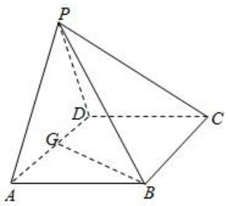

（1）若 G 为 AD 的中点，求证： $BG \perp$ 平面 PAD；  
（2） 求证: $AD \perp PB$ ;   
（3）求二面角 A-BC-P 的大小.

# 题型 4 面面垂直的性质定理

【例 6】如图，在平面四边形 ABCP 中，D 为 PA 的中点， $PA \perp AB, CD // AB$ ，且 PA = CD = 2AB = 4。将此平面四边形 ABCP 沿 CD 折成直二面角 P - DC - B，连接 PA, PB, BD。证明：平面 PBD ⊥ 平面 PBC。

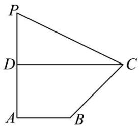

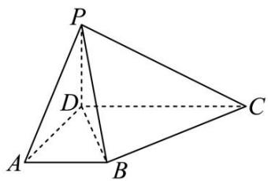

# 题型 5 鳖臑几何体中的垂直

定理：若一条直线 $l$ 垂直于一个平面，如果在被垂直的平面内找到相互垂直的两条线 $l_{1} \perp l_{2}$ （ $l_{1}$ 与 $l$ 相交），则与 $l$ 异面的直线 $l_{2}$ 垂直于 $l$ 和 $l_{1}$ 构成的平面。鳖臑是最典型的例子。

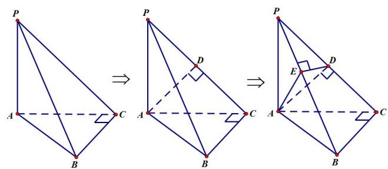

当出现重垂线 $PA$ 时，就需要在水平面 $ACB$ 内找到两条垂直相交的直线 $AC \perp BC$ ，由于 $AC$ 与重垂线

$PA$ 相交，故能得到 $BC \perp$ 面 $PAC$ ，同理， $PAC$ 作为被垂直的平面，在平面内找到 $AD \perp PC$ ， $BC$ 与 $PC$ 相交，故可以得到 $AD \perp$ 面 $PBC$ ， $PBC$ 作为被垂直的平面，需要在这个面内找到垂直的两条直线，当 $DE \perp PB$ 时（或 $AE \perp PB$ ），能得到 $PB \perp$ 面 $ADE$ 。

【例 7】如图，几何体 P-ABC 中，PA⊥平面 ABC，AC⊥CB，AM⊥PB 于 M，AN⊥PC 于 N．

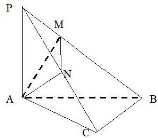

（1）证明： $BC \perp$ 平面PAC；  
（2） 证明: $PB \perp$ 平面 $AMN$ ;  
（3）证明：平面 $PBC \perp$ 平面 $AMN$ ；  
（4）证明： $PB \perp MN$ .

# 考向 2 空间向量与立体几何

# 知识点一：空间向量的数量积运算

# （1） 两向量夹角

已知两个非零向量 $\vec{a}$ , $\vec{b}$ , 在空间任取一点 $O$ , 作 $\overrightarrow{OA} = \vec{a}$ , $\overrightarrow{OB} = \vec{b}$ , 则 $\angle AOB$ 叫做向量 $\vec{a}$ , $\vec{b}$ 的夹角, 记作 $\left\langle \vec{a}, \vec{b} \right\rangle$ , 通常规定 $0 \leq \left\langle \vec{a}, \vec{b} \right\rangle \leq \pi$ , 如果 $\left\langle \vec{a}, \vec{b} \right\rangle = \frac{\pi}{2}$ , 那么向量 $\vec{a}$ , $\vec{b}$ 互相垂直, 记作 $\vec{a} \perp \vec{b}$ .

# （2） 数量积定义

已知两个非零向量 $\vec{a}$ , $\vec{b}$ , 则 $\left|\vec{a}\right|\left|\vec{b}\right|\cos \left\langle \vec{a},\vec{b}\right\rangle$ 叫做 $\vec{a}$ , $\vec{b}$ 的数量积, 记作 $\vec{a} \cdot \vec{b}$ , 即 $\vec{a} \cdot \vec{b} = \left|\vec{a}\right|\left|\vec{b}\right|\cos \left\langle \vec{a},\vec{b}\right\rangle$ . 零向量与任何向量的数量积为 0, 特别地, $\vec{a} \cdot \vec{a} = \left|\vec{a}\right|^2$ .

# （3）空间向量的数量积满足的运算律：

$\left(\lambda\vec{a}\right)\cdot\vec{b}=\lambda\left(\vec{a}\cdot\vec{b}\right),\quad\vec{a}\cdot\vec{b}=\vec{b}\cdot\vec{a}$ （交换律）；

$\vec{a}\cdot(\vec{b}+\vec{c})=\vec{a}\cdot\vec{b}+\vec{a}\cdot\vec{c}$ （分配律）.

# 知识点二：空间向量的坐标运算及应用

（1）设 $\vec{a} = (a_1, a_2, a_3)$ ， $\vec{b} = (b_1, b_2, b_3)$ ，则 $\vec{a} + \vec{b} = (a_1 + b_1, a_2 + b_2, a_3 + b_3)$ ；

$\vec {a} - \vec {b} = \left(a _ {1} - b _ {1}, a _ {2} - b _ {2}, a _ {3} - b _ {3}\right);$

$\lambda \vec {a} = \left(\lambda a _ {1}, \lambda a _ {2}, \lambda a _ {3}\right);$

$\vec {a} \cdot \vec {b} = a _ {1} b _ {1} + a _ {2} b _ {2} + a _ {3} b _ {3};$

$\vec {a} / / \vec {b} (\vec {b} \neq \vec {0}) \Rightarrow a _ {1} = \lambda b _ {1}, a _ {2} = \lambda b _ {2}, a _ {3} = \lambda b _ {3};$

$\vec {a} \perp \vec {b} \Rightarrow a _ {1} b _ {1} + a _ {2} b _ {2} + a _ {3} b _ {3} = 0.$

（2）设 $A(x_{1},y_{1},z_{1})$ ， $B(x_{2},y_{2},z_{2})$ ，则 $\overrightarrow{AB}=\overrightarrow{OB}-\overrightarrow{OA}=(x_{2}-x_{1},y_{2}-y_{1},z_{2}-z_{1})$ .

这就是说，一个向量在直角坐标系中的坐标等于表示该向量的有向线段的终点的坐标减起点的坐标.

（3） 两个向量的夹角及两点间的距离公式.

①已知 $\vec{a}=(a_{1},a_{2},a_{3})$ ， $\vec{b}=(b_{1},b_{2},b_{3})$ ，则 $\left|\vec{a}\right|=\sqrt{\vec{a}^{2}}=\sqrt{a_{1}^{2}+a_{2}^{2}+a_{3}^{2}}$ ;

$\left| \vec {b} \right| = \sqrt {\vec {b} ^ {2}} = \sqrt {b _ {1} ^ {2} + b _ {2} ^ {2} + b _ {3} ^ {2}};$

$\vec {a} \cdot \vec {b} = a _ {1} b _ {1} + a _ {2} b _ {2} + a _ {3} b _ {3};$

$\cos \left\langle \vec {a}, \vec {b} \right\rangle = \frac {a _ {1} b _ {1} + a _ {2} b _ {2} + a _ {3} b _ {3}}{\sqrt {a _ {1} ^ {2} + a _ {2} ^ {2} + a _ {3} ^ {2}} \sqrt {b _ {1} ^ {2} + b _ {2} ^ {2} + b _ {3} ^ {2}}};$

②已知 $A\left(x_{1},y_{1},z_{1}\right)$ ， $B\left(x_{2},y_{2},z_{2}\right)$ ，则 $\left|\overrightarrow{AB}\right| = \sqrt{\left(x_1 - x_2\right)^2 + \left(y_1 - y_2\right)^2 + \left(z_1 - z_2\right)^2}$

或者 $d(A,B) = \left|\overrightarrow{AB}\right|$ 。其中 $d(A,B)$ 表示 $A$ 与 $B$ 两点间的距离，这就是空间两点的距离公式。

（4）向量 $\vec{a}$ 在向量 $\vec{b}$ 上的投影为 $\left|\vec{a}\right|\cos \left\langle \vec{a},\vec{b}\right\rangle = \frac{\vec{a}\cdot\vec{b}}{\left|\vec{b}\right|}.$

# 知识点三：法向量的求解与简单应用

# （1） 平面的法向量:

如果表示向量 $\vec{n}$ 的有向线段所在直线垂直于平面 $\alpha$ ，则称这个向量垂直于平面 $\alpha$ ，记作 $\vec{n} \perp \alpha$ ，如果 $\vec{n} \perp \alpha$ ，那么向量 $\vec{n}$ 叫做平面 $\alpha$ 的法向量.

# 几点注意:

①法向量一定是非零向量；②一个平面的所有法向量都互相平行；③向量 $\vec{n}$ 是平面的法向量，向量 $\vec{m}$ 是与平面平行或在平面内，则有 $\vec{m} \cdot \vec{n} = 0$ .

第一步：写出平面内两个不平行的向 $\vec{a}=(x_{1},y_{1},z_{1})$ ， $\vec{b}=(x_{2},y_{2},z_{2})$ ;

第二步：那么平面法向量 $\vec{n}=(x,y,z)$ ，满足 $\left\{\begin{aligned}\vec{n}\cdot\vec{a}&=0\\ \vec{n}\cdot\vec{b}&=0\end{aligned}\right.\Rightarrow\left\{\begin{aligned}xx_{1}+yy_{1}+zz_{1}&=0\\ xx_{2}+yy_{2}+zz_{2}&=0\end{aligned}\right.$

# （2）判定直线、平面间的位置关系

①直线与直线的位置关系：不重合的两条直线a，b的方向向量分别为 $\vec{a}$ ， $\vec{b}$ 。

若 $\vec{a} // \vec{b}$ ，即 $\vec{a} = \lambda \vec{b}$ ，则 $a // b$ ；

若 $\vec{a} \perp \vec{b}$ ，即 $\vec{a} \cdot \vec{b} = 0$ ，则 $a \perp b$ 。

②直线与平面的位置关系：直线l的方向向量为 $\vec{a}$ ，平面 $\alpha$ 的法向量为 $\vec{n}$ ，且 $l\perp\alpha$ .

若 $\vec{a} \parallel \vec{n}$ ，即 $\vec{a} = \lambda \vec{n}$ ，则 $l \perp \alpha$ ;

若 $\vec{a} \perp \vec{n}$ ，即 $\vec{a} \cdot \vec{n} = 0$ ，则 $\vec{a} // \alpha$ 。

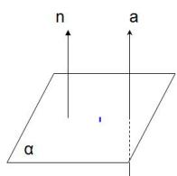  
L

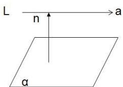

# （3）平面与平面的位置关系

平面 $\alpha$ 的法向量为 $\vec{n}_{1}$ ，平面 $\beta$ 的法向量为 $\vec{n}_{2}$ .

若 $\vec{n}_{1} \parallel \vec{n}_{2}$ ，即 $\vec{n}_{1} = \lambda \vec{n}_{2}$ ，则 $\alpha \parallel \beta$ ；若 $\vec{n}_{1} \perp \vec{n}_{2}$ ，即 $\vec{n}_{1} \cdot \vec{n}_{2} = 0$ ，则 $\alpha \perp \beta$ 。

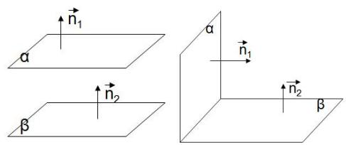

# 知识点四：空间角公式.

（1）异面直线所成角公式：设 $\vec{a}$ ， $\vec{b}$ 分别为异面直线 $l_1$ ， $l_2$ 上的方向向量， $\theta$ 为异面直线所成角的大小，则 $\cos \theta = |\cos \langle \vec{a}, \vec{b} \rangle| = \frac{|\vec{a} \cdot \vec{b}|}{|\vec{a}| |\vec{b}|}$ .

（2） 线面角公式: 设 $l$ 为平面 $\alpha$ 的斜线, $\vec{a}$ 为 $l$ 的方向向量, $\vec{n}$ 为平面 $\alpha$ 的法向量, $\theta$ 为

$l$ 与 $\alpha$ 所成角的大小，则 $\sin \theta = \left|\cos \left\langle \vec{a},\vec{n}\right\rangle \right| = \frac{\left|\vec{a} \cdot \vec{n}\right|}{\left|\vec{a}\right|\left|\vec{n}\right|}$ .

（3） 二面角公式:

设 $n_1$ ， $n_2$ 分别为平面 $\alpha$ ， $\beta$ 的法向量，二面角的大小为 $\theta$ ，则 $\theta = \left\langle \overrightarrow{n_1},\overrightarrow{n_2}\right\rangle$ 或 $\pi -\left\langle \overrightarrow{n_1},\overrightarrow{n_2}\right\rangle$ （需要根据具体情况判断相等或互补），其中 $\left|\cos \theta \right| = \frac{\left|\overrightarrow{n_1}\cdot\overrightarrow{n_2}\right|}{\left|\overrightarrow{n_1}\right|\left|\overrightarrow{n_2}\right|}.$

# 知识点五：空间中的距离

求解空间中的距离

（1）异面直线间的距离：两条异面直线间的距离也不必寻找公垂线段，只需利用向量的正射影性质直接计算.

如图，设两条异面直线 $a, b$ 的公垂线的方向向量为 $\vec{n}$ ，这时分别在 $a, b$ 上任取 $A, B$ 两点，则向量在 $\vec{n}$ 上的正射影长就是两条异面直线 $a, b$ 的距离。则 $d = |\overrightarrow{AB} \cdot \frac{\vec{n}}{|\vec{n}|} | = \frac{|\overrightarrow{AB} \cdot \vec{n}|}{|\vec{n}|}$ 即两异面直线间的距离，等于两异面直线上分别任取两点的向量和公垂线方向向量的数量积的绝对值与公垂线的方向向量模的比值。

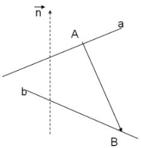

（2） 点到平面的距离

A 为平面 $\alpha$ 外一点（如图）， $\vec{n}$ 为平面 $\alpha$ 的法向量，过 A 作平面 $\alpha$ 的斜线 AB 及垂线 AH.

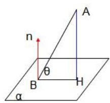

$| \overrightarrow {A H} | = | \overrightarrow {A B} | \cdot \sin \theta = | \overrightarrow {A B} | \cdot | \cos <   \overrightarrow {A B}, n > | = | \overrightarrow {A B} | \frac {| \overrightarrow {A B} \cdot \vec {\mathrm{n}} |}{| \overrightarrow {A B} | \cdot | \vec {\mathrm{n}} |} = \frac {| \overrightarrow {A B} \cdot \vec {\mathrm{n}} |}{| \vec {\mathrm{n}} |}$

$d = \frac {| \overrightarrow {A B} \cdot \overrightarrow {n} |}{| \overrightarrow {n} |}$

# 题型 1 空间向量的基本运算

【例 1】如图.空间四边形 OABC 中， $\overrightarrow{OA}=\vec{a},\overrightarrow{OB}=\vec{b},\overrightarrow{OC}=\vec{c}$ ，点 M 在 OA 上，且满足 $\overrightarrow{OM}=2\overrightarrow{MA}$ ，点 N 为 BC 的中点，则 $\overrightarrow{MN}=$ （）

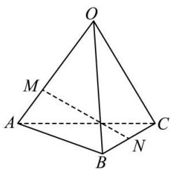

$\quad$A. $\frac{1}{2}\vec{a}-\frac{2}{3}\vec{b}+\frac{1}{2}\vec{c}$

$\quad$B. $\frac{2}{3}\vec{a}+\frac{2}{3}\vec{b}-\frac{1}{2}\vec{c}$

$\quad$C. $\frac{1}{2}\vec{a}+\frac{1}{2}\vec{b}-\frac{1}{2}\vec{c}$

$\quad$D. $-\frac{2}{3}\vec{a}+\frac{1}{2}\vec{b}+\frac{1}{2}\vec{c}$

【例 2】若点 $A(2,-5,-1)$ ， $B(-1,-4,-2)$ ， $C(m+3,-3,n)$ 在同一条直线上，则 m-n = （）

$\quad$A. 21

$\quad$B. 4

$\quad$C. -4

$\quad$D. 10

【例 3】（多选题）已知向量 $\vec{a}=(1,1,1)$ ， $\vec{b}=(-1,0,2)$ ，则下列正确的是（）

$\quad$A. $\vec{a} +\vec{b} = (0,1,3)$ 
$\quad$B. $|\vec{a}| = \sqrt{3}$

$\quad$C. $\vec{a} \cdot \vec{b} = 2$

$\quad$D. $\langle \vec{a},\vec{b}\rangle = \frac{\pi}{4}$

【例 4】在四面体 OABC 中，点 M，N 分别为 OA、BC 的中点，若 $\overrightarrow{OG} = \frac{1}{3} \overrightarrow{OA} + x \overrightarrow{OB} + y \overrightarrow{OC}$ ，且 G、M、N 三点共线，则 $x + y =$ \_\_\_\_ .

# 题型 2 利用空间向量证明平行

【例 1】如图所示，在四棱锥 P-ABCD 中，底面 ABCD 为矩形， $PD \perp$ 平面 ABCD，E 为 CP 的中点，N 为 DE 的中点， $DM = \frac{1}{4}DB, DA = DP = 1, CD = 2$ ，求证： $MN // AP$ .

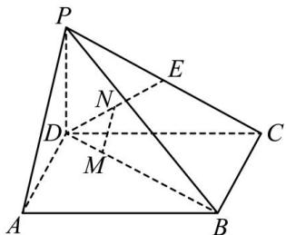

【例 2】在苏州博物馆有一类典型建筑八角亭，既美观又利于采光，其中一角如图所示，为多面体 $ABCDE-A_{1}B_{1}C_{1}D_{1}E_{1}$ ， $AB\perp AE$ ， $AE\parallel BC$ ， $AB\parallel ED$ ， $AA_{1}\perp$ 底面 ABCDE，四边形 $A_{1}B_{1}C_{1}D_{1}$ 是边长为 2 的正方形且平行于底面， $AB\parallel A_{1}B_{1}$ ， $D_{1}E$ ， $B_{1}B$ 的中点分别为 F，G， $AB=AE=2DE=2BC=4$ ， $AA_{1}=1$ 。
证明： $FG \parallel$ 平面 $C_{1}CD$ ；

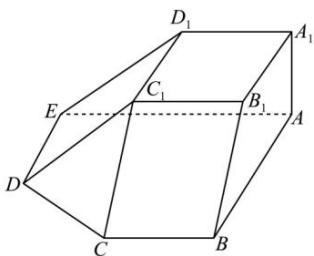

# 题型 3 利用空间向量证明垂直

【例 1】如图，在平行六面体 $ABCD-A_{1}B_{1}C_{1}D_{1}$ 中， $AB=AD=4, AA_{1}=5, \angle DAB=\angle DAA_{1}=\angle BAA_{1}=60^{\circ}$ .

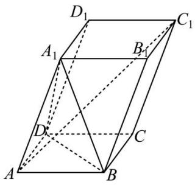

（1）求 $AC_{1}$ 的长；  
（2）求证： $AC_{1} \perp BD$ .

【例 2】如图，在四棱锥 P-ABCD 中， $PD \perp$ 底面 ABCD，底面 ABCD

是边长为 2 的正方形，PD = DC，F，G 分别是 PB，AD 的中点．求证：GF ⊥ 平面 PCB；

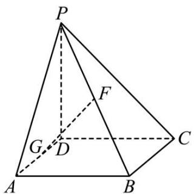

【例 3】如图，在四棱锥 P-ABCD 中， $PA \perp$ 平面 ABCD， $AD \perp CD$ ， $AD \parallel BC$ ， $PA = AD = CD = 2$ ，BC = 3.E 为 PD 的中点，点 F 在 PC 上，且 $\frac{PF}{FC} = \frac{1}{2}$ ，求证：平面 $AEF \perp$ 平面 PCD.

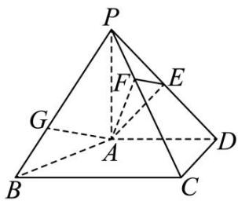

# 题型 4 利用空间向量求夹角、长度、体积

【例 1】（2024 新 I 卷）如图，四棱锥 P-ABCD 中， $PA \perp$ 底面 ABCD，PA=AC=2， $BC=1, AB=\sqrt{3}$ .

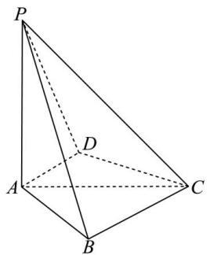

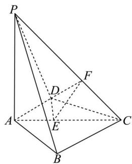

（1）若 $AD \perp PB$ ，证明：AD// 平面 PBC；  
（2）若 $AD \perp DC$ ，且二面角 A - CP - D 的正弦值为 $\frac{\sqrt{42}}{7}$ ，求 AD。

【例 2】(2024 新课标 II 卷 17 题) 如图, 平面四边形 ABCD 中, AB = 8, CD = 3, $AD = 5\sqrt{3}$ , $\angle ADC = 90^{\circ}$ , $\angle BAD = 30^{\circ}$ , 点 E, F 满足 $\overrightarrow{AE} = \frac{2}{5}\overrightarrow{AD}$ , $\overrightarrow{AF} = \frac{1}{2}\overrightarrow{AB}$ , 将 $\triangle AEF$ 沿 EF 对折至 $\triangle PEF$ , 使得 $PC = 4\sqrt{3}$ .

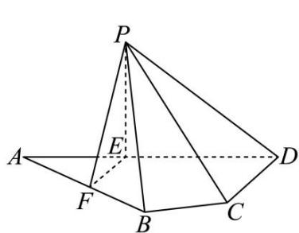

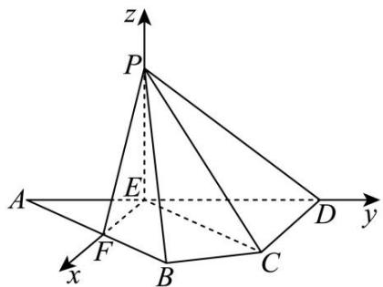

（1）证明： $EF \perp PD$ ;  
（2） 求面 $PCD$ 与面 $PBF$ 所成的二面角的正弦值.

【例 3】（2024 甲卷）如图，在以 A, B, C, D, E, F 为顶点的五面体中，四边形 ABCD 与四边形 ADEF 均为等腰梯形，BC // AD, EF // AD, AD = 4, AB = BC = EF = 2, $ED = \sqrt{10}$ , $FB = 2\sqrt{3}$ ，M 为 AD 的中点.

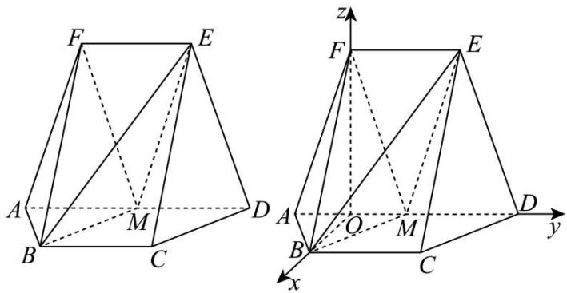

（1） 证明: $BM \parallel$ 平面 $CDE$ ;  
（2） 求二面角 F-BM-E 的正弦值.

# 题型 4 利用空间向量求距离

【例 1】（2024 天津卷）已知四棱柱 $ABCD-A_{1}B_{1}C_{1}D_{1}$ 中，底面 ABCD 为梯形， $AB//CD$ ， $A_{1}A \perp$ 平面 ABCD， $AD \perp AB$ ，其中 $AB = AA_{1} = 2, AD = DC = 1$ 。N 是 $B_{1}C_{1}$ 的中点，M 是 $DD_{1}$ 的中点。

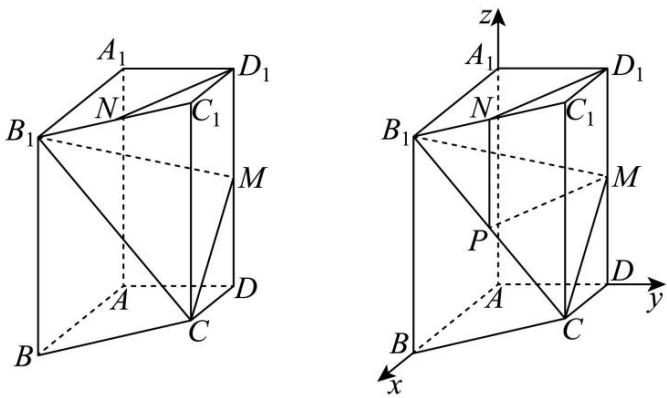

（1）求证 $D_{1}N//$ 平面 $CB_{1}M$ ；  
（2） 求平面 $CB_{1}M$ 与平面 $BB_{1}CC_{1}$ 的夹角余弦值;  
（3） 求点 B 到平面 $CB_{1}M$ 的距离.

【例 2】如图所示，在四棱锥 P-ABCD 中，侧面 $\triangle PAD$ 是正三角形，且与底面 ABCD 垂直，BC// 平面 PAD， $BC=\frac{1}{2}AD=1$ ，E 是棱 PD 上的动点.

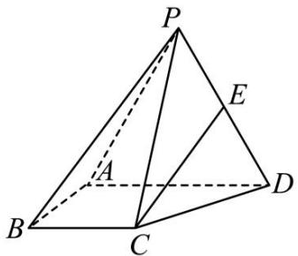

（1）当 $E$ 是棱 $PD$ 的中点时，求证： $CE / /$ 平面 $PAB$ ；  
（2）若 AB = 1， $AB \perp AD$ ，求点 B 到平面 ACE 距离的范围.

# 题型 5 探索性问题

与空间向量有关的探究性问题主要有两类：一类是探究线面的位置关系；另一类是探究线面角或二面角满足特定要求时的存在性问题．处理原则：先建立空间直角坐标系，引入参数（有些是题中已给出），设出关键点的坐标，然后探究这样的点是否存在，或参数是否满足要求，从而作出判断.

【例 1】等边三角形 ABC 的边长为 3，点 D, E 分别是边 AB, AC 上的点，且满足 $\frac{AD}{DB} = \frac{CE}{EA} = \frac{1}{2}$ ，如图甲，将 $\triangle ADE$ 沿 DE 折起到 $\triangle A_{1}DE$ 的位置，使二面角 $A_{1} - DE - B$ 为直二面角，连接 $A_{1}B, A_{1}C$ ，如图乙.

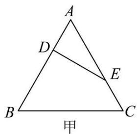

（1）求证： $BD \perp$ 平面 $A_{1}DE$ .  
（2）在线段 $BC$ 上是否存在点 $P$ ，使平面 $PA_{1}E$ 与平面 $A_{1}BD$ 所成的角为 $60^{\circ}$ ？若存在，求出 $PB$ 的长；若不存在，请说明理由.

##### 【例2】在如图所示的多面体中，四边形ABCD为正方形， $A,E,B,F$ 四点共面，且 $\triangle ABE$ 和 $\triangle ABF$ 均为等腰直角三角形， $\angle BAE = \angle AFB = 90^{\circ}$ ，平面ABCD⊥平面AEBF， $AB = 2$ ：

（1）求证：直线 $BE \parallel$ 平面 $ADF$ ；  
（2）求平面 CBF 与平面 BFD 夹角的余弦值;  
（3）若点 P 在直线 DE 上，求直线 AP 与平面 BCF 所成角的最大值.

