# 第二节 跟踪训练

# 考向 1 跟踪训练

考点1

【训练1】如图，在三棱柱 $ABC - A_{1}B_{1}C_{1}$ 中，侧面 $ACC_{1}A_{1}$ 为菱形，侧面 $CBB_{1}C_{1}$ 为正方形．点 $M$ 为 $A_{1}C$ 的中点，点 $N$ 为 $AB$ 的中点，证明： $MN//$ 平面 $BCC_{1}B_{1}$ ．

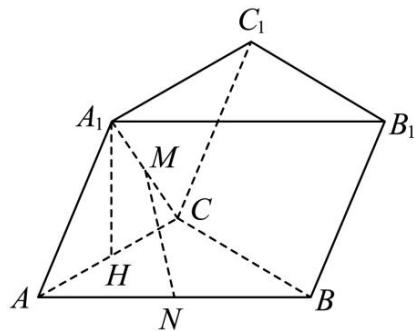

【训练 2】如图所示，在四棱锥 P-ABCD 中，BC// 平面 PAD， $BC=\frac{1}{2}AD$ ，E 是 PA 的中点.

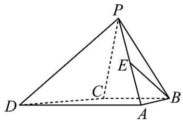

【训练3】如图， $AD / / BC$ 且 $AD = 2BC, AD \perp CD, EG / / AD$ 且 $EG = AD, CD / / FG$ 且 $CD = 2FG$ ， $DG \perp$ 平面ABCD， $DA = DC = DG$ ，若 $M$ 为 $CF$ 的中点， $N$ 为 $EG$ 的中点，

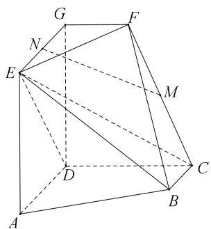

求证：MN//平面 CDE .

【训练4】如图，四边形ABCD为矩形， $P$ 是四棱锥 $P - ABCD$ 的顶点， $E$ 为 $BC$ 的中点，请问在 $PA$ 上是否存在点 $G$ ，使得 $EG / /$ 平面PCD，并说明理出

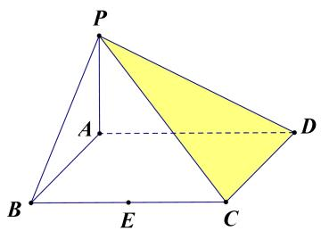

# 考点 2 跟踪训练

【训练1】如图，在四棱锥 $P - ABCD$ 中，四边形ABCD为菱形， $\angle ABC = 60^{\circ}$ ， $PA = AD$ ， $PA\bot$ 平面ABCD， $E,F$ 分别是 $BC$ ， $PC$ 的中点，证明：直线 $AE\bot$ 平面PAD.

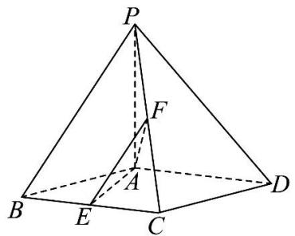

【训练 2】如图，在四棱锥 P-ABCD 中，底面 ABCD 是正方形，平面 $PCD \perp$ 平面 PAD，证明：平面 $PAD \perp$ 平面 ABCD；

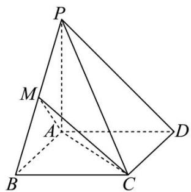

【训练3】如图，在三棱锥 $P - ABC$ 中，平面 $PAC \perp$ 平面 $ABC$ ，且 $\left|PA\right| = \left|AC\right| = \left|BC\right|$ ， $\angle PAC = \angle ACB = 90^\circ, E$ 为棱 $PC$ 的中点， $F$ 为棱 $PB$ 上的点，证明： $AE \perp PB$

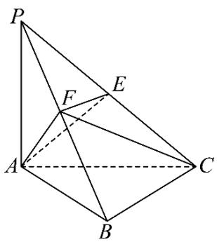

【训练4】如图，在直角梯形ABCD中， $AB \parallel CD$ ， $AB \perp BC$ ，E是CD上一点，AB=DE=2，CD=3， $BC=\sqrt{3}$ ，将△ADE沿着AE翻折，使D运动到点P处，得到四棱锥P-ABCE，证明： $PB \perp AE$ 。

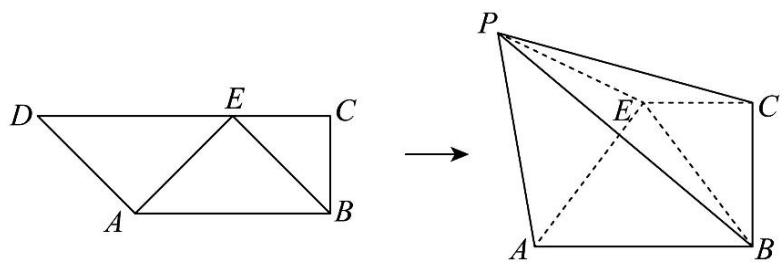

【训练 5】（2023·乙卷）如图，在三棱锥 P-ABC 中， $AB \perp BC$ ，AB = 2， $BC = 2\sqrt{2}$ ， $PB = PC = \sqrt{6}$ ，BP，AP，BC 的中点分别为 D，E，O， $AD = \sqrt{5}DO$ ，点 F 在 AC 上， $BF \perp AO$ 。

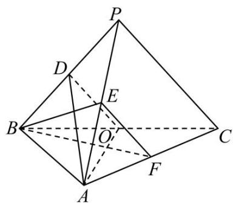

（1）证明：EF//平面 ADO；  
（2）证明：平面 $ADO \perp$ 平面 BEF;

# 考向 2 跟踪训练

### 题型 1

【训练 1】若 $A(m+1, n-1,3)$ 、 $B(2m, n, m-2n)$ 、 $C(m+3, n-3,9)$ 三点共线，则 $m+n=$ （）.

$\quad$A. 0

$\quad$B. 1

$\quad$C. 2

$\quad$D. 3

【训练 2】如图，M 在四面体 OABC 的棱 BC 的中点，点 N 在线段 OM 上，且 $MN = \frac{1}{3}OM$ ，设 $\overrightarrow{OA} = \overrightarrow{a}$ ， $\overrightarrow{OB} = \overrightarrow{b}$ ， $\overrightarrow{OC} = \overrightarrow{c}$ ，则下列向量与 $\overrightarrow{AN}$ 相等的向量是（）

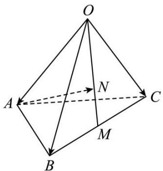

$\quad$A. $-\vec{a} + \frac{1}{3}\vec{b} + \frac{1}{3}\vec{c}$

$\quad$B. $\vec{a}+\frac{1}{3}\vec{b}+\frac{1}{3}\vec{c}$

$\quad$C. $-\vec{a}+\frac{1}{6}\vec{b}+\frac{1}{6}\vec{c}$

$\quad$D. $\vec{a}+\frac{1}{6}\vec{b}+\frac{1}{6}\vec{c}$

【训练 3】（多选题）已知空间向量 $\vec{a}=(2,-1,3)$ ， $\vec{b}=(-4,2,x)$ ，下列说法正确的是（）

$\quad$A. 若 $\vec{a} \perp \vec{b}$ ，则 $x = \frac{10}{3}$

$\quad$B. 若 $3\vec{a} + \vec{b} = (2, -1, 10)$ ，则 $x = 1$

$\quad$C. 若 $\vec{a}$ 在 $\vec{b}$ 上的投影向量为 $\frac{1}{3}\vec{b}$ ，则 x=4

$\quad$D. 若 $\vec{a}$ 与 $\vec{b}$ 夹角为锐角，则 $x \in \left( \frac{10}{3}, +\infty \right)$

【训练 4】已知空间 A、B、C、D 四点共面，且其中任意三点均不共线，设 P 为空间中任意一点，若 $\overrightarrow{BD}=5\overrightarrow{PA}-4\overrightarrow{PB}+\lambda\overrightarrow{PC}$ ，则 $\lambda=$ （）

$\quad$A. 2

$\quad$B.-2

$\quad$C. 1

$\quad$D.-1

# 题型 2 跟踪训练

【训练 1】如图，四边形 ABCD 和 ABEF 都是平行四边形，且不共面，M，N 分别是 AC，BF 的中点，求证：CE // MN.

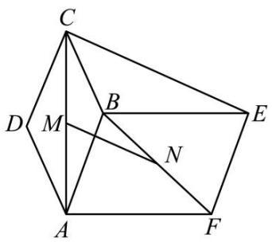

【训练 2】如图，AD//BC 且 AD = 2BC，AD ⊥ CD，EG//AD 且 EG = AD，CD//FG 且 CD = 2FG，DG ⊥ 平面 ABCD，DA = DC = DG = 2，若 M 为 CF 的中点，N 为 EG 的中点，求证：MN// 平面 CDE；

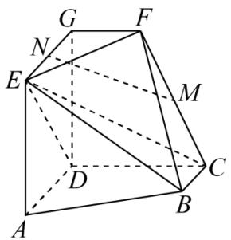

# 题型 3 跟踪训练

【训练1】如图，直三棱柱 $ABC - A_{1}B_{1}C_{1}$ 中， $\angle BAC = 90^{\circ}$ ， $|AB| = |AC| = 2$ ， $|AA_{1}| = 4$ ， $D$ 为 $BC$ 的中点， $E$ 为 $CC_{1}$ 上的点，且 $|CE| = \frac{1}{4}|CC_{1}|$ ，求证： $BE \perp$ 平面 $ADB_{1}$ .

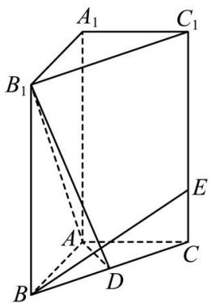

【训练 2】如图，正三棱柱 $ABC-A_{1}B_{1}C_{1}$ 中，E,F 分别是棱 $AA_{1},BB_{1}$ 上的点， $A_{1}E=BF=\frac{1}{3}AA_{1}$

证明：平面 $CEF \perp$ 平面 $ACC_{1}A_{1}$ ；

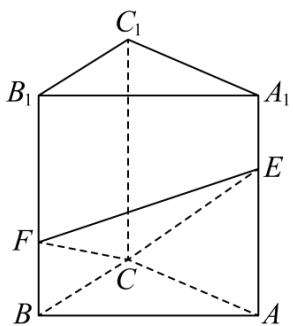

# 题型3 跟踪训练

【训练 1】在四棱锥 P-ABCD 中，底面 ABCD 为正方形，平面 $PAD \perp$ 平面 PAB， $\angle PAD = 45^{\circ}$ ，AB = 2。

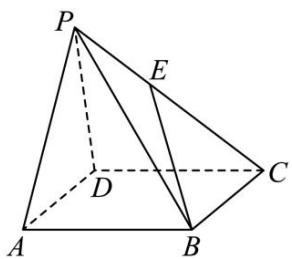

（1）证明：平面 $PAD \perp$ 平面ABCD；  
（2）若 E 为 PC 的中点，异面直线 BE 与 PA 所成角为 $30^{\circ}$ ，求四棱锥 P-ABCD 的体积.

【训练2】如图1所示，四边形ABCD中 $AD // BC$ ， $AB = 1$ ， $AD = 2$ ， $BC = 3$ ， $\angle ABC = \frac{\pi}{2}$ ， $M$ 为 $AD$ 的中点， $N$ 为 $BC$ 上一点，且 $MN // AB$ 。现将四边形ABNM沿MN翻折，使得 $AB$ 与 $EF$ 重合，得到如图2所示的几何体MDCNFE，其中 $FD = \sqrt{3}$ 。

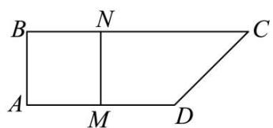

图1

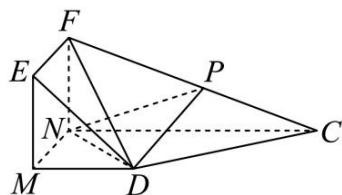

图2

（1）证明： $CD \perp$ 平面 FND;  
（2）若 P 为 FC 的中点，求二面角 F-ND-P 的正弦值.

# 题型 4 跟踪训练

【训练 1】如图，在四棱锥 P-ABCD 中，底面 ABCD 为平行四边形，侧面 PAD 是边长为 2 的正三角形，平面 $PAD \perp$ 平面 ABCD， $AB \perp PD$ .

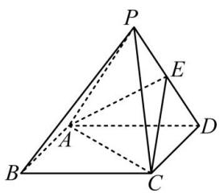

（1）求证：平行四边形ABCD为矩形；  
（2）若 $E$ 为侧棱 $PD$ 的中点，且平面 $ACE$ 与平面 $ABP$ 所成角的余弦值为 $\frac{\sqrt{6}}{4}$ ，求点 $B$ 到平面 $ACE$ 的距离.

【训练 2】在直三棱柱 $ABC - A_{1}B_{1}C_{1}$ 中， $AA_{1} = AB = BC = 3, AC = 2, D$ 是 AC 的中点，则直线 $B_{1}C$ 到平面 $A_{1}BD$ 的距离为 \_\_\_\_.

# 题型 5 跟踪训练

【训练 1】在 $\triangle ABC$ （图 1）中， $BC = 3, \angle C = 45^{\circ}, AD$ 为 BC 边上的高，且满

足 $\overrightarrow{DC}=2\overrightarrow{BD}$ ，现将 $\triangle ABD$ 沿 AD 翻折得到三棱锥 A-BCD （图 2），使得二面角 B-AD-C 为 $60^{\circ}$ .

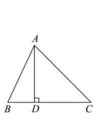

图1

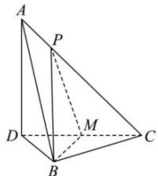

图2

（1）证明： $BC \perp$ 平面 ABD；  
（2）在三棱锥 A-BCD 中，M 为棱 CD 的中点，点 P 在棱 AC 上，且 $\overrightarrow{AP} = \lambda \overrightarrow{AC} \left(0 < \lambda < \frac{1}{2}\right)$ ，若点 C 到平面 PBM 的距离为 $\frac{3\sqrt{13}}{13}$ ，求 $\lambda$ 的值.

【训练2】如图，在三棱台 $ABC - A_{1}B_{1}C_{1}$ 中，若 $A_{1}A \perp$ 平面 $ABC, AB \perp AC, AB = AC = AA_{1} = 2$ ， $A_{1}C_{1} = 1, N$ 为 $AB$ 中点， $M$ 为棱 $BC$ 上一动点（不包含端点）.

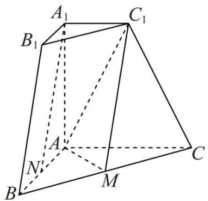

（1）若 M 为 BC 的中点，求证： $A_{1}N \parallel$ 平面 $C_{1}MA$ .  
（2）是否存在点 M，使得平面 $C_{1}MA$ 与平面 $ACC_{1}A_{1}$ 所成角的余弦值为 $\frac{2}{7}$ ？若存在，求出 BM 长度；若不存在，请说明理由.

【训练 3】如图, 圆台 $O_{1} O_{2}$ 的轴截面为等腰梯形 $A_{1} A C C_{1}$ , $A C = 2 A A_{1} = 2 A_{1} C_{1} = 4$ , $B$ 为底面圆周上异于 $A, C$ 的点.

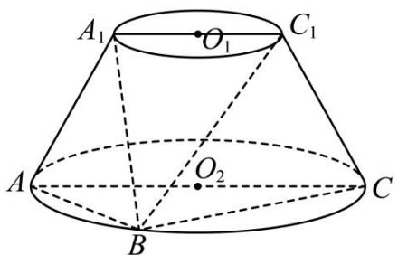

（1）在平面 $BCC_{1}$ 内，过 $C_{1}$ 作一条直线与平面 $A_{1}AB$ 平行，并说明理由；  
（2）若四棱锥 $B - A_{1}ACC_{1}$ 的体积为 $2\sqrt{3}$ ，设平面 $A_{1}AB \cap$ 平面 $C_{1}CB = l, Q \in l$ ，求 $|CQ|$ 的最小值.

