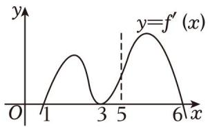

# 第一节跟踪训练

# 考向 1 跟踪训练

【训练 1】设函数 $f(x)$ 在 R 上可导，且 $f(\ln x) = x + \ln x$ ，则 $f'（0） = (\quad)$

$\quad$A. 0

$\quad$B. 1

$\quad$C. 2

$\quad$D. 3

【训练2】下列给出四个求导的运算：① $(x - \frac{1}{x})' = \frac{1 + x^2}{x^2}$ ；② $(ln(2x - 1))' = \frac{2}{2x - 1}$ ；③ $(x^2 e^x)' = 2xe^x$ ；④ $(log_2x)' = \frac{1}{xln2}$ 。其中运算结果正确的个数是（）

$\quad$A. 1 个

$\quad$B. 2 个

$\quad$C. 3 个

$\quad$D. 4 个

【训练 3】函数 $f(x)=a\sin3x+bx^{3}+4(a\in R,b\in R)$ ， $f'(x)$ 为 $f(x)$ 的导函数，
则 $f(2023)+f(-2023)+f'（2022）-f'(-2022)=(\quad)$

$\quad$A. 0

$\quad$B. 8

$\quad$C. 2022

$\quad$D. 2023

【训 4】若函数 $f(x)=(x-2019)(x-2020)(x-2021)(x-2022)$ ，则 $f'（2021）=$ \_\_\_\_.

【训练 5】设函数 $y = f''(x)$ 是 $y = f'(x)$ 的导函数．某同学经过探究发现，任意一个三次函数 $f(x) = ax^{3} + bx^{2} + cx + d (a \neq 0)$ 的图像都有对称中心 $(x_{0}, f(x_{0}))$ ，其中 $x_{0}$ 满足 $f''(x_{0}) = 0$ ．已知三次函数 $f(x) = x^{3} + 2x - 1$ ，若 $x_{1} + x_{2} = 0$ ，则 $f(x_{1}) + f(x_{2}) =$ \_\_\_\_.

【训练 6】设函数 $f(x)$ 的导函数为 $f'(x)$ ，将方程 $f(x)=f'(x)$ 的实数根称为函数 $f(x)$ 的“新驻点”。记函数 $f(x)=e^{x}+x$ ， $g(x)=\ln x+x$ ， $h(x)=\sin x+x$ 的“新驻点”分别为 a，b，c，则（）

$\quad$A. $c <   a <   b$

$\quad$B. $c < b < a$

$\quad$C. b < a < c

$\quad$D. $a < c < b$

【训练 7】给出定义：设 $f'(x)$ 是函数 $y = f(x)$ 的导函数，

$f''(x)$ 是函数 $f'(x)$ 的导函数，若方程 $f''(x)=0$ 有实数解 $x_{0}$ ，则称点 $(x_{0}, f(x_{0}))$ 为函数 $y=f(x)$ 的“拐点”，已知函数 $f(x)=2\sin x-\cos x+x+1$ 的拐点是 $M(x_{0}, f(x_{0}))$ ，则点 $M(\quad)$

$\quad$A. 在直线 y=1-x 上

$\quad$B. 在直线 $y = x + 1$ 上

$\quad$C. 在直线 y = -x 上

$\quad$D. 在直线 $y = x$ 上

【训练8】拉格朗日中值定理是微分学的基本定理之一，定理内容如下：如果函数 $f(x)$ 在闭区间 $[a, b]$ 上的图象连续不间断，在开区间 $(a, b)$ 内的导数为 $f'(x)$ ，那么在区间 $(a, b)$ 内至少存在一点 $c$ ，使得 $f(b) - f(a) = f'(c)(b - a)$ 成立，其中 $c$ 叫做 $f(x)$ 在 $[a, b]$ 上的“拉格朗日中值点”。根据这个定理，可得函数 $f(x) = (x - 2)\ln x$ 在 $[1, 2]$ 上的“拉格朗日中值点”的个数为（）

$\quad$A. 0

$\quad$B. 1

$\quad$C. 2

$\quad$D. 3

# 考向 2 跟踪训练

【训练 1】（2021•甲卷）曲线 $y=\frac{2x-1}{x+2}$ 在点 $(-1,-3)$ 处的切线方程为 \_\_\_\_ $5x-y+2=0$ \_\_\_\_.

【训练 2】（2020•新课标 I）曲线 $y = \ln x + x + 1$ 的一条切线的斜率为 2，则该切线的方程为 \_\_\_\_.

【训练 3】已知 $f(x+1)=x-1+e^{x+1}$ ，则函数 $f(x)$ 在点 $(0, f(0))$ 处的切线与坐标轴围成的三角形的面积为（）

$\quad$A. $\frac{1}{4}$

$\quad$B. $\frac{1}{2}$

$\quad$C. 1

$\quad$D. 2

【训练 4】设函数 $f(x)=x^{3}+(a-1)\cos x-3x$ ，若 $f(x)$ 为奇函数，则曲线 $y=f(x)$ 过点 $(2a,-6)$ 的切线方程为 \_\_\_\_.

【训练 5】函数 $y = x^{3} - 3x$ 过点 $(1, -2)$ 的切线条数为()

$\quad$A. 1 条

$\quad$B. 2 条

$\quad$C. 3 条

$\quad$D. 4 条

【训练 6】若过点 $(a,b)$ 可以作曲线 y=lnx 的两条切线，则()

$\quad$A. $a < \ln b$

$\quad$B. $b < \ln a$

$\quad$C. $\ln b < a$

$\quad$D. $\ln a < b$

【训练 7】（2022•新高考 I）若曲线 $y=(x+a)e^{x}$ 有两条过坐标原点的切线，则 a 的取值范围是 \_\_\_\_.

【训练8】若曲线 $y = ae^{x}$ 与曲线 $y = \sqrt{x}$ 在公共点处有相同的切线，则实数 $a =$ \_\_\_\_.

【训练 9】一条直线与函数 y = ln x 和 $y = e^{x}$ 的图象分别相切于点 $P(x_{1}, y_{1})$ 和点 $Q(x_{2}, y_{2})$ ，则 $\frac{x_{2}(x_{1}-1)}{x_{1}+1}$ 的值为 \_\_\_\_.

【训练 10】已知直线 l 与曲线 $y = e^{x-1}$ 和 $y = \ln(x + 1)$ 都相切，请写出符合条件的两条直线 l 的方程：\_\_\_\_.

# 考向 3 跟踪训练

【训练1】函数 $f(x) = \frac{1}{2} x^2 - \ln x$ 的单调递减区间为（）

$\quad$A. $(-1,1)$

$\quad$B. $(0,1)$

$\quad$C. $(1,+\infty)$

$\quad$D. $(0,+\infty)$

【训练 2】已知函数 $f(x)=\ln(x-2)+\ln(6-x)$ ，则（）

$\quad$A. $f(x)$ 在 $(2,6)$ 上单调递增

$\quad$B. $f(x)$ 在 $(2,6)$ 上的最小值为 $2\ln2$

$\quad$C. $f(x)$ 在 $(2,6)$ 上单调递减

$\quad$D. $y = f(x)$ 的图象关于直线 x = 4 对称

【训练 3】若函数 $f(x)=(x+k)\mathrm{e}^{x}$ 在区间 $(1,+\infty)$ 上单调递增，则 k 的取值范围是（）

$\quad$A. $[-1, +\infty)$

$\quad$B. $[1, +\infty)$

$\quad$C. $\left[-2,+\infty\right)$

$\quad$D. $[2,+\infty)$

【训练 4】(2023·乙卷) 设 $a \in (0,1)$ ，若函数 $f(x) = a^{x} + (1 + a)^{x}$ 在 $(0, +\infty)$ 上单调递增，则 a 的取值范围是 \_\_\_\_.

【训练 5】定义在 R 上的可导函数 $y = f(x)$ 的导函数图象如图所示，下列说法正确的是()

$\quad$A. $f(1) < f(6)$

$\quad$B. 函数 $y = f(x)$ 的最大值为 $f$ （5）

$\quad$C. 1 是函数 $y = f(x)$ 的极小值点

$\quad$D. 3 是函数 $y = f(x)$ 的极小值点

【训练6】若函数 $f(x) = a \ln x + \frac{3 - x}{x} - \frac{1}{2x^2} (a \neq 0)$ 既有极大值也有极小值，则 $a \in (\quad)$

$\quad$A. $(0,\frac{9}{4})$

$\quad$B. $(0,3)$

$\quad$C. $(0, \frac{9}{4}) \bigcup (9, +\infty)$

$\quad$D. $(0, 3) \cup (9, +\infty)$

【训练 7】函数 $f(x)=ax^{2}-(2a+1)x+lnx$ 在 x=1 处取得极小值，则 a 的取值范围为（）

$\quad$A. $a > \frac{1}{2}$

$\quad$B. $a > 1$

$\quad$C. $0 < a < \frac{1}{2}$

$\quad$D. $0 < a < 1$

【训练 8】若动点 P 在曲线 $y = e^{x} + x$ 上，则动点 P 到直线 y = 2x - 4 的距离的最小值为（）

$\quad$A. $\sqrt{5}$

$\quad$B. $e + 1$

$\quad$C. $2\sqrt{5}$

$\quad$D. $2e$

【训练 9】已知函数 $f(x)=e^{2x}$ ， $g(x)=\ln x+\frac{1}{2}$ 分别与直线 y=a 交于点 A，B，则 $|AB|$ 的最小值为（）

$\quad$A. $1 - \frac{1}{2} \ln 2$

$\quad$B. $1 + \frac{1}{2} \ln 2$

$\quad$C. $2 - \frac{1}{2} \ln 2$

$\quad$D. $2 + \frac{1}{2} \ln 2$

【训练 10】点 P，Q 分别是函数 $f(x)=3x-4$ ， $g(x)=x^{2}-2\ln x$ 图象上的动点，则 $|PQ|^{2}$ 的最小值为（）

$\quad$A. $\frac{3}{5}(2+\ln2)^{2}$

$\quad$B. $\frac{3}{5} (2 - ln2)^{2}$

$\quad$C. $\frac{2}{5}(1+\ln2)^{2}$

$\quad$D. $\frac{2}{5} (1 - \ln 2)^2$

# 题型 4 跟踪训练

训练 1.（2025·揭阳期末）设函数 $f(x)=(e^{x}-a)\ln(x-2b)$ ，若 $f(x)\geqslant0$ ，则 ab 的最小值为（）

$\quad$A. $-\frac{1}{e}$

$\quad$B. $-\frac{1}{2}$

$\quad$C. 0

$\quad$D. e

训练 2.（2025·柳州一模）设函数 $f(x)=x\ln x-(a+b)\ln x$ ，若 $f(x)\geqslant0$ ，则 $5^{a}+5^{b}$ 的最小值为（）

$\quad$A. 1

$\quad$B. 2

$\quad$C. $\sqrt{5}$

$\quad$D. $2\sqrt{5}$

# 考向 4 跟踪训练

【训练1】（2022·华侨、港澳台联考）设 $x_{1}$ 和 $x_{2}$ 是函数 $f(x) = x^{3} + 2ax^{2} + x + 1$ 的两个极值点．若 $x_{2} - x_{1} = 2$ 则 $a^2 = (\quad)$

$\quad$A. 0

$\quad$B. 1

$\quad$C. 2

$\quad$D. 3

【训练 2】（2022•新高考 I）已知函数 $f(x)=x^{3}-x+1$ ，则（）

$\quad$A. $f(x)$ 有两个极值点

$\quad$B. $f(x)$ 有三个零点

$\quad$C. 点 $(0,1)$ 是曲线 $y=f(x)$ 的对称中心

$\quad$D. 直线 $y = 2x$ 是曲线 $y = f(x)$ 的切线

【训练 3】已知 a， $b \in R$ ，若 x = b 是函数 $f(x) = a(x - a)(x - b)^{2}$ 的极小值点，则（）

$\quad$A. $a < b$

$\quad$B. a > b

$\quad$C. $ab < a^{2}$

$\quad$D. $ab > a^{2}$

【训练 4】（2018•江苏）若函数 $f(x)=2x^{3}-ax^{2}+1(a\in R)$ 在 $(0,+\infty)$ 内有且只有一个零点，则 $f(x)$ 在 $[-1,1]$ 上的最大值与最小值的和为 \_\_\_\_.

【训练 5】利用八大函数（不求导）求下列函数的单调区间；

① $f(x)=\frac{e^{x}}{x+2}$ ; ② $f(x)=x(1+\ln x)$ ;

【训练 6】利用八大函数（不求导）求下列函数的最值；

① $f(x)=\frac{x^{2}}{e^{x+1}}(x>0)$ ; ② $f(x)=\frac{e^{x}}{x+2}(x>-2)$ ; ③ $f(x)=\frac{x}{2+\ln x}$ ; ④ $f(x)=xe^{x}-x-\ln x$ ;

【训练 7】已知关于 x 的不等式 $ax^{2} \geq 2(1 + \ln x)e^{b-1} (a > 0, b > 0)$ ，对任意的 $x \geq \frac{1}{2}$ 恒成立，则（）

$\quad$A. $a \geq 2e^{b-1}$

$\quad$B. $a \leq 2e^{b-1}$

$\quad$C. $a \leq e^{b}$

$\quad$D. $a \geq e^{b}$

# 考向 5 跟踪训练

【训练 1】已知对任意的 $x \in (0, +\infty)$ ，都有 $k(e^{kx} + 1) - (1 + \frac{1}{x}) \ln x > 0$ ，则实数 k 的取值范围是 \_\_\_\_.

【训练2】函数 $f(x) = \mathrm{e}^{2x + a} - \frac{1}{2}\ln x + \frac{a}{2}$ 在定义域内没有零点，则 $a$ 的取值范围是 \_\_\_\_.

【训练 3】若关于不等式 $(a^{2}-a)x+a\ln x\leq e^{x}-2a\ln a$ 在 $(0,+\infty)$ 上恒成立，则实数a的最大值是\_\_\_\_.

【训练 4】（2020•新高考）已知函数 $f(x)=ae^{x-1}-\ln x+\ln a$ ，若 $f(x)\geq1$ ，求 a 的取值范围.

【训练 5】若不等式 $e^{(m-1)x} + 3mxe^{x} \geq 3e^{x} \ln x + 7xe^{x}$ 对任意的 $x \in (0, +\infty)$ 恒成立，

则实数 m 的取值范围是 \_\_\_\_.

【训练 6】已知实数 $x_{1}, x_{2}$ 满足 $x_{1} \cdot e^{x_{1}-1} = e^{2}$ ， $x_{2} (\ln x_{2} - 2) = e^{5}$ ，求 $x_{1} \cdot x_{2}$ 的值 \_\_\_\_.

【训练 7】已知函数 $f(x)=xe^{x}, g(x)=-\frac{lnx}{x}$ ，若 $f(x_{1})=g(x_{2})=t(>0)$ ，则 $\frac{x_{1}}{x_{2}e^{t}}$ 的最大值为（）

$\quad$A. $e$

$\quad$B. 1

$\quad$C. $\frac{1}{e}$

$\quad$D. $\frac{1}{e^2}$

【训练 8】【多选】已知函数 $f(x)=\frac{e^{x}}{x}-m(x>0)$ ， $g(x)=\frac{x}{\ln x}-m(x>1)$ ，则（）

$\quad$A. 若函数 $f(x) \geqslant 0$ 恒成立，则 $m \leqslant 1$

$\quad$B. 若函数 $g(x)$ 有两个不同的零点，记为 $x_{1}$ ， $x_{2}$ ，则 $x_{1} + x_{2} > 2e$

$\quad$C. 若函数 $f(x)$ 和 $g(x)$ 共有两个不同的零点, 则 $m = e$

$\quad$D. 若函数 $f(x)$ 和 $g(x)$ 共有三个不同的零点，记为 $x_{1}$ ， $x_{2}$ ， $x_{3}$ ，且 $x_{1} < x_{2} < x_{3}$ ，则 $x_{1} \cdot x_{3} = x_{2}^{2}$

【训练 9】若对任意的 $x \in (0, +\infty)$ ，不等式 $e^{x} - 1 \geq \frac{\ln x + 2a}{x}$ 恒成立，则实数 a 的取值范围是 \_\_\_\_.

【训练 10】不等式 $x^{-3}e^{x}-a\ln x\geq x+1$ 对任意的 $x\in(1,+\infty)$ 恒成立，则实数 a 的取值范围是（）

$\quad$A. $(- \infty, 1 - e]$

$\quad$B. $(-∞,2-e^{2}]$

$\quad$C. $(-\infty, -2]$

$\quad$D. $(- \infty, -3]$

【训练 11】若函数 $f(x)=x(e^{2x}-a)-\ln x-1$ 无零点，则整数 a 的最大值是（）

$\quad$A. 3

$\quad$B. 2

$\quad$C. 1

$\quad$D. 0

【训练 12】不等式 $x \ln x - x^{2} - x - ae^{x} \geq 0$ 对任意 x > 0 都成立，则实数 a 的最大值为()

$\quad$A. $-\frac{2}{e}$

$\quad$B. $-\frac{3}{2e}$

$\quad$C. $-\frac{1}{e}$

$\quad$D.-1

【训练 13】（2023•MST 利哥）对任意 $m, n \in R$ ，都有 $(n - m)e^{n} \geq ne^{m - n} + \lambda em \cdot e^{m}$ 恒成立，则实数 $\lambda$ 的取值范围为 \_\_\_\_.

【训练 14】【多选】已知 x， $y \in R$ ，若 $x \cdot (e^{x} + \ln x + x) = 1$ ， $y \cdot [2\ln y + \ln(\ln y)] = 1$ ，

其中 $e=2.71828\ldots$ 是自然对数的底数，则（）

$\quad$A. $0 <   x <   1$

$\quad$B. $xy = 2$

$\quad$C. $y - x > 1$

$\quad$D. $y - x <   \frac{3}{2}$

【训练 15】已知 a, b 满足 $ae^{a}=e^{3}$ ， $b\ln b=e^{4}+b$ ，则（）

$\quad$A. $\frac{5}{2} < a < e$

$\quad$B. $ab > e^{4}$

$\quad$C. $b < e^{2}a$

$\quad$D. $\frac{2}{5} e^{4} < b < \frac{e^{4}}{2}$

【训练 16】若实数 a、b 满足 $2 \ln a + \ln(2b) \geq \frac{a^{2}}{2} + 4b - 2$ ，则（）

$\quad$A. $a + b = \sqrt{2} +\frac{1}{4}$

$\quad$B. $a - 2b = \sqrt{2} -\frac{1}{4}$

$\quad$C. $a^{2} + b > 3$

$\quad$D. $a^2 - 4b < 1$

# 拓展 1 跟踪训练

考向 1 跟踪训练

【训练 1】若直线 $y = kx + b$ 是曲线 $y = \ln x + 3$ 的切线，也是曲线 $y = \ln(x + 2)$ 的切线，则实数 b 的值是（）

$\quad$A. $2 + \ln \frac{2}{3}$

$\quad$B. $2 - \ln 6$

$\quad$C. $2 + \ln 6$

$\quad$D. $2 + \ln \frac{3}{2}$

# 考向 2 跟踪训练

【训练 1】已知 a > 0，曲线 $f(x) = 3x^{2} - 4ax$ 与 $g(x) = 2a^{2} \ln x - b$ 有公共点，且在公共点处的切线相同，则实数 b 的最小值为（）

$\quad$A. 0

$\quad$B. $-\frac{1}{e^{2}}$

$\quad$C. $-\frac{2}{e^{2}}$

$\quad$D. $-\frac{4}{e^{2}}$

# 考向 3 跟踪训练

【训练 1】(多选)若曲线 $y = ax^{2} (a \neq 0)$ 与 $y = \ln x + 1$ 存在公共切线，则实数 a 的可能取值是（）

$\quad$A.-1

$\quad$B. e

$\quad$C. $\frac{e}{2}$

$\quad$D. $\frac{1}{2}$

【训练2】若存在直线与函数 $f(x) = \mathrm{e}^{x - 1}$ ， $g(x) = \ln x + a$ 的图象都相切，则实数 $a$ 的最大值为 \_\_\_\_.

# 考向 4 跟踪训练

【训练1】若曲线 $f(x) = \frac{k}{x} (k < 0)$ 与 $g(x) = e^{x}$ 有三条公切线，则 $k$ 的取值范围为（）

$\quad$A. $(- \frac{1}{e}, 0)$

$\quad$B. $(-∞,-\frac{1}{e})$

$\quad$C. $(- \frac{2}{e}, 0)$

$\quad$D. $(- \infty, -\frac{2}{e})$

【训练2】已知曲线 $y = x^{2} + 1$ 在点 $P(x_{0},x_{0}^{2} + 1)$ 处的切线为 $l$ ，若 $l$ 也与函数 $y = \ln x, x \in (0,1)$ 的图象相切，则 $x_{0}$ 满足（）（其中 $e = 2.71828...$ ）

$\quad$A. $1 <   x_{0} <   \sqrt{2}$

$\quad$B. $\sqrt{2} < x_0 < \sqrt{e}$

$\quad$C. $\sqrt{e} < x_0 < \sqrt{3}$

$\quad$D. $\sqrt{3} < x_0 < 2$

# 拓展 1 跟踪训练

# 题型一

【训练 1】若过点 $(s, t)$ 可以作曲线 $y = \ln x$ 的两条切线，则（）

$\quad$A. $s > \ln t$

$\quad$B. $s < \ln t$

$\quad$C. $t < \ln s$

$\quad$D. $t > \ln s$

# 题型二

【训练 1】（多选）定义：设 $f'(x)$ 是 $f(x)$ 的导函数， $f''(x)$ 是函数 $f'(x)$ 的导数，若方程 $f''(x)=0$ 有实数解 $x_{0}$ ，则称点 $(x_{0}, f(x_{0}))$ 为函数 $y=f(x)$ 的“拐点”。经过探究发现：任何一个三次函数都有“拐点”且“拐点”就是三次函数图像的对称中心，已知函数 $f(x)=ax^{3}+bx^{2}+\frac{5}{3}(ab\neq0)$ 的对称中心为 $(1,1)$ ，则下列说法中正确的有（）

$\quad$A. $a=\frac{1}{3}$ , b=-1

$\quad$B. 函数 $f(x)$ 既有极大值又有极小值

$\quad$C. 函数 $f(x)$ 有三个零点

$\quad$D. 过 $(-1, \frac{1}{3})$ 可以作两条直线与 $y = f(x)$ 图像相切

【训练 2】（多选）已知函数 $f(x)=ax^{3}-3ax^{2}+b$ ，其中实数 a>0， $b\in R$ ，点 $A(2,a)$ ，

则下列结论正确的是()

$\quad$A. $f(x)$ 必有两个极值点  
$\quad$B. 当 $b = 2a$ 时, 点 $(1,0)$ 是曲线 $y = f(x)$ 的对称中心  
$\quad$C. 当 $b = 3a$ 时, 过点 $A$ 可以作曲线 $y = f(x)$ 的 2 条切线  
$\quad$D. 当 $5a < b < 6a$ 时, 过点 $A$ 可以作曲线 $y = f(x)$ 的 3 条切线

### 题型三

【训练 1】已知过点 $A(0, b)$ 作曲线 $y = \frac{\ln x}{x}$ 的切线有且仅有两条，则 b 的取值范围为（）

$\quad$A. $(0,\frac{1}{e})$

$\quad$B. $(0,\frac{2}{e})$

$\quad$C. $(0, e)$

$\quad$D. $(0, \frac{2}{e^{\frac{3}{2}}})$

【训练 2】经过点 $(2,0)$ 作曲线 $y=x^{2}e^{x}$ 的切线有（）

$\quad$A. 1 条

$\quad$B. 2 条

$\quad$C. 3 条

$\quad$D. 4 条

【训练 3】(多选)若过点 $P(-1, t)$ 最多可以作出 $n(n \in \mathbb{N}^{*})$ 条直线与函数 $f(x) = \frac{x + 1}{e^{x}}$ 的图像相切，则（）

$\quad$A. tn 可以等于 2022

$\quad$B. $n$ 不可以等于3

$\quad$C. $te+n>3$

$\quad$D. $n = 1$ 时， $t \in \{0\} \cup (\frac{4}{e}, +\infty)$

# 拓展 3 跟踪训练

### 题型一

【训练 1】设 $k, b \in R$ ，若不等式 $kx + b + 1 \geq \ln x$ 在 $(0, +\infty)$ 上恒成立，则 $\frac{b}{k}$ 的最小值是（）

$\quad$A. $-e^{2}$

$\quad$B. $-\frac{1}{e}$

$\quad$C. $-\frac{1}{e^{2}}$

$\quad$D. -e

【训练2】已知 $m, n$ 为实数， $f(x) = e^x - mx + n - 1$ ，若 $f(x) \geq 0$ 对 $x \in R$ 恒成立，则 $\frac{n - m}{m}$ 的最小值为 \_\_\_\_.

【训练3】不等式 $e^{x}-4x+2$ ax b (a、b R, a -4)对任意实数x恒成立，则 $\frac{b-4}{a+4}$ 的最大值为（）

$\quad$A. $-\ln 2$

$\quad$B. $-1 - \ln 2$

$\quad$C. $-2\ln 2$

$\quad$D. $2 - 2\ln 2$

# 题型二

训练.（2025·沈阳模拟）已知函数 $f(x)=e^{x}+ax^{2}, a\in R$

（1）讨论函数 $f(x)$ 的零点个数；  
（2）若 $f'(x)-3ax \geq b$ ，求 ab 的最大值.

# 题型三

训练 1（2025•湖北七市州联考）已知函数 $f(x)=\ln(ax+\frac{1}{3}b)-\sqrt{x^{2}+\frac{1}{9}}$ 有实根，
则 $a^{2}+b^{2}$ 取最小值时， $\frac{b}{a}$ 的值为 \_\_\_\_.

# 拓展 4 跟踪训练

【训练 1】设函数 $f(x)$ 是定义在 R 上的偶函数， $f'(x)$ 为其导函数，当 x < 0 时， $xf'(x) - f(x) > 0$ ，且 f（1）= 0，则不等式 $\frac{f(x)}{x} < 0$ 的解集为（）

$\quad$A. $(-1, 0) \cup (0, 1)$

$\quad$B. $(-1, 0) \cup (1, +\infty)$

$\quad$C. $(- \infty, -1) \cup (1, +\infty)$

$\quad$D. $(- \infty, -1) \cup (0, 1)$

【训练 2】已知可导函数 $f(x)$ 的导函数为 $f'(x)$ ，若对任意的 $x \in R$ ，都有 $f'(x) - f(x) < 1$ ，且 $f(0) = 2022$ ，则不等式 $f(x) + 1 > 2023e^{x}$ 的解集为（）

$\quad$A. $(-\infty, 0)$

$\quad$B. $(0, +\infty)$

$\quad$C. $(-∞, \frac{1}{e})$

$\quad$D. $(-\infty, 1)$

【训练 3】若可导函数 $f(x)$ 是定义在 R 上的奇函数，当 x > 0 时，有 $\ln x \cdot f'(x) + \frac{1}{x} \cdot f(x) < 0$ ，则不等式 $(x - 2) \cdot f(x) > 0$ 的解集为（）

$\quad$A. $(-2,0)$

$\quad$B. $(0,2)$

$\quad$C. $(-2, 2)$

$\quad$D. $(2,+\infty)$

【训练 4】已知函数 $y = f(x - 2)$ 的图象关于点 $(2, 0)$ 对称，函数 $y = f(x)$ 对于任意的 $x \in (0, \pi)$ 满足 $f'(x) \cos x > f(x) \sin x$ （其中 $f'(x)$ 是函数 $f(x)$ 的导函数），则下列不等式成立的是（）

$\quad$A. $f(-\frac{\pi}{3}) > \sqrt{3}f(\frac{\pi}{6})$

$\quad$B. $f(-\frac{\pi}{3}) < \sqrt{3} f(\frac{\pi}{6})$

$\quad$C. $\sqrt{2} f(-\frac{\pi}{4}) > \sqrt{3} f(\frac{\pi}{6})$

$\quad$D. $\sqrt{2} f(-\frac{\pi}{4}) > \sqrt{3} f(-\frac{\pi}{3})$

