# 第2节 导数大题篇

导数大题作为曾经高考压轴题天花板，一直被大家捧从神一样的存在，在新定义考题出现以前，导数似乎比较平稳，但随着高考改革，2023年新一卷导数出现在解答题第三题，2024新高考二卷导数出现到了第二题，但我们依旧要以不变应万变，毕竟2024年的高考，导数依旧占据着重要地位，如新高考1卷的导数在18题位置，甲卷的导数在第20题位置，北京的导数在第20题位置，天津的导数在最后一题。

<table><tr><td>年份</td><td>新高考1</td><td>新高考2</td><td>甲卷</td><td>乙卷</td><td>北京</td><td>天津</td><td>浙江</td></tr><tr><td>2024</td><td>恒成立与端点效应</td><td>极值计算</td><td>恒成立与端点效应(理)恒成立与同构(文)</td><td></td><td>零点个数</td><td>1.极点效应2.双变量同构构造</td><td></td></tr><tr><td>2023</td><td>极值计算</td><td>极大值界定</td><td>端点效应</td><td>找点问题(理)端点效应(文)</td><td>极值点个数</td><td>飘带帕德+裂项构造不等式求和</td><td></td></tr><tr><td>2022</td><td>同构与等量关系</td><td>1.端点效应+矛盾取点2.数列求和+飘带函数</td><td>理科:1.同构2.极值点偏移构造文科:三次函数</td><td>零点问题</td><td>恒成立</td><td>1.零点找点2.不等式放缩</td><td>1.切线区域界定.2.多变量泰勒加强构造偏移不等式</td></tr><tr><td>2021</td><td>1.极值点偏移2.零点偏移与切割线放缩</td><td>1.显点效应2.零点取点</td><td>零点问题</td><td>恒成立(理科)三次函数(文科)</td><td>极值最值</td><td>恒成立</td><td>1.零点个数与双变量2.零点精度放缩</td></tr><tr><td>2020</td><td>山东卷(新高考1)</td><td>全国I卷</td><td>II卷</td><td>III卷</td><td>北京</td><td>天津</td><td>浙江</td></tr><tr><td></td><td>同构</td><td>理科:隐点效应文科:零点取点</td><td>恒成立</td><td>三次函数零点个数</td><td>面积最值</td><td>双变量比值换元</td><td>1.零点放缩2.双变量主元选取与放缩</td></tr></table>

通过近五年的高考题分析，我们发现看上去相对容易入手的就是恒成立问题，通过求导后单调区间分析和极值最值的判断，以北京卷和新老高考Ⅱ卷以及Ⅲ卷为主，导数的基础题，就从这几个地区高考题来看，导数题作为压轴题，难度较大的，参考天津卷和老浙江卷，难度适中的是新高考Ⅰ卷和乙卷（乙卷2024年取消），2024年第一次出现新定义高考压轴，导数的难度将会再接下来几年保持平稳，大家需要对恒成立求参，零点个数与双变量的方向进行系统学习，对一些方法，比如同构，隐零点代换，端点效应和极点效应探路，零点放缩取点，二次曲线拟合与转化同构函数调整单调性进行全面学习.

# 考向 1 单调性讨论

# 题型 1 不含参数单调性讨论

##### 1. 关于含参函数单调性的讨论问题，要根据导函数的情况来作出选择，通过对新函数零点个数的讨论，从而得到原函数对应导数的正负，最终判断原函数的增减。（注意定义域的间断情况）.  
##### 2. 需要求二阶导的题目，往往通过二阶导的正负来判断一阶导函数的单调性，结合一阶导函数端点处的函数值或零点可判断一阶导函数正负区间段.  
##### 3. 利用草稿图像辅助说明.

【例 1】（2020•新课标I）已知函数 $f(x)=e^{x}-a(x+2)$ .

（1）当a=1时，讨论 $f(x)$ 的单调性；

【例 2】（2020•新课标I）已知函数 $f(x)=e^{x}+ax^{2}-x$

（1）当a=1时，讨论 $f(x)$ 的单调性；

【例 3】（2019•新课标II）已知函数 $f(x)=\ln x-\frac{x+1}{x-1}$ .

（1）讨论 $f(x)$ 的单调性；

# 题型 2 含参数单调性讨论

# 1. 含参函数单调性讨论的分类标准

①函数类型；②开口方向；③判别式；④导数等于0有根无根；⑤两根大小；⑥极值点是否在定义域内.

# 2. 含参函数单调性讨论的过程

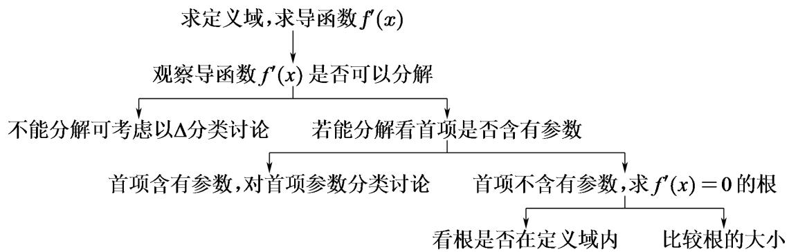

# 角度 1 变号函数为一次函数

【例 1】（2024•甲卷）已知函数 $f(x)=a(x-1)-\ln x+1$

（1）求 $f(x)$ 的单调区间；

# 角度 2 变号函数为准一次函数（指对）

【例 1】（2023•新高考 I）已知函数 $f(x)=a(e^{x}+a)-x$ .

（1）讨论 $f(x)$ 的单调性；

【例 2】已知函数 $f(x)=ae^{x}+2x-1$ 。（其中常数 $e=2.71828\cdots$ ，是自然对数的底数。）

（1）讨论函数 $f(x)$ 的单调性；

# 角度 3 变号函数为二次函数型
### 知识点 讲解：变号函数为二次函数时，变号函数为0的方程一般有两个不同实数根 $x_{1}$ ， $x_{2}$ （无根情况下二次函数恒正或恒负，只有一根时情况类似，故不作为讨论重点），理论上要分 $x_{1}>x_{2}$ ， $x_{1}<x_{2}$ 进行讨论；若函数 $f(x)$ 有定义域限制，则方程往往会涉及根的分布问题，需要结合定义域对根的分布进行分类讨论.

①可因式分解

【例 1】（2019•新课标III）已知函数 $f(x)=2x^{3}-ax^{2}+b$

（1）讨论 $f(x)$ 的单调性；

【例 2】（2017•新课标III）已知函数 $f(x)=\ln x+ax^{2}+(2a+1)x$

（1）讨论函数 $f(x)$ 的单调性；

# ②不可因式分解型

【例 1】已知函数 $f(x)=(a-1)\ln x+ax^{2}+1$ ，讨论函数 $f(x)$ 的单调性.

【例 2】（2014•山东）设函数 $f(x)=a\ln x+\frac{x-1}{x+1}$ ，其中 a 为常数.

（1）若 a=0 ，求曲线 $y=f(x)$ 在点 $(1,f(1))$ 处的切线方程；  
（2） 讨论 $f(x)$ 的单调区间.

# 角度 4 变号函数为准二次函数型

【例 1】(2017•新课标I) 已知函数 $f(x)=e^{x}(e^{x}-a)-a^{2}x$ .

（1） 讨论 $f(x)$ 的单调性.

【例 2】已知函数 $f(x)=(1+ax^{2})e^{x}-1$ ，当 $a\geq0$ 时，讨论函数 $f(x)$ 的单调性.

# 题型 3 三角函数型单调性讨论

##### 1. 关于三角要注意定义域，定正负；  
##### 2. 常见放缩记心里：如 $x \geq \sin x (x \geq 0)$ ， $x \leq \sin x (x \leq 0)$ ， $\tan x \geq x (0 \leq x < \frac{\pi}{2})$ ， $\tan x \leq x (-\frac{\pi}{2} < x \leq 0)$ .

【例 1】（2023•甲卷）已知 $f(x)=ax-\frac{\sin x}{\cos^{3}x},\quad x\in(0,\frac{\pi}{2})$ .

（1）若 a=8 ，讨论 $f(x)$ 的单调性；

【例 2】（2017•山东）已知函数 $f(x)=x^{2}+2\cos x$ ， $g(x)=e^{x}(\cos x-\sin x+2x-2)$ ，其中 $e\approx2.71828\ldots$ 是自然对数的底数.

（1）求曲线 $y = f(x)$ 在点 $(\pi, f(\pi))$ 处的切线方程；  
（2）令 $h(x)=g(x)-a f(x)(a\in R)$ ，讨论 $h(x)$ 的单调性并判断有无极值，有极值时求出极值.

# 考向 2 隐零点代换

考点一 过渡型

即零点 $x_{0}$ （零点存在性定理得出）只是作为一个桥梁，用来辅助讨论单调区间和极值最值.

【例 1】（2019•新课标 I）已知函数 $f(x)=2\sin x-x\cos x-x$ ， $f'(x)$ 为 $f(x)$ 的导数.

（1）证明： $f'(x)$ 在区间 $(0,\pi)$ 存在唯一零点；  
（2）若 $x \in [0, \pi]$ 时， $f(x) \geqslant ax$ ，求 a 的取值范围.

【例 2】（2019•新课标 I）已知函数 $f(x)=\sin x-\ln(1+x)$ ， $f'(x)$ 为 $f(x)$ 的导数．证明：

（1） $f'(x)$ 在区间 $(-1, \frac{\pi}{2})$ 存在唯一极大值点;  
（2） $f(x)$ 有且仅有 2 个零点.

# 考点二 代换型

即得出关于隐零点 $x_0$ 的方程后，需往回代换，利用 $x_0$ 的式子进行变形或者化简，从而求解问题.

【例 1】（2013•新课标 II）已知函数 $f(x)=e^{x}-\ln(x+m)$ .

（1）设 x=0 是 $f(x)$ 的极值点，求 m，并讨论 $f(x)$ 的单调性；  
（2）当 $m \leqslant 2$ 时，证明： $f(x) > 0$ 。

【例 2】已知函数 $f(x)=(x-a)e^{x}(a\in R)$ .

（1）讨论 $f(x)$ 的单调性；  
（2）当 $a = 2$ 时，设函数 $g(x) = f(x) + \ln x - x - b$ ， $b \in Z$ ，若 $g(x) \leqslant 0$ 对任意的 $x \in (\frac{1}{3}, 1)$ 恒成立，求 $b$ 的最小值.

【例 3】已知函数 $f(x)=2m\ln x-x^{2}$ ， $g(x)=\mathrm{e}^{x}-2m\ln x(m\in R)$ ， $\ln2=0.693$ .

（1） 讨论 $f(x)$ 的单调性;  
（2）若 $f(x)$ 存在最大值 M, $g(x)$ 存在最小值 N，且 $M \geq N$ ，求证： $m > \frac{e}{2}$ .

# 考向 3 恒成立问题

# 考点一 同一变量型（构造函数）

（1） $\forall x\in D,f(x)\geq M\Rightarrow f(x)_{\min}\geq M$   
（2） $\forall x\in D,f(x)\leq M\Rightarrow f(x)_{\max}\leq M$   
（3） $\forall x\in D,f(x)\geq g(x)\Rightarrow [f(x) - g(x)]_{\min}\geq 0$   
（4） $\forall x\in D,f(x)\leq g(x)\Rightarrow [f(x) - g(x)]_{\max}\leq 0$   
（5） $\exists x\in D,f(x)\geq M\Rightarrow f(x)_{\max}\geq M$   
（6） $\exists x\in D,f(x)\leq M\Rightarrow f(x)_{\min}\leq M$   
（7） $\exists x\in D,f(x)\geq g(x)\Rightarrow [f(x) - g(x)]_{\max}\geq 0$   
（8） $\exists x\in D,f(x)\leq g(x)\Rightarrow [f(x) - g(x)]_{\min}\leq 0$

【例 1】已知函数 $f(x)=e^{x}-x^{2}+a,\quad x\in R$ 的图象在点 x=0 处的切线为 y=bx.

（1）求函数 $f(x)$ 的解析式；  
（2）若 $\frac{f(x)}{x} > k$ 对任意的 $x \in (0, +\infty)$ 恒成立，求实数 $k$ 的取值范围.

【例 2】已知函数 $f(x)=\left(x^{2}+ax\right)\ln x,\quad a\in R$ .

（1）若 $f(x)$ 的图像在 x=1 处的切线经过点 $(0,-2)$ ，求 a 的值；  
（2）当 $1 < x < e^2$ 时，不等式 $f(x) < x^2$ 恒成立，求 $a$ 的取值范围.

# 考点二 不同变量等号型（值域包裹性定理）

（9）若 $\forall x_{1}\in D_{1},\exists x_{2}\in D_{2}$ ，使 $f(x_{1})=g(x_{2})\Rightarrow f(x)$ 在 $D_{1}$ 上的值域 A 是 $g(x)$ 在 $D_{2}$ 上的值域 B 的子集 $(A\subseteq B)$

（10）若 $\exists x_{1} \in D_{1}, \exists x_{2} \in D_{2}$ ，使 $f(x_{1}) = g(x_{2}) \Rightarrow f(x)$ 在 $D_{1}$ 上的值域 $A$ 与 $g(x)$ 在 $D_{2}$ 上的值域 $B$ 的交集不空 $(A \cap B \neq \phi)$ （两个函数有相等的函数值，即它们的值域有公共部分）

【例 1】已知函数 $f(x)=\frac{1}{2}x^{2}+x,\quad g(x)=\ln(x+1)-a$ ，若存在 $x_{1},\quad x_{2}\in[0,2]$ ，使得 $f(x_{1})=g(x_{2})$ ，求实数 a 的取值范围.

【例 2】已知 $f(2^{x})=x^{2}-2x+3$ .

（1）求 $f(x)$ 的解析式；

（2）函数 $g(x) = \frac{x^2 + (a - 2)x + 5 - a}{x - 1}$ ，若对任意 $x_1 \in [2,4]$ ，总存在 $x_2 \in [2,4]$ ，使 $g(x_1) = f(x_2)$ 成立，求 $a$ 的取值范围.

# 考点三 不同变量不等号型（最值比较）

（11） $\forall x_{1} \in D_{1}, \forall x_{2} \in D_{2}, f(x_{1}) \geq g(x_{2}) \Rightarrow f(x)_{\min} \geq g(x)_{\max}$   
（12） $\forall x_{1} \in D_{1}, \exists x_{2} \in D_{2}, f(x_{1}) \geq g(x_{2}) \Rightarrow f(x)_{\min} \geq g(x)_{\min}$   
（13） $\forall x_{1} \in D_{1}, \exists x_{2} \in D_{2}, f(x_{1}) \leq g(x_{2}) \Rightarrow f(x)_{\max} \leq g(x)_{\max}$   
（14） $\exists x_{1} \in D_{1}, \exists x_{2} \in D_{2}, f(x_{1}) \geq g(x_{2}) \Rightarrow f(x)_{\max} \geq g(x)_{\min}$

【例 1】已知函数 $f(x)=4\ln x-ax+\frac{a+3}{x}(a\geqslant0)$ .

（1）当 $a = \frac{1}{2}$ ，求 $f(x)$ 的极值.  
（2）当 $a \geqslant 1$ 时，设 $g(x) = 2e^{x} - 4x + 2a$ ，若存在 $x_{1}$ ， $x_{2} \in [\frac{1}{2}, 2]$ ，使 $f(x_{1}) > g(x_{2})$ ，求实数 $a$ 的取值范围.

【例 2】已知函数 $f(x)$ 满足 $x^{2}f'(x)+xf(x)=elnx$ ，且 $f(e)=1$ ，函数 $g(x)=-x^{2}+2ax+4$ 。

（1）求 $f(x)$ 的图象在 x = e 处的切线方程；  
（2）若对任意 $x_{1} \in (1, e]$ ，存在 $x_{2} \in [1, 2]$ ，使得 $f(x_{1}) > g(x_{2})$ ，求 a 的取值范围.

# 题型 4 同构大题的写法（内值外定与保值同构）

# 角度 1 指对同构中的 “内值外定”

“内值外定”原则，其实是复合函数思定义域问题，即内层函数的值域范围为外层函数定义域的子集，用同构解大题时，内层值域需满足外层函数单调区间的子集，这样才能比较内层大小，如果构造的函数是 $R$ 上递增，则无需考虑.

【例 1】已知函数 $f(x)=2x^{3}\ln x-(m-x)e^{\frac{m}{x}-1}$ ，当 $x\geq e$ 时， $f(x)\geq0$ 恒成立，则实数 m 的取值范围为 \_\_\_\_.

【例 2】（2020•新高考）已知函数 $f(x)=ae^{x-1}-\ln x+\ln a$ .

（1）当 a = e 时，求曲线 $y = f(x)$ 在点 $(1, f(1))$ 处的切线与两坐标轴围成的三角形的面积；  
（2）若 $f(x) \geq 1$ ，求 a 的取值范围.

【例 3】(2024·甲卷文) 已知函数 $f(x)=a(x-1)-\ln x+1$ .

（1）求 $f(x)$ 的单调区间；  
（2）若 $a \leq 2$ 时，证明：当 $x > 1$ 时， $f(x) < e^{x - 1}$ 恒成立.

【例 4】（2013•新课标II）已知函数 $f(x)=e^{x}-\ln(x+m)$ .

（1）设 x=0 是 $f(x)$ 的极值点，求 m，并讨论 $f(x)$ 的单调性；  
（2）当 $m \leq 2$ 时，证明 $f(x) > 0$ ：

【例 5】（2023·新高考 I 卷）已知函数 $f(x)=a(e^{x}+a)-x$ .

（1）讨论 $f(x)$ 的单调性；  
（2）证明：当 $a > 0$ 时， $f(x) > 2\ln a + \frac{3}{2}$ .

【例 6】(2015•新课标I) 设函数 $f(x)=e^{2x}-a\ln x$ .

（1）讨论 $f(x)$ 的导函数 $f'(x)$ 零点的个数；  
（2）证明：当 $a > 0$ 时， $f(x) \geq 2a + a\ln \frac{2}{a}$ .

考向 4 指对三角放缩

### 题型 1 指数常用放缩式

# 0 线放缩

① $xe^{x} \geq x (x = 0, x \in R)$ ;   
② $e^{x}\geq x+1(x=0,\quad x\in R)$ ;（小题篇八大函数已证）  
③ $e^{x} \geq x^{2} + 1 (x = 0, x \geq 0)$ ;   
④ $e^x \geq \frac{1}{2} x^2 + x + 1 (x = 0, x \geq 0)$ ;   
⑤ $e^{x} + e^{-x} \geq 2 (x = 0, x \in R)$ ;   
⑥ $e^{x}-e^{-x}\geq2x\ (x=0,\quad x\geq0);$   
⑦ $e^{x} + e^{-x} \geq x^{2} + 2 (x = 0, x \in R)$ ;   
⑧ $(x - 1)e^{x}\geq \frac{1}{2} x^{2} - 1(x = 0,x\geq 0);$

# 1 线放缩

① $e^{x-1} \geq x$ ( $x = 1, \quad x \in R$ );   
② $e^{x} \geq ex \quad (x = 1, x \in R)$ ;   
③ $e^x \geq \frac{e}{2} x^2 + \frac{e}{2}$ （ $x = 1, x \geq 1$ ）；  
④ $e^x \geq ex + (x - 1)^2 (x = 1, x = 0, x \geq 0)$ ;

【例 1】(2024•利哥每日一题)

（1）函数 $f(x)=xe^{x}-x-\ln x$ 的最小值为 \_\_\_\_；  
（2）函数 $g(x)=\frac{e^{x}}{x}-x+\ln x$ 的最小值为 \_\_\_\_.

【例 2】(2024·利哥每日一题)

（1）已知 $x \geq 0$ ，若 $e^{x} - ax^{2} - x - 1 \geq 0$ 恒成立，求实数 a 的取值范围为 \_\_\_\_.  
（2）已知 $x \in R$ ，若 $e^{x} - ax^{2} - x - 1 \geq 0$ 恒成立，求实数 a 的取值范围为 \_\_\_\_.

【例 3】若当 x > 0 时，函数 $f(x) = 2 - e^{x} + mx^{2}$ 有两个极值点，则实数 m 的取值范围为 \_\_\_\_.

【例 4】求证：当 $x \in [0, +\infty)$ 时， $\cos x \geq x + 2 - e^{x}$ .

【例 5】已知函数 $f(x)=ae^{x}+2x-1$ .

证明：对任意的 $a \geq 1$ ，当 $x > 0$ 时， $f(x) \geq (x + ae)x$ .

# 考点二 对数常见放缩及推导

# 0 线放缩

① $x \geq \ln(x + 1)$ (x = 0, x > -1);

证明：令 $f(x) = x - \ln (x + 1)(x > -1)$ ， $f'(x) = \frac{x}{x + 1}$ ，易证.

② $\ln(x+1)\geq x-\frac{1}{2}x^{2}(x=0,\quad x\geq0)$ ;

证明：令 $f(x)=\ln(x+1)+\frac{1}{2}x^{2}-x(x\geq0)$ ， $f'(x)=\frac{x^{2}}{x+1}\geq0$ ，即证.

# 1 线对数不等式链条

① $x^{2} - x\geq x\ln x\geq x - 1\geq \ln x\geq 1 - \frac{1}{x}\geq \frac{\ln x}{x} (x = 1,x > 0)$

证明：令 $f(x)=x\ln x-x+1(x>0)$ ， $f'(x)=\ln x$ ，易证；

$x - 1 \geq \ln x \xrightarrow {\text {两边同乘} x} x ^ {2} - x \geq x \ln x; \quad x \ln x \geq x - 1 \xrightarrow {\text {两边同除} x} \ln x \geq 1 - \frac {1}{x}; \quad x - 1 \geq \ln x \xrightarrow {\text {两边同除} x} 1 - \frac {1}{x} \geq \frac {\ln x}{x}.$

# 飘带函数（小题篇已证）

① $\frac{1}{2} (x - \frac{1}{x}) < \ln x < \frac{2(x - 1)}{x + 1}, x \in (0, 1)$ ;

② $\frac{2(x - 1)}{x + 1} \leq \ln x \leq \frac{1}{2} (x - \frac{1}{x}), x \in [1, +\infty)$ .

【例 1】已知函数 $f(x)=x(\ln x-ax)+a$ ，对任意的 $x\geq1$ ，都有 $f(x)\leq0$ ，则实数 a 的取值范围是为 \_\_\_\_.

【例 2】已知函数 $f(x)=x-\ln(x+1)$ 对任意 $x\in[0,+\infty)$ 有 $f(x)\leq kx^{2}$ 成立，则 k 的最小值为 \_\_\_\_.

【例 3】已知函数 $f(x)=ax-ax\ln x+1(a\quad R,\quad a\quad0)$ .

##### 【例4】已知函数 $f(x) = ae^{x} - x - a$ ，当 $a \geq 1$ 时，证明 $f(x) > x(\ln x - 1) - \cos x$ .

# 考点三 三角常见放缩及推导

① $x \geq \sin x \geq x - \frac{x^3}{6} (x = 0, x \geq 0)$ ;

证明：左边令 $f(x)=x-\sin x (x\geq0)$ ， $f'(x)=1-\cos x\geq0$ ，即证.

证明：右边令 $f(x)=\sin x-x+\frac{x^{3}}{6}(x\geq0)$ ， $f'(x)=\cos x+\frac{1}{2}x^{2}-1\geq0$ ，即证.

② $1 - \frac{x^{2}}{2} \leq \cos x \leq 1 (x = 0, x \in R)$ ;

证明：令 $f(x) = \cos x + \frac{1}{2} x^2 - 1$ ， $f'(x) = x - \sin x$ ，易证.

③ $\tan x \geq x (x = 0, x \in [0, \frac{\pi}{2})$ ;

证明：令 $f(x) = \tan x - x(0\leq x <   \frac{\pi}{2})$ ， $f'(x) = \frac{1}{\cos^{2}x} -1\geq 0$ ，即证.

④ $\tan x \geq x + \frac{x^{3}}{3} (x = 0, x \in [0, \frac{\pi}{2})$ ;

证明：令 $f(x) = \tan x - \frac{x^3}{3} - x (0 \leq x < \frac{\pi}{2})$ ， $f'(x) = \frac{1}{\cos^2 x} - 1 - x^2 = \tan^2 x - x^2 \geq 0$ ，即证.

【例 1】（2023•新高考Ⅱ）（1）证明：当 0 < x < 1 时， $x - x^{2} < \sin x < x$ ;

【例 2】已知函数 $f(x)=a(e^{x}-1)-x^{2}+x$ .

若 $a \geq 1$ ，证明：当 $x > 0$ 时， $f(x) + \cos x > 1$ .

【例 3】（2023•利哥每日一题） $e^{2x}+(1-2a)e^{x}+a^{2}+\cos x\geq x+2,\quad x\geq0,\quad a\in R$

【例 4】已知 x 为正实数.

（1）比较 $\cos x$ 与 $1 - \frac{1}{2}x^{2}$ 的大小；  
（2）求证： $e^x +\cos x\geq \sin x + 2$

【例 5】当 $x \geq 0$ 时，证明： $xe^{x} + \frac{1}{2}\sin 2x \geq 2\sin x + \sin^{2}x$ .

【例 6】（2021·乙卷）已知函数 $f(x)=\ln(a-x)$ ，已知 x=0 是函数 $y=xf(x)$ 的极值点.

（1） 求 a;   
（2）设函数 $g(x) = \frac{x + f(x)}{xf(x)}$ ．证明： $g(x) <   1$ ：

# 附表：常见泰勒公式

① $e^{x}=1+x+\frac{1}{2}x^{2}+\frac{1}{6}x^{3}+o(x^{3})$ ;   
② $\ln(x+1)=x-\frac{1}{2}x^{2}+\frac{1}{3}x^{3}+o(x^{3})$ ;   
③ $\sin x = x - \frac{1}{6}x^{3} + o(x^{3})$ ;   
④ $\cos x = 1 - \frac{1}{2}x^{2} + \frac{1}{24}x^{4} + o(x^{4})$ ;   
⑤ $\tan x = x + \frac{1}{3}x^{3} + o(x^{3})$ ;   
⑥ $\sqrt{1+x}=1+\frac{1}{2}x-\frac{1}{8}x^{2}+o(x^{2})$ ;

# 考向 5 导数放缩与数列构造

# 题型一 不等式的累加 VS 数列和式代换

通常利用题目给定的不等式, 形如 $\ln(1+x)<x(x>0)$ 利用这种式子构造 n 个不等式累加, 得到一个结果, 我们也可以考虑和式代换逆推.

【例 1】已知：若 $\ln(1+x)<x(x>0)$ ， $a_{n}=\frac{n}{n+1}$ ， $S_{n}$ 是数列 $\left\{a_{n}\right\}$ 前 n 项和，求证： $S_{n}<n-\ln\frac{n+2}{2}$ .

【例 2】（2022•新高考Ⅱ）已知函数 $f(x)=xe^{ax}-e^{x}$ .

（1）当 $a = 1$ 时，讨论 $f(x)$ 的单调性；  
（2）当 $x > 0$ 时， $f(x) < -1$ ，求 $a$ 的取值范围；  
（3）设 $n \in N^*$ ，证明： $\frac{1}{\sqrt{1^2 + 1}} + \frac{1}{\sqrt{2^2 + 2}} + \ldots + \frac{1}{\sqrt{n^2 + n}} > \ln (n + 1)$ .

由飘带函数这种高考重量级函数能出现一些什么样的构造模型呢？

令 $x = \frac{n + 1}{n}$ ，这是最常见的构造，根据 $x > 1$ 时， $\ln x <   \frac{1}{2} (x - \frac{1}{x})$ ，则 $\ln \frac{n + 1}{n} <  \frac{1}{2} (\frac{n + 1}{n} -\frac{n}{n + 1})$ 即 $\ln (n + 1) - \ln n <   \frac{1}{2} [\frac{(n + 1)^2 - n^2}{n(n + 1)} ] = \frac{1}{2} (\frac{1}{n} +\frac{1}{n + 1})$ ，进行累加，

$\text {即} \left\{ \begin{array}{l} \ln (n + 1) - \ln n <   \frac {1}{2} \left(\frac {1}{n} + \frac {1}{n + 1}\right) \\ \ln (n + 2) - \ln (n + 1) <   \frac {1}{2} \left(\frac {1}{n + 1} + \frac {1}{n + 2}\right) \Rightarrow \ln 2 <   \frac {3}{4 n} + \frac {1}{n + 1} + \frac {1}{n + 2} + \dots + \frac {1}{2 n - 1}, \\ \dots \\ \ln 2 n - \ln (2 n - 1) <   \frac {1}{2} \left(\frac {1}{2 n - 1} + \frac {1}{2 n}\right) \end{array} \right.$

或者 $\ln3<\frac{2}{3n}+\frac{1}{n+1}+\frac{1}{n+2}+\cdots+\frac{1}{3n-1}$ ， $\ln4<\frac{5}{8n}+\frac{1}{n+1}+\frac{1}{n+2}+\cdots+\frac{1}{4n-1}$ ，以此类推.

【例 3】已知函数 $f(x)=1+\frac{\ln x}{x}-ae^{x}+\frac{ae^{-x}}{x^{2}}$ ， $a\geqslant\frac{1}{2}$ .

（1）当 $x+\ln x>0$ 时，求证 $f(x)<0$ ;  
（2）求证： $\frac{1}{n+1}+\frac{1}{n+2}+\cdots+\frac{1}{2n-1}+\frac{3}{4n}>\ln\frac{e}{2}(n\in N^{*})$

# 题型二 不等式的累乘 VS 数列积式代换

通常求导后得到一个不等式，形如 $1+x<e^{x}(x>0)$ ，利用这种式子构造n个不等式累乘，如 $1+\frac{1}{n}<e^{\frac{1}{n}}$ ，得到一个结果如 $\frac{2}{1}\times\frac{3}{2}\times\cdots\times\frac{n+1}{n}<e^{1+\frac{1}{2}+\cdots+\frac{1}{n}}$ ，某些时候还需要用到糖水不等式.

形如： $a_1a_2\dots a_n < f(n)$ 类型，可以用积式代换证明，即证 $a_{n} < \frac{f(n)}{f(n - 1)}$ ，且 $a_1 < f(1)$

【例 1】（2015•安徽）设 $n \in N^{*}$ ， $x_{n}$ 是曲线 $y = x^{2n+2} + 1$ 在点 $(1, 2)$ 处的切线与 x 轴交点的横坐标.

（1）求数列 $\{x_{n}\}$ 的通项公式；  
（2）记 $T_{n}=x_{1}^{2}x_{3}^{2}\ldots x_{2n-1}^{2}$ ，证明： $T_{n}\geqslant\frac{1}{4n}$ .

【例 2】（2020•新课标 II）已知函数 $f(x)=\sin^{2}x\sin2x$ .

（1）讨论 $f(x)$ 在区间 $(0, \pi)$ 的单调性；  
（2）证明： $|f(x)| \leqslant \frac{3\sqrt{3}}{8}$ ;  
（3）设 $n \in N^*$ ，证明： $\sin^2 x \sin^2 2x \sin^2 4x \ldots \sin^2 2^n x \leqslant \frac{3^n}{4^n}$ .

# 题型三 不等式的累加 VS 数列放缩

裂项相消放缩与证明（ $S_{n}<m$ 或 $a_{1}a_{2}\cdots a_{n}<m$ ），以下模块数列部分也有介绍.

模型一：等差数列的裂项相消放缩：

$\begin{array}{l} 1 - \frac {1}{n ^ {2}} <   1 - \left(\frac {1}{n} - \frac {1}{n + 1}\right) (n \geq 2) \Rightarrow \sum_ {i = 2} ^ {n} 1 - \frac {1}{i ^ {2}} <   n - \frac {3}{2} + \frac {1}{n + 1} = \frac {2 n ^ {2} - n - 1}{2 (n + 1)}; \\ \frac {1}{n ^ {2} - 1} = \frac {1}{2} \left(\frac {1}{n - 1} - \frac {1}{n + 1}\right) (n \geq 2) \Rightarrow \sum_ {i = 2} ^ {n} \frac {1}{i ^ {2} - 1} = \frac {1}{2} \left[ \frac {3}{2} - \frac {1}{n} - \frac {1}{n + 1} \right] = \frac {3 n ^ {2} - n - 2}{4 n (n + 1)}. \\ \end{array}$

模型二：等比数列的裂项相消放缩：

设 $\{a_{n}\}$ 是以 $a_1$ 为首项，且公比为 $q$ 的等比数列，关于 $\sum_{i=1}^{n} \frac{a_i}{(a_i + 1)(a_{i+1} + 1)}$ :

$\frac {a _ {n}}{\left(a _ {n} + 1\right) \left(a _ {n + 1} + 1\right)} = \frac {1}{q - 1} \left(\frac {1}{a _ {n} + 1} - \frac {1}{a _ {n + 1} + 1}\right) \Rightarrow \sum_ {i = 1} ^ {n} \frac {a _ {i}}{\left(a _ {i} + 1\right) \left(a _ {i + 1} + 1\right)} = \frac {1}{q - 1} \left(\frac {1}{a _ {1} + 1} - \frac {1}{a _ {n + 1} + 1}\right) <   \frac {1}{q - 1} \cdot \frac {1}{a _ {1} + 1}.$

模型三：平方递推放缩：

已知数列 $\left\{a_{n}\right\}$ 满足： $a_{n+1}=a_{n}(a_{n}+1)$ :

则 $\frac{1}{a_{n + 1}} = \frac{1}{a_n(a_n + 1)} = \frac{1}{a_n} -\frac{1}{1 + a_n},\quad \therefore \frac{1}{1 + a_n} = \frac{1}{a_n} -\frac{1}{a_{n + 1}},\quad \therefore \sum_{i = 1}^{n}\frac{1}{1 + a_i} = \frac{1}{a_1} -\frac{1}{a_{n + 1}} <  \frac{1}{a_1}.$

【例 1】（2017•新课标III）已知函数 $f(x)=x-1-a\ln x$ .

（1）若 $f(x) \geqslant 0$ ，求 a 的值；  
（2）设 $m$ 为整数，且对于任意正整数 $n$ ， $(1 + \frac{1}{2})(1 + \frac{1}{2^2})\ldots (1 + \frac{1}{2^n}) < m$ ，求 $m$ 的最小值.

【例 2】设函数 $g(x)=\frac{1}{3}x^{3}+ax^{2}$ 的图象在 x=1 处的切线平行于直线 2x-y=0，记 $g(x)$ 的导函数为 $f(x)$ ，数列 $\left\{a_{n}\right\}$ 满足： $a_{1}=\frac{1}{2}$ ， $a_{n+1}=f(a_{n})$ .

（1）求函数 $f(x)$ 的解析式；  
（2）试判断数列 $\left\{a_{n}\right\}$ 的增减性,并给出证明;  
（3）当 $n \geq 2$ ， $n \in \mathbf{N}^*$ 时，求证： $1 < \frac{1}{1 + a_1} + \frac{1}{1 + a_2} + \dots + \frac{1}{1 + a_n} < 2$ .

# 考向 6 极值点偏移

# 解题方法

# 1. 对称化构造

常见题设：若函数 $f(x)$ 存在两个零点，且满足 $f(x_{1}) = f(x_{2})$ ， $x_{0}$ 为函数 $f(x)$ 的极值点，求证 $x_{1} + x_{2} > 2x_{0}$ .

（1）求导讨论 $f(x)$ 单调性，并求出极值点 $x_{0}$ 以及 $x_{1}$ ， $x_{2}$ 的范围；  
（2） 构造函数 $F(x)=f(x)-f(2x_{0}-x)$ ;  
（3）对 $F(x)$ 求导，讨论 $F(x)$ 单调性，从而判断 $F(x)$ 在极值点单侧的正负，得出 $f(x)$ 与 $f(2x_{0}-x)$ 的大小关系；  
（4）代入 $x_{1}$ 或 $x_{2}$ ，得出 $f(x)$ 与 $f(2x_0 - x)$ 的大小关系，借助 $f(x_{1}) = f(x_{2})$ 将自变量统一到极值点同侧，再通过 $f(x)$ 单调性得出结论.

##### 2. 对数平均不等式（适用于和型或商型，如 $x + \ln x = a$ ， $\frac{\ln x}{x} = a$ ，积型不适用 $x \ln x = a$ ）

对数平均不等式：两个正数 a，b 的对数平均 $L(a, b)=\left\{\begin{aligned}\frac{a-b}{\ln a-\ln b}(a \neq b) & \text{，有如下关系} \sqrt{ab} < \frac{a+b}{2}, \\ a(a=b) & \text{，有如下关系} \sqrt{ab} < \frac{a+b}{2},\end{aligned}\right.$

即几何平均数 $\leq$ 对数平均数 $\leq$ 算术平均数．证明如下：

比值代换 不妨设 $a > b$ ， $\sqrt{ab} < \frac{a - b}{\ln a - \ln b} < \frac{a + b}{2}$ ，令 $t = \frac{a}{b} > 1$ ，则 $b\sqrt{t} < \frac{b(t - 1)}{\ln t} < \frac{b(t + 1)}{2}$ ，下面可以对不等式进行整理和化简得到 $\sqrt{t} < \frac{(t - 1)}{\ln t} < \frac{(t + 1)}{2}$ ，所以 $\frac{2(t - 1)}{t + 1} < \ln t < \sqrt{t} - \frac{1}{\sqrt{t}}$ ，可以继续构造飘带函数求证.

考虑到实际应用中常常使用指数，为计算方便，我们引入 ALG 不等式的拓展——指数形式的不等式。下简称指数平均不等式．ALG 不等式的证明(指数)

设 $a = e^{m}$ ， $b = e^n$ ，则 $E(a,b) = \left\{ \begin{array}{l} \frac{e^m - e^n}{m - n} (m\neq n)\\ e^m (m = n) \end{array} \right.$ ，有如下关系： $e^{\frac{m + n}{2}}\leq E(a,b)\leq \frac{e^m + e^n}{2}.$

证明如下:由对数平均不等式 $\sqrt{ab} < \frac{a - b}{\ln a - \ln b} < \frac{a + b}{2} (a > b)$ ，令 $a = e^{m}$ ， $b = e^{n} (m > n)$ ，

所以 $\sqrt{e^m e^n} < \frac{e^m - e^n}{m - n} < \frac{e^m + e^n}{2}$ ，即 $e^{\frac{m + n}{2}} < \frac{e^m - e^n}{m - n} < \frac{e^m + e^n}{2}$ .

# 题型 1 对称化构造与对数平均不等式

【例 1】（2010·天津理）已知函数 $f(x)=xe^{-x}(x\in R)$

（1）求函数 $f(x)$ 的单调区间及极值；  
（2）求证：当 $x > 1$ 时， $f(x) > f(2 - x)$ ；  
（3）如果 $x_{1} \neq x_{2}$ ，且 $f(x_{1}) = f(x_{2})$ ，求证： $x_{1} + x_{2} > 2$ 。

【例 2】（2022•甲卷）已知函数 $f(x)=\frac{e^{x}}{x}-lnx+x-a$ .

（1）若 $f(x) \geqslant 0$ ，求 a 的取值范围；  
（2）证明：若 $f(x)$ 有两个零点 $x_{1}$ ， $x_{2}$ ，则 $x_{1}x_{2}<1$ 。

【例 3】已知函数 $f(x)=x^{2}e^{x}$ .

（1） 求 $f(x)$ 的单调区间.  
（2） 已知直线 $l: y = kx (k \in R)$ 与曲线 $y = f(x)$ 交于 $A(x_{1}, kx_{1})$ ， $B(x_{2}, kx_{2})$ ， $C(x_{3}, kx_{3})$ 三点，且 $x_{1} < x_{2} < x_{3}$ .  
①若 $x_{1}$ ， $x_{2}$ ， $x_{3}$ 成等差数列，求 k 的值；  
②证明： $x_{1}+x_{2}<-2$

【例 4】（2021•新高考 I）已知函数 $f(x)=x(1-lnx)$ .

（1）讨论 $f(x)$ 的单调性；  
（2）设 a，b 为两个不相等的正数，且 $blna - alnb = a - b$ ，证明： $2 < \frac{1}{a} + \frac{1}{b} < e$ .

# 题型 2 韦达消参

【例 1】已知函数 $f(x)=\frac{1}{2}x^{2}+bx+2a\ln x$ .

若 b = -2 ，且 $f(x)$ 有两个极值点 $x_{1}$ ， $x_{2}$ ，证明： $f(x_{1}) + f(x_{2}) > -3$ 。

【例 2】（2018•新课标 I）已知函数 $f(x)=\frac{1}{x}-x+a\ln x$ .

（1）讨论 $f(x)$ 的单调性；  
（2）若 $f(x)$ 存在两个极值点 $x_{1}$ ， $x_{2}$ ，证明： $\frac{f(x_{1})-f(x_{2})}{x_{1}-x_{2}}<a-2$ .

# 拓展思维

# 拓展 1 对数单身狗 指数找基友

# 考点三 指对的处理技巧（简化运算）

# 角度 1 指数找朋友

【例 1】求证下列式子:

（1） (2018•新课标 II) $e^{x} \geq x^{2} + 1 (x \geq 0)$ ;   
（2） (2016•新课标II) 当 $x \geq 0$ 时，求证： $(2 - x)e^{x} \leq x + 2$ .  
（3）（2020•新课标 I）当 $x \geq 0$ 时，求证： $e^{x} \geq \frac{1}{2} x^{2} + x + 1$ .  
（4）当 $x \geq 0$ 时，求证： $e^x \geq ex + (x - 1)^2$ ;

【例 2】已知函数 $f(x)=x-\ln(ax+1)(a>0)$ .

证明：当 $x \geq 0$ 时， $e^x + (2 - e)x \geq x\ln (x + 1) + 1$ 。

##### 【例3】已知函数 $f(x) = x - \frac{a}{e^x} - \frac{1}{2} (\sin x - \cos x)$ .

（1）当 a=0 时，判断函数 $f(x)$ 的单调性；  
（2）已知 $f(x) \geq 1$ 对任意 $x \in R$ 恒成立，求 a 的取值范围.

# 角度 2 对数独行侠

【例 1】（2018•新课标III卷）已知函数 $f(x)=(2+x+ax^{2})\ln(1+x)-2x$ 。若 a=0 ，证明：当 -1<x<0 时， $f(x)<0$ ；当 x>0 时， $f(x)>0$ 。

【例 2】已知函数 $f(x)=(1+x)\ln x+\frac{1}{x}$ .

求证： $f(x)\geq x$

# 拓展 2 凹凸反转在高考中的应用

# 常见模型有三种

① 高人一等，即上函数的最小值大于下函数的最大值；不取等； $(f(x) > g(x))$   
② 亲密接触，即上函数的最小值等于下函数的最大值，且取等条件一致； $(f(x) \geq g(x))$   
③ 错位时空，即上函数的最小值等于下函数的最大值，但取等条件不一致.（ $f(x) > g(x)$ ）

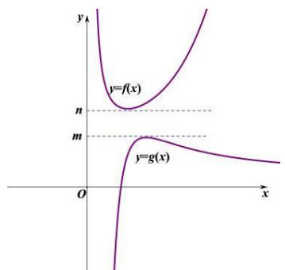

①

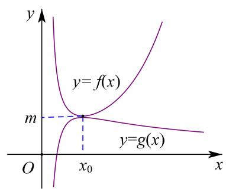

②

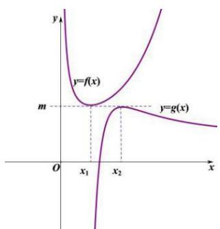

③

【例 1】设函数 $f(x)=\frac{ae^{x}}{x}$ ，若 $a \geq \frac{2}{e^{2}}$ ，证明： $\ln x - f(x) < 0$ 。

【例 2】已知函数 $f(x)=ax+\ln x+1$ .

对任意的 x > 0，不等式 $f(x) \leq e^{x}$ 恒成立，求实数 a 的取值范围.

【例 3】已知函数 $f(x)=ae^{x-m}$ ，其中 $a, m \in R$ .

当 $a = 4$ ， $m = 2$ 时，证明： $f(x) > x(1 + \ln x)$

# 拓展 3 新高考背景下的万能找点法

# 考向一 万能找点法

# 找点原理：增反减同

增函数满足 “增反”，即增函数找大点构造小函数，找小点构造大函数；减函数则满足 “减同”，即减函数找大点构造大函数，找小点构造小函数(图右)，这类 “增反减同” 的找点法原理我们叫做楞次找点原理.

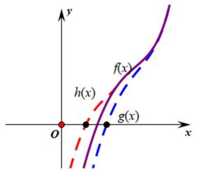

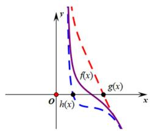

同理，我们来研究有极值点的函数找点原理，当函数极大值大于零或者极小值小于零，通常会有两个零点，高考中一旦需要我们去找这两个零点时，我们也可以根据楞次找点法进行分析，两边都构造放缩函数，得到可解方程；我们通常将零点当中的较小零点用 $x_{1}$ （小点）表示，较大零点用 $x_{2}$ （大点）表示，由于放缩的 $h(x)$ 和 $g(x)$ 不是唯一的，我们有多种构造方法和构造选择，故我们把这类型极小值小于零的两个零点问题的放缩找点类型称为“众星捧月”。

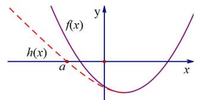

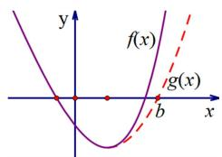

同样，在极大值大于零的两个零点问题时，则需要构造“仙女散花”的模型(如下图)

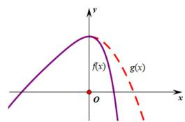

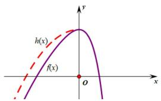

# 题型一 单调函数单零点问题

在指数函数中，我们通常利用 $e^0 = 1$ 来锁定一个界限，对数函数中，我们通常利用 $\ln 1 = 0$ 来锁定一个界限，我们可以先参考例题.

【例 1】当 a<0 时，讨论函数 $f(x)=e^{x}-ax$ 的零点个数.

【例 2】当 a<0 时，讨论函数 $f(x)=\ln x-ax$ 的零点个数.

# 题型二 单峰函数零点问题

【例 1】(2016·新课标 I) 已知函数 $f(x)=(x-2)e^{x}+a(x-1)^{2}$ .

（1） 讨论 $f(x)$ 的单调性;  
（2） 若 $f(x)$ 有两个零点，求 a 的取值范围.

【例 2】（2022•天津）已知 a， $b \in R$ ，函数 $f(x) = e^{x} - a \sin x$ ， $g(x) = b \sqrt{x}$ .

（1）求函数 $y = f(x)$ 在 $(0, f(0))$ 处的切线方程；  
（2） 若 $y = f(x)$ 和 $y = g(x)$ 有公共点.  
（i）当 $a = 0$ 时，求 $b$ 的取值范围；  
（ii）求证： $a^2 + b^2 > e$

【例 3】(2017·新课标 I) 已知函数 $f(x)=ae^{2x}+(a-2)e^{x}-x$ .

（1） 讨论 $f(x)$ 的单调性;  
（2） 若 $f(x)$ 有两个零点，求 a 的取值范围.

# 题型三 双峰函数零点问题

$f'(x)$ 不单调，且有两个极值时， $\exists m\in(a,b)$ ， $n\in(a,b)$ 使 $f'(m)=0$ ， $f'(n)=0$ 且 $f(m)\cdot f(n)>0$ ，此时 $y=f(x)$ 在区间 $(a,b)$ 有唯一零点.

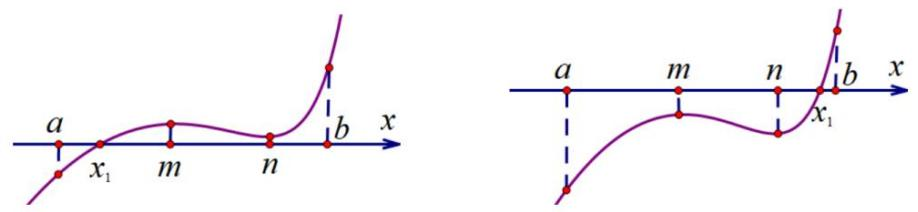

【例 1】(2021·新高考 II) 已知函数 $f(x)=(x-1)e^{x}-ax^{2}+b$ .

（1） 讨论 $f(x)$ 的单调性;  
（2）从以下（1）和（2）中选择一项证明 $f(x)$ 恰有一个零点：（1） $\frac{1}{2}<a\leq\frac{e^{2}}{2}$ ，b>2a；（2） $0<a<\frac{1}{2}$ ， $b\leq2a$ .

# 拓展 4 显点效应（端点效应与极点效应）

必要探路体系只有两种：显点效应（包括端点效应与极点效应）与隐点效应（即特殊点效应，拓展5介绍）.

显点效应即此点显而易见，①端点效应：在端点处取得最值，如左图， $x \geq 0$ ， $f(x) \geq f(0) = 0$ ；

②极点效应：非端点处的天生零点，如右图， $x \in R$ ， $f(x) \geq f(x_{0}) = 0$ 。

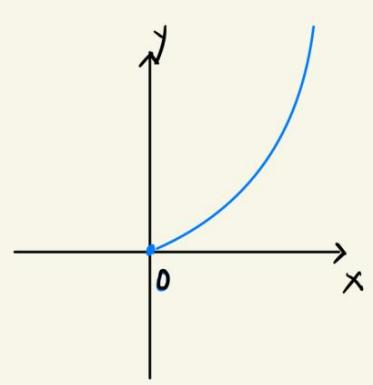

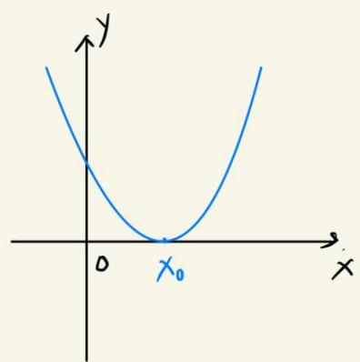

注意：连续函数，端点处的最值不一定是极值，但非端点处的最值一定是极值，就是两者的区别.

# 题型一 端点效应

很多地区使用洛必达会被扣分，所以端点效应也是洛必达的满分书写平替，属高考恒成立中最重要的题型，是属于必要探路的一种，考试需要证矛盾，即证反面不成立（极点效应和隐点效应不需证反面，但都需要证充要）。一般主要有四种题型：①符合泰勒展开（如2010新课标1卷，2024新1卷）或或帕德[1，1]阶（如2016新课标2卷、2024甲卷理）；②单调含参（如2017新课标2卷）；③利用参数值反推单调（如2022新高考2卷）；④双端点效应（2019新课标1卷）；

一般解题步骤：①满足端点处取得最值；②依次求导并代入端点值，使得参数有意义为止；③由单调的导函数分析，往回推；④证明反面矛盾.

注意一个细节：由端点值代入分析的导函数需满足单调，或者通过讨论参数范围确定单调（反推）.

【例 1】（2010•课标I）设函数 $f(x)=e^{x}-1-x-ax^{2}$ .

（2）若当 $x \geq 0$ 时 $f(x) \geq 0$ ，求 $a$ 得取值范围.

【例 2】（2016•新课标 II 卷）已知函数 $f(x)=(x+1)\ln x-a(x-1)$ .

（2）当 $x \in (1, +\infty)$ 时， $f(x) > 0$ ，求 $a$ 的取值范围.

【例 3】（2024·甲卷理）已知函数 $f(x)=(1-ax)\ln(1+x)-x$

（1）当 a = -2 时，求 $f(x)$ 的极值；  
（2）当 $x \geqslant 0$ 时， $f(x) \geqslant 0$ ，求 $a$ 的取值范围.

【例 4】（2017•新课标 II 卷）设函数 $f(x)=(1-x^{2})\mathrm{e}^{x}$ .

（2）当 $x \geq 0$ 时， $f(x) \leq 1 + ax$ ，求实数 $a$ 的取值范围.

【例 5】（2022•新高考 II）已知函数 $f(x)=xe^{ax}-e^{x}$ .

（1）当a=1时，讨论 $f(x)$ 的单调性；  
（2）当 x > 0 时， $f(x) < -1$ ，求 a 的取值范围；  
（3）设 $n\in N^{*}$ ，证明： $\frac{1}{\sqrt{1^2 + 1}} +\frac{1}{\sqrt{2^2 + 2}} +\dots +\frac{1}{\sqrt{n^2 + n}} >\ln (n + 1).$

【例 6】（2019•新课标II）已知函数 $f(x)=2\sin x-x\cos x-x$ ， $f'(x)$ 为 $f(x)$ 的导数.

（2）若 $x \in [0, \pi]$ 时， $f(x) \geq ax$ ，求 $a$ 的取值范围.

【例 7】（2024•新高考 1 卷）已知函数 $f(x)=\ln\frac{x}{2-x}+ax+b(x-1)^{3}$ .

（1）若 b=0 ，且 $f'(x)\geqslant0$ ，求 a 的最小值；  
（2）证明：曲线 $y = f(x)$ 是中心对称图形；  
（3）若 $f(x) > -2$ ，当且仅当 1 < x < 2，求 b 的取值范围.

此题背景分析：由对数的泰勒展开 $\ln(1+x)=x-\frac{x^{2}}{2}+\frac{x^{3}}{3}+\cdots+(-1)^{n-1}\frac{x^{n}}{n}+o(x^{n})$ ，我们能得到

$\ln(1-x)=-x-\frac{x^{2}}{2}-\frac{x^{3}}{3}-\frac{x^{4}}{4}-\frac{x^{5}}{5}\cdots$ ，即 $\left\{\begin{aligned}\ln(1+x)>x-\frac{x^{2}}{2}(x>0)\\ \ln(1-x)<-x-\frac{x^{2}}{2}(x>0)\end{aligned}\right.$ ，两式相减得： $\ln\frac{1+x}{1-x}>2x(x>0)$ ，

令 $\frac{1 + x}{1 - x} = t(t > 1)$ ，则有 $x = \frac{t - 1}{t + 1}$ ，故 $\ln t > \frac{2(t - 1)}{t + 1}(t > 1)$ ，同理也能证明 $\ln t < \frac{2(t - 1)}{t + 1} (0 < t < 1)$ ，这就是我们经常用来放缩估值的帕德逼近 $R_{1,1}(x)$ ，我们可以进行泰勒加强，即 $\left\{ \begin{array}{l} \ln (1 + x) > x - \frac{x^2}{2} + \frac{x^3}{3} - \frac{x^4}{4} (x > 0) \\ \ln (1 - x) < -x - \frac{x^2}{2} - \frac{x^3}{3} - \frac{x^4}{4} (0 < x < 1) \end{array} \right.$ ，两式相减得： $\ln\frac{1+x}{1-x}>2x+\frac{2x^{3}}{3}(0<x<1)$ ，即2015年北京卷原题.

此题：即 $g(x)=\ln x-\ln(2-x)-2x+b(x-1)^{3}+2>0$ ，1<x<2，令 x=t-1，t=x-1，则 $t\in(0,1)$ ，

即 $h(t)=\ln(t+1)-\ln(1-t)-2(t-1)+bt^{3}+2=\ln\frac{1+t}{1-t}-2(t+\frac{t^{3}}{3})+(b+\frac{2}{3})t^{3}\geq0$ ，可探出 $b\geq-\frac{2}{3}$

# 题型二 极点效应

极点效应即非端点处的天生零点，可以直接观察出来，即该点既是零点，也是极值点，在利用极点效应解题时，我们先得到参数值，在证明充分性，即证明满足题意（确认是极大值还是极小值）.

【例 1】（2017•新课标 II）已知函数 $f(x)=ax^{2}-ax-x\ln x$ ，且 $f(x)\geq0$ 。

（1） 求 a;

【例 2】（2024•天津）设函数 $f(x)=x\ln x$ .

（2）若 $f(x) \geqslant a(x - \sqrt{x})$ 在 $x \in (0, +\infty)$ 时恒成立，求 a 的值；

##### 【例4】（八省联考）已知函数 $f(x) = \mathrm{e}^{x} - \sin x - \cos x$ ， $g(x) = \mathrm{e}^{x} + \sin x + \cos x$ .

（1）证明：当 $x > -\frac{5\pi}{4}$ 时， $f(x) \geq 0$ ；

（2）若 $g(x)\geq 2 + ax$ ，求 $a$ ：

# 拓展 5 隐点效应

隐点效应也是我们常说的特殊点效应，但是很多学生在探路代点的时候，靠猜靠蒙，也不证明矛盾，容易出错，但这个特殊点是可以通过分析确定的，这样再用必要探路解题才能确保万无一失，如我们用参变分离解答，也可帮助我们找到最值点 $x_0$ 。

若 $f(x) \geq 0$ 恒成立，则一定存在一点 $x_{0}$ ，使得 $f(x) \geq f(x_{0})$ 恒成立，所以利用 $\left\{\begin{aligned}f(x_{0}) &= 0 \\ f'(x_{0}) &= 0\end{aligned}\right.$ 探路，此时 $x_{0}$ 可以通过解方程或者观察出来，探出与 a 有关的方程来进行最值锁定，注意我们尽量保证 $f'(x_{0})$ 单调，这样的 $x_{0}$ 才能唯一确定，在使用隐点效应（特殊点效应），不需要证反面矛盾.

【例 1】（2020•新高考山东卷）已知函数 $f(x)=ae^{x-1}-lnx+lna$ 。若 $f(x)\geqslant1$ ，求 a 的取值范围。

【例 2】（2020•全国 | 卷）已知函数 $f(x)=e^{x}+ax^{2}-x$ .

（2）当 $x \geq 0$ 时， $f(x) \geq \frac{1}{2} x^3 + 1$ ，求 $a$ 的取值范围.

【例 3】已知函数 $f(x)=e^{x-a}-\sqrt{2}\cos x(a>0)$ .

（2）当 $x \geq -\pi$ 时， $f(x) \geq 2\sin \left(x - \frac{\pi}{4}\right)$ ，求实数 $a$ 的取值范围.

# 拓展 6 切线夹与割线夹

# 角度 1 切线夹

切线夹这种方法只适用于具有凹凸性的函数, 切线夹的大体表现形式为 $x_{1}-x_{2}<m$ , 对于这类单峰函数, 我们可以在极值点的左右找点做切线, 一般题目会在条件（或问题）中提示一条切线, 另一条切线则在另一侧零点处求得（当然也有零点与切点不统一的情况, 这里不做展示), 设 y=m 与曲线和切线的交点分别为 $x_{1}, x_{2}, x_{3}, x_{4}$ , 从而利用 $x_{2}-x_{1} \leq x_{4}-x_{3}=m$ 进行放缩求解.

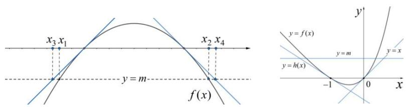

# 一双零点切线夹构造

【例 1】（2015•天津）已知函数 $f(x)=4x-x^{4}$ ， $x\in R$ .

（1）求 $f(x)$ 的单调区间；  
（2）设曲线 $y = f(x)$ 与 $x$ 轴正半轴的交点为 $P$ ，曲线在点 $P$ 处的切线方程为 $y = g(x)$ ，求证：对于任意的实数 $x$ ，都有 $f(x) \leq g(x)$ ；  
（3）若方程 $f(x)=a$ (a 为实数) 有两个实数根 $x_{1}$ ， $x_{2}$ ，且 $x_{1}<x_{2}$ ，求证： $x_{2}-x_{1}\leq-\frac{a}{3}+4^{\frac{1}{3}}$ .

# 二 单零点处和拐点外切线夹构造

【例 2】（2023•安徽模拟）已知函数 $f(x)=\frac{1-x^{2}}{e^{x}}$ （e 为自然对数的底数）.

（1）求函数 $f(x)$ 的零点 $x_{0}$ ，以及曲线 $y = f(x)$ 在 $x = x_{0}$ 处的切线方程；  
（2）设方程 $f(x)=m(m>0)$ 有两个实数根 $x_{1}$ ， $x_{2}$ ，求证： $|x_{1}-x_{2}|<2-m(1+\frac{1}{2e})$ .

# 角度 2 割线夹

割线夹与切线夹类似，切线夹描述的差值小于什么，割线夹一般表现为 $x_{1} - x_{2} > m$ ，对于这类单峰函数，我们可以在极值点做左右割线，如图所示，设平口单峰函数为 $f(x)$ ，极值点为点 $P(x_0,y_0)$ ，引两条切线 $l_{1},l_{2}$ 设 $y = m$ 与曲线和切线的交点分别为 $x_{1},x_{2},x_{3},x_{4}$ ，从而利用 $x_{2} - x_{1}\geq x_{4} - x_{3} = m$ 进行放缩求解.

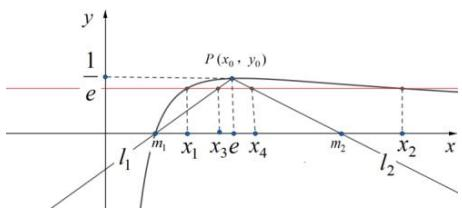

【例 1】已知函数 $f(x)=\frac{\ln x}{x}$ 与 y=a 有两个交点 $x_{1},x_{2}$ ，且 $x_{1}<x_{2}$ .

（1） 求 a 的取值范围;  
（2） 证明: $x_{2} - x_{1} > -2ae + 2$ ;

【例 2】已知函数 $f(x)=x\ln x$ .

（1）若 $a \leqslant -2$ ，证明： $f(x) \geqslant ax - e^{-3}$ 在 $(0, +\infty)$ 上恒成立；  
（2）若方程． $f(x)=b$ 有两个实数根 $x_{1}$ ， $x_{2}$ ，且 $x_{1}<x_{2}$ ，求证： $be+1<x_{2}-x_{1}<\frac{e^{-3}+2+3b}{2}$ .

# 角度 3 切线夹与割线夹结合

【例 1】已知函数 $f(x)=x(t-lnx)$ ， $t\in R$ .

（1）讨论函数 $f(x)$ 的单调区间；  
（2）当 t=1 时，设 $x_{1}$ ， $x_{2}$ 为两个不相等的正数，且 $f(x_{1})=f(x_{2})=a$ ，证明： $x_{1}+x_{2}>a(2-e)+e-\frac{1}{e}$ .

