# 第二节 跟踪训练

# 考向 1 跟踪训练

【训练 1】已知椭圆的两个焦点坐标分别是 $(0,5)$ ， $(0,-5)$ ，椭圆上一点 P 到两个焦点的距离之和为 26，则该椭圆方程为 \_\_\_\_。

【训练2】若点 $P$ 在椭圆 $C_1: \frac{x^2}{2} + y^2 = 1$ 上， $C_1$ 的右焦点为 $F$ ，点 $Q$ 在圆 $C_2: x^2 + y^2 + 10x - 8y + 39 = 0$ 上，则 $|PQ| - |PF|$ 的最小值为 \_\_\_\_.

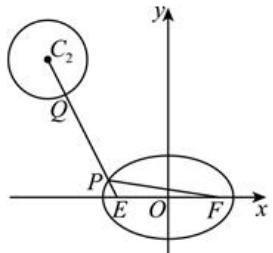

【训练3】设椭圆 $\frac{x^2}{a^2} +\frac{y^2}{b^2} = 1(a > b > 0)$ 的左、右焦点分别为 $F_{1}$ 、 $F_{2}$ ，其焦距为 $2c$ ，点 $Q(c,\frac{a}{2})$ 在椭圆内部，点 $P$ 是椭圆上动点，且 $|PF_1| + |PQ| <   6|F_1F_2|$ 恒成立．则椭圆离心率的取值范围是

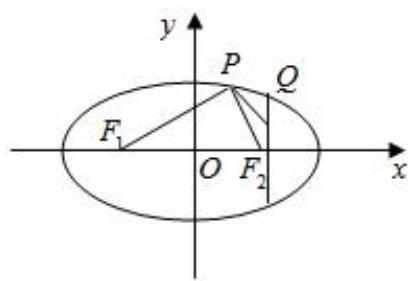

【训练 4】平面内有两个定点 $F_{1}(-5,0)$ 和 $F_{2}(5,0)$ ，动点 P 满足条件 $\left|PF_{1}\right|-\left|PF_{2}\right|=6$ ，则动点 P 的轨迹方程是（）

$\quad$A. $\frac{x^2}{16} -\frac{y^2}{9} = 1(x\leqslant -4)$

$\quad$B. $\frac{x^2}{9} -\frac{y^2}{16} = 1(x\leqslant -3)$

$\quad$C. $\frac{x^2}{16} -\frac{y^2}{9} = 1(x\geqslant 4)$

$\quad$D. $\frac{x^2}{9} -\frac{y^2}{16} = 1(x\geqslant 3)$

【训练 5】设 M 为双曲线 $C: y^{2} - \frac{x^{2}}{3} = 1$ 上一动点， $F_{1}$ 、 $F_{2}$ 为上、下焦点，O 为原点，则下列结论正确的是（）

$\quad$A. 若点 $N(0,8)$ , 则 $|MN|$ 最小值为 7  
$\quad$B. 若过点 O 的直线交 C 于 A、B 两点 (A、B 与 M 均不重合)，则 $k_{MA}k_{MB}=\frac{1}{3}$   
$\quad$C. 若点 $Q(8,1)$ ， $M$ 在双曲线 $C$ 的上支，则 $\left|MF_2\right| + \left|MQ\right|$ 最小值为 $2 + \sqrt{65}$   
$\quad$D. 过 $F_{1}$ 的直线 l 交 C 于 G、H 不同两点，若 $|GH|=7$ ，则 l 有 4 条

# 考向 2 跟踪训练

【训练 1】动点 $P(x,y)$ 到点 $(1,0)$ 的距离与到定直线 x=3 的距离之比是 $\frac{\sqrt{3}}{3}$ ，则动点 P 的轨迹方程是 \_\_\_\_.

【训练2】已知椭圆 $\frac{x^2}{9} +\frac{y^2}{4} = 1$ 的焦点为 $F_{1}$ ， $F_{2}$ ，椭圆上的动点 $P$ 坐标 $(x_0,y_0)$ 在第一象限，且 $\angle F_{1}PF_{2}$ 为锐角，则 $x_0$ 的取值范围为

【训练 3】若双曲线 $\frac{x^{2}}{64}-\frac{y^{2}}{36}=1$ 上一点 P 到它的右焦点的距离是 8，则点 P 到它的右准线的距离是 \_\_\_\_.

【训练4】（2010·江西）点 $A(x_0, y_0)$ 在双曲线 $\frac{x^2}{4} - \frac{y^2}{32} = 1$ 的右支上，若点 $A$ 到右焦点的距离等于 $2x_0$ ，则 $x_0 = \_$ .

# 考向 3 跟踪训练

【训练 1】椭圆 $C: \frac{x^{2}}{a^{2}} + \frac{y^{2}}{b^{2}} = 1 (a > b > 0)$ 的左顶点为 A，点 P，Q 均在 C 上，且关于 y 轴对称．若直线 AP，AQ 的斜率之积为 $\frac{1}{3}$ ，则 C 的离心率为（）

$\quad$A. $\frac{1}{3}$

$\quad$B. $\frac{\sqrt{3}}{3}$

$\quad$C. $\frac{2}{3}$

$\quad$D. $\frac{\sqrt{6}}{3}$

【训练 2】（2014•江西）过点 $M(1,1)$ 作斜率为 $-\frac{1}{2}$ 的直线与椭圆 $C:\frac{x^{2}}{a^{2}}+\frac{y^{2}}{b^{2}}=1(a>b>0)$ 相交于 A，B 两点，若 M 是线段 AB 的中点，则椭圆 C 的离心率等于 \_\_\_\_.

【训练 3】过原点的直线 l 与双曲线 $x^{2}-y^{2}=6$ 交于 A，B 两点，点 P 为双曲线上一点，若直线 PA 的斜率为 2，则直线 PB 的斜率为（）

$\quad$A. 4

$\quad$B. 1

$\quad$C. $\frac{1}{2}$

$\quad$D. $\frac{1}{4}$

【训练 4】已知双曲线 $C: \frac{x^{2}}{a^{2}} - \frac{y^{2}}{b^{2}} = 1 (a > 0, b > 0)$ 上有不同的三点 A，B，P，且 A，B 关于原点对称，直线 PA，PB 的斜率分别为 $k_{PA}$ ， $k_{PB}$ ，且 $k_{PA} \cdot k_{PB} \in (\frac{1}{4}, 1)$ ，则离心率 e 的取值范围是 \_\_\_\_.

【训练 5】已知点 P 在椭圆 $T: \frac{x^{2}}{a^{2}} + \frac{y^{2}}{b^{2}} = 1 (a > b > 0)$ 上，点 P 在第一象限，点 P 关于原点 O 的对称点为 A，点 P 关于 x 轴的对称点为 Q，设 $\overrightarrow{PD} = \frac{3}{4} \overrightarrow{PQ}$ ，直线 AD 与椭圆 T 的另一个交点为 B，若 $PA \perp PB$ ，则椭圆 T 的离心率 $e = (\quad)$

$\quad$A. $\frac{1}{2}$

$\quad$B. $\frac{\sqrt{2}}{2}$

$\quad$C. $\frac{\sqrt{3}}{2}$

$\quad$D. $\frac{\sqrt{3}}{3}$

【训练 6】已知双曲线 $x^{2}-\frac{y^{2}}{2}=1$ ，过点 $P(1,1)$ 的直线 l 与该双曲线相交于 A，B 两点，若 P 是线段 AB 的中点，则直线 l 的方程为（）

$\quad$A. 2x - y - 1 = 0

$\quad$B. $2x + y - 1 = 0$

$\quad$C. $2x - y + 1 = 0$

$\quad$D. 该直线不存在

# 考向 4 跟踪训练

【训练 1】已知点 $F_{1}$ 是椭圆 $\frac{x^{2}}{a^{2}} + \frac{y^{2}}{b^{2}} = 1 (a > b > 0)$ 的左焦点，过原点作直线 l 交椭圆于 A、B 两点，M、N 分别是 $AF_{1}$ 、 $BF_{1}$ 的中点，若 $\angle MON = 90^{\circ}$ ，则椭圆离心率的最小值为（）

$\quad$A. $\frac{1}{4}$

$\quad$B. $\frac{\sqrt{3}}{4}$

$\quad$C. $\frac{1}{2}$

$\quad$D. $\frac{\sqrt{2}}{2}$

【训练 2】已知 F 是椭圆 $E: \frac{x^{2}}{a^{2}} + \frac{y^{2}}{b^{2}} = 1 (a > b > 0)$ 的左焦点，经过原点 O 的直线 l 与椭圆 E 交于 P，Q 两点，若 $|PF| = 5 |QF|$ 且 $\angle PFQ = 120^{\circ}$ ，则椭圆 E 的离心率为（）

$\quad$A. $\frac{\sqrt{7}}{6}$

$\quad$B. $\frac{1}{3}$

$\quad$C. $\frac{\sqrt{21}}{6}$

$\quad$D. $\frac{\sqrt{21}}{5}$

【训练 3】已知椭圆和双曲线有共同的焦点 $F_{1}$ ， $F_{2}$ ，P 是它们的一个交点，且 $\angle F_{1}PF_{2}=\frac{\pi}{3}$ ，记椭圆和双曲线的离心率分别为 $e_{1}$ ， $e_{2}$ ，则 $\frac{1}{e_{1}e_{2}}$ 的最大值是（）

$\quad$A. $\frac{2\sqrt{3}}{3}$

$\quad$B. $\frac{4\sqrt{3}}{3}$

$\quad$C. 2

$\quad$D. 3

【训练4】已知点 $P$ 是双曲线 $\frac{x^2}{a^2} -\frac{y^2}{b^2} = 1(a > 0,b > 0)$ 上的动点， $F_{1}$ 、 $F_{2}$ 是其左、右焦点， $O$ 坐标原点，若存在四个点 $P$ 满足 $\frac{|PF_1| + |PF_2|}{|OP|} = \sqrt{6}$ ，则此双曲线的离心率取值范围\_\_\_\_.

【训练 5】已知椭圆 $C: \frac{x^{2}}{a^{2}} + \frac{y^{2}}{b^{2}} = 1 (a > b > 0)$ 的焦点为 $F_{1}$ ， $F_{2}$ ，若点 P 在椭圆上，且满足 $|PO|^{2} = |PF_{1}| \cdot |PF_{2}|$ （其中 O 为坐标原点）的 P 的个数（）

$\quad$A. 0

$\quad$B. 2

$\quad$C. 4

$\quad$D. 8

# 考向 5 跟踪训练

【训练 1】椭圆 $C: \frac{x^{2}}{a^{2}} + \frac{y^{2}}{b^{2}} = 1 (a > b > 0)$ 左右焦点分别为 $F_{1}$ 、 $F_{2}$ ，焦距为 2，直线 l 经过 $F_{2}$ 交椭圆于 A，B 两点，若 $\Delta ABF_{1}$ 的周长为 12，则椭圆标准方程为（）

$\quad$A. $\frac{x^2}{3} + y^2 = 1$

$\quad$B. $\frac{x^2}{4} + y^2 = 1$

$\quad$C. $\frac{x^2}{9} +\frac{y^2}{5} = 1$

$\quad$D. $\frac{x^{2}}{9}+\frac{y^{2}}{8}=1$

【训练 2】已知双曲线 $C: x^{2} - y^{2} = 1$ 的左、右焦点分别为 $F_{1}$ ， $F_{2}$ ，若左支上的两点 A，B 与左焦点 $F_{1}$ 三点共线，且 $\Delta ABF_{2}$ 的周长为 8，则 $|AB| = (\quad)$

$\quad$A. 2

$\quad$B. 3

$\quad$C. 4

$\quad$D. 6

【训练 3】已知 $F_{1}$ ， $F_{2}$ 为椭圆的焦点且 $\left|F_{1}F_{2}\right|=2\sqrt{5}$ ，M，N 是椭圆上两点，且 $\overrightarrow{MF_{1}}=2\overrightarrow{F_{1}N}$ ，以 $F_{1}F_{2}$ 为直径的圆经过 M 点，则 $\Delta MNF_{2}$ 的周长为（）

$\quad$A. 4

$\quad$B. 6

$\quad$C. 8

$\quad$D. 12

【训练4】已知双曲线 $C: \frac{x^2}{a^2} - \frac{y^2}{b^2} = 1 (a > 0, b > 0)$ 的左焦点为 $F_1$ ，直线 $y = kx (k > 0)$ 与双曲线 $C$ 交于 $P$ ， $Q$ 两点，且 $\angle PF_1Q = \frac{2\pi}{3}$ ， $\overrightarrow{PF_1} \cdot \overrightarrow{F_1Q} = 4$ ，则当 $\frac{1}{2} a^2 + \frac{b^2}{a^2}$ 取得最小值时，双曲线 $C$ 的离心率为（）

$\quad$A. 3

$\quad$B. $\sqrt{3}$

$\quad$C. 2

$\quad$D. $\sqrt{2}$

【训练 5】（多选）在平面直角坐标系 xOy 中，已知 $F_{1}$ ， $F_{2}$ 分别是椭圆 $C: \frac{x^{2}}{4} + \frac{y^{2}}{2} = 1$ 的左，右焦点，点 A，B 是椭圆 C 上异于长轴端点的两点，且满足 $\overrightarrow{AF_{1}} = \lambda \overrightarrow{F_{1}B}$ ，则（）

$\quad$A. $\Delta ABF_{2}$ 的周长为定值

$\quad$B. $AB$ 的长度最小值为 1

$\quad$C. 若 $AB \perp AF_{2}$ , 则 $\lambda = 3$

$\quad$D. $\lambda$ 的取值范围是[1，5]

【训练6】已知双曲线 $\frac{x^2}{a^2} -\frac{y^2}{b^2} = 1(a > 0,b > 0)$ 的右焦点为 $F$ ，过 $F$ 作双曲线两渐近线的垂线，垂足分别为点 $A$ ， $B$ （ $A$ ， $B$ 分别在一、四象限)，若 $2|AB| = |FA|$ ，则该双曲线的离心率为（）

$\quad$A. 2

$\quad$B. $2 \sqrt{3}$

$\quad$C. 4

$\quad$D. $4\sqrt{3}$

【训练 7】已知双曲线 $C: \frac{x^{2}}{a^{2}} - \frac{y^{2}}{b^{2}} = 1 (a > 0, b > 0)$ 的左，右焦点分别为 $F_{1}$ ， $F_{2}$ ，过 $F_{1}$ 的直线与圆 $x^{2} + y^{2} = a^{2}$ 相切于点 Q，与双曲线的右支交于点 P，若线段 PQ 的垂直平分线恰好过右焦点 $F_{2}$ ，则双曲线 C 的离心率为（）

$\quad$A. $\frac{\sqrt{13}}{2}$

$\quad$B. $\frac{\sqrt{13}}{3}$

$\quad$C. $\frac{\sqrt{5}}{2}$

$\quad$D. 2

【训练8】如图所示， $F_{1}$ ， $F_{2}$ 是双曲线 $C:\frac{x^{2}}{a^{2}}-\frac{y^{2}}{b^{2}}=1(a>0,b>0)$ 的左、右焦点，双曲线 C 的右支上存在一点 B 满足 $BF_{1}\perp BF_{2}$ ， $BF_{1}$ 与双曲线 C 的左支的交点 A 平分线段 $BF_{1}$ ，则双曲线 C 的离心率为（）

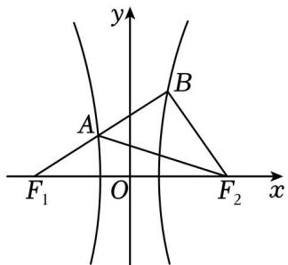

$\quad$A. 3

$\quad$B. $2 \sqrt{3}$

$\quad$C. $\sqrt{13}$

$\quad$D. $\sqrt{15}$

【训练 9】如图，已知 $F_{1}$ 、 $F_{2}$ 分别为 $\frac{x^{2}}{a^{2}} + \frac{y^{2}}{b^{2}} = 1 (a > b > 0)$ 椭圆的左、右焦点，过 $F_{2}$ 的直线与椭圆交于 P、Q 两点，若 $\overrightarrow{QF_{1}} \cdot \overrightarrow{QP} = |PQ|^{2}$ ， $\overrightarrow{PF_{2}} = 2\overrightarrow{F_{2}Q}$ ，则 $\angle F_{1}PQ =$ \_\_\_\_ ，椭圆的离心率为 \_\_\_\_.

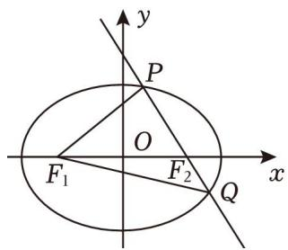

【训练 10】已知 A，B，C 是双曲线 $\frac{x^{2}}{a^{2}} - \frac{y^{2}}{b^{2}} = 1 (a > 0, b > 0)$ 上的三个点，直线 AB 经过原点 O，AC 经过右焦点 F，若 $BF \perp AC$ ，且 3AF = CF，则该双曲线的离心率为（）

$\quad$A. $\frac{\sqrt{10}}{2}$

$\quad$B. $\frac{5}{2}$

$\quad$C. $\frac{\sqrt{10}}{3}$

$\quad$D. $\frac{2}{3}$

【训练 11】已知 $F_{1}$ ， $F_{2}$ 是双曲线 $C: \frac{x^{2}}{a^{2}} - \frac{y^{2}}{b^{2}} = 1 (a > 0, b > 0)$ 的左、右焦点，过 $F_{1}$ 的直线 l 与双曲线 C 交于 M，N 两点，且 $\overrightarrow{F_{1}N} = 3\overrightarrow{F_{1}M}$ ， $|F_{2}M| = |F_{2}N|$ ，则下列说法正确的是（）

$\quad$A. $\triangle F_{2}MN$ 是等边三角形

$\quad$B. 双曲线 $C$ 的离心率为 $\sqrt{7}$

$\quad$C. 双曲线 C 的渐近线方程为 $y = \pm \sqrt{6}x$

$\quad$D. 点 $F_{1}$ 到直线 $\sqrt{6} x - y = 0$ 的距离为 $\sqrt{6} a$

# 考向 6 跟踪训练

【训练 1】(2020•新课标 I) 已知 A 为抛物线 $C: y^{2} = 2px (p > 0)$ 上一点，点 A 到 C 的焦点的距离为 12，到 y 轴的距离为 9，则 $p = (\quad)$

$\quad$A. 2

$\quad$B. 3

$\quad$C. 6

$\quad$D. 9

【训练 2】（2021•全国）已知抛物线 $C: y^{2} = 2px (p > 0)$ 的焦点为 F，过 F 倾斜角为 $45^{\circ}$ 的直线与 C 交于 A，B 两点，且 $|AB| = 8$ ，则 p = \_\_\_\_.

【训练 3】已知抛物线 $y^{2}=2x$ 的焦点为 F，过点 F 的直线 l 与抛物线交于 A，B 两点，若 $\Delta AOF$ 的面积是 $\Delta BOF$ 的面积的两倍，则 $|AB|=(\quad)$

$\quad$A. 2

$\quad$B. $\frac{5}{2}$

$\quad$C. $\frac{9}{4}$

$\quad$D. $\frac{11}{4}$

【训练 4】(2024•江西期末)（多选）已知抛物线 $y^{2}=2px(p>0)$ 上有两点 $A(x_{1},y_{1})$ 、 $B(x_{2},y_{2})$ ，焦点为 F，下列选项中是“直线 AB 经过焦点 F”的必要不充分条件的是（）

$\quad$A. $\overrightarrow{OA} \cdot \overrightarrow{OB} = -\frac{3}{4} p^2$

$\quad$B. $y_{1}y_{2} = -p^{2}$

$\quad$C. $x_{1}x_{2}=\frac{p^{2}}{4}$

$\quad$D. $\frac{1}{|FA|} +\frac{1}{|FB|} = \frac{2}{p}$

【训练 5】(2024·重庆期末)(多选)已知抛物线 $C: y^{2} = 2px (p > 0)$ 过点 $B(1, 2)$ ，过点 $A(-1, 0)$ 的直线交抛物线于 M，N 两点，点 N 在点 M 右侧，若 F 为焦点，直线 NF，MF 分别交抛物线于 P，Q 两点，则（）

$\quad$A. $|MF|\cdot|NF|>4$

$\quad$B. $|OM|\cdot|ON|=|OB|^{2}$

$\quad$C. $A$ 、 $P$ 、 $Q$ 三点共线

$\quad$D. $\angle AMP \leqslant \frac{\pi}{4}$

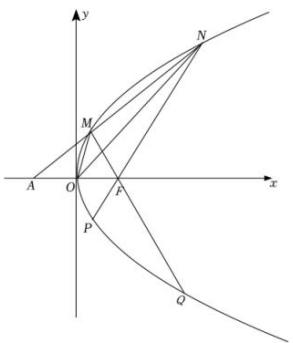

【训练 6】（2024·多选·湘潭期末）已知抛物线 $C: y^{2} = 12x$ ，点 F 是抛物线 C 的焦点，点 P 是抛物线 C 上的一点，点 $M(4,3)$ ，则下列说法正确的是（）

$\quad$A. 抛物线 $C$ 的准线方程为 $x = -3$

$\quad$B. 若 $|PF| = 7$ ，则 $\Delta PMF$ 的面积为 $2\sqrt{3} - \frac{3}{2}$

$\quad$C. $|PF| - |PM|$ 的最大值为 $\sqrt{10}$

$\quad$D. $\Delta PMF$ 的周长的最小值为 $7 + \sqrt{10}$

# 考向 7 跟踪训练

【训练 1】(2023·新高考 I) 设椭圆 $C_{1}:\frac{x^{2}}{a^{2}}+y^{2}=1(a>1)$ ， $C_{2}:\frac{x^{2}}{4}+y^{2}=1$ 的离心率分别为 $e_{1}$ ， $e_{2}$ 。若 $e_{2}=\sqrt{3}e_{1}$ ，则 $a=(\quad)$

$\quad$A. $\frac{2\sqrt{3}}{3}$

$\quad$B. $\sqrt{2}$

$\quad$C. $\sqrt{3}$

$\quad$D. $\sqrt{6}$

【训练 2】（2024·武汉期中）过椭圆 $C: \frac{x^{2}}{a^{2}} + \frac{y^{2}}{b^{2}} = 1 (a > b > 0)$ 左焦点 $F(-c, 0)$ 作倾斜角为 $\frac{\pi}{6}$ 的直线 l，与椭圆 C 交于 A，B 两点，其中 P 为线段 AB 的中点，线段 PF 的长为 $\frac{\sqrt{3}}{3} c$ ，则椭圆 C 的离心率为（）

$\quad$A. $\frac{\sqrt{5}}{5}$

$\quad$B. $\frac{1}{2}$

$\quad$C. $\frac{\sqrt{3}}{2}$

$\quad$D. $\frac{\sqrt{6}}{3}$

【训练3】设 $F$ 是双曲线 $\frac{x^2}{a^2} -\frac{y^2}{b^2} = 1(b > a > 0)$ 的一个焦点，过 $F$ 作双曲线的一条渐近线的垂线，与两条渐近线分别交于 $A$ ， $B$ 两点．若 $\overrightarrow{FB} = 2\overrightarrow{FA}$ ，则双曲线的离心率为（）

$\quad$A. $\sqrt{2}$

$\quad$B. $\sqrt{3}$

$\quad$C. 2

$\quad$D. 5

【训练4】已知双曲线 $E: \frac{x^2}{a^2} - \frac{y^2}{b^2} = 1 (a > 0, b > 0)$ 的左焦点为 $F_1$ ，过点 $F_1$ 的直线与两条渐近线的交点分别为 $M$ 、 $N$ 两点（点 $F_1$ 位于点 $M$ 与点 $N$ 之间），且 $\overrightarrow{MF_1} = 2\overrightarrow{F_1N}$ ，又过点 $F_1$ 作 $F_1P \perp OM$ 于 $P$ （点 $O$ 为坐标原点），且 $|ON| = |OP|$ ，则双曲线 $E$ 的离心率 $e = (\quad)$

$\quad$A. $\sqrt{5}$

$\quad$B. $\sqrt{3}$

$\quad$C. $\frac{2\sqrt{3}}{3}$

$\quad$D. $\frac{\sqrt{6}}{2}$

【训练 5】（2021·天津）已知双曲线 $\frac{x^{2}}{a^{2}} - \frac{y^{2}}{b^{2}} = 1 (a > 0, b > 0)$ 的右焦点与抛物线 $y^{2} = 2px (p > 0)$ 的焦点重合，抛物线的准线交双曲线于 A，B 两点，交双曲线的渐近线于 C，D 两点，若 $|CD| = \sqrt{2}|AB|$ ，则双曲线的离心率为（）

$\quad$A. $\sqrt{2}$

$\quad$B. $\sqrt{3}$

$\quad$C. 2

$\quad$D. 3

【训练 6】（2021•浙江）已知椭圆 $\frac{x^{2}}{a^{2}}+\frac{y^{2}}{b^{2}}=1(a>b>0)$ ，焦点 $F_{1}(-c,0)$ ， $F_{2}(c,0)(c>0)$ 。若过 $F_{1}$ 的直线和圆 $(x-\frac{1}{2}c)^{2}+y^{2}=c^{2}$ 相切，与椭圆的第一象限交于点 P，且 $PF_{2}\perp x$ 轴，则该直线的斜率是 \_\_\_\_，椭圆的离心率是 \_\_\_\_。

【训练 7】已知双曲线 $C: \frac{x^{2}}{a^{2}} - \frac{y^{2}}{b^{2}} = 1 (a > 0, b > 0)$ 的右顶点为 A，左、右焦点分别为 $F_{1}$ ， $F_{2}$ ，以 $F_{1}F_{2}$ 为直径的圆与 C 的渐近线在第一象限的交点为 M，且 $|MF_{1}| = 2|MA|$ ，则该双曲线的离心率为（）

$\quad$A. $\frac{2\sqrt{3}}{3}$

$\quad$B. $\sqrt{2}$

$\quad$C. 2

$\quad$D. $\sqrt{3} + 1$

【训练8】已知双曲线 $C: \frac{x^2}{a^2} - \frac{y^2}{b^2} = 1 (a > 0, b > 0)$ 的左、右焦点分别为 $F_1$ ， $F_2$ ，且以 $F_1F_2$ 为直径的圆与双曲线 $C$ 的渐近线在第四象限交点为 $P$ ， $PF_1$ 交双曲线左支于 $Q$ ，若 $2\overrightarrow{F_1Q} = \overrightarrow{QP}$ ，则双曲线的离心率为（）

$\quad$A. $\frac{\sqrt{10} + 1}{2}$

$\quad$B. $\sqrt{10}$

$\quad$C. $\frac{\sqrt{5}+1}{2}$

$\quad$D. $\sqrt{5}$

# 考向 8 跟踪训练

【训练 1】我国首先研制成功的“双曲线新闻灯”，如图，利用了双曲线的光学性质： $F_{1}$ 、 $F_{2}$ 是双曲线的左、右焦点，从 $F_{2}$ 发出的光线 m 射在双曲线右支上一点 P，经点 P 反射后，反射光线的反向延长线过 $F_{1}$ ；当 P 异于双曲线顶点时，双曲线在点 P 处的切线平分 $\angle F_{1}PF_{2}$ 。若双曲线 C 的方程为 $\frac{x^{2}}{9}-\frac{y^{2}}{16}=1$ ，则下列结论不正确的是（）

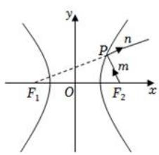

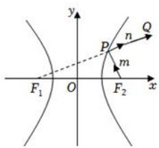

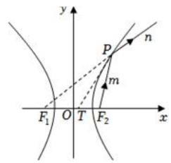

$\quad$A. 射线 n 所在直线的斜率为 k，则 $k \in \left(-\frac{4}{3}, \frac{4}{3}\right)$

$\quad$B. 当 $m \perp n$ 时， $|PF_1| \cdot |PF_2| = 32$

$\quad$C. 当 $n$ 过点 $Q(7,5)$ 时, 光线由 $F_{2}$ 到 $P$ 再到 $Q$ 所经过的路程为 13

$\quad$D. 若点 $T$ 坐标为 $(1,0)$ ，直线 $PT$ 与 $C$ 相切，则 $|PF_{2}| = 12$

【训练2】已知椭圆 $\frac{x^2}{4} +\frac{y^2}{3} = 1$ 上一点 $P$ 位于第一象限，左、右焦点分别为 $F_{1}$ ， $F_{2}$ ，左、右顶点分别为 $A_{1}$ $A_{2}$ ， $\angle F_1PF_2$ 的角平分线与 $x$ 轴交于点 $G$ ，与 $y$ 轴交于点 $H(0, - \frac{1}{2})$ ，则（）

$\quad$A. 四边形 $HF_{1}PF_{2}$ 的周长为 $4 + \sqrt{5}$

$\quad$B. 直线 $A_{1}P$ ， $A_{2}P$ 的斜率之积为 $-\frac{3}{4}$

$\quad$C. $\left|F_{1}G\right|:\left|F_{2}G\right|=3:2$

$\quad$D. 四边形 $HF_{1}PF_{2}$ 的面积为 2

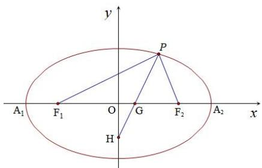

【训练3】（多选） $P$ 为双曲线 $\frac{x^2}{a^2} -\frac{y^2}{b^2} = 1$ 上一点， $F$ 为一个焦点，以 $PF$ 为直径的圆与圆 $x^{2} + y^{2} = a^{2}$ 的位置关系是（ ）

$\quad$A. 内切

$\quad$B. 相交

$\quad$C. 外切

$\quad$D. 相离

【训练 4】(2024·多选·广州期末) 设抛物线 $C: y^{2} = 2px (p > 0)$ 的顶点为 O，焦点为 F，准线为 l． $P(x, y)$ 是抛物线 C 上异于 O 的一点，过 P 作 $PQ \perp l$ 于点 Q，则（）

$\quad$A. $|PF| = x + \frac{p}{2}$

$\quad$B. 线段 $FQ$ 的垂直平分线经过点 $P$

$\quad$C. 以为 $PF$ 直径的圆与 $y$ 轴相切

$\quad$D. 以为 $PF$ 直径的圆与准线相切

【训练 5】（1）设 P 是椭圆 $M: \frac{x^{2}}{a^{2}} + \frac{y^{2}}{b^{2}} = 1 (a > b > 0)$ 上任意一点，P 是焦点．证明：以 PF 为直径的圆与以椭圆长轴为直径的圆相切；

（2）设 $P$ 是双曲线 $M: \frac{x^2}{a^2} - \frac{y^2}{b^2} = 1 (a > 0, b > 0)$ 上任意一点， $F$ 是焦点，请你类比（1），写出一个类似的结论，并证明.

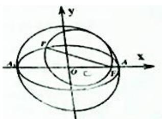

【训练7】已知正四面体ABCD，空间一动点 $P$ 满足 $BP \perp AD$ ，且 $\triangle PAD$ 的面积为定值，则点 $P$ 的轨迹为（ ）.

$\quad$A. 直线

$\quad$B.圆

$\quad$C.圆

$\quad$D. 抛物线

【训练8】已知圆柱的轴截面ABCD是边长为2的正方形，M为正方形ABCD对角线的交点，动点P在圆柱下底面内（包括圆周）.若直线AM与直线MP所成的角为 $45^{\circ}$ ，则点P形成的轨迹为（ ）.

$\quad$A.椭圆的一部分

$\quad$B. 抛物线的一部分

$\quad$C. 双曲线的一部分

$\quad$D. 圆的一部分

【训练9】设 $m$ 是平面 $\alpha$ 内的一条定直线， $P$ 是平面 $\alpha$ 外的一个定点，动直线 $n$ 经过点 $P$ 且与 $m$ 成 $30^{\circ}$ 角，则直线 $n$ 与平面 $\alpha$ 的交点 $Q$ 的轨迹是（ ）.

$\quad$A.圆

$\quad$B.椭圆

$\quad$C. 双曲线

$\quad$D. 抛物线

【训练 10】（2023·武汉模拟）如图所示，在圆锥内放入两个球 $O_{1}$ ， $O_{2}$ ，它们都与圆锥相切（即与圆锥的每条母线相切），切点圆（图中粗线所示）分别为 $\odot C_{1}$ ， $\odot C_{2}$ 。这两个球都与平面 $\alpha$ 相切，切点分别为 $F_{1}$ ， $F_{2}$ ，丹德林 (G·Dandelin) 利用这个模型证明了平面 $\alpha$ 与圆锥侧面的交线为椭圆， $F_{1}$ ， $F_{2}$ 为此椭圆的两个焦点，这两个球也称为 Dandelin 双球。若圆锥的母线与它的轴的夹角为 $30^{\circ}$ ， $\odot C_{1}$ ， $\odot C_{2}$ 的半径分别为 1, 4，点 M 为 $\odot C_{2}$ 上的一个定点，点 P 为椭圆上的一个动点，则从点 P 沿圆锥表面到达点 M 的路线长与线段 $PF_{1}$ 的长之和的最小值是（）

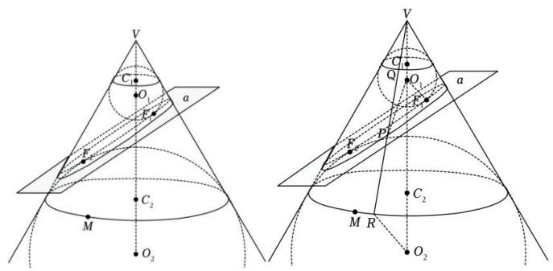

$\quad$A. 6

$\quad$B. 8

$\quad$C. $3\sqrt{3}$

$\quad$D. $4\sqrt{3}$

【训练 11】（2024·浙江模拟）如图①，用一个平面去截圆锥，得到的截口曲线是椭圆．许多人从纯几何的角度出发对这个问题进行过研究，其中比利时数学家 Germinaldandelin(1794-1847) 的方法非常巧妙，极具创造性．在圆锥内放两个大小不同的球，使得它们分别与圆锥的侧面，截面相切，两个球分别与截面相切于 E，F，在截口曲线上任取一点 A，过 A 作圆锥的母线，分别与两个球相切于 C，B，由球与圆的几何性质，可以知道，AE = AC，AF = AB，于是 AE + AF = AB + AC = BC．由 B，C 的产生方法可知，它们之间的距离 BC 是定值，由椭圆定义可知，截口曲线是以 E，F 为焦点的椭圆．如图②，一个半径为 3 的球放在桌面上，桌面上方有一个点光源 P，则球在桌面上的投影是椭圆．已知 $A_{1}A_{2}$ 是椭圆的长轴， $PA_{1}$ 垂直于桌面且与球相切， $PA_{1} = 7$ ，则椭圆的离心率为 \_\_\_\_.

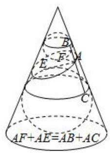

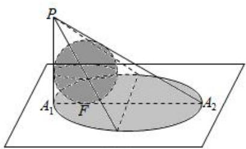

图②

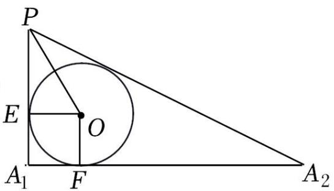

