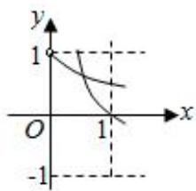
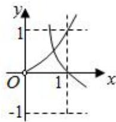

# 第四节 跟踪训练

# 考向 1 跟踪训练

【训练 1】（2020•新课标 I）设 $a \log_{3} 4 = 2$ ，则 $4^{-a} = (\quad)$

$\quad$A. $\frac{1}{16}$

$\quad$B. $\frac{1}{9}$

$\quad$C. $\frac{1}{8}$

$\quad$D. $\frac{1}{6}$

【训练2】已知 $x^{2} + x^{-2} = 3$ ，则 $\frac{x + x^{-1}}{x^3 + x^{-3}} =$ \_\_\_\_.

【训练 3】已知 $\log_{2}a + \log_{2}b = \log_{2}\frac{9}{2}$ ，则 $3^{a} + 9^{b}$ 的最小值为 \_\_\_\_.

【训练 4】幂函数 $f(x)=(m^{2}-4m+4)x^{m^{2}-6m+8}$ 在 $(0,+\infty)$ 为减函数，则 m 的值为（）

$\quad$A. 1 或 3

$\quad$B. 1

$\quad$C. 3

$\quad$D. 2

【训练 5】（2014•浙江）在同一直角坐标系中，函数 $f(x)=x^{a}(x>0)$ ， $g(x)=\log_{a}x$ 的图象可能是（）

$\quad$A.

$\quad$B.

$\quad$C.

$\quad$D.

【训练 6】函数 $f(x)=\log_{a}(2x-3)+1(a>0$ ，且 $a\neq1)$ 的图象恒过定点 $A(m,n)$ ，若对任意正数 x，y 都有 $mx+ny=4$ ，则 $\frac{1}{x+1}+\frac{2}{y}$ 的最小值是（）

$\quad$A. 2

$\quad$B. $\frac{39}{22}$

$\quad$C. 1

$\quad$D. $\frac{4}{3}$

【训练7】已知函数 $f(x) = \log_3(3 - x) - \log_3(1 + x) - x + 3$ ，则 $f(x)$ 的图象与两坐标轴围成图形的面积是（）

$\quad$A. 4

$\quad$B. $4 \ln 3$

$\quad$C. 6

$\quad$D. 6ln3

# 考向 2 跟踪训练

【训练 1】设 $a=\left(\frac{3}{2}\right)^{-\frac{1}{3}}$ , $b=\left(\frac{3}{4}\right)^{\frac{1}{3}}$ , $c=\left(\frac{2}{3}\right)^{\frac{2}{3}}$ ，则 a, b, c 的大小关系为 \_\_\_\_。（注：用“<”将三个数按从小到大的顺序连接）

【训练 2】（2020•天津）设 $a=3^{0.7}$ ， $b=(\frac{1}{3})^{-0.8}$ ， $c=\log_{0.7}0.8$ ，则 a，b，c 的大小关系为（）

$\quad$A. $a < b < c$

$\quad$B. $b < a < c$

$\quad$C. $b < c < a$

$\quad$D. c < a < b

【训练 3】（2021•新高考 II）已知 $a=\log_{5}2$ ， $b=\log_{8}3$ ， $c=\frac{1}{2}$ ，则下列判断正确的是()

$\quad$A. $c <   b <   a$

$\quad$B. b < a < c

$\quad$C. $a < c < b$

$\quad$D. $a < b < c$

【训练 4】已知 $2^{a} + a = \log_{2} b + b = \log_{3} c + c = k (k < 1)$ ，则 a, b, c 从小到大的关系是 \_\_\_\_.

【训练 5】已知函数 $f(x)$ 是定义在 R 上的偶函数，且在 $(0,+\infty)$ 上单调递减，若 $a=f(\log_{2}0.2)$ ， $b=f(2^{0.2})$ ， $c=f(0.2^{0.3})$ 则 a，b，c 大小关系为（）

$\quad$A. a < b < c

$\quad$B. c<a<b

$\quad$C. a < c < b

$\quad$D. b < a < c

# 拓展跟踪训练

【训练 1】比较大小： $\log_{6}8$ 与 $\log_{7}9$ ;

【训练 2】比较大小： $\log_{7}4$ 与 $\log_{9}6$ ;

