# 5.1 解三角形小题篇

# 考向 1 公式问题

# 题型 1 利用公式解三角形

# 一．基本定理公式

##### 1. 正弦定理和余弦定理： $a, b, c$ 指 $\triangle ABC$ 的内角 $A, B, C$ 的对边， $R$ 指 $\triangle ABC$ 的外接圆半径

<table><tr><td>定理</td><td>正弦定理</td><td>余弦定理</td></tr><tr><td>基本公式</td><td> $\frac{a}{\sin A} = \frac{b}{\sin B} = \frac{c}{\sin C} = 2R$ </td><td> $a^{2} = b^{2} + c^{2} - 2bc \cos A$ ; $b^{2} = c^{2} + a^{2} - 2ac \cos B$ ; $c^{2} = a^{2} + b^{2} - 2ab \cos C$ .</td></tr><tr><td>常见推论</td><td>（1） $a = 2R \sin A$ , $b = 2R \sin B$ , $c = 2R \sin C$ ;（2） $\sin A = \frac{a}{2R}$ , $\sin B = \frac{b}{2R}$ , $\sin C = \frac{c}{2R}$ ;（3） $a:b:c = \sin A:\sin B:\sin C$ ;（4） $\frac{a}{\sin A} = \frac{b}{\sin B} = \frac{c}{\sin C} = \frac{k_{1}a+k_{2}a+k_{3}a}{k_{1}\sin A+k_{2}\sin B+k_{3}\sin C}$ .</td><td> $\cos A = \frac{b^{2} + c^{2} - a^{2}}{2bc}$ ; $\cos B = \frac{c^{2} + a^{2} - b^{2}}{2ac}$ ; $\cos C = \frac{a^{2} + b^{2} - c^{2}}{2ab}$ .</td></tr></table>

注意: （1） 涉及三角形两边以及对角的问题优先考虑正弦定理, 其中包含①已知两边+其中一边的对角类型; ②已知两角+其中一角的对边类型.

（2） 涉及三角形三边加一个内角的问题选择余弦定理, 其中包含①已知三边求一内角的类型; ②已知两边和一内角, 求另一边的类型 (若该内角为两边的夹角, 直接使用公式求解; 若内角不为夹角, 则用公式建立方程求解.)

##### 2. 三角形的面积公式

（1） $S = \frac{1}{2} ab\sin C = \frac{1}{2} bc\sin A = \frac{1}{2} ac\sin B;$   
（2） $S = \frac{1}{2} (a + b + c)r$ ( $r$ 为三角形内切圆半径);  
（3） $S = \sqrt{p(p - a)(p - b)(p - c)} (p = \frac{a + b + c}{2})$ ;   
（4） $S = 2R^{2} \sin A \sin B \sin C = \frac{abc}{4R}$ (R为三角形外接圆半径);

【例 1】（2024•上海）三角形 ABC 中， $BC=2, A=\frac{\pi}{3}, B=\frac{\pi}{4}$ ，则 AB= \_\_\_\_.

【例 2】(2023·乙卷) 在 $\Delta ABC$ 中，内角 A, B, C 的对边分别是 a, b, c，若 $a \cos B - b \cos A = c$ ，且 $C = \frac{\pi}{5}$ ，则 $\angle B = (\quad)$

$\quad$A. $\frac{\pi}{10}$

$\quad$B. $\frac{\pi}{5}$

$\quad$C. $\frac{3\pi}{10}$

$\quad$D. $\frac{2\pi}{5}$

【例 3】（2024•甲卷）在 $\Delta ABC$ 中，内角 A，B，C 所对边分别为 a，b，c，若 $B=\frac{\pi}{3}$ ， $b^{2}=\frac{9}{4}ac$ ，则 $\sin A+\sin C=(\quad)$

$\quad$A. $\frac{3}{2}$

$\quad$B. $\sqrt{2}$

$\quad$C. $\frac{\sqrt{7}}{2}$

$\quad$D. $\frac{\sqrt{3}}{2}$

【例 4】(2021·乙卷)记 $\Delta ABC$ 的内角 A, B, C 的对边分别为 a, b, c，面积为 $\sqrt{3}$ ， $B = 60^{\circ}$ ， $a^{2} + c^{2} = 3ac$ ，则 b = \_\_\_\_.

【例 5】（2023·北京）在 $\Delta ABC$ 中， $(a+c)(\sin A-\sin C)=b(\sin A-\sin B)$ ，则 $\angle C=(\quad)$

$\quad$A. $\frac{\pi}{6}$

$\quad$B. $\frac{\pi}{3}$

$\quad$C. $\frac{2\pi}{3}$

$\quad$D. $\frac{5\pi}{6}$

# 题型 2 判断三角形解的个数

##### 1. 判断三角形解的情况

<table><tr><td></td><td colspan="3">A为锐角</td><td colspan="2">A为钝角或直角</td></tr><tr><td>图形</td><td>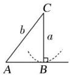</td><td>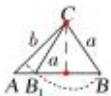</td><td>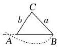</td><td colspan="2">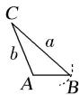 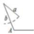</td></tr><tr><td>关系式</td><td>a=bsin A</td><td>bsin A &lt; a &lt; b</td><td>a≥b</td><td>a &gt;b</td><td>a≤b</td></tr><tr><td>解的个数</td><td>一解</td><td>两解</td><td>一解</td><td>一解</td><td>无解</td></tr></table>

总结： $\left\{\begin{aligned}& 大角求小角一解（锐角）\\& 小角求大角 \left\{\begin{aligned}& 两解 -\sin A<1（一锐角、一钝角）\\& 一解 -\sin A=1（直角）\\& 无解 -\sin A>1\end{aligned}\right.\end{aligned}\right.$

【例 1】在 $\Delta ABC$ 中，若 b=3， $c=\frac{3\sqrt{2}}{2}$ ， $B=45^{\circ}$ ，则此三角形解的情况为（）

$\quad$A. 无解

$\quad$B. 两解

$\quad$C. 一解

$\quad$D. 解的个数不能确定

##### 【例2】若 $\Delta ABC$ 中， $a = x, b = \sqrt{3}, A = \frac{\pi}{4}$ ，若该三角形有两个解，则 $x$ 范围是（ ）

$\quad$A. $(\sqrt{3},6)$

$\quad$B. $(2,2\sqrt{3})$

$\quad$C. $\left[\frac{\sqrt{6}}{2},\sqrt{3}\right)$

$\quad$D. $\left(\frac{\sqrt{6}}{2},\sqrt{3}\right)$

# 题型 3 判断三角形的形状

##### 1. 判断三角形的形状

（1）余弦定理推形状：三角形三条边从小到大排列，即 a < b < c，

（1）若 $a^{2}+b^{2}-c^{2}>0$ ，则 $\triangle ABC$ 是锐角三角形；  
（2）若 $a^{2}+b^{2}-c^{2}=0$ ，则 $\triangle ABC$ 是直角三角形；  
（3）若 $a^{2}+b^{2}-c^{2}<0$ ，则 $\triangle ABC$ 是钝角三角形；

##### 2. 三角恒等变换推形状：

①直角三角形判定： $\sin A = \sin B \cos C$ 或 $\sin B = \sin C \cos A$ 或 $\sin C = \sin A \cos B$ 证明：  
②等腰三角形判定： $\sin A = 2\sin B\cos C$ 或 $\sin B = 2\sin C\cos A$ 或 $\sin C = 2\sin A\cos B$ 证明：  
③等腰或直角三角形判定： $\sin A\cos A=\sin B\cos B$

证明：

④等边三角形判定：A、B、C成等差数列，a、b、c成等比数列

证明：

【例 1】（2025·九省联考）在△ABC中，BC=8，AC=10， $\cos\angle BAC=\frac{3}{5}$ ，则△ABC的面积为()

$\quad$A. 6

$\quad$B. 8

$\quad$C. 24

$\quad$D. 48

【例 2】（2013·陕西）设 $\Delta ABC$ 的内角 A，B，C 所对的边分别为 a，b，c，若 $b\cos C + c\cos B = a\sin A$ ，则 $\Delta ABC$ 的形状为（）

$\quad$A. 锐角三角形

$\quad$B. 直角三角形

$\quad$C. 钝角三角形

$\quad$D. 不确定

【例 3】在 $\Delta ABC$ 中，若 $a\sin B = \sqrt{3}b\cos A$ ，且 $\sin C = 2\sin A\cos B$ ，那么 $\Delta ABC$ 一定是（）

$\quad$A. 等腰直角三角形

$\quad$B. 直角三角形

$\quad$C. 等腰三角形

$\quad$D. 等边三角形

# 考向 2 图形问题

# 二．图形应用模型

解三角形的图形应用部分包含嵌套三角形和实际应用部分的问题，解题过程中常涉及中线、角平分线以及求距离和角度的问题，我们用下面的模型帮助大家解决选择填空题.

##### 1. 嵌套三角形问题

（1） 射影定理

在 $\triangle ABC$ 中， $a = b\cos C + c\cos B$ ， $b = c\cos A + a\cos C$ ， $c = a\cos B + b\cos A$

证明：

# 题型 1 中线定理

中线定理

（1）如图，在 $\triangle ABC$ 中， $D$ 为 $BC$ 边上的中点，连接 $AD$ ，则有： $AB^{2} + AC^{2} = 2(AD^{2} + BD^{2})$

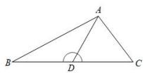

证明：

【例 1】已知 $\triangle ABC$ 中，AB = 6，BC = 8， $\angle B = 60^{\circ}$ ，则 AB 边上的中线长为（）

$\quad$A. $\sqrt{78}$

$\quad$B. 8

$\quad$C. 7

$\quad$D. 6

# 题型 2 张角定理

1）张角定理

如图，在 $\triangle ABC$ 中， $D$ 为 $BC$ 边上的一点，连接 $AD$ ，设 $AD = l$ ， $\angle BAD = \alpha$ ， $\angle CAD = \beta$ ，则一定有 $\frac{\sin(\alpha + \beta)}{l} = \frac{\sin\alpha}{b} +\frac{\sin\beta}{c}.$

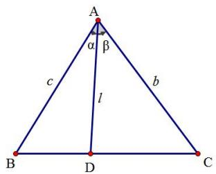

证明：

2）角平分线张角定理

根据张角定理：①当 $\alpha = \beta$ 时， $\cos \alpha = \frac{1}{2} \frac{AD}{b} + \frac{AD}{c}$ （角平分线张角定理）

② $S_{\triangle ABC} = \frac{1}{2} AD \cdot (b + c) \sin \alpha \geq AD^{2} \tan \alpha$ （角平分线面积问题）

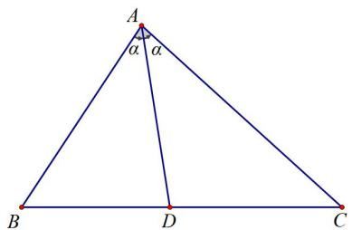

证明：

【例 1】(2013·福建)如图，在 $\triangle ABC$ 中，已知点 $D$ 在 $BC$ 边上， $AD \perp AC$ ， $\sin\angle BAC=\frac{2\sqrt{2}}{3}$ ， $AB=3\sqrt{2}$ ， $AD=3$ ，则 $CD$ 的长为\_\_\_\_。

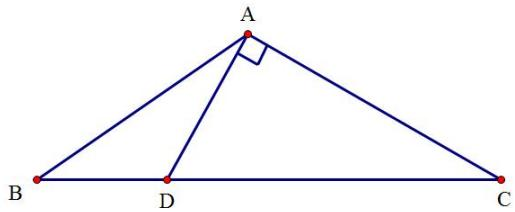

##### 【例2】在 $\Delta ABC$ 中， $\angle BAC = 60^{\circ}$ ， $AB = 2$ ， $BC = \sqrt{6}$ ， $\angle BAC$ 的角平分线交 $BC$ 于 $D$ ，则 $AD = (\quad)$

$\quad$A. $\sqrt{3}$

$\quad$B. 2

$\quad$C. $2\sqrt{2}$

$\quad$D. $2 \sqrt{3}$

# 题型 3 斯库顿定理

如图，AD 是 $\triangle ABC$ 的角平分线，则 $AD^{2} = AB \cdot AC - BD \cdot CD$ . 就其位置关系而言，可记忆：中方=上积一下积.

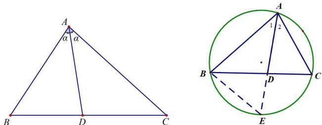

已知：在 $\triangle ABC$ 中， $AD$ 是 $\angle BAC$ 的平分线，求证： $AD^{2} + BD\cdot DC = AB\cdot AC$ 证明：

【例 1】在 $\Delta ABC$ 中，AD 为 $\angle A$ 的角平分线，D 在线段 BC 上，若 $|AB|=2$ ， $|AD|=|AC|=1$ ，则 $|BD|=()$

$\quad$A. $\frac{\sqrt{2}}{2}$

$\quad$B. $\sqrt{2}$

$\quad$C. 2

$\quad$D. $\frac{3\sqrt{2}}{2}$

# 【解题总结】

# 题型 2 实际应用问题

# 2. 实际应用问题

（1） 距离问题

<table><tr><td>类型</td><td>图形</td><td>方法</td></tr><tr><td>两点间不可到达的距离</td><td>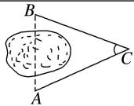</td><td>余弦定理</td></tr><tr><td>两点间可视不可到达的距离</td><td>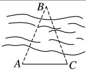</td><td>正弦定理</td></tr><tr><td>两个不可到达的点之间的距离</td><td>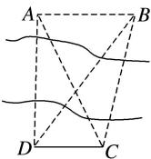</td><td>先用正弦定理,再用余弦定理</td></tr></table>

##### 1. 两点间不可通又不可视问题的测量方案实质是构造已知两边及夹角的三角形并求解.  
##### 2. 两点间可视但不可到达问题的测量方案实质是构造已知两角及一边的三角形并求解.

（2） 高度问题

<table><tr><td colspan="2">类型</td><td>简图</td><td>计算方法</td></tr><tr><td colspan="2">底部可达</td><td>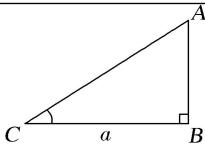</td><td>测得  $BC = a$ , $\angle BCA = C$ , $AB = a \cdot \tan C$ .</td></tr><tr><td rowspan="2">底部不可达</td><td>点  $B$  与  $C$ , $D$  共线</td><td>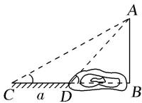</td><td>测得  $CD = a$  及  $C$  与  $\angle ADB$  的度数.先由正弦定理求出  $AC$  或  $AD$ ,再解三角形得  $AB$  的值.</td></tr><tr><td>点  $B$  与  $C$ , $D$  不共线</td><td>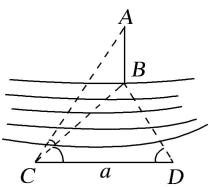</td><td>测得  $CD = a$  及  $\angle BCD$ , $\angle BDC$ , $\angle ACB$  的度数.在 $\triangle BCD$  中由正弦定理求得  $BC$ ,再解三角形得  $AB$  的值.</td></tr></table>

##### 1. 仰角是视线与视线在水平面的射影的夹角.  
##### 2. 高度问题大多通过正(余)弦定理构造直角三角形来解决.

【例 1】（2024·上海）已知点 B 在点 C 正北方向，点 D 在点 C 的正东方向，BC = CD，存在点 A 满足 $\angle BAC = 16.5^{\circ}$ ， $\angle DAC = 37^{\circ}$ ，则 $\angle BCA =$ \_\_\_\_。（精确到 0.1 度）

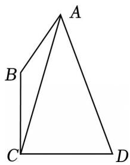

【例 2】(2021·甲卷)2020 年 12 月 8 日, 中国和尼泊尔联合公布珠穆朗玛峰最新高程为 8848.86 (单位: $m$ ), 三角高程测量法是珠峰高程测量方法之一. 如图是三角高程测量法的一个示意图, 现有 $A$ , $B$ , $C$ 三点, 且 $A$ , $B$ , $C$ 在同一水平面上的投影 $A'$ , $B'$ , $C'$ 满足 $\angle A'C'B'=45^\circ$ , $\angle A'B'C'=60^\circ$ . 由 $C$ 点测得 $B$ 点的仰角为 $15^\circ$ , $BB'$ 与 $CC'$ 的差为 100; 由 $B$ 点测得 $A$ 点的仰角为 $45^\circ$ , 则 $A$ , $C$ 两点到水平面 $A'B'C'$ 的高度差 $AA'-CC'$ 约为 $(\quad)(\sqrt{3} \approx 1.732)$

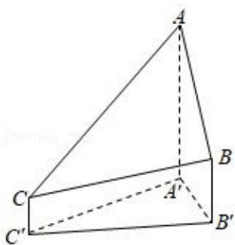

$\quad$A. 346

$\quad$B. 373

$\quad$C. 446

$\quad$D. 473

# 考向 3 范围问题

解三角形的一类取值范围题型，我们分类为求单元素（边或角的取值范围）和比值类范围问题两种。一般采取正弦定理实现边角互换后消元保留成要求元素的函数关系式，角度和边长问题利用三角函数的有界性求值域。分式齐次化问题也是相同的处理。下面我们分析一下锐角三角形的角度范围的限定方式：

##### 1. 锐角三角形的角度限定

（1）若锐角 $\triangle ABC$ 的定角 $A(0 < A < \frac{\pi}{2})$ ，则 $\left\{ \begin{array}{l} 0 < B < \frac{\pi}{2} \\ 0 < C = \pi - A - B < \frac{\pi}{2} \end{array} \right.$

（2）若锐角 $\triangle ABC$ 的定角 $A(0 < A < \frac{\pi}{2})$ ，若 $B = 2A$ ，则 $\left\{ \begin{array}{l}0 < A < \frac{\pi}{2}\\ 0 < B = 2A < \frac{\pi}{2}\\ 0 < C = \pi -A - B = \pi -3A < \frac{\pi}{2} \end{array} \right.$

（3）若锐角 $\triangle ABC$ 的定角 $A(0 < A < \frac{\pi}{2})$ ，若 $\sin A = \lambda \sin B$ ，则 $\sin B = \frac{1}{\lambda} \sin A < \frac{1}{\lambda}$ ，可推出 $B$ 的范围.

##### 2. 齐次式的处理

（1）锐角三角形 $\triangle ABC$ 中处理齐次式 $\frac{b}{a}$ 类型，可以先通过正弦定理进行边角互换，即 $\frac{b}{a} = \frac{\sin B}{\sin A} = \frac{\sin[\pi - (A + C)]}{\sin A} = \frac{\lambda \sin A + \mu \cos A}{\sin A} = \lambda + \frac{\mu}{\tan A}$ （角 $C$ 为定值， $\lambda$ 和 $\mu$ 为常数），用角度的限定方法求出角 $A$ 的范围即可.

（2）锐角三角形 $\triangle ABC$ 中处理非齐次式 $\frac{bc}{a}$ 类型，若知道三角形外接圆半径，根据正弦定理得到 $\frac{bc}{a} = \frac{2R\sin B\cdot 2R\sin C}{2R\sin A} = \frac{\lambda\sin C}{\sin A}$ （角 $B$ 为定值， $\lambda$ 为常数），后续处理转化为齐次化.

# 题型 1 单元素范围

【例 1】已知在锐角三角形 ABC 中，角 A，B，C 所对的边分别为 a，b，c，若 $a = c - 2a \cos B$ ．则角 A 的取值范围是（）

$\quad$A. $(0,\frac{\pi}{4})$

$\quad$B. $(0,\frac{\pi}{6})$

$\quad$C. $\left(\frac{\pi}{6},\frac{\pi}{4}\right)$

$\quad$D. $\left(\frac{\pi}{4},\frac{\pi}{3}\right)$

【例 2】在锐角 $\Delta ABC$ 中， $C=\frac{\pi}{6}$ ，AC=4，则 BC 的取值范围是（）

$\quad$A. $(0, \frac{8\sqrt{3}}{3})$

$\quad$B. $(2\sqrt{3},\frac{8\sqrt{3}}{3})$

$\quad$C. $(2\sqrt{3}, + \infty)$

$\quad$D. $(4,\frac{8\sqrt{3}}{3})$

【例 3】在锐角三角形 ABC 中， $B = 60^{\circ}$ ，AB = 2，则 AB 边上的高的取值范围是（）

$\quad$A. $\left(\frac{\sqrt{3}}{4},2\right)$

$\quad$B. $\left(\frac{\sqrt{3}}{4},\sqrt{3}\right)$

$\quad$C. $(\frac{\sqrt{3}}{2},\sqrt{3})$

$\quad$D. $(\frac{\sqrt{3}}{2}, 2\sqrt{3})$

# 题型 2 比值类范围

【例 1】在锐角 $\Delta ABC$ 中，若 B = 2A，则 $\frac{\sin A}{\sin B}$ 的取值范围是（）

$\quad$A. $(\sqrt{2},\sqrt{3})$

$\quad$B. $[- \frac{1}{2}, \frac{1}{2}]$

$\quad$C. $\left(\frac{\sqrt{3}}{3},\frac{\sqrt{2}}{2}\right)$

$\quad$D. $\left(-\frac{1}{2},\frac{1}{2}\right)$

【例 2】在锐角 $\Delta ABC$ 中，角 A, B, C 的对边分别为 a, b, c, S 为 $\Delta ABC$ 的面积，且 $2S = a^{2} - (b - c)^{2}$ ，则 $\frac{b^{2} + c^{2}}{bc}$ 的取值范围为（）

$\quad$A. $\left(\frac{34}{15},\frac{41}{15}\right)$

$\quad$B. $[2, \frac{41}{15})$

$\quad$C. $[2,\frac{34}{15})$

$\quad$D. $[2, +\infty)$

【例 3】已知锐角 $\Delta ABC$ 的内角 A，B，C 所对的边分别为 a，b，c，若 $a\cos B - b\cos 2A = c$ 且 $\Delta ABC$ 外接圆半径为 2，则 $\frac{a^{2}}{b + c}$ 的取值范围是（）

$\quad$A. $[2\sqrt{3},4)$

$\quad$B. $[2\sqrt{3},6)$

$\quad$C. $[\sqrt{3},2)$

$\quad$D. $[\sqrt{3},4)$

# 拓展思维

# 拓展 1 托勒密定理

圆内接四边形之托勒密定理

托勒密定理：在圆内接四边形中，两条对角线的乘积等于两组对边乘积之和.

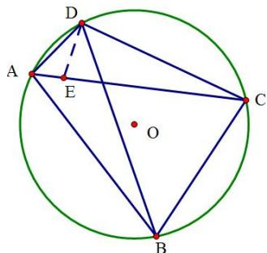

如图上，设四边形ABCD内接于圆 $O$ ，则有 $AB\cdot CD + AD\cdot BC = AC\cdot BD$

【证明】

广义托勒密定理：在四边形ABCD中，有 $AB\cdot CD + AD\cdot BC\geq AC\cdot BD$ ，当且仅当四边形ABCD四点共圆时，等号成立.

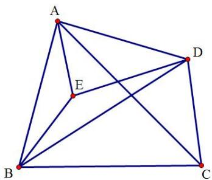

【证明】

【例 1】克罗狄斯·托勒密是古希腊著名数学家、天文学家和地理学家，他在所著的《天文集》中讲述了制作弦表的原理，其中涉及如下定理：任意凸四边形中，两条对角线的乘积小于或等于两组对边乘积之和，当且仅当凸四边形的对角互补时取等号，后人称之为托勒密定理的推论．如图，四边形 ABCD 内接于半径为 $2\sqrt{3}$ 的圆， $\angle A = 120^{\circ}$ ， $\angle B = 45^{\circ}$ ，AB = AD，则四边形 ABCD 的周长为（）

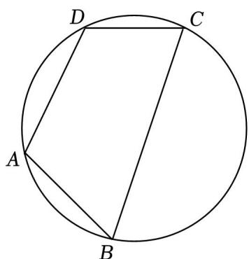

$\quad$A. $4\sqrt{3} + 6\sqrt{2}$

$\quad$B. $10 \sqrt{3}$

$\quad$C. $4\sqrt{3} + 4\sqrt{2}$

$\quad$D. $4\sqrt{3} + 5\sqrt{2}$

【例 2】克罗狄斯·托勒密 (Ptolemy) 所著的《天文集》中讲述了制作弦表的原理，其中涉及如下定理：任意凸四边形中，两条对角线的乘积小于或等于两组对边乘积之和，当且仅当对角互补时取等号．根据以上材料，完成下题：如图，半圆 O 的直径为 2，A 为直径延长线上的一点，OA = 2，B 为半圆上一点，以 AB 为一边作等边三角形 ABC，则当线段 OC 的长取最大值时， $\angle AOC =$ \_\_\_\_.

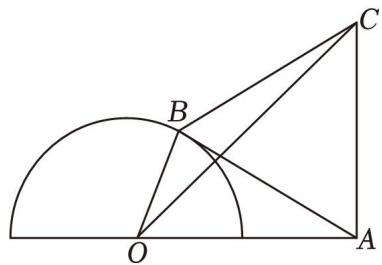

