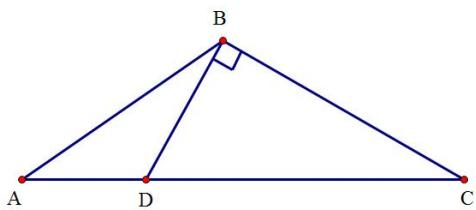
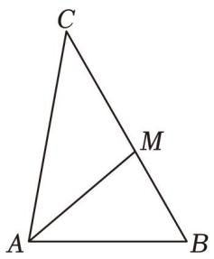
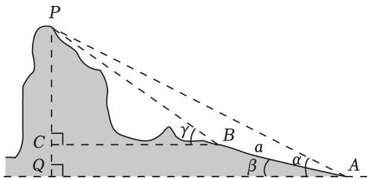
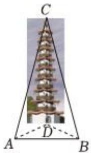

# 第一节 跟踪训练

# 考向 1 跟踪训练

【训练 1】（2023·全国）在 $\Delta ABC$ 中，A=2B，a=6，b=4，则 $\cos B=$ \_\_\_\_.

【训练 2】(2017•新课标 II) $\Delta ABC$ 的内角 A, B, C 的对边分别为 a, b, c，若 $2b\cos B = a\cos C + c\cos A$ ，则 B = \_\_\_\_.

【训练 3】（2019•新课标Ⅱ） $\Delta ABC$ 的内角 A，B，C 的对边分别为 a，b，c．若 b=6，a=2c， $B=\frac{\pi}{3}$ ，则 $\Delta ABC$ 的面积为\_\_\_\_.

【训练 4】（2018•新课标 I） $\Delta ABC$ 的内角 A，B，C 的对边分别为 a，b，c．已知 $b\sin C + c\sin B = 4a\sin B\sin C$ ， $b^{2} + c^{2} - a^{2} = 8$ ，则 $\Delta ABC$ 的面积为 \_\_\_\_.

【训练 5】(2019•新课标 I) $\Delta ABC$ 的内角 A, B, C 的对边分别为 a, b, c. 已知 $a \sin A - b \sin B = 4c \sin C$ , $\cos A = -\frac{1}{4}$ , 则 $\frac{b}{c} = (\quad)$

$\quad$A. 6

$\quad$B. 5

$\quad$C. 4

$\quad$D. 3

【训练6】在 $\Delta ABC$ 中， $a = 6$ ， $b = 8$ ， $\angle A = 40^{\circ}$ ，则 $\angle B$ 的解的个数是（

$\quad$A. 0 个

$\quad$B. 2 个

$\quad$C. 1 个

$\quad$D. 1个或2个

【训练 7】在 $\Delta ABC$ 中，角 A, B, C 所对的边分别为 a, b, c. 若 $B = \frac{\pi}{3}$ , a = 4，且该三角形有两解，则 b 的范围是（）

$\quad$A. $(2\sqrt{3}, + \infty)$

$\quad$B. $(2\sqrt{3},4)$

$\quad$C. $(0,4)$

$\quad$D. $(3\sqrt{3},4)$

【训练8】设 $\Delta ABC$ 的内角 $A, B, C$ 的对边分别为 $a, b, c$ ，若 $b^{2} = c^{2} + a^{2} - ca$ ，且 $\sin A = 2\sin C$ ，则 $\Delta ABC$ 的形状为（）

$\quad$A. 锐角三角形

$\quad$B. 直角三角形

$\quad$C. 钝角三角形

$\quad$D. 等腰三角形

【训练9】 $\Delta ABC$ 中，角 $A, B, C$ 的对边分别为 $a, b, c$ ，且 $(a \cos B + b \cos A) \cos C = 2a \cos^2 \frac{C}{2} - a$ ， $\Delta ABC$ 为（）

$\quad$A. 等腰三角形

$\quad$B. 直角三角形

$\quad$C. 等腰或直角三角形

$\quad$D. 等腰直角三角形

【训练10】在 $\Delta ABC$ 中，角 $A, B, C$ 所对的边分别为 $a, b, c$ ，已知 $2\cos B(a\cos C + c\cos A) = b$ ， $\sin C = \frac{\sqrt{3}}{2}$ ，则 $\Delta ABC$ 的形状为（）

$\quad$A. 等腰三角形

$\quad$B. 直角三角形

$\quad$C. 等边三角形

$\quad$D. 等腰直角三角形

# 考向 2 跟踪训练

【训练 1】已知 $\Delta ABC$ 中，AB = 5， $AC = \sqrt{15}$ ，AD 为边 BC 的中线，且 AD = 4，则 BC 边的长为（）

$\quad$A. 3

$\quad$B. $3\sqrt{2}$

$\quad$C. $2\sqrt{3}$

$\quad$D. 4

【训练2】在中 $\triangle ABC$ ，角 $A$ ， $B$ ， $C$ 所对的边分别为 $a$ ， $b$ ， $c$ ， $\angle ABC = 120^{\circ}$ ， $BD\bot BC$ 交 $AC$ 于点 $D$ 且 $BD = 1$ ，则 $2a + c$ 的最小值为

【训练 3】在 $\Delta ABC$ 中， $\angle BAC = 120^{\circ}$ ，AB = 2，AC = 3，D 为 BC 上一点，AD 为 $\angle BAC$ 的角平分线，则 AD = \_\_\_\_.

【训练 4】在 $\Delta ABC$ 中，AM 是 $\angle BAC$ 的角平分线，且交 BC 于 M．已知 $AM = 2\sqrt{3}$ ，BM = 2，MC = 3，则 AC = \_\_\_\_.

【训练 5】如图，在山脚 A 测得山顶 P 的仰角为 $\alpha$ ，沿倾斜角为 $\beta$ 的斜坡向上走 a 米到 B，在 B 处测得山顶 P 的仰角为 $\gamma$ ，则山高 $h = (\quad)$

$\quad$A. $\frac{a\cos\alpha\sin(\gamma-\alpha)}{\sin(\gamma-\beta)}$

$\quad$B. $\frac{a\sin\alpha\sin(\gamma - \alpha)}{\sin(\gamma - \beta)}$

$\quad$C. $\frac{a\cos\alpha\sin(\gamma-\beta)}{\sin(\gamma-\alpha)}$

$\quad$D. $\frac{a\sin\alpha\sin(\gamma - \beta)}{\sin(\gamma - \alpha)}$

【训练 6】《中国建筑史》（梁思成著）载：“大雄殿之左侧白塔凌空，高十三级，甚峻拔．“该塔位于蓬溪县赤城镇白塔街，坐西向东，为四方形楼阁式砖石塔，塔身白色，共十三层，自宋代始建以来至今已800余年，充分体现了中国传统建筑技术水平．某数学兴趣小组为了测得塔高，如图，在A点测得塔底位于北偏东60°方向上的点D处，塔顶C的仰角为30°，在A的正东方向且距D点44m的B点测得塔底位于北偏西45°方向上(A，B，D在同一水平面)，则塔的高度CD约为( )（参考数据： $\sqrt{6}\approx2.45$ ）

$\quad$A. $42m$

$\quad$B. 45m

$\quad$C. 36m

$\quad$D. 38m

# 考向 3 跟踪训练

【训练 1】锐角 $\Delta ABC$ 中，角 A, B, C 的对边分别为 a, b, c，若 $c^{2}=a(a+b)$ ，则 $\sin A$ 的取值范围是（）

$\quad$A. $(0, \frac{\sqrt{2}}{2})$

$\quad$B. $\left(\frac{1}{2},\frac{\sqrt{2}}{2}\right)$

$\quad$C. $\left(\frac{1}{2},\frac{\sqrt{3}}{2}\right)$

$\quad$D. $(0, \frac{\sqrt{3}}{2})$

【训练 2】在锐角 $\Delta ABC$ 中，角 A, B, C 的对边分别为 a, b, c, b=2, $C=\frac{\pi}{3}$ ，则 c 的取值范围为（）

$\quad$A. $(2,2\sqrt{3})$

$\quad$B. $(2\sqrt{3}, + \infty)$

$\quad$C. $(\sqrt{3},2\sqrt{3})$

$\quad$D. $(2, +\infty)$

【训练 3】在锐角三角形 ABC 中， $B = 60^{\circ}$ ，AB = 1，则 AB 边上的高的取值范围是（）

$\quad$A. $\left(\frac{\sqrt{3}}{4},1\right)$

$\quad$B. $\left(\frac{\sqrt{3}}{4},\frac{\sqrt{3}}{2}\right)$

$\quad$C. $(\frac{\sqrt{3}}{2}, \sqrt{3})$

$\quad$D. $\left(\frac{\sqrt{3}}{4},\sqrt{3}\right)$

【训练 4】在 $\Delta ABC$ 中，若 B = 3A，则 $\frac{b}{a}$ 的取值范围是（）

$\quad$A. $(1,2)$

$\quad$B. $(2,3)$

$\quad$C. $(1,3)$

$\quad$D. $(0,3)$

【训练 5】在锐角 $\Delta ABC$ 中，角 A, B, C 的对边分别为 a, b, c, S 为 $\Delta ABC$ 的面积，且 $a^{2} = 2S + (b - c)^{2}$ ，则 $\frac{2\sin^{2}B + \sin^{2}C}{\sin B\sin C}$ 的取值范围为（）

$\quad$A. $\left(\frac{43}{15},\frac{59}{15}\right)$

$\quad$B. $\left[2\sqrt{2},\frac{43}{15}\right)$

$\quad$C. $[2\sqrt{2},\frac{59}{15})$

$\quad$D. $[2\sqrt{2}, +\infty)$

【训练 6】锐角 $\Delta ABC$ 中，角 A, B, C 的对边分别为 a, b, c，若 $c^{2}=a(a+b)$ ，则 $\frac{\sin^{2}A}{\sin(C-A)}$ 的取值范围是（）

$\quad$A. $(0, \frac{\sqrt{2}}{2})$

$\quad$B. $\left(\frac{1}{2},\frac{\sqrt{2}}{2}\right)$

$\quad$C. $\left(\frac{1}{2},\frac{\sqrt{3}}{2}\right)$

$\quad$D. $(0, \frac{\sqrt{3}}{2})$

