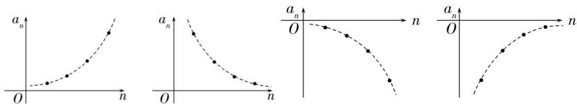
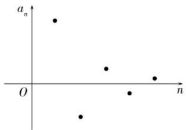

# 数列第3节 等比数列

# 考向一 等比数列的概念及通项公式

# 知识点一 等比数列的概念

##### 1. 定义: 一般地, 如果一个数列从第二项起, 每一项与它的前一项的比都等于同一个常数, 那么这个数列叫做等比数列, 这个常数叫做等比数列的公比, 通常用字母 $q$ 表示 $(q \neq 0)$ .  
##### 2. 递推公式形式的定义: $\frac{a_n}{a_{n-1}} = q (n \in N^*$ 且 $n \geq 2$ ( $\frac{a_{n+1}}{a_n} = q$ , $n \in N^*$ ).

# 知识点二 等比中项

如果在 a 与 b 中间插入一个数 G，使 a, G, b 成等比数列，那么 G 叫做 a 与 b 的等比中项，此时， $G^{2}=ab$ .

注: ①并非任何两数总有等比中项. 仅当实数 $a, b$ 同号, 即 $ab > 0$ 时, 实数 $a, b$ 存在等比中项. 对同号两实数 $a, b$ 的等比中项不仅存在, 而且有一对互为相反数的等比中项 $G = \pm \sqrt{ab}$ . 也就是说, 两实数要么没有等比中项 (非同号时), 如果有, 必有一对 (同号时). 在遇到三数或四数成等差数列时, 常优先考虑选用 “中项关系” 转化求解.

② $G^{2}=ab$ 是 a、G、b 成等比数列的必要不充分条件.

# 知识点三 等比数列的通项公式

若等比数列 $\{a_{n}\}$ 的首项为 $a_{1}$ ，公比为q，则 $a_{n}=a_{1}\cdot q^{n-1}(n\in\mathbf{N}^{*})$ .

# 知识点四 从函数观点看等比数列——等比数列与指数函数

# 1. 等比数列的图象

对于等比数列 $\{a_{n}\}$ ，通项公式 $a_{n} = a_{1}q^{n - 1} = \frac{a_{1}}{q}\cdot q^{n}$ 。当 $q\neq 1$ 且 $a_1\neq 1$ 时，它们都是一个非零常数 $c(c = \frac{a_1}{q})$ 与指数函数 $y = q^x$ 的乘积： $y = cq^x$ 。

由指数函数 $y=q^{x}$ 的图象可以得出 $y=cq^{x}$ 的图象，而 $y=cq^{x}$ 的图象上横坐标为正整数 n 的孤立点 $(n, a_{n})$ 组成如下图等比数列的图象.

当等比数列的公比 q=1 时等比数列的各项都为常数 $a_{1}$ ，其图象是一系列从左至右呈水平状的孤立点.

# 2. 等比数列的单调性

（1）已知等比数列 $\{a_{n}\}$ 的首项为 $a_{1}$ ，公比为 q，则

①当 $\left\{\begin{aligned}a_{1}&>0\\ q&>1\end{aligned}\right.$ 或 $\left\{\begin{aligned}a_{1}&<0\\ 0&<q<1\end{aligned}\right.$ 时， $\{a_{n}\}$ 是递增数列；②当 $\left\{\begin{aligned}a_{1}&>0\\ 0&<q<1\end{aligned}\right.$ 或 $\left\{\begin{aligned}a_{1}&<0\\ q&>1\end{aligned}\right.$ 时， $\{a_{n}\}$ 是递减数列；

③当 q=1 时， $\{a_{n}\}$ 为常数列 $(a_{n}\neq0)$ .

（2）对于等比数列 $\{a_{n}\}$ ，借助函数 $y=cq^{n}$ 的性质，可分析等比数列 $\{a_{n}\}$ 的增减性如下表.

<table><tr><td> $a_1$ </td><td colspan="3"> $a_1>0$ </td><td colspan="3"> $a_1<0$ </td></tr><tr><td> $q$ 的范围</td><td> $0<q<1$ </td><td> $q=1$ </td><td> $q>1$ </td><td> $0<q<1$ </td><td> $q=1$ </td><td> $q>1$ </td></tr><tr><td>数列 $\{a_n\}$ 的增减性</td><td>递减数列</td><td>常数列</td><td>递增数列</td><td>递增数列</td><td>常数列</td><td>递减数列</td></tr></table>

（3）等比数列 $\{a_{n}\}$ ，当公比q<0时，是摆动数列，即不递增也不递减，所有的奇数项（偶数项）同号，奇数项与偶数项异号，反应在图象上是一系列上下波动的孤立的点(如图)

注：常数列不一定是等比数列，只有非零常数列才是公比为1的等比数列.

# 知识点五 等比数列通项公式的推广和变形

##### 1. 通项公式变形

等比数列 $\{a_{n}\}$ 的公比为 $q$ ，则

① $q^{n-m}=\frac{a_{n}}{a_{m}}$ ，可用来由等比数列任两项求公比.   
② $a_{n}=a_{m}\cdot q^{n-m}$ ，可以用来利用任一项及公比直接得到通项公式，不必求 $a_{1}$ .

证明： $\because a_{n} = a_{1}\cdot q^{n - 1},a_{m} = a_{1}\cdot q^{m - 1},\therefore \frac{a_{n}}{a_{m}} = \frac{a_{1}\cdot q^{n - 1}}{a_{1}\cdot q^{m - 1}} = q^{n - m},\therefore a_{n} = a_{m}\cdot q^{n - m}.$

由上可知，等比数列的通项公式可以用数列中的任一项与公比来表示，通项公式

$a_{n}=a_{1}\cdot q^{n-1}(n\in N^{*},a_{1}\cdot q\neq0)$ 可以看成是 m=1 时的特殊情况.

③ $q^{n}=\frac{a_{n}}{a_{1}}$ ，已知首项，末项，公比即可计算出项数.

##### 2. 基本量法

（1）等比数列可以由首项 $a_1$ 和公比 $q$ 确定，我们把 $a_1$ 和 $q$ 称为基本量，所有关于等比数列的计算和证明，都可围绕 $a_1$ 和 $q$ 进行.在基本量法中，不拘泥于 $a_1$ ，有 $a_m$ 可以直接用 $a_m$ ：

解题时没有思路了，可以回归基本量法.

（2） 求等比数列的通项公式的两种思路:

①设出基本量 $a_{1}$ 、 $q$ ，利用条件构建方程组，通过两式相除法或者代入消元法求出 $a_{1}$ ， $q$ ，即可写出等比数列 $\{a_{n}\}$ 的通项公式；

②已知等比数列中的两项 $a_{n}, a_{m} (n, m \in \mathbf{N}^{*}, n \neq m)$ 时，则 $\left\{ \begin{array}{l} a_{n} = a_{1} q^{n - 1} \\ a_{m} = a_{1} q^{m - 1} \end{array} \right. \Rightarrow \frac{a_{n}}{a_{m}} = q^{n - m}$ 可不必求 $a_{1}$ 而直接写出等比数列 $\{a_{n}\}$ 的通项公式.

③设项技巧——对称设项

(i) 三个数成等比数列可设为: $\frac{a}{q}$ , $a$ , $aq$ 或 $a$ , $aq$ , $aq^{2}$ ;  
（ii）四个数成等比数列可设为： $\frac{a}{q^3}$ ， $\frac{a}{q}$ ， $aq$ ， $aq^3$ 或 $a$ ， $aq$ ， $aq^2$ ， $aq^3$

【例 1】(2022·乙卷理)已知等比数列 $\left\{a_{n}\right\}$ 的前 3 项和为 168， $a_{2}-a_{5}=42$ ，则 $a_{6}=(\quad)$

$\quad$A. 14

$\quad$B. 12

$\quad$C. 6

$\quad$D. 3

【例 2】（2020·新课标I文）设 $\{a_{n}\}$ 是等比数列，且 $a_{1} + a_{2} + a_{3} = 1$ ， $a_{2} + a_{3} + a_{4} = 2$ ，则 $a_{6} + a_{7} + a_{8} = (\quad)$

$\quad$A. 12

$\quad$B. 24

$\quad$C. 30

$\quad$D. 32

【例 3】（2019•全国 III 卷理）已知各项均为正数的等比数列 $\left\{a_{n}\right\}$ 的前 4 项和为 15，且 $a_{5}=3a_{3}+4a_{1}$ ，则 $a_{3}=$ （）

$\quad$A. 16

$\quad$B. 8

$\quad$C. 4

$\quad$D. 2

# 考向二 等比数列的常用性质

### 一、由等比数列生成新的等比数列

若数列 $\{a_{n}\}$ 是公比为 $q$ 的等比数列，由等比数列的定义可得等比数列具有如下性质：

##### 1. 数列 $\left\{\lambda a_{n}\right\}(\lambda \neq 0)$ 仍是公比为 q 的等比数列；  
##### 2. 数列 $\left\{a_{n}^{\lambda}\right\}$ （ $\lambda$ 为常数）为等比数列；特别地，当 $\lambda = -1$ 时，即 $\left\{\frac{1}{a_{n}}\right\}$ 是公比为 $\frac{1}{q}$ 的等比数列；  
##### 3. 若数列 $\left\{b_{n}\right\}$ 是公比为 $q'$ 的等比数列，则数列 $\left\{a_{n}b_{n}\right\}$ 是公比为 $qq'$ 的等比数列；  
##### 4. 在等比数列 $\{a_{n}\}$ 中，等距离取出若干项也构成一个等比数列，即 $a_{n}, a_{n + k}, a_{n + 2k}, a_{n + 3k} \ldots$ 为等比数列，公比为 $q^{k}$ .

### 二、等差数列与等比数列的联系

##### 1. 若数列 $\{a_{n}\}$ 是公差为 $d$ 的等差数列，则数列 $\{b^{a_n}\}$ （ $b > 0$ 且 $b \neq 1$ ）是公比为 $b^d$ 的等比数列.

##### 2. 若数列 $\{a_{n}\}$ 是公比为 q 等比数列，则数列 $\{\log_{b}|a_{n}|\}$ （b>0 且 $b\neq1$ ）公差为 $\log_{b}|q|$ 的等差数列.

##### 3. 如果数列 $\{a_{n}\}$ 既成等差数列又成等比数列, 那么数列 $\{a_{n}\}$ 是非零常数数列; 但数列 $\{a_{n}\}$ 是常数数列仅是数列既成等差数列又成等比数列的必要非充分条件.

### 三、项的性质

##### 1. 对称性：若 $m + n = p + q$ ，则 $a_{m}a_{n} = a_{p}a_{q}$ ；若 $m + n = 2k$ ，则 $a_{m} \cdot a_{n} = a_{k}^{2}$ .

推广：①若 $m+n+t=p+q+r$ ，则 $a_{m}a_{n}a_{t}=a_{p}a_{q}a_{r}$ ．②有穷等比数列中，与首末两项等距离的两项之积都相等，都等于首末两项的积： $a_{1}\cdot a_{n}=a_{2}\cdot a_{n-1}=\cdots=a_{m}\cdot a_{n+1-m}$ .

##### 2. 若 $m, n, p$ 成等差数列，则 $a_{m}, a_{n}, a_{p}$ 成等比数列.

##### 3.等比性质： $\frac{a_{m_1 + k} + a_{m_2 + k} + \cdots a_{m_n + k}}{a_{m_1} + a_{m_2} + \cdots a_{m_n}} = q^k.$

##### 例如：① $\frac{a_{3}+a_{6}+\cdots a_{99}}{a_{2}+a_{5}+\cdots a_{98}}=q$ ；② $\frac{a_{3}+a_{6}+\cdots a_{99}}{a_{1}+a_{4}+\cdots a_{97}}=q^{2}$ ；③ $\frac{a_{7}+a_{8}+a_{9}}{a_{4}+a_{5}+a_{6}}=q^{3}$ ； $\frac{a_{7}+a_{8}+a_{9}}{a_{1}+a_{2}+a_{3}}=q^{6}$

【例 1】已知 $\{a_{n}\}$ 为正项等比数列，若 $lga_{2}, lga_{2024}$ 是函数 $f(x)=3x^{2}-12x+9$ 的两个零点，则 $a_{1}a_{2025}=(\quad)$

$\quad$A. 10

$\quad$B. $10^{4}$

$\quad$C. $10^{8}$

$\quad$D. $10^{12}$

##### 【例2】在等比数列 $\{a_{n}\}$ 中， $a_1 + a_2 + \ldots +a_8 = \frac{12}{5}$ ， $a_4a_5 = -\frac{2}{5}$ ，则 $\frac{1}{a_1} +\frac{1}{a_2} +\ldots +\frac{1}{a_8} = (\quad)$

$\quad$A.-6

$\quad$B. $-\frac{24}{25}$

$\quad$C. $\frac{14}{5}$

$\quad$D. 2

【例 3】在各项均为正数的等比数列 $\left\{a_{n}\right\}$ 中， $a_{6}^{2}+2a_{5}a_{9}+a_{8}^{2}=25$ ，则 $a_{6}a_{8}$ 的最大值是（）

$\quad$A. 25

$\quad$B. 5

$\quad$C. $\frac{25}{4}$

$\quad$D. $\frac{2}{5}$

# 考向三 等比数列的前 $n$ 项和公式及其性质

<table><tr><td>已知量</td><td>首项、公比与项数</td><td>首项、公比与末项</td></tr><tr><td>求和公式</td><td> $S_n = \begin{cases} \dfrac{a_1(1-q^n)}{1-q} (q \ne 1), \\ na_1(q=1) \end{cases}$ </td><td> $S_n = \begin{cases} \dfrac{a_1 - a_n q}{1-q} (q \ne 1), \\ na_1(q=1) \end{cases}$ </td></tr></table>

##### 1. 推导方法:

由等比数列的定义，有 $\frac{a_2}{a_1} = \frac{a_3}{a_2} = \dots = \frac{a_n}{a_{n - 1}} = q$

根据等比性质，有 $\frac{a_2 + a_3 + \cdots + a_n}{a_1 + a_2 + \cdots + a_{n - 1}} = \frac{S_n - a_1}{S_n - a_n} = q\Rightarrow (1 - q)S_n = a_1 - a_nq$

∴当 $q\neq1$ 时， $S_{n}=\frac{a_{1}-a_{n}q}{1-q}$ 或 $S_{n}=\frac{a_{1}(1-q^{n})}{1-q}$ .

##### 2. 基本量法

（1）对于等比数列问题一般要给出两个条件，可以通过列方程求出 $a_1$ ， $q$ 。如果再给出第三个条件就可以完成 $a_n$ ， $a_1$ ， $q$ ， $n$ ， $S_n$ 的“知三求二”问题。这体现了利用方程思想通过两式相除法或代入消元法求出基本量解决问题。解题时没有思路了，可以考虑“回归基本量法”。

注：往往要用到乘法公式 $a^2 - b^2 = (a + b)(a - b)$ ， $a^3 - b^3 = (a + b)(a^2 - ab + b^2)$ .

（2） 和式代换法: 将 $S_{n}$ 层的计算先降维到 $a_{n}$ 层, 再进行下一步计算

① $a_{n}=\left\{\begin{aligned}S_{1}&\quad,n=1\\ S_{n}-S_{n-1},&n\geq2\end{aligned}\right.$ ; ② $S_{n}-S_{m}=a_{m+1}+a_{m+2}+\cdots+a_{n}$ .

##### 3. 前 $n$ 项和 $S_{n}$ 的常用性质

① $S_{m+n}=S_{m}+q^{m}S_{n}=S_{n}+q^{n}S_{m}$ . 例如： $S_{10}=S_{5}+q^{5}S_{5}$ ;

证明： $S_{m+n}=S_{m}+a_{m+1}+\cdots+a_{m+n}$

而 $a_{m+1}+\cdots+a_{m+n}=a_{1}q^{m}+a_{2}q^{m}+\cdots+a_{n}q^{m}=(a_{1}+a_{2}+\cdots+a_{n})q^{m}=S_{n}q^{m}$ ，于是 $S_{m+n}=S_{m}+q^{m}S_{n}$

特别地， $S_{n + 1} = a_1 + qS_n$

② $S_{m}, S_{2m} - S_{m}, S_{3m} - S_{2m}$ ，…构成公比为 $q^{m}$ 的等比数列 ( $q \neq -1$ ).

若 $a_{1}+a_{2}+\cdots+a_{m}=S_{m},a_{m+1}+a_{m+2}+\cdots+a_{2m}=S_{2m}-S_{m},$

$a_{2m+1} + a_{2m+2} + \cdots + a_{3m} = S_{3m} - S_{2m}, \cdots$ ，则 $S_{m}, S_{2m} - S_{m}, S_{3m} - S_{2m}, \cdots$ 成公比为 $q^{m}$ 的等比数列.

##### 4. $S_{\text {奇}}$ 与 $S_{\text {偶}}$ 的性质

等比数列 $\{a_{n}\}$ 中，所有奇数项之和 $S_{\text{奇}}$ 与所有偶数项之和 $S_{\text{偶}}$ 具有的性质，设公比为 $q$ 。

（1）若共有2n项，则 $\frac{S_{偶}}{S_{奇}}=q$ ；（2）若共有 $2n+1$ 项， $\frac{S_{奇}-a_{1}}{S_{偶}}=q$ 。

【例 1】（2020•新课标II文）记 $S_{n}$ 为等比数列 $\{a_{n}\}$ 的前 n 项和．若 $a_{5}-a_{3}=12,\quad a_{6}-a_{4}=24$ ，则 $\frac{S_{n}}{a_{n}}=(\quad)$

$\quad$A. $2^{n} - 1$

$\quad$B. $2 - 2^{1 - n}$

$\quad$C. $2-2^{n-1}$

$\quad$D. $2^{1-n}-1$

【例 2】（2020•新课标 II）数列 $\{a_{n}\}$ 中， $a_{1}=2,\quad a_{m+n}=a_{m}a_{n}$ ．若 $a_{k+1}+a_{k+2}+\ldots+a_{k+10}=2^{15}-2^{5}$ ，则 $k=(\infty)$

$\quad$A. 2

$\quad$B. 3

$\quad$C. 4

$\quad$D. 5

【例 3】（2019•全国 1）记 $S_{n}$ 为等比数列 $\{a_{n}\}$ 的前 n 项和．若 $a_{1}=\frac{1}{3}$ ， $a_{4}^{2}=a_{6}$ ，则 $S_{5}=$ \_\_\_\_.

【例 4】在等比数列 $\{a_{n}\}$ 中，已知前 n 项和 $S_{n}=2^{n}+a$ ，则 a 的值为（）

$\quad$A. 1

$\quad$B. -1

$\quad$C. 2

$\quad$D.-2

【例 5】（2021·甲卷文）记 $S_{n}$ 为等比数列 $\left\{a_{n}\right\}$ 的前 n 项和. 若 $S_{2}=4$ ， $S_{4}=6$ ，则 $S_{6}=$ （）

$\quad$A. 7

$\quad$B. 8

$\quad$C. 9

$\quad$D. 10

【例 6】设等比数列 $\{a_{n}\}$ 的前 n 项和为 $S_{n}$ ，若 $\frac{S_{3}}{S_{6}} = 3$ ，则 $\frac{S_{6}}{S_{9}} = (\quad)$

$\quad$A. 2

$\quad$B. $\frac{8}{3}$

$\quad$C. $\frac{3}{7}$

$\quad$D. 3

# 考向四 等比数列的判定方法

##### 1. 定义法：若 $\frac{a_{n+1}}{a_{n}} = q$ (q 为非零常数) 或 $\frac{a_{n}}{a_{n-1}} = q$ (q 为非零常数且 $n \geq 2$ )，则 $\left\{a_{n}\right\}$ 是等比数列.  
##### 2. 等比中项法：若数列 $\{a_{n}\}$ 中 $a_{n} \neq 0$ 且 $a_{n+1}^{2} = a_{n} \cdot a_{n+2} (n \in \mathbf{N}^{*})$ ，则数列 $\{a_{n}\}$ 是等比数列.  
##### 3. 通项公式法：若数列通项公式可写成 $a_{n} = c \cdot q^{n-1}(c, q$ 均为不为0的常数， $n \in \mathbf{N}^{*})$ ，则 $\{a_{n}\}$ 是等比数列.  
##### 4. 前 $n$ 项和法：若数列 $\{a_{n}\}$ 的前 $n$ 项和 $S_{n} = k \cdot q^{n} - k (k$ 为常数且 $k \neq 0, q \neq 0,1)$ ，则 $\{a_{n}\}$ 是等比数列.

需要说明的是：对于方法（1）、（2）适用于任何题型，强调推理过程，而方法（3）、（4）适合于选择、填空题，强调结论的应用，若要判定一个数列不是等比数列，则只需判定存在连续三项不成等比即可.

##### 5. 常见的等比数列

（1）若 $S_{n}=A\cdot q^{n}+B$ ，当 $A+B=0$ 时， $\{a_{n}\}$ 是等比数列；当 $A+B\neq0$ 时， $\{a_{n}\}$ 是从第二项开始的等比数列.  
（2） $S_{n} = Aa_{n} + B$ （ $A \neq 1$ ），则 $\{a_{n}\}$ 是等比数列.  
（3）若 $S_{n} = Aa_{n + 1} + B$ （ $A\neq 0$ ），则 $\{a_n\}$ 是从第二项 $a_2$ 为首项的等比数列.

【例 1】（2019·全国卷Ⅱ）数列 $\{a_{n}\}$ 和 $\{b_{n}\}$ 满足 $a_{1}=1,\quad b_{1}=0,\quad4a_{n+1}=3a_{n}-b_{n}+4,\quad4b_{n+1}=3b_{n}-a_{n}-4$

（1）证明： $\{a_{n}+b_{n}\}$ 是等比数列， $\{a_{n}-b_{n}\}$ 是等差数列；  
（2） 求 $\{a_{n}\}$ 和 $\{b_{n}\}$ 的通项公式.

【例 2】记数列 $\{a_{n}\}$ 的前 n 项和为 $S_{n}$ ，已知 $a_{1}=4,\quad a_{n+1}=\frac{4(n+1)}{2n-1}(S_{n}-1)$ .

（1）证明：数列 $\{\frac{S_n - 1}{2n - 1}\}$ 是等比数列；  
（2） 求 $\{a_{n}\}$ 的通项公式.

【例 3】记 $S_{n}$ 为数列 $\{a_{n}\}$ 的前 n 项和， $T_{n}$ 为数列 $\{S_{n}\}$ 的前 n 项和，已知 $S_{n} + T_{n} = 2$ .

（1）求证：数列 $\{S_{n}\}$ 是等比数列；  
（2） 求数列 $\{a_{n}\}$ 的通项公式.

【例 4】已知数列 $\{a_{n}\}$ 的首项 $a_{1}=\frac{3}{5}, a_{n+1}=\frac{3a_{n}}{2a_{n}+1}(n\in N^{*})$ .

（1）求证：数列 $\left\{\frac{1}{a_n} - 1\right\}$ 是等比数列；  
（2） 求数列 $\{a_{n}\}$ 的通项公式.

# 考向五 等比数列前 $n$ 项和的实际应用

##### 1. 解应用问题的核心是建立数学模型.  
##### 2. 解决应用题的一般步骤:

（1）审题：弄清题意，分清条件和结论，理顺数量关系；

（2）建模：将已知条件翻译成数学（数列）语言，将实际问题转化成数学（数列）问题，弄清该数列的结构和特征；

（3）解模：求解数学模型，得出数学结论；

（4） 还原: 将用数学知识和方法得出的结论, 还原为实际问题的意义.

##### 3. 注意问题是求什么 $(n, a_{n}, S_{n})$ .

注意:

（1）解答数列应用题要注意步骤的规范性：设数列，判断数列，解题完毕要作答.  
（2）在归纳或求通项公式时，一定要将项数 n 计算准确.  
（3）在数列类型不易分辨时，要注意归纳递推关系.  
（4）在近似计算时，要注意应用对数方法，且要看清题中对近似程度的要求.

##### 4. 实际应用题常见的数列模型

（1）储蓄的复利公式：本金为 a 元，每期利率为 r，存期为 n 期，则本利和 $y = a(1 + r)^{n}$ .  
（2）总产值模型：基数为 N，平均增长率为 p，期数为 n，则总产值 $y = N(1 + p)^{n}$ .  
（3）传染病模型：第一天确诊患者数 $a_1$ 人，每个人的传染力为 $q$ ，则经过 $n - 1$ 轮传染后，则患者总人数为 $S_{n} = \frac{a_{1}(1 - q^{n})}{1 - q}$

【例 1】某银行在 2024 年初给出的大额存款的年利率为 3%，某人存入大额存款 $a_{0}$ 元，按照复利计算，10年后得到的本利和为 $a_{10}$ ，下列各数中与 $\frac{a_{10}}{a_{0}}$ 最接近的是()

$\quad$A. 1.31

$\quad$B. 1.32

$\quad$C. 1.33

$\quad$D. 1.34

【例 2】（多选）在流行病学中，基本传染数 $R_{0}$ 是指在没有外力介入，同时所有人都没有免疫力的情况下，一个感染者平均传染的人数。初始感染者传染 $R_{0}$ 个人为第一轮传染，第一轮被传染的 $R_{0}$ 个人每人再传染 $R_{0}$ 个人为第二轮传染，……假设某种传染病的基本传染数 $R_{0}=4$ ，平均感染周期为7天，初始感染者为1人，则( )

$\quad$A. 第三轮被传染人数为 16 人

$\quad$B. 前三轮被传染人数累计为 80 人

$\quad$C. 每一轮被传染的人数组成一个等比数列

$\quad$D. 被传染人数累计达到 1000 人大约需要 35 天

【例 3】某牧场今年初牛的存栏数为 1200，预计以后每年存栏数的增长率为 10%，且每年年底卖出 100 头牛，设牧场从今年起每年年初的计划存栏数依次为 $c_{1}$ ， $c_{2}$ ， $c_{3}$ …， $S_{n}$ 为 $\{c_{n}\}$ 的前 n 项和，则 $S_{6}=$ \_\_\_\_。（结果保留成整数）（参考数据： $1.1^{5}\approx1.611$ ， $1.1^{6}\approx1.771$ ， $1.1^{7}\approx1.949$ ）

