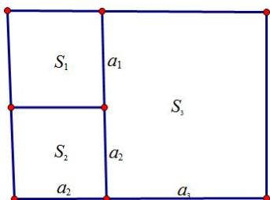
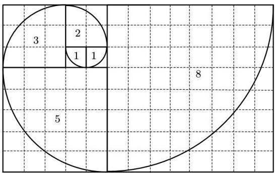

# 第 4 节 数列的递推与通项公式

考向一 利用 $S_{n}$ 与 $a_{n}$ 的关系

##### 1. 关系： $a_{n}=\left\{\begin{aligned}S_{1}&\quad,n=1\\ S_{n}-S_{n-1},&n\geq2\end{aligned}\right.$ ，要注意验证n=1与 $n\geq2$ 两种情况能否统一.  
##### 2. 已知 $S_{n}$ 与 $a_{n}$ 的关系式，记为 $f(a_{n}, S_{n}) = 0$ ，求它的通项公式 $a_{n}$ ，一般有两种思路：

（1）消 $S_{n}$ ：容易直接求 $a_{n}$ 的情况，可利用阶差公式： $S_{n}-S_{n-1}=a_{n}(n\geq2)$ ，消去 $S_{n}$ ，转化为等差或等比数列直接求出 $a_{n}$ ；  
（2） 消 $a_{n}$ : 难以直接求 $a_{n}$ 的情况, 可利用阶差公式: $a_{n} = S_{n} - S_{n-1} (n \geq 2)$ , 消去 $a_{n}$ , 得出 $S_{n}$ 与 $S_{n-1}$ 的递推关系式, 先求出 $S_{n}$ 后, 即可转化为 “第 1 种情形”, 从而间接求出 $a_{n}$ , 如例 3.

在求解具体的题目时，应根据条件灵活恰当地选择两种方法，确定变形方向。通常情况下，先求 $S_{n}$ 要比直接求 $a_{n}$ 麻烦；但也有时先直接求 $a_{n}$ 会比先求 $S_{n}$ 麻烦得多。

### 题型 1 消 $S_{n}$

【例 1】设数列 $\{a_{n}\}$ 的前 n 项和为 $S_{n}$ ，且 $3S_{n}=4a_{n}-2$ ．求数列 $\{a_{n}\}$ 的通项公式.

【例 2】设数列 $\{a_{n}\}$ 的前 n 项和为 $S_{n}$ ， $S_{n}=2a_{n}+2n-6(n\in N^{*})$ ．求数列 $\{a_{n}\}$ 的通项公式.

### 题型2消 $a_{n}$

【例 3】已知数列 $\left\{a_{n}\right\}$ 的前 n 项和为 $S_{n}$ ，且满足 $a_{n} + 2S_{n}S_{n-1} = 0 (n \geq 2)$ ， $a_{1} = \frac{1}{2}$ ，求 $a_{n}$ .

【例 4】在正项数列 $\left\{a_{n}\right\}$ 中， $S_{n}$ 是数列 $\left\{a_{n}\right\}$ 的前 n 项和，且 $a_{n}+\frac{1}{a_{n}}=2S_{n}$ ，求 $a_{n}$ .

# 考向二 累加法

累加法适用于邻项差结构 $a_{n} - a_{n - 1} = f(n)\Leftrightarrow a_{n} = a_{n - 1} + f(n)$

利用 $a_{n}=(a_{n}-a_{n-1})+(a_{n-1}-a_{n-2})+\cdots+(a_{3}-a_{2})+(a_{2}-a_{1})+a_{1}$ ，将问题转化为基本数列求和，

从而得到所求数列的通项．以下①②③为三种累加后可裂项相消求和的题型：

①若 $f(n)$ 是关于 n 的分式函数， $f(n)=\frac{1}{n(n+k)}=\frac{1}{k}\left(\frac{1}{n}-\frac{1}{n+k}\right)$ ;

②若 $f(n)$ 是关于 $n$ 的对数函数， $f(n) = \ln (1 + \frac{1}{n}) = \ln (n + 1) - \ln n$ ；

③若 $f(n)$ 是关于 $n$ 的无理式函数， $f(n) = \frac{1}{\sqrt{n + k} - \sqrt{n}} = \frac{1}{k} (\sqrt{n + k} - \sqrt{n})$ .

④若 $f(n)$ 是关于 n 的一次函数， $f(n)=kn+b$ ，累加后可转化为等差数列求和；

⑤若 $f(n)$ 是关于 n 的二次函数， $f(n)=an^{2}+bn+c$ ，累加后可分组求和；

⑥若 $f(n)$ 是关于 n 的指数函数， $f(n)=p^{n}$ ，累加后可转化为等比数列求和；

【例 1】在数列 $\{a_{n}\}$ 中， $a_{1}=1,\quad a_{n+1}=a_{n}+\frac{1}{n}-\frac{1}{n+1}$ ，求 $a_{n}$ .

【例 2】已知数列 $\{a_{n}\}$ 中， $a_{1}=2,\quad a_{n+1}=a_{n}+\ln(1+\frac{1}{n})$ ，求 $a_{n}$ .

# 考向三 累乘法

累乘法适用于邻项商结构 $\frac{a_n}{a_{n - 1}} = f(n)\Leftrightarrow a_n = a_{n - 1}\cdot f(n),$

利用 $a_{n} = \frac{a_{n}}{a_{n - 1}}\cdot \frac{a_{n - 1}}{a_{n - 2}}\cdot \dots \cdot \frac{a_{3}}{a_{2}}\cdot \frac{a_{2}}{a_{1}}\cdot a_{1}$ ，将问题转化为基本数列求和，从而得到所求数列的通项.

##### 【例1】已知数列 $\{a_{n}\}$ 中， $a_1 = 2$ ， $a_{n + 1} = \frac{n + 2}{n} a_n$ ，求数列 $\{a_{n}\}$ 的通项公式；

【例 2】设 $\{a_{n}\}$ 是首项为1的正项数列， $(n+1)a_{n+1}^{2} + a_{n}a_{n+1} - na_{n}^{2} = 0 \quad (n \in N^{*})$ ，求 $\{a_{n}\}$ 的通项公式.

# 考向四 构造法

### 题型一 一阶线性递推型 $a_{n+1} = ka_n + b$ （ $k \neq 1, b \neq 0$ ）

转化方法:

①待定系数法，令 $a_{n+1}+\lambda=k(a_n+\lambda)$ ，化简整理后与原来的递推式比较系数可知 $k\lambda-\lambda=b$ ，于是 $\lambda=\frac{b}{k-1}$ ，故数列 $\left\{a_n+\frac{b}{k-1}\right\}$ 是以 $a_1+\frac{b}{k-1}$ 为首项，以k为公比的等比数列.

②由 $a_{n+1} = ka_n + b$ 得， $a_n = ka_{n-1} + b$ （ $n \geq 2$ ）两式相减，得 $a_{n+1} - a_n = k(a_n - a_{n-1})$ ，当 $a_2 - a_1 \neq 0$ 时，数列 $\{a_{n+1} - a_n\}$ 是公比为 $k$ 的等比数列.

【例 1】已知数列 $\{a_{n}\}$ 满足 $a_{1}=1,\quad a_{n+1}=2a_{n}+3$ ，则 $a_{9}=$ （）

$\quad$A. $2^{9} - 3$

$\quad$B. $2^{9} + 3$

$\quad$C. $2^{10} - 3$

$\quad$D. $2^{10} + 3$

【例 2】已知数列 $\{a_{n}\}$ 的首项 $a_{1}=\frac{3}{5}, a_{n+1}=\frac{3a_{n}}{2a_{n}+1}(n\in N^{*})$ ，求数列 $\{a_{n}\}$ 的通项公式.

### 题型二 一阶线性递推型 $a_{n+1} = pa_n + qn + r (p \neq 1, q \neq 0)$

转化方法：待定系数法，令 $a_{n + 1} + \alpha (n + 1) + \beta = p(a_n + \alpha n + \beta)$ ，化简整理后与已知递推式比较系数得

$\left\{ \begin{array}{l} (p - 1)\alpha = q \\ (p - 1)\beta - \alpha = r \end{array} \right.$ ，解得 $\left\{ \begin{array}{c}\alpha = \frac{q}{p - 1}\\ \beta = \frac{q}{(p - 1)^2} +\frac{r}{p - 1} \end{array} \right.$ ，从而转化为 $\left\{a_n + \alpha n + \beta \right\}$ 是公比为 $p$ 的等比数列.

【例 1】已知数列 $\{a_{n}\}$ 满足 $a_{1}=\frac{7}{3}$ ， $a_{n+1}=3a_{n}-4n+2$ ，求出数列 $\{a_{n}\}$ 的通项公式.

### 题型三 含指数幂型递推关系式 $a_{n} = ka_{n - 1} + Ap^{n}$ 或 $a_{n} = ka_{n - 1} + Ap^{n - 1}$

转化方法：①等式两边同时除以 $p^n$ ： $\frac{a_n}{p^n} = \frac{k}{p} \cdot \frac{a_{n-1}}{p^{n-1}} + 1$ ，当 $\frac{k}{p} \neq 1$ 时，再构造等比数列求解（题型一）；

②待定系数法，令 $a_{n} + \lambda p^{n} = k(a_{n - 1} + \lambda p^{n - 1})$ ，化简整理得 $a_{n} = ka_{n - 1} + (\frac{k\lambda}{p} -\lambda)p^{n}$ ，与原递推关系式比较系数可得 $\frac{k\lambda}{p} -\lambda = 1$ ，解得 $\lambda = \frac{p}{k - p}$ .对于 $a_{n} = ka_{n - 1} + p^{n - 1}$ ，同理可得 $\lambda = \frac{1}{k - p}$

注意，当 $k = p$ 时，只能构造等差数列，如例2.

【例 1】已知数列 $\{a_{n}\}$ 的前 n 项和为 $S_{n}$ ，满足 $2S_{n}=3a_{n}-2^{n}+1$ ，则数列 $\{a_{n}\}$ 的通项公式为 \_\_\_\_.

【例 2】已知 $\{a_{n}\}$ 数列满足 $a_{1}=2,\quad a_{n+1}-2a_{n}=2^{n+1}$ ，则数列 $\{a_{n}\}$ 的通项公式为\_\_\_\_.

### 题型四 分式型递推关系式 $a_{n+1}=\frac{pa_{n}}{qa_{n}+r}$ .

转化方法：取倒数+待定系数，两边取倒数可得： $\frac{1}{a_{n+1}}=\frac{r}{p}\cdot\frac{1}{a_{n}}+\frac{q}{p}$ ，当 $\frac{r}{p}\neq1$ 时，可转化为题型一中结构，再待定系数构造等比数列即可.

##### 【例6】已知数列 $\{a_{n}\}$ 满足 $a_1 = 1$ ， $a_{n + 1} = \frac{a_n}{2 + 3a_n} (n\in N_+)$ .求证：数列 $\left\{\frac{1}{a_n} +3\right\}$ 为等比数列，并求出数列 $a_{n}$

### 题型五 平方式递推型 $a_{n}^{p} = ra_{n - 1}^{q}$

转化方法: 取对数法, 当数列 $a_{n}$ 和 $a_{n-1}$ 的递推关系涉及到高次时, 一般先对已知递推关系式进行适当的变形 (同加减、同乘除) 整理成类似 $ka_{n} + b = (ka_{n-1} + b)^{2}$ 形式, 将等式两边分别取对数降次得到$\lg (ka_{n} + b) = 2\lg (ka_{n - 1} + b)$ ，数列 $\left\{\lg (ka_n + b)\right\}$ 即为等比数列.

【例 8】已知数列 $\{a_{n}\}$ 满足 $a_{1}=2,a_{n+1}=a_{n}^{2}$ ，则数列 $\{a_{n}\}$ 的通项公式为 $a_{n}=$ \_\_\_\_.

### 题型六 二阶线性递推关系 $a_{n + 1} = pa_n + qa_{n - 1}$ （ $n \geq 2$ ）

转化方法：找到中间项，通过中间项与前一项和后一项的特征，寻求合理的构造方式解决问题.

##### 【例】已知数列 $\{a_{n}\}$ 满足 $a_{n+2}+3a_{n}=4a_{n+1}$ ，且 $a_{2}=5,\quad a_{3}=17$ ，则数列 $\{a_{n}\}$ 的通项公式是\_\_\_\_.

# 考向五 隔项型

# 题型一 隔项等差型 $a_{n + 2} - a_n = d$

##### 1. 分奇偶讨论法：通过对数列下标 n 进行换元，分为奇数项与偶数项两种情况.

①当 n 为奇数时，可令 $n=2k-1\quad(k\in N^{*})$ ，反解得 $k=\frac{n+1}{2}$ ，

于是 $a_{n} = a_{2k - 1} = a_{1} + (k - 1)d = a_{1} + (\frac{n + 1}{2} -1)d = a_{1} + \frac{n - 1}{2} d$

②当 n 为偶数时，可令 $n=2k\quad(k\in N^{*})$ ，反解得 $k=\frac{n}{2}$ ，

于是 $a_{n} = a_{2k} = a_{2} + (k - 1)d = a_{2} + \left(\frac{n}{2} -1\right)d = a_{2} + \frac{n - 2}{2} d.$

综上所述， $a_{n} = \left\{ \begin{array}{ll}a_{1} + \frac{n - 1}{2} d & n\text{为奇数}\\ a_{2} + \frac{n - 2}{2} d & n\text{为偶数} \end{array} \right.$

注意换元后，要将最后的结果还原成关于 $n$ 的表达式.

##### 2. 待定系数法: (此方法限小题) 此类型题由于 $a_{1}$ 和 $a_{2}$ 作为数列奇数项和偶数项首项, 会使得数列一些变形出现一些计算难度, 故可以采用待定系数法来求统一的通项公式, 考虑首项的因素, 需要在原始的待定系数的前面加上 $(-1)^{n}$ . 具体操作如下:

令 $a_{n} = xn + y + z(-1)^{n}$ ，其中 $x = \frac{d}{2}$ ，代入 $n = 1$ 和 $n = 2$ 即可确定 $y$ 和 $z$

【例 1】数列 $\left\{a_{n}\right\}$ 中， $a_{1}=1, a_{2}=4, a_{n}=a_{n-2}+2(n\geq3)$ ，数列 $\left\{a_{n}\right\}$ 的通项公式.

【例 2】(2014•新课标 1 卷理)已知数列 $\{a_{n}\}$ 的前 n 项和为 $S_{n}$ ， $a_{1}=1$ ， $a_{n}\neq0$ ， $a_{n}a_{n+1}=\lambda S_{n}-1$ ，其中 $\lambda$ 为常数.

（1）证明： $a_{n + 2} - a_n = \lambda$   
（2）是否存在 $\lambda$ ，使得 $\{a_{n}\}$ 为等差数列？并说明理由.

### 题型二 隔项等比型 $\frac{a_{n + 2}}{a_n} = q$

##### 1. 分奇偶讨论法：通过对数列下标 $n$ 进行换元，分为奇数项与偶数项两种情况.

①当 n 为奇数时，可令 $n=2k-1\quad(k\in N^{*})$ ，反解得 $k=\frac{n+1}{2}$ ，于是 $a_{n}=a_{2k-1}=a_{1}\cdot q^{k-1}=a_{1}\cdot q^{\frac{n+1}{2}-1}=a_{1}\cdot q^{\frac{n-1}{2}}$ ；
②当 n 为偶数时，可令 $n=2k\quad(k\in N^{*})$ ，反解得 $k=\frac{n}{2}$ ，于是 $a_{n}=a_{2k}=a_{2}\cdot q^{k-1}=a_{2}\cdot q^{\frac{n}{2}-1}=a_{2}\cdot q^{\frac{n-2}{2}}$ .

综上所述， $a_{n} = \left\{ \begin{array}{ll}a_{1}\cdot q^{\frac{n - 1}{2}} & n\text{为奇数}\\ a_{2}\cdot q^{\frac{n - 2}{2}} & n\text{为偶数} \end{array} \right.$

注意换元后，要将最后的结果还原成关于 n 的表达式.

##### 2. 待定系数法： $a_{n}=q^{xn+y+z(-1)^{n}}$ ， $a_{n+1}=q^{x(n+1)+y+z(-1)^{n+1}}$ ， $a_{n}\cdot a_{n+1}=q^{2xn+x+2y}=q^{An+B}$ ，对比系数可得出 $x=\frac{A}{2}$ ， $y=\frac{2B-A}{4}$ ，再代入 $a_{1}$ 即可确定 z．

【例 2】已知数列 $\{a_{n}\}$ 满足 $a_{1}=1, a_{n} \cdot a_{n+1}=2^{n}$ ，求此数列的通项公式.

# 考向六 特征根法与不动点法

##### 1. 不动点的概念：对于函数 $y = f(x)$ ，我们称方程 $f(x) = x$ 的根为函数 $f(x)$ 的不动点.

##### 2. 不动点法：当我们遇到 $a_{n+1} = f(a_n)$ ，且 $f(a_n)$ 是一个关于 $a_n$ 的多项式（或分式多项式）这种类型的递推公式时，可以采用不动点法来求 $a_n$ ，常见的题型有 2 类： $a_{n+1} = A a_n + B$ 型， $a_{n+1} = \frac{p a_n + q}{m a_n + t}$ 型.

（1） $a_{n + 1} = Aa_{n} + B$ 型：（参考例1）

第一步，构造函数 $f(x)=Ax+B$ ，并令 $f(x)=x$ ，求出 $f(x)$ 的不动点；

第二步，在递推公式 $a_{n+1}=Aa_{n}+B$ 两端同时减去 $x_{0}$ ，化简使得左右两侧结构一致；

第三步，构造数列求通项.

（2） $a_{n+1} = \frac{pa_n + q}{ma_n + t}$ 型：（三种情况的例题分别为后续的例2、例3、例4）

第一步，构造函数 $f(x) = \frac{px + q}{mx + t}$ ，并令 $f(x) = x$ ，求出 $f(x)$ 的不动点；

第二步，若 $f(x)$ 有 2 个不动点，则用 $a_{n+1}=\frac{pa_{n}+q}{ma_{n}+t}$ 两端分别减去两个不动点，得到两个式子，两式相除可

以产生优良结构，进而构造数列求通项；若 $f(x)$ 只有 1 个不动点，则用 $a_{n+1} = \frac{pa_n + q}{ma_n + t}$ 两端减去该不动点，再取倒数，化简可以产生优良结构，进而构造数列求通项；若 $f(x)$ 没有不动点，则在考题中， $\{a_n\}$ 往往是周期较小的周期数列，直接根据首项和递推公式 $a_{n+1} = \frac{pa_n + q}{ma_n + t}$ 求出前几项找规律即可.

##### 3. 特征根法：形如 $a_{1}=m_{1}$ ， $a_{2}=m_{2}$ ， $a_{n+2}=p\cdot a_{n+1}+q\cdot a_{n}$ （p、q 是常数）的二阶递推数列都可用特征根法求得通项 $a_{n}$ ，其特征方程为 $x^{2}=px+q$ （\*）。（以下两种情况的例题分别为后续的例 5、例 6）

（1）若方程（\*）有二异根 $\alpha$ 、 $\beta$ ，则可令 $a_{n}=c_{1}\cdot\alpha^{n}+c_{2}\cdot\beta^{n}$ （ $c_{1}$ 、 $c_{2}$ 是待定常数）；  
（2）若方程（\*）有二重根 $\alpha = \beta$ ，则可令 $a_{n} = (c_{1} + nc_{2}) \cdot \alpha^{n}$ （ $c_{1}$ 、 $c_{2}$ 是待定常数）.

(其中 $c_{1}$ 、 $c_{2}$ 可利用 $a_{1}=m_{1}$ ， $a_{2}=m_{2}$ 求得)

【例 1】已知数列 $\left\{a_{n}\right\}$ 满足 $a_{1}=1,\quad a_{n+1}=2a_{n}+2\left(n\in\mathbf{N}^{*}\right)$ ，则 $a_{n}=$ \_\_\_\_.

【例 2】已知数列 $\left\{a_{n}\right\}$ 满足 $a_{1}=2$ ， $a_{n+1}=\frac{2a_{n}+1}{a_{n}+2}$ ，则 $a_{n}=$ \_\_\_\_.

【例 3】已知数列 $\left\{a_{n}\right\}$ 满足 $a_{1}=2$ ， $a_{n+1}=\frac{2a_{n}-1}{a_{n}+4}$ ，则 $a_{n}=$ \_\_\_\_.

【例 4】已知数列 $\left\{a_{n}\right\}$ 满足 $a_{1}=2$ ， $a_{n+1}=\frac{a_{n}-1}{a_{n}+2}$ ，则 $a_{2023}=$ \_\_\_\_.

【例 5】已知数列 $\left\{a_{n}\right\}$ 中， $a_{1}=2,\quad a_{2}=4$ ，且 $a_{n+2}=2a_{n+1}+3a_{n}\left(n\in\mathbf{N}^{*}\right)$ ，则 $a_{n}=$ \_\_\_\_.

【例 6】已知数列 $\left\{a_{n}\right\}$ 中， $a_{1}=2,\quad a_{2}=4$ ，且 $a_{n+2}=4a_{n+1}-4a_{n}\left(n\in\mathbf{N}^{*}\right)$ ，则 $a_{n}=$ \_\_\_\_.

# 考向七 斐波那契数列

##### 1. 定义：一个数列，前两项都为 1，从第三项起，每一项都是前两项之和，那么这个数列称为斐波那契数列，又称黄金分割数列；表达式 $F_0 = 1, F_1 = 1, F_n = F_{n-1} + F_{n-2}$ ( $n \in N^+$ ).

①逐项罗列：1，1，2，3、5，8，13，21，34，55，……；  
②递推公式： $a_{1}=a_{2}=1, a_{n}=a_{n-1}+a_{n-2}(n\geq3)$ ;  
③通项公式： $a_{n} = \frac{1}{\sqrt{5}}\left[\left(\frac{1 + \sqrt{5}}{2}\right)^{n} - \left(\frac{1 - \sqrt{5}}{2}\right)^{n}\right]$ （又叫“比内公式”，是用无理数表示有理数的一个范例）.

# 2. 求和问题：

①前 n 项和： $S_{n}=a_{1}+a_{2}+\cdots+a_{n}=a_{n+2}-1$ ;  
②奇数项和： $a_{1}+a_{3}+a_{5}+\cdots a_{2n-1}=a_{2n}$ ;  
③偶数项和： $a_{2}+a_{4}+a_{6}+\cdots+a_{2n}=a_{2n+1}-1$

证明：① $a_{n+2}=S_{n+2}-S_{n+1}=(a_{n+2}-a_{n+1})+(a_{n+1}-a_{n})+\cdots+(a_{2}-a_{1})+a_{1}=a_{n}+a_{n-1}+\cdots+a_{1}+a_{1}=S_{n}+1$

故 $S_{n} = a_{n + 2} - 1$ ，此证明方法也是错位相减的一种特例.

② $a_{1} + a_{3} + \cdots + a_{2n-1} = a_{1} + (a_{1} + a_{2}) + (a_{3} + a_{4}) + \cdots + (a_{2n-3} + a_{2n-2}) = a_{1} + S_{2n-2} = a_{2n}$ ,

此证明过程也需要利用①的结论.  
③ $a_{2} + a_{4} + \cdots + a_{2n} = a_{1} + (a_{2} + a_{3}) + (a_{4} + a_{5}) + \cdots + (a_{2n-2} + a_{2n-1}) = S_{2n-1} = a_{2n+1} - 1$ .

这三个式子用数学归纳法证明也非常简单，无需强化记忆，每次列出前几项比划一下，考试中如果出现需要这些结论的，拿出前几项及时推导即可.

##### 3. 平方和问题： $a_{1}^{2} + a_{2}^{2} + \cdots + a_{n}^{2} = a_{n}a_{n+1}$ （根据面积公式推导，如下图）

构造正方形来设计面积， $a_1^2 + a_2^2 + a_3^2 = S_1 + S_2 + S_3 = (a_1 + a_2)(a_2 + a_3) = a_3a_4$ ，以此类推，也可以用数学归纳法证明，知道一个大致的方向即可.

# 4. 余数列周期性：

被 2 除的余数列周期为 3: 1,1,0,……

被 3 除的余数列周期为 8: 1,1,2,0,2,2,1,0,……

被 4 除的余数列周期为 6: 1,1,2,3,1,0,……

# 5. 裂项问题：

$\begin{array}{l} \frac {1}{a _ {1} a _ {3}} + \frac {1}{a _ {2} a _ {4}} + \dots + \frac {1}{a _ {2 n - 3} a _ {2 n - 1}} + \frac {1}{a _ {2 n - 2} a _ {2 n}} = \frac {1}{a _ {2}} \left(\frac {1}{a _ {1}} - \frac {1}{a _ {3}}\right) + \frac {1}{a _ {3}} \left(\frac {1}{a _ {2}} - \frac {1}{a _ {4}}\right) + \dots + \frac {1}{a _ {2 n - 2}} \left(\frac {1}{a _ {2 n - 3}} - \frac {1}{a _ {2 n - 1}}\right) \\ + \frac {1}{a _ {2 n - 1}} \left(\frac {1}{a _ {2 n - 2}} - \frac {1}{a _ {2 n}}\right) = \frac {1}{a _ {1} a _ {2}} - \frac {1}{a _ {2 n - 1} a _ {2 n}}. \\ \end{array}$

注意：如果是斐波那契数列的部分项求和也可以，比如

$\frac{p}{a_{m}a_{m+2}}+\frac{p}{a_{m+1}a_{m+3}}+\cdots+\frac{p}{a_{m+n-2}a_{m+n}}=\frac{p}{a_{m+1}}\left(\frac{1}{a_{m}}-\frac{1}{a_{m+n}}\right)$ ，前提就是必须隔项，否则无法裂项相消.

【例 1】著名的波那契列 $\{a_{n}\}$ ：1，1，2，3，5，8，…，满足 $a_{1}=a_{2}=1,\quad a_{n+2}=a_{n+1}+a_{n}(n\in N*)$ ，那么 $1+a_{3}+a_{5}+a_{7}+a_{9}+\ldots+a_{2021}$ 是斐波那契数列中的（）

$\quad$A. 第 2020 项

$\quad$B. 第 2021 项

$\quad$C. 第 2022 项

$\quad$D. 第 2023 项

【例 2】（多选）1202 年，斐波那契从 “兔子繁殖问题” 得到斐波那契数列 1，1，2，3，5，8，13，21，…，该数列的特点是前两项为 1，从第三项起，每一项都等于它前面两项的和．记 $S_{n}$ 为该数列的前 n 项和，则下列结论正确的有（）

$\quad$A. $a_{11}=89$   
$\quad$B. $a_{2025}$ 为奇数  
$\quad$C. $a_{1}+a_{3}+a_{5}+\cdots+a_{2025}=a_{2026}$   
$\quad$D. $\frac{a_{1}^{2}+a_{2}^{2}+\cdots+a_{2024}^{2}}{a_{2024}}=a_{2025}$

##### 【例3】已知数列 $\{a_{n}\}$ 满足： $a_1 = \frac{1}{3}, a_2 = \frac{1}{3}, a_{n + 1} = a_n + a_{n - 1}(n\in N^*,n\geqslant 2)$ ，则 $\frac{1}{a_1a_3} +\frac{1}{a_2a_4} +\frac{1}{a_3a_5} +\ldots +\frac{1}{a_{2021}a_{2023}}$ 的整数部分为（）

$\quad$A. 6

$\quad$B. 7

$\quad$C. 8

$\quad$D. 9

【例 4】意大利数学家列昂纳多·斐波那契是第一个研究了印度和阿拉伯数学理论的欧洲人，斐波那契数列被誉为是最美的数列，斐波那契数列 $\left\{a_{n}\right\}$ 满足 $a_{1}=1,\quad a_{2}=1,\quad a_{n}=a_{n-1}+a_{n-2}\left(n\geq3,n\in\mathbf{N}^{*}\right)$ . 若将数列的每一项按照下图方法放进格子里，每一小格子的边长为 1，记前 n 项所占的格子的面积之和为 $S_{n}$ ，每段螺旋线与其所在的正方形所围成的扇形面积为 $c_{n}$ ，则其中不正确结论的是（）

$\quad$A. $S_{n + 1} = a_{n + 1}^2 +a_{n + 1}\cdot a_n$

$\quad$B. $a_{1} + a_{2} + a_{3} + \cdots + a_{n} = a_{n+2} - 1$

$\quad$C. $a_{1} + a_{3} + a_{5} + \cdots + a_{2n-1} = a_{2n} - 1$

$\quad$D. $4\left(c_{n} - c_{n - 1}\right) = \pi a_{n - 2}\cdot a_{n + 1}(n\geq 3)$

【例 5】意大利数学家列昂那多·斐波那契以兔子繁殖为例，引入“兔子数列”：1，1，2，3，5，8，13，21，34，55，…，即 $F(1)=F(2)=1$ ， $F(n)=F(n-1)+F(n-2)(n\geq3,n\in\mathbf{N}^{*})$ ，此数列在现代物理“准晶体结构”、化学等领域都有着广泛的应用。若此数列的各项除以2的余数构成一个新数列 $\{a_{n}\}$ ，则数列 $\{a_{n}\}$ 的前2021项的和为（）

$\quad$A. 2020

$\quad$B. 1348

$\quad$C. 1347

$\quad$D. 672

