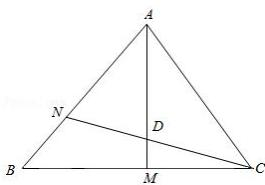

# 第一节 跟踪训练

# 考向 1 跟踪训练

【训练 1】设 M 是平行四边形 ABCD 的对角线的交点，则 $2\overrightarrow{MA} + 3\overrightarrow{MB} + 3\overrightarrow{MC} + 2\overrightarrow{MD} = (\quad)$

$\quad$A. $\overrightarrow{AB}$

$\quad$B. $\overrightarrow{BC}$

$\quad$C. $\overrightarrow{CD}$

$\quad$D. $5\overrightarrow{AB}$

【训练 2】（多选）化简下列各式，结果为 $\vec{0}$ 的是（）

$\quad$A. $\overrightarrow{OA} + \overrightarrow{OD} + \overrightarrow{AD}$

$\quad$B. $\overrightarrow{NQ} +\overrightarrow{QP} +\overrightarrow{MN} -\overrightarrow{MP}$

$\quad$C. $\overrightarrow{AB} + \overrightarrow{BC} + \overrightarrow{CA}$

$\quad$D. $\overrightarrow{AB} +\overrightarrow{AC} -\overrightarrow{DB} -\overrightarrow{CD}$

【训练 3】设向量 $\vec{a}$ ， $\vec{b}$ 不平行，向量 $\lambda\vec{a}+2\vec{b}$ 与 $\vec{a}+3\vec{b}$ 平行，则实数 $\lambda=(\quad)$

$\quad$A. $-\frac{2}{3}$

$\quad$B. $\frac{2}{3}$

$\quad$C. $-\frac{3}{2}$

$\quad$D. $\frac{3}{2}$

【训练 4】已知 $\overrightarrow{e_{1}}$ ， $\overrightarrow{e_{2}}$ 是两个不共线的向量， $\overrightarrow{AB} = \overrightarrow{e_{1}} - 2\overrightarrow{e_{2}}$ ， $\overrightarrow{BC} = 2\overrightarrow{e_{1}} + k\overrightarrow{e_{2}}$ ，若 A，B，C 三点共线，则实数 k 的值为（）

$\quad$A. -4

$\quad$B.-1

$\quad$C. 1

$\quad$D. 4

【训练 5】设 D 为 $\Delta ABC$ 所在平面内一点， $\overrightarrow{BC}=2\overrightarrow{CD}$ ，则（）

$\quad$A. $\overrightarrow{AD} = -\frac{1}{3}\overrightarrow{AB} +\frac{4}{3}\overrightarrow{AC}$

$\quad$B. $\overrightarrow{AD} = -\frac{1}{2}\overrightarrow{AB} +\frac{3}{2}\overrightarrow{AC}$

$\quad$C. $\overrightarrow{AD}=\frac{3}{2}\overrightarrow{AB}+\frac{1}{2}\overrightarrow{AC}$

$\quad$D. $\overrightarrow{AD} = \frac{3}{2}\overrightarrow{AB} -\frac{1}{2}\overrightarrow{AC}$

【训练 6】在 $\Delta ABC$ 中，D 为 AC 上一点且满足 $\overrightarrow{AD} = \frac{1}{2} \overrightarrow{DC}$ ，若 P 为 BD 的中点，且满足 $\overrightarrow{AP} = \lambda \overrightarrow{AB} + \mu \overrightarrow{AC}$ ，则 $\lambda + \mu$ 的值是（）

$\quad$A. $\frac{1}{6}$

$\quad$B. $\frac{1}{2}$

$\quad$C. $\frac{3}{4}$

$\quad$D. $\frac{2}{3}$

【训练7】如图， $\Delta ABC$ 中，点 $M$ 是 $BC$ 的中点，点 $N$ 满足 $\overrightarrow{AN} = 2\overrightarrow{NB}$ ， $AM$ 与 $CN$ 交于点 $D$ ， $\overrightarrow{AD} = \lambda \overrightarrow{AM}$ ，则 $\lambda = (\quad)$

$\quad$A. $\frac{2}{3}$

$\quad$B. $\frac{3}{4}$

$\quad$C. $\frac{4}{5}$

$\quad$D. $\frac{5}{6}$

