# 6.2 数量积

# 考向 1 利用内积公式求解问题

# 题型 1 求模长、夹角和内积

# 1. 基底的定义

如果 $e_{1}$ 、 $e_{2}$ 是同一平面内的两个不共线向量，那么对于这一平面内的任一向量 a，有且仅有一对实数 $\lambda_{1}$ ， $\lambda_{2}$ ，使得 $a = \lambda_{1}e_{1} + \lambda_{2}e_{2}$ 。我们把不共线的向量 $e_{1}$ 、 $e_{2}$ 叫做表示这个平面内所有向量的一组基底。

# 2. 平面向量的直角坐标运算

特殊基底的应用: 非 0 基底向量垂直时, 可利用平面直角坐标系坐标化解题, 在平面直角坐标系内, 分别取与 $x$ 轴、 $y$ 轴正方向相同的两个单位向量 $i$ , $j$ 作为基底, 对平面内任一向量 $a$ , 有且仅有一个实数对 $(x, y)$ , 使得 $a = xi + yj$ , 则实数对 $(x, y)$ 叫做向量 $a$ 的坐标, 记作 $a = (x, y)$ , 其中 $x$ , $y$ 分别叫做 $a$ 在 $x$ 轴、 $y$ 轴上的坐标, 相等向量的坐标相同, 坐标相同的向量是相等向量.

①已知点 $A(x_{1}, y_{1})$ ， $B(x_{2}, y_{2})$ ，则 $\overrightarrow{AB}=(x_{2}-x_{1}, y_{2}-y_{1})$ ， $|\overrightarrow{AB}|=\sqrt{(x_{2}-x_{1})^{2}+(y_{2}-y_{1})^{2}}$   
②已知 $\boldsymbol{a}=(x_{1},y_{1})$ ， $\boldsymbol{b}=(x_{2},y_{2})$ ，则 $\boldsymbol{a}\pm\boldsymbol{b}=(x_{1}\pm x_{2},y_{1}\pm y_{2})$ ， $\lambda\boldsymbol{a}=(\lambda x_{1},\lambda y_{1})$

# 3. 数量积的运算律

已知向量 a 、 b 、 c 和实数 $\lambda$ ，则：

① $a \cdot b = b \cdot a$ ;   
② $(\lambda\boldsymbol{a})\cdot\boldsymbol{b}=\lambda(\boldsymbol{a}\cdot\boldsymbol{b})=\boldsymbol{a}\cdot(\lambda\boldsymbol{b})$ ;   
③ $(\pmb {a} + \pmb {b})\cdot \pmb {c} = \pmb {a}\cdot \pmb {c} + \pmb {b}\cdot \pmb{c}$

# 4. 数量积的坐标运算

已知非零向量 $\boldsymbol{a}=(x_{1},y_{1})$ ， $\boldsymbol{b}=(x_{2},y_{2})$ ， $\theta$ 为向量 a、b 的夹角.

<table><tr><td>结论</td><td>几何表示</td><td>坐标表示</td></tr><tr><td>模</td><td> $|a| = \sqrt{a \cdot a}$ </td><td> $|a| = \sqrt{x^2 + y^2}$ </td></tr><tr><td>数量积</td><td> $a \cdot b = |a||b|\cos\theta$ </td><td> $a \cdot b = x_1x_2 + y_1y_2$ </td></tr><tr><td>夹角</td><td> $\cos\theta = \frac{a \cdot b}{|a||b|}$ </td><td> $\cos\theta = \frac{x_1x_2 + y_1y_2}{\sqrt{x_1^2 + y_1^2} \cdot \sqrt{x_2^2 + y_2^2}}$ </td></tr><tr><td> $a \perp b$ 的充要条件</td><td> $a \cdot b = 0$ </td><td> $x_1x_2 + y_1y_2 = 0$ </td></tr><tr><td> $a//b$ 的充要条件</td><td> $a = \lambda b (b \neq 0)$ </td><td> $x_1y_2 - x_2y_1 = 0$ </td></tr><tr><td> $|a \cdot b|$ 与 $|a||b|$ 的关系</td><td> $|a \cdot b| \leq |a||b|$ (当且仅当 $a // b$ 时等号成立)</td><td> $|x_1x_2 + y_1y_2| \leqslant \sqrt{x_1^2 + y_1^2} \cdot \sqrt{x_2^2 + y_2^2}$ </td></tr></table>

【例 1】（2024•新高考Ⅱ）已知向量 $\vec{a}$ ， $\vec{b}$ 满足： $|\vec{a}|=1$ ， $|\vec{a}+2\vec{b}|=2$ ，且 $(\vec{b}-2\vec{a})\perp\vec{b}$ ，则 $|\vec{b}|=( )$

$\quad$A. $\frac{1}{2}$

$\quad$B. $\frac{\sqrt{2}}{2}$

$\quad$C. $\frac{\sqrt{3}}{2}$

$\quad$D. 1

【例 2】（2020•新课标III）已知向量 $\vec{a}$ ， $\vec{b}$ 满足 $|\vec{a}|=5$ ， $|\vec{b}|=6$ ， $\vec{a}\cdot\vec{b}=-6$ ，则 $\cos<\vec{a}$ ， $\vec{a}+\vec{b}>=()$

$\quad$A. $-\frac{31}{35}$

$\quad$B. $-\frac{19}{35}$

$\quad$C. $\frac{17}{35}$

$\quad$D. $\frac{19}{35}$

【例 3】（2022·乙卷）已知向量 $\vec{a}$ ， $\vec{b}$ 满足 $|\vec{a}|=1$ ， $|\vec{b}|=\sqrt{3}$ ， $|\vec{a}-2\vec{b}|=3$ ，则 $\vec{a}\cdot\vec{b}=(\quad)$

$\quad$A.-2

$\quad$B. -1

$\quad$C. 1

$\quad$D. 2

# 题型 2 利用投影法求范围

（1） 平面向量数量积的定义

已知两个非零向量 $\pmb{a}$ 与 $\pmb{b}$ ，我们把数量 $|\pmb{a}||\pmb{b}|\cos \theta$ 叫做 $\pmb{a}$ 与 $\pmb{b}$ 的数量积（或内积），记作 $\pmb{a} \cdot \pmb{b}$ ，即 $\pmb{a} \cdot \pmb{b} = |\pmb{a}||\pmb{b}|\cos \theta$ ，规定：零向量与任一向量的数量积为0.

（2） 平面向量数量积的几何意义

①向量的投影: $|\mathbf{a}| \cos \theta$ 叫做向量 $\mathbf{a}$ 在 $\mathbf{b}$ 方向上的投影数量, 当 $\theta$ 为锐角时, 它是正数; 当 $\theta$ 为钝角时, 它是负数; 当 $\theta$ 为直角时, 它是 0.

② $a \cdot b$ 的几何意义：数量积 $a \cdot b$ 等于 a 的长度 $|a|$ 与 b 在 a 方向上射影 $|b| \cos \theta$ 的乘积.

【例 1】（2020·山东）已知 P 是边长为 2 的正六边形 ABCDEF 内的一点，则 $\overrightarrow{AP} \cdot \overrightarrow{AB}$ 的取值范围是（）

$\quad$A. $(-2,6)$

$\quad$B. $(-6,2)$

$\quad$C. $(-2,4)$

$\quad$D. $(-4,6)$

【例 2】（2025·湖南模拟）邢台一中数学探索馆中“圆与非圆—搬运”的教具中出现的勒洛三角形是一种典型的定宽曲线，以等边三角形每个顶点为圆心，以边长为半径，在另两个顶点间作一段圆弧，三段圆弧围成的曲边三角形就是勒洛三角形．在如图所示的勒洛三角形中，已知 AB=2，P 为弧 AC 上的一点，且 $\angle PBC = \alpha$ ，则 $\overrightarrow{BP} \cdot \overrightarrow{PC}$ 的最小值为（）

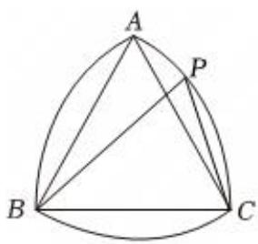

$\quad$A. 0

$\quad$B. $2 \sqrt{3} - 4$

$\quad$C.-2

$\quad$D. 2

# 考向 2 利用坐标转换求解问题

# 题型 1 利用向量平行垂直关系求解

①已知点 $A(x_{1}, y_{1})$ ， $B(x_{2}, y_{2})$ ，则 $\overrightarrow{AB}=(x_{2}-x_{1}, y_{2}-y_{1})$ ， $|\overrightarrow{AB}|=\sqrt{(x_{2}-x_{1})^{2}+(y_{2}-y_{1})^{2}}$   
②已知 $\boldsymbol{a}=(x_{1},y_{1})$ ， $\boldsymbol{b}=(x_{2},y_{2})$ ，则 $\boldsymbol{a}\pm\boldsymbol{b}=(x_{1}\pm x_{2},y_{1}\pm y_{2})$ ， $\lambda\boldsymbol{a}=(\lambda x_{1},\lambda y_{1})$

$\boldsymbol {a} \cdot \boldsymbol {b} = x _ {1} x _ {2} + y _ {1} y _ {2}, \left| a \right| = \sqrt {x _ {1} ^ {2} + y _ {1} ^ {2}}. \quad \boldsymbol {a} / / \boldsymbol {b} \Leftrightarrow x _ {1} y _ {2} - x _ {2} y _ {1} = 0, \quad \boldsymbol {a} \perp \boldsymbol {b} \Leftrightarrow x _ {1} x _ {2} + y _ {1} y _ {2} = 0$

【例 1】（2024•上海）已知 $k \in R$ ， $\vec{a} = (2,5)$ ， $\vec{b} = (6,k), \vec{a} // \vec{b}$ ，则 k 的值为 \_\_\_\_.

【例 2】（2024•新高考 I）已知向量 $\vec{a}=(0,1)$ ， $\vec{b}=(2,x)$ ，若 $\vec{b}\perp(\vec{b}-4\vec{a})$ ，则 $x=(\quad)$

$\quad$A.-2

$\quad$B. -1

$\quad$C. 1

$\quad$D. 2

【例 3】（2025·广东模拟）已知向量 $\vec{a} = (2,1)$ ， $\vec{a} \cdot (\vec{a} + 2\vec{b}) = 7$ ，则 $\vec{b}$ 在 $\vec{a}$ 上的投影向量的坐标为 \_\_\_\_.

【例 4】（2025•福建模拟）已知 $\vec{a}$ ， $\vec{b}$ 是两个非零平面向量， $\vec{a} \perp (3\vec{b} - 2\vec{a})$ ，则 $\vec{b}$ 在 $\vec{a}$ 方向上的投影向量为( )

$\quad$A. $\vec{a}$

$\quad$B. $\frac{1}{2}\vec{a}$

$\quad$C. $\frac{2}{3}\vec{a}$

$\quad$D. $\frac{1}{3}\vec{a}$

# 题型 2 特殊几何图形与建系法求解

# 1. 常见特殊几何图形的建系处理

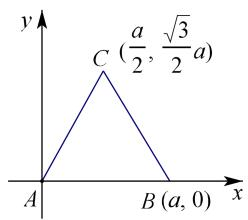

边长为 $a$ 的等边三角形

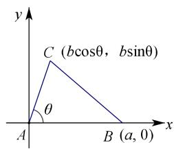

已知夹角的任意三角形

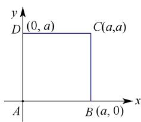

正方形

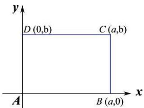

矩形

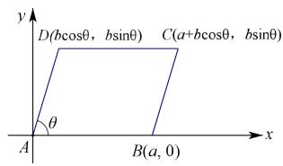

平行四边形

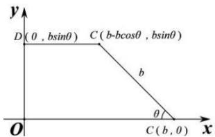

直角梯形

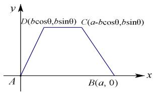

等腰梯形

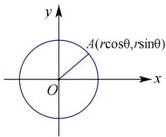

圆

对于向量中的特殊几何图形的数量积问题，我们可以参考以上图形的建系方法来转换成坐标运算降低思维难度，注意向量的代数问题也可以设坐标来表示，从而转化为函数或者不等式去求取值范围.

【例 1】(2022·北京) 在 $\Delta ABC$ 中，AC = 3，BC = 4， $\angle C = 90^{\circ}$ 。P 为 $\Delta ABC$ 所在平面内的动点，且 PC = 1，则 $\overrightarrow{PA} \cdot \overrightarrow{PB}$ 的取值范围是（）

$\quad$A. $[-5, 3]$

$\quad$B. $[-3, 5]$

$\quad$C. $[-6, 4]$

$\quad$D. $[-4, 6]$

【例 2】（2024·天津）已知正方形 ABCD 的边长为 1， $\overrightarrow{DE}=2\overrightarrow{EC}$ . 若 $\overrightarrow{BE}=\lambda\overrightarrow{BA}+\mu\overrightarrow{BC}$ ，其中 $\lambda,\mu$ 为实数，则 $\lambda+\mu=$ \_\_\_\_；设 F 是线段 BE 上的动点，G 为线段 AF 的中点，则 $\overrightarrow{AF}\cdot\overrightarrow{DG}$ 的最小值为 \_\_\_\_。

【例 3】已知点 A，点 B，点 P 都在单位圆上，且 $\left|AB\right|=\sqrt{3}$ ，则 $\overrightarrow{PA}\cdot\overrightarrow{PB}$ 的取值范围是（）

$\quad$A. $\left[-\frac{1}{2},\frac{3}{2}\right]$

$\quad$B. $[-1, 3]$

$\quad$C. $[-2, 3]$

$\quad$D. $[-1, 2]$

# 题型 3 极化恒等式

##### 2. 极化恒等式

$\vec {a} \cdot \vec {b} = \frac {1}{4} (\vec {a} + \vec {b}) ^ {2} - (\vec {a} - \vec {b}) ^ {2}$

在 $\triangle ABC$ 中，若 $AM$ 是 $\triangle ABC$ 的 $BC$ 边中线，有以下两个重要的向量关系： $\left\{ \begin{array}{l} \overrightarrow{AM} = \frac{1}{2} (\overrightarrow{AC} + \overrightarrow{AB}) \\ \overrightarrow{BM} = \frac{1}{2} (\overrightarrow{AC} - \overrightarrow{AB}) \end{array} \right.$

定理 1 平行四边形两条对角线的平分和等于两条邻边平分和的两倍. 以此类推到三角形, 若 AM 是 $\Delta ABC$ 的中线, 则 $AB^{2} + AC^{2} = 2\left(AM^{2} + BM^{2}\right)$ .

定理2 在 $\Delta ABC$ 中，若 $M$ 是 $BC$ 的中点，则有 $\overrightarrow{AB} \cdot \overrightarrow{AC} = \overrightarrow{AM}^2 - \frac{1}{4}\overrightarrow{BC}^2 = \overrightarrow{AM}^2 - \overrightarrow{BM}^2$ .

向量数量积问题中，夹角未知，向量动点变化，极化恒等式具有重要的作用.

【例 1】（2025·吉林模拟）在△ABC中，BC=10，M为BC中点，AM=4，则 $\overrightarrow{AB}\cdot\overrightarrow{AC}=(\quad)$

$\quad$A.-9

$\quad$B. -16

$\quad$C. 9

$\quad$D. 16

【例 2】窗花是贴在窗纸或窗户玻璃上的剪纸，是中国古老的传统民间艺术之一，每年新春佳节，我国许多地区的人们都有贴窗花的习俗，以此达到装点环境、渲染气氛的目的，并寄托着辞旧迎新、接福纳祥的愿望．图 1 是一张由卷曲纹和回纹构成的正六边形剪纸窗花，已知图 2 中正六边形 $ABCDEF$ 的边长为 $2\sqrt{3}$ ，圆 $O$ 的圆心为正六边形的中心，半径为 2，若点 $P$ 在正六边形的边上运动， $MN$ 为圆的直径，则 $\overrightarrow{PM} \cdot \overrightarrow{PN}$ 的取值范围是（）

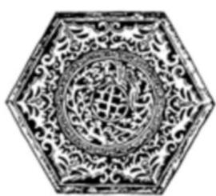

图1

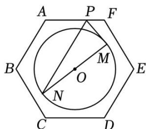

图2

$\quad$A. $[5, 8]$

$\quad$B. $[2, 3]$

$\quad$C. $[\frac{5}{2}, 4]$

$\quad$D. $\left[\frac{3}{2},3\right]$

# 考向 3 奔驰定理与向量四心

# 题型 1 奔驰定理

##### 1. 奔驰定理---解决面积比例问题

重心定理：三角形三条中线的交点.

已知 $\triangle ABC$ 的顶点 $A(x_{1},y_{1}),B(x_{2},y_{2}),C(x_{3},y_{3})$ ，则 $\triangle ABC$ 的重心坐标为 $G(\frac{x_1 + x_2 + x_3}{3},\frac{y_1 + y_2 + y_3}{3}).$

注意：（1）在 $\triangle ABC$ 中，若 $O$ 为重心，则 $\overrightarrow{OA} +\overrightarrow{OB} +\overrightarrow{OC} = \overrightarrow{0}$

（2） 三角形的重心分中线两段线段长度比为 $2:1$ ，且分的三个三角形面积相等.

重心的向量表示： $\overrightarrow{AG}=\frac{1}{3}\overrightarrow{AB}+\frac{1}{3}\overrightarrow{AC}$

奔驰定理： $\lambda_{1}\cdot\overrightarrow{OA}+\lambda_{2}\cdot\overrightarrow{OB}+\lambda_{3}\cdot\overrightarrow{OC}=\overrightarrow{0}$ ，则 $\triangle AOB$ 、 $\triangle AOC$ 、 $\triangle BOC$ 的面积之比等于 $\lambda_{3}:\lambda_{2}:\lambda_{1}$

奔驰定理证明：

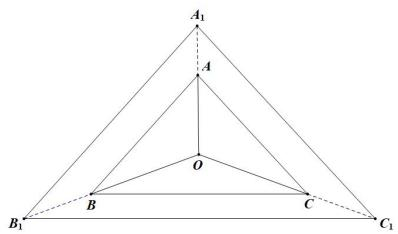

奔驰定理最直观的体现就是以中心 O 为起点引出的三个向量, 每个向量与其对面的三角形面积构成的向量数乘之和为 0.

【例 1】已知点 O 为 $\Delta ABC$ 内一点，且 $\overrightarrow{OA} + 2\overrightarrow{OB} + 3\overrightarrow{OC} = \overrightarrow{0}$ ，则 $\Delta AOB$ 、 $\Delta AOC$ 、 $\Delta BOC$ 的面积之比等于（）

$\quad$A. 9:4:1

$\quad$B. 1:4:9

$\quad$C. 3:2:1

$\quad$D. 1:2:3

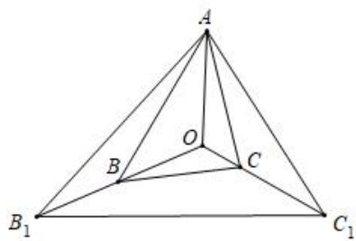

# 题型 2 外心向量定理

外心：三条边垂直平分线的交点，外心到三个顶点的距离相等，即 $\left|\overrightarrow{OA}\right|=\left|\overrightarrow{OB}\right|=\left|\overrightarrow{OC}\right|$ ;

（1） $\overrightarrow{AO} \cdot \overrightarrow{AB} = \frac{1}{2}\left|\overrightarrow{AB}\right|^2, \quad \overrightarrow{AO} \cdot \overrightarrow{AC} = \frac{1}{2}\left|\overrightarrow{AC}\right|^2; \quad \overrightarrow{BO} \cdot \overrightarrow{BC} = \frac{1}{2}\left|\overrightarrow{BC}\right|^2;$   
（2） $\overrightarrow{AO} \cdot \overrightarrow{AF} = \frac{1}{4}\left|\overrightarrow{AB}\right|^2 + \frac{1}{4}\left|\overrightarrow{AC}\right|^2,\quad \overrightarrow{BO} \cdot \overrightarrow{BE} = \frac{1}{4}\left|\overrightarrow{AB}\right|^2 + \frac{1}{4}\left|\overrightarrow{BC}\right|^2,\quad \overrightarrow{CO} \cdot \overrightarrow{CD} = \frac{1}{4}\left|\overrightarrow{BC}\right|^2 + \frac{1}{4}\left|\overrightarrow{AC}\right|^2;$   
（3） $\overrightarrow{AO} \cdot \overrightarrow{BC} = \frac{1}{2}\left|\overrightarrow{AC}\right|^2 - \frac{1}{2}\left|\overrightarrow{AB}\right|^2,\quad \overrightarrow{BO} \cdot \overrightarrow{AC} = \frac{1}{2}\left|\overrightarrow{BC}\right|^2 - \frac{1}{2}\left|\overrightarrow{BA}\right|^2,\quad \overrightarrow{CO} \cdot \overrightarrow{AB} = \frac{1}{2}\left|\overrightarrow{BC}\right|^2 - \frac{1}{2}\left|\overrightarrow{AC}\right|^2.$

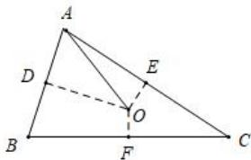

证明：

推论：

【例 2】在 $\Delta ABC$ 中，AC=3，AB=1，O 是 $\Delta ABC$ 的外心，则 $\overrightarrow{BC} \cdot \overrightarrow{AO}$ 的值为（）

$\quad$A. 8

$\quad$B. 6

$\quad$C. 4

$\quad$D. 3

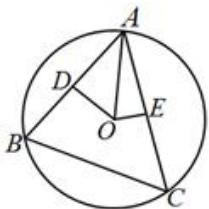

# 题型 3 垂心定理

若 $AD$ 为三角形 $ABC$ 底边 $BC$ 上的高，P为高AD上任意一点，则一定有 $\overrightarrow{AP} \cdot \overrightarrow{PB} = \overrightarrow{AP} \cdot \overrightarrow{PC}$

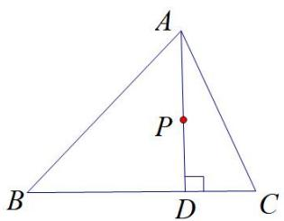

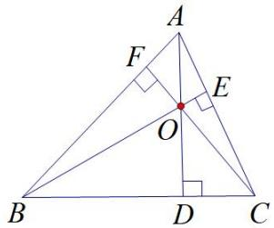

证明：

垂心定理：三角形三边上的高相交于一点（如图右），故点 $O$ 是 $\Delta ABC$ 的垂心，

则一定有 $\overrightarrow{OA} \cdot \overrightarrow{OB} = \overrightarrow{OB} \cdot \overrightarrow{OC} = \overrightarrow{OC} \cdot \overrightarrow{OA}$ .

$\overrightarrow{OA}$ $\overrightarrow{OB}$ $\overrightarrow{OC}$ $\overrightarrow{OB}$ $\overrightarrow{OB}$ $(\overrightarrow{OA}$ $\overrightarrow{OC}) = 0$ $\overrightarrow{OB}$ $\overrightarrow{CA} = 0$ ，即 $\overrightarrow{OB} \perp \overrightarrow{CA}$ ，以此类推即可证明.

垂心的向量乘积定理：

如下图，若 $O$ 是 $\Delta ABC$ 的垂心，G是边BC所在直线上的一点，则 $\overrightarrow{AB} \cdot \overrightarrow{AC} = \overrightarrow{AO} \cdot \overrightarrow{AC} = \overrightarrow{AO} \cdot \overrightarrow{AB} = \overrightarrow{AO} \cdot \overrightarrow{AG}$

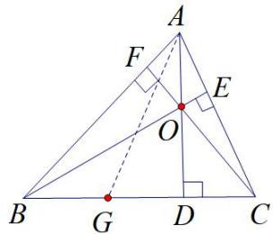

证明：

推论：

【例 3】在 $\Delta ABC$ 中， $\overrightarrow{OA} \cdot \overrightarrow{OB} = \overrightarrow{OB} \cdot \overrightarrow{OC} = \overrightarrow{OC} \cdot \overrightarrow{OA}$ ，D 为 BC 边上一点（不含端点）， $\overrightarrow{AB} \cdot \overrightarrow{AC} = \frac{\sqrt{3}}{2}$ ，则 $\overrightarrow{AO} \cdot \overrightarrow{AD} = (\quad)$

$\quad$A. 1

$\quad$B. $\sqrt{3}$

$\quad$C. $\frac{\sqrt{3}}{2}$

$\quad$D. 2

# 题型 4 角平分线向量定理

若 $\overrightarrow{OA} = \vec{a}$ ， $\overrightarrow{OB} = \vec{b}$ ，则 $\angle AOB$ 平分线上的向量 $\overrightarrow{OM}$ 为 $\lambda (\frac{\vec{a}}{|\vec{a}|} +\frac{\vec{b}}{|\vec{b}|})$ ， $\lambda$ 由 $\overrightarrow{OM}$ 决定

角平分线定理证明： $\frac{\vec{a}}{|\vec{a}|}$ 和 $\frac{\vec{b}}{|\vec{b}|}$ 分别为 $\overrightarrow{OA}$ 和 $\overrightarrow{OB}$ 方向上的单位向量， $\frac{\vec{a}}{|\vec{a}|} + \frac{\vec{b}}{|\vec{b}|}$ 是以 $\frac{\vec{a}}{|\vec{a}|}$ 和 $\frac{\vec{b}}{|\vec{b}|}$ 为一组邻边的平行四边形过 $O$ 点的的一条对角线，而此平行四边形为菱形，故 $\frac{\vec{a}}{|\vec{a}|} + \frac{\vec{b}}{|\vec{b}|}$ 在 $\angle AOB$ 平分线上，但 $\angle AOB$ 平分线上的向量 $\overrightarrow{OM}$ 终点的位置由 $\overrightarrow{OM}$ 决定. 当 $\lambda = 1$ 时，四边形 $OAMB$ 构成以 $\angle AOB = 120^{\circ}$ 的菱形. 内心定理

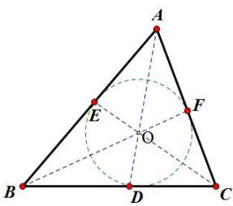

（1） 角平分线的交点，到三条边的距离相等；  
（2） $\overrightarrow{OA} \cdot a + \overrightarrow{OB} \cdot b + \overrightarrow{OC} \cdot c = 0$ ;

证明：

推论：

【例 4】（多选）如图．P 为 $\Delta ABC$ 内任意一点，角 A，B，C 的对边分别为 a，b，c，总有优美等式 $S_{\Delta PBC} \overrightarrow{PA} + S_{\Delta PAC} \overrightarrow{PB} + S_{\Delta PAB} \overrightarrow{PC} = \vec{0}$ 成立，因该图形酷似奔驰汽车车标，故又称为奔驰定理．则以下命题是真命题的有（）

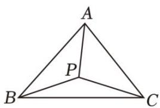

$\quad$A. 若 $P$ 是 $\Delta ABC$ 的重心, 则有 $\overrightarrow{PA} + \overrightarrow{PB} + \overrightarrow{PC} = \overrightarrow{0}$   
$\quad$B. 若 $a\overrightarrow{PA} + b\overrightarrow{PB} + c\overrightarrow{PC} = \vec{0}$ 成立，则 $P$ 是 $\Delta ABC$ 的内心  
$\quad$C. 若 $\overrightarrow{AP} = \frac{2}{5}\overrightarrow{AB} +\frac{1}{5}\overrightarrow{AC}$ ，则 $S_{\triangle ABP}:S_{\triangle ABC} = 2:5$   
$\quad$D. 若 $P$ 是 $\Delta ABC$ 的外心， $A = \frac{\pi}{4}$ ， $\overrightarrow{PA} = m\overrightarrow{PB} + n\overrightarrow{PC}$ ，则 $m + n \in [-\sqrt{2}, 1)$

# 题型 2 向量四心的轨迹问题

【例 1】已知 O 是三角形 ABC 所在平面内一定点，动点 P 满足 $\overrightarrow{OP} = \overrightarrow{OA} + \lambda \left( \frac{|AB| \cdot \overrightarrow{AB}}{\sin C} + \frac{|AC| \cdot \overrightarrow{AC}}{\sin B} \right)$ ， $\lambda \in R$ ，则 P 点的轨迹一定通过三角形 ABC 的 \_\_\_\_ 心.

【例 2】已知 O 是三角形 ABC 所在平面内一定点，动点 P 满足

$\overrightarrow{OP} = \overrightarrow{OA} + \lambda \left( \frac{\overrightarrow{AB}}{|\overrightarrow{AB}| \cos B} + \frac{\overrightarrow{AC}}{|\overrightarrow{AC}| \cos C} \right)$ ， $\lambda \in (0, +\infty)$ ，则动点 $P$ 的轨迹一定通过 $\Delta ABC$ 的 \_\_\_\_ 心.

【例 3】已知 O 是三角形 ABC 所在平面内一定点，动点 P 满足

$\overrightarrow{OP} = \frac{\overrightarrow{OB} + \overrightarrow{OC}}{2} + \lambda \left( \frac{\overrightarrow{AB}}{|\overrightarrow{AB}| \cos B} + \frac{\overrightarrow{AC}}{|\overrightarrow{AC}| \cos C} \right), \lambda \in [0, +\infty)$ ，则动点 $P$ 的轨迹一定通过 $\Delta ABC$ 的 \_\_\_\_ 心.

【例 4】已知 O 是锐角 $\Delta ABC$ 所在平面内的一定点，动点 P 满足：

$\overrightarrow{OP}=\overrightarrow{OA}+\lambda(\frac{\overrightarrow{AB}}{|\overrightarrow{AB}^{2}|\sin\angle ABC}+\frac{\overrightarrow{AC}}{|AC|^{2}\sin\angle ACB})$ ， $\lambda\in(0,+\infty)$ ，则动点P的轨迹一定通过 $\Delta ABC$ 的\_\_\_\_心.

【例 5】（多选）在 $\Delta ABC$ 中，AB = AC = 3，BC = 4，O 为 $\Delta ABC$ 内的一点，

设 $\overrightarrow{AO} = \lambda \overrightarrow{AB} + \mu \overrightarrow{AC}$ ，则下列说法正确的是()

$\quad$A. 若 $O$ 为 $\Delta ABC$ 的重心，则 $\lambda + \mu = \frac{2}{3}$

$\quad$B. 若 $O$ 为 $\Delta ABC$ 的内心，则 $\lambda + \mu = \frac{2}{5}$

$\quad$C. 若 $O$ 为 $\Delta ABC$ 的外心，则 $\lambda + \mu = \frac{9}{10}$

$\quad$D. 若 $O$ 为 $\Delta ABC$ 的垂心，则 $\lambda + \mu = \frac{1}{5}$

# 拓展思维

# 拓展 1 矩形大法

如图，在矩形ABCD中，若对角线AC和BD交于点O，P为平面内任意一点，有以下两个重要的向量关系：① $PA^{2}+PC^{2}=PB^{2}+PD^{2}$ ；② $\overrightarrow{PA}\cdot\overrightarrow{PC}=\overrightarrow{PB}\cdot\overrightarrow{PD}.$

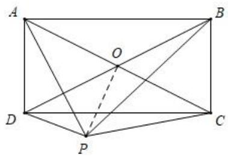

证明：

【例 1】（2013·重庆卷）在平面内， $\overrightarrow{AB_{1}}\perp\overrightarrow{AB_{2}}$ ， $\left|\overrightarrow{OB_{1}}\right|=\left|\overrightarrow{OB_{2}}\right|=1$ ， $\overrightarrow{AP}=\overrightarrow{AB_{1}}+\overrightarrow{AB_{2}}$ 若 $\left|\overrightarrow{OP}\right|<\frac{1}{2}$ ，则 $\left|\overrightarrow{OA}\right|$ 的取值范围是（）

$\quad$A. $\left[0,\frac{\sqrt{5}}{2}\right)$

$\quad$B. $\left(\frac{\sqrt{5}}{2},\frac{\sqrt{7}}{2}\right]$

$\quad$C. $\left(\frac{\sqrt{5}}{2},\sqrt{2}\right]$

$\quad$D. $\left(\frac{\sqrt{7}}{2},\sqrt{2}\right]$

【例 2】(2012·江西卷) 在 $Rt\triangle ABC$ 中，点 D 是斜边 AB 的中点，点 P 为线段 CD 的中点，则 $\frac{\left|PA\right|^{2}+\left|PB\right|^{2}}{\left|PC^{2}\right|}$ 等于（）

$\quad$A. 2

$\quad$B. 4

$\quad$C. 5

$\quad$D. 10

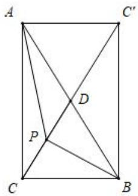

# 拓展 2 隐圆问题

极化恒等式向量乘积型： $\overrightarrow{PA}\cdot\overrightarrow{PB}=\lambda$

平面内，若 A, B 为定点，且 $\overrightarrow{PA} \cdot \overrightarrow{PB} = \lambda$ ，则 P 的轨迹是以 AB 中点 M 为圆心， $\sqrt{\lambda + \frac{1}{4} AB^{2}}$ 为半径的圆。
证明：

【例 1】（2017•江苏）在平面直角坐标系 xOy 中， $A(-12,0)$ ， $B(0,6)$ ，点 P 在圆 O: $x^{2} + y^{2} = 50$ 上，若 $\overrightarrow{PA} \cdot \overrightarrow{PB} \leq 20$ ，则 P 的横坐标范围是 \_\_\_\_.

# 与向量模和向量数量积构成隐圆

【例 2】已知平面向量 $\vec{a}$ ， $\vec{b}$ ， $\vec{c}$ 满足对任意 $x \in R$ 都有 $|\vec{a} - x\vec{b}| \geq |\vec{a} - \vec{b}|$ ， $|\vec{a} - x\vec{c}| \geq |\vec{a} - \vec{c}|$ 成立， $|\vec{a} - \vec{c}| = |\vec{b} - \vec{c}| = 1$ ， $|\vec{a} - \vec{b}| = \sqrt{3}$ ，则 $|\vec{a}|$ 的值为（）

$\quad$A. 1

$\quad$B. $\sqrt{3}$

$\quad$C. 2

$\quad$D. $\sqrt{7}$

【例 3】（2008•浙江卷）已知 $\vec{a}$ ， $\vec{b}$ 是平面内两个互相垂直的单位向量，若向量 c 满足 $(a-c)\cdot(b-c)=0$ ，则 $|\overrightarrow{c}|$ 的最大值是（）

$\quad$A. 1

$\quad$B. 2

$\quad$C. $\sqrt{2}$

$\quad$D. $\frac{\sqrt{2}}{2}$

【例 4】（2018•浙江）已知 $\vec{a}$ ， $\vec{b}$ ， $\vec{e}$ 是平面向量， $\vec{e}$ 是单位向量。若非零向量 $\vec{a}$ 与 $\vec{e}$ 的夹角为 $\frac{\pi}{3}$ ，向量 $\vec{b}$ 满足 $\vec{b}^{2}-4\vec{e}\cdot\vec{b}+3=0$ ，则 $|\vec{a}-\vec{b}|$ 的最小值是（）

$\quad$A. $\sqrt{3} - 1$

$\quad$B. $\sqrt{3} + 1$

$\quad$C. 2

$\quad$D. $2 - \sqrt{3}$

