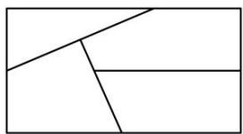
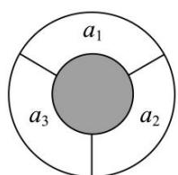
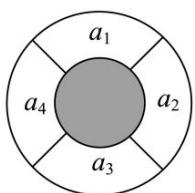
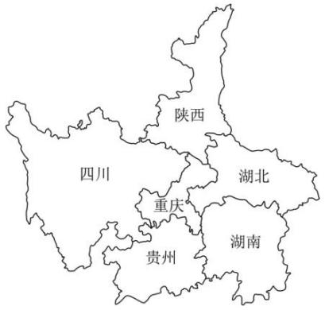
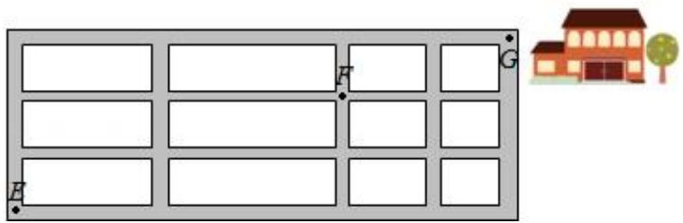
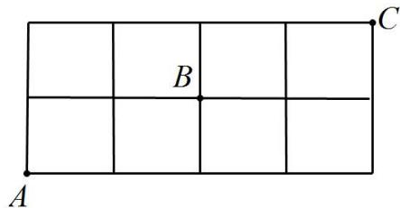

# 第一节 跟踪训练

### 题型 1

【训练 1】 $5A_{5}^{2}+4C_{4}^{2}=$ （）

$\quad$A. 74

$\quad$B. 98

$\quad$C. 124

$\quad$D. 148

【训练 2】已知 $A_{14}^{m}=14\times13\times12\times\cdots\times5$ ，那么 m=（）

$\quad$A. 5

$\quad$B. 9

$\quad$C. 10

$\quad$D. 11

【训练 3】解不等式: $A_{9}^{x}>6A_{9}^{x-2}$ .

### 题型 2

【训练 1】已知 $C_{17}^{2x}=C_{17}^{x+2}(x\in\mathbb{N}^{*})$ ，求 x.

【训练2】若 $\frac{1}{\mathrm{C}_5^m} -\frac{1}{\mathrm{C}_6^m} = \frac{7}{10\mathrm{C}_7^m}$ ，求 $C_8^m$

### 题型 3

【训练 1】要为 5 位同学和 2 位老师拍照留念，要求排成一排，且 2 位老师相邻，不同的排法有\_\_\_\_种.

【训练 2】2023 年 5 月 21 日，中国羽毛球队在 2023 年苏迪曼杯世界羽毛球混合团体锦标赛决赛中以总比分 3:0 战胜韩国队，实现苏迪曼杯三连冠．甲、乙、丙、丁、戊五名球迷赛后在现场合影留念，其中甲、乙均不能站左端，且甲、丙必须相邻，则不同的站法共有（）

$\quad$A. 18 种

$\quad$B. 24 种

$\quad$C. 30 种

$\quad$D. 36 种

### 题型 4

【训练 1】一排有 7 个空座位，有 3 人各不相邻而坐，则不同的坐法共有（）

$\quad$A. 120 种

$\quad$B. 60 种

$\quad$C. 40 种

$\quad$D. 20 种

【训练 2】张老师要进行年度体检，有抽血、腹部彩超、胸部 CT、心电图、血压测量等五个项目，为了体检数据的准确性，抽血必须作为第一个项目完成，而张老师决定腹部彩超和胸部 CT 两项不连在一起检查，则不同的检查方案一共有 \_\_\_\_ 种.

【训练 3】要排一个有 5 个独唱节目和 3 个舞蹈节目的节目单，如果舞蹈节目不在排头，且任何两个舞蹈节目不相邻，则不同的排法总数为\_\_\_\_。

### 题型 5

【训练 1】（2023•甲卷）有五名志愿者参加社区服务，共服务星期六、星期天两天，每天从中任选两人参加服务，则两天中恰有 1 人连续参加两天服务的选择种数为( )

$\quad$A. 120

$\quad$B. 60

$\quad$C. 40

$\quad$D. 30

【训练 2】某旅游团计划去湖南旅游，该旅游团从长沙、衡阳、郴州、株洲、益阳这 5 个城市中选择 4 个（选择的 4 个城市按照到达的先后顺序分别记为第一站、第二站、第三站、第四站），且第一站不去株洲，则该旅游团四站的城市安排共有（）

$\quad$A. 96 种

$\quad$B. 84 种

$\quad$C. 72 种

$\quad$D. 60 种

【训练 3】要排出某班一天中语文，数学，政治，英语，体育，艺术 6 门课各一节的课程表，要求数学课排在前 3 节，英语课不排在第 6 节，则不同的排法种数为（）

$\quad$A. 24

$\quad$B. 72

$\quad$C. 144

$\quad$D. 288

【训练 4】从编号为 1, 2, 3, 4, 5 的 5 个球中任取 4 个，放在编号为 A, B, C, D 的 4 个盒子里，每盒一球，且 2 号球不能放在 B 盒中的不同的方法数是（）

$\quad$A. 24

$\quad$B. 48

$\quad$C. 54

$\quad$D. 96

### 题型6

【训练 1】某高中从 3 名男教师和 2 名女教师中选出 3 名教师，派到 3 个不同的乡村支教，要求这 3 名教师中男女都有，则不同的选派方案共有 \_\_\_\_ 种.

【训练 2】（2018•新课标 I）从 2 位女生，4 位男生中选 3 人参加科技比赛，且至少有 1 位女生入选，则不同的选法共有 \_\_\_\_ 种。（用数字填写答案）

# 题型7

【训练 1】把 6 名实习生分配到 7 个车间实习,共有 \_\_\_\_ 种不同的分法.

### 题型8

【训练 1】某校计划选拔 4 名学生参加科技创新大赛.现从 3 名女生、5 名男生中进行选择，要求队伍中至少包含男、女生各 1 名，则不同选法的总数为（）

$\quad$A. 65

$\quad$B. 60

$\quad$C. 35

$\quad$D. 30

【训练 2】（2023·甲卷）有五名志愿者参加社区服务，共服务星期六、星期天两天，每天从中任选两人参加服务，则两天中恰有 1 人连续参加两天服务的选择种数为( )

$\quad$A. 120

$\quad$B. 60

$\quad$C. 40

$\quad$D. 30

【训练 3】（2020•山东）6 名同学到甲、乙、丙三个场馆做志愿者，每名同学只去 1 个场馆，甲场馆安排 1 名，乙场馆安排 2 名，丙场馆安排 3 名，则不同的安排方法共有（）

$\quad$A. 120 种

$\quad$B. 90 种

$\quad$C. 60 种

$\quad$D. 30 种

### 题型9

【训练 1】中国空间站（China Space Station）的主体结构包括天和核心舱、问天实验舱和梦天实验舱。2022年10月31日15:37分，我国将“梦天实验舱”成功送上太空，完成了最后一个关键部分的发射，“梦天实验舱”也和“天和核心舱”按照计划成功对接，成为“T”字形架构，我国成功将中国空间站建设完毕。2023年，中国空间站将正式进入运营阶段．假设空间站要安排甲、乙等6名航天员开展实验，三舲中每个舱中都有2人，则不同的安排方法有（）

$\quad$A. 72 种

$\quad$B. 90 种

$\quad$C. 360 种

$\quad$D. 540 种

【训练 1】2023 年是巩固脱贫攻坚成果的重要一年，某县为响应国家政策，选派了 6 名工作人员到 A、B、C 三个村调研脱贫后的产业规划，每个村至少去 1 人，不同的安排方式共有（）种.

$\quad$A. 540

$\quad$B. 480

$\quad$C. 360

$\quad$D. 240

### 题型 10

【训练 1】（2021•乙卷）将 5 名北京冬奥会志愿者分配到花样滑冰、短道速滑、冰球和冰壶 4 个项目进行培训，每名志愿者只分配到 1 个项目，每个项目至少分配 1 名志愿者，则不同的分配方案共有（）

$\quad$A. 60 种

$\quad$B. 120 种

$\quad$C. 240 种

$\quad$D. 480 种

【训练 2】（2020·海南）要安排 3 名学生到 2 个乡村做志愿者，每名学生只能选择去一个村，每个村里至少有一名志愿者，则不同的安排方法共有（）

$\quad$A. 2 种

$\quad$B. 3 种

$\quad$C. 6种

$\quad$D. 8 种

【训练 3】（2017•新课标 II）安排 3 名志愿者完成 4 项工作，每人至少完成 1 项，每项工作由 1 人完成，则不同的安排方式共有（）

$\quad$A. 36 种

$\quad$B. 24 种

$\quad$C. 18种

$\quad$D. 12 种

### 题型 11

【训练 1】书架上某层有 8 本书，新买 2 本插进去，要保持原有 8 本书的顺序，则有 \_\_\_\_ 种不同的插法（具体数字作答）

【训练 2】城步苗族自治县“六月六山歌节”是湖南省四大节庆品牌之一，至今已举办 25 届.假设在即将举办的第 26 届“六月六山歌节”中，组委会要在原定排好的 10 个“本土歌舞”节目中增加 2 个“歌王对唱”节目.若保持原来 10 个节目的相对顺序不变，则不同的排法种数为（）

$\quad$A. 110

$\quad$B. 144

$\quad$C. 132

$\quad$D. 156

### 题型 12

【训练 1】某高校举行一场智能机器人大赛.该高校理学院获得 8 个参赛名额.已知理学院共有 4 个班，每个班至少要有一个参赛名额，则该理学院参赛名额的分配方法共有（）

$\quad$A. 20 种

$\quad$B. 21 种

$\quad$C. 28 种

$\quad$D. 35 种

### 题型 13

【训练 1】某国际旅行社现有 11 名对外翻译人员，其中有 5 人只会英语，4 人只会法语，2 人既会英语又会法语，现从这 11 人中选出 4 人当英语翻译，4 人当法语翻译，则共有（）种不同的选法

$\quad$A. 225

$\quad$B. 185

$\quad$C. 145

$\quad$D. 110

### 题型 14

【训练 1】用 6 种不同的颜色给如图所示的地图上色,要求相邻两块涂不同的颜色,则不同的涂色方法有()

$\quad$A. 240

$\quad$B. 360

$\quad$C. 480

$\quad$D. 600

【训练2】一个同心圆形花坛，分为两部分，中间小圆部分种植草坪和绿色灌木，周围的圆环分为 $n (n \geq 3, n \in \mathbb{N}^*)$ 等份，种植红、黄、蓝三种颜色不同的花，要求相邻两部分种植不同颜色的花.

  
（1）

  
（2）

（1） 如图 （1）, 圆环分成 3 等份, 分别为 $a_{1}, a_{2}, a_{3}$ , 则有 \_\_\_\_ 种不同的种植方法;  
（2） 如图 （2）, 圆环分成 4 等份, 分别为 $a_{1}, a_{2}, a_{3}, a_{4}$ , 则有 \_\_\_\_ 种不同的种植方法.

【训练 3】重庆位于中国西南部、长江上游地区，地跨青藏高原与长江中下游平原的过渡地带．东邻湖北、湖南，南靠贵州，西接四川，北连陕西．现用 4 种颜色标注 6 个省份的地图区域，相邻省份地图颜色不相同，则共有\_\_\_\_种涂色方式.

### 题型 15

【训练 1】编号为 1, 2, 3, 4 的四位同学，分别就座于编号为 1, 2, 3, 4 的四个座位上，每位座位恰好坐一位同学，则恰有两位同学编号和座位编号一致的坐法种数为 \_\_\_\_.

### 题型 16

【训练1】有10个人围着一张圆桌坐成一圈，共有多少种不同的坐法？

### 题型 17

【训练1】马路上有编号为1，2，3...，9九只路灯，现要关掉其中的三盏，但不能关掉相邻的二盏或三盏，也不能关掉两端的两盏，求满足条件的关灯方案有多少种？

### 题型 18

【训练 1】（2016•新课标 II）如图，小明从街道的 E 处出发，先到 F 处与小红会合，再一起到位于 G 处的老年公寓参加志愿者活动，则小明到老年公寓可以选择的最短路径条数为( )

$\quad$A. 24

$\quad$B. 18

$\quad$C. 12

$\quad$D. 9

【训练2】某小区的道路网如图所示，则由 $A$ 到 $C$ 的最短路径中，经过 $B$ 的走法有（）

$\quad$A. 6 种

$\quad$B. 8 种

$\quad$C. 9 种

$\quad$D. 10 种

### 题型 19

【训练 1】已知 0, 1, 2, 3, 4, 5, 6 共 7 个数字.

（1）可以组成多少个没有重复数字的四位数?  
（2）可以组成多少个没有重复数字的四位偶数?  
（3）可以组成多少个没有重复数字且能被5整除的四位数？（结果用数字作答）

【训练 2】（2018•浙江）从 1, 3, 5, 7, 9 中任取 2 个数字，从 0, 2, 4, 6 中任取 2 个数字，一共可以组成\_\_\_\_个没有重复数字的四位数。（用数字作答）.

