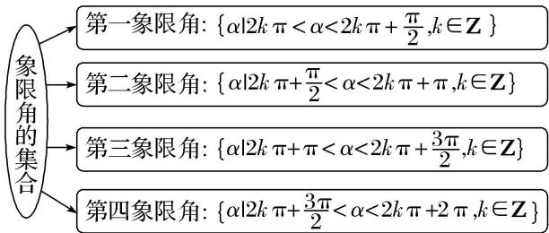
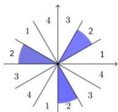
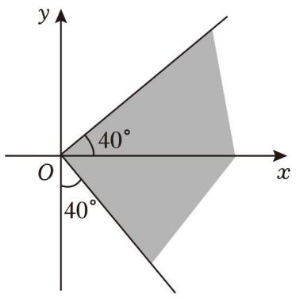
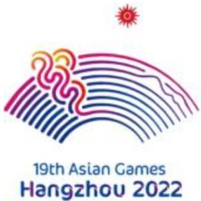
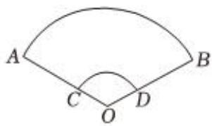
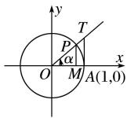
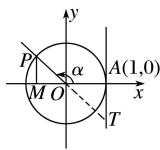
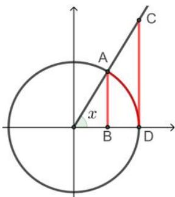

# 4.1 基本公式

# 考向 1 三角函数基本概念

# 题型 1 任意角与象限角

# 1. 角的概念

（1）任意角：①定义：角可以看成平面内一条射线绕着端点从一个位置旋转到另一个位置所成的图形；

②分类：角按旋转方向分为正角、负角和零角.

（2）所有与角 $\alpha$ 终边相同的角，连同角 $\alpha$ 在内，构成的角的集合是 $S=\left\{\beta\mid\beta=k\cdot360^{\circ}+\alpha,k\in Z\right\}$ .

（3） 象限角: 使角的顶点与原点重合, 角的始边与 $x$ 轴的非负半轴重合, 那么角的终边在第几象限, 就说这个角是第几象限角; 如果角的终边在坐标轴上, 就认为这个角不属于任何一个象限.

（4） 象限角的集合表示方法:

（5） 八卦图法判断 $\frac{\alpha}{n}$ 的象限

① 每个象限平分n份；② 从x轴上方逆时针开始标数；③ 找到 $\alpha$ 所在象限数字.

##### 例：判断 $\frac{\alpha}{3}$ 的象限( $\alpha$ 是第二象限的角)

① 每个象限平分 3 份；② 从 x 轴上方逆时针开始标数；③ 找到 $\alpha$ 所在象限数字“2”.

【例 1】下列角中与 $-\frac{5\pi}{4}$ 终边相同的是()

$\quad$A. $-\frac{\pi}{4}$

$\quad$B. $\frac{3\pi}{4}$

$\quad$C. $\frac{\pi}{4}$

$\quad$D. $\frac{5\pi}{4}$

【例 2】已知 $\alpha$ 为第三象限角，则 $\frac{\alpha}{2}$ 所在的象限是()

$\quad$A. 第一或第二象限

$\quad$B. 第二或第三象限

$\quad$C. 第一或第三象限

$\quad$D. 第二或第四象限

【例 3】如图所示，终边落在阴影部分区域（包括边界）的角 $\alpha$ 的集合是 \_\_\_\_.

# 题型 2 弧度制与扇形公式

（1） 定义: 把长度等于半径长的弧所对的圆心角叫做 1 弧度的角, 用符号 rad 表示, 读作弧度. 正角的弧度数是一个正数, 负角的弧度数是一个负数, 零角的弧度数是 0.

（2）角度制和弧度制的互化： $180^{\circ}=\pi rad$ ， $1^{\circ}=\frac{\pi}{180}rad$ ， $1rad=\frac{180^{\circ}}{\pi}$ .

（3）扇形的弧长公式： $l=\left|\alpha\right|\cdot r$ ，扇形的面积公式： $S=\frac{1}{2}lr=\frac{1}{2}\left|\alpha\right|\cdot r^{2}$

【例 1】如图是杭州 2023 年第 19 届亚运会会徽，名为 “潮涌”，主体图形由扇面、钱塘江、钱江潮头、赛道、互联网符号及象征亚奥理事会的太阳图形六个元素组成，集古典美和现代美于一体，富有东方神韵和时代气息。其中扇面的圆心角为 $120^{\circ}$ ，从里到外半径以 1 递增，若这些扇形的弧长之和为 $90 \pi$ （扇形视为连续弧长，中间没有断开），则最小扇形的半径为（）

$\quad$A. 6

$\quad$B. 8

$\quad$C. 9

$\quad$D. 12

【例 2】扇子是引风用品，夏令必备之物．我国传统扇文化源远流长，是中华文化的一个组成部分．历史上最早的扇子是一种礼仪工具，后来慢慢演变为纳凉、娱乐、观赏的生活用品和工艺品．扇子的种类较多，受大众喜爱的有团扇和折扇．如图1是一把折扇，是用竹木做扇骨，用特殊纸或线绢做扇面而制成的．完全打开后的折扇为扇形（如图2），若图2中 $\angle AOB = \theta$ ， $C$ ， $D$ 分别在 $OA$ ， $OB$ 上， $AC = BD = m$ ， $\widehat{AB}$ 的长为 $l$ ，则该折扇的扇面 $ABDC$ 的面积为（）

图1

图2

$\quad$A. $\frac{m(l-\theta)}{2}$

$\quad$B. $\frac{m(l - \theta m)}{2}$

$\quad$C. $\frac{m(2l-\theta)}{2}$

$\quad$D. $\frac{m(2l-\theta m)}{2}$

# 考向 2 三角函数线

# 题型 1 任意角的三角函数

# 1. 任意角的三角函数

（1）定义：任意角 $\alpha$ 的终边与单位圆交于点 $P(x, y)$ 时，则 $\sin\alpha = y$ ， $\cos\alpha = x$ ， $\tan\alpha = \frac{y}{x} (x \neq 0)$ .

（2）推广：三角函数坐标法定义中，若取点 $P(x, y)$ 是角 $\alpha$ 终边上异于顶点的任一点，设点 $P$ 到原点 $O$ 的距离为 $r$ ，则 $\sin \alpha = \frac{y}{r}$ ， $\cos \alpha = \frac{x}{r}$ ， $\tan \alpha = \frac{y}{x} (x \neq 0)$

三角函数的性质如下表:

<table><tr><td>三角函数</td><td>定义域</td><td>第一象限符号</td><td>第二象限符号</td><td>第三象限符号</td><td>第四象限符号</td></tr><tr><td>sin α</td><td>R</td><td>+</td><td>+</td><td>-</td><td>-</td></tr><tr><td>cos α</td><td>R</td><td>+</td><td>-</td><td>-</td><td>+</td></tr><tr><td>tan α</td><td>{α|α≠kπ+π/2,k∈Z}</td><td>+</td><td>-</td><td>+</td><td>-</td></tr></table>

记忆口诀：三角函数值在各象限的符号规律：一全正、二正弦、三正切、四余弦.

# 2. 三角函数线

如下图，设角 $\alpha$ 的终边与单位圆交于点 $P$ ，过 $P$ 作 $PM \perp x$ 轴，垂足为 $M$ ，过 $A(1,0)$ 作单位圆的切线与 $\alpha$ 的终边或终边的反向延长线相交于点 $T$ .

<table><tr><td>三角函数线</td><td colspan="4"> (I)  (II) (III) (IV)有向线段MP为正弦线;有向线段OM为余弦线;有向线段AT为正切线</td></tr></table>

【例 1】已知角 $\alpha$ 的终边经过点 $(-4,3)$ ，则 $\cos\alpha=(\quad)$

$\quad$A. $\frac{4}{5}$

$\quad$B. $\frac{3}{5}$

$\quad$C. $-\frac{3}{5}$

$\quad$D. $-\frac{4}{5}$

【例 2】已知角 $\alpha$ 的终边过点 $P(3,m)$ ，且 $\sin\alpha=-\frac{4}{5}$ ，则 m 的值为()

$\quad$A.-3

$\quad$B. 3

$\quad$C. -4

$\quad$D. 4

# 题型 2 三角函数线

【例 1】若 $0 < x < \frac{\pi}{2}$ , 证明 $\sin x < x < \tan x$ .

# 考向 3 同角三角函数的基本关系

# 题型 1 弦切互化求值

# 1. 同角三角函数的基本关系

（1）平方关系： $\sin^{2}\alpha+\cos^{2}\alpha=1$ 。（2）商数关系： $\frac{\sin\alpha}{\cos\alpha}=\tan\alpha(\alpha\neq\frac{\pi}{2}+k\pi)$ ;

规律：利用 $\sin^{2}\alpha + \cos^{2}\alpha = 1$ 可以实现角 $\alpha$ 的正弦、余弦的互化，利用 $\frac{\sin\alpha}{\cos\alpha} = \tan\alpha$ 可以实现角 $\alpha$ 的弦切互化.

##### 2. “ $\sin \alpha + \cos \alpha, \sin \alpha \cos \alpha, \sin \alpha - \cos \alpha$ ” 方程思想知一求二

$\begin{array}{l} (\sin \alpha + \cos \alpha) ^ {2} = \sin^ {2} \alpha + \cos^ {2} \alpha + 2 \sin \alpha \cos \alpha = 1 + \sin 2 \alpha \\ (\sin \alpha + \cos \alpha) ^ {2} + (\sin \alpha - \cos \alpha) ^ {2} = 2. \end{array} \quad (\sin \alpha - \cos \alpha) ^ {2} = \sin^ {2} \alpha + \cos^ {2} \alpha - 2 \sin \alpha \cos \alpha = 1 - \sin 2 \alpha$

【注意】 $\sin\alpha+\cos\alpha$ 与 $\sin\alpha-\cos\alpha$ 的符号由 $\sin\alpha\cos\alpha$ 决定.

（1）若 $\sin\alpha\cos\alpha>0$ 则 $\alpha$ 在第一、三象限；（2）若 $\sin\alpha\cos\alpha<0$ 则 $\alpha$ 在第二、四象限.

# 3. 同角三角函数其次式

（1）弦切互化法：主要利用公式 $\tan x = \frac{\sin x}{\cos x}$ 进行切化弦或弦化切  
（2） $\frac{a\sin x + b\cos x}{c\sin x + d\cos x}$ 同除以 $\cos x$ ， $a\sin^2 x + b\sin x\cos x + c\cos^2 x$ 除以1，在除以 $\cos^2 x$ 等类型可进行弦化切.

【例 1】（2023·甲卷）“ $\sin^{2}\alpha+\sin^{2}\beta=1$ ”是“ $\sin\alpha+\cos\beta=0$ ”的（）

$\quad$A. 充分条件但不是必要条件  
$\quad$B. 必要条件但不是充分条件  
$\quad$C. 充要条件  
$\quad$D. 既不是充分条件也不是必要条件

【例 2】（2023•乙卷）若 $\theta\in(0,\frac{\pi}{2})$ ， $\tan\theta=\frac{1}{3}$ ，则 $\sin\theta-\cos\theta=$ \_\_\_\_.

【例 3】（多选）已知 $\alpha \in (0, \pi)$ ，且 $\sin \alpha + \cos \alpha = \frac{1}{5}$ ，则（）

$\quad$A. $\frac{\pi}{2} < \alpha < \pi$

$\quad$B. $\sin \alpha \cos \alpha = -\frac{12}{25}$

$\quad$C. $\cos\alpha-\sin\alpha=\frac{7}{5}$

$\quad$D. $\cos \alpha -\sin \alpha = -\frac{7}{5}$

# 题型 2 齐次化思想

【例 1】（2021•新高考 I）若 $\tan\theta=-2$ ，则 $\frac{\sin\theta(1+\sin2\theta)}{\sin\theta+\cos\theta}=(\quad)$

$\quad$A. $-\frac{6}{5}$

$\quad$B. $-\frac{2}{5}$

$\quad$C. $\frac{2}{5}$

$\quad$D. $\frac{6}{5}$

【例 2】已知 $\frac{3\pi}{4}<\alpha<\pi,\quad\tan\alpha+\frac{1}{\tan\alpha}=-\frac{10}{3}$ .

（1）求 $\tan \alpha$ 的值；  
（2） 求 $\frac{\sin\alpha + \cos\alpha}{\sin\alpha - \cos\alpha}$ 的值;  
（3）求 $2\sin^{2}\alpha-\sin\alpha\cos\alpha-3\cos^{2}\alpha$ 的值.

# 考向 4 三角函数诱导公式

# 题型 1 利用诱导公式化简

##### 1. 三角函数诱导公式

<table><tr><td>公式</td><td>一</td><td>二</td><td>三</td><td>四</td><td>五</td><td>六</td></tr><tr><td>角</td><td> $2k\pi + \alpha (k \in Z)$ </td><td> $\pi + \alpha$ </td><td> $-\alpha$ </td><td> $\pi - \alpha$ </td><td> $\frac{\pi}{2} - \alpha$ </td><td> $\frac{\pi}{2} + \alpha$ </td></tr><tr><td>正弦</td><td> $\sin \alpha$ </td><td> $-\sin \alpha$ </td><td> $-\sin \alpha$ </td><td> $\sin \alpha$ </td><td> $\cos \alpha$ </td><td> $\cos \alpha$ </td></tr><tr><td>余弦</td><td> $\cos \alpha$ </td><td> $-\cos \alpha$ </td><td> $\cos \alpha$ </td><td> $-\cos \alpha$ </td><td> $\sin \alpha$ </td><td> $-\sin \alpha$ </td></tr><tr><td>正切</td><td> $\tan \alpha$ </td><td> $\tan \alpha$ </td><td> $-\tan \alpha$ </td><td> $-\tan \alpha$ </td><td></td><td></td></tr><tr><td>口诀</td><td colspan="4">函数名不变,符号看象限</td><td colspan="2">函数名改变,符号看象限</td></tr></table>

$\sin \left(k \cdot \frac {\pi}{2} + \alpha\right) = \left\{ \begin{array}{l} (- 1) ^ {\frac {k}{2}} \sin \alpha , n \text {为偶数} \\ (- 1) ^ {\frac {k + 1}{2}} \cos \alpha , n \text {为奇数} \end{array} , \cos \left(k \cdot \frac {\pi}{2} + \alpha\right) = \left\{ \begin{array}{l} (- 1) ^ {\frac {k}{2}} \cos \alpha , n \text {为偶数} \\ (- 1) ^ {\frac {k + 1}{2}} \sin \alpha , n \text {为奇数} \end{array} \right. \right.$

【记忆口诀】“奇变偶不变，符号看象限”中的奇、偶是指 $k \cdot \frac{\pi}{2} \pm \alpha (k \in Z)$ 中的 $k$ 是奇数还是偶数，看象限时把 $\alpha$ 看作锐角.

当 $k$ 为奇数时，函数发生改变，如 $\cos \theta$ 变成 $\sin \theta$ ；当 $k$ 为偶数时，函数不发生改变，如 $\cos \theta$ 仍是 $\cos \theta$ 。

【例 1】已知角 $\theta$ 终边经过点 $(1,-2)$ ，则 $\frac{\sin(\frac{\pi}{2}+\theta)+2\sin(\pi+\theta)}{\cos(\pi-\theta)+\sin(2\pi-\theta)}$ 的值为（）

$\quad$A. -5

$\quad$B. 5

$\quad$C. $-\frac{5}{3}$

$\quad$D. $\frac{5}{3}$

【例 2】已知 $f(x)=\frac{\cos(\pi-x)\sin(\pi+x)}{\sin^{2}(\pi-x)-1}$ ，则 $f(\frac{2023\pi}{6})=(\quad)$

$\quad$A. $\sqrt{3}$

$\quad$B. $-\sqrt{3}$

$\quad$C. $\frac{\sqrt{3}}{3}$

$\quad$D. $-\frac{\sqrt{3}}{3}$

# 题型 2 利用诱导公式求值

【例 1】 $\sin750^{\circ}+\tan240^{\circ}$ 的值是()

$\quad$A. $\frac{3\sqrt{3}}{2}$

$\quad$B. $\frac{\sqrt{3}}{2}$

$\quad$C. $\frac{1}{2} +\sqrt{3}$

$\quad$D. $-\frac{1}{2} + \sqrt{3}$

【例 2】已知 $\sin\left(\frac{\pi}{3}-x\right)=-\frac{3}{5}$ ，则 $\cos\left(x+\frac{\pi}{6}\right)$ 等于（）

$\quad$A. $\frac{3}{5}$

$\quad$B. $\frac{4}{5}$

$\quad$C. $-\frac{3}{5}$

$\quad$D. $-\frac{4}{5}$

【例 3】设 $\sin 23^{\circ} = m$ ，则 $\tan 67^{\circ} = (\quad)$

$\quad$A. $-\frac{m}{\sqrt{1 - m^2}}$

$\quad$B. $\frac{m}{\sqrt{1-m^{2}}}$

$\quad$C. $\sqrt{\frac{1}{m^2} - m}$

$\quad$D. $\sqrt{\frac{1}{m^2} - 1}$

